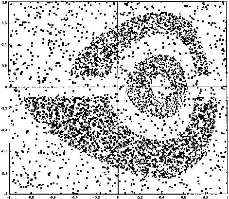
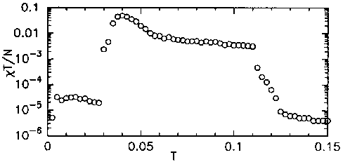
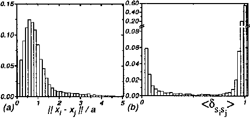
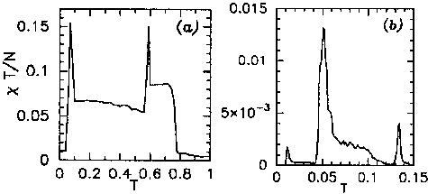

# Superparamagnetic Clustering of Data

Marcelo Blatt, Shai Wiseman, and Eytan Domany

Department of Physics of Complex Systems, The Weizmann Institute of Science, Rehovot 76100, Israel

*Physical Review Letters* 76(18):3251–3254 (1996). doi: 10.1103/PhysRevLett.76.3251

PACS numbers: 05.70.Fh, 02.50.Rj, 89.70.+c

---

We present a new approach for clustering, based on the physical properties of an inhomogeneous ferromagnetic model. We do not assume any structure of the underlying distribution of the data. A Potts spin is assigned to each data point and short range interactions between neighboring points are introduced. Spin-spin correlations, measured (by Monte Carlo procedure) in a superparamagnetic regime in which aligned domains appear, serve to partition the data points into clusters. Our method outperforms other algorithms for toy problems as well as for real data.

---

Many natural phenomena can be viewed as optimization processes, and the drive to understand and analyze them yielded powerful mathematical methods. Thus when wishing to solve a hard optimization problem, it may be advantageous to identify a related physical problem, for which these methods can be used. In recent years there has been significant interest in adapting numerical [1] as well as analytic [2,3] techniques from statistical physics to provide algorithms and estimates for good approximate solutions to hard optimization problems [4].

Cluster analysis is an important technique in exploratory data analysis. Partitional clustering methods, that divide the data according to natural classes present in it, have been used in a large variety of engineering and scientific disciplines such as pattern recognition [5], learning [6], and astrophysics [7].

The problem of partitional clustering can be formally stated as follows. With every one of $i = 1, 2, \ldots, N$ patterns represented as a point $\mathbf{x}_i$ in a $d$-dimensional metric space, determine the partition of these $N$ points into $M$ groups, called clusters, such that points in a cluster are more similar to each other than to points in different clusters. The value of $M$ also has to be determined.

The two main approaches to partitional clustering are called parametric and nonparametric. In parametric approaches some knowledge of the clusters' structure is assumed (e.g., each cluster can be represented by a center and a spread around it). This assumption is incorporated in a global criterion. The goal is to assign the data points to clusters so that the criterion is minimized. Typical examples are variance minimization [8] and maximum likelihood [9]. In the last three years many parametric partitional cluster algorithms rooted in statistical physics were presented [8–10].

However, when there is no a priori knowledge about the data structure, it is more natural to adopt nonparametric methods, using a local criterion to build clusters by utilizing local structure of the data (e.g., by identifying high-density regions [11] in the data space). In the present work we use a physical problem as an analog to that of nonparametric clustering, analyzing it by the methodology of statistical physics.

Clusters appear naturally in Potts models [12–14] as regions of aligned spins. Indeed, Fukunaga's previously proposed method [11] can be formulated as a Metropolis relaxation of a ferromagnetic Potts model at $T = 0$. The relaxation process terminates at some local minimum of the energy function, and points with the same spin value are assigned to a cluster. This procedure depends strongly on the initial conditions and is likely to stop at a metastable state that does not correspond to the correct answer. Our method generalizes Fukunaga's by introducing a finite temperature at which the division into clusters is stable and completely insensitive to the initial conditions and complements other, graph based algorithms [15] by providing a clustering criterion which is sensitive to collective features of the data set.

A classification $\{s\}$ is defined by assigning to each point $\mathbf{x}_i$ a label $s_i$ which may take integer values $s_i = 1, \ldots, q$. We define a cost function $\mathcal{H}[\{s\}]$,

$$
\mathcal{H} = -\frac{J_1}{N} \sum_{\mu} \sum_{i < j} \delta_{s_i^\mu, s_j^\mu} - \frac{J_2}{N} \sum_{\mu < \nu} \sum_{i,j} \delta_{s_i^\mu, s_j^\nu} \quad s_i^\nu \in \{1, \ldots, q\} \tag{2}
$$

where $\langle i, j \rangle$ stands for neighboring points $i$ and $j$, and $J_{ij}$ is some positive monotonically decreasing function of the distance $\|\mathbf{x}_i - \mathbf{x}_j\|$, so that the closer two points are to each other, the more they "like" to belong to the same class. This cost function is the Hamiltonian of an inhomogeneous ferromagnetic Potts model [16].

We want to select a good classification using nothing but $\mathcal{H}[\{s\}]$. Taking the usual path in information theory [17], we choose the probability distribution which has the most missing information and yet has some fixed average cost $E$. The resulting probability distribution is that of a Potts system at equilibrium at inverse temperature $\beta$ which is the Lagrange multiplier determining the average energy or cost $E$. Because the cost function (1) is symmetric with respect to a global permutation of all labels, each point is equally likely to belong to any of the $q$ classes. Therefore the only way to extract meaningful information (or to assign clusters) out of the equilibrium probability distribution is through correlations. The average spin-spin correlation function $\langle \delta_{s_i, s_j} \rangle$ is thus used to decide whether or not two spins belong to the same cluster.

As a concrete example, place a Potts spin at each of the data points of Fig. 1. At high temperatures the system is in a disordered (paramagnetic) phase. As the temperature is lowered a transition to a superparamagnetic phase occurs; spins within the same high density region become completely aligned, while different regions remain uncorrelated. As the temperature is further lowered, the effective coupling between the three clusters (induced via the dilute background spins) increases, until they become aligned. Even though this is a pseudotransition (note the finite number of participating clusters) and the transition temperature of the background is much lower, we call this "phase" of aligned clusters ferromagnetic.

This simple qualitative picture is supported by the first example presented in this Letter and by a mean field calculation presented elsewhere [18]. "Real life" examples like the two presented at the end of the Letter have a more complicated structure of transitions and pseudotransitions. Next we give the details of our method.

**(A) Determination of the interactions $J_{ij}$.**—In common with other "local methods," we first determine a local length scale $a$, which we chose to be equal to the average nearest-neighbor distance. The value of $a$ is governed by the high density regions and is smaller than the typical distance between points in the low density regions. Our results depend only weakly on the definition of nearest neighbors. In the example of Fig. 1 we defined neighbors as pairs of points whose Voronoi cells [19] have a common boundary. We set nearest-neighbor

**Figure 1:** The classified data set. Points classified (with $T_\text{clus} = 0.075$ and $\sigma = 0.5$) as belonging to the three largest clusters are marked by crosses, triangles, and x's. Single point clusters are denoted by squares.

$$
J_{ij} = J_{ji} = \frac{1}{\hat{K}} \exp\!\left( -\frac{\|\mathbf{x}_i - \mathbf{x}_j\|^2}{2a^2} \right), \tag{2}
$$

where $\hat{K}$ is the average number of neighbors per site.

**(B) Calculation of thermodynamic quantities.**—The ordering properties of the system are reflected by the susceptibility and the spin-spin correlation function $\langle \delta_{s_i, s_j} \rangle$ (where $\langle \cdots \rangle$ denotes a thermal average). Once the $J_{ij}$ have been determined, these quantities can be obtained by a Monte Carlo procedure. We used the Swendsen-Wang (SW) algorithm [14]; it exhibits much smaller autocorrelation times [14] than standard methods and also provides an improved estimator [20] of the spin-spin correlation function.

**(C) Locating the superparamagnetic phase.**—In order to locate the temperature range in which the system is in the superparamagnetic phase we measure the susceptibility $\chi$ of the system which is proportional to the variance of the magnetization $m$:

$$
\chi = \frac{N}{T}\!\left(\langle m^2 \rangle - \langle m \rangle^2\right), \quad m = \frac{(N_\text{max}/N)\,q - 1}{q - 1}. \tag{3}
$$

Here $N_\text{max} = \max\{N_1, N_2, \ldots, N_q\}$ and $N_\mu$ is the number of spins with the value $\mu$.

At low temperatures the fluctuations of the magnetization are negligible, so the susceptibility $\chi$ is small. At $T_{fs}$, the pseudotransition from the ferromagnetic phase to the superparamagnetic phase, we observed (see Fig. 2) a pronounced peak of $\chi$. In the superparamagnetic phase fluctuations of the superspins or clusters acting as a whole result in a nearly constant susceptibility. As the temperature is further raised to $T_{ps}$, the superparamagnetic to paramagnetic transition, $\chi$ abruptly diminishes by a factor that is roughly the volume of the largest cluster. Thus the temperatures where a maximum of the susceptibility occurs and the temperature at which $\chi$ decreases abruptly can serve as lower and upper bounds, respectively, for the superparamagnetic phase. A surprisingly good initial guess for $T_{ps}$ is provided [18] by $T_\text{est} = \frac{e^2 - 1}{2\,\sqrt{4\ln\!\left(\frac{1}{1-p_q}\right)}}$.

**Figure 2:** Susceptibility $\chi$ as a function of temperature $T$ for the toy problem of Fig. 1, showing the peak at $T_{fs}$ and the abrupt decrease at $T_{ps}$.

**(D) The clustering procedure.**—Our method consists of two main steps. First, we identify the range of temperatures where the clusters appear (in the superparamagnetic phase). Second, at some temperature within this range the correlation of nearest-neighbor spins is measured and used to identify the clusters. The procedure is summarized as follows:

- (a) Assign to each point $\mathbf{x}_i$ a $q$-state Potts spin variable $s_i$ (here we chose $q = 20$).
- (b) Find the nearest neighbors of each point according to a selected criterion (e.g., Voronoi tessellation [19]); measure the average nearest-neighbor distance $a$.
- (c) Calculate the strength of the nearest-neighbor interactions using Eq. (2).
- (d) Use an efficient Monte Carlo procedure [14] with the Hamiltonian (1) to calculate the susceptibility $\chi$.
- (e) Identify the range of temperatures corresponding to the superparamagnetic phase, between $T_{fs}$ (the temperature of maximal $\chi$) and the higher temperature $T_{ps}$ where $\chi$ diminishes abruptly. Cluster assignment is performed at $T_\text{clus} = \frac{T_{fs} + T_{ps}}{2}$.
- (f) Measure at $T = T_\text{clus}$ the spin-spin correlation function $\langle \delta_{s_i, s_j} \rangle$ for all pairs of neighboring points $\mathbf{x}_i$ and $\mathbf{x}_j$.
- (g) Clusters are identified according to a thresholding procedure. If $\langle \delta_{s_i, s_j} \rangle > \sigma$, points $\mathbf{x}_i$, $\mathbf{x}_j$ are defined as "friends." Then all mutual friends (including friends of friends, etc.) are assigned to the same cluster. We chose $\sigma = 0.5$.

**(E) The toy problem.**—Figure 1 contains three dense regions of 2729, 1356, and 1084 points on a dilute background of 831 points. The points are uniformly distributed in each of the regions, but the three dense regions are 10 times denser than the background. Going through steps (a) to (d) we obtained the susceptibility as a function of temperature as presented in Fig. 2. Figure 1 presents the clusters obtained at $T_\text{clus} = 0.075$ using steps (f) and (g). The sizes of the three largest clusters are 2759, 1380, 1097 and the background decomposed into clusters of size 1.

Turning now to the effect of the parameters on the procedure, we found [18] that the number of Potts states $q$ affects the sharpness of the transition [16] and the values of $T_{fs}$ and $T_{ps}$. The higher $q$, the sharper the transition, but the influence of $q$ on cluster assignment is very weak. Also, choosing clustering temperatures $T_\text{clus}$ other than the one suggested in (e) did not change the classification significantly. Classification is not sensitive to the value of the threshold $\sigma$, and values in the range $0.2 < \sigma < 0.9$ yielded similar results. The reason is that the frequency distribution of the values of the spin-spin correlation function exhibits two peaks, one near $1/q$ and the other close to 1, while for intermediate values it is very close to zero, as is shown in Fig. 3(b).

**(F) The Iris data.**—A popular benchmark problem for clustering procedures is the Iris data [5]. It consists of measurement of four quantities, performed on each of 150 flowers. The specimens were chosen from three species of Iris. The data constitute 150 points in four-dimensional space. We determined neighbors according to the mutual $K$ ($K \geq 5$) nearest-neighbors definition, applied our method, and obtained the susceptibility curve of Fig. 4(a); it clearly shows two peaks. When heated, the system first breaks into two clusters at $T \approx 0.1$. At $T_\text{clus} \approx 0.2$ we obtain two clusters, of sizes 80 and 40; points of the smaller cluster correspond to the species *Iris setosa*. At $T \approx 0.6$ another pseudotransition occurs where the larger cluster splits into two. At $T_\text{clus} \approx 0.7$ we identified clusters of sizes 45, 40, and 38, corresponding to the species *Iris versicolor*, *Iris virginica*, and *Iris setosa*, respectively.

**Figure 3:** Frequency distribution of (a) distances between neighboring points of Fig. 1 (scaled by the average distance $a$) and (b) spin-spin correlation functions of neighboring points.

As opposed to the toy problem, the Iris data break into clusters in two stages. This reflects the fact that two of the three species are "closer" to each other than to the third one; our method clearly handles very well such hierarchical organization of the data. 125 samples were classified correctly (as compared with manual classification); 25 were left unclassified. No further breaking of clusters was observed; all three disorder at $T_{ps} \approx 0.8$ (since all three are of about the same density).

**(G) Landsat data [21].**—The following complications arise (in addition to unequal coupling between clusters): (a) the clusters differ in their density, and (b) the density of the points within a cluster is not uniform; it decreases towards the perimeter of the cluster. We analyzed data taken from a satellite image of the Earth consisting of 6437 "pixels," each of which is represented by four spectral bands. The aim is to classify the terrain of each pixel. The susceptibility curve of Fig. 4(b) reveals three pseudotransitions that reflect the presence of the following hierarchy of clusters.

**Figure 4:** Susceptibility $\chi$ as a function of temperature $T$ for (a) the Iris data and (b) the Landsat data. Multiple peaks indicate hierarchical cluster structure.

At the lowest temperature two clusters A and B appear. Cluster A splits at the second pseudotransition into $A_1$ and $A_2$. At the last pseudotransition cluster $A_1$ splits again into four clusters $A_i^1$, $i = 1, \ldots, 4$. At this temperature the clusters $A_2$ and B are no longer identifiable; their spins are in a disordered state, since the density of points in $A_2$ and B is significantly smaller than within the $A_i^1$ clusters. Thus our method overcomes the difficulty of dealing with clusters of different densities by analyzing the data at several temperatures.

To overcome the more difficult problem posed by the fact that the density within the clusters is monotonically decreasing as their perimeter is approached we added a second operation to step (g) of our procedure: we connected each point to the neighbor with which it had the highest correlation. The six large clusters which were identified in this manner, of sizes 1541, 1298, 1066, 563, 407, and 306, match the manually obtained land-use categories. 97% purity was obtained, meaning that points belonging to different categories were almost never assigned to the same cluster.

**(H) Comparison with other nonparametric clustering algorithms.**—The algorithms [11, 15] tested were: valley seeking (Fukunaga), minimal spanning tree (Zahn), K shared neighbors (Jarvis), mutual neighborhood (Gowda), single linkage, complete linkage, minimum variance (Ward), and arithmetic averages (Sokal). The results from all these depend on various parameters in an uncontrolled way; for all methods we used the best result obtained. For the toy problem of (E) above only the single linkage and our method succeeded. The minimal spanning tree obtained the most accurate result for the Iris data, followed by our method, while the remaining clustering techniques failed to provide a satisfactory result. Only Fukunaga's and our method succeeded in recovering the structure of the Landsat data. Fukunaga's method, however, yielded for different (random) initial conditions grossly different answers, while our answer was stable.

The central feature of our method is to change the similarity index of the problem from the interpoint distance $\|\mathbf{x}_i - \mathbf{x}_j\|$ to the spin-spin correlation function $\langle \delta_{s_i, s_j} \rangle$. This new similarity index has the enormous advantage that it is a function of a pair's neighborhood. Two neighboring points in the low density region, with small $\|\mathbf{x}_i - \mathbf{x}_j\|$, are not in the same cluster, while points at the same distance, taken from the dense region, are. The magnetic model and its similarity index are sensitive to collective behavior of the region to which the pair belongs. As shown in Fig. 3(a), the frequency distribution of distances between neighboring points of Fig. 1 does not even hint that a natural cutoff distance, which separates neighboring points into two categories, exists. On the other hand, the frequency distribution of spin-spin correlation function values clearly shows two well-separated peaks (Fig. 3(b)).

We have also shown that our method is successful in real life problems, where existing methods failed to overcome the problems posed by the existence of different density distributions and many characteristic lengths in the data.

## References

- [1] S. Kirkpatrick, C. D. Gelatt, Jr., and M. P. Vecchi, *Science* **220**, 671 (1983).
- [2] Y. Fu and P. W. Anderson, *J. Phys. A* **19**, 1605 (1986).
- [3] M. Mézard and G. Parisi, *J. Phys. (Paris)* **47**, 1285 (1986).
- [4] A. L. Yuille and J. J. Kosowsky, *Neural Comput.* **6**, 341 (1994), and references therein.
- [5] R. O. Duda and P. E. Hart, *Pattern Classification and Scene Analysis* (Wiley, New York, 1973).
- [6] J. Moody and C. J. Darken, *Neural Comput.* **1**, 281 (1989).
- [7] A. Dekel and M. J. West, *Astrophys. J.* **288**, 411 (1985).
- [8] K. Rose, E. Gurewitz, and G. C. Fox, *Phys. Rev. Lett.* **65**, 945 (1990).
- [9] N. Barkai and H. Sompolinsky, *Phys. Rev. E* **50**, 1766 (1994).
- [10] J. M. Buhmann and H. Kühnel, *IEEE Trans. Inf. Theory* **39**, 1133 (1993).
- [11] K. Fukunaga, *Introduction to Statistical Pattern Recognition* (Academic Press, San Diego, 1990).
- [12] C. M. Fortuin and P. W. Kasteleyn, *Physica (Utrecht)* **57**, 536 (1972).
- [13] A. Coniglio and W. Klein, *J. Phys. A* **12**, 2775 (1980).
- [14] S. Wang and R. H. Swendsen, *Physica A* **167**, 565 (1990).
- [15] A. K. Jain and R. C. Dubes, *Algorithms for Clustering Data* (Prentice Hall, Englewood Cliffs, NJ, 1988).
- [16] W. Janke and R. Villanova, "Two-Dimensional 8-State Potts Model on Random Lattices" (unpublished).
- [17] A. Katz, *Principles of Statistical Mechanics* (Freeman, San Francisco, 1967).
- [18] M. Blatt, S. Wiseman, and E. Domany (unpublished).
- [19] B. Joe, *SIAM J. Sci. Comput.* **14**, 1415 (1993).
- [20] F. Niedermayer, *Phys. Lett. B* **237**, 473 (1990).
- [21] Ashwin Srinivasan, UCI repository of machine learning databases (University of California, Irvine), maintained by P. Murphy and D. Aha (1994).
