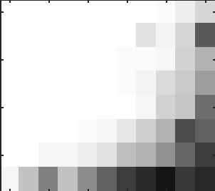
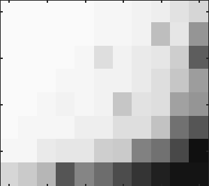

[Page 1]

ShapeFit: Exact location recovery from corrupted pairwise directions

Paul Hand*, Choongbum Lee and Vladislav Voroninski Department of Mathematics, Massachusetts Institute of Technology *Department of Computational and Applied Mathematics, Rice University

Abstract

Let t1,...,tn ∈ Rd and consider the location recovery problem: given a subset of pairwise direction observations {(ti − tj)/ ti − tj 2}i<j∈[n]×[n], where a constant fraction of these observations are arbitrarily corrupted, find {ti}ni=1 up to a global translation and scale. We propose a novel algorithm for the location recovery problem, which consists of a simple convex program over dn real variables. We prove that this program recovers a set of n i.i.d. Gaussian locations exactly and with high probability if the observations are given by an Erdo˝s-R´enyi graph, d is large enough, and provided that at most a constant fraction of observations involving any particular location are adversarially corrupted. We also prove that the program exactly recovers Gaussian locations for d = 3 if the fraction of corrupted observations at each location is, up to poly-logarithmic factors, at most a constant. Both of these recovery theorems are based on a set of deterministic conditions that we prove are sufficient for exact recovery.

# 1 Introduction

Let T be a collection of n distinct vectors t(0)1 ,t(0)2 ,... ,t(0)n ∈ Rd, and let G = ([n],E) be a graph, where [n] = {1,2... ,n}, and E = Eg ⊔ Eb, with Eb and Eg corresponding to pairwise direction observations that are respectively corrupted and uncorrupted. That is, for each ij ∈ E, we are given a vector vij, where

t(0)i − t(0)j t(0)i − t(0)j 2

for ij ∈ Eg, vij ∈ Sd−1 for ij ∈ Eb. (1)

vij =

Thus, an uncorrupted observation vij is exactly the direction of t(0)i relative to t(0)j , and a corrupted observation is an arbitrary unit vector. Consider the task of recovering the locations T up to

a global translation and scale, from only the observations {vij}ij∈E, and without any knowledge about the decomposition E = Eg ⊔ Eb, nor the nature of the pairwise direction corruptions.

A special case of this problem, with d = 3, is a necessary subtask in the Structure from Motion (SfM) pipeline for 3D structure recovery from a collection of images taken from different vantage points, a vital aspect of modern computer vision. In the SfM problem, camera locations and orientations are represented as vectors and rotations in R3, with respect to some global reference frame. Given a collection of images, and for any point in R3, there is a unique perspective projection of it onto each imaging plane. By building local coordinate frames around salient points in the

[Page 2]

given images, based entirely on photometric information, and comparing them across images, one obtains an estimate of a set of point correspondences. That is, one obtains a set of equivalence classes, where each class corresponds to a physical point in 3D space. Given sufficiently many such sets of point correspondences, epipolar geometry and physical constraints yield estimates of the relative directions and orientations between pairs of cameras. Noise in these estimates is inherent to any real-world application, and worse yet, due to intrinsic challenges arising from the image formation process and properties of man-made scenes (illumination changes, specularities, occlusions, shadows, duplicate structures etc), severe outliers in estimated point correspondences and hence relative camera poses are unavoidable.

Once camera locations and orientations are estimated, 3D structure can then be recovered by a process called bundle adjustment [24], which is a simultaneous nonlinear refinement of 3D structure, camera locations, and camera orientations. Bundle-adjustment is a local method, which generally works well when started close to an optimum. Thus, it is critical to obtain accurate camera location and rotation estimates for initialization. SfM therefore consists of three steps: 1) estimating relative camera pose from point correspondences, 2) recovering camera locations and orientations in a global coordinate framework, and 3) bundle adjustment. While the first and third steps have well-founded theories and algorithms, methods for the second step are mostly heuristically motivated.

Several efficient and stable algorithms exist for estimating global camera orientations [9, 6, 2, 18, 7, 22, 11, 4, 8, 4, 10, 17, 20]. Hence, it is standard to recover locations separately based on estimates of the orientations.

There have been many different approaches to location recovery from relative directions, such as least squares [9, 2, 3, 17], second-order cone programs and l∞ methods [13, 17, 18, 14, 21], spectral methods [3], similarity transformations for pair alignment [22], Lie-algebraic averaging [10], markov random fields [5], and several others [22, 25, 20, 12]. Unfortunately, most location recovery algorithms either lack robustness to correspondence errors (which are unavoidable in large unordered datasets), at times produce illegitimate collapsed solutions, or suffer from convergence to local minima, in sum causing large errors in or a complete degradation of, the recovered locations.

There are some recent notable exceptions to the above limitations. An algorithm called 1dSfM [28] focuses on removing outliers by examining inconsistencies along one-dimensional projections, before attempting to recover camera locations. However, one drawback of this method is that it does not reason about self-consistent outliers, which occur due to repetitive structures, commonly found in man-made scenes. Also, Ozyes¸il¨ and Singer propose a convex program over dn + |E| variables for location recovery and empirically demonstrate its robustness to outliers [19]. While both of these methods exhibit favorable empirical performance, they lack theoretical guarantees of robustness to outliers.

In this paper, we propose a novel convex program for location recovery from pairwise direction observations, and prove that this method recovers locations exactly, in the face of adversarial corruptions, and under rather broad technical assumptions. To the best of our knowledge, this is the first theoretical result guaranteeing location recovery in the challenging case of corrupted pairwise direction observations. We also demonstrate that this method performs well empirically, recovering locations exactly under severe corruptions of relative directions, and is stable to the simultaneous presence of noise on all the observations, as well as a fraction of arbitrary corruptions.

## 1.1 Problem formulation

The location recovery problem is to recover a set of points in Rd from observations of pairwise directions between those points. Since relative direction observations are invariant under a global

translation and scaling, one can at best hope to recover the locations T(0) = {t(0)1 ,... ,t(0)n } up

[Page 3]

to such a transformation. That is, successful recovery from {vij}(i,j)∈E is finding a set of vectors {α(t(0)i + w)}i∈[n] for some w ∈ Rd and α > 0. We will say that two sets of n vectors T = {t1,... ,tn} and T(0) are equal up to global translation and scale if there exists a vector w and a scalar α > 0 such that ti = α(t(0)i + w) for all i ∈ [n]. In this case, we will say that T and T(0) have the same ‘shape,’ and we will denote this property as T ∼ T(0). The location recovery problem is then stated as:

Given: G([n],E), {vij}ij∈E satisfying (1) Find: T = {t1,... ,tn} ∈ Rd×n, such that T ∼ T(0) (2)

For this problem to be information theoretically well-posed under arbitrary corruptions, the maximum number of corrupted observations affecting any particular location must be at most n2. Otherwise, suppose that for some location t(0)i , half of its associated observations vij are consistent with t(0)i and the other half are corrupted so as to be consistent with some arbitrary alternative location w. Distinguishing between t(0)i and w is then impossible in general. Formally, let degb(i) be the degree of location i in the graph ([n],Eb). Then well-posedness under adversarial corruption requires that maxi degb(i) ≤ γn for some γ < 1/2.

Beyond the above necessary degree condition on Eg for well-posedness of recovery, we do not assume anything else about the nature of corruptions. That is, we work with adversarially chosen corrupted edges Eb and arbitrary corruptions of observations associated to those edges. To solve the location recovery problem in this challenging setting, we introduce a simple convex program called ShapeFit:

min

{ti}∈Rd,i∈[n]

ij∈E

(ti − tj) 2 subject to

Pv⊥

ij

ti − tj,vij = 1,

ij∈E

n

ti = 0 (3)

i=1

is the projector onto the orthogonal complement of the span of vij.

where Pv⊥

ij

This convex program is a second order cone problem with dn variables and two constraints. Hence, the search space has dimension dn − 2, which is minimal due to the dn degrees of freedom in the locations {ti} and the two inherent degeneracies of translation and scale.

## 1.2 Main results

In this paper, we consider the model where pairwise direction observations about n i.i.d. Gaussian locations are given according to an Erd˝os-Re´nyi random graph. We start by showing that in a high-dimensional setting, ShapeFit exactly recovers the locations with high probability, provided that there are fewer than an exponential number of locations, and provided that at most a fixed fraction of observations are adversarially corrupted.

- Theorem 1. Let G([n],E) be drawn from G(n,p) for some p = Ω(n−1/4). Take t(0)1 ,... t(0)n ∼ N(0,Id×d) to be i.i.d., independent from G. There exists an absolute constant c > 0 and a γ = Ω(p4)

not depending on n, such that if max(2c66, 4c33 log3 n) ≤ n ≤ e16cd and d = Ω(1), then there exists an event with probability at least 1 − e−n1/6 − 13e−12cd, on which the following holds:

For arbitrary subgraphs Eb satisfying maxi degb(i) ≤ γn and arbitrary pairwise direction corruptions vij ∈ Sd−1 for ij ∈ Eb, the convex program (3) has a unique minimizer equal to α t(0)i − t¯(0)

i∈[n] for some positive α and for t¯(0) = n1 i∈[n] t(0)i .

[Page 4]

This probabilistic recovery theorem is based on a set of deterministic conditions that we prove are sufficient to guarantee exact recovery. These conditions are satisfied with high probability in the model described above. See Section 2.1 for the deterministic conditions.

This recovery theorem is high-dimensional in the sense that the probability estimate and the exponential upper bound on n are only meaningful for d = Ω(1). Concentration of measure in high dimensions and the upper bound on n ensure control over the angles and distances between random points. As a result, lower dimensional spaces are a more challenging regime for recovery.

Our other main result is in the physically relevant setting of three-dimensional Euclidean space, where for instance the locations correspond to camera locations. In this setting, we prove that exact recovery holds for any sufficiently large number of locations, provided that a poly-logarithmically small fraction of observations are adversarially corrupted.

- Theorem 2. There exists n0 ∈ N and c ∈ R such that the following holds for all n ≥ n0. Let G([n],E) be drawn from G(n,p) for some p = Ω(n−1/5 log3/5 n). Take t(0)1 ,... t(0)n ∈ R3, where t(0)i ∼ N(0,I3×3) are i.i.d., independent from G. There exists γ = Ω(p5/log3 n) and an event of probability at least 1 − n14 on which the following holds:

For arbitrary subgraphs Eb satisfying maxi degb(i) ≤ γn and arbitrary pairwise direction corruptions vij ∈ S2 for ij ∈ Eb, the convex program (3) has a unique minimizer equal to α t(0)i − t¯(0)

i∈[n] for some positive α and for t¯(0) = n1 i∈[n] t(0)i .

Numerical simulations empirically verify the main message of these recovery theorems: ShapeFit recovers a set of locations exactly from corrupted direction observations, provided that up to a constant fraction of the observations at each location are corrupted. We present numerical studies in the setting of locations in R3, with an underlying random Erd˝os-Re´nyi graph of observations. Further numerical simulations show that recovery is stable to the additional presence of noise on the uncorrupted measurements. That is, locations are recovered approximately under such conditions, with a favorable dependence of the estimation error on the measurement noise.

## 1.3 Intuition.

ShapeFit is a convex program that seeks a set of points whose pairwise directions agree with as many of the corresponding observations as possible. The objective, ij∈E Pv⊥

(ti − tj) 2, incentivizes the correct shape, while permitting translation and a possibly-negative global scale. Each term

ij

(ti − tj) 2 is a length-scaled notion for how rotated ti − tj is relative to ±vij. The objective is in this sense a measure of how much total rotation is needed to deform all {ti − tj}ij∈E into the observed directions of {±vij}. Successful recovery would mean that { Pv⊥

Pv⊥

ij

(ti −tj) 2}ij∈E is sparse. Motivated by the sparsity promoting properties of ℓ1-minimization, the objective in ShapeFit is precisely the ℓ1 norm over the edges E(G) of these ℓ2 lengths.

ij

The first constraint in ShapeFit, ij∈E ti − tj,vij = 1, requires that the recovered locations correlate with the provided observations by a strictly positive amount. It prevents the trivial solution and resolves the global scale ambiguity. As opposed to the objective, this constraint

forbids negative scalings of {t(0)i }i∈[n]. The second constraint, ni=1 ti = 0, resolves the global translation ambiguity.

[Page 5]

## 1.4 Organization of the paper

- Section 1.5 presents the notation used throughout the rest of the paper. Section 2 presents the proof of Theorem 1. Section 3 presents the proof of Theorem 2. Section 4 presents results from numerical simulations.

## 1.5 Notation

Let [n] = {1,... ,n}. Let ei be the ith standard basis element. Let Kn be the complete graph on n vertices. Let E(Kn) be the set of edges in Kn. Let · 2 be the standard ℓ2 norm on a vector. For any nonzero vector v, let vˆ = v/ v 2. For a subspace W, let PW be the orthogonal projector onto W. For a vector v, let Pv⊥ be the orthogonal projector onto the orthogonal complement of the span of {v}.

Let T denote the set T = {ti}i∈[n], for ti ∈ Rd. Define tij = ti − tj for all distinct i,j ∈ [n]. We define µ∞ = maxi =j t(0)ij 2, and we define µ = |E(1G)| ij∈E(G) t(0)ij 2. Define t¯ = n1 i∈[n] ti. Define t(0)ij , T(0), and t(0) similarly. For a scalar c, let cT = {cti}i∈[n]. For a given G = G([n],E) and {vij}ij∈E, where vij ∈ Rd have unit norm, let R(T) = ij∈E Pv⊥

(ti − tj) 2. Let L(T) = ij∈E ti − tj,vij . Let ℓij = ti − tj,vij , and similarly for ℓ(0)ij . In this notation, ShapeFit is

ij

R(T) subject to L(T) = 1, t¯= 0

min

T

For vectors v1,... ,vk, let S(v1,... ,vk) = span(v1,... ,vk) be the vector space spanned by these vectors. Given tij and t(0)ij , define δij, ηij, and sij such that

tij = (1 + δij)t(0)ij + ηijsij

where sij is a unit vector orthogonal to t(0)ij and ηij = Pt(0)⊥

tij 2. Note that ηij ≥ 0.

ij

# 2 Proof of high dimensional recovery

The proof of Theorem 1 can be separated into two parts: a recovery guarantee under a set of deterministic conditions, and a proof that the random model meets these conditions with high probability. These sufficient deterministic conditions, roughly speaking, are (1) that the graph is connected and the nodes have tightly controlled degrees; (2) that the angles between pairs of locations is uniformly bounded away from 0 and π; (3) that all pairwise distances are within a constant factor of each other; (4) that there are not too many corruptions affecting any single location; and (5) that the locations are ‘well-distributed’ relative to each other in a sense we will make precise. Theorem 3 in Section 2.1 states these deterministic conditions formally.

We will prove the deterministic recovery theorem directly, using several geometric properties concerning how deformations of a set of points induce rotations. Note that an infinitesimal rigid rotation of two points {ti,tj} about their midpoint to {ti + hi,tj + hj} is such that hi − hj is orthogonal to tij = ti − tj. We will abuse terminology and say that Pt⊥

(hi − hj) is a measure

ij

of the rotation in a finite deformation {hi,hj}, and we say that hi − hj,ti − tj is the amount of stretching in that deformation. Using this terminology, the geometric properties we establish are:

- • If a deformation stretches two adjacent sides of a triangle at different rates, then that induces a rotation in some edge of the triangle (Lemma 2).

[Page 6]

- • If a deformation stretches two nonadjacent sides of a tetrahedron at different rates, then that induces a rotation in some edge of the tetrahedron (Lemma 3).
- • If a deformation rotates one edge shared by many triangles, then it induces a rotation over many of those triangles, provided the opposite points of those triangles are ‘well-distributed’ (Lemma 4).
- • A deformation that rotates bad edges, must also rotate good edges (Lemma 5).
- • For any deformation, some fraction of the sum of all rotations must affect the good edges (Lemma 6).

By using these geometric properties, we show that all nonzero feasible deformations induce a large amount of total rotation. Since some fraction of the total rotation must be on the good edges, the objective must increase.

In Section 2.1, we present the deterministic recovery theorem. In Section 2.2, we present and prove Lemmas 2–3. In Section 2.3, we present and prove Lemmas 4–6. In Section 2.4, we prove the deterministic recovery theorem. In Section 2.5, we prove that Gaussians satisfy several properties, including well-distributedness, with high probability. In Section 2.6, we prove that Erd˝os-Re´nyi graphs are connected and have controlled degrees and codegrees with high probability. Finally, in

- Section 2.7, we prove Theorem 1.

- 2.1 Deterministic recovery theorem in high dimensions To state the deterministic recovery theorem, we need two definitions.

- Definition 1. We say that a graph G([n],E) is p-typical if it satisfies the following properties:

- 1. G is connected,
- 2. each vertex has degree between 12np and 2np, and

- 3. each pair of vertices has codegree between 12np2 and 2np2, where the codegree of a pair of vertices i,j is defined as |{k ∈ [n] : ik,jk ∈ E(G)}|.

Note that if G is p-typical, then its number of edges is between 14n2p and n2p.

- Definition 2. Let T = {ti}i∈[n] ⊆ Rd be a set of n vectors. Let G be a graph with vertex set [n].

- (i) For a pair of vectors x,y ∈ Rd and a positive real number c, we say that T is c-well-distributed with respect to (x,y) if the following holds for all h ∈ Rd:

t∈T

Pspan{t−x,t−y}⊥(h) 2 ≥ c|T| · P(x−y)⊥(h) 2.

- (ii) We say that T is c-well-distributed along G if for all distinct i,j ∈ [n], the set Sij = {tk : ik,jk ∈ E(G)} is c-well-distributed with respect to (ti,tj).

We now state sufficient deterministic recovery conditions on the graph G, the subgraph Eb corresponding to corrupted observations, and the locations T(0).

- Theorem 3. Suppose T(0),Eb,G satisfy the conditions

- 1. The underlying graph G is p-typical,
- 2. For all distinct i,j,k ∈ [n], we have 1 − t ˆ(0)ij ,tˆ(0)ik 2 ≥ β,

[Page 7]

- 3. For all i,j,k,ℓ with i = j and k = l, we have c0 t(0)kℓ 2 ≤ t(0)ij 2,
- 4. Each vertex has at most εn edges in Eb incident to it,
- 5. The set {t(0)i }i∈[n] is c1-well-distributed along G,
- 6. All vectors t(0)i are distinct,

2 1p4

for constants 0 < p,β,c0,ε,c1 ≤ 1. If ε ≤ βc0c

3·256·64·32, then L(T(0)) = 0 and T(0)/L(T(0)) is the unique optimizer of ShapeFit.

Note that Condition 3 implies that for µ∞ = maxi =j t(0)ij 2, we have c0µ∞ ≤ t(0)ij 2 ≤ µ∞ for all distinct i,j ∈ [n]. Also note that Conditions 1–6 are invariant under translation and non-zero scalings of T(0).

Before we prove the theorem, we establish that L(T(0)) = 0 when ε is small enough. This property guarantees that some scaling of T(0) is feasible and occurs, roughly speaking, when |Eb| < |Eg|.

- Lemma 1. If ε < c08p, then L(T(0)) = 0. Proof. Since vij = t(0)ij for all ij ∈ Eg, we have

L(T) =

ij∈E(G)

t(0)ij ,vij ≥

ij∈Eg

t(0)ij 2 −

ij∈Eb

t(0)ij 2.

By Condition 3, c0µ∞|Eg| ≤ ij∈Eg t(0)ij 2 and µ∞|Eb| ≥ ij∈Eb t(0)ij 2. Thus it suffices to prove that c0|Eg| > |Eb|. As ε < p8, Condition 1 and 4 gives |Eg| ≥ 14n2p−εn2 ≥ 81n2p. Since |Eb| ≤ εn2, if ε < c08p, then we have c0|Eg| > |Eb|.

The proof of Theorem 3 appears in Section 2.4.

2.2 Unbalanced parallel motions induce rotation

- Lemma 2. Let d ≥ 2. Let t1,t2,t3 ∈ Rd be distinct. Let v1,v2,v3 ∈ Rd and α ∈ R. Let {δ˜ij} be such that vi − vj − αtij,tˆij = δ˜ij tij 2 for each distinct i,j ∈ [3]. Then

(vi − vj) 2 ≥ 1 − t ˆ12,tˆ23 2 t12 2 δ ˜12 − δ˜13 .

Pt⊥

ij

i,j∈[3] i<j

- Proof. Note that tij = −tji and δ˜ij = δ˜ji for each distinct i,j ∈ [3]. Define W = span(tˆ12,tˆ23,tˆ31) and define wi = PWvi for each i. Note that

i<j

(vi − vj) 2 ≥

Pt⊥

ij

i<j

(wi − wj) 2.

Pt⊥

ij

(wi − wj) = wi − wj − (α + δ˜ij)tij for each distinct i,j ∈ [3]. Therefore,

The given condition implies Pt⊥

ij

i<j

(wi − wj) 2 =

Pt⊥

ij

i<j

wi − wj − α + δ˜ij tij

2

wi − wj − α + δ˜ij tij

≥

(i,j)=(1,2),(2,3),(3,1)

= δ ˜12t12 + δ˜23t23 + δ˜31t31 2.

2

[Page 8]

Since δ˜13(t12 + t23 + t31) = 0, the right-hand-side above equals (δ˜12 − δ˜13)t12 + (δ˜23 − δ˜13)t23 2. Furthermore,

(δ˜12 − δ˜13)t12 + (δ˜23 − δ˜13)t23

2

(δ˜12 − δ˜13)t12 − st23 2

≥ min

s∈R

(δ˜12 − δ˜13)t12

= Pt⊥

23

2

≥ δ ˜12 − δ˜13 t12 2 1 − t ˆ12,tˆ23 2.

The previous lemma is applicable only when two disproportionally scaled edges are incident to each other. The following lemma shows how to apply the lemma above to the case when we have two vertex-disjoint edges that are disproportionally scaled.

- Lemma 3. Let d ≥ 2. Let t1,t2,t3,t4 ∈ Rd be distinct. Let v1,v2,v3,v4 ∈ Rd and α ∈ R. Let {δ˜ij}

be such that vi−vj−αtij,tˆij = δ˜ij tij 2 for each distinct i,j ∈ [4]. Define β = min 1 − t ˆij,tˆik 2 where the minimum is taken over all distinct i,j,k ∈ [4] except for the cases when {j,k} = {1,2}. Then

β 4

t12 2 δ ˜12 − δ˜34 .

(vi − vj) 2 ≥

Pt⊥

ij

i,j∈[4] i<j

- Proof. Note that tij = −tji and δ˜ij = δ˜ji for each distinct i,j ∈ [4]. Since the given conditions are symmetric under re-labelling of (1 and 2), and of (3 and 4), we may re-label if necessary and assume that t13 2 ≥ max{ t14 2, t23 2, t24 2}. By the triangle inequality, we have 2 t13 2 ≥

t13 2 + t23 2 ≥ t12 2. Apply Lemma 2 to the triangle {1,2,3} to obtain

(vi − vj) 2 ≥ 1 − t ˆ12,tˆ23 2 t12 2 δ ˜12 − δ˜13

Pt⊥

ij

i<j, i,j∈{1,2,3}

≥ β t12 2 δ ˜12 − δ˜13 , (4) and similarly apply the lemma to the triangle {3,1,4} to obtain

(vi − vj) 2 ≥ 1 − t ˆ13,tˆ14 2 t13 2 δ ˜13 − δ˜34

Pt⊥

ij

i<j, i,j∈{1,3,4}

β 2

≥ β t13 2|δ˜13 − δ˜34| ≥

t12 2|δ˜13 − δ˜34|. (5) By adding (4) and (5), we see that

(vi − vj) 2 +

Pt⊥

Pt⊥

ij

i<j, i,j∈{1,3,4}

i<j, i,j∈{1,2,3}

β 2

β 2

t12 2 δ ˜13 − δ˜34 ≥

≥ β t12 2 δ ˜12 − δ˜13 +

(vi − vj) 2

ij

t12 2 δ ˜12 − δ˜34 .

The lemma follows since the left-hand-side is bounded from above by 2 i,j∈[4]

i<j

(vi −vj) 2.

Pt⊥

ij

[Page 9]

## 2.3 Triangles inequality and rotation propagation

- Lemma 4 (Triangles Inequality). Let d ≥ 3; x,y,t1,t2,··· ,tk ∈ Rd. If T = {t1,··· ,tk} is c-welldistributed with respect to (x,y), then for all vectors hx,hy,h1,··· ,hk ∈ Rd and sets X ⊆ [k], we have

i∈[k]\X

P(x−ti)⊥(hx − hi) 2 + P(ti−y)⊥(hi − hy) 2 ≥ (ck − |X|) · P(x−y)⊥(hx − hy) 2.

Proof. For each i ∈ [k], define Wi = span x − ti , ti − y . Define P as the projection map to the space of vectors orthogonal to x − y, and define Pi for each i ∈ [k] as the projection map to Wi⊥. Since (x − ti)⊥ ⊇ Wi⊥ and (ti − y)⊥ ⊇ Wi⊥, it follows that

i∈[k]\X

P(x−ti)⊥(hx − hi) 2 + P(ti−y)⊥(hi − hy) 2

≥

i∈[k]\X

Pi(hx − hi) 2 + Pi(hi − hy) 2 ≥

i∈[k]\X

Pi(hx − hy) 2.

Since t1,··· ,tk are well-distributed with respect to (x,y), we have

i∈[k]

Pi(hx − hy) 2 ≥ ck · P(hx − hy) 2. (6)

Since Pi(hx − hy) 2 ≤ P(hx − hy) 2 holds for all i, it follows that

i∈[k]\X

Pi(hx − hy) 2 ≥ (ck − |X|) · P(hx − hy) 2,

proving the lemma.

The proof of Theorem 3 will rely on the following two lemmas, which state that rotational motions on some parts of the graph bound rotational motions on other parts. The following lemma relates the rotational motions on bad edges to the rotational motions on good edges. Recall the

notation tij = (1+δij)t(0)ij +ηijsij where sij is a unit vector orthogonal to t(0)ij and ηij = Pt(0)⊥

ij

tij 2.

- Lemma 5. Fix T. If ε0 ≤ c18p2, then ij∈E

ηij ≥ c81εp2

0 ij∈Eb ηij. Proof. For each edge ij ∈ E(Kn), by Conditions 1, 4, 5; Lemma 4 and ε0 ≤ c18p2, we have

g

- 1

- 2

c1 4

np2 − 2ε0n · ηij ≥

np2 · ηij.

(ηik + ηjk) ≥ c1 ·

k =i,j ik,jk∈Eg

Therefore, if we sum the inequality above for all bad edges ij ∈ Eb, then

c1 4

np2 ·

(ηik + ηjk) ≥

ηij.

ij∈Eb

ij∈Eb k =i,j ik,jk∈Eg

For fixed ik ∈ Eg, the left-hand-side may sum ηik as many times as the number of bad edges incident to the edge ik. Hence by Condition 4, the left-hand-side of above is at most

(ηik + ηjk) ≤ 2ε0n ·

ηij.

ij∈Eb k =i,j ik,jk∈Eg

ij∈Eg

[Page 10]

Therefore by combining the two inequalities above, we obtain

8ε0 c1p2 ij∈E

ηij ≤

ηij.

ij∈Eb

g

The following lemma relates the rotational motions over the good graph Eg to rotational motions over the complete graph Kn.

- Lemma 6. Fix T. If ε0 ≤ c18p2, then ij∈E

ηij ≥ c161p ij∈E(Kn) ηij.

g

Proof. For each ij ∈ E(Kn), since {t(0)i }ni=1 is c1-well-distributed along G and G is p-typical, we have as in the proof of Lemma 5,

- 1

- 2

c1 4

np2 − 2ε0n · ηij ≥

np2 · ηij.

(ηik + ηjk) ≥ c1 ·

k =i,j ik,jk∈Eg

If we sum the above over all ij ∈ E(Kn), we obtain

c1 4

np2 ·

(ηik + ηjk) ≥

ηij.

ij∈E(Kn) k =i,j ik,jk∈Eg

ij∈E(Kn)

For a fixed ik ∈ Eg, the left-hand-side may sum ηik as many as times as the number of edges of G incident to ik. Therefore since G is p-typical, we see that

(ηik + ηjk) ≤ 2 · 2np

ηij.

ij∈Eg

k =i,j ik,jk∈Eg

By combining the two inequalities, we obtain

c1 4

np2

ηij ≤ 4np

ηij,

ij∈Eg

ij∈E(Kn)

and thus c161p ij∈E(K

n) ηij ≤ ij∈Eg ηij.

- 2.4 Proof of Theorem 3 We now prove the deterministic recovery theorem.

Proof of Theorem 3. By Lemma 1 and the fact that Conditions 1–6 are invariant under global translation and nonzero scaling, we can take t(0) = 0 and L(T(0)) = 1 without loss of generality. The variable µ∞ is to be understood accordingly.

We will directly prove that R(T) > R(T(0)) for all T = T(0) such that L(T) = 1 and t¯ = 0. Consider an arbitrary feasible T and recall the notation tij = (1 + δij)t(0)ij + ηijsij where sij is a unit vector orthogonal to t(0)ij and ηij = Pt(0)⊥

tij 2. A useful lower bound for the objective R(T) is given by

ij

R(T) =

ij

ηij +

tij 2 =

Pv⊥

ij

ij∈Eb

ij∈Eg

≥

ηij +

ij∈Eb

ij∈Eg

≥ R(T(0)) +

ij∈Eg

tij 2

Pv⊥

ij

t(0)ij 2 − |δij| t(0)ij 2 − ηij

Pv⊥

ij

(|δij| t(0)ij 2 + ηij). (7)

ηij −

ij∈Eb

[Page 11]

|δij| t(0)ij 2 < ij∈E

Suppose that ij∈E

b

b

- 1

- 2 ij∈Eg ηij, by (7), we have

ηij. Since Lemma 5 for ε ≤ c116p2 implies ij∈E

ηij ≤

b

R(T) ≥ R(T(0)) +

ij∈Eg

> R(T(0)) +

ij∈Eg

(|δij| t(0)ij 2 + ηij)

ηij −

ij∈Eb

2ηij ≥ R(T(0)).

ηij −

ij∈Eb

Hence we may assume

|δij| t(0)ij 2 ≥

ηij. (8)

ij∈Eb

ij∈Eb

In the case |Eb| = 0, define δ = |E1

b| ij∈Eb |δij| as the average ‘relative parallel motion’ on the bad edges. For distinct edges ij,kℓ ∈ E(Kn), if {i,j} ∩ {k,ℓ} = ∅, then define η(ij,kℓ) = ηij + ηik + ηiℓ + ηjk + ηjℓ + ηkℓ, and if {i,j} ∩ {k,ℓ} = ∅ (without loss of generality, assume ℓ = i), then define η(ij,kℓ) = ηij + ηik + ηjk.

- Case 0. δ¯ = 0 or |Eb| = 0. Note that δ¯ = 0 implies δij = 0 for all ij ∈ Eb, which by (8) implies ηij = 0 for all ij ∈ Eb.

- Therefore by (7), we have R(T) ≥ R(T(0)) +

ij∈Eg

ηij.

If ij∈E

g

ηij > 0, then we have R(T) > R(T(0)). Thus we may assume that ηij = 0 for all ij ∈ Eg. In this case, we will show that T = T(0).

By Lemma 6, if ε0 ≤ c18p2, then ηij = 0 for all ij ∈ E(G) implies that ηij = 0 for all ij ∈ E(Kn).

For ij ∈ Eb, since δij = ηij = 0, it follows that ℓij = ℓ(0)ij . Since δij t(0)ij 2 = ℓij − ℓ(0)ij for ij ∈ Eg, we have

- 0 =

ij∈E(G)

(ℓij − ℓ(0)ij ) =

ij∈Eb

(ℓij − ℓ(0)ij ) +

ij∈Eg

(ℓij − ℓ(0)ij ) =

ij∈Eg

(ℓij − ℓ(0)ij ) =

ij∈Eg

δij t(0)ij 2,

where the first equality is because L(T) = L(T(0)) = 1. By Condition 6, t(0)ij 2 = 0 for all i = j. Therefore, if δij = 0 for some ij ∈ Eg, then there exists ab,cd ∈ Eg such that δab > 0 and δcd < 0. By Lemma 2 or 3 and Condition 2, this forces η(ab,cd) > 0, contradicting the fact that ηij = 0 for all ij ∈ E(Kn). Therefore δij = 0 for all ij ∈ Eg, and hence δij = 0 for all ij ∈ E(G).

Define ti = t(0)i + hi for each i ∈ [n]. Because ηij = δij = 0 for all ij ∈ E(G), we have hi = hj for all ij ∈ E(G). Since G is connected, this implies hi = hj for all i ∈ [n]. Then by the constraint

i∈[n] ti = i∈[n] t(0)i = 0, we get hi = 0 for all i ∈ [n]. Therefore T = T(0).

- Case 1. δ¯ = 0 and ij∈E

|δij| < 18δ|Eg| and |Eb| = 0. Define Lb = {ij ∈ Eb : |δij| ≥ 12δ}. Note that ij∈E

g

b\Lb |δij| < 12δ|Eb| and therefore

- 1

- 2

- 1

- 2

|δij| =

|δij| −

|δij| >

|δij| −

δ|Eb| =

δ|Eb|. (9)

ij∈Lb

ij∈Eb

ij∈Eb

ij∈Eb\Lb

[Page 12]

Define Fg = {ij ∈ Eg : |δij| < 14δ}. Then by the condition of Case 1,

1 4

1 8

|δij| ≥

|δij| ≥

δ|Eg| >

δ|Eg \ Fg|,

ij∈Eg

ij∈Eg\Fg

and therefore |Eg \ Fg| < 21|Eg|, or equivalently, |Fg| > 21|Eg|.

For each ij ∈ Lb and kℓ ∈ Fg, by Lemmas 2, 3, and Condition 3, we have η(ij,kℓ) ≥ β4|δij − δkℓ| · tij 2 ≥ β4 · 21|δij| · tij 2 ≥ βc08µ∞|δij|. Therefore by Condition 1,

βc0µ∞ 8 |δij| =

βc0µ∞ 8 |δij|

η(ij,kℓ) ≥

|Fg| ·

ij∈Lb kℓ∈Fg

ij∈Eb kℓ∈Eg

ij∈Lb

βc0µ∞ 16 |Eg||δij| ≥

βc0µ∞ 16 |Eg| ·

- 1

- 2

δ|Eb|,

>

ij∈Lb

where the last inequality follows from (9). For each ij ∈ E(Kn), we would like to count how many times each ηij appear on the left hand side. If ij ∈ Eb, then there are at most n2 K4s and n K3s containing ij; hence ηij may appear at most 6 n2 + 3n = 3n2 times. If ij ∈/ Eb, then ηij appears when there is a K4 or a K3 containing ij and some bad edge. By Condition 4, there are at most 2εn such bad K3s. If the bad edge in K4 is incident to ij, then there are at most 2εn · (n − 3) such K4s, and if the bad edge is not incident to ij, then there are at most |Eb| ≤ εn2 such K4. Thus ηij may appear at most 3 · 2εn + 6 · (2εn(n − 3) + εn2) ≤ 18εn2 times. Therefore

3n2 · ηij +

18εn2 · ηij.

η(ij,kℓ) ≤

ij∈Eb kℓ∈Eg

ij∈Eb

ij∈E(Kn)

- By Lemma 5, if ε < c18p2, we have

24ε c1p2

42ε c1p2

18εn2 · ηij ≤

n2

n2

η(ij,kℓ) ≤

ηij +

ηij.

ij∈Eb kℓ∈Eg

ij∈Eg

ij∈E(Kn)

ij∈E(Kn)

Hence

βc0µ∞ 32 |Eg| · δ|Eb|.

42ε c1p2

n2

ηij ≥

ij∈E(Kn)

2 1p4

If ε < 8p, then |Eg| ≥ n42p − |Eb| ≥ n82p. Further, if ε < βc0c

32·42·32·8, then by Condition 3, δ¯ = 0, and |Eb| = 0, the above implies

βc0c1p2 42 · 32εn2

βc0c1p3 42 · 32 · 8 ·

1 ε · µ∞δ|Eb|

µ∞|Eg| · δ|Eb| ≥

ηij ≥

ij∈E(Kn)

32 c1p ij∈E

32 c1p

|δij| t(0)ij 2.

µ∞ · δ|Eb| ≥

>

b

- Lemma 6 implies

c1p 16

|δij| t(0)ij 2.

ηij ≥

ηij > 2

ij∈Eg

ij∈Eb

ij∈E(Kn)

2 1p4

(|δij| t(0)ij 2 + ηij) if ε ≤ min{c18p2, p8, βc0c

32·42·32·8}. By

ηij > ij∈E

- Therefore by (8),we have ij∈E

g

b

2 1p4

(7), this shows R(T) > R(T(0)). This condition on ε is satisfied under the assumption ε ≤ βc0c

3·256·64·32.

[Page 13]

- Case 2. δ¯ = 0 and ij∈E

|δij| ≥ 18δ|Eg| and |Eb| = 0.

g

Define E+ = {ij ∈ Eg : δij ≥ 0} and E− = {ij ∈ Eg : δij < 0}. Since ℓij − ℓ(0)ij = δij t(0)ij 2 for ij ∈ Eg, we have

δij t(0)ij 2.

(ℓij − ℓ(0)ij ) =

(ℓij − ℓ(0)ij ) +

0 =

ij∈Eb

ij∈Eg

ij∈E(G)

where the first equality follows from L(T) = L(T(0)). Therefore,

δij t(0)ij 2 ≤

ij∈Eg

(ℓij − ℓ(0)ij ) ≤

ij∈Eb

(|δij| t(0)ij 2 + ηij) ≤ 2µ∞δ|Eb|,

ij∈Eb

where the last inequality follows from (8), Condition 3, and the definition of δ. On the other hand, the condition of Case 2 and Condition 3 implies ij∈E

|δij| t(0)ij 2 ≥ 18c0µ∞δ|Eg|. Therefore

g

|δij| t(0)ij 2

 −

- 1

- 2

1 8

- 1

- 2

(−δij) t(0)ij 2 =

δij t(0)ij 2 +

 ≥

c0µ∞δ|Eg| − 2µ∞δ|Eb| .

ij∈E−

ij∈Eg

ij∈Eg

If ε ≤ 2561 c0p, then since |Eb| ≤ εn2 and |Eg| ≥ 14n2p − |Eb| ≥ 18n2p, we see that 81c0µ∞δ|Eg| − 2µ∞δ|Eb| ≥ 161 c0µ∞δ¯|Eg|. Therefore ij∈E

(−δij) t(0)ij 2 ≥ 321 c0µ∞δ|Eg|. Similarly, ij∈E

δij t(0)ij 2 ≥

-

−

- 1 32c0µ∞δ|Eg|.

If |E+| ≥ 12|Eg|, then by Lemmas 2, 3, and Condition 3, we have

β 4

(−δij) t(0)ij 2

η(ij,kℓ) ≥

ij∈E− kℓ∈E+

ij∈E− kℓ∈E+

β 4 |E+| ·

1 32

β 4 |E+| ≥

(−δij) t(0)ij 2 ·

c0µ∞δ|Eg|

≥

ij∈E−

β 256

c0µ∞δ|Eg|2.

≥

Similarly, if |E−| ≥ 12|Eg|, then we can switch the order of summation and consider ij∈E

- kℓ∈E− η(ij,kℓ) to obtain the same conclusion.

Since each edge is contained in at most n(n2−1) copies of K4 and n copies of K3 (and there are 6 edges in a K4, 3 edges in a K3), we have

n(n − 1) 2

ηij ≤ 3n2

η(ij,kℓ) ≤ 6

ηij.

- 3n

ij∈E− kℓ∈E+

ij∈E(Kn)

ij∈E(Kn)

If ε ≤ 8p, then |Eg| ≥ 14n2p−|Eb| ≥ 81n2p. Further, if ε < 3·βc2560c·641p·332, then since δ¯ = 0 and |Eb| ≤ εn2, we have

βc0p2 3 · 256 · 64

1 3n2 ·

βc0µ∞δ 256 |Eg|2 ≥

32 c1p

µ∞δn2 >

ηij ≥

µ∞δ|Eb|.

ij∈E(Kn)

- By Lemma 6, if ε < c18p2, then this implies

c1p 16

ηij > 2µ∞δ|Eb|.

ηij ≥

ij∈Eg

ij∈E(Kn)

[Page 14]

Therefore from (7), (8), and Condition 3, if ε ≤ min{256c0p, c18p2, p8, 3·βc2560c·641p·332}, then R(T) ≥ R(T(0)) +

(|δij| t(0)ij 2 + ηij)

ηij −

ij∈Eb

ij∈Eg

2|δij| t(0)ij 2 ≥ R(T(0)).

> R(T(0)) + 2µ∞δ|Eb| −

ij∈Eb

2 1p4

This condition on ε is satisfied under the assumption ε ≤ βc0c

3·256·64·32.

## 2.5 Properties of Gaussians in high dimensions

In this section, we prove that i.i.d. Gaussians satisfy properties needed to establish Conditions 2,

- 3, and 5 in Theorem 3. We begin by recording some useful facts regarding concentration of random Gaussian vectors:

- Lemma 7. Let x,y be i.i.d. N(0,Id×d), and ǫ ≤ 1, then

P d(1 − ǫ) ≤ x 22 ≤ d(1 + ǫ) ≥ 1 − e−cǫ2d and

P(| x,y | ≥ dǫ) ≤ e−cǫ2d

where c > 0 is an absolute constant. Proof. Both statements follow from Corollary 5.17 in [27], concerning concentration of sub-exponential random variables.

- Lemma 8 ([27] Corollary 5.35). Let A be an n × d matrix with i.i.d. N(0,1) entries. Then for any t ≥ 0,

P σmax(A) ≥

√n +

√

d + t ≤ 2e−t

2 2

where σmax(A) is the largest singular value of A.

- Lemma 9. Let t(0)i ,i ∈ [n] be i.i.d. N(0,Id×d). Then, there exists an event E, such that on E, we have for all i,j,k,l ∈ [n],i = j,k = l,

t(0)ij 2 t(0)kl 2

≥

- 9

- 10

and for all distinct i,j,k ∈ [n],

t ˆ(0)ij ,tˆ(0)ik 2 ≤ 1/3 and P(Ec) ≤ 3n2e−cd, where c > 0 is an absolute constant. Proof. This follows from repeated application of Lemma 7 with ǫ = 1/100 and a union bound.

We can now show that gaussian vectors have the well-distributed property with high probability. Recall that S(x,y) = span(x,y).

- Lemma 10. Let t1,... tn ∈ Rd be i.i.d. N(0,Id×d), and let n ≥ 16 and d ≥ 3. For a fixed k = l, the inequality

1 5

(n − 2) PS(t

l−ti,tk−ti)⊥(h) 2 ≥

l−tk)⊥(h) 2

PS(t

i∈[n],i =l,k

holds for all h ∈ Rd with probability of failure at most 5ne−cd, where c > 0 is an absolute constant.

[Page 15]

Proof. Throughout the proof, constants named c may be different from line to line, but are always bounded below by a positive absolute constant. For a fixed (l,k), let x = tl,y = tk. We would like to show n

1 5

PS(x−ti,y−ti)⊥(h) 2 ≥

n PS(x−y)⊥(h) 2

i=1

We note that S(x − ti,y − ti) = S(x − y,x + y − 2ti). Thus,

PS(x−ti,y−ti)⊥(h) = PS(x−y,x+y−2ti)⊥(h) = PS(x−y,x+y−2ti)⊥(PS(x−y)⊥(h)) Thus, it’s enough to show

n

1 5

PS(x−y,x+y−2ti)⊥(h) 2 ≥

n h 2

i=1

for h ⊥ (x − y). Now, for any vectors v,w, we have

S(v,w) = S(v,wv⊥) where wv⊥ = w − w,vˆ v ˆ. If h ⊥ v, we have

v⊥)⊥(h)

PS(v,w)⊥(h) = PS(v,w

- = h − h,vˆ v ˆ − h,wˆv⊥ w ˆv⊥

= h − h,

w wv⊥ 2

wv⊥ wv⊥ 2

- = h − h,wˆ w ˆ + h,wˆ w ˆ −

w 2 wv⊥ 2

wv⊥ wv⊥ 2

= PS(w)⊥(h) + h,wˆ z

Where z = wˆ − w w 2

v⊥ 2

wv⊥ wv⊥ 2. Now, assuming that | v,ˆ wˆ | < 1/2 and using that

wv⊥

we have

2 2 = w − w,vˆ v ˆ 22 = w 22 − 2 w 22 w, ˆ vˆ + w 22| w,ˆ vˆ |2 ≥ w 22(1 − 2| w,ˆ vˆ |)

Thus, we have

w 2 wv⊥ 2

z 2 = w ˆ −

(w − w,vˆ v ˆ)

2

2

w 22 wv⊥ 2

w 22 wv⊥ 2

= w ˆ 1 −

-

w, ˆ vˆ v ˆ

2

2

2

w 22 wv⊥ 2

w 22 wv⊥ 2

| w,ˆ vˆ | = ǫ( w, ˆ vˆ )

≤ 1 −

-

2

2

w 22 wv⊥ 2

(1 + | w,ˆ vˆ |) − 1

=

2

3| w,ˆ vˆ | 1 − 2| w,ˆ vˆ |

≤

ζ( w, ˆ vˆ )

PS(v,w)⊥(h) 2 ≥ PS(w)⊥(h) 2 − ζ( w, ˆ vˆ ) h 2

[Page 16]

Therefore, by taking v = x−y and w = x+y−2ti, to conclude the desired statement of the present Lemma, it suffices to show that

n

i=1

PS(x+y−2ti)⊥(h) 2 ≥ γn h 2

where γ > 1/5 + ζ x− xy−y,x+y+2ti

2 x+y−2ti 2 . Note that x − y and x + y − 2ti are independent, and

- 1

- 2(x − y) =d 16(x + y −2ti) =d N(0,Id×d). Applying Lemma 7 to x −y and x +y − 2ti with a small

enough value of ǫ to ensure ζ x− xy−y,x+y+2ti

2 x+y−2ti 2 < 1/20, we get P ζ

x − y,x + y + 2ti x − y 2 x + y − 2ti 2

1

20 ≤ 3e−cd Thus, it suffices to show with high probability, that

>

n

i=1

PS(x+y−2ti)⊥(h) 2 ≥ 0.3n h 2,

which we proceed to establish below. To begin, redefine v,w as v = x + y and w = −2ti and consider

n

n

≥

PS(v+wi)⊥(h)

PS(v+wi)⊥(h)

2

i=1

i=1

2

n

1 v + wi 22

h −

h,v + wi (v + wi)

=

i=1

2 ≥ n h 2 −

n

1 v + wi 22

(v + wi)(v + wi)∗h

i=1

2 ≥ n h 2 −

n

1 v + wi 22

(v + wi)(v + wi)∗

h 2

i=1

op

 

≥ h 2 

n

1 mini v + wi 22

(v + wi)(v + wi)∗

n −

i=1

op

where in the last inequality we used

n

1 v + wi 22

(v + wi)(v + wi)∗

i=1

1 mini v + wi 22

n

(v + wi)(v + wi)∗

i=1

[Page 17]

Now, let A = ni=1 eiwi∗ ∈ Rn×d. We have

n

n

(v + wi)(v + wi)∗

(vv∗ + vwi∗ + wiv∗ + wiwi∗)

=

i=1

i=1

op

op

∗

n

n

wi v∗

≤ n vv∗ op + v

-

wi

i=1

i=1

n

n

wiwi∗

≤ n v 22 + 2 v 2

wi

-

i=1

i=1

op

2

n

- σmax(A)2

= n v 22 + 2 v 2

wi

i=1

2

-

op

n

wiwi∗

i=1

op

Thus,

n

n v 22 + 2 v 2 ni=1 wi 2 + σmax(A)2 mini v + wi 22 Now, consider the event

≥ h 2 n −

PS(v+wi)⊥(h)

2

i=1

E =   

min

i

On E, we have

v + wi 22 ≥ 6dβ1, v 22 ≤ 2dβ2,

n

wi

i=1

≤ 4ndβ3, σmax(A)2 ≤ nβ4  

2

2

n

i=1

PS(v+wi)⊥(h)

1 6dβ1

≥ h 2 n −

2

1 3

= h 2 n −

n

1 3

= h 2 n 1 −

√

2ndβ2 + 2 2dβ22

nd β3 + nβ4

4√2d√n√β2β3 6dβ1 −

β2 β1 −

β4 6dβ1

n

4√2√β2β3 6β1

β2 β1 −

β4 6dβ1 −

1 √n

Now, note that 61 v + wi 22 =d 21 v 22 =d 41n ni=1 wi 22 =d χ2(d) and A is a random n × d matrix with i.i.d. N(0,1) entries.

Thus by applying Lemma 7 we have P 6d(1 − ǫ) ≤ v + wi 22 ≤ 6d(1 + ǫ) ≥ 1 − e−cǫ2d

P 2d(1 − ǫ) ≤ v 22 ≤ 2d(1 + ǫ) ≥ 1 − e−cǫ2d

P

4nd(1 − ǫ) ≤

n

wi

i=1

≤ 4nd(1 + ǫ)

2

 ≥ 1 − e−cǫ2d

2

[Page 18]

where c > 0 is a universal constant. Also by taking t =

√

2d in Lemma 8 we get

√

√n + 2

P σmax(A) ≥

d ≤ 2e−d

Now, let β1 = 1 − 1001 , β2 = β3 = 1 + 1001 , β4 = d2, which gives

4√2√β2β3 6β1

β2 β1 ≤ 1/3 + 1/99,

1 √n

1 √n

β4 5d

1 3

= 1/10

<

,

We have

√

√n + 2

d ≤ 2e−d whenever √n + 2

P σmax(A) ≥ nβ4 ≤ P σmax(A) ≥

√

√n d/2, which holds whenever

d ≤

√

2

2

d d/2 − 1

n ≥

which holds for n ≥ 16 when d ≥ 3. Since for n ≥ 16, √1n ≤ 1/4, we have on E

n

i=1

PS(v+wi)⊥(h)

≥ 0.3n h 2

2

Thus,

P

n

i=1

PS(v+wi)⊥(h)

where c > 0 is an absolute constant. Combining all of the above, we get

< 0.3n h 2 ≤ P(Ec) ≤ (n + 3)e−cd

2

n

i=1

PS(x−ti,y−ti)⊥(h) 2 ≥

1 5

n PS(x−y)⊥(h) 2

with probability of failure at most 5ne−cd.

- Lemma 11. Let G([n],E) be p-typical, and t1,... tn ∼ N(0,Id×d) be i.i.d. Then T = {ti}i∈[n] is

- 1 5-well distributed along G with probability at least 1−10n3e−cd, where c > 0 is an absolute constant.

Proof. For each ij ∈ E, let Sij = {k ∈ [n];ik,jk ∈ E(G)} and note that |Sij| ≤ 2np2. Now apply Lemma 10 to the set of vectors {ti,tj} {tk}k∈Iij, with the distinguished vectors being {ti,tj}, which gives the desired property for the pair (i,j) with probability of failure at most 5(|Sij|)e−cd ≤ 5(2np2)e−cd, where c > 0 is an absolute constant. Taking the union bound over pairs of distinct integers i,j ∈ [n], we get the desired property simultaneously for all pairs with probability at least 1 − n2 · 5(2np2)e−cd = 1 − 10n3p2e−cd ≥ 1 − 10n3e−cd.

[Page 19]

## 2.6 Random graphs are p-typical with high probability

- Lemma 12. There exists an absolute constant c > 0 such that for all positive real numbers p ≤ 1, G(n,p) is p-typical with probability at least 1 − n2e−cnp2 if np ≥ 4log n.

Proof. A graph is not connected only if there exists a partition V1 ∪ V2 of its vertex set for which there are no edges between V1 and V2. Without loss of generality, we may assume that |V1| ≤ ⌊n2⌋. Since the number of ways to choose a set of size k from a set of size n is nk , the probability that G(n,p) is not connected is at most

⌊n/2⌋

k=1

n k

⌊n/2⌋

(1 − p)k(n−k) ≤

k=1

en k

⌊n/2⌋

k

e−pk(n−k) <

k=1

ne1−p(n−k)

k

.

Since k ≤ ⌊n2⌋, we have ne1−p(n−k) ≤ ne1−pn/2 < 1 (since np ≥ 4log n). Therefore the summand on the right-hand-side is at most (ne1−pn/2)k, which is maximized at k = 1. This shows that the probability that G(n,p) is not connected is at most n2e1−pn/2.

In G(n,p), for a fixed vertex v, the expected value of deg(v)is (n−1)p, and for a pair of vertices v,w, the expected value of the codegree of v and w is (n − 2)p2. Therefore the lemma follows from Chernoff’s inequality — see Fact 4 from [1] — and a union bound.

- 2.7 Proof of Theorem 1 We can now prove the high dimensional recovery theorem, which we state here again for convenience:

Theorem 1. Let G([n],E) be drawn from G(n,p) for some p = Ω(n−1/4). Take t(0)1 ,... t(0)n ∼ N(0,Id×d) to be i.i.d., independent from G. There exists an absolute constant c > 0 and a γ = Ω(p4)

not depending on n, such that if max(2c66, 4c33 log3 n) ≤ n ≤ e16cd and d = Ω(1), then there exists an event with probability at least 1 − e−n1/6 − 13e−12cd, on which the following holds:

For arbitrary subgraphs Eb satisfying maxi degb(i) ≤ γn and arbitrary pairwise direction corruptions vij ∈ Sd−1 for ij ∈ Eb, the convex program (3) has a unique minimizer equal to α t(0)i − t¯(0)

i∈[n] for some positive α and for t¯(0) = n1 i∈[n] t(0)i .

Proof. It is enough to verify that G, T and Eb in the assumption of the present theorem satisfy the deterministic conditions 1–6 in Theorem 2, with appropriate constants p,β,c0,ǫ,c1, and with the purported probability. By Lemma 12, Lemma 9, and Lemma 11, we have that Condition 1 holds

with value p, Condition 2 holds with β = 23, Condition 3 holds with c0 = 109 , and Condition 5 holds with c1 = 15, with probability at least

1 − n2e−cnp2 − 3n2e−cd − 10n3e−cd where c > 0 is an absolute constant.

2 1p4

Thus, taking any Eb, which satisfies Condition 4 with γ = 10p47 ≤ βc0c

256·32·64·3 , we get that recovery via ShapeFit is guaranteed. Note that the condition maxdegb(i) ≤ γn is nontrivial when p = Ω(n−1/4). Using the requirements on n and p, we have n2e−cnp2 ≤ n2e−cn1/3 ≤ e−16n and 13n3e−cd ≤ 13(e16cd)3e−cd ≤ 13e−12cd. Thus, the probability of exact recovery via ShapeFit, uniformly in Eb and vij satisfying the assumptions of the theorem, is at least

1 − e−n1/6 − 13e−12cd.

[Page 20]

# 3 Proof of three-dimensional recovery

The proof of recovery in three dimensions parallels the proof in high dimensions, but it is more technical because it can not capitalize on the concentration of measure phenomenon in high dimensions. Specifically, the additional technicality in three dimensions comes from the fact that for

large n, there exist pairs of locations t(0)i , t(0)j that are close to each other, i.e., t(0)ij 2 is small. For such pairs of vectors, with high probability, for all k = i,j the value of 1− tˆ(0)ik ,tˆ(0)jk 2 will be small. This fact introduces the following two main obstacles in carrying out the same analysis:

- 1. There is no uniform lower bound on 1 − t ˆ(0)ik ,tˆ(0)jk 2. Hence Condition 2 in Theorem 3 fails.
- 2. There is no uniform lower bound on t(0)ij 2. Hence Condition 3 in Theorem 3 fails.

These are indeed obstacles since the gains in rotational motions coming from Lemmas 2 and 3 are proportional to 1 − t ˆ(0)ik ,tˆ(0)jk 2 and t(0)ij 2. We avoid these difficulties and prove the threedimensional analogue of Theorem 3 by weakening Conditions 2 and 3. Roughly speaking, in R3, Condition 2 holds for most triples i,j,k ∈ [n] (instead of all triples) and Condition 3 gets replaced by a one-sided version where we only have a uniform upper bound on the lengths t(0)ij 2.

Unlike in the high-dimensional case where we allowed a constant fraction of edges incident to each vertex to be corrupted, the three-dimensional case requires the fraction of corrupted edges incident to each vertex to be at most O(log13 n). This additional poly-logarithmic factor is due to the fact that our well-distributedness proof in three dimensions hinges on the maximum ℓ2 norm of locations, which is Ω(√log n) with high probability. It can be removed for a distribution of locations that has a uniform constant upper bound on t(0)i 2.

- 3.1 Deterministic recovery theorem in three dimensions

We now state deterministic conditions on the graph G, the corrupted observations Eb, and the locations T(0) that guarantee recovery. Recall the definition µ = |E(1G)| ij∈E(G) t(0)ij 2.

Theorem 4. Suppose T(0),Eb,G satisfy the conditions

- 1. The underlying graph G is p-typical,
- 2. For all distinct i,j ∈ [n], for all but at most ε1n indices k ∈ [n] satisfying k = i,j, we have 1 − t ˆij,tˆik 2 ≥ β2 and 1 − t ˆij,tˆjk 2 ≥ β2,
- 3. For all distinct i,j ∈ [n], we have t(0)ij 2 ≤ c0µ,
- 4. Each vertex has at most ε0n edges in Eb incident to it,
- 5. The set {t(0)i }i∈[n] is c1-well-distributed along G,
- 6. No three vectors t(0)i ,t(0)j ,t(0)k are collinear for distinct i,j,k.

2 1p4

for constants 0 < p,β,ε0,ε1,c1 ≤ 1 ≤ c0. If ε0 ≤ βc

32·3·64·1024c20 and ε1 ≤ 192pc

, then L(T(0)) = 0 and T(0)/L(T(0)) is the unique optimizer of ShapeFit.

0

Note that all six conditions are invariant under translation and non-zero scalings of T(0) (Condi-

tion 3 is invariant since both t(0)ij and µ scale together and are invariant under translation). Before we prove the theorem, we establish that L(T(0)) = 0 when ε0 is small. This non-equality guarantees that some scaling of T(0) is feasible whenever, roughly speaking, |Eb| < |Eg|.

- Lemma 13. If ε0 < 8pc

, then L(T(0)) = 0.

0

[Page 21]

Proof. Since vij = tˆ(0)ij for all ij ∈ Eg, we have L(T(0)) =

t(0)ij 2 −

t(0)ij ,vij ≥

ij∈Eb

ij∈Eg

ij∈E(G)

t(0)ij 2 =

ij∈E(G)

t(0)ij 2 − 2

ij∈Eb

t(0)ij 2.

t(0)ij 2 ≤ c0µ|Eb| ≤ c0µ·ε0n2 < 18n2pµ. Since Condition 1 implies |E(G)| ≥

By Condition 3, ij∈E

b

1 4n2p, we have ij∈E(G) t(0)ij 2 ≥ 14n2pµ. Therefore it follows that L(T(0)) > 0.

## 3.2 Proof of Theorem 4

Lemmas 2 and 3 will be repeatedly used throughout the proof. Note that these lemmas can be used only if the given set of vectors satisfies a certain condition on the angles between them. For each

distinct ij ∈ E(Kn), define B(ij) as the set of edges kℓ ∈ E(Kn) such that 1 − t ˆ(0)ac ,tˆ(0)bc 2 < β holds for some distinct a,b,c ∈ {i,j,k,ℓ} satisfying (a,b) = (i,j). Note that Lemmas 2 and 3 can

be applied to the set of indices {i,j,k,ℓ} (having size either 3 or 4) for all kℓ ∈/ B(ij). The following lemma shows that B(ij) is small for each ij.

- Lemma 14. For each ij ∈ E(Kn), we have |B(ij)| ≤ 6ε1n2. Proof. For each ab ∈ E(Kn), define B3(ab) as the set of indices c ∈ [n] distinct from a,b for

which 1 − t ˆ(0)ab ,tˆ(0)ac 2 < β or 1 − t ˆ(0)ab ,tˆ(0)bc 2 < β holds. Condition 2 implies |B3(ab)| ≤ ε1n for all ab ∈ E(Kn). One can check that kℓ ∈ B(ij) if and only if one of the following events hold: k ∈ B3(ij), ℓ ∈ B3(ij), k ∈ B3(iℓ) ∪ B3(jℓ), ℓ ∈ B3(ik) ∪ B3(jk). Therefore

|B(ij)| ≤ 2|B3(ij)| · n +

|B3(iℓ)| + |B3(jℓ)| +

|B3(ik)| + |B3(jk)|

ℓ =i,j

k =i,j

≤ 2ε1n2 + n · 2ε1n + n · 2ε1n = 6ε1n2. We now prove the deterministic recovery theorem in three dimensions.

Proof of Theorem 4. By Lemma 13 and the fact that Conditions 1–6 are invariant under global translation and nonzero scaling, we can take t(0) = 0 and L(T(0)) = 1 without loss of generality. The variable µ is to be understood accordingly.

We will directly prove that R(T) > R(T(0)) for all T = T(0) such that L(T) = 1 and t¯ = 0. Consider an arbitrary feasible T and recall the notation tij = (1 + δij)t(0)ij + ηijsij where sij is a unit vector orthogonal to t(0)ij and ηij = Pt(0)⊥

tij 2. A useful lower bound for the objective R(T) is given by

ij

R(T) =

ij∈E(G)

ηij +

tij 2 =

Pv⊥

ij

ij∈Eb

ij∈Eg

≥

ηij +

ij∈Eb

ij∈Eg

= R(T(0)) +

ij∈Eg

tij 2

Pv⊥

ij

t(0)ij 2 − |δij| t(0)ij 2 − ηij

Pv⊥

ij

(|δij| t(0)ij 2 + ηij). (10)

ηij −

ij∈Eb

[Page 22]

|δij| t(0)ij 2 < ij∈E

Suppose that ij∈E

b

b

1 2 ij∈Eg ηij. Therefore by (10), we have

ηij. Since ε0 ≤ c116p2, Lemma 5 implies ij∈E

ηij ≤

b

R(T) ≥ R(T0) +

ij∈Eg

> R(T0) +

ij∈Eg

(|δij| t(0)ij 2 + ηij)

ηij −

ij∈Eb

ηij −

2ηij ≥ R(T0).

ij∈Eb

Hence we may assume

|δij| t(0)ij 2 ≥

ηij. (11)

ij∈Eb

ij∈Eb

In other words, the total parallel motion is larger than the total rotational motions on the bad edges. The key idea of the proof is to show that parallel motions on bad edges induce a large amount of rotational motions on good edges.

(0) ij 2

In the case |Eb| = 0, define δ := ij∈Eb |δij| t

as the average ‘relative parallel motion’

ij∈Eb t(0)ij 2

on the bad edges. For distinct ij,kℓ ∈ E(Kn), if {i,j} ∩ {k,ℓ} = ∅, then define η(ij,kℓ) = ηij + ηik + ηiℓ + ηjk + ηjℓ + ηkℓ, and if {i,j} ∩ {k,ℓ} = ∅ (without loss of generality, assume ℓ = i), then define η(ij,kℓ) = ηij + ηik + ηjk.

- Case 0. δ¯ = 0 or |Eb| = 0.

Note that δ¯ = 0 implies δij = 0 for all ij ∈ Eb, which by (8) implies ηij = 0 for all ij ∈ Eb. Therefore by (7), we have

R(T) ≥ R(T(0)) +

ηij.

ij∈Eg

ηij > 0, then we have R(T) > R(T(0)). Thus we may assume that ηij = 0 for all ij ∈ Eg. In this case, we will show that T = T(0).

If ij∈E

g

By Lemma 6, if ε0 ≤ c18p2, then ηij = 0 for all ij ∈ E(G) implies that ηij = 0 for all ij ∈ E(Kn). For ij ∈ Eb, since δij = ηij = 0, it follows that ℓij = ℓ(0)ij . Since δij = ℓij − ℓ(0)ij for ij ∈ Eg, we have

(ℓij − ℓ(0)ij ) =

- 0 =

ij∈E(G)

(ℓij − ℓ(0)ij ) =

(ℓij − ℓ(0)ij ) +

ij∈Eb

ij∈Eg

(ℓij − ℓ(0)ij ) =

ij∈Eg

δij t(0)ij 2,

ij∈Eg

where the first equality is because L(T) = L(T(0)) = 1. By Condition 0, we have t(0)ij = 0 for all ij ∈ Eg. Hence if δij = 0 for some ij ∈ Eg, then there exists ab,cd ∈ Eg such that δab > 0 and δcd < 0. By Lemma 2 or 3 and Condition 6, this forces η(ab,cd) > 0, contradicting the fact that ηij = 0 for all ij ∈ E(Kn). Therefore δij = 0 for all ij ∈ Eg, and hence δij = 0 for all ij ∈ E(G).

Define ti = t(0)i + hi for each i ∈ [n]. Because ηij = δij = 0 for all ij ∈ E(G), we have hi = hj for all ij ∈ E(G). Since G is connected (by Condition 1), this implies hi = hj for all i ∈ [n]. Then by the constraint i∈[n] ti = i∈[n] t(0)i = 0, we get hi = 0 for all i ∈ [n]. Therefore T = T(0). This proves Case 0.

We may now assume that δ = 0. Since ℓij − ℓ(0)ij = δij t(0)ij 2 for ij ∈ Eg, we have 0 =

δij t(0)ij 2.

(ℓij − ℓ(0)ij ) +

(ℓij − ℓ(0)ij ) =

ij∈Eg

ij∈Eb

ij∈E(G)

[Page 23]

δij t(0)ij 2 ≤

ij∈Eg

≤ 2

(|δij| t(0)ij 2 + ηij)

(ℓij − ℓ(0)ij ) ≤

ij∈Eb

ij∈Eb

|δij| t(0)ij 2. (12)

ij∈Eb

where the final inequality follows from (8). Define Eg′ = {ij ∈ Eg : t(0)ij 2 ≥ 21µ} as the set of ‘long’ good edges. Since ij∈E

g\Eg′ t(0)ij 2 <

- 1

- 2µ|Eg|, we have

t(0)ij 2 =

t(0)ij 2 −

t(0)ij 2 −

t(0)ij 2

ij∈Eg′

ij∈Eb

ij∈Eg\Eg′

ij∈E(G)

1 16

- 1

- 2

n2p.

µ|Eg| ≥ µ ·

> µ|E(G)| − c0µ · |Eb| −

where the last inequality uses |E(G)| ≥ n42p, |Eb| < ε0n2, |Eg| ≤ |E(G)|, ε0 < 16pc

. By Condition 3, we have t(0)ij 2 ≤ c0µ for all ij, and thus it follows that

0

1 16c0

|Eg′ | ≥

n2p. (13)

|δij| < 81δ|Eg′ | and |Eb| = 0.

- Case 1. δ = 0 and ij∈E′

g

In this case, we will exploit the fact that there is a difference between average relative parallel motions on long good edges and that on bad edges, to show that there is a large amount of rotational motion on the K4s of the form {i,j,k,ℓ} where ij ∈ Eb and kℓ ∈ Eg′ . Define Lb = {ij ∈ Eb : |δij| ≥

b\Lb |δij| t(0)ij 2 < 21δ ij∈E

t(0)ij 2 = 21 ij∈E

|δij| t(0)ij 2. Therefore

- 1

- 2δ}. Note that ij∈E

b

b

- 1

- 2 ij∈E

|δij| t(0)ij 2 −

|δij| t(0)ij 2. (14)

|δij| t(0)ij 2 >

|δij| t(0)ij 2 =

ij∈Eb

ij∈Lb

ij∈Eb\Lb

b

Define Fg = {ij ∈ Eg : |δij| < 14δ}. Then by the condition of Case 1,

1 4

1 8

δ|Eg′ | >

δ|Eg′ \ Fg|,

|δij| ≥

|δij| ≥

ij∈Eg′

ij∈Eg′ \Fg

and therefore |Eg′ \Fg| < 21|Eg′ |, or equivalently, |Fg| > 21|Eg′ | ≥ 321c

n2p (where the second inequality comes from (13)).

0

For each ij ∈ Lb and kℓ ∈ Fg\B(ij), by Lemmas 2 and 3, we have η(ij,kℓ) ≥ β4|δkℓ−δij| t(0)ij 2 ≥ β

- 4 · 12|δij| t(0)ij 2. Therefore,

β 8 |δij| t(0)ij 2.

β 8 |δij| t(0)ij 2 =

|Fg \ B(ij)| ·

η(ij,kℓ) ≥

ij∈Lb kℓ∈Fg\B(ij)

ij∈Lb

ij∈Eb kℓ∈Eg

By Lemma 14, we know that |B(ij)| < 6ε1n2 holds for all ij ∈ E(Kn). For ε1 ≤ 192pc

, we have

0

1 64c0

1 32c0

n2p − 6ε1n2 ≥

n2p.

|Fg \ B(ij)| >

[Page 24]

η(ij,kℓ) >

ij∈Eb kℓ∈Eg

β 8 ·

1 64c0

β 1024c0

|δij| t(0)ij 2 ≥

n2p ·

n2p

ij∈Lb

|δij| t(0)ij 2,

ij∈Eb

where the second inequality comes from (14).

For each ij ∈ E(Kn), we would like to count how many times each ηij appear on the left hand side. If ij ∈ Eb, then there are at most n2 K4s and n K3s containing ij; hence ηij may appear at most 6 n2 + 3n = 3n2 times. If ij ∈/ Eb, then ηij appears when there is a K4 or a K3 containing ij and some bad edge. By Condition 4, there are at most 2ε0n such bad K3s. If the bad edge in K4 is incident to ij, then there are at most 2ε0n · (n − 3) such K4s, and if the bad edge is not incident to ij, then there are at most |Eb| ≤ ε0n2 such K4s. Thus ηij may appear at most 3 · 2ε0n + 6 · (2ε0n(n − 3) + ε0n2) ≤ 18ε0n2 times. Therefore

η(ij,kℓ) ≤

ij∈Eb kℓ∈Eg

3n2 · ηij +

18ε0n2 · ηij.

ij∈Eb

ij∈E(Kn)

- If ε0 ≤ c18p2, then by Lemma 5, we thus have

ij∈Eb kℓ∈Eg

η(ij,kℓ) ≤

24ε0 c1p2

n2

ij∈Eg

ηij +

ij∈E(Kn)

18ε0n2 · ηij ≤

42ε0 c1p2

n2

ij∈E(Kn)

ηij.

Hence

42ε0 c1p2

n2

ij∈E(Kn)

ηij ≥

ij∈Eb kℓ∈Eg

η(ij,kℓ) >

β 1024c0

n2p ·

ij∈Eb

|δij| t(0)ij 2.

If ε0 ≤ βc

2 1p4

16·42·1024c0 , then

ij∈E(Kn)

ηij >

βc1p3 42 · 1024c0ε0 ij∈E

b

|δij| t(0)ij 2 >

16 c1p ij∈E

b

|δij| t(0)ij 2.

- If ε0 ≤ c18p2, then by Lemma 6, this gives

c1p 8

ηij ≥

ηij > 2

ij∈Eg

ij∈E(Kn)

|δij| t(0)ij 2.

ij∈Eb

ηij (given ε0 ≤ c116p2), together with the inequality above, we have ij∈E

ηij ≥ 2 ij∈E

Since Lemma 5 implies ij∈E

g

b

(|δij| t(0)ij 2 + ηij). By (10), this shows that R(T) > R(T0). The parameters must satisfy ε0 ≤ min{c18p2, βc

ηij > ij∈E

g

b

2 1p4

16·42·1024c0 , c116p2} and ε1 ≤ 192pc

.

0

|δij| ≥ 81δ|Eg′ | and |Eb| = 0.

- Case 2. δ = 0 and ij∈E′

g

In this case, we first show that there are large amount of positive and negative parallel motions on the good edges. This will imply that there is a large amount of rotational motions on the K4s of the form {i,j,k,ℓ} where ij,kℓ ∈ Eg and δij ≥ 0, δkℓ < 0. Since t(0)ij 2 ≥ 21µ for all ij ∈ Eg, Case 2 implies

- 1

- 2

|δij| t(0)ij 2 ≥

|δij| t(0)ij 2 ≥

ij∈Eg′

ij∈Eg

µ ·

ij∈Eg′

1 16

µδ|Eg′ |.

|δij| ≥

[Page 25]

Define E+ = {ij ∈ Eg : δij ≥ 0} and E− = {ij ∈ Eg : δij < 0}. The inequality above and (12) implies

- 1

- 2 ij∈E

δij t(0)ij 2 =

ij∈E+

  1

- 1

- 2

≥

16

From (13), we have |Eg′| ≥ 161c

0

(|δij| + δij) t(0)ij

g

|δij| t(0)ij 2

- 1

- 2

µδ|Eg′ | − 2

 ≥

ij∈Eb

n2p. Therefore if ε0 ≤ 1024p c2

, then

0

1 16

µδ|Eg′ | − 2c0µδ|Eb| .

1 32

δij t(0)ij 2 ≥

µδ

ij∈E+

1 16c0

1 1024c0

µδn2p.

n2p − 32c0ε0n2 ≥

(−δij) t(0)ij 2 ≥ 10241 c

µδn2p. We either have |E+| ≥ 21|Eg| or |E−| > 12|Eg|. If the former holds, then by Lemmas 2 and 3,

Similarly ij∈E

−

0

β 4

(−δij) t(0)ij 2

η(ij,kℓ) ≥

ij∈E− kℓ∈E+\B(ij)

ij∈E− kℓ∈E+

β 4 ·

(−δij) t(0)ij 2(|E+| − |B(ij)|).

≥

ij∈E−

By Lemma 14, we have |B(ij)| ≤ 6ε1n2, and thus |E+| − |B(ij)| ≥ 12|Eg| − 6ε1n2 ≥ 21(14n2p − ε0n2) − 6ε1n2. If ε0 < 161 p and ε1 ≤ 1921 p, then |E+| − |B(ij)| ≥ 161 n2p, and the above gives

β 4 ·

β 64 ·

1 16

1 1024c0

(−δij) t(0)ij 2 ≥

µδn4p2.

n2p ·

η(ij,kℓ) ≥

ij∈E− kℓ∈E+

ij∈E−

- kℓ∈E− η(ij,kℓ) ≥ 64·1024β c

Similarly, if |E−| > 21|Eg|, then ij∈E

µδn4p2.

0

On the other hand since each edge is contained in at most n(n2−1) copies of K4 and n copies of K3 (and there are 6 edges in a K4), we have

n(n − 1) 2

η(ij,kℓ) ≤ 6

- 3n

ij∈E− kℓ∈E+

ηij ≤ 3n2

ηij.

ij∈E(Kn)

ij∈E(Kn)

If ε0 ≤ 32·3·βc64·11024p3 ·c2

, then

0

ηij ≥

ij∈E(Kn)

>

βp2 3 · 64 · 1024c0

1 3n2 ·

β 64 · 1024c0

µδn4p2 =

µδn2

32 c1p ij∈E

32 c1p

|δij| t(0)ij 2,

c0µδ|Eb| ≥

b

where the last inequality follows from Condition 3. If ε0 ≤ c18p2, then by Lemma 6, this implies

c1p 16

|δij| t(0)ij 2,

ηij ≥

ηij > 2

ij∈Eb

ij∈Eg

ij∈E(Kn)

[Page 26]

Therefore from (10) and (11),

R(T) ≥ R(T0) +

ij∈Eg

> R(T0) + 2

ij∈Eb

(|δij| t(0)ij 2 + ηij)

ηij −

ij∈Eb

2|δij| t(0)ij 2 = R(T0).

|δij| t(0)ij 2 −

ij∈Eb

, c18p2} and ε1 ≤ 1921 p.

, 161 p, 32·3·βc641·1024p3 ·c2

The parameters must satisfy ε0 ≤ min{1024p c2

0

0

- 3.3 Properties of Gaussians in three dimensions The first lemma establishes a bound on the average distance between random Gaussian vectors.

- Lemma 15. There exists a positive constant c such that if G is a p-typical graph with vertex set [n], then with probability at least 1 − 3ne−cnp/2,

ij∈E(G)

ti − tj 2 ≥

1 8

n2p.

Proof. Let v ∈ R3 be a fixed vector. Note that for all j ∈ [n], we have v − tj 22 = v 2 + tj 2 − 2 v,tj .

Therefore if v,tj ≤ 0, then v − tj 2 ≥ tj 2. Further, by the symmetry of Gaussian random variables, we know that the distribution of tj 2 remains the same even after conditioning on the event v,tj ≤ 0. Therefore

E[ v − tj 2] ≥ P v,tj ≤ 0 · E tj 2 v,tj ≤ 0 =

1 2

E[ tj 2] =

2 π

,

where the final equality holds since each tj 2 is subgaussian with mean 8/π. Fix an index i ∈ [n] and let Ni be the neighborhood of i in G. Since G is p-typical, we have |Ni| ≥ 12np. By the analysis above, we see that

E



j∈Ni

ti − tj 2

 ≥ |Ni|

2 π

.

By Proposition 5.10 in Vershynin [27] on the concentration of subgaussians, there is a constant c such that with probability at least 1−e1−c|Ni|, we have j∈N

i

ti −tj 2 ≥ 12|Ni| ≥ 41np. Therefore by taking the union bound over all indices i ∈ [n], we see that with probability at least 1−3ne−cnp/2,

ij∈E(G)

ti − tj 2 ≥

- 1

- 2 i∈[n] j∈Ni

ti − tj 2 ≥

n 2 ·

1 4

np =

1 8

n2p.

The second lemma establishes a bound on the angle between random Gaussian vectors.

- Lemma 16. Let x,y ∈ R3 be linearly independent vectors. If t1,t2,··· ,tn ∈ R3 are independent random Gaussian vecotrs, then with probability 1 − e−Ω(βn), for all but at most βn vectors ti, we have

2

β2 2( ti 22 + x 22)

y − x y − x 2

ti − x ti − x 2

≥

1 −

,

.

[Page 27]

Proof. Fix an index i ∈ [n]. Note that

P(y−x)⊥(ti − x) 22 ti − x 22 ≥

2

2

ti − x ti − x 2

y − x y − x 2

ti − x ti − x 2

1 −

=

= P(y−x)⊥

,

2

P{x,y}⊥ti 22 2( ti 22 + x 22)

P{x,y}⊥ti 22 ti − x 22 ≥

. (15)

Since ti is a random Gaussian vector and x,y are linearly independent, the distribution of P{x,y}⊥ti 2 is that of the absolute value of a standard normal distribution. Therefore P( P{x,y}⊥ti 2 < β) ≤ √12π − ββ e−x2/2dx ≤ π2β. Let 1i be the indicator random variable of the event that

P{x,y}⊥ti 2 < β. We seen above that E[1i] < π2β. Further, since {ti}i∈[n] are independent, it follows that {1i}i∈[n] are independent. Therefore by Chernoff’s inequality,

βn

P 

1 5

2 π

 ≤ e−Ω(βn).

1i −

βn >



i∈[n]

Hence with probability 1 − e−Ω(βn), there are at most π2βn + 15βn < βn vectors ti for which P{x,y}⊥ti 2 < β. The lemma now follows from (15).

The next lemma shows that random Gaussian vectors are well-distributed with respect to a fixed pair of vectors.

- Lemma 17. There exists a positive real number c such that the following holds for all pairs of linearly independent vectors x,y ∈ R3. If t1,··· ,tn ∈ R3 are independent random Gaussian vectors,

then with probability 1−e−Ω(n), the set of vectors {t1,··· ,tn} are max{1,c x+y

2}-well-distributed with

respect to (x,y). Proof. Let c be a positive real number to be chosen later. We may rotate the vectors so that

- x = (ℓ,0,x3) and y = (ℓ,0,y3) for some x3,y3,ℓ ∈ R where ℓ ≥ 0. Note that x + y 2 ≥ 2ℓ. Define ℓ0 = max{1,ℓ}. It suffices to give an estimate on the probability that

n

i=1

Pspan{ti−x,ti−y}⊥(h) 2 ≥

cn ℓ0

holds for all vectors h ∈ (x − y)⊥ = {(a,b,0) : a,b ∈ R} satisfying h 2 = 1. Fix a vector h = (h1,h2,0) satisfying h 2 = 1. For ti = (ti,1,ti,2,ti,3), we have span{ti −x,ti −

- y} = span{(0,0,1),x + y − 2ti} = span{(0,0,1),(2ℓ − 2ti,1,−2ti,2,0)}. Hence s = (ti,2,ℓ − ti,1,0) ∈ span{ti − x,ti − y}⊥, and

(ti,2,ℓ − ti,1,0) · h t2i,2 + (ℓ − ti,1)2

Pspan{ti−x,ti−y}⊥(h) 2 = | s,h | s 2

=

= |h1ti,2 + (ℓ − ti,1)h2| t2i,2 + (ℓ − ti,1)2

.

[Page 28]

Assume that h1 ≥ h2 ≥ 0, which implies h1 ≥ √12. Since ti,1 is normally distributed with variance 1, the probability that −1 ≤ ti,1 ≤ 0 is p for some fixed postive real number p. Conditioned on this event and the event that ti,2 ≥ 0 (note that ti,1 and ti,2 are independent), we have

Pspan{ti−x,ti−y}⊥(h) 2 = |h1ti,2 + (ℓ − ti,1)h2| t2i,2 + (ℓ − ti,1)2

h1ti,2 t2i,2 + 4ℓ20

≥

.

Therefore

ti,2 ≥ 0

- 1

- 2ℓ0 ≥ P 

 h1ti,2 t2i,2 + 4ℓ20

- 1

- 2ℓ0

- 1

- 2

 ·

P Pspan{ti−x,ti−y}⊥(h) 2 >

>

p.

2 i,2

is equivalent to h21t2i,2 > t

Note that for ti,2 ≥ 0, the inequality h1ti,2

> 21ℓ

4ℓ20 + 1, which is equivalent to t2i,2(h21 − 41ℓ2

t2i,2+4ℓ20

0

) > 1. Since h21 ≥ 21 and ℓ0 ≥ 1, we have

0

- 1

- 2

- 1

- 2ℓ0 ≥ P(t2i,2 > 4|ti,2 ≥ 0) ·

p = q

P Pspan{ti−x,ti−y}⊥(h) 2 >

for some fixed positive real number q. By considering the indicator random variable of the events Pspan{ti−x,ti−y}⊥(h) 2 > 21ℓ

, we see by Chernoff’s inequality that with probability 1 − e−Ω(n), there are at least qn2 indices i ∈ [n] such that Pspan{ti−x,ti−y}⊥(h) 2 > 21ℓ

0

. Note that this implies

0

n

- 1

- 2ℓ0

qn 4ℓ0

qn 2 ·

Pspan{ti−x,ti−y}⊥(h) 2 ≥

=

.

i=1

To handle the case of h2 ≥ h1 ≥ 0, note that if ti,1 ≤ 0 and 0 ≤ ti,2 ≤ 1, then

Pspan{ti−x,ti−y}⊥(h) 2 = |h1ti,2 + (ℓ − ti,1)h2| t2i,2 + (ℓ − ti,1)2

(ℓ − ti,1)h2 1 + (ℓ − ti,1)2 ≥

1 √2 ·

≥

ℓ − ti,1 1 + (ℓ − ti,1)2

.

Since √1+x x2 is decreasing in the range x ≥ 0, if ti,1 ≤ −1, then Pspan{ti−x,ti−y}⊥(h) 2 ≥ 12. Therefore we see as in above that with probability 1 − e−Ω(n), there are at least qn2 indices i ∈ [n] such that Pspan{ti−x,ti−y}⊥(h) 2 > 12 ≥ 21ℓ

. All the remaining cases can be handled analogously.

0

Let H be a set of ⌈2π· 8qℓ0⌉ ≤ 60qℓ0 vectors uniformly distributed along the circle S2 = {(x,y,0) : x2 + y2 = 1}. Apply the analysis above to each vector in H and take the union bound to conclude that with probability 1 − ℓ0e−Ω(n), for all h ∈ H,

n

n ℓ0

q 4

Pspan{ti−x,ti−y}⊥(h) 2 ≥

.

i=1

Let h′ ∈ S2 be an arbitrary vector and let h ∈ H be the vector closest to h′. The distance from h to h′ along the circle S2 is at most 2π · |H1| ≤ 8qℓ

, and hence h−h′ 2 ≤ 8qℓ

. Thus for all i, we have

0

0

Pspan{ti−x,ti−y}⊥(h′) 2 ≥ Pspan{ti−x,ti−y}⊥(h) 2 − h − h′ 2 ≥ Pspan{ti−x,ti−y}⊥(h) 2 −

q 8ℓ0

[Page 29]

Therefore n

q 4

n ℓ0 −

n ℓ0 ≥

n ℓ0

q 8

q 8

Pspan{ti−x,ti−y}⊥(h′) 2 ≥

.

i=1

Since ℓ0 = max{1,ℓ} ≤ max{1, x + y 2}, this implies the lemma for c = q8.

By applying the union bound together with the three lemmas above, we obtain the following lemma.

- Lemma 18. There exists c,ζ ∈ R and n0 ∈ N such that the following holds for all positive real numbers ε and natural numbers n ≥ n0. Let G be a p-typical graph with vertex set [n] for some p satisfying np2 ≥ ζ log n. If t1,··· ,tn ∈ R3 are independent random Gaussian vectors, then the following holds with probability 1 − n−5,

- 1. For each distinct i,j ∈ [n], for all but at most εn indices k ∈ [n], we have 1− ttk−ti

k−ti 2, ttj−ti

j−ti 2

2 ≥ ε2

64 logn,

- 2. for all distinct i,j ∈ [n], we have ti−tj 2 ≤ 40√log n·µ, where µ = |E(1G)| ij∈E(G) ti−tj 2, and

- 3. the set {ti}i∈[n] is √logc n-well-distributed along G.

Proof. Let c be eight times the constant coming from Lemma 17. For each distinct i,j ∈ [n], define Sij = {tk : ik,jk ∈ E(G)}. Consider the following events:

- (i) for all i ∈ [n], we have ti 2 ≤ 4√log n,

- (ii) ij∈E(G) ti − tj 2 ≥ 81n2p,

- (iii) for each distinct i,j ∈ [n], for all but at most εn integers k ∈ [n], we have 1− ttk−ti

k−ti 2, ttj−ti

j−ti 2

2 ≥ ε2

2( tk 22+ ti 22),

- (iv) for each distinct i,j ∈ [n], Sij is max{1,8 tc

i+tj 2}-well-distributed with respect to (ti,tj).

For a fixed i ∈ [n], since ti 22 follows a χ2 distribution with 3 degrees of freedom, standard estimates on Chi-squared random variables, such as Lemma 1 in [15], give

√

3t + 2t2) ≤ e−t2.

P( ti 22 ≥ 3 + 2

Let t = √7log n. If n is sufficiently large, then 2t2 + 2√3t + 3 < 16log n. As a result, P( ti 22 ≥ 16log n) ≤ e−7 logn. Hence Property (i) holds with probability 1 − n−6 by taking the union bound over all i ∈ [n]. Property (ii) holds with probability 1 − e−Ω(n) by Lemma 15. For a fixed pair i,j ∈ [n], Property (iii) holds with probability 1 − e−Ω(εn) by Lemma 16. Hence by taking the union bound, we see that Property (iii) holds with probability 1 − n2e−Ω(εn). For a fixed pair i,j ∈ [n], by Lemma 17 and the fact that each pair is contained in at least 12np2 triangles, we have Property (iv) for the pair i,j with probability 1 − e−Ω(np2). Hence by taking the union bound, we see that Property (iv) holds with probability 1 − n2e−Ω(np2). Thus we see that all four events (i)-(iv) simultaneously hold with at least probability 1 − n−5 for sufficiently large n, provided that np2 ≥ ζ log n for sufficiently large ζ.

We now show that Properties (i)-(iv) imply Properties 1-3. Note that Properties 1 and 3 immediately follow from Properties (i), (iii), and (iv). Further, since |E(G)| ≤ n2p, Property (ii) implies

µ =

1 |E(G)|

ij∈E(G)

1 n2p ·

ti − tj 2 ≥

1 8

1 8

n2p =

.

[Page 30]

Hence by Property (i), we have for all i,j ∈ [n], ti − tj 2 ≤ ti 2 + tj 2 ≤ 8 log n ≤ 64µ log n.

## 3.4 Proof of Theorem 2

We can now prove the three-dimensional recovery theorem, which we state here again for convenience:

Theorem 2. There exists n0 ∈ N and c ∈ R such that the following holds for all n ≥ n0. Let G([n],E) be drawn from G(n,p) for some p = Ω(n−1/5 log3/5 n). Take t(0)1 ,... t(0)n ∈ R3, where t(0)i ∼ N(0,I3×3) are i.i.d., independent from G. There exists γ = Ω(p5/log3 n) and an event of probability at least 1 − n14 on which the following holds:

For arbitrary subgraphs Eb satisfying maxi degb(i) ≤ γn and arbitrary pairwise direction corruptions vij ∈ S2 for ij ∈ Eb, the convex program (3) has a unique minimizer equal to α t(0)i − t¯(0)

i∈[n] for some positive α and for t¯(0) = n1 i∈[n] t(0)i .

Proof. Let n0 be a sufficiently large natural number larger than that coming from Lemma 18. Lemma 12 implies G is p-typical with probability 1 − n2e−Ω(np2). Condition on G being p-typical.

Let c be the constant from Lemma 18. By applying Lemma 18 with ε = 215√plogn, with probability at least 1 − n−5, we have

- 1. For each distinct i,j ∈ [n] satisfying i < j, for all but at most 2εn = 214√plogn integers k ∈ [n], we have 1 − t tk−ti

k−ti , t tj−ti

j−ti

2 ≥ 236 plog2 2 n and 1 − t tk−tj

k−tj , tti−tj

i−tj

2 ≥ 236 plog2 2 n,

- 2. for all distinct i,j ∈ [n], we have ti −tj ≤ 64√log n·µ, where µ = |E(1G)| ij∈E(G) ti −tj , and

- 3. the set {ti}i∈[n] is √logc n-well-distributed along G.

Thus the probability that G is p-typical and Properties 1-3 listed above holds is at least 1 − n−4. Hence we may apply Theorem 4 with with c0 = 64√log n, ε1 = 214√plogn ≤ 192pc

0

, β = 236 plog2 2 n = p

218 logn, and c1 = √logc n. The theorem holds if

ε0 ≤

c2p5 253 log3 n ≤

p 218 log n ·

c2 log n

p4 ·

1 32 · 3 · 64 · 1024 · 642 log n

=

βc21p4 32 · 3 · 64 · 1024 c20

.

Letting γ from the theorem statement be ε0, note that the condition maxi degb(i) ≤ γn is nontrivial when p = Ω(n−1/5 log3/5 n).

## 4 Numerical simulations

In this section, we use numerical simulation to verify that ShapeFit recovers locations in R3 in the presence of corrupted pairwise direction measurements. Further, we empirically demonstrate that ShapeFit is robust to noise in the uncorrupted measurements.

Let the graph of observations be an Erd˝os-Re´nyi graph G(n,p) for p = 1/2. Let t˜(0)i ∈ R3 be independent N(0,I3×3) random variables for i = 1... n. Let t(0)i = t˜(0)i − n1 j t˜(0)j . For ij ∈ E(G),

[Page 31]

ShapeFit under corruptions and no noise

ShapeFit under corruptions and noise

|  |
| ------------------------------------- |

|  |
| ------------------------------------- |

80

80

Numberoflocations()n

Numberoflocations()n

60

60

40

40

20

20

0 0.1 0.2 0.3 0.4 0.5 0 0.1 0.2 0.3 0.4 0.5

Corruption probability (q)

Corruption probability (q)

- Figure 1: Average recovery error of ShapeFit as a function of the number of locations n and the corruption probability q. The data model has n 3d Gaussian locations whose pairwise directions are observed in accordance with an Erd˝os-Re´nyi graph G(n,1/2) and are corrupted with probability q. White blocks represent an average recovery error of zero over 10 independently generated problems. Black blocks represent an average recovery error of 100%. The left panel corresponds to the noiseless case σ = 0, and the right panel corresponds to the noisy case σ = 0.05.

let

 

zij with probability q

v˜ij =

t(0)i −t(0)j t(0)i −t(0)j 2

- σzij with probability 1 − q



where zij are independent and uniform over S2. Let vij = v˜ij/ v ˜ij 2. That is, each observation is corrupted with probability q, and each corruption is in a random direction. In the noiseless case, with σ = 0, each observation is exact with probability 1 − q.

We solved ShapeFit using the SDPT3 solver [23, 26] and YALMIP [16]. For output T = {ti}i∈[n], define its relative error with respect to T(0) = {t(0)i }i∈[n] as

T(0) T(0) F

T T F −

F

where T F is the Frobenius norm of the matrix whose column are {ti}. This error metric amounts to an ℓ2 norm after rescaling.

- Figure 1 shows the average residual of the output of ShapeFit over 10 independent trials for locations in R3 generated by p = 1/2, σ ∈ {0,0.05}, and a range of values 10 ≤ n ≤ 80 and 0 ≤ q ≤ 0.5. White blocks represent zero average residual, and black blocks represent an average residual of 1 or higher. Average residuals between 0 and 1 are represented by the appropriate shade of gray. The figure shows that ShapeFit successfully recovers 3d locations in the presence of a surprisingly large probability of corruption, provided n is big enough. For example, if n ≥ 50, recovery succeeds even when around 25% of all measurements are randomly corrupted. Further, successful recovery occurs both in the noiseless case, and in the noisy case with σ = 0.05.
- Figure 2 shows the average residual over 10 independent trials for locations in R3 generated by p = 1/2, n = 40, q = 0.2 and a range of values of 10−6 ≤ σ ≤ 100. We see that ShapeFit

[Page 32]

Averageresidual

ShapeFit for n = 50, q = 0.2

100

|     |     |
| --- | --- |
|     |     |

10−2

10−4

10−6

10−6 10−5 10−4 10−3 10−2 10−1 100

Noise parameter σ

- Figure 2: Average recovery error of ShapeFit versus the noise parameter σ. These simulations are based on n = 50 Gaussian locations in R3 whose pairwise directions are observed in accordance with an Erd˝os-Re´nyi graph G(n,1/2) and are corrupted with probability q = 0.2. The average is based on 10 independently generated problems.

is empirically stable to noise, with average residuals that are approximately linear in the noise parameter σ.

# Acknowledgements

VV acknowledges discussions with Tomasz Malisiewicz, Stefano Soatto, and Ram Sripracha. VV is partially supported by the Office of Naval Research. CL is partially supported by the National Science Foundation Grant DMS-1362326. PH is partially supported by the National Science Foundation Grant DMS-1418971.

# References

- [1] Dana Angluin and Leslie G. Valiant. Fast probabilistic algorithms for hamiltonian circuits and matchings. In Proceedings of the Ninth Annual ACM Symposium on Theory of Computing, STOC ’77, pages 30–41, New York, NY, USA, 1977. ACM.
- [2] Mica Arie-Nachimson, Shahar Z Kovalsky, Ira Kemelmacher-Shlizerman, Amit Singer, and Ronen Basri. Global motion estimation from point matches. In 3D Imaging, Modeling, Processing, Visualization and Transmission (3DIMPVT), 2012 Second International Conference on, pages 81–88. IEEE, 2012.
- [3] Matthew Brand, Matthew Antone, and Seth Teller. Spectral solution of large-scale extrinsic camera calibration as a graph embedding problem. In Computer Vision-ECCV 2004, pages 262–273. Springer, 2004.
- [4] Avishek Chatterjee and Venu Madhav Govindu. Efficient and robust large-scale rotation averaging. In Computer Vision (ICCV), 2013 IEEE International Conference on, pages 521–

### 528. IEEE, 2013.

[Page 33]

- [5] David Crandall, Andrew Owens, Noah Snavely, and Dan Huttenlocher. Discrete-continuous optimization for large-scale structure from motion. In Computer Vision and Pattern Recognition (CVPR), 2011 IEEE Conference on, pages 3001–3008. IEEE, 2011.
- [6] Peter Eades, Xuemin Lin, and William F Smyth. A fast and effective heuristic for the feedback arc set problem. Information Processing Letters, 47(6):319–323, 1993.
- [7] Olof Enqvist, Fredrik Kahl, and Carl Olsson. Non-sequential structure from motion. In Computer Vision Workshops (ICCV Workshops), 2011 IEEE International Conference on, pages 264–271. IEEE, 2011.
- [8] Johan Fredriksson and Carl Olsson. Simultaneous multiple rotation averaging using lagrangian duality. In Computer Vision–ACCV 2012, pages 245–258. Springer, 2013.
- [9] Venu Madhav Govindu. Combining two-view constraints for motion estimation. In Computer Vision and Pattern Recognition, 2001. CVPR 2001. Proceedings of the 2001 IEEE Computer Society Conference on, volume 2, pages II–218. IEEE, 2001.
- [10] Venu Madhav Govindu. Lie-algebraic averaging for globally consistent motion estimation. In Computer Vision and Pattern Recognition, 2004. CVPR 2004. Proceedings of the 2004 IEEE Computer Society Conference on, volume 1, pages I–684. IEEE, 2004.
- [11] Richard Hartley, Khurrum Aftab, and Jochen Trumpf. L1 rotation averaging using the weiszfeld algorithm. In Computer Vision and Pattern Recognition (CVPR), 2011 IEEE Conference on, pages 3041–3048. IEEE, 2011.
- [12] Nianjuan Jiang, Zhaopeng Cui, and Ping Tan. A global linear method for camera pose registration. In Computer Vision (ICCV), 2013 IEEE International Conference on, pages 481–488. IEEE, 2013.
- [13] Fredrik Kahl. Multiple view geometry and the l∞-norm. In Computer Vision, 2005. ICCV

2005. Tenth IEEE International Conference on, volume 2, pages 1002–1009. IEEE, 2005.

- [14] Fredrik Kahl and Richard Hartley. Multiple-view geometry under the l∞-norm. Pattern Analysis and Machine Intelligence, IEEE Transactions on, 30(9):1603–1617, 2008.
- [15] B. Laurent and P. Massart. Adaptive estimation of a quadratic functional by model selection. Ann. Statist., 28(5):1302–1338, 10 2000.
- [16] J. Lo¨fberg. Yalmip : A toolbox for modeling and optimization in MATLAB. In Proceedings of the CACSD Conference, Taipei, Taiwan, 2004.
- [17] Daniel Martinec and Tomas Pajdla. Robust rotation and translation estimation in multiview reconstruction. In Computer Vision and Pattern Recognition, 2007. CVPR’07. IEEE Conference on, pages 1–8. IEEE, 2007.
- [18] Pierre Moulon, Pascal Monasse, and Renaud Marlet. Global fusion of relative motions for robust, accurate and scalable structure from motion. In Computer Vision (ICCV), 2013 IEEE International Conference on, pages 3248–3255. IEEE, 2013.
- [19] Onur Ozyes¸il¨ and Amit Singer. Robust camera location estimation by convex programming. CoRR, abs/1412.0165, 2014.

[Page 34]

- [20] Onur Ozyes¸il,¨ Amit Singer, and Ronen Basri. Camera motion estimation by convex programming. CoRR, abs/1312.5047, 2013.
- [21] Kristy Sim and Richard Hartley. Recovering camera motion using l∞ minimization. In Computer Vision and Pattern Recognition, 2006 IEEE Computer Society Conference on, volume 1, pages 1230–1237. IEEE, 2006.
- [22] Sudipta N Sinha, Drew Steedly, and Richard Szeliski. A multi-stage linear approach to structure from motion. In Trends and Topics in Computer Vision, pages 267–281. Springer, 2012.
- [23] K. C. Toh, M.J. Todd, and R. H. Tutuncu. Sdpt3 - a matlab software package for semidefinite programming. Optimization Methods and Software, 11:545–581, 1998.
- [24] Bill Triggs, Philip F McLauchlan, Richard I Hartley, and Andrew W Fitzgibbon. Bundle adjustmenta modern synthesis. In Vision algorithms: theory and practice, pages 298–372. Springer, 2000.
- [25] Roberto Tron and Rene´ Vidal. Distributed image-based 3-d localization of camera sensor networks. In Decision and Control, 2009 held jointly with the 2009 28th Chinese Control Conference. CDC/CCC 2009. Proceedings of the 48th IEEE Conference on, pages 901–908. IEEE, 2009.
- [26] R.H. Tutuncu, K.C. Toh, and M.J. Todd. Solving semidefinite-quadratic-linear programs using sdpt3. Mathematical Programming Ser. B, 95:189–217, 2003.
- [27] R. Vershynin. Introduction to the non-asymptotic analysis of random matrices. In Y.C. Eldar and G. Kutyniok, editors, Compressed Sensing: Theory and Applications. Cambridge University Press, 2012.
- [28] Kyle Wilson and Noah Snavely. Robust global translations with 1dsfm. In Proceedings of the European Conference on Computer Vision (ECCV), 2014.
