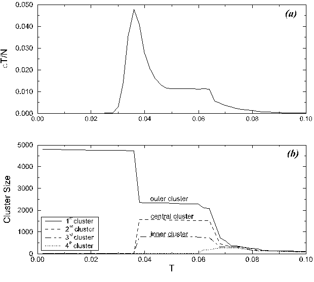
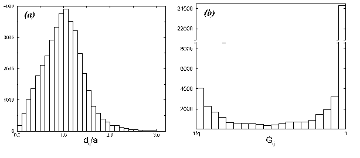
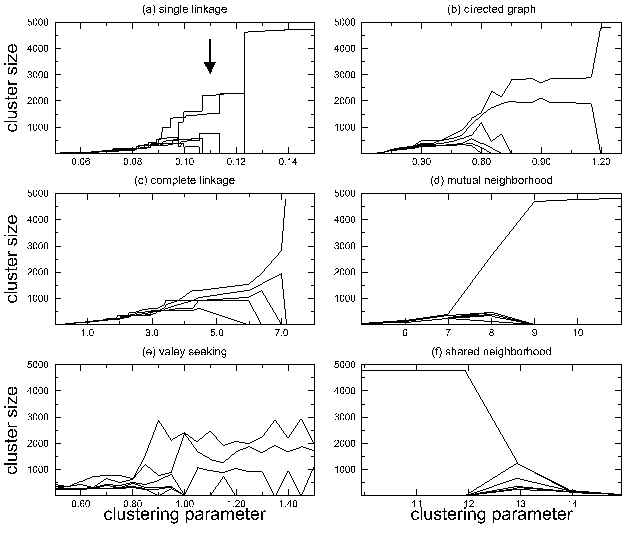
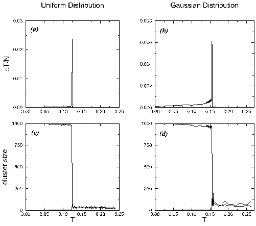
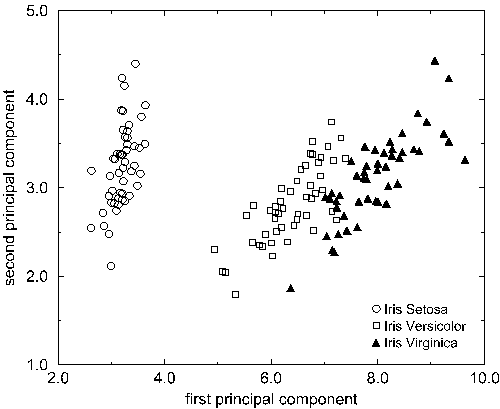
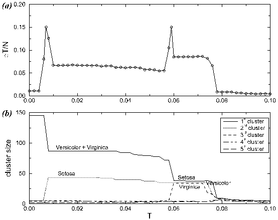
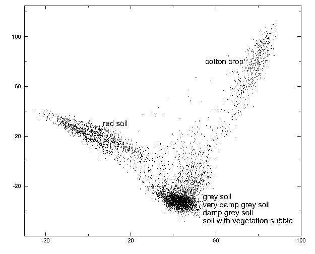
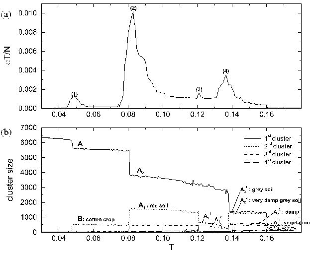
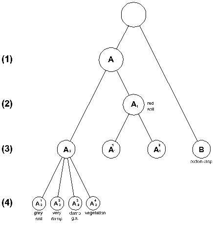
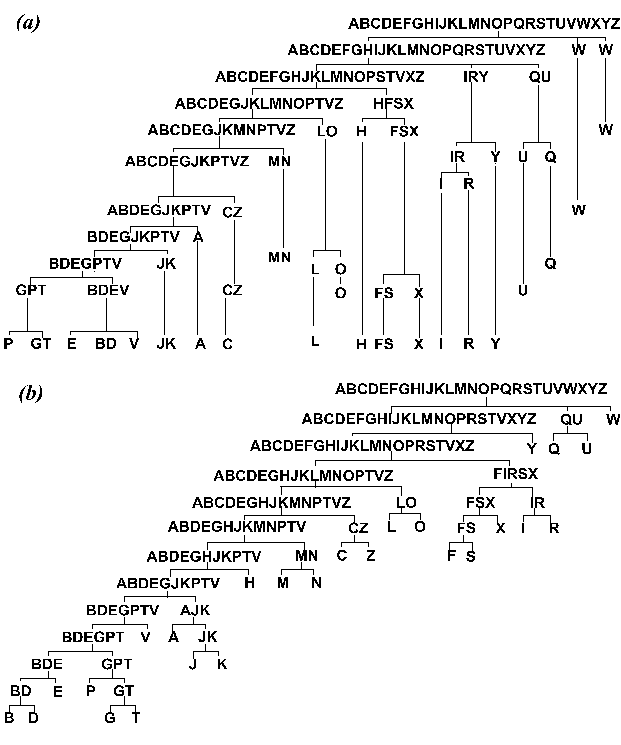

# Data Clustering Using a Model Granular Magnet

## Contents

- [Abstract](#abstract)
- [1 Introduction](#1-introduction)
- [2 The Potts Model](#2-the-potts-model)
- [3 Monte Carlo Simulation of Potts Models: The Swendsen-Wang Method](#3-monte-carlo-simulation-of-potts-models-the-swendsen-wang-method)
- [4 Clustering of Data: Detailed Description of the Algorithm](#4-clustering-of-data-detailed-description-of-the-algorithm)
 - [4.1 The Physical Analog Potts Spin Problem](#41-the-physical-analog-potts-spin-problem)
 - [4.1.1 The Potts Spin Variables](#411-the-potts-spin-variables)
 - [4.1.2 Identifying Neighbors](#412-identifying-neighbors)
 - [4.1.3 Local Interaction](#413-local-interaction)
 - [4.2 Locating the Superparamagnetic Regions](#42-locating-the-superparamagnetic-regions)
 - [4.3 Identifying the Data Clusters](#43-identifying-the-data-clusters)
 - [4.3.1 The Spin-Spin Correlation](#431-the-spin-spin-correlation)
 - [4.3.2 The Data Clusters](#432-the-data-clusters)
- [5 Applications](#5-applications)
 - [5.1 A Pedagogical 2-Dimensional Example](#51-a-pedagogical-2-dimensional-example)
 - [5.2 Only One Cluster](#52-only-one-cluster)
 - [5.3 Performance: Scaling with Data Dimension and Influence of Irrelevant Features](#53-performance-scaling-with-data-dimension-and-influence-of-irrelevant-features)
 - [5.4 The Iris Data](#54-the-iris-data)
 - [5.5 LANDSAT Data](#55-landsat-data)
 - [5.6 Isolated-Letter Speech Recognition](#56-isolated-letter-speech-recognition)
- [6 Complexity and Computational Overhead](#6-complexity-and-computational-overhead)
- [7 Discussion](#7-discussion)
- [Appendix: Clusters and the Potts Model](#appendix-clusters-and-the-potts-model)
- [References](references/BWD1997.md)

## Abstract

_Neural Computation_ 9(8), 1805–1842 (1997)

We present a new approach to clustering, based on the physical properties of an inhomogeneous ferromagnet. No assumption is made regarding the underlying distribution of the data. We assign a Potts spin to each data point and introduce an interaction between neighboring points, whose strength is a decreasing function of the distance between the neighbors. This magnetic system exhibits three phases. At very low temperatures, it is completely ordered; all spins are aligned. At very high temperatures, the system does not exhibit any ordering, and in an intermediate regime, clusters of relatively strongly coupled spins become ordered, whereas different clusters remain uncorrelated. This intermediate phase is identified by a jump in the order parameters. The spin-spin correlation function is used to partition the spins and the corresponding data points into clusters. We demonstrate on three synthetic and three real data sets how the method works. Detailed comparison to the performance of other techniques clearly indicates the relative success of our method.

## 1 Introduction

In recent years there has been significant interest in adapting numerical (Kirkpatrick, Gelatt, & Vecchi, 1983) and analytic (Fu & Anderson, 1986; Mézard & Parisi, 1986) techniques from statistical physics to provide algorithms and estimates for good approximate solutions to hard optimization problems (Yuille & Kosowsky, 1994). In this article we formulate the problem of data clustering as that of measuring equilibrium properties of an inhomogeneous Potts model. We are able to give good clustering solutions by solving the physics of this model.

Cluster analysis is an important technique in exploratory data analysis, where a priori knowledge of the distribution of the observed data is not available (Duda & Hart, 1973; Jain & Dubes, 1988). Partitional clustering methods, which divide the data according to natural classes present in it, have been used in a large variety of scientific disciplines and engineering applications, among them pattern recognition (Duda & Hart, 1973), learning theory (Moody & Darken, 1989), astrophysics (Dekel & West, 1985), medical imaging (Suzuki, Shibata, & Suto, 1995) and data processing (Phillips et al., 1995), machine translation of text (Cranias, Papageorgiou, & Piperidis, 1994), image compression (Karayiannis, 1994), satellite data analysis (Baraldi & Parmiggiani, 1995), automatic target recognition (Iokibe, 1994), and speech recognition (Kosaka & Sagayama, 1994) and analysis (Foote & Silverman, 1994).

The goal is to find a partition of a given data set into several compact groups. Each group indicates the presence of a distinct category in the measurements. The problem of partitional clustering can be formally stated as follows. Determine the partition of $N$ given patterns $\{v_i\}_{i=1}^N$ into groups, called clusters, such that the patterns of a cluster are more similar to each other than to patterns in different clusters. It is assumed that either $d_{ij}$, the measure of dissimilarity between patterns $v_i$ and $v_j$, is provided or that each pattern $v_i$ is represented by a point $x_i$ in a $D$-dimensional metric space, in which case $d_{ij} = |x_i - x_j|$.

The two main approaches to partitional clustering are called parametric and nonparametric. In parametric approaches some knowledge of the clusters' structure is assumed, and in most cases patterns can be represented by points in a $D$-dimensional metric space. For instance, each cluster can be parameterized by a center around which the points that belong to it are spread with a locally Gaussian distribution. In many cases the assumptions are incorporated in a global criterion whose minimization yields the optimal partition of the data. Classical approaches are variance minimization, maximal likelihood, and fitting Gaussian mixtures. A nice example of variance minimization is the method proposed by Rose, Gurewitz, and Fox (1990) based on principles of statistical physics. This work gave rise to other mean field methods for clustering data (Buhmann & Kühnel, 1993; Wong, 1993; Miller & Rose, 1996). Classical examples of fitting Gaussian mixtures are the Isodata algorithm (Ball & Hall, 1967) or its sequential relative, the K-means algorithm (MacQueen, 1967) in statistics, and soft competition in neural networks (Nowlan & Hinton, 1991).

In many cases of interest, however, there is no a priori knowledge about the data structure. Then it is more natural to adopt nonparametric approaches, which make fewer assumptions about the model and therefore are suitable to handle a wider variety of clustering problems. Usually these methods employ a local criterion, against which some attribute of the local structure of the data is tested, to construct the clusters. Typical examples are hierarchical techniques such as the agglomerative and divisive methods (see Jain & Dubes, 1988). These algorithms suffer, however, from at least one of the following limitations: high sensitivity to initialization, poor performance when the data contain overlapping clusters, or an inability to handle variabilities in cluster shapes, cluster densities, and cluster sizes. The most serious problem is the lack of cluster validity criteria; in particular, none of these methods provides an index that could be used to determine the most significant partitions among those obtained in the entire hierarchy. All of these algorithms tend to create clusters even when no natural clusters exist in the data.

We recently introduced a new approach to clustering, based on the physical properties of a magnetic system (Blatt, Wiseman, & Domany, 1996a, 1996b, 1996c). This method has a number of rather unique advantages: it provides information about the different self-organizing regimes of the data; the number of macroscopic clusters is an output of the algorithm; and hierarchical organization of the data is reflected in the manner the clusters merge or split when a control parameter (the physical temperature) is varied. Moreover, the results are completely insensitive to the initial conditions, and the algorithm is robust against the presence of noise. The algorithm is computationally efficient; equilibration time of the spin system scales with $N$, the number of data points, and is independent of the embedding dimension $D$.

In this article we extend our work by demonstrating the efficiency and performance of the algorithm on various real-life problems. Detailed comparisons with other nonparametric techniques are also presented. The outline of the article is as follows. The magnetic model and thermodynamic definitions are introduced in section 2. A very efficient Monte Carlo method used for calculating the thermodynamic quantities is presented in section 3. The clustering algorithm is described in section 4. In section 5 we analyze synthetic and real data to demonstrate the main features of the method and compare its performance with other techniques.

## 2 The Potts Model

Ferromagnetic Potts models have been studied extensively for many years (see Wu, 1982 for a review). The basic spin variable $s$ can take one of $q$ integer values: $s = 1, 2, \ldots, q$. In a magnetic model the Potts spins are located at points $v_i$ that reside on (or off) the sites of some lattice. Pairs of spins associated with points $i$ and $j$ are coupled by an interaction of strength $J_{ij} > 0$. Denote by $S$ a configuration of the system, $S = \{s_i\}_{i=1}^N$. The energy of such a configuration is given by the Hamiltonian

$$H(S) = \sum_{\langle i,j \rangle} J_{ij} \left(1 - \delta_{s_i, s_j}\right), \quad s_i = 1, \dots, q \,, \tag{2.1}$$

where the notation $\langle i, j \rangle$ stands for neighboring sites $v_i$ and $v_j$. The contribution of a pair $\langle i, j \rangle$ to $H$ is $0$ when $s_i = s_j$, that is, when the two spins are aligned, and is $J_{ij} > 0$ otherwise. If one chooses interactions that are a decreasing function of the distance $d_{ij} \equiv d(v_i, v_j)$, then the closer two points are to each other, the more they like to be in the same state. The Hamiltonian (equation 2.1) is very similar to other energy functions used in neural systems, where each spin variable represents a $q$-state neuron with an excitatory coupling to its neighbors.

In order to calculate the thermodynamic average of a physical quantity $A$ at a fixed temperature $T$, one has to calculate the sum

$$\langle A \rangle = \sum_{S} A(S)\, P(S) \,, \tag{2.2}$$

where the Boltzmann factor,

$$P(S) = \frac{1}{Z} \exp\!\left(-\frac{H(S)}{T}\right), \tag{2.3}$$

plays the role of the probability density, which gives the statistical weight of each spin configuration $S = \{s_i\}_{i=1}^N$ in thermal equilibrium and $Z$ is a normalization constant, $Z = \sum_S \exp(-H(S)/T)$.

Some of the most important physical quantities $A$ for this magnetic system are the order parameter or magnetization and the set of $\delta_{s_i, s_j}$ functions, because their thermal averages reflect the ordering properties of the model.

The order parameter of the system is $\langle m \rangle$, where the magnetization $m(S)$, associated with a spin configuration $S$, is defined (Chen, Ferrenberg, & Landau, 1992) as

$$m(S) = \frac{q\, N_{\max}(S) - N}{(q-1)\,N} \,, \tag{2.4}$$

where $N_{\max}(S) = \max\{N_1(S), N_2(S), \ldots, N_q(S)\}$ and $N_\mu(S) = \sum_i \delta_{s_i, \mu}$ is the number of spins with value $\mu$. The thermal average of $\delta_{s_i, s_j}$ is called the spin-spin correlation function,

$$G_{ij} = \langle \delta_{s_i, s_j} \rangle \,, \tag{2.5}$$

which is the probability of the two spins $s_i$ and $s_j$ being aligned.

When the spins are on a lattice and all nearest-neighbor couplings are equal, $J_{ij} = J$, the Potts system is homogeneous. Such a model exhibits two phases. At high temperatures the system is paramagnetic or disordered, $\langle m \rangle = 0$, indicating that $N_{\max}(S) \approx N/q$ for all statistically significant configurations. In this phase the correlation function $G_{ij}$ decays to $1/q$ when the distance between points $v_i$ and $v_j$ is large; this is the probability of finding two completely independent Potts spins in the same state. At very high temperatures even neighboring sites have $G_{ij} \approx 1/q$.

As the temperature is lowered, the system undergoes a sharp transition to an ordered, ferromagnetic phase; the magnetization jumps to $\langle m \rangle \neq 0$. This means that in the physically relevant configurations (at low temperatures), one Potts state dominates and $N_{\max}(S)$ exceeds $N/q$ by a macroscopic number of sites. At very low temperatures $\langle m \rangle \approx 1$ and $G_{ij} \approx 1$ for all pairs $\{v_i, v_j\}$.

The variance of the magnetization is related to a relevant thermal quantity, the susceptibility,

$$\chi = \frac{N}{T}\left(\langle m^2 \rangle - \langle m \rangle^2\right), \tag{2.6}$$

which also reflects the thermodynamic phases of the system. At low temperatures, fluctuations of the magnetization are negligible, so the susceptibility $\chi$ is small in the ferromagnetic phase.

The connection between Potts spins and clusters of aligned spins was established by Fortuin and Kasteleyn (1972). In the appendix we present such a relation and the probability distribution of such clusters.

We turn now to strongly inhomogeneous Potts models. This is the situation when the spins form magnetic grains, with very strong couplings between neighbors that belong to the same grain and very weak interactions between all other pairs. At low temperatures, such a system is also ferromagnetic, but as the temperature is raised, the system may exhibit an intermediate, superparamagnetic phase. In this phase strongly coupled grains are aligned (that is, are in their respective ferromagnetic phases), while there is no relative ordering of different grains.

At the transition temperature from the ferromagnetic to superparamagnetic phase a pronounced peak of $\chi$ is observed (Blatt et al., 1996a). In the superparamagnetic phase fluctuations of the state taken by grains acting as a whole (that is, as giant superspins) produce large fluctuations in the magnetization. As the temperature is raised further, the superparamagnetic-to-paramagnetic transition is reached; each grain disorders, and $\chi$ abruptly diminishes by a factor that is roughly the size of the largest cluster. Thus, the temperatures where a peak of the susceptibility occurs and the temperatures at which $\chi$ decreases abruptly indicate the range of temperatures in which the system is in its superparamagnetic phase.

In principle one can have a sequence of several transitions in the superparamagnetic phase. As the temperature is raised, the system may break first into two clusters, each of which breaks into more (macroscopic) subclusters, and so on. Such a hierarchical structure of the magnetic clusters reflects a hierarchical organization of the data into categories and subcategories.

To gain some analytic insight into the behavior of inhomogeneous Potts ferromagnets, we calculated the properties of such a granular system with a macroscopic number of bonds for each spin. For such infinite-range models, mean field is exact, and we have shown (Wiseman, Blatt, & Domany, 1996; Blatt et al., 1996b) that in the paramagnetic phase, the spin state at each site is independent of any other spin, that is, $G_{ij} = 1/q$.

At the paramagnetic-superparamagnetic transition the correlation between spins belonging to the same group jumps abruptly to

$$\frac{q-1}{q}\left(\frac{q-2}{q-1}\right)^2 + \frac{1}{q} \simeq 1 - \frac{2}{q} + O\!\left(\frac{1}{q^2}\right),$$

while the correlation between spins belonging to different groups is unchanged. The ferromagnetic phase is characterized by strong correlations between all spins of the system:

$$G_{ij} > \frac{q-1}{q}\left(\frac{q-2}{q-1}\right)^2 + \frac{1}{q}.$$

There is an important lesson to remember from this: in mean field we see that in the superparamagnetic phase, two spins that belong to the same grain are strongly correlated, whereas for pairs that do not belong to the same grain, $G_{ij}$ is small. As it turns out, this double-peaked distribution of the correlations is not an artifact of mean field and will be used in our solution of the problem of data clustering.

As we will show below, we use the data points of our clustering problem as sites of an inhomogeneous Potts ferromagnet. Presence of clusters in the data gives rise to magnetic grains of the kind described above in the corresponding Potts model. Working in the superparamagnetic phase of the model, we use the values of the pair correlation function of the Potts spins to decide whether a pair of spins does or does not belong to the same grain, and we identify these grains as the clusters of our data. This is the essence of our method.

## 3 Monte Carlo Simulation of Potts Models: The Swendsen-Wang Method

The aim of equilibrium statistical mechanics is to evaluate sums such as equation 2.2 for models with $N \gg 1$ spins. This can be done analytically only for very limited cases. One resorts therefore to various approximations (such as mean field) or to computer simulations that aim at evaluating thermal averages numerically.

Direct evaluation of sums like equation 2.2 is impractical, since the number of configurations $S$ increases exponentially with the system size $N$. Monte Carlo simulation methods (see Binder & Heermann, 1988, for an introduction) overcome this problem by generating a characteristic subset of configurations, which are used as a statistical sample. They are based on the notion of importance sampling, in which a set of spin configurations $\{S_1, S_2, \ldots, S_M\}$ is generated according to the Boltzmann probability distribution (see equation 2.3). Then, expression 2.2 is reduced to a simple arithmetic average,

$$\langle A \rangle \approx \frac{1}{M} \sum_{i=1}^{M} A(S_i) \,, \tag{3.1}$$

where the number of configurations in the sample, $M$, is much smaller than $q^N$, the total number of configurations. The set of $M$ states necessary for the implementation of equation 3.1 is constructed by means of a Markov process in the configuration space of the system. There are many ways to generate such a Markov chain; in this work it turned out to be essential to use the Swendsen-Wang (Wang & Swendsen, 1990; Swendsen, Wang, & Ferrenberg, 1992) Monte Carlo algorithm (SW). The main reason for this choice is that it is perfectly suitable for working in the superparamagnetic phase: it overturns an aligned cluster in one Monte Carlo step, whereas algorithms that use standard local moves will take forever to do this.

The first configuration can be chosen at random (or by setting all $s_i = 1$). Say we already generated $n$ configurations of the system, $\{S_i\}_{i=1}^n$, and we start to generate configuration $n+1$. This is the way it is done.

First, visit all pairs of spins $\langle i, j \rangle$ that interact, that is, have $J_{ij} > 0$; the two spins are frozen together with probability

$$p_{i,j}^f = 1 - \exp\!\left(-\frac{J_{ij}}{T}\,\delta_{s_i, s_j}\right). \tag{3.2}$$

That is, if in our current configuration $S_n$ the two spins are in the same state, $s_i = s_j$, then sites $i$ and $j$ are frozen with probability $p^f = 1 - \exp(-J_{ij}/T)$.

Having gone over all the interacting pairs, the next step of the algorithm is to identify the SW clusters of spins. An SW cluster contains all spins that have a path of frozen bonds connecting them. Note that according to equation 3.2, only spins of the same value can be frozen in the same SW cluster. After this step, our $N$ sites are assigned to some number of distinct SW clusters. If we think of the $N$ sites as vertices of a graph whose edges are the interactions between neighbors $J_{ij} > 0$, each SW cluster is a subgraph of vertices connected by frozen bonds.

The final step of the procedure is to generate the new spin configuration $S_{n+1}$. This is done by drawing, independently for each SW cluster, randomly a value $s = 1, \ldots, q$, which is assigned to all its spins. This defines one Monte Carlo step $S_n \to S_{n+1}$. By iterating this procedure $M$ times while calculating at each Monte Carlo step the physical quantity $A(S_i)$ the thermodynamic average (see equation 3.1) is obtained. The physical quantities that we are interested in are the magnetization (see equation 2.4) and its square value for the calculation of the susceptibility $\chi$, and the spin-spin correlation function (see equation 2.5). Actually, in most simulations a number of the early configurations are discarded, to allow the system to forget its initial state. This is not necessary if the number of configurations $M$ is not too small (increasing $M$ improves the statistical accuracy of the Monte Carlo measurement). Measuring autocorrelation times (Gould & Tobochnik, 1989) provides a way of both deciding on the number of discarded configurations and checking that the number of configurations $M$ generated is sufficiently large. A less rigorous way is simply plotting the energy as a function of the number of SW steps and verifying that the energy reached a stable regime.

At temperatures where large regions of correlated spins occur, local methods (such as Metropolis), which flip one spin at a time, become very slow. The SW procedure overcomes this difficulty by flipping large clusters of aligned spins simultaneously. Hence the SW method exhibits much smaller autocorrelation times than local methods. The efficiency of the SW method, which is widely used in numerous applications, has been tested in various Potts (Billoire et al., 1991) and Ising (Hennecke & Heyken, 1993) models.

## 4 Clustering of Data: Detailed Description of the Algorithm

So far we have defined the Potts model, the various thermodynamic functions that one measures for it, and the (numerical) method used to measure these quantities. We can now turn to the problem for which these concepts will be utilized: clustering of data.

For the sake of concreteness, assume that our data consist of $N$ patterns or measurements $v_i$, specified by $N$ corresponding vectors $x_i$, embedded in a $D$-dimensional metric space. Our method consists of three stages. The starting point is the specification of the Hamiltonian (see equation 2.1), which governs the system. Next, by measuring the susceptibility $\chi$ and magnetization as a function of temperature, the different phases of the model are identified. Finally, the correlation of neighboring pairs of spins, $G_{ij}$, is measured. This correlation function is then used to partition the spins and the corresponding data points into clusters.

The outline of the three stages and the subtasks contained in each can be summarized as follows:

1. **Construct the physical analog Potts spin problem:**
 - (a) Associate a Potts spin variable $s_i = 1, 2, \ldots, q$ to each point $v_i$.
 - (b) Identify the neighbors of each point $v_i$ according to a selected criterion.
 - (c) Calculate the interaction $J_{ij}$ between neighboring points $v_i$ and $v_j$.

2. **Locate the superparamagnetic phase:**
 - (a) Estimate the thermal average magnetization $\langle m \rangle$ for different temperatures.
 - (b) Use the susceptibility $\chi$ to identify the superparamagnetic phase.

3. **In the superparamagnetic regime:**
 - (a) Measure the spin-spin correlation $G_{ij}$ for all neighboring points $v_i$, $v_j$.
 - (b) Construct the data clusters.

In the following subsections we provide detailed descriptions of the manner in which each of the three stages is to be implemented.

### 4.1 The Physical Analog Potts Spin Problem

The goal is to specify the Hamiltonian of the form in equation 2.1, that serves as the physical analog of the data points to be clustered. One has to assign a Potts spin to each data point and introduce short-range interactions between spins that reside on neighboring points. Therefore we have to choose the value of $q$, the number of possible states a Potts spin can take, define what is meant by neighbor points, and provide the functional dependence of the interaction strength $J_{ij}$ on the distance between neighboring spins.

We discuss now the possible choices for these attributes of the Hamiltonian and their influence on the algorithm's performance. The most important observation is that none of them needs fine tuning; the algorithm performs well provided a reasonable choice is made, and the range of reasonable choices is very wide.

#### 4.1.1 The Potts Spin Variables

The number of Potts states, $q$, determines mainly the sharpness of the transitions and the temperatures at which they occur. The higher the $q$, the sharper the transition. On the other hand, in order to maintain a given statistical accuracy, it is necessary to perform longer simulations as the value of $q$ increases. From our simulations we conclude that the influence of $q$ on the resulting classification is weak. We used $q = 20$ in all the examples presented in this work.

Note that the value of $q$ does not imply any assumption about the number of clusters present in the data.

#### 4.1.2 Identifying Neighbors

The need for identification of the neighbors of a point $x_i$ could be eliminated by letting all pairs $i, j$ of Potts spins interact with each other via a short-range interaction $J_{ij} = f(d_{ij})$, which decays sufficiently fast (say, exponentially or faster) with the distance between the two data points. The phases and clustering properties of the model will not be affected strongly by the choice of $f$. Such a model has $O(N^2)$ interactions, which makes its simulation rather expensive for large $N$. For the sake of computational convenience, we decided to keep only the interactions of a spin with a limited number of neighbors, and setting all other $J_{ij}$ to zero. Since the data do not form a regular lattice, one has to supply some reasonable definition for neighbors. As it turns out, our results are quite insensitive to the particular definition used.

Ahuja (1982) argues for intuitively appealing characteristics of Delaunay triangulation over other graph structures in data clustering. We use this definition when the patterns are embedded in a low-dimensional ($D \leq 3$) space.

For higher dimensions, we use the mutual neighborhood value; we say that $v_i$ and $v_j$ have a mutual neighborhood value $K$, if and only if $v_i$ is one of the $K$-nearest neighbors of $v_j$ and $v_j$ is one of the $K$-nearest neighbors of $v_i$. We chose $K$ such that the interactions connect all data points to one connected graph. Clearly $K$ grows with the dimensionality. We found it convenient, in cases of very high dimensionality ($D > 100$), to fix $K = 10$ and to superimpose to the edges obtained with this criterion the edges corresponding to the minimal spanning tree associated with the data. We use this variant only in the examples presented in sections 5.2 and 5.3.

#### 4.1.3 Local Interaction

In order to have a model with the physical properties of a strongly inhomogeneous granular magnet, we want strong interaction between spins that correspond to data from a high-density region and weak interactions between neighbors that are in low-density regions. To this end and in common with other local methods, we assume that there is a local length scale $\sim a$, which is defined by the high-density regions and is smaller than the typical distance between points in the low-density regions. This $a$ is the characteristic scale over which our short-range interactions decay. We tested various choices but report here only results that were obtained using

$$
J_{ij} = \begin{cases}
  \frac{1}{\hat{K}} \exp\!\left(-\frac{d_{ij}^2}{2a^2}\right) & \text{if } v_i \text{ and } v_j \text{ are neighbors} \\
  0 & \text{otherwise}
\end{cases} \tag{4.1}
$$

We chose the local length scale $a$ to be the average of all distances $d_{ij}$ between neighboring pairs $v_i$ and $v_j$. $\hat{K}$ is the average number of neighbors; it is twice the number of nonvanishing interactions divided by the number of points $N$. This careful normalization of the interaction strength enables us to estimate the temperature corresponding to the highest superparamagnetic transition (see section 4.2).

Everything done so far can be easily implemented in the case when instead of providing the $x_i$ for all the data we have an $N \times N$ matrix of dissimilarities $d_{ij}$. This was tested in experiments for clustering of images where only a measure of the dissimilarity between them was available (Gdalyahu & Weinshall, 1997). Application of other clustering methods would have necessitated embedding these data in a metric space; the need for this was eliminated by using superparamagnetic clustering. The results obtained by applying the method on the matrix of dissimilarities of these images were excellent; all points were classified with no error.

### 4.2 Locating the Superparamagnetic Regions

The various temperature intervals in which the system self-organizes into different partitions to clusters are identified by measuring the susceptibility $\chi$ as a function of temperature. We start by summarizing the Monte Carlo procedure and conclude by providing an estimate of the highest transition temperature to the superparamagnetic regime. Starting from this estimate, one can take increasingly refined temperature scans and calculate the function $\chi(T)$ by Monte Carlo simulation.

We used the SW method described in section 3, with the following procedure:

1. Choose the number of iterations $M$ to be performed.
2. Generate the initial configuration by assigning a random value to each spin.
3. Assign a frozen bond between nearest neighbor points $v_i$ and $v_j$ with probability $p_{i,j}^f$ (see equation 3.2).
4. Find the connected subgraphs, the SW clusters.
5. Assign new random values to the spins (spins that belong to the same SW cluster are assigned the same value). This is the new configuration of the system.
6. Calculate the value assumed by the physical quantities of interest in the new spin configuration.
7. Go to step 3 unless the maximal number of iterations, $M$, was reached.
8. Calculate the averages (see equation 3.1).

The superparamagnetic phase can contain many different subphases with different ordering properties. A typical example can be generated by data with a hierarchical structure, giving rise to different acceptable partitions of the data. We measure the susceptibility $\chi$ at different temperatures in order to locate these different regimes. The aim is to identify the temperatures at which the system changes its structure.

The superparamagnetic phase is characterized by a nonvanishing susceptibility. Moreover, there are two basic features of $\chi$ in which we are interested. The first is a peak in the susceptibility, which signals a ferromagnetic-to-superparamagnetic transition, at which a large cluster breaks into a few smaller (but still macroscopic) clusters. The second feature is an abrupt decrease of the susceptibility, corresponding to a superparamagnetic-to-paramagnetic transition, in which one or more large clusters have melted (i.e., they broke up into many small clusters).

The location of the superparamagnetic-to-paramagnetic transition, which occurs at the highest temperature, can be roughly estimated by the following considerations. First, we approximate the clusters by an ordered lattice of coordination number $\hat{K}$ and a constant interaction

$$J \approx \langle J_{ij} \rangle \sim \frac{1}{\hat{K}} \exp\!\left(-\frac{\langle d_{ij}^2 \rangle}{2a^2}\right),$$

where $\langle \cdots \rangle$ denotes the average over all neighbors. Second, from the Potts model on a square lattice (Wu, 1982), we get that this transition should occur at roughly

$$T \approx \frac{1}{4\log(1+\sqrt{q})} \exp\!\left(-\frac{\langle d_{ij}^2 \rangle}{2a^2}\right). \tag{4.2}$$

An estimate based on the mean field model yields a very similar value.

### 4.3 Identifying the Data Clusters

Once the superparamagnetic phase and its different subphases have been identified, we select one temperature in each region of interest. The rationale is that each subphase characterizes a particular type of partition of the data, with new clusters merging or breaking. On the other hand, as the temperature is varied within a phase, one expects only shrinking or expansion of the existing clusters, changing only the classification of the points on the boundaries of the clusters.

#### 4.3.1 The Spin-Spin Correlation

We use the spin-spin correlation function $G_{ij}$, between neighboring sites $v_i$ and $v_j$, to build the data clusters. In principle we have to calculate the thermal average (see equation 3.1) of $\delta_{s_i, s_j}$ in order to obtain $G_{ij}$. However, the SW method provides an improved estimator (Niedermayer, 1990) of the spin-spin correlation function. One calculates the two-point connectedness $C_{ij}$, the probability that sites $v_i$ and $v_j$ belong to the same SW cluster, which is estimated by the average (see equation 3.1) of the following indicator function:

$$
c_{ij} = \begin{cases}
  1 & \text{if } v_i \text{ and } v_j \text{ belong to the same SW cluster} \\
  0 & \text{otherwise}
\end{cases}
$$

$C_{ij} = \langle c_{ij} \rangle$ is the probability of finding sites $v_i$ and $v_j$ in the same SW cluster. Then the relation (Fortuin & Kasteleyn, 1972)

$$G_{ij} = \frac{(q-1)\,C_{ij} + 1}{q} \tag{4.3}$$

is used to obtain the correlation function $G_{ij}$.

#### 4.3.2 The Data Clusters

Clusters are identified in three steps:

1. Build the clusters' core using a thresholding procedure; if $G_{ij} > 0.5$, a link is set between the neighbor data points $v_i$ and $v_j$. The resulting connected graph depends weakly on the value (0.5) used in this thresholding, as long as it is bigger than $1/q$ and less than $1 - 2/q$. The reason is that the distribution of the correlations between two neighboring spins peaks strongly at these two values and is very small between them (see Figure 3b).
2. Capture points lying on the periphery of the clusters by linking each point $v_i$ to its neighbor $v_j$ of maximal correlation $G_{ij}$. It may happen, of course, that points $v_i$ and $v_j$ were already linked in the previous step.
3. Data clusters are identified as the linked components of the graphs obtained in steps 1 and 2.

Although it would be completely equivalent to use in steps 1 and 2 the two-point connectedness $C_{ij}$ instead of the spin-spin correlation $G_{ij}$, we considered the latter to stress the relation of our method with the physical analogy we are using.

## 5 Applications

The approach presented in this article has been successfully tested on a variety of data sets. The six examples we discuss were chosen with the intention of demonstrating the main features and utility of our algorithm, to which we refer as the superparamagnetic clustering (SPC) method. We use both artificial and real data. Comparisons with the performance of other classical (nonparametric) methods are also presented. We refer to different clustering methods by the nomenclature used by Jain and Dubes (1988) and Fukunaga (1990).

The nonparametric algorithms we have chosen belong to four families: (1) hierarchical methods: single link and complete link; (2) graph theory-based methods: Zhan's minimal spanning tree and Fukunaga's directed graph method; (3) nearest-neighbor clustering type, based on different proximity measures: the mutual neighborhood clustering algorithm and $k$-shared neighbors; and (4) density estimation: Fukunaga's valley-seeking method. These algorithms are of the same kind as the superparamagnetic method in the sense that only weak assumptions are required about the underlying data structure. The results from all these methods depend on various parameters in an uncontrolled way; we always used the best result that was obtained.

A unifying view of some of these methods in the framework of the work discussed here is presented in the appendix.

### 5.1 A Pedagogical 2-Dimensional Example

The main purpose of this simple example is to illustrate the features of the method discussed, in particular the behavior of the susceptibility and its use for the identification of the two kinds of phase transitions. The influence of the number of Potts states, $q$, and the partition of the data as a function of the temperature are also discussed.

The toy problem of Figure 1 consists of 4800 points in $D = 2$ dimensions whose angular distribution is uniform and whose radial distribution is normal with variance $0.25$: $\theta \sim U[0, 2\pi]$, $r \sim N[R, 0.25]$. We generated half the points with $R = 3$, one-third with $R = 2$, and one-sixth with $R = 1$.

Since there is a small overlap between the clusters, we consider the Bayes solution as the optimal result; that is, points whose distance to the origin is bigger than 2.5 are considered a cluster, points whose radial coordinate lies between 1.5 and 2.5 are assigned to a second cluster, and the remaining points define the third cluster. These optimal clusters consist of 2393, 1602, and 805 points, respectively.

By applying our procedure, and choosing the neighbors according to the mutual neighborhood criterion with $K = 10$, we obtain the susceptibility as a function of the temperature as presented in Figure 2a. The estimated temperature (equation 4.2) corresponding to the superparamagnetic-to-paramagnetic transition is 0.075, which is in good agreement with the one inferred from Figure 2a.

Figure 1 presents the clusters obtained at $T = 0.05$. The sizes of the three largest clusters are 2358, 1573, and 779, including 98 percent of the data; the classification of all these points coincides with that of the optimal Bayes classifier. The remaining 90 points are distributed among 43 clusters of size smaller than 4. As can be noted in Figure 1, the small clusters (fewer than 4 points) are located at the boundaries between the main clusters.

**Figure 1:** Data distribution: The angular coordinate is uniformly distributed, $\theta \sim U[0, 2\pi]$, while the radial one is $r \sim N[R, 0.25]$ distributed around three different radii $R$. The outer cluster ($R = 3.0$) consists of 2400 points, the central one ($R = 2.0$) of 1600, and the inner one ($R = 1.0$) of 800. The classified data set: Points classified at $T = 0.05$ as belonging to the three largest clusters are marked by circles (outer cluster, 2358 points), squares (central cluster, 1573 points), and triangles (inner cluster, 779 points). The x's denote the 90 remaining points, distributed in 43 clusters, the biggest of size 4.

One of the most salient features of the SPC method is that the spin-spin correlation function $G_{ij}$ reflects the existence of two categories of neighboring points: neighboring points that belong to the same cluster and those that do not. This can be observed from Figure 3b, the two-peaked frequency distribution of the correlation function $G_{ij}$ between neighboring points of Figure 1. In contrast, the frequency distribution (see Figure 3a) of the normalized distances $d_{ij}/a$ between neighboring points of Figure 1 contains no hint of the existence of a natural cutoff distance that separates neighboring points into two categories.

**Figure 2:** (a) The susceptibility density $\chi T/N$ of the data set of Figure 1 as a function of the temperature. (b) Size of the four biggest clusters obtained at each temperature.

It is instructive to observe the behavior of the size of the clusters as a function of the temperature, presented in Figure 2b. At low temperatures, as expected, all data points form only one cluster. At the ferromagnetic-to-superparamagnetic transition temperature, indicated by a peak in the susceptibility, this cluster splits into three. These essentially remain stable in their composition until the superparamagnetic-to-paramagnetic transition temperature is reached, expressed in a sudden decrease of the susceptibility $\chi$, where the clusters melt.

Turning now to the effect of the parameters on the procedure, we found (Wiseman et al., 1996) that the number of Potts states $q$ affects the sharpness of the transition, but the obtained classification is almost the same. For instance, choosing $q = 5$ we found that the three largest clusters contained 2349, 1569, and 774 data points, while taking $q = 200$, we yielded 2354, 1578, and 782.

Of all the algorithms listed at the beginning of this section, only the single-link and minimal spanning tree methods were able to give (at the optimal values of their clustering parameter) a partition that reflects the underlying distribution of the data. The best results are summarized in Table 1, together with those of the SPC method. Clearly, the standard parametric methods (such as K-means or Ward's method) would not be able to give a reasonable answer because they assume that different clusters are parameterized by different centers and a spread around them.

**Table 1:** Clusters Obtained with the Methods That Succeeded in Recovering the Structure of the Data.

| Method | Outer Cluster | Central Cluster | Inner Cluster | Unclassified Points |
|---|---|---|---|---|
| Bayes | 2393 | 1602 | 805 | — |
| Superparamagnetic ($q = 200$) | 2354 | 1578 | 782 | 86 |
| Superparamagnetic ($q = 20$) | 2358 | 1573 | 779 | 90 |
| Superparamagnetic ($q = 5$) | 2349 | 1569 | 774 | 108 |
| Single link | 2255 | 1513 | 758 | 274 |
| Minimal spanning tree | 2262 | 1487 | 756 | 295 |

Notes: Points belonging to clusters of fewer than 50 points are considered unclassified. The Bayes method is used as the benchmark because it minimizes the expected number of mistakes, provided that the distribution that generated the set of points is known.

**Figure 3:** Frequency distribution of (a) distances between neighboring points of Figure 1 (scaled by the average distance $a$), and (b) spin-spin correlation of neighboring points.

In Figure 4 we present, for the methods that depend on only a single parameter, the sizes of the four biggest clusters that were obtained as a function of the clustering parameter. The best solution obtained with the single-link method (for a narrow range of the parameter) corresponds also to three big clusters of 2255, 1513, and 758 points, respectively, while the remaining clusters are of size smaller than 14. For larger threshold distance, the second and third clusters are linked. This classification is slightly worse than the one obtained by the superparamagnetic method.

When comparing SPC with single link, one should note that if the correct answer is not known, one has to rely on measurements such as the stability of the largest clusters (existence of a plateau) to indicate the quality of the partition. As can be observed from Figure 4a there is no clear indication that signals which plateau corresponds to the optimal partition among the whole hierarchy yielded by single link. The best result obtained with the minimal spanning tree method is very similar to the one obtained with the single link, but this solution corresponds to a very small fraction of its parameter space. In comparison, SPC allows clear identification of the relevant superparamagnetic phase; the entire temperature range of this regime yields excellent clustering results.

**Figure 4:** Size of the three biggest clusters as a function of the clustering parameter obtained with (a) single-link, (b) directed graph, (c) complete-link, (d) mutual neighborhood, (e) valley-seeking, and (f) shared-neighborhood algorithm. The arrow in (a) indicates the region corresponding to the optimal partition for the single-link method. The other algorithms were unable to recover the data structure.

### 5.2 Only One Cluster

Most existing algorithms impose a partition on the data even when there are no natural classes present. The aim of this example is to show how the SPC algorithm signals this situation. Two different 100-dimensional data sets of 1000 samples are used. The first data set is taken from a Gaussian distribution centered at the origin, with covariance matrix equal to the identity. The second data set consists of points generated randomly from a uniform distribution in a hypercube of side 2.

The susceptibility curve, which was obtained by using the SPC method with these data sets, is shown in Figures 5a and 5b. The narrow peak and the absence of a plateau indicate that there is only a single-phase transition (ferromagnetic to paramagnetic), with no superparamagnetic phase. This single-phase transition is also evident from Figures 5c and 5d where only one cluster of almost 1000 points appears below the transition. This single macroscopic cluster melts at the transition, to many microscopic clusters of 1 to 3 points in each.

Clearly, all existing methods are able to give the correct answer since it is always possible to set the parameters such that this trivial solution is obtained. Again, however, there is no clear indicator for the correct value of the control parameters of the different methods.

### 5.3 Performance: Scaling with Data Dimension and Influence of Irrelevant Features

The aim of this example is to show the robustness of the SPC method and to give an idea of the influence of the dimension of the data on its performance. To this end, we generated $N$ $D$-dimensional points whose density distribution is a mixture of two isotropic Gaussians, that is,

$$P(x) = \frac{\left(\sqrt{2\pi}\,\sigma\right)^{-D}}{2} \left[\exp\!\left(-\frac{\|x - y_1\|^2}{2\sigma^2}\right) + \exp\!\left(-\frac{\|x - y_2\|^2}{2\sigma^2}\right)\right], \tag{5.1}$$

where $y_1$ and $y_2$ are the centers of the Gaussians and $\sigma$ determines their width. Since the two characteristic lengths involved are $\|y_1 - y_2\|$ and $\sigma$, the relevant parameter of this example is the normalized distance,

$$L = \frac{\|y_1 - y_2\|}{\sigma}. \tag{5.2}$$

The manner in which these data points were generated satisfies precisely the hypothesis about data distribution that is assumed by the K-means algorithm. Therefore, it is clear that this algorithm (with $K = 2$) will achieve the Bayes optimal result; the same will hold for other parametric methods, such as maximal likelihood (once a two-Gaussian distribution for the data is assumed). Although such algorithms have an obvious advantage over SPC for these kinds of data, it is interesting to get a feeling about the loss in the quality of the results, caused by using our method, which relies on fewer assumptions. To this end we considered the case of 4000 points generated in a 200-dimensional space from the distribution in equation 5.1, setting the parameter $L = 13.0$. The two biggest clusters we obtained were of sizes 1853 and 1816; the smaller ones contained fewer than 4 points each. About 8.0 percent of the points were left unclassified, but all those points that the method did assign to one of the two large clusters were classified in agreement with a Bayes classifier. For comparison we applied the single-linkage algorithm to the same data; at the best classification point, 74 percent of the points were unclassified.

**Figure 5:** Susceptibility density $\chi T/N$ as a function of the temperature $T$ for data points (a) uniformly distributed in a hypercube of side 2 and (b) multinormally distributed with a covariance matrix equal to the identity in a 100-dimensional space. The sizes of the two biggest clusters obtained at each temperature are presented in (c) and (d), respectively.

Next we studied the minimal distance, $L_c$, at which the method is able to recognize that two clusters are present in the data and to find the dependence of $L_c$ on the dimension $D$ and number of samples $N$. Note that the lower bound for the minimal discriminant distance for any nonparametric algorithm is 2 (for any dimension $D$). Below this distance, the distribution is no longer bimodal; rather, the maximal density of points is located at the midpoint between the Gaussian centers. Sets of $N = 1000, 2000, 4000$, and $8000$ samples and space dimensions $D = 2, 10, 100$, and $1000$ were tested. We set the number of neighbors $K = 10$ and superimposed the minimal spanning tree to ensure that at $T = 0$, all points belong to the same cluster. To our surprise, we observed that in the range $1000 \leq N \leq 8000$, the critical distance seems to depend only weakly on the number of samples, $N$. The second remarkable result is that the critical discriminant distance $L_c$ grows very slowly with the dimensionality of the data points, $D$. Apparently the minimal discriminant distance $L_c$ increases like the logarithm of the number of dimensions $D$,

$$L_c \approx \alpha + \beta \log D,$$

where $\alpha$ and $\beta$ do not depend on $D$. The best fit in the range $2 \leq D \leq 1000$ yields $\alpha = 2.3 \pm 0.3$ and $\beta = 1.3 \pm 0.2$. Thus, this example suggests that the dimensionality of the points does not affect the performance of the method significantly.

A more careful interpretation is that the method is robust against irrelevant features present in the characterization of the data. Clearly there is only one relevant feature in this problem, which is given by the projection

$$x' = \frac{y_1 - y_2}{\|y_1 - y_2\|} \cdot x \,.$$

The Bayes classifier, which has the lowest expected error, is implemented by assigning $x_i$ to cluster 1 if $x'_i < 0$ and to cluster 2 otherwise. Therefore we can consider the other $D - 1$ dimensions as irrelevant features because they do not carry any relevant information. Thus, equation 5.2 is telling us how noise, expressed as the number of irrelevant features present, affects the performance of the method. Adding pure noise variables to the true signal can lead to considerable confusion when classical methods are used (Fowlkes, Gnanadesikan, & Kettering, 1988).

### 5.4 The Iris Data

The first real example we present is the time-honored Anderson-Fisher Iris data, a popular benchmark problem for clustering procedures. It consists of measurement of four quantities, performed on each of 150 flowers. The specimens were chosen from three species of Iris. The data constitute 150 points in four-dimensional space.

The purpose of this experiment is to present a slightly more complicated scenario than that of Figure 1. From the projection on the plane spanned by the first two principal components, presented in Figure 6, we observe that there is a well-separated cluster (corresponding to the Iris setosa species) while clusters corresponding to Iris virginica and Iris versicolor do overlap.

**Figure 6:** Projection of the Iris data on the plane spanned by its two principal components.

We determined neighbors in the $D = 4$ dimensional space according to the mutual $K$ ($K = 5$) nearest neighbors definition, applied the SPC method, and obtained the susceptibility curve of Figure 7a; it clearly shows two peaks. When heated, the system first breaks into two clusters at $T \approx 0.1$. At $T_\text{clus} = 0.2$ we obtain two clusters, of sizes 80 and 40; points of the smaller cluster correspond to the species Iris setosa. At $T \approx 0.6$ another transition occurs; the larger cluster splits to two. At $T_\text{clus} = 0.7$ we identified clusters of sizes 45, 40, and 38, corresponding to the species Iris versicolor, virginica, and setosa, respectively.

As opposed to the toy problems, the Iris data break into clusters in two stages. This reflects the fact that two of the three species are closer to each other than to the third one; the SPC method clearly handles such hierarchical organization of the data very well. Among the samples, 125 were classified correctly (as compared with manual classification); 25 were left unclassified. No further breaking of clusters was observed; all three disorder at $T_\text{ps} \approx 0.8$ (since all three are of about the same density).

The best results of all the clustering algorithms used in this work together with those of the SPC method are summarized in Table 2. Among these, the minimal spanning tree procedure obtained the most accurate result, followed by our method, while the remaining clustering techniques failed to provide a satisfactory result.

**Figure 7:** (a) The susceptibility density $\chi T/N$ as a function of the temperature and (b) the size of the four biggest clusters obtained at each temperature for the Iris data.

**Table 2:** Best Partition Obtained with Clustering Methods.

| Method | Biggest Cluster | Middle Cluster | Smallest Cluster |
|---|---|---|---|
| Minimal spanning tree | 50 | 50 | 50 |
| Superparamagnetic | 45 | 40 | 38 |
| Valley seeking | 67 | 42 | 37 |
| Complete link | 81 | 39 | 30 |
| Directed graph | 90 | 30 | 30 |
| $K$-shared neighbors | 90 | 30 | 30 |
| Single link | 101 | 30 | 19 |
| Mutual neighborhood value | 101 | 30 | 19 |

Note: Only the minimal spanning tree and the superparamagnetic method returned clusters where points belonging to different Iris species were not mixed.

### 5.5 LANDSAT Data

Clustering techniques have been very popular in remote sensing applications (Faber, Hochberg, Kelly, Thomas, & White, 1994; Kelly & White, 1993; Kamata, Kawaguchi, & Niimi, 1995; Larch, 1994; Kamata, Eason, & Kawaguchi, 1991). Multispectral scanners on LANDSAT satellites sense the electromagnetic energy of the light reflected by the earth's surface in several bands (or wavelengths) of the spectrum. A pixel represents the smallest area on earth's surface that can be separated from the neighboring areas. The pixel size and the number of bands vary, depending on the scanner; in this case, four bands are utilized, whose pixel resolution is of $80 \times 80$ meters. Two of the wavelengths are in the visible region, corresponding approximately to green (0.52–0.60 $\mu$m) and red (0.63–0.69 $\mu$m), and the other two are in the near-infrared (0.76–0.90 $\mu$m) and mid-infrared (1.55–1.75 $\mu$m) regions.

The data consist of 6437 samples that are contained in a rectangle of $82 \times 100$ pixels. Each data point is described by thirty-six features that correspond to a $3 \times 3$ square of pixels. A classification label (ground truth) of the central pixel is also provided. The data were provided by Srinivasan (1994) and are available at the University of California at Irvine (UCI) Machine Learning Repository (Murphy & Aha, 1994).

The goal is to find the natural classes present in the data (without using the labels, of course). The quality of our results is determined by the extent to which the clustering reflects the six terrain classes present in the data: red soil, cotton crop, grey soil, damp grey soil, soil with vegetation stubble, and very damp grey soil.

We used the projection pursuit method (Friedman, 1987), a dimension-reducing transformation, in order to gain some knowledge about the organization of the data. Among the first six two-dimensional projections that were produced, we present in Figure 8 the one that best reflects the (known) structure of the data. We observe that the clusters differ in their density, there is unequal coupling between clusters, and the density of the points within a cluster is not uniform but rather decreases toward the perimeter of the cluster.

**Figure 8:** Best two-dimensional projection pursuit among the first six solutions for the LANDSAT data.

The susceptibility curve in Figure 9a reveals four transitions that reflect the presence of the following hierarchy of clusters (see Figure 10). At the lowest temperature, two clusters, $A$ and $B$, appear. Cluster $A$ splits at the second transition into $A_1$ and $A_2$. At the next transition cluster $A_1$ splits into $A_1^1$ and $A_1^2$. At the last transition cluster $A_2$ splits into four clusters $A_2^i$, $i = 1, \ldots, 4$. At this temperature the clusters $A_1$ and $B$ are no longer identifiable; their spins are in a disordered state, since the density of points in $A_1$ and $B$ is significantly smaller than within the $A_2^i$ clusters. Thus, the superparamagnetic method overcomes the difficulty of dealing with clusters of different densities by analyzing the data at several temperatures. This hierarchy indeed reflects the structure of the data. Clusters obtained in the range of temperature 0.08 to 0.12 coincide with the picture obtained by projection pursuit; cluster $B$ corresponds to cotton crop terrain class, $A_1$ to red soil, and the remaining four terrain classes are grouped in the cluster $A_2$. The clusters $A_1^1$ and $A_1^2$ are a partition of the red soil, while $A_2^1$, $A_2^2$, $A_2^3$, and $A_2^4$ correspond, respectively, to the classes grey soil, very damp grey soil, damp grey soil and soil with vegetation stubble. Ninety-seven percent purity was obtained, meaning that points belonging to different categories were almost never assigned to the same cluster.

**Figure 9:** (a) Susceptibility density $\chi T/N$ of the LANDSAT data as a function of the temperature $T$. The numbers in parentheses indicate the phase transitions. (b) The sizes of the four biggest clusters at each temperature. The jumps indicate that a cluster has been split. Symbols $A$, $B$, $A_i$, and $A_i^j$ correspond to the hierarchy depicted in Figure 10.

Only the optimal answer of Fukunaga's valley-seeking, and our SPC method succeeded in recovering the structure of the LANDSAT data. Fukunaga's method, however, yielded grossly different answers for different (random) initial conditions; our answer was stable.

**Figure 10:** The LANDSAT data structure reveals a hierarchical structure. The numbers in parentheses correspond to the phase transitions indicated by a peak in the susceptibility (see Figure 9).

### 5.6 Isolated-Letter Speech Recognition

In the isolated-letter speech-recognition task, the name of a single letter is pronounced by a speaker. The resulting audio signal is recorded for all letters of the English alphabet for many speakers. The task is to find the structure of the data, which is expected to be a hierarchy reflecting the similarity that exists between different groups of letters, such as {B, D} or {M, N}, which differ only in a single articulatory feature.

We used the ISOLET database of 7797 examples created by Ron Cole (Fanty & Cole, 1991), which is available at the UCI Machine Learning Repository (Murphy & Aha, 1994). The data were recorded from 150 speakers balanced for sex and representing many different accents and English dialects. Each speaker pronounced each of the twenty-six letters twice (there are three examples missing). Cole's group has developed a set of 617 features describing each example. All attributes are continuous and scaled into the range $-1$ to $1$.

We applied the SPC method and obtained the susceptibility curve shown in Figure 11a and the cluster size versus temperature curve presented in Figure 11b. The resulting partitioning obtained at different temperatures can be cast in hierarchical form, as presented in Figure 12a.

We also tried the projection pursuit method, but none of the first six two-dimensional projections succeeded in revealing any relevant characteristic about the structure of the data. In assessing the extent to which the SPC method succeeded in recovering the structure of the data, we built a true hierarchy by using the known labels of the examples. To do this, we first calculate the center of each class (letter) by averaging over all the examples belonging to it. Then a matrix $26 \times 26$ of the distances between these centers is constructed. Finally, we apply the single-link method to construct a hierarchy, using this proximity matrix. The result is presented in Figure 12b. The purity of the clustering was again very high (93 percent), and 35 percent of the samples were left as unclassified points. The cophenetic correlation coefficient validation index (Jain & Dubes, 1988) is equal to 0.98 for this graph, which indicates that this hierarchy fits the data very well. Since our method does not have a natural length scale defined at each resolution, we cannot use this index for our tree. Nevertheless, the good quality of our tree, presented in Figure 12a, is indicated by the good agreement between it and the tree of Figure 12b. In order to construct the reference tree depicted in Figure 12b, the correct label of each point must be known.

**Figure 11:** (a) Susceptibility density as a function of the temperature for the isolated-letter speech-recognition data. (b) Size of the four biggest clusters returned by the algorithm for each temperature.

**Figure 12:** Isolated-letter speech-recognition hierarchy obtained by (a) the superparamagnetic method and (b) using the labels of the data and assuming each letter is well represented by a center.

## 6 Complexity and Computational Overhead

Nonparametric clustering is performed in two main stages:

- **Stage 1:** Determination of the geometrical structure of the problem. Basically a number of nearest neighbors of each point has to be found, using any reasonable algorithm, such as identifying the points lying inside a sphere of a given radius or a given number of closest neighbors (like in the SPC algorithm).
- **Stage 2:** Manipulation of the data. Each method is characterized by a specific processing of the data.

For almost all methods, including SPC, complexity is determined by the first stage because it deserves more computational effort than the data manipulation itself. Finding the nearest neighbors is an expensive task; the complexity of branch and bound algorithms (Kamgar-Parsi & Kanal, 1985) is of order $O(N^\ell \log N)$ ($1 < \ell < 2$). Since this operation is common for all nonparametric clustering methods, any extra computational overhead our algorithm may have over some other nonparametric method must be due to the difference between the costs of the manipulations performed beyond this stage. The second stage in the SPC method consists of equilibrating a system at each temperature. In general, the complexity is of order $N$ (Binder & Heermann, 1988; Gould & Tobochnik, 1988).

**Scaling with $N$.** The main reason for choosing an unfrustrated ferromagnetic system, versus a spin glass (where negative interactions are allowed), is that ferromagnets reach thermal equilibrium very fast. Very efficient Monte Carlo algorithms (Wang & Swendsen, 1990; Wolff, 1989; Kandel & Domany, 1991) were developed for these systems, in which the number of sweeps needed for thermal equilibration is small at the temperatures of interest. The number of operations required for each SW Monte Carlo sweep scales linearly with the number of edges; it is of order $\hat{K} \times N$ (Hoshen & Kopelman, 1976). In all the examples of this article we used a fixed number of sweeps ($M = 1000$). Therefore, the fact that the SPC method relies on a stochastic algorithm does not prevent it from being efficient.

**Scaling with $D$.** The equilibration stage does not depend on the dimension of the data, $D$. In fact, it is not necessary to know the dimensionality of the data as long as the distances between neighboring points are known.

Since the complexity of the equilibration stage is of order $N$ and does not scale with $D$, the complexity of the method is determined by the search for the nearest neighbors. Therefore, we conclude that the complexity of our method does not exceed that of the most efficient deterministic nonparametric algorithms.

For the sake of concreteness, we present the running times, corresponding to the second stage, on an HP-9000 (series K200) machine for two problems: the LANDSAT and ISOLET data. The corresponding running times were 1.97 and 2.53 minutes per temperature, respectively (0.12 and 0.15 sec per sweep per temperature). Note that there is a good agreement with the discussion presented above; the ratio of the CPU times is close to the ratio of the corresponding total number of edges (18,388 in the LANDSAT and 22,471 in the ISOLET data set), and there is no dependence on the dimensionality. Typical runs involve about twenty temperatures, which leads to 40 and 50 minutes of CPU. This number of temperatures can be significantly reduced by using the Monte Carlo histogram method (Swendsen, 1993), where a set of simulations at small number of temperatures suffices to calculate thermodynamic averages for the complete temperature range of interest. Of all the deterministic methods we used, the most efficient one is the minimal spanning tree. Once the tree is built, it requires only 19 and 23 seconds of CPU, respectively, for each set of clustering parameters. Running Friedman's projection pursuit algorithm, whose results are presented in Figure 8, required 55 CPU minutes for LANDSAT. For the case of the ISOLET data (where $D = 617$) the difference was dramatic; projection pursuit required more than a week of CPU time, while SPC required about 1 hour. The reason is that our algorithm does not scale with the dimension of the data $D$, whereas the complexity of projection pursuit increases very fast with $D$.

## 7 Discussion

This article proposes a new approach to nonparametric clustering, based on a physical, magnetic analogy. The mapping onto the magnetic problem is very simple. A Potts spin is assigned to each data point, and short-range ferromagnetic interactions between spins are introduced. The strength of these interactions decreases with distance. The thermodynamic system defined in this way presents different self-organizing regimes, and the parameter that determines the behavior of the system is the temperature. As the temperature is varied, the system undergoes many phase transitions. The idea is that each phase reflects a particular data structure related to a particular length scale of the problem. Basically, the clustering obtained at one temperature that belongs to a specific phase should not differ substantially from the partition obtained at another temperature in the same phase. On the other hand, the clustering obtained at two temperatures corresponding to different phases must be significantly different, reflecting different organization of the data. These ordering properties are reflected in the susceptibility $\chi$ and the spin-spin correlation function $G_{ij}$. The susceptibility turns out to be very useful for signaling the transition between different phases of the system. The correlation function $G_{ij}$ is used as a similarity index, whose value is determined by both the distance between sites $v_i$ and $v_j$ and also by the density of points near and between these sites. Separation of the spin-spin correlations $G_{ij}$ into strong and weak, as evident in Figure 3b, reflects the existence of two categories of collective behavior. In contrast, as shown in Figure 3a, the frequency distribution of distances $d_{ij}$ between neighboring points of Figure 1 does not even hint that a natural cut-off distance, which separates neighboring points into two categories, exists. Since the double-peaked shape of the correlations' distribution persists at all relevant temperatures, the separation into strong and weak correlations is a robust property of the proposed Potts model.

This procedure is stochastic, since we use a Monte Carlo procedure to measure the different properties of the system, but it is completely insensitive to initial conditions. Moreover, the cluster distribution as a function of the temperature is known. Basically, there is a competition between the positive interaction, which encourages the spins to be aligned (the energy, which appears in the exponential of the Boltzmann weight, is minimal when all points belong to a single cluster), and the thermal disorder, which assigns a bonus that grows exponentially with the number of uncorrelated spins and, hence, with the number of clusters.

This method is robust in the presence of noise and is able to recover the hierarchical structure of the data without enforcing the presence of clusters. Also the superparamagnetic method is successful in real-life problems, where existing methods failed to overcome the difficulties posed by the existence of different density distributions and many characteristic lengths in the data.

Finally we wish to reemphasize the aspect we view as the main advantage of our method: its generic applicability. It is likely and natural to expect that for just about any underlying distribution of data, one will be able to find a particular method, tailor-made to handle the particular distribution, whose performance will be better than that of SPC. If, however, there is no advance knowledge of this distribution, one cannot know which of the existing methods fits best and should be trusted. SPC, on the other hand, will find any lumpiness (if it exists) of the underlying data, without any fine-tuning of its parameters.

## Appendix: Clusters and the Potts Model

The Potts model can be mapped onto a random cluster problem (Fortuin & Kasteleyn, 1972; Coniglio & Klein, 1981; Edwards & Sokal, 1988). In this formulation, clusters are defined as connected graph components governed by a specific probability distribution. We present this alternative formulation here in order to give another motivation for the superparamagnetic method, as well as to facilitate its comparison to graph-based clustering techniques.

Consider the following graph-based model whose basic entities are bond variables $n_{ij} = 0, 1$ residing on the edges $\langle i, j \rangle$ connecting neighboring sites $v_i$ and $v_j$. When $n_{ij} = 1$, the bond between sites $v_i$ and $v_j$ is occupied, and when $n_{ij} = 0$, the bond is vacant. Given a configuration $N = \{n_{ij}\}$, random clusters are defined as the vertices of the connected components of the occupied bonds (where a vertex connected to vacant bonds only is considered a cluster containing a single point). The random cluster model is defined by the probability distribution

$$W(N) = \frac{q^{C(N)}}{Z} \prod_{\langle i,j \rangle} p_{ij}^{n_{ij}} (1 - p_{ij})^{(1 - n_{ij})}, \tag{A.1}$$

where $C(N)$ is the number of clusters of the given bond configuration, the partition sum $Z$ is a normalization constant, and the parameters $p_{ij}$ fulfill $0 \leq p_{ij} \leq 1$.

The case $q = 1$ is the percolation model where the joint probability (see equation A.1) factorizes into a product of independent factors for each $n_{ij}$. Thus, the state of each bond is independent of the state of any other bond. By choosing $q > 1$ the weight of any bond configuration $N$ is no longer the product of local independent factors. Instead, the weight of a configuration is also influenced by the spatial distribution of the occupied bonds, since configurations with more random clusters are given a higher weight.

Surprisingly there is a deep connection between the random cluster model and the seemingly unrelated Potts model. The basis for this connection (Edwards & Sokal, 1988) is a joint probability distribution of Potts spins and bond variables:

$$P(s, N) = \frac{1}{Z} \prod_{\langle i,j \rangle} \left[(1 - p_{ij})(1 - n_{ij}) + p_{ij}\, n_{ij}\, \delta_{s_i, s_j}\right]. \tag{A.2}$$

The marginal probability $W(N)$ is obtained by summing $P(S, N)$ over all Potts spin configurations. On the other hand, by setting

$$p_{ij} = 1 - \exp\!\left(-\frac{J_{ij}}{T}\right) \tag{A.3}$$

and summing $P(S, N)$ over all bond configurations, the marginal probability (see equation 2.3) is obtained.

The mapping between the Potts spin model and the random cluster model implies that the superparamagnetic clustering method can be formulated in terms of the random cluster model. One way to see this is to realize that the SW clusters are actually the random clusters. That is the prescription given in section 3 for generating the SW clusters, defined through the conditional probability $P(N | S) = P(S, N) / P(S)$. Therefore, by sampling the spin configurations obtained in the Monte Carlo sequence (according to probability $P(S)$), the bond configurations obtained are generated with probability $W(N)$. In addition, remember that the Potts spin-spin correlation function $G_{ij}$ is measured by using equation 4.3 and relying on the statistics of the SW clusters. Since the clusters are obtained through the spin-spin correlations, they can be determined directly from the random cluster model.

One of the most salient features of the superparamagnetic method is its probabilistic approach as opposed to the deterministic one taken in other methods. Such deterministic schemes can indeed be recovered in the zero temperature limit of this formulation (see equations A.1 and A.3); at $T = 0$ only the bond configuration $N_0$ corresponding to the ground state appears with nonvanishing probability. Some of the existing clustering methods can be formulated as deterministic-percolation models ($T = 0$, $q = 1$). For instance, the percolation method proposed by Dekel and West (1985) is obtained by choosing the coupling between spins $J_{ij} = (R - d_{ij})$; that is, the interaction between spins $s_i$ and $s_j$ is equal to one if its separation is smaller than the clustering parameter $R$ and zero otherwise. Moreover, the single-link hierarchy (see, for example, Jain & Dubes, 1988) is obtained by varying the clustering parameter $R$. Clearly, in these processes the reward on the number of clusters is ruled out, and therefore only pairwise information is used in those procedures.

Jardine and Sibson (1971) attempted to list the essential characteristics of useful clustering methods and concluded that the single-link method was the only one that satisfied all the mathematical criteria. However, in practice it performs poorly because single-link clusters easily chain together and are often straggly. Only a single connecting edge is needed to merge two large clusters. To some extent, the superparamagnetic method overcomes this problem by introducing a bonus on the number of clusters, which is reflected by the fact that the system prefers to break apart clusters that are connected by a small number of bonds.

Fukunaga's (1990) valley-seeking method is recovered in the case $q > 1$ with interaction between spins $J_{ij} = (R - d_{ij})$. In this case, the Hamiltonian (see equation 2.1) is just the class separability measure of this algorithm where a Metropolis relaxation at $T = 0$ is used to minimize it. The relaxation process terminates at some local minimum of the energy function, and points with the same spin value are assigned to a cluster. This procedure depends strongly on the initial conditions and is likely to stop at a metastable state that does not correspond to the correct answer.
