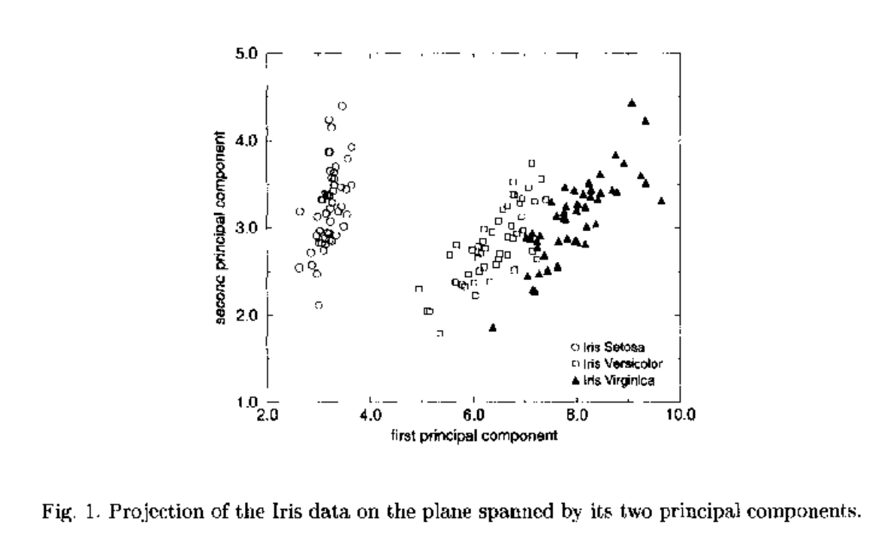

# Superparamagnetic Clustering of Data: The Definitive Solution of an Ill-Posed Problem

## Contents

- [Abstract](#abstract)
- [1. Introduction: "Definition" of the Problem](#1-introduction-definition-of-the-problem)
- [2. Superparamagnetic Clustering of Data](#2-superparamagnetic-clustering-of-data)
 - [2.1 The Cost Function](#21-the-cost-function)
 - [2.2 Statistical Mechanics](#22-statistical-mechanics)
 - [2.3 Identifying Data Clusters](#23-identifying-data-clusters)
- [3. Applications](#3-applications)
 - [3.1 Iris Data](#31-iris-data)
 - [3.2 Isolated Letter Speech Recognition (ISOLET)](#32-isolated-letter-speech-recognition-isolet)
 - [3.3 Computer Vision: Clustering of Images](#33-computer-vision-clustering-of-images)
 - [3.4 Protein Structure Classification](#34-protein-structure-classification)
 - [3.5 fMRI Images](#35-fmri-images)
- [4. Summary](#4-summary)
- [References](references/DMY1999.md)

## Abstract

_Physica A_ 263 (1999) 158–169

Clustering is an important technique in exploratory data analysis, with applications in image processing, object classification, target recognition, data mining etc. The aim is to partition data according to natural classes present in it, assigning data points that are "more similar" to the same "cluster". We solved this ill-posed problem without making any assumptions about the structure of the data, by using a physical system as an analogue. The physical system we use is a disordered (granular) magnet. The method was tested successfully on a variety of artificial and real-life problems, such as classification of flowers, processing of satellite images, speech recognition and identification of textures and images. We are currently involved in several collaborations, applying the method to image classification, fMRI data analysis and classification of protein structures.

## 1. Introduction: "Definition" of the Problem

The only proper way to define an ill-posed problem is by means of an example. Imagine the following experiment: a young child, who has never before seen either a kangaroo or a giraffe is exposed to hundreds of pictures of these animals, with no explanation given. Chances are that after seeing a sufficiently large number of giraffes and kangaroos the child will form a fairly clear understanding of the fact that she has been introduced to two different kinds of creatures. The child has learned something new without being instructed. This form of unsupervised learning is probably the most important means by which we acquire and process the incessant flow of information that reaches our senses from the world that surrounds us. Our brains learn, without a teacher's guidance, by grouping or binding together similar observations. Such a process, called clustering, is used also in a wide variety of applications, ranging from pattern recognition [1] to data mining [2].

The standard definition of the clustering problem [3] is as follows. Partition $N$ given points into $K$ groups (clusters) so that two points that belong to the same group are, in some sense, more similar than two that belong to different ones. The $i = 1, 2, \ldots, N$ data points are specified either in terms of their coordinates $x_i$ in a $D$-dimensional space or, alternatively, by means of an $N \times N$ "distance matrix", whose elements $d_{ij}$ measure the dissimilarity of data points $i$ and $j$. The traditional tasks of clustering algorithms are to determine $K$ and to assign each data point to a cluster. To put the example presented above in this context, imagine that each picture of an animal is processed by the child's visual system and is represented as a point in some abstract high dimensional space. In this space there will be a cloud of points that correspond to kangaroos and another cloud whose points will represent giraffes; the points of the first cloud will be assigned to cluster No. 1 and those of the second cloud to cluster No. 2.

In fact, the problem is inherently ill-posed: any given set of points can be clustered in drastically different ways, with no clear criterion available to prefer one clustering over another. Difficulties and ambiguities may arise for a variety of reasons. For example, there may be data points that do not belong to either cloud; the shapes of the clouds may be complex and their density nonuniform. The most important source of ambiguity is that the manner in which data "should" be clustered depends on the desired resolution. What appears as a single cloud may turn out, when examined with higher resolution, to be composed of several subclusters. Different tasks call for differing levels of resolution; furthermore, as we learn, our resolution improves. In the example presented above the child may pass from the initial operating point of lowest resolution, in which all observed creatures are assigned to one huge cluster of "objects" or "animals", to the highest resolution, in which every single observation is an independent cluster. Any attempt at clustering must select one of several distinct approaches. The algorithmic manifestations of these different approaches are, for example, whether the number of clusters $K$ is imposed as a hard constraint [4]. What controls the resolution, i.e. a possible hierarchical organization of the data into subclusters? Is there an "ideal kangaroo" or prototype, which may serve as a representative center of the corresponding cluster? Are there any a-priori assumptions made about the distribution of the data?

Most approaches define a cost function whose value can be calculated for any assignment of the data points to clusters. Methods differ in the particular cost function used and in what is to be done with it — e.g., is it to be minimized? If so, under what constraints?

Super Paramagnetic Clustering (SPC): The motivation for the method originates in the physics of disordered granular magnets. In Sec. 2.1 I introduce the cost function used by SPC; this cost function has the form of the Hamiltonian of a disordered Potts ferromagnet. The connection to Equilibrium Statistical Mechanics is natural and is explained in Sec. 2.2. As we will see, the temperature $T$ controls the resolution at which the data are clustered. Various equilibrium properties of the system are measured by Monte Carlo; in particular, the correlations of neighboring pairs are measured and serve to determine the assignment of data points to clusters, as explained in Sec. 2.3. In Sec. 3 we apply the method to a variety of problems.

## 2. Superparamagnetic Clustering of Data

### 2.1 The Cost Function

The basic premise of our approach is the following: data points $i$, $j$ that are highly similar to one another, i.e. with small $d_{ij}$, are likely to belong to the same clusters; the closer two points are, the more unlikely they are to belong to different clusters. To put this statement on a formal ground, we assign to every data point $i$ a Potts spin variable $s_i \in \{1, 2, \ldots, q\}$. Any particular clustering assignment is represented as a configuration $\{S\} = \{s_1, s_2, \ldots, s_N\}$ of all the Potts spin variables. Loosely speaking, $s_i = s_j$ indicates that $i$ and $j$ belong to the same cluster. An assignment with $s_i \neq s_j$ means that the two points are in different clusters, and such an assignment draws a penalty $J_{ij}$. A cost function that reflects these statements has the form

$$H(\{S\}) = \sum_{\langle i,j \rangle} J_{ij} \left(1 - \delta_{s_i, s_j}\right) \tag{1}$$

with $J_{ij}$ a decreasing function of the "distance" $d_{ij}$ between the data points $i$, $j$. In most applications we used a Gaussian decay of the interaction strength with distance, cut off beyond some distance or some number of neighbors; we expect, however, that neither the kind of spins used, nor the precise functional form of $J_{ij}(d_{ij})$ has a qualitative effect on the results. In particular, the number of Potts components $q$ has nothing to do with the number of clusters. At temperature $T = 0$ such a disordered ferromagnet is in its ground state, in which all spins are aligned. At high temperatures the system is completely disordered, with vanishing correlation between any pair of spins. The manner in which the system changes as $T$ varies between these extremes depends on the structure in the data. If we have one single cluster of data points, we expect a single (first order for $q = 20$) phase transition from the disordered paramagnetic phase to the fully ordered ferromagnetic one. If there are several clusters of data, we expect to observe one or more intermediate phases and transitions between them as the temperature is lowered; the spins associated with data points that form relatively dense clusters are expected to order at some high temperature, whereas less dense regions order at lower $T$. Two ordered clusters can be uncorrelated with each other, acting like giant superspins — this intermediate superparamagnetic regime serves to identify distinct clusters until at a lower $T$ they become also relatively ordered. As we will see, if $s_i$ and $s_j$ are highly correlated, our algorithm assigns the data points $i$ and $j$ to the same cluster. Hence indeed $T$ controls the resolution at which we cluster the data, as mentioned above.

### 2.2 Statistical Mechanics

The connection to Equilibrium Statistical Mechanics arises through the following argument. Any assignment of the variables $\{S\}$ represents a particular possible clustering of the data. Rather than minimizing the cost function, we realize that its value for $\{S\}$ reflects the resolution at which this clustering assignment views the data. There are many configurations $\{S\}$ with the same value of $H$ and we do not have any good reason to prefer one over the other. Hence it makes sense that for any desired resolution, i.e. fixed value of $H = E$, we assign to all configurations with this value the same probability, whereas all $\{S\}$ that correspond to different resolutions get vanishing probability. The resulting ensemble of assignments $\{S\}$ is nothing but the microcanonical ensemble which we replace by the computationally more convenient canonical ensemble, in which rather than fixing the value of $H$ we control its average value by a Lagrange multiplier, $1/T$. The connection to Statistical Mechanics sketched above was first made by Rose et al. [7]. They, however, used a very different cost function [8] — one that minimizes the variance within each cluster and hence maps onto a model with glassy behavior. Another important difference between their work and ours is in the way they calculate the equilibrium properties of their model by means of deterministic annealing. This method is unable to deal with first-order transitions which seem to be prevalent in the generic situations [9]. We, on the other hand, calculate the equilibrium average of various quantities by Monte Carlo. Using the Swendsen-Wang [10] algorithm, which is very efficient in flipping a large aligned cluster of spins, we generate an ensemble of clusterings (Potts spin configurations $\{S\}$), each with weight

$$P(\{S\}) \propto e^{-H(\{S\})/T} \tag{2}$$

and measure the ensemble average of various properties of the resulting equilibrium problem. The temperature $T$ controls the resolution at which we cluster the data; the simulations and measurements are carried out for a range of temperatures. We denote by $\langle A \rangle$ the ensemble average of the property $A$. The following properties of the system are measured:

**Magnetization,** $M = \langle m \rangle$, where

$$m(\{S\}) = \frac{q\, N_{\max}(\{S\}) - N}{(q-1)\, N} \tag{3}$$

with

$$N_{\max}(\{S\}) = \max\left\{N_1(\{S\}),\, N_2(\{S\}),\, \ldots,\, N_q(\{S\})\right\}$$

where $N_\alpha(\{S\}) = \sum_i \delta_{s_i, \alpha}$ is the number of spins with the value $\alpha$. As the temperature increases from $T = 0$ to $T = \infty$, $M$ varies from 1 to 0, via one or more sharp phase transitions.

**Susceptibility:**

$$\chi = \frac{N}{T}\left(\langle m^2 \rangle - \langle m \rangle^2\right)$$

At low $T$ the system is fully magnetized and the fluctuations in $m$ are negligible. As $T$ increases to the point where the single cluster breaks into sub-clusters (or becomes completely disordered) fluctuations become very large. Hence we expect to identify the transitions at which clusters break up by sharp peaks of the susceptibility.

**Correlation function** for pairs of neighboring spins:

$$G_{ij} = \langle \delta_{s_i, s_j} \rangle$$

### 2.3 Identifying Data Clusters

Our strategy is to vary $T$ and measure $\chi(T)$. Transitions show up as peaks of $\chi$; at temperatures between transitions we expect to observe relatively stable phases that correspond to some clusters being ordered internally and uncorrelated with other clusters. Within each such phase we measure $G_{ij}$ for all neighboring pairs of spins. The value of the correlation function $G_{ij}$ is the probability to find the two Potts spins $s_i$ and $s_j$ in the same state; we interpret this as the probability of finding data points $i$, $j$ in the same cluster. By the relation to granular ferromagnets we expect that the distribution of $G_{ij}$ is bimodal; if both spins belong to the same ordered grain (cluster), their correlation is close to 1; if they belong to two clusters that are not relatively ordered, the correlation is close to zero. Rather than thresholding the distances between pairs of points to decide their assignment to clusters, we use the pair correlations, which reflect a collective aspect of the data's distribution near the two points. The bimodality of the distribution of $G$ and the fact that grains order at sharp phase transitions makes our method much more robust and insensitive to the precise choice of various parameters. Clusters are identified in three steps:

1. **Thresholding:** If $G_{ij} > \theta$ a link is set between the neighbor data points $v_i$ and $v_j$. The resulting connected graph depends weakly on the value $\theta$ used in this thresholding, as long as it is bigger than $\frac{1}{q}$ and less than $1 - \frac{2}{q}$. The reason is, as was pointed out above, that the distribution of the correlations between two neighboring spins peaks strongly at these two values and is very small between them.

2. **Peripheral capture:** Capture points lying on the periphery of the clusters by linking each point $i$ to its neighbor $j$ of maximal correlation $G_{ij}$. It may happen, of course, that points $i$ and $j$ were already linked in the previous step.

3. **Connected components:** Data clusters are identified as the linked components of the graph obtained in steps 1 and 2.

## 3. Applications

The method was tested on a large number of artificial and real data [6]. Here I review (for illustrative purposes) a simple example taken from Botany (the Iris data); a very difficult problem from speech recognition (ISOLET data); and an example from computer vision and image processing, which demonstrates how a powerful clustering technique can reveal hierarchical structure.

### 3.1 Iris Data

**Fig. 1:** Projection of the Iris data on the plane spanned by its first two principal components.

The first "real" example we present is the time-honored Anderson–Fisher Iris data, which has become a popular benchmark problem for clustering procedures. It consists of measurements of four quantities performed on each of 150 specimens. The specimens were chosen from three species of Iris. The data constitute 150 points in four-dimensional space. From the projection on the plane spanned by the first two principal components, presented in Fig. 1, we observe that there is a well separated cluster (corresponding to the Iris Setosa species) while clusters corresponding to the Iris Virginica and Iris Versicolor do overlap.

We determined neighbors in the $D = 4$ dimensional space according to the mutual $K$ ($K=5$) nearest neighbors definition [6]; applied the SPC method and obtained the susceptibility curve of Fig. 2(a); it clearly shows two peaks. When heated, the system first breaks into two clusters at $T \approx 0.4$. At $T = 0$ we obtain two clusters, of sizes 50 and 100. The smaller cluster corresponds to the species Iris Setosa. At $T \approx 0.7$ another transition occurs, where the larger cluster splits into two. We identified clusters corresponding to the species Iris Versicolor, Virginica, and Setosa, with 2 samples left unclassified. No further breaking of clusters was observed; all three disorder at $T \approx 0.8$ (since all three are of about the same density).

**Fig. 2:** (a) The susceptibility as a function of temperature and (b) the size of the three biggest clusters at each temperature for the Iris data.

### 3.2 Isolated Letter Speech Recognition (ISOLET)

In the isolated-letter speech recognition task, the "name" of a single letter is pronounced by a speaker. The resulting audio signal is recorded for 26 letters of the English alphabet for many speakers. The task is to find the structure of the data, which is expected to be a hierarchy reflecting the similarity that exists between different groups of letters, such as $\{B, D\}$ or $\{M, N\}$ which differ only in a single articulatory feature. This analysis could be used, for instance, to determine to what extent the chosen features succeed in differentiating the spoken letters. We used the ISOLET database created by Ron Cole [11] which is available at the UCI machine learning repository. The data was recorded from 150 speakers balanced for sex and representing many different accents and English dialects. Each speaker pronounced each of the 26 letters twice. Cole's group has developed a set of 617 features describing each example. All attributes are continuous and scaled into the range $-1$ to $1$. The features include spectral, contour, sonorant, pre-sonorant, and post-sonorant features. We applied the SPC method at a series of temperatures. The resulting hierarchical partitioning of the data is presented in Fig. 3.

In assessing the extent to which the SPC method succeeded to recover the structure of the data, we built a "true" hierarchy by using the known labels of the examples. To do this, we first calculate the center of each class (letter) by averaging over all the examples belonging to it. Then a $26 \times 26$ matrix of the distances between these centers is constructed.

**Fig. 3:** Isolated letter speech hierarchy obtained by the Super-Paramagnetic method.

The purity of the clustering was again very high, and 3% of the samples were left as unclassified points.

### 3.3 Computer Vision: Clustering of Images

In the standard definition of the clustering problem, $N$ data points are specified in terms of their coordinates in a $D$-dimensional space. Mapping an image into such a space, where $D$ is not too large, would require the computation of $D$ measurements (or "features") that completely describe the image. This challenge has proved an extremely difficult task. The task of image comparison, on the other hand, is more feasible: rather than look for an explicit representation of images as vectors, one compares two images that are fed as input to an algorithm which returns as output the similarity between them. Such an algorithm, based on contour matching, was designed recently by Gdalyahu and Weinshall [14]. They collected 90 images of 6 different objects: toy models of a cow, wolf, hippopotamus, two different cars, and a boy. Each object contributed 15 images, taken from different points of view (in a sector range of 40° azimuth and 20° elevation). The $90 \times 90$ dissimilarity matrix was computed for the database of 90 images; this matrix constitutes the input to the Superparamagnetic Clustering algorithm. The dissimilarities are used as the distances which, in turn, determine the strength of the interactions between the pairs of spins associated with every image. The corresponding ferromagnetic system was brought to thermal equilibrium.

As the temperature was raised we measured the susceptibility $\chi$ (i.e. the fluctuation of the system's magnetization), presented in Fig. 4. $\chi(T)$ exhibits sharp features (peaks), which signal fairly sharp transitions. The different "phases" lie between the peaks. As outlined above, we measured the pair correlations in the various phases and used them to identify our clusters.

**Fig. 4:** Susceptibility $\chi(T)$ for the image clustering problem ($N = 90$ images). Peaks correspond to hierarchical transitions as shown in Fig. 5.

At the lowest $T$ all points belong to a single cluster. As shown in Fig. 5, when $T$ increases to the value of the first, largest peak of $\chi$, this cluster breaks up into three smaller ones with 45, 30, and 15 points; these contain, respectively, the 45 images of the three animals, the two cars (30), and the boy (15). That is, the first level of clustering distinguished animals from humans and from cars. At the next transition the cluster of the 45 animals breaks into one of 30 (the hippo and cow) and one of 15 (the wolf), followed by separation into hippo, cow, and wolf. Finally, at the highest transition the cluster of the two cars breaks into two separate clusters. Thus, our clustering method was able not only to identify the images taken from the 6 objects as 6 different clusters, but it also yielded a reasonable hierarchical organization of the similarities of these images. Furthermore, we experimented with two slightly different versions of the curve matching method which gave somewhat different dissimilarity matrices. The results shown here correspond to one of these; the other gave similar end results (clusters of 15 images in each), but the hierarchical structure was less in accord with human intuition. We mention this finding since it indicates the possibility of using the clustering method to select one of many alternative image comparison procedures, or even to optimize the parameters of the curve matching method. In other words, the clustering results can be used to learn the "correct" similarity function, which has been previously assumed to be given.

**Fig. 5:** The dendrogram produced by superparamagnetic clustering from the distance matrix obtained by pairwise comparison of 90 images of 6 objects. At $T_1$, 3 groups were identified, separating the pictures of the boy, animals, and cars. At $T_2$, $T_3$, the animal group was segmented into 3 sub-groups, corresponding to the pictures of the cow, wolf, and hippo. Finally, at $T_4$ the car group was segmented into 2 groups, each containing pictures of a different car. The final automatic classification is 100% correct, and the hierarchy reflects the true structure in the database.

### 3.4 Protein Structure Classification

One of the most promising approaches taken in protein folding is based on classification of proteins by their chemical sequence and structure. Various groups have introduced different schemes to compare structures of two proteins and to measure a similarity index. Each group then proceeds to generate a tree or dendrogram that reflects the manner in which the proteins' structures are organized.

We considered two different schemes: the FSSP (Fold classification based on Structure-Structure alignment of Proteins) of Holm and Sander [15], which provides pairwise similarities of about 1200 chains, and the CATH hierarchy [16] which arranges single-domain chains in a hierarchy according to their Class, Architecture, Topology and Homologous superfamily. We concentrated on the first two identifiers: class and architecture, and investigated the extent to which the clusters derived on the basis of the FSSP distance measure are consistent with the CATH classification. There are 479 proteins that appear in the FSSP database and also have been classified by CATH; these can serve to assess the agreement between the two. If we find that the two agree, we can propose the CATH classification for 165 proteins which also appear in the FSSP (but not in CATH) and have been identified as single-domain chains by the 3Dee database. By applying the SPC on the FSSP similarity matrix, we were able [17] to assign 80% of the proteins to almost pure clusters that belonged to a single C,A category of CATH.

Hence we expect that our success rate on the 561 single-domain proteins that have not yet been classified by CATH to be around 80% as well.

### 3.5 fMRI Images

The last application presented here is still in progress; this work is done in collaboration with K. Grill-Spector and R. Malach, who collect fMRI data from subjects who are presented with various complex visual stimuli in the course of a session. The neural activity of various regions of the brain is recorded. By clustering temporal sequences of neural activity one hopes to identify anatomic regions that contain volume elements with similar functions (such as sensitivity to objects, to vertical or horizontal features of vision, etc.). This work has yielded so far promising results, which will be presented elsewhere.

## 4. Summary

Clustering is an important method in exploring the underlying structure of all kinds of data. There is a wide range of applications, both direct, as those reviewed above, and indirect. For example, once the underlying structure has been identified by such an unsupervised technique, it is much easier to design a classifier (by a neural network or other method) to partition the data into clusters. For example, it would be quite difficult to train a neural net to partition the ISOLET data with more than 600 input features. Once we see the tree of Fig. 3, it is clear that one should first identify "W"; this is probably a very easy task. The remaining data should be submitted to a "Q–U detector" and those points that were classified as "Q" or "U" are then presented to a sub-network that is trained only on such data, to separate the "Q" from the "U", etc. This way the knowledge acquired by the clustering procedure is used to break a large complex problem down into a hierarchy of small, manageable sub-problems. Another indirect use of the method was mentioned in Section 3.3.

The experts who pre-process the data must decide which aspects are important for classification and which are less important, what weight should be given to different features, etc. If their output (in the form of coordinates of individual points or pairwise distance matrices) is fed into the clustering algorithm and the resulting structure is fed back to the preprocessing experts, they may use the information to improve and fine-tune their decisions. Finally, our method is a direct application of knowledge and expertise gained by studying the statistical mechanics of model disordered ferromagnets. Perhaps one of the most important lessons is that one can never know which successful and rewarding applications will grow out of "curiosity driven" basic theoretical research.
