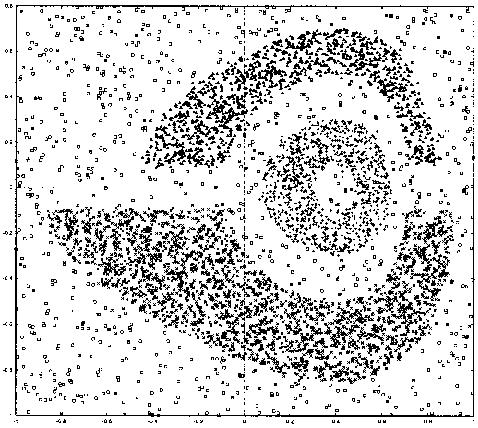
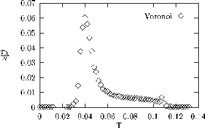
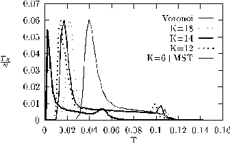
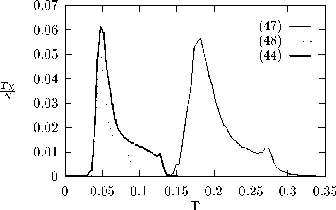
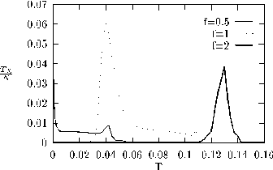
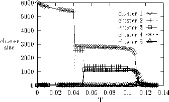
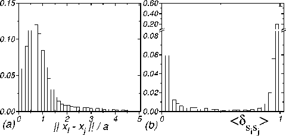
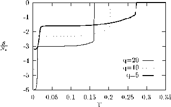

# Superparamagnetic Clustering of Data

## Contents

- [Abstract](#abstract)
- [I. A Pedestrian's Introduction to Clustering](#i-a-pedestrians-introduction-to-clustering)
- [II. Statistical Mechanics of Nonparametric Classification](#ii-statistical-mechanics-of-nonparametric-classification)
- [III. A Many-Cluster Potts Mean Field Model with Noise](#iii-a-many-cluster-potts-mean-field-model-with-noise)
 - [A. Motivation and Definition of the Model](#a-motivation-and-definition-of-the-model)
 - [B. Order Parameters and the Free Energy](#b-order-parameters-and-the-free-energy)
 - [C. Phase Diagram](#c-phase-diagram)
 - [1. Paramagnetic to Superparamagnetic Transition](#1-paramagnetic-to-superparamagnetic-transition)
 - [2. Superparamagnetic to Ferromagnetic (A) Transition](#2-superparamagnetic-to-ferromagnetic-a-transition)
 - [3. Paramagnetic to Ferromagnetic (A) Transition](#3-paramagnetic-to-ferromagnetic-a-transition)
 - [4. Ordering Transitions of the Background Spins; Ferromagnetic (B) Phase](#4-ordering-transitions-of-the-background-spins-ferromagnetic-b-phase)
 - [5. Which $J_3$ Is Relevant to the Clustering Problem?](#5-which-$j_3$-is-relevant-to-the-clustering-problem)
 - [D. Correlation Functions](#d-correlation-functions)
 - [E. Susceptibility](#e-susceptibility)
- [IV. Details of the Clustering Method](#iv-details-of-the-clustering-method)
 - [A. Independence of or Dependence on Choice of Parameters](#a-independence-of-or-dependence-on-choice-of-parameters)
 - [Definition of Neighbors](#definition-of-neighbors)
 - [B. Dependence or Independence on the Form of the Interaction](#b-dependence-or-independence-on-the-form-of-the-interaction)
 - [C. Sensitivity to Changing the Interaction Range](#c-sensitivity-to-changing-the-interaction-range)
 - [D. Sensitivity to the Clustering Temperature](#d-sensitivity-to-the-clustering-temperature)
 - [E. Sensitivity to the Spin-Spin Correlation Threshold $\theta$](#e-sensitivity-to-the-spin-spin-correlation-threshold-$theta$)
- [V. Physical Interpretation of the Method](#v-physical-interpretation-of-the-method)
 - [A. Significance of $\xi$, the Correlation Length of the Fluctuations for the Clustering Solution](#a-significance-of-$xi$-the-correlation-length-of-the-fluctuations-for-the-clustering-solution)
 - [1. The Clustering Criterion](#1-the-clustering-criterion)
 - [2. Relevant Known Properties of the Potts Model Correlation Length](#2-relevant-known-properties-of-the-potts-model-correlation-length)
 - [3. Length Scale of Density Estimation and the Correlation Length](#3-length-scale-of-density-estimation-and-the-correlation-length)
 - [4. Resolution and Errors in Cluster Boundaries](#4-resolution-and-errors-in-cluster-boundaries)
 - [B. $q$ Dependence of the Spatial Resolution of the Clustering Solution](#b-$q$-dependence-of-the-spatial-resolution-of-the-clustering-solution)
 - [1. $q$ Dependence of the Effect of Density Fluctuations](#1-$q$-dependence-of-the-effect-of-density-fluctuations)
 - [2. $q$ Dependence of the Definiteness of the Clustering Solution](#2-$q$-dependence-of-the-definiteness-of-the-clustering-solution)
 - [C. On the Effect of Density Differences](#c-on-the-effect-of-density-differences)
- [VI. Summary](#vi-summary)
- [Appendix A: On Obtaining the Free Energy of the Mean Field Model](#appendix-a-on-obtaining-the-free-energy-of-the-mean-field-model)
- [Appendix B: Superparamagnetic to Ferromagnetic Transition](#appendix-b-superparamagnetic-to-ferromagnetic-transition)
- [References](references/WBD1998.md)

## Abstract

The physical aspects of a recently introduced method for data clustering are considered in detail. This method is based on an inhomogeneous Potts model; no assumption concerning the underlying distribution of the data is made. A Potts spin is assigned to each data point and short range interactions between neighboring points are introduced. Spin-spin correlations measured by Monte Carlo computations serve to partition the data points into clusters. In this paper we examine the effects of varying different details of the method such as the definition of neighbors, the type of interaction, and the number of Potts states $q$. In addition, we present and solve a granular mean field Potts model relevant to the clustering method. The model consists of strongly coupled groups of spins coupled to noise spins, which are themselves weakly coupled. The phase diagram is computed by solving analytically the model in various limits. Our main result is that in the range of parameters of interest the existence of the superparamagnetic phase is independent of the ordering process of the noise spins. Next we use the known properties of regular and inhomogeneous Potts models in finite dimensions to discuss the performance of the clustering method. In particular, the spatial resolution of the clustering method is argued to be connected to the correlation length of spin fluctuations. The behavior of the method, as more and more data points are sampled, is also investigated.

PACS numbers: 02.50.Rj, 05.70.Fh, 89.70.+c

## I. A Pedestrian's Introduction to Clustering

The compelling connections between information theory and statistical physics have given rise to a fruitful exchange of ideas between the two disciplines. It is no wonder then that ideas and tools of statistical mechanics can prove very useful in solving difficult problems in information processing. In this work we represent the problem of data clustering as that of finding the probable states of an inhomogeneous Potts model. By solving the physics of this Potts model we are able to give good solutions to the data clustering problem. We dedicate most of the Introduction to a short biased review of the data clustering field and the problematics inherent to many of the methods that were used to solve the problem.

Clustering is an important technique in exploratory analysis of information or data. Since information analysis is needed in a large variety of engineering and scientific problems, it is no wonder that clustering is used in diverse fields such as pattern recognition [1], learning [2], astrophysics [3], computer vision, biology, and more. The goal of data clustering is to divide the data according to natural classes present in it. More formally the problem can be stated as follows:

Given $i = 1, 2, \ldots, N$ patterns, represented as points $x_i$ in a $D$-dimensional metric space (in some cases only the distances between all pairs of points are given), determine the partition of these $N$ points into $M$ groups, called clusters, defined such that the **definition I** of clusters is as follows: points that belong to the same cluster are more similar to each other than to points in different clusters. Note that the value of $M$ also has to be determined by the clustering procedure.

As a typical example of the use of clustering, suppose we want to divide the iris flower population into species. Our expedition collects a large sample of iris flowers (patterns). For each flower $D$ properties are measured, such as the sepal length and width, the petal length and width, etc. The values obtained for the $i$th flower determine the "location" of the point $x_i$. If we chose to measure relevant properties, different regions of points in the $D$-dimensional space will correspond to different species of iris. The goal of clustering is to deduce from the distribution of the points, without any a priori knowledge about the iris flowers population, which points (or flowers) constitute a species and how many species there are.

A basic assumption in clustering is that the similarity of two points is a decreasing function of their mutual distance. (This assumption is problematic when the scales of the different dimensions are not simply related.) In order to implement definition I though, one needs a way to measure the similarity between more than two points, which may constitute a cluster. In other words, the question is how to define a proper "many body" similarity measure.

One possible definition of a measure for the similarity between points belonging to a cluster is based on the assumption that the center of mass of the cluster's points is a sufficient representative of the cluster (and all its points). The extent to which a point is correctly assigned to the cluster is then a function of its distance from the cluster representative. This is an example for a general approach known as the parametric clustering approach. The idea is to describe the clusters' structure by some parameters and use these to measure the similarity of a point to a cluster. This results in a cost function that usually needs to be minimized in order to find the optimal clustering solution and its corresponding parameters. Typical examples of this approach are deterministic annealing [4] and maximum likelihood [5]. In recent years some parametric clustering algorithms, rooted in statistical physics, have been proposed [6].

The main drawback of this approach is that a certain structure of the clusters is assumed (e.g., each cluster can be represented by a center and a spread around it). The result is that some structure, which is assumed either correctly or incorrectly, is imposed on the data. If the assumption is far from the truth it can lead to erroneous and misleading results.

Thus, when there is no a priori knowledge about the data structure, it is more natural to adopt nonparametric clustering methods, which are motivated by a local version of definition I: the **definition II** of clusters is as follows: The points that constitute a cluster reside in a connected region of space, in which the density of points is relatively high. Two clusters are separated by a region in which the density of points is relatively low [7]. It is clear that if several neighboring points are similar or close to each other then they form a region of higher density, while several neighboring points, which are all relatively far from each other, form a region of lower density. In this sense definition II follows from applying definition I locally. Indeed, nonparametric clustering methods use local criteria to decide whether neighboring points belong to the same cluster. The overall structure emerges then from the transitive nature of definition II, where clusters are defined as connected regions. This is in accord with the transitivity inherent to sets. If point A and point B belong to the same cluster, and points B and C belong to the same cluster then A and C must belong to the same cluster.

The second definition seems at first sight a straightforward working definition; all one needs to do is to construct a contour map of the density and declare the highlands above some height as clusters. Conceptually this is an appropriate view of the essence of non-parametric clustering, though an important issue is the scale on which density is estimated. In practice the task is extremely difficult since the common case is that points are often distributed sparsely and irregularly in a high-dimensional space. These difficulties render grid based and basis functions based methods inappropriate. Instead, many nonparametric clustering methods [1, 8, 7] have been suggested and used, all of which are inherently based only on the points themselves. Some of these methods are hierarchical [1] and recursively apply nonlocal similarity measures suitable for particular cluster shapes. Some algorithms originate from graph theory [1] and utilize a graph structure where the data points are vertices connected by edges of a graph. After removing the "inconsistent" edges of the graph according to some local criterion, the clusters are defined as the connected components of the graph. The basic flaw of these methods is that the decision to remove an edge depends only on the distance between the two points it connects. This is in contradiction to the grouplike spirit of definition I. Thus, applying a similarity measure that maintains the grouplike spirit of definition I, yields clustering that is stable in the presence of noise, and is appropriate for different cluster shapes and constitutes, is the crux of the nonparametric clustering approach.

Spin systems are a classic example of many body systems where local two body interactions give rise to grouplike or collective behavior. The collective behavior is expressed in the fact that many spins are found with high probability in the same state. Interpreting this as a sign of similarity, it is natural to view the spin-spin correlation function as a similarity measure. In contrast with the interpoint distance used in many methods as a similarity measure, the spin-spin correlation function is an inherently grouplike property and is influenced by the state of spins of a region of size $\xi^D$ (where $\xi$ is the correlation length). The use of the Potts model for the clustering task is particularly appealing since its physics can be completely understood in terms of geometrical clusters [9].

In the present work (a brief account of which was first presented in [10]) we advocate the use of an inhomogeneous Potts model for solving the nonparametric clustering problem. A detailed comparison with the performance of other techniques, which was reported in [11], clearly indicates the relative success of our method. Here we dwell on the physical aspects of our method. In Sec. II we give a formal justification to our approach, outline the method and explain how it works. In Sec. III we analyze in detail a Potts mean field model that is relevant to the clustering problem. In Sec. IV we describe our method in detail, its dependence and/or independence on various parameters, and show how it works on a toy problem. In Sec. V we use heuristic physical arguments and various known properties of Potts models to consider how our method works for more realistic point distributions, which cannot be approximated by mean field. The effect of interactions between neighboring regions with different densities of points is also considered, together with the validity of our approach in a relevant thermodynamic limit. The paper is summarized in Sec. VI.

## II. Statistical Mechanics of Nonparametric Classification

The goal is to find the "best" classification for a given distribution of data points. A classification $\{s\}$ is defined by assigning to each point $x_i$ a label $s_i$ that may take integer values $s_i = 1, \ldots, q$. We define a cost function $H[\{s\}]$,

$$H[\{s\}] = -\sum_{\langle i,j\rangle} J_{ij}\,\delta_{s_i,s_j}, \quad s_i = 1,\ldots,q, \tag{1}$$

where $\langle i,j\rangle$ stands for a pair of points $i$ and $j$, and $J_{ij}$ is some positive monotonically decreasing function of the distance $|x_i - x_j|$, so that the closer two points are to each other, the more they "like" to belong to the same class. This cost function is the Hamiltonian of an inhomogeneous ferromagnetic Potts model [12]. Note that $q$ does not restrict the number of clusters.

We want to select a good classification using nothing but $H[\{s\}]$. Taking the usual path in information theory [13], we choose the probability distribution that has the most missing information (entropy) and yet has some fixed average cost $E$. The resulting probability distribution is that of a Potts system at equilibrium at inverse temperature $\beta$, which is the Lagrange multiplier determining the average energy or cost $E$. Similarly to the fuzzy clustering approach [14], the answer is given in terms of a probability distribution of classifications and not in terms of one good classification. (We do, however, use this probability distribution, or more specifically spin-spin correlations, to propose a definite clustering.) Because the cost function (1) is symmetric with respect to a global permutation of all labels, each point is equally likely to belong to any one of the $q$ classes. Therefore the only way to extract meaningful information (or to assign clusters) out of the equilibrium probability distribution is through correlations. The average spin-spin correlation function $\langle\delta_{s_i,s_j}\rangle$ — the probability that points $i$ and $j$ belong to the same class — is thus used to decide whether or not two spins belong to the same cluster.

As a concrete demonstration of the manner in which the clustering answer depends on the temperature, place a Potts spin at each of the data points of Fig. 1. Here the dimension is $D = 2$ and the number of data points is $N = 6000$. This is a simple example intended for a pedagogical presentation of the problem. The example is not trivial since other methods [15] fail on it. At high temperatures the system is in a disordered (paramagnetic) phase. As the temperature is lowered a transition to a superparamagnetic phase occurs; spins within the same high density region become completely aligned, while different regions remain uncorrelated. As the temperature is further lowered, the effective coupling between the three clusters (induced via the dilute background spins) increases, until they become aligned. Even though this is a pseudotransition (note the finite number of participating clusters) and the transition temperature of the background is much lower, we call this "phase" of aligned clusters ferromagnetic.

In order to support this qualitative picture we analyze in the next section a relevant mean field Potts model. The analysis serves to examine systematically the nature of the possible phases and phase transitions that could arise in connection with the clustering problem. This is important since each phase is a stable (with respect to small temperature variations) solution of the clustering problem.

## III. A Many-Cluster Potts Mean Field Model with Noise

### A. Motivation and Definition of the Model

In some clustering problems several dense groups of points are separated from each other by a sparse background (or noise). In some other typical cases the core of a group is denser than the region adjacent to its perimeter; consequently, it may be very difficult to differentiate the region adjacent to the perimeter from noise. Thus the two classes of problems are effectively similar. We try to mimic this situation by the following Potts system: (i) $N_c$ points are divided into $M$ groups. (ii) Points within the same group interact with interaction strength $(M/N_c)J_1$. (iii) $N_b$ points constitute a background; the interaction between two such points is of strength $(1/N_b)J_2$. (iv) Every point that belongs to a group interacts with every point of the background with an interaction of strength $(1/N_c)\sqrt{M/N_b}\,J_3$. The Hamiltonian of such a Potts system is

$$H = -\frac{M}{N_c}J_1\sum_{a=1}^{M}\sum_{i<j}\delta_{\sigma_i^a,\sigma_j^a} - \frac{1}{N_b}J_2\sum_{i<j}\delta_{\sigma_i^b,\sigma_j^b} - \frac{1}{N_c}\sqrt{\frac{M}{N_b}}\,J_3\sum_{a=1}^{M}\sum_{i,j}\delta_{\sigma_i^b,\sigma_j^a}, \tag{2}$$

where $\sigma_i^a$ denotes the $i$th spin ($i = 1,\ldots,N_c/M$) of the $a$th group ($a = 1,\ldots,M$), $\sigma_i^b$ denotes the $i$th spin ($i = 1,\ldots,N_b$) of the noise, and $\sigma_i^a, \sigma_i^b \in \{1,\ldots,q\}$. The normalization of the third term ensures that after summing over the states of the background spins it "renormalizes" into a term proportional to the number of groups $M$. Without loss of generality it will be assumed that $J_1 = 1$. A schematic representation of the model is shown in Fig. 2.

Since many of the difficult clustering problems are of extremely high dimensionality, a mean field setting of the type embodied by Eq. (2) is relevant to the problem. This formulation, however, does not include any disorder. By studying this model we hope to gain insight into the interplay between the ordering process that occurs within the background spins and the ordering among the different clusters. In particular, we wish to study whether the relative ordering of two clusters is "driven" by an ordering transition of the background. We will find that in a certain range of parameters there is a transition, at which the relative ordering of different clusters increases abruptly and this occurs independently of the ordering process of the noise spins.

### B. Order Parameters and the Free Energy

When the spins within a group are more or less ordered, a spin within that group is subject to a total effective field of the order of $J_1$. Similarly, when the background is ordered, a spin within it is subject to an effective field of the order of $J_2$. Since we assume that the background is less dense than the groups, and because in the "real" problem (see Sec. IV) the couplings between spins decrease exponentially with the interpoint distance, we assume from here on that $J_2 < J_1$. For the sake of completeness we considered the phase diagram with interactions $J_3$ of any strength (relative to $J_1$, $J_2$); towards the end of this section we focus on the range of $J_3$ relevant to the clustering problem.

In order to analyze the problem using mean field methods [16, 17] it was assumed that $N_b$, $N_c/M \gg 1$. The energy per spin (or more precisely, the total energy divided by $N_c$) can be expressed as

$$\frac{H}{N_c} = E = -\frac{J_1}{2M}\sum_{a,\alpha}m_{a\alpha}^2 - \frac{J_2 N_b}{2N_c}\sum_\alpha m_{b\alpha}^2 - \sqrt{\frac{N_b}{M}}\frac{J_3}{N_c}\sum_{a,\alpha}m_{b\alpha}\,m_{a\alpha}, \tag{3}$$

while the entropy per spin, to leading order in $1/N_c$, $1/N_b$, is given by

$$S = -\frac{1}{M}\sum_{a,\alpha}m_{a\alpha}\ln m_{a\alpha} - \frac{N_b}{N_c}\sum_\alpha m_{b\alpha}\ln m_{b\alpha}. \tag{4}$$

Here $m_{a\alpha}$ is the fraction of spins in the $a$th group with value $\alpha$, and $m_{b\alpha}$ is the fraction of spins in the background with value $\alpha$.

Incorporating standard mean field assumptions (following Wu [17]) we characterize the state of the system by three order parameters $s$, $t$, and $\hat{s}$, where $0 \leq s, t, \hat{s} \leq 1$. We assume that within each group one Potts state (denoted by $\alpha$) is "occupied" by a fraction $m_\alpha = m \geq 1/q$ of the spins, whereas the other $q-1$ states are equally occupied. Note that $\alpha$ may vary from group to group. The variable

$$s = (m - 1/q)/(1 - 1/q) \tag{5}$$

measures the amount of order within a group, ranging from $s = 0$ when $m = 1/q$ to $s = 1$ for $m = 1$. Expressed in terms of $s$, the different Potts states are occupied by fractions:

$$m_\alpha = \frac{(q-1)s+1}{q}, \quad m_{\gamma\neq\alpha} = \frac{1-s}{q}. \tag{6}$$

$t$ is related similarly to the amount of order within the background. For each group $a$ we define a superspin $\hat{\sigma}_a$ whose value is identical with the spin value of highest occupation by the spins constituting that group. Thus for each group $a$ the precise form of Eq. (6) is

$$m_{a\gamma} = \frac{1-s}{q} + s\,\delta_{\hat{\sigma}_a,\gamma}. \tag{7}$$

Denote by $\hat{m}_\gamma$ the fraction of superspins with value $\gamma$, $\hat{m}_\gamma = (1/M)\sum_a\delta_{\hat{\sigma}_a,\gamma}$. Again we assume that one Potts state (say $\gamma = 1$) is "occupied" by a fraction $\hat{m}_1 = \hat{m} \geq 1/q$ of the superspins, whereas the other $q-1$ states are equally occupied. The variable

$$\hat{s} = (\hat{m} - 1/q)/(1 - 1/q) \tag{8}$$

measures the relative order of the $M$ superspins and $\hat{s} = 1$ when all superspins are aligned. Using Eqs. (5)–(8) in Eqs. (3) and (4) we obtain the free energy per spin:

$$\beta f = -\beta\frac{J_1}{2}\!\left(\frac{q-1}{q}s^2 + \frac{1}{q}\right) - \beta\frac{J_2 N_b}{2N_c}\!\left(\frac{q-1}{q}t^2 + \frac{1}{q}\right) - \beta\frac{\sqrt{MN_b}}{N_c}J_3\!\left(\frac{q-1}{q}st\hat{s} + \frac{1}{q}\right) - S(s) - \frac{N_b}{N_c}S(t) - \frac{M}{N_c}S(\hat{s}), \tag{9}$$

where the entropy function $S$ is given by

$$S(s) = -\frac{1+(q-1)s}{q}\ln[1+(q-1)s] - \frac{(q-1)(1-s)}{q}\ln[1-s]. \tag{10}$$

Here $\beta = 1/T$ is the inverse temperature (taking $k_B = 1$). The manner in which the nontrivial third term in Eq. (9) is obtained is explained in Appendix A.

### C. Phase Diagram

The state of the system is found by minimizing the free energy (9) with respect to $s$, $t$ and $\hat{s}$, which results in the three stationarity equations:

$$\frac{q}{q-1}\frac{\partial\beta f}{\partial s} = -\beta J_1 s - \beta\frac{\sqrt{MN_b}}{N_c}J_3\,\hat{t}\hat{s} + \ln[1+(q-1)s] - \ln[1-s] = 0, \tag{11a}$$

$$\frac{q}{q-1}\frac{\partial\beta f}{\partial t} = -\beta J_2\frac{N_b}{N_c}t - \beta\frac{\sqrt{MN_b}}{N_c}J_3\,s\hat{s} + \frac{N_b}{N_c}\{\ln[1+(q-1)t] - \ln[1-t]\} = 0, \tag{11b}$$

$$\frac{q}{q-1}\frac{\partial\beta f}{\partial\hat{s}} = -\beta\frac{\sqrt{MN_b}}{N_c}J_3\,st + \frac{M}{N_c}\{\ln[1+(q-1)\hat{s}] - \ln[1-\hat{s}]\} = 0. \tag{11c}$$

Inspection of these equations shows that if one of the order parameters vanishes, at least one more must vanish as well. Three possible phases are paramagnetic ($s = 0, t = 0, \hat{s} = 0$), superparamagnetic ($s > 0, t = 0, \hat{s} = 0$), ferromagnetic ($s > 0, t > 0, \hat{s} > 0$). The fourth possible phase, where ($s = 0, t > 0, \hat{s} > 0$), is of no interest here since it occurs only for $J_2 > J_1$. We will find that in some regions of the space of couplings an additional transition line occurs within the ferromagnetic phase, separating two subphases, one with small $t$ and one with large $t$.

In the next four subsections we calculate the location and nature of the phase transitions of the model. The phase diagram obtained is shown in Fig. 3 where each transition line is labeled by a number corresponding to the subsection in which it is discussed.

#### 1. Paramagnetic to Superparamagnetic Transition

In the high temperature regime $T^* \equiv [2(q-1)\ln(q-1)/(q-2)]\,T \gg 1$ the free energy is minimized by the disordered, paramagnetic solution of Eq. (11), $s = t = \hat{s} = 0$. The transition to the superparamagnetic phase ($s > 0, t = \hat{s} = 0$) is found by demanding that the free energies of the two phases at the transition be equal. Writing $f$ as $f(s,t,\hat{s})$, where the explicit function is given by Eq. (9), this condition is written as

$$f(s, 0, 0) = f(0, 0, 0). \tag{12}$$

Equations (11b) and (11c) are satisfied, but $s$ has to be a solution of Eq. (11a). These two equations, (11a) and (12), are identical with those that locate the transition of the homogeneous mean field Potts model [17]. Their solution is given by the "canonical" values for the inverse transition temperature $\beta_{ps}$:

$$\beta_{ps} J_1 = \frac{2(q-1)}{q-2}\ln(q-1), \tag{13}$$

and by the canonical value for the order parameter, whose value at the transition is

$$s_{ps} = \frac{q-2}{q-1}. \tag{14}$$

The physical meaning of this phase is clear: each group is ordered, but there is no ordering of the different "superspins" with respect to each other ($\hat{s} = 0$) and the background spins are not ordered either ($t = 0$).

#### 2. Superparamagnetic to Ferromagnetic (A) Transition

As the temperature is further lowered, a transition occurs, at $\beta_{fs}$, to a ferromagnetic phase with $s, t, \hat{s} > 0$. At the transition the state of the system changes abruptly from $(s^-,0,0)$ to $(s,t,\hat{s})$. The values of $s^-$, $s$, $t$, $\hat{s}$, and $\beta_{fs}$ are found from five equations. The first is the stationarity equation (11a) in the superparamagnetic phase,

$$-\beta_{fs} J_1 s^- + \ln[1+(q-1)s^-] - \ln[1-s^-] = 0. \tag{15}$$

The next three are the stationarity equations (11a)–(11c), in the ferromagnetic phase; the fifth is the condition

$$f(s^-, 0, 0) = f(s, t, \hat{s}). \tag{16}$$

In order to solve these five equations analytically we make two assumptions. The first, which is valid for $J_2 \ll J_3$, is that the transition occurs well above the ordering transition of the background (see Sec. III C 4); this assumption ensures that at the transition the background spins are nearly independent of each other. The second assumption, which is valid for $J_3 \ll J_1$, is that $T_{sf} = 1/\beta_{fs}$ is well below the transition temperature within the groups $T_{ps}$ (discussed in Sec. III C 1), which ensures that at the transition $1 - s^- \ll 1$ and $\epsilon \equiv s - s^- \ll 1$.

The physical interpretation of this ferromagnetic (A) phase is as follows. If the background spins were not coupled to the $M$ groups, there would have been no order in the background, i.e., $t$ would have been zero. The background, however, mediates an interaction between different superspins; this effective interaction causes relative ordering of the superspins (i.e., $\hat{s} > 0$), which, in turn, gives rise to an effective "field" on the background spins causing $t > 0$. The ordering transition due to the interaction between the background spins, irrespective of their coupling to the spins in the $M$ groups, occurs at a lower temperature.

The details of the solution of the five equations are given in Appendix B. It turns out that the equation for the order of the background spins $t$,

$$t = \sqrt{\frac{M}{N_b}}\frac{\beta J_3 s^-\hat{s}}{q - \beta J_2}, \tag{17}$$

is that of a system of Potts spins at a high temperature with interaction $J_2$ and subject to a field of strength $\sqrt{M/N_b}\,J_3 s^-\hat{s}$. The equations for the order parameter $\hat{s}$ are identical with those that locate the transition of a homogeneous mean field Potts model [17] with coupling constant $\tilde{J} = (\beta J_3 s^-)^2/(q - \beta J_2)$. Note that the effective field acting on the background spins is suppressed by a factor of $\sqrt{M/N_b}$ with respect to the strength of coupling between the superspins.

The final results for the order parameters at the transition are

$$\hat{s}_{fs} = \frac{q-2}{q-1}, \tag{18a}$$

$$t_{fs} = \sqrt{\frac{2(q-2)}{q(q-1)}\ln(q-1)}\,\sqrt{\frac{M}{N_b}}, \tag{18b}$$

$$s^- = 1 - e^{-c}\frac{J_1}{J_3}, \quad\text{where} c = \sqrt{\frac{2q(q-1)\ln(q-1)}{q-2}}, \tag{18c}$$

$$s = s^- + \epsilon, \quad\text{where} \epsilon = \frac{2(q-2)}{q-1}\ln(q-1)\,\frac{M}{N_c}\exp\!\left(-\frac{cJ_1}{J_3}\right). \tag{18d}$$

The inverse transition temperature is given by

$$\beta_{fs} J_3 s^- = \sqrt{\frac{2q(q-1)\ln(q-1)}{q-2}}. \tag{19}$$

The magnetization density of the background, $m_b$, and the magnetization density of the spins of all groups, $m_c$, are simply related to the order parameters:

$$m_c \equiv \left\langle\frac{1}{N_c}\sum_{i,a}\delta_{\sigma_i^a,1}\right\rangle = \frac{q-1}{q}s\hat{s} + \frac{1}{q}, \tag{20a}$$

$$m_b \equiv \left\langle\frac{1}{N_b}\sum_i\delta_{\sigma_i^b,1}\right\rangle = \frac{q-1}{q}t + \frac{1}{q}. \tag{20b}$$

To see this add two infinitesimal fields in the $\alpha = 1$ direction (acting on the group and background spins). It follows that $m_c$ jumps at $\beta_{fs}$ from $1/q$ to $m_c = (q-1)/q$. On the other hand, the increase in the value of $m_b$ at $\beta_{fs}$ is, according to Eq. (18b), of order $O(\sqrt{M/N_b})$. A noteworthy property of the transition is that despite the fact that ordering of the background spins (with order parameter $t$) and ordering of the group superspins (with order parameter $\hat{s}$) is due to the same interaction term (third term in Eq. (9)), we find that $t_{fs} \ll \hat{s}_{fs}$. The reason is that assuming that each group is roughly completely ordered, the total interaction strength between a group superspin and a background spin is $(1/\sqrt{MN_b})\,J_3$. Since there are $N_b$ background spins, the resulting field on a background spin is $\sqrt{M/N_b}\,J_3$, which is much smaller than the field on a superspin.

#### 3. Paramagnetic to Ferromagnetic (A) Transition

It seems plausible that for large values of $(\sqrt{MN_b}/N_c)\,J_3$ the coupling between groups and background is so large that ordering within the groups necessarily imposes some order in the background and, consequently, order among different groups. In this case the intermediate superparamagnetic phase does not occur, but rather a direct transition from the paramagnetic state $(0,0,0)$ to the ferromagnetic (A) state $(s,t,\hat{s})$ takes place. To find the transition temperature and the values of $s$, $t$, and $\hat{s}$ at this transition one needs to solve Eq. (11) together with the condition

$$\beta f(s, t, \hat{s}) = \beta f(0, 0, 0). \tag{21}$$

To solve these four equations we assume that $J_2 \ll J_1 \ll J_3$, implying again that the transition is well above the ordering temperature of the background. Thus we assume that $t \ll 1$ and obtain from Eq. (11b)

$$t = \sqrt{\frac{M}{N_b}}\frac{\beta J_3 s\hat{s}}{q - \beta J_2}. \tag{22}$$

This result is basically the same as Eq. (17). Substituting Eq. (22) in Eq. (11a), and assuming that $\hat{s} = 1 - \epsilon$, we obtain to zeroth order in $\epsilon$:

$$-\beta J_1 s - \frac{M}{N_c}\frac{(\beta J_3)^2}{q-\beta J_2}\,s + \ln[1+(q-1)s] - \ln[1-s] = 0. \tag{23}$$

Expanding $S(t)$ to second order in $t$ and $S(\hat{s})$ to zeroth order in $\epsilon$, and using Eq. (22), we obtain from Eq. (21)

$$-\frac{\beta}{2}\!\left(J_1 + \frac{M}{N_c}\frac{(\beta J_3)^2}{q-\beta J_2}\right)\frac{q-1}{q}s^2 - S(s) - \frac{M}{N_c}S(\hat{s}) = 0. \tag{24}$$

Neglecting now the last term in Eq. (24) (of order $M/N_c$), Eqs. (23), (24) are identical with the equations of the "canonical" mean field Potts problem. Thus their solution is given by

$$\beta J_1 + \frac{M}{N_c}\frac{(\beta J_3)^2}{q-\beta J_2} = \frac{2(q-1)}{q-2}\ln(q-1), \tag{25}$$

and by the canonical value for $s$

$$s_{pf} = \frac{q-2}{q-1}. \tag{26}$$

Using $M/N_c\,J_3, J_2 \ll 1$, we find from Eq. (25), to zeroth order in $M/N_c\,J_3, J_2$, that the inverse transition temperature $\beta_{pf}$ is the same as that of the paramagnetic to superparamagnetic transition, given by Eq. (13).

To find the self-consistent condition for $\hat{s} = 1 - \epsilon$ we define $\rho = e^{-\epsilon}$ and using Eqs. (22), (26) we find from the leading terms of Eq. (11c) that

$$\rho = \frac{(q-2)^2}{(q-1)^2}\frac{(\beta J_3)^2}{q-\beta J_2}. \tag{27}$$

Since $\rho = O(1)$, it follows that the condition for $\hat{s} \approx 1$ is $J_3 \gg 1$, which agrees with our assumptions.

#### 4. Ordering Transitions of the Background Spins; Ferromagnetic (B) Phase

To conclude the phase diagram we would like to know how ordering of the background spins comes about. First we turn to the case $J_3 \ll J_2$. In this case one may retrace the steps of Sec. III C 2 only this time assuming that $\hat{s} \ll 1$. This assumption is consistent for $J_3/J_2 \ll \sqrt{M/N_b}$. One finds then that the transition from the superparamagnetic state $(s^-,0,0)$ to the ferromagnetic (B) state $(s,t,\hat{s})$ occurs at a temperature given by

$$\beta J_2 = \frac{2(q-1)}{q-2}\ln(q-1), \tag{28}$$

and is characterized by a jump in the order parameter of the background to the value

$$t = \frac{q-2}{q-1}. \tag{29}$$

On the other hand $\hat{s}$ changes only infinitesimally to the value

$$\hat{s} = \frac{2\ln(q-1)}{q}\sqrt{\frac{N_b}{M}}\frac{J_3}{J_2}. \tag{30}$$

Notice that this transition temperature and value of $t$ are those that would occur in the absence of the group spins.

In the case $J_3 \gg J_2$, ordering of the background spins is expected to occur at some temperature lower than that of the superparamagnetic–ferromagnetic (A) transition $1/\beta_{fs}$. In the absence of the group spins we know that a first order transition would occur at the inverse temperature given by Eq. (28), which is much larger than $\beta_{fs}$. However, in the ferromagnetic (A) phase, where the superspins of all groups are ordered, the interaction with the groups' spins acts as a strong effective ordering field on the background. Indeed, according to Sec. III C 2 in the ferromagnetic (A) phase $s \approx 1$ and $\hat{s} = (q-2)/(q-1)$. In fact, since the transition temperature given by Eq. (28) is much lower than $1/\beta_{fs}$, we may safely assume that $\hat{s} \approx 1$. Thus, to understand whether a transition will occur, approximate $s$ and $\hat{s}$ as constants $s = 1$ and $\hat{s} = 1$. Accordingly, the free energy (9) becomes that of the system of the background spins with interaction strength $J = J_2$ and external magnetic field $h = \sqrt{M/N_b}\,J_3$. The problem is now reduced to the existence of a phase transition in a mean field Potts system in an external field. Since without a field the transition is first order, the transition can be destroyed only by a field of sufficient strength. There is a critical field $h_c$ and critical transition temperature:

$$\beta_{ff} J = 4\frac{q-1}{q}, \quad \frac{h_c}{J} = \frac{q\ln(q-1) - 2(q-2)}{4(q-1)}. \tag{31}$$

Thus for fields below the critical value $h_c$ the transition is not destroyed, while above this value a transition does not exist, and the order parameter $t$ increases smoothly with $\beta$. The condition for the occurrence of an ordering transition of the background spins is then $\sqrt{M/N_b}\,J_3/J_2 < h_c/J$ (for example, for $q = 20$, $h_c/J = 0.3011\ldots$). Note that this implies that if $M/N_b \to 0$ then for any finite $J_3$ and $J_2$ the critical field is not reached. Thus, a first order transition exists for any $J_3$, as is depicted by the right hand side of the line marked as "4" in Fig. 3. Note that this phase diagram was derived for $M/N_b \to 0$; nonvanishing values of $M/N_b$ are discussed next. The critical point (31) does not appear in this figure since for $M/N_b \to 0$ it is pushed to $J_3 \to \infty$.

To summarize our findings, we give in Fig. 3 the phase diagram as a function of $J_3$ and the temperature $T = 1/\beta$ for $q = 10$, $J_2 = 0.05$ and in the limit $M/N_b \to 0$. The phase diagram is based on Eqs. (13), (19), (28), and (31). Since in our calculations we have always assumed that the couplings $J_1$, $J_2$, $J_3$ are never of the same order, the location of the phase transition lines is only qualitative in the vicinity of the two triple points.

![Fig 3: Phase diagram of the model in the thermodynamic limit $N_b/M \to \infty$ with $J_1 = 1$, $J_2 = 0.05$ and $q = 10$, as a function of $J_3$ and $T^* \equiv [2(q-1)\ln(q-1)/(q-2)]\,T$. The number next to each transition line denotes the subsection in which this transition is discussed. The location of the phase transition lines is only qualitative in the two regions that are close to the two triple points, but otherwise is based on Eqs. (13), (19), (28), and (31). In the derivation of these equations it was always assumed that $J_1$, $J_2$, $J_3$ are not of the same order.](images/WBD1998/imageFile3.png)

#### 5. Which $J_3$ Is Relevant to the Clustering Problem?

Now we wish to discuss what is the strength of $J_3$ relevant to the clustering problem. A main idea of our clustering method is that the coupling strength between two neighboring spins decays monotonically with their distance. When the spins of all groups are ordered, the resulting effective field that a spin of the background is subject to is of order $\sqrt{M/N_b}\,J_3$. In a realistic situation a density gradient exists at the interface between background and the denser groups, so near the interface a background spin has a closer distance to a spin from a group than its distance to another background spin. In addition, because of the density gradient, a background spin at the interface between the background and a group will have more neighbors belonging to the group than neighbors belonging to the background. For these two reasons we assume $\sqrt{M/N_b}\,J_3 \gg J_2$ so that the field exerted on a background spin by the spins of the groups is stronger than the field exerted on it by the other background spins. Thus, in the range of $J_3$ relevant to the clustering problem, $J_3 \sim \sqrt{N_b/M}\,J_2$, in contrast with the assumption $N_b/M \to \infty$ made for drawing the phase diagram of Fig. 3. It follows that the left hand side of the phase diagram of Fig. 3 is irrelevant to the clustering problem. In addition, in the region of interest one may have $\sqrt{M/N_b}\,J_3/J_2 > h_c/J$. In this case the transition discussed in Sec. III C 4 will not occur and the ordering of the background will not involve an abrupt transition.

A phase diagram relevant to the clustering problem is drawn in Fig. 4. This phase diagram differs from that of Fig. 3 since $N_b/M = 1000$, in which case the critical point (31) occurs at finite $J_3$. The exact shape of the line connecting this point to the triple point was not calculated.

![Fig 4: Phase diagram of the model with $N_b/M = 1000$, $J_1 = 1$, $J_2 = 0.05$ and $q = 10$, as a function of $J_3$ and $T^* \equiv [2(q-1)\ln(q-1)/(q-2)]\,T$. The number next to each transition line denotes the subsection in which this transition is discussed. The location of the phase transition lines is only qualitative in the two regions which are close to the two triple points, but otherwise is based on Eqs. (13), (19), (28), and (31).](images/WBD1998/imageFile4.png)

The analysis of the mean field model leads to the following conclusions. For a reasonable choice of the coupling constants there exists a superparamagnetic phase, characterized by ordering within groups, which can serve to identify the groups as clusters. The paramagnetic to superparamagnetic transition is of first order (for $q > 2$). At a lower temperature a first order transition occurs to a 'ferromagnetic' phase where ordering among different groups exists. This transition is independent of the ordering transition of the background spins. It occurs when the background spins are just ordered enough to induce interaction of sufficient strength (see Sec. III C 2) between the groups. This is important since it means that clusters that are relatively close can feel each other at a higher temperature than that at which all points seem to belong to one cluster. It also means that the ordering is sensitive to the global structure of the point distribution. Lastly, depending on the strength of the effective field which the groups exert on the background spins, the background spins' transition to an ordered state is either of first order in nature or occurs gradually.

### D. Correlation Functions

Of primary interest to us are the spin-spin correlation functions. These can be calculated from the first derivatives of the free energy with respect to $J_1$, $J_2$, and $J_3$ yielding (recall $\sigma_i^b$ denotes a background spin)

$$\langle\delta_{\sigma_i^a,\sigma_j^a}\rangle = \frac{q-1}{q}s^2 + \frac{1}{q}, \tag{32a}$$

$$\langle\delta_{\sigma_i^b,\sigma_j^b}\rangle = \frac{q-1}{q}t^2 + \frac{1}{q}, \tag{32b}$$

$$\langle\delta_{\sigma_i^a,\sigma_j^b}\rangle = \frac{q-1}{q}st\hat{s} + \frac{1}{q}. \tag{32c}$$

In order to obtain the correlation between two spins belonging to two different groups we add to the Hamiltonian (2) an infinitesimal interaction of strength $J_4$

$$\widetilde{H} = H - \frac{M}{N_c^2}J_4\sum_{a<a'}^{M}\sum_{i,j}\delta_{\sigma_i^a,\sigma_j^{a'}}. \tag{33}$$

Differentiating the free energy with respect to $J_4$ we find that the correlation between spins belonging to different groups $a$ and $a'$ is given by

$$\langle\delta_{\sigma_i^a,\sigma_j^{a'}}\rangle = \frac{q-1}{q}s^2\hat{s}^2 + \frac{1}{q}. \tag{34}$$

Using the values we obtained for $s$, $t$ and $\hat{s}$ at the transition lines (with $J_4 = 0$) we find that the three phases are characterized by their spin-spin correlations in the following way. In the paramagnetic phase

$$\langle\delta_{\sigma_i^a,\sigma_j^a}\rangle = \langle\delta_{\sigma_i^b,\sigma_j^b}\rangle = \langle\delta_{\sigma_i^a,\sigma_j^b}\rangle = \langle\delta_{\sigma_i^a,\sigma_j^{a'}}\rangle = \frac{1}{q}. \tag{35}$$

At the paramagnetic–superparamagnetic transition the correlation between spins belonging to the same group jumps abruptly while the correlation between other spins is unchanged. Hence in the superparamagnetic phase

$$\langle\delta_{\sigma_i^a,\sigma_j^a}\rangle \geq \frac{q-1}{q}\!\left(\frac{q-2}{q-1}\right)^{\!2} + \frac{1}{q} \simeq 1 - \frac{2}{q} + O\!\left(\frac{1}{q^2}\right), \tag{36}$$

$$\langle\delta_{\sigma_i^b,\sigma_j^b}\rangle = \langle\delta_{\sigma_i^a,\sigma_j^b}\rangle = \langle\delta_{\sigma_i^a,\sigma_j^{a'}}\rangle = \frac{1}{q}.$$

The "ferromagnetic" phase is characterized by the following correlations between neighboring spins (using (18c), (18b), and (18a)):

$$\langle\delta_{\sigma_i^a,\sigma_j^a}\rangle \geq \frac{q-1}{q}\!\left[1 - 2\exp\!\left(-\frac{cJ_1}{J_3}\right)\right] + \frac{1}{q} \simeq 1, \tag{37a}$$

$$\langle\delta_{\sigma_i^b,\sigma_j^b}\rangle > \left[\frac{2(q-2)}{q^2}\ln(q-1)\right]\frac{M}{N_b} + \frac{1}{q}, \tag{37b}$$

$$\langle\delta_{\sigma_i^b,\sigma_j^a}\rangle > \frac{(q-2)}{q}\sqrt{\frac{2(q-2)}{q(q-1)}\ln(q-1)}\,\sqrt{\frac{M}{N_b}} + \frac{1}{q}, \tag{37c}$$

$$\langle\delta_{\sigma_i^a,\sigma_j^{a'}}\rangle \gtrsim \frac{(q-2)^2}{q(q-1)}\!\left[1-2\exp\!\left(-\frac{cJ_1}{J_3}\right)\right] + \frac{1}{q}. \tag{37d}$$

The significant change with respect to the superparamagnetic phase is that spins belonging to different groups are now correlated.

### E. Susceptibility

The susceptibility of the system is calculated by adding a magnetic field term to the Hamiltonian:

$$-h\!\left(\sum_{a,i}\delta_{\sigma_i^a,1} + \sum_i\delta_{\sigma_i^b,1}\right), \tag{38}$$

which results in an additional term of the free energy (9):

$$-\beta h\!\left[\left(\frac{q-1}{q}s\hat{s} + \frac{1}{q}\right) + \frac{N_b}{N_c}\!\left(\frac{q-1}{q}t + \frac{1}{q}\right)\right]. \tag{39}$$

The first term in Eq. (39) is obtained by using the definition of $m_{a1}$, Eq. (7), the definition of $\hat{m}_1$, and finally Eq. (8). Defining $\tilde{h} = \beta h$, the susceptibility per spin, $\chi$, is given by

$$\frac{\chi}{\beta} = -\frac{d^2\beta f}{d\tilde{h}^2} = \frac{q-1}{q}\!\left(\frac{\partial s}{\partial\tilde{h}} + s\frac{\partial\hat{s}}{\partial\tilde{h}} + \frac{N_b}{N_c}\frac{\partial t}{\partial\tilde{h}}\right). \tag{40}$$

In the paramagnetic phase the only contribution to the susceptibility is from the third term in Eq. (40):

$$\frac{\chi}{\beta} = \frac{N_b}{N_c}\frac{q-1}{q}\frac{1}{q-\beta J_2}. \tag{41}$$

Note that in the paramagnetic phase $\chi = O(1)$. At the transition to the superparamagnetic phase there is a jump to a value of order $\chi = O(N_c/M)$

$$\frac{\chi}{\beta} \approx \frac{(q-2)^2}{q^2(q-1)}\frac{N_c}{M}. \tag{42}$$

At the "ferromagnetic"–superparamagnetic transition the value of the susceptibility is only slightly higher than Eq. (42):

$$\frac{\chi}{\beta} \approx \frac{q-1}{q^2}\frac{N_c}{M}. \tag{43}$$

In Fig. 5 we show the susceptibility Eq. (40) as a function of the rescaled temperature $T^*$ for a cross section of the phase diagram of Fig. 4 at $J_3 = 0.2236$ and choosing $N_b = N_c = 10^6$. The susceptibility was calculated by minimizing numerically the free energy (9) to find $s$, $t$, and $\hat{s}$, and differentiating Eq. (11) with respect to $\tilde{h}$ to obtain $\partial s/\partial\tilde{h}$, $\partial t/\partial\tilde{h}$ and $\partial\hat{s}/\partial\tilde{h}$. Starting from high temperature the transition to the superparamagnetic phase is marked in Fig. 5 by a discontinuous jump in the susceptibility. The transition to the ferromagnetic phase is marked by a significant peak with a steep decrease on the lower temperature side, and the ordering transition of the noise is marked by a minute peak. The susceptibility is significantly different from zero only in the superparamagnetic phase.

![Fig 5: The susceptibility divided by $\beta$ as a function of the rescaled temperature $T^* \equiv [2(q-1)\ln(q-1)/(q-2)]\,T$ at a cross section of the phase diagram of Fig. 4 with $J_3 = 0.2236$, $N_b = N_c = 10^6$ and other parameters as in Fig. 4. The very tiny peak at $T^* = 0.065$ corresponds to the transition from ferromagnetic (B) to (A) phases; the large peak to the transition to the superparamagnetic phase; the drop at $T^* = 1$ signals the transition to the paramagnetic phase.](images/WBD1998/imageFile5.png)

## IV. Details of the Clustering Method

In this section we describe our method in detail and demonstrate it on a toy problem. We also demonstrate the method's insensitivity to various details and parameters.

**a. Determination of the interactions $J_{ij}$.** In common with other "local methods," we first determine a local length scale $a$, which we chose to be equal to the average nearest neighbor distance. The value of $a$ is governed by the high density regions and is smaller than the typical distance between points in the low density regions. As will be shown later, our results depend only weakly on the definition of nearest neighbors. In the example of Fig. 1 we defined neighbors as pairs of points whose Voronoi cells [18] have a common boundary. We set nearest neighbor interactions

$$J_{ij} = J_{ji} = \frac{1}{\hat{K}}\exp\!\left(-\frac{\|\vec{x}_i - \vec{x}_j\|^2}{2a^2}\right), \tag{44}$$

where $\hat{K}$ is the average number of neighbors per site. The main choice we have made is to set $J_{ij}$ to be a short range interaction. As is well known, this determines the properties of the system to a large extent and with little dependence on the details of the interaction. The effect of changing the interaction type is considered in Sec. IV A.

**b. Calculation of thermodynamic quantities.** The ordering properties of the system are reflected by the susceptibility and the spin-spin correlation function $\langle\delta_{s_i,s_j}\rangle$ where $\langle\cdots\rangle$ denotes a thermal average. Once the $J_{ij}$ have been determined, these quantities can be obtained by a Monte Carlo (MC) procedure. We used the Swendsen-Wang (SW) algorithm [19], which is a nonlocal method. This is necessary since in the superparamagnetic phase local MC dynamics could lead to accidental correlations between different data clusters; flipping a large aligned cluster will take a very long time. In SW dynamics whole clusters, roughly corresponding to the "true" data clusters, are flipped in one time step so that such accidental correlations do not occur. The SW method exhibits much smaller autocorrelation times [19] than standard methods and also provides an improved estimator [20] of the spin-spin correlation function:

$$\langle\delta_{s_i,s_j}\rangle = \frac{(q-1)\langle n_{ij}\rangle + 1}{q}. \tag{45}$$

Here $n_{ij}$ is the probability that $s_i$ and $s_j$ belong to the same SW cluster.

**c. Locating the superparamagnetic phase.** One would like to measure a single quantity as a function of the temperature, which would signal changes in the clustering solution. Our choice is to measure the susceptibility $\chi$ of the system, which is proportional to the variance of the magnetization $m$:

$$\chi = \frac{N}{T}(\langle m^2\rangle - \langle m\rangle^2), \quad m = \frac{(N_{\max}/N)q - 1}{q-1}. \tag{46}$$

Here $N_{\max} = \max(N_1, N_2, \ldots, N_q)$ and $N_\alpha$ is the number of spins with the value $\alpha$.

At low temperatures all spins are aligned and the fluctuations of the magnetization are negligible, so the susceptibility $\chi$ is small. At $T_{fs}$, the pseudotransition from the ferromagnetic phase to the superparamagnetic phase, we observed (see Fig. 6) a pronounced peak of $\chi$. In the superparamagnetic phase fluctuations of the superspins or clusters acting as a whole result in a nearly constant susceptibility. As the temperature is further raised to $T_{ps}$, the superparamagnetic to paramagnetic transition, $\chi$ abruptly diminishes by a factor that is roughly the volume of the largest cluster. Thus the temperatures where a maximum of the susceptibility occurs and the temperature at which $\chi$ decreases abruptly can serve as lower and upper bounds, respectively, for the superparamagnetic phase. A surprisingly good initial estimate for $T_{ps}$ is found by the following considerations. First we approximate the clusters by an ordered lattice of coordination number $\hat{K}$ and a constant interaction $J \equiv J_{ij} = (1/\hat{K})\exp(-\|x_i-x_j\|^2/2a^2) = (1/\hat{K})\exp(-\frac{1}{2})$. We assume that independently of the lattice type and its coordination number $\hat{K}$, $J\hat{K}/T_c = \text{const}$. For the Potts model on the square lattice [17] it is known exactly that $\text{const} = 4\ln(1+\sqrt{q})$. It follows that the transition should occur roughly at $T_\text{est} = e^{-1/2}/4\ln(1+\sqrt{q})$. Our definition of $J_{ij}$ thus ensures that $T_\text{est}$ does not depend on $\hat{K}$. An estimate based on the mean field model yields a very similar value.

**d. The clustering procedure.** Our method consists of two main steps. First we identify the range of temperatures where the clusters appear (the superparamagnetic phase). Secondly, at some temperature within this range the correlation of nearest neighbor spins is measured and used to identify the clusters. The procedure is summarized as follows:

(a) Assign to each point $x_i$ a $q$-state Potts spin variable $s_i$ (here we chose $q = 20$).

(b) Find the nearest neighbors of each point according to a selected criterion (e.g., Voronoi tessellation [18]); measure the average nearest-neighbor distance $a$.

(c) Calculate the strength of the nearest neighbor interactions using Eq. (44).

(d) Use an efficient Monte Carlo procedure [19] with the Hamiltonian (1) to calculate the susceptibility $\chi$.

(e) Identify the range of temperatures corresponding to the superparamagnetic phase, between $T_{fs}$, the temperature of maximal $\chi$, and the (higher) temperature $T_{ps}$ where $\chi$ diminishes abruptly. Cluster assignment is performed at $T_\text{clus} = (T_{fs} + T_{ps})/2$.

(f) Measure at $T = T_\text{clus}$ the spin-spin correlation function $\langle\delta_{s_i,s_j}\rangle$ for all pairs of neighboring points $x_i$ and $x_j$.

(g) Apply a grouping procedure. If $\langle\delta_{s_i,s_j}\rangle \geq \theta$, points $x_i$, $x_j$ are defined as "friends." Then all mutual friends (including friends of friends, etc.) are assigned to the same cluster. We chose $\theta = 0.5$.

(h) In cases where all data points are expected to belong to a certain macroscopic cluster, we introduced an additional step. In this step each point is linked to the neighbor with which it has the highest correlation. This step expands clusters to their periphery, which is usually less dense and where consequently spin-spin correlation may be smaller than $\theta$. This step was not used in the example of Fig. 1.

**e. The toy problem** of Fig. 1 contains three dense regions of 2729, 1356, and 1084 points on a dilute background of 831 points. The points are uniformly distributed in each of the regions, but the three dense regions are ten times denser than the background. Going through steps (a) to (d) we obtained the susceptibility as a function of temperature as presented in Fig. 6. Note the similarity to the susceptibility curve of the mean field model in Fig. 5. Figure 1 presents the clusters obtained at $T_\text{clus} = 0.075$ using steps (f) and (g). The sizes of the three largest clusters are 2771, 1386, and 1101 and the background decomposed into clusters of size 3 or smaller. We now discuss the effect of different details of the method such as the definition of neighbors, the type of interaction, the clustering temperature and the threshold $\theta$. Discussion of the effect of the number of Potts states, $q$, is postponed to Sec. V B.

### A. Independence of or Dependence on Choice of Parameters

#### Definition of Neighbors

Since the data do not form a regular lattice, one has to supply some reasonable definition for "neighbors." A Voronoi cell structure is an appealing choice since it is strictly geometric and has no parameters. Such a structure has been argued [21] to have intuitively appealing characteristics over other graph structures in data clustering. In high dimensions, however, the computational cost of the Voronoi tessellation is too high. Therefore, in dimensions $D > 3$, we used the $K$ mutual neighbors criterion. We say that $v_i$ and $v_j$ have a mutual neighborhood value $K$ if and only if $v_i$ is one of the $K$ nearest neighbors of $v_j$ and $v_j$ is one of the $K$ nearest neighbors of $v_i$. Only points with mutual neighborhood value $K$ are allowed to interact. In cases where $K$ is small or the dimension $D$ is high, the resulting interactions do not span all the points to one connected graph.

TABLE I. Comparison between different nearest neighbor graphs. $\hat{K}$ is the actual average number of neighbors per site. $a$ is the average nearest neighbor distance. For each nearest neighbor graph cluster sizes were always taken at a temperature midway between the two transitions that bound the superparamagnetic phase.

| Nearest neighbor graph | $\hat{K}$ | $a$ | Bottom cluster | Top cluster | Middle cluster | Next cluster |
|---|---|---|---|---|---|---|
| "True clusters" | | | 2729 | 1356 | 1084 | |
| $K = 18$ | 14.33 | 0.0287 | 2729 | 1356 | 1084 | 1 |
| Voronoi cells | 5.99 | 0.0254 | 2771 | 1386 | 1101 | 3 |
| $K = 14$ | 10.87 | 0.0252 | 2756 | 1372 | 1091 | 1 |
| $K = 12$ | 9.14 | 0.0233 | 2761 | 1379 | 1093 | 6 |
| $K = 6$ + MST | 4.04 | 0.0163 | 2759 | 1374 | 1101 | 8 |

We tested the clustering procedure with the data set of Fig. 1 using several nearest-neighbor definitions. These include Voronoi tessellation, the $K$ mutual neighbors criteria with $K = 12$, $14$, and $18$ and $K = 6$ mutual neighbors with a superimposed minimal spanning tree. The resulting actual average number of nearest neighbors $\hat{K}$ and the average neighbor distance $a$ are given in the first and second columns of Table I. These two quantities reflect rather large differences in the properties of these nearest neighbor graphs. However, the important features of the clustering solution obtained by the clustering procedure did not change significantly.

In Fig. 7 we show the susceptibility curves corresponding to the data of Fig. 1, which were obtained with the different nearest neighbor definitions. We note that all curves are qualitatively identical and exhibit the same main features, with the only difference being the temperature scale.

In columns 3–6 of Table I we give the sizes of the four largest clusters, obtained at a temperature midway between the two transition temperatures that bound the superparamagnetic phase. We note that the differences are rather small.

### B. Dependence or Independence on the Form of the Interaction

Possibilities for the dependence of the interaction strength $J_{ij}$ on the distance $d_{ij} = |x_i - x_j|$, other than Eq. (44), were also considered. For instance, a power law interaction (for neighbors only) such as

$$J_{ij} = \frac{1}{\hat{K}}\frac{a}{d_{ij}} \tag{47}$$

is appealing since it does not impose any characteristic length scale (the constant $a$ can be absorbed into the temperature). Another short range type of interaction that was tested was

$$J_{ij} = \frac{1}{\hat{K}}\exp\!\left(-\frac{d_{ij}}{a}\right). \tag{48}$$

The susceptibility density $\chi T/N$ of the data set of Fig. 1 as a function of the temperature for different types of interactions $J_{ij}$ as in Eqs. (44), (47), and (48) is shown in Fig. 8. The two susceptibility curves corresponding to the short range interactions are rather similar, differing only in the temperature scale. The susceptibility of the interaction of type (47) exhibits a small extra peak at $T = 0.27$ and decays at the transition to the paramagnetic phase at a slower rate than the susceptibility curves of the short range interactions.

### C. Sensitivity to Changing the Interaction Range

It is instructive to consider the effect of varying the interaction range, i.e., altering the interaction $J_{ij}$ of Eq. (44), replacing $a$ by $fa$. The interaction range is decreased (increased) by decreasing (increasing) $f$, while $f = 1$ corresponds to the original choice of setting $a$ equal to the average nearest neighbor distance. In Fig. 9 we show the susceptibility density $\chi T/N$ of the data set of Fig. 1 as a function of the temperature for $f = \frac{1}{2}, 1, 2$. By decreasing the interaction range by a factor of 2 (i.e., using $f = 0.5$) the ferromagnetic phase, where most spins belong to a single cluster, practically disappears, but the other, more important, features of the clustering solution are unchanged. On the other hand dramatic changes in the clustering solution occur when the interaction range $a$ is increased by a factor of 2 ($f = 2$). In this case the superparamagnetic phase almost disappears and the results are compatible with the existence of only one cluster. This occurs since interaction between spins in the dilute background region is not suppressed sufficiently when compared to the interaction between spins in the high density regions. We note that such a problem can occur with real data even when using our original choice (i.e., $f = 1$). This can happen if the number of points in the dilute background regions is too large compared to the number of points in the high density regions. In this case the value of $a$ will be governed by dilute regions and can be too high, thus not allowing the clustering solution to be sensitive to the existence of the dense regions. Thus in such cases it would be useful to choose $f < 1$.

### D. Sensitivity to the Clustering Temperature

In Fig. 10 we show the sizes of the five largest clusters obtained as a function of temperature, using $q = 20$, Voronoi tessellation, and the interaction of Eq. (44). We see that in the superparamagnetic phase the number of macroscopic clusters and their sizes are stable with respect to changes in temperature. The sizes of the three largest clusters in the temperature range $0.052 \leq T \leq 0.096$ differ at most by 2% from the cluster sizes obtained at the clustering temperature $T_\text{clus} = 0.075$.

### E. Sensitivity to the Spin-Spin Correlation Threshold $\theta$

Classification is not sensitive to the value of the threshold $\theta$, and values in the range $0.2 \leq \theta \leq 0.9$ yielded similar results. The reason is that the frequency distribution of the values of the spin-spin correlation function exhibits two peaks, one near $1/q$ and the other close to 1, while for intermediate values it is very close to zero as is shown in Fig. 11(b).

## V. Physical Interpretation of the Method

In this section we use heuristic arguments and experiments with artificial data to consider how our method works for non-mean-field situations. In Secs. V A and V B we consider what we expect to happen in regions with a uniform density of points, neglecting the effect of interaction between regions of different densities.

### A. Significance of $\xi$, the Correlation Length of the Fluctuations for the Clustering Solution

#### 1. The Clustering Criterion

Consider a local region where the typical distance between neighboring points is $d$, at a temperature $T$. The effective local neighboring spins' coupling $K_\text{local} = J_{ij}(d)/T$ sets a local (dimensionless) correlation length of the fluctuations, $\xi$. The number of spins whose fluctuations are correlated is then roughly $\xi^D$. Starting at the high temperature phase, as the temperature is decreased, $\xi$ increases. When $\xi$ reaches a canonical value $\xi_c$, a transition occurs and the region transforms into an ordered state. Thus we could say that the spins of a region are classified as forming a cluster when the temperature is such that the region of spins whose fluctuations are correlated extends over a canonical number of spins $\xi_c^D$. Denser regions have a stronger effective local coupling $K_\text{local}$ and therefore reach the canonical value $\xi_c$ at a higher temperature.

#### 2. Relevant Known Properties of the Potts Model Correlation Length

The correlation length near the transition, $\xi_c$, is strongly dependent on $q$ and the trend is that at the transition $\xi_c$ is smaller for larger $q$. It is known [17] that the transition (for ordered lattices) is first order for $q > 4$ in two dimensions and for $q \geq 2$ and $D > 4$, while it is second order for $q \leq 4$ in two dimensions and $q = 2$ in $D \leq 4$. For example, in two dimensions for $q \leq 4$, $\xi_c(q) = \infty$, for $q = 10$ it is estimated [22, 12] as $\xi_c(10) \approx 10.6$, $\xi_c(15) \approx 4.2$, $\xi_c(20) \approx 2.7$. In Ref. [12] it is also shown numerically that in two dimensions at the transition the correlation length in the ordered phase is equal to that of the disordered phase.

The disorder present in our systems plays, of course, an important role. Work on two-dimensional Poissonian random lattices of Voronoi-Delaunay type (but constant interaction strength) shows [23] that the transition (for $q \geq 8$) maintains its first order nature. On the other hand, in ordered square lattices with quenched bond-strength randomness it was predicted [24] and found numerically [25] that the transition becomes second order.

#### 3. Length Scale of Density Estimation and the Correlation Length

As we pointed out, the superparamagnetic clustering (SPC) method is similar to a density estimation method. More precisely, at each temperature each region is clustered only if its density is above the clustering density threshold. In any density estimation there is a length scale $l_e$, that determines the scale on which the density is averaged. Density fluctuations on scales smaller than $l_e$ are attenuated in height on the one hand but their range of influence increases to $l_e$ on the other hand. Density fluctuations on scales larger than $l_e$ will be modified only at their periphery. One usually refers to $l_e$ as setting the resolution of the density estimation. Note that $l_e$ is a parameter of the density estimation method and is not directly related to any cluster size, which is a property of the point distribution. In the SPC method, the correlation length $\xi$ is a length scale characteristic of the thermodynamic behavior of the Potts spin system. It is the characteristic length scale over which spins fluctuate in a coherent manner relatively to their average state. It seems plausible that for the SPC method, at any temperature, $l_e \sim \xi d$ (we choose $l_e$ to have units of length). To substantiate this, we show now that the role of $l_e$ in a density estimation procedure is similar to the one played by $\xi$ in our clustering method.

For example, consider a region that is in the disordered phase at a temperature slightly above its ordering temperature. The average density of points is only slightly below the clustering density threshold corresponding to that temperature, so that most neighboring points are not assigned to the same cluster. Suppose that at some local region (smaller than $l_e$) the density is sufficiently higher than the clustering density threshold, such that points at the local region are assigned to the same cluster. This should happen if the density of the surrounding region is only slightly below the clustering threshold and the attenuated estimated local density is above threshold. Since density is averaged on a scale of $l_e$, we would expect this cluster to be larger for larger $l_e$. Indeed, in the SPC method a region of higher density acts as a pinning center for a fluctuation of higher spin order (relative to the surrounding disordered region), causing neighboring spins to be classified to the same cluster. This cluster will be larger for larger correlation length $\xi$.

On the other hand consider a region that is in the ordered phase at a temperature slightly below its ordering temperature. The average density of points is such that most neighboring points are classified to the same cluster. Suppose that at some local region (smaller than $l_e$) the density is sufficiently lower and points next to this place should not be assigned to the same cluster. We would expect the "nonclustered" region to be larger for larger $l_e$. Indeed, a region of lower density should act as a pinning center for spin orientation fluctuations relative to the dominant spin orientation of the ordered phase region, causing neighboring spins not to be classified to any large cluster. The "nonclustered" region will be larger for larger correlation length $\xi$. Hence we conclude that $\xi$ is indeed proportional to $l_e$, as stated above. We describe below some results of tests where the effect of changing $\xi$ was studied by changing the Potts parameter $q$.

#### 4. Resolution and Errors in Cluster Boundaries

Suppose that according to our clustering solution a cluster has a certain boundary between it and the surrounding noise spins. We say that the accuracy of the clustering solution is high if its boundary successfully matches an equidensity line of the "true" density profile. One reason for deviations of the boundary from such a line can be due to the existence of fine features in the underlying "true" density profile such as spatially complicated cluster boundaries or large density gradients. To overcome such features a small density estimation length scale $l_e$ (high resolution) is beneficial. On the other hand, if $l_e$ is too small (the resolution is too high), the existence of random local density fluctuations (due to the finite number of data points) can also lead to errors in the cluster boundary.

Note that the spins within a cluster boundary are in the ordered state while those outside the cluster boundary are in the disordered state. Thus at the boundary $\xi = \xi_c$ so that the density estimation length scale $l_e$ at the boundary of the cluster is determined by $\xi_c$.

### B. $q$ Dependence of the Spatial Resolution of the Clustering Solution

Here we summarize some qualitative features of the results of several experiments with artificial data, which were meant to examine the effect of changing $q$. The most basic finding can be summarized as follows: In a region that is in a disordered phase slightly above its ordering temperature, the clusters are smaller for larger $q$. Conversely, at a temperature slightly below ordering, the clusters are larger for larger $q$. Since we know that $\xi_c$ is smaller for larger $q$, this finding suggests that the correlation length $\xi$ is indeed related to $l_e$. For example, just below the ferromagnetic to superparamagnetic transition the single large cluster is smaller for smaller $q$, while just above the transition the largest clusters are larger for smaller $q$. Similarly, just below the superparamagnetic to paramagnetic transition the macroscopic clusters are smaller for smaller $q$, while just above the transition the largest clusters are larger for smaller $q$. Related to these characteristics of the cluster sizes at the two transitions bounding the superparamagnetic phase is the fact that for higher $q$ the decrease in cluster sizes, as the temperature is raised, is smaller. On the other hand, another related feature is that for higher $q$ the temperature range of the superparamagnetic phase becomes smaller.

![Fig 12: The scaled susceptibility density $[q^2/(q-1)]\,\chi T/N$ of the point distribution of Fig. 1 as a function of the temperature for several values of $q$.](images/WBD1998/imageFile12.png)

In Fig. 12 we show the scaled susceptibility density $[q^2/(q-1)]\,\chi T/N$ of the point distribution of Fig. 1 as a function of the temperature for several values of $q$. The factor $q^2/(q-1)$ ensures that the scaled susceptibility has the same value for all $q$ in the high temperature limit. It is evident that the transition at the high temperature side, where the dense clusters transform from a disordered to an ordered state, becomes sharper for increasing $q$. That is, the increase in $\chi$ at the transition is larger for larger $q$. This is consistent with the negative monotonic dependence of $\xi_c$ on $q$ in ordered lattices noted above. Just above the transition a larger correlation length implies fluctuations of larger extent on a disordered background, resulting in a larger susceptibility. Just below the transition a larger correlation length implies fluctuations of larger extent on the background of the ordered clusters. Since the susceptibility in this phase is due to the size of the ordered clusters, this results in a smaller susceptibility. This analysis is relevant only in the immediate vicinity of the transition. For example, for $q = 5$ at $T = 0.1600$ the scaled susceptibility is $0.051$, while for $q = 20$ at $T = 0.1075$ the scaled susceptibility is $0.096$. Here we compared for both values of $q$ the highest temperature where yet three large clusters are observed. The same effect is the source of the fact that the ferromagnetic to superparamagnetic transition is sharper for higher $q$. In the superparamagnetic phase itself, where fluctuations in the size of the three large clusters do not play an important role, the system can be approximated as that of three noninteracting superspins of sizes $N_1$, $N_2$, $N_3$. Indeed, by using Eq. (46) and the sizes of the three largest clusters, a reasonable approximation of the susceptibility is obtained, confirming that the susceptibility is smaller for higher $q$. The reason is that for higher $q$ the dominating configuration, where the three superspins point in different directions, is more dominant whereby fluctuations in the magnetization are suppressed.

#### 1. $q$ Dependence of the Effect of Density Fluctuations

In another experiment a two-dimensional point distribution with a single group shaped as a cone [$P(\theta)$ uniform, and $P(r) = 6r(1-r)$] was used. We compared the clusters obtained with different $q$ at temperatures where the number of points in the largest cluster was equal. We found that the other clusters were larger for smaller $q$. In addition, the largest cluster was compared to the corresponding "central cluster," a circular cluster whose radius around the center of the distribution ($r = 0$) is such that it includes the same number of points. This was done with 2000 points, $K = 10$, at a temperature where there were 995 points in the largest cluster. For $q = 5$, 136 points of the largest cluster did not overlap with the "central cluster," while for $q = 20$ only 116 points did not overlap with the "central cluster."

#### 2. $q$ Dependence of the Definiteness of the Clustering Solution

Connected to the question of the spatial resolution of the clustering solution is the question of how definite is the clustering solution. Recall that our final clustering solution is based on averages of spin-spin correlations taken from a probability distribution of states. Thus the clustering solution is more definite if the probability distribution is narrower, or if the entropy (which is the missing information about the state of the system) is smaller.

In Fig. 13 we show the entropy (see Eqs. (9) and (10)) of the mean field Potts model with the same parameters as in Fig. 5, as a function of temperature for $q = 5, 10, 20$. A discontinuity in the entropy at a higher temperature corresponds to the paramagnetic to superparamagnetic transition and at a lower temperature to the ordering transition of the noise spins. The larger $q$ is the larger are these discontinuities. Thus the larger $q$ is the more significant is the reduction in the entropy associated with the ordering within clusters. This makes the clustering solution of the superparamagnetic phase more definite for higher $q$. This is in contrast to naive intuition that higher $q$ will result in a higher entropy and a less definite answer.

### C. On the Effect of Density Differences

Here we focus on the effect of interactions between regions of different densities which was completely neglected in Sec. V A. We also consider here how the clustering solution changes as the thermodynamic limit is approached or when the number of sampled points increases.

To this end consider the following information processing toy problem, which is a finite-dimensional analog of the mean field model described in Sec. III. We have two relatively distinct species, horses and donkeys, and a third intermediate and less distinct species, mules. All points that correspond to horses and donkeys fall within two hyperrectangular regions of dimension $D$, whose side in the first dimension is of length $W$, and all the other sides are of length $L$. The two rectangles are a distance $d_\text{inter}$ apart in the first dimension, and contain points of equal uniform density, $\rho_h$. All the mules fall within the hyperrectangle of length $d_\text{inter}$ in the first dimension and length $L$ in all other dimensions, between the two hyperrectangles of the horses and donkeys (see Fig. 14). The density of points within this rectangle is lower, $\rho_l$, where $\rho_l < \rho_h$. As more and more animals are sampled $\rho_h$ and $\rho_l$ increase but their ratio $r_\rho = \rho_h/\rho_l$ is fixed, since $r_\rho$ is set by the relative homogeneity of the species. The corresponding typical nearest neighbor distances are $d_{h,l} \sim \rho_{h,l}^{-1/D}$ for the high and low density regions, respectively.

Neglecting the interactions with the mules, we expect, as discussed in Sec. V A, that the two denser regions will order at a temperature $T_c^h$, when their local effective coupling is approximately equal to a canonical constant, $J(d_h)/T_c^h \approx K_c$. Deviations from this relation will occur mostly because of the finite size effect due to the finite number of points within each region. The interaction with the mules has a negligible effect since the coupling within the mules, $J(d_l)$, is exponentially smaller than $J(d_h)$ [see Eq. (44)].

Following the same logic one would expect the same to happen within the mules' region at a temperature $T_{c,\text{independent}}^l$ where $J(d_l)/T_{c,\text{independent}}^l = K_c$. Because $J(d_l)$ is exponentially smaller than $J(d_h)$, $T_{c,\text{independent}}^l \ll T_c^h$. However, at temperatures $T < T_c^h$, each of the two denser regions are ordered and act on the mules' region as two strong surface fields, each pointing in some time dependent direction. We claim that these surface fields act so as to increase the temperature at which the mules' region orders so that $T_c^l > T_{c,\text{independent}}^l$. First we claim that the two surface fields tend to be aligned. To see this, assume that the mules region is at $T_{c,\text{independent}}^l$, with free boundary conditions. Next add the two adjacent ordered dense regions acting as ordering boundary fields pointing in a time dependent direction (the ordered dense regions could also be viewed as two additional ghost spins interacting with the boundary spins of the mules region). Then consider the two possible macroscopic states. A "parallel state" where the two boundary fields point in the same direction, and an "antiparallel state" where the two boundary fields point in different directions. The difference between the free energies of the antiparallel state $F_{ap}$ and free energy of the parallel state $F_p$ can be written as

$$F_{ap} - F_p \sim \text{const} \times L^{D-1} - T\ln(q-1). \tag{49}$$

The first term is the energy cost of an additional surface of unsatisfied bonds. This is a macroscopic term, proportional to the cross section of the mules' region $L^{D-1}$. The second term reflects the entropic gain of having the boundary fields point in different directions. Since there are only two fields this term is not macroscopic. Thus it is clear that at $T_{c,\text{independent}}^l$, energy wins and the "parallel" state has lower free energy.

Next we claim that the "parallel" state favors an ordered state of the mules' region and that therefore at $T_{c,\text{independent}}^l$ the mules' region is ordered. By definition of a first order transition, without boundary fields the free energy of the bulk ordered state and of the bulk disordered state at $T_{c,\text{independent}}^l$ are equal, $F_o = F_d$. But with the boundary fields in the "parallel state" the free energy of the bulk disordered state is raised, while the free energy of the bulk ordered state is lowered. Hence the ordered state wins.

Does this picture hold as we increase the total number of points $N$? First, it may be shown that neglecting the effect of the boundaries of the different regions on the value of $a$ we have

$$a = \frac{2Wr_\rho^{1-1/D} + d_\text{inter}}{2Wr_\rho + d_\text{inter}}\,d_l = \frac{2Wr_\rho + d_\text{inter}\,r_\rho^{1/D}}{2Wr_\rho + d_\text{inter}}\,d_h. \tag{50}$$

Since $W$, $r_\rho$, $D$, and $d_\text{inter}$ are independent of $N$, the ratios $d_h/a$ and $d_l/a$ and, consequently, the couplings $J(d_h)$ and $J(d_l)$, are independent of $N$. Accordingly, the dependence of the temperatures $T_c^h$ and $T_{c,\text{independent}}^l$ on $N$ is only a finite size effect, decaying as $N \to \infty$. As to the true transition temperature of the mules region, the main thing to note is that as $N \to \infty$ the number of spins across the first dimension, $d_\text{inter}/d_l \to \infty$ as well. For a given $N$ as the temperature is decreased, the range of influence, $R$, of the boundary "fields," induced by the neighboring horse and donkey regions, increases. This range determines the relevant dimensionless correlation length $\xi = R/d_l$. The transition will occur at a temperature $T_c^l$ where $\xi(T_c^l) = d_\text{inter}/d_l$. Since $\xi$ monotonically increases as $T$ decreases, as $N$ increases $T_c^l$ must decrease. However, as we have noted $T_c^l$ is bound from below by $T_{c,\text{independent}}^l$. To verify these expectations we have performed several experiments with a two-dimensional sample with three parallel rectangles ten times denser than the sparse background surrounding them. The experiments were repeated with different number of points $N = 500$, $2000$, and $8000$. We found that as $N$ increased, the paramagnetic to superparamagnetic transition temperature changed very little, while the ferromagnetic to superparamagnetic transition temperature decreased as expected.

Regarding the manner of the approach of $T_c^l$ to $T_{c,\text{independent}}^l$ as $N \to \infty$, we note a related study of the $\phi^6$ theory with disordering boundary conditions by Sornette [26] who found that $T_{c,\text{independent}}^l - T_c^l \sim 1/l$ for $l \gg \xi_c$. Here $\xi_c$ is the correlation length at the transition without boundary fields, and in our case $l = d_\text{inter}/d_l$.

To summarize, we find that as $N$ increases $T_c^l$ decreases while $T_c^h$ hardly varies, so that the extent of the superparamagnetic phase increases. This can be regarded as a sign that our method only improves as more points are sampled.

## VI. Summary

We have shown that the thermodynamic collective behavior of inhomogeneous Potts models can serve as an excellent indicator for the existence of collective structures in data. We have analyzed in detail a mean field model of granular Potts magnets representing an idealized data clustering problem. The main finding was that with a reasonable choice of the coupling constants a superparamagnetic phase exists that is characterized by ordering within groups. In this phase the spin-spin correlations between group members are large, while spins of different groups are uncorrelated. The paramagnetic to superparamagnetic transition is first order (for $q > 2$). At a lower temperature a first order transition occurs to a "ferromagnetic" phase where ordering among different groups exists. This transition is independent of the ordering transition of the background spins.

We have demonstrated the method on a two-dimensional pedagogical data set showing that it exhibits a thermodynamic behavior similar to that of the mean field model. The method's performance on complicated real life data exhibiting a complicated hierarchical structure of clusters was reported in [11]. A comparison to other nonparametric techniques clearly indicated [11] the relative success of our method. We have shown that the method is robust in the sense that it is not sensitive to many of its details. It is not sensitive to the interactions $J_{ij}$, as long as they decrease with the distance $d_{ij}$, in a broad sense: It is not sensitive to the definition of neighbors. It is somewhat important though that the interaction be of short range type. The results are not very sensitive to the interaction range $a$ as long as it is not too long. It was also shown that the thermodynamics of the Potts model imposed on the data imply a robustness of the clustering solution. The clustering solution is not changed substantially by changing the clustering temperature as long as it is within the same superparamagnetic phase. In addition, because at any temperature neighboring spins are either highly correlated (in their ordered phase) or uncorrelated (in their disordered phase), the clustering solution is insensitive to the spin-spin correlation threshold $\theta$.

We have discussed the connection between the correlation length of the fluctuations and the resolution of the clustering solution or the density estimation length scale. In relation with this connection we demonstrated several aspects of the Potts parameter $q$. The first is that the spatial resolution of the clustering solution is higher ($l_e$ is smaller) for higher $q$. A higher $q$ increases the definiteness of the clustering solution in two senses. The first is the one discussed in Sec. V B 2. The second is that changes in the clustering solution as a function of temperature become more abrupt while the clustering solutions themselves in the superparamagnetic phase exhibit less variation. The tradeoff is that when the true clusters are difficult to detect, with higher $q$ they might not be detected since the temperature range where the superparamagnetic phase exists becomes smaller. Finally, in Sec. V C the effect of interactions between regions of different densities was considered and the existence of the superparamagnetic phase as more data points are sampled was shown.

## Appendix A: On Obtaining the Free Energy of the Mean Field Model

Here we illustrate the manner in which the nontrivial third term in Eq. (9) is obtained. The starting point is the energy term in Eq. (3) due to the interaction of the background spins with spins belonging to groups:

$$I = \sum_{a,\gamma}m_{b\gamma}\,m_{a\gamma}. \tag{A1}$$

By using Eq. (7), the definition $\hat{m}_\gamma = (1/M)\sum_a\delta_{\hat{\sigma}_a,\gamma}$, and summing over $a$, we obtain

$$\sum_a m_{a\gamma} = \frac{M(1-s)}{q} + s\sum_a\delta_{\hat{\sigma}_a,\gamma} = \frac{M(1-s)}{q} + Ms\hat{m}_\gamma. \tag{A2}$$

Since by definition $\sum_\gamma m_{b\gamma} = 1$, we obtain

$$I = \frac{M(1-s)}{q} + Ms\sum_{\gamma=1}^{q}m_{b\gamma}\,\hat{m}_\gamma. \tag{A3}$$

Thus the order within groups $s$ sets the strength of coupling between the background spins and the superspins. This is a special property of this mean field model. Next, using

$$\hat{m}_1 = \frac{(q-1)\hat{s}+1}{q}, \quad \hat{m}_{\gamma\neq 1} = \frac{1-\hat{s}}{q}, \tag{A4}$$

and a similar relation between $m_{b\gamma}$ and the background order parameter $t$ in Eq. (A3), one obtains

$$I = M\!\left(\frac{1}{q} + \frac{q-1}{q}\,st\hat{s}\right). \tag{A5}$$

## Appendix B: Superparamagnetic to Ferromagnetic Transition

This Appendix includes details of the mean field equations solution of the superparamagnetic to ferromagnetic (A) transition given in Sec. III C 2. As pointed out in Sec. III C 2 the starting point of the solution is Eqs. (15), (11a)–(11c), and (16). It is assumed that at the transition $1 - s^- \ll 1$ and $\epsilon \equiv s - s^- \ll 1$.

To first order in $\epsilon$ we obtain by subtracting Eq. (15) from Eq. (11a)

$$\hat{r}_c = \frac{q}{1+(q-2)s^- - (q-1)(s^-)^2} - \beta J_1 = \beta\frac{\sqrt{MN_b}}{N_c}J_3\frac{\hat{t}\hat{s}}{\epsilon}. \tag{B1}$$

Using Eq. (B1), to second order in $\epsilon$, Eq. (16) becomes

$$\frac{(q-1)}{2q}\beta\frac{\sqrt{MN_b}}{N_c}J_3\hat{t}\hat{s}\,\epsilon + \frac{N_b}{N_c}\!\left[-\frac{\beta J_2}{2}\frac{(q-1)}{q}t^2 - S(t)\right] - \beta\frac{\sqrt{MN_b}}{N_c}J_3\frac{(q-1)}{q}t\hat{s}(s^-+\epsilon) - \frac{M}{N_c}S(\hat{s}) = 0. \tag{B2}$$

Next we assume that $\epsilon \ll t \ll 1$, so that to first order in $t$ we obtain from Eq. (11b) equation (17).

Substituting Eq. (17) in Eq. (11c) we obtain

$$-\frac{M}{N_c}\frac{(\beta J_3 s^-)^2}{q-\beta J_2}\hat{s} + \frac{M}{N_c}\{\ln[1+(q-1)\hat{s}] - \ln[1-\hat{s}]\} = 0. \tag{B3}$$

Expanding $S(t)$ to second order in $t$, neglecting terms proportional to $(\sqrt{MN_b}/N_c)\,J_3\,t\hat{s}\epsilon$, and using Eq. (17) we obtain from Eq. (B2)

$$-\frac{q-1}{2q}\frac{M}{N_c}\frac{(\beta J_3 s^-)^2}{q-\beta J_2}\hat{s}^2 - \frac{M}{N_c}S(\hat{s}) = 0. \tag{B4}$$

Equations (B3) and (B4) are identical with those of the homogeneous mean field Potts model [17] with order parameter $\hat{s}$ and with coupling constant $\tilde{J} = (\beta J_3 s^-)^2/(q - \beta J_2)$. Their solution is thus given by the "canonical" solution (see Eq. (13)) for the inverse transition temperature $\beta_{fs}$

$$\frac{(\beta_{fs} J_3 s^-)^2}{q - \beta_{fs} J_2} = \frac{2(q-1)}{q-2}\ln(q-1), \tag{B5}$$

and by the canonical value for the order parameter value (see Eq. (14)) in the ferromagnetic phase at the transition, Eq. (18a).

By assuming $\beta_{fs} J_2 \ll 1$ Eq. (B5) simplifies to Eq. (19), which defines the transition temperature. Since $s^- = O(1)$, the assumption $\beta_{fs} J_2 \ll 1$ is justified in the regime where $J_3 \gg J_2$. Physically, in this regime the transition to the ferromagnetic phase occurs at a much higher temperature than the usual transition temperature of the noise had it not been in contact with the groups. Using Eqs. (19) and (B5) in Eq. (17) we obtain Eq. (18b). Note that since $N_b \gg M$, the jump in $t$ at the transition is infinitesimal and the assumption $t \ll 1$ is justified.

To find $s^-$ and $\epsilon$ we assume that $J_3 \gg 1$, which through Eq. (19) implies that $\beta_{fs} \ll 1$. Thus our assumption is that the superparamagnetic to ferromagnetic transition occurs at a much lower temperature than the paramagnetic to superparamagnetic transition (see Eq. (13)). Therefore we expect the value of $s^-$ to be very close to 1. Using Eq. (19), writing $s^-$ as $s^- = 1 - \delta$, and assuming $\delta \ll 1$, we find from the two leading terms of Eq. (15) that

$$\ln\delta = -c\frac{J_1}{J_3}, \quad\text{where} c = \sqrt{\frac{2q(q-1)\ln(q-1)}{q-2}}. \tag{B6}$$

Thus the assumption $\delta \ll 1$ is self-consistent and Eq. (18c) is obtained. Inserting Eq. (19) and Eq. (18a) in Eq. (B1), to first order in $\epsilon$, we obtain by using $\epsilon \sim N_b/N_c\,J_3$, Eq. (18d). This small value for $\epsilon$ justifies all the neglections of terms with $\epsilon$ made above.
