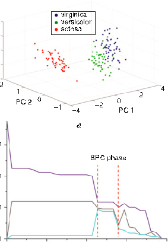

# Parallel architecture to accelerate superparamagnetic clustering algorithm

## Contents

- [Abstract](#abstract)
- [Introduction](#introduction)
- [Methodologies](#methodologies)
- [Results](#results)
- [Conclusion](#conclusion)
- [References](references/PKW2020.md)

## Abstract

Superparamagnetic clustering (SPC) is an unsupervised classification technique in which clusters are self-organised based on data density and mutual interaction energy. Traditional SPC algorithm uses the Swendsen–Wang Monte Carlo approximation technique to significantly reduce the search space for reasonable clustering. However, Swendsen–Wang approximation is a Markov process which limits the conventional superparamagnetic technique to process data clustering in a sequential manner. Here the authors propose a parallel approach to replace the conventional approximation to allow the algorithm to perform clustering in parallel. One synthetic and one open-source dataset were used to validate the accuracy of this parallel approach in which comparable clustering results were obtained as compared to the conventional implementation. The parallel method has an increase of clustering speed at least 8.7 times over the conventional approach, and the larger the sample size, the more increase in speed was observed. This can be explained by the higher degree of parallelism utilised for the increased data points. In addition, a hardware architecture was proposed to implement the parallel superparamagnetic algorithm using digital electronic technologies suitable for rapid or real-time neural spike sorting.

## Introduction

Superparamagnetic clustering (SPC) algorithm is an unsupervised data clustering algorithm that does not make assumptions on the data structure, such as Gaussian distributed. Since the algorithm does not require to specify the number of neural clusters exist in the neural recording, SPC is popular in the neuroscientist community to classify neural spikes to their respective neurons for neural signal analysis, such as using the sorted neural spikes to build post-stimulation temporal histograms [1, 2]. SPC also finds its use in protein sequence clustering [3] and gene expression profile analysis [4].

Comparing to other data clustering algorithms, such as support vector machine or K-means [5], SPC is a density-based method in which SPC clusters are self-organised according to the mutual interaction inversely proportional to the Euclidian distances between neighbouring data points in the feature space. In addition, SPC has a 'temperature' parameter, which is used to describe how strong the mutual interaction is – the higher the temperature, the weaker the mutual interaction. Based on the mutual interaction, SPC clusters aggregate together as a single cluster at low temperature (ferromagnetic phase) and fracture into smaller clusters at high temperature (paramagnetic phase), similar to the aggregation of magnetic micro-domains in a real magnet under different ambient temperatures. For the SPC algorithm, there is a transition temperature (the superparamagnetic phase) in which the mutual interaction is at a critical level and the data are fractured into multiple larger clusters interconnecting with concentrated data points but are remained separated at larger distances. These domains or clusters at the superparamagnetic phase can be considered as optimal in classifying the underlying data. Therefore, SPC is a unique unsupervised clustering method that requires minimal user input (the temperature) to cluster the data structure in an unsupervised manner.

In single-channel extracellular neural recording, SPC is effective to classify neural data since the amount of data measured is relatively small. However, neuroscience experiments are now moving towards measuring using high-density multi-channel probes, such as 1024 channels in a single probe [6], and much faster methods are required to process the larger data acquired. For instance, an 8 h recording of a 64-channel neural probe, sampling at 27-kHz with a 16-bit digitisation configuration can accumulate >100 GB of data. It is estimated that 30 h of processing time is then required to sort the recorded action potentials using the conventional unmodified SPC algorithms. Therefore, an improvement over the conventional SPC algorithm to attain a faster sorting speed without sacrificing the sorting accuracy can make the SPC technique continue to be attractive for sorting multichannel recorded neural spikes.

This Letter presents an improvement over the conventional SPC algorithm to achieve a significantly increase in sorting speed by implementing a parallel architecture to sort the recorded neural spikes. In the following, the parallel architecture of SPC will be introduced in the methodology section. Two datasets were then used to validate the algorithm and compare the processing speeds between the conventional and the parallel implementations. Finally, a hardware implementation based on the parallel architecture will be discussed for future real-time neural data analysis applications.

## Methodologies

The SPC algorithm is based on the inhomogeneous ferromagnetic Potts model [7, 8], which is motivated by the physics of real magnets. For neural spike sorting, spikes are first transformed, for example by principal component analysis or wavelet transformation, into data points in phase space. Assume there are $N$ neural data points. Each data point $x_i$ is assigned an integer spin value $s_i \in \{1,\dots,q\}$, and the entire data set is regarded as being in a magnetic state $S = \{s_i\}_{i=1}^{N}$. The Hamiltonian (total energy) of the state $S$ is given by

$$
H(S) = \sum_{i,j} J_{ij}\bigl(1 - \delta_{s_i,s_j}\bigr)
\tag{1}
$$

where $J_{ij}$ is the interaction energy between two data points located at $x_i$ and $x_j$, with

$$
J_{ij} \propto \exp\!\left(-\frac{\lVert x_i - x_j\rVert^2}{2a^2}\right) \tag{2}
$$

and where $a$ is the average nearest-neighbor distance. Note that when two data points have the same spin value, $\delta_{s_i,s_j}=1$, so their contribution to the Hamiltonian is zero under this model. Following statistical thermodynamics, the probability of a magnetic state $S$ at temperature $T$ follows the Boltzmann distribution.

$$
P(S) \equiv P[H(S)] = \frac{1}{Z} \exp\!\left(-\frac{H(S)}{T}\right) \tag{3}
$$

where $Z = \sum_{S} \exp(-H(S)/T)$ is the normalisation constant. A physical quantity $A$ can then be estimated by integrating over all the spin states according to the Boltzmann probability distribution

$$
\langle A \rangle = \sum_{S} P(S)\, A(S) \simeq \frac{1}{M} \sum_{i=1}^{M} A(S_i) \tag{4}
$$

However, the total number of spin states is an astronomically large number $q^N$ and approximation techniques have to be employed to select a limited number of spin states in which the selected spin states should follow the Boltzmann distribution. The conventional SPC typically uses the Swendsen–Wang (SW) approximation algorithm [9] to select these spin states $S_i$ for $i = 1, \dots, M$ for the calculation. The SW approximation algorithm is a Markov process in which the spin state $S$ is generated in a sequential manner. The full description of the SW approximation algorithm can be found in [9] and a brief description of the algorithm is presented here. With the first spin state $S_1$ randomly generated, the next spin state $S_{i+1}$ can be generated from the prior spin state $S_i$ using the concept of frozen bonds. Two nearest neighbouring points can be considered to be connected if the virtual bond between the two points is 'frozen', and all the data points mutually connected by the frozen bonds are considered to belong to the same SW cluster. A bond can be considered to be frozen if a random number cast is lower than the frozen bond probability $p_{f_{i,j}} = 1 - \exp\!\bigl(-(J_{ij}/T)\,\delta_{s_i,s_j}\bigr)$. Once the SW clusters are determined based on the frozen bond mutual connections, a spin number $s \in \{1, \dots, q\}$ is randomly assigned to all the data points belonging to the same SW cluster. Based on this procedure, the next spin states $S_{i+1}$ can be estimated. It can be shown that all the spin states generated $S_i$ for $i = 1, \dots, M$ following this procedure roughly conform to the Boltzmann distribution. The $M$ estimated spin states $S_i$ can then be used to calculate the spin–spin correlation

$$
\langle G_{ij} \rangle \simeq \frac{1}{M} \sum_{k=1}^{M} \delta_{s_i^{(k)}, s_j^{(k)}} \tag{5}
$$

in which data points $i$ and $j$ are considered to belong to the same cluster if $\langle G_{ij} \rangle > 0.5$. However, the major disadvantage of the SW approximation algorithm is that the spin states $S_i$ are sequentially estimated, making the SPC algorithm inherently slow especially when the number of data points is large, as in the multi-channel neural recording.

Here, we propose a parallel approach to generate the estimated spin states $S_i$ at the same time to accelerate this estimation process for more efficient SPC clustering. The Boltzmann distribution function is a probability density function of $H(S)$ and a series of $H(S_i)$ can be estimated by

$$
H(S_i) = -T \cdot \ln[1 - r_i] \quad \text{for} i = 1, \dots, M \tag{6}
$$

where $r_i$ is uniformly distributed random numbers between 0 and 1. The above equation is the inverse of the cumulative probability function of $H(S)$ and the generated $H(S_i)$ follows the Boltzmann distribution at the temperature $T$ as shown in Fig. 1a.

**Fig. 1** Clustering result of synthetic data based on parallel SPC. **a** Red curve is Boltzmann distribution, blue bar is histogram of $H(S)$ samples which were obtained by inverse transform sampling. **b** Clustering result of concentric dataset classified by parallel SPC algorithm, data points classified to three clusters are shown with different colours, and unclassified data points (outliers) were labelled as black stars.

The IRIS dataset was also used to evaluate the parallel SPC algorithm. The dataset contains three species (setosa, versicolor and virginica) that are described by four features and each species has 50 data points – a total of 150 samples for the entire dataset. Fig. 2a shows the data points plotted with the first three principal components in the 3D feature space. From the figure, it is observed that setosa is more easily separated from the other groups while the other two groups are more overlapped. Fig. 2b shows the number of data points assigned to each group against the temperature classified by parallel SPC clustering. For temperature below 1.1, the data points were only split into two groups, indicating that versicolor and virginica were not separated but merged in a large group. For temperature >1.4, the number of data points in the three groups significantly reduced, indicating that the data points were separated into many small groups and the total number of groups were more than three groups. For temperature between 1.2 and 1.4 (SPC phase), the parallel SPC algorithm separated the IRIS dataset into three groups – 47 data points for versicolor, 39 data points for virginica and 38 data points for setosa – and this classification result by parallel SPC is similar to that obtained from the conventional SPC [8].

Once a series of $H(S_i)$ for $i = 1, \dots, M$ are determined, the process can be parallelised to increase classification speed. At the beginning of the parallelism, the interaction energies $J_{ij}$ of a data point $i$ to its $K$ nearest neighbours are computed ($j = 1, \dots, K$). All the calculated interaction energies $J_{ij}$ are then ranked in an increasing order to obtain $J_n$ for $n = 1, \dots, N \times K$. Using the sorted $J_n$, the accumulative total energies $H_a^{(n)} = \sum_{m=1}^{n} J_m$ can be computed. Since the interaction energies $J_{ij}$ used to construct $H_a^{(n)}$ are known, the accumulative total energies $H_a^{(n)}$ can in turn be used to find the values of $\delta_{ij}$ in $H(S_i)$ by matching $H(S_i)$ to the closest $H_a^{(n)}$. According to Eq. (1), $\delta_{ij} = 0$ for the $J_{ij}$ included in $H_a^{(n)}$, and $\delta_{ij} = 1$ otherwise. Since value matching is not a Markov process, $\delta_{ij}$ values for all the $H(S_i)$ can be determined in a parallel manner to significantly increase the speed in calculating the spin–spin correlation $\langle G_{ij} \rangle$ for SPC clustering. Once all the $\delta_{ij}$ are determined, the spin–spin correlation $\langle G_{ij} \rangle$ can simply be computed by taking an average on all the $\delta_{ij}$ values, according to Eq. (5). It is also worth mentioning that although matching $H(S_i)$ to $H_a^{(n)}$ is not a random process, in contrast to SW approximation, the series of $H(S_i)$ is, however, randomly generated thus allowing the determination of $\delta_{ij}$ by a simple look-up process.

## Results

Two datasets were used to evaluate the accuracy of the parallel SPC method. The first dataset is an artificial dataset with the data distributed in three concentric rings in the feature space, and the second dataset is the IRIS dataset obtained from [8].

The first artificial dataset of concentric rings had 4800 data points distributed in the 2D feature space. Three concentric clusters were uniformly distributed across the $2\pi$ angles with radii of 3, 2 and 1 and a variance of 0.15, and had 2400, 1600, and 800 data points, respectively. The synthetic dataset was then subjected to the parallel SPC algorithm for clustering with $K = 10$, $q = 20$, and $M = 300$. Fig. 1a compares the generated $H(S_i)$ (blue histogram) to the Boltzmann distribution (red dotted curve) and the result indicates that the generated $H(S_i)$ closely follows the Boltzmann distribution. Based on the generated $H(S_i)$, the spin states $S_i$ were generated in a parallel manner for the synthetic concentric dataset for SPC classification. Fig. 1b shows the classification result for the synthetic concentric ring data, the data points classified by the parallel SPC algorithm to three clusters are labelled in three different colours (red, green, and purple) and unclassified data points are labelled in black. The unclassified data points are mostly located at boundaries between the clusters contributed to <3% of the entire dataset. More than 97% of the data points (2321, 1551, 785) were correctly classified with parallel SPC, and the result obtained is similar to that obtained from the conventional SPC method [8]. This proves that the parallel SPC method can achieve similar classification results as with SW approximation. It is worth mentioning that the concentric ring dataset is a difficult dataset for conventional distance-based clustering methods, such as $k$-means, to classify since most of these techniques require the data distribution to

**Fig. 2** Clustering result of IRIS data based on the parallel SPC algorithm. **a** 3D plot of first three principal components (PC) of iris dataset in feature space. **b** Number of data points of largest three clusters against temperature, illustrating SPC phase for optimal classification.

In addition to comparing the accuracy between the conventional SPC method and the parallel SPC method, the speed increments of using parallel SPC were demonstrated using the artificial dataset under different sample sizes. Both the parallel and conventional SPC methods were implemented with the Python programming language in-house with similar programming techniques to have a fair comparison. The classification speed was compared using sample sizes of 1200, 2400, 4800, and 9600 samples of the artificial dataset. The computation times of the two methods are shown in Fig. 3; it is apparent that the parallel SPC method was significantly faster than the conventional methods – computational time reductions of 8.7, 9.6, 10.7, and 12.4 times for 1200, 2400, 4800, and 9600 samples. Owing to the parallel nature of the technique, the larger the sample size, the easier to take advantage of the computational parallelism, leading to a faster computational speed.

The parallel algorithm can be implemented with digital electronic hardware, such as a FPGA or an application-specific integrated circuit, for real-time or rapid neural spike sorting. Fig. 4 shows a schematic diagram of the hardware blocks to implement the parallel SPC technique. An array of the Hamiltonian $H(S_i)$ is first generated and one of the $H(S_i)$ is sent to one of the $M$ matching blocks to determine $\delta_{ij}$ for $H(S_i)$ in parallel. The arrays of accumulative total energies $H_a^{(n)}$ and the corresponding index matrix storing the indexes of $J_{ij}$ used to construct $H_a^{(n)}$ were loaded to the matching blocks for rapid comparison. The control and comparing logic is then used to match the input $H(S_i)$ to determine the closest $H_a^{(n)}$; once the closest $H_a^{(n)}$ is determined, the index matrix is then used to look up the constituting $J_{ij}$ indexes to generate the $\delta_{ij}$ matrix. Finally, all the parallel-generated $\delta_{ij}$ matrices were averaged to obtain the spin–spin correlation matrix $\langle G_{ij} \rangle$ for SPC clustering determination.

**Fig. 3** Speed comparison between conventional SPC and parallel SPC implementations against different sample sizes.

**Fig. 4** Hardware implementation structure of accelerator for parallel SPC algorithm.

## Conclusion

Here we propose a parallel approach to the SPC neural spike sorting technique to replace the sequential SW approximation. The accuracy of the parallel technique was demonstrated by comparing the approach to the conventional method using both a synthetic dataset and the open-source IRIS datasets. Benchmarking was compared between the two techniques and an at least 8.7 times speed increase was observed with the parallel method, and an accelerating effect was also observed for larger sample size datasets. A hardware architecture was also proposed to implement the parallel SPC algorithm using digital electronic technologies suitable for rapid or real-time neural spike sorting.
