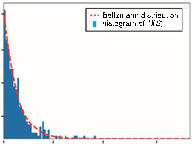
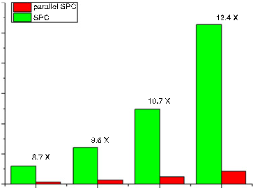
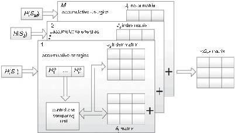

[Page 1]

# Parallel architecture to accelerate superparamagnetic clustering algorithm

Pan Ke Wang, Chang Hao Chen, Sio Hang Pun ✉ , Baijun Zhang, Peng Un Mak, Mang I. Vai and Tim C. Lei

Superparamagnetic clustering (SPC) is an unsupervised classi fi cation technique in which clusters are self-organised based on data density and mutual interaction energy. Traditional SPC algorithm uses the Swendsen – Wang Monte Carlo approximation technique to signi fi cantly reduce the search space for reasonable clustering. However, Swendsen – Wang approximation is a Markov process which limits the conventional superparamagnetic technique to process data clustering in a sequential manner. Here the authors propose a parallel approach to replace the conventional appropriation to allow the algorithm to perform clustering in parallel. One synthetic and one open-source dataset were used to validate the accuracy of this parallel approach in which comparable clustering results were obtained as compared to the conventional implementation. The parallel method has an increase of clustering speed at least 8.7 times over the conventional approach, and the larger the sample size, the more increase in speed was observed. This can be explained by the higher degree of parallelism utilised for the increased data points. In addition, a hardware architecture was proposed to implement the parallel superparamagnetic algorithm using digital electronic technologies suitable for rapid or real-time neural spike sorting.

Methodologies: The SPC algorithm is based on the inhomogeneous ferromagnetic Potts model [ 7 , 8 ] which is modelled under the physics of real magnets. For neural spike sorting using the model, neural spikes are fi rst transformed using techniques such as principle component analysis or wavelet transformation as neural data points in the phase space. Assume there are N neural data points, each data point x i can be assigned with an integer spin value s i [ 1 .. . q and the entire data set can be considered to be in a magnetic state S = s i { } N i = 1 , and the Hamiltonian (total energy) H S ( ) of the state S can be estimated by

$$
H ( S ) = \sum _ { i , j } J _ { i j } ( 1 - \delta _ { s _ { i } , s _ { j } } ) & & ( 1 )
$$

where J ij / exp [−| x i − x j | 2 / 2 a 2 ] is the interactive energy between two data points at x i and x j and a is the average nearest-neighbours distance. Note that when two data points have the same spin value, the interaction energy contribution to the Hamiltonian is zero under this model ( d s i , s j = 1). Following the physics of thermal dynamics, the probability of a magnetic state S for the magnetic system at a temperature T follows the Boltzmann distribution

Introduction: Superparamagnetic clustering (SPC) algorithm is an unsupervised data clustering algorithm that does not make assumptions on the data structure, such as Gaussian distributed. Since the algorithm does not require to specify the number of neural clusters existed in the neural recording, SPC is popular in the neuroscientist community to classify neural spikes to their respective neurons for neural signal analysis, such as using the sorted neural spikes to build post-stimulation temporal histograms [ 1 , 2 ]. SPC also fi nds its use in protein sequence clustering [ 3 ] and gene expression pro fi le analysis [ 4 ].

Comparing to other data clustering algorithms, such as support vector machine or K-means [ 5 ], SPC is a density-based method in which SPC clusters are self-organised according to the mutual interaction inversely proportional to the Euclidian distances between neighbouring data points in the feature space. In addition, SPC has a ‘ temperature ’ parameter, which is used to describe how strong the mutual interaction is – the higher the temperature, the weaker the mutual interaction. Based on the mutual interaction, SPC clusters aggregate together as a single cluster at low temperature (ferromagnetic phase) and fracture into smaller clusters at high temperature (paramagnetic phase), similar to the aggregation of magnetic micro-domains in a real magnet under different ambient temperatures. For the SPC algorithm, there is a transition temperature (the superparamagnetic phase) in which the mutual interaction is at a critical level and the data are fractured into multiple larger clusters interconnecting with concentrated data points but are remained separated at larger distances. These domains or clusters at the superparamagnetic phase can be considered as optimal in classifying the underlying data. Therefore, SPC is a unique unsupervised clustering method that requires minimal user input (the temperature) to cluster the data structure in an unsupervised manner.

In single-channel extracellular neural recording, SPC is effective to classify neural data since the amount of data measured is relatively small. However, neuroscience experiments are now moving towards measuring using high-density multi-channel probes, such as 1024 channels in a single probe [ 6 ], and much faster methods are required to process the larger data acquired. For instance, an 8 h recording of a 64-channel neural probe, sampling at 27-kHz with a 16-bit digitisation con fi guration can accumulate >100 GB of data. It is estimated that 30 h of processing time is then required to sort the recorded action potentials using the conventional unmodi fi ed SPC algorithms. Therefore, an improvement over the conventional SPC algorithm to attain a faster sorting speed without sacri fi cing the sorting accuracy can make the SPC technique continue to be attractive for sorting multichannel recorded neural spikes.

This Letter presents an improvement over the conventional SPC algorithm to achieve a signi fi cant increase in sorting speed by implementing a parallel architecture to sort the recorded neural spikes. In the following, the parallel architecture of SPC will be introduced in the methodology section. Two datasets were then used to validate the

$$
P ( S ) \equiv P [ H ( S ) ] = \frac { 1 } { Z } \exp \left ( - \frac { H ( S ) } { T } \right ) \quad ( 2 )
$$

where Z = S exp − H S ( ) / T is the normalisation constant. A physical quantity A can then be estimated by integrating over all the spin states according to the Boltzmann probability distribution

$$
\langle A \rangle & = \sum _ { S } P ( S ) A ( S ) \simeq \frac { 1 } { M } \sum _ { i = 1 } ^ { M } A ( S _ { i } ) & ( 3 ) \\
$$

However, the total number of spin states is an astronomical large number ( q N ) and approximation techniques have to be employed to select a limited number of spin states in which the selected spin states should follow the Boltzmann distribution. The conventional SPC typically uses the Swendsen – Wang (SW) approximation algorithm [ 9 ] to select these spin states ( S i for i = 1 , .. . , M ) for the calculation. The SW approximation algorithm is a Markov process in which the

spin state S is generated in a sequential manner. The full description of the SW approximation algorithm can be found in [ 9 ] and a brief description of the algorithm is presented here. With the fi rst spin state S 1 is randomly generated, the next spin state S i + 1 can be generated from the prior spin state S i using the concept of frozen bonds. Two nearest neighbouring points can be considered to be connected if the virtual bond between the two points are ‘ frozen ’ , and all the data points mutually connected by the frozen bonds are considered to belong to the same SW cluster. A bond can be considered to be frozen if a random number casted is lower than the frozen bond probability p f i , j = 1 − exp − ( J ij / T ) d s i , s j . Once the SW clusters are determined based on the frozen bond mutual connections, a spin number s [ 1 , .. . , q is randomly assigned to all the data points belonging to the same SW cluster. Based on this procedure, the next spin states S i + 1 can be estimated. It can be shown that all the spin states generated ( S i for i = 1 , . .. , M ) following this procedure roughly conforms to the Boltzmann distribution. The M estimated spin states S i can then be used to calculate the spin – spin correlation

$$
\langle G _ { i j } \rangle \simeq \frac { 1 } { M } \sum _ { i = 1 } ^ { M } \delta _ { i j } \\
$$

in which the data points i and j are considered to belong to the same cluster if k G ij l has a value >0.5. However, the major disadvantage of the SW approximation algorithm

is that the spin states S i are sequentially estimated, making the SPC algorithm inherently slow especially when the number of data points is large, as in the multi-channel neural recording.

Here, we propose a parallel approach to generate the estimated spin states S i at the same time to accelerate this estimation process for more ef fi cient SPC clustering. The Boltzmann distribution function is a probability density function of H S ( ) and a series of H S i ( )

[Page 2]

can be estimated by

$$
H ( S _ { i } ) = - T \cdot \ln [ 1 - r _ { i } ] \ \text { for } i = 1 , \dots , M \quad ( 5 ) \quad \text {mor} \\
$$

where r i is uniformly distributed random numbers between 0 and 1. The above equation is the inverse of the cumulative probability function of H S ( ) and the generated H S i ( ) follows the Boltzmann distribution at the temperature T as shown in Fig. 1 a .

Fig. 1 Clustering result of synthetic data based on parallel SPC a Red curve is Boltzmann distribution, blue bar is histogram of H ( S ) samples which were obtained by inverse transform sampling b Clustering result of concentric dataset classi fi ed by parallel SPC algorithm, data points classi fi ed to three clusters are shown with different colours, and unclassifi ed data points (outliers) were labelled as black stars

The IRIS dataset was also used to evaluate the parallel SPC algorithm. The dataset contains three species (setosa, versicolor and virginica) that are described by four features and each species has 50 data points – a total of 150 samples for the entire dataset. Fig. 2 a shows the data points plotted with the fi rst three principal components in the 3D feature space. From the fi gure, it is observed that setosa is more easily separated from the other groups while the other two groups are more overlapped. Fig. 2 b shows the number of data points assigned to each group against the temperature classi fi ed by parallel SPC clustering. For temperature below 1.1, the data points were only split into two groups, indicating that versicolor and virginica were not separated but merged in a large group. For temperature >1.4, the number of data points in the three groups signi fi cantly reduced, indicating that the data points were separated into many small groups and the total number of groups were more than three groups. For temperature between 1.2 and 1.4 (SPC phase), the parallel SPC algorithm separated the IRIS dataset into three groups – 47 data points for versicolor, 39 data points for virginica and 38 data points for setosa – and this classi fi cation results by parallel SPC is similar to that obtained from the conventional SPC [ 8 ].

Once a series of H S i ( ) for i = 1 , . .. , M are determined, the process can be paralleled to increase classi fi cation speed. At the beginning of the parallelism, the interaction energies J ij of a data point i to its K nearest neighbours are computed ( j = 1 , . .. , K ). All the calculated interaction energies J ij are then ranked in an increasing order to obtain J n for n = 1 , . .. , N ∗ K . Using the sorted J n , the accumulative total energies H a n = n m = 1 J m can be computed. Since the interaction energies J ij used to construct H a n are known, the accumulative total energies H a n can in turn be used to fi nd the values of d ij in H S i ( ) by matching the H S i ( ) to the closest H a n . According to (1), d ij = 0 for the J ij included in H a n , and d ij = 1 otherwise. Since value matching is not a Markov process, d ij values for all the H S i ( ) can be determined in a parallel manner to signi fi cantly increase the speed in calculating the spin – spin correlation k G ij l for SPC clustering. Once all the d ij are determined, the spin – spin correlation k G ij l can simply be computed by taking an average on all the d ij values, according to (4). It is also worth mentioning that although matching H S i ( ) to H a n is not a random process, in contrast to SW approximation, the series of H S i ( ) is, however, randomly generated thus allowing the determination of d ij by a simple look-up process.

Results: Two datasets were used to evaluate the accuracy of the parallel SPC method. The fi rst dataset is an arti fi cial dataset with the data distributed in three concentric rings in the feature space, and the second dataset is the IRIS dataset obtained from [ 8 ].

The fi rst arti fi cial dataset of concentric rings had 4800 data points distributed in the 2D feature space. Three concentric clusters were uniformly distributed across the 2 p angles with radii of 3, 2 and 1 and a variance of 0.15, and had 2400, 1600, and 800 data points, respectively. The synthetic dataset was then subjected to the parallel SPC algorithm for clustering with K = 10, q = 20, and M = 300. Fig. 1 a compares the generated H S i ( ) (blue histogram) to the Boltzmann distribution (red dotted curve) and the result indicates that the generated H S i ( ) closely follows the Boltzmann distribution. Based on the generated H S i ( ) , the spin states S i were generated in a parallel manner for the synthetic concentric dataset for SPC classi fi cation. Fig. 1 b shows the classi fi cation result for the synthetic concentric ring data, the data points classi fi ed by the parallel SPC algorithm to three clusters are labelled in three different colours (red, green, and purple) and unclassi fi ed data points are labelled in black. The unclassi fi ed data points are mostly located at boundaries between the clusters contributed to <3% of the entire dataset. More than 97% of the data points (2321, 1551, 785) were correctly classi fi ed with parallel SPC, and the result obtained is similar to that obtained from the conventional SPC method [ 8 ]. This proves that the parallel SPC method can achieve similar classi fi cation results as with SW approximation. It is worth mentioning that the concentric ring dataset is a dif fi cult dataset for conventional distance-based clustering methods, such as k -means, to classify since most of these techniques require the data distribution to

Fig. 2 Clustering result of IRIS data based on the parallel SPC algorithm a 3D plot of fi rst three principal components (PC) of iris dataset in feature space b Number of data points of largest three clusters against temperature, illustrating SPC phase for optimal classi fi cation

In addition to comparing the accuracy between the conventional SPC method and the parallel SPC method, the speed increments of using parallel SPC were demonstrated using the arti fi cial dataset under different sample sizes. Both the parallel and conventional SPC methods were implemented with the python programming language in-house with similar programming techniques to have a fair comparison. The classi fi cation speed was compared using sample sizes of 1200, 2400, 4800, and 9600 samples of the arti fi cial dataset. The computation times of the two methods are shown in Fig. 3 , it is apparent that the parallel SPC method was signi fi cantly faster than the conventional methods – computational time reductions of 8.7, 9.6, 10.7, and 12.4 times for 1200, 2400, 4800, and 9600 samples. Owing to the parallel nature of the technique, the larger the sample size, the easier to take advantage of the computational parallelism, leading to a faster computational speed.

The parallel algorithm can be implemented with digital electronic hardware, such as a FPGA or an application speci fi c integrated circuit, for real-time or rapid neural spike sorting. Fig. 4 shows a schematic diagram showing the hardware blocks to implement the parallel SPC technique. An array of the Hamiltonian H S i ( ) is fi rst generated and one of the H S i ( ) is sent to one of the M matching block to determine

[Page 3]

d ij for H S i ( ) in parallel. The arrays of accumulative total energies H a n and the corresponding index matrix storing the indexes of J ij used to construct H a n were loaded to the matching blocks for rapid comparison. The control and comparing logic is then used to match the input H S i ( ) to determine the closest H a n , once the closest H a n is determined, the index matrix is then used to look up the constituting J ij indexes to generated d ij matrix. Finally, all the parallel generated d ij matrixes were averaged to obtain the spin – spin correlation matrix k G ij l for SPC clustering determination.

3000

Fig. 3 Speed comparison between conventional SPC and parallel SPC implementations against different sample sizes

Fig. 4 Hardware implementation structure of accelerator for parallel SPC algorithm

Conclusion: Here we propose a parallel approach to the SPC neural spike sorting technique to replace the sequential SW approximation. The accuracy of the parallel technique was demonstrated by comparing the approach to the conventional method using both a synthetic dataset and the open-source IRIS datasets. Benchmarking was compared between the two techniques and an at least 8.7 times speed increase was observed with the parallel method, and an accelerating effect was also observed for larger sample size datasets. A hardware

Acknowledgments: The authors would like to acknowledge the support by The Science and Technology Development Fund of Macau (FDCT) under grant nos. 093/2015/A3 and 088/2016/A2, 0144/2019/A3 and the University of Macau under grant nos. MYRG2018-00146-AMSV and MYRG2019-00056-AMSV.

# © The Institution of Engineering and Technology 2020

Submitted: 10 March 2020 Efi rst: 12 May 2020

doi: 10.1049/el.2020.0760

One or more of the Figures in this Letter are available in colour online.

Pan Ke Wang, Chang Hao Chen, Sio Hang Pun, Mang I. Vai and Tim C. Lei ( State Key Laboratory of Analog and Mixed-Signal VLSI, Institute of Microelectronics, University of Macau, People ’ s Republic of China )

✉ E-mail: lodgepun@um.edu.mo

Peng Un Mak ( Department of Electrical and Computer Engineering, University of Macau, Macau, People ’ s Republic of China )

Baijun Zhang ( School of Electronics and Information Technology, State Key Laboratory of Optoelectronic Materials and Technologies, Sun Yat-sen University, Guangzhou, People ’ s Republic of China )

Pan Ke Wang and Mang I. Vai: Also with Department of Electrical and Computer Engineering, University of Macau, Macau, People ’ s Republic of China

Tim C. Lei: Also with Department of Electrical Engineering, University of Colorado, Denver CO, USA

# References

1 Quiroga, R.Q., Nadasdy, Z., and Ben-Shaul, Y.: ‘ Unsupervised spike detection and sorting with wavelets and superparamagnetic clustering ’ , Neural Comput. , 2004, 16 , (8), pp. 1661 – 1687 2 Rey, H.G., Pedreira, C., and Quian Quiroga, R.: ‘ Past, present and future

2 Rey, H.G., Pedreira, C., and Quian Quiroga, R.: ' Past, present and future of spike sorting techniques ' , Brain Res. Bull. , 2015, 119 , pp. 106 -117

3 Tetko, I.V., Facius, A., Ruepp, A., et al .: ' Super paramagnetic clustering of protein sequences ' , BMC Bioinformatics , 2005, 6 , (1), p. 82

4 Getz, G., Levine, E., Domany, E., et al .: ' Super-paramagnetic clustering of yeast gene expression pro fi les ' , Physica A , 2000, 279 , (1), pp. 457 -464

5 Wang, P.K., Pun, S.H., Chen, C.H., et al .: ' Low-latency single channel real-time neural spike sorting system based on template matching ' , PLoS One , 2019, 14 , (11), pp. 1 -30

6 Ballini, M., Müller, J., Livi, P., et al .: ' A 1024-channel CMOS microelectrode array with 26,400 electrodes for recording and stimulation of electrogenic cells in vitro ' , IEEE J. Solid-State Circuits , 2014, 49 , (11), pp. 2705 -2719

- 7 Blatt, M., Wiseman, S., and Domany, E.: ' Superparamagnetic clustering of data ' , Phys. Rev. Lett. , 1996, 76 , (18), p. 3251
- 8 Blatt, M., Wiseman, S., and Domany, E.: ' Data clustering using a model granular magnet ' , Neural Comput. , 1997, 9 , (8), pp. 1805 -1842
- 9 Wang, J.-S., and Swendsen, R.H.: ' Cluster Monte Carlo algorithms ' , Physica A , 1990, 167 , (3), pp. 565 -579
