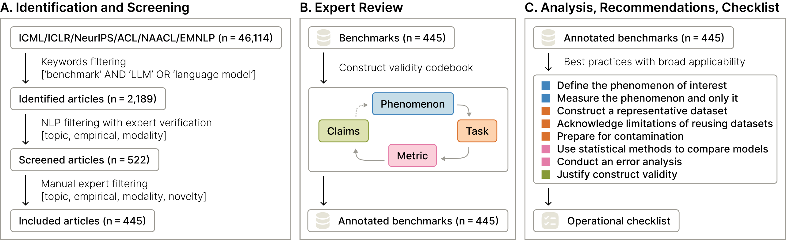
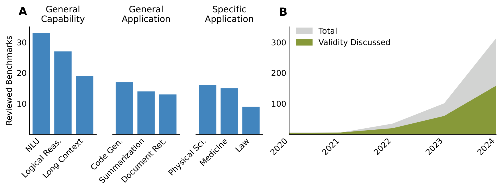
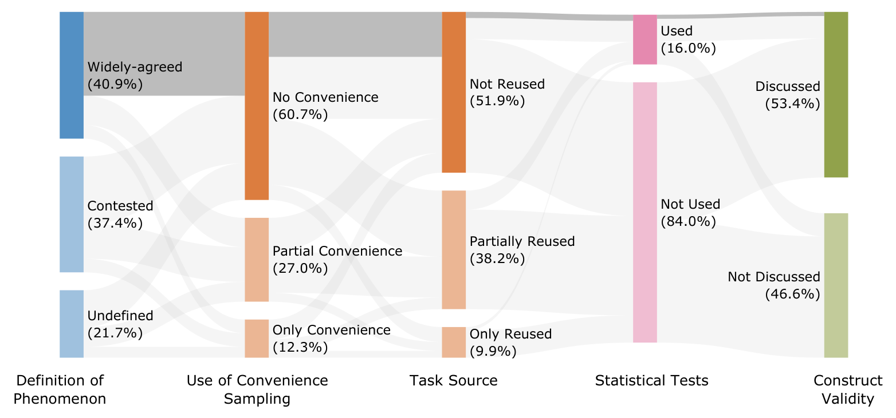
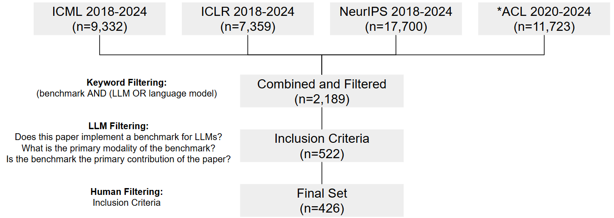

# Measuring what Matters: Construct Validity in Large Language Model Benchmarks

\doparttoc \faketableofcontents

## Abstract

Evaluating large language models (LLMs) is crucial for both assessing their capabilities and identifying safety or robustness issues prior to deployment. Reliably measuring abstract and complex phenomena such as 'safety' and 'robustness' requires strong *construct validity*, that is, having measures that represent what matters to the phenomenon. With a team of 29 expert reviewers, we conduct a systematic review of 445 LLM benchmarks from leading conferences in natural language processing and machine learning. Across the reviewed articles, we find patterns related to the measured phenomena, tasks, and scoring metrics which undermine the validity of the resulting claims. To address these shortcomings, we provide eight key recommendations and detailed actionable guidance to researchers and practitioners in developing LLM benchmarks.

\begin{refsection}

## Introduction

Benchmarks and evaluations play a critical role in the development of large language models. They help determine which model improvements are considered useful and set the direction of future research [1, 2]. Creating a benchmark requires operationalising phenomena (abstract concepts) into concrete tasks and metrics that serve as measurable proxies for model capabilities [3]. As an example, the 'intelligence' of LLMs is frequently debated [4, 5], but cannot be measured directly, making it necessary to develop proxies [6]. The value of a benchmark depends on whether it is a good proxy for the real-world phenomenon it intends to measure. This property is known as *construct validity*: the degree to which a benchmark score provides evidence for making claims about the target phenomenon [7, 3, 8]. If a benchmark has high construct validity in measuring 'intelligence', then a model which does well is in some sense 'intelligent', but if the construct validity is low, then a high score may be irrelevant or even misleading.

The science of evaluating large language models (LLMs) is still in its early stages, with a pressing need for shared standards and best practices [9, 7]. Certain specific issues such as reproducibility and cost have been addressed via shared implementation standards [10, 11], and item selection methods [12], respectively. Other issues, such as the best use of statistical methods [13, 14, 15] and social responsibility [7, 16] have also been raised. \textcite{reuelBetterBenchAssessingAI2024} aggregate best practices and provide recommendations for the whole lifecycle of a benchmark. However, identifying concrete best practices for creating benchmarks with high construct validity remains a difficult task. Benchmarks with low construct validity have real consequences, since unrecognised weak links between tasks and the underlying phenomena they claim to measure can lead to poorly supported scientific claims, misdirected research, and policy implications that are not grounded in robust evidence.

Here, we assess practices around the construct validity of LLM benchmarks through a systematic review of 445 articles from leading ML and NLP conferences. The articles were coded by experts in ML and NLP using a detailed conceptual and methodological schema that identifies useful practices in the design and interpretation of benchmarks for increasing the validity of measurements. Almost all articles have weaknesses in at least one area across phenomena, tasks, metrics, and claims. Key concepts are often poorly defined or operationalised, limiting the reliability of the conclusions they draw. We call for improved practices and reporting standards for establishing construct validity in new benchmarks, and release an operational checklist of best practice recommendations.

\caption{**Systematic review process.** (A) Identification and screening from relevant proceedings. (B) In-depth review and annotation of included benchmarks. A phenomenon is operationalised via a task, scored with a metric, to support a claim about this phenomenon. (C) Synthesis of best practices.}

## Background

Construct validity evaluates whether an empirical test measures the phenomenon it intends to measure [18]. Formal assessments of construct validity originate from psychological testing as a means of creating tests for phenomena which cannot be directly verified, such as personality [8].

Construct validity as an overarching concept can be assessed by considering  various features of the test design [19]. At the level of phenomena, *face validity* considers whether a test appears prima facie a valid representation of the phenomenon [20, 21]. At the task level, *content validity* considers whether the task content represents all important aspects of the phenomenon being measured [22]. *Ecological* and *predictive validity* concern the relevance of the test to real-world settings [23], including how it predicts future performance [18]. *Convergent*, *discriminant*, and *criterion validity* measure whether test findings correlate with, and only with, tests for similar phenomena [24].

With LLMs, construct validity is key for benchmarking abstract abilities such as 'reasoning.' The value of construct validity has been emphasised in previous NLP literature [7, 3]. Standard benchmarks and narrowly-defined tasks are now quickly becoming saturated [25] and attention is shifting towards testing general-purpose abilities of LLMs [26, 27]. The interpretation of such evaluations has become contested, with disagreements about whether results show signs of intelligence [4, 5] or emergent abilities [28, 29], making assessing construct validity all the more crucial.

## Methods

**Study design**

We conducted a systematic review, as illustrated in  1. Our corpus consisted of 46,114 articles drawn from the proceedings of ICML, ICLR and NeurIPS (accessed via proceedings websites)  between 2018 and 2024, and from ACL, NAACL and EMNLP between 2020 and 2024 (accessed via ACL Anthology). The ACL range was limited by abstract availability.

We identified and selected articles whose titles or abstracts contained the keywords 'benchmark' and either 'LLM' or 'language model', resulting in an initial set of 2,189 articles, with most articles coming from recent years, and only 14 in 2018 and 2019.

We applied four inclusion criteria to assess the relevance and suitability of each article. First, we evaluated whether the article concerned the capabilities of LLMs, excluding those focused solely on technical aspects such as inference speed or energy consumption. Second, we determined whether the article introduced an empirical benchmark and reported LLM performance, excluding opinions, reviews or policy frameworks. Third, we assessed whether the benchmark was compatible with text and vision models, filtering out those that required other modalities such as audio or video. Finally, we checked that the article introduced a novel benchmark or made a substantial modification to an existing one, excluding repackaged or minimally altered combinations of prior benchmarks.

We first used GPT-4o mini [30] to screen the articles on the basis of the first three criteria.  This model-assisted step was validated against human-labelled data for  a sample of 50 articles and achieved an F1 score of 84%. This automated step reduced the set to 522 articles eligible for manual filtering. We then assigned the 522 eligible articles to 29 reviewers matched on area of expertise, to manually determine inclusion using all four criteria, resulting in 445 articles included for final review.

**Codebook and expert review**

We created an initial a priori codebook for phenomena, tasks, metrics and claims. Building on the definition of a benchmark from \textcite{rajiAIEverythingWhole2021a}, we consider a benchmark to be a 'task' and 'metric' which are used together to represent a 'phenomenon' of interest. These elements are considered alongside the interpretation of the results by the authors. (We chose to use the terms 'task' and 'phenomenon', rather than 'dataset' and 'task', to better capture benchmarks that involve dynamic elements or aim to measure abstract capabilities rather than specific tasks.) For example, in GSM8K [31], the *phenomenon* is 'multi-step mathematical reasoning', which is measured via the *task* of answering short free response questions drawn from grade-school mathematics word problems, which are scored via the 'exact match' *metric*.

Items in the codebook were derived deductively based on prior literature to provide indications of key aspects of construct validity, including face, predictive, content, ecological, convergent and discriminant validity (see 2). Each article was coded by a primary reviewer using this codebook. A second reviewer mapped the responses onto a simplified list of options for computing statistics and these mappings were verified by the primary reviewer. A random sample of 46 papers were reviewed twice, with a mean Brennan–Prediger Kappa of .524 across all 30 categorical questions. The first author then read a subset of 50 articles and reviewed all the 445 annotations to synthesise the findings into an initial set of recommendations through an inductive open coding process. Finally, these recommendations were collaboratively refined through an iterative process involving multiple authors across five meetings.

## Results

The reviewing process resulted in a dataset containing responses to 21 question items on 445 benchmark articles, annotated by 29 experts in the areas of NLP and machine learning. 2 shows that the number of included articles increases significantly in each subsequent year. The dataset contains information covering all of the stages of the benchmarks, from how they initially define their phenomenon of interest, to which tasks they select in an attempt to measure this phenomenon, to the metrics they use to estimate and compare the performance of language models on these tasks, to the claims they make about their benchmark's ability to accurately measure the phenomenon. 3 shows the results of key questions from the reviewing codebook which motivate our recommendations.

\caption{**Summary of reviewed articles.** (A) Three most common categories of benchmark phenomena, grouped into general capabilities, general applications, and specific applications. (B) Number of articles by publication year and number which discuss the construct validity of their benchmark.}

\paragraph{Phenomenon} The reviewed benchmarks cover a wide range of phenomena (2 (A)), including areas such as reasoning (18.5%), alignment (8.1%) and code generation (5.7%). Most of the articles provided a definition of their measured phenomenon (78.2%). Of the articles that provided definitions, 52.2% of these definitions are widely agreed upon, but 47.8% are contested, addressing phenomena with many possible definitions or no clear definition at all (3). For example, a benchmark measuring the extent to which LLM generations correspond to established psychometric categories  [32] has clear, widely agreed definitions. However, as a category, alignment benchmarks often target phenomena with contested definitions (e.g. 'harmlessness').

The definitions of the phenomena also varied in whether they defined the phenomenon they tested as a composite (61.2%) or a single unified whole  (36.5%). For example, some phenomena can be tested alone, (e.g. measuring the ability to traverse a 2D map [33]), while other phenomenon are overarching abilities integrating many sub-abilities (e.g., a model's 'agentic capabilities' requiring sub-abilities such as intent recognition, alignment, and structured output generation [34]).

\paragraph{Task} The tasks chosen to measure the target phenomena varied widely, ranging from answering medical licensing exam questions [35] and detecting errors in computer code [36] to reconciling conflicting information on Wikipedia [37]. Less than 10% of benchmarks used complete real-world tasks, such as writing a correct SQL query given a natural language query and a database structure [38]. Overall, 40.7% of all reviewed benchmarks make use of constructed tasks, such as reading fictional multi-party conversations and answering questions about the beliefs of the conversation participants to test 'theory of mind' [39], with 28.5% using exclusively constructed tasks. Partially real-world tasks, such as accomplishing e-commerce tasks collected from real people on a mock website [40], and representative tasks, such as answering exam-style science questions [41], are used in 32.3% and 36.9% of reviewed benchmarks, respectively.

\caption{**Key codebook results.** The distribution of codebook responses on selected items. In each column, the options are ordered from most to least preferred for high construct validity. The shaded area indicates the benchmarks that follow the best practices for all five items.}

Benchmarks included task items from various sources, with only 33.6% relying on a single source. Authors most commonly handcrafted new task items (43.3%), followed by reusing data from existing benchmarks (42.6%) and generating data with LLMs (31.2%). Human exams and other pre-existing sources were used in 38.2% of benchmarks. Among those with a single task source, the most common was another benchmark (7.7% of benchmarks sourced their tasks solely from another benchmark).

Task items within any benchmark are effectively a sample from a much larger conceptual set of possible items that could be used to operationalise the phenomenon. The methodology used to select this sample significantly impacts the benchmark's validity. In 12.3% of cases, authors exclusively used readily accessible datasets as the source of their task items, a practice known as *convenience* sampling [42]. Another 27.0% incorporated convenience sampling as part of their sampling strategy. Overall, 55.2% of benchmarks used at least partially *targeted* sampling, which involved defining a task space and strategically selecting items within it (e.g., compiling news sources with differing opinions and testing how well models can synthesise the information [43]). 46.2% used *criterion* sampling, where items are selected from a larger set based on specified rules, as part of their strategy (e.g., filtering recent machine learning articles to produce literature review questions [44]). Finally, 17.1% used *random* sampling, which involves defining a task space and randomly selecting items from it (e.g., collecting samples of informal text from Semantic Scholar and evaluate rewriting in academic prose [45]). Of all reviewed articles, 17.5% exclusively used targeted sampling, 10.8% exclusively used criterion sampling, and 7.0% exclusively used random sampling.

Benchmarks included task items that require responses in a range of formats. Free response was the most common response format (used partially by 46.4%, exclusively by 17.8%), followed by multiple choice (used partially by 40.0%, exclusively by 18.5%). Short free response, where responses were limited to a few words, was used partially by 38.5% and exclusively by 13.2%, and other structured response formats such as JSON  were used partially by 21.1% and exclusively by 8.6%.

\paragraph{Metric} The most common metric used to score the benchmarking tasks was exact matching (used at least partially by 81.3%, exclusively by 40.7%). Other commonly used metrics include soft match scores, which have an exact correct answer but allow for partial credit (used at least partially by 20.9%, exclusively by 0.9%), LLM-as-a-judge (at least partially by 17.1%, exclusively by 3.1%), and human ratings (at least partially by 13.0%, exclusively by 1.8%). Once the responses were scored, 16.0% used uncertainty estimates or statistical tests to compare the results.

\paragraph{Claims}

To support their results, 53.4% of articles presented evidence for the construct validity of their benchmark. This included benchmarks using real-world tasks to ensure the problems reflected actual coding [46] or authors suggesting that their designs better captured user intents [47]. 35.2% of articles also included a comparison to other benchmarks of similar phenomena, 32.4% to a human baseline, 31.2% to a more realistic setting, enabling an understanding of similarities and differences.

## Recommendations

Based on our review, we provide recommendations to strengthen the construct validity of LLM benchmarks. We prioritise broadly applicable recommendations, noting that not all apply to every benchmark. Each includes a specific checklist of items to address when creating a new benchmark.

### Define the phenomenon

**Define the phenomenon.**

[leftmargin=5pt, label=\scriptsize$\square$]

- Provide a precise and operational definition for the phenomenon being measured

- Specify the scope of the phenomenon being covered and acknowledge any excluded aspects

- Identify if the phenomenon has sub-components and ensure they are measured separately

The target phenomenon should be clearly defined before operationalising it in a benchmark. 78.2% of reviewed benchmarks provide definitions, helping users to understand what is being measured and how. \textcite{phuongEvaluatingFrontierModels2024a} shows an example of how a clear definition can guide task design and clarify the operationalisation of an abstract concept.

When multiple definitions exist for a single term, stating one helps clarify the intention of the benchmark and how the results should be interpreted. If there is no consensus for defining a phenomenon, as we observe in 47.8% of benchmarks, providing a negative or apophatic definition can help set boundaries (e.g., repeating memorised answers is not reasoning) [49]. If the target phenomenon has sub-components, as in 61.2% of benchmarks, benchmarking each element separately increases clarity and improves interpretation. Although, benchmarks which combine several different measures of the same concept can be useful in no single measure is adequate.

### Measure the phenomenon and only the phenomenon

**Measure only the phenomenon.**

[leftmargin=5pt, label=\scriptsize$\square$]

- Control for unrelated tasks that may affect the results

- Assess the impact of format constraints on model performance

- Validate any automated output parsing techniques for accuracy, consistency and bias

Completing a benchmark task involves a combination of task-specific and more general abilities, such as instruction-following. Additional, unmeasured, subtasks can confound the measurement of the target phenomenon. For example, 21.1% of benchmarks require specific output formats that can themselves be challenging for models [50]. Others may involve complex instructions that disproportionately reduce performance in weaker models [49]. In tasks such as commonsense reasoning, it can be difficult to separate reasoning ability from model's existing knowledge [51].

Several strategies can mitigate these confounding effects. Baselines can be established for performance on the relevant subtasks alone. If a benchmark requires world knowledge but does not intend to measure it, models should first be tested on this world knowledge directly and scores adjusted to avoid penalising failures arising from lack of knowledge. If a benchmark uses strict formats or complex instructions, test those skills independently and allow retries to distinguish formatting proficiency from task performance. If LLMs are used to parse original model responses, the extractor LLM should be validated to avoid introducing new biases or performance artifacts. Though less applicable on individual benchmarks, factor analysis techniques are also being explored to extract latent capability dimensions with less interference from auxiliary tasks [52, 53, 54].

### Construct a representative dataset for the task

**Construct a representative dataset for the task.**

[leftmargin=5pt, label=\scriptsize$\square$]

- Employ sampling strategies to ensure task items are representative of the overall task space

- Verify the quality and relevance of all task items especially for large or automatically generated datasets

- Include task items that test known LLM sensitivities (e.g. input permutations or variations)

Benchmarks use finite sets of task items as proxies for complex phenomena. Each item can be seen as drawn from a larger possible set, so sampling should be representative of the task space. However, 27.0% of reviewed benchmarks used convenience sampling, relying on the validity of the existing sample. For example, if a benchmark reuses questions from a calculator-free exam such as AIME [55], numbers in each problem will have been chosen to facilitate basic arithmetic. Testing only on these problems would not predict performance on larger numbers, where LLMs struggle.

We recommend that authors adopt more robust sampling techniques, such as random or stratified sampling (17.1% of reviewed benchmarks use at least one of these). With better sampling methods, smaller well-designed datasets can provide higher construct validity than larger datasets at less computational cost [56]. The risk of having non-representative sampling of benchmark tasks should also be taken into account when generating synthetic examples to increase the size of benchmarks, as occurs in 47.5% of the benchmarks we reviewed. Task items can also be explicitly designed to test for common weaknesses in LLMs. For example, human examinations are unlikely to have the same question repeated in several different phrasings, but LLMs are known to be sensitive to minor variations in prompts [57, 58] and variations could improve the robustness of the results.

### Acknowledge limitations of reusing datasets

**Acknowledge limitations of reusing datasets.**

[leftmargin=5pt, label=\scriptsize$\square$]

- Document whether the benchmark adapts a previous dataset or benchmark

- If so, analyse and report the relevant strengths and limitations of the adapted prior work

- If so, report and compare performance on the new benchmark against the original

- Explain modifications to reused datasets and how they improve construct validity

38.2% of reviewed benchmarks reuse data from previous benchmarks or human exams. Reusing existing datasets makes it difficult for authors to control the construct validity of their benchmark and limits options for design choices such as task and metric. Reuse of existing materials also increases the chances of benchmarking tasks appearing in pre-training data (see 5.5), compromising results.

Newly constructed datasets should be preferred to reused datasets. When datasets are reused, such as when a benchmark improves upon an older version (7.7% of cases), authors must investigate which changes have been introduced and what the new benchmark preserves. Differences between the original and new datasets should be clearly documented and justified. Reporting differences in results between the new and original benchmarks can help to demonstrate the impact of changes, including whether the new benchmark has improved the construct validity.

### Prepare for contamination

**Prepare for contamination.**

[leftmargin=5pt, label=\scriptsize$\square$]

- Implement tests to detect data contamination and apply them to the benchmark

- Maintain a held-out set of task items to facilitate ongoing, uncontaminated evaluation

- Investigate the potential pre-exposure of benchmark source materials or similar data in common LLM training corpora

For many phenomena, the process through which an LLM reaches the answer is equally as important as whether the correct answer was reached. In these cases, the validity of the results can be undermined both by direct contamination of benchmark items and by memorisation of partial answers or closely-related information. Benchmark contamination is likely to occur even with model developers acting in good faith [59]. When a benchmark is widely used, the progressive effort to improve on that benchmark means that newly developed techniques will be specifically suited to solving that task. Over time, this selection of methods can lead to overfitting, similar to the repeated use of a validation set [60], effectively contaminating the benchmark.

We recommend vetting test items for dataset contamination when the benchmark is created, especially when the dataset is already public, or when an LLM is used to generate task examples [61]. Including these contamination checks within the benchmark itself can provide ongoing verification of the validity. Dynamic benchmarks have also been proposed as a solution to this issue [25], and procedurally generated tasks, in particular, can be used to keep benchmarks up-to-date [62].

### Use statistical methods to compare models

**Use statistical methods to compare models.**

[leftmargin=5pt, label=\scriptsize$\square$]

- Report the benchmark's sample size and justify its statistical power

- Report uncertainty estimates for all primary scores to enable robust model comparisons

- If using human raters, describe their demographics and mitigate potential demographic biases in rater recruitment and instructions

- Use metrics that capture the inherent variability of any subjective labels, without relying on single-point aggregation or exact matching

To support valid interpretation and comparisons across models, prior work has highlighted the importance of using statistical techniques in the analysis of benchmark results [14, 13]. At present, only 16.0% of reviewed benchmarks conducted any statistical testing. Increasing the use of robust statistical methods for LLM benchmarking is critical.

In addition, scoring methods based on human or LLM ratings provide subjective metrics that may vary across samples. Since there is real variation in human preferences, the aggregation and reporting should consider the meaning of the distribution of ratings. In particular, benchmark creators should consider the representativeness of the raters, and whether there are meaningful differences between groups [63]. For example, bias benchmarks operate with concepts of harm and bias which are culturally and socially contingent [64]. By considering the distribution of ratings, overall results will better incorporate potential real-world uses of LLMs.

### Conduct an error analysis

**Conduct an error analysis.**

[leftmargin=5pt, label=\scriptsize$\square$]

- Conduct a qualitative and quantitative analysis of common failure modes

- Investigate whether failure modes correlate with non-targeted phenomena (confounders) rather than the intended construct

- If so, identify and discuss any potential scoring biases revealed in the error analysis

After a benchmark is created, an error analysis can reveal the types of errors models make. If the benchmark has high construct validity, these errors will indicate useful research directions for the target phenomenon. Therefore, error analysis can provide an indication of the construct validity of the benchmark based on the avenues for improvement which are indicated. If the failure cases correspond to failures to demonstrate the target phenomenon, the validity is high. If not, this may be a reason to modify the benchmark to be more precise. As an example, [48] experiment with repeated trials and find that the highest scores come from low probability generations, allowing them to identify that the tasks are possible for the models, but not likely to be solved.

### Justify construct validity

**Justify construct validity.**

[leftmargin=5pt, label=\scriptsize$\square$]

- Justify the relevance of the benchmark for the phenomenon with real-world applications

- Provide a clear rationale for the choice of tasks and metrics, connected to the operational definition of the phenomenon

- Compare similarities and differences between the benchmark and existing evaluations of similar phenomena

- Discuss the limitations and design trade-offs of the benchmark concerning construct validity

Improving scores on a benchmark requires attention and resources, so it is helpful for the authors to explain why the benchmark is relevant. However, only about half (53.4%) of reviewed benchmarks justify why they are a valid measure of an important phenomenon. To establish high construct validity, we recommend authors articulate the rationale behind the chain of decisions from defining a phenomenon, to operationalising it via a task, to selecting specific task items to test, to the code implementation of the task, up to making validity claims.

Authors should discuss key design trade-offs. For example, multiple-choice formats are easy to score but can be gamed and rarely reflect real-world use cases [65]. Free-text responses are more realistic but harder and costlier to evaluate [10]. With many benchmarks aiming at similar phenomena (e.g. 'reasoning'), clarity about how a benchmark aligns or diverges from others is critical. Convergent and discriminant validity help clarify what each benchmark actually tests [18]. These choices should be addressed directly in the limitations to enable more reliable and interpretable progress.

**Example.**

As a practical demonstration of our recommendations, we discuss the GSM8K benchmark [31]. We chose this benchmark because of its widespread adoption and examples of simple ways to address many, but not all, of our recommendations.\\

**Define the phenomenon:** GSM8K describes itself as 'grade school math problems...using basic arithmetic' which are 'useful for probing the informal reasoning ability of large language models'. This definition describes both the phenomenon, [mathematical] reasoning, and the task, arithmetic-based math problems, making the operationalisation of 'reasoning' and the scope of the assessment clear. The authors also note that the difficulty comes from a combination of 'reading comprehension' and 'logical reasoning'. Based on our checklist, we would recommend assessing the relative impact of each of these skills. One approach would be to annotate the relative demand for each skill on each of the problems, similar to [66] [66].\\

**Measure only the phenomenon:** Beyond reading comprehension and logical reasoning, GSM8K requires arithmetic calculations. The authors note this as a potential confounder and provide a calculator tool to their model. However, we would recommend building this into the benchmark directly to avoid score differences due to testing setups [10]. Instead, the answer could be provided as a mathematical expression which is evaluated as part of the scoring. The answer format itself is simple, although the potential impacts of tokenization should be considered [67].\\

**Construct a representative dataset for the task:** Annotators creating the dataset are given a diverse set of seed prompts and the dataset is tested for reliability by human annotators prior to release. Additional tests to target known LLM weaknesses, such as re-wording the questions, would improve the robustness of the results [68].\\

**Acknowledge limitations of reusing datasets:** The dataset is created from scratch for this project, which avoids the issues of reused datasets.\\

**Prepare for contamination:** We recommend the addition of a canary string and a set of held-out task items. Testing performance on a new set of similar benchmark questions also shows significant performance drops, likely indicating that contamination has occurred [69].\\

**Use statistical methods to compare models:** The benchmark reports a large sample size justified by the deliberate creation of diverse questions. Comparisons between the models being tested are reported over multiple runs with standard deviations.\\

**Conduct an error analysis:** No error analysis is conducted. By creating a typology of error types on GSM8K, other works were able to guide improvements in future models [70, 71].\\

**Justify construct validity:** The authors describe how their dataset differs from existing sets of maths problems in quality and scale. We would also recommend a discussion of how maths reasoning problems relate to logical reasoning broadly given the stated requirements of 'reading comprehension' and 'logical reasoning'.\\

**Conclusion:** GSM8K is a generally valid benchmark for measuring performance on grade school maths questions. Contamination has likely been a factor in increased scores over time which may have been partially avoidable. An error analysis would also have furthered the usefulness of the benchmark. Where interpretation stretches from 'math problems' to 'logical reasoning', greater clarity would be valuable to help readers interpret the results.

## Discussion

We performed a systematic review of 445 benchmarks from the NLP and ML literature to assess the best practices around construct validity. We found that the operationalisation of abstract phenomena was often insufficient, with definitions being missing or contested. Tasks were frequently taken from pre-existing data sources without adjustments to ensure that they were representative of the target phenomenon. Statistical testing was also rarely performed. About half of the reviewed articles did discuss the validity of their benchmark, but nearly every paper had weaknesses in at least one area. In light of these gaps, we created a list of recommendations covering the design of phenomena, tasks, and metrics as well as interpretation to improve the construct validity of future LLM benchmarks.

We developed the operational checklist as a practical tool to support researchers in proactively engaging with construct validity throughout the benchmark lifecycle. We recommend its use early in the design phase to guide critical design decisions regarding task selection, sample construction, metric justification, as well as later when interpreting findings. We do not expect that every benchmark will satisfy every item, as practical trade-offs will sometimes be necessary. We recommend reporting the checklist as an appendix with answers and explanations for each skipped item, allowing users to assess if a benchmark aligns with their needs and matches best practices. Beyond new benchmark developments, the checklist can also serve as an evaluation framework for existing benchmarks, or for adapting them to new domains or capabilities.

We describe limitations of our approach. Our focus on leading conference proceedings, while ensuring a baseline of peer-reviewed quality, may systematically exclude certain types of impactful benchmarks. For example, it does not capture benchmarks developed and released by industry labs without formal peer review, or those published in specialised domain-specific venues, may not be captured. We primarily review benchmarks prevalent in mainstream academic AI research.

To manage the extensive initial corpus, we employed GPT-4o mini for preliminary screening against topic, empirical, and modality criteria, prior to manual review. This automated step was only used to exclude articles, and validated against human annotation (see 10 indicating good agreement). Nevertheless, this may have introduced undetected false negative systematic errors. Distributional shift in language usage may also have contributed to the lower inclusion of older papers, alongside the general increase in papers being published in this area. The scale of the review also necessitated limiting the number of reviewers per paper, reducing the robustness of the reviews.

## Conclusion

The rapid advancement of LLMs requires robust evaluation. Our systematic review of 445 benchmarks reveals prevalent gaps that undermine the construct validity needed to accurately measure targeted phenomena. To address these shortcomings, which can hinder genuine progress, we propose eight recommendations and a practical checklist for designing and interpreting LLM benchmarks. Ultimately, "measuring what matters" requires a conscious, sustained effort from the research community to prioritise construct validity, fostering a cultural shift towards more explicit and rigorous validation of evaluation methodologies.

\begin{ack} A.M.B. is supported in part by the Clarendon Scholarship and the Dieter Schwarz foundation. R.O.K. is supported by the Clarendon Scholarship, the Jesus College Old Members' Scholarship, and the Cosmos Fellowship. H.M. is supported by ESRC [ES/P000649/1] and would like to acknowledge the London Initiative for Safe AI. C.E. is supported by the EPSRC Centre for Doctoral Training in Health Data Science (EP/S02428X/1) and the AXA Research Fund. F.L. is supported by Clarendon and Jason Hu studentships. H.R.K.’s PhD is supported by the Economic and Social Research Council grant ES/P000649/1. M.G. is supported by the SMARTY (PCI2024-153434) project funded by the Agencia Estatal de Investigación (doi:10.13039/501100011033) and by the European Commission through the Chips Act Joint Undertaking project SMARTY (Grant 101140087). This material is based in part upon work supported by the National Science Foundation Graduate Research Fellowship Program under Grant No. DGE-2139841. O.D. is supported by the UKRI’s EPSRC AIMS CDT grant (EP/S024050/1). J.R's PhD is supported by the Engineering and Physical Sciences Research Council [Grant Number EP/W524311/1]. J.B. acknowledges the German Federal Ministry of Research, Technology, and Space (16DII131). A. Bibi would like to acknowledge the UK AISI systemic safety grant. A. Bosselut gratefully acknowledges the support of the Swiss National Science Foundation (No. 215390), Innosuisse (PFFS-21-29), the EPFL Center for Imaging, Sony Group Corporation, and a Meta LLM Evaluation Research Grant. This work is supported by the UKRI grant: Turing AI Fellowship EP/W002981/1. L.R. acknowledges support from the Royal Society Research Grant RG{\textbackslash}R2{\textbackslash}232035 and the UKRI Future Leaders Fellowship [MR/Y015711/1]. Any opinions, findings, and conclusions or recommendations expressed in this material are those of the author(s) and do not necessarily reflect the views of the National Science Foundation. \end{ack}

\printbibliography \end{refsection}

\appendix \begin{refsection}

\part{Supplementary Material} \mtcsetdepth{parttoc}{1} \parttoc

## Construct Validity Checklist

For usability, we have reproduced the complete construct validity checklist here, grouped by recommendation. We recommend that checklist users consider each of these questions and whether the answer is adequately addressed in the benchmark and corresponding paper. We anticipate that it may be difficult to adopt every recommendation in every case. For example, computing confidence intervals may be prohibitively expensive. In these cases, considering and discussing the tradeoffs of adopting the recommendations as limitations would enable readers of these papers to better interpret the results.

**Define the phenomenon**

[leftmargin=25pt, label=\scriptsize$\square$]

- Provide a precise and operational definition for the phenomenon being measured

- Specify the scope of the phenomenon being covered and acknowledge any excluded aspects

- Identify if the phenomenon has sub-components and ensure they are measured separately

**Measure only the phenomenon**

[leftmargin=25pt, label=\scriptsize$\square$]

- Control for unrelated tasks that may affect the results

- Assess the impact of format constraints on model performance

- Validate any automated output parsing techniques for accuracy, consistency and bias

**Construct a representative dataset for the task**

[leftmargin=25pt, label=\scriptsize$\square$]

- Employ sampling strategies to ensure task items are representative of the overall task space

- Verify the quality and relevance of all task items, especially for large or automatically generated datasets

- Include task items that test known LLM sensitivities (e.g. input permutations or variations)

**Acknowledge limitations of reusing datasets**

[leftmargin=25pt, label=\scriptsize$\square$]

- Document whether the benchmark adapts a previous dataset or benchmark

- If so, analyse and report the relevant strengths and limitations of the adapted prior work

- If so, report and compare performance on the new benchmark against the original

- Explain modifications to reused datasets and how they improve construct validity

**Prepare for contamination**

[leftmargin=25pt, label=\scriptsize$\square$]

- Implement tests to detect data contamination and apply them to the benchmark

- Maintain a held-out set of task items to facilitate ongoing, uncontaminated evaluation

- Investigate the potential pre-exposure of benchmark source materials or similar data in common LLM training corpora

**Use statistical methods to compare models**

[leftmargin=25pt, label=\scriptsize$\square$]

- Report the benchmark's sample size and justify its statistical power

- Report uncertainty estimates for all primary scores to enable robust model comparisons

- If using human raters, describe their demographics and mitigate potential demographic biases in rater recruitment and instructions

- Use metrics that capture the inherent variability of any subjective labels, without relying on single-point aggregation or exact matching.

**Conduct an error analysis**

[leftmargin=25pt, label=\scriptsize$\square$]

- Conduct a qualitative and quantitative analysis of common failure modes

- Investigate whether failure modes correlate with non-targeted phenomena (confounders) rather than the intended construct

- If so, identify and discuss any potential scoring biases revealed in the error analysis

- Conduct experiments or propose new directions to improve model scores on the benchmark

**Justify construct validity**

[leftmargin=25pt, label=\scriptsize$\square$]

- Justify the relevance of the benchmark for the phenomenon with real-world applications

- Provide a clear rationale for the choice of tasks and metrics, connected to the operational definition of the phenomenon

- Compare similarities and differences between the benchmark and existing evaluations of similar phenomena

- Discuss the limitations and design trade-offs of the benchmark concerning construct validity

## Complete Codebook

This section describes each of the items in the codebook with summaries of the results where possible. The complete codebook is available as a dataset on [Hugging Face](https://huggingface.co/datasets/ambean/construct-validity-review) and the code used to clean the dataset is available on [GitHub](https://github.com/am-bean/benchmark_review).

## Inclusion and Exclusion Process

We conducted a systematic review, using a combination of keyword search, LLM filtering, and human filtering to identify articles. Figure 4 shows the steps of the search process and the number of papers included at each step.

\caption{**Flowchart of the systematic review process.** Searching across EMNLP, NAACL, ACL, ICML, ICLR, and NeurIPS, we identified 2,189 papers matching the keyword search, and 445 which ultimately met the review criteria.}

### Keyword Search and LLM Filtering

Keyword search across the six target conferences identified 2,189 papers which included the keywords 'benchmark' and 'LLM' or 'language model' in the title or abstract. A manual scan of these articles indicated that many articles were technical papers developing techniques for language modelling which reported improvements on various benchmarks. Since these papers were not the target of the review, further filtering was conducted via LLM.

For the LLM filtering, we used GPT-4o mini to identify the features about the papers relevant to inclusion and exclusion. We processed the inclusion criteria in order, removing articles at each step which did not meet the criteria. Table 1 shows the steps of this process.

{\small

| p{.45\textwidth}p{.1\textwidth}p{.1\textwidth}} **\newline Criterion** |
| --- |
| System Prompt |
| Exclude articles which do not implement a benchmark |
| Exclude articles which require modalities beyond text and vision |
| Exclude articles which are not primarily about creating a new benchmark |

\caption{**LLM Filtering Steps.** The prompts used for progressive filtering of the articles to be reviewed, and the number of articles excluded at each step.}

}

We validated the results of this process by randomly selecting 50 articles from the 2,189 and manually categorising them for inclusion and exclusion. Table 2 shows the confusion matrix of the LLM exclusion relative to the human gold standard classes. The overall precision in this subset is 80% and the recall is 89%. As such we expect the filtering to be highly effective in capturing the relevant articles for human review, though not perfect, which we note as a limitation.

Of the overall batch of 2,189, 522 articles were selected for review, about 24%, which is similar to the 20% of articles selected in the random sample. The fraction of the manually reviewed articles which were included in the final study was 445, indicating that the precision in the full study was about 85%, similar to this sample.

{\small

| p{.1\textwidth}p{.1\textwidth}p{.1\textwidth}p{.1\textwidth}p{.1\textwidth}} **\newline Criterion** |
| --- |
| Exclude articles which do not implement a benchmark |
| Exclude articles which require modalities beyond text and vision |
| Exclude articles which are not primarily about creating a new benchmark. |
| Overall |

\caption{**LLM Filtering Human Validation.** A comparison between human and LLM filtering on a subset of 50 articles drawn at random from the initial list of 2,189. Human filtering results are treated as gold-standard. The steps were conducted in the same order as the real filtering, so that the number of papers remaining falls at each step. The confusion matrix is shown for each step of the filtering process.}

}

## Inter-rater Agreement

To assess the reliability of our annotation procedure and the consistency of coding judgments across reviewers, we measured inter-rater agreement on a randomly selected subset of 46 benchmark papers. Each paper in this subset was independently annotated by two reviewers using our codebook of 30 categorical items relating to phenomena, tasks, metrics, and validity claims.

Inter-rater agreement is essential in systematic reviews where subjectivity or interpretation may influence labelling decisions. High agreement indicates that the annotation schema is sufficiently well-defined and that results can be considered reliable across different coders. Conversely, low agreement may indicate ambiguity in the coding process. Prior work in empirical machine learning has emphasized the importance of such reliability assessments when coding qualitative features or design properties [72, 73].

Given the mix of binary, multi-class, and multi-label questions in our codebook, and the presence of strong label imbalance in many fields, we report agreement using both *Percent Agreement* and *Brennan–Prediger Kappa (BPK)* [74].

Percent agreement is computed as the proportion of items on which both raters agreed. For binary and multi-class fields, agreement is determined via exact label match. For multi-label questions (i.e. 'check all that apply'), we compute the Jaccard similarity between the two sets of selected options for each item and take the average of these values across all items as the percent agreement score.

BPK adjusts for chance agreement under the assumption of uniform response distributions and is more robust to label imbalance than standard chance-corrected metrics such as Cohen’s Kappa, Fleiss’ Kappa, or Krippendorff’s Alpha, which often degrade in skewed settings. It is defined as:

$$
\text{BPK} = \dfrac{P_o - k^{-1}}{1 - k^{-1}},
$$

where $P_o$ is the observed proportion of agreement and $k$ is the number of valid response categories for the question. For binary fields ($k = 2$), this simplifies to $\text{BPK} = 2P_o - 1$.

We compute BPK for all binary and multi-class single-label questions using the corresponding value of $k$. For multi-label fields, we threshold the Jaccard similarity at 0.3 and treat item pairs with similarity above this threshold as “agreed”, thus converting the comparison into a binary decision before applying BPK. While BPK does not handle missing values, Krippendorff’s Alpha does, it is less suited to class-imbalanced data, and therefore we prefer BPK in our setting.

Across the 30 annotated fields, we observe a mean percent agreement of $68.1\%$ and a mean BPK of $0.524$, indicating overall moderate consistency. Structured and objective fields  exhibit very high agreement. In contrast, interpretive or compositional fields such as `task_ecology` and `dataset_sampling_method` show lower consistency, highlighting areas where definitions could be improved.

*Inter-rater agreement across all fields.*

| **Codebook Field** | **Question Type** | **Percent Agreement (%)** | **BPK** |
| --- | --- | --- | --- |
| task_face_validity | Multi-class | 95.12 | 0.927 |
| metric_access | Binary | 95.12 | 0.902 |
| benchmark_availability | Multi-class | 95.12 | 0.939 |
| inclusion | Binary | 93.48 | 0.870 |
| result_interpretation | Binary | 92.68 | 0.854 |
| metric_aggregation | Multi-label | 87.20 | 0.756 |
| metric_face_validity | Multi-class | 85.37 | 0.780 |
| task_train_val | Multi-label | 84.15 | 0.951 |
| metric_metascoring | Multi-class | 82.93 | 0.787 |
| results_human_baseline | Binary | 80.49 | 0.610 |
| task_dataset_metadata | Binary | 75.61 | 0.512 |
| metric_fewshot | Binary | 73.17 | 0.463 |
| authorship | Multi-class | 73.17 | 0.642 |
| response_format | Multi-label | 71.54 | 0.707 |
| metric_subscores | Binary | 70.73 | 0.415 |
| definition_integrity_detail | Multi-class | 60.98 | 0.415 |
| results_comparison | Binary | 60.98 | 0.220 |
| phenomenon_short | Multi-label | 60.98 | 0.220 |
| results_realism | Multi-class | 58.54 | 0.447 |
| definition_integrity | Multi-class | 58.54 | 0.378 |
| definition_scope | Multi-class | 56.10 | 0.341 |
| results_comparison_explanation | Multi-class | 56.10 | 0.341 |
| metric_definition | Multi-label | 55.37 | 0.512 |
| task_source | Multi-label | 54.23 | 0.561 |
| results_author_validity | Multi-class | 53.66 | 0.305 |
| phenomenon_defined | Binary | 53.66 | 0.073 |
| phenomenon_contested | Multi-class | 48.78 | 0.317 |
| exclusion_criteria | Multi-class | 40.00 | 0.200 |
| dataset_sampling_method | Multi-label | 37.80 | 0.122 |
| task_ecology | Multi-class | 31.71 | 0.146 |
| **Mean** | — | **68.11** | **0.524** |

These findings support the overall reliability of our coding process and offer a basis for targeted improvements in future annotation protocols, especially in interpretive or multi-choice fields.

\printbibliography[title={Additional Reviewed Papers}] \end{refsection}

## References

1. Dotan, Ravit; Milli, Smitha. Value-Laden Disciplinary Shifts in Machine Learning. 2019.
2. Hutchinson, Ben; Rostamzadeh, Negar; Greer, Christina; Heller, Katherine; Prabhakaran, Vinodkumar. Evaluation Gaps in Machine Learning Practice. Proceedings of the 2022 ACM Conference on Fairness, Accountability, and Transparency, 2022.
3. Raji, Inioluwa Deborah; Bender, Emily M.; Paullada, Amandalynne; Denton, Emily; Hanna, Alex. AI and the Everything in the Whole Wide World Benchmark. 2021.
4. Bubeck, Sébastien; Chandrasekaran, Varun; Eldan, Ronen; Gehrke, Johannes; Horvitz, Eric; Kamar, Ece et al.. Sparks of Artificial General Intelligence: Early Experiments with GPT-4. 2023.
5. McCoy, R. Thomas; Yao, Shunyu; Friedman, Dan; Hardy, Matthew; Griffiths, Thomas L.. Embers of Autoregression: Understanding Large Language Models Through the Problem They Are Trained to Solve. arXiv:2309.13638, 2023.
6. The Measure of All Minds: Evaluating Natural and Artificial Intelligence. 2017.
7. Bowman, Samuel R.; Dahl, George. What Will It Take to Fix Benchmarking in Natural Language Understanding?. Proceedings of the 2021 Conference of the North American Chapter of the Association for Computational Linguistics: Human Language Technologies, 2021.
8. Cronbach, Lee J.; Meehl, Paul E.. Construct Validity in Psychological Tests. Psychological Bulletin, 1955.
9. Weidinger, Laura; Raji, Inioluwa Deborah; Wallach, Hanna; Mitchell, Margaret; Wang, Angelina; Salaudeen, Olawale et al.. Toward an Evaluation Science for Generative AI Systems. 2025.
10. Biderman, Stella; Schoelkopf, Hailey; Sutawika, Lintang; Gao, Leo; Tow, Jonathan; Abbasi, Baber et al.. Lessons from the Trenches on Reproducible Evaluation of Language Models. 2024.
11. AI Security Institute, UK. Inspect AI: Framework for Large Language Model Evaluations. 2024.
12. Polo, Felipe Maia; Weber, Lucas; Choshen, Leshem; Sun, Yuekai; Xu, Gongjun; Yurochkin, Mikhail. tinyBenchmarks: Evaluating LLMs with Fewer Examples. 2024.
13. McIntosh, Timothy R.; Susnjak, Teo; Arachchilage, Nalin; Liu, Tong; Watters, Paul; Halgamuge, Malka N.. Inadequacies of Large Language Model Benchmarks in the Era of Generative Artificial Intelligence. 2024.
14. Miller, Evan. Adding Error Bars to Evals: A Statistical Approach to Language Model Evaluations. 2024.
15. Luettgau, Lennart; Coppock, Harry; Dubois, Magda; Summerfield, Christopher; Ududec, Cozmin. HiBayES: A Hierarchical Bayesian Modeling Framework for AI Evaluation Statistics. 2025.
16. Gebru, Timnit; Morgenstern, Jamie; Vecchione, Briana; Vaughan, Jennifer Wortman; Wallach, Hanna; Daumé III, Hal et al.. Datasheets for Datasets. Communications of the ACM, 2021.
17. Reuel, Anka; Hardy, Amelia; Smith, Chandler; Lamparth, Max; Hardy, Malcolm; Kochenderfer, Mykel J.. BetterBench: Assessing AI Benchmarks, Uncovering Issues, and Establishing Best Practices. 2024.
18. Alaa, Ahmed; Hartvigsen, Thomas; Golchini, Niloufar; Dutta, Shiladitya; Dean, Frances; Raji, Inioluwa Deborah et al.. Medical Large Language Model Benchmarks Should Prioritize Construct Validity. 2025.
19. Messick, Samuel. Test Validity: A Matter of Consequence. Social Indicators Research, 1998.
20. Nevo, Baruch. Face Validity Revisited. Journal of Educational Measurement, 1985.
21. Mosier, Charles I.. A Critical Examination of the Concepts of Face Validity. Educational and Psychological Measurement, 1947.
22. Sireci, Stephen G.. The Construct of Content Validity. Social Indicators Research, 1998.
23. Schmuckler, Mark A.. What Is Ecological Validity? A Dimensional Analysis. Infancy, 2001.
24. Campbell, Donald T.; Fiske, Donald W.. Convergent and Discriminant Validation by the Multitrait-Multimethod Matrix. Psychological Bulletin, 1959.
25. Kiela, Douwe; Bartolo, Max; Nie, Yixin; Kaushik, Divyansh; Geiger, Atticus; Wu, Zhengxuan et al.. Dynabench: Rethinking Benchmarking in NLP. 2021.
26. Wang, Alex; Pruksachatkun, Yada; Nangia, Nikita; Singh, Amanpreet; Michael, Julian; Hill, Felix et al.. SuperGLUE: A Stickier Benchmark for General-Purpose Language Understanding Systems. Advances in Neural Information Processing Systems, 2019.
27. Singh, Shivalika; Romanou, Angelika; Fourrier, Clémentine; Adelani, David I.; Ngui, Jian Gang; Limkonchotiwat, Peerat et al.. Global MMLU: Understanding and Addressing Cultural and Linguistic Biases in Multilingual Evaluation. 2025.
28. Schaeffer, Rylan; Miranda, Brando; Koyejo, Sanmi. Are Emergent Abilities of Large Language Models a Mirage?. 2023.
29. Wei, Jason; Tay, Yi; Bommasani, Rishi; Raffel, Colin; Zoph, Barret; Borgeaud, Sebastian et al.. Emergent Abilities of Large Language Models. Transactions on Machine Learning Research, 2022.
30. GPT-4O-Mini: Advancing Cost-Efficient Intelligence. 2024.
31. Cobbe, Karl; Kosaraju, Vineet; Bavarian, Mohammad; Chen, Mark; Jun, Heewoo; Kaiser, Lukasz et al.. Training Verifiers to Solve Math Word Problems. 2021.
32. Ren, Yuanyi; Ye, Haoran; Fang, Hanjun; Zhang, Xin; Song, Guojie. ValueBench: Towards Comprehensively Evaluating Value Orientations and Understanding of Large Language Models. Proceedings of the 62nd Annual Meeting of the Association for Computational Linguistics (Volume 1: Long Papers), 2024.
33. Nasir, Muhammad Umair; James, Steven; Togelius, Julian. GameTraversalBenchmark: Evaluating Planning Abilities Of Large Language Models Through Traversing 2D Game Maps. Advances in Neural Information Processing Systems, 2024.
34. Liu, Xiao; Yu, Hao; Zhang, Hanchen; Xu, Yifan; Lei, Xuanyu; Lai, Hanyu et al.. AgentBench: Evaluating LLMs as Agents. The Twelfth International Conference on Learning Representations, 2024.
35. Ouyang, Zetian; Qiu, Yishuai; Wang, Linlin; De Melo, Gerard; Zhang, Ya; Wang, Yanfeng et al.. CliMedBench: A Large-Scale Chinese Benchmark for Evaluating Medical Large Language Models in Clinical Scenarios. Proceedings of the 2024 Conference on Empirical Methods in Natural Language Processing, 2024.
36. Shah, Nidhish; Genc, Zulkuf; Araci, Dogu. StackEval: Benchmarking LLMs in Coding Assistance. Advances in Neural Information Processing Systems, 2024.
37. Hou, Yufang; Pascale, Alessandra; Carnerero-Cano, Javier; Tchrakian, Tigran; Marinescu, Radu; Daly, Elizabeth et al.. WikiContradict: A Benchmark for Evaluating LLMs on Real-World Knowledge Conflicts from Wikipedia. Advances in Neural Information Processing Systems, 2024.
38. Chang, Shuaichen; Wang, Jun; Dong, Mingwen; Pan, Lin; Zhu, Henghui; Li, Alexander Hanbo et al.. Dr.Spider: A Diagnostic Evaluation Benchmark towards Text-to-SQL Robustness. The Eleventh International Conference on Learning Representations, 2023.
39. Kim, Hyunwoo; Sclar, Melanie; Zhou, Xuhui; Bras, Ronan; Kim, Gunhee; Choi, Yejin et al.. FANToM: A Benchmark for Stress-testing Machine Theory of Mind in Interactions. Proceedings of the 2023 Conference on Empirical Methods in Natural Language Processing, 2023.
40. Yao, Shunyu; Chen, Howard; Yang, John; Narasimhan, Karthik. WebShop: Towards Scalable Real-World Web Interaction with Grounded Language Agents. Advances in Neural Information Processing Systems, 2022.
41. Wang, Xiaoxuan; Hu, Ziniu; Lu, Pan; Zhu, Yanqiao; Zhang, Jieyu; Subramaniam, Satyen et al.. SciBench: Evaluating College-Level Scientific Problem-Solving Abilities of Large Language Models. Proceedings of the 41st International Conference on Machine Learning, 2024.
42. Alvi, Mohsin. A manual for selecting sampling techniques in research. 2016.
43. Huang, Kung-Hsiang; Laban, Philippe; Fabbri, Alexander; Choubey, Prafulla Kumar; Joty, Shafiq; Xiong, Caiming et al.. Embrace Divergence for Richer Insights: A Multi-document Summarization Benchmark and a Case Study on Summarizing Diverse Information from News Articles. Proceedings of the 2024 Conference of the North American Chapter of the Association for Computational Linguistics: Human Language Technologies (Volume 1: Long Papers), 2024.
44. Ajith, Anirudh; Xia, Mengzhou; Chevalier, Alexis; Goyal, Tanya; Chen, Danqi; Gao, Tianyu. LitSearch: A Retrieval Benchmark for Scientific Literature Search. Proceedings of the 2024 Conference on Empirical Methods in Natural Language Processing, 2024.
45. Diao, Shizhe; Lei, Yongyu; Pan, Liangming; Fang, Tianqing; Zhou, Wangchunshu; Keh, Sedrick et al.. Doolittle: Benchmarks and Corpora for Academic Writing Formalization. Proceedings of the 2023 Conference on Empirical Methods in Natural Language Processing, 2023.
46. Huang, Yiming; Luo, Jianwen; Yu, Yan; Zhang, Yitong; Lei, Fangyu; Wei, Yifan et al.. DA-Code: Agent Data Science Code Generation Benchmark for Large Language Models. Proceedings of the 2024 Conference on Empirical Methods in Natural Language Processing, 2024.
47. Wang, Jiayin; Mo, Fengran; Ma, Weizhi; Sun, Peijie; Zhang, Min; Nie, Jian-Yun. A User-Centric Multi-Intent Benchmark for Evaluating Large Language Models. Proceedings of the 2024 Conference on Empirical Methods in Natural Language Processing, 2024.
48. Phuong, Mary; Aitchison, Matthew; Catt, Elliot; Cogan, Sarah; Kaskasoli, Alexandre; Krakovna, Victoria et al.. Evaluating Frontier Models for Dangerous Capabilities. 2024.
49. Bean, Andrew; Hellsten, Simi; Mayne, Harry; Magomere, Jabez; A., Ethan; Chi, Ryan et al.. LINGOLY: A Benchmark of Olympiad-Level Linguistic Reasoning Puzzles in Low Resource and Extinct Languages. Advances in Neural Information Processing Systems, 2024.
50. Tam, Zhi Rui; Wu, Cheng-Kuang; Tsai, Yi-Lin; Lin, Chieh-Yen; Lee, Hung-yi; Chen, Yun-Nung. Let Me Speak Freely? A Study on the Impact of Format Restrictions on Performance of Large Language Models. 2024.
51. Ho, Matthew; Sharma, Aditya; Chang, Justin; Saxon, Michael; Levy, Sharon; Lu, Yujie et al.. WikiWhy: Answering and Explaining Cause-and-Effect Questions. The Eleventh International Conference on Learning Representations, 2023.
52. Ruan, Yangjun; Maddison, Chris J.; Hashimoto, Tatsunori. Observational Scaling Laws and the Predictability of Langauge Model Performance. The Thirty-eighth Annual Conference on Neural Information Processing Systems, 2024.
53. Ilić, David; Gignac, Gilles E. Evidence of interrelated cognitive-like capabilities in large language models: Indications of artificial general intelligence or achievement?. Intelligence, 2024.
54. Burnell, Ryan; Hao, Han; Conway, Andrew RA; Orallo, Jose Hernandez. Revealing the structure of language model capabilities. arXiv preprint arXiv:2306.10062, 2023.
55. White, Colin; Dooley, Samuel; Roberts, Manley; Pal, Arka; Feuer, Ben; Jain, Siddhartha et al.. LiveBench: A Challenging, Contamination-Limited LLM Benchmark. 2025.
56. Maia Polo, Felipe; Weber, Lucas; Choshen, Leshem; Sun, Yuekai; Xu, Gongjun; Yurochkin, Mikhail. tinyBenchmarks: evaluating LLMs with fewer examples. Proceedings of the 41st International Conference on Machine Learning, 2024.
57. Zhuo, Jingming; Zhang, Songyang; Fang, Xinyu; Duan, Haodong; Lin, Dahua; Chen, Kai. ProSA: Assessing and Understanding the Prompt Sensitivity of LLMs. 2024.
58. Mizrahi, Moran; Kaplan, Guy; Malkin, Dan; Dror, Rotem; Shahaf, Dafna; Stanovsky, Gabriel. State of What Art? A Call for Multi-Prompt LLM Evaluation. Transactions of the Association for Computational Linguistics, 2024.
59. Zhou, Kun; Zhu, Yutao; Chen, Zhipeng; Chen, Wentong; Zhao, Wayne Xin; Chen, Xu et al.. Don't Make Your LLM an Evaluation Benchmark Cheater. 2023.
60. Zhang, Hugh; Da, Jeff; Lee, Dean; Robinson, Vaughn; Wu, Catherine; Song, Will et al.. A Careful Examination of Large Language Model Performance on Grade School Arithmetic. 2024.
61. Maini, Pratyush; Jia, Hengrui; Papernot, Nicolas; Dziedzic, Adam. LLM Dataset Inference: Did You Train on My Dataset?. Advances in Neural Information Processing Systems, 2024.
62. Khouja, Jude; Korgul, Karolina; Hellsten, Simi; Yang, Lingyi; Neacsu, Vlad; Mayne, Harry et al.. LINGOLY-TOO: Disentangling Memorisation from Reasoning with Linguistic Templatisation and Orthographic Obfuscation. 2025.
63. Kirk, Hannah Rose; Whitefield, Alexander; Röttger, Paul; Bean, Andrew; Margatina, Katerina; Ciro, Juan et al.. The PRISM Alignment Dataset: What Participatory, Representative and Individualised Human Feedback Reveals About the Subjective and Multicultural Alignment of Large Language Models. 2024.
64. Sahoo, Nihar; Kulkarni, Pranamya; Ahmad, Arif; Goyal, Tanu; Asad, Narjis; Garimella, Aparna et al.. IndiBias: A Benchmark Dataset to Measure Social Biases in Language Models for Indian Context. Proceedings of the 2024 Conference of the North American Chapter of the Association for Computational Linguistics: Human Language Technologies (Volume 1: Long Papers), 2024.
65. McCoy, R. Thomas; Pavlick, Ellie; Linzen, Tal. Right for the Wrong Reasons: Diagnosing Syntactic Heuristics in Natural Language Inference. 2019.
66. Zhou, Lexin; Pacchiardi, Lorenzo; Martínez-Plumed, Fernando; Collins, Katherine M; Moros-Daval, Yael; Zhang, Seraphina et al.. General scales unlock ai evaluation with explanatory and predictive power. arXiv preprint arXiv:2503.06378, 2025.
67. Singh, Aaditya K; Strouse, DJ. Tokenization counts: the impact of tokenization on arithmetic in frontier llms. arXiv preprint arXiv:2402.14903, 2024.
68. Mirzadeh, Iman; Alizadeh, Keivan; Shahrokhi, Hooman; Tuzel, Oncel; Bengio, Samy; Farajtabar, Mehrdad. GSM-Symbolic: Understanding the Limitations of Mathematical Reasoning in Large Language Models. 2024.
69. Zhang, Hugh; Da, Jeff; Lee, Dean; Robinson, Vaughn; Wu, Catherine; Song, William et al.. A careful examination of large language model performance on grade school arithmetic. Advances in Neural Information Processing Systems, 2024.
70. Wei, Jason; Wang, Xuezhi; Schuurmans, Dale; Bosma, Maarten; Xia, Fei; Chi, Ed et al.. Chain-of-thought prompting elicits reasoning in large language models. Advances in neural information processing systems, 2022.
71. Wang, Lei; Xu, Wanyu; Lan, Yihuai; Hu, Zhiqiang; Lan, Yunshi; Lee, Roy Ka-Wei et al.. Plan-and-Solve Prompting: Improving Zero-Shot Chain-of-Thought Reasoning by Large Language Models. Proceedings of the 61st Annual Meeting of the Association for Computational Linguistics (Volume 1: Long Papers), 2023.
72. Artstein, Ron; Poesio, Massimo. Inter-coder agreement for computational linguistics. Comput. Linguist., 2008.
73. Geiger, R. Stuart; Cope, Dominique; Ip, Jamie; Lotosh, Marsha; Shah, Aayush; Weng, Jenny et al.. “Garbage in, garbage out” revisited: What do machine learning application papers report about human-labeled training data?. Quantitative Science Studies, 2021.
74. Brennan, Robert L.; Prediger, Dale J.. Coefficient Kappa: Some Uses, Misuses, and Alternatives. Educational and Psychological Measurement, 1981.
