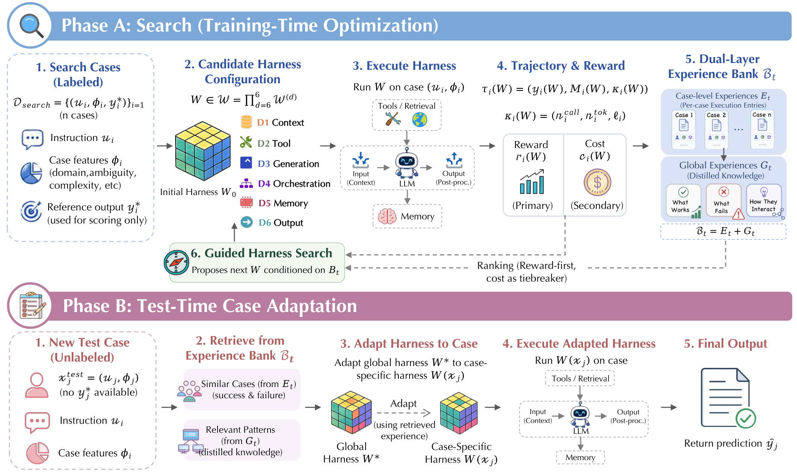
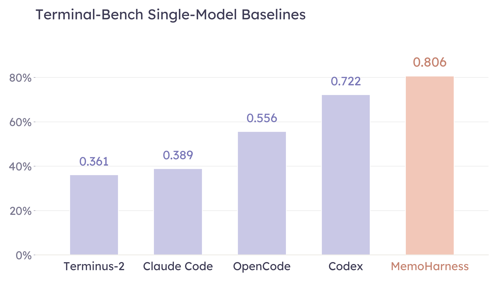
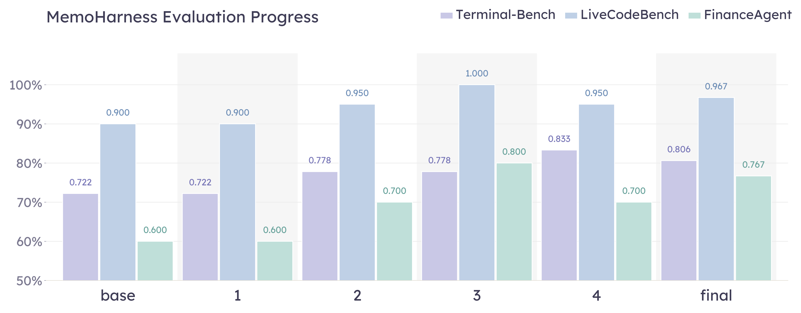
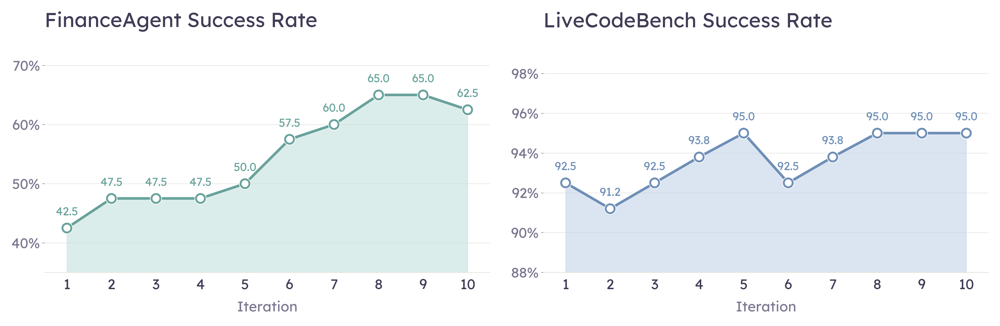

# \method: Agent Harnesses That Learn from Experience

\thispagestyle{firststyle}

**\fontsize{18pt}{22pt}\selectfont\@title**

{\@author}

{\footnotesize\itshapePreprint. Under review.}

{\small[https://github.com/HowieHwong/MemoHarness](https://github.com/HowieHwong/MemoHarness)} \ifx \textsuperscript{\textdagger} These authors contributed equally to this work.\@empty\else

{\footnotesize \textsuperscript{\textdagger} These authors contributed equally to this work.} \fi

**\large Abstract**

{\small An agent harness is the external control layer that turns a base LLM into an executable agent by managing context, tools, orchestration, memory, decoding, and output handling. While harness design strongly affects agent behavior, most automatic improvement methods optimize narrower artifacts such as prompts, pipelines, or workflows, and deployed agents usually reuse a single global harness for all cases. We introduce **MemoHarness**\xspace, an adaptive harness optimization framework that learns from its own executions. **MemoHarness**\xspace decomposes the harness into six editable control dimensions, stores per-case diagnoses and distilled global patterns in a dual-layer experience bank, and adapts the learned harness to each test case using retrieved experience without test-time labels, feedback, or additional search. In our evaluation across shell-agent, code-generation, and analytical-reasoning benchmarks, **MemoHarness**\xspace improves over the fixed harnesses we compare against and shows selective transfer to unseen suites and base models. Its additional context can also remain cost-competitive when much of the retrieved experience is cacheable. These results provide evidence that execution experience is a practical substrate for building agent harnesses that are more adaptive than a single static configuration, while leaving broader claims about statistical robustness and component attribution to future work. }

## Introduction

The performance of an LLM agent depends not only on the underlying language model but on the entire *agent harness* that surrounds it. By *agent harness*, we mean the external control layer that turns a base LLM into an executable agent by specifying how context is constructed, which tools and retrieval channels are exposed, how inference is orchestrated across turns, what memory is retained, and how outputs are validated and returned. In practice, this includes the prompt construction policy, tool and retrieval interfaces, decoding parameters, orchestration topology, memory management, and output handling. Practitioner experience consistently shows that harness design alone can swing end-to-end task success by tens of percentage points with the same base model and the same tools [12, 9].

Despite this, automated optimization of the *harness itself* remains rare. Most automatic improvement methods optimize a narrower artifact: prompts or instructions [6], declarative LM pipelines [8], or agent workflows [32]. These methods are valuable, but they do not jointly edit the full control layer that determines context assembly, tool access, generation policy, orchestration, memory, and output handling. Recent work on Meta-Harness [10] moves closer by treating harness code as the object of search, but the result is still a training-time artifact intended to be reused at deployment. The second missing piece is therefore *test-time adaptation*: a deployed agent should be able to specialize its harness to the particular case in front of it without test-time labels, feedback, or a new search run.

This setting creates three challenges. First, the harness is high-dimensional and coupled: changing retrieval can alter the useful prompt format, decoding budget, workflow topology, memory policy, and validation behavior. Second, benchmark scores alone are weak supervision for search; they reveal whether a run succeeded but not which harness dimension caused the failure or what should be transferred to future cases. Third, test-time adaptation must avoid leakage: it may use only the visible input and experience accumulated during training, yet it must handle cases that differ in domain, ambiguity, reasoning depth, retrieval needs, and output format.

We address this gap with **MemoHarness**\xspace, an agent harness that learns from its own past executions. **MemoHarness**\xspace makes three design choices. **(1) Six-dimensional harness space.** We decompose the harness along the temporal flow of inference into six editable control surfaces (context, tool, generation, orchestration, memory, output), turning harness search into structured editing over separable dimensions rather than over a single opaque prompt (\S2.3). **(2) Dual-layer experience bank.** During search, **MemoHarness**\xspace accumulates both per-case execution entries and distilled global patterns about what works, what fails, and how dimensions interact, so that each iteration becomes diagnostic rather than only score-driven (\S2.4). **(3) Test-time case adaptation.** At test time, the search-derived global harness $W^*$ is adapted to a case-specific harness $W(x_j)$ by retrieving similar past cases and relevant patterns from the bank, without any test-time feedback, gradient updates, or extra search rounds (\S2.6). A correctness-first ranking rule, with execution cost only as a tiebreaker, keeps the search from drifting onto cheap-but-wrong configurations. Figure 1 summarizes the full pipeline.

We evaluate **MemoHarness**\xspace across benchmarks spanning shell tooling, code generation, and analytical reasoning. On the primary shell-agent benchmark under our evaluation protocol, **MemoHarness**\xspace improves over the strongest fixed-harness baseline we run ($0.806$ vs. $0.722$) while reducing per-task dollar cost relative to the strongest commercial baselines in that comparison. The learned harness also shows selective, not uniform, transfer without retraining: it improves some unseen evaluation suites and raises average task success across the held-out base models we evaluate by $+0.098$. These results point to a practical role for adaptive harnesses: execution experience can be reused to specialize the control layer case by case, although larger-scale studies and finer component ablations are needed to establish the robustness and source of the gains.

\textbf{Contributions.} The main contributions of this work are as follows:

[leftmargin=1.35em, itemsep=0pt, topsep=1pt, parsep=0pt, partopsep=0pt]

- A *structured harness optimization framework* that decomposes a monolithic agent harness into six editable control surfaces and pairs them with a dual-layer experience bank, so that search accumulates reusable diagnostic knowledge rather than only scalar scores (\S2.3 and \S2.4).

- A *test-time adaptation mechanism* that adapts the search-derived global harness to each new case using retrieved successes, failures, and global patterns, without test-time feedback (\S2.6).

- Empirical results across in-domain, cross-dataset, and cross-model evaluations showing improved task success under our protocol, selective positive transfer across unseen evaluation suites, gains on the evaluated base-model families, and favorable cost behavior when retrieved context is reusable through caching (\S3).

## Method

\textbf{Overview.} We study *adaptive harness optimization* for a fixed base language model. A *harness* is the surrounding system that determines what information is retrieved, how it is assembled, how model calls are orchestrated, and how raw outputs are post-processed. Rather than treating optimization as only a training-time search for one reusable global artifact, **MemoHarness**\xspace learns a *global base harness* during search and applies a *case-specific adaptation rule* at test time. The method combines a structured six-dimensional harness space with a dual-layer experience bank and follows a **correctness-first** principle: the primary reward determines ranking, while lower execution cost serves only as a secondary tiebreaker. Figure 1 summarizes the full pipeline, which decomposes into a training-time search phase and a test-time case-adaptation phase.

\caption{Overview of **MemoHarness**\xspace. **Phase A (Search, training-time optimization)** runs a guided search over the six-dimensional harness space $\mathcal{W} = \prod_{d=1}^{6}\mathcal{W}^{(d)}$: each candidate harness $W$ is executed on labeled search cases, scored by a correctness-first reward $r_i(W)$ with token usage $c_i(W)=n_i^{\mathrm{tok}}$ as tiebreaker, and the resulting trajectories are stored in a dual-layer experience bank $\mathcal{B}_t = (E_t, G_t)$ of per-case entries and distilled global patterns; the search policy $\pi$ then proposes the next $W$ conditioned on $\mathcal{B}_t$. **Phase B (Test-Time Case Adaptation)** takes an unlabeled test case $x_j^{\text{test}}$, retrieves similar cases and relevant patterns from $\mathcal{B}_t$, and maps the global harness $W^*$ to a case-specific harness $W(x_j)$, which is then executed to produce the final prediction $\hat{y}_j$.}

### Motivation

LLM harnesses are usually deployed as a single benchmark-level configuration: one prompt template, decoding policy, tool interface, and orchestration pattern is selected and then reused for all cases. This is brittle when cases differ in domain, required reasoning depth, retrieval needs, or output format. A harness that is strong on average can still be systematically mismatched to particular case types.

**MemoHarness**\xspace addresses this mismatch by making harness search diagnostic and case-adaptive. It decomposes the harness into six editable control dimensions, records which dimensions explain past successes and failures, and reuses that experience to adapt the learned global harness once for each test case.

### Problem Formulation

**Definition 2.1 (Benchmark Cases).**

We distinguish between labeled search cases and unlabeled evaluation cases. The search set is

$$
\mathcal{D}_{\mathrm{search}}
=
\bigl\{x_i^{\mathrm{s}}=(u_i,\; \phi_i,\; y_i^\star)\bigr\}_{i=1}^{n},
$$

where $u_i$ is the input instruction, $\phi_i$ denotes case features such as domain, ambiguity, complexity, and whether external knowledge is required, and $y_i^\star$ is the reference output used only for search-time scoring. The evaluation set is

$$
\mathcal{D}_{\mathrm{test}}
=
\bigl\{x_j^{\mathrm{test}}=(u_j,\; \phi_j)\bigr\}_{j=1}^{m}.
$$

At test time, the adaptation rule may condition on $(u_j,\phi_j)$ and the experience bank, but not on the unknown reference output.

**Definition 2.2 (Harness Configuration).**

For each dimension $d \in \{1,\ldots,6\}$, let $\mathcal{W}^{(d)}$ denote the set of admissible choices for that functional control surface. A harness configuration is an element of the product space

$$
W \in \mathcal{W}
=
\mathcal{W}^{(1)}
\times
\mathcal{W}^{(2)}
\times
\cdots
\times
\mathcal{W}^{(6)},
\qquad
W = \bigl(W^{(1)},\ldots,W^{(6)}\bigr),
$$

where each component $W^{(d)}$ controls one functional dimension of the inference pipeline (see Section 2.3).

Executing the visible part $(u_i,\phi_i)$ of a case under configuration $W$ produces a prediction $y_i(W)$. We denote the corresponding execution trajectory by $\tau_i(W)$; it records the prediction, intermediate model-tool trace, and lightweight runtime diagnostics:

$$
\tau_i(W)
=
\bigl(
  y_i(W),\;
  \mathcal{M}_i(W),\;
  \kappa_i(W)
\bigr),
\qquad
\kappa_i(W)
=
\bigl(n_i^{\mathrm{call}}(W),\;
n_i^{\mathrm{tok}}(W),\;
\ell_i(W)\bigr),
$$

where $\mathcal{M}_i(W)$ includes invoked tools and intermediate outputs, $n_i^{\mathrm{call}}(W)$ is the number of model calls, $n_i^{\mathrm{tok}}(W)$ is total token usage, and $\ell_i(W)$ is latency. We use total token usage as the search-time secondary cost,

$$
c_i(W) = n_i^{\mathrm{tok}}(W),
$$

with lower values preferred. The remaining components of $\kappa_i(W)$, call count and latency, are logged for diagnostic and reporting purposes but do not enter the harness-selection rule. Monetary cost in dollars is computed offline from token counts at the public list prices of the base model (RQ5) and is therefore separate from search-time selection. Given a user-specified primary metric $R$, the search-time task reward is

$$
r_i(W) = R \!\bigl(y_i(W),\; y_i^\star\bigr),
$$

with larger values preferred.

The search problem is to identify a strong global harness $W^\star$ from candidate executions on $\mathcal{D}_{\mathrm{search}}$. The evaluation-time problem is to construct, for each unlabeled case $(u_j,\phi_j)$, a specialized harness $W(x_j)$ using only test-visible information and retrieved experience.

### Six-Dimensional Harness Space

Rather than treating the harness as a monolithic prompt or agent template, we decompose it according to the *temporal information flow* of inference. Each dimension corresponds to a distinct functional stage, enabling targeted diagnosis and repair while making cross-dimensional interactions explicit.

\caption{Six dimensions of the **MemoHarness**\xspace harness space.}

\small \setlength{\tabcolsep}{5pt}

\arrayrulecolor{tableline}

| M{0.20\textwidth}C{0.20\textwidth}M{0.54\textwidth}@{}} \rowcolor{tableheadbg} \textbf{Dimension} |
| --- |
| \rowcolor{tablestripebg} \begin{tabular}[c]{@{}c@{}l@{}} {\setlength{\fboxsep}{1.6pt}\scriptsize\textsf{\textbf{D1}}} & \textbf{Context}\\[-1pt] & \textbf{assembly} \end{tabular}
|
| \begin{tabular}[c]{@{}c@{}l@{}} {\setlength{\fboxsep}{1.6pt}\scriptsize\textsf{\textbf{D2}}} & \textbf{Tool}\\[-1pt] & \textbf{interaction} \end{tabular}
|
| \rowcolor{tablestripebg} \begin{tabular}[c]{@{}c@{}l@{}} {\setlength{\fboxsep}{1.6pt}\scriptsize\textsf{\textbf{D3}}} & \textbf{Generation}\\[-1pt] & \textbf{control} \end{tabular}
|
| \begin{tabular}[c]{@{}c@{}l@{}} {\setlength{\fboxsep}{1.6pt}\scriptsize\textsf{\textbf{D4}}} & \textbf{Orchestration} \end{tabular}
|
| \rowcolor{tablestripebg} \begin{tabular}[c]{@{}c@{}l@{}} {\setlength{\fboxsep}{1.6pt}\scriptsize\textsf{\textbf{D5}}} & \textbf{Memory}\\[-1pt] & \textbf{management} \end{tabular}
|
| \begin{tabular}[c]{@{}c@{}l@{}} {\setlength{\fboxsep}{1.6pt}\scriptsize\textsf{\textbf{D6}}} & \textbf{Output}\\[-1pt] & \textbf{processing} \end{tabular}
|

\arrayrulecolor{black}

This decomposition (Table 1) turns harness search into structured editing over *separable control surfaces* instead of treating the entire harness as a single opaque object.

### Dual-Layer Experience Bank

**MemoHarness**\xspace maintains an experience bank as a typed pair

$$
\mathcal{B}_t
=
\bigl(\mathcal{E}_t,\; \mathcal{G}_t\bigr),
$$

where $\mathcal{E}_t$ is the set of per-case execution entries accumulated up to search iteration $t$, and $\mathcal{G}_t$ is the set of distilled global patterns. We use a pair rather than a set union because entries and patterns have different schemas.

\textbf{Per-case experience.} For each search case and iteration, we store an execution entry

$$
\xi_i^{(t)} =
\Bigl(
i,\,
t,\,
\phi_i,\,
W_t,\,
\Delta_i^{(t)},\,
\tau_i(W_t),\,
r_i(W_t),\,
c_i(W_t),\,
z_i^{(t)}
\Bigr),
$$

where

$$
\Delta_i^{(t)}
=
\Delta\!\bigl(W_t,\; W_i^{<t}\bigr)
$$

is the configuration delta from $W_i^{<t}$, the most recent harness previously applied to case $i$ (or $W_0$ if no such execution exists). The diagnosis is produced by a diagnostic operator

$$
z_i^{(t)}
=
g\!\bigl(x_i^{\mathrm{s}},\; W_t,\; \tau_i(W_t),\; r_i(W_t)\bigr),
$$

whose output schema is

$$
z_i^{(t)} =
\bigl(
s_i^{(t)},\;
d_{i,\text{prim}}^{(t)},\;
\mathcal{D}_{i,\text{sec}}^{(t)},\;
a_i^{(t)}
\bigr),
$$

where $s_i^{(t)} \in \{0,1\}$ indicates success, $d_{i,\text{prim}}^{(t)} \in \{1,\ldots,6\}\cup\{\emptyset\}$ is the primary failure dimension, with $\emptyset$ used when no failure dimension is assigned, $\mathcal{D}_{i,\text{sec}}^{(t)}$ are secondary contributing dimensions, and $a_i^{(t)}$ is a natural-language analysis. We also maintain lightweight per-case statistics, including consecutive failures, recent average reward, reward trend, and dimension-wise failure counts.

\textbf{Global patterns and retrieval.} Every $N$ search iterations, a distillation operator extracts persistent cross-case regularities from failure clusters,

$$
\mathcal{G}_t
\leftarrow
\mathcal{G}_{t-1}
\cup
\mathrm{Distill}\!\bigl(\mathcal{E}_{\leq t}\bigr),
$$

where each global pattern summarizes a recurring phenomenon, its supporting evidence, and the expected effect of a targeted harness change. The controller does not read the entire bank directly; instead, it issues a structured query $q \in \mathcal{Q}$ over case features, failure statistics, iteration ranges, and dimension-specific diagnoses, yielding a retrieved slice

$$
\mathcal{S}_t(q)
=
\mathrm{Retrieve}\!\bigl(\mathcal{B}_t,\; q\bigr).
$$

A retrieved slice may contain global patterns, filtered per-case entries, and aggregated statistics, which keeps the controller context bounded even as the bank grows over time.

### Training-Time Harness Optimization

Training proceeds over the labeled search set $\mathcal{D}_{\mathrm{search}}$ for $T$ iterations. We begin from a *minimal harness* $W_0$: no demonstrations, no structured instruction scaffolding, no external tools, deterministic single-call decoding, no cross-call memory, and raw output passthrough.

Initializing from a minimal harness ensures that every component of the final configuration is *justified by empirical evidence* accumulated during search, rather than inherited from potentially suboptimal defaults.

At search iteration $t$, the controller forms a query $q_t$ from the current harness and the accumulated bank, retrieves a bounded evidence slice $\mathcal{S}_{t-1}(q_t)$, and proposes the next configuration:

$$
q_t = Q\!\bigl(W_{t-1},\; \mathcal{B}_{t-1}\bigr),
\qquad
\mathcal{S}_{t-1}(q_t)
=
\mathrm{Retrieve}\!\bigl(\mathcal{B}_{t-1},\; q_t\bigr),
\qquad
W_t
=
\Pi_{\mathrm{train}}\!\bigl(W_{t-1},\; \mathcal{S}_{t-1}(q_t)\bigr).
$$

Here $Q$ is a query constructor and $\Pi_{\mathrm{train}}$ is the retrieval-conditioned controller. The proposed harness is then executed on every search case $x_i^{\mathrm{s}} \in \mathcal{D}_{\mathrm{search}}$ to collect trajectories $\tau_i(W_t)$, compute rewards $r_i(W_t)$ and costs $c_i(W_t)$, and produce diagnosis signals $z_i^{(t)}$. All resulting entries are written to $\mathcal{E}_t$, and every $N$ rounds the system distills persistent failure clusters into new entries in $\mathcal{G}_t$.

\textbf{Correctness-first selection.} For each candidate $W_t$, we compute mean task reward and mean cost:

$$
\bar{r}_t
=
\frac{1}{n}
\sum_{i=1}^{n} r_i(W_t),
\qquad
\bar{c}_t
=
\frac{1}{n}
\sum_{i=1}^{n} c_i(W_t).
$$

Let $\mathcal{C}_T=\{W_0,\ldots,W_T\}$ denote the explored candidates. If a cost budget or resource constraint is imposed, let $\mathcal{C}_{\mathrm{feas}}\subseteq\mathcal{C}_T$ denote the feasible candidates; otherwise $\mathcal{C}_{\mathrm{feas}}=\mathcal{C}_T$. The final global harness $W^\star$ is selected by *lexicographic ordering*:

$$
W^\star
\in
\operatorname*{\arg\max}_{\mathrm{lex},\, W_t \in \mathcal{C}_{\mathrm{feas}}}
\bigl(\bar{r}_t,\; -\bar{c}_t\bigr).
$$

This makes the optimization objective explicit: primary reward is optimized first, while lower token usage ($\bar{c}_t$) serves only as a secondary tiebreaker among candidates with equal primary reward.

### Test-Time Case Adaptation Without Feedback

After training, **MemoHarness**\xspace enters the evaluation phase on a test set $\mathcal{D}_{\mathrm{test}}$. Unlike training, test-time adaptation operates *without any iterative feedback loop*. For each unseen case $x=(u,\phi)$, the controller adapts the learned global harness $W^\star$ using only test-visible information and the frozen experience bank $\mathcal{B}_T$.

\textbf{Test-time case adaptation.} For the current case, the controller retrieves global patterns, feature-matched historical slices, and the most similar successful and failed training examples. Let $\psi(u)$ denote an instruction representation, and let $u_\xi$ denote the instruction associated with historical entry $\xi$. We score the similarity between a test case $x=(u,\phi)$ and an entry $\xi$ by

$$
\rho_\psi(x,\xi)
=
\cos\!\bigl(\psi(u),\; \psi(u_\xi)\bigr).
$$

Let $\mathcal{E}_T^{+}=\{\xi\in\mathcal{E}_T: s(\xi)=1\}$ and $\mathcal{E}_T^{-}=\{\xi\in\mathcal{E}_T: s(\xi)=0\}$ denote successful and failed historical entries. The retrieved neighborhoods are

$$
\mathcal{N}^{+}_K(x)
=
\operatorname*{TopK}_{\xi \in \mathcal{E}_T^{+}}
\bigl[\rho_\psi(x,\xi)\bigr],
\qquad
\mathcal{N}^{-}_K(x)
=
\operatorname*{TopK}_{\xi \in \mathcal{E}_T^{-}}
\bigl[\rho_\psi(x,\xi)\bigr],
$$

where $\operatorname*{TopK}$ returns the entries with the largest scores. Together with a feature-conditioned retrieval slice, these neighborhoods form the test-time evidence

$$
\mathcal{S}_{\mathrm{test}}(x)
=
\Bigl(
\mathcal{N}^{+}_K(x),\;
\mathcal{N}^{-}_K(x),\;
\mathrm{Retrieve}\!\bigl(\mathcal{B}_T,\; Q_{\mathrm{test}}(x)\bigr),\;
\mathcal{G}_T
\Bigr).
$$

Conditioned on this evidence, the controller emits a case-specific harness

$$
W(x)
=
\Pi_{\mathrm{test}}\!\bigl(W^\star,\; x,\; \mathcal{S}_{\mathrm{test}}(x)\bigr),
$$

which is then executed for the current evaluation case. If evaluation labels or metrics later become available, the resulting trajectory may optionally be appended to the experience bank for future reuse, but no learning, re-selection, or distillation is triggered during the current evaluation.

\textbf{Relation to global harness search.} The central distinction of **MemoHarness**\xspace is the separation of *global optimization* from *instance-level adaptation*. Training identifies a robust global harness under **correctness-first** selection, while evaluation uses the experience bank to specialize that harness to the requirements of each individual case. This allows simple cases to remain lightweight, while retrieval-heavy, multi-step, or format-sensitive cases can invoke richer orchestration only when the retrieved evidence warrants it.

## Experiments

We organize the evaluation around five research questions. RQ1 asks whether adaptive harness optimization improves absolute task success against existing agent harnesses. RQ2 examines whether search produces stable improvements over iterations and across task families. RQ3 tests whether learned harness changes transfer to unseen evaluation suites. RQ4 asks whether the same harness transfers across base models. RQ5 measures whether the added retrieval and adaptation machinery is cost-effective at inference time.

### Setup

We evaluate **MemoHarness**\xspace on three task families: long-horizon shell agency (`Terminal-Bench`), single-shot code generation (`LiveCodeBench`), and multi-step financial reasoning (`FinanceAgent`). On `Terminal-Bench`, we compare against four released or benchmark-provided harness baselines under a shared evaluation protocol; when a baseline is not a model-agnostic harness, we use the closest reproducible configuration available in that system rather than claiming a pure scaffold-only transplant. For transfer, we also evaluate the learned harness on six external suites and six additional base models. We report mean task success rate averaged over repeated runs, using the validation-selected harness rather than the in-training peak. Appendix 7 gives benchmark, baseline, model, and cost-accounting details.

### Results

\rqtag{RQ1}**Does adaptive harness optimization improve task success?**

\caption{Baseline comparison on `Terminal-Bench`. Higher is better; **MemoHarness**\xspace (rightmost, using `GPT-5.3-Codex`) reaches the highest mean of $0.806$.}

Figure ? compares **MemoHarness**\xspace to four released or benchmark-provided harness baselines on `Terminal-Bench`. **MemoHarness**\xspace reaches $0.806$, improving over the strongest baseline, `Codex`, by $+0.084$, and over the other baselines by $+0.250$ to $+0.445$. For baselines whose underlying generator can be held fixed, these comparisons are closer to isolating the surrounding harness. For product-specific baselines, they should be read as comparisons to the closest released system configuration under our protocol rather than as pure model-controlled scaffold ablations.

The comparison is intentionally stringent in the sense that `Codex` is already a specialized terminal-oriented harness, not a weak prompt-only baseline. The remaining headroom is consistent with the view that end-to-end agent performance is meaningfully shaped by harness control decisions such as context assembly, workflow topology, memory, and output handling. In this setting, **MemoHarness**\xspace appears to recover part of that headroom by using search-time execution experience instead of relying only on manually authored defaults.

\rqtag{RQ2}**How does harness quality evolve during search?**

To understand how the harness improves over the course of optimization, we examine its quality at intermediate checkpoints across all three benchmarks (Figure 2) and the per-iteration trajectory on the two non-`Terminal-Bench` benchmarks (Figure 3).

\caption{Harness quality at six checkpoints (`base`, four intermediate iterations, and the final selected harness) across three benchmarks. The final score is higher than `base` on every benchmark, but it is not always equal to the in-training peak: `LiveCodeBench` touches $1.000$ at iteration 3, and `Terminal-Bench` reaches $0.833$ at iteration 4 because the shipped harness is selected by validation rather than by peeking at the held-out evaluation split.}

\caption{Per-iteration success rate on `FinanceAgent` (left) and `LiveCodeBench` (right) over $10$ search rounds. `FinanceAgent` continues to benefit from additional iterations (rising from $42.5\%$ to a $65.0\%$ peak around iterations $8$ and $9$), whereas `LiveCodeBench` saturates almost immediately near the base-model ceiling and oscillates within a $\sim$ $4$pt band.}

Figure 2 shows that the final selected harness improves over `base` on all three benchmarks: $0.722\!\to\!0.806$ on `Terminal-Bench`, $0.900\!\to\!0.967$ on `LiveCodeBench`, and $0.600\!\to\!0.767$ on `FinanceAgent`. The largest gain appears on `FinanceAgent`, where the base harness leaves the most room; `LiveCodeBench` is near saturation and improves less. The final checkpoint is sometimes below the in-training peak because selection is validation-based rather than peak-test-score based.

Figure 3 shows that `FinanceAgent` continues to improve across search rounds, reaching $65.0\%$ near iterations $8$ and $9$, while `LiveCodeBench` remains in a narrow $91.2\%$--$95.0\%$ band. Thus harness search helps most on longer-horizon agentic workloads, while still giving smaller gains in near-saturated single-shot code generation.

The different trajectories are useful diagnostically. On `FinanceAgent`, later iterations still discover beneficial edits, suggesting that multi-step analytical tasks expose diverse failure modes that can be repaired over time. On `LiveCodeBench`, by contrast, the base model already solves most cases, so search mostly operates in a low-headroom regime where small validation differences matter. This supports the use of validation-based selection and motivates the operation-level breakdown in Appendix 11, which asks which atomic edits are associated with reward improvements.

\rqtag{RQ3}**Do learned harness changes transfer to unseen suites?**

A learned harness is more convincing if it transfers not only across search checkpoints and base models, but also across evaluation suites that were never used during search. To test this, we take the final harness learned on each source benchmark under `GPT-5.3-Codex` and evaluate it on the six external suites described in Section 3.1. For each source benchmark, we compare against the same untuned `Codex` base harness; all reported metrics are the suites' native higher-is-better scores.

\caption{Cross-dataset generalization of search-derived harnesses under the shared base model `GPT-5.3-Codex`. The first row is the shared `Codex` baseline; each `MemoHarness` row is learned from the listed search source. `HEFix`, `RG-Easy`, and `SWE-Pro` abbreviate `HumanEvalFix`, `Reasoning-Gym-Easy`, and `SWE-Bench Pro`. Higher is better in every column.}

\footnotesize \setlength{\tabcolsep}{3pt}

\arrayrulecolor{tableline} \begin{tabular*}{\textwidth}{@{\extracolsep{\fill}}llcccccc@{}} \toprule \rowcolor{tableheadbg} \textbf{Search source} & \textbf{Harness} & \textbf{`MMMLU`} & \textbf{`HEFix`} & \textbf{`StrongR`} & \textbf{`RG-Easy`} & \textbf{`Law`} & \textbf{`SWE-Pro`} \\ \midrule \rowcolor{tablestripebg} *Shared baseline* & `Codex` & 0.818 & 1.000 & 0.879 & 0.947 & 0.675 & 0.706 \\ \arrayrulecolor{tableaccentrule}\cmidrule(lr){1-8}\arrayrulecolor{tableline} \rowcolor{tableaccentbg} `Terminal-Bench` & \textbf{`MemoHarness`} & \textbf{0.848} & 1.000 & \textbf{0.909} & 0.947 & \textbf{0.676} & \textbf{0.765} \\ \rowcolor{tableaccentbg} `FinanceAgent` & \textbf{`MemoHarness`} & 0.818 & 1.000 & \textbf{0.909} & 0.947 & \textbf{0.682} & 0.706 \\ \rowcolor{tableaccentbg} `LiveCodeBench` & \textbf{`MemoHarness`} & \textbf{0.879} & 1.000 & \textbf{0.909} & 0.947 & 0.669 & 0.706 \\ \bottomrule \end{tabular*} \arrayrulecolor{black}

Table 2 shows positive but selective transfer. The `Terminal-Bench` harness gives the broadest lift, improving `MMMLU` by $+0.030$, `StrongReject` by $+0.030$, and `SWE-Bench Pro` by $+0.059$. The `LiveCodeBench` harness improves `MMMLU` and `StrongReject`, while the `FinanceAgent` harness mainly improves `StrongReject` and `LawBench`. Saturated suites such as `HumanEvalFix` and `Reasoning-Gym-Easy` show no movement.

These results argue against two extreme interpretations. The learned harness is not a universally dominant prompt template: some source benchmarks produce conservative or domain-specific edits, and `LawBench` remains mixed. At the same time, the observed gains are not confined to the source benchmark. The strongest transfer appears when the source search task is long-horizon and tool-centric, suggesting that some learned control decisions, such as more robust instruction following or software-task structure, may survive a change in evaluation suite. This interpretation remains provisional because we do not separately ablate every component of the transferred harness.

\rqtag{RQ4}**Does the learned harness transfer across base models?**

A learned harness is most useful if it transfers across base models without retraining. We take the harness produced by searching with `GPT-5.3-Codex` and apply it directly to six additional models spanning four families.

\caption{Cross-model transfer on `Terminal-Bench`. Higher is better.}

\footnotesize \setlength{\tabcolsep}{4pt}

\arrayrulecolor{tableline}

| L{0.50\linewidth}C{0.16\linewidth}C{0.26\linewidth}@{}} \rowcolor{tableheadbg} \textbf{Model} |
| --- |
| \rowcolor{tablestripebg}  `GPT-5.3-Codex` |
|  `Claude-Sonnet-4.6` |
| \rowcolor{tablestripebg}  `Gemini-3.1-Pro` |
|  `Qwen3.5-397B-A17B` |
| \rowcolor{tablestripebg}  `GLM-5` |
|  `GPT-4.1` |
| \rowcolor{tablestripebg}  `DeepSeek-V3.2` |

\arrayrulecolor{black}

Table ? shows that every evaluated model improves over its base setting in our transfer study. The mean gain is $+0.098$, ranging from $+0.038$ on `GPT-4.1` to $+0.233$ on `GLM-5`. The source model, `GPT-5.3-Codex`, retains the same $+0.084$ in-domain improvement reported in Figure ?.

The transfer pattern is important because the harness was not re-searched for each model. Improvements on both proprietary and open-weight models suggest, but do not by themselves prove, that the learned changes are not purely model-specific prompt quirks. They are consistent with a more portable execution policy for how an LLM should gather context, invoke tools, manage intermediate state, and finalize outputs on terminal tasks. The smaller gain on `GPT-4.1` suggests that stronger or already well-calibrated base settings may leave less room for harness intervention, but this pattern should be confirmed on larger model and task sets.

\rqtag{RQ5}**Is adaptive harnessing cost-effective?**

Table 3 reports token usage and dollar cost on the `Terminal-Bench` 18-task held-out evaluation split under `GPT-5.3-Codex`. Dollar costs are computed offline from public list prices and are reported for comparison only; harness selection uses raw token usage as the secondary tiebreaker (Eq. 16).

\caption{Cost analysis on `Terminal-Bench` (18-task held-out evaluation split) with `GPT-5.3-Codex` as the shared base model. Token counts are reported in millions; lower dollar cost is better.}

\footnotesize \setlength{\tabcolsep}{4pt}

\arrayrulecolor{tableline}

| L{0.22\textwidth}rrrrr@{}} \rowcolor{tableheadbg} \textbf{Framework} |
| --- |
| \rowcolor{tablestripebg}  `Codex` |
| `Terminus` |
| \rowcolor{tablestripebg}  `Claude Code` |
|  `OpenCode` |
| \arrayrulecolor{tableaccentrule}\arrayrulecolor{tableline} \rowcolor{tableaccentbg} \textbf{`MemoHarness`} |

\arrayrulecolor{black}

**MemoHarness**\xspace uses more raw input tokens because it retrieves from the experience bank, but most of that context is cached in our evaluation ($13.32$M of $14.18$M input tokens). Its total reported cost is therefore $\$6.89$, below `Codex` and `Claude Code` while achieving higher task success under this cost-accounting protocol. `Terminus` and `OpenCode` remain cheaper, but at substantially lower accuracy. The cost comparison should be interpreted with this caching assumption in mind.

## Conclusion

We presented **MemoHarness**\xspace, an agent harness that turns past executions into reusable experience for future cases. By combining a structured six-dimensional harness space, a dual-layer experience bank, and test-time case adaptation, **MemoHarness**\xspace makes harness search both diagnostic and reusable. The results suggest that improving the control layer around an LLM can be a practical complement to model scaling and manual harness engineering. Future work should study fully unsupervised search, larger-scale validation, more detailed component attribution, and online experience accumulation across deployments.

\appendix

## Appendix Contents

\small

\begin{tabular*}{\linewidth}{@{\extracolsep{\fill}}C{0.08\linewidth}L{0.70\linewidth}r@{}} \textbf{5} & \hyperref[sec:limitations]{Limitations} & \textcolor{remarkgray}{p. \pageref{sec:limitations}} \\ \textbf{6} & \hyperref[app:implementation_details]{Implementation details} & \textcolor{remarkgray}{p. \pageref{app:implementation_details}} \\ \textbf{7} & \hyperref[app:experimental_details]{Experimental details} & \textcolor{remarkgray}{p. \pageref{app:experimental_details}} \\ \textbf{8} & \hyperref[app:models]{Models used} & \textcolor{remarkgray}{p. \pageref{app:models}} \\ \textbf{9} & \hyperref[app:comparison_scope]{Comparison scope} & \textcolor{remarkgray}{p. \pageref{app:comparison_scope}} \\ \textbf{10} & \hyperref[sec:related]{Related work} & \textcolor{remarkgray}{p. \pageref{sec:related}} \\ \textbf{11} & \hyperref[app:op_lift]{Operation-level diagnostic} & \textcolor{remarkgray}{p. \pageref{app:op_lift}} \end{tabular*}

## Limitations

This study has several limitations. First, the primary `Terminal-Bench` evaluation uses an 18-task held-out split, and the present version reports point estimates rather than confidence intervals or significance tests. The results should therefore be read as evidence under a fixed evaluation protocol, not as a full statistical characterization of harness performance. Second, not every baseline is a pure scaffold transplant with the same underlying model and runtime surface. Where systems expose different model, tool, or product-level interfaces, our comparisons are necessarily system-level comparisons to the closest reproducible released configuration. Third, the current experiments do not fully isolate every component of **MemoHarness**\xspace: in particular, we do not separately ablate the experience bank, global patterns, and case-specific test-time adaptation in all settings. Fourth, the cost analysis depends on the observed cacheability of retrieved experience in our runs; deployments with lower cache reuse may see a different cost profile. Finally, the reference implementation instantiates the controller and diagnostic operators with practical heuristics. This makes the system reproducible and inspectable, but future work should study learned or otherwise more general controllers, larger held-out splits, and online accumulation of experience across deployments.

## Implementation Details

This appendix describes how the abstract components of Section 2, namely the harness space, the diagnostic operator, and the cost proxy, are realized in our reference implementation. None of these choices alters the algorithmic structure of **MemoHarness**\xspace; they specify how the abstract objects are concretely instantiated in the experiments reported in Section 3.

**Harness representation.** A harness configuration is defined in the main text as a tuple $W = (W^{(1)}, \ldots, W^{(6)})$ over the six functional dimensions (Section 2.3). In the implementation, $W$ is materialized as a *harness bundle*: a structured policy file that records the current D1 to D6 configuration, paired with lightweight textual scaffolding specifying the agent's operating rules, a persistent playbook, and the distilled memory currently in scope. An edit to a harness therefore corresponds to editing both the structured dimension summary and the accompanying instructions that instantiate those choices at execution time, keeping the textual scaffolding in sync with the typed dimension state.

**Initialization.** All experiments reported in this paper initialize from the minimal harness $W_0$ in which demonstrations, retrieval, structured scaffolding, cross-call memory, and output validators are all disabled. The implementation also supports resuming from a previously archived bundle when one is present, but this deployment-time convenience is not used for the reported benchmark results. In both modes, the search procedure optimizes over the same six-dimensional space $\mathcal{W} = \prod_{d=1}^{6} \mathcal{W}^{(d)}$.

**Diagnostic instantiation.** The diagnostic operator $g$ from Section 2.4 is instantiated with verifier-grounded signals from the execution environment. Rather than requiring a full causal explanation for each failure, the implementation maps observable evidence, including verifier outcomes, exception types, timeouts, missing artifacts, command failures, and execution traces, to one of the six dimensions $d \in \{1, \ldots, 6\}$, yielding a per-case diagnosis $z_i^{(t)}$ that is intentionally coarse and serves as a stable optimization signal. More persistent structure is recovered at the global layer: when repeated failures accumulate, they are distilled into cross-case entries in $\mathcal{G}_t$ together with supporting evidence and a dimension-level repair suggestion.

**Cost proxy.** The main text instantiates the search-time cost as total token usage, $c_i(W) = n_i^{\mathrm{tok}}(W)$, leaving the remaining components of $\kappa_i(W)$, call count and latency, for diagnostic reporting only (Eq. 5). The implementation follows this exactly: token usage is the only cost quantity that enters the lexicographic selection rule (Eq. 16), and dollar cost is computed offline at report time from token counts and the public list prices of the base model. Token usage was chosen because it is available consistently across runs and correlates directly with inference cost; call count and latency are logged for debugging and for the breakdowns in RQ5, but never affect selection. This preserves the correctness-first ordering described in the main text while avoiding dependence on less stable runtime measurements.

**Global pattern distillation.** The experience bank $\mathcal{B}_t = (\mathcal{E}_t, \mathcal{G}_t)$ pairs per-case execution entries with distilled global patterns (Section 2.4). In the implementation, distillation runs both on a fixed schedule (every $N$ search rounds, as in the main text) and opportunistically when repeated failures accumulate on the same case. The distiller consumes recent failure histories, reward trends, dimension assignments, and compact configuration snapshots, and emits a bounded number of new global patterns into $\mathcal{G}_t$. Capping the number of newly emitted patterns per round keeps the controller's prompt budget bounded across iterations while preserving recurring lessons from prior executions.

## Experimental Details

**Benchmarks.** We use three benchmarks chosen to span distinct task families. `Terminal-Bench` is a long-horizon shell-agent benchmark involving multi-step tool use, file editing, and process management. We use an 80/20 (8:2) train/evaluation split of the full 89-task suite, yielding an 18-task held-out evaluation split for absolute performance and cost reporting. `LiveCodeBench` consists of recent competitive-programming problems and stresses single-shot code generation rather than multi-step agency. `FinanceAgent` requires multi-step analytical reasoning over financial documents and tool calls, exercising the longer-horizon analytical end of the workload spectrum. Together the three benchmarks cover shell tooling, code generation, and analytical reasoning, three regimes in which harness design plays qualitatively different roles.

For cross-dataset evaluation, we additionally test the learned harnesses on six external suites: `MMMLU` [7], `HumanEvalFix` from OctoPack [15], `StrongReject` [23], `Reasoning-Gym-Easy` [25], `LawBench` [5], and `SWE-Bench Pro` [4]. These suites cover knowledge-intensive question answering, code repair, safety refusal behavior, verifiable reasoning, legal reasoning, and long-horizon software engineering.

**Baselines.** On `Terminal-Bench` [14] we compare against four agent-harness frameworks: OpenAI's `Codex` [17], Anthropic's `Claude Code` [2], the open-source `OpenCode` [24], and `Terminus`, the neutral test-bed agent that ships with the benchmark. We run each baseline using its released default configuration or the closest reproducible configuration available under the shared evaluation protocol. Where the framework permits a model-agnostic generator swap, we use `GPT-5.3-Codex`; where it does not, we treat the result as a comparison to the released system rather than as a pure scaffold-only ablation. Of the four, `Codex` is the strongest baseline in our setup and serves as the most demanding reference point for **MemoHarness**\xspace.

**Models and protocol.** The harness search uses `GPT-5.3-Codex` as the base model. For cross-model transfer, we evaluate the search-derived harness, without any further training or retraining, on six other base models from four families: `Claude-Sonnet-4.6`, `Gemini-3.1-Pro`, `Qwen3.5-397B-A17B`, `GLM-5`, `GPT-4.1`, and `DeepSeek-V3.2`. We report mean task success rate per benchmark, averaged over repeated runs. Because reported values are run averages, they are not constrained to integer multiples of the 18 held-out `Terminal-Bench` tasks. The harness used at evaluation time is the one selected by validation at the end of search, not the in-training peak shown in Figures 2 and 3. For cost reporting, token counts are averaged over repeated runs on the `Terminal-Bench` evaluation split; dollar costs use the public list prices of `GPT-5.3-Codex` for cached input, non-cached input, and output tokens.

**Hyperparameters and splits.** The Controller--Bank loop runs for $T=10$ outer iterations. Global pattern distillation uses a dual trigger: it runs after $M=5$ new bank entries or after $N=3$ consecutive failures on the same case, whichever occurs first. At each round, the controller receives a compact bank summary containing $K_{\mathrm{succ}}=10$ recent successes and $K_{\mathrm{fail}}=10$ recent failures. We do not use semantic retrieval for these summaries ($D2.\texttt{top\_k}=0$). Dataset splits use a fixed 80/20 (8:2) random partition with seed $42$, so repeated runs and the held-out evaluation pass use identical task IDs. Generation is deterministic in all reported runs: temperature $0.0$, top-$p=1.0$, candidate count $1$, and maximum generation budget $8192$ tokens.

## Models Used

Table 4 lists the seven base models evaluated in this paper. The harness search itself uses `GPT-5.3-Codex` as the source model (Section 3.1); the remaining six models participate only in the cross-model transfer study in RQ4, where they execute the search-derived harness with no further training. "Access" distinguishes proprietary models served only behind an API from models whose weights have been publicly released.

\caption{Base models used in this paper. "Access" indicates whether the model's weights are publicly released or served only via a proprietary API. `GPT-5.3-Codex` is the source model used during harness search; the remaining six are evaluated only at test time, as described in RQ4.}

\footnotesize \setlength{\tabcolsep}{8pt}

\arrayrulecolor{tableline}

| lll@{}} \rowcolor{tableheadbg} \textbf{Model} |
| --- |
| \rowcolor{tablestripebg}  `GPT-5.3-Codex` |
|  `Claude-Sonnet-4.6` |
| \rowcolor{tablestripebg}  `Gemini-3.1-Pro` |
|  `GPT-4.1` |
| \rowcolor{tablestripebg}  `Qwen3.5-397B-A17B` |
|  `GLM-5` |
| \rowcolor{tablestripebg}  `DeepSeek-V3.2` |

\arrayrulecolor{black}

## Comparison Scope

Meta-Harness [10] is the closest prior system to our training-time search setting because it also treats the harness as the object of optimization. We discuss it as related work rather than as a direct empirical baseline because a public implementation suitable for our evaluation stack was not available to us at the time our experiments were finalized (early 2026); reference code released later (e.g., the Stanford IRIS Lab repository) was not incorporated into this version of the paper. Reimplementing the method from the paper would introduce substantial design choices about proposer interfaces, candidate execution, trace storage, and benchmark adapters, making the resulting comparison difficult to attribute cleanly. We therefore restrict direct empirical comparisons to runnable harnesses with released implementations or evaluation substrates, and compare Meta-Harness qualitatively in Section 10.

## Related Work

### Optimization for Agents

Recent work studies how to automatically improve prompts, inference policies, and agentic workflows rather than treating them as fixed hand-written artifacts. Early agentic prompting and tool-use methods such as ReAct [30] and Toolformer [21] established that performance improves substantially when inference is augmented with actions, tools, and external feedback. Planning-oriented inference methods such as Tree of Thoughts [29] and Language Agent Tree Search [33] further demonstrated that search over intermediate reasoning states can improve deliberative decision making.

Prompt and instruction optimization subsequently became an explicit objective. OPRO treats the language model itself as an optimizer over instruction space [27]; ProTeGi performs prompt optimization using textual gradients and beam search [20]; and Promptbreeder evolves both task prompts and mutation prompts [6]. A complementary line of work improves generation behavior through iterative self-feedback: Self-Refine repeatedly generates feedback and revisions [13], while Reflexion stores verbal reflections in memory to improve subsequent trials [22]. However, these methods optimize *within a single prompt turn* and do not consider the broader system-level configuration that surrounds the model.

System-level optimization methods move beyond a single prompt. DSPy formulates language-model pipelines as declarative programs that can be compiled against a task metric [8]; MIPRO extends this line by optimizing instructions and demonstrations for multi-stage language-model programs [18]; and TextGrad casts optimization of compound AI systems as textual backpropagation [31]. For agent workflows, AutoFlow automatically generates natural-language workflow programs [11], and AFlow optimizes code-represented agent workflows with search and execution feedback [32]. Closest to our setting, Meta-Harness searches directly over harness code [10], and AlphaEvolve demonstrates the power of evolutionary code-level improvement under evaluator feedback [16]. *Across this line of work, optimization is primarily a pre-deployment procedure over prompts, programs, workflows, or harness code. Less explored is harness-level adaptation to the specific requirements of each individual test case at deployment time*. **MemoHarness**\xspace addresses this gap through its dual-layer experience bank and test-time case adaptation.

### Harness Engineering

Recent practitioner work increasingly argues that agent performance depends as much on the surrounding harness as on the underlying model. Anthropic's *Building Effective Agents* emphasizes simple compositional workflows, careful context management, and deliberate tool design in production systems [1]. Their subsequent engineering note on tool design argues that tool naming, descriptions, response shaping, and evaluation directly affect both task success and efficiency [3]. LangChain's writing on *context engineering* similarly frames reliability as a problem of deciding what should be written, selected, compressed, and isolated across long agent trajectories [9]. OpenAI's *Harness engineering* post extends this view to software agents, stressing repository legibility, structured in-repo knowledge, and feedback loops as first-class engineering artifacts rather than incidental implementation details [12].

Academic work has only recently begun to formalize these intuitions. Meta-Harness makes the harness itself the object of search [10], while Natural-Language Agent Harnesses externalize harness behavior as editable natural-language artifacts executed by a shared runtime [19]. `Terminal-Bench` provides a realistic command-line evaluation substrate on which different software-agent harnesses can be compared [14]. In parallel, SWE-agent and OpenHands demonstrate that interface design, environment access, and execution scaffolding are central determinants of agent performance rather than incidental implementation details [28, 26]. *While this emerging literature establishes harness engineering as a first-class concern, we are not aware of prior work that accumulates reusable diagnostic experience across search iterations and leverages it for case-level adaptation at test time*. This is the contribution that **MemoHarness**\xspace makes.

## Operation-Level Diagnostic on Adjacent-Iteration Transitions

A scalar score curve only tells us *whether* the harness improved at each iteration; it does not tell us *which* edits were associated with the improvement. To get at this, we examine every adjacent-iteration transition (*previous*$\to$*next*) on a fixed task and ask: when a particular atomic shell operation appears in the harness output for the first time (absent in the previous iteration's harness output, present in the next), is reward more likely to go up than the all-transition baseline? Table 5 reports, for each frequently-newly-added operation, the number of newly-added occurrences ($n_{\text{add}}$), the number of those followed by a reward increase ($n_{\text{pos}}$), the resulting positive-transition rate, the lift of that rate over the all-transition baseline (in percentage points), and the same lift expressed as a relative change. Operations such as `cat`, `sed`, `which`, and `test` are strongly associated with reward improvement (lift ranging from $+17$ to $+60$ pp), suggesting that they often appear in transitions that repair inspection or condition-checking gaps. By contrast, `curl`, `echo`, and `grep` are weakly or negatively associated in this analysis, indicating that their appearance is less predictive of reward-improving transitions. This kind of operation-level decomposition is only possible because the dual-layer experience bank stores per-case execution traces alongside the scalar score, and it provides a direct signal for which directions the search policy should be biased toward in subsequent iterations.

\caption{Operation-level lift analysis on adjacent-iteration transitions. The unit of observation is a single *previous*$\to$*next* iteration pair on a fixed task in which a given atomic operation was *newly added* (absent before, present after). $n_{\text{add}}$: newly-added occurrences; $n_{\text{pos}}$: occurrences followed by a reward increase; *Pos. rate*: $n_{\text{pos}}/n_{\text{add}}$; *Lift (pp)*: *Pos. rate* minus the all-transition baseline rate ($\sim$ $13.2\%$), in percentage points; *Rel. lift*: the same lift relative to the baseline. Green: above-baseline lift; red: below-baseline.}

\footnotesize \setlength{\tabcolsep}{6pt}

\arrayrulecolor{tableline}

| lrrrrr@{}} \rowcolor{tableheadbg} \textbf{Operation} |
| --- |
| \rowcolor{tablestripebg} `cat` |
| `sed` |
| \rowcolor{tablestripebg} `which` |
| `test` |
| \rowcolor{tablestripebg} `pip` |
| `python3` |
| \rowcolor{tablestripebg} `strings` |
| `pdftotext` |
| \rowcolor{tablestripebg} `head` |
| `grep` |
| \rowcolor{tablestripebg} `echo` |
| `curl` |
| \rowcolor{tablestripebg} `file` |
| `jq` |
| \rowcolor{tablestripebg} `rg` |
| `apt-get` |
| \rowcolor{tablestripebg} `wc` |
| `pip3` |

\arrayrulecolor{black}

## References

1. Anthropic. Building effective agents. Anthropic Engineering Blog, December 2024. URL \url<https://www.anthropic.com/engineering/building-effective-agents>. Published December 19, 2024.
2. Anthropic. Claude Code: Agentic coding in the terminal. \url<https://github.com/anthropics/claude-code>, 2025{\natexlaba}. GitHub repository, accessed 2026-04.
3. Anthropic. Writing effective tools for agents with agents. Anthropic Engineering Blog, September 2025{\natexlabb}. URL \url<https://www.anthropic.com/engineering/writing-tools-for-agents>. Published September 11, 2025.
4. Xiang Deng, Jeff Da, Edwin Pan, Yannis Y. He, Charles Ide, Kanak Garg, Niklas Lauffer, Andrew Park, Chetan Rane, Karmini Sampath, Maya Krishnan, Srivatsa R Kundurthy, Sean M. Hendryx, Zifan Wang, Chen Bo Calvin Zhang, Noah Jacobson, Bing Liu, and Brad Kenstler. SWE-bench pro: Can AI agents solve long-horizon software engineering tasks?, 2026. URL \url<https://openreview.net/forum?id=9R2iUHhVfr>.
5. Zhiwei Fei, Xiaoyu Shen, Dawei Zhu, Fengzhe Zhou, Zhuo Han, Alan Huang, Songyang Zhang, Kai Chen, Zhixin Yin, Zongwen Shen, Jidong Ge, and Vincent Ng. LawBench: Benchmarking legal knowledge of large language models. In Yaser Al-Onaizan, Mohit Bansal, and Yun-Nung Chen, editors, *Proceedings of the 2024 Conference on Empirical Methods in Natural Language Processing*, pages 7933–7962, Miami, Florida, USA, November 2024. Association for Computational Linguistics. \doi10.18653/v1/2024.emnlp-main.452. URL \url<https://aclanthology.org/2024.emnlp-main.452/>.
6. Chrisantha Fernando, Dylan Banarse, Henryk Michalewski, Simon Osindero, and Tim Rocktäschel. Promptbreeder: Self-referential self-improvement via prompt evolution, 2023. URL \url<https://arxiv.org/abs/2309.16797>.
7. Dan Hendrycks, Collin Burns, Steven Basart, Andy Zou, Mantas Mazeika, Dawn Song, and Jacob Steinhardt. Measuring massive multitask language understanding. *Proceedings of the International Conference on Learning Representations (ICLR)*, 2021.
8. Omar Khattab, Arnav Singhvi, Paridhi Maheshwari, Zhiyuan Zhang, Keshav Santhanam, Sri Vardhamanan, Saiful Haq, Ashutosh Sharma, Thomas T. Joshi, Hanna Moazam, Heather Miller, Matei Zaharia, and Christopher Potts. Dspy: Compiling declarative language model calls into self-improving pipelines, 2023. URL \url<https://arxiv.org/abs/2310.03714>.
9. LangChain. Context engineering. LangChain Blog, July 2025. URL \url<https://blog.langchain.com/context-engineering-for-agents/>. Published July 2, 2025.
10. Yoonho Lee, Roshen Nair, Qizheng Zhang, Kangwook Lee, Omar Khattab, and Chelsea Finn. Meta-harness: End-to-end optimization of model harnesses, 2026. URL \url<https://arxiv.org/abs/2603.28052>.
11. Zelong Li, Shuyuan Xu, Kai Mei, Wenyue Hua, Balaji Rama, Om Raheja, Hao Wang, He Zhu, and Yongfeng Zhang. Autoflow: Automated workflow generation for large language model agents, 2024. URL \url<https://arxiv.org/abs/2407.12821>.
12. Ryan Lopopolo. Harness engineering: Leveraging codex in an agent-first world. OpenAI Engineering Blog, February 2026. URL \url<https://openai.com/index/harness-engineering/>. Published February 11, 2026.
13. Aman Madaan, Niket Tandon, Prakhar Gupta, Skyler Hallinan, Luyu Gao, Sarah Wiegreffe, Uri Alon, Nouha Dziri, Shrimai Prabhumoye, Yiming Yang, Shashank Gupta, Bodhisattwa Prasad Majumder, Katherine Hermann, Sean Welleck, Amir Yazdanbakhsh, and Peter Clark. Self-refine: Iterative refinement with self-feedback, 2023. URL \url<https://arxiv.org/abs/2303.17651>.
14. Mike A. Merrill, Alexander G. Shaw, Nicholas Carlini, Boxuan Li, Harsh Raj, Ivan Bercovich, Lin Shi, Jeong Yeon Shin, Thomas Walshe, E. Kelly Buchanan, et al. Terminal-bench: Benchmarking agents on hard, realistic tasks in command line interfaces, 2026. URL \url<https://arxiv.org/abs/2601.11868>.
15. Niklas Muennighoff, Qian Liu, Armel Randy Zebaze, Qinkai Zheng, Binyuan Hui, Terry Yue Zhuo, Swayam Singh, Xiangru Tang, Leandro Von Werra, and Shayne Longpre. OctoPack: Instruction tuning code large language models. In *The Twelfth International Conference on Learning Representations*, 2024. URL \url<https://openreview.net/forum?id=mw1PWNSWZP>.
16. Alexander Novikov, Ngân Vu, Marvin Eisenberger, Emilien Dupont, Po-Sen Huang, Adam Zsolt Wagner, Sergey Shirobokov, Borislav Kozlovskii, Francisco J. R. Ruiz, Abbas Mehrabian, M. Pawan Kumar, Abigail See, Swarat Chaudhuri, George Holland, Alex Davies, Sebastian Nowozin, Pushmeet Kohli, and Matej Balog. Alphaevolve: A coding agent for scientific and algorithmic discovery, 2025. URL \url<https://arxiv.org/abs/2506.13131>.
17. OpenAI. Codex CLI: Lightweight coding agent for the terminal. \url<https://github.com/openai/codex>, 2025. GitHub repository, accessed 2026-04.
18. Krista Opsahl-Ong, Michael J. Ryan, Josh Purtell, David Broman, Christopher Potts, Matei Zaharia, and Omar Khattab. Optimizing instructions and demonstrations for multi-stage language model programs, 2024. URL \url<https://arxiv.org/abs/2406.11695>.
19. Linyue Pan, Lexiao Zou, Shuo Guo, Jingchen Ni, and Hai-Tao Zheng. Natural-language agent harnesses, 2026. URL \url<https://arxiv.org/abs/2603.25723>.
20. Reid Pryzant, Dan Iter, Jerry Li, Yin Tat Lee, Chenguang Zhu, and Michael Zeng. Automatic prompt optimization with "gradient descent" and beam search, 2023. URL \url<https://arxiv.org/abs/2305.03495>.
21. Timo Schick, Jane Dwivedi-Yu, Roberto Dessi, Roberta Raileanu, Maria Lomeli, Luke Zettlemoyer, Nicola Cancedda, and Thomas Scialom. Toolformer: Language models can teach themselves to use tools, 2023. URL \url<https://arxiv.org/abs/2302.04761>.
22. Noah Shinn, Federico Cassano, Edward Berman, Ashwin Gopinath, Karthik Narasimhan, and Shunyu Yao. Reflexion: Language agents with verbal reinforcement learning, 2023. URL \url<https://arxiv.org/abs/2303.11366>.
23. Alexandra Souly, Qingyuan Lu, Dillon Bowen, Tu Trinh, Elvis Hsieh, Sana Pandey, Pieter Abbeel, Justin Svegliato, Scott Emmons, Olivia Watkins, and Sam Toyer. A StrongREJECT for empty jailbreaks. In *The Thirty-eighth Conference on Neural Information Processing Systems Datasets and Benchmarks Track*, 2024. URL \url<https://openreview.net/forum?id=KZLE5BaaOH>.
24. SST. OpenCode: An open-source ai coding agent for the terminal. \url<https://github.com/sst/opencode>, 2024. GitHub repository, accessed 2026-04.
25. Zafir Stojanovski, Oliver Stanley, Joe Sharratt, Richard Jones, Abdulhakeem Adefioye, Jean Kaddour, and Andreas Köpf. Reasoning gym: Reasoning environments for reinforcement learning with verifiable rewards. In *The Thirty-ninth Annual Conference on Neural Information Processing Systems Datasets and Benchmarks Track*, 2025. URL \url<https://openreview.net/forum?id=GqYSunGmp7>.
26. Xingyao Wang, Boxuan Li, Yufan Song, Frank F. Xu, Xiangru Tang, Mingchen Zhuge, Jiayi Pan, Yueqi Song, Bowen Li, Jaskirat Singh, Hoang H. Tran, Fuqiang Li, Ren Ma, Mingzhang Zheng, Bill Qian, Yanjun Shao, Niklas Muennighoff, Yizhe Zhang, Binyuan Hui, Junyang Lin, Robert Brennan, Hao Peng, Heng Ji, and Graham Neubig. OpenHands: An open platform for ai software developers as generalist agents, 2024. URL \url<https://arxiv.org/abs/2407.16741>.
27. Chengrun Yang, Xuezhi Wang, Yifeng Lu, Hanxiao Liu, Quoc V. Le, Denny Zhou, and Xinyun Chen. Large language models as optimizers, 2023. URL \url<https://arxiv.org/abs/2309.03409>.
28. John Yang, Carlos E. Jimenez, Alexander Wettig, Kilian Lieret, Shunyu Yao, Karthik Narasimhan, and Ofir Press. SWE-agent: Agent-computer interfaces enable automated software engineering, 2024. URL \url<https://arxiv.org/abs/2405.15793>.
29. Shunyu Yao, Dian Yu, Jeffrey Zhao, Izhak Shafran, Thomas L. Griffiths, Yuan Cao, and Karthik Narasimhan. Tree of thoughts: Deliberate problem solving with large language models, 2023{\natexlaba}. URL \url<https://arxiv.org/abs/2305.10601>.
30. Shunyu Yao, Jeffrey Zhao, Dian Yu, Nan Du, Izhak Shafran, Karthik Narasimhan, and Yuan Cao. ReAct: Synergizing reasoning and acting in language models, 2023{\natexlabb}. URL \url<https://arxiv.org/abs/2210.03629>.
31. Mert Yuksekgonul, Federico Bianchi, Joseph Boen, Sheng Liu, Zhi Huang, Carlos Guestrin, and James Zou. Textgrad: Automatic "differentiation" via text, 2024. URL \url<https://arxiv.org/abs/2406.07496>.
32. Jiayi Zhang, Jinyu Xiang, Zhaoyang Yu, Fengwei Teng, Xionghui Chen, Jiaqi Chen, Mingchen Zhuge, Xin Cheng, Sirui Hong, Jinlin Wang, Bingnan Zheng, Bang Liu, Yuyu Luo, and Chenglin Wu. Aflow: Automating agentic workflow generation, 2024. URL \url<https://arxiv.org/abs/2410.10762>.
33. Andy Zhou, Kai Yan, Michal Shlapentokh-Rothman, Haohan Wang, and Yu-Xiong Wang. Language agent tree search unifies reasoning acting and planning in language models, 2023. URL \url<https://arxiv.org/abs/2310.04406>.
