# Differentiable Mapper for Topological Optimization of Data Representation

## Abstract

Unsupervised data representation and visualization using tools from topology is an active and growing field of Topological Data Analysis (TDA) and data science. Its most prominent line of work is based on the so-called *Mapper graph*, which is a combinatorial graph whose topological structures (connected components, branches, loops) are in correspondence with those of the data itself. While highly generic and applicable, its use has been hampered so far by the manual tuning of its many parameters---among these, a crucial one is the so-called *filter*: it is a continuous function whose variations on the data set are the main ingredient for both building the Mapper representation and assessing the presence and sizes of its topological structures. However, while a few parameter tuning methods have already been investigated for the other Mapper parameters (i.e., resolution, gain, clustering), there is currently no method for tuning the filter itself. In this work, we build on a recently proposed optimization framework incorporating topology to provide the first filter optimization scheme for Mapper graphs. In order to achieve this, we propose a relaxed and more general version of the Mapper graph, whose convergence properties are investigated. Finally, we demonstrate the usefulness of our approach by optimizing Mapper graph representations on several datasets, and showcasing the superiority of the optimized representation over arbitrary ones.

**Keywords:** Mapper Graph, Data Visualization, Topological Data Analysis, Persistent Homology

## Introduction

**Mapper graphs and TDA.**  The Mapper graph introduced in [1] is an essential tool of Topological Data Analysis (TDA), and has been used many times for visualization purposes on different types of data, including, but not limited to, single-cell sequencing [2, 3], neural network architectures [4, 5], or 3D meshes [6, 7]. Moreover, its ability to precisely encode (within the graph) the presence and sizes of geometric and topological structures in the data in a mathematically founded way (through the use of algebraic topology) has also proved beneficial for highlighting subpopulations of interest, which are usually detected as peculiar topological structures of significant sizes, and identifying the key features that best explain such subpopulations against the rest of the Mapper graph. This general pipeline has become a key component in, e.g., biological inference in single-cell data sets, where differentiating stem cells can usually be recovered from branching patterns in the corresponding Mapper graphs [8].

**Parameter selection.**  However, it has quickly become clear that the Mapper graph is quite sensitive to its parameters, in the sense that the structure of the graph can vary a lot under (even small) changes of its parameters. As such, several pipelines based on Mapper graphs actually involve brute force optimization: they first compute a grid of Mapper graphs corresponding to many different sets of parameters, and then they pick the best one, either by manual inspection or with arbitrary criteria---leading to prohibitive running times. In order to deal with this issue, several methods have been proposed in the literature for either assessing the statistical robustness of a given Mapper graph with respect to the distribution of the studied dataset [9, 10], or for tuning the Mapper parameters automatically [11]. Unfortunately, most tuning methods involve simple heuristics that only work for some, but not all Mapper parameters; in particular, the so-called *filter parameter* has never been treated, to the best of our knowledge. This is mostly because it is a general continuous function, and can thus vary in a much wilder parameter space than the other Mapper parameters.

In another line of work, ensemble methods have recently been proposed to combine Mapper graphs over multiple parameter sets, rather than trying to find the best one [12, 13], so as to be able to produce outputs that are more robust. However, this imposes to aggregate families of completely different filter functions, with no guarantees on the resulting graph. In this work, we follow a different approach, and rather attempt at identifying an "optimal" filter function by minimizing specific loss functions.

Another approach related to our work is [14], where an alternative way of constructing Mapper graphs is proposed using a fuzzy clustering algorithm. Even though we also adopt a probabilistic approach (that allows, e.g., a point to belong to disconnected intervals in the cover of the filter range), the underlying probabilistic formalism that we use is new, while there is none in [14]. In particular, we introduce stochastic *assignment schemes* and we address the parameter selection problem within this framework.

**Contributions.**  Our contribution is three-fold:

- We introduce *Soft Mapper*: a generalization of the combinatorial Mapper graph in the form of a probability distribution on Mapper graphs,

- We propose a filter optimization framework adapted to a smooth Soft Mapper distribution with provable convergence guarantees,

- We implement and showcase the efficiency of Mapper filter optimization through Soft Mapper on various data sets, with public, open-source code in `TensorFlow`.

The following of the article is organized as follows: in Section 2 we recall the basics on the Mapper algorithm, then in Section 3 we detail the Soft Mapper construction, which is the main  focus of this work. We provide several interesting special cases of Soft Mapper in Section 4, before introducing topological losses that are specific to Mapper graphs in Section 5. We then present our optimization setting, in which a parameterized family of Mapper filter functions is optimized, in Section 6, and we apply it on 3-dimensional shapes and single cell RNA-sequencing data in Section 7. Finally, we discuss the results of this article and present possible future work directions in Section 8.

## Background on Reeb and Mapper graphs

**Reeb graphs.**  Mapper graphs can be understood as numerical approximations of *Reeb graphs*, that we now define. Let $X$ be a topological space and let $f\,:\,X\rightarrow \mathbb{R}$ be a continuous function called *filter function*. Let $\sim_{f}$ be the equivalence relation between two elements $x$ and $y$ in $X$ defined by: $x\sim_{f} y$ if and only if $x$ and $y$ are in the same connected component of $f^{-1}(z)$ for some $z$ in $f(X)$. The Reeb graph ${\mathrm R}_f(X)$ of  $X$ is then simply defined as the quotient space $X/\sim_{f}$.

**Mapper graphs.**  The Mapper was introduced in [1] as a discrete and computable version of the Reeb graph ${\mathrm R}_f({\mathcal X})$. Assume that we are given a point cloud $\mathbb{X}_n= \{X_1,\dots,X_n\}\subseteq {\mathcal X}$ with known pairwise dissimilarities, as well as a filter function $f$ computed on each point of  $\mathbb{X}_n$. The Mapper graph can then be computed with the following generic version of the Mapper algorithm:

- Cover the range of values $\mathbb{Y}_n = f(\mathbb{X}_n)$ with a set of consecutive intervals $I_1,\dots, I_r$  that overlap, i.e., one has $I_i\cap I_{i+1}\neq \varnothing$ for all $1\leq i \leq r-1$.

- Apply a clustering algorithm to each pre-image $f^{-1}(I_j)$, $j\in\{1,...,r\}$. This defines a *pullback cover* $\mathcal{C}=\{\mathcal{C}_{1,1},\dots,\mathcal{C}_{1,k_1},\dots,\mathcal C_{r,1},\dots,\mathcal{C}_{r,k_r}\}$ of $\mathbb{X}_n$.

- The Mapper graph is defined as the *nerve* of $\mathcal{C}$. Each node $v_{j,k}$ of the Mapper graph corresponds to an element $\mathcal{C}_{j,k}$ of $\mathcal C$, and two nodes $v_{j,k}$ and $v_{j',k'}$ are connected by an edge if and only if  $\mathcal{C}_{j,k} \cap \mathcal{C}_{j',k'} \neq \varnothing$.

## Soft Mapper construction

In this section, we introduce our new construction *Soft Mapper*, which generalizes Mapper graphs and can be used for non-convex optimization. In order to do so, we first provide a general formalization of the Mapper construction that does *not* require overlapping intervals and filter functions. Then, we use this formalization to define *Soft Mapper*, which essentially consists in a distribution on regular Mapper graphs.

### Mapper graphs built on latent cover assignments

Let $\mathbb{X}_n=\{x_1,...,x_n\}$ be a point cloud lying in a metric space $(X,d)$ and let $r \in \mathbb N^\star$. For instance, $\mathbb{X}_n$  can be obtained from sampling $X^n$ according to some distribution $\mu$. Then, let $\text{Clus}$ be a clustering algorithm on $(X,d)$, that is assumed to be fixed in the following of this work.

**Latent cover assignments.**  Any binary matrix $e \in {\{0,1\}}^{n\times r}$ is then called an *r-latent cover assignment* of $\mathbb{X}_n$, where $e_{i,j}=1$ must be understood as point $x_i$ belonging to the $j$-th element of a *latent cover* of the data.  For instance, in the standard version of Mapper presented in Section 2, the latent cover is obtained from a family of pre-images of intervals that cover the range of the filter function.

The procedure to compute a Mapper graph given an $r$-latent cover assignment $e \in {\{0,1\}}^{n\times r}$ is straightforward: simply replace $f^{-1}(I_j)$ by $\{x_i\,:\,e_{i,j}=1\}$ in the generic Mapper algorithm in Section 2, then derive the pullback cover using the clustering algorithm $\text{Clus}$, and finally compute the Mapper graph as the nerve of the pullback cover.

**Mapper function.**  Let $\mathbb{K}$ be the set of simplicial complexes of dimension less or equal to $1$ (i.e., graphs) and such that their sets of vertices (i.e., their $0-$skeletons) are subsets of the power set $\mathcal{P}(\mathbb{X}_n)$. We define the Mapper complex generating function as:

$$
\text{MapComp} \colon {\{0,1\}}^{n\times r}\longrightarrow \mathbb{K},
$$

where $\text{MapComp}$ takes a latent cover assignment as input and creates the corresponding Mapper graph.

### Cover assignment scheme and Soft Mapper

Now, we define stochastic schemes for generating latent cover assignments, that we call *cover assignment schemes*.

**Definition 3.1.**

A *cover assignment scheme* is a double indexed sequence of random variables

$$
A=(A_{i,j})_{\substack{1\leq i\leq n \\ 1\leq j\leq r}}
$$

such that each $A_{i,j}$ is a Bernoulli random variable conditionally to $\mathbb{X}_n$. Let $p_{i,j}(\mathbb{X}_n)$ be the parameter of the Bernoulli distribution of $(A_{i,j}|\mathbb{X}_n)$, which is thus a function of the point cloud $\mathbb{X}_n$.

Note that, in Definition 3.1, the Bernoulli variables $A_{i,j}$ are not assumed to be independent nor identically distributed. Moreover, $p_{i,j}(\mathbb{X}_n)$ can depend only on its associated point $x_i$, or on the whole point cloud $\mathbb{X}_n$.

**Definition 3.2.** Let $A$ be a cover assignment scheme. The *Soft Mapper* of $A$ is defined as the associated distribution of Mapper complexes, which corresponds to the push forward measure of the distribution of $A$ by the map $\text{MapComp}$.

## Examples of cover assignment schemes

We now give example strategies to define cover assignment schemes, beginning with the one that corresponds to the standard Mapper construction defined in Section 2.

### Standard cover assignment scheme

Let $f\colon\mathbb{X}_n \rightarrow \mathbb{R}$ be a filter function  and let $(I_j)_{1\leq j\leq r}$ be a finite cover of the image $f(\mathbb{X}_n)$ of $f$. The standard Mapper graph is then defined as $\text{MapComp}(e^\ast)$, where for every $1\leq i \leq n$ and $1\leq j \leq r$:

$$
e^\ast_{i,j}=1 \text{ if } f(x_i)\in I_j.
$$

The cover assignment scheme $A^\ast$, in this case, is such that every entry $A^\ast_{i,j}$ follows a Dirac distribution on $1$ if $f (x_i)\in I_j$, and a Dirac distribution on  $0$ otherwise. In other words, the parameters of the Bernoulli distributions satisfy $p_{i,j} (\mathbb{X}_n) = p_{i,j} (x_i) = 1$ if  $f (x_i)\in I_j$, and $0$ otherwise, that is

$$
\mathbb{P}(A^\ast=e | \mathbb{X}_n)=
\begin{cases}
    1& \text{ if } e=e^\ast ,\\
    0              & \text{ otherwise.}
\end{cases}
$$

In this degenerated situation, the random variables $A^\ast_{i,j}$ are all independent conditionally to $\mathbb{X}_n$, and $A^\ast_{i,j}$ conditionally to $\mathbb{X}_n$ is equal to $A^\ast_{i,j}$ conditionally to $x_i$.

**Remark 4.1.** An alternative and relevant approach for the standard Mapper graph is to define the intervals $I_j$ via the quantiles of the distribution of $f(\mathbb{X}_n)$. In this case, the random variables $A^\ast_{i,j}$ do not only depend on $x_i$, but also on the whole point cloud $\mathbb{X}_n$.

### Smooth relaxation of the standard cover assignment scheme

Given some $\delta>0$, we can now define a cover assignment scheme $A_\delta$ that approximates the cover assignment scheme $A^\ast$ arising from the standard Mapper graph, but that also enjoys useful smoothness properties in the optimization setting that we will consider in the next section. Specifically, using the same notations as before, and denoting each element of the cover with $I_j=[a_j,b_j]$, consider, for each $j\in\{1,...,r\}$, the function $q_j\colon X  \longrightarrow [0,1]$ defined with:

$$
\begin{aligned}
&x \mapsto
\begin{cases}
    1,& \text{if } f(x)\in [a_j,b_j]\\
    \exp(1-1/(1-(\frac{a_i-f(x)}{\delta})^2)),& \text{if } f(x)\in [a_j-\delta,a_j]\\
    \exp(1-1/(1-(\frac{f(x)-b_i}{\delta})^2)),& \text{if } f(x)\in [b_j,b_j+\delta]\\
    0,              & \text{otherwise}
\end{cases}
\end{aligned}
$$

Now, define $A_\delta=(A_{\delta,i,j})_{\substack{1\leq i\leq n \\ 1\leq j\leq r}}$ to be the random variable in $\{0,1\}^{n\times r}$ such that for every $(i,j)\in\{1,...,n\}\times\{1,...,r\}$:

$$
A_{\delta,i,j}\mid \mathbb{X}_n \sim \mathcal{B}(q_j(x_i)),
$$

with the $A_{\delta,i,j}$'s being jointly independent conditionally to $\mathbb{X}_n$. As for the standard cover, the Bernoulli parameter $p_{i,j} = q_j(x_i)$ depends on its associated point $x_i$ and also on the chosen filter $f$.

Moreover, notice that for every $x_i\in\mathbb{X}_n$ and $j\in\{1,...,r\}$:

$$
q_j(x_i)\xrightarrow[\delta \to 0]{}\begin{cases}
    1,& \text{if } f(x_i)\in I_j\\
    0,              & \text{otherwise,}
\end{cases}
$$

and this shows that $A_\delta\xrightarrow[\delta \to 0]{\mathcal{L}}A^\ast.$ Note that even though we can approximate the standard Mapper graph in this way, we do not always want to do so. For example, there could be cases where $\delta$ needs to be large enough so as to account for some uncertainty on the bounds of the cover $(I_j)_{1\leq j\leq r}$.

**Remark 4.2.** Note that the same relaxed construction can be made for a multi-dimensional Mapper, i.e., for filter functions taking values in $\mathbb{R}^d$ [15], by making slight adjustments to the definition of $q_j$ using the Euclidean norm.

An additional example of a possible cover assignment scheme, which does not imply the existence of a filter function, is given in Appendix 10.

## Topological risk of Soft Mappers

We now switch to the problem of designing filter functions automatically for Mapper graphs using Soft Mapper. To answer this ill-posed problem, we propose to look for filter functions that are optimal with respect to some topological criteria associated to their (Soft)Mapper graphs. In particular, we focus on topological losses based on *persistent homology*.

### Topological signature for Mapper graphs

**Persistent homology.** Persistent homology is a powerful tool that allows to encode the topological information contained in a nested family of simplicial complexes, also called a *filtered simplicial complex*, see for instance [16] for a general introduction. It traces the evolution of the homology groups of the nested complexes across different scales, producing topological descriptors that are, in particular, useful in machine learning pipelines [17]. In the context of Mapper graphs, a variation of persistent homology called *extended* persistent homology has been proved useful, as applying it on Mapper graphs produces descriptors called *extended persistence diagrams*. These diagrams only require to define a *filtration function* on the graph, and are made of points in the Euclidean plane, each point encoding the presence and size (w.r.t. the filtration function) of a particular topological structure of the Mapper graph (such as a connected component, a branch or a loop). See Section 2 of [18] for a brief introduction to extended persistence and [19] for a detailed presentation.

We now define a filtration function on Mapper graphs in order to compute extended persistence diagrams. Let  $\mathcal{F}(\mathbb{X}_n,\mathbb{R})$ be the space of real valued functions defined on the point cloud $\mathbb{X}_n$. For a function $F \in \mathcal{F}(\mathbb{X}_n,\mathbb{R})$, we first associate a filtration $\phi$ to some $K \in {\rm im}(\text{MapComp})$ with:

$$
\forall \sigma\in K\,:\,\phi(\sigma)=\max_{c\in\sigma}\frac{\sum_{x\in c} F(x) }{\text{card}(c)},
$$

that is, node filtration values are defined as the average filter values of the data points associated to the node, and edge filtration values are computed as the maximum of their node values. Then, we compute the extended persistence diagram (which we consider as a subset of $\mathbb{R}^2$ ) of the filtered simplicial complex $(K,\phi)$. We denote by $\text{MapPers}$ the function that takes a Mapper graph and a scalar function on $\mathbb{X}_n$, and then outputs the persistence diagram:

$$
\text{MapPers} \colon \mathbb{K}\times\mathcal{F}(\mathbb{X}_n,\mathbb{R})\longrightarrow \mathcal{P}(\mathbb{R}^2).
$$

**Persistence specific loss.** Now, we introduce a generic notation for a loss function---or, more simply, a statistic---that associates a real value to any extended persistence diagram. Denoting $PD$ as the set of subsets of $\mathbb{R}^2$ consisting of a finite number of points outside the diagonal $\Delta=\{(x,x):x\in\mathbb{R}\}$, such a function can be written as $\ell \colon PD \longrightarrow \mathbb{R}.$

### Statistical risk of the topological signature associated to Soft Mapper

We finally compute the loss associated to a Mapper graph with the function

$$
\begin{aligned}
\mathcal{L} \colon& {\{0,1\}}^{n\times r}\times\mathcal{F}(\mathbb{X}_n,\mathbb{R})  \longrightarrow \mathbb{R}\\
&(e,F) \longmapsto \ell \left(\text{MapPers} \left( \text{MapComp}(e),F \right) \right).
\end{aligned}
$$

Then, we define the risk of a Soft Mapper $\text{MapComp}(A)$ by integrating the loss according to the distribution of the Soft Mapper, or equivalently according to the distribution of the cover assignment scheme:

$$
\mathbb{E} \left( \mathcal{L}(A,F) | \mathbb{X}_n\right)=\sum_{e\in {\{0,1\}}^{n\times r}}\mathcal{L}(e,F)\cdot\mathbb{P}(A=e |\mathbb{X}_n).
$$

Here, both the distribution of $A$ and the risk are conditional to $\mathbb{X}_n$. Note that the risk could also be integrated with respect to the distribution  of $\mathbb{X}_n$. However, in this article, we only consider the non-integrated version of the risk.

## Conditional risk optimization with respect to parameters

Now that we have properly defined risks associated to Soft Mapper distributions, we study in this section the convergence properties of filter optimization schemes minimizing such risks.

### Problem setting

Let us introduce a parameterized family of functions $\{ f_\theta :   \mathbb{X}_n  \rightarrow \mathbb{R} , \, \theta  \in \mathbb{R}^s\}$. In order to simplify notations, we assume in the following of the article that the function $F$ used to compute persistence diagrams and the filter function $f_\theta$ used to design cover assignments are the same, $F=f_\theta$. Let $A$ be a cover assignment scheme whose joint distribution $\mathbb P_\theta$ depends on the filter function $f_\theta$; that is the Bernoulli parameters $p_{i,j}$ may depend on the filter function values and the parameters $\theta$. Note that this dependency is not only true for marginals of the distribution of the cover assignment scheme, but also eventually for its dependency structure.

Our goal is to find the optimal set of parameters $\bar \theta$ that minimizes the topological risk associated to  $\text{MapComp}(A$), when $f_\theta$ is used to define the filtration values on the Mapper graphs. In other words, if we denote:

$$
\begin{aligned}
\text{L} \colon \mathbb{R}^s  &\longrightarrow \mathbb{R} \notag\\
\theta &\longmapsto \mathbb{E_\theta}(\mathcal{L}(A,f_\theta) | \mathbb{X}_n) ,
\end{aligned}
$$

our aim is to find a minimizer of $\text{L}$. Note that in the definition of $\text{L}$, the expectation depends on $\theta$ because the distribution of $A$ also depends on it.

In order to prove guarantees about minimizing $\text{L}$, we follow [20], which uses the theoretical background introduced in [21], in which the authors prove that stochastic gradient descent algorithms converge under certain conditions. To use this framework, it suffices to prove two points (see Corollary 5.9. in [21] and Appendix 11):

- L is definable in an o-minimal structure,

- L is locally Lipschitz.

**Remark 6.1.** When the cover assignment scheme is defined as the standard cover assignment scheme corresponding to the standard Mapper graph (see Section 4.1), this problem amounts to finding an optimal $f_\theta$ that can be used to compute Mapper graphs. We will see however that convergence of the optimization problem in this case is without guarantees, which constitutes the main motivation for defining our smooth relaxation Soft Mapper (see Section 4.2).

### Theoretical guarantees on the convergence of a gradient descent scheme

Under regularity assumptions on the parameterized family of filter functions $\mathcal F=\{f_\theta\colon\mathbb{X}_n \longrightarrow\mathbb{R},\,\theta\in\mathbb{R}^s\}$, we now show that the risk $\text{L}$ in Equation (1) is definable and smooth.

**Theorem 6.2.**

Suppose that there exists an o-minimal structure $\mathcal{S}$ such that:

- for every $x\in\mathbb{X}_n$, the function $\theta\mapsto f_\theta(x)$ is definable in $\mathcal{S}$ and is locally Lipschitz,

- for every $m\in\mathbb{N}$, the restriction of $\ell$ to the set of (extended) persistence diagrams of size $m$ is definable in $\mathcal{S}$ and is locally Lipschitz,

- for every $e\in{\{0,1\}}^{n\times r}$, the function $\theta\mapsto \mathbb{P}_\theta(A =e| \mathbb{X}_n)$ is definable in $\mathcal{S}$ and is locally Lipschitz.

Then $\textup{L}$ is definable in $\mathcal{S}$ and is locally Lipschitz.

**Remark 6.3.** Our proof of Theorem 6.2 is given in Appendix 12 in the case where regular persistent homology is used, but it can be extended in a straightforward way to extended persistence diagrams, as extended persistent homology on a simplicial complex $K$ can be equivalently seen as regular persistent homology on the cone on $K$ (see chapter VII.3 in [16]). Moreover, defining the filtration on the coned complex also extends naturally by using affine transformations.

Under the assumptions of Theorem 6.2, it is then possible to give guarantees on the convergence of a stochastic gradient descent scheme to some critical points of $\text{L}$. This only requires additional, but mild and not very restrictive technical conditions regarding the stochastic gradient descent algorithm itself (see Appendix 13).

### Discussing the assumptions of Theorem 6.2

In this section, we discuss the assumptions of Theorem 6.2, and provide usual cases in which they are satisfied.

**Assumption 1.**  The first assumption concerns the smoothness of the parameterized family of functions $\{f_\theta\colon\mathbb{X}_n \longrightarrow\mathbb{R},\,\theta\in\mathbb{R}^s\}$ and its regularity with respect to the set of parameters $\theta$. As mentioned before, following the result of [22], semi-algebraic functions (for example polynomial, rational, minimum and maximum functions), the exponential function and functions defined as compositions and usual operations between them are all definable in a same o-minimal structure. Furthermore, choosing continuously differentiable functions is sufficient to also have the local Lipschitz property.\\ As such, the family of linear functions $\{f_\theta\colon x\mapsto\langle x,\theta \rangle,\,\theta\in\mathbb{R}^s\}$ satisfies the assumption, as well as the family of parameterized fully-connected neural networks since they are defined by composition between matrix products (which are polynomial) and activation functions involving exponential, maximum and hyperbolic functions.

**Assumption 2.**  The second assumption concerns the persistence-based loss $\ell$, that is used to compute the topological risk. In [20], the authors list a number of possible functions for $\ell$ that satisfy our second assumption. For example, $\ell$ can be the *total persistence*, which quantifies the information given by a persistence diagram, defined as:

$$
\{(u_i,v_i)\}_{1\leq i\leq n}\longmapsto \sum_{i=1}^{n}\vert u_i-v_i\vert.
$$

It can also be computed from persistence landscapes [23] or from the bottleneck distance to a target persistence diagram [20].

**Assumption 3.**  Finally, the third assumption concerns the cover assignment scheme $A$. More specifically, it requires the regularity and smoothness of the success probabilities that give the distribution of $A$.\ Interestingly, this assumption does *not* hold for the standard cover assignment scheme. For example, consider the elementary example where $\mathbb{X}_n\subset\mathbb{R}$ and $A$ is the standard cover assignment scheme, which is degenerate at $e_\theta$, and which corresponds to the linear filter function $f_\theta\colon x\mapsto  \langle x,\theta\rangle$ and a cover $(I_j)$ of its image. Fix a non-zero positive point $x\in\mathbb{X}_n$ (a similar argument can be made if it is negative) and a left hand bound $a_j$ of one of the intervals. Denoting $\theta_0=\frac{a_j}{x}$, we have that $\theta\mapsto \mathbb{P}_\theta(A=e_{\theta_0} | \mathbb{X}_n)$ is discontinuous at $\theta_0$, since $\forall \epsilon>0\,:\,\langle x,\theta_0-\epsilon\rangle=x\cdot(\theta_0-\epsilon)<a_j,$ and therefore, $\mathbb{P}_{\theta_0-\epsilon}(A=e_{\theta_0} | \mathbb{X}_n)=0.$

This constitutes the main motivation for introducing our smooth cover assignment scheme because the functions $\theta\mapsto \mathbb{P}_\theta (A=e | \mathbb{X}_n)$ are in this case products of the functions $q_j$, which are smooth with respect to the parameters (if  our first assumption holds).

### Computing the conditional risk in practice

**Algorithm 1: Soft Mapper Optimization Algorithm**

- **Require:** Initial parameter set $\theta_0$, Number of Monte Carlo random samples $M$, Learning rate sequence $(\alpha_i)_i$, Random noise sequence $(\xi_i)_i$, Number of epochs $N$.
- **for** $0\leq i \leq N-1$ **do**
  - **for** $1\leq m \leq M$ **do**
    - $e \gets$ sample from $\mathbb{P}_{\theta_i}$
    - $y_{i,m} \gets$ an element of the sub-differential in $\theta_i$ of $\mathcal{L}_e\colon\theta\mapsto \mathcal{L}(e,f_\theta)$
  - **end for**
  - $y_i \gets \frac{1}{M}\sum_{m=1}^{M}y_{i,m}$
  - $\theta_{i+1}\gets \theta_i -\alpha_i(y_i+\xi_i)$
- **end for**
- {\bf return} $\theta_N$

Computing the conditional risk L$(\theta)$, for a fixed $\theta\in\mathbb{R}^s$, can be costly in practice since it requires computing the loss $\mathcal{L}(e,f_\theta)$ for every possible cover assignment $e\in\{0,1\}^{n\times r}$. As such, we estimate L$(\theta)$ with Monte Carlo methods. Note that this is possible here because the distribution $\mathbb{P}_\theta$  of the cover assignment scheme is indeed explicitly defined and known at each step of the gradient descent. If $M$ is a non-zero integer and $(e^{(m)})_{1\leq m\leq M}$ is a sequence of independent realizations of the cover assignment scheme $A$, then the Monte Carlo approximation of the conditional risk is:

$$
\tilde{\text{L}}(\theta)=\frac{1}{M}\sum_{m=1}^{M}\mathcal{L}(e^{(m)},f_\theta).
$$

The law of large numbers gives:

$$
\tilde{\text{L}}(\theta)\xrightarrow[M \to \infty]{a.s}\text{L}(\theta).
$$

Moreover, the coordinates of $A$ follow a Bernoulli conditional distribution, making repeated random sampling straightforward, at least when the marginal distributions of $\mathbb{P}_\theta$ are assumed to be independent.

For a fixed point cloud $\mathbb{X}_n$, a chosen family of parameterized conditional probabilities $\theta \mapsto \mathbb{P}_\theta(\cdot |\mathbb{X}_n )$ and a family of parameterized filters $\theta \mapsto f_\theta$, our corresponding optimization algorithm is detailed in Algorithm 6.4.

## Numerical Experiments

In this section, we illustrate the efficiency of optimizing filter functions with Soft Mapper. In particular, we show that Mapper graphs computed from an optimized filter function (computed with gradient descent on Soft Mapper) are generally much better structured than Mapper graphs obtained from arbitrary filters (as is usually done in the Mapper applications). We present applications on 3D shape data in Section 7.1 and on single-cell RNA sequencing data in Section 7.2. Our code is available in the following `Github` repository [24].

### Mapper optimization on 3D shapes

A first application where we can use the Soft Mapper optimization setting is finding linear filters in order to skeletonize 3-dimensional shapes with Mapper graphs. Here, our dataset $\mathbb{X}_n$ consists each time of a point cloud embedded in $\mathbb{R}^3$. The different point clouds we study are displayed (as meshes) in Figure 1. The parametric family of functions is linear, i.e., equal to $\{f_\theta\colon x\mapsto\langle x,\theta \rangle,\,\theta\in\mathbb{R}^3\}$, and the cover assignment scheme $A_\delta$ is the smooth relaxation of the standard case, with $\delta=10^{-2}\cdot(\max_{x\in\mathbb{X}_n}f_\theta(x)-\min_{x\in\mathbb{X}_n}f_\theta(x))$. The cover of the image space is given by $r$ intervals of the same length, such that consecutive intervals have a percentage $g$ of their length in common. The clustering algorithm for the three shapes is KMeans. The values of $r$ (also called resolution), $g$ (also called gain) and the number of clusters in the KMeans algorithm, for each 3-dimensional shape, are summarized in Table 2 of Appendix 14.

**Objective.**  Intuitively, the optimal directions to filter the 3-dimensional shapes (in a topological sense) are:

- for the human: the vertical direction,

- for the octopus: the parallel direction to its tentacles,

- for the table: the perpendicular direction to its upper surface,

as these directions induce Mapper graphs with more topological structures. We will therefore measure the quality of our results by comparing our optimized directions $\bar{\theta}$ to the ones cited above. To find $\bar{\theta}$, we use the total (regular) persistence as a persistence specific loss $\ell$ and we run Algorithm 6.4 with $N=200$ and $M=10$, each time taking the diagonal as the initial direction, i.e. $\theta_0=(\frac{1}{\sqrt{3}},\frac{1}{\sqrt{3}},\frac{1}{\sqrt{3}})^T$. The learning curves for each 3-dimensional shape are displayed in Figure 2, and the correlations between the optimized directions and those we identified as intuitively optimal are summarized in Table 1. As one can see from the table, we are able to recover these intuitive directions with gradient descent.

**Qualitative assessment.**  One can see, in Figures 3 and 4, that the regular Mapper graphs built with the initial and final (optimized) filter functions show clear improvement in the ability of the graphs to act as skeletons of the original point clouds. As such, we see that optimizing the Soft Mapper corresponding to the smooth relaxation of the standard cover assignment scheme succeeds in identifying optimal filter functions. The third shape, representing a table, is particularly interesting. Indeed, the optimal direction that we captured is different from the first and the second principal components computed by PCA, since the principal plane of the point cloud is given by the surface of the table. Hence, there is a contrast between the topological criteria that we use, which is the total persistence, and the maximum variance criteria used by PCA.

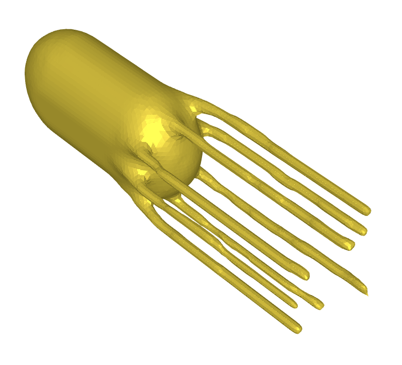

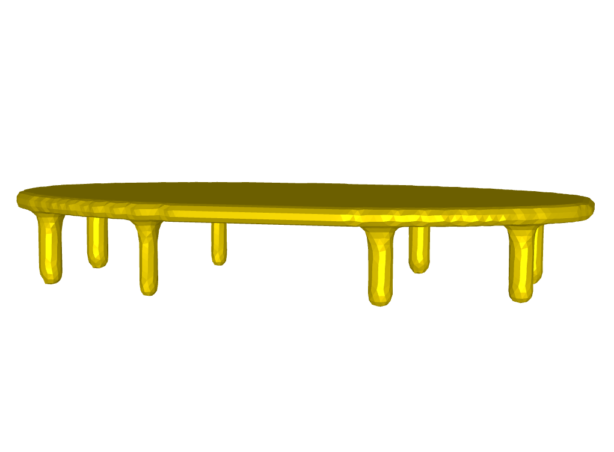

*Meshes of 3-dimensional point clouds representing from left to right: a human, an octopus and a table.*

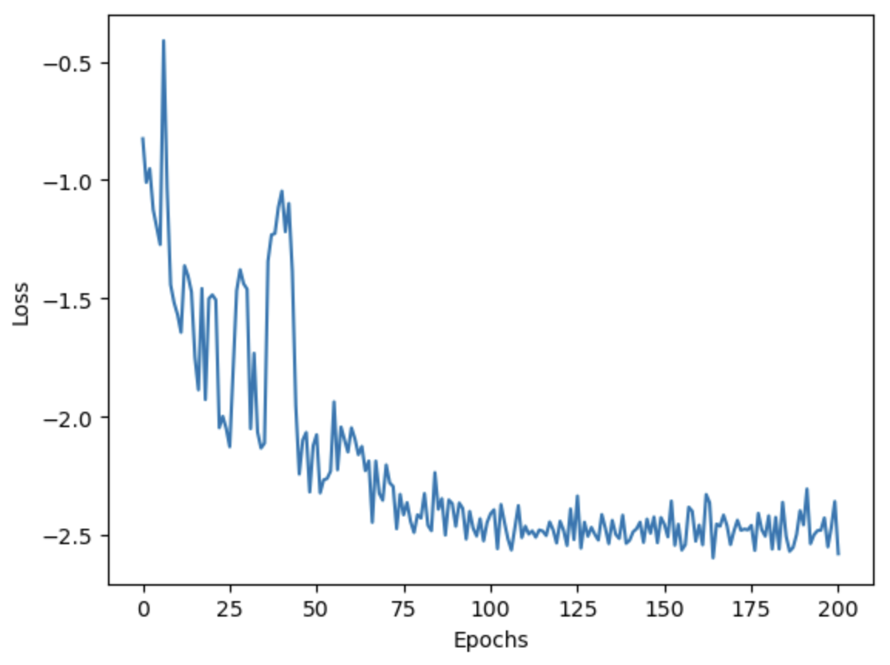

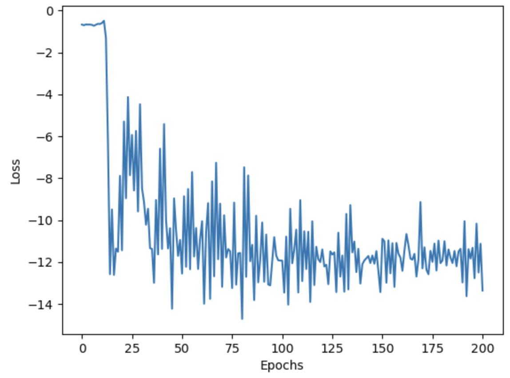

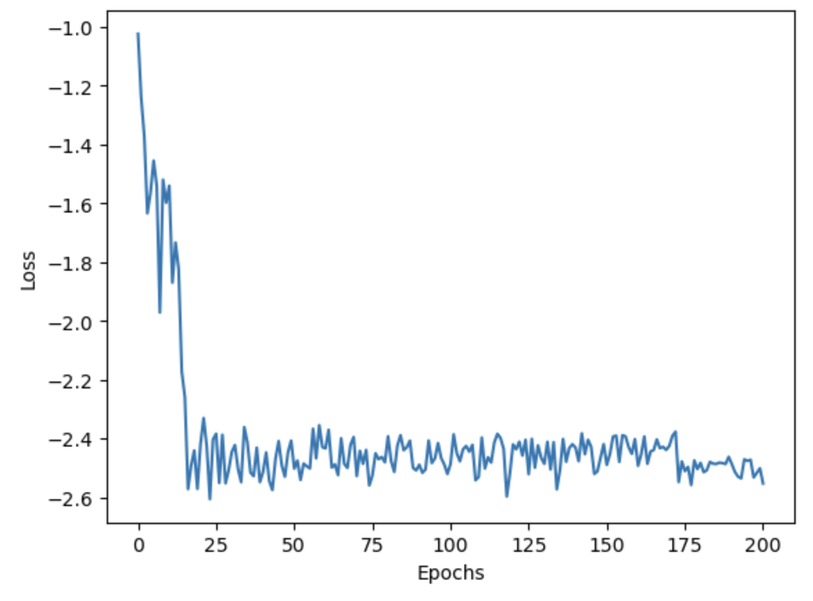

*Learning curves for the 3-dimensional shapes corresponding, from left to right, to: the human, the octopus and the table.*

| Human | Octopus | Table |
| --- | --- | --- |
| 0.9999 | -0.9984 | 0.9993 |

*Correlation between the optimized directions and the optimal ones, for each 3-dimensional shape.*

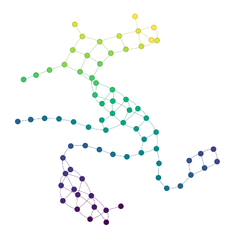

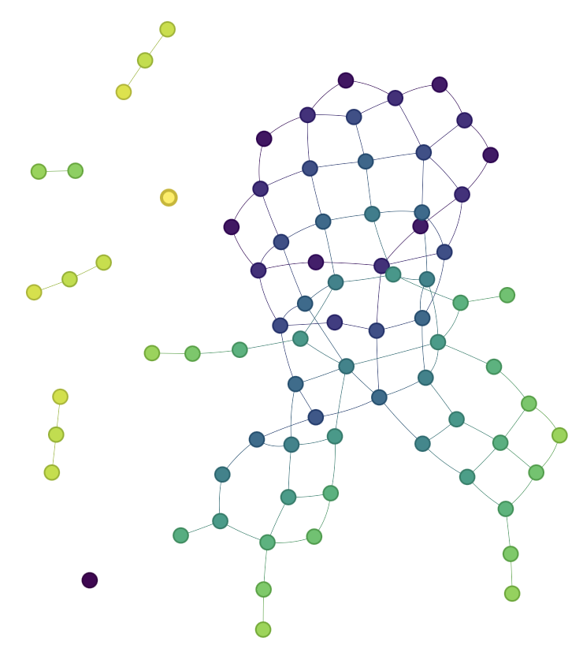

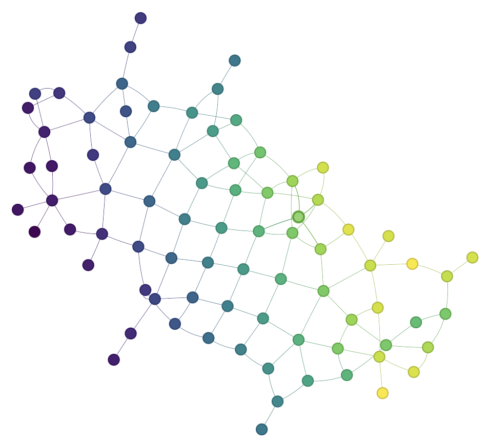

*Regular Mapper graphs computed with the initial filter function, corresponding, from left to right, to: the human, the octopus and the table. Vertices are colored using the mean value of the filter function in the corresponding clusters.*

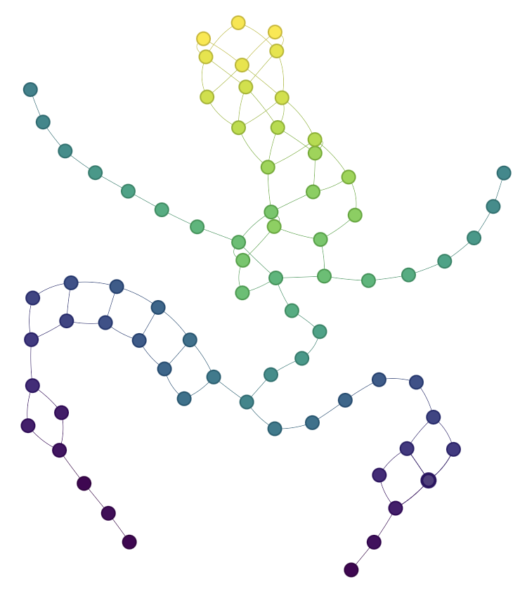

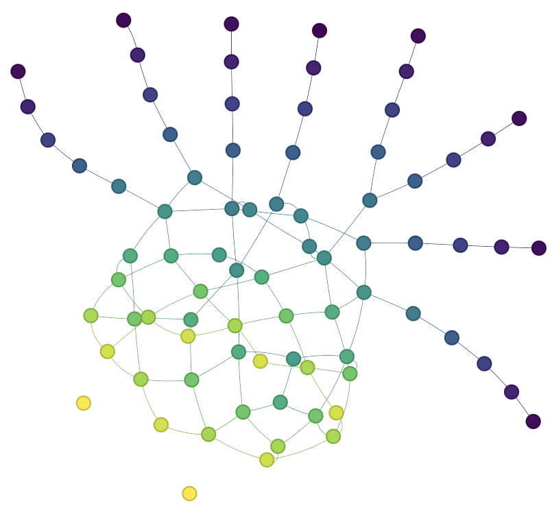

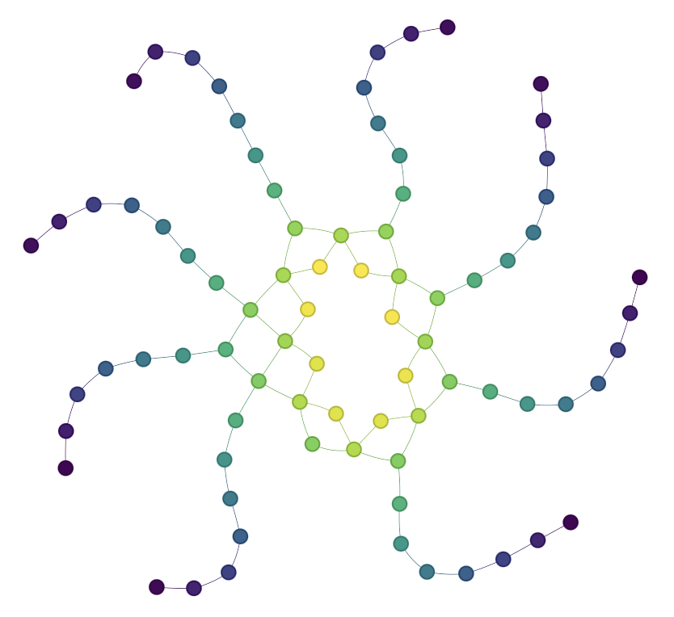

*Regular Mapper graphs computed with the optimized filter function, corresponding, from left to right, to: the human, the octopus and the table. Vertices are colored using the mean value of the filter function in the corresponding clusters.*

### Mapper optimization on RNA-sequencing data

We now apply Mapper optimization on the human preimplantation dataset of [25], which can also be found in the tutorial of the `scTDA` Python library. The dataset consists of $n=1,529$ cells form $88$ human preimplantation embryos, sampled at $5$ different timepoints. The dataset can be accessed in the following link [26], and it contains the expression levels for $p=26,270$ genes for each individual cell. The information of the sampling timepoint for each cell is also given, but we do not include it during optimization. The dataset is first preprocessed using the `Seurat` package in `R` (gene counts for each cell are divided by the total counts for that cell and multiplied by $10^4$, and then they are natural-log transformed using $\log(1+\cdot)$), which produces a normalized dataset $\mathbb{X}_n\subseteq\mathbb{R}^p$. The parametric family of filter functions we wish to optimize is also linear here, i.e. equal to $\{f_\theta\colon x\mapsto\langle x,\theta \rangle,\,\theta\in\mathbb{R}^p\}$, and the cover assignment scheme $A_\delta$ is the smooth relaxation of the standard case with $\delta=10^{-5}\cdot(\max_{x\in\mathbb{X}_n}f_\theta(x)-\min_{x\in\mathbb{X}_n}f_\theta(x))$. The cover of the image space is given by $25$ intervals of the same length, such that consecutive intervals have a percentage of $30\%$ of their length in common. The clustering algorithm used is agglomerative clustering and its threshold is fixed using a Hausdorff distance heuristic: we first compute the Hausdorff distance between $\mathbb{X}_n$ and a randomly sampled subset of $\mathbb{X}_n$ of size $n/3\approx500$, then we manually tune the threshold using factors of this distance until we get Mapper graphs of reasonable size.

**Objective.**  To find $\bar\theta$, we use the total extended persistence as a persistence specific loss $\ell$ and we run Algorithm 6.4 with $N=200$ and $M=10$, taking the diagonal as the initial direction, i.e. $\theta_0=(\frac{1}{\sqrt{p}},...,\frac{1}{\sqrt{p}})^T$. The learning curve in displayed in Figure 8 of Appendix 14. The regular Mapper graphs computed using the initial and the final filter functions are displayed in Figure 5, and are colored with respect to the time component (which was not included in the training dataset).

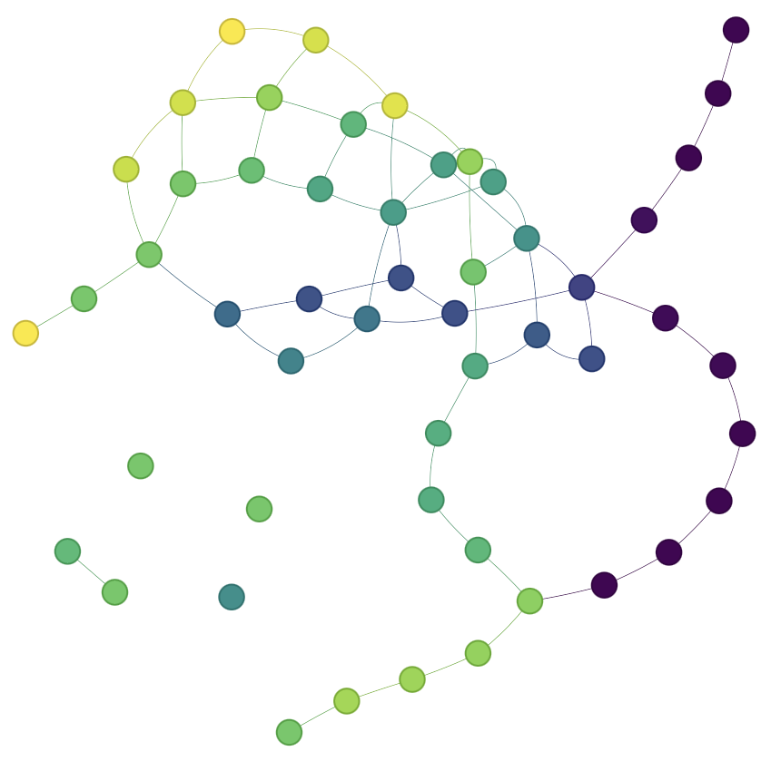

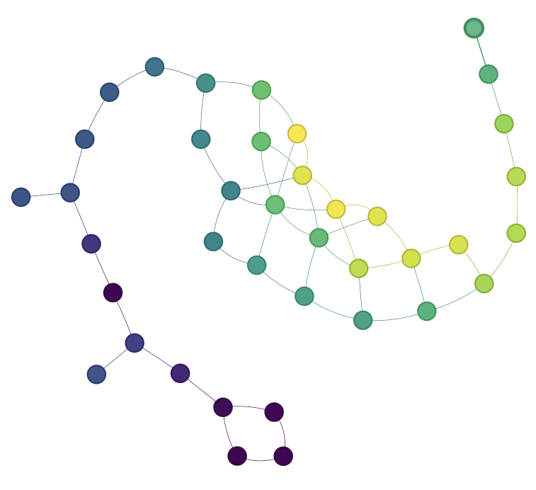

*Regular Mapper graphs for the human preimplantation dataset computed using: in the left the initial filter function and in the right the optimized filter function. Vertices are colored using the mean value of the sampling timepoint in the clusters.*

**Qualitative assessment.**  One can see that the data representation in the Mapper graph produced by the optimized filter function fits the time structure better than with the initial function. In order to confirm this, we isolate each subset of cells having the same sampling timepoint and we plot their respective estimated densities with respect to the initial and the optimized filter function values, in Figure 6. One can see that the optimized filter that we captured is capable of sorting the cells with respect to time, especially at the early timepoints. The reduced performance in this aspect for the later timepoints is, in our guess, due to slowing down of the cell differentiation process. Furthermore, the comparison, in Table 3 of Appendix 14, between Pearson's correlation coefficients also show that the optimized filter is more correlated to time. \\ We also verify that the branches in our optimized Mapper graph correspond to the same two genes, HTR3E for the early timepoints and CDX1 for the later ones, that were identified by [27], see Figure 7. We also identified a few nodes in the branch containing the cells which were sampled in the early stages, that do not contain a high expression level for the HTR3E gene. This could potentially point out another subpopulation of cells with distinct genomic profiles, and that our optimized Mapper graph has captured. An additional experiment using single cell RNA-sequencing data is given in Appendix 15.

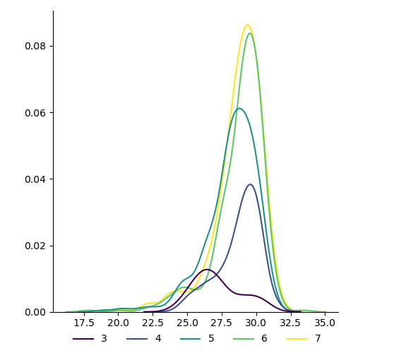

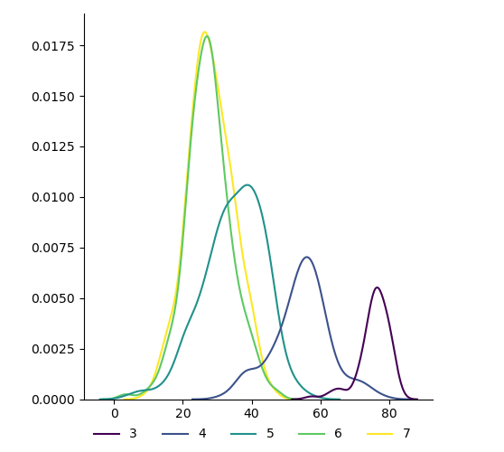

*Estimated density of each subset of cells having the same sampling timepoint, with respect to: in the left the initial filter function values and in the right the optimized filter function values. Colors indicate the sampling timepoint in days.*

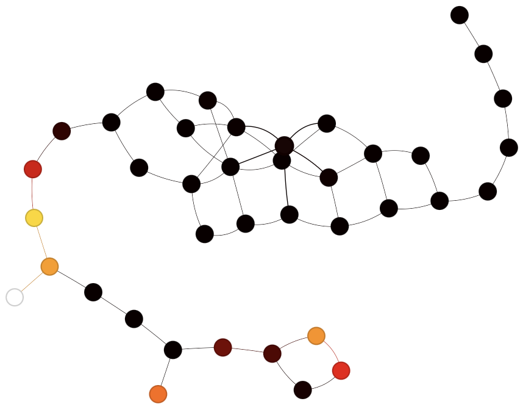

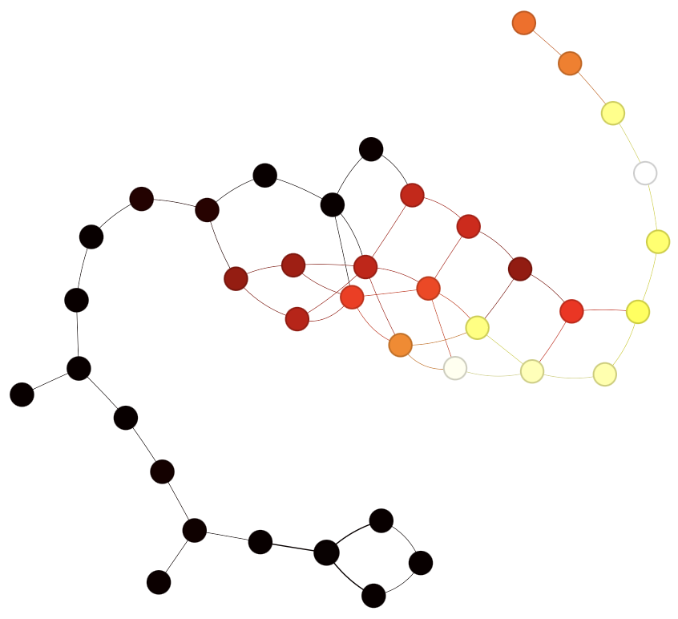

*Regular Mapper graph computed using the optimized filter function, colored using the mean normalized expression of: in the left gene HTR3E and in the right gene CDX1.*

## Discussion and future work

In this article, we have introduced Soft Mapper, a distributional and smoother version of the standard Mapper graph, with provable convergence guarantees using persistence-based losses and risks. Our case study in this article was finding an optimal filter function, among a parameterized family of functions, in order to construct regular Mapper graphs incorporating an optimized and maximal amount of topological information. We then produced examples of such optimization processes on real 3D shape and single-cell RNA sequencing data, for which we were able to obtain structured Mapper representations in an unsupervised way. These representations, especially for the single cell RNA-sequencing data, are not meant to represent novel or state of the art data representations in their respective research domains, but as a proof of concept of the practical benefit of our method. Moreover, our construction is not limited to the choice of a linear family of filter functions or to the filter optimization setting as a whole. Possible future work includes optimizing non-linear filter functions, based on neural networks or kernel methods, and studying Soft Mappers based on different cover assignment schemes, like the Gaussian cover assignment scheme defined in Appendix 10.

## Acknowledgments

The research was supported by three grants from Agence Nationale de la Recherche: GeoDSIC ANR-22-CE40-0007, ANR JCJC TopModel ANR-23-CE23-0014 and AI4scMed, France 2030 ANR-22-PESN-000.

\appendix

## Gaussian cover assignment scheme

In this section, it is assumed that  $\mathbb{X}_n$ is a point cloud in $\mathbb{R}^p$. Additionally, we consider $r$ centers $\{c_1,...,c_r\}\subseteq\mathbb{R}^p$ and $r$ symmetric, semi-definite and positive matrices $\{\Sigma_1,...,\Sigma_r\}\subseteq\mathbb{R}^{p\times p}$. For each $j\in\{1,...,r\}$, consider the function:

$$
\begin{aligned}
q_j\colon \mathbb{R}^p  &\longrightarrow [0,1]\\
x &\longmapsto \exp \left(-(x-c_j)^T  \Sigma_j^{-1} (x-c_j)\right).
\end{aligned}
$$

Define $A=(A_{i,j})_{\substack{1\leq i\leq n \\ 1\leq j\leq r}}$ to be a random variable in $\{0,1\}^{n\times r}$ such that for every $(i,j)\in\{1,...,n\}\times\{1,...,r\}$ :

$$
A_{i,j}\mid \mathbb{X}_n\sim \mathcal{B}(q_j(x_i)),
$$

and  as before we take the $A_{i,j}$'s to be jointly conditionally independent.

This cover assignment scheme is similar to Gaussian mixture models, in that its realizations can be seen as a "one-hot encoding" of the latent variables in a mixture model. However, we can see that a realization of $A$ can have more than one non-zero entry per line as opposed to a mixture model. Furthermore, mean and variance parameters can be inferred with an EM algorithm, and estimated proportions can be also involved in the definition  of the $q_j$'s.

Note that this strategy of defining a cover assignment scheme does not use a filter function or an overlapping cover entirely.

## Elements of o-minimal geometry

**Definition 11.1.** An o-minimal structure on the field of real numbers $\mathbb{R}$ is a collection $(S_n)_{n\in\mathbb{N}}$ where each $S_n$ is a set of subsets of $\mathbb{R}^n$ that satisfies:

- All algebraic subsets of $\mathbb{R}^n$ are in $S_n$;

- $S_n$ is a Boolean subalgebra of the powerset of $\mathbb{R}^n$ (i.e. stable by finite union, finite intersection and complementary);

- if $A\in S_n$ and $B\in S_m$, then $A\times B\in S_{n+m}$;

- if $\pi\colon\mathbb{R}^{n+1}\to\mathbb{R}^n$ is the linear projection onto the first $n$ coordinates and $A\in S_{n+1}$ then $\pi(A)\in S_n$;

- $S_1$ is exactly the family of finite unions of points and intervals.

The elementary example of an o-minimal structure is the collection of semi-algebraic sets. An element $A\in S_n$ for some $n\in\mathbb{N}$ is called a definable set. Furthermore, a map $f \colon  A\to \mathbb{R}^m$ is called a definable map if its graph (i.e. $\{(x,f(x))\,:\,x\in A\}$) is in $S_{n+m}$.

Definable maps are stable under addition, product and composition. A function that is coordinate-wise definable is also definable. Moreover, the result of [22] shows that there exists an o-minimal structure that contains the graph of the exponential function.

An important property of definable maps is that they admit a finite Whitney stratification. This means that if $f \colon  A\to \mathbb{R}^m$ is definable with $A\in S_n$, then $A$ can be decomposed into a finite union of smooth manifolds such that the restriction of $f$ to each of these manifolds is a smooth function.

For more details on o-minimal geometry, see [28].

## Proof of Theorem 6.2

**Lemma 12.1.** Let $\mathcal{S}$ be an o-minimal structure on $\mathbb{R}$. Assume that the two following conditions are satisfied.

- For every $x\in\mathbb{X}_n$, the function $\theta \in \mathbb{R}^s \mapsto f_\theta(x)$ is definable in $\mathcal{S}$ and is locally Lipschitz.

- For every $m\in\mathbb{N}$, the restriction of the persistence specific loss $\ell$ to the set of persistent diagrams of size $m$ is definable in $\mathcal{S}$ and is locally Lipschitz.

Then for every $e\in{\{0,1\}}^{n\times r}$, the function

$$
\mathcal{L}_e\colon\theta \in \mathbb{R}^s \mapsto \mathcal{L}(e,f_\theta)
$$

is definable in $\mathcal{S}$ and is locally Lipschitz.

*Proof.*   Let $e\in{\{0,1\}}^{n\times r}$. Let $K=\text{MapComp}(e)$ with vertex set $V$. Remember that each vertex $c \in V$ is actually a subset of $\mathbb{X}_n$. We now define three maps to decompose the function $\mathcal{L}_e$. First, let us introduce the function

$$
\begin{aligned}
\text{VertexFilt} \colon \mathbb{R}^s  &\longrightarrow \mathbb{R}^{\mid V\mid}\\
\theta&\longmapsto \left(\frac{\sum_{x\in c} f_\theta(x) }{\text{card}(c)}\right)_{c\in V}.
\end{aligned}
$$

For each coordinate of the function $\text{VertexFilt}$, that is for each $c \in V$, the function $\theta \longmapsto [\text{VertexFilt} (\theta)]_c$ is a linear combination of the functions $\theta\mapsto f_\theta(x)$. We can therefore see that it is definable in $\mathcal{S}$ and locally Lipschitz, by our first assumption.

Then we introduce

$$
\begin{aligned}
\text{SubFilt}\colon \mathbb{R}^{\mid V\mid}  &\longrightarrow \mathbb{R}^{\mid K\mid}\\
\Phi&\longmapsto (\max_{c\in\sigma}\Phi_c)_{\sigma\in K},
\end{aligned}
$$

and finally $\text{Persistence} \colon \mathbb{R}^{\mid K\mid}   \longrightarrow \mathbb{R}^{\mid K\mid}$ that computes persistence for a filtration that acts on a fixed simplicial complex. The two functions $\text{SubFilt}$ and $\text{Persistence}$  are taken from [20], where they are both proven to be definable in every o-minimal structure and Lipschitz.

Notice that:

$$
\mathcal{L}_{e}=\ell \circ\text{Persistence}\circ\text{SubFilt}\circ\text{VertexFilt}.
$$

Since $e$, and thus $K$, are fixed, $\ell$ can be replaced by its restriction to persistence diagrams of size $\vert K\vert$. Hence, following our second assumption, $\mathcal{L}_{e}$ is definable in $\mathcal{S}$ and locally Lipschitz.

Recall the assumptions in Theorem 6.2 :

Suppose that there exists an o-minimal structure $\mathcal{S}$ and we have that:

- for every $x\in\mathbb{X}_n$, the function $\theta\mapsto f_\theta(x)$ is definable in $\mathcal{S}$ and is locally Lipschitz.

- for every $m\in\mathbb{N}$, the restriction of $\ell$ to the set of persistent diagrams of size $m$ is definable in $\mathcal{S}$ and is locally Lipschitz.

- for every $e\in{\{0,1\}}^{n\times r}$, the function $\theta\mapsto \mathbb{P}_\theta(A =e| \mathbb{X}_n)$ is definable in $\mathcal{S}$ and is locally Lipschitz.

By Lemma 12.1 and following the first two assumptions, we know that for every $e\in{\{0,1\}}^{n\times r}$, the function $\mathcal{L}_e\colon\theta\mapsto \mathcal{L}(e,f_\theta)$ is definable in $\mathcal{S}$ and is locally Lipschitz. Now, for every $\theta\in\mathbb{R}^s$:

$$
\text{L}(\theta)=\sum_{e\in {\{0,1\}}^{e\times r}}\mathcal{L}(e,f_\theta)\cdot\mathbb{P}_\theta(A=e | \mathbb{X}_n).
$$

As such, L is a sum of products between functions that are definable in $\mathcal{S}$ and locally Lipschitz. We conclude that L is itself definable in $\mathcal{S}$ and locally Lipschitz.

Note that the local Lipschitz property is stable by product (as opposed to the global Lipschitz property). This is due to the fact that the product of two Lipschitz and bounded functions is Lipschitz, and the fact that we can always limit the neighborhoods of points in $\mathbb{R}^s$ to bounded ones.

## Technical conditions for Stochastic Gradient Descent

We are in the setting where we use stochastic gradient descent to minimize a function L. If we write the iterates of the algorithm as:

$$
x_{k+1}=x_k-\alpha_k(y_k+\xi_k),
$$

where

$$
y_k\in\text{Conv}\left\{\lim_{z\to x_k}\nabla\text{L}(z)\,:\,\text{L is differentiable at }z\right\},
$$

consider the following three conditions:

- for any $k$, $\alpha_k\geq 0$, $\sum_{k=1}^\infty \alpha_k=+\infty$ and $\sum_{k=1}^\infty \alpha_k^2<+\infty$;

- $\sup_k\Vert x_k\Vert<+\infty$, almost surely;

- Conditionally on the past, $\xi_k$ must have zero mean and have a second moment that is bounded by a function $p\colon\mathbb{R}^s\longrightarrow\mathbb{R}$ which is bounded on bounded sets.

Note that the last condition is satisfied by taking a sequence of independent and centered variables with bounded variance, which are also independent of the past iterates $(x_k)_k$ and  $(y_k)_k$.

According to [21], under these three conditions together with the condition that L is definable in an o-minimal structure and locally Lipschitz, then $(\text{L}(x_k))_k$ converges almost surely to a critical values and the limit points of $(x_k)_k$ are critical points of L.

## Additional Figures and Tables for the experiments

| Parameter | Human | Octopus | Table |
| --- | --- | --- | --- |
| Resolution | 25 | 10 | 10 |
| Gain | 0.3 | 0.3 | 0.35 |
| Number of clusters | 3 | 8 | 8 |

*Resolution, gain and number of clusters parameters that are used to compute the Mapper for each 3-dimensional shape.*

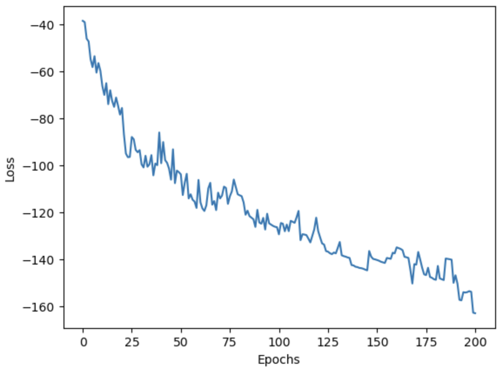

*Learning curve for the human preimplantation dataset.*

| Filter | Correlation with time | P-value |
| --- | --- | --- |
| Initial | 0.1330 | 1.7596e-07 |
| Optimized | -0.7549 | 4.0503e-282 |

*Pearson's correlation between the initial filter and time, and the optimized filter and time for the human preimplantation dataset. The associated $p$-values, obtained from testing the null hypothesis that the true correlation coefficient is zero, are also presented.*

## Mouse embryonic fibroblasts reprogramming dataset

We consider the mouse embryonic fibroblasts (MEF) reprogramming dataset of [29]. It consists of $p=19,089$ gene expressions for $251,203$ MEF cells, densely sampled across $18$ days, with $39$ individual timepoints. The experiment involves adding Doxorubicine (Dox) to the cells on day 0, withdrawing it at day 8, and then transferring them to either a serum-free N2B27 2i medium or maintaining them in serum.

**Objective.**  We would, therefore, want to produce a representation, using our Soft Mapper optimization, that accounts for the time component (like in Section 7.2) and for the divergence in the treatment that the cells received at day 8. In order to achieve this, we first take a uniformly sampled subsample of the dataset of size $n=1,500$ and we use the same preprocessing procedure as with the human preimplantation dataset. Similarly, we consider the same settings (linear family of filter functions, smooth cover assignment scheme, agglomerative clustering, diagonal initial parameter set and extended total persistence), and we run Algorithm 6.4 with $N=300$ and $M=10$. The learning curve is displayed in Figure 9.

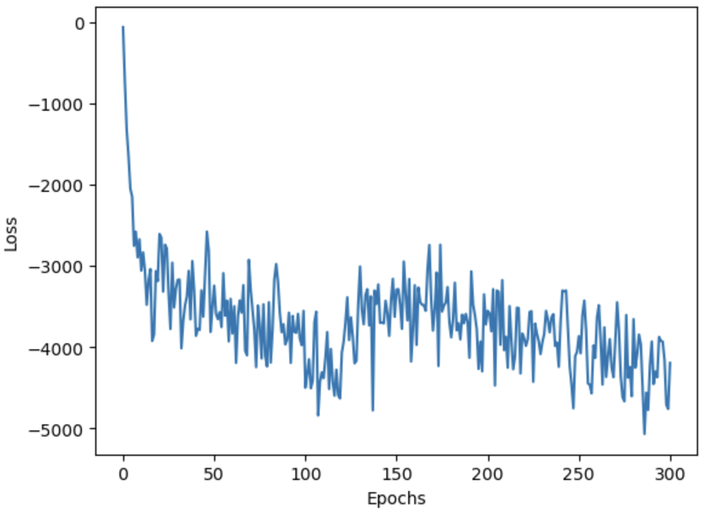

*Learning curve for the MEF reprogramming dataset.*

**Qualitative assessment.**  By looking at the standard Mapper graphs corresponding to the initial and the optimized filter functions in Figure 10, one can see that the optimized Mapper graph represents the time component better and that it shows two major branches, which point to the two phases that appear in day 8 of the experiment. These observations are confirmed by the improvement in the Pearson's correlation coefficients with respect to time between the initial and the optimized filter function values in Table 4. We also color the optimized Mapper graph in Figure 11 using the three phases in the experiment (Dox, 2i and Serum), each mapped to a different color channel.

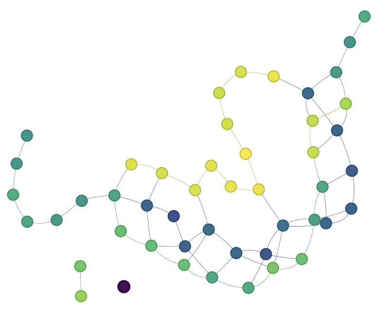

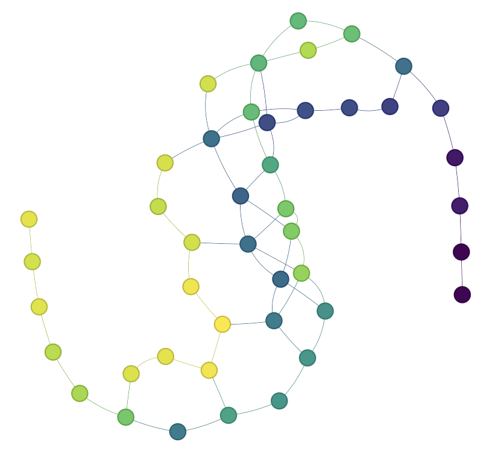

*Classical Mapper graphs for the MEF reprogramming dataset computed using: in the left the initial filter function and in the right the optimized filter function. Vertices are colored using the mean value of the sampling timepoint in the corresponding clusters.*

| Filter | Correlation with time | P-value |
| --- | --- | --- |
| Initial | -0.0560 | 2.9882e-02 |
| Optimized | -0.4015 | 3.2090e-59 |

*Pearson's correlation between the initial filter and time, and the optimized filter and time. The associated $p$-values, obtained from testing the null hypothesis that the true correlation coefficient is zero, are also presented.*

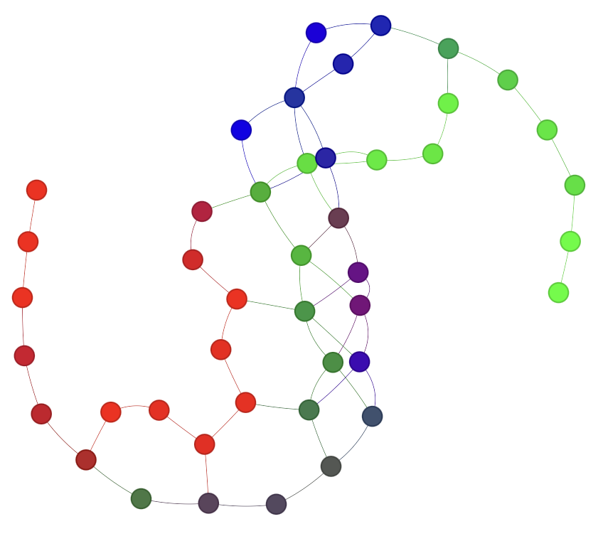

*Standard Mapper graph computed using the optimized filter function, colored by mapping each phase to a color channel: Dox in green, Serum in blue and 2i in red.*

## References

1. Gurjeet Singh, Facundo Mémoli, Gunnar E Carlsson, et al. Topological methods for the analysis of high dimensional data sets and 3d object recognition. *PBG@ Eurographics*, 2:091–100, 2007.
2. Tongxin Wang, Travis Johnson, Jie Zhang, and Kun Huang. Topological methods for visualization and analysis of high dimensional single-cell rna sequencing data. In *BIOCOMPUTING 2019: Proceedings of the Pacific Symposium*, pages 350–361. World Scientific, 2018.
3. Sabrina Zechel, Pawel Zajac, Peter Lönnerberg, Carlos F Ibáñez, and Sten Linnarsson. Topographical transcriptome mapping of the mouse medial ganglionic eminence by spatially resolved rna-seq. *Genome biology*, 15:1–12, 2014.
4. Satanik Mitra and Kameshwar Rao JV. Experiments on fraud detection use case with qml and tda mapper. In *2021 IEEE International Conference on Quantum Computing and Engineering (QCE)*, pages 471–472, 2021.
5. Brian B Joseph, Trami Pham, and Christopher Hastings. Topological data analysis in conjunction with traditional machine learning techniques to predict future mdap pm ratings. Acquisition Research Program, 2021.
6. Ziqi Wang. Exploration of topological data analysis in 3d printing. In *2020 International Conference on Information Science, Parallel and Distributed Systems (ISPDS)*, pages 150–153. IEEE, 2020.
7. Paul Rosen, Mustafa Hajij, Junyi Tu, Tanvirul Arafin, and Les Piegl. Inferring quality in point cloud-based 3d printed objects using topological data analysis. *arXiv preprint arXiv:1807.02921*, 2018.
8. Abbas Rizvi, Pablo Cámara, Elena Kandror, Thomas Roberts, Ira Schieren, Tom Maniatis, and Raúl Rabadán. Single-cell topological RNA-seq analysis reveals insights into cellular differentiation and development. *Nature Biotechnology*, 35:551–560, 2017.
9. Francisco Belch{\'ı}, Jacek Brodzki, Matthew Burfitt, and Mahesan Niranjan. A numerical measure of the instability of mapper-type algorithms. *The Journal of Machine Learning Research*, 21(1):8347–8391, 2020.
10. Adam Brown, Omer Bobrowski, Elizabeth Munch, and Bei Wang. Probabilistic convergence and stability of random Mapper graphs. *Journal of Applied and Computational Topology*, 5:99–140, 2021.
11. Mathieu Carriere, Bertrand Michel, and Steve Oudot. Statistical analysis and parameter selection for mapper. *The Journal of Machine Learning Research*, 19(1):478–516, 2018.
12. Sung Jin Kang and Yaeji Lim. Ensemble mapper. *Stat*, 10(1):e405, 2021.
13. Padraig Fitzpatrick, Anna Jurek-Loughrey, Paweł Dłotko, and Jesus Martinez Del Rincon. Ensemble learning for mapper parameter optimization. In *2023 IEEE 35th International Conference on Tools with Artificial Intelligence (ICTAI)*, pages 129–134. IEEE, 2023.
14. Quang-Thinh Bui, Bay Vo, Hoang-Anh Nguyen Do, Nguyen Quoc Viet Hung, and Vaclav Snasel. F-mapper: A fuzzy mapper clustering algorithm. *Knowledge-Based Systems*, 189:105107, 2020.
15. Mathieu Carrière and Bertrand Michel. Statistical analysis of mapper for stochastic and multivariate filters. *Journal of Applied and Computational Topology*, 6(3):331–369, 2022.
16. Herbert Edelsbrunner and John Harer. Computational topology: an introduction. American Mathematical Society, 2010.
17. Frédéric Chazal and Bertrand Michel. An introduction to topological data analysis: fundamental and practical aspects for data scientists. *Frontiers in artificial intelligence*, 4:108, 2021.
18. Mathieu Carrière, Frédéric Chazal, Yuichi Ike, Théo Lacombe, Martin Royer, and Yuhei Umeda. Perslay: A neural network layer for persistence diagrams and new graph topological signatures. In *International Conference on Artificial Intelligence and Statistics*, pages 2786–2796. PMLR, 2020.
19. David Cohen-Steiner, Herbert Edelsbrunner, and John Harer. Extending persistence using poincaré and lefschetz duality. *Foundations of Computational Mathematics*, 9(1):79–103, 2009.
20. Mathieu Carriere, Frédéric Chazal, Marc Glisse, Yuichi Ike, Hariprasad Kannan, and Yuhei Umeda. Optimizing persistent homology based functions. In *International conference on machine learning*, pages 1294–1303. PMLR, 2021.
21. Damek Davis, Dmitriy Drusvyatskiy, Sham Kakade, and Jason D Lee. Stochastic subgradient method converges on tame functions. *Foundations of computational mathematics*, 20(1):119–154, 2020.
22. Alex Wilkie. Model completeness results for expansions of the ordered field of real numbers by restricted pfaffian functions and the exponential function. *Journal of the American Mathematical Society*, 9(4):1051–1094, 1996.
23. Peter Bubenik. Statistical topological data analysis using persistence landscapes. *Journal of Machine Learning Research*, 16(3):77–102, 2015.
24. Ziyad Oulhaj. Mapper filter optimization. \url<https://github.com/ZiyadOulhaj/Mapper-Optimization>, 2024.
25. Sophie Petropoulos, Daniel Edsgärd, Björn Reinius, Qiaolin Deng, Sarita Pauliina Panula, Simone Codeluppi, Alvaro Plaza Reyes, Sten Linnarsson, Rickard Sandberg, and Fredrik Lanner. Single-cell rna-seq reveals lineage and x chromosome dynamics in human preimplantation embryos. *Cell*, 165(4):1012–1026, 2016.
26. sctda. \url<https://github.com/CamaraLab/scTDA>. Accessed: 2024-01-23.
27. Abbas H Rizvi, Pablo G Camara, Elena K Kandror, Thomas J Roberts, Ira Schieren, Tom Maniatis, and Raul Rabadan. Single-cell topological rna-seq analysis reveals insights into cellular differentiation and development. *Nature biotechnology*, 35(6):551–560, 2017.
28. Michel Coste. *An introduction to o-minimal geometry*. Istituti editoriali e poligrafici internazionali Pisa, 2000.
29. Geoffrey Schiebinger, Jian Shu, Marcin Tabaka, Brian Cleary, Vidya Subramanian, Aryeh Solomon, Joshua Gould, Siyan Liu, Stacie Lin, Peter Berube, et al. Optimal-transport analysis of single-cell gene expression identifies developmental trajectories in reprogramming. *Cell*, 176(4):928–943, 2019.
