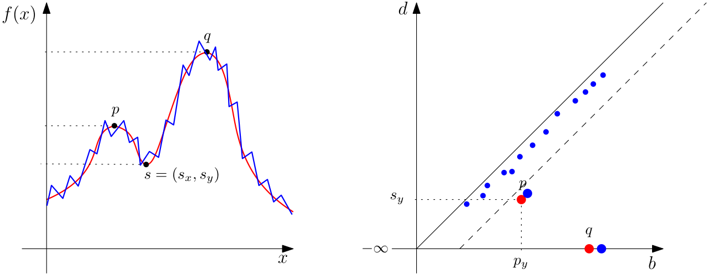
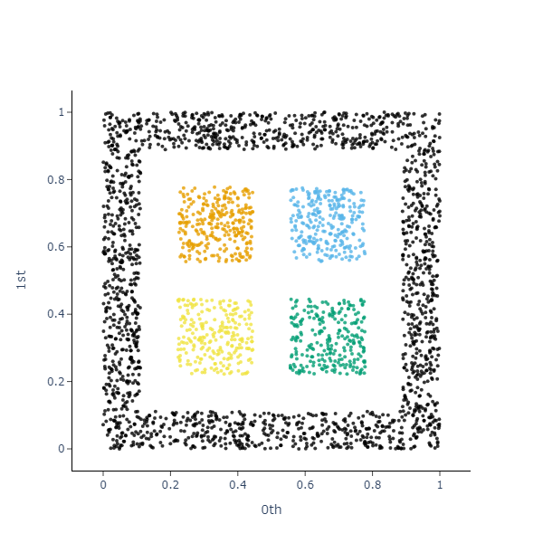
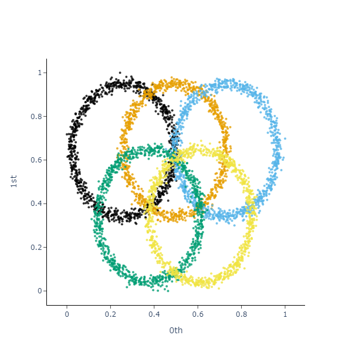

# \aut: An Out-Of-The-Box Persistence-Based Clustering Algorithm

## Abstract

We present AuToMATo\xspace, a novel clustering algorithm based on persistent homology. While AuToMATo\xspace is not parameter-free per se, we provide default choices for its parameters that make it into an out-of-the-box clustering algorithm that performs well across the board. AuToMATo\xspace combines the existing ToMATo\xspace clustering algorithm with a bootstrapping procedure in order to separate significant peaks of an estimated density function from non-significant ones. We perform a thorough comparison of AuToMATo\xspace (with its parameters fixed to their defaults) against many other state-of-the-art clustering algorithms. We find not only that AuToMATo\xspace compares favorably against parameter-free clustering algorithms, but in many instances also significantly outperforms even the best selection of parameters for other algorithms. AuToMATo\xspace is motivated by applications in topological data analysis, in particular the Mapper algorithm, where it is desirable to work with a clustering algorithm that does not need tuning of its parameters. Indeed, we provide evidence that AuToMATo\xspace performs well when used with Mapper. Finally, we provide an open-source implementation of AuToMATo\xspace in Python that is fully compatible with the standard *scikit-learn* architecture.

## Introduction

Clustering techniques play a central role in understanding and interpreting data in a variety of fields. The idea is to divide a heterogeneous group of objects into groups based on a notion of similarity.  This similarity is often measured with a distance or a metric on a data set. There exist many different clustering techniques [1, 11], including hierarchical, centroid-based and density-based techniques, as well as techniques arising from probabilistic generative models. Each of these methods is proficient at finding clusters of a particular nature. Many of the most commonly used clustering algorithms require a selection of parameters, a process which poses a considerable challenge when applying clustering to real-world problems.

In this work, we present and implement AuToMATo\xspace (*Automated Topological Mode Analysis Tool*), a novel clustering algorithm based on the topological clustering algorithm ToMATo [7]. The latter summarizes the prominences of peaks of a density function in a so-called persistence diagram. The user then selects a prominence threshold $\tau$ and retains all peaks whose prominence is above this threshold, which results in the final clustering. A simple heuristic to select $\tau$ is to sort the peaks by decreasing prominence, and to look for the largest gap between two consecutive prominence values [7]. While yielding reasonable results in general, this procedure is not very robust to small changes in the prominence values.

A more robust and sophisticated method is to perform a bottleneck bootstrap on the persistence diagram produced by ToMATo\xspace, which is precisely what AuToMATo\xspace does. That is, given a persistence diagram obtained by running ToMATo\xspace on a point cloud, AuToMATo\xspace produces a confidence region for that diagram with respect to the bottleneck distance, which translates into a choice of $\tau$ that determines the final clustering. While AuToMATo\xspace is not parameter-free per se, we provide default choices that make it perform well across the board. Unless stated otherwise, AuToMATo\xspace will henceforth refer to our algorithm with its parameters set to these defaults. We experimentally analyze the clustering performance of AuToMATo\xspace and we find that it not only outperforms parameter-free clustering algorithms, but often also even the best choice of hyperparameters for many parametric clustering algorithms. Parameter-free algorithms building on ToMATo\xspace exist in the literature, for example, in [10] the final clustering is determined by fitting a curve to the values of prominence, and in [3] significant values are separated from non-significant ones by adapting the process that produces the persistence diagrams. Indeed, the former algorithm is one of those that AuToMATo\xspace is shown to outperform.

We envision one important application of AuToMATo\xspace to be to the *Mapper* algorithm, introduced in [25]. Mapper constructs a graph that captures the topological structure of a data set. It relies on many parameters, one of them being a clustering algorithm applied to various chunks of the data. Algorithms that depend heavily on a good choice of a tunable hyperparameter are generally not good candidates for usage with Mapper, as the best choice for the hyperparameter can vary significantly over the different chunks, and manually choosing a different hyperparameter for each may not be possible in practice. Thus, most choices of hyperparameter will generally perform badly on some of the subsets, leading to undesired results of Mapper. Thus, AuToMATo\xspace can be seen as progress towards finding optimal parameters for Mapper, which is an active area of research [5, 6, 23]. Running examples for Mapper with AuToMATo\xspace, we see that it is indeed a good choice for a clustering algorithm in this application when compared to parametric clustering algorithm such as DBSCAN.

## Background

### Persistence and the ToMATo\xspace clustering algorithm

Both ToMATo\xspace and AuToMATo\xspace rely on the theory of persistence [12, 28, 4] to quantify the prominence of peaks of (an estimate of) a density function, and to build a hierarchy of peaks. Given a topological space $X$ equipped with a density function $f\colon X \to \mathbb{R}_{\geq 0}$, the first step of persistence is to build a filtration from $X$.

**Definition 2.1.** Let $X$ be a topological space, and let $f\colon X \to \mathbb{R}$ be continuous. The **superlevel set filtration** of $(X, f)$ is the family of superlevel sets $\left\{X_{\geq t}\mid t\in\mathbb{R}\right\}$, where $X_{\geq t}\coloneqq f^{-1}\left([t, \infty)\right)$.

In the following, we assume for ease of exposition that all local extrema of $f$ have distinct values. The idea underlying ToMATo\xspace is to track the evolution of (the number of) connected components of $X_{\geq t}$ as $t$ ranges from $+\infty$ to $-\infty$. In that process, the number of connected components of $X_{\geq t}$ remains constant, unless $t$ passes through the value of a local extremum of $f$. As $t$ passes through the value of a local maximum, a new connected component is "born" and added to the superlevel set $X_{\geq t}$. Similarly, as $t$ passes through the value of a local minimum, two connected components of $X_{\geq t}$ are merged into one. ToMATo\xspace builds a hierarchy of local maxima of $f$ by declaring that, as two components get merged, the component corresponding to the local maximum with higher value absorbs the other one and persists, whereas the component corresponding to the local maximum with lower value "dies". Therefore, to each local maximum we associate a pair $(b,d)$ where $b$ denotes the birth and $d$ the death time, respectively. The evolution of the connected components can be concisely recorded in a persistence diagram.

**Definition 2.2.** Let $\{(b_{l}, d_{l})\}_{l}$ denote the birth and death times of connected components of the superlevel set filtration $\left\{X_{\geq t}\right\}_{t\in\mathbb{R}}$ associated to the density $f\colon X \to \mathbb{R}$. The associated **persistence diagram**, denoted by $\mathrm{Dgm}(X,f)$, is the multiset in the extended plane $\overline{\mathbb{R}}^{2}\coloneqq\mathbb{R}\cup\{\pm\infty\}$ consisting of the points $\left\{(b_{l}, d_{l})\right\}_{l}\subset\overline{\mathbb{R}}^{2}$ (counted with multiplicity) and the diagonal $\Delta\coloneqq\left\{(x,x)\mid x\in\overline{\mathbb{R}}\right\}$ (where each point on $\Delta$ has infinite multiplicity). For a given local maximum of $f$ with birth time $b_{l}$ and death time $d_{l}$ , we refer to the difference $d_{l}-b_{l}$ as its **prominence** or **lifetime**.

The reason for working in the extended plane is that, provided that $f$ has a global maximum, the superlevel set filtration $X_{\geq t}$ will have a connected component that never dies, that is, has death time equal to $-\infty$. See the red graph in Figure 1 for an illustration.

The persistence diagram $\mathrm{Dgm}(X,f)$ provides a summary of $f$. The points of $\mathrm{Dgm}(X,f)$ are in one-to-one correspondence with the local maxima of $f$, and twice the $L^{\infty}$-distance of a point to the diagonal $\Delta$ (that is, its Euclidean vertical distance) equals its prominence.

We now outline how the ToMATo\xspace clustering algorithm works. Given a point cloud $X$ ToMATo\xspace relies on the assumption that the points of $X$ were sampled according to some unknown density function $f$. In a nutshell, ToMATo\xspace infers information about the local maxima of $f$ by applying the above procedure to an estimate of $f$. ToMATo\xspace takes as input:

[nolistsep]

- **A neighborhood graph $\mathcal{G}$ on the points of $X$**. Chazal et al. mostly use the $\delta$-Rips graph and the $k$-nearest neighbor graph. (Given a point cloud, both of these undirected graphs have the set of data points as their vertex set. In the case of the $\delta$-Rips graph, two vertices are connected iff they are at a distance of at most $\delta$ apart, whereas in the $k$-nearest neighbor graph, a data point is connected to another iff the latter is among the $k$-nearest neighbors of the first.)

- **A density estimator $\hat{f}$.** Each vertex $v$ of $\mathcal{G}$ is assigned a non-negative value $\hat{f}(v)$ that corresponds to the estimated density at $v$. Chazal et al. propose two possible density estimators: the truncated Gaussian kernel density estimator and the distance-to-measure density, originally introduced in [2]. (For a smoothing parameter $m\in(0,1)$, and a given data point $x$, its empirical (unnormalized) distance-to-measure density is given by $\hat{f}(x)=\left(\frac{1}{k}\sum_{y\in N_{k}(x)}\Vert x-y\Vert^{2}\right)^{-\frac{1}{2}},$ where $k=\lceil mn\rceil$, $N_{k}(x)$ denotes the set of the $k$ nearest neighbors of $x$, and $n$ is the cardinality of the data set.)

- **A merging parameter $\tau\geq 0$.** This is a threshold that the prominence of a local maximum of the estimated density $\hat{f}$ must clear for that local maximum to be deemed a feature.

Given the inputs above, ToMATo\xspace proceeds as follows.

[nolistsep]

- **Estimate the underlying density function $\hat{f}$ at the points of $X$.**

- **Apply a hill-climbing algorithm on $\mathcal{G}$.** Construct the neighborhood graph $\mathcal{G}$ on the points of $X$, and construct a directed subgraph $\mathcal{G}'$ of $\mathcal{G}$ as follows: at each vertex $v$ of $\mathcal{G}$, place a directed edge from $v$ to its neighbor with highest value of $\hat{f}$, provided that that value is higher than $\hat{f}(v)$. If all neighbors of $v$ have lower values, $v$ is a peak of $\hat{f}$. This yields a collection of directed edges that form a spanning forest of the graph $\mathcal{G}$, consisting of one tree for each local maximum of $\hat{f}$. In particular, these trees yield a partition of the elements of $X$ into pairwise disjoint sets that serves as a candidate clustering on $X$.

- **Construct the persistence diagram.** Construct the persistence diagram $\mathrm{Dgm}(\mathcal{G}, \hat{f})$ associated to the superlevel set filtration of $\hat{f}\colon \mathcal{G}\to\mathbb{R}$.

- **Merge non-significant clusters.** Iteratively merge every cluster of prominence less than $\tau$ of the candidate clustering found in Step ? into its parent cluster, that is, into the cluster corresponding to the local maximum that it gets merged into in the superlevel set filtration of $\hat{f}\colon \mathcal{G}\to\mathbb{R}$. ToMATo\xspace outputs the resulting clustering of points of $X$, in which every cluster has prominence at least $\tau$ by construction.

The reason why we can expect the persistence diagram of the approximated density to be "close" to the original one stems from the stability of persistence diagrams under the bottleneck distance (explained in Section 2.2). This is illustrated in Figure 1.

*A function $f\colon K\to\mathbb{R}$, $K\subset\mathbb{R}$, in red, and an estimate $\hat{f}$ of $f$ in blue (left), with corresponding persistence diagrams $\mathrm{Dgm}(K, f)$ and $\mathrm{Dgm}(\mathcal{G}, \hat{f})$ consisting of the red and  blue dots, respectively, together with a dashed line separating noise from features (right).*

In practice, the user must run ToMATo\xspace twice. First, ToMATo\xspace is run with $\tau=+\infty$ which is equivalent to computing the birth and death time of each local maximum of $\hat{f}$ and hence the persistence diagram $\mathrm{Dgm}(\mathcal{G}, \hat{f})$. From the diagram $\mathrm{Dgm}(\mathcal{G}, \hat{f})$ the user then determines a merging parameter $\tau$ by visually identifying a large gap in $\mathrm{Dgm}(\mathcal{G}, \hat{f})$ separating, say, $C$ points corresponding to highly prominent peaks from the rest of the points. Then, ToMATo\xspace is run a second time with $\tau$ set to that value, which results in the final clustering of $X$ into $C$ clusters.

### The bottleneck bootstrap

The bottleneck bootstrap, introduced in [9], is used to separate significant features in persistence diagrams from non-significant ones. While it may be used in more general settings, we will restrict ourselves to the scenario of Section 2.1.

We first review the bottleneck distance, which is the standard distance measure between persistence diagrams [13, 8].

**Definition 2.3.** Let $\mathrm{Dgm}_{1}$ and $\mathrm{Dgm}_{2}$ be two persistence diagrams that have finitely many points off the diagonal. Let $\pi$ denote the set of bijections $\nu \colon\mathrm{Dgm}_{1}\to\mathrm{Dgm}_{2}$. Given points $x=(x_{1}, x_{2})$ and $y=(y_{1}, y_{2})$ in $\overline{\mathbb{R}}^{2}$, let $\|x-y\|_\infty=\max\{|x_1-y_1|, |x_2-y_2|\}$ denote their $L^{\infty}$-distance, where we set $(+\infty)-(+\infty)=(-\infty)-(-\infty)=0$. Then, the **bottleneck distance** between $\mathrm{Dgm}_{1}$ and $\mathrm{Dgm}_{2}$ is defined as

$$
W_{\infty}(\mathrm{Dgm}_{1},\mathrm{Dgm}_{2}) =\displaystyle\inf_{\nu\in\pi}\sup_{x\in\mathrm{Dgm}_{1}} \|x-\nu(x)\|_\infty.
$$

Note that a bijection $\nu \colon\mathrm{Dgm}_{1}\to\mathrm{Dgm}_{2}$ is allowed to match an off-diagonal point of $\mathrm{Dgm}_{1}$ to the diagonal of $\mathrm{Dgm}_{2}$, and vice versa.

We now outline the bottleneck bootstrap. It relies on the following theorem, which summarizes the relevant results of [9].

**Theorem 2.4 ([9]).** Let $X\subseteq\mathbb{R}^{N}$ be a sample consisting of $n$ data points drawn according to a probability density function $f\colon K\to[0,1]$, $K\subset\mathbb{R}^{N}$. Denote by $\mathcal{D}\coloneqq\mathrm{Dgm}(K, f)$ and $\widehat{\mathcal{D}}\coloneqq\mathrm{Dgm}(X, f)$ the corresponding unknown and estimated, respectively, persistence diagrams of superlevel sets. Given a confidence level $\alpha\in(0,1)$, define $q_{\alpha}$ by

$$
\mathbb{P}(\sqrt{n}W_{\infty}(\mathcal{D},\widehat{\mathcal{D}})\leq q_{\alpha})=1-\alpha.
$$

Then a consistent estimator for $q_{\alpha}$ is given by $\widehat{q}_{\alpha}$, which in turn is defined by

$$
\mathbb{P}(\sqrt{n}W_{\infty}(\widehat{\mathcal{D}}^{*},\widehat{\mathcal{D}})\leq \widehat{q}_{\alpha})=1-\alpha.
$$

Here, $\widehat{\mathcal{D}}^{*}\coloneqq\mathrm{Dgm}(X^{*}, f)$ denotes the random persistence diagram constructed from a sample $X^{*}$ of size $n$ drawn according to the empirical measure $P_{n}$ on $X$, where $P_{n}$ is defined as the probability measure on $X$ that assigns the probability mass $1/n$ to each data point in $X$.

In our setting, the theorem above is applied as follows. Given the sample $X\subseteq\mathbb{R}^{N}$, we estimate $f$ and the connectivity of $K$ with a density estimator and a neighborhood graph, respectively (as explained in Section 2.1). This allows us to compute $\widehat{\mathcal{D}}\coloneqq\mathrm{Dgm}(X, f)$, which, in turn, serves as an estimate of $\mathcal{D}$. The empirical measure $P_{n}$ on $X$ serves as an approximation of the unknown probability measure $f$, and using this, Theorem 2.4 allows us to approximate the distribution

$$
F(z)\coloneqq\mathbb{P}(\sqrt{n}W_{\infty}(\mathcal{D},\widehat{\mathcal{D}})\leq z)
$$

with the distribution

$$
\widehat{F}(z)\coloneqq\mathbb{P}(\sqrt{n}W_{\infty}(\widehat{\mathcal{D}}^{*},\widehat{\mathcal{D}})\leq z),
$$

where $\widehat{\mathcal{D}}^{*}\coloneqq\mathrm{Dgm}(X^{*}, f)$ is a random quantity. Note that $X^{*}$ may be thought of as a sample drawn from $X$ with replacement.

Like the distribution $F$, the distribution $\widehat{F}$ is still not explicitly computable, but, unlike $F$, it can be approximated by Monte Carlo as follows. We draw $B$ samples $X_{1}^{*},\dots,X_{B}^{*}$ of size $n$ from $P_{n}$, and for each of these $B$ samples, we compute the persistence diagram $\widehat{\mathcal{D}}_{i}^{*}\coloneqq\mathrm{Dgm}(X_{i}^{*}, f)$ and the quantity $T_{i}^{*}\coloneqq\sqrt{n}W_{\infty}(\widehat{\mathcal{D}}_{i}^{*},\widehat{\mathcal{D}})$, $i=1,\dots,B$. Finally, we use the function

$$
\widetilde{F}(z)\coloneqq\frac{1}{B}\sum_{i=1}^{B}\mathbf{1}_{[0, z]}(T_{i}^{*})
$$

as an approximation of $\widehat{F}$, and hence of $F$. Using this, we set

$$
\widehat{q}_{\alpha}\coloneqq\inf\{z\mid \widetilde{F}(z)\geq 1-\alpha\}
$$

to be our estimate of $q_{\alpha}$. This estimate is asymptotically consistent by Theorem 2.4, that is, $\widehat{q}_{\alpha}\xrightarrow{n\to\infty}q_{\alpha}$.

In conclusion, the true, unknown persistence diagram $\mathcal{D}$ is at bottleneck distance of at most $\widehat{q}_{\alpha}/\sqrt{n}$ from $\widehat{\mathcal{D}}$ with probability at least $1-\alpha$. Hence, points of $\widehat{\mathcal{D}}$ that are at $L^{\infty}$-distance at most $\widehat{q}_{\alpha}/\sqrt{n}$ from the diagonal could be matched to the diagonal under the bottleneck distance, and thus a point of $\widehat{\mathcal{D}}$ is declared to be a significant feature iff it is at $L^{\infty}$-distance of at least $\widehat{q}_{\alpha}/\sqrt{n}$ to the diagonal, that is, iff its prominence is at least $2\cdot\widehat{q}_{\alpha}/\sqrt{n}$.

## Methodology and implementation of AuToMATo\xspace

### Methodology of AuToMATo\xspace

AuToMATo\xspace builds upon the ToMATo\xspace clustering scheme introduced in [7] and implemented in [18]. AuToMATo\xspace automates the step of visual inspection of the persistence diagram by means of the bottleneck bootstrap, thus promoting ToMATo\xspace to a clustering scheme that does not rely on human input.

More precisely, given a point cloud $X$ to perform the clustering on, AuToMATo\xspace takes as input

[nolistsep]

- an instance of ToMATo\xspace with fixed neighborhood graph and density function estimators;

- a confidence level $\alpha\in(0,1)$; and

- a number of bootstrap iterations $B\in\mathbb{Z}_{\geq 1}$.

**Remark 3.1.** We point out that our implementation of AuToMATo\xspace comes with default values for each of the objects. Each of these values can, of course, be adjusted by the user. For details on these default values, see Subsection 3.2.

To apply the bottleneck bootstrap as described in Section 2.2, AuToMATo\xspace generates $B$ bootstrap subsamples $X_{1}^{*},\dots,X_{B}^{*}$ of $X$, each of the same cardinality as $X$, where $X$ is the data set whose points are to be clustered. Then the underlying ToMATo\xspace instance with $\tau=+\infty$ and its neighborhood graph and density function estimators is used to compute the persistence diagram for $X$ and each of $X_{1}^{*},\dots,X_{B}^{*}$, yielding persistence diagrams $\widehat{\mathcal{D}}$ and $\widehat{\mathcal{D}}_{1}^{*},\dots,\widehat{\mathcal{D}}_{B}^{*}$, respectively. Using the bootstrapped diagrams $\widehat{\mathcal{D}}_{1}^{*},\dots,\widehat{\mathcal{D}}_{B}^{*}$, a bottleneck bootstrap is performed on $\widehat{\mathcal{D}}$. This yields a value $\widehat{q}_{\alpha}$ that (asymptotically as $n\to\infty$) satisfies

$$
\mathbb{P}(\sqrt{n}W_{\infty}(\mathcal{D},\widehat{\mathcal{D}})\leq \widehat{q}_{\alpha})=1-\alpha,
$$

where $\mathcal{D}$ denotes the persistence diagram of the true, unknown density function from which $X$ was sampled. Thus, points of $\widehat{\mathcal{D}}$ of prominence at least $2\cdot\widehat{q}_{\alpha}/\sqrt{n}$ are declared to be significant features of $\widehat{\mathcal{D}}$, and AuToMATo\xspace outputs its underlying ToMATo\xspace instance with prominence threshold set to $\tau=2\cdot\widehat{q}_{\alpha}/\sqrt{n}$. This procedure is schematically depicted in Figure 2.

\begingroup

*[diagram 1 — picture, not rendered]*

\endgroup

*Schematic of the methodology of AuToMATo\xspace: from a data set $X$, the usual ToMATo\xspace persistence diagram (with $\tau=+\infty$) is computed. Additionally, the analogous persistence diagrams are computed for the bootstrap samples $X_{1}^{*},\dots,X_{B}^{*}$, which are created from $X$ by drawing with replacement. Finally, the bootstrap procedure (indicated by $\otimes$) is used to compute a prominence threshold for the original persistence diagram.*

When computing the values $\sqrt{n}W_{\infty}(\widehat{\mathcal{D}}_{i}^{*},\widehat{\mathcal{D}})$, $i=1,\dots,B$, in the bottleneck bootstrap, we only consider points in $\widehat{\mathcal{D}}_{i}^{*}$ and $\widehat{\mathcal{D}}$ with finite lifetimes. The reason for this choice is that we consider peaks with infinite lifetime to be significant a priori. Moreover, some of the bootstrapped diagrams among the $\widehat{\mathcal{D}}_{1}^{*},\dots,\widehat{\mathcal{D}}_{B}^{*}$ have a different number of points with infinite lifetime than the reference diagram $\widehat{\mathcal{D}}$. In these cases, the bottleneck distance of the bootstrapped diagram to the reference diagram is infinite, which heavily distorts the distribution $\widetilde{F}(z)$. This choice is justified by experiments.

### Implementation of AuToMATo\xspace

We implemented AuToMATo\xspace in Python, and all code with documentation is publicly available. (The code is archived on Zenodo (\href{<https://doi.org/10.5281/zenodo.17279741}{\nolinkurl{doi.org/10.5281/zenodo.17279741}}>) and developed openly on GitHub (\href{<https://github.com/m-a-huber/automato_paper}{\nolinkurl{github.com/m-a-huber/automato_paper}}>).) For a description of AuToMATo\xspace in pseudocode, see Algorithm ?. The algorithm has a worst-case complexity of $O(B(nd+n\log(n)+N^{1.5}\log N))$, where $d$ is the dimensionality of the data and $N$ is the maximal number of off-diagonal points across all relevant persistence diagrams (which is generally much smaller than $n$); see below for details. Note that the factor of $B$ can be significantly decreased through parallelization.

**Algorithm 1: AuToMATo\xspace**

\KwData{point cloud $X$ of $n$ data points; instance $\mathrm{tom}_{\tau}$ of ToMATo\xspace with neighborhood graph and density function estimators, and prominence threshold $\tau$; confidence level $\alpha\in(0,1)$; number of bootstrap iterations $B\in\mathbb{Z}_{\geq 1}$.} \BlankLine $\mathcal{D}\gets \mathrm{Dgm}(\mathrm{tom}_{\infty}(X))$ \Comment*[r]{compute persistence diagram of point cloud} \For{$i=1$ to $B$}{ Let $X_{i}^{*}$ be a subsample of $X$ of size $n$, sampled with replacement $\mathcal{D}_{i}^{*}\gets \mathrm{Dgm}(\mathrm{tom}_{\infty}(X_{i}^{*}))$ \Comment*[r]{compute persistence diagram of subsample} $d_{i}\gets\sqrt{n}W_{\infty}^{\mathrm{fin}}(\mathcal{D}_{i}^{*},\mathcal{D})$ \Comment*[r]{compute bottleneck distance between finite points} } Sort and reindex $\{\mathcal{D}_{1}^{*},\dots,\mathcal{D}_{B}^{*}\}$ such that $d_{1}\leq\cdots\leq d_{B}$ $k\gets \lceil (1-\alpha)\cdot B\rceil$ $\widehat{q}_{\alpha}\gets d_{k}$ $\tau\gets 2\cdot\widehat{q}_{\alpha}/\sqrt{n}$ \BlankLine \KwResult{$\mathrm{tom}_{\tau}(X)$ \Comment*[r]{copy of initial ToMATo\xspace instance with prominence threshold set to $\tau$}}

While the input parameters may be adjusted by the user, the implementation provides default values whose choices we discuss presently.

**Choice of ToMATo\xspace parameters:**  Our implementation of AuToMATo\xspace is such that the user can directly pass parameters to the underlying ToMATo\xspace instance. If no such arguments are provided AuToMATo\xspace uses the default choices for those parameters, as determined by the implementation of ToMATo\xspace given in [18]. In particular, AuToMATo\xspace uses the $k$-nearest neighbor graph and the (logarithm of the) distance-to-measure density estimators by default, each with $k=10$. Of course, the persistence diagrams produced by ToMATo\xspace, and hence the output of AuToMATo\xspace, depend on this choice. This can lead to suboptimal clustering performance of AuToMATo\xspace; see Section 6.

**Choice of $\alpha$ and $B$:**  By default, AuToMATo\xspace performs the bootstrap on $B=1000$ subsamples of the input point cloud, and sets the confidence level to $\alpha=0.35$. The choice of this latter parameter means that AuToMATo\xspace determines merely a 65% confidence region for the persistence diagram produced by the underlying ToMATo\xspace instance. While in bootstrapping the confidence level is often set to, for instance,$\alpha=0.05$, the seemingly strange choice of $\alpha=0.35$ in the setting of AuToMATo\xspace is justified by experiments. The value of 65% seems to be low enough to offset some of the negative influence of using possibly non-optimized neighborhood graph and density estimators discussed in Section 6, while at the same time being high enough to yield good results when these estimators are chosen suitably. We point out that the value $\alpha=0.35$ (as well as the value $B=1000$) was decided on after running an early implementation of AuToMATo\xspace on just a few synthetic data sets. In particular, the choice was made *before* conducting the experiments in Section 4. AuToMATo\xspace is implemented in such a way that the parameter $\alpha$ can be adjusted *after* fitting and the clustering is automatically updated.

**Complexity analysis of Algorithm ?:**  Recall from [7] that, if an estimated density and a neighborhood graph are provided, ToMATo\xspace has a worst-case time complexity in $O(n\log(n)+m\alpha(n))$, where $n$ and $m$ are the number of vertices and edges of the neighborhood graph, respectively, and $\alpha$ denotes the inverse Ackermann function (note that $n$ equals the number of data points). By default, ToMATo\xspace (and hence AuToMATo\xspace) works with the $k$-nearest neighbor graph and distance-to-measure density estimators, where the latter itself relies on the $k$-nearest neighbor graph (each with $k=10$). Taking into account the known complexity bound $O(nd)$ for the creation of the $k$-nearest neighbor graph (where $d$ is the dimensionality of the data), and using the fact that $m\in O(n)$ for this graph, this leads to a worst-case time complexity in $O(nd+n\log(n))$ for a single run of ToMATo\xspace. Creating the bootstrap samples $X_{i}^{*}$, $i=1,\dots,B$, has complexity in $O(Bn)$; computing the values $\sqrt{n}W_{\infty}^{\mathrm{fin}}(\mathcal{D}_{i}^{*},\mathcal{D})$, $i=1,\dots,B$, has worst-case complexity $O(BN^{1.5}\log(N))$ (where $N$ denotes the maximal number of off-diagonal points across all relevant persistence diagrams), and sorting them has worst-case complexity in $O(B\log(B))$. Combined, this leads to a worst-case complexity for AuToMATo\xspace in $O(B(nd+n\log(n)+N^{1.5}\log(N))+B\log(B))$. Using that $B$ is a constant, we obtain the runtime of $O(B(nd+n\log(n)+N^{1.5}\log N))$ claimed above.

We point out that the complexity of $O(N^{1.5}\log(N))$ for the computation of the bottleneck distance between a pair of persistence diagrams is a theoretical worst-case scenario, whose validity was established in [14]. In practice, one typically allows for a small error in the computation of bottleneck distances which decreases the effective complexity [20]. Our implementation of AuToMATo\xspace makes use of this by allowing for the smallest possible error as determined by the smallest positive double (see the implementation in  [19] for details). Moreover, note that the factor $B$ appearing in the complexity of AuToMATo\xspace can be drastically decreased in practice through parallelization.

**The Python package:**  Our Python package for AuToMATo\xspace consists of two separate modules; one for AuToMATo\xspace itself, and one for the bottleneck bootstrap. Both are compatible with the *scikit-learn* architecture, and the latter may also be used as a stand-alone module for other scenarios. In addition to the functionality inherited from the *scikit-learn* API, the implementation of AuToMATo\xspace comes with options of

[nolistsep]

- adjusting the parameter $\alpha$ of a fitted instance of AuToMATo\xspace which automatically updates the resulting clustering without repeating the (computationally expensive) bootstrapping;

- plotting the persistence diagram and the prominence threshold found in the bootstrapping;

- setting a seed in order to make the creation of the bootstrap subsamples in AuToMATo\xspace deterministic, thus allowing for reproducible results; and

- parallelizing the bottleneck bootstrap for speed improvements.

Finally, our implementation of AuToMATo\xspace contains a parameter that allows the algorithm to label points as outliers. In a nutshell, a point is classified as an outlier if it is not among the nearest neighbors of more than a specified percentage of its own nearest neighbors. This feature, however, is currently experimental (and is thus turned off by default).

## Experiments

### Choice of clustering algorithms for comparison

We chose to compare AuToMATo\xspace with its default parameters against

[nolistsep]

- DBSCAN and its extension HDBSCAN;

- hierarchical clustering with Ward, single, complete and average linkage;

- the FINCH clustering algorithm [24]; and

- a clustering algorithm building on ToMATo\xspace stemming from the *Topology ToolKit* (TTK) suite [27]; in the following, we will refer to this as the *TTK-algorithm*. (For the *Topology ToolKit*, see \href{<https://topology-tool-kit.github.io/}{\nolinkurl{topology-tool-kit.github.io/}}> (BSD license).)

For DBSCAN, HDBSCAN and the hierarchical clustering algorithms mentioned above, we worked with their implementations in *scikit-learn*. (\href{<https://scikit-learn.org/stable/modules/clustering.html}{\nolinkurl{scikit-learn.org/stable/modules/clustering.html}}>) For the FINCH clustering algorithm, we worked with the version available on GitHub. (\href{<https://github.com/ssarfraz/FINCH-Clustering}{\nolinkurl{github.com/ssarfraz/FINCH-Clustering}}> (CC BY-NC-SA 4.0 license)) Indeed, we subclassed that version in order to make it compatible with the *scikit-learn* API. Similarly, we created a *scikit-learn* compatible version of the TTK-algorithm by combining code from TTK with the description of the algorithm given in [10]. While we included DBSCAN and HDBSCAN among the clustering algorithms to compare AuToMATo\xspace against because they are standard choices, we chose to include the hierarchical clustering algorithms because they are readily available through *scikit-learn*. Finally, we chose to include FINCH and the TTK-algorithm because, like AuToMATo\xspace, they are out-of-the-box (indeed, parameter-free) methods and are thus especially interesting to compare AuToMATo\xspace against.

### Choice of data sets

The data sets on which we ran AuToMATo\xspace and the above clustering algorithms stem from the *Clustering Benchmarks* suite [17]. (Specifically, we worked with version 1.1.0 of the benchmarking suite [16]) We chose this collection as it comes with a large variety of different data sets, all of which are labeled by one or more ground truths, allowing for a fair and extensive comparison. The collection contains five recommended batteries of data sets from which we selected those (data set, ground truth)-pairs that we deemed reasonable for a general purpose parameter-free clustering algorithm. For instance, we chose to include the data set named `windows` that is part of the `wut`-battery, but not the data set named `windows` from the same battery (see Figure 6 in the appendix for an illustration). We chose to include the `windows` data set because AuToMATo\xspace determines clusters depending on connectivity, and topologically speaking, there is only one connected component in the `olympic` data set. Finally, we excluded all instances where the ground truth contains data points that are labeled as outliers, as outliers creation is currently an experimental feature in AuToMATo\xspace.

### Methodology of the experiments

We min-max scaled each data set, fitted the clustering algorithms to them, and recorded the clustering performance of each result by computing the Fowlkes-Mallows score [15] of the clustering obtained and the respective ground truth. While the Fowlkes-Mallows score was originally defined for hierarchical clusterings only, it may be defined for general clusterings as follows. Given a clustering $C$ found by an algorithm and a ground truth clustering $G$, one defines the Fowlkes-Mallows score as

$$
\mathrm{FMS} \coloneqq \sqrt{\frac{\mathrm{TP}}{\mathrm{TP} + \mathrm{FP}}}\cdot\sqrt{\frac{\mathrm{TP}}{\mathrm{TP} + \mathrm{FN}}},
$$

where

- $\mathrm{TP}$ is the number of pairs of data points which are in the same cluster in $C$ and in $G$;

- $\mathrm{FP}$ is the number of pairs of data points which are in the same cluster in $G$ but not in $C$; and

- $\mathrm{FN}$ is the number of pairs of data points which are not in the same cluster in $G$ but are in the same cluster in $C$.

In other words, the Fowlkes-Mallows score is defined as the geometric mean of precision and recall of a classifier whose relevant elements are pairs of points that belong to the same cluster in both $C$ and $G$. It may attain any value between 0 and 1, and these extremal values correspond to the worst and best possible clustering, respectively. We chose to use the Fowlkes-Mallows score as opposed to, for instance, mutual information or any of the Rand indices, because the latter have been shown to exhibit biased behavior depending on whether the clusters in the ground truth are mostly of similar sizes or not, see, for instance, [22]; to the best of our knowledge, the Fowlkes-Mallows score does not suffer from such drawbacks. Moreover, we chose not to use any intrinsic measures of clustering performance since any such measure implicitly defines a further clustering algorithm to compare AuToMATo\xspace against, whereas we are interested in comparing AuToMATo\xspace against a predefined ground truth clustering.

We set the hyperparameters of the HDBSCAN, FINCH and the TTK-algorithm to their default values (as per their respective implementations). In contrast to this, we let the distance threshold parameter for the DBSCAN and the hierarchical clustering algorithms vary from 0.05 to 1.00 in increments of 0.05, with the goal of comparing AuToMATo\xspace against the best and worst performing version of these clustering algorithms. To account for the randomized component of AuToMATo\xspace, we ran it ten times, each time with a different seed.

While we restricted ourselves to instances where the ground truth does not contain any points labeled as outliers, some of the clustering algorithms in our list (DBSCAN and HDBSCAN) label some data points as outliers. In order to prevent these algorithms from getting systematically low Fowlkes-Mallows scores because of these outliers, we removed all the points labeled as outliers by these algorithms, and only computed the Fowlkes-Mallows score on the remaining points, both for these clustering algorithms and for AuToMATo\xspace. This of course gives an advantage to DBSCAN and HDBSCAN over AuToMATo\xspace.

In order to allow reproducibility, we chose a fixed seed for all our experiments, which can be found in our code. (The code is archived on Zenodo (\href{<https://doi.org/10.5281/zenodo.17279741}{\nolinkurl{doi.org/10.5281/zenodo.17279741}}>) and developed openly on GitHub (\href{<https://github.com/m-a-huber/automato_paper}{\nolinkurl{github.com/m-a-huber/automato_paper}}>).) We ran our experiments on a laptop with a 12th Gen Intel Core i7-1260P processor running at 2.10GHz.

### Results and interpretation

Table ? shows the average Fowlkes-Mallows score of each algorithm across all benchmarking data sets; for AuToMATo\xspace, it shows the average and the standard deviation across the ten runs. For those benchmarking data sets that come with more than one ground truth, we included only the best score of the respective algorithm. Similarly, we included only the best performing parameter selection for those algorithms that we ran with varying distance thresholds (which, of course, skews the comparison in favor of those algorithms). As Table ? shows, AuToMATo\xspace outperforms each clustering algorithm on average across all data sets, thus showing that it is indeed a versatile and powerful out-of-the-box clustering algorithm. In particular, AuToMATo\xspace outperforms the TTK-algorithm, which also build on ToMATo\xspace.

\begin{longtable}{lr}

*Average clustering performance of AuToMATo vs. reference clustering algorithms.*

\\ \toprule Algorithm & Fowlkes-Mallows score \\ \midrule \endfirsthead \caption[]{Average clustering performance of AuToMATo vs. reference clustering algorithms} \\ \toprule Algorithm & Fowlkes-Mallows score \\ \midrule \endhead \midrule \multicolumn{2}{r}{Continued on next page} \\ \midrule \endfoot \bottomrule \endlastfoot AuToMATo & **0.8554±0.0228** \\ DBSCAN & 0.8457 \\ Average linkage & 0.8321 \\ HDBSCAN & 0.8209 \\ Single linkage & 0.8156 \\ TTK clustering algorithm & 0.8019 \\ Complete linkage & 0.7592 \\ Ward linkage & 0.5896 \\ FINCH & 0.5074 \\ \end{longtable}

The scores of our experiments are reported in Tables ? through ? in Appendix 7.2. As an illustration, Figure 3 shows that the best choice of parameter for DBSCAN sometimes outperforms AuToMATo\xspace, which is to be expected. However, on most data sets where this is the case, the results from AuToMATo\xspace are still competitive, and there is a significant number of instances where AuToMATo\xspace outperforms DBSCAN for all parameter selections, in some cases by a lot.

\includesvg[inkscapelatex=false, width=\textwidth]{summary_graph_fms_dbscan_collapsed_benchmarks_without_noise}

*Fowlkes-Mallows score of AuToMATo\xspace and DBSCAN across benchmarking data sets. The shading of "automato_mean" indicates the standard deviation of the score across the ten runs.*

## Applications of AuToMATo\xspace in combination with Mapper

The goal of *Mapper* [25] is to approximate the *Reeb graph* of a manifold $M$ based on a sample from $M$. The input is a point cloud $P$ with a filter function $P\rightarrow\mathbb{R}$; a collection of overlapping intervals $\mathcal{U}=\{U_1,\ldots,U_n\}$ covering $\mathbb{R}$; and a clustering algorithm. For each $U_i\in\mathcal{U}$, Mapper runs the clustering algorithm on the data points in the preimage $f^{-1}(U_i)$, creating a vertex for each cluster. Two vertices are then connected by an edge if the corresponding clusters (in different preimages) have some data points in common, yielding a graph that represents the shape of the data set.

We ran the Mapper implementation of *giotto-tda* [26] on a synthetic two-dimensional data set consisting of noisy samples from two concentric circles (see Figure 4) with projection onto the $x$-axis as the filter function. We ran Mapper on the same interval cover with three different choices of clustering algorithms: AuToMATo\xspace, DBSCAN, and HDBSCAN. As can be seen in Figure ?, using DBSCAN, we see many unwanted edges in the graph. HDBSCAN performs better, giving two cycles with some extra loops. The output of Mapper with AuToMATo\xspace is exactly the Reeb graph of two circles.

\includesvg[inkscapelatex=false, width=\textwidth]{concentric_circles}

\includesvg[inkscapelatex=false, width=\textwidth]{mapper_concentric_circles_automato_15_intervals_0.3_overlap}

\includesvg[inkscapelatex=false, width=\textwidth]{mapper_concentric_circles_dbscan_15_intervals_0.3_overlap}

\includesvg[inkscapelatex=false, width=\textwidth]{mapper_concentric_circles_hdbscan_15_intervals_0.3_overlap}

*(a) input data set; result of Mapper with (b) AuToMATo\xspace; (c) DBSCAN; (d) HDBSCAN.*

We further tested the combination of Mapper with AuToMATo\xspace on one of the standard applications of Mapper: the Miller-Reaven diabetes data set, where Mapper can be used detect two strains of diabetes that correspond to "flares" in the data set (see [25] for details). (The data set is available as part of the "locfit" R-package [21].) As can be seen in Figure ?, AuToMATo\xspace performs well in this task; the graphs show a central core of vertices corresponding to healthy patients, and two flares corresponding to the two strains of diabetes. We were not able to reproduce this using DBSCAN or HDBSCAN; Figure ? shows the output of Mapper with these algorithms with their respective default parameters.

\includesvg[inkscapelatex=false, width=\textwidth]{mapper_diabetes_automato_4_intervals_0.5_overlap}

\includesvg[inkscapelatex=false, width=\textwidth]{mapper_diabetes_dbscan_4_intervals_0.5_overlap}

\includesvg[inkscapelatex=false, width=\textwidth]{mapper_diabetes_hdbscan_4_intervals_0.5_overlap}

*Mapper applied to the diabetes data set with AuToMATo\xspace (left); DBSCAN (center); HDBSCAN (right). Labels 0, 1 and 2 stand for "no ", "chemical" and "overt diabetes".*

## Discussion

We briefly outline some limitations of AuToMATo\xspace. AuToMATo\xspace comes with a choice of default values for its parameters.

Optimizing the choice of the neighborhood graph and density estimators is an aspect of AuToMATo\xspace that we plan to pursue in future work. Moreover, we plan to improve the currently experimental feature for outlier creation in AuToMATo\xspace discussed at the end of Section 3.2. Finally, it is natural to ask whether the results from [5] on optimal parameter selection in the Mapper algorithm can be adapted to the scenario where Mapper uses AuToMATo\xspace as its clustering algorithm.

### Acknowledgments

The first author was supported by the Swiss National Science Foundation (project no. 209413).

\appendix

## Appendix

### About the choice of data sets

As explained in Section 4.2, we chose to include the data set named `windows` from the battery named `wut`, but not the data set named `olympic` from the same battery. Those are illustrated in Figure 6. In that figure, the data points are colored according to the ground truth clustering.

\caption{The data sets named `windows` (left) and `olympic` (right) from the `wut`-battery.}

### Benchmarking results

In this subsection we report the Fowlkes-Mallows scores coming from comparing AuToMATo\xspace to the other clustering algorithms, as explained in Section 4. For those benchmarking data sets that come with more than one ground truth, we report the scores for each of those, and different ground truths are indicated by the last digit in the data set name. Moreover, each table is sorted according to increasing difference in clustering performance of AuToMATo\xspace and the respective clustering algorithm that AuToMATo\xspace is being compared against. As is customary, we indicate the score stemming from the best performing clustering algorithm in bold. Finally, each of the table is accompanied by a graph similar to the one depicted in Figure 3. Note that, in particular, that those figures indicate only the score corresponding to the ground truth on which the respective clustering algorithm performs best on.

\begin{longtable}{lrrrr}

*Fowlkes-Mallows scores of AuToMATo vs. DBSCAN.*

\\ \toprule Dataset & automato_mean & dbscan_max & dbscan_min \\ \midrule \endfirsthead \caption[]{Fowlkes-Mallows scores of AuToMATo vs. DBSCAN} \\ \toprule Dataset & automato_mean & dbscan_max & dbscan_min \\ \midrule \endhead \midrule \multicolumn{5}{r}{Continued on next page} \\ \midrule \endfoot \bottomrule \endlastfoot sipu_r15_2 & 0.4867±0.0000 & **1.0000** & 0.5607 \\ wut_trajectories_0 & 0.5038±0.0107 & **1.0000** & 0.4999 \\ wut_x3_0 & 0.5153±0.0000 & **0.9398** & 0.5149 \\ wut_x2_0 & 0.5846±0.0000 & **0.9483** & 0.5779 \\ sipu_r15_1 & 0.5436±0.0000 & **0.8954** & 0.5021 \\ fcps_tetra_0 & 0.6261±0.0000 & **0.9403** & 0.0000 \\ sipu_pathbased_0 & 0.6517±0.0000 & **0.9569** & 0.5769 \\ sipu_spiral_0 & 0.7028±0.0000 & **1.0000** & 0.5756 \\ wut_isolation_0 & 0.7256±0.0113 & **1.0000** & 0.5773 \\ sipu_pathbased_1 & 0.7322±0.0000 & **0.9620** & 0.5170 \\ sipu_jain_0 & 0.7837±0.0000 & **0.9880** & 0.7837 \\ graves_dense_0 & 0.8377±0.1396 & **0.9970** & 0.7053 \\ sipu_compound_0 & 0.8616±0.0000 & **1.0000** & 0.4972 \\ fcps_atom_0 & 0.8694±0.0000 & **1.0000** & 0.7067 \\ wut_circles_0 & 0.8857±0.0000 & **1.0000** & 0.4998 \\ fcps_chainlink_0 & 0.8896±0.0000 & **1.0000** & 0.7068 \\ other_iris_0 & 0.7715±0.0000 & **0.8721** & 0.0000 \\ wut_mk4_0 & 0.9072±0.0234 & **1.0000** & 0.5770 \\ wut_mk2_0 & 0.6356±0.0000 & **0.7068** & 0.5778 \\ sipu_compound_4 & 0.9442±0.0000 & **1.0000** & 0.5523 \\ wut_x3_1 & 0.6546±0.0000 & **0.7042** & 0.6546 \\ graves_zigzag_1 & 0.6720±0.0000 & **0.7149** & 0.4446 \\ other_iris5_0 & 0.6712±0.0000 & **0.7046** & 0.0000 \\ wut_smile_1 & 0.9701±0.0000 & **1.0000** & 0.5825 \\ wut_x1_0 & 0.9741±0.0818 & **1.0000** & 0.5846 \\ fcps_target_0 & 0.9850±0.0000 & **1.0000** & 0.6963 \\ wut_smile_0 & 0.9681±0.0000 & **0.9753** & 0.5471 \\ wut_mk3_0 & 0.7720±0.0000 & **0.7774** & 0.5764 \\ sipu_compound_1 & 0.9786±0.0000 & **0.9825** & 0.5715 \\ sipu_flame_0 & 0.7320±0.0000 & **0.7341** & 0.5918 \\ sipu_unbalance_0 & 0.9986±0.0008 & **1.0000** & 0.5339 \\ fcps_twodiamonds_0 & **0.7067±0.0000** & **0.7067** & **0.7067** \\ sipu_aggregation_0 & **0.8652±0.0000** & **0.8652** & 0.4653 \\ wut_stripes_0 & **1.0000±0.0000** & **1.0000** & 0.7070 \\ wut_trapped_lovers_0 & **1.0000±0.0000** & **1.0000** & 0.6632 \\ wut_windows_0 & **1.0000±0.0000** & **1.0000** & 0.6753 \\ fcps_hepta_0 & **1.0000±0.0000** & **1.0000** & 0.3727 \\ fcps_lsun_0 & **1.0000±0.0000** & **1.0000** & 0.6111 \\ graves_line_0 & **1.0000±0.0000** & **1.0000** & 0.8238 \\ graves_ring_0 & **1.0000±0.0000** & **1.0000** & 0.7068 \\ graves_ring_outliers_0 & **1.0000±0.0000** & **1.0000** & 0.6863 \\ graves_zigzag_0 & **1.0000±0.0000** & **1.0000** & 0.5328 \\ other_square_0 & **1.0000±0.0000** & **1.0000** & 0.7068 \\ wut_mk1_0 & **0.9866±0.0000** & 0.9651 & 0.5754 \\ wut_twosplashes_0 & **1.0000±0.0000** & 0.9649 & 0.7062 \\ fcps_wingnut_0 & **0.9805±0.0000** & 0.8784 & 0.7068 \\ graves_parabolic_1 & **0.6916±0.0000** & 0.5000 & 0.4999 \\ wut_labirynth_0 & **0.7884±0.0000** & 0.5221 & 0.5221 \\ graves_parabolic_0 & **0.9802±0.0000** & 0.7068 & 0.7068 \\ sipu_d31_0 & **0.6001±0.0085** & 0.1846 & 0.1787 \\ sipu_a1_0 & **0.7499±0.0000** & 0.3269 & 0.2229 \\ sipu_r15_0 & **0.9258±0.0000** & 0.4551 & 0.2552 \\ sipu_s1_0 & **0.9888±0.0000** & 0.4890 & 0.2581 \\ sipu_a2_0 & **0.7555±0.0000** & 0.1685 & 0.1685 \\ sipu_a3_0 & **0.7434±0.0000** & 0.1410 & 0.1410 \\ sipu_s2_0 & **0.9405±0.0000** & 0.2581 & 0.2581 \\ \end{longtable}

\includesvg[inkscapelatex=false, width=\textwidth]{summary_graph_fms_dbscan_collapsed_benchmarks_without_noise}

*Comparison of AuToMATo\xspace and DBSCAN.*

\begin{longtable}{lrrrr}

*Fowlkes-Mallows scores of AuToMATo vs. hierarchical clustering with average linkage.*

\\ \toprule Dataset & automato_mean & linkage_average_max & linkage_average_min \\ \midrule \endfirsthead \caption[]{Fowlkes-Mallows scores of AuToMATo vs. hierarchical clustering with average linkage} \\ \toprule Dataset & automato_mean & linkage_average_max & linkage_average_min \\ \midrule \endhead \midrule \multicolumn{5}{r}{Continued on next page} \\ \midrule \endfoot \bottomrule \endlastfoot sipu_r15_2 & 0.4867±0.0000 & **1.0000** & 0.3971 \\ wut_trajectories_0 & 0.5038±0.0107 & **1.0000** & 0.3115 \\ fcps_tetra_0 & 0.6261±0.0000 & **1.0000** & 0.0651 \\ sipu_r15_1 & 0.5436±0.0000 & **0.8954** & 0.4435 \\ sipu_d31_0 & 0.6001±0.0085 & **0.9322** & 0.1787 \\ wut_x3_0 & 0.5153±0.0000 & **0.8389** & 0.3343 \\ wut_x3_1 & 0.6546±0.0000 & **0.9747** & 0.2693 \\ fcps_twodiamonds_0 & 0.7067±0.0000 & **0.9925** & 0.1287 \\ sipu_a2_0 & 0.7555±0.0000 & **0.9432** & 0.1685 \\ sipu_a1_0 & 0.7499±0.0000 & **0.9268** & 0.2229 \\ sipu_a3_0 & 0.7434±0.0000 & **0.8825** & 0.1410 \\ sipu_aggregation_0 & 0.8652±0.0000 & **0.9932** & 0.1785 \\ sipu_pathbased_1 & 0.7322±0.0000 & **0.8564** & 0.2058 \\ graves_dense_0 & 0.8377±0.1396 & **0.9604** & 0.6633 \\ sipu_pathbased_0 & 0.6517±0.0000 & **0.7704** & 0.1848 \\ wut_x2_0 & 0.5846±0.0000 & **0.7001** & 0.2782 \\ wut_circles_0 & 0.8857±0.0000 & **1.0000** & 0.2369 \\ wut_mk3_0 & 0.7720±0.0000 & **0.8771** & 0.0876 \\ wut_mk2_0 & 0.6356±0.0000 & **0.7068** & 0.1421 \\ sipu_r15_0 & 0.9258±0.0000 & **0.9900** & 0.2552 \\ graves_zigzag_1 & 0.6720±0.0000 & **0.7202** & 0.4380 \\ other_iris_0 & 0.7715±0.0000 & **0.8080** & 0.0791 \\ other_iris5_0 & 0.6712±0.0000 & **0.7042** & 0.0451 \\ wut_x1_0 & 0.9741±0.0818 & **1.0000** & 0.3070 \\ sipu_jain_0 & 0.7837±0.0000 & **0.7904** & 0.1736 \\ wut_mk1_0 & 0.9866±0.0000 & **0.9933** & 0.2037 \\ sipu_unbalance_0 & 0.9986±0.0008 & **0.9995** & 0.5339 \\ fcps_hepta_0 & **1.0000±0.0000** & **1.0000** & 0.3727 \\ sipu_flame_0 & **0.7320±0.0000** & **0.7320** & 0.0913 \\ sipu_s1_0 & **0.9888±0.0000** & 0.9821 & 0.2581 \\ sipu_compound_0 & **0.8616±0.0000** & 0.8431 & 0.2207 \\ sipu_compound_4 & **0.9442±0.0000** & 0.9224 & 0.1985 \\ sipu_compound_1 & **0.9786±0.0000** & 0.9546 & 0.1922 \\ sipu_s2_0 & **0.9405±0.0000** & 0.9097 & 0.2581 \\ wut_smile_1 & **0.9701±0.0000** & 0.8726 & 0.4041 \\ fcps_atom_0 & **0.8694±0.0000** & 0.7491 & 0.2555 \\ graves_parabolic_1 & **0.6916±0.0000** & 0.5708 & 0.2135 \\ sipu_spiral_0 & **0.7028±0.0000** & 0.5756 & 0.1919 \\ wut_mk4_0 & **0.9072±0.0234** & 0.7714 & 0.2071 \\ wut_smile_0 & **0.9681±0.0000** & 0.8221 & 0.4303 \\ wut_isolation_0 & **0.7256±0.0113** & 0.5773 & 0.1651 \\ graves_line_0 & **1.0000±0.0000** & 0.8238 & 0.3047 \\ fcps_chainlink_0 & **0.8896±0.0000** & 0.7068 & 0.1456 \\ fcps_target_0 & **0.9850±0.0000** & 0.7986 & 0.3285 \\ fcps_wingnut_0 & **0.9805±0.0000** & 0.7739 & 0.1101 \\ fcps_lsun_0 & **1.0000±0.0000** & 0.7896 & 0.1735 \\ graves_ring_0 & **1.0000±0.0000** & 0.7780 & 0.2638 \\ graves_parabolic_0 & **0.9802±0.0000** & 0.7580 & 0.1598 \\ graves_ring_outliers_0 & **1.0000±0.0000** & 0.7767 & 0.2801 \\ other_square_0 & **1.0000±0.0000** & 0.7413 & 0.1746 \\ wut_labirynth_0 & **0.7884±0.0000** & 0.5221 & 0.2306 \\ wut_stripes_0 & **1.0000±0.0000** & 0.7070 & 0.1082 \\ wut_twosplashes_0 & **1.0000±0.0000** & 0.7062 & 0.4837 \\ wut_windows_0 & **1.0000±0.0000** & 0.6753 & 0.1194 \\ wut_trapped_lovers_0 & **1.0000±0.0000** & 0.6632 & 0.1077 \\ graves_zigzag_0 & **1.0000±0.0000** & 0.6616 & 0.3008 \\ \end{longtable}

\includesvg[inkscapelatex=false, width=\textwidth]{summary_graph_fms_linkage_average_collapsed_benchmarks_without_noise}

*Comparison of AuToMATo\xspace and agglomerative clustering with average linkage.*

\begin{longtable}{lrrr}

*Fowlkes-Mallows scores of AuToMATo vs. HDBSCAN.*

\\ \toprule Dataset & automato_mean & automato_std & hdbscan \\ \midrule \endfirsthead \caption[]{Fowlkes-Mallows scores of AuToMATo vs. HDBSCAN} \\ \toprule Dataset & automato_mean & automato_std & hdbscan \\ \midrule \endhead \midrule \multicolumn{4}{r}{Continued on next page} \\ \midrule \endfoot \bottomrule \endlastfoot wut_trajectories_0 & 0.5038±0.0107 & 0.0107 & **1.0000** \\ wut_x3_0 & 0.5153±0.0000 & 0.0000 & **0.8959** \\ wut_x2_0 & 0.5846±0.0000 & 0.0000 & **0.9344** \\ sipu_spiral_0 & 0.7028±0.0000 & 0.0000 & **0.9815** \\ sipu_flame_0 & 0.7320±0.0000 & 0.0000 & **0.9900** \\ sipu_d31_0 & 0.6001±0.0085 & 0.0085 & **0.8231** \\ sipu_jain_0 & 0.7837±0.0000 & 0.0000 & **0.9779** \\ fcps_tetra_0 & 0.6261±0.0000 & 0.0000 & **0.8157** \\ graves_dense_0 & 0.8377±0.1396 & 0.1396 & **0.9894** \\ sipu_pathbased_1 & 0.7322±0.0000 & 0.0000 & **0.8634** \\ fcps_atom_0 & 0.8694±0.0000 & 0.0000 & **1.0000** \\ sipu_pathbased_0 & 0.6517±0.0000 & 0.0000 & **0.7815** \\ fcps_chainlink_0 & 0.8896±0.0000 & 0.0000 & **1.0000** \\ sipu_r15_0 & 0.9258±0.0000 & 0.0000 & **0.9932** \\ sipu_a1_0 & 0.7499±0.0000 & 0.0000 & **0.8081** \\ wut_x3_1 & 0.6546±0.0000 & 0.0000 & **0.6972** \\ other_iris5_0 & 0.6712±0.0000 & 0.0000 & **0.7042** \\ wut_x1_0 & 0.9741±0.0818 & 0.0818 & **1.0000** \\ sipu_compound_1 & 0.9786±0.0000 & 0.0000 & **1.0000** \\ sipu_compound_4 & 0.9442±0.0000 & 0.0000 & **0.9656** \\ fcps_target_0 & 0.9850±0.0000 & 0.0000 & **1.0000** \\ sipu_compound_0 & 0.8616±0.0000 & 0.0000 & **0.8751** \\ sipu_unbalance_0 & 0.9986±0.0008 & 0.0008 & **1.0000** \\ graves_zigzag_1 & **0.6720±0.0000** & 0.0000 & **0.6720** \\ sipu_aggregation_0 & **0.8652±0.0000** & 0.0000 & **0.8652** \\ wut_stripes_0 & **1.0000±0.0000** & 0.0000 & **1.0000** \\ wut_trapped_lovers_0 & **1.0000±0.0000** & 0.0000 & **1.0000** \\ wut_windows_0 & **1.0000±0.0000** & 0.0000 & **1.0000** \\ fcps_hepta_0 & **1.0000±0.0000** & 0.0000 & **1.0000** \\ fcps_lsun_0 & **1.0000±0.0000** & 0.0000 & **1.0000** \\ graves_line_0 & **1.0000±0.0000** & 0.0000 & **1.0000** \\ graves_ring_0 & **1.0000±0.0000** & 0.0000 & **1.0000** \\ graves_ring_outliers_0 & **1.0000±0.0000** & 0.0000 & **1.0000** \\ graves_zigzag_0 & **1.0000±0.0000** & 0.0000 & **1.0000** \\ other_square_0 & **1.0000±0.0000** & 0.0000 & **1.0000** \\ other_iris_0 & **0.7715±0.0000** & 0.0000 & **0.7715** \\ wut_mk3_0 & **0.7720±0.0000** & 0.0000 & 0.7719 \\ wut_mk1_0 & **0.9866±0.0000** & 0.0000 & 0.9863 \\ sipu_a3_0 & **0.7434±0.0000** & 0.0000 & 0.7415 \\ sipu_a2_0 & **0.7555±0.0000** & 0.0000 & 0.7502 \\ sipu_r15_2 & **0.4867±0.0000** & 0.0000 & 0.4671 \\ sipu_r15_1 & **0.5436±0.0000** & 0.0000 & 0.5212 \\ wut_isolation_0 & **0.7256±0.0113** & 0.0113 & 0.6377 \\ fcps_wingnut_0 & **0.9805±0.0000** & 0.0000 & 0.8725 \\ sipu_s1_0 & **0.9888±0.0000** & 0.0000 & 0.8717 \\ sipu_s2_0 & **0.9405±0.0000** & 0.0000 & 0.7410 \\ wut_mk4_0 & **0.9072±0.0234** & 0.0234 & 0.6459 \\ wut_labirynth_0 & **0.7884±0.0000** & 0.0000 & 0.5134 \\ graves_parabolic_1 & **0.6916±0.0000** & 0.0000 & 0.3616 \\ fcps_twodiamonds_0 & **0.7067±0.0000** & 0.0000 & 0.2886 \\ wut_mk2_0 & **0.6356±0.0000** & 0.0000 & 0.1574 \\ wut_smile_0 & **0.9681±0.0000** & 0.0000 & 0.4000 \\ wut_smile_1 & **0.9701±0.0000** & 0.0000 & 0.3714 \\ graves_parabolic_0 & **0.9802±0.0000** & 0.0000 & 0.3526 \\ wut_twosplashes_0 & **1.0000±0.0000** & 0.0000 & 0.3074 \\ wut_circles_0 & **0.8857±0.0000** & 0.0000 & 0.1204 \\ \end{longtable}

\includesvg[inkscapelatex=false, width=\textwidth]{summary_graph_fms_hdbscan_collapsed_benchmarks_without_noise}

*Comparison of AuToMATo\xspace and HDBSCAN.*

\begin{longtable}{lrrrr}

*Fowlkes-Mallows scores of AuToMATo vs. hierarchical clustering with single linkage.*

\\ \toprule Dataset & automato_mean & linkage_single_max & linkage_single_min \\ \midrule \endfirsthead \caption[]{Fowlkes-Mallows scores of AuToMATo vs. hierarchical clustering with single linkage} \\ \toprule Dataset & automato_mean & linkage_single_max & linkage_single_min \\ \midrule \endhead \midrule \multicolumn{5}{r}{Continued on next page} \\ \midrule \endfoot \bottomrule \endlastfoot sipu_r15_2 & 0.4867±0.0000 & **1.0000** & 0.5607 \\ wut_trajectories_0 & 0.5038±0.0107 & **1.0000** & 0.4999 \\ sipu_r15_1 & 0.5436±0.0000 & **0.8954** & 0.5021 \\ fcps_tetra_0 & 0.6261±0.0000 & **0.9296** & 0.0829 \\ sipu_spiral_0 & 0.7028±0.0000 & **1.0000** & 0.5756 \\ wut_isolation_0 & 0.7256±0.0113 & **1.0000** & 0.5773 \\ wut_x3_0 & 0.5153±0.0000 & **0.7347** & 0.4951 \\ sipu_jain_0 & 0.7837±0.0000 & **0.9510** & 0.7837 \\ fcps_atom_0 & 0.8694±0.0000 & **1.0000** & 0.7067 \\ wut_circles_0 & 0.8857±0.0000 & **1.0000** & 0.4998 \\ fcps_chainlink_0 & 0.8896±0.0000 & **1.0000** & 0.7068 \\ wut_mk4_0 & 0.9072±0.0234 & **1.0000** & 0.5770 \\ sipu_compound_0 & 0.8616±0.0000 & **0.9454** & 0.4972 \\ sipu_pathbased_0 & 0.6517±0.0000 & **0.7337** & 0.5769 \\ sipu_pathbased_1 & 0.7322±0.0000 & **0.8091** & 0.5170 \\ graves_dense_0 & 0.8377±0.1396 & **0.9096** & 0.6882 \\ wut_mk2_0 & 0.6356±0.0000 & **0.7068** & 0.6007 \\ graves_zigzag_1 & 0.6720±0.0000 & **0.7344** & 0.4446 \\ wut_x2_0 & 0.5846±0.0000 & **0.6437** & 0.5105 \\ other_iris5_0 & 0.6712±0.0000 & **0.7042** & 0.0451 \\ wut_smile_1 & 0.9701±0.0000 & **1.0000** & 0.5825 \\ wut_x1_0 & 0.9741±0.0818 & **0.9920** & 0.5846 \\ fcps_target_0 & 0.9850±0.0000 & **1.0000** & 0.6963 \\ wut_smile_0 & 0.9681±0.0000 & **0.9748** & 0.5471 \\ sipu_unbalance_0 & 0.9986±0.0008 & **1.0000** & 0.5339 \\ fcps_twodiamonds_0 & **0.7067±0.0000** & **0.7067** & **0.7067** \\ wut_x3_1 & **0.6546±0.0000** & **0.6546** & 0.6140 \\ sipu_aggregation_0 & **0.8652±0.0000** & **0.8652** & 0.4653 \\ wut_stripes_0 & **1.0000±0.0000** & **1.0000** & 0.7070 \\ wut_trapped_lovers_0 & **1.0000±0.0000** & **1.0000** & 0.6632 \\ wut_windows_0 & **1.0000±0.0000** & **1.0000** & 0.6753 \\ fcps_hepta_0 & **1.0000±0.0000** & **1.0000** & 0.3727 \\ graves_line_0 & **1.0000±0.0000** & **1.0000** & 0.8238 \\ graves_ring_0 & **1.0000±0.0000** & **1.0000** & 0.7068 \\ graves_ring_outliers_0 & **1.0000±0.0000** & **1.0000** & 0.6863 \\ graves_zigzag_0 & **1.0000±0.0000** & **1.0000** & 0.5381 \\ sipu_flame_0 & **0.7320±0.0000** & **0.7320** & 0.4598 \\ other_iris_0 & **0.7715±0.0000** & **0.7715** & 0.1223 \\ other_square_0 & **1.0000±0.0000** & 0.9990 & 0.7068 \\ fcps_lsun_0 & **1.0000±0.0000** & 0.9983 & 0.6111 \\ wut_twosplashes_0 & **1.0000±0.0000** & 0.9850 & 0.7062 \\ sipu_compound_1 & **0.9786±0.0000** & 0.9180 & 0.5715 \\ sipu_compound_4 & **0.9442±0.0000** & 0.8824 & 0.5523 \\ wut_mk1_0 & **0.9866±0.0000** & 0.8866 & 0.5754 \\ fcps_wingnut_0 & **0.9805±0.0000** & 0.8087 & 0.7068 \\ graves_parabolic_1 & **0.6916±0.0000** & 0.5000 & 0.4979 \\ wut_mk3_0 & **0.7720±0.0000** & 0.5764 & 0.5314 \\ wut_labirynth_0 & **0.7884±0.0000** & 0.5221 & 0.5221 \\ graves_parabolic_0 & **0.9802±0.0000** & 0.7068 & 0.7040 \\ sipu_d31_0 & **0.6001±0.0085** & 0.1846 & 0.1787 \\ sipu_a1_0 & **0.7499±0.0000** & 0.3269 & 0.2229 \\ sipu_r15_0 & **0.9258±0.0000** & 0.4551 & 0.2552 \\ sipu_a2_0 & **0.7555±0.0000** & 0.1685 & 0.1685 \\ sipu_a3_0 & **0.7434±0.0000** & 0.1410 & 0.1410 \\ sipu_s1_0 & **0.9888±0.0000** & 0.3695 & 0.2581 \\ sipu_s2_0 & **0.9405±0.0000** & 0.2581 & 0.2579 \\ \end{longtable}

\includesvg[inkscapelatex=false, width=\textwidth]{summary_graph_fms_linkage_single_collapsed_benchmarks_without_noise}

*Comparison of AuToMATo\xspace and agglomerative clustering with single linkage.*

\begin{longtable}{lrrr}

*Fowlkes-Mallows scores of AuToMATo vs. TTK clustering algorithm.*

\\ \toprule Dataset & automato_mean & automato_std & ttk \\ \midrule \endfirsthead \caption[]{Fowlkes-Mallows scores of AuToMATo vs. TTK clustering algorithm} \\ \toprule Dataset & automato_mean & automato_std & ttk \\ \midrule \endhead \midrule \multicolumn{4}{r}{Continued on next page} \\ \midrule \endfoot \bottomrule \endlastfoot wut_trajectories_0 & 0.5038±0.0107 & 0.0107 & **0.8682** \\ fcps_tetra_0 & 0.6261±0.0000 & 0.0000 & **0.9043** \\ wut_x3_0 & 0.5153±0.0000 & 0.0000 & **0.7818** \\ wut_isolation_0 & 0.7256±0.0113 & 0.0113 & **0.9416** \\ sipu_a1_0 & 0.7499±0.0000 & 0.0000 & **0.9143** \\ wut_x2_0 & 0.5846±0.0000 & 0.0000 & **0.7283** \\ sipu_flame_0 & 0.7320±0.0000 & 0.0000 & **0.8562** \\ sipu_aggregation_0 & 0.8652±0.0000 & 0.0000 & **0.9692** \\ graves_zigzag_1 & 0.6720±0.0000 & 0.0000 & **0.7698** \\ other_iris_0 & 0.7715±0.0000 & 0.0000 & **0.8639** \\ sipu_jain_0 & 0.7837±0.0000 & 0.0000 & **0.8182** \\ graves_dense_0 & 0.8377±0.1396 & 0.1396 & **0.8615** \\ sipu_r15_0 & 0.9258±0.0000 & 0.0000 & **0.9374** \\ wut_mk3_0 & 0.7720±0.0000 & 0.0000 & **0.7755** \\ wut_labirynth_0 & **0.7884±0.0000** & 0.0000 & **0.7884** \\ fcps_chainlink_0 & **0.8896±0.0000** & 0.0000 & **0.8896** \\ wut_smile_0 & **0.9681±0.0000** & 0.0000 & **0.9681** \\ wut_stripes_0 & **1.0000±0.0000** & 0.0000 & **1.0000** \\ graves_ring_outliers_0 & **1.0000±0.0000** & 0.0000 & **1.0000** \\ wut_smile_1 & **0.9701±0.0000** & 0.0000 & **0.9701** \\ sipu_unbalance_0 & **0.9986±0.0008** & 0.0008 & 0.9951 \\ sipu_s1_0 & **0.9888±0.0000** & 0.0000 & 0.9843 \\ sipu_s2_0 & **0.9405±0.0000** & 0.0000 & 0.9311 \\ other_iris5_0 & **0.6712±0.0000** & 0.0000 & 0.6612 \\ fcps_atom_0 & **0.8694±0.0000** & 0.0000 & 0.8472 \\ wut_x3_1 & **0.6546±0.0000** & 0.0000 & 0.6312 \\ sipu_d31_0 & **0.6001±0.0085** & 0.0085 & 0.5667 \\ fcps_hepta_0 & **1.0000±0.0000** & 0.0000 & 0.9594 \\ graves_parabolic_1 & **0.6916±0.0000** & 0.0000 & 0.6473 \\ sipu_r15_2 & **0.4867±0.0000** & 0.0000 & 0.4322 \\ sipu_pathbased_0 & **0.6517±0.0000** & 0.0000 & 0.5947 \\ sipu_spiral_0 & **0.7028±0.0000** & 0.0000 & 0.6422 \\ sipu_r15_1 & **0.5436±0.0000** & 0.0000 & 0.4827 \\ sipu_pathbased_1 & **0.7322±0.0000** & 0.0000 & 0.6668 \\ fcps_target_0 & **0.9850±0.0000** & 0.0000 & 0.9185 \\ wut_x1_0 & **0.9741±0.0818** & 0.0818 & 0.8960 \\ wut_twosplashes_0 & **1.0000±0.0000** & 0.0000 & 0.9140 \\ wut_mk4_0 & **0.9072±0.0234** & 0.0234 & 0.8050 \\ wut_mk2_0 & **0.6356±0.0000** & 0.0000 & 0.5302 \\ graves_parabolic_0 & **0.9802±0.0000** & 0.0000 & 0.8653 \\ sipu_compound_4 & **0.9442±0.0000** & 0.0000 & 0.8145 \\ fcps_wingnut_0 & **0.9805±0.0000** & 0.0000 & 0.8497 \\ wut_circles_0 & **0.8857±0.0000** & 0.0000 & 0.7543 \\ wut_mk1_0 & **0.9866±0.0000** & 0.0000 & 0.8148 \\ fcps_twodiamonds_0 & **0.7067±0.0000** & 0.0000 & 0.5251 \\ sipu_compound_0 & **0.8616±0.0000** & 0.0000 & 0.6728 \\ sipu_compound_1 & **0.9786±0.0000** & 0.0000 & 0.7892 \\ graves_line_0 & **1.0000±0.0000** & 0.0000 & 0.7917 \\ fcps_lsun_0 & **1.0000±0.0000** & 0.0000 & 0.7897 \\ wut_trapped_lovers_0 & **1.0000±0.0000** & 0.0000 & 0.7859 \\ other_square_0 & **1.0000±0.0000** & 0.0000 & 0.7774 \\ graves_zigzag_0 & **1.0000±0.0000** & 0.0000 & 0.7686 \\ graves_ring_0 & **1.0000±0.0000** & 0.0000 & 0.7278 \\ sipu_a2_0 & **0.7555±0.0000** & 0.0000 & 0.4641 \\ wut_windows_0 & **1.0000±0.0000** & 0.0000 & 0.5853 \\ sipu_a3_0 & **0.7434±0.0000** & 0.0000 & 0.1882 \\ \end{longtable}

\includesvg[inkscapelatex=false, width=\textwidth]{summary_graph_fms_ttk_collapsed_benchmarks_without_noise}

*Comparison of AuToMATo\xspace and the TTK-algorithm.*

\begin{longtable}{lrrrr}

*Fowlkes-Mallows scores of AuToMATo vs. hierarchical clustering with complete linkage.*

\\ \toprule Dataset & automato_mean & linkage_complete_max & linkage_complete_min \\ \midrule \endfirsthead \caption[]{Fowlkes-Mallows scores of AuToMATo vs. hierarchical clustering with complete linkage} \\ \toprule Dataset & automato_mean & linkage_complete_max & linkage_complete_min \\ \midrule \endhead \midrule \multicolumn{5}{r}{Continued on next page} \\ \midrule \endfoot \bottomrule \endlastfoot sipu_r15_2 & 0.4867±0.0000 & **1.0000** & 0.2256 \\ wut_trajectories_0 & 0.5038±0.0107 & **1.0000** & 0.1706 \\ sipu_r15_1 & 0.5436±0.0000 & **0.8954** & 0.2516 \\ wut_x3_1 & 0.6546±0.0000 & **0.9740** & 0.2004 \\ fcps_tetra_0 & 0.6261±0.0000 & **0.9356** & 0.0651 \\ sipu_d31_0 & 0.6001±0.0085 & **0.8733** & 0.2717 \\ wut_x3_0 & 0.5153±0.0000 & **0.7842** & 0.2477 \\ sipu_a3_0 & 0.7434±0.0000 & **0.8979** & 0.2294 \\ wut_mk3_0 & 0.7720±0.0000 & **0.9207** & 0.0711 \\ wut_x2_0 & 0.5846±0.0000 & **0.7298** & 0.1964 \\ sipu_a2_0 & 0.7555±0.0000 & **0.8992** & 0.2642 \\ sipu_jain_0 & 0.7837±0.0000 & **0.9116** & 0.1288 \\ wut_circles_0 & 0.8857±0.0000 & **1.0000** & 0.1761 \\ sipu_r15_0 & 0.9258±0.0000 & **0.9799** & 0.3372 \\ sipu_a1_0 & 0.7499±0.0000 & **0.8040** & 0.3092 \\ graves_zigzag_1 & 0.6720±0.0000 & **0.7119** & 0.3039 \\ sipu_aggregation_0 & 0.8652±0.0000 & **0.9030** & 0.1246 \\ other_iris_0 & 0.7715±0.0000 & **0.8064** & 0.0680 \\ wut_x1_0 & 0.9741±0.0818 & **1.0000** & 0.2326 \\ sipu_unbalance_0 & 0.9986±0.0008 & **0.9988** & 0.5774 \\ fcps_hepta_0 & **1.0000±0.0000** & **1.0000** & 0.4321 \\ fcps_twodiamonds_0 & **0.7067±0.0000** & 0.7060 & 0.0916 \\ sipu_flame_0 & **0.7320±0.0000** & 0.7276 & 0.0834 \\ sipu_compound_0 & **0.8616±0.0000** & 0.8472 & 0.1567 \\ sipu_s1_0 & **0.9888±0.0000** & 0.9563 & 0.3672 \\ sipu_pathbased_0 & **0.6517±0.0000** & 0.6022 & 0.1384 \\ sipu_pathbased_1 & **0.7322±0.0000** & 0.6709 & 0.1539 \\ graves_parabolic_1 & **0.6916±0.0000** & 0.6168 & 0.1482 \\ sipu_compound_1 & **0.9786±0.0000** & 0.9023 & 0.1366 \\ sipu_compound_4 & **0.9442±0.0000** & 0.8652 & 0.1408 \\ graves_dense_0 & **0.8377±0.1396** & 0.7584 & 0.3538 \\ wut_mk1_0 & **0.9866±0.0000** & 0.8950 & 0.1591 \\ wut_smile_1 & **0.9701±0.0000** & 0.8697 & 0.3562 \\ graves_parabolic_0 & **0.9802±0.0000** & 0.8610 & 0.1088 \\ wut_mk2_0 & **0.6356±0.0000** & 0.5032 & 0.1096 \\ other_iris5_0 & **0.6712±0.0000** & 0.5305 & 0.0451 \\ fcps_atom_0 & **0.8694±0.0000** & 0.7278 & 0.1364 \\ wut_smile_0 & **0.9681±0.0000** & 0.8206 & 0.3793 \\ sipu_s2_0 & **0.9405±0.0000** & 0.7642 & 0.3114 \\ wut_mk4_0 & **0.9072±0.0234** & 0.7282 & 0.1297 \\ fcps_target_0 & **0.9850±0.0000** & 0.7881 & 0.1934 \\ fcps_lsun_0 & **1.0000±0.0000** & 0.7668 & 0.1377 \\ fcps_wingnut_0 & **0.9805±0.0000** & 0.7406 & 0.0816 \\ graves_ring_0 & **1.0000±0.0000** & 0.7589 & 0.1849 \\ graves_ring_outliers_0 & **1.0000±0.0000** & 0.7528 & 0.1995 \\ wut_labirynth_0 & **0.7884±0.0000** & 0.4893 & 0.1426 \\ fcps_chainlink_0 & **0.8896±0.0000** & 0.5889 & 0.0919 \\ sipu_spiral_0 & **0.7028±0.0000** & 0.3512 & 0.1424 \\ wut_isolation_0 & **0.7256±0.0113** & 0.3397 & 0.1153 \\ graves_line_0 & **1.0000±0.0000** & 0.5972 & 0.1909 \\ other_square_0 & **1.0000±0.0000** & 0.5846 & 0.1142 \\ graves_zigzag_0 & **1.0000±0.0000** & 0.5505 & 0.2042 \\ wut_twosplashes_0 & **1.0000±0.0000** & 0.5310 & 0.2771 \\ wut_stripes_0 & **1.0000±0.0000** & 0.5136 & 0.0706 \\ wut_trapped_lovers_0 & **1.0000±0.0000** & 0.4790 & 0.0579 \\ wut_windows_0 & **1.0000±0.0000** & 0.4349 & 0.0781 \\ \end{longtable}

\includesvg[inkscapelatex=false, width=\textwidth]{summary_graph_fms_linkage_complete_collapsed_benchmarks_without_noise}

*Comparison of AuToMATo\xspace and agglomerative clustering with complete linkage.*

\begin{longtable}{lrrrr}

*Fowlkes-Mallows scores of AuToMATo vs. hierarchical clustering with Ward linkage.*

\\ \toprule Dataset & automato_mean & linkage_ward_max & linkage_ward_min \\ \midrule \endfirsthead \caption[]{Fowlkes-Mallows scores of AuToMATo vs. hierarchical clustering with Ward linkage} \\ \toprule Dataset & automato_mean & linkage_ward_max & linkage_ward_min \\ \midrule \endhead \midrule \multicolumn{5}{r}{Continued on next page} \\ \midrule \endfoot \bottomrule \endlastfoot wut_x3_0 & 0.5153±0.0000 & **0.8537** & 0.2203 \\ sipu_d31_0 & 0.6001±0.0085 & **0.9223** & 0.2766 \\ sipu_a3_0 & 0.7434±0.0000 & **0.9377** & 0.2889 \\ sipu_a2_0 & 0.7555±0.0000 & **0.9360** & 0.2653 \\ sipu_a1_0 & 0.7499±0.0000 & **0.9166** & 0.2464 \\ wut_x2_0 & 0.5846±0.0000 & **0.7219** & 0.2076 \\ sipu_r15_2 & 0.4867±0.0000 & **0.5893** & 0.1868 \\ graves_zigzag_1 & 0.6720±0.0000 & **0.7358** & 0.2693 \\ sipu_r15_0 & 0.9258±0.0000 & **0.9832** & 0.4072 \\ sipu_r15_1 & 0.5436±0.0000 & **0.5993** & 0.2082 \\ wut_x3_1 & 0.6546±0.0000 & **0.7090** & 0.1795 \\ wut_x1_0 & 0.9741±0.0818 & **1.0000** & 0.2429 \\ sipu_unbalance_0 & 0.9986±0.0008 & **1.0000** & 0.2063 \\ fcps_hepta_0 & **1.0000±0.0000** & **1.0000** & 0.4314 \\ sipu_s1_0 & **0.9888±0.0000** & 0.9844 & 0.2453 \\ sipu_pathbased_0 & **0.6517±0.0000** & 0.6251 & 0.1370 \\ sipu_s2_0 & **0.9405±0.0000** & 0.9085 & 0.2177 \\ sipu_pathbased_1 & **0.7322±0.0000** & 0.6844 & 0.1523 \\ fcps_tetra_0 & **0.6261±0.0000** & 0.5622 & 0.0651 \\ graves_dense_0 & **0.8377±0.1396** & 0.7454 & 0.2684 \\ wut_trajectories_0 & **0.5038±0.0107** & 0.3933 & 0.0981 \\ other_iris_0 & **0.7715±0.0000** & 0.6377 & 0.0680 \\ fcps_atom_0 & **0.8694±0.0000** & 0.7272 & 0.1016 \\ graves_parabolic_1 & **0.6916±0.0000** & 0.5260 & 0.1301 \\ fcps_target_0 & **0.9850±0.0000** & 0.7759 & 0.1503 \\ other_iris5_0 & **0.6712±0.0000** & 0.4508 & 0.0451 \\ sipu_aggregation_0 & **0.8652±0.0000** & 0.6064 & 0.1215 \\ sipu_flame_0 & **0.7320±0.0000** & 0.4555 & 0.0819 \\ sipu_compound_0 & **0.8616±0.0000** & 0.5846 & 0.1523 \\ wut_mk3_0 & **0.7720±0.0000** & 0.4911 & 0.0711 \\ fcps_twodiamonds_0 & **0.7067±0.0000** & 0.3967 & 0.0861 \\ sipu_jain_0 & **0.7837±0.0000** & 0.4668 & 0.1201 \\ wut_mk1_0 & **0.9866±0.0000** & 0.6564 & 0.1473 \\ fcps_lsun_0 & **1.0000±0.0000** & 0.6659 & 0.1270 \\ sipu_compound_4 & **0.9442±0.0000** & 0.5793 & 0.1368 \\ sipu_spiral_0 & **0.7028±0.0000** & 0.3100 & 0.1384 \\ wut_labirynth_0 & **0.7884±0.0000** & 0.3749 & 0.0961 \\ sipu_compound_1 & **0.9786±0.0000** & 0.5648 & 0.1327 \\ wut_twosplashes_0 & **1.0000±0.0000** & 0.5817 & 0.2046 \\ wut_smile_1 & **0.9701±0.0000** & 0.5246 & 0.2352 \\ wut_smile_0 & **0.9681±0.0000** & 0.5179 & 0.2505 \\ wut_mk2_0 & **0.6356±0.0000** & 0.1814 & 0.0997 \\ graves_zigzag_0 & **1.0000±0.0000** & 0.5448 & 0.1809 \\ wut_isolation_0 & **0.7256±0.0113** & 0.2309 & 0.0800 \\ graves_line_0 & **1.0000±0.0000** & 0.5045 & 0.1667 \\ wut_circles_0 & **0.8857±0.0000** & 0.3681 & 0.1323 \\ fcps_chainlink_0 & **0.8896±0.0000** & 0.3407 & 0.0894 \\ wut_mk4_0 & **0.9072±0.0234** & 0.3557 & 0.1079 \\ graves_parabolic_0 & **0.9802±0.0000** & 0.4184 & 0.0935 \\ graves_ring_0 & **1.0000±0.0000** & 0.4135 & 0.1427 \\ graves_ring_outliers_0 & **1.0000±0.0000** & 0.4082 & 0.1515 \\ fcps_wingnut_0 & **0.9805±0.0000** & 0.3229 & 0.0727 \\ other_square_0 & **1.0000±0.0000** & 0.3347 & 0.1007 \\ wut_windows_0 & **1.0000±0.0000** & 0.2833 & 0.0663 \\ wut_trapped_lovers_0 & **1.0000±0.0000** & 0.2552 & 0.0471 \\ wut_stripes_0 & **1.0000±0.0000** & 0.1922 & 0.0552 \\ \end{longtable}

\includesvg[inkscapelatex=false, width=\textwidth]{summary_graph_fms_linkage_ward_collapsed_benchmarks_without_noise}

*Comparison of AuToMATo\xspace and agglomerative clustering with Ward linkage.*

\begin{longtable}{lrrr}

*Fowlkes-Mallows scores of AuToMATo vs. FINCH.*

\\ \toprule Dataset & automato_mean & automato_std & finch \\ \midrule \endfirsthead \caption[]{Fowlkes-Mallows scores of AuToMATo vs. FINCH} \\ \toprule Dataset & automato_mean & automato_std & finch \\ \midrule \endhead \midrule \multicolumn{4}{r}{Continued on next page} \\ \midrule \endfoot \bottomrule \endlastfoot wut_x3_0 & 0.5153±0.0000 & 0.0000 & **0.7970** \\ sipu_d31_0 & 0.6001±0.0085 & 0.0085 & **0.8657** \\ sipu_a3_0 & 0.7434±0.0000 & 0.0000 & **0.8306** \\ wut_x2_0 & 0.5846±0.0000 & 0.0000 & **0.6671** \\ wut_mk3_0 & 0.7720±0.0000 & 0.0000 & **0.8503** \\ other_iris5_0 & 0.6712±0.0000 & 0.0000 & **0.7008** \\ sipu_a2_0 & 0.7555±0.0000 & 0.0000 & **0.7635** \\ wut_x3_1 & 0.6546±0.0000 & 0.0000 & **0.6619** \\ sipu_unbalance_0 & 0.9986±0.0008 & 0.0008 & **0.9998** \\ sipu_r15_0 & **0.9258±0.0000** & 0.0000 & 0.9083 \\ wut_mk1_0 & **0.9866±0.0000** & 0.0000 & 0.9655 \\ other_iris_0 & **0.7715±0.0000** & 0.0000 & 0.7477 \\ sipu_a1_0 & **0.7499±0.0000** & 0.0000 & 0.7124 \\ sipu_r15_2 & **0.4867±0.0000** & 0.0000 & 0.4156 \\ graves_zigzag_1 & **0.6720±0.0000** & 0.0000 & 0.5965 \\ graves_dense_0 & **0.8377±0.1396** & 0.1396 & 0.7615 \\ sipu_r15_1 & **0.5436±0.0000** & 0.0000 & 0.4641 \\ sipu_s1_0 & **0.9888±0.0000** & 0.0000 & 0.8728 \\ fcps_hepta_0 & **1.0000±0.0000** & 0.0000 & 0.8794 \\ fcps_atom_0 & **0.8694±0.0000** & 0.0000 & 0.7319 \\ fcps_tetra_0 & **0.6261±0.0000** & 0.0000 & 0.4680 \\ sipu_s2_0 & **0.9405±0.0000** & 0.0000 & 0.7282 \\ wut_x1_0 & **0.9741±0.0818** & 0.0818 & 0.7607 \\ graves_parabolic_1 & **0.6916±0.0000** & 0.0000 & 0.4446 \\ sipu_flame_0 & **0.7320±0.0000** & 0.0000 & 0.4767 \\ sipu_pathbased_0 & **0.6517±0.0000** & 0.0000 & 0.3440 \\ sipu_compound_0 & **0.8616±0.0000** & 0.0000 & 0.5390 \\ sipu_pathbased_1 & **0.7322±0.0000** & 0.0000 & 0.3828 \\ wut_trajectories_0 & **0.5038±0.0107** & 0.0107 & 0.1503 \\ fcps_lsun_0 & **1.0000±0.0000** & 0.0000 & 0.6206 \\ sipu_compound_4 & **0.9442±0.0000** & 0.0000 & 0.5493 \\ sipu_jain_0 & **0.7837±0.0000** & 0.0000 & 0.3824 \\ sipu_compound_1 & **0.9786±0.0000** & 0.0000 & 0.5356 \\ sipu_spiral_0 & **0.7028±0.0000** & 0.0000 & 0.2553 \\ wut_mk4_0 & **0.9072±0.0234** & 0.0234 & 0.4331 \\ wut_mk2_0 & **0.6356±0.0000** & 0.0000 & 0.1478 \\ sipu_aggregation_0 & **0.8652±0.0000** & 0.0000 & 0.3674 \\ fcps_twodiamonds_0 & **0.7067±0.0000** & 0.0000 & 0.1837 \\ wut_smile_0 & **0.9681±0.0000** & 0.0000 & 0.4452 \\ wut_smile_1 & **0.9701±0.0000** & 0.0000 & 0.4181 \\ fcps_target_0 & **0.9850±0.0000** & 0.0000 & 0.4297 \\ wut_labirynth_0 & **0.7884±0.0000** & 0.0000 & 0.2209 \\ wut_isolation_0 & **0.7256±0.0113** & 0.0113 & 0.1440 \\ wut_twosplashes_0 & **1.0000±0.0000** & 0.0000 & 0.4162 \\ graves_zigzag_0 & **1.0000±0.0000** & 0.0000 & 0.4094 \\ graves_parabolic_0 & **0.9802±0.0000** & 0.0000 & 0.3343 \\ graves_line_0 & **1.0000±0.0000** & 0.0000 & 0.3379 \\ fcps_chainlink_0 & **0.8896±0.0000** & 0.0000 & 0.2224 \\ fcps_wingnut_0 & **0.9805±0.0000** & 0.0000 & 0.3110 \\ graves_ring_0 & **1.0000±0.0000** & 0.0000 & 0.2770 \\ wut_trapped_lovers_0 & **1.0000±0.0000** & 0.0000 & 0.2767 \\ other_square_0 & **1.0000±0.0000** & 0.0000 & 0.2393 \\ graves_ring_outliers_0 & **1.0000±0.0000** & 0.0000 & 0.2248 \\ wut_circles_0 & **0.8857±0.0000** & 0.0000 & 0.0976 \\ wut_windows_0 & **1.0000±0.0000** & 0.0000 & 0.1166 \\ wut_stripes_0 & **1.0000±0.0000** & 0.0000 & 0.0867 \\ \end{longtable}

\includesvg[inkscapelatex=false, width=\textwidth]{summary_graph_fms_finch_collapsed_benchmarks_without_noise}

*Comparison of AuToMATo\xspace and FINCH.*

## References

1. Michael R. Anderberg. Index. In *Cluster Analysis for Applications*, Probability and Mathematical Statistics: A Series of Monographs and Textbooks, pp.\ 355–359. Academic Press, 1973. \doi<https://doi.org/10.1016/B978-0-12-057650-0.50026-0>. URL \url<https://www.sciencedirect.com/science/article/pii/B9780120576500500260>.
2. Gérard Biau, Frédéric Chazal, David Cohen-Steiner, Luc Devroye, and Carlos Rodríguez. A weighted k-nearest neighbor density estimate for geometric inference. *Electronic Journal of Statistics*, 5\penalty0 (none):\penalty0 204 – 237, 2011. \doi10.1214/11-EJS606. URL \url<https://doi.org/10.1214/11-EJS606>.
3. Alexandre Bois, Brian Tervil, and Laurent Oudre. Persistence-based clustering with outlier-removing filtration. *Frontiers in Applied Mathematics and Statistics*, 10, 2024. \doi10.3389/fams.2024.1260828.
4. Gunnar Carlsson. Topological pattern recognition for point cloud data. *Acta Numerica*, 23:\penalty0 289–368, 2014.
5. Mathieu Carrière, Bertrand Michel, and Steve Oudot. Statistical analysis and parameter selection for mapper. *Journal of Machine Learning Research*, 19\penalty0 (12):\penalty0 1–39, 2018. URL \url<http://jmlr.org/papers/v19/17-291.html>.
6. Nithin Chalapathi, Youjia Zhou, and Bei Wang. Adaptive covers for mapper graphs using information criteria. In *2021 IEEE International Conference on Big Data (Big Data)*, pp.\ 3789–3800, 2021. \doi10.1109/BigData52589.2021.9671324.
7. Frédéric Chazal, Leonidas J Guibas, Steve Y Oudot, and Primoz Skraba. Persistence-based clustering in riemannian manifolds. *Journal of the ACM (JACM)*, 60\penalty0 (6):\penalty0 1–38, 2013.
8. Frédéric Chazal, Steve Y. Oudot, Marc Glisse, and Vin De Silva. \emphThe Structure and Stability of Persistence Modules. SpringerBriefs in Mathematics. Springer Verlag, 2016. URL \url<https://hal.inria.fr/hal-01330678>.
9. Frédéric Chazal, Brittany Fasy, Fabrizio Lecci, Bertrand Michel, Alessandro Rinaldo, and Larry A. Wasserman. Robust topological inference: Distance to a measure and kernel distance. *J. Mach. Learn. Res.*, 18:\penalty0 159:1–159:40, 2017. URL \url<http://jmlr.org/papers/v18/15-484.html>.
10. Ryan Cotsakis, Jim Shaw, Julien Tierny, and Joshua A. Levine. Implementing persistence-based clustering of point clouds in the topology toolkit. In Ingrid Hotz, Talha Bin Masood, Filip Sadlo, and Julien Tierny (eds.), *Topological Methods in Data Analysis and Visualization VI*, pp.\ 343–357, Cham, 2021. Springer International Publishing. ISBN 978-3-030-83500-2.
11. Richard O. Duda, Peter E. Hart, and David G. Stork. *Pattern Classification (2nd Edition)*. Wiley-Interscience, USA, 2000. ISBN 0471056693.
12. Edelsbrunner, Letscher, and Zomorodian. Topological persistence and simplification. \emphDiscrete & Computational Geometry, 28\penalty0 (4):\penalty0 511–533, Nov 2002. ISSN 1432-0444. \doi10.1007/s00454-002-2885-2. URL \url<https://doi.org/10.1007/s00454-002-2885-2>.
13. H. Edelsbrunner and J. Harer. *Computational Topology: An Introduction*. Applied Mathematics. American Mathematical Society, 2010. ISBN 9780821849255. URL \url<https://books.google.fr/books?id=MDXa6gFRZuIC>.
14. A. Efrat, A. Itai, and M. J. Katz. Geometry helps in bottleneck matching and related problems. *Algorithmica*, 31\penalty0 (1):\penalty0 1–28, Sep 2001. ISSN 1432-0541. \doi10.1007/s00453-001-0016-8. URL \url<https://doi.org/10.1007/s00453-001-0016-8>.
15. Edward B Fowlkes and Colin L Mallows. A method for comparing two hierarchical clusterings. *Journal of the American statistical association*, 78\penalty0 (383):\penalty0 553–569, 1983.
16. M. Gagolewski et al. A benchmark suite for clustering algorithms: Version 1.1.0, 2022. URL \url<https://github.com/gagolews/clustering-data-v1/releases/tag/v1.1.0>. Software release.
17. Marek Gagolewski. A framework for benchmarking clustering algorithms. *SoftwareX*, 20:\penalty0 101270, 2022. ISSN 2352-7110. \doi<https://doi.org/10.1016/j.softx.2022.101270>. URL \url<https://www.sciencedirect.com/science/article/pii/S2352711022001881>.
18. Marc Glisse. persistence-based clustering. In *GUDHI User and Reference Manual*. GUDHI Editorial Board, 3.11.0 edition, 2025. URL \url<https://gudhi.inria.fr/python/3.11.0/clustering.html>.
19. François Godi. Bottleneck distance. In *GUDHI User and Reference Manual*. GUDHI Editorial Board, 3.11.0 edition, 2025. URL \url<https://gudhi.inria.fr/doc/3.11.0/group__bottleneck__distance.html>.
20. Michael Kerber, Dmitriy Morozov, and Arnur Nigmetov. Geometry helps to compare persistence diagrams. *ACM J. Exp. Algorithmics*, 22, September 2017. ISSN 1084-6654. \doi10.1145/3064175. URL \url<https://doi.org/10.1145/3064175>.
21. Catherine Loader. *locfit: Local Regression, Likelihood and Density Estimation*, 2024. URL \url<https://CRAN.R-project.org/package=locfit>. R package version 1.5-9.9.
22. Simone Romano, Xuan Vinh Nguyen, James Bailey, and Karin Verspoor. Adjusting for chance clustering comparison measures. *J. Mach. Learn. Res.*, 17:\penalty0 134:1–134:32, 2016. URL \url<https://jmlr.org/papers/v17/15-627.html>.
23. P. Rosen, M. Hajij, and B. Wang. Homology-preserving multi-scale graph skeletonization using mapper on graphs. In *2023 Topological Data Analysis and Visualization (TopoInVis)*, pp.\ 10–20, Los Alamitos, CA, USA, oct 2023. IEEE Computer Society. \doi10.1109/TopoInVis60193.2023.00008. URL \url<https://doi.ieeecomputersociety.org/10.1109/TopoInVis60193.2023.00008>.
24. M. Saquib Sarfraz, Vivek Sharma, and Rainer Stiefelhagen. Efficient parameter-free clustering using first neighbor relations. In *Proceedings of the IEEE Conference on Computer Vision and Pattern Recognition (CVPR)*, pp.\ 8934–8943, 2019.
25. Gurjeet Singh, Facundo Mémoli, Gunnar E Carlsson, et al. Topological methods for the analysis of high dimensional data sets and 3d object recognition. *PBG@ Eurographics*, 2:\penalty0 091–100, 2007.
26. Guillaume Tauzin, Umberto Lupo, Lewis Tunstall, Julian Burella Pérez, Matteo Caorsi, Anibal Medina-Mardones, Alberto Dassatti, and Kathryn Hess. giotto-tda: A topological data analysis toolkit for machine learning and data exploration, 2020.
27. Julien Tierny, Guillaume Favelier, Joshua A. Levine, Charles Gueunet, and Michael Michaux. The topology toolkit. *IEEE Transactions on Visualization and Computer Graphics*, 24\penalty0 (1):\penalty0 832–842, January 2018. ISSN 1077-2626. \doi10.1109/TVCG.2017.2743938. Funding Information: This work is partially supported by the Bpifrance grant “AVIDO” (Programme d{\textquoteright}Investissements d{\textquoteright}Avenir FSN2, reference P112017-2661376/DOS0021427) and by the National Science Foundation IIS-1654221. We would like to thank the reviewers for their thoughtful remarks and suggestions. We would also like to thank Attila Gyulassy, Julien Jomier and Joachim Pouderoux for insightful discussions and Will Schroeder, who encouraged us to write this manuscript. Publisher Copyright: {\textcopyright} 1995-2012 IEEE.
28. Afra Zomorodian and Gunnar Carlsson. Computing persistent homology. \emphDiscrete & Computational Geometry, 33\penalty0 (2):\penalty0 249–274, Feb 2005. ISSN 1432-0444. \doi10.1007/s00454-004-1146-y. URL \url<https://doi.org/10.1007/s00454-004-1146-y>.
