# Gromov-Wasserstein Bound between Reeb and Mapper Graphs

## Abstract

Since its introduction as a computable approximation of the Reeb graph, the Mapper graph has become one of the most popular tools from topological data analysis for performing data visualization and inference. However, finding an appropriate metric (that is, a tractable metric with theoretical guarantees) for comparing Reeb and Mapper graphs, in order to, e.g., quantify the rate of convergence of the Mapper graph to the Reeb graph, is a difficult problem. While several metrics have been proposed in the literature, none is able to incorporate measure information, when data points are sampled according to an underlying probability measure. The resulting Reeb and Mapper graphs are therefore purely deterministic and combinatorial, and substantial effort is thus required to ensure their statistical validity.

In this article, we handle this issue by treating Reeb and Mapper graphs as metric measure spaces. This allows us to use Gromov-Wasserstein metrics to compare these graphs directly in order to better incorporate the probability measures that data points are sampled from. Then, we describe the geometry that arises from this perspective, and we derive rates of convergence of the Mapper graph to the Reeb graph in this context. Finally, we showcase the usefulness of such metrics for Reeb and Mapper graphs in a few numerical experiments.

## Introduction

The Mapper algorithm is a popular method from topological data analysis (TDA) for data visualization and inference. It provides a synthetic representation of a given dataset based on the topological variations of a continuous function defined on the data, often referred to as *filter function*. This representation typically takes the form of a graph, which facilitates data visualization and exploration. Indeed, the topological features of the Mapper graph (connected components, branches, loops, etc) are representatives of the topological features of the dataset, and can be used to identify its structures and subpopulations of interest. See Figure 2 for an illustation. As such, Mapper graphs have been successfully used in numerous applications, including, but not limited to, 3D meshes [39, 33], single-cell sequencing [37, 43],  machine learning [3, 27], or neural network architectures [25, 20].

More fundamentally, the Mapper graph can be seen as a discrete version of the Reeb graph, which is a topological quotient space obtained by identifying the connected components of the level sets of a filter function, see Figure 1 for an illustration. Since the introduction of the Mapper algorithm, several metrics have been proposed to compare the resulting Mapper graph with its target Reeb graph, and more generally to compare several Mapper graphs and Reeb graphs together. As both objects are intrinsically combinatorial when computed over smooth enough filter functions (such as Morse type functions), these metrics focus on the combinatorial and algebraic aspects of Reeb and Mapper graphs. This point of view is also reinforced by the fact that the Mapper was initially introduced and studied in a deterministic setting for finite metric spaces.

A prominent example of such metrics is the one proposed in [16], where Reeb graphs are studied from an algebraic point of view by considering them as cosheaves, i.e., covariant functors defined on the category of open intervals in $\mathbb{R}$ where morphisms are given by inclusions, that satisfy a specific *gluing* property. This property is satisfied in the case of Reeb graphs, after considering Reeb graphs as functors that associate to every open interval ${\mathrm {I}}$ the set of connected components of $f^{-1}({\mathrm {I}})$, and to every inclusion ${\mathrm {I}}\subseteq\mathrm{J}$ the induced inclusion of the corresponding connected components. The authors of [26] then build on this point of view by proposing a similar categorified definition of the Mapper graph, as a functor on the category whose objects consist of the simplices of the nerve of an open cover with inclusions as morphisms and that, similarly to the Reeb graph, maps these objects to the set of connected components of the associated preimages of cover elements. In this context, the *interleaving distance* between the Reeb graph and the Mapper graph, defined by the authors in [16], is well-defined and upper bounded by the *resolution* of the open cover, as proved in [26].

Another line of work was initiated by [14], in which pseudometrics between Reeb and Mapper graphs are provided that focus on the topological features of graphs, as characterized by *extended persistent homology*. More precisely, by introducing an intermediate construction called the *MultiNerve Mapper*, the authors are able to link the extended persistence diagram of the Mapper graph to a pruned version of the extended persistence diagram of the Reeb graph. This in turn induces a natural alternative to the standard *bottleneck distance* between extended persistence diagrams, that allows to quantify how close the Reeb and Mapper graphs are, and how stable the Mapper graph is with respect to perturbations of filter functions and open covers.

Other notable distances for Reeb and Mapper graphs include the edit distance [5, 8], which quantifies the number of edit transformations (such as, e.g., vertices and edges addition or deletion) one has to make in order to go from one graph to the other, and the functional distortion distance [7], which measures how path lengths (w.r.t. filter function values) are distorted under the action of any continuous function that sends one graph onto the other. Both distances enjoy some theoretical guarantees: while the functional distortion distance is known to be stable, the edit distance has been proved to be universal [8].

In practice, the Mapper graph comes in the form of a stochastic object, as it is usually built from a random set of data points sampled in a metric space according to some probability measure. It is thus natural to study the convergence of the Mapper graph to the Reeb graph with a *statistical* perspective, using the metrics mentioned above. For instance, an alternative Mapper construction called the *enhanced Mapper* is given in [10], in which it is proved to approximate the Reeb graph (up to the resolution of the cover) w.r.t. the interleaving distance with high probability, when computed on a large enough sample.  Based on the extended persistent homology approach developed in [14], the authors in [13] provide rates of convergence of Mapper graphs to the Reeb graph in expected value using an appropriate variation of the bottleneck distance. Finally, the statistical convergence of the Mapper complex (in the case of multivariate and stochastic filters) has been proposed in  [12] using the Gromov-Hausdorff distance.

However, in all of these approaches, the target Reeb graph remains a fully deterministic object: although the sampling measure is taken into account in the construction of the Mapper graph or in the necessary hypotheses to ensure convergence, the Reeb graph does not come with a measure-oriented description. *In this article, we propose a new perspective on Mapper and Reeb graphs by considering these objects as metric measure spaces.* This approach is motivated by theoretical considerations - we want to enrich the mathematical descriptions of these objects - and also by practical applications of Mapper graphs, in which they are frequently visualized with node sizes corresponding to their respective masses, i.e., how many points they contain.

**Contributions.**  In this article, we study the Reeb and Mapper graphs of Morse filter functions for data points sampled on probability measures supported on Riemannian manifolds. **Our contributions are two-fold:**

- **We endow Reeb and Mapper graphs with metric measure space structures**, and then rigorously introduce the Gromov-Wassertein metric between these spaces. This point of view can be seen as the measure-aware version of the Gromov-Hausdorff metric proposed in [12]. Overall, this allows us to incorporate measure information in the computation of distances between Reeb and Mapper graphs, an information that is usually lost or hidden in other approaches, due to their combinatorial nature.

- **We study the convergence of the Mapper to the Reeb graph in this framework.** In our main result (Theorem 25), we provide an upper bound on the expectation of the $p$-Gromov-Wasserstein  distance (for any $p >0$) between the Mapper graph, chosen with an appropriate resolution, and the Reeb graph, under a sampling generative model. This bound is of the order of  $n^{-\frac{\nu}{d+\alpha}}$, where $\nu=\min\left\{\frac{1}{2},\frac{d}{p(d+1)}\right\}$ for any $\alpha >0$, and where $d$ is the metric dimension of the measure. This upper bound relies in part on results on the convergence of the empirical measure in mean Wasserstein distance in a Polish metric space [40].

**Related work.**  Since their introduction in [23] for object matching, Gromov-Wasserstein metrics have been widely used in many applications for comparing heterogeneous data, including, e.g., shape and graph matching [22, 42, 41, 21], which makes them particularly well-suited for comparing Reeb and Mapper graphs. While applications and computational aspects of the Gromov-Wasserstein metrics have been studied extensively, the statistical aspects have not been carefully studied until very recently [19, 45, 31]. In particular, in [45],  the empirical quadratic Gromov-Wasserstein convergence rate over Euclidean spaces of different dimensions $d_x$ and $d_y$ is shown to be less than $n^{-2/ \max(\min(d_x,d_y),4)}$. Note that this result does not apply straightforwardly to the study of Reeb and Mapper graphs (which cannot be seen as Euclidean spaces), and we follow a different route for deriving our rates of convergence.

A close yet different approach than ours is the one proposed in [38] - indeed, in this work, the authors also aim at adapting Reeb graphs and spaces for metric measure space inputs. However, a crucial difference with our method is in the treatment of the measure itself: while the goal of  [38] is to produce a new measure-aware space and filter for the computation of Reeb graphs, and to study their stability properties, our approach directly incorporates the measure in the Reeb and Mapper graphs by considering them as metric measure spaces. Similarly, the authors of [32] have proposed a modification of the Mapper algorithm to account for the data distribution in the filter space, in order to define better suited open covers, and then provide rates of convergence with respect to the bottleneck distance, in a similar vein than [13]. Again, our approach differs from this one in that the measure is not used for a better tuning of the Mapper parameters, but is rather directly incorporated in both Reeb and Mapper graphs, and in the distance between them.

**Summary.**  Section 2 provides some necessary background on Reeb and Mapper graphs, as well as some elements of Riemannian geometry and Morse theory. In Section 3, we define a metric structure on the Reeb graph with the Hausdorff distance, and we study its induced topology. Similarly, we introduce a metric measure space structure for the Mapper graph in Section 4. The main result of this article about the rates of convergence of Mapper graphs to Reeb graphs in terms of the Gromov-Wasserstein distance is given in Section \ref {sec:mapper}. Finally, in Section 6, we provide some illustrations of the practical use of Gromov-Wasserstein metrics to compare Mapper graphs.

## Background

### Reeb and Mapper graphs

We start by introducing Reeb graphs defined on general topological spaces.

**Definition.** {Reeb graph.}\\ Let $X$ be a topological space and let $f\,:\,X\rightarrow \mathbb{R}$ be a continuous function called *filter function*. Let $\sim_{f}$ be the equivalence relation between two elements $x$ and $y$ in $X$ defined by: $x\sim_{f} y$ if and only if $x$ and $y$ are in the same connected component of $f^{-1}(\{v\})$ for some $v$ in $f(X)$. The Reeb graph ${\mathrm R}_f(X)$ of  $X$ is then defined as the quotient space $X/\sim_{f}$.

Figure 1 provides an illustration of a Reeb graph computed on a torus with its height as filter function.

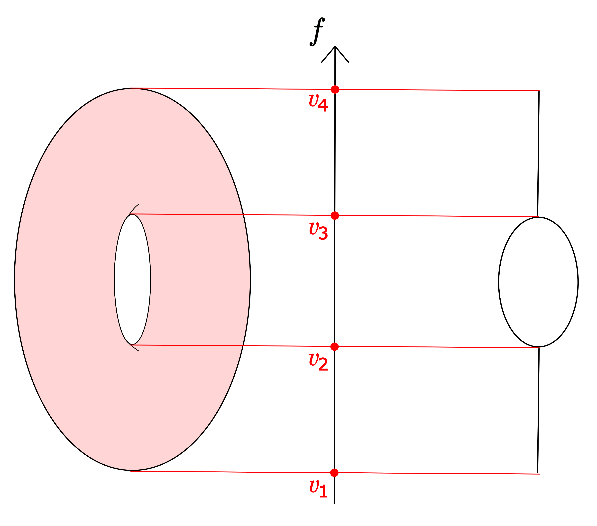

*Example of a Reeb graph computed on a torus using height as filter function. The critical values $\{v_1,v_2,v_3,v_4\}$ of the filter function $f$ are represented in the middle. The Reeb graph is represented on the right.*

Assume now that $(X,\mathrm{d})$ is  a metric space and let $f\colon X\rightarrow\mathbb{R}$ be a continuous function. The Mapper was introduced in [35] as a discrete and computable version of the Reeb graph ${\mathrm R}_f(X)$. Assume that we are given a point cloud $\mathrm{X}_n= \{x_1,\dots,x_n\}\subseteq X$ with known pairwise dissimilarities, as well as a filter function $f$ defined on each point of  $\mathrm{X}_n$. The Mapper graph can then be computed with the following algorithm:

- Cover the range of values $Y_n = f(\mathrm{X}_n)$ with a set of consecutive intervals ${\mathrm {I}}_1,\dots, {\mathrm {I}}_r$  that overlap, i.e., one has ${\mathrm {I}}_i\cap {\mathrm {I}}_{i+1}\neq \varnothing$ for all $1\leq i \leq r-1$.

- Group the points that fall in the same connected component of each preimage $f^{-1}({\mathrm {I}}_j)$, $j\in\{1,...,r\}$. This defines a *pullback cover* $\mathcal{C}=\{\mathcal{C}_{1,1},\dots,\mathcal{C}_{1,k_1},\dots,\mathcal{C}_{r,1},\dots,\mathcal{C}_{r,k_r}\}$ of $\mathrm{X}_n$.

- The Mapper graph is defined as the *nerve* of $\mathcal{C}$. Each node $v_{j,k}$ of the Mapper graph corresponds to an element $\mathcal{C}_{j,k}$ of $\mathcal C$, and two nodes $v_{j,k}$ and $v_{j',k'}$ are connected by an edge if and only if  $\mathcal{C}_{j,k} \cap \mathcal{C}_{j',k'} \neq \varnothing$.

Figure 2 provides a Mapper graph computed on points sampled from a torus with its height as filter function, and a cover of the filter image with three intervals.

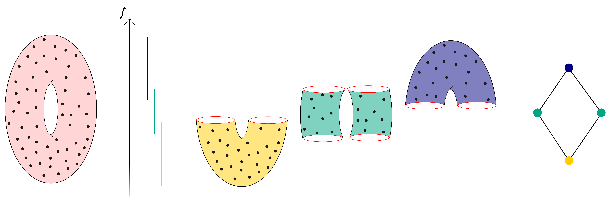

*Example of a Mapper graph computed on points sampled from a torus with its height as filter function. The three intervals used for covering its image are represented in different colors.*

In practice, the second step of the above algorithm is performed using a clustering algorithm, but we leave this consideration aside as it is more suitable for a theoretical discussion. Note that some clustering algorithms come with guarantees as to whether they are able to successfully estimate the connected components of the original space $X$. For example, in [28], Proposition 3.1. states that for points sampled from a Riemannian submanifold $\mathrm{M}$ of an Euclidean space, the union of Euclidean balls of radius $\varepsilon$ centered on each sampled point for $\varepsilon>0$ small enough has the same homology groups than $\mathrm{M}$, given that the sample is $\varepsilon/2$ dense in $\mathrm{M}$ and under a geometric assumption on $\mathrm{M}$ (relating to its condition number). In particular, a clustering algorithm that consists in computing the connected components of an $\varepsilon$-neighborhood graph of the sampled points will correctly estimate the right connected components of $\mathrm{M}$. Spectral clustering also comes with strong guarantees, see for instance [2].

### Elements of Riemannian geometry

We introduce here some elements of Riemannian geometry that will be used throughout this work. Indeed, we will typically assume further in this article that we observe data sampled from a Riemannian manifold, as well as the values of a continuous filter function defined on the points. Although these are standard results, we recall some proof elements in Appendix 8 for the sake of completeness. A general presentation of the results provided in this section, and notably a proof of Theorem 4, can be found in [30].

We call Riemannian manifold every $C^{\infty}$-manifold $\mathrm{M}$ together with a Riemannian metric $\mathrm{g}$. The Riemannian metric consists of an Euclidean inner product $\mathrm{g}_p$ on each of the tangent spaces $\mathrm{T}_p\mathrm{M}$ of $\mathrm{M}$, which satisfies that $p\mapsto\mathrm{g}_p(X_p,Y_p)$ is smooth whenever $X$ and $Y$ are two smooth vector fields defined on $\mathrm{M}$.

Given some local coordinates $x(p)=(x_1,...,x_d)$ on an open set $U$ of $\mathrm{M}$, they induce a basis of the tangent space $\mathrm{T}_p\mathrm{M}$. We denote the associated *coordinate vector fields* as $(\partial_i)_{i=1}^d$, and their dual $1$-forms as $(dx_i)_{i=1}^d$. Under these notations, we can write the Riemannian metric $\mathrm{g}$ as:

$$
\mathrm{g}=\sum_{i,j}\mathrm{g}(\partial_i,\partial_j)\cdot dx_i\cdot dx_j,
$$

where $dx_i\cdot dx_j$ is the bilinear form: $(v,w)\mapsto dx_i(v)\cdot dx_j(w).$ As such, $\mathrm{g}$ can be represented in local coordinates as a symmetric positive-definite matrix $\mathrm{G}(p)$ with entries parametrized over $U$.

We will denote

$$
\lambda(p)=\min\{\sqrt{\rho},\,\rho\in\mathrm{Sp}(\mathrm{G}(p))\},
$$

and

$$
\mu(p)=\max\{\sqrt{\rho},\,\rho\in\mathrm{Sp}(\mathrm{G}(p))\},
$$

where $\mathrm{Sp}(\mathrm{G}(p))$ is the spectrum of $\mathrm{G}(p)$. Notice that since the Riemannian metric is continuous, both $\lambda$ and $\mu$ are continuous as well.

The following proposition states that the Riemannian metric is bi-Lipschitz equivalent to the Euclidean metric in local coordinates.

**Proposition 1.** Let $U$ be an open set in $\mathrm{M}$, on which we are given coordinates $x(p)=(x_1,...,x_d)$. For every $p\in\mathrm{M}$ and for every $v\in\mathrm{T}_p\mathrm{M}$:

$$
\lambda(p)\cdot \sqrt{\mathrm{g}_0(v,v)}\leq \sqrt{\mathrm{g}(v,v)}\leq \mu(p)\cdot \sqrt{\mathrm{g}_0(v,v)},
$$

where $\mathrm{g}_0=\sum_{i}dx_i\cdot dx_i$ is the Euclidean metric in the local coordinates.

Riemannian manifolds can be given a metric space structure as it is possible to measure the "length" of piecewise smooth curves using the Riemannian metric. This allows to define the *geodesic* distance $\mathrm{d}$ on $\mathrm{M}$. The geodesic distance is locally bi-Lipschitz equivalent to the Euclidean distance in local coordinates.

**Proposition 2.** Let $p\in\mathrm{M}$. For every small enough neighborhood $U$ of $p$, we have that for every $q\in U$:

$$
\lambda_0\cdot\mathrm{d}_0(p,q)\leq \mathrm{d}(p,q)\leq\mu_0\cdot\mathrm{d}_0(p,q),
$$

where $\mathrm{d}_0(p,q)$ is the Euclidean distance between the representations of $p$ and $q$ in local coordinates and where

$$
\lambda_0=\inf_{r\in U}\lambda(r) \textrm{ and }
\mu_0=\sup_{r\in U}\mu(r).
$$

In particular $\lambda_0$ tends to $\lambda(p)$ and $\mu_0$  tends to  $\mu(p)$ as $\mathrm{Diam}(U)$ tends to $0$.

The Riemannian metric also induces a Borel measure $\mathrm{Vol}$ called the *volume measure*. It can be first defined by specifying the expected value of a function $f\colon\mathrm{M}\rightarrow\mathbb{C}$ compactly supported on a single chart $\varphi\colon U\subseteq\mathrm{M}\rightarrow V\subseteq\mathbb{R}^d$:

$$
\int_{\mathrm{M}}f\,d\mathrm{Vol}=\int_{V}\left(f\cdot\sqrt{\mathrm{det}(\mathrm{G})}\right)\circ\varphi^{-1}\,d\lambda,
$$

where

$$
\begin{aligned}
\mathrm{G}\colon U&\longrightarrow\mathbb{R}^{d\times d}\\
p&\longmapsto(\mathrm{g}(\partial_{i_{|p}},\partial_{j_{|p}}))_{i,j}
\end{aligned}
$$

and $\lambda$ is the Lebesgue measure on $\mathbb{R}^d$.\\ It can be checked, with the help of the substitution rule, that the above definition does not depend on the choice of the coordinate neighborhood.\\ This definition can be extended to general compactly supported functions by using a partition of unity of a coordinate neighborhood cover of $\mathrm{M}$: we simply sum the expected values over the elements of the partition.\\ Subsequently, as the expected value of compactly supported functions is well defined, the Riesz representation theorem allows to consider the unique associated positive Borel measure on $\mathrm{M}$: this is the volume measure $\mathrm{Vol}$.\\\\ We have the following asymptotic equivalence result for the volume of small geodesic balls.

**Proposition 3.** {Volume of small geodesic balls.}\\ Let ${\mathrm {B}}(p,\varepsilon)$ be the geodesic ball around $p\in\mathrm{M}$ of radius $\varepsilon$. We have that:

$$
\mathrm{Vol}\left({\mathrm {B}}(p,\varepsilon)\right)\underset{\varepsilon\rightarrow 0}{\sim} \alpha_d\cdot\varepsilon^d,
$$

where $\alpha_d$ is the volume of the unit ball in $\mathbb{R}^d$.

For the following result we will assume a lower bound on the *Ricci curvature* of $\mathrm{M}$. The Ricci curvature $\mathrm{Ric}$ is a symmetric bilinear form on the tangent spaces and can be thought of as the Laplacian of the metric $\mathrm{g}$, see for instance Chapter 9 in [30]. We will adopt the convention that $\mathrm{Ric}\geq k$ means that all eigenvalues $\rho$ of $\mathrm{Ric}$ satisfy $\rho\geq k$.

The next theorem allows to compare the volume of geodesic balls in $\mathrm{M}$ to the volume of geodesic balls in certain model manifolds $\mathrm{S}^d_k$ called *constant-curvature space forms*, $d$ being the dimension of both $\mathrm{M}$ and $\mathrm{S}^d_k$ (see for example Subsection 9.1. in [30]). Denote $v(d,k,r)$ as the volume of a ball of radius $r$ in $\mathrm{S}^d_k$.

**Theorem 4.** {Bishop-Cheeger-Gromov Theorem, see for instance Lemma 36 in [30].}\\

Suppose that $\mathrm{M}$ is a $d$-dimensional complete Riemannian manifold such that $\mathrm{Ric}\geq(d-1)\cdot k$, for some $k \in \mathbb{R}$. Then  for any $p \in \mathrm{M}$,

$$
\varepsilon\longmapsto\frac{\mathrm{Vol}\left({\mathrm {B}}(p,\varepsilon)\right)}{v(d,k,\varepsilon)}
$$

is a nonincreasing function whose limit is 1 as $\varepsilon\rightarrow 0$.

Note that in the above theorem, $v(d,k,\varepsilon)$ is independent of the base point $p$. This is very convenient for providing bounds on the volume of geodesic balls in $\mathrm{M}$ that are uniform with respect to the choice of base points. Notice also that since $\mathrm{S}^d_k$ is a $d-$dimensional Riemannian manifold, Proposition 3 applies for $v(d,k,\varepsilon)$, i.e.,

$$
v(d,k,\varepsilon)\underset{\varepsilon\rightarrow 0}{\sim} \alpha_d\cdot \varepsilon^d.
$$

We now define the gradient of a smooth real valued function on a Riemannian manifold. Let $x(p)=(x_1,...,x_d)$ be some local coordinates on an open set $U$ of $\mathrm{M}$ with associated coordinate vector fields $(\partial_i)_{i=1}^d$. Let $f:\mathrm{M}\rightarrow\mathbb{R}$ be a smooth function. We can define its differential $df$ as the $1$-form that satisfies: $df(\partial_i)=\frac{\partial f}{\partial x_i}$, for all $1\leq i \leq d.$ The gradient $\nabla f$ of $f$ is then defined as the vector field satisfying: $\mathrm{g}(\nabla f,v)=df(v),$ for all vector fields $v$. It can also be seen as the Riesz representative of $df$. Given our local coordinates, we can express the gradient vectors in their associated coordinate vector field bases.

**Proposition 5.** In the local coordinates associated to the open set $U$, we have that:

$$
\nabla f=\sum_{i=1}^d a_i\cdot\partial_i,
$$

where:

$$
(a_1,...,a_d)=\left(\frac{\partial f}{\partial x_1},...,\frac{\partial f}{\partial x_d}\right)\cdot\left[\mathrm{g}(\partial_i,\partial_j)\right]_{i,j}^{-1}.
$$

In particular, we have:

$$
\frac{1}{\mu(p)}\cdot \sqrt{\sum_{i=1}^d\frac{\partial f(p)}{\partial x_i}^2}\leq \sqrt{\mathrm{g}\left(\nabla f(p),\nabla f(p)\right)}\leq \frac{1}{\lambda(p)}\cdot \sqrt{\sum_{i=1}^d\frac{\partial f(p)}{\partial x_i}^2}
$$

### Elements of Morse theory

In the article, we study the convergence of Mapper graphs towards Reeb graphs under the assumption that the filter function is a Morse function. Note that this assumption is not restrictive as the set of Morse functions is a dense open subset of $C^{\infty}(\mathrm{M})$, for $\mathrm{M}$ a compact manifold. The aim of this section is to recall the cylindrical structures of preimages of intervals (under a Morse filter function) around non-critical points. See for instance [24] for a comprehensive presentation of Morse theory.

Let $\mathrm{M}$ be a Riemannian manifold. Recall that a smooth map $f\,:\,\mathrm{M}\rightarrow \mathbb{R}$ is called a *Morse function* if its critical points are non-degenerate, i.e., the Hessian of $f$ at the points where its gradient vanishes is non-singular.  We first recall the standard Morse Lemma, which describes the behavior of a Morse function in the neighborhood of a critical point.  Let ${\mathrm {Crit}}(f)$ denote the set of critical points of a Morse function $f\,:\,\mathrm{M}\rightarrow \mathbb{R}$ defined on $\mathrm{M}$. We will denote $\Vert\cdot\Vert^2:=\mathrm{g}(\cdot, \cdot)$.

**Lemma 6.** {Morse Lemma.}\\ Let $f\,:\,\mathrm{M}\rightarrow \mathbb{R}$ be a Morse function and $c\in{\mathrm {Crit}}(f)$. Then there exists a chart $\varphi\,:\,U\subseteq\mathrm{M}\rightarrow \mathbb{R}^d$ containing $c$ such that for every $p\in U$:

$$
f(p)=f(c)-\sum_{j=1}^ix_j^2+\sum_{j=i+1}^dx_j^2,
$$

where $x=\varphi(p)$ and the integer $i$ depends only on the signature of the Hessian at the critical point $c$.

In particular, the Morse Lemma implies that the critical points of a Morse function are isolated, and ${\mathrm {Crit}}(f)$ is finite when $f$ is a Morse function defined on a compact manifold. Next, we recall a major result that relates the topology of a manifold to the analytic properties of a Morse function defined on it. See Figure 3 for an illustration.

**Lemma 7.** {Gradient flow of a smooth function.}\\ Let $f\,:\,\mathrm{M}\rightarrow \mathbb{R}$ be a smooth function defined on a compact manifold $\mathrm{M}$ and $a,b\in\mathbb{R}$ such that $a<b$. If $f^{-1}([a,b])\cap {\mathrm {Crit}}(f)=\varnothing$, then there exists a diffeomorphism $\psi_{b-a}$ between $f^{-1}(\{a\})$ and $f^{-1}(\{b\})$.

We provide the proof of this well-known result here, as we will make use of this gradient flow several times later in the article.

*Proof.* Since $f^{-1}([a,b])$ does not contain critical points, the following function is well defined:

$$
\rho\colon \left \{
\begin{aligned}
\mathrm{M}  &\longrightarrow \mathbb{R}\\
q &\longmapsto \begin{cases}
\frac{1}{\Vert\nabla f(q)\Vert^2}& \text{if } f(q)\in [a,b],\\
0& \text{otherwise.}
\end{cases}
\end{aligned}
\right.,
$$

Now, consider the vector field defined by $X_q=\rho(q)\cdot\nabla f(q)$ and the flow $(\psi_t)_{t\in\mathbb{R}}$ associated to $X_q$. In other words, $\psi_t$ is the solution of the differential equation:

$$
\frac{d\psi_t(p)}{dt}=X_{\psi_t(p)},\,\psi_0(p)=p.
$$

For details on the existence and uniqueness of $\psi_t$, see Lemma $2.4.$ of [24]. The main assumption made is that $X_q$ vanishes outside a compact subset of $\mathrm{M}$, which is true in our case since $\mathrm{M}$ is compact and $f^{-1}([a,b])$ is closed. Note that $\forall t\in\mathbb{R}$, $\psi_t$ is a diffeomorphism. Also, $\psi_t\circ\psi_s=\psi_{t+s}$.

Notice that we constructed $\rho$ so that for every $p\in f^{-1}([a,b])$, with the notation $q=\psi_t(p)$, we have:

$$
\begin{aligned}
\frac{d(f\circ\psi_t)(p)}{dt}&=\mathrm{g}\left(\frac{d\psi_t(p)}{dt},\nabla f(q)\right)\\
&=\mathrm{g}\left(\frac{\nabla f(q)}{\Vert\nabla f(q)\Vert^2},\nabla f(q)\right)\\
&=1.
\end{aligned}
$$

Consequently, $f\circ\psi_t(p)\colon t\mapsto t+f(p)$, and therefore

$$
\psi_{b-a}\left(f^{-1}(\{a\})\right)= f^{-1}(\{b\}),
$$

and

$$
\psi_{a-b}\left(f^{-1}(\{b\})\right)= f^{-1}(\{a\}).
$$

Finally, $\psi_{b-a}$ is a diffeomorphism between $f^{-1}(\{a\})$ and $f^{-1}(\{b\})$.

This following result is proved implicitly in Theorem 3.1 in [24]. It is used for example in [16] to show that Reeb graphs are an example of what the authors call *constructible spaces*. For the sake of completeness, we give here a full proof. See Figure 3.

**Theorem 8.** {Cylindrical shape around non-critical points.}\\ Let $f\,:\,\mathrm{M}\rightarrow \mathbb{R}$ be a Morse function defined on a connected compact Riemannian manifold $\mathrm{M}$. Let also $x\in\mathrm{M}$ such that $x\not\in {\mathrm {Crit}}(f)$, and let $v=f(x)$. For a small enough $\varepsilon>0$ such that $f^{-1}([v-\varepsilon,v+\varepsilon])$ does not contain critical points, the following map is a homeomorphism:

$$
\begin{aligned}
\psi\colon f^{-1}(\{v\})\times[-\varepsilon,\varepsilon] &\longrightarrow f^{-1}([v-\varepsilon,v+\varepsilon])  \\
(q,t)&\longmapsto \psi_{t}(q)
\end{aligned}
$$

*Proof.* First, notice that an $\varepsilon>0$ satisfying the assumption of the theorem always exists. By Lemma 6, ${\mathrm {Crit}}(f)$ is finite. As such, there exists $\varepsilon>0$ such that $f^{-1}([v-\varepsilon,v+\varepsilon])$ contains no critical points. Hence, let $\varepsilon>0$ be such a positive real number. Then, for every $v'\in[v-\varepsilon,v+\varepsilon]$, Lemma 7 ensures that $f^{-1}(\{v\})$ and $f^{-1}(\{v'\})$ are diffeomorphic, under the map $\psi_{v'-v}$ corresponding to the gradient flow of $f$.\\ Define

$$
\begin{aligned}
\psi\colon f^{-1}(\{v\})\times[-\varepsilon,\varepsilon] &\longrightarrow f^{-1}([v-\varepsilon,v+\varepsilon])  \\
(q,t)&\longmapsto \psi_{t}(q)
\end{aligned}
$$

The function $\psi$ is continuous because it is locally Lipschitz:

- for a fixed $q\in f^{-1}(\{v\})$: $t\mapsto\psi_{t}(q)$ is locally Lipschitz as it is continuously differentiable,

- for a fixed $t\in [-\varepsilon,\varepsilon]$: $q\mapsto\psi_{t}(q)$ is locally Lipschitz as it is a diffeomorphism.

The inverse of $\psi$ is given by $\psi^{-1}\colon p \longmapsto (\psi_{v-f(p)}(p),f(p)-v)$, which we now prove is continuous. Let $p\in f^{-1}([v-\varepsilon,v+\varepsilon])$ and $(p_n)_{n\in\mathbb{N}}$ a sequence in $f^{-1}([v-\varepsilon,v+\varepsilon])$ such that $p_n\underset{n\rightarrow\infty}{\longrightarrow} p$.\\ We have:

$$
\mathrm{d}(\psi_{v-f(p)}(p),\psi_{v-f(p_n)}(p_n))\leq \mathrm{d}(\psi_{v-f(p)}(p),\psi_{v-f(p)}(p_n))+\mathrm{d}(\psi_{v-f(p)}(p_n),\psi_{v-f(p_n)}(p_n)).
$$

Now, as mentioned above, the function $q\mapsto\psi_{v-f(p)}(q)$ is continuous because it is a diffeomorphism. Hence:

$$
\mathrm{d}(\psi_{v-f(p)}(p),\psi_{v-f(p)}(p_n))\underset{n\rightarrow\infty}{\longrightarrow} 0.
$$

Moreover,

$$
\begin{aligned}
\mathrm{d}(\psi_{v-f(p)}(p_n),\psi_{v-f(p_n)}(p_n))&\leq \left|\int_{v-f(p)}^{v-f(p_n)}\left\Vert\frac{d\psi_{u}(p_n)}{du}\right\Vert\,du \right| \\
 &\leq \left|\int_{v-f(p)}^{v-f(p_n)}\frac{1}{\Vert\nabla f(\psi_{u}(p_n))\Vert}\,du \right|.
\end{aligned}
$$

As $f$ is smooth and $f^{-1}([v-\varepsilon,v+\varepsilon])\cap{\mathrm {Crit}}(f)=\varnothing$, and  denoting:

$$
L:=\sup_{q\in f^{-1}([v-\varepsilon,v+\varepsilon])}\frac{1}{\Vert\nabla f(q)\Vert},
$$

we have $L<\infty$. Therefore,

$$
\mathrm{d}(\psi_{v-f(p)}(p_n),\psi_{v-f(p_n)}(p_n)\leq L\cdot |f(p)-f(p_n)|\underset{n\rightarrow\infty}{\longrightarrow} 0.
$$

Finally, we showed that

$$
\mathrm{d}(\psi_{v-f(p)}(p),\psi_{v-f(p_n)}(p_n))\underset{n\rightarrow\infty}{\longrightarrow} 0,
$$

and thus that $\psi^{-1}$ is continuous.

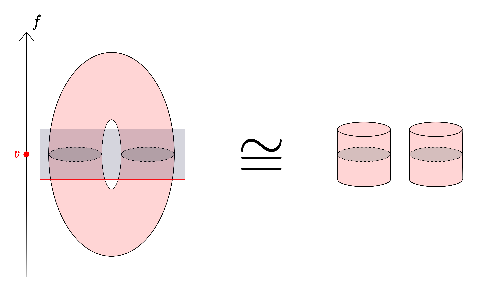

*Around a non-critical value $v$, the manifold is homeomorphic to a finite collection of cylinders, whose faces are given by the level set $f^{-1}(\{v\})$.*

In the context of studying Reeb graphs built on Morse functions, we will use the following Proposition.

**Proposition 9.** Let $f\,:\,\mathrm{M}\rightarrow \mathbb{R}$ be a Morse function defined on a connected compact Riemannian manifold $\mathrm{M}$. The level sets of $f$, $f^{-1}(\{v\})$ for $v\in f(\mathrm{M})$, are locally path connected.

*Proof.* When $v\in f(\mathrm{M})$ is not critical, the Implicit Function Theorem (see Theorem 5.8. of [9] for example) shows that $f^{-1}(\{v\})$ is a submanifold of $\mathrm{M}$ and as such is locally path connected.\\ Now, let $v\in f(\mathrm{M})$ be a critical value. First, $f^{-1}(\{v\})$ is locally path connected around critical points:\\ Let $c\in f^{-1}(\{v\})$ be a critical point. By Lemma 6, there exists an open neighborhood $U\subseteq\mathrm{M}$ of $c$ and a chart $\varphi\,:\,U\subseteq\mathrm{M}\rightarrow \mathbb{R}^d$ containing $c$ such that for every $p\in U$:

$$
f(p)=f(c)-\sum_{j=1}^ix_j^2+\sum_{j=i+1}^dx_j^2,
$$

where $x=\varphi(p)$ and the integer $i$ depends only on the signature of the Hessian at the critical point $c$.\\ Notice that the level set $f^{-1}(\{v\})$ is given in local coordinates by

$$
f^{-1}(\{v\})\cap U=\left\{\varphi^{-1}(x):\,\sum_{j=1}^ix_j^2=\sum_{j=i+1}^dx_j^2\right\},
$$

and that $\varphi(c)=0$. For every $p\in f^{-1}(\{v\})\cap U$, the path $\gamma\colon t\mapsto \varphi^{-1}(t\cdot\varphi(p))$ between $c$ and $p$ stays in $f^{-1}(\{v\})\cap U$. This is because for every $t\in[0,1]$

$$
\begin{aligned}
\sum_{j=1}^i\varphi(\gamma(t))_j^2-\sum_{j=i+1}^d\varphi(\gamma(t))_j^2&=t^2\cdot\left(\sum_{j=1}^i\varphi(p)_j^2-\sum_{j=i+1}^d\varphi(p)_j^2\right)\\
&=0.
\end{aligned}
$$

Moreover, $f^{-1}(\{v\})$ is locally path connected away from critical points. The set ${\mathrm {Crit}}(f)$ is finite and hence closed. Therefore, $\mathrm{M}'=\mathrm{M}\setminus{\mathrm {Crit}}(f)$ is an open submanifold of $\mathrm{M}$. Using the Implicit Function Theorem on the restriction of $f$ on $\mathrm{M}'$ as $v$ is no longer a critical value, $f^{-1}(\{v\})\cap\mathrm{M}'$ is locally path connected.

Proposition 9 has two major applications:

- When looking at the level sets of a Morse function defined on a compact Riemannian manifold, connectedness and path connectedness are equivalent. Therefore, in what follows, we will use the term *connected* to mean both.

- The number of connected components of a level set of a  Morse function defined on a compact Riemannian manifold is always finite, as a level set is always compact and locally path connected.

### Geometry of Metric Measure Spaces

In this section, we present the framework of metric measure space geometry introduced in [36]. We first recall that connected compact Riemannian manifolds fall under this framework, and then we introduce Gromov-Wasserstein metrics between metric measure spaces.

#### Metric Measure Spaces

A *metric measure space* (or mm-space for short) is a triple $(X,\mathrm{d},\mathrm{m})$ where $(X,\mathrm{d})$ is a Polish metric space (i.e., complete and separable) and where $\mathrm{m}$ is a measure on the Borel $\sigma$-algebra of $(X,\mathrm{d})$ that is locally finite. (By locally finite, we mean that $\forall x\in X,\,\exists r>0$ such that $\mathrm{m}({\mathrm {B}}(x,r))<\infty$.) The support of $\mathrm{m}$ is denoted as $\mathrm{supp}(\mathrm{m})$.

**Proposition 10.** A connected compact Riemannian manifold $(\mathrm{M},\mathrm{g})$ together with its geodesic distance $\mathrm{d}$ and the volume measure $(\mathrm{M},\mathrm{d},\mathrm{Vol})$ is a mm-space.

*Proof.* Since $\mathrm{M}$ is connected and compact, it is a complete metric space. It is also separable since it is second-countable. $\mathrm{M}$ being compact, the volume measure $\mathrm{Vol}$ is locally finite.

Let $(X_1,\mathrm{d}_1,\mathrm{m}_1)$ and $(X_2,\mathrm{d}_2,\mathrm{m}_2)$ be two mm-spaces. Recall that a map $\Phi\colon\mathrm{supp}(\mathrm{m}_1)\rightarrow\mathrm{supp}(\mathrm{m}_2)$ is an isomorphism of mm-spaces between $(X_1,\mathrm{d}_1,\mathrm{m}_1)$ and $(X_2,\mathrm{d}_2,\mathrm{m}_2)$ if $\Phi$ is an isometry of metric spaces and if $\mathrm{m}_2$ is the pushforward measure of $\mathrm{m}_1$ under the map $\Phi$. As isomorphisms induce an equivalence relation of mm-spaces, we denote the isomorphism equivalence class of a mm-space $(X,\mathrm{d},\mathrm{m})$ as $[X,\mathrm{d},\mathrm{m}]$.

Metric measure space isomorphisms also induce the notion of *variance* of a mm-space $(X,\mathrm{d},\mathrm{m})$, defined as:

$$
\mathrm{Var}(X,\mathrm{d},\mathrm{m})=\inf_{\substack{(X',\mathrm{d}',\mathrm{m}')\in [X,\mathrm{d},\mathrm{m}]\\ z\in X'}}\int_{X'}\mathrm{d}'(x,z)^2\,d\mathrm{m}'(x).
$$

If $(X,\mathrm{d},\mathrm{m})$ is a compact mm-space then clearly one has $\inf_{z\in X}\int_{X}\mathrm{d}(x,z)^2\,d\mathrm{m}(x) < \infty$ and then $\mathrm{Var}(X,\mathrm{d},\mathrm{m})$ is finite. Moreover, the variance is by definition an invariant of mm-space isomorphisms.

#### Gromov-Wasserstein Distance

**Definition.** {Wasserstein distance.}\\ Let $(X,\mathrm{d})$ be a complete and separable metric space. Let $\mathrm{m}_1$ and $\mathrm{m}_2$ be two measures on the Borel $\sigma$-algebra of $(X,\mathrm{d})$. For $p \geq 1$, the *$p$-Wasserstein distance* between $\mathrm{m}_1$ and $\mathrm{m}_2$ is defined as:

$$
\mathrm{W}_p(\mathrm{m}_1,\mathrm{m}_2)=\left(\inf_{\mathrm{m}}\int_{X\times X} \mathrm{d}(x,y)^p\,d\mathrm{m}(x,y)\right)^{\frac{1}{p}},
$$

where the infimum is taken over all measures $\mathrm{m}$ on $X\times X$ that have marginals $\mathrm{m}_1$ and $\mathrm{m}_2$.

**Definition.** {Metric coupling.}\\ Let $(X_1,\mathrm{d}_1,\mathrm{m}_1)$ and $(X_2,\mathrm{d}_2,\mathrm{m}_2)$ be two mm-spaces. A *metric coupling* of $\mathrm{d}_1$ and $\mathrm{d}_2$ is any pseudometric (A pseudometric can be zero for non-equal points.) $\mathrm{d}$ on $X_1\sqcup X_2$ that satisfies:

$$
\forall x,y\in \mathrm{supp}(\mathrm{m}_1):\,\mathrm{d}(x,y)=\mathrm{d}_1(x,y),
$$

$$
\forall x,y\in \mathrm{supp}(\mathrm{m}_2):\,\mathrm{d}(x,y)=\mathrm{d}_2(x,y).
$$

**Definition.** {Gromov-Wasserstein distance.}\\ For $p \geq 1$, the  *$p$-Gromov-Wasserstein distance* between two mm-spaces $(X_1,\mathrm{d}_1,\mathrm{m}_1)$ and $(X_2,\mathrm{d}_2,\mathrm{m}_2)$ is defined as:

$$
\mathrm{GW}_p((X_1,\mathrm{d}_1,\mathrm{m}_1),(X_2,\mathrm{d}_2,\mathrm{m}_2))=\left(\inf_{\mathrm{d},\mathrm{m}}\int_{X_1\times X_2} \mathrm{d}(x,y)^p\,d\mathrm{m}(x,y)\right)^{\frac{1}{p}},
$$

where the infimum is taken over all measures $\mathrm{m}$ on $X_1\times X_2$ that have marginals $\mathrm{m}_1$ and $\mathrm{m}_2$, and over all metric couplings $\mathrm{d}$ of $\mathrm{d}_1$ and $\mathrm{d}_2$.

For the sake of simplicity, we will denote $\mathrm{GW}_p((X_1,\mathrm{d}_1,\mathrm{m}_1),(X_2,\mathrm{d}_2,\mathrm{m}_2))$ simply as $\mathrm{GW}_p(X_1,X_2)$ when there is no ambiguity over the metric and the measure associated to each space.

**Proposition 11.** The $p$-Gromov-Wasserstein distance between two mm-spaces, $(X_1,\mathrm{d}_1,\mathrm{m}_1)$ and $(X_2,\mathrm{d}_2,\mathrm{m}_2)$, can be equivalently defined as:

$$
\mathrm{GW}_p((X_1,\mathrm{d}_1,\mathrm{m}_1),(X_2,\mathrm{d}_2,\mathrm{m}_2))=\inf_{\varphi_1,\varphi_2}\mathrm{W}_p(\mathrm{m}_1\circ\varphi_1^{-1},\mathrm{m}_2\circ\varphi_2^{-1}),
$$

where the infimum is taken over all isometric embeddings $\varphi_1\colon\mathrm{supp}(\mathrm{m}_1)\rightarrow X$ and $\varphi_2\colon\mathrm{supp}(\mathrm{m}_2)\rightarrow X$ of the supports of $\mathrm{m}_1$ and $\mathrm{m}_2$ into a common metric space $(X,\mathrm{d})$.

In [23], an alternative definition of the $p$-Gromov-Wasserstein distance, inspired by a reformulation of the Gromov-Hausdorff distance, is provided as:

$$
\hat{\mathrm{GW}_p}((X_1,\mathrm{d}_1,\mathrm{m}_1),(X_2,\mathrm{d}_2,\mathrm{m}_2))=\frac 12 \left(\inf_{\mathrm{m}}\int_{(X_1\times X_2)^2} |\mathrm{d}_1(x,x')-\mathrm{d}_2(y,y')|^p\,d\mathrm{m}(x,y)\otimes\mathrm{m}(x',y')\right)^{\frac{1}{p}},
$$

where the infimum is taken over all measures $\mathrm{m}$ on $X_1\times X_2$ that have marginals $\mathrm{m}_1$ and $\mathrm{m}_2$. Due to its computational advantage for practical applications (such as, e.g., optimization), this formulation is popular in the literature, see for example [44, 22]. Moreover, it is shown in [23]  that $\hat{\mathrm{GW}_p}\leq\mathrm{GW}_p$ (see Theorem 5.1(g) therein). In this article, we provide upper bounds for $\mathrm{GW}_p$ which therefore automatically transfer to $\hat{\mathrm{GW}_p}$.

**Proposition 12.** The $2$-Gromov-Wasserstein distance $\mathrm{GW}_2$ is a metric on the set of mm-space isomorphism classes of finite variance.

For proofs of Propositions 11 and 12, see [36].

## Reeb graphs as Metric Measure Spaces

In this article, we aim at comparing Reeb graphs and Mapper graphs using tools and distances for metric spaces. In this section, we first define a metric structure on the Reeb graph using the Hausdorff distance, and then we study the induced topology of this corresponding metric space.

### Hausdorff distance on Reeb graphs

We will denote the set of non-empty compact subsets of a metric space $(X,\mathrm{d})$ as ${\mathrm {C}}(X)$.  See [18] for a comprehensive introduction of the Hausdorff distance.

**Definition.** {Hausdorff distance.}\\ Let $A,B$ be two subsets of a metric space $(X,\mathrm{d})$, the Hausdorff distance between $A$ and $B$ is defined as:

$$
{\mathrm {d_H}}(A,B)=\max\left(\sup_{x\in A}\mathrm{d}(x,B),\sup_{y\in B}\mathrm{d}(y,A)\right),
$$

where $\mathrm{d}(x,B)=\inf_{v\in B}\mathrm{d}(x,v)$ and $\mathrm{d}(y,A)=\inf_{u\in A}\mathrm{d}(u,y)$.

With the same notations as before, the Hausdorff distance can be equivalently defined as:

$$
{\mathrm {d_H}}(A,B)=\inf\left\{\varepsilon>0,\,A\subseteq B^\varepsilon\;\mathrm{ and }\;B\subseteq A^\varepsilon\right\},
$$

where $C^\varepsilon=\bigcup_{z\in C}{\mathrm {B}}(z,\varepsilon)$ for every subset $C$ of $X$.

The Hausdorff distance ${\mathrm {d_H}}$ is a metric on ${\mathrm {C}}(X)$. Moreover, the topology of $({\mathrm {C}}(X),{\mathrm {d_H}})$ follows closely from the topology of $(X,\mathrm{d})$. We illustrate this with the two following propositions proved in [18].

**Proposition 13.** Suppose that $(X,\mathrm{d})$ is complete. Then $({\mathrm {C}}(X),{\mathrm {d_H}})$ is also complete. Moreover, let $(a_n)_{n\in\mathbb{N}}$ be a Cauchy sequence in $({\mathrm {C}}(X),{\mathrm {d_H}})$, then $a_n\underset{n\rightarrow\infty}{\longrightarrow} a$, where:

$$
a=\left\{x \in X, \, \textrm{ there exists a sequence } (x_n)_{n\in\mathbb{N}}  \in \prod_n a_n  \textrm{ such that } x_n \underset{n\rightarrow\infty}{\longrightarrow} x \right\}.
$$

**Proposition 14.** If $(X,\mathrm{d})$ is compact then $({\mathrm {C}}(X),{\mathrm {d_H}})$ is also compact.

Hereafter, $(\mathrm{M},\mathrm{d})$ is assumed to be a connected compact Riemannian manifold together with its geodesic distance. We also consider a Morse function $f\colon\mathrm{M}\rightarrow\mathbb{R}$. In this section, to alleviate notations, we will denote the Reeb graph ${\mathrm R}_f(\mathrm{M}):=\mathrm{M}/\sim_{f}$ by $\mathrm{R}$.

In order to use the Hausdorff distance, we prove the following:

**Proposition 15.** For every $a\in\mathrm{R}$, $a$ is closed as a subset of $\mathrm{M}$.

*Proof.* Let $a\in\mathrm{R}$, then $a$ is defined as a connected component of $f^{-1}(\{v\})$ for some $v$ in $f(\mathrm{M})$. The set $a$ is therefore closed in $f^{-1}(\{v\})$ since it is a connected component, as connected components are maximal connected subsets and the closure of a connected subset is also connected. Moreover, $f^{-1}(\{v\})$ is closed in $\mathrm{M}$ because $f$ is continuous. As such, $a$ is closed in a closed subset and consequently closed in $\mathrm{M}$.

The manifold $\mathrm{M}$ being compact, Proposition 15 proves that $\mathrm{R}\subseteq{\mathrm {C}}(\mathrm{M})$. Thus, $(\mathrm{R},{\mathrm {d_H}})$ is a metric space.

\subsection{Topology of \texorpdfstring{$(\mathrm{R},{\mathrm {d_H}})$}{TEXT}} In order to define Wasserstein and Gromov-Wasserstein distances on top of $(\mathrm{R},{\mathrm {d_H}})$, the space $\mathrm{R}$ needs to be complete and separable. However, we first show that this metric space is not complete in general (see Figure 4). To circumvent this, we consider its closure $\overline{\mathrm{R}}$, which is compact and as such complete. We show that $\mathrm{R}$ differs from $\overline{\mathrm{R}}$ only by a finite number of points. Let us start with preliminary results.

**Proposition 16.**  Let $a\in{\mathrm {C}}(\mathrm{M})$ be an adherent point to $\mathrm{R}$. Then $a$ is connected and $f$ is constant on $a$.

*Proof.* Let $a\in{\mathrm {C}}(\mathrm{M})$ such that there exists $(a_n)_{n\in\mathbb{N}}\in\left(\mathrm{R}\right)^{\mathbb{N}}$ that converges to $a$.

$\bullet$ We first show that $a$ is connected. Suppose that $a$ is not connected. Since it is compact, this means that it can be written as the disjoint union of two compact sets $a_0\sqcup a_1$.  Now, $a_0$ and $a_1$ being disjoint and both compact, there exists $\varepsilon>0$ such that $a_0^\varepsilon$ and $a_1^\varepsilon$ are disjoint. To see this, consider for example $\varepsilon :=\frac{1}{2}\ \inf_{x\in a_0,y\in a_1}\mathrm{d}(x,y)$  and notice that $\inf_{x\in a_0,y\in a_1}\mathrm{d}(x,y)>0$ by compactness of $a_0$ and $a_1$. \\ Next, there exists a rank $N\in\mathbb{N}$ such that ${\mathrm {d_H}}(a_N,a)\leq\frac{\varepsilon}{2}$. This means that $a_N\subseteq a^{\frac{\varepsilon}{2}}=a_0^{\frac{\varepsilon}{2}}\sqcup a_1^{\frac{\varepsilon}{2}},$ and since $a_N$ is connected, it is included in one of $a_0^{\frac{\varepsilon}{2}}$ and $a_1^{\frac{\varepsilon}{2}}$ and not in the other. W.l.o.g., we suppose that it is included in $a_0^{\frac{\varepsilon}{2}}$. Let $x\in a_1$, there exists $z\in a_N$ such that $\mathrm{d}(x,z)\leq\frac{\varepsilon}{2}$ because $a\subseteq a_N^{\frac{\varepsilon}{2}}$. In the same way, there exists $y\in a_1$ that satisfies $\mathrm{d}(y,z)\leq\frac{\varepsilon}{2}$, since $a_N\subseteq a_0^{\frac{\varepsilon}{2}}$. However, this means that there exist two points $(x,y)\in a_0\times a_1$ such that $\mathrm{d}(x,y)\leq \varepsilon$ and this contradicts the fact that $a_0^\varepsilon$ and $a_1^\varepsilon$ are disjoint. Note that we have shown more generally that every limit in the Hausdorff distance  of a sequence of connected compact sets is connected.

$\bullet$ We now show that $f$ is constant on $a$. Let $x,y\in a$. By Proposition 13, we know that there exist two sequences $(x_n)_{n\in\mathbb{N}}$ and $(y_n)_{n\in\mathbb{N}}$ in $(a_n)_{n\in\mathbb{N}}$ such that $x_n\underset{n\rightarrow\infty}{\longrightarrow} x$ and $y_n\underset{n\rightarrow\infty}{\longrightarrow} y$. Now, for every $n$, since  $x_n,y_n\in a_n$, then $f(x_n)=f(y_n)$ as $f$ is constant on $a_n$. Using this fact, we have:

$$
\begin{aligned}
| f(x)-f(y) |&\leq | f(x)-f(x_n) | + | f(x_n)-f(y_n) |+ | f(y_n)-f(y) |\\
        &\leq | f(x)-f(x_n) | + | f(y_n)-f(y) |.
\end{aligned}
$$

By continuity of $f$, it yields that $f(x)=f(y)$.

The second point of Proposition 16 proves that we can define a function $\tilde{f}\colon \overline{\mathrm{R}}\rightarrow\mathbb{R}$ that associates to every adherent point of $\mathrm{R}$ the constant value that $f$ takes on it. Proposition 16 as a whole might seem to indicate that $\overline{\mathrm{R}}=\mathrm{R}$ could also be proved, but this turns out to be false in general. The crucial property that the elements of $\overline{\mathrm{R}}\setminus\mathrm{R}$ do not satisfy is to be associated to *maximal* connected subsets. See Figure 4 for an example. However, we now prove that $\overline{\mathrm{R}}$ and $\mathrm{R}$ differ only by a finite number of points.

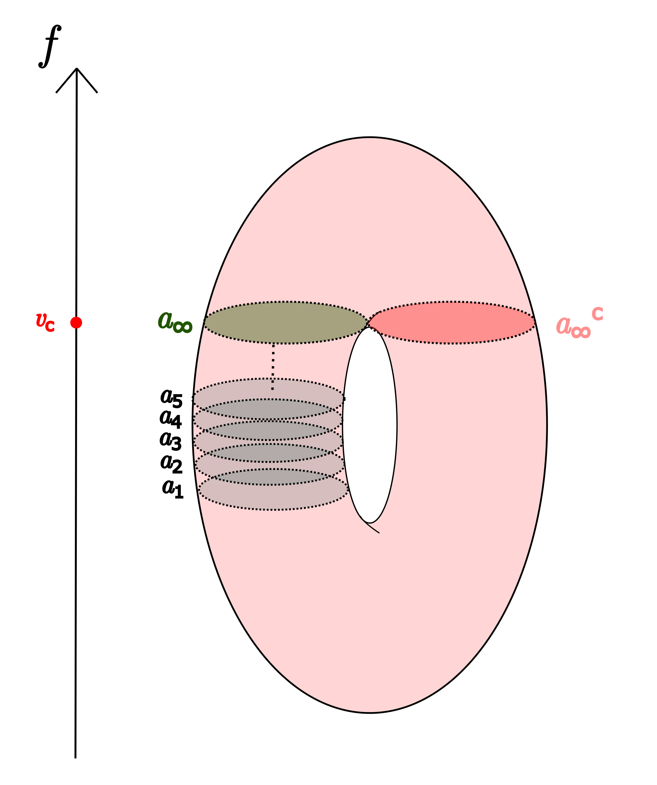

*Example of a Reeb graph sequence $(a_n)_{n\in\mathbb{N}}$ that has a Hausdorff limit $a_\infty$ outside of the Reeb graph. Notice that this occurs when $a_\infty$ is inside the level set of a critical value $v_c$. In this example, $f^{-1}(\{v_c\})$ has only one connected component. The complement $a_\infty^c$ of $a_\infty$ in this connected component is also represented here.*

**Lemma 17.** Let $(a_n)_{n\in\mathbb{N}}\in\mathrm{R}^{\mathbb{N}}$ and $(x_n)_{n\in\mathbb{N}}\in\mathrm{M}^{\mathbb{N}}$, such that $x_n\in a_n$ for every $n\in\mathbb{N}$ and such that $(x_n)_{n\in\mathbb{N}}$ admits a limit $x \in \mathrm{M}$. If $f(x)$ is not a critical value, then $a_n\underset{n\rightarrow\infty}{\longrightarrow} [x]_{\sim_f}$.

*Proof.* Let $(a_n=[x_n]_{\sim_f})_{n\in\mathbb{N}} \in \mathrm{R}^{\mathbb{N}}$ be such that $(x_n)_{n\in\mathbb{N}}$ admits a limit $x \in \mathrm{M}$. As $\overline{\mathrm{R}}$ is compact, it converges if and only if it has one and only one adherent point. It admits an adherent point by compactness of $\overline{\mathrm{R}}$ and we have to show that it is unique and equal to $[x]_{\sim_f}$. Let $(a_{\phi(n)})_{n\in\mathbb{N}}$ be a subsequence of $a_n$ that converges to an element $a\in\overline{\mathrm{R}}$.

$\bullet$ We first show that $a\subseteq[x]_{\sim_f}$. By Proposition 13, we know that:

$$
a=\left\{y \in \mathrm{M} \, , \textrm{ there exists a sequence } (y_n)_n  \in \prod_n a_{\phi(n)}
\textrm{ such that } y_n \underset{n\rightarrow\infty}{\longrightarrow} y \right\}.
$$

Now, $(x_{\phi(n)})_{n\in\mathbb{N}}$ is a subsequence of $(x_n)_{n\in\mathbb{N}}$ and as such $x_{\phi(n)}\underset{n\rightarrow\infty}{\longrightarrow} x$. Therefore, $x\in a$, and furthermore by Proposition 16, $a$ is connected and included in $f^{-1}(\{v\})$, where $v=f(x)$. These three points prove that $a\subseteq[x]_{\sim_f}$, since by definition $[x]_{\sim_f}$ is the maximal subset that verifies these three exact requirements.

$\bullet$ We now show that $[x]_{\sim_f}\subseteq a$. Let $y\in[x]_{\sim_f}$. As $v=f(x)$ is not a critical value, by Theorem 8, there exists $\varepsilon>0$ and a homeomorphism $\psi:f^{-1}(\{v\})\times[-\varepsilon,\varepsilon] \rightarrow f^{-1}([v-\varepsilon,v+\varepsilon])$. Since $f$ is continuous, there exists a rank $N\in\mathbb{N}$ such that $\forall n\geq N$: $|f(x_{\phi(n)})-v|\leq \varepsilon$. Therefore, the following sequence is well defined:

$$
\forall n\in\mathbb{N}:\,y_n=\begin{cases}
    x_{\phi(n)}&\text{ if } n<N,\\
    \psi\left(y,f(x_{\phi(n)})-v\right)&\text{otherwise}.
\end{cases}
$$

By continuity of $\psi$ and $f$, $y_n\underset{n\rightarrow\infty}{\longrightarrow} y$ (since $\psi(\cdot,0)$ is the identity by construction of $\psi$, see the proofs of Lemma 7 and Theorem 8). It only remains to show that for a large enough rank $M\in\mathbb{N}$, one has $y_n\in a_{\phi(n)}$, to conclude that $y\in a$.\\\\ On one hand, since $v$ is not a critical value, $f^{-1}(\{v\})$ is a submanifold of $\mathrm{M}$ by the Implicit Function Theorem (see Theorem 5.8. of [9] for example). The set $f^{-1}(\{v\})$ is hence locally path-connected. Thus, there exists $\delta>0$ such that for all  $z\in f^{-1}(\{v\})$, $\mathrm{d}(x,z)\leq\delta$ implies that $z\in[x]_{\sim_f}$.\\\\ On the other hand, by continuity, we have $\psi^{-1}(x_{\phi(n)})\underset{n\rightarrow\infty}{\longrightarrow} \psi^{-1}(x)=(x,0)$. From the expression of $\psi^{-1}$ given in the proof of Theorem 8, we find that   $\psi^{-1}(x_{\phi(n)})=\left(z_n,w_n\right)$ where $z_n \in f^{-1}(\{v\})$ and  $w_n=f(x_{\phi(n)})-v$. Thus, there exists a rank $M\in\mathbb{N}$ such that $\forall n\geq M$: $\mathrm{d}(z_n,x)\leq\delta$ and then $z_n$ and $y$ are in the same connected set $[x]_{\sim_f}$. Moreover, by continuity of the map $\psi\left(\cdot,w_n\right) : f^{-1}(\{v\}) \rightarrow  f^{-1}(\{w_n\})$, the images  $x_{\phi(n)} = \psi\left(z_n,w_n\right)$ and $y_n = \psi\left(y,w_n\right)$  are carried to the same connected component of $f^{-1}(\{w_n\})$. Consequently $y_n\in[x_{\phi(n)}]_{\sim_f}$ and we know that $[x_{\phi(n)}]_{\sim_f}=a_{\phi(n)}$. See Figure 5 for an illustration.

Finally, $(a_n)_{n\in\mathbb{N}}$ admits one and only one adherent point, which is $[x]_{\sim_f}$.

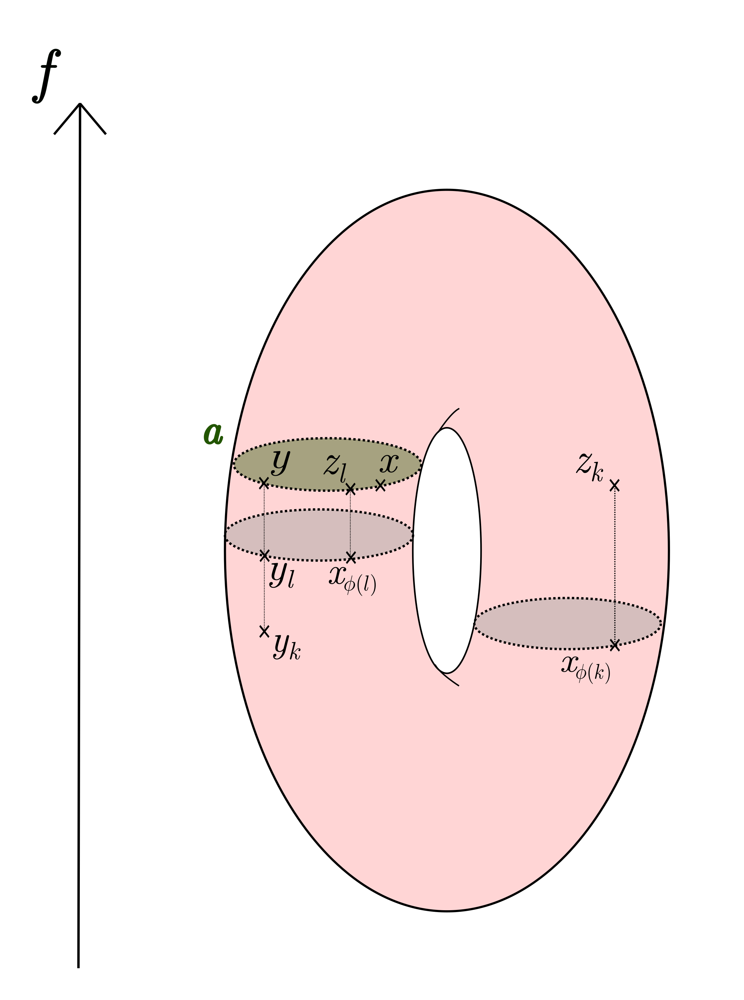

*Illustration of the argument made in the proof of Lemma 17. Two points $x_{\phi(k)}$ and $x_{\phi(l)}$ of the sequence $(x_{\phi(n)})_{n\in\mathbb{N}}$ are given as examples. The sequence $(z_n)_{n\in\mathbb{N}}$ is made of the projections of the elements of $(x_{\phi(n)})_{n\in\mathbb{N}}$ onto the level set where $a$ belongs using the gradient flow. Similarly, the sequence $(y_n)_{n\in\mathbb{N}}$ is made of the projections of $y$ onto the level sets $f^{-1}(\{x_{\phi(n)}\})$. We see that, by continuity, $(z_n)_{n\in\mathbb{N}}$ must be in $a$ (for a large enough rank). This means that after this rank, $y_n$ and $x_{\phi(n)}$ must be in the same element of the Reeb graph.*

**Proposition 18.** $\overline{\mathrm{R}}\setminus\mathrm{R}$ is finite.

*Proof.* Recall that $\tilde{f}\colon \overline{\mathrm{R}}\rightarrow\mathbb{R}$ is defined as the function that associates any adherent point of $\mathrm{R}$ to the constant value that $f$ takes on it. Let $\psi_{\cdot}$ be the gradient flow of $f$.

Let $a\in\overline{\mathrm{R}}$ be non-empty. First, assume that $v=\tilde{f}(a)$ is not a critical value of $f$. Let $(a_n)_{n\in\mathbb{N}}$ be a sequence of elements in $\mathrm{R}$ that converges to $a$. Let $x\in a$ and choose a sequence $(x_n)_{n\in\mathbb{N}}$ such that $x_n\in a_n$ for every $n\in\mathbb{N}$ and $x_n\underset{n\rightarrow\infty}{\longrightarrow} x$. By Lemma 17, $a_n\underset{n\rightarrow\infty}{\longrightarrow}[x]_{\sim_f}$ and as such $a=[x]_{\sim_f}$ and in particular  $a\in\mathrm{R}$. We thus have showed that for any  $a\in\overline{\mathrm{R}}\setminus\mathrm{R}$ which is non empty, $\tilde{f}(a)$ is a critical value.

We continue the proof of the proposition with the following lemma.

**Lemma 19.**

Let $a\in\overline{\mathrm{R}}$ such that $v=\tilde{f}(a)$ is a critical value. Let $v^-$ (resp. $v^+$) denote the closest critical value $v'$ to $v$ satisfying $v'<v$ (resp. $v'>v$) if it exists. Let also $(a_n)_{n\in\mathbb{N}}$ be a sequence of elements in $\mathrm{R}$ that converges to $a$. Then, we can extract a subsequence $(a_{\phi(n)})_{n\in\mathbb{N}}$ from $(a_n)_{n\in\mathbb{N}}$ such that one of the three following assertions is satisfied:

- $\forall n\in\mathbb{N},$ $\tilde{f}(a_{\phi(n)})=\tilde{f}(a) = v$;

- there exists a connected component $c$ of $f^{-1}(\{\frac{v^-+v}{2}\})$ such that $\forall n\in\mathbb{N}$, $a_{\phi(n)}=\psi_{v_n-(\frac{v^-+v}{2})}(c)$ where $v_n\in(\frac{v^-+v}{2},v)$, and $(v_n)_{n\in\mathbb{N}}$ converges to $v$;

- there exists a connected component $c$ of $f^{-1}(\{\frac{v+v^+}{2}\})$  such that $\forall n\in\mathbb{N}$, $a_{\phi(n)}=\psi_{v_n-(\frac{v+v^+}{2})}(c)$ where $v_n\in(v,\frac{v+v^+}{2})$, and $(v_n)_{n\in\mathbb{N}}$ converges to $v$.

*Proof.* If there exists a rank after which the sequence $(a_n)_{n\in\mathbb{N}}$ verifies $\tilde{f}(a_n)=v$, then the first assertion is satisfied. In the following of the proof, we thus assume that $\forall n\in\mathbb{N}$, there exists $N_n\geq n$ such that $\tilde{f}(a_{N_n})\neq v$. This allows us to extract a subsequence $(a_{\phi(n)})_{n\in\mathbb{N}}$ that satisfies $\tilde{f}(a_{\phi(n)})\neq v$ for all $n\in\mathbb{N}$. W.l.o.g., by re-extracting, we can assume that $\forall n\in \mathbb{N},\,\tilde{f}(a_{\phi(n)})< v$.

Notice that $a_{\phi(n)}\underset{n\rightarrow\infty}{\longrightarrow} a$. Let $x\in a$ and $(x_n)_{n\in\mathbb{N}}\in(a_{\phi(n)})_{n\in\mathbb{N}}$ such that $x_n\underset{n\rightarrow\infty}{\longrightarrow} x$. By continuity of $f$, there exists $N\in\mathbb{N}$, such that $\forall n\geq N$, $f(x_n)\in(\frac{v^-+v}{2},v)$. $[\frac{v^-+v}{2},f(x_n)]$ does not contain critical values. As such, we can construct a diffeomorphism $\psi_{f(x_n)-\frac{v^-+v}{2}}$ between $f^{-1}(\{\frac{v^-+v}{2}\})$ and $f^{-1}(\{f(x_n)\})$ using the gradient flow of $f$, see Lemma 7 for more details.

Consider now the connected components $(c_i)_i$ of $f^{-1}(\{\frac{v^-+v}{2}\})$. We will prove that:

$$
\exists i,\,\forall n\in\mathbb{N},\,\exists k_n\geq n:\,a_{\phi(k_n)}=\psi_{f(x_{k_n})}(c_i) .
$$

The opposite of this means that for all connected components $c_i$ there is a rank $n_i$ such that $\forall k\geq n_i$: $a_{\phi(k)}$ is not diffeomorphic to $c_i$. Since the number of $(c_i)_i$ is finite (see Proposition 9), taking $K=\max_i n_i$, we would have that $\forall k\geq K$, $a_{\phi(k)}$ is not diffeomorphic to any of the $c_i$ under the flow $\psi_{f(x_k)-\frac{v^-+v}{2}}$. This contradicts that $\forall n\geq N$: $f^{-1}(\{f(x_n)\})$ and $f^{-1}(\{\frac{v^-+v}{2}\})$ are diffeomorphic under the flow $\psi_{f(x_k)-\frac{v^-+v}{2}}$, and that this diffeomorphism induces a bijection between connected components. This can be understood as a application of the pigeonhole principle, see Figure 6 for an illustration.

This allows to extract a further subsequence $(a_{\Phi(n)})_{n\in\mathbb{N}}$ that converges to $a$, and that consists only of diffeomorphic images of a fixed connected component $c_i$, under well determined maps $(\psi_{v_n-\frac{v^-+v}{2}})_{n\in\mathbb{N}}$ such that $v_n\underset{n\rightarrow\infty}{\longrightarrow} v$.

We therefore proved the lemma.

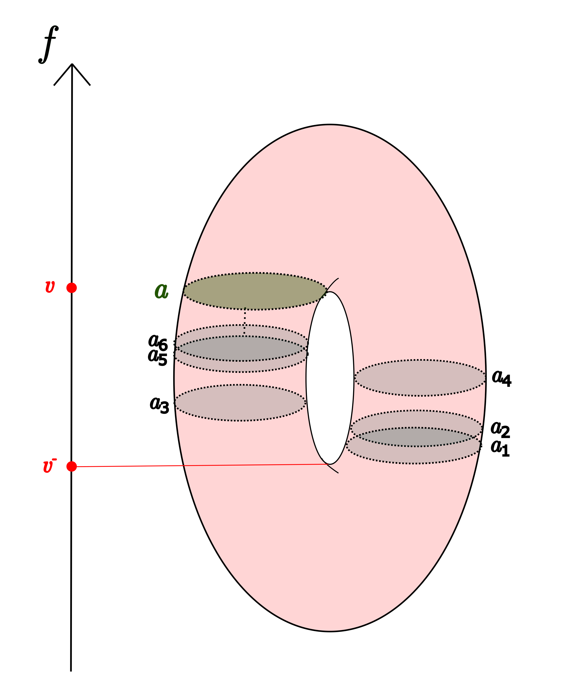

*Example of a convergent sequence $(a_n)_{n\in\mathbb{N}}$ of Reeb graph elements  associated to filter values inside the open interval $(v^-,v)$. Since the number of cylinders in $f^{-1}((v^-,v))$ is finite, $(a_n)_{n\in\mathbb{N}}$ must have an infinite amount of terms inside one of them.*

We now consider a non-empty $a\in\overline{\mathrm{R}}\setminus\mathrm{R}$ and $v=\tilde{f}(a)$ the corresponding critical value. By Lemma 6, the set of critical values is finite because $\mathrm{M}$ is compact. It remains to check that the  preimage of a critical value is a finite set.

Let $(a_n)_{n\in\mathbb{N}}$ be a sequence of elements in $\mathrm{R}$ that converges to $a$. If the first case of Lemma 19 applies, then $(a_n)_{n\in\mathbb{N}}$ must be constant after a certain rank in order to converge because the number of connected components of $f^{-1}(\{v\})$ is finite (see Proposition 9), which implies that $a\in\mathrm{R}$ leading to a contradiction because $a\in\overline{\mathrm{R}}\setminus\mathrm{R}$.

W.l.o.g. we assume that the second point of Lemma 19 is satisfied for $a$. The following lemma allows to finish the proof of the proposition.

**Lemma 20.** Let $a\in\overline{\mathrm{R}}$ such that $v=\tilde{f}(a)$ is a critical value, and $v^-$ and  $v^+$ defined as in Lemma 19. Let $(u_n)_{n\in\mathbb{N}}$ and $(v_n)_{n\in\mathbb{N}}$ be two sequences in $[\frac{v^-+v}{2},v)$ such that $u_n\underset{n\rightarrow\infty}{\longrightarrow} v$ and $v_n\underset{n\rightarrow\infty}{\longrightarrow} v$. Let $c$ be a connected component of $f^{-1}(\{\frac{v^-+v}{2}\})$. Then we have:

$$
{\mathrm {d_H}}(\psi_{u_n-\frac{v^-+v}{2}}(c),\psi_{v_n-\frac{v^-+v}{2}}(c))\underset{n\rightarrow\infty}{\longrightarrow} 0.
$$

*Proof.* W.l.o.g., we assume that $u_n\leq v_n$. Let $\varepsilon>0$. Denote

$$
\mathrm{M}_\varepsilon=\mathrm{M}\setminus\bigcup_{c\in{\mathrm {Crit}}(f)}{\mathrm {B}}\left(c,\frac{\varepsilon}{4\left|{\mathrm {Crit}}(f)\right|}\right).
$$

Since there are no critical values in $[u_n,v_n]$, we can use the gradient flow $(\psi_t)_t$ of $f$ (see Lemma 7) to send any point $p$ in $\psi_{u_n-\frac{v^-+v}{2}}(c)$ to a point $q$ in $\psi_{v_n-\frac{v^-+v}{2}}(c)$ (and conversely) using the curve:

$$
\begin{aligned}
\gamma\colon[0,v_n-u_n]&\longrightarrow \mathrm{M}\\
 t&\longmapsto\psi_{t+u_n-\frac{v^-+v}{2}}(p),
\end{aligned}
$$

where $\gamma(0)=p$ and $\gamma(v_n-u_n)=q$.\\ Now, for every $c\in{\mathrm {Crit}}(f)$, if $\gamma$ enters ${\mathrm {B}}\left(c,\frac{\varepsilon}{4\left|{\mathrm {Crit}}(f)\right|}\right)$, consider

$$
t^c_0=\inf\left\{t\in[0,v_n-u_n],\,\gamma(t)\in {\mathrm {B}}\left(c,\frac{\varepsilon}{4\left|{\mathrm {Crit}}(f)\right|}\right)\right\},
$$

and

$$
t^c_1=\sup\left\{t\in[0,v_n-u_n],\,\gamma(t)\in {\mathrm {B}}\left(c,\frac{\varepsilon}{4\left|{\mathrm {Crit}}(f)\right|}\right)\right\}.
$$

Otherwise, take $t^c_0=t^c_1=0$. Notice that

$$
\mathrm{d}(\gamma(t^c_0),\gamma(t^c_1))\leq \frac{\varepsilon}{2\left|{\mathrm {Crit}}(f)\right|}.
$$

Denoting

$$
\mathcal{U}=[0,v_n-u_n]\setminus\bigcup_{c \in {\mathrm {Crit}}(f)}[t^c_0,t^c_1],
$$

we have $\gamma\left(\mathcal{U}\right)\in\mathrm{M}_\varepsilon$. We also  have:

$$
\begin{aligned}
\mathrm{d}(p,q)&\leq\int_{t\in \mathcal{U}}\left\Vert\frac{d\psi_{t+u_n-\frac{v^-+v}{2}}(p)}{dt}\right\Vert\,dt + \sum_{c \in {\mathrm {Crit}}(f)} \mathrm{d}(\gamma(t^c_0),\gamma(t^c_1)) \\
&\leq\int_{t\in \mathcal{U}}\frac{dt}{\Vert\nabla f(\psi_{t+u_n-\frac{v^-+v}{2}}(p))\Vert} + \sum_{c \in {\mathrm {Crit}}(f)} \frac{\varepsilon}{2\left|{\mathrm {Crit}}(f)\right|}\\
&\leq\frac{|v_n-u_n|}{\inf_{p\in\mathrm{M}_\varepsilon}\Vert\nabla f(p)\Vert}+ \frac{\varepsilon}{2}.
\end{aligned}
$$

Since $v_n-u_n\underset{n\rightarrow\infty}{\longrightarrow} 0$ and $\inf_{p\in\mathrm{M}_\varepsilon}\Vert\nabla f(p)\Vert > C$ for some $C>0$, for $n$ large enough we have $\mathrm{d}(p,q)\leq\varepsilon$, and finally ${\mathrm {d_H}}(\psi_{u_n-\frac{v^-+v}{2}}(c),\psi_{v_n-\frac{v^-+v}{2}}(c))\underset{n\rightarrow\infty}{\longrightarrow} 0$.

Let $a\in\overline{\mathrm{R}}\setminus\mathrm{R}$ which satisfies the second case in Lemma 19, we thus have $a_{\phi(n)}=\psi_{v_n-\frac{v^-+v}{2}}(c)$ with $c$ being a connected component of $f^{-1}(\{\frac{v^-+v}{2}\})$ and $v_n\underset{n\rightarrow\infty}{\longrightarrow} v$.  According to Lemma  20, the limit of $(a_{\phi(n)})_{n\in\mathbb{N}}$ is the same as the limit of $(b_n)_{n\in\mathbb{N}}$ defined as:

$$
\forall n\in\mathbb{N}:\,b_n=\begin{cases}
    c&\text{ if } v-\frac{1}{n}\leq\frac{v^-+v}{2},\\
    \psi_{v-\frac{1}{n}}(c)&\text{otherwise}.
\end{cases}
$$

Finally, notice that $(b_n)_{n\in\mathbb{N}}$ depends only on $c$ and we showed that it converges to $a$. The number of connected components of $f^{-1}(\{\frac{v^-+v}{2}\})$ and $f^{-1}(\{\frac{v^++v}{2}\})$ being finite (see Proposition 9), the set $\left\{a\in\overline{\mathrm{R}},\,\tilde{f}(a)=v\right\}$ is therefore also finite.\\\\ We conclude that $\overline{\mathrm{R}}\setminus\mathrm{R}$ is finite.

**Proposition 21.** $(\overline{\mathrm{R}},{\mathrm {d_H}})$ is separable.

*Proof.* On one hand, $f$ is constant on the elements of $\overline{\mathrm{R}}$. As such, there is a map $\tilde{f}_{|\mathrm{R}}$, that assigns to each element of $\mathrm{R}$ the unique value that $f$ takes on it. For each critical value $v$, $\tilde{f}_{|\mathrm{R}}^{-1}(\{v\})$ is finite. This is because $f^{-1}(\{v\})$ is compact  and locally path-connected, and a locally path-connected compact space has finitely many connected components. Now, there are finitely many critical values of $f$ by Lemma 6. Hence, denoting $C$ the union over all critical values $v$ of $\tilde{f}_{|\mathrm{R}}^{-1}(\{v\})$, one has that $C$ is finite.

On the other hand, $\mathrm{M}$ is separable, and therefore there exists a countable subset $D$ of $\mathrm{M}$ such that $\mathrm{M}=\overline{D}$. We now show that the countable subset $E=C\cup \{[x]_{\sim_f},\,x\in D\}$ is dense in $\mathrm{R}$. Let $a\in\mathrm{R}$.

- If $\tilde{f}_{|\mathrm{R}}(a)$ is a critical value, then $a\in C$.

- If $\tilde{f}_{|\mathrm{R}}(a)$ is not a critical value, then let $x\in a$. Given that $x\in\mathrm{M}$ and $D$ is dense in $\mathrm{M}$, there exists $(x_n)_{n\in\mathbb{N}}$ in $D$ such that $x_n\underset{n\rightarrow\infty}{\longrightarrow} x$. Consider the sequence $([x_n]_{\sim_f})_{n\in\mathbb{N}}$, by Lemma 17 we have $[x_n]_{\sim_f}\underset{n\rightarrow\infty}{\longrightarrow} a$.

We showed that $E$ is dense in $\mathrm{R}$. Therefore, its closure in $\overline{\mathrm{R}}$ verifies $\mathrm{R}\subseteq\overline{E}$. Hence, $\overline{\mathrm{R}}=\overline{E}$.

Consider the following map:

$$
\begin{aligned}
\pi\colon&\mathrm{M}\longrightarrow\overline{\mathrm{R}}\\
&x\longmapsto[x]_{\sim_f}.
\end{aligned}
$$

The image of $\pi$ is $\mathrm{R}$ and it consists of the composition of the natural map associated to the quotient of $\mathrm{M}$ by the equivalence relation $\sim_f$ with the inclusion of $\mathrm{R}$ in its closure.

We introduce the notation $\mathcal{F}=\left\{x\in\mathrm{M},\,f(x)\text{ is a critical value}\right\}$ for the set of points whose image under $f$ is a critical value.

**Proposition 22.**   For every measure $\mathrm{m}$ on $(\mathrm{M},\mathrm{d})$ such that $\mathrm{m}(\mathcal{F})=0$, one has that $\pi$ is continuous $\mathrm{m}$-almost everywhere.

*Proof.* We will prove that the map $\pi$ is continuous at every point $x\in\mathrm{M}$ such that $f(x)$ is not a critical value. Let $x$ be such a point and let $(x_n)_{n\in\mathbb{N}}$ be a sequence in $\mathrm{M}$ such that $x_n\underset{n\rightarrow\infty}{\longrightarrow} x$. By Lemma 17, one has

$$
\pi(x_n)=[x_n]_{\sim_f}\underset{n\rightarrow\infty}{\longrightarrow} \pi(x)=[x]_{\sim_f}.
$$

**Lemma 23.** If a measure $\mathrm{m}$ is absolutely continuous with respect to the volume measure, then $\mathrm{m}(\mathcal{F})=0$.

*Proof.* The set ${\mathrm {Crit}}(f)$ is finite and hence closed. As such, $\mathrm{M}'=\mathrm{M}\setminus{\mathrm {Crit}}(f)$ is an open submanifold of $\mathrm{M}$. Now,

$$
\mathcal{F}={\mathrm {Crit}}(f)\cup \left[\mathcal{F}\cap \mathrm{M}'\right],
$$

and by the Implicit Function Theorem (see Theorem 5.8. of [9] for example), $\mathcal{F}\cap \mathrm{M}'$ is a finite union of $(d-1)-$dimensional submanifolds in $\mathrm{M}$ as the critical values of $f$ in $\mathrm{M}$ are no longer critical in $\mathrm{M}'$. Hence

$$
\mathrm{m}\left( \mathcal{F}\cap \mathrm{M}'\right)=0.
$$

Finally, $\mathrm{m}(\mathcal{F})=0$.

**Corollary 24.** $\pi$ is Borel measurable.

Following Proposition 21 and Corollary 24, we can now consider the metric measure space $(\overline{\mathrm{R}},{\mathrm {d_H}},\mathrm{Vol}\circ\pi^{-1})$. Notice that since the image of $\pi$ is $\mathrm{R}$, $\mathrm{Vol}\circ\pi^{-1}(\mathrm{R})=\mathrm{Vol}(\mathrm{M})$.

## Mapper graphs as Metric Measure Spaces

Let $\mathrm{X}_n= \{x_1,\dots,x_n\}\subset \mathrm{M}$ be an $n$-sample taken inside $\mathrm{M}$. In this section, we aim at turning the Mapper ${\mathbb{M}_n}$ built from $\mathrm{X}_n$, and constructed using a function $f\colon\,\mathrm{M}\rightarrow\mathbb{R}$ and some cover of its image, as a metric measure space.

In this article, we restrict the focus to Mapper *graphs*, i.e., we only consider the $1$-skeleton of the Mapper complexes. An element $\Delta$ of ${\mathbb{M}_n}$ is thus either a $0$-dimensional simplex (vertex) or a $1$-dimensional simplex (edge). See Section 2.1.

The Mapper graph ${\mathbb{M}_n}$ can be embedded in ${\mathrm {C}}(\mathrm{M})\cup\{\varnothing\}$ in the following way:

- A vertex $\Delta_0$ associated to a cluster $\mathcal{C}_{j,k}$ is represented by

$$
\mathcal{C}_{j,k}\setminus \left(\bigcup_{\substack{j'\neq j \\k'\neq k}}\mathcal{C}_{j',k'}\right),
$$

- An edge $\Delta_1$ associated to two vertices, and hence to the corresponding two clusters $\mathcal{C}_{j,k}$ and $\mathcal{C}_{j',k'}$ is represented by

$$
\mathcal{C}_{j,k}\cap \mathcal{C}_{j',k'}\setminus\left(\bigcup_{\substack{j''\neq j,j' \\k''\neq k,k'}}\mathcal{C}_{j'',k''}\right).
$$

The elements of ${\mathbb{M}_n}$ belong to the space of all subsets of $\mathrm{X}_n$, and are therefore compact subsets of $X$. It is possible for some simplex to have the empty set $\varnothing$ to be its representative, e.g., when a cluster is included in its intersection with another cluster. Moreover, we chose the representatives of the simplices in ${\mathbb{M}_n}$ so as to have an element $x_i$ of $X_n$ be in one and only one $\Delta\in{\mathbb{M}_n}$. This allows to define a map

$$
\Delta\!\!\!\!\Delta\colon\mathrm{X}_n\longrightarrow{\mathbb{M}_n},
$$

that associates $x_i$ to the unique simplex that contains it. Using the convention ${\mathrm {d_H}}\left(A,\varnothing\right)=\mathrm{Diam}\left(\mathrm{M}\right)$ for every $A\subseteq\mathrm{M}$, it is clear that $\left({\mathbb{M}_n},{\mathrm {d_H}}\right)$ is a metric space.

Any measure on $\mathrm{X}_n$, defined as a mixture of Dirac measures on $\mathrm{M}$ centered on each $x_i$, can be pushed forward onto ${\mathbb{M}_n}$ using $\Delta\!\!\!\!\Delta$. For example, denoting the empirical measure by

$$
\mathrm{m}_n=\frac{1}{n}\sum_{i=1}^n \delta_{x_i},
$$

for some points $x_i$ sampled according to a measure $\mathrm{m}$ on $\mathrm{M}$, we have that $({\mathbb{M}_n},{\mathrm {d_H}},\mathrm{m}_n\circ\Delta\!\!\!\!\Delta^{-1})$ is a metric measure space. Notice that the support of $\mathrm{m}_n\circ\Delta\!\!\!\!\Delta^{-1}$ is ${\mathbb{M}_n}\setminus \Delta\!\!\!\!\Delta^{-1}(\left\{\varnothing\right\}).$

## A bound on the Gromov-Wasserstein distance between the Reeb graph and the Mapper graph

Let $\mathrm{M}$ be a compact connected Riemannian manifold of dimension $d$. Let  $f\colon\mathrm{M}\rightarrow\mathbb{R}$ be a Morse function and $\mathrm{m}$ be a Borel probability measure on $\mathrm{M}$.

We make two assumptions:

**Assumption 1.** The Ricci curvature $\mathrm{Ric}$ of $\mathrm{M}$ is lower bounded:

$$
\mathrm{Ric}\geq(d-1)\cdot k
$$

where $k \in \mathbb{R}$.

**Assumption 2.** The measure $\mathrm{m}$ is absolutely continuous with respect to the volume measure $\mathrm{Vol}$ and admits an upper bounded density, i.e.,

$$
\sup\frac{d\mathrm{m}}{d\mathrm{Vol}}<+\infty.
$$

Furthermore, we assume that $\mathrm{m}$ is fully supported on $\mathrm{M}$.

Note that when $\mathrm{M}$ is a submanifold of an Euclidean space, Assumption 1 can be satisfied by assuming that the *reach* of $\mathrm{M}$, denoted by $\tau_{\mathrm{M}}$, is positive: $\tau_{\mathrm{M}}>0$ (see Proposition A.1. in [1]). Assumptions on the reach of submanifolds are popular in literature (see, e.g., [28, 4]).

Let $\mathrm{X}_n=\{x_1,...,x_n\}$ be an $n$-sample taken in $\mathrm{M}$ with respect to $\mathrm{m}$ and let $\mathrm{m}_n=\frac{1}{n}\sum_{i=1}^n \delta_{x_i}$ be the associated empirical measure. In this section, we compare the Reeb graph ${\mathrm R}:=\mathrm{R}_f(\mathrm{M})$ and the Mapper ${\mathbb{M}_n}$ built on $\mathrm{X}_n$ according to $\mathrm{GW}$ metrics.

### Main result

First, we specify the Mapper parameters that will be used in our results. We will assume a *homogeneous covering of resolution* $r\in\mathbb{N}$, i.e., the intervals $\mathbb{I}=\{{\mathrm {I}}_1,...,{\mathrm {I}}_r\}$ that cover the range of the filter $f(\mathrm{X}_n)$ in the Mapper are all of the same length and consecutive intervals have a percentage $0<g<1/2$ of their length in common. More specifically, we take ${\mathrm {I}}_j=[a_j,b_j]$ where:

$$
a_j=\min f+(j-1)\cdot\frac{\max f-\min f}{r}-\frac{g}{2-2\cdot g}\cdot\frac{\max f - \min f}{r},
$$

$$
b_j=\min f+j\cdot\frac{\max f-\min f}{r}+\frac{g}{2-2\cdot g}\cdot\frac{\max f - \min f}{r}.
$$

Now, given a set of intervals $\mathbb{I}=\{{\mathrm {I}}_1,...,{\mathrm {I}}_r\}$ used to cover the range of the filter $f(\mathrm{X}_n)$ in the Mapper, we define the *refinement* of $\mathbb{I}$ as:

$$
\mathbb{J}=\left\{{\mathrm {I}}_1\setminus{\mathrm {I}}_2,{\mathrm {I}}_1\cap{\mathrm {I}}_2,{\mathrm {I}}_2\setminus({\mathrm {I}}_1\cup{\mathrm {I}}_3),{\mathrm {I}}_2\cap{\mathrm {I}}_3,\dots\right\}.
$$

The family $\mathbb{J}$ is a refinement of $\mathbb{I}$ in the sense that it corresponds to a collection of elementary blocks of $\mathbb{I}$. Notice also that two elements of $\mathbb{J}$ intersect in at most one point.

We call *maximal width* $\mathcal{W}(r)$ of the cover $\mathbb{I}$ the maximal length of an element in $\mathbb{J}$. Looking at the definition of ${\mathrm {I}}_j=[a_j,b_j]$ above, we see that

$$
\mathcal{W}(r)=\frac{\max f - \min f}{r}.
$$

Similarly, the *minimal width* of an element in $\mathbb{J}$ is given by $\frac{g}{1-g}\cdot\mathcal{W}(r).$

We now state the main theorem of this article. Its proof, as well as explicit constants, are provided in Proposition 26, Corollary 29 and Proposition 34.

**Theorem 25.** Under Assumptions 1 and 2, and using the definitions above, consider the two metric measure spaces $(\overline{\mathrm{R}},{\mathrm {d_H}},\mathrm{m}\circ\pi^{-1})$ and $({\mathbb{M}_n},{\mathrm {d_H}},\mathrm{m}_n\circ\Delta\!\!\!\!\Delta^{-1})$ corresponding to the Reeb graph and to the Mapper graph respectively. For any $\alpha>0$, $p \geq 1$ and a resolution $r(n)$ of the Mapper satisfying $r(n)\underset{n\rightarrow\infty}{\sim}n^{\frac{1}{d+\alpha}}$, we then have, for any large enough sample size $n$:

$$
\mathbb{E}\left(\mathrm{GW}_p(\overline{\mathrm{R}},{\mathbb{M}_n})\right)\lesssim n^{-\frac{\nu}{d+\alpha}}
$$

where

$$
\nu=\min\left\{\frac{1}{2},\frac{d}{p(d+1)}\right\}.
$$

**Remark.** We give a discussion on the optimality of this bound. When $\frac{d}{p(d+1)}\leq\frac{1}{2}$, the upper bound given in Theorem 25 is achieved by the bound on $\max_{\mathrm{J}\in\mathbb{J}}\mathrm{Vol}\left( f^{-1}(\mathrm{J})\right)$ given in Lemma 33, see the proofs of Proposition 34 and Theorem 25 for details. Note moreover that this upper bound  is sharp. To see this, consider for instance the case where $\mathrm{M}$ is the graph of the function $x\mapsto x^2$ over the segment $[-1,1]$: $\mathrm{M}=\{(x,x^2),\,x\in[-1,1]\}$, with the metric $\mathrm{g}$ being induced by the Euclidean metric in $\mathbb{R}^2$. We are interested in $\mathrm{Vol}\left( f^{-1}([0,\mathcal{W}(r)])\right)$. We have:

$$
\begin{aligned}
\mathrm{Vol}\left( f^{-1}([0,\mathcal{W}(r)])\right)&=\int_{-\sqrt{\mathcal{W}(r)}}^{\sqrt{\mathcal{W}(r)}}\sqrt{1+4t^2}\,dt\\
&=\frac{1}{4}\left[t\sqrt{1+t^2}+\log\left(t+\sqrt{1+t^2}\right)\right]^{2\sqrt{\mathcal{W}(r)}}_{-2\sqrt{\mathcal{W}(r)}}\\
&\underset{r\rightarrow\infty}{\sim}2\sqrt{\mathcal{W}(r)}=2\mathcal{W}(r)^{\frac{d}{d+1}}.
\end{aligned}
$$

Note that in this example $\mathrm{M}$ has a boundary. We can circumvent this if needed by, for example, attaching the two points in the boundary in a smooth manner. This will not change our argument since $f^{-1}([0,\mathcal{W}(r)])$ is located away from the boundary.

*Proof.* From Proposition 26, we have the decomposition

$$
\mathrm{GW}_p(\overline{\mathrm{R}},{\mathbb{M}_n})\leq {\mathrm {E}}_n+{\mathrm {A}}_n.
$$

On one hand, since $\frac{d+\alpha}{\nu}>\max\{2d,2p\}$, Corollary 29 shows that

$$
\mathbb{E}\left({\mathrm {E}}_n\right)\lesssim n^{-\frac{\nu}{d+\alpha}}.
$$

On the other hand, Proposition 34 gives

$$
\mathbb{E}\left({\mathrm {A}}_n^p\right)\leq \left(\lambda+\xi\cdot\sqrt{\mathcal{W}(r)}\right)^p
    +\tilde{\eta}\cdot\mathcal{W}(r)^{\frac{d}{d+1}}+\frac{\zeta}{\lambda^d}\cdot\exp\left(\frac{-na\lambda^d}{2^d}\right),
$$

for every $\lambda>0$ such that

$$
\omega_f\left(\lambda\right)\leq\frac{g}{1-g}\cdot\frac{\mathcal{W}(r)}{4}.
$$

where the constants $\xi$, $\tilde{\eta}$ and $\zeta$ are given in Proposition 34. The third term, that is given by

$$
\frac{\zeta}{\lambda^d}\cdot\exp\left(\frac{-na\lambda^d}{2^d}\right),
$$

converges to zero for   $\lambda(n) \gtrsim n^{-\frac{1}{d+\alpha}}$. Furthermore, since $f$ is smooth on a compact manifold, it is $L$-Lipschitz for some $L>0$. In Proposition 34, the assumption

$$
\omega_f\left(\lambda\right)\leq\frac{g}{1-g}\cdot\frac{\mathcal{W}(r)}{4},
$$

where $\omega_f$ is the modulus of continuity of $f$, can be satisfied by choosing

$$
\lambda=\frac{g}{1-g}\cdot\frac{\mathcal{W}(r)}{4L}.
$$

Therefore, in order to make the term above converge to zero (exponentially fast), a sufficient condition is

$$
\mathcal{W}(r)(n)\underset{n\rightarrow\infty}{\sim} n^{-\frac{1}{d+\alpha}},
$$

or equivalently

$$
r(n)\underset{n\rightarrow\infty}{\sim} n^{\frac{1}{d+\alpha}}.
$$

Moreover, the two other terms in Proposition 34 are dominated by $\mathcal{W}(r)^{p\nu}$. As such, $\mathbb{E}\left({\mathrm {A}}_n^p\right) \lesssim n^{-\frac{p\nu}{d+\alpha}},$ and therefore

$$
\mathbb{E}\left({\mathrm {A}}_n\right)\lesssim n^{-\frac{\nu}{d+\alpha}}
$$

and finally

$$
\mathbb{E}\left(\mathrm{GW}_p(\overline{\mathrm{R}},{\mathbb{M}_n})\right)\lesssim n^{-\frac{\nu}{d+\alpha}}.
$$

### Approximation-Estimation Decomposition

**Proposition 26.** Consider the two metric measure spaces $(\overline{\mathrm{R}},{\mathrm {d_H}},\mathrm{m}\circ\pi^{-1})$ and $({\mathbb{M}_n},{\mathrm {d_H}},\mathrm{m}_n\circ\Delta\!\!\!\!\Delta^{-1})$ corresponding to the Reeb graph and to the Mapper graph respectively. We have:

$$
\mathrm{GW}_p(\overline{\mathrm{R}},{\mathbb{M}_n})\leq \mathrm{W}_p(\mathrm{m}\circ\pi^{-1},\mathrm{m}_n\circ\pi^{-1})+\left(\frac{1}{n}\sum_{i=1}^n{\mathrm {d_H}}([x_i]_{\sim_f},\Delta\!\!\!\!\Delta(x_i))^p\right)^{\frac{1}{p}}.
$$

*Proof.* Consider the metric measure space $\overline{\mathrm{R}}_n=(\overline{\mathrm{R}},{\mathrm {d_H}},\mathrm{m}_n\circ\pi^{-1})$ obtained with the empirical measure on the Reeb graph.

On one hand,

$$
\mathrm{GW}_p(\overline{\mathrm{R}},\overline{\mathrm{R}}_n)\leq\mathrm{W}_p(\mathrm{m}\circ\pi^{-1},\mathrm{m}_n\circ\pi^{-1}).
$$

On the other hand,

$$
\mathrm{GW}_p^p(\overline{\mathrm{R}}_n,{\mathbb{M}_n})\leq \inf_{\eta}\int_{\overline{\mathrm{R}}\times{\mathbb{M}_n}}{\mathrm {d_H}}(a,\Delta)^p\,d\eta(a,\Delta),
$$

where the infimum is taken over all coupling measures $\eta$ on $\overline{\mathrm{R}}\times{\mathbb{M}_n}$ that have marginals $\mathrm{m}_n\circ\pi^{-1}$ and $\mathrm{m}_n\circ\Delta\!\!\!\!\Delta^{-1}$. Indeed, the Hausdorff distance ${\mathrm {d_H}}$ can be defined on $\overline{\mathrm{R}}\sqcup{\mathbb{M}_n}$ via its inclusion in ${\mathrm {C}}(\mathrm{M})$, and is thus a metric coupling of ${\mathrm {d_H}}$ restricted to $\overline{\mathrm{R}}$ and ${\mathrm {d_H}}$ restricted to ${\mathbb{M}_n}$. Furthermore, consider the map

$$
\begin{aligned}
\phi\colon\mathrm{X}_n&\longrightarrow\overline{\mathrm{R}}\times{\mathbb{M}_n}\\
     x_i&\longmapsto([x_i]_{\sim_f},\Delta\!\!\!\!\Delta(x_i))
\end{aligned}
$$

It is clear that $\mathrm{m}_n\circ\phi^{-1}$ is an example of such a coupling measure $\eta$. Hence,

$$
\begin{aligned}
\mathrm{GW}_p^p(\overline{\mathrm{R}}_n,{\mathbb{M}_n})&\leq \int_{\overline{\mathrm{R}}\times{\mathbb{M}_n}}{\mathrm {d_H}}(a,\Delta)^p\,d\mathrm{m}_n\circ\phi^{-1}(a,\Delta) \\
    &=\int_{\mathrm{X}_n}{\mathrm {d_H}}([x]_{\sim_f},\Delta\!\!\!\!\Delta(x))^p\,d\mathrm{m}_n(x)\\
    &=\frac{1}{n}\sum_{i=1}^n{\mathrm {d_H}}([x_i]_{\sim_f},\Delta\!\!\!\!\Delta(x_i))^p.
\end{aligned}
$$

Finally,

$$
\begin{aligned}
\mathrm{GW}_p(\overline{\mathrm{R}},{\mathbb{M}_n})&\leq \mathrm{GW}_p(\overline{\mathrm{R}},\overline{\mathrm{R}}_n)+\mathrm{GW}_p(\overline{\mathrm{R}}_n,{\mathbb{M}_n})\\
    &\leq\mathrm{W}_p(\mathrm{m}\circ\pi^{-1},\mathrm{m}_n\circ\pi^{-1})+\left(\frac{1}{n}\sum_{i=1}^n{\mathrm {d_H}}([x_i]_{\sim_f},\Delta\!\!\!\!\Delta(x_i))^p\right)^{\frac{1}{p}}.
\end{aligned}
$$

The bound given in Proposition 26 contains two terms:

- ${\mathrm {E}}_n=\mathrm{W}_p(\mathrm{m}\circ\pi^{-1},\mathrm{m}_n\circ\pi^{-1})$, and

- ${\mathrm {A}}_n=\left(\frac{1}{n}\sum_{i=1}^n{\mathrm {d_H}}([x_i]_{\sim_f},\Delta\!\!\!\!\Delta(x_i))^p\right)^{\frac{1}{p}}$.

The term ${\mathrm {E}}_n$ can be interpreted as an estimation error. It measures how representative the discrete measure associated to the $n$-sample $\mathrm{X}_n$ is of the measure $\mathrm{m}$, in terms of the distance in the Reeb graph. The term ${\mathrm {A}}_n$ can be interpreted as an approximation error. It measures how well the Mapper graph captures the same stratification than the one in the Reeb graph. It is small if, for most of the sample points $x_i$, the simplex containing $x_i$ is close (in Hausdorff distance) from the Reeb graph element that contains $x_i$.

\subsection{The estimation error \texorpdfstring{${\mathrm {E}}_n$}{TEXT} }

#### Covering numbers for Reeb graphs

Following the works of [6] and [40], in this section, we aim at bounding the estimation error ${\mathrm {E}}_n$ using the $\varepsilon$-covering number of $(\mathrm{R},{\mathrm {d_H}})$.

**Definition.** Given a metric space $X$, $S\subseteq X$ and $\varepsilon>0$, the $\varepsilon$-covering number of $S$, $\mathcal{N}_\varepsilon(S)$, is the minimum integer $m$ such that there exist balls $B_1,\dots,B_m$ in $X$ of radius $\varepsilon$ such that $S\subseteq\bigcup_{i=1}^m B_i$.

Note that we have $\mathcal{N}_\varepsilon(\mathrm{R})=\mathcal{N}_\varepsilon(\bar{\mathrm{R}})$, since $\mathrm{R}\subseteq\bar{\mathrm{R}}$ and any $\varepsilon$-covering of $\mathrm{R}$ is also an $\varepsilon$-covering of $\bar{\mathrm{R}}$, as $\bar{\mathrm{R}}$ is the minimal closed subset that contains $\mathrm{R}$.

**Proposition 27.** There exists $\varepsilon'>0$ such that for every $\varepsilon\leq\varepsilon'$ we have

$$
\mathcal{N}_\varepsilon(\mathrm{R})\leq N_c+\left(\frac{\beta}{\varepsilon}\right)^{2d},
$$

where $N_c$ is the number of elements in $\mathrm{R}$ associated to critical values, $d$ is the dimension of $\mathrm{M}$ and $\beta$ is a constant depending on $f$ and $\mathrm{M}$.

*Proof.* First, let $\varepsilon>0$ and  take $N_c$ balls ${\mathrm {B}}_1,\dots,{\mathrm {B}}_{N_c}\subseteq \mathrm{R}$ of radius $\varepsilon$, one around each element of $\mathrm{R}$ associated to a critical value.

Second, let $\{v_1,\dots,v_{k+1}\}$ be the critical values of $f$, and let

$$
\mathrm{M}_\varepsilon :=\mathrm{M}\setminus \bigcup_{c \in {\mathrm {Crit}}(f)}{\mathrm {B}}\left(c,\frac{\varepsilon}{4\left|{\mathrm {Crit}}(f)\right|}\right).
$$

For $1\leq j\leq k$, let the sets $\{S_{j,l}\}_{j,l}$ denote the connected components of $\mathrm{M}\cap f^{-1}((v_j,v_{j+1}))$. Notice that there are no critical points in any of the $S_{j,l}$.

We start with the next technical result that connect balls of $(\mathrm{M},d)$ with those of $(\mathrm{R},{\mathrm {d_H}})$.

\begin{assertion*} For every $\varepsilon>0$, every $(j,l)$ and every $x\in S_{j,l}$:

$$
{\mathrm {B}}\left(x,\frac{\varepsilon\cdot \inf_{p\in\mathrm{M}_\varepsilon}\Vert\nabla f(p)\Vert}{2\sup_{p\in\mathrm{M}}\Vert\nabla f(p)\Vert}\right)\cap S_{j,l}\subseteq \pi^{-1}({\mathrm {B}}\left([x]_{\sim_f},\varepsilon\right)).
$$

\end{assertion*}

*Proof.* Let $y\in {\mathrm {B}}\left(x,\frac{\varepsilon\cdot \inf_{p\in\mathrm{M}_\varepsilon}\Vert\nabla f(p)\Vert}{2\sup_{p\in\mathrm{M}}\Vert\nabla f(p)\Vert}\right)\cap S_{j,l}$. W.l.o.g., we assume that $f(y)>f(x)$.

From Lemma 7, we can introduce the gradient flow $(\psi_t)_t$ of $f$, such that  $\psi_{f(y)-f(x)}$  is a diffeomorphism between $f^{-1}(\{f(x)\})$ and $f^{-1}(\{f(y)\})$. Moreover, since $x$ and $y$ are both in $S_{j,l}$, then $\psi_{f(y)-f(x)}$ is in particular a diffeomorphism between $[x]_{\sim_f}$ and $[y]_{\sim_f}$. Thus, for any point $p$ in $[x]_{\sim_f}$, there exists a point $q$ in $[y]_{\sim_f}$ (and conversely) such that the curve

$$
\begin{aligned}
\gamma\colon[0,f(y)-f(x)]&\longrightarrow \mathrm{M}\\
 u&\longmapsto\psi_{u+f(x)}(p)
\end{aligned}
$$

connect $p = \gamma(0)$ to $q := \gamma(f(y)-f(x))$.

Now, for every $c\in{\mathrm {Crit}}(f)$, if $\gamma$ enters ${\mathrm {B}}\left(c,\frac{\varepsilon}{4\left|{\mathrm {Crit}}(f)\right|}\right)$ consider

$$
u^c_0=\inf\left\{u\in[0,f(y)-f(x)],\,\gamma(u)\in {\mathrm {B}}\left(c,\frac{\varepsilon}{4\left|{\mathrm {Crit}}(f)\right|}\right)\right\},
$$

and

$$
u^c_1=\sup\left\{u\in[0,f(y)-f(x)],\,\gamma(u)\in {\mathrm {B}}\left(c,\frac{\varepsilon}{4\left|{\mathrm {Crit}}(f)\right|}\right)\right\}.
$$

Otherwise take $u^c_0=u^c_1=0$. Notice that

$$
\mathrm{d}(\gamma(u^c_0),\gamma(u^c_1))\leq \frac{\varepsilon}{2\left|{\mathrm {Crit}}(f)\right|}.
$$

Denoting

$$
\mathcal{U}=[0,f(y)-f(x)]\setminus\bigcup_{c \in {\mathrm {Crit}}(f)}[u^c_0,u^c_1],
$$

we have

$$
\gamma\left(\mathcal{U}\right)\in\mathrm{M}_\varepsilon
$$

Furthermore:

$$
\begin{aligned}
\mathrm{d}(p,q)&\leq\int_{u\in \mathcal{U}}\left\Vert\frac{d\psi_{u+f(x)}(p)}{du}\right\Vert\,du + \sum_{c \in {\mathrm {Crit}}(f)} \mathrm{d}(\gamma(u^c_0),\gamma(u^c_1))\\
&\leq\int_{u\in \mathcal{U}}\frac{du}{\Vert\nabla f(\psi_{u+f(x)}(p))\Vert} + \sum_{c \in {\mathrm {Crit}}(f)} \mathrm{d}(\gamma(u^c_0),\gamma(u^c_1))\\
&\leq\frac{f(y)-f(x)}{\inf_{p\in\mathrm{M}_\varepsilon}\Vert\nabla f(p)\Vert}+ \sum_{c \in {\mathrm {Crit}}(f)} \frac{\varepsilon}{2\left|{\mathrm {Crit}}(f)\right|}\\
&\leq\frac{\mathrm{d}(x,y)\cdot \sup_{p\in\mathrm{M}}\Vert\nabla f(p)\Vert}{\inf_{p\in\mathrm{M}_\varepsilon}\Vert\nabla f(p)\Vert}+\frac{\varepsilon}{2}\\
&\leq\varepsilon
\end{aligned}
$$

As such, ${\mathrm {d_H}}([x]_{\sim_f},[y]_{\sim_f})\leq\varepsilon$.

Using the previous assertion, we will bound the $\varepsilon$-covering number of $\mathrm{R}$.

Let $e=\frac{\varepsilon\cdot \inf_{p\in\mathrm{M}_\varepsilon}\Vert\nabla f(p)\Vert}{2\sup_{p\in\mathrm{M}}\Vert\nabla f(p)\Vert}$ and consider minimal $e$-coverings of each $S_{j,l}$. Now, for every $x$ such that $f(x)$ is not a critical value, $x$ is in one of the $S_{j,l}$. As such, it is in one of the balls of radius $e$ that cover $S_{j,l}$, centered, say, on $x_i$. Accordingly, by the previous assertion $[x]_{\sim_f}\in{\mathrm {B}}\left([x_i]_{\sim_f},\varepsilon\right)$.

We proved that

$$
\mathcal{N}_\varepsilon\left(\mathrm{R}\right)\leq N_c+\sum_{j,l}\mathcal{N}_e\left(S_{j,l}\right).
$$

Fix one of the $S_{j,l}$. We now bound $\mathcal{N}_e\left(S_{j,l}\right)$. If $\{{\mathrm {B}}(x_i,e)\}_i$ is a minimal covering, the balls $\{{\mathrm {B}}(x_i,e/2)\}_i$ are disjoint. Hence,

$$
\mathrm{Vol}\left(\bigcup_{i}{\mathrm {B}}(x_i,e/2)\right)=\sum_{i}\mathrm{Vol}\left({\mathrm {B}}(x_i,e/2)\right).
$$

Also,

$$
\bigcup_{i}{\mathrm {B}}(x_i,e/2)\subseteq \mathrm{M},
$$

and as such

$$
\sum_{i}\frac{\mathrm{Vol}\left({\mathrm {B}}(x_i,e/2)\right)}{\mathrm{Vol}\left(\mathrm{M}\right)}\leq 1.
$$

We now use Theorem 4 since we assumed that the Ricci curvature of $\mathrm{M}$ verifies $\mathrm{Ric}\geq(d-1)\cdot k$. We have:

$$
\frac{\mathrm{Vol}\left({\mathrm {B}}(x_i,e/2)\right)}{v(d,k,e/2)}\geq\frac{\mathrm{Vol}\left(\mathrm{M}\right)}{v(d,k,\mathrm{Diam}(\mathrm{M}))},
$$

and as such

$$
\sum_i \frac{v(d,k,e/2)}{v(d,k,\mathrm{Diam}(\mathrm{M}))}\leq\sum_{i}\frac{\mathrm{Vol}\left({\mathrm {B}}(x_i,e/2)\right)}{\mathrm{Vol}\left(\mathrm{M}\right)}.
$$

Hence,

$$
\mathcal{N}_e\left(S_{j,l}\right)\leq\frac{v(d,k,\mathrm{Diam}(\mathrm{M}))}{v(d,k,e/2)}.
$$

Looking at Proposition 3, we know that

$$
v(d,k,e/2)\underset{e\rightarrow0}{\sim}\alpha_d\cdot\frac{e^d}{2^d},
$$

where $\alpha_d$ is the volume of the unit ball in $\mathbb{R}^d$. For every small enough $e$, and hence small enough $\epsilon$, we have

$$
v(d,k,e/2)\geq \frac{\alpha_d}{2}\cdot \frac{e^d}{2^d}.
$$

We conclude that

$$
\mathcal{N}_e\left(S_{j,l}\right)\leq \frac{2^{d+1}\cdot v(d,k,\mathrm{Diam}(\mathrm{M}))}{\alpha_d\cdot e^d}.
$$

Accordingly

$$
\mathcal{N}_\epsilon(S)\leq N_c+\left(\frac{\tilde{\beta}}{\varepsilon\cdot\Gamma(\varepsilon)}\right)^d,
$$

where:

$$
\begin{aligned}
\tilde{\beta}&=\left(\frac{2\left|\{S_{j,l}\}_{j,l}\right|\cdot v(d,k,\mathrm{Diam}(\mathrm{M}))}{\alpha_d}\right)^{\frac{1}{d}}\cdot4\sup_{p\in\mathrm{M}}\Vert\nabla f(p)\Vert,\\
    \Gamma(\varepsilon)&=\inf_{p\in\mathrm{M}_\varepsilon}\Vert\nabla f(p)\Vert.
\end{aligned}
$$

It only remains now to investigate the behavior of $\Gamma(\varepsilon)$ when $\varepsilon\rightarrow 0$.

For $\varepsilon$ small enough, $\inf_{p\in\mathrm{M}_\varepsilon}\Vert\nabla f(p)\Vert$ is reached in a neighborhood of a critical point $c$, at a point $p$ such that

$$
\mathrm{d}(p,c)\geq\frac{\varepsilon}{4\left|{\mathrm {Crit}}(f)\right|}.
$$

Now, writing $f$ inside a Morse coordinate neighborhood $U\subseteq\mathrm{M}$ centered at $c$ (see Lemma 6) gives:\\

$$
\sqrt{\sum_{i=1}^d\frac{\partial f(p)^2}{\partial x_i}}=2\sqrt{\sum_{i=1}^d x_i^2},
$$

where $x(p)=(x_1,...,x_d)$ is the representation of the point $p\in U$ in local coordinates.\\ Proposition 5 gives:

$$
\Vert \nabla f(p) \Vert\geq \frac{1}{\mu(p)}\cdot \sqrt{\sum_{i=1}^d\frac{\partial f(p)^2}{\partial x_i}},
$$

with $\mu(p)=\max\{\sqrt{\rho},\, \rho\in\mathrm{Sp(G)}\}$ where $\mathrm{Sp(G)}$ is the spectrum of the metric tensor $\mathrm{G}(p)=\left[\mathrm{g}(\partial_i,\partial_j)\right]_{i,j}$. The function $\mu$ is continuous and $\mu(p)\rightarrow\mu(c)<\infty$ as $p\rightarrow c$. Taking $\mu_0=\sup \mu(p)$ in a small neighborhood of $c$, we have $\mu_0<\infty$ and

$$
\Vert \nabla f(p) \Vert\geq \frac{1}{\mu_0}\cdot \sqrt{\sum_{i=1}^d\frac{\partial f(p)^2}{\partial x_i}},
$$

Moreover, Proposition 2 shows that:

$$
\mathrm{d}_0(p,c)=\sqrt{\sum_{i=1}^d x_i^2}\geq \frac{1}{\mu_0} \cdot \mathrm{d}(p,c),
$$

for small enough $\varepsilon$. Hence,

$$
\Vert \nabla f(p) \Vert \geq \frac{2}{\mu_0^2}\cdot \frac{\varepsilon}{4\left|{\mathrm {Crit}}(f)\right|}.
$$

Finally,

$$
\mathcal{N}_\varepsilon(\mathrm{R})\leq N_c+\left(\frac{\beta}{\varepsilon}\right)^{2d},
$$

where

$$
\beta=\left(2\tilde{\beta}\cdot \mu_0^2\cdot\left|{\mathrm {Crit}}(f)\right| \right)^{\frac{1}{2}}
$$

#### Convergence rate for the estimation error

We first restate Proposition 5. from [40].

**Proposition 28.** Let $(X,d)$ be a Polish metric space with $\mathrm{Diam}(X)\leq 1$, $\mathrm{m}$ be a probability measure on $X$ and $\mathrm{m}_n$ be an empirical measure associated to a random sample $\mathrm{X}_n$ taken from $\mathrm{m}$. \\ Let $p\in[1,\infty)$. Suppose there exists $\varepsilon'>0$ and $s>2p$ such that for all $\varepsilon\leq\varepsilon'$

$$
-\frac{\log \mathcal{N}_{\varepsilon,s}}{\log\varepsilon}\leq s,
$$

where

$$
\mathcal{N}_{\varepsilon,s}=\inf\left\{\mathcal{N}_\varepsilon(B)\, ,\,\mathrm{m}(B)\geq 1-\varepsilon^{\frac{sp}{s-2p}}\right\}.
$$

Then,

$$
\mathrm{W}_p^p(\mathrm{m},\mathrm{m}_n)\leq C_1'n^{-\frac{p}{s}}+C_2'n^{-\frac{1}{2}},
$$

where

$$
C_1'=3^{\frac{3sp}{s-2p}+1}\left(\frac{1}{3^{\frac{s}{2}-p}-1}+3\right),
$$

and

$$
C_2'=\left(27/\varepsilon'\right)^{\frac{s}{2}}.
$$

We now apply Proposition 28 to bound the estimation error ${\mathrm {E}}_n$, using our asymptotic control over the covering number of $\mathrm{R}$ in Proposition 27.

**Corollary 29.** For every $s>\max(2d,2p)$, we have

$$
\mathbb{E}\left({\mathrm {E}}_n^p\right)\leq C_1n^{-\frac{p}{s}}+C_2n^{-\frac{1}{2}},
$$

where

$$
C_1=\mathrm{Diam}\left(\mathrm{M}\right)^p\cdot3^{\frac{3sp}{s-2p}+1}\left(\frac{1}{3^{\frac{s}{2}-p}-1}+3\right),
$$

$$
C_2=\mathrm{Diam}\left(\mathrm{M}\right)^p\cdot\left(27/\varepsilon'\right)^{\frac{s}{2}},
$$

and $\varepsilon'>0$.

*Proof.* We have ${\mathrm {E}}_n=\mathrm{W}_p(\mathrm{m}\circ\pi^{-1},\mathrm{m}_n\circ\pi^{-1})$. Moreover, $\mathrm{m}_n\circ\pi^{-1}$ is an empirical measure associated to $\mathrm{m}\circ\pi^{-1}$, since for every Borel subset $A$ of $\overline{\mathrm{R}}$:

$$
\begin{aligned}
\mathrm{m}_n\circ\pi^{-1}(A)&=\frac{1}{n}\sum_{i=1}^n\mathbb{1}_{x_i\in\pi^{-1}(A)} \\
     &=\frac{1}{n}\sum_{i=1}^n\mathbb{1}_{[x_i]_{\sim_f}\in A},
\end{aligned}
$$

and

$$
[x_i]_{\sim_f}\overset{\mathrm{iid}}{\sim}\mathrm{m}\circ\pi^{-1},
$$

because

$$
\begin{aligned}
\mathbb{P}([x_i]_{\sim_f}\in A)&=\mathbb{P}(x_i\in \pi^{-1}(A)) \\
     &=\mathrm{m}\circ\pi^{-1}(A),
\end{aligned}
$$

where we used that $\mathrm{m}_n$ is an empirical measure associated to $\mathrm{m}$.

In [40], the metric spaces $X$ are assumed to verify $\mathrm{Diam}(X)\leq 1$. This can be achieved in our case by considering a normalized version of ${\mathrm {d_H}}$ in $\bar{\mathrm{R}}$, defined as ${\mathrm {d_H}}/\mathrm{Diam}(\mathrm{M})$. Notice that covering numbers $\mathcal{N}'_\varepsilon(\cdot)$ of this normalized space satisfy

$$
\mathcal{N}'_\varepsilon(\cdot)=\mathcal{N}_{(\mathrm{Diam}(\mathrm{M})\cdot\varepsilon)}(\cdot).
$$

Moreover, the Wasserstein distance $\mathrm{W}'_p$ in the normalized space satisfies:

$$
\mathrm{W}'_p(\cdot,\cdot)=\frac{1}{\mathrm{Diam}(\mathrm{M})}\mathrm{W}_p(\cdot,\cdot).
$$

Now, we can use Proposition 5. in [40] to prove our result. The only assumption made in this proposition is that, for any small enough $\varepsilon$ and $s>2p$:

$$
-\frac{\log \mathcal{N}'_{\varepsilon,s}}{\log\varepsilon}\leq s,
$$

where

$$
\mathcal{N}'_{\varepsilon,s}=\inf\left\{\mathcal{N}'_\varepsilon(B)\, ,\,\mathrm{m}\circ\pi^{-1}(B)\geq 1-\varepsilon^{\frac{sp}{s-2p}}\right\}.
$$

We see that:

$$
\mathcal{N}'_{\varepsilon,s}\leq\mathcal{N}'_\varepsilon(\mathrm{R})=\mathcal{N}_{(\mathrm{Diam}(\mathrm{M})\cdot\varepsilon)}(\mathrm{R}).
$$

As such, using Proposition 27, for any small enough $\varepsilon$, we have

$$
-\frac{\log \mathcal{N}'_{\varepsilon,s}}{\log\varepsilon}\leq-\frac{\log\left( N_c+\left(\frac{\beta}{\mathrm{Diam}(\mathrm{M})\cdot\varepsilon}\right)^{2d}\right)}{\log\varepsilon}\underset{\varepsilon\rightarrow0}{\longrightarrow}2d.
$$

Hence, for every $s>\max(2d,2p)$ there exists $\varepsilon'>0$ such that for every $\varepsilon\leq\varepsilon'$:

$$
-\frac{\log \mathcal{N}'_{\varepsilon,s}}{\log\varepsilon}\leq s.
$$

Applying Proposition 28 gives

$$
\mathrm{W}_p^{'^p}(\mathrm{m}\circ\pi^{-1},\mathrm{m}_n\circ\pi^{-1})\leq C_1'n^{-\frac{p}{s}}+C_2'n^{-\frac{1}{2}},
$$

where

$$
C_1'=3^{\frac{3sp}{s-2p}+1}\left(\frac{1}{3^{\frac{s}{2}-p}-1}+3\right),
$$

and

$$
C_2'=\left(27/\varepsilon'\right)^{\frac{s}{2}}.
$$

As such,

$$
\mathrm{W}_p^p(\mathrm{m}\circ\pi^{-1},\mathrm{m}_n\circ\pi^{-1})\leq \mathrm{Diam}\left(\mathrm{M}\right)^p\cdot C_1'n^{-\frac{p}{s}}+\mathrm{Diam}\left(\mathrm{M}\right)^p\cdot C_2'n^{-\frac{1}{2}},
$$

which concludes the proof.

Note that the constants $C_1$ and $C_2$ in Corollary 29 are, up to a constant, the same as in Proposition 5 of [40], and $\varepsilon'$ in the expression of $C_2$ is the same as in the proof of Corollary 29.

\subsection{The approximation error \texorpdfstring{${\mathrm {A}}_n$}{TEXT}}

#### Comparing Reeb graph and Mapper graph elements

We focus here on the second term in the upper bound of Proposition 26:

$$
{\mathrm {A}}_n=\left(\frac{1}{n}\sum_{i=1}^n{\mathrm {d_H}}([x_i]_{\sim_f},\Delta\!\!\!\!\Delta(x_i))^p\right)^{\frac{1}{p}}.
$$

Recall that given a cover $\mathbb{I}=\{{\mathrm {I}}_1,\dots,{\mathrm {I}}_r\}$ of the range of the filter $f(\mathrm{X}_n)$, the *refinement* of $\mathbb{I}$ is defined as:

$$
\mathbb{J}=\left\{{\mathrm {I}}_1\setminus{\mathrm {I}}_2,{\mathrm {I}}_1\cap{\mathrm {I}}_2,{\mathrm {I}}_2\setminus({\mathrm {I}}_1\cup{\mathrm {I}}_3),{\mathrm {I}}_2\cap{\mathrm {I}}_3,\dots\right\}.
$$

For every critical point $c\in{\mathrm {Crit}}(f)$, we know that there exists a Morse chart $\varphi\colon U\subseteq\mathrm{M}\rightarrow\mathbb{R}^d$ around $c$ by Lemma 6. Recall that the Riemannian metric $\mathrm{g}$ can be represented in this chart as a symmetric positive-definite matrix $\mathrm{G}(c)$.

**Lemma 30.** Let $x_i\in\mathrm{X}_n$ and $\mathrm{J}\in\mathbb{J}$ such that $\mathrm{J}$ does not contain critical values and is not adjacent to another refined cover element $\mathrm{J}'$ that contains critical values. For any large enough resolution $r$, if $x_i\in\mathrm{J}$, then for every $x_j\in\Delta\!\!\!\!\Delta(x_i)$:

$$
\mathrm{d}(x_j,[x_i]_{\sim_f})\leq\max_{c\in{\mathrm {Crit}}(f)}\mu(c)\cdot\sqrt{\frac{1-g}{g}}\cdot\sqrt{\mathcal{W}(r)}
$$

where $\mu(c)$ is the square root of the spectral radius of $\mathrm{G}(c)$, see Section 2.2.

*Proof.* First, notice that if $\mathrm{J}$ does not correspond to an intersection of two intervals, i.e., it is of the form $\mathrm{J}={\mathrm {I}}_j\setminus({\mathrm {I}}_{j-1}\cup{\mathrm {I}}_{j+1})$, then $\Delta\!\!\!\!\Delta(x_i)$ is a subset of the connected component of $x_i$ in $f^{-1}(\mathrm{J})$.

Second, when $\mathrm{J}$ is an intersection, of the form $\mathrm{J}={\mathrm {I}}_j\cap{\mathrm {I}}_{j+1}$, our assumption that $\mathrm{J}$ does not contain critical values and is not adjacent to another refined cover element $\mathrm{J}'$ that contains critical values implies that $f^{-1}({\mathrm {I}}_j\cup{\mathrm {I}}_{j+1})$ is homeomorphic to a finite collection of cylinders whose heights are given by the function values (see Theorem 8). As such, the connected components of  $f^{-1}(\mathrm{J})$ are exactly the intersections of the connected components of $f^{-1}({\mathrm {I}}_j)$ and $f^{-1}({\mathrm {I}}_{j+1})$. Therefore, $\Delta\!\!\!\!\Delta(x_i)$ is also a subset of the connected component of $x_i$ in $f^{-1}(\mathrm{J})$ in this case.

Let $x_j\in\Delta\!\!\!\!\Delta(x_i)$. Then  $x_j$ is in the same connected component of $f^{-1}(\mathrm{J})$ than $x_i$, as demonstrated above. Since $\mathrm{J}$ does not contain critical values, we can therefore send $x_j$ to a point $\psi_{f(x_i)-f(x_j)}(x_j)$ in $[x_i]_{\sim_f}$ using the gradient flow of $f$. See the proof of Theorem 8 for more details. We can therefore write:

$$
\begin{aligned}
\mathrm{d}(x_j,\psi_{f(x_i)-f(x_j)}(x_j))&\leq\left|\int_{0}^{f(x_i)-f(x_j)}\left\Vert\frac{d\psi_{u}(p)}{du}\right\Vert\,du \right| \\
&\leq \left|\int_{0}^{f(x_i)-f(x_j)}\frac{1}{\Vert\nabla f(\psi_{u}(p))\Vert}\,du \right|\\
&\leq\frac{|f(x_i)-f(x_j)|}{\inf_{p\in f^{-1}(\mathrm{J})}\Vert\nabla f(p)\Vert}\\
&\leq\frac{\mathcal{W}(r)}{\inf_{p\in f^{-1}(\mathrm{J})}\Vert\nabla f(p)\Vert}.
\end{aligned}
$$

Now, if $f^{-1}(\mathrm{J})$ is sufficiently close to a critical point $c$, in the sense that it intersects a Morse coordinate neighborhood $U\subseteq\mathrm{M}$ around $c$ in a non-empty region, we can use Lemma 6 to write:

$$
f(p)=f(c)-\sum_{j=1}^ix_j^2+\sum_{j=i+1}^dx_j^2,
$$

where $x(p)=(x_1,\dots,x_d)$ is the representation of $p\in U$ in local coordinates. Proposition 5 therefore gives:

$$
\Vert\nabla f(p)\Vert\geq\frac{2\Vert x(p)\Vert_0}{\mu(p)},
$$

where $\Vert\cdot\Vert_0$ is the Euclidean norm in local coordinates. However, these local coordinates also induce:

$$
|f(p)-f(c)|\leq \Vert x(p)\Vert_0^2,
$$

and therefore

$$
\Vert\nabla f(p)\Vert\geq\frac{2\sqrt{|f(p)-f(c)|}}{\mu(p)}.
$$

Since $\mathrm{J}$ does not contain critical values and is not adjacent to another refined cover element $\mathrm{J}'$ that contains critical values, this means that in $U\cap f^{-1}(\mathrm{J})$, we have

$$
|f(p)-f(c)|\geq \frac{g}{1-g}\cdot\mathcal{W}(r),
$$

the latter being the minimal width of a refined cover element. As such:

$$
\frac{1}{\inf_{p\in U\cap f^{-1}(\mathrm{J})}\Vert\nabla f(p)\Vert}\leq \frac{\sup_{p\in U}\mu(p)}{2}\cdot\sqrt{\frac{1-g}{g}}\cdot\frac{1}{\sqrt{\mathcal{W}(r)}}.
$$

We see that $\sup_{p\in U}\mu(p)\rightarrow\mu(c)$ as $p\rightarrow c$. Hence, upon shrinking $U$ further if necessary, we can guarantee that

$$
\sup_{p\in U}\mu(p)\leq 2\mu(c).
$$

Notice that the Morse charts around critical points (that we used so far in our proof) are fixed beforehand and do not depend on the resolution $r$. Moreover, away from critical points, $\Vert\nabla f(p)\Vert$ is lower bounded by a constant $C>0$ depending only on $f$ and $\mathrm{M}$.

Therefore,

$$
\mathrm{d}(x_j,\psi_{f(x_i)-f(x_j)}(x_j))\leq \max\left(\frac{1}{C},\max_{c\in{\mathrm {Crit}}(f)}\mu(c)\cdot\sqrt{\frac{1-g}{g}}\cdot\frac{1}{\sqrt{\mathcal{W}(r)}}\right)\cdot\mathcal{W}(r).
$$

Finally, since $\mathcal{W}(r)\underset{r\rightarrow\infty}{\longrightarrow}0$, we proved our result.

We now define the modulus of continuity associated to $f$.

**Definition.** Let $g\colon\mathrm{M}\rightarrow\mathbb{R}$ be a uniformly continuous function. We call modulus of continuity of $g$ the function:

$$
\begin{aligned}
\omega_g\colon\mathbb{R}^+&\longrightarrow\mathbb{R}^+\\
     \lambda&\longmapsto \sup_{\mathrm{d}(x,y)\leq\lambda}|g(x)-g(y)| .
\end{aligned}
$$

In our case $f$ is a Morse function and hence continuously differentiable. This means that the modulus of continuity $\omega_f$ of $f$ is well defined.

**Lemma 31.** Let $\lambda>0$ such that ${\mathrm {d_H}}(\mathrm{X}_n,\mathrm{M})\leq \lambda$ and

$$
\omega_f\left(\lambda\right)\leq\frac{g}{1-g} \frac{\mathcal{W}(r)}{4}.
$$

Let $x_i\in\mathrm{X}_n$ and $\mathrm{J}\in\mathbb{J}$ such that $\mathrm{J}$ does not contain critical values and is not adjacent to another refined cover element $\mathrm{J}'$ that contains critical values. For any large enough resolution $r$, if $x_i\in\mathrm{J}$ then for every $y\in[x_i]_{\sim_f}$:

$$
\mathrm{d}(y,\Delta\!\!\!\!\Delta(x_i))\leq \lambda+\frac{1}{2}\cdot\max_{c\in{\mathrm {Crit}}(f)}\mu(c)\cdot\sqrt{\frac{1-g}{g}}\cdot\sqrt{\mathcal{W}(r)}.
$$

*Proof.* Let $\mathrm{J}:=[v,w]$ and let $S$ be the connected component of $x_i$ inside $f^{-1}(\mathrm{J})$. We assumed that $\mathrm{J}$ does not contain critical values. As such, $f\left(S\right)=\mathrm{J}$, otherwise $f$ would reach either a local maximum or a local minimum in $S$. We will denote $\tilde{S_\lambda}=S\setminus (f^{-1}(\{v\})\cup f^{-1}(\{w\}))^{\lambda}$, i.e., $\tilde{S_\lambda}$ is comprised of the points of $S$ that are at a distance at least $\lambda$ from $f^{-1}(\{v\})$ or $f^{-1}(\{w\})$.

The assumption $\omega_f\left(\lambda\right)\leq\frac{g}{1-g}\cdot\frac{\mathcal{W}(r)}{4}$ guarantees that $\tilde{S}_\lambda$ is not empty, as the set

$$
S\cap f^{-1}( \left(v+\frac{g}{1-g}\cdot\frac{\mathcal{W}(r)}{4},w-\frac{g}{1-g}\cdot\frac{\mathcal{W}(r)}{4}\right))
$$

is included in $\tilde{S}_\lambda$, and is non-empty because $f\left(S\right)=\mathrm{J}$, like mentioned above.

We can also immediately see that ${\mathrm {d_H}}(\mathrm{X}_n\cap S,\tilde{S}_\lambda)\leq\lambda$, since we know that ${\mathrm {d_H}}(\mathrm{X}_n,\mathrm{M})\leq \lambda$. Therefore, for every $p\in\tilde{S}_\lambda$, there exists $x_j$ in $\mathrm{X}_n\cap S$ and hence in $\Delta\!\!\!\!\Delta(x_i)$, such that $\mathrm{d}(p,x_j)\leq\lambda$.

Now, let $q$ be a point that is at a distance less than $\lambda$ from either $f^{-1}(\{v\})$ or $f^{-1}(\{w\})$. Since we assumed that $\mathrm{J}$ does not contain critical values, we can send $q$ to a point $p=\psi_{\frac{v+w}{2}-f(q)}(q)$ in $S\cap f^{-1}(\left\{\frac{v+w}{2}\right\})$ using the gradient flow of $f$ (see the proof of Theorem 8). Notice that $p\in\tilde{S}_\lambda$ because $f(p)=\frac{v+w}{2}$. We also have:

$$
\begin{aligned}
\mathrm{d}(p,q)&\leq\left|\int_{0}^{f(p)-f(q)}\left\Vert\frac{d\psi_{u}(q)}{du}\right\Vert\,du \right| \\
&\leq\frac{\mathcal{W}(r)}{2\inf_{p\in f^{-1}(\mathrm{J})}\Vert\nabla f(p)\Vert}
\end{aligned}
$$

since

$$
\left|f(p)-f(q)\right|\leq \frac{\mathcal{W}(r)}{2}.
$$

We further assumed that $\mathrm{J}$ does not contain critical values and is not adjacent to another refined cover element $\mathrm{J}'$ that contains critical values. The same argument made in the proof of Lemma 31 shows that

$$
\frac{1}{\inf_{p\in f^{-1}(\mathrm{J})}\Vert\nabla f(p)\Vert}\leq \max\left(\frac{1}{C},\max_{c\in{\mathrm {Crit}}(f)}\mu(c)\cdot\sqrt{\frac{1-g}{g}}\cdot\frac{1}{\sqrt{\mathcal{W}(r)}}\right)
$$

where $C$ is a constant depending only on $f$ and $\mathrm{M}$.\\ Taking a large enough resolution $r$, we have that

$$
\mathrm{d}(p,q)\leq\frac{1}{2}\cdot\max_{c\in{\mathrm {Crit}}(f)}\mu(c)\cdot\sqrt{\frac{1-g}{g}}\cdot\sqrt{\mathcal{W}(r)}.
$$

Since $p\in\tilde{S}_\lambda$ and ${\mathrm {d_H}}(\mathrm{X}_n\cap S,\tilde{S}_\lambda)\leq\lambda$, there exists $x_j\in\mathrm{X}_n\cap S$ such that

$$
\begin{aligned}
\mathrm{d}(x_j,q)&\leq\mathrm{d}(x_j,p)+\mathrm{d}(p,q)\\
&\leq \lambda+\frac{1}{2}\cdot\max_{c\in{\mathrm {Crit}}(f)}\mu(c)\cdot\sqrt{\frac{1-g}{g}}\cdot\sqrt{\mathcal{W}(r)}.
\end{aligned}
$$

Now, $x_j\in\Delta\!\!\!\!\Delta(x_i)$ because $x_j\in S$ which proves our result.

#### Hausdorff convergence rate for the sample

We now focus on the convergence rate in Hausdorff distance between $\mathrm{X}_n$ and $\mathrm{M}$. Following the works of [11] and [13], we recall that the measure $\mathrm{m}$, with respect to which the points are sampled, is $(a,b)$-standard.

**Definition.** Let $\nu$ be a Borel probability measure on $\mathrm{M}$. Let $a>0$ and $b>0$. We say that $\nu$ is $(a,b)$-standard if for every $x\in\mathrm{M}$ and $r>0$:

$$
\nu\left({\mathrm {B}}\left(x,r\right)\right)\geq \min\left(1,ar^b\right).
$$

The $(a,b)$-standard assumption is fairly popular in the set estimation literature (see for example [15]) and is verified for example when $\mathrm{m}$ is absolutely continuous with respect to the volume measure and $b=d$, the dimension of $\mathrm{M}$.

We recall Theorem 2 of [11] that links the $(a,b)$-standard assumption to the Hausdorff convergence rate between a sample and the support of $\mathrm{m}$.

**Theorem 32.** Let $\nu$ be a Borel probability measure on $\mathrm{M}$. Let $\mathrm{X}_n$ be a sample of $n$ points taken from $\nu$. Denote $X_\nu$ the support of $\nu$. If $\nu$ is $(a,b)$-standard then for every $\varepsilon>0$:

$$
\mathbb{P}\left({\mathrm {d_H}}(\mathrm{X}_n,X_\nu)>2\varepsilon\right)\leq\min\left(\frac{2^b}{a\varepsilon^b}\exp(-na\varepsilon^b),1\right).
$$

#### Convergence rate for the volume of a cover element preimage

We are interested here in an upper bound on the convergence rate of the volume of preimages of refined cover elements:

$$
\max_{\mathrm{J}\in\mathbb{J}}\mathrm{Vol}\left( f^{-1}(\mathrm{J})\right).
$$

**Lemma 33.** For any large enough resolution $r$, we have:

$$
\max_{\mathrm{J}\in\mathbb{J}}\mathrm{Vol}\left( f^{-1}(\mathrm{J})\right)\leq \eta\cdot\mathcal{W}(r)^{\frac{d}{d+1}},
$$

where

$$
\eta=\max_{c\in{\mathrm {Crit}}(f)}\mu(c)^2\cdot\sup_{v\notin f({\mathrm {Crit}}(f))}\mathrm{Vol}_{d-1}\left(f^{-1}(\{v\})\right)+2\alpha_d\left|{\mathrm {Crit}}(f)\right|,
$$

and where $\mathrm{Vol}_{d-1}\left(f^{-1}(\{v\})\right)$ is the $(d-1)$-dimensional volume of $f^{-1}(\{v\})$ seen as a submanifold of $\mathrm{M}$ and $\alpha_d$ is the volume of the unit ball in $\mathbb{R}^d$.

*Proof.* We will use the Coarea Formula (see Chapter \RN{2}, Theorem 5.8. in [34]) which states that for every integrable function $u\colon\mathrm{M}\rightarrow\mathbb{R}$, we have:

$$
\int_\mathrm{M} u\Vert\nabla f\Vert\,d\mathrm{Vol}=\int_{\mathbb{R}}\int_{f^{-1}(\{v\})}u\,d\mathrm{Vol}_v\,dv,
$$

where $\mathrm{Vol}_v$ is the volume measure induced on the $(d-1)$-dimensional manifold $f^{-1}(\{v\})$, $v$ being a non-critical value. Note that in the integral in the right hand side of the equation above, we only consider non-critical values $v$ of $f$. This is possible because the set of critical values of $f$ has measure 0 in $\mathbb{R}$ by Sard's Theorem.

Let $\mathrm{J}$ be a refined cover element. Let $\varepsilon>0$ and consider

$$
\mathrm{M}_\varepsilon=\mathrm{M}\setminus \bigcup_{c \in {\mathrm {Crit}}(f)}{\mathrm {B}}\left(c,\varepsilon\right).
$$

Applying the Coarea Formula to $u=\mathbb{1}_{f^{-1}(\mathrm{J})\cap\mathrm{M}_\varepsilon},$ gives

$$
\begin{aligned}
\mathrm{Vol}\left(f^{-1}(\mathrm{J})\cap\mathrm{M}_\varepsilon\right)=\int_\mathrm{M} u\,d\mathrm{Vol}&\leq\frac{1}{\inf_{p\in\mathrm{M}_\varepsilon}\Vert\nabla f(p)\Vert}\cdot \int_\mathrm{M} u\Vert\nabla f\Vert\,d\mathrm{Vol}\\
&=\frac{1}{\inf_{p\in\mathrm{M}_\varepsilon}\Vert\nabla f(p)\Vert}\cdot\int_{\mathbb{R}}\int_{f^{-1}(\{v\})}u\,d\mathrm{Vol}_v\,dv\\
&\leq\frac{1}{\inf_{p\in\mathrm{M}_\varepsilon}\Vert\nabla f(p)\Vert}\cdot\int_{\mathrm{J}}\int_{f^{-1}(\{v\})}\,d\mathrm{Vol}_v\,dv\\
&\leq \frac{1}{\inf_{p\in\mathrm{M}_\varepsilon}\Vert\nabla f(p)\Vert}\cdot\mathcal{W}(r)\cdot\sup_{v\notin f({\mathrm {Crit}}(f))}\mathrm{Vol}_{d-1}\left(f^{-1}(\{v\})\right).
\end{aligned}
$$

Moreover, for small enough $\varepsilon$, as $\inf_{p\in\mathrm{M}_\varepsilon}\Vert\nabla f(p)\Vert$ is achieved in a neighborhood of a critical point $c$ at a point $p$ such that $\mathrm{d}(c,p)\geq\varepsilon$, we have (see the proof of Proposition 27):

$$
\inf_{p\in\mathrm{M}_\varepsilon}\Vert\nabla f(p)\Vert \geq \frac{2\varepsilon}{\mu_0^2},
$$

where $\mu_0\rightarrow\mu(c)$ as $p\rightarrow c$. As such, for small enough $\varepsilon$, we have

$$
\mu_0\leq\sqrt{2}\mu(c),
$$

and therefore

$$
\inf_{p\in\mathrm{M}_\varepsilon}\Vert\nabla f(p)\Vert \geq \frac{\varepsilon}{\mu(c)^2}.
$$

Accordingly,

$$
\mathrm{Vol}\left(f^{-1}(\mathrm{J})\cap\mathrm{M}_\varepsilon\right)\leq\frac{\max_{c\in{\mathrm {Crit}}(f)}\mu(c)^2}{\varepsilon}\cdot\mathcal{W}(r)\cdot\sup_{v\notin f({\mathrm {Crit}}(f))}\mathrm{Vol}_{d-1}\left(f^{-1}(\{v\})\right).
$$

Now, by Proposition 3, for every $c\in{\mathrm {Crit}}(f)$, there exists $\varepsilon'_c$ such that for every $\varepsilon\leq\varepsilon'_c$ we have

$$
\mathrm{Vol}\left({\mathrm {B}}\left(c,\varepsilon\right)\right)\leq 2\alpha_d\cdot\varepsilon^d.
$$

Taking $\varepsilon'=\min_{c\in{\mathrm {Crit}}(f)}\varepsilon'_c$, we have that for $\varepsilon\leq\varepsilon'$:

$$
\sum_{c\in{\mathrm {Crit}}(f)}\mathrm{Vol}\left({\mathrm {B}}\left(c,\varepsilon\right)\right)\leq 2\alpha_d\left|{\mathrm {Crit}}(f)\right|\cdot\varepsilon^d.
$$

As such, for small enough $\varepsilon>0$, we have

$$
\begin{aligned}
\mathrm{Vol}\left(f^{-1}(\mathrm{J})\right)&\leq\mathrm{Vol}\left(f^{-1}(\mathrm{J})\cap\mathrm{M}_\varepsilon\right)+\sum_{c\in{\mathrm {Crit}}(f)}\mathrm{Vol}\left({\mathrm {B}}\left(c,\varepsilon\right)\right)\\
&\leq\frac{\max_{c\in{\mathrm {Crit}}(f)}\mu(c)^2}{\varepsilon}\cdot\mathcal{W}(r)\cdot\sup_{v\notin f({\mathrm {Crit}}(f))}\mathrm{Vol}_{d-1}\left(f^{-1}(\{v\})\right)+2\alpha_d\left|{\mathrm {Crit}}(f)\right|\cdot\varepsilon^d.
\end{aligned}
$$

Since $\mathcal{W}(r)\underset{r\rightarrow\infty}{\longrightarrow}0$, we can choose

$$
\varepsilon=\mathcal{W}(r)^{\frac{1}{d+1}},
$$

and we will have, for a large enough resolution $r$,

$$
\mathrm{Vol}\left(f^{-1}(\mathrm{J})\right)\leq\left[\max_{c\in{\mathrm {Crit}}(f)}\mu(c)^2\cdot\sup_{v\notin f({\mathrm {Crit}}(f))}\mathrm{Vol}_{d-1}\left(f^{-1}(\{v\})\right)+2\alpha_d\left|{\mathrm {Crit}}(f)\right|\right]\cdot\mathcal{W}(r)^{\frac{d}{d+1}}.
$$

#### Convergence rate for the approximation error

We now put together Lemmas 30, 31 and 33 in the following proposition.

**Proposition 34.** Let $\lambda>0$ such that

$$
\omega_f\left(\lambda\right)\leq\frac{g}{1-g}\cdot\frac{\mathcal{W}(r)}{4}.
$$

For any large enough resolution $r$, we have

$$
\mathbb{E}\left({\mathrm {A}}_n^p\right)\leq \left(\lambda+\xi\cdot\sqrt{\mathcal{W}(r)}\right)^p
    +\tilde{\eta}\cdot\mathcal{W}(r)^{\frac{d}{d+1}}+\frac{\zeta}{\lambda^d}\cdot\exp\left(\frac{-na\lambda^d}{2^d}\right),
$$

where

$$
\xi=\max_{c\in{\mathrm {Crit}}(f)}\mu(c)\cdot\sqrt{\frac{1-g}{g}},
$$

$$
\tilde{\eta}=3 |{\mathrm {Crit}}(f)| \left[\sup\frac{d\mathrm{m}}{d\mathrm{Vol}}\right]\cdot\mathrm{Diam}(\mathrm{M})^p\cdot\eta,
$$

$$
\eta=\max_{c\in{\mathrm {Crit}}(f)}\mu(c)^2\cdot\sup_{v\notin f({\mathrm {Crit}}(f))}\mathrm{Vol}_{d-1}\left(f^{-1}\{v\}\right)+2\alpha_d\left|{\mathrm {Crit}}(f)\right|,
$$

$$
\zeta=\frac{4^d\mathrm{Diam}(\mathrm{M})^p}{a}.
$$

*Proof.* By definition,

$$
{\mathrm {A}}_n^p=\frac{1}{n}\sum_{i=1}^n{\mathrm {d_H}}([x_i]_{\sim_f},\Delta\!\!\!\!\Delta(x_i))^p.
$$

Since $\mathrm{X}_n$ consists of i.i.d. samples:

$$
\mathbb{E}\left({\mathrm {A}}_n^p\right)=\mathbb{E}\left({\mathrm {d_H}}([x_1]_{\sim_f},\Delta\!\!\!\!\Delta(x_1))^p\right).
$$

First, if ${\mathrm {d_H}}(\mathrm{M},\mathrm{X}_n)>\lambda$, we use the loose bound

$$
{\mathrm {d_H}}([x_1]_{\sim_f},\Delta\!\!\!\!\Delta(x_1))\leq\mathrm{Diam}(\mathrm{M}).
$$

Now, assume that ${\mathrm {d_H}}(\mathrm{M},\mathrm{X}_n)\leq\lambda$. We will denote $\mathbb{J}_c\subseteq\mathbb{J}$ as the collection of elements $\mathrm{J}$ in $\mathbb{J}$ that either contain critical values, or are adjacent to elements containing critical values. We see that $|\mathbb{J}_c|\leq 3|{\mathrm {Crit}}(f)|$.

- If $f(x_1)\in \bigcup_{\mathrm{J}\in  \mathbb{J}_c} \mathrm{J}$, we use the bound ${\mathrm {d_H}}([x_1]_{\sim_f},\Delta\!\!\!\!\Delta(x_1))\leq\mathrm{Diam}(\mathrm{M})$.

- If $f(x_1) \notin \bigcup_{\mathrm{J}\in  \mathbb{J}_c} \mathrm{J}$, we can use Lemmas 30 and 31 to prove that

$$
{\mathrm {d_H}}([x_1]_{\sim_f},\Delta\!\!\!\!\Delta(x_1))\leq\lambda+\xi\cdot\sqrt{\mathcal{W}(r)}.
$$

As such,

$$
{\mathrm {d_H}}([x_1]_{\sim_f},\Delta\!\!\!\!\Delta(x_1))^p\leq
\left(\lambda+\xi\cdot\sqrt{\mathcal{W}(r)}\right)^p+
\mathbb{1}_{f(x_1) \in \bigcup_{\mathrm{J}\in  \mathbb{J}_c} \mathrm{J} }\cdot \mathrm{Diam}(\mathrm{M})^p+\mathbb{1}_{{\mathrm {d_H}}(\mathrm{M},\mathrm{X}_n)>\lambda}\cdot \mathrm{Diam}(\mathrm{M})^p.
$$

Accordingly,

$$
\begin{aligned}
\mathbb{E}\left({\mathrm {d_H}}([x_1]_{\sim_f},\Delta\!\!\!\!\Delta(x_1))^p\right)\leq&
    \left(\lambda+\xi\cdot\sqrt{\mathcal{W}(r)}\right)^p+
    \mathbb{P}\left(f(x_1) \in \bigcup_{\mathrm{J}\in  \mathbb{J}_c} \mathrm{J} \right)\cdot \mathrm{Diam}(\mathrm{M})^p\\
    &+\mathbb{P}\left({\mathrm {d_H}}(\mathrm{M},\mathrm{X}_n)>\lambda\right)\cdot \mathrm{Diam}(\mathrm{M})^p,
\end{aligned}
$$

and by Lemma 33 we obtain

$$
\begin{aligned}
\mathbb{P}\left(f(x_1) \in \bigcup_{\mathrm{J}\in  \mathbb{J}_c} \mathrm{J}  \right)&=\mathrm{m}\left( f^{-1}(\bigcup_{\mathrm{J}\in\mathbb{J}_c}\mathrm{J})\right)\\
    &\leq \sum_{\mathrm{J}\in\mathbb{J}_c} \max_{\mathrm{J}\in\mathbb{J}}\mathrm{m}\left( f^{-1}(\mathrm{J})\right)\\
    &\leq 3|{\mathrm {Crit}}(f)|\cdot\max_{\mathrm{J}\in\mathbb{J}}\mathrm{m}\left(f^{-1}(\mathrm{J})\right)\\
    &\leq 3|{\mathrm {Crit}}(f)|\left[\sup\frac{d\mathrm{m}}{d\mathrm{Vol}}\right]\cdot\max_{\mathrm{J}\in\mathbb{J}}\mathrm{Vol}\left(f^{-1}(\mathrm{J})\right)\\
    &\leq 3|{\mathrm {Crit}}(f)|\left[\sup\frac{d\mathrm{m}}{d\mathrm{Vol}}\right]\eta\cdot\mathcal{W}(r)^{\frac{d}{d+1}}.
\end{aligned}
$$

The measure $\mathrm{m}$ satisfies the $(a,b)$-standard assumption for $b=d$ and it is fully supported on $\mathrm{M}$ by Assumption 2. Using Theorem 32, we have:

$$
\mathbb{P}\left({\mathrm {d_H}}(\mathrm{M},\mathrm{X}_n)>\lambda\right)\leq\min\left(\frac{4^d}{a\lambda^d}\exp\left(\frac{-na\lambda^d}{2^d}\right),1\right).
$$

Combining all three bounds leads to the result.

## Computing the Gromov-Wasserstein distance for Mapper graphs in practice

We conclude this article with a section providing some numerical experiments on both our metric measure space version of the Mapper graph $({\mathbb{M}_n},{\mathrm {d_H}},\delta\circ\Delta\!\!\!\!\Delta^{-1})$, as well as the $\mathrm{GW}_p$ distances between them. In order to achieve this, we use optimal transport libraries for computing the $\mathrm{GW}_p$ distances. We emphasize that this section contains merely toy experiments; a more comprehensive study would be needed to explore the relevance of such considered transport metrics for Reeb inference with Mapper in the general context of  machine learning and data science.

Since it is finite, the  metric space structure of the Mapper $({\mathbb{M}_n},{\mathrm {d_H}},\delta\circ\Delta\!\!\!\!\Delta^{-1})$ can be summarized in a distance matrix $\mathrm{D}$ that contains the pairwise Hausdorff distances between the simplices of the Mapper. Furthermore, the measure $\delta\circ\Delta\!\!\!\!\Delta^{-1}$ being discrete, it can be represented with a vector $\mathrm{P}$ storing the measures associated to each simplex. Finally, we use the `POT` Python library [17] to compute the Gromov-Wasserstein distances between different Mapper graphs. (Note that this library actually computes the $\mathrm{GW}_p$ formulation of [23].)\\ Our code is publicly available at the following repository [29].

### Change of filter function

We first provide an experiment where Mapper graphs are computed on a $3$-dimensional point cloud $\mathrm{X}_n$ representing a human shape. See Figure 7.

*Left: Mesh of a $3$-dimensional point cloud representing a human shape. Right: Mapper graph computed on the point cloud using the height as filter function. Nodes are colored using the average value of the filter.*

We then explicitly compute 2-Gromov-Wasserstein distances (as the probability measure is fixed) between different Mapper graphs on this point cloud that are obtained using the same clustering algorithm (KMeans with three clusters), the same gain $g=0.3$ and resolution $r=25$, and varying the filter function. More precisely, we use filter functions from a parametrized family $\{f_t\}_t$ defined with

$$
f_t(x)=\langle x,t\cdot u+(1-t)\cdot v\rangle,
$$

with $u$ and $v$ being the unit vectors associated to the horizontal and vertical directions respectively. For reference, the Mapper computed with filter function $f_0$ is displayed in Figure 7.

In Figure 8, we plot the resulting 2-Gromov-Wasserstein distances between the Mapper graph computed with $f_0$ and the Mapper graphs computed with $f_t$ with respect to $\Vert f_0-f_t\Vert_{\infty}=\sup_{x\in\mathbb{X}}|f_0(x)-f_t(x)|$. As one can see, the distances increase monotonically, indicating that Gromov-Wasserstein distances between Mapper graphs might be stable w.r.t. perturbations of filter functions - a theoretical direction that we aim at pursuing in future work.

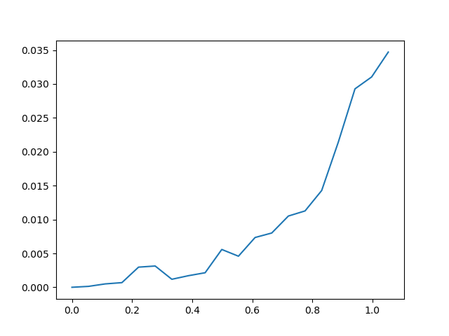

*2-Gromov-Wasserstein distances between the Mapper graph computed with $f_0$ and the Mapper graphs computed with $f_t$ with respect to $\Vert f_0-f_t\Vert_{\infty}$.*

### Change of measure

In this section, we illustrate the effect of varying the underlying probability measures, by computing Mapper graphs on point clouds sampled from a torus $\mathbb{T}^2$ with different probability measures. The torus $\mathbb{T}^2$ is a two dimensional manifold that can be parametrized with two angles $(\theta,\phi)\in[0,2\pi]^2$ and can be embedded in $\mathbb{R}^3$ with

$$
\begin{aligned}
h\colon[0,2\pi]^2&\longrightarrow\mathbb{R}^3\\
(\theta,\phi)&\longmapsto((a+b\cos(\theta))\cos(\phi),(a+b\cos(\theta))\sin(\phi),b\sin(\theta))
\end{aligned}
$$

where $a,b>0$ are two radius parameters. We use the height function $f$ as filter, which is given by the projection of $h$ over its first coordinate, i.e., $f\colon(\theta,\phi)\mapsto(a+b\cos(\theta))\cos(\phi)$. It can easily be checked that $f$ is a Morse function, by differentiating twice over $\theta$ and $\phi$. Moreover, the Riemannian metric $\mathrm{g}$ induced by the torus embedding in $\mathbb{R}^3$, is given at any point $(\theta,\phi)$ by the positive definite matrix

$$
\mathrm{G}(p)=\begin{pmatrix}
b^2 & 0 \\
0 & (a+b\cos(\theta))^2
\end{pmatrix}.
$$

We will consider several probability measures $\mathrm{m}_{p,q}$ on $\mathbb{T}^2$ that are parametrized by two values $0<p,q<1$, that give the proportion of points sampled in the region $\phi\in[5\pi/6,7\pi/6]$, and the proportion in the region $\phi\in[0,\pi/6]\cup[11\pi/6,2\pi]$, respectively. More explicitly, we define

$$
d\mathrm{m}_{p,q}(\theta,\phi)=\frac{u_{p,q}(\phi)(a+b\cos(\theta))d\theta d\phi}{2\pi a},
$$

where

$$
u_{p,q}(\phi)=p\frac{3}{\pi}\mathbb{1}_{[5\pi/6,7\pi/6]}(\phi)+q\frac{3}{\pi}\mathbb{1}_{[0,\pi/6]\cup[11\pi/6,2\pi]}(\phi)+(1-p-q)\frac{3}{4\pi}\mathbb{1}_{[\pi/6,5\pi/6]\cup[7\pi/6,11\pi/6]}(\phi).
$$

Notice that the special case $p=q=1/6$ corresponds to the normalized volume measure on $\mathbb{T}^2$. We fix $a=0.75$ and $b=0.25$, and we pick values for $p$ and $q$ in the $3\times 3$ grid $[1/9,1/6,1/3]^2$, resulting in nine different probability measures. Then, we sample $n_{p,q}=2\cdot10^5$ points from each probability measure $\mathrm{m}_{p,q}$, and construct the corresponding Mapper graphs $\{{\mathbb{M}_n}_{p,q}\}_{p,q}$ using resolution $r=30$ and gain $g=0.3$ for all $(p,q)$ pairs. See Figure 9 for an example of three of these samples, and Figure 10 for the corresponding Mapper graphs.

First, remark that the Mapper graphs $\{{\mathbb{M}_n}_{p,q}\}_{p,q}$ are all identical as (combinatorial) simplicial complexes. However, as they are different as metric measure spaces, when considering the $2$-Gromov-Wasserstein distances $\hat{\mathrm{GW}_2}$ between these metric measure spaces $\{({\mathbb{M}_n}_{p,q},{\mathrm {d_H}},\mathrm{m}_{p,q}\circ\Delta\!\!\!\!\Delta^{-1})\}_{p,q}$, we  obtain a $9\times 9$ distance matrix with nonzero entries. In order to visualize it, we perform multi-dimensional scaling (MDS) to visualize this distance matrix as a 2-dimensional point cloud in Figure 11. The correspondence between the point labels in Figure 11 and the corresponding $(p,q)$ parameters is given in Table 1. In Figure 11, we can see three pairs of points, namely $(b,d)$, $(c,g)$ and $(f,h)$, that are close in the MDS representation, illustrating the fact that each of these pairs corresponds to two symmetric parameter pairs $(p,q)$ that induce two symmetrical underlying probability measures on $\mathbb{T}^2$ with respect to the vertical axis. One can also see that the points labeled $a$ and $i$, which correspond to those two measures that assign the least and the most mass in the two regions of the torus, respectively, are the ones that are the farthest away from the remaining points, indicating that the corresponding Mapper graphs computed using these two measures are the most different from the others.

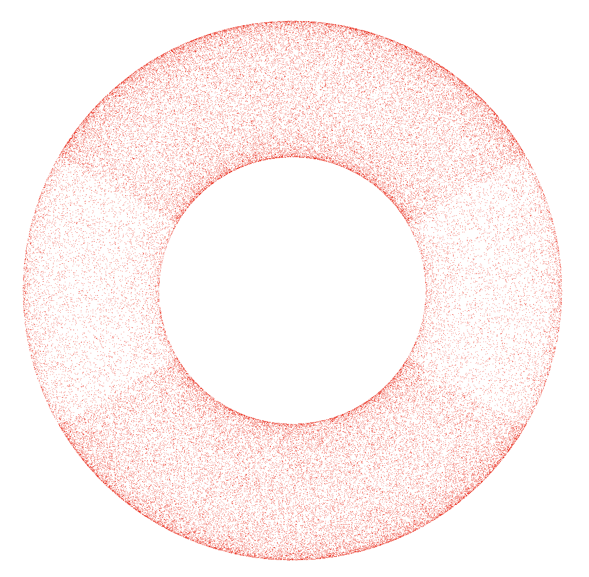

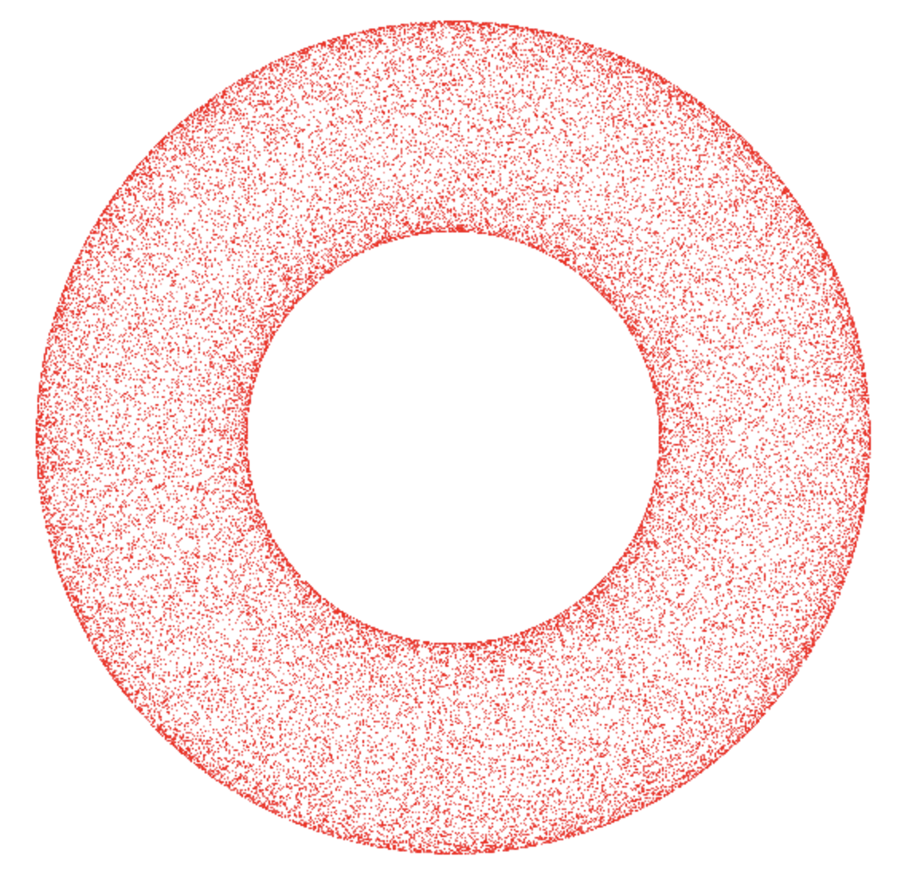

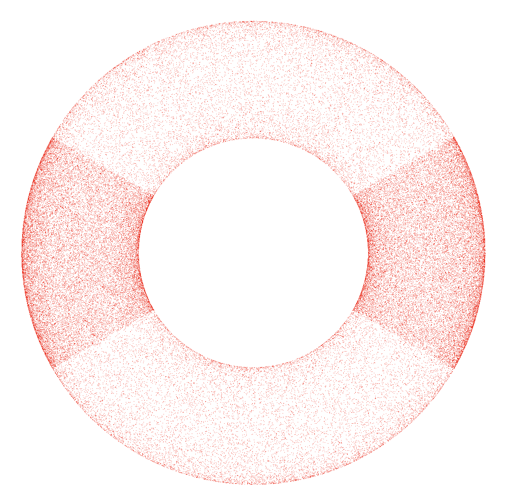

*Point clouds sampled from $\mathrm{m}_{p,q}$ for different values of $p$ and $q$. Left: $p=q=1/12$. Middle: $p=q=1/6$ (uniform measure). Right: $p=q=1/3$.*

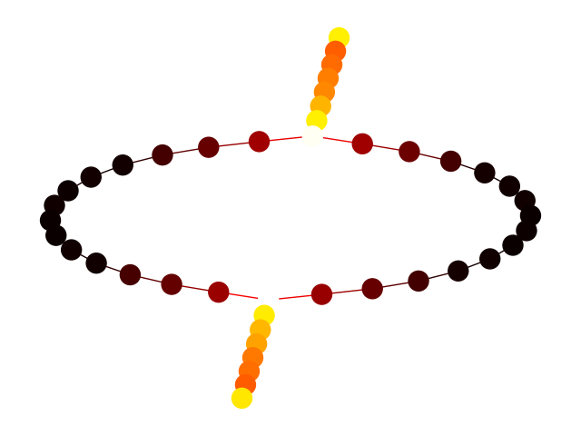

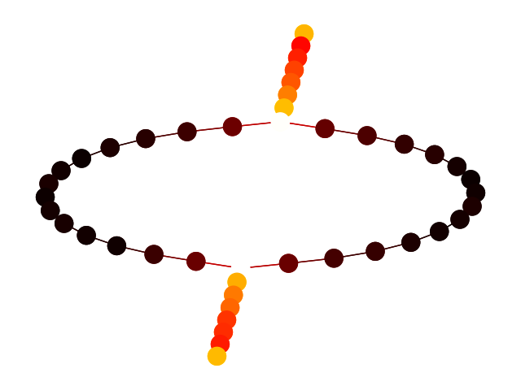

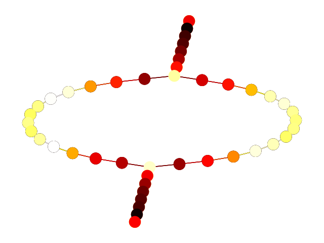

*Mapper graphs computed on the samples shown in Figure 9. Vertices and edges are colored using their associated masses. Left: $p=q=1/12$. Middle: $p=q=1/6$ (uniform measure). Right: $p=q=1/3$.*

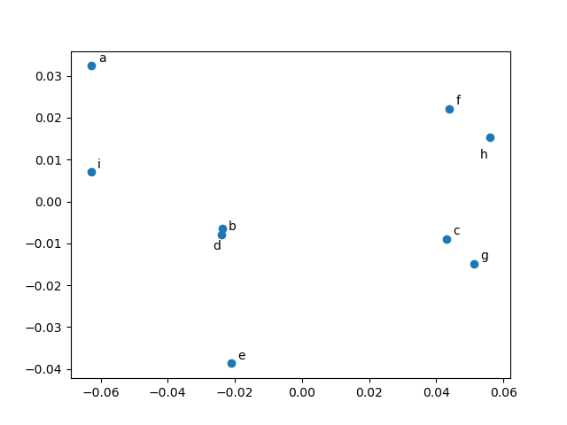

*MDS visualization of the Gromov-Wasserstein distance matrix between the different Mapper graphs.*

| Label | p | q |
| --- | --- | --- |
| a | 1/12 | 1/12 |
| b | 1/12 | 1/6 |
| c | 1/12 | 1/3 |
| d | 1/6 | 1/12 |
| e | 1/6 | 1/6 |
| f | 1/6 | 1/3 |
| g | 1/3 | 1/12 |
| h | 1/3 | 1/6 |
| i | 1/3 | 1/3 |

*Correspondence between the labels of Figure 11 and the parameters of $\mathrm{m}_{p,q}$.*

## Acknowledgements

The authors would like to thank Gilles Carron and Stéphane Guillermou for their helpful insight and valuable discussions.\\ The research was supported by two grants from Agence Nationale de la Recherche: ANR JCJC TopModel ANR-23-CE23-0014 and ANR GeoDSIC ANR-22-CE40-0007. M.C. was also supported by the French government, through the 3IA Cote d’Azur Investments in the project managed by the National Research Agency (ANR) with the reference number ANR-23-IACL-0001.

\appendix

## Proofs for Section 2

### Proof of Proposition 1

Denoting $w=(dx_1(v),...,dx_d(v))$, we have:

$$
\mathrm{g}(v,v)=w^T\cdot \mathrm{G}(p)\cdot w,
$$

and

$$
\mathrm{g}_0(v,v)=w^T\cdot w,
$$

where $\mathrm{G}(p):=\left[\mathrm{g}_{i,j}\right]_{i,j}$ is the symmetric positive-definite matrix given by $\mathrm{g}_{i,j}=\mathrm{g}(\partial_{i_{|p}},\partial_{j_{|p}})$.\\

Hence,

$$
\lambda(p)\cdot \sqrt{\mathrm{g}_0(v,v)}\leq \sqrt{\mathrm{g}(v,v)}\leq \mu(p)\cdot \sqrt{\mathrm{g}_0(v,v)}
$$

### Proof of Proposition 2

Let $p\in\mathrm{M}$ and let $U$ be a coordinate neighborhood of $p$. Up to shrinking $U$, we can assume that:

$$
U=\{q\in\mathrm{M}\, ,\, \mathrm{d}_0(p,q)\leq\varepsilon\},
$$

for a given, small enough $\varepsilon>0$, and where $\mathrm{d}_0$ is the distance associated to the metric $\mathrm{g}_0$, given by

$$
\mathrm{d}_0(p,q)=\sqrt{x_1(q)^2+\dots+x_d(q)^2},
$$

where $q$ is given in local coordinates by $x(q)=(x_1(q),...,x_d(q))$.

From Proposition 1, there exist continuous functions $\lambda,\mu\colon U\rightarrow(0,\infty)$ such that for every $q\in U$ and $v\in\mathrm{T}_q\mathrm{M}$, one has

$$
\lambda(q)\cdot \sqrt{\mathrm{g}_0(v,v)}\leq \sqrt{\mathrm{g}(v,v)}\leq \mu(q)\cdot \sqrt{\mathrm{g}_0(v,v)}.
$$

Furthermore, $\lambda(q),\mu(q)\rightarrow \lambda(p),\mu(p)$ as $q\rightarrow p$ because $\lambda$ and $\mu$ are continuous.

Now, let $\gamma\colon[0,1]\rightarrow\mathrm{M}$ be a piecewise-$C^{\infty}$ curve such that $\gamma(0)=p$ and $\gamma(1)=q\in U$.

- If $\gamma$ is a segment for $\mathrm{d}_0$, then it lies in $U$ (as $\mathrm{d}_0(p,q)\leq\varepsilon$). We also have:

$$
\begin{aligned}
\mathrm{d}_0(p,q)&=\int_0^1\sqrt{\mathrm{g}_0\left(\frac{d\gamma(t)}{dt},\frac{d\gamma(t)}{dt}\right)}\, dt\\
&\geq \frac{1}{\sup_{t\in[0,1]}\ \mu(\gamma(t))}\int_0^1\sqrt{\mathrm{g}\left(\frac{d\gamma(t)}{dt},\frac{d\gamma(t)}{dt}\right)}\, dt\\
&=\frac{\mathrm{length}(\gamma)}{\sup_{t\in[0,1]}\ \mu(\gamma(t))}\\
&\geq \frac{\mathrm{d}(p,q)}{\sup_{t\in[0,1]}\ \mu(\gamma(t))}.
\end{aligned}
$$

- If $\gamma$ lies inside $U$, then:

$$
\begin{aligned}
\mathrm{length}(\gamma)&=\int_0^1\sqrt{\mathrm{g}\left(\frac{d\gamma(t)}{dt},\frac{d\gamma(t)}{dt}\right)}\, dt\\
&\geq \inf_{t\in[0,1]}\ \lambda(\gamma(t)) \cdot \int_0^1\sqrt{\mathrm{g}_0\left(\frac{d\gamma(t)}{dt},\frac{d\gamma(t)}{dt}\right)}\, dt\\
&\geq \inf_{t\in[0,1]}\ \lambda(\gamma(t))\cdot\mathrm{d}_0(p,q)
\end{aligned}
$$

- If $\gamma$ leaves $U$, then there exists a smallest $t_0$ such that $\gamma(t_0)\notin U$. We have:

$$
\begin{aligned}
\mathrm{length}(\gamma)&\geq\int_0^{t_0}\sqrt{\mathrm{g}\left(\frac{d\gamma(t)}{dt},\frac{d\gamma(t)}{dt}\right)}\, dt\\
&\geq \inf_{t\in[0,1]}\ \lambda(\gamma(t))\cdot\int_0^{t_0}\sqrt{\mathrm{g}_0\left(\frac{d\gamma(t)}{dt},\frac{d\gamma(t)}{dt}\right)}\, dt\\
&\geq \inf_{t\in[0,1]}\ \lambda(\gamma(t))\cdot\varepsilon\\
&\geq \inf_{t\in[0,1]}\ \lambda(\gamma(t))\cdot\mathrm{d}_0(p,q)
\end{aligned}
$$

Like mentioned above, $\lambda(q),\mu(q)\rightarrow \lambda(p),\mu(p)$ as $q\rightarrow p$, therefore (and by shrinking $U$ again if necessary) we can ensure that $\lambda_0=\inf_{r\in U}\lambda(r)>0$ and that $\mu_0=\sup_{r\in U}\mu(r)<\infty$.

We have proved that for every $q\in U$, one has

$$
\lambda_0\cdot\mathrm{d}_0(p,q)\leq \mathrm{d}(p,q)\leq\mu_0\cdot\mathrm{d}_0(p,q),
$$

and we finally see that, as $q\rightarrow p$:

$$
\lambda_0,\mu_0\rightarrow \lambda(p),\mu(p).
$$

### Proof of Proposition 3

Let us consider a chart $\varphi\colon U\rightarrow\mathbb{R}^d$ around $p$ such that $\varphi(p)=(0,...,0)$ and

$$
\mathrm{g}(\partial_{i_{|p}},\partial_{j_{|p}})=
\begin{cases}
1, \text{ if } i=j\\
0, \text{ otherwise}
\end{cases}
$$

so as to have $\mathrm{g}_p=\mathrm{g}_0$, where $\mathrm{g}_0$ is the Euclidean metric in local coordinates.

For a small enough $\varepsilon>0$ and by Proposition 2, we know that

$$
{\mathrm {B}}_0(p,\varepsilon/\mu_0)\subseteq{\mathrm {B}}(p,\varepsilon)\subseteq {\mathrm {B}}_0(p,\varepsilon/\lambda_0)\subseteq U,
$$

for $\lambda_0,\mu_0>0$, where ${\mathrm {B}}_0(p,\cdot)$ stands for the Euclidean ball using the distance $\mathrm{d}_0$ in local coordinates.

As such,

$$
\mathrm{Vol}\left({\mathrm {B}}_0(p,\varepsilon/\mu_0)\right)\leq \mathrm{Vol}\left({\mathrm {B}}(p,\varepsilon)\right)\leq \mathrm{Vol}\left({\mathrm {B}}_0(p,\varepsilon/\lambda_0)\right).
$$

Furthermore, $\lambda_0,\mu_0\rightarrow 1$ as $\varepsilon\rightarrow 0$ because $\mathrm{g}_p=\mathrm{g}_0$.\\ Denote

$$
c=\inf\{\mathrm{det}(\mathrm{G}(q)),q\in{\mathrm {B}}_0(p,\varepsilon/\mu_0)\},
$$

$$
C=\sup\{\mathrm{det}(\mathrm{G}(q)),q\in{\mathrm {B}}_0(p,\varepsilon/\lambda_0)\},
$$

where $\mathrm{G}=\left[\mathrm{g}(\partial_i,\partial_j)\right]_{i,j}$. Since $\mathrm{det}(\mathrm{G}(p))=1$ (as $\mathrm{g}_p=\mathrm{g}_0$) and $\mathrm{G}$ is smooth, we have $c,C\rightarrow 1$ as $\varepsilon\rightarrow 0$.

Now, denoting the Lebesgue measure in $\mathbb{R}^d$ as $l$, we have

- One one hand:

$$
\begin{aligned}
\mathrm{Vol}\left({\mathrm {B}}_0(p,\varepsilon/\mu_0)\right)&=\int_{\{x\in\mathbb{R}^d,\,\Vert x\Vert\leq \varepsilon/\mu_0\}}\sqrt{\mathrm{det}(\mathrm{G})}\circ\varphi^{-1}\,dl\\
&\geq \sqrt{c}\int_{\{x\in\mathbb{R}^d,\,\Vert x\Vert\leq \varepsilon/\mu_0\}}\,dl\\
&\geq \sqrt{c}\cdot\alpha_d\cdot \left(\frac{\varepsilon}{\mu_0}\right)^d
\end{aligned}
$$

- On the other hand:

$$
\begin{aligned}
\mathrm{Vol}\left({\mathrm {B}}_0(p,\varepsilon/\lambda_0)\right)&=\int_{\{x\in\mathbb{R}^d,\,\Vert x\Vert\leq \varepsilon/\lambda_0\}}\sqrt{\mathrm{det}(\mathrm{G})}\circ\varphi^{-1}\,dl\\
&\leq \sqrt{C}\int_{\{x\in\mathbb{R}^d,\,\Vert x\Vert\leq \varepsilon/\lambda_0\}}\,dl\\
&\leq \sqrt{C}\cdot \alpha_d\cdot \left(\frac{\varepsilon}{\lambda_0}\right)^d
\end{aligned}
$$

As such,

$$
\mathrm{Vol}\left({\mathrm {B}}(p,\varepsilon)\right)\underset{\varepsilon\rightarrow 0}{\sim} \alpha_d\cdot\varepsilon^d
$$

### Proof of Proposition 5

The coordinate vector fields are a basis of the tangent spaces $\mathrm{T}_p\mathrm{M}$ for all $p\in U$. As such, in $U$, the gradient $\nabla f$ can be expressed as a linear combination:

$$
\nabla f=\sum_{i=1}^d a_i\cdot\partial_i.
$$

Now, we know that for all $i$:

$$
\mathrm{g}\left(\nabla f,\partial_i\right)=df(\partial_i)=\frac{\partial f}{\partial x_i},
$$

and as such

$$
\sum_{j=1}^d a_j\cdot \mathrm{g}\left(\partial_j,\partial_i\right)=\frac{\partial f}{\partial x_i}.
$$

This gives

$$
(a_1,...,a_d)\cdot\left[\mathrm{g}(\partial_i,\partial_j)\right]_{i,j}=\left(\frac{\partial f}{\partial x_1},...,\frac{\partial f}{\partial x_d}\right),
$$

and

$$
(a_1,...,a_d)=\left(\frac{\partial f}{\partial x_1},...,\frac{\partial f}{\partial x_d}\right)\cdot\left[\mathrm{g}(\partial_i,\partial_j)\right]_{i,j}^{-1}.
$$

Furthermore,

$$
\begin{aligned}
g\left(\nabla f,\nabla f\right)&=(a_1,...,a_d)\cdot\left[\mathrm{g}(\partial_i,\partial_j)\right]_{i,j}\cdot(a_1,...,a_d)^T\\
&=\left(\frac{\partial f}{\partial x_1},...,\frac{\partial f}{\partial x_d}\right)\cdot\left[\mathrm{g}(\partial_i,\partial_j)\right]_{i,j}^{-1}\cdot\left[\mathrm{g}(\partial_i,\partial_j)\right]_{i,j}\cdot \left[\mathrm{g}(\partial_i,\partial_j)\right]_{i,j}^{-1}\cdot \left(\frac{\partial f}{\partial x_1},...,\frac{\partial f}{\partial x_d}\right)^T\\
&=\left(\frac{\partial f}{\partial x_1},...,\frac{\partial f}{\partial x_d}\right)\cdot \left[\mathrm{g}(\partial_i,\partial_j)\right]_{i,j}^{-1}\cdot \left(\frac{\partial f}{\partial x_1},...,\frac{\partial f}{\partial x_d}\right)^T.
\end{aligned}
$$

As such,

$$
\frac{1}{\mu(p)}\cdot \sqrt{\sum_{i=1}^d\frac{\partial f(p)}{\partial x_i}^2}\leq \sqrt{\mathrm{g}\left(\nabla f(p),\nabla f(p)\right)}\leq \frac{1}{\lambda(p)}\cdot \sqrt{\sum_{i=1}^d\frac{\partial f(p)}{\partial x_i}^2}.
$$

\printbibliography

## References

1. Aamari, Eddie; Kim, Jisu; Chazal, Frédéric; Michel, Bertrand; Rinaldo, Alessandro; Wasserman, Larry. Estimating the Reach of a Manifold. Electronic Journal of Statistics, 2019.
2. Arias-Castro, Ery; Chen, Guangliang; Lerman, Gilad. Spectral clustering based on local linear approximations. Electronic Journal of Statistics, 2011.
3. Brüel-Gabrielsson, Rickard; Carlsson, Gunnar. Exposition and interpretation of the topology of neural networks. CoRR, 2018.
4. Bürgisser, Peter; Cucker, Felipe; Lairez, Pierre. Computing the homology of basic semialgebraic sets in weak exponential time. Journal of the ACM (JACM), 2018.
5. Bauer, Ulrich; Fabio, Barbara Di; Landi, Claudia. An Edit Distance for Reeb Graphs. Eurographics Workshop on 3D Object Retrieval (3DOR 2016), 2016.
6. Boissard, Emmanuel; Gouic, Thibaut Le. On the mean speed of convergence of empirical and occupation measures in Wasserstein distance. Annales de l'Institut Henri Poincaré, Probabilités et Statistiques, 2014.
7. Bauer, Ulrich; Ge, Xiaoyin; Wang, Yusu. Measuring Distance between Reeb Graphs. Proceedings of the 30th Annual Symposium on Computational Geometry (SoCG 2014), 2014.
8. Bauer, Ulrich; Landi, Claudia; Mémoli, Facundo. The Reeb Graph Edit Distance is Universal. Foundations of Computational Mathematics (FoCM), 2021.
9. Boothby, William M. An introduction to differentiable manifolds and Riemannian geometry. 1986.
10. Brown, Adam; Bobrowski, Omer; Munch, Elizabeth; Wang, Bei. Probabilistic convergence and stability of random mapper graphs. Journal of Applied and Computational Topology, 2021.
11. Chazal, Frédéric; Glisse, Marc; Labruère, Catherine; Michel, Bertrand. Convergence rates for persistence diagram estimation in topological data analysis. International Conference on Machine Learning, 2014.
12. Carrière, Mathieu; Michel, Bertrand. Statistical analysis of Mapper for stochastic and multivariate filters. Journal of Applied and Computational Topology, 2022.
13. Carriere, Mathieu; Michel, Bertrand; Oudot, Steve. Statistical analysis and parameter selection for mapper. Journal of Machine Learning Research, 2018.
14. Carriere, Mathieu; Oudot, Steve. Structure and stability of the one-dimensional mapper. Foundations of Computational Mathematics, 2018.
15. Cuevas, Antonio. Set estimation: Another bridge between statistics and geometry. Bol. Estad. Investig. Oper, 2009.
16. De Silva, Vin; Munch, Elizabeth; Patel, Amit. Categorified reeb graphs. Discrete & Computational Geometry, 2016.
17. Flamary, Rémi; Courty, Nicolas; Gramfort, Alexandre; Alaya, Mokhtar Z.; Boisbunon, Aurélie; Chambon, Stanislas et al.. POT: Python Optimal Transport. Journal of Machine Learning Research, 2021.
18. Henrikson, Jeff. Completeness and total boundedness of the Hausdorff metric. MIT Undergraduate Journal of Mathematics, 1999.
19. Han, Yanjun; Rigollet, Philippe; Stepaniants, George. Covariance alignment: from maximum likelihood estimation to Gromov-Wasserstein. arXiv preprint arXiv:2311.13595, 2023.
20. Joseph, Brian B; Pham, Trami; Hastings, Christopher. Topological Data Analysis in Conjunction with Traditional Machine Learning Techniques to Predict Future MDAP PM Ratings. 2021.
21. Koehl, Patrice; Delarue, Marc; Orland, Henri. Computing the Gromov-Wasserstein distance between two surface meshes using optimal transport. Algorithms, 2023.
22. Mémoli, Facundo. Spectral Gromov-Wasserstein distances for shape matching. 2009 IEEE 12th International Conference on Computer Vision Workshops, ICCV Workshops, 2009.
23. Mémoli, Facundo. Gromov–Wasserstein distances and the metric approach to object matching. Foundations of computational mathematics, 2011.
24. Milnor, John Willard. Morse theory. 1963.
25. Mitra, Satanik; Rao JV, Kameshwar. Experiments on Fraud Detection use case with QML and TDA Mapper. 2021 IEEE International Conference on Quantum Computing and Engineering (QCE), 2021.
26. Munch, Elizabeth; Wang, Bei. Convergence between Categorical Representations of Reeb Space and Mapper. 32nd International Symposium on Computational Geometry (SoCG 2016), 2016.
27. Naitzat, Gregory; Lokare, Namita; Silva, Jorge; Kaynar-Kabul, Ilknur. M-Boost: profiling and refining deep neural networks with topological data analysis. KDD Workshop on Interactive Data Exploration and Analytics, 2018.
28. Niyogi, Partha; Smale, Stephen; Weinberger, Shmuel. Finding the homology of submanifolds with high confidence from random samples. Discrete & Computational Geometry, 2008.
29. Oulhaj, Ziyad. Mapper Gromov-Wasserstein distance examples.
30. Petersen, P. Riemannian geometry. Graduate Texts in Mathematics/Springer-Verlarg, 2006.
31. Rioux, Gabriel; Goldfeld, Ziv; Kato, Kengo. Limit Laws for Gromov-Wasserstein Alignment with Applications to Testing Graph Isomorphisms. arXiv preprint arXiv:2410.18006, 2024.
32. Ruscitti, Kaleb D; McInnes, Leland. Improving Mapper's Robustness by Varying Resolution According to Lens-Space Density. arXiv preprint arXiv:2410.03862, 2024.
33. Rosen, Paul; Hajij, Mustafa; Tu, Junyi; Arafin, Tanvirul; Piegl, Les. Inferring quality in point cloud-based 3D printed objects using topological data analysis. arXiv preprint arXiv:1807.02921, 2018.
34. Sakai, Takashi. Riemannian geometry. 1996.
35. Singh, Gurjeet; Mémoli, Facundo; Carlsson, Gunnar E. Topological methods for the analysis of high dimensional data sets and 3d object recognition.. PBG@ Eurographics, 2007.
36. Sturm, Karl-Theodor. On the geometry of metric measure spaces. Acta Mathematica, 2006.
37. Wang, Tongxin; Johnson, Travis; Zhang, Jie; Huang, Kun. Topological methods for visualization and analysis of high dimensional single-cell RNA sequencing data. BIOCOMPUTING 2019: Proceedings of the Pacific Symposium, 2018.
38. Wang, Qingsong; Ma, Guanqun; Sridharamurthy, Raghavendra; Wang, Bei. Measure-Theoretic Reeb Graphs and Reeb Spaces. 40th International Symposium on Computational Geometry (SoCG 2024), 2024.
39. Wang, Ziqi. Exploration of Topological Data Analysis In 3D Printing. 2020 International Conference on Information Science, Parallel and Distributed Systems (ISPDS), 2020.
40. Weed, Jonathan; Bach, Francis. Sharp asymptotic and finite-sample rates of convergence of empirical measures in Wasserstein distance. Bernoulli, 2019.
41. Xu, Hongteng; Luo, Dixin; Carin, Lawrence. Scalable Gromov-Wasserstein learning for graph partitioning and matching. Advances in neural information processing systems, 2019.
42. Xu, Hongteng; Luo, Dixin; Zha, Hongyuan; Duke, Lawrence Carin. Gromov-wasserstein learning for graph matching and node embedding. International conference on machine learning, 2019.
43. Zechel, Sabrina; Zajac, Pawel; Lönnerberg, Peter; Ibáñez, Carlos F; Linnarsson, Sten. Topographical transcriptome mapping of the mouse medial ganglionic eminence by spatially resolved RNA-seq. Genome biology, 2014.
44. Zhang, Zhengxin; Goldfeld, Ziv; Mroueh, Youssef; Sriperumbudur, Bharath. Duality and Sample Complexity for the Gromov-Wasserstein Distance. NeurIPS 2023 Workshop Optimal Transport and Machine Learning, 2023.
45. Zhang, Zhengxin; Goldfeld, Ziv; Mroueh, Youssef; Sriperumbudur, Bharath K. Gromov–Wasserstein distances: Entropic regularization, duality and sample complexity. The Annals of Statistics, 2024.
