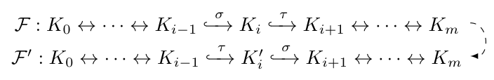
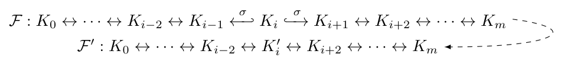
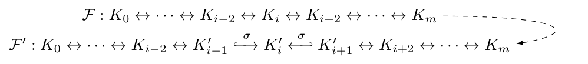
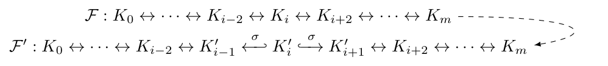
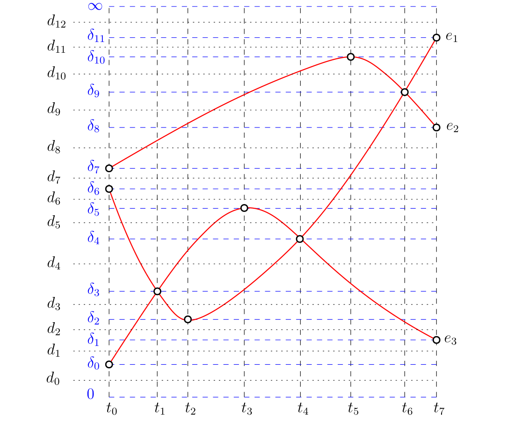
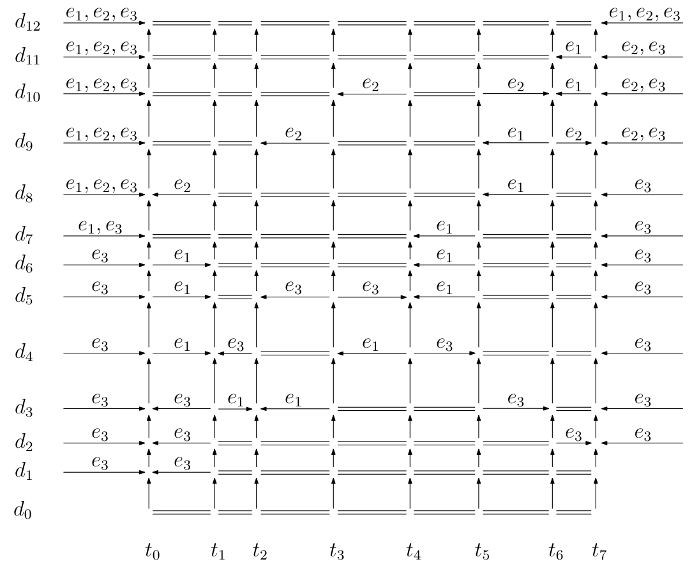
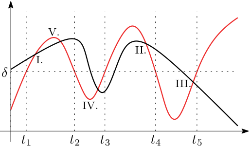
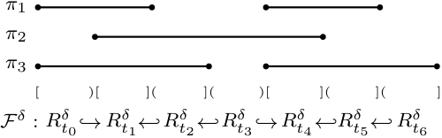
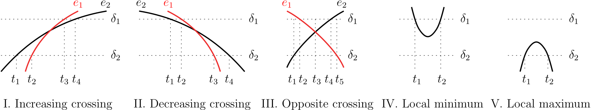
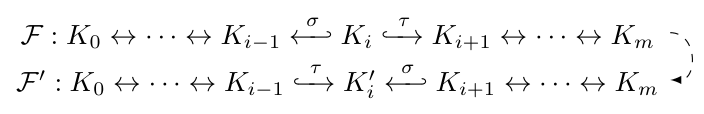

# Updating Barcodes and Representatives for Zigzag Persistence

\date{}

\thispagestyle{empty}

## Abstract

Computing persistence over changing filtrations give rise to a stack of 2D persistence diagrams where the birth-death points are connected by the so-called 'vines' [6]. We consider computing these vines over changing filtrations for zigzag persistence. We observe that eight atomic operations are sufficient for changing one zigzag filtration to another and provide update algorithms for each of them. Six of these operations that have some analogues to one or multiple *transpositions* in the non-zigzag case can be executed as efficiently as their non-zigzag counterparts. This approach takes advantage of a recently discovered algorithm for computing zigzag barcodes [8] by converting a zigzag filtration to a non-zigzag one and then connecting barcodes of the two with a bijection. The remaining two atomic operations do not have a strict analogue in the non-zigzag case. For them, we propose algorithms based on explicit maintenance of representatives (homology cycles) which can be useful in their own rights for applications requiring explicit updates of representatives.

## Introduction

Computation of the persistence diagram (PD) from a given filtration has turned out to be a central task in topological data analysis. Such a filtration usually represents a nested sequence of sublevel sets of a function. In scenarios where the function changes, the filtration and hence the PD may also change. The authors in [6] provided an efficient algorithm for updating the PD over an atomic operation which *transposes* two consecutive simplex additions in the filtration. Using this atomic operation repeatedly, one can connect a series of filtrations obtained from a time-varying function with the so-called structure of *vineyard*. The authors [6] showed that the update in PD due to the atomic transposition can be computed in $O(n)$ time if $n$ simplices constitute the filtration. In this paper, we extend this result to zigzag filtrations. Specifically, we identify *eight atomic operations* necessary for any zigzag filtration to transform to any other, including four that are analogues of transpositions in the non-zigzag case.

Compared to the non-zigzag case, computing the PD (also called the barcode) from a zigzag filtration is itself more complicated. This complication naturally carries over to the task of updating PDs for changing zigzag filtrations. One main difficulty stems from the fact that, unlike in the non-zigzag case, it seemed necessary to pay extra cost in bookkeeping *representatives* for the bars while computing zigzag barcodes. The known algorithms by Maria and Oudot [16, 17] (see also [18]), Carlsson et al. [4], and Milosavljevi{ć} et al. [19] for computing zigzag persistence implicitly or explicitly maintain these representatives. Naturally, any attempt to adapt these algorithms to changing filtrations faces the difficulty of updating the representatives efficiently over the atomic operations. It is by no means obvious how to carry out these updates for representatives efficiently, let alone avoid them.

In this paper, we show that, out of the eight atomic operations, we can execute six without maintaining representatives explicitly by drawing upon some relations/analogies to the non-zigzag case. The two remaining operations whose non-zigzag analogues do not even exist need explicit maintenance of representatives due to change in adjacencies of the cells (see Section 4.3). For the first six operations, we take advantage of a recently discovered algorithm [8] for zigzag persistence that first converts a zigzag filtration to a non-zigzag one and then connects barcodes of the two with a bijection. As shown in [8], this algorithm called **FastZigzag** runs quite efficiently in practice because it avoids maintaining representatives altogether. We summarize our algorithmic results for the operations as follows (see also Table 1 in Section 3):

- Four of the eight operations are *switches* [2, 3, 4, 16, 17, 20] which are equivalents of transpositions [6] in the non-zigzag case. They take constant or linear time for updates by utilizing the **FastZigzag** algorithm.

- The other four operations entail '*expanding*' [16, 17] or '*contracting*' a zigzag filtration locally whose equivalents for non-zigzag filtrations have not been considered.

- Among them, two operations (the *inward* expansion and contraction) can be related to 'expanding' or 'contracting' a non-zigzag (standard) filtration by a simplex. One may execute such operations in the non-zigzag case by $O(n)$ transpositions incurring a cost of $O(n^2)$. (An 'expansion' on a non-zigzag filtration can be thought of as inserting a simplex $\sigma$ in the middle of the filtration. The update can be done via inserting $\sigma$ to the end of the filtration and then performing transpositions that bring $\sigma$ to the right position. A 'contraction' on a non-zigzag filtration has the reverse process.) For these two operations in the zigzag case, we can still take advantage of the **FastZigzag** algorithm to have a quadratic time complexity.

- The remaining two operations (the *outward* expansion and contraction) are the costliest which have no direct analogues in the non-zigzag case. The update algorithms for theses two operations require explicit maintenance of representatives and take cubic time, which seems not to be saving time compared to computing the barcodes from scratch [4, 8, 16, 17, 18]. However, an application may demand explicit maintenance of the representatives where computing barcodes from scratch does not help (see Appendix 7 for applications of the representative maintenance). Moreover, our experiment in Section 3.2 shows that computing barcodes by our representative-based update algorithms indeed takes less time in practice than computing them afresh for each filtration. Of course, maintaining representatives for one operation requires doing so for every operation. We thereby present an efficient algorithm for explicit maintenance of representatives for every atomic operation.

In a nutshell, if an application requires only a subset of the first six operations, barcodes can be updated as efficiently as in the non-zigzag case. However, if an application requires explicit maintenance of representatives over the operations, or if it requires the last two operations, we pay an extra price.

To motivate our work, we mention in Appendix 7 some potential applications of the update operations/algorithms presented in this paper to dynamic point clouds and multiparameter (zigzag) persistence.

## Preliminaries

A *zigzag filtration* (or simply *filtration*) is a sequence of simplicial complexes

$$
\mathcal{F}: K_0 \leftrightarrow K_1 \leftrightarrow
\cdots \leftrightarrow K_m,
$$

in which each $K_i\leftrightarrow K_{i+1}$ is either a forward inclusion $K_i\hookrightarrow K_{i+1}$ or a backward inclusion $K_i\hookleftarrow K_{i+1}$. Taking the $p$-th homology $\mathsf{H}_p$, we derive a *zigzag module*

$$
\mathsf{H}_p(\mathcal{F}):
\mathsf{H}_p(K_0)
\leftrightarrow
\mathsf{H}_p(K_1)
\leftrightarrow
\cdots
\leftrightarrow
\mathsf{H}_p(K_m),
$$

in which each $\mathsf{H}_p(K_i)\leftrightarrow \mathsf{H}_p(K_{i+1})$ is a linear map induced by inclusion. In this paper, we take the coefficient $\mathbb{Z}_2$ for $\mathsf{H}_p$ and thereby treat chains in the chain group (denoted $\mathsf{C}_p$) and cycles in the cycle group (denoted $\mathsf{Z}_p$) as sets of simplices. The zigzag module $\mathsf{H}_p(\mathcal{F})$ has a decomposition [2, 12] of the form $\mathsf{H}_p(\mathcal{F})\simeq\bigoplus_{k\in\Lambda}\mathcal{I}^{[b_k,d_k]}$, in which each $\mathcal{I}^{[b_k,d_k]}$ is an *interval module* over the interval $[b_k,d_k]\subseteq\{0,\ldots,m\}$. The (multi-)set of intervals $\mathsf{Pers}_p(\mathcal{F}):=\{[b_k,d_k]\,|\, k\in\Lambda\}$ is an invariant of $\mathsf{H}_p(\mathcal{F})$ and is called the $p$-th *zigzag barcode* (or simply *barcode*) of $\mathcal{F}$. Each interval in $\mathsf{Pers}_p(\mathcal{F})$ is called a $p$-th *persistence interval*. We usually consider the homology $\mathsf{H}_*$ in all dimensions and take the zigzag module $\mathsf{H}_*(\mathcal{F})$, for which we have $\mathsf{Pers}_*(\mathcal{F})=\bigsqcup_{p\geq 0}\mathsf{Pers}_p(\mathcal{F})$. In this paper, sometimes a filtration may have nonconsecutive indices on the complexes (i.e., some indices are skipped); notice that the barcode is still well-defined.

An inclusion in a filtration is called *simplex-wise* if it is an addition or deletion of a single simplex $\sigma$, which we sometimes denote as, e.g., $K_i\xleftrightarrow{\;\sigma\;}K_{i+1}$. A filtration is called *simplex-wise* if it contains only simplex-wise inclusions. For computational purposes, we especially focus on simplex-wise filtrations starting and ending with *empty* complexes; notice that any filtration can be converted into this form by expanding the inclusions and attaching complexes to both ends.

Now let $\mathcal{F}$ in Equation (1) be a simplex-wise filtration starting and ending with empty complexes. Then, each map $\mathsf{H}_*(K_i)\leftrightarrow \mathsf{H}_*(K_{i+1})$ in $\mathsf{H}_*(\mathcal{F})$ is either (i) injective with a one-dimensional cokernel or (ii) surjective with a one-dimensional kernel. The inclusion $K_i\leftrightarrow K_{i+1}$ provides a *birth* index $i+1$ (start of a persistence interval) if $\mathsf{H}_*(K_i)\rightarrow \mathsf{H}_*(K_{i+1})$ is forward and injective, or $\mathsf{H}_*(K_i)\leftarrow \mathsf{H}_*(K_{i+1})$ is backward and surjective. Symmetrically, the inclusion provides a *death* index $i$ (end of a persistence interval) if $\mathsf{H}_*(K_i)\rightarrow \mathsf{H}_*(K_{i+1})$ is forward and surjective, or $\mathsf{H}_*(K_i)\leftarrow \mathsf{H}_*(K_{i+1})$ is backward and injective. We denote the set of birth indices of $\mathcal{F}$ as $\mathsf{P}(\mathcal{F})$ and the set of death indices of $\mathcal{F}$ as $\mathsf{N}(\mathcal{F})$.

## Overview of main results

In this section, we detail all the update operations with an overview of the main results for their computation. The eight update operations (see Table 1) can be grouped into three types, i.e., switches, expansions, and contractions. A switch is an interchange of two consecutive additions or deletions; an expansion is an insertion of the addition and deletion of a simplex in the middle; a contraction is the reverse of an expansion. Time complexities of the update algorithms for these operations based on the two different approaches are listed in Table 1. In the table, we denote the approach based on converting a zigzag filtration into a non-zigzag one as `FZZ`-based (described in Section 4), and the approach based on maintaining full representatives for the intervals as `Rep`-based (described in Section 5). For each update operation, let the filtration before and after the update be denoted as $\mathcal{F}$ and $\mathcal{F}'$ respectively, which are both simplex-wise filtrations starting and ending with empty complexes. Then, $m$ in Table 1 is the max length of $\mathcal{F}$ and $\mathcal{F}'$, and $n$ is the number of simplices in the *total complex* $K$, which is the union of all complexes in $\mathcal{F}$ and $\mathcal{F}'$ (notice that $n\leq m$). As mentioned, `FZZ`-based approaches cannot be directly applied to outward expansion and contraction due to change of adjacency relations on the *$\Delta$-complex cells* (see Section 4.3). Hence, time complexities of `FZZ`-based approaches for these two operations are left blank in Table 1. In Section 3.2, we present experimental results on computing vines and vineyards for dynamic point clouds using the `Rep`-based update algorithms.

*Time complexities of update algorithms based on the two different approaches.*

|  | forward switch | backward switch | outward switch | inward switch |
| --- | --- | --- | --- | --- |
| `FZZ`-based | $O(m)$ | $O(m)$ | $O(1)$ | $O(1)$ |
| `Rep`-based | $O(mn)$ | $O(mn)$ | $O(n^2+m)$ | $O(m)$ |
|  | outward expansion | outward contraction | inward expansion | inward contraction |
| `FZZ`-based | -- | -- | $O(m^2)$ | $O(m^2)$ |
| `Rep`-based | $O(mn^2)$ | $O(mn^2)$ | $O(mn^2)$ | $O(mn^2)$ |

Notice that theorems describing the interval mapping for some operations in this section have already been given in previous works. Specifically, Maria and Oudot [16, 17] presented a theorem on the forward/backward switches (Transposition Diamond Principle [16]). Carlsson and de Silva [2] presented a theorem on the inward/outward switches (Mayer-Vietoris Diamond Principle [2, 3, 4]). Maria and Oudot [16, 17] presented a theorem on the inward expansion (Injective/Surjective Diamond Principle [16]). However, it was not clear how the mappings given by these theorems can be computed with efficient algorithms. We provide such algorithms in this paper.

Notice that outward expansion and inward/outward contractions have not been considered elsewhere before, and our algorithms in Section 5.2, 5.3, and Appendix 9.4 implicitly provide theorems on their interval mappings.

### Update operations

We now present all the update operations. At the end of the subsection, we also provide a universality property saying that every two zigzag filtrations can be connected by a sequence of the update operations.

\textbf{{Forward switch}} requires $\sigma\nsubseteq\tau$:

Notice that if $\sigma\subseteq\tau$, then adding $\tau$ to $K_{i-1}$ in $\mathcal{F}'$ does not produce a simplicial complex.

\textbf{{Backward switch}} is the symmetric version of forward switch, requiring $\tau\not\subseteq\sigma$:

\textbf{{Outward switch}} requires $\sigma\neq\tau$:

Notice that if $\sigma=\tau$, then we cannot delete $\tau$ from $K_{i-1}$ in $\mathcal{F}'$ because $\tau\not\in K_{i-1}$.

\textbf{{Inward switch}} is the reverse of outward switch, requiring $\sigma\neq\tau$:

\textbf{{Outward expansion}} requires $\sigma$ to be a simplex in $K_i$ without cofaces and $K'_{i-1}=K_{i}=K'_{i+1}$:

To clearly show the correspondence of complexes in $\mathcal{F}$ and $\mathcal{F}'$, indices for $\mathcal{F}$ are made nonconsecutive in which $i-1$ and $i+1$ are skipped.

\textbf{{Outward contraction}} is the reverse of outward expansion, requiring $K'_{i}=K_{i-1}=K_{i+1}$:

\textbf{{Inward expansion}} is similar to outward expansion with the difference that the two inserted arrows now pointing toward each other; it requires that $\sigma\not\in K_i$, boundary simplices of $\sigma$ be in $K_i$, and $K'_{i-1}=K_{i}=K'_{i+1}$:

\textbf{{Inward contraction}} is the reverse of inward expansion, requiring $K'_{i}=K_{i-1}=K_{i+1}$:

**Universality of the operations.** We present the following fact (proof in Appendix 8):

**Proposition 1.** Let $\mathcal{F}_1,\mathcal{F}_2$ be any two simplex-wise zigzag filtrations starting and ending with empty complexes. Then $\mathcal{F}_1$ can be transformed into $\mathcal{F}_2$ by a sequence of the update operations listed above.

### Timing results for an example application

We implement the representative-based update algorithms to compute vines and vineyards for dynamic point cloud (henceforth shortened as *DPC*) as described in Appendix 7. The source code is made public via: {\small<https://github.com/taohou01/zzup>}. To demonstrate the efficiency of the representative-based update algorithms, we compare their running time with that incurred by invoking a zigzag persistence algorithm from scratch on each filtration. For computing zigzag persistence from scratch, we use an implementation (<https://github.com/taohou01/fzz>) of the **FasZigzag** algorithm [8], which, according to the experiments in [8], gives the best running time for all inputs among the algorithms tested. For generating DPC datasets, we use an implementation (<https://github.com/Nikorasu/PyNBoids>) of the *Boids* [14, 22] model, which simulates the flocking behaviour of animals/objects such as birds. As listed in Table 2, two DPC datasets are generated, one with 10 boids (B) moving over 100 time units (TU) and another with 15 boids moving over 20 time units. For the Rips complexes changing over distance and time, we only consider simplices up to dimension 3. Table 2 also lists the numbers of different operations performed for the datasets and the maximum length (MLen) of all filtrations generated. From the table, we see that the accumulated computation time taken by our update algorithms ($\text{T}_\text{UP}$) is significantly less than that taken by invoking **FastZigzag** from scratch each time ($\text{T}_\text{FS}$).

*Test results on the two generated DPC datasets.*

| B | TU | {fw_sw} | {bw_sw} | {ow_sw} | {iw_con} | {ow_exp} | MLen | $\text{T}_\text{UP}$ | $\text{T}_\text{FS}$ |  |
| --- | --- | --- | --- | --- | --- | --- | --- | --- | --- | --- |
| 10 | 100 | 23230 | 23000 | 42809 | 1646 | 1271 | 1200 | 0.54s | 35.19s |  |
| 15 | 20 | 736675 | 1107417 | 3284767 | 11093 | 4918 | 13732 | 11m1s | >28h\tablefootnote{The program ran for more than 28 hours and did not finish.} |  |

\section{Update algorithms based on **FastZigzag**}

In this section, we provide algorithms for the update operations based on the **FastZigzag** algorithm [8]. We first briefly overview **FastZigzag** (see [8] for a detailed presentation), and then describe how we utilize the algorithm for updates with the help of the {transposition} operation proposed by Cohen-Steiner et al. [6]. In Section 4.3, we provide evidence for why the update algorithm for transpositions [6] cannot be applied on outward expansion and contraction.

\subsection{Overview of **FastZigzag** algorithm}

The **FastZigzag** algorithm builds filtrations on the so-called *$\Delta$-complexes* [13]. Building blocks of $\Delta$-complexes, called *cells* or *$\Delta$-cells*, are combinatorial equivalents of simplices (each $p$-cell is formed by $p+1$ vertices and has $p+1$ number of $(p-1)$-cells in the boundary) whose common faces have more relaxed forms [8]. Assuming a *simplex*-wise zigzag filtration

$$
\mathcal{F}:
\varnothing=
K_0\xleftrightarrow{\;\sigma_{0}\;} K_1\xleftrightarrow{\;\sigma_{1}\;}
\cdots
\xleftrightarrow{\;\sigma_{m-1}\;} K_m
=\varnothing
$$

consisting of simplicial complexes as input, the **FastZigzag** algorithm converts $\mathcal{F}$ into the following *cell*-wise non-zigzag filtration consisting of $\Delta$-complexes:

$$
\mathcal{E}:\varnothing\xhookrightarrow{\;\omega\;}\hat{K}_0\xhookrightarrow{\;\hat{\sigma}_0\;}
\hat{K}_1\xhookrightarrow{\;\hat{\sigma}_{1}\;}
\cdots\xhookrightarrow{\;\hat{\sigma}_{n-1}\;}
\hat{K}_{n}
\xhookrightarrow{\;\hat{\sigma}_{n}\;}
\hat{K}_{n+1}
\xhookrightarrow{\;\hat{\sigma}_{n+1}\;}
\cdots
\xhookrightarrow{\;\hat{\sigma}_{m-1}\;} \hat{K}_{m},
$$

where $m=2n$ ($m$ is an even number because an added simplex must be eventually deleted in ${\mathcal{F}}$). In $\mathcal{E}$, $\omega$ is a vertex used for *coning*. Cells $\hat{\sigma}_0,\hat{\sigma}_1,\ldots,\hat{\sigma}_{n-1}$ are copies of all added simplices in $\mathcal{F}$ with the order of addition preserved. Cells $\hat{\sigma}_{n},\hat{\sigma}_{n+1},\ldots,\hat{\sigma}_{m-1}$ are *cones* of those $\Delta$-cells corresponding to all simplices deleted in $\mathcal{F}$, with the order reversed.

**Definition 1.** In $\mathcal{F}$ or $\mathcal{E}$, let each addition or deletion of a simplex be uniquely identified by its index in the filtration, e.g., the index of $K_i\xleftrightarrow{\;\sigma_{i}\;}K_{i+1}$ in $\mathcal{F}$ is $i$. Then, the {*creator*} of an interval $[b,d]\in\mathsf{Pers}_*(\mathcal{F})\text{ or }\mathsf{Pers}_*(\mathcal{E})$ is an addition/deletion indexed at $b-1$, and the {*destroyer*} of the interval is an addition/deletion indexed at $d$. (We notice the following (whose reasons are evident from later contents): (i) the index for the initial addition of $\omega$ in $\mathcal{E}$ is not needed and therefore is undefined; (ii) we require $[b,d]\in\mathsf{Pers}_*(\mathcal{E})$ to be a finite interval ($d<m$).)

Notice that  creators and destroyers defined above are the same as the 'simplex pairs' in standard persistence [11].

As stated previously, each $\hat{\sigma}_i$ in $\mathcal{E}$ for $0\leq i<n$ corresponds to an addition in $\mathcal{F}$, and each $\hat{\sigma}_i$ for $n\leq i<m$ corresponds to a deletion in $\mathcal{F}$. This naturally defines a bijection $\Phi$ from the additions and deletions in $\mathcal{F}$ to the additions in $\mathcal{E}$ excluding $\omega$. Moreover, for simplicity, we let the domain and codomain of $\Phi$ be the sets of indices for the additions and deletions. We then summarize the interval mapping [8] for **FastZigzag** as follows:

**Theorem 2.**

Given $\mathsf{Pers}_*(\mathcal{E})$, one can retrieve $\mathsf{Pers}_*(\mathcal{F})$ using the following bijective mapping from the set of finite intervals of $\mathsf{Pers}_*(\mathcal{E})$ to $\mathsf{Pers}_*(\mathcal{F})$: an interval $[b,d]\in\mathsf{Pers}_*(\mathcal{E})$ with a creator indexed at $b-1$ and a destroyer indexed at $d$ is mapped to an interval $I\in \mathsf{Pers}_*(\mathcal{F})$ with the same creator and destroyer indexed at $\Phi^{-1}(b-1)$ and $\Phi^{-1}(d)$ respectively. Specifically, if $\Phi^{-1}(b-1)<\Phi^{-1}(d)$, then $I=[\Phi^{-1}(b-1)+1,\Phi^{-1}(d)]$, where $\Phi^{-1}(b-1)$ indexes the creator and $\Phi^{-1}(d)$ indexes the destroyer; otherwise, $I=[\Phi^{-1}(d)+1,\Phi^{-1}(b-1)]$, where $\Phi^{-1}(d)$ indexes the creator and $\Phi^{-1}(b-1)$ indexes the destroyer.

Notice that the only infinite interval in $\mathsf{Pers}_*(\mathcal{E})$ is $[0,\infty)$ in dimension 0 created by adding $\omega$ [5]. Also, the dimension of an interval needs to be properly set when mapping the intervals as described above. For brevity, we omit the details; see Proposition 15 and 19 in [8].

\subsection{Using **FastZigzag** for updates}

We utilize the conversion of a zigzag filtration into a non-zigzag filtration in **FastZigzag** and the transposition operation proposed in [6] to update the barcodes for the six operations in Table 1. Notice that a transposition is indeed a forward switch applied to a non-zigzag filtration, which can be updated in linear time w.r.t the filtration's length [6]. For the update, we maintain the following core data structures for the zigzag filtration and its converted non-zigzag filtration before and after the operation: (i) two arrays $\phi,\phi'$ of size $m$ encoding the mapping $\Phi$ and $\Phi^{-1}$; (ii) another array $\Pi$ of size $m$ recording the pairing of creators and destroyers for the converted non-zigzag filtration. By Theorem 2, the creator-destroyer pairing for the original zigzag filtration can be derived from the core data structures and hence the barcode can be easily updated.

**Outward/inward switch.** Since the corresponding non-zigzag filtration before and after outward/inward switch stays the same, we only need to update entries in $\phi,\phi'$ that change. So the time complexity is $O(1)$.

**Forward/backward switch.** Corresponding to a forward/backward switch on the original zigzag filtration, there is a transposition of two additions in the converted non-zigzag filtration. Updating the pairing in $\Pi$ then takes $O(m)$ time using the algorithm in [6]. Notice that $\phi,\phi'$ stay the same before and after the switch. So forward/backward switch takes $O(m)$ time.

**Inward expansion.** For the following inward expansion:

we first attach the additions of $\hat{\sigma}$ and $\omega\cdot\hat{\sigma}$ to the end of the non-zigzag filtration corresponding to $\mathcal{F}$, where $\hat{\sigma}$ is the $\Delta$-cell corresponding to the inserted simplex $\sigma$. Attaching the two additions needs performing two rounds of reductions in the persistence algorithm [6, 11] and therefore takes $O(m^2)$ time. We then perform transpositions (and update $\Pi$ accordingly) to switch the additions of $\hat{\sigma}$ and $\omega\cdot\hat{\sigma}$ to proper positions so that the non-zigzag filtration correctly corresponds to the new zigzag filtration $\mathcal{F}'$. After the transpositions, we also perform necessary updates for $\phi,\phi'$ which takes $O(m)$ time. Since $O(m)$ transpositions are performed, the time complexity of inward expansion is $O(m^2)$.

**Inward contraction.** The algorithm for inward contraction follows the reverse process of that for inward expansion: we first bring the additions of $\hat{\sigma}$ and $\omega\cdot\hat{\sigma}$ (defined similarly as previous) to the end of the non-zigzag filtration by transpositions, and then delete the two additions at the end. Since $O(m)$ transpositions are performed and updating $\phi,\phi'$ takes $O(m)$ time, the time complexity of inward contraction is $O(m^2)$.

### Change of adjacency in outward expansion/contraction

We now explain why the update algorithm for transposition in [6] cannot be applied directly on outward expansion and contraction. Consider the following outward expansion:

where $\sigma$ is a $p$-simplex. Let $\mathcal{E}$ and $\mathcal{E}'$ be the non-zigzag filtrations constructed by **FastZigzag** for $\mathcal{F}$ and $\mathcal{F}'$ respectively. Since $\sigma\in K_i$, $\sigma$ must have been added in $\mathcal{F}$ before $K_i$. Let $\hat{\sigma}^0$ be the $\Delta$-cell in $\mathcal{E}$ corresponding to the most recent addition of $\sigma$ before $K_i$ in $\mathcal{F}$. Furthermore, if there are cells added after $\hat{\sigma}^0$ in $\mathcal{E}$ which are copies of $\sigma$, let $\hat{\sigma}^1$ be the first such cell; otherwise, let $\hat{\sigma}^1$ be the first coned cell added in $\mathcal{E}$. Then, let $\Gamma$ be the set of $(p+1)$-cells added between $\hat{\sigma}^0$ and $\hat{\sigma}^1$ in $\mathcal{E}$ whose corresponding simplices in $\mathcal{F}$ contain $\sigma$ in boundaries. By the construction of $\mathcal{E}$ [8], cells in $\Gamma$ must have $\hat{\sigma}^0$ as a boundary $p$-cell.

Now consider $\mathcal{E}'$. Due to its construction, we must have that there is a $p$-cell $\hat{\sigma}'$ in $\mathcal{E}'$ corresponding to the addition $K'_i\xhookrightarrow{\;\sigma\;}K'_{i+1}$. Notice that $\hat{\sigma}'$ does not appear in $\mathcal{E}$ and must be added between $\hat{\sigma}^0$ and $\hat{\sigma}^1$ in $\mathcal{E}'$ (because $\hat{\sigma}^0$ corresponds to the most recent addition of $\sigma$ before $K_i$). Let $\Gamma'$ be the set of $(p+1)$-cells added between $\hat{\sigma}'$ and $\hat{\sigma}^1$ in $\mathcal{E}'$ whose corresponding simplices in $\mathcal{F}'$ contain $\sigma$ in boundaries. Then, cells in $\Gamma'$ must now have $\hat{\sigma}'$ as a boundary $p$-cell [8]. Notice that $\Gamma'\subseteq\Gamma$. Therefore, for the $(p+1)$-cells in $\Gamma'$, one boundary $p$-cell $\hat{\sigma}^0$ changes to $\hat{\sigma}'$ when going from $\mathcal{E}$ to $\mathcal{E}'$. However, the update algorithm for transposition in [6] cannot change the boundary (adjacency) relation for cells, even if we have switched $\hat{\sigma}'$ to the correct position by transpositions. Notice that we also need to add a coned $\Delta$-cell corresponding to the deletion $K'_{i-1}\xhookleftarrow{\;\sigma\;}K'_i$ in $\mathcal{E}'$; the change in $\mathcal{E}'$ by adding this coned cell is similar as above and details are omitted.

Since outward contraction is the reverse of outward expansion, the change in the converted non-zigzag filtration is symmetric to previous: one boundary $p$-cell in some $(p+1)$-cells changes to an earlier copy of a $p$-simplex $\sigma$. Hence, we also cannot directly apply the update algorithm for transposition [6] on outward contraction.

## Update algorithms based on maintaining full representatives

In this section, we present update algorithms for {all} the eight operations based on explicit maintenance of representatives for the persistence intervals. As stated earlier, the representative-based algorithms are useful in the following situations: (i) an application that requires outward expansion and contraction which cannot use the **FastZigzag**-based approach (see Section 4.3); (ii) an application that requires explicit updates of representatives (see Appendix 7).

We first present the update algorithms for outward expansion and contraction and then present the algorithms for the remaining operations. Due to space restrictions, algorithms for some operations are put into Appendix 9. We begin by laying some foundations for the update algorithms in Section 5.1, where we formally present the definition of representatives (adapted from [16]; see Definition 2). Notations for all operations adopted in Section 3.1 are retained, e.g., $\mathcal{F}$ and $\mathcal{F}'$ denote the filtration before and after the update respectively. Before the update, we assume that we are given the barcode $\mathsf{Pers}_*(\mathcal{F})$ and the representatives for their intervals. Our goal is to compute $\mathsf{Pers}_*(\mathcal{F}')$ and the representatives for $\mathsf{Pers}_*(\mathcal{F}')$ based on what is given. This is achieved by adjusting the pairing of birth and death indices for $\mathcal{F}'$ so that we can identify representatives for every interval induced from the pairing. Proposition 4 in Section 5.1 justifies such an approach. Hence, the correctness of the algorithms in this section follows from the correctness of the representatives being updated, which is implicit in our description.

### Principles of representative-based updates

We first present the following proposition useful to many of the update algorithms:

**Proposition 3.** For a simplex-wise inclusion $X\xhookrightarrow{\;\sigma\;}X'$ of two complexes, let $z$ be a cycle in $X'$ homologous to a cycle in $X$. Then, $\sigma\not\in z$.

*Proof.* Let $y$ be the cycle in $X$ that $z$ is homologous to. We have $z=y+\partial(A)$ for $A\subseteq X'$. Since $\sigma\not\in y$ and $\sigma\not\in\partial(A)$ ($\sigma$ has no cofaces in $X'$), we have that $\sigma\not\in z$.

Throughout the subsection, let $\mathcal{F}: \varnothing=K_0 \xleftrightarrow{\;\sigma_{0}\;} K_1 \xleftrightarrow{\;\sigma_{1}\;} \cdots \xleftrightarrow{\;\sigma_{m-1}\;} K_m=\varnothing$ be a simplex-wise filtration starting and ending with empty complexes.

**Definition 2 (Representative).**

Let $[b,d]\subseteq\{1,\ldots,m-1\}$ be an interval. A {*$p$-th representative sequence*} $($also simply called {*$p$-th representative*}$)$ for $[b,d]$ consists of a sequence of $p$-cycles $\{z_i\in \mathsf{Z}_p(K_i)\,|\, b\leq i\leq d\}$ and a sequence of $(p+1)$-chains $\{c_i\,|\, b-1\leq i\leq d\}$, typically denoted as

$$
c_{b-1}\dashleftarrow z_{b}\overset{c_{b}}{\dashleftarrow\mkern-14mu\dashrightarrow}\cdots
\overset{c_{d-1}}{\dashleftarrow\mkern-14mu\dashrightarrow}z_{d}\dashrightarrow c_{d},
$$

such that for each $i$ with $b\leq i<d$:

- if $K_i\hookrightarrow K_{i+1}$ is forward, then $c_i\in\mathsf{C}_{p+1}(K_{i+1})$ and $z_i+z_{i+1}=\partial(c_i)$ in $K_{i+1}$;

- if $K_i\hookleftarrow K_{i+1}$ is backward, then $c_i\in\mathsf{C}_{p+1}(K_{i})$ and $z_i+z_{i+1}=\partial(c_i)$ in $K_{i}$.

Furthermore, the sequence satisfies the additional conditions:

- **Birth condition:** If $K_{b-1}\xhookleftarrow{\;\sigma_{b-1}\;} K_{b}$ is backward, then $z_b=\partial(c_{b-1})$ for $c_{b-1}$ a $(p+1)$-chain in $K_{b-1}$ containing $\sigma_{b-1}$; if $K_{b-1}\xhookrightarrow{\;\sigma_{b-1}\;} K_{b}$ is forward, then $\sigma_{b-1}\in z_b$ and $c_{b-1}$ is undefined.

- **Death condition:** If $K_{d}\xhookrightarrow{\;\sigma_{d}\;} K_{d+1}$ is forward, then $z_d=\partial(c_{d})$ for $c_{d}$ a $(p+1)$-chain in $K_{d+1}$ containing $\sigma_{d}$; if $K_{d}\xhookleftarrow{\;\sigma_{d}\;} K_{d+1}$ is backward, then $\sigma_{d}\in z_d$ and $c_{d}$ is undefined.

Moreover, we relax the above definition and define a {*post-birth*} representative sequence for $[b,d]$ by ignoring the death condition. Similarly, we define a {*pre-death*} representative sequence for $[b,d]$ by ignoring the birth condition.

We sometimes ignore the undefined chains (e.g., $c_{b-1}$ or $c_{d}$) for $[b,d]$ when denoting a representative sequence. Also, the cycle $z_i$ in the above definition is called the *representative $p$-cycle at* index $i$ for $[b,d]$.

The following proposition from [7] says that as long as one has a pairing of the birth and death indices s.t. each interval induced by the pairing has a representative sequence, one has the barcode.

**Proposition 4.** Let $\pi:\mathsf{P}(\mathcal{F})\to\mathsf{N}(\mathcal{F})$ be a bijection. If every $b\in\mathsf{P}(\mathcal{F})$ satisfies that $b\leq\pi(b)$ and the interval $[b,\pi(b)]$ has a representative sequence, then $\mathsf{Pers}_*(\mathcal{F})=\{[b,\pi(b)]\,|\, b\in\mathsf{P}(\mathcal{F})\}$.

**Definition 3 (Birth/death order [16]).**

Define a total order '$\prec_{\mathsf{b}}$' for the {*birth*} indices in $\mathcal{F}$. For two indices $b_1,b_2\in \{1,\ldots,m-1\}$ s.t. $b_1\neq b_2$, one has that $b_1\prec_{\mathsf{b}} b_2$ iff: (i) $b_1<b_2$ and $K_{b_2-1}\hookrightarrow K_{b_2}$ is forward, or (ii) $b_1>b_2$ and $K_{b_1-1}\hookleftarrow K_{b_1}$ is backward. Symmetrically, define a total order '$\prec_{\mathsf{d}}$' for the {*death*} indices in $\mathcal{F}$. For two indices $d_1,d_2\in \{1,\ldots,m-1\}$ s.t. $d_1\neq d_2$, one has that $d_1\prec_{\mathsf{d}} d_2$ iff: (i) $d_1>d_2$ and $K_{d_2}\hookleftarrow K_{d_2+1}$ is backward, or (ii) $d_1<d_2$ and $K_{d_1}\hookrightarrow K_{d_1+1}$ is forward.

The motivation behind the above orders is as follows: for two intervals $[b_1,i],[b_2,i]$ s.t. $b_1\prec_{\mathsf{b}} b_2$, a post-birth representative for $[b_1,i]$ can always be 'added to' a post-birth representative for $[b_2,i]$ (see Section 5.1.1). A similar fact holds for the order '$\prec_{\mathsf{d}}$'.

**Definition 4.** Two non-disjoint intervals $[b_1,d_1],[b_2,d_2]\subseteq\{1,\ldots,m-1\}$ % are called {*comparable*} if $b_1\prec_{\mathsf{b}} b_2$ and $d_1\prec_{\mathsf{d}} d_2$, or $b_2\prec_{\mathsf{b}} b_1$ and $d_2\prec_{\mathsf{d}} d_1$. Also, we use '$[b_1,d_1]\prec [b_2,d_2]$' to denote the situation that $b_1\prec_{\mathsf{b}} b_2$ and $d_1\prec_{\mathsf{d}} d_2$.

#### Operations on representatives

We present some operations on representative sequences useful for the update algorithms.

**Sum for post-birth representatives.** For the following $p$-th post-birth representatives

$$
\begin{aligned}
\begin{split}
\zeta_1:c_{b_1-1}\dashleftarrow z_{b_1}\overset{c_{b_1}}{\dashleftarrow\mkern-14mu\dashrightarrow}\cdots
\overset{c_{i-1}}{\dashleftarrow\mkern-14mu\dashrightarrow}z_{i},\quad
\zeta_2:c'_{b_2-1}\dashleftarrow z'_{b_2}\overset{c'_{b_2}}{\dashleftarrow\mkern-14mu\dashrightarrow}\cdots
\overset{c'_{i-1}}{\dashleftarrow\mkern-14mu\dashrightarrow}z'_{i}
\end{split}
\end{aligned}
$$

for two intervals $[b_1,i],[b_2,i]\subseteq\{1,\ldots,m-1\}$ where $b_1\prec_{\mathsf{b}} b_2$, we define a *sum* of $\zeta_1$ and $\zeta_2$, denoted $\zeta_1\oplus_{\mathsf{b}}\zeta_2$. If $b_1<b_2$ (i.e., $K_{b_2-1}\hookrightarrow K_{b_2}$ is forward), then $\zeta_1\oplus_{\mathsf{b}}\zeta_2$ is defined as:

$$
\zeta_1\oplus_{\mathsf{b}}\zeta_2:z_{b_2}+z'_{b_2}
\overset{c_{b_2}+c'_{b_2}}{\dashleftarrow\mkern-14mu\dashrightarrow}\cdots
\overset{c_{i-1}+c'_{i-1}}{\dashleftarrow\mkern-14mu\dashrightarrow}z_{i}+z'_{i};
$$

if $b_1>b_2$ (i.e., $K_{b_1-1}\hookleftarrow K_{b_1}$ is backward), then $\zeta_1\oplus_{\mathsf{b}}\zeta_2$ is defined as:

$$
\begin{aligned}
\begin{split}
\zeta_1\oplus_{\mathsf{b}}\zeta_2:
c'_{b_2-1}\dashleftarrow z'_{b_2}\overset{c'_{b_2}}{\dashleftarrow\mkern-14mu\dashrightarrow}\cdots
\overset{c'_{b_1-2}}{\dashleftarrow\mkern-14mu\dashrightarrow}z'_{b_1-1}
\overset{c_{b_1-1}+c'_{b_1-1}}{\dashleftarrow}z_{b_1}+z'_{b_1}
\overset{c_{b_1}+c'_{b_1}}{\dashleftarrow\mkern-14mu\dashrightarrow}&\\
\cdots
\overset{c_{i-1}+c'_{i-1}}{\dashleftarrow\mkern-14mu\dashrightarrow}z_{i}+z'_{i}&.
\end{split}
\end{aligned}
$$

It can be verified that $\zeta_1\oplus_{\mathsf{b}}\zeta_2$ is a $p$-th post-birth representative for $[b_2,i]$. For example, when $b_1<b_2$, since $\sigma_{b_2-1}\not\in z_{b_2}$ (Proposition 3) and $\sigma_{b_2-1}\in z'_{b_2}$, we have that $\sigma_{b_2-1}\in z_{b_2}+z'_{b_2}$.

**Sum for pre-death representatives.**  Symmetrically, for $p$-th pre-death representatives

$$
\begin{aligned}
\begin{split}
\zeta_1:z_{i}\overset{c_{i}}{\dashleftarrow\mkern-14mu\dashrightarrow}\cdots
\overset{c_{d_1-1}}{\dashleftarrow\mkern-14mu\dashrightarrow}z_{d_1}\dashrightarrow c_{d_1},\quad
\zeta_2:z'_{i}\overset{c'_{i}}{\dashleftarrow\mkern-14mu\dashrightarrow}\cdots
\overset{c'_{d_2-1}}{\dashleftarrow\mkern-14mu\dashrightarrow}z'_{d_2}\dashrightarrow c'_{d_2}
\end{split}
\end{aligned}
$$

for intervals $[i,d_1]$, $[i,d_2]$ s.t. $d_1\prec_{\mathsf{d}} d_2$, we define a *sum* $\zeta_1\oplus_{\mathsf{d}}\zeta_2$ as a $p$-th pre-death representative for $[i,d_2]$. If $d_1>d_2$ (i.e., $K_{d_2}\hookleftarrow K_{d_2+1}$ is backward), then $\zeta_1\oplus_{\mathsf{d}}\zeta_2$ is:

$$
\zeta_1\oplus_{\mathsf{d}}\zeta_2:z_{i}+z'_{i}
\overset{c_{i}+c'_{i}}{\dashleftarrow\mkern-14mu\dashrightarrow}\cdots
\overset{c_{d_2-1}+c'_{d_2-1}}{\dashleftarrow\mkern-14mu\dashrightarrow}z_{d_2}+z'_{d_2};
$$

if $d_1<d_2$ (i.e., $K_{d_1}\hookrightarrow K_{d_1+1}$ is forward), then $\zeta_1\oplus_{\mathsf{d}}\zeta_2$ is:

$$
\begin{aligned}
\begin{split}
\zeta_1\oplus_{\mathsf{d}}\zeta_2:
z_{i}+z'_{i}\overset{c_{i}+c'_{i}}{\dashleftarrow\mkern-14mu\dashrightarrow}\cdots
\overset{c_{d_1-1}+c'_{d_1-1}}{\dashleftarrow\mkern-14mu\dashrightarrow}z_{d_1}+z'_{d_1}
\overset{c_{d_1}+c'_{d_1}}{\dashrightarrow}z'_{d_1+1}
\overset{c'_{d_1+1}}{\dashleftarrow\mkern-14mu\dashrightarrow}&\\
\cdots
\overset{c'_{d_2-1}}{\dashleftarrow\mkern-14mu\dashrightarrow}z'_{d_2}\dashrightarrow c'_{d_2}&.
\end{split}
\end{aligned}
$$

**Concatenation.** Let $\zeta_1$ be a $p$-th  post-birth representative for $[b,i]$ and $\zeta_2$ be a $p$-th  pre-death representative for $[i,d]$, which are of the forms:

$$
\zeta_1:c_{b-1}\dashleftarrow z_{b}\overset{c_{b}}{\dashleftarrow\mkern-14mu\dashrightarrow}\cdots
\overset{c_{i-1}}{\dashleftarrow\mkern-14mu\dashrightarrow}z_{i},\quad
\zeta_2:z'_{i}\overset{c'_{i}}{\dashleftarrow\mkern-14mu\dashrightarrow}\cdots
\overset{c'_{d-1}}{\dashleftarrow\mkern-14mu\dashrightarrow}z'_{d}\dashrightarrow c'_{d}.
$$

If $z_{i}$ is homologous to $z'_{i}$ in $K_i$, i.e., $z_i+z'_i=\partial(A)$ for $A \in \mathsf{C}_{p+1}(K_i)$, then we define a *concatenation* of $\zeta_1$ and $\zeta_2$, denoted $\zeta_1\mathbin\Vert\zeta_2$, as:

$$
\zeta_1\mathbin\Vert\zeta_2:c_{b-1}\dashleftarrow z_{b}\overset{c_{b}}{\dashleftarrow\mkern-14mu\dashrightarrow}\cdots
\overset{c_{i-2}}{\dashleftarrow\mkern-14mu\dashrightarrow}z_{i-1}
\overset{c_{i-1}+A}{\dashleftarrow\mkern-14mu\dashrightarrow}z'_{i}\overset{c'_{i}}{\dashleftarrow\mkern-14mu\dashrightarrow}\cdots
\overset{c'_{d-1}}{\dashleftarrow\mkern-14mu\dashrightarrow}z'_{d}\dashrightarrow c'_{d}.
$$

Notice that $\zeta_1\mathbin\Vert\zeta_2$ is a $p$-th representative sequence for $[b,d]$.

**Prefix, suffix, and sum for representatives.** Let

$$
\zeta:c_{b-1}\dashleftarrow z_{b}\overset{c_{b}}{\dashleftarrow\mkern-14mu\dashrightarrow}\cdots
\overset{c_{d-1}}{\dashleftarrow\mkern-14mu\dashrightarrow}z_{d}\dashrightarrow c_{d}
$$

be a $p$-th representative sequence for an interval $[b,d]\subseteq\{1,\ldots,m-1\}$. For an index $i\in[b,d]$, define a *prefix* $\zeta{[:\!i]}$ as a $p$-th post-birth representative for $[b,i]$:

$$
\zeta{[:\!i]}:c_{b-1}\dashleftarrow z_{b}\overset{c_{b}}{\dashleftarrow\mkern-14mu\dashrightarrow}\cdots
\overset{c_{i-1}}{\dashleftarrow\mkern-14mu\dashrightarrow}z_{i}.
$$

Similarly, define a *suffix* $\zeta{[i\!:]}$ as a $p$-th pre-death representative for $[i,d]$:

$$
\zeta{[i\!:]}:z_{i}\overset{c_{i}}{\dashleftarrow\mkern-14mu\dashrightarrow}\cdots
\overset{c_{d-1}}{\dashleftarrow\mkern-14mu\dashrightarrow}z_{d}\dashrightarrow c_{d}.
$$

Let $[b_1,d_1],[b_2,d_2]\subseteq\{1,\ldots,m-1\}$ be two intervals containing a common index $i$ and let $\zeta_1,\zeta_2$ be $p$-th representative sequences for $[b_1,d_1],[b_2,d_2]$ respectively. We define a *sum* of $\zeta_1$ and $\zeta_2$, denoted $\zeta_1\oplus\zeta_2$, as a $p$-th representative sequence for the interval $[\mathsf{max}_{\prec_{\mathsf{b}}}\{b_1,b_2\},\mathsf{max}_{\prec_{\mathsf{d}}}\{d_1,d_2\}]$:

$$
\zeta_1\oplus\zeta_2:=\big(\zeta_1{[:\!i]}\oplus_{\mathsf{b}}\zeta_2{[:\!i]}\big)
\mathbin\Vert\big(\zeta_1{[i\!:]}\oplus_{\mathsf{d}}\zeta_2{[i\!:]}\big).
$$

Notice that the values of $\zeta_1\oplus\zeta_2$ are indeed irrelevant to the choice of $i$. Specifically, if $[b_1,d_1]\prec [b_2,d_2]$, then $\zeta_1\oplus\zeta_2$ is a $p$-th representative for $[b_2,d_2]$.

#### Data structures for representatives

We use a simple data structure to implement a $p$-th representative sequence for an interval $[b,d]$. Using an array, each index $i\in[b,d]$ is associated with a pointer to the $p$-cycle at $i$. Notice that consecutive indices in $[b,d]$ may be associated with the same $p$-cycle. In this case, to save memory space, we let the pointers for these indices point to the same memory location. We also do the similar thing for the $(p+1)$-chains. Let $n$ be the number of simplices in $\bigcup_{i=0}^m K_i$. Then, the summation of two representative sequences takes $O(mn)$ time because $[b,d]$ has $O(m)$ indices and adding two cycles or chains at a index takes $O(n)$ time.

### Outward expansion

Recall that an outward expansion is the following operation:

where $K'_{i-1}=K_{i}=K'_{i+1}$. We also assume that $\sigma$ is a $p$-simplex. Notice that indices for $\mathcal{F}$ are nonconsecutive in which $i-1$ and $i+1$ are skipped.

For the update, we first determine whether the induced map $\mathsf{H}_*(K'_{i-1})\leftarrow \mathsf{H}_*(K'_i)$ is injective or surjective by checking whether $\sigma$ is in a $p$-cycle in $K'_{i-1}$ (injective) or not (surjective). Let $\{I_j\,|\, j\in\mathcal{B}\}$ be the set of intervals in $\mathsf{Pers}_p(\mathcal{F})$ containing $i$, where $\mathcal{B}$ is an indexing set. Also, let $z^j_i$ be the representative $p$-cycle at index $i$ for $I_j$. Note that $\{[z^j_i]\,|\, j\in\mathcal{B}\}$ is a basis for $\mathsf{H}_p(K_i)=\mathsf{H}_p(K'_{i-1})$. Then, we claim that (i) $\sigma$ is in a $p$-cycle in $K'_{i-1}$ $\Leftrightarrow$ (ii) $\sigma\in z^j_i$ for a $j\in\mathcal{B}$. Hence, to determine the injectivity/surjectivity, we only need to check condition (ii). To prove the claim, let $z\subseteq K'_{i-1}$ be a $p$-cycle containing $\sigma$. Then, $z=\sum_{j\in\Lambda}z^j_i+x$, where $\Lambda\subseteq\mathcal{B}$ and $x$ is a $p$-boundary in $K'_{i-1}$. We have that $\sigma\not\in x$ because $\sigma$ has no cofaces in $K'_{i-1}$. Hence, $\sigma\in\sum_{j\in\Lambda}z^j_i$, which implies condition (ii). This proves the 'only if' part of the claim, and the proof for the 'if' part is obvious.

#### $\mathsf{H}_*(K'_{i-1})\leftarrow \mathsf{H}_*(K'_i)$ is surjective

The only difference of $\mathsf{Pers}_*(\mathcal{F})$ and $\mathsf{Pers}_*(\mathcal{F}')$ in this case is that there is a new interval $[i,i]$ in $\mathsf{Pers}_*(\mathcal{F}')$ with the representative $c_{i-1}\dashleftarrow z_{i}\dashrightarrow c_{i}$, where $z_i=\partial(\sigma)$ and $c_{i-1}=c_{i}=\sigma$. Let $[b,d]$ be an interval in $\mathsf{Pers}_*(\mathcal{F})$. If $i\not\in[b,d]$, the representative for $[b,d]\in\mathsf{Pers}_*(\mathcal{F})$ can be directly used as a representative for $[b,d]\in\mathsf{Pers}_*(\mathcal{F}')$. If $i\in[b,d]$, let

$$
\zeta:c_{b-1}\dashleftarrow z_{b}\overset{c_{b}}{\dashleftarrow\mkern-14mu\dashrightarrow}\cdots
\overset{c_{i-3}}{\dashleftarrow\mkern-14mu\dashrightarrow}z_{i-2}
\overset{c_{i-2}}{\dashleftarrow\mkern-14mu\dashrightarrow}z_{i}
\overset{c_{i}}{\dashleftarrow\mkern-14mu\dashrightarrow}z_{i+2}
\overset{c_{i+2}}{\dashleftarrow\mkern-14mu\dashrightarrow}
\cdots
\overset{c_{d-1}}{\dashleftarrow\mkern-14mu\dashrightarrow}z_{d}\dashrightarrow c_{d}
$$

be the representative for $[b,d]\in\mathsf{Pers}_*(\mathcal{F})$. Then, the representative for $[b,d]\in\mathsf{Pers}_*(\mathcal{F}')$ is updated to the following:

$$
\cdots
\overset{c_{i-3}}{\dashleftarrow\mkern-14mu\dashrightarrow}z_{i-2}
\overset{c_{i-2}}{\dashleftarrow\mkern-14mu\dashrightarrow}z'_{i-1}
\overset{0}{\dashleftarrow}z_{i}
\overset{0}{\dashrightarrow}z'_{i+1}
\overset{c'_{i+1}}{\dashleftarrow\mkern-14mu\dashrightarrow}z_{i+2}
\overset{c_{i+2}}{\dashleftarrow\mkern-14mu\dashrightarrow}
\cdots,
$$

where $z'_{i-1}=z'_{i+1}:=z_{i}$, $c'_{i+1}:=c_{i}$, and the remaining cycles/chains are as in $\zeta$.

#### $\mathsf{H}_*(K'_{i-1})\leftarrow \mathsf{H}_*(K'_i)$ is injective

In this case, $\mathsf{P}(\mathcal{F}')=\mathsf{P}(\mathcal{F})\cup\{i+1\}$ and $\mathsf{N}(\mathcal{F}')=\mathsf{N}(\mathcal{F})\cup\{i-1\}$. In order to obtain $\mathsf{Pers}_*(\mathcal{F}')$, we need to find 'pairings' for the death index $i-1$ and birth index $i+1$ in $\mathcal{F}'$. Let $\{I_j\,|\, j\in\mathcal{B}\}$ be the set of intervals in $\mathsf{Pers}_p(\mathcal{F})$ containing $i$, where $\mathcal{B}$ is an indexing set, and let $z^j_i$ be the representative $p$-cycle at index $i$ for $I_j$. Moreover, let $\Lambda:=\{j\in\mathcal{B}\,|\,\sigma\in z^j_i\}$, and for each $j\in\Lambda$, let $\tilde{\zeta}_j$ be the $p$-th representative sequence for $I_j$. We do the following:

- Whenever there exist $j,k\in\Lambda$ s.t. $I_j\prec I_k$, update the representative for $I_k$ as $\tilde{\zeta}_j\oplus{\tilde{\zeta}}_k$, and delete $k$ from $\Lambda$. Note that the $p$-cycle at index $i$ in $\tilde{\zeta}_j\oplus{\tilde{\zeta}}_k$ does not contain $\sigma$.

After the above operations, we have that no two intervals in $\{I_j\,|\, j\in\Lambda\}$ are comparable. We then rewrite the intervals in $\{I_j\,|\, j\in\Lambda\}$ as

$$
[b_1,d_1],[b_2,d_2],\ldots,[b_\ell,d_\ell]\text{ s.t.\ }b_1\prec_{\mathsf{b}} b_2\prec_{\mathsf{b}}\cdots\prec_{\mathsf{b}} b_\ell.
$$

Also, for each $j$, let $\zeta_j$ be the $p$-th representative sequence for $[b_j,d_j]\in\mathsf{Pers}_*(\mathcal{F})$.

For $j\leftarrow 1,\ldots,\ell-1$, we do the following:

- Note that $d_{j+1}\prec_{\mathsf{d}} d_j$ because otherwise $[b_j,d_j]$ and $[b_{j+1},d_{j+1}]$ would be comparable. Then, let $[b_{j+1},d_j]$ form an interval in $\mathsf{Pers}_*(\mathcal{F}')$. The representative is set as follows: since $\zeta_j\oplus\zeta_{j+1}$ is a representative for $[b_{j+1},d_j]$ in $\mathcal{F}$, in which the $p$-cycle at index $i$ does not contain $\sigma$, $\zeta_j\oplus\zeta_{j+1}$ can be 'expanded' to become a representative for $[b_{j+1},d_j]\in\mathsf{Pers}_*(\mathcal{F}')$ as done in Section 5.2.1.

After this, let $[b_1,i-1]$ and $[i+1,d_\ell]$ form two intervals in $\mathsf{Pers}_*(\mathcal{F}')$ with representatives $\zeta_1{[:\!i]}$ and $\zeta_\ell{[i\!:]}$ respectively.

Finally, all the intervals in $\mathsf{Pers}_*(\mathcal{F})$ that are not 'touched' in the previous steps are carried into $\mathsf{Pers}_*(\mathcal{F}')$. The updates of representatives for these intervals remain the same as described in Section 5.2.1.

#### Time complexity

Determining injectivity/surjectivity at the beginning takes $O(m+n\log n)$ time. Representative update for each interval containing $i$ in Section 5.2.1 takes $O(m)$ time, and there are no more than $n$ intervals containing $i$, so the total time spent on the surjective case is $O(mn)$. The bottleneck of the injective case is the two loops, both of which take $O(mn^2)$ time. Hence, the outward expansion takes $O(mn^2)$ time.

### Outward contraction

Recall that an outward contraction is the following operation:

where $K'_{i}=K_{i-1}=K_{i+1}$. We also assume that  $\sigma$ is a $p$-simplex. Notice that the indices for $\mathcal{F}'$ are not consecutive, i.e., $i-1$ and $i+1$ are skipped.

For the update, we first determine whether the induced map $\mathsf{H}_*(K_{i-1})\leftarrow \mathsf{H}_*(K_i)$ is injective or surjective by checking whether $i-1$ is a death index in $\mathcal{F}$ (injective) or $i$ is a birth index in $\mathcal{F}$ (surjective).

#### $\mathsf{H}_*(K_{i-1})\leftarrow \mathsf{H}_*(K_i)$ is surjective

Since outward contractions are inverses of outward expansions (see Section 5.2), the only difference of $\mathsf{Pers}_*(\mathcal{F})$ and $\mathsf{Pers}_*(\mathcal{F}')$ in this case is that $[i,i]\in\mathsf{Pers}_*(\mathcal{F})$ is deleted in $\mathsf{Pers}_*(\mathcal{F}')$. Let $[b,d]\neq [i,i]$ be an interval in $\mathsf{Pers}_*(\mathcal{F})$. If $i\not\in[b,d]$, i.e., $b>i$ or $d<i$, then since $b\neq i+1$ and $d\neq i-1$, we have that $b\geq i+2$ or $d\leq i-2$. So the representative for $[b,d]\in\mathsf{Pers}_*(\mathcal{F})$ can be directly used as a representative for $[b,d]\in\mathsf{Pers}_*(\mathcal{F}')$. If $i\in[b,d]$, then suppose that

$$
c_{b-1}\dashleftarrow z_{b}\overset{c_{b}}{\dashleftarrow\mkern-14mu\dashrightarrow}\cdots
\overset{c_{d-1}}{\dashleftarrow\mkern-14mu\dashrightarrow}z_{d}\dashrightarrow c_{d}
$$

is the representative for $[b,d]\in\mathsf{Pers}_*(\mathcal{F})$, which needs to be updated to the following for $[b,d]\in\mathsf{Pers}_*(\mathcal{F}')$:

$$
c_{b-1}\dashleftarrow z_{b}\overset{c_{b}}{\dashleftarrow\mkern-14mu\dashrightarrow}\cdots
\overset{c_{i-3}}{\dashleftarrow\mkern-14mu\dashrightarrow}z_{i-2}
\overset{c_{i-2}+c_{i-1}}{\dashleftarrow\mkern-14mu\dashrightarrow}z_{i}
\overset{c_{i}+c_{i+1}}{\dashleftarrow\mkern-14mu\dashrightarrow}z_{i+2}
\overset{c_{i+2}}{\dashleftarrow\mkern-14mu\dashrightarrow}
\cdots
\overset{c_{d-1}}{\dashleftarrow\mkern-14mu\dashrightarrow}z_{d}\dashrightarrow c_{d}.
$$

#### $\mathsf{H}_*(K_{i-1})\leftarrow \mathsf{H}_*(K_i)$ is injective

**Step I.** In this case, $i-1\in\mathsf{N}(\mathcal{F})$, $i+1\in\mathsf{P}(\mathcal{F})$, $\mathsf{N}(\mathcal{F}')=\mathsf{N}(\mathcal{F})\setminus\{i-1\}$, and $\mathsf{P}(\mathcal{F}')=\mathsf{P}(\mathcal{F})\setminus\{i+1\}$. Let $[b_*,i-1]$ and $[i+1,d_\circ]$ be the $p$-th intervals in $\mathsf{Pers}_*(\mathcal{F})$ ending/starting with $i-1$, $i+1$ respectively, which have the following representatives:

$$
\begin{aligned}
\begin{split}
\zeta_*:c^*_{b_*-1}\dashleftarrow z^*_{b_*}\overset{c^*_{b_*}}{\dashleftarrow\mkern-14mu\dashrightarrow}\cdots
\overset{c^*_{i-2}}{\dashleftarrow\mkern-14mu\dashrightarrow}z^*_{i-1},
\\
\zeta_\circ:
z^\circ_{i+1}\overset{c^\circ_{i+1}}{\dashleftarrow\mkern-14mu\dashrightarrow}\cdots
\overset{c^\circ_{d_\circ-1}}{\dashleftarrow\mkern-14mu\dashrightarrow}z^\circ_{d_\circ}\dashrightarrow c^\circ_{d_\circ}.
\end{split}
\end{aligned}
$$

Then, let $\{[\beta_j,\delta_j]\,|\, j\in\mathcal{B}\}$ be the set of intervals in $\mathsf{Pers}_p(\mathcal{F})$ containing $i+1$, where $\mathcal{B}$ is an indexing set. Notice that $[i+1,d_\circ]\in\{[\beta_j,\delta_j]\,|\, j\in\mathcal{B}\}$. Moreover, for each $j\in\mathcal{B}$, denote the $p$-th representative for $[\beta_j,\delta_j]$ as:

$$
\tilde{\zeta}_j:\tilde{c}^j_{\beta_j-1}\dashleftarrow\tilde{z}^j_{\beta_j}
\overset{\tilde{c}^j_{\beta_j}}{\dashleftarrow\mkern-14mu\dashrightarrow}\cdots
\overset{\tilde{c}^j_{\delta_j-1}}{\dashleftarrow\mkern-14mu\dashrightarrow}\tilde{z}^j_{\delta_j}\dashrightarrow\tilde{c}^j_{\delta_j}.
$$

Then, the set of homology classes $\{[\tilde{z}^j_{i+1}]\,|\, {j\in\mathcal{B}}\}$, which contains $[z^\circ_{i+1}]$, is a basis for $\mathsf{H}_p(K_{i+1})$. Since $z^*_{i-1}\subseteq K_{i-1}=K_{i+1}$, we can write $z^*_{i-1}$ as the following sum:

$$
z^*_{i-1}=z^\circ_{i+1}+\sum_{j\in\Lambda}\tilde{z}^j_{i+1}+C,
$$

where $\Lambda\subseteq\mathcal{B}$ and $C$ is the boundary of a $(p+1)$-chain $A$ in $K_{i+1}$. The sum in Equation (2) must contain $z^\circ_{i+1}$ because: (i) $\sigma\in z^*_{i-1}$ and $\sigma\in z^\circ_{i+1}$ by Definition 2; (ii) no cycle in $\{\tilde{z}^j_{i+1}\,|\, j\in\mathcal{B}\}$ other than $z^\circ_{i+1}$ contains $\sigma$ (Proposition 3); (iii) no boundary in $K_{i+1}$ contains $\sigma$ since $\sigma$ has no cofaces in $K_{i+1}$. Equation (2) can be executed by first computing a boundary basis for $K_{i+1}$, which forms a cycle basis for $K_{i+1}$ along with $\{\tilde{z}^j_{i+1}\,|\, j\in\mathcal{B}\}$, and then performing a Gaussian elimination on the cycle basis.

**Step II.** Do the following:

- Whenever there is a $j\in\Lambda$ s.t. $\beta_j\prec_{\mathsf{b}} b_*$, update the representative for $[b_*,i-1]$ as $\zeta_*:=\zeta_*\oplus\tilde{\zeta}_j$. The update of $\zeta_*$ is valid because $\delta_j\prec_{\mathsf{d}} i-1$ ($\delta_j>i-1$ and $K_{i-1}\hookleftarrow K_i$ is backward), which means that $[\beta_j,\delta_j]\prec[b_*,i-1]$. Then, delete $j$ from $\Lambda$.

- Similarly, whenever there is a $j\in\Lambda$ s.t. $\delta_j\prec_{\mathsf{d}} d_\circ$, update the representative for $[i+1,d_\circ]$ as $\zeta_\circ:=\zeta_\circ\oplus\tilde{\zeta}_j$ because $[\beta_j,\delta_j]\prec[i+1,d_\circ]$. Then, delete $j$ from $\Lambda$.

Note that Equation (2) still holds after the above operations. To see this, suppose that, e.g., there is an $\ell\in\Lambda$ s.t. $\beta_\ell\prec_{\mathsf{b}} b_*$. We can rewrite Equation (2) as:

$$
z^*_{i-1}+\tilde{z}^\ell_{i-1}=z^\circ_{i+1}+\sum_{j\in\Lambda\setminus\{\ell\}}\tilde{z}^j_{i+1}+C+\partial\big(\tilde{c}^\ell_{i-1}+\tilde{c}^\ell_{i}\big),
$$

in which $\tilde{z}^\ell_{i-1}=\tilde{z}^\ell_{i+1}+\partial(\tilde{c}^\ell_{i-1}+\tilde{c}^\ell_{i})$. Since $z^*_{i-1}+\tilde{z}^\ell_{i-1}$ is the cycle at index $i-1$ for the updated $\zeta_*$ in the iteration, Equation (2) still holds; but we also need to update $C$ and $A$ in this case.

After the operations in this step, we have that $b_*\prec_{\mathsf{b}}\beta_j$ and $d_\circ\prec_{\mathsf{d}}\delta_j$ for any $j\in\Lambda$.

**Step III.** Rewrite the intervals in $\{[\beta_j,\delta_j]\,|\, j\in\Lambda\}$ as

$$
[b_1,d_1],[b_2,d_2],\ldots,[b_\ell,d_\ell]\text{ s.t.\ }b_1\prec_{\mathsf{b}} b_2\prec_{\mathsf{b}}\cdots\prec_{\mathsf{b}} b_\ell.
$$

Also, for each $j$ s.t. $1\leq j\leq\ell$, denote the $p$-th representative for $[b_j,d_j]$ as

$$
{\zeta}_j:{c}^j_{b_j-1}\dashleftarrow{z}^j_{b_j}
\overset{{c}^j_{b_j}}{\dashleftarrow\mkern-14mu\dashrightarrow}\cdots
\overset{{c}^j_{d_j-1}}{\dashleftarrow\mkern-14mu\dashrightarrow}{z}^j_{d_j}\dashrightarrow{c}^j_{d_j}.
$$

Then, Equation (2) can be rewritten as

$$
z^*_{i-1}=z^\circ_{i+1}+\sum_{j=1}^\ell{z}^j_{i+1}+C.
$$

Next, we pair the birth indices ${b_*,b_1,\ldots,b_\ell}$ with the death indices ${d_\circ,d_1,\ldots,d_\ell}$ to form intervals for $\mathsf{Pers}_*(\mathcal{F}')$. Initially, all these indices are 'unpaired'. We first pair $b_*$ with ${d}^\star=\mathsf{max}_{\prec_{\mathsf{d}}}\{d_1,\ldots,d_\ell\}$ (and hence $b_*$, ${d^\star}$ become 'paired') to form an interval $[b_*,{d}^\star]\in\mathsf{Pers}_*(\mathcal{F}')$, with the following representative:

$$
\zeta_*\mathbin\Vert\big(\zeta_\circ\oplus_{\mathsf{d}}\zeta_1{[i+1\!:]}\oplus_{\mathsf{d}}
\cdots\oplus_{\mathsf{d}}\zeta_\ell{[i+1\!:]}\big).
$$

We treat $\zeta_*$ as a $p$-th post-birth representative for $[b_*,i]$ in $\mathcal{F}'$ and treat $\zeta_\circ\oplus_{\mathsf{d}}\zeta_1{[i+1\!:]}\oplus_{\mathsf{d}} \cdots\oplus_{\mathsf{d}}\zeta_\ell{[i+1\!:]}$ as a $p$-th pre-death representative for $[i,d^\star]$ in $\mathcal{F}'$ (because $d_\circ\prec_{\mathsf{d}} d^\star$ and ${d}^\star=\mathsf{max}_{\prec_{\mathsf{d}}}\{d_1,\ldots,d_\ell\}$). The concatenation in Equation (4) is well-defined because (i) $z^*_{i-1}$ is the $p$-cycle at index $i-1$ in $\zeta_*$; (ii) $z^\circ_{i+1}+\sum_{j=1}^\ell{z}^j_{i+1}$ is the $p$-cycle at index $i+1$ in $\zeta_\circ\oplus_{\mathsf{d}}\zeta_1{[i+1\!:]}\oplus_{\mathsf{d}} \cdots\oplus_{\mathsf{d}}\zeta_\ell{[i+1\!:]}$; (iii) the two $p$-cycles are homologous in $K'_i=K_{i-1}=K_{i+1}$ due to Equation (3).

Similarly, we pair $b_\ell=\mathsf{max}_{\prec_{\mathsf{b}}}\{b_1,\ldots,b_\ell\}$ with $d_\circ$ to form an interval $[b_\ell,d_\circ]\in\mathsf{Pers}_*(\mathcal{F}')$, with the following representative:

$$
\big(\zeta_*\oplus_{\mathsf{b}}\zeta_1{[:\!i-1]}\oplus_{\mathsf{b}}
\cdots\oplus_{\mathsf{b}}\zeta_\ell{[:\!i-1]}\big)\mathbin\Vert\zeta_\circ.
$$

Then, we pair the remaining indices $\{b_1,\ldots,b_{\ell-1}\}$ with $\{d_1,\ldots,d_{\ell}\}\setminus\{d^\star\}$. Specifically, for $r:=1,\ldots,\ell-1$, pair $b_r$ with a death index as follows.

- If $d_r$ is unpaired, then pair $b_r$ with $d_r$. The representative for $[b_r,d_r]\in\mathsf{Pers}_*(\mathcal{F}')$ can be updated from the representative for $[b_r,d_r]\in\mathsf{Pers}_*(\mathcal{F})$ as described in Section 5.3.1.

- If $d_r$ is paired, then $d_\circ,d_1,\ldots,d_r$ must be all the paired death indices so far because (i) $d_1,\ldots,d_{r-1}$ must be paired in previous iterations; (ii) the paired birth indices so far are $b_*,b_1,\ldots,b_{r-1},b_\ell$, which match the cardinality of $d_\circ,d_1,\ldots,d_r$, and so there can be no more paired death indices. Since $d_{r+1},\ldots,d_\ell$ are all unpaired, we pair $b_r$ with $\delta=\mathsf{max}_{\prec_{\mathsf{d}}}\{d_{r+1},\ldots,d_\ell\}$. The representative for $[b_r,\delta]\in\mathsf{Pers}_*(\mathcal{F})'$ is set as

$$
\big(\zeta_*\oplus_{\mathsf{b}}\zeta_1{[:\!i-1]}\oplus_{\mathsf{b}}
    \cdots\oplus_{\mathsf{b}}\zeta_r{[:\!i-1]}\big)\mathbin\Vert
    \big(\zeta_\circ\oplus_{\mathsf{d}}\zeta_{r+1}{[i+1\!:]}\oplus_{\mathsf{d}}
    \cdots\oplus_{\mathsf{d}}\zeta_\ell{[i+1\!:]}\big).
$$

The validity of the above representative follows from: (i) $b_*\prec_{\mathsf{b}} b_1\prec_{\mathsf{b}}\cdots\prec_{\mathsf{b}} b_r$; (ii) the concatenation is well-defined because by Equation (3), $z^*_{i-1}+\sum_{j=1}^r{z}^j_{i-1}$ is homologous to $z^\circ_{i+1}+\sum_{j=r+1}^\ell{z}^j_{i+1}$ in $K'_i$.

Note that in order to compute the representative in Equation (6) efficiently, we maintain the sum $\zeta_*\oplus_{\mathsf{b}}\zeta_1{[:\!i-1]}\oplus_{\mathsf{b}} \cdots\oplus_{\mathsf{b}}\zeta_r{[:\!i-1]}$ at each iteration, by adding $\zeta_r{[:\!i-1]}$ to the sum for the previous iteration. Similarly, we maintain the sum $\zeta_\circ\oplus_{\mathsf{d}}\zeta_{r+1}{[i+1\!:]}\oplus_{\mathsf{d}} \cdots\oplus_{\mathsf{d}}\zeta_\ell{[i+1\!:]}$, which is initially $\zeta_\circ\oplus_{\mathsf{d}}\zeta_{1}{[i+1\!:]}\oplus_{\mathsf{d}} \cdots\oplus_{\mathsf{d}}\zeta_\ell{[i+1\!:]}$, and add $\zeta_{r}{[i+1\!:]}$ at each iteration. Since each iteration only performs a constant number of sums and concatenations of representatives, which take $O(mn)$ time, the total time spent on computing Equation (6) is $O(mn^2)$.

**Step IV.** Every interval in $\mathsf{Pers}_*(\mathcal{F})$ that is not 'touched' in the previous steps is carried into $\mathsf{Pers}_*(\mathcal{F}')$. The update of representatives for these intervals are the same as in Section 5.3.1.

#### Time complexity

By a similar analysis as in Section 5.2.3, the time spent on the surjective case is $O(mn)$. For the injective case, the complexity of Step I is dominated by the cost of boundary basis computation, which can be accomplished in $O(n^3)$ time by invoking a persistence algorithm [6]. In Step II, there are at most $n$ iterations and each iteration takes $O(mn)$ time. So Step II takes $O(mn^2)$ time. Step III is dominated by the computation of the representatives in Equation (4)$-$(6), which takes $O(mn^2)$ time. The time taken in Step IV is the same as in the surjective case. Hence, the outward contraction takes $O(mn^2)$ time.

### Forward switch

Recall that a forward switch is the following operation:

where $\sigma\nsubseteq\tau$. We have the following four cases, and the updating for each case is different:

[label=**\Alph***., ref=\Alph*]

- $K_{i-1}\xhookrightarrow{\;\sigma\;}K_i$ provides a *birth* index $i$ and $K_{i}\xhookrightarrow{\;\tau\;}K_{i+1}$ provides a *birth* index $i+1$ in $\mathcal{F}$.

- $K_{i-1}\xhookrightarrow{\;\sigma\;}K_i$ provides a *death* index $i-1$ and $K_{i}\xhookrightarrow{\;\tau\;}K_{i+1}$ provides a *death* index $i$ in $\mathcal{F}$.

- $K_{i-1}\xhookrightarrow{\;\sigma\;}K_i$ provides a *birth* index $i$ and $K_{i}\xhookrightarrow{\;\tau\;}K_{i+1}$ provides a *death* index $i$ in $\mathcal{F}$.

- $K_{i-1}\xhookrightarrow{\;\sigma\;}K_i$ provides a *death* index $i-1$ and $K_{i}\xhookrightarrow{\;\tau\;}K_{i+1}$ provides a *birth* index $i+1$ in $\mathcal{F}$.

#### Case 1

We have the following fact:

**Proposition 5.** By the assumptions of Case 1, one has that $K_{i-1}\xhookrightarrow{\;\tau\;}K'_i$ provides a {birth} index $i$ and $K'_{i}\xhookrightarrow{\;\sigma\;}K_{i+1}$ provides a {birth} index $i+1$ in $\mathcal{F}'$.

*Proof.* Let $x\subseteq K_{i}$, $x'\subseteq K_{i+1}$ be cycles s.t. $\sigma\in x$, $\tau\in x'$. If $\sigma\not\in x'$, then $\tau\in x'\subseteq K'_{i}$ and $\sigma\in x\subseteq K_{i+1}$, and hence the proposition is true. If $\sigma\in x'$, we can update $x'$ by summing it with $x$. The new $x'$ satisfies that $x'\subseteq K_{i+1}$, $\tau\in x'$, and $\sigma\not\in x'$, and hence the proposition is also true.

**Step I.** An interval $[b,d]\in\mathsf{Pers}_*(\mathcal{F})$ s.t. $b\neq i,i+1$ is also an interval in $\mathsf{Pers}_*(\mathcal{F}')$. For updating its representative, we have the following situations:

- **{$i\not\in[b,d]$}:** Since $b\neq i+1$, and $i-1$ is not a death index in $\mathcal{F}$, we have that $b>i+1$ or $d<i-1$. So the representative for $[b,d]$ stays the same from $\mathcal{F}$ to $\mathcal{F}'$.

- **{$i\in[b,d]$}:** Since $b\neq i$ and $i$ is not a death index in $\mathcal{F}$, we have that $b\leq i-1$ and $d\geq i+1$. Let

$$
\tilde{\zeta}:\tilde{c}_{b-1}\dashleftarrow\tilde{z}_{b}\overset{\tilde{c}_{b}}{\dashleftarrow\mkern-14mu\dashrightarrow}\cdots
\overset{\tilde{c}_{i-2}}{\dashleftarrow\mkern-14mu\dashrightarrow}\tilde{z}_{i-1}
\overset{\tilde{c}_{i-1}}{\dashrightarrow}\tilde{z}_{i}
\overset{\tilde{c}_{i}}{\dashrightarrow}\tilde{z}_{i+1}
\overset{\tilde{c}_{i+1}}{\dashleftarrow\mkern-14mu\dashrightarrow}\cdots
\overset{\tilde{c}_{d-1}}{\dashleftarrow\mkern-14mu\dashrightarrow}\tilde{z}_{d}\dashrightarrow\tilde{c}_{d}
$$

be the representative for $[b,d]\in\mathsf{Pers}_*(\mathcal{F})$. If $\sigma\not\in\tilde{c}_{i-1}$ and $\sigma\not\in\tilde{z}_{i}$, then $\tilde{\zeta}$ is still a representative for $[b,d]\in\mathsf{Pers}_*(\mathcal{F}')$. If $\sigma\in\tilde{c}_{i-1}$ or $\sigma\in\tilde{z}_{i}$, then let the following

$$
\tilde{c}_{b-1}\dashleftarrow\tilde{z}_{b}\overset{\tilde{c}_{b}}{\dashleftarrow\mkern-14mu\dashrightarrow}\cdots
\overset{\tilde{c}_{i-2}}{\dashleftarrow\mkern-14mu\dashrightarrow}\tilde{z}_{i-1}
\overset{0}{\dashrightarrow}\tilde{z}'_{i}
\overset{\tilde{c}_{i-1}+\tilde{c}_{i}}{\dashrightarrow}\tilde{z}_{i+1}
\overset{\tilde{c}_{i+1}}{\dashleftarrow\mkern-14mu\dashrightarrow}\cdots
\overset{\tilde{c}_{d-1}}{\dashleftarrow\mkern-14mu\dashrightarrow}\tilde{z}_{d}\dashrightarrow\tilde{c}_{d}
$$

be the representative for $[b,d]\in\mathsf{Pers}_*(\mathcal{F}')$, where $\tilde{z}'_{i}:=\tilde{z}_{i-1}$

**Step II.** Let $[i,d_1],[i+1,d_2]$ be the intervals in $\mathsf{Pers}_*(\mathcal{F})$ starting with $i,i+1$ respectively, which have the following representatives:

$$
\begin{aligned}
{2}
&\zeta_1:z_{i}\overset{c_{i}}{\dashrightarrow}&\;&z_{i+1}\overset{c_{i+1}}{\dashleftarrow\mkern-14mu\dashrightarrow}\cdots
\overset{c_{d_1-1}}{\dashleftarrow\mkern-14mu\dashrightarrow}z_{d_1}\dashrightarrow c_{d_1},\\
&\zeta_2:&&z'_{i+1}\overset{c'_{i+1}}{\dashleftarrow\mkern-14mu\dashrightarrow}\cdots
\overset{c'_{d_2-1}}{\dashleftarrow\mkern-14mu\dashrightarrow}z'_{d_2}\dashrightarrow c'_{d_2}.
\end{aligned}
$$

Then, in order to obtain $\mathsf{Pers}_*(\mathcal{F}')$, we only need to pair the birth indices $i,i+1$ with the death indices $d_1,d_2$ besides the intervals we inherit directly in Step I. By definition, we have that $\sigma\in z_{i}\subseteq K_i$ and $\tau\in z'_{i+1}\subseteq K_{i+1}$.

If $\sigma\not\in z'_{i+1}$, then $[i+1,d_1]$ and $[i,d_2]$ form two intervals in $\mathsf{Pers}_*(\mathcal{F}')$ with the following representatives:

$$
\begin{aligned}
{2}
&&\;&z_{i+1}\overset{c_{i+1}}{\dashleftarrow\mkern-14mu\dashrightarrow}\cdots
\overset{c_{d_1-1}}{\dashleftarrow\mkern-14mu\dashrightarrow}z_{d_1}\dashrightarrow c_{d_1},\\

&z'_{i}\overset{0}{\dashrightarrow}&&z'_{i+1}\overset{c'_{i+1}}{\dashleftarrow\mkern-14mu\dashrightarrow}\cdots
\overset{c'_{d_2-1}}{\dashleftarrow\mkern-14mu\dashrightarrow}z'_{d_2}\dashrightarrow c'_{d_2},
\end{aligned}
$$

where $z'_{i}:=z'_{i+1}$. It can be verified that the above representatives are valid. For example, $\sigma\in z_{i+1}$ because $z_{i+1}=z_{i}+\partial(c_{i})$, $\sigma\in z_{i}$, and $\sigma\not\in\partial(c_{i})$ ($\sigma$ has no cofaces in $K_{i+1}$).

If $\sigma\in z'_{i+1}$, then we have the following situations (note that $[i,d_1],[i+1,d_2]\in\mathsf{Pers}_*(\mathcal{F})$ are now of the same dimension):

- **$d_1\prec_{\mathsf{d}} d_2$:** Since $i\prec_{\mathsf{b}} i+1$, we first update the representative for $[i+1,d_2]\in\mathsf{Pers}_*(\mathcal{F})$ as $\zeta_1\oplus\zeta_2$. Note that $\sigma\not\in z_{i+1}+z'_{i+1}$ because $\sigma\in z_{i+1}$ as seen previously, where $z_{i+1}+z'_{i+1}$ is the cycle in $\zeta_1\oplus\zeta_2$ at index $i+1$. With the updated representative for $[i+1,d_2]\in\mathsf{Pers}_*(\mathcal{F})$, the rest of the operations are the same as done previously for $\sigma\not\in z'_{i+1}$.

- **$d_2\prec_{\mathsf{d}} d_1$:** In this situation, the two intervals $[i,d_1],[i+1,d_2]\in\mathsf{Pers}_*(\mathcal{F})$ are still intervals for $\mathsf{Pers}_*(\mathcal{F}')$. The representative for $[i+1,d_2]\in\mathsf{Pers}_*(\mathcal{F}')$ is set to $\zeta_2$ because $\sigma\in z'_{i+1}$. The representative for $[i,d_1]\in\mathsf{Pers}_*(\mathcal{F}')$ is derived by prepending $z_{i+1}+z'_{i+1}\subseteq K'_i$ to the beginning of $\zeta_1\oplus\zeta_2$ (which is defined over $[i+1,d_1]$), similarly to what is done to $\zeta_2$ in Equation (7); note that $\tau\in z_{i+1}+z'_{i+1}$ because $\tau\not\in z_{i+1}$ (by Proposition 3) and $\tau\in z'_{i+1}$.

#### Case 2

We have the following fact:

**Proposition 6.** By the assumptions of Case 2, one has that $K_{i-1}\xhookrightarrow{\;\tau\;}K'_i$ provides a {death} index $i-1$ and $K'_{i}\xhookrightarrow{\;\sigma\;}K_{i+1}$ provides a {death} index $i$ in $\mathcal{F}'$.

*Proof.* Since $\partial(\tau)$ is not a boundary in $K_i$, $\partial(\tau)$ must not be a boundary in $K_{i-1}$, and hence $K_{i-1}\xhookrightarrow{\;\tau\;}K'_i$ must provide a death index. Now, for contradiction, suppose that $K'_{i}\xhookrightarrow{\;\sigma\;}K_{i+1}$ provides a birth index, i.e., there is a cycle $x\subseteq K_{i+1}$ s.t. $\sigma\in x$. Since $x\nsubseteq K_i$ (because otherwise $K_{i-1}\xhookrightarrow{\;\sigma\;}K_i$ would have provided a birth index), we have that $\tau\in x$, which contradicts the fact that $K_{i}\xhookrightarrow{\;\tau\;}K_{i+1}$ provides a {death} index.

**Step I.** An interval $[b,d]\in\mathsf{Pers}_*(\mathcal{F})$ s.t. $d\neq i-1,i$ is also an interval in $\mathsf{Pers}_*(\mathcal{F}')$, and the updating of representative for $[b,d]\in\mathsf{Pers}_*(\mathcal{F}')$ is the same as in Step I for Case 1 described in Section 5.4.1.

**Step II.** Let $[b_1,i-1],[b_2,i]$ be the intervals in $\mathsf{Pers}_*(\mathcal{F})$ ending with $i-1,i$ respectively, which have the following representatives:

$$
\begin{aligned}
{1}
&\zeta_1:c_{b_1-1}\dashleftarrow z_{b_1}\overset{c_{b_1}}{\dashleftarrow\mkern-14mu\dashrightarrow}\cdots
\overset{c_{i-2}}{\dashleftarrow\mkern-14mu\dashrightarrow}z_{i-1}\dashrightarrow c_{i-1},\\
&\zeta_2:c'_{b_2-1}\dashleftarrow z'_{b_2}\overset{c'_{b_2}}{\dashleftarrow\mkern-14mu\dashrightarrow}\cdots
\overset{c'_{i-2}}{\dashleftarrow\mkern-14mu\dashrightarrow}z'_{i-1}
\overset{c'_{i-1}}{\dashrightarrow}z'_{i}
\dashrightarrow c'_{i}.
\end{aligned}
$$

Then, in order to obtain $\mathsf{Pers}_*(\mathcal{F}')$, we only need to pair the birth indices $b_1,b_2$ with the death indices $i-1,i$. By definition, we have that $\sigma\in c_{i-1}\subseteq K_i$ and $\tau\in c'_{i}\subseteq K_{i+1}$.

If $\sigma\not\in c'_{i-1}+c'_{i}$, then $[b_1,i],[b_2,i-1]$ form two intervals in $\mathsf{Pers}_*(\mathcal{F}')$ with the following representatives:

$$
\begin{aligned}
{1}
&c_{b_1-1}\dashleftarrow z_{b_1}\overset{c_{b_1}}{\dashleftarrow\mkern-14mu\dashrightarrow}\cdots
\overset{c_{i-2}}{\dashleftarrow\mkern-14mu\dashrightarrow}z_{i-1}
\overset{0}{\dashrightarrow}z_{i}\dashrightarrow c_{i},
\\
&c'_{b_2-1}\dashleftarrow z'_{b_2}\overset{c'_{b_2}}{\dashleftarrow\mkern-14mu\dashrightarrow}\cdots
\overset{c'_{i-2}}{\dashleftarrow\mkern-14mu\dashrightarrow}z'_{i-1}
\dashrightarrow c'_{i-1}+c'_{i},
\end{aligned}
$$

where $z_{i}:=z_{i-1}$ and $c_{i}:=c_{i-1}$. It can be verified that the above representatives are valid. For example, we have that $\tau\in c'_{i-1}+c'_{i}\subseteq K'_i$ because $\tau\not\in c'_{i-1}\subseteq K_{i}$, $\tau\in c'_{i}$, and $\sigma\not\in c'_{i-1}+c'_{i}\subseteq K_{i+1}$.

If $\sigma\in c'_{i-1}+c'_{i}$, then we have the following situations (note that $[b_1,i-1],[b_2,i]\in\mathsf{Pers}_*(\mathcal{F})$ are now of the same dimension):

- **$b_1\prec_{\mathsf{b}} b_2$:** Now $[b_1,i],[b_2,i-1]$ form two intervals for $\mathsf{Pers}_*(\mathcal{F}')$. The representative for $[b_1,i]\in\mathsf{Pers}_*(\mathcal{F}')$ is the same as in Equation (8). The representative for $[b_2,i-1]\in\mathsf{Pers}_*(\mathcal{F}')$ is derived from $\zeta_1{[:\!i-1]}\oplus_{\mathsf{b}}\zeta_2{[:\!i-1]}$ by appending the chain $c_{i-1}+c'_{i-1}+c'_{i}$ to the end, where $z_{i-1}+z'_{i-1}=\partial(c_{i-1}+c'_{i-1}+c'_{i})$. Note that $\tau\in c_{i-1}+c'_{i-1}+c'_{i}\subseteq K'_{i}$ because $\tau\not\in c_{i-1}$, $\tau\not\in c'_{i-1}$, $\tau\in c'_{i}$, $\sigma\in c_{i-1}$, $\sigma\in c'_{i-1}+c'_{i}$, and $c_{i-1}+c'_{i-1}+c'_{i}\subseteq K_{i+1}$.

- **$b_2\prec_{\mathsf{b}} b_1$:** In this situation, the two intervals $[b_1,i-1],[b_2,i]\in\mathsf{Pers}_*(\mathcal{F})$ are still intervals for $\mathsf{Pers}_*(\mathcal{F}')$. The representative for $[b_2,i]\in\mathsf{Pers}_*(\mathcal{F}')$ is:

$$
c'_{b_2-1}\dashleftarrow z'_{b_2}\overset{c'_{b_2}}{\dashleftarrow\mkern-14mu\dashrightarrow}\cdots
    \overset{c'_{i-2}}{\dashleftarrow\mkern-14mu\dashrightarrow}z'_{i-1}
    \overset{0}{\dashrightarrow}z''_{i}
    \dashrightarrow c'_{i-1}+c'_{i},
$$

where $z''_{i}:=z'_{i-1}$ and $\sigma\in c'_{i-1}+c'_{i}$. The representative for $[b_1,i-1]\in\mathsf{Pers}_*(\mathcal{F}')$ is derived from $\zeta_1{[:\!i-1]}\oplus_{\mathsf{b}}\zeta_2{[:\!i-1]}$ by appending the chain $c_{i-1}+c'_{i-1}+c'_{i}$ to the end.

#### Case 3

We have the following fact:

**Proposition 7.** By the assumptions of Case 3, one has that $K_{i-1}\xhookrightarrow{\;\tau\;}K'_i$ provides a {death} index $i-1$ and $K'_{i}\xhookrightarrow{\;\sigma\;}K_{i+1}$ provides a {birth} index $i+1$ in $\mathcal{F}'$.

*Proof.* Since $\partial(\tau)$ is not a boundary in $K_i$, $\partial(\tau)$ must not be a boundary in $K_{i-1}$, and hence $K_{i-1}\xhookrightarrow{\;\tau\;}K'_i$ must provide a death index. Now, let $x\subseteq K_{i}$ be a cycle s.t. $\sigma\in x$. Then, $x$ is also in $K_{i+1}$, and hence $K'_{i}\xhookrightarrow{\;\sigma\;}K_{i+1}$ must provide a {birth} index.

**Step I.** An interval $[b,d]\in\mathsf{Pers}_*(\mathcal{F})$ s.t. $b\neq i$ and $d\neq i$ is also an interval in $\mathsf{Pers}_*(\mathcal{F}')$, and the updating of representative for $[b,d]\in\mathsf{Pers}_*(\mathcal{F}')$ is the same as in Step I for Case 1 described in Section 5.4.1.

**Step II.** Note that $[i,i]$ cannot form an interval in $\mathsf{Pers}_*(\mathcal{F})$. To see this, suppose instead that $[i,i]\in\mathsf{Pers}_*(\mathcal{F})$. Then the fact that $\sigma$ is in a boundary in $K_{i+1}$ (by Definition 2) and $\sigma$ has no cofaces in $K_i$ means that $\sigma\subseteq\tau$, which is a contradiction. Let $[b,i]$ and $[i,d]$ be the intervals in $\mathsf{Pers}_*(\mathcal{F})$ ending and starting with $i$ respectively, which have the following representatives:

$$
\begin{aligned}
{1}
&\zeta_1:c_{b-1}\dashleftarrow z_{b}\overset{c_{b}}{\dashleftarrow\mkern-14mu\dashrightarrow}\cdots
\overset{c_{i-2}}{\dashleftarrow\mkern-14mu\dashrightarrow}z_{i-1}
\overset{c_{i-1}}{\dashrightarrow}z_{i}
\dashrightarrow c_{i},\\
&\zeta_2:z'_{i}\overset{c'_{i}}{\dashrightarrow}
z'_{i+1}\overset{c'_{i+1}}{\dashleftarrow\mkern-14mu\dashrightarrow}\cdots
\overset{c'_{d-1}}{\dashleftarrow\mkern-14mu\dashrightarrow}z'_{d}\dashrightarrow c'_{d}.
\end{aligned}
$$

Then, $[b,i-1]$ and $[i+1,d]$ form intervals in $\mathsf{Pers}_*(\mathcal{F}')$. The representative for $[b,i-1]\in\mathsf{Pers}_*(\mathcal{F}')$ is:

$$
c_{b-1}\dashleftarrow z_{b}\overset{c_{b}}{\dashleftarrow\mkern-14mu\dashrightarrow}\cdots
\overset{c_{i-2}}{\dashleftarrow\mkern-14mu\dashrightarrow}z_{i-1}
\dashrightarrow c''_{i-1},
$$

where $c''_{i-1}$ equals $c_{i-1}+c_{i}$ if $\sigma\not\in c_{i-1}+c_{i}$ and equals $c_{i-1}+c_{i}+z'_{i}$ otherwise. The representative for $[i+1,d]\in\mathsf{Pers}_*(\mathcal{F}')$ is:

$$
z'_{i+1}\overset{c'_{i+1}}{\dashleftarrow\mkern-14mu\dashrightarrow}\cdots
\overset{c'_{d-1}}{\dashleftarrow\mkern-14mu\dashrightarrow}z'_{d}\dashrightarrow c'_{d},
$$

where the proof for $\sigma\in z'_{i+1}$ is as done previously.

#### Case 4

We have the following fact:

**Proposition 8.** Given the assumptions of Case 4, let $x\subseteq K_{i+1}$ be a cycle s.t. $\tau\in x$. If $\sigma\in x$, then $K_{i-1}\xhookrightarrow{\;\tau\;}K'_i$ provides a {death} index $i-1$ and $K'_{i}\xhookrightarrow{\;\sigma\;}K_{i+1}$ provides a {birth} index $i+1$ in $\mathcal{F}'$; otherwise, $K_{i-1}\xhookrightarrow{\;\tau\;}K'_i$ provides a {birth} index $i$ and $K'_{i}\xhookrightarrow{\;\sigma\;}K_{i+1}$ provides a {death} index $i$ in $\mathcal{F}'$.

*Proof.* If $\sigma\in x$, then $K'_{i}\xhookrightarrow{\;\sigma\;}K_{i+1}$ must provide a {birth} index because $x$ is a new cycle in $K_{i+1}$ created by the addition of $\sigma$. This implies that $\mathsf{rank}\,\mathsf{Z}_*(K_{i+1})=\mathsf{rank}\,\mathsf{Z}_*(K'_{i})+1$. By the assumptions of Case 4, we have that

$$
\mathsf{rank}\,\mathsf{Z}_*(K_{i+1})=\mathsf{rank}\,\mathsf{Z}_*(K_{i-1})+1\text{ and }
\mathsf{rank}\,\mathsf{B}_*(K_{i+1})=\mathsf{rank}\,\mathsf{B}_*(K_{i-1})+1.
$$

So we must have that $\mathsf{rank}\,\mathsf{B}_*(K'_{i})=\mathsf{rank}\,\mathsf{B}_*(K_{i-1})+1$, implying that $K_{i-1}\xhookrightarrow{\;\tau\;}K'_i$ provides a {death} index. If $\sigma\not\in x$, then $x\subseteq K'_i$ and is created by the addition of $\tau$, implying that $K_{i-1}\xhookrightarrow{\;\tau\;}K'_i$ provides a {birth} index. So for Equation (9) to hold, $K'_{i}\xhookrightarrow{\;\sigma\;}K_{i+1}$ must provide a {death} index.

**Step I.** An interval $[b,d]\in\mathsf{Pers}_*(\mathcal{F})$ s.t. $b\neq i+1$ and $d\neq i-1$ is also an interval in $\mathsf{Pers}_*(\mathcal{F}')$, and the updating of representative for $[b,d]\in\mathsf{Pers}_*(\mathcal{F}')$ is the same as in Step I for Case 1 described in Section 5.4.1.

**Step II.** Let $[b,i-1]$ and $[i+1,d]$ be the intervals in $\mathsf{Pers}_*(\mathcal{F})$ ending with $i-1$ and starting with $i+1$ respectively, which have the following representatives:

$$
\begin{aligned}
{1}
&\zeta_1:c_{b-1}\dashleftarrow z_{b}\overset{c_{b}}{\dashleftarrow\mkern-14mu\dashrightarrow}\cdots
\overset{c_{i-2}}{\dashleftarrow\mkern-14mu\dashrightarrow}z_{i-1}
\dashrightarrow c_{i-1},\\
&\zeta_2:
z'_{i+1}\overset{c'_{i+1}}{\dashleftarrow\mkern-14mu\dashrightarrow}\cdots
\overset{c'_{d-1}}{\dashleftarrow\mkern-14mu\dashrightarrow}z'_{d}\dashrightarrow c'_{d}.
\end{aligned}
$$

Note that $\tau\in z'_{i+1}\subseteq K_{i+1}$. By Proposition 8, the updating is different based on whether $\sigma\in z'_{i+1}$:

- **$\sigma\in z'_{i+1}$:** We have that $K_{i-1}\xhookrightarrow{\;\tau\;}K'_i$ provides a {death} index $i-1$ and $K'_{i}\xhookrightarrow{\;\sigma\;}K_{i+1}$ provides a {birth} index $i+1$ in $\mathcal{F}'$. Since $\partial(z'_{i+1})=0$ and $\sigma,\tau\in z'_{i+1}$, we have that $\partial(\sigma)+\partial(\tau)=\partial(z'_{i+1}\setminus\{\sigma,\tau\})$, where $z'_{i+1}\setminus\{\sigma,\tau\}\subseteq K_{i-1}$. Hence, $\partial(\sigma)$ is homologous to $\partial(\tau)$ in $K_{i-1}$, and $[b,i-1]$ is still an interval in $\mathsf{Pers}_*(\mathcal{F}')$ with the following representative:

$$
c_{b-1}\dashleftarrow z_{b}\overset{c_{b}}{\dashleftarrow\mkern-14mu\dashrightarrow}\cdots
\overset{c_{i-2}}{\dashleftarrow\mkern-14mu\dashrightarrow}z_{i-1}
\dashrightarrow c_{i-1}+z'_{i+1},
$$

where $\tau\in c_{i-1}+z'_{i+1}\subseteq K'_{i}$ and $\partial(c_{i-1}+z'_{i+1})=\partial(c_{i-1})=z_{i-1}$. Also, since $\sigma\in z'_{i+1}$, $[i+1,d]$ is still an interval in $\mathsf{Pers}_*(\mathcal{F}')$ with $\zeta_2$ as a representative.

- **$\sigma\not\in z'_{i+1}$:** We have that $K_{i-1}\xhookrightarrow{\;\tau\;}K'_i$ provides a {birth} index $i$ and $K'_{i}\xhookrightarrow{\;\sigma\;}K_{i+1}$ provides a {death} index $i$ in $\mathcal{F}'$. Now, $[b,i],[i,d]$ form two intervals in $\mathsf{Pers}_*(\mathcal{F}')$ with the following representatives:

$$
\begin{aligned}
{1}
&c_{b-1}\dashleftarrow z_{b}\overset{c_{b}}{\dashleftarrow\mkern-14mu\dashrightarrow}\cdots
\overset{c_{i-2}}{\dashleftarrow\mkern-14mu\dashrightarrow}z_{i-1}
\overset{0}{\dashrightarrow}z_{i}
\dashrightarrow c_{i},\\
&z'_{i}\overset{0}{\dashrightarrow}
z'_{i+1}\overset{c'_{i+1}}{\dashleftarrow\mkern-14mu\dashrightarrow}\cdots
\overset{c'_{d-1}}{\dashleftarrow\mkern-14mu\dashrightarrow}z'_{d}\dashrightarrow c'_{d},
\end{aligned}
$$

where $z_{i}:=z_{i-1}$, $c_{i}:=c_{i-1}$, and $z'_{i}:=z'_{i+1}$.

#### Time complexity

Step I of all the cases needs to go over $O(m)$ intervals. Since the representatives of only $O(n)$ intervals need to be updated, each of which takes $O(n)$ time, this step takes $O(n^2+m)$ time. The bottleneck of Step II of all the cases is the addition of two representative sequences, which takes $O(mn)$ time. So the forward switch operation takes $O(mn)$ time.

### Outward switch

Recall that an outward switch is the following operation:

where $\sigma\neq\tau$. By the Mayer-Vietoris Diamond Principle [2, 3, 4], there is an bijection between $\mathsf{Pers}_*(\mathcal{F})$ and $\mathsf{Pers}_*(\mathcal{F}')$. Let $[b,d]$ be an interval in $\mathsf{Pers}_*(\mathcal{F})$ with the following representatives:

$$
\zeta:c_{b-1}\dashleftarrow z_{b}\overset{c_{b}}{\dashleftarrow\mkern-14mu\dashrightarrow}\cdots
\overset{c_{d-1}}{\dashleftarrow\mkern-14mu\dashrightarrow}z_{d}\dashrightarrow c_{d}.
$$

We have seven different cases for $[b,d]\in\mathsf{Pers}_*(\mathcal{F})$ (see below). In each case, the form of the corresponding interval in $\mathsf{Pers}_*(\mathcal{F}')$ and the updating of representative are different. Note that the seven cases are disjoint and cover all the possibilities of $[b,d]$ because: (i) Case A$-$C correspond to $b=i$ or $d=i$ (which implies that $i\in[b,d]$); (ii) Case D corresponds to $i\in[b,d]$ but $b\neq i$ and $d\neq i$; (ii) the remaining cases correspond to $i\not\in[b,d]$.

- **Case A ($b=i,d=i$):** Suppose that $[b,d]\in\mathsf{Pers}_*(\mathcal{F})$ is in dimension $p$. The corresponding interval in $\mathsf{Pers}_{*}(\mathcal{F}')$ is also $[b,d]$ but in dimension $p-1$. The representative for $[b,d]\in\mathsf{Pers}_{p-1}(\mathcal{F}')$ is set to $c'_{i-1}\dashleftarrow z'_i\dashrightarrow c'_{i}$, where $z'_i=\partial(\tau)$, $c'_{i-1}=\tau$, and $c'_{i}=z_i\setminus\{\tau\}$.

- **Case B ($b<i,d=i$):** The corresponding interval in $\mathsf{Pers}_{*}(\mathcal{F}')$ is $[b,i-1]$ with the following representative:

$$
c_{b-1}\dashleftarrow z_{b}\overset{c_{b}}{\dashleftarrow\mkern-14mu\dashrightarrow}\cdots
\overset{c_{i-2}}{\dashleftarrow\mkern-14mu\dashrightarrow}z_{i-1},
$$

where $\tau\in z_{i-1}$ because $z_{i-1}=z_{i}+\partial(c_{i-1})$, $\tau\in z_{i}$, and $\tau\not\in\partial(c_{i-1})$ ($\tau$ has no cofaces in $K_i$).

- **Case C ($b=i,d>i$):** This case is symmetric to Case B and the details are omitted.

- **Case D ($b<i,d>i$):** See Section 5.5.1.

- **Case E ($b=i+1$):** The corresponding interval in $\mathsf{Pers}_{*}(\mathcal{F}')$ is $[i,d]$. If $\sigma\not\in c_{i}$, then $[i,d]\in\mathsf{Pers}_{*}(\mathcal{F}')$ has the following representative:

$$
c_{i-1}\dashleftarrow z_{i}\overset{0}{\dashrightarrow}
z_{i+1}\overset{c_{i+1}}{\dashleftarrow\mkern-14mu\dashrightarrow}\cdots
\overset{c_{d-1}}{\dashleftarrow\mkern-14mu\dashrightarrow}z_{d}\dashrightarrow c_{d},
$$

where $z_{i}:=z_{i+1}$ and $c_{i-1}:=c_{i}$. Note that $\sigma\not\in\partial(c_{i})=z_{i+1}$ because $\sigma$ has no cofaces in $K_i$, and hence $z_{i+1}\subseteq K'_i$. If $\sigma\in c_{i}$, then $[i,d]\in\mathsf{Pers}_{*}(\mathcal{F}')$ has the following representative:

$$
c_{i-1}\dashleftarrow z_{i}\overset{\sigma}{\dashrightarrow}
z_{i+1}\overset{c_{i+1}}{\dashleftarrow\mkern-14mu\dashrightarrow}\cdots
\overset{c_{d-1}}{\dashleftarrow\mkern-14mu\dashrightarrow}z_{d}\dashrightarrow c_{d},
$$

where $z_{i}:=z_{i+1}+\partial(\sigma)$ and $c_{i-1}:=c_{i}+{\sigma}$.

- **Case F ($d=i-1$):** This case is symmetric to Case E and the details are omitted.

- **Case G ($b>i+1$ or $d<i-1$):** The corresponding interval in $\mathsf{Pers}_{*}(\mathcal{F}')$ is $[b,d]$ and the representative stays the same.

#### Case D

In this case, the corresponding interval in $\mathsf{Pers}_{*}(\mathcal{F}')$ is still $[b,d]$. If $\sigma\not\in c_{i-1}$ and $\tau\not\in c_{i}$, then the representative for $[b,d]\in\mathsf{Pers}_{*}(\mathcal{F}')$ stays the same besides the changes on the arrow directions. For example, $z_{i-1}\overset{c_{i-1}}{\dashrightarrow}z_{i}$ in $\zeta$ now becomes $z_{i-1}\overset{c_{i-1}}{\dashleftarrow}z_{i}$ after the switch, where $c_{i-1}\subseteq K_{i-1}$. Note that we always have $z_{i}\subseteq K'_i$ because $\sigma,\tau\not\in z_{i}$ by Proposition 3.

If $\sigma\in c_{i-1}$ or $\tau\in c_{i}$, then we have the following situations:

- **$\sigma\not\in c_{i-1}+c_{i}$:** The representative for $[b,d]\in\mathsf{Pers}_{*}(\mathcal{F}')$ is set to:

$$
c_{b-1}\dashleftarrow z_{b}\overset{c_{b}}{\dashleftarrow\mkern-14mu\dashrightarrow}\cdots
\overset{c_{i-2}}{\dashleftarrow\mkern-14mu\dashrightarrow}z_{i-1}
\overset{c_{i-1}+c_{i}}{\dashleftarrow}z'_{i}
\overset{0}{\dashrightarrow}z_{i+1}
\overset{c_{i+1}}{\dashleftarrow\mkern-14mu\dashrightarrow}\cdots
\overset{c_{d-1}}{\dashleftarrow\mkern-14mu\dashrightarrow}z_{d}\dashrightarrow c_{d},
$$

where $z'_{i}:=z_{i+1}$, $z_{i-1}+z_{i+1}=\partial(c_{i-1}+c_{i})$, and $c_{i-1}+c_{i}\subseteq K_{i-1}$ because $\sigma\not\in c_{i-1}+c_{i}$. Note that $z_{i+1}\subseteq K'_{i}$ because $z_{i+1}$ as a cycle in $K_i$ does not contain $\sigma$ by Proposition 3.

- **$\tau\not\in c_{i-1}+c_{i}$:** Symmetrically, the representative for $[b,d]\in\mathsf{Pers}_{*}(\mathcal{F}')$ is set to:

$$
c_{b-1}\dashleftarrow z_{b}\overset{c_{b}}{\dashleftarrow\mkern-14mu\dashrightarrow}\cdots
\overset{c_{i-2}}{\dashleftarrow\mkern-14mu\dashrightarrow}z_{i-1}
\overset{0}{\dashleftarrow}z'_{i}
\overset{c_{i-1}+c_{i}}{\dashrightarrow}z_{i+1}
\overset{c_{i+1}}{\dashleftarrow\mkern-14mu\dashrightarrow}\cdots
\overset{c_{d-1}}{\dashleftarrow\mkern-14mu\dashrightarrow}z_{d}\dashrightarrow c_{d},
$$

where $z'_{i}:=z_{i-1}$.

- **$\tau,\sigma\in c_{i-1}+c_{i}$:** The representative for $[b,d]\in\mathsf{Pers}_{*}(\mathcal{F}')$ is set to:

$$
c_{b-1}\dashleftarrow z_{b}\overset{c_{b}}{\dashleftarrow\mkern-14mu\dashrightarrow}\cdots
\overset{c_{i-2}}{\dashleftarrow\mkern-14mu\dashrightarrow}z_{i-1}
\overset{c_{i-1}+c_{i}+\sigma}{\dashleftarrow}z'_{i}
\overset{\sigma}{\dashrightarrow}z_{i+1}
\overset{c_{i+1}}{\dashleftarrow\mkern-14mu\dashrightarrow}\cdots
\overset{c_{d-1}}{\dashleftarrow\mkern-14mu\dashrightarrow}z_{d}\dashrightarrow c_{d},
$$

where $z'_{i}:=z_{i+1}+\partial(\sigma)$.

#### Time complexity

Going over all the intervals in $\mathsf{Pers}_*(\mathcal{F})$ takes $O(m)$ time, and each case takes no more than $O(n)$ time. Since Case D can be executed for no more than $n$ times, the time complexity of outward switch operation is $O(n^2+m)$.

## Conclusion

We have presented update algorithms for maintaining barcodes and/or representatives over a changing zigzag filtration. Two main questions ensue from this research: (i) Can we make the updates more efficient? Six operations that can be implemented using transpositions in converted non-zigzag filtrations cannot be improved unless their non-zigzag analogues are improved. A big open question is whether the other two operations, namely outward expansion and contraction, can be done without maintaining representatives explicitly. Or, is it possible to maintain representatives explicitly with a better complexity? (ii) Are there interesting applications of the update algorithms presented in this paper? We have mentioned their application to computing vineyards for dynamic point clouds and also to multiparameter persistence. We believe that there will be other dynamic settings where updating zigzag persistence plays a contributing role.

\appendix

## Potential applications of zigzag update algorithms

**Dynamic point cloud.** Consider a set of points $P$ moving with respect to time [10, 14]. For each point pair in $P$, we can draw its *distance-time curve* revealing the variation of distance between the points w.r.t. time. For example, Figure 1 draws the curves for a simple $P$ with three points, where $e_1,e_2$ and $e_3$ denote edges formed by the three point pairs. Consider the Vietoris-Rips complex of $P$ with $\delta$ as the distance threshold. Since distances of the point pairs may become greater or less than $\delta$ at different time, edges formed by these pairs are added to or deleted from the Rips complex accordingly. This forms a zigzag filtration of Rips complexes, which we denote as $\mathcal{R}^\delta$. Letting $\delta$ vary from $0$ to $\infty$, and taking the persistence diagram (PD) of $\mathcal{R}^\delta$, we obtain a vineyard [6] as a descriptor for the dynamic point cloud. We note that $\mathcal{R}^\delta$ changes only at the *critical* points of the distance-time curves, which are local minima/maxima and intersections (as illustrated by the dots in Figure 1). To compute the vineyard, one only needs to compute the PD of each $\mathcal{R}^\delta$ where $\delta$ is in between distance values of two critical points. For example, $\{\delta_i\}_i$ are the distance values for the critical points in Figure 1, and $\{d_i\}_i$ are the values in between. Figure G lists the zigzag filtration $\mathcal{R}^{d_i}$ for each $d_i$, where each horizontal arrow is either an equality, addition of an edge, or deletion of an edge. Each transition from $\mathcal{R}^{d_i}$ to $\mathcal{R}^{d_{i+1}}$ can be realized by a sequence of atomic operations described in this paper, which provides natural associations for the PDs [6]. For example, starting from the top and going down, one needs to perform forward/backward/outward switches, inward contractions, and outward expansions (defined in Section 3.1). One could also start from the bottom and go up, which requires the reverse operations. In Section 7.1, we provide details on how the zigzag filtrations are built for a dynamic point cloud and how the atomic operations can be used to realize the transitions.

\captionsetup{justification=centering} \captionsetup[subfigure]{justification=centering}

*Distance-time curves of the three point pairs.*

\captionsetup[subfigure]{justification=justified}

*Zigzag filtration $\mathcal{R}^{d_i}$ for each $d_i$ is listed horizontally, while vertically each Rips complex is included into the one on the above.*

*An example of a dynamic point cloud with three points.*

**Levelset zigzag for time-varying function.** It is known that the level sets of a function give rise to a special type of zigzag filtrations called levelset zigzag filtrations [4], which are known to capture more information than the non-zigzag sublevel-set filtrations. Thus, even for a time-varying function, computing the vineyard for a levelset zigzag filtration may capture more information than the one by non-zigzag filtrations.

**Other potential applications.** We also hope that our algorithms for maintaining the representatives may be of independent interest. For example, an efficient maintenance of these representatives provided an efficient algorithm for computing zigzag persistence on graphs [7] and also explained why a persistence algorithm proposed by Agarwal et al. [1] for elevation functions works. Hilbert (dimension) function or rank function are among some of the basic features for a multiparameter persistence module. One may use zigzag updates to compute these functions more efficiently as Figure 2a suggests. Thinking forward, we see a potential use of our algorithms for maintaining representatives to compute generalized rank invariants [15, 21] for 2-parameter persistence modules. This may help compute different homological structures as advocated recently [9]; see Figure 2b.

*[figure]*

*(a) Computing dimensions or rank function on a persistence module with support over a 2D zigzag grid (poset) can be more efficiently computed by considering zigzag persistence on an initial zigzag filtration (indicated by red path) and then updating it with switches, which gives other zigzag paths (indicated by blue and golden paths). Assuming $t$ points in the grid, this will take $O(t^3)$ time with the updates instead of $O(t^{\omega+2})$ with bruteforce zigzag persistence computation on every path. (b) Recently, it is shown that the generalized rank of an interval in a 2-parameter module can be derived from the zigzag persistence on the boundary as shown with red and blue paths for the grey and pink intervals respectively [9]. We can leverage our update algorithms to compute the zigzag persistence over these two paths and multiple boundaries in general.*

### Details on dynamic point clouds

We first define the following:

**Definition 5.** Throughout the section, let $\mathcal{D}=(P,D_0,D_1,\ldots,D_s)$ denote a dynamic point cloud in which: (i) $P$ is a set of points; (ii) each map $D_i:P\to\mathbb{R}^p$ specifies the positions of points in $P$ at *time* $i$.

Note that while 1-dimensional persistence [11] with Rips filtration serves as an effective descriptor for a fixed point cloud, it cannot naturally characterize a dynamic point cloud as defined above [14]. In view of this, we build vines and vineyards [6] as descriptors for $\mathcal{D}$ using zigzag persistence. We first let the time in $\mathcal{D}$ range {continuously} in $[0,s]$, i.e., the position of each point in $P$ during time $[0,s]$ is linearly interpolated based on the discrete samples given in $\mathcal{D}$. For each $t\in[0,s]$, let $P_t$ denote the point cloud which is the point set $P$ with positions at time $t$. Also, for a $\delta\geq 0$, let $R^\delta_t$ denote the Rips complex of $P_t$ with distance $\delta$.

Now fix a $\delta\geq 0$, and consider the continuous sequence $\mathcal{R}^\delta:=\{R^\delta_t\}_{t\in[0,s]}$. We claim that $\mathcal{R}^\delta$ is encoded by a zigzag filtration, and hence admits a barcode (persistence diagram) as descriptor. To see this, we note that each $R^\delta_t$ in $\mathcal{R}^\delta$ is completely determined by the vertex pairs in $P$ with distances no greater than $\delta$ at time $t$. Let $\pi$ be a vertex pair whose distance varies with time as illustrated by the red curve in Figure 3, where the horizontal axis denotes time and the vertical axis denotes distance. For the $\delta$ in Figure 3, the edge formed by $\pi$ is in $R^\delta_t$ when $t$ falls in the intervals $[0,t_1]$, $[t_2,t_3]$, and $[t_4,t_5]$. Also, in Figure G, for three vertex pairs $\pi_1,\pi_2,\pi_3$, we illustrate respectively the time intervals in which their distances are no greater than $\delta$. With the time varying, the edges formed by the vertex pairs are added to or deleted from the Rips complex. As illustrated in Figure G, this naturally defines a zigzag filtration which we denote as $\mathcal{F}^\delta$. For example, $R_{t_2}^\delta$ in Figure G is defined by edges formed by $\pi_2$ and $\pi_3$, and $R_{t_5}^\delta$ is defined by edges formed by $\pi_1$ and $\pi_3$.

\captionsetup[subfigure]{justification=centering}

*(a) Distance-time curves for two vertex pairs. (b) Time intervals for three vertex pairs $\pi_1,\pi_2,\pi_3$ in which distance is $\leq\delta$ and the corresponding zigzag filtration $\mathcal{F}^\delta$.*

We then consider the one-parameter family of persistence diagrams $\{\mathcal{B}^\delta\}_{\delta\in[0,\infty]}$, with $\mathcal{B}^\delta$ being the persistence diagram of $\mathcal{R}^\delta$, which forms a vineyard [6]. Treating each $\mathcal{B}^\delta$ as a multi-set of points in $\mathbb{R}^2$, the vineyard $\{\mathcal{B}^\delta\}_{\delta\in[0,\infty]}$ contains vines tracking the movement of points in persistence diagrams w.r.t. $\delta$. For computing the vineyard $\{\mathcal{B}^\delta\}_{\delta\in[0,\infty]}$, we utilize the update operations and algorithms presented in this paper. As in [6], our atomic update operations help associate points for persistence diagrams in $\{\mathcal{B}^\delta\}_{\delta\in[0,\infty]}$ without ambiguity, which is otherwise unavoidable if attempting to associate directly. Let $\overline{\delta}$ be the maximum distance of vertex pairs at all time in $\mathcal{D}$. We start with $\mathcal{R}^{\overline{\delta}}$. Since $R^{\overline{\delta}}_t$ equals a contractible (high-dimensional) simplex at any $t$, $\mathcal{B}^{\overline{\delta}}$ contains only a 0-th interval $[0,s]$ whose representative sequence is straightforward (In practice, one may only consider simplices up to a dimension to save time; $\mathcal{B}^{\overline{\delta}}$ and the representatives in this case can then be computed from a homology basis for the complex at a time $t$.). Now consider the distance-time curves of *all* vertex pairs of $P$ (e.g., Figure 3 illustrates curves of two pairs), which indeed defines a *dynamic metric space* [14]. When decreasing the distance $\delta$, $\mathcal{F}^\delta$ changes only at the following types of points in the plot of all distance-time curves (see Figure 4):

\captionsetup[subfigure]{justification=centering}

*The events that change the zigzag filtration of $\mathcal{R}^\delta$ as $\delta$ varies. Each (partial) distance-time curve corresponds to a vertex pair, and for some events, edges formed by the vertex pairs are also denoted.*

- **I. Increasing crossing:** In Figure 4, $e_1$ is deleted first at $t_3$ and then $e_2$ is deleted at $t_4$ in $\mathcal{R}^{\delta_1}$. In $\mathcal{R}^{\delta_2}$, the deletions of $e_1,e_2$ are switched. The switch of edge deletions in the zigzag filtrations is realized by a sequence of simplex-wise *backward switches*.

- **II. Decreasing crossing:** This is symmetric to the increasing crossing where additions of two edges are switched. It is realized by a sequence of simplex-wise *forward switches*.

- **III. Opposite crossing:** In Figure 4, $e_1$ is added first at $t_2$ and then $e_2$ is deleted at $t_3$ in $\mathcal{R}^{\delta_1}$. In $\mathcal{R}^{\delta_2}$, the addition of $e_1$ and the deletion of $e_2$ are switched. The simplex-wise version of $\mathcal{F}^{\delta_1}$ contains the following part

$$
R^{\delta_1}_{t_1}\xhookrightarrow{\;\sigma_1\;}\cdots\xhookrightarrow{\;\sigma_q\;} R^{\delta_1}_{t_3}
  \xhookleftarrow{\;\tau_1\;}\cdots\xhookleftarrow{\;\tau_r\;} R^{\delta_1}_{t_5},
$$

where $t_1,t_3,t_5$ are as defined in Figure 4. To obtain $\mathcal{F}^{\delta_2}$, we do the following for each $i=1,\ldots,r$:

- If $\tau_i$ is not equal to any of $\sigma_1,\ldots,\sigma_q$, then use *outward switches* to make $\xhookleftarrow{\;\tau_i\;}$ appear immediately before the additions of $\sigma_1,\ldots,\sigma_q$. If $\tau_i$ is equal to a $\sigma_j$, first use outward switches to make $\xhookleftarrow{\;\tau_i\;}$ appear immediately after $\xhookrightarrow{\;\sigma_j\;}$. Then, apply the *inward contraction* on $\xhookrightarrow{\;\sigma_j\;}\xhookleftarrow{\;\tau_i\;}$. Note that $\sigma_j$ ($=\tau_i$) which contains both $e_1,e_2$ does not exist in any complex $R^{\delta_2}_t$ for $t$ a time shown in Figure 4 because $e_1,e_2$ do not both exist in these complexes.

- **IV. Local minimum:** In Figure 4, an edge $e$ corresponding to the black curve is added at $t_1$ and then deleted at $t_2$ in $\mathcal{R}^{\delta_1}$. In $\mathcal{R}^{\delta_2}$, the addition and deletion of $e$ disappear. Correspondingly, simplices containing $e$ are added and then deleted in $\mathcal{F}^{\delta_1}$, but in $\mathcal{F}^{\delta_2}$, the addition and deletion of the above mentioned simplices do not exist. Hence, we need to perform *inward contractions*. Note that before this, we may need to perform forward or backward switches to properly order the additions and deletions. (For example, suppose that $\sigma$ is the last simplex added due to the addition of $e$. However, if $\sigma$ is not the first simplex deleted due to the deletion of $e$, we need to perform backward switches to make this true so that we can perform an inward contraction on $\sigma$.)

- **V. Local maximum:** In Figure 4, an edge $e$ corresponding to the black curve exists in any complex $R^{\delta_1}_t$ for $t$ a time shown in the figure. However, in $\mathcal{R}^{\delta_2}$, $e$ is deleted at $t_1$ and then added at $t_2$. Accordingly, we need to perform *outward expansions* on simplices which are deleted and then added.

All the above five types of points appear in Figure 3 with the numbering of types labelled.

## Proof of Proposition 1

We prove that any simplex-wise zigzag filtration as stated in the proposition can be transformed into an empty filtration by the update operations in this paper. This implies that an empty filtration can be transformed into any simplex-wise filtration by the reverse operations. The proposition is then true.

Let $\mathcal{F}: \varnothing= K_0\xleftrightarrow{\;\sigma_{0}\;} K_1\xleftrightarrow{\;\sigma_{1}\;} \cdots \xleftrightarrow{\;\sigma_{m-1}\;} K_m =\varnothing$ be a simplex-wise zigzag filtration. We first transform $\mathcal{F}$ into an *up-down* [4] simplex-wise filtration:

$$
\mathcal{U}:\varnothing=L_0\hookrightarrow L_1\hookrightarrow
\cdots\hookrightarrow
L_{n}\hookleftarrow
L_{n+1}\hookleftarrow
\cdots
\hookleftarrow L_{2n}=\varnothing.
$$

Let $K_{i}\xhookleftarrow{\;\sigma_{i}\;}K_{i+1}$ be the first deletion in $\mathcal{F}$ and $K_{j}\xhookrightarrow{\;\sigma_{j}\;}K_{j+1}$ be the first addition after that. That is, $\mathcal{F}$ is of the form

$$
\mathcal{F}:K_0\hookrightarrow \cdots\hookrightarrow
K_{i}\xhookleftarrow{\;\sigma_{i}\;}
K_{i+1}\xhookleftarrow{\;\sigma_{i+1}\;}
\cdots
\xhookleftarrow{\;\sigma_{j-2}\;}
K_{j-1}\xhookleftarrow{\;\sigma_{j-1}\;}
K_{j}\xhookrightarrow{\;\sigma_{j}\;}K_{j+1}
\leftrightarrow\cdots \leftrightarrow K_m.
$$

If $\sigma_{j-1}\neq\sigma_{j}$, we perform inward switch on $\xhookleftarrow{\;\sigma_{j-1}\;}\xhookrightarrow{\;\sigma_{j}\;}$ to derive a filtration

$$
K_0\hookrightarrow \cdots\hookrightarrow
K_{i}\xhookleftarrow{\;\sigma_{i}\;}
K_{i+1}\xhookleftarrow{\;\sigma_{i+1}\;}
\cdots
\xhookleftarrow{\;\sigma_{j-2}\;}
K_{j-1}\xhookrightarrow{\;\sigma_{j}\;}
K'_{j}\xhookleftarrow{\;\sigma_{j-1}\;}
K_{j+1}
\leftrightarrow\cdots \leftrightarrow K_m.
$$

If $\sigma_{j-1}=\sigma_{j}$, we perform outward contraction on $\xhookleftarrow{\;\sigma_{j-1}\;}\xhookrightarrow{\;\sigma_{j}\;}$ to derive a filtration

$$
K_0\hookrightarrow \cdots\hookrightarrow
K_{i}\xhookleftarrow{\;\sigma_{i}\;}
K_{i+1}\xhookleftarrow{\;\sigma_{i+1}\;}
\cdots
\xhookleftarrow{\;\sigma_{j-2}\;}
K_{j+1}
\leftrightarrow\cdots \leftrightarrow K_m.
$$

We can continue the above operations until there are no additions after deletions, so that the filtration becomes an up-down one.

Finally, on the up-down filtration, we perform forward/backward switches and inward contractions to transform it into an empty one.

## The remaining update algorithms based on maintaining representatives

### Backward switch

Backward switch is symmetric to forward switch and hence the algorithm for it is also symmetric. So, we omit the details.

### Inward switch

Recall that an inward switch is the following operation:

where $\sigma\neq\tau$. By the Mayer-Vietoris Diamond Principle [2, 3, 4], there is a bijection between $\mathsf{Pers}_*(\mathcal{F})$ and $\mathsf{Pers}_*(\mathcal{F}')$. Let $[b,d]$ be an interval in $\mathsf{Pers}_*(\mathcal{F})$ with the following representative:

$$
\zeta:c_{b-1}\dashleftarrow z_{b}\overset{c_{b}}{\dashleftarrow\mkern-14mu\dashrightarrow}\cdots
\overset{c_{d-1}}{\dashleftarrow\mkern-14mu\dashrightarrow}z_{d}\dashrightarrow c_{d}.
$$

As in Section 5.5, we have the following seven cases for $[b,d]\in\mathsf{Pers}_*(\mathcal{F})$:

- **Case A ($b=i,d=i$):** Suppose that $[b,d]\in\mathsf{Pers}_*(\mathcal{F})$ is in dimension $p$. The corresponding interval in $\mathsf{Pers}_{*}(\mathcal{F}')$ is also $[b,d]$ but in dimension $p+1$. Since $\partial(c_{i-1})=z_i=\partial(c_{i})$, we have that $\partial(c_{i-1}+c_{i})=0$, which means that $c_{i-1}+c_{i}$ is a $(p+1)$-cycle in $K'_i$. Also, since $\sigma\in c_{i-1}$, $\tau\in c_{i}$, $\tau\not\in c_{i-1}$ (because $\tau\not\in K_{i-1}$), and $\sigma\not\in c_{i}$ (because $\sigma\not\in K_{i+1}$), we have that $\sigma,\tau\in c_{i-1}+c_{i}$. Hence, the representative for $[b,d]\in\mathsf{Pers}_{p+1}(\mathcal{F}')$ consists of only the cycle $c_{i-1}+c_{i}$.

- **Case B ($b<i,d=i$):** The corresponding interval in $\mathsf{Pers}_{*}(\mathcal{F}')$ is $[b,i-1]$. We have that $z_{i-1}+z_{i}=\partial(c_{i-1})$ and $z_{i}=\partial(c_{i})$ for $c_{i-1}\subseteq K_{i-1}\subseteq K'_i$ and $c_{i}\subseteq K_{i+1}\subseteq K'_i$. So $z_{i-1}=\partial(c_{i-1}+c_{i})$. Since $\tau\in c_{i}$ and $\tau\not\in c_{i-1}$ (because $\tau\not\in K_{i-1}$), it is true that $\tau\in c_{i-1}+c_{i}$. Then, the representative for $[b,i-1]\in\mathsf{Pers}_{*}(\mathcal{F}')$ is:

$$
c_{b-1}\dashleftarrow z_{b}\overset{c_{b}}{\dashleftarrow\mkern-14mu\dashrightarrow}\cdots
\overset{c_{i-2}}{\dashleftarrow\mkern-14mu\dashrightarrow}z_{i-1}\dashrightarrow c_{i-1}+c_{i}.
$$

- **Case C ($b=i,d>i$):** This case is symmetric to Case B and the details are omitted.

- **Case D ($b<i,d>i$):** The corresponding interval in $\mathsf{Pers}_{*}(\mathcal{F}')$ is still $[b,d]$ and the representative stays the same besides the changes on the arrow directions. For example, $z_{i-1}\overset{c_{i-1}}{\dashleftarrow}z_{i}$ in $\zeta$ now becomes $z_{i-1}\overset{c_{i-1}}{\dashrightarrow}z_{i}$ after the switch, where $c_{i-1}\subseteq K_{i-1}\subseteq K'_i$ and $z_{i}\subseteq K_{i}\subseteq K'_i$.

- **Case E ($b=i+1$):** The corresponding interval in $\mathsf{Pers}_{*}(\mathcal{F}')$ is $[i,d]$ with the following representative:

$$
z_{i}\overset{0}{\dashleftarrow}
z_{i+1}\overset{c_{i+1}}{\dashleftarrow\mkern-14mu\dashrightarrow}\cdots
\overset{c_{d-1}}{\dashleftarrow\mkern-14mu\dashrightarrow}z_{d}\dashrightarrow c_{d},
\text{where \(z_{i}:=z_{i+1}\)}.
$$

- **Case F ($d=i-1$):** This case is symmetric to Case E and the details are omitted.

- **Case G ($b>i+1$ or $d<i-1$):** The corresponding interval in $\mathsf{Pers}_{*}(\mathcal{F}')$ is $[b,d]$ and the representative stays the same.

**Time complexity.** Traversing the intervals in $\mathsf{Pers}_*(\mathcal{F})$ takes $O(m)$ time, and all the cases take no more than $O(n)$ time with Case G taking constant time. Since Cases A$-$F execute for only a fixed number of times, the time complexity of inward switch operation is $O(m)$.

### Inward expansion

Recall that an inward expansion is the following operation:

where $K'_{i-1}=K_{i}=K'_{i+1}$. We also assume that $\sigma$ is a $p$-simplex. Note that indices for $\mathcal{F}$ are nonconsecutive in which $i-1$ and $i+1$ are skipped.

For the update, we first determine whether the induced map $\mathsf{H}_*(K'_{i-1})\rightarrow \mathsf{H}_*(K'_i)$ is injective or surjective by checking whether $\partial(\sigma)$ is a $(p-1)$-boundary in $K'_{i-1}$ (injective) or not (surjective). The checking can be done by performing a reduction of $\partial(\sigma)$ on a $(p-1)$-boundary basis for $K'_{i-1}$ (which can be computed by a persistence algorithm [6]).

#### $\mathsf{H}_*(K'_{i-1})\rightarrow \mathsf{H}_*(K'_i)$ is injective

The only difference of $\mathsf{Pers}_*(\mathcal{F})$ and $\mathsf{Pers}_*(\mathcal{F}')$ in this case is that there is a new interval $[i,i]$ in $\mathsf{Pers}_*(\mathcal{F}')$. The representative $p$-cycle at index $i$ for $[i,i]\in\mathsf{Pers}_*(\mathcal{F}')$ can be any $p$-cycle in $K'_i$ containing $\sigma$, which can be computed from the reduction done previously on $\partial(\sigma)$ and the $(p-1)$-boundary basis for $K'_{i-1}$. Also, any interval $[b,d]\in\mathsf{Pers}_*(\mathcal{F})$ is an interval in $\mathsf{Pers}_*(\mathcal{F}')$; the update of representative for $[b,d]\in\mathsf{Pers}_*(\mathcal{F}')$ is as in Section 5.2.1.

#### $\mathsf{H}_*(K'_{i-1})\rightarrow \mathsf{H}_*(K'_i)$ is surjective

In this case, $\mathsf{P}(\mathcal{F}')=\mathsf{P}(\mathcal{F})\cup\{i+1\}$ and $\mathsf{N}(\mathcal{F}')=\mathsf{N}(\mathcal{F})\cup\{i-1\}$. Let $\{I_j\,|\, j\in\mathcal{B}\}$ be the set of intervals in $\mathsf{Pers}_{p-1}(\mathcal{F})$ containing $i$, where $\mathcal{B}$ is an indexing set. Also, let $\tilde{z}^j_{i}$ be the representative $(p-1)$-cycle at index $i$ for $I_j$. We have that the homology classes $\{[\tilde{z}^j_{i}]\,|\, {j\in\mathcal{B}}\}$ form a basis for $\mathsf{H}_{p-1}(K_{i})=\mathsf{H}_{p-1}(K'_{i-1})$. Denote the map $\mathsf{H}_*(K'_{i-1})\rightarrow \mathsf{H}_*(K'_i)$ as $\rho$; then, there exists a non-empty set $\Lambda\subseteq\mathcal{B}$ s.t. $\sum_{j\in\Lambda}[\tilde{z}^j_{i}]\in\mathsf{ker}(\rho)$. The set $\Lambda$ can be computed by forming a $(p-1)$-cycle basis for $K'_{i-1}$ by combining $\{\tilde{z}^j_{i}\,|\, {j\in\mathcal{B}}\}$ with the $(p-1)$-boundary basis for $K'_{i-1}$, and then performing a Gaussian elimination and reduction.

We then rewrite the intervals in $\{I_j\,|\, j\in\Lambda\}$ as

$$
[b_1,d_1],[b_2,d_2],\ldots,[b_\ell,d_\ell]\text{ s.t.\ }b_1\prec_{\mathsf{b}} b_2\prec_{\mathsf{b}}\cdots\prec_{\mathsf{b}} b_\ell.
$$

For each $j$ s.t. $1\leq j\leq\ell$, let $\zeta_j$ denote the representative sequence for $[b_j,d_j]\in\mathsf{Pers}_*(\mathcal{F})$, and let $z^j_i$ denote the $(p-1)$-cycle at index $i$ in $\zeta_j$. We then pair the birth indices $i+1,b_1,\ldots,b_\ell$ with the death indices $i-1,d_1,\ldots,d_\ell$ to form intervals for $\mathsf{Pers}_*(\mathcal{F}')$. We first pair $b_\ell$ with $i-1$ to form an interval $[b_\ell,i-1]\in\mathsf{Pers}_*(\mathcal{F}')$, whose representative is derived from $\zeta_1{[:\!i]}\oplus\cdots\oplus\zeta_\ell{[:\!i]}$. The representative for $[b_\ell,i-1]\in\mathsf{Pers}_*(\mathcal{F}')$ is valid because: (i) $\sum_{j=1}^\ell[{z}^j_{i}]\in\mathsf{ker}(\rho)$; (ii) $b_\ell=\max_{\prec_{\mathsf{b}}}\{b_1,\ldots,b_\ell\}$. Symmetrically, we pair $i+1$ with $d_*=\max_{\prec_{\mathsf{d}}}\{d_1,\ldots,d_\ell\}$ to form an interval $[i+1,d_*]\in\mathsf{Pers}_*(\mathcal{F}')$, whose representative is derived from $\zeta_1{[i\!:]}\oplus\cdots\oplus\zeta_\ell{[i\!:]}$.

Then, we pair the remaining indices. Specifically, for $r:=1,\ldots,\ell-1$, pair $b_r$ with a death index as follows:

- If $d_r$ is unpaired, then pair $b_r$ with $d_r$. The representative for $[b_r,d_r]\in\mathsf{Pers}_*(\mathcal{F}')$ can be updated from the representative for $[b_r,d_r]\in\mathsf{Pers}_*(\mathcal{F})$ as described in Section 9.3.1.

- If $d_r$ is paired, then $d_1,\ldots,d_r$ must be all the paired death indices among $d_1,\ldots,d_\ell$ so far. Since $d_{r+1},\ldots,d_\ell$ are all unpaired, we pair $b_r$ with $\delta=\mathsf{max}_{\prec_{\mathsf{d}}}\{d_{r+1},\ldots,d_\ell\}$. We then describe how we obtain the representative for $[b_r,\delta]\in\mathsf{Pers}_*(\mathcal{F}')$. For each $j$ s.t. $1\leq j\leq r$, we define the following representative $\tilde{\zeta}_j$ for $[b_j,i]$ in $\mathcal{F}'$: first take the representative sequence $\zeta_j{[:\!i]}$ in $\mathcal{F}$ and treat it as a representative sequence for $[b_j,i-1]$ in $\mathcal{F}'$; then attach a cycle at index $i$ to $\zeta_j{[:\!i]}$ by copying the cycle at index $i-1$, to derive $\tilde{\zeta}_j$ (note that $\zeta_j{[:\!i]}$ is treated as a representative in $\mathcal{F}'$ and hence the last index is $i-1$). Symmetrically, for each $j$ s.t. $r<j\leq\ell$, we define the representative $\tilde{\zeta}_j$ for $[i,d_j]$ in $\mathcal{F}'$, which is derived from $\zeta_j{[i\!:]}$. With the above definitions, the representative for $[b_r,\delta]\in\mathsf{Pers}_*(\mathcal{F}')$ is the following:

$$
\big(\tilde{\zeta}_1\oplus_{\mathsf{b}}
    \cdots\oplus_{\mathsf{b}}\tilde{\zeta}_r\big)\mathbin\Vert
    \big(\tilde{\zeta}_{r+1}\oplus_{\mathsf{d}}
    \cdots\oplus_{\mathsf{d}}\tilde{\zeta}_\ell\big).
$$

The concatenation in the above representative is well-defined because $\sum_{j=1}^\ell[{z}^j_{i}]=0$ in $K'_i$, which means that $\sum_{j=1}^r[{z}^j_{i}]=\sum_{j=r-1}^\ell[{z}^j_{i}]$.

Finally, all remaining intervals in $\mathsf{Pers}_*(\mathcal{F})$ are carried into $\mathsf{Pers}_*(\mathcal{F}')$; the update of representatives for these intervals is the same as in Section 9.3.1.

#### Time complexity

The inward expansion operation takes $O(mn^2)$ time. The analysis is similar to the analysis for outward contraction in Section 5.3.3 but is easier.

### Inward contraction

Recall that an inward contraction is the following operation:

where $K'_{i}=K_{i-1}=K_{i+1}$. We also assume that $\sigma$ is a $p$-simplex. Note that indices for $\mathcal{F}'$ are not consecutive, i.e., $i-1$ and $i+1$ are skipped.

For the update, we first determine whether the induced map $\mathsf{H}_*(K_{i-1})\rightarrow \mathsf{H}_*(K_i)$ is injective or surjective by checking whether $i$ is a birth index in $\mathcal{F}$ (injective) or $i-1$ is a death index in $\mathcal{F}$ (surjective).

#### $\mathsf{H}_*(K_{i-1})\rightarrow \mathsf{H}_*(K_i)$ is injective

Since inward contractions are inverses of inward expansions (see Section 9.3), the only difference of $\mathsf{Pers}_*(\mathcal{F})$ and $\mathsf{Pers}_*(\mathcal{F}')$ in this case is that $[i,i]\in\mathsf{Pers}_*(\mathcal{F})$ is deleted in $\mathsf{Pers}_*(\mathcal{F}')$.

Let $[b,d]\neq [i,i]$ be an interval in $\mathsf{Pers}_*(\mathcal{F})$. If $i\not\in[b,d]$, i.e., $b>i$ or $d<i$, then since $b\neq i+1$ and $d\neq i-1$, we have that $b\geq i+2$ or $d\leq i-2$. So the representative for $[b,d]\in\mathsf{Pers}_*(\mathcal{F})$ can be directly used as a representative for $[b,d]\in\mathsf{Pers}_*(\mathcal{F}')$.

If $i\in[b,d]$, let $\tilde{z}_i$ be the representative $p$-cycle at index $i$ for $[i,i]\in\mathsf{Pers}_*(\mathcal{F})$, and let

$$
\zeta:c_{b-1}\dashleftarrow z_{b}\overset{c_{b}}{\dashleftarrow\mkern-14mu\dashrightarrow}\cdots
\cdots
\overset{c_{d-1}}{\dashleftarrow\mkern-14mu\dashrightarrow}z_{d}\dashrightarrow c_{d}
$$

be the representative sequence for $[b,d]\in\mathsf{Pers}_*(\mathcal{F})$. Note that $\sigma\in\tilde{z}_i\subseteq K_i$. Since $z_{i-1}+z_{i}=\partial(c_{i-1})$ and $z_{i}+z_{i+1}=\partial(c_{i})$ for $c_{i-1},c_{i}\subseteq K_i$, we have that $z_{i-1}+z_{i+1}=\partial(c_{i-1}+c_{i})$ for $c_{i-1}+c_{i}\subseteq K_i$. If $\sigma\not\in c_{i-1}+c_{i}$, then $c_{i-1}+c_{i}\subseteq K'_i$. If $\sigma\in c_{i-1}+c_{i}$, we say that $\zeta$ is *$\sigma$-relevant*. We have that $\partial(c_{i-1}+c_{i}+\tilde{z}_i)=\partial(c_{i-1}+c_{i})=z_{i-1}+z_{i+1}$, where $c_{i-1}+c_{i}+\tilde{z}_i$ does not contain $\sigma$ and hence is in $K'_i$. So we always have that $z_{i-1}+z_{i+1}=\partial(\overline{c})$ for a chain $\overline{c}\subseteq K'_i$. Then, the representative for $[b,d]\in\mathsf{Pers}_*(\mathcal{F}')$ is set as:

$$
c_{b-1}\dashleftarrow z_{b}\overset{c_{b}}{\dashleftarrow\mkern-14mu\dashrightarrow}\cdots
\overset{c_{i-3}}{\dashleftarrow\mkern-14mu\dashrightarrow}z_{i-2}
\overset{c_{i-2}}{\dashleftarrow\mkern-14mu\dashrightarrow}z'_{i}
\overset{\overline{c}+c_{i+1}}{\dashleftarrow\mkern-14mu\dashrightarrow}z_{i+2}
\overset{c_{i+2}}{\dashleftarrow\mkern-14mu\dashrightarrow}
\cdots
\overset{c_{d-1}}{\dashleftarrow\mkern-14mu\dashrightarrow}z_{d}\dashrightarrow c_{d},
$$

where $z'_{i}:=z_{i-1}$.

#### $\mathsf{H}_*(K_{i-1})\rightarrow \mathsf{H}_*(K_i)$ is surjective

In this case, $i-1\in\mathsf{N}(\mathcal{F})$, $i+1\in\mathsf{P}(\mathcal{F})$, $\mathsf{N}(\mathcal{F}')=\mathsf{N}(\mathcal{F})\setminus\{i-1\}$, and $\mathsf{P}(\mathcal{F}')=\mathsf{P}(\mathcal{F})\setminus\{i+1\}$. Let $\{[\beta_j,\delta_j]\,|\, j\in\mathcal{B}\}$ be the set of intervals in $\mathsf{Pers}_{*}(\mathcal{F})$ containing $i$, where $\mathcal{B}$ is an indexing set, and let $\tilde{\zeta}_j$ be the representative sequence for each $[\beta_j,\delta_j]$. Moreover, define a set $\Lambda\subseteq\mathcal{B}$ as:

$$
\Lambda:=\{j\in\mathcal{B}\,|\, \tilde{\zeta}_j\text{ is }\sigma\text{-relevant}\}.
$$

We do the following:

- Whenever there exist $j,k\in\Lambda$ s.t. $[\beta_j,\delta_j]\prec [\beta_k,\delta_k]$, update the representative for $[\beta_k,\delta_k]$ as $\tilde{\zeta}_j\oplus{\tilde{\zeta}}_k$, and delete $k$ from $\Lambda$. Note that $\tilde{\zeta}_j\oplus{\tilde{\zeta}}_k$ is *$\sigma$-irrelevant*.

After the above operations, we have that no two intervals in $\{[\beta_j,\delta_j]\,|\, j\in\Lambda\}$ are comparable. Let $[b_*,i-1]$ and $[i+1,d_\circ]$ be the $(p-1)$-th intervals in $\mathsf{Pers}_*(\mathcal{F})$ ending/starting with $i-1$, $i+1$ respectively. Moreover, let $\zeta_*$ be the representative sequence for $[b_*,i-1]$, and let $\zeta_\circ$ be the representative sequence for $[i+1,d_\circ]$. We do the following:

- Whenever there is a $j\in\Lambda$ s.t. $b_*\prec_{\mathsf{b}}\beta_j$, update the representative for $[\beta_j,\delta_j]$ as $\zeta_*\oplus{\tilde{\zeta}}_j$, and delete $j$ from $\Lambda$. Note that $i-1\prec_{\mathsf{d}}\delta_j$ and $\zeta_*\oplus{\tilde{\zeta}}_j$ is $\sigma$-irrelevant.

- Whenever there is a $j\in\Lambda$ s.t. $d_\circ\prec_{\mathsf{d}}\delta_j$, update the representative for $[\beta_j,\delta_j]$ as $\zeta_\circ\oplus{\tilde{\zeta}}_j$, and delete $j$ from $\Lambda$. Note that $i+1\prec_{\mathsf{b}}\beta_j$ and $\zeta_\circ\oplus{\tilde{\zeta}}_j$ is $\sigma$-irrelevant.

After the above operations, we have that $\beta_j\prec_{\mathsf{b}} b_*$ and $\delta_j\prec_{\mathsf{d}} d_\circ$ for each $j\in\Lambda$. If $\Lambda=\varnothing$, then let $[b,d]$ form an interval in $\mathsf{Pers}_*(\mathcal{F}')$ with a representative $\zeta_*\mathbin\Vert\zeta_\circ$. If $\Lambda\neq\varnothing$, then rewrite the intervals in $\{[\beta_j,\delta_j]\,|\, j\in\Lambda\}$ as:

$$
[b_1,d_1],[b_2,d_2],\ldots,[b_\ell,d_\ell]\text{ s.t.\ }b_1\prec_{\mathsf{b}} b_2\prec_{\mathsf{b}}\cdots\prec_{\mathsf{b}} b_\ell.
$$

Also, for each $j$, let $\zeta_j$ be the $p$-th representative sequence for $[b_j,d_j]\in\mathsf{Pers}_*(\mathcal{F})$.

For $j\leftarrow 1,\ldots,\ell-1$, we do the following:

- Note that $d_{j+1}\prec_{\mathsf{d}} d_j$ because otherwise $[b_j,d_j]$ and $[b_{j+1},d_{j+1}]$ would be comparable. Then, let $[b_{j+1},d_j]$ form an interval in $\mathsf{Pers}_*(\mathcal{F}')$. The representative is set as follows: since $\zeta_j\oplus\zeta_{j+1}$ is a representative for $[b_{j+1},d_j]$ in $\mathcal{F}$ which is $\sigma$-irrelevant, $\zeta_j\oplus\zeta_{j+1}$ can be 'contracted' to become a representative for $[b_{j+1},d_j]\in\mathsf{Pers}_*(\mathcal{F}')$ as done in Section 9.4.1.

We then do the following:

- Let $[b_*,d_\ell]$ form an interval in $\mathsf{Pers}_*(\mathcal{F}')$ whose representative is derived from $\zeta_*\oplus\zeta_\ell$ (which is $\sigma$-irrelevant); let $[b_1,d_\circ]$ form an interval in $\mathsf{Pers}_*(\mathcal{F}')$ whose representative is derived from $\zeta_\circ\oplus\zeta_1$ (which is $\sigma$-irrelevant).

Finally, for each remaining interval $[b,d]\in\mathsf{Pers}_*(\mathcal{F})$, whose representative is $\sigma$-irrelevant, $[b,d]$ forms an interval in $\mathsf{Pers}_*(\mathcal{F}')$, whose representative is updated as in Section 9.4.1.

#### Time complexity

By a similar analysis as in Section 5.3.3, the total time spent on the injective case is $O(mn)$. The bottleneck of the surjective case is the loops, which take $O(mn^2)$ time. Hence, the inward contraction operation takes $O(mn^2)$ time.

## References

1. Pankaj K. Agarwal, Herbert Edelsbrunner, John Harer, and Yusu Wang. Extreme elevation on a 2-manifold. *Discrete & Computational Geometry*, 36(4):553–572, 2006.
2. Gunnar Carlsson and Vin de Silva. Zigzag persistence. *Foundations of Computational Mathematics*, 10(4):367–405, 2010.
3. Gunnar Carlsson, Vin de Silva, Sara Kališnik, and Dmitriy Morozov. Parametrized homology via zigzag persistence. *Algebraic & Geometric Topology*, 19(2):657–700, 2019.
4. Gunnar Carlsson, Vin de Silva, and Dmitriy Morozov. Zigzag persistent homology and real-valued functions. In *Proceedings of the Twenty-Fifth Annual Symposium on Computational Geometry*, pages 247–256, 2009.
5. David Cohen-Steiner, Herbert Edelsbrunner, and John Harer. Extending persistence using Poincaré and Lefschetz duality. *Foundations of Computational Mathematics*, 9(1):79–103, 2009.
6. David Cohen-Steiner, Herbert Edelsbrunner, and Dmitriy Morozov. Vines and vineyards by updating persistence in linear time. In *Proceedings of the Twenty-Second Annual Symposium on Computational Geometry*, pages 119–126, 2006.
7. Tamal K. Dey and Tao Hou. Computing zigzag persistence on graphs in near-linear time. In *37th International Symposium on Computational Geometry, SoCG 2021*, volume 189 of *LIPIcs*, pages 30:1–30:15. Schloss Dagstuhl - Leibniz-Zentrum für Informatik, 2021.
8. Tamal K. Dey and Tao Hou. Fast computation of zigzag persistence. { 30th Annual European Symposium on Algorithms (ESA 2022), {\rm to appear}}, 2022.
9. Tamal K. Dey, Woojin Kim, and Facundo Mémoli. Computing generalized rank invariant for 2-parameter persistence modules via zigzag persistence and its applications. *<https://arXiv.org/abs/2111.15058*>, 2021.
10. Herbert Edelsbrunner, Carl-Philipp Heisenberg, Michael Kerber, and Gabriel Krens. The medusa of spatial sorting: Topological construction. *arXiv preprint arXiv:1207.6474*, 2012.
11. Herbert Edelsbrunner, David Letscher, and Afra Zomorodian. Topological persistence and simplification. In *Proceedings 41st Annual Symposium on Foundations of Computer Science*, pages 454–463. IEEE, 2000.
12. Peter Gabriel. Unzerlegbare Darstellungen I. *Manuscripta Mathematica*, 6(1):71–103, 1972.
13. Allen Hatcher. *Algebraic Topology*. Cambridge University Press, 2002.
14. Woojin Kim and Facundo Mémoli. Spatiotemporal persistent homology for dynamic metric spaces. *Discrete & Computational Geometry*, pages 1–45, 2020.
15. Woojin Kim and Facundo Mémoli. Generalized persistence diagrams for persistence modules over posets. *Journal of Applied and Computational Topology*, 5(4):533–581, 2021.
16. Clément Maria and Steve Y. Oudot. Zigzag persistence via reflections and transpositions. In *Proceedings of the Twenty-Sixth Annual ACM-SIAM Symposium on Discrete Algorithms*, pages 181–199. SIAM, 2014.
17. Clément Maria and Steve Y. Oudot. Computing zigzag persistent cohomology. *arXiv preprint arXiv:1608.06039*, 2016.
18. Clément Maria and Hannah Schreiber. Discrete morse theory for computing zigzag persistence. In *Workshop on Algorithms and Data Structures*, pages 538–552. Springer, 2019.
19. Nikola Milosavljević, Dmitriy Morozov, and Primoz Skraba. Zigzag persistent homology in matrix multiplication time. In *Proceedings of the Twenty-Seventh Annual Symposium on Computational Geometry*, pages 216–225, 2011.
20. Steve Y. Oudot and Donald R. Sheehy. Zigzag zoology: Rips zigzags for homology inference. *Foundations of Computational Mathematics*, 15(5):1151–1186, 2015.
21. Amit Patel. Generalized persistence diagrams. *Journal of Applied and Computational Topology*, 1(3):397–419, 2018.
22. Craig W. Reynolds. Flocks, herds and schools: A distributed behavioral model. In *Proceedings of the 14th Annual Conference on Computer Graphics and Interactive Techniques*, pages 25–34, 1987.
