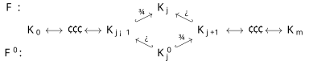
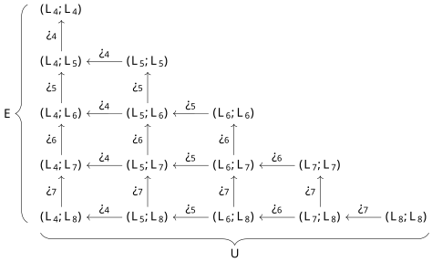

# Fast Computation of Zigzag Persistence

\date{}

\thispagestyle{empty}

## Abstract

Zigzag persistence is a powerful extension of the standard persistence which allows deletions of simplices besides insertions. However, computing zigzag persistence usually takes considerably more time than the standard persistence. We propose an algorithm called **FastZigzag** which narrows this efficiency gap. Our main result is that an input simplex-wise zigzag filtration can be converted to a *cell*-wise non-zigzag filtration of a {$\Delta$-complex} with the same length, where the cells are copies of the input simplices. This conversion step in **FastZigzag** incurs very little cost. Furthermore, the barcode of the original filtration can be easily read from the barcode of the new cell-wise filtration because the conversion embodies a series of *diamond switches* known in topological data analysis. This seemingly simple observation opens up the vast possibilities for improving the computation of zigzag persistence because any efficient algorithm/software for standard persistence can now be applied to computing zigzag persistence. Our experiment shows that this indeed achieves substantial performance gain over the existing state-of-the-art softwares.

\setcounter{page}{1}

\newcommand{**}[1]{*#1*}

## Introduction

Standard persistent homology defined over a growing sequence of simplicial complexes is a fundamental tool in topological data analysis (TDA). Since the advent of persistence algorithm [18] and its algebraic understanding [30], various extensions of the basic concept have been explored [6, 8, 12, 13]. Among these extensions, zigzag persistence introduced by Carlsson and de Silva [6] is an important one. It empowered TDA to deal with filtrations where both insertion and deletion of simplices are allowed. In practice, allowing deletion of simplices does make the topological tool more powerful. For example, in dynamic networks [15, 21] a sequence of graphs may not grow monotonically but can also shrink due to disappearance of vertex connections. Furthermore, zigzag persistence seems to be naturally connected with the computations involving multiparameter persistence, see e.g. [16, 17].

Zigzag persistence possesses some key differences from standard persistence. For example, unlike standard (non-zigzag) modules which decompose into only finite and infinite intervals, zigzag modules decompose into {four types} of intervals (see Definition 2). Existing algorithms for computing zigzag persistence from a zigzag filtration [8, 22, 23, 24] are all based on maintaining explicitly or implicitly a consistent basis throughout the filtration. This makes these algorithms for zigzag persistence more involved and hence slower in practice than algorithms for the non-zigzag version though they have the same time complexity [25]. We sidestep the bottleneck of maintaining an explicit basis and propose an algorithm called **FastZigzag**, which converts the input zigzag filtration to a *non-zigzag* filtration with an efficient strategy for mapping barcodes of the two bijectively. Then, we can apply any  efficient algorithm for standard persistence  on the resulting non-zigzag filtration to compute the barcode of the original filtration. Considering the abundance of optimizations [2, 3, 4, 5, 10, 11] of standard persistence algorithms and a recent GPU acceleration [29], the conversion in **FastZigzag** enables zigzag persistence computation to take advantage of any existing or future improvements on standard persistence computation. Our implementation, which uses the **Phat**{} [4] software for computing standard persistence, shows substantial performance gain over existing state-of-the-art softwares [26, 28] for computing zigzag persistence (see Section 3.5). We make our software publicly available through: <https://github.com/taohou01/fzz>.

To elaborate on the strategy of **FastZigzag**, we first observe a special type of zigzag filtrations called *non-repetitive* zigzag filtrations in which a simplex (or more generally, a *cell*) is never added again once deleted. Such a filtration admits an *up-down* filtration as its canonical form that can be obtained by a series of *diamond switches* [6, 7, 8]. The up-down filtration can be further converted into a *non-zigzag* filtration again using diamond switches as in the Mayer-Vietoris pyramid presented in [8]. Individual switches are atomic tools that help us to show equivalence of barcodes, but we do not need to actually execute them in computation. Instead, we go straight to the final form of the filtration quite easily and efficiently. Finally, we observe that any zigzag filtration can be treated as a non-repetitive *cell-wise* filtration of a *$\Delta$-complex* [20] consisting of multisets of input simplices. This means that each repeatedly added simplex is treated as a different cell in the $\Delta$-complex, so that we can apply our findings for non-repetitive filtrations to arbitrary filtrations. The conversions described above are detailed in Section 3.

### Related works

Zigzag persistence is essentially an *$A_n$-type quiver* [14] in mathematics which is first introduced to the TDA community by Carlsson and de Silva [6]. In their paper [6], Carlsson and de Silva also study the Mayer-Vietoris diamond used in this paper and propose an algorithm for computing zigzag barcodes from zigzag modules (i.e., an input is a sequence of vector spaces connected by linear maps encoded as matrices). Carlsson et al. [8] then propose an $O(mn^2)$ algorithm for computing zigzag barcodes from zigzag filtrations using a structure called right filtration. In their paper [8], Carlsson et al. also extend the classical sublevelset filtrations for functions on topological spaces by proposing levelset zigzag filtrations and show the equivalence of levelset zigzag with the extended persistence proposed by Cohen-Steiner et al. [12]. Maria and Outdot [22, 23] propose an alternative algorithm for computing zigzag barcodes by attaching a reversed standard filtration to the end of the partial zigzag filtration being scanned. Their algorithm maintains the barcode over the Surjective and Transposition Diamond on the constructed zigzag filtration [22, 23]. Maria and Schreiber [24] propose a Morse reduction preprocessing for zigzag filtrations which speeds up the zigzag barcode computation. Carlsson et al. [9] discuss some matrix factorization techniques for computing zigzag barcodes from zigzag modules, which, combined with a divide-and-conquer strategy, lead to a parallel algorithm for computing zigzag persistence. Almost all algorithms reviewed so far have a cubic time complexity. Milosavljevi{\'c} et al. [25] establish an $O(m^\oG)$ theoretical complexity for computing zigzag persistence from filtrations, where $\omega< 2.37286$ is the matrix multiplication exponent [1]. Recently, Dey and Hou [15] propose near-linear algorithms for computing zigzag persistence from the special cases of graph filtrations, with the help of representatives defined for the intervals and some dynamic graph data structures.

## Preliminaries

**$\Delta$-complex.**

In this paper, we build filtrations on *$\Delta$-complexes* which are extensions of simplicial complexes described in Hatcher [20]. These $\Delta$-complexes are derived from a set of standard simplices by identifying the boundary of each simplex with other simplices while preserving the vertex orders. For distinction, building blocks of $\Delta$-complexes (i.e., standard simplices) are called *cells*. Motivated by a construction from the input simplicial complex described in Algorithm ?, we use a *more restricted* version of $\Delta$-complexes, where boundary cells of each $p$-cell are identified with *distinct* $(p-1)$-cells. Notice that this makes each $p$-cell combinatorially equivalent to a $p$-simplex. Hence, the difference of the $\Delta$-complexes in this paper from the standard simplicial complexes is that common faces of two cells in the $\Delta$-complexes can have more relaxed forms. For example, in Figure ?, two `triangles' (2-cells) in a $\Delta$-complex having the same set of vertices can either share 0, 1, 2, or 3 edges in their boundaries; note that the two triangles in Figure ? form a 2-cycle.

\captionsetup[subfigure]{justification=centering}

[figure (pdf): two-tri-0.pdf](2204.11080v2/two-tri-0.pdf)

[figure (pdf): two-tri-1.pdf](2204.11080v2/two-tri-1.pdf)

[figure (pdf): two-tri-2.pdf](2204.11080v2/two-tri-2.pdf)

[figure (pdf): two-tri-3.pdf](2204.11080v2/two-tri-3.pdf)

*Examples of $\Delta$-complexes with two triangles sharing 0, 1, 2, or 3 edges on their boundaries.*

Formally, we define $\Delta$-complexes recursively similar to the classical definition of *CW-complexes* [20] though it need not be as general; see Hatcher's book [20] for a more general definition. Note that simplicial complexes are trivially $\Delta$-complexes and therefore most definitions in this section target $\Delta$-complexes.

**Definition 1.** A *$\Delta$-complex* is defined recursively with dimension:

- A $0$-dimensional $\Delta$-complex $K^0$ is a set of points, each called a *$0$-cell*.

- A $p$-dimensional $\Delta$-complex $K^p$, $p\geq 1$, is a quotient space of a $(p-1)$-dimensional $\Delta$-complex $K^{p-1}$ along with several standard $p$-simplices. The quotienting is realized by an attaching map $h:\partial(\sG)\to K^{p-1}$ which identifies the boundary $\partial(\sG)$ of each $p$-simplex $\sG$ with points in $K^{p-1}$ so that $h$ is a homeomorphism onto its image. We term the standard $p$-simplex $\sG$ with boundary identified to $K^{p-1}$ as a *$p$-cell* in $K^p$. Furthermore, we have that the restriction of $h$ to each proper face of $\sG$ is a *homeomorphism* onto a cell in $K^{p-1}$.

Notice that the original (more general) $\Delta$-complexes [20] require specifying vertex orders when identifying the cells. However, the restricted $\Delta$-complexes defined above do not require specifying such orders because we always identify the boundaries of cells by *homeomorphisms* and hence the vertex orders for identification are implicitly derived from a vertex order of a seeding cell.

**Homology.** Homology in this paper is defined on $\Delta$-complexes, which is defined similarly as for simplicial complexes [20]. All homology groups are taken with $\mathbb{Z}_2$-coefficients and therefore vector spaces mentioned in this paper are also over $\mathbb{Z}_2$.

**Zigzag filtration and barcode.**

A *zigzag filtration* (or simply *filtration*) is a sequence of $\Delta$-complexes

$$
\mathcal{F}: K_0 \leftrightarrow K_1 \leftrightarrow 
\cdots \leftrightarrow K_m,
$$

in which each $K_i\leftrightarrow K_{i+1}$ is either a forward inclusion $K_i\hookrightarrow K_{i+1}$ or a backward inclusion $K_i\hookleftarrow K_{i+1}$. For computational purposes, we only consider *cell-wise* filtrations in this paper, i.e., each inclusion $K_i\leftrightarrow K_{i+1}$ is an addition or deletion of a *single* cell; such an inclusion is sometimes denoted as $K_i\leftrightarrowsp{\sG} K_{i+1}$ with $\sG$ indicating the cell being added or deleted.

We call $\mathcal{F}$ as *non-repetitive* if whenever a cell $\sG$ is deleted from $\mathcal{F}$, the cell $\sG$ is never added again. We call $\mathcal{F}$ an *up-down* filtration [8] if $\mathcal{F}$ can be separated into two parts such that the first part contains only forward inclusions and the second part contains only backward ones, i.e., $\mathcal{F}$ is of the form $\mathcal{F}: K_0 \hookrightarrow K_1 \hookrightarrow \cdots \hookrightarrow K_{\ell} \hookleftarrow K_{\ell+1} \hookleftarrow \cdots \hookleftarrow K_m$. Usually in this paper, filtrations start and end with empty complexes, e.g., $K_0=K_m=\emptyset$ in $\mathcal{F}$.

Applying the $p$-th homology functor on $\mathcal{F}$ induces a *zigzag module*:

$$
\mathsf{H}_p(\mathcal{F}): 
\mathsf{H}_p(K_0) 
\leftrightarrow
\mathsf{H}_p(K_1) 
\leftrightarrow
\cdots 
\leftrightarrow
\mathsf{H}_p(K_m),
$$

in which each $\mathsf{H}_p(K_i)\leftrightarrow \mathsf{H}_p(K_{i+1})$ is a linear map induced by inclusion. It is known [6, 19] that $\mathsf{H}_p(\mathcal{F})$ has a decomposition of the form $\mathsf{H}_p(\mathcal{F})\simeq\bigoplus_{k\in\Lambda}\mathcal{I}^{[b_k,d_k]}$, in which each $\mathcal{I}^{[b_k,d_k]}$ is a special type of zigzag module called *interval module* over the interval $[b_k,d_k]$. The (multi-)set of intervals denoted as $\mathsf{Pers}_p(\mathcal{F}):=\{[b_k,d_k]\,|\, k\in\Lambda\}$ is an invariant of $\mathcal{F}$ and is called the *$p$-th barcode* of $\mathcal{F}$. Each interval in $\mathsf{Pers}_p(\mathcal{F})$ is called a *$p$-th persistence interval* and is also said to be in dimension $p$. Frequently in this paper, we consider the barcode of $\mathcal{F}$ in all dimensions $\mathsf{Pers}_*(\mathcal{F}):=\bigsqcup_{p\geq 0}\mathsf{Pers}_p(\mathcal{F})$.

**Definition 2 (Open and closed birth/death).**

For a zigzag filtration $\mathcal{F}: \emptyset=K_0 \leftrightarrow K_1 \leftrightarrow \cdots \leftrightarrow K_m=\emptyset$, the start of any interval in $\mathsf{Pers}_*(\mathcal{F})$ is called a *birth index* in $\mathcal{F}$ and the end of any interval is called a *death index*. Moreover, a birth index $b$ is said to be *closed* if $K_{b-1}\hookrightarrow K_b$ is a forward inclusion; otherwise, $b$ is  *open*. Symmetrically, a death index $d$ is said to be  *closed* if $K_{d}\hookleftarrow K_{d+1}$ is a backward inclusion; otherwise, $d$ is  *open*. The types of the birth/death ends classify intervals in $\mathsf{Pers}_*(\mathcal{F})$ into four types: *closed-closed*, *closed-open*, *open-closed*, and *open-open*.

**Remark 1.** If $\mathcal{F}$ is a levelset zigzag filtration [8], then the open and closed ends defined above are the same as for levelset zigzag.

**Remark 2.** An inclusion $K_i\leftrightarrow K_{i+1}$ in a cell-wise filtration either provides $i+1$ as a birth index or provides $i$ as a death index (but cannot provide both).

**Mayer-Vietoris diamond.**

The algorithm in this paper draws upon the Mayer-Vietoris diamond proposed by Carlsson and de Silva [6] (see also [7, 8]), which relates barcodes of two filtrations differing by a local change:

**Definition 3 (Mayer-Vietoris diamond [6]).**

Two cell-wise filtrations $\mathcal{F}$ and $\mathcal{F}'$ are related by a *Mayer-Vietoris diamond* if they are of the following forms (where $\sigma\neq\tau$):

$$

$$

In the above diagram, $\mathcal{F}$ and $\mathcal{F}'$ differ only in the complexes at index $j$ and $\mathcal{F}'$ is derived from $\mathcal{F}$ by switching the addition of $\sigma$ and deletion of $\tau$. We also say that $\mathcal{F}'$ is derived from $\mathcal{F}$ by an *outward* switch % and $\mathcal{F}$ is derived from $\mathcal{F}'$ by an *inward* switch.%

**Remark 3.** In Equation (1), we only provide a specific form of Mayer-Vietoris diamond which is sufficient for our purposes; see [6, 8] for a more general form. According to [6], the diamond in Equation (1) is a Mayer-Vietoris diamond because $K_j=\linebreak[1]K_{j-1}\union K_{j+1}$ and $K'_j=K_{j-1}\intsec K_{j+1}$.

We then have the following fact:

**Theorem 1 (Diamond Principle [6]).**

Given two cell-wise filtrations $\mathcal{F},\mathcal{F}'$ related by a Mayer-Vietoris diamond as in Equation (1), there is a bijection from $\mathsf{Pers}_*(\mathcal{F})$ to $\mathsf{Pers}_*(\mathcal{F}')$ as follows:

| $\mathsf{Pers}_*(\mathcal{F})$ |  | $\mathsf{Pers}_*(\mathcal{F}')$ |
| --- | --- | --- |
| $[b,j-1]$; $b\leq j-1$ | $\mapsto$ | $[b,j]$ |
| $[b,j]$; $b\leq j-1$ | $\mapsto$ | $[b,j-1]$ |
| $[j,d]$; $d\geq j+1$ | $\mapsto$ | $[j+1,d]$ |
| $[j+1,d]$; $d\geq j+1$ | $\mapsto$ | $[j,d]$ |
| $[j,j]$ of dimension $p$ | $\mapsto$ | $[j,j]$ of dimension $p-1$ |
| $[b,d]$; all other cases | $\mapsto$ | $[b,d]$ |

Note that the bijection preserves the dimension of the intervals except for $[j,j]$.

**Remark 4.** In the above bijection, only an interval containing *some but not all* of $\{j-1,j,j+1\}$ maps to a different interval or different dimension.

\section{**FastZigzag** algorithm}

In this section, we show that computing barcodes for an arbitrary zigzag filtration of simplicial complexes can be reduced to computing barcodes for a certain *non-zigzag* filtration of $\Delta$-complexes. The resulting algorithm called **FastZigzag** is more efficient considering that standard (non-zigzag) persistence admits faster algorithms [2, 3, 4, 5, 10, 11, 29] in practice. We confirm the efficiency with experiments in Section 3.5.

### Overview

Given a *simplex-wise* zigzag filtration

$$
\mathcal{F}:
\emptyset=
K_0\leftrightarrowsp{\sigma_{0}} K_1\leftrightarrowsp{\sigma_{1}}
\cdots 
\leftrightarrowsp{\sigma_{m-1}} K_m
=\emptyset
$$

of simplicial complexes as input, the **FastZigzag** algorithm has the following main procedure:

- Convert $\mathcal{F}$ into a *non-repetitive* zigzag filtration of $\Delta$-complexes.

- Convert the non-repetitive filtration to an *up-down* filtration.

- Convert the up-down filtration to a *non-zigzag* filtration with the help of an *extended persistence* filtration.

- Compute the standard persistence barcode, which is then converted to the barcode for the input filtration based on rules given in Proposition 5 and 6.

Step 3.1 is achieved by simply treating each repeatedly added simplex in $\mathcal{F}$ as a new cell in the converted filtration (see also [25]). Throughout the section, we denote the converted non-repetitive, *cell-wise* filtration as

$$
{\hat{\mathcal{F}}}:
\emptyset=
\hat{K}_0\leftrightarrowsp{\hat{\sigma}_{0}} \hat{K}_1\leftrightarrowsp{\hat{\sigma}_{1}}
\cdots 
\leftrightarrowsp{\hat{\sigma}_{m-1}} \hat{K}_m
=\emptyset.
$$

[figure (pdf): K_hat_4.pdf](2204.11080v2/K_hat_4.pdf)

*The $\Delta$-complex resulting from performing an inward switch around $\hat{K}_4$ for the example shown in Figure 5.*

Notice that each $\hat{K}_i$ in ${\hat{\mathcal{F}}}$ is homeomorphic to $K_i$ in $\mathcal{F}$, and hence $\mathsf{Pers}_*(\mathcal{F})=\mathsf{Pers}_*({\hat{\mathcal{F}}})$. However, we get an important difference between $\mathcal{F}$ and ${\hat{\mathcal{F}}}$ by treating the simplicial complexes as $\Delta$-complexes. For example, in Figure 5 presented later in this section, the first addition of edge $c$ in $\mathcal{F}$ corresponds to a cell $c_0$ in ${\hat{\mathcal{F}}}$ and its second addition in $\mathcal{F}$ corresponds to a cell $c_1$. Performing an inward switch around $\hat{K}_4$ (switching $\xhookleftarrow{\lbarrowspacec_0\;}$ and $\xhookrightarrow{\lbarrowspacec_1\;}$) turns $\hat{K}_4$ into a $\Delta$-complex as shown in Figure 2. However, we cannot perform such a switch in $\mathcal{F}$ which consists of simplicial complexes, because diamond switches require the switched simplices or cells to be different (see Definition 3).

In Section 3.2 and 3.3, we provide details for Step ? and ? as well as propositions for converting barcodes mentioned in Step ?. We summarize the filtration converting process in Section 3.4 by providing pseudocodes (Algorithm ?) and examples (Figure 5 and 6).

### Conversion to up-down filtration

**Proposition 2.** For the filtration ${\hat{\mathcal{F}}}$, there is a cell-wise *up-down* filtration

$$
\mathcal{U}:\emptyset=L_0\hookrightarrow L_1\hookrightarrow
\cdots\hookrightarrow 
L_{n}
\hookleftarrow
L_{n+1}\hookleftarrow
\cdots
\hookleftarrow L_{2n}=\emptyset
$$

derived from ${\hat{\mathcal{F}}}$ by a sequence of inward switches. Note that $m=2n$.

*Proof.* Let $\hat{K}_{i}\xhookleftarrow{\;\hat{\sigma}_{i}\;}\hat{K}_{i+1}$ be the first deletion in ${\hat{\mathcal{F}}}$ and $\hat{K}_{j}\xhookrightarrow{\;\hat{\sigma}_{j}\;}\hat{K}_{j+1}$ be the first addition after that. That is, ${\hat{\mathcal{F}}}$ is of the form

$$
{\hat{\mathcal{F}}}:\hat{K}_0\hookrightarrow \cdots\hookrightarrow
\hat{K}_{i}\xhookleftarrow{\;\hat{\sigma}_{i}\;} 
\hat{K}_{i+1}\xhookleftarrow{\;\hat{\sigma}_{i+1}\;}
\cdots
\xhookleftarrow{\;\hat{\sigma}_{j-2}\;}
\hat{K}_{j-1}\xhookleftarrow{\;\hat{\sigma}_{j-1}\;}
\hat{K}_{j}\xhookrightarrow{\;\hat{\sigma}_{j}\;}\hat{K}_{j+1}
\leftrightarrow\cdots \leftrightarrow \hat{K}_m.
$$

Since ${\hat{\mathcal{F}}}$ is non-repetitive, we have $\hat{\sigma}_{j-1}\neq\hat{\sigma}_{j}$. So we can switch $\xhookleftarrow{\;\hat{\sigma}_{j-1}\;}$ and $\xhookrightarrow{\;\hat{\sigma}_{j}\;}$ (which is an inward switch) to derive a filtration

$$
\hat{K}_0\hookrightarrow \cdots\hookrightarrow
\hat{K}_{i}\xhookleftarrow{\;\hat{\sigma}_{i}\;} 
\hat{K}_{i+1}\xhookleftarrow{\;\hat{\sigma}_{i+1}\;}
\cdots
\xhookleftarrow{\;\hat{\sigma}_{j-2}\;}
\hat{K}_{j-1}\xhookrightarrow{\;\hat{\sigma}_{j}\;}
\hat{K}'_{j}\xhookleftarrow{\;\hat{\sigma}_{j-1}\;}
\hat{K}_{j+1}
\leftrightarrow\cdots \leftrightarrow \hat{K}_m.
$$

We then continue performing such inward switches (e.g., the next switch is on $\xhookleftarrow{\;\hat{\sigma}_{j-2}\;}$ and $\xhookrightarrow{\;\hat{\sigma}_{j}\;}$) to derive a filtration

$$
{\hat{\mathcal{F}}}':\hat{K}_0\hookrightarrow \cdots\hookrightarrow
\hat{K}_{i}\xhookrightarrow{\;\hat{\sigma}_{j}\;}
\hat{K}'_{i+1}\xhookleftarrow{\;\hat{\sigma}_{i}\;} 
\cdots
\xhookleftarrow{\;\hat{\sigma}_{j-3}\;}
\hat{K}'_{j-1}\xhookleftarrow{\;\hat{\sigma}_{j-2}\;}
\hat{K}'_{j}\xhookleftarrow{\;\hat{\sigma}_{j-1}\;}
\hat{K}_{j+1}
\leftrightarrow\cdots \leftrightarrow \hat{K}_m.
$$

Note that from ${\hat{\mathcal{F}}}$ to ${\hat{\mathcal{F}}}'$, the up-down `prefix' grows longer. We can repeat the above operations on the newly derived ${\hat{\mathcal{F}}}'$ until the entire filtration turns into an up-down one.

Throughout the section, let

$$
\mathcal{U}:\emptyset=L_0\xhookrightarrow{\;\tau_0\;} 
\cdots\xhookrightarrow{\;\tau_{n-1}\;} 
L_{n}
\xhookleftarrow{\;\tau_{n}\;}
\cdots
\xhookleftarrow{\;\tau_{2n-1}\;} L_{2n}=\emptyset
$$

be the up-down filtration for ${\hat{\mathcal{F}}}$ as described in Proposition 2, where $m=2n$. We also let $\hat{K}=L_{n}$.

In a cell-wise filtration, for a cell $\sG$, let its addition (insertion) be denoted as ${\downarrow}\sG$ and its deletion (removal) be denoted as ${\uparrow}\sG$. From the proof of Proposition 2, we observe the following: during the transition from ${\hat{\mathcal{F}}}$ to $\mathcal{U}$, for any two additions ${\downarrow}\sG$ and ${\downarrow}\sG'$ in ${\hat{\mathcal{F}}}$ (and similarly for deletions), if ${\downarrow}\sG$ is before ${\downarrow}\sG'$ in ${\hat{\mathcal{F}}}$, then ${\downarrow}\sG$ is also before ${\downarrow}\sG'$ in $\mathcal{U}$. We then have the following fact:

**Fact 3.** Given the filtration ${\hat{\mathcal{F}}}$, to derive $\mathcal{U}$, one only needs to scan ${\hat{\mathcal{F}}}$ and list all the additions first and then the deletions, following the order in ${\hat{\mathcal{F}}}$.

**Remark 5.** Figure 3 gives an example of ${\hat{\mathcal{F}}}$ and its corresponding $\mathcal{U}$, where the additions and deletions in ${\hat{\mathcal{F}}}$ and $\mathcal{U}$ follow the same order.

**Definition 4 (Creator and destroyer).**

For any interval $[b,d]\in\mathsf{Pers}_*({\hat{\mathcal{F}}})$, if $\hat{K}_{b-1}\leftrightarrowsp{\hat{\sigma}_{b-1}}\hat{K}_b$ is forward  (resp. backward), we call ${\downarrow}\hat{\sigma}_{b-1}$ (resp. ${\uparrow}\hat{\sigma}_{b-1}$) the *creator* of $[b,d]$. Similarly, if $\hat{K}_{d}\leftrightarrowsp{\hat{\sigma}_{d}}\hat{K}_{d+1}$ is forward (resp. backward), we call ${\downarrow}\hat{\sigma}_{d}$ (resp. ${\uparrow}\hat{\sigma}_{d}$) the *destroyer* of $[b,d]$.

By inspecting the interval mapping in the Diamond Principle, we have the following fact:

**Proposition 4.** For two cell-wise filtrations $\mathcal{L},\mathcal{L}'$ related by a Mayer-Vietoris diamond, any two intervals of $\mathsf{Pers}_*(\mathcal{L})$ and $\mathsf{Pers}_*(\mathcal{L}')$ mapped by the Diamond Principle have the same set of creator and destroyer, though the creator and destroyer may swap. This observation combined with Proposition 2 implies that there is a bijection from $\mathsf{Pers}_*(\mathcal{U})$ to $\mathsf{Pers}_*({\hat{\mathcal{F}}})$ s.t. every two corresponding intervals have the same set of creator and destroyer.

**Remark 6.** The only time when the creator and destroyer swap in a Mayer-Vietoris diamond is when the interval $[j,j]$ for the upper filtration in Equation (1) turns into the same interval (of one dimension lower) for the lower filtration.

Consider the example in Figure 3 for an illustration of Proposition 4. In the example, $[1,2]\in\mathsf{Pers}_1({\hat{\mathcal{F}}})$ corresponds to $[1,4]\in\mathsf{Pers}_1(\mathcal{U})$, where their creator is ${\downarrow}a$ and their destroyer is ${\uparrow}d$. Moreover, $[4,6]\in\mathsf{Pers}_0({\hat{\mathcal{F}}})$ corresponds to $[4,5]\in\mathsf{Pers}_1(\mathcal{U})$. The creator of $[4,6]\in\mathsf{Pers}_0({\hat{\mathcal{F}}})$ is ${\uparrow}e$ and the destroyer is ${\downarrow}c$. Meanwhile, $[4,5]\in\mathsf{Pers}_1(\mathcal{U})$ has the same set of creator and destroyer but the roles swap.

[figure (pdf): F-ud.pdf](2204.11080v2/F-ud.pdf)

*An example of filtration ${\hat{\mathcal{F}}}$ and its corresponding up-down filtration $\mathcal{U}$. For brevity, ${\hat{\mathcal{F}}}$ does not start and end with empty complexes (which can be treated as a truncated case).*

For any ${\downarrow}\sG$ or ${\uparrow}\sG$ in ${\hat{\mathcal{F}}}$, let $\mathtt{id}_{\hat{\mathcal{F}}}({\downarrow}\sG)$ or $\mathtt{id}_{\hat{\mathcal{F}}}({\uparrow}\sG)$ denote the index (position) of the addition or deletion. For example, for an addition $\hat{K}_i\xhookrightarrow{\;\hat{\sigma}_{i}\;}\hat{K}_{i+1}$ in ${\hat{\mathcal{F}}}$, $\mathtt{id}_{\hat{\mathcal{F}}}({\downarrow}\hat{\sigma}_{i})=i$. Proposition 4 indicates the following explicit mapping from $\mathsf{Pers}_*(\mathcal{U})$ to $\mathsf{Pers}_*({\hat{\mathcal{F}}})$:

\newcommand{\footnotesize}{\footnotesize} \newcommand{\scriptsize}{\scriptsize}

**Proposition 5.** There is a bijection from $\mathsf{Pers}_*(\mathcal{U})$ to $\mathsf{Pers}_*({\hat{\mathcal{F}}})$ which maps each $[b,d]\in\mathsf{Pers}_p(\mathcal{U})$ by the following rule:

| Type | Condition |  | Type | Interval in $\mathsf{Pers}_*({\hat{\mathcal{F}}})$ | Dim |
| --- | --- | --- | --- | --- | --- |
| {\footnotesize closed-open} | - | {\scriptsize$\mapsto$} | {\footnotesize closed-open} | $\big[\mathtt{id}_{\hat{\mathcal{F}}}({\downarrow}\tau_{b-1})+1,\mathtt{id}_{\hat{\mathcal{F}}}({{\downarrow}\tau_d})\big]$ | $p$ |
| \cmidrule{1-6} {\footnotesize open-closed} | - | {\scriptsize$\mapsto$} | {\footnotesize open-closed} | $\big[\mathtt{id}_{\hat{\mathcal{F}}}({\uparrow}\tau_{b-1})+1,\mathtt{id}_{\hat{\mathcal{F}}}({{\uparrow}\tau_d})\big]$ | $p$ |
| \cmidrule{1-6} \multirow{2}{*}{\footnotesize closed-closed} | $\mathtt{id}_{\hat{\mathcal{F}}}({\downarrow}\tau_{b-1})<\mathtt{id}_{\hat{\mathcal{F}}}({{\uparrow}\tau_d})$ | {\scriptsize$\mapsto$} | {\footnotesize closed-closed} | $\big[\mathtt{id}_{\hat{\mathcal{F}}}({\downarrow}\tau_{b-1})+1,\mathtt{id}_{\hat{\mathcal{F}}}({{\uparrow}\tau_d})\big]$ | $p$ |
|  | $\mathtt{id}_{\hat{\mathcal{F}}}({\downarrow}\tau_{b-1})>\mathtt{id}_{\hat{\mathcal{F}}}({{\uparrow}\tau_d})$ | {\scriptsize$\mapsto$} | {\footnotesize open-open} | $\big[\mathtt{id}_{\hat{\mathcal{F}}}({{\uparrow}\tau_d})+1,\mathtt{id}_{\hat{\mathcal{F}}}({\downarrow}\tau_{b-1})\big]$ | $p{-}1$ |

**Remark 7.** Notice that $\mathsf{Pers}_*(\mathcal{U})$ contains no open-open intervals. However, a closed-closed interval $[b,d]\in\mathsf{Pers}_p(\mathcal{U})$ turns into an open-open interval in $\mathsf{Pers}_{p-1}({\hat{\mathcal{F}}})$ when $\mathtt{id}_{\hat{\mathcal{F}}}({\downarrow}\tau_{b-1})>\mathtt{id}_{\hat{\mathcal{F}}}({{\uparrow}\tau_d})$. Such a change happens when a closed-closed interval turns into a single point interval $[j,j]$ during the sequence of outward switches, after which the closed-closed interval $[j,j]$ becomes an open-open interval $[j,j]$ with a dimension shift (see Theorem 1).

**Remark 8.** Although it may take $O(m^2)$ diamond switches to go from ${\hat{\mathcal{F}}}$ to $\mathcal{U}$ or from $\mathcal{U}$ to ${\hat{\mathcal{F}}}$ as indicated in Proposition 2, we observe that these switches do not need to be actually executed in the algorithm. To convert the intervals in $\mathsf{Pers}_*(\mathcal{U})$ to those in $\mathsf{Pers}_*({\hat{\mathcal{F}}})$, we only need to follow the mapping in Proposition 5, which takes constant time per interval.

We can take the example in Figure 3 for the mapping in Proposition 5. The interval $[4,5]\in\mathsf{Pers}_1(\mathcal{U})$ is a closed-closed one whose creator is ${\downarrow}c$ and destroyer is ${\uparrow}e$. We have that $\mathtt{id}_{\hat{\mathcal{F}}}({\downarrow}c)=6>\mathtt{id}_{\hat{\mathcal{F}}}({\uparrow}e)=3$. So the corresponding interval in $\mathsf{Pers}_0({\hat{\mathcal{F}}})$ is

$$
[\mathtt{id}_{\hat{\mathcal{F}}}({\uparrow}e)+1,\mathtt{id}_{\hat{\mathcal{F}}}({\downarrow}c)]=[4,6].
$$

### Conversion to non-zigzag filtration

We first convert the up-down filtration $\mathcal{U}$ to an extended persistence [12] filtration $\mathcal{E}$, which is then easily converted to an (absolute) non-zigzag filtration using the `coning' technique [12].

Inspired by the Mayer-Vietoris pyramid in [8], we relate $\mathsf{Pers}_*(\mathcal{U})$ to the barcode of the filtration $\mathcal{E}$ defined as:

$$
\mathcal{E}:\emptyset=L_0
\hookrightarrow
\cdots
\hookrightarrow
L_{n}=(\hat{K},L_{2n})
\hookrightarrow
(\hat{K},L_{2n-1})
\hookrightarrow
\cdots
\hookrightarrow
(\hat{K},L_{n})=(\hat{K},\hat{K})
$$

where $L_{n}=\hat{K}=(\hat{K},L_{2n}=\emptyset)$. When denoting the persistence intervals of $\mathcal{E}$, we let the increasing index for the first half of $\mathcal{E}$ continue to the second half, i.e., $(\hat{K},L_{2n-1})$ has index $n+1$ and $(\hat{K},L_{n})$ has index $2n$. Then, it can be verified that an interval $[b,d]\in\mathsf{Pers}_*(\mathcal{E})$ for $b<n<d$ starts with the complex $L_b$ and ends with $(\hat{K},L_{3n-d})$.

**Remark 9.** A filtration in extended persistence [12] is originally defined for a PL function $f$, where the first half is the lower-star filtration of $f$ and the second half (the relative part) is derived from the upper-star filtration of $f$. The filtration $\mathcal{E}$ defined above is a generalization of the one in [12].

**Proposition 6.** There is a bijection from $\mathsf{Pers}_*(\mathcal{E})$ to $\mathsf{Pers}_*(\mathcal{U})$ which maps each $[b,d]\in\mathsf{Pers}_*(\mathcal{E})$ of dimension $p$ by the following rule:

| Type | Condition |  | Type | Interv. in $\mathsf{Pers}_*(\mathcal{U})$ | Dim |
| --- | --- | --- | --- | --- | --- |
| Ord | $d<n$ | $\mapsto$ | closed-open | $[b,d]$ | $p$ |
| Rel | $b>n$ | $\mapsto$ | open-closed | $[3n-d,3n-b]$ | $p{-}1$ |
| Ext | $b\leqn\leq d$ | $\mapsto$ | closed-closed | $[b,3n-d-1]$ | $p$ |

**Remark 10.** The types `Ord', `Rel', and `Ext' for intervals in $\mathsf{Pers}_*(\mathcal{E})$ are as defined in [12], which stand for intervals from the *ordinary* sub-barcode, the *relative* sub-barcode, and the *extended* sub-barcode.

**Remark 11.** The above proposition can also be stated by associating the creators and destroyers as in Proposition 4 and 5. The association of additions in the first half of  $\mathcal{U}$ and $\mathcal{E}$ is straightforward and the deletion of a $\sG$ in $\mathcal{U}$ is associated with the addition of $\sG$ (to the second complex in the pair) in $\mathcal{E}$. Then, corresponding intervals in $\mathsf{Pers}_*(\mathcal{E})$ and $\mathsf{Pers}_*(\mathcal{U})$ in the above proposition also have the same set of creators and destroyers. Combined with Proposition 4, we further have that intervals in $\mathsf{Pers}_*(\mathcal{F})$ and $\mathsf{Pers}_*(\mathcal{E})$ can be associated by a bijection where corresponding intervals have the same pairs of simplices though they may switch roles of being creators and destroyers. These switches coincide with the shift in the degree of the homology by having an interval in $\mathsf{Pers}_p(\mathcal{E})$ correspond to an interval in $\mathsf{Pers}_{p-1}(\mathcal{F})$.

*Proof.* We can build a Mayer-Vietoris pyramid relating the second half of $\mathcal{E}$ and the second half of $\mathcal{U}$ similar to the one in [8]. A pyramid for $n=4$ is shown in Figure 4, where the second half of $\mathcal{E}$ is along the left side of the triangle and the second half of $\mathcal{U}$ is along the bottom. In Figure 4, we represent the second half of $\mathcal{E}$ and $\mathcal{U}$ in a slightly different way considering that $L_4=\hat{K}$ and $L_8=\emptyset$. Also, each vertical arrow indicates the addition of a simplex in the second complex of the pair and each horizontal arrow indicates the deletion of a simplex in the first complex.

To see the correctness of the mapping, we first note that each square in the pyramid is a (more general version of) Mayer-Vietoris diamond as defined in [8]. Then, the mapping stated in the proposition can be verified using the Diamond Principle (Theorem 1). However, there is a quicker way to verify the mapping by observing the following: corresponding intervals in $\mathsf{Pers}_*(\mathcal{E})$ and $\mathsf{Pers}_*(\mathcal{U})$ have the same set of creator and destroyer if we ignore whether it is the addition or deletion of a simplex. For example, an interval in $\mathsf{Pers}_*(\mathcal{E})$ may be created by the addition of a simplex $\sG$ in the first half of $\mathcal{E}$ and destroyed by the addition of another simplex $\sG'$ in the second half of $\mathcal{E}$. Then, its corresponding interval in $\mathsf{Pers}_*(\mathcal{U})$ is also created by the addition of $\sG$ in the first half but destroyed by the *deletion* of $\sG'$ in the second half. Note that the dimension change for the case $b>n$ is caused by the swap of creator and destroyer.

*A Mayer-Vietoris pyramid relating the second half of $\mathcal{E}$ and $\mathcal{U}$ for $n=4$.*

By Proposition 5 and 6, we only need to compute $\mathsf{Pers}_*(\mathcal{E})$ in order to compute $\mathsf{Pers}_*(\mathcal{F})$. The barcode of $\mathcal{E}$ can be computed using the `coning' technique [12], which converts $\mathcal{E}$ into an (absolute) non-zigzag filtration $\hat{\mathcal{E}}$. Specifically, let $\oG$ be a vertex different from all vertices in $\hat{K}$. For a $p$-cell $\sG$ of $\hat{K}$, we let $\oG\cdot\sG$ denote the *cone* of $\sG$, which is a $(p+1)$-cell having cells $\{\sG\}\union\{\oG\cdot\tau\mid\tau\in\partial\sG\}$ in its boundary. The *cone* $\oG\cdot L_i$ of a complex $L_i$ consists of three parts: the vertex $\oG$, $L_i$, and cones of all cells of $L_i$. The filtration $\hat{\mathcal{E}}$ is then defined as [12]:

$$
\hat{\mathcal{E}}:
L_0\union \{\oG\}
\hookrightarrow
\cdots
\hookrightarrow
L_{n}\union \{\oG\}
=\hat{K}\union\oG\cdotL_{2n}
\hookrightarrow
\hat{K}\union\oG\cdotL_{2n-1}
\hookrightarrow
\cdots
\hookrightarrow
\hat{K}\union\oG\cdotL_{n}
$$

We have that $\mathsf{Pers}_*(\mathcal{E})$ equals $\mathsf{Pers}_*(\hat{\mathcal{E}})$ discarding the only infinite interval [12]. Note that if a cell $\sG$ is added (to the second complex) from $(\hat{K},L_{i})$ to $(\hat{K},L_{i-1})$ in $\mathcal{E}$, then the cone $\oG\cdot\sG$ is added from $\hat{K}\union\oG\cdotL_{i}$ to $\hat{K}\union\oG\cdotL_{i-1}$ in $\hat{\mathcal{E}}$.

### Summary of filtration conversion

We summarize the filtration conversion process described in this section in Algorithm ?, in which we assume that each simplex in $\mathcal{F}$ is given by its set of vertices. The converted standard filtration $\hat{\mathcal{E}}$ is represented by its boundary matrix $D$, whose columns (and equivalently the chains they represent) are treated as sets of identifiers of the boundary cells. Algorithm ? also maintains the following data structures:

- $\mathtt{cid}$ denotes the map from a simplex $\sG$ to the identifier of the *most recent* copy of cell corresponding to $\sG$.

- $\mathtt{del\_list}$ denotes the list of cell identifiers deleted in the input filtration.

- $\mathtt{cone\_id}$ denotes the map from the identifier of a cell to that of its coned cell.

**Algorithm 1: Pseudocode for converting input filtration**

1. **procedure** ConvertFilt($\mathcal{F}$)
   1. initialize boundary matrix $D$, cell-id map $\mathtt{cid}$, deleted cell list $\mathtt{del\_list}$ as empty
   1. append an empty column to $D$ representing vertex $\oG$ for coning
   1. \vspace{0.3em}
   1. $\mathtt{id}\leftarrow 1$ ▷ *variable keeping track of id for cells*
   1. \ForEach{$K_i\leftrightarrowsp{\sG_i}K_{i+1}$ in $\mathcal{F}$}
   1. **if** $\sG_i$ is being inserted **then**
      1. $\mathtt{cid}[\sG_i]=\mathtt{id}$ ▷ *get a new cell as a copy of simplex $\sG_i$*
      1. $\mathtt{col}\leftarrow \textsc{CellBoundary}(\sG_i,\mathtt{cid})$
      1. append $\mathtt{col}$ to $D$
      1. $\mathtt{id}\leftarrow\mathtt{id}+1$
   1. **else**
      1. append $\mathtt{cid}[\sG_i]$ to $\mathtt{del\_list}$
   1. **end if**
1. **end for**
1. initialize map $\mathtt{cone\_id}$ as empty ▷ *$\mathtt{cone\_id}$ tracks id for coned cells*
1. \ForEach{$\mathtt{del\_id}$ in $\mathtt{del\_list}$ (accessed reversely)}
1. $\mathtt{cone\_id}[\mathtt{del\_id}]\leftarrow\mathtt{id}$ ▷ *get a new coned cell*
1. $\mathtt{col}\leftarrow \textsc{ConedCellBoundary}(\mathtt{del\_id},D,\mathtt{cone\_id})$
1. append $\mathtt{col}$ to $D$
1. $\mathtt{id}\leftarrow\mathtt{id}+1$
1. **end for**
1. **return** $D$
1. **end procedure**

Subroutine **CellBoundary** in Line ? converts boundary simplices of $\sG_i$ to a column of cell identifiers based on the map $\mathtt{cid}$. Subroutine **ConedCellBoundary** in Line ? returns boundary column for the cone of the cell identified by $\mathtt{del\_id}$.

[figure (pdf): cell-filt.pdf](2204.11080v2/cell-filt.pdf)

*An example of an up-down cell-wise filtration $\mathcal{U}$ built from a given simplex-wise filtration $\mathcal{F}$. For brevity, $\mathcal{F}$ does not start and end with empty complexes. The final conversion to $\hat{\mathcal{E}}$ is not shown for this example due to page-width constraint. A complete conversion for a smaller example is shown in Figure 6.*

[figure (pdf): convert.pdf](2204.11080v2/convert.pdf)

*An example of converting a zigzag filtration $\hat{\mathcal{F}}$ to a non-zigzag filtration.*

We provide an example of the up-down cell-wise filtration $\mathcal{U}$ built from a given simplex-wise filtration $\mathcal{F}$ in Figure 5. In the example, edge $c$ and triangle $t$ are repeatedly added twice in $\mathcal{F}$, and therefore each correspond to two copies of cells in $\mathcal{U}$. We provide another example of a complete conversion from a given zigzag filtration to a non-zigzag filtration in Figure 6.

With the **ConvertFilt** subroutine, Algorithm ? provides a concise summary of **FastZigzag**. Given that for a filtration $\mathcal{F}$ of length $m$, **ConvertFilt** takes $O(m)$ time and  **ConvertBarcode** takes $O(1)$ time per bar, we now have the following conclusion:

**Algorithm 2: Pseudocode for FastZigzag**

1. **procedure** FastZigzag($\mathcal{F}$)
   1. $D\leftarrow \textsc{ConvertFilt}(\mathcal{F})$
   1. $B\leftarrow \textsc{ComputeBarcode}(D)$
   1. $B'\leftarrow \textsc{ConvertBarcode}(B)$
   1. **return** $B'$
1. **end procedure**

**Theorem 7.** Given a simplex-wise zigzag filtration $\mathcal{F}$ with length $m$, **FastZigzag** computes $\mathsf{Pers}_*(\mathcal{F})$ in time $T(m)+O(m)$, where $T(m)$ is the time used for computing the barcode of a non-zigzag cell-wise filtration with length $m$.

**Remark 12.** Theoretically, $T(m)=O(m^\oG)$ [25], where $\omega< 2.37286$ is the matrix multiplication exponent [1]. So the theoretical complexity of **FastZigzag** is $O(m^\oG)$.

### Experiments

We implement the **FastZigzag** algorithm described in this section and compare the performance with **Dionysus2**{} [26] (implementing the algorithm in [8]) and **Gudhi**{} (The code is shared by personal communication.) [28] (implementing the algorithm in [22, 24]). When implementing **FastZigzag**, we utilize the **Phat**{} [4] software for computing non-zigzag persistence. Our implementation is publicly available through: <https://github.com/taohou01/fzz>.

To test the performance, we generate eleven simplex-wise filtrations of similar lengths (5$\sim$6 millions; see Table 1). The reason for using filtrations of similar lengths is to test the impact of *repetitiveness* on the performance for different algorithms, where repetitiveness is the average times a simplex is repeatedly added in a filtration (e.g., repetitiveness being 1 means that the filtration is non-repetitive). We utilize three different approaches for generating the filtrations:

- The two non-repetitive filtrations (No. 1 and 2) are generated by first taking a simplicial complex with vertices in $\mathbb{R}^3$, and then taking the height function $h$ along a certain axis. After this, we build an up-down filtration for the complex where the first half is the lower-star filtration of $h$ % and the second half is the (reversed) upper-star filtration of $h$. % We then randomly perform outward switches on the up-down filtration to derive a non-repetitive filtration. Note that the simplicial complex is derived from a triangular mesh supplemented by a Vietoris-Rips complex on the vertices; one triangular mesh (Dragon) is downloaded from the Stanford Computer Graphics Laboratory.

- Filtration No. 3 -- 8 are generated from a sequence of edge additions and deletions, for which we then take the *clique complex* (up to a certain dimension) for each edge set in the sequence. The edge sequence is derived by randomly adding and deleting edges for a set of points.

- The remaining filtrations (No. 9 -- 11) are the *oscillating Rips zigzag* [27] generated from point clouds of size 2000 -- 4000 sampled from some triangular meshes (Space Shuttle from an online repository (Ryan Holmes: <http://www.holmes3d.net/graphics/offfiles/>); Bunny and Dragon from the Stanford Computer Graphics Laboratory).

Table 1 lists running time of the three algorithms on all filtrations, where the length, maximum dimension (D), repetitiveness (Rep), and maximum complex size (MaxK) are also provided for each filtration. From Table 1, we observe that **FastZigzag** ($\text{T}_\text{FZZ}$) consistently achieves the best running time across all inputs, with significant speedups (see column `SU' in Table 1). The speedup is calculated as the min-time of **Dionysus2**{} and **Gudhi**{} divided by the time of **FastZigzag**. Notice that since **Gudhi**{} only takes a sequence of edge additions and deletions as input (and builds clique complexes on-the-fly), we do not run **Gudhi**{} on the first two inputs in Table 1, which are only given as simplex-wise filtrations. We also observe that the speedup of **FastZigzag** tends to be less prominent as the repetitiveness increases. This is because higher repetitiveness leads to smaller max/average complex size in the input zigzag filtration, so that algorithms directly working on the input filtration could have less processing time [8, 22, 24]. On the other hand, the complex size in the converted non-zigzag filtration that **FastZigzag** works on is always increasing.

\newcommand`\small`[1]`\small #1`

\caption{Running time of **Dionysus2**{}, **Gudhi**{}, and **FastZigzag** on different filtrations of similar lengths with various repetitiveness. All tests were run on a desktop with Intel(R) Core(TM) i5-9500 CPU @ 3.00GHz, 16GB memory, and Linux OS.}

| No. | {Length} | D | Rep | MaxK | {$\text{T}_\text{Dio2}$} | {$\text{T}_\text{Gudhi}$} | {$\text{T}_\text{FZZ}$} | SU |
| --- | --- | --- | --- | --- | --- | --- | --- | --- |
| 1 | \tt\small 5,260,700 | \tt\small 5 | \tt\small 1.0 | \tt\small 883,350 | \tt\small 2h02m46.0s | \tt\small $-$ | \tt\small 8.9s | \tt\small 873 |
| 2 | \tt\small 5,254,620 | \tt\small 4 | \tt\small 1.0 | \tt\small 1,570,326 | \tt\small 19m36.6s | \tt\small $-$ | \tt\small 11.0s | \tt\small 107 |
| 3 | \tt\small 5,539,494 | \tt\small 5 | \tt\small 1.3 | \tt\small 1,671,047 | \tt\small 3h05m00.0s | \tt\small 45m47.0s | \tt\small 3m20.8s | \tt\small 13.7 |
| 4 | \tt\small 5,660,248 | \tt\small 4 | \tt\small 2.0 | \tt\small 1,385,979 | \tt\small 2h59m57.0s | \tt\small 29m46.7s | \tt\small 4m59.5s | \tt\small 6.0 |
| 5 | \tt\small 5,327,422 | \tt\small 4 | \tt\small 3.5 | \tt\small 760,098 | \tt\small 43m54.8s | \tt\small 10m35.2s | \tt\small 3m32.1s | \tt\small 3.0 |
| 6 | \tt\small 5,309,918 | \tt\small 3 | \tt\small 5.1 | \tt\small 523,685 | \tt\small 5h46m03.0s | \tt\small 1h32m37.0s | \tt\small 19m30.2s | \tt\small 4.7 |
| 7 | \tt\small 5,357,346 | \tt\small 3 | \tt\small 7.3 | \tt\small 368,830 | \tt\small 3h37m54.0s | \tt\small 57m28.4s | \tt\small 30m25.2s | \tt\small 1.9 |
| 8 | \tt\small 6,058,860 | \tt\small 4 | \tt\small 9.1 | \tt\small 331,211 | \tt\small 53m21.2s | \tt\small 7m19.0s | \tt\small 3m44.4s | \tt\small 2.0 |
| 9 | \tt\small 5,135,720 | \tt\small 3 | \tt\small 21.9 | \tt\small 11,859 | \tt\small 23.8s | \tt\small 15.6s | \tt\small 8.6s | \tt\small 1.9 |
| 10 | \tt\small 5,110,976 | \tt\small 3 | \tt\small 27.7 | \tt\small 11,435 | \tt\small 36.2s | \tt\small 39.9s | \tt\small 8.5s | \tt\small 4.3 |
| 11 | \tt\small 5,811,310 | \tt\small 4 | \tt\small 44.2 | \tt\small 7,782 | \tt\small 38.5s | \tt\small 36.9s | \tt\small 23.9s | \tt\small 1.5 |

Table 2 lists the memory consumption of the three algorithms. We observe that **FastZigzag** tends to consume more memory than the other two on the non-repetitive filtrations (No. 1 and 2) and the random clique filtrations (No. 3 -- 8). However, **FastZigzag** is consistently achieving the best memory footprint on the oscillating Rips filtrations (No. 9 -- 11) despite the high repetitiveness.

*Memory consumption (in gigabytes) of the three algorithms on all filtrations.*

| No. | {Length} | Rep | MaxK | {$\text{M}_\text{Dio2}$} | {$\text{M}_\text{Gudhi}$} | {$\text{M}_\text{FZZ}$} |
| --- | --- | --- | --- | --- | --- | --- |
| 1 | \tt\small 5,260,700 | \tt\small 1.0 | \tt\small 883,350 | \tt\small 3.23 | \tt\small $-$ | \tt\small 0.59 |
| 2 | \tt\small 5,254,620 | \tt\small 1.0 | \tt\small 1,570,326 | \tt\small 3.93 | \tt\small $-$ | \tt\small 0.61 |
| 3 | \tt\small 5,539,494 | \tt\small 1.3 | \tt\small 1,671,047 | \tt\small 15.52 | \tt\small 13.49 | \tt\small 9.76 |
| 4 | \tt\small 5,660,248 | \tt\small 2.0 | \tt\small 1,385,979 | \tt\small 7.64 | \tt\small 8.43 | \tt\small 11.04 |
| 5 | \tt\small 5,327,422 | \tt\small 3.5 | \tt\small 760,098 | \tt\small 3.27 | \tt\small 3.40 | \tt\small 6.22 |
| 6 | \tt\small 5,309,918 | \tt\small 5.1 | \tt\small 523,685 | \tt\small 4.94 | \tt\small 5.27 | \tt\small 10.23 |
| 7 | \tt\small 5,357,346 | \tt\small 7.3 | \tt\small 368,830 | \tt\small 4.03 | \tt\small 3.91 | \tt\small 8.19 |
| 8 | \tt\small 6,058,860 | \tt\small 9.1 | \tt\small 331,211 | \tt\small 2.12 | \tt\small 1.48 | \tt\small 3.68 |
| 9 | \tt\small 5,135,720 | \tt\small 21.9 | \tt\small 11,859 | \tt\small 0.92 | \tt\small 0.47 | \tt\small 0.50 |
| 10 | \tt\small 5,110,976 | \tt\small 27.7 | \tt\small 11,435 | \tt\small 0.88 | \tt\small 0.48 | \tt\small 0.47 |
| 11 | \tt\small 5,811,310 | \tt\small 44.2 | \tt\small 7,782 | \tt\small 0.95 | \tt\small 0.60 | \tt\small 0.51 |

## Conclusions

In this paper, we propose a zigzag persistence algorithm called **FastZigzag** by first treating repeatedly added simplices in an input zigzag filtration as distinct copies and then converting the input filtration to a non-zigzag filtration. The barcode of the converted non-zigzag filtration can then be easily mapped back to barcode of the input zigzag filtration. The efficiency of our algorithm is confirmed by experiments. This research also brings forth the following open questions:

- Parallel versions [9, 29] of the algorithms for computing standard and zigzag exist. While the computation of standard persistence in our **FastZigzag** algorithm can directly utilize the existing parallelization techniques, we ask if the conversions done in **FastZigzag** can be efficiently parallelized. Such an extension can provide further speedups by harnessing multi-cores.

- While persistence intervals are important topological descriptors, their *representatives* also reveal critical information (e.g., a recently proposed algorithm [16] for updating zigzag barcodes over local changes uses representatives explicitly). Can the **FastZigzag** algorithm be adapted so that representatives for the input zigzag filtration are recovered from representatives for the converted non-zigzag filtration?

## Acknowledgment:

We thank the Stanford Computer Graphics Laboratory and Ryan Holmes for providing the triangular meshes used in the experiment of this paper.

\appendix

## References

1. Josh Alman and Virginia Vassilevska Williams. A refined laser method and faster matrix multiplication. In *Proceedings of the 2021 ACM-SIAM Symposium on Discrete Algorithms (SODA)*, pages 522–539. SIAM, 2021.
2. Ulrich Bauer. Ripser: Efficient computation of vietoris–rips persistence barcodes. *Journal of Applied and Computational Topology*, 5(3):391–423, 2021.
3. Ulrich Bauer, Michael Kerber, and Jan Reininghaus. Clear and compress: Computing persistent homology in chunks. In *Topological methods in data analysis and visualization III*, pages 103–117. Springer, 2014.
4. Ulrich Bauer, Michael Kerber, Jan Reininghaus, and Hubert Wagner. Phat – persistent homology algorithms toolbox. *Journal of Symbolic Computation*, 78:76–90, 2017.
5. Jean{-}Daniel Boissonnat, Tamal K. Dey, and Cl{é}ment Maria. The compressed annotation matrix: An efficient data structure for computing persistent cohomology. *Algorithmica*, 73(3):607–619, 2015.
6. Gunnar Carlsson and Vin de Silva. Zigzag persistence. *Foundations of Computational Mathematics*, 10(4):367–405, 2010.
7. Gunnar Carlsson, Vin de Silva, Sara Kali{\v{s}}nik, and Dmitriy Morozov. Parametrized homology via zigzag persistence. *Algebraic & Geometric Topology*, 19(2):657–700, 2019.
8. Gunnar Carlsson, Vin de Silva, and Dmitriy Morozov. Zigzag persistent homology and real-valued functions. In *Proceedings of the Twenty-Fifth Annual Symposium on Computational Geometry*, pages 247–256, 2009.
9. Gunnar Carlsson, Anjan Dwaraknath, and Bradley J. Nelson. Persistent and zigzag homology: A matrix factorization viewpoint. *arXiv preprint arXiv:1911.10693*, 2019.
10. Chao Chen and Michael Kerber. Persistent homology computation with a twist. In *Proceedings 27th European Workshop on Computational Geometry*, volume 11, pages 197–200, 2011.
11. Chao Chen and Michael Kerber. An output-sensitive algorithm for persistent homology. *Comput. Geom.: Theory and Applications*, 46(4):435–447, 2013.
12. David Cohen-Steiner, Herbert Edelsbrunner, and John Harer. Extending persistence using {P}oincar{é} and {L}efschetz duality. *Foundations of Computational Mathematics*, 9(1):79–103, 2009.
13. Vin de Silva, Dmitriy Morozov, and Mikael Vejdemo-Johansson. Dualities in persistent (co)homology. *Inverse Problems*, 27(12):124003, 2011.
14. Harm Derksen and Jerzy Weyman. Quiver representations. *Notices of the AMS*, 52(2):200–206, 2005.
15. Tamal K. Dey and Tao Hou. Computing zigzag persistence on graphs in near-linear time. In *37th International Symposium on Computational Geometry, SoCG 2021*, volume 189 of *LIPIcs*, pages 30:1–30:15. Schloss Dagstuhl - Leibniz-Zentrum f{ü}r Informatik, 2021.
16. Tamal K. Dey and Tao Hou. Updating zigzag persistence and maintaining representatives over changing filtrations. *arXiv preprint arXiv:2112.02352*, 2021.
17. Tamal K. Dey, Woojin Kim, and Facundo M{é}moli. Computing generalized rank invariant for 2-parameter persistence modules via zigzag persistence and its applications. In *38th International Symposium on Computational Geometry, SoCG 2022*, volume 224 of *LIPIcs*, pages 34:1–34:17, 2022.
18. Herbert Edelsbrunner, David Letscher, and Afra Zomorodian. Topological persistence and simplification. In *Proceedings 41st Annual Symposium on Foundations of Computer Science*, pages 454–463. IEEE, 2000.
19. Peter Gabriel. {Unzerlegbare Darstellungen I}. *Manuscripta Mathematica*, 6(1):71–103, 1972.
20. Allen Hatcher. *Algebraic Topology*. Cambridge University Press, 2002.
21. Petter Holme and Jari Saram{ä}ki. Temporal networks. *Physics Reports*, 519(3):97–125, 2012.
22. Cl{é}ment Maria and Steve Y. Oudot. Zigzag persistence via reflections and transpositions. In *Proceedings of the Twenty-Sixth Annual ACM-SIAM Symposium on Discrete Algorithms*, pages 181–199. SIAM, 2014.
23. Cl{é}ment Maria and Steve Y. Oudot. Computing zigzag persistent cohomology. *arXiv preprint arXiv:1608.06039*, 2016.
24. Cl{é}ment Maria and Hannah Schreiber. Discrete morse theory for computing zigzag persistence. In *Workshop on Algorithms and Data Structures*, pages 538–552. Springer, 2019.
25. Nikola Milosavljevi{ç}, Dmitriy Morozov, and Primoz Skraba. Zigzag persistent homology in matrix multiplication time. In *Proceedings of the Twenty-Seventh Annual Symposium on Computational Geometry*, pages 216–225, 2011.
26. Dmitriy Morozov. {\tt Dionysus2}. URL: \url{https://www.mrzv.org/software/dionysus2/}.
27. Steve Y. Oudot and Donald R. Sheehy. Zigzag zoology: Rips zigzags for homology inference. *Foundations of Computational Mathematics*, 15(5):1151–1186, 2015.
28. {The GUDHI Project}. { {GUDHI} User and Reference Manual}. {GUDHI Editorial Board}, 2015. URL: \url{http://gudhi.gforge.inria.fr/doc/latest/}.
29. Simon Zhang, Mengbai Xiao, and Hao Wang. {GPU}-accelerated computation of {V}ietoris-{R}ips persistence barcodes. In *36th International Symposium on Computational Geometry (SoCG 2020)*. Schloss Dagstuhl-Leibniz-Zentrum f{ü}r Informatik, 2020.
30. Afra Zomorodian and Gunnar Carlsson. Computing persistent homology. *Discrete & Computational Geometry*, 33(2):249–274, 2005.
