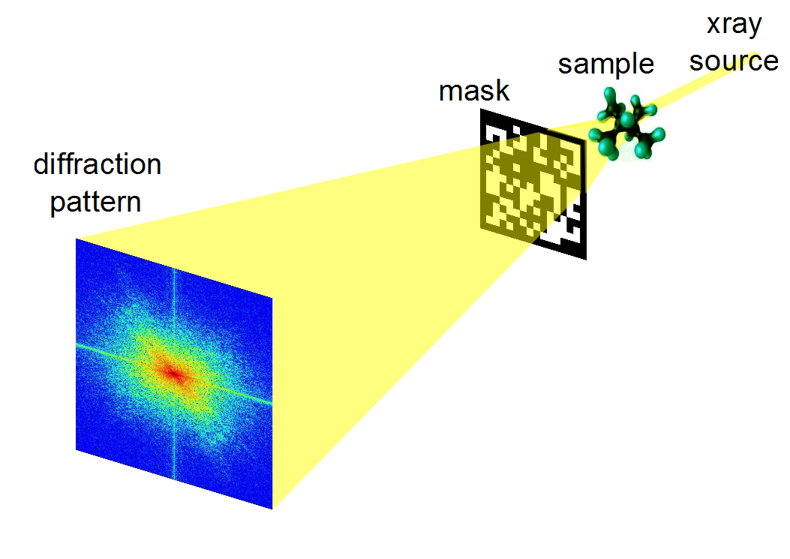
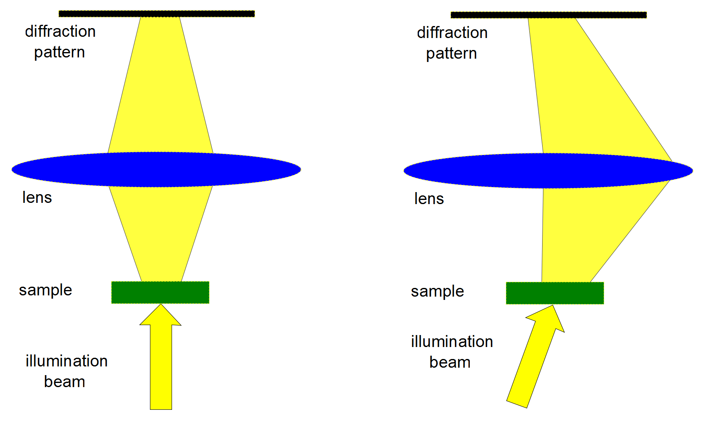
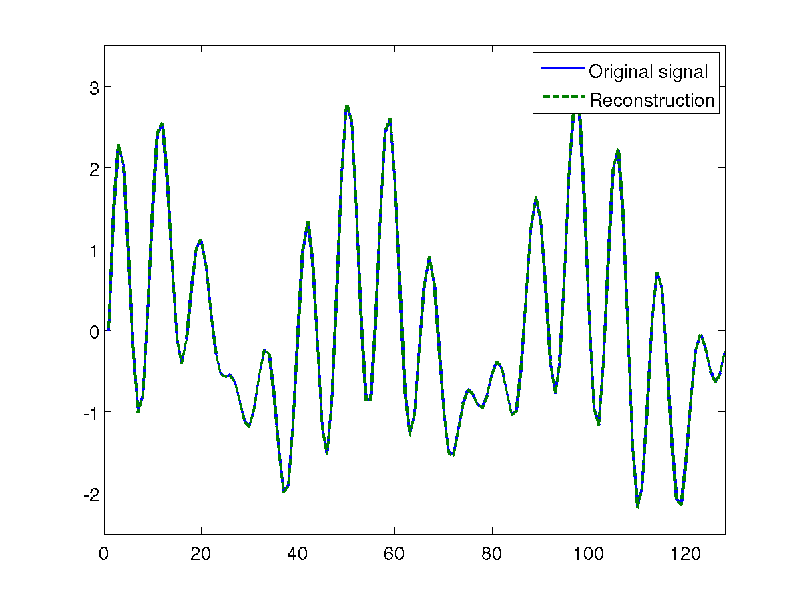
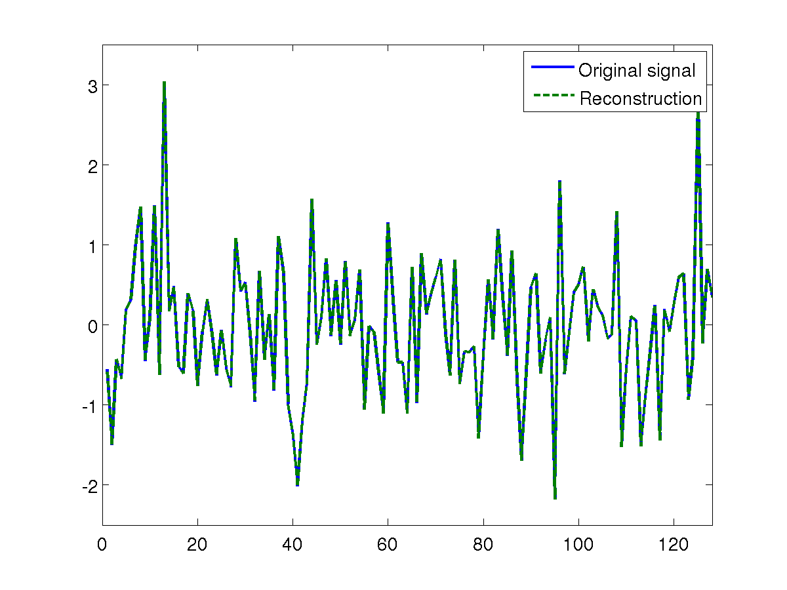
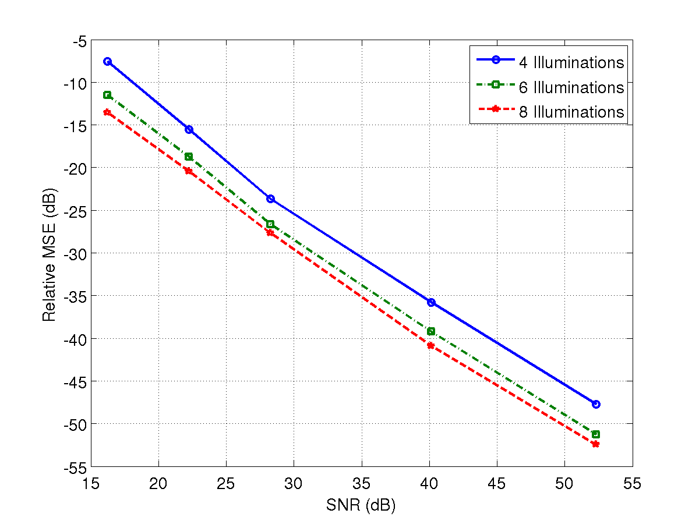
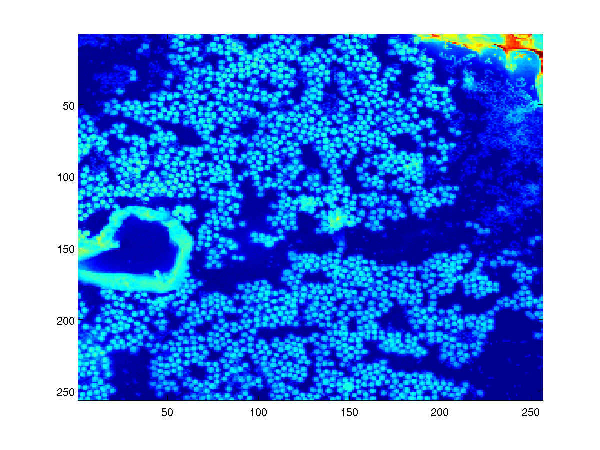
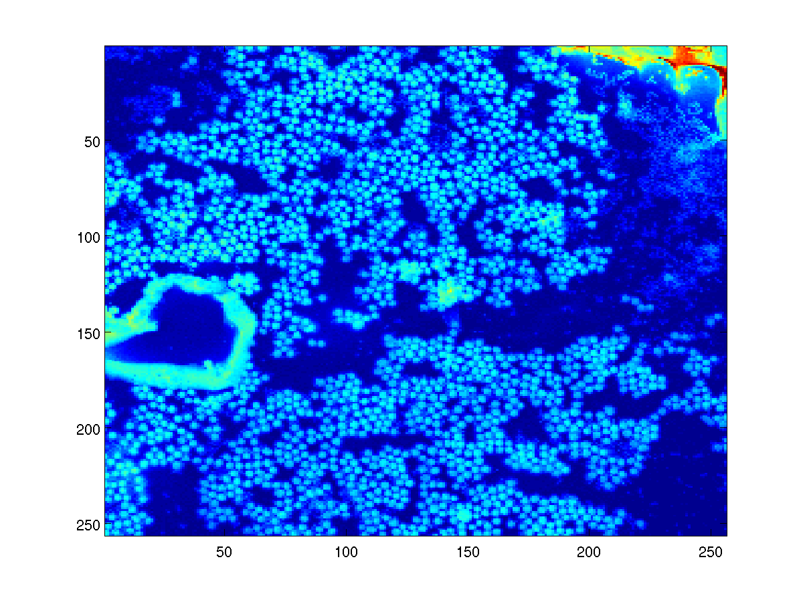
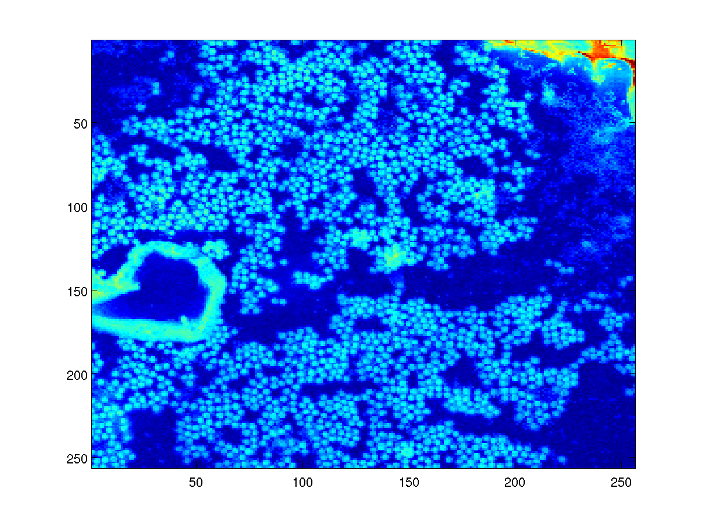
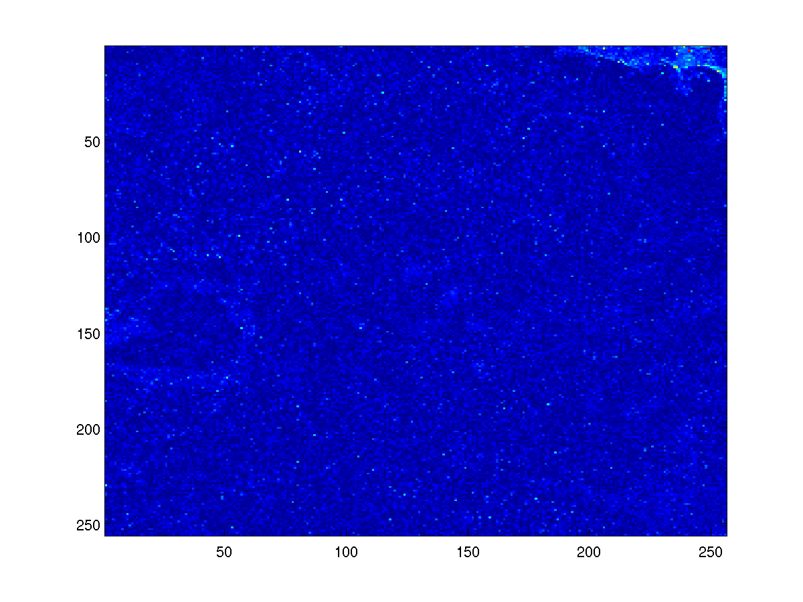
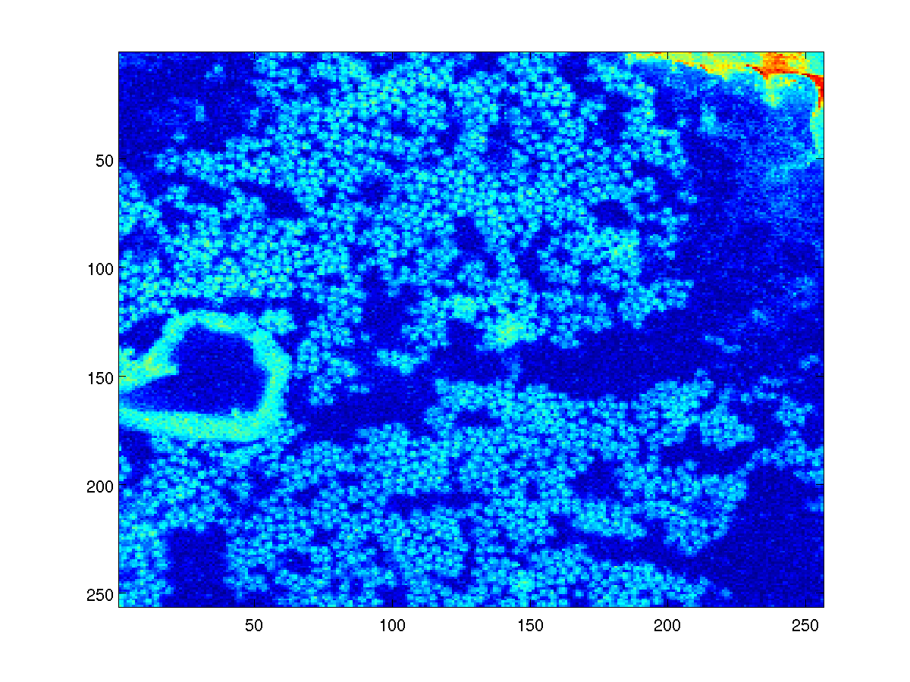

# Phase Retrieval via Matrix Completion

## Abstract

This paper develops a novel framework for phase retrieval, a problem which arises in X-ray crystallography, diffraction imaging, astronomical imaging and many other applications. Our approach, called PhaseLift, combines multiple structured illuminations together with ideas from convex programming to recover the phase from intensity measurements, typically from the modulus of the diffracted wave.  We demonstrate empirically that any complex-valued object can be recovered from the knowledge of the magnitude of just a few diffracted patterns by solving a simple convex optimization problem inspired by the recent literature on matrix completion. More importantly, we also demonstrate that our noise-aware algorithms are stable in the sense that the reconstruction degrades gracefully as the signal-to-noise ratio decreases. Finally, we introduce some theory showing that one can design very simple structured illumination patterns such that three diffracted figures uniquely determine the phase of the object we wish to recover.

**Keywords.** Diffraction, Fourier transform, convex optimization, trace-norm minimization.

## Introduction

### The phase retrieval problem

This paper considers the fundamental problem of recovering a general signal, an image for example, from the magnitude of its Fourier transform. This problem, also known as *phase retrieval*, arises in many applications and has challenged engineers, physicists, and mathematicians for decades.  Its origin comes from the fact that detectors can often times only record the squared modulus of the Fresnel or Fraunhofer diffraction pattern of the radiation that is scattered from an object. In such settings, one cannot measure the phase of the optical wave reaching the detector and, therefore, much information about the scattered object or the optical field is lost since, as is well known, the phase encodes a lot of the structural content of the image we wish to form.

Historically, the first application of phase retrieval is X-ray crystallography [52, 32], and today this may still very well be the most important application.  Over the last century or so, this field has developed a wide array of techniques to recover Bragg peaks from missing-phase data.  Of course, the phase retrieval problem permeates many other areas of imaging science, and other applications include diffraction imaging [12], optics [65], astronomical imaging [20], microscopy [49], to name just a few.  In particular, X-ray tomography has become an invaluable tool in biomedical imaging to generate quantitative 3D density maps of extended specimens on the nanoscale [21].  Other subjects where phase retrieval plays an important role are quantum mechanics [59, 19] and even differential geometry [8].  We note that phase retrieval has seen a resurgence in activity in recent years, fueled on the one hand by the desire to image individual molecules and other nano-particles, and on the other hand by new imaging capabilities: one such recent modality is the availability of new X-ray synchrotron sources that provide extraordinary X-ray fluxes, see for example [53, 62, 9, 49, 21].  References and various instances of the phase retrieval problem as well as some theoretical and numerical solutions can be found in [35, 44, 40].

There are many ways in which one can pose the phase-retrieval problem, for instance depending upon whether one assumes a continuous or discrete-space model for the signal. In this paper, we consider finite length signals (one-dimensional or multi-dimensional) for simplicity, and because numerical algorithms ultimately operate with digital data. To fix ideas, suppose we have a 1D signal $x = (x[0], x[1],$ $\ldots, x[n-1]) \in \mathbb{C}^n$ and write its Fourier transform as

$$
{\hat x}[\omega] =
  \frac{1}{\sqrt{n}} \sum_{0 \le t < n} x[t] e^{-i 2\pi \omega t/n},
\quad \omega \in \Omega.
$$

Here, $\Omega$ is a grid of sampled frequencies and an important special case is $\Omega = \{0,1, \ldots, n-1\}$ so that the mapping is the classical unitary discrete Fourier transform (DFT) (For later reference, we denote the Fourier transform operator by $F$ and the inverse Fourier transform by $F^{-1}$.).  The phase retrieval problem consists in finding $x$ from the magnitude coefficients $|{\hat x}[\omega]|$, $\omega \in \Omega$.  When $\Omega$ is the usual frequency grid as above and without further information about the unknown signal $x$, this problem is ill-posed since there are many different signals whose Fourier transforms have the same magnitude. Clearly, if $x$ is a solution to the phase retrieval problem, then (1) $c x$ for any scalar $c \in \mathbb{C}$ obeying $|c| = 1$ is also solution, (2) the "mirror function" or time-reversed signal $\bar{x}[-t \text{ mod } n]$ where $t = 0,1, \ldots, n-1$ is also solution, and (3) the shifted signal $x[t - a \text{ mod } n]$ is also a solution. From a physical viewpoint these "trivial associates" of $x$ are acceptable ambiguities. But in general infinitely many solutions can be obtained from $\{|\hat{x}[\omega]| : \omega \in \Omega\}$ beyond these trivial associates [61].

### Main approaches to phase retrieval

Holographic techniques are among the more popular methods that have been proposed to measure the phase of the optical wave. While holographic techniques have been successfully applied in certain areas of optical imaging, they are generally difficult to implement in practice [22]. Hence, the development of algorithms for signal recovery from magnitude measurements is still a very active field of research.  Existing methods for phase retrieval rely on all kinds of a priori information about the signal, such as positivity, atomicity, support constraints, real-valuedness, and so on [26, 27, 47, 18].  Direct methods [33] are limited in their applicability to small-scale problems due to their large computational complexity.

Oversampling in the Fourier domain has been proposed as a means to mitigate the non-uniqueness of the phase retrieval problem. While oversampling offers no benefit for most one-dimensional signals, the situation is more favorable for multidimensional signals, where it has been shown that twofold oversampling in each dimension almost always yields uniqueness for finitely supported, real-valued and non-negative signals [11, 34, 61]. In other words, a digital image of the form $x = \{x[t_1, t_2]\}$ with $0 \le t_1 < n_1$ and $0 \le t_2 < n_2$, whose Fourier transform is given by

$$
{\hat x}[\omega_1,\omega_2] = \frac{1}{\sqrt{n_1 n_2}} \sum x[t_1,
  t_2] e^{-i 2\pi (\omega_1 t_1/n_1 + \omega_2 t_2/n_2)},
$$

is usually uniquely determined from the values of $| {\hat x}[\omega_1,\omega_2]|$ on the oversampled grid $\omega = (\omega_1, \omega_2) \in \Omega = \Omega_1 \times \Omega_2$ in which $\Omega_i = \{0,1/2,1,3/2,\ldots, n_i + 1/2\}$. This holds provided $x$ has proper spatial support, is real valued and non-negative.

As pointed out in [44], these uniqueness results do not say anything about how a signal can be recovered from its intensity measurements, or about the robustness and stability of commonly used reconstruction algorithms --- a fact we shall make very clear in the sequel. In fact, theoretical uniqueness conditions do not readily translate into numerical methods and as a result, the algorithmical and practical aspects of the phase retrieval problem (from noisy data) still pose significant challenges.

By and large, the most popular methods for phase retrieval from oversampled data are alternating projection algorithms pioneered by Gerchberg and Saxton [29] and Fienup [26, 27].  These methods often require careful exploitation of signal constraints and delicate parameter selection to increase the likelihood of convergence to a correct solution [56, 47, 18, 46]. We describe the simplest realization of a widely used approach based on alternating projections [50], which assumes support constraints in the spatial domain and oversampled measurements in the frequency domain. With $T$ being a *known* subset containing the support of the signal $x$ ($\text{supp}(x) \subset T$) and Fourier magnitude measurements $\{y[\omega]\}_{\omega \in \Omega}$ with $y[\omega] = |\hat{x}[\omega]|$, the method works as follows:

- **Initialization:** Choose an initial guess $x_0$ and set $z_0[\omega] = y[\omega] \frac{\hat{x}_0[\omega]}{|\hat{x}_0[\omega]|}$ for $\omega \in \Omega$.

- **Loop:** For $k=1,2,\dots$ inductively define

$$
(1) \qquad x_k[t] =
\begin{cases}
(F^{-1} z_{k-1})[t] & \text{if \(t \in T\),} \\
0               & \text{else;}
\end{cases} \hspace*{52mm}
$$

$$
(2) \qquad
z_{k}[\omega] = y[\omega] \frac{\hat{x}_k[\omega]}{|\hat{x}_k[\omega]|}
\qquad \,\text{for \(\omega \in \Omega\)}
\hspace*{50mm}
$$

until convergence.

While this algorithm is simple to implement and amenable to additional constraints such as the positivity of $x$, its convergence remains problematic.  Projection algorithms onto convex sets are well understood [10, 31, 66, 3].  However, the set $\{z : |\hat{z}[\omega]| = |\hat{x}[\omega]|\}$ is not convex and, therefore, the algorithm is not known to converge in general or even to give a reasonable solution [41, 3, 44].  Good results have been reported in certain settings but they appear to be nevertheless somewhat problematic in light of our numerical experiments from Section 4.  Moreover, as discussed in [38], one of the most stringent limitations of these methods is the need for isolated objects (the support constraint). Finally, [45] points out that oversampling is not always practically feasible as certain experimental geometries allow only for sub-Nyquist sampling; an example is the Bragg sampling from periodic crystalline structures.

In a different direction, a frame-theoretic approach to phase retrieval has been proposed in [2, 1], where the authors derive various necessary and sufficient conditions for the uniqueness of the solution, as well as various numerical algorithms.  While theoretically appealing, the practical applicability of these results is limited by the fact that very specific types of measurements are required, which cannot be realized in most applications of interest.

To summarize our discussion, we have seen many methods which all represent some important attempts to find efficient algorithms, and work well in certain situations. However, these techniques do not always provide a consistent and robust result.

### PhaseLift -- a novel methodology

This paper develops a novel methodology for phase retrieval based on a rigorous and flexible numerical framework.  Whereas most of the existing methods seek to overcome nonuniqueness by imposing additional constraints on the signal, we pursue a different direction by assuming no constraints at all on the signal. There are two main components to our approach.

- *Multiple structured illuminations.*  We suggest collecting several diffraction patterns providing 'different views' of the sample or specimen. This can be accomplished in a number of ways: for instance, by modulating the light beam falling onto the sample or by placing a mask right after the sample, see Section 2 for details. Taking multiple diffraction patterns usually yields uniqueness as discussed in Section 3.

The concept of using multiple measurements as an attempt to resolve the phase ambiguity for diffraction imaging is of course not new, and was suggested in [54]. Since then, a variety of methods have been proposed to carry out these multiple measurements; depending on the particular application, these may include the use of various gratings and/or of masks, the rotation of the axial position of the sample, and the use of defocusing implemented in a spatial light modulator, see [22] for details and references. Other approaches include *ptychography*, an exciting field of research, where one records several diffraction patterns from overlapping areas of the sample, see [60, 63] and references therein.

- *Formulation of phase recovery as a matrix completion problem.* We suggest (1) lifting up the problem of recovering a vector from quadratic constraints into that of a recovering of a rank-one matrix from affine constraints, and (2) relaxing the combinatorial problem into a convenient convex program. Since the lifting step is fundamental to our approach, we will refer to the proposed numerical framework as *PhaseLift*. The price we pay for trading the nonconvex quadratic constraints into convex constraints is that we must deal with a highly underdetermined problem. However, recent advances in the areas of compressive sensing and matrix completion have shown that such convex approximations are often exact.

Although our algorithmic framework appears to be novel for phase retrieval, the idea of solving problems involving nonconvex quadratic constraints by semidefinite relaxations has a long history in optimization, see [7] and references therein, and Section 1.4 below for more discussion.

The goal of this paper is to demonstrate that taken together, multiple coded illuminations and convex programming (trace-norm minimization) provide a powerful new approach to phase retrieval. Further, a significant aspect of our methodology is that our systematic optimization framework offers a principled way of dealing with noise, and makes it easy to handle various statistical noise models. This is important because in practice, measurements are always noisy.  In fact, our framework can be understood as an elaborate regularized maximum likelihood method. Lastly, our framework can also include a priori knowledge about the signal that can be formulated or relaxed as convex constraints.

### Precedents

At the abstract level, the phase retrieval problem is that of finding $x \in \mathbb{C}^n$ obeying quadratic equations of the form $|\langle a_k, x\rangle|^2 = b_k$. Casting such quadratic constraints as affine constraints about the matrix variable $X = x x^\star$ has been widely used in the optimization literature for finding good bounds on a number of quadratically constrained quadratic problems (QCQP). Indeed, solving the general case of a QCQP is known to be an NP-hard problem since it includes the family of boolean linear programs [7].  The approach usually consists in finding a relaxation of the QCQP using semidefinite programming (SDP), for instance via Lagrangian duality. An important example of this strategy is Max Cut, an NP-hard problem in graph theory which can be formulated as a QCQP.  In a celebrated paper, Goemans and Williamson introduced a relaxation [30] for this problem, which lifts or linearizes a nonlinear, nonconvex problem to the space of symmetric matrices. Although there are evident connections to our work, our relaxation is quite different from these now standard techniques.

The idea of linearizing the phase retrieval problem by reformulating it as a problem of recovering a matrix from linear measurements can be found in [1]. While this reference also contains some intriguing numerical recovery algorithms, their practical relevance for most applications is limited by the fact that the proposed measurement matrices either require a very specific algebraic structure which does not seem to be compatible with the physical properties of diffraction, or the number of measurements is proportional to the square of the signal dimension, which is not feasible in most applications.

In terms of framework, the closest approach is the paper [17], in which the authors use a matrix completion approach for array imaging from intensity measurements. Although this paper executes a similar relaxation as ours, there are some differences. We present a "noise-aware" framework, which makes it possible to account for a variety of noise models in a systematic way. Moreover, our emphasis is on a novel combination of structured illuminations and convex programming, which seems to bear great potential.

## Methodology

### Structured illumination

Suppose $x = \{x[t]\}$ is the object of interest ($t$ may be a one- or multi-dimensional index).  In this paper, we shall discuss illumination schemes collecting the diffraction pattern of the modulated object $w[t] x[t]$, where the waveforms or patterns $w[t]$ may be selected by the user. There are many ways in which this can be implemented in practice, and we discuss just a few of those.

*A typical setup for structured illuminations in diffraction imaging using a phase mask.*

- *Masking.* One possibility is to modify the phase front after the sample by inserting a mask or a phase plate, see [42] for example. A schematic layout is shown in Figure
1. In [38], the sample is scanned by shifting the phase plate as in ptychography (discussed below); the difference is that one scans the known phase plate rather than the object being imaged.

- *Optical grating.* Another standard approach would be to change the profile or modulate the illuminating beam, which can easily be accomplished by the use of optical gratings [43]. A simplified representation would look similar to the scheme depicted in Figure 1, with a grating instead of the mask (the grating could be placed before or after the sample).

- *Ptychography.*  Here, one measures multiple diffraction patterns by scanning a finite illumination on an extended specimen [60, 63]. In this setup, it is common to maintain a substantial overlap between adjacent illumination positions.

- *Oblique illuminations.* One can use illuminating beams hitting the sample at user specified angle [23], see Figure 2 for a schematic illustration of this approach. One can also imagine having multiple simultaneous oblique illuminations.

*A typical setup for structured illuminations in diffraction imaging using oblique illuminations.  The left image shows direct (on-axis) illumination and the right image corresponds to oblique (off-axis) illumination.*

As is clear, there is no shortage of options and one might prefer solutions which require generating as few diffraction patterns as possible for stable recovery.

### Lifting

Suppose we have $x_0 \in \mathbb{C}^n$ or $\mathbb{C}^{n_1 \times n_2}$ (or some higher-dimensional version) about which we have quadratic measurements of the form

$$
\mathbb{A}(x_0) = \{|\langle a_k, x_0\rangle|^2 : k = 1, 2, \ldots, m\}.
$$

In the setting where we would collect the diffraction pattern of $w[t] x_0[t]$ as discussed earlier, then the waveform $a_k[t]$ can be written as

$$
a_k[t] \propto w[t] e^{i2\pi \, \langle\omega_k, t\rangle};
$$

here, $\omega_k$ is a frequency value so that $a_k[t]$ is a patterned complex sinusoid. One can assume for convenience that the normalizing constant is such that $a_k$ is unit normed, i.e. $\|a_k\|_2^2 = \sum_t |a_k[t]|^2 = 1$.  Phase retrieval is then the feasibility problem

$$
\begin{array}{ll}
    \text{find}   & \quad x\\
\text{obeying} & \quad  \mathbb{A}(x) = \mathbb{A}(x_0) := b.
  \end{array}
$$

As is well known, quadratic measurements can be lifted up and interpreted as linear measurements about the rank-one matrix $X = x x^*$. Indeed,

$$
|\langle a_k, x\rangle|^2 = \operatorname{Tr}(x^* a_k a_k^* x) = \operatorname{Tr}(a_k a_k^* x x^*) :=
\operatorname{Tr}(A_k X),
$$

where $A_k$ is the rank-one matrix $a_k a_k^*$. In what follows, we will let $\mathcal{A}$ be the linear operator mapping positive semidefinite matrices into $\{\operatorname{Tr}(A_k X) : k = 1,\ldots, m\}$.  Hence, the phase retrieval problem is equivalent to

$$
\begin{array}{ll}
    \text{find}   & \quad X\\
    \text{subject to} & \quad  \mathcal{A}(X) = b\\
& \quad X \succeq 0\\
& \quad \operatorname{rank}(X) = 1
\end{array}
\qquad \Leftrightarrow \qquad
  \begin{array}{ll}
    \text{minimize}   & \quad \operatorname{rank}(X)\\
    \text{subject to} & \quad  \mathcal{A}(X) = b\\
& \quad X \succeq 0.
\end{array}
$$

Upon solving the left-hand side of (5), we would factorize the rank-one solution $X$ as $x x^*$, hence finding solutions to the phase-retrieval problem. Note that the equivalence between the left- and right-hand side of (5) is straightforward since by definition, there exists a rank-one solution. Therefore, our problem is a rank minimization problem over an affine slice of the positive semidefinite cone. As such, it falls in the realm of low-rank *matrix completion* or *matrix recovery*, a class of optimization problems that has gained tremendous attention in recent years, see e.g. [58, 13, 14]. Just as in matrix completion, the linear system $\mathcal{A}(X) = b$, with unknown in the positive semidefinite cone, is highly underdetermined. For instance suppose our signal $x_0$ has $n$ complex unknowns. Then we may imagine collecting six diffraction patterns with $n$ measurements for each (no oversampling). Thus $m = 6n$ whereas the dimension of the space of $n \times n$ Hermitian matrices over the reals is $n^2$, which is obviously much larger.

We are of course interested in low-rank solutions and this makes the search feasible. This also raises an important question: what is the minimal number of diffraction patterns needed to recover $x$, whatever $x$ may be? Since each pattern yields $n$ *real-valued* coefficients and $x$ has $n$ *complex-valued* unknowns, the answer is at least two. Further, in the context of quantum state tomography, Theorem II in [28] shows one needs at least $3n-2$ intensity measurements to guarantee uniqueness, hence suggesting an absolute minimum of three diffraction patterns. Are three patterns sufficient? For some answers to this question, see Section 3.

### Recovery via convex programming

The rank minimization problem (5) is NP hard. We propose using the trace norm as a convex surrogate [5, 48] for the rank functional, giving the familiar SDP (and a crucial component of PhaseLift),

$$
\begin{array}{ll}
    \text{minimize}   & \quad \text{trace}(X)\\
    \text{subject to} & \quad  \mathcal{A}(X) = b\\
& \quad X \succeq 0.
\end{array}
$$

This problem is convex and there exists a wide array of numerical solvers including the popular Nesterov's accelerated first order method [55]. As far as the relationship between (5) and (6) is concerned, the matrix $\mathcal{A}$ in most diffraction imaging applications is not known to obey any of the conditions derived in the literature [13, 14, 58] that would guarantee a formal equivalence between the two programs. Nevertheless, the formulation (6) enjoys great empirical performance as demonstrated in Section 4.

We mentioned earlier that measurements are typically noisy and that our formulation allows for a principled approach to deal with this issue for a variety of noise models. Suppose the measurement vector $\{b_k\}$ is sampled from a probability distribution $p(\cdot ; \mu)$, where $\mu = \mathbb{A}(x_0)$ is the vector of noiseless values, $\mu_k = |\langle a_k, x_0\rangle|^2$. Then a classical fitting approach simply consists of maximizing the likelihood,

$$
\begin{array}{ll}
    \text{maximize}   & \quad p(b; \mu)\\
    \text{subject to} & \quad  \mu = \mathbb{A}(x)
\end{array}
$$

with optimization variables $\mu$ and $x$. (A more concise description is to find $x$ such that $p(b; \mathbb{A}(x))$ is maximum.) This is, of course, not tractable and our convex formulation suggests solving instead

$$
\begin{array}{ll}
   \text{minimize}   & \quad -\log p(b; \mu) + \lambda \operatorname{Tr}(X)\\
   \text{subject to} & \quad  \mu = \mathcal{A}(X)\\
   & \quad X \succeq 0
\end{array}
$$

with optimization variables $\mu$ and $X$ (in other words, find $X \succeq 0$ such that $-\log p(b; \mathcal{A}(X)) + \lambda \operatorname{Tr}(X)$ is minimum). Above, $\lambda$ is a positive scalar and, hence, our approach is a penalized or regularized maximum likelihood method, which trades off between goodness and complexity of the fit. When the likelihood is log-concave, problem (8) is convex and solvable. We give two examples for concreteness:

- *Poisson data.* Suppose that $\{b_k\}$ is a sequence of independent samples from the Poisson distributions $\text{Poi}(\mu_k)$.  The Poisson log-likelihood for independent samples has the form $\sum_k b_k \log \mu_k - \mu_k$ (up to an additive constant factor) and thus, our problem becomes

$$
\begin{array}{ll}
  \text{minimize}   & \quad \sum_k  [\mu_k - b_k \log \mu_k] + \lambda \operatorname{Tr}(X)\\
  \text{subject to} & \quad  \mu = \mathcal{A}(X)\\
  & \quad X \succeq 0.
\end{array}
$$

- *Gaussian data.*  Suppose that $\{b_k\}$ is a sequence of independent samples from the Gaussian distribution with mean $\mu_k$ and variance $\sigma_k^2$ (or is well approximated by Gaussian variables). Then our problem becomes

$$
\begin{array}{ll}
  \text{minimize}   & \quad \sum_k  \frac{1}{2\sigma^2_k} \, (b_k - \mu_k)^2 +
  \lambda \operatorname{Tr}(X)\\
  \text{subject to} & \quad  \mu = \mathcal{A}(X)\\
  & \quad X \succeq 0.
\end{array}
$$

If $\Sigma$ is a diagonal matrix with diagonal elements $\sigma_k^2$, this can be written as

$$
\begin{array}{ll}
  \text{minimize}   & \quad \frac12 [b - \mathcal{A}(X)]^* \Sigma^{-1} [b - \mathcal{A}(X)]  +
  \lambda \operatorname{Tr}(X)\\
  \text{subject to} & \quad X \succeq 0.
\end{array}
$$

Both formulations are of course convex and in both cases, one recovers the noiseless trace-minimization problem (6) as $\lambda \rightarrow 0^+$.

In addition, it is straightforward to include further constraints frequently discussed in the phase retrieval literature such as real-valuedness, positivity, atomicity and so on. Suppose the support of $x$ is known to be included in a set $T$ known a priori. Then we would add the linear constraint

$$
X_{ij} = 0, \quad (i,j) \notin T \times T.
$$

(Algorithmically, one would simply work with a reduced-size matrix.) Suppose we would like to enforce real-valuedness, then we simply assume that $X$ is real valued and positive semidefinite. Finally positivity can be expressed as linear inequalities

$$
X_{ij} \ge 0.
$$

Of course, many other types of constraints can be incorporated in this framework, which provides appreciable flexibility.

### PhaseLift with reweighting

The trace norm promotes low-rank solutions and this is why it is often used as a convex proxy for the rank. However, it is possible to further promote low-rank solutions by solving a sequence of weighted trace-norm problems, a technique which has been shown to provide even more accurate solutions [25, 15]. The reweighting scheme works like this: choose $\varepsilon > 0$; start with $W_0 = I$ and for $k = 0, 1, \ldots,$ inductively define $X_k$ as the optimal solution to

$$
\begin{array}{ll}
    \text{minimize}   & \quad \text{trace}(W_k X)\\
    \text{subject to} & \quad  \mathcal{A}(X) = b\\
& \quad X \succeq 0
\end{array}
$$

and update the 'weight matrix' as

$$
W_{k+1} = (X_k + \varepsilon I)^{-1}.
$$

The algorithm terminates on convergence or when the iteration count $k$ attains a specified maximum number of iterations $k_{\text{max}}$. One can see that the first step of this procedure is precisely (6); after this initial step, the algorithm proceeds in solving a sequence of trace-norm problems in which the matrix weights $W_k$ are roughly the inverse of the current guess.

As explained in the literature [25, 24], this reweighting scheme can be viewed as attempting to solve

$$
\begin{array}{ll}
   \text{minimize}   & \quad f(X) =  \log(\det(X + \varepsilon I)) \\
   \text{subject to} & \quad  \mathcal{A}(X) = b\\
   & \quad X \succeq 0
\end{array}
$$

by minimizing the tangent approximation to $f$ at each iterate; that is to say, at step $k$, (9) is equivalent to minimizing $f(X_{k-1}) + \langle\nabla f(X_{k-1}), X - X_{k-1}\rangle$ over the feasible set. This can also be applied to noise-aware variants where one would simply replace the objective functional in (8) with

$$
-\log p(b; \mu) + \lambda \operatorname{Tr}(W_k X),
$$

at each step, and update $W_k$ in exactly the same way as before.

The log-det functional is closer to the rank functional than the trace norm. In fact, minimizing this functional solves the phase retrieval problem as incorporated in the following theorem.

**Theorem 2.1.**

Suppose $\mathbb{A}$ is one to one and that the identity matrix $I$ is in the span of the sensing matrices $A_k$. Then the unique solution of the phase retrieval problem (4) is also the unique minimizer to (10)---up to global phase. (Quadratic measurements can of course never distinguish between $x$ and $c x$ in which $c \in \mathbb{C}$ has unit norm. When the solution is unique up to a multiplication with such a scalar, we say that unicity holds up to global phase. From now on, whenever we talk about unicity, it is implied up to global phase.) This holds for all values of $\varepsilon > 0$. The same conclusion holds without the inclusion assumption provided one modifies the reweighting scheme and substitutes the objective function $f(X)$ in (10) with $f(R X R)$ where $R = (\sum_k A_k)^{1/2}$.

Since the reweighting algorithm is a good heuristic for solving (10), we potentially have an interesting and tractable method for phase retrieval. It is not a perfect heuristic, however, as we cannot expect this procedure to always find the global minimum since the objective functional is concave.

The assumption that the identity matrix is in the span of the $A_k$'s holds whenever the modulus of the Fourier transform of the sample is measured.  Indeed, if $|F x|^2$ is observed, then letting $\{f_k^*\}$ be the rows of $F$, we have $\sum_k f_k f_k^* = I$.

*Proof.*  Our assumption implies that for any feasible $X$, $\operatorname{Tr}(X) = \sum_k h_k \operatorname{Tr}(A_k X) = \sum_k h_k b_k$ is fixed. Assume without loss of generality that feasible points obey $\operatorname{Tr}(X) = 1$ (if $\operatorname{Tr}(X) = 0$, then the unique solution is $X = 0$). If $x_0$ is the unique solution to phase retrieval (up to global phase), then $X_0 = x_0 x_0^*$ is the only rank-one feasible point. We thus need to show that any feasible $X$ with $\operatorname{rank}(X) > 1$, obeys $f(X) > f(X_0)$, a fact which follows from the strong concavity of $f$ (of the logarithm). Let $X = \sum_j \lambda_j u_j u_j^*$ be any eigenvalue decomposition of a feasible point. Then

$$
f(X) = \log(\det(\varepsilon I + X)) = \sum_j \log(\varepsilon + \lambda_j),
$$

and it follows from the strict concavity of the log that

$$
\sum_j \log(\varepsilon + \lambda_j) > \sum_j \lambda_j \log(\varepsilon +
1) + (1-\lambda_j) \log \varepsilon = \log(\varepsilon + 1) + (n-1) \log
\varepsilon.
$$

The first strict inequality holds unless $X$ is rank one, in which case, we have equality. The equality follows from $\sum_j \lambda_j = \operatorname{Tr}(X) = 1$. Since the right-hand side is nothing else than $f(X_0)$, the theorem is established.

For the second part, set $B_k = R^{-1} A_k R^{-1}$ and consider a new data problem with constraints $\{X: \operatorname{Tr}(B_k X) = b_k, X \succeq 0\}$. Now $X$ is feasible for our problem if and only if $RXR$ is feasible for this new problem. (This is because the mapping $X \mapsto R X R$ preserves the positive semidefinite cone.) Now suppose $x_0$ is the solution to phase retrieval and set $X_0 = x_0 x_0^*$ as before. Since $I$ is in the span of the sensing matrices $B_k$, we have just learned that for all for all $RXR \neq RX_0R$ and $X$ feasible for our problem,

$$
f(R X R) > f(R X_0 R).
$$

This concludes the proof.

## Theory

Our PhaseLift framework poses two main theoretical questions:

- When do multiple diffracted images imply unicity of the solution?

- When does our convex heuristic succeed in recovering the unique solution to the phase-retrieval problem?

Developing comprehensive answers to these questions constitutes a whole research program, which clearly is beyond the scope of this work. In this paper, we shall limit ourselves to introducing some theoretical results showing simple ways of designing diffraction patterns, which give unicity. Our focus is on getting uniqueness from a very limited number of diffraction patterns.  For example, we shall demonstrate that in some cases three diffraction images are sufficient for perfect recovery. Thus, we give below partial answers to the first question and will address the second in a later publication.

A frequently discussed approach to retrieve phase information uses a technique from holography. Roughly speaking, the idea is to let the signal of interest $x$ interfere with a known reference beam $y$. One typically measures $|x + y|^2$ and $|x - iy|^2$ and precise knowledge of $y$ allows, in principle, to recover the amplitude and phase of $x$. Holographic techniques are hard to implement [22] in practice. Instead, we propose using a modulated version of the signal itself as a reference beam which in some cases may be easier to implement.

To discuss this idea, we need to introduce some notation. For a complex signal $z \in \mathbb{C}^n$, we let $|z|^2$ be the nonnegative real-valued $n$-dimensional vector containing the squared magnitudes of $z$.  Suppose first that $x$ is a one-dimensional signal $(x[0], x[1], \ldots, x[n-1])$ and that $F_n$ is the $n \times n$ unitary DFT. In this section, we consider taking $3n$ real-valued measurements of the form

$$
\mathbb{A}(x) = \{|F_n x|^2, |F_n (x + D^s x)|^2, |F_n(x - iD^s x)|^2\},
$$

where $D$ is the modulation

$$
D = \text{diag}(\{e^{i2\pi t/n}\}_{0 \le t \le n-1}).
$$

These measurements can be obtained by illuminating the sample with the three light fields $1$, $e^{i2\pi st/n}$ and $e^{i2\pi (st/n - 1/4)}$. We show below that these $3n$ measurements are generally sufficient for perfect recovery.

**Theorem 3.1.**

Suppose the DFT of $x \in C^n$ does not vanish. Then $x$ can be recovered up to global phase from the $3n$ real numbers $\mathbb{A}(x)$ (11) if and only if $s$ is prime with $n$. In particular, assuming primality, if the trace-minimization program (6) or the iteratively reweighted algorithm return a rank-1 solution, then this solution is exact.

Conversely, if the DFT vanishes at two frequency points $k$ and $k'$ obeying $k - k' \neq s \text{ mod } n$, then recovery is not possible. from the $3n$ real numbers (11).

The proof of this theorem is constructive and we give a simple algorithm that achieves perfect reconstruction. Further, one can use masks to scramble the Fourier transform as to make sure it does not vanish. Suppose for instance that we collect

$$
\mathbb{A}(Wx), \quad W = \text{diag}(\{z[t]\}_{0 \le t \le n-1}).
$$

where the $z[t]$'s are iid $\mathcal{N}(0,1)$. Then since the Fourier transform of $z[t] x[t]$ does not vanish with probability one, we have the following corollary.

**Corollary 3.2.** Assume $s$ is prime with $n$.  Then with probability one, $x$ can be recovered up to global phase from the $3n$ real numbers $\mathbb{A}(Wx)$ where $W$ is the diagonal matrix with Gaussian entries above.

Of course, one could derive similar results by scrambling the Fourier transform with the aid of other types of masks, e.g. binary masks. We do not pursue such calculations.

We now turn our attention to the situation in higher dimensions and will consider the 2D case (higher dimensions are treated in the same way). Here, we have a discrete signal $x[t_1, t_2] \in \mathbb{C}^{n_1 \times n_2}$ about which we take the $3n_1 n_2$ measurements

$$
\{|\mathcal{F}_{n_1 \times n_2}  x|^2, |\mathcal{F}_{n_1 \times n_2} (x + \mathcal{D}^s x)|^2, |\mathcal{F}_{n_1 \times n_2} (x - i\mathcal{D}^s x)|^2\}, \quad s = (s_1, s_2);
$$

$\mathcal{F}_{n_1 \times n_2}$ is the 2D unitary Fourier transform defined by (2) in which the frequencies belong to the 2D grid $\{0, 1, \ldots, n_1 -1\} \times \{0, 1, \ldots, n_2 -1\}$, and $\mathcal{D}^s$ is the modulation

$$
[\mathcal{D}^s x][t_1, t_2] = e^{i2\pi s_1 t_1/n_1} \, e^{i2\pi s_2
  t_2/n_1} x[t_1, t_2].
$$

With these definitions, we have the following result:

**Theorem 3.3.**

Suppose the DFT of $x \in C^{n_1 \times n_2}$ does not vanish. Then $x$ can be recovered up to global phase from the $3n_1 n_2$ real numbers (12) if and only if $s_1$ is prime with $n_1$, $s_2$ is prime with $n_2$ and $n_1$ is prime with $n_2$. Under these assumptions, if the trace-minimization program (6) or the iteratively reweighted algorithm return a rank-1 solution, then this solution is exact.

Again, one can apply a random mask to turn this statement into a probabilistic statement holding either with probability one or with very large probability depending upon the mask that is used.

One can always choose $s_1$ and $s_2$ such that they be prime with $n_1$ and $n_2$ respectively. The last condition may be less friendly but one can decide to pad one dimension with zeros to guarantee primality. This is equivalent to a slight oversampling of the DFT along one direction. An alternative is to take $5 n_1 n_2$ measurements in which we modulate the signal horizontally and then vertically; that is to say, we modulate with $s = (s_1,0)$ and then with $s = (0,s_2)$. These $5 n_1 n_2$ measurements guarantee recovery if $s_1$ is prime with $n_1$ and $s_2$ is prime with $n_2$ for all sizes $n_1$ and $n_2$, see Section 3.3 for details.

### Proof of Theorem 3.1

Let $\hat{x} = (\hat x [0], \ldots, \hat x [n-1])$ be the DFT of $x$. Then knowledge of $\mathbb{A}(x)$ is equivalent to knowledge of

$$
|\hat{x}[k]|^2, |\hat x[k] + \hat{x}[k-s]|^2, \text{ and } |\hat x[k]
-i \hat{x}[k-s]|^2
$$

for all $k \in \{0,1,\ldots, n-1\}$ (above, $k-s$ is understood mod $n$). Write $\hat x[k] = |\hat x [k]| e^{i\phi[k]}$ so that $\phi[k]$ is the missing phase, and observe that

$$
\begin{aligned}
|\hat x[k] + \hat{x}[k-s]|^2 & = |\hat x[k]|^2 + |\hat{x}[k-s]|^2 +
  2|\hat x[k]| |\hat x[k-s]| \text{Re}(e^{i(\phi[k-s] - \phi[k]})\\
  |\hat x[k] -i\hat{x}[k-s]|^2 & = |\hat x[k]|^2 + |\hat{x}[k-s]|^2 +
  2|\hat x[k]| |\hat x[k-s]| \text{Im}(e^{i(\phi[k-s] - \phi[k]}).
\end{aligned}
$$

Hence, if $\hat{x}[k] \neq 0$ for all $k \in \{0,1, \ldots, n-1\}$, our data gives us knowledge of all phase shifts of the form

$$
\phi[k-s] - \phi[k], \quad k = 0,1, \ldots, n-1.
$$

We can, therefore, initialize $\phi[0]$ to be zero and then get the values of $\phi[-s]$, $\phi[-2s]$ and so on.

This process can be represented as a cycle in the group $\mathbb{Z}/n\mathbb{Z}$ as the sequence $(0,-s,-2s,\ldots)$. We would like this cycle to contain $n$ unique elements, which is true if and only if the cyclic subgroup $(0, s, 2s, \ldots )$ has order $n$. This is equivalent to requiring $\text{gcd}(s,n) = 1$.  If this subgroup has a smaller order, then recovery is impossible since we finish the cycle before we have all the phases; the phases that we are able to recover do not enable us to determine any more phases without making further assumptions.

For the second part of the theorem, assume without loss of generality, that $s = -1$ and that $(k,k') = (0,k_0)$ ($1 < k_0 < n-1$). For simplicity suppose these are the only zeros of the DFT. This creates two disjoint sets of frequency indices: those for which $0 < k < k_0$ and those for which $k_0 < k \le n-1$. We are given no information about the phase difference between elements of these two subgroups, and hence recovery is not possible.  This argument extends to situations where the DFT vanishes more often, in which case, we have even more indeterminacy.

### Proof of Theorem 3.3

Let $\hat{x} = \{\hat x [k_1,k_2]\}$, where $(k_1, k_2) \in \{0, 1, \ldots n_1 - 1\} \times \{0, 1, \ldots, n_2-1\}$ be the DFT of $x$. Then we have knowledge of

$$
|\hat{x}[k_1,k_2]|^2, |\hat x[k_1,k_2] + \hat{x}[k_1-s_s, k_2 -
s_2]|^2, \text{ and } |\hat x[k_1,k_2] -i \hat{x}[k_1-s_1, k_2-s_2]|^2
$$

for all $(k_1 k_2)$. With the same notations as before, this gives knowledge of all phase shifts of the form

$$
\phi[k_1-s_1, k_2 - s_2] - \phi[k_1,k_2], \quad 0 \le k_1 \le n_1,
0\le k_2 \le n_2 -1.
$$

Hence, we can initialize $\phi[0,0]$ to be zero and then get the values of $\phi[-s_1, -s_2]$, $\phi[-2s_1, -2s_2]$ and so on. The argument is as before: we would like the cyclic subgroup $\bigl( (0,0), (s_1, s_2), (2s_1, 2s_2), \ldots \bigr)$ in $\mathbb{Z}/n_1 \mathbb{Z} \times \mathbb{Z}/n_2 \mathbb{Z}$ to have order $n_1 n_2$. Now the order of an element $(s_1, s_2) \in \mathbb{Z}/n_1 \mathbb{Z} \times \mathbb{Z}/n_2 \mathbb{Z}$ is equal to

$$
\text{lcm}(|s_1|, |s_2|) = \text{lcm}(n_1/\text{gcd}(n_1,s_1),
n_2/\text{gcd}(n_2,s_2)),
$$

where $|s_1|$ is the order of $s_1$ in $\mathbb{Z}/n_1 \mathbb{Z}$ and likewise for $|s_2|$.  Noting that $\text{lcm}(a, b) \le ab$ and that equality is achieved if and only if $\text{gcd}(a, b) = 1$, we must simultaneously have

$$
\text{gcd}(s_1, n_1) = 1, \quad \text{gcd}(s_2, n_2) = 1 \quad \text{and }
\text{gcd}(n_1,n_2)) = 1
$$

to have uniqueness.

### Extensions

It is clear from our analysis that if we were to collect $|\mathcal{F}_{n_1\times n_2} x|^2$ together with

$$
\{|\mathcal{F}_{n_1 \times n_2} (x + \mathcal{D}^{s_k} x)|^2, |\mathcal{F}_{n_1 \times
  n_2} (x - i\mathcal{D}^{s_k} x)|^2\}, \quad k = 1, \ldots, K,
$$

so that one collects $(2K+1)n_1 n_2$ measurements, then 2D recovery is possible if and only if $\{s_1, \ldots, s_K\}$ generates $\mathbb{Z}/n_1 \mathbb{Z} \times \mathbb{Z}/n_2 \mathbb{Z}$ (and the Fourier transform has no nonzero components). This can be understood by analyzing the generators of the group $\mathbb{Z}/n_1 \mathbb{Z} \times \mathbb{Z}/n_2 \mathbb{Z}$.

A simple instance consists in choosing one modulation pattern to be $(s_1, 0)$ and another to be $(0,s_2)$. If $s_1$ is prime is $n_1$ and $s_2$ with $n_2$, these two modulations generate the whole group regardless of the relationship between $n_1$ and $n_2$. An algorithmic way to see this is as follows. Initialize $\phi(0,0)$. Then by using horizontal modulations, one recovers all phases of the form $\phi(k_1,0)$. Further, by using vertical modulations (starting with $\phi(k_1,0)$), one can recover all phases of the form $\phi(k_1,k_2)$ by moving upward.

## Numerical Experiments

This section introduces numerical simulations to illustrate and study the effectiveness of PhaseLift.

### Numerical solvers

All numerical algorithms were implemented in Matlab using TFOCS [6] as well as modifications of TFOCS template files. TFOCS is a library of Matlab-files designed to facilitate the construction of first-order methods for a variety of convex optimization problems, which include those we consider.

In a nutshell, suppose we wish to solve the problem

$$
\begin{array}{ll}
   \text{minimize}   & \quad g(X) :=  -\ell(b; \mathcal{A}(X)) + \lambda \operatorname{Tr}(X) \\
   \text{subject to}    & \quad X \succeq 0
\end{array}
$$

in which $\ell(b; \mathcal{A}(X))$ is a smooth and concave (in $X$) log-likelihood. Then a projected gradient method would start with an initial guess $X_0$, and inductively define

$$
X_k = \mathcal{P}(X_{k-1} - t_k \nabla g(X_{k-1})),
$$

where $\{t_k\}$ is a sequence of stepsize rules and $\mathcal{P}$ is the projection onto the positive semidefinite cone.  (Various stepsize rules are typically considered including fixed stepsizes, backtracking line search, exact line search and so on.)

TFOCS implements a variety of accelerated first-ordered methods pioneered by Nesterov, see [55] and references therein. One variant [4] works as follows. Choose $X_0$, set $Y_0 = X_0$ and $\theta_0 = 1$, and inductively define

$$
\begin{aligned}
X_k & = \mathcal{P}(Y_{k-1} - t_k \nabla g(Y_{k-1})) \cr
  \theta_k & = 2\Bigl[1 + \sqrt{1 + 4/\theta_{k-1}^2}\Bigr]^{-1} \cr
  \beta_k  & = \theta_k(\theta_{k-1}^{-1} - 1) \cr
  Y_k  & = X_k + \beta_k (X_k - X_{k-1})
\end{aligned}
$$

where $\{t_k\}$ is a sequence of stepsize rules as before. The sequence $\{\theta_k\}$ is usually referred to as a sequence of accelerated parameters, and $\{Y_k\}$ is an auxiliary sequence at which the gradient is to be evaluated.  The advantage of this approach is that the computational work per iteration is as in the projected gradient method but the number of iterations needed to reach a certain accuracy is usually much lower [55]. TFOCS implements such iterations and others like it but with various improvements.

For large problems, e.g. images with a large number $N$ of pixels, it is costly to hold the $N \times N$ optimization variable $X$ in memory. To overcome this issue, our computational approach maintains a low-rank factorization of $X$. This is achieved by substituting the projection onto the semidefinite cone (the expensive step) with a proxy. Whereas $\mathcal{P}$ dumps the negative eigenvalues as in

$$
\mathcal{P}(X) = \sum_i \max(\lambda_i,0) u_i u_i^*,
$$

where $\sum_i \lambda_i u_i u_i^*$ ($\lambda_1 \ge \lambda_2 \ge \ldots \ge \lambda_N$) is any eigenvalue decomposition of $X$, our proxy only keeps the $k$ largest eigenvalues in the expansion as in

$$
\sum_{i \le k} \max(\lambda_i,0) u_i u_i^*.
$$

For small values of $k$---we use $k$ between 10 and 20---this can be efficiently computed since we only need to compute the top eigenvectors of a low-rank matrix at each step. Although this approximation gives good empirical results, convergence is no longer guaranteed.

### Setup

To measure performance, we will use the mean-square error (MSE). However, since a solution $x_0$ is only unique up to global phase, it makes no sense to compute the squared distance between $x_0$ and the recovery $\hat{x}_0$.  Rather, we compute the distance to the solution space, i.e. we are interested in the relative MSE defined as

$$
\min_{c : |c| = 1} \,\, \frac{\|c x_0 - \hat{x}_0\|_2^2}{\|x_0\|^2}.
$$

This is the definition we will adopt throughout the paper; (Alternatively, we could use $\|x_0 x_0^* - \hat{x}_0 \hat{x}_0^*\|_F/\|x_0 x_0^*\|_F$, which gives very similar values.) the Signal-to-Noise Ratio (SNR) is analogous, namely, $\text{SNR} = \log_{10} (\text{rel.~MSE})$.

Although our algorithm favors low-rank solutions, it is not guaranteed to find a rank-one solution.  Therefore, if our optimal solution $\hat{X}_0$ does not have exactly rank one, we extract the rank-one approximation $\hat{x}_0 \hat{x}_0^*$ where $\hat{x}_0$ is an eigenvector associated with the largest eigenvalue. We use a scaling such that $\|\hat{x}_0\|^2 = \|x_0\|^2$. Note that the $\ell_2$ norm of the true solution is generally known since by Parseval's theorem, the $\ell_2$ norm of $F x_0$ is equal to $\|x_0\|$. Hence, observing the diffraction pattern of the object $x_0$ reveals its squared $\ell_2$ norm.

### 1-D simulations

Phase retrieval for one-dimensional signals arises in fiber optics [16, 37, 36], speech recognition [57], but also in the determination of concentration profiles in diffraction imaging [12]. We evaluate PhaseLift for noiseless and noisy data using a variety of different 'illuminations' and test signals.

#### Noisefree measurements

In the first set of experiments we demonstrate the recovery of two very different signals from noiseless data. Both test signals are of length $n = 128$.  The first signal, shown in Figure 3(a)) is a linear combination of a few sinusoids and represents a typical transfer function one might encounter in optics. The second signal is a complex signal, with independent Gaussian complex entries (each entry is of the form $a + i b$ where $a$ and $b$ are independent $\mathcal{N}(0,1)$ variables) so that the real and imaginary parts are independent white noise sequences; the real part of the signal is shown in Figure 3(b).

Four random binary masks are used to perform the structured illumination so that we measure $|Ax|^2$ in which

$$
A = F \begin{bmatrix} W_1 \\ W_2 \\ W_3 \\ W_4 \end{bmatrix},
$$

where each $W_i$ is diagonal with either $0$ or $1$ on the diagonal, resulting in a total of 512 intensity measurements.  We work with the objective functional $\frac12 \|b - \mathcal{A}(X)\|_2^2 + \lambda \operatorname{Tr}(X)$ and the constraint $X \succeq 0$ to recover the signal, in which we use a small value for $\lambda$ such as $0.05$ since we are dealing with noisefree data. We apply the reweighting scheme as discussed in Section 2.4.  (To achieve perfect reconstruction, one would have to let $\lambda \to 0$ as the iteration count increases.) The algorithm is terminated when the relative *residual error* is less than a fixed tolerance, namely, $\|\mathcal{A}(\hat{x}_0 \hat{x}_0^*) - b\|_2 \le 10^{-6} \|b\|_2$, where $\hat{x}_0$ is the reconstructed signal just as before.  The original and recovered signals are plotted in Figure 3(a) and (b).  The SNR is 87.3dB in the first case and 90.5dB in the second.

\subfigure[Smooth signal and its reconstruction]{

 } \qquad \subfigure[Random signal and its reconstruction (real part only)]{

 }

*Two test signals and their reconstructions. The recovered signals are essentially indistinguishable from the originals.*

We have repeated these experiments with the same test signals and the same algorithm, but using Gaussian masks instead of binary masks. In other words, the $W_i$'s have Gaussian entries on the diagonal. It turns out that in this case, three illuminations---instead of four---were sufficient to obtain similar performance. This seems to be empirical support for a long-standing conjecture in quantum mechanics due to Ron Wright (see e.g. the concluding section of [64]). The conjecture is that there exist three unitary operators $U_1, U_2, U_3$ such that the phase of the (finite-dimensional) signal $x$ is uniquely determined by the measurements $|U_1 x|, |U_2 x|, |U_3 x|$. Our simulations suggest that one can choose $U_1 = F$, $U_2 = F W$, and $U_3 = F W'$, where $W, W'$ are diagonal matrices with i.i.d. complex normal random variables as diagonal entries. The choice $U_1 = F$, $U_2 = I$, $U_3 = F W$ was equally successful in our experiments, and is a bit closer to the quantum mechanical setting.  Furthermore, we point out that no reweighting was needed, when we used six or more Gaussian masks. Expressed differently, plain trace-norm minimization succeeds with $6n$ or more intensity measurements of this kind.

#### Noisy measurements

In the next set of experiments, we consider the case when the measurements are contaminated with Poisson noise. The test signal is again a complex random signal as above. Eight illuminations with binary masks are used.  We add random Poisson noise to the measurements for five different SNR levels, ranging from about 16dB to about 52dB. Since the solution is known, we have calculated reconstructions for various values of the parameter $\lambda$ balancing the negative log-likelihood and the trace norm, and report results for that $\lambda$ giving the lowest MSE.  We implemented this strategy via the standard Golden Section Search [39]. In practice one would have to find the best $\lambda$ via a strategy like cross validation (CV) or generalized cross validation (GCV). For each SNR level we repeated the experiment ten times with different random noise and different binary masks.

Figure 4 shows the average relative MSE in dB (the values of $10 \log_{10}(\text{rel.~MSE})$ are plotted) versus the SNR. The error curves show clearly the desirable linear behavior between SNR and MSE with respect to the log-log scale. The performance degrades very gracefully with decreasing SNR. Furthermore, the difference of about 5dB between the error curve associated with four measurement and the error curve associated with eight measurements corresponds to an almost twofold error reduction, which is about as much improvement as one can hope to gain by doubling the number of measurements.

*SNR versus relative MSE on a dB-scale for different numbers of illuminations with binary masks. The linear relationship between SNR and MSE is apparent.*

#### Multiple measurements via oversampling

It is well-known that for one-dimensional signals, oversampling does not result in unique solutions to the phase problem [44]. This might mainly be a theoretical issue without real practical consequences.  Our numerical simulations confirm that this is not the case and demonstrate very clearly that oversampling is not useful for most one-dimensional signals.  We apply one of Fienup's algorithms as discussed in Section 4.A in [3], and PhaseLift with reweighting to real-valued non-negative random signals of length
128\. We use oversampling rates ranging from 2 to 5, and stop the algorithms when the relative residual error is less than $10^{-3}$.

| Oversampling | 2 | 3 | 4 | 5 |
| --- | --- | --- | --- | --- |
| Relative MSE (Fienup) | 0.6811 | 0.6548 | 0.6180 | 0.6150 |
| Relative MSE (PhaseLift) | 0.5451 | 0.5343 | 0.5299 | 0.4930 |

*MSE obtained by Fienup's algorithm and by PhaseLift from oversampled DFT measurements. Both methods produce guesses that fit the data and at the same time, are far from the true solution. This indicates that oversampling the DFT results in an ill-posed problem since we have several distinct solutions (probably infinitely many).*

The results are displayed in Table 1.  As can be seen, both algorithms find nearly perfect fits to the data and yet, they are very far from the original solution. Hence, we have a problem with multiple solutions.  The average SNR of the "reconstructions" obtained via Fienup's method is around 4dB, which is just barely better than if we had used a random guess as a solution. The average SNR for the solutions computed by PhaseLift is only marginally better.

### 2-D simulations

We consider a stylized version of a setup one encounters in X-ray crystallography or diffraction imaging.  The test image, shown in Figure 5(a) (magnitude), is a complex-valued image of size $256 \times 256$, whose pixel values correspond to the complex transmission coefficients of a collection of gold balls embedded in a medium.

#### Noisefree measurements

In the first experiment, we demonstrate the recovery of the image shown in Figure 5(a) from noiseless measurements. We consider two different types of illuminations. The first uses Gaussian random masks in which the coefficients on the diagonal of $W_k$ are independent real-valued standard normal variables. We use three illuminations, one being constant, i.e. $W_1 = I$, and the other two Gaussian. Again, we choose a small value of $\lambda$ set to $0.05$ in $\frac12 \|b - \mathcal{A}(X)\|_2^2 + \lambda \operatorname{Tr}(X)$ since we have no noise, and stop the reweighting iterations as soon as the residual error obeys $\|\mathcal{A}(\hat{x}_0 \hat{x}_0^*) - b\|_2 \le 10^{-3} \|b\|_2$.  The reconstruction, shown in Figure 5(b), is visually indistinguishable from the original. Since the original image and the reconstruction are complex-valued, we only display the absolute value of each image throughout this and the next subsection.

Gaussian random masks may not be realizable in practice. Our second example uses simple random binary masks, where the entries are either $0$ or $1$ with equal probability.  In this case, a larger number of illuminations as well as a larger number of reweighting steps are required to achieve a reconstruction of comparable quality. The result for eight binary illuminations is shown in Figure 5(c).

\subfigure[Original image]{

 } \quad \subfigure[Reconstruction using 3 Gaussian masks]{

 } \subfigure[Reconstruction using 8 binary masks]{

 } \quad \subfigure[Error between (a) and (c)]{

 }

*Original goldballs image and reconstructions via PhaseLift.*

#### Noisy measurements

In the second set of experiments we consider the same test image as before, but now with noisy measurements. In the first experiment the SNR is 20dB, in the second experiment the SNR is 60dB.  We use 32 Gaussian random masks in each case. The resulting reconstructions are depicted in Figure 6(a) (20dB case) and Figure 6(b) (60dB case). The SNR in the 20dB case is 11.83dB. While the reconstructed image appears slightly more "fuzzy" than the original image, all features of the image are clearly visible. In the 60dB case the SNR is 47.96dB, and the reconstruction is virtually indistinguishable from the original image.

\subfigure[Low SNR]{

 } \qquad \subfigure[High SNR]{

 }

*Reconstructions from noisy data via PhaseLift using 32 Gaussian random masks.*

#### Multiple measurements via oversampling

Oversampling of two-dimensional signals is widely used to overcome the nonuniqueness of the phase retrieval problem. We now explore whether this approach is viable.

Here, we consider signals with real, non-negative values as test images, a case frequently considered in the literature, see e.g. [52, 51, 50]. These images are of size $128 \times 128$.  We take noiseless measurements and apply PhaseLift as well as Fienup's iterative algorithms [3]. For each method, we terminate the iterations if the relative residual error is less than $10^{-3}$ or if the relative error between two successive iterates is less than $10^{-6}$.

- The simulations show that PhaseLift yields reconstructions that fit the measured data well, yielding a small relative residual error $\|\mathcal{A}(X) - y\|_2/\|y\|_2$, yet the reconstructions are far away from the true signal.  This behavior is indicative of an ill-conditioned problem.

- The iterates of Fienup's algorithm stagnated most of the time without converging to a solution. At other times it did yield reconstructions that fit the measured data well, but in either case the reconstruction was always very different from the true signal. Moreover, the reconstructions vary widely depending on the initial (random) guess.

Table 2 displays the results of PhaseLift as well as one of Fienup's algorithms, namely, the Error Reduction Algorithm [3] (the other versions yield comparable results).  The setup is this: we oversample the signal in each dimension by a factor of $r$, where $r=2,3,4,5$.  For each oversampling rate, we run ten experiments using a different test signal each time. The table shows the average residual errors over ten runs as well as the average relative MSE. The ill-posedness of the problem is evident from the disconnect between small residual error and large reconstruction error; that is to say, we fit the data very well and yet observe a large reconstruction error.  *Thus, in stark contrast to what is widely believed, our simulations indicate that oversampling by itself is not a viable strategy for phase retrieval even for non-negative, real-valued images.*

| Algorithm $\vert$ Oversampling | 2 | 3 | 4 | 5 |
| --- | --- | --- | --- | --- |
| $\|\mathcal{A}(X) - y\|_2/\|y\|_2$ (Fienup) | 0.0650 | 0.0607 | 0.0541 | 0.0713 |
| Relative MSE (Fienup) | 0.6931 | 0.6882 | 0.6736 | 0.6878 |
| $\|\mathcal{A}(X) - y\|_2/\|y\|_2$ (PhaseLift) | 0.0051 | 0.0055 | 0.0056 | 0.0052 |
| Relative MSE (PhaseLift) | 0.4932 | 0.4893 | 0.4960 | 0.4981 |

*MSE obtained by Fienup's algorithm and by PhaseLift with reweighting from oversampled DFT measurements taken on 2D real-valued and positive test images. Fienup's algorithm does not always find a signal consistent with the data as well as the support constraint. (After the projection step in the spatial domain, the current guess does not always match the measurement in Fourier space. After 'projection' in Fourier space, the signal is not the Fourier transform of a signal obeying the spatial constraints.) Our approach always finds signals matching measured data very well, and yet the reconstructions achieve a large reconstruction error. This indicates severe ill-posedness since we have several distinct solutions providing an excellent fit to the measured data.*

## Discussion

This paper introduces a novel framework for phase retrieval, combining multiple illuminations with tools from convex optimization, which been shown to work very well in practice and bears great potential. Having said this, our work also calls for improved theory, improved algorithms and a physical implementation of these ideas. Regarding this last point, it would be interesting to design physical experiments to test our methodology on real data, and we hope to report on this in a future publication. For now, we would like to bring up important open problems.

At the theoretical level, we need to understand for which families of physically implementable structured illuminations does the trace-norm heuristic succeed? How many diffraction patterns are provably sufficient for our convex programming approach to work? Also, we have shown that our approach is robust to noise in the sense that the performance degrades very gracefully as the SNR decreases. Can this be made rigorous? Can we prove that our proposed framework is indeed robust to noise? Here, it is very likely that the tools and ideas developed in the theories of compressed sensing and of matrix completion will play a key role in addressing these fundamental issues.

At the algorithmic level, we need to address the fact that the lifting creates optimization problems of potentially enormous sizes. A tantalizing prospect is whether or not it is possible to use knowledge that the solution has low-rank, e. g. rank one, to design algorithms which do not need to assemble or store very large matrices. If so, how can this be done? Here, randomized algorithms holding up a sketch of the full matrix may prove very helpful.

Finally, we would like to close by returning to another finding of this paper. Namely, oversampling the Fourier transform---this is the same as assuming finite support of the specimen---appears extremely problematic in practice, even for real-valued nonnegative signals. To be sure, we have demonstrated that there typically exist very distinct 2D signals whose modulus of the Fourier transform nearly coincide, whatever the degree of oversampling. In light of this extreme ill posedness, we have trouble understanding why this technique is used so heavily when it does not produce useful results in the absence of very specific a priori information about the image. Moreover, our concern is compounded by the additional fact that algorithms in common use tend to return solutions that depend on an initial guess so that different runs return widely different solutions.  In the spirit of reproducible research, this calls for documented results making publicly available both data sets and software so that researchers can reproduce published results or results yet to be published.  Of course, one might also be willing to rely on image priors far stronger than finite spatial extent, real-valuedness and positivity; they would, however, need to be specified.

\begin{small}

### Acknowledgements

E. C. is partially supported by NSF via grant CCF-0963835 and the 2006 Waterman Award. Y. E. is partially supported by the Israel Science Foundation under Grant no. 170/10. T. S. acknowledges partial support from the NSF via grants DMS 0811169 and DMS-1042939, and from DARPA via grant N66001-11-1-4090. V. V. is supported by the Department of Defense (DoD) through the National Defense Science & Engineering Graduate Fellowship (NDSEG) Program. We are indebted to Stefano Marchesini for inspiring and helpful discussions on the phase problem in X-ray crystallography as well as for providing us with the gold balls data set used in Section 4. We want to thank Philippe Jaming for bringing Wright's conjecture in [64] to our attention.

\end{small}

## References

1. R. Balan, B. Bodmann, P.G. Casazza, and D. Edidin. Painless reconstruction from magnitudes of frame coefficients. *J.\ Four.\ Anal.\ Appl.*, 15:488–501, 2009.
2. R. Balan, P.G. Casazza, and D. Edidin. On signal reconstruction without noisy phase. *Appl.\ Comp.\ Harm.\ Anal.*, 20:345–356, 2006.
3. H.H. Bauschke, P.L. Combettes, and D.R. Luke. Phase retrieval, error reduction algorithm, and Fienup variants: a view from convex optimization. *J. Opt. Soc. Am. A*, 19(7):1334–1345, 2002.
4. A. Beck and M. Teboulle. A fast iterative shrinkage-thresholding algorithm for linear inverse problems. *SIAM Journal on Imaging Sciences*, 2(1):183–202, 2009.
5. C. Beck and R. D'Andrea. Computational study and comparisons of LFT reducibility methods. In *Proceedings of the American Control Conference*, pages 1013–1017, 1998.
6. S. Becker, E.J. Candès, and M. Grant. Templates for convex cone problems with applications to sparse signal recovery. Technical report, Department of Statistics, Stanford University, 2010. Preprint available at <http://tfocs.stanford.edu/tfocs/paper.shtml>.
7. A. Ben-Tal and A. S. Nemirovski. *Lectures on modern convex optimization: analysis, algorithms, and engineering applications*. MPS-SIAM series on optimization. Society for Industrial and Applied Mathematics, 2001.
8. G. Bianchi, F. Segala, and A. Volcic. The solution of the covariogram problem for plane ${\mathcal C}^2_+$ convex bodies. *J. Differential Geometry*, 60:177–198, 2002.
9. M.J. Bogan and et al. Single particle X-ray diffractive imaging. *Nano Lett.*, 8(1):310–316, 2008.
10. L.M. Brègman. The method of successive projection for finding a common point of convex sets. *Soviet Math. Dokl.*, 6:688–692, 1965.
11. Y.M. Bruck and L.G. Sodin. On the ambiguity of the image reconstruction problem. *Opt. Comm.*, 30:304–308, 1979.
12. O. Bunk et al. Diffractive imaging for periodic samples: retrieving one-dimensional concentration profiles across microfluidic channels. *Acta Cryst., Section A: Foundations of Crystallography*, 63:306–314, 2007.
13. E.J. Candès and B. Recht. Exact matrix completion via convex optimization. *Foundations of Computational Mathematics*, 9(6):717–772, 2009.
14. E.J. Candès and T. Tao. The Power of Convex Relaxation: Near-Optimal Matrix Completion. *IEEE Trans. Inform. Theory*, 56(5):2053–2080, 2010.
15. E.J. Candès, M.B. Wakin, and S.P. Boyd. Enhancing sparsity by reweighted $l_1$ minimization. *J.\ Four.\ Anal.\ Appl.*, 14:877–905, 2008.
16. A. Carballar and M.A. Muriel. Phase reconstruction from reflectivity in fiber Bragg gratings. *J. Ligthwave Technol.*, 15(8):1314–1322, 1997.
17. A. Chai, M. Moscoso, and G. Papanicolaou. Array imaging using intensity-only measurements. Technical report, Stanford University, 2010.
18. C.C. Chen, J. Miao, C.W. Wang, and T.K. Lee. Application of the optimization technique to noncrystalline X-Ray diffraction microscopy: guided hybrid input-output method (GHIO). *Phys. Rev. B.*, 76:064113, 2007.
19. J.V. Corbett. The Pauli problem, state reconstruction and quantum-real numbers. *Rep. Math. Phys.*, 57:53–68, 2006.
20. J.C. Dainty and J.R. Fienup. Phase retrieval and image reconstruction for astronomy. In H. Stark, editor, *Image Recovery: Theory and Application*. Academic Press, New York, 1987.
21. M. Dierolf and et al. Ptychographic x-ray computed tomography at the nanoscale. *Nature*, 467:436–440, 2010.
22. H. Duadi et. al. Digital holography and phase retrieval. In J. Rosen, editor, *Source: Holography, Research and Technologies*. InTech, 2011.
23. A. Faridian, D. Hopp, G. Pedrini, U. Eigenthaler, Hirscher M., and W. Osten. Nanoscale imaging using deep ultraviolet digital holographic microscopy. *Optics Express*, 18(13):14159–14164, 2010.
24. M. Fazel. *Matrix Rank Minimization with Applications*. PhD thesis, Stanford University, 2002.
25. M. Fazel, H. Hindi, and S. Boyd. Log-det heuristic for matrix rank minimization with applications to Hankel and Euclidean distance matrices. In *Proc. Am. Control Conf.*, pages 2156–2162, 2003.
26. J.R. Fienup. Reconstruction of an object from the modulus of its Fourier transform. *Optics Letters*, 3:27–29, 1978.
27. J.R. Fienup. Phase retrieval algorithms: A comparison. *Applied Optics*, 21(15):2758–2768, 1982.
28. J. Finkelstein. Pure-state informationally complete and "really" complete measurements. *Phys. Rev. A*, 70:052107, 2004.
29. R.W. Gerchberg and W.O. Saxton. A practical algorithm for the determination of phase from image and diffraction plane pictures. *Optik*, 35:237–246, 1972.
30. M. X. Goemans and D. P. Williamson. Improved approximation algorithms for maximum cut and satisfiability problems using semidefinite programming. *J. ACM*, 42:1115–1145, November 1995.
31. L. Gubin, B. Polyak, and E. Raik. The method of projections for finding the common point of convex sets. *USTSR Comput. Math. and Math. Phys.*, 7:1–24, 1967.
32. R.W. Harrison. Phase problem in crystallography. *J. Opt. Soc. Am. A*, 10(5):1045–1055, 1993.
33. H. Hauptman. The direct methods of X-ray crystallography. *Science*, 233(4760):178–183, 1986.
34. M. Hayes. The reconstruction of a multidimensional sequence from the phase or magnitude of its Fourier transform. *IEEE Trans. Acoust., Speech, Signal Proc.*, 30:140–154, 1982.
35. N. Hurt. *Phase Retrieval and Zero Crossings*. Kluwer Academic Publishers, Norwell, MA, 1989.
36. E. Ip, A.P.T. Lau, D.J.F. Barros, and J.M. Kahn. Coherent detection in optical fiber systems. *Optics Express*, 16(2):753–791, 2008.
37. Y. Ivankovski and D. Mendlovic. High-rate long-distance fiber-optic communication based on advanced modulation techniques. *Applied Optics*, 38(26):5533–5540, 1999.
38. I. Johnson, K. Jefimovs, O. Bunk, C. David, M. Dierolf, J. Gray, D. Renker, and F. Pfeiffer. Coherent diffractive imaging using phase front modifications. *Phys. Rev. Lett.*, 100(15):155503, Apr 2008.
39. J. Kiefer. Sequential minimax search for a maximum. *Proceedings of the American Mathematical Society*, 4(3):502–506, 1953.
40. M.V. Klibanov, P.E. Sacks, and A.V. Tikhonravov. The phase retrieval problem. *Inverse problems*, 11:1995, 1–28.
41. A. Levi and H. Stark. Restoration from phase and magnitude by generalized projections. In H. Stark, editor, *Image Recovery: Theory and application*, pages 277–320. Acad. Press, 1987.
42. Y.J Liu and et al. Phase retrieval in x-ray imaging based on using structured illumination. *Phys. Rev. A*, 78:023817, 2008.
43. E.G. Loewen and E. Popov. *Diffraction Gratings and Applications*. Marcel Dekker, 1997.
44. D.R. Luke, J.V. Burke, and R.G. Lyon. Optical wavefront reconstruction: Theory and numerical methods. *SIAM Rev.*, 44(2):169–224, 2002.
45. S. Marchesini. Ab initio compressive phase retrieval. Preprint, [arxiv:0809.2006], 2008.
46. S. Marchesini. Phase retrieval and saddle-point optimization. *J. Opt. Soc. Am. A*, 24:3289–3296, 2007.
47. S. Marchesini. A unified evaluation of iterative projection algorithms for phase retrieval. *Rev. Sci. Inst.*, 78:011301 11–10, 2007.
48. M. Mesbahi and G. P. Papavassilopoulos. On the rank minimization problem over a positive semidefinite linear matrix inequality. *IEEE Transactions on Automatic Control*, 42(2):239–243, 1997.
49. J. Miao, T. Ishikawa, Q. Shen, and T. Earnest. Extending X-Ray crystallography to allow the imaging of noncrystalline materials, cells and single protein complexes. *Annu.\ Rev.\ Phys.\ Chem.*, 59:387–410, 2008.
50. J. Miao, J. Kirz, and D. Sayre. The oversampling phasing method. *Acta Cryst.*, 56:D13:12–15, 2000.
51. J. Miao, D. Sayre, and H.N. Chapman. Phase retrieval from the magnitude of the Fourier transforms of nonperiodic objects. *J. Opt. Soc. Am. A*, 15(6):1662–1669, 1998.
52. R.P. Millane. Phase retrieval in crystallography and optics. *J. Opt. Soc. Am. A.*, 7:394––411, 1990.
53. R.P. Millane. Recent advances in phase retrieval. In P.J. Bones, M.A. Fiddy, and R.P. Millane, editors, *Image Reconstruction from Incomplete Data IV*, volume 6316 of *Proc. SPIE*, pages 63160E/1–11, 2006.
54. D.L. Misell. A method for the solution of the phase problem in electron microscopy. *J. Phys. D: App. Phy.*, 6(1):L6–L9, 1973.
55. Y. Nesterov. *Introductory Lectures on Convex Optimization: A Basic Course*, volume 87 of *Applied Optimization*. Kluwer, Boston, 2004.
56. K.A. Nugent, A.G. Peele, H.N. Chapman, and A.P. Manusco. Unique phase recovery for nonperiodic objects. *Phys. Rev. Lett.*, 91:203902, 2003.
57. L. Rabiner and B.H. Juang. *Fundamentals of speech recognition*. Signal Processing Series. Prentice Hall, 1993.
58. B. Recht, M. Fazel, and P. Parrilo. Guaranteed minimum rank solutions of matrix equations via nuclear norm minimization. *SIAM Review*, to appear.
59. H. Reichenbach. *Philosophic Foundations of Quantum Mechanics*. University of California Press, Berkeley, 1944.
60. J.M. Rodenburg. Ptychography and related diffractive imaging methods. *Advances in Imaging and Electron Physics, vol. 150*, 150:87–184, 2008.
61. J.L.C. Sanz. Mathematical considerations for the problem of Fourier transform phase retrieval frommagnitude. *SIAM Journal on Applied Mathematics*, 45(4):651–664, 1985.
62. G. Scapin. Structural biology and drug discovery. *Current Pharmaceutical Design*, 12:2087–2097, 2006.
63. P. Thibault, M. Dierolf, O. Bunk, A. Menzel, and F. Pfeiffer. Probe retrieval in ptychographic coherent diffractive imaging. *Ultramicroscopy*, 109:338–343, 2009.
64. A. Vogt. Position and momentum distributions do not determine the quantum mechanical state. In A.R. Marlow, editor, *Mathematical Foundations of Quantum Theory*. Academic Press, New York, 1978.
65. A. Walther. The question of phase retrieval in optics. *Opt. Acta*, 10:41–49, 1963.
66. D.C. Youla. Mathematical theory of image restoration by the method of convex projections. In H. Stark, editor, *Image Recovery: Theory and application*, pages 29–77. Acad. Press, 1987.
