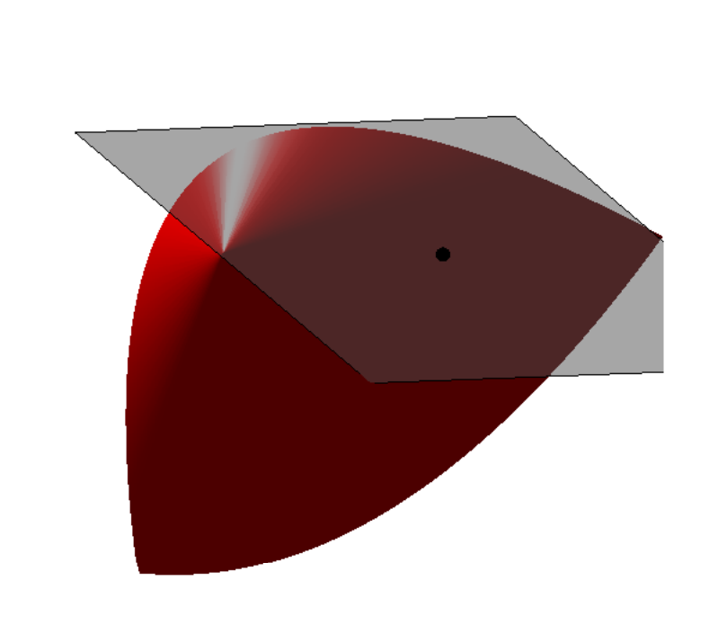
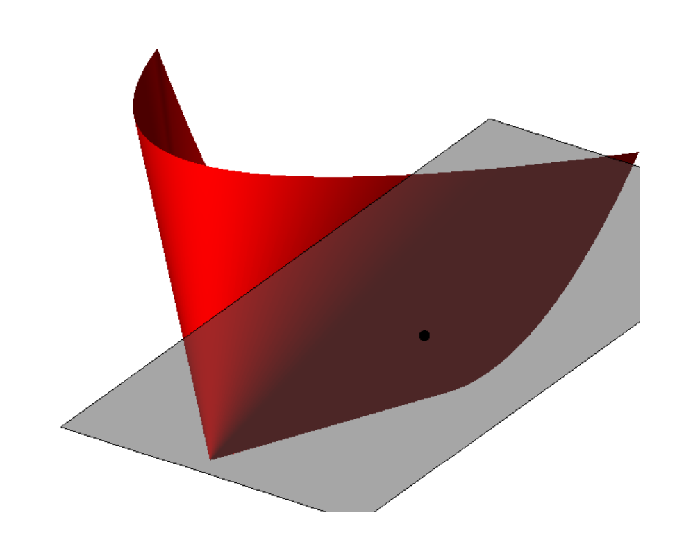
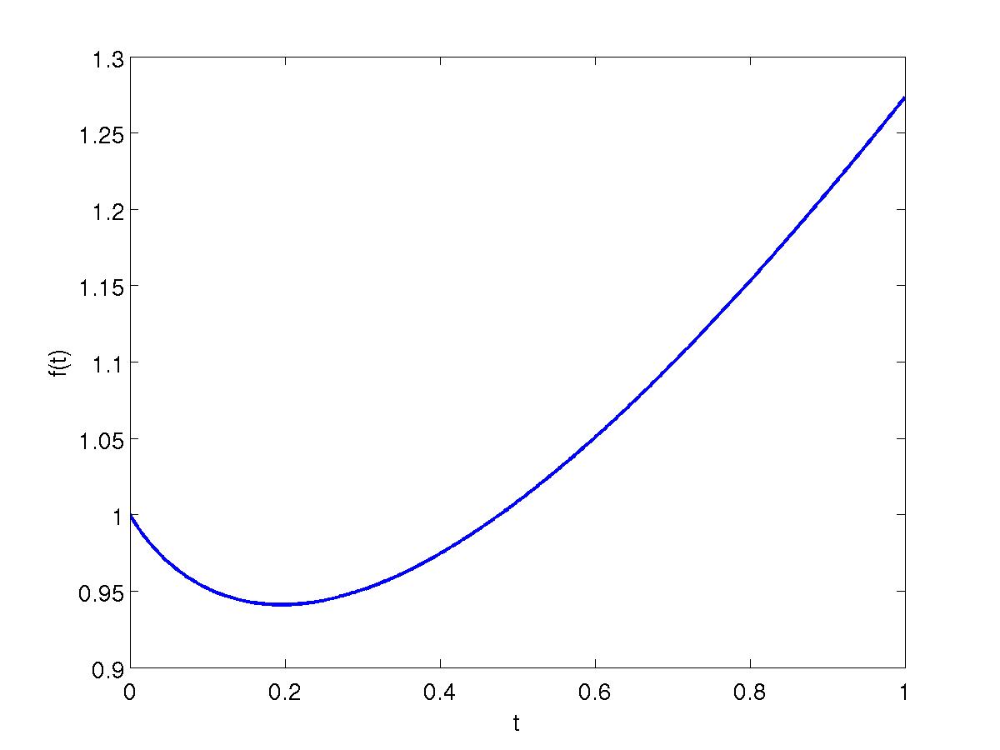
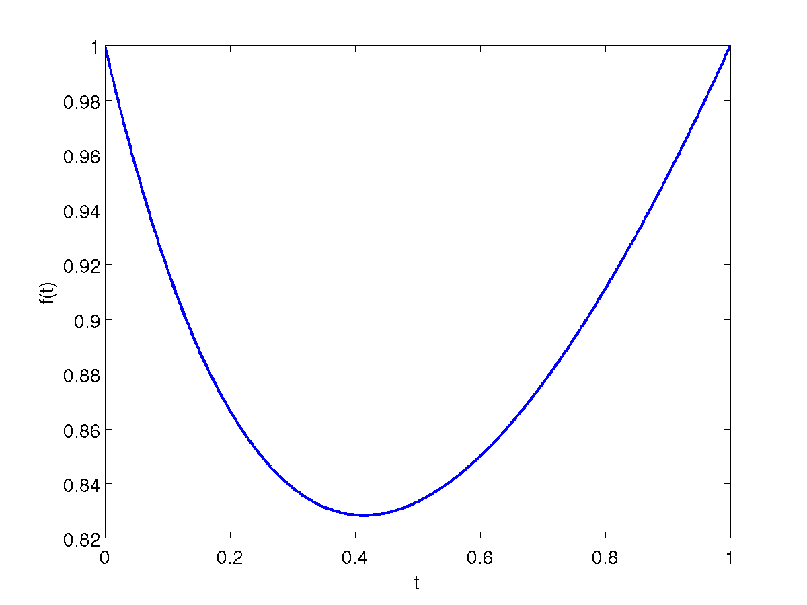
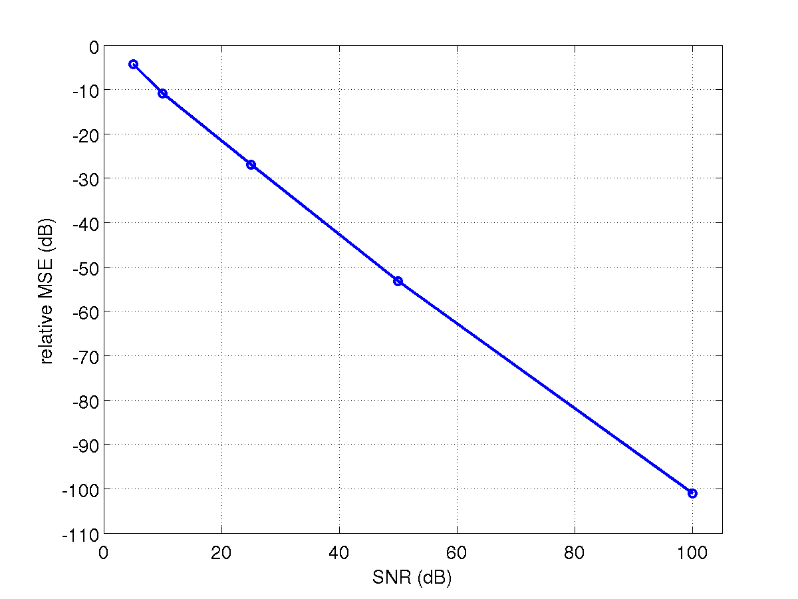
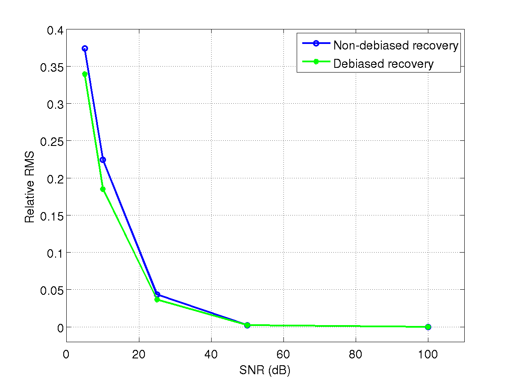
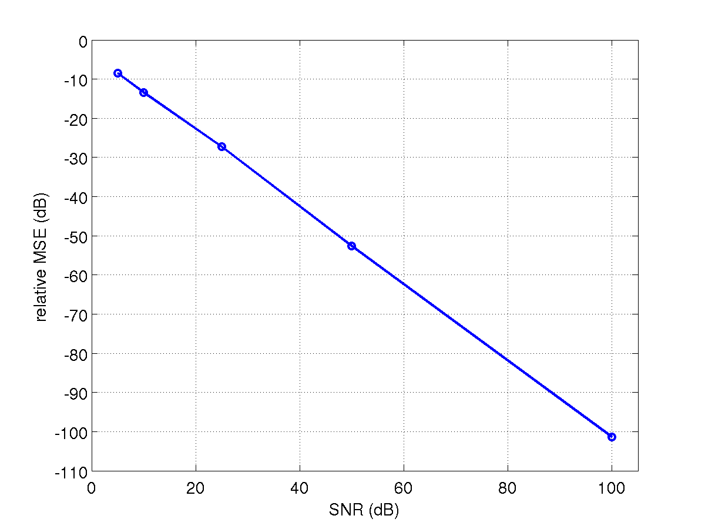
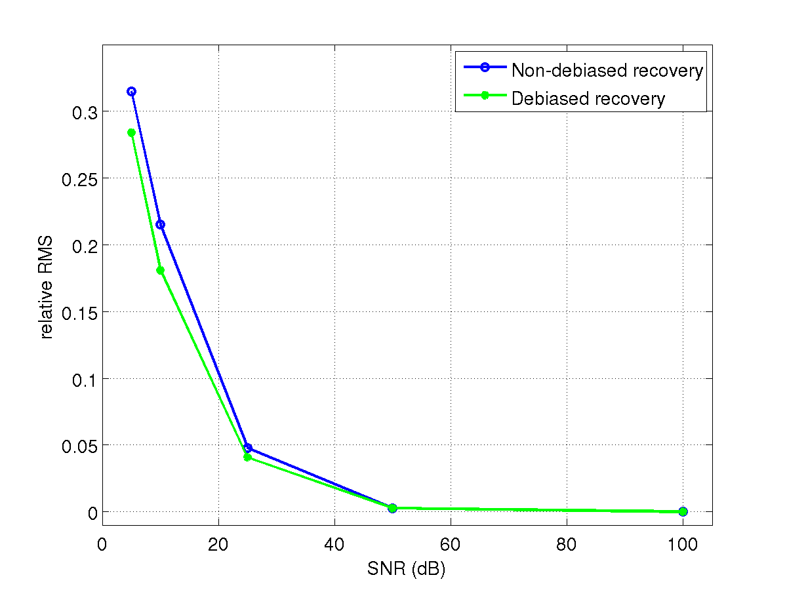
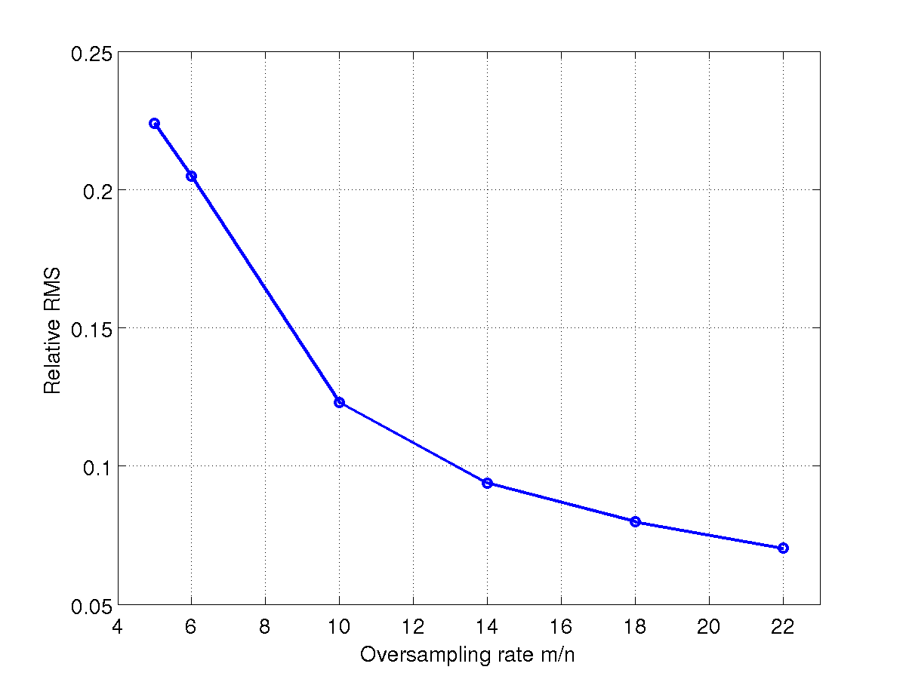

# PhaseLift: Exact and Stable Signal Recovery from Magnitude Measurements via Convex Programming

## Abstract

Suppose we wish to recover a signal $\bm{x} \in \mathbb{C}^n$ from $m$ intensity measurements of the form $|\langle \bm{x},\bm{z}_i \rangle|^2$, $i = 1, 2, \ldots, m$; that is, from data in which phase information is missing. We prove that if the vectors $\bm{z}_i$ are sampled independently and uniformly at random on the unit sphere, then the signal $\bm{x}$ can be recovered exactly (up to a global phase factor) by solving a convenient semidefinite program---a trace-norm minimization problem; this holds with large probability provided that $m$ is on the order of $n \log n$, and without any assumption about the signal whatsoever. This novel result demonstrates that in some instances, the combinatorial phase retrieval problem can be solved by convex programming techniques. Finally, we also prove that our methodology is robust vis a vis additive noise.

## Introduction

In many applications, one would like to acquire information about an object but it is impossible or very difficult to measure and record the phase of the signal. The problem is then to reconstruct the object from intensity measurements only. A problem of this kind that has attracted a considerable amount of attention over the last hundred years or so, is of course that of recovering a signal or image from the intensity measurements of its Fourier transform [15, 16] as in X-ray crystallography. As is well-known, such phase retrieval problems are notoriously difficult to solve numerically.

Formally, suppose $\bm{x} \in \mathbb{C}^n$ is a discrete signal and that we are given information about the squared modulus of the inner product between the signal and some vectors $\bm{z}_i$, namely,

$$
b_i = |\langle\bm{x},\bm{z}_i\rangle|^2, \quad i = 1, \ldots, m.
$$

In truth, we would like to know $\langle\bm{x},\bm{z}_i\rangle$ and record both phase and magnitude information but can only record the magnitude; in other words, phase information is lost.  In the classical example discussed above, the $\bm{z}_i$'s are complex exponentials at frequency $\omega_i$ so that one collects the squared modulus of the Fourier transform of $\bm{x}$. Of course, many other choices for the measurement vectors $\bm{z}_i$ are frequently discussed in the literature, see [12, 2] for instance.

We wish to recover $\bm{x}$ from the data vector $\bm{b}$, and suppose first that $\bm{x}$ is known to be real valued a priori. Then assuming that $\bm{x}$ is uniquely determined by $\bm{b}$ up to a global sign, the recovery may be cast as a combinatorial optimization problem: find a set of signs $\sigma_i$ such that the solution to the linear equations $\left<\bm{x},\bm{z}_i\right> = \sigma_i \sqrt{b_i}$, call it $\hat{\bm{x}}$, obeys $|\left<\hat{\bm{x}},\bm{z}_i\right>|^2 = b_i$.  Clearly, there are $2^m$ choices for $\sigma_i$ and only two choices of these signs yield $\bm{x}$ up to global phase.  The complex case is harder yet, since resolving the phase ambiguities now consists of finding a collection $\sigma_i$ of complex numbers, each being on the unit circle. Formalizing matters, it has been shown that at least one version of the phase retrieval problem is NP-hard [20].  Thus, one of the major challenges in the field is to find conditions on $m$ and $\bm{z}_i$ which guarantee efficient numerical recovery.

A frame-theoretic approach to signal recovery from magnitude measurements has been proposed in [3, 1, 2], where the authors derive various necessary and sufficient conditions for the uniqueness of the solution, as well as various polynomial-time numerical algorithms for very specific choices of $\bm{z}_i$.  While theoretically quite appealing, the drawbacks are that the methods are (1) either algebraic in nature, thus severely limiting their stability in the presence of noise or slightly inexact data, or (2) the number $m$ of measurements is on the order of $n^2$, which is much too large compared to the number of unknowns.

This paper follows a very different route and establishes that if the vectors $\bm{z}_i$ are independently and uniformly sampled on the unit sphere, then our signal can be recovered exactly from the magnitude measurements (1) by solving a simple convex program we introduce below; this holds with high probability with the proviso that the number of measurements is on the order of $n \log n$. Since there are $n$ complex unknowns, we see that the number of samples is nearly minimal.  To the best of our knowledge, this is the first result establishing that under appropriate conditions, the computationally challenging nonconvex problem of reconstructing a signal from magnitude measurements is formally equivalent to a convex program in the sense that they are guaranteed to have the same unique solution.

Finally, our methodology is robust with respect to noise in the measurements. To be sure, when the data are corrupted by a small amount of noise, we also prove that the recovery error is small.

### Methodology

We introduce some notation that shall be used throughout to explain our methodology. Letting $\mathcal{A}$ be the linear transformation

$$
\begin{array}{lll}
  \mathcal{H}^{n \times n} & \rightarrow & \mathbb{R}^m\\
  \bm{X} & \mapsto & \{\bm{z}_i^* \bm{X} \bm{z}_i\}_{1 \le i \le m}
\end{array}
$$

which maps Hermitian matrices into real-valued vectors, one can express the data collection $b_i = |\langle\bm{x}, \bm{z}_i\rangle|^2$ as

$$
\bm{b} = \mathcal{A}(\bm{x} \bm{x}^*).
$$

For reference, the adjoint operator $\mathcal{A}^*$ maps real-valued inputs into Hermitian matrices, and is given by

$$
\begin{array}{lll}
  \mathbb{R}^{m} & \rightarrow & \mathcal{H}^{n \times n}\\
  \bm{y} & \mapsto & \sum_i y_i \, \bm{z}_i \bm{z}_i^*.
\end{array}
$$

As observed in [10, 7] (see also [17]), the phase retrieval problem can be cast as the matrix recovery problem

$$
\begin{array}{ll}
    \text{minimize}   & \quad \operatorname{rank}(\bm{X})\\
    \text{subject to} & \quad  \mathcal{A}(\bm{X}) = \bm{b}\\
& \quad \bm{X} \succeq 0.
\end{array}
$$

Indeed, we know that a rank-one solution exists so the optimal $\bm{X}$ has rank at most one. We then factorize the solution as $\bm{x} \bm{x}^*$ in order to obtain solutions to the phase-retrieval problem. This gives $\bm{x}$ up to multiplication by a unit-normed scalar. This is all we can hope for since if $\bm{x}$ is a solution to the phase retrieval problem, then $c \bm{x}$ for any scalar $c \in \mathbb{C}$ obeying $|c| = 1$ is also solution. (When the solution is unique up to multiplication by such a scalar, we shall say that unicity holds up to global phase.)

Rank minimization is in general NP hard, and we propose, instead, solving a trace-norm relaxation. Although this is a fairly standard relaxation in control [4, 18], the idea of casting the phase retrieval problem as a trace-minimization problem over an affine slice of the positive semidefinite cone is very recent [10, 7]. Formally, we suggest solving

$$
\begin{array}{ll}
    \text{minimize}   & \quad \operatorname{Tr}(\bm{X})\\
    \text{subject to} & \quad  \mathcal{A}(\bm{X}) = \bm{b}\\
& \quad \bm{X} \succeq 0.
\end{array}
$$

If the solution has rank one, we factorize it as above to recover our signal. This method which lifts up the problem of vector recovery from quadratic constraints into that of recovering a rank-one matrix from affine constraints via semidefinite programming is known under the name of *PhaseLift* [7].

The program (5) is a semidefinite program (SDP) in standard form, and there is a rapidly growing list of algorithms for solving problems of this kind as efficiently as possible.  The crucial question is whether and under which conditions the combinatorially hard problem (4) and the convex problem (5) are formally equivalent.

### Main result

In this paper, we consider the simplest and perhaps most natural model of measurement vectors. In this statistical model, we simply assume that the vectors $\bm{z}_i$ are independently and uniformly distributed on the unit sphere of $\mathbb{C}^n$ or $\mathbb{R}^n$. To be concrete, we distinguish two models.

- *The real-valued model.* Here, the unknown signal $\bm{x}$ is real valued and the $\bm{z}_i$'s are independently sampled on the unit sphere of $\mathbb{R}^n$.

- *The complex-valued model.* The signal $\bm{x}$ is now complex valued and the $\bm{z}_i$'s are independently sampled on the unit sphere of $\mathbb{C}^n$.

Our main result is that the convex program recovers $\bm{x}$ exactly (up to global phase) provided the number $m$ of magnitude measurements is on the order of $n \log n$.

**Theorem 1.1.**

Consider an arbitrary signal $\bm{x}$ in $\mathbb{R}^n$ or $\mathbb{C}^n$ and suppose that the number of measurements obeys $m \ge c_0 \, n \log n$, where $c_0$ is a sufficiently large constant. Then in both the real and complex cases, the solution to the trace-minimization program is exact with high probability in the sense that (5) has a unique solution obeying

$$
\hat{\bm{X}} = \bm{x} \bm{x}^*.
$$

This holds with probability at least $1 - 3e^{-\gamma \frac{m}{n}}$, where $\gamma$ is a positive absolute constant.

Expressed differently, Theorem 1.1 establishes a rigorous equivalence between a class of phase retrieval problems and a class of semidefinite programs.  Clearly, any phase retrieval algorithm, no matter how complicated or intractable, would need at least $2n$ quadratic measurements to recover a complex valued object $\bm{x} \in \mathbb{C}^n$.  In fact recent results, compare Theorem II in [12], show that for complex-valued signals, one needs at least $3n-2$ intensity measurements to guarantee uniqueness of the solution to (4).  Further, Balan, Casazza and Edidin have shown that with probability 1, $4n-2$ generic measurement vectors (which includes the case of random uniform vectors) suffice for uniqueness in the complex case [3]. Hence, Theorem 1.1 shows that the oversampling factor for perfect recovery via convex optimization is rather minimal.

To be absolutely complete, we would like to emphasize that our discrete signals $\bm{x}$ may represent 1D, 2D, 3D and higher dimensional objects. For instance, in 2D the vector $\bm{x} \in \mathbb{C}^n$ might be a family of samples of the form $x[t_1,t_2]$, $1 \le t_1 \le n_1$, $1 \le t_2 \le n_2$, and with $n = n_1 n_2$, so that $\bm{x}$ is a discrete 2D image. In this case, we would record the squared magnitudes of the dot product

$$
\langle\bm{x},\bm{z}_i\rangle = \sum_{t_1, t_2} \bar{x}[t_1,t_2] z_i[t_1,t_2].
$$

Hence, our framework and theory apply to one- or multi-dimensional signals.

### Geometry

We find it rather remarkable that the only solution to (5) is $\hat{\bm{X}} = \bm{x}\bm{x}^*$. To see why this is perhaps unexpected, suppose for simplicity that the trace of the solution were known (we might be given some side information or just have additional measurements giving us this information) and equal to $1$, say. In this case, the objective functional is of course constant over the feasible set, and our problem reduces to solving the feasibility problem

$$
\begin{array}{ll} \text{find} & \quad \bm{X} \\
    \text{such that} & \quad \mathcal{A}(\bm{X}) = \bm{b}, \,\,  \bm{X} \succeq 0
\end{array}
$$

with again the proviso that knowledge of $\mathcal{A}(\bm{X})$ determines $\operatorname{Tr}(\bm{X})$ (equal to $\operatorname{Tr}(\bm{x}\bm{x}^*) = \|\bm{x}\|_2 = 1$).  In this context, our main theorem states that $\bm{x}\bm{x}^*$ is the unique feasible point. In other words, there is no other positive semidefinite matrix $\bm{X}$ in the affine space $\mathcal{A}(\bm{X}) = \bm{b}$. Naively, we would not expect this affine space of enormous dimension---it is of co-dimension about $n \log n$ and thus of dimension $n^2 - O(n \log n)$ in the complex case---to intersect the positive semidefinite cone in only one point. Indeed, counting degrees of freedom suggests that there are infinitely many candidates in the intersection.  The reason why this is not the case, however, is precisely because there is a feasible solution with low rank. Indeed, the slice of the positive semidefinite cone $\{\bm{X} : \bm{X} \succeq 0\} \cap \{\operatorname{Tr}(\bm{X}) = 1\}$ is quite 'pointy' at $\bm{x}\bm{x}^*$ and it is, therefore, possible for the affine space $\{\mathcal{A}(\bm{X}) = \bm{b}\}$ to be tangent even though it is of very small codimension.

Figure 1 represents this geometry. In this example,

$$
\bm{x} = \frac{1}{\sqrt2} \begin{bmatrix} 1 \\ -1 \end{bmatrix} \quad
\Longrightarrow \quad \bm{x}\bm{x}^* = \frac12 \begin{bmatrix} 1 & -1 \\
  -1 & 1 \end{bmatrix}
$$

and the affine space $\mathcal{A}(\bm{X}) = \bm{b}$ is tangent to the positive semidefinite cone at the point $\bm{x} \bm{x}^*$.

\caption[]{Representation of the affine space $\mathcal{A}(\bm{X}) = \bm{b}$ (gray) and of the semidefinite cone $\begin{bmatrix} x & y \\ y & z \end{bmatrix} \succeq 0$ (red) which is a subset of $\mathbb{R}^3$. These two sets are drawn so that they are tangent to each other at the rank 1 matrix $\frac{1}{2} \begin{bmatrix} 1 & -1 \\ -1 & 1 \end{bmatrix}$ (black dot).  Two views of the same 3D figure are provided for convenience. }

Mathematically speaking, phase retrieval is a problem in algebraic geometry since we are trying to find a solution to a set of polynomial equations. The originality in our approach is that we do not use tools from this field. For instance, we prove that there is no other positive semidefinite matrix $\bm{X}$ in the affine space $\mathcal{A}(\bm{X}) = \bm{b}$, or equivalently, that a certain system of polynomial equations (a symmetric matrix is positive semidefinite if and only if the determinants of all the leading principal minors are nonnegative) only has one solution; this is a fact that general techniques from algebraic geometry appear to not detect.

### Stability

In the real world, measurements are contaminated by noise. Using the frameworks developed in [8] and [14], it is possible to extend Theorem 1.1 to accommodate noisy measurements. One could consider a variety of noise models as discussed in [7] but we work here with a simple generic model in which we observe

$$
b_i = |\langle\bm{x},\bm{z}_i\rangle|^2 + \nu_i,
$$

where $\nu_i$ is a noise term with bounded $\ell_2$ norm, $\|\bm{\nu}\|_2 \le \epsilon$.  This model is nonstandard since the usual statistical linear model posits a relationship of the form $b_i = \langle\bm{x},\bm{z}_i\rangle + \nu_i$ in which the mean response is a linear function of the unknown signal, not a quadratic function. Furthermore, we prefer studying (8) rather than the related model $b_i = |\langle\bm{x},\bm{z}_i\rangle| + \nu_i$ (the modulus is not squared) because in many applications of interest in optics and other areas of physics, one can measure squared magnitudes or intensities---not magnitudes.

We now consider the solution to

$$
\begin{array}{ll}
   \text{minimize}   & \quad \operatorname{Tr}(\bm{X})\\
   \text{subject to} & \quad  \|\mathcal{A}(\bm{X}) - \bm{b}\|_2 \le \epsilon\\
   & \quad \bm{X} \succeq 0.
\end{array}
$$

We do not claim that $\hat{\bm{X}}$ has low rank so we suggest estimating $\bm{x}$ by extracting the largest rank-1 component. Write $\hat{\bm{X}}$ as

$$
\hat{\bm{X}} = \sum_{k = 1}^n \hat{\lambda}_k \hat{\bm{u}}_k \hat{\bm{u}}_k^*, \quad
\hat{\lambda}_1  \ge \ldots \ge \hat{\lambda}_n \ge 0,
$$

and set

$$
\hat{\bm{x}} = \sqrt{\hat{\lambda}_1} \, \hat{\bm{u}}_1.
$$

We prove the following estimate.

**Theorem 1.2.**

Fix $\bm{x} \in \mathbb{C}^n$ or $\mathbb{R}^n$ and assume the $\bm{z}_i$'s are uniformly sampled on the sphere of radius $\sqrt{n}$. Under the hypotheses of Theorem 1.1, the solution to (9) obeys ($\|\bm{X}\|_2$ is the Frobenius norm of $\bm{X}$)

$$
\|\hat{\bm{X}} - \bm{x}\bm{x}^*\|_2 \le C_0 \, \epsilon
$$

for some positive numerical constant $C_0$. We also have

$$
\|\hat{\bm{x}} - e^{i\phi} \bm{x}\|_2 \le C_0 \,  \text{\em min}(\|\bm{x}\|_2,
\epsilon/\|\bm{x}\|_2)
$$

for some $\phi \in [0,2\pi]$. Both these estimates hold with nearly the same probability as in the noiseless case.

Thus our approach also provides stable recovery in presence of noise. This important property is not shared by other reconstruction methods, which are of a more algebraic nature and rely on particular properties of the measurement vectors, such as the methods in [12, 3, 2], as well as the methods that appear implicitly in Theorem 3.1 and Theorem 3.3 of [7].

We note that one can further improve the accuracy of the solution $\hat{\bm{x}}$ by "debiasing" it. We replace $\hat{\bm{x}}$ by its rescaled version $s \hat{\bm{x}}$ where $s = \sqrt{\sum_{k=1}^{n} \hat{\lambda}_k}/\|\hat{\bm{x}}\|_2$.  This corrects for the energy leakage occurring when $\hat{\bm{X}}$ is not exactly a rank-1 solution, which could cause the norm of $\hat{\bm{x}}$ to be smaller than that of the actual solution. Other corrections are of course possible.

### Organization of the paper

The remainder of the paper is organized as follows. Subsection 1.6 introduces some notation used throughout the paper. In Section 2 we present the main architecture of the proof of Theorem 1.1, which comprises two key ingredients: approximate $\ell_1$ isometries and approximate dual certificates.  Section 3 is devoted to establishing approximate $\ell_1$ isometries. In Section 4, we construct approximate dual certificates and complete the proof of Theorem 1.1 in the real-valued case. Section 5 shows how the proof for the real-valued case can be adapted to the complex-valued case. Section 6 is concerned with the proof of Theorem 1.2. Numerical simulations, illustrating our theoretical results, are presented in Section 7. We conclude the paper with a short discussion in Section 8.

### Notations

It is useful to introduce notations that shall be used throughout the paper. Matrices and vectors are denoted in boldface (such as $\bm{X}$ or $\bm{x}$), while individual entries of a vector or matrix are denoted in normal font; e.g. the $i$th entry of $\bm{x}$ is $x_i$.  For matrices, we define

$$
\|\bm{X}\|_p = \Bigl[\sum_i \sigma_i^p(\bm{X})\Bigr]^{1/p},
$$

(where $\sigma_i(\bm{X})$ denotes the $i$th singular value of $\bm{X}$), so that $\|\bm{X}\|_1$ is the nuclear norm, $\|\bm{X}\|_2$ is the Frobenius norm and $\|\bm{X}\|_\infty$ is the operator norm also denoted by $\|\bm{X}\|$. For vectors, $\|\bm{x}\|_p$ is the usual $\ell_p$ norm. We denote the $n-1$ dimensional sphere by $S^{n-1}$, i.e. the set $\{\bm{x} \in \mathbb{R}^n : \|\bm{x}\|_2 = 1\}$.

Next, we define $T_{\bm{x}}$ to be the set of symmetric matrices of the form

$$
T_{\bm{x}} = \{\bm{X} = \bm{x} \bm{y}^* + \bm{y} \bm{x}^*: \bm{y} \in \mathbb{R}^n\}
$$

and denote $T_{\bm{x}}^\perp$ by its orthogonal complement.  Note that $\bm{X} \in T_{\bm{x}}^\perp$ if and only if both the column and row spaces of $\bm{X}$ are perpendicular to $\bm{x}$. Further, the operator $\mathcal{P}_{T_{\bm{x}}}$ is the orthogonal projector onto $T_{\bm{x}}$ and similarly for $\mathcal{P}_{T_{\bm{x}}^\perp}$. We shall almost always use $\bm{X}_{T_{\bm{x}}}$ as a shorthand for $\mathcal{P}_{T_{\bm{x}}}(\bm{X})$.

Finally, we will abuse language and say that a symmetric matrix $\bm{H}$ is feasible if and only if $\bm{x}\bm{x}^* + \bm{H}$ is feasible for our problem (5). This means that $\bm{H}$ obeys

$$
\bm{x}\bm{x}^* + \bm{H} \succeq 0 \quad \text{and} \quad \mathcal{A}(\bm{H}) = 0.
$$

## Architecture of the Proof

In this section, we introduce the main architecture of the argument and defer the proofs of crucial intermediate results to later sections. We shall prove Theorem 1.1 in the real case first for ease of exposition. Then in Section 5, we shall explain how to modify the argument to the complex and more general case.

Suppose then that $\bm{x} \in \mathbb{R}^n$ and that the $\bm{z}_i$'s are sampled on the unit sphere.  It is clear that we may assume without loss of generality that $\bm{x}$ is unit-normed. Further, since the uniform distribution on the unit sphere is rotationally invariant, it suffices to prove the theorem in the case where $\bm{x} = \bm{e}_1$. Indeed, we can write any unit vector $\bm{x}$ as $\bm{x} = \bm{U} \bm{e}_1$ where $\bm{U}$ is orthogonal. Since

$$
|\langle\bm{x}, \bm{z}_i\rangle|^2 = |\langle\bm{U}\bm{e}_1, \bm{z}_i\rangle|^2 = |\langle\bm{e}_1, \bm{U}^* \bm{z}_i\rangle|^2 =^d
|\langle\bm{e}_1, \bm{z}_i\rangle|^2,
$$

the problem is the same as that of finding $\bm{e}_1$. We henceforth assume that $\bm{x} = \bm{e}_1$.

Finally, the theorem can be equivalently stated in the case where the $\bm{z}_i$'s are i.i.d. copies of a white noise vector $\bm{z} \sim \mathcal{N}(0,I)$ with independent standard normals as components. Indeed, if $\bm{z}_i \sim \mathcal{N}(0,I)$,

$$
|\langle\bm{x}, \bm{z}_i\rangle|^2 = b_i \quad \Longleftrightarrow \quad |\langle\bm{x}, \bm{u}_i\rangle|^2 =
b_i/\|\bm{z}_i\|_2^2,
$$

where $\bm{u}_i = \bm{z}_i/\|\bm{z}_i\|_2$ is uniformly sampled on the unit sphere. Since $\|\bm{z}_i\|_2$ does not vanish with probability one, establishing the theorem for Gaussian vectors establishes it for uniformly sampled vectors and vice versa. From now on, we assume $\bm{z}_i$ i.i.d. $\mathcal{N}(0,I)$.

### Key lemma

The set $T := T_{\bm{e}_1}$ defined in (12) may be interpreted as the tangent space at $\bm{e}_1 \bm{e}_1^*$ to the manifold of symmetric matrices of rank 1. Now standard duality arguments in semidefinite programming show that a sufficient (and nearly necessary) condition for $\bm{x}\bm{x}^*$ to be the unique solution to (5) is this:

- the restriction of $\mathcal{A}$ to $T$ is injective ($\bm{X} \in T$ and $\mathcal{A}(X) = 0 \Rightarrow \bm{X} = 0$),

- and there exists a *dual certificate* $\bm{Y}$ in the range of $\mathcal{A}^*$ obeying (The notation $A \prec B$ means that $B - A$ is positive definite.)

$$
\bm{Y}_T = \bm{e}_1 \bm{e}_1^* \quad \text{and} \quad \bm{Y}_T^\perp \prec I_T^\perp.
$$

The proof is straightforward and omitted.  Our strategy to prove Theorem 1.1 hinges on the fact that a strengthening of the injectivity property allows to relax the properties of the dual certificate, as in the approach pioneered in [13] for matrix completion. We establish the crucial lemma below.

**Lemma 2.1.**

Suppose that the mapping $\mathcal{A}$ obeys the following two properties: for all positive semidefinite matrices $X$,

$$
m^{-1} \|\mathcal{A}(\bm{X})\|_1 < (1+1/9) \|\bm{X}\|_1;
$$

and for all matrices $\bm{X} \in T$

$$
m^{-1} \|\mathcal{A}(\bm{X})\|_1 > 0.94(1-1/9) \|\bm{X}\|.
$$

Suppose further that there exists $\bm{Y}$ in the range of $\mathcal{A}^*$ obeying

$$
\|\bm{Y}_T - \bm{e}_1 \bm{e}_1^*\|_2 \le 1/3 \quad \text{and} \quad \|\bm{Y}_T^\perp\| \le 1/2.
$$

Then $\bm{e}_1 \bm{e}_1^*$ is the unique minimizer to (5).

The first property (15) is reminiscent of the (one-sided) RIP property in the area of compressed sensing [9]. The difference is that it is expressed in the 1-norm rather than the 2-norm. Having said this, we note that RIP-1 properties have also been used in the compressed sensing literature, see [6] for example. We use this property instead of a property about $\|\mathcal{A}(\bm{X})\|_2$, because we actually believe that a RIP property in the 2-norm does not hold here because $\|\mathcal{A}(\bm{X})\|_2^2$ involves fourth moments of Gaussian variables. The second property (16) is a form of local RIP-1 since it holds only for matrices in $T$.

We would like to emphasize that the bound for the dual certificate in (17) is loose in the sense that $\bm{Y}_T$ and $\bm{e}_1 \bm{e}_1^*$ may not be that close, a fact which will play a crucial role in our proof.  This is in stark contrast with the work of David Gross [13], which requires a very tight approximation.

### Proof of Lemma 2.1

We need to show that there is no feasible $\bm{x}\bm{x}^* + \bm{H} \neq \bm{x}\bm{x}^*$ with $\operatorname{Tr}(\bm{x}\bm{x}^* + \bm{H}) \leq \operatorname{Tr}(\bm{x}\bm{x}^*)$.  Consider then a feasible $\bm{H} \neq 0$ obeying $\operatorname{Tr}(\bm{H}) \le 0$, write

$$
\bm{H} = \bm{H}_T + \bm{H}_T^\perp,
$$

and observe that

$$
0 = \|\mathcal{A}(\bm{H})\|_1 = \|\mathcal{A}(\bm{H}_T)\|_1 - \|\mathcal{A}(\bm{H}_T^\perp)\|_1.
$$

Now it is clear that $\bm{x}\bm{x}^* + \bm{H} \succeq 0 \Rightarrow \bm{H}_T^\perp \succeq 0$ and, therefore, (15) gives

$$
m^{-1} \|\mathcal{A}(\bm{H}_T^\perp)\|_1 \le (1+\delta) \operatorname{Tr}(\bm{H}_T^\perp)
$$

for some $\delta < 1/9$.  Also, $\operatorname{Tr}(\bm{H}_T) \le -\operatorname{Tr}(\bm{H}_T^\perp) \le 0$, which implies that $\left|\operatorname{Tr}(\bm{H}_T)\right| \geq \operatorname{Tr}(\bm{H}_T^\perp)$.  We then show that the operator and Frobenius norms of $\bm{H}_T$ must nearly be the same.

**Lemma 2.2.**

Any feasible matrix $\bm{H}$ such that $\operatorname{Tr}(\bm{H}) \le 0$ must obey

$$
\|\bm{H}_T\|_2 \le \sqrt{\frac{17}{16}} \, \|\bm{H}_T\|.
$$

*Proof.* Since the matrix $\bm{H}_T$ has rank at most 2 and cannot be negative definite, it is of the form

$$
-\lambda (\bm{u}_1 \bm{u}_1^* - t \bm{u}_2 \bm{u}_2^*),
$$

where $\bm{u}_1$ and $\bm{u}_2$ are orthonormal eigenvectors, $\lambda \ge 0$ and $t \in [0,1]$. We claim that we cannot have $t \ge 1/4$. (The choice of $1/4$ is somewhat arbitrary here.) Suppose the contrary and fix $t \ge 1/4$. By (16), we know that

$$
m^{-1} \, \|\mathcal{A}(\bm{H}_T)\|_1 \ge 0.94 (1-\delta) \|\bm{H}_T\|.
$$

Further, since

$$
\|\bm{H}_T\| = \frac{|\operatorname{Tr}(\bm{H}_T)|}{1-t} \ge \frac{4}{3} |\operatorname{Tr}(\bm{H}_T)|
$$

for $t \ge 1/4$, it holds that

$$
0 \geq \frac{5}{4}(1-\delta)\left|\operatorname{Tr}(\bm{H}_T) \right| -
(1+\delta)\operatorname{Tr}(\bm{H}_T^\perp).
$$

The right-hand side above is positive if $\operatorname{Tr}(\bm{H}_T^\perp) < \frac{5}{4}\frac{(1-\delta)}{(1+\delta)}\left|\operatorname{Tr}(\bm{H}_T)\right|$, so that we may assume that

$$
\operatorname{Tr}(\bm{H}_T^\perp) \geq \frac{5}{4}\frac{(1-\delta)}{(1+\delta)}\left|\operatorname{Tr}(\bm{H}_T)\right|.
$$

Since, $\left|\operatorname{Tr}(\bm{H}_T)\right| \geq \operatorname{Tr}(\bm{H}_T^\perp)$, this gives

$$
0 \ge \Bigl[\frac{5}{4}(1-\delta) - (1+\delta)\Bigr] \operatorname{Tr}(\bm{H}_T^\perp).
$$

If $\delta < 1/9$, the only way this can happen is if $\operatorname{Tr}(\bm{H}_T^\perp) = 0 \Rightarrow \bm{H}_T^\perp = 0$. So we would have $\bm{H} = \bm{H}_T$ of rank 2 and $\mathcal{A}(\bm{H}_T) = 0$. Clearly, (16) implies that $\bm{H} = 0$.

Now that it is established that $t \le 1/4$, the chain of inequalities follow from the relation between the eigenvalues of $\bm{H}_T$.

To conclude the proof of Lemma 2.1, we show that the existence of an inexact dual certificate rules out the existence of matrices obeying the conditions of Lemma 2.2. From

$$
0.94(1-\delta) \|\bm{H}_T\| \le \|\mathcal{A}(\bm{H}_T)\|_1 = \|\mathcal{A}(\bm{H}_T^\perp)\|_1 \le
(1+\delta) \operatorname{Tr}(\bm{H}_T^\perp),
$$

we conclude that

$$
\operatorname{Tr}(\bm{H}_T^\perp) \ge 0.94 \frac{1-\delta}{1+\delta} \, \|\bm{H}_T\| \ge 0.94
\frac{1-\delta}{1+\delta} \sqrt{\frac{16}{17}} \|\bm{H}_T\|_2,
$$

where we used Lemma 2.2. Next,

$$
\begin{aligned}
0 \ge \operatorname{Tr}(\bm{H}_T) + \operatorname{Tr}(\bm{H}_T^\perp) & = \langle\bm{H}, \bm{e}_1 \bm{e}_1^*\rangle + \operatorname{Tr}(\bm{H}_T^\perp) \\
& = \langle\bm{H}, \bm{e}_1 \bm{e}_1^* - \bm{Y}\rangle + \langle\bm{H},\bm{Y}\rangle +   \operatorname{Tr}(\bm{H}_T^\perp)\\
& =  \langle\bm{H}_T, \bm{e}_1 \bm{e}_1^* - \bm{Y}_T\rangle - \langle\bm{H}_T^\perp, \bm{Y}_T^\perp\rangle +  \operatorname{Tr}(\bm{H}_T^\perp)\\
& \ge \frac12 \operatorname{Tr}(\bm{H}_T^\perp) - \frac{1}{3} \|\bm{H}_T\|_2.
\end{aligned}
$$

The third line above follows from $\langle\bm{H}, \bm{Y}\rangle = 0$ and the fourth from Cauchy-Schwarz together with $|\langle\bm{H}_T^\perp, \bm{Y}_T^\perp\rangle| \le \frac12 \operatorname{Tr}(\bm{H}_T^\perp)$. Hence, it follows from (19) that

$$
0 \ge \frac12 \Bigl(0.94 \frac{1-\delta}{1+\delta}
\sqrt{\frac{16}{17}} - \frac{2}{3}\Bigr) \|\bm{H}_T\|_2.
$$

Since the numerical factor is positive for $\delta < 0.155$, the only way this can happen is if $\bm{H}_T = 0$. In turn, $\|\mathcal{A}(\bm{H}_T^\perp)\|_1 = 0 \ge (1-\delta) \operatorname{Tr}(\bm{H}_T^\perp)$ which gives $\bm{H}_T^\perp = 0$. This concludes the proof.

## Approximate $\ell_1$ Isometries

We have seen that in order to prove our main result, it suffices to show 1) that the measurement operator $\mathcal{A}$ enjoys approximate isometry properties (in an $\ell_1$ sense) when acting on low-rank matrices and
2) that an inexact dual certificate exists. This section focuses on the former and establishes that both (15) and (16) hold with high probability. In fact, we shall prove stronger results than what is strictly required.

**Lemma 3.1.**

Fix any $\delta > 0$ and assume $m \ge 16 \delta^{-2} \, n$. Then for all unit vectors $\bm{u}$,

$$
(1-\delta) \le \frac{1}{m} \|\mathcal{A}(\bm{u}\bm{u}^*)\|_1 \le (1+\delta)
$$

on an event $E_\delta$ of probability at least $1-2e^{-m \epsilon^2/2}$, where $\delta/4 = \epsilon^2 + \epsilon$. On the same event,

$$
(1-\delta) \|\bm{X}\|_1 \le \frac{1}{m} \|\mathcal{A}(\bm{X})\|_1 \le (1+\delta) \|\bm{X}\|_1
$$

for all positive semidefinite matrices. The right inequality holds for all matrices.

*Proof.*  This lemma has an easy proof. Let $\bm{Z}$ be the $m \times n$ matrix with $\bm{z}_i$'s as rows. Then

$$
\|\mathcal{A}(\bm{u}\bm{u}^*)\|_1 = \sum_i |\langle\bm{z}_i, \bm{u}\rangle|^2 = \|\bm{Z} \bm{u}\|^2
$$

so that

$$
\sigma^2_{\text{min}}(\bm{Z}) \le \|\mathcal{A}(\bm{u}\bm{u}^*)\|_1 \le
\sigma^2_{\text{max}}(\bm{Z}).
$$

The claim is a consequence of well-known deviations bounds concerning the singular values of Gaussian random matrices [21], namely,

$$
\begin{aligned}
\operatorname{\mathbb{P}}\left(\sigma_{\text{max}} (\bm{Z}) > \sqrt{m} + \sqrt{n} + t\right)  & \le e^{- t^2/2}\\
\operatorname{\mathbb{P}}\left(\sigma_{\text{min}}(\bm{Z}) < \sqrt{m} - \sqrt{n} - t\right)  & \le e^{- t^2/2}.
\end{aligned}
$$

The conclusion follows from taking $m \ge \epsilon^{-2} \, n$ and $t = \sqrt{m} \epsilon$. For the second part of the lemma, observe that $\bm{X} = \sum_j \lambda_j \bm{u}_j \bm{u}_j^*$ with nonnegative eigenvalues $\lambda_j$ so that

$$
\|\mathcal{A}(\bm{X})\|_1 = \sum_j \sum_i \lambda_j |\langle\bm{u}_j,\bm{z}_i\rangle|^2 = \sum_j
\lambda_j \|\mathcal{A}(\bm{u}_j \bm{u}_j^*)\|_1.
$$

The claim follows from (20). The last claim is a consequence of $\|\mathcal{A}(\bm{X})\|_1 \le \sum_j \sum_i |\lambda_j| |\langle\bm{u}_j,\bm{z}_i\rangle|^2$ together with $\sum_j |\lambda_j| = \|\bm{X}\|_1$.

Our next result is concerned with the mapping of rank-2 matrices.

**Lemma 3.2.**

Fix $\delta > 0$. Then there are positive numerical constants $c_0$ and $\gamma_0$ such that if $m \ge c_0 \, [\delta^{-2} \log \delta^{-1}] \, n$, $\mathcal{A}$ obeys the following property with probability at least $1 - 3 e^{-\gamma_0 m\delta^2}$: for any symmetric rank-2 matrix $\bm{X}$,

$$
\frac{1}{m} \|\mathcal{A}(\bm{X})\|_1 \ge 0.94 (1-\delta) \|\bm{X}\|.
$$

*Proof.* By homogeneity, it suffices to consider the case where $\|\bm{X}\| = 1$. Consider then a rank-2 matrix $\bm{X}$ with eigenvalue decomposition $X = \bm{u}_{1}\bm{u}_{1}^*-t\bm{u}_{2}\bm{u}_{2}^*$ with $t\in \left[ -1, 1 \right]$ and orthonormal $\bm{u}_i$'s. Note that for $t \le 0$, Lemma 3.1 already claims a tighter lower bound so it only suffices to consider $t \in \left[0, 1 \right]$. We have

$$
\frac1m \|\mathcal{A}(\bm{X})\|_{1} = \frac1m \sum_{i=1}^m \Bigl\vert
|\langle\bm{u}_1,\bm{z}_i\rangle|^2 - t |\langle\bm{u}_2,\bm{z}_i\rangle|^2 \Bigr\vert = \frac1m \sum_i \xi_i,
$$

where the $\xi_i$'s are independent copies of the random variable

$$
\xi = |Z_1^2 - t Z_2^2|
$$

in which $Z_1$ and $Z_2$ are independent standard normal variables. This comes from the fact that $\langle\bm{u}_1,\bm{z}_i\rangle$ and $\langle\bm{u}_2, \bm{z}_i\rangle$ are independent standard normal. We calculate below that

$$
\operatorname{\mathbb{E}} \xi = f(t) = \frac{2}{\pi} \Bigl(2\sqrt{t} + (1-t)(\pi/2 - 2 \arctan(\sqrt{t}))\Bigr).
$$

The graph of this function is shown in Figure 2; we check that $f(t) \ge 0.94$ for all $t \in [0,1]$.

*$f(t) = \operatorname{\mathbb{E}}|Z_1^2 - t Z_2^2|$ as a function of $t$.*

We now need a deviation bound concerning the fluctuation of $m^{-1} \sum_i \xi_i$ around its mean and this is achieved by classical Chernoff bounds.  Note that $\xi \le Z_1^2 + |t| Z_2^2$ is a sub-exponential variable and thus, $\|\xi\|_{\psi_1} := \sup_{p\geq 1} \, [\operatorname{\mathbb{E}} |\xi|^p]^{1/p}$ is finite. (It would be possible to compute a bound on this quantity but we will not pursue this at the moment.)

**Lemma 3.3 (Bernstein-type inequality [21]).**

Let $X_1,\ldots, X_m$ be i.i.d. sub-exponential random variables. Then

$$
\operatorname{\mathbb{P}}\Bigl(\Bigl\vert \frac{1}{m} \sum_{i = 1}^m X_i - \operatorname{\mathbb{E}} X_1\Bigr\vert
\ge \epsilon\Bigr) \leq 2 \exp\Bigl[ - c_0 \, m
\min\Bigl(\frac{\epsilon^2}{\|X\|^2_{\psi_1}},
\frac{\epsilon}{\|X\|_{\psi_1}}\Bigr)\Bigr]
$$

in which $c_0$ is a positive numerical constant.

We have thus established that for a fixed $X$,

$$
m^{-1} \|\mathcal{A}(\bm{X})\|_1 \ge (0.94 - \epsilon_0) \|\bm{X}\|
$$

with probability at least $1 - 2e^{-\gamma_0 m \epsilon_0^2}$ (provided $\epsilon_0 \le \|\xi\|_{\psi_1}$, which we assume).

To complete the argument, let $\mathcal{S}_{\epsilon}$ be an $\epsilon$ net of the unit sphere, $\mathcal{T}_{\epsilon}$ be an $\epsilon$ net of $\left[0,1\right]$, and set

$$
\mathcal{N}_\epsilon =
\{\bm{X} = \bm{u}_{1}\bm{u}_{1}^* -t \bm{u}_{2} \bm{u}_{2}^* : (\bm{u}_{1},\bm{u}_{2},t) \in
\mathcal{S}_{\epsilon} \times \mathcal{S}_{\epsilon} \times
\mathcal{T}_{\epsilon} \}.
$$

Since $|\mathcal{S}_{\epsilon}| \le (3/\epsilon)^n$, we have

$$
|\mathcal{N}_\epsilon| \le (3/\epsilon)^{2n+1}.
$$

Now for any $\bm{X} = \bm{u} \bm{u} ^* - t \bm{v}\bm{v}^*$, consider the approximation $\bm{X}_0 = \bm{u}_0 \bm{u}_0^* - t_0 \bm{v}_0 \bm{v}_0^* \in \mathcal{N}_\epsilon$, where $\|\bm{u}_0 - \bm{u}\|_2$, $\|\bm{v} - \bm{v}_0\|_2$ and $|t - t_0|$ are each at most $\epsilon$. We claim that

$$
\|\bm{X}-\bm{X}_0\|_1 \le 9 \epsilon,
$$

and postpone the short proof. On the intersection of $E_1 = \{m^{-1} \|\mathcal{A}(\bm{X})\|_1 \le (1+\delta_1)\|X\|_1, \text{ for all \(\bm{X}\)}\}$ with $E_2 := \{m^{-1}\|\mathcal{A}(\bm{X}_0)\|_1 \geq (0.94-\epsilon)\|\bm{X}_0\|, \text{ for all } \bm{X}_0 \in \mathcal{N}_\epsilon \}$,

$$
\begin{aligned}
m^{-1} \|\mathcal{A}(\bm{X})\|_1 & \ge \|\mathcal{A}(\bm{X}_0)\|_1 - \|\mathcal{A}(\bm{X}-\bm{X}_0)\|_1\\
  &\ge (0.94-\epsilon)\|\bm{X}_0\| - 9(1+\delta_1)\epsilon\\
  & \ge (0.94-\epsilon)(\|\bm{X}\|-\|\bm{X}_0-\bm{X}\|) -9(1+\delta_1)\epsilon\\
  & \ge (0.94-\epsilon)(1-5\epsilon) -9(1+\delta_1)\epsilon\\
  & \ge 0.94 - (15+9\delta_1)\epsilon,
\end{aligned}
$$

which is the desired bound by setting $0.94 \delta = (15+9\delta_1)\epsilon$. In conclusion, set $\delta_1 = 1/2$ and take $\epsilon = 0.94 \delta/20$. Then $E_1$ holds with probability at least $1 - O(e^{-\gamma_1 m \epsilon^2})$ provided $m$ obeys the condition of the theorem. Further, Lemma 3.2 states that $E_2$ holds with probability at least $1 - 2e^{-\gamma_2 m}$. This concludes the proof provided we check (23).

We begin with

$$
\|\bm{X}-\bm{X}_0\|_1 \le \|\bm{u}\bm{u}^* - \bm{u}_0 \bm{u}_0^*\|_1 + |t-t_0| \|\bm{v}\bm{v}^*\|_1 + |t_0|\|
\bm{v}\bm{v}^* - \bm{v}_0\bm{v}_0^*\|_1.
$$

Now

$$
\|\bm{u}\bm{u}^* - \bm{u}_0\bm{u}_0^*\|_1 \le 2 \|\bm{u}\bm{u}^* - \bm{u}_0\bm{u}_0^*\| \le 4\|\bm{u}-\bm{u}_0\|_2,
$$

where the first inequality follows from the fact that $\bm{u}\bm{u}^* - \bm{u}_0\bm{u}_0^*$ is of rank at most 2, and the second follows from

$$
\begin{aligned}
\|\bm{u}\bm{u}^* - \bm{u}_0\bm{u}_0^*\| & = \sup_{\|\bm{x}\|_2 = 1} \, \Bigl\vert \langle\bm{u}_0,\bm{x}\rangle^2 -
  \langle\bm{u},\bm{x}\rangle^2\Bigr\vert \\
  & = \sup_{\|\bm{x}\|_2 = 1} \, \Bigl\vert \langle\bm{u} - \bm{u}_0,\bm{x}\rangle
  \langle\bm{u}+\bm{u}_0,\bm{x}\rangle\Bigr\vert \le \|\bm{u} - \bm{u}_0\|_2 \|\bm{u} + \bm{u}_0\|_2 \le 2 \|\bm{u} -
  \bm{u}_0\|_2.
\end{aligned}
$$

Similarly, $\|\bm{v}\bm{v}^* - \bm{v}_0\bm{v}_0^*\|_1 \le 4\epsilon$ and this concludes the proof. (The careful reader will remark that we have also used $\|\bm{X}-\bm{X}_0\| \le 5\epsilon$, which also follows from our calculations.)

**Lemma 3.4.** Let $Z_1$ and $Z_2$ be independent $\mathcal{N}(0,1)$ variables and $t \in [0,1]$. We have

$$
E |Z_1^2 - t Z_2^2| = f(t),
$$

where $f(t)$ is given by (22).

*Proof.* Set

$$
\rho = \frac{1-t}{1+t} \text{ and } \cos
\theta = \rho
$$

in which $\theta \in [0, \pi/2]$.  By using polar coordinates, we have

$$
\begin{aligned}
\operatorname{\mathbb{E}} |Z_1^2 - t Z_2^2| & = \frac{1}{2\pi} \int_0^\infty r^3 e^{-r^2/2} \, dr \, \int_0^{2\pi} | \cos^2 \phi - t \sin^2\phi| \, d\phi\\
& =   \frac{1}{\pi} \, \int_0^{2\pi} | \cos^2 \phi - t \sin^2\phi| \, d\phi\\
&  =   \frac{2}{\pi} \, \int_0^{\pi} | \cos^2 \phi - t \sin^2\phi| \, d\phi
\end{aligned}
$$

Now using the identities $\cos^2 \phi = (1+\cos 2\phi)/2$ and $\sin^2\phi = (1-\cos 2\phi)/2$, we have

$$
\begin{aligned}
\operatorname{\mathbb{E}} |Z_1^2 - t Z_2^2| & = \frac{1+t}{\pi} \, \int_0^\pi |\cos 2\phi +
  \rho| \, d\phi\\
  & = \frac{1+t}{2\pi} \, \int_0^{2\pi} |\cos \phi +
  \rho| \, d\phi\\
  & = \frac{1+t}{\pi} \, \int_0^{\pi} |\cos \phi +
  \rho| \, d\phi\\
  & = \frac{1+t}{\pi} \, \int_0^{\pi} |\rho - \cos \phi|
  \, d\phi\\
  & = \frac{1+t}{\pi} \,\Bigl[ \int_0^\theta \cos \phi - \rho \, d\phi
  + \int_\theta^\pi \rho - \cos \phi \, d\phi \Bigr]\\
  & = \frac{2}{\pi} (1+t) [\sin \theta + \rho (\pi/2 - \theta)].
\end{aligned}
$$

We recognize $(22)$.

## Dual Certificates

To prove our main theorem, it remains to show that one can construct an inexact dual certificate $\bm{Y}$ obeying the conditions of Lemma 2.1.

### Preliminaries

The linear mapping $\mathcal{A}^*\mathcal{A}$ is of the form (For symmetric matrices, $\bm{A} \otimes \bm{B}$ is the linear mapping $\bm{H} \mapsto \langle\bm{A}, \bm{H}\rangle \bm{B}$.)

$$
\mathcal{A}^* \mathcal{A} = \sum_{i =1}^m \bm{z}_i \bm{z}_i^* \otimes \bm{z}_i \bm{z}_i^*,
$$

which is another way to express that $\mathcal{A}^*\mathcal{A}(\bm{X}) = \sum_i \langle\bm{z}_i \bm{z}_i^*, \bm{X}\rangle \bm{z}_i \bm{z}_i^*$.  Now observe the simple identity:

$$
\operatorname{\mathbb{E}}  [\bm{z}_i \bm{z}_i^* \otimes \bm{z}_i \bm{z}_i^*] =
  2 \mathcal{I} + \bm{I}_n \otimes \bm{I}_n := \mathcal{S},
$$

where $\mathcal{I}$ is the identity operator and $\bm{I}_n$ the $n$-dimensional identity matrix.  Put differently, this means that for all $\bm{X}$,

$$
\mathcal{S}(\bm{X}) = 2\bm{X} + \operatorname{Tr}(\bm{X}) \bm{I}.
$$

The proof is a simple calculation and omitted. It is also not hard to see that the mapping $\mathcal{S}$ is invertible and its inverse is given by

$$
\mathcal{S}^{-1} = \frac12\Bigl(\mathcal{I} - \frac{1}{n+2} \bm{I}_n \otimes \bm{I}_n\Bigr)
\quad \Leftrightarrow \quad \mathcal{S}^{-1}(\bm{X}) = \frac12 \Bigl(\bm{X} -
\frac{1}{n+2} \operatorname{Tr}(\bm{X}) \bm{I}_n\Bigr).
$$

We will use this object in the definition of our dual certificate.

### Construction

For pedagogical reasons, we first introduce a possible candidate certificate defined by

$$
\bar{\bm{Y}} := \frac{1}{m} \mathcal{A}^* \mathcal{A} \mathcal{S}^{-1}(\bm{e}_1 \bm{e}_1^*).
$$

Clearly, $\bar{\bm{Y}}$ is in the range of $\mathcal{A}^*$ as required. To justify this choice, the law of large numbers gives that in the limit of infinitely many samples,

$$
\lim_{m \rightarrow \infty} \frac{1}{m} \sum_i (\bm{z}_i \bm{z}_i^* \otimes \bm{z}_i \bm{z}_i^*)
\mathcal{S}^{-1}(\bm{e}_1 \bm{e}_1^*) = \operatorname{\mathbb{E}} (\bm{z}_i \bm{z}_i^* \otimes \bm{z}_i \bm{z}_i^*) \mathcal{S}^{-1}(\bm{e}_1
\bm{e}_1^*) = \bm{e}_1 \bm{e}_1^*.
$$

In other words, in the limit of large samples, we have a perfect certificate since $\bar{\bm{Y}}_T = \bm{e}_1 \bm{e}_1^*$ and $\bar{\bm{Y}}_T^\perp = 0$. Our hope is that the sample average is sufficiently close to the population average so that one can check (17). In order to show that this is the case, it will be useful to think of $\bar{\bm{Y}}$ (25) as the random sum

$$
\bar{\bm{Y}} = \frac{1}{m} \sum_i \bm{Y}_i,
$$

where each matrix $\bm{Y}_i$ is an independent copy of the random matrix

$$
\frac12 \Bigl[z_1^2 - \frac{1}{n+2} \|\bm{z}\|_2^2\Bigr] \bm{z} \bm{z}^*
$$

in which $\bm{z} = (z_1, \ldots, z_n) \sim \mathcal{N}(0,I)$.

We would like to make an important point before continuing. We have seen that all we need from $\bar{\bm{Y}}$ is

$$
\|\bar{\bm{Y}}_T - \bm{e}_1 \bm{e}_1^*\|_2 \le 1/3
$$

(and $\|\bar{\bm{Y}}_T^\perp\|\le 1/2$).  This is in stark contrast with David Gross' approach [13] which requires a very small misfit, i.e. an error of at most $1/n^2$. In turn, this loose bound has an enormous implication: it eliminates the need for the golfing scheme and allows for the simple certificate candidate (25).  In fact, our certificate can be seen as the first iteration of Gross' golfing scheme.

### Truncation

For technical reasons, it is easier to work with a truncated version of $\bar{\bm{Y}}$ and our dual certificate is taken to be

$$
{\bm{Y}} = \frac{1}{m} \sum_i \bm{Y}_i \, 1_{E_i},
$$

where the $\bm{Y}_i$'s are as before and $1_{E_i}$ are independent copies of $1_E$ with

$$
E = \{|z_1| \le \sqrt{2\beta \log n}\} \, \cap \{\|\bm{z}\|_2 \le
\sqrt{3n}\}.
$$

We shall work with $\beta = 3$ so that $|z_1| \le \sqrt{6 \log n}$.

**Lemma 4.1.**

Let ${\bm{Y}}$ be as in (26). Then

$$
\operatorname{\mathbb{P}} \Bigl( \| {\bm{Y}}_T - \bm{e}_1 \bm{e}_1^*\|_2
\ge \frac{1}{3} \Bigr) \le 2\exp \Bigl(-\gamma \frac{m}{n}\Bigr),
$$

where $\gamma >0$ is an absolute constant. This holds with the proviso that $m \ge c_1 \, n$ for some numerical constant $c_1 > 0$, and that $n$ is sufficiently large.

**Lemma 4.2.**

Let ${\bm{Y}}$ be as in (26). Then

$$
\operatorname{\mathbb{P}} \Bigl( \| {\bm{Y}}_T^\perp \| \ge \frac{1}{2} \Bigr) \le
4 \exp \Big(-\gamma \frac{m}{\log n}\Big).
$$

where $\gamma > 0$ is an absolute constant. This holds with the proviso that $m \ge c_1 \, n \log n$ for some numerical constant $c_1 > 0$, and that $n$ is sufficiently large.

### ${\bm{Y}}$ on $T$ and proof of Lemma 4.1

It is obvious that for any symmetric matrix $\bm{X} \in T$,

$$
\|\bm{X}\|_2 \le \sqrt{2} \|\bm{X} \bm{e}_1\|_2
$$

since only the first row and column are nonzero. We have

$$
{\bm{Y}}_T \bm{e}_1 - \bm{e}_1 = \frac{1}{m} \sum_{i = 1}^m \bm{y}_i 1_{E_i} -
\frac{1}{m} \sum_{i=1}^m \bm{e}_1 \, 1_{E_i^c},
$$

where the $\bm{y}_i$'s are independent copies of the random vector

$$
\bm{y} = \frac12  \Bigl[z_1^2 - \frac{1}{n+2} \|\bm{z}\|_2^2\Bigr] z_1 \,  \bm{z}  -
\bm{e}_1 := (\xi z_1)\, \bm{z}   - \bm{e}_1.
$$

We claim that

$$
\Bigr\Vert\frac{1}{m} \sum_{i=1}^m \bm{e}_1 \, 1_{E_i^c}\Bigr\Vert_2 \le 1/9,
$$

with probability at least $1 - 2 e^{-\gamma m}$ for some $\gamma > 0$. This is a simple application of Bernstein's inequality. Set $\pi(\beta) = \operatorname{\mathbb{P}}(E_i^c)$ and observe that

$$
\pi(\beta) = \operatorname{\mathbb{P}}(|z_1| \ge \sqrt{2\beta \log n}) +
\operatorname{\mathbb{P}}(\|\bm{z}\|^2_2 \ge 3n) \le n^{-\beta} +
e^{-\frac{n}{3}}.
$$

The right-hand side follows from $\operatorname{\mathbb{P}}(|z_1| \ge t) \le e^{-t^2/2}$ which holds for $t \ge 1$ and from $\operatorname{\mathbb{P}}(\|\bm{z}\|_2^2 \ge 3n) \le e^{-n/3}$. In turn, this last bound follows from

$$
\operatorname{\mathbb{P}}(\|\bm{z}\|^2_2 - n \ge \sqrt{2n} t + t^2) \le e^{-t^2/2}.
$$

Returning to Bernstein, this gives

$$
\operatorname{\mathbb{P}}\Bigl(\Bigl\vert\frac{1}{m} \sum_{i = 1}^m  1_{E_i^c} - \pi(\beta)
\Bigr\vert \ge t) \le 2\exp\Bigl(-\frac{mt^2}{2\pi(\beta) + 2 t/3}\Bigr).
$$

Setting $t = 1/18$, $\beta = 3$ and taking $n$ large enough so that $\pi(3) \le 1/18$ proves the claim.

The main task is to bound the $2$-norm of the sum $\sum_{i = 1}^m \bm{y}_i 1_{E_i}$ and a convenient way to do this is via the vector Bernstein inequality.

**Theorem 4.3 (Vector Bernstein inequality).** Let $\bm{x}_i$ be a sequence of independent random vectors and set $V \ge \sum_i \operatorname{\mathbb{E}} \|\bm{x}_i\|_2^2$. Then for all $t \le V/\text{\em max} \|\bm{x}_i\|_2$, we have

$$
\operatorname{\mathbb{P}}(\|\sum_i (\bm{x}_i - \operatorname{\mathbb{E}} \bm{x}_i)\|_2 \ge \sqrt{V} + t) \le e^{-t^2/4V}.
$$

It is because this inequality requires bounded random vectors that we work with the truncation $\sum_{i = 1}^m \bm{y}_i 1_{E_i}$.

Put $\bar{\bm{y}} = \bm{y} \, 1_E$.  Since $\|\bar{\bm{y}}\|_2^2 \le \|\bm{y}\|_2^2$, we first compute $\operatorname{\mathbb{E}} \|\bm{y}\|_2^2$. We have

$$
\|\bm{y}\|_{2}^2 = \|\bm{z}\|_{2}^2 z_1^2 \xi^2 - 2 z_1^2 \xi +1, \qquad \xi
= \frac12 \Bigl[z_1^2 - \frac{1}{n+2} \|\bm{z}\|_2^2\Bigr],
$$

and a little bit of algebra yields

$$
\|\bm{y}\|_{2}^2 =  \frac14 z_{1}^6 \|\bm{z}\|_{2}^2 - \frac{1}{2(n+2)} z_{1}^4
\|\bm{z}\|_{2}^4
+ \frac{1}{4(n+2)^2}z_{1}^{2} \|\bm{z}\|_{2}^6 - z_{1}^4 +
\frac{1}{n+2}z_{1}^2 \|\bm{z}\|_{2}^2 +1.
$$

Thus,

$$
\begin{aligned}
\operatorname{\mathbb{E}}\left[\|\bm{y}\|_{2}^2 \right] & = \frac14 (15n+90) -
  \frac{1}{2(n+2)}(3n^2 + 30n +72) + \frac{1}{4(n+2)}(n+4)(n+6) -1
  \nonumber \\ & \leq 4(n + 4),
\end{aligned}
$$

where we have used the following identities

$$
\begin{aligned}
\operatorname{\mathbb{E}}\left[z_{1}^2 \|\bm{z}\|_{2}^2 \right] & = n+2,\\
 \operatorname{\mathbb{E}}\left[z_{1}^2 \|\bm{z}\|_{2}^6 \right] & = (n+2)(n+4)(n+6),\\
  \operatorname{\mathbb{E}}\left[z_{1}^4 \|\bm{z}\|_{2}^4 \right] & = 3n^2 +30n +72,\\
   \operatorname{\mathbb{E}}\left[z_{1}^6 \|\bm{z}\|_{2}^2 \right] & = 15n+90.
\end{aligned}
$$

Second, on the event of interest we have $|\xi| \le \beta \log n$ (assuming $2\beta \log n \ge 3$), $|z_1| \le \sqrt{2\beta \log n}$ and $\|\bm{z}\|_2 \le \sqrt{3n}$ and, therefore,

$$
\|\bar{\bm{y}}\|_2 \le \sqrt{6n} \, (\beta \log n)^{3/2} + 1 \le \sqrt{7n}
(\beta \log n)^{3/2}
$$

provided $n$ is large enough.

Third, observe that by symmetry, all the entries of $\bar{\bm{y}}$ but the first have mean zero. Hence,

$$
\|\operatorname{\mathbb{E}} \bar{\bm{y}} \|_2 = |\operatorname{\mathbb{E}} y_1-\bar{y}_1 | =
|\operatorname{\mathbb{E}}\, 1_{E^c} y_1| \le \sqrt{\mathbb{P}\left( E^c \right)}
\, \sqrt{\operatorname{\mathbb{E}} y_{1}^2}.
$$

We have

$$
y_{1}^2 = (\xi z_{1}^2 -1)^2 = \frac14 z_{1}^8 - z_{1}^4
+\frac{1}{n+2}\|z\|_{2}^2 z_{1}^2 - \frac{1}{2(n+2)}\|z\|_{2}^2
z_{1}^6 + \frac{1}{4(n+2)^2}\|z\|_{2}^4 z_{1}^4 + 1
$$

and using the identities above

$$
\operatorname{\mathbb{E}} y_{1}^2  = \frac{101}{4} - \frac{27n^2 + 210n
  +288}{4(n+2)^2} \leq 22,
$$

which gives

$$
\|\operatorname{\mathbb{E}} \bar{\bm{y}} \|_2 \leq \sqrt{22(n^{-\beta} +
  e^{-\frac{n}{3}})}.
$$

Finally, with $V = 4m(n+4)$, Bernstein's inequality gives that for each $t \le 4(n+4)/[\sqrt{7n} (\beta \log n)^{3/2}]$,

$$
\|m^{-1} \sum_i (\bar{\bm{y}}_i - \operatorname{\mathbb{E}} \bar{\bm{y}}_i)\|_2 \ge 2\sqrt{\frac{n+4}{m}} + t
$$

with probability at most $\exp\bigl(- \frac{mt^2}{16(n+4)}\bigr)$. It follows that

$$
\|m^{-1} \sum_i \bar{\bm{y}}_i \|_2 \ge \sqrt{22(n^{-\beta} +
  e^{-\frac{n}{3}})} + 2\sqrt{\frac{n+4}{m}} + t
$$

with at most the same probability.  Our result follows by taking $t = 1/6$, $\beta = 3$, $m \ge c_1 n$ where $n$ and $c_1$ are sufficiently large such that

$$
\sqrt{22(n^{-\beta} +
  e^{-\frac{n}{3}})} + 2\sqrt{\frac{n+4}{m}} + \frac{1}{6} \le \frac{2}{9}.
$$

### ${\bm{Y}}$ on $T^\perp$ and proof of Lemma 4.2

We have

$$
{\bm{Y}}_T^\perp = \frac{1}{m} \sum_i \bm{X}_i \, 1_{E_i},
$$

where the $\bm{X}_i$'s are independent copies of the random matrix

$$
\bm{X} = \frac12 \Bigl[z_1^2 - \frac{1}{n+2} \|\bm{z}\|_2^2\Bigr]
\, \mathcal{P}_{T^\perp}(\bm{z} \bm{z}^T).
$$

One natural way to bound the norm of this random sum is via the operator Bernstein's inequality. We develop a more customized approach, which gives sharper results.

Decompose $\bm{X}$ as

$$
\bm{X} = \frac12 \Bigl[z_1^2 - 1\Bigr]
\, \mathcal{P}_{T^\perp}(\bm{z} \bm{z}^T) + \frac12 \Bigl[1 - \frac{1}{n+2} \|\bm{z}\|_2^2\Bigr]
\, \mathcal{P}_{T^\perp}(\bm{z} \bm{z}^T) := \bm{X}^{(0)} + \bm{X}^{(1)}.
$$

Note that since $z_1$ and $\mathcal{P}_{T^\perp}(\bm{z}\bm{z}^T)$ are independent, we have $\operatorname{\mathbb{E}} \bm{X}^{(0)} = 0$ and thus, $\operatorname{\mathbb{E}} \bm{X}^{(1)} = 0$ since $\operatorname{\mathbb{E}} \bm{X} = 0$. With $\bar{\bm{X}}_i^{(0)} = \bm{X}_i^{(0)} 1_{E_i}$ and similarly for $\bar{\bm{X}}_i^{(1)}$, it then suffices to show that

$$
\Bigl\Vert\sum_i \bar{\bm{X}}_i^{(0)}\Bigr\Vert \le m/4 \quad \text{and} \quad \Big\Vert\sum_i
\bar{\bm{X}}_i^{(1)}\Big\Vert \le m/4
$$

with large probability.  Write the norm as

$$
\Bigl\Vert\sum_i \bar{\bm{X}}_i^{(0)}\Bigr\Vert = \sup_{\bm{u}} \,
\Bigl\vert \sum_i \langle\bm{u}, \bar{\bm{X}}_i^{(0)} \bm{u}\rangle\Bigr\vert,
$$

where the supremum is over all unit vectors $\bm{u}$ that are orthogonal to $\bm{e}_1$.  The strategy is now to find a bound on the right-hand side for each fixed $\bm{u}$ and apply a covering argument to control the supremum over the whole unit sphere.  In order to do this, we shall make use of a classical large deviation result.

**Theorem 4.4 (Bernstein inequality).**   Let $\{X_i\}$ be a finite sequence of independent random variables. Suppose that there exists $V$ and $c$ such that for all $k \ge 3$,

$$
\sum_i \operatorname{\mathbb{E}} |X_i|^k \le \frac12 k! V c_0^{k-2}.
$$

Then for all $t \geq 0$,

$$
\operatorname{\mathbb{P}}\Bigl(\Bigl|\sum_i X_i -\operatorname{\mathbb{E}} X_i\Bigr| \geq t\Bigr) \leq 2
\exp\Bigl(-\frac{t^2}{2V + 2c_0t}\Bigr).
$$

For the first sum in (34), we write

$$
\sum_i \langle\bm{u}, \bar{\bm{X}}_i^{(0)} \bm{u}\rangle = \sum_i \eta_i \, 1_{E_i},
$$

where the $\eta_i$'s are independent copies of

$$
\eta = \frac12 \Bigl[z_1^2 - 1\Bigr] \langle\bm{z}, \bm{u}\rangle^2.
$$

The point of the decomposition $\bm{X}^{(0)} + \bm{X}^{(1)}$ is that $z_1$ and $\langle\bm{z},\bm{u}\rangle$ are independent since $\bm{u}$ is orthogonal to $\bm{e}_1$.   We have $\operatorname{\mathbb{E}} \eta = 0$ and for $k \ge 2$,

$$
\operatorname{\mathbb{E}} |\eta \, 1_{E}|^k \le 2^{-k} \operatorname{\mathbb{E}} |(z_1^2 - 1) \, 1_{\{z_1^2 \le
  2\beta \log n\}}|^k \, \operatorname{\mathbb{E}} |\langle\bm{z},\bm{u}\rangle|^{2k}.
$$

First,

$$
\operatorname{\mathbb{E}} |(z_1^2 - 1) \, 1_{\{z_1^2 \le 2\beta \log n\}}|^k \le (2\beta \log
n)^{k-2} \operatorname{\mathbb{E}} (z_1^2 -1)^2 = 2 (2\beta \log n)^{k-2}.
$$

Second, the moments of a chi-square variable with one degree of freedom are well known:

$$
\operatorname{\mathbb{E}} |\langle\bm{z},\bm{u}\rangle|^{2k} = 1 \times 3 \times \ldots \times (2k-1) \le 2^k k!
$$

Hence we can apply Bernstein inequality with $V = 4m$ and $c_0 = 2\beta \log n$ and, obtain

$$
\operatorname{\mathbb{P}}\Bigl(\Bigl\vert\sum_i \eta_i \, 1_{E_i} - \operatorname{\mathbb{E}} [\eta_i \,
1_{E_i}]\Bigr\vert \ge mt\Bigr) \le 2 \exp\Bigl(-\frac{m}{4}
\frac{t^2}{2 + \beta t \log n}\Bigr).
$$

We now note that

$$
\vert \operatorname{\mathbb{E}} \eta_i 1_{E_i}\vert = \vert \operatorname{\mathbb{E}} \eta_i 1_{E_i^c}\vert \le
\sqrt{\operatorname{\mathbb{P}}(E_i^c)} \sqrt{\operatorname{\mathbb{E}} \eta_i^2} = \sqrt{\frac{3\pi(\beta)}{2}}
$$

which gives

$$
\operatorname{\mathbb{P}}\Bigl(m^{-1}\Bigl\vert\sum_i \eta_i \, 1_{E_i} \Bigr\vert \ge t +
\sqrt{\frac{3\pi(\beta)}{2}}\Bigr) \le 2 \exp\Bigl(-\frac{m}{4}
\frac{t^2}{2 + \beta t \log n}\Bigr).
$$

For instance, take $t = 1/12$, $\beta = 3$, $m \geq c_1 n$ and $n$ large enough to get

$$
\operatorname{\mathbb{P}}\Bigl(m^{-1} \Bigl\vert\sum_i \eta_i \, 1_{E_i} \Bigr\vert \ge 1/8 \Bigr) \le 2 \exp\Bigl(-\gamma \frac{m}{\log n}\Bigr).
$$

To derive a bound about $\|\bar{\bm{X}}^{(0)}\|$, we use (see Lemma 4 in [21])

$$
\sup_u \Bigl\vert \langle\bm{u}, \bar{\bm{X}}^{(0)} u\rangle\Bigr\vert \le 2 \sup_{\bm{u} \in
  \mathcal{N}_{1/4}} \Bigl\vert \langle\bm{u}, \bar{\bm{X}}^{(0)} \bm{u}\rangle\Bigr\vert,
$$

where $\mathcal{N}_{1/4}$ is a $1/4$-net of the unit sphere $\{\bm{u} : \|\bm{u}\|_2 = 1, \bm{u} \perp \bm{e}_1\}$.  Since $|\mathcal{N}_{1/4}| \le 9^n$,

$$
\operatorname{\mathbb{P}}(m^{-1}\|\bar{\bm{X}}^{(0)}\| > 1/4) \le \operatorname{\mathbb{P}}\Bigl(m^{-1} \sup_{\bm{u} \in
  \mathcal{N}_{1/4}} \Bigl\vert \langle\bm{u}, \bar{\bm{X}}^{(0)} \bm{u}\rangle
\Bigr\vert > 1/8 \Bigr) \le 9^n \times 2\exp\Bigl(-\gamma
\frac{m}{\log n}\Bigr).
$$

We deal with the second term in a similar way, and write

$$
\sum_i \langle\bm{u}, \bar{\bm{X}}_i^{(1)} \bm{u}\rangle = \sum_i \eta_i \, 1_{E_i},
$$

where the $\eta_i$'s are now independent copies of

$$
\eta = \frac12 \Bigl[1 - \frac{\|\bm{z}\|^2_2}{n+2}\Bigr] \langle\bm{z}, \bm{u}\rangle^2.
$$

On $E$, $\|\bm{z}\|_2^2 \le 3n$ and, therefore, $\operatorname{\mathbb{E}} |\eta \, 1_E|^k \le 2^{k} k!$. We can apply Bernstein's inequality with $c_0 = 2$ and $V = 8m$, which gives

$$
\operatorname{\mathbb{P}}\Bigl(\Bigl\vert\sum_i \eta_i \, 1_{E_i} - \operatorname{\mathbb{E}} [\eta_i \,
1_{E_i}]\Bigr\vert \ge mt\Bigr) \le 2 \exp\Bigl(-\frac{m}{4} \frac{t^2}{4 +
   t}\Bigr).
$$

The remainder of the proof is identical to that above and is therefore omitted.

### Proof of Theorem 1.1

We now assemble the various intermediate results to establish Theorem 1.1. As pointed out, Theorem 1.1 follows immediately from Lemma 2.1, which in turn hinges on the validity of the conditions stated in (15), (16), and (17).

Lemma 3.1 asserts that condition (15) holds with probability of failure at most $p_1$, where $p_1 = 2e^{-\gamma_1 m}$ and here and below, $\gamma_{1}, \ldots, \gamma_4$ are positive numerical constants.  Similarly, Lemma 3.2 shows that condition (16) holds with probability of failure at most $p_2$, where $p_2 = 3e^{-\gamma_2 m}$.  In both cases we need that $m > cn$ for an absolute constant $c>0$.

Proceeding to the dual certificate in (17), we note that Lemma 4.1 establishes the first part of the dual certificate with a probability of failure at most $p_3$, where $p_3 = 3e^{-\gamma_3 m/n}$. The second part of the dual certificate in (17) is shown in Lemma 4.2 to hold with probability of failure at most $p_4$, where $p_4 = 4e^{-\gamma_4 \frac{m}{\log n}}$. In the former case we need $m > cn$ for an absolute constant $c > 0$ and in the latter $m > c' n \log n$.

Finally, the union bound gives that under the hypotheses of Theorem 1.1, exact recovery holds with probability at least $1-3e^{-\gamma m/n}$ for some $\gamma > 0$, as claimed.

## The Complex Model

This section proves that Theorem 1.1 holds for the complex model as well.  Not surprisingly, the main steps of the proof are the same as in the real case, but there are here and there some noteworthy differences.  Instead of deriving the whole proof, we will carefully indicate the nontrivial changes that need to be carried out.

First, we can work with $\bm{x} = \bm{e}_1$ because of rotational invariance, and with independent complex valued Gaussian sequences $\bm{z}_i \sim \mathcal{C}\mathcal{N}(0,I,0)$. This means that the real and imaginary parts of $\bm{z}_i$ are independent white noise sequences with variance $1/2$.

The key Lemma 2.1 only requires a slight adjustment in the numerical constants. The reason for this is that while Lemma 3.1 does not require any modification, Lemma 3.2 changes slightly; in particular, the numerical constants are somewhat different. Here is the properly adjusted complex version.

**Lemma 5.1.**

Fix $\delta > 0$. Then there are positive numerical constants $c_0$ and $\gamma_0$ such that if $m \ge c_0 \, [\delta^{-2} \log \delta^{-1}] \, n$, $\mathcal{A}$ has the following property with probability at least $1 - 3 e^{-\gamma_0 m\delta^2}$: for any Hermitian rank-2 matrix $X$,

$$
\frac{1}{m} \|\mathcal{A}(\bm{X})\|_1 \ge 2(\sqrt{2}-1) (1-\delta) \|\bm{X}\| \ge
0.828(1-\delta)\|\bm{X}\|.
$$

The proof of this lemma follows essentially the proof of Lemma 3.2. The function $f(t)$ (cf. equation (22)) now takes the form

$$
\operatorname{\mathbb{E}} \xi = f(t) =  \frac{1+t^2}{1+t},
$$

where $\xi = \big| |Z_1|^2 - t |Z_2|^2\big|$, with $Z_1$ and $Z_2$ independent $\mathcal{C}\mathcal{N}(0,1,0)$, as demonstrated in the following lemma.

**Lemma 5.2.** Let $Z_1$ and $Z_2$ be independent $\mathcal{C}\mathcal{N}(0,1,0)$ variables and $t \in [0,1]$. We have

$$
E ||Z_1|^2 - t |Z_2|^2| = f(t),
$$

where $f(t)$ is given by (37).

*Proof.* Set

$$
\rho = \frac{1-t}{1+t} \text{ and } \cos
\theta = \rho
$$

in which $\theta \in [0, \pi/2]$.  By using polar coordinates for the variables $(x_1,y_1)$ associated with $Z_1$ and $(x_2,y_2)$, associated with $Z_2$ we have

$$
\begin{aligned}
\operatorname{\mathbb{E}} ||Z_1|^2 - t |Z_2|^2| & = \frac{1}{2} \int_{0}^\infty  \, \int_0^{\infty} |r_{1}^2 -tr_{2}^2|r_1 r_2 e^{-r_{1}^{2}/2}e^{-r_{2}^{2}/2} \, dr_1 dr_2\\
& =   \frac{1}{8} \, \int_0^{\infty} r^5 e^{-r^{2}/2}\, dr \int_{0}^{2\pi}
|\sin\phi\cos\phi|| \cos^2 \phi - t \sin^2\phi| \, d\phi,
\end{aligned}
$$

where we used polar coordinates again in variables $(r_1,r_2)$. Now using the identities $\cos^2 \phi = (1+\cos 2\phi)/2$, $\sin^2\phi = (1-\cos 2\phi)/2$ and $2\sin\phi\cos\phi = \sin2\phi$ we have

$$
\begin{aligned}
\operatorname{\mathbb{E}} |Z_1^2 - t Z_2^2| & =  \frac12 \, \int_0^\pi |\sin2\phi||\cos 2\phi +
  \rho| \, d\phi\\
  & = \frac{1}{2} \,\Bigl[ \int_0^\theta \sin\phi(\cos \phi - \rho) \, d\phi
  + \int_\theta^\pi \sin\phi(\rho - \cos \phi) \, d\phi \Bigr]\\
  & = \frac{1}{2} (1+t) [-\frac{1}{2}\cos2\theta +2\rho\cos\theta + \frac12]\\
  & = \frac12 (1+t)[\rho^2+1]\\
  & = \frac{1+t^2}{1+t}
\end{aligned}
$$

as claimed.

The graph of $f(t)$ is shown in Figure 3.

*The function $f(t)$ in (37) as a function of $t$.*

The minimum of this function on $\left[0,1\right]$ is $2(\sqrt{2}-1) > 0.828$. Furthermore, the covering argument in that proof has to be adapted; for example, unit spheres need to be replaced by complex unit spheres.

A consequence of this change in numerical values is that the numerical factors in Lemma 2.2 need to be adjusted.

**Lemma 5.3.**

Any feasible matrix $\bm{H}$ such that $\operatorname{Tr}(\bm{H}) \le 0$ must obey

$$
\|\bm{H}_T\|_2 \le \sqrt{\frac{5}{4}} \, \|\bm{H}_T\|.
$$

Finally, with all of this in place, Lemma 2.1 becomes this:

**Lemma 5.4.**

Suppose that the mapping $\mathcal{A}$ obeys the following two properties: for some $\delta \le 3/13$: 1) for all positive semidefinite matrices $\bm{X}$,

$$
m^{-1} \|\mathcal{A}(\bm{X})\|_1 \leq (1+\delta) \|\bm{X}\|_{1};
$$

2) for all matrices $\bm{X} \in T$

$$
m^{-1} \|\mathcal{A}(\bm{X})\|_1 \geq 2(\sqrt{2}-1)(1-\delta)\|\bm{X}\| \geq
0.828(1-\delta) \|\bm{X}\|.
$$

Suppose further that there exists $Y$ in the range of $\mathcal{A}^*$ obeying

$$
\|\bm{Y}_T - \bm{e}_1 \bm{e}_1^*\|_2 \le 1/5 \quad \text{and} \quad \|\bm{Y}_T^\perp\| \le 1/2.
$$

Then $\bm{e}_1 \bm{e}_1^*$ is the unique minimizer to (5).

We now turn our attention to the properties of the dual certificate we studied in Section 4. The first difference is that the expectation of $\mathcal{A}^* \mathcal{A}$ in (24) is different in the complex case. A simple calculation yields

$$
\operatorname{\mathbb{E}} \frac{1}{m} \mathcal{A}^* \mathcal{A} =  \mathcal{I} + I_n \otimes I_n := \mathcal{S}.
$$

This means that for all $\bm{X}$,

$$
\mathcal{S}(\bm{X}) = \bm{X} + \operatorname{Tr}(\bm{X}) \bm{I}.
$$

We note that in this case

$$
\mathcal{S}^{-1} = \mathcal{I} - \frac{1}{n+1} \bm{I}_n \otimes \bm{I}_n
\quad \Leftrightarrow \quad \mathcal{S}^{-1}(\bm{X}) =  \bm{X} -
\frac{1}{n+1} \operatorname{Tr}(\bm{X}) \bm{I}_n.
$$

We of course use this new $\mathcal{S}^{-1}$ in the complex analog of the candidate certificate (26).  A consequence is that in the proof of Lemma 4.1, for instance, (30) now takes the form

$$
\bm{X} =   \Bigl[|z_1|^2 - \frac{1}{n+1} \|\bm{z}\|_2^2\Bigr] \bar{z}_1 \,  \bm{z} -
\bm{e}_1
:= (\xi \bar{z}_1)\, \bm{z} - \bm{e}_1.
$$

To bound the 2-norm of a sum of i.i.d. such random variables (as in Lemma 4.1), we employ the same Bernstein inequality for real vectors, using the fact that $\|\bm{z}\|_2 = \|(\Re(\bm{z}),\Im(\bm{z}))\|_2$ for any complex vector $\bm{z}$. Similarly (33) becomes

$$
\bm{X} =  \Bigl[|z_1|^2 - \frac{1}{n+1} \|\bm{z}\|_2^2\Bigr] \, \mathcal{P}_{T^\perp}(\bm{z} \bm{z}^*).
$$

To bound the operator norm of a sum of i.i.d. such random matrices (as in Lemma 4.2), we again use a covering argument, this time working with chi-square variables with two degrees of freedom, since $|\langle \bm{z},\bm{u} \rangle|^2$ is distributed as $\frac{1}{2}\chi^2(2)$.  Since $|\langle \bm{z},\bm{u} \rangle|^2$ are real random variables, we use the same version of the Bernstein inequality as in the real-valued case.  The only difference is that the moments  are now

$$
\operatorname{\mathbb{E}} |\langle\bm{z},\bm{u}\rangle|^{2k} = 2^{-k} \times (2+0) \times (2+2) \times (2+4) \times
\ldots \times (2 + 2k-2) = k!
$$

## Stability

This section proves the stability of our approach, namely, Theorem 1.2. Our proof parallels the argument of Candés and Plan for showing the stability of matrix completion [8] as well as that of Gross et al. in [14].

Just as before, we prove the theorem in the real case since the complex case is essentially the same. Further, we may still take $\bm{x} =\bm{e}_1$ without loss of generality.  We shall prove stability when the $\bm{z}_i$'s are i.i.d. $\mathcal{N}(0,\bm{I}_n)$ and later explain how one can easily transfer a result for Gaussian vectors to a result for vectors sampled on the sphere. Under the assumptions of the theorem, the RIP-1-like properties, namely, Lemmas 3.1 and 3.2 hold with a numerical constant $\delta_1$ we shall specify later.  Under the same hypotheses, the dual certificate $\bm{Y}$ (25) obeys

$$
\| \mathcal{P}_T(\bm{Y}-\bm{e}_1 \bm{e}_1^*)\|_2 \leq \gamma, \qquad \|\bm{Y}_{T^\perp}\| \leq \frac12,
$$

in which $\gamma$ is a numerical constant also specified later.

Set $\bm{X} = \bm{x}\bm{x}^* = \bm{e}_1 \bm{e}_1^*$ and write $\hat{\bm{X}} = \bm{X} + \bm{H}$. We begin by recording two useful properties. First, since $\bm{X}$ is feasible for our optimization problem, we have

$$
\operatorname{Tr}(\bm{X}+\bm{H}) \le \operatorname{Tr}(\bm{X}) \quad \Longleftrightarrow \quad \operatorname{Tr}(\bm{H}) \le 0.
$$

Second, the triangle inequality gives

$$
\|\mathcal{A}(\bm{H})\|_2 = \|\mathcal{A}(\hat{\bm{X}} - \bm{X})\|_2 \le  \|\mathcal{A}(\hat{\bm{X}}) - \bm{b}\|_2
+ \|\bm{b} -
\mathcal{A}(\bm{X})\|_2 \le 2\epsilon.
$$

In the noiseless case, $\mathcal{A}(\bm{H}) = 0 \Longrightarrow \langle\bm{H}, \bm{Y}\rangle = 0$, by construction. In the noisy case, a third property is that $|\langle\bm{H}, \bm{Y}\rangle|$ is at most on the order of $\epsilon$. Indeed,

$$
m |\langle\bm{H},\bm{Y}\rangle| = |\langle\mathcal{A}(\bm{H}), \mathcal{A} \mathcal{S}^{-1}(\bm{X})\rangle| \le \|\mathcal{A}(\bm{H})\|_\infty \|\mathcal{A}
\mathcal{S}^{-1}(\bm{X})\|_1.
$$

Since, $\|\mathcal{A}(\bm{H})\|_\infty \le \|\mathcal{A}(\bm{H})\|_2$ and

$$
\|\mathcal{A} \mathcal{S}^{-1}(\bm{X})\|_1 \le m(1+\delta_1) \|\mathcal{S}^{-1}(\bm{X})\|_1  \leq m(1+\delta_1),
$$

we obtain

$$
|\langle\bm{H},\bm{Y}\rangle| \le 2\epsilon(1+\delta_1).
$$

We now reproduce the steps of the proof of Lemma 2.1, and obtain

$$
0 \ge \operatorname{Tr}(\bm{H}_T) + \operatorname{Tr}(\bm{H}_T^\perp) \ge \frac12 \operatorname{Tr}(\bm{H}_T^\perp) - \gamma \|\bm{H}_T\|_2
- |\langle\bm{H},\bm{Y}\rangle|,
$$

which gives

$$
\operatorname{Tr}(\bm{H}_T^\perp) \le 4\epsilon(1+\delta_1) + 2\gamma \|\bm{H}_T\|_2 \le
4\epsilon(1+\delta_1) + 2\sqrt{2}\gamma \|\bm{H}_T\|,
$$

where we recall that $\bm{H}_T$ has rank at most 2. We also have

$$
\begin{aligned}
\nonumber 0.94(1-\delta_1) \|\bm{H}_T\|  \le m^{-1} \|\mathcal{A}(\bm{H}_T)\|_1 & \le m^{-1}
\|\mathcal{A}(\bm{H})\|_1 + m^{-1} \|\mathcal{A}(\bm{H}_T^\perp)\|_1\\
& \le m^{-1/2}
\|\mathcal{A}(\bm{H})\|_2 + (1+\delta_1) \operatorname{Tr}(\bm{H}_T^\perp)\\
& \le 2m^{-1/2}\epsilon + (1+\delta_1)\operatorname{Tr} (\bm{H}_{T^\perp}),
\end{aligned}
$$

where the second inequality follows from the RIP-1 property together with the Cauchy-Schwarz inequality. Plugging this last bound into (48) gives

$$
\operatorname{Tr}(\bm{H}_T^\perp) \le 4\epsilon (1+\delta_1 + \gamma \alpha m^{-1/2}) + \beta
\gamma \operatorname{Tr}(\bm{H}_T^\perp),
$$

where

$$
\alpha = \frac{\sqrt{2}}{0.94(1-\delta_1)}, \quad \beta = 2\alpha (1+\delta_1).
$$

Hence, when $\beta \gamma < 1$, we have

$$
\operatorname{Tr}(\bm{H}_T^\perp) = \|\bm{H}_T^\perp\|_1 \le\frac{4(1+\delta_1 + \gamma \alpha
m^{-1/2})}{1-\beta \gamma}\epsilon = c_1 \, \epsilon.
$$

In addition, (49) then gives

$$
\|\bm{H}_T\| \le  \frac{2m^{-1/2}+(1+\delta_1)c_1}{0.94(1-\delta_1)}\epsilon =
c_2 \, \epsilon.
$$

In conclusion,

$$
\|\bm{H}\|_2 \le \|\bm{H}_T\|_2 + \|\bm{H}_T^\perp\|_2 \le \sqrt{2} \|\bm{H}_T\| +
  \|\bm{H}_T^\perp\|_1 \le (\sqrt{2}c_2 + c_1)\epsilon = c_0 \, \epsilon,
$$

and we also have $\|\bm{H}\| \le (c_2 + c_1) \epsilon$.

It remains to show why the fact that $\hat{\bm{X}}$ is close to $\bm{X} = \bm{x}\bm{x}^*$ in the Frobenius or operator norm produces a good estimate of $\bm{x}$ (recall that $\bm{x} = \bm{e}_1$). Set $\epsilon_0 := \|\hat{\bm{X}} - \bm{X}\| \le c_0\, \epsilon$. Below, $\hat{\lambda}_1 \ge 0$ is the largest eigenvalue of $\hat{\bm{X}} \succeq 0$, and $\hat{\bm{u}}_1$ the first eigenvector. Likewise, $\lambda_1 = 1$ is the top eigenvalue of $\bm{X} = \bm{e}_1 \bm{e}_1^*$. Since $\operatorname{Tr}(\hat{\bm{X}}) \le \operatorname{Tr}(\bm{X})$,

$$
\hat{\lambda}_1 \le \lambda_1.
$$

In the other direction, we know from perturbation theory that

$$
|\lambda_1 - \hat \lambda_1| \le \|\hat{\bm{X}} - \bm{X}\| = \epsilon_0.
$$

Assuming that $\epsilon_0 < 1$, this gives $\hat \lambda_1 \in [1-\epsilon_0, 1]$. The sin-$\theta$-Theorem [11] implies that

$$
|\sin \theta| \le \frac{\|\hat{\bm{X}} - \bm{X}\|}{|\hat \lambda_1|} \le
\frac{\epsilon_0}{1-\epsilon_0},
$$

where $0 \le \theta \le \pi/2$ is the angle between the spaces spanned by $\hat{\bm{u}}_1$ and $\bm{e}_1$. Writing

$$
\hat{\bm{u}}_1 = \cos\theta \bm{e}_1 + \sin \theta \bm{e}_1^\perp
$$

in which $\bm{e}_1^\perp$ is a unit vector orthogonal to $\bm{e}_1$, Pythagoras' relationship gives

$$
\|\bm{e}_1 - \sqrt{\hat{\lambda}_1} \hat{\bm{u}}_1\|_2^2 = (1-\sqrt{\hat{\lambda}_1}
\cos\theta)^2 + \hat{\lambda}_1 \sin^2\theta.
$$

Since $\cos \theta = \sqrt{1-\sin^2\theta}$, we have

$$
1 \ge \sqrt{\hat{\lambda}_1} \cos \theta \ge \sqrt{1-\epsilon_0
  -\frac{\epsilon_0^2}{1-\epsilon_0}} \ge 1-\epsilon_0
$$

for $\epsilon_0 < 1/3$. Hence,

$$
\|\bm{e}_1 - \sqrt{\hat{\lambda}_1} \hat{\bm{u}}_1\|_2^2 \leq \epsilon_0^2 +
\frac{\epsilon_0^2}{(1-\epsilon_0)^2} \le \frac{13}{4} \epsilon_0^2
$$

provided $\epsilon_0 < 1/3$. Since we always have

$$
\|\bm{e}_1 - \sqrt{\hat{\lambda}_1} \hat{\bm{u}}_1\|_2 \le \|\bm{e}_1\|_2 +
\hat{\lambda}_1 \|\hat{\bm{u}}_1\|_2 \le 2,
$$

we have established

$$
\|\bm{e}_1 - \sqrt{\hat{\lambda}_1} \hat{\bm{u}}_1\|_2 \le C_0 \, \text{min}(\epsilon, 1).
$$

This holds for all values of $\epsilon_0$ and proves the claim in the case where $\|\bm{x}\|_2 = 1$. The general case is obtained via a simple rescaling.

As mentioned above, we proved the theorem for Gaussian $\bm{z}_i$'s but it is clear that our results hold true for vectors sampled uniformly at random on the sphere of radius $\sqrt{n}$. The reason is that of course, $\|\bm{z}_i\|_2$ deviates very little from $\sqrt{n}$. Formally, set $\tilde{\bm{z}}_i = [\sqrt{n}/\|\bm{z}_i\|_2] \bm{z}_{i}$ so that these new vectors are independently and uniformly distributed on the sphere of radius $\sqrt{n}$. Then

$$
\langle\bm{X},\tilde{\bm{z}}_i \tilde{\bm{z}}_i^*\rangle = \frac{n}{\|\bm{z}_i\|_2^2} \, \langle\bm{X},\bm{z}_i
\bm{z}_i^*\rangle,
$$

and thus $\langle\bm{X},\bm{z}_i \bm{z}_i^*\rangle$ is between $(1-\delta_2) \, \langle\bm{X},\tilde{\bm{z}}_i \tilde{\bm{z}}_i^*\rangle$ and $(1+\delta_2) \, \langle\bm{X},\tilde{\bm{z}}_i \tilde{\bm{z}}_i^*\rangle$ with very high probability. This holds uniformly over all Hermitian matrices. Thus if $\tilde{\mathcal{A}}(\bm{X}) = \{\tilde{\bm{z}}_i^* X\tilde{\bm{z}}_i\}_{1\leq i \leq m}$,

$$
(1-\delta_2)\|\tilde{\mathcal{A}}(\bm{X})\|_{q} \leq \| \mathcal{A}(\bm{X})\|_{q} \leq (1+\delta_2)\|\tilde{\mathcal{A}}(\bm{X})\|_{q}
$$

for any $1 \le q \le \infty$.

Now take $b_i = |\langle\bm{x},\tilde{\bm{z}}_i\rangle|^2 + \nu_i$ and solve (9) to get $\tilde{\bm{X}} = \bm{X} + \tilde{\bm{H}}$. Going through the same steps as above by using the relationships between $\mathcal{A}$ and $\tilde{\mathcal{A}}$ throughout, and by using the dual certificate $\bm{Y}$ associated with $\mathcal{A}$, we obtain

$$
\|\tilde{\mathcal{A}}(\tilde{\bm{H}})\|_2 \leq 2\epsilon, \qquad |\langle\tilde{\bm{H}},\bm{Y} \rangle|
\leq 2\epsilon(1+\delta_1)(1+\delta_2),
$$

and

$$
\operatorname{Tr}(\tilde{\bm{H}}_{T^\perp}) \leq (1+\delta_2)c_1 \epsilon, \qquad \|\tilde{\bm{H}}_{T}\| \leq
(1+\delta_2)c_2 \epsilon.
$$

Therefore,

$$
\|\tilde{\bm{H}}\|_2 \leq (1+\delta_2)(\sqrt{2}c_2+c_1)\epsilon.
$$

The rest of the proof goes through just the same.

## Numerical Simulations

In this section we illustrate our theoretical results with numerical simulations. In particular, we will demonstrate PhaseLift's robustness vis a vis additive noise.

We consider the setup in Section 1.4, where the measurements are contaminated with additive noise.  The solution to (9) is computed using the following regularized nuclear-norm minimization problem:

$$
\text{minimize} \quad  \frac{1}{2} \|\mathcal{A}(\bm{X}) - \bm{b}\|_2^2 + \lambda \|\bm{X}\|_1.
$$

It follows from standard optimization theory [19] that (50) is equivalent to (9) for some value of $\lambda$.  Hence, we use (50) to compute the solution of (9) by determining via a simple and efficient bisection search the largest value $\lambda(\epsilon)$ such that $\|\mathcal{A}(\bm{X}) - \bm{b}\|_2 \le \epsilon$.  The numerical algorithm to solve (50) was implemented in Matlab using TFOCS [5].  We then extract the largest rank-1 component as described in Section 1.4 to obtain an approximation $\hat{\bm{x}}$.

We will use the relative mean squared error (MSE) and the relative root mean squared error (RMS) to measure performance. However, since a solution is only unique up to global phase, it does not make sense to compute the distance between $\bm{x}$ and its approximation $\hat{\bm{x}}$. Instead we compute the distance modulo a global phase term and define the relative MSE between $\bm{x}$ and $\hat{\bm{x}}$ as

$$
\min_{c : |c| = 1} \,\, \frac{\|c \bm{x} - \hat{\bm{x}}\|_2^2}{\|\bm{x}\|_2^2}.
$$

The (relative) RMS is just the square root of the (relative) MSE.

In the first set of experiments, we investigate how the reconstruction algorithm performs as the noise level increases.  The test signal is a complex-valued signal of length $n=128$ with independent Gaussian complex entries (each entry is of the form $a + i b$ where $a$ and $b$ are independent $\mathcal{N}(0,1)$ variables) so that the real and imaginary parts are independent white noise sequences. Obviously, the signal is arbitrary. We use $m=6n$ measurement vectors sampled independently on the unit sphere $\mathbb{C}^n$.

We generate noisy data from both a Gaussian model and a Poisson model. In the Gaussian model, $b_i \sim \mathcal{N}(\mu_i,\sigma^2)$ where $\mu_i = |\langle\bm{x},\bm{z}_i\rangle|^2$ and $\sigma$ is adjusted so that the total noise power is bounded by $\epsilon^2$. In the Poisson model, $b_i \sim \text{Poi}(\mu_i)$ and the noise $b_i - \mu_i$ is rescaled to achieve a desired total power as above (we might do without this rescaling as well but have decided to work with a prescribed signal-to-noise ratio SNR for simplicity of exposition). We do this for five different SNR levels, (The SNR of two signals $\bm{x}, \hat{\bm{x}}$ with respect to $\bm{x}$ is defined as $10\log_{10} \|\bm{x}\|_2^2/\|\bm{x} - \hat{\bm{x}}\|_2^2$. So we say that the SNR is 10dB if $10\log_{10} \|\bm{x}\|_2^2/\|\bm{\nu}\|_2^2 = 10$.)  ranging from 5dB to 100dB.  However, we point out that we do not make use of the noise statistics in our reconstruction algorithm (We refer to [7] for efficient ways to incorporate statistical noise models into the reconstruction algorithm.), since our purpose is only to assume an upper bound on the total noise power, as in Theorem 1.2.

For each SNR level, we repeat the experiment ten times with different noise terms, different signals, and different random measurement vectors; we then record the average relative RMS over these ten experiments. Figure 4(a) shows the average relative MSE in dB (the values of $10 \log_{10}(\text{rel.~MSE})$ are plotted) versus the SNR for Poisson noise.  In each case, the performance degrades very gracefully with decreasing SNR, as predicted by Theorem 1.2.  Debiasing as described at the end of Section 1.4 leads to a further improvement in the reconstruction for low SNR, as illustrated in Figure 4(b).  The results for Gaussian noise are comparable, see Figure 5.

\subfigure[]{  } \quad \subfigure[]{  }

*Performance of PhaseLift for Poisson noise.  The stability of the algorithm is apparent as its performance degrades gracefully with decreasing SNR. (a) Relative MSE on a log-scale for the non-debiased recovery. (b) Relative RMS for the original and debiased recovery.*

\subfigure[]{  } \quad \subfigure[]{  }

*Performance of PhaseLift for Gaussian noise.  (a) Relative MSE on a log-scale for the non-debiased recovery. (b) Relative RMS for the original and the debiased recovery.*

In the next experiment, we collect Poisson data about a complex-valued random signal just as above, and work with a fixed SNR set to 15dB. The number of measurements varies so that the oversampling rate $m/n$ is between 5 and 22 ($m$ is thus between $n \log n$ and $4.5 n\log n$).  We repeat the experiment ten times with different noise terms and different random measurement vectors for each oversampling rate; we then record the average relative RMS. Figure 6 shows the average relative RMS of the solution to (5) versus the oversampling rate.  We observe that the decrease in the RMS is inversely proportional to the number of measurements. For instance, the error reduces by a factor of two when we double the number of measurements. If instead we hold the standard deviation of the errors at a constant level, the mean squared error (MSE) reduces by a factor of about two when we double the number of measurements.

*Oversampling rate versus relative RMS.*

## Discussion

In this paper, we have shown that it is possible to recover a signal exactly (up to a global phase factor) from the knowledge of the magnitude of its inner products with a family of sensing vectors $\{\bm{z}_i\}$. The fact that on the order of $n \log n$ magnitude measurements $|\langle\bm{x}, \bm{z}_i\rangle|^2$ uniquely determine $\bm{x}$ is not surprising. The part we find unexpected, however, is that what appears to be a combinatorial problem is solved exactly by a convex program. Further, we have established the existence of a noise-aware recovery procedure---also based on a tractable convex program---which is robust vis a vis additive noise.  To the best of our knowledge, there are no other results---about the recovery of an arbitrary signal from noisy quadratic data---of this kind.

An appealing research direction is to study the recovery of a signal from other types of intensity measurements, and consider other families of sensing vectors. In particular, *structured* random families would be of great interest.  It also seems plausible that assuming stochastic errors in Theorem 1.2 would allow to derive sharper error bounds; it would be of interest to know if this is indeed the case. We leave this to future work.

\begin{small}

### Acknowledgements

E. C. is partially supported by NSF via grant CCF-0963835 and the 2006 Waterman Award, and by AFOSR under grant FA9550-09-1-0643.  T. S.\ acknowledges partial support from the NSF via grants DMS-0811169 and DTRA-DMS 1042939, and from DARPA via grant N66001-11-1-4090. V. V. is supported by the Department of Defense (DoD) through the National Defense Science and Engineering Graduate Fellowship (NDSEG) Program. E. C. thanks Mahdi Soltanolkotabi for help with Figure 1.  V. V. acknowledges fruitful conversations with Bernd Sturmfels.

\end{small}

\begin{small}

\end{small}

## References

1. R. Balan, B. Bodmann, P. Casazza, and D. Edidin. Fast algorithms for signal reconstruction without phase. In *Wavelets XII*, volume 6701 of *Proc. SPIE*, pages 670111920–670111932, 2007.
2. R. Balan, B. Bodmann, P. Casazza, and D. Edidin. Painless reconstruction from magnitudes of frame coefficients. *J.\ Four.\ Anal.\ Appl.*, 15:488–501, 2009.
3. R. Balan, P. Casazza, and D. Edidin. On signal reconstruction without noisy phase. *Appl.\ Comp.\ Harm.\ Anal.*, 20:345–356, 2006.
4. C. Beck and R. D'Andrea. Computational study and comparisons of LFT reducibility methods. In *Proceedings of the American Control Conference*, pages 1013–1017, 1998.
5. S. Becker, E. Candès, and M. Grant. Templates for convex cone problems with applications to sparse signal recovery. Technical report, Department of Statistics, Stanford University, 2010. Preprint available at <http://tfocs.stanford.edu/tfocs/paper.shtml>.
6. R. Berinde, A. Gilbert, P. Indyk, H. Karloff, and M. Strauss. Combining geometry and combinatorics: A unified approach to sparse signal recovery. *CoRR*, pages –1–1, 2008.
7. E. Candès, Y. Eldar, T. Strohmer, and V. Voroninski. Phase retrieval via matrix completion. *Preprint*, 2011.
8. E. Candès and Y. Plan. Matrix completion with noise. *Proceedings of the IEEE*, 98(6):925–936, 2010.
9. E. J. Candès and T. Tao. Decoding by linear programming. *IEEE Trans. on Information Theory*, 51(2):4203–4215, 2005.
10. A. Chai, M. Moscoso, and G. Papanicolaou. Array imaging using intensity-only measurements. Technical report, Stanford University, 2010.
11. C. Davis and W. M. Kahan. The rotation of eigenvectors by a perturbation. III. *SIAM J. Numer. Anal.*, 7:1–46, 1970.
12. J. Finkelstein. Pure-state informationally complete and "really" complete measurements. *Phys. Rev. A*, 70:052107, 2004.
13. D. Gross. Recovering low-rank matrices from few coefficients in any basis, 2009. Available at {\tt <http://arvix.org/abs/0910.1879.}>
14. D. Gross, Y. Liu, S. T. Flammia, S. Becker, and J. Eisert. Quantum-state tomography via compressed sensing. *Physical Review Letters*, 105(15), 2010.
15. N. Hurt. *Phase Retrieval and Zero Crossings*. Kluwer Academic Publishers, Norwell, MA, 1989.
16. M. Klibanov, P. Sacks, and A. Tikhonravov. The phase retrieval problem. *Inverse problems*, 11:1995, 1–28.
17. Y. Lu and M. Vetterli. Sparse spectral factorization: Unicity and reconstruction algorithms. In *The 36th International Conference on Acoustics, Speech and Signal Processing (ICASSP)*, Prague, Czech Republic, 2011.
18. M. Mesbahi and G. P. Papavassilopoulos. On the rank minimization problem over a positive semidefinite linear matrix inequality. *IEEE Transactions on Automatic Control*, 42(2):239–243, 1997.
19. R. Rockafellar. *Convex analysis*. Princeton Landmarks in Mathematics and Physics. Princeton University Press, 1970.
20. H. Sahinoglou and S. Cabrera. On phase retrieval of finite-length sequences using the initial time sample. *IEEE Transactions on Circuits and Systems*, 38(5):954–958, 1991.
21. R. Vershynin. Introduction to the non-asymptotic analysis of random matrices. In Y. C. Eldar and G. Kutyniok, editors, *Compressed Sensing: Theory and Applications*. Cambridge University Press, 2010. To Appear. Preprint available at \url<http://www-personal.umich.edu/> romanv/papers/papers.html.
