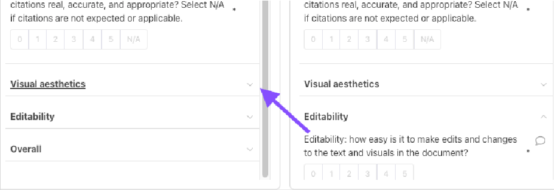
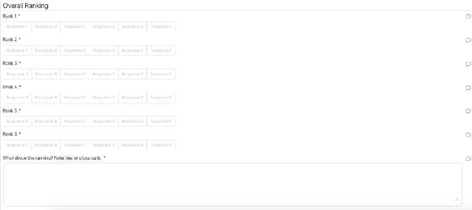

# Docs Eval

## Table of Contents

- [Docs Specific Considerations](#docs-specific-considerations)
- [Pay attention to:](#pay-attention-to)
- [Rate the sub-axes independently](#rate-the-sub-axes-independently)
  - [READ MORE: Writing Rationales](#read-more-writing-rationales)
    - [IMPORTANT: Content, aesthetics, and editability do not bleed into each other.](#important-content-aesthetics-and-editability-do-not-bleed-into-each-other)
    - [Do not let one especially strong or weak aspect determine every score.](#do-not-let-one-especially-strong-or-weak-aspect-determine-every-score)
- [Score each main section after reviewing the sub-axes](#score-each-main-section-after-reviewing-the-sub-axes)
- [Then complete the Overall Ranking](#then-complete-the-overall-ranking)
- [Grading Rubric](#grading-rubric)
- [Content](#content)
- [Overall content](#overall-content)
- [Content](#content)
- [Grading Criteria](#grading-criteria)
- [Instruction following](#instruction-following)
- [Look for:](#look-for)
- [Writing substance](#writing-substance)
- [Look for:](#look-for)
- [Writing style](#writing-style)
- [Look for:](#look-for)
- [Document structure](#document-structure)
- [Look for:](#look-for)
- [Citations](#citations)
- [Look for:](#look-for)
- [Visual Aesthetics](#visual-aesthetics)
- [Overall visual aesthetics](#overall-visual-aesthetics)
- [Sub-axes](#sub-axes)
- [Visual Aesthetics](#visual-aesthetics)
- [Color scheme](#color-scheme)
- [Look for:](#look-for)
- [Fonts](#fonts)
- [Look for:](#look-for)
- [Readability/scannability](#readabilityscannability)
- [Look for:](#look-for)
- [Tables](#tables)
- [Look for:](#look-for)
- [Charts](#charts)
- [Look for:](#look-for)
- [Images](#images)
- [Look for:](#look-for)
- [Editability](#editability)
- [Overall](#overall)
- [Submission Checklist](#submission-checklist)
- [Fit and Confidence](#fit-and-confidence)
- [Individual Rating](#individual-rating)
- [Preferred Document](#preferred-document)

---

Youʼll be working in the [Artifacts] Docs Eval campaign in Feather.

You should only pick up tasks that align with your background , experience , and expertise .

Do not work on tasks where the subject matter or required knowledge is too far outside your area of competence. Doing so can lead to quality warnings and ultimately offboarding.

Please use Light Mode . Documents render differently when using Dark Mode.

Hereʼs what a task looks like in Feather. The responses run from left to right. Navigate around the page using the sliders.

![The image is a screenshot of a webpage that provides instructions on how to use the Word document. The page is titled Instructions and has a subtitle that reads Response A, Response B, Response C, Response D, Response E, Response F, Response G, Response H, Response I, Response J, Response K, Response L, Response M, Response N, Response O, Response P, Response Q, Response R, Response S, Response T, Response U, Response V, Response W, Response X, Response Y, Response Z. The page is divided into several sections, each with a different instruction. The first section of the page is titled Response A, and it provides instructions on how to use the Word document. The instructions include: - Open the above artifact. - Please open the above artifact. - Please open the above artifact. - Please open the above artifact. - Please open the above artifact](DocsEval/imageFile2.png)

The task is organized around three main quality areas or “axesˮ :

- Content
- Visual aesthetics
- Editability

  All axes require an overall score and rationale first, after which you score a group of “sub-axesˮ or sub-topics from 1-5.

- Content is broken up into: instruction following, writing substance, writing style, document structure, and citations.
- Visual aesthetics includes color scheme, fonts, readability/scannability, tables, charts, and images
- Editability is the simplest with just one field where you explain your rating.

You can read more about the three axes in the main Task Instructions section.

You only write a rationale for the overall ranking for each response the rest is just a score.

Click the arrow to the right of each criterion to expand the section.

citations real, accurate and appropriate? Select NJA

if citations are not expected cr applicable.

expected cr applicable.

if citations are not

Visual aesthetics

Visual aesthetics

Editability

Editability

Editability: how easy is it to make edits and changes

Overall

to the text and visuals in the document?

For some criteria you can select N/A when the element is not expected or applicable, such as citations, tables, charts, or images.

After completing the content ranking and rationale , use the slider on the right to move to the next dimension: Visual aesthetics .

To move between responses, use the slider at the bottom of the responses frame .

![The image is a screenshot of a webpage that provides a visual ranking of various beauty products. The page is titled Overall Ranking and includes a search bar at the top. Below the search bar, there is a button that reads Visual aesthetics and a drop-down menu with options like Visual aesthetics, Editability, and Overall. The main content of the page is divided into two main sections: 1. **Visual Aesthetics Section**: - The first section contains a list of products with their visual aesthetics. - The visual aesthetics are listed in a table format, with columns for Visual aesthetics and Overall Ranking. - The visual aesthetics are listed in a table format with columns for Visual aesthetics, Overall Ranking, and a checkmark icon. - The visual aesthetics are listed in a table format with columns for Visual aesthetics, Overall Ranking, and a checkmark icon. - The visual aesthetics are](DocsEval/imageFile5.png)

Citations: are important claims cited , and are the

citations real, accurate; and appropriate? Select NIA

if citations are not expected or applicable.

Visual aesthetics

Explain the overall rating

NIA

Editability

Briefly explain the overall score

Visual aesthetics

Overall

Overall Ranking

# Docs Specific Considerations

Review the document from beginning to end before assigning scores.

# Pay attention to:

- The title , headings , and section order.
- Whether the document fulfills the apparent request.

- Whether the document is readable and scannable page by page.
- Whether it feels like a coherent document rather than a loose collection of section.

# Rate the sub-axes independently

## READ MORE: Writing Rationales

Score each required sub-axis based on the documentʼs actual quality in that area. Do not allow one axis to bleed into another.

### IMPORTANT: Content, aesthetics, and editability do not bleed into each other.

The most common mistake is lowering Editability because the content is poor.

If a document is natively editable in Word, Editability should still score highly , even if the content itself is weak.

Ensure that:

- Content issues are dealt with on the content axis only
- Editability issues are dealt with on the editability axis only

### Do not let one especially strong or weak aspect determine every score.

For example:

- A document may have strong writing but weak visual aesthetics
- Or polished formatting but poor instruction following

Do not use N/A to avoid rating a weak element that is present or expected.

Use N/A only when:

- The form allows it.
- The element is genuinely not applicable.

# Score each main section after reviewing the sub-axes

For Overall content , use the content sub-axes as guidance, then make a holistic judgment about the documentʼs content quality.

For Overall visual aesthetics , use the visual sub-axes as guidance, then make a holistic judgment about how professional, readable, and visually effective the document appears.

For Editability , assess how easy the document would be to:

- Revise
- Maintain
- Extend

# Then complete the Overall Ranking

- The final score should reflect the documentʼs real-world usefulness and readiness . It is not a simple average of the other scores.

- However, it should align with the numbers allocated i.e. the response ranked number one must have a higher score than the response ranked second .

- Overall Ranking

- Rank

- Response

- Response D

- Response

- Response

- Rank 2

- Response

- Response

- Response

- Response

- Response

- Response

- Rank 3

- Response

- Response

- Response

- Response

- Response

- Response

- Rank

- Responso

- Response

- Response

- Response €

- Response

- Rank 5

- Response €

- Response

- Response

- Response

- Rank 6

- Response

- Response

- Response €

- Response

- Response

- What drove the ranking? Note ties or close calls

# Grading Rubric

# Content

- Use the full scoring scale . Do not cluster scores in the middle .

- Content refers to the quality of the documentʼs substance – whether it:

- Is clearly organized
- Handles citations appropriately when citations are expected

# Overall content

- This is your overall judgment of the documentʼs content quality .

- Use the content subcategories as guidance:

- Instruction following
- Writing substance
- Writing style
- Document structure
- Citations

- This score is not a simple average of the subcategory scores. It should reflect how well the documentʼs content works as a whole .

| Rating | Description |
|--------|-------------|
| 0 - Very far off target | Does not answer the prompt. |
| 1 - Off target | Severe content or source issues. |
| 2 - Somewhat off target | Important pieces are missing or weak. |
| 3 - Mostly on target | Visible gaps or unclear parts remain. |
| 4 - On target | Only small content or wording issues. |
| 5 - Exactly what the reader wants | Complete, accurate, clear, supported, and usable as-is. |

- Grade each response for each of the following content subaxis:

# Content

# Grading Criteria

# Instruction following

- How closely does the response fulfill the original request?

# Look for:

- Whether the document answers the user's actual prompt
- Whether required format, audience, scope, length, or deliverable constraints are followed
- Whether requested sections, topics, or source materials are included
- Whether the document avoids doing unrelated or extra work that conflicts with the request

# Writing substance

- How accurate, useful, substantive, and high-quality is the text?

# Look for:

- Accurate claims and faithful use of source material
- Useful detail rather than vague generalities
- Strong reasoning, synthesis, or explanation where appropriate
- Absence of hallucinated claims, unsupported specifics, and generic AI filler
- Whether the text would meet the standard expected from a strong professional in
- the relevant domain

- Low scores:

- Writing that is shallow, unreliable, generic, misleading, or padded.

- High scores:

- Writing that is accurate, specific, useful, and substantive.

# Writing style

- Is the tone, clarity, concision, wording, and overall style of the text strong?

# Look for:

- Clear and natural phrasing
- Appropriate tone for the audience and document type
- Concise wording without unnecessary filler
- Smooth sentence and paragraph flow
- Consistent terminology and voice
- Professional polish without sounding stiff or generic

- Low scores: Writing that is awkward, wordy, unclear, repetitive, overly generic, or tonally wrong.

- High scores: Writing that is clear, concise, polished, and well matched to the

- audience.

# Document structure

- How well the document is organized.

# Look for:

- A clear purpose
- Logical narrative order
- Appropriate headings and sections
- Coherent progression of ideas
- Smooth transitions between sections or paragraphs
- A beginning, middle, and ending that fit the document type
- A reading experience that feels connected rather than fragmented

- Low scores: Documents that feel disorganized, repetitive, abrupt, list-like, or hard to follow.

- High scores: Documents that guide the reader clearly and feel intentionally structured.

# Citations

- Are important claims cited, and if so are they real, accurate, and appropriate.

# Look for:

- Citations for important factual claims when citations are expected
- Citations that point to relevant and credible sources
- Citation placement that makes it clear what claim is supported
- Absence of fake, broken, irrelevant, or misleading citations
- Appropriate citation style for the document type

- Select N/A if citations are not expected or applicable.

- Do not select N/A if citations are expected but missing. In that case, assign a low score.

# Visual Aesthetics

- Visual aesthetics refers to the documentʼs overall visual quality – whether it looks:

- Professional
- Readable
- Well formatted
- Easy to scan

- Judge the document holistically , while using the sub-axes to identify specific visual strengths and weaknesses.

# Overall visual aesthetics

- This is your overall judgment of the documentʼs visual presentation .

- Evaluate how well the documentʼs visual choices support a:

- Polished
- Professional
- Easy-to-read artifact

- Consider the full visual experience, including:

- Color scheme
- Typography
- Spacing
- Visual hierarchy
- Page composition
- Readability and scannability
- Presentation of tables, charts, images, and other visual elements

| Rating | Description |
|--------|-------------|
| 0 - Very far off target | Visual or styling blocks understanding. |
| 1 - Off target | Visual issues repeatedly interfere with reading. |
| 2 - Somewhat off target | Design issues slow or confuse the reader. |
| 3 - Mostly on target | Visible polish issues remain. |
| 4 - On target | Easy to read; only small visual issues. |
| 5 - Exactly what the reader wants | Polished, scannable, consistent, and supports understanding. |

- Grade each response for each of the following criteria:

# Sub-axes

# Visual Aesthetics

# Color scheme

- Whether the overall color scheme works well, including background colors, font colors, and visual element colors.

# Look for:

- Appropriate color choices for the audience and purpose
- Good contrast and readability
- Consistent use of colors across the document
- Color choices that support hierarchy and meaning
- Avoidance of distracting, clashing, low-contrast, or overused colors
- Select N/A only if color is genuinely not applicable and the form allows N/A.

# Fonts

- Whether the artifact uses appropriate fonts, font sizes, and font colors, with clear separation between sections.

# Look for:

- Readable font choices
- Appropriate font sizes for body text, headings, tables, captions, and callouts
- Consistent font use across similar elements
- Clear hierarchy between title, headings, subheadings, and body text
- Font colors with sufficient contrast

- Low scores: Documents with inconsistent, cramped, hard-to-read, or unprofessional typography.

- High scores: High scores fit documents with clear, consistent, polished typography.

# Readability/scannability

- How well can a reader understand the main points by scanning the artifact?

# Look for:

- Clear visual hierarchy
- Headings, bullets, tables, callouts, or summaries that help the reader find key information
- Reasonable paragraph lengths
- Good spacing between related and unrelated content
- Pages that are not visually overwhelming
- Main points that stand out without requiring close reading of every sentence

- Low scores: Documents that are dense, cluttered, hard to skim, or visually confusing.

- High scores: Documents where the main ideas are easy to locate and understand quickly.

# Tables

- Whether tables are used effectively where appropriate, and whether they are formatted well.

# Look for:

- Tables used when they help compare, summarize, or structure information
- Clear headers and labels
- Readable spacing, alignment, and column widths
- Consistent formatting
- Accurate and meaningful table content
- Tables that fit the page without crowding, clipping, or awkward breaks

- Select N/A if tables are not present and not needed.

- Do not select N/A if tables are present but poor, or if the prompt clearly calls for tabular information and the document fails to provide it.

# Charts

- Are charts used effectively where appropriate? Are they clear, accurate, and visually well-formatted?

# Look for:

- Chart types that fit the data and message
- Clear titles, labels, legends, and units
- Accurate representation of data
- Readable sizing and placement
- Colors and styling that help interpretation
- Charts that support the document's message rather than decorating it

- Select N/A if charts are not present and not needed.

- Do not select N/A if charts are present but poor, or if the prompt clearly calls for charted data and the document fails to provide it.

# Images

- Are images used effectively where appropriate? Are they are relevant, high-quality, and well-integrated?

# Look for:

- Relevant images that support the document's purpose
- Clear, high-quality visuals
- Appropriate sizing, cropping, and placement
- Captions or context when needed
- Images that do not distort, distract, or create layout problems
- Avoidance of generic or irrelevant stock-like imagery when specific visuals are expected

- Select

- N/A if images are not present and not needed.

- Do not select N/A if images are present but poor, or if the prompt clearly calls for images and the document fails to provide them.

# Editability

- Editability measures how easy it would be to edit and update the documentʼs text and visuals later.

- Ask yourself: Could someone else easily revise or extend this document in the future?

- Look for whether the document:

- Uses editable text , tables, lists, and numbers
- Keeps styles and formatting consistent and predictable
- Uses repeatable layouts and structures so similar content can be added without rebuilding the page

| Rating | Description |
|--------|-------------|
| 0 - Very far off target | Key content needs rebuilding. |
| 1 - Off target | Changes require reconstruction. |
| 2 - Somewhat off target | Key elements are hard to revise. |
| 3 - Mostly on target | Revisions would be awkward. |
| 4 - On target | Only small editability issues. |
| 5 - Exactly what the reader wants | Cleanly structured for efficient editing. |

# Overall

- This is your overall judgment of the document as a complete artifact .

- Use all the axes above as inputs, then ask:

- How good is this document overall ?
- How ready is it for real use ?
- How much revision would it need before being confidently shared, published, or used ?
- Does it succeed for the apparent audience and purpose ?
- Are any weaknesses serious enough to materially limit the document, even if other areas are strong?

- The overall score is not just an average. A serious weakness in one area can significantly lower the final score, even if the document performs well elsewhere.

| Rating | Description |
|--------|-------------|
| 0 - Very far off target | Fails the task; unusable for the reader. |
| 1 - Off target | Major issues prevent normal use. |
| 2 - Somewhat off target | Core requirement needs major revision. |
| 3 - Mostly on target | Visible issues remain. |
| 4 - On target | Only low-impact issues. |
| 5 - Exactly what the reader wants | Excellent, complete, and usable as-is. |

# Submission Checklist

Use this checklist before every submission . Focus on document level quality .

We donʼt want a laundry list of issues , and youʼre not expected to catch everything. Focus on the key issues and explain why they matter .

- I have not already completed this task.

- I read the task prompt.

- I downloaded all responses and fully reviewed each one.

- I reviewed any provided sources.

- I validated factual claims via web search where applicable.

- I used the Rating Rubric when working on the task.

- I rated each response independently in chronological order before tackling the overall rating.

- Iʼve checked all responses for spelling, grammar and formatting errors and ensured each rationale is clearly and concisely written.

# Fit and Confidence

- I read the user request before claiming to check fit.
- The task sits within my domain expertise or clear comfort area.
- I'm confident in my ratings; if not, I did not submit.

# Individual Rating

- I rated all documents and sub-axes on the 1-5 Quality Likert.
- I focused on overall document quality , not isolated moments.
- I wrote a clear and concise rationale for each, ideally with examples.
- I rated each document as independently as possible – one document's weakness didn't inflate the other's score.

# Preferred Document

- I selected a preferred document.
- I compared overall document quality.
- My rationale for the preference is informative and specific, not just "A is better." If there was a tie-break, I used my best judgement and provided a clear rationale.
- I ensured that the individual scores for each response aligned with the rankings
