# Network Distance Based on Laplacian Flows on Graphs

## Abstract

Distance plays a fundamental role in measuring similarity between objects. Various visualization techniques and learning tasks in statistics and machine learning such as shape matching, classification, dimension reduction and clustering  often rely on some distance or similarity measure. It is of tremendous importance to have a distance that can incorporate the  underlying structure of the object.  In this paper,  we focus on proposing such a distance between network objects.  Our key  insight is to define a distance based on the long term diffusion behavior of the whole network. We first introduce a dynamic system on graphs called Laplacian flow. Based on this Laplacian flow, a new version of diffusion distance between networks is proposed. We will demonstrate the utility of the distance and its advantage over various existing distances through  explicit examples.  The distance  is also applied to subsequent  learning tasks such as clustering network objects.

## Introduction

A network is a representation of relations between objects and arises naturally in characterizing phenotypes of complex data. Due to its flexibility in representing the underlying structure of data, networks have presented their significance in a variety of scientific fields from biology and neurosicence (brain and biological  networks) to social science (social networks), to name just a few. This has necessitated immense developments in theory, methodologies and algorithms over the last few decades for inference of a network. For instance, there are many models for clustering  nodes within a network such as stochastic blockmodels [19, 15], spectral clustering [30], modularity optimization [24] and so on.

Recently, there has been an emerging strong need of a framework to make inference on a population of network objects. For example, the Human Connectome Project [28] hosts brain imaging data of more than one thousand subjects where an individual's neural system is represented as a network object. Datasets of such type pose many difficulties in providing convincing answers to questions like clustering, centrality, hypothesis test, and others at the population level.  There has been some recent work on inferences of a population of networks based the notion of Fréchet means [8, 3] with applications to hypothesis testing with network data  [10, 20].  [22] proposes to cluster network objects based a mixture of graphon model.  Answering many other questions of this type starts from defining a descriptor to measure similarity between  network objects. Surprisingly little attention has been shown but we will introduce some of the previous works in the next section. One notable work in the Computer Science literature is graph kernel [29] which computes kernel similarity matrices.

The rest of the paper is organized as follows. In Section 2, we give a brief description of distance measures between network objects. Based on Laplacian flow, we propose a novel distance measure, characterize its properties, and provide an efficient numerical scheme in Section 3. Our simulation in Section 4 supports our new proposal to outperform incumbent metrics.

## Related Work

Let $G$ be a network or graph with $n$ nodes with its adjacency matrix $A$, which is an $n\times n$ matrix. For a binary network, $A_{ij} = 1$ if node $i$ and $j$ has an observed edge between two nodes and $A_{ij}=0$ otherwise for $1\leq i,j \leq n$. The graph Laplacian of a graph $G$ is defined as $\mathcal{L} = D-A$, where $D$ is a degree matrix such that $D_{ii} = \sum_{j}A_{ij}$ for $1\leq i \leq n$ and $D_{ij}=0$ otherwise [30].

Several measures have been proposed to describe dissimilarity based on direct observables of the network. One simple way is to count the number of matching edges from two networks [13], the popular Hamming distance. In [31], Wilson and Zhu suggested to use the Euclidean distance between the spectra of two adjacency matrices. From a network-theoretic perspective, Roy et al. [26] claimed the discrepancy of node-defined centrality measures be a candidate for dissimilarity measure.

The graph Laplacian has been known as an approximation of the Laplace-Beltrami operator on smooth manifold underlying observed objects [11]. Since $\mathcal{L}$ contains geometric and topological information of the data via its spectrum, many strategies have been proposed.

Since the graph Laplacian matrix is symmetric and positive-semidefinite, eigenvalues of $\mathcal{L}$ are nonnegative real numbers. Jakobson and Rivin exploited such phenomenon by defining the distance measure by taking normalized sum of squared differences for top eigenvalues [17]. Instead of using eigenvalues directly, some chose to compute the disparity of two approximated distributions of spectrum. Ipsen and Mikhailov, in [16], suggested to apply kernel density estimation by convolving narrow Lorentz distributions with computed eigenvalues, while  Fay et al. employed discrete histogram through binning [7].

Recently, an interesting work adopted diffusion dynamics on a graph to characterize and distinguish networks. The work is based on the manifold learning method called Diffusion Maps [5], where the distance between two nodes takes all possible paths in between into account across different timescale. This implies that each network and its topological properties can be well presented by the diffusion process. In [14], Hammond et al. adopted such idea to define graph diffusion distance that measures dissimilarity of two networks and showed it is indeed a metric.

## Proposed Work

Suppose we have two graphs $G_1$ and $G_2$ with the same number of $N$ nodes. Let $\textbf{c}^1(t)=(c^1_1(t),\dots, c^1_N(t))$ be a time-dependent vector of functions associated with the nodes of $G_1$. Similarly we define $\textbf{c}^2(t)$ for $G_2$. The Laplacian flow is a dynamic system defined in a coordinate-wise manner by

$$
\dot{c_i}(t)=\sum_{j\sim i}(c_j(t)-c_i(t)),
$$

where the sum runs over all nodes adjacent to $i$, and a compact expression for equation (1) is

$$
\dot{\textbf{c}}(t)=-\mathcal{L}\textbf{c}(t).
$$

Given an initial condition $\textbf{c}(0)$, we can solve the  system to obtain an analytic solution,

$$
\textbf{c}(t)=\exp(-t\mathcal{L})\textbf{c}(0).
$$

Since the eigenvalues of $\mathcal{L}$ are nonnegative, the solution will converge to the projection of $\textbf{c}(0)$ to the kernel of $\mathcal{L}$. Now we give the same initial condition for the two graphs $G_1$ and $G_2$ so that

$$
\textbf{c}^i(t)=\exp(-t\mathcal{L}_i)\textbf{c}(0)
$$

for $i=1,2$. Graph diffusion distance in [14] is defined as maximal discrepancy on a family of distance measures across different time points,

$$
d_{GDD}(G_1,G_2)=\max_{t}||\exp(-t\mathcal{L}_1)-\exp(-t\mathcal{L}_2)||_F,
$$

where the subscript $F$ means Frobenius norm for a matrix.

### Definition of the Network Flow Distance (NLD)

We study the difference between diffusion processes  at the nodes $[i^1]$ in $G_1$ and $[i^2]$ in $G_2$ using $\dot{c}^1_i(t)-\dot{c}^2_i(t)$ for *various initial conditions*. Define

$$
d_i:=\sum_{\textbf{c}(0)}\int_0^\infty |\dot{c}_i^1(t)-\dot{c}_i^2(t)|dt,
$$

where in the sum $\textbf{c}(0)$ runs through standard basis vectors $e_j=(0,\cdots,1,\cdots,0)$ for all $j\neq i$. Although the definition uses an improper integral, one can see the convergence without difficulty. Moreover, the integrand at $t=0$ is given by the absolute value of the $i$-th component of $\mathcal{L}_1\textbf{c}(0)-\mathcal{L}_2\textbf{c}(0)$. When $\textbf{c}(0)$ runs through basis vectors $e_j$'s for all $j\neq i$, we find that the integrand coincides with the Hamming distance of the $i$-th row of the adjacent matrices. Then we define the *network flow distance (NLD)* between two graphs as

$$
d_{NLD}(G_1,G_2):=\sum_{i=1}^nd_i.
$$

From definitions (6) and (7) it is straightforward to check that $d_{NLD}$ satisfies the well known axioms of a distance metric, i.e.,

- **(i):** $d_{NLD}$ is symmetric,

- **(ii):** $d_{NLD}(G_1,G_2)\geq 0$ and $d_{NLD}(G_1,G_2)=0$ if and only if $G_1$ and $G_2$ are identical,

- **(iii):** $d_{NLD}(G_1,G_3)\leq d_{NLD}(G_1,G_2)+d_{NLD}(G_2,G_3)$.

The definition $d_{GDD}$ has a similar flavor as $d_{NLD}$ in nature by incorporating the diffusion behavior of a whole network but there are some key differences. One drawback of the definition of $d_{GDD}$ is that the maximum may occur at  a different time for a different pair of graphs, which results in mismatching behavior in the context of a large group of graphs. We integrate the distance between a pair of nodes between two graphs with respect to time. In practice, we can truncate at proper $T_{\max}$. Due to the exponential decay of the integrand in (6), $T_{\max}$ can be chosen properly according to one's desired precision.  Another advantage is that we removed the diagonal terms so that we characterize a node in a network entirely through its environment and not  nodes itself. Moreover, $d_{GDD}$  fails to capture the long term behavior of the diffusion process by considering the discrepancy of the diffusions of the networks at a single time point $t$.  Our simulation study confirms that the network flow distance outperforms $d_{GDD}$ significantly in distinguishing networks under various settings and in using the distances for clustering network objects.

### An efficient computation scheme

In this subsection, we discuss our method for computing the  distance defined in the last subsection. In particular, we propose a computation scheme that enables fast computation of our network flow distance $d_{NLD}$. For convenience, let $f_i(t):=c^1_i(t)-c_i^2(t)$. From equation (3), we know that $|\dot{f}_i(t)|$ decays exponentially to $0$ as $t\rightarrow\infty$. Truncating the improper integral in equation (6) at a properly chosen $T_{\max}$ yields the approximation

$$
\int_{0}^{\infty}|\dot{f}_i(t)|dt\approx\int_{0}^{T_{\max}}|\dot{f}_i(t)|dt.
$$

Using finite difference method, we have the following approximation

$$
\int_{0}^{T_{\max}}|\dot{f}_i(t)|dt\approx\sum_{k=1}^{N}|f_i(t_k)-f_i(t_{k-1})|,
$$

where $t_0=0$ and $t_N=T_{\max}$. With simple arithmetrics, we know the right hand side of (9) has cancellations due to the alternating nature of the terms $f_i(t_k)-f_i(t_{k-1})$ when $f_i(t)$ is monotone on an interval $I$. Note that $f_i(0)=0$ and for connected graphs $f_i(t)\rightarrow 0$ for $t\rightarrow \infty$, then we see that $\int_{0}^{\infty}|\dot{f}_i(t)|dt$ is determined by all extreme values of $f_i(t)$. It is interesting to compare with definition (5). In equation (5) the $\max$ is taken globally for all nodes with respect to time, while in definition (7), we take sum of extreme values for each individual nodes.

From the original definition of the Laplacian flow in equation (2), we see that using $f_i(t)$ instead of $\dot{f}_i(t)$ in (9) reduces the multiplication by graph Laplacians, which is crucial since iterative multiplications by graph Laplacians can be computationally expensive. Define

$$
A(t,\mathcal{L}_1,\mathcal{L}_2)=\exp(-t\mathcal{L}_1)-\exp(-t\mathcal{L}_2).
$$

It is well known that a graph Laplacian $\mathcal{L}$ is symmetric and positive semidefinite so that we have the following spectral decomposition:

$$
\mathcal{L}=\Lambda D\Lambda^{T}.
$$

Then we have

$$
\exp(-t\mathcal{L})=\Lambda \exp(-tD)\Lambda^{T}.
$$

For a matrix $M$, we define $g$ as the sum of absolute values of the off-diagonal entries of $M$, i.e.,

$$
g(M)=\sum_{i\neq j}|M_{ij}|.
$$

By equations (6),(7) and (9), we have

$$
d_{NLD}(G_1,G_2)\approx\sum_{i=1}^{N}g(A(t_i,\mathcal{L}_1,\mathcal{L}_2)-A(t_{i-1},\mathcal{L}_1,\mathcal{L}_2)).
$$

In the next section we will provide simulation examples in which our definition gives stronger and more precise cluster structure than that obtained using $d_{GDD}$ or the Hamming distance or the Frobenius norm distance between corresponding Laplacians of networks defined by

$$
d_F(G_i,G_j):=||\mathcal{L}_i-\mathcal{L}_j||_F.
$$

## Simulation Study

In this section, we demonstrate the success of our distance using several examples in a simulation study. It can be shown that our distance can detect distances between certain networks while the popular Hamming distance or Frobenius distance between graph Laplacians can not.  We then apply the distance to clustering network objects based on a spectral clustering algorithm.

### Distance between networks with one edge deletion

Let $G_1$ be a graph with 20 nodes distributed equally to form two communities $C_1$ and $C_2$. We generate $G_1$ from a stochastic block model (SBM) with  edges between two nodes in $C_1$ (resp. $C_2$) with probability $P_{11}=0.75$ (resp. $P_{22}=0.6$) and generate inter-community edges with probability $P_{12}=0.04$. We use a uniform distribution to generate entries of the adjacent matrices with the probability above. The graph $G_1$  generated using $\textsf{R}$ with the above parameters has two bridges between its two communities $C_1$ and $C_2$. $G_2$ and $G_6$ are obtained from $G_1$ by removing one of the bridges. The other graphs are obtained from $G_1$ by removing a within-community edge. Since a bridge in general plays a more important role in a network, we expect that $G_2$ and $G_6$  have larger distances to $G_1$ than other graphs. Our numerical computation plotted in Figures 2 and  3 shows that this is indeed the case. We take $T_{\max}=40$ and use 1200 sample points in our computation. The computation process takes only seconds on a MAC  desktop with 3.6 GHz Intel Core i7 Processor. Note that the Hamming distance between  these graphs is 1 or 2 and it completely fails to tell the difference between a bridge edge and a within community edge.

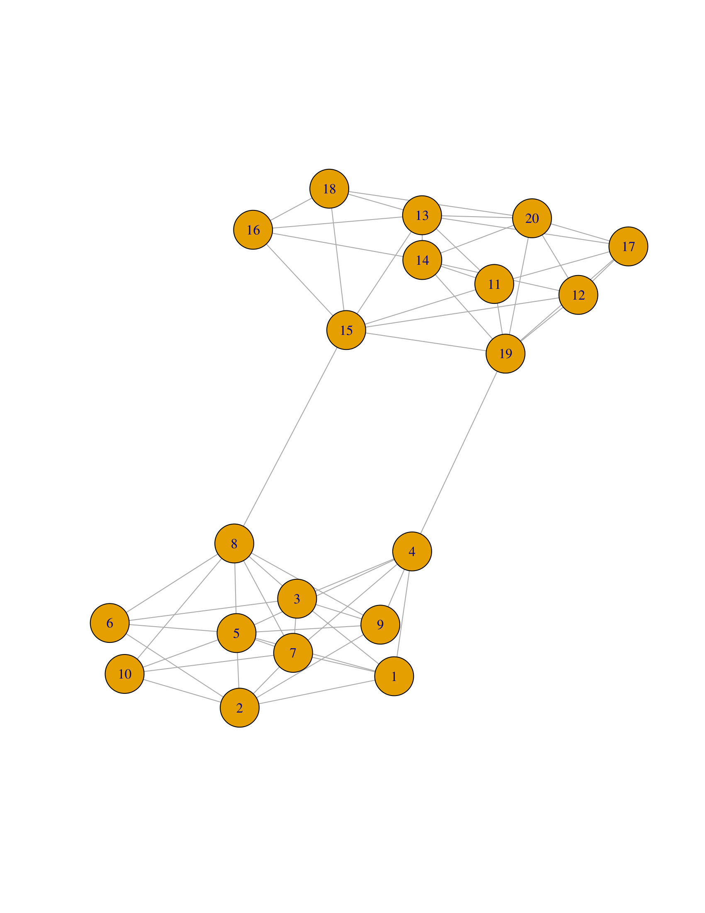

*G1.*

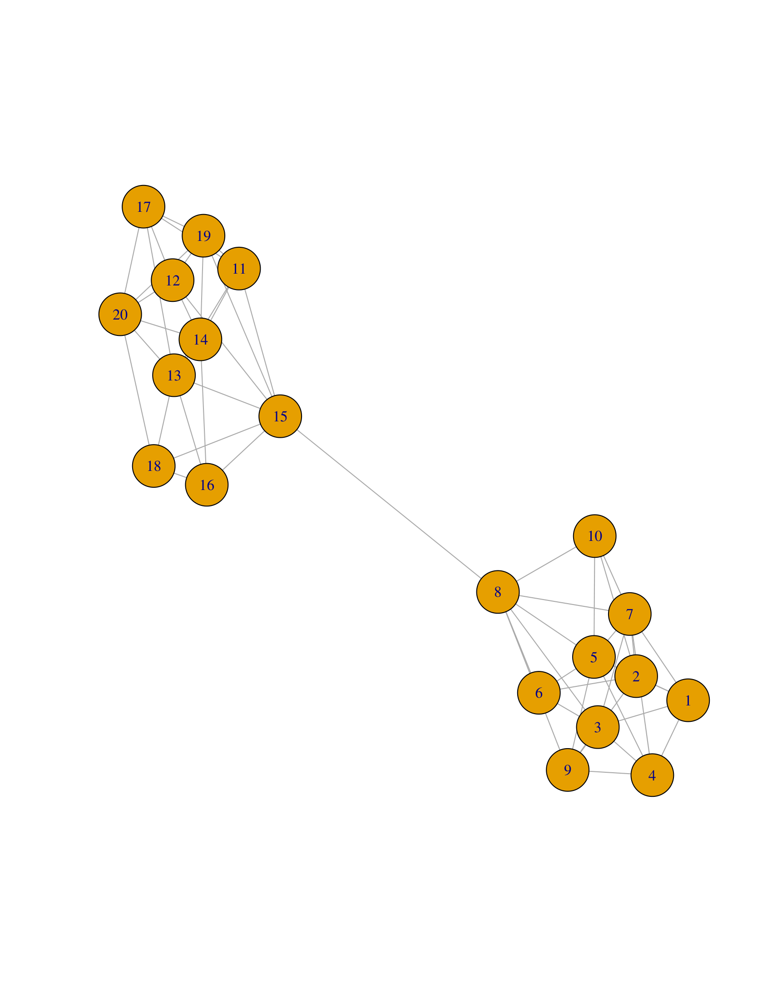

*G2.*

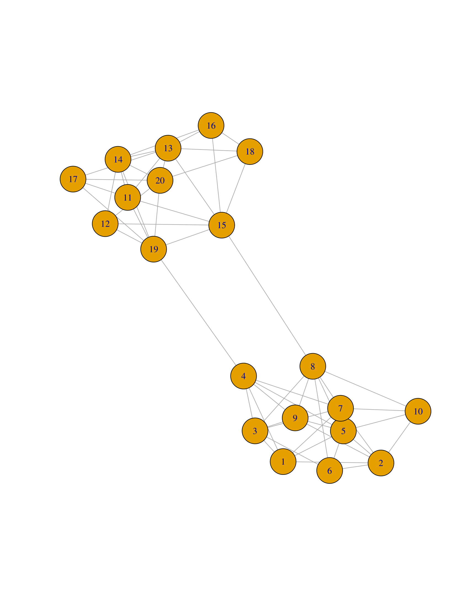

*G3.*

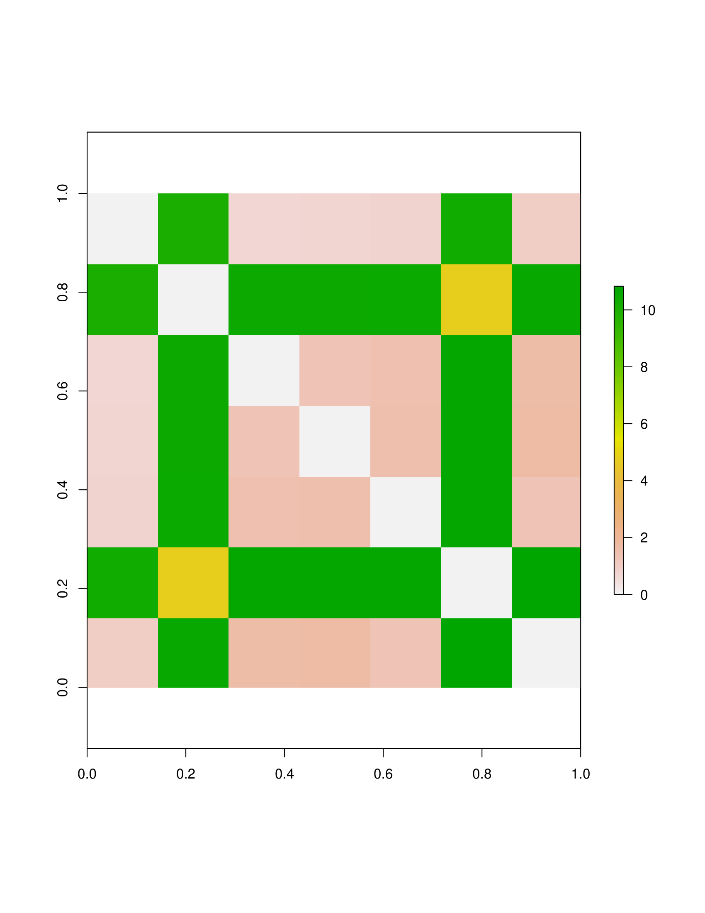

*Network flow distance $d_{NLD}$.*

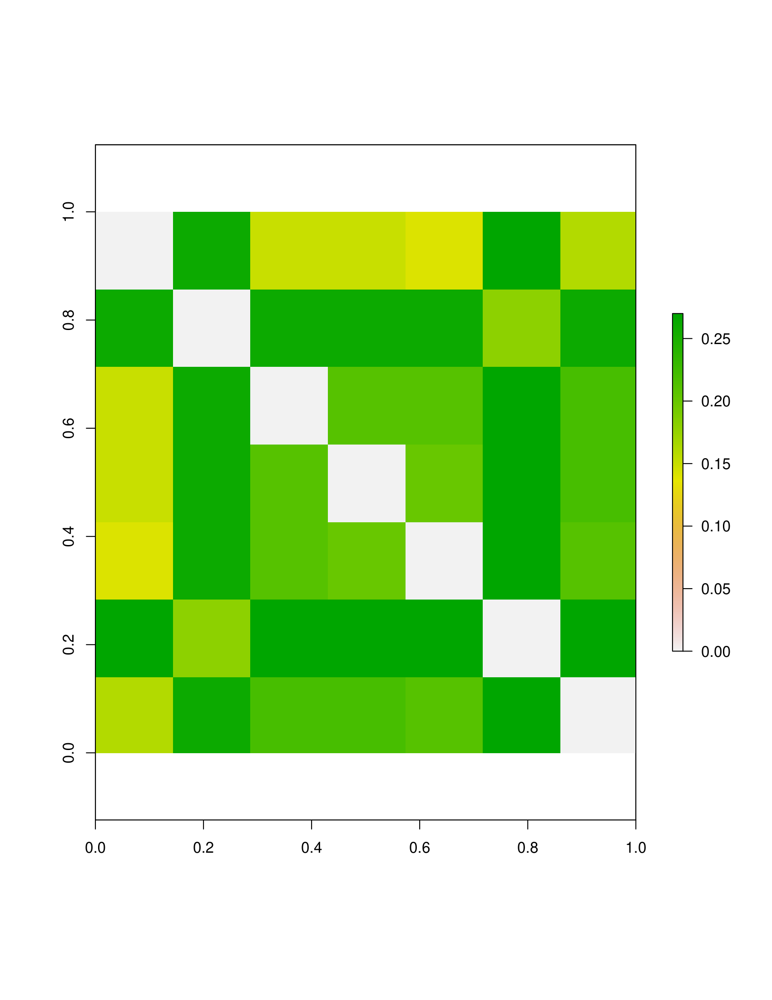

*Network diffusion distance $d_{GDD}$.*

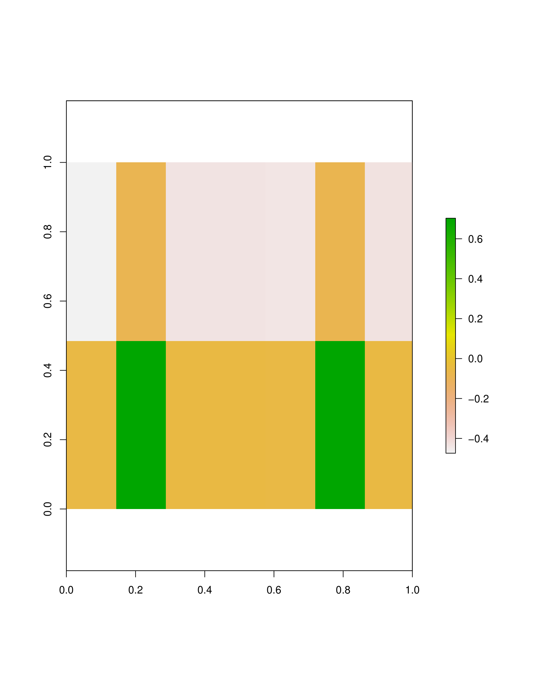

*Two eigenvectors of $d_{NLD}$.*

Now we compare the distance matrices obtained using $d_{GDD}$, the maximal distance defined in Section 3 with our distance $d_{NLD}$. The distance matrix of $d_{GDD}$ is plotted in Figure 3. We see that in this case our proposed distance outperforms the distance $d_{GDD}$ significantly. The cluster structure in Figure 2 is so strong that the desired cluster structure can be obtained directly using the $k$-means algorithm. Indeed, we apply the $k$-means algorithm to any column or row of the distance matrix in Figure 2 with cluster number 2 and find that the output cluster vector by R separates $G_2$ and $G_6$ from the other graphs. For this example, we can also obtain our desired cluster structure using the spectral clustering algorithm. Indeed, if we define a similarity matrix $S$ by

$$
S_{ij}=\exp(-d_{NLD}(G_i,G_j)/\sigma),
$$

where $\sigma$ is the standard deviation of $S_{ij}$, then we obtain the two eigenvectors of $S$ with largest two eigenvalues in Figure 4.

```text
%[1] -0.474 -0.088 -0.439 -0.436 -0.440 -0.084 -0.430
%[2] -0.057  0.701 -0.054 -0.053 -0.055  0.703 -0.054
%
```

Applying the $k$-means algorithm to the two vectors in Figure 4 with cluster number $k=2$, then we obtain our desired cluster structure. However, it will be another case if we use Hamming distance instead. Indeed, the Hamming distance is given by $d_{\text{Hamming}}(i,j)=2$ for $i,j\neq 1$ and $i\neq j$ and $d_{\text{Hamming}}(1,i)=1$ for $i\neq 1$. If we compute the corresponding similarity matrix using Hamming distance and apply the spectral clustering algorithm, then we find that the output cluster vector given by R is $(2,1,2,2,2,2,2)$.  The cluster vector singles out $G_2$ from the other graphs.  However, from our construction we know that $G_2$ and $G_6$ are more similar. If we use distance  $d_{F}$, then we compute the distance matrix using that $||\mathcal{L}_i-\mathcal{L}_j||_{F}=2\sqrt{2}$ for $i\neq j$ and $i,j\neq 1$ and that $||\mathcal{L}_1-\mathcal{L}_j||_{F}=2$ for $j\neq 1$. If we apply spectral clustering algorithm to the similarity matrix $S_F$ for the distance $d_F$, then we obtain cluster vector  $(1,1,1,1,2,2,1)$ using R. In this case, graphs $G_5$ and $G_6$ are put in one cluster, which is different from our desired cluster containing $G_2$ and $G_6$. The failure of Hamming distance $d_{\text{Hamming}}$ and Frobenius distance  $d_F$  is not  surprising since both distances assign the same weight to two apparently different types of edges.

Another feature that the network flow distance outperforms the Hamming distance and the distance $d_F$ is that the network flow distance is *floating according to the dynamics of a network graph.* In a dynamical network, the role of an edge may change in various ways.  For instance, in the game of Go, the value of a previous move is floating as the game tree develops.  Keep the notation of $G_i$ in the last example, but we now add more bridges to the graphs, then the  distances $d_{NLD}(G_1,G_2)$ and $d_{NLD}(G_1,G_6)$ are expected to decrease since the importance of one bridge is diluted. Indeed, see the distance matrices in Figure 5 (resp. Figure 6 ), which is obtained by adding one bridge $(1,11)$ (resp. two bridges $(1,11)$ and $(2,12)$) in $G_i$s.

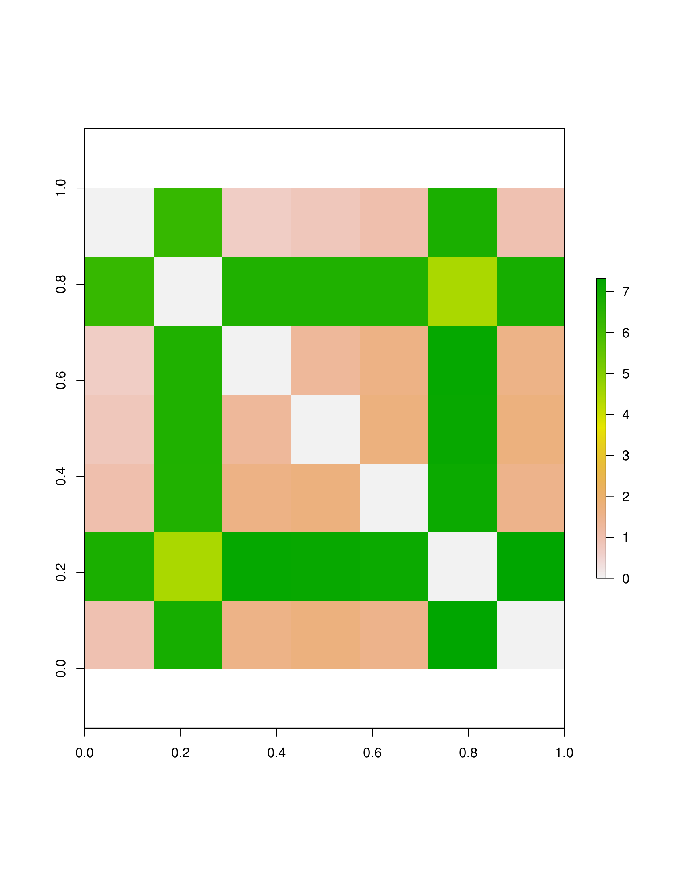

*Network flow distance matrix with one more bridge.*

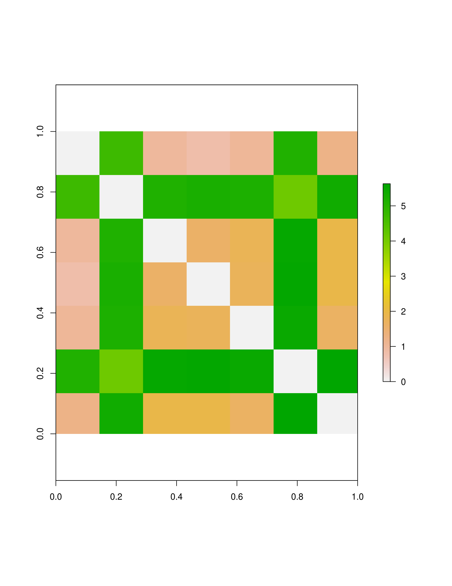

*Network flow distance matrix with two more bridges.*

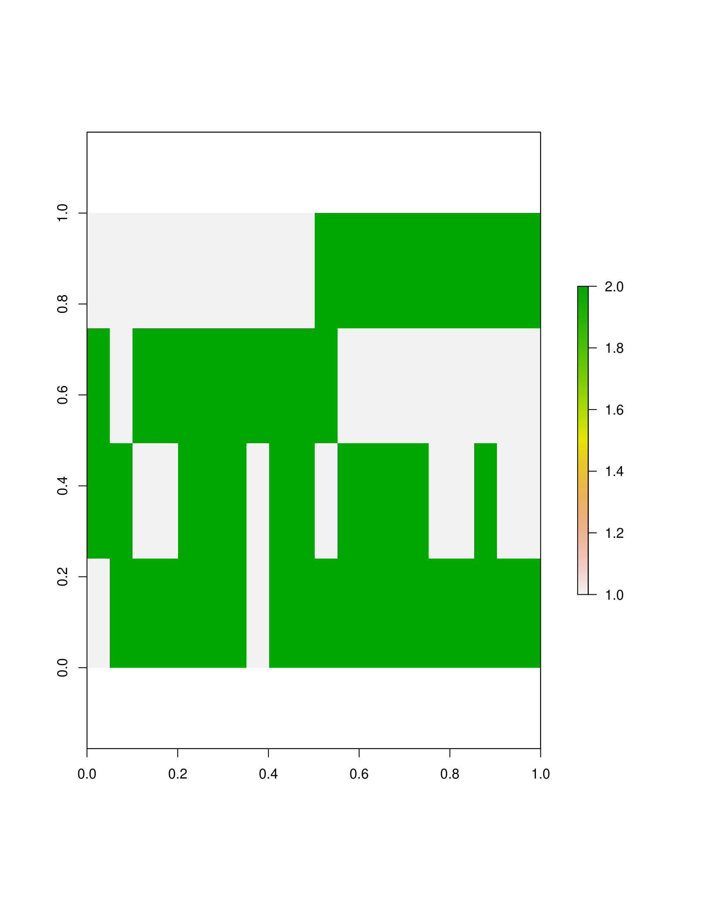

*Cluster vectors (first two rows use $d_{NLD}$ and last two rows use $d_{GDD}$).*

```text
%     [,1] [,2] [,3] [,4] [,5] [,6] [,7]
%[1,] 0.00 6.24 0.65 0.80 1.01 6.76 0.95
%[2,] 6.24 0.00 6.68 6.70 6.65 4.46 6.87
%[3,] 0.65 6.68 0.00 1.31 1.62 7.20 1.58
%[4,] 0.80 6.70 1.31 0.00 1.73 7.19 1.72
%[5,] 1.01 6.65 1.62 1.73 0.00 7.10 1.53
%[6,] 6.76 4.46 7.20 7.19 7.10 0.00 7.32
%[7,] 0.95 6.87 1.58 1.72 1.53 7.32 0.00
%
```

```text
%    [,1] [,2] [,3] [,4] [,5] [,6] [,7]
%[1,] 0.00 4.73 0.97 0.81 1.01 5.11 1.21
%[2,] 4.73 0.00 5.15 5.23 5.18 4.10 5.37
%[3,] 0.97 5.15 0.00 1.60 1.80 5.55 1.94
%[4,] 0.81 5.23 1.60 0.00 1.74 5.58 1.94
%[5,] 1.01 5.18 1.80 1.74 0.00 5.48 1.64
%[6,] 5.11 4.10 5.55 5.58 5.48 0.00 5.63
%[7,] 1.21 5.37 1.94 1.94 1.64 5.63 0.00	 	
%
```

We see that $d_{NLD}(-,G_2)$ and $d_{NLD}(-,G_6)$ are decreasing as expected by comparing Figures 2, 5 and 6.

### Illustration of the distance matrices between a collection of graphs

In this example we use a different setting. We only fix bridges and generate within-community edges randomly with a fixed probability $p$. For simplicity, we use a two-block model and each block has 10 nodes. The probability of an edge between two nodes within the same block is $p$ and the cross-block edges are fixed. We generate 20 graphs, in which the first 10 have 5 fixed bridges and the other 10 graphs have 10 fixed bridges. Our simulation shows that network flow distance $d_{NLD}$ outperforms the Frobenius norm distance $d_F$ and the diffusion distance $d_{GDD}$ in this scenario. In our simulation we choose $p=0.8$ , $T_{\max}=4$ and we use 400 sample points to estimate the integral in (6). Then we apply the $k$-means algorithm to the rows or columns of the distance matrix after replacing the diagonal terms by an average. Then we find that our network flow distance gives very precise cluster structure, which tells apart the two different ways for constructing the graphs. However, the cluster structure obtained using the Frobenius norm distance $d_F$ or diffusion distance $d_{GDD}$ is unreliable.

The distance matrices are plotted in Figures 8, 9 and 10.  One sees that the network flow  distance $d_{NLD}$ shows the strongest cluster structure. We also noticed that  only the distance ${d_{NLD}}$ gives very precise cluster structure if we apply $k$-means algorithm to the distance matrices. We plot 4 cluster vectors in Figure 7, where the first two vectors are obtained by applying $k$-means algorithm to the 1st and 11th rows of the distance matrix using $d_{NLD}$. The first gives a perfect cluster structure and the second has 2 misses ($G_2$,$G_{11}$). The 3rd and 4th cluster vectors are similarly obtained using $d_{GDD}$ and both vectors misclassified 8 out of 20 objects so that the cluster structure is poorly obtained in some sense.

```text
%[1] 1 1 1 1 1 1 1 1 1 1 2 2 2 2 2 2 2 2 2 2
%[2] 2 1 2 2 2 2 2 2 2 2 2 1 1 1 1 1 1 1 1 1
%[3] 2 2 1 1 2 2 2 1 2 2 1 2 2 2 2 1 1 2 1 1
%[4] 1 2 2 2 2 2 2 1 2 2 2 2 2 2 2 2 2 2 2 2
%
```

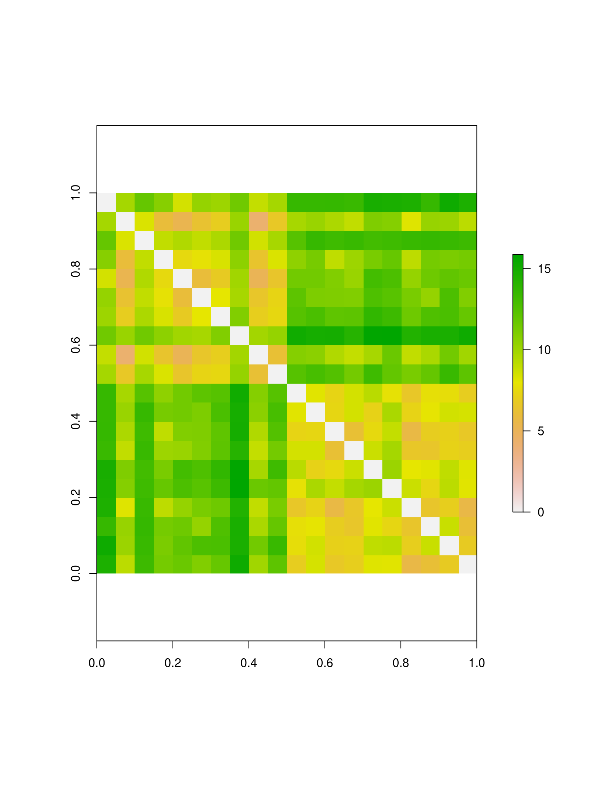

*Network flow distance $d_{NLD}$.*


*Frobenius norm distance $d_F$.*

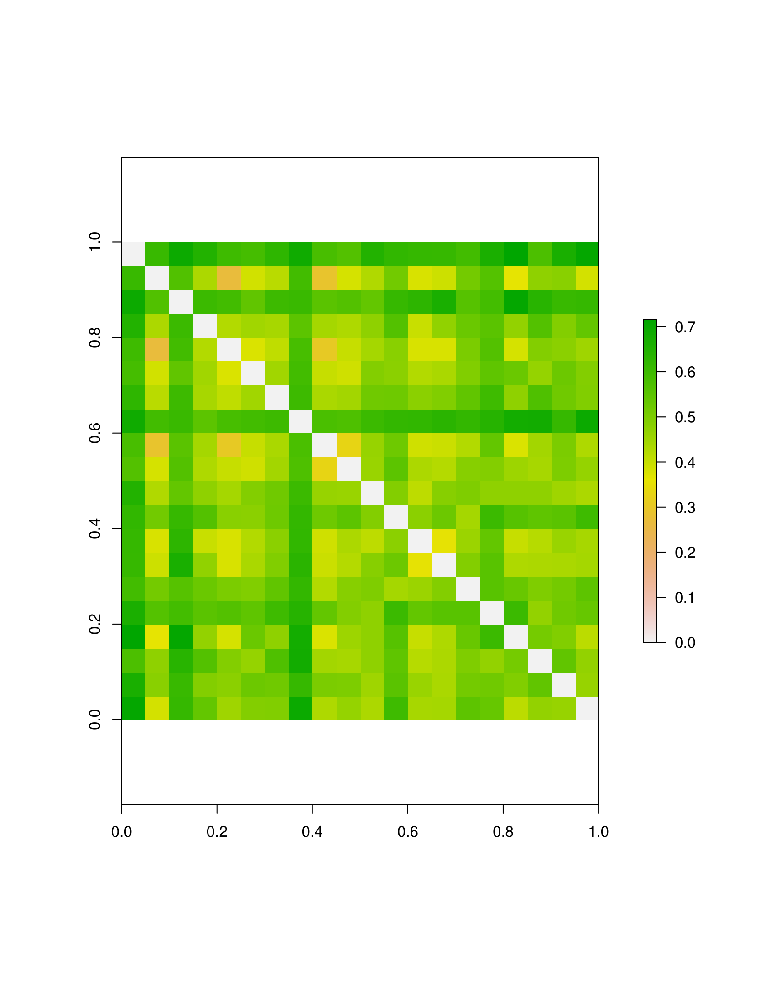

*Diffusion distance $d_{GDD}$.*

In this case, we can also apply the spectral clustering algorithm. Again, we define similarity matrix $S$ by equation (15) and obtain the two eigenvectors of $S$ with the largest two eigenvalues using R. See Figure 14.

```text
%[1] -0.11 -0.32 -0.13 -0.23 -0.27 -0.23 -0.19 -0.09 -0.31 -0.21
%-0.21 -0.20 -0.26 -0.24 -0.18 -0.16 -0.28 -0.24 -0.20 -0.26
%[2] -0.13 -0.28 -0.14 -0.17 -0.31 -0.24 -0.23 -0.11 -0.30 -0.25 
%0.21  0.18  0.26  0.20  0.17  0.15  0.26  0.24  0.22  0.27
%
```

In particular the signs in the second eigenvector show a clear cluster structure. Apply $k$-means algorithm to the two vectors in Figure 14 using R, then we obtain a perfect cluster structure.

### Clustering network objects from two stochastic block models

Now we test the difference between utilities of  various definitions of distance in an example of clustering network objects generated from two SBMs. We generated 10 network objects from one stochastic block model (SBM) with within community link probabilities $P_{11}=P_{22}=0.8$  and  between community link probability $P_{12}=0.05$.  We generate another 10 networks from another SBM with the same within community link probabilities but the between community link probability is given by $2P_{12}$. The number of nodes for each graph is 20. See the 2D plots for the distance matrices in Figures 11, 12 and 13.

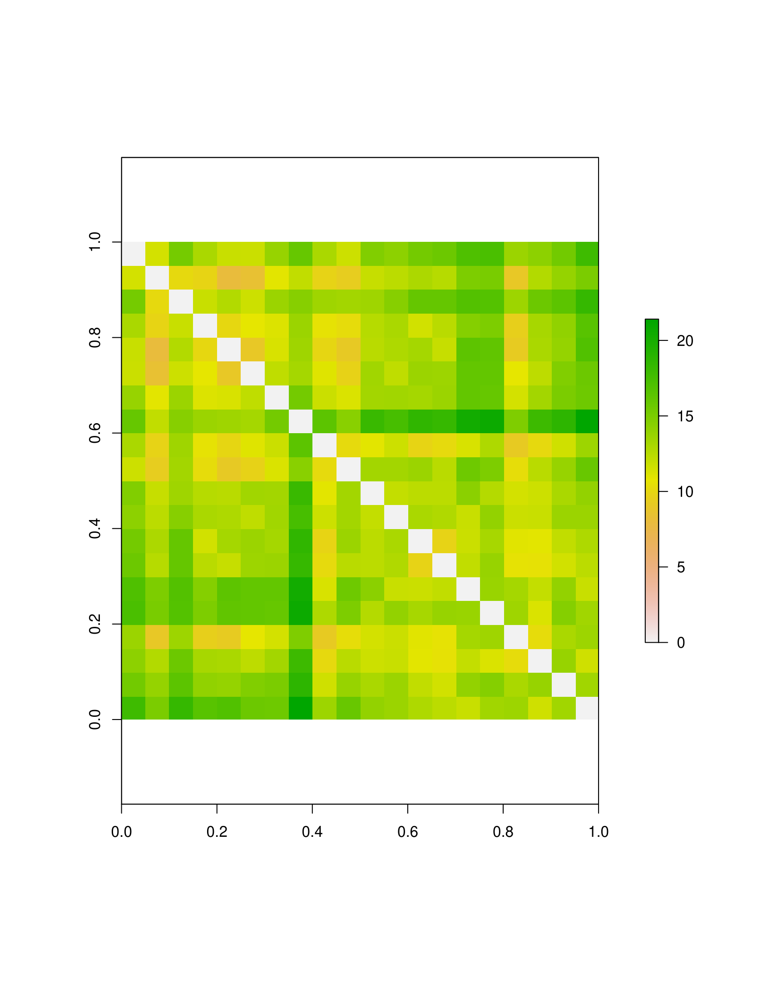

*Network flow distance $d_{NLD}$.*

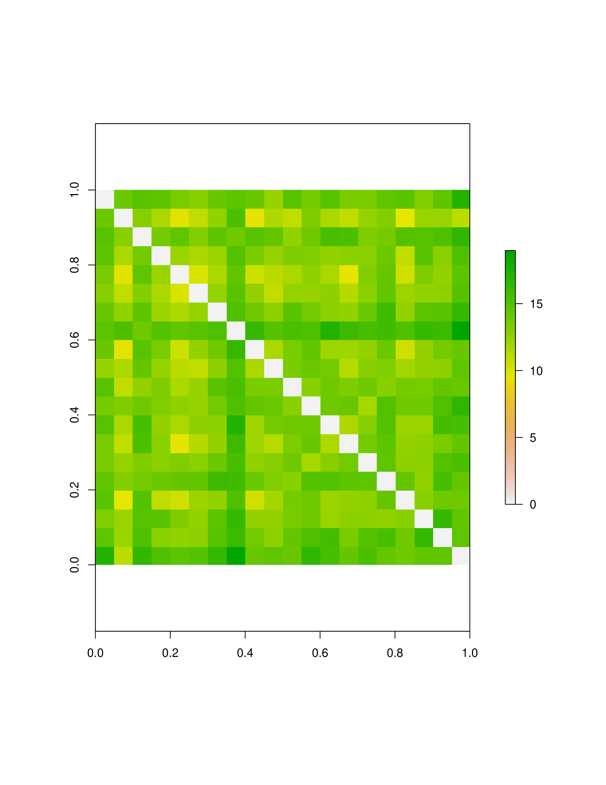

*Frobenius norm distance $d_F$.*

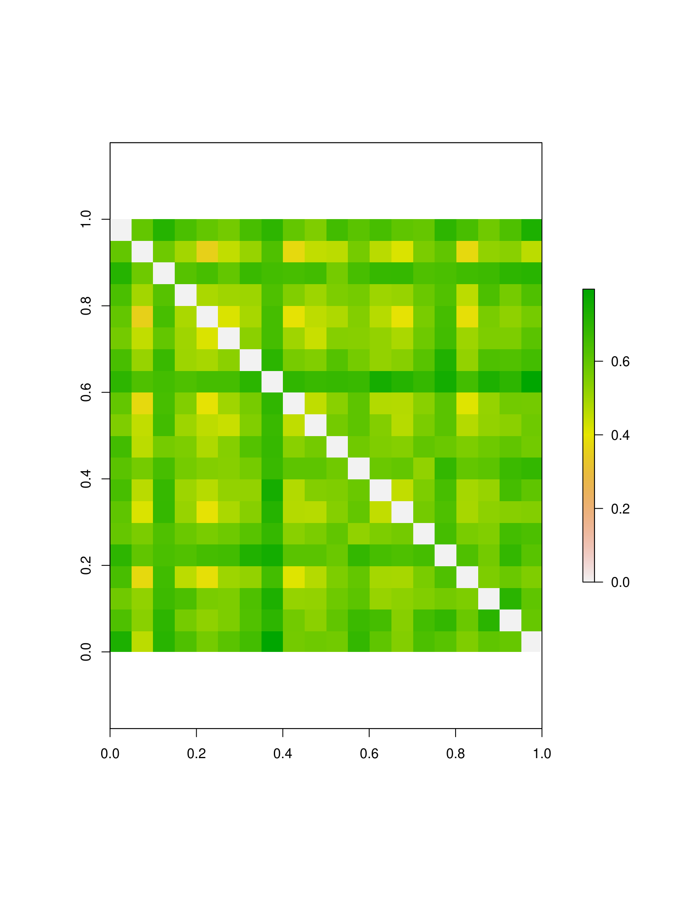

*Diffusion distance $d_{GDD}$.*

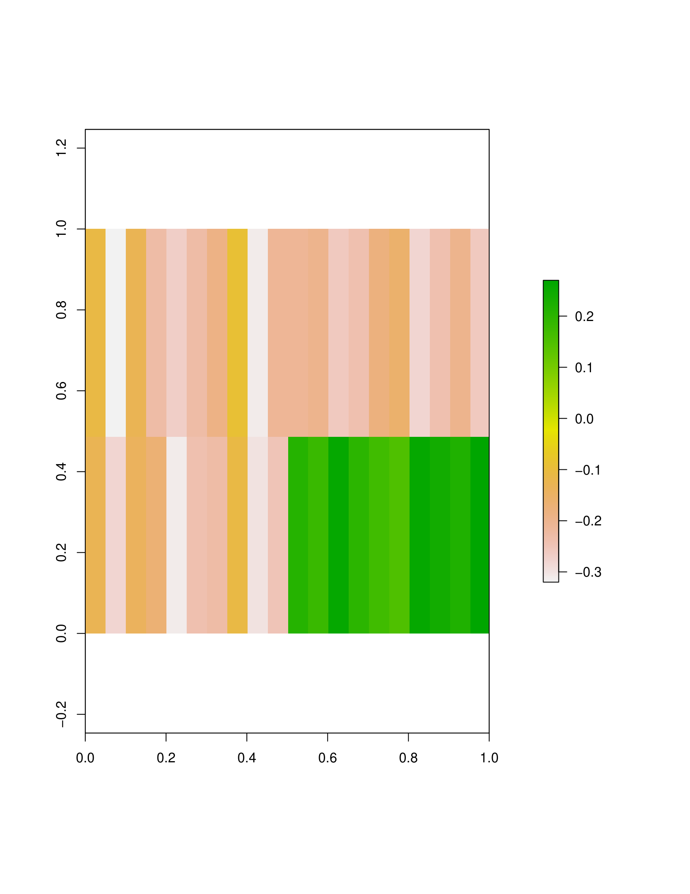

*Eigenvectors corresponding to the largest two eigenvalues.*

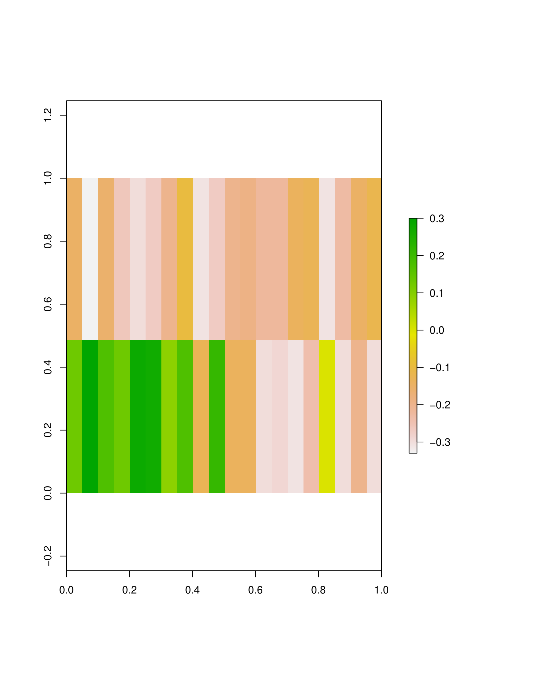

*Eigenvectors corresponding to the largest two eigenvalues.*

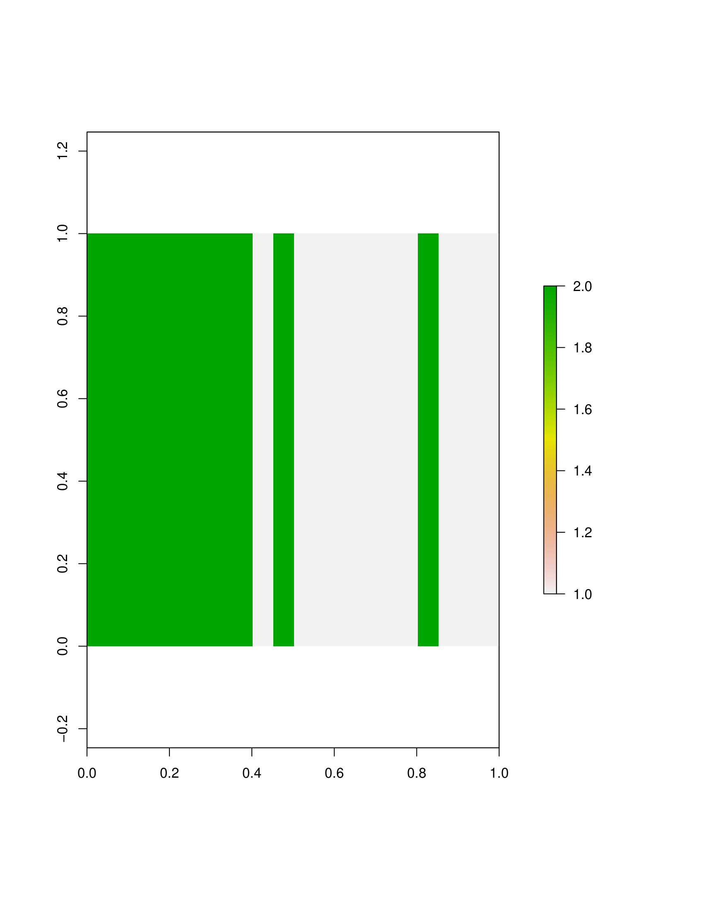

*Clustering vector.*

```text
%[1] -0.15 -0.33 -0.16 -0.26 -0.30 -0.27 -0.20 -0.10 -0.31 -0.27 
%-0.20 -0.19 -0.22 -0.22 -0.14 -0.13 -0.31 -0.23  -0.15 -0.12
%[2]  0.13  0.30  0.17  0.13  0.28  0.27  0.09  0.17 -0.13  0.21 
%-0.14 -0.14 -0.30 -0.29 -0.31 -0.24  0.00 -0.30  -0.20 -0.30
%		
```

We can still obtain our desired cluster structure by applying $k$-means algorithm to most rows of  the distance matrix, but some rows give unreliable output. If we use spectral clustering algorithm with respect to the similarity matrix $S$ defined in equation (15), then we obtain the two eigenvectors of $S$ with the largest two eigenvalues in Figure 15. Applying $k$-means algorithm to the two eigenvectors in Figure 15, we obtain the cluster vector in Figure 16, which has only 2 misses $(G_9,G_{17})$.

```text
%[1] 2 2 2 2 2 2 2 2 1 2 1 1 1 1 1 1 2 1 1 1
%
```

## Discussion

We proposed a novel distance metric between network objects based on the Laplacian flow on graphs by exploiting the long term diffusion behavior of individual networks. With explicit examples, we demonstrated its advantages over various existing distances such as Hamming distance, Frobenius distance between their corresponding graph Laplacians and a maximal diffusion distance. In particular, we find that our network flow distance can detect structure of a network and can be used to accurately classify  or cluster network objects in subsequent clustering tasks. Therefore it will serve as an important tool for research areas like brain connectomics and shape recognition. Future directions include extending the distance to incorporate  higher-order connectivity of networks by adopting higher-order (Hodge) Laplacians.

## Acknowledgments

Lizhen Lin was  supported by NSF grants IIS  1663870, DMS 1654579,  DARPA grant N66001-17-1-4041 and an ARO award W911NF-15-1-0440.

\small

## References

1. Anirban Banerjee. Structural distance and evolutionary relationship of networks. *Biosystems*, 107(3):186–196, March 2012.
2. Mikhail Belkin and Partha Niyogi. Laplacian eigenmaps and spectral techniques for embedding and clustering. In *Advances in neural information processing systems*, pages 585–591, 2002.
3. R. Bhattacharya and L. Lin. Omnibus CLTs for Fréchet means and nonparametric inference on non-Euclidean spaces. *The Proceedings of the American Mathematical Society*, 145:13–428, 2017.
4. Gunnar Carlsson, Afra Zomorodian, Anne Collins, and Leonidas J Guibas. Persistence barcodes for shapes. *International Journal of Shape Modeling*, 11(02):149–187, 2005.
5. R. R. Coifman, S. Lafon, A. B. Lee, M. Maggioni, B. Nadler, F. Warner, and S. W. Zucker. Geometric diffusions as a tool for harmonic analysis and structure definition of data: Diffusion maps. *Proceedings of the National Academy of Sciences*, 102(21):7426–7431, May 2005.
6. Edelsbrunner, Letscher, and Zomorodian. Topological persistence and simplification. Discrete & Computational Geometry, 28(4):511–533, Nov 2002.
7. D. Fay, H. Haddadi, A. Thomason, A.W. Moore, R. Mortier, A. Jamakovic, S. Uhlig, and M. Rio. Weighted Spectral Distribution for Internet Topology Analysis: Theory and Applications. *IEEE/ACM Transactions on Networking*, 18(1):164–176, February 2010.
8. M. Fréchet. Lés élements aléatoires de nature quelconque dans un espace distancié. *Ann. Inst. H. Poincaré*, 10:215–310, 1948.
9. Karl Pearson F.R.S. Liii. on lines and planes of closest fit to systems of points in space. *The London, Edinburgh, and Dublin Philosophical Magazine and Journal of Science*, 2(11):559–572, 1901.
10. Cedric E. Ginestet, Jun Li, Prakash Balachandran, Steven Rosenberg, and Eric D. Kolaczyk. Hypothesis testing for network data in functional neuroimaging. *Ann. Appl. Stat.*, 11(2):725–750, 06 2017.
11. Evarist Giné and Vladimir Koltchinskii. Empirical graph Laplacian approximation of Laplace–Beltrami operators: Large sample results. In Institute of Mathematical Statistics Lecture Notes - Monograph Series, pages 238–259. Institute of Mathematical Statistics, Beachwood, Ohio, USA, 2006.
12. Jurman Giuseppe, Visintainer Roberto, and Furlanello Cesare. An introduction to spectral distances in networks. *Frontiers in Artificial Intelligence and Applications*, pages 227–234, 2011.
13. R. W. Hamming. Error Detecting and Error Correcting Codes. *Bell System Technical Journal*, 29(2):147–160, April 1950.
14. David K Hammond, Yaniv Gur, and Chris R Johnson. Graph diffusion distance: A difference measure for weighted graphs based on the graph laplacian exponential kernel. In *Global Conference on Signal and Information Processing (GlobalSIP), 2013 IEEE*, pages 419–422. IEEE, 2013.
15. Paul W. Holland, Kathryn Blackmond Laskey, and Samuel Leinhardt. Stochastic blockmodels: First steps. *Social Networks*, 5(2):109–137, June 1983.
16. Mads Ipsen and Alexander S. Mikhailov. Evolutionary reconstruction of networks. *Physical Review E*, 66(4), October 2002.
17. Dmitry Jakobson and Igor Rivin. Extremal metrics on graphs I. *Forum Mathematicum*, 14(1), January 2002.
18. Giuseppe Jurman, Roberto Visintainer, Michele Filosi, Samantha Riccadonna, and Cesare Furlanello. The HIM glocal metric and kernel for network comparison and classification. In 2015 IEEE International Conference on Data Science and Advanced Analytics (DSAA), pages 1–10. IEEE, October 2015.
19. Brian Karrer and M. E. J. Newman. Stochastic blockmodels and community structure in networks. *Physical Review E*, 83(1), January 2011.
20. E. Kolaczyk, L. Lin, S. Rosenberg, and J. Walters. Averages of Unlabeled Networks: Geometric Characterization and Asymptotic Behavior. *ArXiv e-prints*, September 2017.
21. Abubakr Muhammad and Ali Jadbabaie. Dynamic coverage verification in mobile sensor networks via switched higher order laplacians. In *Robotics: Science and Systems*, page 72, 2007.
22. Soumendu Sundar Mukherjee, Purnamrita Sarkar, and Lizhen Lin. On clustering network-valued data. In *Advances in Neural Information Processing Systems 30*, pages 7071–7081. 2017.
23. Boaz Nadler, Stéphane Lafon, Ronald R Coifman, and Ioannis G Kevrekidis. Diffusion maps, spectral clustering and reaction coordinates of dynamical systems. *Applied and Computational Harmonic Analysis*, 21(1):113–127, 2006.
24. M. E. J. Newman. Modularity and community structure in networks. *Proceedings of the National Academy of Sciences*, 103(23):8577–8582, June 2006.
25. Brandon Pincombe. Detecting changes in time series of network graphs using minimum mean squared error and cumulative summation. *ANZIAM Journal*, 49:450, October 2007.
26. Matthieu Roy, Stefan Schmid, and Gilles Trédan. Modeling and Measuring Graph Similarity: The Case for Centrality Distance. In FOMC 2014, 10th ACM International Workshop on Foundations of Mobile Computing, page 53, Philadelphia, United States, 2014.
27. Martin Szummer and Tommi Jaakkola. Partially labeled classification with markov random walks. In *Advances in neural information processing systems*, pages 945–952, 2002.
28. D.C. Van Essen, K. Ugurbil, E. Auerbach, D. Barch, T.E.J. Behrens, R. Bucholz, A. Chang, L. Chen, M. Corbetta, S.W. Curtiss, S. Della Penna, D. Feinberg, M.F. Glasser, N. Harel, A.C. Heath, L. Larson-Prior, D. Marcus, G. Michalareas, S. Moeller, R. Oostenveld, S.E. Petersen, F. Prior, B.L. Schlaggar, S.M. Smith, A.Z. Snyder, J. Xu, and E. Yacoub. The Human Connectome Project: A data acquisition perspective. *NeuroImage*, 62(4):2222–2231, October 2012.
29. S. V. N. Vishwanathan, Nicol N. Schraudolph, Risi Kondor, and Karsten M. Borgwardt. Graph Kernels. *J. Mach. Learn. Res.*, 11:1201–1242, August 2010.
30. Ulrike von Luxburg. A tutorial on spectral clustering. *Statistics and Computing*, 17(4):395–416, December 2007.
31. Richard C. Wilson and Ping Zhu. A study of graph spectra for comparing graphs and trees. *Pattern Recognition*, 41(9):2833–2841, September 2008.
