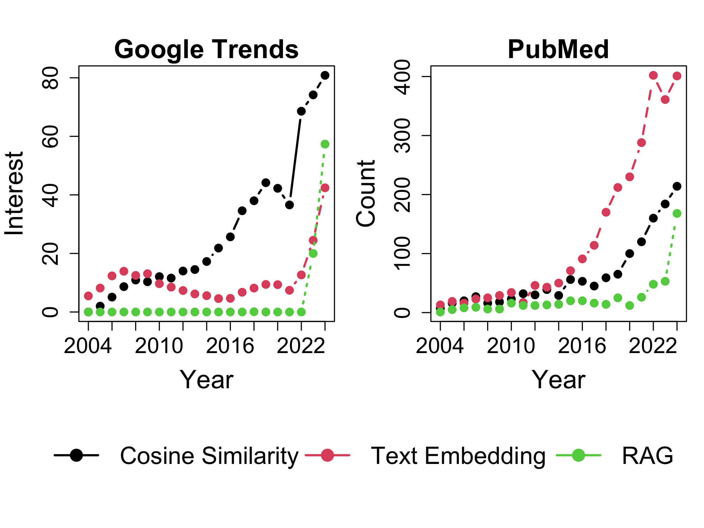

# Semantics at an Angle: When Cosine Similarity Works Until It Doesn't

## Abstract

Cosine similarity has become a standard metric for comparing embeddings in modern machine learning. Its scale-invariance and alignment with model training objectives have contributed to its widespread adoption. However, recent studies have revealed important limitations, particularly when embedding norms carry meaningful semantic information. This informal article offers a reflective and selective examination of the evolution, strengths, and limitations of cosine similarity. We highlight why it performs well in many settings, where it tends to break down, and how emerging alternatives are beginning to address its blind spots. We hope to offer a mix of conceptual clarity and practical perspective, especially for quantitative scientists who think about embeddings not just as vectors, but as geometric and philosophical objects.

## Introduction: Not All Angles Are Created Equal

In today's language and vision models, meaning is often represented through dense embeddings, which are vectors that encode the semantics of text, images, or any other modalities. To compare these representations, the field has overwhelmingly standardized on a single measure: cosine similarity, which assesses similarity based on the angle between vectors. Whether in information retrieval, semantic search, large language models, or multimodal systems, cosine similarity has become the default proxy for semantic closeness.

Its appeal lies in two key properties: scale invariance and norm robustness. Cosine similarity disregards the magnitude of embedding vectors and focuses purely on their direction, making it invariant to scale and robust to norm-related artifacts. From its early use in term-document vectors, to its adoption in word embeddings and continuing into contrastive learning frameworks, cosine similarity, for better or worse, has come to define how similarity is measured in most embedding-based systems today.

As of April 2025, for instance, OpenAI’s embedding models (<https://platform.openai.com/docs/guides/embeddings>) and Google Vertex AI’s `text-embedding-004/005` models (<https://cloud.google.com/vertex-ai/generative-ai/docs/embeddings/get-text-embeddings>) return $\ell_2$-normalized vectors, illustrating the field’s implicit endorsement of cosine-based comparisons, although many other providers and open-source models still ship unnormalized embeddings.

*Historical trends of relevant terminologies—cosine similarity, text embedding, and retrieval-augmented generation (RAG)—from 2004 to 2024, using Google Trends and PubMed publication data.*

As shown in Figure 1, the importance of cosine similarity has grown dramatically over the past two decades. Yet what cosine similarity omits can be just as important as what it captures. A growing body of research suggests that the magnitude of an embedding vector carries semantically meaningful signals such as informativeness, frequency-induced representational bias, and retrieval distortions like hubness. Cosine similarity discards this information by treating a long, confident vector and a short, uncertain one as equivalent, as long as they point in the same direction.

As embeddings have become more expressive and are deployed in increasingly diverse settings, the limitations of cosine similarity are becoming more apparent. Researchers have reported frequency-related distortions in word-level similarity, structural anisotropy in sentence embeddings, and the value of explicitly decoupling direction and magnitude.

This article is neither a comprehensive review nor a technical survey. Rather, it is an informal and selective exploration of the conceptual, mathematical, and empirical factors that shape the use of cosine similarity in modern AI. Specifically, we aim to clarify a recurring point of confusion among quantitative scientists: how should we interpret embedding similarity when both angle and length may carry semantic meaning? In this sense, we view our work as a bridge between formal geometric intuitions and practical considerations in embedding-based learning.

We begin in Section 2 with a brief historical account of how cosine similarity became entrenched in modern machine learning. In Section 3, we analyze why it has been effective across tasks. Section 4 dissects its mathematical foundations, while Section 5 demonstrates where and why it breaks down. In Section 6, we explore emerging alternatives and norm-aware variants. We conclude in Section 7 with a synthesis of best practices and philosophical reflections on similarity in high-dimensional spaces.

## A Diachronic View: Why Cosine Similarity Became Ubiquitous

### Roots in Information Retrieval

To our knowledge, cosine similarity first gained traction in the 1970s through its use in vector space models for document retrieval. One of the earliest and most influential frameworks was the **Smart** system [?], which represented documents and queries as high-dimensional term-frequency vectors and coined the term "vector space model." Cosine similarity offered an elegant and effective solution for ranking relevance that it prioritized directional alignment over absolute frequency, ensuring that documents with similar term distributions were considered semantically similar even when their lengths differed.

This approach proved especially valuable in sparse, high-dimensional spaces, where raw Euclidean distance between document vectors could be dominated by document length or term frequency. Cosine’s invariance to vector magnitude gave it natural robustness in these early text-based systems. In contrast, contemporaneous probabilistic rankers such as BM25 and set-based measures like Jaccard relied on raw term frequencies or overlap ratios. While effective for exact-match retrieval, they often misranked documents whose sheer length inflated their distance. Cosine's scale-free, angular perspective thus filled a critical gap between strict frequency counting and semantics-oriented comparison.

### Cosine in the Era of Word Embeddings

The rise of dense word embeddings, particularly with the introduction of **Word2Vec** [?] and **GloVe** [?], further entrenched cosine similarity in the field. These models learned distributed representations of words in continuous vector space, where semantic relationships were encoded as geometric transformations. Cosine similarity emerged as the default metric for evaluating similarity between word vectors.

Famous analogies such as

$$
\texttt{king} - \texttt{man} + \texttt{woman} \approx \texttt{queen},
$$

worked precisely because cosine similarity respected relational directionality. It captured not only that two words co-occurred in similar contexts, but also that they occupied analogous semantic positions in the embedding space. This solidified cosine similarity's role not merely as a comparison function, but as a proxy for meaning within the vector semantics paradigm.

### Cosine in Neural and Multimodal Models

As representation learning matured, cosine similarity was integrated into deep neural architectures, particularly within contrastive learning frameworks. In **SimCLR** [?], **MoCo** [?], and **BYOL** [?], embeddings are often $\ell_2$-normalized before loss computation, effectively reducing the training objective to maximizing cosine similarity between positive pairs while minimizing it for negatives.

Multimodal architectures such as **CLIP** [?], **ALIGN** [?], and **LiT** [?] take this even further. These models learn joint text--image embedding spaces in which cosine similarity governs both the training loss, often **InfoNCE**-style, and downstream evaluation tasks such as zero-shot classification and retrieval. The normalized dot product becomes the sole interface between modalities, and cosine similarity serves as the semantic currency of cross-modal reasoning.

By this stage, cosine similarity was no longer just a measure. Rather, it had become a design principle. Much of the design philosophy behind these architectures was shaped by the belief that direction alone carries the signal we care about.

### Why It Was the Right Tool Then

For much of its history, cosine similarity was well-suited to the data and models in use. Sparse document vectors, co-occurrence-based word embeddings, and contrastive encoders all benefited from a scale-invariant, computationally efficient similarity measure. Cosine similarity stabilized training, enhanced interpretability, and ensured consistency across evaluation pipelines.

However, as we explore in the sections that follow, the very assumptions that made cosine similarity so effective that magnitude is noise and direction is everything are beginning to break down in the era of highly expressive, multi-purpose embedding models. The next section dissects the geometric and optimization principles that sustained cosine similarity's dominance for so long.

## Why Cosine Similarity Has Worked So Far

Cosine similarity is more than a historical artifact. It is a mathematically grounded, empirically validated metric that aligns closely with a way many modern models are trained. Its robustness and effectiveness stem from its geometric properties, its integration into the training objectives of foundational models, and its compatibility with how semantics is encoded in vector spaces.

### Invariance to Magnitude

One of the primary advantages of cosine similarity is its normalization of vector scale. Given two vectors $\boldsymbol{u}, \boldsymbol{v} \in \mathbb{R}^d$, cosine similarity is defined as:

$$
\textsf{cos\_sim}(\boldsymbol{u}, \boldsymbol{v}) := \frac{\boldsymbol{u}^\top \boldsymbol{v}}{\|\boldsymbol{u}\|\|\boldsymbol{v}\|}.
$$

This formulation captures the angle between the vectors, independent of their lengths. The benefit is twofold: (1) it neutralizes spurious norm variations arising from input length, word frequency, or training artifacts, and (2) it emphasizes orientation, which often aligns more directly with semantics.

Initially valuable in sparse vector spaces such as document-term matrices [?], this invariance remains critical for modern dense embeddings, particularly in sentence models and retrieval tasks where vector norms may vary for reasons unrelated to semantic content.

### Semantic Expressivity Through Directionality

Many embedding spaces are constructed such that semantic similarity corresponds to angular proximity. In other words, vectors pointing in similar directions tend to encode semantically similar items. This principle became especially prominent with **Word2Vec**, particularly its Skip-gram with Negative Sampling (SGNS) variant.

SGNS learns word and context embeddings by maximizing similarity for co-occurring pairs and minimizing it for sampled negatives. The training objective is:

$$
\mathcal{L} = -\log \sigma (\boldsymbol{v}_w^\top \boldsymbol{v}_c) - \sum_{i=1}^k \log \sigma(-\boldsymbol{v}_{n_i}^\top \boldsymbol{v}_c),
$$

where $\sigma$ is the sigmoid function, and $\boldsymbol{v}_w$, $\boldsymbol{v}_c$, and $\boldsymbol{v}_{n_i}$ are the embeddings of the center word $w$, the context word $c$, and the $k$ negative samples $n_i$, respectively.

Although both vector norm and direction influence the dot product, empirical studies suggest that direction encodes a more stable semantic structure, especially when embeddings are normalized post-training. This makes cosine similarity a natural evaluation tool for word similarity, analogy tasks, and clustering.

Even in models like **GloVe**, which are trained using co-occurrence statistics and a weighted least squares loss, cosine similarity remains the preferred evaluation metric due to its stronger correlation with human similarity judgments [?].

### Compatibility with Contrastive Losses

Cosine similarity is embedded directly into the training objectives of contrastive learning models. Loss functions such as **InfoNCE** rely on normalized dot products (equivalent to cosine similarity when inputs are $\ell_2$-normalized) to pull matched pairs closer while pushing unmatched ones apart:

$$
\mathcal{L}_{\text{InfoNCE}} = -\log \frac{\exp(\text{sim}(\boldsymbol{u}, \boldsymbol{v})/\tau)}{\sum_{i=1}^N \exp(\text{sim}(\boldsymbol{u}, \boldsymbol{v}_i)/\tau)},
$$

where $\text{sim}(\cdot, \cdot)$ typically denotes cosine similarity, and $\tau$ is a temperature parameter controlling distribution sharpness.

This loss is foundational in many widely used models: **SimCLR** [?], **MoCo** [?], **SimCSE** [?], and multimodal systems like **CLIP** and **ALIGN** [?]. Because cosine similarity is embedded in the loss function, it is typically retained in downstream evaluation as the de facto metric.

Geometrically, **InfoNCE** decomposes into two complementary objectives on the unit hypersphere: *alignment*, which brings matched pairs closer, and *uniformity*, which spreads all pairs apart [?]. This makes the normalized dot product a principled and geometrically coherent choice.

### Mitigating the Curse of Dimensionality

High-dimensional embedding spaces are susceptible to distance concentration, where all pairwise distances become nearly indistinguishable. This undermines metrics like Euclidean distance. Cosine similarity, by focusing on angle rather than magnitude, compresses the range of values and makes relative distinctions more meaningful.

Cosine similarity typically outperforms unnormalized dot products and raw $\ell_2$ distances, yet it still suffers from pronounced hubness in high-dimensional settings, a limitation addressed by debiasing methods such as **QB-Norm** [?]. Nevertheless, it remains a pragmatic choice for a myriad of  applications in high-dimensional regimes.

## Mathematical Anatomy of Cosine Similarity

Cosine similarity, at its core, is a measure of angular closeness between two vectors in Euclidean space. It quantifies how aligned two vectors are, abstracting away their magnitudes. To fully understand both its strengths and limitations, we must decompose what it mathematically captures, how it transforms the embedding space, and what it potentially discards.

### Vector Decomposition: Norm and Direction

Let $\mathbf{x}, \mathbf{y} \in \mathbb{R}^d$ be two nonzero vectors, such as word or sentence embeddings. Each vector can be uniquely decomposed as:

$$
\mathbf{x} = \|\mathbf{x}\| \cdot \hat{\mathbf{x}} \quad \Longrightarrow\quad \hat{\mathbf{x}} = \frac{\mathbf{x}}{\|\mathbf{x}\|} \in \mathbb{S}^{d-1},
$$

where $\|\mathbf{x}\|$ is the Euclidean norm, and $\hat{\mathbf{x}}$ lies on the unit hypersphere $\mathbb{S}^{d-1} \subset \mathbb{R}^d$. The cosine similarity between $\mathbf{x}$ and $\mathbf{y}$ is:

$$
\textsf{cos\_sim}(\mathbf{x}, \mathbf{y}) = \frac{\mathbf{x}^\top \mathbf{y}}{\|\mathbf{x}\| \|\mathbf{y}\|} = \hat{\mathbf{x}}^\top \hat{\mathbf{y}} = \cos(\theta),
$$

where $\theta$ is the angle between the two vectors. In short, it’s a normalized inner product that is bounded within $[-1,1]$.

### Cosine vs. Dot Product vs. Euclidean Distance

To appreciate what cosine similarity preserves and what it omits, it is helpful to compare it with other common similarity or distance measures:

**Dot Product**

$$
\mathbf{x}^\top \mathbf{y} = \|\mathbf{x}\| \|\mathbf{y}\| \cos(\theta)
$$

The dot product captures both angular and magnitude information. It increases with directional alignment and with the scale of the vectors, thereby conflating directionality and confidence.

**Euclidean Distance**

$$
\begin{aligned}
\|\mathbf{x} - \mathbf{y}\|^2 &= \|\mathbf{x}\|^2 + \|\mathbf{y}\|^2 - 2 \mathbf{x}^\top \mathbf{y} \\
 &= \|\mathbf{x}\|^2 + \|\mathbf{y}\|^2 - 2 \|\mathbf{x}\| \|\mathbf{y}\| \cos(\theta)
\end{aligned}
$$

Euclidean distance captures differences in both direction and scale. It is sensitive to the length of each vector and thus lacks invariance to scaling.

**Cosine Similarity**

$$
\cos(\theta) = \frac{\mathbf{x}^\top \mathbf{y}}{\|\mathbf{x}\| \|\mathbf{y}\|} = \hat{\mathbf{x}}^\top \hat{\mathbf{y}}
$$

Cosine similarity exclusively reflects angular alignment between vectors, completely ignoring their magnitudes.

### What Cosine Ignores: The Semantics of Norm

Despite its simplicity, cosine similarity omits information that is often semantically meaningful. Vector norms are not arbitrary. They frequently encode:

\setlength\leftskip{-1em}

- {Certainty} or alignment strength in multimodal embeddings such as **CLIP** ,

- {Informativeness} in word embeddings [?],

- {Prediction confidence} or token salience in contextual models [?].

This interpretive view may be summarized as:

$$
\begin{aligned}
\|\mathbf{x}\| &\longmapsto \text{certainty, salience, or informativeness}, \\
 \hat{\mathbf{x}} &\longmapsto \text{semantic direction}.
\end{aligned}
$$

Thus, projecting vectors onto $\mathbb{S}^{d-1}$, as cosine similarity implicitly does, can erase valuable signals that may be critical for ranking, classification confidence, or interpretability.

### Manifold Interpretation: Cosine Lives on the Sphere

By normalizing embeddings to unit norm, cosine similarity effectively maps the embedding space $\mathbb{R}^d \setminus \{0\}$ onto the unit sphere $\mathbb{S}^{d-1}$. On this manifold, cosine similarity and angular distance are strictly monotonic transformations of one another:

$$
d_{\text{angle}}(\mathbf{x}, \mathbf{y}) = \arccos(\hat{\mathbf{x}}^\top \hat{\mathbf{y}}).
$$

Geometrically, the unit sphere endowed with this distance forms a Riemannian manifold [?], where geodesics coincide with great-circle arcs. The associated metric underlies the von Mises–Fisher distribution [?], and the identity

$$
\cos(\theta) = 1 - \frac{1}{2}\|\hat{\boldsymbol{x}} - \hat{\boldsymbol{y}}\|^2
$$

links angular similarity with Euclidean distance on the sphere [?].

While this interpretation aligns naturally with the contrastive learning, this spherical view removes all radial variation, reducing the expressive capacity of embedding vectors. As we explore in the next section, this geometric collapse contributes to several pathologies in downstream tasks.

## When Cosine Similarity Breaks Down

Despite its simplicity and historical success, cosine similarity is not universally reliable. As representation models become more expressive and their applications more varied, several limitations of cosine similarity have emerged. These issues are particularly pronounced when vector norms encode task-relevant information, or when the geometry of the embedding space departs from isotropy. This section outlines an incomprehensive list of common failure modes and their mathematical underpinnings.

### Anisotropy in Embedding Space

Recent studies have shown that pretrained language models such as BERT produce embeddings that are highly *anisotropic*, meaning that most vectors cluster within a narrow cone in $\mathbb{R}^d$. This results in a situation where nearly all pairwise cosine similarities are high, regardless of actual semantic similarity.

[?] empirically demonstrate that the average cosine similarity for all pairs of unrelated sentence embeddings is upper bounded by 0.9 approximately. This undermines the effectiveness of cosine similarity in distinguishing semantic content. More recent work finds that larger transformer checkpoints can already exhibit near-isotropic behavior, suggesting that anisotropy is not inevitable but rather architecture- and training-regime-dependent [?]. Anisotropy tends to arise from overparameterized architectures and under-regularized training objectives, which often yield low-rank embedding outputs.

Remedies such as {mean-centering}, {whitening}, and {learned projections} have been proposed to restore isotropy and improve embedding quality [?, ?].

### Frequency Bias in Token-Level Embeddings

[?] demonstrate that cosine similarity tends to underestimate the semantic closeness of high-frequency words. These words are often embedded near the origin or center of the embedding space, resulting in smaller angles and thus lower cosine similarity compared to lower-frequency words with more dispersed directions. This leads to a frequency-induced distortion:

$$
\textsf{cos\_sim}(w_{\text{high-freq}}, w') < \textsf{cos\_sim}(w_{\text{low-freq}}, w'),
$$

even when $w_{\text{high-freq}}$ and $w'$ are semantically closer.

This bias can degrade performance in tasks involving semantic similarity, clustering, or analogy resolution, where accurate relational proximity is essential.

### Hubness in High Dimensions

In high-dimensional spaces, cosine similarity is prone to the *hubness* phenomenon: a few vectors known as hubs appear overly similar to many others. This undermines ranking reliability in retrieval tasks and nearest neighbor search.

Let $\mathcal{N}(v, k)$ denote the number of queries for which $v$ appears among the top-$k$ nearest neighbors. A hub satisfies:

$$
\mathcal{N}(v, k) \gg \frac{1}{|V|} \sum_{u \in V} \mathcal{N}(u, k),
$$

appearing disproportionately in top-ranked lists, even when semantically irrelevant.

[?] show that cosine similarity exacerbates hubness in cross-modal embeddings, especially when vector distributions differ across modalities. Their proposal, **QB-Norm**, re-centers cosine scores against a sampled background distribution to mitigate this effect.

### Loss of Calibration and Semantic Granularity

Cosine similarity treats all vectors on the unit sphere equally, discarding variation in norm that may correlate with prediction confidence, specificity, or informativeness. For example, consider two vectors $\mathbf{c}_1$ and $\mathbf{c}_2$ such that $\hat{\mathbf{c}}_1 = \hat{\mathbf{c}}_2$ but $\|\mathbf{c}_1\| \gg \|\mathbf{c}_2\|$. Cosine similarity considers them equivalent:

$$
\textsf{cos\_sim}(\mathbf{c}_1, \mathbf{v}) =  \textsf{cos\_sim}(\mathbf{c}_2, \mathbf{v}).
$$

This equality neglects potentially meaningful magnitude-based information, reducing interpretability in scenarios where confidence or certainty is relevant.

Complementary evidence comes from self-supervised vision: [?] show that vector length tracks ‘network surprise,’ and that constraining or rescaling norms accelerates SSL convergence and improves linear-probe accuracy.

### Empirical Failure Scenarios

Cosine similarity can fail in real-world applications:

\setlength\leftskip{-1em}

- {Sentence embeddings} dominated by high-frequency or function words yield misleadingly high similarity scores between unrelated texts.

- {Cross-modal embeddings}, such as those produced by **CLIP**, can overvalue syntactically similar prompts, even when their semantic intent diverges.

- {Entailment and NLI tasks} may produce indistinguishable similarity scores for weak and strong hypotheses due to shared directionality.

These failure modes underscore the need for richer similarity functions that consider both angle and norm. In the next section, we review alternatives that explicitly address these limitations. We turn to methods that seek to reincorporate norm-based information without sacrificing the interpretability of cosine similarity.

## Toward Better Embedding Similarity

Given the breakdown scenarios of cosine similarity, several strategies have been proposed to address its limitations. These approaches either modify the representation space, incorporate norm information explicitly, or replace cosine similarity with alternative metrics that more faithfully capture semantic relationships. This section outlines three broad categories of improvement: norm-aware measures, isotropy restoration, and hybrid similarity metrics.

### Norm-Aware Similarity Functions

While cosine similarity discards vector norms, recent work shows that norms can encode task-relevant information such as informativeness, confidence, or salience. A simple extension introduces a norm-sensitive variant of the dot product:

$$
\text{scaled\_sim}(\mathbf{x}, \mathbf{y}) = \alpha \cdot \frac{\mathbf{x}^\top \mathbf{y}}{\|\mathbf{x}\| \|\mathbf{y}\|} + (1 - \alpha) \cdot (\|\mathbf{x}\| + \|\mathbf{y}\|),
$$

where $\alpha \in [0, 1]$ governs the trade-off between angular and radial components. Such formulations have been explored in contexts involving confidence estimation and retrieval calibration [?, ?].

**Word Rotator's Distance (WRD)** [?] adopts a more principled approach by explicitly decomposing embeddings into norm and direction:

$$
\text{WRD}(\mathbf{x}, \mathbf{y}) = |\|\mathbf{x}\| - \|\mathbf{y}\|| + \lambda \cdot \arccos\left( \frac{\mathbf{x}^\top \mathbf{y}}{\|\mathbf{x}\| \|\mathbf{y}\|} \right),
$$

where $\lambda$ balances angular and radial discrepancy. **WRD** has demonstrated improved performance in lexical similarity and semantic retrieval tasks.

### Post-Hoc Isotropization and Whitening

To combat anisotropy, a common strategy is to post-process embeddings to distribute them more uniformly across the unit sphere. Techniques include:

\setlength\leftskip{-1em}

- {Mean-Centering}: Subtracting the dataset mean from each embedding to remove the dominant direction.

- {Whitening}: Applying a linear transformation to normalize the covariance matrix to the identity.

- {Principal Component Removal}: Dropping the top-$k$ directions with the most variance, which often dominate and distort similarity metrics [?].

These methods are frequently applied to BERT- or SimCSE-style sentence embeddings to improve alignment with human similarity judgments [?].

### Query-Normalized Adjustments for Retrieval

In retrieval tasks, cosine similarity can be re-scaled post hoc to mitigate hubness and account for norm suppression. [?] propose \text{{QueryBank Normalization (QB-Norm)}}, which computes a $z$-normalized similarity score:

$$
\tilde{s}(\mathbf{q}, \mathbf{d}) = \frac{\textsf{cos\_sim}(\mathbf{q}, \mathbf{d}) - \mu_q}{\sigma_q},
$$

where $\mu_q$ and $\sigma_q$ are the mean and standard deviation of cosine similarities between query $\mathbf{q}$ and a background set. This contextualizes similarity scores and improves ranking quality without requiring retraining.

### Hybrid Measures and Angular--Radial Decoupling

Several approaches aim to preserve the angular semantics of cosine similarity while recovering norm-based information:

\setlength\leftskip{-1em}

- {Radially Weighted Angles}: Similarity functions that modulate cosine scores using norm-based confidence weights.

- {Feature Augmentation}: Concatenating $\hat{\mathbf{x}}$ and $\|\mathbf{x}\|$ as distinct features in downstream scoring models.

- {Norm-Sensitive Training}: Contrastive objectives that incorporate penalties or regularization on vector norms [?, ?].

These alternatives allow models to better utilize the expressive capacity of learned embeddings and are particularly effective in calibration-sensitive tasks such as classification and retrieval. Follow-ups to WRD combine optimal transport with angular costs, yielding metrics such as **OT-WRD** and **Sphere-OT** that simultaneously align directional structure and mass while preserving norm information [?].

Cosine similarity offers desirable invariance properties, but at the cost of discarding meaningful norm information. The methods briefly surveyed in this section aim to retain or restore that information while maintaining compatibility with the geometric intuitions that make cosine appealing. The next section concludes with broader implications and practical guidelines for embedding similarity in modern AI systems.

## Conclusion

Cosine similarity has long played a central role in embedding-based machine learning systems. Its geometric simplicity, scale invariance, and alignment with the training objectives of many modern models have made it a ubiquitous choice across domains. From **Word2Vec** to **CLIP**, cosine similarity has shaped how semantic similarity is operationalized in  representation spaces.

Yet, as this paper has shown, cosine similarity is not without limitations. It assumes that the direction of a vector encapsulates all of its semantic content, discarding any information encoded in the magnitude. While this assumption holds under certain modeling regimes, it often breaks down in practical applications:

\setlength\leftskip{-1em}

- When embedding norms encode meaningful cues such as informativeness, confidence, or specificity,

- When embedding spaces are anisotropic or dominated by low-rank subspaces,

- When tasks require calibrated similarity scores or robust retrieval under distributional shift.

We have traced the historical development of cosine similarity, explained its geometric foundations, and illustrated its effectiveness in popular model architectures. At the same time, we have shown how it can fail and outlined a suite of remedies, including norm-aware similarity metrics, isotropy-restoring transformations, and hybrid angular-radial formulations.

The takeaway is clear:  in today’s rich and varied embedding landscapes, semantics is not just about angle. Vector norms are not noise. They are signal. Understanding and leveraging both magnitude and direction is essential for building robust, interpretable, and high-performance systems.

In short, cosine similarity works\textemdash*until it doesn't*. Knowing when it helps, when it hurts, and what else we can reach for is the next step forward.

## Disclaimer

The author used a large language model to assist with typographic refinement in the preparation of this manuscript.
