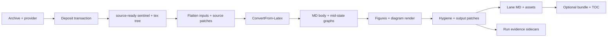

Here is a reverse-engineered process spec from the current code (not the issue/docs corpus). The system is two transactions plus an optional batch shell.

---

## What it is

**LaTeX source → Markdown ground-truth**, in-house (no pandoc/latexml). Math stays LaTeX (`$…$` / `$$…$$`). Diagrams prefer encode-to-math, else render-to-PNG, else a flagged marker. Conversion never invents missing figures; it flags them.

There are **two separate transactions**:

1. **Source deposit** — unpack/validate archive, publish a fingerprintable tree, write a success sentinel (`metadata.json` or `article.json`).
2. **Ingest/convert** — consume an already source-ready deposit; never unpacks or creates the sentinel.

Batch is a third shell: inventory rows → one process job per document → same convert entrypoint.

---

## Stage 0 — Source deposit (precondition)

**Entry:** `Initialize-LatexSourceDeposit` (older PS-only path) or `New-LatexSourceDeposit` / `Publish-LatexSourceTree` (newer PS + JSONL-engine path that can publish `article.json`).

**Inputs (per document dir, leaf = slug):**

- `{slug}.tar.gz` or `arXiv-{slug}.tar.gz`
- optional `{slug}.arxiv.json`, `{slug}.pdf`

**Operations:**

1. Lock the document directory.
2. Extract archive into a private candidate tree (size/entry caps, no reparse points, members confined).
3. Validate tree: UTF-8 TeX, unambiguous `\documentclass` entrypoint, `\input`/`\include` resolve, `\begin{document}` present.
4. Publish stable tree as `{slug}-tex/` (or recover if fingerprint matches).
5. Canonicalize archive name to `{slug}.tar.gz`.
6. Write sentinel last: `state: source-ready`, with `source_forms` for archive + tree (paths, sha256, entrypoint).

**Artifacts left in the deposit:**
| Artifact | Role |
|---|---|
| `{slug}.tar.gz` | Immutable archive |
| `{slug}-tex/` | Working source tree |
| `metadata.json` _or_ `article.json` | Success sentinel + provenance |
| optional provider/PDF forms | Evidence only |

**Invariant:** Ingest refuses anything that is not `source-ready` with matching archive/tree hashes.

---

## Stage 1 — Batch orchestration (optional)

**Entry:** `src/latex-ingest/latex-batch.ps1`

**Flow:**

1. Read `inventory.jsonl` (materialized catalog of deposits; not a second source of truth).
2. Optionally filter by slug.
3. Create a batch run directory under `artifacts/…`.
4. For each row, `Get-LatexBatchJob` builds a process job whose identity hashes: relative manifest path + source-tree sha + patch identity + TOC/numbering flags.
5. `batch-executor` plans and runs workers in parallel.
6. Worker (`invoke-latex-ingest.ps1`) calls `Invoke-ArxivLatexToMarkdown`.

**Per-job address layout** (`latex-jobs/{slug}-{digest}/`):

- `run-artifacts/` → regenerable evidence
- `lane-output/` → `{slug}-latex.md` + `{slug}/` assets
- `deliverable/` → optional bundled shelf (if `-BundleDeliverable`)

---

## Stage 2 — Convert entry (`Invoke-ArxivLatexToMarkdown`)

Thin wrapper:

1. Resolve manifest (`article.json` preferred under dir, else `metadata.json` / file path).
2. Validate deposit still matches fingerprints; resolve entrypoint from `latex-source-tree` form.
3. Hand off to `Invoke-LatexIngestResolvedSource`.

Does **not** discover archives, unpack, or write the deposit sentinel (compat wrappers exist separately).

---

## Stage 3 — Resolved-source orchestration

**Mechanics, in order:**

### 3a. Setup

- Open run dir (default `artifacts/latex-ingest/runs/{stamp}/{slug}`).
- Require math-render dependency available.
- Load optional `{slug}-latex.patch.jsonl` (identity may be asserted by batch).

### 3b. Flatten source

- `Resolve-LatexSourceInputs`: recursively inline `\input`/`\include` into one TeX string (depth/cycle guarded).

### 3c. Source patches (pre-conversion)

Ops: `define_macro`, `source_replace`. Fail if stale (0 hits / unexpected hit count / macro already defined). Patched TeX is the single source of truth for everything downstream.

### 3d. Oracle + bibliography

- Count figures/tables/theorems/equations/diagrams off patched source → later sidecar.
- Find `.bbl`; if biblatex `\entry{}` form, synthesize `\bibitem`s; else fall back to inline `thebibliography`.

### 3e. Core transform

`ConvertFrom-Latex $tex $bbl` → markdown body (details below). Append `## References` from `.bbl`.

### 3f. Persist graph evidence (run dir)

| File                     | Content                                                  |
| ------------------------ | -------------------------------------------------------- |
| `{slug}.refs.jsonl`      | Labels (normalized + faithful numbers) + reference sites |
| `{slug}.docstream.jsonl` | Linearized manuscript nodes                              |
| `{slug}.refgraph.json`   | Label machinery + danglers                               |
| `{slug}.docgraph.json`   | Docstream ⊕ refgraph composition                         |

### 3g. Figures (lane assets)

`Copy-LatexFigures`:

- Resolve `` against the source tree (extension / recursive leaf search).
- Raster (png/jpg/…) and svg → copy to `OutDir/{slug}/`.
- PDF → MuPDF batch → PNG.
- EPS/PS → tectonic wrap → PDF → PNG.
- Missing/unconvertible → flagged marker, never a dead image link.

### 3h. Diagrams (render ladder)

Diagrams were stashed during conversion as markers + source.

1. **Tectonic** (author preamble replayed + macros expanded) → PDF → PNG.
2. Else **tikzjax** for tikz/tikzcd → SVG (or PNG if available).
3. Else leave flagged marker.
   Write `{slug}.diagrams.jsonl` work-list (n, kind, status, source) for later agent encoding.

### 3i. Emission finish

- `Format-MdHygiene` (whitespace, headings, lists, span adjacency, etc.).
- Output patches (`output_replace`) against near-final markdown.
- Optional embedded `## Contents` (`-EnableEmbeddedToc`; off by default).
- Write lane deliverable: `OutDir/{slug}-latex.md`.
- Math-render audit → `run/audits/math-render.json` (defect report, does not abort conversion).
- Optional `Copy-MdDeliverable` into `-DeliverableDir`.
- Write `{slug}.oracle-counts.json` (oracle + realized figure/diagram stats + patch identity).

---

## Stage 4 — Core transform (`ConvertFrom-Latex`)

This is the ad-hoc heart. Design pattern: **protect fragile regions → rewrite structure → restore**.

```
verbatim stash → strip comments → harvest macros → extract title/body
→ drop non-rendered (comment/iffalse/CCSXML/thebibliography)
→ strip \newcommand-class declarations from body
→ $$ → \[…\] (TeX-faithful)
→ diagrams: encode-first (linear tikzcd/xymatrix) else stash + marker
→ tabulars / NiceMatrix / KaTeX compat rewrites
→ Expand-LatexMacros
→ custom counters → theorem/section walk (numbering + spine markers)
→ Build label/cite maps → Resolve-Refs (\cite/\ref/\cref/…)
→ stash figure/table floats + barriers + \appendix as markers
→ strip \label and front-matter (\author, …)
→ Protect-LatexMath (placeholders @@LMATH/@@LDISP@@)
→ algorithms → fenced pseudocode placeholders
→ structure → markdown (sections, lists, captions, links, accents, …)
→ reflow prose while placeholders opaque
→ Build docstream + refgraph + docgraph  ← mid-state snapshot
→ realize float bundles back into flow
→ strip structural markers
→ Restore math + algorithms
→ return "# title\n\n" + body
```

### Important subprocesses

**Numbering / refs**
One ordered walk over sections + theorem-like envs builds counter maps. Two projections always exist: **normalized** (arabic continuation, default deliverable) and **faithful** (appendix lettering etc. when `-FaithfulNumbering`). Refs resolve against those maps; cleveref-style typed refs need the type map from that walk.

**Math protection / register**
Display/align/equation/`\[…\]`/`$…$` go into a store as placeholders. On store: KaTeX-oriented lowering via `latex-math-store` (aliases, furniture drop, evidence ledger). Outer delimiters own `$`/`$$`; inner bridged math becomes `\(...\)`.

**Diagram doctrine**
Linear commutative diagrams → semantic arrow math when possible. Otherwise stash source; render later. Image is stopgap; math is the goal register.

**Docstream mid-state**
Built while math/alg/verb/floats are still opaque slots and spine markers still present — then floats are realized and markers stripped for the human markdown.

---

## Stage 5 — Optional deliverable bundle

`Copy-MdDeliverable`:

- Copy `{slug}-latex.md` → `{Dest}/{slug}/{slug}.md` (lane suffix dropped).
- Relocate local images under `images/` (SVG→PNG attempt).
- Emit TOC sidecars via toc-engine: `{slug}-tree.md`, `{slug}.toc.jsonl` (unless disabled).
- Verify links + count sentinel leaks (placeholders, U+FFFD, etc.); report `clean`, do not throw on dirty.

---

## Artifact map (end state)

**Deposit (immutable-ish):**

```
{document}/
  metadata.json | article.json
  {slug}.tar.gz
  {slug}-tex/…
  optional {slug}-latex.patch.jsonl
```

**Lane output (`OutDir`):**

```
{slug}-latex.md
{slug}/                 # figures + diagram-N.png|svg
```

**Run evidence (`RunDir`):**

```
{slug}.oracle-counts.json
{slug}.refs.jsonl
{slug}.docstream.jsonl
{slug}.refgraph.json
{slug}.docgraph.json
{slug}.diagrams.jsonl
audits/math-render.json
```

**Optional shelf (`DeliverableDir`):**

```
{slug}/{slug}.md
{slug}/images/…
{slug}/{slug}-tree.md
{slug}/{slug}.toc.jsonl
```

---

## Control knobs that change product shape

| Knob                                           | Effect                                          |
| ---------------------------------------------- | ----------------------------------------------- |
| `-FaithfulNumbering`                           | Render paper’s own number symbols in heads/refs |
| `-EnableEmbeddedToc`                           | Insert in-doc Contents block                    |
| `-DisableTreeToc` / `-DisableJsonlToc`         | Suppress shelf TOC sidecars                     |
| `-DeliverableDir` / batch `-BundleDeliverable` | Emit packaged shelf                             |
| Patch file                                     | Bounded errata in source and/or output space    |
| Patch identity (batch)                         | Pins which errata set the job may see           |

---

## Design shape (what the mess is implementing)



**Separation already encoded in code:**

- Deposit ≠ convert (convert never initializes).
- Lane output ≠ run evidence ≠ optional shelf.
- Inventory is a catalog over deposits, not authority.
- Math/diagrams/floats use a **stash → marker → restore/realize** discipline so structural rewrites cannot shred them.

**Where the ad-hoc nature still shows:** almost all conversion policy lives as ordered regex/walk phases inside one giant `ConvertFrom-Latex`, with script-scoped stores (`DiagramStore`, `LtxMathStore`, `FigEnvStore`, …) as the coordination bus between stages.

---

## Latex-ingest stage contracts

Refactor boundaries as the code currently enforces them. Each stage owns its outputs; later stages must not rewrite earlier success sentinels.

---

### S0 — Source deposit

|               |                                                                                                                               |
| ------------- | ----------------------------------------------------------------------------------------------------------------------------- |
| **Owner**     | `Initialize-LatexSourceDeposit` / `New-LatexSourceDeposit`                                                                    |
| **In**        | Document dir with archive (`{slug}.tar.gz` or alias); optional provider JSON / PDF                                            |
| **Invariant** | Lock held through publication; private extract discarded; sentinel written last; no overwrite of differing tree               |
| **Out**       | `{slug}-tex/`, canonical archive, `metadata.json` or `article.json` with `state=source-ready` + archive/tree sha + entrypoint |
| **Must not**  | Emit markdown, run evidence, or mutate after sentinel exists                                                                  |

---

### S1 — Inventory catalog (batch only)

|               |                                                                                              |
| ------------- | -------------------------------------------------------------------------------------------- |
| **Owner**     | `Write-LatexInventoryCatalog` / `Read-LatexInventoryCatalog`                                 |
| **In**        | Inventory root of deposit dirs that already have `metadata.json`                             |
| **Invariant** | Catalog is a materialized view; missing sentinel = skip; invalid sentinel aborts whole write |
| **Out**       | `inventory.jsonl` rows (`slug`, `metadata_path`, hashes, schema/state)                       |
| **Must not**  | Initialize or repair deposits                                                                |

---

### S2 — Batch plan / job address

|               |                                                                                                                                  |
| ------------- | -------------------------------------------------------------------------------------------------------------------------------- |
| **Owner**     | `latex-batch.ps1` + `Get-LatexBatchJob`                                                                                          |
| **In**        | Inventory rows; run directory; convert flags; optional patch identity pin                                                        |
| **Invariant** | Job id/digest = hash(manifest path, source-tree sha, patch identity, TOC/numbering/bundle flags); writes confined to job address |
| **Out**       | Process jobs under `latex-jobs/{slug}-{digest}/` → `run-artifacts/`, `lane-output/`, optional `deliverable/`                     |
| **Must not**  | Convert TeX itself (worker only invokes convert)                                                                                 |

---

### S3 — Manifest resolve

|               |                                                                                                                                                                                             |
| ------------- | ------------------------------------------------------------------------------------------------------------------------------------------------------------------------------------------- |
| **Owner**     | `Resolve-LatexIngestManifestSource`                                                                                                                                                         |
| **In**        | `MetadataPath` (file or document dir)                                                                                                                                                       |
| **Invariant** | Schema is article/0.1 or document-metadata/0.1; `state=source-ready`; archive + tree hashes still match disk; exactly one tree form with entrypoint inside tree; no reparse-point traversal |
| **Out**       | `{ slug, metadata_path, source_path, main_path, archive_path, manifest }`                                                                                                                   |
| **Must not**  | Unpack, patch, or convert                                                                                                                                                                   |

---

### S4 — Source flatten + source patches

|               |                                                                                                                                                                               |
| ------------- | ----------------------------------------------------------------------------------------------------------------------------------------------------------------------------- |
| **Owner**     | `Resolve-LatexSourceInputs` → `Invoke-LatexSourcePatches`                                                                                                                     |
| **In**        | `main_path` + tree; `{slug}-latex.patch.jsonl` (may be absent); optional expected identity                                                                                    |
| **Invariant** | Inputs resolve inside tree (default Stop on unresolved); patch ops only `define_macro` / `source_replace`; stale/zero-hit patches throw; patched TeX is sole downstream truth |
| **Out**       | Single TeX string; patch audit trail + identity                                                                                                                               |
| **Must not**  | Touch deposit sentinel or write markdown                                                                                                                                      |

---

### S5 — Oracle + bibliography prep

|               |                                                                                                                |
| ------------- | -------------------------------------------------------------------------------------------------------------- |
| **Owner**     | `Get-LatexOracleCounts` + bbl recovery in orchestrator                                                         |
| **In**        | Patched TeX; source tree                                                                                       |
| **Invariant** | Counts are source-side; biblatex `\entry` rewritten to synthetic `\bibitem` or inline thebibliography fallback |
| **Out**       | Oracle count object; bbl text usable by cite/ref stages                                                        |
| **Must not**  | Alter manuscript body structure (except via later convert)                                                     |

---

### S6 — Core convert (`ConvertFrom-Latex`)

|                                        |                                                                                                                                                                                                                                                                                                                      |
| -------------------------------------- | -------------------------------------------------------------------------------------------------------------------------------------------------------------------------------------------------------------------------------------------------------------------------------------------------------------------- |
| **Owner**                              | `ConvertFrom-Latex`                                                                                                                                                                                                                                                                                                  |
| **In**                                 | Patched TeX + bbl; numbering projection flag                                                                                                                                                                                                                                                                         |
| **Invariant**                          | Fragile regions opaque via placeholders before prose rewrites; every stored span reachable until restore; encode-first diagrams preferred; floats stashed whole then realized; docstream built at mid-state (placeholders still present); production returns markdown string only (graphs ride script stores for S7) |
| **Internal stores (coordination bus)** | Math, verb, alg, diagram, fig/tab float, barrier, appendix, spine, ref model, doc objects                                                                                                                                                                                                                            |
| **Out**                                | Markdown body (title + body); populated script stores for graphs/diagrams/objects                                                                                                                                                                                                                                    |
| **Must not**                           | Copy assets, render diagrams to disk, write run sidecars, apply output patches                                                                                                                                                                                                                                       |

Natural **sub-boundaries inside S6** (if you split later):

1. Protect/normalize (verbatim, comments, macros, display dollars, KaTeX compat)
2. Structure/numbering/refs (counters, cross-ref walk, Resolve-Refs)
3. Channel stash (diagrams already; floats/barriers/appendix)
4. Math protect + structure→md + reflow
5. Mid-state graphs
6. Float realize + restore

---

### S7 — Persist convert evidence

|               |                                                                             |
| ------------- | --------------------------------------------------------------------------- |
| **Owner**     | Early tail of `Invoke-LatexIngestResolvedSource`                            |
| **In**        | Script stores from S6; run dir                                              |
| **Invariant** | Evidence lives in run dir only — never inside `{slug}-tex/`                 |
| **Out**       | `{slug}.refs.jsonl`, `.docstream.jsonl`, `.refgraph.json`, `.docgraph.json` |
| **Must not**  | Change markdown content                                                     |

---

### S8 — Figure asset realization

|               |                                                                                                                  |
| ------------- | ---------------------------------------------------------------------------------------------------------------- |
| **Owner**     | `Copy-LatexFigures`                                                                                              |
| **In**        | Markdown image links; source tree; `OutDir`                                                                      |
| **Invariant** | PNG is terminal raster register; missing/unconvertible → flagged marker, never silent dead link; PDF/EPS batched |
| **Out**       | Updated markdown; files under `OutDir/{slug}/`; copied/missing stats                                             |
| **Must not**  | Touch deposit or invent captions                                                                                 |

---

### S9 — Diagram render ladder

|               |                                                                                                         |
| ------------- | ------------------------------------------------------------------------------------------------------- |
| **Owner**     | Orchestrator + `Invoke-TexDiagramRender` / `Invoke-TikzRender`                                          |
| **In**        | `DiagramStore` + author preamble/macros; markdown markers                                               |
| **Invariant** | Ladder: tectonic→PNG, else tikzjax SVG/PNG, else marker remains; failures degrade, do not abort convert |
| **Out**       | Image files under `OutDir/{slug}/`; marker→image swaps; `{slug}.diagrams.jsonl`                         |
| **Must not**  | Rewrite non-diagram math                                                                                |

---

### S10 — Emission finalize

|               |                                                                                                  |
| ------------- | ------------------------------------------------------------------------------------------------ |
| **Owner**     | Hygiene + `Invoke-LatexOutputPatches` + write lane MD                                            |
| **In**        | Near-final markdown; output_replace patches                                                      |
| **Invariant** | Hygiene before output patches; embedded TOC off unless requested; lane file is `{slug}-latex.md` |
| **Out**       | `OutDir/{slug}-latex.md`                                                                         |
| **Must not**  | Bundle or rewrite run graph sidecars                                                             |

---

### S11 — Audits + oracle sidecar

|               |                                                                                                     |
| ------------- | --------------------------------------------------------------------------------------------------- |
| **Owner**     | `Invoke-MathRenderAudit` + oracle JSON write                                                        |
| **In**        | Lane MD path; figure/diagram/patch stats                                                            |
| **Invariant** | Math-render defects persisted, conversion not thrown away; oracle is newest-run-wins consumer input |
| **Out**       | `run/audits/math-render.json`; `{slug}.oracle-counts.json`                                          |
| **Must not**  | Mutate lane MD after write (audit is observational)                                                 |

---

### S12 — Optional deliverable shelf

|               |                                                                                                              |
| ------------- | ------------------------------------------------------------------------------------------------------------ |
| **Owner**     | `Copy-MdDeliverable`                                                                                         |
| **In**        | Lane MD + assets; bib metadata from source; subject index from doc objects                                   |
| **Invariant** | Shelf is self-contained under `{Dest}/{slug}/`; link check at destination; dirty bundle reported, not thrown |
| **Out**       | `{slug}.md`, `images/`, optional `{slug}-tree.md` + `{slug}.toc.jsonl`                                       |
| **Must not**  | Alter deposit or lane-output originals beyond copy/transform into shelf                                      |

---

## Boundary rules (refactor choke points)

1. **S0 ⊥ S3–S12** — convert consumes deposits; never creates them.
2. **S1 is derived** — delete/rebuild catalog without touching deposits.
3. **S2 only addresses** — job paths and identity; policy flags are parameters, not logic.
4. **S4 is the last source-space edit** — everything after reads one TeX string.
5. **S6 is pure(ish) transform** — string + stores in; markdown + stores out; disk I/O belongs outside.
6. **S7/S11 are run-scoped** — regenerable; not part of the manuscript register.
7. **S8/S9 are asset realization** — markers/links in, files out; ladder may degrade.
8. **S10 is the manuscript freeze** — after this, only copy/audit/bundle.
9. **S12 is packaging** — optional; lane MD remains the lane register even if shelf is dirty.

---

## Minimum viable module cut (if splitting the blob)

| Module              | Stages                     |
| ------------------- | -------------------------- |
| `source-deposit`    | S0                         |
| `inventory-catalog` | S1                         |
| `latex-batch`       | S2                         |
| `latex-resolve`     | S3–S5                      |
| `latex-convert`     | S6 (+ internal sub-stages) |
| `latex-realize`     | S7–S9                      |
| `latex-emit`        | S10–S12                    |

That cut matches ownership already implied by function seams; the current mess is mostly S6–S10 living in one file with script-scoped stores as the bus.
