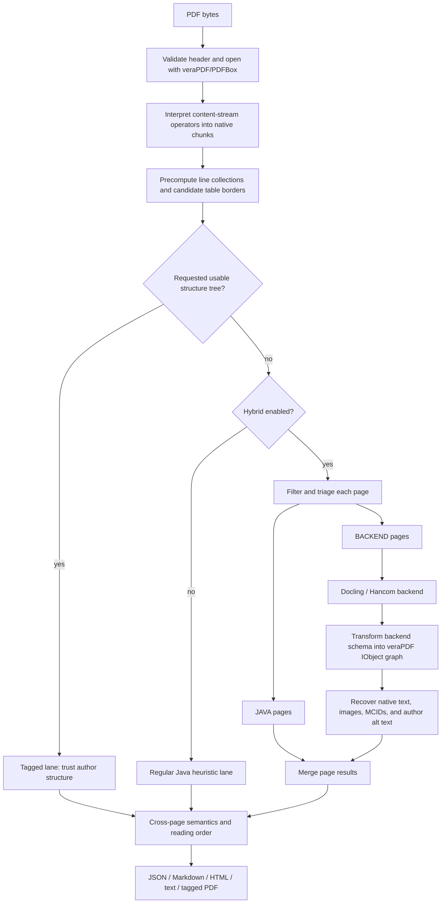
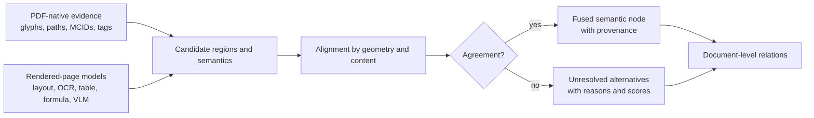

# OpenDataLoader PDF: decomposition, triage, heuristics, and a cross-examination with MinerU

## Scope

This review covers:

- OpenDataLoader PDF at commit [`5717af9`](https://github.com/opendataloader-project/opendataloader-pdf/tree/5717af950808acacebe7d2f8ac8a6a23f8aafcd0), dated 2026-06-29.
- The exact veraPDF dependencies used by that revision: `validation-model` / `wcag-validation` 1.31.88 and `wcag-algorithms` 1.31.28.
- MinerU at commit [`79d6d8d`](https://github.com/opendatalab/MinerU/tree/79d6d8d79fb8f3ddba5cc34c07a16f0ec36f56c7), cross-checked against `D:\aghado01\codex-scientiae\issues\sol-minerU-breakdown.md`.

This is a source-level architecture review. I did not run a live Docling or Hancom backend. Maven was not available on the current command path, so the findings below come from tracing the implementation and its tests, not from a new benchmark run.

## The short version

The most important correction to the initial comparison is this:

> **OpenDataLoader PDF is fundamentally a born-PDF object parser with a deterministic semantic heuristic stack. MinerU is fundamentally a learned visual parser with native-PDF text recovery.**

Both can call vision models, but the models occupy different architectural positions.

- OpenDataLoader begins inside the PDF content streams. It interprets text-showing operators, graphics-state transformations, image XObjects, path construction, fonts, Unicode maps, MCIDs, and structure tags. Java heuristics then progressively turn those primitives into lines, paragraphs, lists, headings, tables, captions, headers, and footers.
- When OpenDataLoader hybrid mode is enabled, a small deterministic page classifier diverts selected pages—primarily pages that look table-like, contain failed Unicode decoding, or contain a large landscape image—to an external backend. The Java and backend results are not voted together. One page result wins, after which native Java text and image provenance are grafted back onto backend elements where geometry and text similarity allow it.
- MinerU begins from rendered pages and learned layout regions. Its pipeline backend uses specialized layout, formula, OCR, and table models; its VLM backend lets a page-image model emit both structure and content; and its default hybrid route uses learned regions, a VLM for difficult regions, native PDF characters where possible, and geometric reconciliation.

The two systems therefore approach the same objective from opposite directions:

```text
OpenDataLoader: PDF operators -> trustworthy primitives -> heuristics -> selective visual escalation
MinerU:        page pixels   -> learned semantic regions -> recognition -> native-text restoration
```

OpenDataLoader is strongest where the PDF still tells the truth. MinerU is strongest where the visual appearance is the only truth left.

## 1. The actual OpenDataLoader control plane

The public configuration defaults to JSON output, Java-only processing, no structure-tree use, border-based tables, XY-Cut reading order, and one thread. Hybrid mode defaults to `off`; when enabled, its page-routing mode defaults to `auto`, OCR defaults to `auto`, backend failure is fatal by default, and the backend timeout is zero—meaning no timeout. Hybrid normalization forces the thread count back to one because the implementation is sequential. See [`Config.java:65-92`](https://github.com/opendataloader-project/opendataloader-pdf/blob/5717af950808acacebe7d2f8ac8a6a23f8aafcd0/java/opendataloader-pdf-core/src/main/java/org/opendataloader/pdf/api/Config.java#L65-L92), [`Config.java:905-918`](https://github.com/opendataloader-project/opendataloader-pdf/blob/5717af950808acacebe7d2f8ac8a6a23f8aafcd0/java/opendataloader-pdf-core/src/main/java/org/opendataloader/pdf/api/Config.java#L905-L918), and [`HybridConfig.java:26-53`](https://github.com/opendataloader-project/opendataloader-pdf/blob/5717af950808acacebe7d2f8ac8a6a23f8aafcd0/java/opendataloader-pdf-core/src/main/java/org/opendataloader/pdf/hybrid/HybridConfig.java#L26-L53).

After common preprocessing, the top-level branch order is:

1. If `useStructTree` is true and a structure tree exists, use the tagged-PDF lane.
2. Otherwise, if hybrid is enabled, use the hybrid lane.
3. Otherwise use the regular Java lane.
4. Sort each completed page into reading order and sanitize the resulting object graph.

That precedence matters. A tagged PDF does not go through hybrid triage when structure-tree use is requested. The dispatch is explicit in [`DocumentProcessor.java:174-189`](https://github.com/opendataloader-project/opendataloader-pdf/blob/5717af950808acacebe7d2f8ac8a6a23f8aafcd0/java/opendataloader-pdf-core/src/main/java/org/opendataloader/pdf/processors/DocumentProcessor.java#L174-L189).



This is not merely three interchangeable parsers. Each lane embodies a different trust decision:

- **Tagged lane:** trust the PDF author’s logical structure.
- **Java lane:** trust born objects and infer semantics deterministically.
- **Backend lane:** trust visual analysis for the selected page, then recover born provenance where possible.

## 2. Layer zero: how Java decomposes the PDF

### 2.1 The preprocessing contract

`DocumentProcessor.preprocessing` first checks that `%PDF-` occurs within the first 1,024 bytes, opens the file as a veraPDF `PDDocument`, constructs a `GFSAPDFDocument`, and configures the shared semantic containers. In data-loader mode it:

- includes unmapped font characters as U+FFFD instead of silently discarding them;
- enables font parsing;
- ignores MCIDs unless the structure-tree lane is requested;
- allows spaces to be inserted between text pieces;
- parses all page chunks; and
- immediately derives table-border candidates from page line geometry.

The relevant setup and `parseChunks()` call are in [`DocumentProcessor.java:592-637`](https://github.com/opendataloader-project/opendataloader-pdf/blob/5717af950808acacebe7d2f8ac8a6a23f8aafcd0/java/opendataloader-pdf-core/src/main/java/org/opendataloader/pdf/processors/DocumentProcessor.java#L592-L637).

The crucial point is that the first representation is not a page image. It is a sequence of decoded PDF drawing operations.

### 2.2 From PDF operators to artifacts

The exact veraPDF dependency performs the following chain:

```text
page / content streams
  -> PDFStreamParser tokens
  -> operands accumulated until an operator
  -> ChunkParser interprets the operator under the current graphics state
  -> TextChunk / ImageChunk / LineChunk / LineArtChunk
  -> optional association with the active MCID
```

`GFSAContentStream` decodes a stream or stream array, asks PDFBox’s `PDFStreamParser` for tokens, and passes them to `ChunkFactory`; `ChunkFactory` groups operands with the following operator and calls `ChunkParser`. See [`GFSAContentStream.java:81-98`](https://github.com/veraPDF/veraPDF-validation/blob/0e86c53aecccecab80f9f2995dc96de54837fdf5/wcag-validation/src/main/java/org/verapdf/gf/model/impl/sa/GFSAContentStream.java#L81-L98) and [`ChunkFactory.java:37-57`](https://github.com/veraPDF/veraPDF-validation/blob/0e86c53aecccecab80f9f2995dc96de54837fdf5/wcag-validation/src/main/java/org/verapdf/gf/model/factory/chunks/ChunkFactory.java#L37-L57).

`ChunkParser` recognizes the PDF primitives directly:

- `Tj`, `TJ`, `'`, and `"` create text chunks.
- `BI` creates an inline-image chunk.
- `Do` either creates an image-XObject chunk or recursively parses a form XObject.
- path, stroke, fill, rectangle, and curve operators accumulate graphical segments and are later normalized into line and line-art chunks.
- marked-content operators maintain the MCID/object association used by the tagged lane and by output provenance.

The text and image cases are visible in [`ChunkParser.java:287-383`](https://github.com/veraPDF/veraPDF-validation/blob/0e86c53aecccecab80f9f2995dc96de54837fdf5/wcag-validation/src/main/java/org/verapdf/gf/model/factory/chunks/ChunkParser.java#L287-L383) and [`ChunkParser.java:516-542`](https://github.com/veraPDF/veraPDF-validation/blob/0e86c53aecccecab80f9f2995dc96de54837fdf5/wcag-validation/src/main/java/org/verapdf/gf/model/factory/chunks/ChunkParser.java#L516-L542).

For text, the parser reads font character codes, calls the font’s `toUnicode`, substitutes U+FFFD when the mapping is unavailable, and computes geometry from the text rendering matrix and current transformation matrix. Each `TextChunk` carries decoded content, font name/family, size, weight, italic state, baseline, fill color, rotation, glyph endpoints, and a `StreamInfo` reference back to the originating operator. See [`ChunkParser.java:856-925`](https://github.com/veraPDF/veraPDF-validation/blob/0e86c53aecccecab80f9f2995dc96de54837fdf5/wcag-validation/src/main/java/org/verapdf/gf/model/factory/chunks/ChunkParser.java#L856-L925).

This is OpenDataLoader’s deepest architectural advantage over a raster-first parser: when decoding works, its evidence is not an approximation of the page. It is the page program itself.

### 2.3 Lines become a second geometric channel

Thin filled rectangles, explicit lines, and path art are normalized into horizontal, vertical, square, and general line-art sets. The preprocessor groups intersecting horizontal and vertical rules into connected components, merges compatible borders, and rejects components that lack both axes or are too small to be plausible tables. The main thresholds include a maximum table-rule width of five points and minimum structural requirements around the number and orientation of vertices. See [`LinesPreprocessingConsumer.java:34-135`](https://github.com/veraPDF/veraPDF-wcag-algs/blob/84fb9570b1a24423fdc956a78f310267f6f077bc/src/main/java/org/verapdf/wcag/algorithms/semanticalgorithms/consumers/LinesPreprocessingConsumer.java#L34-L135).

This line channel is used twice:

1. by the Java table parser to build real cell structures; and
2. by hybrid triage as evidence that the page should be sent to a learned backend.

That dual use creates an interesting policy inversion: in Java-only mode, detected borders are an input to the local table algorithm; in hybrid-auto mode, the mere existence of a candidate `TableBorder` is a top-priority reason to bypass that Java table algorithm and send the whole page to the backend.

## 3. The regular Java lane: a staged semantic compiler

The Java lane is best understood as a compiler pipeline. Each stage replaces low-level objects with higher-level objects while retaining bounding boxes and child relationships.

### 3.1 Exact processing order

The regular path in [`DocumentProcessor.java:246-408`](https://github.com/opendataloader-project/opendataloader-pdf/blob/5717af950808acacebe7d2f8ac8a6a23f8aafcd0/java/opendataloader-pdf-core/src/main/java/org/opendataloader/pdf/processors/DocumentProcessor.java#L246-L408) performs:

1. Prefetch page artifacts.
2. Filter every page, in parallel when configured.
3. Optionally perform hidden-text detection sequentially.
4. Optionally run cluster-based table detection over the document.
5. Per page: infer text decoration, consume border tables, remove remaining raw line chunks, detect a special Korean table form, and build text lines.
6. Across pages: detect headers/footers and perform the first list pass.
7. Per page: merge lines into paragraphs, run a second list pass over semantic text, infer headings, assign IDs, and attach captions.
8. Across pages: connect neighboring lists and tables, infer heading levels, and assign nesting levels.
9. After the lane returns: apply XY-Cut reading order and sanitize the graph.

Although the source retains a `structured` conditional, it is currently hard-coded to `true`, so the structured passes always run. This is a useful warning when interpreting configuration comments: the implementation has evolved ahead of some abstractions.

### 3.2 Filtering is evidence cleanup, not semantics

`ContentFilterProcessor` removes duplicate overlapping text, decorative images, tiny text at or below one point, and objects fully outside the crop box. It merges adjacent same-style/same-baseline chunks, normalizes whitespace, splits chunks at whitespace, and removes very large background line art. It also measures the proportion of U+FFFD characters per page; a ratio at or above 0.30 is recorded as an extraction failure signal for hybrid triage. See [`ContentFilterProcessor.java:53-86`](https://github.com/opendataloader-project/opendataloader-pdf/blob/5717af950808acacebe7d2f8ac8a6a23f8aafcd0/java/opendataloader-pdf-core/src/main/java/org/opendataloader/pdf/processors/ContentFilterProcessor.java#L53-L86).

This stage is deliberately conservative about semantic meaning. Its job is to stabilize the primitive stream so downstream geometric heuristics do not have to reason about obvious noise.

### 3.3 Text lines: local geometric compatibility

`TextLineProcessor` walks chunks in content-stream order, groups consecutive text chunks when veraPDF’s one-line probability is at least 0.75 and their hidden states match, sorts accepted chunks by x-coordinate, and reinserts spaces from explicit whitespace or a sufficiently large horizontal gap. A tiny preceding line-art object can become a bullet. See [`TextLineProcessor.java:42-95`](https://github.com/opendataloader-project/opendataloader-pdf/blob/5717af950808acacebe7d2f8ac8a6a23f8aafcd0/java/opendataloader-pdf-core/src/main/java/org/opendataloader/pdf/processors/TextLineProcessor.java#L42-L95).

The one-line probability is not learned from this document. It is a hand-composed score over baseline/center distance, slant, font size, character spacing, leading, and normal/superscript/subscript relationships. The data-loader configuration allows a broad character-spacing interval and a leading interval of roughly 0.7–2.2. The consequence is deterministic and inspectable behavior, but also sensitivity to fonts, content-stream order, and fixed thresholds.

### 3.4 Paragraphs: an ordered cascade of merge hypotheses

`ParagraphProcessor` first wraps lines as text blocks, then tries merge strategies in a fixed order: justified, first/last-justified, left-aligned with style, left-aligned without style, first-line indentation, centered, right-aligned, two-line cases, and finally a catch-all. The primary merge threshold is again 0.75. Features include leading probability, alignment, font size/weight compatibility, indentation, horizontal overlap, hidden state, and bullet exclusion. See [`ParagraphProcessor.java:36-53`](https://github.com/opendataloader-project/opendataloader-pdf/blob/5717af950808acacebe7d2f8ac8a6a23f8aafcd0/java/opendataloader-pdf-core/src/main/java/org/opendataloader/pdf/processors/ParagraphProcessor.java#L36-L53).

The ordered cascade matters: an early hypothesis changes the objects seen by later hypotheses. This is not global optimization over all possible paragraph segmentations. It is greedy semantic compilation.

### 3.5 Lists: recurring labels plus continuation geometry

Lists are inferred in two passes. The first operates before paragraphs and looks for recurring label intervals across pages. The second operates on semantic text nodes after paragraph formation. Recognized labels include Arabic and Roman numerals, upper/lower English letters, Korean forms, circled Arabic numbers, and unordered bullets. Continuation lines require compatible leading, left/justified alignment, indentation, and the absence of a new list marker; neighboring lists may later be connected across pages. See [`ListProcessor.java`](https://github.com/opendataloader-project/opendataloader-pdf/blob/5717af950808acacebe7d2f8ac8a6a23f8aafcd0/java/opendataloader-pdf-core/src/main/java/org/opendataloader/pdf/processors/ListProcessor.java).

This is a good example of how OpenDataLoader distributes one semantic decision over several scopes:

- local lexical recognition identifies a label;
- page geometry decides which lines belong to the item;
- recurrence supports the list hypothesis; and
- a document pass decides whether lists continue across a page boundary.

### 3.6 Headings: neighbor contrast plus document statistics

Heading inference combines local contrast with corpus statistics. A text node receives a base heading probability relative to its previous and next semantic neighbors. The score reacts to font-size and font-weight differences, font/color changes, uppercase patterns, distance to neighboring text, and multiline penalties. Rarity boosts are derived from the document’s modal body font size and weight. A bullet can add 0.1, and the final heading threshold is greater than 0.75. See [`HeadingProcessor.java:53-94`](https://github.com/opendataloader-project/opendataloader-pdf/blob/5717af950808acacebe7d2f8ac8a6a23f8aafcd0/java/opendataloader-pdf-core/src/main/java/org/opendataloader/pdf/processors/HeadingProcessor.java#L53-L94) and veraPDF’s [`NodeUtils.java:52-156`](https://github.com/veraPDF/veraPDF-wcag-algs/blob/84fb9570b1a24423fdc956a78f310267f6f077bc/src/main/java/org/verapdf/wcag/algorithms/semanticalgorithms/utils/NodeUtils.java#L52-L156).

Heading levels are assigned later by grouping text styles and ordering them primarily by descending maximum font size and then font weight. That is transparent, but it means color and font-family differences do not fully participate in level ordering even though they can participate in heading detection.

### 3.7 Tables: rule geometry first, optional clustering second

The default table path starts from the connected line components built during preprocessing. `TableBorderProcessor` assigns page content to cells geometrically, splits text chunks that cross cell boundaries, normalizes the structure, and recursively processes nested tables to a maximum depth of ten. It also connects tables across pages when column counts and cell widths align within fixed tolerances. See [`TableBorderProcessor.java:54-201`](https://github.com/opendataloader-project/opendataloader-pdf/blob/5717af950808acacebe7d2f8ac8a6a23f8aafcd0/java/opendataloader-pdf-core/src/main/java/org/opendataloader/pdf/processors/TableBorderProcessor.java#L54-L201) and [`TableBorderProcessor.java:224-239`](https://github.com/opendataloader-project/opendataloader-pdf/blob/5717af950808acacebe7d2f8ac8a6a23f8aafcd0/java/opendataloader-pdf-core/src/main/java/org/opendataloader/pdf/processors/TableBorderProcessor.java#L224-L239).

With `tableMethod=cluster`, an additional token-clustering consumer searches for borderless tables. It is not a general semantic table model: it is activated around suspicious text ordering or same-baseline gaps, and it avoids candidates that overlap a border table by more than one percent. The first row is assumed to be a header.

### 3.8 Page furniture and captions

Header/footer detection compares progressively ranked top and bottom objects across adjacent and alternating pages. Candidates must occupy the top or bottom third, and matches are based on overlapping geometry, close font size, identical text, or page-number-like sequences. See [`HeaderFooterProcessor.java:51-69`](https://github.com/opendataloader-project/opendataloader-pdf/blob/5717af950808acacebe7d2f8ac8a6a23f8aafcd0/java/opendataloader-pdf-core/src/main/java/org/opendataloader/pdf/processors/HeaderFooterProcessor.java#L51-L69) and [`HeaderFooterProcessor.java:213-273`](https://github.com/opendataloader-project/opendataloader-pdf/blob/5717af950808acacebe7d2f8ac8a6a23f8aafcd0/java/opendataloader-pdf-core/src/main/java/org/opendataloader/pdf/processors/HeaderFooterProcessor.java#L213-L273).

Caption inference finds nearby text around an image or table and combines geometric proximity/containment with simple lexical cues such as “table,” “figure,” or “image.” A score at least 0.75 attaches a `SemanticCaption` to the target structure. This is much narrower linguistically than a model-based caption classifier, but it is repeatable and easy to debug.

### 3.9 Reading order is deliberately late

Semantics are built before final reading order. The default sorter is a simplified XY-Cut++ implementation:

- detect and temporarily remove cross-layout elements;
- estimate page density;
- recursively find horizontal and vertical whitespace cuts of at least five points;
- choose the direction with the larger gap;
- fall back to top-to-bottom, left-to-right order;
- merge cross-layout elements back.

There are two implementation details worth knowing:

1. The default beta is 2.0, which the code itself says “effectively disables” cross-layout detection because an object would need to be twice the page’s maximum element width. See [`XYCutPlusPlusSorter.java:45-68`](https://github.com/opendataloader-project/opendataloader-pdf/blob/5717af950808acacebe7d2f8ac8a6a23f8aafcd0/java/opendataloader-pdf-core/src/main/java/org/opendataloader/pdf/processors/readingorder/XYCutPlusPlusSorter.java#L45-L68).
2. Density computes a `preferHorizontalFirst` flag, but the recursive selection never consults it; when both cuts exist, it simply chooses the larger gap, with a tie going vertical. See [`XYCutPlusPlusSorter.java:120-128`](https://github.com/opendataloader-project/opendataloader-pdf/blob/5717af950808acacebe7d2f8ac8a6a23f8aafcd0/java/opendataloader-pdf-core/src/main/java/org/opendataloader/pdf/processors/readingorder/XYCutPlusPlusSorter.java#L120-L128) and [`XYCutPlusPlusSorter.java:331-371`](https://github.com/opendataloader-project/opendataloader-pdf/blob/5717af950808acacebe7d2f8ac8a6a23f8aafcd0/java/opendataloader-pdf-core/src/main/java/org/opendataloader/pdf/processors/readingorder/XYCutPlusPlusSorter.java#L331-L371).

So the class has the shape of adaptive XY-Cut++, but two advertised refinements are dormant under the defaults/current control flow.

## 4. The tagged-PDF lane: author semantics as an oracle

When requested and present, the PDF structure tree becomes the primary reading order and semantic source. `TaggedDocumentProcessor` traverses the tree and maps author types into paragraphs, numbered and unnumbered headings, lists/list items, tables/rows/cells, captions, TOCs, footnotes, figures, and spans. It separately collects untagged image/text artifacts, turns their text into lines/paragraphs, and detects headers and footers among those leftovers. Figures retain author `/Alt` text and the original image source. See [`TaggedDocumentProcessor.java:32-86`](https://github.com/opendataloader-project/opendataloader-pdf/blob/5717af950808acacebe7d2f8ac8a6a23f8aafcd0/java/opendataloader-pdf-core/src/main/java/org/opendataloader/pdf/processors/TaggedDocumentProcessor.java#L32-L86).

What the lane does **not** do is equally important: there is no apparent structure-tree quality score or fallback to the heuristic/hybrid lane when tags exist but are incomplete, badly ordered, or semantically wrong. The branch tests existence, not trustworthiness. The untagged-artifact pass mitigates missing MCID coverage, but it does not validate the author’s ordering or role map.

MinerU has no close equivalent to this lane. This makes OpenDataLoader unusually strong for accessibility workflows and properly tagged born-digital documents, while creating a sharp failure mode on “tagged but untrustworthy” PDFs.

## 5. Hybrid triage: what “hard” means to OpenDataLoader

### 5.1 It is a page router, not a general difficulty model

In hybrid-auto mode, every filtered page gets exactly one decision: `JAVA` or `BACKEND`. The decision is page-wide. There is no routing of one table region to Docling while retaining Java paragraph inference for the rest of that same page.

The classifier executes this fixed priority chain in [`TriageProcessor.java:648-706`](https://github.com/opendataloader-project/opendataloader-pdf/blob/5717af950808acacebe7d2f8ac8a6a23f8aafcd0/java/opendataloader-pdf-core/src/main/java/org/opendataloader/pdf/hybrid/TriageProcessor.java#L648-L706):

| Priority | Signal                    | Backend condition                                                | Attached “confidence” |
| -------: | ------------------------- | ---------------------------------------------------------------- | --------------------: |
|        0 | broken Unicode extraction | U+FFFD ratio `>= 0.30`                                           |                `1.00` |
|        1 | precomputed table border  | any `TableBorder`                                                |                `1.00` |
|        2 | vector-table pattern      | grid, enough line art, row separators, or aligned short rules    |                `0.95` |
|        3 | text-table pattern        | repeated suspicious ordering/gaps plus count/density constraints |                `0.90` |
|        4 | large image               | area `>= 11%` of page **and** width/height `>= 1.75`             |                `0.85` |
|        5 | raw line density          | `LineChunk / all filtered objects > 0.30`                        |                `0.80` |
|  default | none of the above         | Java                                                             |                `0.90` |

The vector thresholds include at least three horizontal and three vertical grid lines, eight total line segments in several cases, five line/text row-separator transitions, eight line-art chunks, or two short horizontal rules aligned in x and length within five percent. The main constants are collected in [`TriageProcessor.java:51-110`](https://github.com/opendataloader-project/opendataloader-pdf/blob/5717af950808acacebe7d2f8ac8a6a23f8aafcd0/java/opendataloader-pdf-core/src/main/java/org/opendataloader/pdf/hybrid/TriageProcessor.java#L51-L110).

The values called “confidence” are fixed labels attached to rule branches. They are not calibrated posterior probabilities, are not learned from the current document, and are not used to arbitrate Java versus backend answers after inference.

### 5.2 The classifier is overwhelmingly a table detector

Read semantically, the priority list says:

> Send the page to the backend when native character decoding failed or when it probably contains a table/chart-like visual structure.

It does not directly score:

- formulas or mathematical density;
- handwriting;
- general OCR need;
- paragraph/heading ambiguity;
- arbitrary charts or diagrams unless a wide image/line pattern happens to trigger;
- tag quality;
- reading-order uncertainty; or
- disagreement among multiple parsers.

Two additional signals are computed but deliberately disabled. A generic suspicious-text signal caused too many false positives, and an aligned-baseline/grid-gap signal added false positives without new true tables in the project’s experiment set. Those comments are preserved at [`TriageProcessor.java:684-703`](https://github.com/opendataloader-project/opendataloader-pdf/blob/5717af950808acacebe7d2f8ac8a6a23f8aafcd0/java/opendataloader/pdf/hybrid/TriageProcessor.java#L684-L703).

This is a sensible cost-control classifier for a known table-heavy corpus. It should not be mistaken for a broad learned estimate of page complexity.

### 5.3 Two consequential routing blind spots

**Portrait scan.** A page containing one full-page portrait scan has a large area ratio but typically a width/height ratio around 0.7–0.8, below the required 1.75. If it has no decoded text and no line objects, it falls through to Java. The Java lane can preserve the image but cannot OCR it. Therefore a normal portrait scan can require `hybrid-mode=full` even though OCR is configured as `auto`. This is a source-level inference from the conjunction in [`TriageProcessor.java:459-466`](https://github.com/opendataloader-project/opendataloader-pdf/blob/5717af950808acacebe7d2f8ac8a6a23f8aafcd0/java/opendataloader-pdf-core/src/main/java/org/opendataloader/pdf/hybrid/TriageProcessor.java#L459-L466) and the image calculation in [`TriageProcessor.java:769-803`](https://github.com/opendataloader-project/opendataloader-pdf/blob/5717af950808acacebe7d2f8ac8a6a23f8aafcd0/java/opendataloader-pdf-core/src/main/java/org/opendataloader/pdf/hybrid/TriageProcessor.java#L769-L803). The triage unit tests at this revision do not construct an `ImageChunk`, so this boundary does not appear to have a direct unit test.

**Formula page.** The Java lane has no formula recognizer, but triage has no formula signal. A born-digital formula page whose fonts decode and whose graphics do not look table-like can remain in Java. Docling formula enrichment is optional and most useful in full mode, so formula recovery is not an automatic consequence of turning hybrid mode on.

## 6. Hybrid orchestration and backend reconciliation

### 6.1 The phase order

`HybridDocumentProcessor` performs:

1. Backend health check—before filtering or triage.
2. Java filtering of all selected pages.
3. Full-mode routing or auto triage.
4. Java processing of `JAVA` pages.
5. Synchronous backend processing of `BACKEND` pages.
6. Native provenance/text enrichment of backend elements.
7. Page-level merge.
8. Cross-page header/footer, list, table, heading-level, and nesting passes.
9. Final metadata re-keying.

The health check intentionally runs before triage, so requesting hybrid requires a live backend even when every page would ultimately route to Java. Only explicit `hybrid-fallback` converts a failed health check into all-Java processing. See [`HybridDocumentProcessor.java:245-305`](https://github.com/opendataloader-project/opendataloader-pdf/blob/5717af950808acacebe7d2f8ac8a6a23f8aafcd0/java/opendataloader-pdf-core/src/main/java/org/opendataloader/pdf/processors/HybridDocumentProcessor.java#L245-L305).

The Java and backend paths are processed sequentially even though the class-level documentation still says they run concurrently. Configuration also forces `threads=1` in hybrid mode. A `maxConcurrentRequests` setting exists and defaults to four, but at this revision its getter is not used by production processing code.

### 6.2 Backend page batching is coarser than it appears

Backend candidates are sorted and divided into groups of 50 selected page numbers. For Docling, however, the request serializes a page set as one `min-max` range. Thus candidate pages `{2, 49}` cause the server to process pages `2-49`; the Java side later retains only selected results. See [`HybridDocumentProcessor.java:668-690`](https://github.com/opendataloader-project/opendataloader-pdf/blob/5717af950808acacebe7d2f8ac8a6a23f8aafcd0/java/opendataloader-pdf-core/src/main/java/org/opendataloader/pdf/processors/HybridDocumentProcessor.java#L668-L690) and [`DoclingFastServerClient.java:166-177`](https://github.com/opendataloader-project/opendataloader-pdf/blob/5717af950808acacebe7d2f8ac8a6a23f8aafcd0/java/opendataloader-pdf-core/src/main/java/org/opendataloader/pdf/hybrid/DoclingFastServerClient.java#L166-L177).

That can erase much of the intended selective-compute benefit on documents whose hard pages are sparse. Chunking is based on candidate count, not range span.

The raw backend JSON and server timing fields also retain only the last chunk, despite one field comment describing accumulated timing. Multi-chunk observability is therefore incomplete. See [`HybridDocumentProcessor.java:708-715`](https://github.com/opendataloader-project/opendataloader-pdf/blob/5717af950808acacebe7d2f8ac8a6a23f8aafcd0/java/opendataloader-pdf-core/src/main/java/org/opendataloader/pdf/processors/HybridDocumentProcessor.java#L708-L715).

### 6.3 What the local Docling server actually runs

The bundled Python server constructs Docling `PdfPipelineOptions` with:

- OCR enabled unless explicitly disabled;
- table-structure extraction enabled;
- TableFormer in accurate mode;
- optional formula enrichment;
- optional picture-description enrichment;
- selectable OCR engines and accelerator settings.

The explicit VLM is `PictureDescriptionVlmOptions` using `HuggingFaceTB/SmolVLM-256M-Instruct`, and it is enabled only by the picture-description flag. Formula enrichment is also optional. The converter configuration is in [`hybrid_server.py:388-512`](https://github.com/opendataloader-project/opendataloader-pdf/blob/5717af950808acacebe7d2f8ac8a6a23f8aafcd0/python/opendataloader-pdf/src/opendataloader_pdf/hybrid_server.py#L388-L512).

Requests are processed through a global conversion lock, exported as DoclingDocument JSON, sanitized, and returned with status/timing metadata. This reinforces that the local hybrid service is a serialized modular document pipeline, not a generative page-VLM service. See [`hybrid_server.py:594-708`](https://github.com/opendataloader-project/opendataloader-pdf/blob/5717af950808acacebe7d2f8ac8a6a23f8aafcd0/python/opendataloader-pdf/src/opendataloader_pdf/hybrid_server.py#L594-L708).

The hybrid client factory can also construct `hancom` and `hancom-ai` clients. Azure and Google identifiers exist but throw “not yet implemented.” Clients are cached by backend name alone, so a long-lived JVM that changes the URL or timeout for the same backend can reuse the first client/configuration unless the cache is cleared. See [`HybridClientFactory.java:43-105`](https://github.com/opendataloader-project/opendataloader-pdf/blob/5717af950808acacebe7d2f8ac8a6a23f8aafcd0/java/opendataloader-pdf-core/src/main/java/org/opendataloader/pdf/hybrid/HybridClientFactory.java#L43-L105).

### 6.4 Backend JSON is normalized into the Java object graph

`DoclingSchemaTransformer` maps Docling `texts`, `tables`, and `pictures` into the same veraPDF `IObject` graph used by Java. It:

- drops backend page headers/footers so Java can infer them consistently;
- maps `section_header` to `SemanticHeading`;
- maps `formula` to `SemanticFormula`;
- maps the remaining text labels—including list/caption/footnote-like labels—to generic paragraphs;
- uses the first provenance record and converts top-left coordinates to PDF bottom-left coordinates;
- creates a synthetic 12-point text style for backend text;
- constructs table rows/cells from Docling’s grid, assumes the first row is a header, and uses uniform cell subdivisions of the table bounding box rather than original cell boxes; and
- carries picture descriptions into semantic pictures.

See [`DoclingSchemaTransformer.java`](https://github.com/opendataloader-project/opendataloader-pdf/blob/5717af950808acacebe7d2f8ac8a6a23f8aafcd0/java/opendataloader-pdf-core/src/main/java/org/opendataloader/pdf/hybrid/DoclingSchemaTransformer.java).

This is a deliberately lossy adapter. Backend-specific richness is collapsed so the common Java postprocessors and serializers can operate uniformly.

### 6.5 Native evidence is grafted back after visual parsing

This is the most MinerU-like part of OpenDataLoader’s hybrid design.

For backend pictures, Java searches the original page’s `ImageChunk`s by center containment and then nearest geometry. A match replaces the synthetic backend picture with an enriched native image so its stream reference and MCID survive; author alt text outranks AI description.

For backend text, Java finds original `TextChunk`s whose centers fall within the backend element’s bounding box, with a five-point tolerance. In forced OCR mode the backend string wins. In auto mode it computes normalized Levenshtein similarity between born text and backend/OCR text:

- similarity `>= 0.50`: trust the PDF stream text and preserve its native chunks/`StreamInfo`;
- lower similarity: retain backend text and mark it as OCR-derived;
- no native chunks: use OCR fallback.

The reconciliation is in [`HybridDocumentProcessor.java:892-1107`](https://github.com/opendataloader-project/opendataloader-pdf/blob/5717af950808acacebe7d2f8ac8a6a23f8aafcd0/java/opendataloader-pdf-core/src/main/java/org/opendataloader/pdf/processors/HybridDocumentProcessor.java#L892-L1107), with normalized edit distance in [`TextSimilarity.java`](https://github.com/opendataloader-project/opendataloader-pdf/blob/5717af950808acacebe7d2f8ac8a6a23f8aafcd0/java/opendataloader-pdf-core/src/main/java/org/opendataloader/pdf/hybrid/TextSimilarity.java).

This is not multi-parser consensus. The backend owns the page’s semantic segmentation; the native channel can replace text or image payloads inside those backend boxes. There is no emitted alternate segmentation and no preserved disagreement object.

### 6.6 The hybrid Java lane is not identical to the normal Java lane

Several source-level differences can change results on pages classified `JAVA`:

- The normal lane optionally calls `HiddenTextProcessor`; the hybrid filter path only calls `ContentFilterProcessor`.
- The normal lane runs `SpecialTableProcessor` before `TextLineProcessor`; hybrid reverses those calls.
- The normal lane performs the first, line-level `ListProcessor.processLists(contents, false)` pass before paragraphs; hybrid only calls `processListsFromTextNodes`.
- The normal lane detects headers/footers before list/paragraph construction; hybrid delays that operation to the final cross-page pass.

Compare [`DocumentProcessor.java:318-375`](https://github.com/opendataloader-project/opendataloader-pdf/blob/5717af950808acacebe7d2f8ac8a6a23f8aafcd0/java/opendataloader-pdf-core/src/main/java/org/opendataloader/pdf/processors/DocumentProcessor.java#L318-L375) with [`HybridDocumentProcessor.java:572-613`](https://github.com/opendataloader-project/opendataloader-pdf/blob/5717af950808acacebe7d2f8ac8a6a23f8aafcd0/java/opendataloader-pdf-core/src/main/java/org/opendataloader/pdf/processors/HybridDocumentProcessor.java#L572-L613) and [`HybridDocumentProcessor.java:1445-1459`](https://github.com/opendataloader-project/opendataloader-pdf/blob/5717af950808acacebe7d2f8ac8a6a23f8aafcd0/java/opendataloader-pdf-core/src/main/java/org/opendataloader/pdf/processors/HybridDocumentProcessor.java#L1445-L1459).

So `hybrid=on, page routed to Java` is not guaranteed to equal `hybrid=off` for that page. This is implementation drift, not a necessary property of the architecture.

## 7. The common intermediate representation and outputs

All lanes converge on veraPDF’s mutable `IObject` graph:

```text
TextChunk -> TextLine -> SemanticParagraph / SemanticHeading
ImageChunk -> SemanticPicture
Line geometry -> TableBorder -> rows -> cells -> nested semantic text
labels + text -> PDFList -> ListItem
nearby text + figure/table -> SemanticCaption
plus SemanticFormula, Header, Footer, TOC, Footnote, etc.
```

Objects carry page-aware bounding boxes, children, semantic/PDF-UA types, structure IDs, and—when born in the PDF—stream/MCID provenance. The serializers then render JSON, Markdown, HTML, plain text, or tagged PDF from this graph.

The JSON is a consumer-oriented serialization, not a full forensic trace of each processing stage. It exposes semantic type, tag, ID, level, 1-indexed page number, PDF-coordinate bbox, text/style fields, and selected hybrid metadata. Raw line art is omitted, and headers/footers are omitted unless requested. The backend raw JSON and triage signals are not preserved as a durable per-page development IR in the normal public call.

There is a four-argument hybrid method capable of writing triage JSON when given an output path, but the sole production call from `DocumentProcessor` invokes the three-argument overload, which passes `null`. Therefore standard processing logs a summary but does not persist the triage decision file. See [`HybridDocumentProcessor.java:212-233`](https://github.com/opendataloader-project/opendataloader-pdf/blob/5717af950808acacebe7d2f8ac8a6a23f8aafcd0/java/opendataloader-pdf-core/src/main/java/org/opendataloader/pdf/processors/HybridDocumentProcessor.java#L212-L233) and [`HybridDocumentProcessor.java:290-296`](https://github.com/opendataloader-project/opendataloader-pdf/blob/5717af950808acacebe7d2f8ac8a6a23f8aafcd0/java/opendataloader-pdf-core/src/main/java/org/opendataloader/pdf/processors/HybridDocumentProcessor.java#L290-L296).

This differs sharply from MinerU’s `middle.json`, which is intentionally retained as a secondary-development artifact with preprocessing blocks, paragraph blocks, discarded furniture, lines, spans, formulas, image/table/chart structures, bboxes, some scores, and backend/version metadata.

## 8. Cross-examination with MinerU

### 8.1 Same objective, inverted decomposition

The MinerU analysis identified three backends:

- `pipeline`: PP-DocLayoutV2 plus specialized formula, OCR, table, orientation, and other models;
- `vlm`: rendered page images parsed by MinerU2.5-Pro, which supplies both block structure and content; and
- default `hybrid`: learned layout boxes, VLM interpretation of complex regions, native PDF characters for born text, OCR/formula sidecars, and geometric reconciliation.

All converge on `middle.json`, followed by formula-number attachment, paragraph merging, cross-page table merging, caption grouping, optional title levels, and rendering.

OpenDataLoader and MinerU therefore share a high-level shape—multiple evidence channels, a common IR, and late document postprocessing—but almost every internal boundary is different.

| Axis                    | OpenDataLoader PDF                                                                  | MinerU                                                                                       |
| ----------------------- | ----------------------------------------------------------------------------------- | -------------------------------------------------------------------------------------------- |
| First representation    | PDF operators, graphics state, font codes, MCIDs, vector/image chunks               | Rendered page plus learned layout; native PDF characters are recovered later                 |
| Primary semantic engine | Deterministic heuristics over born geometry and typography                          | Learned layout/content models                                                                |
| VLM role                | Optional backend capability; local explicit VLM is bounded to picture descriptions  | First-class page parser and core component of default hybrid                                 |
| Routing unit            | Whole page: Java **or** backend                                                     | Backend chosen per job; hybrid resolves selected regions/channels within a page              |
| Native text role        | Default truth; backend text replaces it only when forced or sufficiently dissimilar | Reinserted into learned boxes when the PDF is text-bearing; OCR otherwise                    |
| Table strategy          | Connected vector rules; optional token clustering; backend TableFormer when routed  | Learned table detection/classification, OCR, wired/wireless recognizers, HTML reconstruction |
| Formula strategy        | No Java recognizer; optional backend enrichment, usually requiring full routing     | Dedicated formula detection/recognition or VLM content                                       |
| Tagged PDF              | Dedicated author-structure lane with MCID and alt-text preservation                 | Not a comparable first-class lane                                                            |
| Reading order           | Late deterministic XY-Cut over semantic objects                                     | Layout model/VLM order normalized into common blocks                                         |
| Cross-page work         | headers/footers, lists, table continuation, heading levels                          | paragraphs, tables, captions, formula numbers, optional title levels                         |
| Intermediate artifact   | Mutable `IObject` graph; consumer JSON is relatively flattened/lossy                | Explicit retained `middle.json` development contract                                         |
| Uncertainty             | Rule thresholds and some backend scores; disagreements collapsed                    | Some model scores; disagreements also generally collapsed                                    |
| Failure posture         | Hybrid health check first; backend failure fatal unless fallback enabled            | Model/backend selection and service orchestration are intrinsic to normal operation          |
| Cost profile            | Cheap CPU path for most born-digital pages; selective backend escalation            | Model-heavy by default, especially hybrid/VLM                                                |

### 8.2 The apparent similarity: both restore native text

The strongest correspondence is text recovery:

- OpenDataLoader lets visual analysis decide the semantic box, then uses bbox containment and a 0.50 string-similarity threshold to restore born `TextChunk`s and stream provenance.
- MinerU lets learned layout/VLM analysis decide regions, then fills text-bearing boxes from PDFium/pdftext characters where possible, with OCR fallback.

Both recognize that pixels are often better for **where/what kind of region**, while PDF character streams are often better for **exact text**.

The difference is granularity. MinerU’s default hybrid is designed around channel reconciliation inside the page. OpenDataLoader first chooses a page owner, then performs payload enrichment inside the backend owner’s boxes.

### 8.3 What OpenDataLoader can know that MinerU tends to lose

OpenDataLoader has direct access to:

- the exact content-stream operator that emitted text or an image;
- text rendering matrices and graphics-state transforms;
- PDF font identity, weight, style, fill color, and decoded code mapping;
- MCID and structure-tree relationships;
- author alt text;
- vector paths and table rules at native precision; and
- deterministic reproducibility from the same bytes/configuration.

MinerU can reconstruct visual semantics even when these signals are broken, but its raster/model path cannot inherently recover provenance that was erased by rendering. Native character reinsertion restores text, not the complete PDF program.

### 8.4 What MinerU can infer that Java cannot

MinerU’s learned visual stack has direct machinery for:

- scanned/image-only pages;
- broken or missing Unicode maps;
- display and inline formulas, including two-dimensional math;
- semantic tables without vector borders;
- charts and a much broader learned region vocabulary;
- difficult reading order learned from page appearance; and
- visually encoded distinctions that do not correspond to stable PDF objects.

OpenDataLoader can delegate some of these to Docling, but auto triage must first notice the need, and the backend adapter then compresses results into the Java IR.

### 8.5 How the same pages are decomposed

| Page                             | OpenDataLoader-auto                                                                                     | MinerU-default hybrid                                                     |
| -------------------------------- | ------------------------------------------------------------------------------------------------------- | ------------------------------------------------------------------------- |
| Clean one-column born text       | Native chunks -> lines -> heuristic paragraphs/headings -> XY-Cut                                       | Learned layout boxes -> native text fill -> common blocks                 |
| Ruled table with selectable text | Precomputed borders trigger whole-page backend; backend table transformed, native text may be restored  | Learned table/layout region -> table model/VLM/OCR -> common table blocks |
| Borderless table                 | Backend only if text-order/gap patterns cross thresholds; otherwise Java paragraphs                     | Learned layout/table detector is already looking for the region           |
| Full-page portrait scan          | Likely Java under current auto rule unless another signal fires; full mode needed for reliable OCR      | Visual pipeline/VLM and OCR are natural paths                             |
| Formula-heavy born PDF           | Often remains Java; math may flatten into text unless backend is forced and formula enrichment enabled  | Dedicated formula recognizer or VLM produces formula spans                |
| Correctly tagged accessible PDF  | Can trust author order/roles, MCIDs, and alt text directly                                              | Usually reparses visual appearance and native characters                  |
| Badly tagged PDF                 | Tagged lane can trust bad structure without a quality gate                                              | Visual parsing is mostly insulated from tag errors                        |
| Multi-column article             | Late XY-Cut over already semantic objects; current adaptive/cross-layout refinements are partly dormant | Learned layout predicts regions/order before native text fill             |

## 9. Source-level risks and pressure points

These are not all “bugs”; several are explicit tradeoffs. They are the places I would test first when evaluating the architecture.

### Highest-impact behavioral risks

1. **Auto triage is narrower than the backend’s advertised capability.** Portrait scans and formula pages can fail to route even though OCR/formula processing exists downstream.
2. **Page-level routing is expensive and coarse.** One table can transfer an entire mixed page to the backend; sparse candidate pages can expand into large min-max ranges.
3. **Java-only and hybrid-Java semantics can diverge.** Hidden text, list passes, special-table order, and header/footer timing differ.
4. **Tagged-tree existence is treated as quality.** There is no visible trust score or automatic fallback for malformed logical structure.
5. **Reading-order refinements are partially dormant.** Cross-layout handling is effectively disabled by default and density preference is computed but unused.

### Reliability and observability risks

6. **Backend failure is fail-fast by default** and the default network timeout is unlimited.
7. **Hybrid is serialized at multiple layers.** Java and backend paths are sequential, hybrid forces one thread, and the local Docling server has a global conversion lock.
8. **Configured concurrency is not wired into production processing.** `maxConcurrentRequests` exists but has no production caller.
9. **Multi-chunk capture is incomplete.** Last chunk wins for raw backend JSON and reported server timings.
10. **Normal output does not persist triage evidence.** A triage-log overload exists, but the public processing route passes no output path.
11. **The Docling adapter loses semantics.** Several backend text labels become generic paragraphs; tables receive synthetic/uniform cell geometry and text receives synthetic styling.
12. **Metadata re-keying can drop picture metadata on ID collisions.** The implementation logs that this is the lesser evil in collision cases; see [`HybridDocumentProcessor.java:390-423`](https://github.com/opendataloader-project/opendataloader-pdf/blob/5717af950808acacebe7d2f8ac8a6a23f8aafcd0/java/opendataloader-pdf-core/src/main/java/org/opendataloader/pdf/processors/HybridDocumentProcessor.java#L390-L423).
13. **Long-lived JVM configuration can be sticky.** Hybrid clients are cached by backend name rather than the full connection configuration.
14. **Document state is globally mutable.** veraPDF `StaticContainers`, tagged-processor static fields, and hybrid “last result” fields make concurrent multi-document use something to validate explicitly rather than assume safe.

## 10. Architectural synthesis

The cleanest mental models are:

### OpenDataLoader is an evidence ladder

```text
author structure, if explicitly trusted
    else native PDF objects
        then deterministic local semantics
            then page-level visual escalation on a few failure signatures
                then native evidence grafted back into visual boxes
```

Its decomposition follows the causal structure of the PDF:

```text
operators -> chunks -> lines/rules -> semantic blocks -> document relations -> reading order
```

### MinerU is a learned semantic funnel

```text
rendered page
    -> learned layout / VLM / specialized recognizers
        + native characters and OCR sidecars
            -> geometric reconciliation
                -> middle.json
                    -> document postprocessing and rendering
```

Its decomposition follows the visible page:

```text
pixels -> regions -> recognized content -> normalized blocks -> document relations
```

### The design opportunity exposed by comparing them

Neither architecture preserves disagreement as a first-class output. Both eventually select one semantic answer. A stronger combined design would keep OpenDataLoader’s born provenance and deterministic candidates, use MinerU-like visual models at **region** rather than page granularity, and represent agreement/disagreement explicitly:



That would preserve the key thing OpenDataLoader knows—where the evidence came from—while gaining the key thing MinerU knows—what the page looks like when the PDF program is misleading or incomplete.

## Bottom line

OpenDataLoader and MinerU are not simply two VLM-flavored implementations of the same pipeline.

- **OpenDataLoader decomposes the PDF from the inside out.** It starts with the content-stream program, stabilizes native primitives, applies an ordered heuristic stack, and treats learned visual processing as selective escalation.
- **MinerU decomposes the document from the outside in.** It starts with page appearance, predicts semantic regions/content, and restores native text when that channel is trustworthy.

OpenDataLoader’s Java path is therefore much closer to a provenance-preserving compiler than to a visual parser. Its hybrid design is a page-level exception mechanism centered mostly on table and text-decoding failure. MinerU’s hybrid design is a model-led, region-aware synthesis mechanism. The shared insight is that native PDF text should be preserved whenever it agrees with visual structure; the unresolved problem in both is how to retain uncertainty and competing explanations instead of collapsing them too early.

## Primary source map

### OpenDataLoader PDF

- Entry, preprocessing, dispatch, regular pipeline: [`DocumentProcessor.java`](https://github.com/opendataloader-project/opendataloader-pdf/blob/5717af950808acacebe7d2f8ac8a6a23f8aafcd0/java/opendataloader-pdf-core/src/main/java/org/opendataloader/pdf/processors/DocumentProcessor.java)
- Hybrid routing, execution, enrichment, merge: [`HybridDocumentProcessor.java`](https://github.com/opendataloader-project/opendataloader-pdf/blob/5717af950808acacebe7d2f8ac8a6a23f8aafcd0/java/opendataloader-pdf-core/src/main/java/org/opendataloader/pdf/processors/HybridDocumentProcessor.java)
- Triage rules: [`TriageProcessor.java`](https://github.com/opendataloader-project/opendataloader-pdf/blob/5717af950808acacebe7d2f8ac8a6a23f8aafcd0/java/opendataloader-pdf-core/src/main/java/org/opendataloader/pdf/hybrid/TriageProcessor.java)
- Tagged path: [`TaggedDocumentProcessor.java`](https://github.com/opendataloader-project/opendataloader-pdf/blob/5717af950808acacebe7d2f8ac8a6a23f8aafcd0/java/opendataloader-pdf-core/src/main/java/org/opendataloader/pdf/processors/TaggedDocumentProcessor.java)
- Docling adapter: [`DoclingSchemaTransformer.java`](https://github.com/opendataloader-project/opendataloader-pdf/blob/5717af950808acacebe7d2f8ac8a6a23f8aafcd0/java/opendataloader-pdf-core/src/main/java/org/opendataloader/pdf/hybrid/DoclingSchemaTransformer.java)
- Local Docling server: [`hybrid_server.py`](https://github.com/opendataloader-project/opendataloader-pdf/blob/5717af950808acacebe7d2f8ac8a6a23f8aafcd0/python/opendataloader-pdf/src/opendataloader_pdf/hybrid_server.py)
- Reading order: [`XYCutPlusPlusSorter.java`](https://github.com/opendataloader-project/opendataloader-pdf/blob/5717af950808acacebe7d2f8ac8a6a23f8aafcd0/java/opendataloader-pdf-core/src/main/java/org/opendataloader/pdf/processors/readingorder/XYCutPlusPlusSorter.java)

### Exact veraPDF dependencies

- Stream parsing and artifact creation: [`GFSAContentStream.java`](https://github.com/veraPDF/veraPDF-validation/blob/0e86c53aecccecab80f9f2995dc96de54837fdf5/wcag-validation/src/main/java/org/verapdf/gf/model/impl/sa/GFSAContentStream.java), [`ChunkFactory.java`](https://github.com/veraPDF/veraPDF-validation/blob/0e86c53aecccecab80f9f2995dc96de54837fdf5/wcag-validation/src/main/java/org/verapdf/gf/model/factory/chunks/ChunkFactory.java), [`ChunkParser.java`](https://github.com/veraPDF/veraPDF-validation/blob/0e86c53aecccecab80f9f2995dc96de54837fdf5/wcag-validation/src/main/java/org/verapdf/gf/model/factory/chunks/ChunkParser.java)
- Semantic merge probabilities and heading contrast: [`ChunksMergeUtils.java`](https://github.com/veraPDF/veraPDF-wcag-algs/blob/84fb9570b1a24423fdc956a78f310267f6f077bc/src/main/java/org/verapdf/wcag/algorithms/semanticalgorithms/utils/ChunksMergeUtils.java), [`NodeUtils.java`](https://github.com/veraPDF/veraPDF-wcag-algs/blob/84fb9570b1a24423fdc956a78f310267f6f077bc/src/main/java/org/verapdf/wcag/algorithms/semanticalgorithms/utils/NodeUtils.java)
- Rule/table-border preprocessing: [`LinesPreprocessingConsumer.java`](https://github.com/veraPDF/veraPDF-wcag-algs/blob/84fb9570b1a24423fdc956a78f310267f6f077bc/src/main/java/org/verapdf/wcag/algorithms/semanticalgorithms/consumers/LinesPreprocessingConsumer.java)

### MinerU comparison baseline

- Local prior analysis: `D:\aghado01\codex-scientiae\issues\sol-minerU-breakdown.md`
- Reviewed MinerU revision: [`79d6d8d`](https://github.com/opendatalab/MinerU/tree/79d6d8d79fb8f3ddba5cc34c07a16f0ec36f56c7)
