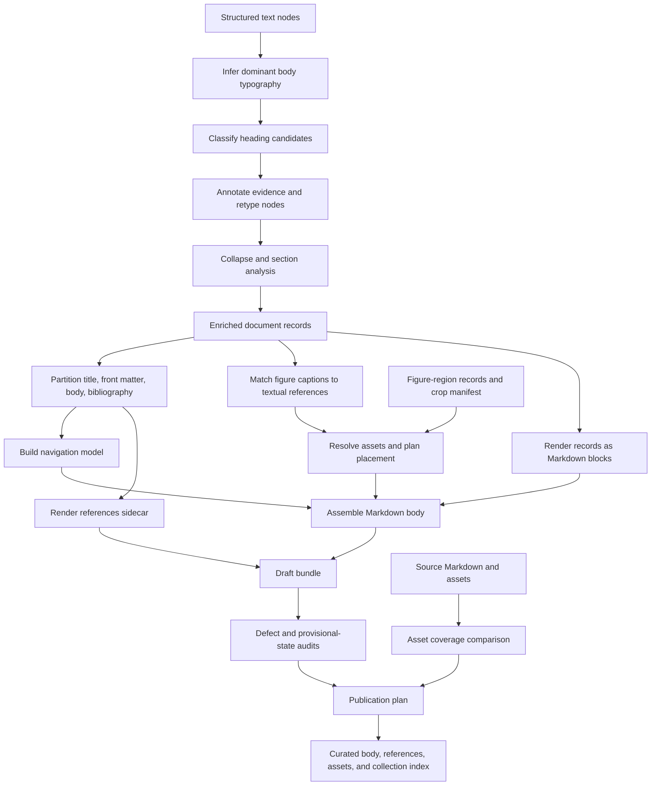

The three files form a pipeline, but only `publish.ps1` primarily operates on Markdown. `headings.ps1` classifies structured extraction records; `finalize.ps1` projects enriched records into Markdown; `publish.ps1` validates and promotes the resulting Markdown bundle.



## `headings.ps1`: structural inference before Markdown

The actual end of [headings.ps1](D:/aghado01/codex-scientiae-graveyard/src/codex-membrane/headings.ps1:56) is:

> Recover structural boundaries that an extractor mislabeled as ordinary text.

Its latent operations are:

1. Measure text using Unicode text elements rather than UTF-16 units.
2. Infer the dominant body font and size using length-weighted modes.
3. Recognize font-face signals such as bold and small caps.
4. Gate candidates by record type, typography availability, length, and word content.
5. Compare candidate typography with the inferred body baseline.
6. Attach classification provenance.
7. Retype records and rewrite a JSONL stage.

The useful capability is therefore not “headings” but something like:

```text
typographic calibration
    ↓
heading-evidence classification
    ↓
structural annotation
```

The implementation should not be retained wholesale:

- It claims to use geometry and line isolation but checks neither.
- It promotes paragraphs but never demotes false headings or running heads.
- `heading_source = geometric` is inaccurate; the evidence is typographic.
- The Latin-letter gate rejects legitimate non-Latin headings.
- Font-name regexes are a weak proxy for font properties.
- It mutates the source JSONL in place.
- Diagnostic strings and the manifest share the success pipeline.
- I found no direct tests for heading recovery.

The later graveyard PDF classifier independently rebuilt this operation with document calibration, tier bands, run-in-heading rejection, math exclusion, page furniture detection, and outline corroboration. That later implementation should also be treated as evidence, but it demonstrates that the primitive is real:

> Given ordered text lines and layout/style evidence, emit scored structural-role hypotheses with provenance.

It should produce candidates and evidence, not silently assert headings.

## `finalize.ps1`: document materialization

[finalize.ps1](D:/aghado01/codex-scientiae-graveyard/src/codex-membrane/finalize.ps1:170) is six or seven operations concealed behind one lifecycle verb.

### Record rendering

[Format-Chunk](D:/aghado01/codex-scientiae-graveyard/src/codex-membrane/finalize.ps1:22) converts typed records into Markdown fragments:

- heading → ATX heading;
- formula → display-math fence;
- caption → italic paragraph;
- everything else → content unchanged.

This is a schema-specific Markdown renderer. It is potentially useful if structured-record lanes return, but the input contract must be stated explicitly and tested independently.

### Document-region partitioning

`Invoke-Finalize` divides records into:

- title;
- front matter;
- body;
- bibliography.

It recognizes bibliography membership through both structural headings and record annotations, removes selected furniture, and preserves appendices in the body.

The underlying operation is:

> Partition an ordered document record stream into semantic regions using supplied annotations and fallback recognizers.

Whether references should become a sidecar is publication policy, not intrinsic to the partitioner.

### Navigation construction

It projects headings into an embedded Contents block and adds the references sidecar link. This capability already has a stronger active home in [toc-engine.ps1](D:/aghado01/codex-scientiae/src/toc-engine/toc-engine.ps1:137), which parses Markdown, excludes code fences, calculates byte spans, creates a tree model, and can regenerate the embedded Contents block.

The finalize implementation should not survive as a second navigation engine.

### Caption/reference matching

These three functions form a small latent relation engine:

- [Get-CaptionLabel](D:/aghado01/codex-scientiae-graveyard/src/codex-membrane/finalize.ps1:36)
- [Test-FigureReference](D:/aghado01/codex-scientiae-graveyard/src/codex-membrane/finalize.ps1:48)
- [Move-CaptionsToAnchors](D:/aghado01/codex-scientiae-graveyard/src/codex-membrane/finalize.ps1:69)

They:

1. parse a numbered object identity from a caption;
2. detect mentions of that identity in prose;
3. construct caption-to-reference edges;
4. reorder captions beside the first matching reference.

The first two are useful primitives. The automatic reorder is much less trustworthy. The first mention is not necessarily the correct placement point, numbering can repeat, and cross-references are ambiguous. I would recast this as an audit or proposed placement plan:

```text
caption identity extraction
+ reference detection
→ candidate caption/reference edges
→ confidence and ambiguity report
```

A later workflow can decide whether to move anything.

### Figure-asset placement

[Get-FigureWeave](D:/aghado01/codex-scientiae-graveyard/src/codex-membrane/finalize.ps1:111) joins:

- detected figure regions;
- crop-render manifests;
- caption identities;
- page positions;
- document records.

It copies successful assets, emits visible markers for failures, places captioned figures near captions, and flushes uncaptioned regions at page boundaries.

The durable idea is excellent:

> Join textual object references with generated assets, preserve provenance, and make unmatched or failed assets visible.

The implementation is deeply coupled to `pig`, `.runs`, membrane naming, latest-run selection, and figure-number matching. Preserve the design principle, not this implementation.

### Bundle materialization and review projection

The remainder writes the body, references, images, paper-root mirror, and ledger event. [Get-FinalReview](D:/aghado01/codex-scientiae-graveyard/src/codex-membrane/finalize.ps1:316) then returns the assembled texts and unresolved records.

The problem is that “review” invokes finalization again, so a read operation writes files, copies assets, and appends a ledger event. A future review projection must consume an existing materialization or an in-memory plan without mutating anything.

## `publish.ps1`: validation, promotion, and indexing

The actual end of [publish.ps1](D:/aghado01/codex-scientiae/src/bibliotecha/publish.ps1:135) is:

> Promote a candidate document bundle into a curated collection without silently losing assets, defects, or human ordering.

Its latent operations are:

- apply publication policy gates;
- audit Markdown defect sentinels;
- parse and rewrite local asset links;
- compare source assets with delivered references;
- construct an asset-copy plan;
- derive a collection-index entry from document navigation;
- replace or append that entry without reordering the collection;
- apply the publication plan;
- record the promotion event.

“Publishing” is a legitimate orchestration use case, but those operations should not remain privately implemented inside it.

### Important implementation drift

The current file is internally inconsistent with the evolved finalizer:

- Finalize now emits woven paths under `{slug}-membrane/...`.
- Publish rewrites only `{slug}/...` links.
- Publish still claims finalize strips images.
- Publish inventories and copies raw source figures rather than the woven assets.

That means the two files no longer agree on the asset contract.

There are additional hazards:

- `DryRun` is not dry: it calls `Invoke-Finalize`, which writes outputs, copies images, and records a ledger event.
- Promotion is not transactional; a failure can leave partially written body, references, images, or index.
- Regex-based Markdown link parsing misses several valid Markdown forms.
- Asset paths are not rigorously confined before copying.
- Repeated publication can leave stale destination assets.
- The no-TOC fallback links to `slug.md#references`, although references live in a sidecar.
- I found no dedicated publish tests.

## Capabilities already resurfacing elsewhere

Several operations have already escaped these original modules:

| Latent capability                       | Current evidence                                                                 | Recommendation                                     |
| --------------------------------------- | -------------------------------------------------------------------------------- | -------------------------------------------------- |
| Markdown heading/tree extraction        | `src/toc-engine`                                                                 | Keep and consolidate there                         |
| Embedded Contents regeneration          | `src/toc-engine`, `md-repair`                                                    | Remove finalize’s private implementation           |
| Local image-link inventory and bundling | [md-bundle.ps1](D:/aghado01/codex-scientiae/src/md-postprocess/md-bundle.ps1:24) | Review and promote as asset-bundle operations      |
| Figure/caption Markdown formatting      | [md-register.ps1](D:/aghado01/codex-scientiae/src/audits/md-register.ps1:23)     | Keep concept; relocate because it is not an audit  |
| Defect-sentinel scanning                | `md-sentinels.ps1`, corpus audit                                                 | Seat explicitly under Markdown audits              |
| Heading-anchor generation               | [md-anchor.ps1](D:/aghado01/codex-scientiae/src/shared/md-anchor.ps1:20)         | Keep centralized, but repair implementation        |
| Typographic heading inference           | membrane headings + later PDF classifier                                         | Rewrite as evidence-producing structural inference |
| Caption/reference relation detection    | finalize                                                                         | Preserve as an audit/planning capability           |
| Corpus promotion                        | publish                                                                          | Rebuild as plan → validate → apply → verify        |

One live defect surfaced during this examination: `Get-MdAnchor` claims its fallback is stable, but it uses `.GetHashCode()`. Three fresh PowerShell processes produced three different anchors for `???`. It also cannot disambiguate duplicate headings within one document. The centralization was correct; the implementation still needs replacement with a deterministic digest and document-aware duplicate handling.

## Recommended conceptual decomposition

Without deciding the final directories yet, the operation graph wants these named capabilities:

```text
document structure
  typographic calibration
  heading candidate classification
  semantic region partitioning

Markdown
  record rendering
  heading/anchor model
  Contents projection
  link and asset reference parsing
  figure/caption rendering

audits
  defect sentinels
  asset completeness
  caption/reference consistency
  unresolved-record summary

materialization
  document assembly
  asset placement planning
  bundle writing and verification

publication
  publication planning
  policy gates
  collection-index upsert
  transactional promotion
```

I would preserve the caption/reference tests and figure-weave specimens as behavioral evidence, but not transplant `finalize.ps1`. `headings.ps1` should become a design witness for a future structure classifier. `publish.ps1` should be disconnected from finalization and eventually rebuilt around a finished bundle plus an explicit, inspectable publication plan.

No files were changed.
