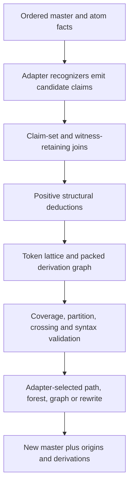

# So as i'm hitting this point in doccer development where im thinking about compositions and operations, i'm realizing there's still alot of intrinsic doccer development i can do based on broader literature research that followed allen's original work. ghurabi's 2016 formalization of composition for example `D:\aghado01\codex-scientiae\issues\doccer\discussions\grok-doccer-composition-formalizations.md`

Yes—the realization is broader than “composition is the next feature.” Doccer has a theory-led development axis that has barely been mined.

Its current doctrine already permits this: consumers prioritize work, but they do not gate a contract that can be closed from first principles. The qualitative-reasoning literature can therefore function as a source of intrinsic mechanisms, laws, and test oracles—not merely as background for future adapters.

Ghourabi points toward a proper finite algebra kernel:

- A relation-set value type over the 13 base relations—not `AllenRelation[]`, but probably a distinct 13-bit `AllenRelationSet`.
- Union, intersection, complement, converse, and qualitative composition.
- `Equal` as the identity relation, `None` and `All` as bounds.
- Laws such as converse involution, identity, monotonicity, distribution over union, and composition consistency.
- Exhaustive oracle tests generated from small coordinate universes and checked against the published table.

That would turn the current `Relate` operation from an isolated classifier into one component of a closed algebra. It also gives later constraint propagation a clean substrate without prematurely committing Doccer to a solver.

There is an especially important three-way distinction:

1. **Abstract qualitative composition** asks which outer relations are possible for two relation labels.
2. **Master-relative realizability** asks whether the required intermediate interval exists inside one finite `TextMaster`.
3. **Batch-relative composition/join** asks whether such an interval actually exists among collected claims.

The Allen table answers the first. A finite master can remove witnesses near boundaries or at insufficient resolution, while a batch is sparser still. Conflating these would create a deceptively total `Compose` method whose meaning changes with context.

I would also correct several overextensions in the current [Grok discussion](D:/aghado01/codex-scientiae/issues/doccer/discussions/grok-doccer-composition-formalizations.md):

- Ghourabi uses the conceptual-neighbourhood lattice to organize and simplify proofs; the paper does not establish that the table can simply be generated from lattice edges. [Ghourabi and Takahashi](https://arxiv.org/abs/1804.01637)
- The named α/β/γ/δ unions are useful recurring table entries and proof vocabulary. They should not become privileged runtime abstractions without separately establishing which family is closed under the operations Doccer needs.
- A formal nest is not merely “claims sharing an endpoint.” In the Isabelle development, `BEGIN i` and `END i` are sets over the whole interval domain, with nests defined extensionally from those sets. Grouping the claims present in a batch by endpoint would be a useful materialized endpoint view, but it would not inherit the formal nest theorems automatically. [AFP formalization](https://www.isa-afp.org/browser_info/current/AFP/Allen_Calculus/document.pdf)
- Allen–Hayes does accommodate discrete integer models, so Doccer’s basic geometry is well aligned with it. But their model is an interval universe, whereas one finite master is a bounded restriction of that universe. [Allen and Hayes](https://www.ijcai.org/Proceedings/85-1/Papers/101.pdf)

Beyond composition, I see at least four substantial intrinsic research seams:

- **Qualitative constraint networks:** path-consistency, contradiction detection, and derivation traces. The trace matters for Doccer because inferred restrictions should remain distinguishable from asserted evidence.
- **Endpoint and point algebra:** translating interval constraints into endpoint inequalities, without necessarily adopting nests as a runtime representation.
- **Interval orders and graphs:** overlap graphs, containment orders, maximal compatible/laminar subsets, clique structure, and decomposition. This literature may deepen existing laminarization and crossing-residue operations more directly than temporal-reasoning work does.
- **Neighbourhood and perturbation structure:** conceptual neighbours can formalize “one-boundary-change-away” diagnostics, useful for comparing independent collectors or explaining near disagreements without deciding which producer is right.

Then there is a more experimental outer ring—semi-interval reasoning, duration-enriched INDU, uncertain endpoints, granular time, and restricted-domain calculi. Those are worth harvesting, but they should first be treated as possible new calculi rather than extensions casually folded into Allen’s thirteen relations. Literature on generating composition tables specifically notes that restricted domains can require their own tables. [Liu and Li](https://arxiv.org/abs/1105.4224)

So I think the next intellectual artifact should not be a composition implementation brief yet. It should be a **post-Allen Doccer algebra census** that records, for each literature result:

- the mathematical mechanism;
- its laws and assumptions;
- the Doccer-native operation it suggests;
- abstract versus master-relative versus batch-relative semantics;
- whether it belongs in the kernel, a reasoning layer, or an adapter;
- an independent verification strategy.

That would likely reveal a coherent intrinsic program rather than a sequence of opportunistic features—and it fits the project’s “catalog before naming, composition before extension” discipline almost perfectly.

---

# Well, a very coarse survey of related works ```Related Concepts and Works of Others

Point Algebra (Vilain, Kautz et al.): the three relations on points ($  <  $, $  =  $, $  >  $). Tractable; often used as a reduction target or building block. Point-interval hybrids also exist.
Tractable subclasses of IA: Nebel & Bürckert’s ORD-Horn class (1995) is the unique maximal tractable subclass that contains all 13 base relations; path consistency decides it. Complete classification of the 18 maximal tractable subalgebras was finished later (Krokhin et al.). Continuous endpoint / pointizable subclasses are smaller but useful.
Spatial analog — RCC-8 (Randell, Cui, Cohn): eight JEPD topological relations on regions (DC, EC, PO, EQ, TPP, NTPP and inverses). Same qualitative-constraint style; many shared algorithmic techniques (path consistency, algebraic closure).
Extensions and formalizations:
Indefinite / non-convex intervals (Ligozat and others).
Metric + qualitative hybrids, difference constraints, ASP encodings (e.g., Janhunen & Sioutis).
OWL-Time and related ontologies that reify Allen relations.
Model-theoretic / axiomatic treatments (first-order axiomatizations, Isabelle formalization of the composition table).
Applications beyond planning: natural language, temporal databases, archaeology (Bayesian calibration of phases), healthcare event sequences, concurrent markup / overlapping hierarchies in documents.

Broader QSTR (Qualitative Spatial and Temporal Reasoning) community continues to study complexity, incremental algorithms, combination with other calculi, and coarser algebras (e.g., IA7 / IA3).``` points out some of the same things you have just now. I think a key distinction is that as you point out, i'm working with discrete finite ordered sets, where reading order or token stream order is the analogue of time's arrow so to speak in the original temporal formulation, and so when reviewing existing concepts relating to time, in the current scope of doccer, we have this reframing

Exactly. The transferable object is not “time”; it is an oriented linear order.

I would state Doccer’s reframing as:

> Doccer is an evidence-bearing interval and region calculus over finite, discrete, attributed coordinate chains.

“Attributed” matters because the chain has a master identity, address unit, literal content, topology, and derived grains. “Evidence-bearing” distinguishes claims occupying spans from the spans themselves.

Formally, for a master of length \(N\):

\[
E_M=\{0,\ldots,N\}
\]

is the endpoint chain, and

\[
I_M=\{[s,e)\mid s,e\in E_M,\ s<e\}
\]

is the universe of non-empty spans. Allen’s relations classify pairs in \(I_M\times I_M\). Claims form another set \(C\), with a geometry map

\[
g:C\rightarrow I_M
\]

that is deliberately not injective: several claims can have equal geometry while retaining different evidence and identities.

That separation clarifies a great deal:

- `Equal` means geometrically coextensive, not the same claim.
- `Before`/`After` express orientation in the coordinate chain.
- `Meets` expresses adjacency.
- `Overlaps` and `OverlappedBy` identify crossings.
- `Contains`/`During` express enclosure.
- `Starts` and `Finishes`, with their inverses, express boundary alignment.

These are positional and topological facts. Their temporal interpretations are analogies.

One terminology caution: the present `TextMaster` orders UTF-16 source positions. That is reliably **source order** or **address order**, but not always reading order. Bidirectional text, tables, columns, footnotes, and transclusion can all have a reading order different from serialization order. If Doccer later models reading order or token-stream order, those should be distinct coordinate spaces or explicit derived orders—not silently attributed to the underlying master.

## What transfers—and what does not

The algebraic machinery transfers almost intact:

- JEPD base relations;
- converse;
- relation sets;
- composition;
- intersection and refinement;
- endpoint reduction;
- conceptual neighbourhood;
- constraint-network algorithms;
- tractability results.

The temporal ontology does not transfer automatically:

- events and duration;
- causality;
- persistence through time;
- temporal uncertainty;
- “now” or tense;
- assumptions of unbounded or homogeneous time.

Discreteness and finiteness introduce genuine Doccer-specific structure:

- atomic spans \([i,i+1)\) cannot be subdivided;
- endpoints \(0\) and \(N\) are boundaries;
- witness availability can depend on master size and location;
- empty spans are insertion points, not Allen intervals;
- every endpoint is directly addressable;
- the batch contains observed claims, not every geometrically possible interval.

That last distinction creates three universes:

\[
\text{abstract relation possibilities}
\supseteq
\text{master-realizable possibilities}
\supseteq
\text{batch-observed possibilities}
\]

They support different operations and should remain visibly distinct.

## A Doccer-native stratification

The surrounding literature begins to organize naturally when reframed this way:

| Layer | Objects | Likely theory |
|---|---|---|
| Coordinate algebra | offsets/endpoints | finite Point Algebra, order and distance |
| Convex-span algebra | `TextSpan` | Allen Interval Algebra |
| Region algebra | `SpanSet` | non-convex intervals, RCC-like and Boolean region operations |
| Claim algebra | evidence-bearing claims | geometry plus identity, provenance, priority, typing |
| Constraint algebra | possible relation sets | composition, refinement, path consistency |
| Coordinate morphisms | slices, rebases, offset maps | relation-preservation and residual laws |

This suggests that Allen composition is only one horizontal operation in a larger architecture.

Point Algebra is especially direct because Doccer already possesses explicit endpoints. Allen–Hayes derives point-like structures because intervals are ontologically primitive; Doccer does not need that detour operationally. Endpoint inequalities can instead provide:

- an independent oracle for `Relate`;
- mechanical generation or verification of composition;
- compact satisfiability checks;
- an explanation language for why a relation holds.

RCC-8 and non-convex interval work become more relevant at the `SpanSet` layer. A normalized `SpanSet` is already a finite regular region on a line, not a single Allen interval. Asking how two such sets relate may be better treated as region topology than by forcing a generalized Allen relation.

## Where constraint reasoning becomes useful

There is also a useful brake on importing too much QSTR machinery: if three Doccer claims already have exact spans, then composition is a lossy way to learn their relation.

Given concrete \(A\), \(B\), and \(C\),

\[
\operatorname{Relate}(A,C)
\]

is exact, while

\[
\operatorname{Relate}(A,B)\circ\operatorname{Relate}(B,C)
\]

usually produces a set of possibilities.

Constraint propagation becomes substantively useful when some geometry is not concrete:

- an interval is hypothetical or only partially located;
- independent producers disagree about boundaries;
- a claim is known only relative to other claims;
- coordinates are being projected through a lossy `OffsetMap`;
- an orchestration layer is reconstructing missing structure;
- a persisted representation intentionally stores qualitative constraints instead of offsets.

That argues for completing the relation-set algebra now, while keeping a constraint-network solver as a separate layer whose arrival needs one of those concrete witnesses.

## The particularly Doccer-native research frontier

The most interesting work may be where qualitative calculus meets transformations. For example:

- `TextSlice.ToParent` should preserve every Allen relation because it is an order-preserving translation.
- Exact monotone rebasing should preserve the calculus.
- Offset-map contraction may collapse `Before` into `Meets`, or distinct spans into equal geometry.
- Expansion may turn adjacency into separation.
- Deletion or clipping can eliminate a span or make it empty, leaving the Allen universe entirely.
- Projection to coarser grains may preserve orientation while losing exact boundary relations.

That gives Doccer a subject largely absent from ordinary temporal IA: **which positional relations are preserved, weakened, collapsed, or made residual under coordinate transformations?**

So the literature survey can be reframed around three questions:

1. What algebra exists over the abstract geometry?
2. What changes when its universe is a finite discrete chain?
3. What additional laws arise because Doccer carries evidence and transforms between coordinate spaces?

That is a much richer intrinsic program than merely importing the 13×13 composition table.

---

# right but you are mixing conceptual invariants with applications there. a pdf is a token stream, embedded in it is a document with some natural reading order at least over the prose body content, but not entirely because we have figures interjecting with their captions etc, but any contiguous body of text (a caption, a paragraph, a header, the sequence of sections and subsections with their headers/subheaders and associated body text, have an unambiguous reading order), and doccer despite its cute name, isn't just about eating a document and doing interval algebra on it. doccer can consume an isolated string, like a macro extracted from latex source, and be used to expand that macro using interval algebra, which is a process that takes an ordered token sequence and unpacks it into an expanded new one, in this case for my purposes, a sequence of valid katex lexical control sequences with syntax

You’re right. I promoted difficulties in constructing one particular sequence—PDF reading order—into properties of Doccer itself. That mixes the carrier’s interpretation with the calculus operating over it.

The cleaner invariant is:

> Doccer operates on finite ordered sequences by recognizing, relating, selecting, and transforming contiguous regions, while preserving identity and lineage between successive sequences.

What the order represents is external:

- source-code order;
- lexical-token order;
- prose reading order;
- macro-body order;
- extracted PDF body order;
- or any other declared sequence.

Once a consumer supplies that sequence, Doccer treats its orientation as authoritative. Whether a PDF extractor chose the right place for a caption is an upstream construction question, not an ambiguity inside the interval calculus.

A `TextMaster` is therefore one concrete carrier, not necessarily a document. An isolated LaTeX macro body is just as legitimate:

\[
M_0=\text{ordered source sequence}
\]

Claims locate control sequences, argument groups, delimiters, literals, and nested invocations within \(M_0\). Interval relations then describe their structural geometry. Expansion produces another carrier:

\[
M_0 \xrightarrow{T_1} M_1 \xrightarrow{T_2}\cdots\xrightarrow{T_n}M_n
\]

where \(M_n\) is the expanded KaTeX-compatible sequence.

This exposes two different meanings of composition that I was also partially mixing:

1. **Relation composition within one sequence**

   \[
   r_1\circ r_2
   \]

   propagates possible geometric relations among spans.

2. **Operation composition between sequences**

   \[
   T_2\circ T_1
   \]

   composes recognitions, rewrites, expansions, and their lineage across newly materialized masters.

The first comes from Allen and QSTR. The second belongs to rewriting, transduction, edit provenance, and origin-tracking literature. Both are intrinsic to Doccer, but they are different algebras.

The macro example also gives a much stronger contract witness than normalization for the transformation side. A macro can:

- expand one source token into many;
- delete tokens;
- duplicate an argument;
- reorder arguments;
- insert synthetic control sequences;
- recursively expose further expansion sites.

For example, a macro equivalent to

```tex
\newcommand{\pair}[2]{#2 + #1 + #1}
```

is neither a simple length-changing edit nor necessarily a monotone point mapping. The second argument moves before the first, while the first is copied twice.

That means a normalization-oriented `OffsetMap` based on monotone `Identity/Expand/Contract/Delete/Insert` segments is only one restricted transformation species. General macro expansion needs something more like an ordered output-piece lineage:

\[
M' = p_1p_2\cdots p_k
\]

where each output piece records one of:

- copied from a source span;
- transformed from a source span;
- synthesized by a rule;
- copied again from an already-used source span.

This representation naturally supports duplication and reordering. A monotone `OffsetMap` could then be a special case whose source-origin spans occur once and in ascending order.

The engine/application boundary becomes clearer too.

Intrinsic Doccer mechanics include:

- collecting and relating token spans;
- pairing delimiters and arguments;
- verifying that rewrite sites are compatible;
- scheduling nested or disjoint replacements;
- materializing a new ordered sequence;
- recording piecewise origin and transformation evidence;
- composing lineage across repeated rewrites;
- carrying residuals for malformed, conflicting, or unresolved sites.

Application semantics include:

- what a particular LaTeX macro means;
- which macro definition is in scope;
- TeX’s expansion rules;
- which output control sequences KaTeX accepts;
- whether a particular expansion is desirable.

So the stronger reframing is not “Allen algebra applied to textual documents.” It is:

> Doccer is a substrate for evidence-bearing computation over ordered sequences. Interval algebra governs relationships inside a sequence; transformation algebra governs how one sequence is derived from another.

That also considerably widens the relevant literature. Allen and QSTR cover only the first axis. Term and string rewriting, transducers with origin information, source maps, edit scripts, non-crossing replacement systems, and provenance-preserving transformations become equally foundational for Doccer’s intrinsic development.

---

# right, and one of the many design constraints here is separating the algebraic operations and abstractions from domain specific applications. the underlying calculus of enumerating the katex macro involves domain awareness of katex lexical tokens, delimiters, syntax, but underlying that are primitive operations that can be described potentially in interval algebra. from a software engineering standpoint, an adapter owns the katex domain knowledge, and a mature doccer would offer the vocabulary and API for implementing a katex expansion given external domain constraints or rules, which returns me to the first principles investigation of composition and broader lineage work that followed allen

Yes. That gives a precise boundary:

> The adapter supplies the meaning of the symbols and the validity rules; Doccer supplies the domain-independent mechanics for relating, organizing, and transforming their occupied regions.

For KaTeX expansion, the adapter knows:

- what constitutes a lexical control sequence;
- which tokens open and close groups;
- macro arity and parameter syntax;
- whitespace and delimiter rules;
- scoping and expansion semantics;
- which resulting token sequences are valid KaTeX.

Doccer should know none of those facts. It should be able to receive externally classified claims and provide operations such as:

- relate their spans;
- pair caller-identified openers and closers;
- expose nesting, adjacency, separation, equality, and crossing;
- bind ordered children to a containing span;
- select compatible rewrite sites;
- report unclosed, dangling, crossing, or conflicting residuals;
- materialize replacements into a new master;
- retain origins for copied, transformed, and synthetic fragments;
- compose lineage across successive transformations.

The macro adapter could therefore express expansion approximately as:

\[
\text{domain recognition}
\rightarrow
\text{generic structural operations}
\rightarrow
\text{domain-selected rewrite}
\rightarrow
\text{generic materialization and lineage}
\rightarrow
\text{domain validation}
\]

The engine does not decide that something is a macro argument. Once the adapter asserts that role, the engine can mechanically determine where it sits, what contains it, whether it crosses another argument, and whether a proposed replacement plan is structurally executable.

A useful refinement is that interval algebra supplies the vocabulary and laws without necessarily supplying every algorithm. Balanced delimiter pairing, for example, is naturally implemented by an ordered stack. Its contract and results can nevertheless be expressed through interval concepts:

- each completed pair defines a span;
- properly nested pairs form a laminar family;
- crossing pairs are structural residuals;
- child groups are `During` their parents;
- siblings are ordered by `Before` or `Meets`;
- equal geometry remains possible without equal claim identity.

So Doccer should not try to reduce all computation to repeated Allen-table lookups. It should offer generic sequence algorithms whose preconditions, outputs, and invariants are stated in the interval vocabulary.

This also reveals several distinct forms of composition that the first-principles investigation needs to separate:

1. **Relation composition**  
   Composing possible relations within one coordinate space.

2. **Structural-operation composition**  
   Combining collection, pairing, grouping, containment, selection, and validation operations over claims.

3. **Rewrite composition**  
   Combining replacements into a coherent transformation from one sequence to another.

4. **Lineage composition**  
   Following origins through \(M_0\rightarrow M_1\rightarrow\cdots\rightarrow M_n\).

5. **Constraint composition**  
   Refining incomplete knowledge by intersecting asserted possibilities with relations inferred through intermediate objects.

These may share algebraic properties, but they should not collapse into a generic `Compose` abstraction.

The Allen/QSTR lineage is valuable because it supplies a mature treatment of the first and fifth forms: relation sets, converse, weak composition, closure, constraint networks, tractable fragments, and changes of granularity. Other research traditions—rewriting systems, transducers, source maps, provenance, overlapping markup—supply the third and fourth. Doccer sits at their intersection.

A disciplined literature harvest could therefore examine every result through the same extraction frame:

| Question | Purpose |
|---|---|
| What are the abstract objects? | Points, convex intervals, regions, claims, constraints, transformations |
| What primitive operation is defined? | Converse, composition, pairing, closure, projection, rewrite |
| What assumptions does it require? | Density, unboundedness, total order, convexity, monotonicity |
| Which laws hold? | Identity, associativity, distributivity, preservation, confluence |
| Does the law survive a finite discrete carrier? | Separates transferable algebra from temporal ontology |
| What information is lost? | Determines residual and evidence requirements |
| What must a caller supply? | Identifies the domain-policy boundary |
| What could Doccer return mechanically? | Identifies a possible engine contract |

That investigation is not merely preparatory research for KaTeX. KaTeX is a particularly strong witness showing why these primitives matter. The same vocabulary could support markup repair, syntax-aware rewriting, document extraction, token-stream normalization, or any other ordered-sequence application without any of those domains entering the kernel.

The deepest architectural division may therefore be:

- **Within a master:** interval and constraint algebra.
- **Across masters:** transformation and lineage algebra.
- **Above both:** domain adapters supplying recognition and rewrite meaning.
- **Outside the engine:** orchestration selecting policies and interpreting residuals.

That seems like the correct foundation from which to revisit composition—not as one table-shaped feature, but as the first member of a deliberately separated family of algebras and operations.

---

# so looking at doccer's current implementation what would a more mature compositional algebra kernel look like, considering the broader research literature that grew out of allen's original work? we already identified some things in this thread. Lets dig deep into first principles design, identify transferable concepts and patterns, as well as mathematical formalisms backing them or lack thereof, to expand out the intrinsic capabilities and expressiveness of doccer. One application i've had in mind for a more mature doccer would be using it as a kind of "tokenizer factory" that performs various types of tokenization tasks using a very different approach than the normative token parsing approach, such as how the various tokenizers in PdfPig are implemented, or Markdig's parsing on markdown for example

Message Type: MESSAGE
Task name: /root
Sender: /root/qstr_research
Payload:

Message Type: MESSAGE
Task name: /root
Sender: /root/qstr_research
Payload:

Message Type: MESSAGE
Task name: /root
Sender: /root/tokenizer_research
Payload:

Message Type: MESSAGE
Task name: /root
Sender: /root/qstr_research
Payload:

Message Type: FINAL_ANSWER
Task name: /root
Sender: /root/qstr_research
Payload:
## Research synthesis

The mature kernel should be built around a separation the QSTR literature often blurs:

\[
\text{symbolic algebra}
\quad+\quad
\text{semantic interpretation over a carrier}
\quad+\quad
\text{constraint/inference machinery}
\]

Allen’s \(2^{13}\)-element algebra is the first component. A particular finite Doccer master is the second. A graph of uncertain span variables is the third. Treating all three as one `Compose` operation would hide the most important design distinction.

### 1. The formal algebraic core

Let \(U\) be a carrier of non-empty intervals and \(B\) a finite set of JEPD base relations partitioning \(U\times U\). A general relation is an element of

\[
\mathcal A=\mathcal P(B),
\]

with interpretation

\[
\phi(R)=\bigcup_{r\in R}\phi(r).
\]

This gives the transferable value algebra:

- `None` \(=\varnothing\)
- `All` \(=B\)
- union as disjunction
- intersection as conjunction/refinement
- complement relative to \(B\)
- converse
- identity \(=\{\mathrm{Equal}\}\)
- composition.

True relational composition is

\[
\phi(R)\circ\phi(S)
=
\{(x,z)\mid \exists y.\;(x,y)\in\phi(R)\land(y,z)\in\phi(S)\}.
\]

The inferential or weak composition representable by the finite vocabulary is its least representable upper approximation:

\[
R\diamond S
=
\bigcap\{T\in\mathcal A\mid
\phi(R)\circ\phi(S)\subseteq\phi(T)\}.
\]

For an atomic JEPD vocabulary this is equivalently

\[
R\diamond S
=
\{t\in B\mid
\phi(t)\cap(\phi(R)\circ\phi(S))\neq\varnothing\}.
\]

Composition is **strong** when

\[
\phi(R\diamond S)=\phi(R)\circ\phi(S).
\]

This is the cleanest definition for Doccer because it makes approximation explicit. Hirsch et al. call the least-upper-bound requirement a qualitative representation; a mere sound, non-minimal upper bound is weaker still. Weak composition need not be associative, although canonical Allen IA is associative because its symbolic table forms a relation algebra. [Hirsch et al.](https://arxiv.org/abs/1606.09140), [Inants and Euzenat](https://moex.inria.fr/files/papers/inants2020a.pdf)

“Relation algebra” and “qualitative calculus” should therefore not be synonyms in the design:

- the relation algebra is the symbolic law-bearing object;
- the calculus includes a semantic interpretation of its symbols;
- the finite master is one interpretation/model;
- a constraint network is a client of that calculus.

For standard Allen IA, the full powerset algebra satisfies the relation-algebra laws: Boolean laws, identity, converse involution, converse reversal, union-distributive and associative composition, and the Peircean/cycle law. Dylla et al. mechanically checked Allen IA against these laws using HETS and SparQ. [Dylla et al.](https://arxiv.org/abs/1305.7345)

Two order structures must remain separate:

1. the Boolean subset lattice on relation sets, representing disjunction and refinement;
2. the conceptual-neighbourhood/product order on the 13 base atoms.

The second organizes perturbations, topological convexity, and some tractable classes. It is not the Boolean algebra and does not generate composition by walking lattice edges.

### 2. Finite discrete masters are weak interpretations

For a master of length \(L\), let

\[
E_L=\{0,\ldots,L\},
\qquad
I_L=\{[s,e)\mid s,e\in E_L,\ s<e\}.
\]

The 13 Allen predicates still classify every pair in \(I_L^2\), because they depend only on endpoint order. Half-open storage does not alter this endpoint-order calculus.

But canonical Allen composition is strong only for intervals over dense, unbounded linear orders. Ligozat and Renz explicitly identify discrete/restricted interval domains as weak representations. [Ligozat and Renz](https://users.cecs.anu.edu.au/~jrenz/papers/ligozat-renz-pricai04.pdf)

A minimal Doccer counterexample is:

\[
A=[0,1),\qquad C=[2,3).
\]

Although \(A\;\mathrm{Before}\;C\), there is no non-empty integer span \(B\) such that

\[
A\;\mathrm{Before}\;B
\quad\land\quad
B\;\mathrm{Before}\;C.
\]

Thus canonical

\[
\mathrm{Before}\diamond\mathrm{Before}=\mathrm{Before}
\]

is a sound qualitative possibility, not the exact relational product on that master.

Several consequences follow:

- `Compose` must not mean “there is an intermediate span for these actual outer spans.”
- Abstract composition, master-relative witness existence, and batch-relative joins are distinct operations.
- Finite boundaries and available slack are invisible to the 13 atoms.
- Exact finite-master satisfiability can fail from capacity alone even when the abstract qualitative network is consistent—for example, a chain needing more distinct endpoints than the master contains.

There are useful size thresholds:

- all 13 base relations have non-empty interpretations once \(L\ge 3\);
- a six-endpoint domain, \(L=5\), realizes every consistent three-interval Allen order type.

Liu and Li prove that the six-point domain \(D_6\), containing only 15 non-empty intervals, is **3-complete** for IA. Exhaustively enumerating its \(15^3=3375\) interval triples generates the canonical table and exactly 409 consistent atomic triples. This is an unusually strong implementation oracle. It proves table coverage, not strong composition on that finite carrier. [Liu and Li](https://arxiv.org/abs/1105.4224)

For shorter masters, the master-relative triad table is genuinely smaller. Some relation atoms are also empty, so the interpretation is non-injective and no longer satisfies modern definitions requiring all JEPD atoms to be non-empty.

A useful API separation would be:

- `AllenAlgebra.Compose(R, S)` — canonical symbolic composition;
- `FiniteIntervalModel.WeakCompose(R, S)` — best atom-level abstraction for a stable restricted carrier;
- `FiniteIntervalModel.Witnesses(a, R, S, c)` — exact intermediate spans;
- `ClaimBatch.Join(R, S)` — actual observed claims retaining the witness.

The last operation is relational join, not Allen composition.

### 3. Ghourabi’s formalization: valuable but narrower than it appears

Ghourabi and Takahashi’s Isabelle work formalizes JEPD properties and all 169 table cells from interval-only meets axioms. However, the table theorems are stated as inclusions:

\[
r_1\circ r_2\subseteq T.
\]

The paper itself says a table entry “contains the composition.” It therefore establishes sound upper bounds, not by itself the minimality of every listed result atom. Lower-bound witness coverage should be validated separately, for example with the 3-complete \(D_6\) enumeration. [Ghourabi and Takahashi](https://arxiv.org/pdf/1804.01637), [current AFP development](https://www.isa-afp.org/browser_info/current/AFP/Allen_Calculus/document.pdf)

Its proof assumptions also include existence principles such as M3 and M5, supplying intervals before/after others and combined intervals. A fixed bounded master does not satisfy that proof context. “Interpretation-independent” means independent among models of those axioms, not valid as exact finite-master semantics.

The conceptual-neighbourhood lattice and the named \(\alpha,\beta,\gamma,\delta\) unions organize the proof. They do not constitute a runtime-generating basis for composition.

### 4. Carrier identity is an architectural invariant

The algebra must operate over span geometry, not claim identity.

In a relation algebra, `Equal` interprets the diagonal

\[
\mathrm{id}_U=\{(u,u)\mid u\in U\}.
\]

If two distinct claim objects with the same geometry are directly related as `Equal`, then `Equal` contains off-diagonal claim pairs and is not the identity relation. The identity laws cease to describe that carrier.

The correct model is:

\[
g:\mathrm{Claim}\rightarrow\mathrm{LocatedSpan},
\]

and relations are evaluated after projection through \(g\). Distinct variables or claims may map to the same span, exactly as distinct CSP variables may receive the same value.

Similarly, spans from different masters are not automatically elements of one ordered carrier. Either:

- use a master-qualified span type;
- require an explicit common coordinate space;
- or reject cross-master relation queries.

### 5. Points and zero-width spans require a typed calculus

Allen’s 13 relations assume \(s<e\). Admitting \(s=e\) destroys their JEPD interpretation: a zero-width object is a point, not an Allen interval.

The post-Allen point/interval work gives the principled solution:

- point–point: 3 atoms;
- point–interval: 5 atoms;
- interval–point: 5 converse atoms;
- interval–interval: 13 atoms.

Meiri’s qualitative algebra uses six type-compatible composition tables and marks illegal sort combinations explicitly. [Meiri](https://cdn.aaai.org/AAAI/1991/AAAI91-041.pdf)

That suggests a many-sorted API:

```text
RelationSet<Point, Point>
RelationSet<Point, Span>
RelationSet<Span, Point>
RelationSet<Span, Span>

Compose<A, B, C>(
    RelationSet<A, B>,
    RelationSet<B, C>)
    -> RelationSet<A, C>
```

This would make insertion sites, token boundaries, empty captures, and ordinary spans first-class without corrupting IA. Concrete relation composition is naturally associative across compatible sorts; the qualitative tables still need their own strong/weak and law validation.

Point reduction is also a valuable independent semantics for ordinary intervals: every atomic Allen relation is a conjunction of endpoint comparisons. But a general disjunction of Allen atoms cannot always be reduced to independent pairwise endpoint constraints without losing correlations. The pointizable and ORD-Horn subclasses characterize where compact endpoint forms work. A general relation should be translated as a disjunction of complete endpoint order patterns or into a suitable SAT/Horn representation, not merely four independent point-relation sets.

### 6. Constraint networks should be a separate layer

A qualitative constraint network assigns a relation set \(R_{ij}\) to each ordered variable pair. Its normal form has:

- \(R_{ii}=\mathrm{Equal}\);
- \(R_{ji}=R_{ij}^{\smile}\);
- absent knowledge represented by `All`;
- contradiction represented by `None`.

Algebraic closure repeatedly applies

\[
R_{ij}\leftarrow
R_{ij}\cap(R_{ik}\diamond R_{kj})
\]

until a fixpoint. Finite bitsets guarantee termination.

The result types must distinguish:

- `ContradictionDetected`;
- `AlgebraicallyClosed`;
- `Satisfiable`;
- `MinimalNetwork`;
- `GloballyConsistent`;
- `Scenario/Realization`.

For general IA, empty closure is a sound inconsistency certificate, but non-empty closure is not a satisfiability proof. Full IA satisfiability is NP-complete. [Vilain, Kautz, and van Beek](https://www.cs.virginia.edu/~rmw7my/papers/vilain-kautz-book.pdf), [Renz and Ligozat](https://users.cecs.anu.edu.au/~jrenz/papers/renz-ligozat-cp05.pdf)

Even where path consistency decides satisfiability, it need not compute the minimal network or make every partial assignment extensible. Those are stronger guarantees.

Derivation traces are not supplied by Allen’s mathematics, but Doccer can layer proof terms around closure:

```text
RefinementStep {
  target: (i, j),
  via: k,
  previous,
  inferred: Compose(Rik, Rkj),
  removedAtoms,
  supportingClaims
}
```

This preserves the purity of the algebra while making inferred restrictions explainable and evidence-bearing.

### 7. Tractable subclasses are solver strategy metadata

ORD-Horn is the most transferable tractability result:

- it is expressible by Horn-style endpoint order clauses;
- contains all 13 atoms;
- contains 868 of the 8192 relations, including the null relation;
- path consistency decides satisfiability;
- it is the unique greatest tractable subclass among subclasses containing all base relations.

It is not the only maximal tractable subalgebra. Krokhin, Jeavons, and Jonsson completed the classification: IA has exactly 18 maximal tractable subalgebras, and any fragment not contained in one is NP-complete. [Nebel and Bürckert](https://www.dfki.de/fileadmin/user_upload/import/2523_RR-93-11.pdf), [Krokhin, Jeavons, and Jonsson](https://doi.org/10.1145/876638.876639)

For Doccer, this supports:

- `IsOrdHorn(RelationSet)`;
- network-wide fragment classification;
- dispatch to a path-consistency decision procedure;
- diagnostics when an adapter’s constraint vocabulary leaves a tractable fragment.

It does **not** justify restricting the relation value type to ORD-Horn. Concrete tokenization and parsing rules may need arbitrary disjunctions.

The theorem also assumes ordinary unbounded interval satisfiability. It does not settle realization inside a fixed \(L\)-endpoint master, especially when coordinates are anchored. A bounded solver must additionally account for rank capacity and exact endpoints.

A second useful family is the distributive subalgebras, where composition distributes over non-empty intersections. Long and Li identify two maximal distributive IA subalgebras. The conceptual-neighbourhood-convex IA fragment has especially strong behavior: under standard IA semantics, path-consistent networks are minimal and globally consistent. [Long and Li](https://arxiv.org/abs/1506.00337)

General composition does **not** distribute over intersection. Only

\[
(R\cap S)\diamond T
\subseteq
(R\diamond T)\cap(S\diamond T)
\]

is safe in general. Equality requires a suitable distributive fragment.

### 8. Conceptual neighbourhoods are perturbation structure, not inference

Freksa’s conceptual neighbourhood connects relations that can transform into one another under a small continuous deformation, such as moving one endpoint. [Freksa](https://doi.org/10.1016/0004-3702(92)90090-K)

Transferable uses include:

- near-miss diagnostics between collectors;
- tolerance expansion;
- heuristic search ordering;
- defining convex relation sets;
- explaining how a boundary edit changes a relation.

On a finite discrete sequence, “small” is no longer canonical. A neighbourhood graph depends on allowed primitive moves:

- move one endpoint one coordinate;
- translate an entire span;
- grow/shrink while preserving non-emptiness;
- permit or forbid touching a master boundary.

Doccer should derive or name a perturbation policy rather than silently importing the continuous graph. Neighbourhood distance is not logical entailment and should not drive composition-table generation.

### 9. Granularity and coarse calculi

Two distinct abstractions recur in the literature.

**Vocabulary coarsening** merges Allen atoms into coarser JEPD atoms. Given abstraction \(\alpha\) and concretization \(\gamma\), the sound coarse composition is:

\[
r\diamond_C s
=
\alpha(\gamma(r)\diamond_{IA}\gamma(s)).
\]

This is a best-correct abstraction when \(\alpha\) returns every coarse atom intersecting the fine result. It may lose associativity or identity precision, so a coarsened calculus requires fresh law validation.

**Coordinate granularity** maps entities between differently partitioned carriers. Cohen-Solal et al. formalize upward and downward conversions as set-valued relation transformations; importantly, an interval may become a point at a coarser grain. [Cohen-Solal, Bouzid, and Niveau](https://www.ijcai.org/Proceedings/15/Papers/406.pdf)

For Doccer, character→rune→lexeme→token mappings belong here. A mature kernel can compute a sound relation transformer from an adapter-supplied coordinate map:

- strictly order-embedding endpoint maps preserve every Allen atom;
- monotone maps with collapse can turn strict inequalities into equality and intervals into points;
- non-monotone transformations such as macro argument reordering are not single coordinate morphisms and require piecewise lineage.

Relation-vocabulary coarsening and coordinate-grain conversion should not share an ambiguous `Coarsen` API.

### 10. Non-convex intervals form a family of calculi

Ligozat generalizes an interval to an increasing sequence of \(n\) endpoints. Relations between a \(p\)-interval and a \(q\)-interval are endpoint-zone order types; their atom order is a distributive lattice. Ordinary points are 1-intervals, Allen intervals are 2-intervals, and finite non-convex unions correspond to even endpoint counts. [Ligozat](https://cdn.aaai.org/AAAI/1991/AAAI91-037.pdf)

The transfer to Doccer is real but carries a warning:

- fixed component counts yield finite calculi;
- arbitrary `SpanSet` component counts yield a many-sorted, unbounded family;
- a single fixed relation enum will either explode or lose information.

A normalized `SpanSet` should therefore retain component structure. Possible generic operations are:

- component-wise relation matrices;
- endpoint-order signatures;
- Boolean region operations;
- aggregate predicates such as disjoint, adjacent, intersecting, subset, and equal;
- convex hull and connected-component decomposition.

RCC-8 should not be imported blindly. It assumes a region topology; on a discrete line the ordinary discrete topology trivializes several interior/boundary distinctions, while half-open token cells require an explicit adjacency/connection convention. A Doccer region calculus would need its own semantics and validation.

### 11. A practical kernel shape

A defensible architecture is:

```text
Finite atom-set value
  RelationSet<TAtom>
  union / intersection / complement / subset / converse

Calculus descriptor
  atoms
  identity atoms
  converse table
  atomic composition table
  sort signatures
  verified law capabilities
  optional semantic classifier

Built-in sequence calculi
  Point Algebra
  Allen Interval Algebra
  typed Point–Interval calculus

Interpretations
  Abstract dense/unbounded interval model
  FiniteSequenceModel(master length)
  RestrictedStableDomainModel

Reasoning
  QualitativeConstraintNetwork
  algebraic closure
  fragment classification
  optional complete solver
  derivation traces

Concrete relational operations
  witness enumeration
  joins retaining intermediate objects
  batch-relative matching
```

For canonical IA, a 13-bit immutable value and a 13×13 table of 13-bit masks are sufficient. General relation composition is the union of the relevant atomic cells; no \(8192^2\) table is needed.

The composition direction must be stated by types and tests:

\[
R_{AB};S_{BC}=T_{AC}.
\]

Different mathematical libraries reverse the notation of relational composition, and copying a formally verified table with the wrong index convention is an easy failure mode.

### 12. Verification programme

The literature supports a much stronger test strategy than copying Allen’s table:

1. Define each atom independently by endpoint comparisons.
2. Verify JEPD for every admissible pair of non-empty spans.
3. Exhaustively enumerate \(D_6^3\) and assert:
   - 409 distinct consistent atomic triples;
   - generated 13×13 masks equal the shipped table.
4. Check the entire finite algebra:
   - Boolean laws;
   - left/right identity;
   - converse involution;
   - converse of composition reverses operands;
   - union distributivity;
   - associativity;
   - Peircean/cycle law.
5. Check semantic soundness:
   \[
   \phi_L(R)\circ\phi_L(S)
   \subseteq
   \phi_L(R\diamond S)
   \]
   over representative finite masters.
6. Explicitly demonstrate failure of strong composition on finite carriers.
7. Test empty/point operands are rejected or routed to the typed point calculus.
8. For custom/coarsened calculi, produce a law report rather than assuming relation-algebra status.

Ghourabi supplies formal upper-bound/JEPD assurance; \(D_6\) supplies exhaustive witness coverage; Dylla et al. supply the appropriate algebraic law suite. Together they make the table independently reproducible.

### 13. What this gives a tokenizer factory—and what it does not

The algebra can become the positional vocabulary behind a tokenizer factory:

- candidate spans and boundary points;
- adjacency and gaps;
- containment and enclosure;
- ordered siblings;
- crossings versus laminar structure;
- qualitative constraints with incomplete boundaries;
- generic relation-pattern matching;
- exact witness joins;
- conflict and residual explanations.

The adapter still owns lexical predicates, delimiters, macro arity, escape rules, grammar validity, and policy.

Allen composition alone does not formalize:

- token creation;
- “exactly \(k\) children”;
- balanced recursion;
- longest-match or precedence;
- capture binding;
- iteration over all enclosed tokens;
- optimization among competing segmentations;
- rewrite materialization;
- lineage or provenance.

Most importantly, composition existentially quantifies and then forgets the intermediate object. A tokenizer needs a generic **constraint-query/join layer that retains variable bindings**, with Allen composition used for pruning and inference. That layer is mathematically closer to conjunctive queries/CSP evaluation than to relation algebra itself.

So the QSTR lineage supports a mature geometry and constraint kernel, but not a parser replacement by itself. The broader Doccer contribution would be the combination:

\[
\text{domain predicates}
+
\text{typed positional calculus}
+
\text{witness-retaining structural queries}
+
\text{selection/materialization/lineage}.
\]

That combination preserves the adapter boundary while giving adapters a far more expressive intrinsic vocabulary than direct span loops.

Message Type: FINAL_ANSWER
Task name: /root
Sender: /root/tokenizer_research
Payload:
## Research memo: a domain-neutral tokenization and sequence-structure kernel

### Central conclusion

The strongest formal bridge from Allen-style interval algebra to a “tokenizer factory” is **deductive/chart parsing over span claims**, not interval-relation composition alone.

For an input master \(M=a_0\ldots a_{n-1}\), define endpoints

\[
E_M=\{0,\ldots,n\}
\]

and nonempty half-open spans

\[
S_M=\{[i,j)\mid 0\le i<j\le n\}.
\]

A typed claim such as

\[
\operatorname{Name}(i,j,v)
\]

says that the slice \([i,j)\) may be interpreted as a name token with value \(v\). Allen relations become endpoint predicates over claims. Grammar rules become deductions over those claims:

\[
\frac{B(i,k)\quad C(k,j)}{A(i,j)}
\]

This is exactly the chart-parsing item \(A(i,j)\) with a `Meets` join at \(k\). Shieber, Schabes, and Pereira’s deductive account of parsing supplies the clean formal model: parsing is closure of a finite set of items under inference rules, rather than mutation of a scanner cursor ([Deductive Parsing](https://arxiv.org/abs/cmp-lg/9404008)).

Allen relations therefore contribute the **constraint vocabulary for joins**; deductive parsing contributes the **construction and fixed-point semantics**.

### The kernel should distinguish five notions currently liable to be called “composition”

1. **Allen weak composition**  
   Given relations \(r,s\), derive possible relations \(t\) between the outer intervals. This reasons about constraints; it does not construct a new token or span.

2. **Claim join**  
   Combine existing claims satisfying endpoint or relational constraints.

3. **Language composition**  
   Concatenation, alternation, repetition, recursion, and labeling of recognizers.

4. **Transducer/rewrite composition**  
   Feed one sequence transformation into another.

5. **Lineage composition**  
   Compose output-to-input origin mappings through successive masters.

They have different types, identities, laws, and failure modes. A mature API should resist exposing a single overloaded `Compose`.

## Proposed formal core

A claim can be modeled as:

\[
c=(\text{master},\text{kind},\text{extent},\text{semantic value},\text{metadata})
\]

where `extent` is initially either:

- a point \(i\), or
- a nonempty convex span \([i,j)\).

Points should not be disguised as zero-width intervals. Allowing zero-width token-lattice edges introduces cycles and potentially infinitely many paths; boundary annotations deserve a separate type.

Positive rules can be finite Horn-style clauses:

\[
H(\bar x)\leftarrow B_1(\bar x_1),\ldots,B_m(\bar x_m),\phi(\bar x)
\]

where \(\phi\) contains endpoint comparisons, Allen predicates, and pure finite-domain tests. If:

- the endpoint universe is finite,
- claim keys draw from finite domains,
- rules create no fresh identifiers or function terms, and
- deductions only add facts,

then evaluation has a monotone least fixed point and terminates. Agenda-based semi-naive evaluation is the natural implementation.

Claim identity must be separated from derivation identity. Otherwise recursive rules can continually generate “new” copies of the same semantic fact merely because they possess different proof histories.

A useful representation is:

- one canonical semantic fact for `Kind(i,j,value)`;
- zero or more derivation hyperedges  
  \((\text{rule id},\text{premise fact ids})\).

This is a packed parse forest or provenance circuit. Billot and Lang give the classical shared-forest account ([shared parse forests](https://aclanthology.org/P89-1018.pdf)); provenance semirings explain the same “alternatives add, joint prerequisites multiply” structure for deductions ([Green, Karvounarakis, and Tannen](https://www.cs.ucdavis.edu/~green/papers/pods07.pdf)).

## Tokenization as a lattice

A candidate token

\[
e=(i,j,\ell,p,w),\quad i<j
\]

is a labeled edge \(i\rightarrow j\) in a DAG whose vertices are input endpoints.

Then:

- the complete edge set is the lexical ambiguity;
- a tokenization is a path from \(0\) to \(n\);
- trivia, invalid characters, and recovery tokens are explicit edges;
- maximal munch, precedence, and recovery are path-selection policies;
- a selected path is merely one view over the retained evidence.

This is substantially more expressive than a scanner that irreversibly advances a cursor. It also gives “regular expression over annotations” a precise meaning: match paths through the lattice. Without path semantics, regex-like operations over overlapping annotations are under-specified. GATE’s JAPE documentation warns directly that annotations form a graph while regular expressions normally operate over strings, leading to nondeterministic or arbitrary behavior outside sequence-like cases ([GATE JAPE manual](https://gate.ac.uk/releases/gate-8.0-build4825-ALL/doc/tao/splitch8.html)).

The lattice also composes naturally with recursive parsing. CFG parsing over ambiguous lexical input can be formulated as intersection of a grammar with an input finite-state automaton ([van Noord](https://arxiv.org/abs/cmp-lg/9504026); [practical weighted CFG–FSA intersection](https://aclanthology.org/W11-4408/)). The result is a packed derivation hypergraph rather than an prematurely chosen token stream.

## Recognizer algebra and its limits

A useful algebraic surface would include:

| Operation | Formal interpretation | Important qualification |
|---|---|---|
| `Alt(P,Q)` | language union | associative, commutative, idempotent only while unordered |
| `Seq(P,Q)` | concatenation through a shared endpoint | associative at language level |
| `Label(K,P)` | map recognized extents to typed claims | semantic actions should be delayed |
| `Where(P,g)` | pure guard | optimizer laws depend on guard purity |
| `Many(P)` | least fixed point / Kleene closure | consuming matches required for simple termination |
| `Recur(R)` | recursive/chart rule | moves beyond regular languages |
| `Context(P,C,r)` | relational join using \(r\) | output geometry must be stated explicitly |
| `Subtract/Not` | negation or set difference | nonmonotone; requires stratification |
| `Choose` | priority/ranking/commitment | policy, not ordinary union |
| `Materialize` | construct a new master | transduction, not recognition |

`Seq` being associative does not mean implementations with eager callbacks are associative: evaluation order, capture mutation, diagnostics, or exceptions can make regrouping observable. Delayed semantic actions and immutable proof nodes preserve more useful laws.

Ordered choice is especially important. PEGs give it rigorous recognition semantics, but prioritized choice changes the accepted language and is not commutative ([Ford’s PEG paper](https://pdos.csail.mit.edu/~baford/packrat/popl04/)). Consequently `Alt` and `FirstOf` should be different operators.

Semiring parsing generalizes one deduction engine across Boolean recognition, derivation forests, counts, probabilities, best parses, and other interpretations ([Goodman](https://aclanthology.org/J99-4004/)). This is valuable, but arbitrary Doccer payloads do not automatically form semirings. A safe baseline is to retain the derivation graph and offer semiring evaluation as an optional interpretation.

## Geometry beyond convex intervals

Convex spans are not enough for every document or source-language structure. A discontinuous entity should use a first-class `Region` or `SpanSet`, not an invented “generalized Allen interval.”

Over a finite atomic-cell universe, regions form a Boolean algebra:

\[
R\cup S,\quad R\cap S,\quad R\setminus S,\quad \neg R.
\]

A canonical representation is an ordered set of maximal disjoint runs. Its envelope and its actual coverage must remain distinct.

Useful family constraints then become explicit validators:

- **cover**: the union equals a requested region;
- **partition**: disjoint cover;
- **token stream**: an ordered partition whose consecutive spans meet;
- **laminar family**: every pair is disjoint or one contains the other;
- **tree view**: laminar claims plus an explicit parent relation;
- **concurrent structure**: overlapping claims retained as a DAG or general relation.

Containment should not automatically imply syntactic parenthood. Two distinct analyses may share the same geometry or nest accidentally. GODDAG is useful evidence that overlapping markup naturally requires multiple parentage and reduces to a tree only when overlap is absent ([GODDAG](https://cmsmcq.com/2000/poddp2000.html)). LMNL similarly demonstrates ranges, annotations, layers, and overlap, but should be treated as a model/prototype rather than a complete algebraic foundation ([LMNL model](https://www.balisage.net/Proceedings/vol8/html/Piez01/BalisageVol8-Piez01.html)).

## Balanced structures

Delimiter pairing and arbitrary nesting are context-free, not finite-state or consequences of Allen’s binary relations. The kernel can nevertheless provide a generic balanced-structure operator whose adapter supplies:

- opener and closer classes;
- compatibility rules;
- escape/quotation behavior;
- scope barriers;
- mismatch and recovery policy.

The result may be required to form a laminar family, but laminarity is a property of that grammar’s results, not of the global claim store.

Scannerless GLR is relevant here: it keeps lexical and syntactic ambiguity inside a combined context-free grammar and applies explicit disambiguation filters rather than assuming a mandatory lexer/parser boundary ([Visser](https://eelcovisser.org/publications/1997/Visser97.pdf); [SGLR disambiguation filters](https://homepages.cwi.nl/~jurgenv/papers/CC-2002.pdf)).

## Rewriting and origin semantics

Recognition and transformation should produce different masters:

\[
M_0 \xrightarrow{T_1} M_1 \xrightarrow{T_2} M_2.
\]

Each output atom should carry an origin relation to zero, one, or several input extents:

- copied text: one ordinary origin;
- merged material: several origins;
- inserted material: synthetic/no direct origin;
- duplicated macro arguments: several outputs may share an origin;
- deleted material: retained in the derivation record even though it has no output image.

Origins then compose relationally across transformations. Bojańczyk’s origin semantics supplies a rigorous precedent: each transducer output position is associated with the input position responsible for it, producing a machine-independent semantics for regular transductions ([Transducers with Origin Information](https://arxiv.org/abs/1309.6124)). Doccer likely needs the more general relation-valued version above.

Source maps are useful serialization/interoperability machinery, but their debugging-oriented positional mappings are not a substitute for proof or derivation semantics ([ECMA-426](https://tc39.es/ecma426/)).

Term-rewriting results concerning termination, confluence, critical pairs, orthogonality, and residuals are transferable only after the rewrite objects and matching semantics are specified precisely. Arbitrary span rewrites do not become confluent merely by being expressed through interval claims ([Baader and Nipkow](https://www21.in.tum.de/~nipkow/TRaAT/)).

## Kernel versus adapter boundary

The domain-neutral kernel can own:

- masters and coordinate spaces;
- point, span, and region geometry;
- exact Allen/point/region predicates;
- indexed immutable claims;
- positive fixed-point deduction;
- derivation hypergraphs;
- lattice/path operations;
- cover, partition, laminarity, and consistency validators;
- ranking/selector interfaces;
- transformation outputs and origin composition;
- diagnostics that remain claims rather than side effects.

Adapters should own:

- atom and character classification;
- lexical patterns and semantic predicates;
- delimiters, quoting, escapes, and state conventions;
- grammar productions;
- contextual validity;
- priority, maximal-munch, tie-breaking, and recovery policy;
- value construction and domain-specific diagnostics;
- whether a final stream, forest, graph, or rewritten master is desired.

This boundary prevents KaTeX, PDF, Markdown, or natural-language behavior from leaking into the algebra while still giving those adapters stronger primitives than cursor management.

## Lessons from PdfPig and Markdig

PdfPig’s tokenization implementation is a conventional imperative scanner:

- `CoreTokenScanner` dispatches from the next byte and maintains cursor, pre-read, scope, leniency, inline-image, and custom-tokenizer state ([source](https://github.com/UglyToad/PdfPig/blob/master/src/UglyToad.PdfPig.Tokenization/Scanner/CoreTokenScanner.cs)).
- `DictionaryTokenizer` recursively invokes a scanner and contains domain recovery behavior ([source](https://github.com/UglyToad/PdfPig/blob/master/src/UglyToad.PdfPig.Tokenization/DictionaryTokenizer.cs)).
- `PlainTokenizer` consumes until PDF delimiters/whitespace and has a malformed-CMap-specific digit-splitting accommodation ([source](https://github.com/UglyToad/PdfPig/blob/master/src/UglyToad.PdfPig.Tokenization/PlainTokenizer.cs)).

It is effective engineering, but recognition, cursor ownership, commitment, nesting, and recovery are intertwined. A Doccer adapter could instead emit competing token claims with evidence and defer commitment to an explicit selector. That is an expressiveness and inspectability difference, not automatically a performance advantage.

Markdig contributes several sound engineering patterns:

- ordered block and inline parser registries;
- compiled dispatch by opening character in `ParserList`;
- explicit source spans;
- optional precise location/trivia tracking;
- a staged block-then-inline pipeline;
- extension ordering as observable policy.

See [`MarkdownPipelineBuilder`](https://github.com/xoofx/markdig/blob/main/src/Markdig/MarkdownPipelineBuilder.cs), [`ParserList`](https://github.com/xoofx/markdig/blob/main/src/Markdig/Parsers/ParserList.cs), and [`MarkdownObject`](https://github.com/xoofx/markdig/blob/main/src/Markdig/Syntax/MarkdownObject.cs). CommonMark itself explicitly specifies block parsing before inline parsing ([spec source](https://github.com/commonmark/commonmark-spec/blob/master/spec.txt)).

Transferable patterns are compiled trigger indexes, staged passes, lossless trivia, source locations, nesting guards, and frozen execution plans. Their extension interactions and precedence rules remain engineering policy rather than a generally compositional algebra.

## A concrete mature execution model

```text
Master / atom facts
        ↓
Adapter recognizers emit candidate claims
        ↓
Monotone relational/chart saturation
        ↓
Proof forest + ambiguity-preserving token lattice
        ↓
Validation: coverage, conflicts, gaps, laminarity, constraints
        ↓
Explicit adapter selector or weighted evaluator
        ↓
Stream / tree / concurrent graph / rewritten master
        ↓
Composable origin and derivation record
```

Rule-based annotation systems already demonstrate portions of this architecture. UIMA’s CAS provides span annotations over a subject of analysis ([CAS reference](https://uima.apache.org/d/uimaj-current/ref.html)); GATE JAPE and Stanford TokensRegex provide phased annotation transduction and explicit overlap-resolution policies ([TokensRegex](https://www-nlp.stanford.edu/software/tokensregex.html)). They are useful implementation lineage, but their phases, mutable actions, and priority rules should not be mistaken for universal algebraic laws.

## Suggested implementation order

1. Make coordinate spaces, points, convex spans, and exact Allen predicates unambiguous.
2. Introduce canonical claims and separate derivation hyperedges.
3. Implement indexed positive rules and fixed-point saturation.
4. Add token-lattice construction and explicit cover/path selection.
5. Add recognizer combinators as syntax over rules, preserving unordered `Alt` versus prioritized `FirstOf`.
6. Add region/span-set geometry and family validators.
7. Introduce new-master materialization with composable origins.
8. Add recursive balanced parsing and packed forests.
9. Add weighted/semiring evaluation only after the proof representation is stable.
10. Treat incremental invalidation, recovery, ranking, and adapter scheduling as explicit higher layers.

The central architectural payoff is that Doccer stops being “Allen relations applied to documents” and becomes a finite, provenance-carrying calculus of **claims over ordered coordinate spaces**, with interval algebra supplying one rigorous relational vocabulary inside a broader deductive and transformational system.

Message Type: FINAL_ANSWER
Task name: /root
Sender: /root/doccer_audit
Payload:
Read-only audit complete; no files changed and I did not run the harness.

## Executive finding

Current Doccer is already several distinct algebras sharing one coordinate identity, not merely “Allen relations over text”:

\[
\text{endpoint chain}
\rightarrow
\text{convex intervals}
\rightarrow
\text{Boolean regions}
\rightarrow
\text{evidence-bearing interval multiset}
\rightarrow
\text{derived views}
\]

It also has one genuine cross-master morphism, `TextSlice`. A mature kernel should make those sorts and their laws explicit rather than growing a single broad “composition” API.

## Evidence: current mathematical carriers

- `TextMaster` is an immutable identified coordinate space over UTF-16 text, with compatibility determined by document ID, revision, address unit, length, and fingerprint. Valid interval endpoints are scalar boundaries, not all integer offsets.  
  `D:\aghado01\codex-scientiae\src\doccer\Core\TextMaster.cs:7-8`, `:43-75`, `:88-116`

- `TextSpan` is an unbound half-open interval \([s,e)\), including empty spans. It has containment, intersection, and crossing predicates but no master identity.  
  `D:\aghado01\codex-scientiae\src\doccer\Core\TextSpan.cs:5-30`, `:42-61`

- Non-empty valid spans over a master form Doccer’s Allen universe. Empty spans are deliberately excluded from Allen classification and from claims, while remaining legal as positions/windows.  
  `D:\aghado01\codex-scientiae\src\doccer\Algebra\AllenRelation.cs:26-31`  
  `D:\aghado01\codex-scientiae\src\doccer\Core\SpanBatch.cs:153-184`

- `SpanSet` is an exact finite Boolean region algebra over the master’s scalar atoms, represented canonically as sorted maximal intervals. It forgets claim identity, discards empty spans, and merges both overlaps and meeting spans.  
  `D:\aghado01\codex-scientiae\src\doccer\Algebra\SpanSet.cs:7-10`, `:41-151`, `:227-267`

  More formally, it is a compressed representation of a member of \(2^{A_M}\), where \(A_M\) is the master’s scalar-atom tiling. Its `Coverage` is nevertheless measured in UTF-16 code units.

- `SpanBatch` is an append-ordered, overlap-preserving multiset of labelled interval assertions. Equal geometry remains multiple evidence rows. Its only row identity is the batch-local ordinal.  
  `D:\aghado01\codex-scientiae\src\doccer\Core\SpanBatch.cs:15-22`, `:94-127`, `:130-205`

- `TextTopology.Atoms` is a canonical total partition of the master into Unicode scalars or preserved lone-surrogate atoms. `EmitRuns` computes the maximal consecutive coarsening induced by a caller’s unary key selector. This is already a small tokenizer-factory primitive.  
  `D:\aghado01\codex-scientiae\src\doccer\Core\TextTopology.cs:16-22`, `:120-195`, `:226-274`

- `Grouping.ByKey` is a quotient partition of claim ordinals by a caller-defined equivalence key. `Projection.Project` and `Grouping.ByLine` are the claim-major and line-major transposes of one incidence relation.  
  `D:\aghado01\codex-scientiae\src\doccer\Algebra\Grouping.cs:21-46`, `:101-183`, `:186-231`  
  The transpose law is explicitly tested at `D:\aghado01\codex-scientiae\tests\doccer\Program.cs:1655-1732`.

- `Laminarizer` quotients equal geometries, greedily selects an independent set in the interval crossing graph, then materializes the containment poset as a forest. Its contract is determinism, not optimality.  
  `D:\aghado01\codex-scientiae\src\doccer\Algebra\LaminarView.cs:8-47`, `:50-121`  
  `D:\aghado01\codex-scientiae\issues\doccer\planning\decisions.md:32`

- `TextSlice` is an order isomorphism between a child coordinate chain and a parent window: a translation \(x\mapsto x+w\). It lifts to spans, regions, and batches, preserves Allen relations, and composes by chained translation.  
  `D:\aghado01\codex-scientiae\src\doccer\Core\TextSlice.cs:5-25`, `:60-190`  
  Round-trip and Allen preservation are tested exhaustively over one fixture at `D:\aghado01\codex-scientiae\tests\doccer\Program.cs:1317-1401`; chained composition at `:1530-1558`.

One subtle law: lifting a child `SpanSet` is not a unital Boolean-algebra homomorphism into the whole parent algebra. `Whole(child)` maps to the slice window, not `Whole(parent)`. Complement is preserved only relative to the window:

\[
f(\neg_C A)=W\setminus f(A)
\]

That support/image universe should become explicit in any generalized morphism API.

## Existing operations and implicit laws

### Allen layer

Implemented:

- 13 JEPD base labels;
- exact endpoint classifier for concrete non-empty spans;
- converse/inverse;
- Cartesian relation join with master compatibility.

`D:\aghado01\codex-scientiae\src\doccer\Algebra\AllenRelation.cs:6-92`, `:95-129`

Not implemented:

- first-class relation sets;
- Boolean operations over relation sets;
- composition table;
- path consistency or qualitative constraint networks;
- endpoint/point algebra;
- master-relative realizability.

`RelationRequirement` and `ForbiddenRelation` already accept sets of Allen atoms, but as ordinary `IReadOnlySet<AllenRelation>` with no algebra. They execute closed-world counts over already concrete spans; they are not constraint solving.  
`D:\aghado01\codex-scientiae\src\doccer\Validation\Validation.cs:22-110`, `:162-226`

### Region layer

`SpanSet` has union, intersection, subtraction, complement, canonical normalization, and master compatibility. The harness checks selected Boolean laws, including commutativity, idempotence, complement, De Morgan, and randomized witnesses.  
`D:\aghado01\codex-scientiae\tests\doccer\Program.cs:454-519`

This is the most mature algebra in the code. It should remain distinct from a future Boolean algebra of Allen relation sets.

### Scoped execution

Regex collection composes rule scope with caller scope by region intersection and executes independently on every resulting connected component. Therefore recognition cannot bridge an excluded gap. Collection is transactional.  
`D:\aghado01\codex-scientiae\src\doccer\Collector\RegexCollector.cs:132-212`, `:249-313`

This is an important general pattern:

\[
\operatorname{runWithin}(R,\;S_1\cap S_2)
\]

The regex recognizer is replaceable; the region-scoped execution semantics are intrinsic.

## The finite/discrete composition distinction is essential

The existing Ghourabi discussion overstates the transfer when it says integer spans satisfy the intermediate-existence axioms and that the verified table “certifies the discrete case.”  
`D:\aghado01\codex-scientiae\issues\doccer\discussions\grok-doccer-composition-formalizations.md:56-58`

A concrete counterexample:

- \(x=[0,1)\)
- \(z=[2,3)\)
- \(x\) is `Before` \(z\)
- but there is no non-empty integer interval \(y\) such that \(x\) is `Before` \(y\) and \(y\) is `Before` \(z\).

For \(z=[4,5)\), such a witness exists: \(y=[2,3)\).

Thus, on a finite/discrete master, whether \(R\circ S\) holds can depend on absolute slack and boundaries, not only on the outer Allen atom. Exact relational composition is not generally a union of Allen atoms. The standard table remains useful as qualitative weak composition—sound over-approximation of possible outer relations—but it is not an exact witness oracle for Doccer’s fixed master.

The kernel should therefore name the operation honestly, e.g. `WeakCompose`, and separate:

- abstract qualitative weak composition;
- exact witness joins over a concrete interval population;
- master-relative realizability, which may require endpoint distances or difference constraints;
- batch-relative joins, which require an actually present intermediate claim.

Point Algebra alone does not repair the lost slack information; exact discrete witness reasoning needs metric/difference constraints or direct endpoint enumeration.

Other overclaims in that discussion should not become contracts:

- Conceptual-neighbourhood edges organize proofs; they do not establish that the whole table can be generated from a few lattice-edge cases (`:72-79`).
- Named \(\alpha/\beta/\gamma/\delta\) unions are proof vocabulary, not evidence that a privileged runtime family is closed under all desired operations (`:60-70`).
- Formal nests are not merely the finite batch group of claims sharing an endpoint (`:81-83`).

## Principal implementation limitations

1. **No first-class relation-set carrier.** Validation and joins repeatedly use general-purpose sets, preventing compact representation and laws such as converse, complement, union-distribution, and weak composition.

2. **`TextSpan` is unbound.** Pure `AllenAlgebra.Relate(a,b)` cannot detect that two spans came from different masters. `IntervalJoins.Join` is safe because it checks master compatibility. The eventual API should distinguish abstract coordinate geometry from bound-interval operations.

3. **Points are implicit integers.** Empty spans, offsets, code-unit positions, valid scalar endpoints, and line-index endpoints are separate concepts represented by `int` or structurally similar records. Point Algebra and explicit endpoint types are a natural seam.

4. **`SpanSet` cannot represent segmentation.** Because normalization merges meeting spans (`SpanSet.cs:250-267`), it is correct for coverage/gating but irreversibly erases token boundaries. It must not become the token-sequence carrier.

5. **`SpanBatch` has no partition contract.** It may be sparse, overlapping, nested, crossing, or duplicated. No current type means “ordered, disjoint, total labelled tiling with explicit residuals.”

6. **`EmitRuns` is context-free in the narrow sense.** A run key sees one atom at a time. It cannot express lexical modes, escaped delimiters, nesting, lookbehind state, or candidate alternatives.

7. **No generic producer protocol.** Regex is the only implemented collector. A scanner, PDF token source, parser, human annotation source, or automaton must currently build a batch ad hoc.

8. **No stable derivation identity.** Ordinals are batch-local, rebasing builds new rows, and the resulting batch does not record which prior row or operation produced it. `Source` and `RuleId` are strings, not a lineage graph.

9. **Fixed metadata is already constraining.** `SpanLevel.Character/Line/MultiLine` is document-specific and insufficient for arbitrary lexical, syntactic, PDF-token, or adapter-defined grains.  
   `D:\aghado01\codex-scientiae\src\doccer\Core\SpanBatch.cs:8-22`

10. **General transformation is absent.** The README explicitly lists `OffsetMap` and `materialize` as missing.  
    `D:\aghado01\codex-scientiae\src\doccer\README.md:124-146`

11. **The drafted `OffsetMap` is only a monotone-edit family.** `Identity/Expand/Contract/Delete/Insert` can model normalization and ordinary edits, but macro expansion can duplicate and reorder arguments. That requires a more general origin relation or output-piece derivation, not merely a source-to-target monotone function.

12. **Laminarization is not token selection.** It intentionally admits containment. Tokenization normally requires an ordered disjoint path/partition, so extending `Laminarizer` into “token resolution” would conflate different combinatorics.

## Strongest natural seam for a tokenizer factory

`SpanBatch` is already almost a labelled interval DAG:

- vertices: valid endpoints \(E_M\);
- each non-empty token candidate \([i,j)\): a directed edge \(i\rightarrow j\);
- edge labels/evidence: claim metadata;
- acyclicity follows from \(i<j\).

A tokenization can then be defined as a labelled path from the window start to its end. This produces a domain-neutral kernel with firm mathematical backing:

- adapters emit candidate edges using PDF, Markdown, KaTeX, regex, scanners, or parsers;
- kernel operations add explicit residual edges for uncovered atoms;
- maximum-munch, priority, cost, or confidence remain named path-selection policies;
- multiple valid paths preserve ambiguity rather than pre-resolving it;
- adjacency is edge concatenation (`Meets`);
- derived coarser tokens retain the contributing edge path as evidence;
- weighted finite-DAG/semiring algorithms provide deterministic best path, all paths, or \(k\)-best paths without embedding lexical meaning.

This carrier fills the exact gap between `EmitRuns`’ one deterministic local coarsening and `SpanBatch`’s unconstrained candidate cloud. It should be a separate `Segmentation`/`TokenLattice` family, not `SpanSet` or `LaminarView`.

## Recommended kernel decomposition

1. **Ordered geometry**

   Explicit endpoint/position types, convex intervals, hull/gap/concatenation, and master-bound wrappers. Preserve empty positions outside the Allen interval sort.

2. **Qualitative relation algebra**

   A distinct 13-bit `AllenRelationSet` with `None`, `All`, singleton atoms, union/intersection/complement, converse, and explicitly named `WeakCompose`. Keep `AllenRelation` as the JEPD result of concrete `Relate`.

3. **Regions**

   Retain `SpanSet` as the exact Boolean coverage/gating algebra. Add relative-universe operations where morphisms land in a window rather than the whole master.

4. **Evidence**

   Preserve `SpanBatch`, but add stable claim/derivation identity and extensible adapter-owned payload columns or sidecars. The kernel need not interpret payloads.

5. **Segmentation/token lattice**

   Candidate edges, complete paths, total partitions, residual fillers, ambiguity, and explicit selection policies.

6. **Structural operations**

   Pairing as already identified in the project: opener/closer populations plus caller matching policy produce region claims and visible `unclosed`/`dangling`/`mismatched` residue.  
   `D:\aghado01\codex-scientiae\issues\doccer\planning\roadmap.md:36-39`, `:98-107`

7. **Constraint reasoning**

   A separate optional layer over relation sets: qualitative networks, refinement by intersection, provenance-bearing derivations, and path consistency. Do not place a solver inside `AllenAlgebra`.

8. **Cross-master morphisms**

   Separate:

   - slice/order isomorphisms;
   - monotone edit maps;
   - general origin relations for duplication/reordering;
   - materialization.

   Each should declare totality, injectivity, monotonicity, support/image universe, and residual policy. Composition should be type-specific rather than a universal `Compose`.

## Test posture

The harness has strong slice/rebase, grouping-transpose, Boolean-region, transactionality, and determinism witnesses. It does not yet prove a relation algebra:

- Allen testing uses one example per atom, not exhaustive endpoint enumeration (`tests\doccer\Program.cs:472-500`);
- there is no relation-set or composition oracle;
- Boolean randomized laws cover only a subset of the full algebra (`:502-519`);
- laminar tests establish deterministic partitioning and fixtures, not an explicit exhaustive non-crossing/tree-validity law (`:182-233`, `:536-553`).

For a composition kernel, use two independent oracles:

- the published/machine-checked abstract table;
- exhaustive enumeration over small discrete masters, deliberately checking that `WeakCompose` is sound while documenting where exact witness existence is stricter.

The central architectural conclusion is that Doccer should mature into an **indexed family of algebras over ordered carriers**, with claims and policies layered above them. The tokenizer-factory application then becomes a particularly strong consumer of the missing segmentation/path and transformation/lineage families, while KaTeX, Markdown, and PDF semantics remain entirely adapter-owned.

The central conclusion is that a mature Doccer should be a **many-sorted algebraic kernel over ordered carriers**, not a larger collection of span helpers and not a generic parser.

Allen’s calculus would remain one foundational algebra within it. Tokenization, structural deduction, and rewriting require several additional—but mathematically compatible—algebras.

## 1. What Doccer already is

The implementation already contains several distinct mathematical structures:

- [TextMaster](D:/aghado01/codex-scientiae/src/doccer/Core/TextMaster.cs:8) is an immutable, identified ordered coordinate space.
- [TextSpan](D:/aghado01/codex-scientiae/src/doccer/Core/TextSpan.cs:6) is a convex half-open interval, including empty positions.
- [SpanSet](D:/aghado01/codex-scientiae/src/doccer/Algebra/SpanSet.cs:11) is a canonical Boolean region algebra. It merges overlapping and meeting components and deliberately forgets claim identity.
- [SpanBatch](D:/aghado01/codex-scientiae/src/doccer/Core/SpanBatch.cs:205) is an overlap-preserving multiset of evidence-bearing interval assertions.
- [EmitRuns](D:/aghado01/codex-scientiae/src/doccer/Core/TextTopology.cs:226) is already a simple tokenizer factory: classify each atomic scalar, then form maximal consecutive runs with equal keys.
- [AllenRelation](D:/aghado01/codex-scientiae/src/doccer/Algebra/AllenRelation.cs:7) provides exact classification and converse, while [IntervalJoins.Join](D:/aghado01/codex-scientiae/src/doccer/Algebra/AllenRelation.cs:106) provides an eager concrete pair join.
- [Laminarizer](D:/aghado01/codex-scientiae/src/doccer/Algebra/LaminarView.cs:50) selects a deterministic maximal independent set in the interval crossing graph and materializes its containment forest.
- [Grouping and Projection](D:/aghado01/codex-scientiae/src/doccer/Algebra/Grouping.cs:102) provide basis-stamped derived incidence views.
- [RegexCollector](D:/aghado01/codex-scientiae/src/doccer/Collector/RegexCollector.cs:140) supplies transactional, region-scoped recognition.
- `TextSlice` is a genuine order isomorphism between a child master and a parent window.

The kernel is therefore already richer than “Allen relations over text.” Its main limitation is that these structures do not yet form a consistently composable API: some operations return raw lists, some normalized regions, some trees, and some new batches. Information frequently cannot flow into the next operation without bespoke loops.

## 2. The appropriate formal model

For a master \(M\), let \(P_M\) be its valid ordered boundary positions and let

\[
I_M=\{[i,j)\mid i,j\in P_M,\ i<j\}
\]

be its non-empty convex intervals.

Claims form another carrier \(C_M\), with a geometry projection

\[
g:C_M\rightarrow I_M.
\]

This distinction is essential. Several claims may map to the same interval.

A mature kernel then has several sorts:

| Sort | Mathematical structure | Doccer meaning |
|---|---|---|
| Boundaries \(P_M\) | finite total order | offsets, token boundaries, insertion positions |
| Spans \(I_M\) | convex intervals | occupied contiguous regions |
| Regions | Boolean algebra | normalized coverage and execution scopes |
| Allen relation sets | finite relation algebra | qualitative possibilities between spans |
| Claim sets | finite Boolean algebra | selected evidence rows retaining identity |
| Claim-pair relations | ordinary relational algebra | actual pairs and retained witnesses |
| Boundary relations | Kleene/relational algebra | token candidates, concatenation, paths |
| Derivations | directed hypergraph | why a claim exists |
| Transformations | sequence transductions | new masters and rewrite results |
| Origins | cross-master relation | where output material came from |

The key is not to force these into one generic `Compose`. Each has a different identity, composition law, and information-loss behavior.

## 3. Completing the Allen layer

### 3.1 A first-class relation-set value

The obvious missing carrier is the full powerset of the thirteen atoms:

\[
\mathcal A=\mathcal P(B),\qquad |B|=13.
\]

A compact immutable 13-bit value should provide:

- `None`
- `All`
- singleton construction
- membership and subset/refinement
- union
- intersection
- difference
- complement relative to `All`
- converse
- qualitative composition
- deterministic enumeration and formatting

This should replace ordinary `IReadOnlySet<AllenRelation>` in validation and join contracts. The current [RelationRequirement](D:/aghado01/codex-scientiae/src/doccer/Validation/Validation.cs:23) is already implicitly asking for this type.

An Allen-specific public type is safer initially than immediately publishing a universal qualitative-calculus framework. Internally, a table verifier can be generic. A public generic calculus descriptor becomes justified once Point–Interval relations or a second real calculus arrive.

### 3.2 Exact classification versus weak composition

For relation sets \(R,S\), concrete relational composition is

\[
\phi(R)\circ\phi(S)
=
\{(x,z)\mid \exists y.\;xRy\land ySz\}.
\]

The finite vocabulary can represent only unions of its thirteen atoms. Its qualitative composition is therefore

\[
R\diamond S
=
\{t\in B\mid
\phi(t)\cap(\phi(R)\circ\phi(S))\neq\varnothing\}.
\]

This is the least representable upper approximation of concrete composition. In abstract-interpretation language, the Allen atoms provide a JEPD partition, with abstraction and concretization forming a Galois insertion; weak composition is the best correct abstraction of exact relational composition.

That distinction matters on Doccer’s discrete carrier. For example,

\[
A=[0,1),\qquad C=[2,3).
\]

`A Before C`, but there is no non-empty integer span \(B\) such that

\[
A\;\text{Before}\;B
\quad\land\quad
B\;\text{Before}\;C.
\]

Consequently, `Before ◇ Before = Before` is a valid qualitative possibility, not proof of a witness for these particular outer spans.

The API must distinguish:

- concrete `Relate(a,b)`;
- symbolic or `WeakCompose(R,S)`;
- exact master-relative witness search;
- observed batch joins retaining actual middle claims.

Calling all four `Compose` would be a serious semantic defect.

Ligozat and Renz explicitly distinguish strong and weak representations of qualitative calculi, including restricted/discrete domains. [Their general framework](https://users.cecs.anu.edu.au/~jrenz/papers/ligozat-renz-pricai04.pdf) is more directly applicable to Doccer than assuming the canonical table is exact over a finite master.

### 3.3 Verification should generate, not merely copy, the table

Ghourabi and Takahashi prove the table entries as sound inclusions under the Allen–Hayes interval axioms. The proofs do not by themselves establish that every listed output atom is necessary in a bounded discrete model. [Paper](https://arxiv.org/pdf/1804.01637), [AFP development](https://www.isa-afp.org/browser_info/current/AFP/Allen_Calculus/document.pdf)

A particularly useful later result is that a six-point domain is 3-complete for Allen IA. Its fifteen intervals realize all consistent atomic triples; exhaustive enumeration produces 409 consistent triples and the canonical 13×13 table. [Liu and Li](https://arxiv.org/abs/1105.4224)

That supports an unusually strong test programme:

1. Define every atom independently from endpoint comparisons.
2. Exhaustively verify JEPD classification.
3. Enumerate all triples over the six-point domain.
4. Generate the 169 masks.
5. Compare the generated table with the shipped table.
6. Verify Boolean laws.
7. Verify left/right identity.
8. Verify converse involution and converse reversal.
9. Verify union distributivity.
10. Verify associativity and the cycle/Peircean law.
11. Verify soundness over several finite masters.
12. Include explicit tests showing failure of strong composition.

Dylla et al. provide the appropriate algebraic law catalogue and warn that “qualitative calculus” does not automatically imply full relation-algebra behavior. [Algebraic properties of QSTR calculi](https://arxiv.org/abs/1305.7345)

### 3.4 Claim equality is not relation-algebra identity

`Equal` is the identity relation only over the carrier of geometries:

\[
\mathrm{id}_{I_M}=\{(s,s)\mid s\in I_M\}.
\]

Two distinct claims with the same geometry are classified as `Equal`, but they are not the same claim. Therefore `Equal` is not the diagonal identity on `SpanBatch` rows.

This gives a non-negotiable separation:

- Allen algebra operates over span geometry.
- Concrete claim-pair composition uses claim ordinals and has its own diagonal identity.
- Claims project to geometry through \(g\).

This is one reason a generic relation layer should use typed bases rather than pretending all “relations” share one carrier.

## 4. Points and intervals should eventually become separate sorts

Allen’s thirteen atoms assume \(i<j\). Empty `TextSpan`s are useful as positions, but they are not Allen intervals.

The post-Allen point–interval calculi provide the principled extension:

- point–point: 3 relations;
- point–interval: 5 relations;
- interval–point: 5 converses;
- interval–interval: 13 Allen relations.

Meiri’s point/interval calculus uses sort-compatible composition tables rather than forcing points into the interval algebra. [Meiri](https://cdn.aaai.org/AAAI/1991/AAAI91-041.pdf)

Conceptually:

```text
RelationSet<Point, Point>
RelationSet<Point, Span>
RelationSet<Span, Point>
RelationSet<Span, Span>
```

This would support insertion positions, token boundaries, empty captures, and exact endpoint constraints without weakening the Allen contracts.

It does not mean empty claims should enter `SpanBatch`. Token-lattice identities and epsilon matches should normally remain implicit boundary facts; explicit zero-width edges can introduce cycles and infinitely many equivalent paths.

## 5. The missing compositional query layer

The current largest software-engineering gap is not composition-table lookup. It is the lack of closed, evidence-preserving query results.

### 5.1 `ClaimSet`

A basis-stamped `ClaimSet` should represent a subset of one `SpanBatch` by ordinal, probably as a bitset.

It would provide:

- `All(batch)` and `None(batch)`;
- selection by caller predicate;
- union, intersection, difference, complement;
- geometry ordering;
- conversion to a coverage `SpanSet`, explicitly marked as forgetting identity;
- grouping and measurement operations;
- compatibility checks by source batch.

This would turn suppression, lookup, validation populations, and grouping inputs into composable values instead of transient predicates and raw lists.

`SpanSet` cannot fill this role: it deliberately merges equal, overlapping, and meeting coverage and loses which claims contributed it.

### 5.2 `ClaimPairView`

A basis-stamped pair relation should retain:

- left batch and right batch;
- left/right ordinals;
- exact Allen atom;
- optionally a witness or derivation identifier.

Useful operations include:

- filter by `AllenRelationSet`;
- converse;
- project left/right;
- semijoin;
- compose two pair relations sharing a middle basis;
- group witnesses by outer pair;
- derive an output span through an explicit projection.

This is ordinary relational algebra over claim identities. Unlike Allen weak composition, it can retain the intermediate object.

That is critical for tokenization. Allen composition answers:

> Given two qualitative relations, what outer relations remain possible?

A structural adapter usually needs:

> Which exact opener, argument, delimiter, or token satisfies the relation, and what new claim should be derived from those bindings?

The latter is a conjunctive query or CSP join, not merely a composition-table lookup.

## 6. Tokenization as a lattice over boundaries

This is the strongest new intrinsic capability suggested by the tokenizer-factory application.

A candidate token occupying \([i,j)\) is a directed edge

\[
i\longrightarrow j
\]

in a DAG whose vertices are master boundaries. Parallel edges retain different kinds, producers, or evidence over identical geometry.

Then:

- the edge cloud represents all candidate tokens;
- a tokenization of a window is a path from its start to its end;
- a total token stream is an ordered partition;
- uncovered areas are explicit dead ends or residuals;
- trivia and recovery tokens are explicit edges;
- competing tokenizations are different paths;
- maximal munch, priority, confidence, and recovery are path-selection policies.

This fills the gap between:

- `EmitRuns`: exactly one locally determined partition;
- `SpanBatch`: an unconstrained overlap-preserving candidate cloud;
- `LaminarView`: a nested non-crossing family that is not necessarily a token stream.

A `TokenLattice` or `SegmentationView` should therefore be its own carrier. It should not be implemented by extending `SpanSet` or `Laminarizer`.

Lexical ambiguity graphs have direct precedent: Lamb emits all possible token sequences as a graph and lets later syntax eliminate incompatible paths. [Lamb](https://arxiv.org/abs/1202.6583)

### 6.1 The underlying sequence algebra

A set of located token spans can itself be interpreted as a binary relation over boundaries. This gives:

\[
0=\varnothing
\]

\[
1=\{(i,i)\mid i\in P_M\}
\]

\[
A+B=A\cup B
\]

\[
A;B=\{(i,k)\mid\exists j.\;(i,j)\in A\land(j,k)\in B\}
\]

plus reflexive-transitive closure \(A^*\).

This is a finite relational Kleene algebra:

- `Alt` corresponds to union;
- `Seq` corresponds to adjacency through a shared boundary;
- `Optional`, `Many`, and reachability arise through closure;
- the identity consists of implicit zero-length boundary edges.

This composition is not Allen composition. It is ordinary relational composition of endpoint edges, equivalent geometrically to joining spans through `Meets`.

That distinction gives Doccer a rigorous recognizer algebra without requiring a cursor-consuming lexer.

### 6.2 Flat tokenization is only the first level

Recursive structure requires chart-style deduction. For example,

\[
\frac{B(i,k)\qquad C(k,j)}
     {A(i,j)}
\]

means that adjacent `B` and `C` claims derive an `A` claim spanning their hull.

This is exactly the classical chart item \(A(i,j)\). Deductive parsing formalizes parsing as least-fixed-point closure of finite facts under such rules rather than mutation of a scanner cursor. [Shieber, Schabes, and Pereira](https://arxiv.org/abs/cmp-lg/9404008)

A finite positive rule system terminates when:

- endpoints and kinds are finite;
- rules create no fresh unbounded values;
- evaluation only adds canonical facts;
- repeated derivations attach support rather than creating new fact identities.

A mature representation would therefore separate:

- a canonical derived fact such as `Group(i,j,value)`;
- one or more derivation hyperedges identifying its rule and premise facts.

That is a packed parse forest or provenance graph.

### 6.3 Ambiguity should remain evidence

The derivation graph can be evaluated in several ways:

- Boolean: does a derivation exist?
- forest/provenance: retain all derivations;
- count: how many derivations?
- tropical: minimum-cost derivation;
- Viterbi-style: best-scoring derivation;
- \(k\)-best.

Semiring parsing shows that these can share one deductive structure while changing the interpretation. [Goodman](https://aclanthology.org/J99-4004/)

Doccer should not begin by exposing an arbitrary generic semiring API. First preserve the packed derivation graph; weighted evaluators can then be added without throwing away evidence.

## 7. What a tokenizer adapter would actually do

A mature execution model could be:



For a KaTeX adapter:

- The adapter identifies control sequences, braces, parameters, trivia, macro definitions, and valid output vocabulary.
- Generic pairing matches caller-classified delimiters.
- Claim joins bind invocations to arguments.
- Structural deductions create invocation and expansion-site claims.
- The adapter supplies the substitution rule.
- Generic rewrite machinery materializes the new master.
- Generic origin machinery relates output fragments to the macro definition and arguments.
- The adapter validates the resulting KaTeX token sequence.

For Markdown:

- The adapter supplies block and inline recognizers and CommonMark precedence.
- Doccer retains competing candidate claims.
- Generic scopes prevent inline recognition inside excluded code regions.
- Pairing and deduction build constructs.
- The adapter’s ordered-choice rules select the normative interpretation.

For PDF tokenization:

- The adapter owns PDF byte syntax, graphics state, leniency, and recovery.
- Doccer can retain competing token claims rather than coupling recognition to one mutable scanner cursor.
- If two-dimensional layout must first be linearized, that ordering decision remains with the PDF adapter.
- Once an ordered carrier exists, lattice and structural operations are generic.

PdfPig’s scanner currently couples cursor movement, scope, leniency, nesting, and token commitment; Markdig uses ordered block/inline parser registries with first-success semantics. Those are effective engineering choices, but their precedence behavior is domain policy. [PdfPig scanner](https://github.com/UglyToad/PdfPig/blob/master/src/UglyToad.PdfPig.Tokenization/Scanner/CoreTokenScanner.cs), [Markdig pipeline](https://xoofx.github.io/markdig/docs/advanced/pipeline/)

## 8. Recognition operations and their limits

A possible recognizer vocabulary has well-understood distinctions:

| Operation | Formal meaning | Caveat |
|---|---|---|
| `Alt(P,Q)` | unordered language union | commutative and idempotent |
| `FirstOf(P,Q)` | prioritized choice | policy; not commutative |
| `Seq(P,Q)` | concatenation through a boundary | associative if actions are delayed |
| `Label(K,P)` | derive a typed claim | preserve support evidence |
| `Where(P,g)` | pure guard | optimizer laws require purity |
| `Many(P)` | least closure | operands should consume input |
| `Context(P,Q,R)` | witness-retaining relational join | output geometry must be explicit |
| `Subtract/Not` | negation/difference | non-monotone; needs staged or stratified evaluation |
| `Choose` | resolve paths or derivations | adapter policy |
| `Materialize` | produce another master | transformation, not recognition |

This makes one important architectural point: a tokenizer factory can be algebraic without pretending every parser decision is algebraic.

Ordered PEG choice has rigorous semantics, but it changes the recognized language and cannot be treated as ordinary union. [Ford’s PEG paper](https://pdos.csail.mit.edu/~baford/packrat/popl04/)

Likewise, delimiter pairing is context-free or stack-based. Allen relations describe the resulting geometry but do not themselves implement balanced nesting.

## 9. Derivation and lineage are distinct

Current claims record `Source` and `RuleId`, but that is attribution, not a composable proof graph.

Two separate structures are needed:

### Derivation

Why does this fact exist?

```text
Derived fact
  rule identity
  premise fact identities
  supplied domain parameters
  diagnostics/residuals
```

### Origin

Where did this output material come from?

```text
Output piece
  copied/transformed source span(s)
  source master identity
  synthetic rule origin, if any
```

Macro expansion demonstrates why an `OffsetMap` alone is insufficient:

- an argument can be duplicated;
- arguments can be reordered;
- material can be deleted;
- output tokens can be synthesized;
- origins can come from both a macro definition and its call-site arguments.

A monotone `Identity/Expand/Contract/Delete/Insert` segment map remains valuable for normalization and conventional edits. General expansion needs an output-piece origin relation or origin graph. Bojańczyk’s origin semantics provides a formal precedent for associating output positions with their responsible input positions. [Transducers with origin information](https://arxiv.org/abs/1309.6124)

`TextSlice` is the simplest existing morphism: an injective order-preserving translation. The mature transformation family should distinguish:

- order isomorphisms such as slices;
- monotone edit maps;
- collapsing grain maps;
- piecewise copying/reordering transformations;
- materialized output masters;
- derivation provenance.

Each should declare totality, injectivity, monotonicity, support/image universe, and residual behavior.

## 10. Transferable post-Allen concepts

### Transfer directly

- JEPD atomic relations.
- Relation sets as a Boolean algebra.
- Converse.
- Strong versus weak composition.
- Algebraic-law validation.
- Constraint networks and refinement by intersection.
- Point/interval many-sorted calculi.
- Endpoint reductions.
- Abstract coarsening through abstraction/concretization maps.

### Transfer as optional reasoning layers

Path consistency repeatedly applies

\[
R_{ij}\leftarrow R_{ij}\cap(R_{ik}\diamond R_{kj}).
\]

This is deterministic, finite, and mechanically useful. But for full IA:

- an empty relation proves inconsistency;
- a non-empty closed network does not prove satisfiability.

ORD-Horn and the other maximal tractable subalgebras matter only once Doccer has genuine uncertain-location constraint networks. They should be solver-strategy metadata, not restrictions on `AllenRelationSet`. [Nebel and Bürckert](https://www.dfki.de/fileadmin/user_upload/import/2523_RR-93-11.pdf), [Krokhin, Jeavons, and Jonsson](https://doi.org/10.1145/876638.876639)

### Keep separate

The conceptual-neighbourhood order is not the Boolean refinement lattice. It describes perturbation adjacency, not logical entailment or composition generation.

On a discrete master, “one small change” requires a named edit policy:

- move one endpoint one coordinate;
- grow or shrink;
- translate the whole interval;
- allow or forbid boundary collision.

It may become useful for near-miss diagnostics, but it is not part of the core relation algebra.

### Do not import blindly

- Ghourabi’s α/β/γ/δ names are proof vocabulary, not privileged runtime types.
- Formal nests are not finite groups of observed claims sharing an endpoint.
- RCC-8 assumes a region topology whose distinctions do not automatically survive on discrete half-open cells.
- Arbitrary non-convex `SpanSet`s do not admit one small fixed Allen-like relation enum.

For `SpanSet`, exact Boolean operations, connected-component decomposition, component-wise relations, hulls, and explicit aggregate predicates are safer than borrowing RCC terminology.

## 11. Formal guarantees versus engineering synthesis

| Capability | Formal backing | Honest guarantee |
|---|---|---|
| Allen relation sets | relation algebra and abstract interpretation | compact conservative qualitative reasoning |
| `ClaimSet` | finite Boolean algebra | exact evidence-preserving selection |
| Claim-pair views | ordinary relational algebra | exact joins and associative witness composition |
| Token lattice | finite DAG and relational/Kleene algebra | ambiguity-preserving segmentation paths |
| Positive span deductions | Horn least-fixed-point semantics | termination under finite monotone restrictions |
| Packed derivations | hypergraphs/provenance models | alternatives without duplicating semantic facts |
| Path consistency | qualitative CSP theory | sound pruning; completeness only for named fragments |
| Laminar validation | interval crossing graphs/containment posets | exact property checking |
| Current greedy laminar selection | deterministic heuristic | maximal, not necessarily optimal or canonical |
| Rewrite/origin composition | transducer and origin-semantics literature | strong basis for restricted transforms |
| Arbitrary adapter rewrites | term-rewriting theory only after rules are formalized | no automatic termination or confluence |
| Whole tokenizer-factory architecture | synthesis of established structures | an engineering design, not one inherited theorem |

That final distinction matters. The kernel can have rigorous components without claiming that “Doccer tokenization” is itself one established algebra.

## 12. Recommended maturity sequence

### Tranche A — close the existing Allen algebra

- Add `AllenRelationSet`.
- Add symbolic/weak composition.
- Generate and verify the table from the six-point domain.
- Add the complete algebraic-law suite.
- Migrate validation and join filters to relation masks.
- Correct the current Ghourabi discussion’s finite-domain overclaims.

This is small, closed, and independently verifiable.

### Tranche B — make query results composable

- Add basis-stamped `ClaimSet`.
- Add basis-stamped exact pair/join views.
- Add projections, converse, semijoins, and witness-retaining composition.
- Make suppression, grouping, validation, and measures consume claim sets.
- Preserve `SpanSet` as the explicit identity-forgetting coverage projection.

This is probably the most important software-engineering tranche.

### Tranche C — introduce segmentation

- Add token-lattice construction over a declared window.
- Define total cover, partition, path, gap, and dead-end residuals.
- Keep zero-length identity edges implicit.
- Provide reference reachability and path-fold algorithms.
- Keep ranking and commitment in explicit policies.
- Treat `EmitRuns` as a specialized unique-partition producer.

This is the foundation of the tokenizer factory.

### Tranche D — structural deduction and evidence

- Land generic delimiter pairing first.
- Separate canonical derived facts from derivation hyperedges.
- Add positive worklist saturation.
- Add packed ambiguity-preserving derivations.
- Later add a serializable rule IR if adapters demonstrate repeated patterns.

Starting with a universal grammar DSL would be premature. The relational API should prove its vocabulary first.

### Tranche E — transformation and origin

- Define rewrite plans over compatible source sites.
- Materialize new masters.
- Introduce output pieces with multi-source origins.
- Retain monotone `OffsetMap` as a restricted specialization.
- Compose origins across repeated expansion.
- Keep derivation evidence separate from coordinate origins.

### Tranche F — optional qualitative reasoning

- Add point–interval calculi.
- Add qualitative constraint networks and proof-bearing algebraic closure.
- Classify solver fragments such as ORD-Horn.
- Add complete solving only if a real uncertain-geometry consumer appears.
- Investigate coarse vocabularies and conceptual neighbourhoods as explicit abstractions.

## 13. Architectural boundary

The mature division should be:

**Kernel owns**

- ordered coordinate spaces;
- points, spans, and regions;
- exact and qualitative positional relations;
- claim and pair-set algebra;
- witness-retaining joins;
- partitions, paths, and token lattices;
- generic pairing and positive deduction;
- derivation graphs;
- rewrite materialization and origins;
- mechanical validators and residuals.

**Adapters own**

- lexical categories;
- PDF operators and recovery semantics;
- Markdown/CommonMark rules;
- KaTeX control-sequence validity;
- delimiters, escapes, quoting, and scoping semantics;
- grammar productions;
- longest-match, precedence, and tie-breaking;
- domain-specific values and diagnostics.

**Orchestration owns**

- which recognizers and rules run;
- pass ordering;
- whether to preserve or resolve ambiguity;
- recursion and resource limits;
- which valid path or derivation is selected;
- what residuals mean operationally.

The concise architectural formulation is therefore:

\[
\boxed{
\text{domain predicates}
+
\text{typed positional algebras}
+
\text{witness-retaining deduction}
+
\text{segmentation}
+
\text{transformation lineage}
}
\]

That would make Doccer expressive enough to support KaTeX expansion, Markdown recognition, PDF tokenization, and other ordered-sequence applications without importing any of their semantics into the kernel. The first decisive step is not a parser abstraction: it is closing the Allen relation-set algebra and introducing composable claim/pair carriers so later token-lattice and derivation machinery has a stable substrate.

---

# I got a review of this and its looking good `D:\aghado01\codex-scientiae\issues\doccer\discussions\grok-doccer-expansion-review-20260802.md`; i also inquired about another kind of factory that I believe doccer should be able to implement, namely a "chunker factory" based on similar principles and some additional enhancements to this proposal `D:\aghado01\codex-scientiae\issues\doccer\discussions\grok-doccer-chunking-expansion-20260802.md`

The review is strong, and the chunker proposal is a valuable second design witness. It shows that the missing abstraction is broader than a “token lattice”: tokenization and chunking are both instances of a more general segmentation-and-cover algebra.

I would push back, though, on the chunking review’s conclusion that the required expansion is entirely “thin and local.” The Allen algebra remains unchanged, but chunking exposes several kernel concepts that tokenization alone does not force into view.

## The common intrinsic problem

Both factories begin with an ordered carrier and construct regions over it:

```text
ordered atoms / boundaries
          ↓
candidate interval edges
          ↓
constraints + objective
          ↓
selected segmentation, cover, or hierarchy
          ↓
derived claims + provenance
```

Tokenization usually chooses a path through a boundary DAG: adjacent token intervals form a complete, non-overlapping cover of the input.

Chunking may instead produce several fundamentally different structures:

- A partition: disjoint chunks covering the input.
- A packing: disjoint selected chunks that may leave gaps.
- A cover: chunks may overlap.
- A window sequence: overlap is intentional and governed by stride/context rules.
- A laminar hierarchy: nested chunks with no crossings.
- Concurrent hierarchies: multiple structural interpretations over the same regions.
- A multiresolution family: several segmentations connected by aggregation or incidence relations.

Calling all of these “partitions” or treating them all as a `MultiResolutionView` would hide important invariants.

## Where the chunking proposal needs sharpening

### 1. Containment does not determine parenthood

The proposal suggests that parent links can be derived from `Contains`/`During`. That is insufficient.

If a claim is contained by three progressively larger claims, interval geometry tells us only that all three contain it. It does not identify its parent. “Choose the minimal strict container” is a legitimate named policy inside a laminar family, but it is not an algebraic consequence of containment.

Parenthood should therefore be an explicit, evidence-bearing relation:

```text
Parent(child, parent, derivation)
```

A `LaminarView` may derive it using a declared nearest-container policy. A concurrent hierarchy may allow multiple parents and become a DAG rather than a forest.

### 2. Grain, resolution, kind, and measurement unit differ

The review’s recommendation to model grain as claim metadata is too coarse. At least four notions are present:

- Basis: character offsets, Unicode scalars, bytes, lexical tokens, words, lines.
- Resolution: fine, medium, coarse, or a named segmentation layer.
- Kind: paragraph, sentence, heading, formula, table cell.
- Budget unit: model tokens, characters, bytes, estimated rendered width.

These should not collapse into a single `Level` or `Grain` field. In particular, budget predicates such as “maximum 512 tokens” are meaningful only when stamped with a tokenizer and measurement basis.

The existing `SpanLevel` vocabulary is document-oriented and should not quietly become the universal multiresolution type.

### 3. Same-master aggregation is not origin lineage

A coarse chunk assembled from fine chunks on the same master has:

- membership or incidence,
- a derivation,
- possibly an envelope or exact coverage relation.

It does not have cross-master origin lineage unless it is materialized into a new output master. This preserves the distinction already made in the expansion review:

- same-master structural derivation;
- cross-master origin mapping;
- identity;
- geometrical equality.

### 4. Allen relations cannot express all chunking constraints

Allen algebra can express how two chunks lie relative to one another. It cannot by itself express:

- every fine unit belongs to exactly one coarse chunk;
- the chunks cover the master;
- no protected unit is split;
- chunk size is at most 512 tokens;
- each coarse chunk contains between 2 and 8 sentences;
- total cost is minimal;
- adjacent chunks share 64 tokens of context.

Those require measures, cardinality constraints, coverage predicates, joins, and sometimes optimization. They belong near the algebraic kernel, even when the domain supplies their parameters.

### 5. Path consistency is usually the wrong tool for known geometry

When chunk extents are concrete, cross-resolution validation should generally use exact joins and direct validators. Allen path consistency becomes relevant when relations are incomplete, disjunctive, or symbolic.

Using it routinely for already-known chunk boundaries would convert a precise finite problem into a weaker qualitative one.

## The additional mathematical structure

Flat, budgeted chunking has an especially clean formulation.

Let boundaries be vertices \(b_0,\ldots,b_n\). An admissible candidate chunk \([b_i,b_j)\) is a directed edge \(b_i\to b_j\). The adapter decides which edges are admissible and supplies their costs:

\[
E=\{(i,j)\mid i<j \land
\operatorname{budget}(i,j)\land
\operatorname{preservesAtoms}(i,j)\land
\operatorname{domainRules}(i,j)\}.
\]

A complete non-overlapping chunking is then a path from \(b_0\) to \(b_n\). Finding the preferred chunking is a shortest- or best-path problem on this acyclic graph.

The cost may encode:

- poor semantic breakpoints;
- deviation from target chunk size;
- splitting a section or list;
- separation of a caption from its figure;
- excessive contextual duplication;
- preference for paragraph or sentence boundaries.

This gives Doccer a reusable execution mechanism without teaching the kernel what a paragraph, Markdown construct, or embedding model is.

Different structures require different machinery:

| Desired output | Mathematical object |
|---|---|
| Complete disjoint chunking | Path or interval partition |
| Best budgeted chunking | Weighted DAG path / segmentation dynamic program |
| Independent non-overlapping selections | Interval scheduling or packing |
| Overlapping retrieval chunks | Ordered interval cover |
| Nested resolutions | Laminar family / containment poset |
| Concurrent structures | DAG or GODDAG-like hierarchy |
| Discontinuous logical chunk | Explicit multi-region object, not an ordinary interval |

This is why I would generalize “token lattice” into a segmentation graph or boundary graph. Tokenization is one interpretation of paths through it; chunking is another.

## What the mature kernel should add

Beyond `AllenRelationSet`, `ClaimSet`, and `ClaimPairView`, I would introduce a small family of structural views rather than a single multiresolution abstraction:

- `BoundaryBasis` — ordered address space and measurement semantics.
- `CandidateRegionGraph` — admissible interval edges between boundaries.
- `PartitionView` — disjoint, gap-free, ordered selection.
- `CoverView` — possibly overlapping selection with explicit coverage.
- `PackingView` — disjoint selection without total-coverage requirement.
- `LaminarView` — nesting validation and optional derived parent relation.
- `HierarchyView` — explicit parent edges, potentially multiple-parent.
- `ResolutionView` — one named segmentation layer plus its basis.
- `ResolutionMap` — incidence/aggregation relationships between layers.
- `Measure<TUnit>` — basis-stamped length or cost.
- `SelectionProblem` — candidates, hard constraints, and externally supplied objective.
- `SelectionResult` — chosen claims, rejected alternatives, residuals, and derivation.

Supporting predicates should include:

```text
IsDisjoint
IsContiguous
IsGapFree
Covers
IsPartitionOf
IsLaminar
Crossings
EnvelopeOf
ExactCoverageOf
MembersOf
Preserves
```

`EnvelopeOf` and `ExactCoverageOf` must remain distinct. The hull of several fine claims can include gaps that those claims do not actually cover.

## Responsibility boundary

The division between kernel and adapter becomes quite crisp.

The domain adapter owns:

- meaningful atomic units;
- protected structures;
- preferred and forbidden breakpoints;
- tokenizer-specific budget measurement;
- chunk-size targets;
- overlap policy;
- semantic scoring;
- application-specific selection rules.

Doccer owns:

- region and boundary representation;
- relation computation and joins;
- candidate interval graphs;
- exact measurement plumbing;
- partition, cover, packing, and hierarchy validation;
- generic path/selection execution;
- residual and conflict reporting;
- derivation and origin records.

That is a stronger separation than “the kernel does hierarchy, the adapter chooses chunks.” The kernel can execute general constrained selection while remaining ignorant of the meaning of the supplied predicates and costs.

## Revised architectural conclusion

The [expansion review](D:/aghado01/codex-scientiae/issues/doccer/discussions/grok-doccer-expansion-review-20260802.md) correctly prioritizes relation sets and basis-aware claim collections. The [chunking expansion](D:/aghado01/codex-scientiae/issues/doccer/discussions/grok-doccer-chunking-expansion-20260802.md) confirms that direction, but also suggests revising the later tranche:

1. Relation-set algebra.
2. Basis-stamped claim collections and exact pair views.
3. Segmentation graph and partition/cover algebra.
4. Measure-, constraint-, and objective-driven selection.
5. Laminar and concurrent hierarchy views.
6. Multiresolution incidence and aggregation.
7. Rewrite/materialization with cross-master origins.

So I agree with the central thesis: a chunker factory is a natural Doccer application and needs no modification to Allen’s 13 relations. But it is more than a small `MultiResolutionView` layered over tokenization. It reveals a general finite ordered segmentation calculus—the actual reusable substrate shared by tokenizers, chunkers, macro expansion, structural document recognition, and probably several future Doccer applications.

---

# so i looked into formalizations and im trying to fill in some gaps from my initial research as well as pin down the loose ends D:\aghado01\codex-scientiae\issues\doccer\discussions\fable-doccer-formalizations-20260803.md

Message Type: MESSAGE
Task name: /root
Sender: /root/tokenizer_research
Payload:

Message Type: FINAL_ANSWER
Task name: /root
Sender: /root/qstr_research
Payload:
The two headline conclusions are:

- The finite-master sentence is defensible only under Ligozat–Renz’s older, permissive definition. Calling it “standard terminology” is misleading.
- The Δ factorization is correct for total, single-valued monotone boundary maps, but it does not apply to Doccer’s drafted `OffsetMap`, which is deliberately partial/relation-valued. `TextSlice.ToParent` really is a mono.

### 1. “Ligozat’s framework defines representations where composition is only an upper bound”

**Verdict: misleading.**

Ligozat and Renz define a **weak representation** by requiring preservation of Boolean operations, identity, and converse, together with

\[
\phi(a;b)\supseteq \phi(a)\circ\phi(b).
\]

They reserve **representation** for the additional requirements that \(\phi\) be injective and composition be exact. The missing adjective changes the mathematical claim.

Corrected wording:

> In Ligozat and Renz’s 2004 terminology, a weak representation preserves the Boolean structure, identity, and converse, while interpreting symbolic composition as a sound upper bound on concrete relational composition. An ordinary representation additionally requires injectivity and exact composition.

Primary source: [Ligozat & Renz, “What is a Qualitative Calculus?”](https://users.cecs.anu.edu.au/~jrenz/papers/ligozat-renz-pricai04.pdf), especially §§2.3 and 5.

### 2. “A finite discrete master is a weak representation of Allen’s interval algebra that is not a representation”

**Verdict: qualified, but mathematically sound once the carrier and terminology are stated.**

Let \(P_M\) be a finite nonempty chain of valid boundaries and

\[
I_M=\{[i,j)\mid i,j\in P_M,\ i<j\}.
\]

Restrict the canonical thirteen Allen atoms to \(I_M^2\), excluding Doccer’s empty spans. Then the resulting interpretation:

- preserves Boolean operations, converse, and equality-as-diagonal;
- soundly overapproximates concrete composition using the canonical Allen table;
- is therefore a weak representation in the 2004 Ligozat–Renz sense;
- is never an ordinary/strong representation on a finite chain.

The last point has a direct counterexample. For four consecutive boundaries, let \(A=[0,1)\) and \(C=[2,3)\). Although \(A\) is Before \(C\), no nonempty \(B\) satisfies \(A\) Before \(B\) and \(B\) Before \(C\). Hence concrete \(\textsf{Before}\circ\textsf{Before}\) is strictly smaller than the whole Before atom, while the canonical table says \(\textsf{Before};\textsf{Before}=\textsf{Before}\).

Necessary qualifications:

- The carrier must be **nonempty spans**, not every `TextSpan`; the thirteen Allen atoms do not classify empty positions.
- “Master” is not itself a representation. The representation is the map from the abstract Allen algebra to binary relations over the master’s nonempty spans.
- With fewer than four distinct boundaries, some Allen atoms are empty, so even injectivity fails.

Ligozat and Renz explicitly give the integer-interval version of the same counterexample. [Their 2004 paper](https://users.cecs.anu.edu.au/~jrenz/papers/ligozat-renz-pricai04.pdf) also states that canonical Allen composition is exact only over dense, unbounded linear orders.

### 3. “That is five words of standard terminology”

**Verdict: misleading.**

The literature contains two competing meanings:

- Ligozat–Renz 2004’s **weak representation** requires only the upper-bound inclusion.
- Renz–Ligozat 2005 defines **weak composition** as the strongest/most restrictive calculus relation containing the real composition—equivalently, the least representable upper approximation.
- Hirsch, Jackson, and Kowalski later call mere containment a **feeble representation**, reserving **qualitative representation** for the injective, minimal-upper-bound version.

This ambiguity is explicitly discussed in [Hirsch, Jackson & Kowalski, “Algebraic Foundations for Qualitative Calculi and Networks”](https://arxiv.org/pdf/1606.09140). See also [Renz & Ligozat, “Weak Composition for Qualitative Spatial and Temporal Reasoning”](https://users.cecs.anu.edu.au/~jrenz/papers/renz-ligozat-cp05.pdf).

Safer wording:

> In Ligozat and Renz’s 2004 weak-representation sense—called “feeble representation” in some later algebraic literature—a finite discrete Allen carrier gives a sound but non-extensional interpretation of the canonical algebra.

### 4. Canonical Allen table versus master-relative weak composition

**Verdict: the upper-bound reading is exact; treating the canonical table as the finite master’s own best abstraction requires qualification.**

Three operations must remain distinct:

\[
\phi_M(R)\circ\phi_M(S)
\]

is exact relational composition on one master;

\[
R;_{\!A}S
\]

is the canonical Allen symbolic table; and

\[
R\diamond_M S
=\alpha_M\bigl(\phi_M(R)\circ\phi_M(S)\bigr)
\]

is the least atom-union upper bound induced by that particular finite master.

For a chain with \(M\) distinct boundaries:

- the canonical table always soundly contains concrete composition;
- for \(M=4\) or \(5\), the master-relative table is strictly smaller than the canonical table;
- for \(M\ge 6\), the master-relative weak table has the same atomic memberships as the canonical table;
- even when \(M\ge6\), concrete composition is still not exact/extensional.

Thus “weak representation” must not be read as “the canonical table is the exact composition table of this finite master.”

### 5. “\(D_6\) is an oracle for the Allen table”

**Verdict: exact for atomic table membership; misleading if read as strong finite-domain semantics.**

Liu and Li use

\[
D_6=\{[p,q]\mid 0\le p<q<6\},
\]

which has fifteen intervals. It witnesses all 409 consistent ordered atomic triads and can therefore regenerate all 169 canonical cells. The underlying reason is simple: three intervals use at most six distinct endpoint values; rank-normalizing those endpoints into \(0,\ldots,5\) preserves every Allen relation.

This makes exhaustive \(D_6\) enumeration an excellent table-generation and table-diff oracle. It does **not** make \(D_6\) a strong representation: it proves that every listed atom occurs for some triple, not that every outer pair in that atom has an intermediary.

Primary source: [Liu & Li, “On a Semi-Automatic Method for Generating Composition Tables”](https://arxiv.org/pdf/1105.4224). Their paper reports the 409 triads and states \(D_6\)’s 3-completeness; Doccer’s exhaustive 3,375-triple enumeration can supply an independent finite certificate.

Also, Ghourabi and Takahashi prove table cells as inclusions \(r_1\circ r_2\subseteq T\), not finite-master minimality. Their axioms include interval-extension assumptions that a fixed finite master does not satisfy. [Ghourabi & Takahashi](https://arxiv.org/pdf/1804.01637).

### 6. “Monotone maps between finite ordered carriers are the simplicial category \(\Delta\)”

**Verdict: qualified.**

The simplex category \(\Delta\) has nonempty finite ordinals

\[
[n]=\{0,\ldots,n\}
\]

as objects and total nondecreasing functions as morphisms. Arbitrary nonempty finite chains form an equivalent category after choosing their ordinal enumeration; labelled token streams contain additional structure that \(\Delta\) forgets.

This is a good fit for Doccer’s **boundary chains**, since even an empty string has one boundary and therefore corresponds to \([0]\).

Authoritative definition: [Stacks Project, §14.2](https://stacks.math.columbia.edu/tag/0164).

### 7. “Every OffsetMap factors as collapse-then-embed”

**Verdict: misleading as applied to Doccer.**

The mathematical theorem is exact for a total monotone function:

\[
f:[m]\to[n]
\quad=\quad
[m]\twoheadrightarrow[\operatorname{im}f]
\hookrightarrow[n].
\]

In \(\Delta\), epis are precisely surjective monotone maps and monos are precisely injective monotone maps. The image factorization is canonical, or categorically unique up to unique isomorphism. See the [Stacks decomposition into cofaces and codegeneracies](https://stacks.math.columbia.edu/tag/0164) and the machine-checked [mathlib characterization of epis and monos](https://math.iisc.ac.in/~gadgil/proofs-and-programs-2023/doc/Mathlib/AlgebraicTopology/SimplexCategory.html).

Doccer’s drafted `OffsetMap`, however, returns:

- `Exact(offset)`;
- `Range(start,end)`;
- `Unmapped`;

and represents insertion, deletion, expansion, and contraction in both directions. That is not a total single-valued function and therefore is not generally a morphism of \(\Delta\). Applying epi–mono factorization would first require choosing a direction and an arbitrary bias that discards precisely the ambiguity the `OffsetMap` contract is designed to preserve.

Corrected wording:

> Every total, single-valued monotone boundary map factors canonically as a monotone surjection followed by a monotone injection. This applies to an exact specialization of `OffsetMap`, not to the general partial/relation-valued lineage object.

A general edit alignment is more naturally modeled by a monotone correspondence, relation, or span through an alignment path; duplication, reordering, and multi-source origins require still richer lineage.

### 8. “TextSlice is a mono”

**Verdict: exact, with a carrier qualification.**

The child-to-parent boundary map

\[
i\mapsto \texttt{Window.Start}+i
\]

is total, injective, and order-preserving, hence a monomorphism in \(\Delta\). It is:

- an isomorphism from the child boundary chain onto the parent-window subchain;
- only a mono into the entire parent chain;
- equipped with a partial inverse when that inverse is viewed over the entire parent.

Because it is strictly order-preserving, it also preserves all endpoint equality/inequality patterns and therefore every Allen atom on nonempty spans. A general nondecreasing map does not: its epi portion may collapse a nonempty interval to an empty one.

Recommended replacement for the two disputed paragraphs:

> Restricting the canonical Allen relations to the nonempty spans of a finite boundary chain yields a weak representation in Ligozat and Renz’s 2004 sense: canonical symbolic composition soundly overapproximates concrete relational composition, but no finite chain gives a strong representation. In later terminology, mere upper-bound preservation is often called feeble; the stronger qualitative notion additionally requires the least representable upper bound. Six distinct boundaries suffice to witness every canonical Allen atomic triad, so exhaustive \(D_6\) enumeration regenerates the canonical table without making composition extensional on that finite carrier.
>
> Finite boundary chains and total monotone boundary functions form the simplex category \(\Delta\), where each map factors through its image as a surjection followed by an injection. `TextSlice.ToParent` is such an injection. Doccer’s general `OffsetMap` is not ordinarily a \(\Delta\)-morphism because its range-valued and unmapped results make it a partial/relation-valued correspondence rather than a total function.

No files were edited.

Message Type: FINAL_ANSWER
Task name: /root
Sender: /root/tokenizer_research
Payload:
## Audit result

The literature map is substantially real, but the note repeatedly upgrades “formal analogue for one layer” into “the whole Doccer object is already this formalism.” The safest synthesis is:

> Document spanners formalize extraction as relations of located spans; RGXlog formalizes a positive recursive span-only rule fragment; split-correctness formalizes slice/evaluate/rebase/union equivalence; SystemT provides operational overlap selectors; nested words formalize one noncrossing matching relation; provenance semirings annotate positive relational results. None alone formalizes Doccer’s identity-bearing claim batch, arbitrary adapter payloads, multi-master rewriting, exact proof graph, or origin relations.

### 1. “The whole kernel, nearly verbatim: document spanners”

**Verdict: misleading overall; exact for a narrower subkernel.**

The exact part is strong. Fagin et al. define:

- a document as a finite string;
- a span as a coordinate pair \([i,j\rangle\), \(1\le i\le j\le |s|+1\);
- \([i,i\rangle\) as an empty substring at a specific position;
- a spanner as a function from every input string to a set-valued relation whose attributes range over spans of that same input.

They expressly distinguish position-specific empty spans from set-theoretic empty intervals: \([1,1\rangle\ne[2,2\rangle\). This is an excellent formal home for `TextMaster + TextSpan`, modulo Doccer’s zero-based coordinates and external master identity ([JACM paper, §§2.1–2.2](https://s3.us.cloud-object-storage.appdomain.cloud/res-files/500-jacm15.pdf)).

“Literally your TextSpan” is slightly too strong:

- a spanner span is located relative to its input string; `TextSpan` alone has no master identity;
- the paper uses one-based coordinates;
- `SpanBatchBuilder` deliberately rejects empty claims even though `TextSpan` permits empty geometry;
- spanner outputs have set semantics and a fixed span-variable schema.

“The whole kernel” is materially too broad. The base formalism does not supply:

- identity-bearing claim occurrences;
- arbitrary kind/source/priority/value payloads;
- Allen constraint networks;
- multiple coordinate masters;
- sequence materialization or rewriting;
- output-to-input origins;
- suppression evidence;
- explicit derivation graphs.

The original paper itself says Allen algebra reasons about interval relationships while document spanners concern strings and string matching; it does not identify the two.

**Architecture implication:** introduce the distinction explicitly:

```text
SpannerProgram<TSchema> : TextMaster → SpanRelation<TSchema>
SpanRelation<TSchema>   : set-valued extensional result
SpanBatch               : identity-bearing evidence occurrences
```

A spanner is closer to an extractor/program than to `SpanBatch` itself. The most faithful primitive span type is effectively `(MasterId, Start, End)`. Empty spanner spans justify a boundary/point-compatible layer, not automatically empty token claims.

### 2. “Constant-delay enumeration of results”

**Verdict: qualified; too broad without the representation restriction.**

There is a precise result for **nondeterministic sequential variable-set automata**: after preprocessing linear in document size and polynomial in automaton size, mappings can be enumerated with delay independent of the document size and polynomial in automaton size. This is constant delay in **data complexity**, not an unrestricted result for all spanner languages, core-spanner algebra, or RGXlog ([Amarilli et al., ICDT 2019](https://drops.dagstuhl.de/entities/document/10.4230/LIPIcs.ICDT.2019.22)).

**Architecture implication:** lazy constant-delay enumeration can be a declared capability of a compiled regular/sequential backend. It should not be promised by `SpanBatch`, arbitrary relational plans, recursion, suppression, or provenance-enabled evaluation generally.

### 3. “Core spanners are famously not closed under difference—a formal warning for `Subtract`”

**Verdict: theorem exact, architectural inference qualified.**

The theorem is exactly right, with the published assumption that the alphabet has at least two symbols:

- regular spanners **are** closed under difference and complement;
- core spanners—regular spanners extended with substring-equality selection—**are not** closed under difference;
- adding difference yields the larger class of generalized core spanners.

See Theorems 5.1 and 5.4 in the [JACM paper](https://s3.us.cloud-object-storage.appdomain.cloud/res-files/500-jacm15.pdf).

This is not a theorem that materialized span relations cannot or should not support subtraction. For finite relations, set difference is perfectly well-defined. It is a **representation-class closure result**: a compiler cannot assume that subtracting two core-spanner expressions produces another expression in the core language. The contrast with regular spanners is important; the phenomenon is caused by the interaction with string-equality selection, not simply by “difference is nonmonotone.”

**Architecture implications:**

- `ClaimSet.Subtract` can remain an exact finite operation.
- Difference/negation belongs in a nonmonotone or stratified plan stage.
- A compiler should declare whether its target fragment is regular, core, or generalized core.
- Positive provenance-semiring semantics does not automatically extend through difference.
- Do not cite core nonclosure as the proof that ordinary worklist evaluation of `Subtract` needs staging; ordinary monotonicity already establishes that.

### 4. “Positive Datalog over span predicates / RGXlog is §6.2 exactly”

**Verdict: a very close formal match, but not literally exact. Attribution is wrong.**

The ICDT 2019 authors are **Liat Peterfreund, Balder ten Cate, Ronald Fagin, and Benny Kimelfeld**—not Vansummeren ([primary paper](https://drops.dagstuhl.de/storage/00lipics/lipics-vol127-icdt2019/LIPIcs.ICDT.2019.13/LIPIcs.ICDT.2019.13.pdf)).

RGXlog is precisely:

- a finite set of positive, range-restricted Datalog rules;
- IDB predicates interpreted over spans;
- regex formulas used as EDB predicates;
- ordinary minimal-fixed-point semantics;
- variables ranging exclusively over spans of the single input string;
- set-valued output.

That is the semantic skeleton of §6.2. A rule such as:

\[
A(i,j)\leftarrow B(i,k),C(k,j)
\]

can be encoded relationally if endpoint-sharing or `Meets` is exposed as an extensional span relation.

It is not exactly the proposed Doccer rule system because RGXlog has:

- span values only, not arbitrary adapter values or constructed payloads;
- relation symbols rather than `kind` fields;
- no constants in its basic definition;
- no arbitrary host-language guards;
- no claim-occurrence identity;
- no derivation/proof output;
- no negated IDBs;
- one input string and no materialized output master.

The paper also proves that RGXlog captures exactly polynomial-time-computable spanners. That is a descriptive/data-complexity result for fixed programs, not a guarantee that every program has attractive combined complexity or output enumeration behavior.

**Architecture implication:** define a rigorously bounded `PositiveSpanProgram` fragment:

- finite relation symbols and schemas;
- variables over spans, points, or other explicitly finite domains;
- safe/range-restricted heads;
- pure extensional predicates;
- canonical set-valued facts;
- least-fixed-point semantics.

Adapter payload construction, host callbacks, fresh IDs, stratified negation, selection, and rewriting should be typed extensions whose loss of RGXlog-style guarantees is explicit.

One further provenance caveat: canonical facts make the **fact fixed point** finite, but recursive programs can have infinitely many proof trees. A finite support structure may therefore be a cyclic provenance hypergraph, not necessarily a forest.

### 5. Split-correctness

**Verdict: conceptually exact, but the wording conflates split-correctness with self-splittability and omits scope restrictions.**

In the formalism:

- a splitter \(S\) is a unary spanner yielding segment spans;
- \(P_S\) is an extractor run on each segment substring;
- local output spans are shifted back into global coordinates;
- composition unions those rebased tuple sets;
- split-correctness asks whether  
  \[
  P=P_S\circ S.
  \]

If the same extractor is used globally and locally, \(P=P\circ S\), the paper calls this **self-splittability**. Thus “run the extractor per chunk and union equals running it whole” is specifically self-splittability unless a distinct local extractor is allowed.

The paper’s basic framework is set-valued regular spanners. It does not directly establish the same result for:

- bag- or identity-sensitive claims;
- derivation provenance;
- emitted token streams with commitment;
- rewritten output strings;
- stateful adapters;
- arbitrary overlap/stitch policies.

It also shows that the general decision problem is PSPACE-complete. Polynomial cases require restrictions such as disjoint splitters and deterministic functional VSet automata; the cover condition is a necessary part of the analysis ([PODS 2019 camera-ready paper](https://documentserver.uhasselt.be/bitstream/1942/29007/2/CameraReady.pdf), DOI [10.1145/3294052.3319684](https://doi.org/10.1145/3294052.3319684)).

**Architecture implication:** a Doccer split contract should name all of:

```text
global extractor
local extractor
splitter
slice coordinate map
global rebase operation
merge/equality semantics
duplicate reconciliation
boundary residual policy
```

Expose `IsSelfSplitCorrect` separately from general `IsSplitCorrect`. Under overlapping chunks, set-union silently deduplicates equal tuples; current ordinal-bearing claims need an explicit identity/provenance merge rule. For tokenizer and rewrite factories, the literature supplies the contract shape, but Doccer must generalize the codomain beyond span relations.

### 6. “SystemT consolidate policies are your suppression, as store data”

**Verdict: exact as an operational ancestor; misleading if read as an evidence-preserving data model.**

SystemT/AQL is unquestionably the industrial ancestor of the spanner formalism. AQL’s `consolidate on` resolves overlapping output spans using policies including:

- `ContainedWithin`;
- `NotContainedWithin`;
- `ContainsButNotEqual`;
- `ExactMatch`;
- `LeftToRight`, optionally with priority.

The operator removes losing tuples. For equal spans, several policies allow an arbitrary survivor; `LeftToRight` supplies a more specific leftmost/longest/priority behavior. See the [official IBM AQL reference](https://cloud.ibm.com/docs/watson-knowledge-studio?topic=watson-knowledge-studio-annotation-query-language-reference) and the primary [SystemT paper](https://aclanthology.org/P10-1014.pdf).

SystemT does **not** thereby formalize suppression as retained evidence. `Consolidate` is an output-filtering operator; it does not preserve loser, winner, policy, and reason as first-class relations.

**Architecture implication:** treat SystemT as precedent for an explicit selector algebra, but improve its semantics:

- candidates remain immutable;
- consolidation returns a selected `ClaimSet`;
- optionally emit `Suppressed(loser,winner,policy,reason)` facts;
- require a deterministic total tie-breaker;
- keep consolidation outside positive saturation because it is nonmonotone.

This is closely aligned with Doccer’s existing “suppression is query policy” doctrine, but is more provenance-preserving than SystemT.

### 7. Nested words

**Verdict: exact data-structure citation; causal and parenthood claims are overstated.**

Alur and Madhusudan define a nested word as a word plus a matching relation. The relation is:

- forward;
- partial one-to-one at positions;
- noncrossing;
- optionally equipped with pending calls and returns through boundary sentinels.

That is an excellent citation for a typed, explicit call–return/matching relation over an ordered carrier ([Adding Nesting Structure to Words, §2.1](https://www.cis.upenn.edu/~alur/Jacm09.pdf)).

“Precisely because bracket matching is not recoverable from flat geometry by regular means” needs correction. Their paper also gives a **bijective tagged-word encoding**: once every position is tagged as call, return, or internal, the properly nested matching is recoverable by stack discipline. The resulting word languages are visibly pushdown languages, a subclass of deterministic context-free languages—not ordinary regular word languages.

So:

- an untagged flat word or bare interval geometry does not determine a matching;
- a call/return-tagged word can determine the canonical noncrossing matching;
- finite-state word recognition alone does not handle unbounded balance;
- the matching relation may be input structure or a derived relation depending on the adapter.

The paper does not establish the general proposition “containment is not parenthood.” That remains a sound Doccer architectural principle, but it is an extrapolation. Nested words establish that linear order and hierarchical matching are distinct relations. They do not analyze arbitrary overlapping span claims or multiple competing hierarchies.

**Architecture implications:**

```text
MatchEdge(openPosition, closePosition, class, status)
```

should be distinct from a containing span and from a syntactic parent edge. Generic pairing may derive it when call/return roles are unambiguous. Preserve candidate match edges when roles or recovery are ambiguous. Enforce forward/one-to-one/noncrossing only for nested-word-compatible structures; crossing markup and multiple concurrent matchings need a more general graph.

### 8. Provenance semirings and “canonical fact once, many supports”

**Verdict: correct inspiration, but overstates what provenance polynomials retain and where they apply.**

Green, Karvounarakis, and Tannen define a \(K\)-relation as a finite-support function from tuples to annotations in a commutative semiring \(K\). In particular:

- \(K=\mathbb B\) yields set semantics;
- \(K=\mathbb N\) yields bag semantics;
- \(K=\mathbb N[X]\) yields provenance polynomials for positive relational algebra;
- union adds annotations;
- join multiplies annotations;
- projection sums annotations.

\(\mathbb N[X]\) is the free commutative semiring on input-tuple identifiers, giving the stated universality with respect to commutative-semiring valuations ([Provenance Semirings](https://www.cs.ucdavis.edu/~green/papers/pods07.pdf)).

“Each monomial is a derivation” is useful shorthand but not exact:

- a derivation contributes a monomial of input-tuple identifiers;
- derivations using the same multiset of input tuples collapse into one monomial with a coefficient;
- premise order and rule identity are not retained;
- the polynomial is a commutative algebraic quotient of proof structure, not an explicit proof DAG.

For recursive Datalog, ordinary polynomials are insufficient because a fact may have infinitely many proof trees. The same paper moves to the \(\omega\)-continuous semiring of formal power series \(\mathbb N_\infty[[X]]\). Therefore a recursive Doccer derivation structure may contain cycles and requires an explicit fixed-point interpretation.

“Universal construction” is exact only in this bounded sense: free commutative-semiring provenance for positive query semantics. It is not the universal representation of arbitrary proofs, rule actions, negation, suppression, or rewriting.

**Architecture implication:** retain the proposed proof hypergraph first and expose semiring interpretations as lossy/evaluated views. Keep at least:

```text
ClaimOccurrenceId  current SpanBatch row identity
SemanticFactKey    kind + geometry + semantic value
SupportEdge        rule id + ordered premise fact ids + parameters
```

A semiring evaluator can subsequently map support alternatives to \(+\) and joint premises to \(\times\). Exact rule identity or ordered proof structure requires either retaining the graph or deliberately adding rule-application tokens; standard \(\mathbb N[X]\) does not provide it.

Difference, negation, and consolidation are also outside the positive relational algebra covered by the basic semiring construction.

### 9. “SpanBatch is a K-relation (bag-annotated) … equal geometry with distinct rows is licensed”

**Verdict: misleading and, if row identity matters, formally wrong as stated.**

A \(K\)-relation has one annotation per **full tuple value**. Under bag semantics, identical tuples are aggregated into a natural-number multiplicity. It does not retain separately addressable occurrences.

Current [`SpanBatch`](D:/aghado01/codex-scientiae/src/doccer/Core/SpanBatch.cs:205) makes ordinal an observable identity, and `Add` can append completely equal claim rows while returning different ordinals. Therefore:

- if ordinal/claim ID is included as an attribute, `SpanBatch` can be modeled as an ordinary Boolean relation of distinct claim occurrences;
- if ordinal is forgotten, it can be projected to an \(\mathbb N\)-relation, but individual occurrence identity is lost;
- if rows are canonicalized by semantic fact key and annotated with claim/source tokens, it can become an \(\mathbb N[X]\)-style provenance relation.

Equal **geometry** is not a database duplicate when kind, source, rule, level, priority, or claim ID differs. Bag semantics is needed only for rows equal on the entire selected schema.

**Architecture implication:** do not describe current `SpanBatch` simply as a bag K-relation. A more accurate design relationship is:

```text
SpanBatch                          occurrence relation with stable IDs
CanonicalFactTable                semantic-key relation
FactSupport / ProvenanceRelation  annotations or support hyperedges
SpanSet                           Boolean coverage projection
```

### 10. Why-provenance

**Verdict: qualified.**

Buneman, Khanna, and Tan distinguish why-provenance—source data responsible for an output’s existence—from where-provenance—source locations from which output values were copied ([primary manuscript](https://www.research.ed.ac.uk/files/16509989/Why_and_Where_A_Characterization_of_Data_Provenance.pdf)). “Witness-retention” is fair shorthand, but why-provenance does not necessarily retain the full internal derivation structure or rule ordering. Provenance polynomials were introduced partly because a union of contributing inputs can fail to say **how** those inputs contributed.

For Doccer:

- witness provenance answers which claims support a result;
- how/proof provenance answers through which rules and combinations;
- origin provenance answers where materialized output content came from.

Those should remain separate concepts.

## Safe replacement synthesis

A defensible condensed version would be:

> Document spanners give Doccer’s extractor layer a direct formal analogue: a program maps a finite string to a set-valued relation over position-specific half-open spans, including empty boundary spans. This does not cover Doccer’s occurrence identity, payloads, multiple masters, rewrites, or origins. Regular and core-spanner results then supply useful fragment boundaries: regular spanners are closed under difference, whereas core spanners with string-equality selection are not, so subtraction is both nonmonotone and potentially escapes a compiler’s core target. RGXlog supplies a close model for Doccer’s positive span-only rule fragment through safe Datalog with regex EDBs and least-fixed-point semantics. Split-correctness formalizes when slice-local extraction, coordinate rebasing, and set union reproduce global extraction, with self-splittability as the same-extractor special case. SystemT’s `Consolidate` is an operational precedent for overlap selection, though Doccer can improve it by preserving suppression decisions as evidence. Nested words justify a distinct noncrossing matching-edge relation alongside linear order. Provenance semirings justify annotating canonical facts with alternative and joint support, but an explicit proof hypergraph remains richer, and recursion may require cyclic/fixed-point provenance rather than finite polynomials.

The new [formalizations note](D:/aghado01/codex-scientiae/issues/doccer/discussions/fable-doccer-formalizations-20260803.md) closes several genuine gaps. Its central discovery is not that one existing formalism already *is* Doccer, but that different Doccer layers have different, fairly exact mathematical homes.

The note is strongest as a decomposition of Doccer. It overreaches whenever a correspondence for one layer becomes “the whole kernel.”

## Claim-by-claim assessment

### 1. Document spanners: the extractor subkernel, not the whole kernel

Document spanners are an unusually close formal model for:

\[
\text{extractor program}:\text{string}\longrightarrow
\text{relation of located spans}.
\]

They supply finite strings, position-specific half-open spans—including \([i,i)\)—relational operations, regex-based recognition, and set-valued results. But the spanner is the **program**, while its returned relation is an **extensional result**. Neither is quite the existing identity-bearing `SpanBatch`.

A more accurate correspondence is:

```text
SpannerProgram<TSchema> : TextMaster → SpanRelation<TSchema>
SpanRelation<TSchema>   : set-valued canonical tuples
SpanBatch               : identity-bearing evidence occurrences
```

Base spanners do not account for arbitrary payloads, claim occurrence identity, multiple masters, Allen networks, output materialization, origin maps, suppression evidence, or exact proof graphs. [Fagin et al.’s formalism](https://s3.us.cloud-object-storage.appdomain.cloud/res-files/500-jacm15.pdf) therefore covers Doccer’s recognition/query layer very directly, but not “the whole kernel.”

Several nearby claims need tightening:

- Regular spanners are closed under difference; **core spanners with substring-equality selection are not**. That constrains what a compiler can express in the same language fragment. It does not threaten exact finite `ClaimSet.Except` or `Subtract`.
- Constant-delay enumeration is available for particular sequential automata representations and in data complexity, not for arbitrary recursive, provenance-bearing Doccer plans. [Amarilli et al.](https://drops.dagstuhl.de/entities/document/10.4230/LIPIcs.ICDT.2019.22)
- RGXlog is a very close model for a positive, span-only rule fragment, but not for host-language guards, payload construction, fresh claim identities, negation, or materialization. The attribution in the note should be corrected to **Peterfreund, ten Cate, Fagin, and Kimelfeld**. [RGXlog paper](https://drops.dagstuhl.de/storage/00lipics/lipics-vol127-icdt2019/LIPIcs.ICDT.2019.13/LIPIcs.ICDT.2019.13.pdf)
- “Run locally, rebase, union, and recover the global result” is specifically **self-splittability** when the same extractor is used globally and locally. General split-correctness permits a distinct local extractor. Identity, provenance, and output-string equality require additional merge semantics. [Split-correctness paper](https://documentserver.uhasselt.be/bitstream/1942/29007/2/CameraReady.pdf)

This is exceptionally relevant to the chunker factory, but the contract must name the splitter, local extractor, coordinate rebase, duplicate reconciliation, residual boundary policy, and the precise notion of result equality.

### 2. Finite discrete Allen semantics: correct, but terminology-sensitive

Let

\[
P_M=\{0,\ldots,n\},\qquad
I_M=\{[i,j)\mid i,j\in P_M,\ i<j\}.
\]

The interpretation \(\varphi_M\) of Allen atoms as relations over \(I_M\) satisfies

\[
\varphi_M(R;_A S)
\supseteq
\varphi_M(R)\circ\varphi_M(S),
\]

where \(;_A\) is canonical Allen-table composition and \(\circ\) is exact relational composition over the particular master.

That is a **weak representation in Ligozat and Renz’s 2004 terminology**. Later algebraic literature sometimes calls mere upper-bound preservation a *feeble representation*, reserving stronger terminology for the least representable upper bound. So “five words of standard terminology” is too confident. [Ligozat and Renz](https://users.cecs.anu.edu.au/~jrenz/papers/ligozat-renz-pricai04.pdf), [later terminology discussion](https://arxiv.org/pdf/1606.09140)

The cleanest finite counterexample is:

```text
A = [0,1)
C = [2,3)
```

Although \(A\) is Before \(C\), there is no nonempty \(B\) with \(A\) Before \(B\) and \(B\) Before \(C\). Yet the symbolic table has:

\[
Before;_A Before=Before.
\]

Three compositions should therefore remain explicit in Doccer:

```text
ConcreteCompose(M, R, S)       exact witnesses on this master
AllenCompose(R, S)             canonical qualitative upper bound
AbstractCompose(M, R, S)       least atom-union covering concrete results
```

Also, the representation is over **geometric intervals**, not raw claims. Distinct coextensive claims satisfy geometric `Equal`, so that relation is not the identity relation on claim IDs. Allen algebra should operate on geometry or a geometry quotient; evidence identities remain in another layer.

Six boundaries are still a very useful finite oracle: three intervals use at most six distinct endpoint ranks, so \(D_6\) can regenerate every atomic composition-table membership. It does not make composition exact for every pair on \(D_6\). Ghourabi and Takahashi likewise prove table-cell inclusions under interval-extension axioms, not extensional composition on an arbitrary finite master. [Ghourabi and Takahashi](https://arxiv.org/pdf/1804.01637)

### 3. Located languages and incidence algebra: one of the strongest identifications

For located pieces, include empty extents:

\[
L_M=\{(i,j)\mid i\leq j\}.
\]

Represent \(A\subseteq L_M\) as an upper-triangular Boolean matrix. Then:

\[
(A\cdot B)_{ij}=\bigvee_k A_{ik}\land B_{kj}
\]

is exactly endpoint-sharing sequence composition. Union is Boolean addition, the diagonal is identity, and star is reflexive-transitive closure. This really is the Boolean incidence algebra of a finite chain and a finite Kleene algebra.

Two qualifications matter:

- A strictly consuming relation \(i<j\) is nilpotent, so its star has a finite power expansion. But Boolean reachability is finite even with diagonal edges; the consumption rule becomes essential when enumerating derivation paths or provenance, because epsilon cycles can generate infinitely many proofs.
- Valiant’s parsing charts have the same upper-triangular carrier shape, but chart entries contain nonterminals and use a grammar-induced product that need not be associative. It is a powerful implementation analogy, not automatically the same Kleene algebra.

This suggests a genuinely reusable `LocatedRelation<K>` kernel, with Boolean reachability as one interpretation and provenance/path structures as richer interpretations.

### 4. Nested words: exact precedent for explicit pairing

Nested words justify representing matching as a separate typed edge relation over linear positions. Their matching relation is forward, partial one-to-one, and noncrossing. [Alur and Madhusudan](https://www.cis.upenn.edu/~alur/Jacm09.pdf)

The note should soften “matching is not recoverable from flat geometry.” Bare geometry does not determine matching, but correctly tagged call/return words can induce it by stack discipline. The real design conclusion survives:

```text
MatchEdge ≠ containing span ≠ ParentEdge
```

An adapter may provide match edges, a generic visibly-pushdown operation may derive them, and ambiguous recovery may preserve competing candidates.

### 5. Provenance: preserve the proof structure first

Semiring provenance strongly supports “one semantic fact, several alternative or joint supports.” But a \(K\)-relation gives **one annotation per complete tuple value**. An \(\mathbb N\)-relation aggregates duplicate tuples into a multiplicity; it does not preserve independently addressable duplicate occurrences.

Consequently, the current identity-bearing [SpanBatch](D:/aghado01/codex-scientiae/src/doccer/Core/SpanBatch.cs:205) is not simply “a bag \(K\)-relation.” A better separation is:

```text
ClaimOccurrenceTable   stable occurrence/claim IDs
CanonicalFactTable     one row per semantic fact key
SupportHypergraph      rule application + ordered premise IDs
SemiringView           evaluated/quotiented provenance
SpanSet                geometry-only coverage projection
```

Provenance polynomials also quotient proof structure: premise order and rule identity can disappear, and derivations using the same multiset of inputs combine. Recursive Datalog may have infinitely many proof trees even though its fact fixed point is finite, requiring cyclic provenance or formal power series rather than a finite polynomial. [Green, Karvounarakis, and Tannen](https://www.cs.ucdavis.edu/~green/papers/pods07.pdf)

So keep three notions separate:

- **why/witness provenance:** which inputs support this;
- **how/derivation provenance:** which rule applications produced it;
- **where/origin provenance:** which source positions contributed material.

The omitted bridge here is [Annotated Document Spanners](https://drops.dagstuhl.de/entities/document/10.4230/LIPIcs.ICDT.2020.8), which directly joins spanners and semiring annotations.

### 6. Partitions, circle graphs, and “optimal Laminarizer”

The partition-as-cut-set theorem is exact only for total, flat, disjoint convex partitions over one fixed admissible boundary basis. Such a partition corresponds to a subset of internal cuts, yielding a Boolean lattice under refinement.

It does not automatically extend to labelled segments, covers, overlaps, hierarchy, budget constraints, or only partially admissible cut sets. Those should remain separate types such as `Segmentation`, `CoverView`, and `HierarchyView`.

The proper-overlap graph of intervals is indeed a circle graph: alternating interval endpoints correspond to intersecting chords. Maximum-cardinality and additive-weight independent-set algorithms therefore provide polynomial methods for selecting a maximum-weight noncrossing subset. [Gavril](https://onlinelibrary.wiley.com/doi/10.1002/net.3230030305), [weighted variant](https://globals.ieice.org/en_transactions/fundamentals/10.1587/e74-a_4_681/_p)

But this does not yet yield “the optimal Laminarizer.” It yields an optimum only after Doccer declares an additive objective. Coverage, lexicographic priority, required roots, equal-geometry groups, hierarchy costs, and stable tie-breaking may define different problems.

The existing [LaminarView.cs](D:/aghado01/codex-scientiae/src/doccer/Algebra/LaminarView.cs:50) is therefore best understood exactly as the decisions describe it: a deterministic greedy policy, not an approximation to an unstated optimum. The circle-graph solver should be another `ResolutionPolicy`, not its presumed replacement.

### 7. \(\Delta\), `TextSlice`, and `OffsetMap`

Finite nonempty boundary chains with total monotone functions form the simplex category \(\Delta\). Every such function factors through its image as:

\[
[m]\twoheadrightarrow\operatorname{im}(f)\hookrightarrow[n].
\]

[Stacks Project definition](https://stacks.math.columbia.edu/tag/0164)

`TextSlice.ToParent` is exactly the injective part: an isomorphism onto the parent window followed by inclusion into the parent boundary chain.

The general proposed `OffsetMap` is not a \(\Delta\)-morphism. `Exact`, `Range`, and `Unmapped` make it partial and relation-valued; duplication, multi-source expansion, or reordering can exceed monotone relations altogether. The accurate statement is:

> Every total single-valued monotone specialization of `OffsetMap` factors as collapse followed by embedding. General Doccer lineage requires correspondences or relations.

### 8. The origin problem is less mathematically unnamed than the note suggests

A stage origin can already be modeled as a relation:

\[
O_k\subseteq Atoms(M_{k+1})\times Atoms(M_k),
\]

with successive origins composed by relational composition. Multiple source masters can be combined by tagged disjoint union; weighted origins become matrices over a semiring.

So the general mathematical home is the category `Rel`, or `Mat(K)` for annotated relations. The original Doccer work lies in defining the semantics:

- copied content versus merely causal support;
- inserted and deleted residue;
- atom-to-span lifting;
- aggregation and duplication;
- stable identities across masters;
- normalization and compact storage;
- keeping coordinate origins distinct from proof provenance.

A major missing reference is the 2025 [Framework for Extraction and Transformation of Documents](https://drops.dagstuhl.de/storage/00lipics/lipics-vol328-icdt2025/LIPIcs.ICDT.2025.18/LIPIcs.ICDT.2025.18.pdf). It combines multispanners—whose variables may denote sets of disjoint spans—with regular string-to-string transformations and establishes compositional results. That narrows the apparent gap around macro expansion and materialization considerably, although it still does not provide Doccer’s desired multi-master origin semantics.

## The resulting kernel boundary

The literature now supports a fairly crisp layered kernel:

```text
Master / boundary chain
    ↓
Located geometry algebra
    ↓
Recognition programs and extensional span relations
    ↓
Canonical facts + occurrence evidence
    ↓
Positive fixed-point inference + proof hypergraph
    ↓
Nonmonotone policy selection
    ↓
Segmentation / cover / hierarchy optimization
    ↓
Materialized output master
    ↓
Origin relations back through prior masters
```

That makes “tokenizer factory” and “chunker factory” much less metaphorical:

- a tokenizer plan combines recognition, positive inference, pairing, selection, and possibly materialization;
- a chunker plan combines candidate boundary extraction, admissibility constraints, an objective, segmentation or cover construction, and split/stitch contracts;
- domain adapters supply KaTeX, Markdown, PDF, or other lexical predicates and payload rules;
- the kernel supplies the finite carriers, compositions, fixed points, policies, proofs, and coordinate/origin machinery.

I would revise the note by marking every literature connection as one of **exact formalization**, **formalization of a restricted fragment**, **algorithmic precedent**, or **Doccer synthesis**. With that epistemic distinction, the research is not merely filling citations: it is producing a defensible specification boundary for the mature kernel.

---

# Ok, well we can write that up, but are there any small lemmas that might be lurking here to be worked out in Lean? I have done a little of this in the ThermoMapper project when i come across something that i recognize needs treatment D:\aghado01\ThermoMapper\lean\enthymemes

Message Type: MESSAGE
Task name: /root
Sender: /root/doccer_audit
Payload:

Message Type: MESSAGE
Task name: /root
Sender: /root/tokenizer_research
Payload:

Message Type: FINAL_ANSWER
Task name: /root
Sender: /root/doccer_audit
Payload:
The enthymeme project is a promotion-oriented “theory unit-test” harness:

`proto-lemmas/*.md` → compiling Lean statements with `sorry` → proved declarations in `Lemmas`.

The tier is filesystem location, while declaration names and namespaces remain stable across promotion. This is stated clearly in [README.md](D:\aghado01\ThermoMapper\lean\README.md:7).

Key conventions:

- One file owns one mathematical/engineering claim cluster: `BARS`, `PKWang`, `Stability`, and so forth.
- Every module begins with a module doc describing provenance, theorem inventory, and non-goals. Several explicitly say to translate from the proto-lemma rather than memory.
- Declarations live in domain namespaces such as `BARS`, `PKWang`, and `Spc.Stability`.
- Small lemmas carry stable IDs (`MP-1`, `SP-2`, `L3`) and docstrings explaining both the mathematical statement and the engineering contract it certifies.
- Preconditions become explicit Lean hypotheses: positivity, nondegeneracy, continuity, strict monotonicity, symmetry, finite carriers.
- Negative design constraints are encoded as existential counterexamples—for example, “FWHM does not commute with averaging”—rather than left as prose.
- Cited deep results are quarantined as named axioms; the project-specific consequence is then proved as short “plumbing.” [Stability.lean](D:\aghado01\ThermoMapper\lean\enthymemes\Stability.lean:31) is the clearest reusable template:
  1. opaque stand-ins for unavailable TDA objects;
  2. one explicitly sourced stability axiom;
  3. small event-inclusion and measure-monotonicity proofs;
  4. a separately marked construction obligation.
- [PKWangA.lean](D:\aghado01\ThermoMapper\lean\enthymemes\PKWangA.lean:20) demonstrates another useful split: finish and promote the small analytic kernel independently of the larger graph/clustering formalization.
- [BARS.lean](D:\aghado01\ThermoMapper\lean\enthymemes\BARS.lean:24) is the best model for a compact theorem family: definitions sit immediately before the claims they support, and analytic, finiteness, uniqueness, and counterexample lemmas remain separate.

Current ledger:

| Module | State |
|---|---|
| `Ascent` | unstated inventory |
| `Bifiltration` | unstated inventory |
| `PottsGriffiths` | unstated inventory |
| `BARS` | 6 apologies |
| `PKWangA` | promotion-ready |
| `PKWangB` | 2 apologies |
| `Stability` | 1 apology, plus an explicit cited axiom |

Testing is intended to be proof compilation rather than a separate Lean test suite. `lake build` targets both libraries; implicit binders are disabled, mathlib’s standard lint set is enabled, and [meta-ci.ps1](D:\aghado01\ThermoMapper\lean\scripts\meta-ci.ps1:1) checks the tier ledger and prevents proved modules from importing sorried modules.

There is current enforcement drift worth repairing:

- The no-build taxonomy gate presently fails because it assumes a `Lemmas/` directory exists, while only [Lemmas.lean](D:\aghado01\ThermoMapper\lean\Lemmas.lean:1) exists.
- Git records `lean/enthymemes/` lowercase, while imports and tooling use `Enthymemes`; that is harmless on Windows but unsafe for the dormant Linux workflow.
- The umbrella [Enthymemes.lean](D:\aghado01\ThermoMapper\lean\Enthymemes.lean:1) omits `Stability`, so `import Enthymemes` does not expose the complete current slate.
- Several module comments still point to `lean/prelemmas`, although the directory is now `lean/proto-lemmas`.
- The ledger detects declarations using text matching: it falsely counts the prose line beginning “Lemma B” in `PKWangA`, while omitting `axiom` and `opaque` declarations. It therefore is not yet a trustworthy semantic inventory.
- The “proved tier” gate prohibits `sorry` and sorried imports but intentionally does not prohibit explicit axioms. That trust boundary should remain documented if cited axioms are allowed after promotion.

The most reusable house pattern is: narrowly scoped namespace, source-linked theorem inventory, explicit hypotheses, cited axioms separated from construction obligations, tiny compositional proofs, then promotion without renaming.

Message Type: FINAL_ANSWER
Task name: /root
Sender: /root/qstr_research
Payload:
A good Lean development should begin below the level of relation algebras. Prove endpoint-order facts first, then assemble the weak-representation result. This keeps almost every theorem small and makes the one genuinely mathematical bridge—the six-endpoint normal form—easy to isolate.

Assume Lean 4 + mathlib and the following independent definitions:

```lean
inductive AllenAtom
  | before | meets | overlaps | finishedBy | contains | starts | equal
  | startedBy | during | finishes | overlappedBy | metBy | after
  deriving DecidableEq, Fintype

def ISpan (α : Type u) [LT α] :=
  { p : α × α // p.1 < p.2 }

abbrev FSpan (n : ℕ) := ISpan (Fin n)

def Holds [LinearOrder α] :
    AllenAtom → ISpan α → ISpan α → Prop := ...

def Interp (n : ℕ) (R : Finset AllenAtom) :
    Set (FSpan n × FSpan n) :=
  { xy | ∃ r ∈ R, Holds r xy.1 xy.2 }

def RelComp {α} (R S : Set (α × α)) : Set (α × α) :=
  { xz | ∃ y, (xz.1, y) ∈ R ∧ (y, xz.2) ∈ S }

def TriadOn (n : ℕ) (r s t : AllenAtom) : Prop :=
  ∃ x y z : FSpan n,
    Holds r x y ∧ Holds s y z ∧ Holds t x z

def CompOn (n : ℕ) (r s : AllenAtom) : Finset AllenAtom :=
  Finset.univ.filter fun t => TriadOn n r s t
```

`canonicalAtomComp` should be a separately encoded literal table, not defined from `CompOn 6`; otherwise the table-diff theorem becomes circular.

## Priority 0: semantic floor

### 1. Converse is an involution

```lean
theorem converse_involutive (r : AllenAtom) :
    converse (converse r) = r
```

Assumptions: none.

Difficulty: trivial, thirteen cases, generally `rfl`.

Value: fixes the enum pairing and catches an incorrect table/name mapping immediately.

### 2. Converse agrees with argument reversal

```lean
theorem holds_converse_iff
    [LinearOrder α] (r : AllenAtom) (x y : ISpan α) :
    Holds (converse r) x y ↔ Holds r y x
```

Difficulty: easy; `cases r <;> simp [Holds, converse]`.

Value: proves that the algebraic converse is not merely an enum permutation.

### 3. The thirteen predicates are JEPD

Prefer two leaf lemmas followed by the combined result:

```lean
theorem allen_exhaustive
    [LinearOrder α] (x y : ISpan α) :
    ∃ r : AllenAtom, Holds r x y

theorem allen_disjoint
    [LinearOrder α] {r s : AllenAtom} {x y : ISpan α}
    (hr : Holds r x y) (hs : Holds s x y) :
    r = s

theorem allen_existsUnique
    [LinearOrder α] (x y : ISpan α) :
    ∃! r : AllenAtom, Holds r x y
```

Difficulty: medium. Endpoint trichotomy/case analysis is the work; restricting the first implementation to `Fin n` allows `omega`.

Value: this is the load-bearing fact for classification, complements, injectivity, and “thirteen-bit relation set” semantics.

### 4. The executable classifier is correct

Mirror Doccer’s `Relate` decision tree independently:

```lean
theorem relate_spec
    [LinearOrder α] (x y : ISpan α) :
    Holds (relate x y) x y

theorem relate_eq_iff_holds
    [LinearOrder α] (x y : ISpan α) (r : AllenAtom) :
    relate x y = r ↔ Holds r x y
```

Difficulty: easy–medium after JEPD.

Value: directly validates the current C# branch ordering, including the easily confused `FinishedBy`/`Finishes` and `During`/`Contains` cases.

### 5. Order embeddings preserve Allen atoms

```lean
def ISpan.map [Preorder α] [Preorder β]
    (f : α ↪o β) (x : ISpan α) : ISpan β := ...

theorem holds_map_orderEmbedding_iff
    [LinearOrder α] [LinearOrder β]
    (f : α ↪o β) (r : AllenAtom) (x y : ISpan α) :
    Holds r (x.map f) (y.map f) ↔ Holds r x y
```

Difficulty: easy; cases on `r`, using `f.lt_iff_lt` and `f.injective.eq_iff`.

Value: formally proves the Allen-preservation law for `TextSlice.ToParent`. It also establishes why an order embedding is enough while a merely monotone map is not.

## Priority 1: Boolean interpretation and finite-chain caveats

### 6. Interpretation preserves the Boolean structure and identity

```lean
theorem interp_union (n : ℕ) (R S : Finset AllenAtom) :
    Interp n (R ∪ S) = Interp n R ∪ Interp n S

theorem interp_compl (n : ℕ) (R : Finset AllenAtom) :
    Interp n (Finset.univ \ R) = (Interp n R)ᶜ

theorem interp_equal (n : ℕ) :
    Interp n { .equal } = { xy | xy.1 = xy.2 }

theorem interp_converse (n : ℕ) (R : Finset AllenAtom) :
    Interp n (R.image converse) =
      { xy | (xy.2, xy.1) ∈ Interp n R }
```

Difficulty: union is trivial; the others are easy after JEPD and converse.

Value: supplies all weak-representation obligations except composition.

### 7. All thirteen atoms occur exactly from four boundaries onward

```lean
theorem every_atom_realized_iff (n : ℕ) :
    (∀ r : AllenAtom, ∃ x y : FSpan n, Holds r x y) ↔ 4 ≤ n
```

Difficulty: medium. The reverse direction uses an atom needing four strictly ordered endpoints; the forward direction uses explicit witnesses in `Fin 4`, transported into `Fin n`.

Value: establishes the exact lower bound for a genuine thirteen-atom partition.

### 8. Interpretation is injective exactly from four boundaries onward

```lean
theorem interp_injective_iff (n : ℕ) :
    Function.Injective (Interp n) ↔ 4 ≤ n
```

Difficulty: easy–medium after JEPD and `every_atom_realized_iff`.

Value: distinguishes old Ligozat weak representations, which permit collapsed atoms, from later injective qualitative representations.

### 9. A local counterexample to strong composition

```lean
theorem before_before_adjacent_gap
    {n : ℕ} (h : 4 ≤ n) :
    ∃ x z : FSpan n,
      Holds .before x z ∧
      ¬ ∃ y : FSpan n,
          Holds .before x y ∧ Holds .before y z
```

Canonical witnesses are \(x=[0,1)\), \(z=[2,3)\).

Difficulty: easy; explicit construction plus `omega`.

Value: the smallest formal certificate that finite discrete composition is not extensional. It is much more informative than a general theorem proved by contradiction.

Derived form:

```lean
theorem before_comp_is_strict
    {n : ℕ} (h : 4 ≤ n) :
    RelComp (Interp n { .before }) (Interp n { .before })
      ⊂ Interp n { .before }
```

### 10. No finite chain is an ordinary Allen representation

```lean
theorem finite_chain_not_representation
    {n : ℕ} (h : 2 ≤ n) :
    ¬ (Function.Injective (Interp n) ∧
       ∀ R S,
         RelComp (Interp n R) (Interp n S) =
           Interp n (canonicalWeakComp R S))
```

Difficulty: medium, but almost entirely composition of earlier results:

- \(n<4\): interpretation is not injective;
- \(n\ge4\): `before_before_adjacent_gap` refutes exact composition.

Value: precisely formalizes “weak but not ordinary representation” without relying on prose terminology.

## Priority 2: executable \(D_6\) oracle

### 11. The shipped table equals six-boundary witness enumeration

```lean
theorem canonicalAtomComp_eq_compOn_six :
    ∀ r s : AllenAtom,
      canonicalAtomComp r s = CompOn 6 r s
```

Difficulty: easy computational theorem, suitable for `native_decide`, provided both definitions are independently encoded.

Value: compares all 169 cells and all 409 atom memberships in one kernel-checked proposition.

Useful accompanying facts:

```lean
theorem card_fspan_six :
    Fintype.card (FSpan 6) = 15

theorem card_triadsOn_six :
    (triadsOn 6).card = 409

theorem card_triadsOn_four :
    (triadsOn 4).card = 139

theorem card_triadsOn_five :
    (triadsOn 5).card = 319
```

Difficulty: trivial computation.

Value: excellent regression certificates, though the equality theorem is more semantically important than the counts.

### 12. Composition witnesses are monotone under endpoint embeddings

```lean
theorem triad_map_orderEmbedding
    [LinearOrder α] [LinearOrder β]
    (f : α ↪o β) {r s t : AllenAtom} :
    TriadOnType α r s t → TriadOnType β r s t

theorem compOn_mono
    {m n : ℕ} (h : m ≤ n) (r s : AllenAtom) :
    CompOn m r s ⊆ CompOn n r s
```

Difficulty: easy after `holds_map_orderEmbedding_iff`.

Value: proves that adding available boundaries can add witnesses but cannot invalidate existing atomic triads. It supplies the easy half of stabilization at six boundaries.

## Priority 3: the one substantive mathematical bridge

### 13. Six-endpoint normal form

```lean
theorem six_endpoint_normal_form
    [LinearOrder α] (x y z : ISpan α) :
    ∃ x' y' z' : FSpan 6,
      (∀ r, Holds r x y ↔ Holds r x' y') ∧
      (∀ r, Holds r y z ↔ Holds r y' z') ∧
      (∀ r, Holds r x z ↔ Holds r x' z')
```

Difficulty: medium-hard; this is the only result likely to deserve a dedicated file.

Proof idea: collect the at most six endpoints of \(x,y,z\), rank their distinct values, and map rank \(k\) to `Fin 6`. The rank map preserves equality and strict order, so all three Allen classifications are preserved.

Value: converts Liu–Li’s \(D_6\) observation into a reusable theorem over every linear order. It also removes any dependence on randomized enumeration.

If this feels too large, split out:

```lean
theorem six_values_rank_embed
    [LinearOrder α] (a₀ a₁ a₂ a₃ a₄ a₅ : α) :
    ∃ f : α → Fin 6,  -- only specified on these six values
      ... equality-and-order preservation on {a₀,…,a₅}
```

Then the interval theorem becomes a short corollary.

### 14. Canonical table soundness over every linear order

```lean
theorem triad_implies_canonical
    [LinearOrder α] {r s t : AllenAtom}
    (h : TriadOnType α r s t) :
    t ∈ canonicalAtomComp r s
```

Difficulty: easy after the normal form and the \(D_6\) table theorem.

Value: this is the atomic upper-bound theorem underlying the weak-representation composition law.

### 15. The actual weak-representation law

```lean
theorem relational_comp_subset_weak_comp
    (n : ℕ) (R S : Finset AllenAtom) :
    RelComp (Interp n R) (Interp n S) ⊆
      Interp n (canonicalWeakComp R S)
```

Difficulty: easy after `triad_implies_canonical`; unpack the intermediary and atom witnesses.

Value: this is the precise formal claim licensed by Ligozat–Renz’s 2004 weak-representation definition.

## Priority 4: exact threshold for later “qualitative representation”

### 16. The master-relative table stabilizes at six boundaries

```lean
theorem compOn_eq_canonical_of_six_le
    {n : ℕ} (h : 6 ≤ n) :
    ∀ r s : AllenAtom,
      CompOn n r s = canonicalAtomComp r s
```

Difficulty: easy after:

- `compOn_mono` for canonical \(\subseteq\) master-relative;
- six-endpoint normal form for master-relative \(\subseteq\) canonical.

Stronger exact threshold:

```lean
theorem compOn_eq_canonical_iff
    {n : ℕ} (h₄ : 4 ≤ n) :
    (∀ r s, CompOn n r s = canonicalAtomComp r s) ↔ 6 ≤ n
```

The \(n<6\) direction uses the fact that three successive Before intervals require six distinct endpoints.

Difficulty: medium.

Value: cleanly separates the three finite regimes:

- \(n<4\): some atoms are empty;
- \(4\le n<6\): injective and sound, but the canonical table is not the least master-relative upper approximation;
- \(n\ge6\): injective and canonical-table-minimal, but still not strong/extensional.

### 17. Package the terminology only at the end

Rather than building elaborate algebra typeclasses first, prove a final status theorem:

```lean
theorem finite_chain_status_of_six_le
    {n : ℕ} (h : 6 ≤ n) :
    Function.Injective (Interp n) ∧
    (∀ r s, CompOn n r s = canonicalAtomComp r s) ∧
    (∃ R S,
      RelComp (Interp n R) (Interp n S) ≠
        Interp n (canonicalWeakComp R S))
```

Difficulty: easy assembly.

Value: says, without terminological ambiguity, that the finite carrier is a later-style qualitative representation but not a strong representation.

My recommended first Lean chip would be lemmas 1–5, 7, 9, and 11. They are independently useful, mostly short, and establish both the C# classifier semantics and the finite-table oracle before committing to a larger algebra hierarchy. The six-endpoint normal form should be the next isolated chip; everything called “weak representation” then becomes a short corollary rather than a 169-cell proof.

No files were edited.

Message Type: FINAL_ANSWER
Task name: /root
Sender: /root/tokenizer_research
Payload:
The best first Lean target is a small executable-contract layer, not a full formalization of Allen’s algebra. These lemmas directly distinguish valid kernel laws from tempting but false generalizations.

## P0 — runtime design contracts

### 1. Located languages as Boolean relations

```lean
abbrev Rel (α : Type u) (β : Type v) := α → β → Prop

namespace Rel

def id : Rel α α := Eq

def comp (r : Rel α β) (s : Rel β γ) : Rel α γ :=
  fun a c => ∃ b, r a b ∧ s b c

def union (r s : Rel α β) : Rel α β :=
  fun a b => r a b ∨ s a b

def zero : Rel α β := fun _ _ => False

def Subset (r s : Rel α β) : Prop :=
  ∀ ⦃a b⦄, r a b → s a b

def map (f : α → β) (r : Rel α α) : Rel β β :=
  fun x y => ∃ a b, r a b ∧ f a = x ∧ f b = y
```

A located language over endpoint set `E` is `Rel E E`; sequencing is relational composition and alternation is union.

```lean
theorem comp_assoc
    (r : Rel α β) (s : Rel β γ) (t : Rel γ δ) :
    comp (comp r s) t = comp r (comp s t)

theorem id_comp (r : Rel α β) :
    comp id r = r

theorem comp_id (r : Rel α β) :
    comp r id = r

theorem comp_union_left
    (r₁ r₂ : Rel α β) (s : Rel β γ) :
    comp (union r₁ r₂) s =
      union (comp r₁ s) (comp r₂ s)

theorem comp_union_right
    (r : Rel α β) (s₁ s₂ : Rel β γ) :
    comp r (union s₁ s₂) =
      union (comp r s₁) (comp r s₂)
```

These give the kernel an idempotent-semiring interpretation without committing yet to a full Kleene-algebra hierarchy.

The highest-value coordinate-map law is:

```lean
theorem map_comp_subset
    (f : α → β) (r s : Rel α α) :
    Subset (map f (comp r s))
      (comp (map f r) (map f s))

theorem map_comp_of_injective
    {f : α → β}
    (hf : Function.Injective f)
    (r s : Rel α α) :
    map f (comp r s) =
      comp (map f r) (map f s)
```

This should become a central API distinction:

- `TextSlice` translation is injective, so sequencing commutes exactly with translation.
- A collapsing `OffsetMap` only receives the subset law.
- Giving arbitrary monotone maps the equality law would permit spurious joins where distinct intermediate boundaries collapse to one coordinate.

For ordered endpoints:

```lean
def Upper [Preorder E] (r : Rel E E) : Prop :=
  ∀ ⦃i j⦄, r i j → i ≤ j

def StrictUpper [Preorder E] (r : Rel E E) : Prop :=
  ∀ ⦃i j⦄, r i j → i < j

theorem upper_comp
    [Preorder E] {r s : Rel E E}
    (hr : Upper r) (hs : Upper s) :
    Upper (comp r s)

theorem strictUpper_comp_left
    [Preorder E] {r s : Rel E E}
    (hr : StrictUpper r) (hs : Upper s) :
    StrictUpper (comp r s)

theorem strictUpper_comp_right
    [Preorder E] {r s : Rel E E}
    (hr : Upper r) (hs : StrictUpper s) :
    StrictUpper (comp r s)
```

These formalize the difference between zero-width recognitions and consuming recognitions.

### 2. Rebase as an equivalence, not arithmetic convenience

```lean
structure Span where
  start : Nat
  stop  : Nat
  valid : start ≤ stop

def shift (δ : Nat) (s : Span) : Span :=
  ⟨δ + s.start, δ + s.stop,
    Nat.add_le_add_left s.valid δ⟩

theorem shift_injective (δ : Nat) :
    Function.Injective (shift δ)

theorem shift_comp (δ₁ δ₂ : Nat) (s : Span) :
    shift δ₁ (shift δ₂ s) =
      shift (δ₁ + δ₂) s

theorem shift_length (δ : Nat) (s : Span) :
    (shift δ s).stop - (shift δ s).start =
      s.stop - s.start
```

Define the true domain and codomain:

```lean
def ChildSpan (len : Nat) :=
  {s : Span // s.stop ≤ len}

def WindowSpan (base len : Nat) :=
  {s : Span // base ≤ s.start ∧ s.stop ≤ base + len}

def rebaseEquiv (base len : Nat) :
    ChildSpan len ≃ WindowSpan base len
```

Then Lean supplies the two round-trip contracts through `Equiv.apply_symm_apply` and `Equiv.symm_apply_apply`.

For interval predicates:

```lean
def Contains (x y : Span) : Prop :=
  x.start ≤ y.start ∧ y.stop ≤ x.stop

def SpanDisjoint (x y : Span) : Prop :=
  x.stop ≤ y.start ∨ y.stop ≤ x.start

def Crosses (x y : Span) : Prop :=
  (x.start < y.start ∧ y.start < x.stop ∧ x.stop < y.stop) ∨
  (y.start < x.start ∧ x.start < y.stop ∧ y.stop < x.stop)

theorem contains_shift_iff :
    Contains (shift δ x) (shift δ y) ↔ Contains x y

theorem disjoint_shift_iff :
    SpanDisjoint (shift δ x) (shift δ y) ↔ SpanDisjoint x y

theorem crosses_shift_iff :
    Crosses (shift δ x) (shift δ y) ↔ Crosses x y
```

Once the empty-span policy for Allen classification is fixed:

```lean
theorem allen_shift (δ : Nat) (x y : Span) :
    Allen.classify (shift δ x) (shift δ y) =
      Allen.classify x y
```

The empty-span qualification matters because classical Allen IA assumes proper intervals, while `TextSpan` currently admits empties.

Injectivity also justifies exact collection laws:

```lean
theorem image_shift_inter :
    shift δ '' (A ∩ B) =
      (shift δ '' A) ∩ (shift δ '' B)

theorem image_shift_diff :
    shift δ '' (A \ B) =
      (shift δ '' A) \ (shift δ '' B)
```

These equalities should not be inherited by collapsing maps.

### 3. Crossing and laminarity

```lean
def LaminarPair (x y : Span) : Prop :=
  SpanDisjoint x y ∨ Contains x y ∨ Contains y x

def Laminar (S : Finset Span) : Prop :=
  ∀ ⦃x⦄, x ∈ S →
  ∀ ⦃y⦄, y ∈ S →
    LaminarPair x y

theorem crosses_comm (x y : Span) :
    Crosses x y ↔ Crosses y x

theorem not_crosses_iff_laminarPair (x y : Span) :
    ¬ Crosses x y ↔ LaminarPair x y

theorem laminar_insert_iff
    {x : Span} {S : Finset Span} :
    Laminar (insert x S) ↔
      Laminar S ∧ ∀ y ∈ S, ¬ Crosses x y

theorem laminar_mono
    {S T : Finset Span}
    (hST : S ⊆ T) (hT : Laminar T) :
    Laminar S
```

The current greedy `LaminarView` can receive a precise postcondition:

```lean
theorem maximal_laminar_of_residue_witness
    {input accepted residue : Finset Span}
    (hpart : input = accepted ∪ residue)
    (hsep : Finset.Disjoint accepted residue)
    (hlam : Laminar accepted)
    (hwit :
      ∀ r ∈ residue,
        ∃ a ∈ accepted, Crosses r a) :
    ∀ T,
      accepted ⊆ T →
      T ⊆ input →
      Laminar T →
      T = accepted
```

This proves inclusion-maximality, not maximum cardinality. That distinction should appear explicitly in the public contract.

### 4. Partitions as cut lattices

Let `CutView n := Finset (Fin n)`, representing cuts among the `n` internal boundaries of a window with `n + 1` atomic cells.

```lean
abbrev CutView (n : Nat) := Finset (Fin n)

def Refines (fine coarse : CutView n) : Prop :=
  coarse ⊆ fine

def segmentCount (cuts : CutView n) : Nat :=
  cuts.card + 1
```

The order is intentionally reversed relative to cut-set inclusion: more cuts means a finer partition.

```lean
theorem refines_refl (c : CutView n) :
    Refines c c

theorem refines_trans
    {a b c : CutView n} :
    Refines a b → Refines b c → Refines a c

theorem refines_antisymm
    {a b : CutView n} :
    Refines a b → Refines b a → a = b

theorem union_refines_left (a b : CutView n) :
    Refines (a ∪ b) a

theorem union_refines_right (a b : CutView n) :
    Refines (a ∪ b) b

theorem union_least_common_refinement
    {x a b : CutView n}
    (ha : Refines x a)
    (hb : Refines x b) :
    Refines x (a ∪ b)

theorem inter_greatest_common_coarsening
    {x a b : CutView n}
    (ha : Refines a x)
    (hb : Refines b x) :
    Refines (a ∩ b) x

theorem segmentCount_insert
    {c : Fin n} {cuts : CutView n}
    (h : c ∉ cuts) :
    segmentCount (insert c cuts) =
      segmentCount cuts + 1

theorem segmentCount_strict_refinement
    {fine coarse : CutView n}
    (h : Refines fine coarse)
    (hne : fine ≠ coarse) :
    segmentCount coarse < segmentCount fine
```

Union is common refinement; intersection is common coarsening. This gives tokenization outputs a useful algebra independent of any specific lexical domain.

### 5. Split/rebase coverage

```lean
def restrictTo
    (P : Set Span) (window : Span) : Set Span :=
  {s | s ∈ P ∧ Contains window s}

def splitEval
    (P : Set Span) (chunks : Set Span) : Set Span :=
  {s | ∃ w ∈ chunks, s ∈ restrictTo P w}

theorem splitEval_subset
    (P chunks : Set Span) :
    splitEval P chunks ⊆ P

theorem splitEval_eq_iff_cover :
    splitEval P chunks = P ↔
      ∀ s ∈ P,
        ∃ w ∈ chunks, Contains w s
```

After local coordinates are defined through `rebaseEquiv`:

```lean
theorem rebase_localize_restrict
    (P : Set Span) (w : Span) :
    rebaseSet w.start
      (localizeSet w (restrictTo P w)) =
    restrictTo P w
```

There is one important boundary theorem:

```lean
theorem unique_container_of_pairwise_disjoint
    (hs : s.start < s.stop)
    (hchunks :
      chunks.Pairwise
        (fun x y => SpanDisjoint x y)) :
    Set.Subsingleton
      {w | w ∈ chunks ∧ Contains w s}
```

The strict nonempty premise is necessary: an empty span at a meeting boundary can belong to both neighboring chunks.

### 6. Origin relations

Use output-to-source orientation:

```lean
def graph (f : α → β) : Rel α β :=
  fun a b => f a = b

def Functional (r : Rel α β) : Prop :=
  ∀ ⦃a b₁ b₂⦄, r a b₁ → r a b₂ → b₁ = b₂

def Total (r : Rel α β) : Prop :=
  ∀ a, ∃ b, r a b

def forward (r : Rel α β) (A : Set α) : Set β :=
  {b | ∃ a ∈ A, r a b}
```

Then:

```lean
theorem graph_comp (f : α → β) (g : β → γ) :
    comp (graph f) (graph g) =
      graph (g ∘ f)

theorem functional_comp
    {r : Rel α β} {s : Rel β γ}
    (hr : Functional r)
    (hs : Functional s) :
    Functional (comp r s)

theorem total_comp
    {r : Rel α β} {s : Rel β γ}
    (hr : Total r)
    (hs : Total s) :
    Total (comp r s)

theorem forward_comp
    (r : Rel α β) (s : Rel β γ) (A : Set α) :
    forward (comp r s) A =
      forward s (forward r A)

theorem no_origin_comp
    {r : Rel α β} {s : Rel β γ} {a : α}
    (h : ¬ ∃ b, r a b) :
    ¬ ∃ c, comp r s a c
```

This supports multi-source provenance without forcing origins to be functions, while retaining stronger guarantees when they are functional or total.

## P1 — next layer

- Strict-upper path bound and finite nilpotence:

```lean
theorem strictUpper_path_length_le
    {n k : Nat}
    {r : Rel (Fin (n + 1)) (Fin (n + 1))}
    (hr : StrictUpper r)
    {i j : Fin (n + 1)}
    (h : Rel.pow r k i j) :
    k ≤ n

theorem strictUpper_nilpotent
    {n : Nat}
    {r : Rel (Fin (n + 1)) (Fin (n + 1))}
    (hr : StrictUpper r) :
    Rel.pow r (n + 1) = Rel.zero
```

- Bijection between cut sets and materialized ordered partitions.
- Proof that materialized cells cover the window, are pairwise disjoint, and successive cells meet.
- Crossing graph independent-set iff laminar.
- Rebase preservation of partition cover, disjointness, and meeting.
- Finite bounded implementation of consuming `Many`.

## P2 — defer

- Full Kleene/incidence-algebra typeclass hierarchy.
- General monotone-map epi–mono factorization.
- Correctness of maximum-independent-set algorithms for circle graphs.
- A universal rewrite/provenance algebra.

Those may eventually be worthwhile, but the P0 lemmas already provide strong property-test oracles and expose the most consequential architectural boundary: injective coordinate equivalences versus information-losing coordinate maps.

Yes. Several small lemmas are unusually well placed for Lean because they expose boundaries that prose can easily blur.

I wrote the full audit and theorem inventory here: [Doccer formalization audit and Lean obligations](D:/aghado01/codex-scientiae/issues/doccer/discussions/sol-doccer-formalization-audit-and-lean-obligations-20260803.md). The Lean section begins [here](D:/aghado01/codex-scientiae/issues/doccer/discussions/sol-doccer-formalization-audit-and-lean-obligations-20260803.md:308).

The standout “lurking lemma” is:

\[
f_*(R\circ S)\subseteq f_*R\circ f_*S,
\]

with equality for every \(R,S\) exactly when \(f\) is injective.

That cleanly proves:

- `TextSlice`, being an injective translation, commutes exactly with located `Seq`.
- A collapsing `OffsetMap` can create spurious shared-boundary joins and must receive only the weaker inclusion law.

The best first Lean chip would then contain:

1. Allen converse is involutive and agrees with argument reversal.
2. The thirteen endpoint predicates are JEPD.
3. The executable `Relate` classifier satisfies those predicates.
4. Order embeddings preserve every Allen atom—certifying `TextSlice`.
5. The explicit \([0,1),[2,3)\) counterexample showing finite `Before ; Before` is not extensional.
6. Noncrossing intervals are disjoint-or-nested.
7. The current greedy Laminarizer is inclusion-maximal, with a separate three-span counterexample proving it need not be maximum.
8. Relation mapping preserves composition exactly under injectivity.

Next-tier candidates are the cut-set/segmentation bijection, finite nilpotence of strictly consuming located relations, and the independently encoded \(D_6\) table oracle. The six-endpoint normal-form theorem is the only moderately substantial proof; everything else is endpoint arithmetic, finite sets, or relational plumbing.

I did not create a Doccer Lean project yet. The write-up proposes mirroring ThermoMapper’s proto-lemma → enthymeme → proved-lemma promotion structure and identifies the first three files as `FiniteIntervals`, `LocatedRebase`, and `Laminar`.

One unrelated harness-hygiene note from the inspection: ThermoMapper’s umbrella currently omits `Stability`, some imports rely on Windows-only path casing, and its meta-CI assumes a `Lemmas/` directory that does not yet exist. I left those untouched.

---

# So i did some deeper research on the ICDT 2025 paper fable-et-framework-close-read-20260803.md, its less general than the title of the article would suggest, but still informative. I want to review these findings and related documents synthesize the new workplan for the architectural expansion given our discussions about the various factory aspirations of doccer and research on formalisms. then we can get into implementing the Lean harness and proof obligations

Message Type: FINAL_ANSWER
Task name: /root
Sender: /root/tokenizer_research
Payload:
## Audit verdict

The close read’s central conclusion is correct: the ICDT 2025 ET framework gives Doccer a rigorous model for a restricted `extract → annotate → materialize` pipeline, but it does not formalize the tokenizer factory, Doccer’s evidence model, or its cross-master origin sort.

The most important correction is to distinguish three levels that the paper itself keeps separate:

\[
\begin{aligned}
\text{ET} &: \text{arbitrary multispanner} + \text{arbitrary partial string function},\\
\text{polyregular ET} &: \text{regex multispanner} + \text{polyregular function},\\
\text{linear ET} &: \text{regex multispanner} + \text{linear-growth polyregular function}.
\end{aligned}
\]

The paper defines the first two, but its equivalence, enumeration, and composition results are for the third.

## 1. What the framework actually formalizes

For a fixed finite variable set \(X\), an extraction result is a tuple

\[
t : X \to \mathcal P(\operatorname{Spans}(d)),
\]

where each \(t(x)\) is a possibly empty set of pairwise-disjoint half-open spans. Disjointness is required separately for each variable. Spans belonging to different variables may overlap, cross, or contain one another.

A multispanner is therefore:

\[
E : \Sigma^* \to
\mathcal P(\operatorname{MultiSpanTuple}_X(d)).
\]

The result is an extensional set of tuples. It has neither duplicate tuple occurrences nor occurrence IDs.

Each pair \((t,d)\) has a canonical inline encoding \(\langle t,d\rangle\), formed by inserting variable markers at boundaries in a fixed order. This encoding is canonical for geometry:

- it retains the entire input document, not merely extracted substrings;
- it represents empty spans;
- it permits unboundedly many disjoint spans per variable;
- it represents a given `(variable, span)` at most once;
- it cannot represent two identity-distinct claims with the same variable and geometry.

An ET program is:

\[
(E,T)
\]

with \(T:(\Sigma\cup\Gamma_X)^*\rightharpoonup\Omega^*\). Its semantics is:

\[
\llbracket E\cdot T\rrbracket(d)
 =
 \{\!\{T(\langle t,d\rangle)\mid t\in E(d)\}\!\}.
\]

The output is a bag of bare strings. Multiplicity records how many distinct extraction tuples produced the same string. It does not retain those tuples, give duplicate outputs identities, or retain a derivation relation.

For linear ET, the paper proves:

- effective equivalence with nondeterministic streaming string transducers under bag semantics;
- linear preprocessing and output-linear delay in data complexity, with \(E\) and \(T\) fixed;
- effective closure under sequential composition;
- an NSST composition construction with an exponential-in-a-polynomial size bound;
- therefore output-linear-delay evaluation of a fixed finite composition of linear ET programs.

The theorem-level enumeration claim is output-linear delay, not ordinary constant delay. Compilation from an ET plan to an NSST can itself be exponential; data-complexity analysis treats that plan cost as constant.

## 2. What it does not formalize

The framework has no native object for:

- token-lattice edges or complete boundary-to-boundary paths;
- partitions, cover, gaps, dead ends, trivia, or recovery edges;
- maximal munch, precedence, ranking, optimization, suppression, or residue;
- stable claim or output-occurrence identity;
- canonical facts versus alternative derivations;
- proof/support hypergraphs;
- arbitrary adapter payloads;
- positive recursive span inference;
- nesting or overlapping spans of the same variable;
- delimiter pairing;
- document-supplied grammars or rewrite rules;
- recursive expansion to a data-dependent fixed point;
- multiple source masters;
- output-position-to-input-position origins;
- copied versus transformed versus synthetic output;
- split/stitch correctness or incremental reuse.

The ET output is a string, not a structured token stream. A transformer can serialize tokens into a string, but their typed identities, edges, derivations, and origins are then external conventions.

Its composition theorem is extensional:

\[
\llbracket P_1\circ P_2\rrbracket(d)
 =
 \bigcup_{d'\in\llbracket P_1\rrbracket(d)}
 \llbracket P_2\rrbracket(d').
\]

It proves that an equivalent one-pass machine exists. It does not preserve intermediate documents as first-class masters, relate their positions, or give a modular source-level operation for composing the two `(E,T)` components separately.

The reverse NSST-to-ET construction is also intentionally operational: empty-span annotations encode nondeterministic machine choices. It proves expressive equivalence, not that every resulting extraction has a meaningful domain-level interpretation.

## 3. Corrections and qualifications to the close-read note

### Fully supported

- The two-phase extraction/transformation account is accurate.
- Canonical multiref-word normalization is accurately described.
- Bag semantics deliberately preserves output multiplicity.
- Same-variable disjointness is representation-forced if the marker language is to remain regular.
- Full polyregular ET is defined, but the technical results concentrate on linear ET.
- Cross-master origins are absent.
- The occurrence-identity gap is real: equal tuple geometry is set-quotiented before transformation.
- The macro-expansion ladder is basically right:
  - fixed, bounded copying can be linear;
  - site-count-dependent copying may be polyregular but nonlinear;
  - document-supplied recursive macro rules are outside the model.

### Needs qualification

**“A multispan tuple is one packing.”**  
It is only a per-variable disjoint selection. Different variables can cross or overlap, so a tuple is not necessarily a globally compatible packing, token path, or partition. It becomes a tokenization solution only after additional path/cover/admissibility constraints.

**“Bag semantics individuates runs.”**  
Operational NSST semantics counts distinct runs, and the composition proof constructs a run bijection. The semantic result remains only a multiplicity map. It preserves the number of derivations, not stable run identities or their structure.

**“A functional origin map is implicit in every copyless run.”**  
A run can be instrumented with a functional map from output occurrences to their unique birth events. That is not yet Doccer origin semantics:

- constants can be introduced by initial assignments, transitions, or the final expression;
- several fresh output-symbol occurrences can be created while reading one input position;
- copylessness prevents duplication of existing register content, not repeated introduction of equal symbols;
- the paper does not classify a birth as copied, causal, transformed, or synthetic;
- there is no canonical map from every birth event to a source coordinate.

Thus this is a promising implementation instrumentation path for linear ET, not a theorem supplied by the framework. Relation-valued multi-master origins remain substantial Doccer design.

**“Multiref closure confirms the located incidence algebra.”**  
It is supporting analogy, not formal identity. Multiref-language concatenation concatenates annotated documents and shifts their spans. Doccer’s located `Seq` relationally joins two edges through an equal boundary inside one fixed master:

\[
(A;B)(i,k)\iff \exists j.\,A(i,j)\land B(j,k).
\]

These operations have different carriers and semantics. They should not share one untyped `Concat` abstraction.

**“Garbage-free means every plan piece reaches output.”**  
Garbage-freeness is specifically a register-liveness condition along accepting NSST runs: stored register content is exactly what the next assignment or final expression uses. “Every rewrite piece is woven or reported as residue” is a useful Doccer analogue, but is not the paper’s property.

**“ECSA is a packed derivation store.”**  
ECSA is strong precedent for persistent DAG representation and delayed enumeration of bags of register valuations. It is not an exact proof hypergraph: it has no stable fact IDs, rule identities, ordered premise IDs, or distinction between why-, how-, and where-provenance.

## 4. Which tokenizer-factory aspirations it supports

| Doccer aspiration | ET support | Boundary |
|---|---|---|
| Regular candidate recognition | Strong, restricted formalization | Fixed finite variables/alphabet; regex multispanner |
| Empty positions and discontinuous selections | Direct support | Discontinuity is a pairwise-disjoint set per variable |
| Alternative extractions | Set of alternative tuples | No occurrence identity or packed token-path carrier |
| Extract then rewrite | Direct semantic model | Output is only a bag of strings |
| Bounded deletion, reorder, and copying | Linear ET | Fixed program; deterministic transform per tuple |
| Streaming compiled execution | NSST equivalence | Exponential compilation may precede execution |
| Pipeline composition | Exact for linear ET under bag semantics | Intermediate masters and origins disappear |
| Packed alternative evaluation | ECSA precedent | Not a fact/derivation store |
| Nonlinear polynomial rewriting | Present in the defined polyregular class | Main evaluation/composition results are not proved there |
| Document-defined recursive expansion | Unsupported | Fixed program, polynomial-growth transduction, no fixpoint orchestration |
| Structural token deduction | Unsupported by ET itself | RGXlog separately supports a positive span-only fragment |
| Token paths and normative policy | Unsupported as explicit objects | Could sometimes be compiled into a fixed extractor |
| Origin/lineage composition | Unsupported | Must be added separately |

For concrete adapters:

- A fixed PDF lexical recognizer whose state is finite can plausibly fit the regular/linear fragment. PDF recovery policy, nested constructs, and competing commitment remain outside it.
- Markdig-style block/inline staging, ordered precedence, recursive nesting, and contextual exclusion require Doccer’s policy and deduction layers even where individual recognizers are regular.
- Fixed-vocabulary, bounded KaTeX substitutions can fit linear ET. Arbitrary macro-name equality is not supplied by regex multispanners, and document-defined recursive expansion is orchestration with an explicit termination policy.

## 5. Relation to the other ICDT-era formalisms

The relevant works occupy adjacent layers rather than jointly constituting one ready-made kernel:

```text
document spanners
    exact extensional recognition/query results

RGXlog
    positive recursive span-only inference

annotated document spanners
    tuple-level semiring annotations

ET framework
    canonical extraction-to-string transformation

Doccer synthesis
    occurrence identity, policy, materialized masters,
    proof hypergraphs, and cross-master origin relations
```

Consequently, the original claim that document spanners formalize “the whole kernel nearly verbatim” should remain retired. They formalize the extractor/query subkernel exceptionally well. RGXlog does not add host callbacks, fresh values, negation, or materialization. Annotated spanners aggregate annotation by tuple rather than preserving independently addressable equal occurrences. ET adds restricted materialization but still not lineage.

## 6. Architecture consequences

1. **Make ET a typed optional fragment, not the universal kernel.**

   A useful type could resemble:

   ```text
   LinearEtPlan
     RegexMultiExtractor
     CanonicalAnnotationEncoder
     LinearStringTransform
   ```

   Membership in that type would license NSST compilation, linear-data preprocessing, output-linear enumeration, and closed composition. Opaque adapter rewrites must not inherit those guarantees.

2. **Retain the many-sorted result boundary.**

   ```text
   SpanRelation           canonical extensional tuples
   ClaimOccurrenceTable   stable evidence occurrences
   CanonicalFactTable     deduplicated semantic facts
   SupportHypergraph      derivations
   TokenLattice           candidate edges and paths
   RewritePlan            chosen materialization
   MaterializedMaster     output sequence
   OriginRelation         output atoms → source atoms
   ```

   A multispanner result corresponds only to the first item.

3. **Use the canonical annotation word as a bridge, if useful.**

   Its fixed gap ordering is an excellent normalization precedent. Doccer would need to extend or sidecar it with master identity and claim-occurrence IDs. Candidate families containing same-kind overlap or nesting cannot all be encoded in one ET variable assignment.

4. **Keep tokenization paths primary.**

   A multispan tuple can serialize one externally certified selection, but it should not replace `TokenLattice`. Path continuity, total cover, recovery, trivia, and policy remain explicit Doccer contracts.

5. **Keep origins orthogonal to ET compilation.**

   Instrumented NSST birth events can seed a functional-origin adapter for the linear fragment. Doccer should still store stage origins as relations, distinguish copy origin from causal support and derivation, mark generated output explicitly, and compose origins through retained masters.

6. **Do not use compiled ET composition when intermediate identity matters.**

   Keep a composition DAG and materialized stage masters by default. Compile stages together only when evidence-forgetting behavior is acceptable or an origin-preserving compiler has separately been proved correct.

7. **Expose semantic multiplicity deliberately.**

   `Set`, `Bag`, and identity-bearing occurrence results are different contracts. If each alternative tokenization must remain addressable, key it by plan/extraction occurrence rather than relying on output multiplicity.

8. **Make fixed-plan assumptions visible in performance claims.**

   Linear preprocessing treats recognizer, variable set, and transformer as fixed and may hide exponential compilation. This is appropriate for cached PDF/Markdown adapter plans, but not automatically for a “factory” synthesizing a new tokenizer from each grammar or document.

9. **Separate operation names across carriers.**

   Located boundary join, annotated-language concatenation, transducer composition, derivation composition, and origin composition are all valid but distinct operations. The ET paper strengthens the argument against one generic `Compose`.

Overall, ET supplies a valuable compiled sublanguage and a canonical extraction/materialization interface. It does not reduce Doccer’s factory architecture to a transducer framework; it clarifies exactly where a transducer backend can sit inside that architecture.

Message Type: FINAL_ANSWER
Task name: /root
Sender: /root/qstr_research
Payload:
The expansion should be treated as a dependency DAG, not a new mandatory pipeline. D12 still holds: every completed carrier remains usable without the layers above it.

```text
Carrier/law registry
        │
AllenRelationSet
        │
ClaimSet ──→ ClaimPairView ──→ Pairing
   │               │
   ├───────────────┼──→ Canonical facts + support graph + saturation
   │               │
   └→ LocatedRelation ─→ structural views ─→ explicit selection
                                      \          /
                                       \        /
                                  origin algebra
                                        │
                                rewrite plan/materialize
                                        │
                               composed cross-master origins

Optional QSTR constraint networks branch from AllenRelationSet;
they are not on the tokenizer/materialization critical path.
```

## K0 — Freeze the carrier and law registry

This is a documentation/decision chip before new public types.

Close the distinctions already identified:

- \(P_M\): valid boundaries;
- \(L_M=\{(i,j)\mid i\le j\}\): located extents, including diagonal identities;
- \(I_M=\{(i,j)\mid i<j\}\): nonempty Allen intervals;
- \(C_M\): identity-bearing claim occurrences;
- later \(F_M\): canonical semantic facts;
- later \(O_{N,M}\): cross-master origins.

Give every sort’s composition and identity an unambiguous name:

```text
AllenCompose          qualitative atom-set composition
ConcreteCompose       exact relation composition on one carrier
Seq                   shared-boundary located composition
ComposePairs          exact claim-identity relation composition
Saturate              positive fixed-point inference
Select                 explicit nonmonotone policy execution
ComposeOrigins         cross-master relational composition
Materialize            produce a new master
```

Exit gate:

- Empty extents are admitted only by \(L_M\), not Allen.
- Allen `Equal` is identity on geometry, never on claims.
- Claim-pair identity is the ordinal diagonal on one frozen batch.
- Origin identity is atom identity between compatible masters.
- The revised Ghourabi and weak-representation qualifications are reflected in the contract documentation.

This is the point to establish a law registry linking each public operation to either a Lean theorem, an exhaustive finite test, or an explicitly non-algebraic policy contract.

## K1 — Close the Allen qualitative value layer

Land this as two small chips:

1. immutable thirteen-bit `AllenRelationSet`;
2. canonical table verification and law harness.

Public operations:

- Boolean union/intersection/complement;
- membership/subset;
- converse;
- `AllenCompose`;
- `None`, `All`, `Equal`, singleton construction.

Exit theorem gate:

- thirteen nonempty-span predicates are JEPD;
- converse is involutive and agrees with argument reversal;
- `Relate` satisfies the predicates;
- canonical composition is associative, additive, identity-preserving, and converse-reversing;
- independently encoded table equals exhaustive \(D_6\) enumeration;
- canonical composition soundly contains finite-master relational composition;
- the adjacent-gap example formally demonstrates non-extensionality.

Contract boundary:

- `AllenCompose` is the canonical qualitative table, never described as exact master-relative composition;
- no empty spans;
- no claim IDs;
- no path-consistency solver;
- no privileged runtime representation for Ghourabi’s proof-grouping unions;
- no public generic qualitative-calculus descriptor until a second calculus exists.

This contract is now closable from first principles under D14 and need not wait for a consumer.

## K2a — Add `ClaimSet`

`ClaimSet` is a basis-stamped set of ordinals into one frozen `SpanBatch`.

Required surface:

- union, intersection, difference, relative complement;
- predicate selection;
- deterministic enumeration;
- membership;
- explicit `Coverage()` projection to `SpanSet`;
- basis compatibility checks.

Exit gate:

- Boolean laws hold relative to one batch basis;
- every ordinal is valid for that basis;
- operations never copy or mutate claims;
- `Coverage()` is explicitly identity-forgetting and may merge geometry;
- same geometry with distinct ordinals remains distinct in `ClaimSet`;
- mismatch between otherwise identical masters/batches fails loudly.

This generalizes D21’s basis-stamped-view precedent and gives grouping, measures, suppression-derived queries, validation, joins, and pairing one common input shape.

Persistence is not part of this contract: ordinals are in-memory identities. F2 decides durable IDs later.

## K2b — Replace terminal joins with exact claim relations

A `ClaimPairView` should be a typed relation between explicit left and right claim bases. It should not merely be a list returned by `Join`.

Required operations:

- construct by exact geometry and an `AllenRelationSet` filter;
- converse;
- projection and semijoin;
- exact composition when the middle basis matches;
- group exact middle witnesses by outer pair;
- recompute or retain the exact outer Allen relation;
- project left/right `ClaimSet`s.

The most important contract split is:

```text
ComposePairs       canonical set of outer ordinal pairs
ComposeWithWitnesses
                   outer pairs plus middle ordinals/support
```

The outer relation is associative. A particular packed witness representation must not inherit associativity unless supports are normalized independently of bracketing.

Exit theorem gate:

- pair converse is involutive;
- diagonal is identity on one claim basis;
- exact pair composition is associative;
- composition is rejected unless the middle bases are identical;
- witness output is sound and complete for the extensional outer relation;
- Allen weak composition may prune relation labels but never substitutes for the concrete join.

F4 indexing can begin only after this semantics is frozen.

## K2c — Pairing as an early, bounded mechanism

The current roadmap’s high-demand pairing candidate fits here, after identity-bearing selections exist and before the general fact engine.

The first result should be:

```text
PairingResult
  MatchEdges       open ordinal × close ordinal
  PairedRegions    geometry projection, if requested
  Faults           unclosed | dangling | mismatched
  Basis / policy stamp
```

It should not initially mint canonical derived facts. Later, match edges become supports for region facts without changing pairing semantics.

Exit gate:

- accepted match edges are forward, partial one-to-one, and noncrossing under the declared stack policy;
- caller-supplied compatibility rules own delimiter meaning;
- every input token is either matched or appears in a named residue;
- residues retain occurrence identities;
- repair action is absent;
- containment and parenthood remain distinct from matching.

If pairing must land before full `ClaimSet`, define the contract over `(SpanBatch, ordinal)` and return edges/residue only. That preserves a lossless migration path into `ClaimSet`.

## K3 — Introduce the located-relation algebra

Add a basis-stamped `LocatedRelation` over \(L_M\), including diagonal extents.

Its core is an idempotent semiring/Kleene algebra:

- union;
- shared-boundary `Seq`;
- empty relation;
- diagonal identity relative to a declared window;
- reflexive-transitive closure;
- reachability;
- optional edge labels or references to claims.

Do not call it a full Boolean relation algebra: it is upper-triangular, and ordinary converse leaves the carrier.

Exit theorem gate:

- `Seq` is associative;
- the declared diagonal is its identity;
- `Seq` distributes over union;
- strictly consuming edges are acyclic/nilpotent on a finite boundary chain;
- consuming star is a finite union of bounded powers;
- zero-length identities remain algebraic, not ordinary token claims;
- injective `TextSlice` rebase commutes exactly with `Seq`;
- arbitrary direct image is only lax under composition, so collapsing/range-valued maps do not inherit the slice law.

`EmitRuns` can then be described as a specialized producer of one unique total path, not as the definition of segmentation.

## K4 — Structural views, then selection

### K4a: validate structural results

Build structural views before building an optimizer:

- `CandidateRegionGraph`;
- `PartitionView`;
- `CoverView`;
- `PackingView`;
- existing `LaminarView`;
- later explicit `HierarchyView`;
- `SelectionResidual`.

Each view declares its window and boundary basis and validates its own invariant.

Exit theorem/contract gate:

- a partition is ordered, disjoint, gap-free, and exactly covers its window;
- flat partitions over a fixed admissible boundary basis correspond to cut sets;
- path and partition conversion is lossless under the stated hypotheses;
- `EnvelopeOf` and `ExactCoverageOf` are distinct;
- laminarity does not itself determine semantic parenthood;
- crossing, gaps, dead ends, uncovered regions, and rejected edges remain visible.

The formal work plus tokenizer/chunker use cases now give total partition views more than the single witness mentioned in the current roadmap; D14 permits proactive closure if the contract is judged complete.

### K4b: execute named selection problems

Only then introduce:

```text
SelectionProblem
  candidate basis
  hard constraints
  supplied objective
  tie-breaking policy

SelectionResult
  selected IDs
  rejected alternatives
  residuals / conflicts
  score and policy stamp
```

Exit gate:

- the engine executes, but never invents, objectives;
- every decision is deterministic under the supplied policy;
- selected and rejected candidates continue to exist in their source store;
- feasibility and score claims are mechanically checkable;
- “inclusion-maximal,” “maximum-cardinality,” “maximum-weight,” and “lexicographic priority” are separate contracts;
- current Laminarizer remains D2’s deterministic greedy policy rather than silently becoming an optimizer.

F5 agreement scoring belongs after this result shape exists.

## K5 — Separate occurrences, facts, and derivations

This lane can proceed alongside K4 after K2 is stable.

Use four distinct stores/views:

```text
ClaimOccurrenceTable   existing SpanBatch-style evidence rows
CanonicalFactTable     one identity per semantic fact key
SupportHypergraph      rule application + ordered premise IDs
SemiringView           optional quotient/evaluation of supports
```

Observed claims become leaf evidence. They are not discarded or silently deduplicated.

The blocking contract question is semantic fact identity:

```text
FactKey = geometry + kind + adapter-defined value identity
```

The open register/value/metadata questions in `decisions.md` block the general fact store, but they do not block K1–K4. Avoid freezing a span-only fact identity that macro expansion will immediately outgrow.

After identity closes, add positive worklist saturation.

Exit theorem gate:

- rules are monotone and inflationary;
- a finite fact-key universe reaches a fixed point after finitely many strict insertions;
- fair rule order does not change the canonical fact fixed point;
- repeated derivations add support edges rather than new fact identities;
- every derived fact has a sound support;
- rule ID, ordered premise IDs, supplied parameters, and originating occurrence IDs remain available;
- semiring provenance is derived from the support hypergraph and may quotient information;
- negation, winner selection, and stage ordering are orchestration boundaries.

A selected result may seed a later positive stage, but no least-fixed-point claim spans across that nonmonotone boundary.

## K6 — Define origin algebra before materialization

Origin must be a typed relation, not an expanded `OffsetMap`:

\[
O_{N,M}\subseteq Atoms(N)\times Atoms(M).
\]

Required semantics:

- direction is fixed: output material to tagged source material;
- multiple source masters use a tagged disjoint union;
- one output atom may have zero, one, or many origins;
- synthetic material has an explicit synthetic explanation rather than a fabricated source offset;
- span projection can return disconnected regions and never silently substitutes a hull;
- deleted source material is represented by plan/change residue or absence under an explicit deletion record, not by inventing an output origin.

Exit theorem gate:

- basis-checked relational identity and associativity;
- functional origins embed into relation-valued origins;
- embedding preserves identity and composition;
- origin composition requires an identical middle master/basis;
- `TextSlice` supplies the injective functional special case;
- copy origin, transformation origin, causal derivation, and claim support are distinct types.

This contract should be designed against materialization and macro expansion before implementation, even though the algebra itself is small.

## K7 — Rewrite plans and `Materialize`

Only now close D7’s final lift.

A generic plan contains ordered output pieces supplied by an adapter or selection result:

```text
OutputPiece
  literal content or source-copy instruction
  local output extent after assembly
  source origins
  optional derivation/support reference
```

The engine validates compatible sites, assembles exactly the supplied content, creates a new immutable `TextMaster`, and returns origin and residual records.

Exit contract gate:

- output pieces form an ordered, gap-free partition of the new master;
- output text equals their exact concatenation;
- copied text is literal source material;
- transformed/synthetic content is explicitly supplied by the adapter;
- every output atom has the declared origin or a synthetic explanation;
- conflicting/overlapping source-edit sites are refused or returned as named residue under an explicit policy;
- the source master remains immutable;
- derivation explains why; origin explains where;
- repeated materializations compose origins through compatible intermediate masters.

This allows materialization to pass D10: Doccer does not decide or rewrite meaning; it mechanically realizes a supplied plan while preserving all source material and evidence.

`OffsetMap` then becomes a restricted, compressed view for single-source monotone alignments. Its `Exact | Range | Unmapped` queries do not define the general origin model. F3 byte addressing remains a separate coordinate map.

## K8 — Optional QSTR constraint networks

This branches from K1 and should remain maturity-gated:

- variables with unknown or disjunctive geometry;
- Allen-relation constraints;
- proof-bearing algebraic closure;
- ORD-Horn/tractable-fragment metadata;
- complete solving only for a demonstrated consumer.

Concrete Doccer claims already have known geometry; they should continue to use exact pair joins and validators. Path consistency is not part of the tokenizer critical path.

## Reconciliation with the living roadmap

The operational roadmap and this kernel sequence can coexist:

- Provisional DLL-reach adapters remain active, disposable research instruments throughout.
- `AllenRelationSet`, `ClaimSet`, and `ClaimPairView` should precede a durable pairing surface; pairing can still be the first high-demand mechanism after those small closure chips.
- CLI verbs remain downstream of stable carriers and wire semantics, as D13 already says.
- `Materialize` should no longer be treated as an isolated discretionary completion of D7; its honest contract depends on output pieces and origins.
- F1 can be pressure-tested early but should be implemented as a restricted lineage specialization, not the universal transform carrier.
- F2 persistence should wait until claim, fact, support, and origin identities stabilize. Persisting `SpanBatch` alone earlier is possible, but it must not prematurely freeze the later node-stream schema.
- F4 starts after K2/K3 semantics, never before.
- The open register/value design blocks K5’s general fact identity, not the Allen, query, located, or structural lanes.
- F5 and F6 remain maturity-gated exactly as currently recorded.

The decisive sequencing correction is therefore:

> Close the value and query carriers first; let located composition and fact inference develop as sibling branches; require explicit selection, support, and origin contracts before allowing materialization to claim completion.

That preserves D1–D24 while giving each future tranche a clear theorem boundary and preventing laws from leaking between Allen geometry, claim identity, located paths, proof provenance, and cross-master origin. No files were edited.

Message Type: FINAL_ANSWER
Task name: /root
Sender: /root/doccer_audit
Payload:
Current Doccer has the right substrate but lacks composable result carriers. The factory-critical path is not a parser DSL or generic qualitative solver; it is:

1. basis-stamped claim selections;
2. exact claim-pair views;
3. a boundary-edge segmentation graph;
4. invariant-bearing partition and failure results.

Key audit findings:

- `SpanBatch` is already a good candidate/evidence carrier: it preserves overlap, duplicate geometry, occurrence identity, and rejects empty claims.
- `TextMaster`/`TextSpan` supply the finite ordered coordinate basis and scalar-valid boundaries.
- `RegexCollector` already demonstrates the correct adapter boundary: recognizers own syntax and emit opaque claims.
- `SpanSet` is only a coverage algebra. It merges meeting spans and loses cuts, labels, and claim identity, so it cannot represent tokenization.
- `LaminarView` solves a different problem: non-crossing containment is not an ordered, gap-free token path.
- Current joins, lookups, grouping, and validation terminate in raw lists, predicates, or raw relation sets, preventing algebraic composition.

Recommended smallest tranches:

- `AllenRelationSet`: a 13-bit set with Boolean operations, converse, and explicit weak composition. Use it in joins and validation. This is a small independent algebra chip, but not a prerequisite for tokenization; token sequencing uses exact shared boundaries, not weak Allen composition.
- `ClaimSelection`—preferable to `ClaimSet` to avoid confusion with future canonical facts. It should hold a `SpanBatch` source plus ordinal membership, support Boolean selection operations, and expose an explicit `ToRegion()` that forgets identity. Operations must require the same batch instance, because ordinals are batch-local even when masters are compatible.
- `ClaimPairView`: left/right source batches plus rows of ordinals and exact relation. Support filtering, converse, projection, semi-join, and exact composition on a shared middle batch. Composition must retain middle witnesses rather than deduplicating outer pairs.
- `CandidateRegionGraph`: one master, a validated window, and candidate claim ordinals as nonempty edges `Start → End`; parallel claims remain distinct. Keep the coordinate basis concrete rather than prematurely adding generic boundary/address abstractions.
- `ReachabilityView`, `PartitionView`, and `SegmentationResult`: distinguish coverage gaps from connectivity dead ends. A partition must guarantee ordered meeting edges and exact window coverage. An empty window can coherently have the zero-edge identity partition.
- Initially provide reachability and one explicitly named deterministic reference path. Do not enumerate all paths; alternatives can be exponential, and the graph already serves as their packed representation.

Later tranches:

- Pairing can follow selections/pair views, returning matches plus dangling/unclosed/mismatched residue.
- Budgeted chunking should become a concrete best-path policy over the same DAG. Allen relations do not express costs, cardinality, no-split rules, or exact-one coverage.
- Only after concrete sequential deduction exists should Doccer add canonical facts and a separate derivation/support hypergraph. Do not add premise IDs to collected `SpanClaim` occurrences.
- Keep partition, packing, cover, overlapping window sequence, laminar hierarchy, concurrent hierarchy, and multiresolution family as distinct types.
- Do not promote document-specific `SpanLevel` into universal grain/resolution.
- Materialization needs a new output master, ordered output pieces, and tagged multi-source origin relations. `TextSlice` is only affine rebase; `OffsetMap` should not be stretched into universal macro-expansion provenance.

Primary premature-generalization risks are generic parser/grammar DSLs, semiring APIs, `QualitativeCalculus<T>`, uncertain Allen CSP solvers, generic `Measure<TUnit>`, a universal `MultiResolutionView`, and treating adapter policies such as maximal munch, delimiter syntax, precedence, or recovery as kernel semantics.

Implementation order: `AllenRelationSet` independently; then `ClaimSelection` → `ClaimPairView` → `CandidateRegionGraph` → reachability/partition results → pairing or first path policy → concrete costed chunking → facts/derivations → hierarchy/resolution → materialization/origin.

No files were changed.

The architectural expansion is now synthesized in the new [Doccer workplan](/D:/aghado01/codex-scientiae/issues/doccer/planning/architecture-expansion-workplan.md:16), with the [living roadmap](/D:/aghado01/codex-scientiae/issues/doccer/planning/roadmap.md:30) updated accordingly.

The decisive conclusions are:

- The ICDT framework is not Doccer’s general foundation. Its strongest results concern fixed **linear ET** under bag semantics. It belongs later as an optional compiled backend, after Doccer’s identity, support, origin, and materialization contracts exist.
- Doccer should remain a many-sorted kernel: Allen intervals, located extents, claim occurrences, semantic facts, and cross-master origins have distinct identities and composition laws.
- The critical path is now K0–K8: carrier registry → Allen relation sets → claim selections/pair relations → pairing → located relations → structural graphs and selection → facts/support → origins → materialization → bounded factory witnesses.
- Tokenization and chunking first share a concrete `CandidateRegionGraph`; the graph itself compactly preserves alternative paths. Generic hierarchy, resolution, grammar DSLs, and optimizer abstractions wait for demonstrated need.
- Origins precede `Materialize`. `OffsetMap` becomes a restricted monotone projection, not the universal model of transformation.
- Provisional adapters continue in parallel as disposable census instruments, rather than determining the kernel sequence.

The immediate next task is now explicitly the [Lean rigor-lane bootstrap](/D:/aghado01/codex-scientiae/issues/doccer/planning/architecture-expansion-workplan.md:561): finite Allen semantics, relation mapping under injective versus collapsing maps, and crossing/laminar classification. No C# generation or runtime proof dependency is proposed.

All local links and Markdown structure were verified. I left `decisions.md` and `ledger.md` unchanged because this planning synthesis does not itself land a public contract.

---

# why don't write a brief for the lean rigor bootstrap, with your observations, enhancements, fixes and lessons learned from the first iteration of the concept in `ThermoMapper` so we can set it aside for later. Unless the burden of proof also meaningfully moves the needle on implementation details in some crucial way, i'm inclined not to digress into doing it presently

Agreed—the proof work does not currently justify interrupting kernel development.

I wrote the deferred [Lean rigor bootstrap brief](/D:/aghado01/codex-scientiae/issues/doccer/briefs/sol-doccer-lean-rigor-bootstrap-deferred-20260804_142019.md:1). It includes:

- What worked in ThermoMapper, especially where theorem-statement pressure exposed incorrect assumptions or changed implementation.
- Concrete first-iteration defects: taxonomy/casing drift, incomplete aggregate imports, a broken empty-state meta-CI gate, stalled promotions, sorried definitions, and missing transitive-assumption auditing.
- An improved stable-module/ledger-based harness design.
- A strict [burden-of-proof activation gate](/D:/aghado01/codex-scientiae/issues/doccer/briefs/sol-doccer-lean-rigor-bootstrap-deferred-20260804_142019.md:293).
- [Obligation-by-obligation triage](/D:/aghado01/codex-scientiae/issues/doccer/briefs/sol-doccer-lean-rigor-bootstrap-deferred-20260804_142019.md:321), identifying the evidence appropriate now and the later trigger for Lean.
- A minimal restart recipe and completion criteria.

The operative rule is: activate Lean only when proof pressure can alter a public signature, license compression/fusion/optimization, resolve an exact-versus-lax boundary, or support a genuinely nontrivial global guarantee.

I also reconciled the [workplan](/D:/aghado01/codex-scientiae/issues/doccer/planning/architecture-expansion-workplan.md:563) and [roadmap](/D:/aghado01/codex-scientiae/issues/doccer/planning/roadmap.md:36). K0/K1—carrier/law registry, `AllenRelationSet`, and the independent finite composition oracle—are now active next. Lean is explicitly deferred.

No ThermoMapper files were changed. All document links and Markdown checks pass.

---

# lets export this thread markdown delivered to issues/doccer/discussions, structural format, conventional exclusions
