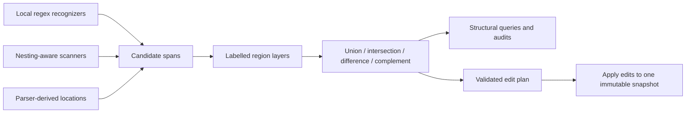
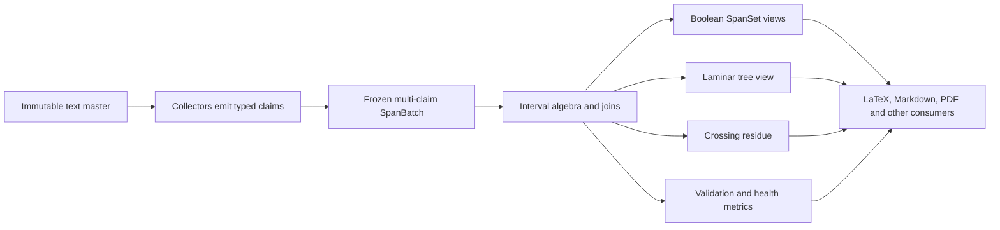

# its worth mentioning here that alot of these things involve regex and that i have the shared/masks interval algebra engine that's intended to be a more robust way of doing structural decomposition and pseudo-parsing. it is itself laden with 'use-case' framing but is something more general that doesn't even need to work on markdown. it plays a role for example in latex macro-expansion and fencing. there are so many things where i want to incorporate this to replace alot of the bespoke regex functions. but i have neither fully articulated the vision for the interval-algebra engine or delineated when to use it, but slowly i've been identifying places where it replaces document and text analysis capabilities that were originally written using regex heuristics and brittle tables

I think the vision can now be stated fairly cleanly:

> The interval engine separates recognition, scope, and mutation. Recognizers identify candidate spans; algebra determines where those candidates are valid; consumers inspect or transform only the resulting regions.

Regex remains useful, but it becomes a local evidence producer rather than an entire pseudo-parser.



## What `masks.ps1` actually is

The core of [masks.ps1](D:/aghado01/codex-scientiae/src/shared/masks.ps1:70) is already respectable:

- normalized half-open intervals `[start,end)`;
- sorted, disjoint coverage;
- overlap and adjacency merging;
- union, intersection, subtraction, and complement;
- offset-preserving extraction;
- clipping and rebasing;
- algebraic-law tests;
- an explicit attempt at surrogate-pair safety.

Its current formal object is best described as:

> A Boolean interval set over a fixed-length UTF-16 coordinate space.

“Mask” describes one application—hide or retain regions—but the underlying primitive is an `IntervalSet`.

That suggests separating several layers currently colocated:

```text
interval set
  unitless normalization and Boolean set algebra

coordinate space
  length, address unit, source identity, revision

text spans
  UTF-16/codepoint boundary rules and text extraction

region layers
  labels, provenance, confidence, precedence

edit plans
  non-overlapping replacements against one source revision
```

The unitless core could operate over UTF-16 offsets, UTF-8 byte offsets, lines, ordered records, or pages. The coordinate-space contract must prevent those units from being mixed accidentally.

## The right decision boundary

| Situation                                                  | Appropriate mechanism                                 |
| ---------------------------------------------------------- | ----------------------------------------------------- |
| Local, non-nested token with no contextual exclusions      | Regex alone                                           |
| Local token valid only outside code/comments/math/etc.     | Regex → spans, then interval subtraction/intersection |
| Escapes, balanced delimiters, nesting, paired environments | Small scanner → spans                                 |
| Overlapping evidence from several recognizers              | Labelled spans plus interval algebra                  |
| Offset-preserving audit or rewrite                         | Interval query or edit plan                           |
| Hierarchical syntax, precedence, semantic interpretation   | Real parser/AST                                       |

Examples:

- `^(Figure|Fig...)` at the start of a known caption is a perfectly reasonable regex.
- Finding figure references only outside fenced code, link targets, or bibliography regions is an interval-algebra problem.
- Parsing nested TeX brace arguments is a scanner problem.
- Understanding a complete Markdown or LaTeX grammar is a parser problem.

The important principle is:

> Interval algebra replaces contextual regex complexity, not every regex.

## What it already does successfully

The LaTeX code demonstrates the intended pattern:

```text
raw comment candidates
− verbatim/code regions
= actual TeX comments
```

[Get-TexCommentMask](D:/aghado01/codex-scientiae/src/latex-ingest/latex.ps1:151) is much stronger than attempting one enormous regex that understands both comments and verbatim syntax.

Likewise:

```text
whole document
− code
− comments
= macro-expandable region
```

and:

```text
whole document
− math
− code
− comments
= prose region
```

This is exactly the reusable architecture you are describing. The macro expander in [latex-ingest.ps1](D:/aghado01/codex-scientiae/src/latex-ingest/latex-ingest.ps1:415) already uses that region to prevent expansion inside comments and code.

## What the current engine still lacks

Before making it foundational, several invariants need tightening.

### Coordinate-space identity

Masks carry only `Length`. Two unrelated strings of equal length can be unioned accidentally. Masks of different lengths are silently combined using the larger universe.

A mask should know something like:

```text
unit: utf16
source_id: document/run identity
revision: immutable snapshot version
length: 12345
```

Set operations should reject incompatible spaces unless an explicit mapping is supplied.

`Test-MaskEqual` also currently ignores mask length, even though complement semantics depend on the universe.

### Complete codepoint-safety semantics

Construction from text snaps surrogate boundaries, but `Move-Mask` and `Limit-Mask` lack the destination text and can create boundaries inside a surrogate pair. The present guarantee is therefore narrower than the comments claim.

This becomes easier if the unitless interval core makes no Unicode promise and the text-span adapter owns that promise explicitly.

### Labelled evidence

Normalization deliberately merges overlapping spans, which is correct for Boolean coverage but loses:

- what recognized the span;
- whether several recognizers agreed;
- confidence;
- region kind;
- containment relationships.

The Boolean `IntervalSet` should remain simple. A separate region layer can carry:

```text
{ start, end, kind, source, confidence, metadata }
```

It can project selected regions into an interval set when algebra is needed.

### Safe matching inside regions

`Get-MaskDensity` blanks excluded regions with spaces and runs a regex over the full string. That preserves offsets for simple word patterns, but a regex containing whitespace or broad wildcards can still match across the blanked gap.

A general scoped matcher should instead run within each permitted interval and lift each local match back into the parent coordinate space.

### Mutation as a first-class operation

Many consumers currently discover spans and immediately mutate strings. A reusable transformation layer should produce an edit plan:

```text
{ start, end, replacement, operation, evidence }
```

Then:

1. verify every edit belongs to the expected source revision;
2. reject or resolve overlaps;
3. preview the plan;
4. apply edits from right to left;
5. optionally emit an old→new offset map.

This would make `DryRun` genuinely pure and give macro expansion, Markdown link rewriting, comment removal, and block replacement the same mutation discipline.

## How it bears on the modules just examined

- **Caption identity extraction:** keep the small local regex.
- **Figure-reference discovery:** produce reference spans, subtract prohibited contexts, then construct caption/reference edges.
- **Caption movement:** not interval algebra alone; it is a relation/placement decision consuming span evidence.
- **Markdown image links:** replace the current publishing regexes with a link scanner that returns target spans; rewrite those targets through an edit plan.
- **Contents-block replacement:** identify headings outside fenced regions, derive the exact Contents interval, replace that interval.
- **Reference-region extraction:** can operate over record-index intervals before Markdown exists.
- **Heading recovery:** primarily record classification and typography, not a text-mask problem.
- **Defect sentinels:** local regex/literal recognition remains sufficient unless examples inside code regions should be excluded.
- **Asset coverage:** link-target spans feed an asset relation/audit; the interval engine supplies locations, not filesystem policy.

## The most promising LaTeX migrations

The current TeX overlays are a good start, but some of their span producers remain brittle:

- verbatim environments are recognized by a non-nesting regex that can pair mismatched environment names;
- math-structure and `\text{...}` patterns do not handle nested braces;
- macro argument parsing is scanner-based, but the consumed argument extent is not verified to remain inside the expandable mask;
- the inline-dollar scanner already embodies interval thinking but immediately transforms instead of emitting a reusable span layer;
- environment scanners could emit named, nested regions once and serve comment handling, alignment checks, math fencing, and macro expansion.

A good evolutionary move is therefore:

```text
scanner emits structural spans once
        ↓
different consumers compose those spans
        ↓
no consumer re-invents protected-context logic
```

## Architectural implication

I would not preserve the current flat `shared/masks.ps1` framing indefinitely. The capability wants something conceptually like:

```text
shared/
  intervals/
    sets.ps1
    coordinates.ps1
  text/
    spans.ps1
    regions.ps1
    edits.ps1
  syntax/
    latex-regions.ps1
    markdown-regions.ps1
```

The exact directories can wait, but the dependency direction matters:

```text
interval algebra
    ← text-coordinate adapter
        ← syntax-specific span producers
            ← Markdown/LaTeX operations and audits
```

That keeps the primitive free of membrane, Markdown, LaTeX, and “doccer” terminology while still letting each syntax layer exploit it.

The central insight is strong: many of the project’s brittle regex functions are attempting to answer two questions simultaneously—“what resembles this thing?” and “where is that resemblance meaningful?” Regex can answer the first locally. Interval composition is the right machinery for the second. No files were changed.

# if the "src" doccer exists anywhere, it now lives under `markpig` `D:\aghado01\MarkPig\src\doccer\SHAPE.md` and there was never any code actually implemented

Got it. I’ll use [SHAPE.md](D:/aghado01/MarkPig/src/doccer/SHAPE.md) as the implementation-independent charter and treat Doccer as an unrealized architecture, not an earlier codebase. The comparison is therefore charter → compressed masks.ps1 adaptation → reusable engine design.

Ran command

Optimized the conversation

The charter confirms a sharper diagnosis than “Masks is incomplete”: it changed the ontology. Doccer was designed to retain simultaneous structural claims and derive views from their geometry; masks.ps1 reduces those claims to Boolean covered/not-covered intervals, destroying exactly the evidence—overlap, type, provenance, crossings—from which the general engine was supposed to reason.

Ran commands

The correction is decisive: Doccer was never an earlier implementation to recover. [SHAPE.md (line 15)](/D:/aghado01/MarkPig/src/doccer/SHAPE.md:15) is the design authority, and masks.ps1 is a task-compressed reinterpretation that discarded much of its essential model.
My earlier framing was too narrow as well. Doccer is not merely a way to replace brittle regexes. Regex, scanners, formal parsers, layout extractors, and human annotations can all be claim producers. Doccer is the common geometric substrate that retains, compares, validates, and derives structure from those claims.
What masks.ps1 actually adapted
The useful core is small but real:
Half-open normalized intervals.
Union, intersection, subtraction, and complement.
Coalescing through normalization.
Offset-preserving suppression.
Density measurement.
Rudimentary line projection, clipping, and rebasing.
Unicode-boundary precautions.
Some randomized algebra-law tests.
That makes [masks.ps1 (line 100)](/D:/aghado01/codex-scientiae/src/shared/masks.ps1:100) a prototype of one Doccer object: a resolved Boolean SpanSet. It is not a SpanBatch, collector, structural model, or interval engine.
Doccer charter masks.ps1 adaptation Information lost
Identified immutable master text Integer Length Source identity, revision, encoding and coordinate compatibility
Typed, prioritized, overlapping claims Unlabelled normalized spans Type, provenance, priority, disagreement and ambiguity
Complete atom tiling Sparse matching spans Explicit residual/unknown structure
Declarative inventories and collectors Regex embedded in New-Mask Separation of recognition from algebra
Full relations and relational joins Four Boolean set operations Contains, meets, precedes, overlaps, crosses and related queries
Laminar extraction Nothing No principled tree derivation
Crossing residue Erased by normalization Broken or conflicting structure becomes invisible
Line topology and level projection Split-AtLevel, Move-Mask, Limit-Mask A formal, round-trippable coordinate model
OffsetMap between immutable masters Absent Traceable normalization and rewrite histories
Tiered declarative validation Local law tests Cross-claim rules, impossibilities and structural health
Generic engine with external cars Markdown/LaTeX-shaped helper functions Reuse outside the initiating task

The header’s explicit “non-goals” fence at [masks.ps1 (line 43)](/D:/aghado01/codex-scientiae/src/shared/masks.ps1:43) effectively excludes the collector, columnar claims, rule runner, and other features the Doccer charter calls foundational. That is the clearest documentary evidence of the vision being narrowed to fit the immediate car.
Where the adaptation fundamentally failed
The fatal decision was representation collapse:
typed overlapping structural claims
↓
normalized Boolean coverage
Once adjacent and overlapping spans are merged, the engine can no longer answer:
Which detector asserted this region?
What kinds of structure overlap here?
Are the claims nested or crossing?
Which claim should win under a stated priority?
What evidence was rejected from a derived tree?
Is an apparent defect ambiguity, conflict, or merely unclassified text?
Those are not optional metadata questions. They are the basis of the Doccer thesis that a tree is a derived laminar view and that malformed structure should remain inspectable rather than being silently forced into a tree.
Other consequences followed from that first collapse:
The total scaffold became a sparse selection.
The collector became a regex constructor.
The full relation algebra became four set operations.
Conflict resolution became normalization.
Validation became testing the helper rather than testing document claims.
“Engine before car” was inverted into “implement only enough geometry for this car.”
Get-MaskDensity at [masks.ps1 (line 206)](/D:/aghado01/codex-scientiae/src/shared/masks.ps1:206) illustrates the compression particularly well: a general windowed-density algebra became a regex calculation over blanked text, useful for its immediate consumer but not a general geometric operation.
The engine Codex Scientiae needs



Its foundational contracts should be:
TextMaster
Stable identity and revision.
Immutable text.
Address unit declared explicitly.
Line topology.
Maps to original bytes or predecessor masters.

SpanClaim
Start/end over one master.
Type and level.
Producer/provenance.
Priority.
Adapter-specific metadata without interpretation by the algebra.

SpanBatch
Append-only during collection, then frozen.
Overlaps and duplicate claims permitted.
Never silently resolves conflicts.

SpanSet
A Boolean projection used for union, intersection, complement, suppression, and similar operations.
Always bound to a particular master.
This is where the useful semantics of Mask belong.

LaminarView
Priority-resolved nested subset.
Derived parent/child relationships.
Separate crossing residue that is reported, never discarded.

The operation families should follow the charter closely:
Complete sweep and topology
Build a non-overlapping atom tiling covering the entire master. Higher-level claims refine or group those atoms; unmatched material remains explicit residual structure.

Collection
Generic executors accept declarative regex inventories, scanners, parser spans, PDF-derived regions, or externally produced evidence. Domain patterns remain outside the algebra.

Pure interval algebra
Boolean set operations, all Allen relations, relation joins, containment queries, coalescing, runs, windows, density, lifting, grouping, projection, and suppression.

Structure derivation
Measure laminarity, select a deterministic priority-resolved laminar family, materialize a tree view, and retain rejected crossings.

Coordinate algebra
Character/line projection and explicit composition or inversion of OffsetMaps. Normalization creates another immutable master; it does not mutate the current one.

Validation
Intrinsic invariants, declarative relationships between claim classes, declared impossibilities, reconstruction checks, residual measurements, and randomized algebra-law testing.

A formal parser therefore does not replace Doccer. It becomes another collector or refinement source. On clean input its claims may produce a nearly complete laminar view; on damaged input, disagreement and crossing residue remain localized and visible. This is the missing bridge between pseudo-parsing robustness and formal structure.
Implementation posture
I would not expand masks.ps1 incrementally into this engine. Its current representation makes that path another Frankenstein system—the exact failure warned about in the charter.
The clean route is:
Close a recovery specification based on SHAPE.md: data contracts, operator signatures, algebraic laws, validation declarations, and acceptance criteria.
Implement the complete semantic reference engine independently of any LaTeX, Markdown, PDF, or MCP workflow.
Retain masks.ps1 temporarily as a compatibility façade backed by the new SpanSet.
Migrate consumers into external adapters one at a time.
Remove the façade after every consumer uses the explicit engine contracts.
Ownership should follow the general capability, not its first application. The strongest eventual home remains an independent Doccer/interval-engine component with a C# core and PowerShell interface, usable by Codex Scientiae. If it incubates inside this repository first, it should occupy something like src/intervals/{collector,algebra,validation}—never latex-ingest, markdown, or mcps.
The central recovery principle is:
Preserve claims first; resolve them only through explicit queries.

That is the distinction between the intended Doccer engine and the facsimile represented by masks.ps1.

[interrupted]

# masks.ps1 could potentially be reborn as a layer of helper functions based on doccer's more general primitives, e.g. operations that are helpful that leverage interval-algebra

Exactly. `masks.ps1` need not disappear—it should be demoted from “the interval model” to a permanent convenience layer built over Doccer.

A mask has a legitimate meaning:

> A mask is a resolved Boolean projection of richer interval claims over one immutable master.

That gives the layering a clean shape:

```text
Doccer substrate
  TextMaster · SpanClaim · SpanBatch · OffsetMap
                    ↓
Doccer interval algebra
  relations · joins · set algebra · projection · laminarity
                    ↓
Mask helpers
  exclusion · suppression · clipping · density · text views
                    ↓
Domain adapters
  LaTeX · Markdown · PDF · procurement · MCP workflows
```

The reborn mask layer could retain operations such as:

- `Union-Mask`
- `Intersect-Mask`
- `Sub-Mask`
- `Complement-Mask`
- `Get-MaskedText`
- `Get-MaskCoverage`
- `Get-MaskDensity`
- `Split-AtLevel`
- `Move-Mask`
- `Limit-Mask`

But their semantics would improve:

- Every mask carries its `MasterId`, not merely a length.
- Set operations reject masks from incompatible masters.
- Normalization and code-point safety come from Doccer.
- Line splitting and rebasing use `LineStarts` and `OffsetMap`.
- Density operates on interval runs/windows rather than blanking text and rerunning regex.
- A mask derived from overlapping claims must state its resolution policy.
- Mask generation selects existing claims or atom classes; it does not own domain regexes.

For example, the conceptual flow becomes:

```powershell
$claims = Find-DoccerClaims $document -Kinds Comment, Verbatim, Math

$excluded = New-DoccerMask `
    -Claims $claims `
    -Where { $_.Kind -in 'Comment', 'Verbatim' } `
    -Resolution Union

$prose = Complement-Mask $excluded
$density = Get-MaskDensity $prose -Window Line
```

The claims remain available afterward. Producing `$excluded` does not erase their types, overlap, provenance, or crossing relationships—it merely creates a convenient Boolean view for a particular operation.

I would therefore revise the earlier migration posture:

- The current implementation should not be grown into Doccer.
- Its useful operations should be reimplemented against Doccer primitives.
- `masks.ps1` can then become a stable first-class helper library, not merely a temporary compatibility façade.
- Regex construction and LaTeX-specific helpers should move outward into collectors and domain adapters.
- `Mask` should remain deliberately less expressive than `SpanBatch`; that limitation becomes healthy once the richer source representation remains accessible.

This also establishes a useful vocabulary distinction:

- **Claim:** a structural assertion.
- **Span set:** an algebraic collection of intervals.
- **Mask:** a Boolean inclusion/exclusion view used to constrain an operation.
- **Partition:** a total classification of the master, including residuals.
- **Laminar view:** a tree-compatible selection of claims.
- **Crossing residue:** claims excluded from that tree view but retained as evidence.

So `masks.ps1` was not wrong to expose masking operations. The error was making the mask-shaped projection stand in for the entire structural engine.

# hdbscan is a clustering algorithm adapted from thermomapper's source. i dont think it'll tell us much about doccer's implementation, only that it would be a dotnet project that gets compiled and delivered as a payload under packages, like HDBSCAN does, perhaps as a CLI exe

Right—the HDBSCAN comparison is about the repository’s delivery pattern, not its internal architecture.

I think C# is the better implementation language for Doccer. It offers stronger immutable data contracts, predictable value semantics, efficient columnar storage, deterministic sorting, generic interval operators, and property-based testing without PowerShell’s allocation and type-coercion problems.

The appropriate layout would resemble:

```text
src/doccer/                         # First-party C# engine source
  Core/
  Collector/
  Algebra/
  Validation/
  Views/

brewery/doccer/                     # Reproducible compilation recipe
  Doccer.csproj
  Doccer.Cli.csproj
  build-doccer.ps1

artifacts/...                       # obj/bin/test intermediates

packages/doccer/                    # Selectively refreshed payload
  doccer.dll
  doccer.exe
  doccer.deps.json
  doccer.runtimeconfig.json

tests/doccer/
```

I would make it library-first and CLI-second.

`doccer.dll` should contain the actual engine. That permits PowerShell adapters to load it once and manipulate `TextMaster`, `SpanBatch`, `SpanSet`, and query results directly:

```powershell
$master = [CodexSci.Doccer.TextMaster]::Create($text)
$batch  = [CodexSci.Doccer.Collector]::Collect($master, $inventory)
$mask   = $batch.SelectKinds('Comment', 'Verbatim').ToMask()
```

`doccer.exe` should expose coarse, self-contained operations:

```text
doccer collect
doccer query
doccer validate
doccer laminarize
doccer inspect
```

I would avoid designing the CLI as one process invocation per algebra primitive. Doccer operations are compositional and repeatedly query the same master and claim batch; constantly serializing those objects through JSON and restarting the runtime would undermine that model. The CLI is best for:

- Pipeline stages and reproducible batch execution.
- Cross-language consumers.
- Debugging and inspection.
- Producing or validating persisted span artifacts.
- Process isolation when loading the DLL into a long-lived PowerShell session is undesirable.

PowerShell would then own:

- Workflow orchestration.
- Declarative inventory assembly.
- Domain adapters for LaTeX, Markdown, PDF-derived text, and so forth.
- The reborn `masks.ps1` convenience layer.
- Artifact routing and run management.

C# would own:

- Immutable master identity and coordinate enforcement.
- Span storage.
- Interval relations and joins.
- Laminarity and crossing-residue calculations.
- Offset maps.
- Line topology.
- Validation machinery.
- Deterministic conflict resolution.

One practical reason to ship both surfaces is assembly lifetime: once PowerShell loads a DLL into its default context, replacing that DLL during development usually requires restarting the session. The CLI always starts against the current packaged payload. Thus the CLI is particularly useful during development and for reproducible pipelines, while the DLL is preferable for rich, repeated, in-process querying.

So my recommendation is: adopt HDBSCAN’s `src → brewery → artifacts → packages` delivery arrangement, but deliver Doccer as a reusable assembly with an executable façade—not primarily as a black-box executable.
