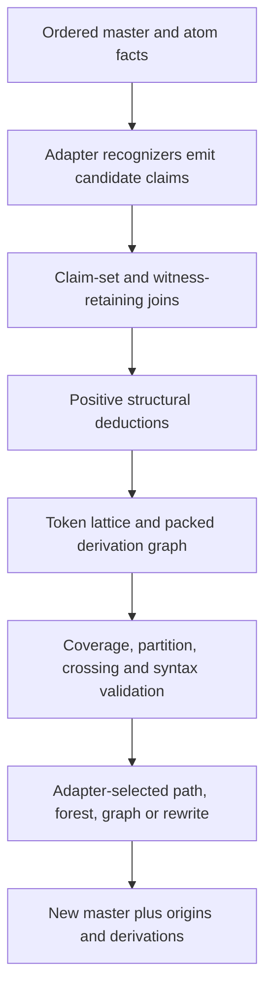

# so looking at doccer's current implementation what would a more mature compositional algebra kernel look like, considering the broader research literature that grew out of allen's original work? we already identified some things in this thread. Lets dig deep into first principles design, identify transferable concepts and patterns, as well as mathematical formalisms backing them or lack thereof, to expand out the intrinsic capabilities and expressiveness of doccer. One application i've had in mind for a more mature doccer would be using it as a kind of "tokenizer factory" that performs various types of tokenization tasks using a very different approach than the normative token parsing approach, such as how the various tokenizers in PdfPig are implemented, or Markdig's parsing on markdown for example

I'm treating this as a kernel-design investigation, not a feature wish list. I'll separate four things throughout: the mathematical carrier and laws, reusable mechanisms, domain-supplied policy, and concrete applications such as tokenizer construction. I'm also splitting the research across the current code, post-Allen QSTR, and sequence/tokenization/transformation literature so the synthesis is not biased toward temporal reasoning alone.

One important direction is already visible from first principles: a candidate-first tokenizer can be modeled as a graph over sequence boundaries. Every candidate token spanning $[i,j)$ is an edge $i \rightarrow j$; a complete tokenization is a path or tiling through that graph. That preserves competing recognitions instead of forcing a lexer to commit immediately, and it gives Doccer's existing overlap-preserving batches a natural next abstraction.

The literature confirms a second algebra that is more directly useful for the tokenizer-factory idea than Allen composition itself. Treat a located token class as a binary relation on boundaries: alternatives are union, adjacent concatenation is ordinary relational composition, and repetition is closure. That is a finite Kleene-algebra / token-lattice view. Allen relations then constrain joins among already recognized spans, while chart-style deductions construct larger claims and retain the witnesses Allen composition intentionally forgets.

The investigation has converged on a fairly sharp design: Doccer should not grow into one giant interval API. It should become a small many-sorted kernel—regions, qualitative relation sets, claim sets, concrete witness relations, token paths, derivations, and cross-master origins—where each sort has its own composition and laws.

The mature form of Doccer is not "more Allen operations" and not a generic parser framework. It is a many-sorted algebraic kernel for evidence-bearing claims over finite ordered carriers, with separate calculi for geometry, qualitative constraints, candidate paths, deductions, and transformations.

The most important architectural conclusion is:

> Allen algebra should become one rigorous sort inside Doccer, while tokenizer construction depends more directly on witness-retaining joins, token lattices, deductive closure, and transformation lineage.

## 1. What Doccer already is

The current implementation already contains several distinct mathematical structures:

- [TextMaster.cs (line 8)](D:/aghado01/codex-scientiae/src/doccer/Core/TextMaster.cs:8) supplies an immutable, identified coordinate space with scalar-valid boundaries.
- [TextSpan.cs (line 6)](D:/aghado01/codex-scientiae/src/doccer/Core/TextSpan.cs:6) supplies half-open convex geometry, including empty positions.
- [SpanSet.cs (line 11)](D:/aghado01/codex-scientiae/src/doccer/Algebra/SpanSet.cs:11) is a canonical Boolean region algebra: union, intersection, subtraction, and complement over one master. It intentionally merges meeting spans and forgets claim identity.
- [SpanBatch.cs (line 205)](D:/aghado01/codex-scientiae/src/doccer/Core/SpanBatch.cs:205) is an overlap-preserving multiset of evidence-bearing assertions. Equal geometry can occur in multiple rows.
- [EmitRuns (TextTopology.cs, line 226)](D:/aghado01/codex-scientiae/src/doccer/Core/TextTopology.cs:226) constructs a deterministic total segmentation by coalescing adjacent atoms with equal caller-supplied keys. It is already a small tokenizer-factory primitive.
- [AllenRelation.cs (line 7)](D:/aghado01/codex-scientiae/src/doccer/Algebra/AllenRelation.cs:7) provides exact classification and converse for concrete nonempty spans, plus a Cartesian batch join via [IntervalJoins.Join (line 106)](D:/aghado01/codex-scientiae/src/doccer/Algebra/AllenRelation.cs:106).
- [Laminarizer (LaminarView.cs, line 50)](D:/aghado01/codex-scientiae/src/doccer/Algebra/LaminarView.cs:50) selects a deterministic maximal independent set in the crossing graph and materializes its containment forest. It is not a tokenization algorithm.
- [Grouping and Projection (Grouping.cs, line 102)](D:/aghado01/codex-scientiae/src/doccer/Algebra/Grouping.cs:102) provide basis-stamped derived incidence views.
- [RegexCollector (line 140)](D:/aghado01/codex-scientiae/src/doccer/Collector/RegexCollector.cs:140) supplies transactional, region-scoped recognition.
- TextSlice is a genuine cross-master order isomorphism: translation between a child coordinate chain and a parent window.

The weakness is not lack of primitives. It is that their result types are not yet closed under composition:

- relation sets are ordinary `IReadOnlySet<AllenRelation>`;
- query results are usually raw lists;
- pair joins cannot themselves be joined;
- derived claims do not retain their premises;
- SpanSet cannot preserve token boundaries;
- no type represents a candidate segmentation, derivation forest, or general sequence transformation.

The kernel is therefore already richer than "Allen relations over text." Its main limitation is that these structures do not yet form a consistently composable API: some operations return raw lists, some normalized regions, some trees, and some new batches. Information frequently cannot flow into the next operation without bespoke loops.

## 2. The correct first-principles model

For a master $M$, let $P_M$ be its valid boundary positions and let

$$
I_M = \{[i,j) \mid i,j \in P_M,\ i < j\}
$$

be its nonempty convex spans.

Let $C_M$ be its claims, with geometry projection

$$
g : C_M \rightarrow I_M
$$

This projection must remain explicit. Distinct claims may have equal geometry.

A mature kernel then contains several different algebras:

| Sort | Elements / structure | Principal composition / Doccer meaning |
| --- | --- | --- |
| Points / Boundaries | boundaries in $P_M$; finite total order | order/difference constraints; offsets, token boundaries, insertion positions |
| Convex spans | members of $I_M$ | Allen classification; occupied contiguous regions |
| Qualitative relation sets | subsets of 13 Allen atoms; finite relation algebra | symbolic composition; qualitative possibilities between spans |
| Regions | normalized subsets of the carrier; Boolean algebra | Boolean set operations; coverage and execution scopes |
| Claim sets | subsets of batch ordinals; finite Boolean algebra | Boolean selection algebra; selected evidence rows retaining identity |
| Claim-pair relations | subsets of $C_A \times C_B$; ordinary relational algebra | witness-retaining relational composition |
| Span / boundary languages | boundary edges $i \rightarrow j$; Kleene/relational algebra | adjacency/concatenation; token candidates and paths |
| Derivations | facts plus premise hyperedges | least-fixed-point inference; why a claim exists |
| Transformations | source/output pieces and origins; sequence transductions | transformation and lineage composition |
| Origins | cross-master relation | where output material came from |

These should not share an unqualified `Compose`. Their identities and laws differ.

## 3. Complete the Allen layer—but name its semantics honestly

### 3.1 A first-class relation-set value

The immediate missing value is a first-class 13-bit relation set. A compact immutable value should provide:

```text
AllenRelationSet
  None
  All
  Equal
  singleton(atom)
  union
  intersection
  complement
  contains / subset
  converse
  qualitative composition
```

This replaces transient hash sets in validation and joins and gives the kernel the full $2^{13} = 8192$-element value algebra. The current [RelationRequirement (line 23)](D:/aghado01/codex-scientiae/src/doccer/Validation/Validation.cs:23) is already implicitly asking for this type.

An Allen-specific public type is safer initially than immediately publishing a universal qualitative-calculus framework. Internally, a table verifier can be generic. A public generic calculus descriptor becomes justified once Point–Interval relations or a second real calculus arrive.

### 3.2 Strong versus weak composition

For relation sets $R, S$, exact relational composition is

$$
\phi(R) \circ \phi(S) = \{(x,z) \mid \exists y.\ x\,R\,y \land y\,S\,z\}.
$$

The Allen table returns the least union of base atoms containing that result:

$$
R \diamond S = \{t \mid \phi(t) \cap (\phi(R) \circ \phi(S)) \neq \varnothing\}.
$$

This is weak or qualitative composition. It is exact only when the concrete product is itself a union of whole Allen atoms. Equivalently, in abstract-interpretation language: the Allen atoms provide a JEPD partition; abstraction and concretization form a Galois insertion; weak composition is the best correct abstraction of exact relational composition.

That qualification matters for Doccer's discrete carrier. For example:

$$
A = [0,1),\qquad C = [2,3).
$$

Although $A$ is Before $C$, no nonempty integer span $B$ satisfies

$$
A\ \texttt{Before}\ B \quad\land\quad B\ \texttt{Before}\ C.
$$

Canonical Allen composition nevertheless says:

$$
\texttt{Before} \diamond \texttt{Before} = \texttt{Before}.
$$

It says that Before is a possible outer relation somewhere in a sufficiently rich interval universe—not that every concrete Before pair inside a finite master possesses such a witness.

This can be formalized cleanly as abstract interpretation:

- concrete domain: arbitrary pair relations over $I_M$;
- abstract domain: subsets of the 13 atoms;
- abstraction $\alpha$: retain every atom intersecting a concrete relation;
- concretization $\gamma$: union the selected atom classes.

Then

$$
R \diamond S = \alpha(\gamma(R) \circ \gamma(S)).
$$

That gives a principled division:

- `Relate(a,b)` — exact classification of concrete geometry;
- `WeakCompose(R,S)` — abstract qualitative inference;
- `Witnesses(a,R,S,c)` — exact master-relative intermediary search;
- claim joins — observed intermediary claims with witnesses retained.

Calling all four `Compose` would be a serious semantic defect.

The QSTR literature explicitly distinguishes strong and weak composition; not every published qualitative calculus even preserves associativity after abstraction. Canonical Allen's symbolic table does, but custom coarsenings must be checked rather than assumed (Ligozat and Renz; Dylla et al.). Ligozat and Renz explicitly distinguish strong and weak representations of qualitative calculi, including restricted/discrete domains. Their general framework is more directly applicable to Doccer than assuming the canonical table is exact over a finite master.

### 3.3 Verification should generate, not merely copy, the table

Ghourabi and Takahashi prove the table entries as sound inclusions under the Allen–Hayes interval axioms. The proofs do not by themselves establish that every listed output atom is necessary in a bounded discrete model. Ghourabi's Isabelle work supplies machine-checked upper-bound proofs, but its table theorems are inclusions $r_1 \circ r_2 \subseteq T$. It should be paired with witness enumeration rather than treated alone as a proof of minimality for a finite master.

A particularly useful later result is that a six-point domain is 3-complete for Allen IA. Liu and Li prove that $D_6$ is 3-complete for Allen IA, making this an unusually compact independent oracle. Its fifteen intervals realize all consistent atomic triples; exhaustive enumeration produces 409 consistent triples and the canonical $13 \times 13$ table.

A strong test program would:

1. Define all 13 atoms independently by endpoint comparisons.
2. Exhaustively prove JEPD over small finite carriers.
3. Enumerate all triples in the six-point domain $D_6$:
   - 15 nonempty intervals;
   - $15^3 = 3375$ triples;
   - 409 consistent atomic triads.
4. Regenerate all 169 atomic composition cells.
5. Compare the generated table with the shipped table.
6. Verify:
   - identity;
   - associativity;
   - converse involution;
   - converse reversal of composition;
   - union distribution;
   - complement and Boolean laws;
   - the Peircean/cycle law.
7. Separately test soundness—and expected non-exactness—over finite masters.
8. Include explicit tests showing failure of strong composition.

Dylla et al. provide the appropriate algebraic law catalogue and warn that "qualitative calculus" does not automatically imply full relation-algebra behavior.

### 3.4 Claim equality is not algebraic identity

In the Allen algebra, Equal is the identity on span geometry. It is not the identity on claims:

```text
claim #4  span [10,20)
claim #9  span [10,20)
```

These claims are geometrically Equal, but $\#4 \neq \#9$.

Equal is the identity relation only over the carrier of geometries:

$$
\mathrm{id}_{I_M} = \{(s,s) \mid s \in I_M\}.
$$

Therefore:

- Allen relations operate on geometry or a geometry quotient;
- a concrete claim-pair algebra uses ordinal equality as its diagonal identity;
- Equal remains an Allen label on the projected geometries.

Failing to preserve this distinction would make the relation-algebra identity laws false at the claim layer. This is one reason a generic relation layer should use typed bases rather than pretending all "relations" share one carrier.

## 4. Points and intervals should eventually become separate sorts

Allen's thirteen atoms assume $i < j$. Empty TextSpans are useful as positions, but they are not Allen intervals.

The post-Allen point–interval calculi provide the principled extension:

- point–point: 3 relations;
- point–interval: 5 relations;
- interval–point: 5 converses;
- interval–interval: 13 Allen relations.

Meiri's point/interval calculus uses sort-compatible composition tables rather than forcing points into the interval algebra.

Conceptually:

```text
RelationSet<Point, Point>
RelationSet<Point, Span>
RelationSet<Span, Point>
RelationSet<Span, Span>
```

This would support insertion positions, token boundaries, empty captures, and exact endpoint constraints without weakening the Allen contracts.

It does not mean empty claims should enter SpanBatch. Token-lattice identities and epsilon matches should normally remain implicit boundary facts; explicit zero-width edges can introduce cycles and infinitely many equivalent paths.

## 5. Introduce composable claim relations

The most important API seam after `AllenRelationSet` is a basis-stamped `ClaimSet`.

SpanSet cannot fill this role because it deliberately destroys claim identity. Raw `IReadOnlyList<SpanRecord>` results cannot fill it because they have no closed Boolean operations or reliable basis.

### 5.1 ClaimSet

```text
ClaimSet
  SourceBatch
  Ordinals
  Union
  Intersect
  Except
  ComplementWithinBatch
  ToRegion()   // explicitly forget identity
```

A basis-stamped ClaimSet should represent a subset of one SpanBatch by ordinal, probably as a bitset. It would provide:

- `All(batch)` and `None(batch)`;
- selection by caller predicate;
- union, intersection, difference, complement;
- geometry ordering;
- conversion to a coverage SpanSet, explicitly marked as forgetting identity;
- grouping and measurement operations;
- compatibility checks by source batch.

This would turn suppression, lookup, validation populations, and grouping inputs into composable values instead of transient predicates and raw lists.

### 5.2 ClaimPairView

```text
ClaimPairView
  LeftBasis
  RightBasis
  (leftOrdinal, rightOrdinal, exactAllenRelation)
  Converse
  ProjectLeft
  ProjectRight
  SemiJoin
  ComposeOnSharedBasis
```

Useful operations include:

- filter by `AllenRelationSet`;
- converse;
- project left/right;
- semijoin;
- compose two pair relations sharing a middle basis;
- group witnesses by outer pair;
- derive an output span through an explicit projection.

This would turn current operations into a genuine relational vocabulary:

$$
\text{claims} \rightarrow \text{selection} \rightarrow \text{relation join} \rightarrow \text{projection} \rightarrow \text{derived evidence}.
$$

`ClaimPairView.ComposeOnSharedBasis` would be exact relational composition and should retain the intermediate ordinal or its derivation. Allen weak composition could prune possible pair labels, but it should not substitute for the actual join.

This also closes several current seams:

- suppression can consume and return `ClaimSet`;
- grouping can operate on a selected claim basis;
- relation validation can use `AllenRelationSet`;
- cadence can measure a `ClaimSet` rather than re-running a lost predicate;
- joins become composable rather than terminal raw lists.

This is ordinary relational algebra over claim identities. Unlike Allen weak composition, it can retain the intermediate object.

That is critical for tokenization. Allen composition answers:

> Given two qualitative relations, what outer relations remain possible?

A structural adapter usually needs:

> Which exact opener, argument, delimiter, or token satisfies the relation, and what new claim should be derived from those bindings?

The latter is a conjunctive query or CSP join, not merely a composition-table lookup.

## 6. The tokenizer-factory carrier is a token lattice

This is the strongest new intrinsic capability suggested by the tokenizer-factory application.

A candidate token spanning $[i,j)$ is naturally a labeled directed edge:

$$
i \longrightarrow j.
$$

Because normal token claims are nonempty, $i < j$, so the candidate graph is acyclic. Parallel edges retain different kinds, producers, or evidence over identical geometry.

A tokenization of a window $[a,b)$ is a path from $a$ to $b$. Multiple paths represent lexical ambiguity.

Then:

- the edge cloud represents all candidate tokens;
- a tokenization of a window is a path from its start to its end;
- a total token stream is an ordered partition;
- uncovered areas are explicit dead ends or residuals;
- trivia and recovery tokens are explicit edges;
- competing tokenizations are different paths;
- maximal munch, priority, confidence, and recovery are path-selection policies.

This abstraction fills the exact gap between:

- `EmitRuns`: one deterministic total segmentation; and
- `SpanBatch`: an arbitrary cloud of overlapping candidates;
- `LaminarView`: a nested non-crossing family that is not necessarily a token stream.

A `TokenLattice` or `SegmentationGraph` / `SegmentationView` should preserve:

- its source master and window;
- candidate claim ordinals as parallel labeled edges;
- reachable and unreachable boundaries;
- uncovered regions and dead ends;
- complete paths or packed path alternatives;
- explicit trivia, invalid, and recovery edges;
- path-selection results as views, never mutation of the candidate store.

Then policies remain external:

- maximal munch;
- priority;
- minimum cost;
- maximum confidence;
- preferred producer;
- recovery strategy;
- whether trivia participates in the returned stream.

A selected token stream is an ordered partition, not merely a laminar set:

$$
\bigcup_i T_i = W, \qquad T_i \cap T_j = \varnothing, \qquad T_i\ \texttt{Meets}\ T_{i+1}.
$$

Laminarizer permits containment and therefore solves a different problem. A TokenLattice should not be implemented by extending SpanSet or Laminarizer.

Ambiguous lexical graphs have direct precedent: Lamb constructs all possible token sequences and lets later syntax remove invalid paths (Quesada, Berzal, and Cortijo).

### 6.1 A second compositional algebra: located span languages

The token lattice admits an algebra that is mathematically closer to tokenization than Allen composition.

Treat each token class $A$ as a set of located boundary pairs:

$$
A \subseteq \{(i,j) \mid i \le j\}.
$$

Then define:

$$
A + B = A \cup B
$$

and

$$
A;B = \{(i,k) \mid \exists j.\ (i,j) \in A \land (j,k) \in B\}.
$$

Here $A;B$ means adjacent concatenation through a shared boundary. In interval vocabulary, the component spans Meet.

With:

- $0 = \varnothing$;
- $1 = \{(i,i) \mid i \in P_M\}$;
- union;
- concatenation;
- reflexive-transitive closure $A^*$;

these located languages form a finite relational Kleene algebra.

This suggests recognizer operations such as:

| Operation | Meaning |
| --- | --- |
| `Alt(A,B)` | retain either candidate family |
| `Seq(A,B)` | join candidates that meet |
| `Label(kind,A)` | derive typed claims over matched extents |
| `Where(A,predicate)` | pure guard |
| `Optional(A)` | add implicit boundary identity |
| `Many(A)` | closure over consuming edges |
| `Context(A,B,relation)` | relation-constrained join |
| `FirstOf(A,B)` | ordered commitment policy, deliberately not Alt |

Zero-length identity edges should remain implicit algebraic objects or explicit point facts—not ordinary token claims. Allowing arbitrary zero-length token edges creates cycles and potentially infinitely many paths.

This composition is not Allen composition. It is ordinary relational composition of endpoint edges, equivalent geometrically to joining spans through Meets. That distinction gives Doccer a rigorous recognizer algebra without requiring a cursor-consuming lexer.

This is also where a generic pattern vocabulary could eventually live. It should compile to claim joins and path operations, not immediately become another regex language.

### 6.2 Structural tokenization is deductive closure

Regular path composition handles flat token sequences. Nested and recursively constructed tokens require deduction.

The basic chart rule

$$
\frac{B(i,k)\qquad C(k,j)}{A(i,j)}
$$

means:

- a B claim spans $[i,k)$;
- a C claim spans $[k,j)$;
- they meet at $k$;
- therefore derive an A claim over $[i,j)$.

That is an interval-aware inference rule retaining the actual witnesses. It is not Allen weak composition, which would existentially forget $B$ and $C$.

Parsing-as-deduction supplies the formal foundation: parsing is least-fixed-point closure of finite facts under rules (Shieber, Schabes, and Pereira). This is exactly the classical chart item $A(i,j)$.

A generic positive rule layer could eventually support clauses of the form

$$
H(\bar{x}) \leftarrow B_1(\bar{x}_1),\ldots,B_n(\bar{x}_n),\phi(\bar{x}),
$$

where $\phi$ contains:

- equality of boundaries;
- Allen predicates;
- point-order predicates;
- kind/value predicates;
- declared finite guards.

If the endpoint universe and fact keys are finite and rules only add facts, monotone worklist evaluation terminates.

A finite positive rule system terminates when:

- endpoints and kinds are finite;
- rules create no fresh unbounded values;
- evaluation only adds canonical facts;
- repeated derivations attach support rather than creating new fact identities.

### 6.3 Facts and derivations must be separate

Recursive inference creates an important identity problem. A semantic fact such as

$$
\operatorname{Argument}(10,25)
$$

should exist once even if five derivations support it.

A sound representation is:

```text
Fact
  canonical fact key: kind + geometry + adapter-defined value identity

Derivation
  rule id
  premise fact ids
  optional originating claims
```

Derivations form a packed hypergraph or parse forest. That avoids infinite "new claims" caused only by accumulating different proof histories.

Semiring parsing can later evaluate the same forest as:

- Boolean existence;
- all derivations;
- derivation count;
- minimum cost;
- best score;
- $k$-best alternatives.

The kernel should first preserve the derivation graph and only later expose semiring evaluation; arbitrary adapter payloads do not automatically form a semiring (Goodman).

Doccer should not begin by exposing an arbitrary generic semiring API. First preserve the packed derivation graph; weighted evaluators can then be added without throwing away evidence.

## 7. What a tokenizer adapter would actually do

A mature execution model could be:



### 7.1 What a KaTeX adapter would supply

The adapter owns:

- lexical control-sequence recognition;
- delimiter roles and compatibility;
- macro arity;
- parameter markers and binding;
- whitespace and escape semantics;
- macro lookup and scoping;
- expansion order;
- KaTeX validity;
- recursion and recovery policy.

Doccer could supply:

- candidate collection;
- claim selection and relation joins;
- generic pairing with visible mismatch residuals;
- adjacency/path composition;
- laminarity, partition, and coverage validators;
- construction of invocation and argument claims;
- packed derivations;
- compatible rewrite planning;
- materialization into a new master;
- origin and derivation composition.

For a KaTeX adapter specifically:

1. The adapter identifies control sequences, braces, parameters, trivia, macro definitions, and valid output vocabulary.
2. Generic pairing matches caller-classified delimiters.
3. Claim joins bind invocations to arguments.
4. Structural deductions create invocation and expansion-site claims.
5. The adapter supplies the substitution rule.
6. Generic rewrite machinery materializes the new master.
7. Generic origin machinery relates output fragments to the macro definition and arguments.
8. The adapter validates the resulting KaTeX token sequence.

### 7.2 Markdown and PDF adapters

The same mechanics can serve Markdown or PDF adapters without either domain entering the kernel.

For Markdown:

- The adapter supplies block and inline recognizers and CommonMark precedence.
- Doccer retains competing candidate claims.
- Generic scopes prevent inline recognition inside excluded code regions.
- Pairing and deduction build constructs.
- The adapter's ordered-choice rules select the normative interpretation.

For PDF tokenization:

- The adapter owns PDF byte syntax, graphics state, leniency, and recovery.
- Doccer can retain competing token claims rather than coupling recognition to one mutable scanner cursor.
- If two-dimensional layout must first be linearized, that ordering decision remains with the PDF adapter.
- Once an ordered carrier exists, lattice and structural operations are generic.

Markdig demonstrates valuable engineering patterns—staged block and inline analysis, precise source locations, trivia preservation, frozen pipelines, trigger indexes—but its parser ordering and first-match behavior are policies, not algebraic laws.

PdfPig's scanner intertwines cursor ownership, token commitment, nesting, leniency, and recovery. A Doccer adapter could instead offer competing claims and defer commitment, gaining inspectability and alternative-preservation—not necessarily raw speed.

## 8. Recognition operations and their limits

A possible recognizer vocabulary has well-understood distinctions:

| Operation | Formal meaning | Caveat |
| --- | --- | --- |
| `Alt(P,Q)` | unordered language union | commutative and idempotent |
| `FirstOf(P,Q)` | prioritized choice | policy; not commutative |
| `Seq(P,Q)` | concatenation through a boundary | associative if actions are delayed |
| `Label(K,P)` | derive a typed claim | preserve support evidence |
| `Where(P,g)` | pure guard | optimizer laws require purity |
| `Many(P)` | least closure | operands should consume input |
| `Context(P,Q,R)` | witness-retaining relational join | output geometry must be explicit |
| `Subtract` / `Not` | negation / difference | non-monotone; needs staged or stratified evaluation |
| `Choose` | resolve paths or derivations | adapter policy |
| `Materialize` | produce another master | transformation, not recognition |

This makes one important architectural point: a tokenizer factory can be algebraic without pretending every parser decision is algebraic.

Ordered PEG choice has rigorous semantics, but it changes the recognized language and cannot be treated as ordinary union (Ford's PEG paper).

Likewise, delimiter pairing is context-free or stack-based. Allen relations describe the resulting geometry but do not themselves implement balanced nesting.

## 9. Regions, overlap, and hierarchy

SpanSet should remain the exact Boolean coverage algebra. It should not become a token carrier or a generalized Allen interval.

For claim families, useful intrinsic predicates are:

- covers a declared window;
- partitions a window;
- forms a token stream;
- is laminar;
- contains crossings;
- has equal-geometry alternatives;
- forms a containment forest;
- forms a concurrent overlap graph.

Containment alone should not imply syntactic parentage. Two analyses may nest geometrically without belonging to one hierarchy. Work on overlapping markup, including GODDAG and LMNL, supports retaining concurrent structures and projecting trees only where justified.

RCC-8 should not be imported wholesale. Its regular-region topology does not automatically transfer to a discrete half-open sequence. Doccer can derive exact region predicates from its own Boolean and adjacency semantics and only introduce a JEPD region calculus if that partition is independently defined and validated.

Likewise, Ligozat's non-convex interval work suggests component-wise endpoint signatures, but arbitrary SpanSet component counts form an unbounded family—not one manageable enum of generalized Allen relations. For SpanSet, exact Boolean operations, connected-component decomposition, component-wise relations, hulls, and explicit aggregate predicates are safer than borrowing RCC terminology.

## 10. Transformations need a more general lineage object than OffsetMap

The existing TextSlice is a simple order isomorphism. The drafted OffsetMap family covers monotone edits such as normalization, insertion, deletion, expansion, and contraction.

Macro expansion is more general:

- arguments may be duplicated;
- arguments may be reordered;
- material may originate from a definition and a call site;
- output tokens may be synthetic;
- input tokens may disappear.

Therefore general transformation lineage should be output-piece based:

```text
OutputPiece
  output span
  content
  origins:
    copied from source span(s)
    transformed from source span(s)
    synthesized by rule
  derivation id
```

The output pieces form the new sequence in output order. Their source origins need not be monotone or unique.

Two distinct records should survive:

- **origin**: where output material came from;
- **derivation**: why it was generated.

```text
Derivation
  Why does this fact exist?
  Derived fact
  rule identity
  premise fact identities
  supplied domain parameters
  diagnostics / residuals

Origin
  Where did this output material come from?
  Output piece
  copied / transformed source span(s)
  source master identity
  synthetic rule origin, if any
```

Origin relations compose across masters. Bojańczyk's origin semantics gives a rigorous precedent for associating output positions with responsible input positions, although Doccer likely needs multiple sources and relation-valued origins.

An OffsetMap then becomes a useful restricted species of transformation, not the universal lineage representation.

TextSlice is the simplest existing morphism: an injective order-preserving translation. The mature transformation family should distinguish:

- order isomorphisms such as slices;
- monotone edit maps;
- collapsing grain maps;
- piecewise copying/reordering transformations;
- materialized output masters;
- derivation provenance.

Each should declare totality, injectivity, monotonicity, support/image universe, and residual behavior.

## 11. Transferable post-Allen concepts

### Transfer directly

- JEPD atomic vocabularies;
- powerset relation values;
- exact converse;
- strong/weak composition distinction;
- algebra-law validation;
- endpoint semantics;
- abstract-versus-concrete interpretations;
- constraint refinement by intersection;
- exact witness joins separate from symbolic inference;
- point/interval many-sorted calculi;
- endpoint reductions;
- abstract coarsening through abstraction/concretization maps.

### Transfer as optional reasoning layers

These become useful after a constraint-network layer exists:

- algebraic closure / path consistency;
- contradiction traces;
- ORD-Horn and other tractable-fragment classification;
- distributive subclasses;
- complete realization search;
- master-capacity constraints.

Path consistency repeatedly applies

$$
R_{ij} \leftarrow R_{ij} \cap (R_{ik} \diamond R_{kj}).
$$

This is deterministic, finite, and mechanically useful. But for full IA:

- an empty relation proves inconsistency;
- a non-empty closed network does not prove satisfiability.

ORD-Horn and the other maximal tractable subalgebras matter only once Doccer has genuine uncertain-location constraint networks. They should be solver-strategy metadata, not restrictions on `AllenRelationSet` (Nebel and Bürckert; Krokhin, Jeavons, and Jonsson). Full IA satisfiability is NP-complete; algebraic closure is sound but incomplete outside suitable fragments. The complete classification finds 18 maximal tractable subalgebras.

### Useful as metadata or diagnostics, not core inference

- conceptual-neighbourhood graphs;
- perturbation distance;
- continuous-endpoint convexity;
- IA3/IA7 vocabulary projections.

The conceptual-neighbourhood order is not the Boolean refinement lattice. It describes perturbation adjacency, not logical entailment or composition generation.

On a discrete master, "one small change" requires a named edit policy:

- move one endpoint one coordinate;
- grow or shrink;
- translate the whole interval;
- allow or forbid boundary collision.

It may become useful for near-miss diagnostics, but it is not part of the core relation algebra.

### Do not import as assumptions

- Ghourabi's named $\alpha$/$\beta$/$\gamma$/$\delta$ proof unions as privileged runtime types;
- formal nests as groups over the claims currently present;
- RCC-8 topology without defining Doccer's region topology;
- the claim that conceptual-neighbourhood edges generate the composition table;
- the claim that path consistency proves general IA satisfiability;
- arbitrary non-convex SpanSets admitting one small fixed Allen-like relation enum.

ORD-Horn is solver strategy metadata, not a reason to restrict `AllenRelationSet`.

## 12. Formal foundations versus engineering synthesis

| Capability | Formal backing | Remaining design judgment / honest guarantee |
| --- | --- | --- |
| Allen relation-set algebra | relation algebra, QSTR, and abstract interpretation | API naming and finite-carrier interpretation; compact conservative qualitative reasoning |
| Exact claim relations / claim-pair views | ordinary relational algebra | indexing and witness representation; exact joins and associative witness composition |
| Claim sets | finite Boolean algebra | basis and payload API; exact evidence-preserving selection |
| Token lattice | finite DAG and automata / Kleene algebra | recovery and path-selection policies; ambiguity-preserving segmentation paths |
| Recognizer concatenation | Kleene algebra | capture and diagnostic semantics |
| Positive structural rules / span deductions | Horn closure / chart deduction | rule representation and adapter values; termination under finite monotone restrictions |
| Packed derivations | hypergraphs / provenance semirings | fact identity and serialization; alternatives without duplicating semantic facts |
| Region operations | finite Boolean algebra | useful qualitative aggregate predicates |
| Path consistency | qualitative CSP theory | sound pruning; completeness only for named fragments |
| Laminar selection / validation | crossing graph / order theory / containment posets | current greedy policy is not canonical or optimal; property checking is exact |
| Conceptual neighbourhood | perturbation graph / topology | what counts as one discrete edit |
| Rewrite / origin composition | transducer and rewriting / origin-semantics theory | supported rewrite class and confluence assumptions; strong basis for restricted transforms |
| Arbitrary adapter rewrites | term-rewriting theory only after rules are formalized | no automatic termination or confluence |
| "Tokenizer factory" as a whole | no single established calculus | an engineering synthesis of the above |

The lack of one theorem covering the entire architecture is not a defect. The important discipline is to state which component supplies each law and not transfer laws across sort boundaries. The kernel can have rigorous components without claiming that "Doccer tokenization" is itself one established algebra.

## 13. Recommended maturity sequence

### Tranche A — close the qualitative / Allen algebra

- Add `AllenRelationSet`.
- Add Boolean operations, converse, and explicitly qualitative / weak composition.
- Generate and verify the table from $D_6$.
- Add exhaustive algebraic-law tests.
- Replace ad hoc relation sets in joins and validation; migrate filters to relation masks.
- Correct the Ghourabi discussion's finite-model and nest overclaims.

This is small, closed, and independently verifiable.

### Tranche B — close the query algebra

- Add basis-stamped `ClaimSet`.
- Add basis-stamped `ClaimPairView` / exact pair-join views.
- Support relation filtering, projection, semijoin, converse, and witness-retaining composition.
- Make existing grouping, suppression, measures, and validators accept claim selections.
- Preserve SpanSet as the explicit identity-forgetting coverage projection.
- Keep a simple reference implementation before indexing.

This is probably the most important software-engineering tranche.

### Tranche C — establish segmentation

- Add token-lattice construction over a declared window.
- Define total cover, partition, path, gap, and dead-end residuals.
- Keep zero-length identity edges implicit.
- Provide reference reachability and path-fold algorithms.
- Keep ranking and commitment in explicit policies.
- Treat `EmitRuns` as a specialized unique-partition producer.

This is the foundation of the tokenizer factory.

### Tranche D — structural deduction and evidence

- Land generic delimiter pairing first.
- Separate canonical derived facts from derivation hyperedges.
- Add positive worklist saturation.
- Add packed ambiguity-preserving derivations.
- Later add a serializable rule IR if adapters demonstrate repeated patterns.

Starting with a universal grammar DSL would be premature. The relational API should prove its vocabulary first.

### Tranche E — transformation and origin

- Define rewrite plans over compatible source sites.
- Materialize new masters.
- Introduce output pieces with multi-source origins.
- Retain monotone OffsetMap as a restricted specialization.
- Compose origins across repeated expansion.
- Keep derivation evidence separate from coordinate origins.

### Tranche F — optional qualitative reasoning

- Add point–interval calculi.
- Add qualitative constraint networks and proof-bearing algebraic closure.
- Classify solver fragments such as ORD-Horn.
- Add complete solving only if a real uncertain-geometry consumer appears.
- Investigate coarse vocabularies and conceptual neighbourhoods as explicit abstractions.

## 14. Architectural boundary

The mature division should be:

### Kernel owns

- ordered coordinate spaces;
- points, spans, and regions;
- exact and qualitative positional relations;
- claim and pair-set algebra;
- witness-retaining joins;
- partitions, paths, and token lattices;
- generic pairing and positive deduction;
- derivation graphs;
- rewrite materialization and origins;
- mechanical validators and residuals.

### Adapters own

- lexical categories;
- PDF operators and recovery semantics;
- Markdown / CommonMark rules;
- KaTeX control-sequence validity;
- delimiters, escapes, quoting, and scoping semantics;
- grammar productions;
- longest-match, precedence, and tie-breaking;
- domain-specific values and diagnostics.

### Orchestration owns

- which recognizers and rules run;
- pass ordering;
- whether to preserve or resolve ambiguity;
- recursion and resource limits;
- which valid path or derivation is selected;
- what residuals mean operationally.

The concise architectural formulation is therefore:

$$
\boxed{
\begin{aligned}
&\text{domain predicates} \\
&+\ \text{typed positional algebras} \\
&+\ \text{witness-retaining deduction} \\
&+\ \text{segmentation} \\
&+\ \text{transformation lineage}
\end{aligned}
}
$$

That would make Doccer expressive enough to support KaTeX expansion, Markdown recognition, PDF tokenization, and other ordered-sequence applications without importing any of their semantics into the kernel. The first decisive step is not a parser abstraction: it is closing the Allen relation-set algebra and introducing composable claim/pair carriers so later token-lattice and derivation machinery has a stable substrate.

The central conclusion is that a mature Doccer should be a many-sorted algebraic kernel over ordered carriers, not a larger collection of span helpers and not a generic parser. Allen's calculus would remain one foundational algebra within it. Tokenization, structural deduction, and rewriting require several additional—but mathematically compatible—algebras.
