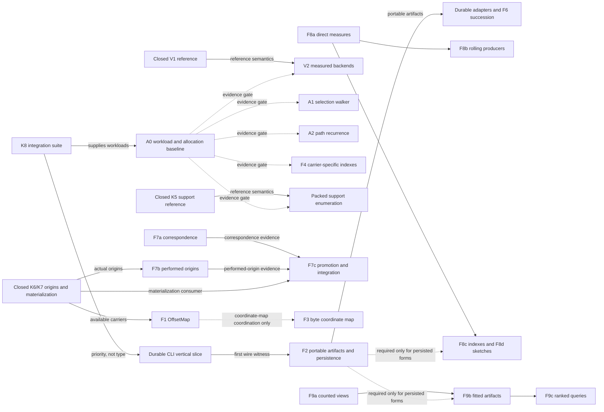

# Doccer development status registry

Living current-status index, corrected in place. Last reconciled 2026-08-10 against D1-D47,
the 2751-check source state, the roadmap, the architectural workplan, and the engine README.

This registry is the single entry point for answering:

- which development arcs are closed, active, ready, gated, optional, or merely latent;
- which historically separate labels belong to one development thread;
- what substrate already exists;
- what the next honest closure unit is; and
- whether a dependency is a type requirement, an evidence gate, a consumer trigger, or only an
  execution-priority choice.

It does not replace the other planning records:

- [decisions.md](decisions.md) owns contracts, doctrine, assurance burdens, and trigger meanings;
- [roadmap.md](roadmap.md) owns the short execution queue;
- [ledger.md](ledger.md) owns completed-item history;
- [architecture-expansion-workplan.md](architecture-expansion-workplan.md) owns the detailed
  rationale and dependency design; and
- [the engine README](../../../src/doccer/README.md) owns the implemented public contract surface.

When one of those documents changes an arc's status, this registry changes in the same chip.

## Status vocabulary

| Status | Meaning |
| --- | --- |
| **CLOSED** | Contract, reference implementation, assurance gate, and documentation are complete for the stated scope. |
| **ACTIVE** | The default execution lane. |
| **ONGOING PRACTICE** | Recurring evidence or maintenance work with no independent closure unit. |
| **READY** | No hard type blocker remains; a bounded contract, witness, or implementation chip may begin now. |
| **MEASURE-FIRST** | Reference semantics exist, but an alternate or accelerated implementation requires a named workload and baseline before source work. |
| **CONSUMER-GATED** | The remaining contract choices need one concrete producer, consumer, artifact, or corpus to avoid inventing policy. This is a prioritization default, not a permission barrier. |
| **OPTIONAL** | A coherent branch with no current commitment to execute it. |
| **TRIGGER-ONLY** | Not backlog. It activates only when a named implementation or assurance pressure occurs. |
| **UNSCHEDULED** | Named work with no present execution priority. |

`READY` means ready for its next stated closure unit, not that every later implementation in the
family is authorized. `MEASURE-FIRST` forbids performance work whose only justification is that a
faster-looking technique exists.

## Current snapshot

| Item | Status | Current truth |
| --- | --- | --- |
| K0-K7 kernel | **CLOSED** | The many-sorted reference kernel is implemented through exact-plan materialization. |
| V0/V1 vector and UTF-16 mask reference | **CLOSED** | The carrier boundary, portable backend, typed continuity, classifier uncertainty, scalar-safe harvest, and claim emission are implemented. |
| Contract harness | **CLOSED** for current scope | 2751 checks pass; the number is a deterministic assertion count and compatibility fingerprint, not a count of independent test cases. |
| K8 integration demonstrations | **ACTIVE** | This is the only default K lane. |
| O3 operational acceleration and persistence | **OPTIONAL** umbrella | O3 has no independent closure unit; its persistence/productization constituents are in Thread 1 and its measured-acceleration constituents are in Thread 2. |
| Open decisions without a decision record | **UNSCHEDULED** | Only the per-line terminator-kind derived view remains in `decisions.md`'s literal Open section. |
| Lean bootstrap | **TRIGGER-ONLY** | No current obligation has crossed the activation gate. |

No `TODO`, `FIXME`, `NotImplementedException`, or hidden partial implementation currently marks an
open Doccer source arc. Each row below separates already implemented substrate from its unlanded
next closure unit; disposable diagnostics and provisional adapters do not count as the durable
implementations they may eventually witness.

## Relationship map

The arrows below mix different dependency kinds deliberately. Edge labels distinguish an actual
type/input dependency from an evidence or priority relationship.

O3 is omitted as a graph node because it groups work rather than supplying a value or evidence
dependency. Its former constituents appear under their owning arcs below.

## Thread 1 — integration, productization, and adapter succession

This thread turns the closed in-process carriers into demonstrated compositions and, later,
portable public tools. K8 validates the composition seams; the CLI validates one cross-process
seam; F2 generalizes portable artifact identity; durable adapters consume those surfaces rather
than reimplementing them.

| Arc | Status | Existing substrate | Next closure unit | Gate and dependency meaning |
| --- | --- | --- | --- | --- |
| **K8 — cross-carrier integration** | **ACTIVE** | K2 pairing; K3/K4 graphs, partitions, policies, and residuals; K5 facts; K6 origins; K7 materialization | One integrated bounded suite covering two-family pairing with residue, an ambiguous two-path token graph, budgeted chunks, fixed macro substitution with composed origins, and depth/resource-bounded recursive expansion | No new public carrier is presumed. K8 may close as tests and recipes unless a demonstrated seam cannot be expressed. |
| **Parallel witness/census lane** | **ONGOING PRACTICE** | Provisional PowerShell DLL-reach instruments, packaged assemblies, and the abductive-census classification | Continue bounded real specimens; classify findings as latent verb, missing example, missing mechanism, or permanent adapter policy | It supplies evidence to K8, the CLI, and durable-adapter decisions. It does not freeze a public surface or become a durable adapter by accumulation. |
| **Public CLI module** | **READY** for a contract/vertical-slice chip; implementation priority follows K8 | Stable public carriers; one-way CLI-to-engine boundary committed by D13; disposable `inspect`/`relate` diagnostics; detailed return packet | Choose one carrier family, freeze a typed invocation and minimal versioned artifact, and prove produce -> second-process consume -> in-process-equivalent result | The public product is committed. Command grammar, first carrier, artifact schema, and process topology remain open design choices. The latent-manuscript schema blocks only document-stream commands. |
| **Minimal CLI wire** | **READY** with the CLI slice | Same as the CLI row | Freeze only the envelope and stamps required by the first carrier round trip | This is the first witness for F2, not a competing serialization system. |
| **F2 — portable identity and persisted artifacts** | **CONSUMER-GATED** | In-process identity choices now exist for occurrences, facts, support, plans, and origins; interning tables and mdnav sidecars are donors | Freeze the `TextMaster` commitment algorithm/version and canonical UTF-16 byte order, then specify which carrier identities and policy/result/residual stamps cross a process boundary | The first real cross-process artifact is the prioritization trigger. Persisted F8/F9 artifacts wait here; in-memory work does not. |
| **F6 — Markdown adapter and mdnav succession** | **READY** for a bounded oracle/succession contract; durable implementation priority follows the CLI and F5 | mdnav behavior and collapse points are documented; the kernel primitives it needs are closed | Refresh the fixture/inventory boundary, reproduce mdnav's admitted behavior, and exceed it at quote-nested fences, ATX/setext disagreement, multiline HTML, and the H1 × breaks relation | The Phase-2 and inventory triggers are satisfied. This remains adapter work, not kernel syntax policy; doc-dive instrument semantics stay above the engine. |
| **Durable PowerShell/LaTeX/Markdown adapters** | **CONSUMER-GATED** | Provisional DLL-reach instruments and the graduation/rewrite tests | Promote one adapter only when it collapses to Doccer capabilities plus stores and genuine domain policy | Adapters are consumers and witnesses. They do not freeze missing kernel semantics by convention. |

Canonical sources: [roadmap queue](roadmap.md#queue),
[CLI return packet](../briefs/sol-doccer-cli-module-deferred-20260809_180623.md), and
[F2/F6 registry rows](decisions.md#deferred-families-f--trigger--prioritization-default-per-d14).
O3's grouping origin is recorded in the
[optional branches](architecture-expansion-workplan.md#o3--operational-acceleration-and-persistence).

## Thread 2 — measured representation and execution backends

This thread contains performance work. V2, A1, A2, packed regions, suppression bitmaps, F4, and
packed K5 support enumeration are not independent reasons to optimize: A0 supplies the common
evidence gate, while each source chip remains carrier-specific and differentially checked against
its reference.

| Arc | Status | Existing substrate | Next closure unit | Gate and dependency meaning |
| --- | --- | --- | --- | --- |
| **A0 — workload and allocation baseline** | **READY** | Closed selection, graph, path, fact/support, vector, origin, and materialization references | Record named dense/sparse workloads, elapsed time, and allocated bytes. Include selection enumeration, graph/path execution, alternative-support enumeration, adjacency queries, and copy-heavy materialization | A0 is evidence infrastructure, not a benchmark contest or public API. |
| **A1 — sparse `ClaimSelection` walker** | **MEASURE-FIRST** | `ClaimSelection` already stores private `ulong[]` words but enumerates every basis ordinal; V1 has a tail-safe set-bit walker precedent | Walk set words by trailing-zero count and clear-lowest-bit while preserving ascending ordinal semantics | A0 must show a representative sparse cost. D30 tests remain the semantic gate. A shared internal primitive is admissible only if `BooleanVector` and `ClaimSelection` agree on lifetime and tail semantics. |
| **A2 — reconstruct-once `PathSelection` recurrence** | **MEASURE-FIRST** | Correct finite-DAG minimum-additive reference and exhaustive D37 oracle | Group edges by start boundary, retain score plus one successor, and reconstruct the selected path once | A0 must measure path density and allocation. The public objective, tie, policy, residual, and exact-basis contracts do not change. |
| **V2 — accelerated vector/mask backend** | **MEASURE-FIRST** | Closed V1 logical reference, per-bit oracles, poisoned-tail and chunk/surrogate adversaries | Admit exactly one measured backend/operation: word cascade/SWAR, `Vector<T>`/SIMD, carry-less multiplication, fused, parallel, or architecture-specific | V2 is an umbrella, not one chip. Every backend needs runtime fallback and differential agreement across logical tails, chunk boundaries, surrogate edges, uncertainty, and residue. |
| **Packed `SpanSet`** | **MEASURE-FIRST** | Interval-list reference with value equality and Boolean laws | Define the admitted master/window workload and prove the advertised encoded operations extensionally equal to the reference | This is not V2 and not an automatic common material basis. Arbitrary-input interchangeability presumptively activates its assurance burden. |
| **D3 suppression bitmap** | **MEASURE-FIRST** | `Suppression.Admitted`/`Excluded`, `Coverage(Q)`, and complement semantics | Implement only for a measured suppression workload and prove equal `SpanSet` results for the same exact selection | This is a query backend, never a claim property or second source of truth. |
| **F4 — carrier-specific indexes** | **MEASURE-FIRST** | K2/K3 reference semantics are frozen; current linear queries include support, hierarchy, resolution, path, and origin projections | Select one measured hot query and one owning carrier; build a private index without changing result identity or policy | The historical Tier-2 semantic gate is already satisfied. A0 plus a concrete hot query is the current trigger. |
| **K5 packed support/derivation enumeration** | **MEASURE-FIRST** | K5a exact fact/support identity and K5b complete finite positive saturation are closed; ECSA is only a representation precedent | Measure a workload with many alternative supports, then define one private persistent/packed representation that preserves exact fact identity, support completeness, and deterministic enumeration | The former K5 type gate is satisfied. A0 evidence plus an actual enumeration/storage problem is still required; this is not a generic proof-DAG contract. |
| **Per-capability HPC repertoire** | **TRIGGER-ONLY** | Recorded patterns: span destinations, exact count/prefix/fill allocation, flat/SoA layouts, owned scratch, bounded heaps, online reductions, deterministic parallel state, reference/fast pairing | Apply one pattern inside an admitted capability when its workload justifies it | No generic HPC framework is planned. Extract a shared primitive after two consumers agree on semantics and ownership. |

Canonical sources: [V0-V2](architecture-expansion-workplan.md#v0v2--boolean-vectors-and-utf-16-unit-masks),
[A0-A2](architecture-expansion-workplan.md#a0a2--measured-backend-work-and-transfer-repertoire),
[assurance triggers](roadmap.md#queue), and the
[O3 umbrella](architecture-expansion-workplan.md#o3--operational-acceleration-and-persistence).

## Thread 3 — transformation, correspondence, and provenance

This thread distinguishes three facts that earlier plans often conflated: coordinate projection,
computed similarity/correspondence, and historical origin. F1 maps coordinates through one
restricted monotone transform; F7a computes correspondence evidence; F7b records origins emitted
by the producer that actually performed a transform; F7c explicitly promotes or consumes those
claims. F3 separately maps decoded text coordinates to source bytes.

| Arc | Status | Existing substrate | Next closure unit | Gate and dependency meaning |
| --- | --- | --- | --- | --- |
| **F1 — `OffsetMap`** | **READY** for a contract chip | Draft `Exact | Range | Unmapped` point results; identity/expand/contract/delete/insert segments; explicit span-projection policies; K6/K7 stage carriers | Adjudicate endpoint identity, direction, total coverage/segment invariants, whether boundary ambiguity is distinct from general range ambiguity, composition, and the typed span-projection/residual result; implement one normalization witness | The first edit or normalization job is the shaping consumer. `TextMaster` remains unchanged and normalization remains explicit. |
| **F3 — byte addressing** | **CONSUMER-GATED** | UTF-16 `TextMaster` coordinates and the distinct F1 draft | Define a bytes <-> code-units encoding map retaining source encoding and decode-error fidelity | Triggered by byte-exact reproduction or provenance. It never becomes a field bolted onto `TextMaster`, and it is not a Unicode-form map. |
| **F7a — distance/correspondence** | **READY** for a bounded contract/witness | Current masters, spans, vectors, and policies | Choose one exact or thresholded distance plus a correspondence/edit-script result retaining ambiguity, unmatched residue, cost/tie policy, and resource bound | Correspondence is evidence, not provenance. Numeric distance-only kernels belong to F8a; correspondence-producing results belong here. |
| **F7b — performed-transform origins** | **READY** for a bounded producer witness | Closed K6 origin basis/relation and K7 stage/materialization contracts | Have a real producer, preferably the same normalization witness as F1, emit actual origins plus loss/unmapped residue | Producer observation licenses origin. Equal text, edit distance, or post-hoc alignment does not. |
| **F7c — explicit promotion and materialization integration** | **CONSUMER-GATED** | Closed K6/K7 carriers; F7a and F7b result shapes remain to land | Define an explicit promotion object/policy that retains assumptions, ambiguity, unmatched evidence, and resources, then feed promoted or performed origins into K7 | Hard K6/K7 type blockers are gone. The missing input is a named correspondence or performed-transform carrier. |
| **O1 — fixed linear ET compilation** | **OPTIONAL** | K7 now supplies output programs and origins | Define a restricted recognizer/compiler for one fixed adapter profile and instrument output births | No full polyregular ET, document-defined recursion, or stage fusion is implied. |

Canonical sources: [F1-F7 rows](decisions.md#deferred-families-f--trigger--prioritization-default-per-d14),
[F7 split](architecture-expansion-workplan.md#f7--correspondence-and-derived-origins), and
[optional ET branch](architecture-expansion-workplan.md#o1--fixed-linear-et-compilation).

## Thread 4 — comparison, candidate discovery, statistics, and ranking

This thread separates exact values and measures from candidate generation, approximate summaries,
fitted population artifacts, and ranking policy. Positive heuristic or approximate matches never
become proof without exact verification.

| Arc | Status | Existing substrate | Next closure unit | Gate and dependency meaning |
| --- | --- | --- | --- | --- |
| **F8a — direct comparison and hash substrate** | **READY** for a small contract/witness | Text, vectors, spans, selections, and current exact identity hash are available | Admit one measure or hash with explicit domain, exact/heuristic role, empty/zero convention, direction, normalization, and bounds | D1 identity remains separate. Edit distance here is a scalar comparison kernel; a correspondence-producing edit script belongs to F7a. |
| **F8b — rolling/content-defined producers** | **READY** after or with its F8a primitive | Same current carriers | Admit one rolling/prefix fingerprint or content-defined boundary producer with algorithm/version, seed/trigger, coordinate basis, and exact verification | A positive prefilter hit is always verified before exact equality. |
| **F8c — signatures and candidate indexes** | **CONSUMER-GATED** | Current populations can support in-memory witnesses | Choose one candidate problem and stamp preprocessing, parameters, recall/verification role, and bounded top-K behavior | Persisted indexes wait for F2; in-memory candidates do not. |
| **F8d — streaming sketches** | **CONSUMER-GATED** | Current populations can support in-memory witnesses | Choose one stream and define key projection, population, error, saturation, and merge semantics | Bloom, Count-Min, and HyperLogLog-like values never masquerade as exact selections. Persisted forms wait for F2. |
| **F9a — counted/online views** | **READY** for a current-population witness | Batches, selections, facts, and origins supply possible populations | Admit one exact histogram/frequency or Welford-style accumulator with named population, key, grain, overflow, and merge rule | D8/D10 decide kernel versus adjacent placement per capability. |
| **F9b — fitted feature artifacts** | **CONSUMER-GATED** | F9a is not yet landed | Freeze one immutable vocabulary/column/population artifact and its smoothing, normalization, direction, window, and OOV/residual policy | Fact/origin recipes wait only for their named carriers, which now exist; the missing requirement is a real fitted consumer. Persisted forms wait for F2. |
| **F9c — ranked queries** | **CONSUMER-GATED** | Requires a named candidate and feature artifact | Define exact/approximate score, candidate population, tie rule, top-K completeness, and verification behavior | Ranking is a policy-bearing result, never an implicit property of a feature vector. |
| **F5 — Tier-2/3 agreement and acceptance** | **READY** for a bounded producer-pair contract/witness | K4 result/policy/residual shapes are closed; ATX/setext and mdnav evidence identify the first honest producer pair | Refresh or construct the two producer populations and freeze agreement/tolerance vocabulary without collapsing disagreement | The Markdown inventory trigger is satisfied. This feeds F6's succession but does not require a generic scoring framework. |

Canonical sources: [F8](architecture-expansion-workplan.md#f8--direct-comparison-hashes-indexes-and-sketches),
[F9](architecture-expansion-workplan.md#f9--statistical-features-and-ranked-views), and
[F5 row](decisions.md#deferred-families-f--trigger--prioritization-default-per-d14).

## Thread 5 — derived facts, small views, and assurance

| Arc | Status | Existing substrate | Next closure unit | Gate and dependency meaning |
| --- | --- | --- | --- | --- |
| **F-UCD — Unicode Block/Script facts** | **READY** for its provenance decision | Scalar atoms, general-category facts, and break-key views | Record pinned UCD version, source/table provenance, generated-data procedure, and lazy-loading contract; then land ordinary `AtomFacts` selectors | No universal register column or math-channel dependency is introduced. |
| **Per-line terminator-kind view** | **UNSCHEDULED** | D15 fixes `PerLine` content extent and preserves terminator atoms | Decide whether a consumer warrants one named derived fact exposing LF, CRLF, CR, NEL, LS, PS, or none | This is the only item in the literal Open section without its own decision record. |
| **Further named density measures** | **CONSUMER-GATED** | Gap cadence is implemented and D8 fixes the admission doctrine | Name one measure with numerator, denominator, window basis, boundary policy, and exclusions | No generic `Density` carrier or verb is planned. |
| **Callable runtime Tier-1 law runner** | **UNSCHEDULED** | The contract harness owns reconstruction, line consistency, suppression, determinism, and interning laws; `ValidateIntrinsic` exposes only atom coverage and claim bounds | Define which harness laws are meaningful and affordable as runtime validation, if a consumer needs them | This is discretionary and must not imply that every exhaustive oracle becomes a runtime check. |
| **O2 — qualitative constraint networks** | **OPTIONAL** | K1 Allen values and composition are closed | Admit one uncertain/disjunctive geometry consumer and one tractable fragment before designing closure/solving APIs | Concrete geometry continues to use exact joins and validators. |
| **L0 — Lean bootstrap** | **TRIGGER-ONLY** | Restart procedure and candidate theorem families are recorded | Select exactly one load-bearing obligation only after it can change a signature, license optimization/fusion, resolve an exact/lax boundary, or support a nontrivial global guarantee | Lean is not an evergreen parallel implementation lane. |
| **`math-register` terminology migration** | **UNSCHEDULED** repository hygiene | D40 restores `register` to codepoint-address meaning and separates the math channel | Rename legacy paths when the owning repository migration is scheduled | This creates no Doccer type or sequencing dependency. |

Canonical sources: [D4/D8/D15](decisions.md#decisions),
[the literal Open section](decisions.md#open-no-decision-record-yet), and
[the Lean lane](architecture-expansion-workplan.md#7-deferred-lean-rigor-lane).

## Cross-thread seams requiring explicit ownership

These are not additional arcs. They are boundaries that must be settled in the first relevant
chip so two nearby families do not duplicate one mechanism under different names.

| Seam | Required ownership |
| --- | --- |
| **F7a vs F8a edit distance** | F8a owns numeric comparison kernels used for filtering/scoring. F7a owns correspondence-producing paths/scripts, ambiguity, unmatched residue, and cost/tie/resource policy. A shared primitive is internal only after both public contracts agree. |
| **F1 vs F7b normalization** | F1 owns a restricted monotone coordinate-query interface. F7b owns producer-attested historical origins and loss. One normalization producer may emit both values, but neither is inferred from the other without an explicit proved/helper contract. |
| **CLI wire vs F2 persistence** | The first CLI artifact is the bounded wire witness. F2 absorbs and generalizes its portable identity rules; it does not invent a second envelope in parallel. |
| **A0 vs every acceleration family** | A0 is an evidence edge into A1, A2, V2, packed regions, suppression bitmaps, and F4 even where the older dependency DAG omitted the arrow. |
| **F4 vs carrier ownership** | An index belongs to the carrier/query whose semantics it accelerates. F4 is a family label, not a common index service. |
| **F8/F9 kernel placement** | D8/D10 admit one named capability at a time. A measure, fitted artifact, or ranking policy is not kernel work merely because current carriers can host it. |

## Latent extensions — not scheduled arcs

The following phrases appear in assurance triggers or explicit non-goals. They do not represent
active backlog and should not be assigned a chip until a concrete pressure reclassifies them:

- public Boolean-vector word layout or a generalized common-basis/material mask;
- a second path objective, signed/vector objective algebra, partial-path guarantee, maximum-weight
  selection, fewest-edge selection, or a universal selection solver;
- global structural optimization, hierarchy transitive closure/reduction laws, or resolution-map
  composition/equivalence;
- variable-bearing or callback saturation, or alternate parallel/incremental/compressed
  saturation;
- compressed/functional origin backends, automatic slot lifting, stage fusion, or intermediate
  master elision;
- streaming/fused/incremental/parallel/compressed materialization or a flattened stage-chain
  synthesis/residue carrier;
- a generic qualitative-calculus framework before a second calculus exists;
- grapheme, byte, or normalization coordinates folded into `TextMaster`;
- full polyregular ET, unrestricted TeX expansion, confluence, or arbitrary macro termination;
  and
- durable domain adapters promoted before their engine/CLI boundary is demonstrated.

## Current review and execution order

This is the registry view of the roadmap's current priority, not an additional independent queue.

1. **K8 plus A0 instrumentation:** close the cross-carrier seam audit and acquire the first
   representative selection/path/materialization workload evidence.
2. **F1 plus one F7b performed-transform witness:** use explicit normalization or another bounded
   transform to keep coordinate projection, actual origins, and loss distinct while exercising
   them together.
3. **One durable CLI artifact round trip:** choose the first carrier after K8, then use that wire
   witness to open the broader F2 portable-identity contract.
4. **Select A1, A2, V2, packed regions, suppression, F4, or packed K5 enumeration from
   measurements:** no technique wins priority merely because its source change is obvious.
5. **Select F7a, F8a/F8b, F9a, F-UCD, or the bounded F5/F6 contracts by review value; pull broader
   F8/F9 implementation from named consumers:** bounded contract witnesses remain legal under
   D14, while broad implementation stays consumer-shaped.

## Maintenance procedure

For every chip that changes an arc:

1. update the row's status, existing substrate, next closure unit, and gate here;
2. update the short execution priority in [roadmap.md](roadmap.md) if priority changed;
3. record new or superseding contract law in [decisions.md](decisions.md);
4. add the completed chip to [ledger.md](ledger.md);
5. update the detailed dependency/rationale in the workplan only when the architecture changed;
6. update the engine README only when the implemented public surface changed; and
7. keep runstamped briefs and discussions as evidence rather than alternate current-status lists.
