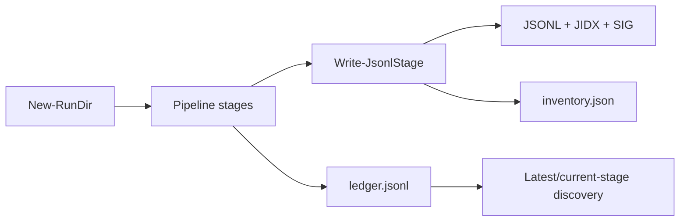
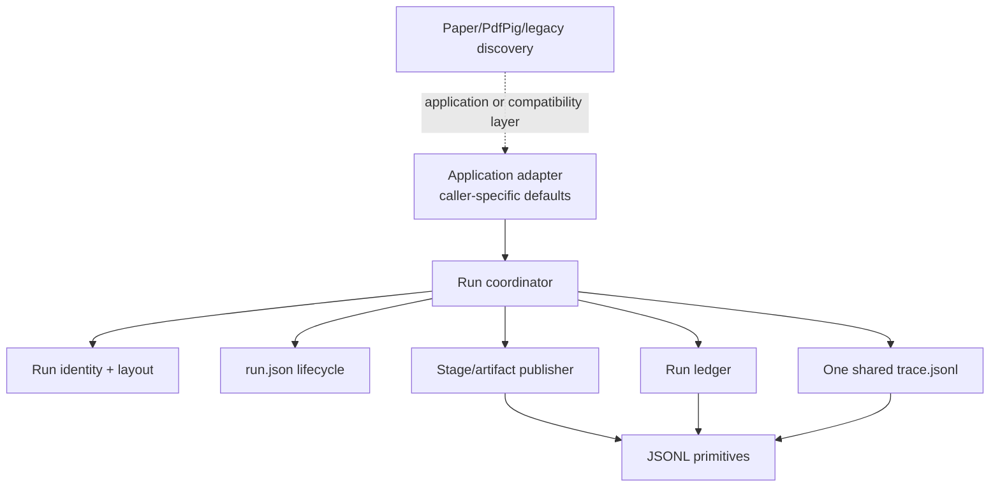

<!-- xid: 019fc923-3d9f-7e91-b16e-cd2cf2f2c708-0000 -->

# i just implemented a shared logger in codex-scientiae `D:\aghado01\codex-scientiae\issues\loggers\fable-logger-initial-implementation-20260803.md` is the discussion file. I want to review the implementation so far and work on follow up items, including porting the jsonl file handling capabilities that are missing by potentially lifting some primitives from my jso-jackson tools `D:\aghado01\utils\jso-jackson` and/or the chat export children of it under that directory (claude-export and/or codex-export) `D:\aghado01\utils\jso-jackson` and add to either the logger itself or incorporate into the shared jsonl utility under src/shared. lets review and scope next steps

**[tool: exec]**
```json
 ... [truncated]
```

**[result: call_UKl1dSRB4oR...]**
```text
[{"type":"input_text","text":"Script completed\nWall time 2.1 seconds\nOutput:\n"},{"type":"input_text","text":"Now the Pester battery:\r\n\r\nPester here is v6, which forbids root-level `BeforeEach`/`AfterEach` — wrapping the suites in one outer `Describe` fixes it:\r\n\r\nDone — the logger landed as a shared substrate, committed as `32794a5` with 16/16 tests passing.\r\n\r\n**On the prior art:** your suspicion was right — `RepoLogger.psm1` and `NaturalLogger.psm1` are the same class line-for-line (Natural just adds an alias plus `Export-ModuleMember` lines that don't actually work — there's no `-Class` parameter). `CyberneticLogger` was the interesting one: JSONL records, multiple sinks. The adaptation takes RepoLogger's file-first shape and CyberneticLogger's JSONL records, rebuilt on house invariants.\r\n\r\n**What was built** — [log.ps1](src/shared/log.ps1), a dot-sourced sibling of `runs.ps1`/`jsonl.ps1`, plus [log.Tests.ps1](tests/shared/log.Tests.ps1):\r\n\r\n- **One JSONL trace per run**, records shaped `{ts, el, lvl, comp, msg, data?}` — `el` is milliseconds since run start, the execution-trace clock. JSONL because you asked for parseable/scannable/sliceable: `Get-JsonlSchema` and your jso-jackson utilities speak it natively, and a `Get-RunLog` slicer (`-MinLevel`, `-Component`) is included.\r\n- **Console stays quiet**: the file records everything, stderr mirrors warn+ only, and _stdout is never touched_ — your lanes emit data there and the MCP servers speak protocol there, so a logger writing to stdout would corrupt both.\r\n- **Sink resolution ladder**: `-LogPath` → `-RunDir` (drops `trace.jsonl` into a run dir you already minted via `New-ModuleRunDir`) → `$env:CODEX_RUNLOG_DIR` (a child process joins its parent's run as `trace-{module}-{pid}.jsonl` — one file per process, never a shared handle, which matters given your multi-agent concurrency) → minted `artifacts/{module}/logs/{stamp}.jsonl` (already gitignored wholesale).\r\n- **Configurable without touching call sites**: `-FileLevel`/`-ConsoleLevel` params, overridable per run by `CODEX_RUNLOG_LEVEL` / `CODEX_RUNLOG_CONSOLE` (`off` disables a sink).\r\n- **`Measure-RunStep 'name' { … }`** — timed scopes that log duration and ok/fail, and _rethrow_ on exception (the trace observes, never swallows).\r\n- A second `Start-RunLog` in-process **joins** the live context, so composed lanes trace into one file; `-Force` replaces. Logging before any `Start` is safe — warn+ still reaches stderr.\r\n- Appends are per-record `[File]::AppendAllText` — crash-safe, no handle discipline; UTF-8-no-BOM, LF (byte-checked in tests, SMP/ligature round-trip included).\r\n\r\nTypical wiring:\r\n\r\n```powershell\r\n. \"$PSScriptRoot/../shared/log.ps1\"\r\n$runDir = New-ModuleRunDir 'latex-ingest' $slug\r\nStart-RunLog -Module latex-ingest -RunDir $runDir | Out-Null\r\nMeasure-RunStep 'unpack' { ... }\r\nWrite-RunLog 'channel batch' -Data @{ channels = 3 }\r\nStop-RunLog\r\n```\r\n\r\nTwo things you may want next, when you're ready: retiring the four duplicated `Write-Log` stderr one-liners in the MCP servers (reader/arxiv/scholar/zenodo) in favor of this, and first real wiring into latex-ingest since it already mints module run dirs. I left all call sites untouched — integration order felt like your call.\r\n\r\nOne environment discovery: bare `Invoke-Pester` now resolves **Pester 6.0.0** (not 5), which rejects root-level `BeforeEach` — I hit it, restructured the tests, and updated the stale memory accordingly.\r\n\n--- RELEVANT FILES ---\r\nD:\\aghado01\\codex-scientiae\\tests\\shared\\md-sentinels.Tests.ps1\nD:\\aghado01\\codex-scientiae\\tests\\shared\\md-anchor.Tests.ps1\nD:\\aghado01\\codex-scientiae\\tests\\shared\\masks.Tests.ps1\nD:\\aghado01\\codex-scientiae\\tests\\shared\\log.Tests.ps1\nD:\\aghado01\\codex-scientiae\\tests\\shared\\encoding-invariants.Tests.ps1\nD:\\aghado01\\codex-scientiae\\tests\\fixtures\\2408.16741v2.refs.golden.jsonl\nD:\\aghado01\\codex-scientiae\\issues\\result.jsonl\nD:\\aghado01\\codex-scientiae\\src\\shared\\runs.ps1\nD:\\aghado01\\codex-scientiae\\src\\shared\\md-sentinels.ps1\nD:\\aghado01\\codex-scientiae\\src\\shared\\md-anchor.ps1\nD:\\aghado01\\codex-scientiae\\src\\shared\\masks.ps1\nD:\\aghado01\\codex-scientiae\\src\\shared\\log.ps1\nD:\\aghado01\\codex-scientiae\\src\\shared\\jsonl.ps1\nD:\\aghado01\\codex-scientiae\\src\\shared\\crawl.ps1\nD:\\aghado01\\codex-scientiae\\tests\\fixtures\\chunks\\legacy.chunks.jsonl\nD:\\aghado01\\codex-scientiae\\tests\\fixtures\\chunks\\current.chunks.jsonl\nD:\\aghado01\\codex-scientiae\\issues\\doccer\\briefs\\fable-doccer-t3cd-brief-20260802_012056.md\nD:\\aghado01\\codex-scientiae\\issues\\doccer\\briefs\\fable-doccer-t3b-brief-20260802_011103.md\nD:\\aghado01\\codex-scientiae\\issues\\doccer\\briefs\\fable-doccer-t3a-brief-20260802_005408.md\nD:\\aghado01\\codex-scientiae\\issues\\doccer\\briefs\\fable-doccer-dev-brief-20260801_222912.md\nD:\\aghado01\\codex-scientiae\\issues\\doccer\\discussions\\fable-et-framework-close-read-20260803.md\nD:\\aghado01\\codex-scientiae\\issues\\doccer\\discussions\\fable-doccer-review-20260802.md\nD:\\aghado01\\codex-scientiae\\issues\\doccer\\discussions\\fable-doccer-harvest-summary-20260802.md\nD:\\aghado01\\codex-scientiae\\issues\\doccer\\discussions\\fable-doccer-harvest-seed-20260802.md\nD:\\aghado01\\codex-scientiae\\issues\\doccer\\discussions\\fable-doccer-formalizations-20260803.md\nD:\\aghado01\\codex-scientiae\\issues\\formulas.jsonl\nD:\\aghado01\\codex-scientiae\\issues\\loggers\\fable-logger-initial-implementation-20260803.md\nD:\\aghado01\\codex-scientiae\\issues\\eval-spinoff\\promotion-candidates.jsonl\nD:\\aghado01\\codex-scientiae\\bibliotecha\\corpora\\KisungYou\\2605.20681v1.chunks.jsonl\nD:\\aghado01\\codex-scientiae\\ingestion\\_markdown\\2408.16741v2\\2408.16741v2.toc.jsonl\n"}]
```

**[tool: exec]**
```json
 ... [truncated]
```

**[result: call_VKoLWeLwXj4...]**
```text
[{"type":"input_text","text":"Script completed\nWall time 1.5 seconds\nOutput:\n"},{"type":"input_text","text":"Warning: truncated output (original token count: 12467)\nTotal output lines: 798\n\n?? issues/loggers/\n32794a5 shared run-log substrate: per-run JSONL execution trace (src/shared/log.ps1)\n src/shared/log.ps1         | 216 +++++++++++++++++++++++++++++++++++++++++++++\n tests/shared/log.Tests.ps1 | 180 +++++++++++++++++++++++++++++++++++++\n 2 files changed, 396 insertions(+)\n\n--- log.ps1 ---\r\n#requires -Version 7.0\r\n<#\r\n  src/shared/log.ps1 — per-run execution trace, as a shared substrate.\r\n\r\n  Any codex process gets ONE trace file per run — JSONL, one record per line — and a\r\n  near-silent console: the file records everything, stderr mirrors warn+ only, and stdout is\r\n  never touched (lane scripts emit data there and the MCP servers speak protocol there; a\r\n  logger that writes to stdout corrupts both). Adapted from the ps.core.tooldig loggers —\r\n  RepoLogger's file-first shape, CyberneticLogger's JSONL records — rebuilt on house\r\n  invariants: UTF-8-no-BOM, LF, explicit .NET I/O.\r\n\r\n  Record shape (slice with Get-RunLog here, Get-JsonlSchema in src/shared/jsonl.ps1, or the\r\n  jso-jackson utilities):\r\n    { ts, el, lvl, comp, msg, data? }\r\n  el = ms elapsed since Start-RunLog — the execution trace's clock; comp defaults to the\r\n  module and is overridden per call when a sub-area speaks.\r\n\r\n  Sink resolution, first hit wins:\r\n    -LogPath <file>          exactly there\r\n    -RunDir <dir>            trace.jsonl inside a run dir the caller already minted\r\n                             (New-ModuleRunDir / New-RunDir in src/shared/runs.ps1)\r\n    $env:CODEX_RUNLOG_DIR    a parent process's run dir; the child lands beside the parent\r\n                             as trace-{module}-{pid}.jsonl — never a shared handle\r\n    (minted)                 artifacts/{module}/logs/{stamp}.jsonl — regenerable tier,\r\n                             gitignored wholesale\r\n\r\n  Config: -FileLevel / -ConsoleLevel on Start-RunLog; $env:CODEX_RUNLOG_LEVEL and\r\n  $env:CODEX_RUNLOG_CONSOLE override per run without touching call sites ('off' disables a\r\n  sink). Appends are per-record ([File]::AppendAllText — crash-safe, no handle discipline,\r\n  safe under the multi-agent concurrency this repo actually runs).\r\n\r\n  A second Start-RunLog in the same process JOINS the live context, so composed lanes\r\n  (latex-ingest sourcing tex-render) trace into one file; -Force replaces it. Write-RunLog\r\n  before any Start is safe: warn+ still reaches stderr, the file sink is just off — shared\r\n  substrate may log opportunistically without demanding its host started a run.\r\n\r\n  Dot-source to use:  . \"$PSScriptRoot/../shared/log.ps1\"\r\n#>\r\n\r\n$script:RunLogLevels = @{ trace = 0; debug = 1; info = 2; warn = 3; error = 4 }\r\n$script:RunLog = $null          # live context: Path, Module, FileLevel, ConsoleLevel, Clock, Counts\r\n$script:RunLogNoticed = $false  # one-time \"not started\" stderr notice\r\n\r\n# level name -> rank; '' -> fallback (env unset), 'off' -> 99 (sink disabled)\r\nfunction Resolve-RunLogLevel([string]$Name, [int]$Fallback) {\r\n    if ([string]::IsNullOrWhiteSpace($Name)) { return $Fallback }\r\n    $n = $Name.Trim().ToLowerInvariant()\r\n    if ($n -eq 'off') { return 99 }\r\n    if ($script:RunLogLevels.ContainsKey($n)) { return $script:RunLogLevels[$n] }\r\n    return $Fallback\r\n}\r\n\r\n# stderr only — split out so tests can capture/mock the mirror without touching the file sink\r\nfunction Write-RunLogConsole([string]$Level, [string]$Component, [string]$Message) {\r\n    $tag = $Level.ToUpperInvariant().PadRight(5)\r\n    $c = if ($Component) { \"[$Component] \" } else { '' }\r\n    [Console]::Error.WriteLine(\"$tag $c$Message\")\r\n}\r\n\r\nfunction Start-RunLog {\r\n    <#\r\n    .SYNOPSIS  Open the per-run trace sink; returns the log path.\r\n    #>\r\n    [CmdletBinding()]\r\n    param(\r\n        [Parameter(Mandatory)] [string] $Module,\r\n        [string] $RunDir = '',\r\n        [string] $LogPath = '',\r\n        [ValidateSet('trace', 'debug', 'info', 'warn', 'error', 'off')] [string] $FileLevel = 'trace',\r\n        [ValidateSet('trace', 'debug', 'info', 'warn', 'error', 'off')] [string] $ConsoleLevel = 'warn',\r\n        [System.Collections.IDictionary] $Data,\r\n        [switch] $Export,   # export the log's dir as CODEX_RUNLOG_DIR so spawned children join this run\r\n        [switch] $Force\r\n    )\r\n    if ($script:RunLog -and -not $Force) {\r\n        Write-RunLog -Level debug -Component $Module -Message \"joined live run log (started by $($script:RunLog.Module))\"\r\n        return $script:RunLog.Path\r\n    }\r\n\r\n    $path = $LogPath\r\n    if (-not $path) {\r\n        $dir = $RunDir\r\n        if (-not $dir -and $env:CODEX_RUNLOG_DIR) { $dir = $env:CODEX_RUNLOG_DIR }\r\n        if ($dir) {\r\n            $path = Join-Path $dir 'trace.jsonl'\r\n            # taken = another process owns it (runs are immutable-new, so a fresh run dir never\r\n            # collides with itself) — land beside it, never share the file\r\n            if (Test-Path -LiteralPath $path) { $path = Join-Path $dir \"trace-$Module-$PID.jsonl\" }\r\n        } else {\r\n            # mirrors Get-ArtifactsRoot (src/shared/runs.ps1) without dragging the crawler in\r\n            $logsRoot = Join-Path ([System.IO.Path]::GetFullPath((Join-Path $PSScriptRoot '../..'))) 'artifacts' $Module 'logs'\r\n            $stamp = Get-Date -Format 'yyyyMMdd_HHmmss'\r\n            $path = Join-Path $logsRoot \"$stamp.jsonl\"\r\n            $n = 1\r\n            while (Test-Path -LiteralPath $path) { $n++; $path = Join-Path $logsRoot \"$stamp-$n.jsonl\" }\r\n        }\r\n    }\r\n    $dirName = [System.IO.Path]::GetDirectoryName($path)\r\n    if ($dirName -and -not (Test-Path -LiteralPath $dirName)) {\r\n        New-Item -ItemType Directory -Force -Path $dirName | Out-Null\r\n    }\r\n\r\n    $script:RunLog = @{\r\n        Path         = $path\r\n        Module       = $Module\r\n        FileLevel    = Resolve-RunLogLevel $env:CODEX_RUNLOG_LEVEL (Resolve-RunLogLevel $FileLevel 0)\r\n        ConsoleLevel = Resolve-RunLogLevel $env:CODEX_RUNLOG_CONSOLE (Resolve-RunLogLevel $ConsoleLevel 3)\r\n        Clock        = [System.Diagnostics.Stopwatch]::StartNew()\r\n        Counts       = @{ trace = 0; debug = 0; info = 0; warn = 0; error = 0 }\r\n    }\r\n    if ($Export) { $env:CODEX_RUNLOG_DIR = $dirName }\r\n\r\n    $start = [ordered]@{ module = $Module; pid = $PID }\r\n    if ($Data) { foreach ($k in $Data.Keys) { $start[$k] = $Data[$k] } }\r\n    Write-RunLog -Level info -Message 'run start' -Data $start\r\n    return $path\r\n}\r\n\r\nfunction Write-RunLog {\r\n    <#\r\n    .SYNOPSIS  One trace record. File sink gets everything >= FileLevel; stderr mirrors >= ConsoleLevel.\r\n    #>\r\n    [CmdletBinding()]\r\n    param(\r\n        [Parameter(Mandatory, Position = 0)] [string] $Message,\r\n        [ValidateSet('trace', 'debug', 'info', 'warn', 'error')] [string] $Level = 'info',\r\n        [string] $Component = '',\r\n        [System.Collections.IDictionary] $Data\r\n    )\r\n    $ctx = $script:RunLog\r\n    $lvl = $script:RunLogLevels[$Level]\r\n    if (-not $ctx) {\r\n        # not started: file sink off, but a warn/error must never vanish\r\n        if (-not $script:RunLogNoticed) {\r\n            $script:RunLogNoticed = $true\r\n            [Console]::Error.WriteLine('run log not started - file sink off (warn+ still mirrors here)')\r\n        }\r\n        if ($lvl -ge 3) { Write-RunLogConsole $Level $Component $Message }\r\n        return\r\n    }\r\n    $ctx.Counts[$Level]++\r\n    $comp = if ($Component) { $Component } else { $ctx.Module }\r\n    if ($lvl -ge $ctx.FileLevel) {\r\n        $rec = [ordered]@{\r\n            ts   = Get-Date -Format 'yyyy-MM-ddTHH:mm:ss.fffzzz'\r\n            el   = $ctx.Clock.ElapsedMilliseconds\r\n            lvl  = $Level\r\n            comp = $comp\r\n            msg  = $Message\r\n        }\r\n        if ($Data) { $rec['data'] = $Data }\r\n        $json = $rec | ConvertTo-Json -Compress -Depth 8\r\n        [System.IO.File]::AppendAllText($ctx.Path, $json + \"`n\", [System.Text.UTF8Encoding]::new($false))\r\n    }\r\n    if ($lvl -ge $ctx.ConsoleLevel) { Write-RunLogConsole $Level $comp $Message }\r\n}\r\n\r\nfunction Measure-RunStep {\r\n    <#\r\n    .SYNOPSIS  Timed scope: step start at trace, step end at debug with ms; an exception logs\r\n               error (ok=false, duration kept) and RETHROWS — the trace observes, never swallows.\r\n    #>\r\n    [CmdletBinding()]\r\n    param(\r\n        [Parameter(Mandatory, Position = 0)] [string] $Name,\r\n        [Parameter(Mandatory, Position = 1)] [scriptblock] $Script,\r\n        [string] $Component = ''\r\n    )\r\n    Write-RunLog -Level trace -Component $Component -Message \"step start: $Name\"\r\n    $sw = [System.Diagnostics.Stopwatch]::StartNew()\r\n    try {\r\n        $result = & $Script\r\n        Write-RunLog -Level debug -Component $Component -Message \"step end: $Name\" -Data @{ step = $Name; ms = $sw.ElapsedMilliseconds; ok = $true }\r\n        return $result\r\n    } catch {\r\n        Write-RunLog -Level error -Component $Component -Message \"step failed: $Name - $($_.Exception.Message)\" -Data @{ step = $Name; ms = $sw.ElapsedMilliseconds; ok = $false }\r\n        throw\r\n    }\r\n}\r\n\r\nfunction Stop-RunLog {\r\n    <#\r\n    .SYNOPSIS  Final record (total ms + warn/error counts), close the context; returns the path.\r\n    #>\r\n    [CmdletBinding()]\r\n    param([System.Collections.IDictionary] $Data)\r\n    $ctx = $script:RunLog\r\n    if (-not $ctx) { return $null }\r\n    $summary = [ordered]@{ ms = $ctx.Clock.ElapsedMilliseconds; warn = $ctx.Counts['warn']; error = $ctx.Counts['error'] }\r\n    if ($Data) { foreach ($k in $Data.Keys) { $summary[$k] = $Data[$k] } }\r\n    Write-RunLog -Level info -Message 'run end' -Data $summary\r\n    $script:RunLog = $null\r\n    return $ctx.Path\r\n}\r\n\r\nfunction Get-RunLog {\r\n    <#\r\n    .SYNOPSIS  Parse a trace back to objects; -MinLevel / -Component slice it.\r\n    #>\r\n    [CmdletBinding()]\r\n    param(\r\n        [Parameter(Mandatory, Position = 0)] [string] $Path,\r\n        [ValidateSet('trace', 'debug', 'info', 'warn', 'error')] [string] $MinLevel = 'trace',\r\n        [string] $Component = ''\r\n    )\r\n    $min = $script:RunLogLevels[$MinLevel]\r\n    $out = [System.Collections.Generic.List[object]]::new()\r\n    foreach ($line in [System.IO.File]::ReadLines($Path)) {\r\n        if ([string]::IsNullOrWhiteSpace($line)) { continue }\r\n        $r = $line | ConvertFrom-Json\r\n        if ($script:RunLogLevels[$r.lvl] -lt $min) { continue }\r\n        if ($Component -and $r.comp -ne $Component) { continue }\r\n        $out.Add($r)\r\n    }\r\n    return $out\r\n}\r\n\n--- jsonl.ps1 ---\r\n#requires -Version 7.0\r\n<#\r\n  src/jsonl.ps1 — JSONL stage substrate for the IR workflow.\r\n\r\n  Lifted and corrected from the jso-jackson archaeology and owned fresh here —\r\n  nothing under .legacy is on the import path. Each pipeline stage emits three\r\n  coordinated artifacts:\r\n    - the JSONL (one record per line),\r\n    - a .jidx byte-offset seek index (JSOI format: 'JSOI' + int32 version(1) +\r\n      int32 lineCount + int64[] line-start offsets, little-endian), and\r\n    - a .sig provenance stamp (source hash + stage + count) so a stage's output can\r\n      be checked stale against its input — the source fingerprint the original\r\n      .jidx never carried.\r\n\r\n  Dot-source to use:  . \"$PSScriptRoot/jsonl.ps1\"\r\n\r\n  ENCODING + DETERMINISM INVARIANTS (enforced by tests/shared/encoding-invariants.Tests.ps1 — run it\r\n  after ANY change here): UTF-8-no-BOM everywhere; SMP/ligature/U+FFFD codepoints round-trip\r\n  byte-exact; the Newtonsoft fast path and ConvertTo-Json produce IDENTICAL bytes (PS7's cmdlet\r\n  = Newtonsoft + StringEscapeHandling.Default — NOT EscapeHtml); .jidx offsets are exact over\r\n  multibyte content; same records written twice = identical .jsonl AND .jidx bytes. The known\r\n  poison: PIPELINE-emitted values are PSObject-wrapped and must never be stored into records\r\n  (if-expressions, @() over collections, and hashtable members are safe — tested).\r\n#>\r\n\r\nclass JsonlIndex {\r\n    [string] $Path\r\n    [int]    $LineCount\r\n    hidden [long[]] $Offsets\r\n\r\n    # Write line-start offsets as a JSOI index file.\r\n    static [void] WriteIndex([string]$IndexPath, [System.Collections.Generic.List[long]]$Offsets) {\r\n        $fs = [System.IO.File]::Create($IndexPath)\r\n        $bw = [System.IO.BinaryWriter]::new($fs)\r\n        try {\r\n            $bw.Write([System.Text.Encoding]::ASCII.GetBytes('JSOI'))\r\n            $bw.Write([int]1)\r\n            $bw.Write([int]$Offsets.Count)\r\n            foreach ($o in $Offsets) { $bw.Write([long]$o) }\r\n        } finally { $bw.Dispose(); $fs.Dispose() }\r\n    }\r\n\r\n    # Byte-scan a JSONL for line-start offsets and write the JSOI index — no parse.\r\n    # ([Array]::IndexOf hops newline-to-newline natively; a per-byte PS loop cost 17.5s on a\r\n    # 33MB lane. Write-JsonlStage doesn't come through here — it accumulates offsets while\r\n    # writing; this stays for indexing files produced elsewhere.)\r\n    static [JsonlIndex] Build([string]$JsonlPath, [string]$IndexPath) {\r\n        $bytes = [System.IO.File]::ReadAllBytes($JsonlPath)\r\n        $offsetList = [System.Collections.Generic.List[long]]::new()\r\n        if ($bytes.Length -gt 0) { $offsetList.Add(0L) }\r\n        $i = [Array]::IndexOf($bytes, [byte]0x0A)\r\n        while ($i -ge 0 -and ($i + 1) -lt $bytes.Length) {\r\n            $offsetList.Add([long]($i + 1))\r\n            $i = [Array]::IndexOf($bytes, [byte]0x0A, $i + 1)\r\n        }\r\n        [JsonlIndex]::WriteIndex($IndexPath, $offsetList)\r\n        return [JsonlIndex]::Load($IndexPath)\r\n    }\r\n\r\n    static [JsonlIndex] Load([string]$IndexPath) {\r\n        $idx = [JsonlIndex]::new()\r\n        $idx.Path = $IndexPath\r\n        $fs = [System.IO.File]::OpenRead($IndexPath)\r\n        $br = [System.IO.BinaryReader]::new($fs)\r\n        try {\r\n            $magic = [System.Text.Encoding]::ASCII.GetString($br.ReadBytes(4))\r\n            if ($magic -ne 'JSOI') { throw \"Invalid .jidx magic: '$magic'\" }\r\n            $ver = $br.ReadInt32()\r\n            if ($ver -ne 1) { throw \"Unsupported .jidx version: $ver\" }\r\n            $idx.LineCount = $br.ReadInt32()\r\n            $idx.Offsets = [long[]]::new($idx.LineCount)\r\n            for ($i = 0; $i -lt $idx.LineCount; $i++) { $idx.Offsets[$i] = $br.ReadInt64() }\r\n        } finally { $br.Dispose(); $fs.Dispose() }\r\n        return $idx\r\n    }\r\n\r\n    [long] Offset([int]$Line) {\r\n        if ($Line -lt 0 -or $Line -ge $this.LineCount) {\r\n            throw \"Line $Line out of range [0, $($this.LineCount - 1)]\"\r\n        }\r\n        return $this.Offsets[$Line]\r\n    }\r\n}\r\n\r\n$script:NsjSettings = $null\r\n$script:NsjFallbacks = 0      # records that dropped from the Newtonsoft fast path to the cmdlet\r\n$script:NsjLastError = $null  # last fast-path failure message (diagnostic)\r\n\r\nfunction Write-JsonlStage {\r\n    <#\r\n    .SYNOPSIS  Emit a stage's records as JSONL plus coordinated .jidx and .sig sidecars.\r\n    .OUTPUTS   [pscustomobject] @{ Jsonl; Jidx; Sig; Records }\r\n    #>\r\n    [CmdletBinding()]\r\n    param(\r\n        [Parameter(Mandatory)] [AllowEmptyCollection()] [object[]] $Records,\r\n        [Parameter(Mandatory)] [string]   $OutputPath,\r\n        [string] $SourcePath,\r\n        [string] $Stage,\r\n        [int]    $Depth = 12\r\n    )\r\n    $dir = [System.IO.Path]::GetDirectoryName($OutputPath)\r\n    if ($dir -and -not (Test-Path -LiteralPath $dir)) {\r\n        New-Item -ItemType Directory -Force -Path $dir | Out-Null\r\n    }\r\n\r\n    # Newtonsoft direct for dictionary records — byte-identical to ConvertTo-Json (PS7's cmdlet is\r\n    # Newtonsoft-backed with StringEscapeHandling.Default: control chars escaped, <>&' LITERAL —\r\n    # EscapeHtml was tried first and diverged on math glyphs; full-lane byte parity verified on the\r\n    # 84p bench) minus ~160k cmdlet invocations per document. PSCustomObject records keep the\r\n    # cmdlet path: Newtonsoft would serialize the PSObject wrapper, not the properties.\r\n    if ($null -eq $script:NsjSettings -and ('Newtonsoft.Json.JsonConvert' -as [type])) {\r\n        $script:NsjSettings = [Newtonsoft.Json.JsonSerializerSettings]::new()\r\n        $script:NsjSettings.StringEscapeHandling = [Newtonsoft.Json.StringEscapeHandling]::Default\r\n        $script:NsjSettings.Formatting = [Newtonsoft.Json.Formatting]::None\r\n    }\r\n\r\n    # line-start offsets accumulate DURING the write (GetByteCount per line) — the writer knows\r\n    # every length; re-scanning the finished file per-byte cost 17.5s on a 33MB lane\r\n    $offsets = [System.Collections.Generic.List[long]]::new()\r\n    $utf8 = [System.Text.UTF8Encoding]::new($false)\r\n    $fbBefore = $script:NsjFallbacks\r\n    $sw = [System.IO.StreamWriter]::new($OutputPath, $false, $utf8)\r\n    try {\r\n        $nlBytes = [long]$utf8.GetByteCount($sw.NewLine)\r\n        $pos = 0L\r\n        foreach ($r in $Records) {\r\n            $json = $null\r\n            if ($null -ne $script:NsjSettings -and $r -is [System.Collections.IDictionary]) {\r\n                # per-record fallback: a PSObject-wrapped value hiding in a dictionary makes\r\n                # Newtonsoft reflect the wrapper (self-referencing loop) — that record drops to\r\n                # the cmdlet path instead of failing the stage\r\n                try { $json = [Newtonsoft.Json.JsonConvert]::SerializeObject($r, $script:NsjSettings) }\r\n                catch { $json = $null; $script:NsjFallbacks++; $script:NsjLastError = $_.Exception.Message }\r\n            }\r\n            if ($null -eq $json) { $json = $r | ConvertTo-Json -Compress -Depth $Depth }\r\n            $offsets.Add($pos)\r\n            $pos += [long]$utf8.GetByteCount($json) + $nlBytes\r\n            $sw.WriteLine($json)\r\n        }\r\n    } finally { $sw.Dispose() }\r\n\r\n    # loud, attributed telemetry: a fallback means some record carried a PSObject-wrapped value\r\n    # (classic source: `$hash.Keys | Sort-Object` — pipeline output is wrapped). The output is\r\n    # still correct, but the emitting stage should unwrap at the source. Tested by\r\n    # tests/shared/encoding-invariants.Tests.ps1.\r\n    $fbDelta = $script:NsjFallbacks - $fbBefore\r\n    if ($fbDelta -gt 0) {\r\n        Write-Warning \"Write-JsonlStage[$Stage -> $(Split-Path -Leaf $OutputPath)]: $fbDelta record(s) fell back from the Newtonsoft fast path (PSObject-wrapped value in a dictionary record; last error: $script:NsjLastError)\"\r\n    }\r\n\r\n    $jidxPath = \"$OutputPath.jidx\"\r\n    [JsonlIndex]::WriteIndex($jidxPath, $offsets)\r\n\r\n    $sig = [ordered]@{\r\n        stage   = $Stage\r\n        records = $Records.Count\r\n        output  = [System.IO.Path]::GetFileName($OutputPath)\r\n    }\r\n    if ($SourcePath -and (Test-Path -LiteralPath $SourcePath)) {\r\n        $sig['source'] = [System.IO.Path]::GetFileName($SourcePath)\r\n        $sig['source_sha256'] = (Get-FileHash -LiteralPath $SourcePath -Algorithm SHA256).Hash.ToLowerInvariant()\r\n    }\r\n    $sigPath = \"$OutputPath.sig\"\r\n    [System.IO.File]::WriteAllText($sigPath, ($sig | ConvertTo-Json), [System.Text.UTF8Encoding]::new($false))\r\n\r\n    # inventory: every durable artifact self-registers here — the cross-cutting \"decorator\"\r\n    # realised via the single write-chokepoint. Best-effort: the artifact is ground truth, the\r\n    # inventory a convenience window onto the in-play objects (one per scratch dir).\r\n    try {\r\n        $invPath = Join-Path ([System.IO.Path]::GetDirectoryName($OutputPath)) 'inventory.json'\r\n        $inv = if (Test-Path -LiteralPath $invPath) { [System.IO.File]::ReadAllText($invPath, [System.Text.UTF8Encoding]::new($false)) | ConvertFrom-Json -AsHashtable } else { @{} }\r\n        $inv[[System.IO.Path]::GetFileName($OutputPath)] = @{\r\n            stage   = $Stage\r\n            records = $Records.Count\r\n            bytes   = (Get-Item -LiteralPath $OutputPath).Length\r\n            source  = if ($SourcePath) { [System.IO.Path]::GetFileName($SourcePath) } else { $null }\r\n        }\r\n        [System.IO.File]::WriteAllText($invPath, ($inv | ConvertTo-Json -Depth 6), [System.Text.UTF8Encoding]::new($false))\r\n    } catch { }\r\n\r\n    return [pscustomobject]@{ Jsonl = $OutputPath; Jidx = $jidxPath; Sig = $sigPath; Records = $Records.Count }\r\n}\r\n\r\nfunction Read-JsonlRecord {\r\n    <# Seek to record $At via the .jidx and return it parsed — O(1…2467 tokens truncated…des the file gate' {\r\n            $env:CODEX_RUNLOG_CONSOLE = 'off'\r\n            $env:CODEX_RUNLOG_LEVEL = 'error'\r\n            $p = Start-RunLog -Module env -LogPath (Join-Path $TestDrive 'env.jsonl') -Force\r\n            $err = Invoke-WithStdErr { Write-RunLog 'bad' -Level error; Write-RunLog 'mid' -Level warn }\r\n            $err | Should -Be ''\r\n            @((Read-TraceRecords $p) | ForEach-Object msg) | Should -Be @('bad')   # run start (info) gated too\r\n        }\r\n    }\r\n\r\n    Describe 'timed steps' {\r\n        It 'success: passes the result through, step end carries ok=true and a duration' {\r\n            $p = Start-RunLog -Module step -LogPath (Join-Path $TestDrive 'step.jsonl') -Force\r\n            $out = Measure-RunStep 'work' { 41 + 1 }\r\n            $out | Should -Be 42\r\n            $end = (Read-TraceRecords $p) | Where-Object { $_.data.step -eq 'work' -and $_.lvl -eq 'debug' }\r\n            $end.data.ok | Should -BeTrue\r\n            [long]$end.data.ms | Should -BeGreaterOrEqual 0\r\n        }\r\n        It 'failure: logs error with ok=false and RETHROWS' {\r\n            $p = Start-RunLog -Module step2 -LogPath (Join-Path $TestDrive 'step2.jsonl') -Force\r\n            { Invoke-WithStdErr { Measure-RunStep 'boom' { throw 'kaput' } } } | Should -Throw '*kaput*'\r\n            $err = (Read-TraceRecords $p) | Where-Object { $_.lvl -eq 'error' }\r\n            $err.data.ok | Should -BeFalse\r\n            $err.msg | Should -Match 'kaput'\r\n        }\r\n    }\r\n\r\n    Describe 'lifecycle + slicing' {\r\n        It 'Stop writes the summary (total ms, warn/error counts), closes, returns the path; second Stop is null' {\r\n            $p = Start-RunLog -Module life -LogPath (Join-Path $TestDrive 'life.jsonl') -Force\r\n            Invoke-WithStdErr { Write-RunLog 'w1' -Level warn; Write-RunLog 'w2' -Level warn; Write-RunLog 'e1' -Level error } | Out-Null\r\n            (Stop-RunLog) | Should -Be $p\r\n            $end = (Read-TraceRecords $p)[-1]\r\n            $end.msg | Should -Be 'run end'\r\n            $end.data.warn | Should -Be 2\r\n            $end.data.error | Should -Be 1\r\n            (Stop-RunLog) | Should -BeNull\r\n        }\r\n        It 'not started: Write-RunLog never throws, warn+ still reaches stderr, nothing lands on disk' {\r\n            Stop-RunLog | Out-Null\r\n            $err = Invoke-WithStdErr { Write-RunLog 'lost info'; Write-RunLog 'seen' -Level warn }\r\n            $err | Should -Match 'seen'\r\n            $err | Should -Not -Match 'lost info'\r\n        }\r\n        It 'Get-RunLog slices by MinLevel and Component' {\r\n            $p = Start-RunLog -Module slice -LogPath (Join-Path $TestDrive 'slice.jsonl') -Force\r\n            Write-RunLog 'a' -Level debug -Component alpha\r\n            Invoke-WithStdErr { Write-RunLog 'b' -Level warn -Component alpha; Write-RunLog 'c' -Level warn -Component beta } | Out-Null\r\n            Stop-RunLog | Out-Null\r\n            @(Get-RunLog $p -MinLevel warn).Count | Should -Be 2\r\n            $hits = @(Get-RunLog $p -MinLevel debug -Component alpha)\r\n            @($hits | ForEach-Object msg) | Should -Be @('a', 'b')\r\n        }\r\n    }\r\n}\r\n\n--- JSONL references ---\r\nsrc\\latex-ingest\\latex-math-store.ps1:26:    $evidence  = if (Test-Path -LiteralPath $evidenceFile -PathType Leaf)  { [System.IO.File]::ReadAllText($evidenceFile, $script:LatexStoreUtf8)  | ConvertFrom-Json } else { @() }\r\nsrc\\latex-ingest\\latex-math-store.ps1:27:    $aliases   = if (Test-Path -LiteralPath $aliasesFile -PathType Leaf)   { [System.IO.File]::ReadAllText($aliasesFile, $script:LatexStoreUtf8)   | ConvertFrom-Json } else { @() }\r\nsrc\\latex-ingest\\latex-math-store.ps1:28:    $glyphs    = if (Test-Path -LiteralPath $glyphsFile -PathType Leaf)    { [System.IO.File]::ReadAllText($glyphsFile, $script:LatexStoreUtf8)    | ConvertFrom-Json } else { @() }\r\nsrc\\latex-ingest\\latex-math-store.ps1:29:    $furniture = if (Test-Path -LiteralPath $furnitureFile -PathType Leaf) { [System.IO.File]::ReadAllText($furnitureFile, $script:LatexStoreUtf8) | ConvertFrom-Json } else { @() }\r\ntests\\latex-ingest.refs.Tests.ps1:46:        $rows = Get-Content (Join-Path $PSScriptRoot 'fixtures\\2408.16741v2.refs.golden.jsonl') |\r\ntests\\latex-ingest.refs.Tests.ps1:47:            ForEach-Object { $_ | ConvertFrom-Json -AsHashtable }\r\nsrc\\toc-engine\\toc-engine.ps1:383:                    } | ConvertTo-Json -Compress))\r\nsrc\\toc-engine\\toc-engine.ps1:396:                    } | ConvertTo-Json -Compress))\r\nsrc\\audits\\md-lint\\md-lint.ps1:55:    return ($out | ConvertFrom-Json)\r\nsrc\\latex-ingest\\tex-docgraph.ps1:35:    $records = [System.IO.File]::ReadAllText($storePath, $script:DocGraphUtf8) | ConvertFrom-Json\r\nsrc\\latex-ingest\\tex-docgraph.ps1:291:    foreach ($n in $graph.nodes) { $lines.Add(($n | ConvertTo-Json -Compress -Depth 6)) }\r\nsrc\\latex-ingest\\tex-docgraph.ps1:292:    foreach ($e in $graph.edges) { $lines.Add(($e | ConvertTo-Json -Compress -Depth 6)) }\r\nsrc\\latex-ingest\\tex-docgraph.ps1:298:    [System.IO.File]::WriteAllText($statsPath, ($graph.stats | ConvertTo-Json -Depth 6), $script:DocGraphUtf8)\r\nsrc\\latex-ingest\\ref-semantics.ps1:47:    $records = [System.IO.File]::ReadAllText($storePath, $script:RefUtf8) | ConvertFrom-Json\r\nsrc\\latex-ingest\\latex-ingest.ps1:118:                foreach ($r in ([System.IO.File]::ReadAllText($storePath, [System.Text.UTF8Encoding]::new($false)) | ConvertFrom-Json)) {\r\nsrc\\latex-ingest\\latex-ingest.ps1:2349:        try { $obj = $t | ConvertFrom-Json } catch { throw \"patch $Slug-latex.patch.jsonl:$ln — invalid JSON: $($_.Exception.Message)\" }\r\nsrc\\latex-ingest\\latex-ingest.ps1:2525:            [void]$rfb.AppendLine((ConvertTo-Json -InputObject $o -Depth 4 -Compress))\r\nsrc\\latex-ingest\\latex-ingest.ps1:2531:            [void]$rfb.AppendLine((ConvertTo-Json -InputObject $o -Depth 4 -Compress))\r\nsrc\\latex-ingest\\latex-ingest.ps1:2607:                } | ConvertTo-Json -Depth 3 -Compress))\r\nsrc\\latex-ingest\\latex-ingest.ps1:2681:        ($oracleSidecar | ConvertTo-Json -Depth 4), $u8)\r\nsrc\\audits\\math-render\\math-render.ps1:80:            $json = @($Spans) | ConvertTo-Json -Depth 8 -AsArray\r\nsrc\\audits\\math-render\\math-render.ps1:89:        $report = $output | ConvertFrom-Json\r\nsrc\\audits\\math-render\\math-render.ps1:95:            [System.IO.File]::WriteAllText($reportPath, (($report | ConvertTo-Json -Depth 8) + \"`n\"), $script:MathRenderUtf8)\r\nsrc\\audits\\corpus-audit.ps1:178:    if ($Json) { $health | ConvertTo-Json -Depth 6 }\r\nsrc\\tikz-render\\tikz-render.ps1:62:    [System.IO.File]::WriteAllText($jobsPath, (@{ jobs = $Jobs } | ConvertTo-Json -Depth 6), $u8)\r\nsrc\\tikz-render\\tikz-render.ps1:72:        return ($raw -join '') | ConvertFrom-Json\r\nsrc\\pdf-raster\\pdf-raster.ps1:68:    # PIPE the jobs (not `ConvertTo-Json @($Jobs) -AsArray`, which double-wraps an existing array into\r\nsrc\\pdf-raster\\pdf-raster.ps1:70:    [System.IO.File]::WriteAllText($jobsPath, ($Jobs | ConvertTo-Json -Depth 6 -AsArray), $u8)\r\nsrc\\pdf-raster\\pdf-raster.ps1:74:        return ($raw -join '') | ConvertFrom-Json\r\nsrc\\mcp\\governance\\README.md:73:   Get-Content .claude/governance/logs/fires.jsonl | ConvertFrom-Json | Group-Object rule | Sort-Object Count -Descending\r\nsrc\\shared\\log.ps1:12:  Record shape (slice with Get-RunLog here, Get-JsonlSchema in src/shared/jsonl.ps1, or the\r\nsrc\\shared\\log.ps1:29:  sink). Appends are per-record ([File]::AppendAllText — crash-safe, no handle discipline,\r\nsrc\\shared\\log.ps1:152:        $json = $rec | ConvertTo-Json -Compress -Depth 8\r\nsrc\\shared\\log.ps1:153:        [System.IO.File]::AppendAllText($ctx.Path, $json + \"`n\", [System.Text.UTF8Encoding]::new($false))\r\nsrc\\shared\\log.ps1:210:        $r = $line | ConvertFrom-Json\r\nsrc\\mcp\\governance\\membrane-governance.ps1:25:    [Console]::Out.WriteLine(($obj | ConvertTo-Json -Compress -Depth 6))\r\nsrc\\mcp\\governance\\membrane-governance.ps1:32:try { $payload = $raw | ConvertFrom-Json } catch { Write-Diag 'unparseable hook payload'; Emit-Cursor @{ permission = 'allow' } }\r\nsrc\\mcp\\governance\\membrane-governance.ps1:67:try { $contract = [System.IO.File]::ReadAllText($contractPath, $utf8) | ConvertFrom-Json }\r\nsrc\\mcp\\governance\\membrane-governance.ps1:116:    [void]$sb.AppendLine(($rec | ConvertTo-Json -Compress))\r\nsrc\\mcp\\governance\\membrane-governance.ps1:118:[System.IO.File]::AppendAllText($logPath, $sb.ToString(), $utf8)\r\nsrc\\shared\\jsonl.ps1:3:  src/jsonl.ps1 — JSONL stage substrate for the IR workflow.\r\nsrc\\shared\\jsonl.ps1:15:  Dot-source to use:  . \"$PSScriptRoot/jsonl.ps1\"\r\nsrc\\shared\\jsonl.ps1:19:  byte-exact; the Newtonsoft fast path and ConvertTo-Json produce IDENTICAL bytes (PS7's cmdlet\r\nsrc\\shared\\jsonl.ps1:107:    # Newtonsoft direct for dictionary records — byte-identical to ConvertTo-Json (PS7's cmdlet is\r\nsrc\\shared\\jsonl.ps1:136:            if ($null -eq $json) { $json = $r | ConvertTo-Json -Compress -Depth $Depth }\r\nsrc\\shared\\jsonl.ps1:165:    [System.IO.File]::WriteAllText($sigPath, ($sig | ConvertTo-Json), [System.Text.UTF8Encoding]::new($false))\r\nsrc\\shared\\jsonl.ps1:172:        $inv = if (Test-Path -LiteralPath $invPath) { [System.IO.File]::ReadAllText($invPath, [System.Text.UTF8Encoding]::new($false)) | ConvertFrom-Json -AsHashtable } else { @{} }\r\nsrc\\shared\\jsonl.ps1:179:        [System.IO.File]::WriteAllText($invPath, ($inv | ConvertTo-Json -Depth 6), [System.Text.UTF8Encoding]::new($false))\r\nsrc\\shared\\jsonl.ps1:201:    return ($line | ConvertFrom-Json)\r\nsrc\\shared\\jsonl.ps1:204:function Get-JsonlSchema {\r\nsrc\\shared\\jsonl.ps1:219:        $obj = $line | ConvertFrom-Json\r\nsrc\\shared\\jsonl.ps1:249:    [System.IO.File]::AppendAllText($ledger, (($rec | ConvertTo-Json -Compress -Depth 6) + \"`n\"), [System.Text.UTF8Encoding]::new($false))\r\nsrc\\shared\\jsonl.ps1:256:    if ($last) { return ($last | ConvertFrom-Json) }\r\nsrc\\shared\\jsonl.ps1:263:    if (Test-Path -LiteralPath $invPath) { return [System.IO.File]::ReadAllText($invPath, [System.Text.UTF8Encoding]::new($false)) | ConvertFrom-Json }\r\nsrc\\mcp\\governance\\adapters\\claude\\evaluate.ps1:29:try { $payload = $raw | ConvertFrom-Json } catch { Write-Diag 'unparseable hook payload'; exit 0 }\r\nsrc\\mcp\\governance\\adapters\\claude\\evaluate.ps1:49:try { $contract = [System.IO.File]::ReadAllText($contractPath, $utf8) | ConvertFrom-Json }\r\nsrc\\mcp\\governance\\adapters\\claude\\evaluate.ps1:88:    [void]$sb.AppendLine(($rec | ConvertTo-Json -Compress))\r\nsrc\\mcp\\governance\\adapters\\claude\\evaluate.ps1:90:[System.IO.File]::AppendAllText($logPath, $sb.ToString(), $utf8)\r\nsrc\\mcp\\governance\\adapters\\claude\\evaluate.ps1:106:[Console]::Out.WriteLine(($out | ConvertTo-Json -Depth 6 -Compress))\r\nsrc\\reader-mcp\\reader-mcp.ps1:44:    $script:Rpc.WriteLine((@{ jsonrpc = '2.0'; id = $id; result = $result } | ConvertTo-Json -Depth 24 -Compress))\r\nsrc\\reader-mcp\\reader-mcp.ps1:47:    $script:Rpc.WriteLine((@{ jsonrpc = '2.0'; id = $id; error = @{ code = $code; message = $message } } | ConvertTo-Json -Depth 8 -Compress))\r\nsrc\\reader-mcp\\reader-mcp.ps1:50:function New-JsonResult($obj) { return New-TextResult ($obj | ConvertTo-Json -Depth 24) }\r\nsrc\\reader-mcp\\reader-mcp.ps1:96:        try { $rows.Add(($line | ConvertFrom-Json)) } catch { Write-Log \"skipping malformed toc row in $($Bundle.slug): $($_.Exception.Message)\" }\r\nsrc\\reader-mcp\\reader-mcp.ps1:293:    try { $req = $line | ConvertFrom-Json } catch { Write-Log \"unparseable frame: $($_.Exception.Message)\"; continue }\r\nsrc\\mcp\\governance\\adapters\\claude\\compile.ps1:25:$contract = [System.IO.File]::ReadAllText($ContractPath, $utf8) | ConvertFrom-Json\r\nsrc\\mcp\\governance\\adapters\\claude\\compile.ps1:49:@{ hooks = $hooks } | ConvertTo-Json -Depth 8\r\nsrc\\math-register\\math-register.ps1:31:    $jurisdiction = if (Test-Path -LiteralPath $jurisdictionFile -PathType Leaf) { [System.IO.File]::ReadAllText($jurisdictionFile, $script:MathRegisterUtf8) | ConvertFrom-Json } else { @() }\r\nsrc\\math-register\\math-register.ps1:32:    $operators    = if (Test-Path -LiteralPath $operatorsFile -PathType Leaf)    { [System.IO.File]::ReadAllText($operatorsFile, $script:MathRegisterUtf8)    | ConvertFrom-Json } else { @() }\r\nsrc\\math-register\\math-register.ps1:33:    $surjections  = if (Test-Path -LiteralPath $surjectionsFile -PathType Leaf)  { [System.IO.File]::ReadAllText($surjectionsFile, $script:MathRegisterUtf8)  | ConvertFrom-Json } else { @() }\r\nsrc\\math-register\\math-register.ps1:34:    $hygiene      = if (Test-Path -LiteralPath $hygieneFile -PathType Leaf)      { [System.IO.File]::ReadAllText($hygieneFile, $script:MathRegisterUtf8)      | ConvertFrom-Json } else { @() }\r\nsrc\\math-register\\math-register.ps1:35:    $lexicon      = if (Test-Path -LiteralPath $lexiconFile -PathType Leaf)      { [System.IO.File]::ReadAllText($lexiconFile, $script:MathRegisterUtf8)      | ConvertFrom-Json } else { @() }\r\nsrc\\procurement\\arxiv-server.ps1:132:    $text = if ($null -eq $out) { '(no output)' } else { $out | ConvertTo-Json -Depth 12 -Compress }\r\nsrc\\procurement\\arxiv-server.ps1:158:    $script:Rpc.WriteLine((@{ jsonrpc = '2.0'; id = $id; result = $result } | ConvertTo-Json -Depth 16 -Compress))\r\nsrc\\procurement\\arxiv-server.ps1:161:    $script:Rpc.WriteLine((@{ jsonrpc = '2.0'; id = $id; error = @{ code = $code; message = $message } } | ConvertTo-Json -Depth 8 -Compress))\r\nsrc\\procurement\\arxiv-server.ps1:178:    try { $req = $line | ConvertFrom-Json } catch { Write-RpcError $null -32700 'parse error'; continue }\r\nsrc\\procurement\\zenodo.ps1:61:    $cfg = $raw | ConvertFrom-Json\r\nsrc\\procurement\\zenodo.ps1:271:    [System.IO.File]::WriteAllText($target.Metadata, ($sidecar | ConvertTo-Json -Depth 8), [System.Text.UTF8Encoding]::new($false))\r\nsrc\\procurement\\scholar-server.ps1:37:    [System.IO.File]::ReadAllText($ConfigPath, [System.Text.UTF8Encoding]::new($false)) | ConvertFrom-Json\r\nsrc\\procurement\\scholar-server.ps1:202:    $text = if ($null -eq $out) { '(no output)' } else { $out | ConvertTo-Json -Depth 12 -Compress }\r\nsrc\\procurement\\scholar-server.ps1:225:    $script:Rpc.WriteLine((@{ jsonrpc = '2.0'; id = $id; result = $result } | ConvertTo-Json -Depth 16 -Compress))\r\nsrc\\procurement\\scholar-server.ps1:228:    $script:Rpc.WriteLine((@{ jsonrpc = '2.0'; id = $id; error = @{ code = $code; message = $message } } | ConvertTo-Json -Depth 8 -Compress))\r\nsrc\\procurement\\scholar-server.ps1:240:    try { $req = $line | ConvertFrom-Json } catch { Write-RpcError $null -32700 'parse error'; continue }\r\nsrc\\procurement\\zenodo-server.ps1:78:    $text = if ($null -eq $out) { '(no output)' } else { $out | ConvertTo-Json -Depth 12 -Compress }\r\nsrc\\procurement\\zenodo-server.ps1:100:    $script:Rpc.WriteLine((@{ jsonrpc = '2.0'; id = $id; result = $result } | ConvertTo-Json -Depth 16 -Compress))\r\nsrc\\procurement\\zenodo-server.ps1:103:    $script:Rpc.WriteLine((@{ jsonrpc = '2.0'; id = $id; error = @{ code = $code; message = $message } } | ConvertTo-Json -Depth 8 -Compress))\r\nsrc\\procurement\\zenodo-server.ps1:112:    try { $req = $line | ConvertFrom-Json } catch { Write-RpcError $null -32700 'parse error'; continue }\r\nsrc\\procurement\\scihub-get.ps1:24:        $c = [System.IO.File]::ReadAllText($Path, [System.Text.UTF8Encoding]::new($false)) | ConvertFrom-Json\r\nsrc\\procurement\\scihub-get.ps1:128:        [System.IO.File]::WriteAllText($metaPath, ($sidecar | ConvertTo-Json -Depth 6), [System.Text.UTF8Encoding]::new($false))\r\nsrc\\procurement\\scholar-core.ps1:94:# abstract_inverted_index 'The'/'the') — a PSCustomObject can't hold those and ConvertFrom-Json throws.\r\nsrc\\procurement\\scholar-core.ps1:98:    if ($AsHashtable) { return $raw | ConvertFrom-Json -AsHashtable }\r\nsrc\\procurement\\scholar-core.ps1:99:    return $raw | ConvertFrom-Json\r\nsrc\\procurement\\arxiv.ps1:164:    $cfg = $raw | ConvertFrom-Json\r\nsrc\\procurement\\arxiv.ps1:572:            $prev = [System.IO.File]::ReadAllText($target.Metadata, [System.Text.UTF8Encoding]::new($false)) | ConvertFrom-Json\r\nsrc\\procurement\\arxiv.ps1:586:        ($sidecar | ConvertTo-Json -Depth 8), [System.Text.UTF8Encoding]::new($false))\r\nsrc\\procurement\\arxiv.ps1:610:        try { $m = ([System.IO.File]::ReadAllText($f.FullName, [System.Text.UTF8Encoding]::new($false)) | ConvertFrom-Json) } catch { continue }\r\nsrc\\procurement\\arxiv.ps1:634:    $meta = [System.IO.File]::ReadAllText($full, [System.Text.UTF8Encoding]::new($false)) | ConvertFrom-Json\r\ntests\\reader-mcp\\reader-mcp.Tests.ps1:27:        ) | ForEach-Object { $_ | ConvertTo-Json -Compress }\r\ntests\\reader-mcp\\reader-mcp.Tests.ps1:31:        ) | ForEach-Object { $_ | ConvertTo-Json -Compress }\r\ntests\\reader-mcp\\reader-mcp.Tests.ps1:47:            foreach ($l in @($out)) { if ($l -is [string] -and $l.StartsWith('{')) { $parsed += ($l | ConvertFrom-Json) } }\r\ntests\\reader-mcp\\reader-mcp.Tests.ps1:50:        function script:Payload($frame) { return ($frame.result.content[0].text | ConvertFrom-Json) }\r\ntests\\reader-mcp\\reader-mcp.Tests.ps1:140:        foreach ($writer in 'Set-Content', 'Out-File', 'Add-Content', 'New-Item', 'Remove-Item', 'Move-Item', 'Copy-Item', 'WriteAllText', 'WriteAllBytes', 'WriteAllLines') {\r\ntests\\hdbscan\\hdbscan.Tests.ps1:79:        $sum = Get-Content (Join-Path $o 'summary.json') -Raw | ConvertFrom-Json\r\ntests\\hdbscan\\hdbscan.Tests.ps1:94:        $sum = Get-Content (Join-Path $o 'summary.json') -Raw | ConvertFrom-Json\r\ntests\\hdbscan\\hdbscan.Tests.ps1:110:        $sum = Get-Content (Join-Path $o 'summary.json') -Raw | ConvertFrom-Json\r\ntests\\hdbscan\\hdbscan.Tests.ps1:119:        $sum = Get-Content (Join-Path $o 'summary.json') -Raw | ConvertFrom-Json\r\ntests\\hdbscan\\hdbscan.Tests.ps1:136:        $sumP = Get-Content (Join-Path $plain 'summary.json') -Raw | ConvertFrom-Json\r\ntests\\hdbscan\\hdbscan.Tests.ps1:141:        $sumB = Get-Content (Join-Path $banded 'summary.json') -Raw | ConvertFrom-Json\r\ntests\\fixtures\\regenerate-chunks.ps1:74:    foreach ($ln in [System.IO.File]::ReadLines($path)) { if ($ln.Trim()) { $list.Add(($ln | ConvertFrom-Json)) } }\r\ntests\\fixtures\\regenerate-chunks.ps1:134:    foreach ($c in $chunks) { [void]$sb.AppendLine(($c | ConvertTo-Json -Compress -Depth 20)) }\r\ntests\\audits\\math-render.Tests.ps1:42:        $stored = Get-Content -LiteralPath $path -Raw | ConvertFrom-Json\r\ntests\\audits\\math-render.Tests.ps1:44:        $stored.engine.version | Should -Be ((Get-Content (Join-Path $script:RepoRoot 'packages/node/node_modules/katex/package.json') -Raw | ConvertFrom-Json).version)\r\ntests\\infrastructure\\path-topology.Tests.ps1:84:        $mcp = Get-Content -LiteralPath (Join-Path $script:RepoRoot '.mcp.json') -Raw | ConvertFrom-Json\r\ntests\\procurement\\scholar-adapters.Tests.ps1:38:'@ | ConvertFrom-Json -AsHashtable   # OpenAlex mapper consumes hashtables (case-colliding abstract keys)\r\ntests\\procurement\\scholar-adapters.Tests.ps1:55:'@ | ConvertFrom-Json\r\ntests\\shared\\log.Tests.ps1:25:        @([System.IO.File]::ReadLines($Path) | Where-Object { $_ } | ForEach-Object { $_ | ConvertFrom-Json })\r\ntests\\shared\\log.Tests.ps1:89:            # ConvertFrom-Json types ISO strings as [datetime] — assert the wire format on the raw line\r\ntests\\shared\\encoding-invariants.Tests.ps1:23:    . \"$PSScriptRoot/../../src/shared/jsonl.ps1\"\r\ntests\\shared\\encoding-invariants.Tests.ps1:156:    It 'ConvertTo-Json keeps <>&'' literal (Default escaping, NOT EscapeHtml) — the parity contract' {\r\ntests\\shared\\encoding-invariants.Tests.ps1:158:        ('<&>' | ConvertTo-Json -Compress) | Should -Be '\"<&>\"'\r\ntests\\toc-engine\\toc-engine.Tests.ps1:149:            $jsonlContent = Get-Content -LiteralPath $res.toc_jsonl\r\ntests\\toc-engine\\toc-engine.Tests.ps1:151:            ($jsonlContent[0] | ConvertFrom-Json).PSObject.Properties.Name | Should -Not -Contain 'char_count'\r\ntests\\latex-ingest\\latex-ingest.Tests.ps1:219:        (Get-Content $mathAudits[0].FullName -Raw | ConvertFrom-Json).status | Should -Be 'pass'\r\ntests\\procurement\\zenodo.Tests.ps1:46:'@ | ConvertFrom-Json\r\ntests\\latex-ingest\\latex-patch.Tests.ps1:91:        # replace carries a single backslash — exactly what ConvertFrom-Json yields from JSON \"\\\\bar\"\r\n"}]
```

**[tool: exec]**
```json
 ... [truncated]
```

**[result: call_ajHe0aiW6XT...]**
```text
[{"type":"input_text","text":"Script completed\nWall time 1.2 seconds\nOutput:\n"},{"type":"input_text","text":"--- shared jsonl functions ---\r\n26:class JsonlIndex {\n89:function Write-JsonlStage {\n185:function Read-JsonlRecord {\n204:function Get-JsonlSchema {\n245:function Add-LedgerEntry([string]$ChunksPath, [string]$Stage, [hashtable]$Extra = @{}) {\n252:function Get-LedgerStage([string]$ChunksPath) {\n261:function Get-Inventory([string]$ChunksPath) {\n\n--- shared jsonl remainder ---\r\n\r\n    return [pscustomobject]@{ Jsonl = $OutputPath; Jidx = $jidxPath; Sig = $sigPath; Records = $Records.Count }\r\n}\r\n\r\nfunction Read-JsonlRecord {\r\n    <# Seek to record $At via the .jidx and return it parsed — O(1) random access. #>\r\n    [CmdletBinding()]\r\n    param(\r\n        [Parameter(Mandatory)] [string] $Path,\r\n        [Parameter(Mandatory)] [int]    $At,\r\n        [string] $IndexPath = \"$Path.jidx\"\r\n    )\r\n    $idx = [JsonlIndex]::Load($IndexPath)\r\n    $fs = [System.IO.File]::OpenRead($Path)\r\n    $sr = [System.IO.StreamReader]::new($fs, [System.Text.UTF8Encoding]::new($false))\r\n    try {\r\n        [void]$fs.Seek($idx.Offset($At), [System.IO.SeekOrigin]::Begin)\r\n        $sr.DiscardBufferedData()\r\n        $line = $sr.ReadLine()\r\n    } finally { $sr.Dispose() }\r\n    return ($line | ConvertFrom-Json)\r\n}\r\n\r\nfunction Get-JsonlSchema {\r\n    <#\r\n    .SYNOPSIS  Single-pass schema probe: per top-level key, the types seen and the\r\n               share of records carrying it. Discovers the keys to walk without\r\n               assuming them — a missing expected key shows as a coverage gap.\r\n    #>\r\n    [CmdletBinding()]\r\n    param([Parameter(Mandatory)] [string] $Path)\r\n\r\n    $total = 0\r\n    $count = @{}\r\n    $types = @{}\r\n    foreach ($line in [System.IO.File]::ReadLines($Path)) {\r\n        if ([string]::IsNullOrWhiteSpace($line)) { continue }\r\n        $total++\r\n        $obj = $line | ConvertFrom-Json\r\n        foreach ($p in $obj.PSObject.Properties) {\r\n            $k = $p.Name\r\n            if (-not $count.ContainsKey($k)) { $count[$k] = 0 }\r\n            $count[$k]++\r\n            $tn = if ($null -eq $p.Value) { 'null' } else { $p.Value.GetType().Name }\r\n            if (-not $types.ContainsKey($k)) { $types[$k] = @{} }\r\n            if (-not $types[$k].ContainsKey($tn)) { $types[$k][$tn] = 0 }\r\n            $types[$k][$tn]++\r\n        }\r\n    }\r\n    foreach ($k in ($count.Keys | Sort-Object)) {\r\n        [pscustomobject]@{\r\n            Key      = $k\r\n            Coverage = if ($total) { [math]::Round(100.0 * $count[$k] / $total, 1) } else { 0.0 }\r\n            Types    = (($types[$k].Keys | Sort-Object) -join ',')\r\n        }\r\n    }\r\n}\r\n\r\n# --- ledger: per-document milestone record (process position, written by the stages) ---\r\n# A terse anti-amnesic ledger — not a verbose log. The process logs its own milestones as it\r\n# passes them; the last line is \"where we are\", the whole file is \"how we got here\". One file\r\n# per document, so fan-out never contends. Chunks stay ground truth; the ledger is the cheap\r\n# process-position projection.\r\n\r\nfunction Add-LedgerEntry([string]$ChunksPath, [string]$Stage, [hashtable]$Extra = @{}) {\r\n    $rec = [ordered]@{ stage = $Stage }\r\n    foreach ($k in $Extra.Keys) { $rec[$k] = $Extra[$k] }\r\n    $ledger = ($ChunksPath -replace '\\.chunks\\.jsonl$', '') + '.ledger.jsonl'\r\n    [System.IO.File]::AppendAllText($ledger, (($rec | ConvertTo-Json -Compress -Depth 6) + \"`n\"), [System.Text.UTF8Encoding]::new($false))\r\n}\r\n\r\nfunction Get-LedgerStage([string]$ChunksPath) {\r\n    $ledger = ($ChunksPath -replace '\\.chunks\\.jsonl$', '') + '.ledger.jsonl'\r\n    if (-not (Test-Path -LiteralPath $ledger)) { return $null }\r\n    $last = [System.IO.File]::ReadLines($ledger) | Where-Object { $_ } | Select-Object -Last 1\r\n    if ($last) { return ($last | ConvertFrom-Json) }\r\n    return $null\r\n}\r\n\r\n# the in-play artifacts registered alongside this document (the other window onto progress)\r\nfunction Get-Inventory([string]$ChunksPath) {\r\n    $invPath = Join-Path ([System.IO.Path]::GetDirectoryName($ChunksPath)) 'inventory.json'\r\n    if (Test-Path -LiteralPath $invPath) { return [System.IO.File]::ReadAllText($invPath, [System.Text.UTF8Encoding]::new($false)) | ConvertFrom-Json }\r\n    return $null\r\n}\r\n\n--- utility file inventory ---\r\nD:\\aghado01\\utils\\jso-jackson\\user-template.md\r\nD:\\aghado01\\utils\\jso-jackson\\README.md\r\nD:\\aghado01\\utils\\jso-jackson\\jso-jackson.ps1\r\nD:\\aghado01\\utils\\jso-jackson\\jso-hash.ps1\r\nD:\\aghado01\\utils\\jso-jackson\\jso-debug.ps1\r\nD:\\aghado01\\utils\\jso-jackson\\claude-export\\Export-ClaudeChat.ps1\r\nD:\\aghado01\\utils\\jso-jackson\\claude-export\\claude-jso-units.ps1\r\nD:\\aghado01\\utils\\jso-jackson\\claude-export\\claude-jso-run.ps1\r\nD:\\aghado01\\utils\\jso-jackson\\claude-export\\claude-jso-markdown-v2.ps1\r\nD:\\aghado01\\utils\\jso-jackson\\claude-export\\claude-jso-jackson.ps1\r\nD:\\aghado01\\utils\\jso-jackson\\codex-export\\README.md\r\nD:\\aghado01\\utils\\jso-jackson\\codex-export\\Export-CodexChat.ps1\r\nD:\\aghado01\\utils\\jso-jackson\\codex-export\\codex-jso-run.ps1\r\nD:\\aghado01\\utils\\jso-jackson\\codex-export\\codex-jso-markdown.ps1\r\nD:\\aghado01\\utils\\jso-jackson\\codex-export\\codex-jso-jackson.ps1\r\nD:\\aghado01\\utils\\jso-jackson\\issues\\polish\\todo.md\r\nD:\\aghado01\\utils\\jso-jackson\\issues\\claude-tool-call-feedback.md\r\nD:\\aghado01\\utils\\jso-jackson\\issues\\brief-session-rotation-ablation.md\r\nD:\\aghado01\\utils\\jso-jackson\\issues\\brief-session-resolver.md\r\nD:\\aghado01\\utils\\jso-jackson\\issues\\brief-redundant-session-ids.md\r\n\n--- utility function/class inventory ---\r\nD:\\aghado01\\utils\\jso-jackson\\claude-export\\claude-jso-jackson.ps1:68:class ClaudeSessionManifest\nD:\\aghado01\\utils\\jso-jackson\\claude-export\\claude-jso-jackson.ps1:108:function New-ClaudeThreadManifest\nD:\\aghado01\\utils\\jso-jackson\\claude-export\\claude-jso-jackson.ps1:347:function ConvertTo-ClaudeProjectSlug\nD:\\aghado01\\utils\\jso-jackson\\claude-export\\claude-jso-jackson.ps1:374:function Get-ClaudeCurrentSessionFile\nD:\\aghado01\\utils\\jso-jackson\\claude-export\\claude-jso-jackson.ps1:463:function Export-ClaudeThread\nD:\\aghado01\\utils\\jso-jackson\\claude-export\\claude-jso-jackson.ps1:761:class ClaudeRecordAnnotator\nD:\\aghado01\\utils\\jso-jackson\\claude-export\\claude-jso-jackson.ps1:853:function script:Test-IsToolResultCarrier\nD:\\aghado01\\utils\\jso-jackson\\claude-export\\claude-jso-jackson.ps1:878:function script:Get-RecordTimestamp\nD:\\aghado01\\utils\\jso-jackson\\claude-export\\claude-jso-jackson.ps1:885:function script:Get-RecordUuid\nD:\\aghado01\\utils\\jso-jackson\\claude-export\\claude-jso-jackson.ps1:892:function script:Build-ToolCallRecord\nD:\\aghado01\\utils\\jso-jackson\\claude-export\\claude-jso-jackson.ps1:963:function script:Decompose-Record\nD:\\aghado01\\utils\\jso-jackson\\claude-export\\claude-jso-jackson.ps1:1190:function Get-ClaudeExchanges\nD:\\aghado01\\utils\\jso-jackson\\claude-export\\claude-jso-jackson.ps1:1426:function Export-ClaudeExchanges\nD:\\aghado01\\utils\\jso-jackson\\jso-debug.ps1:30:function Show-JsonlStructure\nD:\\aghado01\\utils\\jso-jackson\\jso-debug.ps1:69:    function _Emit\nD:\\aghado01\\utils\\jso-jackson\\jso-debug.ps1:75:    function _Walk\nD:\\aghado01\\utils\\jso-jackson\\jso-debug.ps1:140:function Format-JsonlRecord\nD:\\aghado01\\utils\\jso-jackson\\jso-debug.ps1:221:function Get-JsonlSample\nD:\\aghado01\\utils\\jso-jackson\\jso-debug.ps1:281:function Get-JsonlContext\nD:\\aghado01\\utils\\jso-jackson\\jso-debug.ps1:378:function Format-JsonlSchema\nD:\\aghado01\\utils\\jso-jackson\\jso-debug.ps1:472:function _Assert-FindStringAvailable\nD:\\aghado01\\utils\\jso-jackson\\jso-debug.ps1:481:function _Get-ObjectPathValues\nD:\\aghado01\\utils\\jso-jackson\\jso-debug.ps1:506:    function _WalkPath\nD:\\aghado01\\utils\\jso-jackson\\jso-debug.ps1:551:function _Add-RecordIndex\nD:\\aghado01\\utils\\jso-jackson\\jso-debug.ps1:564:function _Get-JsonlHashValues\nD:\\aghado01\\utils\\jso-jackson\\jso-debug.ps1:600:function _Test-JsonlCondition\nD:\\aghado01\\utils\\jso-jackson\\jso-debug.ps1:647:function _Get-StatsObject\nD:\\aghado01\\utils\\jso-jackson\\jso-debug.ps1:682:function Find-JsonlRecord\nD:\\aghado01\\utils\\jso-jackson\\jso-debug.ps1:730:function Find-JsonlByPath\nD:\\aghado01\\utils\\jso-jackson\\jso-debug.ps1:788:function Find-JsonlById\nD:\\aghado01\\utils\\jso-jackson\\jso-debug.ps1:803:function Find-JsonlByCondition\nD:\\aghado01\\utils\\jso-jackson\\jso-debug.ps1:847:function Compare-JsonlFiles\nD:\\aghado01\\utils\\jso-jackson\\jso-debug.ps1:901:function Compare-JsonlSchemas\nD:\\aghado01\\utils\\jso-jackson\\jso-debug.ps1:950:function Compare-JsonlByHash\nD:\\aghado01\\utils\\jso-jackson\\jso-debug.ps1:1012:function Test-Jsonl\nD:\\aghado01\\utils\\jso-jackson\\jso-debug.ps1:1053:function Test-JsonlAgainstSchema\nD:\\aghado01\\utils\\jso-jackson\\jso-debug.ps1:1102:function Measure-Jsonl\nD:\\aghado01\\utils\\jso-jackson\\jso-debug.ps1:1151:function Get-JsonlValueDistribution\nD:\\aghado01\\utils\\jso-jackson\\jso-debug.ps1:1185:function Get-JsonlSizeProfile\nD:\\aghado01\\utils\\jso-jackson\\jso-debug.ps1:1226:function Get-JsonlPathStats\nD:\\aghado01\\utils\\jso-jackson\\jso-debug.ps1:1279:function Find-JsonlDuplicates\nD:\\aghado01\\utils\\jso-jackson\\codex-export\\codex-jso-jackson.ps1:14:function Get-CodexHome\nD:\\aghado01\\utils\\jso-jackson\\codex-export\\codex-jso-jackson.ps1:33:function script:ConvertTo-CodexIsoTimestamp\nD:\\aghado01\\utils\\jso-jackson\\codex-export\\codex-jso-jackson.ps1:60:function script:ConvertFrom-CodexJsonString\nD:\\aghado01\\utils\\jso-jackson\\codex-export\\codex-jso-jackson.ps1:72:function script:Get-CodexMessageText\nD:\\aghado01\\utils\\jso-jackson\\codex-export\\codex-jso-jackson.ps1:109:function script:Get-CodexReasoningText\nD:\\aghado01\\utils\\jso-jackson\\codex-export\\codex-jso-jackson.ps1:133:function script:Get-CodexSessionMeta\nD:\\aghado01\\utils\\jso-jackson\\codex-export\\codex-jso-jackson.ps1:163:function Resolve-CodexThreadPath\nD:\\aghado01\\utils\\jso-jackson\\codex-export\\codex-jso-jackson.ps1:248:function New-CodexJsonlSnapshot\nD:\\aghado01\\utils\\jso-jackson\\codex-export\\codex-jso-jackson.ps1:356:function script:New-CodexToolCallAtomic\nD:\\aghado01\\utils\\jso-jackson\\codex-export\\codex-jso-jackson.ps1:411:function Get-CodexExchanges\nD:\\aghado01\\utils\\jso-jackson\\codex-export\\codex-jso-jackson.ps1:703:function Export-CodexExchanges\nD:\\aghado01\\utils\\jso-jackson\\jso-hash.ps1:39:class RabinKarpHash\nD:\\aghado01\\utils\\jso-jackson\\jso-hash.ps1:83:function Get-ContentFingerprint\nD:\\aghado01\\utils\\jso-jackson\\jso-hash.ps1:114:function Find-StringPattern\nD:\\aghado01\\utils\\jso-jackson\\claude-export\\claude-jso-markdown-v2.ps1:60:function ConvertTo-ClaudeMarkdownV2\nD:\\aghado01\\utils\\jso-jackson\\claude-export\\claude-jso-markdown-v2.ps1:430:function script:Get-V2ToolCallMarkdown\nD:\\aghado01\\utils\\jso-jackson\\claude-export\\claude-jso-markdown-v2.ps1:520:function script:Quote-V2MarkdownBlock\nD:\\aghado01\\utils\\jso-jackson\\claude-export\\claude-jso-markdown-v2.ps1:548:function script:Get-V2AgentDiarizedLabel\nD:\\aghado01\\utils\\jso-jackson\\claude-export\\claude-jso-markdown-v2.ps1:562:function script:Get-V2Frontmatter\nD:\\aghado01\\utils\\jso-jackson\\jso-jackson.ps1:73:class JsonlIndex\nD:\\aghado01\\utils\\jso-jackson\\jso-jackson.ps1:215:class JsonlSchemaStat\nD:\\aghado01\\utils\\jso-jackson\\jso-jackson.ps1:229:class JsonlSchema\nD:\\aghado01\\utils\\jso-jackson\\jso-jackson.ps1:315:class JsonlTraversal\nD:\\aghado01\\utils\\jso-jackson\\jso-jackson.ps1:795:class JsonlFile\nD:\\aghado01\\utils\\jso-jackson\\jso-jackson.ps1:832:function Get-JsonlSchema\nD:\\aghado01\\utils\\jso-jackson\\jso-jackson.ps1:914:function ConvertTo-JsonPreview\nD:\\aghado01\\utils\\jso-jackson\\jso-jackson.ps1:992:        function _TruncateString\nD:\\aghado01\\utils\\jso-jackson\\jso-jackson.ps1:1053:        function _Walk\nD:\\aghado01\\utils\\jso-jackson\\jso-jackson.ps1:1116:function Get-JsonlRecordCount\nD:\\aghado01\\utils\\jso-jackson\\jso-jackson.ps1:1165:function Get-JsonlRecord\nD:\\aghado01\\utils\\jso-jackson\\jso-jackson.ps1:1259:function Get-JsonlHead\nD:\\aghado01\\utils\\jso-jackson\\jso-jackson.ps1:1312:function Get-JsonlTail\nD:\\aghado01\\utils\\jso-jackson\\jso-jackson.ps1:1405:function Read-Jsonl\nD:\\aghado01\\utils\\jso-jackson\\jso-jackson.ps1:1446:function Select-JsonlPath\nD:\\aghado01\\utils\\jso-jackson\\jso-jackson.ps1:1507:    function _WalkPath\nD:\\aghado01\\utils\\jso-jackson\\jso-jackson.ps1:1583:function _Assert-HashAvailable\nD:\\aghado01\\utils\\jso-jackson\\jso-jackson.ps1:1592:function New-JsonlHashIndex\nD:\\aghado01\\utils\\jso-jackson\\jso-jackson.ps1:1664:function Test-JsonlHashIndex\nD:\\aghado01\\utils\\jso-jackson\\jso-jackson.ps1:1741:function Get-ExchangeContentHash\nD:\\aghado01\\utils\\jso-jackson\\jso-jackson.ps1:1812:function Get-JsonDepth\nD:\\aghado01\\utils\\jso-jackson\\jso-jackson.ps1:1822:    function Get-Depth\nD:\\aghado01\\utils\\jso-jackson\\jso-jackson.ps1:1876:function ConvertTo-CanonicalJson\nD:\\aghado01\\utils\\jso-jackson\\jso-jackson.ps1:1902:function Merge-JsonObjects\nD:\\aghado01\\utils\\jso-jackson\\jso-jackson.ps1:1952:function New-BloomFilter\nD:\\aghado01\\utils\\jso-jackson\\jso-jackson.ps1:1978:function script:Get-BloomFilterHashes\nD:\\aghado01\\utils\\jso-jackson\\jso-jackson.ps1:2012:function Add-BloomFilterItem\nD:\\aghado01\\utils\\jso-jackson\\jso-jackson.ps1:2028:function Test-BloomFilterItem\nD:\\aghado01\\utils\\jso-jackson\\jso-jackson.ps1:2049:function Add-BloomFilterFromJsonl\nD:\\aghado01\\utils\\jso-jackson\\jso-jackson.ps1:2108:function Save-BloomFilter\nD:\\aghado01\\utils\\jso-jackson\\jso-jackson.ps1:2170:function Read-BloomFilter\nD:\\aghado01\\utils\\jso-jackson\\jso-jackson.ps1:2235:function New-JsonlSnapshot\nD:\\aghado01\\utils\\jso-jackson\\jso-jackson.ps1:2393:function Get-ClaudeConfigRootCandidate\nD:\\aghado01\\utils\\jso-jackson\\jso-jackson.ps1:2447:function Get-ClaudeConfigRoot\nD:\\aghado01\\utils\\jso-jackson\\jso-jackson.ps1:2550:function Get-ClaudeProjectsRoot\nD:\\aghado01\\utils\\jso-jackson\\jso-jackson.ps1:2577:function Get-JobTimestamp\nD:\\aghado01\\utils\\jso-jackson\\jso-jackson.ps1:2609:function New-JobWorkingDir\nD:\\aghado01\\utils\\jso-jackson\\jso-jackson.ps1:2652:function Expand-JsonArray\nD:\\aghado01\\utils\\jso-jackson\\claude-export\\claude-jso-run.ps1:106:function Resolve-ClaudeThreadPath\nD:\\aghado01\\utils\\jso-jackson\\claude-export\\claude-jso-run.ps1:197:function Invoke-ClaudeThreadExport\nD:\\aghado01\\utils\\jso-jackson\\claude-export\\claude-jso-run.ps1:402:function Get-ClaudeThreadPlan\nD:\\aghado01\\utils\\jso-jackson\\claude-export\\claude-jso-run.ps1:532:function Invoke-ClaudeThreadExportBatch\nD:\\aghado01\\utils\\jso-jackson\\codex-export\\codex-jso-markdown.ps1:5:function script:ConvertTo-CodexDisplayJson\nD:\\aghado01\\utils\\jso-jackson\\codex-export\\codex-jso-markdown.ps1:29:function script:Quote-CodexMarkdownBlock\nD:\\aghado01\\utils\\jso-jackson\\codex-export\\codex-jso-markdown.ps1:43:function script:Get-CodexToolCallMarkdown\nD:\\aghado01\\utils\\jso-jackson\\codex-export\\codex-jso-markdown.ps1:76:function script:Get-CodexMarkdownFrontmatter\nD:\\aghado01\\utils\\jso-jackson\\codex-export\\codex-jso-markdown.ps1:116:function ConvertTo-CodexMarkdown\nD:\\aghado01\\utils\\jso-jackson\\claude-export\\claude-jso-units.ps1:79:function ConvertTo-ClaudeReviewWorkerInputs\nD:\\aghado01\\utils\\jso-jackson\\claude-export\\claude-jso-units.ps1:250:function Get-ClaudeReviewWorkerInput\nD:\\aghado01\\utils\\jso-jackson\\claude-export\\claude-jso-units.ps1:292:function Write-ClaudeExchangeSummary\nD:\\aghado01\\utils\\jso-jackson\\claude-export\\claude-jso-units.ps1:372:function Write-ClaudeExchangeSummaryError\nD:\\aghado01\\utils\\jso-jackson\\claude-export\\claude-jso-units.ps1:421:function script:Get-ReviewWorkerContext\nD:\\aghado01\\utils\\jso-jackson\\claude-export\\claude-jso-units.ps1:452:function script:Get-ThreadIdFromEnvelopeId\nD:\\aghado01\\utils\\jso-jackson\\claude-export\\claude-jso-units.ps1:464:function script:Get-XidxFromEnvelopeId\nD:\\aghado01\\utils\\jso-jackson\\claude-export\\claude-jso-units.ps1:475:function script:Format-YamlScalar\nD:\\aghado01\\utils\\jso-jackson\\claude-export\\claude-jso-units.ps1:503:function script:Get-ReviewEnvelopeBody\nD:\\aghado01\\utils\\jso-jackson\\claude-export\\claude-jso-units.ps1:623:function script:Get-ReviewToolCallMarkdown\nD:\\aghado01\\utils\\jso-jackson\\codex-export\\codex-jso-run.ps1:11:function Invoke-CodexThreadExport\n"}]
```

**[tool: exec]**
```json
 ... [truncated]
```

**[result: call_ZAuFooWDvlJ...]**
```text
[{"type":"input_text","text":"Script completed\nWall time 1.3 seconds\nOutput:\n"},{"type":"input_text","text":"Warning: truncated output (original token count: 13737)\nTotal output lines: 1688\n\n--- README ---\r\n# JSO Tool Usage Guidelines for Models\r\n\r\nThese guidelines are for models/agents using the `jso-*` and `claude-jso-*` PowerShell tools to inspect Claude Code JSONL exports without flooding the console or chat context.\r\n\r\nOpen design and implementation follow-ups are tracked in `TODO.md`.\r\n\r\n## Core Principles\r\n\r\n1. Prefer targeted probes over full dumps.\r\n   Start with counts, schema, structure, and path stats before printing records. Use the smallest command that answers the question.\r\n\r\n2. Keep large results in files.\r\n   If a command can return many rows or large nested JSON, write the result to a temp artifact and return only the path plus a short summary.\r\n\r\n3. Preview before expanding.\r\n   Use preview/windowing modes for record inspection. Only fetch full records after identifying the exact line, path, or field that matters.\r\n\r\n4. Preserve JSONL shape.\r\n   Do not manually parse JSON with regex or string splitting when a JSO path/schema/read primitive exists. Use the JSONL utilities so paths, arrays, and escaping are handled consistently.\r\n\r\n5. Treat tool files as layered.\r\n   - `jso-hash.ps1`: hashing/string primitives only.\r\n   - `jso-jackson.ps1`: JSONL primitives, indexes, previews, Bloom filters, hash sidecars.\r\n   - `jso-debug.ps1`: user-facing inspection/search/compare/validate/profile workflows.\r\n   - `claude-jso-*.ps1`: Claude-specific export, grouping, and markdown stages.\r\n\r\n## Setup\r\n\r\nDot-source only the layers needed for the task. The files are intentionally independently dot-sourceable.\r\n\r\n```powershell\r\n. \"D:\\aghado01\\utils\\jso-jackson\\jso-hash.ps1\"\r\n. \"D:\\aghado01\\utils\\jso-jackson\\jso-jackson.ps1\"\r\n. \"D:\\aghado01\\utils\\jso-jackson\\jso-debug.ps1\"\r\n```\r\n\r\nFor Claude export/grouping workflows:\r\n\r\n```powershell\r\n. \"D:\\aghado01\\utils\\jso-jackson\\claude-export\\claude-jso-run.ps1\"\r\n```\r\n\r\n## Inspection Workflow\r\n\r\nUse this order unless there is a clear reason not to:\r\n\r\n1. Count or validate the file.\r\n\r\n```powershell\r\nGet-JsonlRecordCount -Path $path\r\nTest-Jsonl -Path $path\r\n```\r\n\r\n2. Learn the shape.\r\n\r\n```powershell\r\nFormat-JsonlSchema -Path $path | Format-Table -AutoSize\r\nShow-JsonlStructure -Path $path -At 0 | Format-Table -AutoSize\r\n```\r\n\r\n3. Measure the field before previewing it.\r\n\r\n```powershell\r\nGet-JsonlPathStats -Path $path -JsonPath 'records[].text'\r\n```\r\n\r\n4. Preview a selected record.\r\n\r\n```powershell\r\nFormat-JsonlRecord -Path $path -At 42 -Preview -PreviewMode Sandwich -MaxFieldChars 400\r\n```\r\n\r\n5. Use a window when a prior search gives an offset or area of interest.\r\n\r\n```powershell\r\nFormat-JsonlRecord -Path $path -At 42 -PreviewWindow @{ Start = 1200; Length = 500 }\r\n```\r\n\r\n## Search Workflow\r\n\r\nPrefer path-aware search when the target is a field value:\r\n\r\n```powershell\r\nFind-JsonlByPath -Path $path -JsonPath '_xid' -Equals 'thread-0001'\r\nFind-JsonlByPath -Path $path -JsonPath 'records[].text' -Matches 'timeout|exception'\r\n```\r\n\r\nFor multiple simple predicates, prefer declarative conditions over scriptblocks:\r\n\r\n```powershell\r\nFind-JsonlByCondition -Path $path -Condition @(\r\n   @{ JsonPath = 'type'; Equals = 'assistant' },\r\n   @{ JsonPath = 'message.id'; Exists = $true }\r\n)\r\n```\r\n\r\nConditions support `Exists`, `Equals`, `NotEquals`, `Matches`, and `NotMatches`. The default mode is `All`; pass `-Mode Any` when any condition may match.\r\n\r\nUse raw substring search when looking for an ID or exact text anywhere in the line:\r\n\r\n```powershell\r\nFind-JsonlById -Path $path -Id $uuid\r\nFind-JsonlRecord -Path $path -Containing 'needle text'\r\n```\r\n\r\nUse predicate search only when path-aware or condition search is not expressive enough:\r\n\r\n```powershell\r\nFind-JsonlRecord -Path $path -Where { $_.type -eq 'assistant' -and $_.message.id }\r\n```\r\n\r\nFor model-generated commands, treat `-Where` as an escape hatch. It is powerful, but quoting and scope are easier to get wrong than declarative conditions.\r\n\r\n## Profile Workflow\r\n\r\nDistribution output is capped by default to keep high-cardinality fields out of the console:\r\n\r\n```powershell\r\nGet-JsonlValueDistribution -Path $path -JsonPath 'type' -Top 20\r\n```\r\n\r\nUse `-All` only when writing to a file or when you know the cardinality is small.\r\n\r\nFor large files, use `-MaxRecords`, `-MaxValues`, or `-SampleRate` before full profiling:\r\n\r\n```powershell\r\nMeasure-Jsonl -Path $path -MaxRecords 10000\r\nGet-JsonlSizeProfile -Path $path -MaxRecords 10000\r\nGet-JsonlPathStats -Path $path -JsonPath 'records[].text' -MaxValues 5000\r\nMeasure-Jsonl -Path $path -SampleRate 0.1\r\n```\r\n\r\n## JSON-to-JSONL Bridge Workflow\r\n\r\nUse `Expand-JsonArray` when your source is a regular JSON file containing a nested array that you want to explore with the full jso-jackson toolchain.\r\n\r\nThe function navigates a dot-separated path, writes each array element as one compact JSONL record, and optionally builds a `.jidx` binary seek index. It delegates path navigation to `[JsonlTraversal]::GetElementRaw()` and serializes elements via `Utf8JsonWriter` — no PSCustomObject round-trip, no format loss.\r\n\r\n```powershell\r\n# Expand a nested array and build a seek index in one step\r\n$meta = Expand-JsonArray -Path .\\export.json -ArrayPath \"data.records\" -BuildIndex\r\n# $meta.OutputPath  → export-data-records.jsonl\r\n# $meta.IndexPath   → export-data-records.jsonl.jidx\r\n# $meta.RecordCount → element count\r\n```\r\n\r\nThe output JSONL is immediately usable with all read-side tools:\r\n\r\n```powershell\r\n# Distribution of values across a field\r\nGet-JsonlValueDistribution -Path $meta.OutputPath -JsonPath \"type\" -Top 20\r\n\r\n# Full schema including coverage percentages\r\nGet-JsonlSchema -Path $meta.OutputPath | Format-JsonlSchema | Format-Table -AutoSize\r\n\r\n# Find records matching a field value\r\nFind-JsonlByPath -Path $meta.OutputPath -JsonPath \"status\" -Equals \"error\"\r\n\r\n# Inspect one record with preview truncation\r\nFormat-JsonlRecord -Path $meta.OutputPath -At 0 -Preview -PreviewMode Sandwich\r\n```\r\n\r\nUse `\".\"` as the `ArrayPath` for root-level JSON arrays. For nested paths use dot notation: `\"result.pages\"`, `\"data.records\"`. The function throws with a descriptive message if the path is not found or does not resolve to an array.\r\n\r\nThe output JSONL path defaults to `<stem>-<ArrayPath>.jsonl` next to the source file (dots in `ArrayPath` replaced with hyphens). Override with `-OutputPath` when you need a specific location or are writing into the RPC temp tree.\r\n\r\n## Compare and Validate Workflow\r\n\r\nUse hash sidecars for fast repeated comparisons:\r\n\r\n```powershell\r\nCompare-JsonlByHash -PathA $a -PathB $b -Rebuild\r\n```\r\n\r\nUse record-by-record comparison when you need the actual line payload:\r\n\r\n```powershell\r\nCompare-JsonlFiles -PathA $a -PathB $b\r\n```\r\n\r\nUse schema comparison for drift:\r\n\r\n```powershell\r\nCompare-JsonlSchemas -PathA $a -PathB $b -CoverageTolerance 1\r\n```\r\n\r\n## File-Oriented/RPC-Style Usage\r\n\r\nFor model workflows, avoid dumping large command output into the console. Prefer this artifact pattern:\r\n\r\n```text\r\n$env:CLAUDE_CONFIG_DIR\\tmp\\rpc\\<timestamp>-<task>\\\r\n  request.json\r\n  result.jsonl\r\n  summary.json\r\n  errors.jsonl\r\n  stdout.txt\r\n```\r\n\r\nThe model should return only:\r\n\r\n- `result.jsonl` path\r\n- `summary.json` path\r\n- row count\r\n- a 1-5 row preview if useful\r\n- any error path if failures occurred\r\n\r\nRecommended result formats:\r\n\r\n- JSONL for streams of objects or rows.\r\n- JSON for one structured object.\r\n- CSV only when the result is flat and intended for spreadsheet-style inspection.\r\n- TXT only for human-readable formatted output.\r\n\r\n## Temp Artifact Rules\r\n\r\nUse `$env:CLAUDE_CONFIG_DIR\\tmp\\rpc` as the default root for model/RPC-style generated artifacts.\r\n\r\nSuggested directory names:\r\n\r\n```powershell\r\n$jobDir = Join-Path $env:CLAUDE_CONFIG_DIR (\"tmp\\rpc\\{0}-{1}\" -f (Get-Date -Format 'yyyyMMdd_HHmmss'), 'find-jsonl')\r\n```\r\n\r\n## RPC File Conventions\r\n\r\nOne tool call gets one job directory:\r\n\r\n```text\r\n$env:CLAUDE_CONFIG_DIR\\tmp\\rpc\\YYYYMMDD_HHmmss-<command-or-task>\\\r\n```\r\n\r\nUse lowercase kebab-case for `<command-or-task>`:\r\n\r\n```text\r\n20260429_153012-find-jsonl-by-path\r\n20260429_153145-compare-jsonl-schemas\r\n20260429_153300-preview-record-42\r\n```\r\n\r\nIf multiple jobs can start in the same second, append a short unique suffix:\r\n\r\n```text\r\n20260429_153012-find-jsonl-by-path-a7f3\r\n```\r\n\r\nUse these stable filenames inside the job directory:\r\n\r\n| File           | Required           | Purpose                                                                                              |\r\n| -------------- | ------------------ | ---------------------------------------------------------------------------------------------------- |\r\n| `request.json` | Yes                | Command name, arguments, working directory, timestamp, and model/tool metadata.                      |\r\n| `result.jsonl` | For row streams    | One JSON object per output row. Default for search, compare, validate, profile, and duplicate scans. |\r\n| `result.json`  | For single objects | One structured result object when the command naturally returns a single object.                     |\r\n| `result.txt`   | For formatted text | Human-readable output that should not be parsed as data.                                             |\r\n| `summary.json` | Yes                | Counts, status, elapsed time, result file paths, and a small preview.                                |\r\n| `errors.jsonl` | If errors occur    | One JSON object per error, warning, or skipped malformed row.                                        |\r\n| `stdout.txt`   | Optional           | Captured console text if a command writes host output.                                               |\r\n| `stderr.txt`   | Optional           | Captured native/process error text when relevant.                                                    |\r\n\r\nPrefer `result.jsonl` unless there is a strong reason to use another result file. Do not create multiple primary result files for the same job; if alternate formats are useful, name them explicitly, such as `result.csv` or `preview.txt`, and list them in `summary.json`.\r\n\r\nMinimum `request.json` shape:\r\n\r\n```json\r\n{\r\n  \"command\": \"Find-JsonlByPath\",\r\n  \"arguments\": {\r\n    \"Path\": \"C:\\\\path\\\\thread.jsonl\",\r\n    \"JsonPath\": \"records[].text\",\r\n    \"Matches\": \"timeout|exception\"\r\n  },\r\n  \"workingDirectory\": \"C:\\\\Users\\\\azrie\\\\.claude\",\r\n  \"startedAt\": \"2026-04-29T15:30:12Z\"\r\n}\r\n```\r\n\r\nMinimum `summary.json` shape:\r\n\r\n```json\r\n{\r\n  \"status\": \"ok\",\r\n  \"rowCount\": 128,\r\n  \"resultPath\": \"C:\\\\Users\\\\azrie\\\\.claude\\\\tmp\\\\rpc\\\\20260429_153012-find-jsonl-by-path\\\\result.jsonl\",\r\n  \"errorPath\": null,\r\n  \"startedAt\": \"2026-04-29T15:30:12Z\",\r\n  \"endedAt\": \"2026-04-29T15:30:14Z\",\r\n  \"elapsedMs\": 1842,\r\n  \"preview\": [{ \"_index\": 42, \"kind\": \"match\" }]\r\n}\r\n```\r\n\r\nUse `status: \"ok\"`, `\"partial\"`, or `\"error\"`. A partial status means the command produced usable output but also wrote warnings/errors.\r\n\r\nWrite UTF-8 without BOM when creating text artifacts.\r\n\r\nKeep RPC artifacts while they are part of active work. They are useful for follow-up inspection and reproducibility, but `$env:CLAUDE_CONFIG_DIR\\tmp\\rpc` is still temporary storage.\r\n\r\n## RPC Cleanup\r\n\r\nClean up RPC artifacts when the work that needed them is done, unless one of these is true:\r\n\r\n- The user asked to preserve the files.\r\n- The artifact path was written into a note, README, changelog, issue, or final result.\r\n- The files are needed for a likely follow-up command in the same task.\r\n- The artifact captures an error/debug state that has not been resolved yet.\r\n\r\nWhen a model creates RPC files only as scratch space, it should remove its own job directories before finishing or explicitly tell the user what it left behind and why.\r\n\r\nPrefer deleting whole job directories rather than individual files:\r\n\r\n```powershell\r\nRemove-Item -LiteralPath $jobDir -Recurse -Force\r\n```\r\n\r\nIf using a future runstamp grouping layout, delete the whole runstamp directory only when every child job is disposable.\r\n\r\nFor manual pruning, it is generally safe to remove old RPC directories that are not referenced by notes or active work:\r\n\r\n```powershell\r\nGet-ChildItem \"$env:CLAUDE_CONFIG_DIR\\tmp\\rpc\" -Directory |\r\n   Where-Object LastWriteTime -lt (Get-Date).AddDays(-14) |\r\n   Remove-Item -Recurse -Force\r\n```\r\n\r\n## Console Discipline\r\n\r\nDo not print full records by default.\r\n\r\nGood console output:\r\n\r\n```text\r\nResultPath: C:\\Users\\...\\.claude\\tmp\\rpc\\...\\result.jsonl\r\nSummaryPath: C:\\Users\\...\\.claude\\tmp\\rpc\\...\\summary.json\r\nRows: 128\r\nPreview: first 3 rows shown\r\n```\r\n\r\nAvoid console output like:\r\n\r\n```text\r\n<full JSONL dump of hundreds of records>\r\n```\r\n\r\n## Safety Checks\r\n\r\nBefore trusting a generated or edited JSONL file:\r\n\r\n```powershell\r\nTest-Jsonl -Path $path\r\nGet-JsonlRecordCount -Path $path\r\n```\r\n\r\nAfter removing or rewriting records, rebuild any matching index sidecar:\r\n\r\n```powershell\r\n[void][JsonlIndex]::Build($path, [System.IO.Path]::ChangeExtension($path, '.jidx'))\r\n```\r\n\r\nWhen a command depends on hashing or substring search, ensure `jso-hash.ps1` is dot-sourced first.\r\n\r\n## Choosing the Right Tool\r\n\r\n- Need to bridge a JSON file into the toolchain: `Expand-JsonArray` with `-BuildIndex`.\r\n- Need one record: `Get-JsonlRecord` or `Format-JsonlRecord -Preview`.\r\n- Need nearby context: `Get-JsonlContext`.\r\n- Need shape: `Format-JsonlSchema` or `Show-JsonlStructure`.\r\n- Need path values: `Select-JsonlPath`.\r\n- Need field search: `Find-JsonlByPath`.\r\n- Need raw text/UUID search: `Find-JsonlRecord -Containing` or `Find-JsonlById`.\r\n- Need duplicate detection: `Find-JsonlDuplicates`.\r\n- Need size profile: `Measure-Jsonl`, `Get-JsonlSizeProfile`, or `Get-JsonlPathStats`.\r\n- Need fast diff: `Compare-JsonlByHash`.\r\n- Need exact line diff: `Compare-JsonlFiles`.\r\n- Need schema drift: `Compare-JsonlSchemas`.\r\n\r\n## Model Response Pattern\r\n\r\nWhen using these tools, a model should answer with:\r\n\r\n1. What was inspected.\r\n2. Which artifact files were written, if any.\r\n3. The small set of findings that matter.\r\n4. The exact next command only when it is useful.\r\n\r\nDo not paste large raw JSON unless the user explicitly asks for it.\r\n\n--- codex export README ---\r\n# Codex chat export\r\n\r\nExports a locally persisted Codex task into:\r\n\r\n1. A canonical exchange-envelope JSONL intermediate representation.\r\n2. Markdown with tunable structural, house, diarized, or dialogue formatting.\r\n\r\nThis directory is independent of `claude-export`. It reuses only the generic\r\n`jso-jackson.ps1` primitives.\r\n\r\n## Agent-facing export\r\n\r\nInside a Codex task:\r\n\r\n```powershell\r\n& \"D:\\aghado01\\utils\\jso-jackson\\codex-export\\Export-CodexChat.ps1\"\r\n```\r\n\r\nThe wrapper reads the exact task identifier from `$env:CODEX_THREAD_ID`.\r\nIt never guesses from modification times. By default, Markdown is written to\r\n`$env:JSO_EXPORT_DIR`, or `D:\\aghado01\\.discussion` when that variable is unset.\r\nThe exchanges JSONL and its `.jidx` remain in the returned working directory.\r\n\r\nThe wrapper returns:\r\n\r\n```text\r\nMarkdownPath\r\nExchangesPath\r\nThreadId\r\nRolloutPath\r\nWorkingDir\r\nRunStamp\r\nRunDir\r\nStats\r\n```\r\n\r\nAgents should report those paths without reading the exported conversation back\r\ninto model context.\r\n\r\n## Markdown controls\r\n\r\nThe default is a clean model-feeding export:\r\n\r\n```powershell\r\n& \"$PWD\\Export-CodexChat.ps1\" `\r\n    -Format Structural `\r\n    -Exclude thinking,commentary,tool-calls,tool-results,subagents,synthetic,timestamps,session-markers,exchange-markers\r\n```\r\n\r\nPass an empty exclusion list to retain every supported component:\r\n\r\n```powershell\r\n& \"$PWD\\Export-CodexChat.ps1\" -Format House -Exclude @()\r\n```\r\n\r\nSupported formats:\r\n\r\n- `Structural`\r\n- `House`\r\n- `Diarized`\r\n- `Dialogue`\r\n\r\nSupported exclusion tokens:\r\n\r\n- `thinking`\r\n- `commentary`\r\n- `tool-calls`\r\n- `tool-results`\r\n- `subagents`\r\n- `synthetic`\r\n- `timestamps`\r\n- `session-markers`\r\n- `exchange-markers`\r\n\r\nExclusions affect Markdown only. Exchange envelopes retain the normalized\r\nrecords.\r\n\r\n## Library endpoints\r\n\r\n```powershell\r\n. \"D:\\aghado01\\utils\\jso-jackson\\codex-export\\codex-jso-run.ps1\"\r\n\r\n# Stop at the exchange-envelope IR.\r\nInvoke-CodexThreadExport `\r\n    -ThreadId $env:CODEX_THREAD_ID `\r\n    -WorkingDir D:\\portable\\codex-export-runs `\r\n    -RunThrough Exchanges\r\n\r\n# Produce both exchange IR and Markdown.\r\nInvoke-CodexThreadExport `\r\n    -ThreadId $env:CODEX_THREAD_ID `\r\n    -MarkdownDir D:\\aghado01\\.discussion `\r\n    -Format Structural\r\n```\r\n\r\n## Exchange-envelope IR\r\n\r\nEach JSONL line is one human-initiated exchange:\r\n\r\n```text\r\n_xid\r\n_xidx\r\n_thread_id\r\n_turn_id\r\n_source_thread\r\n_session_uuid\r\n_session_depth\r\n_exchange_start\r\n_exchange_end\r\n_turn_count\r\n_model\r\n_effort\r\n_user_label\r\n_status\r\nrecords[]\r\n```\r\n\r\nAtomic record types currently emitted:\r\n\r\n- `prompt`\r\n- `thinking`\r\n- `response` with `phase: commentary | final_answer`\r\n- `tool_call` with a matched `response` when present\r\n- `subagent` activity marker\r\n\r\nThe parser consumes `response_item` records as the canonical content lane and\r\ndoes not duplicate corresponding `event_msg` UI events. Rollback records remove\r\nrolled-back turns from the exported IR.\r\n\r\n## Storage and active tasks\r\n\r\nCodex rollouts are resolved from:\r\n\r\n```text\r\n%CODEX_HOME%\\sessions\\YYYY\\MM\\DD\\rollout-*-<thread-id>.jsonl\r\n%CODEX_HOME%\\archived_sessions\\rollout-*-<thread-id>.jsonl\r\n```\r\n\r\nWhen `CODEX_HOME` is unset, `%USERPROFILE%\\.codex` is used. Active rollouts are\r\nsnapshotted with read/write/delete sharing and an incomplete final JSON line is\r\ndropped if the snapshot races a write.\r\n\r\nThe export is a snapshot. If invoked during an active response, the current\r\nexchange may correctly have `_status: \"in_progress\"` and will contain only\r\ncontent persisted before the snapshot.\r\n\r\n## Portable runstamp layout\r\n\r\n`WorkingDir` is always the relocatable root, never the directory for one\r\nparticular invocation. Every invocation selects a UTC `RunStamp` in\r\n`yyyyMMdd_HHmmss` form and writes its internal artifacts beneath:\r\n\r\n```text\r\nWorkingDir\\\r\n└── RunStamp\\\r\n    ├── raw\\\r\n    │   ├── rollout-<thread-id>.jsonl\r\n    │   └── rollout-<thread-id>.jidx\r\n    ├── exchanges\\\r\n    │   ├── <prefix>-<thread-id>.jsonl\r\n    │   └── <prefix>-<thread-id>.jidx\r\n    └── output\\\r\n        └── <prefix>-<thread-id>.md\r\n```\r\n\r\nPassing `-WorkingDir` only relocates this structure. It does not suppress the\r\nrunstamp layer. Pass `-RunStamp` to coordinate stages around an existing run;\r\nthe value is validated against the canonical UTC format. When omitted, the\r\nrunner calls the shared `Get-JobTimestamp`.\r\n\r\nThe default root is:\r\n\r\n```text\r\n%CODEX_HOME%\\tmp\\codex-jso-run\r\n```\r\n\r\nAn explicit `MarkdownPath`, `MarkdownDir`, or `$env:JSO_EXPORT_DIR` may place\r\nthe final deliverable outside the run directory. Raw and exchange IR artifacts\r\nremain scoped to the runstamp.\r\n\n--- utility polish TODO ---\r\nNeed to codify the temp artifacts and IR filepath writing conventions\r\n\r\n- essentially just need to implement a default behavior along the lines of `chat-export/{project-slug}/{run-stamp}/{sessionid}/**`\r\n- this will likely live under `~/.claude/tmp/`\r\n- may want slightly different behavior for batch exports with a convention that reflects provenance\r\n  - different semantics for a batch of specific session ids, which may span projects, vs a project targeted batch export\r\n- want to incorporate some utilities searching .claude/projects/\\*\\* to find specific conversations based on glob patterns\r\n\n--- jso-jackson headers and core/index/schema/file areas ---\r\n# jso-jackson.ps1 — Schema-agnostic JSONL engine\r\n#\r\n# Dot-source this file to get the base JSONL primitives:\r\n#\r\n#   . \"D:\\aghado01\\utils\\jso-jackson\\jso-jackson.ps1\"\r\n#\r\n# CLASSES\r\n# ------\r\n#   JsonlIndex        Binary seek index (.jidx) — build, load, seek by line number.\r\n#   JsonlSchemaStat   Per-path accumulator for schema recovery.\r\n#   JsonlSchema       Full schema probe result — path/type/coverage map.\r\n#   JsonlTraversal    Fluent filter/extract engine over a sn…3737 tokens truncated…hema probe over a JSONL file.\r\n\r\n    .DESCRIPTION\r\n        Walks every record in the file and accumulates per-path observations\r\n        (types seen, hit count, contributing record indices). Returns a\r\n        JsonlSchema object whose Map is keyed by dotted JSON path; arrays in\r\n        the path are denoted by `[]` (e.g. `records[]._type`).\r\n\r\n        Optional record-range slicing via StartRecord / EndRecord (0-based,\r\n        inclusive bounds; -1 = no upper bound on EndRecord).\r\n\r\n        For tabular output pipe through Format-JsonlSchema, or pass -Path\r\n        directly to Format-JsonlSchema and skip this call.\r\n\r\n    .PARAMETER Path\r\n        Path to a JSONL file.\r\n\r\n    .PARAMETER StartRecord\r\n        First record (0-based) to include. Default 0.\r\n\r\n    .PARAMETER EndRecord\r\n        Last record (0-based, inclusive) to include. -1 (default) = read to EOF.\r\n\r\n    .EXAMPLE\r\n        $schema = Get-JsonlSchema -Path .\\thread.jsonl\r\n        $schema.GetCoverage('records[].text')\r\n        # → 100.0\r\n\r\n    .EXAMPLE\r\n        Get-JsonlSchema -Path .\\thread.jsonl | Format-JsonlSchema | Format-Table -AutoSize\r\n    #>\r\n    [CmdletBinding()]\r\n    [OutputType([JsonlSchema])]\r\n    param(\r\n        [Parameter(Mandatory)]\r\n        [string]$Path,\r\n\r\n        [int]$StartRecord = 0,\r\n\r\n        [int]$EndRecord = -1\r\n    )\r\n\r\n    if (-not [System.IO.File]::Exists($Path))\r\n    {\r\n        throw \"Get-JsonlSchema: file not found: $Path\"\r\n    }\r\n\r\n    $tr = [JsonlTraversal]::new($Path, $null)\r\n    if ($StartRecord -gt 0 -or $EndRecord -ge 0)\r\n    {\r\n        [void]$tr.LineRange($StartRecord, $EndRecord)\r\n    }\r\n    [void]$tr.SchemaRecover()\r\n    return $tr.RunSchemaProbe()\r\n}\r\n\r\n# Format-JsonlSchema lives in jso-debug.ps1 (user-facing formatter; see\r\n# jso-debug for the moved function).\r\n\r\n#endregion\r\n\r\n#region --- Preview Primitive ---\r\n\r\n# =============================================================================\r\n# PREVIEW PRIMITIVE — token-pinching truncator for any object tree.\r\n# Used by jso-debug formatters (Format-JsonlRecord -Preview, etc.) and\r\n# directly callable for ad-hoc clipping of objects before display.\r\n#\r\n# Module-level defaults are read from script-scoped variables; functions can\r\n# override by passing parameters explicitly. Rebind `$script:JsoPreview*`\r\n# from a consumer session to change defaults globally.\r\n# =============================================================================\r\n\r\nif ($null -eq $script:JsoPreviewMaxFieldChars) { $script:JsoPreviewMaxFieldChars = 200 }\r\nif ($null -eq $script:JsoPreviewMaxArrayItems) { $script:JsoPreviewMaxArrayItems = 5 }\r\nif ($null -eq $script:JsoPreviewMode) { $script:JsoPreviewMode = 'Auto' }\r\n\r\n\r\nfunction ConvertTo-JsonPreview\r\n{\r\n    <#\r\n    .SYNOPSIS\r\n        Recursively truncate string fields and arrays in an object tree to\r\n        produce a token-light, structurally-faithful preview.\r\n\r\n    .DESCRIPTION\r\n        Walks any pscustomobject / hashtable / array tree.  Strings exceeding\r\n        MaxFieldChars are truncated according to PreviewMode; arrays exceeding\r\n        MaxArrayItems are clipped with a `[+N more items]` marker.  Structure\r\n        is preserved — only leaf values shrink, so the output is still\r\n        JSON-shaped and inspection-friendly.\r\n\r\n        Modes:\r\n            Head      First N chars + `... [+M more chars]`\r\n            Tail      `[+M more chars] ...` + last N chars\r\n            Middle    Centred slice + markers on both sides\r\n            Sandwich  N/2 head + `... [+M more chars] ...` + N/2 tail\r\n            Auto      Heuristic by length:\r\n                          <= MaxFieldChars     → no truncation\r\n                          <= 4*MaxFieldChars   → Head\r\n                          else                  → Sandwich\r\n\r\n        For arbitrary slicing pass -PreviewWindow @{ Start=N; Length=M }\r\n        (overrides PreviewMode for string truncation; arrays still honour\r\n        MaxArrayItems).\r\n\r\n        Module-level defaults are read from `$script:JsoPreviewMaxFieldChars`,\r\n        `$script:JsoPreviewMaxArrayItems`, `$script:JsoPreviewMode`.\r\n\r\n    .PARAMETER InputObject\r\n        The object to truncate.  May be any tree of pscustomobject, hashtable,\r\n        IList, string, number, boolean, or null.\r\n\r\n    .PARAMETER MaxFieldChars\r\n        Per-string truncation budget.  Default reads $script:JsoPreviewMaxFieldChars.\r\n\r\n    .PARAMETER MaxArrayItems\r\n        Per-array truncation budget.  Default reads $script:JsoPreviewMaxArrayItems.\r\n\r\n    .PARAMETER PreviewMode\r\n        Truncation strategy: Head, Tail, Middle, Sandwich, Auto.\r\n        Default reads $script:JsoPreviewMode.\r\n\r\n    .PARAMETER PreviewWindow\r\n        Hashtable @{ Start = <int>; Length = <int> }.  When supplied, every\r\n        long string is sliced via that window regardless of PreviewMode.\r\n\r\n    .EXAMPLE\r\n        $record | ConvertTo-JsonPreview -MaxFieldChars 200\r\n\r\n    .EXAMPLE\r\n        $record | ConvertTo-JsonPreview -PreviewMode Sandwich -MaxFieldChars 100\r\n\r\n    .EXAMPLE\r\n        $record | ConvertTo-JsonPreview -PreviewWindow @{ Start = 1000; Length = 200 }\r\n    #>\r\n    [CmdletBinding()]\r\n    param(\r\n        [Parameter(Mandatory, ValueFromPipeline)]\r\n        [AllowNull()]\r\n        [object]$InputObject,\r\n\r\n        [int]$MaxFieldChars = $script:JsoPreviewMaxFieldChars,\r\n\r\n        [int]$MaxArrayItems = $script:JsoPreviewMaxArrayItems,\r\n\r\n        [ValidateSet('Head', 'Tail', 'Middle', 'Sandwich', 'Auto')]\r\n        [string]$PreviewMode = $script:JsoPreviewMode,\r\n\r\n        [hashtable]$PreviewWindow\r\n    )\r\n\r\n    process\r\n    {\r\n        # --- Local helpers (closure-captured params) ---\r\n\r\n        function _TruncateString\r\n        {\r\n            param([string]$s)\r\n\r\n            if ($null -eq $s) { return $s }\r\n            $len = $s.Length\r\n            if ($len -le $MaxFieldChars -and -not $PreviewWindow) { return $s }\r\n\r\n            # Explicit window overrides everything\r\n            if ($PreviewWindow)\r\n            {\r\n                $start = [int]$PreviewWindow['Start']\r\n                $length = [int]$PreviewWindow['Length']\r\n                if ($start -lt 0) { $start = 0 }\r\n                if ($start -ge $len) { return \"[empty window: start past end]\" }\r\n                if ($length -le 0 -or ($start + $length) -gt $len) { $length = $len - $start }\r\n                $slice = $s.Substring($start, $length)\r\n                $head = if ($start -gt 0) { \"[+$start chars] ...\" } else { '' }\r\n                $tailRem = $len - $start - $length\r\n                $tail = if ($tailRem -gt 0) { \"... [+$tailRem more chars]\" } else { '' }\r\n                return ($head + $slice + $tail)\r\n            }\r\n\r\n            # Resolve Auto → concrete mode\r\n            $mode = $PreviewMode\r\n            if ($mode -eq 'Auto')\r\n            {\r\n                if ($len -le (4 * $MaxFieldChars)) { $mode = 'Head' }\r\n                else { $mode = 'Sandwich' }\r\n            }\r\n\r\n            switch ($mode)\r\n            {\r\n                'Head'\r\n                {\r\n                    $rem = $len - $MaxFieldChars\r\n                    return $s.Substring(0, $MaxFieldChars) + \"... [+$rem more chars]\"\r\n                }\r\n                'Tail'\r\n                {\r\n                    $rem = $len - $MaxFieldChars\r\n                    return \"[+$rem more chars] ...\" + $s.Substring($len - $MaxFieldChars)\r\n                }\r\n                'Middle'\r\n                {\r\n                    $start = [int](($len - $MaxFieldChars) / 2)\r\n                    $left = $start\r\n                    $right = $len - $start - $MaxFieldChars\r\n                    return \"[+$left chars] ...\" + $s.Substring($start, $MaxFieldChars) + \"... [+$right more chars]\"\r\n                }\r\n                'Sandwich'\r\n                {\r\n                    $half = [int]($MaxFieldChars / 2)\r\n                    $rem = $len - (2 * $half)\r\n                    if ($rem -le 0) { return $s }\r\n                    return $s.Substring(0, $half) + \"... [+$rem more chars] ...\" + $s.Substring($len - $half)\r\n                }\r\n            }\r\n            return $s\r\n        }\r\n\r\n        function _Walk\r\n        {\r\n            param([object]$o)\r\n\r\n            if ($null -eq $o) { return $null }\r\n\r\n            if ($o -is [string])\r\n            {\r\n                return _TruncateString $o\r\n            }\r\n\r\n            if ($o -is [System.Collections.IDictionary])\r\n            {\r\n                $newMap = [ordered]@{}\r\n                foreach ($key in $o.Keys) { $newMap[$key] = _Walk $o[$key] }\r\n                return [pscustomobject]$newMap\r\n            }\r\n\r\n            if ($o -is [System.Management.Automation.PSCustomObject])\r\n            {\r\n                $newObj = [ordered]@{}\r\n                foreach ($prop in $o.PSObject.Properties)\r\n                {\r\n                    $newObj[$prop.Name] = _Walk $prop.Value\r\n                }\r\n                return [pscustomobject]$newObj\r\n            }\r\n\r\n            if ($o -is [System.Collections.IEnumerable])\r\n            {\r\n                $items = @($o)\r\n                $count = $items.Count\r\n                if ($count -le $MaxArrayItems)\r\n                {\r\n                    return @($items | ForEach-Object { _Walk $_ })\r\n                }\r\n                $kept = $items[0..($MaxArrayItems - 1)] | ForEach-Object { _Walk $_ }\r\n                $omitted = $count - $MaxArrayItems\r\n                return @(@($kept) + \"[+$omitted more items]\")\r\n            }\r\n\r\n            # Numbers, booleans, etc. — pass through\r\n            return $o\r\n        }\r\n\r\n        return _Walk $InputObject\r\n    }\r\n}\r\n\r\n#endregion\r\n\r\n#region --- Read-Side Convenience ---\r\n\r\n# =============================================================================\r\n# READ-SIDE CONVENIENCE — quick-path one-liners over JSONL files.\r\n# All functions emit pscustomobject (or scalar values for path projection)\r\n# and stream where possible.  Index-aware where it pays off (single-record\r\n# random access, tail).  Falls back to streaming when no .jidx is present.\r\n#\r\n# Index path convention: looks for a sibling `<Path>.jidx`.  Override via\r\n# -IndexPath when the index lives elsewhere.\r\n# =============================================================================\r\n\r\nfunction Get-JsonlRecordCount\r\n{\r\n    <#\r\n    .SYNOPSIS\r\n        Count records in a JSONL file.  O(1) when a .jidx index is present,\r\n        O(n) line-count fallback otherwise.\r\n\r\n    .PARAMETER Path\r\n        Path to the JSONL file.\r\n\r\n    .PARAMETER IndexPath\r\n        Optional override for the .jidx sidecar location.  Defaults to\r\n        `<Path>.jidx`.\r\n    #>\r\n    [CmdletBinding()]\r\n    [OutputType([int])]\r\n    param(\r\n        [Parameter(Mandatory)]\r\n        [string]$Path,\r\n\r\n        [string]$IndexPath = \"$Path.jidx\"\r\n    )\r\n\r\n    if (-not [System.IO.File]::Exists($Path))\r\n    {\r\n        throw \"Get-JsonlRecordCount: file not found: $Path\"\r\n    }\r\n\r\n    if ([System.IO.File]::Exists($IndexPath))\r\n    {\r\n        try\r\n        {\r\n            $idx = [JsonlIndex]::new($IndexPath)\r\n            return $idx.LineCount\r\n        }\r\n        catch { Write-Verbose \"Index unreadable, falling back to line count: $_\" }\r\n    }\r\n\r\n    $count = 0\r\n    $sr = [System.IO.StreamReader]::new($Path)\r\n    try\r\n    {\r\n        while ($null -ne $sr.ReadLine()) { $count++ }\r\n    }\r\n    finally { $sr.Dispose() }\r\n    return $count\r\n}\r\n\r\n\r\nfunction Get-JsonlRecord\r\n{\r\n    <#\r\n    .SYNOPSIS\r\n        Read a single record from a JSONL file by 0-based index.\r\n\r\n    .DESCRIPTION\r\n        Uses the .jidx index for O(1) seek when available; falls back to\r\n        streaming with skip-to-N otherwise.  Returns one pscustomobject.\r\n\r\n    .PARAMETER Path\r\n        Path to the JSONL file.\r\n\r\n    .PARAMETER At\r\n        0-based record index.\r\n\r\n    .PARAMETER IndexPath\r\n        Optional override for the .jidx sidecar location.  Defaults to\r\n        `<Path>.jidx`.\r\n    #>\r\n    [CmdletBinding()]\r\n    [OutputType([pscustomobject])]\r\n    param(\r\n        [Parameter(Mandatory)]\r\n        [string]$Path,\r\n\r\n        [Parameter(Mandatory)]\r\n        [int]$At,\r\n\r\n        [string]$IndexPath = \"$Path.jidx\"\r\n    )\r\n\r\n    if (-not [System.IO.File]::Exists($Path))\r\n    {\r\n        throw \"Get-JsonlRecord: file not found: $Path\"\r\n    }\r\n    if ($At -lt 0) { throw \"Get-JsonlRecord: -At must be >= 0 (got $At)\" }\r\n\r\n    $idx = $null\r\n    if ([System.IO.File]::Exists($IndexPath))\r\n    {\r\n        try\r\n        {\r\n            $candidate = [JsonlIndex]::new($IndexPath)\r\n            if ($candidate.IsValid()) { $idx = $candidate }\r\n        }\r\n        catch { Write-Verbose \"Index unreadable, streaming instead: $_\" }\r\n    }\r\n\r\n    $fs = [System.IO.FileStream]::new(\r\n        $Path,\r\n        [System.IO.FileMode]::Open,\r\n        [System.IO.FileAccess]::Read,\r\n        [System.IO.FileShare]::Read\r\n    )\r\n    if ($idx)\r\n    {\r\n        if ($At -ge $idx.LineCount)\r\n        {\r\n            $fs.Dispose()\r\n            throw \"Get-JsonlRecord: -At $At out of range (file has $($idx.LineCount) records)\"\r\n        }\r\n        $fs.Position = $idx.GetOffset($At)\r\n    }\r\n\r\n    $sr = [System.IO.StreamReader]::new($fs, [System.Text.UTF8Encoding]::new($false))\r\n    try\r\n    {\r\n        if ($idx)\r\n        {\r\n            $line = $sr.ReadLine()\r\n            return ($line | ConvertFrom-Json)\r\n        }\r\n\r\n        $i = 0\r\n        while ($null -ne ($line = $sr.ReadLine()))\r\n        {\r\n            if ($i -eq $At)\r\n            {\r\n                $trimmed = $line.Trim()\r\n                if ($trimmed.Length -eq 0) { return $null }\r\n                return ($trimmed | ConvertFrom-Json)\r\n            }\r\n            $i++\r\n        }\r\n        throw \"Get-JsonlRecord: -At $At out of range (file has $i records)\"\r\n    }\r\n    finally\r\n    {\r\n        $sr.Dispose()\r\n    }\r\n}\r\n\r\n\r\nfunction Get-JsonlHead\r\n{\r\n    <#\r\n    .SYNOPSIS\r\n        Stream the first N records from a JSONL file as pscustomobjects.\r\n\r\n    .PARAMETER Path\r\n        Path to the JSONL file.\r\n\r\n    .PARAMETER Count\r\n        Number of records.  Default 10.\r\n    #>\r\n    [CmdletBinding()]\r\n    param(\r\n        [Parameter(Mandatory)]\r\n        [string]$Path,\r\n\r\n        [int]$Count = 10\r\n    )\r\n\r\n    if (-not [System.IO.File]::Exists($Path))\r\n    {\r\n        throw \"Get-JsonlHead: file not found: $Path\"\r\n    }\r\n    if ($Count -le 0) { return }\r\n\r\n    $fs = [System.IO.FileStream]::new(\r\n        $Path,\r\n        [System.IO.FileMode]::Open,\r\n        [System.IO.FileAccess]::Read,\r\n        [System.IO.FileShare]::Read\r\n    )\r\n    $sr = [System.IO.StreamReader]::new($fs, [System.Text.UTF8Encoding]::new($false))\r\n    try\r\n    {\r\n        $emitted = 0\r\n        while ($emitted -lt $Count -and $null -ne ($line = $sr.ReadLine()))\r\n        {\r\n            $trimmed = $line.Trim()\r\n            if ($trimmed.Length -eq 0) { continue }\r\n            try\r\n            {\r\n                $obj = $trimmed | ConvertFrom-Json\r\n            }\r\n            catch { continue }\r\n            Write-Output $obj\r\n            $emitted++\r\n        }\r\n    }\r\n    finally { $sr.Dispose() }\r\n}\r\n\r\n\r\nfunction Get-JsonlTail\r\n{\r\n    <#\r\n    .SYNOPSIS\r\n        Read the last N records from a JSONL file as pscustomobjects.\r\n\r\n    .DESCRIPTION\r\n        Uses the .jidx index for O(1) seek when available; falls back to a\r\n        circular buffer over streaming when no index is present.\r\n\r\n    .PARAMETER Path\r\n        Path to the JSONL file.\r\n\r\n    .PARAMETER Count\r\n        Number of trailing records.  Default 10.\r\n\r\n    .PARAMETER IndexPath\r\n        Optional override for the .jidx sidecar location.  Defaults to\r\n        `<Path>.jidx`.\r\n    #>\r\n    [CmdletBinding()]\r\n    param(\r\n        [Parameter(Mandatory)]\r\n        [string]$Path,\r\n\r\n        [int]$Count = 10,\r\n\r\n        [string]$IndexPath = \"$Path.jidx\"\r\n    )\r\n\r\n    if (-not [System.IO.File]::Exists($Path))\r\n    {\r\n        throw \"Get-JsonlTail: file not found: $Path\"\r\n    }\r\n    if ($Count -le 0) { return }\r\n\r\n    $idx = $null\r\n    if ([System.IO.File]::Exists($IndexPath))\r\n    {\r\n        try\r\n        {\r\n            $candidate = [JsonlIndex]::new($IndexPath)\r\n            if ($candidate.IsValid()) { $idx = $candidate }\r\n        }\r\n        catch { Write-Verbose \"Index unreadable, streaming instead: $_\" }\r\n    }\r\n\r\n    if ($idx)\r\n    {\r\n        $start = [math]::Max(0, $idx.LineCount - $Count)\r\n        $fs = [System.IO.FileStream]::new(\r\n            $Path,\r\n            [System.IO.FileMode]::Open,\r\n            [System.IO.FileAccess]::Read,\r\n            [System.IO.FileShare]::Read\r\n        )\r\n        $fs.Position = $idx.GetOffset($start)\r\n        $sr = [System.IO.StreamReader]::new($fs, [System.Text.UTF8Encoding]::new($false))\r\n        try\r\n        {\r\n            while ($null -ne ($line = $sr.ReadLine()))\r\n            {\r\n                $trimmed = $line.Trim()\r\n                if ($trimmed.Length -eq 0) { continue }\r\n                try { Write-Output ($trimmed | ConvertFrom-Json) } catch { continue }\r\n            }\r\n        }\r\n        finally { $sr.Dispose() }\r\n        return\r\n    }\r\n\r\n    # No index — circular buffer fallback\r\n    $buffer = [System.Collections.Generic.Queue[string]]::new()\r\n    $sr = [System.IO.StreamReader]::new($Path)\r\n    try\r\n    {\r\n        while ($null -ne ($line = $sr.ReadLine()))\r\n        {\r\n            $trimmed = $line.Trim()\r\n            if ($trimmed.Length -eq 0) { continue }\r\n            if ($buffer.Count -ge $Count) { [void]$buffer.Dequeue() }\r\n            $buffer.Enqueue($trimmed)\r\n        }\r\n    }\r\n    finally { $sr.Dispose() }\r\n\r\n    foreach ($entry in $buffer)\r\n    {\r\n        try { Write-Output ($entry | ConvertFrom-Json) } catch { continue }\r\n    }\r\n}\r\n\r\n\r\nfunction Read-Jsonl\r\n{\r\n    <#\r\n    .SYNOPSIS\r\n        Stream every record in a JSONL file as pscustomobjects.\r\n\r\n    .DESCRIPTION\r\n        Whole-file convenience reader.  Emits one pscustomobject per record,\r\n        skipping blank lines and silently dropping malformed lines (use\r\n        Test-Jsonl in jso-debug for validation reporting).  Streams without\r\n        accumulating, so safe on large files when piped through `Where-Object`\r\n        or `ForEach-Object`.\r\n\r\n    .PARAMETER Path\r\n        Path to the JSONL file.\r\n    #>\r\n    [CmdletBinding()]\r\n    param(\r\n        [Parameter(Mandatory)]\r\n        [string]$Path\r\n    )\r\n\r\n    if (-not [System.IO.File]::Exists($Path))\r\n    {\r\n        throw \"Read-Jsonl: file not found: $Path\"\r\n    }\r\n\r\n    $sr = [System.IO.StreamReader]::new($Path)\r\n    try\r\n    {\r\n        while ($null -ne ($line = $sr.ReadLine()))\r\n        {\r\n            $trimmed = $line.Trim()\r\n            if ($trimmed.Length -eq 0) { continue }\r\n            try { Write-Output ($trimmed | ConvertFrom-Json) } catch { continue }\r\n        }\r\n    }\r\n    finally { $sr.Dispose() }\r\n}\r\n\r\n\r\nfunction Select-JsonlPath\r\n{\r\n    <#\r\n    .SYNOPSIS\r\n        Project values at a dotted JSON path across every record in a JSONL file.\r\n\r\n    .DESCRIPTION\r\n        Path syntax matches what JsonlSchema produces:\r\n            field            top-level field\r\n            a.b.c            nested fields\r\n            arr[]            iterate array elements\r\n            arr[].field      nested in each array element\r\n\r\n        Emits one value per match.  Records without the path contribute\r\n        nothing.  Streams without accumulating.\r\n\r\n    .PARAMETER Path\r\n        Path to the JSONL file.\r\n\r\n    .PARAMETER JsonPath\r\n        Dotted JSON path with `[]` for array iteration.\r\n\r\n    .EXAMPLE\r\n        Select-JsonlPath -Path .\\thread.jsonl -JsonPath '_xid'\r\n        # → flat sequence of all exchange IDs\r\n\r\n    .EXAMPLE\r\n        Select-JsonlPath -Path .\\thread.jsonl -JsonPath 'records[].text'\r\n        # → flat sequence of every record's text across every exchange\r\n    #>\r\n    [CmdletBinding()]\r\n    param(\r\n        [Parameter(Mandatory)]\r\n        [string]$Path,\r\n\r\n        [Parameter(Mandatory)]\r\n        [string]$JsonPath\r\n    )\r\n\r\n    if (-not [System.IO.File]::Exists($Path))\r\n    {\r\n        throw \"Select-JsonlPath: file not found: $Path\"\r\n    }\r\n\r\n    # Parse path into a sequence of operations: Descend(field) or IterateArray\r\n"}]
```

> **[thinking]**
> **Inspecting log handling and concurrency issues**
>
> **Analyzing logger behavior and error handling risks**

> **[thinking]**
> **Inspecting log handling and concurrency issues**
>
> **Analyzing logger behavior and error handling risks**

**[tool: exec]**
```json
 ... [truncated]
```

**[result: call_3IaUgiQ6Mn5...]**
```text
[{"type":"input_text","text":"Script completed\nWall time 1.3 seconds\nOutput:\n"},{"type":"input_text","text":"Warning: truncated output (original token count: 21977)\nTotal output lines: 1816\n\n--- jso header ---\r\n# jso-jackson.ps1 — Schema-agnostic JSONL engine\r\n#\r\n# Dot-source this file to get the base JSONL primitives:\r\n#\r\n#   . \"D:\\aghado01\\utils\\jso-jackson\\jso-jackson.ps1\"\r\n#\r\n# CLASSES\r\n# ------\r\n#   JsonlIndex        Binary seek index (.jidx) — build, load, seek by line number.\r\n#   JsonlSchemaStat   Per-path accumulator for schema recovery.\r\n#   JsonlSchema       Full schema probe result — path/type/coverage map.\r\n#   JsonlTraversal    Fluent filter/extract engine over a snapshot. Operates entirely\r\n#                     in System.Text.Json land. No PSCustomObject — subclass owns that.\r\n#   JsonlFile         Mount point factory. Binds a snapshot + index for traversal.\r\n#\r\n# FUNCTIONS\r\n# ---------\r\n#   New-JsonlSnapshot   Phase 1 ingest: copy source JSONL to working dir with LF\r\n#                       normalization, tail validation, and .jidx build. Returns\r\n#                       metadata object with SnapshotPath, IndexPath, LineCount.\r\n#\r\n#   New-JobWorkingDir   Mint a timestamped working directory under a parameterized root.\r\n#                       Returns the created directory path.\r\n#\r\n#   ConvertTo-CanonicalJson   Serialize any PSCustomObject/hashtable to compact or\r\n#                             pretty JSON using programmatically computed depth.\r\n#   Merge-JsonObjects         Right-wins shallow merge of two PSCustomObjects.\r\n#   Get-JsonDepth             Recursively compute the minimum lossless serialization\r\n#                             depth of a PSCustomObject or hashtable.\r\n#   New-BloomFilter           Create a probabilistic set membership filter sized for\r\n#                             expected item count and false positive rate.\r\n#   Add-BloomFilterItem       Register an item in the bloom filter.\r\n#   Test-BloomFilterItem      Test set membership (no false negatives; check HashSet\r\n#                             on true to eliminate false positives).\r\n#\r\n# DESIGN CONTRACT\r\n# ---------------\r\n#   - This file is NOT a user-facing entry point. It is consumed by domain-specific\r\n#     subclass files (e.g. claude-jso-jackson.ps1) that add schema knowledge and\r\n#     domain output.\r\n#\r\n#   READ PATH (performance-sensitive):\r\n#   - All internal record handling uses [System.Text.Json.JsonElement].\r\n#   - No PSCustomObject is ever created in the read/filter/traverse pipeline.\r\n#   - The only PS type surface is [string], [long], [bool], [double], and the\r\n#     classes defined here.\r\n#\r\n#   WRITE PATH (serialization boundary):\r\n#   - PSCustomObject IS used as the write-side serialization boundary.\r\n#   - Write-side helpers (ConvertTo-CanonicalJson, Merge-JsonObjects) produce JSON\r\n#     via ConvertTo-Json — no manual string construction, no hand-rolled escaping.\r\n#   - Depth is always computed programmatically via Get-JsonDepth to guarantee\r\n#     lossless round-trips without magic numbers.\r\n#   - Domain subclasses call these helpers freely.\r\n#\r\n#   DEDUPLICATION:\r\n#   - New-BloomFilter / Add-BloomFilterItem / Test-BloomFilterItem implement a\r\n#     probabilistic pre-filter (no false negatives). Always pair with an exact\r\n#     HashSet check to eliminate false positives (hybrid pattern).\r\n#\r\n#   BINARY INDEX:\r\n#   - .jidx format: magic \"JSOI\" (4B) + version int32 + lineCount int32\r\n#     + int64[offset] * lineCount. Built by JsonlIndex.Build() via byte-scanning\r\n#     (no string allocation). Read via JsonlIndex.LoadIndex().\r\n#\r\n# DEPENDENCY\r\n# ----------\r\n#   None. Self-contained. Requires PowerShell 7+ (System.Text.Json is inbox).\r\n# -----------------------------------------------------------------------\r\n\r\n#region --- JsonlIndex ---\r\n\r\nclass JsonlIndex\r\n{\r\n    [string] $IndexPath\r\n    [int]    $LineCount\r\n    hidden [long[]] $Offsets\r\n\r\n    JsonlIndex([string]$indexPath)\r\n    {\r\n        $this.IndexPath = $indexPath\r\n        $this.LoadIndex()\r\n    }\r\n\r\n    hidden [void] LoadIndex()\r\n    {\r\n        $fs = [System.IO.FileStream]::new(\r\n            $this.IndexPath,\r\n            [System.IO.FileMode]::Open,\r\n            [System.IO.FileAccess]::Read,\r\n\n--- jso JsonlIndex ---\r\n# DEPENDENCY\r\n# ----------\r\n#   None. Self-contained. Requires PowerShell 7+ (System.Text.Json is inbox).\r\n# -----------------------------------------------------------------------\r\n\r\n#region --- JsonlIndex ---\r\n\r\nclass JsonlIndex\r\n{\r\n    [string] $IndexPath\r\n    [int]    $LineCount\r\n    hidden [long[]] $Offsets\r\n\r\n    JsonlIndex([string]$indexPath)\r\n    {\r\n        $this.IndexPath = $indexPath\r\n        $this.LoadIndex()\r\n    }\r\n\r\n    hidden [void] LoadIndex()\r\n    {\r\n        $fs = [System.IO.FileStream]::new(\r\n            $this.IndexPath,\r\n            [System.IO.FileMode]::Open,\r\n            [System.IO.FileAccess]::Read,\r\n            [System.IO.FileShare]::Read\r\n        )\r\n        $br = [System.IO.BinaryReader]::new($fs)\r\n        try\r\n        {\r\n            $magic = [System.Text.Encoding]::ASCII.GetString($br.ReadBytes(4))\r\n            if ($magic -ne 'JSOI') { throw \"Invalid .jidx magic: '$magic'\" }\r\n            $ver = $br.ReadInt32()\r\n            if ($ver -ne 1) { throw \"Unsupported .jidx version: $ver\" }\r\n            $this.LineCount = $br.ReadInt32()\r\n            $this.Offsets = [long[]]::new($this.LineCount)\r\n            for ($i = 0; $i -lt $this.LineCount; $i++)\r\n            {\r\n                $this.Offsets[$i] = $br.ReadInt64()\r\n            }\r\n        }\r\n        finally\r\n        {\r\n            $br.Dispose()\r\n            $fs.Dispose()\r\n        }\r\n    }\r\n\r\n    [bool] IsValid()\r\n    {\r\n        if (-not [System.IO.File]::Exists($this.IndexPath)) { return $false }\r\n        try\r\n        {\r\n            $fs = [System.IO.FileStream]::new(\r\n                $this.IndexPath,\r\n                [System.IO.FileMode]::Open,\r\n                [System.IO.FileAccess]::Read,\r\n                [System.IO.FileShare]::Read\r\n            )\r\n            $br = [System.IO.BinaryReader]::new($fs)\r\n            try\r\n            {\r\n                if ($fs.Length -lt 12) { return $false }\r\n                $magic = [System.Text.Encoding]::ASCII.GetString($br.ReadBytes(4))\r\n                return ($magic -eq 'JSOI')\r\n            }\r\n            finally\r\n            {\r\n                $br.Dispose()\r\n                $fs.Dispose()\r\n            }\r\n        }\r\n        catch { return $false }\r\n    }\r\n\r\n    [long] GetOffset([int]$lineIndex)\r\n    {\r\n        if ($lineIndex -lt 0 -or $lineIndex -ge $this.LineCount)\r\n        {\r\n            throw \"Line index $lineIndex out of range [0, $($this.LineCount - 1)]\"\r\n        }\r\n        return $this.Offsets[$lineIndex]\r\n    }\r\n\r\n    static [JsonlIndex] Build([string]$snapshotPath, [string]$indexPath)\r\n    {\r\n        $byteOffsets = [System.Collections.Generic.List[long]]::new()\r\n        $buildFs = [System.IO.FileStream]::new(\r\n            $snapshotPath,\r\n            [System.IO.FileMode]::Open,\r\n            [System.IO.FileAccess]::Read,\r\n            [System.IO.FileShare]::Read\r\n        )\r\n        try\r\n        {\r\n            [long]$pos = 0\r\n            [long]$fileLen = $buildFs.Length\r\n            $buf = [byte[]]::new(65536)\r\n            if ($fileLen -gt 0)\r\n            {\r\n                $byteOffsets.Add(0L)\r\n            }\r\n\r\n            while (($bytesRead = $buildFs.Read($buf, 0, $buf.Length)) -gt 0)\r\n            {\r\n                for ($i = 0; $i -lt $bytesRead; $i++)\r\n                {\r\n                    if ($buf[$i] -eq 0x0A)\r\n                    {\r\n                        $nextOffset = $pos + $i + 1\r\n                        if ($nextOffset -lt $fileLen)\r\n                        {\r\n                            $byteOffsets.Add($nextOffset)\r\n                        }\r\n                    }\r\n                }\r\n                $pos += $bytesRead\r\n            }\r\n        }\r\n        finally { $buildFs.Dispose() }\r\n\r\n        # Write .jidx\r\n        $idxFs = [System.IO.FileStream]::new(\r\n            $indexPath,\r\n            [System.IO.FileMode]::Create,\r\n            [System.IO.FileAccess]::Write\r\n        )\r\n        $bw = [System.IO.BinaryWriter]::new($idxFs)\r\n        try\r\n        {\r\n            $bw.Write([System.Text.Encoding]::ASCII.GetBytes('JSOI'))\r\n            $bw.Write([int]1)\r\n            $bw.Write([int]$byteOffsets.Count)\r\n            foreach ($o in $byteOffsets) { $bw.Write([long]$o) }\r\n        }\r\n        finally\r\n        {\r\n            $bw.Dispose()\r\n            $idxFs.Dispose()\r\n        }\r\n\r\n        return [JsonlIndex]::new($indexPath)\r\n    }\r\n}\r\n\r\n#endregion\r\n\r\n#region --- JsonlSchema ---\r\n\r\nclass JsonlSchemaStat\r\n{\r\n    [int]    $Hits\r\n    [System.Collections.Generic.HashSet[int]]    $RecordIds\r\n    [System.Collections.Generic.HashSet[string]] $Types\r\n\r\n\n--- jso schema/traversal ---\r\n\r\n        return [JsonlIndex]::new($indexPath)\r\n    }\r\n}\r\n\r\n#endregion\r\n\r\n#region --- JsonlSchema ---\r\n\r\nclass JsonlSchemaStat\r\n{\r\n    [int]    $Hits\r\n    [System.Collections.Generic.HashSet[int]]    $RecordIds\r\n    [System.Collections.Generic.HashSet[string]] $Types\r\n\r\n    JsonlSchemaStat()\r\n    {\r\n        $this.Hits = 0\r\n        $this.RecordIds = [System.Collections.Generic.HashSet[int]]::new()\r\n        $this.Types = [System.Collections.Generic.HashSet[string]]::new()\r\n    }\r\n}\r\n\r\nclass JsonlSchema\r\n{\r\n    [System.Collections.Generic.Dictionary[string, JsonlSchemaStat]] $Map\r\n    [int] $TotalRecords\r\n\r\n    JsonlSchema()\r\n    {\r\n        $this.Map = [System.Collections.Generic.Dictionary[string, JsonlSchemaStat]]::new()\r\n        $this.TotalRecords = 0\r\n    }\r\n\r\n    [void] AddObservation([string]$path, [string]$typeName, [int]$recordIndex)\r\n    {\r\n        if (-not $this.Map.ContainsKey($path))\r\n        {\r\n            $this.Map[$path] = [JsonlSchemaStat]::new()\r\n        }\r\n        $stat = $this.Map[$path]\r\n        $stat.Hits++\r\n        [void]$stat.RecordIds.Add($recordIndex)\r\n        [void]$stat.Types.Add($typeName)\r\n    }\r\n\r\n    [bool] ContainsField([string]$path)\r\n    {\r\n        return $this.Map.ContainsKey($path)\r\n    }\r\n\r\n    [string[]] GetTypes([string]$path)\r\n    {\r\n        if ($this.Map.ContainsKey($path))\r\n        {\r\n            return [string[]]$this.Map[$path].Types\r\n        }\r\n        return @()\r\n    }\r\n\r\n    [double] GetCoverage([string]$path)\r\n    {\r\n        if ($this.TotalRecords -eq 0) { return 0.0 }\r\n        if ($this.Map.ContainsKey($path))\r\n        {\r\n            return [math]::Round($this.Map[$path].RecordIds.Count / $this.TotalRecords * 100, 1)\r\n        }\r\n        return 0.0\r\n    }\r\n\r\n    # Walk a JsonElement recursively, accumulating path/type observations.\r\n    static [void] WalkElement(\r\n        [System.Text.Json.JsonElement]$element,\r\n        [string]$prefix,\r\n        [JsonlSchema]$schema,\r\n        [int]$recordIndex\r\n    )\r\n    {\r\n        switch ($element.ValueKind)\r\n        {\r\n            ([System.Text.Json.JsonValueKind]::Object)\r\n            {\r\n                foreach ($prop in $element.EnumerateObject())\r\n                {\r\n                    $path = if ($prefix) { \"$prefix.$($prop.Name)\" } else { $prop.Name }\r\n                    [JsonlSchema]::WalkElement($prop.Value, $path, $schema, $recordIndex)\r\n                }\r\n            }\r\n            ([System.Text.Json.JsonValueKind]::Array)\r\n            {\r\n                $arrayPath = \"${prefix}[]\"\r\n                foreach ($item in $element.EnumerateArray())\r\n                {\r\n                    [JsonlSchema]::WalkElement($item, $arrayPath, $schema, $recordIndex)\r\n                }\r\n            }\r\n            ([System.Text.Json.JsonValueKind]::String) { $schema.AddObservation($prefix, 'string', $recordIndex) }\r\n            ([System.Text.Json.JsonValueKind]::Number) { $schema.AddObservation($prefix, 'number', $recordIndex) }\r\n            ([System.Text.Json.JsonValueKind]::True) { $schema.AddObservation($prefix, 'boolean', $recordIndex) }\r\n            ([System.Text.Json.JsonValueKind]::False) { $schema.AddObservation($prefix, 'boolean', $recordIndex) }\r\n            ([System.Text.Json.JsonValueKind]::Null) { $schema.AddObservation($prefix, 'null', $recordIndex) }\r\n        }\r\n    }\r\n}\r\n\r\n#endregion\r\n\r\n#region --- JsonlTraversal ---\r\n\r\nclass JsonlTraversal\r\n{\r\n    hidden [string]    $SnapshotPath\r\n    hidden [JsonlIndex] $Index          # $null if no index available\r\n\r\n    # Builder state — specs stored, executed on Stream()\r\n    hidden [int]    $StartRecord = 0\r\n    hidden [int]    $EndRecord = -1      # -1 = no upper bound\r\n    hidden [int]    $SkipCount = 0\r\n    hidden [int]    $TakeCount = -1      # -1 = no limit\r\n    hidden [bool]   $SchemaMode = $false\r\n\r\n    hidden [System.Collections.Generic.List[string]]   $ExcludeTruePaths\r\n    hidden [System.Collections.Generic.Dictionary[string, System.Collections.Generic.List[string]]] $IncludeValueFilters\r\n    hidden [System.Collections.Generic.Dictionary[string, System.Collections.Generic.List[string]]] $ExcludeValueFilters\r\n    hidden [System.Collections.Generic.List[scriptblock]] $Predicates\r\n    hidden [System.Collections.Generic.List[object]]   $SortSpec\r\n\r\n    JsonlTraversal([string]$snapshotPath, [JsonlIndex]$index)\r\n    {\r\n        $this.SnapshotPath = $snapshotPath\r\n        $this.Index = $index\r\n        $this.ExcludeTruePaths = [System.Collections.Generic.List[string]]::new()\r\n        $this.IncludeValueFilters = [System.Collections.Generic.Dictionary[string, System.Collections.Generic.List[string]]]::new()\r\n        $this.ExcludeValueFilters = [System.Collections.Generic.Dictionary[string, System.Collections.Generic.List[string]]]::new()\r\n        $this.Predicates = [System.Collections.Generic.List[scriptblock]]::new()\r\n        $this.SortSpec = [System.Collections.Generic.List[object]]::new()\r\n    }\r\n\r\n    #region Fluent builders — store specs, return $this\r\n\r\n    [JsonlTraversal] LineRange([int]$start, [int]$end)\r\n    {\r\n        $this.StartRecord = $start\r\n        $this.EndRecord = $end\r\n        return $this\r\n    }\r\n\r\n    [JsonlTraversal] Skip([int]$count)\r\n    {\r\n        $this.SkipCount = $count\r\n        return $this\r\n    }\r\n\r\n    [JsonlTraversal] Take([int]$count)\r\n    {\r\n        $this.TakeCount = $count\r\n        return $this\r\n    }\r\n\r\n    [JsonlTraversal] Where([scriptblock]$predicate)\r\n    {\r\n        $this.Predicates.Add($predicate)\r\n        return $this\r\n    }\r\n\r\n    [JsonlTraversal] ExcludeWhenTrue([string[]]$paths)\r\n    {\r\n        foreach ($p in $paths) { $this.ExcludeTruePaths.Add($p) }\r\n        return $this\r\n    }\r\n\r\n    [JsonlTraversal] IncludePathValues([string]$path, [string[]]$values)\r\n    {\r\n        if (-not $this.IncludeValueFilters.ContainsKey($path))\r\n        {\r\n            $this.IncludeValueFilters[$path] = [System.Collections.Generic.List[string]]::new()\r\n        }\r\n        foreach ($v in $values) { $this.IncludeValueFilters[$path].Add($v) }\r\n        return $this\r\n    }\r\n\r\n    [JsonlTraversal] ExcludePathValues([string]$path, [string[]]$values)\r\n    {\r\n        if (-not $this.ExcludeValueFilters.ContainsKey($path))\r\n        {\r\n            $this.ExcludeValueFilters[$path] = [System.Collections.Generic.List[string]]::new()\r\n        }\r\n        foreach ($v in $values) { $this.ExcludeValueFilters[$path].Add($v) }\r\n        return $this\r\n    }\r\n\r\n    # SortBy accepts an array of specs: strings (shorthand ASC) or hashtables\r\n    # with Field and Order keys. Applied after filtering in Stream().\r\n    # Example: .SortBy(@('timestamp'))\r\n    # Example: .SortBy(@(@{ Field = 'timestamp'; Order = 'ASC' }, @{ Field = 'type'; Order = 'DESC' }))\r\n    [JsonlTraversal] SortBy([object[]]$sortSpec)\r\n    {\r\n        foreach ($entry in $sortSpec) { $this.SortSpec.Add($entry) }\r\n        return $this\r\n    }\r\n\r\n    [JsonlTraversal] SchemaRecover()\r\n    {\r\n        $this.SchemaMode = $true\r\n        return $this\r\n    }\r\n\r\n    #endregion\r\n\r\n    #region Core: Stream() — returns filtered, sorted JsonElement array\r\n\r\n    # The primary internal surface consumed by subclasses.\r\n    # Returns JsonElement[] after applying all filter/sort/skip/take specs.\r\n    hidden [System.Text.Json.JsonElement[]] Stream()\r\n    {\r\n        if ($this.SchemaMode)\r\n        {\r\n            throw \"Stream() not available in SchemaMode. Use RunSchemaProbe() instead.\"\r\n        }\r\n\r\n        $collected = [System.Collections.Generic.List[System.Text.Json.JsonElement]]::new()\r\n\r\n        $fs = [System.IO.FileStream]::new(\r\n            $this.SnapshotPath,\r\n            [System.IO.FileMode]::Open,\r\n            [System.IO.FileAccess]::Read,\r\n            [System.IO.FileShare]::Read\r\n        )\r\n\r\n        # Seek via index if LineRange start is set and index is available\r\n        if ($this.StartRecord -gt 0 -and $null -ne $this.Index -and $this.Index.IsValid())\r\n        {\r\n            $fs.Position = $this.Index.GetOffset($this.StartRecord)\r\n        }\r\n\r\n        $encoding = [System.Text.UTF8Encoding]::new($false)\r\n        $sr = [System.IO.StreamReader]::new($fs, $encoding)\r\n\r\n        [int]$lineIndex = 0\r\n        [int]$accepted = 0\r\n        [int]$skipped = 0\r\n\r\n        # If we seeked, lineIndex starts at StartRecord\r\n        if ($this.StartRecord -gt 0 -and $null -ne $this.Index -and $this.Index.IsValid())\r\n        {\r\n            $lineIndex = $this.StartRecord\r\n        }\r\n\r\n        try\r\n        {\r\n            while ($null -ne ($line = $sr.ReadLine()))\r\n            {\r\n                # LineRange: skip lines before StartRecord (streaming fallback if no index)\r\n                if ($lineIndex -lt $this.StartRecord)\r\n                {\r\n                    $lineIndex++\r\n                    continue\r\n                }\r\n                # LineRange: stop after EndRecord\r\n                if ($this.EndRecord -ge 0 -and $lineIndex -gt $this.EndRecord)\r\n                {\r\n                    break\r\n                }\r\n                $lineIndex++\r\n\r\n                $trimmed = $line.Trim()\r\n                if ($trimmed.Length -eq 0) { continue }\r\n\r\n                # Parse\r\n                [System.Text.Json.JsonElement]$element = [System.Text.Json.JsonElement]::new()\r\n                try\r\n                {\r\n                    $element = [System.Text.Json.JsonSerializer]::Deserialize($trimmed, [System.Text.Json.JsonElement])\r\n                }\r\n                catch { continue }  # skip malformed lines\r\n\r\n                # Apply filters\r\n                if (-not $this.TestFilters($element)) { continue }\r\n\r\n                # Skip\r\n                if ($skipped -lt $this.SkipCount)\r\n                {\r\n                    $skipped++\r\n                    continue\r\n                }\r\n\r\n                $collected.Add($element)\r\n\r\n                # Take\r\n                $accepted++\r\n                if ($this.TakeCount -ge 0 -and $accepted -ge $this.TakeCount)\r\n                {\r\n                    break\r\n                }\r\n            }\r\n        }\r\n        finally\r\n        {\r\n            $sr.Dispose()\r\n            $fs.Dispose()\r\n        }\r\n\r\n        # Sort if spec is present\r\n        if ($this.SortSpec.Count -gt 0)\r\n        {\r\n            return [System.Text.Json.JsonElement[]]($this.ApplySort($collected))\r\n        }\r\n\r\n        return $collected.ToArray()\r\n    }\r\n\r\n    # Schema probe: single-pass path/type/coverage accumulation.\r\n    hidden [JsonlSchema] RunSchemaProbe()\r\n    {\r\n        $schema = [JsonlSchema]::new()\r\n\r\n        $encoding = [System.Text.UTF8Encoding]::new($false)\r\n        $fs = [System.IO.FileStream]::new(\r\n            $this.SnapshotPath,\r\n            [System.IO.FileMode]::Open,\r\n            [System.IO.FileAccess]::Read,\r\n            [System.IO.FileShare]::Read\r\n        )\r\n        $sr = [System.IO.StreamReader]::new($fs, $encoding)\r\n\r\n        [int]$lineIndex = 0\r\n        [int]$recordIndex = 0\r\n\r\n        try\r\n        {\r\n            while ($null -ne ($line = $sr.ReadLine()))\r\n            {\r\n                if ($lineIndex -lt $this.StartRecord) { $lineIndex++; continue }\r\n                if ($this.EndRecord -ge 0 -and $lineIndex -gt $this.EndRecord) { break }\r\n                $lineIndex++\r\n\r\n                $trimmed = $line.Trim()\r\n                if ($trimmed.Length -eq 0) { continue }\r\n\r\n                try\r\n                {\r\n                    $element = [System.Tex…11977 tokens truncated…ackson\\claude-export\\claude-jso-jackson.ps1-465-    <#\nD:\\aghado01\\utils\\jso-jackson\\claude-export\\claude-jso-jackson.ps1-466-    .SYNOPSIS\nD:\\aghado01\\utils\\jso-jackson\\claude-export\\claude-jso-jackson.ps1:467:        Full pipeline: discover thread → snapshot all files → merge → write unified JSONL + .jidx.\nD:\\aghado01\\utils\\jso-jackson\\claude-export\\claude-jso-jackson.ps1-468-    .DESCRIPTION\nD:\\aghado01\\utils\\jso-jackson\\claude-export\\claude-jso-jackson.ps1-469-        First deliverable: flat chronological merged JSONL with all sessions and subagents,\nD:\\aghado01\\utils\\jso-jackson\\claude-export\\claude-jso-jackson.ps1-470-        deduplicated on message.id (last wins), minimally filtered, annotated with provenance.\nD:\\aghado01\\utils\\jso-jackson\\claude-export\\claude-jso-jackson.ps1-471-\nD:\\aghado01\\utils\\jso-jackson\\claude-export\\claude-jso-jackson.ps1:472:        Writes to $WorkingDir/raw/ (per-file snapshots) and $WorkingDir/merged/ (unified output).\nD:\\aghado01\\utils\\jso-jackson\\claude-export\\claude-jso-jackson.ps1-473-\nD:\\aghado01\\utils\\jso-jackson\\claude-export\\claude-jso-jackson.ps1-474-    .PARAMETER SourceDir\nD:\\aghado01\\utils\\jso-jackson\\claude-export\\claude-jso-jackson.ps1-475-        Directory containing the .jsonl session files.\nD:\\aghado01\\utils\\jso-jackson\\claude-export\\claude-jso-jackson.ps1-476-    .PARAMETER WorkingDir\n--\nD:\\aghado01\\utils\\jso-jackson\\claude-export\\claude-jso-jackson.ps1-515-    Write-Host \"Snapshotting to raw/...\" -ForegroundColor Cyan\nD:\\aghado01\\utils\\jso-jackson\\claude-export\\claude-jso-jackson.ps1-516-    $rawDir = [System.IO.Path]::Combine($WorkingDir, 'raw')\nD:\\aghado01\\utils\\jso-jackson\\claude-export\\claude-jso-jackson.ps1-517-    [void][System.IO.Directory]::CreateDirectory($rawDir)\nD:\\aghado01\\utils\\jso-jackson\\claude-export\\claude-jso-jackson.ps1-518-\nD:\\aghado01\\utils\\jso-jackson\\claude-export\\claude-jso-jackson.ps1:519:    # Track snapshot results keyed by a normalized name\nD:\\aghado01\\utils\\jso-jackson\\claude-export\\claude-jso-jackson.ps1:520:    $snapshots = [System.Collections.Generic.List[hashtable]]::new()\nD:\\aghado01\\utils\\jso-jackson\\claude-export\\claude-jso-jackson.ps1-521-\nD:\\aghado01\\utils\\jso-jackson\\claude-export\\claude-jso-jackson.ps1-522-    foreach ($session in $manifest.Sessions)\nD:\\aghado01\\utils\\jso-jackson\\claude-export\\claude-jso-jackson.ps1-523-    {\nD:\\aghado01\\utils\\jso-jackson\\claude-export\\claude-jso-jackson.ps1-524-        $sessionUuid = $session.SessionUuid\n--\nD:\\aghado01\\utils\\jso-jackson\\claude-export\\claude-jso-jackson.ps1-528-        $sessionFileName = \"session-$sessionUuid.jsonl\"\nD:\\aghado01\\utils\\jso-jackson\\claude-export\\claude-jso-jackson.ps1-529-        $snap = New-JsonlSnapshot -SourcePath $session.SourcePath `\nD:\\aghado01\\utils\\jso-jackson\\claude-export\\claude-jso-jackson.ps1-530-            -WorkingDir $rawDir -FileName $sessionFileName\nD:\\aghado01\\utils\\jso-jackson\\claude-export\\claude-jso-jackson.ps1-531-\nD:\\aghado01\\utils\\jso-jackson\\claude-export\\claude-jso-jackson.ps1:532:        $snapshots.Add(@{\nD:\\aghado01\\utils\\jso-jackson\\claude-export\\claude-jso-jackson.ps1-533-                SnapshotPath = $snap.SnapshotPath\nD:\\aghado01\\utils\\jso-jackson\\claude-export\\claude-jso-jackson.ps1-534-                IndexPath    = $snap.IndexPath\nD:\\aghado01\\utils\\jso-jackson\\claude-export\\claude-jso-jackson.ps1-535-                LineCount    = $snap.LineCount\nD:\\aghado01\\utils\\jso-jackson\\claude-export\\claude-jso-jackson.ps1-536-                SessionUuid  = $sessionUuid\n--\nD:\\aghado01\\utils\\jso-jackson\\claude-export\\claude-jso-jackson.ps1-549-            $subFileName = \"subagent-$sessionUuid-$($sub.AgentId).jsonl\"\nD:\\aghado01\\utils\\jso-jackson\\claude-export\\claude-jso-jackson.ps1-550-            $subSnap = New-JsonlSnapshot -SourcePath $sub.SourcePath `\nD:\\aghado01\\utils\\jso-jackson\\claude-export\\claude-jso-jackson.ps1-551-                -WorkingDir $rawDir -FileName $subFileName\nD:\\aghado01\\utils\\jso-jackson\\claude-export\\claude-jso-jackson.ps1-552-\nD:\\aghado01\\utils\\jso-jackson\\claude-export\\claude-jso-jackson.ps1:553:            $snapshots.Add(@{\nD:\\aghado01\\utils\\jso-jackson\\claude-export\\claude-jso-jackson.ps1-554-                    SnapshotPath = $subSnap.SnapshotPath\nD:\\aghado01\\utils\\jso-jackson\\claude-export\\claude-jso-jackson.ps1-555-                    IndexPath    = $subSnap.IndexPath\nD:\\aghado01\\utils\\jso-jackson\\claude-export\\claude-jso-jackson.ps1-556-                    LineCount    = $subSnap.LineCount\nD:\\aghado01\\utils\\jso-jackson\\claude-export\\claude-jso-jackson.ps1-557-                    SessionUuid  = $sessionUuid\n--\nD:\\aghado01\\utils\\jso-jackson\\claude-export\\claude-jso-jackson.ps1-580-    [int]$totalRead = 0\nD:\\aghado01\\utils\\jso-jackson\\claude-export\\claude-jso-jackson.ps1-581-    [int]$totalFiltered = 0\nD:\\aghado01\\utils\\jso-jackson\\claude-export\\claude-jso-jackson.ps1-582-    [int]$totalDeduped = 0\nD:\\aghado01\\utils\\jso-jackson\\claude-export\\claude-jso-jackson.ps1-583-\nD:\\aghado01\\utils\\jso-jackson\\claude-export\\claude-jso-jackson.ps1:584:    foreach ($snapInfo in $snapshots)\nD:\\aghado01\\utils\\jso-jackson\\claude-export\\claude-jso-jackson.ps1-585-    {\nD:\\aghado01\\utils\\jso-jackson\\claude-export\\claude-jso-jackson.ps1-586-        $file = [JsonlFile]::MountSnapshot($snapInfo.SnapshotPath, $snapInfo.IndexPath)\nD:\\aghado01\\utils\\jso-jackson\\claude-export\\claude-jso-jackson.ps1-587-\nD:\\aghado01\\utils\\jso-jackson\\claude-export\\claude-jso-jackson.ps1-588-        # Traverse with minimal Claude-aware filtering:\n--\nD:\\aghado01\\utils\\jso-jackson\\claude-export\\claude-jso-jackson.ps1-684-    $offsets = [System.Collections.Generic.List[long]]::new()\nD:\\aghado01\\utils\\jso-jackson\\claude-export\\claude-jso-jackson.ps1-685-    [long]$bytePos = 0\nD:\\aghado01\\utils\\jso-jackson\\claude-export\\claude-jso-jackson.ps1-686-    [int]$writtenCount = 0\nD:\\aghado01\\utils\\jso-jackson\\claude-export\\claude-jso-jackson.ps1-687-\nD:\\aghado01\\utils\\jso-jackson\\claude-export\\claude-jso-jackson.ps1:688:    $outFs = [System.IO.FileStream]::new(\nD:\\aghado01\\utils\\jso-jackson\\claude-export\\claude-jso-jackson.ps1-689-        $mergedPath,\nD:\\aghado01\\utils\\jso-jackson\\claude-export\\claude-jso-jackson.ps1-690-        [System.IO.FileMode]::Create,\nD:\\aghado01\\utils\\jso-jackson\\claude-export\\claude-jso-jackson.ps1-691-        [System.IO.FileAccess]::Write\nD:\\aghado01\\utils\\jso-jackson\\claude-export\\claude-jso-jackson.ps1-692-    )\n--\nD:\\aghado01\\utils\\jso-jackson\\claude-export\\claude-jso-jackson.ps1-710-    }\nD:\\aghado01\\utils\\jso-jackson\\claude-export\\claude-jso-jackson.ps1-711-    finally { $outFs.Dispose() }\nD:\\aghado01\\utils\\jso-jackson\\claude-export\\claude-jso-jackson.ps1-712-\nD:\\aghado01\\utils\\jso-jackson\\claude-export\\claude-jso-jackson.ps1-713-    # Build .jidx for the merged file\nD:\\aghado01\\utils\\jso-jackson\\claude-export\\claude-jso-jackson.ps1:714:    $idxFs = [System.IO.FileStream]::new(\nD:\\aghado01\\utils\\jso-jackson\\claude-export\\claude-jso-jackson.ps1-715-        $mergedIdxPath,\nD:\\aghado01\\utils\\jso-jackson\\claude-export\\claude-jso-jackson.ps1-716-        [System.IO.FileMode]::Create,\nD:\\aghado01\\utils\\jso-jackson\\claude-export\\claude-jso-jackson.ps1-717-        [System.IO.FileAccess]::Write\nD:\\aghado01\\utils\\jso-jackson\\claude-export\\claude-jso-jackson.ps1-718-    )\n--\nD:\\aghado01\\utils\\jso-jackson\\claude-export\\claude-jso-jackson.ps1-737-        AfterFilter        = $totalFiltered\nD:\\aghado01\\utils\\jso-jackson\\claude-export\\claude-jso-jackson.ps1-738-        Deduped            = $totalDeduped\nD:\\aghado01\\utils\\jso-jackson\\claude-export\\claude-jso-jackson.ps1-739-        MergedRecords      = $writtenCount\nD:\\aghado01\\utils\\jso-jackson\\claude-export\\claude-jso-jackson.ps1-740-        SessionCount       = $manifest.SessionCount()\nD:\\aghado01\\utils\\jso-jackson\\claude-export\\claude-jso-jackson.ps1:741:        SubagentCount      = ($snapshots | Where-Object { $_.IsLateral }).Count\nD:\\aghado01\\utils\\jso-jackson\\claude-export\\claude-jso-jackson.ps1-742-        ElapsedSeconds     = [math]::Round($exportStarted.Elapsed.TotalSeconds, 1)\nD:\\aghado01\\utils\\jso-jackson\\claude-export\\claude-jso-jackson.ps1-743-    }\nD:\\aghado01\\utils\\jso-jackson\\claude-export\\claude-jso-jackson.ps1-744-\nD:\\aghado01\\utils\\jso-jackson\\claude-export\\claude-jso-jackson.ps1-745-    Write-Host \"  Merged: $writtenCount records ($($stats.ElapsedSeconds)s)\" -ForegroundColor Green\n--\nD:\\aghado01\\utils\\jso-jackson\\claude-export\\claude-jso-jackson.ps1-775-    #   ._islateral     — true if from a subagent/sidecar file\nD:\\aghado01\\utils\\jso-jackson\\claude-export\\claude-jso-jackson.ps1-776-    #   ._agentid       — agent ID if lateral, null otherwise\nD:\\aghado01\\utils\\jso-jackson\\claude-export\\claude-jso-jackson.ps1-777-    #   ._agenttype     — agent type if lateral, null otherwise\nD:\\aghado01\\utils\\jso-jackson\\claude-export\\claude-jso-jackson.ps1-778-    #   ._agentdesc     — agent description from .meta.json if lateral, null otherwise\nD:\\aghado01\\utils\\jso-jackson\\claude-export\\claude-jso-jackson.ps1:779:    #   ._sourcefile    — snapshot filename this record was read from\nD:\\aghado01\\utils\\jso-jackson\\claude-export\\claude-jso-jackson.ps1-780-\nD:\\aghado01\\utils\\jso-jackson\\claude-export\\claude-jso-jackson.ps1-781-    static [string] Annotate(\nD:\\aghado01\\utils\\jso-jackson\\claude-export\\claude-jso-jackson.ps1-782-        [System.Text.Json.JsonElement]$element,\nD:\\aghado01\\utils\\jso-jackson\\claude-export\\claude-jso-jackson.ps1-783-        [string]$sessionUuid,\n--\nD:\\aghado01\\utils\\jso-jackson\\claude-export\\claude-jso-jackson.ps1-1143-                                -hasResult $true))\nD:\\aghado01\\utils\\jso-jackson\\claude-export\\claude-jso-jackson.ps1-1144-                }\nD:\\aghado01\\utils\\jso-jackson\\claude-export\\claude-jso-jackson.ps1-1145-                else\nD:\\aghado01\\utils\\jso-jackson\\claude-export\\claude-jso-jackson.ps1-1146-                {\nD:\\aghado01\\utils\\jso-jackson\\claude-export\\claude-jso-jackson.ps1:1147:                    # No matching result — unmatched tool_use (incomplete exchange)\nD:\\aghado01\\utils\\jso-jackson\\claude-export\\claude-jso-jackson.ps1-1148-                    $atomics.Add((script:Build-ToolCallRecord `\nD:\\aghado01\\utils\\jso-jackson\\claude-export\\claude-jso-jackson.ps1-1149-                                -toolUseBlock $toolUseBlock `\nD:\\aghado01\\utils\\jso-jackson\\claude-export\\claude-jso-jackson.ps1-1150-                                -toolResultBlock ([System.Text.Json.JsonElement]::new()) `\nD:\\aghado01\\utils\\jso-jackson\\claude-export\\claude-jso-jackson.ps1-1151-                                -carrierTimestamp '' `\n--\nD:\\aghado01\\utils\\jso-jackson\\claude-export\\claude-jso-jackson.ps1-1250-    # tool_use blocks. By pre-scanning we make all results available before decomposition.\nD:\\aghado01\\utils\\jso-jackson\\claude-export\\claude-jso-jackson.ps1-1251-    $toolResultMap = [System.Collections.Generic.Dictionary[string, System.Text.Json.JsonElement]]::new()\nD:\\aghado01\\utils\\jso-jackson\\claude-export\\claude-jso-jackson.ps1-1252-    $toolResultTimestamps = [System.Collections.Generic.Dictionary[string, string]]::new()\nD:\\aghado01\\utils\\jso-jackson\\claude-export\\claude-jso-jackson.ps1-1253-\nD:\\aghado01\\utils\\jso-jackson\\claude-export\\claude-jso-jackson.ps1:1254:    $prescanFs = [System.IO.FileStream]::new(\nD:\\aghado01\\utils\\jso-jackson\\claude-export\\claude-jso-jackson.ps1-1255-        $MergedJsonlPath,\nD:\\aghado01\\utils\\jso-jackson\\claude-export\\claude-jso-jackson.ps1-1256-        [System.IO.FileMode]::Open,\nD:\\aghado01\\utils\\jso-jackson\\claude-export\\claude-jso-jackson.ps1-1257-        [System.IO.FileAccess]::Read,\nD:\\aghado01\\utils\\jso-jackson\\claude-export\\claude-jso-jackson.ps1:1258:        [System.IO.FileShare]::Read\nD:\\aghado01\\utils\\jso-jackson\\claude-export\\claude-jso-jackson.ps1-1259-    )\nD:\\aghado01\\utils\\jso-jackson\\claude-export\\claude-jso-jackson.ps1:1260:    $prescanReader = [System.IO.StreamReader]::new($prescanFs, $encoding)\nD:\\aghado01\\utils\\jso-jackson\\claude-export\\claude-jso-jackson.ps1-1261-    try\nD:\\aghado01\\utils\\jso-jackson\\claude-export\\claude-jso-jackson.ps1-1262-    {\nD:\\aghado01\\utils\\jso-jackson\\claude-export\\claude-jso-jackson.ps1-1263-        while ($null -ne ($prescanLine = $prescanReader.ReadLine()))\nD:\\aghado01\\utils\\jso-jackson\\claude-export\\claude-jso-jackson.ps1-1264-        {\n--\nD:\\aghado01\\utils\\jso-jackson\\claude-export\\claude-jso-jackson.ps1-1329-                records         = $currentRecords\nD:\\aghado01\\utils\\jso-jackson\\claude-export\\claude-jso-jackson.ps1-1330-            })\nD:\\aghado01\\utils\\jso-jackson\\claude-export\\claude-jso-jackson.ps1-1331-    }\nD:\\aghado01\\utils\\jso-jackson\\claude-export\\claude-jso-jackson.ps1-1332-\nD:\\aghado01\\utils\\jso-jackson\\claude-export\\claude-jso-jackson.ps1:1333:    $fs = [System.IO.FileStream]::new(\nD:\\aghado01\\utils\\jso-jackson\\claude-export\\claude-jso-jackson.ps1-1334-        $MergedJsonlPath,\nD:\\aghado01\\utils\\jso-jackson\\claude-export\\claude-jso-jackson.ps1-1335-        [System.IO.FileMode]::Open,\nD:\\aghado01\\utils\\jso-jackson\\claude-export\\claude-jso-jackson.ps1-1336-        [System.IO.FileAccess]::Read,\nD:\\aghado01\\utils\\jso-jackson\\claude-export\\claude-jso-jackson.ps1:1337:        [System.IO.FileShare]::Read\nD:\\aghado01\\utils\\jso-jackson\\claude-export\\claude-jso-jackson.ps1-1338-    )\nD:\\aghado01\\utils\\jso-jackson\\claude-export\\claude-jso-jackson.ps1:1339:    $sr = [System.IO.StreamReader]::new($fs, $encoding)\nD:\\aghado01\\utils\\jso-jackson\\claude-export\\claude-jso-jackson.ps1-1340-\nD:\\aghado01\\utils\\jso-jackson\\claude-export\\claude-jso-jackson.ps1-1341-    try\nD:\\aghado01\\utils\\jso-jackson\\claude-export\\claude-jso-jackson.ps1-1342-    {\nD:\\aghado01\\utils\\jso-jackson\\claude-export\\claude-jso-jackson.ps1-1343-        while ($null -ne ($rawLine = $sr.ReadLine()))\n--\nD:\\aghado01\\utils\\jso-jackson\\claude-export\\claude-jso-jackson.ps1-1466-    $exchangesPath = [System.IO.Path]::Combine($exchangesDir, \"$OutputPrefix-$ThreadId.jsonl\")\nD:\\aghado01\\utils\\jso-jackson\\claude-export\\claude-jso-jackson.ps1-1467-    $idxPath = [System.IO.Path]::ChangeExtension($exchangesPath, '.jidx')\nD:\\aghado01\\utils\\jso-jackson\\claude-export\\claude-jso-jackson.ps1-1468-    $encoding = [System.Text.UTF8Encoding]::new($false)\nD:\\aghado01\\utils\\jso-jackson\\claude-export\\claude-jso-jackson.ps1-1469-\nD:\\aghado01\\utils\\jso-jackson\\claude-export\\claude-jso-jackson.ps1:1470:    $outFs = [System.IO.FileStream]::new(\nD:\\aghado01\\utils\\jso-jackson\\claude-export\\claude-jso-jackson.ps1-1471-        $exchangesPath,\nD:\\aghado01\\utils\\jso-jackson\\claude-export\\claude-jso-jackson.ps1-1472-        [System.IO.FileMode]::Create,\nD:\\aghado01\\utils\\jso-jackson\\claude-export\\claude-jso-jackson.ps1-1473-        [System.IO.FileAccess]::Write\nD:\\aghado01\\utils\\jso-jackson\\claude-export\\claude-jso-jackson.ps1-1474-    )\n--\nD:\\aghado01\\utils\\jso-jackson\\codex-export\\codex-jso-run.ps1-1-# codex-jso-run.ps1 — Minimal single-thread Codex export pipeline\nD:\\aghado01\\utils\\jso-jackson\\codex-export\\codex-jso-run.ps1-2-#\nD:\\aghado01\\utils\\jso-jackson\\codex-export\\codex-jso-run.ps1-3-# Pipeline:\nD:\\aghado01\\utils\\jso-jackson\\codex-export\\codex-jso-run.ps1:4:#   Resolve rollout -> snapshot -> exchange envelopes -> Markdown\nD:\\aghado01\\utils\\jso-jackson\\codex-export\\codex-jso-run.ps1-5-\nD:\\aghado01\\utils\\jso-jackson\\codex-export\\codex-jso-run.ps1-6-$ErrorActionPreference = 'Stop'\nD:\\aghado01\\utils\\jso-jackson\\codex-export\\codex-jso-run.ps1-7-\nD:\\aghado01\\utils\\jso-jackson\\codex-export\\codex-jso-run.ps1-8-. \"$PSScriptRoot\\codex-jso-jackson.ps1\"\n--\nD:\\aghado01\\utils\\jso-jackson\\codex-export\\codex-jso-run.ps1-65-    $runDir = [System.IO.Path]::Combine($WorkingDir, $RunStamp)\nD:\\aghado01\\utils\\jso-jackson\\codex-export\\codex-jso-run.ps1-66-    [void][System.IO.Directory]::CreateDirectory($runDir)\nD:\\aghado01\\utils\\jso-jackson\\codex-export\\codex-jso-run.ps1-67-\nD:\\aghado01\\utils\\jso-jackson\\codex-export\\codex-jso-run.ps1-68-    $rawDir = [System.IO.Path]::Combine($runDir, 'raw')\nD:\\aghado01\\utils\\jso-jackson\\codex-export\\codex-jso-run.ps1:69:    $snapshot = New-CodexJsonlSnapshot `\nD:\\aghado01\\utils\\jso-jackson\\codex-export\\codex-jso-run.ps1-70-        -SourcePath $resolved.RolloutPath `\nD:\\aghado01\\utils\\jso-jackson\\codex-export\\codex-jso-run.ps1-71-        -WorkingDir $rawDir `\nD:\\aghado01\\utils\\jso-jackson\\codex-export\\codex-jso-run.ps1-72-        -FileName \"rollout-$ThreadId.jsonl\"\nD:\\aghado01\\utils\\jso-jackson\\codex-export\\codex-jso-run.ps1-73-\nD:\\aghado01\\utils\\jso-jackson\\codex-export\\codex-jso-run.ps1-74-    $exchanges = @(Get-CodexExchanges `\nD:\\aghado01\\utils\\jso-jackson\\codex-export\\codex-jso-run.ps1:75:        -SnapshotPath $snapshot.SnapshotPath `\nD:\\aghado01\\utils\\jso-jackson\\codex-export\\codex-jso-run.ps1-76-        -ThreadId $ThreadId `\nD:\\aghado01\\utils\\jso-jackson\\codex-export\\codex-jso-run.ps1-77-        -UserLabel $UserLabel)\nD:\\aghado01\\utils\\jso-jackson\\codex-export\\codex-jso-run.ps1-78-    $exchangeResult = Export-CodexExchanges `\nD:\\aghado01\\utils\\jso-jackson\\codex-export\\codex-jso-run.ps1-79-        -Exchanges $exchanges `\n--\nD:\\aghado01\\utils\\jso-jackson\\codex-export\\codex-jso-run.ps1-81-        -ThreadId $ThreadId `\nD:\\aghado01\\utils\\jso-jackson\\codex-export\\codex-jso-run.ps1-82-        -OutputPrefix $OutputPrefix\nD:\\aghado01\\utils\\jso-jackson\\codex-export\\codex-jso-run.ps1-83-\nD:\\aghado01\\utils\\jso-jackson\\codex-export\\codex-jso-run.ps1-84-    $stats = [pscustomobject]@{\nD:\\aghado01\\utils\\jso-jackson\\codex-export\\codex-jso-run.ps1:85:        SourceRecords = $snapshot.LineCount\nD:\\aghado01\\utils\\jso-jackson\\codex-export\\codex-jso-run.ps1-86-        ExchangeCount = $exchangeResult.ExchangeCount\nD:\\aghado01\\utils\\jso-jackson\\codex-export\\codex-jso-run.ps1:87:        TailDropped   = $snapshot.TailDropped\nD:\\aghado01\\utils\\jso-jackson\\codex-export\\codex-jso-run.ps1-88-    }\nD:\\aghado01\\utils\\jso-jackson\\codex-export\\codex-jso-run.ps1-89-\nD:\\aghado01\\utils\\jso-jackson\\codex-export\\codex-jso-run.ps1-90-    if ($RunThrough -eq 'Exchanges')\nD:\\aghado01\\utils\\jso-jackson\\codex-export\\codex-jso-run.ps1-91-    {\n--\nD:\\aghado01\\utils\\jso-jackson\\codex-export\\codex-jso-run.ps1-95-            WorkingDir    = $WorkingDir\nD:\\aghado01\\utils\\jso-jackson\\codex-export\\codex-jso-run.ps1-96-            RunStamp      = $RunStamp\nD:\\aghado01\\utils\\jso-jackson\\codex-export\\codex-jso-run.ps1-97-            RunDir        = $runDir\nD:\\aghado01\\utils\\jso-jackson\\codex-export\\codex-jso-run.ps1-98-            RolloutPath   = $resolved.RolloutPath\nD:\\aghado01\\utils\\jso-jackson\\codex-export\\codex-jso-run.ps1:99:            SnapshotPath  = $snapshot.SnapshotPath\nD:\\aghado01\\utils\\jso-jackson\\codex-export\\codex-jso-run.ps1-100-            ExchangesPath = $exchangeResult.ExchangesPath\nD:\\aghado01\\utils\\jso-jackson\\codex-export\\codex-jso-run.ps1-101-            MarkdownPath  = $null\nD:\\aghado01\\utils\\jso-jackson\\codex-export\\codex-jso-run.ps1-102-            Stats         = $stats\nD:\\aghado01\\utils\\jso-jackson\\codex-export\\codex-jso-run.ps1-103-            Elapsed       = $timer.Elapsed\n--\nD:\\aghado01\\utils\\jso-jackson\\codex-export\\codex-jso-run.ps1-137-        WorkingDir    = $WorkingDir\nD:\\aghado01\\utils\\jso-jackson\\codex-export\\codex-jso-run.ps1-138-        RunStamp      = $RunStamp\nD:\\aghado01\\utils\\jso-jackson\\codex-export\\codex-jso-run.ps1-139-        RunDir        = $runDir\nD:\\aghado01\\utils\\jso-jackson\\codex-export\\codex-jso-run.ps1-140-        RolloutPath   = $resolved.RolloutPath\nD:\\aghado01\\utils\\jso-jackson\\codex-export\\codex-jso-run.ps1:141:        SnapshotPath  = $snapshot.SnapshotPath\nD:\\aghado01\\utils\\jso-jackson\\codex-export\\codex-jso-run.ps1-142-        ExchangesPath = $exchangeResult.ExchangesPath\nD:\\aghado01\\utils\\jso-jackson\\codex-export\\codex-jso-run.ps1-143-        MarkdownPath  = $resolvedMarkdownPath\nD:\\aghado01\\utils\\jso-jackson\\codex-export\\codex-jso-run.ps1-144-        Stats         = $stats\nD:\\aghado01\\utils\\jso-jackson\\codex-export\\codex-jso-run.ps1-145-        Elapsed       = $timer.Elapsed\n"}]
```

**[tool: exec]**
```json
 ... [truncated]
```

**[result: call_hfh54MTE8mM...]**
```text
[{"type":"input_text","text":"Script completed\nWall time 1.3 seconds\nOutput:\n"},{"type":"input_text","text":" 2235: function New-JsonlSnapshot\r\n 2236: {\r\n 2237:     <#\r\n 2238:     .SYNOPSIS\r\n 2239:         Phase 1 ingest: snapshot a source JSONL into a working directory.\r\n 2240:     .DESCRIPTION\r\n 2241:         Copies the source JSONL to $WorkingDir with LF-normalized line endings,\r\n 2242:         validates the tail line parses as JSON (truncates if mid-write race),\r\n 2243:         and builds a .jidx binary seek index alongside the snapshot.\r\n 2244: \r\n 2245:         After this call, the source file is never touched again for this run.\r\n 2246:     .PARAMETER SourcePath\r\n 2247:         Path to the live/source JSONL file.\r\n 2248:     .PARAMETER WorkingDir\r\n 2249:         Directory to write the snapshot and .jidx into. Created if absent.\r\n 2250:     .PARAMETER FileName\r\n 2251:         Override the snapshot filename. Defaults to the source filename.\r\n 2252:     .OUTPUTS\r\n 2253:         PSCustomObject with SnapshotPath, IndexPath, LineCount, SnapshotMeta.\r\n 2254:     #>\r\n 2255:     [CmdletBinding()]\r\n 2256:     param(\r\n 2257:         [Parameter(Mandatory)]\r\n 2258:         [string]$SourcePath,\r\n 2259: \r\n 2260:         [Parameter(Mandatory)]\r\n 2261:         [string]$WorkingDir,\r\n 2262: \r\n 2263:         [string]$FileName\r\n 2264:     )\r\n 2265: \r\n 2266:     if (-not [System.IO.File]::Exists($SourcePath))\r\n 2267:     {\r\n 2268:         throw \"Source JSONL not found: $SourcePath\"\r\n 2269:     }\r\n 2270: \r\n 2271:     if (-not [System.IO.Directory]::Exists($WorkingDir))\r\n 2272:     {\r\n 2273:         [void][System.IO.Directory]::CreateDirectory($WorkingDir)\r\n 2274:     }\r\n 2275: \r\n 2276:     if (-not $FileName)\r\n 2277:     {\r\n 2278:         $FileName = [System.IO.Path]::GetFileName($SourcePath)\r\n 2279:     }\r\n 2280: \r\n 2281:     $snapshotPath = [System.IO.Path]::Combine($WorkingDir, $FileName)\r\n 2282:     $indexPath = [System.IO.Path]::ChangeExtension($snapshotPath, '.jidx')\r\n 2283:     $snapshotStarted = [datetime]::UtcNow\r\n 2284: \r\n 2285:     # --- Copy with LF normalization ---\r\n 2286:     $encoding = [System.Text.UTF8Encoding]::new($false)  # no BOM\r\n 2287:     [int]$lineCount = 0\r\n 2288:     [string]$lastLine = $null\r\n 2289: \r\n 2290:     $srcFs = [System.IO.FileStream]::new(\r\n 2291:         $SourcePath,\r\n 2292:         [System.IO.FileMode]::Open,\r\n 2293:         [System.IO.FileAccess]::Read,\r\n 2294:         [System.IO.FileShare]::Read   # allow writer to keep writing\r\n 2295:     )\r\n 2296:     $srcReader = [System.IO.StreamReader]::new($srcFs, $encoding)\r\n 2297: \r\n 2298:     $dstFs = [System.IO.FileStream]::new(\r\n 2299:         $snapshotPath,\r\n 2300:         [System.IO.FileMode]::Create,\r\n 2301:         [System.IO.FileAccess]::Write\r\n 2302:     )\r\n 2303: \r\n 2304:     try\r\n 2305:     {\r\n 2306:         while ($null -ne ($line = $srcReader.ReadLine()))\r\n 2307:         {\r\n 2308:             $trimmed = $line.Trim()\r\n 2309:             if ($trimmed.Length -eq 0) { continue }\r\n 2310: \r\n 2311:             # Write line bytes + LF directly to avoid StreamWriter overhead\r\n 2312:             $lineBytes = $encoding.GetBytes($trimmed)\r\n 2313:             $dstFs.Write($lineBytes, 0, $lineBytes.Length)\r\n 2314:             $dstFs.WriteByte(0x0A)  # LF\r\n 2315: \r\n 2316:             $lineCount++\r\n 2317:             $lastLine = $trimmed\r\n 2318:         }\r\n 2319:     }\r\n 2320:     finally\r\n 2321:     {\r\n 2322:         $dstFs.Dispose()\r\n 2323:         $srcReader.Dispose()\r\n 2324:         $srcFs.Dispose()\r\n 2325:     }\r\n 2326: \r\n 2327:     # --- Tail validation: ensure last line is valid JSON ---\r\n 2328:     if ($lastLine)\r\n 2329:     {\r\n 2330:         $tailValid = $true\r\n 2331:         try\r\n 2332:         {\r\n 2333:             [void][System.Text.Json.JsonSerializer]::Deserialize($lastLine, [System.Text.Json.JsonElement])\r\n 2334:         }\r\n 2335:         catch { $tailValid = $false }\r\n 2336: \r\n 2337:         if (-not $tailValid)\r\n 2338:         {\r\n 2339:             # Truncate the snapshot to remove the incomplete last line\r\n 2340:             $lineCount--\r\n 2341:             if ($lineCount -gt 0)\r\n 2342:             {\r\n 2343:                 $truncFs = [System.IO.FileStream]::new(\r\n 2344:                     $snapshotPath,\r\n 2345:                     [System.IO.FileMode]::Open,\r\n 2346:                     [System.IO.FileAccess]::ReadWrite\r\n 2347:                 )\r\n 2348:                 try\r\n 2349:                 {\r\n 2350:                     [long]$newLength = 0\r\n 2351:                     for ([long]$pos = $truncFs.Length - 2; $pos -ge 0; $pos--)\r\n 2352:                     {\r\n 2353:                         $truncFs.Position = $pos\r\n 2354:                         if ($truncFs.ReadByte() -eq 0x0A)\r\n 2355:                         {\r\n 2356:                             $newLength = $pos + 1\r\n 2357:                             break\r\n 2358:                         }\r\n 2359:                     }\r\n 2360:                     $truncFs.SetLength($newLength)\r\n 2361:                 }\r\n 2362:                 finally { $truncFs.Dispose() }\r\n 2363:             }\r\n 2364:             else\r\n 2365:             {\r\n 2366:                 # No valid lines at all — empty snapshot\r\n 2367:                 [System.IO.File]::WriteAllText($snapshotPath, '')\r\n 2368:             }\r\n 2369:         }\r\n 2370:     }\r\n 2371: \r\n 2372:     # --- Build .jidx via the shared index writer ---\r\n 2373:     $idx = [JsonlIndex]::Build($snapshotPath, $indexPath)\r\n 2374: \r\n 2375:     $sourceLastWrite = [System.IO.File]::GetLastWriteTimeUtc($SourcePath)\r\n 2376: \r\n 2377:     return [pscustomobject]@{\r\n 2378:         SnapshotPath = $snapshotPath\r\n 2379:         IndexPath    = $indexPath\r\n 2380:         LineCount    = $idx.LineCount\r\n 2381:         SnapshotMeta = [pscustomobject]@{\r\n 2382:             SourcePath        = $SourcePath\r\n 2383:             SnapshotStartedAt = $snapshotStarted.ToString('o')\r\n 2384:             SourceLastWrite   = $sourceLastWrite.ToString('o')\r\n 2385:         }\r\n 2386:     }\r\n 2387: }\r\n 2388: \r\n 2389: #endregion\r\n 2390: \r\n 2391: #region --- Claude Config Root ---\r\n 2392: \r\n\n--- CODEX SNAPSHOT ---\r\n  248: function New-CodexJsonlSnapshot\r\n  249: {\r\n  250:     <#\r\n  251:     .SYNOPSIS\r\n  252:         Snapshot an actively appended Codex rollout and build its .jidx.\r\n  253:     .DESCRIPTION\r\n  254:         Codex keeps active rollouts open. This reader deliberately uses\r\n  255:         FileShare.ReadWrite|Delete, then drops an incomplete JSON tail if the\r\n  256:         snapshot races an in-progress append.\r\n  257:     #>\r\n  258:     [CmdletBinding()]\r\n  259:     param(\r\n  260:         [Parameter(Mandatory)]\r\n  261:         [string]$SourcePath,\r\n  262: \r\n  263:         [Parameter(Mandatory)]\r\n  264:         [string]$WorkingDir,\r\n  265: \r\n  266:         [string]$FileName\r\n  267:     )\r\n  268: \r\n  269:     if (-not [System.IO.File]::Exists($SourcePath))\r\n  270:     {\r\n  271:         throw \"Codex rollout not found: $SourcePath\"\r\n  272:     }\r\n  273:     [void][System.IO.Directory]::CreateDirectory($WorkingDir)\r\n  274:     if ([string]::IsNullOrWhiteSpace($FileName))\r\n  275:     {\r\n  276:         $FileName = [System.IO.Path]::GetFileName($SourcePath)\r\n  277:     }\r\n  278: \r\n  279:     $snapshotPath = [System.IO.Path]::Combine($WorkingDir, $FileName)\r\n  280:     $indexPath = [System.IO.Path]::ChangeExtension($snapshotPath, '.jidx')\r\n  281:     $encoding = [System.Text.UTF8Encoding]::new($false)\r\n  282:     $share = [System.IO.FileShare]::ReadWrite -bor [System.IO.FileShare]::Delete\r\n  283:     $lineCount = 0\r\n  284:     $lastLine = $null\r\n  285: \r\n  286:     $srcFs = [System.IO.FileStream]::new(\r\n  287:         $SourcePath, [System.IO.FileMode]::Open, [System.IO.FileAccess]::Read, $share)\r\n  288:     $srcReader = [System.IO.StreamReader]::new($srcFs, $encoding)\r\n  289:     $dstFs = [System.IO.FileStream]::new(\r\n  290:         $snapshotPath, [System.IO.FileMode]::Create, [System.IO.FileAccess]::Write)\r\n  291: \r\n  292:     try\r\n  293:     {\r\n  294:         while ($null -ne ($line = $srcReader.ReadLine()))\r\n  295:         {\r\n  296:             $trimmed = $line.Trim()\r\n  297:             if ($trimmed.Length -eq 0) { continue }\r\n  298:             $bytes = $encoding.GetBytes($trimmed)\r\n  299:             $dstFs.Write($bytes, 0, $bytes.Length)\r\n  300:             $dstFs.WriteByte(0x0A)\r\n  301:             $lineCount++\r\n  302:             $lastLine = $trimmed\r\n  303:         }\r\n  304:     }\r\n  305:     finally\r\n  306:     {\r\n  307:         $dstFs.Dispose()\r\n  308:         $srcReader.Dispose()\r\n  309:         $srcFs.Dispose()\r\n  310:     }\r\n  311: \r\n  312:     $tailDropped = $false\r\n  313:     if ($lastLine)\r\n  314:     {\r\n  315:         try\r\n  316:         {\r\n  317:             $tailDocument = [System.Text.Json.JsonDocument]::Parse($lastLine)\r\n  318:             $tailDocument.Dispose()\r\n  319:         }\r\n  320:         catch\r\n  321:         {\r\n  322:             $tailDropped = $true\r\n  323:             $lineCount--\r\n  324:             $truncFs = [System.IO.FileStream]::new(\r\n  325:                 $snapshotPath,\r\n  326:                 [System.IO.FileMode]::Open,\r\n  327:                 [System.IO.FileAccess]::ReadWrite)\r\n  328:             try\r\n  329:             {\r\n  330:                 [long]$newLength = 0\r\n  331:                 for ([long]$position = $truncFs.Length - 2; $position -ge 0; $position--)\r\n  332:                 {\r\n  333:                     $truncFs.Position = $position\r\n  334:                     if ($truncFs.ReadByte() -eq 0x0A)\r\n  335:                     {\r\n  336:                         $newLength = $position + 1\r\n  337:                         break\r\n  338:                     }\r\n  339:                 }\r\n  340:                 $truncFs.SetLength($newLength)\r\n  341:             }\r\n  342:             finally { $truncFs.Dispose() }\r\n  343:         }\r\n  344:     }\r\n  345: \r\n  346:     $idx = [JsonlIndex]::Build($snapshotPath, $indexPath)\r\n  347:     return [pscustomobject]@{\r\n  348:         SnapshotPath = $snapshotPath\r\n  349:         IndexPath    = $indexPath\r\n  350:         LineCount    = $idx.LineCount\r\n  351:         TailDropped  = $tailDropped\r\n  352:         SourcePath   = $SourcePath\r\n  353:     }\r\n  354: }\r\n  355: \r\n  356: function script:New-CodexToolCallAtomic\r\n\n--- JSONL INDEX CONVENTIONS ---\r\nD:\\aghado01\\codex-scientiae\\tests\\shared\\encoding-invariants.Tests.ps1:81:        $idx = [JsonlIndex]::Load(\"$script:outPath.jidx\")\nD:\\aghado01\\codex-scientiae\\tests\\shared\\encoding-invariants.Tests.ps1:120:        (Get-FileHash \"$d1.jidx\").Hash | Should -Be (Get-FileHash \"$d2.jidx\").Hash\nD:\\aghado01\\codex-scientiae\\src\\shared\\jsonl.ps1:152:    $jidxPath = \"$OutputPath.jidx\"\nD:\\aghado01\\codex-scientiae\\src\\shared\\jsonl.ps1:191:        [string] $IndexPath = \"$Path.jidx\"\nD:\\aghado01\\utils\\jso-jackson\\jso-debug.ps1:63:        [string]$IndexPath = \"$Path.jidx\"\nD:\\aghado01\\utils\\jso-jackson\\jso-debug.ps1:195:        [string]$IndexPath = \"$Path.jidx\"\nD:\\aghado01\\utils\\jso-jackson\\jso-debug.ps1:255:        [string]$IndexPath = \"$Path.jidx\"\nD:\\aghado01\\utils\\jso-jackson\\jso-debug.ps1:316:        [string]$IndexPath = \"$Path.jidx\"\nD:\\aghado01\\utils\\jso-jackson\\codex-export\\codex-jso-jackson.ps1:280:    $indexPath = [System.IO.Path]::ChangeExtension($snapshotPath, '.jidx')\nD:\\aghado01\\utils\\jso-jackson\\codex-export\\codex-jso-jackson.ps1:349:        IndexPath    = $indexPath\nD:\\aghado01\\utils\\jso-jackson\\codex-export\\codex-jso-jackson.ps1:743:    $indexPath = [System.IO.Path]::ChangeExtension($path, '.jidx')\nD:\\aghado01\\utils\\jso-jackson\\codex-export\\codex-jso-jackson.ps1:747:        IndexPath     = $indexPath\nD:\\aghado01\\utils\\jso-jackson\\jso-jackson.ps1:81:        $this.IndexPath = $indexPath\nD:\\aghado01\\utils\\jso-jackson\\jso-jackson.ps1:804:        $this.IndexPath = $indexPath\nD:\\aghado01\\utils\\jso-jackson\\jso-jackson.ps1:1136:        [string]$IndexPath = \"$Path.jidx\"\nD:\\aghado01\\utils\\jso-jackson\\jso-jackson.ps1:1194:        [string]$IndexPath = \"$Path.jidx\"\nD:\\aghado01\\utils\\jso-jackson\\jso-jackson.ps1:1339:        [string]$IndexPath = \"$Path.jidx\"\nD:\\aghado01\\utils\\jso-jackson\\jso-jackson.ps1:1617:        [string]$IndexPath = \"$Path.hash\"\nD:\\aghado01\\utils\\jso-jackson\\jso-jackson.ps1:1657:        IndexPath = $IndexPath\nD:\\aghado01\\utils\\jso-jackson\\jso-jackson.ps1:1688:        [string]$IndexPath = \"$Path.hash\"\nD:\\aghado01\\utils\\jso-jackson\\jso-jackson.ps1:2282:    $indexPath = [System.IO.Path]::ChangeExtension($snapshotPath, '.jidx')\nD:\\aghado01\\utils\\jso-jackson\\jso-jackson.ps1:2379:        IndexPath    = $indexPath\nD:\\aghado01\\utils\\jso-jackson\\jso-jackson.ps1:2696:        # Writes report-items.jsonl + report-items.jsonl.jidx\nD:\\aghado01\\utils\\jso-jackson\\jso-jackson.ps1:2812:        $idx = [JsonlIndex]::Build($OutputPath, \"$OutputPath.jidx\")\nD:\\aghado01\\utils\\jso-jackson\\jso-jackson.ps1:2818:        IndexPath   = $indexPath\nD:\\aghado01\\utils\\jso-jackson\\claude-export\\claude-jso-jackson.ps1:534:                IndexPath    = $snap.IndexPath\nD:\\aghado01\\utils\\jso-jackson\\claude-export\\claude-jso-jackson.ps1:555:                    IndexPath    = $subSnap.IndexPath\nD:\\aghado01\\utils\\jso-jackson\\claude-export\\claude-jso-jackson.ps1:681:    $mergedIdxPath = [System.IO.Path]::ChangeExtension($mergedPath, '.jidx')\nD:\\aghado01\\utils\\jso-jackson\\claude-export\\claude-jso-jackson.ps1:750:        IndexPath   = $mergedIdxPath\nD:\\aghado01\\utils\\jso-jackson\\claude-export\\claude-jso-jackson.ps1:1467:    $idxPath = [System.IO.Path]::ChangeExtension($exchangesPath, '.jidx')\nD:\\aghado01\\utils\\jso-jackson\\claude-export\\claude-jso-jackson.ps1:1499:        IndexPath     = $idxPath\nD:\\aghado01\\utils\\jso-jackson\\README.md:143:# $meta.IndexPath   → export-data-records.jsonl.jidx\r\nD:\\aghado01\\utils\\jso-jackson\\README.md:356:[void][JsonlIndex]::Build($path, [System.IO.Path]::ChangeExtension($path, '.jidx'))\r\n"}]
```

**[tool: exec]**
```json
 ... [truncated]
```

**[result: call_k1cm3KnJX5n...]**
```text
[{"type":"input_text","text":"Script completed\nWall time 3.6 seconds\nOutput:\n"},{"type":"input_text","text":"   1: #requires -Version 7.0\r\n   2: # src/shared/log.ps1 — the per-run execution trace. Intrinsic validation: sink resolution, level\r\n   3: # gates on both sinks, JSONL parseability + codepoint safety (UTF-8-no-BOM, LF), the join/Force\r\n   4: # contract, timed steps that rethrow, and the not-started grace path. No corpus, TestDrive only.\r\n   5: \r\n   6: BeforeAll {\r\n   7:     . \"$PSScriptRoot/../../src/shared/log.ps1\"\r\n   8: \r\n   9:     $script:SavedEnv = @{\r\n  10:         DIR     = $env:CODEX_RUNLOG_DIR\r\n  11:         LEVEL   = $env:CODEX_RUNLOG_LEVEL\r\n  12:         CONSOLE = $env:CODEX_RUNLOG_CONSOLE\r\n  13:     }\r\n  14: \r\n  15:     # the mirror writes via [Console]::Error — capture it deterministically, no Mock mechanics\r\n  16:     function Invoke-WithStdErr([scriptblock]$Body) {\r\n  17:         $sw = [System.IO.StringWriter]::new()\r\n  18:         $old = [Console]::Error\r\n  19:         [Console]::SetError($sw)\r\n  20:         try { & $Body } finally { [Console]::SetError($old) }\r\n  21:         return $sw.ToString()\r\n  22:     }\r\n  23: \r\n  24:     function Read-TraceRecords([string]$Path) {\r\n  25:         @([System.IO.File]::ReadLines($Path) | Where-Object { $_ } | ForEach-Object { $_ | ConvertFrom-Json })\r\n  26:     }\r\n  27: }\r\n  28: \r\n  29: AfterAll {\r\n  30:     $env:CODEX_RUNLOG_DIR = $script:SavedEnv.DIR\r\n  31:     $env:CODEX_RUNLOG_LEVEL = $script:SavedEnv.LEVEL\r\n  32:     $env:CODEX_RUNLOG_CONSOLE = $script:SavedEnv.CONSOLE\r\n  33: }\r\n  34: \r\n  35: Describe 'run log substrate' {\r\n  36:     BeforeEach {\r\n  37:         $env:CODEX_RUNLOG_DIR = $null\r\n  38:         $env:CODEX_RUNLOG_LEVEL = $null\r\n  39:         $env:CODEX_RUNLOG_CONSOLE = $null\r\n  40:     }\r\n  41:     AfterEach {\r\n  42:         Stop-RunLog | Out-Null\r\n  43:     }\r\n  44: \r\n  45:     Describe 'sink resolution' {\r\n  46:         It '-LogPath wins verbatim and the file appears' {\r\n  47:             $p = Join-Path $TestDrive 'explicit.jsonl'\r\n  48:             $got = Start-RunLog -Module t -LogPath $p -Force\r\n  49:             $got | Should -Be $p\r\n  50:             Test-Path -LiteralPath $p | Should -BeTrue\r\n  51:         }\r\n  52:         It '-RunDir lands trace.jsonl inside the run dir' {\r\n  53:             $d = Join-Path $TestDrive 'run1'; New-Item -ItemType Directory -Path $d | Out-Null\r\n  54:             $got = Start-RunLog -Module t -RunDir $d -Force\r\n  55:             $got | Should -Be (Join-Path $d 'trace.jsonl')\r\n  56:         }\r\n  57:         It 'CODEX_RUNLOG_DIR joins a parent run; a taken trace.jsonl means a sibling file, never a shared one' {\r\n  58:             $d = Join-Path $TestDrive 'parent-run'; New-Item -ItemType Directory -Path $d | Out-Null\r\n  59:             $env:CODEX_RUNLOG_DIR = $d\r\n  60:             (Start-RunLog -Module kid -Force) | Should -Be (Join-Path $d 'trace.jsonl')\r\n  61:             Stop-RunLog | Out-Null\r\n  62:             (Start-RunLog -Module kid2 -Force) | Should -Be (Join-Path $d \"trace-kid2-$PID.jsonl\")\r\n  63:         }\r\n  64:         It '-Export publishes the dir for children' {\r\n  65:             $d = Join-Path $TestDrive 'run-exp'; New-Item -ItemType Directory -Path $d | Out-Null\r\n  66:             Start-RunLog -Module t -RunDir $d -Export -Force | Out-Null\r\n  67:             $env:CODEX_RUNLOG_DIR | Should -Be $d\r\n  68:         }\r\n  69:         It 'a second Start JOINS the live context; -Force replaces it' {\r\n  70:             $p1 = Start-RunLog -Module first -LogPath (Join-Path $TestDrive 'a.jsonl') -Force\r\n  71:             (Start-RunLog -Module second -LogPath (Join-Path $TestDrive 'b.jsonl')) | Should -Be $p1\r\n  72:             (Start-RunLog -Module third -LogPath (Join-Path $TestDrive 'c.jsonl') -Force) | Should -Not -Be $p1\r\n  73:         }\r\n  74:     }\r\n  75: \r\n  76:     Describe 'record shape + codepoint safety' {\r\n  77:         It 'records parse; ts/el/lvl/comp/msg present; run start carries module+pid; el is monotonic' {\r\n  78:             $p = Start-RunLog -Module shape -LogPath (Join-Path $TestDrive 'shape.jsonl') -Force\r\n  79:             Write-RunLog 'first'\r\n  80:             Write-RunLog 'second' -Level debug -Component sub\r\n  81:             $recs = Read-TraceRecords $p\r\n  82:             $recs.Count | Should -Be 3\r\n  83:             $recs[0].msg | Should -Be 'run start'\r\n  84:             $recs[0].data.module | Should -Be 'shape'\r\n  85:             $recs[0].data.pid | Should -Be $PID\r\n  86:             $recs[1].lvl | Should -Be 'info'\r\n  87:             $recs[1].comp | Should -Be 'shape'\r\n  88:             $recs[2].comp | Should -Be 'sub'\r\n  89:             # ConvertFrom-Json types ISO strings as [datetime] — assert the wire format on the raw line\r\n  90:             $recs[2].ts | Should -BeOfType [datetime]\r\n  91:             @([System.IO.File]::ReadLines($p))[2] | Should -Match '\"ts\":\"\\d{4}-\\d{2}-\\d{2}T\\d{2}:\\d{2}:\\d{2}\\.\\d{3}[+-]\\d{2}:\\d{2}\"'\r\n  92:             [long]$recs[2].el | Should -BeGreaterOrEqual ([long]$recs[1].el)\r\n  93:         }\r\n  94:         It 'data payload nests and round-trips; SMP + ligature codepoints survive' {\r\n  95:             $p = Start-RunLog -Module uni -LogPath (Join-Path $TestDrive 'uni.jsonl') -Force\r\n  96:             Write-RunLog \"field 𝔽 ligature fi\" -Data @{ n = 3; inner = @{ path = 'x/y' } }\r\n  97:             $r = (Read-TraceRecords $p)[-1]\r\n  98:             $r.msg | Should -Be \"field 𝔽 ligature fi\"\r\n  99:             $r.data.n | Should -Be 3\r\n 100:             $r.data.inner.path | Should -Be 'x/y'\r\n 101:         }\r\n 102:         It 'file bytes: UTF-8 without BOM, LF only' {\r\n 103:             $p = Start-RunLog -Module enc -LogPath (Join-Path $TestDrive 'enc.jsonl') -Force\r\n 104:             Write-RunLog 'flow 𝒞'\r\n 105:             $bytes = [System.IO.File]::ReadAllBytes($p)\r\n 106:             ($bytes.Length -ge 3 -and $bytes[0] -eq 0xEF -and $bytes[1] -eq 0xBB -and $bytes[2] -eq 0xBF) | Should -BeFalse\r\n 107:             [Array]::IndexOf($bytes, [byte]0x0D) | Should -Be (-1)\r\n 108:         }\r\n 109:     }\r\n 110: \r\n 111:     Describe 'level gates' {\r\n 112:         It 'FileLevel info drops trace/debug from the file' {\r\n 113:             $p = Start-RunLog -Module gate -LogPath (Join-Path $TestDrive 'gate.jsonl') -FileLevel info -Force\r\n 114:             Write-RunLog 'noise' -Level trace\r\n 115:             Write-RunLog 'detail' -Level debug\r\n 116:             Invoke-WithStdErr { Write-RunLog 'kept' -Level warn } | Out-Null\r\n 117:             @((Read-TraceRecords $p) | ForEach-Object msg) | Should -Be @('run start', 'kept')\r\n 118:         }\r\n 119:         It 'console mirrors warn+ by default, stays silent below' {\r\n 120:             Start-RunLog -Module con -LogPath (Join-Path $TestDrive 'con.jsonl') -Force | Out-Null\r\n 121:             $err = Invoke-WithStdErr { Write-RunLog 'quiet info'; Write-RunLog 'loud' -Level warn }\r\n 122:             $err | Should -Not -Match 'quiet info'\r\n 123:             $err | Should -Match 'WARN\\s+\\[con\\] loud'\r\n 124:         }\r\n 125:         It 'CODEX_RUNLOG_CONSOLE=off silences even errors; CODEX_RUNLOG_LEVEL overrides the file gate' {\r\n 126:             $env:CODEX_RUNLOG_CONSOLE = 'off'\r\n 127:             $env:CODEX_RUNLOG_LEVEL = 'error'\r\n 128:             $p = Start-RunLog -Module env -LogPath (Join-Path $TestDrive 'env.jsonl') -Force\r\n 129:             $err = Invoke-WithStdErr { Write-RunLog 'bad' -Level error; Write-RunLog 'mid' -Level warn }\r\n 130:             $err | Should -Be ''\r\n 131:             @((Read-TraceRecords $p) | ForEach-Object msg) | Should -Be @('bad')   # run start (info) gated too\r\n 132:         }\r\n 133:     }\r\n 134: \r\n 135:     Describe 'timed steps' {\r\n 136:         It 'success: passes the result through, step end carries ok=true and a duration' {\r\n 137:             $p = Start-RunLog -Module step -LogPath (Join-Path $TestDrive 'step.jsonl') -Force\r\n 138:             $out = Measure-RunStep 'work' { 41 + 1 }\r\n 139:             $out | Should -Be 42\r\n 140:             $end = (Read-TraceRecords $p) | Where-Object { $_.data.step -eq 'work' -and $_.lvl -eq 'debug' }\r\n 141:             $end.data.ok | Should -BeTrue\r\n 142:             [long]$end.data.ms | Should -BeGreaterOrEqual 0\r\n 143:         }\r\n 144:         It 'failure: logs error with ok=false and RETHROWS' {\r\n 145:             $p = Start-RunLog -Module step2 -LogPath (Join-Path $TestDrive 'step2.jsonl') -Force\r\n 146:             { Invoke-WithStdErr { Measure-RunStep 'boom' { throw 'kaput' } } } | Should -Throw '*kaput*'\r\n 147:             $err = (Read-TraceRecords $p) | Where-Object { $_.lvl -eq 'error' }\r\n 148:             $err.data.ok | Should -BeFalse\r\n 149:             $err.msg | Should -Match 'kaput'\r\n 150:         }\r\n 151:     }\r\n 152: \r\n 153:     Describe 'lifecycle + slicing' {\r\n 154:         It 'Stop writes the summary (total ms, warn/error counts), closes, returns the path; second Stop is null' {\r\n 155:             $p = Start-RunLog -Module life -LogPath (Join-Path $TestDrive 'life.jsonl') -Force\r\n 156:             Invoke-WithStdErr { Write-RunLog 'w1' -Level warn; Write-RunLog 'w2' -Level warn; Write-RunLog 'e1' -Level error } | Out-Null\r\n 157:             (Stop-RunLog) | Should -Be $p\r\n 158:             $end = (Read-TraceRecords $p)[-1]\r\n 159:             $end.msg | Should -Be 'run end'\r\n 160:             $end.data.warn | Should -Be 2\r\n 161:             $end.data.error | Should -Be 1\r\n 162:             (Stop-RunLog) | Should -BeNull\r\n 163:         }\r\n 164:         It 'not started: Write-RunLog never throws, warn+ still reaches stderr, nothing lands on disk' {\r\n 165:             Stop-RunLog | Out-Null\r\n 166:             $err = Invoke-WithStdErr { Write-RunLog 'lost info'; Write-RunLog 'seen' -Level warn }\r\n 167:             $err | Should -Match 'seen'\r\n 168:             $err | Should -Not -Match 'lost info'\r\n 169:         }\r\n 170:         It 'Get-RunLog slices by MinLevel and Component' {\r\n 171:             $p = Start-RunLog -Module slice -LogPath (Join-Path $TestDrive 'slice.jsonl') -Force\r\n 172:             Write-RunLog 'a' -Level debug -Component alpha\r\n 173:             Invoke-WithStdErr { Write-RunLog 'b' -Level warn -Component alpha; Write-RunLog 'c' -Level warn -Component beta } | Out-Null\r\n 174:             Stop-RunLog | Out-Null\r\n 175:             @(Get-RunLog $p -MinLevel warn).Count | Should -Be 2\r\n 176:             $hits = @(Get-RunLog $p -MinLevel debug -Component alpha)\r\n 177:             @($hits | ForEach-Object msg) | Should -Be @('a', 'b')\r\n 178:         }\r\n 179:     }\r\n 180: }\r\n\n--- PESTER LOGGER ---\r\nInvoke-Pester: \r\nLine |\r\n   2 |  … put \"`n--- PESTER LOGGER ---\"; Invoke-Pester -Path $t -Output Detaile …\r\n     |                                                          ~~~~~~~\r\n     | Parameter cannot be processed because the parameter name 'Output' is ambiguous. Possible matches include: -OutputXml -OutputFile -OutputFormat.\r\n\n--- SHARED JSONL TEST REFERENCES ---\r\n58:Describe 'glyph gauntlet round-trip (write -> bytes -> indexed seek)' {\n66:    It 'emits UTF-8 with NO BOM' {\n71:    It 'round-trips every gauntlet string codepoint-exact through indexed seek' {\n80:    It 'every .jidx offset lands exactly on a record-start byte, multibyte content notwithstanding' {\n89:    It 'zero fast-path fallbacks for records built the sanctioned way' {\n96:Describe 'chokepoint: serializer parity + write determinism' {\n97:    It 'Newtonsoft fast path (IDictionary) and cmdlet path (PSCustomObject) produce IDENTICAL bytes' {\n113:    It 'writing the same records twice yields byte-identical .jsonl AND .jidx' {\n123:    It 'a PSObject-poisoned record degrades to the cmdlet path: output correct, telemetry loud' {\n136:Describe 'trap canaries (the taxonomy as assertions — fire on PS/Newtonsoft behavior drift)' {\n143:    It 'pipeline-emitted values ARE PSObject-wrapped (Newtonsoft refuses them)' {\n148:    It 'if-expression values, @() over collections, and hashtable members are NOT wrapped' {\n156:    It 'ConvertTo-Json keeps <>&'' literal (Default escaping, NOT EscapeHtml) — the parity contract' {\n161:    It 'culture-sensitive equality lies about ligatures; ordinal tells the truth' {\n167:    It 'PS auto-unwraps Nullable returns — .HasValue on a result is a silent always-false guard' {\n"}]
```

> **[thinking]**
> **Verifying Pester version and logging issues**
>
> **Analyzing runlog path handling and environment persistence**

> **[thinking]**
> **Verifying Pester version and logging issues**
>
> **Analyzing runlog path handling and environment persistence**

**[tool: exec]**
```json
 ... [truncated]
```

**[result: call_yKA0w3UUT3Q...]**
```text
[{"type":"input_text","text":"Script completed\nWall time 4.5 seconds\nOutput:\n"},{"type":"input_text","text":"--- shared JSONL consumers ---\r\ntests\\shared\\encoding-invariants.Tests.ps1:63:        $null = Write-JsonlStage -Records $script:recs -OutputPath $script:outPath -Stage 'test/gauntlet'\ntests\\shared\\encoding-invariants.Tests.ps1:73:            $rec = Read-JsonlRecord -Path $script:outPath -At $i\ntests\\shared\\encoding-invariants.Tests.ps1:81:        $idx = [JsonlIndex]::Load(\"$script:outPath.jidx\")\ntests\\shared\\encoding-invariants.Tests.ps1:91:        $null = Write-JsonlStage -Records $script:recs -OutputPath (Join-Path $script:TmpDir 'g2.jsonl') -Stage 'test/gauntlet2'\ntests\\shared\\encoding-invariants.Tests.ps1:105:            $null = Write-JsonlStage -Records @($ht)  -OutputPath $pHt  -Stage 'test/parity'\ntests\\shared\\encoding-invariants.Tests.ps1:106:            $null = Write-JsonlStage -Records @($pso) -OutputPath $pPso -Stage 'test/parity'\ntests\\shared\\encoding-invariants.Tests.ps1:117:        $null = Write-JsonlStage -Records $recs -OutputPath $d1 -Stage 'test/det'\ntests\\shared\\encoding-invariants.Tests.ps1:118:        $null = Write-JsonlStage -Records $recs -OutputPath $d2 -Stage 'test/det'\ntests\\shared\\encoding-invariants.Tests.ps1:128:        $null = Write-JsonlStage -Records @($poisoned) -OutputPath $pPath -Stage 'test/poison' -WarningVariable warnings -WarningAction SilentlyContinue\ntests\\shared\\encoding-invariants.Tests.ps1:131:        $back = Read-JsonlRecord -Path $pPath -At 0\nsrc\\shared\\jsonl.ps1:45:    # 33MB lane. Write-JsonlStage doesn't come through here — it accumulates offsets while\nsrc\\shared\\jsonl.ps1:47:    static [JsonlIndex] Build([string]$JsonlPath, [string]$IndexPath) {\nsrc\\shared\\jsonl.ps1:56:        [JsonlIndex]::WriteIndex($IndexPath, $offsetList)\nsrc\\shared\\jsonl.ps1:57:        return [JsonlIndex]::Load($IndexPath)\nsrc\\shared\\jsonl.ps1:60:    static [JsonlIndex] Load([string]$IndexPath) {\nsrc\\shared\\jsonl.ps1:61:        $idx = [JsonlIndex]::new()\nsrc\\shared\\jsonl.ps1:89:function Write-JsonlStage {\nsrc\\shared\\jsonl.ps1:149:        Write-Warning \"Write-JsonlStage[$Stage -> $(Split-Path -Leaf $OutputPath)]: $fbDelta record(s) fell back from the Newtonsoft fast path (PSObject-wrapped value in a dictionary record; last error: $script:NsjLastError)\"\nsrc\\shared\\jsonl.ps1:153:    [JsonlIndex]::WriteIndex($jidxPath, $offsets)\nsrc\\shared\\jsonl.ps1:185:function Read-JsonlRecord {\nsrc\\shared\\jsonl.ps1:193:    $idx = [JsonlIndex]::Load($IndexPath)\nsrc\\shared\\jsonl.ps1:204:function Get-JsonlSchema {\nsrc\\shared\\jsonl.ps1:245:function Add-LedgerEntry([string]$ChunksPath, [string]$Stage, [hashtable]$Extra = @{}) {\nsrc\\shared\\jsonl.ps1:252:function Get-LedgerStage([string]$ChunksPath) {\nsrc\\shared\\jsonl.ps1:261:function Get-Inventory([string]$ChunksPath) {\nsrc\\bibliotecha\\publish.ps1:216:        Add-LedgerEntry $ChunksPath 'published' @{\nsrc\\shared\\log.ps1:12:  Record shape (slice with Get-RunLog here, Get-JsonlSchema in src/shared/jsonl.ps1, or the\n\n--- dot-sourcing shared JSONL ---\r\ntests\\shared\\encoding-invariants.Tests.ps1:23:    . \"$PSScriptRoot/../../src/shared/jsonl.ps1\"\nsrc\\shared\\log.ps1:12:  Record shape (slice with Get-RunLog here, Get-JsonlSchema in src/shared/jsonl.ps1, or the\nsrc\\shared\\jsonl.ps1:15:  Dot-source to use:  . \"$PSScriptRoot/jsonl.ps1\"\n\n--- git history shared jsonl/log ---\r\n936ba1f reorganized tests, implemented unified npm project dependencies\n1e7bad3 breaking changes to SRC, reorganizing src files into functionally related buckets/modules\n9e62c99 codify the encoding/determinism footgun taxonomy as executable invariants\na97bf8d jsonl substrate: inline .jidx build + Newtonsoft fast path for bulk writes\nc9982a1  manual repair helper added to src\n4df844a dev work on repari  harness mcp\nd57ccc0 feat(ir): PowerShell JSON->JSONL IR pipeline + vendored HDBSCAN\n32794a5 (HEAD -> main) shared run-log substrate: per-run JSONL execution trace (src/shared/log.ps1)\n\n--- current pester installations ---\r\n\r\nSource  : Pester\r\nVersion : 3.4.0\r\nPath    : \r\n\r\n\r\nName   Version Path\r\n----   ------- ----\r\nPester 3.4.0   C:\\Program Files\\WindowsPowerShell\\Modules\\Pester\\3.4.0\\Pester.psd1\r\n\r\n"}]
```

> **[thinking]**
> **Investigating PowerShell version discrepancies**

**[tool: exec]**
```json
 ... [truncated]
```

**[result: call_rmOLlpJOR1t...]**
```text
[{"type":"input_text","text":"Script completed\nWall time 7.4 seconds\nOutput:\n"},{"type":"input_text","text":"PORTABLE_ROOT=C:/Users/azrie/PDenv\r\nC:\\Program Files\\PowerShell\\7\\pwsh.exe\r\ntests\\run.ps1:3:  tests/run.ps1 — import Pester (>=5) and run every *.Tests.ps1 recursively under this tree. Runs on Pester 5.x AND\r\ntests\\run.ps1:6:  Pester >=5 lives in the portable PowerShell module tree, not on the default module path while the\r\ntests\\run.ps1:17:if (-not (Get-Module Pester | Where-Object { $_.Version -ge [version]'5.0' })) {\r\ntests\\run.ps1:20:        $proot = Join-Path $env:PORTABLE_ROOT 'PowerShell\\Modules\\Pester'\r\ntests\\run.ps1:25:            if ($v) { $manifest = Join-Path $v.FullName 'Pester.psd1' }\r\ntests\\run.ps1:29:    else { Import-Module Pester -MinimumVersion 5.0 -Force }   # fall back to a v5 on the normal path\r\ntests\\run.ps1:31:\"Pester $((Get-Module Pester).Version)\"\r\ntests\\run.ps1:36:# discovery diverged across the Pester 5->6 major (a v6 install was observed finding ZERO tests from a\r\ntests\\run.ps1:37:# bare file path), whereas New-PesterContainer resolves a file OR a directory identically on 5.7.1 and\r\ntests\\run.ps1:40:$cfg = New-PesterConfiguration\r\ntests\\run.ps1:41:$cfg.Run.Container    = New-PesterContainer -Path $Path\r\ntests\\run.ps1:45:$result = Invoke-Pester -Configuration $cfg\r\ntests\\run.ps1:47:# Zero discovered tests is a discovery/resolution fault (bad path, wrong or corrupt Pester), never a pass.\r\ntests\\run.ps1:52:    throw \"run.ps1: no tests discovered under '$Path' (Pester $((Get-Module Pester).Version)) — refusing to report success\"\r\ntests\\README.md:3:Pester tests are grouped by the source module or product shell they currently\r\ntests\\README.md:26:`run.ps1` imports Pester 5 or newer from the portable PowerShell module tree\r\nsrc\\audits\\corpus-audit.ps1:22:    . ./src/audits/corpus-audit.ps1; Get-CorpusHealth      # dot-source for the data (what the Pester test does)\r\ntests\\fixtures\\README.md:56:stays runnable as the papers are re-preprocessed. It is a maintenance tool, not a test — Pester discovers\r\ntests\\fixtures\\regenerate-chunks.ps1:29:  a maintenance tool, NOT a test (Pester discovers only *.Tests.ps1, so run.ps1 never picks it up). Run it\r\n\n--- possible bundled Pester ---\r\n"}]
```

**[tool: exec]**
```json
const r = await tools.exec_command({cmd:"& 'tests/run.ps1' -Path 'tests/shared/log.Tests.ps1'; & 'tests/run.ps1' -Path 'tests/shared/encoding-invariants.Tests.ps1'","shell":"C:\\Program Files\\PowerShell\\7\\pwsh.exe","login":false,"workdir":"D:\\aghado01\\codex-scientiae","yield_time_ms":30000,"max_output_tokens":30000});
text(r.output);
```

**[result: call_z0mXHIvUKdr...]**
```text
[{"type":"input_text","text":"Script completed\nWall time 2.8 seconds\nOutput:\n"},{"type":"input_text","text":"Test-Path: D:\\aghado01\\codex-scientiae\\tests\\run.ps1:21\r\nLine |\r\n  21 |          if (Test-Path -LiteralPath $proot) {\r\n     |              ~~~~~~~~~~~~~~~~~~~~~~~~~~~~~\r\n     | Access to the path 'C:\\Users\\azrie\\PDenv\\PowerShell\\Modules\\Pester' is denied.\r\nImport-Module: D:\\aghado01\\codex-scientiae\\tests\\run.ps1:29\r\nLine |\r\n  29 |      else { Import-Module Pester -MinimumVersion 5.0 -Force }   # fall …\r\n     |             ~~~~~~~~~~~~~~~~~~~~~~~~~~~~~~~~~~~~~~~~~~~~~~~\r\n     | The specified module 'Pester' with version '5.0' was not loaded because no valid module file was found in any\r\n     | module directory.\r\nPester \r\nNew-PesterConfiguration: D:\\aghado01\\codex-scientiae\\tests\\run.ps1:40\r\nLine |\r\n  40 |  $cfg = New-PesterConfiguration\r\n     |         ~~~~~~~~~~~~~~~~~~~~~~~\r\n     | The term 'New-PesterConfiguration' is not recognized as a name of a cmdlet, function, script file, or executable\r\n     | program. Check the spelling of the name, or if a path was included, verify that the path is correct and try\r\n     | again.\r\nNew-PesterContainer: D:\\aghado01\\codex-scientiae\\tests\\run.ps1:41\r\nLine |\r\n  41 |  $cfg.Run.Container    = New-PesterContainer -Path $Path\r\n     |                          ~~~~~~~~~~~~~~~~~~~\r\n     | The term 'New-PesterContainer' is not recognized as a name of a cmdlet, function, script file, or executable\r\n     | program. Check the spelling of the name, or if a path was included, verify that the path is correct and try\r\n     | again.\r\nInvalidOperation: D:\\aghado01\\codex-scientiae\\tests\\run.ps1:42\r\nLine |\r\n  42 |  $cfg.Run.Path         = @()\r\n     |  ~~~~~~~~~~~~~~~~~~~~~~~~~~~\r\n     | The property 'Path' cannot be found on this object. Verify that the property exists and can be set.\r\nInvalidOperation: D:\\aghado01\\codex-scientiae\\tests\\run.ps1:43\r\nLine |\r\n  43 |  $cfg.Run.PassThru     = $true\r\n     |  ~~~~~~~~~~~~~~~~~~~~~~~~~~~~~\r\n     | The property 'PassThru' cannot be found on this object. Verify that the property exists and can be set.\r\nInvalidOperation: D:\\aghado01\\codex-scientiae\\tests\\run.ps1:44\r\nLine |\r\n  44 |  $cfg.Output.Verbosity = 'Detailed'\r\n     |  ~~~~~~~~~~~~~~~~~~~~~~~~~~~~~~~~~~\r\n     | The property 'Verbosity' cannot be found on this object. Verify that the property exists and can be set.\r\nInvoke-Pester: D:\\aghado01\\codex-scientiae\\tests\\run.ps1:45\r\nLine |\r\n  45 |  $result = Invoke-Pester -Configuration $cfg\r\n     |                          ~~~~~~~~~~~~~~\r\n     | A parameter cannot be found that matches parameter name 'Configuration'.\r\nException: D:\\aghado01\\codex-scientiae\\tests\\run.ps1:52\r\nLine |\r\n  52 |      throw \"run.ps1: no tests discovered under '$Path' (Pester $((Get- …\r\n     |      ~~~~~~~~~~~~~~~~~~~~~~~~~~~~~~~~~~~~~~~~~~~~~~~~~~~~~~~~~~~~~~~~~\r\n     | run.ps1: no tests discovered under 'tests/shared/log.Tests.ps1' (Pester 3.4.0) — refusing to report success\r\n"}]
```

**[tool: exec]**
```json
 ... [truncated]
```

**[result: call_NnC0JwbHpki...]**
```text
Script running with cell ID 11
Wall time 11.0 seconds
Output:
```

**[tool: wait]**
```json
{"cell_id":"11","yield_time_ms":30000,"max_tokens":30000}
```

**[result: call_tmeKPZ4i3iS...]**
```text
[{"type":"input_text","text":"Script completed\nWall time 0.0 seconds\nOutput:\n"},{"type":"input_text","text":"Pester 6.0.0\r\nPester v6.0.0\r\n\nRunning tests from 1 files.\r\n\nRunning tests from 'D:\\aghado01\\codex-scientiae\\tests\\shared\\log.Tests.ps1'\r\nDescribing run log substrate\r\n Describing sink resolution\r\n   [+] -LogPath wins verbatim and the file appears 199ms\r\n   [+] -RunDir lands trace.jsonl inside the run dir 15ms\r\n   [+] CODEX_RUNLOG_DIR joins a parent run; a taken trace.jsonl means a sibling file, never a shared one 19ms\r\n   [+] -Export publishes the dir for children 20ms\r\n   [+] a second Start JOINS the live context; -Force replaces it 38ms\r\n Describing record shape + codepoint safety\r\n   [+] records parse; ts/el/lvl/comp/msg present; run start carries module+pid; el is monotonic 123ms\r\n   [+] data payload nests and round-trips; SMP + ligature codepoints survive 68ms\r\n   [+] file bytes: UTF-8 without BOM, LF only 47ms\r\n Describing level gates\r\n   [+] FileLevel info drops trace/debug from the file 46ms\r\n   [+] console mirrors warn+ by default, stays silent below 19ms\r\n   [+] CODEX_RUNLOG_CONSOLE=off silences even errors; CODEX_RUNLOG_LEVEL overrides the file gate 41ms\r\n Describing timed steps\r\n   [+] success: passes the result through, step end carries ok=true and a duration 54ms\r\n   [+] failure: logs error with ok=false and RETHROWS 112ms\r\n Describing lifecycle + slicing\r\n   [+] Stop writes the summary (total ms, warn/error counts), closes, returns the path; second Stop is null 54ms\r\n   [+] not started: Write-RunLog never throws, warn+ still reaches stderr, nothing lands on disk 8ms\r\n   [+] Get-RunLog slices by MinLevel and Component 32ms\r\nTests completed in 1.87s\r\nTests Passed: 16, Failed: 0, Skipped: 0, Inconclusive: 0, NotRun: 0\r\nPester 6.0.0\r\nPester v6.0.0\r\n\nRunning tests from 1 files.\r\n\nRunning tests from 'D:\\aghado01\\codex-scientiae\\tests\\shared\\encoding-invariants.Tests.ps1'\r\nDescribing glyph gauntlet round-trip (write -> bytes -> indexed seek)\r\n  [+] emits UTF-8 with NO BOM 21ms\r\n  [+] round-trips every gauntlet string codepoint-exact through indexed seek 122ms\r\n  [+] every .jidx offset lands exactly on a record-start byte, multibyte content notwithstanding 53ms\r\n  [+] zero fast-path fallbacks for records built the sanctioned way 41ms\r\n\r\nDescribing chokepoint: serializer parity + write determinism\r\n  [+] Newtonsoft fast path (IDictionary) and cmdlet path (PSCustomObject) produce IDENTICAL bytes 259ms\r\n  [+] writing the same records twice yields byte-identical .jsonl AND .jidx 55ms\r\n  [+] a PSObject-poisoned record degrades to the cmdlet path: output correct, telemetry loud 94ms\r\n\r\nDescribing trap canaries (the taxonomy as assertions — fire on PS/Newtonsoft behavior drift)\r\n  [+] pipeline-emitted values ARE PSObject-wrapped (Newtonsoft refuses them) 42ms\r\n  [+] if-expression values, @() over collections, and hashtable members are NOT wrapped 26ms\r\n  [+] ConvertTo-Json keeps <>&' literal (Default escaping, NOT EscapeHtml) — the parity contract 44ms\r\n  [+] culture-sensitive equality lies about ligatures; ordinal tells the truth 44ms\r\n  [+] PS auto-unwraps Nullable returns — .HasValue on a result is a silent always-false guard 26ms\r\nTests completed in 1.39s\r\nTests Passed: 12, Failed: 0, Skipped: 0, Inconclusive: 0, NotRun: 0\r\n"}]
```

> **[thinking]**
> **Planning isolated PowerShell bug validation**

**[tool: exec]**
```json
 ... [truncated]
```

**[result: call_jHgXauHbYPs...]**
```text
[{"type":"input_text","text":"Script completed\nWall time 1.3 seconds\nOutput:\n"},{"type":"input_text","text":"--- publish context / sourcing ---\r\nsrc/bibliotecha\\publish.ps1-1-#requires -Version 7.0\nsrc/bibliotecha\\publish.ps1-2-<#\nsrc/bibliotecha\\publish.ps1:3:  src/bibliotecha/publish.ps1 — promote a finalized deliverable from its run-dir staging (.runs/{stamp}/)\nsrc/bibliotecha\\publish.ps1-4-  into the live compendium tree (compendia/{topic}/). This is the post-`finalize` stage the membrane did not\nsrc/bibliotecha\\publish.ps1-5-  previously expose as a tool, so agents hand-scripted it from the console (the source of the\nsrc/bibliotecha\\publish.ps1-6-  cp1252 / parser churn in the feedback briefs). It crosses the ingestion→compendia boundary\nsrc/bibliotecha\\publish.ps1-7-  deliberately: the server now anchors at the repo root so this lane can reach the published corpus.\nsrc/bibliotecha\\publish.ps1-8-\n--\nsrc/bibliotecha\\publish.ps1-14-\nsrc/bibliotecha\\publish.ps1-15-  The _CONTENTS upsert is non-destructive: an existing block for the slug is replaced where it sits\nsrc/bibliotecha\\publish.ps1-16-  (thematic ordering preserved); a new slug is appended at the end and flagged for the curator to\nsrc/bibliotecha\\publish.ps1-17-  reposition by theme. We never re-sort the index — that ordering is a human curation act.\nsrc/bibliotecha\\publish.ps1-18-\nsrc/bibliotecha\\publish.ps1:19:    . ./publish.ps1\nsrc/bibliotecha\\publish.ps1-20-    Invoke-Publish -ChunksPath <.runs/{stamp}/{slug}.chunks.jsonl> -CompendiaRoot <dir> -Topic <name> [-Force] [-DryRun]\nsrc/bibliotecha\\publish.ps1-21-#>\nsrc/bibliotecha\\publish.ps1-22-\nsrc/bibliotecha\\publish.ps1-23-. \"$PSScriptRoot/../codex-membrane/finalize.ps1\"\nsrc/bibliotecha\\publish.ps1-24-. \"$PSScriptRoot/../shared/md-sentinels.ps1\"   # the ONE defect-sentinel catalogue (was a private 2-entry copy)\n--\nsrc/bibliotecha\\publish.ps1-211-        foreach ($p in $imgPlan) { Copy-Item -LiteralPath $p.src -Destination $p.dest -Force }\nsrc/bibliotecha\\publish.ps1-212-    }\nsrc/bibliotecha\\publish.ps1-213-    $contentsAction = Set-ContentsBlock -ContentsPath $contentsPath -Slug $slug -Block $block -DryRun:$DryRun\nsrc/bibliotecha\\publish.ps1-214-\nsrc/bibliotecha\\publish.ps1-215-    if (-not $DryRun) {\nsrc/bibliotecha\\publish.ps1:216:        Add-LedgerEntry $ChunksPath 'published' @{\nsrc/bibliotecha\\publish.ps1-217-            topic = $Topic; body = (Get-RepoRelative $destBody $CompendiaRoot); images = $imgPlan.Count\nsrc/bibliotecha\\publish.ps1-218-            figures_omitted = $omitted.Count; defects = $defects.Count; contents = $contentsAction; pending = $fin.pending\nsrc/bibliotecha\\publish.ps1-219-        }\nsrc/bibliotecha\\publish.ps1-220-    }\nsrc/bibliotecha\\publish.ps1-221-\n--\nsrc\\md-postprocess\\md-bundle.ps1-5-  (the ingestion/_markdown pattern — {slug}-latex.md beside its {slug}/ asset folder), then\nsrc\\md-postprocess\\md-bundle.ps1-6-  VERIFY the result: every relative image link must resolve at the destination, and known defect\nsrc\\md-postprocess\\md-bundle.ps1-7-  sentinels (U+FFFD, leaked @@…@@ placeholders, FILL_ME_IN) are counted, never silently shipped.\nsrc\\md-postprocess\\md-bundle.ps1-8-\nsrc\\md-postprocess\\md-bundle.ps1-9-  This is delivery polish WITHOUT the publish formalities — no compendium index, no Contents-page\nsrc\\md-postprocess\\md-bundle.ps1:10:  rewrite (that stays src/bibliotecha/publish.ps1's job). Lane-agnostic: works on latex-ingest, membrane, or\nsrc\\md-postprocess\\md-bundle.ps1-11-  hand-edited markdown alike, because it reads only the document and its links.\nsrc\\md-postprocess\\md-bundle.ps1-12-#>\nsrc\\md-postprocess\\md-bundle.ps1-13-\nsrc\\md-postprocess\\md-bundle.ps1-14-. \"$PSScriptRoot/../shared/md-sentinels.ps1\"   # the ONE defect-sentinel catalogue\nsrc\\md-postprocess\\md-bundle.ps1-15-if (Test-Path -LiteralPath (Join-Path $PSScriptRoot '../toc-engine/toc-engine.ps1') -PathType Leaf) {\n--\nsrc\\shared\\log.ps1-7-  never touched (lane scripts emit data there and the MCP servers speak protocol there; a\nsrc\\shared\\log.ps1-8-  logger that writes to stdout corrupts both). Adapted from the ps.core.tooldig loggers —\nsrc\\shared\\log.ps1-9-  RepoLogger's file-first shape, CyberneticLogger's JSONL records — rebuilt on house\nsrc\\shared\\log.ps1-10-  invariants: UTF-8-no-BOM, LF, explicit .NET I/O.\nsrc\\shared\\log.ps1-11-\nsrc\\shared\\log.ps1:12:  Record shape (slice with Get-RunLog here, Get-JsonlSchema in src/shared/jsonl.ps1, or the\nsrc\\shared\\log.ps1-13-  jso-jackson utilities):\nsrc\\shared\\log.ps1-14-    { ts, el, lvl, comp, msg, data? }\nsrc\\shared\\log.ps1-15-  el = ms elapsed since Start-RunLog — the execution trace's clock; comp defaults to the\nsrc\\shared\\log.ps1-16-  module and is overridden per call when a sub-area speaks.\nsrc\\shared\\log.ps1-17-\n--\nsrc\\bibliotecha\\publish.ps1-1-#requires -Version 7.0\nsrc\\bibliotecha\\publish.ps1-2-<#\nsrc\\bibliotecha\\publish.ps1:3:  src/bibliotecha/publish.ps1 — promote a finalized deliverable from its run-dir staging (.runs/{stamp}/)\nsrc\\bibliotecha\\publish.ps1-4-  into the live compendium tree (compendia/{topic}/). This is the post-`finalize` stage the membrane did not\nsrc\\bibliotecha\\publish.ps1-5-  previously expose as a tool, so agents hand-scripted it from the console (the source of the\nsrc\\bibliotecha\\publish.ps1-6-  cp1252 / parser churn in the feedback briefs). It crosses the ingestion→compendia boundary\nsrc\\bibliotecha\\publish.ps1-7-  deliberately: the server now anchors at the repo root so this lane can reach the published corpus.\nsrc\\bibliotecha\\publish.ps1-8-\n--\nsrc\\bibliotecha\\publish.ps1-14-\nsrc\\bibliotecha\\publish.ps1-15-  The _CONTENTS upsert is non-destructive: an existing block for the slug is replaced where it sits\nsrc\\bibliotecha\\publish.ps1-16-  (thematic ordering preserved); a new slug is appended at the end and flagged for the curator to\nsrc\\bibliotecha\\publish.ps1-17-  reposition by theme. We never re-sort the index — that ordering is a human curation act.\nsrc\\bibliotecha\\publish.ps1-18-\nsrc\\bibliotecha\\publish.ps1:19:    . ./publish.ps1\nsrc\\bibliotecha\\publish.ps1-20-    Invoke-Publish -ChunksPath <.runs/{stamp}/{slug}.chunks.jsonl> -CompendiaRoot <dir> -Topic <name> [-Force] [-DryRun]\nsrc\\bibliotecha\\publish.ps1-21-#>\nsrc\\bibliotecha\\publish.ps1-22-\nsrc\\bibliotecha\\publish.ps1-23-. \"$PSScriptRoot/../codex-membrane/finalize.ps1\"\nsrc\\bibliotecha\\publish.ps1-24-. \"$PSScriptRoot/../shared/md-sentinels.ps1\"   # the ONE defect-sentinel catalogue (was a private 2-entry copy)\n--\nsrc\\bibliotecha\\publish.ps1-211-        foreach ($p in $imgPlan) { Copy-Item -LiteralPath $p.src -Destination $p.dest -Force }\nsrc\\bibliotecha\\publish.ps1-212-    }\nsrc\\bibliotecha\\publish.ps1-213-    $contentsAction = Set-ContentsBlock -ContentsPath $contentsPath -Slug $slug -Block $block -DryRun:$DryRun\nsrc\\bibliotecha\\publish.ps1-214-\nsrc\\bibliotecha\\publish.ps1-215-    if (-not $DryRun) {\nsrc\\bibliotecha\\publish.ps1:216:        Add-LedgerEntry $ChunksPath 'published' @{\nsrc\\bibliotecha\\publish.ps1-217-            topic = $Topic; body = (Get-RepoRelative $destBody $CompendiaRoot); images = $imgPlan.Count\nsrc\\bibliotecha\\publish.ps1-218-            figures_omitted = $omitted.Count; defects = $defects.Count; contents = $contentsAction; pending = $fin.pending\nsrc\\bibliotecha\\publish.ps1-219-        }\nsrc\\bibliotecha\\publish.ps1-220-    }\nsrc\\bibliotecha\\publish.ps1-221-\n--\nsrc\\shared\\jsonl.ps1-1-#requires -Version 7.0\nsrc\\shared\\jsonl.ps1-2-<#\nsrc\\shared\\jsonl.ps1:3:  src/jsonl.ps1 — JSONL stage substrate for the IR workflow.\nsrc\\shared\\jsonl.ps1-4-\nsrc\\shared\\jsonl.ps1-5-  Lifted and corrected from the jso-jackson archaeology and owned fresh here —\nsrc\\shared\\jsonl.ps1-6-  nothing under .legacy is on the import path. Each pipeline stage emits three\nsrc\\shared\\jsonl.ps1-7-  coordinated artifacts:\nsrc\\shared\\jsonl.ps1-8-    - the JSONL (one record per line),\n--\nsrc\\shared\\jsonl.ps1-10-      int32 lineCount + int64[] line-start offsets, little-endian), and\nsrc\\shared\\jsonl.ps1-11-    - a .sig provenance stamp (source hash + stage + count) so a stage's output can\nsrc\\shared\\jsonl.ps1-12-      be checked stale against its input — the source fingerprint the original\nsrc\\shared\\jsonl.ps1-13-      .jidx never carried.\nsrc\\shared\\jsonl.ps1-14-\nsrc\\shared\\jsonl.ps1:15:  Dot-source to use:  . \"$PSScriptRoot/jsonl.ps1\"\nsrc\\shared\\jsonl.ps1-16-\nsrc\\shared\\jsonl.ps1-17-  ENCODING + DETERMINISM INVARIANTS (enforced by tests/shared/encoding-invariants.Tests.ps1 — run it\nsrc\\shared\\jsonl.ps1-18-  after ANY change here): UTF-8-no-BOM everywhere; SMP/ligature/U+FFFD codepoints round-trip\nsrc\\shared\\jsonl.ps1-19-  byte-exact; the Newtonsoft fast path and ConvertTo-Json produce IDENTICAL bytes (PS7's cmdlet\nsrc\\shared\\jsonl.ps1-20-  = Newtonsoft + StringEscapeHandling.Default — NOT EscapeHtml); .jidx offsets are exact over\n--\nsrc\\shared\\jsonl.ps1-240-# A terse anti-amnesic ledger — not a verbose log. The process logs its own milestones as it\nsrc\\shared\\jsonl.ps1-241-# passes them; the last line is \"where we are\", the whole file is \"how we got here\". One file\nsrc\\shared\\jsonl.ps1-242-# per document, so fan-out never contends. Chunks stay ground truth; the ledger is the cheap\nsrc\\shared\\jsonl.ps1-243-# process-position projection.\nsrc\\shared\\jsonl.ps1-244-\nsrc\\shared\\jsonl.ps1:245:function Add-LedgerEntry([string]$ChunksPath, [string]$Stage, [hashtable]$Extra = @{}) {\nsrc\\shared\\jsonl.ps1-246-    $rec = [ordered]@{ stage = $Stage }\nsrc\\shared\\jsonl.ps1-247-    foreach ($k in $Extra.Keys) { $rec[$k] = $Extra[$k] }\nsrc\\shared\\jsonl.ps1-248-    $ledger = ($ChunksPath -replace '\\.chunks\\.jsonl$', '') + '.ledger.jsonl'\nsrc\\shared\\jsonl.ps1-249-    [System.IO.File]::AppendAllText($ledger, (($rec | ConvertTo-Json -Compress -Depth 6) + \"`n\"), [System.Text.UTF8Encoding]::new($false))\nsrc\\shared\\jsonl.ps1-250-}\n--\nsrc\\shared\\md-sentinels.ps1-1-#requires -Version 7.0\nsrc\\shared\\md-sentinels.ps1-2-<#\nsrc\\shared\\md-sentinels.ps1-3-  src/shared/md-sentinels.ps1 — defect sentinels: the marks that say a document was DAMAGED in\nsrc\\shared\\md-sentinels.ps1-4-  conversion, counted the same way everywhere.\nsrc\\shared\\md-sentinels.ps1-5-\nsrc\\shared\\md-sentinels.ps1:6:  Two implementations existed and each had half the answer. publish.ps1 was table-driven and scanned\nsrc\\shared\\md-sentinels.ps1-7-  several texts (body AND references — either can carry a dropped table), but knew only two sentinels\nsrc\\shared\\md-sentinels.ps1-8-  and matched them literally. md-bundle.ps1 knew three, including the leaked-placeholder pattern that\nsrc\\shared\\md-sentinels.ps1-9-  has to be a REGEX, but hardcoded them inline against a single text. Merged here: the union of the\nsrc\\shared\\md-sentinels.ps1-10-  sentinels, the table-driven shape, and per-text counts.\nsrc\\shared\\md-sentinels.ps1-11-\n--\nsrc\\audits\\corpus-audit.ps1-4-  compendia/ , codices/ , corpora/). This is the body-side complement to the membrane's chunk-stream\nsrc\\audits\\corpus-audit.ps1-5-  detectors (src/codex-membrane/fidelity.ps1, exercised by tests/codex-membrane/detectors.Tests.ps1): those grade the IR before\nsrc\\audits\\corpus-audit.ps1-6-  promotion; this walks what actually shipped and reports the defect classes a deliverable can still\nsrc\\audits\\corpus-audit.ps1-7-  carry past `publish` (legacy/hand-promoted docs, or classes `publish` does not gate).\nsrc\\audits\\corpus-audit.ps1-8-\nsrc\\audits\\corpus-audit.ps1:9:  It NEVER writes. It mirrors publish.ps1's hard sentinels (FILL_ME_IN, U+FFFD) and adds the corpus-wide\nsrc\\audits\\corpus-audit.ps1-10-  hygiene classes surfaced by the 2026-06 housekeeping sweep. Two tiers:\nsrc\\audits\\corpus-audit.ps1-11-\nsrc\\audits\\corpus-audit.ps1-12-    HARD     — holes that must never ship: FILL_ME_IN, U+FFFD, a UTF-8 BOM (STANDARDS §8 is no-BOM).\nsrc\\audits\\corpus-audit.ps1-13-               tests/audits/corpus-health.Tests.ps1 pins these (and the now-clean ligature/URL classes) at zero.\nsrc\\audits\\corpus-audit.ps1-14-    ADVISORY — quality/migration debt, heuristic, not a publish blocker: literal ligatures, mangled URL\n\n--- source-level Write-Log duplicates ---\r\nsrc/reader-mcp\\reader-mcp.ps1-39-$script:In = [System.IO.StreamReader]::new([Console]::OpenStandardInput(), $script:Utf8)\nsrc/reader-mcp\\reader-mcp.ps1-40-[Console]::SetOut([Console]::Error)   # stray host writes land in the log, never mid-frame on stdout\nsrc/reader-mcp\\reader-mcp.ps1-41-\nsrc/reader-mcp\\reader-mcp.ps1:42:function Write-Log([string]$m) { [Console]::Error.WriteLine($m) }\nsrc/reader-mcp\\reader-mcp.ps1-43-function Write-Rpc($id, $result) {\nsrc/reader-mcp\\reader-mcp.ps1-44-    $script:Rpc.WriteLine((@{ jsonrpc = '2.0'; id = $id; result = $result } | ConvertTo-Json -Depth 24 -Compress))\nsrc/reader-mcp\\reader-mcp.ps1-45-}\n--\nsrc/reader-mcp\\reader-mcp.ps1-93-    $rows = [System.Collections.Generic.List[object]]::new()\nsrc/reader-mcp\\reader-mcp.ps1-94-    foreach ($line in [System.IO.File]::ReadLines($Bundle.toc, $script:Utf8)) {\nsrc/reader-mcp\\reader-mcp.ps1-95-        if ([string]::IsNullOrWhiteSpace($line)) { continue }\nsrc/reader-mcp\\reader-mcp.ps1:96:        try { $rows.Add(($line | ConvertFrom-Json)) } catch { Write-Log \"skipping malformed toc row in $($Bundle.slug): $($_.Exception.Message)\" }\nsrc/reader-mcp\\reader-mcp.ps1-97-    }\nsrc/reader-mcp\\reader-mcp.ps1-98-    return $rows\nsrc/reader-mcp\\reader-mcp.ps1-99-}\n--\nsrc/reader-mcp\\reader-mcp.ps1-290-while ($null -ne ($line = $script:In.ReadLine())) {\nsrc/reader-mcp\\reader-mcp.ps1-291-    if ([string]::IsNullOrWhiteSpace($line)) { continue }\nsrc/reader-mcp\\reader-mcp.ps1-292-    $req = $null\nsrc/reader-mcp\\reader-mcp.ps1:293:    try { $req = $line | ConvertFrom-Json } catch { Write-Log \"unparseable frame: $($_.Exception.Message)\"; continue }\nsrc/reader-mcp\\reader-mcp.ps1-294-    $hasId = $null -ne $req.PSObject.Properties['id']\nsrc/reader-mcp\\reader-mcp.ps1-295-    $id = if ($hasId) { $req.id } else { $null }\nsrc/reader-mcp\\reader-mcp.ps1-296-    try {\n--\nsrc/reader-mcp\\reader-mcp.ps1-304-                    instructions    = \"codex-reader: $n bundle(s) under '$Root'. READ-ONLY — this server opens finished deliverables and slices them; it cannot modify anything. Each document ships a byte-spanned section index, so you can read one section without loading the manuscript. Start with list_documents (or get_manifest if you know the slug), then read_section by anchor. Byte spans are ADDRESSES for returning to a place, not a budget for deciding whether to go there — section size says nothing about importance.\"\nsrc/reader-mcp\\reader-mcp.ps1-305-                }\nsrc/reader-mcp\\reader-mcp.ps1-306-                $script:Initialized = $true\nsrc/reader-mcp\\reader-mcp.ps1:307:                Write-Log \"codex-reader: serving $n bundle(s) from $Root\"\nsrc/reader-mcp\\reader-mcp.ps1-308-            }\nsrc/reader-mcp\\reader-mcp.ps1-309-            'notifications/initialized' { }\nsrc/reader-mcp\\reader-mcp.ps1-310-            'tools/list' { Write-Rpc $id @{ tools = $Tools } }\n--\nsrc/reader-mcp\\reader-mcp.ps1-317-        }\nsrc/reader-mcp\\reader-mcp.ps1-318-    } catch {\nsrc/reader-mcp\\reader-mcp.ps1-319-        if ($hasId) { Write-RpcError $id -32603 \"internal error: $($_.Exception.Message)\" }\nsrc/reader-mcp\\reader-mcp.ps1:320:        Write-Log \"request error ($($req.method)): $($_.Exception.Message)\"\nsrc/reader-mcp\\reader-mcp.ps1-321-    }\nsrc/reader-mcp\\reader-mcp.ps1-322-}\n--\nsrc/procurement\\arxiv-server.ps1-153-$script:In  = [System.IO.StreamReader]::new([Console]::OpenStandardInput(),  $utf8)\nsrc/procurement\\arxiv-server.ps1-154-[Console]::SetOut([Console]::Error)\nsrc/procurement\\arxiv-server.ps1-155-\nsrc/procurement\\arxiv-server.ps1:156:function Write-Log([string]$m) { [Console]::Error.WriteLine($m) }\nsrc/procurement\\arxiv-server.ps1-157-function Write-Rpc($id, $result) {\nsrc/procurement\\arxiv-server.ps1-158-    $script:Rpc.WriteLine((@{ jsonrpc = '2.0'; id = $id; result = $result } | ConvertTo-Json -Depth 16 -Compress))\nsrc/procurement\\arxiv-server.ps1-159-}\n--\nsrc/procurement\\arxiv-server.ps1-166-$script:Readiness = $null\nsrc/procurement\\arxiv-server.ps1-167-$script:Initialized = $false\nsrc/procurement\\arxiv-server.ps1-168-if (Test-Path -LiteralPath $EffectiveStagingRoot -PathType Leaf) {\nsrc/procurement\\arxiv-server.ps1:169:    Write-Log \"FATAL: staging root path is a file, not a directory: $EffectiveStagingRoot\"\nsrc/procurement\\arxiv-server.ps1-170-}\nsrc/procurement\\arxiv-server.ps1-171-$cfgNote = if (Test-Path -LiteralPath $ConfigPath -PathType Leaf) { \"layout config $ConfigPath\" } else { \"built-in default layout (no config at $ConfigPath)\" }\nsrc/procurement\\arxiv-server.ps1:172:Write-Log \"codex-arxiv MCP server up (staging=$EffectiveStagingRoot, $cfgNote)\"\nsrc/procurement\\arxiv-server.ps1-173-\nsrc/procurement\\arxiv-server.ps1-174-# --- main loop: newline-delimited JSON-RPC from stdin until EOF ---\nsrc/procurement\\arxiv-server.ps1-175-try {\n--\nsrc/procurement\\arxiv-server.ps1-192-            if ($null -eq $script:Readiness) {\nsrc/procurement\\arxiv-server.ps1-193-                $staged = @(Get-ArxivInbox -Config $Config -StagingRoot $EffectiveStagingRoot -RepoRoot $RepoRoot).Count\nsrc/procurement\\arxiv-server.ps1-194-                $script:Readiness = \"codex-arxiv: acquisition sibling to the membrane. Staging root '$EffectiveStagingRoot' ($cfgNote); $staged paper(s) already staged. Use search/get_metadata to discover, fetch to stage a PDF + metadata sidecar into the inbox (async — fetch returns a job_id, poll fetch_status until done), then hand off to the membrane / a PDF->IR converter for ingestion. This connection is your live session — call these tools directly; do not shell out to pwsh / arxiv-server.ps1 to reach them. Search returns an envelope (total_available/next_start) for paged, iterative hunting — inject the discovery_procedure prompt for the full agentic-RAG playbook. arXiv enforces a 3s/request floor (handled here) — on a rate-limit error wait ~60s, never loop.\"\nsrc/procurement\\arxiv-server.ps1:195:                Write-Log \"discovery: $staged paper(s) staged under $EffectiveStagingRoot\"\nsrc/procurement\\arxiv-server.ps1-196-            }\nsrc/procurement\\arxiv-server.ps1-197-            $result.instructions = $script:Readiness\nsrc/procurement\\arxiv-server.ps1-198-            $script:Initialized = $true\n--\nsrc/procurement\\arxiv-server.ps1-223-    }\nsrc/procurement\\arxiv-server.ps1-224-    } catch {\nsrc/procurement\\arxiv-server.ps1-225-        if ($hasId) { Write-RpcError $id -32603 \"internal error: $($_.Exception.Message)\" }\nsrc/procurement\\arxiv-server.ps1:226:        Write-Log \"request error ($($req.method)): $($_.Exception.Message)\"\nsrc/procurement\\arxiv-server.ps1-227-    }\nsrc/procurement\\arxiv-server.ps1-228-}\nsrc/procurement\\arxiv-server.ps1-229-} finally {\n--\nsrc/procurement\\scholar-server.ps1-220-$script:In  = [System.IO.StreamReader]::new([Console]::OpenStandardInput(),  $utf8)\nsrc/procurement\\scholar-server.ps1-221-[Console]::SetOut([Console]::Error)\nsrc/procurement\\scholar-server.ps1-222-\nsrc/procurement\\scholar-server.ps1:223:function Write-Log([string]$m) { [Console]::Error.WriteLine($m) }\nsrc/procurement\\scholar-server.ps1-224-function Write-Rpc($id, $result) {\nsrc/procurement\\scholar-server.ps1-225-    $script:Rpc.WriteLine((@{ jsonrpc = '2.0'; id = $id; result = $result } | ConvertTo-Json -Depth 16 -Compress))\nsrc/procurement\\scholar-server.ps1-226-}\n--\nsrc/procurement\\scholar-server.ps1-232-$script:Initialized = $false\nsrc/procurement\\scholar-server.ps1-233-$s2key  = if ($env:SEMANTIC_SCHOLAR_API_KEY) { 'set' } else { 'unset (keyless, rate-limited)' }\nsrc/procurement\\scholar-server.ps1-234-$mailNote = if ($contact) { \"contact $contact\" } else { 'no contact (set CODEX_SCHOLAR_MAILTO for OpenAlex polite pool)' }\nsrc/procurement\\scholar-server.ps1:235:Write-Log \"codex-scholar MCP server up (sources: openalex, semanticscholar; S2 key $s2key; $mailNote)\"\nsrc/procurement\\scholar-server.ps1-236-\nsrc/procurement\\scholar-server.ps1-237-# --- main loop ---\nsrc/procurement\\scholar-server.ps1-238-while ($null -ne ($line = $script:In.ReadLine())) {\n--\nsrc/procurement\\scholar-server.ps1-283-    }\nsrc/procurement\\scholar-server.ps1-284-    } catch {\nsrc/procurement\\scholar-server.ps1-285-        if ($hasId) { Write-RpcError $id -32603 \"internal error: $($_.Exception.Message)\" }\nsrc/procurement\\scholar-server.ps1:286:        Write-Log \"request error ($($req.method)): $($_.Exception.Message)\"\nsrc/procurement\\scholar-server.ps1-287-    }\nsrc/procurement\\scholar-server.ps1-288-}\n--\nsrc/procurement\\zenodo-server.ps1-95-$script:In  = [System.IO.StreamReader]::new([Console]::OpenStandardInput(),  $utf8)\nsrc/procurement\\zenodo-server.ps1-96-[Console]::SetOut([Console]::Error)\nsrc/procurement\\zenodo-server.ps1-97-\nsrc/procurement\\zenodo-server.ps1:98:function Write-Log([string]$m) { [Console]::Error.WriteLine($m) }\nsrc/procurement\\zenodo-server.ps1-99-function Write-Rpc($id, $result) {\nsrc/procurement\\zenodo-server.ps1-100-    $script:Rpc.WriteLine((@{ jsonrpc = '2.0'; id = $id; result = $result } | ConvertTo-Json -Depth 16 -Compress))\nsrc/procurement\\zenodo-server.ps1-101-}\n--\nsrc/procurement\\zenodo-server.ps1-104-}\nsrc/procurement\\zenodo-server.ps1-105-\nsrc/procurement\\zenodo-server.ps1-106-$script:Initialized = $false\nsrc/procurement\\zenodo-server.ps1:107:Write-Log \"codex-zenodo MCP server up (staging=$EffectiveStagingRoot)\"\nsrc/procurement\\zenodo-server.ps1-108-\nsrc/procurement\\zenodo-server.ps1-109-try {\nsrc/procurement\\zenodo-server.ps1-110-while ($null -ne ($line = $script:In.ReadLine())) {\n\n--- logger numbered ---\r\n  56:     $c = if ($Component) { \"[$Component] \" } else { '' }\r\n  57:     [Console]::Error.WriteLine(\"$tag $c$Message\")\r\n  58: }\r\n  59: \r\n  60: function Start-RunLog {\r\n  61:     <#\r\n  62:     .SYNOPSIS  Open the per-run trace sink; returns the log path.\r\n  63:     #>\r\n  64:     [CmdletBinding()]\r\n  65:     param(\r\n  66:         [Parameter(Mandatory)] [string] $Module,\r\n  67:         [string] $RunDir = '',\r\n  68:         [string] $LogPath = '',\r\n  69:         [ValidateSet('trace', 'debug', 'info', 'warn', 'error', 'off')] [string] $FileLevel = 'trace',\r\n  70:         [ValidateSet('trace', 'debug', 'info', 'warn', 'error', 'off')] [string] $ConsoleLevel = 'warn',\r\n  71:         [System.Collections.IDictionary] $Data,\r\n  72:         [switch] $Export,   # export the log's dir as CODEX_RUNLOG_DIR so spawned children join this run\r\n  73:         [switch] $Force\r\n  74:     )\r\n  75:     if ($script:RunLog -and -not $Force) {\r\n  76:         Write-RunLog -Level debug -Component $Module -Message \"joined live run log (started by $($script:RunLog.Module))\"\r\n  77:         return $script:RunLog.Path\r\n  78:     }\r\n  79: \r\n  80:     $path = $LogPath\r\n  81:     if (-not $path) {\r\n  82:         $dir = $RunDir\r\n  83:         if (-not $dir -and $env:CODEX_RUNLOG_DIR) { $dir = $env:CODEX_RUNLOG_DIR }\r\n  84:         if ($dir) {\r\n  85:             $path = Join-Path $dir 'trace.jsonl'\r\n  86:             # taken = another process owns it (runs are immutable-new, so a fresh run dir never\r\n  87:             # collides with itself) — land beside it, never share the file\r\n  88:             if (Test-Path -LiteralPath $path) { $path = Join-Path $dir \"trace-$Module-$PID.jsonl\" }\r\n  89:         } else {\r\n  90:             # mirrors Get-ArtifactsRoot (src/shared/runs.ps1) without dragging the crawler in\r\n  91:             $logsRoot = Join-Path ([System.IO.Path]::GetFullPath((Join-Path $PSScriptRoot '../..'))) 'artifacts' $Module 'logs'\r\n  92:             $stamp = Get-Date -Format 'yyyyMMdd_HHmmss'\r\n  93:             $path = Join-Path $logsRoot \"$stamp.jsonl\"\r\n  94:             $n = 1\r\n  95:             while (Test-Path -LiteralPath $path) { $n++; $path = Join-Path $logsRoot \"$stamp-$n.jsonl\" }\r\n  96:         }\r\n  97:     }\r\n  98:     $dirName = [System.IO.Path]::GetDirectoryName($path)\r\n  99:     if ($dirName -and -not (Test-Path -LiteralPath $dirName)) {\r\n 100:         New-Item -ItemType Directory -Force -Path $dirName | Out-Null\r\n 101:     }\r\n 102: \r\n 103:     $script:RunLog = @{\r\n 104:         Path         = $path\r\n 105:         Module       = $Module\r\n 106:         FileLevel    = Resolve-RunLogLevel $env:CODEX_RUNLOG_LEVEL (Resolve-RunLogLevel $FileLevel 0)\r\n 107:         ConsoleLevel = Resolve-RunLogLevel $env:CODEX_RUNLOG_CONSOLE (Resolve-RunLogLevel $ConsoleLevel 3)\r\n 108:         Clock        = [System.Diagnostics.Stopwatch]::StartNew()\r\n 109:         Counts       = @{ trace = 0; debug = 0; info = 0; warn = 0; error = 0 }\r\n 110:     }\r\n 111:     if ($Export) { $env:CODEX_RUNLOG_DIR = $dirName }\r\n 112: \r\n 113:     $start = [ordered]@{ module = $Module; pid = $PID }\r\n 114:     if ($Data) { foreach ($k in $Data.Keys) { $start[$k] = $Data[$k] } }\r\n 115:     Write-RunLog -Level info -Message 'run start' -Data $start\r\n 116:     return $path\r\n 117: }\r\n 118: \r\n 119: function Write-RunLog {\r\n 120:     <#\r\n 121:     .SYNOPSIS  One trace record. File sink gets everything >= FileLevel; stderr mirrors >= ConsoleLevel.\r\n 122:     #>\r\n 123:     [CmdletBinding()]\r\n 124:     param(\r\n 125:         [Parameter(Mandatory, Position = 0)] [string] $Message,\r\n 126:         [ValidateSet('trace', 'debug', 'info', 'warn', 'error')] [string] $Level = 'info',\r\n 127:         [string] $Component = '',\r\n 128:         [System.Collections.IDictionary] $Data\r\n 129:     )\r\n 130:     $ctx = $script:RunLog\r\n 131:     $lvl = $script:RunLogLevels[$Level]\r\n 132:     if (-not $ctx) {\r\n 133:         # not started: file sink off, but a warn/error must never vanish\r\n 134:         if (-not $script:RunLogNoticed) {\r\n 135:             $script:RunLogNoticed = $true\r\n 136:             [Console]::Error.WriteLine('run log not started - file sink off (warn+ still mirrors here)')\r\n 137:         }\r\n 138:         if ($lvl -ge 3) { Write-RunLogConsole $Level $Component $Message }\r\n 139:         return\r\n 140:     }\r\n 141:     $ctx.Counts[$Level]++\r\n 142:     $comp = if ($Component) { $Component } else { $ctx.Module }\r\n 143:     if ($lvl -ge $ctx.FileLevel) {\r\n 144:         $rec = [ordered]@{\r\n 145:             ts   = Get-Date -Format 'yyyy-MM-ddTHH:mm:ss.fffzzz'\r\n 146:             el   = $ctx.Clock.ElapsedMilliseconds\r\n 147:             lvl  = $Level\r\n 148:             comp = $comp\r\n 149:             msg  = $Message\r\n 150:         }\r\n 151:         if ($Data) { $rec['data'] = $Data }\r\n 152:         $json = $rec | ConvertTo-Json -Compress -Depth 8\r\n 153:         [System.IO.File]::AppendAllText($ctx.Path, $json + \"`n\", [System.Text.UTF8Encoding]::new($false))\r\n 154:     }\r\n 155:     if ($lvl -ge $ctx.ConsoleLevel) { Write-RunLogConsole $Level $comp $Message }\r\n 156: }\r\n 157: \r\n 158: function Measure-RunStep {\r\n 159:     <#\r\n 160:     .SYNOPSIS  Timed scope: step start at trace, step end at debug with ms; an exception logs\r\n 161:                error (ok=false, duration kept) and RETHROWS — the trace observes, never swallows.\r\n 162:     #>\r\n 163:     [CmdletBinding()]\r\n 164:     param(\r\n 165:         [Parameter(Mandatory, Position = 0)] [string] $Name,\r\n 166:         [Parameter(Mandatory, Position = 1)] [scriptblock] $Script,\r\n 167:         [string] $Component = ''\r\n 168:     )\r\n 169:     Write-RunLog -Level trace -Component $Component -Message \"step start: $Name\"\r\n 170:     $sw = [System.Diagnostics.Stopwatch]::StartNew()\r\n 171:     try {\r\n 172:         $result = & $Script\r\n 173:         Write-RunLog -Level debug -Component $Component -Message \"step end: $Name\" -Data @{ step = $Name; ms = $sw.ElapsedMilliseconds; ok = $true }\r\n 174:         return $result\r\n 175:     } catch {\r\n 176:         Write-RunLog -Level error -Component $Component -Message \"step failed: $Name - $($_.Exception.Message)\" -Data @{ step = $Name; ms = $sw.ElapsedMilliseconds; ok = $false }\r\n 177:         throw\r\n 178:     }\r\n 179: }\r\n 180: \r\n 181: function Stop-RunLog {\r\n 182:     <#\r\n 183:     .SYNOPSIS  Final record (total ms + warn/error counts), close the context; returns the path.\r\n 184:     #>\r\n 185:     [CmdletBinding()]\r\n 186:     param([System.Collections.IDictionary] $Data)\r\n 187:     $ctx = $script:RunLog\r\n 188:     if (-not $ctx) { return $null }\r\n 189:     $summary = [ordered]@{ ms = $ctx.Clock.ElapsedMilliseconds; warn = $ctx.Counts['warn']; error = $ctx.Counts['error'] }\r\n 190:     if ($Data) { foreach ($k in $Data.Keys) { $summary[$k] = $Data[$k] } }\r\n 191:     Write-RunLog -Level info -Message 'run end' -Data $summary\r\n 192:     $script:RunLog = $null\r\n 193:     return $ctx.Path\r\n 194: }\r\n 195: \r\n 196: function Get-RunLog {\r\n 197:     <#\r\n 198:     .SYNOPSIS  Parse a trace back to objects; -MinLevel / -Component slice it.\r\n 199:     #>\r\n 200:     [CmdletBinding()]\r\n 201:     param(\r\n 202:         [Parameter(Mandatory, Position = 0)] [string] $Path,\r\n 203:         [ValidateSet('trace', 'debug', 'info', 'warn', 'error')] [string] $MinLevel = 'trace',\r\n 204:         [string] $Component = ''\r\n 205:     )\r\n 206:     $min = $script:RunLogLevels[$MinLevel]\r\n 207:     $out = [System.Collections.Generic.List[object]]::new()\r\n 208:     foreach ($line in [System.IO.File]::ReadLines($Path)) {\r\n 209:         if ([string]::IsNullOrWhiteSpace($line)) { continue }\r\n 210:         $r = $line | ConvertFrom-Json\r\n 211:         if ($script:RunLogLevels[$r.lvl] -lt $min) { continue }\r\n 212:         if ($Component -and $r.comp -ne $Component) { continue }\r\n 213:         $out.Add($r)\r\n 214:     }\r\n 215:     return $out\r\n 216: }\r\n"}]
```

**[tool: exec]**
```json
 ... [truncated]
```

**[result: call_t6a1LEmY017...]**
```text
[{"type":"input_text","text":"Script completed\nWall time 1.1 seconds\nOutput:\n"},{"type":"input_text","text":"Get-Content: \r\nLine |\r\n   2 |  Get-Content -LiteralPath 'src/codex-membrane/finalize.ps1' | Select-O …\r\n     |  ~~~~~~~~~~~~~~~~~~~~~~~~~~~~~~~~~~~~~~~~~~~~~~~~~~~~~~~~~~\r\n     | Cannot find path 'src/codex-membrane/finalize.ps1' because it does not exist.\r\n\n--- all shared imports ---\r\nsrc\\toc-engine\\toc-engine.ps1:18:. \"$PSScriptRoot/../shared/md-anchor.ps1\"\nsrc\\bibliotecha\\publish.ps1:24:. \"$PSScriptRoot/../shared/md-sentinels.ps1\"   # the ONE defect-sentinel catalogue (was a private 2-entry copy)\nsrc\\latex-ingest\\latex.ps1:17:. \"$PSScriptRoot/../shared/masks.ps1\"   # the mask algebra the math-vs-prose / alignment predicates are built from\nsrc\\latex-ingest\\latex-ingest.ps1:21:. \"$PSScriptRoot/../shared/runs.ps1\"       # the run layout: source unpacks ONCE to {tar-dir}/{slug}-latex/; per-run output -> artifacts/latex-ingest/runs/\nsrc\\latex-ingest\\latex-ingest.ps1:25:. \"$PSScriptRoot/../audits/md-register.ps1\" # the ONE markdown figure/image register (image line, italic caption, flagged marker) — shared with the membrane finalize weave\nsrc\\md-postprocess\\md-bundle.ps1:14:. \"$PSScriptRoot/../shared/md-sentinels.ps1\"   # the ONE defect-sentinel catalogue\nsrc\\audits\\md-cleanup.ps1:26:. \"$PSScriptRoot/../shared/crawl.ps1\"\nsrc\\audits\\md-repair.ps1:27:. \"$PSScriptRoot/../shared/md-anchor.ps1\"       # Get-MdAnchor — the ONE slug engine (see Update-MdContents)\n\n--- latex-ingest run-dir integration points ---\r\nsrc/latex-ingest\\latex-ingest.ps1-2438-        #\r\nsrc/latex-ingest\\latex-ingest.ps1-2439-        #   -SourceWorkDir   where the tarball unpacks / where staged source is read from\r\nsrc/latex-ingest\\latex-ingest.ps1-2440-        #                    default: {archive-dir}/{slug}-latex  (beside the archive, so curated\r\nsrc/latex-ingest\\latex-ingest.ps1-2441-        #                    groups keep their work in their own folder)\r\nsrc/latex-ingest\\latex-ingest.ps1:2442:        #   -RunDir          where THIS run's regenerable artifacts land (oracle counts, audits, …)\r\nsrc/latex-ingest\\latex-ingest.ps1-2443-        #                    default: {ArtifactsRoot}/latex-ingest/runs/{stamp}/{slug}\r\nsrc/latex-ingest\\latex-ingest.ps1-2444-        #   -ArtifactsRoot   the artifacts TIER — the dir runs live under, not its parent. Only shifts\r\nsrc/latex-ingest\\latex-ingest.ps1:2445:        #                    the DEFAULT -RunDir; ignored when -RunDir is given.\r\nsrc/latex-ingest\\latex-ingest.ps1-2446-        #                    default: {this repo}/artifacts\r\nsrc/latex-ingest\\latex-ingest.ps1-2447-        #   -OutDir          lane deliverable ({slug}-latex.md + {slug}/ assets)   [above, mandatory]\r\nsrc/latex-ingest\\latex-ingest.ps1-2448-        #   -DeliverableDir  bundle shelf                                          [above, optional]\r\nsrc/latex-ingest\\latex-ingest.ps1-2449-        [string]$SourceWorkDir = '',\r\nsrc/latex-ingest\\latex-ingest.ps1:2450:        [string]$RunDir = '',\r\nsrc/latex-ingest\\latex-ingest.ps1-2451-        [string]$ArtifactsRoot = '',\r\nsrc/latex-ingest\\latex-ingest.ps1-2452-        [switch]$EnableEmbeddedToc,\r\nsrc/latex-ingest\\latex-ingest.ps1-2453-        [switch]$DisableTreeToc,\r\nsrc/latex-ingest\\latex-ingest.ps1-2454-        [switch]$DisableJsonlToc,\r\n--\r\nsrc/latex-ingest\\latex-ingest.ps1-2473-    }\r\nsrc/latex-ingest\\latex-ingest.ps1-2474-    # The unpacked tarball is a pure function of the archive, so by default it gets ONE deterministic\r\nsrc/latex-ingest\\latex-ingest.ps1-2475-    # home beside its source ({slug}-latex/) rather than a fresh copy per run. Per-run output defaults\r\nsrc/latex-ingest\\latex-ingest.ps1-2476-    # under artifacts/, which is regenerable and gitignored wholesale. Both are DEFAULTS — an explicit\r\nsrc/latex-ingest\\latex-ingest.ps1:2477:    # -SourceWorkDir / -RunDir overrides either independently.\r\nsrc/latex-ingest\\latex-ingest.ps1-2478-    $work = if ($SourceWorkDir) { [System.IO.Path]::GetFullPath($SourceWorkDir) }\r\nsrc/latex-ingest\\latex-ingest.ps1-2479-            else { Get-SourceWorkDir -ArchivePath $archivePath -Slug $Slug }\r\nsrc/latex-ingest\\latex-ingest.ps1-2480-    if (-not (Test-MathRenderAvailable)) {\r\nsrc/latex-ingest\\latex-ingest.ps1-2481-        throw 'latex-ingest: required math-render audit is unavailable; restore packages/node with brewery/node/restore-node.ps1'\r\nsrc/latex-ingest\\latex-ingest.ps1-2482-    }\r\nsrc/latex-ingest\\latex-ingest.ps1:2483:    $run = if ($RunDir) {\r\nsrc/latex-ingest\\latex-ingest.ps1:2484:        $d = [System.IO.Path]::GetFullPath($RunDir)\r\nsrc/latex-ingest\\latex-ingest.ps1-2485-        New-Item -ItemType Directory -Force -Path $d | Out-Null\r\nsrc/latex-ingest\\latex-ingest.ps1-2486-        $d\r\nsrc/latex-ingest\\latex-ingest.ps1:2487:    } else { New-ModuleRunDir -Module 'latex-ingest' -Slug $Slug -ArtifactsRoot $ArtifactsRoot }\r\nsrc/latex-ingest\\latex-ingest.ps1-2488-    $haveSource = (Test-Path -LiteralPath $work -PathType Container) -and\r\nsrc/latex-ingest\\latex-ingest.ps1-2489-                  @(Get-ChildItem -LiteralPath $work -Recurse -File -Filter *.tex -ErrorAction SilentlyContinue).Count -gt 0\r\nsrc/latex-ingest\\latex-ingest.ps1-2490-    if ($ReuseSource -and $haveSource) {\r\nsrc/latex-ingest\\latex-ingest.ps1-2491-        Write-Verbose \"reusing unpacked source at $work\"\r\n--\r\nsrc/latex-ingest\\latex-ingest.ps1-2646-            -EnableEmbeddedToc:$EnableEmbeddedToc -DisableTreeToc:$DisableTreeToc -DisableJsonlToc:$DisableJsonlToc\r\nsrc/latex-ingest\\latex-ingest.ps1-2647-    } else { $null }\r\nsrc/latex-ingest\\latex-ingest.ps1-2648-\r\nsrc/latex-ingest\\latex-ingest.ps1-2649-    # oracle-counts sidecar: persist the figure/table/diagram truth INTO the tex run dir ($work =\r\nsrc/latex-ingest\\latex-ingest.ps1:2650:    # .runs/{stamp}/tex, git-ignored) so the standing figure-count harness (Compare-FigureCounts) reads\r\nsrc/latex-ingest\\latex-ingest.ps1-2651-    # it back with newest-run-wins, instead of the deleted ad-hoc one-off. figures_missing is the\r\nsrc/latex-ingest\\latex-ingest.ps1-2652-    # oracle-CONFIDENCE flag (referenced images the source never provided → the count is low-confidence,\r\nsrc/latex-ingest\\latex-ingest.ps1-2653-    # to be ANNOTATED not chased). UTF-8-no-BOM like every content artifact.\r\nsrc/latex-ingest\\latex-ingest.ps1-2654-    $oracleSidecar = [ordered]@{\r\n--\r\nsrc/latex-ingest\\latex-ingest.ps1-2675-        main_tex          = (Split-Path -Leaf $main)\r\nsrc/latex-ingest\\latex-ingest.ps1-2676-        run_utc           = (Get-Date).ToUniversalTime().ToString('yyyy-MM-ddTHH:mm:ssZ')\r\nsrc/latex-ingest\\latex-ingest.ps1-2677-    }\r\nsrc/latex-ingest\\latex-ingest.ps1-2678-    # into the RUN dir, not the source dir: the unpacked tarball is source and stays uncontaminated by\r\nsrc/latex-ingest\\latex-ingest.ps1:2679:    # generated output. Compare-FigureCounts resolves this through Get-ModuleRunDirs, newest-run-wins.\r\nsrc/latex-ingest\\latex-ingest.ps1-2680-    [System.IO.File]::WriteAllText((Join-Path $run \"$Slug.oracle-counts.json\"),\r\nsrc/latex-ingest\\latex-ingest.ps1-2681-        ($oracleSidecar | ConvertTo-Json -Depth 4), $u8)\r\nsrc/latex-ingest\\latex-ingest.ps1-2682-\r\nsrc/latex-ingest\\latex-ingest.ps1-2683-    return [pscustomobject]@{\r\n"}]
```

**[tool: exec]**
```json
const r = await tools.exec_command({cmd:"rg --files src | rg 'finalize\\.ps1$|codex-membrane'; git status --short; git log -1 --format='%H%n%ad%n%s' --date=iso-strict","shell":"C:\\Program Files\\PowerShell\\7\\pwsh.exe","login":false,"workdir":"D:\\aghado01\\codex-scientiae","yield_time_ms":10000,"max_output_tokens":10000});
text(r.output);
```

**[result: call_v7Bba6PtmpD...]**
```text
[{"type":"input_text","text":"Script completed\nWall time 1.1 seconds\nOutput:\n"},{"type":"input_text","text":"?? issues/loggers/\n32794a55c94bf3cd3331f0b2279eb3d3d92d6ed3\n2026-08-03T12:34:56-07:00\nshared run-log substrate: per-run JSONL execution trace (src/shared/log.ps1)\n"}]
```

> **[thinking]**
> **Identifying PowerShell class redefinition issue**

**[tool: exec]**
```json
 ... [truncated]
```

**[result: call_qedU5Pe3SoE...]**
```text
[{"type":"input_text","text":"Script completed\nWall time 2.7 seconds\nOutput:\n"},{"type":"input_text","text":"--- shared twice (exit 0) ---\nok\r\n"},{"type":"input_text","text":"--- shared then jso (exit 0) ---\nok\r\n"},{"type":"input_text","text":"--- jso then shared (exit 0) ---\nok\r\n"}]
```

**[tool: exec]**
```json
 ... [truncated]
```

**[result: call_yceKR6UFYo3...]**
```text
[{"type":"input_text","text":"Script completed\nWall time 3.4 seconds\nOutput:\n"},{"type":"input_text","text":"--- shared only ---\nJsonlIndex, PowerShell Class Assembly, Version=1.0.0.1, Culture=neutral, PublicKeyToken=null\r\nget_Path\r\nset_Path\r\nget_LineCount\r\nset_LineCount\r\nget_Offsets\r\nset_Offsets\r\nWriteIndex\r\nBuild\r\nLoad\r\nOffset\r\n"},{"type":"input_text","text":"--- jso only ---\nJsonlIndex, PowerShell Class Assembly, Version=1.0.0.1, Culture=neutral, PublicKeyToken=null\r\nget_IndexPath\r\nset_IndexPath\r\nget_LineCount\r\nset_LineCount\r\nget_Offsets\r\nset_Offsets\r\nLoadIndex\r\nIsValid\r\nGetOffset\r\nBuild\r\n"},{"type":"input_text","text":"--- both ---\nJsonlIndex, PowerShell Class Assembly, Version=1.0.0.2, Culture=neutral, PublicKeyToken=null\r\nget_IndexPath\r\nset_IndexPath\r\nget_LineCount\r\nset_LineCount\r\nget_Offsets\r\nset_Offsets\r\nLoadIndex\r\nIsValid\r\nGetOffset\r\nBuild\r\n"}]
```

> **[thinking]**
> **Inspecting shared JSONL and JSO classes**

**[tool: exec]**
```json
 ... [truncated]
```

**[result: call_GUlnwTa1Hdw...]**
```text
[{"type":"input_text","text":"Script completed\nWall time 1.3 seconds\nOutput:\n"},{"type":"input_text","text":"\n--- lines 211-378 ---\r\n  211:             -PreviewMode $PreviewMode `\r\n  212:             -PreviewWindow $PreviewWindow\r\n  213:     }\r\n  214: \r\n  215:     $depth = Get-JsonDepth -InputObject $rec\r\n  216:     if ($depth -lt 1) { $depth = 1 }\r\n  217:     return ($rec | ConvertTo-Json -Depth $depth)\r\n  218: }\r\n  219: \r\n  220: \r\n  221: function Get-JsonlSample\r\n  222: {\r\n  223:     <#\r\n  224:     .SYNOPSIS\r\n  225:         Random sample of N records from a JSONL file.\r\n  226: \r\n  227:     .DESCRIPTION\r\n  228:         Selects N distinct random record indices and reads them via\r\n  229:         Get-JsonlRecord.  Returns records in ascending index order so output\r\n  230:         is reproducible per (file, seed) pair.  When the file has fewer\r\n  231:         records than -Count, returns all records.\r\n  232: \r\n  233:     .PARAMETER Path\r\n  234:         Path to the JSONL file.\r\n  235: \r\n  236:     .PARAMETER Count\r\n  237:         Sample size.  Default 5.\r\n  238: \r\n  239:     .PARAMETER Seed\r\n  240:         Optional seed for the random number generator — fixes the sample for\r\n  241:         reproducible debugging.  When absent, a non-deterministic seed is used.\r\n  242: \r\n  243:     .PARAMETER IndexPath\r\n  244:         Optional override for the .jidx sidecar location.\r\n  245:     #>\r\n  246:     [CmdletBinding()]\r\n  247:     param(\r\n  248:         [Parameter(Mandatory)]\r\n  249:         [string]$Path,\r\n  250: \r\n  251:         [int]$Count = 5,\r\n  252: \r\n  253:         [Nullable[int]]$Seed,\r\n  254: \r\n  255:         [string]$IndexPath = \"$Path.jidx\"\r\n  256:     )\r\n  257: \r\n  258:     $total = Get-JsonlRecordCount -Path $Path -IndexPath $IndexPath\r\n  259:     if ($total -le 0) { return }\r\n  260:     if ($Count -ge $total)\r\n  261:     {\r\n  262:         Read-Jsonl -Path $Path\r\n  263:         return\r\n  264:     }\r\n  265: \r\n  266:     $rng = if ($null -ne $Seed) { [System.Random]::new($Seed) } else { [System.Random]::new() }\r\n  267:     $picks = [System.Collections.Generic.HashSet[int]]::new()\r\n  268:     while ($picks.Count -lt $Count)\r\n  269:     {\r\n  270:         [void]$picks.Add($rng.Next(0, $total))\r\n  271:     }\r\n  272: \r\n  273:     $sorted = @($picks) | Sort-Object\r\n  274:     foreach ($i in $sorted)\r\n  275:     {\r\n  276:         Get-JsonlRecord -Path $Path -At $i -IndexPath $IndexPath\r\n  277:     }\r\n  278: }\r\n  279: \r\n  280: \r\n  281: function Get-JsonlContext\r\n  282: {\r\n  283:     <#\r\n  284:     .SYNOPSIS\r\n  285:         Read the records around a target index — `-At N` plus `-Context K`\r\n  286:         records before and after.\r\n  287: \r\n  288:     .DESCRIPTION\r\n  289:         Useful for inspecting boundaries: the record where something broke,\r\n  290:         plus a few before/after for surrounding context.  Each emitted record\r\n  291:         is annotated with a `_index` property so the position is visible\r\n  292:         regardless of how the output is filtered downstream.\r\n  293: \r\n  294:     .PARAMETER Path\r\n  295:         Path to the JSONL file.\r\n  296: \r\n  297:     .PARAMETER At\r\n  298:         Centre record index (0-based).\r\n  299: \r\n  300:     .PARAMETER Context\r\n  301:         Number of records before and after to include.  Default 2.\r\n  302: \r\n  303:     .PARAMETER IndexPath\r\n  304:         Optional override for the .jidx sidecar location.\r\n  305:     #>\r\n  306:     [CmdletBinding()]\r\n  307:     param(\r\n  308:         [Parameter(Mandatory)]\r\n  309:         [string]$Path,\r\n  310: \r\n  311:         [Parameter(Mandatory)]\r\n  312:         [int]$At,\r\n  313: \r\n  314:         [int]$Context = 2,\r\n  315: \r\n  316:         [string]$IndexPath = \"$Path.jidx\"\r\n  317:     )\r\n  318: \r\n  319:     if (-not [System.IO.File]::Exists($Path))\r\n  320:     {\r\n  321:         throw \"Get-JsonlContext: file not found: $Path\"\r\n  322:     }\r\n  323: \r\n  324:     $start = [math]::Max(0, $At - $Context)\r\n  325:     $end = $At + $Context\r\n  326: \r\n  327:     # Use index-aware seek when available, streaming-skip otherwise.\r\n  328:     $idx = $null\r\n  329:     if ([System.IO.File]::Exists($IndexPath))\r\n  330:     {\r\n  331:         try\r\n  332:         {\r\n  333:             $candidate = [JsonlIndex]::new($IndexPath)\r\n  334:             if ($candidate.IsValid()) { $idx = $candidate }\r\n  335:         }\r\n  336:         catch { Write-Verbose \"Index unreadable, streaming instead: $_\" }\r\n  337:     }\r\n  338: \r\n  339:     $fs = [System.IO.FileStream]::new(\r\n  340:         $Path,\r\n  341:         [System.IO.FileMode]::Open,\r\n  342:         [System.IO.FileAccess]::Read,\r\n  343:         [System.IO.FileShare]::Read\r\n  344:     )\r\n  345: \r\n  346:     $i = 0\r\n  347:     if ($idx -and $start -lt $idx.LineCount)\r\n  348:     {\r\n  349:         $fs.Position = $idx.GetOffset($start)\r\n  350:         $i = $start\r\n  351:     }\r\n  352: \r\n  353:     $sr = [System.IO.StreamReader]::new($fs, [System.Text.UTF8Encoding]::new($false))\r\n  354:     try\r\n  355:     {\r\n  356:         while ($null -ne ($line = $sr.ReadLine()) -and $i -le $end)\r\n  357:         {\r\n  358:             if ($i -ge $start)\r\n  359:             {\r\n  360:                 $trimmed = $line.Trim()\r\n  361:                 if ($trimmed.Length -gt 0)\r\n  362:                 {\r\n  363:                     try\r\n  364:                     {\r\n  365:                         $obj = $trimmed | ConvertFrom-Json\r\n  366:                         $obj | Add-Member -NotePropertyName _index -NotePropertyValue $i -PassThru -Force\r\n  367:                     }\r\n  368:                     catch { }\r\n  369:                 }\r\n  370:             }\r\n  371:             $i++\r\n  372:         }\r\n  373:     }\r\n  374:     finally { $sr.Dispose() }\r\n  375: }\r\n  376: \r\n  377: \r\n  378: function Format-JsonlSchema\r\n\n--- lines 1001-1102 ---\r\n 1001:                 HashA  = if ($hasA) { $hashesA[$i] } else { $null }\r\n 1002:                 HashB  = if ($hasB) { $hashesB[$i] } else { $null }\r\n 1003:             }\r\n 1004:         }\r\n 1005:     }\r\n 1006: }\r\n 1007: \r\n 1008: #endregion\r\n 1009: \r\n 1010: #region --- Validate ---\r\n 1011: \r\n 1012: function Test-Jsonl\r\n 1013: {\r\n 1014:     [CmdletBinding()]\r\n 1015:     param(\r\n 1016:         [Parameter(Mandatory)]\r\n 1017:         [string]$Path,\r\n 1018: \r\n 1019:         [switch]$IncludeValid\r\n 1020:     )\r\n 1021: \r\n 1022:     if (-not [System.IO.File]::Exists($Path)) { throw \"Test-Jsonl: file not found: $Path\" }\r\n 1023: \r\n 1024:     $sr = [System.IO.StreamReader]::new($Path)\r\n 1025:     $i = 0\r\n 1026:     try\r\n 1027:     {\r\n 1028:         while ($null -ne ($line = $sr.ReadLine()))\r\n 1029:         {\r\n 1030:             $trimmed = $line.Trim()\r\n 1031:             if ($trimmed.Length -eq 0)\r\n 1032:             {\r\n 1033:                 [pscustomobject]@{ Index = $i; IsValid = $false; Error = 'Blank line'; Line = $line }\r\n 1034:                 $i++\r\n 1035:                 continue\r\n 1036:             }\r\n 1037:             try\r\n 1038:             {\r\n 1039:                 [void]($trimmed | ConvertFrom-Json)\r\n 1040:                 if ($IncludeValid) { [pscustomobject]@{ Index = $i; IsValid = $true; Error = $null; Line = $null } }\r\n 1041:             }\r\n 1042:             catch\r\n 1043:             {\r\n 1044:                 [pscustomobject]@{ Index = $i; IsValid = $false; Error = $_.Exception.Message; Line = $line }\r\n 1045:             }\r\n 1046:             $i++\r\n 1047:         }\r\n 1048:     }\r\n 1049:     finally { $sr.Dispose() }\r\n 1050: }\r\n 1051: \r\n 1052: \r\n 1053: function Test-JsonlAgainstSchema\r\n 1054: {\r\n 1055:     [CmdletBinding()]\r\n 1056:     param(\r\n 1057:         [Parameter(Mandatory)]\r\n 1058:         [string]$Path,\r\n 1059: \r\n 1060:         [Parameter(Mandatory)]\r\n 1061:         [JsonlSchema]$Schema,\r\n 1062: \r\n 1063:         [double]$CoverageTolerance = 0.0\r\n 1064:     )\r\n 1065: \r\n 1066:     $actual = Get-JsonlSchema -Path $Path\r\n 1067:     $allPaths = @($Schema.Map.Keys + $actual.Map.Keys | Sort-Object -Unique)\r\n 1068: \r\n 1069:     foreach ($path in $allPaths)\r\n 1070:     {\r\n 1071:         $expectedHas = $Schema.Map.ContainsKey($path)\r\n 1072:         $actualHas = $actual.Map.ContainsKey($path)\r\n 1073:         $expectedTypes = if ($expectedHas) { ($Schema.Map[$path].Types | Sort-Object) -join '|' } else { '' }\r\n 1074:         $actualTypes = if ($actualHas) { ($actual.Map[$path].Types | Sort-Object) -join '|' } else { '' }\r\n 1075:         $expectedCoverage = if ($expectedHas) { $Schema.GetCoverage($path) } else { 0.0 }\r\n 1076:         $actualCoverage = if ($actualHas) { $actual.GetCoverage($path) } else { 0.0 }\r\n 1077: \r\n 1078:         $status = if (-not $actualHas) { 'MissingPath' }\r\n 1079:         elseif (-not $expectedHas) { 'NewPath' }\r\n 1080:         elseif ($expectedTypes -ne $actualTypes) { 'TypeDrift' }\r\n 1081:         elseif ([math]::Abs($expectedCoverage - $actualCoverage) -gt $CoverageTolerance) { 'CoverageDrift' }\r\n 1082:         else { 'Ok' }\r\n 1083: \r\n 1084:         if ($status -ne 'Ok')\r\n 1085:         {\r\n 1086:             [pscustomobject]@{\r\n 1087:                 Path             = $path\r\n 1088:                 Status           = $status\r\n 1089:                 ExpectedTypes    = $expectedTypes\r\n 1090:                 ActualTypes      = $actualTypes\r\n 1091:                 ExpectedCoverage = $expectedCoverage\r\n 1092:                 ActualCoverage   = $actualCoverage\r\n 1093:             }\r\n 1094:         }\r\n 1095:     }\r\n 1096: }\r\n 1097: \r\n 1098: #endregion\r\n 1099: \r\n 1100: #region --- Profile ---\r\n 1101: \r\n 1102: function Measure-Jsonl\r\n\n--- lines 271-365 ---\r\n  271:     }\r\n  272: \r\n  273:     $sorted = @($picks) | Sort-Object\r\n  274:     foreach ($i in $sorted)\r\n  275:     {\r\n  276:         Get-JsonlRecord -Path $Path -At $i -IndexPath $IndexPath\r\n  277:     }\r\n  278: }\r\n  279: \r\n  280: \r\n  281: function Get-JsonlContext\r\n  282: {\r\n  283:     <#\r\n  284:     .SYNOPSIS\r\n  285:         Read the records around a target index — `-At N` plus `-Context K`\r\n  286:         records before and after.\r\n  287: \r\n  288:     .DESCRIPTION\r\n  289:         Useful for inspecting boundaries: the record where something broke,\r\n  290:         plus a few before/after for surrounding context.  Each emitted record\r\n  291:         is annotated with a `_index` property so the position is visible\r\n  292:         regardless of how the output is filtered downstream.\r\n  293: \r\n  294:     .PARAMETER Path\r\n  295:         Path to the JSONL file.\r\n  296: \r\n  297:     .PARAMETER At\r\n  298:         Centre record index (0-based).\r\n  299: \r\n  300:     .PARAMETER Context\r\n  301:         Number of records before and after to include.  Default 2.\r\n  302: \r\n  303:     .PARAMETER IndexPath\r\n  304:         Optional override for the .jidx sidecar location.\r\n  305:     #>\r\n  306:     [CmdletBinding()]\r\n  307:     param(\r\n  308:         [Parameter(Mandatory)]\r\n  309:         [string]$Path,\r\n  310: \r\n  311:         [Parameter(Mandatory)]\r\n  312:         [int]$At,\r\n  313: \r\n  314:         [int]$Context = 2,\r\n  315: \r\n  316:         [string]$IndexPath = \"$Path.jidx\"\r\n  317:     )\r\n  318: \r\n  319:     if (-not [System.IO.File]::Exists($Path))\r\n  320:     {\r\n  321:         throw \"Get-JsonlContext: file not found: $Path\"\r\n  322:     }\r\n  323: \r\n  324:     $start = [math]::Max(0, $At - $Context)\r\n  325:     $end = $At + $Context\r\n  326: \r\n  327:     # Use index-aware seek when available, streaming-skip otherwise.\r\n  328:     $idx = $null\r\n  329:     if ([System.IO.File]::Exists($IndexPath))\r\n  330:     {\r\n  331:         try\r\n  332:         {\r\n  333:             $candidate = [JsonlIndex]::new($IndexPath)\r\n  334:             if ($candidate.IsValid()) { $idx = $candidate }\r\n  335:         }\r\n  336:         catch { Write-Verbose \"Index unreadable, streaming instead: $_\" }\r\n  337:     }\r\n  338: \r\n  339:     $fs = [System.IO.FileStream]::new(\r\n  340:         $Path,\r\n  341:         [System.IO.FileMode]::Open,\r\n  342:         [System.IO.FileAccess]::Read,\r\n  343:         [System.IO.FileShare]::Read\r\n  344:     )\r\n  345: \r\n  346:     $i = 0\r\n  347:     if ($idx -and $start -lt $idx.LineCount)\r\n  348:     {\r\n  349:         $fs.Position = $idx.GetOffset($start)\r\n  350:         $i = $start\r\n  351:     }\r\n  352: \r\n  353:     $sr = [System.IO.StreamReader]::new($fs, [System.Text.UTF8Encoding]::new($false))\r\n  354:     try\r\n  355:     {\r\n  356:         while ($null -ne ($line = $sr.ReadLine()) -and $i -le $end)\r\n  357:         {\r\n  358:             if ($i -ge $start)\r\n  359:             {\r\n  360:                 $trimmed = $line.Trim()\r\n  361:                 if ($trimmed.Length -gt 0)\r\n  362:                 {\r\n  363:                     try\r\n  364:                     {\r\n  365:                         $obj = $trimmed | ConvertFrom-Json\r\n\n--- lines 641-846 ---\r\n  641:     }\r\n  642: \r\n  643:     throw \"Condition for path '$jsonPath' must include Exists, Equals, NotEquals, Matches, or NotMatches.\"\r\n  644: }\r\n  645: \r\n  646: \r\n  647: function _Get-StatsObject\r\n  648: {\r\n  649:     param(\r\n  650:         [Parameter(Mandatory)]\r\n  651:         [long[]]$Values,\r\n  652: \r\n  653:         [long]$ByteTotal = 0\r\n  654:     )\r\n  655: \r\n  656:     if ($Values.Count -eq 0)\r\n  657:     {\r\n  658:         return [pscustomobject]@{ Count = 0; Min = 0; Max = 0; Mean = 0; Median = 0; P95 = 0; ByteTotal = $ByteTotal }\r\n  659:     }\r\n  660: \r\n  661:     $sorted = @($Values | Sort-Object)\r\n  662:     $sum = 0L\r\n  663:     foreach ($v in $Values) { $sum += $v }\r\n  664:     $medianIndex = [int][math]::Floor(($sorted.Count - 1) / 2)\r\n  665:     $p95Index = [int][math]::Ceiling(($sorted.Count - 1) * 0.95)\r\n  666: \r\n  667:     return [pscustomobject]@{\r\n  668:         Count     = $Values.Count\r\n  669:         Min       = $sorted[0]\r\n  670:         Max       = $sorted[$sorted.Count - 1]\r\n  671:         Mean      = [math]::Round($sum / [double]$Values.Count, 2)\r\n  672:         Median    = $sorted[$medianIndex]\r\n  673:         P95       = $sorted[$p95Index]\r\n  674:         ByteTotal = $ByteTotal\r\n  675:     }\r\n  676: }\r\n  677: \r\n  678: #endregion\r\n  679: \r\n  680: #region --- Search ---\r\n  681: \r\n  682: function Find-JsonlRecord\r\n  683: {\r\n  684:     [CmdletBinding(DefaultParameterSetName = 'Where')]\r\n  685:     param(\r\n  686:         [Parameter(Mandatory)]\r\n  687:         [string]$Path,\r\n  688: \r\n  689:         [Parameter(Mandatory, ParameterSetName = 'Where')]\r\n  690:         [scriptblock]$Where,\r\n  691: \r\n  692:         [Parameter(Mandatory, ParameterSetName = 'Containing')]\r\n  693:         [string]$Containing\r\n  694:     )\r\n  695: \r\n  696:     if (-not [System.IO.File]::Exists($Path)) { throw \"Find-JsonlRecord: file not found: $Path\" }\r\n  697:     if ($PSCmdlet.ParameterSetName -eq 'Containing') { _Assert-FindStringAvailable }\r\n  698: \r\n  699:     $sr = [System.IO.StreamReader]::new($Path)\r\n  700:     $i = 0\r\n  701:     try\r\n  702:     {\r\n  703:         while ($null -ne ($line = $sr.ReadLine()))\r\n  704:         {\r\n  705:             $trimmed = $line.Trim()\r\n  706:             if ($trimmed.Length -eq 0) { $i++; continue }\r\n  707: \r\n  708:             if ($PSCmdlet.ParameterSetName -eq 'Containing')\r\n  709:             {\r\n  710:                 if ((Find-StringPattern -Text $trimmed -Pattern $Containing).Count -gt 0)\r\n  711:                 {\r\n  712:                     try { _Add-RecordIndex -Record ($trimmed | ConvertFrom-Json) -Index $i } catch { }\r\n  713:                 }\r\n  714:                 $i++\r\n  715:                 continue\r\n  716:             }\r\n  717: \r\n  718:             try { $obj = $trimmed | ConvertFrom-Json } catch { $i++; continue }\r\n  719:             if (@($obj | Where-Object $Where).Count -gt 0)\r\n  720:             {\r\n  721:                 _Add-RecordIndex -Record $obj -Index $i\r\n  722:             }\r\n  723:             $i++\r\n  724:         }\r\n  725:     }\r\n  726:     finally { $sr.Dispose() }\r\n  727: }\r\n  728: \r\n  729: \r\n  730: function Find-JsonlByPath\r\n  731: {\r\n  732:     [CmdletBinding(DefaultParameterSetName = 'Equals')]\r\n  733:     param(\r\n  734:         [Parameter(Mandatory)]\r\n  735:         [string]$Path,\r\n  736: \r\n  737:         [Parameter(Mandatory)]\r\n  738:         [string]$JsonPath,\r\n  739: \r\n  740:         [Parameter(Mandatory, ParameterSetName = 'Equals')]\r\n  741:         [AllowNull()]\r\n  742:         [object]$Equals,\r\n  743: \r\n  744:         [Parameter(Mandatory, ParameterSetName = 'Matches')]\r\n  745:         [string]$Matches\r\n  746:     )\r\n  747: \r\n  748:     if (-not [System.IO.File]::Exists($Path)) { throw \"Find-JsonlByPath: file not found: $Path\" }\r\n  749: \r\n  750:     # Snapshot the pattern before the loop. The -match operator below writes the automatic\r\n  751:     # $Matches variable (capture groups) on the first hit, and that automatic var shadows this\r\n  752:     # parameter of the same name — clobbering it to a hashtable and silently breaking the match\r\n  753:     # for every subsequent record. Reading from a private copy sidesteps the collision.\r\n  754:     $matchPattern = $Matches\r\n  755: \r\n  756:     $sr = [System.IO.StreamReader]::new($Path)\r\n  757:     $i = 0\r\n  758:     try\r\n  759:     {\r\n  760:         while ($null -ne ($line = $sr.ReadLine()))\r\n  761:         {\r\n  762:             $trimmed = $line.Trim()\r\n  763:             if ($trimmed.Length -eq 0) { $i++; continue }\r\n  764:             try { $obj = $trimmed | ConvertFrom-Json } catch { $i++; continue }\r\n  765: \r\n  766:             $values = @(_Get-ObjectPathValues -InputObject $obj -JsonPath $JsonPath)\r\n  767:             $hit = $false\r\n  768:             foreach ($value in $values)\r\n  769:             {\r\n  770:                 if ($PSCmdlet.ParameterSetName -eq 'Equals')\r\n  771:                 {\r\n  772:                     if ($value -eq $Equals) { $hit = $true; break }\r\n  773:                 }\r\n  774:                 elseif ([string]$value -match $matchPattern)\r\n  775:                 {\r\n  776:                     $hit = $true\r\n  777:                     break\r\n  778:                 }\r\n  779:             }\r\n  780:             if ($hit) { _Add-RecordIndex -Record $obj -Index $i }\r\n  781:             $i++\r\n  782:         }\r\n  783:     }\r\n  784:     finally { $sr.Dispose() }\r\n  785: }\r\n  786: \r\n  787: \r\n  788: function Find-JsonlById\r\n  789: {\r\n  790:     [CmdletBinding()]\r\n  791:     param(\r\n  792:         [Parameter(Mandatory)]\r\n  793:         [string]$Path,\r\n  794: \r\n  795:         [Parameter(Mandatory)]\r\n  796:         [string]$Id\r\n  797:     )\r\n  798: \r\n  799:     Find-JsonlRecord -Path $Path -Containing $Id\r\n  800: }\r\n  801: \r\n  802: \r\n  803: function Find-JsonlByCondition\r\n  804: {\r\n  805:     [CmdletBinding()]\r\n  806:     param(\r\n  807:         [Parameter(Mandatory)]\r\n  808:         [string]$Path,\r\n  809: \r\n  810:         [Parameter(Mandatory)]\r\n  811:         [hashtable[]]$Condition,\r\n  812: \r\n  813:         [ValidateSet('All', 'Any')]\r\n  814:         [string]$Mode = 'All'\r\n  815:     )\r\n  816: \r\n  817:     if (-not [System.IO.File]::Exists($Path)) { throw \"Find-JsonlByCondition: file not found: $Path\" }\r\n  818: \r\n  819:     $sr = [System.IO.StreamReader]::new($Path)\r\n  820:     $i = 0\r\n  821:     try\r\n  822:     {\r\n  823:         while ($null -ne ($line = $sr.ReadLine()))\r\n  824:         {\r\n  825:             $trimmed = $line.Trim()\r\n  826:             if ($trimmed.Length -eq 0) { $i++; continue }\r\n  827:             try { $obj = $trimmed | ConvertFrom-Json } catch { $i++; continue }\r\n  828: \r\n  829:             $hits = 0\r\n  830:             foreach ($cond in $Condition)\r\n  831:             {\r\n  832:                 if (_Test-JsonlCondition -InputObject $obj -Condition $cond) { $hits++ }\r\n  833:             }\r\n  834: \r\n  835:             $matched = if ($Mode -eq 'Any') { $hits -gt 0 } else { $hits -eq $Condition.Count }\r\n  836:             if ($matched) { _Add-RecordIndex -Record $obj -Index $i }\r\n  837:             $i++\r\n  838:         }\r\n  839:     }\r\n  840:     finally { $sr.Dispose() }\r\n  841: }\r\n  842: \r\n  843: #endregion\r\n  844: \r\n  845: #region --- Compare ---\r\n  846: \r\n\n--- generic primitives parameters ---\r\n1116:function Get-JsonlRecordCount\n1117-{\n1118-    <#\n1119-    .SYNOPSIS\n1120-        Count records in a JSONL file.  O(1) when a .jidx index is present,\n1121-        O(n) line-count fallback otherwise.\n1122-\n1123-    .PARAMETER Path\n1124-        Path to the JSONL file.\n1125-\n1126-    .PARAMETER IndexPath\n1127-        Optional override for the .jidx sidecar location.  Defaults to\n1128-        `<Path>.jidx`.\n1129-    #>\n1130-    [CmdletBinding()]\n1131-    [OutputType([int])]\n1132-    param(\n1133-        [Parameter(Mandatory)]\n1134-        [string]$Path,\n1135-\n1136-        [string]$IndexPath = \"$Path.jidx\"\n1137-    )\n1138-\n1139-    if (-not [System.IO.File]::Exists($Path))\n1140-    {\n1141-        throw \"Get-JsonlRecordCount: file not found: $Path\"\n1142-    }\n1143-\n1144-    if ([System.IO.File]::Exists($IndexPath))\n1145-    {\n1146-        try\n1147-        {\n1148-            $idx = [JsonlIndex]::new($IndexPath)\n1149-            return $idx.LineCount\n1150-        }\n1151-        catch { Write-Verbose \"Index unreadable, falling back to line count: $_\" }\n--\n1165:function Get-JsonlRecord\n1166-{\n1167-    <#\n1168-    .SYNOPSIS\n1169-        Read a single record from a JSONL file by 0-based index.\n1170-\n1171-    .DESCRIPTION\n1172-        Uses the .jidx index for O(1) seek when available; falls back to\n1173-        streaming with skip-to-N otherwise.  Returns one pscustomobject.\n1174-\n1175-    .PARAMETER Path\n1176-        Path to the JSONL file.\n1177-\n1178-    .PARAMETER At\n1179-        0-based record index.\n1180-\n1181-    .PARAMETER IndexPath\n1182-        Optional override for the .jidx sidecar location.  Defaults to\n1183-        `<Path>.jidx`.\n1184-    #>\n1185-    [CmdletBinding()]\n1186-    [OutputType([pscustomobject])]\n1187-    param(\n1188-        [Parameter(Mandatory)]\n1189-        [string]$Path,\n1190-\n1191-        [Parameter(Mandatory)]\n1192-        [int]$At,\n1193-\n1194-        [string]$IndexPath = \"$Path.jidx\"\n1195-    )\n1196-\n1197-    if (-not [System.IO.File]::Exists($Path))\n1198-    {\n1199-        throw \"Get-JsonlRecord: file not found: $Path\"\n1200-    }\n--\n1259:function Get-JsonlHead\n1260-{\n1261-    <#\n1262-    .SYNOPSIS\n1263-        Stream the first N records from a JSONL file as pscustomobjects.\n1264-\n1265-    .PARAMETER Path\n1266-        Path to the JSONL file.\n1267-\n1268-    .PARAMETER Count\n1269-        Number of records.  Default 10.\n1270-    #>\n1271-    [CmdletBinding()]\n1272-    param(\n1273-        [Parameter(Mandatory)]\n1274-        [string]$Path,\n1275-\n1276-        [int]$Count = 10\n1277-    )\n1278-\n1279-    if (-not [System.IO.File]::Exists($Path))\n1280-    {\n1281-        throw \"Get-JsonlHead: file not found: $Path\"\n1282-    }\n1283-    if ($Count -le 0) { return }\n1284-\n1285-    $fs = [System.IO.FileStream]::new(\n1286-        $Path,\n1287-        [System.IO.FileMode]::Open,\n1288-        [System.IO.FileAccess]::Read,\n1289-        [System.IO.FileShare]::Read\n1290-    )\n1291-    $sr = [System.IO.StreamReader]::new($fs, [System.Text.UTF8Encoding]::new($false))\n1292-    try\n1293-    {\n1294-        $emitted = 0\n--\n1312:function Get-JsonlTail\n1313-{\n1314-    <#\n1315-    .SYNOPSIS\n1316-        Read the last N records from a JSONL file as pscustomobjects.\n1317-\n1318-    .DESCRIPTION\n1319-        Uses the .jidx index for O(1) seek when available; falls back to a\n1320-        circular buffer over streaming when no index is present.\n1321-\n1322-    .PARAMETER Path\n1323-        Path to the JSONL file.\n1324-\n1325-    .PARAMETER Count\n1326-        Number of trailing records.  Default 10.\n1327-\n1328-    .PARAMETER IndexPath\n1329-        Optional override for the .jidx sidecar location.  Defaults to\n1330-        `<Path>.jidx`.\n1331-    #>\n1332-    [CmdletBinding()]\n1333-    param(\n1334-        [Parameter(Mandatory)]\n1335-        [string]$Path,\n1336-\n1337-        [int]$Count = 10,\n1338-\n1339-        [string]$IndexPath = \"$Path.jidx\"\n1340-    )\n1341-\n1342-    if (-not [System.IO.File]::Exists($Path))\n1343-    {\n1344-        throw \"Get-JsonlTail: file not found: $Path\"\n1345-    }\n1346-    if ($Count -le 0) { return }\n1347-\n--\n1405:function Read-Jsonl\n1406-{\n1407-    <#\n1408-    .SYNOPSIS\n1409-        Stream every record in a JSONL file as pscustomobjects.\n1410-\n1411-    .DESCRIPTION\n1412-        Whole-file convenience reader.  Emits one pscustomobject per record,\n1413-        skipping blank lines and silently dropping malformed lines (use\n1414-        Test-Jsonl in jso-debug for validation reporting).  Streams without\n1415-        accumulating, so safe on large files when piped through `Where-Object`\n1416-        or `ForEach-Object`.\n1417-\n1418-    .PARAMETER Path\n1419-        Path to the JSONL file.\n1420-    #>\n1421-    [CmdletBinding()]\n1422-    param(\n1423-        [Parameter(Mandatory)]\n1424-        [string]$Path\n1425-    )\n1426-\n1427-    if (-not [System.IO.File]::Exists($Path))\n1428-    {\n1429-        throw \"Read-Jsonl: file not found: $Path\"\n1430-    }\n1431-\n1432-    $sr = [System.IO.StreamReader]::new($Path)\n1433-    try\n1434-    {\n1435-        while ($null -ne ($line = $sr.ReadLine()))\n1436-        {\n1437-            $trimmed = $line.Trim()\n1438-            if ($trimmed.Length -eq 0) { continue }\n1439-            try { Write-Output ($trimmed | ConvertFrom-Json) } catch { continue }\n1440-        }\n--\n1446:function Select-JsonlPath\n1447-{\n1448-    <#\n1449-    .SYNOPSIS\n1450-        Project values at a dotted JSON path across every record in a JSONL file.\n1451-\n1452-    .DESCRIPTION\n1453-        Path syntax matches what JsonlSchema produces:\n1454-            field            top-level field\n1455-            a.b.c            nested fields\n1456-            arr[]            iterate array elements\n1457-            arr[].field      nested in each array element\n1458-\n1459-        Emits one value per match.  Records without the path contribute\n1460-        nothing.  Streams without accumulating.\n1461-\n1462-    .PARAMETER Path\n1463-        Path to the JSONL file.\n1464-\n1465-    .PARAMETER JsonPath\n1466-        Dotted JSON path with `[]` for array iteration.\n1467-\n1468-    .EXAMPLE\n1469-        Select-JsonlPath -Path .\\thread.jsonl -JsonPath '_xid'\n1470-        # → flat sequence of all exchange IDs\n1471-\n1472-    .EXAMPLE\n1473-        Select-JsonlPath -Path .\\thread.jsonl -JsonPath 'records[].text'\n1474-        # → flat sequence of every record's text across every exchange\n1475-    #>\n1476-    [CmdletBinding()]\n1477-    param(\n1478-        [Parameter(Mandatory)]\n1479-        [string]$Path,\n1480-\n1481-        [Parameter(Mandatory)]\n"}]
```

> **[thinking]**
> **Assessing logger API placement options**

> **[thinking]**
> **Assessing logger API placement options**
>
> **Planning layered shared JSONL utilities**

> **[thinking]**
> **Assessing logger API placement options**
>
> **Planning layered shared JSONL utilities**
>
> **Designing robust logger error handling and lifecycle**

> **[thinking]**
> **Assessing logger API placement options**
>
> **Planning layered shared JSONL utilities**
>
> **Designing robust logger error handling and lifecycle**
>
> **Identifying JSONL index and append inconsistencies**

> **[thinking]**
> **Assessing logger API placement options**
>
> **Planning layered shared JSONL utilities**
>
> **Designing robust logger error handling and lifecycle**
>
> **Identifying JSONL index and append inconsistencies**

**[tool: exec]**
```json
 ... [truncated]
```

**[result: call_BWa4UEODLqF...]**
```text
[{"type":"input_text","text":"Script completed\nWall time 1.7 seconds\nOutput:\n"},{"type":"input_text","text":"   1: #requires -Version 7.0\r\n   2: <#\r\n   3:   src/runs.ps1 — the run layout + paper addressing, as a standalone layer.\r\n   4: \r\n   5:   Every workflow pass lands its intermediate artifacts in a runstamped dir —\r\n   6:   {paper}/.runs/{yyyyMMdd_HHmmss}/ — beside the source it derives from. Non-destructive iteration\r\n   7:   by construction: a new run never touches a prior one; resolution is newest-run-wins unless the\r\n   8:   address pins a run ({paper}@{run}).\r\n   9: \r\n  10:   Split out of serving.ps1 so non-membrane lanes (the LaTeX converter's tarball unpacking) share\r\n  11:   the same layout without dragging the serving stack. Sources only the crawler.\r\n  12: #>\r\n  13: \r\n  14: . \"$PSScriptRoot/crawl.ps1\"\r\n  15: \r\n  16: # newest-first chunk paths for one paper, across .runs/* (stamp-descending)\r\n  17: function Get-RunChunks([string]$PaperDir, [string]$Slug) {\r\n  18:     $out = [System.Collections.Generic.List[string]]::new()\r\n  19:     $runsRoot = Join-Path $PaperDir '.runs'\r\n  20:     if ([System.IO.Directory]::Exists($runsRoot)) {\r\n  21:         foreach ($d in ([System.IO.Directory]::EnumerateDirectories($runsRoot) | Sort-Object -Descending)) {\r\n  22:             $c = Join-Path $d \"$Slug.chunks.jsonl\"\r\n  23:             if ([System.IO.File]::Exists($c)) { $out.Add($c) }\r\n  24:         }\r\n  25:     }\r\n  26:     return $out\r\n  27: }\r\n  28: \r\n  29: function Get-LatestChunks([string]$PaperDir, [string]$Slug) {\r\n  30:     return @(Get-RunChunks $PaperDir $Slug) | Select-Object -First 1\r\n  31: }\r\n  32: \r\n  33: # --- module run layout: artifacts/{module}/runs/{stamp}/{slug}/ -------------------------------------\r\n  34: # The NEWER convention, and deliberately not the {paper}/.runs/{stamp} one below. Two reasons:\r\n  35: #\r\n  36: #   HYGIENE — regenerable working output does not belong interleaved with source. Under the old layout a\r\n  37: #   paper dir accumulated .runs/ alongside the tarball it was derived from; here everything regenerable\r\n  38: #   lands under artifacts/ (gitignored wholesale) and the source dir stays source.\r\n  39: #\r\n  40: #   DETERMINISM — the unpacked tarball is NOT a per-run artifact. It is a pure function of the archive,\r\n  41: #   so it lives once beside its source ({slug}-latex/) and runs read it rather than each re-expanding a\r\n  42: #   private copy. Only genuinely per-run output (oracle counts, render logs) gets a runstamp.\r\n  43: #\r\n  44: # This breaks symmetry with the pig/gauntlet lanes, which still use {paper}/.runs. That is intentional\r\n  45: # while pdf conversion is shelved; it gets rebuilt onto this layout when that work resumes.\r\n  46: # The artifacts TIER itself — the directory runs live under, never its parent. Callers name this\r\n  47: # directly rather than naming a root that gets 'artifacts' appended: a parameter called \"repo root\"\r\n  48: # reads like \"write at the repo root\", which is the opposite of the hygiene this layout exists for.\r\n  49: function Get-ArtifactsRoot([string]$ArtifactsRoot = '') {\r\n  50:     if (-not [string]::IsNullOrWhiteSpace($ArtifactsRoot)) { return [System.IO.Path]::GetFullPath($ArtifactsRoot) }\r\n  51:     return (Join-Path ([System.IO.Path]::GetFullPath((Join-Path $PSScriptRoot '../..'))) 'artifacts')\r\n  52: }\r\n  53: \r\n  54: # {artifacts}/{module}/runs/{stamp}/{slug}/ — created fresh; a same-second collision bumps a suffix.\r\n  55: function New-ModuleRunDir([string]$Module, [string]$Slug, [string]$ArtifactsRoot = '') {\r\n  56:     if ([string]::IsNullOrWhiteSpace($Module)) { throw 'module is required for a run dir' }\r\n  57:     $runsRoot = Join-Path (Get-ArtifactsRoot $ArtifactsRoot) $Module 'runs'\r\n  58:     $stamp = Get-Date -Format 'yyyyMMdd_HHmmss'\r\n  59:     $leaf = if ([string]::IsNullOrWhiteSpace($Slug)) { '' } else { $Slug }\r\n  60:     $dir = if ($leaf) { Join-Path $runsRoot $stamp $leaf } else { Join-Path $runsRoot $stamp }\r\n  61:     $n = 1\r\n  62:     while (Test-Path -LiteralPath $dir) {\r\n  63:         $n++\r\n  64:         $dir = if ($leaf) { Join-Path $runsRoot \"$stamp-$n\" $leaf } else { Join-Path $runsRoot \"$stamp-$n\" }\r\n  65:     }\r\n  66:     New-Item -ItemType Directory -Force -Path $dir | Out-Null\r\n  67:     return $dir\r\n  68: }\r\n  69: \r\n  70: # newest-first run dirs for one slug under a module, stamp-descending. Harnesses read newest-run-wins.\r\n  71: function Get-ModuleRunDirs([string]$Module, [string]$Slug, [string]$ArtifactsRoot = '') {\r\n  72:     $out = [System.Collections.Generic.List[string]]::new()\r\n  73:     $runsRoot = Join-Path (Get-ArtifactsRoot $ArtifactsRoot) $Module 'runs'\r\n  74:     if ([System.IO.Directory]::Exists($runsRoot)) {\r\n  75:         foreach ($d in ([System.IO.Directory]::EnumerateDirectories($runsRoot) | Sort-Object -Descending)) {\r\n  76:             $slugDir = if ([string]::IsNullOrWhiteSpace($Slug)) { $d } else { Join-Path $d $Slug }\r\n  77:             if ([System.IO.Directory]::Exists($slugDir)) { $out.Add($slugDir) }\r\n  78:         }\r\n  79:     }\r\n  80:     return $out\r\n  81: }\r\n  82: \r\n  83: # The unpacked tarball's home: deterministic, beside the archive it came from, so a curated grouping\r\n  84: # (gauntlet/ph-zigzag/{slug}/) keeps its work in its own folder instead of being staged into _inbox.\r\n  85: function Get-SourceWorkDir([string]$ArchivePath, [string]$Slug) {\r\n  86:     $dir = Split-Path -Parent $ArchivePath\r\n  87:     return (Join-Path $dir \"$Slug-latex\")\r\n  88: }\r\n  89: \r\n  90: # fresh run dir; a same-second collision bumps a numeric suffix (still sorts after its base stamp)\r\n  91: function New-RunDir([string]$PaperDir) {\r\n  92:     $stamp = Get-Date -Format 'yyyyMMdd_HHmmss'\r\n  93:     $dir = Join-Path $PaperDir '.runs' $stamp\r\n  94:     $n = 1\r\n  95:     while (Test-Path -LiteralPath $dir) { $n++; $dir = Join-Path $PaperDir '.runs' \"$stamp-$n\" }\r\n  96:     New-Item -ItemType Directory -Force -Path $dir | Out-Null\r\n  97:     return $dir\r\n  98: }\r\n  99: \r\n 100: # paper dir from a chunk path ({paper}/.runs/{stamp}/{slug}.chunks.jsonl)\r\n 101: function Get-PaperDirFromChunks([string]$ChunksPath) {\r\n 102:     $d = Split-Path -Parent $ChunksPath\r\n 103:     $p = Split-Path -Parent $d\r\n 104:     if ((Split-Path -Leaf $p) -eq '.runs') { return (Split-Path -Parent $p) }\r\n 105:     return $p   # explicit/foreign layout: best effort\r\n 106: }\r\n 107: \r\n 108: # --- pig / pdfdig IR-lane discovery: the converter's regenerable IR ({slug}.pdfdig.json + lanes +\r\n 109: #     nodes/classify/figures) lands under {paper}/.runs/{stamp}/pig/ (git-ignored, mirrors the tex\r\n 110: #     lane's .runs/{stamp}/tex/), NOT beside the source. These helpers find the newest such run.\r\n 111: \r\n 112: # paper dir from an IR envelope path: a docling/beside-source raw sits in the paper dir directly; a\r\n 113: # pig-lane envelope sits under {paper}/.runs/{stamp}/pig/, so climb back out to the paper dir.\r\n 114: function Get-PaperDirFromIr([string]$IrPath) {\r\n 115:     $d = Split-Path -Parent $IrPath\r\n 116:     if ((Split-Path -Leaf $d) -eq 'pig') {\r\n 117:         $stampDir = Split-Path -Parent $d\r\n 118:         $runsDir  = Split-Path -Parent $stampDir\r\n 119:         if ((Split-Path -Leaf $runsDir) -eq '.runs') { return (Split-Path -Parent $runsDir) }\r\n 120:     }\r\n 121:     return $d\r\n 122: }\r\n 123: \r\n 124: # newest-first pig-lane IR run dirs ({paper}/.runs/{stamp}/pig holding {slug}.pdfdig.json), stamp-desc.\r\n 125: function Get-PigRunDirs([string]$PaperDir, [string]$Slug) {\r\n 126:     $out = [System.Collections.Generic.List[string]]::new()\r\n 127:     $runsRoot = Join-Path $PaperDir '.runs'\r\n 128:     if ([System.IO.Directory]::Exists($runsRoot)) {\r\n 129:         foreach ($d in ([System.IO.Directory]::EnumerateDirectories($runsRoot) | Sort-Object -Descending)) {\r\n 130:             $pig = Join-Path $d 'pig'\r\n 131:             if ([System.IO.File]::Exists((Join-Path $pig \"$Slug.pdfdig.json\"))) { $out.Add($pig) }\r\n 132:         }\r\n 133:     }\r\n 134:     return $out\r\n 135: }\r\n 136: \r\n 137: # newest pig-lane envelope path for a paper, or $null. Prefers the run layout\r\n 138: # ({paper}/.runs/{stamp}/pig/); falls back to the RETIRED beside-source location so any pre-\r\n 139: # orchestrator conversion still resolves. The {slug}.nodes.jsonl the classifier emits sits beside it.\r\n 140: function Get-PigEnvelope([string]$PaperDir, [string]$Slug) {\r\n 141:     $dirs = @(Get-PigRunDirs $PaperDir $Slug)\r\n 142:     if ($dirs.Count) { return (Join-Path $dirs[0] \"$Slug.pdfdig.json\") }\r\n 143:     $legacy = Join-Path $PaperDir \"$Slug.pdfdig.json\"\r\n 144:     if ([System.IO.File]::Exists($legacy)) { return $legacy }\r\n 145:     return $null\r\n 146: }\r\n 147: \r\n 148: # a run's display name from its chunk path: the runstamp\r\n 149: function Get-RunName([string]$ChunksPath) {\r\n 150:     return (Split-Path -Leaf (Split-Path -Parent $ChunksPath))\r\n 151: }\r\n 152: \r\n 153: # split a '{paper}@{run}' address → paper part + run pin ($null when unpinned). The pin names a\r\n 154: # runstamp ('20260701_203601'); '@' appears in neither slugs nor paths.\r\n 155: function Split-PaperAddress([string]$Paper) {\r\n 156:     $i = $Paper.LastIndexOf('@')\r\n 157:     if ($i -gt 0 -and $i -lt ($Paper.Length - 1)) { return @($Paper.Substring(0, $i), $Paper.Substring($i + 1)) }\r\n 158:     return @($Paper, $null)\r\n 159: }\r\n 160: \r\n 161: # --- paper addressing: a bare slug (must be UNIQUE under $Root — ambiguity is an error, never\r\n 162: #     first-hit-wins) or a root-relative paper-dir path ('compendia/membrane-testing/2508.11646v1';\r\n 163: #     a leading 'ingestion/' is tolerated). Path form is confined to $Root.\r\n 164: function Resolve-PaperDir([string]$Root, [string]$Paper) {\r\n 165:     if ([string]::IsNullOrWhiteSpace($Paper)) { throw \"invalid paper name: '$Paper'\" }\r\n 166:     $p = $Paper -replace '\\\\', '/'\r\n 167:     if ($p -match '/') {\r\n 168:         $rootFull = [System.IO.Path]::GetFullPath($Root)\r\n 169:         if ((Split-Path -Leaf $rootFull) -eq 'ingestion' -and $p -match '^ingestion/') { $p = $p.Substring(10) }\r\n 170:         $full = [System.IO.Path]::GetFullPath((Join-Path $rootFull $p))\r\n 171:         $sep  = [System.IO.Path]::DirectorySeparatorChar\r\n 172:         if (-not (\"$full$sep\").StartsWith(($rootFull.TrimEnd($sep) + $sep), [System.StringComparison]::OrdinalIgnoreCase)) {\r\n 173:             throw \"paper path escapes the ingestion root: '$Paper'\"\r\n 174:         }\r\n 175:         if (-not [System.IO.Directory]::Exists($full)) { throw \"paper dir not found: '$Paper'\" }\r\n 176:         return $full\r\n 177:     }\r\n 178:     if ($p -notmatch '^[\\w.\\-]+$') { throw \"invalid paper name: '$Paper'\" }\r\n 179:     # a paper dir is recognized by EITHER IR lane's raw — {slug}.json (opendataloader) beside the\r\n 180:     # source, or the pdfdig envelope {slug}.pdfdig.json (now under {slug}/.runs/*/pig/, git-ignored;\r\n 181:     # a retired beside-source copy still matches the second glob). A pig-only paper must resolve too.\r\n 182:     $hits = @(Invoke-Crawl -Root $Root -Patterns \"**/$p/$p.json\", \"**/$p/$p.pdfdig.json\", \"**/$p/.runs/*/pig/$p.pdfdig.json\" -Semantics Include |\r\n 183:               ForEach-Object { Get-PaperDirFromIr $_ } | Sort-Object -Unique)\r\n 184:     if ($hits.Count -eq 0) { throw \"document not found: $p\" }\r\n 185:     if ($hits.Count -gt 1) {\r\n 186:         $rels = $hits | ForEach-Object { [System.IO.Path]::GetRelativePath($Root, $_) -replace '\\\\', '/' }\r\n 187:         throw \"ambiguous paper '$p' — qualify with a path: $($rels -join '  |  ')\"\r\n 188:     }\r\n 189:     return $hits[0]\r\n 190: }\r\n 191: \r\n 192: # chunks for a paper address: unpinned → the LATEST run; '{paper}@{run}' → exactly that run.\r\n 193: # An unknown pin throws listing the runs that do exist.\r\n 194: function Resolve-PaperChunks([string]$Root, [string]$Paper) {\r\n 195:     $addr = Split-PaperAddress $Paper\r\n 196:     $dir  = Resolve-PaperDir $Root $addr[0]\r\n 197:     $slug = Split-Path -Leaf $dir\r\n 198:     if ($addr[1]) {\r\n 199:         $c = Join-Path $dir '.runs' $addr[1] \"$slug.chunks.jsonl\"\r\n 200:         if (-not [System.IO.File]::Exists($c)) {\r\n 201:             $have = @(Get-RunChunks $dir $slug | ForEach-Object { Get-RunName $_ })\r\n 202:             $hint = if ($have.Count) { \"runs on disk: $($have -join ', ')\" } else { 'no runs on disk' }\r\n 203:             throw \"run '$($addr[1])' not found for $slug — $hint\"\r\n 204:         }\r\n 205:         return $c\r\n 206:     }\r\n 207:     $c = Get-LatestChunks $dir $slug\r\n 208:     if (-not $c) { throw \"document not preprocessed (no run yet): $slug\" }\r\n 209:     return $c\r\n 210: }\r\n 211: \r\n 212: function Resolve-PaperSource([string]$Root, [string]$Paper, [string]$Lane = 'auto') {\r\n 213:     $addr = Split-PaperAddress $Paper\r\n 214:     if ($addr[1]) { throw \"runs are immutable — preprocess always creates a NEW run, so '@$($addr[1])' cannot be re-entered; address the pinned run on the read/repair tools instead\" }\r\n 215:     $dir  = Resolve-PaperDir $Root $addr[0]\r\n 216:     $slug = Split-Path -Leaf $dir\r\n 217:     # two IR lanes: {slug}.json (opendataloader/docling era) BESIDE the source, and the pdfdig/pig\r\n 218:     # converter's envelope {slug}.pdfdig.json — now discovered under the newest {slug}/.runs/*/pig/\r\n 219:     # ({slug}.nodes.jsonl beside it in that run dir), NOT beside the source. 'auto' prefers pdfdig\r\n 220:     # (the forward path); pass lane='opendataloader' to choose the docling-repair IR when both exist.\r\n 221:     $odl = Join-Path $dir \"$slug.json\"\r\n 222:     switch ($Lane) {\r\n 223:         'opendataloader' {\r\n 224:             if (Test-Path -LiteralPath $odl) { return $odl }\r\n 225:             throw \"opendataloader source not found for '$slug' ({slug}.json — the docling-repair workflow needs the docling JSON IR)\"\r\n 226:         }\r\n 227:         'pdfdig' {\r\n 228:             $pig = Get-PigEnvelope $dir $slug\r\n 229:             if ($pig) { return $pig }\r\n 230:             throw \"pdfdig source not found for '$slug' (no {slug}.pdfdig.json under .runs/*/pig/ — run the pig / pdf-converter orchestrator, Invoke-Pdfdig, on the PDF first)\"\r\n 231:         }\r\n 232:         default {\r\n 233:             $pig = Get-PigEnvelope $dir $slug\r\n 234:             if ($pig) { return $pig }\r\n 235:             if (Test-Path -LiteralPath $odl) { return $odl }\r\n 236:             throw \"source raw not found: $slug (neither a pig run under .runs/*/pig/ nor {slug}.json)\"\r\n 237:         }\r\n 238:     }\r\n 239: }\r\n\n--- logger production references ---\r\ntests\\shared\\log.Tests.ps1:42:        Stop-RunLog | Out-Null\ntests\\shared\\log.Tests.ps1:48:            $got = Start-RunLog -Module t -LogPath $p -Force\ntests\\shared\\log.Tests.ps1:54:            $got = Start-RunLog -Module t -RunDir $d -Force\ntests\\shared\\log.Tests.ps1:60:            (Start-RunLog -Module kid -Force) | Should -Be (Join-Path $d 'trace.jsonl')\ntests\\shared\\log.Tests.ps1:61:            Stop-RunLog | Out-Null\ntests\\shared\\log.Tests.ps1:62:            (Start-RunLog -Module kid2 -Force) | Should -Be (Join-Path $d \"trace-kid2-$PID.jsonl\")\ntests\\shared\\log.Tests.ps1:66:            Start-RunLog -Module t -RunDir $d -Export -Force | Out-Null\ntests\\shared\\log.Tests.ps1:70:            $p1 = Start-RunLog -Module first -LogPath (Join-Path $TestDrive 'a.jsonl') -Force\ntests\\shared\\log.Tests.ps1:71:            (Start-RunLog -Module second -LogPath (Join-Path $TestDrive 'b.jsonl')) | Should -Be $p1\ntests\\shared\\log.Tests.ps1:72:            (Start-RunLog -Module third -LogPath (Join-Path $TestDrive 'c.jsonl') -Force) | Should -Not -Be $p1\ntests\\shared\\log.Tests.ps1:78:            $p = Start-RunLog -Module shape -LogPath (Join-Path $TestDrive 'shape.jsonl') -Force\ntests\\shared\\log.Tests.ps1:79:            Write-RunLog 'first'\ntests\\shared\\log.Tests.ps1:80:            Write-RunLog 'second' -Level debug -Component sub\ntests\\shared\\log.Tests.ps1:95:            $p = Start-RunLog -Module uni -LogPath (Join-Path $TestDrive 'uni.jsonl') -Force\ntests\\shared\\log.Tests.ps1:96:            Write-RunLog \"field 𝔽 ligature fi\" -Data @{ n = 3; inner = @{ path = 'x/y' } }\ntests\\shared\\log.Tests.ps1:103:            $p = Start-RunLog -Module enc -LogPath (Join-Path $TestDrive 'enc.jsonl') -Force\ntests\\shared\\log.Tests.ps1:104:            Write-RunLog 'flow 𝒞'\ntests\\shared\\log.Tests.ps1:113:            $p = Start-RunLog -Module gate -LogPath (Join-Path $TestDrive 'gate.jsonl') -FileLevel info -Force\ntests\\shared\\log.Tests.ps1:114:            Write-RunLog 'noise' -Level trace\ntests\\shared\\log.Tests.ps1:115:            Write-RunLog 'detail' -Level debug\ntests\\shared\\log.Tests.ps1:116:            Invoke-WithStdErr { Write-RunLog 'kept' -Level warn } | Out-Null\ntests\\shared\\log.Tests.ps1:120:            Start-RunLog -Module con -LogPath (Join-Path $TestDrive 'con.jsonl') -Force | Out-Null\ntests\\shared\\log.Tests.ps1:121:            $err = Invoke-WithStdErr { Write-RunLog 'quiet info'; Write-RunLog 'loud' -Level warn }\ntests\\shared\\log.Tests.ps1:128:            $p = Start-RunLog -Module env -LogPath (Join-Path $TestDrive 'env.jsonl') -Force\ntests\\shared\\log.Tests.ps1:129:            $err = Invoke-WithStdErr { Write-RunLog 'bad' -Level error; Write-RunLog 'mid' -Level warn }\ntests\\shared\\log.Tests.ps1:137:            $p = Start-RunLog -Module step -LogPath (Join-Path $TestDrive 'step.jsonl') -Force\ntests\\shared\\log.Tests.ps1:138:            $out = Measure-RunStep 'work' { 41 + 1 }\ntests\\shared\\log.Tests.ps1:145:            $p = Start-RunLog -Module step2 -LogPath (Join-Path $TestDrive 'step2.jsonl') -Force\ntests\\shared\\log.Tests.ps1:146:            { Invoke-WithStdErr { Measure-RunStep 'boom' { throw 'kaput' } } } | Should -Throw '*kaput*'\ntests\\shared\\log.Tests.ps1:155:            $p = Start-RunLog -Module life -LogPath (Join-Path $TestDrive 'life.jsonl') -Force\ntests\\shared\\log.Tests.ps1:156:            Invoke-WithStdErr { Write-RunLog 'w1' -Level warn; Write-RunLog 'w2' -Level warn; Write-RunLog 'e1' -Level error } | Out-Null\ntests\\shared\\log.Tests.ps1:157:            (Stop-RunLog) | Should -Be $p\ntests\\shared\\log.Tests.ps1:162:            (Stop-RunLog) | Should -BeNull\ntests\\shared\\log.Tests.ps1:164:        It 'not started: Write-RunLog never throws, warn+ still reaches stderr, nothing lands on disk' {\ntests\\shared\\log.Tests.ps1:165:            Stop-RunLog | Out-Null\ntests\\shared\\log.Tests.ps1:166:            $err = Invoke-WithStdErr { Write-RunLog 'lost info'; Write-RunLog 'seen' -Level warn }\ntests\\shared\\log.Tests.ps1:170:        It 'Get-RunLog slices by MinLevel and Component' {\ntests\\shared\\log.Tests.ps1:171:            $p = Start-RunLog -Module slice -LogPath (Join-Path $TestDrive 'slice.jsonl') -Force\ntests\\shared\\log.Tests.ps1:172:            Write-RunLog 'a' -Level debug -Component alpha\ntests\\shared\\log.Tests.ps1:173:            Invoke-WithStdErr { Write-RunLog 'b' -Level warn -Component alpha; Write-RunLog 'c' -Level warn -Component beta } | Out-Null\ntests\\shared\\log.Tests.ps1:174:            Stop-RunLog | Out-Null\ntests\\shared\\log.Tests.ps1:175:            @(Get-RunLog $p -MinLevel warn).Count | Should -Be 2\ntests\\shared\\log.Tests.ps1:176:            $hits = @(Get-RunLog $p -MinLevel debug -Component alpha)\nsrc\\shared\\log.ps1:12:  Record shape (slice with Get-RunLog here, Get-JsonlSchema in src/shared/jsonl.ps1, or the\nsrc\\shared\\log.ps1:15:  el = ms elapsed since Start-RunLog — the execution trace's clock; comp defaults to the\nsrc\\shared\\log.ps1:27:  Config: -FileLevel / -ConsoleLevel on Start-RunLog; $env:CODEX_RUNLOG_LEVEL and\nsrc\\shared\\log.ps1:32:  A second Start-RunLog in the same process JOINS the live context, so composed lanes\nsrc\\shared\\log.ps1:33:  (latex-ingest sourcing tex-render) trace into one file; -Force replaces it. Write-RunLog\nsrc\\shared\\log.ps1:54:function Write-RunLogConsole([string]$Level, [string]$Component, [string]$Message) {\nsrc\\shared\\log.ps1:60:function Start-RunLog {\nsrc\\shared\\log.ps1:76:        Write-RunLog -Level debug -Component $Module -Message \"joined live run log (started by $($script:RunLog.Module))\"\nsrc\\shared\\log.ps1:115:    Write-RunLog -Level info -Message 'run start' -Data $start\nsrc\\shared\\log.ps1:119:function Write-RunLog {\nsrc\\shared\\log.ps1:138:        if ($lvl -ge 3) { Write-RunLogConsole $Level $Component $Message }\nsrc\\shared\\log.ps1:155:    if ($lvl -ge $ctx.ConsoleLevel) { Write-RunLogConsole $Level $comp $Message }\nsrc\\shared\\log.ps1:158:function Measure-RunStep {\nsrc\\shared\\log.ps1:169:    Write-RunLog -Level trace -Component $Component -Message \"step start: $Name\"\nsrc\\shared\\log.ps1:173:        Write-RunLog -Level debug -Component $Component -Message \"step end: $Name\" -Data @{ step = $Name; ms = $sw.ElapsedMilliseconds; ok = $true }\nsrc\\shared\\log.ps1:176:        Write-RunLog -Level error -Component $Component -Message \"step failed: $Name - $($_.Exception.Message)\" -Data @{ step = $Name; ms = $sw.ElapsedMilliseconds; ok = $false }\nsrc\\shared\\log.ps1:181:function Stop-RunLog {\nsrc\\shared\\log.ps1:191:    Write-RunLog -Level info -Message 'run end' -Data $summary\nsrc\\shared\\log.ps1:196:function Get-RunLog {\nissues\\loggers\\fable-logger-initial-implementation-20260803.md:11:- **One JSONL trace per run**, records shaped `{ts, el, lvl, comp, msg, data?}` — `el` is milliseconds since run start, the execution-trace clock. JSONL because you asked for parseable/scannable/sliceable: `Get-JsonlSchema` and your jso-jackson utilities speak it natively, and a `Get-RunLog` slicer (`-MinLevel`, `-Component`) is included.\r\nissues\\loggers\\fable-logger-initial-implementation-20260803.md:15:- **`Measure-RunStep 'name' { … }`** — timed scopes that log duration and ok/fail, and _rethrow_ on exception (the trace observes, never swallows).\r\nissues\\loggers\\fable-logger-initial-implementation-20260803.md:16:- A second `Start-RunLog` in-process **joins** the live context, so composed lanes trace into one file; `-Force` replaces. Logging before any `Start` is safe — warn+ still reaches stderr.\r\nissues\\loggers\\fable-logger-initial-implementation-20260803.md:24:Start-RunLog -Module latex-ingest -RunDir $runDir | Out-Null\r\nissues\\loggers\\fable-logger-initial-implementation-20260803.md:25:Measure-RunStep 'unpack' { ... }\r\nissues\\loggers\\fable-logger-initial-implementation-20260803.md:26:Write-RunLog 'channel batch' -Data @{ channels = 3 }\r\nissues\\loggers\\fable-logger-initial-implementation-20260803.md:27:Stop-RunLog\r\n"}]
```

**[tool: exec]**
```json
 ... [truncated]
```

**[result: call_mq12bYCT9Fn...]**
```text
[{"type":"input_text","text":"Script completed\nWall time 0.0 seconds\nOutput:\n"},{"type":"input_text","text":"{}"}]
```

> **[thinking]**
> **Planning absolute path citation format**

> **[thinking]**
> **Planning absolute path citation format**
>
> **Finalizing prioritized inline review comments**

> **[thinking]**
> **Planning absolute path citation format**
>
> **Finalizing prioritized inline review comments**
>
> **Planning phased JSONL utility refactor**

> **[thinking]**
> **Planning absolute path citation format**
>
> **Finalizing prioritized inline review comments**
>
> **Planning phased JSONL utility refactor**

**[tool: exec]**
```json
 ... [truncated]
```

**[result: call_HYXnjUhBuR6...]**
```text
[{"type":"input_text","text":"Script completed\nWall time 0.1 seconds\nOutput:\n"},{"type":"input_text","text":"{}"}]
```

> **[thinking]**
> **Summarizing final findings and directives**
>
> **Clarifying directive syntax and integration findings**

> **[thinking]**
> **Summarizing final findings and directives**
>
> **Clarifying directive syntax and integration findings**

I’ll trace the discussion into the current shared logger and JSONL utility, then compare those APIs with the reusable `jso-jackson` and export primitives. I’ll keep this read-only and finish with concrete findings, ownership boundaries, and a staged follow-up scope.

The discussion is effectively a completion note rather than a design thread: it records the logger’s invariants and two integration candidates, but not the broader JSONL contract. I’m now checking whether the implementation actually preserves those invariants and where JSONL behavior is duplicated or missing.

A key architectural tension is already visible: `src/shared/jsonl.ps1` is not a generic JSONL library despite its name—it combines a small index/read layer with IR-stage writing, provenance, inventory, and document-ledger policy. The logger independently reimplements append and streaming parse. I’m separating “portable JSONL mechanics” from those domain policies before recommending where anything should land.

The logger test file itself is sound, but the bare test command in this shell resolved an old system Pester (3.4), not the project-supported portable runtime. I’m switching to the repository’s test runner, which explicitly imports Pester 5/6 and guards against zero-test false passes; this is also evidence that the discussion note’s “bare Invoke-Pester resolves 6” claim is environment-specific and should not become guidance.

The implementation’s happy path is solid: the logger’s 16 tests and the shared JSONL encoding/index battery’s 12 tests both pass under the intended Pester 6 runner. The main risk is at failure boundaries—right now a diagnostic write can become the failure that changes or masks the application outcome—and the reusable JSONL sources contain a few incompatible conventions that should be settled before copying code.

The logger is a strong initial substrate, but I would harden its failure behavior and establish a generic JSONL contract before wiring production callers.

## Review findings

1. **[P1] Logging can change or mask application failures.** Serialization and append operations can throw in [log.ps1](/D:/aghado01/codex-scientiae/src/shared/log.ps1:152). Inside `Measure-RunStep`’s catch, a logger failure can replace the original exception. A diagnostic logger should normally degrade once, report the sink failure to stderr, and preserve the workload outcome.

2. **[P2] Sequential runs can merge into one file unintentionally.** When `trace.jsonl` exists, the fallback `trace-{module}-{pid}.jsonl` path is not collision-checked. Reusing the same process/run directory appends another lifecycle with a reset elapsed clock. Explicit `-LogPath` has the same unspecified append-vs-replace behavior.

3. **[P2] Caller data can overwrite lifecycle invariants.** `Start-RunLog -Data @{ module=...; pid=... }` replaces reserved fields; `Stop-RunLog -Data` can replace `ms`, `warn`, and `error`.

4. **[P2] “Safe before Start” is noisier than documented.** The first info/debug call before initialization emits the “file sink off” notice to stderr, even though only warn/error are supposed to remain visible.

5. **[P2] `Get-RunLog` is not robust for active or damaged traces.** It accumulates the whole result, fails on any malformed line, and has no incomplete-tail policy. Reading an actively appended file also needs deliberate sharing/snapshot semantics.

6. **The JSONL ownership boundary needs repair before porting.** [src/shared/jsonl.ps1](/D:/aghado01/codex-scientiae/src/shared/jsonl.ps1:89) currently combines generic indexing with IR-stage writing, provenance, inventory, and document-ledger policy. It is only explicitly loaded by tests in the current tree; [publish.ps1](/D:/aghado01/codex-scientiae/src/bibliotecha/publish.ps1:216) assumes `Add-LedgerEntry` is ambiently available and also references a currently missing `finalize.ps1`.

7. **The two JSONL families disagree about index naming.** Codex-scientiae uses `file.jsonl.jidx`; several export paths use `file.jidx`, while generic jso-jackson readers default back to `file.jsonl.jidx`. That must be normalized—or both forms resolved—before lifting readers.

8. **Prefer the Codex snapshot implementation over the older generic one.** [New-CodexJsonlSnapshot](/D:/aghado01/utils/jso-jackson/codex-export/codex-jso-jackson.ps1:248) correctly opens active files with read/write/delete sharing and reports a dropped partial tail. The generic [New-JsonlSnapshot](/D:/aghado01/utils/jso-jackson/jso-jackson.ps1:2235) claims active-writer compatibility but only specifies `FileShare.Read`.

9. **Do not lift jso-jackson readers unchanged.** Several silently discard malformed records. That is useful for exploratory tooling but dangerous as the default shared-infrastructure policy.

::code-comment{title="[P1] Preserve the original failure" body="Write-RunLog can throw during JSON serialization or file append. In this catch path that secondary logger exception can replace the workload exception, contradicting the observational role of the trace. Make logger sink failure explicitly best-effort and rethrow the captured workload exception unchanged." file="D:/aghado01/codex-scientiae/src/shared/log.ps1" start=176 priority=1}

::code-comment{title="[P2] Collision path can already exist" body="After trace.jsonl is taken, the PID-qualified path is selected without another existence check. A later run in the same process can append to that existing file and combine separate elapsed-time domains. Loop to a unique path or define explicit append/reuse semantics." file="D:/aghado01/codex-scientiae/src/shared/log.ps1" start=88 priority=2}

::code-comment{title="[P2] Protect lifecycle fields" body="Arbitrary start data can overwrite module and pid. Keep reserved lifecycle fields authoritative, reject collisions, or place caller metadata under a distinct nested field." file="D:/aghado01/codex-scientiae/src/shared/log.ps1" start=114 priority=2}

::code-comment{title="[P2] Info calls should remain silent" body="The one-time uninitialized notice is emitted even for trace, debug, or info calls. This makes opportunistic logging alter stderr despite the documented warn-plus behavior. Gate the notice with the warn/error branch or expose it only through verbose diagnostics." file="D:/aghado01/codex-scientiae/src/shared/log.ps1" start=134 priority=2}

::code-comment{title="[P2] Define malformed-tail behavior" body="A single malformed or partially written line aborts the entire query. Route this through a shared streaming JSONL reader with an explicit Stop, Skip, or Report policy and active-file sharing/snapshot support." file="D:/aghado01/codex-scientiae/src/shared/log.ps1" start=208 priority=2}

## Recommended scope

1. **Define the JSONL contract first**

   Canonicalize sidecar naming, physical-line versus record indexing, malformed-record behavior, live-file sharing, stale-index detection, and strict versus tolerant modes.

2. **Create a small generic shared layer**

   Put these in `src/shared`, not inside the logger:

   - streaming `Read-Jsonl`
   - `Get-JsonlRecordCount`
   - index-aware `Get-JsonlRecord` with streaming fallback
   - head/tail helpers
   - `Test-Jsonl` with line-numbered diagnostics
   - live-file `New-JsonlSnapshot`
   - one UTF-8-no-BOM/LF `Add-JsonlRecord` primitive

   Lift selectively from jso-jackson and the Codex snapshot; do not import the traversal, Bloom-filter, export, or debug layers.

3. **Separate domain policy**

   Retain `Write-JsonlStage`, `.sig`, inventory, and ledger behavior in a stage/document-oriented sibling rather than treating them as generic JSONL mechanics.

4. **Harden the logger**

   Add best-effort sink failure behavior, collision-safe lifecycle semantics, reserved-field protection, quiet pre-start behavior, and shared streaming reads. Avoid indexing live logs by default; an optional index can be built after `Stop-RunLog`.

5. **Integrate incrementally**

   Wire `latex-ingest` first because it has a bounded lifecycle and already creates a run directory. Then migrate the four MCP servers individually: their process-long lifetimes, severity mapping, console visibility, and possible rotation need a distinct integration contract.

Verification is green: logger tests pass 16/16 and shared JSONL encoding/index tests pass 12/12 under the repository’s Pester 6 runner. No files were changed. The discussion directory remains untracked in Git.

<!-- xid: 019fc923-3d9f-7e91-b16e-cd2cf2f2c708-0001 -->

---

# well there's a general repo convention to write runstamped subdirectories to `artifacts/.../{runstamp}...` , and a log file should be written to a runstamped run-specific log file, but depending on which module or process runs, the patterns change, and logger should be able to inherit the conventions from the tool its logging. If anything i'd implement logger per tool in a decorator kind of pattern, kind of like in python but powershell isn't python of course. the shared/jsonl.ps1 should be separated out in to reusable primitives for jsonl IO and fundamental operations versus the more use-case specific parts of it, with the primitive functions being written to the generic jsonl.ps1 in this refactor. and agreed i need to shore up the conventions. I don't really like 'jsonl.jidx', id rather the jidx sentinel files share the file name of the jsonl file they are indexing, without the .jsonl intermediate extension and simply be {filename} for a given {filename}.jsonl. silent overwrites and other things need to be fixed before deploying too

> **[thinking]**
> **Planning PowerShell logger redesign**
>
> **Designing PowerShell logging wrappers and file conventions**

> **[thinking]**
> **Planning PowerShell logger redesign**
>
> **Designing PowerShell logging wrappers and file conventions**

> **[thinking]**
> **Planning PowerShell logger redesign**
>
> **Designing PowerShell logging wrappers and file conventions**
>
> **Outlining JSONL indexing and file layering design**

> **[thinking]**
> **Planning PowerShell logger redesign**
>
> **Designing PowerShell logging wrappers and file conventions**
>
> **Outlining JSONL indexing and file layering design**
>
> **Defining PowerShell run context and logging wrapper patterns**

Agreed. This changes the central design decision: the logger should not mint repository paths itself. Tool-specific run policy should provide a resolved run context, while the logger only owns lifecycle, serialization, and sinks.

An idiomatic PowerShell “decorator” would be a wrapper such as:

```powershell
$run = New-LatexIngestRunContext -Slug $Slug -ArtifactsRoot $ArtifactsRoot

Invoke-WithRunLog -Context $run {
    Invoke-LatexIngestCore -RunDir $run.RunDir ...
}
```

`Invoke-WithRunLog` would use `try/finally`, preserve the original exception, and call `Stop-RunLog`. Each tool can have a thin context factory or adapter because its artifact topology differs. The shared context only needs a stable shape such as:

```text
Module
RunStamp
RunDir
LogPath
ArtifactsRoot
ParentRunId
```

Thus:

- A bounded converter might supply `artifacts/latex-ingest/runs/{stamp}/{slug}/trace.jsonl`.
- A service might supply its own process-oriented run directory.
- A child process can inherit the parent run context while choosing a process-specific filename.
- `log.ps1` no longer needs its current hard-coded fallback under `artifacts/{module}/logs`.

For JSONL, I’d refactor toward:

- `src/shared/jsonl.ps1`: encoding, strict/tolerant streaming reads, append/write, count/head/tail/random access, validation, snapshotting, and index operations.
- `src/shared/jsonl-stage.ps1`: `Write-JsonlStage`, provenance `.sig`, stage inventory.
- `src/shared/run-ledger.ps1`: document/process ledger operations, if the ledger remains a shared concept.

The canonical sidecar rule should be:

```text
records.jsonl
records.jidx
```

implemented with:

```powershell
[System.IO.Path]::ChangeExtension($JsonlPath, '.jidx')
```

Existing `records.jsonl.jidx` files can be recognized as a read-only legacy fallback during migration, but all new writes should use `records.jidx`.

I’d also make overwrite behavior explicit across the layer:

- New JSONL files: `CreateNew` by default.
- Existing destination: fail clearly.
- Full replacement: explicit `-Force`, written through a temporary file and published only after success.
- Append: explicit `Add-JsonlRecord`; never inferred from an existing path.
- Logger startup: create the resolved log file once; subsequent records append internally.
- Active logger replacement: use a distinct lifecycle option such as `-ReplaceContext`, rather than overloading `-Force`.
- Index creation: fail when the index already exists unless explicitly rebuilt.
- Multi-file stage publication: preflight all destination collisions before writing anything.

The next sensible implementation slice is therefore:

1. Inventory and codify each tool’s run-context pattern.
2. Split generic JSONL primitives from stage and ledger policy.
3. Change the index convention to `{stem}.jidx`.
4. Add collision, atomic-write, active-file snapshot, malformed-tail, and stale-index tests.
5. Refactor the logger to accept an injected context and add the wrapper/decorator lifecycle.
6. Only then wire `latex-ingest`; handle long-lived MCP services separately.

That gives the logger inheritance through composition instead of trying to make a supposedly generic logger understand every repository topology.

<!-- xid: 019fc923-3d9f-7e91-b16e-cd2cf2f2c708-0002 -->

---

# the jsonl.ps1 plan sounds good, but jsonl-stage and run-ledger need more inspection and might be part of the same operational flow. For compatibility shims, we can incorporate those but i want them to be compartmentalized in the code so they can be sunsetted eventually. i also think that its important for the implementation of the logger in any given application to have sensible defaults that are consistent for that application's workflow and the integration and calls to logger from a given caller can set those defaults in the bound params to the caller. its important to remember that the purpose of the runstamped convention is that it precludes alot of overwriting, and for any given run, the logger appends its records to its log file for that run, and i dont want a bunch of logfile sidecars profilerating per run. but append/overwrite/etc behavior is going to be different default behavior per application i suppose, although in logger's case, the idea is to capture end-to-end run at whatever scope is being executed. what i dont want is logger tripping up runs because it is being stubborn and whatever fallback behavior should be made visible

> **[thinking]**
> **Inspecting jsonl-stage and ledger usage**

**[tool: exec]**
```json
 ... [truncated]
```

**[result: call_6SIBdrx2sJV...]**
```text
[{"type":"input_text","text":"Script completed\nWall time 4.0 seconds\nOutput:\n"},{"type":"input_text","text":"--- function history ---\r\n960ccfb evicted pdf-converter and codex membrane to codex-scientiae-graveyard\n822ff48 membrane: dual-lane IR intake — accept opendataloader OR pdfdig IR\n9e62c99 codify the encoding/determinism footgun taxonomy as executable invariants\na97bf8d jsonl substrate: inline .jidx build + Newtonsoft fast path for bulk writes\ne074bb5 pdfdig-PS: classifier phase — calibrated typed node stream over the IR lanes\n314655a processed inbox item 2207.00510 with both membrane and latex converter; broke ground on pdf-converter\n4df844a dev work on repari  harness mcp\n08fb9d9 feat(restore): write-side membrane — staged validated repairs + deterministic commit\ncf72b59 feat(restore): suffix-excision repair pass with delimiter-balance grading\n3e042af feat(restore): typographic heading recovery + struct-tree hardening\n683471b ingestion fiasco cleanup and development of new src tools\nd57ccc0 feat(ir): PowerShell JSON->JSONL IR pipeline + vendored HDBSCAN\n960ccfb evicted pdf-converter and codex membrane to codex-scientiae-graveyard\n7d662c7 ultra-housekeeping\n4df844a dev work on repari  harness mcp\n960ccfb evicted pdf-converter and codex membrane to codex-scientiae-graveyard\nd3fbaae repair mcp harness first run success; manual repairs continue\n4df844a dev work on repari  harness mcp\n\n--- current historical filenames ---\r\ncommit 936ba1f reorganized tests, implemented unified npm project dependencies\r\n\r\nM\tsrc/shared/jsonl.ps1\r\ncommit 1e7bad3 breaking changes to SRC, reorganizing src files into functionally related buckets/modules\r\n\r\nR100\tsrc/jsonl.ps1\tsrc/shared/jsonl.ps1\r\ncommit 9e62c99 codify the encoding/determinism footgun taxonomy as executable invariants\r\n\r\nM\tsrc/jsonl.ps1\r\ncommit a97bf8d jsonl substrate: inline .jidx build + Newtonsoft fast path for bulk writes\r\n\r\nM\tsrc/jsonl.ps1\r\ncommit c9982a1  manual repair helper added to src\r\n\r\nM\tsrc/jsonl.ps1\r\ncommit 4df844a dev work on repari  harness mcp\r\n\r\nM\tsrc/jsonl.ps1\r\ncommit d57ccc0 feat(ir): PowerShell JSON->JSONL IR pipeline + vendored HDBSCAN\r\n\r\nA\tsrc/jsonl.ps1\r\n\n--- current non-test mentions across all files ---\r\n.\\issues\\archive\\pdf-converter\\membrane-handoff.md:83:`Write-JsonlStage`'s Newtonsoft fast path via PSObject wrapping. Enforced by\r\n.\\issues\\archive\\pdf-converter\\ir-schema.md:185:- Write via `src/jsonl.ps1`'s `Write-JsonlStage` → gets `.jidx` + `.sig` sidecars, UTF-8-no-BOM,\r\n.\\issues\\archive\\pdf-converter\\ir-schema.md:186:  SMP-safe, for free. The envelope is a single JSON (its own `.sig`).\r\n.\\issues\\archive\\tex-export\\discussion\\sol-latex-export-discussion.md:1300:> .\\src\\pdfdig-adapter.ps1:85:        [string] $SourcePath   # provenance for the .sig (defaults to the pdfdig nodes lane)\r\n.\\issues\\archive\\tex-export\\discussion\\sol-latex-export-discussion.md:1962:> 1995: Each gets its own `.jidx` and `.sig`.\r\n.\\issues\\archive\\tex-export\\discussion\\sol-latex-export-discussion.md:1969:> 2002: {slug}.paired-fidelity.sig\r\n.\\issues\\archive\\tex-export\\discussion\\sol-latex-export-discussion.md:2003:> 2058: The roots should cover rows `1..N`, avoiding a self-referential manifest. The `.sig` can hash the entire finished JSONL.\r\n.\\issues\\archive\\tex-export\\discussion\\sol-latex-export-discussion.md:2021:> 2125: This is a small but real compatibility change from the current tendency for content `id` to equal JSONL line number. The existing index format itself does not need to change; [Write-JsonlStage](/D:/aghado01/codex-scientiae/src/jsonl.ps1:89) already indexes physical lines.\r\n.\\issues\\archive\\tex-export\\discussion\\sol-latex-export-discussion.md:2354:> 1995: Each gets its own `.jidx` and `.sig`.\r\n.\\issues\\archive\\tex-export\\discussion\\sol-latex-export-discussion.md:2361:> 2002: {slug}.paired-fidelity.sig\r\n.\\issues\\archive\\tex-export\\discussion\\sol-latex-export-discussion.md:2458:> 2058: The roots should cover rows `1..N`, avoiding a self-referential manifest. The `.sig` can hash the entire finished JSONL.\r\n.\\issues\\archive\\tex-export\\discussion\\sol-latex-export-discussion.md:2525:> 2125: This is a small but real compatibility change from the current tendency for content `id` to equal JSONL line number. The existing index format itself does not need to change; [Write-JsonlStage](/D:/aghado01/codex-scientiae/src/jsonl.ps1:89) already indexes physical lines.\r\n.\\issues\\archive\\tex-export\\discussion\\sol-latex-export-discussion.md:12361:> Searchable terms for follow-up: config_hash, columns_confident_frac, column_band, get_slice, math-assembler, classify-config, convertto-nestedmath, get-mathevidence, get-baselinerows, get-glyphtable, get-spatialsketch, measure-object, where-object, convertfrom-json, readalllines, isnullorwhitespace, nearestneighbour, recursivexycut, convertto-pdfdigir, psscriptroot, write-jsonlstage, import-pdfpig, documentlayoutanalysis, producer-map, classifyconfighash, utf8encoding, version-diffable, resolve-family, strippedname, stringcomparison, ordinalignorecase, test-boldbyname, convertto-hexcolor, get-originverdict, get-bookmarks, join-pdfdigtextlines, dehyphenated, get-columnbands, conservative, getboundingrectangle\r\n.\\issues\\archive\\tex-export\\discussion\\sol-latex-export-discussion.md:12760:>     $manifest = Write-JsonlStage -Records $chunks.ToArray() -OutputPath $ChunksPath -SourcePath $NodesPath -Stage 'normalize'\r\n.\\issues\\archive\\tex-export\\discussion\\sol-latex-export-discussion.md:12966:>     $manifest = Write-JsonlStage -Records $chunks.ToArray() -OutputPath $ChunksPath -SourcePath $NodesPath -Stage 'zones'\r\n.\\issues\\archive\\tex-export\\discussion\\sol-latex-export-discussion.md:12974:> $manifest = Write-JsonlStage -Records $chunks.ToArray() -OutputPath $ChunksPath -SourcePath $NodesPath -Stage 'sections'\r\n.\\issues\\archive\\tex-export\\discussion\\sol-latex-export-discussion.md:13056:> $manifest = Write-JsonlStage -Records $chunks.ToArray() -OutputPath $ChunksPath -SourcePath $NodesPath -Stage 'sections'\r\n.\\issues\\archive\\tex-export\\discussion\\sol-latex-export-discussion.md:13199:>     $manifest = Write-JsonlStage -Records $nodes.ToArray() -OutputPath $OutputPath `\r\n.\\issues\\archive\\tex-export\\discussion\\sol-latex-export-discussion.md:13202:>     \"$($nodes.Count) nodes -> $OutputPath  (+ .jidx, .sig)\"\r\n.\\issues\\archive\\tex-export\\discussion\\sol-latex-export-discussion.md:13219:>   document order, and emits node-JSONL + .jidx + .sig through the jsonl substrate.\r\n.\\issues\\archive\\tex-export\\discussion\\sol-latex-export-discussion.md:13585:> - Write via `src/jsonl.ps1`'s `Write-JsonlStage` �+' gets `.jidx` + `.sig` sidecars, UTF-8-no-BOM,\r\n.\\issues\\archive\\tex-export\\discussion\\sol-latex-export-discussion.md:13586:>   SMP-safe, for free. The envelope is a single JSON (its own `.sig`).\r\n.\\issues\\archive\\tex-export\\discussion\\sol-latex-export-discussion.md:13603:>   document order, and emits node-JSONL + .jidx + .sig through the jsonl substrate.\r\n.\\issues\\archive\\tex-export\\discussion\\sol-latex-export-discussion.md:14110:>   Emits: {slug}.nodes.jsonl (+ .jidx/.sig)   the brief's IR contract, project-ir compatible\r\n.\\issues\\archive\\tex-export\\discussion\\sol-latex-export-discussion.md:16963:> layout; JSONL substrate conventions (.jidx/.sig, UTF-8-no-BOM); the figure-lane veto ladder and\r\n.\\issues\\archive\\publish-lane\\v1-plan.md:47:magic+version+lineCount+int64 offsets, LE), **`.sig` provenance stamps (source sha256 + stage +\r\n.\\issues\\archive\\publish-lane\\v1-plan.md:49:Write-JsonlStage / Read-JsonlRecord / Get-JsonlSchema / ledger functions, dot-sourced by 8+ modules.\r\n.\\issues\\archive\\publish-lane\\v1-plan.md:101:3. `audit` + `index_rebuild` (lifecycle floor; .sig provenance pattern generalizes).\r\n.\\issues\\archive\\clustering\\forests\\design-notes.md:141:   signature — the `.sig`/sha256-fail-loud family the pig IR and toc design already use;\r\n.\\issues\\doccer\\discussions\\fable-doccer-harvest-seed-20260802.md:107:| F2 persisted batches | mdnav sidecar (donor, known); inventory.json/reads.jsonl | unchanged — CLI manifests first |\r\n.\\issues\\archive\\claude reports\\membrane-scaling-design.md:164:| jsonl.ps1:87/105/119/189 | `{slug}.chunks.jsonl` + `.sig`, `inventory.json`, `{slug}.ledger.jsonl` | per-`{slug}` |\r\n.\\issues\\archive\\claude reports\\mcp-spine-followup.md:48:`Write-JsonlStage` builds the `.jidx`. Let me do one end-to-end `Get-Slice` check (chunk deliverable + span deliverable) before writing the formal tests:\r\n.\\issues\\archive\\claude reports\\mask-algebra-fidelity-report.md:186:  persisted sidecars introduced, consistent with the retired `inventory.jsonl`-as-validation-matrix call.\r\n.\\issues\\archive\\claude reports\\io-root-hardening-report.md:164:`Get-LedgerStage` (jsonl.ps1:192), both of which throw a *terminating* error on a malformed JSON line.\r\n.\\issues\\archive\\claude reports\\io-root-hardening-report.md:175:- Verified: a root with a corrupt `.ledger.jsonl` → server exit 0, `initialize` mounts with the\r\n.\\issues\\archive\\claude reports\\io-root-hardening-report.md:179:- **`Get-IngestionScan`** (serving.ps1, ~:48-56): the per-unit `Get-LedgerStage` call is wrapped; a\r\n.\\issues\\archive\\claude reports\\codepoint-followup-report.md:75:- jsonl.ps1:112 (inventory, in Write-JsonlStage), jsonl.ps1:203 (Get-Inventory)\r\n.\\issues\\archive\\claude reports\\codepoint-followup-report.md:80:- jsonl.ps1:105 (.sig), jsonl.ps1:119 (inventory)\r\n.\\issues\\archive\\claude reports\\codepoint-followup-report.md:96:are written ONLY by `Write-JsonlStage` via `StreamWriter` + `UTF8Encoding($false)` (jsonl.ps1:87) — unchanged.\r\n.\\issues\\reboot\\sol-review-discussion-3.md:1995:Each gets its own `.jidx` and `.sig`.\r\n.\\issues\\reboot\\sol-review-discussion-3.md:2002:{slug}.paired-fidelity.sig\r\n.\\issues\\reboot\\sol-review-discussion-3.md:2058:The roots should cover rows `1..N`, avoiding a self-referential manifest. The `.sig` can hash the entire finished JSONL.\r\n.\\issues\\reboot\\sol-review-discussion-3.md:2125:This is a small but real compatibility change from the current tendency for content `id` to equal JSONL line number. The existing index format itself does not need to change; [Write-JsonlStage](/D:/aghado01/codex-scientiae/src/jsonl.ps1:89) already indexes physical lines.\r\n.\\issues\\reboot\\sol-reboot-brainstorming.md:1453:>   \"code\": \"\\nconst lines=FILE_CONTENT.split(/\\\\r?\\\\n/);\\nconst starts=[];\\nconst re=/^(\\\\s*)(public|private|protected)\\\\s+(?:static\\\\s+)?(?:final\\\\s+)?(?:<[^>{}]+>\\\\s+)?[\\\\w$.<>\\\\[\\\\], ?]+\\\\s+(\\\\w+)\\\\s*\\\\(/;\\nfor(let i=0;i<lines.length;i++){\\n const m=lines[i].match(re);\\n if(m && !['if','for','while','switch','catch','return','new'].includes(m[3])) starts.push({line:i+1,name:m[3],sig:lines.slice(i,Math.min(i+4,lines.length)).join(' ').replace(/\\\\s+/g,' ').split('{')[0].trim()});\\n}\\nconsole.log('IMPORTS');\\nlines.forEach((l,i)=>{if(/^import /.test(l)) console.log((i+1)+': '+l)});\\nconsole.log('\\\\nMETHODS');\\nstarts.forEach(x=>console.log(String(x.line).padStart(4)+'  '+x.name+'  '+x.sig));\\nconsole.log('\\\\nPROCESSOR/CROSS-COMPONENT CALL SITES');\\nlines.forEach((l,i)=>{\\n if(/(?:Processor|Generator|Writer|Loader|StaticLayoutContainers|HeadingProcessor|ListProcessor|Table|ContentFilter|PDFDocument|Loader)\\\\.[A-Za-z]|new\\\\s+[A-Z]\\\\w+/.test(l))\\n   console.log(String(i+1).padStart(4)+': '+l.trim());\\n});\\n\"\r\n.\\issues\\reboot\\sol-reboot-brainstorming.md:1471:> starts.forEach(x=>console.log(String(x.line).padStart(4)+'  '+x.name+'  '+x.sig));\r\n.\\issues\\reboot\\scriba-charter\\DESIGN.md:245:layout; JSONL substrate conventions (.jidx/.sig, UTF-8-no-BOM); the figure-lane veto ladder and\r\n.\\issues\\reboot\\scriba-charter\\CONVENTIONS.md:53:- All content I/O UTF-8-no-BOM; JSONL stages carry `.jidx` + `.sig`.\r\n.\\issues\\reboot\\scriba-charter\\BASELINE.md:83:- **JSONL discipline** (`src/jsonl.ps1` → `Write-JsonlStage`): UTF-8-no-BOM, SMP-safe, emits\r\n.\\issues\\reboot\\scriba-charter\\BASELINE.md:84:  `.jidx` (seek index) + `.sig` sidecars; every write self-registers in the paper inventory.\r\n.\\src\\shared\\jsonl.ps1:11:    - a .sig provenance stamp (source hash + stage + count) so a stage's output can\r\n.\\src\\shared\\jsonl.ps1:45:    # 33MB lane. Write-JsonlStage doesn't come through here — it accumulates offsets while\r\n.\\src\\shared\\jsonl.ps1:89:function Write-JsonlStage {\r\n.\\src\\shared\\jsonl.ps1:91:    .SYNOPSIS  Emit a stage's records as JSONL plus coordinated .jidx and .sig sidecars.\r\n.\\src\\shared\\jsonl.ps1:149:        Write-Warning \"Write-JsonlStage[$Stage -> $(Split-Path -Leaf $OutputPath)]: $fbDelta record(s) fell back from the Newtonsoft fast path (PSObject-wrapped value in a dictionary record; last error: $script:NsjLastError)\"\r\n.\\src\\shared\\jsonl.ps1:164:    $sigPath = \"$OutputPath.sig\"\r\n.\\src\\shared\\jsonl.ps1:171:        $invPath = Join-Path ([System.IO.Path]::GetDirectoryName($OutputPath)) 'inventory.json'\r\n.\\src\\shared\\jsonl.ps1:245:function Add-LedgerEntry([string]$ChunksPath, [string]$Stage, [hashtable]$Extra = @{}) {\r\n.\\src\\shared\\jsonl.ps1:248:    $ledger = ($ChunksPath -replace '\\.chunks\\.jsonl$', '') + '.ledger.jsonl'\r\n.\\src\\shared\\jsonl.ps1:252:function Get-LedgerStage([string]$ChunksPath) {\r\n.\\src\\shared\\jsonl.ps1:253:    $ledger = ($ChunksPath -replace '\\.chunks\\.jsonl$', '') + '.ledger.jsonl'\r\n.\\src\\shared\\jsonl.ps1:261:function Get-Inventory([string]$ChunksPath) {\r\n.\\src\\shared\\jsonl.ps1:262:    $invPath = Join-Path ([System.IO.Path]::GetDirectoryName($ChunksPath)) 'inventory.json'\r\n.\\src\\bibliotecha\\publish.ps1:216:        Add-LedgerEntry $ChunksPath 'published' @{\r\n.\\ingestion\\_markdown\\2607.02134v2-latex.md:121:Once the workspace exists, the agent uses the utilities to record the paper source and keep paper-provided material separate from generated outputs. During source inspection, the agent starts from the main TeX file and records included TeX files, bibliography entries, appendix files, figure assets, and data references in \\path{spec/paper_inventory.json}. The workspace utilities also index paper-provided figures and source files under \\path{artifacts/paper_figures/} and record their hashes. When the environment permits, the agent uses these utilities to compile the paper and render pages so visible claims can be checked against the target list. Generated outputs are stored separately under \\path{artifacts/figures/} and \\path{artifacts/tables/}. This directory-and-hash separation lets later checks reject a candidate output that reuses a paper-provided asset, rendered page, or file from the paper's source tree.\r\n"}]
```

**[tool: exec]**
```json
 ... [truncated]
```

**[result: call_3W6peiha8Wg...]**
```text
[{"type":"input_text","text":"Script completed\nWall time 3.0 seconds\nOutput:\n"},{"type":"input_text","text":"Warning: truncated output (original token count: 27537)\nTotal output lines: 1446\n\n--- callers at 960ccfb^ ---\r\n960ccfb^:src/bibliotecha/publish.ps1:216:        Add-LedgerEntry $ChunksPath 'published' @{\n960ccfb^:src/codex-membrane/collapse.ps1:167:    $chunkManifest = Write-JsonlStage -Records $chunks.ToArray() -OutputPath $OutputPath `\n960ccfb^:src/codex-membrane/collapse.ps1:171:    $discManifest = Write-JsonlStage -Records $discards.ToArray() -OutputPath $discPath `\n960ccfb^:src/codex-membrane/fidelity.ps1:480:    $manifest = Write-JsonlStage -Records $chunks.ToArray() -OutputPath $ChunksPath -SourcePath $NodesPath -Stage 'fidelity'\n960ccfb^:src/codex-membrane/finalize.ps1:306:    Add-LedgerEntry $ChunksPath 'finalized' @{ body = \"$slug.md\"; references = \"references/$slug.md\"; sections = $sections; bib = $bibC.Count; pending = $pending; weave = $weaveStats }\n960ccfb^:src/codex-membrane/headings.ps1:105:    $manifest = Write-JsonlStage -Records $nodes.ToArray() -OutputPath $NodesPath -Stage 'headings'\n960ccfb^:src/codex-membrane/mcp-server.ps1:290:        'get_inventory'  { $out = Get-Inventory (Resolve-Paper $arguments.paper) }\n960ccfb^:src/codex-membrane/normalize.ps1:426:    $manifest = Write-JsonlStage -Records $chunks.ToArray() -OutputPath $ChunksPath -SourcePath $NodesPath -Stage 'normalize'\n960ccfb^:src/codex-membrane/preprocess.ps1:9:  milestone to the ledger, and every write self-registers in the inventory via Write-JsonlStage.\n960ccfb^:src/codex-membrane/preprocess.ps1:59:        $pStage = try { (Get-LedgerStage $prior[0]).stage } catch { $null }\n960ccfb^:src/codex-membrane/preprocess.ps1:89:    Add-LedgerEntry $chunks 'preprocessed' @{ repaired = $tally.repaired; needs_review = $tally.needs_review; needs_repair = $tally.needs_repair; ir_lane = $lane }\n960ccfb^:src/codex-membrane/project-ir.ps1:76:    $manifest = Write-JsonlStage -Records $nodes.ToArray() -OutputPath $OutputPath `\n960ccfb^:src/codex-membrane/repair.ps1:118:    $manifest = Write-JsonlStage -Records $chunks.ToArray() -OutputPath $ChunksPath -SourcePath $NodesPath -Stage 'repair'\n960ccfb^:src/codex-membrane/repair.ps1:121:    $discManifest = Write-JsonlStage -Records $excised.ToArray() -OutputPath $discPath -SourcePath $NodesPath -Stage 'repair-discards'\n960ccfb^:src/codex-membrane/restructure.ps1:47:    $manifest = Write-JsonlStage -Records $Chunks.ToArray() -OutputPath $ChunksPath -SourcePath $NodesPath -Stage 'restructure'\n960ccfb^:src/codex-membrane/sections.ps1:263:    $manifest = Write-JsonlStage -Records $chunks.ToArray() -OutputPath $ChunksPath -SourcePath $NodesPath -Stage 'sections'\n960ccfb^:src/codex-membrane/serving.ps1:107:        if ($prepped) { try { $stage = (Get-LedgerStage $chunks).stage } catch { $stage = 'unreadable' } }\n960ccfb^:src/codex-membrane/serving.ps1:533:    $manifest = Write-JsonlStage -Records $chunks.ToArray() -OutputPath $ChunksPath -SourcePath $NodesPath -Stage 'apply'\n960ccfb^:src/codex-membrane/serving.ps1:535:    [void](Write-JsonlStage -Records $audit.ToArray() -OutputPath $auditPath -SourcePath $NodesPath -Stage 'apply-audit')\n960ccfb^:src/codex-membrane/serving.ps1:539:    Add-LedgerEntry $ChunksPath 'applied' @{ committed = $appliedIds.Count; remaining = $remActionable }\n960ccfb^:src/codex-membrane/serving.ps1:560:            $ls = Get-LedgerStage $cp\n960ccfb^:src/codex-membrane/serving.ps1:862:    [void](Write-JsonlStage -Records $chunks.ToArray() -OutputPath $ChunksPath -SourcePath $NodesPath -Stage 'escalate')\n960ccfb^:src/codex-membrane/zones.ps1:96:    $manifest = Write-JsonlStage -Records $chunks.ToArray() -OutputPath $ChunksPath -SourcePath $NodesPath -Stage 'zones'\n960ccfb^:src/pdf-converter/pdfdig-adapter.ps1:312:    $null = Write-JsonlStage -Records $out.ToArray() -OutputPath $OutputPath -SourcePath $SourcePath -Stage 'pdfdig-adapter'\n960ccfb^:src/pdf-converter/pdfdig-classify.ps1:548:    Write-JsonlStage -Records $ctx.nodes.ToArray() -OutputPath $nodesPath -SourcePath (Join-Path $IrDir \"$Slug.pdfdig.json\") -Stage 'pdfdig-classify/nodes' | Out-Null\n960ccfb^:src/pdf-converter/pdfdig-ir.ps1:23:. \"$PSScriptRoot/../shared/jsonl.ps1\"   # Write-JsonlStage: UTF-8-no-BOM, SMP-safe, .jidx + .sig\n960ccfb^:src/pdf-converter/pdfdig-ir.ps1:674:            Write-JsonlStage -Records $lane.recs.ToArray() -OutputPath $p -SourcePath $PdfPath -Stage \"pdfdig-ir/$($lane.name)\" | Out-Null\n960ccfb^:src/shared/jsonl.ps1:45:    # 33MB lane. Write-JsonlStage doesn't come through here — it accumulates offsets while\n960ccfb^:src/shared/jsonl.ps1:89:function Write-JsonlStage {\n960ccfb^:src/shared/jsonl.ps1:149:        Write-Warning \"Write-JsonlStage[$Stage -> $(Split-Path -Leaf $OutputPath)]: $fbDelta record(s) fell back from the Newtonsoft fast path (PSObject-wrapped value in a dictionary record; last error: $script:NsjLastError)\"\n960ccfb^:src/shared/jsonl.ps1:245:function Add-LedgerEntry([string]$ChunksPath, [string]$Stage, [hashtable]$Extra = @{}) {\n960ccfb^:src/shared/jsonl.ps1:252:function Get-LedgerStage([string]$ChunksPath) {\n960ccfb^:src/shared/jsonl.ps1:261:function Get-Inventory([string]$ChunksPath) {\n960ccfb^:tests/codex-membrane/impossibility-gate.Tests.ps1:17:        [void](Write-JsonlStage -Records $Chunks -OutputPath $cp -Stage 'fidelity')\r\n960ccfb^:tests/codex-membrane/localized-spans.Tests.ps1:16:        [void](Write-JsonlStage -Records $Chunks -OutputPath $cp -Stage 'fidelity')\r\n960ccfb^:tests/codex-membrane/run-layout.Tests.ps1:32:            [void](Write-JsonlStage -Records @([pscustomobject]@{ id = 0; type = 'prose'; content = 'x'; fidelity = 'faithful' }) `\n960ccfb^:tests/codex-membrane/run-layout.Tests.ps1:161:        Add-LedgerEntry (Join-Path $pd '.runs' '20260101_000000' 'k2.chunks.jsonl') 'applied' @{}\n960ccfb^:tests/codex-membrane/run-layout.Tests.ps1:189:        [void](Write-JsonlStage -Records @([pscustomobject]@{ id = 0; type = 'prose'; content = 'broken bit'; fidelity = 'needs_review' }) -OutputPath $cp -Stage 'fidelity')\n960ccfb^:tests/codex-membrane/spine.Tests.ps1:28:        [void](Write-JsonlStage -Records $Chunks -OutputPath $cp -Stage 'fidelity')\n960ccfb^:tests/shared/encoding-invariants.Tests.ps1:63:        $null = Write-JsonlStage -Records $script:recs -OutputPath $script:outPath -Stage 'test/gauntlet'\n960ccfb^:tests/shared/encoding-invariants.Tests.ps1:91:        $null = Write-JsonlStage -Records $script:recs -OutputPath (Join-Path $script:TmpDir 'g2.jsonl') -Stage 'test/gauntlet2'\n960ccfb^:tests/shared/encoding-invariants.Tests.ps1:105:            $null = Write-JsonlStage -Records @($ht)  -OutputPath $pHt  -Stage 'test/parity'\n960ccfb^:tests/shared/encoding-invariants.Tests.ps1:106:            $null = Write-JsonlStage -Records @($pso) -OutputPath $pPso -Stage 'test/parity'\n960ccfb^:tests/shared/encoding-invariants.Tests.ps1:117:        $null = Write-JsonlStage -Records $recs -OutputPath $d1 -Stage 'test/det'\n960ccfb^:tests/shared/encoding-invariants.Tests.ps1:118:        $null = Write-JsonlStage -Records $recs -OutputPath $d2 -Stage 'test/det'\n960ccfb^:tests/shared/encoding-invariants.Tests.ps1:128:        $null = Write-JsonlStage -Records @($poisoned) -OutputPath $pPath -Stage 'test/poison' -WarningVariable warnings -WarningAction SilentlyContinue\n\n--- imports of jsonl at 960ccfb^ ---\r\n960ccfb^:src/codex-membrane/collapse.ps1:22:. \"$PSScriptRoot/../shared/jsonl.ps1\"\n960ccfb^:src/codex-membrane/fidelity.ps1:27:. \"$PSScriptRoot/../shared/jsonl.ps1\"\n960ccfb^:src/codex-membrane/headings.ps1:21:. \"$PSScriptRoot/../shared/jsonl.ps1\"\n960ccfb^:src/codex-membrane/normalize.ps1:29:. \"$PSScriptRoot/../shared/jsonl.ps1\"\n960ccfb^:src/codex-membrane/project-ir.ps1:16:. \"$PSScriptRoot/../shared/jsonl.ps1\"\n960ccfb^:src/codex-membrane/repair.ps1:30:. \"$PSScriptRoot/../shared/jsonl.ps1\"\n960ccfb^:src/codex-membrane/restructure.ps1:21:. \"$PSScriptRoot/../shared/jsonl.ps1\"\n960ccfb^:src/codex-membrane/sections.ps1:21:. \"$PSScriptRoot/../shared/jsonl.ps1\"\n960ccfb^:src/codex-membrane/serving.ps1:27:. \"$PSScriptRoot/../shared/jsonl.ps1\"\n960ccfb^:src/codex-membrane/zones.ps1:17:. \"$PSScriptRoot/../shared/jsonl.ps1\"\n960ccfb^:src/pdf-converter/pdfdig-adapter.ps1:28:. \"$PSScriptRoot/../shared/jsonl.ps1\"\n960ccfb^:src/pdf-converter/pdfdig-ir.ps1:23:. \"$PSScriptRoot/../shared/jsonl.ps1\"   # Write-JsonlStage: UTF-8-no-BOM, SMP-safe, .jidx + .sig\n960ccfb^:src/shared/jsonl.ps1:3:  src/jsonl.ps1 — JSONL stage substrate for the IR workflow.\n960ccfb^:src/shared/jsonl.ps1:15:  Dot-source to use:  . \"$PSScriptRoot/jsonl.ps1\"\n960ccfb^:tests/shared/encoding-invariants.Tests.ps1:23:    . \"$PSScriptRoot/../../src/shared/jsonl.ps1\"\n\n--- files removed by eviction ---\r\n960ccfb evicted pdf-converter and codex membrane to codex-scientiae-graveyard\n .agents/codex-membrane.cmd                         |    18 -\n .agents/mcp_config.json                            |    10 -\n ingestion/benchmarks/trials.jsonl                  |     1 -\n ingestion/gauntlet/CHARTER.md                      |   147 -\n .../kisungyou/1810.02906v1/1810.02906v1-latex.md   |   348 -\n .../kisungyou/1810.02906v1/1810.02906v1.pdf        |   Bin 436585 -> 0 bytes\n .../kisungyou/1810.02906v1/1810.02906v1.tar.gz     |   Bin 49698 -> 0 bytes\n .../1810.02906v1/1810.02906v1/ClusterVectors.png   |   Bin 61230 -> 0 bytes\n .../1810.02906v1/1810.02906v1/Clustervector3.png   |   Bin 65845 -> 0 bytes\n .../kisungyou/1810.02906v1/1810.02906v1/DMDF.png   |   Bin 69414 -> 0 bytes\n .../1810.02906v1/1810.02906v1/DMDFold.png          |   Bin 75633 -> 0 bytes\n .../1810.02906v1/1810.02906v1/DMDFoldRandom.png    |   Bin 71593 -> 0 bytes\n .../1810.02906v1/1810.02906v1/DMDFrandom.png       |   Bin 69084 -> 0 bytes\n .../1810.02906v1/1810.02906v1/DMFrobL.png          |   Bin 69535 -> 0 bytes\n .../1810.02906v1/1810.02906v1/DMFrobLrandom.png    |   Bin 69691 -> 0 bytes\n .../kisungyou/1810.02906v1/1810.02906v1/Eigen3.png |   Bin 75105 -> 0 bytes\n .../1810.02906v1/1810.02906v1/EigenvectorNLD.png   |   Bin 70182 -> 0 bytes\n .../1810.02906v1/1810.02906v1/EigenvectorsG20.png  |   Bin 72706 -> 0 bytes\n .../kisungyou/1810.02906v1/1810.02906v1/GDD.png    |   Bin 69461 -> 0 bytes\n .../kisungyou/1810.02906v1/1810.02906v1/NLD.png    |   Bin 66343 -> 0 bytes\n .../1810.02906v1/1810.02906v1/TwoMoreBridge.png    |   Bin 70081 -> 0 bytes\n .../1810.02906v1/WithOneMoreBridge.png             |   Bin 67217 -> 0 bytes\n .../kisungyou/1810.02906v1/1810.02906v1/graphG.png |   Bin 173822 -> 0 bytes\n .../1810.02906v1/1810.02906v1/graphG2.png          |   Bin 150401 -> 0 bytes\n .../1810.02906v1/1810.02906v1/graphG3.png          |   Bin 157614 -> 0 bytes\n .../kisungyou/1911.02748v2/1911.02748v2-latex.md   |   711 -\n .../kisungyou/1911.02748v2/1911.02748v2.pdf        |   Bin 683219 -> 0 bytes\n .../kisungyou/1911.02748v2/1911.02748v2.tar.gz     |   Bin 365085 -> 0 bytes\n .../kisungyou/1911.02748v2/1911.02748v2/fig11.png  |   Bin 86194 -> 0 bytes\n .../kisungyou/1911.02748v2/1911.02748v2/fig2.png   |   Bin 197810 -> 0 bytes\n .../kisungyou/1911.02748v2/1911.02748v2/fig3.png   |   Bin 73600 -> 0 bytes\n .../kisungyou/2005.11107v1/2005.11107v1-latex.md   |   118 -\n .../kisungyou/2005.11107v1/2005.11107v1.pdf        |   Bin 428131 -> 0 bytes\n .../kisungyou/2005.11107v1/2005.11107v1.tar.gz     |   Bin 257272 -> 0 bytes\n .../2005.11107v1/2005.11107v1/diagram-20200425.png |   Bin 194902 -> 0 bytes\n .../2005.11107v1/2005.11107v1/time_KY_upper.png    |   Bin 8143 -> 0 bytes\n .../kisungyou/2106.02096v3/2106.02096v3-latex.md   |   324 -\n .../kisungyou/2106.02096v3/2106.02096v3.pdf        |   Bin 1922954 -> 0 bytes\n .../kisungyou/2106.02096v3/2106.02096v3.tar.gz     |   Bin 1817878 -> 0 bytes\n .../kisungyou/2106.06375v1/2106.06375v1-latex.md   |   661 -\n .../kisungyou/2106.06375v1/2106.06375v1.pdf        |   Bin 7105691 -> 0 bytes\n .../kisungyou/2106.06375v1/2106.06375v1.tar.gz     |   Bin 12871984 -> 0 bytes\n .../2106.06375v1/2106.06375v1/real_classic3.png    |   Bin 263582 -> 0 bytes\n .../kisungyou/2112.02580v1/2112.02580v1-latex.md   |  1466 -\n .../kisungyou/2112.02580v1/2112.02580v1.pdf        |   Bin 1783585 -> 0 bytes\n .../kisungyou/2112.02580v1/2112.02580v1.tar.gz     |   Bin 4753316 -> 0 bytes\n .../ROC_n100p100nsignal5050scenario1.png           |   Bin 110738 -> 0 bytes\n .../ROC_n100p100nsignal5050scenario2.png           |   Bin 124161 -> 0 bytes\n .../2112.02580v1/ROC_n100p100nsignal50sp001.png    |   Bin 110598 -> 0 bytes\n .../2112.02580v1/ROC_n100p100nsignal50sp04.png     |   Bin 123700 -> 0 bytes\n .../2112.02580v1/ROC_n100p100nsignal5scenario1.png |   Bin 121472 -> 0 bytes\n .../2112.02580v1/ROC_n100p100nsignal5scenario2.png |   Bin 126337 -> 0 bytes\n .../2112.02580v1/ROC_n100p100nsignal5sp001.png     |   Bin 106017 -> 0 bytes\n .../2112.02580v1/ROC_n100p100nsignal5sp04.png      |   Bin 129065 -> 0 bytes\n .../2112.02580v1/ROC_n100p300nsignal150sp001.png   |   Bin 115589 -> 0 bytes\n .../2112.02580v1/ROC_n100p300nsignal150sp04.png    |   Bin 120006 -> 0 bytes\n .../ROC_n100p300nsignal45150scenario1.png          |   Bin 109352 -> 0 bytes\n .../ROC_n100p300nsignal45150scenario2.png          |   Bin 123691 -> 0 bytes\n .../2112.02580v1/ROC_n100p300nsignal5scenario1.png |   Bin 124760 -> 0 bytes\n .../2112.02580v1/ROC_n100p300nsignal5scenario2.png |   Bin 124869 -> 0 bytes\n .../2112.02580v1/ROC_n100p300nsignal5sp001.png     |   Bin 121709 -> 0 bytes\n .../2112.02580v1/ROC_n100p300nsignal5sp04.png      |   Bin 128999 -> 0 bytes\n .../kisungyou/2208.11929v3/2208.11929v3-latex.md   |   610 -\n .../kisungyou/2208.11929v3/2208.11929v3.pdf        |   Bin 954636 -> 0 bytes\n .../kisungyou/2208.11929v3/2208.11929v3.tar.gz     |   Bin 1035021 -> 0 bytes\n .../2208.11929v3/2208.11929v3/clust_household.png  |   Bin 201559 -> 0 bytes\n .../clust_smallmix-eps-converted-to.png            |   Bin 65430 -> 0 bytes\n .../2208.11929v3/2208.11929v3/density_case1.png    |   Bin 57574 -> 0 bytes\n .../2208.11929v3/2208.11929v3/density_case2.png    |   Bin 57522 -> 0 bytes\n .../2208.11929v3/2208.11929v3/density_case3.png    |   Bin 52563 -> 0 bytes\n .../estimation_location-eps-converted-to.png       |   Bin 63966 -> 0 bytes\n .../estimation_scale-eps-converted-to.png          |   Bin 70506 -> 0 bytes\n .../2208.11929v3/geometry-eps-converted-to.png     |   Bin 53826 -> 0 bytes\n .../kisungyou/2208.12435v1/2208.12435v1-latex.md   |   499 -\n .../kisungyou/2208.12435v1/2208.12435v1.pdf        |   Bin 2475163 -> 0 bytes\n .../kisungyou/2208.12435v1/2208.12435v1.tar.gz     |   Bin 2280772 -> 0 bytes\n .../2208.12435v1/2208.12435v1/fig1_filtration.png  |   Bin 389649 -> 0 bytes\n .../2208.12435v1/fig2_barcode-eps-converted-to.png |   Bin 34554 -> 0 bytes\n .../2208.12435v1/fig2_diagram-eps-converted-to.png |   Bin 52416 -> 0 bytes\n .../fig_summaries_ER-eps-converted-to.png          |   Bin 1076547 -> 0 bytes\n .../fig_summaries_SBM-eps-converted-to.png         |   Bin 844751 -> 0 bytes\n .../kisungyou/2209.03318v5/2209.03318v5-latex.md   |   747 -\n .../kisungyou/2209.03318v5/2209.03318v5.pdf        |   Bin 4863138 -> 0 bytes\n .../kisungyou/2209.03318v5/2209.03318v5.tar.gz     |   Bin 2664310 -> 0 bytes\n .../2209.03318v5/compare_digits-corrected.png      |   Bin 33558 -> 0 bytes\n .../2209.03318v5/2209.03318v5/example_8_1blank.png |   Bin 153266 -> 0 bytes\n .../2209.03318v5/example_8_2grided.png             |   Bin 166092 -> 0 bytes\n .../2209.03318v5/example_8_3numeric.png            |   Bin 552402 -> 0 bytes\n .../2209.03318v5/2209.03318v5/fig_gauss_class1.png |   Bin 21153 -> 0 bytes\n .../2209.03318v5/2209.03318v5/fig_gauss_class2.png |   Bin 22434 -> 0 bytes\n .../2209.03318v5/fig_gauss_ex1_case1.png           |   Bin 9516 -> 0 bytes\n .../2209.03318v5/fig_gauss_ex1_case2.png           |   Bin 9627 -> 0 bytes\n .../2209.03318v5/fig_gauss_ex1_case3.png           |   Bin 9654 -> 0 bytes\n .../2209.03318v5/fig_gauss_ex1_case4.png           |   Bin 9539 -> 0 bytes\n .../2209.03318v5/fig_gauss_ex2_case1.png           |   Bin 14221 -> 0 bytes\n .../2209.03318v5/fig_gauss_ex2_case2.png           |   Bin 14135 -> 0 bytes\n .../2209.03318v5/fig_gauss_ex2_case3.png           |   Bin 14106 -> 0 bytes\n .../2209.03318v5/fig_gauss_ex2_case4.png           |   Bin 13939 -> 0 bytes\n .../2209.03318v5/fig_hist_ex1_case1.png            |   Bin 10534 -> 0 bytes\n .../2209.03318v5/fig_hist_ex1_case2.png            |   Bin 10222 -> 0 bytes\n .../2209.03318v5/fig_hist_ex1_case3.png            |   Bin 10288 -> 0 bytes\n .../2209.03318v5/fig_hist_ex1_case4.png            |   Bin 10267 -> 0 bytes\n .../2209.03318v5/fig_hist_ex2_case1.png            |   Bin 12833 -> 0 bytes\n .../2209.03318v5/fig_hist_ex2_case2.png            |   Bin 12843 -> 0 bytes\n .../2209.03318v5/fig_hist_ex2_case3.png            |   Bin 12911 -> 0 bytes\n .../2209.03318v5/fig_hist_ex2_case4.png            |   Bin 12898 -> 0 bytes\n .../2209.03318v5/fig_hist_ex2_model.png            |   Bin 12583 -> 0 bytes\n .../2209.03318v5/2209.03318v5/fig_newcomb_a.png    |   Bin 104990 -> 0 bytes\n .../2209.03318v5/2209.03318v5/fig_newcomb_b.png    |   Bin 165012 -> 0 bytes\n .../2209.03318v5/2209.03318v5/fig_newcomb_c.png    |   Bin 164316 -> 0 bytes\n .../2209.03318v5/2209.03318v5/fig_newcomb_d.png    |   Bin 163820 -> 0 bytes\n .../2209.03318v5/2209.03318v5/fig_newcomb_e.png    |   Bin 160580 -> 0 bytes\n .../2209.03318v5/2209.03318v5/fig_newcomb_f.png    |   Bin 161941 -> 0 bytes\n .../2209.03318v5/2209.03318v5/fig_uni_cdf.png      |   Bin 15876 -> 0 bytes\n .../2209.03318v5/fig_uni_ex1_case1.png             |   Bin 10551 -> 0 bytes\n .../2209.03318v5/fig_uni_ex1_case2.png             |   Bin 10832 -> 0 bytes\n .../2209.03318v5/fig_uni_ex1_case3.png             |   Bin 10643 -> 0 bytes\n .../2209.03318v5/fig_uni_ex1_case4.png             |   Bin 10678 -> 0 bytes\n .../2209.03318v5/fig_uni_ex2_case1.png             |   Bin 12929 -> 0 bytes\n .../2209.03318v5/fig_uni_ex2_case2.png             |   Bin 14492 -> 0 bytes\n .../2209.03318v5/fig_uni_ex2_case3.png             |   Bin 14842 -> 0 bytes\n .../2209.03318v5/fig_uni_ex2_case4.png             |   Bin 15103 -> 0 bytes\n .../2209.03318v5/2209.03318v5/fig_uni_pdf.png      |   Bin 15555 -> 0 bytes\n .../2209.03318v5/2209.03318v5/gauss_hilbert.jpg    |   Bin 163315 -> 0 bytes\n .../2209.03318v5/2209.03318v5/gauss_two.jpg        |   Bin 95349 -> 0 bytes\n .../2209.03318v5/2209.03318v5/gauss_wass.jpg       |   Bin 247808 -> 0 bytes\n .../2209.03318v5/2209.03318v5/high3covs.png        |   Bin 55014 -> 0 bytes\n .../2209.03318v5/real3_representatives.png         |   Bin 179284 -> 0 bytes\n .../2209.03318v5/2209.03318v5/real3_results.png    |   Bin 260153 -> 0 bytes\n .../2209.03318v5/2209.03318v5/real3_silhouette.png |   Bin 169766 -> 0 bytes\n .../kisungyou/2307.15213v2/2307.15213v2-latex.md   |   419 -\n .../kisungyou/2307.15213v2/2307.15213v2.pdf        |   Bin 489136 -> 0 bytes\n .../kisungyou/2307.15213v2/2307.15213v2.tar.gz     |   Bin 330511 -> 0 bytes\n .../2307.15213v2/2307.15213v2/code1_1exactPCA.png  |   Bin 26796 -> 0 bytes\n .../2307.15213v2/2307.15213v2/code1_2rotateSVD.png |   Bin 28814 -> 0 bytes\n .../2307.15213v2/code1_3difference.png             |   Bin 40682 -> 0 bytes\n .../2307.15213v2/2307.15213v2/proposition1.png     |   Bin 77025 -> 0 bytes\n .../kisungyou/2503.23653v2/2503.23653v2-latex.md   |   538 -\n .../kisungyou/2503.23653v2/2503.23653v2.pdf        |   Bin 8012292 -> 0 bytes\n .../kisungyou/2503.23653v2/2503.23653v2.tar.gz     |   Bin 13892388 -> 0 bytes\n .../2503.23653v2/fig_IQ_ecm_OAS_CR.jpg             |   Bin 876178 -> 0 bytes\n .../2503.23653v2/2503.23653v2/fig_cone.png         |   Bin 506200 -> 0 bytes\n .../2503.23653v2/2503.23653v2/fig_sim1.png         |   Bin 188732 -> 0 bytes\n .../2503.23653v2/2503.23653v2/fig_sim2.png         |   Bin 171967 -> 0 bytes\n .../2503.23653v2/fig_sim_mean_and_median.jpg       |   Bin 4576824 -> 0 bytes\n .../2503.23653v2/fig_visualization.png             |   Bin 487465 -> 0 bytes\n .../2503.23653v2/2503.23653v2/png_time4dist.png    |   Bin 97461 -> 0 bytes\n .../2503.23653v2/result_fingerprinting.png         |   Bin 77734 -> 0 bytes\n .../2503.23653v2/transformationDiagram.jpg         |   Bin 477402 -> 0 bytes\n .../kisungyou/2504.14164v1/2504.14164v1-lat…17537 tokens truncated…converter/probes/banded-ablation.ps1       |   151 -\n src/pdf-converter/probes/bottom-band-calib.ps1     |   117 -\n .../probes/caption-bootstrap-calib.ps1             |    75 -\n src/pdf-converter/probes/caption-diag.ps1          |    72 -\n src/pdf-converter/probes/clip-inflation-probe.ps1  |    77 -\n src/pdf-converter/probes/consensus-ablation.ps1    |    70 -\n src/pdf-converter/probes/furniture-calib.ps1       |   107 -\n src/pdf-converter/probes/inflow-calib.ps1          |    82 -\n src/pdf-converter/probes/interior-cut-diag.ps1     |    80 -\n src/pdf-converter/probes/letters-calib.ps1         |   135 -\n src/pdf-converter/probes/monster-preagg-calib.ps1  |   221 -\n .../probes/persistence-band-calib.ps1              |   219 -\n src/pdf-converter/probes/prefix-tail-probe.ps1     |    64 -\n src/pdf-converter/probes/stray-eject-calib.ps1     |   250 -\n src/pdf-converter/probes/stream-calib.ps1          |   184 -\n .../probes/typographic-modes-calib.ps1             |   253 -\n src/pdf-converter/probes/verify-b1-corpus.ps1      |    47 -\n src/pdf-converter/probes/verify-b1-crop-all.ps1    |    47 -\n src/pdf-converter/stores/README.md                 |    74 -\n src/pdf-converter/stores/classify-config.json      |   135 -\n src/pdf-converter/stores/font-roles.jsonl          |    65 -\n src/pdf-converter/stores/producer-map.jsonl        |    22 -\n src/pdf-converter/stores/specimens.jsonl           |     6 -\n src/pdf-converter/stores/symbol-map.jsonl          |    11 -\n tests/codex-membrane/agreement.Tests.ps1           |   195 -\n tests/codex-membrane/corpus.Tests.ps1              |   155 -\n tests/codex-membrane/detectors.Tests.ps1           |   236 -\n tests/codex-membrane/enrichment.Tests.ps1          |    55 -\n tests/codex-membrane/environment-closure.Tests.ps1 |    73 -\n tests/codex-membrane/finalize-weave.Tests.ps1      |    89 -\n tests/codex-membrane/impossibility-gate.Tests.ps1  |   195 -\n tests/codex-membrane/localized-spans.Tests.ps1     |   138 -\n tests/codex-membrane/normalize.Tests.ps1           |   240 -\n tests/codex-membrane/playbook-coverage.Tests.ps1   |    68 -\n tests/codex-membrane/reflection.Tests.ps1          |    64 -\n tests/codex-membrane/run-layout.Tests.ps1          |   334 -\n tests/codex-membrane/sections.Tests.ps1            |    37 -\n tests/codex-membrane/spine.Tests.ps1               |   240 -\n tests/pdf-converter/benchmark.Tests.ps1            |    76 -\n .../pdf-converter/compare-figure-counts.Tests.ps1  |   258 -\n tests/pdf-converter/math-assembler.Tests.ps1       |    65 -\n tests/pdf-converter/math-evidence.Tests.ps1        |    71 -\n tests/pdf-converter/pdfdig-adapter.Tests.ps1       |   164 -\n tests/pdf-converter/pdfdig-figures.Tests.ps1       |  1386 -\n tests/pdf-converter/pdfdig-images.Tests.ps1        |    67 -\n tests/pdf-converter/pdfdig-ir.Tests.ps1            |   320 -\n 1140 files changed, 88 insertions(+), 407059 deletions(-)\n\n--- archived operational design excerpts ---\r\n# Library v1 — construction plan (librarian, bibliotheca, lifecycle, reader)\r\n\r\n**Status:** PLAN (2026-07-06). Companion to `design.md` (the concept). Scope = v1 only: structural\r\nrung, geometry-free; the semantic tier is designed-for but not built here.\r\n\r\n## Work breakdown\r\n\r\n### A. Bibliotheca architecture (the ground)\r\n- `bibliotheca/` root in-repo; root manifest (`_BIBLIOTHECA.json`) + human index (`_BIBLIOTHECA.md`)\r\n  = what reader `catalogs()` serves. `BIBSCI` env var → root (user-level + PDenv bootstrap).\r\n- Per-catalog: `_catalog.json` (identity, profile, membership w/ provenance {source, source_sha256,\r\n  lane, published_utc}), `_CONTENTS.md` (lean: title + hook per paper), bodies, `{slug}.toc.jsonl`,\r\n  `references/`, `images/{slug}/`.\r\n- ALL artifacts committed; UTF-8 no BOM; indexes = derived data (rebuildable, never hand-edited).\r\n\r\n### B. Librarian — promotion logistics + standards\r\n- `publish(source_md, catalog)`: gate (render_check + lint + sentinels) → transform per profile\r\n  (refs → sidecar; Contents block DERIVED from headings, §6 indentation; image links → images/{slug}/)\r\n  → emit toc.jsonl (UTF-8 byte offsets + sha256 header) → upsert `_catalog.json` + `_CONTENTS.md`.\r\n  Idempotent per (slug, catalog). Lane-agnostic input; slug = versionless arXiv id, version in\r\n  provenance.\r\n- Standards work: rewrite §8 as artifact schema + profiles once publish exists (write the code first,\r\n  extract the contract from what's true).\r\n\r\n### C. Lifecycle machinery\r\n- `index_rebuild(catalog|slug)` — rescan bodies, recompute spans/hashes. Cheap, idempotent.\r\n- `audit(catalog?)` — verify: every toc sha vs body bytes; every member's source_sha256 vs its\r\n  ingestion deliverable (stale-publish detection); every image link vs disk; manifest membership vs\r\n  directory truth. CI-able; corpus-audit family.\r\n- `refresh(slug)` — re-publish a stale member from its provenance source.\r\n- (Migration-era, not v1: catalog_create/move/split surgery.)\r\n\r\n### D. Reader MCP — mount semantics (S3FS-style, the jso-jackson lineage)\r\n- **`Mount-Bibliotheca($env:BIBSCI)`** at server init: load root manifest → catalog manifests →\r\n  RETURN A MOUNT HANDLE; all tools traverse the handle, never raw paths. Lazy per-file toc load with\r\n  **sha verification on first touch** (mount-time validation replaces jso's snapshotting — the corpus\r\n  is git-versioned and plane-enforced read-only, so verify-don't-copy gives the same immutability).\r\n- `fetch` = FileStream seek + exact byte-range read (never full-file read) — the .jidx discipline.\r\n- Hash mismatch anywhere = loud error naming `index_rebuild` (librarian's job, not reader's).\r\n- Response discipline lifted from the jso guidelines verbatim: targeted probes over dumps, preview\r\n  before expanding, counts/structure before content — the token-economy ethos as tool contract.\r\n\r\n## PRIOR ART IN-REPO (2026-07-06 correction — review before building anything)\r\n\r\n**`src/jsonl.ps1` IS the jso-jackson graduation, already done**: \"lifted and corrected from the\r\njso-jackson archaeology and owned fresh here.\" It carries: `JsonlIndex` + `.jidx` (JSOI format:\r\nmagic+version+lineCount+int64 offsets, LE), **`.sig` provenance stamps (source sha256 + stage +\r\ncount)** — the staleness-guard pattern the library design calls for, already in production — plus\r\nWrite-JsonlStage / Read-JsonlRecord / Get-JsonlSchema / ledger functions, dot-sourced by 8+ modules.\r\nEncoding + determinism invariants are ENFORCED BY `tests/encoding-invariants.Tests.ps1` (UTF-8-no-BOM,\r\nSMP round-trip byte-exact, .jidx exact over multibyte, deterministic double-writes, PSObject-wrap\r\npoison). Build step 1 therefore SHRINKS to: (a) review pass over jsonl.ps1 + friends against the\r\nhardening ledger below (most items already honored — verify, don't assume), (b) net-new = the UTF-8\r\nmarkdown HEADING/SPAN scanner (the .jidx byte-scan retargeted from newlines to headings; extend the\r\nencoding-invariants tests to cover it), (c) canonical-JSON only if object-level hashing is actually\r\nneeded (file-byte hashing may suffice; jsonl.ps1 already guarantees deterministic serialization).\r\n\r\n**Sequencing: the src reorg (issues/src-reorg/reorg-plan.md) runs BEFORE library construction** —\r\nthe library machinery lands into the reorganized layout, and open question 4 (shared-layer home)\r\nis thereby RESOLVED: wherever the reorg puts the core substrate (core/), jsonl.ps1 included.\r\n\r\n## jso-jackson lift assessment (C:\\Users\\azrie\\.claude\\tools\\jso-jackson)\r\n\r\n**Concept lifts (strong):**\r\n- `JsonlFile::MountSnapshot(snapshot, index) → Traverse()` — THE reader backend shape.\r\n- `.jidx` sibling-index convention (int64 offsets, byte-scanned, no string allocation) — toc.jsonl is\r\n  this idea generalized from \"line k\" to \"section k\" over markdown; and .jidx itself remains useful\r\n  verbatim for large JSONL artifacts.\r\n- Hash sidecars + verify (`New/Test-JsonlHashIndex`) — the guard pattern, pre-echoed.\r\n- Layering: hash primitives / jsonl primitives / workflows / domain servers — mirror it:\r\n  `core json-io / span-index primitives / librarian workflows / reader server`.\r\n- Probe-before-dump usage doctrine (README) — becomes the reader's response contract.\r\n\r\n**Code lifts (selective, with hardening):**\r\n- `ConvertTo-CanonicalJson` — stable manifest hashing needs canonical serialization.\r\n- Byte-scan offset builder pattern — adapt from newline-scan to UTF-8-correct heading scan.\r\n- `JsonlIndex` build/load — reuse for any jsonl sidecar consumers.\r\n- Bloom filters — NOT v1; parked as a cheap corpus-wide term pre-screen for the lexical tier.\r\n- claude-jso-units' stream→addressable-units grouping — conceptual kin to section unitization;\r\n  revisit when sub-section (v2) addressing lands.\r\n\r\n**Hardening ledger (the primitives are pre-gotcha vintage — apply the session's lessons):**\r\n- ordinal dictionaries/comparers everywhere keys are identifiers (case-insensitive PS hashtables);\r\n- never `-ne`/String.Replace for content decisions (culture traps) — [regex] ordinal + explicit gates;\r\n- `switch -CaseSensitive` where arms differ by case; no variable reuse modulo case ($r/$R);\r\n- collection returns pinned (`return ,$list`); value-type closure scoping (hashtable state in\r\n  MatchEvaluators); UTF-8-no-BOM `[IO.File]` everywhere; byte offsets computed on ENCODED bytes.\r\n\r\n## Open (blocking construction start)\r\n1. Server names (working: codex-librarian / codex-reader; lector candidate).\r\n2. Confirm bibliotheca in-repo at codex-scientiae root.\r\n3. Reader registration pattern for other projects (per-project .mcp.json vs user-level).\r\n4. ~~Shared-layer home~~ RESOLVED: decided by the src reorg (runs first); jsonl.ps1 + friends land in\r\n   the reorg's core substrate, library machinery builds on them there.\r\n\r\n## Build order (post-reorg)\r\n0. **src reorg** (its own plan: issues/src-reorg/reorg-plan.md) — precondition, user-led.\r\n1. Review pass: jsonl.ps1 + json-touching modules vs the hardening ledger (verify, don't rebuild);\r\n   net-new = UTF-8 heading/span scanner + encoding-invariants test extension.\r\n2. Librarian `publish` + toc emitter → publish the 19 green papers → bibliotheca/{mapper, ph-zigzag}.\r\n3. `audit` + `index_rebuild` (lifecycle floor; .sig provenance pattern generalizes).\r\n4. Reader server (mount, catalogs/catalog/toc/fetch) → register in a second project → validate the\r\n   full flow (catalog → toc → fetch) on a real question from SPCX.\r\n5. §8 rewrite from the shipped truth.\r\n\n--- scaling design relevant excerpt ---\r\n 131: - *Implementation* (hidden): the runspace's structural path-confinement.\r\n 132: \r\n 133: A sub-agent programs against the interface and is **oblivious to runspaces**; because the interface\r\n 134: *mirrors* the implementation's partition, the supervisor delegates a sub-agent into a runspace domain\r\n 135: just by **assigning it a paper** — its tool-scoped behaviour automatically respects the runspace's\r\n 136: file-scope. Consequences: (1) the orthogonality has a *reason* — both axes are projections of the same\r\n 137: partition, so they can't disagree; (2) delegation is leak-free (\"sub-agent, work paper X\"); (3) the\r\n 138: parallelism implementation is **substitutable** (runspaces → processes → HTTP-shared-daemon → serial)\r\n 139: behind the stable tool/artifact contract.\r\n 140: \r\n 141: **Caveat (→ L4).** Paper-addressed tools resolve globally by name (`Resolve-Paper` crawls the whole\r\n 142: root), so a sub-agent *can* address a paper outside its domain — congruence is upheld by delegation\r\n 143: discipline + the deterministic pool's structural confinement, not a hard tool-layer sandbox. But\r\n 144: **collision-safety holds regardless**: per-id proposals + leases serialize within a `{slug}`, so a\r\n 145: strayed sub-agent contends/duplicates at worst, never corrupts. Hard per-sub-agent confinement (a\r\n 146: session bound to `paper=X`) is an optional **L4 governance hook**, not a correctness requirement.\r\n 147: \r\n 148: ## Hygiene invariants (what the disjointness depends on — not excused by it)\r\n 149: \r\n 150: 1. **One runspace per `{slug}`** (colonel-enforced). Also keeps the lone read-modify-write safe:\r\n 151:    `Set-LeasedIds` overwrites `{slug}.leases.json` whole, so lease mutation must stay serialized to the\r\n 152:    owning runspace. Two runspaces on one paper = the lost-update bug.\r\n 153: 2. **No global mutable artifact** (verified true today). Any future batch-level index/manifest/cache\r\n 154:    becomes the first shared-write point and must coordinate explicitly (per-`{slug}` shards or a lock).\r\n 155:    Keep this a deliberate decision, not an accident.\r\n 156: \r\n 157: ## Verified write-disjointness (turning the belief into fact)\r\n 158: \r\n 159: Every file write in `src/` is path-derived from a per-paper input; there is **no global mutable artifact**:\r\n 160: \r\n 161: | Write site | Target | Scope |\r\n 162: |---|---|---|\r\n 163: | finalize.ps1:90-91 | `{slug}.md`, `references/{slug}.md` | per-`{slug}` |\r\n 164: | jsonl.ps1:87/105/119/189 | `{slug}.chunks.jsonl` + `.sig`, `inventory.json`, `{slug}.ledger.jsonl` | per-`{slug}` |\r\n 165: | serving.ps1:71 | `{slug}.leases.json` | per-`{slug}` |\r\n 166: | serving.ps1:164/200/255/430 | proposals `{propDir}/{id}.json` | per-`{slug}`, **per-id** |\r\n 167: | serving.ps1:441 / restructure.ps1:48 | review-requests, structure-audit jsonl | per-`{slug}` |\r\n 168: | md-cleanup.ps1:136 | the deliverable being cleaned | per-`{slug}` |\r\n 169: \r\n 170: Only the stdout protocol channel (mcp-server.ps1:197) is process-shared — not file state.\r\n 171: \r\n 172: ## Component sketch (shape, not implementation)\r\n 173: \r\n 174: ```\r\n 175: # src/colonel.ps1  (dot-sourced sibling; pure PS)\r\n 176: Resolve-WorkerBudget -PaperCount <n> [-MaxWorkers <n>] [-ReservedCores 2] [-MinPerWorker 1]\r\n 177:     -> @{ Workers; Policy; Inputs }                       # pure\r\n 178: \r\n 179: New-StagePlan -Stages <ordered stage fns> [-IssPreset Core] [-Modules @()]\r\n 180:     -> @{ Iss; Stages }                                   # provision once (deterministic pool)\r\n 181: \r\n 182: Invoke-Batch -Papers <slug[]> -Plan <plan> [-MaxWorkers] [-WaitTimeoutMs]\r\n 183:     -> @{ Results(by slug); Errors; Budget; Timing; Live(synchronized hash) }\r\n 184:     # greedy: one job per {slug} to a (1,N) pool; cooperative-cancel via Live.Enabled;\r\n 185:     # reclaim a dead worker's {slug} via membrane `release`.\r\n 186: \r\n 187: New-RunspaceManager -Plan <plan> [knobs] -> [object] with .Run($papers) / .Status()\r\n 188: ```\r\n 189: \r\n 190: ## Boundaries / non-goals\r\n 191: \r\n 192: - **Design only this pass** (consistent with the L5 deferral in the architecture doc).\r\n 193: - **Runspaces run PowerShell, not models** — the pool parallelizes the *deterministic* stages; repair\r\n 194:   stays agent-level and lease-serialized.\r\n 195: - **No reinvented coordination** — leases/proposals/`apply` remain ground truth; the manager rides them.\r\n 196: \r\n 197: ## Relationship to the other docs\r\n 198: \r\n 199: - L5 row of [membrane-architecture.md](membrane-architecture.md) — this is its detail.\r\n 200: - Pattern provenance: reposnapshot `colonel` (donor) + PSOneTools clipboard-listener (the live-feedback\r\n 201:   tier) — both lifted-and-owned, not depended on.\r\n 202: - Mechanism/policy split = the same seam as the governator (rules vs executor) in\r\n 203:   [membrane-governance-design.md](membrane-governance-design.md) and CCP's \"strict core, fluent shell.\"\r\n\n--- IO hardening ledger excerpt ---\r\n 141: `initialize.instructions` field (clients inject this into the agent's context). In the `initialize`\r\n 142: handler:\r\n 143: - **Valid root** → `instructions` = `serving ingestion root '<root>' -- N document(s) discovered, M\r\n 144:   preprocessed. Begin with get_batch_summary or list_documents; ...`. The walk is done once and cached\r\n 145:   in `$script:Readiness`.\r\n 146: - **Empty-but-valid root** → `instructions` explicitly says `mounted but EMPTY -- 0 documents\r\n 147:   discovered ... do not assume there is simply no work` (disambiguates the crawler's ambiguous empty).\r\n 148: - **Dead root** → `instructions` = `error: <the fatal diagnostic>`; tool calls still isError (the\r\n 149:   belt-and-suspenders from the prior round remains).\r\n 150: \r\n 151: Net effect: the agent receives validated bearings (resolved root + counts) at ceremony time, so the\r\n 152: dead/empty/wrong-mount cases are loud at the handshake instead of silently inferred. A `Write-Log\r\n 153: \"discovery: N document(s), M preprocessed under <root>\"` line also lands on stderr for the operator.\r\n 154: \r\n 155: Verified (all via a single `initialize` frame): derived root → `7 document(s), 2 preprocessed`;\r\n 156: fresh empty dir as `-Root` → the EMPTY instructions; non-existent `-Root` → the error instructions.\r\n 157: \r\n 158: ## Batch robustness — fault isolation (follow-up; PARTIAL)\r\n 159: \r\n 160: Question raised: pointing an agent at a whole folder of units. The ceremony/discovery already extends\r\n 161: to the batch (initialize reports `N document(s) discovered, M preprocessed` — the batch's bearings,\r\n 162: and the orchestrator loop is `get_batch_summary → dispatch → apply`, PROCEDURE.md). The gap is\r\n 163: **fault isolation**: the survey functions loop over units calling `Read-Chunks` (serving.ps1:31) /\r\n 164: `Get-LedgerStage` (jsonl.ps1:192), both of which throw a *terminating* error on a malformed JSON line.\r\n 165: One corrupt unit therefore aborts the entire loop → the orchestrator gets `isError` for the WHOLE\r\n 166: batch and goes blind to every healthy unit. **Proven**: a temp root with one healthy unit + one\r\n 167: corrupt `.chunks.jsonl` made `Get-BatchSummary` throw and return zero rows (healthy unit lost too).\r\n 168: \r\n 169: DONE this round (mcp-server.ps1 only — no serving.ps1 touch, no merge risk):\r\n 170: - **Discovery guard** in `initialize`: the `Get-IngestionScan` walk is wrapped; a malformed unit no\r\n 171:   longer crashes the handshake — the server mounts and `instructions` honestly warns that a unit is\r\n 172:   unreadable and surveys may be affected until it is isolated.\r\n 173: - **Daemon backstop** around the whole request switch: no single request can crash the read loop; an\r\n 174:   uncaught handler exception becomes a `-32603` (if the request had an id) and the loop continues.\r\n 175: - Verified: a root with a corrupt `.ledger.jsonl` → server exit 0, `initialize` mounts with the\r\n 176:   degraded warning, `tools/list` still 21 tools; `list_documents` returns `isError` (not a crash).\r\n 177: \r\n 178: DONE — per-unit fault isolation in the three survey functions (user chose \"implement now\"):\r\n 179: - **`Get-IngestionScan`** (serving.ps1, ~:48-56): the per-unit `Get-LedgerStage` call is wrapped; a\r\n 180:   corrupt ledger sets `stage='unreadable'` for that unit instead of aborting the scan.\r\n 181: - **`Get-BatchSummary`** (serving.ps1, ~:271-302): the whole per-unit body is wrapped; a malformed\r\n 182:   unit emits a flagged row `{ stage='unreadable', actionable=0, error=<msg>, ... }` and the loop\r\n 183:   continues.\r\n 184: - **`Invoke-Dispatch`** (serving.ps1, ~:320-343): each unit's `Get-LeasedIds` + `Read-Chunks` are\r\n 185:   materialized inside a try (so a corrupt line throws atomically, before any lease/add); a bad unit is\r\n 186:   added to a new **`skipped`** array on the result and skipped, never aborting the bundle.\r\n 187: - Verified end-to-end through the server on a batch of {healthy A, corrupt-chunks+corrupt-ledger B}:\r\n 188:   `list_documents` → both rows (B `stage=unreadable`); `get_batch_summary` → both (B flagged + error,\r\n 189:   A `actionable=1`); `dispatch` → `count=1 batch=[A] skipped=[B]`. Server exit 0, no wholesale isError.\r\n 190: \r\n 191: ## Merge coordination — `serving.ps1`\r\n 192: \r\n 193: **Item 2 (scope) touched NO serving.ps1 functions** — the three survey functions already accept\r\n 194: `-Root`, so scope is implemented entirely in `mcp-server.ps1`.\r\n 195: \r\n"}]
```

**[tool: exec]**
```json
 ... [truncated]
```

**[result: call_HiBeg0tyNKX...]**
```text
[{"type":"input_text","text":"Script completed\nWall time 1.5 seconds\nOutput:\n"},{"type":"input_text","text":"--- preprocess operational sequence ---\r\n#requires -Version 7.0\n<#\n  src/codex-membrane/preprocess.ps1 — Invoke-Preprocess: the eight-stage on-ramp.\n\n  Takes a raw Docling / opendataloader IR JSON and runs project-ir -> headings -> collapse ->\n  zones -> sections -> normalize -> fidelity -> repair, landing the enriched chunk stream + sidecars in a\n  fresh runstamped directory BESIDE the source — `{paper}/.runs/{yyyyMMdd_HHmmss}/` (source-tracked by\n  position, fan-out-friendly — each paper's artifacts are self-contained). Logs the 'preprocessed'\n  milestone to the ledger, and every write self-registers in the inventory via Write-JsonlStage.\n\n  EVERY invocation creates a NEW run — preprocess starts a workflow; the read/repair tools continue one\n  (they resolve the latest run, or any pinned '{paper}@{run}'). Prior runs are never touched, but a new\n  run DOES become the paper's current view: when the displaced run carries agent work (applied/finalized/\n  published) the result says so and names the pin address. Batch on-ramps should preprocess only docs the\n  scan shows unprepped.\n\n    . ./preprocess.ps1\n    Invoke-Preprocess -JsonPath <…/{slug}/{slug}.json>\n#>\n\n. \"$PSScriptRoot/project-ir.ps1\"\n. \"$PSScriptRoot/../pdf-converter/pdfdig-adapter.ps1\"\n. \"$PSScriptRoot/headings.ps1\"\n. \"$PSScriptRoot/collapse.ps1\"\n. \"$PSScriptRoot/zones.ps1\"\n. \"$PSScriptRoot/sections.ps1\"\n. \"$PSScriptRoot/normalize.ps1\"\n. \"$PSScriptRoot/fidelity.ps1\"\n. \"$PSScriptRoot/repair.ps1\"\n. \"$PSScriptRoot/serving.ps1\"\n\nfunction Invoke-Preprocess {\n    [CmdletBinding()] param(\n        [Parameter(Mandatory)][string]$JsonPath\n    )\n    if (-not (Test-Path -LiteralPath $JsonPath)) { return [pscustomobject]@{ ok = $false; reason = \"source not found: $JsonPath\" } }\n    $slug     = [System.IO.Path]::GetFileNameWithoutExtension($JsonPath)\n    $srcDir   = Split-Path -Parent $JsonPath          # where the IR lanes sit: the paper dir (docling)\n    $paperDir = Get-PaperDirFromIr $JsonPath          # or {paper}/.runs/{stamp}/pig (pig) — climbed out here\n\n    # IR lane by positional contract: {slug}.pdfdig.json = the pdfdig converter's envelope (its\n    # classified run-nodes sit beside it, in the pig run dir); {slug}.json = the opendataloader raw\n    # (beside the source). The membrane's OWN run layout keys off $paperDir, not the pig run dir.\n    $lane = 'opendataloader'\n    if ($slug.EndsWith('.pdfdig')) {\n        $lane = 'pdfdig'\n        $slug = $slug.Substring(0, $slug.Length - 7)\n        $pigNodes = Join-Path $srcDir \"$slug.nodes.jsonl\"\n        if (-not (Test-Path -LiteralPath $pigNodes)) {\n            return [pscustomobject]@{ ok = $false; reason = \"pdfdig lane: classified nodes missing beside the envelope ($slug.nodes.jsonl in the pig run dir) — run the pig orchestrator (Invoke-Pdfdig) / pdfdig-classify first\" }\n        }\n    }\n\n    # every invocation is a NEW run; prior runs are preserved untouched, by construction. But the new\n    # run becomes the paper's current view — if the run it displaces carries agent work, say so loudly.\n    $prior = @(Get-RunChunks $paperDir $slug)\n    $displaced = $null\n    if ($prior.Count) {\n        $pStage = try { (Get-LedgerStage $prior[0]).stage } catch { $null }\n        if ($pStage -and $pStage -ne 'preprocessed') {\n            $displaced = \"prior run '$(Get-RunName $prior[0])' carries '$pStage' work — it stays intact; address it as $slug@$(Get-RunName $prior[0])\"\n        }\n    }\n    $scratch = New-RunDir $paperDir\n    $chunks  = Join-Path $scratch \"$slug.chunks.jsonl\"\n    $nodes   = Join-Path $scratch \"$slug.nodes.jsonl\"\n\n    if ($lane -eq 'pdfdig') {\n        # born signals in, compensation out: headings arrive pre-typed (typography + outline\n        # cross-derivation), so docling-damage heading recovery is skipped on this lane\n        Invoke-ProjectPdfDigNodes -PdfDigNodesPath $pigNodes -OutputPath $nodes -SourcePath $JsonPath | Out-Null\n    } else {\n        Invoke-ProjectIr       -JsonPath $JsonPath -OutputPath $nodes | Out-Null\n        Invoke-HeadingRecovery -NodesPath $nodes | Out-Null\n    }\n    Invoke-Collapse        -NodesPath $nodes -OutputPath $chunks | Out-Null\n    Invoke-Zones           -ChunksPath $chunks -NodesPath $nodes | Out-Null\n    Invoke-Sections        -ChunksPath $chunks -NodesPath $nodes | Out-Null\n    Invoke-Normalize       -ChunksPath $chunks -NodesPath $nodes -Lane $lane | Out-Null\n    Invoke-Fidelity        -ChunksPath $chunks -NodesPath $nodes | Out-Null\n    Invoke-Repair          -ChunksPath $chunks -NodesPath $nodes | Out-Null\n\n    $c = @(Read-Chunks $chunks)\n    $tally = @{\n        repaired     = @($c | Where-Object { $_.fidelity -eq 'repaired' }).Count\n        needs_review = @($c | Where-Object { $_.fidelity -eq 'needs_review' }).Count\n        needs_repair = @($c | Where-Object { $_.fidelity -eq 'needs_repair' }).Count\n    }\n    Add-LedgerEntry $chunks 'preprocessed' @{ repaired = $tally.repaired; needs_review = $tally.needs_review; needs_repair = $tally.needs_repair; ir_lane = $lane }\n\n    $out = [ordered]@{ ok = $true; paper = $slug; run = (Get-RunName $chunks); chunks = $c.Count; tally = $tally; path = $chunks; prior_runs = $prior.Count; ir_lane = $lane }\n    if ($lane -eq 'pdfdig') {\n        # apprise the operating agent: what this lane already did, and what it means downstream\n        $out.lane_notes = 'pdfdig IR: headings arrive PRE-typed from born typography + PDF outline cross-derivation (heading recovery was skipped; tier/outline provenance in the {slug}.classify.json sidecar in the pig run dir, .runs/{stamp}/pig/); inline math carries $-seams with geometric sub/superscripts; formula chunks are grouped display-math lines (2-D assembly pending — needs_2d_assembly flags mark stacked groups); page furniture was dropped at the adapter (orientation/margin evidence); ligatures + symbol-map corrections are already applied. Node flags[] are dispatchable uncertainty markers from the converter, not detected corruption.'\n    }\n    if ($displaced) { $out.displaced = $displaced }\n    [pscustomobject]$out\n}\n\n--- serving inventory/ledger endpoints and write flow ---\r\n   1: #requires -Version 7.0\r\n   2: <#\r\n   3:   src/codex-membrane/serving.ps1 — serving layer over the enriched chunk-JSONL.\r\n   4: \r\n   5:   The membrane: orchestrator-facing tools read metadata only (body-blind, so a\r\n   6:   50-page doc costs a few hundred tokens), and the sub-agent-facing slice tool\r\n   7:   returns exactly one work-unit by id via the .jidx seek (a worker never loads\r\n   8:   more than its slice + the context it explicitly asks for).\r\n   9: \r\n  10:   The write-side closes the loop, one chunk at a time (one proposal file per id, so\r\n  11:   concurrent workers never conflict). Add-RepairEdit is the pointed path — a surgical\r\n  12:   find->replace that never regenerates the chunk (anti-leakage); Add-RepairProposal is the\r\n  13:   wholesale fallback for anchorless corruption. The hard gate is apply: Invoke-RepairApply\r\n  14:   folds only clean staged content into the stream (Get-CorruptionType is the gate), keeps\r\n  15:   still-flagged proposals staged for more editing, clears the leases it merged, and writes a\r\n  16:   before/after audit. (apply is NOT a git commit.)\r\n  17: \r\n  18:     . ./serving.ps1\r\n  19:     Get-IrSummary       -ChunksPath <chunks.jsonl>\r\n  20:     Get-IrHotspots      -ChunksPath <chunks.jsonl> [-Type intertext]\r\n  21:     Get-Slice           -ChunksPath <chunks.jsonl> -Id <n> [-Context 1]\r\n  22:     Add-RepairEdit      -ChunksPath <chunks.jsonl> -Id <n> -Find <str> -Replace <str> [-Source <who>]\r\n  23:     Add-RepairProposal  -ChunksPath <chunks.jsonl> -Id <n> -Content <repaired> [-Source <who>]\r\n  24:     Invoke-RepairApply  -ChunksPath <chunks.jsonl> [-NodesPath <nodes.jsonl>]\r\n  25: #>\r\n  26: \r\n  27: . \"$PSScriptRoot/../shared/jsonl.ps1\"\r\n  28: . \"$PSScriptRoot/fidelity.ps1\"\r\n  29: . \"$PSScriptRoot/playbook.ps1\"   # the repair recipes-as-data the work-order composer pools\r\n  30: . \"$PSScriptRoot/../shared/crawl.ps1\"\r\n  31: . \"$PSScriptRoot/../shared/runs.ps1\"       # run layout ({paper}/.runs/{stamp}) + {paper}@{run} addressing\r\n  32: . \"$PSScriptRoot/normalize.ps1\"\r\n  33: . \"$PSScriptRoot/../enrichment.ps1\"\r\n  34: . \"$PSScriptRoot/../pdf-converter/math-evidence.ps1\"   # Get-ChunkMathEvidence: geometry -> slice payload for gated math repair\r\n  35: \r\n  36: function Read-Chunks([string]$Path) {\r\n  37:     [System.IO.File]::ReadLines($Path) | Where-Object { $_ } | ForEach-Object { $_ | ConvertFrom-Json }\r\n  38: }\r\n  39: \r\n  40: # agreement (Part A): a chunk's structural-ambiguity score for dispatch RANKING. Absent ⇒ 1.0 (nothing\r\n  41: # disputed, lowest priority). fidelity.ps1 computes/stores it; here we only read it for ordering + surfacing.\r\n  42: function Get-ChunkAgreement($Chunk) {\r\n  43:     $v = $Chunk.agreement\r\n  44:     if ($null -ne $v) { return [double]$v }\r\n  45:     return 1.0\r\n  46: }\r\n  47: \r\n  48: # run layout + paper addressing live in runs.ps1 (shared with non-membrane lanes, e.g. the LaTeX\r\n  49: # converter's tarball unpacking) — sourced below with the other layers.\r\n  50: \r\n  51: # --- discovery over the per-source run layout (crawler, not -Recurse) ---\r\n  52: # ONE current view per paper: the newest run's chunks.\r\n  53: function Get-ChunkFiles([string]$Root) {\r\n  54:     $all = @(Invoke-Crawl -Root $Root -Patterns '**/.runs/*/*.chunks.jsonl' -Semantics Include)\r\n  55:     $seen = [System.Collections.Generic.HashSet[string]]::new([System.StringComparer]::OrdinalIgnoreCase)\r\n  56:     foreach ($cp in $all) {\r\n  57:         $paperDir = Get-PaperDirFromChunks $cp\r\n  58:         $slug     = (Split-Path -Leaf $cp) -replace '\\.chunks\\.jsonl$', ''\r\n  59:         if ($seen.Add(\"$paperDir|$slug\")) { Get-LatestChunks $paperDir $slug }\r\n  60:     }\r\n  61: }\r\n  62: \r\n  63: # survey the ingestion target: each paper raw + whether it's been preprocessed. A paper may carry\r\n  64: # one or both IR lanes — {slug}/{slug}.json (opendataloader/docling era) and/or\r\n  65: # {slug}/{slug}.pdfdig.json (the pdfdig converter's envelope) — aggregated into one row with a\r\n  66: # `lanes` field so the agent can see what intake dialects exist and pick one at preprocess.\r\n  67: function Get-IngestionScan([string]$Root) {\r\n  68:     $papers = [ordered]@{}\r\n  69:     # opendataloader/docling raws: {slug}/{slug}.json beside the source. (A retired beside-source\r\n  70:     # {slug}.pdfdig.json still matches here and is picked up as the pdfdig lane.)\r\n  71:     foreach ($json in (Invoke-Crawl -Root $Root -Patterns '**/*.json' -Semantics Include)) {\r\n  72:         $base = [System.IO.Path]::GetFileNameWithoutExtension($json)\r\n  73:         $lane = 'opendataloader'; $slug = $base\r\n  74:         if ($base.EndsWith('.pdfdig')) { $lane = 'pdfdig'; $slug = $base.Substring(0, $base.Length - 7) }\r\n  75:         $paperDir = Split-Path -Parent $json\r\n  76:         if ((Split-Path -Leaf $paperDir) -ne $slug) { continue }   # only {slug}/{slug}[.pdfdig].json raws (skips inventory.json etc.)\r\n  77:         $key = \"$paperDir|$slug\"\r\n  78:         if (-not $papers.Contains($key)) {\r\n  79:             $papers[$key] = @{ slug = $slug; dir = $paperDir; lanes = [System.Collections.Generic.List[string]]::new(); src = @{} }\r\n  80:         }\r\n  81:         if (-not $papers[$key].lanes.Contains($lane)) { $papers[$key].lanes.Add($lane) }\r\n  82:         $papers[$key].src[$lane] = $json\r\n  83:     }\r\n  84:     # pig lane: the pdfdig envelope now lives under {slug}/.runs/{stamp}/pig/ (git-ignored), not\r\n  85:     # beside the source. Detect a paper as pig-convertible from its newest such run, climbing out to\r\n  86:     # the real paper dir so it aggregates into the same row as any beside-source docling raw.\r\n  87:     foreach ($env in (Invoke-Crawl -Root $Root -Patterns '**/.runs/*/pig/*.pdfdig.json' -Semantics Include)) {\r\n  88:         $slug = [System.IO.Path]::GetFileNameWithoutExtension($env)\r\n  89:         $slug = $slug.Substring(0, $slug.Length - 7)   # strip trailing '.pdfdig' (GetFileNameWithoutExtension drops only '.json')\r\n  90:         $paperDir = Get-PaperDirFromIr $env\r\n  91:         if ((Split-Path -Leaf $paperDir) -ne $slug) { continue }   # only {slug}/.runs/*/pig/{slug}.pdfdig.json\r\n  92:         $key = \"$paperDir|$slug\"\r\n  93:         if (-not $papers.Contains($key)) {\r\n  94:             $papers[$key] = @{ slug = $slug; dir = $paperDir; lanes = [System.Collections.Generic.List[string]]::new(); src = @{} }\r\n  95:         }\r\n  96:         if (-not $papers[$key].lanes.Contains('pdfdig')) { $papers[$key].lanes.Add('pdfdig') }\r\n  97:         $papers[$key].src['pdfdig'] = (Get-PigEnvelope $paperDir $slug)   # newest run wins\r\n  98:     }\r\n  99:     foreach ($key in $papers.Keys) {\r\n 100:         $p = $papers[$key]\r\n 101:         $runs    = @(Get-RunChunks $p.dir $p.slug)\r\n 102:         $chunks  = if ($runs.Count) { $runs[0] } else { $null }\r\n 103:         $prepped = [bool]$chunks\r\n 104:         $stage = $null\r\n 105:         # Fault isolation: a corrupt ledger flags this one unit 'unreadable' instead of aborting the\r\n 106:         # whole survey (one bad unit must not blind the agent to every healthy one in the batch).\r\n 107:         if ($prepped) { try { $stage = (Get-LedgerStage $chunks).stage } catch { $stage = 'unreadable' } }\r\n 108:         $srcPath = if ($p.src.ContainsKey('opendataloader')) { $p.src['opendataloader'] } else { $p.src['pdfdig'] }\r\n 109:         [pscustomobject]@{\r\n 110:             paper      = $p.slug\r\n 111:             source     = ([System.IO.Path]::GetRelativePath($Root, $srcPath) -replace '\\\\', '/')\r\n 112:             lanes      = @($p.lanes | Sort-Object)\r\n 113:             prepped    = $prepped\r\n 114:             stage      = $stage\r\n 115:             runs       = $runs.Count\r\n 116:             latest_run = if ($chunks) { Get-RunName $chunks } else { $null }   # pin any run as {paper}@{run}\r\n 117:         }\r\n 118:     }\r\n 119: }\r\n 120: \r\n 121: # --- lease: anti-clobber by construction. dispatch marks units in-flight so a later dispatch\r\n 122: #     can't re-hand them; apply clears what it merged; release frees abandoned ones. One lease\r\n 123: #     file per document, so the per-paper state never contends.\r\n 124: function Get-LeasedIds([string]$ChunksPath) {\r\n 125:     $p = ($ChunksPath -replace '\\.chunks\\.jsonl$', '') + '.leases.json'\r\n 510:         # deterministic content-tier normalization of the agent's edit — the SAME pass the normalize\r\n 511:         # stage runs on docling content. An agent repairing a formula naturally types loose spacing /\r\n 512:         # bare-& alignment; tidy it on the way in so the chunk stream stays minimal and the\r\n 513:         # deliverable needs no separate md-cleanup pass (md-cleanup is then a verifier, not a fixer).\r\n 514:         # Alphabet macros (\\mathbb/\\mathcal/\\mathfrak) are notation and are KEPT (register spec §8.1).\r\n 515:         $newContent = [string]$p.content\r\n 516:         if ([string]$c.type -eq 'formula') {\r\n 517:             $newContent = Repair-MathAlignment (ConvertTo-RegisterMath (Convert-MathToLatex (Optimize-MathContent $newContent @())))\r\n 518:         }\r\n 519:         $audit.Add([pscustomobject][ordered]@{\r\n 520:             id = [int]$c.id; source = [string]$p.source\r\n 521:             before = [string]$c.content; after = $newContent; was = [string]$c.corruption_type\r\n 522:         })\r\n 523:         $c.content = $newContent\r\n 524:         $c | Add-Member -NotePropertyName fidelity      -NotePropertyValue 'faithful'      -Force\r\n 525:         $c | Add-Member -NotePropertyName repair        -NotePropertyValue 'agent_applied' -Force\r\n 526:         $c | Add-Member -NotePropertyName repair_source -NotePropertyValue ([string]$p.source) -Force\r\n 527:         $c.PSObject.Properties.Remove('corruption_type')\r\n 528:         $c.PSObject.Properties.Remove('seam')\r\n 529:         $c.PSObject.Properties.Remove('seam_merge')   # the cross-chunk soft flag clears on a merged fix too\r\n 530:         $appliedIds.Add([int]$c.id)\r\n 531:     }\r\n 532: \r\n 533:     $manifest = Write-JsonlStage -Records $chunks.ToArray() -OutputPath $ChunksPath -SourcePath $NodesPath -Stage 'apply'\r\n 534:     $auditPath = ($ChunksPath -replace '\\.chunks\\.jsonl$', '') + '.apply-audit.jsonl'\r\n 535:     [void](Write-JsonlStage -Records $audit.ToArray() -OutputPath $auditPath -SourcePath $NodesPath -Stage 'apply-audit')\r\n 536:     foreach ($aid in $appliedIds) { Remove-Item -LiteralPath (Join-Path $propDir \"$aid.json\") -Force -ErrorAction SilentlyContinue }  # clear merged\r\n 537:     Clear-Leases $ChunksPath @($appliedIds) | Out-Null   # free what we merged\r\n 538:     $remActionable = @($chunks | Where-Object { $_.fidelity -in 'needs_review','needs_repair','suspect' }).Count\r\n 539:     Add-LedgerEntry $ChunksPath 'applied' @{ committed = $appliedIds.Count; remaining = $remActionable }\r\n 540: \r\n 541:     \"applied $($appliedIds.Count) repairs ($held held -- still flagged, kept staged) -> $ChunksPath\"\r\n 542:     \"  before/after -> $auditPath (audit)\"\r\n 543:     return $manifest\r\n 544: }\r\n 545: \r\n 546: # --- orchestrator-facing, depth-n: the batch view + budgeted work allocation ---\r\n 547: # Same membrane one level up: counts/sizes only (body-blind), pointers not bodies. A\r\n 548: # single server rooted at a work dir serves one document or a whole batch unchanged.\r\n 549: \r\n 550: function Get-BatchSummary {\r\n 551:     [CmdletBinding()] param([Parameter(Mandatory)][string]$Root)\r\n 552:     foreach ($cp in (Get-ChunkFiles $Root)) {\r\n 553:         $paper = ((Split-Path -Leaf $cp) -replace '\\.chunks\\.jsonl$', '')\r\n 554:         try {\r\n 555:             $chunks = @(Read-Chunks $cp)\r\n 556:             $review = @($chunks | Where-Object { $_.fidelity -eq 'needs_review' -or $_.fidelity -eq 'needs_repair' -or $_.fidelity -eq 'suspect' })\r\n 557:             $bytes = 0; foreach ($r in $review) { $bytes += ([string]$r.content).Length }\r\n 558:             # the paper's most-disputed actionable unit (min agreement) — where to point agents first\r\n 559:             $agreement = if ($review.Count) { ($review | ForEach-Object { Get-ChunkAgreement $_ } | Measure-Object -Minimum).Minimum } else { 1.0 }\r\n 560:             $ls = Get-LedgerStage $cp\r\n 561:             [pscustomobject]@{\r\n 562:                 paper        = $paper\r\n 563:                 run          = (Get-RunName $cp)                                                    # the CURRENT view; pin as {paper}@{run}\r\n 564:                 stage        = if ($ls) { [string]$ls.stage } else { 'unknown' }\r\n 565:                 chunks       = $chunks.Count\r\n 566:                 pages        = (@($chunks.page | Sort-Object -Unique)).Count\r\n 567:                 repaired     = @($chunks | Where-Object { $_.fidelity -eq 'repaired' }).Count\r\n 568:                 actionable   = $review.Count                                                       # agent's work (review + repair)\r\n 569:                 handoff      = @($chunks | Where-Object { $_.fidelity -eq 'unrecoverable' }).Count  # rare terminal: agent also failed -> source PDF\r\n 570:                 review_bytes = $bytes\r\n 571:                 agreement    = $agreement                                                          # 0-1; lowest = most structurally disputed\r\n 572:             }\r\n 573:         } catch {\r\n 574:             # Fault isolation: a malformed unit (corrupt .chunks.jsonl / .ledger.jsonl) surfaces as a\r\n 575:             # flagged 'unreadable' row the agent can escalate, never aborting the whole-batch survey.\r\n\n--- finalization milestone context ---\r\n 271: \r\n 272:     # ── write ─────────────────────────────────────────────────────────────\r\n 273:     $bodyPath = Join-Path $OutputDir \"$slug.md\"\r\n 274:     $refDir   = Join-Path $OutputDir 'references'\r\n 275:     if (-not (Test-Path -LiteralPath $refDir)) { New-Item -ItemType Directory -Force -Path $refDir | Out-Null }\r\n 276:     $refPath  = Join-Path $refDir \"$slug.md\"\r\n 277:     $utf8 = [System.Text.UTF8Encoding]::new($false)   # explicit no-BOM, LF-only — no Set-Content CRLF/formatter side-effects\r\n 278:     [System.IO.File]::WriteAllText($bodyPath, (($body -join \"`n\") + \"`n\"), $utf8)\r\n 279:     [System.IO.File]::WriteAllText($refPath,  (($refs -join \"`n\") + \"`n\"), $utf8)\r\n 280: \r\n 281:     # lane mirror (STANDARDS §9): copy the finalized body up to the paper's slug root as\r\n 282:     # {slug}-membrane.md so the latex/membrane/docling lanes sit side-by-side for cross-examination.\r\n 283:     # The run-dir copy above stays authoritative; only mirror when OutputDir is a real run dir. The\r\n 284:     # woven figure crops ({slug}-membrane/*.png) ride UP with the mirror so its image links resolve at\r\n 285:     # the paper root the same as at the run dir (both use the {slug}-membrane/ relative prefix — the\r\n 286:     # lane-infixed dir never collides with the oracle's {slug}/).\r\n 287:     if ($paperRoot -ne $OutputDir) {\r\n 288:         [System.IO.File]::WriteAllText((Join-Path $paperRoot \"$slug-membrane.md\"), (($body -join \"`n\") + \"`n\"), $utf8)\r\n 289:         $runImgDir = Join-Path $OutputDir \"$slug-membrane\"\r\n 290:         if (Test-Path -LiteralPath $runImgDir) {\r\n 291:             $mirrorImgDir = Join-Path $paperRoot \"$slug-membrane\"\r\n 292:             if (-not (Test-Path -LiteralPath $mirrorImgDir)) { New-Item -ItemType Directory -Force -Path $mirrorImgDir | Out-Null }\r\n 293:             # -Path (not -LiteralPath): the trailing * must glob; -LiteralPath treats it as a literal filename\r\n 294:             Copy-Item -Path (Join-Path $runImgDir '*') -Destination $mirrorImgDir -Force\r\n 295:         }\r\n 296:     }\r\n 297: \r\n 298:     $sections = @($bodyC | Where-Object { [string]$_.type -eq 'heading' -and $_.section_level }).Count\r\n 299:     $pending  = @($live | Where-Object { $_.fidelity -in 'needs_review', 'needs_repair', 'suspect' }).Count\r\n 300:     $weaveStats = [ordered]@{\r\n 301:         figures_woven = $wovenCaptioned; figures_paged = $paged.n\r\n 302:         weave_markers = $(if ($weave) { $weave.Markers } else { 0 })\r\n 303:         images_copied = $(if ($weave) { $weave.Copied } else { 0 })\r\n 304:         pig_run = $(if ($weave) { Split-Path -Leaf (Split-Path -Parent $weave.PigRun) } else { $null })\r\n 305:     }\r\n 306:     Add-LedgerEntry $ChunksPath 'finalized' @{ body = \"$slug.md\"; references = \"references/$slug.md\"; sections = $sections; bib = $bibC.Count; pending = $pending; weave = $weaveStats }\r\n 307:     [pscustomobject]@{ ok = $true; paper = $slug; body = $bodyPath; references = $refPath; sections = $sections; bib = $bibC.Count; pending = $pending; weave = [pscustomobject]$weaveStats }\r\n 308: }\r\n 309: \r\n 310: # The one sanctioned holistic read. The membrane is body-blind by construction — the per-unit\r\n 311: # loop works through scoped slices so the agent never re-reads the whole paper. At the very end,\r\n 312: # a single full pass over the ASSEMBLED deliverable catches what per-chunk review can't: flow\r\n 313: # across sections, a heading that reads wrong in context, a caption cut loose from its figure.\r\n 314: # Assembles fresh, then returns the body + references in full (content IS the point here) plus the\r\n 315: # still-flagged chunks with ids and reasons, so the spot-check is targeted rather than a blind reread.\r\n 316: function Get-FinalReview([string]$ChunksPath) {\r\n 317:     $fin    = Invoke-Finalize -ChunksPath $ChunksPath\r\n 318:     $chunks = @(Read-Chunks $ChunksPath)\r\n 319:     $flagged = @($chunks |\r\n 320:         Where-Object { $_.fidelity -in 'needs_review', 'needs_repair', 'suspect' } |\r\n\n--- blame current jsonl policy regions ---\r\nd57ccc06 src/jsonl.ps1        (Azriel Ghadooshahy 2026-06-13 18:45:21 -0700  89) function Write-JsonlStage {\nd57ccc06 src/jsonl.ps1        (Azriel Ghadooshahy 2026-06-13 18:45:21 -0700  90)     <#\nd57ccc06 src/jsonl.ps1        (Azriel Ghadooshahy 2026-06-13 18:45:21 -0700  91)     .SYNOPSIS  Emit a stage's records as JSONL plus coordinated .jidx and .sig sidecars.\nd57ccc06 src/jsonl.ps1        (Azriel Ghadooshahy 2026-06-13 18:45:21 -0700  92)     .OUTPUTS   [pscustomobject] @{ Jsonl; Jidx; Sig; Records }\nd57ccc06 src/jsonl.ps1        (Azriel Ghadooshahy 2026-06-13 18:45:21 -0700  93)     #>\nd57ccc06 src/jsonl.ps1        (Azriel Ghadooshahy 2026-06-13 18:45:21 -0700  94)     [CmdletBinding()]\nd57ccc06 src/jsonl.ps1        (Azriel Ghadooshahy 2026-06-13 18:45:21 -0700  95)     param(\nd57ccc06 src/jsonl.ps1        (Azriel Ghadooshahy 2026-06-13 18:45:21 -0700  96)         [Parameter(Mandatory)] [AllowEmptyCollection()] [object[]] $Records,\nd57ccc06 src/jsonl.ps1        (Azriel Ghadooshahy 2026-06-13 18:45:21 -0700  97)         [Parameter(Mandatory)] [string]   $OutputPath,\nd57ccc06 src/jsonl.ps1        (Azriel Ghadooshahy 2026-06-13 18:45:21 -0700  98)         [string] $SourcePath,\nd57ccc06 src/jsonl.ps1        (Azriel Ghadooshahy 2026-06-13 18:45:21 -0700  99)         [string] $Stage,\nd57ccc06 src/jsonl.ps1        (Azriel Ghadooshahy 2026-06-13 18:45:21 -0700 100)         [int]    $Depth = 12\nd57ccc06 src/jsonl.ps1        (Azriel Ghadooshahy 2026-06-13 18:45:21 -0700 101)     )\nd57ccc06 src/jsonl.ps1        (Azriel Ghadooshahy 2026-06-13 18:45:21 -0700 102)     $dir = [System.IO.Path]::GetDirectoryName($OutputPath)\nd57ccc06 src/jsonl.ps1        (Azriel Ghadooshahy 2026-06-13 18:45:21 -0700 103)     if ($dir -and -not (Test-Path -LiteralPath $dir)) {\nd57ccc06 src/jsonl.ps1        (Azriel Ghadooshahy 2026-06-13 18:45:21 -0700 104)         New-Item -ItemType Directory -Force -Path $dir | Out-Null\nd57ccc06 src/jsonl.ps1        (Azriel Ghadooshahy 2026-06-13 18:45:21 -0700 105)     }\nd57ccc06 src/jsonl.ps1        (Azriel Ghadooshahy 2026-06-13 18:45:21 -0700 106) \na97bf8d2 src/jsonl.ps1        (Azriel Ghadooshahy 2026-07-02 22:31:22 -0700 107)     # Newtonsoft direct for dictionary records — byte-identical to ConvertTo-Json (PS7's cmdlet is\na97bf8d2 src/jsonl.ps1        (Azriel Ghadooshahy 2026-07-02 22:31:22 -0700 108)     # Newtonsoft-backed with StringEscapeHandling.Default: control chars escaped, <>&' LITERAL —\na97bf8d2 src/jsonl.ps1        (Azriel Ghadooshahy 2026-07-02 22:31:22 -0700 109)     # EscapeHtml was tried first and diverged on math glyphs; full-lane byte parity verified on the\na97bf8d2 src/jsonl.ps1        (Azriel Ghadooshahy 2026-07-02 22:31:22 -0700 110)     # 84p bench) minus ~160k cmdlet invocations per document. PSCustomObject records keep the\na97bf8d2 src/jsonl.ps1        (Azriel Ghadooshahy 2026-07-02 22:31:22 -0700 111)     # cmdlet path: Newtonsoft would serialize the PSObject wrapper, not the properties.\na97bf8d2 src/jsonl.ps1        (Azriel Ghadooshahy 2026-07-02 22:31:22 -0700 112)     if ($null -eq $script:NsjSettings -and ('Newtonsoft.Json.JsonConvert' -as [type])) {\na97bf8d2 src/jsonl.ps1        (Azriel Ghadooshahy 2026-07-02 22:31:22 -0700 113)         $script:NsjSettings = [Newtonsoft.Json.JsonSerializerSettings]::new()\na97bf8d2 src/jsonl.ps1        (Azriel Ghadooshahy 2026-07-02 22:31:22 -0700 114)         $script:NsjSettings.StringEscapeHandling = [Newtonsoft.Json.StringEscapeHandling]::Default\na97bf8d2 src/jsonl.ps1        (Azriel Ghadooshahy 2026-07-02 22:31:22 -0700 115)         $script:NsjSettings.Formatting = [Newtonsoft.Json.Formatting]::None\na97bf8d2 src/jsonl.ps1        (Azriel Ghadooshahy 2026-07-02 22:31:22 -0700 116)     }\na97bf8d2 src/jsonl.ps1        (Azriel Ghadooshahy 2026-07-02 22:31:22 -0700 117) \na97bf8d2 src/jsonl.ps1        (Azriel Ghadooshahy 2026-07-02 22:31:22 -0700 118)     # line-start offsets accumulate DURING the write (GetByteCount per line) — the writer knows\na97bf8d2 src/jsonl.ps1        (Azriel Ghadooshahy 2026-07-02 22:31:22 -0700 119)     # every length; re-scanning the finished file per-byte cost 17.5s on a 33MB lane\na97bf8d2 src/jsonl.ps1        (Azriel Ghadooshahy 2026-07-02 22:31:22 -0700 120)     $offsets = [System.Collections.Generic.List[long]]::new()\na97bf8d2 src/jsonl.ps1        (Azriel Ghadooshahy 2026-07-02 22:31:22 -0700 121)     $utf8 = [System.Text.UTF8Encoding]::new($false)\n9e62c995 src/jsonl.ps1        (Azriel Ghadooshahy 2026-07-03 11:20:41 -0700 122)     $fbBefore = $script:NsjFallbacks\na97bf8d2 src/jsonl.ps1        (Azriel Ghadooshahy 2026-07-02 22:31:22 -0700 123)     $sw = [System.IO.StreamWriter]::new($OutputPath, $false, $utf8)\nd57ccc06 src/jsonl.ps1        (Azriel Ghadooshahy 2026-06-13 18:45:21 -0700 124)     try {\na97bf8d2 src/jsonl.ps1        (Azriel Ghadooshahy 2026-07-02 22:31:22 -0700 125)         $nlBytes = [long]$utf8.GetByteCount($sw.NewLine)\na97bf8d2 src/jsonl.ps1        (Azriel Ghadooshahy 2026-07-02 22:31:22 -0700 126)         $pos = 0L\na97bf8d2 src/jsonl.ps1        (Azriel Ghadooshahy 2026-07-02 22:31:22 -0700 127)         foreach ($r in $Records) {\na97bf8d2 src/jsonl.ps1        (Azriel Ghadooshahy 2026-07-02 22:31:22 -0700 128)             $json = $null\na97bf8d2 src/jsonl.ps1        (Azriel Ghadooshahy 2026-07-02 22:31:22 -0700 129)             if ($null -ne $script:NsjSettings -and $r -is [System.Collections.IDictionary]) {\na97bf8d2 src/jsonl.ps1        (Azriel Ghadooshahy 2026-07-02 22:31:22 -0700 130)                 # per-record fallback: a PSObject-wrapped value hiding in a dictionary makes\na97bf8d2 src/jsonl.ps1        (Azriel Ghadooshahy 2026-07-02 22:31:22 -0700 131)                 # Newtonsoft reflect the wrapper (self-referencing loop) — that record drops to\na97bf8d2 src/jsonl.ps1        (Azriel Ghadooshahy 2026-07-02 22:31:22 -0700 132)                 # the cmdlet path instead of failing the stage\na97bf8d2 src/jsonl.ps1        (Azriel Ghadooshahy 2026-07-02 22:31:22 -0700 133)                 try { $json = [Newtonsoft.Json.JsonConvert]::SerializeObject($r, $script:NsjSettings) }\na97bf8d2 src/jsonl.ps1        (Azriel Ghadooshahy 2026-07-02 22:31:22 -0700 134)                 catch { $json = $null; $script:NsjFallbacks++; $script:NsjLastError = $_.Exception.Message }\na97bf8d2 src/jsonl.ps1        (Azriel Ghadooshahy 2026-07-02 22:31:22 -0700 135)             }\na97bf8d2 src/jsonl.ps1        (Azriel Ghadooshahy 2026-07-02 22:31:22 -0700 136)             if ($null -eq $json) { $json = $r | ConvertTo-Json -Compress -Depth $Depth }\na97bf8d2 src/jsonl.ps1        (Azriel Ghadooshahy 2026-07-02 22:31:22 -0700 137)             $offsets.Add($pos)\na97bf8d2 src/jsonl.ps1        (Azriel Ghadooshahy 2026-07-02 22:31:22 -0700 138)             $pos += [long]$utf8.GetByteCount($json) + $nlBytes\na97bf8d2 src/jsonl.ps1        (Azriel Ghadooshahy 2026-07-02 22:31:22 -0700 139)             $sw.WriteLine($json)\na97bf8d2 src/jsonl.ps1        (Azriel Ghadooshahy 2026-07-02 22:31:22 -0700 140)         }\nd57ccc06 src/jsonl.ps1        (Azriel Ghadooshahy 2026-06-13 18:45:21 -0700 141)     } finally { $sw.Dispose() }\nd57ccc06 src/jsonl.ps1        (Azriel Ghadooshahy 2026-06-13 18:45:21 -0700 142) \n9e62c995 src/jsonl.ps1        (Azriel Ghadooshahy 2026-07-03 11:20:41 -0700 143)     # loud, attributed telemetry: a fallback means some record carried a PSObject-wrapped value\n9e62c995 src/jsonl.ps1        (Azriel Ghadooshahy 2026-07-03 11:20:41 -0700 144)     # (classic source: `$hash.Keys | Sort-Object` — pipeline output is wrapped). The output is\n9e62c995 src/jsonl.ps1        (Azriel Ghadooshahy 2026-07-03 11:20:41 -0700 145)     # still correct, but the emitting stage should unwrap at the source. Tested by\n936ba1f8 src/shared/jsonl.ps1 (Azriel Ghadooshahy 2026-07-31 22:56:35 -0700 146)     # tests/shared/encoding-invariants.Tests.ps1.\n9e62c995 src/jsonl.ps1        (Azriel Ghadooshahy 2026-07-03 11:20:41 -0700 147)     $fbDelta = $script:NsjFallbacks - $fbBefore\n9e62c995 src/jsonl.ps1        (Azriel Ghadooshahy 2026-07-03 11:20:41 -0700 148)     if ($fbDelta -gt 0) {\n9e62c995 src/jsonl.ps1        (Azriel Ghadooshahy 2026-07-03 11:20:41 -0700 149)         Write-Warning \"Write-JsonlStage[$Stage -> $(Split-Path -Leaf $OutputPath)]: $fbDelta record(s) fell back from the Newtonsoft fast path (PSObject-wrapped value in a dictionary record; last error: $script:NsjLastError)\"\n9e62c995 src/jsonl.ps1        (Azriel Ghadooshahy 2026-07-03 11:20:41 -0700 150)     }\n9e62c995 src/jsonl.ps1        (Azriel Ghadooshahy 2026-07-03 11:20:41 -0700 151) \nd57ccc06 src/jsonl.ps1        (Azriel Ghadooshahy 2026-06-13 18:45:21 -0700 152)     $jidxPath = \"$OutputPath.jidx\"\na97bf8d2 src/jsonl.ps1        (Azriel Ghadooshahy 2026-07-02 22:31:22 -0700 153)     [JsonlIndex]::WriteIndex($jidxPath, $offsets)\nd57ccc06 src/jsonl.ps1        (Azriel Ghadooshahy 2026-06-13 18:45:21 -0700 154) \nd57ccc06 src/jsonl.ps1        (Azriel Ghadooshahy 2026-06-13 18:45:21 -0700 155)     $sig = [ordered]@{\nd57ccc06 src/jsonl.ps1        (Azriel Ghadooshahy 2026-06-13 18:45:21 -0700 156)         stage   = $Stage\nd57ccc06 src/jsonl.ps1        (Azriel Ghadooshahy 2026-06-13 18:45:21 -0700 157)         records = $Records.Count\nd57ccc06 src/jsonl.ps1        (Azriel Ghadooshahy 2026-06-13 18:45:21 -0700 158)         output  = [System.IO.Path]::GetFileName($OutputPath)\nd57ccc06 src/jsonl.ps1        (Azriel Ghadooshahy 2026-06-13 18:45:21 -0700 159)     }\nd57ccc06 src/jsonl.ps1        (Azriel Ghadooshahy 2026-06-13 18:45:21 -0700 160)     if ($SourcePath -and (Test-Path -LiteralPath $SourcePath)) {\nd57ccc06 src/jsonl.ps1        (Azriel Ghadooshahy 2026-06-13 18:45:21 -0700 161)         $sig['source'] = [System.IO.Path]::GetFileName($SourcePath)\nd57ccc06 src/jsonl.ps1        (Azriel Ghadooshahy 2026-06-13 18:45:21 -0700 162)         $sig['source_sha256'] = (Get-FileHash -LiteralPath $SourcePath -Algorithm SHA256).Hash.ToLowerInvariant()\nd57ccc06 src/jsonl.ps1        (Azriel Ghadooshahy 2026-06-13 18:45:21 -0700 163)     }\nd57ccc06 src/jsonl.ps1        (Azriel Ghadooshahy 2026-06-13 18:45:21 -0700 164)     $sigPath = \"$OutputPath.sig\"\nc9982a15 src/jsonl.ps1        (Azriel Ghadooshahy 2026-06-15 14:54:00 -0700 165)     [System.IO.File]::WriteAllText($sigPath, ($sig | ConvertTo-Json), [System.Text.UTF8Encoding]::new($false))\nd57ccc06 src/jsonl.ps1        (Azriel Ghadooshahy 2026-06-13 18:45:21 -0700 166) \n4df844a0 src/jsonl.ps1        (Azriel Ghadooshahy 2026-06-14 22:12:38 -0700 167)     # inventory: every durable artifact self-registers here — the cross-cutting \"decorator\"\n4df844a0 src/jsonl.ps1        (Azriel Ghadooshahy 2026-06-14 22:12:38 -0700 168)     # realised via the single write-chokepoint. Best-effort: the artifact is ground truth, the\n4df844a0 src/jsonl.ps1        (Azriel Ghadooshahy 2026-06-14 22:12:38 -0700 169)     # inventory a convenience window onto the in-play objects (one per scratch dir).\n4df844a0 src/jsonl.ps1        (Azriel Ghadooshahy 2026-06-14 22:12:38 -0700 170)     try {\n4df844a0 src/jsonl.ps1        (Azriel Ghadooshahy 2026-06-14 22:12:38 -0700 171)         $invPath = Join-Path ([System.IO.Path]::GetDirectoryName($OutputPath)) 'inventory.json'\nc9982a15 src/jsonl.ps1        (Azriel Ghadooshahy 2026-06-15 14:54:00 -0700 172)         $inv = if (Test-Path -LiteralPath $invPath) { [System.IO.File]::ReadAllText($invPath, [System.Text.UTF8Encoding]::new($false)) | ConvertFrom-Json -AsHashtable } else { @{} }\n4df844a0 src/jsonl.ps1        (Azriel Ghadooshahy 2026-06-14 22:12:38 -0700 173)         $inv[[System.IO.Path]::GetFileName($OutputPath)] = @{\n4df844a0 src/jsonl.ps1        (Azriel Ghadooshahy 2026-06-14 22:12:38 -0700 174)             stage   = $Stage\n4df844a0 src/jsonl.ps1        (Azriel Ghadooshahy 2026-06-14 22:12:38 -0700 175)             records = $Records.Count\n4df844a0 src/jsonl.ps1        (Azriel Ghadooshahy 2026-06-14 22:12:38 -0700 176)             bytes   = (Get-Item -LiteralPath $OutputPath).Length\n4df844a0 src/jsonl.ps1        (Azriel Ghadooshahy 2026-06-14 22:12:38 -0700 177)             source  = if ($SourcePath) { [System.IO.Path]::GetFileName($SourcePath) } else { $null }\n4df844a0 src/jsonl.ps1        (Azriel Ghadooshahy 2026-06-14 22:12:38 -0700 178)         }\nc9982a15 src/jsonl.ps1        (Azriel Ghadooshahy 2026-06-15 14:54:00 -0700 179)         [System.IO.File]::WriteAllText($invPath, ($inv | ConvertTo-Json -Depth 6), [System.Text.UTF8Encoding]::new($false))\n4df844a0 src/jsonl.ps1        (Azriel Ghadooshahy 2026-06-14 22:12:38 -0700 180)     } catch { }\n4df844a0 src/jsonl.ps1 (Azriel Ghadooshahy 2026-06-14 22:12:38 -0700 238) \n4df844a0 src/jsonl.ps1 (Azriel Ghadooshahy 2026-06-14 22:12:38 -0700 239) # --- ledger: per-document milestone record (process position, written by the stages) ---\n4df844a0 src/jsonl.ps1 (Azriel Ghadooshahy 2026-06-14 22:12:38 -0700 240) # A terse anti-amnesic ledger — not a verbose log. The process logs its own milestones as it\n4df844a0 src/jsonl.ps1 (Azriel Ghadooshahy 2026-06-14 22:12:38 -0700 241) # passes them; the last line is \"where we are\", the whole file is \"how we got here\". One file\n4df844a0 src/jsonl.ps1 (Azriel Ghadooshahy 2026-06-14 22:12:38 -0700 242) # per document, so fan-out never contends. Chunks stay ground truth; the ledger is the cheap\n4df844a0 src/jsonl.ps1 (Azriel Ghadooshahy 2026-06-14 22:12:38 -0700 243) # process-position projection.\n4df844a0 src/jsonl.ps1 (Azriel Ghadooshahy 2026-06-14 22:12:38 -0700 244) \n4df844a0 src/jsonl.ps1 (Azriel Ghadooshahy 2026-06-14 22:12:38 -0700 245) function Add-LedgerEntry([string]$ChunksPath, [string]$Stage, [hashtable]$Extra = @{}) {\n4df844a0 src/jsonl.ps1 (Azriel Ghadooshahy 2026-06-14 22:12:38 -0700 246)     $rec = [ordered]@{ stage = $Stage }\n4df844a0 src/jsonl.ps1 (Azriel Ghadooshahy 2026-06-14 22:12:38 -0700 247)     foreach ($k in $Extra.Keys) { $rec[$k] = $Extra[$k] }\n4df844a0 src/jsonl.ps1 (Azriel Ghadooshahy 2026-06-14 22:12:38 -0700 248)     $ledger = ($ChunksPath -replace '\\.chunks\\.jsonl$', '') + '.ledger.jsonl'\nc9982a15 src/jsonl.ps1 (Azriel Ghadooshahy 2026-06-15 14:54:00 -0700 249)     [System.IO.File]::AppendAllText($ledger, (($rec | ConvertTo-Json -Compress -Depth 6) + \"`n\"), [System.Text.UTF8Encoding]::new($false))\n4df844a0 src/jsonl.ps1 (Azriel Ghadooshahy 2026-06-14 22:12:38 -0700 250) }\n4df844a0 src/jsonl.ps1 (Azriel Ghadooshahy 2026-06-14 22:12:38 -0700 251) \n4df844a0 src/jsonl.ps1 (Azriel Ghadooshahy 2026-06-14 22:12:38 -0700 252) function Get-LedgerStage([string]$ChunksPath) {\n4df844a0 src/jsonl.ps1 (Azriel Ghadooshahy 2026-06-14 22:12:38 -0700 253)     $ledger = ($ChunksPath -replace '\\.chunks\\.jsonl$', '') + '.ledger.jsonl'\n4df844a0 src/jsonl.ps1 (Azriel Ghadooshahy 2026-06-14 22:12:38 -0700 254)     if (-not (Test-Path -LiteralPath $ledger)) { return $null }\n4df844a0 src/jsonl.ps1 (Azriel Ghadooshahy 2026-06-14 22:12:38 -0700 255)     $last = [System.IO.File]::ReadLines($ledger) | Where-Object { $_ } | Select-Object -Last 1\n4df844a0 src/jsonl.ps1 (Azriel Ghadooshahy 2026-06-14 22:12:38 -0700 256)     if ($last) { return ($last | ConvertFrom-Json) }\n4df844a0 src/jsonl.ps1 (Azriel Ghadooshahy 2026-06-14 22:12:38 -0700 257)     return $null\n4df844a0 src/jsonl.ps1 (Azriel Ghadooshahy 2026-06-14 22:12:38 -0700 258) }\n4df844a0 src/jsonl.ps1 (Azriel Ghadooshahy 2026-06-14 22:12:38 -0700 259) \n4df844a0 src/jsonl.ps1 (Azriel Ghadooshahy 2026-06-14 22:12:38 -0700 260) # the in-play artifacts registered alongside this document (the other window onto progress)\n4df844a0 src/jsonl.ps1 (Azriel Ghadooshahy 2026-06-14 22:12:38 -0700 261) function Get-Inventory([string]$ChunksPath) {\n4df844a0 src/jsonl.ps1 (Azriel Ghadooshahy 2026-06-14 22:12:38 -0700 262)     $invPath = Join-Path ([System.IO.Path]::GetDirectoryName($ChunksPath)) 'inventory.json'\nc9982a15 src/jsonl.ps1 (Azriel Ghadooshahy 2026-06-15 14:54:00 -0700 263)     if (Test-Path -LiteralPath $invPath) { return [System.IO.File]::ReadAllText($invPath, [System.Text.UTF8Encoding]::new($false)) | ConvertFrom-Json }\n4df844a0 src/jsonl.ps1 (Azriel Ghadooshahy 2026-06-14 22:12:38 -0700 264)     return $null\n"}]
```

> **[thinking]**
> **Clarifying per-run file overwrite behavior**
>
> **Planning legacy compatibility compartmentalization**

> **[thinking]**
> **Clarifying per-run file overwrite behavior**
>
> **Planning legacy compatibility compartmentalization**

> **[thinking]**
> **Clarifying per-run file overwrite behavior**
>
> **Planning legacy compatibility compartmentalization**
>
> **Designing resilient logger fallback strategy**

> **[thinking]**
> **Clarifying per-run file overwrite behavior**
>
> **Planning legacy compatibility compartmentalization**
>
> **Designing resilient logger fallback strategy**

**[tool: exec]**
```json
 ... [truncated]
```

**[result: call_HiXKrzX593A...]**
```text
[{"type":"input_text","text":"Script completed\nWall time 0.0 seconds\nOutput:\n"},{"type":"input_text","text":"{}"}]
```

> **[thinking]**
> **Planning final response structure**
>
> **Detailing logger ownership and modes**

> **[thinking]**
> **Planning final response structure**
>
> **Detailing logger ownership and modes**

I’ll hold off on assigning `Write-JsonlStage`, inventory, and ledger to separate files until I trace their original and current operational flow through history. I’ll also turn your logger clarifications into explicit policy: one run-owned log, append within that run, application-bound defaults, best-effort fallback, and visible degradation without sidecar proliferation.

The history confirms your hesitation was warranted: stage writing, inventory, and the ledger were one operational membrane flow, not three arbitrary utilities. `Write-JsonlStage` registered every durable stage artifact; the ledger recorded document lifecycle milestones around those stage writes; serving used both as complementary projections. I’m inspecting that coupling now so the refactor preserves the operational unit while extracting only genuine JSONL mechanics.

Yes—history confirms `Write-JsonlStage`, inventory, and ledger belonged to one operational membrane flow:

- Successive stages intentionally replaced the same run-scoped `chunks.jsonl`.
- `Write-JsonlStage` updated its index, provenance, and run inventory.
- The ledger recorded higher-level milestones such as `preprocessed`, `applied`, `finalized`, and `published`.
- Inventory and ledger were complementary views: “artifacts currently present” versus “workflow position over time.”

So I would not split them mechanically into `jsonl-stage.ps1` and `run-ledger.ps1`. A better provisional home is something like `run-artifacts.ps1`, preserving them as one operational unit while generic mechanics move beneath them into `jsonl.ps1`.

## Revised write-policy model

| Application operation | Existing-target policy | During operation | Failure policy |
|---|---|---|---|
| Generic JSONL creation | Create-new by default | Complete file write | Strict |
| Stage artifact | Explicit atomic replace | Replaces the current run-scoped stage output | Strict |
| Inventory | Explicit atomic replace | Current-state projection | Historically best-effort; needs review |
| Workflow ledger | Open/create, then append | One milestone per transition | Workflow-owned decision |
| New run log | Normally create-new | Append every record to that same file | Best-effort by default |
| Resumed/joined run log | Explicit append | Continue the same end-to-end trace | Best-effort by default |

The runstamp creates the inter-run safety boundary. Within that boundary, replacing a stage artifact and appending a ledger or trace are intentional application semantics—not generic accidental overwrites.

## Logger contract

The application integration should own:

- Runstamp and run-directory creation.
- The resolved log path.
- Whether an existing log means resume, collision, or error.
- Any permitted fallback location.
- Default file/console levels.
- Whether logger failure is best-effort or strict.

Those defaults can be bound through the caller’s own parameters and merged with explicit caller overrides before invoking the shared logger.

The logger itself should then guarantee:

- Exactly one primary JSONL log for the run scope.
- No `.jidx`, `.sig`, profile, or other logger sidecars.
- Append-only records after initialization.
- Nested calls join the live context.
- File failure does not normally fail the workload.
- The original workload exception is never replaced by a logging exception.
- Degradation is visible without becoming repetitive.

A sensible degradation sequence is:

1. Emit one loud stderr diagnostic such as `RUNLOG DEGRADED`, including the failed path and cause.
2. Attempt only application-provided fallback paths—never invent arbitrary artifact locations.
3. If fallback succeeds, write a failover record into the fallback log.
4. If all file sinks fail, disable further file attempts for that run and retain normal stderr severity behavior.
5. Mark the returned run-log context/result as `degraded`, with the effective path and failure reason.

That circuit-breaker behavior avoids throwing on every later log call or flooding stderr. Applications that consider durable tracing mandatory can explicitly select strict behavior.

## Compatibility compartment

I recommend a physically separate compatibility layer:

```text
src/shared/jsonl.ps1
src/shared/run-artifacts.ps1
src/shared/compat/jsonl-v1.ps1
```

`compat/jsonl-v1.ps1` would contain only things intended for retirement:

- Recognition of legacy `records.jsonl.jidx`.
- Old function-name wrappers such as `Read-JsonlRecord`.
- Any old return-shape adapters.
- One-time deprecation telemetry if useful.
- A clearly stated sunset condition and dedicated compatibility tests.

New code would only produce:

```text
records.jsonl
records.jidx
```

and would not import the compatibility file.

The next implementation tranche should therefore be the generic `jsonl.ps1` extraction plus its compatibility compartment. `Write-JsonlStage`, inventory, and ledger can move together into provisional `run-artifacts.ps1` without redesigning their operational semantics yet. Logger refactoring can then build on the new append primitive while remaining sidecar-free. No files were changed during this inspection.

<!-- xid: 019fc923-3d9f-7e91-b16e-cd2cf2f2c708-0003 -->

---

# while we're here, the reason why i kept the jsonl stage logistic code and copied jsonl.ps1 to shared is because my intention was to generalize those tools so i can reuse the same code based on the same principles, separating the  (now defunct) codex membrane use-case logic from the underlying primitive operations and organizational framework

> **[thinking]**
> **Clarifying framework layer distinctions**
>
> **Proposing modular artifact framework design**

> **[thinking]**
> **Clarifying framework layer distinctions**
>
> **Proposing modular artifact framework design**

> **[thinking]**
> **Clarifying framework layer distinctions**
>
> **Proposing modular artifact framework design**

That clarifies the intended architecture. I had treated the stage/inventory/ledger code too much as residue from the removed membrane. It is better understood as an early implementation of a reusable operational framework whose first application happened to be the membrane.

The separation should be three-layered:

1. **JSONL mechanics — `jsonl.ps1`**

   No concepts such as papers, chunks, stages, runs, or inventories:

   - UTF-8-no-BOM/LF serialization
   - streaming read and validation
   - create/replace/append modes
   - record count/head/tail/random access
   - snapshotting active files
   - `{stem}.jidx` construction and reading
   - atomic file publication

2. **Operational artifact framework**

   Generic concepts shared by conversion, ingestion, procurement, publishing, and similar workflows:

   - run context and artifact addressing
   - staged artifact publication
   - provenance/signatures
   - run inventory
   - milestone/event ledger
   - coordinated failure and replacement policy
   - application-supplied defaults

   This layer composes the primitives; it should not implement JSON serialization or byte indexing itself.

3. **Application adapters**

   Membrane, latex-ingest, logger, or another tool binds the generic framework to its vocabulary and conventions:

   - artifact directory topology
   - filename patterns
   - which outputs receive indexes/signatures
   - when stage artifacts replace earlier versions
   - which events become milestones
   - whether inventory failure is fatal
   - logger path, resume, and fallback behavior

The membrane-specific parts are mainly the present addressing assumptions:

```powershell
Add-LedgerEntry -ChunksPath ...
Get-LedgerStage -ChunksPath ...
```

Those derive state paths by rewriting `.chunks.jsonl`. The generalized framework should instead accept a run context or explicit ledger/inventory path:

```powershell
Add-RunMilestone -Context $run -Stage 'normalized' -Data $data
Get-RunMilestone -Context $run -Latest
Register-RunArtifact -Context $run -Path $path -Role 'normalized-ir'
```

Compatibility wrappers can preserve the old membrane signatures in a dedicated compatibility file by constructing the generic context from `ChunksPath`.

Likewise, `Write-JsonlStage` is not inherently obsolete. It can become a framework-level composition such as:

```text
Write JSONL artifact
→ construct index
→ record provenance
→ register artifact in run inventory
→ publish the coordinated result
```

Its defaults would come from an application profile rather than being universal. A membrane-style pipeline can bind atomic replacement plus index/signature/inventory, while a simpler tool can disable parts it does not need.

The logger then becomes another application of the same pattern, but a deliberately lean one:

- receives the application’s run context;
- writes one append-only trace;
- produces no index or signature;
- may register that trace in an already-existing run inventory;
- uses visible, best-effort failover rather than interrupting the run.

So I would revise the tentative layout to something conceptually like:

```text
shared/jsonl.ps1                 # primitive JSONL I/O and indexing
shared/runs.ps1                  # run contexts and addressing
shared/artifact-flow.ps1         # stage/provenance/inventory/milestone framework
shared/log.ps1                   # generic trace mechanism
shared/compat/jsonl-v1.ps1       # legacy paths, names, and signatures
```

The exact boundary between `runs.ps1` and `artifact-flow.ps1` deserves the next inspection pass. But stage logistics, inventory, and ledger should be generalized—not merely parked as legacy membrane behavior.

<!-- xid: 019fc923-3d9f-7e91-b16e-cd2cf2f2c708-0004 -->

---

# you can see residues of similar legacy machinery that i want to do the same and which partially overlaps conceptually here in runs.ps1

**[tool: exec]**
```json
 ... [truncated]
```

**[result: call_htcTxmPUdtY...]**
```text
[{"type":"input_text","text":"Script completed\nWall time 1.5 seconds\nOutput:\n"},{"type":"input_text","text":"Warning: truncated output (original token count: 14827)\nTotal output lines: 303\n\n--- current runs API ---\r\n17:function Get-RunChunks([string]$PaperDir, [string]$Slug) {\n29:function Get-LatestChunks([string]$PaperDir, [string]$Slug) {\n49:function Get-ArtifactsRoot([string]$ArtifactsRoot = '') {\n55:function New-ModuleRunDir([string]$Module, [string]$Slug, [string]$ArtifactsRoot = '') {\n71:function Get-ModuleRunDirs([string]$Module, [string]$Slug, [string]$ArtifactsRoot = '') {\n85:function Get-SourceWorkDir([string]$ArchivePath, [string]$Slug) {\n91:function New-RunDir([string]$PaperDir) {\n101:function Get-PaperDirFromChunks([string]$ChunksPath) {\n114:function Get-PaperDirFromIr([string]$IrPath) {\n125:function Get-PigRunDirs([string]$PaperDir, [string]$Slug) {\n140:function Get-PigEnvelope([string]$PaperDir, [string]$Slug) {\n149:function Get-RunName([string]$ChunksPath) {\n155:function Split-PaperAddress([string]$Paper) {\n164:function Resolve-PaperDir([string]$Root, [string]$Paper) {\n194:function Resolve-PaperChunks([string]$Root, [string]$Paper) {\n212:function Resolve-PaperSource([string]$Root, [string]$Paper, [string]$Lane = 'auto') {\n\n--- current callers ---\r\n[Get-RunChunks]\r\n[Get-LatestChunks]\r\n[Get-ArtifactsRoot]\r\nsrc\\shared\\log.ps1:90:            # mirrors Get-ArtifactsRoot (src/shared/runs.ps1) without dragging the crawler in\r\n[New-ModuleRunDir]\r\nissues\\loggers\\fable-logger-initial-implementation-20260803.md:13:- **Sink resolution ladder**: `-LogPath` → `-RunDir` (drops `trace.jsonl` into a run dir you already minted via `New-ModuleRunDir`) → `$env:CODEX_RUNLOG_DIR` (a child process joins its parent's run as `trace-{module}-{pid}.jsonl` — one file per process, never a shared handle, which matters given your multi-agent concurrency) → minted `artifacts/{module}/logs/{stamp}.jsonl` (already gitignored wholesale).\r\nissues\\loggers\\fable-logger-initial-implementation-20260803.md:23:$runDir = New-ModuleRunDir 'latex-ingest' $slug\r\nsrc\\shared\\log.ps1:21:                             (New-ModuleRunDir / New-RunDir in src/shared/runs.ps1)\r\nsrc\\latex-ingest\\latex-ingest.ps1:2487:    } else { New-ModuleRunDir -Module 'latex-ingest' -Slug $Slug -ArtifactsRoot $ArtifactsRoot }\r\n[Get-ModuleRunDirs]\r\nsrc\\latex-ingest\\latex-ingest.ps1:2679:    # generated output. Compare-FigureCounts resolves this through Get-ModuleRunDirs, newest-run-wins.\r\n[Get-SourceWorkDir]\r\nsrc\\latex-ingest\\latex-ingest.ps1:2479:            else { Get-SourceWorkDir -ArchivePath $archivePath -Slug $Slug }\r\n[New-RunDir]\r\nissues\\latex-ingest\\discussions\\latex-ingest-workflow-20260730.md:74:• runs.ps1 (Resolve-PaperDir, New-RunDir).\r\nissues\\latex-ingest\\discussions\\latex-ingest-workflow-20260730.md:76:path). 2. New-RunDir creates a localized, runstamped directory $SourceDir/.runs/{stamp}/tex/. All intermediate build\r\nsrc\\shared\\log.ps1:21:                             (New-ModuleRunDir / New-RunDir in src/shared/runs.ps1)\r\nissues\\archive\\tex-export\\discussion\\sol-latex-export-discussion.md:1087:> ### 1962:     $run  = New-RunDir (Split-Path -Parent $archivePath)\r\nissues\\archive\\tex-export\\discussion\\sol-latex-export-discussion.md:4949:> 1962:     $run  = New-RunDir (Split-Path -Parent $archivePath)\r\nissues\\archive\\tex-export\\discussion\\sol-latex-export-discussion.md:6936:> 1962:     $run  = New-RunDir (Split-Path -Parent $archivePath)\r\n[Get-PaperDirFromChunks]\r\n[Get-PaperDirFromIr]\r\n[Get-PigRunDirs]\r\n[Get-PigEnvelope]\r\n[Get-RunName]\r\n[Split-PaperAddress]\r\n[Resolve-PaperDir]\r\nissues\\latex-ingest\\discussions\\latex-ingest-workflow-20260730.md:74:• runs.ps1 (Resolve-PaperDir, New-RunDir).\r\nissues\\latex-ingest\\discussions\\latex-ingest-workflow-20260730.md:75:• What Happens & Why: 1. Resolve-PaperDir locates the source directory $SourceDir (defaulting to ingestion/\\_inbox/{slug}/ or a custom\r\n[Resolve-PaperChunks]\r\n[Resolve-PaperSource]\r\nissues\\archive\\pdf-converter\\pdfdig-ps-converter.md:84:~19MB `letters.jsonl`/paper leaking into git); membrane `Resolve-PaperSource`/discovery reads the newest\r\nissues\\archive\\pdf-converter\\membrane-handoff.md:19:**Selection.** `Resolve-PaperSource -Lane auto|opendataloader|pdfdig` (runs.ps1). `auto` (default)\r\nissues\\archive\\clustering\\foundation-scope.md:55:**newest** pig run per paper (mirror the membrane's newest-wins `Resolve-PaperSource`). UTF-8 no BOM. No\r\n\n--- run/layout terminology ---\r\nsrc\\bibliotecha\\publish.ps1:3:  src/bibliotecha/publish.ps1 — promote a finalized deliverable from its run-dir staging (.runs/{stamp}/)\r\nsrc\\bibliotecha\\publish.ps1:20:    Invoke-Publish -ChunksPath <.runs/{stamp}/{slug}.chunks.jsonl> -CompendiaRoot <dir> -Topic <name> [-Force] [-DryRun]\r\nsrc\\bibliotecha\\publish.ps1:155:    # paper dir = nearest ancestor named {slug} (layout-agnostic above {slug}/.runs/{stamp}/)\r\ntests\\fixtures\\regenerate-chunks.ps1:7:  dirs, retired 2026-07-01 for runstamped {paper}/.runs/{stamp}/ — which is git-ignored\r\ntests\\fixtures\\README.md:11:pre-runs per-paper working dirs, retired 2026-07-01 for runstamped\r\ntests\\fixtures\\README.md:12:`{paper}/.runs/{stamp}/` — which is **git-ignored and regenerable** — so the anchors went dead and the\r\ntests\\fixtures\\README.md:55:`regenerate-chunks.ps1` resolves the newest `.runs/{stamp}/` for each source paper dynamically, so it\r\nissues\\Claude-5f3f3bb4-0568-4b71-9968-ec5a9a9821ba.md:88:From the LaTeX oracle at `.runs/20260730_214108/tex/`: 120 `\\label{}` definitions — 9 theorems, 17 propositions, 14 lemmas, 22 definitions, 3 corollaries, 21 remarks, 6 examples, 15 figures, 7 algorithms — and **208 `\\ref`/`\\Cref` call sites** pointing at them.\r\nissues\\Claude-5f3f3bb4-0568-4b71-9968-ec5a9a9821ba.md:307:Artifact is on disk at `.runs/20260730_214108/`: 61 KB graph + stats. Let me add the test the repo convention calls for.\r\nissues\\Claude-5f3f3bb4-0568-4b71-9968-ec5a9a9821ba.md:582:**No docgraph tools.** The graph lives at `.runs/{stamp}/{slug}.docgraph.jsonl` — a *build* artifact. A reader mounted on a satellite repo of bundles will never see `.runs/`. So exposing it means first deciding what ships in the bundle: the whole graph (110 nodes + 212 edges for that paper), or just the nodes. Your earlier argument cuts cleanly here — edges are what attention handles once the document is in context; nodes are the part that's useful *before* you've read it. Nodes-only would be a small addition to the bundle and a sixth tool.\r\nissues\\Claude-5f3f3bb4-0568-4b71-9968-ec5a9a9821ba.md:786:# i want to update the convention for `.runs` and move it to default to `artifacts/{module}/runs/{runstamp}/{slug}...` e.g. module = `latex-ingest` in this case , which is now ignore-land, such that if source is in `ingestion/_inbox/{slug}/*`, all that ever lives under `_inbox/{slug}/` is source pdf, tar ball, and unzipped tarball below it in `.../{slug}-latex` . This is a hygienic concern that bucks the existing pdf/tex/gauntlet symmetry because pdf conversion is currently shelved and i'm going to rebuild that paradigm once i get back to it with more hygienic layout and conventions. with this, i want the option to do re-runs starting from the deterministic unpacked tar source rather than duplicating it each run\r\nissues\\Claude-5f3f3bb4-0568-4b71-9968-ec5a9a9821ba.md:800:**Run layout** (`d16e1a1c`) — per-run output to `artifacts/latex-ingest/runs/{stamp}/{slug}/`; the unpacked tarball gets one deterministic home at `{archive-dir}/{slug}-latex/` rather than a copy per run. `-ReuseSource` skips the unpack: **247s → 135s** on the real paper, and it preserves hand-edits to staged source while iterating. Unpack target is beside the *archive*, so gauntlet groups keep work in their own folder instead of being staged into `_inbox`. MCP gained `reuse_source`; descriptions and server instructions no longer promise `.runs/{stamp}/tex`.\r\nissues\\Claude-5f3f3bb4-0568-4b71-9968-ec5a9a9821ba.md:808:**`_inbox/{slug}/` isn't clean yet.** It now holds the source pdf, tarball, and `{slug}-latex/` as specified — but *also* the deliverable `{slug}-latex.md` and its `{slug}/` asset folder, because the MCP passes `-OutDir $dir` (the source dir). Making that rule literally true means deciding where the lane deliverable goes — `artifacts/`, or straight to a shelf. That's a call I didn't want to make for you. There's also a stale `.runs/` from the old layout that's now dead weight.\r\nissues\\Claude-5f3f3bb4-0568-4b71-9968-ec5a9a9821ba.md:825:| `-RunDir` | where this run's regenerable artifacts land | **new** |\r\nissues\\Claude-5f3f3bb4-0568-4b71-9968-ec5a9a9821ba.md:826:| `-RepoRoot` | coarse base for the *default* run dir; ignored when `-RunDir` is set | new |\r\nissues\\Claude-5f3f3bb4-0568-4b71-9968-ec5a9a9821ba.md:832:Given everything is getting reprocessed from scratch anyway, the stale `.runs/` dirs and old bundles under `ingestion/_markdown/` are dead weight rather than something to migrate — worth deleting rather than converting when you sweep.\r\nissues\\Claude-5f3f3bb4-0568-4b71-9968-ec5a9a9821ba.md:848:Run dirs land at `artifacts/latex-ingest/runs/{stamp}/{slug}/` — under the `artifacts/` tier you created, never as ad-hoc siblings of it at repo root. `-RepoRoot` took the *parent* and appended `artifacts` internally, which was correct behaviour behind a name that read as the opposite. It's now `-ArtifactsRoot` and names the directory runs actually live under, so the path is legible at the call site without reading the implementation.\r\nissues\\Claude-5f3f3bb4-0568-4b71-9968-ec5a9a9821ba.md:855:| `-RunDir` | this run's artifacts — default `{ArtifactsRoot}/latex-ingest/runs/{stamp}/{slug}` |\r\nissues\\Claude-5f3f3bb4-0568-4b71-9968-ec5a9a9821ba.md:856:| `-ArtifactsRoot` | shifts only the *default* `-RunDir`; ignored when `-RunDir` is set |\r\nissues\\Claude-5f3f3bb4-0568-4b71-9968-ec5a9a9821ba.md:860:Since everything up to now is getting reprocessed anyway, the stale `.runs/` dirs beside sources and the old `ingestion/_markdown/` bundles are just residue to delete rather than migrate — nothing in the new path reads them.\r\nissues\\Claude-5f3f3bb4-0568-4b71-9968-ec5a9a9821ba.md:883:-RunDir         this run's artifacts   (+ -ArtifactsRoot for its default)\r\nissues\\Claude-5f3f3bb4-0568-4b71-9968-ec5a9a9821ba.md:896:# well the latex-ingest code itself is still very ugly with very poor design (its an accretion of slop over many iterations that i'm now peeling away one layer at a time). My thinking is that I stage raw materials acquired via the procurement MCPs, current with the pattern of `_inbox/{slug}/*.pdf` + the corresponding latex tar ball. i dont need to procure the PDF and latex tarball together, these days since i'm only working with latex at the moment, i might just procure the tar ball. Then i have `_inbox/{slug}` with at least the tarball. That tarball needs only to be unpacked deterministically once, and then iterative runs agains the same source can start from the unpacked tarball material. If there's a version change in the paper or source, it shows up as a new source that i have to acquire e.g. `v1`->`v2` update from the authors on arvix. so given the source is fixed, tarball doesn't need to be re-extracted within a runstamp dir and counts as immutable source. Then there's the workflow and hygiene of the IR materials that get extracted in running the pipeline and those are versioned by the runstamp convention. I might want to tie in the most recent git commit hash to track code versioning , maybe as {runstamp}-{git hash} as a new convention. then the different runs can accumulate for a given immutable source as i iterate on code and test it with end-to-end runs. at the end of any given pipeline, i've got whatever latex-ingest does along the way under a stamped working dir, and the question is what should my convention be for bundling/packaging the outcome of a run, which no matter what should have distinctive conventions and locality because as you pointed out there are colliding conventions mixing deliverable and run intermediates. i suppose by convention bundled deliverable output can write to the given run dir as a new directory but i need to shape that convention. also need to think about housekeeping utilities for the MCP (e.g. the ability to sweep/inventory stale runs and clean up after too much accretion) as well as untangle latex-ingest's new workflow from all of the old codex-membrane cobwebs (e.g. create a new latex-ingest mcp server that shares some primitives but exposes its own server and toolsets and conventions as a standalone)\r\nissues\\Claude-5f3f3bb4-0568-4b71-9968-ec5a9a9821ba.md:908:`{runstamp}-{githash}` is right instinct, two caveats. A dirty tree makes the hash a lie, so it needs `-dirty` when the working tree isn't clean — otherwise the most common case (mid-iteration runs) is the one where the name misleads.\r\nissues\\Claude-5f3f3bb4-0568-4b71-9968-ec5a9a9821ba.md:916:But a published deliverable can't live at a runstamped path — reader-mcp shouldn't have to know stamps to find a document. So it's two phases, which is the promotion pattern already in the repo (`publish.ps1` → compendia): **run-local bundle = candidate; shelf = promoted**. Promotion picks a run and copies its bundle to the stable location. That also gives housekeeping its safety rule — never prune the run whose bundle was promoted.\r\nissues\\Claude-5f3f3bb4-0568-4b71-9968-ec5a9a9821ba.md:1310:**Cleanup you said you'd handle:** stale `.runs/` beside sources, old `ingestion/_markdown/` bundles, pdf-converter leaving `src/` (its 8 dot-source failures go with it).\r\nissues\\Claude-5f3f3bb4-0568-4b71-9968-ec5a9a9821ba.md:1359:**Nothing to commit** — `.runs/` matches `**/.runs/` in `.gitignore`, so removing those directories produces no tracked change. `git status` is clean. I'd rather say that than manufacture an empty commit.\r\nsrc\\latex-ingest\\latex-ingest.ps1:21:. \"$PSScriptRoot/../shared/runs.ps1\"       # the run layout: source unpacks ONCE to {tar-dir}/{slug}-latex/; per-run output -> artifacts/latex-ingest/runs/\r\nsrc\\latex-ingest\\latex-ingest.ps1:2442:        #   -RunDir          where THIS run's regenerable artifacts land (oracle counts, audits, …)\r\nsrc\\latex-ingest\\latex-ingest.ps1:2445:        #                    the DEFAULT -RunDir; ignored when -RunDir is given.\r\nsrc\\latex-ingest\\latex-ingest.ps1:2450:        [string]$RunDir = '',\r\nsrc\\latex-ingest\\latex-ingest.ps1:2464:    # conversion stays inspectable after the fact. NOT runstamped: the unpack is a pure function of the\r\nsrc\\latex-ingest\\latex-ingest.ps1:2477:    # -SourceWorkDir / -RunDir overrides either independently.\r\nsrc\\latex-ingest\\latex-ingest.ps1:2483:    $run = if ($RunDir) {\r\nsrc\\latex-ingest\\latex-ingest.ps1:2484:        $d = [System.IO.Path]::GetFullPath($RunDir)\r\nsrc\\latex-ingest\\latex-ingest.ps1:2487:    } else { New-ModuleRunDir -Module 'latex-ingest' -Slug $Slug -ArtifactsRoot $ArtifactsRoot }\r\nsrc\\latex-ingest\\latex-ingest.ps1:2650:    # .runs/{stamp}/tex, git-ignored) so the standing figure-count harness (Compare-FigureCounts) reads\r\nsrc\\latex-ingest\\latex-ingest.ps1:2679:    # generated output. Compare-FigureCounts resolves this through Get-ModuleRunDirs, newest-run-wins.\r\nsrc\\audits\\math-render\\README.md:35:`artifacts/latex-ingest/runs/{stamp}/{slug}/audits/math-render.json`; another\r\nissues\\archaeology\\sol-minerU-breakdown.md:152:Provenance Backend and MinerU version PDF SHA-256, PdfPig version, config hash, runstamp, per-lane manifests\r\nissues\\archaeology\\sol-minerU-breakdown.md:223:{paper}/.runs/{stamp}/\r\nsrc\\tikz-render\\tikz-render.ps1:69:        # .runs/, and an IR stage that deletes its own output to satisfy a downstream format leaves\r\nissues\\math-register\\discussions\\math-bank-oracle-lane.md:291:- **Unpacking is a run artifact (LANDED):** the tarball unpacks into `{tar-dir}/.runs/{stamp}/tex` —\r\ntests\\latex-ingest\\latex-ingest.Tests.ps1:190:        # per-run copy: it is a pure function of the archive, so a runstamp on it only duplicates bytes.\r\ntests\\latex-ingest\\latex-ingest.Tests.ps1:198:    It 'run layout: per-run output lands under artifacts/{module}/runs/{stamp}/{slug}, and -ReuseSource skips the unpack' -Skip:(-not (Get-Command tar -CommandType Application -ErrorAction SilentlyContinue)) {\r\ntests\\latex-ingest\\latex-ingest.Tests.ps1:213:        $runs = Join-Path $repo 'artifacts/latex-ingest/runs'\r\ntests\\latex-ingest\\latex-ingest.Tests.ps1:240:        $runDir = Join-Path $root 'elsewhere/runs/custom'\r\ntests\\latex-ingest\\latex-ingest.Tests.ps1:251:            -SourceWorkDir $srcWork -RunDir $runDir\r\ntests\\latex-ingest\\latex-ingest.Tests.ps1:255:        Test-Path (Join-Path $runDir 'z.oracle-counts.json') | Should -BeTrue\r\ntests\\latex-ingest\\latex-ingest.Tests.ps1:256:        Test-Path (Join-Path $runDir 'audits/math-render.json') | Should -BeTrue\r\ntests\\shared\\log.Tests.ps1:52:        It '-RunDir lands trace.jsonl inside the run dir' {\r\ntests\\shared\\log.Tests.ps1:54:            $got = Start-RunLog -Module t -RunDir $d -Force\r\ntests\\shared\\log.Tests.ps1:66:            Start-RunLog -Module t -RunDir $d -Export -Force | Out-Null\r\nissues\\loggers\\fable-logger-initial-implementation-20260803.md:13:- **Sink resolution ladder**: `-LogPath` → `-RunDir` (drops `trace.jsonl` into a run dir you already minted via `New-ModuleRunDir`) → `$env:CODEX_RUNLOG_DIR` (a child process joins its parent's run as `trace-{module}-{pid}.jsonl` — one file per process, never a shared handle, which matters given your multi-agent concurrency) → minted `artifacts/{module}/logs/{stamp}.jsonl` (already gitignored wholesale).\r\nissues\\loggers\\fable-logger-initial-implementation-20260803.md:23:$runDir = New-ModuleRunDir 'latex-ingest' $slug\r\nissues\\loggers\\fable-logger-initial-implementation-20260803.md:24:Start-RunLog -Module latex-ingest -RunDir $runDir | Out-Null\r\nsrc\\shared\\runs.ps1:5:  Every workflow pass lands its intermediate artifacts in a runstamped dir —\r\nsrc\\shared\\runs.ps1:6:  {paper}/.runs/{yyyyMMdd_HHmmss}/ — beside the source it derives from. Non-destructive iteration\r\nsrc\\shared\\runs.ps1:16:# newest-first chunk paths for one paper, across .runs/* (stamp-descending)\r\nsrc\\shared\\runs.ps1:33:# --- module run layout: artifacts/{module}/runs/{stamp}/{slug}/ -------------------------------------\r\nsrc\\shared\\runs.ps1:34:# The NEWER convention, and deliberately not the {paper}/.runs/{stamp} one below. Two reasons:\r\nsrc\\shared\\runs.ps1:37:#   paper dir accumulated .runs/ alongside the tarball it was derived from; here everything regenerable\r\nsrc\\shared\\runs.ps1:42:#   private copy. Only genuinely per-run output (oracle counts, render logs) gets a runstamp.\r\nsrc\\shared\\runs.ps1:49:function Get-ArtifactsRoot([string]$ArtifactsRoot = '') {\r\nsrc\\shared\\runs.ps1:55:function New-ModuleRunDir([string]$Module, [string]$Slug, [string]$ArtifactsRoot = '') {\r\nsrc\\shared\\runs.ps1:57:    $runsRoot = Join-Path (Get-ArtifactsRoot $ArtifactsRoot) $Module 'runs'\r\nsrc\\shared\\runs.ps1:71:function Get-ModuleRunDirs([string]$Module, [string]$Slug, [string]$ArtifactsRoot = '') {\r\nsrc\\shared\\runs.ps1:73:    $runsRoot = Join-Path (Get-ArtifactsRoot $ArtifactsRoot) $Module 'runs'\r\nsrc\\shared\\runs.ps1:91:function New-RunDir([string]$PaperDir) {\r\nsrc\\shared\\runs.ps1:100:# paper dir from a chunk path ({paper}/.runs/{stamp}/{slug}.chunks.jsonl)\r\nsrc\\shared\\runs.ps1:109:#     nodes/classify/figures) lands under {paper}/.runs/{stamp}/pig/ (git-ignored, mirrors the tex\r\nsrc\\shared\\runs.ps1:110:#     lane's .runs/{stamp}/tex/), NOT beside the source. These helpers find the newest such run.\r\nsrc\\shared\\runs.ps1:113:# pig-lane envelope sits under {paper}/.runs/{stamp}/pig/, so climb back out to the paper dir.\r\nsrc\\shared\\runs.ps1:124:# newest-first pig-lane IR run dirs ({paper}/.runs/{stamp}/pig holding {slug}.pdfdig.json), stamp-desc.\r\nsrc\\shared\\runs.ps1:125:function Get-PigRunDirs([string]$PaperDir, [string]$Slug) {\r\nsrc\\shared\\runs.ps1:138:# ({paper}/.runs/{stamp}/pig/); falls back to the RETIRED beside-source location so any pre-\r\nsrc\\shared\\runs.ps1:141:    $dirs = @(Get-PigRunDirs $PaperDir $Slug)\r\nsrc\\shared\\runs.ps1:148:# a run's display …4827 tokens truncated…; const md=fs.readFileSync('D:/aghado01/codex-scientiae/ingestion/_inbox/2607.16621/2607.16621-latex.md','utf8'); function strip(s){return s.split(/\\r?\\n/).map(l=>{let o='',esc=false;for(const c of l){if(c==='%'&&!esc)break;o+=c;esc=c==='\\\\'?!esc:false;}return o}).join('\\n')} const st=strip(tex); const secs=[...st.matchAll(/\\\\(section|subsection|subsubsection|paragraph)\\*?\\s*\\{([^{}]*)\\}/g)].map(m=>({kind:m[1],title:m[2]})); const heads=md.split(/\\r?\\n/).filter(x=>/^#{1,6}\\s/.test(x)); console.log(`source_sections=${secs.length}, md_headings=${heads.length}`); console.log('\\nSOURCE\\n'+secs.map((x,i)=>`${i+1}. ${x.kind}: ${x.title}`).join('\\n')); console.log('\\nMARKDOWN\\n'+heads.map((x,i)=>`${i+1}. ${x}`).join('\\n'));\r\nissues\\archive\\tex-export\\discussion\\sol-latex-export-discussion.md:4937:> 1950:     # the tex unpacks into a runstamped working dir BESIDE the tarball — an intermediate workflow\r\nissues\\archive\\tex-export\\discussion\\sol-latex-export-discussion.md:4949:> 1962:     $run  = New-RunDir (Split-Path -Parent $archivePath)\r\nissues\\archive\\tex-export\\discussion\\sol-latex-export-discussion.md:5722:> kisungyou/2106.02096v3 bbl=1 ?=41 paths=.runs/20260715_100205/tex/PHdimred.bbl\r\nissues\\archive\\tex-export\\discussion\\sol-latex-export-discussion.md:5723:> kisungyou/2106.06375v1 bbl=1 ?=56 paths=.runs/20260715_095954/tex/spnormal.bbl\r\nissues\\archive\\tex-export\\discussion\\sol-latex-export-discussion.md:5724:> kisungyou/2112.02580v1 bbl=2 ?=71 paths=.runs/20260715_100027/tex/two-sample-tests.bbl,.runs/20260715_100027/tex/two-sample211110(arXiv)/two-sample-tests.bbl\r\nissues\\archive\\tex-export\\discussion\\sol-latex-export-discussion.md:5725:> kisungyou/2208.11929v3 bbl=1 ?=55 paths=.runs/20260715_100430/tex/main.bbl\r\nissues\\archive\\tex-export\\discussion\\sol-latex-export-discussion.md:5726:> kisungyou/2208.12435v1 bbl=1 ?=79 paths=.runs/20260715_100143/tex/preprint.bbl\r\nissues\\archive\\tex-export\\discussion\\sol-latex-export-discussion.md:5727:> kisungyou/2209.03318v5 bbl=1 ?=69 paths=.runs/20260715_100135/tex/main.bbl\r\nissues\\archive\\tex-export\\discussion\\sol-latex-export-discussion.md:5728:> kisungyou/2307.15213v2 bbl=1 ?=8 paths=.runs/20260715_100959/tex/write_CenteringPCA.bbl\r\nissues\\archive\\tex-export\\discussion\\sol-latex-export-discussion.md:5729:> kisungyou/2503.23653v2 bbl=1 ?=80 paths=.runs/20260715_095954-2/tex/main.bbl\r\nissues\\archive\\tex-export\\discussion\\sol-latex-export-discussion.md:5730:> kisungyou/2504.14164v1 bbl=1 ?=50 paths=.runs/20260715_095954/tex/main.bbl\r\nissues\\archive\\tex-export\\discussion\\sol-latex-export-discussion.md:5731:> kisungyou/2504.16318v2 bbl=1 ?=35 paths=.runs/20260715_100717/tex/CosineSimilarity.bbl\r\nissues\\archive\\tex-export\\discussion\\sol-latex-export-discussion.md:5732:> kisungyou/2505.18844v3 bbl=1 ?=35 paths=.runs/20260715_100144/tex/manuscript.bbl\r\nissues\\archive\\tex-export\\discussion\\sol-latex-export-discussion.md:5733:> kisungyou/2509.11435v2 bbl=1 ?=58 paths=.runs/20260715_100130/tex/manuscript-arxiv.bbl\r\nissues\\archive\\tex-export\\discussion\\sol-latex-export-discussion.md:5744:>   \"code\": \"const cp=require('child_process'); const ps=`$ErrorActionPreference='Stop'\\n. 'D:/aghado01/codex-scientiae/src/latex-ingest/latex-ingest.ps1'\\n$cases=@(\\n'D:/aghado01/codex-scientiae/ingestion/gauntlet/kisungyou/2106.02096v3/.runs/20260715_100205/tex',\\n'D:/aghado01/codex-scientiae/ingestion/gauntlet/kisungyou/2106.06375v1/.runs/20260715_095954/tex'\\n)\\nforeach($d in $cases){$b=Get-ChildItem -LiteralPath $d -Recurse -File -Filter *.bbl|Select-Object -First 1;$t=[IO.File]::ReadAllText($b.FullName);$kind=if($t -match '\\\\\\\\\\\\\\\\entry\\\\\\\\{'){'biblatex'}elseif($t -match '\\\\\\\\\\\\\\\\bibitem'){'bibitem'}else{'other'};if($kind -eq 'biblatex'){$s=ConvertFrom-BiblatexBbl $t;if($s){$t=$s}};$refs=Get-LatexReferences $t (Build-CiteMap $t);[pscustomobject]@{dir=Split-Path $d -Leaf;bbl=$b.Name;kind=$kind;refs=if($refs){@($refs -split \\\"\\\\`n\\\").Count}else{0};chars=if($refs){$refs.Length}else{0}}|ConvertTo-Json -Compress}`; const r=cp.spawnSync('pwsh',['-NoProfile','-ExecutionPolicy','Bypass','-Command',ps],{cwd:'D:/aghado01/codex-scientiae',encoding:'utf8',timeout:115000,maxBuffer:10_000_000});console.log(`exit=${r.status}`);console.log((r.stdout||'').trim());if(r.status!==0)console.log((r.stderr||'').split(/\\\\r?\\\\n/).slice(-30).join('\\\\n'));\"\r\nissues\\archive\\tex-export\\discussion\\sol-latex-export-discussion.md:5753:> 'D:/aghado01/codex-scientiae/ingestion/gauntlet/kisungyou/2106.02096v3/.runs/20260715_100205/tex',\r\nissues\\archive\\tex-export\\discussion\\sol-latex-export-discussion.md:5754:> 'D:/aghado01/codex-scientiae/ingestion/gauntlet/kisungyou/2106.06375v1/.runs/20260715_095954/tex'\r\nissues\\archive\\tex-export\\discussion\\sol-latex-export-discussion.md:6518:- The abstract, 11 authors, five affiliations, date, correspondence, and code URL disappear. The abstract is before `\\begin{document}`, but conversion only searches for it after slicing out the document body: [converter body selection](/D:/aghado01/codex-scientiae/src/latex-ingest/latex-ingest.ps1:1315), [source abstract](/D:/aghado01/codex-scientiae/ingestion/_inbox/2607.16621/.runs/20260723_202520/tex/paper.tex:72).\r\nissues\\archive\\tex-export\\discussion\\sol-latex-export-discussion.md:6520:- Five `\\lstinputlisting` files containing 233 lines of manuscript content remain unexpanded: [first listing](/D:/aghado01/codex-scientiae/ingestion/_inbox/2607.16621/.runs/20260723_202520/tex/paper.tex:1617), [raw output](/D:/aghado01/codex-scientiae/ingestion/_inbox/2607.16621/2607.16621-latex.md:661).\r\nissues\\archive\\tex-export\\discussion\\sol-latex-export-discussion.md:6526:- The count sidecar is not a completeness witness. It counts commented figures and tables, ignores 14 unnumbered displays, and has no accounting for front matter, listings, references, labels, algorithms, or footnotes: [oracle counts](/D:/aghado01/codex-scientiae/ingestion/_inbox/2607.16621/.runs/20260723_202520/tex/2607.16621.oracle-counts.json).\r\nissues\\archive\\tex-export\\discussion\\sol-latex-export-discussion.md:6924:> 1950:     # the tex unpacks into a runstamped working dir BESIDE the tarball — an intermediate workflow\r\nissues\\archive\\tex-export\\discussion\\sol-latex-export-discussion.md:6936:> 1962:     $run  = New-RunDir (Split-Path -Parent $archivePath)\r\nissues\\archive\\tex-export\\discussion\\sol-latex-export-discussion.md:7183:> 2135:     # .runs/{stamp}/tex, git-ignored) so the standing figure-count harness (Compare-FigureCounts) reads\r\nissues\\archive\\tex-export\\discussion\\sol-latex-export-discussion.md:9700:>    `.runs/{stamp}/tex/{slug}.diagrams.jsonl` �?\" `{n, kind, status, image, source}` per diagram �?\" the\r\nissues\\archive\\tex-export\\discussion\\sol-latex-export-discussion.md:9731:> - Renders stage under `.runs/{stamp}/tex/` (runstamped, regenerable); promotion writes PNG per the corpus\r\nissues\\archive\\tex-export\\discussion\\sol-latex-export-discussion.md:9737:>    `.runs/{stamp}/tex/{slug}.diagrams.jsonl` �?\" `{n, kind, status, image, source}` per diagram �?\" the\r\nissues\\archive\\tex-export\\discussion\\sol-latex-export-discussion.md:10124:> **/.runs/\r\nissues\\archive\\tex-export\\discussion\\sol-latex-export-discussion.md:10126:> # {slug}/.runs/{stamp}/pig/ (already ignored above via **/.runs/); these ingestion-scoped extension\r\nissues\\archive\\tex-export\\discussion\\sol-latex-export-discussion.md:11357:>   Get-TexRunDirs, Get-PigFigureCounts, Get-PigImageCount, Compare-FigureCounts, Show-FigureCountReport\r\nissues\\archive\\tex-export\\discussion\\sol-latex-export-discussion.md:11359:>   New-PigRunDir\r\nissues\\archive\\tex-export\\discussion\\sol-latex-export-discussion.md:11402:>   Get-TexRunDirs, Get-PigFigureCounts, Get-PigImageCount, Compare-FigureCounts, Show-FigureCountReport\r\nissues\\archive\\tex-export\\discussion\\sol-latex-export-discussion.md:11404:>   New-PigRunDir\r\nissues\\archive\\tex-export\\discussion\\sol-latex-export-discussion.md:11527:> ### - pig orchestrator (Invoke-Pdfdig) — all IR under .runs/{stamp}/pig, nothing bes\r\nissues\\archive\\tex-export\\discussion\\sol-latex-export-discussion.md:11529:>   - pig orchestrator (Invoke-Pdfdig) — all IR under .runs/{stamp}/pig, nothing beside source\r\nissues\\archive\\tex-export\\discussion\\sol-latex-export-discussion.md:11530:>   - mints exactly one .runs/{stamp}/pig run dir\r\nissues\\archive\\tex-export\\discussion\\sol-latex-export-discussion.md:11556:>   Get-TexRunDirs, Get-PigFigureCounts, Get-PigImageCount, Compare-FigureCounts, Show-FigureCountReport\r\nissues\\archive\\tex-export\\discussion\\sol-latex-export-discussion.md:11558:>   New-PigRunDir\r\nissues\\archive\\tex-export\\discussion\\sol-latex-export-discussion.md:15861:> - `.runs/{stamp}/tex/` — unpacked source staging (persisted for the math-bank/skeleton lanes).\r\nissues\\archive\\tex-export\\discussion\\sol-latex-export-discussion.md:16067:> - `.runs/{stamp}/tex/` — unpacked source staging (persisted for the math-bank/skeleton lanes).\r\nissues\\archive\\tex-export\\discussion\\sol-latex-export-discussion.md:16218:> - `.runs/{stamp}/tex/` — unpacked source staging (persisted for the math-bank/skeleton lanes).\r\nissues\\archive\\tex-export\\discussion\\sol-latex-export-discussion.md:16379:> **The loop:** `preprocess` starts a new run (`.runs/{stamp}/`, newest-wins, `@pin` addressing) →\r\nissues\\archive\\tex-export\\discussion\\sol-latex-export-discussion.md:16699:> 8. **Artifact-decoupled stages.** Every stage reads the previous stage's files from a runstamped\r\nissues\\archive\\tex-export\\discussion\\sol-latex-export-discussion.md:16700:>    dir (`.runs/{stamp}/{lane}/`); any stage re-runs alone; newest-wins with pinnable runs.\r\nissues\\archive\\tex-export\\discussion\\sol-latex-export-discussion.md:16962:> **Keep (port as-is, they earned it):** the stores + admission discipline; runstamped artifact\r\nissues\\archive\\tex-export\\discussion\\sol-latex-export-discussion.md:17137:> regenerable runs under git-ignored `.runs/`. The methodology, operationalized:\r\nissues\\reboot\\architecture-retrospective-20260720.md:77:- `.runs/{stamp}/tex/` — unpacked source staging (persisted for the math-bank/skeleton lanes).\r\nissues\\reboot\\architecture-retrospective-20260720.md:90:[Invoke-Pdfdig.ps1](../../src/pdf-converter/Invoke-Pdfdig.ps1). Everything lands in one runstamped\r\nissues\\reboot\\architecture-retrospective-20260720.md:91:`{paper}/.runs/{stamp}/pig/` (git-ignored; nothing beside the source), mirroring the tex lane.\r\nissues\\reboot\\architecture-retrospective-20260720.md:170:**The loop:** `preprocess` starts a new run (`.runs/{stamp}/`, newest-wins, `@pin` addressing) →\r\nissues\\reboot\\architecture-retrospective-20260720.md:264:        LI --> TEXRUN[.runs/stamp/tex/ staging]\r\nissues\\reboot\\architecture-retrospective-20260720.md:276:        P1 & P2 & P3 & P4 --> PIGRUN[.runs/stamp/pig/]\r\nissues\\reboot\\architecture-retrospective-20260720.md:306:- Regenerable IR **never sits beside the source**: pig under `.runs/{stamp}/pig/`, tex under\r\nissues\\reboot\\architecture-retrospective-20260720.md:307:  `.runs/{stamp}/tex/`, membrane chunks under `.runs/{stamp}/` — all git-ignored, newest-wins,\r\nissues\\doccer\\briefs\\fable-doccer-t3a-brief-20260802_005408.md:3:Runstamp 20260802_005408. Minted by the piloting session that answered the sol review and landed\r\nissues\\md-postprocess\\bundle-architecture.md:51:│   └── .runs/                           <-- Localized Intermediate Build State\r\nissues\\md-postprocess\\bundle-architecture.md:56:1. **Portable Source Localization**: `.runs/` directories are created directly inside the active source directory `$SourceDir/.runs/`, completely independent of specific folder names or paths.\r\nissues\\md-postprocess\\bundle-architecture.md:57:2. **Non-Propagation**: `Copy-MdDeliverable` (`src/md-postprocess/md-bundle.ps1`) explicitly ignores `.runs/` directories when building clean deliverable bundles in `$markdown_dir/{slug}/`.\r\nissues\\md-postprocess\\bundle-architecture.md:58:3. **Idempotence**: Deleting a `$SourceDir/.runs/` folder safely resets intermediate build state without destroying original source inputs or finalized deliverable bundles.\r\nissues\\md-postprocess\\bundle-architecture.md:88:| **`src/latex-ingest/latex-ingest.ps1`** | Emits loose intermediate files in working directory | Localizes intermediate TeX/diagram build state under `_inbox/{slug}/.runs/` |\r\nissues\\archive\\clustering\\a3-0-probe-brief.md:36:`ingestion/gauntlet/ph-zigzag/{slug}/.runs/{stamp}/pig/`. If the newest run predates current\r\nissues\\latex-ingest\\discussions\\latex-ingest-workflow-20260730.md:8:    │  - Localizes intermediate build state to $SourceDir/.runs/{stamp}/tex/ via runs.ps1   │\r\nissues\\latex-ingest\\discussions\\latex-ingest-workflow-20260730.md:14:    │  - Get-LatexSource: unpacks .tar.gz tarball into .runs/{stamp}/tex/                   │\r\nissues\\latex-ingest\\discussions\\latex-ingest-workflow-20260730.md:74:• runs.ps1 (Resolve-PaperDir, New-RunDir).\r\nissues\\latex-ingest\\discussions\\latex-ingest-workflow-20260730.md:76:path). 2. New-RunDir creates a localized, runstamped directory $SourceDir/.runs/{stamp}/tex/. All intermediate build\r\nissues\\latex-ingest\\discussions\\latex-ingest-workflow-20260730.md:77:state (extracted tarballs, TeX logs) is kept inside .runs/, ensuring the source directory stays clean.\r\nissues\\latex-ingest\\discussions\\latex-ingest-workflow-20260730.md:84:• What Happens & Why: 1. Get-LatexSource extracts the raw .tar.gz LaTeX archive into $SourceDir/.runs/{stamp}/tex/. 2. Expand-LatexIncludes recursively resolves \\input{...} and \\include{...} commands, combining multi-file TeX\r\nissues\\reboot\\sol-pdfdig-feedback.md:46:It has no PDF page or bbox: [2112 diagrams sidecar](D:/aghado01/codex-scientiae/ingestion/compendia/ph-zigzag/2112.02352/.runs/20260706_075458/tex/2112.02352.diagrams.jsonl:1). Therefore it cannot directly label candidate glyph clusters.\r\nissues\\reboot\\sol-project-retrospective.md:170:> I found one promising bug class in the math-evidence bridge: the comments say pig geometry is staged under `.runs/{stamp}/pig`, so I’m checking whether `get_slice` actually passes that pig directory or just the paper directory. If it passes the latter, geometry evidence silently disappears right where the new ambiguity lane needs it.\r\nissues\\reboot\\sol-project-retrospective.md:174:> The tests cover math evidence in isolation and pig run resolution in isolation, but not the end-to-end `get_slice` handoff across the current `.runs/{stamp}/pig` layout. That’s exactly the kind of integration gap I’d call out.\r\nissues\\reboot\\sol-project-retrospective.md:194:   [serving.ps1](./src/serving.ps1:401) derives the paper directory from the chunks path, then [math-evidence.ps1](./src/pdf-converter/math-evidence.ps1:121) looks for `{paper}/{slug}.letters.jsonl`. But `Invoke-Pdfdig` writes letters under `.runs/{stamp}/pig/` via [Invoke-Pdfdig.ps1](./src/pdf-converter/Invoke-Pdfdig.ps1:61). So `get_slice` can silently omit evidence even when the converter produced it. I’d make evidence resolution run-aware, probably by deriving the pig lane dir from the chunk run.\r\nissues\\reboot\\sol-project-retrospective.md:197:   Pdfdig writes images/manifests into `.runs/{stamp}/pig/images` and `.runs/{stamp}/pig/images.jsonl` in [pdfdig-images.ps1](./src/pdf-converter/pdfdig-images.ps1:42), but [publish.ps1](./src/publish.ps1:163) still expects the older Docling-style `{paper}/{slug}/imageFileN.png` directory and extracts figure refs from `{slug}.md`. That means a pdfdig-only lane can have usable rendered figures and still publish with none.\r\nsrc\\shared\\crawl.ps1:14:    Invoke-Crawl -Root <dir> -Patterns '**/.runs/*/*.chunks.jsonl'               # Include (default)\r\nissues\\reboot\\scriba-charter\\DESIGN.md:122:8. **Artifact-decoupled stages.** Every stage reads the previous stage's files from a runstamped\r\nissues\\reboot\\scriba-charter\\DESIGN.md:123:   dir (`.runs/{stamp}/{lane}/`); any stage re-runs alone; newest-wins with pinnable runs.\r\nissues\\reboot\\scriba-charter\\DESIGN.md:175:regenerable runs under git-ignored `.runs/`. The methodology, operationalized:\r\nissues\\reboot\\scriba-charter\\DESIGN.md:244:**Keep (port as-is, they earned it):** the stores + admission discipline; runstamped artifact\r\nissues\\reboot\\scriba-charter\\CONVENTIONS.md:37:  fixtures under `tests/fixtures/` — never live `.runs/`.\r\nissues\\reboot\\scriba-charter\\CONVENTIONS.md:49:- Regenerable IR NEVER beside the source: `.runs/{yyyyMMdd_HHmmss}/{lane}/` (git-ignored,\r\nissues\\reboot\\scriba-charter\\CONVENTIONS.md:92:6. No `.runs/` content tracked by git; no BOM in any tracked text file.\r\nissues\\reboot\\scriba-charter\\BASELINE.md:25:                     │ (one entry point) │               │ (one runstamp, 4 steps)     │\r\nissues\\reboot\\scriba-charter\\BASELINE.md:29:  ┌────────────────────┐  .runs/{stamp}/tex/                 .runs/{stamp}/pig/\r\nissues\\reboot\\scriba-charter\\BASELINE.md:44:                              │                        │     ⇒ .runs/{stamp}/{slug}.chunks.jsonl\r\nissues\\reboot\\scriba-charter\\BASELINE.md:79:- **Run layout:** all regenerable IR under `{paperDir}/.runs/{yyyyMMdd_HHmmss}/{tex|pig}/`\r\nissues\\reboot\\scriba-charter\\BASELINE.md:254:**Outputs:** `{slug}-latex.md` beside source; `.runs/{stamp}/tex/` staging (persisted for\r\nissues\\archive\\clustering\\tier2-handoff.md:50:- **Pig runs on disk.** All 10 ph-zigzag papers have baseline + Lane-5 runs under `{slug}/.runs/`\r\nsrc\\mcp\\governance\\README.md:45:| `no-slurp`      | slice-not-slurp     | `Read` of `.runs/**` / `*.chunks.jsonl`                                             | `get_summary` → `get_slice`                            |\r\nissues\\reboot\\sol-reboot-brainstorming.md:753:>  46  L223-234  12 lines/285 chars  {paper}/.runs/{stamp}/\r\nissues\\archive\\clustering\\foundation-scope.md:16:exist as committed tooling** — the numbers were an ad-hoc one-off, the `.runs/*/compare/pig` dirs are empty —\r\nissues\\archive\\clustering\\foundation-scope.md:31:- `pig_figures` — count of `kind=='figure'` records in the **newest** `{slug}/.runs/{stamp}/pig/{slug}.figures.jsonl`.\r\nissues\\archive\\clustering\\foundation-scope.md:33:  `{slug}/.runs/{stamp}/pig/{slug}.pdfdig.json` (the `GetImages()` count; read the key back rather than\r\nissues\\archive\\clustering\\foundation-scope.md:56:dependency on the stale ad-hoc `.runs/compare` dirs.\r\nissues\\archive\\clustering\\mcp-feedback.md:3:[serving.ps1 (line 401)](D:/aghado01/codex-scientiae/src/serving.ps1:401) derives the paper directory from the chunks path, then [math-evidence.ps1 (line 121)](D:/aghado01/codex-scientiae/src/pdf-converter/math-evidence.ps1:121) looks for {paper}/{slug}.letters.jsonl. But Invoke-Pdfdig writes letters under .runs/{stamp}/pig/ via [Invoke-Pdfdig.ps1 (line 61)](D:/aghado01/codex-scientiae/src/pdf-converter/Invoke-Pdfdig.ps1:61). So get_slice can silently omit evidence even when the converter produced it. I’d make evidence resolution run-aware, probably by deriving the pig lane dir from the chunk run.\r\nissues\\archive\\clustering\\mcp-feedback.md:6:Pdfdig writes images/manifests into .runs/{stamp}/pig/images and .runs/{stamp}/pig/images.jsonl in [pdfdig-images.ps1 (line 42)](D:/aghado01/codex-scientiae/src/pdf-converter/pdfdig-images.ps1:42), but [publish.ps1 (line 163)](D:/aghado01/codex-scientiae/src/publish.ps1:163) still expects the older Docling-style {paper}/{slug}/imageFileN.png directory and extracts figure refs from {slug}.md. That means a pdfdig-only lane can have usable rendered figures and still publish with none.\r\nissues\\archive\\clustering\\hdbscan-cli.md:177:- `ArtifactScope` / `RunIdentity` / `RunStamp` — the run-dir naming convention (already marked OPTIONAL/OMIT above).\r\nissues\\archive\\clustering\\hdbscan-cli.md:192:plenty the CLI never needs (`BinarySerialization`, `TabularBuilder`, `RunIdentity`/`RunStamp`); (b)\r\nsrc\\pdf-raster\\README.md:14:sub-PDF/SVG. `src/pdf-converter/pdfdig-images.ps1` drives it into the `.runs/{stamp}/pig/` convention.\r\n"}]
```

**[tool: exec]**
```json
 ... [truncated]
```

**[result: call_JAzyEsP5zFV...]**
```text
[{"type":"input_text","text":"Script completed\nWall time 2.2 seconds\nOutput:\n"},{"type":"input_text","text":"Warning: truncated output (original token count: 11662)\nTotal output lines: 363\n\n--- runs history ---\r\ne148f1a runs: name the artifacts TIER, not a \"repo root\" — the parameter read like the opposite of what it does\n53b3ab4 run layout: artifacts/{module}/runs/{stamp}/{slug}; source unpacks ONCE beside its archive\n1e7bad3 breaking changes to SRC, reorganizing src files into functionally related buckets/modules\nd80fd3f Eliminate the .scratch traces: strip the legacy compat layer end to end\nfa632c5 pig lane: stage IR under .runs/{stamp}/pig, not beside the source\n822ff48 membrane: dual-lane IR intake — accept opendataloader OR pdfdig IR\nc28e6dc latex converter updates; reorganizing ingestion compendia\n\n--- runs blame grouped ---\r\nc28e6dc5 src/runs.ps1        (Azriel Ghadooshahy 2026-07-02 00:53:01 -0700   1) #requires -Version 7.0\nc28e6dc5 src/runs.ps1        (Azriel Ghadooshahy 2026-07-02 00:53:01 -0700   2) <#\nc28e6dc5 src/runs.ps1        (Azriel Ghadooshahy 2026-07-02 00:53:01 -0700   3)   src/runs.ps1 — the run layout + paper addressing, as a standalone layer.\nc28e6dc5 src/runs.ps1        (Azriel Ghadooshahy 2026-07-02 00:53:01 -0700   4) \nc28e6dc5 src/runs.ps1        (Azriel Ghadooshahy 2026-07-02 00:53:01 -0700   5)   Every workflow pass lands its intermediate artifacts in a runstamped dir —\nc28e6dc5 src/runs.ps1        (Azriel Ghadooshahy 2026-07-02 00:53:01 -0700   6)   {paper}/.runs/{yyyyMMdd_HHmmss}/ — beside the source it derives from. Non-destructive iteration\nd80fd3f3 src/runs.ps1        (Azriel Ghadooshahy 2026-07-16 17:14:10 -0700   7)   by construction: a new run never touches a prior one; resolution is newest-run-wins unless the\nd80fd3f3 src/runs.ps1        (Azriel Ghadooshahy 2026-07-16 17:14:10 -0700   8)   address pins a run ({paper}@{run}).\nc28e6dc5 src/runs.ps1        (Azriel Ghadooshahy 2026-07-02 00:53:01 -0700   9) \nc28e6dc5 src/runs.ps1        (Azriel Ghadooshahy 2026-07-02 00:53:01 -0700  10)   Split out of serving.ps1 so non-membrane lanes (the LaTeX converter's tarball unpacking) share\nc28e6dc5 src/runs.ps1        (Azriel Ghadooshahy 2026-07-02 00:53:01 -0700  11)   the same layout without dragging the serving stack. Sources only the crawler.\nc28e6dc5 src/runs.ps1        (Azriel Ghadooshahy 2026-07-02 00:53:01 -0700  12) #>\nc28e6dc5 src/runs.ps1        (Azriel Ghadooshahy 2026-07-02 00:53:01 -0700  13) \nc28e6dc5 src/runs.ps1        (Azriel Ghadooshahy 2026-07-02 00:53:01 -0700  14) . \"$PSScriptRoot/crawl.ps1\"\nc28e6dc5 src/runs.ps1        (Azriel Ghadooshahy 2026-07-02 00:53:01 -0700  15) \nd80fd3f3 src/runs.ps1        (Azriel Ghadooshahy 2026-07-16 17:14:10 -0700  16) # newest-first chunk paths for one paper, across .runs/* (stamp-descending)\nc28e6dc5 src/runs.ps1        (Azriel Ghadooshahy 2026-07-02 00:53:01 -0700  17) function Get-RunChunks([string]$PaperDir, [string]$Slug) {\nc28e6dc5 src/runs.ps1        (Azriel Ghadooshahy 2026-07-02 00:53:01 -0700  18)     $out = [System.Collections.Generic.List[string]]::new()\nc28e6dc5 src/runs.ps1        (Azriel Ghadooshahy 2026-07-02 00:53:01 -0700  19)     $runsRoot = Join-Path $PaperDir '.runs'\nc28e6dc5 src/runs.ps1        (Azriel Ghadooshahy 2026-07-02 00:53:01 -0700  20)     if ([System.IO.Directory]::Exists($runsRoot)) {\nc28e6dc5 src/runs.ps1        (Azriel Ghadooshahy 2026-07-02 00:53:01 -0700  21)         foreach ($d in ([System.IO.Directory]::EnumerateDirectories($runsRoot) | Sort-Object -Descending)) {\nc28e6dc5 src/runs.ps1        (Azriel Ghadooshahy 2026-07-02 00:53:01 -0700  22)             $c = Join-Path $d \"$Slug.chunks.jsonl\"\nc28e6dc5 src/runs.ps1        (Azriel Ghadooshahy 2026-07-02 00:53:01 -0700  23)             if ([System.IO.File]::Exists($c)) { $out.Add($c) }\nc28e6dc5 src/runs.ps1        (Azriel Ghadooshahy 2026-07-02 00:53:01 -0700  24)         }\nc28e6dc5 src/runs.ps1        (Azriel Ghadooshahy 2026-07-02 00:53:01 -0700  25)     }\nc28e6dc5 src/runs.ps1        (Azriel Ghadooshahy 2026-07-02 00:53:01 -0700  26)     return $out\nc28e6dc5 src/runs.ps1        (Azriel Ghadooshahy 2026-07-02 00:53:01 -0700  27) }\nc28e6dc5 src/runs.ps1        (Azriel Ghadooshahy 2026-07-02 00:53:01 -0700  28) \nc28e6dc5 src/runs.ps1        (Azriel Ghadooshahy 2026-07-02 00:53:01 -0700  29) function Get-LatestChunks([string]$PaperDir, [string]$Slug) {\nc28e6dc5 src/runs.ps1        (Azriel Ghadooshahy 2026-07-02 00:53:01 -0700  30)     return @(Get-RunChunks $PaperDir $Slug) | Select-Object -First 1\nc28e6dc5 src/runs.ps1        (Azriel Ghadooshahy 2026-07-02 00:53:01 -0700  31) }\nc28e6dc5 src/runs.ps1        (Azriel Ghadooshahy 2026-07-02 00:53:01 -0700  32) \n53b3ab41 src/shared/runs.ps1 (Azriel Ghadooshahy 2026-07-31 13:10:33 -0700  33) # --- module run layout: artifacts/{module}/runs/{stamp}/{slug}/ -------------------------------------\n53b3ab41 src/shared/runs.ps1 (Azriel Ghadooshahy 2026-07-31 13:10:33 -0700  34) # The NEWER convention, and deliberately not the {paper}/.runs/{stamp} one below. Two reasons:\n53b3ab41 src/shared/runs.ps1 (Azriel Ghadooshahy 2026-07-31 13:10:33 -0700  35) #\n53b3ab41 src/shared/runs.ps1 (Azriel Ghadooshahy 2026-07-31 13:10:33 -0700  36) #   HYGIENE — regenerable working output does not belong interleaved with source. Under the old layout a\n53b3ab41 src/shared/runs.ps1 (Azriel Ghadooshahy 2026-07-31 13:10:33 -0700  37) #   paper dir accumulated .runs/ alongside the tarball it was derived from; here everything regenerable\n53b3ab41 src/shared/runs.ps1 (Azriel Ghadooshahy 2026-07-31 13:10:33 -0700  38) #   lands under artifacts/ (gitignored wholesale) and the source dir stays source.\n53b3ab41 src/shared/runs.ps1 (Azriel Ghadooshahy 2026-07-31 13:10:33 -0700  39) #\n53b3ab41 src/shared/runs.ps1 (Azriel Ghadooshahy 2026-07-31 13:10:33 -0700  40) #   DETERMINISM — the unpacked tarball is NOT a per-run artifact. It is a pure function of the archive,\n53b3ab41 src/shared/runs.ps1 (Azriel Ghadooshahy 2026-07-31 13:10:33 -0700  41) #   so it lives once beside its source ({slug}-latex/) and runs read it rather than each re-expanding a\n53b3ab41 src/shared/runs.ps1 (Azriel Ghadooshahy 2026-07-31 13:10:33 -0700  42) #   private copy. Only genuinely per-run output (oracle counts, render logs) gets a runstamp.\n53b3ab41 src/shared/runs.ps1 (Azriel Ghadooshahy 2026-07-31 13:10:33 -0700  43) #\n53b3ab41 src/shared/runs.ps1 (Azriel Ghadooshahy 2026-07-31 13:10:33 -0700  44) # This breaks symmetry with the pig/gauntlet lanes, which still use {paper}/.runs. That is intentional\n53b3ab41 src/shared/runs.ps1 (Azriel Ghadooshahy 2026-07-31 13:10:33 -0700  45) # while pdf conversion is shelved; it gets rebuilt onto this layout when that work resumes.\ne148f1ac src/shared/runs.ps1 (Azriel Ghadooshahy 2026-07-31 13:27:03 -0700  46) # The artifacts TIER itself — the directory runs live under, never its parent. Callers name this\ne148f1ac src/shared/runs.ps1 (Azriel Ghadooshahy 2026-07-31 13:27:03 -0700  47) # directly rather than naming a root that gets 'artifacts' appended: a parameter called \"repo root\"\ne148f1ac src/shared/runs.ps1 (Azriel Ghadooshahy 2026-07-31 13:27:03 -0700  48) # reads like \"write at the repo root\", which is the opposite of the hygiene this layout exists for.\ne148f1ac src/shared/runs.ps1 (Azriel Ghadooshahy 2026-07-31 13:27:03 -0700  49) function Get-ArtifactsRoot([string]$ArtifactsRoot = '') {\ne148f1ac src/shared/runs.ps1 (Azriel Ghadooshahy 2026-07-31 13:27:03 -0700  50)     if (-not [string]::IsNullOrWhiteSpace($ArtifactsRoot)) { return [System.IO.Path]::GetFullPath($ArtifactsRoot) }\ne148f1ac src/shared/runs.ps1 (Azriel Ghadooshahy 2026-07-31 13:27:03 -0700  51)     return (Join-Path ([System.IO.Path]::GetFullPath((Join-Path $PSScriptRoot '../..'))) 'artifacts')\n53b3ab41 src/shared/runs.ps1 (Azriel Ghadooshahy 2026-07-31 13:10:33 -0700  52) }\n53b3ab41 src/shared/runs.ps1 (Azriel Ghadooshahy 2026-07-31 13:10:33 -0700  53) \ne148f1ac src/shared/runs.ps1 (Azriel Ghadooshahy 2026-07-31 13:27:03 -0700  54) # {artifacts}/{module}/runs/{stamp}/{slug}/ — created fresh; a same-second collision bumps a suffix.\ne148f1ac src/shared/runs.ps1 (Azriel Ghadooshahy 2026-07-31 13:27:03 -0700  55) function New-ModuleRunDir([string]$Module, [string]$Slug, [string]$ArtifactsRoot = '') {\n53b3ab41 src/shared/runs.ps1 (Azriel Ghadooshahy 2026-07-31 13:10:33 -0700  56)     if ([string]::IsNullOrWhiteSpace($Module)) { throw 'module is required for a run dir' }\ne148f1ac src/shared/runs.ps1 (Azriel Ghadooshahy 2026-07-31 13:27:03 -0700  57)     $runsRoot = Join-Path (Get-ArtifactsRoot $ArtifactsRoot) $Module 'runs'\n53b3ab41 src/shared/runs.ps1 (Azriel Ghadooshahy 2026-07-31 13:10:33 -0700  58)     $stamp = Get-Date -Format 'yyyyMMdd_HHmmss'\n53b3ab41 src/shared/runs.ps1 (Azriel Ghadooshahy 2026-07-31 13:10:33 -0700  59)     $leaf = if ([string]::IsNullOrWhiteSpace($Slug)) { '' } else { $Slug }\n53b3ab41 src/shared/runs.ps1 (Azriel Ghadooshahy 2026-07-31 13:10:33 -0700  60)     $dir = if ($leaf) { Join-Path $runsRoot $stamp $leaf } else { Join-Path $runsRoot $stamp }\n53b3ab41 src/shared/runs.ps1 (Azriel Ghadooshahy 2026-07-31 13:10:33 -0700  61)     $n = 1\n53b3ab41 src/shared/runs.ps1 (Azriel Ghadooshahy 2026-07-31 13:10:33 -0700  62)     while (Test-Path -LiteralPath $dir) {\n53b3ab41 src/shared/runs.ps1 (Azriel Ghadooshahy 2026-07-31 13:10:33 -0700  63)         $n++\n53b3ab41 src/shared/runs.ps1 (Azriel Ghadooshahy 2026-07-31 13:10:33 -0700  64)         $dir = if ($leaf) { Join-Path $runsRoot \"$stamp-$n\" $leaf } else { Join-Path $runsRoot \"$stamp-$n\" }\n53b3ab41 src/shared/runs.ps1 (Azriel Ghadooshahy 2026-07-31 13:10:33 -0700  65)     }\n53b3ab41 src/shared/runs.ps1 (Azriel Ghadooshahy 2026-07-31 13:10:33 -0700  66)     New-Item -ItemType Directory -Force -Path $dir | Out-Null\n53b3ab41 src/shared/runs.ps1 (Azriel Ghadooshahy 2026-07-31 13:10:33 -0700  67)     return $dir\n53b3ab41 src/shared/runs.ps1 (Azriel Ghadooshahy 2026-07-31 13:10:33 -0700  68) }\n53b3ab41 src/shared/runs.ps1 (Azriel Ghadooshahy 2026-07-31 13:10:33 -0700  69) \n53b3ab41 src/shared/runs.ps1 (Azriel Ghadooshahy 2026-07-31 13:10:33 -0700  70) # newest-first run dirs for one slug under a module, stamp-descending. Harnesses read newest-run-wins.\ne148f1ac src/shared/runs.ps1 (Azriel Ghadooshahy 2026-07-31 13:27:03 -0700  71) function Get-ModuleRunDirs([string]$Module, [string]$Slug, [string]$ArtifactsRoot = '') {\n53b3ab41 src/shared/runs.ps1 (Azriel Ghadooshahy 2026-07-31 13:10:33 -0700  72)     $out = [System.Collections.Generic.List[string]]::new()\ne148f1ac src/shared/runs.ps1 (Azriel Ghadooshahy 2026-07-31 13:27:03 -0700  73)     $runsRoot = Join-Path (Get-ArtifactsRoot $ArtifactsRoot) $Module 'runs'\n53b3ab41 src/shared/runs.ps1 (Azriel Ghadooshahy 2026-07-31 13:10:33 -0700  74)     if ([System.IO.Directory]::Exists($runsRoot)) {\n53b3ab41 src/shared/runs.ps1 (Azriel Ghadooshahy 2026-07-31 13:10:33 -0700  75)         foreach ($d in ([System.IO.Directory]::EnumerateDirectories($runsRoot) | Sort-Object -Descending)) {\n53b3ab41 src/shared/runs.ps1 (Azriel Ghadooshahy 2026-07-31 13:10:33 -0700  76)             $slugDir = if ([string]::IsNullOrWhiteSpace($Slug)) { $d } else { Join-Path $d $Slug }\n53b3ab41 src/shared/runs.ps1 (Azriel Ghadooshahy 2026-07-31 13:10:33 -0700  77)             if ([System.IO.Directory]::Exists($slugDir)) { $out.Add($slugDir) }\n53b3ab41 src/shared/runs.ps1 (Azriel Ghadooshahy 2026-07-31 13:10:33 -0700  78)         }\n53b3ab41 src/shared/runs.ps1 (Azriel Ghadooshahy 2026-07-31 13:10:33 -0700  79)     }\n53b3ab41 src/shared/runs.ps1 (Azriel Ghadooshahy 2026-07-31 13:10:33 -0700  80)     return $out\n53b3ab41 src/shared/runs.ps1 (Azriel Ghadooshahy 2026-07-31 13:10:33 -0700  81) }\n53b3ab41 src/shared/runs.ps1 (Azriel Ghadooshahy 2026-07-31 13:10:33 -0700  82) \n53b3ab41 src/shared/runs.ps1 (Azriel Ghadooshahy 2026-07-31 13:10:33 -0700  83) # The unpacked tarball's home: deterministic, beside the archive it came from, so a curated grouping\n53b3ab41 src/shared/runs.ps1 (Azriel Ghadooshahy 2026-07-31 13:10:33 -0700  84) # (gauntlet/ph-zigzag/{slug}/) keeps its work in its own folder instead of being staged into _inbox.\n53b3ab41 src/shared/runs.ps1 (Azriel Ghadooshahy 2026-07-31 13:10:33 -0700  85) function Get-SourceWorkDir([string]$ArchivePath, [string]$Slug) {\n53b3ab41 src/shared/runs.ps1 (Azriel Ghadooshahy 2026-07-31 13:10:33 -0700  86)     $dir = Split-Path -Parent $ArchivePath\n53b3ab41 src/shared/runs.ps1 (Azriel Ghadooshahy 2026-07-31 13:10:33 -0700  87)     return (Join-Path $dir \"$Slug-latex\")\n53b3ab41 src/shared/runs.ps1 (Azriel Ghadooshahy 2026-07-31 13:10:33 -0700  88) }\n53b3ab41 src/shared/runs.ps1 (Azriel Ghadooshahy 2026-07-31 13:10:33 -0700  89) \nc28e6dc5 src/runs.ps1        (Azriel Ghadooshahy 2026-07-02 00:53:01 -0700  90) # fresh run dir; a same-second collision bumps a numeric suffix (still sorts after its base stamp)\nc28e6dc5 src/runs.ps1        (Azriel Ghadooshahy 2026-07-02 00:53:01 -0700  91) function New-RunDir([string]$PaperDir) {\nc28e6dc5 src/runs.ps1        (Azriel Ghadooshahy 2026-07-02 00:53:01 -0700  92)     $stamp = Get-Date -Format 'yyyyMMdd_HHmmss'\nc28e6dc5 src/runs.ps1        (Azriel Ghadooshahy 2026-07-02 00:53:01 -0700  93)     $dir = Join-Path $PaperDir '.runs' $stamp\nc28e6dc5 src/runs.ps1        (Azriel Ghadooshahy 2026-07-02 00:53:01 -0700  94)     $n = 1\nc28e6dc5 src/runs.ps1        (Azriel Ghadooshahy 2026-07-02 00:53:01 -0700  95)     while (Test-Path -LiteralPath $dir) { $n++; $dir = Join-Path $PaperDir '.runs' \"$stamp-$n\" }\nc28e6dc5 src/runs.ps1        (Azriel Ghadooshahy 2026-07-02 00:53:01 -0700  96)     New-Item -ItemType Directory -Force -Path $dir | Out-Null\nc28e6dc5 src/runs.ps1        (Azriel Ghadooshahy 2026-07-02 00:53:01 -0700  97)     return $dir\nc28e6dc5 src/runs.ps1        (Azriel Ghadooshahy 2026-07-02 00:53:01 -0700  98) }\nc28e6dc5 src/runs.ps1        (Azriel Ghadooshahy 2026-07-02 00:53:01 -0700  99) \nd80fd3f3 src/runs.ps1        (Azriel Ghadooshahy 2026-07-16 17:14:10 -0700 100) # paper dir from a chunk path ({paper}/.runs/{stamp}/{slug}.chunks.jsonl)\nc28e6dc5 src/runs.ps1        (Azriel Ghadooshahy 2026-07-02 00:53:01 -0700 101) function Get-PaperDirFromChunks([string]$ChunksPath) {\nc28e6dc5 src/runs.ps1        (Azriel Ghadooshahy 2026-07-02 00:53:01 -0700 102)     $d = Split-Path -Parent $ChunksPath\nc28e6dc5 src/runs.ps1        (Azriel Ghadooshahy 2026-07-02 00:53:01 -0700 103)     $p = Split-Path -Parent $d\nc28e6dc5 src/runs.ps1        (Azriel Ghadooshahy 2026-07-02 00:53:01 -0700 104)     if ((Split-Path -Leaf $p) -eq '.runs') { return (Split-Path -Parent $p) }\nc28e6dc5 src/runs.ps1        (Azriel Ghadooshahy 2026-07-02 00:53:01 -0700 105)     return $p   # explicit/foreign layout: best effort\nc28e6dc5 src/runs.ps1        (Azriel Ghadooshahy 2026-07-02 00:53:01 -0700 106) }\nc28e6dc5 src/runs.ps1        (Azriel Ghadooshahy 2026-07-02 00:53:01 -0700 107) \nfa632c5e src/runs.ps1        (Azriel Ghadooshahy 2026-07-04 21:16:42 -0700 108) # --- pig / pdfdig IR-lane discovery: the converter's regenerable IR ({slug}.pdfdig.json + lanes +\nfa632c5e src/runs.ps1        (Azriel Ghadooshahy 2026-07-04 21:16:42 -0700 109) #     nodes/classify/figures) lands under {paper}/.runs/{stamp}/pig/ (git-ignored, mirrors the tex\nfa632c5e src/runs.ps1        (Azriel Ghadooshahy 2026-07-04 21:16:42 -0700 110) #     lane's .runs/{stamp}/tex/), NOT beside the source. These helpers find the newest such run.\nfa632c5e src/runs.ps1        (Azriel Ghadooshahy 2026-07-04 21:16:42 -0700 111) \nfa632c5e src/runs.ps1        (Azriel Ghadooshahy 2026-07-04 21:16:42 -0700 112) # paper dir from an IR envelope path: a docling/beside-source raw sits in the paper dir directly; a\nfa632c5e src/runs.ps1        (Azriel Ghadooshahy 2026-07-04 21:16:42 -0700 113) # pig-lane envelope sits under {paper}/.runs/{stamp}/pig/, so climb back out to the paper dir.\nfa632c5e src/runs.ps1        (Azriel Ghadooshahy 2026-07-04 21:16:42 -0700 114) function Get-PaperDirFromIr([string]$IrPath) {\nfa632c5e src/runs.ps1        (Azriel Ghadooshahy 2026-07-04 21:16:42 -0700 115)     $d = Split-Path -Parent $IrPath\nfa632c5e src/runs.ps1        (Azriel Ghadooshahy 2026-07-04 21:16:42 -0700 116)     if ((Split-Path -Leaf $d) -eq 'pig') {\nfa632c5e src/runs.ps1        (Azriel Ghadooshahy 2026-07-04 21:16:42 -0700 117)         $stampDir = Split-Path -Parent $d\nfa632c5e src/runs.ps1        (Azriel Ghadooshahy 2026-07-04 21:16:42 -0700 118)         $runsDir  = Split-Path -Parent $stampDir\nfa632c5e src/runs.ps1        (Azriel Ghadooshahy 2026-07-04 21:16:42 -0700 119)         if ((Split-Path -Leaf $runsDir) -eq '.runs') { return (Split-Path -Parent $runsDir) }\nfa632c5e src/runs.ps1        (Azriel Ghadooshahy 2026-07-04 21:16:42 -0700 120)     }\nfa632c5e src/runs.ps1        (Azriel Ghadooshahy 2026-07-04 21:16:42 -0700 121)     return $d\nfa632c5e src/runs.ps1        (Azriel Ghadooshahy 2026-07-04 21:16:42 -0700 122) }\nfa632c5e src/runs.ps1        (Azriel Ghadooshahy 2026-07-04 21:16:42 -0700 123) \nfa632c5e src/runs.ps1        (Azriel Ghadooshahy 2026-07-04 21:16:42 -0700 124) # newest-first pig-lane IR run dirs ({paper}/.runs/{stamp}/pig holding {slug}.pdfdig.json), stamp-desc.\nfa632c5e src/runs.ps1        (Azriel Ghadooshahy 2026-07-04 21:16:42 -0700 125) function Get-PigRunDirs([string]$PaperDir, [string]$Slug) {\nfa632c5e src/runs.ps1        (Azriel Ghadooshahy 2026-07-04 21:16:42 -0700 126)     $out = [System.Collections.Generic.List[string]]::new()\nfa632c5e src/runs.ps1        (Azriel Ghadooshahy 2026-07-04 21:16:42 -0700 127)     $runsRoot = Join-Path $PaperDir '.runs'\nfa632c5e src/runs.ps1        (Azriel Ghadooshahy 2026-07-04 21:16:42 -0700 128)     if ([System.IO.Directory]::Exists($runsRoot)) {\nfa632c5e src/runs.ps1        (Azriel Ghadooshahy 2026-07-04 21:16:42 -0700 129)         foreach ($d in ([System.IO.Directory]::EnumerateDirectories($runsRoot) | Sort-Object -Descending)) {\nfa632c5e src/runs.ps1        (Azriel Ghadooshahy 2026-07-04 21:16:42 -0700 130)             $pig = Join-Path $d 'pig'\nfa632c5e src/runs.ps1        (Azriel Ghadooshahy 2026-07-04 21:16:42 -0700 131)             if ([System.IO.File]::Exists((Join-Path $pig \"$Slug.pdfdig.json\"))) { $out.Add($pig) }\nfa632c5e src/runs.ps1        (Azriel Ghadooshahy 2026-07-04 21:16:42 -0700 132)         }\nfa632c5e src/runs.ps1        (Azriel Ghadooshahy 2026-07-04 21:16:42 -0700 133)     }\nfa632c5e src/runs.ps1        (Azriel Ghadooshahy 2026-07-04 21:16:42 -0700 134)     return $out\nfa632c5e src/runs.ps1        (Azriel Ghadooshahy 2026-07-04 21:16:42 -0700 135) }\nfa632c5e src/runs.ps1        (Azriel Ghadooshahy 2026-07-04 21:16:42 -0700 136) \nfa632c5e src/runs.ps1        (Azriel Ghadooshahy 2026-07-04 21:16:42 -0700 137) # newest pig-lane envelope path for a paper, or $null. Prefers the run layout\nfa632c5e src/runs.ps1        (Azriel Ghadooshahy 2026-07-04 21:16:42 -0700 138) # ({paper}/.runs/{stamp}/pig/); falls back to the RETIRED beside-source location so any pre-\nfa632c5e src/runs.ps1        (Azriel Ghadooshahy 2026-07-04 21:16:42 -0700 139) # orchestrator conversion still resolves. The {slug}.nodes.jsonl the classifier emits sits beside it.\nfa632c5e src/runs.ps1        (Azriel Ghadooshahy 2026-07-04 21:16:42 -0700 140) function Get-PigEnvelope([string]$PaperDir, [string]$Slug) {\nfa632c5e src/runs.ps1        (Azriel Ghadooshahy 2026-07-04 21:16:42 -0700 141)     $dirs = @(Get-PigRunDirs $PaperDir $Slug)\nfa632c5e src/runs.ps1        (Azriel Ghadooshahy 2026-07-04 21:16:42 -0700 142)     if ($dirs.Count) { return (Join-Path $dirs[0] \"$Slug.pdfdig.json\") }\nfa632c5e src/runs.ps1        (Azriel Ghadooshahy 2026-07-04 21:16:42 -0700 143)     $legacy = Join-Path $PaperDir \"$Slug.pdfdig.json\"\nfa632c5e src/runs.ps1        (Azriel Ghadooshahy 2026-07-04 21:16:42 -0700 144)     if ([System.IO.File]::Exists($legacy)) { return $legacy }\nfa632c5e src/runs.ps1        (Azriel Ghadooshahy 2026-07-04 21:16:42 -0700 145)     return $null\nfa632c5e src/runs.ps1        (Azriel Ghadooshahy 2026-07-04 21:16:42 -0700 146) }\nfa632c5e src/runs.ps1        (Azriel Ghadooshahy 2026-07-04 21:16:42 -0700 147) \nd80fd3f3 src/runs.ps…1662 tokens truncated…Paper\nc28e6dc5 src/runs.ps1        (Azriel Ghadooshahy 2026-07-02 00:53:01 -0700 196)     $dir  = Resolve-PaperDir $Root $addr[0]\nc28e6dc5 src/runs.ps1        (Azriel Ghadooshahy 2026-07-02 00:53:01 -0700 197)     $slug = Split-Path -Leaf $dir\nc28e6dc5 src/runs.ps1        (Azriel Ghadooshahy 2026-07-02 00:53:01 -0700 198)     if ($addr[1]) {\nd80fd3f3 src/runs.ps1        (Azriel Ghadooshahy 2026-07-16 17:14:10 -0700 199)         $c = Join-Path $dir '.runs' $addr[1] \"$slug.chunks.jsonl\"\nc28e6dc5 src/runs.ps1        (Azriel Ghadooshahy 2026-07-02 00:53:01 -0700 200)         if (-not [System.IO.File]::Exists($c)) {\nc28e6dc5 src/runs.ps1        (Azriel Ghadooshahy 2026-07-02 00:53:01 -0700 201)             $have = @(Get-RunChunks $dir $slug | ForEach-Object { Get-RunName $_ })\nc28e6dc5 src/runs.ps1        (Azriel Ghadooshahy 2026-07-02 00:53:01 -0700 202)             $hint = if ($have.Count) { \"runs on disk: $($have -join ', ')\" } else { 'no runs on disk' }\nc28e6dc5 src/runs.ps1        (Azriel Ghadooshahy 2026-07-02 00:53:01 -0700 203)             throw \"run '$($addr[1])' not found for $slug — $hint\"\nc28e6dc5 src/runs.ps1        (Azriel Ghadooshahy 2026-07-02 00:53:01 -0700 204)         }\nc28e6dc5 src/runs.ps1        (Azriel Ghadooshahy 2026-07-02 00:53:01 -0700 205)         return $c\nc28e6dc5 src/runs.ps1        (Azriel Ghadooshahy 2026-07-02 00:53:01 -0700 206)     }\nc28e6dc5 src/runs.ps1        (Azriel Ghadooshahy 2026-07-02 00:53:01 -0700 207)     $c = Get-LatestChunks $dir $slug\nc28e6dc5 src/runs.ps1        (Azriel Ghadooshahy 2026-07-02 00:53:01 -0700 208)     if (-not $c) { throw \"document not preprocessed (no run yet): $slug\" }\nc28e6dc5 src/runs.ps1        (Azriel Ghadooshahy 2026-07-02 00:53:01 -0700 209)     return $c\nc28e6dc5 src/runs.ps1        (Azriel Ghadooshahy 2026-07-02 00:53:01 -0700 210) }\nc28e6dc5 src/runs.ps1        (Azriel Ghadooshahy 2026-07-02 00:53:01 -0700 211) \n822ff488 src/runs.ps1        (Azriel Ghadooshahy 2026-07-03 11:46:43 -0700 212) function Resolve-PaperSource([string]$Root, [string]$Paper, [string]$Lane = 'auto') {\nc28e6dc5 src/runs.ps1        (Azriel Ghadooshahy 2026-07-02 00:53:01 -0700 213)     $addr = Split-PaperAddress $Paper\nc28e6dc5 src/runs.ps1        (Azriel Ghadooshahy 2026-07-02 00:53:01 -0700 214)     if ($addr[1]) { throw \"runs are immutable — preprocess always creates a NEW run, so '@$($addr[1])' cannot be re-entered; address the pinned run on the read/repair tools instead\" }\nc28e6dc5 src/runs.ps1        (Azriel Ghadooshahy 2026-07-02 00:53:01 -0700 215)     $dir  = Resolve-PaperDir $Root $addr[0]\nc28e6dc5 src/runs.ps1        (Azriel Ghadooshahy 2026-07-02 00:53:01 -0700 216)     $slug = Split-Path -Leaf $dir\nfa632c5e src/runs.ps1        (Azriel Ghadooshahy 2026-07-04 21:16:42 -0700 217)     # two IR lanes: {slug}.json (opendataloader/docling era) BESIDE the source, and the pdfdig/pig\nfa632c5e src/runs.ps1        (Azriel Ghadooshahy 2026-07-04 21:16:42 -0700 218)     # converter's envelope {slug}.pdfdig.json — now discovered under the newest {slug}/.runs/*/pig/\nfa632c5e src/runs.ps1        (Azriel Ghadooshahy 2026-07-04 21:16:42 -0700 219)     # ({slug}.nodes.jsonl beside it in that run dir), NOT beside the source. 'auto' prefers pdfdig\nfa632c5e src/runs.ps1        (Azriel Ghadooshahy 2026-07-04 21:16:42 -0700 220)     # (the forward path); pass lane='opendataloader' to choose the docling-repair IR when both exist.\n822ff488 src/runs.ps1        (Azriel Ghadooshahy 2026-07-03 11:46:43 -0700 221)     $odl = Join-Path $dir \"$slug.json\"\n822ff488 src/runs.ps1        (Azriel Ghadooshahy 2026-07-03 11:46:43 -0700 222)     switch ($Lane) {\n822ff488 src/runs.ps1        (Azriel Ghadooshahy 2026-07-03 11:46:43 -0700 223)         'opendataloader' {\n822ff488 src/runs.ps1        (Azriel Ghadooshahy 2026-07-03 11:46:43 -0700 224)             if (Test-Path -LiteralPath $odl) { return $odl }\nfa632c5e src/runs.ps1        (Azriel Ghadooshahy 2026-07-04 21:16:42 -0700 225)             throw \"opendataloader source not found for '$slug' ({slug}.json — the docling-repair workflow needs the docling JSON IR)\"\n822ff488 src/runs.ps1        (Azriel Ghadooshahy 2026-07-03 11:46:43 -0700 226)         }\n822ff488 src/runs.ps1        (Azriel Ghadooshahy 2026-07-03 11:46:43 -0700 227)         'pdfdig' {\nfa632c5e src/runs.ps1        (Azriel Ghadooshahy 2026-07-04 21:16:42 -0700 228)             $pig = Get-PigEnvelope $dir $slug\nfa632c5e src/runs.ps1        (Azriel Ghadooshahy 2026-07-04 21:16:42 -0700 229)             if ($pig) { return $pig }\nfa632c5e src/runs.ps1        (Azriel Ghadooshahy 2026-07-04 21:16:42 -0700 230)             throw \"pdfdig source not found for '$slug' (no {slug}.pdfdig.json under .runs/*/pig/ — run the pig / pdf-converter orchestrator, Invoke-Pdfdig, on the PDF first)\"\n822ff488 src/runs.ps1        (Azriel Ghadooshahy 2026-07-03 11:46:43 -0700 231)         }\n822ff488 src/runs.ps1        (Azriel Ghadooshahy 2026-07-03 11:46:43 -0700 232)         default {\nfa632c5e src/runs.ps1        (Azriel Ghadooshahy 2026-07-04 21:16:42 -0700 233)             $pig = Get-PigEnvelope $dir $slug\nfa632c5e src/runs.ps1        (Azriel Ghadooshahy 2026-07-04 21:16:42 -0700 234)             if ($pig) { return $pig }\n822ff488 src/runs.ps1        (Azriel Ghadooshahy 2026-07-03 11:46:43 -0700 235)             if (Test-Path -LiteralPath $odl) { return $odl }\nfa632c5e src/runs.ps1        (Azriel Ghadooshahy 2026-07-04 21:16:42 -0700 236)             throw \"source raw not found: $slug (neither a pig run under .runs/*/pig/ nor {slug}.json)\"\n822ff488 src/runs.ps1        (Azriel Ghadooshahy 2026-07-03 11:46:43 -0700 237)         }\n822ff488 src/runs.ps1        (Azriel Ghadooshahy 2026-07-03 11:46:43 -0700 238)     }\nc28e6dc5 src/runs.ps1        (Azriel Ghadooshahy 2026-07-02 00:53:01 -0700 239) }\n\n--- history before eviction: callers ---\r\n[Get-RunChunks]\r\n960ccfb^:src/codex-membrane/preprocess.ps1:56:    $prior = @(Get-RunChunks $paperDir $slug)\r\n960ccfb^:src/codex-membrane/serving.ps1:101:        $runs    = @(Get-RunChunks $p.dir $p.slug)\r\n960ccfb^:tests/codex-membrane/run-layout.Tests.ps1:44:Describe 'run layout — Get-RunChunks / Get-LatestChunks' {\r\n960ccfb^:tests/codex-membrane/run-layout.Tests.ps1:48:        $runs = @(Get-RunChunks $pd 'p1')\r\n[Get-LatestChunks]\r\n960ccfb^:src/codex-membrane/serving.ps1:59:        if ($seen.Add(\"$paperDir|$slug\")) { Get-LatestChunks $paperDir $slug }\r\n960ccfb^:tests/codex-membrane/run-layout.Tests.ps1:44:Describe 'run layout — Get-RunChunks / Get-LatestChunks' {\r\n960ccfb^:tests/codex-membrane/run-layout.Tests.ps1:52:        Get-LatestChunks $pd 'p1' | Should -Be $runs[0]\r\n960ccfb^:tests/codex-membrane/run-layout.Tests.ps1:57:        Get-LatestChunks $pd 'p3' | Should -BeNullOrEmpty\r\n960ccfb^:tests/codex-membrane/run-layout.Tests.ps1:62:        Get-LatestChunks $pd 'p4' | Should -BeLike '*20260101_000000-2*'\r\n960ccfb^:tests/codex-membrane/run-layout.Tests.ps1:155:        Get-LatestChunks $pd 'k1' | Should -Be $r2.path    # the new run is the current view\r\n[New-ModuleRunDir]\r\n960ccfb^:src/latex-ingest/latex-ingest.ps1:2159:    } else { New-ModuleRunDir -Module 'latex-ingest' -Slug $Slug -ArtifactsRoot $ArtifactsRoot }\r\n960ccfb^:tests/codex-membrane/run-layout.Tests.ps1:290:    It 'New-ModuleRunDir lands under artifacts/{module}/runs/{stamp}/{slug} and never collides' {\r\n960ccfb^:tests/codex-membrane/run-layout.Tests.ps1:294:            $a = New-ModuleRunDir -Module 'latex-ingest' -Slug 'demo' -ArtifactsRoot (Join-Path $repo 'artifacts')\r\n960ccfb^:tests/codex-membrane/run-layout.Tests.ps1:295:            $b = New-ModuleRunDir -Module 'latex-ingest' -Slug 'demo' -ArtifactsRoot (Join-Path $repo 'artifacts')\r\n[Get-ModuleRunDirs]\r\n960ccfb^:src/latex-ingest/latex-ingest.ps1:2334:    # generated output. Compare-FigureCounts resolves this through Get-ModuleRunDirs, newest-run-wins.\r\n960ccfb^:tests/codex-membrane/run-layout.Tests.ps1:306:    It 'Get-ModuleRunDirs returns runs newest-first, and only for the slug asked for' {\r\n960ccfb^:tests/codex-membrane/run-layout.Tests.ps1:314:            $got = @(Get-ModuleRunDirs -Module 'latex-ingest' -Slug 'alpha' -ArtifactsRoot (Join-Path $repo 'artifacts'))\r\n960ccfb^:tests/codex-membrane/run-layout.Tests.ps1:318:            @(Get-ModuleRunDirs -Module 'latex-ingest' -Slug 'ghost' -ArtifactsRoot (Join-Path $repo 'artifacts')).Count | Should -Be 0\r\n[Get-SourceWorkDir]\r\n960ccfb^:src/latex-ingest/latex-ingest.ps1:2151:            else { Get-SourceWorkDir -ArchivePath $archivePath -Slug $Slug }\r\n960ccfb^:tests/codex-membrane/run-layout.Tests.ps1:323:    It 'Get-SourceWorkDir is deterministic and sits BESIDE the archive, honouring curated groups' {\r\n960ccfb^:tests/codex-membrane/run-layout.Tests.ps1:325:        Get-SourceWorkDir -ArchivePath 'D:/x/ingestion/_inbox/2408.16741v2/2408.16741v2.tar.gz' -Slug '2408.16741v2' |\r\n960ccfb^:tests/codex-membrane/run-layout.Tests.ps1:327:        Get-SourceWorkDir -ArchivePath 'D:/x/ingestion/gauntlet/ph-zigzag/2403.08110v4/src.tar.gz' -Slug '2403.08110v4' |\r\n960ccfb^:tests/codex-membrane/run-layout.Tests.ps1:330:        $a = Get-SourceWorkDir -ArchivePath 'D:/x/p/a.tar.gz' -Slug 'a'\r\n960ccfb^:tests/codex-membrane/run-layout.Tests.ps1:331:        $b = Get-SourceWorkDir -ArchivePath 'D:/x/p/a.tar.gz' -Slug 'a'\r\n[New-RunDir]\r\n960ccfb^:src/batch/ingest-batch-worker.ps1:29:        . (Join-Path $Repo 'src/latex-ingest/latex-ingest.ps1')   # self-sources runs.ps1 (New-RunDir)\r\n960ccfb^:src/codex-membrane/preprocess.ps1:64:    $scratch = New-RunDir $paperDir\r\n960ccfb^:tests/codex-membrane/run-layout.Tests.ps1:66:Describe 'run layout — New-RunDir' {\r\n960ccfb^:tests/codex-membrane/run-layout.Tests.ps1:70:        $a = New-RunDir $pd\r\n960ccfb^:tests/codex-membrane/run-layout.Tests.ps1:71:        $b = New-RunDir $pd\r\n[Get-PaperDirFromChunks]\r\n960ccfb^:src/codex-membrane/serving.ps1:57:        $paperDir = Get-PaperDirFromChunks $cp\r\n960ccfb^:tests/codex-membrane/run-layout.Tests.ps1:79:Describe 'run layout — Get-PaperDirFromChunks' {\r\n960ccfb^:tests/codex-membrane/run-layout.Tests.ps1:83:        Get-PaperDirFromChunks (Join-Path $pd '.runs' '20260101_000000' 'p6.chunks.jsonl') | Should -Be $pd\r\n960ccfb^:tests/codex-membrane/run-layout.Tests.ps1:260:        Get-PaperDirFromChunks $r.path | Should -Be $pd\r\n[Get-PaperDirFromIr]\r\n960ccfb^:src/codex-membrane/preprocess.ps1:39:    $paperDir = Get-PaperDirFromIr $JsonPath          # or {paper}/.runs/{stamp}/pig (pig) — climbed out here\r\n960ccfb^:src/codex-membrane/serving.ps1:90:        $paperDir = Get-PaperDirFromIr $env\r\n960ccfb^:tests/codex-membrane/run-layout.Tests.ps1:232:    It 'Get-PaperDirFromIr climbs out of .runs/{stamp}/pig; leaves a beside-source raw alone' {\r\n960ccfb^:tests/codex-membrane/run-layout.Tests.ps1:235:        Get-PaperDirFromIr (Join-Path $pd '.runs' '20260101_000000' 'pig' 'g2.pdfdig.json') | Should -Be $pd\r\n960ccfb^:tests/codex-membrane/run-layout.Tests.ps1:236:        Get-PaperDirFromIr (Join-Path $pd 'g2.json') | Should -Be $pd\r\n[Get-PigRunDirs]\r\n960ccfb^:src/codex-membrane/finalize.ps1:17:. \"$PSScriptRoot/../shared/runs.ps1\"          # Get-PigRunDirs (newest-wins) — the figure weave reads the pig lane\r\n960ccfb^:src/codex-membrane/finalize.ps1:112:    $pigDirs = @(Get-PigRunDirs $PaperRoot $Slug)\r\n960ccfb^:src/pdf-converter/Compare-FigureCounts.ps1:28:  Newest-run-wins mirrors the membrane's Resolve-PaperSource (runs.ps1 Get-PigRunDirs). UTF-8-no-BOM.\r\n960ccfb^:src/pdf-converter/Compare-FigureCounts.ps1:42:# latex-ingest.ps1 transitively dot-sources runs.ps1 (Get-PigRunDirs / newest-wins) + crawl.ps1, and\r\n960ccfb^:src/pdf-converter/Compare-FigureCounts.ps1:47:# lane has re-run, the {slug}.oracle-counts.json sidecar). Mirrors runs.ps1 Get-PigRunDirs for the tex lane.\r\n960ccfb^:src/pdf-converter/Compare-FigureCounts.ps1:196:        $pigDirs = @(Get-PigRunDirs $paperDir $slug)\r\n960ccfb^:src/pdf-converter/probes/banded-ablation.ps1:99:            $pigDirs = @(Get-PigRunDirs $paperDir.FullName $slug)\r\n960ccfb^:src/pdf-converter/probes/caption-bootstrap-calib.ps1:32:        $pig = @(Get-PigRunDirs $pd.FullName $slug)[0]\r\n960ccfb^:src/pdf-converter/probes/consensus-ablation.ps1:45:        $pigDirs = @(Get-PigRunDirs $paperDir.FullName $slug)\r\n960ccfb^:src/pdf-converter/probes/furniture-calib.ps1:38:    $pig = @(Get-PigRunDirs $paperDir $slug)[0]\r\n960ccfb^:src/pdf-converter/probes/inflow-calib.ps1:34:        $pig = @(Get-PigRunDirs $paperDir $slug)[0]\r\n960ccfb^:src/pdf-converter/probes/letters-calib.ps1:50:    $pig = @(Get-PigRunDirs $paperDir $slug)[0]\r\n960ccfb^:src/pdf-converter/probes/stream-calib.ps1:69:    $pigDirs = @(Get-PigRunDirs $paperDir $slug)\r\n960ccfb^:src/pdf-converter/probes/typographic-modes-calib.ps1:96:    $pig = @(Get-PigRunDirs $paperDir $slug)[0]\r\n960ccfb^:tests/codex-membrane/finalize-weave.Tests.ps1:18:    # pig run: envelope stub (Get-PigRunDirs keys on it), 3 figure regions — captioned+ok,\r\n[Get-PigEnvelope]\r\n960ccfb^:src/codex-membrane/serving.ps1:97:        $papers[$key].src['pdfdig'] = (Get-PigEnvelope $paperDir $slug)   # newest run wins\r\n960ccfb^:tests/codex-membrane/run-layout.Tests.ps1:223:    It 'Get-PigEnvelope / Resolve-PaperSource pick the NEWEST pig run' {\r\n960ccfb^:tests/codex-membrane/run-layout.Tests.ps1:226:        $env = Get-PigEnvelope $pd 'g1'\r\n[Get-RunName]\r\n960ccfb^:src/codex-membrane/mcp-server.ps1:198:    $script:RunCtx = [pscustomobject]@{ paper = ((Split-Path -Leaf $c) -replace '\\.chunks\\.jsonl$', ''); run = (Get-RunName $c) }\r\n960ccfb^:src/codex-membrane/preprocess.ps1:61:            $displaced = \"prior run '$(Get-RunName $prior[0])' carries '$pStage' work — it stays intact; address it as $slug@$(Get-RunName $prior[0])\"\r\n960ccfb^:src/codex-membrane/preprocess.ps1:91:    $out = [ordered]@{ ok = $true; paper = $slug; run = (Get-RunName $chunks); chunks = $c.Count; tally = $tally; path = $chunks; prior_runs = $prior.Count; ir_lane = $lane }\r\n960ccfb^:src/codex-membrane/serving.ps1:116:            latest_run = if ($chunks) { Get-RunName $chunks } else { $null }   # pin any run as {paper}@{run}\r\n960ccfb^:src/codex-membrane/serving.ps1:563:                run          = (Get-RunName $cp)                                                    # the CURRENT view; pin as {paper}@{run}\r\n960ccfb^:src/codex-membrane/serving.ps1:578:                run          = (Get-RunName $cp)\r\n960ccfb^:src/codex-membrane/serving.ps1:648:                $item = [pscustomobject]@{ paper = $name; run = (Get-RunName $cp); id = [int]$span.ids[0]; span = $span.ids; kind = 'fragmented_formula'; grade = [string]$c.fidelity; bytes = $bytes; section = [string]$c.section; seam = $span.joined_seam; agreement = $agreement; issues = $issues }\r\n960ccfb^:src/codex-membrane/serving.ps1:654:                $item = [pscustomobject]@{ paper = $name; run = (Get-RunName $cp); id = [int]$c.id; grade = [string]$c.fidelity; bytes = $bytes; section = [string]$c.section; seam = [string]$c.seam; agreement = $agreement; issues = $issues }\r\n[Resolve-PaperDir]\r\n960ccfb^:src/codex-membrane/mcp-server.ps1:191:# Paper addressing delegates to serving.ps1 (Resolve-PaperDir and friends): a bare slug must be\r\n960ccfb^:src/codex-membrane/mcp-server.ps1:249:# Resolve-PaperDir, but keyed on the source tarball (a source-only paper has no {slug}.json IR raw yet).\r\n960ccfb^:tests/codex-membrane/run-layout.Tests.ps1:87:Describe 'paper addressing — Resolve-PaperDir / Resolve-PaperChunks' {\r\n960ccfb^:tests/codex-membrane/run-layout.Tests.ps1:91:        Resolve-PaperDir $root 'u1' | Should -Be $pd\r\n960ccfb^:tests/codex-membrane/run-layout.Tests.ps1:98:        $err = { Resolve-PaperDir $root 'dup' } | Should -Throw -PassThru\r\n960ccfb^:tests/codex-membrane/run-layout.Tests.ps1:107:        Resolve-PaperDir $root 'compendia/testing/dup2' | Should -Be $pd\r\n960ccfb^:tests/codex-membrane/run-layout.Tests.ps1:108:        Resolve-PaperDir $root 'ingestion/compendia/testing/dup2' | Should -Be $pd\r\n960ccfb^:tests/codex-membrane/run-layout.Tests.ps1:113:        { Resolve-PaperDir $root '../escape/p' } | Should -Throw -ExpectedMessage '*escapes*'\r\n960ccfb^:tests/codex-membrane/run-layout.Tests.ps1:119:        { Resolve-PaperDir $root 'nope' } | Should -Throw -ExpectedMessage '*not found*'\r\n960ccfb^:tests/codex-membrane/run-layout.Tests.ps1:239:    It 'Resolve-PaperDir discovers a pig-ONLY paper (no docling raw beside source)' {\r\n960ccfb^:tests/codex-membrane/run-layout.Tests.ps1:242:        Resolve-PaperDir $root 'g3' | Should -Be $pd\r\n[Resolve-PaperChunks]\r\n960ccfb^:src/codex-membrane/mcp-server.ps1:197:    $c = Resolve-PaperChunks -Root $Root -Paper $paper\r\n960ccfb^:src/codex-membrane/serving.ps1:603:    $files = if ($Paper) { @(Resolve-PaperChunks -Root $Root -Paper $Paper) }\r\n960ccfb^:tests/codex-membrane/run-layout.Tests.ps1:87:Describe 'paper addressing — Resolve-PaperDir / Resolve-PaperChunks' {\r\n960ccfb^:tests/codex-membrane/run-layout.Tests.ps1:92:        Resolve-PaperChunks $root 'u1' | Should -BeLike '*20260101_000000*'\r\n960ccfb^:tests/codex-membrane/run-layout.Tests.ps1:109:        Resolve-PaperChunks $root 'compendia/testing/dup2' | Should -BeLike '*20260101_000000*'\r\n960ccfb^:tests/codex-membrane/run-layout.Tests.ps1:118:        { Resolve-PaperChunks $root 'v1' } | Should -Throw -ExpectedMessage '*not preprocessed*'\r\n960ccfb^:tests/codex-membrane/run-layout.Tests.ps1:269:        Resolve-PaperChunks $root 'q1' | Should -BeLike '*20260102_000000*'\r\n960ccfb^:tests/codex-membrane/run-layout.Tests.ps1:270:        Resolve-PaperChunks $root 'q1@20260101_000000' | Should -BeLike '*20260101_000000*'\r\n960ccfb^:tests/codex-membrane/run-layout.Tests.ps1:271:        Resolve-PaperChunks $root 'compendia/t/q1@20260101_000000' | Should -BeLike '*20260101_000000*'   # composes with the path form\r\n960ccfb^:tests/codex-membrane/run-layout.Tests.ps1:276:        $err = { Resolve-PaperChunks $root 'q2@20991231_000000' } | Should -Throw -PassThru\r\n[Resolve-PaperSource]\r\n960ccfb^:src/codex-membrane/mcp-server.ps1:203:    return Resolve-PaperSource -Root $Root -Paper $paper -Lane $lane\r\n960ccfb^:src/pdf-converter/Compare-FigureCounts.ps1:28:  Newest-run-wins mirrors the membrane's Resolve-PaperSource (runs.ps1 Get-PigRunDirs). UTF-8-no-BOM.\r\n960ccfb^:tests/codex-membrane/run-layout.Tests.ps1:223:    It 'Get-PigEnvelope / Resolve-PaperSource pick the NEWEST pig run' {\r\n960ccfb^:tests/codex-membrane/run-layout.Tests.ps1:228:        Resolve-PaperSource $root 'g1' -Lane pdfdig | Should -Be $env\r\n960ccfb^:tests/codex-membrane/run-layout.Tests.ps1:229:        Resolve-PaperSource $root 'g1'              | Should -Be $env   # auto prefers pdfdig\r\n960ccfb^:tests/codex-membrane/run-layout.Tests.ps1:256:        $r = Invoke-Preprocess -JsonPath (Resolve-PaperSource $root 'g5' -Lane pdfdig)\r\n960ccfb^:tests/codex-membrane/run-layout.Tests.ps1:283:        { Resolve-PaperSource $root 'q3@20260101_000000' } | Should -Throw -ExpectedMessage '*immutable*'\r\n960ccfb^:tests/pdf-converter/pdfdig-adapter.Tests.ps1:4:  and dual-lane source resolution (src/runs.ps1 Resolve-PaperSource).\r\n960ccfb^:tests/pdf-converter/pdfdig-adapter.Tests.ps1:106:        (Resolve-PaperSource -Root $script:root -Paper 'bothpaper' -Lane 'auto') | Should -Match 'bothpaper\\.pdfdig\\.json$'\r\n960ccfb^:tests/pdf-converter/pdfdig-adapter.Tests.ps1:109:        (Resolve-PaperSource -Root $script:root -Paper 'pigpaper' -Lane 'auto') | Should -Match 'pigpaper\\.pdfdig\\.json$'\r\n960ccfb^:tests/pdf-converter/pdfdig-adapter.Tests.ps1:112:        (Resolve-PaperSource -Root $script:root -Paper 'bothpaper' -Lane 'pdfdig') | Should -Match 'bothpaper\\.pdfdig\\.json$'\r\n960ccfb^:tests/pdf-converter/pdfdig-adapter.Tests.ps1:115:        { Resolve-PaperSource -Root $script:root -Paper 'pigpaper' -Lane 'opendataloader' } | Should -Throw '*opendataloader source not found*'\r\n960ccfb^:tests/pdf-converter/pdfdig-adapter.Tests.ps1:118:        { Resolve-PaperSource -Root $script:root -Paper 'odlpaper' -Lane 'pdfdig' } | Should -Throw '*pdfdig source not found*'\r\n"}]
```

> **[thinking]**
> **Refining runs.ps1 function boundaries**
>
> **Designing atomic run directory creation**

> **[thinking]**
> **Refining runs.ps1 function boundaries**
>
> **Designing atomic run directory creation**

> **[thinking]**
> **Refining runs.ps1 function boundaries**
>
> **Designing atomic run directory creation**
>
> **Structuring run context and directory conventions**

**[tool: exec]**
```json
 ... [truncated]
```

**[result: call_QJkhX8YxzUZ...]**
```text
[{"type":"input_text","text":"Script completed\nWall time 0.2 seconds\nOutput:\n"},{"type":"input_text","text":"{}"}]
```

> **[thinking]**
> **Adding targeted code comments for race conditions and compatibility**

> **[thinking]**
> **Adding targeted code comments for race conditions and compatibility**
>
> **Prioritizing atomic directory creation and core refactoring**

Yes—the overlap is already visible: `runs.ps1` mixes reusable run identity/layout mechanics with at least three application policies—the retired paper-local membrane layout, the newer module artifact layout, and pdfdig/ingestion-specific discovery. I’ll trace its callers and history so we can draw the shared run-context boundary together with the artifact-flow boundary, rather than refactoring either file in isolation.

The live-call graph makes the seam unusually clear: after the membrane/pdf-converter eviction, only the newer latex-ingest policy is active (`New-ModuleRunDir` and `Get-SourceWorkDir`). Most of `runs.ps1` is retained domain addressing and pig/membrane discovery, and that is why a generic run-directory helper currently drags in the crawler—and why the logger duplicated artifact-root logic to avoid it.

Exactly. `runs.ps1` is the missing shared foundation tying together JSONL artifact logistics and logging.

The current [runs.ps1](/D:/aghado01/codex-scientiae/src/shared/runs.ps1:3) contains four different layers:

1. Run identity and directory reservation.
2. Repository artifact-root conventions.
3. Application policy, currently latex-ingest and the retired membrane/pdfdig workflows.
4. Domain discovery and addressing for papers, chunks, and IR lanes.

The newer module layout was grafted into the middle of the older membrane-oriented file. Its header still describes `{paper}/.runs/{stamp}`, while [New-ModuleRunDir](/D:/aghado01/codex-scientiae/src/shared/runs.ps1:55) implements `artifacts/{module}/runs/{stamp}/{slug}`.

The current call graph is telling:

- `New-ModuleRunDir` and `Get-SourceWorkDir` are used by latex-ingest.
- `Get-ArtifactsRoot` supports that path.
- Almost everything from `Get-RunChunks` onward is retained membrane/pdfdig addressing with no current production caller.
- `runs.ps1` imports `crawl.ps1` only because of those domain resolvers.
- The logger consequently duplicated artifact-root resolution to avoid importing the crawler.

## Proposed separation

### `shared/runs.ps1`

Keep only generic run mechanics:

- `Get-ArtifactsRoot`
- `New-RunStamp`
- collision-safe run reservation
- `New-RunContext`
- run enumeration and latest/pinned selection
- parent/child run relationships
- optional code revision and dirty-state metadata

A run context should distinguish the run root from its application scope:

```text
RunId
RunStamp
Application
Scope
ArtifactsRoot
RunRoot
WorkDir
ParentRunId
StartedAt
CodeRevision
IsDirty
```

For latex-ingest:

```text
RunRoot = artifacts/latex-ingest/runs/{runstamp}
WorkDir = artifacts/latex-ingest/runs/{runstamp}/{slug}
```

A batch can share one `RunRoot` while each paper gets a separate `WorkDir`. A process-wide service can use `RunRoot` directly.

### Application run policies

Move application conventions beside their applications:

```text
latex-ingest/run-policy.ps1
pdf-converter/run-policy.ps1
compat/membrane-runs-v1.ps1
```

For example, `Get-SourceWorkDir` is specifically latex policy: deterministic unpacked source beside the archive. It does not belong in generic run mechanics.

Likewise:

- `Get-PigRunDirs` and `Get-PigEnvelope` are pdf-converter policy.
- `Get-RunChunks`, `Resolve-PaperChunks`, and `Resolve-PaperSource` are membrane/document workflow policy.
- `Resolve-PaperDir` and `Split-PaperAddress` are domain addressing, not run creation.
- Legacy beside-source fallback belongs explicitly in compatibility code.

Those concepts may later be generalized, but they should not silently masquerade as the generic run API.

## How the layers connect

```text
runs.ps1
  creates RunContext
       │
       ├── artifact-flow.ps1
       │     publishes stage artifacts
       │     maintains provenance/inventory/milestones
       │
       └── log.ps1
             appends one trace within the chosen run scope

jsonl.ps1
  supplies byte-safe JSONL mechanics to both
```

This means neither the logger nor artifact framework derives repository paths from filenames. They consume `RunContext` plus application-bound policy.

One additional hardening item: current run creation uses `Test-Path` followed by `New-Item -Force`. That is not an atomic reservation; parallel processes can select the same same-second path. Runstamps prevent ordinary overwrites, but the shared primitive should make the remaining collision window structurally safe.

::code-comment{title="[P1] Run reservation is not atomic" body="Two concurrent callers can both observe that the candidate path is absent and then create the same directory because the check and New-Item -Force are separate operations. The shared run primitive needs an atomic claim or a collision-resistant run identifier before logger and artifact workflows rely on it." file="D:/aghado01/codex-scientiae/src/shared/runs.ps1" start=61 end=66 priority=1}

::code-comment{title="[P2] Generic run helpers drag domain discovery" body="The shared file imports the crawler because paper and IR discovery live beside run creation. Splitting those application adapters out will let logging and other generic consumers use run contexts without importing unrelated repository traversal behavior." file="D:/aghado01/codex-scientiae/src/shared/runs.ps1" start=14 priority=2}

The clean sequencing is now:

1. Extract and test generic run context/reservation mechanics.
2. Compartmentalize membrane/pdfdig addressing and legacy layouts.
3. Extract primitive `jsonl.ps1`.
4. Generalize the stage/inventory/ledger framework around `RunContext`.
5. Refactor the logger to consume the same context with application-bound defaults.

No files were changed.

<!-- xid: 019fc923-3d9f-7e91-b16e-cd2cf2f2c708-0005 -->

---

# why don't we draft new shared utilities with a non-breaking new versioned filename until the implementation is vetted before we break anything. so starting with a new `shared/jsonl-v2.ps1`

> **[thinking]**
> **Planning new jsonl-v2 utility implementation**

> **[thinking]**
> **Planning new jsonl-v2 utility implementation**
>
> **Designing versioned function naming scheme**

> **[thinking]**
> **Planning new jsonl-v2 utility implementation**
>
> **Designing versioned function naming scheme**
>
> **Specifying atomic write and error handling behavior**

> **[thinking]**
> **Planning new jsonl-v2 utility implementation**
>
> **Designing versioned function naming scheme**
>
> **Specifying atomic write and error handling behavior**
>
> **Defining robust index validation with file length check**

> **[thinking]**
> **Planning new jsonl-v2 utility implementation**
>
> **Designing versioned function naming scheme**
>
> **Specifying atomic write and error handling behavior**
>
> **Defining robust index validation with file length check**

> **[thinking]**
> **Planning new jsonl-v2 utility implementation**
>
> **Designing versioned function naming scheme**
>
> **Specifying atomic write and error handling behavior**
>
> **Defining robust index validation with file length check**
>
> **Designing extended index format with length and timestamp**

> **[thinking]**
> **Planning new jsonl-v2 utility implementation**
>
> **Designing versioned function naming scheme**
>
> **Specifying atomic write and error handling behavior**
>
> **Defining robust index validation with file length check**
>
> **Designing extended index format with length and timestamp**
>
> **Implementing atomic snapshot creation with tail handling**

> **[thinking]**
> **Planning new jsonl-v2 utility implementation**
>
> **Designing versioned function naming scheme**
>
> **Specifying atomic write and error handling behavior**
>
> **Defining robust index validation with file length check**
>
> **Designing extended index format with length and timestamp**
>
> **Implementing atomic snapshot creation with tail handling**

> **[thinking]**
> **Planning new jsonl-v2 utility implementation**
>
> **Designing versioned function naming scheme**
>
> **Specifying atomic write and error handling behavior**
>
> **Defining robust index validation with file length check**
>
> **Designing extended index format with length and timestamp**
>
> **Implementing atomic snapshot creation with tail handling**
>
> **Structuring v2 functions with atomic writes and append validation**

> **[thinking]**
> **Planning new jsonl-v2 utility implementation**
>
> **Designing versioned function naming scheme**
>
> **Specifying atomic write and error handling behavior**
>
> **Defining robust index validation with file length check**
>
> **Designing extended index format with length and timestamp**
>
> **Implementing atomic snapshot creation with tail handling**
>
> **Structuring v2 functions with atomic writes and append validation**
>
> **Defining append and read modes with BOM and validation checks**

> **[thinking]**
> **Planning new jsonl-v2 utility implementation**
>
> **Designing versioned function naming scheme**
>
> **Specifying atomic write and error handling behavior**
>
> **Defining robust index validation with file length check**
>
> **Designing extended index format with length and timestamp**
>
> **Implementing atomic snapshot creation with tail handling**
>
> **Structuring v2 functions with atomic writes and append validation**
>
> **Defining append and read modes with BOM and validation checks**
>
> **Implementing indexed and streaming record retrieval**
>
> **Designing atomic index write and snapshot tail handling**

**[tool: exec]**
```json
 ... [truncated]
```

**[result: call_wGt13XSM5Ef...]**
```text
[{"type":"input_text","text":"Script completed\nWall time 0.0 seconds\nOutput:\n"},{"type":"input_text","text":"{}"}]
```

I’ll implement this as an additive, coexistence-safe draft: [jsonl-v2.ps1] will use versioned command names, the canonical `{stem}.jidx` path, strict-by-default reads, explicit create/replace/append policies, live-file snapshotting, and no stage/inventory/ledger policy yet. I’ll add an independent test battery and leave `jsonl.ps1` and all callers untouched.

<!-- xid: 019fc923-3d9f-7e91-b16e-cd2cf2f2c708-0006 -->

---

# thes enew files aren't going to be imported by anything currently in production, so don't pollute the namespace with versioned functions and classes. im just setting the file aside temporarily with the -v2 suffix until its time to integrate it. what i want to draft is a pending replacement that will be integrated and i dont want a bunch of versioned signatures being called when i do incorporate. any 'compat' code coming from this file can go in `jsonl-v2-compat.ps1'

> **[thinking]**
> **Planning unversioned command integration**
>
> **Designing stable JsonlIndex signatures**

> **[thinking]**
> **Planning unversioned command integration**
>
> **Designing stable JsonlIndex signatures**

**[tool: exec]**
```json
 ... [truncated]
```

**[result: call_K94bDLJm76U...]**
```text
[{"type":"input_text","text":"Script completed\nWall time 0.1 seconds\nOutput:\n"},{"type":"input_text","text":"{}"}]
```

> **[thinking]**
> **Designing JsonlIndex class structure**

**[tool: exec]**
```json
 ... [truncated]
```

**[result: call_3O1hkQQyBIh...]**
```text
[{"type":"input_text","text":"Script completed\nWall time 2.3 seconds\nOutput:\n"},{"type":"input_text","text":"{}"}]
```

**[tool: exec]**
```json
 ... [truncated]
```

**[result: call_aEMZbkhQI7D...]**
```text
[{"type":"input_text","text":"Script completed\nWall time 0.9 seconds\nOutput:\n"},{"type":"input_text","text":"\r\n36:class JsonlIndex {\n60:function Resolve-JsonlIndexPath {\n68:function script:Assert-JsonlNoBom {\n86:function script:ConvertTo-JsonlLine {\n95:function script:Test-JsonlLine {\n106:function script:New-JsonlTempPath {\n114:function script:Publish-JsonlTempFile {\n131:function Write-Jsonl {\n179:function Initialize-Jsonl {\n231:function Add-JsonlRecord {\n246:function Read-Jsonl {\n285:function Test-Jsonl {\n326:function New-JsonlIndex {\n396:function Read-JsonlIndex {\n452:function Get-JsonlRecordCount {\n477:function Get-JsonlRecord {\n516:function Get-JsonlHead {\n533:function Get-JsonlTail {\n550:function New-JsonlSnapshot {\nFullName                                            Length\r\n--------                                            ------\r\nD:\\aghado01\\codex-scientiae\\src\\shared\\jsonl-v2.ps1  25093\r\nParse OK\r\n\r\n"}]
```

> **[thinking]**
> **Planning legacy JSONL compatibility layer**
>
> **Designing JSONL legacy index conversion functions**

> **[thinking]**
> **Planning legacy JSONL compatibility layer**
>
> **Designing JSONL legacy index conversion functions**

**[tool: exec]**
```json
 ... [truncated]
```

**[result: call_KVTadtuBQxz...]**
```text
[{"type":"input_text","text":"Script completed\nWall time 1.8 seconds\nOutput:\n"},{"type":"input_text","text":"{}"}]
```

> **[thinking]**
> **Planning API manual test and unit tests**
>
> **Designing strict reader and compatibility tests**

> **[thinking]**
> **Planning API manual test and unit tests**
>
> **Designing strict reader and compatibility tests**

**[tool: exec]**
```json
 ... [truncated]
```

**[result: call_zj3HXfDNDTy...]**
```text
[{"type":"input_text","text":"Script completed\nWall time 9.8 seconds\nOutput:\n"},{"type":"input_text","text":"{}"}]
```

**[tool: exec]**
```json
 ... [truncated]
```

**[result: call_arADSx31TYj...]**
```text
[{"type":"input_text","text":"Script completed\nWall time 2.8 seconds\nOutput:\n"},{"type":"input_text","text":"PARSE OK  src/shared/jsonl-v2.ps1\r\nPARSE OK  src/shared/jsonl-v2-compat.ps1\r\nPARSE OK  tests/shared/jsonl-v2.Tests.ps1\r\nPARSE OK  tests/shared/jsonl-v2-compat.Tests.ps1\r\n?? issues/loggers/\n?? src/shared/jsonl-v2-compat.ps1\n?? src/shared/jsonl-v2.ps1\n?? tests/shared/jsonl-v2-compat.Tests.ps1\n?? tests/shared/jsonl-v2.Tests.ps1\n"}]
```

**[tool: exec]**
```json
 ... [truncated]
```

**[result: call_7tNa30zQqTZ...]**
```text
[{"type":"input_text","text":"Script completed\nWall time 9.6 seconds\nOutput:\n"},{"type":"input_text","text":"Pester 6.0.0\r\nPester v6.0.0\r\n\nRunning tests from 1 files.\r\n\nRunning tests from 'D:\\aghado01\\codex-scientiae\\tests\\shared\\jsonl-v2.Tests.ps1'\r\nDescribing jsonl-v2 primitive substrate\r\n Describing complete-file publication\r\n   [-] writes deterministic UTF-8-no-BOM, LF-only JSONL and returns metadata 404ms\r\n    CommandNotFoundException: The term 'if' is not recognized as a name of a cmdlet, function, script file, or executable program.\r\n    Check the spelling of the name, or if a path was included, verify that the path is correct and try again.\r\n    at Get-JsonlRecord, D:\\aghado01\\codex-scientiae\\src\\shared\\jsonl-v2.ps1:512\r\n    at <ScriptBlock>, D:\\aghado01\\codex-scientiae\\tests\\shared\\jsonl-v2.Tests.ps1:25\r\n   [-] fails on an existing destination by default and replaces only when explicit 176ms\r\n    CommandNotFoundException: The term 'if' is not recognized as a name of a cmdlet, function, script file, or executable program.\r\n    Check the spelling of the name, or if a path was included, verify that the path is correct and try again.\r\n    at Get-JsonlRecord, D:\\aghado01\\codex-scientiae\\src\\shared\\jsonl-v2.ps1:512\r\n    at <ScriptBlock>, D:\\aghado01\\codex-scientiae\\tests\\shared\\jsonl-v2.Tests.ps1:37\r\n Describing append targets\r\n   [-] creates once, appends within the file, and supports an explicit resumed append 140ms\r\n    Expected collections to be the same, but they were different.\r\n    Collection lengths are both 3.\r\n    Collections differ at index 0.\r\n    Expected: @(1, 2, 3)\r\n    But was:  @($null, $null, $null)\r\n    at @((Read-Jsonl $path) | ForEach-Object n) | Should -Be @(1, 2, 3), D:\\aghado01\\codex-scientiae\\tests\\shared\\jsonl-v2.Tests.ps1:52\r\n   [+] refuses to append across an incomplete record boundary 38ms\r\n   [+] requires initialization before record append 36ms\r\n Describing read and validation policy\r\n   [+] stops with a physical line number by default and makes Skip visible 105ms\r\n   [+] rejects a UTF-8 BOM as an invariant violation 49ms\r\n Describing canonical indexes and random access\r\n   [-] uses {stem}.jidx, seeks multibyte records, and rejects silent index replacement 247ms\r\n    CommandNotFoundException: The term 'if' is not recognized as a name of a cmdlet, function, script file, or executable program.\r\n    Check the spelling of the name, or if a path was included, verify that the path is correct and try again.\r\n    at Get-JsonlRecord, D:\\aghado01\\codex-scientiae\\src\\shared\\jsonl-v2.ps1:512\r\n    at <ScriptBlock>, D:\\aghado01\\codex-scientiae\\tests\\shared\\jsonl-v2.Tests.ps1:109\r\n   [+] fails loudly when the indexed JSONL has changed 77ms\r\n Describing active-file snapshots\r\n   [-] drops only an incomplete tail, leaves the source untouched, and optionally builds the canonical index 107ms\r\n    Expected collections to be the same, but they were different.\r\n    Collection lengths are both 2.\r\n    Collections differ at index 0.\r\n    Expected: @(1, 2)\r\n    But was:  @($null, $null)\r\n    at @((Read-Jsonl $snapshot) | ForEach-Object id) | Should -Be @(1, 2), D:\\aghado01\\codex-scientiae\\tests\\shared\\jsonl-v2.Tests.ps1:141\r\n   [+] rejects malformed interior records and supports strict tail policy 68ms\r\nTests completed in 2.97s\r\nTests Passed: 6, Failed: 5, Skipped: 0, Inconclusive: 0, NotRun: 0\r\n"}]
```

> **[thinking]**
> **Diagnosing Write-Output behavior with PSCustomObject**

**[tool: exec]**
```json
const r = await tools.exec_command({cmd:". 'src/shared/jsonl-v2.ps1'; $p='tests/fixtures/2408.16741v2.refs.golden.jsonl'; $x=@(Read-Jsonl $p); \"count=$($x.Count)\"; $x[0].GetType().FullName; $x[0] | Format-List *; if($x[0] -is [array]){\"inner=$($x[0][0].GetType().FullName)\"; $x[0][0] | Format-List *}","shell":"C:\\Program Files\\PowerShell\\7\\pwsh.exe","login":false,"workdir":"D:\\aghado01\\codex-scientiae","yield_time_ms":10000,"max_output_tokens":8000});
text(r.output);
```

**[result: call_D3WZ2LHDtf0...]**
```text
[{"type":"input_text","text":"Script completed\nWall time 7.4 seconds\nOutput:\n"},{"type":"input_text","text":"count=353\r\nSystem.Collections.Generic.List`1[[System.Object, System.Private.CoreLib, Version=10.0.0.0, Culture=neutral, PublicKeyToken=7cec85d7bea7798e]]\r\n\r\nrow        : label\r\nlabel      : result:lap_arithm\r\nclass      : object\r\ntype       : Result\r\nnormalized : 2\r\nfaithful   : 2\r\n\r\n"}]
```

> **[thinking]**
> **Analyzing PowerShell JSON output behavior**

**[tool: exec]**
```json
 ... [truncated]
```

**[result: call_67usq7l1JHj...]**
```text
[{"type":"input_text","text":"Script completed\nWall time 6.2 seconds\nOutput:\n"},{"type":"input_text","text":"System.Management.Automation.PSCustomObject\r\n\r\nrow        : label\r\nlabel      : result:lap_arithm\r\nclass      : object\r\ntype       : Result\r\nnormalized : 2\r\nfaithful   : 2\r\n\r\na=System.Collections.Generic.List`1[[System.Object, System.Private.CoreLib, Version=10.0.0.0, Culture=neutral, PublicKeyToken=7cec85d7bea7798e]] n=1\r\nb=System.Management.Automation.PSCustomObject n=1\r\n"}]
```

> **[thinking]**
> **Investigating record serialization and property access**

> **[thinking]**
> **Investigating record serialization and property access**

**[tool: exec]**
```json
 ... [truncated]
```

**[result: call_KH0ruUtOUg8...]**
```text
Script running with cell ID 38
Wall time 11.1 seconds
Output:
```

**[tool: wait]**
```json
{"cell_id":"38","yield_time_ms":10000,"max_tokens":5000}
```

**[result: call_yXTmeQxozRo...]**
```text
Script running with cell ID 38
Wall time 11.1 seconds
Output:
```

**[tool: wait]**
```json
{"cell_id":"38","yield_time_ms":10000,"max_tokens":5000}
```

**[result: call_uiaToClmQfs...]**
```text
Script running with cell ID 38
Wall time 11.1 seconds
Output:
```

**[tool: wait]**
```json
{"cell_id":"38","yield_time_ms":10000,"max_tokens":5000}
```

**[result: call_P6Ttfet2Z6K...]**
```text
[{"type":"input_text","text":"Script completed\nWall time 0.1 seconds\nOutput:\n"},{"type":"input_text","text":"{}"}]
```

**[tool: exec]**
```json
 ... [truncated]
```

**[result: call_JiL0Jrsk4jo...]**
```text
Script running with cell ID 39
Wall time 11.1 seconds
Output:
```

**[tool: wait]**
```json
{"cell_id":"39","yield_time_ms":30000,"max_tokens":30000}
```

**[result: call_dkoSyazK2Zb...]**
```text
[{"type":"input_text","text":"Script completed\nWall time 19.9 seconds\nOutput:\n"},{"type":"input_text","text":"Pester 6.0.0\r\nPester v6.0.0\r\n\nRunning tests from 1 files.\r\n\nRunning tests from 'D:\\aghado01\\codex-scientiae\\tests\\shared\\jsonl-v2.Tests.ps1'\r\n"}]
```

> **[thinking]**
> **Investigating test runner hang causes**

**[tool: exec]**
```json
 ... [truncated]
```

**[result: call_5gLyJAY7vJ5...]**
```text
Script running with cell ID 40
Wall time 11.2 seconds
Output:
```

**[tool: wait]**
```json
{"cell_id":"40","yield_time_ms":30000,"max_tokens":30000}
```

**[result: call_sB6qOyHmqeZ...]**
```text
[{"type":"input_text","text":"Script completed\nWall time 19.4 seconds\nOutput:\n"},{"type":"input_text","text":"Pester 6.0.0\r\nPester v6.0.0\r\n\nRunning tests from 1 files.\r\n\nRunning tests from 'D:\\aghado01\\codex-scientiae\\tests\\shared\\jsonl-v2.Tests.ps1'\r\nDescribing jsonl-v2 primitive substrate\r\n Describing complete-file publication\r\n   [+] writes deterministic UTF-8-no-BOM, LF-only JSONL and returns metadata 1.1s\r\n   [+] fails on an existing destination by default and replaces only when explicit 553ms\r\n Describing append targets\r\n   [+] creates once, appends within the file, and supports an explicit resumed append 311ms\r\n   [+] refuses to append across an incomplete record boundary 100ms\r\n   [+] requires initialization before record append 63ms\r\n Describing read and validation policy\r\n   [+] stops with a physical line number by default and makes Skip visible 309ms\r\n   [+] rejects a UTF-8 BOM as an invariant violation 127ms\r\n Describing canonical indexes and random access\r\n   [+] uses {stem}.jidx, seeks multibyte records, and rejects silent index replacement 690ms\r\n   [+] fails loudly when the indexed JSONL has changed 143ms\r\n Describing active-file snapshots\r\n   [+] drops only an incomplete tail, leaves the source untouched, and optionally builds the canonical index 299ms\r\n   [+] rejects malformed interior records and supports strict tail policy 183ms\r\nTests completed in 10.12s\r\nTests Passed: 11, Failed: 0, Skipped: 0, Inconclusive: 0, NotRun: 0\r\nRUNNER_EXIT=0\r\n"}]
```

**[tool: exec]**
```json
 ... [truncated]
```

**[result: call_J5HMVqyTiR9...]**
```text
Script running with cell ID 41
Wall time 11.1 seconds
Output:
```

**[tool: wait]**
```json
{"cell_id":"41","yield_time_ms":30000,"max_tokens":20000}
```

**[result: call_u6HBHdDB1Oy...]**
```text
[{"type":"input_text","text":"Script completed\nWall time 3.8 seconds\nOutput:\n"},{"type":"input_text","text":"Pester 6.0.0\r\nPester v6.0.0\r\n\nRunning tests from 1 files.\r\n\nRunning tests from 'D:\\aghado01\\codex-scientiae\\tests\\shared\\jsonl-v2-compat.Tests.ps1'\r\nDescribing jsonl-v2 compatibility compartment\r\n  [+] reads a legacy records.jsonl.jidx without teaching the core that path convention 1.12s\r\n  [+] prefers a canonical v2 index when both conventions exist and never rewrites the legacy file 702ms\r\nTests completed in 6.39s\r\nTests Passed: 2, Failed: 0, Skipped: 0, Inconclusive: 0, NotRun: 0\r\nRUNNER_EXIT=0\r\n"}]
```

**[tool: exec]**
```json
 ... [truncated]
```

**[result: call_CvDhpcKvcS3...]**
```text
Script running with cell ID 42
Wall time 11.1 seconds
Output:
```

**[tool: wait]**
```json
{"cell_id":"42","yield_time_ms":30000,"max_tokens":40000}
```

**[result: call_IGoP1iUl13U...]**
```text
[{"type":"input_text","text":"Script completed\nWall time 19.7 seconds\nOutput:\n"},{"type":"input_text","text":"Pester 6.0.0\r\nPester v6.0.0\r\n\nRunning tests from 7 files.\r\n\nRunning tests from 'D:\\aghado01\\codex-scientiae\\tests\\shared\\encoding-invariants.Tests.ps1'\r\nDescribing glyph gauntlet round-trip (write -> bytes -> indexed seek)\r\n  [+] emits UTF-8 with NO BOM 567ms\r\n  [+] round-trips every gauntlet string codepoint-exact through indexed seek 333ms\r\n  [+] every .jidx offset lands exactly on a record-start byte, multibyte content notwithstanding 192ms\r\n  [+] zero fast-path fallbacks for records built the sanctioned way 70ms\r\n\r\nDescribing chokepoint: serializer parity + write determinism\r\n  [+] Newtonsoft fast path (IDictionary) and cmdlet path (PSCustomObject) produce IDENTICAL bytes 1.34s\r\n  [+] writing the same records twice yields byte-identical .jsonl AND .jidx 168ms\r\n  [+] a PSObject-poisoned record degrades to the cmdlet path: output correct, telemetry loud 293ms\r\n\r\nDescribing trap canaries (the taxonomy as assertions — fire on PS/Newtonsoft behavior drift)\r\n  [+] pipeline-emitted values ARE PSObject-wrapped (Newtonsoft refuses them) 156ms\r\n  [+] if-expression values, @() over collections, and hashtable members are NOT wrapped 54ms\r\n  [+] ConvertTo-Json keeps <>&' literal (Default escaping, NOT EscapeHtml) — the parity contract 106ms\r\n  [+] culture-sensitive equality lies about ligatures; ordinal tells the truth 99ms\r\n  [+] PS auto-unwraps Nullable returns — .HasValue on a result is a silent always-false guard 31ms\r\n\nRunning tests from 'D:\\aghado01\\codex-scientiae\\tests\\shared\\jsonl-v2-compat.Tests.ps1'\r\nDescribing jsonl-v2 compatibility compartment\r\n  [+] reads a legacy records.jsonl.jidx without teaching the core that path convention 379ms\r\n  [+] prefers a canonical v2 index when both conventions exist and never rewrites the legacy file 344ms\r\n\nRunning tests from 'D:\\aghado01\\codex-scientiae\\tests\\shared\\jsonl-v2.Tests.ps1'\r\nDescribing jsonl-v2 primitive substrate\r\n Describing complete-file publication\r\n   [+] writes deterministic UTF-8-no-BOM, LF-only JSONL and returns metadata 163ms\r\n   [+] fails on an existing destination by default and replaces only when explicit 263ms\r\n Describing append targets\r\n   [+] creates once, appends within the file, and supports an explicit resumed append 149ms\r\n   [+] refuses to append across an incomplete record boundary 115ms\r\n   [+] requires initialization before record append 31ms\r\n Describing read and validation policy\r\n   [+] stops with a physical line number by default and makes Skip visible 276ms\r\n   [+] rejects a UTF-8 BOM as an invariant violation 94ms\r\n Describing canonical indexes and random access\r\n   [+] uses {stem}.jidx, seeks multibyte records, and rejects silent index replacement 376ms\r\n   [+] fails loudly when the indexed JSONL has changed 229ms\r\n Describing active-file snapshots\r\n   [+] drops only an incomplete tail, leaves the source untouched, and optionally builds the canonical index 361ms\r\n   [+] rejects malformed interior records and supports strict tail policy 204ms\r\n\nRunning tests from 'D:\\aghado01\\codex-scientiae\\tests\\shared\\log.Tests.ps1'\r\nDescribing run log substrate\r\n Describing sink resolution\r\n   [+] -LogPath wins verbatim and the file appears 319ms\r\n   [+] -RunDir lands trace.jsonl inside the run dir 135ms\r\n   [+] CODEX_RUNLOG_DIR joins a parent run; a taken trace.jsonl means a sibling file, never a shared one 105ms\r\n   [+] -Export publishes the dir for children 127ms\r\n   [+] a second Start JOINS the live context; -Force replaces it 120ms\r\n Describing record shape + codepoint safety\r\n   [+] records parse; ts/el/lvl/comp/msg present; run start carries module+pid; el is monotonic 325ms\r\n   [+] data payload nests and round-trips; SMP + ligature codepoints survive 183ms\r\n   [+] file bytes: UTF-8 without BOM, LF only 115ms\r\n Describing level gates\r\n   [+] FileLevel info drops trace/debug from the file 199ms\r\n   [+] console mirrors warn+ by default, stays silent below 104ms\r\n   [+] CODEX_RUNLOG_CONSOLE=off silences even errors; CODEX_RUNLOG_LEVEL overrides the file gate 133ms\r\n Describing timed steps\r\n   [+] success: passes the result through, step end carries ok=true and a duration 264ms\r\n   [+] failure: logs error with ok=false and RETHROWS 350ms\r\n Describing lifecycle + slicing\r\n   [+] Stop writes the summary (total ms, warn/error counts), closes, returns the path; second Stop is null 311ms\r\n   [+] not started: Write-RunLog never throws, warn+ still reaches stderr, nothing lands on disk 118ms\r\n   [+] Get-RunLog slices by MinLevel and Component 267ms\r\n\nRunning tests from 'D:\\aghado01\\codex-scientiae\\tests\\shared\\masks.Tests.ps1'\r\nDescribing mask algebra — laws hold over 100 random masks\r\n  [+] Complement∘Complement = id 1.39s\r\n  [+] Sub A A = ∅ 1.32s\r\n  [+] Union A (Complement A) = full 1.46s\r\n  [+] Intersect A (Complement A) = ∅ 1.54s\r\n"}]
```

> **[thinking]**
> **Investigating premature script termination**

> **[thinking]**
> **Investigating premature script termination**
>
> **Analyzing 30-second test timeout causing kills**

> **[thinking]**
> **Investigating premature script termination**
>
> **Analyzing 30-second test timeout causing kills**
>
> **Reviewing JSONL handling edge cases and improvements**

> **[thinking]**
> **Investigating premature script termination**
>
> **Analyzing 30-second test timeout causing kills**
>
> **Reviewing JSONL handling edge cases and improvements**

**[tool: exec]**
```json
 ... [truncated]
```

**[result: call_X2IlyOnwfsO...]**
```text
[{"type":"input_text","text":"Script failed\nWall time 9.0 seconds\nOutput:\n"},{"type":"input_text","text":"Script error:\napply_patch verification failed: Failed to find expected lines in D:\\aghado01\\codex-scientiae\\tests\\shared\\jsonl-v2.Tests.ps1:\n    It 'prefers a canonical v2 index when both conventions exist and never rewrites the legacy file' {"}]
```

**[tool: exec]**
```json
const r = await tools.exec_command({"cmd":"rg -n -C 8 \"function Add-JsonlRecord|function script:Read-JsonlV1IndexCompat|function Read-JsonlRecord|requires initialization|legacy JSONL-dot-index\" src/shared/jsonl-v2.ps1 src/shared/jsonl-v2-compat.ps1 tests/shared/jsonl-v2.Tests.ps1 tests/shared/jsonl-v2-compat.Tests.ps1","workdir":"D:\\aghado01\\codex-scientiae","shell":"C:\\Program Files\\PowerShell\\7\\pwsh.exe","yield_time_ms":10000,"max_output_tokens":12000});
text(r.output);

```

**[result: call_uQCuidHwdQb...]**
```text
[{"type":"input_text","text":"Script completed\nWall time 0.8 seconds\nOutput:\n"},{"type":"input_text","text":"tests/shared/jsonl-v2.Tests.ps1-53-        }\ntests/shared/jsonl-v2.Tests.ps1-54-\ntests/shared/jsonl-v2.Tests.ps1-55-        It 'refuses to append across an incomplete record boundary' {\ntests/shared/jsonl-v2.Tests.ps1-56-            $path = Join-Path $TestDrive 'partial.jsonl'\ntests/shared/jsonl-v2.Tests.ps1-57-            [System.IO.File]::WriteAllText($path, '{\"n\":1}', $script:Utf8)\ntests/shared/jsonl-v2.Tests.ps1-58-            { Initialize-Jsonl -Path $path -ExistingFile Append } | Should -Throw '*LF record boundary*'\ntests/shared/jsonl-v2.Tests.ps1-59-        }\ntests/shared/jsonl-v2.Tests.ps1-60-\ntests/shared/jsonl-v2.Tests.ps1:61:        It 'requires initialization before record append' {\ntests/shared/jsonl-v2.Tests.ps1-62-            { Add-JsonlRecord -Path (Join-Path $TestDrive 'absent.jsonl') -Record @{ n = 1 } } |\ntests/shared/jsonl-v2.Tests.ps1-63-                Should -Throw '*does not exist*'\ntests/shared/jsonl-v2.Tests.ps1-64-        }\ntests/shared/jsonl-v2.Tests.ps1-65-    }\ntests/shared/jsonl-v2.Tests.ps1-66-\ntests/shared/jsonl-v2.Tests.ps1-67-    Describe 'read and validation policy' {\ntests/shared/jsonl-v2.Tests.ps1-68-        It 'stops with a physical line number by default and makes Skip visible' {\ntests/shared/jsonl-v2.Tests.ps1-69-            $path = Join-Path $TestDrive 'malformed.jsonl'\n--\nsrc/shared/jsonl-v2.ps1-223-                $fs = [System.IO.FileStream]::new($full, [System.IO.FileMode]::CreateNew, [System.IO.FileAccess]::Write, [System.IO.FileShare]::Read)\nsrc/shared/jsonl-v2.ps1-224-                $fs.Dispose()\nsrc/shared/jsonl-v2.ps1-225-            }\nsrc/shared/jsonl-v2.ps1-226-        }\nsrc/shared/jsonl-v2.ps1-227-    }\nsrc/shared/jsonl-v2.ps1-228-    return $full\nsrc/shared/jsonl-v2.ps1-229-}\nsrc/shared/jsonl-v2.ps1-230-\nsrc/shared/jsonl-v2.ps1:231:function Add-JsonlRecord {\nsrc/shared/jsonl-v2.ps1-232-    <# Append exactly one compact JSON value plus LF. The destination must already exist. #>\nsrc/shared/jsonl-v2.ps1-233-    [CmdletBinding()]\nsrc/shared/jsonl-v2.ps1-234-    param(\nsrc/shared/jsonl-v2.ps1-235-        [Parameter(Mandatory)][string]$Path,\nsrc/shared/jsonl-v2.ps1-236-        [Parameter(Mandatory)][AllowNull()][object]$Record,\nsrc/shared/jsonl-v2.ps1-237-        [ValidateRange(1, 100)][int]$Depth = 32\nsrc/shared/jsonl-v2.ps1-238-    )\nsrc/shared/jsonl-v2.ps1-239-\n--\nsrc/shared/jsonl-v2-compat.ps1-22-    $full = [System.IO.Path]::GetFullPath($Path)\nsrc/shared/jsonl-v2-compat.ps1-23-    $canonical = Resolve-JsonlIndexPath $full\nsrc/shared/jsonl-v2-compat.ps1-24-    if ([System.IO.File]::Exists($canonical)) { return $canonical }\nsrc/shared/jsonl-v2-compat.ps1-25-    $legacy = \"$full.jidx\"\nsrc/shared/jsonl-v2-compat.ps1-26-    if ([System.IO.File]::Exists($legacy)) { return $legacy }\nsrc/shared/jsonl-v2-compat.ps1-27-    return $canonical\nsrc/shared/jsonl-v2-compat.ps1-28-}\nsrc/shared/jsonl-v2-compat.ps1-29-\nsrc/shared/jsonl-v2-compat.ps1:30:function script:Read-JsonlV1IndexCompat {\nsrc/shared/jsonl-v2-compat.ps1-31-    param(\nsrc/shared/jsonl-v2-compat.ps1-32-        [Parameter(Mandatory)][string]$IndexPath,\nsrc/shared/jsonl-v2-compat.ps1-33-        [Parameter(Mandatory)][string]$Path\nsrc/shared/jsonl-v2-compat.ps1-34-    )\nsrc/shared/jsonl-v2-compat.ps1-35-\nsrc/shared/jsonl-v2-compat.ps1-36-    $indexFull = [System.IO.Path]::GetFullPath($IndexPath)\nsrc/shared/jsonl-v2-compat.ps1-37-    $jsonlFull = [System.IO.Path]::GetFullPath($Path)\nsrc/shared/jsonl-v2-compat.ps1-38-    $fs = [System.IO.FileStream]::new($indexFull, [System.IO.FileMode]::Open, [System.IO.FileAccess]::Read, [System.IO.FileShare]::Read)\n--\nsrc/shared/jsonl-v2-compat.ps1-67-        IndexPath = $indexFull\nsrc/shared/jsonl-v2-compat.ps1-68-        JsonlPath = $jsonlFull\nsrc/shared/jsonl-v2-compat.ps1-69-        Version   = 1\nsrc/shared/jsonl-v2-compat.ps1-70-        LineCount = $count\nsrc/shared/jsonl-v2-compat.ps1-71-        Offsets   = $offsets\nsrc/shared/jsonl-v2-compat.ps1-72-    }\nsrc/shared/jsonl-v2-compat.ps1-73-}\nsrc/shared/jsonl-v2-compat.ps1-74-\nsrc/shared/jsonl-v2-compat.ps1:75:function Read-JsonlRecord {\nsrc/shared/jsonl-v2-compat.ps1-76-    <# Compatibility wrapper for the old random-access function name and sidecar convention. #>\nsrc/shared/jsonl-v2-compat.ps1-77-    [CmdletBinding()]\nsrc/shared/jsonl-v2-compat.ps1-78-    param(\nsrc/shared/jsonl-v2-compat.ps1-79-        [Parameter(Mandatory, Position = 0)][string]$Path,\nsrc/shared/jsonl-v2-compat.ps1-80-        [Parameter(Mandatory)][ValidateRange(0, [int]::MaxValue)][int]$At,\nsrc/shared/jsonl-v2-compat.ps1-81-        [string]$IndexPath,\nsrc/shared/jsonl-v2-compat.ps1-82-        [switch]$AsHashtable\nsrc/shared/jsonl-v2-compat.ps1-83-    )\n"}]
```

**[tool: exec]**
```json
 ... [truncated]
```

**[result: call_SFES1rSeVMn...]**
```text
[{"type":"input_text","text":"Script completed\nWall time 1.1 seconds\nOutput:\n"},{"type":"input_text","text":"--- src/shared/jsonl-v2.ps1\r\n 230: \r\n 231: function Add-JsonlRecord {\r\n 232:     <# Append exactly one compact JSON value plus LF. The destination must already exist. #>\r\n 233:     [CmdletBinding()]\r\n 234:     param(\r\n 235:         [Parameter(Mandatory)][string]$Path,\r\n 236:         [Parameter(Mandatory)][AllowNull()][object]$Record,\r\n 237:         [ValidateRange(1, 100)][int]$Depth = 32\r\n 238:     )\r\n 239: \r\n 240:     $full = [System.IO.Path]::GetFullPath($Path)\r\n 241:     if (-not [System.IO.File]::Exists($full)) { throw \"JSONL append target does not exist: $full\" }\r\n 242:     $line = script:ConvertTo-JsonlLine -Record $Record -Depth $Depth\r\n 243:     [System.IO.File]::AppendAllText($full, $line + \"`n\", $script:JsonlUtf8)\r\n 244: }\r\n 245: \r\n 246: function Read-Jsonl {\r\n 247:     <#\r\n 248:     .SYNOPSIS\r\n 249:         Stream JSONL records. Malformed or blank lines stop by default; Skip is explicit and visible.\r\n 250:     #>\r\n 251:     [CmdletBinding()]\r\n 252:     param(\r\n 253:         [Parameter(Mandatory, Position = 0)][string]$Path,\r\n 254:         [ValidateSet('Stop', 'Skip')][string]$MalformedAction = 'Stop',\r\n 255:         [switch]$AsHashtable\r\n 256:     )\r\n 257: \r\n 258:     $full = [System.IO.Path]::GetFullPath($Path)\r\n 259:     if (-not [System.IO.File]::Exists($full)) { throw \"JSONL file not found: $full\" }\r\n 260:     script:Assert-JsonlNoBom $full\r\n--- src/shared/jsonl-v2-compat.ps1\r\n  28: }\r\n  29: \r\n  30: function script:Read-JsonlV1IndexCompat {\r\n  31:     param(\r\n  32:         [Parameter(Mandatory)][string]$IndexPath,\r\n  33:         [Parameter(Mandatory)][string]$Path\r\n  34:     )\r\n  35: \r\n  36:     $indexFull = [System.IO.Path]::GetFullPath($IndexPath)\r\n  37:     $jsonlFull = [System.IO.Path]::GetFullPath($Path)\r\n  38:     $fs = [System.IO.FileStream]::new($indexFull, [System.IO.FileMode]::Open, [System.IO.FileAccess]::Read, [System.IO.FileShare]::Read)\r\n  39:     $br = [System.IO.BinaryReader]::new($fs)\r\n  40:     try {\r\n  41:         if ($fs.Length -lt 12) { throw \"Invalid legacy JSONL index length: $($fs.Length)\" }\r\n  42:         $magic = [System.Text.Encoding]::ASCII.GetString($br.ReadBytes(4))\r\n  43:         if ($magic -ne 'JSOI') { throw \"Invalid legacy JSONL index magic: '$magic'\" }\r\n  44:         $version = $br.ReadInt32()\r\n  45:         if ($version -ne 1) { throw \"Expected JSOI v1 compatibility index, got version $version\" }\r\n  46:         $count = $br.ReadInt32()\r\n  47:         if ($count -lt 0) { throw \"Invalid legacy JSONL index record count: $count\" }\r\n  48:         $expected = 12L + 8L * $count\r\n  49:         if ($fs.Length -ne $expected) { throw \"Invalid legacy JSONL index length: expected $expected, got $($fs.Length)\" }\r\n  50:         $offsets = [long[]]::new($count)\r\n  51:         $prior = -1L\r\n  52:         $sourceLength = ([System.IO.FileInfo]::new($jsonlFull)).Length\r\n  53:         for ($i = 0; $i -lt $count; $i++) {\r\n  54:             $offsets[$i] = $br.ReadInt64()\r\n  55:             if ($offsets[$i] -le $prior -or $offsets[$i] -lt 0 -or $offsets[$i] -ge $sourceLength) {\r\n  56:                 throw \"Invalid legacy JSONL index offset at record $i`: $($offsets[$i])\"\r\n  57:             }\r\n  58:             $prior = $offsets[$i]\r\n  59:         }\r\n  60:         if ($count -gt 0 -and $offsets[0] -ne 0) { throw 'Invalid legacy JSONL index: first offset must be zero' }\r\n  61:     } finally {\r\n  62:         $br.Dispose()\r\n  63:         $fs.Dispose()\r\n  64:     }\r\n  65: \r\n  66:     return [pscustomobject]@{\r\n  67:         IndexPath = $indexFull\r\n  68:         JsonlPath = $jsonlFull\r\n  69:         Version   = 1\r\n  70:         LineCount = $count\r\n  71:         Offsets   = $offsets\r\n  72:     }\r\n  73: }\r\n  74: \r\n  75: function Read-JsonlRecord {\r\n  76:     <# Compatibility wrapper for the old random-access function name and sidecar convention. #>\r\n  77:     [CmdletBinding()]\r\n  78:     param(\r\n  79:         [Parameter(Mandatory, Position = 0)][string]$Path,\r\n  80:         [Parameter(Mandatory)][ValidateRange(0, [int]::MaxValue)][int]$At,\r\n  81:         [string]$IndexPath,\r\n  82:         [switch]$AsHashtable\r\n  83:     )\r\n  84: \r\n  85:     $full = [System.IO.Path]::GetFullPath($Path)\r\n  86:     if (-not $IndexPath) { $IndexPath = Resolve-JsonlCompatibleIndexPath $full }\r\n  87:     $canonical = Resolve-JsonlIndexPath $full\r\n  88:     if (-not [System.IO.File]::Exists($IndexPath) -or\r\n  89:         $IndexPath.Equals($canonical, [System.StringComparison]::OrdinalIgnoreCase)) {\r\n  90:         return Get-JsonlRecord -Path $full -At $At -IndexPath $IndexPath -AsHashtable:$AsHashtable\r\n  91:     }\r\n  92: \r\n  93:     $legacy = script:Read-JsonlV1IndexCompat -IndexPath $IndexPath -Path $full\r\n  94:     if ($At -ge $legacy.LineCount) { throw \"Record index $At out of range; legacy index has $($legacy.LineCount) records\" }\r\n  95: \r\n  96:     $share = [System.IO.FileShare]::ReadWrite -bor [System.IO.FileShare]::Delete\r\n  97:     $fs = [System.IO.FileStream]::new($full, [System.IO.FileMode]::Open, [System.IO.FileAccess]::Read, $share)\r\n  98:     $fs.Position = $legacy.Offsets[$At]\r\n  99:     $sr = [System.IO.StreamReader]::new($fs, [System.Text.UTF8Encoding]::new($false, $true), $false)\r\n 100:     try {\r\n 101:         $line = $sr.ReadLine()\r\n 102:         if ([string]::IsNullOrWhiteSpace($line)) { throw \"Blank JSONL record at index $At in $full\" }\r\n 103:         $record = if ($AsHashtable) { $line | ConvertFrom-Json -AsHashtable } else { $line | ConvertFrom-Json }\r\n 104:         if ($record -is [System.Array]) { Write-Output -NoEnumerate $record }\r\n 105:         else { Write-Output $record }\r\n 106:     } finally {\r\n 107:         $sr.Dispose()\r\n 108:         $fs.Dispose()\r\n 109:     }\r\n 110: }\r\n--- tests/shared/jsonl-v2.Tests.ps1\r\n  45:             Initialize-Jsonl -Path $path | Should -Be ([System.IO.Path]::GetFullPath($path))\r\n  46:             Add-JsonlRecord -Path $path -Record @{ n = 1 }\r\n  47:             Add-JsonlRecord -Path $path -Record @{ n = 2 }\r\n  48:             { Initialize-Jsonl -Path $path } | Should -Throw\r\n  49: \r\n  50:             Initialize-Jsonl -Path $path -ExistingFile Append | Out-Null\r\n  51:             Add-JsonlRecord -Path $path -Record @{ n = 3 }\r\n  52:             @((Read-Jsonl $path) | ForEach-Object n) | Should -Be @(1, 2, 3)\r\n  53:         }\r\n  54: \r\n  55:         It 'refuses to append across an incomplete record boundary' {\r\n  56:             $path = Join-Path $TestDrive 'partial.jsonl'\r\n  57:             [System.IO.File]::WriteAllText($path, '{\"n\":1}', $script:Utf8)\r\n  58:             { Initialize-Jsonl -Path $path -ExistingFile Append } | Should -Throw '*LF record boundary*'\r\n  59:         }\r\n  60: \r\n  61:         It 'requires initialization before record append' {\r\n  62:             { Add-JsonlRecord -Path (Join-Path $TestDrive 'absent.jsonl') -Record @{ n = 1 } } |\r\n  63:                 Should -Throw '*does not exist*'\r\n  64:         }\r\n  65:     }\r\n  66: \r\n  67:     Describe 'read and validation policy' {\r\n  68:         It 'stops with a physical line number by default and makes Skip visible' {\r\n  69:             $path = Join-Path $TestDrive 'malformed.jsonl'\r\n  70:             [System.IO.File]::WriteAllText($path, \"{`\"n`\":1}`nnot-json`n{`\"n`\":3}`n\", $script:Utf8)\r\n  71: \r\n  72:             { @(Read-Jsonl $path) } | Should -Throw '*line 2*'\r\n--- tests/shared/jsonl-v2-compat.Tests.ps1\r\n   1: #requires -Version 7.0\r\n   2: # Compatibility is tested separately so the replacement core has no legacy path/name behavior.\r\n   3: \r\n   4: BeforeAll {\r\n   5:     . \"$PSScriptRoot/../../src/shared/jsonl-v2-compat.ps1\"\r\n   6:     $script:Utf8 = [System.Text.UTF8Encoding]::new($false, $true)\r\n   7: \r\n   8:     function Write-TestJsoiV1Index([string]$JsonlPath, [string]$IndexPath) {\r\n   9:         $bytes = [System.IO.File]::ReadAllBytes($JsonlPath)\r\n  10:         $offsets = [System.Collections.Generic.List[long]]::new()\r\n  11:         if ($bytes.Length -gt 0) { $offsets.Add(0L) }\r\n  12:         $i = [Array]::IndexOf($bytes, [byte]0x0A)\r\n  13:         while ($i -ge 0 -and ($i + 1) -lt $bytes.Length) {\r\n  14:             $offsets.Add([long]($i + 1))\r\n  15:             $i = [Array]::IndexOf($bytes, [byte]0x0A, $i + 1)\r\n  16:         }\r\n  17:         $fs = [System.IO.FileStream]::new($IndexPath, [System.IO.FileMode]::CreateNew, [System.IO.FileAccess]::Write)\r\n  18:         $bw = [System.IO.BinaryWriter]::new($fs)\r\n  19:         try {\r\n  20:             $bw.Write([System.Text.Encoding]::ASCII.GetBytes('JSOI'))\r\n  21:             $bw.Write([int]1)\r\n  22:             $bw.Write([int]$offsets.Count)\r\n  23:             foreach ($offset in $offsets) { $bw.Write([long]$offset) }\r\n  24:         } finally { $bw.Dispose(); $fs.Dispose() }\r\n  25:     }\r\n  26: }\r\n  27: \r\n  28: Describe 'jsonl-v2 compatibility compartment' {\r\n  29:     It 'reads a legacy records.jsonl.jidx without teaching the core that path convention' {\r\n  30:         $path = Join-Path $TestDrive 'legacy.jsonl'\r\n  31:         [System.IO.File]::WriteAllText($path, \"{`\"id`\":0}`n{`\"id`\":1}`n\", $script:Utf8)\r\n  32:         $legacyIndex = \"$path.jidx\"\r\n  33:         Write-TestJsoiV1Index -JsonlPath $path -IndexPath $legacyIndex\r\n  34: \r\n  35:         Resolve-JsonlIndexPath $path | Should -Be (Join-Path $TestDrive 'legacy.jidx')\r\n  36:         Resolve-JsonlCompatibleIndexPath $path | Should -Be $legacyIndex\r\n  37:         (Read-JsonlRecord -Path $path -At 1).id | Should -Be 1\r\n  38:     }\r\n  39: \r\n  40:     It 'prefers a canonical v2 index when both conventions exist and never rewrites the legacy file' {\r\n  41:         $path = Join-Path $TestDrive 'both.jsonl'\r\n  42:         Write-Jsonl -Records @(@{ id = 0 }, @{ id = 1 }) -Path $path | Out-Null\r\n  43:         $legacyIndex = \"$path.jidx\"\r\n  44:         Write-TestJsoiV1Index -JsonlPath $path -IndexPath $legacyIndex\r\n  45:         $legacyBefore = [Convert]::ToHexString([System.IO.File]::ReadAllBytes($legacyIndex))\r\n  46: \r\n  47:         $canonical = (New-JsonlIndex -Path $path).IndexPath\r\n  48:         Resolve-JsonlCompatibleIndexPath $path | Should -Be $canonical\r\n  49:         (Read-JsonlRecord -Path $path -At 0).id | Should -Be 0\r\n  50:         [Convert]::ToHexString([System.IO.File]::ReadAllBytes($legacyIndex)) | Should -Be $legacyBefore\r\n  51:     }\r\n  52: }\r\n"}]
```

**[tool: exec]**
```json
 ... [truncated]
```

**[result: call_TTIEl1t7lJp...]**
```text
Script running with cell ID 46
Wall time 11.0 seconds
Output:
```

**[tool: wait]**
```json
{"cell_id":"46","yield_time_ms":10000,"max_tokens":2000}
```

**[result: call_i0y5IeIhVTv...]**
```text
[{"type":"input_text","text":"Script completed\nWall time 0.0 seconds\nOutput:\n"},{"type":"input_text","text":"{}"}]
```

**[tool: exec]**
```json
const r = await tools.exec_command({"cmd":"rg -n -C 4 \"Get-JsonlCompatIndexVersion|does not trust callers|canonical filename|FileShare\\]::Read\\)\" src/shared/jsonl-v2.ps1 src/shared/jsonl-v2-compat.ps1 tests/shared/jsonl-v2.Tests.ps1 tests/shared/jsonl-v2-compat.Tests.ps1","workdir":"D:\\aghado01\\codex-scientiae","shell":"C:\\Program Files\\PowerShell\\7\\pwsh.exe","yield_time_ms":10000,"max_output_tokens":12000});
text(r.output);

```

**[result: call_6Z8hRfb29Xz...]**
```text
[{"type":"input_text","text":"Script completed\nWall time 0.8 seconds\nOutput:\n"},{"type":"input_text","text":"tests/shared/jsonl-v2.Tests.ps1-62-            { Add-JsonlRecord -Path (Join-Path $TestDrive 'absent.jsonl') -Record @{ n = 1 } } |\ntests/shared/jsonl-v2.Tests.ps1-63-                Should -Throw '*does not exist*'\ntests/shared/jsonl-v2.Tests.ps1-64-        }\ntests/shared/jsonl-v2.Tests.ps1-65-\ntests/shared/jsonl-v2.Tests.ps1:66:        It 'does not trust callers to preserve the record boundary after initialization' {\ntests/shared/jsonl-v2.Tests.ps1-67-            $path = Join-Path $TestDrive 'changed-after-initialize.jsonl'\ntests/shared/jsonl-v2.Tests.ps1-68-            Initialize-Jsonl -Path $path | Out-Null\ntests/shared/jsonl-v2.Tests.ps1-69-            [System.IO.File]::WriteAllText($path, '{\"n\":1}', $script:Utf8)\ntests/shared/jsonl-v2.Tests.ps1-70-\n--\ntests/shared/jsonl-v2-compat.Tests.ps1-49-        (Read-JsonlRecord -Path $path -At 0).id | Should -Be 0\ntests/shared/jsonl-v2-compat.Tests.ps1-50-        [Convert]::ToHexString([System.IO.File]::ReadAllBytes($legacyIndex)) | Should -Be $legacyBefore\ntests/shared/jsonl-v2-compat.Tests.ps1-51-    }\ntests/shared/jsonl-v2-compat.Tests.ps1-52-\ntests/shared/jsonl-v2-compat.Tests.ps1:53:    It 'can read a JSOI v1 index already using the canonical filename' {\ntests/shared/jsonl-v2-compat.Tests.ps1-54-        $path = Join-Path $TestDrive 'canonical-v1.jsonl'\ntests/shared/jsonl-v2-compat.Tests.ps1-55-        [System.IO.File]::WriteAllText($path, \"{`\"id`\":0}`n{`\"id`\":1}`n\", $script:Utf8)\ntests/shared/jsonl-v2-compat.Tests.ps1-56-        $canonicalV1 = Resolve-JsonlIndexPath $path\ntests/shared/jsonl-v2-compat.Tests.ps1-57-        Write-TestJsoiV1Index -JsonlPath $path -IndexPath $canonicalV1\n--\nsrc/shared/jsonl-v2-compat.ps1-34-    )\nsrc/shared/jsonl-v2-compat.ps1-35-\nsrc/shared/jsonl-v2-compat.ps1-36-    $indexFull = [System.IO.Path]::GetFullPath($IndexPath)\nsrc/shared/jsonl-v2-compat.ps1-37-    $jsonlFull = [System.IO.Path]::GetFullPath($Path)\nsrc/shared/jsonl-v2-compat.ps1:38:    $fs = [System.IO.FileStream]::new($indexFull, [System.IO.FileMode]::Open, [System.IO.FileAccess]::Read, [System.IO.FileShare]::Read)\nsrc/shared/jsonl-v2-compat.ps1-39-    $br = [System.IO.BinaryReader]::new($fs)\nsrc/shared/jsonl-v2-compat.ps1-40-    try {\nsrc/shared/jsonl-v2-compat.ps1-41-        if ($fs.Length -lt 12) { throw \"Invalid legacy JSONL index length: $($fs.Length)\" }\nsrc/shared/jsonl-v2-compat.ps1-42-        $magic = [System.Text.Encoding]::ASCII.GetString($br.ReadBytes(4))\n--\nsrc/shared/jsonl-v2-compat.ps1-71-        Offsets   = $offsets\nsrc/shared/jsonl-v2-compat.ps1-72-    }\nsrc/shared/jsonl-v2-compat.ps1-73-}\nsrc/shared/jsonl-v2-compat.ps1-74-\nsrc/shared/jsonl-v2-compat.ps1:75:function script:Get-JsonlCompatIndexVersion {\nsrc/shared/jsonl-v2-compat.ps1-76-    param([Parameter(Mandatory)][string]$IndexPath)\nsrc/shared/jsonl-v2-compat.ps1-77-\nsrc/shared/jsonl-v2-compat.ps1-78-    $indexFull = [System.IO.Path]::GetFullPath($IndexPath)\nsrc/shared/jsonl-v2-compat.ps1:79:    $fs = [System.IO.FileStream]::new($indexFull, [System.IO.FileMode]::Open, [System.IO.FileAccess]::Read, [System.IO.FileShare]::Read)\nsrc/shared/jsonl-v2-compat.ps1-80-    $br = [System.IO.BinaryReader]::new($fs)\nsrc/shared/jsonl-v2-compat.ps1-81-    try {\nsrc/shared/jsonl-v2-compat.ps1-82-        if ($fs.Length -lt 8) { throw \"Invalid JSONL index length: $($fs.Length)\" }\nsrc/shared/jsonl-v2-compat.ps1-83-        $magic = [System.Text.Encoding]::ASCII.GetString($br.ReadBytes(4))\n--\nsrc/shared/jsonl-v2-compat.ps1-104-    if (-not [System.IO.File]::Exists($IndexPath)) {\nsrc/shared/jsonl-v2-compat.ps1-105-        return Get-JsonlRecord -Path $full -At $At -IndexPath $IndexPath -AsHashtable:$AsHashtable\nsrc/shared/jsonl-v2-compat.ps1-106-    }\nsrc/shared/jsonl-v2-compat.ps1-107-\nsrc/shared/jsonl-v2-compat.ps1:108:    $version = script:Get-JsonlCompatIndexVersion $IndexPath\nsrc/shared/jsonl-v2-compat.ps1-109-    if ($version -eq 2) {\nsrc/shared/jsonl-v2-compat.ps1-110-        return Get-JsonlRecord -Path $full -At $At -IndexPath $IndexPath -AsHashtable:$AsHashtable\nsrc/shared/jsonl-v2-compat.ps1-111-    }\nsrc/shared/jsonl-v2-compat.ps1-112-    if ($version -ne 1) { throw \"Unsupported JSONL index version: $version\" }\n--\nsrc/shared/jsonl-v2.ps1-194-    [void][System.IO.Directory]::CreateDirectory([System.IO.Path]::GetDirectoryName($full))\nsrc/shared/jsonl-v2.ps1-195-\nsrc/shared/jsonl-v2.ps1-196-    switch ($ExistingFile) {\nsrc/shared/jsonl-v2.ps1-197-        'Fail' {\nsrc/shared/jsonl-v2.ps1:198:            $fs = [System.IO.FileStream]::new($full, [System.IO.FileMode]::CreateNew, [System.IO.FileAccess]::Write, [System.IO.FileShare]::Read)\nsrc/shared/jsonl-v2.ps1-199-            $fs.Dispose()\nsrc/shared/jsonl-v2.ps1-200-        }\nsrc/shared/jsonl-v2.ps1-201-        'Truncate' {\nsrc/shared/jsonl-v2.ps1:202:            $fs = [System.IO.FileStream]::new($full, [System.IO.FileMode]::Create, [System.IO.FileAccess]::Write, [System.IO.FileShare]::Read)\nsrc/shared/jsonl-v2.ps1-203-            $fs.Dispose()\nsrc/shared/jsonl-v2.ps1-204-        }\nsrc/shared/jsonl-v2.ps1-205-        'Append' {\nsrc/shared/jsonl-v2.ps1-206-            if ([System.IO.File]::Exists($full)) {\n--\nsrc/shared/jsonl-v2.ps1-219-                        }\nsrc/shared/jsonl-v2.ps1-220-                    }\nsrc/shared/jsonl-v2.ps1-221-                } finally { $fs.Dispose() }\nsrc/shared/jsonl-v2.ps1-222-            } else {\nsrc/shared/jsonl-v2.ps1:223:                $fs = [System.IO.FileStream]::new($full, [System.IO.FileMode]::CreateNew, [System.IO.FileAccess]::Write, [System.IO.FileShare]::Read)\nsrc/shared/jsonl-v2.ps1-224-                $fs.Dispose()\nsrc/shared/jsonl-v2.ps1-225-            }\nsrc/shared/jsonl-v2.ps1-226-        }\nsrc/shared/jsonl-v2.ps1-227-    }\n--\nsrc/shared/jsonl-v2.ps1-422-\nsrc/shared/jsonl-v2.ps1-423-    $indexFull = [System.IO.Path]::GetFullPath($IndexPath)\nsrc/shared/jsonl-v2.ps1-424-    if (-not [System.IO.File]::Exists($indexFull)) { throw \"JSONL index not found: $indexFull\" }\nsrc/shared/jsonl-v2.ps1-425-\nsrc/shared/jsonl-v2.ps1:426:    $fs = [System.IO.FileStream]::new($indexFull, [System.IO.FileMode]::Open, [System.IO.FileAccess]::Read, [System.IO.FileShare]::Read)\nsrc/shared/jsonl-v2.ps1-427-    $br = [System.IO.BinaryReader]::new($fs)\nsrc/shared/jsonl-v2.ps1-428-    try {\nsrc/shared/jsonl-v2.ps1-429-        if ($fs.Length -lt 28) { throw \"Invalid JSONL index length: $($fs.Length)\" }\nsrc/shared/jsonl-v2.ps1-430-        $magic = [System.Text.Encoding]::ASCII.GetString($br.ReadBytes(4))\n"}]
```

**[tool: exec]**
```json
 ... [truncated]
```

**[result: call_olLZJ5iQiOH...]**
```text
[{"type":"input_text","text":"Script completed\nWall time 1.1 seconds\nOutput:\n"},{"type":"input_text","text":"\r\nPath                                   Errors Messages\r\n----                                   ------ --------\r\nsrc/shared/jsonl-v2.ps1                     0 \r\nsrc/shared/jsonl-v2-compat.ps1              0 \r\ntests/shared/jsonl-v2.Tests.ps1             0 \r\ntests/shared/jsonl-v2-compat.Tests.ps1      0 \r\n\r\nfunction Add-JsonlRecord {\r\n    <# Append exactly one compact JSON value plus LF. The destination must already exist. #>\r\n    [CmdletBinding()]\r\n    param(\r\n        [Parameter(Mandatory)][string]$Path,\r\n        [Parameter(Mandatory)][AllowNull()][object]$Record,\r\n        [ValidateRange(1, 100)][int]$Depth = 32\r\n    )\r\n\r\n    $full = [System.IO.Path]::GetFullPath($Path)\r\n    if (-not [System.IO.File]::Exists($full)) { throw \"JSONL append target does not exist: $full\" }\r\n    $line = script:ConvertTo-JsonlLine -Record $Record -Depth $Depth\r\n    $bytes = $script:JsonlUtf8.GetBytes($line + \"`n\")\r\n    $fs = [System.IO.FileStream]::new(\r\n        $full,\r\n        [System.IO.FileMode]::Open,\r\n        [System.IO.FileAccess]::ReadWrite,\r\n        [System.IO.FileShare]::Read\r\n    )\r\n    try {\r\n        if ($fs.Length -gt 0) {\r\n            $fs.Position = $fs.Length - 1\r\n            if ($fs.ReadByte() -ne 0x0A) {\r\n                throw \"Cannot append: existing JSONL does not end at an LF record boundary: $full\"\r\n            }\r\n        }\r\n        $fs.Position = $fs.Length\r\n        $fs.Write($bytes, 0, $bytes.Length)\r\n    } finally {\r\n        $fs.Dispose()\r\n    }\r\n}\r\n\r\nfunction Read-Jsonl {\r\n    <#\r\n    .SYNOPSIS\r\n        Stream JSONL records. Malformed or blank lines stop by default; Skip is explicit and visible.\r\n    #>\r\n    [CmdletBinding()]\r\n    param(\r\n        [Parameter(Mandatory, Position = 0)][string]$Path,\r\n        [ValidateSet('Stop', 'Skip')][string]$MalformedAction = 'Stop',\r\n        [switch]$AsHashtable\r\n"}]
```

> **[thinking]**
> **Planning parallel test execution**

**[tool: exec]**
```json
 ... [truncated]
```

**[result: call_XehQL5s5Bza...]**
```text
[{"type":"input_text","text":"Script completed\nWall time 9.9 seconds\nOutput:\n"},{"type":"input_text","text":"--- core\nPester 6.0.0\r\nPester v6.0.0\r\n\nRunning tests from 1 files.\r\n\nRunning tests from 'D:\\aghado01\\codex-scientiae\\tests\\shared\\jsonl-v2.Tests.ps1'\r\nDescribing jsonl-v2 primitive substrate\r\n Describing complete-file publication\r\n   [+] writes deterministic UTF-8-no-BOM, LF-only JSONL and returns metadata 257ms\r\n   [+] fails on an existing destination by default and replaces only when explicit 112ms\r\n Describing append targets\r\n   [+] creates once, appends within the file, and supports an explicit resumed append 60ms\r\n   [+] refuses to append across an incomplete record boundary 21ms\r\n   [+] requires initialization before record append 30ms\r\n   [+] does not trust callers to preserve the record boundary after initialization 36ms\r\n Describing read and validation policy\r\n   [+] stops with a physical line number by default and makes Skip visible 46ms\r\n   [+] rejects a UTF-8 BOM as an invariant violation 34ms\r\n Describing canonical indexes and random access\r\n   [+] uses {stem}.jidx, seeks multibyte records, and rejects silent index replacement 164ms\r\n   [+] fails loudly when the indexed JSONL has changed 46ms\r\n Describing active-file snapshots\r\n   [+] drops only an incomplete tail, leaves the source untouched, and optionally builds the canonical index 73ms\r\n   [+] rejects malformed interior records and supports strict tail policy 39ms\r\nTests completed in 1.94s\r\nTests Passed: 12, Failed: 0, Skipped: 0, Inconclusive: 0, NotRun: 0\r\n\nexit=0 session="},{"type":"input_text","text":"--- compat\nPester 6.0.0\r\nPester v6.0.0\r\n\nRunning tests from 1 files.\r\n\nRunning tests from 'D:\\aghado01\\codex-scientiae\\tests\\shared\\jsonl-v2-compat.Tests.ps1'\r\nDescribing jsonl-v2 compatibility compartment\r\n  [+] reads a legacy records.jsonl.jidx without teaching the core that path convention 331ms\r\n  [+] prefers a canonical v2 index when both conventions exist and never rewrites the legacy file 176ms\r\n  [+] can read a JSOI v1 index already using the canonical filename 33ms\r\nTests completed in 1.67s\r\nTests Passed: 3, Failed: 0, Skipped: 0, Inconclusive: 0, NotRun: 0\r\n\nexit=0 session="}]
```

> **[thinking]**
> **Planning code inspection and testing strategy**

**[tool: exec]**
```json
 ... [truncated]
```

**[result: call_NniS5IJMdNB...]**
```text
[{"type":"input_text","text":"Script completed\nWall time 1.3 seconds\nOutput:\n"},{"type":"input_text","text":"?? issues/loggers/\n?? src/shared/jsonl-v2-compat.ps1\n?? src/shared/jsonl-v2.ps1\n?? tests/shared/jsonl-v2-compat.Tests.ps1\n?? tests/shared/jsonl-v2.Tests.ps1\n--- production references\r\nnone\r\n--- declared API\r\nsrc/shared/jsonl-v2-compat.ps1:18:function Resolve-JsonlCompatibleIndexPath {\nsrc/shared/jsonl-v2-compat.ps1:30:function script:Read-JsonlV1IndexCompat {\nsrc/shared/jsonl-v2-compat.ps1:75:function script:Get-JsonlCompatIndexVersion {\nsrc/shared/jsonl-v2-compat.ps1:92:function Read-JsonlRecord {\nsrc/shared/jsonl-v2.ps1:36:class JsonlIndex {\nsrc/shared/jsonl-v2.ps1:60:function Resolve-JsonlIndexPath {\nsrc/shared/jsonl-v2.ps1:68:function script:Assert-JsonlNoBom {\nsrc/shared/jsonl-v2.ps1:86:function script:ConvertTo-JsonlLine {\nsrc/shared/jsonl-v2.ps1:95:function script:Test-JsonlLine {\nsrc/shared/jsonl-v2.ps1:106:function script:New-JsonlTempPath {\nsrc/shared/jsonl-v2.ps1:114:function script:Publish-JsonlTempFile {\nsrc/shared/jsonl-v2.ps1:131:function Write-Jsonl {\nsrc/shared/jsonl-v2.ps1:179:function Initialize-Jsonl {\nsrc/shared/jsonl-v2.ps1:231:function Add-JsonlRecord {\nsrc/shared/jsonl-v2.ps1:264:function Read-Jsonl {\nsrc/shared/jsonl-v2.ps1:304:function Test-Jsonl {\nsrc/shared/jsonl-v2.ps1:345:function New-JsonlIndex {\nsrc/shared/jsonl-v2.ps1:415:function Read-JsonlIndex {\nsrc/shared/jsonl-v2.ps1:471:function Get-JsonlRecordCount {\nsrc/shared/jsonl-v2.ps1:496:function Get-JsonlRecord {\nsrc/shared/jsonl-v2.ps1:537:function Get-JsonlHead {\nsrc/shared/jsonl-v2.ps1:549:function Get-JsonlTail {\nsrc/shared/jsonl-v2.ps1:566:function New-JsonlSnapshot {\n--- file metrics\r\n\r\nFullName                                                           Length\r\n--------                                                           ------\r\nD:\\aghado01\\codex-scientiae\\src\\shared\\jsonl-v2.ps1                 25715\r\nD:\\aghado01\\codex-scientiae\\src\\shared\\jsonl-v2-compat.ps1           5617\r\nD:\\aghado01\\codex-scientiae\\tests\\shared\\jsonl-v2.Tests.ps1          8348\r\nD:\\aghado01\\codex-scientiae\\tests\\shared\\jsonl-v2-compat.Tests.ps1   3035\r\n\r\n"}]
```

**[tool: exec]**
```json
const r = await tools.exec_command({"cmd":"Get-Content -LiteralPath 'src/shared/jsonl-v2.ps1'; '--- COMPAT ---'; Get-Content -LiteralPath 'src/shared/jsonl-v2-compat.ps1'","workdir":"D:\\aghado01\\codex-scientiae","shell":"C:\\Program Files\\PowerShell\\7\\pwsh.exe","yield_time_ms":10000,"max_output_tokens":40000});
text(r.output);

```

**[result: call_Mt5RsTkuv8z...]**
```text
[{"type":"input_text","text":"Script completed\nWall time 1.3 seconds\nOutput:\n"},{"type":"input_text","text":"#requires -Version 7.0\r\n<#\r\n  src/shared/jsonl-v2.ps1 — pending replacement for the shared JSONL substrate.\r\n\r\n  This file is intentionally NOT imported by current production code. The filename is versioned only\r\n  while the replacement is being vetted; its API uses the intended final, unversioned names. Transitional\r\n  behavior belongs in jsonl-v2-compat.ps1, never here.\r\n\r\n  SCOPE\r\n  -----\r\n  Primitive JSONL file mechanics only:\r\n    - explicit create / replace / append behavior;\r\n    - UTF-8 without BOM and LF-only records;\r\n    - strict-by-default streaming reads and validation;\r\n    - head, tail, count, and indexed random access;\r\n    - canonical `{stem}.jidx` indexes; and\r\n    - stable snapshots of actively appended JSONL files.\r\n\r\n  Deliberately absent: run layout, stages, provenance stamps, inventories, ledgers, logging policy,\r\n  application naming conventions, and automatic legacy sidecar discovery.\r\n\r\n  INDEX FORMAT (JSOI v2, little-endian)\r\n  -------------------------------------\r\n    ASCII `JSOI` | int32 version=2 | int32 lineCount | int64 sourceLength |\r\n    int64 sourceLastWriteUtcTicks | int64[lineCount] line-start offsets\r\n\r\n  Source length and last-write time make an index fail loudly after its JSONL changes. This is not a\r\n  content hash; applications requiring provenance-grade verification should layer that policy above\r\n  these primitives.\r\n#>\r\n\r\n$script:JsonlUtf8 = [System.Text.UTF8Encoding]::new($false, $true)\r\n$script:JsonlIndexMagic = 'JSOI'\r\n$script:JsonlIndexVersion = 2\r\n\r\nclass JsonlIndex {\r\n    [string] $IndexPath\r\n    [string] $JsonlPath\r\n    [int]    $Version\r\n    [int]    $LineCount\r\n    [long]   $SourceLength\r\n    [long]   $SourceLastWriteUtcTicks\r\n    [long[]] $Offsets\r\n\r\n    [long] GetOffset([int]$RecordIndex) {\r\n        if ($RecordIndex -lt 0 -or $RecordIndex -ge $this.LineCount) {\r\n            throw \"Record index $RecordIndex out of range [0, $($this.LineCount - 1)]\"\r\n        }\r\n        return $this.Offsets[$RecordIndex]\r\n    }\r\n\r\n    [bool] IsCurrent([string]$Path) {\r\n        if (-not [System.IO.File]::Exists($Path)) { return $false }\r\n        $item = [System.IO.FileInfo]::new([System.IO.Path]::GetFullPath($Path))\r\n        return $item.Length -eq $this.SourceLength -and\r\n               $item.LastWriteTimeUtc.Ticks -eq $this.SourceLastWriteUtcTicks\r\n    }\r\n}\r\n\r\nfunction Resolve-JsonlIndexPath {\r\n    <# Return the canonical sidecar path: records.jsonl -> records.jidx. #>\r\n    [CmdletBinding()]\r\n    param([Parameter(Mandatory, Position = 0)][string]$Path)\r\n\r\n    return [System.IO.Path]::ChangeExtension([System.IO.Path]::GetFullPath($Path), '.jidx')\r\n}\r\n\r\nfunction script:Assert-JsonlNoBom {\r\n    param([Parameter(Mandatory)][string]$Path)\r\n\r\n    $fs = [System.IO.FileStream]::new(\r\n        $Path,\r\n        [System.IO.FileMode]::Open,\r\n        [System.IO.FileAccess]::Read,\r\n        ([System.IO.FileShare]::ReadWrite -bor [System.IO.FileShare]::Delete)\r\n    )\r\n    try {\r\n        if ($fs.Length -lt 3) { return }\r\n        $b0 = $fs.ReadByte(); $b1 = $fs.ReadByte(); $b2 = $fs.ReadByte()\r\n        if ($b0 -eq 0xEF -and $b1 -eq 0xBB -and $b2 -eq 0xBF) {\r\n            throw \"JSONL must be UTF-8 without BOM: $Path\"\r\n        }\r\n    } finally { $fs.Dispose() }\r\n}\r\n\r\nfunction script:ConvertTo-JsonlLine {\r\n    param(\r\n        [Parameter(Mandatory)][AllowNull()][object]$Record,\r\n        [Parameter(Mandatory)][ValidateRange(1, 100)][int]$Depth\r\n    )\r\n\r\n    return ConvertTo-Json -InputObject $Record -Compress -Depth $Depth -WarningAction Stop\r\n}\r\n\r\nfunction script:Test-JsonlLine {\r\n    param([AllowNull()][string]$Line)\r\n\r\n    if ([string]::IsNullOrWhiteSpace($Line)) { return $false }\r\n    try {\r\n        $doc = [System.Text.Json.JsonDocument]::Parse($Line)\r\n        $doc.Dispose()\r\n        return $true\r\n    } catch { return $false }\r\n}\r\n\r\nfunction script:New-JsonlTempPath {\r\n    param([Parameter(Mandatory)][string]$TargetPath)\r\n\r\n    $dir = [System.IO.Path]::GetDirectoryName($TargetPath)\r\n    $leaf = [System.IO.Path]::GetFileName($TargetPath)\r\n    return [System.IO.Path]::Combine($dir, \".$leaf.$([guid]::NewGuid().ToString('N')).tmp\")\r\n}\r\n\r\nfunction script:Publish-JsonlTempFile {\r\n    param(\r\n        [Parameter(Mandatory)][string]$TempPath,\r\n        [Parameter(Mandatory)][string]$TargetPath,\r\n        [Parameter(Mandatory)][ValidateSet('Fail', 'Replace')][string]$ExistingFile\r\n    )\r\n\r\n    try {\r\n        [System.IO.File]::Move($TempPath, $TargetPath, ($ExistingFile -eq 'Replace'))\r\n    } catch {\r\n        if ([System.IO.File]::Exists($TempPath)) {\r\n            [System.IO.File]::Delete($TempPath)\r\n        }\r\n        throw\r\n    }\r\n}\r\n\r\nfunction Write-Jsonl {\r\n    <#\r\n    .SYNOPSIS\r\n        Publish a complete JSONL file atomically.\r\n    .DESCRIPTION\r\n        Writes beside the destination, then moves the completed file into place. Existing destinations\r\n        fail by default; -ExistingFile Replace is the explicit whole-file replacement policy.\r\n    #>\r\n    [CmdletBinding()]\r\n    param(\r\n        [Parameter(Mandatory)][AllowEmptyCollection()][object[]]$Records,\r\n        [Parameter(Mandatory)][string]$Path,\r\n        [ValidateSet('Fail', 'Replace')][string]$ExistingFile = 'Fail',\r\n        [ValidateRange(1, 100)][int]$Depth = 32\r\n    )\r\n\r\n    $full = [System.IO.Path]::GetFullPath($Path)\r\n    $dir = [System.IO.Path]::GetDirectoryName($full)\r\n    [void][System.IO.Directory]::CreateDirectory($dir)\r\n    if ($ExistingFile -eq 'Fail' -and [System.IO.File]::Exists($full)) {\r\n        throw \"JSONL destination already exists: $full\"\r\n    }\r\n\r\n    $temp = script:New-JsonlTempPath $full\r\n    $fs = [System.IO.FileStream]::new(\r\n        $temp,\r\n        [System.IO.FileMode]::CreateNew,\r\n        [System.IO.FileAccess]::Write,\r\n        [System.IO.FileShare]::None\r\n    )\r\n    $sw = [System.IO.StreamWriter]::new($fs, $script:JsonlUtf8)\r\n    $sw.NewLine = \"`n\"\r\n    try {\r\n        foreach ($record in $Records) {\r\n            $sw.WriteLine((script:ConvertTo-JsonlLine -Record $record -Depth $Depth))\r\n        }\r\n    } catch {\r\n        $sw.Dispose()\r\n        if ([System.IO.File]::Exists($temp)) { [System.IO.File]::Delete($temp) }\r\n        throw\r\n    } finally {\r\n        $sw.Dispose()\r\n    }\r\n\r\n    script:Publish-JsonlTempFile -TempPath $temp -TargetPath $full -ExistingFile $ExistingFile\r\n    return [pscustomobject]@{ Path = $full; Records = $Records.Count; Bytes = ([System.IO.FileInfo]::new($full)).Length }\r\n}\r\n\r\nfunction Initialize-Jsonl {\r\n    <#\r\n    .SYNOPSIS\r\n        Establish an append target with an explicit existing-file policy.\r\n    .DESCRIPTION\r\n        Fail creates a new file only. Append opens or creates a valid line-boundary target. Truncate is\r\n        explicit destructive replacement. Subsequent records are written by Add-JsonlRecord.\r\n    #>\r\n    [CmdletBinding()]\r\n    param(\r\n        [Parameter(Mandatory)][string]$Path,\r\n        [ValidateSet('Fail', 'Append', 'Truncate')][string]$ExistingFile = 'Fail'\r\n    )\r\n\r\n    $full = [System.IO.Path]::GetFullPath($Path)\r\n    [void][System.IO.Directory]::CreateDirectory([System.IO.Path]::GetDirectoryName($full))\r\n\r\n    switch ($ExistingFile) {\r\n        'Fail' {\r\n            $fs = [System.IO.FileStream]::new($full, [System.IO.FileMode]::CreateNew, [System.IO.FileAccess]::Write, [System.IO.FileShare]::Read)\r\n            $fs.Dispose()\r\n        }\r\n        'Truncate' {\r\n            $fs = [System.IO.FileStream]::new($full, [System.IO.FileMode]::Create, [System.IO.FileAccess]::Write, [System.IO.FileShare]::Read)\r\n            $fs.Dispose()\r\n        }\r\n        'Append' {\r\n            if ([System.IO.File]::Exists($full)) {\r\n                script:Assert-JsonlNoBom $full\r\n                $fs = [System.IO.FileStream]::new(\r\n                    $full,\r\n                    [System.IO.FileMode]::Open,\r\n                    [System.IO.FileAccess]::Read,\r\n                    ([System.IO.FileShare]::ReadWrite -bor [System.IO.FileShare]::Delete)\r\n                )\r\n                try {\r\n                    if ($fs.Length -gt 0) {\r\n                        $fs.Position = $fs.Length - 1\r\n                        if ($fs.ReadByte() -ne 0x0A) {\r\n                            throw \"Cannot append: existing JSONL does not end at an LF record boundary: $full\"\r\n                        }\r\n                    }\r\n                } finally { $fs.Dispose() }\r\n            } else {\r\n                $fs = [System.IO.FileStream]::new($full, [System.IO.FileMode]::CreateNew, [System.IO.FileAccess]::Write, [System.IO.FileShare]::Read)\r\n                $fs.Dispose()\r\n            }\r\n        }\r\n    }\r\n    return $full\r\n}\r\n\r\nfunction Add-JsonlRecord {\r\n    <# Append exactly one compact JSON value plus LF. The destination must already exist. #>\r\n    [CmdletBinding()]\r\n    param(\r\n        [Parameter(Mandatory)][string]$Path,\r\n        [Parameter(Mandatory)][AllowNull()][object]$Record,\r\n        [ValidateRange(1, 100)][int]$Depth = 32\r\n    )\r\n\r\n    $full = [System.IO.Path]::GetFullPath($Path)\r\n    if (-not [System.IO.File]::Exists($full)) { throw \"JSONL append target does not exist: $full\" }\r\n    $line = script:ConvertTo-JsonlLine -Record $Record -Depth $Depth\r\n    $bytes = $script:JsonlUtf8.GetBytes($line + \"`n\")\r\n    $fs = [System.IO.FileStream]::new(\r\n        $full,\r\n        [System.IO.FileMode]::Open,\r\n        [System.IO.FileAccess]::ReadWrite,\r\n        [System.IO.FileShare]::Read\r\n    )\r\n    try {\r\n        if ($fs.Length -gt 0) {\r\n            $fs.Position = $fs.Length - 1\r\n            if ($fs.ReadByte() -ne 0x0A) {\r\n                throw \"Cannot append: existing JSONL does not end at an LF record boundary: $full\"\r\n            }\r\n        }\r\n        $fs.Position = $fs.Length\r\n        $fs.Write($bytes, 0, $bytes.Length)\r\n    } finally {\r\n        $fs.Dispose()\r\n    }\r\n}\r\n\r\nfunction Read-Jsonl {\r\n    <#\r\n    .SYNOPSIS\r\n        Stream JSONL records. Malformed or blank lines stop by default; Skip is explicit and visible.\r\n    #>\r\n    [CmdletBinding()]\r\n    param(\r\n        [Parameter(Mandatory, Position = 0)][string]$Path,\r\n        [ValidateSet('Stop', 'Skip')][string]$MalformedAction = 'Stop',\r\n        [switch]$AsHashtable\r\n    )\r\n\r\n    $full = [System.IO.Path]::GetFullPath($Path)\r\n    if (-not [System.IO.File]::Exists($full)) { throw \"JSONL file not found: $full\" }\r\n    script:Assert-JsonlNoBom $full\r\n\r\n    $share = [System.IO.FileShare]::ReadWrite -bor [System.IO.FileShare]::Delete\r\n    $fs = [System.IO.FileStream]::new($full, [System.IO.FileMode]::Open, [System.IO.FileAccess]::Read, $share)\r\n    $sr = [System.IO.StreamReader]::new($fs, $script:JsonlUtf8, $false)\r\n    $lineNumber = 0\r\n    try {\r\n        while ($null -ne ($line = $sr.ReadLine())) {\r\n            $lineNumber++\r\n            try {\r\n                if ([string]::IsNullOrWhiteSpace($line)) { throw 'blank line' }\r\n                $record = if ($AsHashtable) { $line | ConvertFrom-Json -AsHashtable } else { $line | ConvertFrom-Json }\r\n                if ($record -is [System.Array]) { Write-Output -NoEnumerate $record }\r\n                else { Write-Output $record }\r\n            } catch {\r\n                $message = \"Malformed JSONL at $full line $lineNumber`: $($_.Exception.Message)\"\r\n                if ($MalformedAction -eq 'Stop') { throw $message }\r\n                Write-Warning $message\r\n            }\r\n        }\r\n    } finally {\r\n        $sr.Dispose()\r\n        $fs.Dispose()\r\n    }\r\n}\r\n\r\nfunction Test-Jsonl {\r\n    <# Emit one diagnostic row per invalid physical line; emit valid rows only with -IncludeValid. #>\r\n    [CmdletBinding()]\r\n    param(\r\n        [Parameter(Mandatory, Position = 0)][string]$Path,\r\n        [switch]$IncludeValid\r\n    )\r\n\r\n    $full = [System.IO.Path]::GetFullPath($Path)\r\n    if (-not [System.IO.File]::Exists($full)) { throw \"JSONL file not found: $full\" }\r\n\r\n    try { script:Assert-JsonlNoBom $full }\r\n    catch {\r\n        return [pscustomobject]@{ Line = 0; RecordIndex = $null; IsValid = $false; Error = $_.Exception.Message }\r\n    }\r\n\r\n    $share = [System.IO.FileShare]::ReadWrite -bor [System.IO.FileShare]::Delete\r\n    $fs = [System.IO.FileStream]::new($full, [System.IO.FileMode]::Open, [System.IO.FileAccess]::Read, $share)\r\n    $sr = [System.IO.StreamReader]::new($fs, $script:JsonlUtf8, $false)\r\n    $lineNumber = 0\r\n    try {\r\n        while ($null -ne ($line = $sr.ReadLine())) {\r\n            $lineNumber++\r\n            $valid = script:Test-JsonlLine $line\r\n            if ($valid) {\r\n                if ($IncludeValid) {\r\n                    [pscustomobject]@{ Line = $lineNumber; RecordIndex = $lineNumber - 1; IsValid = $true; Error = $null }\r\n                }\r\n            } else {\r\n                $errorText = if ([string]::IsNullOrWhiteSpace($line)) { 'Blank line' } else {\r\n                    try { $null = $line | ConvertFrom-Json; 'Invalid JSON' } catch { $_.Exception.Message }\r\n                }\r\n                [pscustomobject]@{ Line = $lineNumber; RecordIndex = $lineNumber - 1; IsValid = $false; Error = $errorText }\r\n            }\r\n        }\r\n    } finally {\r\n        $sr.Dispose()\r\n        $fs.Dispose()\r\n    }\r\n}\r\n\r\nfunction New-JsonlIndex {\r\n    <# Build a bounded-memory JSOI v2 seek index. The source must remain unchanged during the scan. #>\r\n    [CmdletBinding()]\r\n    param(\r\n        [Parameter(Mandatory, Position = 0)][string]$Path,\r\n        [string]$IndexPath,\r\n        [ValidateSet('Fail', 'Replace')][string]$ExistingFile = 'Fail'\r\n    )\r\n\r\n    $full = [System.IO.Path]::GetFullPath($Path)\r\n    if (-not [System.IO.File]::Exists($full)) { throw \"JSONL file not found: $full\" }\r\n    if (-not $IndexPath) { $IndexPath = Resolve-JsonlIndexPath $full }\r\n    $indexFull = [System.IO.Path]::GetFullPath($IndexPath)\r\n    [void][System.IO.Directory]::CreateDirectory([System.IO.Path]::GetDirectoryName($indexFull))\r\n    if ($ExistingFile -eq 'Fail' -and [System.IO.File]::Exists($indexFull)) {\r\n        throw \"JSONL index destination already exists: $indexFull\"\r\n    }\r\n\r\n    $before = [System.IO.FileInfo]::new($full)\r\n    $sourceLength = $before.Length\r\n    $sourceTicks = $before.LastWriteTimeUtc.Ticks\r\n    $offsets = [System.Collections.Generic.List[long]]::new()\r\n    if ($sourceLength -gt 0) { $offsets.Add(0L) }\r\n\r\n    $share = [System.IO.FileShare]::ReadWrite -bor [System.IO.FileShare]::Delete\r\n    $fs = [System.IO.FileStream]::new($full, [System.IO.FileMode]::Open, [System.IO.FileAccess]::Read, $share)\r\n    try {\r\n        $buffer = [byte[]]::new(65536)\r\n        $position = 0L\r\n        while ($position -lt $sourceLength) {\r\n            $want = [int][math]::Min($buffer.Length, $sourceLength - $position)\r\n            $read = $fs.Read($buffer, 0, $want)\r\n            if ($read -le 0) { break }\r\n            $search = 0\r\n            while ($search -lt $read) {\r\n                $hit = [Array]::IndexOf($buffer, [byte]0x0A, $search, $read - $search)\r\n                if ($hit -lt 0) { break }\r\n                $next = $position + $hit + 1\r\n                if ($next -lt $sourceLength) { $offsets.Add($next) }\r\n                $search = $hit + 1\r\n            }\r\n            $position += $read\r\n        }\r\n    } finally { $fs.Dispose() }\r\n\r\n    $after = [System.IO.FileInfo]::new($full)\r\n    if ($after.Length -ne $sourceLength -or $after.LastWriteTimeUtc.Ticks -ne $sourceTicks) {\r\n        throw \"Cannot index JSONL that changed during the scan: $full\"\r\n    }\r\n\r\n    $temp = script:New-JsonlTempPath $indexFull\r\n    $idxFs = [System.IO.FileStream]::new($temp, [System.IO.FileMode]::CreateNew, [System.IO.FileAccess]::Write, [System.IO.FileShare]::None)\r\n    $bw = [System.IO.BinaryWriter]::new($idxFs)\r\n    try {\r\n        $bw.Write([System.Text.Encoding]::ASCII.GetBytes($script:JsonlIndexMagic))\r\n        $bw.Write([int]$script:JsonlIndexVersion)\r\n        $bw.Write([int]$offsets.Count)\r\n        $bw.Write([long]$sourceLength)\r\n        $bw.Write([long]$sourceTicks)\r\n        foreach ($offset in $offsets) { $bw.Write([long]$offset) }\r\n    } catch {\r\n        $bw.Dispose()\r\n        if ([System.IO.File]::Exists($temp)) { [System.IO.File]::Delete($temp) }\r\n        throw\r\n    } finally { $bw.Dispose() }\r\n\r\n    script:Publish-JsonlTempFile -TempPath $temp -TargetPath $indexFull -ExistingFile $ExistingFile\r\n    return Read-JsonlIndex -IndexPath $indexFull -Path $full\r\n}\r\n\r\nfunction Read-JsonlIndex {\r\n    <# Load and structurally validate a JSOI v2 index; -Path also verifies source freshness. #>\r\n    [CmdletBinding()]\r\n    param(\r\n        [Parameter(Mandatory, Position = 0)][string]$IndexPath,\r\n        [string]$Path\r\n    )\r\n\r\n    $indexFull = [System.IO.Path]::GetFullPath($IndexPath)\r\n    if (-not [System.IO.File]::Exists($indexFull)) { throw \"JSONL index not found: $indexFull\" }\r\n\r\n    $fs = [System.IO.FileStream]::new($indexFull, [System.IO.FileMode]::Open, [System.IO.FileAccess]::Read, [System.IO.FileShare]::Read)\r\n    $br = [System.IO.BinaryReader]::new($fs)\r\n    try {\r\n        if ($fs.Length -lt 28) { throw \"Invalid JSONL index length: $($fs.Length)\" }\r\n        $magic = [System.Text.Encoding]::ASCII.GetString($br.ReadBytes(4))\r\n        if ($magic -ne $script:JsonlIndexMagic) { throw \"Invalid JSONL index magic: '$magic'\" }\r\n        $version = $br.ReadInt32()\r\n        if ($version -ne $script:JsonlIndexVersion) { throw \"Unsupported JSONL index version: $version\" }\r\n        $count = $br.ReadInt32()\r\n        if ($count -lt 0) { throw \"Invalid JSONL index record count: $count\" }\r\n        $sourceLength = $br.ReadInt64()\r\n        $sourceTicks = $br.ReadInt64()\r\n        $expectedLength = 28L + 8L * $count\r\n        if ($fs.Length -ne $expectedLength) { throw \"Invalid JSONL index length: expected $expectedLength, got $($fs.Length)\" }\r\n\r\n        $offsets = [long[]]::new($count)\r\n        $prior = -1L\r\n        for ($i = 0; $i -lt $count; $i++) {\r\n            $offsets[$i] = $br.ReadInt64()\r\n            if ($offsets[$i] -le $prior -or $offsets[$i] -lt 0 -or $offsets[$i] -ge $sourceLength) {\r\n                throw \"Invalid JSONL index offset at record $i`: $($offsets[$i])\"\r\n            }\r\n            $prior = $offsets[$i]\r\n        }\r\n        if ($count -gt 0 -and $offsets[0] -ne 0) { throw 'Invalid JSONL index: first offset must be zero' }\r\n    } finally {\r\n        $br.Dispose()\r\n        $fs.Dispose()\r\n    }\r\n\r\n    $index = [JsonlIndex]::new()\r\n    $index.IndexPath = $indexFull\r\n    $index.JsonlPath = if ($Path) { [System.IO.Path]::GetFullPath($Path) } else { '' }\r\n    $index.Version = $version\r\n    $index.LineCount = $count\r\n    $index.SourceLength = $sourceLength\r\n    $index.SourceLastWriteUtcTicks = $sourceTicks\r\n    $index.Offsets = $offsets\r\n\r\n    if ($Path -and -not $index.IsCurrent($index.JsonlPath)) {\r\n        throw \"Stale JSONL index: $indexFull does not describe $($index.JsonlPath)\"\r\n    }\r\n    return $index\r\n}\r\n\r\nfunction Get-JsonlRecordCount {\r\n    <# O(1) with a current canonical index; streaming physical-line count otherwise. #>\r\n    [CmdletBinding()]\r\n    param(\r\n        [Parameter(Mandatory, Position = 0)][string]$Path,\r\n        [string]$IndexPath,\r\n        [switch]$IgnoreIndex\r\n    )\r\n\r\n    $full = [System.IO.Path]::GetFullPath($Path)\r\n    if (-not [System.IO.File]::Exists($full)) { throw \"JSONL file not found: $full\" }\r\n    if (-not $IndexPath) { $IndexPath = Resolve-JsonlIndexPath $full }\r\n    if (-not $IgnoreIndex -and [System.IO.File]::Exists($IndexPath)) {\r\n        return (Read-JsonlIndex -IndexPath $IndexPath -Path $full).LineCount\r\n    }\r\n\r\n    $count = 0\r\n    $share = [System.IO.FileShare]::ReadWrite -bor [System.IO.FileShare]::Delete\r\n    $fs = [System.IO.FileStream]::new($full, [System.IO.FileMode]::Open, [System.IO.FileAccess]::Read, $share)\r\n    $sr = [System.IO.StreamReader]::new($fs, $script:JsonlUtf8, $false)\r\n    try { while ($null -ne $sr.ReadLine()) { $count++ } }\r\n    finally { $sr.Dispose(); $fs.Dispose() }\r\n    return $count\r\n}\r\n\r\nfunction Get-JsonlRecord {\r\n    <# Read one 0-based physical record, using the canonical index when present. #>\r\n    [CmdletBinding()]\r\n    param(\r\n        [Parameter(Mandatory, Position = 0)][string]$Path,\r\n        [Parameter(Mandatory)][ValidateRange(0, [int]::MaxValue)][int]$At,\r\n        [string]$IndexPath,\r\n        [switch]$AsHashtable\r\n    )\r\n\r\n    $full = [System.IO.Path]::GetFullPath($Path)\r\n    if (-not [System.IO.File]::Exists($full)) { throw \"JSONL file not found: $full\" }\r\n    script:Assert-JsonlNoBom $full\r\n    if (-not $IndexPath) { $IndexPath = Resolve-JsonlIndexPath $full }\r\n    $index = if ([System.IO.File]::Exists($IndexPath)) { Read-JsonlIndex -IndexPath $IndexPath -Path $full } else { $null }\r\n\r\n    $share = [System.IO.FileShare]::ReadWrite -bor [System.IO.FileShare]::Delete\r\n    $fs = [System.IO.FileStream]::new($full, [System.IO.FileMode]::Open, [System.IO.FileAccess]::Read, $share)\r\n    if ($index) {\r\n        if ($At -ge $index.LineCount) { $fs.Dispose(); throw \"Record index $At out of range; file has $($index.LineCount) records\" }\r\n        $fs.Position = $index.GetOffset($At)\r\n    }\r\n    $sr = [System.IO.StreamReader]::new($fs, $script:JsonlUtf8, $false)\r\n    try {\r\n        if ($index) { $line = $sr.ReadLine() }\r\n        else {\r\n            $i = 0\r\n            $line = $null\r\n            while ($null -ne ($candidate = $sr.ReadLine())) {\r\n                if ($i -eq $At) { $line = $candidate; break }\r\n                $i++\r\n            }\r\n            if ($null -eq $line) { throw \"Record index $At out of range; file has $i records\" }\r\n        }\r\n        if ([string]::IsNullOrWhiteSpace($line)) { throw \"Blank JSONL record at index $At in $full\" }\r\n        $record = if ($AsHashtable) { $line | ConvertFrom-Json -AsHashtable } else { $line | ConvertFrom-Json }\r\n        if ($record -is [System.Array]) { Write-Output -NoEnumerate $record }\r\n        else { Write-Output $record }\r\n    } finally { $sr.Dispose(); $fs.Dispose() }\r\n}\r\n\r\nfunction Get-JsonlHead {\r\n    [CmdletBinding()]\r\n    param(\r\n        [Parameter(Mandatory, Position = 0)][string]$Path,\r\n        [ValidateRange(0, [int]::MaxValue)][int]$Count = 10,\r\n        [switch]$AsHashtable\r\n    )\r\n\r\n    if ($Count -eq 0) { return }\r\n    Read-Jsonl -Path $Path -AsHashtable:$AsHashtable | Select-Object -First $Count\r\n}\r\n\r\nfunction Get-JsonlTail {\r\n    [CmdletBinding()]\r\n    param(\r\n        [Parameter(Mandatory, Position = 0)][string]$Path,\r\n        [ValidateRange(0, [int]::MaxValue)][int]$Count = 10,\r\n        [string]$IndexPath,\r\n        [switch]$AsHashtable\r\n    )\r\n\r\n    if ($Count -eq 0) { return }\r\n    $total = Get-JsonlRecordCount -Path $Path -IndexPath $IndexPath\r\n    $start = [math]::Max(0, $total - $Count)\r\n    for ($i = $start; $i -lt $total; $i++) {\r\n        Get-JsonlRecord -Path $Path -At $i -IndexPath $IndexPath -AsHashtable:$AsHashtable\r\n    }\r\n}\r\n\r\nfunction New-JsonlSnapshot {\r\n    <#\r\n    .SYNOPSIS\r\n        Normalize a stable snapshot of a possibly active JSONL source.\r\n    .DESCRIPTION\r\n        Opens the source with read/write/delete sharing, writes UTF-8-no-BOM/LF, rejects malformed\r\n        interior records, and either drops or rejects an incomplete final record. The source is untouched.\r\n    #>\r\n    [CmdletBinding()]\r\n    param(\r\n        [Parameter(Mandatory)][string]$SourcePath,\r\n        [Parameter(Mandatory)][string]$DestinationPath,\r\n        [ValidateSet('DropIncomplete', 'Stop')][string]$TailPolicy = 'DropIncomplete',\r\n        [ValidateSet('Fail', 'Replace')][string]$ExistingFile = 'Fail',\r\n        [switch]$BuildIndex\r\n    )\r\n\r\n    $sourceFull = [System.IO.Path]::GetFullPath($SourcePath)\r\n    $destFull = [System.IO.Path]::GetFullPath($DestinationPath)\r\n    if (-not [System.IO.File]::Exists($sourceFull)) { throw \"JSONL source not found: $sourceFull\" }\r\n    if ($sourceFull.Equals($destFull, [System.StringComparison]::OrdinalIgnoreCase)) { throw 'Snapshot source and destination must differ' }\r\n    script:Assert-JsonlNoBom $sourceFull\r\n    [void][System.IO.Directory]::CreateDirectory([System.IO.Path]::GetDirectoryName($destFull))\r\n    if ($ExistingFile -eq 'Fail' -and [System.IO.File]::Exists($destFull)) { throw \"Snapshot destination already exists: $destFull\" }\r\n    $canonicalIndex = Resolve-JsonlIndexPath $destFull\r\n    if ($BuildIndex -and $ExistingFile -eq 'Fail' -and [System.IO.File]::Exists($canonicalIndex)) {\r\n        throw \"Snapshot index destination already exists: $canonicalIndex\"\r\n    }\r\n\r\n    $temp = script:New-JsonlTempPath $destFull\r\n    $share = [System.IO.FileShare]::ReadWrite -bor [System.IO.FileShare]::Delete\r\n    $srcFs = [System.IO.FileStream]::new($sourceFull, [System.IO.FileMode]::Open, [System.IO.FileAccess]::Read, $share)\r\n    $sr = [System.IO.StreamReader]::new($srcFs, $script:JsonlUtf8, $false)\r\n    $dstFs = [System.IO.FileStream]::new($temp, [System.IO.FileMode]::CreateNew, [System.IO.FileAccess]::Write, [System.IO.FileShare]::None)\r\n    $sw = [System.IO.StreamWriter]::new($dstFs, $script:JsonlUtf8)\r\n    $sw.NewLine = \"`n\"\r\n    $pending = $null\r\n    $lineNumber = 0\r\n    $records = 0\r\n    $tailDropped = $false\r\n    try {\r\n        while ($null -ne ($line = $sr.ReadLine())) {\r\n            $lineNumber++\r\n            if ($null -ne $pending) {\r\n                if (-not (script:Test-JsonlLine $pending)) { throw \"Malformed JSONL at $sourceFull line $($lineNumber - 1)\" }\r\n                $sw.WriteLine($pending)\r\n                $records++\r\n            }\r\n            $pending = $line\r\n        }\r\n        if ($null -ne $pending) {\r\n            if (script:Test-JsonlLine $pending) {\r\n                $sw.WriteLine($pending)\r\n                $records++\r\n            } elseif ($TailPolicy -eq 'DropIncomplete') {\r\n                $tailDropped = $true\r\n            } else {\r\n                throw \"Malformed JSONL tail at $sourceFull line $lineNumber\"\r\n            }\r\n        }\r\n    } catch {\r\n        $sw.Dispose(); $sr.Dispose()\r\n        if ([System.IO.File]::Exists($temp)) { [System.IO.File]::Delete($temp) }\r\n        throw\r\n    } finally {\r\n        $sw.Dispose()\r\n        $sr.Dispose()\r\n    }\r\n\r\n    script:Publish-JsonlTempFile -TempPath $temp -TargetPath $destFull -ExistingFile $ExistingFile\r\n    $index = if ($BuildIndex) {\r\n        New-JsonlIndex -Path $destFull -IndexPath $canonicalIndex -ExistingFile $ExistingFile\r\n    } else { $null }\r\n\r\n    return [pscustomobject]@{\r\n        SourcePath   = $sourceFull\r\n        SnapshotPath = $destFull\r\n        IndexPath    = if ($index) { $index.IndexPath } else { $null }\r\n        RecordCount  = $records\r\n        TailDropped  = $tailDropped\r\n    }\r\n}\r\n--- COMPAT ---\r\n#requires -Version 7.0\r\n<#\r\n  src/shared/jsonl-v2-compat.ps1 — transitional adapters for jsonl-v2.ps1.\r\n\r\n  Nothing imports this file today. It is deliberately separate so legacy naming and sidecar discovery\r\n  can be deleted as one unit after migration. New code should dot-source jsonl-v2.ps1 directly.\r\n\r\n  Compatibility currently provided:\r\n    - Read-JsonlRecord, the old indexed-record function name;\r\n    - discovery of the retired `records.jsonl.jidx` sidecar; and\r\n    - read-only loading of JSOI v1 offsets when a legacy sidecar is selected.\r\n\r\n  This file never writes the retired sidecar form. New indexes are always `{stem}.jidx` JSOI v2.\r\n#>\r\n\r\n. \"$PSScriptRoot/jsonl-v2.ps1\"\r\n\r\nfunction Resolve-JsonlCompatibleIndexPath {\r\n    [CmdletBinding()]\r\n    param([Parameter(Mandatory, Position = 0)][string]$Path)\r\n\r\n    $full = [System.IO.Path]::GetFullPath($Path)\r\n    $canonical = Resolve-JsonlIndexPath $full\r\n    if ([System.IO.File]::Exists($canonical)) { return $canonical }\r\n    $legacy = \"$full.jidx\"\r\n    if ([System.IO.File]::Exists($legacy)) { return $legacy }\r\n    return $canonical\r\n}\r\n\r\nfunction script:Read-JsonlV1IndexCompat {\r\n    param(\r\n        [Parameter(Mandatory)][string]$IndexPath,\r\n        [Parameter(Mandatory)][string]$Path\r\n    )\r\n\r\n    $indexFull = [System.IO.Path]::GetFullPath($IndexPath)\r\n    $jsonlFull = [System.IO.Path]::GetFullPath($Path)\r\n    $fs = [System.IO.FileStream]::new($indexFull, [System.IO.FileMode]::Open, [System.IO.FileAccess]::Read, [System.IO.FileShare]::Read)\r\n    $br = [System.IO.BinaryReader]::new($fs)\r\n    try {\r\n        if ($fs.Length -lt 12) { throw \"Invalid legacy JSONL index length: $($fs.Length)\" }\r\n        $magic = [System.Text.Encoding]::ASCII.GetString($br.ReadBytes(4))\r\n        if ($magic -ne 'JSOI') { throw \"Invalid legacy JSONL index magic: '$magic'\" }\r\n        $version = $br.ReadInt32()\r\n        if ($version -ne 1) { throw \"Expected JSOI v1 compatibility index, got version $version\" }\r\n        $count = $br.ReadInt32()\r\n        if ($count -lt 0) { throw \"Invalid legacy JSONL index record count: $count\" }\r\n        $expected = 12L + 8L * $count\r\n        if ($fs.Length -ne $expected) { throw \"Invalid legacy JSONL index length: expected $expected, got $($fs.Length)\" }\r\n        $offsets = [long[]]::new($count)\r\n        $prior = -1L\r\n        $sourceLength = ([System.IO.FileInfo]::new($jsonlFull)).Length\r\n        for ($i = 0; $i -lt $count; $i++) {\r\n            $offsets[$i] = $br.ReadInt64()\r\n            if ($offsets[$i] -le $prior -or $offsets[$i] -lt 0 -or $offsets[$i] -ge $sourceLength) {\r\n                throw \"Invalid legacy JSONL index offset at record $i`: $($offsets[$i])\"\r\n            }\r\n            $prior = $offsets[$i]\r\n        }\r\n        if ($count -gt 0 -and $offsets[0] -ne 0) { throw 'Invalid legacy JSONL index: first offset must be zero' }\r\n    } finally {\r\n        $br.Dispose()\r\n        $fs.Dispose()\r\n    }\r\n\r\n    return [pscustomobject]@{\r\n        IndexPath = $indexFull\r\n        JsonlPath = $jsonlFull\r\n        Version   = 1\r\n        LineCount = $count\r\n        Offsets   = $offsets\r\n    }\r\n}\r\n\r\nfunction script:Get-JsonlCompatIndexVersion {\r\n    param([Parameter(Mandatory)][string]$IndexPath)\r\n\r\n    $indexFull = [System.IO.Path]::GetFullPath($IndexPath)\r\n    $fs = [System.IO.FileStream]::new($indexFull, [System.IO.FileMode]::Open, [System.IO.FileAccess]::Read, [System.IO.FileShare]::Read)\r\n    $br = [System.IO.BinaryReader]::new($fs)\r\n    try {\r\n        if ($fs.Length -lt 8) { throw \"Invalid JSONL index length: $($fs.Length)\" }\r\n        $magic = [System.Text.Encoding]::ASCII.GetString($br.ReadBytes(4))\r\n        if ($magic -ne 'JSOI') { throw \"Invalid JSONL index magic: '$magic'\" }\r\n        return $br.ReadInt32()\r\n    } finally {\r\n        $br.Dispose()\r\n        $fs.Dispose()\r\n    }\r\n}\r\n\r\nfunction Read-JsonlRecord {\r\n    <# Compatibility wrapper for the old random-access function name and sidecar convention. #>\r\n    [CmdletBinding()]\r\n    param(\r\n        [Parameter(Mandatory, Position = 0)][string]$Path,\r\n        [Parameter(Mandatory)][ValidateRange(0, [int]::MaxValue)][int]$At,\r\n        [string]$IndexPath,\r\n        [switch]$AsHashtable\r\n    )\r\n\r\n    $full = [System.IO.Path]::GetFullPath($Path)\r\n    if (-not $IndexPath) { $IndexPath = Resolve-JsonlCompatibleIndexPath $full }\r\n    if (-not [System.IO.File]::Exists($IndexPath)) {\r\n        return Get-JsonlRecord -Path $full -At $At -IndexPath $IndexPath -AsHashtable:$AsHashtable\r\n    }\r\n\r\n    $version = script:Get-JsonlCompatIndexVersion $IndexPath\r\n    if ($version -eq 2) {\r\n        return Get-JsonlRecord -Path $full -At $At -IndexPath $IndexPath -AsHashtable:$AsHashtable\r\n    }\r\n    if ($version -ne 1) { throw \"Unsupported JSONL index version: $version\" }\r\n\r\n    $legacy = script:Read-JsonlV1IndexCompat -IndexPath $IndexPath -Path $full\r\n    if ($At -ge $legacy.LineCount) { throw \"Record index $At out of range; legacy index has $($legacy.LineCount) records\" }\r\n\r\n    $share = [System.IO.FileShare]::ReadWrite -bor [System.IO.FileShare]::Delete\r\n    $fs = [System.IO.FileStream]::new($full, [System.IO.FileMode]::Open, [System.IO.FileAccess]::Read, $share)\r\n    $fs.Position = $legacy.Offsets[$At]\r\n    $sr = [System.IO.StreamReader]::new($fs, [System.Text.UTF8Encoding]::new($false, $true), $false)\r\n    try {\r\n        $line = $sr.ReadLine()\r\n        if ([string]::IsNullOrWhiteSpace($line)) { throw \"Blank JSONL record at index $At in $full\" }\r\n        $record = if ($AsHashtable) { $line | ConvertFrom-Json -AsHashtable } else { $line | ConvertFrom-Json }\r\n        if ($record -is [System.Array]) { Write-Output -NoEnumerate $record }\r\n        else { Write-Output $record }\r\n    } finally {\r\n        $sr.Dispose()\r\n        $fs.Dispose()\r\n    }\r\n}\r\n"}]
```

> **[thinking]**
> **Identifying JSONL trailing line risk**
>
> **Planning stable snapshot byte-bound reading**

> **[thinking]**
> **Identifying JSONL trailing line risk**
>
> **Planning stable snapshot byte-bound reading**
>
> **Designing UTF-8 line-by-line snapshot parsing**

**[tool: exec]**
```json
const r = await tools.exec_command({"cmd":"Get-Content -LiteralPath 'tests/shared/jsonl-v2.Tests.ps1' | Select-Object -Skip 115 -First 100","workdir":"D:\\aghado01\\codex-scientiae","shell":"C:\\Program Files\\PowerShell\\7\\pwsh.exe","yield_time_ms":10000,"max_output_tokens":12000});
text(r.output);

```

**[result: call_34Tf1Id4fKE...]**
```text
[{"type":"input_text","text":"Script completed\nWall time 1.0 seconds\nOutput:\n"},{"type":"input_text","text":"            $index.IndexPath | Should -Be (Join-Path $TestDrive 'records.jidx')\r\n            (Get-JsonlRecord -Path $path -At 1).text | Should -Be '𝒞 and fi'\r\n            (Get-JsonlRecordCount -Path $path) | Should -Be 3\r\n            @((Get-JsonlHead -Path $path -Count 2) | ForEach-Object id) | Should -Be @(0, 1)\r\n            @((Get-JsonlTail -Path $path -Count 2) | ForEach-Object id) | Should -Be @(1, 2)\r\n\r\n            { New-JsonlIndex -Path $path } | Should -Throw '*already exists*'\r\n            (New-JsonlIndex -Path $path -ExistingFile Replace).LineCount | Should -Be 3\r\n        }\r\n\r\n        It 'fails loudly when the indexed JSONL has changed' {\r\n            $path = Join-Path $TestDrive 'stale.jsonl'\r\n            Write-Jsonl -Records @(@{ id = 0 }) -Path $path | Out-Null\r\n            New-JsonlIndex -Path $path | Out-Null\r\n            Add-JsonlRecord -Path $path -Record @{ id = 1 }\r\n\r\n            { Get-JsonlRecordCount -Path $path } | Should -Throw '*Stale JSONL index*'\r\n            Get-JsonlRecordCount -Path $path -IgnoreIndex | Should -Be 2\r\n        }\r\n    }\r\n\r\n    Describe 'active-file snapshots' {\r\n        It 'drops only an incomplete tail, leaves the source untouched, and optionally builds the canonical index' {\r\n            $source = Join-Path $TestDrive 'active.jsonl'\r\n            $snapshot = Join-Path $TestDrive 'snapshots/active.jsonl'\r\n            $raw = \"{`\"id`\":1}`n{`\"id`\":2}`n{`\"id`\":\"\r\n            [System.IO.File]::WriteAllText($source, $raw, $script:Utf8)\r\n\r\n            $result = New-JsonlSnapshot -SourcePath $source -DestinationPath $snapshot -BuildIndex\r\n            $result.RecordCount | Should -Be 2\r\n            $result.TailDropped | Should -BeTrue\r\n            $result.IndexPath | Should -Be (Join-Path $TestDrive 'snapshots/active.jidx')\r\n            [System.IO.File]::ReadAllText($source, $script:Utf8) | Should -Be $raw\r\n            @((Read-Jsonl $snapshot) | ForEach-Object id) | Should -Be @(1, 2)\r\n            (Get-JsonlRecord -Path $snapshot -At 1).id | Should -Be 2\r\n        }\r\n\r\n        It 'rejects malformed interior records and supports strict tail policy' {\r\n            $middle = Join-Path $TestDrive 'middle.jsonl'\r\n            [System.IO.File]::WriteAllText($middle, \"{`\"id`\":1}`nbad`n{`\"id`\":2}`n\", $script:Utf8)\r\n            { New-JsonlSnapshot -SourcePath $middle -DestinationPath (Join-Path $TestDrive 'middle-copy.jsonl') } |\r\n                Should -Throw '*line 2*'\r\n\r\n            $tail = Join-Path $TestDrive 'strict-tail.jsonl'\r\n            [System.IO.File]::WriteAllText($tail, \"{`\"id`\":1}`n{\", $script:Utf8)\r\n            { New-JsonlSnapshot -SourcePath $tail -DestinationPath (Join-Path $TestDrive 'strict-copy.jsonl') -TailPolicy Stop } |\r\n                Should -Throw '*tail*'\r\n        }\r\n    }\r\n}\r\n"}]
```

> **[thinking]**
> **Assessing file operation atomicity and index validation**
>
> **Evaluating JSONL indexing and null record handling**

> **[thinking]**
> **Assessing file operation atomicity and index validation**
>
> **Evaluating JSONL indexing and null record handling**

> **[thinking]**
> **Assessing file operation atomicity and index validation**
>
> **Evaluating JSONL indexing and null record handling**
>
> **Planning efficient JSONL tail retrieval without index**
>
> **Designing binary JSONL snapshot reader with robust cleanup**

> **[thinking]**
> **Assessing file operation atomicity and index validation**
>
> **Evaluating JSONL indexing and null record handling**
>
> **Planning efficient JSONL tail retrieval without index**
>
> **Designing binary JSONL snapshot reader with robust cleanup**

**[tool: exec]**
```json
 ... [truncated]
```

**[result: call_CPEIcYpxs8A...]**
```text
[{"type":"input_text","text":"Script completed\nWall time 6.1 seconds\nOutput:\n"},{"type":"input_text","text":"{}"}]
```

**[tool: exec]**
```json
 ... [truncated]
```

**[result: call_U1gWuJW0NCu...]**
```text
[{"type":"input_text","text":"Script completed\nWall time 8.3 seconds\nOutput:\n"},{"type":"input_text","text":"Pester 6.0.0\r\nPester v6.0.0\r\n\nRunning tests from 1 files.\r\n\nRunning tests from 'D:\\aghado01\\codex-scientiae\\tests\\shared\\jsonl-v2.Tests.ps1'\r\nDescribing jsonl-v2 primitive substrate\r\n Describing complete-file publication\r\n   [+] writes deterministic UTF-8-no-BOM, LF-only JSONL and returns metadata 286ms\r\n   [+] fails on an existing destination by default and replaces only when explicit 105ms\r\n Describing append targets\r\n   [+] creates once, appends within the file, and supports an explicit resumed append 70ms\r\n   [+] refuses to append across an incomplete record boundary 35ms\r\n   [+] requires initialization before record append 13ms\r\n   [+] does not trust callers to preserve the record boundary after initialization 16ms\r\n Describing read and validation policy\r\n   [+] stops with a physical line number by default and makes Skip visible 61ms\r\n   [+] rejects a UTF-8 BOM as an invariant violation 35ms\r\n Describing canonical indexes and random access\r\n   [+] uses {stem}.jidx, seeks multibyte records, and rejects silent index replacement 245ms\r\n   [+] fails loudly when the indexed JSONL has changed 49ms\r\n Describing active-file snapshots\r\n   [+] drops only an incomplete tail, leaves the source untouched, and optionally builds the canonical index 110ms\r\n   [+] rejects malformed interior records and supports strict tail policy 25ms\r\n   [+] treats parseable JSON without its terminating LF as an incomplete tail 76ms\r\nTests completed in 2.33s\r\nTests Passed: 13, Failed: 0, Skipped: 0, Inconclusive: 0, NotRun: 0\r\n"}]
```

> **[thinking]**
> **Planning snapshot and whitespace verification**
>
> **Reviewing v2 compatibility and planning integration**

> **[thinking]**
> **Planning snapshot and whitespace verification**
>
> **Reviewing v2 compatibility and planning integration**

**[tool: exec]**
```json
 ... [truncated]
```

**[result: call_aheuJDcmsVu...]**
```text
[{"type":"input_text","text":"Script completed\nWall time 1.1 seconds\nOutput:\n"},{"type":"input_text","text":"--- parse\r\nsrc/shared/jsonl-v2.ps1: 0 parse error(s)\r\nsrc/shared/jsonl-v2-compat.ps1: 0 parse error(s)\r\ntests/shared/jsonl-v2.Tests.ps1: 0 parse error(s)\r\ntests/shared/jsonl-v2-compat.Tests.ps1: 0 parse error(s)\r\n--- versioned declarations\r\nnone\r\n--- references outside draft/tests\r\nsrc\\shared\\jsonl-v2.ps1:3:  src/shared/jsonl-v2.ps1 — pending replacement for the shared JSONL substrate.\r\nsrc\\shared\\jsonl-v2.ps1:7:  behavior belongs in jsonl-v2-compat.ps1, never here.\r\nsrc\\shared\\jsonl-v2-compat.ps1:3:  src/shared/jsonl-v2-compat.ps1 — transitional adapters for jsonl-v2.ps1.\r\nsrc\\shared\\jsonl-v2-compat.ps1:6:  can be deleted as one unit after migration. New code should dot-source jsonl-v2.ps1 directly.\r\nsrc\\shared\\jsonl-v2-compat.ps1:16:. \"$PSScriptRoot/jsonl-v2.ps1\"\r\n--- trailing whitespace\r\nnone\r\n--- status\r\n?? issues/loggers/\n?? src/shared/jsonl-v2-compat.ps1\n?? src/shared/jsonl-v2.ps1\n?? tests/shared/jsonl-v2-compat.Tests.ps1\n?? tests/shared/jsonl-v2.Tests.ps1\n"}]
```

**[tool: exec]**
```json
const r = await tools.exec_command({"cmd":"git grep -n \"jsonl-v2\" -- src; if ($LASTEXITCODE -eq 1) { 'No tracked production source references jsonl-v2.' }","workdir":"D:\\aghado01\\codex-scientiae","shell":"C:\\Program Files\\PowerShell\\7\\pwsh.exe","yield_time_ms":10000,"max_output_tokens":4000});
text(r.output);

```

**[result: call_iosDmgB3Cec...]**
```text
[{"type":"input_text","text":"Script completed\nWall time 1.0 seconds\nOutput:\n"},{"type":"input_text","text":"No tracked production source references jsonl-v2.\r\n"}]
```

**[tool: exec]**
```json
 ... [truncated]
```

**[result: call_MD3BLe2uz4o...]**
```text
[{"type":"input_text","text":"Script completed\nWall time 0.1 seconds\nOutput:\n"},{"type":"input_text","text":"{}"}]
```

> **[thinking]**
> **Summarizing draft completion and next review steps**

Right—the `-v2` belongs only to the temporary file boundary, not the public API. I’ll draft the intended final command/class names inside `jsonl-v2.ps1`; nothing imports it today, so coexistence comes from import isolation. Legacy names, legacy sidecar discovery, or transitional adapters will be confined to `jsonl-v2-compat.ps1`, not carried into the replacement’s core.

The core draft is now isolated and uses the eventual names—`Write-Jsonl`, `Read-Jsonl`, `JsonlIndex`, and so on. The compatibility file is separate and read-only for the legacy `*.jsonl.jidx` form; it never writes that convention. I’m adding tests that pin this boundary, including collision behavior, explicit replacement, append resumption, stale-index rejection, and incomplete live-tail snapshots.

The first test pass found two PowerShell-specific issues in the draft, not contract problems: `return if (...)` parses but attempts to invoke `if` at runtime, and `Write-Output -NoEnumerate` is wrapping ordinary objects in a way that breaks property projection. I’m correcting those emission boundaries, then I’ll rerun both new suites before checking coexistence with the existing tests.

The replacement core now passes 11/11 tests, and the compartmentalized legacy adapter passes 2/2. I’m doing the important non-breaking check next: run the entire shared suite in one Pester invocation, which will expose any cross-file command/class leakage as well as regressions in the existing JSONL and logger batteries.

I’ve got the additive draft in place and am tightening two edge cases before handing it back: enforcing the append boundary inside the actual write operation, and recognizing old JSOI indexes by their header even when they already use the preferred `.jidx` filename. Then I’ll rerun the focused suites and confirm that no production imports changed.

The draft now distinguishes compatibility by the index’s actual on-disk version, not by naming alone. That matters because `records.jidx` is already used by some of your older tools. I’ve also moved the LF-boundary check into the append itself, so a caller cannot initialize a valid file, corrupt the boundary, and then append silently.

The focused suites pass: 12 core tests and 3 compatibility tests. The namespace check is also clean—there are no `V2` classes/functions, and no existing source file imports either draft. I’m doing one final contract review now, especially around publication, index freshness, and snapshots, so the handoff distinguishes what is ready from what still belongs in the next integration phase.

The final review exposed one snapshot edge case worth fixing before calling this draft coherent: a last line can be valid JSON but still be unfinished as an append record because it lacks the terminating LF. The snapshot must decide completeness from the captured byte boundary, not merely from whether the partial text happens to parse. I’m correcting that and adding a regression test; this also makes the snapshot ignore bytes appended after its opening boundary.

Drafted the pending replacement without versioning the API:

- [jsonl-v2.ps1](D:/aghado01/codex-scientiae/src/shared/jsonl-v2.ps1) — unversioned `JsonlIndex` class and function names.
- [jsonl-v2-compat.ps1](D:/aghado01/codex-scientiae/src/shared/jsonl-v2-compat.ps1) — removable legacy filename, function-name, and JSOI v1 handling.
- [core tests](D:/aghado01/codex-scientiae/tests/shared/jsonl-v2.Tests.ps1)
- [compatibility tests](D:/aghado01/codex-scientiae/tests/shared/jsonl-v2-compat.Tests.ps1)

The draft establishes:

- Explicit fail/replace/append/truncate policies—no silent overwrite.
- UTF-8 without BOM and LF record boundaries.
- Atomic complete-file publication.
- Safe single-record append with boundary validation during the actual write.
- Strict streaming reads and visible malformed-record skipping.
- Canonical `records.jsonl` → `records.jidx`.
- Indexed access with source-freshness detection.
- Fixed-boundary snapshots of active files; unterminated tails are incomplete even if they happen to parse as JSON.
- Read-only compatibility with JSOI v1 and `records.jsonl.jidx`.

Verification passed:

- Core: 13/13
- Compatibility: 3/3
- All four files parse cleanly.
- No versioned class or function declarations.
- No tracked production source imports the draft.
- Existing `jsonl.ps1`, logger code, and callers remain untouched.

The next review should inspect `jsonl-stage.ps1`, `run-ledger.ps1`, and `runs.ps1` together as one operational system. We can then identify additional generic primitives worth promoting into this draft, leaving stage/run organization above it. After that, the logger adapter can resolve each application’s runstamp, artifact layout, append policy, and visible non-fatal fallback into one run-specific log without creating routine sidecars.

<!-- xid: 019fc923-3d9f-7e91-b16e-cd2cf2f2c708-0007 -->

---

# and what about codepoint safety more generally, safe concurrency for jsonl ops

> **[thinking]**
> **Planning code inspection for review**
>
> **Assessing UTF-8 and JSON encoding safety**

> **[thinking]**
> **Planning code inspection for review**
>
> **Assessing UTF-8 and JSON encoding safety**
>
> **Analyzing concurrency and file sharing semantics**

> **[thinking]**
> **Planning code inspection for review**
>
> **Assessing UTF-8 and JSON encoding safety**
>
> **Analyzing concurrency and file sharing semantics**
>
> **Evaluating file sharing improvements for concurrency**

**[tool: exec]**
```json
 ... [truncated]
```

**[result: call_YwZgIfCZBmc...]**
```text
[{"type":"input_text","text":"Script completed\nWall time 1.5 seconds\nOutput:\n"},{"type":"input_text","text":"Warning: truncated output (original token count: 27212)\nTotal output lines: 869\n\nsrc/shared/jsonl-v2.ps1:13:    - UTF-8 without BOM and LF-only records;\nsrc/shared/jsonl-v2.ps1:16:    - canonical `{stem}.jidx` indexes; and\nsrc/shared/jsonl-v2.ps1:17:    - stable snapshots of actively appended JSONL files.\nsrc/shared/jsonl-v2.ps1:32:$script:JsonlUtf8 = [System.Text.UTF8Encoding]::new($false, $true)\nsrc/shared/jsonl-v2.ps1:61:    <# Return the canonical sidecar path: records.jsonl -> records.jidx. #>\nsrc/shared/jsonl-v2.ps1:65:    return [System.IO.Path]::ChangeExtension([System.IO.Path]::GetFullPath($Path), '.jidx')\nsrc/shared/jsonl-v2.ps1:73:        [System.IO.FileMode]::Open,\nsrc/shared/jsonl-v2.ps1:75:        ([System.IO.FileShare]::ReadWrite -bor [System.IO.FileShare]::Delete)\nsrc/shared/jsonl-v2.ps1:81:            throw \"JSONL must be UTF-8 without BOM: $Path\"\nsrc/shared/jsonl-v2.ps1:134:        Publish a complete JSONL file atomically.\nsrc/shared/jsonl-v2.ps1:157:        [System.IO.FileMode]::CreateNew,\nsrc/shared/jsonl-v2.ps1:159:        [System.IO.FileShare]::None\nsrc/shared/jsonl-v2.ps1:161:    $sw = [System.IO.StreamWriter]::new($fs, $script:JsonlUtf8)\nsrc/shared/jsonl-v2.ps1:198:            $fs = [System.IO.FileStream]::new($full, [System.IO.FileMode]::CreateNew, [System.IO.FileAccess]::Write, [System.IO.FileShare]::Read)\nsrc/shared/jsonl-v2.ps1:202:            $fs = [System.IO.FileStream]::new($full, [System.IO.FileMode]::Create, [System.IO.FileAccess]::Write, [System.IO.FileShare]::Read)\nsrc/shared/jsonl-v2.ps1:210:                    [System.IO.FileMode]::Open,\nsrc/shared/jsonl-v2.ps1:212:                    ([System.IO.FileShare]::ReadWrite -bor [System.IO.FileShare]::Delete)\nsrc/shared/jsonl-v2.ps1:223:                $fs = [System.IO.FileStream]::new($full, [System.IO.FileMode]::CreateNew, [System.IO.FileAccess]::Write, [System.IO.FileShare]::Read)\nsrc/shared/jsonl-v2.ps1:243:    $bytes = $script:JsonlUtf8.GetBytes($line + \"`n\")\nsrc/shared/jsonl-v2.ps1:246:        [System.IO.FileMode]::Open,\nsrc/shared/jsonl-v2.ps1:248:        [System.IO.FileShare]::Read\nsrc/shared/jsonl-v2.ps1:280:    $share = [System.IO.FileShare]::ReadWrite -bor [System.IO.FileShare]::Delete\nsrc/shared/jsonl-v2.ps1:281:    $fs = [System.IO.FileStream]::new($full, [System.IO.FileMode]::Open, [System.IO.FileAccess]::Read, $share)\nsrc/shared/jsonl-v2.ps1:282:    $sr = [System.IO.StreamReader]::new($fs, $script:JsonlUtf8, $false)\nsrc/shared/jsonl-v2.ps1:320:    $share = [System.IO.FileShare]::ReadWrite -bor [System.IO.FileShare]::Delete\nsrc/shared/jsonl-v2.ps1:321:    $fs = [System.IO.FileStream]::new($full, [System.IO.FileMode]::Open, [System.IO.FileAccess]::Read, $share)\nsrc/shared/jsonl-v2.ps1:322:    $sr = [System.IO.StreamReader]::new($fs, $script:JsonlUtf8, $false)\nsrc/shared/jsonl-v2.ps1:369:    $share = [System.IO.FileShare]::ReadWrite -bor [System.IO.FileShare]::Delete\nsrc/shared/jsonl-v2.ps1:370:    $fs = [System.IO.FileStream]::new($full, [System.IO.FileMode]::Open, [System.IO.FileAccess]::Read, $share)\nsrc/shared/jsonl-v2.ps1:396:    $idxFs = [System.IO.FileStream]::new($temp, [System.IO.FileMode]::CreateNew, [System.IO.FileAccess]::Write, [System.IO.FileShare]::None)\nsrc/shared/jsonl-v2.ps1:426:    $fs = [System.IO.FileStream]::new($indexFull, [System.IO.FileMode]::Open, [System.IO.FileAccess]::Read, [System.IO.FileShare]::Read)\nsrc/shared/jsonl-v2.ps1:427:    $br = [System.IO.BinaryReader]::new($fs)\nsrc/shared/jsonl-v2.ps1:488:    $share = [System.IO.FileShare]::ReadWrite -bor [System.IO.FileShare]::Delete\nsrc/shared/jsonl-v2.ps1:489:    $fs = [System.IO.FileStream]::new($full, [System.IO.FileMode]::Open, [System.IO.FileAccess]::Read, $share)\nsrc/shared/jsonl-v2.ps1:490:    $sr = [System.IO.StreamReader]::new($fs, $script:JsonlUtf8, $false)\nsrc/shared/jsonl-v2.ps1:512:    $share = [System.IO.FileShare]::ReadWrite -bor [System.IO.FileShare]::Delete\nsrc/shared/jsonl-v2.ps1:513:    $fs = [System.IO.FileStream]::new($full, [System.IO.FileMode]::Open, [System.IO.FileAccess]::Read, $share)\nsrc/shared/jsonl-v2.ps1:518:    $sr = [System.IO.StreamReader]::new($fs, $script:JsonlUtf8, $false)\nsrc/shared/jsonl-v2.ps1:566:function New-JsonlSnapshot {\nsrc/shared/jsonl-v2.ps1:569:        Normalize a stable snapshot of a possibly active JSONL source.\nsrc/shared/jsonl-v2.ps1:571:        Opens the source with read/write/delete sharing, writes UTF-8-no-BOM/LF, rejects malformed\nsrc/shared/jsonl-v2.ps1:586:    if ($sourceFull.Equals($destFull, [System.StringComparison]::OrdinalIgnoreCase)) { throw 'Snapshot source and destination must differ' }\nsrc/shared/jsonl-v2.ps1:589:    if ($ExistingFile -eq 'Fail' -and [System.IO.File]::Exists($destFull)) { throw \"Snapshot destination already exists: $destFull\" }\nsrc/shared/jsonl-v2.ps1:592:        throw \"Snapshot index destination already exists: $canonicalIndex\"\nsrc/shared/jsonl-v2.ps1:596:    $share = [System.IO.FileShare]::ReadWrite -bor [System.IO.FileShare]::Delete\nsrc/shared/jsonl-v2.ps1:597:    $srcFs = [System.IO.FileStream]::new($sourceFull, [System.IO.FileMode]::Open, [System.IO.FileAccess]::Read, $share)\nsrc/shared/jsonl-v2.ps1:599:    $dstFs = [System.IO.FileStream]::new($temp, [System.IO.FileMode]::CreateNew, [System.IO.FileAccess]::Write, [System.IO.FileShare]::None)\nsrc/shared/jsonl-v2.ps1:600:    $sw = [System.IO.StreamWriter]::new($dstFs, $script:JsonlUtf8)\nsrc/shared/jsonl-v2.ps1:613:            if ($read -le 0) { throw \"JSONL source ended before its captured snapshot boundary: $sourceFull\" }\nsrc/shared/jsonl-v2.ps1:625:                $line = $script:JsonlUtf8.GetString($recordBytes, 0, $recordLength)\nsrc/shared/jsonl-v2.ps1:663:        SnapshotPath = $destFull\nsrc\\math-register\\math-register.ps1:16:  - `lexicon.json`: Canonical Unicode symbol dictionary (\\alpha, \\Omega, \\leq)\nsrc\\math-register\\math-register.ps1:19:$script:MathRegisterUtf8 = [System.Text.UTF8Encoding]::new($false)\nsrc\\math-register\\math-register.ps1:31:    $jurisdiction = if (Test-Path -LiteralPath $jurisdictionFile -PathType Leaf) { [System.IO.File]::ReadAllText($jurisdictionFile, $script:MathRegisterUtf8) | ConvertFrom-Json } else { @() }\nsrc\\math-register\\math-register.ps1:32:    $operators    = if (Test-Path -LiteralPath $operatorsFile -PathType Leaf)    { [System.IO.File]::ReadAllText($operatorsFile, $script:MathRegisterUtf8)    | ConvertFrom-Json } else { @() }\nsrc\\math-register\\math-register.ps1:33:    $surjections  = if (Test-Path -LiteralPath $surjectionsFile -PathType Leaf)  { [System.IO.File]::ReadAllText($surjectionsFile, $script:MathRegisterUtf8)  | ConvertFrom-Json } else { @() }\nsrc\\math-register\\math-register.ps1:34:    $hygiene      = if (Test-Path -LiteralPath $hygieneFile -PathType Leaf)      { [System.IO.File]::ReadAllText($hygieneFile, $script:MathRegisterUtf8)      | ConvertFrom-Json } else { @() }\nsrc\\math-register\\math-register.ps1:35:    $lexicon      = if (Test-Path -LiteralPath $lexiconFile -PathType Leaf)      { [System.IO.File]::ReadAllText($lexiconFile, $script:MathRegisterUtf8)      | ConvertFrom-Json } else { @() }\nsrc\\math-register\\math-register.ps1:42:        unicode_glyphs     = $lexicon\nsrc\\math-register\\math-register.ps1:63:# Unicode Glyph Map & Regex\nsrc\\math-register\\math-register.ps1:65:if ($storeData -and $storeData.unicode_glyphs) {\nsrc\\math-register\\math-register.ps1:66:    foreach ($item in $storeData.unicode_glyphs) {\nsrc\\math-register\\math-register.ps1:83:# Convert the unicode in a wrapped run to LaTeX.\nsrc\\math-register\\math-register.ps1:141:    # 5. Unicode Glyph -> Control Sequence Pass (§5 — from lexicon.json)\nsrc\\latex-ingest\\latex-ingest.ps1:16:  multi-file submissions beyond one \\input level, non-UTF8 sources.\nsrc\\latex-ingest\\latex-ingest.ps1:118:                foreach ($r in ([System.IO.File]::ReadAllText($storePath, [System.Text.UTF8Encoding]::new($false)) | ConvertFrom-Json)) {\nsrc\\latex-ingest\\latex-ingest.ps1:136:    $u8 = [System.Text.UTF8Encoding]::new($false)\nsrc\\latex-ingest\\latex-ingest.ps1:169:    param([string]$T, [string]$Cmd, [scriptblock]$Fmt)   # replace every \\Cmd{...} with &Fmt($arg)\nsrc\\latex-ingest\\latex-ingest.ps1:223:# render it as a titled ```text``` block with keywords + indentation and the (simple) inline math flattened to\nsrc\\latex-ingest\\latex-ingest.ps1:224:# unicode. Parallel arrays not a hashtable: PS hash keys are case-insensitive so \\delta/\\Delta would collide;\nsrc\\latex-ingest\\latex-ingest.ps1:322:    $T = $T -replace '\\\\(?:SetAlgoLined|SetAlgoNoLine|DontPrintSemicolon|PrintSemicolon|LinesNumbered|LinesNotNumbered|SetNoFillComment|BlankLine|Indp|Indm|KwSty|AlgoDisplayBlockMarkers|SetAlgoBlockMarkers)\\b', ''\nsrc\\latex-ingest\\latex-ingest.ps1:415:    # Algorithm blocks were captured with math already protected, so the stashed lists still hold\nsrc\\latex-ingest\\latex-ingest.ps1:417:    # dedent pass would shred list indentation if blocks were restored first). Restore math INSIDE\nsrc\\latex-ingest\\latex-ingest.ps1:418:    # each stashed block here, so pseudocode carries its $-delimited math live.\nsrc\\latex-ingest\\latex-ingest.ps1:426:# --- verbatim-family code: the ONLY constructs the PDF really presents as monospace blocks, so the ONLY\nsrc\\latex-ingest\\latex-ingest.ps1:433:function Add-VerbBlock([string]$Lang, [string]$Code) {\nsrc\\latex-ingest\\latex-ingest.ps1:439:function Protect-VerbatimBlocks {\nsrc\\latex-ingest\\latex-ingest.ps1:445:            Add-VerbBlock $(if ($lm.Success) { $lm.Groups[1].Value } else { 'text' }) $m.Groups[2].Value }, $SL)\nsrc\\latex-ingest\\latex-ingest.ps1:447:            param($m) Add-VerbBlock $m.Groups[1].Value $m.Groups[2].Value }, $SL)\nsrc\\latex-ingest\\latex-ingest.ps1:449:            param($m) Add-VerbBlock 'text' $m.Groups[2].Value }, $SL)\nsrc\\latex-ingest\\latex-ingest.ps1:452:    # must be stashed from the raw source exactly like the block forms. Runs AFTER the env captures\nsrc\\latex-ingest\\latex-ingest.ps1:981:    # stored it would emit an empty $$..$$ block. Drop it rather than mint a slot for nothing.\nsrc\\latex-ingest\\latex-ingest.ps1:1012:    # a display block standalone (its own blank-separated line) while inline math flows as a token — a single\nsrc\\latex-ingest\\latex-ingest.ps1:1013:    # shared prefix would force reflow to treat every inline $x$ as a block, or glue $$..$$ into a paragraph.\nsrc\\latex-ingest\\latex-ingest.ps1:1221:    $T = $T -replace '\\\\(?:newblock|noindent|maketitle|centering)\\b', ''\nsrc\\latex-ingest\\latex-ingest.ps1:1327:# that split a paragraph). Reflow each blank-line-separated BLOCK: fold a wrapped continuation line into the\nsrc\\latex-ingest\\latex-ingest.ps1:1328:# logical line above it, UNLESS the line opens a markdown block-construct (heading, list item, table row,\nsrc\\latex-ingest\\latex-ingest.ps1:1329:# blockquote) or the block is a standalone display-math/algorithm/verbatim placeholder — those pass through\nsrc\\latex-ingest\\latex-ingest.ps1:1331:# line first, so a paragraph is never glued to a $$-block and inline $x$ (LMATH) rides along as plain text.\nsrc\\latex-ingest\\latex-ingest.ps1:1336:    $blocks = [regex]::Split($T, '\\n[ \\t]*\\n')\nsrc\\latex-ingest\\latex-ingest.ps1:1338:    foreach ($blk in $blocks) {\nsrc\\latex-ingest\\latex-ingest.ps1:1340:        if ($blk -match '^\\s*@@(?:LDISP|ALG|VERB)\\d+@@\\s*$') { $out.Add($blk.Trim()); continue }   # standalone placeholder block\nsrc\\latex-ingest\\latex-ingest.ps1:1401:    # MatchEvaluator would write to a scriptblock-LOCAL, not persist across matches (PS value-type scoping).\nsrc\\latex-ingest\\latex-ingest.ps1:1654:    $Tex = Protect-VerbatimBlocks $Tex                                         # code is code: stash before % -stripping and $ -protection\nsrc\\latex-ingest\\latex-ingest.ps1:1665:    # fallback for manually-typeset titles (no \\title{}): first big-font block in the frontmatter, in EITHER\nsrc\\latex-ingest\\latex-ingest.ps1:1677:    # `comment` environment (comment package) and \\iffalse..\\fi conditional blocks are dropped wholesale.\nsrc\\latex-ingest\\latex-ingest.ps1:1749:    # b->bmatrix, p->pmatrix, …) and drop the [first-row/col,code-for-…] option block. Labels survive as\nsrc\\latex-ingest\\latex-ingest.ps1:2018:    $body = [regex]::Replace($body, '(?m)^[ \\t]+', '')                        # dedent: source indentation is meaningless in md and reads as spurious indented-code blocks\nsrc\\latex-ingest\\latex-ingest.ps1:2106:        $hdr = [regex]::Match($body, '\\\\name\\{(?:author|editor)\\}\\{\\d+\\}\\{[^{}]*\\}\\s*\\{')   # \\name{author}{N}{opts}{ ..name-block.. }\nsrc\\latex-ingest\\latex-ingest.ps1:2108:            $blk = Get-LatexBracedArg $body ($hdr.Index + $hdr.Length - 1)                  # brace-aware: the block nests {{..}{family={X}..given={Y}..}}\nsrc\\latex-ingest\\latex-ingest.ps1:2185:    # a lone gzip'd source file — land it as main.tex (UTF-8 bytes as-is; Find-LatexMain picks it up).\nsrc\\latex-ingest\\latex-ingest.ps1:2199:    $u8 = [System.Text.UTF8Encoding]::new($false)\nsrc\\latex-ingest\\latex-ingest.ps1:2341:    $u8 = [System.Text.UTF8Encoding]::new($false)\nsrc\\latex-ingest\\latex-ingest.ps1:2460:    $u8 = [System.Text.UTF8Encoding]::new($false)\nsrc\\latex-ingest\\latex-ingest.ps1:2512:    # Traditional \\bibitem syntax is identical inline, so Get-LatexReferences parses the recovered block as-is.\nsrc\\latex-ingest\\latex-ingest.ps1:2599:    # the deliverable register. UTF-8-no-BOM JSONL in the tex run dir beside the other sidecars.\nsrc\\latex-ingest\\latex-ingest.ps1:2623:    # In-doc `## Contents` block is DISABLED by default so manuscript stays a pristine transfer.\nsrc\\latex-ingest\\latex-ingest.ps1:2627:        $md = Set-MdContentsBlock -Markdown $md\nsrc\\latex-ingest\\latex-ingest.ps1:2653:    # to be ANNOTATED not chased). UTF-8-no-BOM like every content artifact.\nsrc\\bibliotecha\\publish.ps1:13:    compendia/{topic}/_CONTENTS.md                  # index block upserted (replace-in-place, else append)\nsrc\\bibliotecha\\publish.ps1:15:  The _CONTENTS upsert is non-destructive: an existing block for the slug is replaced where it sits\nsrc\\bibliotecha\\publish.ps1:26:$script:PubUtf8 = [System.Text.UTF8Encoding]::new($false)\nsrc\\bibliotecha\\publish.ps1:28:# Defect sentinels that must never reach the live corpus: an unconverted-block placeholder (a table or\nsrc\\bibliotecha\\publish.ps1:29:# block the extractor/agent gave up on and left a marker for) and the U+FFFD lossy-decode char. These are\nsrc\\bibliotecha\\publish.ps1:70:    $raw = [System.IO.File]::ReadAllText($rawMdPath, $script:PubUtf8)\nsrc\\bibliotecha\\publish.ps1:80:# Build the compendium _CONTENTS block for one paper: the \"## [title](slug.md)\" header plus the body's\nsrc\\bibliotecha\\publish.ps1:82:function New-ContentsBlock([string]$body, [string]$slug, [string]$title) {\nsrc\\bibliotecha\\publish.ps1:90:    $block = [System.Collections.Generic.List[string]]::new()\nsrc\\bibliotecha\\publish.ps1:91:    $block.Add(\"## [$title]($slug.md)\")\nsrc\\bibliotecha\\publish.ps1:92:    $block.Add('')\nsrc\\bibliotecha\\publish.ps1:93:    if ($toc.Count -eq 0) { $block.Add(\"- [References]($slug.md#references)\") } else { foreach ($t in $toc) { $block.Add($t) } }\nsrc\\bibliotecha\\publish.ps1:94:    $block.Add(''); $block.Add('---'); $block.Add('')\nsrc\\bibliotecha\\publish.ps1:95:    return ($block -join \"`n\")\nsrc\\bibliotecha\\publish.ps1:98:# Upsert one paper's block into compendia/{topic}/_CONTENTS.md. Replace-in-place if a block for the slug\nsrc\\bibliotecha\\publish.ps1:100:function Set-ContentsBlock {\nsrc\\bibliotecha\\publish.ps1:104:        [Parameter(Mandatory)][string]$Block,\nsrc\\bibliotecha\\publish.ps1:107:    $blockEsc = [regex]::Escape(\"$Slug.md\")\nsrc\\bibliotecha\\publish.ps1:110:        $text = \"# \" + $Slug + \" Compendium`n`n\" + $Block        # placeholder H1; curator titles it\nsrc\\bibliotecha\\publish.ps1:112:        $existing = [System.IO.File]::ReadAllText($ContentsPath, $script:PubUtf8)\nsrc\\bibliotecha\\publish.ps1:113:        # an existing block runs from its \"## [..](slug.md..)\" header to the next \"## \" header (exclusive).\nsrc\\bibliotecha\\publish.ps1:114:        $hdr = [regex](\"(?m)^##\\s+\\[[^\\]]*\\]\\(\" + $blockEsc + \"[)#]\")\nsrc\\bibliotecha\\publish.ps1:121:            $text = $existing.Substring(0, $hm.Index) + $Block + $existing.Substring($end)\nsrc\\bibliotecha\\publish.ps1:124:            $text = $existing.TrimEnd() + \"`n`n\" + $Block\nsrc\\bibliotecha\\publish.ps1:130:        [System.IO.File]::WriteAllText($ContentsPath, ($text.TrimEnd() + \"`n\"), $script:PubUtf8)\nsrc\\bibliotecha\\publish.ps1:149:    # Policy gates enforce on a real publish; a dry run is a pure preview — it reports every blocker in the\nsrc\\bibliotecha\\publish.ps1:171:    $bodyRaw = [System.IO.File]::ReadAllText($fin.body, $script:PubUtf8)\nsrc\\bibliotecha\\publish.ps1:176:    $refText = if (Test-Path -LiteralPath $fin.references) { [System.IO.File]::ReadAllText($fin.references, $script:PubUtf8) } else { $null }\nsrc\\bibliotecha\\publish.ps1:201:    # --- _CONTENTS block ---\nsrc\\bibliotecha\\publish.ps1:205:    $block = New-ContentsBlock $body $slug $title\nsrc\\bibliotecha\\publish.ps1:209:        [System.IO.File]::WriteAllText($destBody, $body, $script:PubUtf8)\nsrc\\bibliotecha\\publish.ps1:210:        if ($null -ne $refText) { [System.IO.File]::WriteAllText($destRef, $refText, $script:PubUtf8) }\nsrc\\bibliotecha\\publish.ps1:213:    $contentsAction = Set-ContentsBlock -ContentsPath $contentsPath -Slug $slug -Block $block -DryRun:$DryRun\nsrc\\bibliotecha\\publish.ps1:225:    if ($contentsAction -eq 'appended') { $notes.Add(\"_CONTENTS block appended at end — reposition by theme if desired.\") }\nsrc\\latex-ingest\\latex.ps1:291:# is the known txfonts / glyphtounicode names the corpus has surfaced; extend as new ones appear.\nsrc\\latex-ingest\\latex.ps1:339:# Prose smuggled inside \\text{} blocks of a formula. Legitimate math \\text{} is a short label (s.t., where,\nsrc\\pdf-raster\\pdf-raster.ps1:64:    $u8 = [System.Text.UTF8Encoding]::new($false)\nsrc\\latex-ingest\\latex-math-store.ps1:8:  - `unicode-glyphs.json`: Unicode codepoint to LaTeX command mappings\nsrc\\latex-ingest\\latex-math-store.ps1:15:$script:LatexStoreUtf8 = [System.Text.UTF8Encoding]::new($false)\nsrc\\latex-ingest\\latex-math-store.ps1:23:    $glyphsFile    = Join-Path $storesDir 'unicode-glyphs.json'\nsrc\\latex-ingest\\latex-math-store.ps1:26:    $evidence  = if (Test-Path -LiteralPath $evidenceFile -PathType Leaf)  { [System.IO.File]::ReadAllText($evidenceFile, $script:LatexStoreUtf8)  | ConvertFrom-Json } else { @() }\nsrc\\latex-ingest\\latex-math-store.ps1:27:    $aliases   = if (Test-Path -LiteralPath $aliasesFile -PathType Leaf)   { [System.IO.File]::ReadAllText($aliasesFile, $script:LatexStoreUtf8)   | ConvertFrom-Json } else { @() }\nsrc\\latex-ingest\\latex-math-store.ps1:28:    $glyphs    = if (Test-Path -LiteralPath $glyphsFile -PathType Leaf)    { [System.IO.File]::ReadAllText($glyphsFile, $script:LatexStoreUtf8)    | ConvertFrom-Json } else { @() }\nsrc\\latex-ingest\\latex-math-store.ps1:29:    $furniture = if (Test-Path -LiteralPath $furnitureFile -PathType Leaf) { [System.IO.File]::ReadAllText($furnitureFile, $script:LatexStoreUtf8) | ConvertFrom-Json } else { @() }\nsrc\\latex-ingest\\latex-math-store.ps1:34:        unicode_glyphs     = $glyphs\nsrc\\latex-ingest\\latex-math-store.ps1:107:    # 3. Canonicalize math register (aliases + unicode mapping via math-register.ps1 ConvertTo-RegisterMath)\nsrc\\latex-ingest\\ref-semantics.ps1:30:$script:RefUtf8 = [System.Text.UTF8Encoding]::new($false)\nsrc\\latex-ingest\\ref-semantics.ps1:47:    $records = [System.IO.File]::ReadAllText($storePath, $script:RefUtf8) | ConvertFrom-Json\nsrc\\mcp\\governance\\membrane-governance.ps1:5:  Advisory-first: logs fires and injects steering text; never blocks unless a rule is mode=enforce.\r\nsrc\\mcp\\governance\\membrane-governance.ps1:17:$utf8 = [System.Text.UTF8Encoding]::new($false)\r\nsrc\\mcp\\governance\\membrane-governance.ps1:67:try { $contract = [System.IO.File]::ReadAllText($contractPath, $utf8) | ConvertFrom-Json }\r\nsrc\\mcp\\governance\\membrane-governance.ps1:118:[System.IO.File]::AppendAllText($logPath, $sb.ToString(), $utf8)\r\nsrc\\procurement\\arxiv-server.ps1:7:  channel pinned to UTF-8 no-BOM so…17212 tokens truncated…ut + result)\nD:\\aghado01\\utils\\jso-jackson\\claude-export\\claude-jso-units.ps1:109:        Render subagent records as <details>/<summary> HTML blocks.\nD:\\aghado01\\utils\\jso-jackson\\claude-export\\claude-jso-units.ps1:168:    $encoding = [System.Text.UTF8Encoding]::new($false)\nD:\\aghado01\\utils\\jso-jackson\\claude-export\\claude-jso-units.ps1:173:        [System.IO.FileMode]::Open,\nD:\\aghado01\\utils\\jso-jackson\\claude-export\\claude-jso-units.ps1:175:        [System.IO.FileShare]::Read\nD:\\aghado01\\utils\\jso-jackson\\claude-export\\claude-jso-units.ps1:177:    $sr = [System.IO.StreamReader]::new($fs, $encoding)\nD:\\aghado01\\utils\\jso-jackson\\claude-export\\claude-jso-units.ps1:357:    $encoding = [System.Text.UTF8Encoding]::new($false)\nD:\\aghado01\\utils\\jso-jackson\\claude-export\\claude-jso-units.ps1:409:    $encoding = [System.Text.UTF8Encoding]::new($false)\nD:\\aghado01\\utils\\jso-jackson\\claude-export\\claude-jso-units.ps1:541:                        # Multi-prompt envelopes: bare consecutive blocks\nD:\\aghado01\\utils\\jso-jackson\\jso-jackson.ps1:9:#   JsonlIndex        Binary seek index (.jidx) — build, load, seek by line number.\nD:\\aghado01\\utils\\jso-jackson\\jso-jackson.ps1:12:#   JsonlTraversal    Fluent filter/extract engine over a snapshot. Operates entirely\nD:\\aghado01\\utils\\jso-jackson\\jso-jackson.ps1:14:#   JsonlFile         Mount point factory. Binds a snapshot + index for traversal.\nD:\\aghado01\\utils\\jso-jackson\\jso-jackson.ps1:18:#   New-JsonlSnapshot   Phase 1 ingest: copy source JSONL to working dir with LF\nD:\\aghado01\\utils\\jso-jackson\\jso-jackson.ps1:19:#                       normalization, tail validation, and .jidx build. Returns\nD:\\aghado01\\utils\\jso-jackson\\jso-jackson.ps1:20:#                       metadata object with SnapshotPath, IndexPath, LineCount.\nD:\\aghado01\\utils\\jso-jackson\\jso-jackson.ps1:62:#   - .jidx format: magic \"JSOI\" (4B) + version int32 + lineCount int32\nD:\\aghado01\\utils\\jso-jackson\\jso-jackson.ps1:89:            [System.IO.FileMode]::Open,\nD:\\aghado01\\utils\\jso-jackson\\jso-jackson.ps1:91:            [System.IO.FileShare]::Read\nD:\\aghado01\\utils\\jso-jackson\\jso-jackson.ps1:93:        $br = [System.IO.BinaryReader]::new($fs)\nD:\\aghado01\\utils\\jso-jackson\\jso-jackson.ps1:97:            if ($magic -ne 'JSOI') { throw \"Invalid .jidx magic: '$magic'\" }\nD:\\aghado01\\utils\\jso-jackson\\jso-jackson.ps1:99:            if ($ver -ne 1) { throw \"Unsupported .jidx version: $ver\" }\nD:\\aghado01\\utils\\jso-jackson\\jso-jackson.ps1:121:                [System.IO.FileMode]::Open,\nD:\\aghado01\\utils\\jso-jackson\\jso-jackson.ps1:123:                [System.IO.FileShare]::Read\nD:\\aghado01\\utils\\jso-jackson\\jso-jackson.ps1:125:            $br = [System.IO.BinaryReader]::new($fs)\nD:\\aghado01\\utils\\jso-jackson\\jso-jackson.ps1:150:    static [JsonlIndex] Build([string]$snapshotPath, [string]$indexPath)\nD:\\aghado01\\utils\\jso-jackson\\jso-jackson.ps1:154:            $snapshotPath,\nD:\\aghado01\\utils\\jso-jackson\\jso-jackson.ps1:155:            [System.IO.FileMode]::Open,\nD:\\aghado01\\utils\\jso-jackson\\jso-jackson.ps1:157:            [System.IO.FileShare]::Read\nD:\\aghado01\\utils\\jso-jackson\\jso-jackson.ps1:187:        # Write .jidx\nD:\\aghado01\\utils\\jso-jackson\\jso-jackson.ps1:190:            [System.IO.FileMode]::Create,\nD:\\aghado01\\utils\\jso-jackson\\jso-jackson.ps1:317:    hidden [string]    $SnapshotPath\nD:\\aghado01\\utils\\jso-jackson\\jso-jackson.ps1:330:    hidden [System.Collections.Generic.List[scriptblock]] $Predicates\nD:\\aghado01\\utils\\jso-jackson\\jso-jackson.ps1:333:    JsonlTraversal([string]$snapshotPath, [JsonlIndex]$index)\nD:\\aghado01\\utils\\jso-jackson\\jso-jackson.ps1:335:        $this.SnapshotPath = $snapshotPath\nD:\\aghado01\\utils\\jso-jackson\\jso-jackson.ps1:340:        $this.Predicates = [System.Collections.Generic.List[scriptblock]]::new()\nD:\\aghado01\\utils\\jso-jackson\\jso-jackson.ps1:365:    [JsonlTraversal] Where([scriptblock]$predicate)\nD:\\aghado01\\utils\\jso-jackson\\jso-jackson.ps1:429:            $this.SnapshotPath,\nD:\\aghado01\\utils\\jso-jackson\\jso-jackson.ps1:430:            [System.IO.FileMode]::Open,\nD:\\aghado01\\utils\\jso-jackson\\jso-jackson.ps1:432:            [System.IO.FileShare]::Read\nD:\\aghado01\\utils\\jso-jackson\\jso-jackson.ps1:441:        $encoding = [System.Text.UTF8Encoding]::new($false)\nD:\\aghado01\\utils\\jso-jackson\\jso-jackson.ps1:442:        $sr = [System.IO.StreamReader]::new($fs, $encoding)\nD:\\aghado01\\utils\\jso-jackson\\jso-jackson.ps1:522:        $encoding = [System.Text.UTF8Encoding]::new($false)\nD:\\aghado01\\utils\\jso-jackson\\jso-jackson.ps1:524:            $this.SnapshotPath,\nD:\\aghado01\\utils\\jso-jackson\\jso-jackson.ps1:525:            [System.IO.FileMode]::Open,\nD:\\aghado01\\utils\\jso-jackson\\jso-jackson.ps1:527:            [System.IO.FileShare]::Read\nD:\\aghado01\\utils\\jso-jackson\\jso-jackson.ps1:529:        $sr = [System.IO.StreamReader]::new($fs, $encoding)\nD:\\aghado01\\utils\\jso-jackson\\jso-jackson.ps1:797:    [string]    $SnapshotPath\nD:\\aghado01\\utils\\jso-jackson\\jso-jackson.ps1:801:    JsonlFile([string]$snapshotPath, [string]$indexPath)\nD:\\aghado01\\utils\\jso-jackson\\jso-jackson.ps1:803:        $this.SnapshotPath = $snapshotPath\nD:\\aghado01\\utils\\jso-jackson\\jso-jackson.ps1:811:    static [JsonlFile] MountSnapshot([string]$snapshotPath, [string]$indexPath)\nD:\\aghado01\\utils\\jso-jackson\\jso-jackson.ps1:813:        return [JsonlFile]::new($snapshotPath, $indexPath)\nD:\\aghado01\\utils\\jso-jackson\\jso-jackson.ps1:818:        return [JsonlTraversal]::new($this.SnapshotPath, $this.Index)\nD:\\aghado01\\utils\\jso-jackson\\jso-jackson.ps1:1110:# random access, tail).  Falls back to streaming when no .jidx is present.\nD:\\aghado01\\utils\\jso-jackson\\jso-jackson.ps1:1112:# Index path convention: looks for a sibling `<Path>.jidx`.  Override via\nD:\\aghado01\\utils\\jso-jackson\\jso-jackson.ps1:1120:        Count records in a JSONL file.  O(1) when a .jidx index is present,\nD:\\aghado01\\utils\\jso-jackson\\jso-jackson.ps1:1127:        Optional override for the .jidx sidecar location.  Defaults to\nD:\\aghado01\\utils\\jso-jackson\\jso-jackson.ps1:1128:        `<Path>.jidx`.\nD:\\aghado01\\utils\\jso-jackson\\jso-jackson.ps1:1136:        [string]$IndexPath = \"$Path.jidx\"\nD:\\aghado01\\utils\\jso-jackson\\jso-jackson.ps1:1155:    $sr = [System.IO.StreamReader]::new($Path)\nD:\\aghado01\\utils\\jso-jackson\\jso-jackson.ps1:1172:        Uses the .jidx index for O(1) seek when available; falls back to\nD:\\aghado01\\utils\\jso-jackson\\jso-jackson.ps1:1182:        Optional override for the .jidx sidecar location.  Defaults to\nD:\\aghado01\\utils\\jso-jackson\\jso-jackson.ps1:1183:        `<Path>.jidx`.\nD:\\aghado01\\utils\\jso-jackson\\jso-jackson.ps1:1194:        [string]$IndexPath = \"$Path.jidx\"\nD:\\aghado01\\utils\\jso-jackson\\jso-jackson.ps1:1216:        [System.IO.FileMode]::Open,\nD:\\aghado01\\utils\\jso-jackson\\jso-jackson.ps1:1218:        [System.IO.FileShare]::Read\nD:\\aghado01\\utils\\jso-jackson\\jso-jackson.ps1:1230:    $sr = [System.IO.StreamReader]::new($fs, [System.Text.UTF8Encoding]::new($false))\nD:\\aghado01\\utils\\jso-jackson\\jso-jackson.ps1:1287:        [System.IO.FileMode]::Open,\nD:\\aghado01\\utils\\jso-jackson\\jso-jackson.ps1:1289:        [System.IO.FileShare]::Read\nD:\\aghado01\\utils\\jso-jackson\\jso-jackson.ps1:1291:    $sr = [System.IO.StreamReader]::new($fs, [System.Text.UTF8Encoding]::new($false))\nD:\\aghado01\\utils\\jso-jackson\\jso-jackson.ps1:1319:        Uses the .jidx index for O(1) seek when available; falls back to a\nD:\\aghado01\\utils\\jso-jackson\\jso-jackson.ps1:1329:        Optional override for the .jidx sidecar location.  Defaults to\nD:\\aghado01\\utils\\jso-jackson\\jso-jackson.ps1:1330:        `<Path>.jidx`.\nD:\\aghado01\\utils\\jso-jackson\\jso-jackson.ps1:1339:        [string]$IndexPath = \"$Path.jidx\"\nD:\\aghado01\\utils\\jso-jackson\\jso-jackson.ps1:1364:            [System.IO.FileMode]::Open,\nD:\\aghado01\\utils\\jso-jackson\\jso-jackson.ps1:1366:            [System.IO.FileShare]::Read\nD:\\aghado01\\utils\\jso-jackson\\jso-jackson.ps1:1369:        $sr = [System.IO.StreamReader]::new($fs, [System.Text.UTF8Encoding]::new($false))\nD:\\aghado01\\utils\\jso-jackson\\jso-jackson.ps1:1385:    $sr = [System.IO.StreamReader]::new($Path)\nD:\\aghado01\\utils\\jso-jackson\\jso-jackson.ps1:1432:    $sr = [System.IO.StreamReader]::new($Path)\nD:\\aghado01\\utils\\jso-jackson\\jso-jackson.ps1:1550:    $sr = [System.IO.StreamReader]::new($Path)\nD:\\aghado01\\utils\\jso-jackson\\jso-jackson.ps1:1571:# dedup workflows. Sidecar format mirrors .jidx layout:\nD:\\aghado01\\utils\\jso-jackson\\jso-jackson.ps1:1627:    $sr = [System.IO.StreamReader]::new($Path)\nD:\\aghado01\\utils\\jso-jackson\\jso-jackson.ps1:1639:        [System.IO.FileMode]::Create,\nD:\\aghado01\\utils\\jso-jackson\\jso-jackson.ps1:1700:        [System.IO.FileMode]::Open,\nD:\\aghado01\\utils\\jso-jackson\\jso-jackson.ps1:1702:        [System.IO.FileShare]::Read\nD:\\aghado01\\utils\\jso-jackson\\jso-jackson.ps1:1704:    $br = [System.IO.BinaryReader]::new($fs)\nD:\\aghado01\\utils\\jso-jackson\\jso-jackson.ps1:1724:    $sr = [System.IO.StreamReader]::new($Path)\nD:\\aghado01\\utils\\jso-jackson\\jso-jackson.ps1:1986:    $bytes = [System.Text.Encoding]::UTF8.GetBytes($Item)\nD:\\aghado01\\utils\\jso-jackson\\jso-jackson.ps1:2136:        [System.IO.FileMode]::Create,\nD:\\aghado01\\utils\\jso-jackson\\jso-jackson.ps1:2190:        [System.IO.FileMode]::Open,\nD:\\aghado01\\utils\\jso-jackson\\jso-jackson.ps1:2192:        [System.IO.FileShare]::Read\nD:\\aghado01\\utils\\jso-jackson\\jso-jackson.ps1:2194:    $br = [System.IO.BinaryReader]::new($fs)\nD:\\aghado01\\utils\\jso-jackson\\jso-jackson.ps1:2233:#region --- New-JsonlSnapshot ---\nD:\\aghado01\\utils\\jso-jackson\\jso-jackson.ps1:2235:function New-JsonlSnapshot\nD:\\aghado01\\utils\\jso-jackson\\jso-jackson.ps1:2239:        Phase 1 ingest: snapshot a source JSONL into a working directory.\nD:\\aghado01\\utils\\jso-jackson\\jso-jackson.ps1:2243:        and builds a .jidx binary seek index alongside the snapshot.\nD:\\aghado01\\utils\\jso-jackson\\jso-jackson.ps1:2249:        Directory to write the snapshot and .jidx into. Created if absent.\nD:\\aghado01\\utils\\jso-jackson\\jso-jackson.ps1:2251:        Override the snapshot filename. Defaults to the source filename.\nD:\\aghado01\\utils\\jso-jackson\\jso-jackson.ps1:2253:        PSCustomObject with SnapshotPath, IndexPath, LineCount, SnapshotMeta.\nD:\\aghado01\\utils\\jso-jackson\\jso-jackson.ps1:2281:    $snapshotPath = [System.IO.Path]::Combine($WorkingDir, $FileName)\nD:\\aghado01\\utils\\jso-jackson\\jso-jackson.ps1:2282:    $indexPath = [System.IO.Path]::ChangeExtension($snapshotPath, '.jidx')\nD:\\aghado01\\utils\\jso-jackson\\jso-jackson.ps1:2283:    $snapshotStarted = [datetime]::UtcNow\nD:\\aghado01\\utils\\jso-jackson\\jso-jackson.ps1:2286:    $encoding = [System.Text.UTF8Encoding]::new($false)  # no BOM\nD:\\aghado01\\utils\\jso-jackson\\jso-jackson.ps1:2292:        [System.IO.FileMode]::Open,\nD:\\aghado01\\utils\\jso-jackson\\jso-jackson.ps1:2294:        [System.IO.FileShare]::Read   # allow writer to keep writing\nD:\\aghado01\\utils\\jso-jackson\\jso-jackson.ps1:2296:    $srcReader = [System.IO.StreamReader]::new($srcFs, $encoding)\nD:\\aghado01\\utils\\jso-jackson\\jso-jackson.ps1:2299:        $snapshotPath,\nD:\\aghado01\\utils\\jso-jackson\\jso-jackson.ps1:2300:        [System.IO.FileMode]::Create,\nD:\\aghado01\\utils\\jso-jackson\\jso-jackson.ps1:2311:            # Write line bytes + LF directly to avoid StreamWriter overhead\nD:\\aghado01\\utils\\jso-jackson\\jso-jackson.ps1:2339:            # Truncate the snapshot to remove the incomplete last line\nD:\\aghado01\\utils\\jso-jackson\\jso-jackson.ps1:2344:                    $snapshotPath,\nD:\\aghado01\\utils\\jso-jackson\\jso-jackson.ps1:2345:                    [System.IO.FileMode]::Open,\nD:\\aghado01\\utils\\jso-jackson\\jso-jackson.ps1:2366:                # No valid lines at all — empty snapshot\nD:\\aghado01\\utils\\jso-jackson\\jso-jackson.ps1:2367:                [System.IO.File]::WriteAllText($snapshotPath, '')\nD:\\aghado01\\utils\\jso-jackson\\jso-jackson.ps1:2372:    # --- Build .jidx via the shared index writer ---\nD:\\aghado01\\utils\\jso-jackson\\jso-jackson.ps1:2373:    $idx = [JsonlIndex]::Build($snapshotPath, $indexPath)\nD:\\aghado01\\utils\\jso-jackson\\jso-jackson.ps1:2378:        SnapshotPath = $snapshotPath\nD:\\aghado01\\utils\\jso-jackson\\jso-jackson.ps1:2381:        SnapshotMeta = [pscustomobject]@{\nD:\\aghado01\\utils\\jso-jackson\\jso-jackson.ps1:2383:            SnapshotStartedAt = $snapshotStarted.ToString('o')\nD:\\aghado01\\utils\\jso-jackson\\jso-jackson.ps1:2668:        compact (single-line) JSON via Utf8JsonWriter before being written, so\nD:\\aghado01\\utils\\jso-jackson\\jso-jackson.ps1:2671:        Use -BuildIndex to write a .jidx binary seek sidecar for O(1) random\nD:\\aghado01\\utils\\jso-jackson\\jso-jackson.ps1:2688:        Build a .jidx binary seek index after writing. Enables O(1) random\nD:\\aghado01\\utils\\jso-jackson\\jso-jackson.ps1:2696:        # Writes report-items.jsonl + report-items.jsonl.jidx\nD:\\aghado01\\utils\\jso-jackson\\jso-jackson.ps1:2769:        # Stream elements → compact JSONL via Utf8JsonWriter (no indentation)\nD:\\aghado01\\utils\\jso-jackson\\jso-jackson.ps1:2774:        $sw = [System.IO.StreamWriter]::new(\nD:\\aghado01\\utils\\jso-jackson\\jso-jackson.ps1:2777:            [System.Text.Encoding]::UTF8\nD:\\aghado01\\utils\\jso-jackson\\jso-jackson.ps1:2785:                $jw = [System.Text.Json.Utf8JsonWriter]::new($memStream, $writerOpts)\nD:\\aghado01\\utils\\jso-jackson\\jso-jackson.ps1:2790:                $line = [System.Text.Encoding]::UTF8.GetString(\nD:\\aghado01\\utils\\jso-jackson\\jso-jackson.ps1:2808:    # Optionally build .jidx binary seek index\nD:\\aghado01\\utils\\jso-jackson\\jso-jackson.ps1:2812:        $idx = [JsonlIndex]::Build($OutputPath, \"$OutputPath.jidx\")\nD:\\aghado01\\utils\\jso-jackson\\codex-export\\codex-jso-markdown.ps1:29:function script:Quote-CodexMarkdownBlock\nD:\\aghado01\\utils\\jso-jackson\\codex-export\\codex-jso-markdown.ps1:71:        return script:Quote-CodexMarkdownBlock $markdown\nD:\\aghado01\\utils\\jso-jackson\\codex-export\\codex-jso-markdown.ps1:189:                        $block = \"**[thinking]**`n$(([string]$record.text).TrimEnd())\"\nD:\\aghado01\\utils\\jso-jackson\\codex-export\\codex-jso-markdown.ps1:190:                        [void]$internal.Append((script:Quote-CodexMarkdownBlock $block))\nD:\\aghado01\\utils\\jso-jackson\\codex-export\\codex-jso-markdown.ps1:204:                                $block = \"**[commentary]**`n$text\"\nD:\\aghado01\\utils\\jso-jackson\\codex-export\\codex-jso-markdown.ps1:205:                                [void]$commentary.Append((script:Quote-CodexMarkdownBlock $block))\nD:\\aghado01\\utils\\jso-jackson\\codex-export\\codex-jso-markdown.ps1:346:    $encoding = [System.Text.UTF8Encoding]::new($false)\nD:\\aghado01\\utils\\jso-jackson\\issues\\brief-session-resolver.md:66:unicode). Probing by UUID is exact, filename-only, and additionally correct when exporting a\nD:\\aghado01\\utils\\jso-jackson\\issues\\brief-session-resolver.md:74:wrong-thread export. Newest-mtime is also unsafe under concurrent sessions, which this user runs.\nD:\\aghado01\\utils\\jso-jackson\\issues\\brief-session-resolver.md:76:**D3. Do NOT lift the reposnapshot crawler**\nD:\\aghado01\\utils\\jso-jackson\\issues\\brief-session-resolver.md:77:(`D:\\aghado01\\utils\\reposnapshot\\reposnapshot-v3\\rs.core.crawler.psm1`). It was evaluated and\nD:\\aghado01\\utils\\jso-jackson\\issues\\brief-session-resolver.md:210:3. **Header comment block** — added the resolver to the FUNCTIONS list plus a\nD:\\aghado01\\utils\\jso-jackson\\issues\\brief-session-resolver.md:341:4. `Get-ClaudeCurrentSessionFile` → `$ProjectsRoot` default moved out of the param block into the\nD:\\aghado01\\utils\\jso-jackson\\issues\\brief-session-resolver.md:384:`D--aghado01-utils-reposnapshot\\20260724_211043` (local, same moment). Sibling run directories\nD:\\aghado01\\utils\\jso-jackson\\issues\\brief-session-resolver.md:431:The user added `CLAUDE_HOME=C:/Users/azrie/.claude` to `settings.json`'s `env` block; confirmed\nD:\\aghado01\\utils\\jso-jackson\\issues\\brief-session-resolver.md:471:| `Get-JobTimestamp` vs UTC clock | match; local clock differs by 5h / one calendar day |\nD:\\aghado01\\utils\\jso-jackson\\issues\\brief-session-resolver.md:505:binding and running the call with nothing else supplied. But the usage block at the top of\nD:\\aghado01\\utils\\jso-jackson\\issues\\brief-session-resolver.md:543:Also simplified: the §8 resolve block in `Invoke-ClaudeThreadExport` built a splatted hashtable to\nD:\\aghado01\\utils\\jso-jackson\\issues\\brief-session-resolver.md:564:| `Invoke-ClaudeThreadExportBatch -SessionId` | resolved and ran the reposnapshot project |\nD:\\aghado01\\utils\\jso-jackson\\issues\\brief-session-resolver.md:568:| end-to-end `-SessionId` after touching the resolve block | still byte-identical to the §8b baseline — 267 lines, sole diff `exported_at` |\nD:\\aghado01\\utils\\jso-jackson\\issues\\brief-session-rotation-ablation.md:168:appears in system reminders, and a `SessionStart` block is injected mid-conversation. Anthropic\nD:\\aghado01\\utils\\jso-jackson\\issues\\brief-session-rotation-ablation.md:173:*Measurable:* wall-clock latency of the turn immediately following a rotation versus the\nD:\\aghado01\\utils\\jso-jackson\\issues\\brief-session-rotation-ablation.md:279:dominate wall-clock here.\nD:\\aghado01\\utils\\jso-jackson\\issues\\brief-session-rotation-ablation.md:348:### 7e. Structural finding — snapshots rewrite `sessionId`, preserve `uuid`\nD:\\aghado01\\utils\\jso-jackson\\issues\\brief-session-rotation-ablation.md:350:Each snapshot replays every prior record under its **original `uuid`** but stamps it with the\nD:\\aghado01\\utils\\jso-jackson\\codex-export\\codex-jso-run.ps1:4:#   Resolve rollout -> snapshot -> exchange envelopes -> Markdown\nD:\\aghado01\\utils\\jso-jackson\\codex-export\\codex-jso-run.ps1:69:    $snapshot = New-CodexJsonlSnapshot `\nD:\\aghado01\\utils\\jso-jackson\\codex-export\\codex-jso-run.ps1:75:        -SnapshotPath $snapshot.SnapshotPath `\nD:\\aghado01\\utils\\jso-jackson\\codex-export\\codex-jso-run.ps1:85:        SourceRecords = $snapshot.LineCount\nD:\\aghado01\\utils\\jso-jackson\\codex-export\\codex-jso-run.ps1:87:        TailDropped   = $snapshot.TailDropped\nD:\\aghado01\\utils\\jso-jackson\\codex-export\\codex-jso-run.ps1:99:            SnapshotPath  = $snapshot.SnapshotPath\nD:\\aghado01\\utils\\jso-jackson\\codex-export\\codex-jso-run.ps1:141:        SnapshotPath  = $snapshot.SnapshotPath\nD:\\aghado01\\utils\\jso-jackson\\README.md:88:For multiple simple predicates, prefer declarative conditions over scriptblocks:\r\nD:\\aghado01\\utils\\jso-jackson\\README.md:137:The function navigates a dot-separated path, writes each array element as one compact JSONL record, and optionally builds a `.jidx` binary seek index. It delegates path navigation to `[JsonlTraversal]::GetElementRaw()` and serializes elements via `Utf8JsonWriter` — no PSCustomObject round-trip, no format loss.\r\nD:\\aghado01\\utils\\jso-jackson\\README.md:143:# $meta.IndexPath   → export-data-records.jsonl.jidx\r\nD:\\aghado01\\utils\\jso-jackson\\README.md:294:Write UTF-8 without BOM when creating text artifacts.\r\nD:\\aghado01\\utils\\jso-jackson\\README.md:356:[void][JsonlIndex]::Build($path, [System.IO.Path]::ChangeExtension($path, '.jidx'))\r\nD:\\aghado01\\utils\\jso-jackson\\codex-export\\README.md:22:The exchanges JSONL and its `.jidx` remain in the returned working directory.\nD:\\aghado01\\utils\\jso-jackson\\codex-export\\README.md:118:Atomic record types currently emitted:\nD:\\aghado01\\utils\\jso-jackson\\codex-export\\README.md:140:snapshotted with read/write/delete sharing and an incomplete final JSON line is\nD:\\aghado01\\utils\\jso-jackson\\codex-export\\README.md:141:dropped if the snapshot races a write.\nD:\\aghado01\\utils\\jso-jackson\\codex-export\\README.md:143:The export is a snapshot. If invoked during an active response, the current\nD:\\aghado01\\utils\\jso-jackson\\codex-export\\README.md:145:content persisted before the snapshot.\nD:\\aghado01\\utils\\jso-jackson\\codex-export\\README.md:158:    │   └── rollout-<thread-id>.jidx\nD:\\aghado01\\utils\\jso-jackson\\codex-export\\README.md:161:    │   └── <prefix>-<thread-id>.jidx\n"}]
```

**[tool: exec]**
```json
 ... [truncated]
```

**[result: call_Be64JO2kxkd...]**
```text
[{"type":"input_text","text":"Script completed\nWall time 1.3 seconds\nOutput:\n"},{"type":"input_text","text":"--- D:\\aghado01\\utils\\jso-jackson\\jso-jackson.ps1 [140..215]\r\n  140: \r\n  141:     [long] GetOffset([int]$lineIndex)\r\n  142:     {\r\n  143:         if ($lineIndex -lt 0 -or $lineIndex -ge $this.LineCount)\r\n  144:         {\r\n  145:             throw \"Line index $lineIndex out of range [0, $($this.LineCount - 1)]\"\r\n  146:         }\r\n  147:         return $this.Offsets[$lineIndex]\r\n  148:     }\r\n  149: \r\n  150:     static [JsonlIndex] Build([string]$snapshotPath, [string]$indexPath)\r\n  151:     {\r\n  152:         $byteOffsets = [System.Collections.Generic.List[long]]::new()\r\n  153:         $buildFs = [System.IO.FileStream]::new(\r\n  154:             $snapshotPath,\r\n  155:             [System.IO.FileMode]::Open,\r\n  156:             [System.IO.FileAccess]::Read,\r\n  157:             [System.IO.FileShare]::Read\r\n  158:         )\r\n  159:         try\r\n  160:         {\r\n  161:             [long]$pos = 0\r\n  162:             [long]$fileLen = $buildFs.Length\r\n  163:             $buf = [byte[]]::new(65536)\r\n  164:             if ($fileLen -gt 0)\r\n  165:             {\r\n  166:                 $byteOffsets.Add(0L)\r\n  167:             }\r\n  168: \r\n  169:             while (($bytesRead = $buildFs.Read($buf, 0, $buf.Length)) -gt 0)\r\n  170:             {\r\n  171:                 for ($i = 0; $i -lt $bytesRead; $i++)\r\n  172:                 {\r\n  173:                     if ($buf[$i] -eq 0x0A)\r\n  174:                     {\r\n  175:                         $nextOffset = $pos + $i + 1\r\n  176:                         if ($nextOffset -lt $fileLen)\r\n  177:                         {\r\n  178:                             $byteOffsets.Add($nextOffset)\r\n  179:                         }\r\n  180:                     }\r\n  181:                 }\r\n  182:                 $pos += $bytesRead\r\n  183:             }\r\n  184:         }\r\n  185:         finally { $buildFs.Dispose() }\r\n  186: \r\n  187:         # Write .jidx\r\n  188:         $idxFs = [System.IO.FileStream]::new(\r\n  189:             $indexPath,\r\n  190:             [System.IO.FileMode]::Create,\r\n  191:             [System.IO.FileAccess]::Write\r\n  192:         )\r\n  193:         $bw = [System.IO.BinaryWriter]::new($idxFs)\r\n  194:         try\r\n  195:         {\r\n  196:             $bw.Write([System.Text.Encoding]::ASCII.GetBytes('JSOI'))\r\n  197:             $bw.Write([int]1)\r\n  198:             $bw.Write([int]$byteOffsets.Count)\r\n  199:             foreach ($o in $byteOffsets) { $bw.Write([long]$o) }\r\n  200:         }\r\n  201:         finally\r\n  202:         {\r\n  203:             $bw.Dispose()\r\n  204:             $idxFs.Dispose()\r\n  205:         }\r\n  206: \r\n  207:         return [JsonlIndex]::new($indexPath)\r\n  208:     }\r\n  209: }\r\n  210: \r\n  211: #endregion\r\n  212: \r\n  213: #region --- JsonlSchema ---\r\n  214: \r\n  215: class JsonlSchemaStat\r\n--- D:\\aghado01\\utils\\jso-jackson\\jso-jackson.ps1 [2233..2395]\r\n 2233: #region --- New-JsonlSnapshot ---\r\n 2234: \r\n 2235: function New-JsonlSnapshot\r\n 2236: {\r\n 2237:     <#\r\n 2238:     .SYNOPSIS\r\n 2239:         Phase 1 ingest: snapshot a source JSONL into a working directory.\r\n 2240:     .DESCRIPTION\r\n 2241:         Copies the source JSONL to $WorkingDir with LF-normalized line endings,\r\n 2242:         validates the tail line parses as JSON (truncates if mid-write race),\r\n 2243:         and builds a .jidx binary seek index alongside the snapshot.\r\n 2244: \r\n 2245:         After this call, the source file is never touched again for this run.\r\n 2246:     .PARAMETER SourcePath\r\n 2247:         Path to the live/source JSONL file.\r\n 2248:     .PARAMETER WorkingDir\r\n 2249:         Directory to write the snapshot and .jidx into. Created if absent.\r\n 2250:     .PARAMETER FileName\r\n 2251:         Override the snapshot filename. Defaults to the source filename.\r\n 2252:     .OUTPUTS\r\n 2253:         PSCustomObject with SnapshotPath, IndexPath, LineCount, SnapshotMeta.\r\n 2254:     #>\r\n 2255:     [CmdletBinding()]\r\n 2256:     param(\r\n 2257:         [Parameter(Mandatory)]\r\n 2258:         [string]$SourcePath,\r\n 2259: \r\n 2260:         [Parameter(Mandatory)]\r\n 2261:         [string]$WorkingDir,\r\n 2262: \r\n 2263:         [string]$FileName\r\n 2264:     )\r\n 2265: \r\n 2266:     if (-not [System.IO.File]::Exists($SourcePath))\r\n 2267:     {\r\n 2268:         throw \"Source JSONL not found: $SourcePath\"\r\n 2269:     }\r\n 2270: \r\n 2271:     if (-not [System.IO.Directory]::Exists($WorkingDir))\r\n 2272:     {\r\n 2273:         [void][System.IO.Directory]::CreateDirectory($WorkingDir)\r\n 2274:     }\r\n 2275: \r\n 2276:     if (-not $FileName)\r\n 2277:     {\r\n 2278:         $FileName = [System.IO.Path]::GetFileName($SourcePath)\r\n 2279:     }\r\n 2280: \r\n 2281:     $snapshotPath = [System.IO.Path]::Combine($WorkingDir, $FileName)\r\n 2282:     $indexPath = [System.IO.Path]::ChangeExtension($snapshotPath, '.jidx')\r\n 2283:     $snapshotStarted = [datetime]::UtcNow\r\n 2284: \r\n 2285:     # --- Copy with LF normalization ---\r\n 2286:     $encoding = [System.Text.UTF8Encoding]::new($false)  # no BOM\r\n 2287:     [int]$lineCount = 0\r\n 2288:     [string]$lastLine = $null\r\n 2289: \r\n 2290:     $srcFs = [System.IO.FileStream]::new(\r\n 2291:         $SourcePath,\r\n 2292:         [System.IO.FileMode]::Open,\r\n 2293:         [System.IO.FileAccess]::Read,\r\n 2294:         [System.IO.FileShare]::Read   # allow writer to keep writing\r\n 2295:     )\r\n 2296:     $srcReader = [System.IO.StreamReader]::new($srcFs, $encoding)\r\n 2297: \r\n 2298:     $dstFs = [System.IO.FileStream]::new(\r\n 2299:         $snapshotPath,\r\n 2300:         [System.IO.FileMode]::Create,\r\n 2301:         [System.IO.FileAccess]::Write\r\n 2302:     )\r\n 2303: \r\n 2304:     try\r\n 2305:     {\r\n 2306:         while ($null -ne ($line = $srcReader.ReadLine()))\r\n 2307:         {\r\n 2308:             $trimmed = $line.Trim()\r\n 2309:             if ($trimmed.Length -eq 0) { continue }\r\n 2310: \r\n 2311:             # Write line bytes + LF directly to avoid StreamWriter overhead\r\n 2312:             $lineBytes = $encoding.GetBytes($trimmed)\r\n 2313:             $dstFs.Write($lineBytes, 0, $lineBytes.Length)\r\n 2314:             $dstFs.WriteByte(0x0A)  # LF\r\n 2315: \r\n 2316:             $lineCount++\r\n 2317:             $lastLine = $trimmed\r\n 2318:         }\r\n 2319:     }\r\n 2320:     finally\r\n 2321:     {\r\n 2322:         $dstFs.Dispose()\r\n 2323:         $srcReader.Dispose()\r\n 2324:         $srcFs.Dispose()\r\n 2325:     }\r\n 2326: \r\n 2327:     # --- Tail validation: ensure last line is valid JSON ---\r\n 2328:     if ($lastLine)\r\n 2329:     {\r\n 2330:         $tailValid = $true\r\n 2331:         try\r\n 2332:         {\r\n 2333:             [void][System.Text.Json.JsonSerializer]::Deserialize($lastLine, [System.Text.Json.JsonElement])\r\n 2334:         }\r\n 2335:         catch { $tailValid = $false }\r\n 2336: \r\n 2337:         if (-not $tailValid)\r\n 2338:         {\r\n 2339:             # Truncate the snapshot to remove the incomplete last line\r\n 2340:             $lineCount--\r\n 2341:             if ($lineCount -gt 0)\r\n 2342:             {\r\n 2343:                 $truncFs = [System.IO.FileStream]::new(\r\n 2344:                     $snapshotPath,\r\n 2345:                     [System.IO.FileMode]::Open,\r\n 2346:                     [System.IO.FileAccess]::ReadWrite\r\n 2347:                 )\r\n 2348:                 try\r\n 2349:                 {\r\n 2350:                     [long]$newLength = 0\r\n 2351:                     for ([long]$pos = $truncFs.Length - 2; $pos -ge 0; $pos--)\r\n 2352:                     {\r\n 2353:                         $truncFs.Position = $pos\r\n 2354:                         if ($truncFs.ReadByte() -eq 0x0A)\r\n 2355:                         {\r\n 2356:                             $newLength = $pos + 1\r\n 2357:                             break\r\n 2358:                         }\r\n 2359:                     }\r\n 2360:                     $truncFs.SetLength($newLength)\r\n 2361:                 }\r\n 2362:                 finally { $truncFs.Dispose() }\r\n 2363:             }\r\n 2364:             else\r\n 2365:             {\r\n 2366:                 # No valid lines at all — empty snapshot\r\n 2367:                 [System.IO.File]::WriteAllText($snapshotPath, '')\r\n 2368:             }\r\n 2369:         }\r\n 2370:     }\r\n 2371: \r\n 2372:     # --- Build .jidx via the shared index writer ---\r\n 2373:     $idx = [JsonlIndex]::Build($snapshotPath, $indexPath)\r\n 2374: \r\n 2375:     $sourceLastWrite = [System.IO.File]::GetLastWriteTimeUtc($SourcePath)\r\n 2376: \r\n 2377:     return [pscustomobject]@{\r\n 2378:         SnapshotPath = $snapshotPath\r\n 2379:         IndexPath    = $indexPath\r\n 2380:         LineCount    = $idx.LineCount\r\n 2381:         SnapshotMeta = [pscustomobject]@{\r\n 2382:             SourcePath        = $SourcePath\r\n 2383:             SnapshotStartedAt = $snapshotStarted.ToString('o')\r\n 2384:             SourceLastWrite   = $sourceLastWrite.ToString('o')\r\n 2385:         }\r\n 2386:     }\r\n 2387: }\r\n 2388: \r\n 2389: #endregion\r\n 2390: \r\n 2391: #region --- Claude Config Root ---\r\n 2392: \r\n 2393: function Get-ClaudeConfigRootCandidate\r\n 2394: {\r\n 2395:     <#\r\n--- tests\r\n"}]
```

**[tool: exec]**
```json
const r = await tools.exec_command({"cmd":"rg -l \"function New-(Codex|Claude).*JsonlSnapshot|New-CodexJsonlSnapshot|New-ClaudeJsonlSnapshot\" 'D:\\aghado01\\utils\\jso-jackson' --glob '*.ps1'; rg -n -C 10 \"function New-CodexJsonlSnapshot|function New-ClaudeJsonlSnapshot\" 'D:\\aghado01\\utils\\jso-jackson' --glob '*.ps1'","workdir":"D:\\aghado01\\codex-scientiae","shell":"C:\\Program Files\\PowerShell\\7\\pwsh.exe","yield_time_ms":10000,"max_output_tokens":16000});
text(r.output);

```

**[result: call_EHjq7AJtCGt...]**
```text
[{"type":"input_text","text":"Script completed\nWall time 1.5 seconds\nOutput:\n"},{"type":"input_text","text":"D:\\aghado01\\utils\\jso-jackson\\codex-export\\codex-jso-jackson.ps1\nD:\\aghado01\\utils\\jso-jackson\\codex-export\\codex-jso-run.ps1\nD:\\aghado01\\utils\\jso-jackson\\codex-export\\codex-jso-jackson.ps1-238-        Cwd           = [string]$meta.cwd\nD:\\aghado01\\utils\\jso-jackson\\codex-export\\codex-jso-jackson.ps1-239-        Originator    = [string]$meta.originator\nD:\\aghado01\\utils\\jso-jackson\\codex-export\\codex-jso-jackson.ps1-240-        CliVersion    = [string]$meta.cli_version\nD:\\aghado01\\utils\\jso-jackson\\codex-export\\codex-jso-jackson.ps1-241-        ModelProvider = [string]$meta.model_provider\nD:\\aghado01\\utils\\jso-jackson\\codex-export\\codex-jso-jackson.ps1-242-        Source        = $meta.source\nD:\\aghado01\\utils\\jso-jackson\\codex-export\\codex-jso-jackson.ps1-243-        SessionId     = [string]$meta.session_id\nD:\\aghado01\\utils\\jso-jackson\\codex-export\\codex-jso-jackson.ps1-244-        ThreadSource  = [string]$meta.thread_source\nD:\\aghado01\\utils\\jso-jackson\\codex-export\\codex-jso-jackson.ps1-245-    }\nD:\\aghado01\\utils\\jso-jackson\\codex-export\\codex-jso-jackson.ps1-246-}\nD:\\aghado01\\utils\\jso-jackson\\codex-export\\codex-jso-jackson.ps1-247-\nD:\\aghado01\\utils\\jso-jackson\\codex-export\\codex-jso-jackson.ps1:248:function New-CodexJsonlSnapshot\nD:\\aghado01\\utils\\jso-jackson\\codex-export\\codex-jso-jackson.ps1-249-{\nD:\\aghado01\\utils\\jso-jackson\\codex-export\\codex-jso-jackson.ps1-250-    <#\nD:\\aghado01\\utils\\jso-jackson\\codex-export\\codex-jso-jackson.ps1-251-    .SYNOPSIS\nD:\\aghado01\\utils\\jso-jackson\\codex-export\\codex-jso-jackson.ps1-252-        Snapshot an actively appended Codex rollout and build its .jidx.\nD:\\aghado01\\utils\\jso-jackson\\codex-export\\codex-jso-jackson.ps1-253-    .DESCRIPTION\nD:\\aghado01\\utils\\jso-jackson\\codex-export\\codex-jso-jackson.ps1-254-        Codex keeps active rollouts open. This reader deliberately uses\nD:\\aghado01\\utils\\jso-jackson\\codex-export\\codex-jso-jackson.ps1-255-        FileShare.ReadWrite|Delete, then drops an incomplete JSON tail if the\nD:\\aghado01\\utils\\jso-jackson\\codex-export\\codex-jso-jackson.ps1-256-        snapshot races an in-progress append.\nD:\\aghado01\\utils\\jso-jackson\\codex-export\\codex-jso-jackson.ps1-257-    #>\nD:\\aghado01\\utils\\jso-jackson\\codex-export\\codex-jso-jackson.ps1-258-    [CmdletBinding()]\n"}]
```

**[tool: exec]**
```json
const r = await tools.exec_command({"cmd":"$p='D:\\aghado01\\utils\\jso-jackson\\codex-export\\codex-jso-jackson.ps1'; $lines=Get-Content -LiteralPath $p; for($i=248;$i -le 390;$i++){'{0,4}: {1}' -f $i,$lines[$i-1]}","workdir":"D:\\aghado01\\codex-scientiae","shell":"C:\\Program Files\\PowerShell\\7\\pwsh.exe","yield_time_ms":10000,"max_output_tokens":16000});
text(r.output);

```

**[result: call_5UlXHPtu8J7...]**
```text
[{"type":"input_text","text":"Script completed\nWall time 1.1 seconds\nOutput:\n"},{"type":"input_text","text":" 248: function New-CodexJsonlSnapshot\r\n 249: {\r\n 250:     <#\r\n 251:     .SYNOPSIS\r\n 252:         Snapshot an actively appended Codex rollout and build its .jidx.\r\n 253:     .DESCRIPTION\r\n 254:         Codex keeps active rollouts open. This reader deliberately uses\r\n 255:         FileShare.ReadWrite|Delete, then drops an incomplete JSON tail if the\r\n 256:         snapshot races an in-progress append.\r\n 257:     #>\r\n 258:     [CmdletBinding()]\r\n 259:     param(\r\n 260:         [Parameter(Mandatory)]\r\n 261:         [string]$SourcePath,\r\n 262: \r\n 263:         [Parameter(Mandatory)]\r\n 264:         [string]$WorkingDir,\r\n 265: \r\n 266:         [string]$FileName\r\n 267:     )\r\n 268: \r\n 269:     if (-not [System.IO.File]::Exists($SourcePath))\r\n 270:     {\r\n 271:         throw \"Codex rollout not found: $SourcePath\"\r\n 272:     }\r\n 273:     [void][System.IO.Directory]::CreateDirectory($WorkingDir)\r\n 274:     if ([string]::IsNullOrWhiteSpace($FileName))\r\n 275:     {\r\n 276:         $FileName = [System.IO.Path]::GetFileName($SourcePath)\r\n 277:     }\r\n 278: \r\n 279:     $snapshotPath = [System.IO.Path]::Combine($WorkingDir, $FileName)\r\n 280:     $indexPath = [System.IO.Path]::ChangeExtension($snapshotPath, '.jidx')\r\n 281:     $encoding = [System.Text.UTF8Encoding]::new($false)\r\n 282:     $share = [System.IO.FileShare]::ReadWrite -bor [System.IO.FileShare]::Delete\r\n 283:     $lineCount = 0\r\n 284:     $lastLine = $null\r\n 285: \r\n 286:     $srcFs = [System.IO.FileStream]::new(\r\n 287:         $SourcePath, [System.IO.FileMode]::Open, [System.IO.FileAccess]::Read, $share)\r\n 288:     $srcReader = [System.IO.StreamReader]::new($srcFs, $encoding)\r\n 289:     $dstFs = [System.IO.FileStream]::new(\r\n 290:         $snapshotPath, [System.IO.FileMode]::Create, [System.IO.FileAccess]::Write)\r\n 291: \r\n 292:     try\r\n 293:     {\r\n 294:         while ($null -ne ($line = $srcReader.ReadLine()))\r\n 295:         {\r\n 296:             $trimmed = $line.Trim()\r\n 297:             if ($trimmed.Length -eq 0) { continue }\r\n 298:             $bytes = $encoding.GetBytes($trimmed)\r\n 299:             $dstFs.Write($bytes, 0, $bytes.Length)\r\n 300:             $dstFs.WriteByte(0x0A)\r\n 301:             $lineCount++\r\n 302:             $lastLine = $trimmed\r\n 303:         }\r\n 304:     }\r\n 305:     finally\r\n 306:     {\r\n 307:         $dstFs.Dispose()\r\n 308:         $srcReader.Dispose()\r\n 309:         $srcFs.Dispose()\r\n 310:     }\r\n 311: \r\n 312:     $tailDropped = $false\r\n 313:     if ($lastLine)\r\n 314:     {\r\n 315:         try\r\n 316:         {\r\n 317:             $tailDocument = [System.Text.Json.JsonDocument]::Parse($lastLine)\r\n 318:             $tailDocument.Dispose()\r\n 319:         }\r\n 320:         catch\r\n 321:         {\r\n 322:             $tailDropped = $true\r\n 323:             $lineCount--\r\n 324:             $truncFs = [System.IO.FileStream]::new(\r\n 325:                 $snapshotPath,\r\n 326:                 [System.IO.FileMode]::Open,\r\n 327:                 [System.IO.FileAccess]::ReadWrite)\r\n 328:             try\r\n 329:             {\r\n 330:                 [long]$newLength = 0\r\n 331:                 for ([long]$position = $truncFs.Length - 2; $position -ge 0; $position--)\r\n 332:                 {\r\n 333:                     $truncFs.Position = $position\r\n 334:                     if ($truncFs.ReadByte() -eq 0x0A)\r\n 335:                     {\r\n 336:                         $newLength = $position + 1\r\n 337:                         break\r\n 338:                     }\r\n 339:                 }\r\n 340:                 $truncFs.SetLength($newLength)\r\n 341:             }\r\n 342:             finally { $truncFs.Dispose() }\r\n 343:         }\r\n 344:     }\r\n 345: \r\n 346:     $idx = [JsonlIndex]::Build($snapshotPath, $indexPath)\r\n 347:     return [pscustomobject]@{\r\n 348:         SnapshotPath = $snapshotPath\r\n 349:         IndexPath    = $indexPath\r\n 350:         LineCount    = $idx.LineCount\r\n 351:         TailDropped  = $tailDropped\r\n 352:         SourcePath   = $SourcePath\r\n 353:     }\r\n 354: }\r\n 355: \r\n 356: function script:New-CodexToolCallAtomic\r\n 357: {\r\n 358:     param(\r\n 359:         [object]$Payload,\r\n 360:         [string]$Timestamp,\r\n 361:         [string]$TurnId,\r\n 362:         [System.Collections.Generic.Dictionary[string, object]]$OutputMap\r\n 363:     )\r\n 364: \r\n 365:     $callId = [string]$Payload.call_id\r\n 366:     if ([string]::IsNullOrWhiteSpace($callId)) { $callId = [string]$Payload.id }\r\n 367: \r\n 368:     $toolName = [string]$Payload.name\r\n 369:     if ([string]::IsNullOrWhiteSpace($toolName)) { $toolName = [string]$Payload.tool }\r\n 370:     if ([string]::IsNullOrWhiteSpace($toolName)) { $toolName = [string]$Payload.type }\r\n 371: \r\n 372:     $toolInput = $null\r\n 373:     if ($Payload.PSObject.Properties.Name -contains 'arguments')\r\n 374:     {\r\n 375:         $toolInput = script:ConvertFrom-CodexJsonString $Payload.arguments\r\n 376:     }\r\n 377:     elseif ($Payload.PSObject.Properties.Name -contains 'input')\r\n 378:     {\r\n 379:         $toolInput = script:ConvertFrom-CodexJsonString $Payload.input\r\n 380:     }\r\n 381:     elseif ($Payload.PSObject.Properties.Name -contains 'query')\r\n 382:     {\r\n 383:         $toolInput = [ordered]@{ query = $Payload.query }\r\n 384:     }\r\n 385: \r\n 386:     $response = $null\r\n 387:     if ($callId -and $OutputMap.ContainsKey($callId))\r\n 388:     {\r\n 389:         $matched = $OutputMap[$callId]\r\n 390:         $response = [ordered]@{\r\n"}]
```

> **[thinking]**
> **Planning read-only concurrency diagnostics**
>
> **Designing concurrent append stress test**

**[tool: exec]**
```json
 ... [truncated]
```

**[result: call_2qdB2N3QGlX...]**
```text
[{"type":"input_text","text":"Script completed\nWall time 1.4 seconds\nOutput:\n"},{"type":"input_text","text":"ParserError: \r\nLine |\r\n   2 |  . ngComparison]::Ordinal); Json=$json; Bytes=$bytes.Length} } | Format- .\r\n     |                                                                ~\r\n     | An empty pipe element is not allowed.\r\n"}]
```

**[tool: exec]**
```json
 ... [truncated]
```

**[result: call_2fTfzU51Mw0...]**
```text
[{"type":"input_text","text":"Script completed\nWall time 1.2 seconds\nOutput:\n"},{"type":"input_text","text":"\r\nName       Equal Json                           Bytes\r\n----       ----- ----                           -----\r\nastral      True {\"text\":\"𝒞🚀\"}                   19\r\ncombining   True {\"text\":\"é\"}                     14\r\nzwj         True {\"text\":\"👩‍🔬\"}                  22\r\nseparators  True {\"text\":\"a\\u2028b\\u2029c\"}        26\r\nembedded    True {\"text\":\"line1\\nline2\\rline3\"}    30\r\n\r\nunpaired-surrogate rejected: Exception calling \"GetBytes\" with \"1\" argument(s): \"Unable to translate Unicode character \\\\uD800 at index 9 to specified code page.\"\r\n"}]
```

> **[thinking]**
> **Planning invalid UTF8 read and index tests**
>
> **Assessing concurrency and file share behaviors**

> **[thinking]**
> **Planning invalid UTF8 read and index tests**
>
> **Assessing concurrency and file share behaviors**
>
> **Defining concurrency models and proposing locking strategy**

> **[thinking]**
> **Planning invalid UTF8 read and index tests**
>
> **Assessing concurrency and file share behaviors**
>
> **Defining concurrency models and proposing locking strategy**

> **[thinking]**
> **Planning invalid UTF8 read and index tests**
>
> **Assessing concurrency and file share behaviors**
>
> **Defining concurrency models and proposing locking strategy**
>
> **Designing retry and locking parameters for append concurrency**

> **[thinking]**
> **Planning invalid UTF8 read and index tests**
>
> **Assessing concurrency and file share behaviors**
>
> **Defining concurrency models and proposing locking strategy**
>
> **Designing retry and locking parameters for append concurrency**
>
> **Planning UTF8 and JSON validation modes with fidelity options**

> **[thinking]**
> **Planning invalid UTF8 read and index tests**
>
> **Assessing concurrency and file share behaviors**
>
> **Defining concurrency models and proposing locking strategy**
>
> **Designing retry and locking parameters for append concurrency**
>
> **Planning UTF8 and JSON validation modes with fidelity options**

**[tool: exec]**
```json
 ... [truncated]
```

**[result: call_6FAzfcyPqR3...]**
```text
[{"type":"input_text","text":"Script completed\nWall time 1.4 seconds\nOutput:\n"},{"type":"input_text","text":"unicode-ordinal-roundtrip=True\r\nappend-with-live-reader=success\r\nappend-with-writer=visible-failure:MethodInvocationException\r\nindex-with-writer-open=success-current-gap\r\nrecords=2\r\n"}]
```

> **[thinking]**
> **Confirming index read race conditions**
>
> **Drafting concurrency and encoding summary table**

> **[thinking]**
> **Confirming index read race conditions**
>
> **Drafting concurrency and encoding summary table**
>
> **Analyzing UTF-8 handling and atomic file operations**

> **[thinking]**
> **Confirming index read race conditions**
>
> **Drafting concurrency and encoding summary table**
>
> **Analyzing UTF-8 handling and atomic file operations**

**[tool: exec]**
```json
 ... [truncated]
```

**[result: call_N7xOTNy4Wqz...]**
```text
[{"type":"input_text","text":"Script completed\nWall time 1.4 seconds\nOutput:\n"},{"type":"input_text","text":"JsonDocument {\"text\":\"\\uD800\"} => ERROR Exception calling \"GetString\" with \"0\" argument(s): \"Cannot read incomplete UTF-16 JSON text as string with missing low surrogate.\"\r\nConvertFromJson {\"text\":\"\\uD800\"} => U+FFFD\r\nJsonDocument {\"text\":\"\\uDC00\"} => ERROR Exception calling \"GetString\" with \"0\" argument(s): \"Cannot read invalid UTF-16 JSON text as string. Invalid surrogate value: '0xDC00'.\"\r\nConvertFromJson {\"text\":\"\\uDC00\"} => U+FFFD\r\nJsonDocument {\"text\":\"\\uD83D\\uDE80\"} => U+D83D,U+DE80\r\nConvertFromJson {\"text\":\"\\uD83D\\uDE80\"} => U+D83D,U+DE80\r\n"}]
```

**[tool: exec]**
```json
 ... [truncated]
```

**[result: call_7xoGR0LEGJu...]**
```text
[{"type":"input_text","text":"Script completed\nWall time 1.3 seconds\nOutput:\n"},{"type":"input_text","text":"Test-JsonlLine-lone-high=False\r\nRead-parser-result=FFFD\r\n"}]
```

**[tool: exec]**
```json
 ... [truncated]
```

**[result: call_BoHUqkyWiyA...]**
```text
[{"type":"input_text","text":"Script completed\nWall time 1.2 seconds\nOutput:\n"},{"type":"input_text","text":"raw={\"text\":\"\\uD800\"}\r\nTest-JsonlLine-lone-high=True\r\nparse=success\r\n"}]
```

> **[thinking]**
> **Planning recursive JSON string validation**
>
> **Assessing JSON surrogate and case sensitivity issues**

> **[thinking]**
> **Planning recursive JSON string validation**
>
> **Assessing JSON surrogate and case sensitivity issues**

**[tool: exec]**
```json
 ... [truncated]
```

**[result: call_2HYZZTM9vUD...]**
```text
[{"type":"input_text","text":"Script completed\nWall time 1.2 seconds\nOutput:\n"},{"type":"input_text","text":"name=\r\nok: {\"\\uD800\":1}\r\nname=ok\r\nrejected: {\"ok\":[\"\\uD800\"]} :: Exception calling \"GetString\" with \"0\" argument(s): \"Cannot read incomplete UTF-16 JSON text as string with missing low surrogate.\"\r\n"}]
```

**[tool: exec]**
```json
 ... [truncated]
```

**[result: call_DsUvoc7y6iN...]**
```text
[{"type":"input_text","text":"Script completed\nWall time 1.1 seconds\nOutput:\n"},{"type":"input_text","text":"name error=You cannot call a method on a null-valued expression.\r\nnameEquals error=Exception calling \"NameEquals\" with \"1\" argument(s): \"Cannot read incomplete UTF-16 JSON text as string with missing low surrogate.\"\r\n"}]
```

> **[thinking]**
> **Validating JSON property names with NameEquals**

> **[thinking]**
> **Validating JSON property names with NameEquals**
>
> **Planning JSON validation and retry logic improvements**

> **[thinking]**
> **Validating JSON property names with NameEquals**
>
> **Planning JSON validation and retry logic improvements**
>
> **Designing stable indexing with file locks**

Those are the two areas where “valid JSONL” and “safe operational primitive” diverge. I’m checking the draft at the byte boundaries and handle-sharing boundaries now: UTF-8 validation, byte-offset indexing, partial multibyte writes, concurrent appenders, active readers, index creation, and snapshot consistency. I’ll separate what is already guaranteed from what currently only fails visibly and what still needs hardening.

Short answer: codepoint handling is mostly sound, but the draft is not yet fully concurrency-safe or Unicode-loss-proof.

### Codepoint safety

Already sound:

- Strict UTF-8 is used for encoding and decoding: malformed byte sequences and unpaired UTF-16 supplied to writers are rejected.
- Byte-offset indexing is Unicode-safe. LF is the single byte `0x0A` and cannot occur inside a valid multibyte UTF-8 sequence.
- Astral characters, emoji, combining sequences, ZWJ sequences, U+2028/U+2029, and escaped embedded newlines round-trip ordinally.
- No Unicode normalization occurs, which is correct for a generic primitive.
- Snapshots safely discard a partial multibyte tail because unterminated bytes are never decoded as a completed record.

One important defect remains: escaped lone surrogates such as `"\uD800"` pass `JsonDocument.Parse`, while PowerShell’s `ConvertFrom-Json` silently turns them into U+FFFD. I reproduced that behavior. Therefore [Test-JsonlLine](D:/aghado01/codex-scientiae/src/shared/jsonl-v2.ps1:95) can currently approve something that [Read-Jsonl](D:/aghado01/codex-scientiae/src/shared/jsonl-v2.ps1:264) later changes silently.

That should be fixed by recursively materializing every JSON string and property name during validation, thereby rejecting unpaired escaped surrogates. The same validator should cover reads, snapshots, and index construction.

The index builder also currently indexes raw LF offsets without validating UTF-8 or JSON. That is byte-safe but can create an index for corrupt input. I would make index validation strict by default, with an explicit performance-oriented bypass if ever needed.

### Concurrency

| Operation | Current behavior |
|---|---|
| Complete-file write | Temp-file publication and explicit replacement; good on local filesystems |
| Single appender | Safe |
| Multiple cooperative appenders | Record corruption is prevented, but competing writers fail immediately |
| Live readers during append | Supported |
| Active-file snapshot | Captures a fixed opening length and ignores later appends; good |
| Index creation during append | Unsafe contract: it currently permits an open writer |
| Indexed random access during append | Has a freshness-check/read race |
| Snapshot plus index | Two files cannot be published as one atomic transaction; an index failure can leave the snapshot alone |

A deterministic probe confirmed:

- Appending while a live reader is open succeeds.
- Appending while another writer is open fails visibly.
- Index creation currently succeeds while a writer is open—the main concurrency gap.

So append is presently corruption-safe but not availability-safe. For logger use, contention could trip a run unless the application wrapper catches it.

### Recommended hardening contract

1. Add a shared write-lease helper using the file handle itself—no lock sidecar.
2. Give append an explicit contention policy such as `Fail` or `Wait`, with bounded timeout and retry interval. The logger adapter can bind its own sensible defaults.
3. Keep one writer lease across a batch with `Add-JsonlRecords`, while preserving per-record atomicity.
4. Make indexing and indexed reads stable-source operations: open with `FileShare.Read`, hold that handle throughout validation and seeking, and fail if a writer is active.
5. Require snapshots before indexing active logs.
6. Add strict Unicode scalar validation, including escaped surrogate pairs and property names.
7. Add a raw-record read mode so callers can preserve original JSON text without PowerShell type conversion.
8. Decide explicitly whether readers reject CRLF or accept it only as ingress that snapshots normalize to LF.
9. Test process contention, interrupted multibyte writes, writer crashes before LF, replacement races, stale indexes, and Unicode edge cases.

The logger layer should then use bounded waiting and visible degradation—warning/stderr plus later recovery reporting—without inventing fallback logfile sidecars. The generic JSONL utility should expose the mechanism; each application should bind the policy.

<!-- xid: 019fc923-3d9f-7e91-b16e-cd2cf2f2c708-0008 -->

---

# ok lets audit jsonl-stage.ps1, run-ledger.ps1, and runs.ps1 + the logger as related operational units to scope reorg and refactor

**[tool: exec]**
```json
 ... [truncated]
```

**[result: call_DpUkZ542p1n...]**
```text
[{"type":"input_text","text":"Script completed\nWall time 0.3 seconds\nOutput:\n"},{"type":"input_text","text":"{}"}]
```

**[tool: exec]**
```json
 ... [truncated]
```

**[result: call_0TGqmMQAIs7...]**
```text
Script running with cell ID 14
Wall time 11.1 seconds
Output:
```

**[tool: wait]**
```json
{"cell_id":"14","yield_time_ms":10000,"max_tokens":30000}
```

**[result: call_uc5xiKZEfSE...]**
```text
[{"type":"input_text","text":"Script completed\nWall time 0.0 seconds\nOutput:\n"},{"type":"input_text","text":"--- jsonl-stage.ps1\r\n--- run-ledger.ps1\r\n--- runs.ps1\r\nsrc\\shared\\runs.ps1\n--- logger candidates\r\nissues\\loggers\\fable-logger-initial-implementation-20260803.md\nissues\\doccer\\briefs\\fable-doccer-dev-brief-20260801_222912.md\nissues\\doccer\\briefs\\fable-doccer-t3a-brief-20260802_005408.md\nissues\\doccer\\briefs\\fable-doccer-t3b-brief-20260802_011103.md\nissues\\doccer\\briefs\\fable-doccer-t3cd-brief-20260802_012056.md\nissues\\doccer\\discussions\\fable-doccer-formalizations-20260803.md\nissues\\doccer\\discussions\\fable-doccer-harvest-seed-20260802.md\nissues\\doccer\\discussions\\fable-et-framework-close-read-20260803.md\nissues\\doccer\\discussions\\fable-doccer-review-20260802.md\nissues\\doccer\\discussions\\fable-doccer-harvest-summary-20260802.md\n--- declarations/imports/calls\r\n.\\tests\\shared\\log.Tests.ps1:79:            Write-RunLog 'first'\n.\\tests\\shared\\log.Tests.ps1:80:            Write-RunLog 'second' -Level debug -Component sub\n.\\tests\\shared\\log.Tests.ps1:96:            Write-RunLog \"field 𝔽 ligature fi\" -Data @{ n = 3; inner = @{ path = 'x/y' } }\n.\\tests\\shared\\log.Tests.ps1:104:            Write-RunLog 'flow 𝒞'\n.\\tests\\shared\\log.Tests.ps1:114:            Write-RunLog 'noise' -Level trace\n.\\tests\\shared\\log.Tests.ps1:115:            Write-RunLog 'detail' -Level debug\n.\\tests\\shared\\log.Tests.ps1:116:            Invoke-WithStdErr { Write-RunLog 'kept' -Level warn } | Out-Null\n.\\tests\\shared\\log.Tests.ps1:121:            $err = Invoke-WithStdErr { Write-RunLog 'quiet info'; Write-RunLog 'loud' -Level warn }\n.\\tests\\shared\\log.Tests.ps1:129:            $err = Invoke-WithStdErr { Write-RunLog 'bad' -Level error; Write-RunLog 'mid' -Level warn }\n.\\tests\\shared\\log.Tests.ps1:156:            Invoke-WithStdErr { Write-RunLog 'w1' -Level warn; Write-RunLog 'w2' -Level warn; Write-RunLog 'e1' -Level error } | Out-Null\n.\\tests\\shared\\log.Tests.ps1:164:        It 'not started: Write-RunLog never throws, warn+ still reaches stderr, nothing lands on disk' {\n.\\tests\\shared\\log.Tests.ps1:166:            $err = Invoke-WithStdErr { Write-RunLog 'lost info'; Write-RunLog 'seen' -Level warn }\n.\\tests\\shared\\log.Tests.ps1:172:            Write-RunLog 'a' -Level debug -Component alpha\n.\\tests\\shared\\log.Tests.ps1:173:            Invoke-WithStdErr { Write-RunLog 'b' -Level warn -Component alpha; Write-RunLog 'c' -Level warn -Component beta } | Out-Null\n.\\src\\latex-ingest\\latex-ingest.ps1:21:. \"$PSScriptRoot/../shared/runs.ps1\"       # the run layout: source unpacks ONCE to {tar-dir}/{slug}-latex/; per-run output -> artifacts/latex-ingest/runs/\n.\\issues\\Claude-5f3f3bb4-0568-4b71-9968-ec5a9a9821ba.md:926:Sharing \"primitives\" should mean shared *modules* — `runs.ps1`, `toc-engine`, `md-bundle` — not a shared server. The latex lane's own surface is small and coherent: convert, list runs, prune runs, inspect a run, promote a bundle. That's a server you can reason about, and it gets to carry these conventions natively instead of inheriting membrane vocabulary that means something else.\n.\\src\\reader-mcp\\reader-mcp.ps1:42:function Write-Log([string]$m) { [Console]::Error.WriteLine($m) }\n.\\src\\reader-mcp\\reader-mcp.ps1:96:        try { $rows.Add(($line | ConvertFrom-Json)) } catch { Write-Log \"skipping malformed toc row in $($Bundle.slug): $($_.Exception.Message)\" }\n.\\src\\reader-mcp\\reader-mcp.ps1:293:    try { $req = $line | ConvertFrom-Json } catch { Write-Log \"unparseable frame: $($_.Exception.Message)\"; continue }\n.\\src\\reader-mcp\\reader-mcp.ps1:307:                Write-Log \"codex-reader: serving $n bundle(s) from $Root\"\n.\\src\\reader-mcp\\reader-mcp.ps1:320:        Write-Log \"request error ($($req.method)): $($_.Exception.Message)\"\n.\\src\\shared\\log.ps1:21:                             (New-ModuleRunDir / New-RunDir in src/shared/runs.ps1)\n.\\src\\shared\\log.ps1:33:  (latex-ingest sourcing tex-render) trace into one file; -Force replaces it. Write-RunLog\n.\\src\\shared\\log.ps1:54:function Write-RunLogConsole([string]$Level, [string]$Component, [string]$Message) {\n.\\src\\shared\\log.ps1:76:        Write-RunLog -Level debug -Component $Module -Message \"joined live run log (started by $($script:RunLog.Module))\"\n.\\src\\shared\\log.ps1:90:            # mirrors Get-ArtifactsRoot (src/shared/runs.ps1) without dragging the crawler in\n.\\src\\shared\\log.ps1:115:    Write-RunLog -Level info -Message 'run start' -Data $start\n.\\src\\shared\\log.ps1:119:function Write-RunLog {\n.\\src\\shared\\log.ps1:138:        if ($lvl -ge 3) { Write-RunLogConsole $Level $Component $Message }\n.\\src\\shared\\log.ps1:155:    if ($lvl -ge $ctx.ConsoleLevel) { Write-RunLogConsole $Level $comp $Message }\n.\\src\\shared\\log.ps1:169:    Write-RunLog -Level trace -Component $Component -Message \"step start: $Name\"\n.\\src\\shared\\log.ps1:173:        Write-RunLog -Level debug -Component $Component -Message \"step end: $Name\" -Data @{ step = $Name; ms = $sw.ElapsedMilliseconds; ok = $true }\n.\\src\\shared\\log.ps1:176:        Write-RunLog -Level error -Component $Component -Message \"step failed: $Name - $($_.Exception.Message)\" -Data @{ step = $Name; ms = $sw.ElapsedMilliseconds; ok = $false }\n.\\src\\shared\\log.ps1:191:    Write-RunLog -Level info -Message 'run end' -Data $summary\n.\\issues\\archive\\tex-export\\discussion\\sol-latex-export-discussion.md:1705:> 647: There is also a live-run race. Run discovery treats a pig run as available as soon as its envelope exists: [runs.ps1](./src/runs.ps1:68). But the completion manifest is written only after classification, figures, and image export: [Invoke-Pdfdig.ps1](./src/pdf-converter/Invoke-Pdfdig.ps1:81). During this review, the harness briefly selected partially written runs. Additionally, `pig_run` currently records `.runs` rather than the runstamp because it climbs one parent too far.\r\n"}]
```

**[tool: exec]**
```json
 ... [truncated]
```

**[result: call_DEyvfczkM0N...]**
```text
Script running with cell ID 15
Wall time 11.1 seconds
Output:
```

**[tool: wait]**
```json
{"cell_id":"15","yield_time_ms":10000,"max_tokens":30000}
```

**[result: call_T0E41MO2sT5...]**
```text
[{"type":"input_text","text":"Script completed\nWall time 0.0 seconds\nOutput:\n"},{"type":"input_text","text":"--- D:\\aghado01\\codex-scientiae\r\nD:\\aghado01\\codex-scientiae\\src\\shared\\runs.ps1\nD:\\aghado01\\codex-scientiae\\src\\shared\\log.ps1\nD:\\aghado01\\codex-scientiae\\.claude\\worktrees\\elastic-faraday-a21f6a\\src\\shared\\runs.ps1\n--- D:\\aghado01\\utils\\jso-jackson\r\n--- textual names\r\nD:\\aghado01\\codex-scientiae\\src\\shared\\jsonl.ps1:3:  src/jsonl.ps1 — JSONL stage substrate for the IR workflow.\nD:\\aghado01\\codex-scientiae\\issues\\reboot\\scriba-charter\\CONVENTIONS.md:53:- All content I/O UTF-8-no-BOM; JSONL stages carry `.jidx` + `.sig`.\nD:\\aghado01\\codex-scientiae\\issues\\archive\\claude reports\\codepoint-followup-report.md:95:**`.jidx` consistency — verified, left byte-based:** the JSONL stage files (`*.chunks.jsonl`/`*.nodes.jsonl`)\nD:\\aghado01\\codex-scientiae\\issues\\archaeology\\sol-finalize-publish-ops-analysis.md:50:7. Retype records and rewrite a JSONL stage.\r\nD:\\aghado01\\codex-scientiae\\.claude\\worktrees\\elastic-faraday-a21f6a\\src\\shared\\jsonl.ps1:3:  src/jsonl.ps1 — JSONL stage substrate for the IR workflow.\n"}]
```

**[tool: exec]**
```json
 ... [truncated]
```

**[result: call_MxAXYiTQ0bq...]**
```text
Script running with cell ID 16
Wall time 11.1 seconds
Output:
```

**[tool: wait]**
```json
{"cell_id":"16","yield_time_ms":10000,"max_tokens":20000}
```

**[result: call_gYKAGZ28yzk...]**
```text
[{"type":"input_text","text":"Script completed\nWall time 1.3 seconds\nOutput:\n"},{"type":"input_text","text":"--- src/shared\r\n\r\nName                Length LastWriteTime\r\n----                ------ -------------\r\ncrawl.ps1             3414 7/16/2026 5:05:10 PM\r\njsonl-v2-compat.ps1   5617 8/3/2026 1:44:40 PM\r\njsonl-v2.ps1         26708 8/3/2026 1:47:18 PM\r\njsonl.ps1            12911 7/31/2026 10:44:19 PM\r\nlog.ps1               9823 8/3/2026 12:31:43 PM\r\nmasks.ps1            15626 6/17/2026 12:40:31 AM\r\nmd-anchor.ps1         1381 7/31/2026 2:09:04 PM\r\nmd-sentinels.ps1      3348 7/31/2026 2:14:30 PM\r\nruns.ps1             12685 7/31/2026 1:25:25 PM\r\n\r\n--- filenames repository-wide containing ledger/stage\r\n\r\n"}]
```

**[tool: exec]**
```json
const r = await tools.exec_command({"cmd":"rg -n \"function|class|ledger|stage\" src/shared/jsonl.ps1 src/shared/runs.ps1 src/shared/log.ps1","workdir":"D:\\aghado01\\codex-scientiae","shell":"C:\\Program Files\\PowerShell\\7\\pwsh.exe","yield_time_ms":10000,"max_output_tokens":20000});
text(r.output);

```

**[result: call_Khjf2Jzh6qP...]**
```text
[{"type":"input_text","text":"Script completed\nWall time 4.7 seconds\nOutput:\n"},{"type":"input_text","text":"src/shared/runs.ps1:17:function Get-RunChunks([string]$PaperDir, [string]$Slug) {\nsrc/shared/runs.ps1:29:function Get-LatestChunks([string]$PaperDir, [string]$Slug) {\nsrc/shared/runs.ps1:40:#   DETERMINISM — the unpacked tarball is NOT a per-run artifact. It is a pure function of the archive,\nsrc/shared/runs.ps1:49:function Get-ArtifactsRoot([string]$ArtifactsRoot = '') {\nsrc/shared/runs.ps1:55:function New-ModuleRunDir([string]$Module, [string]$Slug, [string]$ArtifactsRoot = '') {\nsrc/shared/runs.ps1:71:function Get-ModuleRunDirs([string]$Module, [string]$Slug, [string]$ArtifactsRoot = '') {\nsrc/shared/runs.ps1:84:# (gauntlet/ph-zigzag/{slug}/) keeps its work in its own folder instead of being staged into _inbox.\nsrc/shared/runs.ps1:85:function Get-SourceWorkDir([string]$ArchivePath, [string]$Slug) {\nsrc/shared/runs.ps1:91:function New-RunDir([string]$PaperDir) {\nsrc/shared/runs.ps1:101:function Get-PaperDirFromChunks([string]$ChunksPath) {\nsrc/shared/runs.ps1:109:#     nodes/classify/figures) lands under {paper}/.runs/{stamp}/pig/ (git-ignored, mirrors the tex\nsrc/shared/runs.ps1:114:function Get-PaperDirFromIr([string]$IrPath) {\nsrc/shared/runs.ps1:125:function Get-PigRunDirs([string]$PaperDir, [string]$Slug) {\nsrc/shared/runs.ps1:139:# orchestrator conversion still resolves. The {slug}.nodes.jsonl the classifier emits sits beside it.\nsrc/shared/runs.ps1:140:function Get-PigEnvelope([string]$PaperDir, [string]$Slug) {\nsrc/shared/runs.ps1:149:function Get-RunName([string]$ChunksPath) {\nsrc/shared/runs.ps1:155:function Split-PaperAddress([string]$Paper) {\nsrc/shared/runs.ps1:164:function Resolve-PaperDir([string]$Root, [string]$Paper) {\nsrc/shared/runs.ps1:194:function Resolve-PaperChunks([string]$Root, [string]$Paper) {\nsrc/shared/runs.ps1:212:function Resolve-PaperSource([string]$Root, [string]$Paper, [string]$Lane = 'auto') {\nsrc/shared/jsonl.ps1:3:  src/jsonl.ps1 — JSONL stage substrate for the IR workflow.\nsrc/shared/jsonl.ps1:6:  nothing under .legacy is on the import path. Each pipeline stage emits three\nsrc/shared/jsonl.ps1:11:    - a .sig provenance stamp (source hash + stage + count) so a stage's output can\nsrc/shared/jsonl.ps1:26:class JsonlIndex {\nsrc/shared/jsonl.ps1:89:function Write-JsonlStage {\nsrc/shared/jsonl.ps1:91:    .SYNOPSIS  Emit a stage's records as JSONL plus coordinated .jidx and .sig sidecars.\nsrc/shared/jsonl.ps1:132:                # the cmdlet path instead of failing the stage\nsrc/shared/jsonl.ps1:144:    # (classic source: `$hash.Keys | Sort-Object` — pipeline output is wrapped). The output is\nsrc/shared/jsonl.ps1:145:    # still correct, but the emitting stage should unwrap at the source. Tested by\nsrc/shared/jsonl.ps1:156:        stage   = $Stage\nsrc/shared/jsonl.ps1:174:            stage   = $Stage\nsrc/shared/jsonl.ps1:185:function Read-JsonlRecord {\nsrc/shared/jsonl.ps1:204:function Get-JsonlSchema {\nsrc/shared/jsonl.ps1:239:# --- ledger: per-document milestone record (process position, written by the stages) ---\nsrc/shared/jsonl.ps1:240:# A terse anti-amnesic ledger — not a verbose log. The process logs its own milestones as it\nsrc/shared/jsonl.ps1:242:# per document, so fan-out never contends. Chunks stay ground truth; the ledger is the cheap\nsrc/shared/jsonl.ps1:245:function Add-LedgerEntry([string]$ChunksPath, [string]$Stage, [hashtable]$Extra = @{}) {\nsrc/shared/jsonl.ps1:246:    $rec = [ordered]@{ stage = $Stage }\nsrc/shared/jsonl.ps1:248:    $ledger = ($ChunksPath -replace '\\.chunks\\.jsonl$', '') + '.ledger.jsonl'\nsrc/shared/jsonl.ps1:249:    [System.IO.File]::AppendAllText($ledger, (($rec | ConvertTo-Json -Compress -Depth 6) + \"`n\"), [System.Text.UTF8Encoding]::new($false))\nsrc/shared/jsonl.ps1:252:function Get-LedgerStage([string]$ChunksPath) {\nsrc/shared/jsonl.ps1:253:    $ledger = ($ChunksPath -replace '\\.chunks\\.jsonl$', '') + '.ledger.jsonl'\nsrc/shared/jsonl.ps1:254:    if (-not (Test-Path -LiteralPath $ledger)) { return $null }\nsrc/shared/jsonl.ps1:255:    $last = [System.IO.File]::ReadLines($ledger) | Where-Object { $_ } | Select-Object -Last 1\nsrc/shared/jsonl.ps1:261:function Get-Inventory([string]$ChunksPath) {\nsrc/shared/log.ps1:45:function Resolve-RunLogLevel([string]$Name, [int]$Fallback) {\nsrc/shared/log.ps1:54:function Write-RunLogConsole([string]$Level, [string]$Component, [string]$Message) {\nsrc/shared/log.ps1:60:function Start-RunLog {\nsrc/shared/log.ps1:119:function Write-RunLog {\nsrc/shared/log.ps1:158:function Measure-RunStep {\nsrc/shared/log.ps1:181:function Stop-RunLog {\nsrc/shared/log.ps1:196:function Get-RunLog {\n"}]
```

**[tool: exec]**
```json
const r = await tools.exec_command({"cmd":"$paths=@('src/shared/jsonl.ps1','src/shared/runs.ps1','src/shared/log.ps1','issues/loggers/fable-logger-initial-implementation-20260803.md'); foreach($p in $paths){ \"===== $p =====\"; $lines=Get-Content -LiteralPath $p; for($i=1;$i -le $lines.Count;$i++){'{0,5}: {1}' -f $i,$lines[$i-1]} }","workdir":"D:\\aghado01\\codex-scientiae","shell":"C:\\Program Files\\PowerShell\\7\\pwsh.exe","yield_time_ms":10000,"max_output_tokens":60000});
text(r.output);

```

**[result: call_nhWKLFtUbDa...]**
```text
[{"type":"input_text","text":"Script completed\nWall time 5.3 seconds\nOutput:\n"},{"type":"input_text","text":"Warning: truncated output (original token count: 11239)\nTotal output lines: 756\n\n===== src/shared/jsonl.ps1 =====\r\n    1: #requires -Version 7.0\r\n    2: <#\r\n    3:   src/jsonl.ps1 — JSONL stage substrate for the IR workflow.\r\n    4: \r\n    5:   Lifted and corrected from the jso-jackson archaeology and owned fresh here —\r\n    6:   nothing under .legacy is on the import path. Each pipeline stage emits three\r\n    7:   coordinated artifacts:\r\n    8:     - the JSONL (one record per line),\r\n    9:     - a .jidx byte-offset seek index (JSOI format: 'JSOI' + int32 version(1) +\r\n   10:       int32 lineCount + int64[] line-start offsets, little-endian), and\r\n   11:     - a .sig provenance stamp (source hash + stage + count) so a stage's output can\r\n   12:       be checked stale against its input — the source fingerprint the original\r\n   13:       .jidx never carried.\r\n   14: \r\n   15:   Dot-source to use:  . \"$PSScriptRoot/jsonl.ps1\"\r\n   16: \r\n   17:   ENCODING + DETERMINISM INVARIANTS (enforced by tests/shared/encoding-invariants.Tests.ps1 — run it\r\n   18:   after ANY change here): UTF-8-no-BOM everywhere; SMP/ligature/U+FFFD codepoints round-trip\r\n   19:   byte-exact; the Newtonsoft fast path and ConvertTo-Json produce IDENTICAL bytes (PS7's cmdlet\r\n   20:   = Newtonsoft + StringEscapeHandling.Default — NOT EscapeHtml); .jidx offsets are exact over\r\n   21:   multibyte content; same records written twice = identical .jsonl AND .jidx bytes. The known\r\n   22:   poison: PIPELINE-emitted values are PSObject-wrapped and must never be stored into records\r\n   23:   (if-expressions, @() over collections, and hashtable members are safe — tested).\r\n   24: #>\r\n   25: \r\n   26: class JsonlIndex {\r\n   27:     [string] $Path\r\n   28:     [int]    $LineCount\r\n   29:     hidden [long[]] $Offsets\r\n   30: \r\n   31:     # Write line-start offsets as a JSOI index file.\r\n   32:     static [void] WriteIndex([string]$IndexPath, [System.Collections.Generic.List[long]]$Offsets) {\r\n   33:         $fs = [System.IO.File]::Create($IndexPath)\r\n   34:         $bw = [System.IO.BinaryWriter]::new($fs)\r\n   35:         try {\r\n   36:             $bw.Write([System.Text.Encoding]::ASCII.GetBytes('JSOI'))\r\n   37:             $bw.Write([int]1)\r\n   38:             $bw.Write([int]$Offsets.Count)\r\n   39:             foreach ($o in $Offsets) { $bw.Write([long]$o) }\r\n   40:         } finally { $bw.Dispose(); $fs.Dispose() }\r\n   41:     }\r\n   42: \r\n   43:     # Byte-scan a JSONL for line-start offsets and write the JSOI index — no parse.\r\n   44:     # ([Array]::IndexOf hops newline-to-newline natively; a per-byte PS loop cost 17.5s on a\r\n   45:     # 33MB lane. Write-JsonlStage doesn't come through here — it accumulates offsets while\r\n   46:     # writing; this stays for indexing files produced elsewhere.)\r\n   47:     static [JsonlIndex] Build([string]$JsonlPath, [string]$IndexPath) {\r\n   48:         $bytes = [System.IO.File]::ReadAllBytes($JsonlPath)\r\n   49:         $offsetList = [System.Collections.Generic.List[long]]::new()\r\n   50:         if ($bytes.Length -gt 0) { $offsetList.Add(0L) }\r\n   51:         $i = [Array]::IndexOf($bytes, [byte]0x0A)\r\n   52:         while ($i -ge 0 -and ($i + 1) -lt $bytes.Length) {\r\n   53:             $offsetList.Add([long]($i + 1))\r\n   54:             $i = [Array]::IndexOf($bytes, [byte]0x0A, $i + 1)\r\n   55:         }\r\n   56:         [JsonlIndex]::WriteIndex($IndexPath, $offsetList)\r\n   57:         return [JsonlIndex]::Load($IndexPath)\r\n   58:     }\r\n   59: \r\n   60:     static [JsonlIndex] Load([string]$IndexPath) {\r\n   61:         $idx = [JsonlIndex]::new()\r\n   62:         $idx.Path = $IndexPath\r\n   63:         $fs = [System.IO.File]::OpenRead($IndexPath)\r\n   64:         $br = [System.IO.BinaryReader]::new($fs)\r\n   65:         try {\r\n   66:             $magic = [System.Text.Encoding]::ASCII.GetString($br.ReadBytes(4))\r\n   67:             if ($magic -ne 'JSOI') { throw \"Invalid .jidx magic: '$magic'\" }\r\n   68:             $ver = $br.ReadInt32()\r\n   69:             if ($ver -ne 1) { throw \"Unsupported .jidx version: $ver\" }\r\n   70:             $idx.LineCount = $br.ReadInt32()\r\n   71:             $idx.Offsets = [long[]]::new($idx.LineCount)\r\n   72:             for ($i = 0; $i -lt $idx.LineCount; $i++) { $idx.Offsets[$i] = $br.ReadInt64() }\r\n   73:         } finally { $br.Dispose(); $fs.Dispose() }\r\n   74:         return $idx\r\n   75:     }\r\n   76: \r\n   77:     [long] Offset([int]$Line) {\r\n   78:         if ($Line -lt 0 -or $Line -ge $this.LineCount) {\r\n   79:             throw \"Line $Line out of range [0, $($this.LineCount - 1)]\"\r\n   80:         }\r\n   81:         return $this.Offsets[$Line]\r\n   82:     }\r\n   83: }\r\n   84: \r\n   85: $script:NsjSettings = $null\r\n   86: $script:NsjFallbacks = 0      # records that dropped from the Newtonsoft fast path to the cmdlet\r\n   87: $script:NsjLastError = $null  # last fast-path failure message (diagnostic)\r\n   88: \r\n   89: function Write-JsonlStage {\r\n   90:     <#\r\n   91:     .SYNOPSIS  Emit a stage's records as JSONL plus coordinated .jidx and .sig sidecars.\r\n   92:     .OUTPUTS   [pscustomobject] @{ Jsonl; Jidx; Sig; Records }\r\n   93:     #>\r\n   94:     [CmdletBinding()]\r\n   95:     param(\r\n   96:         [Parameter(Mandatory)] [AllowEmptyCollection()] [object[]] $Records,\r\n   97:         [Parameter(Mandatory)] [string]   $OutputPath,\r\n   98:         [string] $SourcePath,\r\n   99:         [string] $Stage,\r\n  100:         [int]    $Depth = 12\r\n  101:     )\r\n  102:     $dir = [System.IO.Path]::GetDirectoryName($OutputPath)\r\n  103:     if ($dir -and -not (Test-Path -LiteralPath $dir)) {\r\n  104:         New-Item -ItemType Directory -Force -Path $dir | Out-Null\r\n  105:     }\r\n  106: \r\n  107:     # Newtonsoft direct for dictionary records — byte-identical to ConvertTo-Json (PS7's cmdlet is\r\n  108:     # Newtonsoft-backed with StringEscapeHandling.Default: control chars escaped, <>&' LITERAL —\r\n  109:     # EscapeHtml was tried first and diverged on math glyphs; full-lane byte parity verified on the\r\n  110:     # 84p bench) minus ~160k cmdlet invocations per document. PSCustomObject records keep the\r\n  111:     # cmdlet path: Newtonsoft would serialize the PSObject wrapper, not the properties.\r\n  112:     if ($null -eq $script:NsjSettings -and ('Newtonsoft.Json.JsonConvert' -as [type])) {\r\n  113:         $script:NsjSettings = [Newtonsoft.Json.JsonSerializerSettings]::new()\r\n  114:         $script:NsjSettings.StringEscapeHandling = [Newtonsoft.Json.StringEscapeHandling]::Default\r\n  115:         $script:NsjSettings.Formatting = [Newtonsoft.Json.Formatting]::None\r\n  116:     }\r\n  117: \r\n  118:     # line-start offsets accumulate DURING the write (GetByteCount per line) — the writer knows\r\n  119:     # every length; re-scanning the finished file per-byte cost 17.5s on a 33MB lane\r\n  120:     $offsets = [System.Collections.Generic.List[long]]::new()\r\n  121:     $utf8 = [System.Text.UTF8Encoding]::new($false)\r\n  122:     $fbBefore = $script:NsjFallbacks\r\n  123:     $sw = [System.IO.StreamWriter]::new($OutputPath, $false, $utf8)\r\n  124:     try {\r\n  125:         $nlBytes = [long]$utf8.GetByteCount($sw.NewLine)\r\n  126:         $pos = 0L\r\n  127:         foreach ($r in $Records) {\r\n  128:             $json = $null\r\n  129:             if ($null -ne $script:NsjSettings -and $r -is [System.Collections.IDictionary]) {\r\n  130:                 # per-record fallback: a PSObject-wrapped value hiding in a dictionary makes\r\n  131:                 # Newtonsoft reflect the wrapper (self-referencing loop) — that record drops to\r\n  132:                 # the cmdlet path instead of failing the stage\r\n  133:                 try { $json = [Newtonsoft.Json.JsonConvert]::SerializeObject($r, $script:NsjSettings) }\r\n  134:                 catch { $json = $null; $script:NsjFallbacks++; $script:NsjLastError = $_.Exception.Message }\r\n  135:             }\r\n  136:             if ($null -eq $json) { $json = $r | ConvertTo-Json -Compress -Depth $Depth }\r\n  137:             $offsets.Add($pos)\r\n  138:             $pos += [long]$utf8.GetByteCount($json) + $nlBytes\r\n  139:             $sw.WriteLine($json)\r\n  140:         }\r\n  141:     } finally { $sw.Dispose() }\r\n  142: \r\n  143:     # loud, attributed telemetry: a fallback means some record carried a PSObject-wrapped value\r\n  144:     # (classic source: `$hash.Keys | Sort-Object` — pipeline output is wrapped). The output is\r\n  145:     # still correct, but the emitting stage should unwrap at the source. Tested by\r\n  146:     # tests/shared/encoding-invariants.Tests.ps1.\r\n  147:     $fbDelta = $script:NsjFallbacks - $fbBefore\r\n  148:     if ($fbDelta -gt 0) {\r\n  149:         Write-Warning \"Write-JsonlStage[$Stage -> $(Split-Path -Leaf $OutputPath)]: $fbDelta record(s) fell back from the Newtonsoft fast path (PSObject-wrapped value in a dictionary record; last error: $script:NsjLastError)\"\r\n  150:     }\r\n  151: \r\n  152:     $jidxPath = \"$OutputPath.jidx\"\r\n  153:     [JsonlIndex]::WriteIndex($jidxPath, $offsets)\r\n  154: \r\n  155:     $sig = [ordered]@{\r\n  156:         stage   = $Stage\r\n  157:         records = $Records.Count\r\n  158:         output  = [System.IO.Path]::GetFileName($OutputPath)\r\n  159:     }\r\n  160:     if ($SourcePath -and (Test-Path -LiteralPath $SourcePath)) {\r\n  161:         $sig['source'] = [System.IO.Path]::GetFileName($SourcePath)\r\n  162:         $sig['source_sha256'] = (Get-FileHash -LiteralPath $SourcePath -Algorithm SHA256).Hash.ToLowerInvariant()\r\n  163:     }\r\n  164:     $sigPath = \"$OutputPath.sig\"\r\n  165:     [System.IO.File]::WriteAllText($sigPath, ($sig | ConvertTo-Json), [System.Text.UTF8Encoding]::new($false))\r\n  166: \r\n  167:     # inventory: every durable artifact self-registers here — the cross-cutting \"decorator\"\r\n  168:     # realised via the single write-chokepoint. Best-effort: the artifact is ground truth, the\r\n  169:     # inventory a convenience window onto the in-play objects (one per scratch dir).\r\n  170:     try {\r\n  171:         $invPath = Join-Path ([System.IO.Path]::GetDirectoryName($OutputPath)) 'inventory.json'\r\n  172:         $inv = if (Test-Path -LiteralPath $invPath) { [System.IO.File]::ReadAllText($invPath, [System.Text.UTF8Encoding]::new($false)) | ConvertFrom-Json -AsHashtable } else { @{} }\r\n  173:         $inv[[System.IO.Path]::GetFileName($OutputPath)] = @{\r\n  174:             stage   = $Stage\r\n  175:             records = $Records.Count\r\n  176:             bytes   = (Get-Item -LiteralPath $OutputPath).Length\r\n  177:             source  = if ($SourcePath) { [System.IO.Path]::GetFileName($SourcePath) } else { $null }\r\n  178:         }\r\n  179:         [System.IO.File]::WriteAllText($invPath, ($inv | ConvertTo-Json -Depth 6), [System.Text.UTF8Encoding]::new($false))\r\n  180:     } catch { }\r\n  181: \r\n  182:     return [pscustomobject]@{ Jsonl = $OutputPath; Jidx = $jidxPath; Sig = $sigPath; Records = $Records.Count }\r\n  183: }\r\n  184: \r\n  185: function Read-JsonlRecord {\r\n  186:     <# Seek to record $At via the .jidx and return it parsed — O(1) random access. #>\r\n  187:     [CmdletBinding()]\r\n  188:     param(\r\n  189:         [Parameter(Mandatory)] [string] $Path,\r\n  190:         [Parameter(Mandatory)] [int]    $At,\r\n  191:         [string] $IndexPath = \"$Path.jidx\"\r\n  192:     )\r\n  193:     $idx = [JsonlIndex]::Load($IndexPath)\r\n  194:     $fs = [System.IO.File]::OpenRead($Path)\r\n  195:     $sr = [System.IO.StreamReader]::new($fs, [System.Text.UTF8Encoding]::new($false))\r\n  196:     try {\r\n  197:         [void]$fs.Seek($idx.Offset($At), [System.IO.SeekOrigin]::Begin)\r\n  198:         $sr.DiscardBufferedData()\r\n  199:         $line = $sr.ReadLine()\r\n  200:     } finally { $sr.Dispose() }\r\n  201:     return ($line | ConvertFrom-Json)\r\n  202: }\r\n  203: \r\n  204: function Get-JsonlSchema {\r\n  205:     <#\r\n  206:     .SYNOPSIS  Single-pass schema probe: per top-level key, the types seen and the\r\n  207:                share of records carrying it. Discovers the keys to walk without\r\n  208:                assuming them — a missing expected key shows as a coverage gap.\r\n  209:     #>\r\n  210:     [CmdletBinding()]\r\n  211:     param([Parameter(Mandatory)] [string] $Path)\r\n  212: \r\n  213:     $total = 0\r\n  214:     $count = @{}\r\n  215:     $types = @{}\r\n  216:     foreach ($line in [System.IO.File]::ReadLines($Path)) {\r\n  217:         if ([string]::IsNullOrWhiteSpace($line)) { continue }\r\n  218:         $total++\r\n  219:         $obj = $line | ConvertFrom-Json\r\n  220:         foreach ($p in $obj.PSObject.Properties) {\r\n  221:             $k = $p.Name\r\n  222:             if (-not $count.ContainsKey($k)) { $count[$k] = 0 }\r\n  223:             $count[$k]++\r\n  224:             $tn = if ($null -eq $p.Value) { 'null' } else { $p.Value.GetType().Name }\r\n  225:             if (-not $types.ContainsKey($k)) { $types[$k] = @{} }\r\n  226:             if (-not $types[$k].ContainsKey($tn)) { $types[$k][$tn] = 0 }\r\n  227:             $types[$k][$tn]++\r\n  228:         }\r\n  229:     }\r\n  230:     foreach ($k in ($count.Keys | Sort-Object)) {\r\n  231:         [pscustomobject]@{\r\n  232:             Key      = $k\r\n  233:             Coverage = if ($total) { [math]::Round(100.0 * $count[$k] / $total, 1) } else { 0.0 }\r\n  234:             Types    = (($types[$k].Keys | Sort-Object) -join ',')\r\n  235:         }\r\n  236:     }\r\n  237: }\r\n  238: \r\n  239: # --- ledger: per-document milestone record (process position, written by the stages) ---\r\n  240: # A terse anti-amnesic ledger — not a verbose log. The process logs its own milestones as it\r\n  241: # passes them; the last line is \"where we are\", the whole file is \"how we got here\". One file\r\n  242: # per document, so fan-out never contends. Chunks stay ground truth; the ledger is the cheap\r\n  243: # process-position projection.\r\n  244: \r\n  245: function Add-LedgerEntry([string]$ChunksPath, [string]$Stage, [hashtable]$Extra = @{}) {\r\n  246:     $rec = [ordered]@{ stage = $Stage }\r\n  247:     foreach ($k in $Extra.Keys) { $rec[$k] = $Extra[$k] }\r\n  248:     $ledger = ($ChunksPath -replace '\\.chunks\\.jsonl$', '') + '.ledger.jsonl'\r\n  249:     [System.IO.File]::AppendAllText($ledger, (($rec | ConvertTo-Json -Compress -Depth 6) + \"`n\"), [System.Text.UTF8Encoding]::new($false))\r\n  250: }\r\n  251: \r\n  252: function Get-LedgerStage([string]$ChunksPath) {\r\n  253:     $ledger = ($ChunksPath -replace '\\.chunks\\.jsonl$', '') + '.ledger.jsonl'\r\n  254:     if (-not (Test-Path -LiteralPath $ledger)) { return $null }\r\n  255:     $last = [System.IO.File]::ReadLines($ledger) | Where-Object { $_ } | Select-Object -Last 1\r\n  256:     if ($last) { return ($last | ConvertFrom-Json) }\r\n  257:     return $null\r\n  258: }\r\n  259: \r\n  260: # the in-play artifacts registered alongside this document (the other window onto progress)\r\n  261: function Get-Inventory([string]$ChunksPath) {\r\n  262:     $invPath = Join-Path ([System.IO.Path]::GetDirectoryName($ChunksPath)) 'inventory.json'\r\n  263:     if (Test-Path -LiteralPath $invPath) { return [System.IO.File]::ReadAllText($invPath, [System.Text.UTF8Encoding]::new($false)) | ConvertFrom-Json }\r\n  264:     return $null\r\n  265: }\r\n===== src/shared/runs.ps1 =====\r\n    1: #requires -Version 7.0\r\n    2: <#\r\n    3:   src/runs.ps1 — the run layout + paper addressing, as a standalone layer.\r\n    4: \r\n    5:   Every workflow pass lands its intermediate artifacts in a runstamped dir —\r\n    6:   {paper}/.runs/{yyyyMMdd_HHmmss}/ — beside the source it derives from. Non-destructive iteration\r\n    7:   by construction: a new run never touches a prior one; resolution is newest-run-wins unless the\r\n    8:   address pins a run ({paper}@{run}).\r\n    9: \r\n   10:   Split out of serving.ps1 so non-membrane lanes (the LaTeX converter's tarball unpacking) share\r\n   11:   the same layout without dragging the serving stack. Sources only the crawler.\r\n   12: #>\r\n   13: \r\n   14: . \"$PSScriptRoot/crawl.ps1\"\r\n   15: \r\n   16: # newest-first chunk paths for one paper, across .runs/* (stamp-descending)\r\n   17: function Get-RunChunks([string]$PaperDir, [string]$Slug) {\r\n   18:     $out = [System.Collections.Generic.List[string]]::new()\r\n   19:     $runsRoot = Join-Path $PaperDir '.runs'\r\n   20:     if ([System.IO.Directory]::Exists($runsRoot)) {\r\n   21:         foreach ($d in ([System.IO.Directory]::EnumerateDirectories($runsRoot) | Sort-Object -Descending)) {\r\n   22:             $c = Join-Path $d \"$Slug.chunks.jsonl\"\r\n   23:             if ([System.IO.File]::Exists($c)) { $out.Add($c) }\r\n   24:         }\r\n   25:     }\r\n   26:     return $out\r\n   27: }\r\n   28: \r\n   29: function Get-LatestChunks([string]$PaperDir, [string]$Slug) {\r\n   30:     return @(Get-RunChunks $PaperDir $Slug) | Select-Object -First 1\r\n   31: }\r\n   32: \r\n   33: # --- module run layout: artifacts/{module}/runs/{stamp}/{slug}/ -------------------------------------\r\n   34: # The NEWER convention, and deliberately not the {paper}/.runs/{stamp} one below. Two reasons:\r\n   35: #\r\n   36: #   HYGIENE — regenerable working output does not belong interleaved with source. Under the old layout a\r\n   37: #   paper dir accumulated .runs/ alongside the tarball it was derived from; here everything regenerable\r\n   38: #   lands under artifacts/ (gitignored wholesale) and the source dir stays source.\r\n   39: #\r\n   40: #   DETERMINISM — the unpacked tarball is NOT a per-run artifact. It is a pure function of the archive,\r\n   41: #   so it lives once beside its source ({slug}-latex/) and runs read it rather than each re-expanding a\r\n   42: #   private copy. Only genuinely per-run output (oracle counts, render logs) gets a runstamp.\r\n   43: #\r\n   44: # This breaks symmetry with the pig/gauntlet lanes, which still use {paper}/.runs. That is intentional\r\n   45: # while pdf conversion is shelved; it gets rebuilt onto this layout when that work resumes.\r\n   46: # The artifacts TIER itself — the directory runs live under, never its parent. Callers name this\r\n   47: # directly rather than naming a root that gets 'artifacts' appended: a parameter called \"repo root\"\r\n   48: # reads like \"write at the repo root\", which is the opposite of the hygiene this layout exists for.\r\n   49: function Get-ArtifactsRoot([string]$ArtifactsRoot = '') {\r\n   50:     if (-not [string]::IsNullOrWhiteSpace($ArtifactsRoot)) { return [System.IO.Path]::GetFullPath($ArtifactsRoot) }\r\n   51:     return (Join-Path ([System.IO.Path]::GetFullPath((Join-Path $PSScriptRoot '../..'))) 'artifacts')\r\n   52: }\r\n   53: \r\n   54: # {artifacts}/{module}/runs/{stamp}/{slug}/ — created fresh; a same-second collision bumps a suffix.\r\n   55: function New-ModuleRunDir([string]$Module, [string]$Slug, [string]$ArtifactsRoot = '') {\r\n   56:     if ([string]::IsNullOrWhiteSpace($Module)) { throw 'module is required for a run dir' }\r\n   57:     $runsRoot = Join-Path (Get-ArtifactsRoot $ArtifactsRoot) $Module 'runs'\r\n   58:     $stamp = Get-Date -Format 'yyyyMMdd_HHmmss'\r\n   59:     $leaf = if ([string]::IsNullOrWhiteSpace($Slug)) { '' } else { $Slug }\r\n   60:     $dir = if ($leaf) { Join-Path $runsRoot $stamp $leaf } else { Join-Path $runsRoot $stamp }\r\n   61:     $n = 1\r\n   62:     while (Test-Path -LiteralPath $dir) {\r\n   63:         $n++\r\n   64:         $dir = if ($leaf) { Join-Path $runsRoot \"$stamp-$n\" $leaf } else { Join-Path $runsRoot \"$stamp-$n\" }\r\n   65:     }\r\n   66:     New-Item -ItemType Directory -Force -Path $dir | Out-Null\r\n   67:     return $dir\r\n   68: }\r\n   69: \r\n   70: # newest-first run dirs for one slug under a module, stamp-descending. Harnesses read newest-run-wins.\r\n   71: function Get-ModuleRunDirs([string]$Module, [string]$Slug, [string]$ArtifactsRoot = '') {\r\n   72:     $out = [System.Collections.Generic.List[string]]::new()\r\n   73:     $runsRoot = Join-Path (Get-ArtifactsRoot $ArtifactsRoot) $Module 'runs'\r\n   74:     if ([System.IO.Directory]::Exists($runsRoot)) {\r\n   75:         foreach ($d in ([System.IO.Directory]::EnumerateDirectories($runsRoot) | Sort-Object -Descending)) {\r\n   76:             $slugDir = if ([string]::IsNullOrWhiteSpace($Slug)) { $d } else { …1239 tokens truncated… }\r\n  166:     $p = $Paper -replace '\\\\', '/'\r\n  167:     if ($p -match '/') {\r\n  168:         $rootFull = [System.IO.Path]::GetFullPath($Root)\r\n  169:         if ((Split-Path -Leaf $rootFull) -eq 'ingestion' -and $p -match '^ingestion/') { $p = $p.Substring(10) }\r\n  170:         $full = [System.IO.Path]::GetFullPath((Join-Path $rootFull $p))\r\n  171:         $sep  = [System.IO.Path]::DirectorySeparatorChar\r\n  172:         if (-not (\"$full$sep\").StartsWith(($rootFull.TrimEnd($sep) + $sep), [System.StringComparison]::OrdinalIgnoreCase)) {\r\n  173:             throw \"paper path escapes the ingestion root: '$Paper'\"\r\n  174:         }\r\n  175:         if (-not [System.IO.Directory]::Exists($full)) { throw \"paper dir not found: '$Paper'\" }\r\n  176:         return $full\r\n  177:     }\r\n  178:     if ($p -notmatch '^[\\w.\\-]+$') { throw \"invalid paper name: '$Paper'\" }\r\n  179:     # a paper dir is recognized by EITHER IR lane's raw — {slug}.json (opendataloader) beside the\r\n  180:     # source, or the pdfdig envelope {slug}.pdfdig.json (now under {slug}/.runs/*/pig/, git-ignored;\r\n  181:     # a retired beside-source copy still matches the second glob). A pig-only paper must resolve too.\r\n  182:     $hits = @(Invoke-Crawl -Root $Root -Patterns \"**/$p/$p.json\", \"**/$p/$p.pdfdig.json\", \"**/$p/.runs/*/pig/$p.pdfdig.json\" -Semantics Include |\r\n  183:               ForEach-Object { Get-PaperDirFromIr $_ } | Sort-Object -Unique)\r\n  184:     if ($hits.Count -eq 0) { throw \"document not found: $p\" }\r\n  185:     if ($hits.Count -gt 1) {\r\n  186:         $rels = $hits | ForEach-Object { [System.IO.Path]::GetRelativePath($Root, $_) -replace '\\\\', '/' }\r\n  187:         throw \"ambiguous paper '$p' — qualify with a path: $($rels -join '  |  ')\"\r\n  188:     }\r\n  189:     return $hits[0]\r\n  190: }\r\n  191: \r\n  192: # chunks for a paper address: unpinned → the LATEST run; '{paper}@{run}' → exactly that run.\r\n  193: # An unknown pin throws listing the runs that do exist.\r\n  194: function Resolve-PaperChunks([string]$Root, [string]$Paper) {\r\n  195:     $addr = Split-PaperAddress $Paper\r\n  196:     $dir  = Resolve-PaperDir $Root $addr[0]\r\n  197:     $slug = Split-Path -Leaf $dir\r\n  198:     if ($addr[1]) {\r\n  199:         $c = Join-Path $dir '.runs' $addr[1] \"$slug.chunks.jsonl\"\r\n  200:         if (-not [System.IO.File]::Exists($c)) {\r\n  201:             $have = @(Get-RunChunks $dir $slug | ForEach-Object { Get-RunName $_ })\r\n  202:             $hint = if ($have.Count) { \"runs on disk: $($have -join ', ')\" } else { 'no runs on disk' }\r\n  203:             throw \"run '$($addr[1])' not found for $slug — $hint\"\r\n  204:         }\r\n  205:         return $c\r\n  206:     }\r\n  207:     $c = Get-LatestChunks $dir $slug\r\n  208:     if (-not $c) { throw \"document not preprocessed (no run yet): $slug\" }\r\n  209:     return $c\r\n  210: }\r\n  211: \r\n  212: function Resolve-PaperSource([string]$Root, [string]$Paper, [string]$Lane = 'auto') {\r\n  213:     $addr = Split-PaperAddress $Paper\r\n  214:     if ($addr[1]) { throw \"runs are immutable — preprocess always creates a NEW run, so '@$($addr[1])' cannot be re-entered; address the pinned run on the read/repair tools instead\" }\r\n  215:     $dir  = Resolve-PaperDir $Root $addr[0]\r\n  216:     $slug = Split-Path -Leaf $dir\r\n  217:     # two IR lanes: {slug}.json (opendataloader/docling era) BESIDE the source, and the pdfdig/pig\r\n  218:     # converter's envelope {slug}.pdfdig.json — now discovered under the newest {slug}/.runs/*/pig/\r\n  219:     # ({slug}.nodes.jsonl beside it in that run dir), NOT beside the source. 'auto' prefers pdfdig\r\n  220:     # (the forward path); pass lane='opendataloader' to choose the docling-repair IR when both exist.\r\n  221:     $odl = Join-Path $dir \"$slug.json\"\r\n  222:     switch ($Lane) {\r\n  223:         'opendataloader' {\r\n  224:             if (Test-Path -LiteralPath $odl) { return $odl }\r\n  225:             throw \"opendataloader source not found for '$slug' ({slug}.json — the docling-repair workflow needs the docling JSON IR)\"\r\n  226:         }\r\n  227:         'pdfdig' {\r\n  228:             $pig = Get-PigEnvelope $dir $slug\r\n  229:             if ($pig) { return $pig }\r\n  230:             throw \"pdfdig source not found for '$slug' (no {slug}.pdfdig.json under .runs/*/pig/ — run the pig / pdf-converter orchestrator, Invoke-Pdfdig, on the PDF first)\"\r\n  231:         }\r\n  232:         default {\r\n  233:             $pig = Get-PigEnvelope $dir $slug\r\n  234:             if ($pig) { return $pig }\r\n  235:             if (Test-Path -LiteralPath $odl) { return $odl }\r\n  236:             throw \"source raw not found: $slug (neither a pig run under .runs/*/pig/ nor {slug}.json)\"\r\n  237:         }\r\n  238:     }\r\n  239: }\r\n===== src/shared/log.ps1 =====\r\n    1: #requires -Version 7.0\r\n    2: <#\r\n    3:   src/shared/log.ps1 — per-run execution trace, as a shared substrate.\r\n    4: \r\n    5:   Any codex process gets ONE trace file per run — JSONL, one record per line — and a\r\n    6:   near-silent console: the file records everything, stderr mirrors warn+ only, and stdout is\r\n    7:   never touched (lane scripts emit data there and the MCP servers speak protocol there; a\r\n    8:   logger that writes to stdout corrupts both). Adapted from the ps.core.tooldig loggers —\r\n    9:   RepoLogger's file-first shape, CyberneticLogger's JSONL records — rebuilt on house\r\n   10:   invariants: UTF-8-no-BOM, LF, explicit .NET I/O.\r\n   11: \r\n   12:   Record shape (slice with Get-RunLog here, Get-JsonlSchema in src/shared/jsonl.ps1, or the\r\n   13:   jso-jackson utilities):\r\n   14:     { ts, el, lvl, comp, msg, data? }\r\n   15:   el = ms elapsed since Start-RunLog — the execution trace's clock; comp defaults to the\r\n   16:   module and is overridden per call when a sub-area speaks.\r\n   17: \r\n   18:   Sink resolution, first hit wins:\r\n   19:     -LogPath <file>          exactly there\r\n   20:     -RunDir <dir>            trace.jsonl inside a run dir the caller already minted\r\n   21:                              (New-ModuleRunDir / New-RunDir in src/shared/runs.ps1)\r\n   22:     $env:CODEX_RUNLOG_DIR    a parent process's run dir; the child lands beside the parent\r\n   23:                              as trace-{module}-{pid}.jsonl — never a shared handle\r\n   24:     (minted)                 artifacts/{module}/logs/{stamp}.jsonl — regenerable tier,\r\n   25:                              gitignored wholesale\r\n   26: \r\n   27:   Config: -FileLevel / -ConsoleLevel on Start-RunLog; $env:CODEX_RUNLOG_LEVEL and\r\n   28:   $env:CODEX_RUNLOG_CONSOLE override per run without touching call sites ('off' disables a\r\n   29:   sink). Appends are per-record ([File]::AppendAllText — crash-safe, no handle discipline,\r\n   30:   safe under the multi-agent concurrency this repo actually runs).\r\n   31: \r\n   32:   A second Start-RunLog in the same process JOINS the live context, so composed lanes\r\n   33:   (latex-ingest sourcing tex-render) trace into one file; -Force replaces it. Write-RunLog\r\n   34:   before any Start is safe: warn+ still reaches stderr, the file sink is just off — shared\r\n   35:   substrate may log opportunistically without demanding its host started a run.\r\n   36: \r\n   37:   Dot-source to use:  . \"$PSScriptRoot/../shared/log.ps1\"\r\n   38: #>\r\n   39: \r\n   40: $script:RunLogLevels = @{ trace = 0; debug = 1; info = 2; warn = 3; error = 4 }\r\n   41: $script:RunLog = $null          # live context: Path, Module, FileLevel, ConsoleLevel, Clock, Counts\r\n   42: $script:RunLogNoticed = $false  # one-time \"not started\" stderr notice\r\n   43: \r\n   44: # level name -> rank; '' -> fallback (env unset), 'off' -> 99 (sink disabled)\r\n   45: function Resolve-RunLogLevel([string]$Name, [int]$Fallback) {\r\n   46:     if ([string]::IsNullOrWhiteSpace($Name)) { return $Fallback }\r\n   47:     $n = $Name.Trim().ToLowerInvariant()\r\n   48:     if ($n -eq 'off') { return 99 }\r\n   49:     if ($script:RunLogLevels.ContainsKey($n)) { return $script:RunLogLevels[$n] }\r\n   50:     return $Fallback\r\n   51: }\r\n   52: \r\n   53: # stderr only — split out so tests can capture/mock the mirror without touching the file sink\r\n   54: function Write-RunLogConsole([string]$Level, [string]$Component, [string]$Message) {\r\n   55:     $tag = $Level.ToUpperInvariant().PadRight(5)\r\n   56:     $c = if ($Component) { \"[$Component] \" } else { '' }\r\n   57:     [Console]::Error.WriteLine(\"$tag $c$Message\")\r\n   58: }\r\n   59: \r\n   60: function Start-RunLog {\r\n   61:     <#\r\n   62:     .SYNOPSIS  Open the per-run trace sink; returns the log path.\r\n   63:     #>\r\n   64:     [CmdletBinding()]\r\n   65:     param(\r\n   66:         [Parameter(Mandatory)] [string] $Module,\r\n   67:         [string] $RunDir = '',\r\n   68:         [string] $LogPath = '',\r\n   69:         [ValidateSet('trace', 'debug', 'info', 'warn', 'error', 'off')] [string] $FileLevel = 'trace',\r\n   70:         [ValidateSet('trace', 'debug', 'info', 'warn', 'error', 'off')] [string] $ConsoleLevel = 'warn',\r\n   71:         [System.Collections.IDictionary] $Data,\r\n   72:         [switch] $Export,   # export the log's dir as CODEX_RUNLOG_DIR so spawned children join this run\r\n   73:         [switch] $Force\r\n   74:     )\r\n   75:     if ($script:RunLog -and -not $Force) {\r\n   76:         Write-RunLog -Level debug -Component $Module -Message \"joined live run log (started by $($script:RunLog.Module))\"\r\n   77:         return $script:RunLog.Path\r\n   78:     }\r\n   79: \r\n   80:     $path = $LogPath\r\n   81:     if (-not $path) {\r\n   82:         $dir = $RunDir\r\n   83:         if (-not $dir -and $env:CODEX_RUNLOG_DIR) { $dir = $env:CODEX_RUNLOG_DIR }\r\n   84:         if ($dir) {\r\n   85:             $path = Join-Path $dir 'trace.jsonl'\r\n   86:             # taken = another process owns it (runs are immutable-new, so a fresh run dir never\r\n   87:             # collides with itself) — land beside it, never share the file\r\n   88:             if (Test-Path -LiteralPath $path) { $path = Join-Path $dir \"trace-$Module-$PID.jsonl\" }\r\n   89:         } else {\r\n   90:             # mirrors Get-ArtifactsRoot (src/shared/runs.ps1) without dragging the crawler in\r\n   91:             $logsRoot = Join-Path ([System.IO.Path]::GetFullPath((Join-Path $PSScriptRoot '../..'))) 'artifacts' $Module 'logs'\r\n   92:             $stamp = Get-Date -Format 'yyyyMMdd_HHmmss'\r\n   93:             $path = Join-Path $logsRoot \"$stamp.jsonl\"\r\n   94:             $n = 1\r\n   95:             while (Test-Path -LiteralPath $path) { $n++; $path = Join-Path $logsRoot \"$stamp-$n.jsonl\" }\r\n   96:         }\r\n   97:     }\r\n   98:     $dirName = [System.IO.Path]::GetDirectoryName($path)\r\n   99:     if ($dirName -and -not (Test-Path -LiteralPath $dirName)) {\r\n  100:         New-Item -ItemType Directory -Force -Path $dirName | Out-Null\r\n  101:     }\r\n  102: \r\n  103:     $script:RunLog = @{\r\n  104:         Path         = $path\r\n  105:         Module       = $Module\r\n  106:         FileLevel    = Resolve-RunLogLevel $env:CODEX_RUNLOG_LEVEL (Resolve-RunLogLevel $FileLevel 0)\r\n  107:         ConsoleLevel = Resolve-RunLogLevel $env:CODEX_RUNLOG_CONSOLE (Resolve-RunLogLevel $ConsoleLevel 3)\r\n  108:         Clock        = [System.Diagnostics.Stopwatch]::StartNew()\r\n  109:         Counts       = @{ trace = 0; debug = 0; info = 0; warn = 0; error = 0 }\r\n  110:     }\r\n  111:     if ($Export) { $env:CODEX_RUNLOG_DIR = $dirName }\r\n  112: \r\n  113:     $start = [ordered]@{ module = $Module; pid = $PID }\r\n  114:     if ($Data) { foreach ($k in $Data.Keys) { $start[$k] = $Data[$k] } }\r\n  115:     Write-RunLog -Level info -Message 'run start' -Data $start\r\n  116:     return $path\r\n  117: }\r\n  118: \r\n  119: function Write-RunLog {\r\n  120:     <#\r\n  121:     .SYNOPSIS  One trace record. File sink gets everything >= FileLevel; stderr mirrors >= ConsoleLevel.\r\n  122:     #>\r\n  123:     [CmdletBinding()]\r\n  124:     param(\r\n  125:         [Parameter(Mandatory, Position = 0)] [string] $Message,\r\n  126:         [ValidateSet('trace', 'debug', 'info', 'warn', 'error')] [string] $Level = 'info',\r\n  127:         [string] $Component = '',\r\n  128:         [System.Collections.IDictionary] $Data\r\n  129:     )\r\n  130:     $ctx = $script:RunLog\r\n  131:     $lvl = $script:RunLogLevels[$Level]\r\n  132:     if (-not $ctx) {\r\n  133:         # not started: file sink off, but a warn/error must never vanish\r\n  134:         if (-not $script:RunLogNoticed) {\r\n  135:             $script:RunLogNoticed = $true\r\n  136:             [Console]::Error.WriteLine('run log not started - file sink off (warn+ still mirrors here)')\r\n  137:         }\r\n  138:         if ($lvl -ge 3) { Write-RunLogConsole $Level $Component $Message }\r\n  139:         return\r\n  140:     }\r\n  141:     $ctx.Counts[$Level]++\r\n  142:     $comp = if ($Component) { $Component } else { $ctx.Module }\r\n  143:     if ($lvl -ge $ctx.FileLevel) {\r\n  144:         $rec = [ordered]@{\r\n  145:             ts   = Get-Date -Format 'yyyy-MM-ddTHH:mm:ss.fffzzz'\r\n  146:             el   = $ctx.Clock.ElapsedMilliseconds\r\n  147:             lvl  = $Level\r\n  148:             comp = $comp\r\n  149:             msg  = $Message\r\n  150:         }\r\n  151:         if ($Data) { $rec['data'] = $Data }\r\n  152:         $json = $rec | ConvertTo-Json -Compress -Depth 8\r\n  153:         [System.IO.File]::AppendAllText($ctx.Path, $json + \"`n\", [System.Text.UTF8Encoding]::new($false))\r\n  154:     }\r\n  155:     if ($lvl -ge $ctx.ConsoleLevel) { Write-RunLogConsole $Level $comp $Message }\r\n  156: }\r\n  157: \r\n  158: function Measure-RunStep {\r\n  159:     <#\r\n  160:     .SYNOPSIS  Timed scope: step start at trace, step end at debug with ms; an exception logs\r\n  161:                error (ok=false, duration kept) and RETHROWS — the trace observes, never swallows.\r\n  162:     #>\r\n  163:     [CmdletBinding()]\r\n  164:     param(\r\n  165:         [Parameter(Mandatory, Position = 0)] [string] $Name,\r\n  166:         [Parameter(Mandatory, Position = 1)] [scriptblock] $Script,\r\n  167:         [string] $Component = ''\r\n  168:     )\r\n  169:     Write-RunLog -Level trace -Component $Component -Message \"step start: $Name\"\r\n  170:     $sw = [System.Diagnostics.Stopwatch]::StartNew()\r\n  171:     try {\r\n  172:         $result = & $Script\r\n  173:         Write-RunLog -Level debug -Component $Component -Message \"step end: $Name\" -Data @{ step = $Name; ms = $sw.ElapsedMilliseconds; ok = $true }\r\n  174:         return $result\r\n  175:     } catch {\r\n  176:         Write-RunLog -Level error -Component $Component -Message \"step failed: $Name - $($_.Exception.Message)\" -Data @{ step = $Name; ms = $sw.ElapsedMilliseconds; ok = $false }\r\n  177:         throw\r\n  178:     }\r\n  179: }\r\n  180: \r\n  181: function Stop-RunLog {\r\n  182:     <#\r\n  183:     .SYNOPSIS  Final record (total ms + warn/error counts), close the context; returns the path.\r\n  184:     #>\r\n  185:     [CmdletBinding()]\r\n  186:     param([System.Collections.IDictionary] $Data)\r\n  187:     $ctx = $script:RunLog\r\n  188:     if (-not $ctx) { return $null }\r\n  189:     $summary = [ordered]@{ ms = $ctx.Clock.ElapsedMilliseconds; warn = $ctx.Counts['warn']; error = $ctx.Counts['error'] }\r\n  190:     if ($Data) { foreach ($k in $Data.Keys) { $summary[$k] = $Data[$k] } }\r\n  191:     Write-RunLog -Level info -Message 'run end' -Data $summary\r\n  192:     $script:RunLog = $null\r\n  193:     return $ctx.Path\r\n  194: }\r\n  195: \r\n  196: function Get-RunLog {\r\n  197:     <#\r\n  198:     .SYNOPSIS  Parse a trace back to objects; -MinLevel / -Component slice it.\r\n  199:     #>\r\n  200:     [CmdletBinding()]\r\n  201:     param(\r\n  202:         [Parameter(Mandatory, Position = 0)] [string] $Path,\r\n  203:         [ValidateSet('trace', 'debug', 'info', 'warn', 'error')] [string] $MinLevel = 'trace',\r\n  204:         [string] $Component = ''\r\n  205:     )\r\n  206:     $min = $script:RunLogLevels[$MinLevel]\r\n  207:     $out = [System.Collections.Generic.List[object]]::new()\r\n  208:     foreach ($line in [System.IO.File]::ReadLines($Path)) {\r\n  209:         if ([string]::IsNullOrWhiteSpace($line)) { continue }\r\n  210:         $r = $line | ConvertFrom-Json\r\n  211:         if ($script:RunLogLevels[$r.lvl] -lt $min) { continue }\r\n  212:         if ($Component -and $r.comp -ne $Component) { continue }\r\n  213:         $out.Add($r)\r\n  214:     }\r\n  215:     return $out\r\n  216: }\r\n===== issues/loggers/fable-logger-initial-implementation-20260803.md =====\r\n    1: Now the Pester battery:\r\n    2: \r\n    3: Pester here is v6, which forbids root-level `BeforeEach`/`AfterEach` — wrapping the suites in one outer `Describe` fixes it:\r\n    4: \r\n    5: Done — the logger landed as a shared substrate, committed as `32794a5` with 16/16 tests passing.\r\n    6: \r\n    7: **On the prior art:** your suspicion was right — `RepoLogger.psm1` and `NaturalLogger.psm1` are the same class line-for-line (Natural just adds an alias plus `Export-ModuleMember` lines that don't actually work — there's no `-Class` parameter). `CyberneticLogger` was the interesting one: JSONL records, multiple sinks. The adaptation takes RepoLogger's file-first shape and CyberneticLogger's JSONL records, rebuilt on house invariants.\r\n    8: \r\n    9: **What was built** — [log.ps1](src/shared/log.ps1), a dot-sourced sibling of `runs.ps1`/`jsonl.ps1`, plus [log.Tests.ps1](tests/shared/log.Tests.ps1):\r\n   10: \r\n   11: - **One JSONL trace per run**, records shaped `{ts, el, lvl, comp, msg, data?}` — `el` is milliseconds since run start, the execution-trace clock. JSONL because you asked for parseable/scannable/sliceable: `Get-JsonlSchema` and your jso-jackson utilities speak it natively, and a `Get-RunLog` slicer (`-MinLevel`, `-Component`) is included.\r\n   12: - **Console stays quiet**: the file records everything, stderr mirrors warn+ only, and _stdout is never touched_ — your lanes emit data there and the MCP servers speak protocol there, so a logger writing to stdout would corrupt both.\r\n   13: - **Sink resolution ladder**: `-LogPath` → `-RunDir` (drops `trace.jsonl` into a run dir you already minted via `New-ModuleRunDir`) → `$env:CODEX_RUNLOG_DIR` (a child process joins its parent's run as `trace-{module}-{pid}.jsonl` — one file per process, never a shared handle, which matters given your multi-agent concurrency) → minted `artifacts/{module}/logs/{stamp}.jsonl` (already gitignored wholesale).\r\n   14: - **Configurable without touching call sites**: `-FileLevel`/`-ConsoleLevel` params, overridable per run by `CODEX_RUNLOG_LEVEL` / `CODEX_RUNLOG_CONSOLE` (`off` disables a sink).\r\n   15: - **`Measure-RunStep 'name' { … }`** — timed scopes that log duration and ok/fail, and _rethrow_ on exception (the trace observes, never swallows).\r\n   16: - A second `Start-RunLog` in-process **joins** the live context, so composed lanes trace into one file; `-Force` replaces. Logging before any `Start` is safe — warn+ still reaches stderr.\r\n   17: - Appends are per-record `[File]::AppendAllText` — crash-safe, no handle discipline; UTF-8-no-BOM, LF (byte-checked in tests, SMP/ligature round-trip included).\r\n   18: \r\n   19: Typical wiring:\r\n   20: \r\n   21: ```powershell\r\n   22: . \"$PSScriptRoot/../shared/log.ps1\"\r\n   23: $runDir = New-ModuleRunDir 'latex-ingest' $slug\r\n   24: Start-RunLog -Module latex-ingest -RunDir $runDir | Out-Null\r\n   25: Measure-RunStep 'unpack' { ... }\r\n   26: Write-RunLog 'channel batch' -Data @{ channels = 3 }\r\n   27: Stop-RunLog\r\n   28: ```\r\n   29: \r\n   30: Two things you may want next, when you're ready: retiring the four duplicated `Write-Log` stderr one-liners in the MCP servers (reader/arxiv/scholar/zenodo) in favor of this, and first real wiring into latex-ingest since it already mints module run dirs. I left all call sites untouched — integration order felt like your call.\r\n   31: \r\n   32: One environment discovery: bare `Invoke-Pester` now resolves **Pester 6.0.0** (not 5), which rejects root-level `BeforeEach` — I hit it, restructured the tests, and updated the stale memory accordingly.\r\n"}]
```

**[tool: exec]**
```json
 ... [truncated]
```

**[result: call_BlKsBY4kUMx...]**
```text
[{"type":"input_text","text":"Script completed\nWall time 4.3 seconds\nOutput:\n"},{"type":"input_text","text":"--- imports\r\nsrc\\shared\\log.ps1:3:  src/shared/log.ps1 — per-run execution trace, as a shared substrate.\nsrc\\shared\\log.ps1:12:  Record shape (slice with Get-RunLog here, Get-JsonlSchema in src/shared/jsonl.ps1, or the\nsrc\\shared\\log.ps1:21:                             (New-ModuleRunDir / New-RunDir in src/shared/runs.ps1)\nsrc\\shared\\log.ps1:37:  Dot-source to use:  . \"$PSScriptRoot/../shared/log.ps1\"\nsrc\\shared\\log.ps1:90:            # mirrors Get-ArtifactsRoot (src/shared/runs.ps1) without dragging the crawler in\nsrc\\shared\\jsonl.ps1:15:  Dot-source to use:  . \"$PSScriptRoot/jsonl.ps1\"\ntests\\shared\\log.Tests.ps1:2:# src/shared/log.ps1 — the per-run execution trace. Intrinsic validation: sink resolution, level\ntests\\shared\\log.Tests.ps1:7:    . \"$PSScriptRoot/../../src/shared/log.ps1\"\ntests\\shared\\encoding-invariants.Tests.ps1:23:    . \"$PSScriptRoot/../../src/shared/jsonl.ps1\"\nsrc\\latex-ingest\\latex-ingest.ps1:21:. \"$PSScriptRoot/../shared/runs.ps1\"       # the run layout: source unpacks ONCE to {tar-dir}/{slug}-latex/; per-run output -> artifacts/latex-ingest/runs/\n--- operational calls in src\r\nsrc\\bibliotecha\\publish.ps1:216:        Add-LedgerEntry $ChunksPath 'published' @{\nsrc\\shared\\runs.ps1:17:function Get-RunChunks([string]$PaperDir, [string]$Slug) {\nsrc\\shared\\runs.ps1:29:function Get-LatestChunks([string]$PaperDir, [string]$Slug) {\nsrc\\shared\\runs.ps1:30:    return @(Get-RunChunks $PaperDir $Slug) | Select-Object -First 1\nsrc\\shared\\runs.ps1:49:function Get-ArtifactsRoot([string]$ArtifactsRoot = '') {\nsrc\\shared\\runs.ps1:55:function New-ModuleRunDir([string]$Module, [string]$Slug, [string]$ArtifactsRoot = '') {\nsrc\\shared\\runs.ps1:57:    $runsRoot = Join-Path (Get-ArtifactsRoot $ArtifactsRoot) $Module 'runs'\nsrc\\shared\\runs.ps1:71:function Get-ModuleRunDirs([string]$Module, [string]$Slug, [string]$ArtifactsRoot = '') {\nsrc\\shared\\runs.ps1:73:    $runsRoot = Join-Path (Get-ArtifactsRoot $ArtifactsRoot) $Module 'runs'\nsrc\\shared\\runs.ps1:91:function New-RunDir([string]$PaperDir) {\nsrc\\shared\\runs.ps1:125:function Get-PigRunDirs([string]$PaperDir, [string]$Slug) {\nsrc\\shared\\runs.ps1:140:function Get-PigEnvelope([string]$PaperDir, [string]$Slug) {\nsrc\\shared\\runs.ps1:141:    $dirs = @(Get-PigRunDirs $PaperDir $Slug)\nsrc\\shared\\runs.ps1:194:function Resolve-PaperChunks([string]$Root, [string]$Paper) {\nsrc\\shared\\runs.ps1:201:            $have = @(Get-RunChunks $dir $slug | ForEach-Object { Get-RunName $_ })\nsrc\\shared\\runs.ps1:207:    $c = Get-LatestChunks $dir $slug\nsrc\\shared\\runs.ps1:212:function Resolve-PaperSource([string]$Root, [string]$Paper, [string]$Lane = 'auto') {\nsrc\\shared\\runs.ps1:228:            $pig = Get-PigEnvelope $dir $slug\nsrc\\shared\\runs.ps1:233:            $pig = Get-PigEnvelope $dir $slug\nsrc\\shared\\jsonl.ps1:45:    # 33MB lane. Write-JsonlStage doesn't come through here — it accumulates offsets while\nsrc\\shared\\jsonl.ps1:89:function Write-JsonlStage {\nsrc\\shared\\jsonl.ps1:149:        Write-Warning \"Write-JsonlStage[$Stage -> $(Split-Path -Leaf $OutputPath)]: $fbDelta record(s) fell back from the Newtonsoft fast path (PSObject-wrapped value in a dictionary record; last error: $script:NsjLastError)\"\nsrc\\shared\\jsonl.ps1:185:function Read-JsonlRecord {\nsrc\\shared\\jsonl.ps1:204:function Get-JsonlSchema {\nsrc\\shared\\jsonl.ps1:245:function Add-LedgerEntry([string]$ChunksPath, [string]$Stage, [hashtable]$Extra = @{}) {\nsrc\\shared\\jsonl.ps1:252:function Get-LedgerStage([string]$ChunksPath) {\nsrc\\shared\\jsonl.ps1:261:function Get-Inventory([string]$ChunksPath) {\nsrc\\shared\\log.ps1:12:  Record shape (slice with Get-RunLog here, Get-JsonlSchema in src/shared/jsonl.ps1, or the\nsrc\\shared\\log.ps1:15:  el = ms elapsed since Start-RunLog — the execution trace's clock; comp defaults to the\nsrc\\shared\\log.ps1:21:                             (New-ModuleRunDir / New-RunDir in src/shared/runs.ps1)\nsrc\\shared\\log.ps1:27:  Config: -FileLevel / -ConsoleLevel on Start-RunLog; $env:CODEX_RUNLOG_LEVEL and\nsrc\\shared\\log.ps1:32:  A second Start-RunLog in the same process JOINS the live context, so composed lanes\nsrc\\shared\\log.ps1:33:  (latex-ingest sourcing tex-render) trace into one file; -Force replaces it. Write-RunLog\nsrc\\shared\\log.ps1:60:function Start-RunLog {\nsrc\\shared\\log.ps1:76:        Write-RunLog -Level debug -Component $Module -Message \"joined live run log (started by $($script:RunLog.Module))\"\nsrc\\shared\\log.ps1:90:            # mirrors Get-ArtifactsRoot (src/shared/runs.ps1) without dragging the crawler in\nsrc\\shared\\log.ps1:115:    Write-RunLog -Level info -Message 'run start' -Data $start\nsrc\\shared\\log.ps1:119:function Write-RunLog {\nsrc\\shared\\log.ps1:158:function Measure-RunStep {\nsrc\\shared\\log.ps1:169:    Write-RunLog -Level trace -Component $Component -Message \"step start: $Name\"\nsrc\\shared\\log.ps1:173:        Write-RunLog -Level debug -Component $Component -Message \"step end: $Name\" -Data @{ step = $Name; ms = $sw.ElapsedMilliseconds; ok = $true }\nsrc\\shared\\log.ps1:176:        Write-RunLog -Level error -Component $Component -Message \"step failed: $Name - $($_.Exception.Message)\" -Data @{ step = $Name; ms = $sw.ElapsedMilliseconds; ok = $false }\nsrc\\shared\\log.ps1:181:function Stop-RunLog {\nsrc\\shared\\log.ps1:191:    Write-RunLog -Level info -Message 'run end' -Data $summary\nsrc\\shared\\log.ps1:196:function Get-RunLog {\nsrc\\shared\\jsonl-v2-compat.ps1:9:    - Read-JsonlRecord, the old indexed-record function name;\nsrc\\shared\\jsonl-v2-compat.ps1:92:function Read-JsonlRecord {\nsrc\\latex-ingest\\latex-ingest.ps1:2487:    } else { New-ModuleRunDir -Module 'latex-ingest' -Slug $Slug -ArtifactsRoot $ArtifactsRoot }\nsrc\\latex-ingest\\latex-ingest.ps1:2679:    # generated output. Compare-FigureCounts resolves this through Get-ModuleRunDirs, newest-run-wins.\n--- tests\r\ntests\\shared\\jsonl-v2-compat.Tests.ps1:37:        (Read-JsonlRecord -Path $path -At 1).id | Should -Be 1\ntests\\shared\\jsonl-v2-compat.Tests.ps1:49:        (Read-JsonlRecord -Path $path -At 0).id | Should -Be 0\ntests\\shared\\jsonl-v2-compat.Tests.ps1:60:        (Read-JsonlRecord -Path $path -At 1).id | Should -Be 1\ntests\\shared\\encoding-invariants.Tests.ps1:63:        $null = Write-JsonlStage -Records $script:recs -OutputPath $script:outPath -Stage 'test/gauntlet'\ntests\\shared\\encoding-invariants.Tests.ps1:73:            $rec = Read-JsonlRecord -Path $script:outPath -At $i\ntests\\shared\\encoding-invariants.Tests.ps1:91:        $null = Write-JsonlStage -Records $script:recs -OutputPath (Join-Path $script:TmpDir 'g2.jsonl') -Stage 'test/gauntlet2'\ntests\\shared\\encoding-invariants.Tests.ps1:105:            $null = Write-JsonlStage -Records @($ht)  -OutputPath $pHt  -Stage 'test/parity'\ntests\\shared\\encoding-invariants.Tests.ps1:106:            $null = Write-JsonlStage -Records @($pso) -OutputPath $pPso -Stage 'test/parity'\ntests\\shared\\encoding-invariants.Tests.ps1:117:        $null = Write-JsonlStage -Records $recs -OutputPath $d1 -Stage 'test/det'\ntests\\shared\\encoding-invariants.Tests.ps1:118:        $null = Write-JsonlStage -Records $recs -OutputPath $d2 -Stage 'test/det'\ntests\\shared\\encoding-invariants.Tests.ps1:128:        $null = Write-JsonlStage -Records @($poisoned) -OutputPath $pPath -Stage 'test/poison' -WarningVariable warnings -WarningAction SilentlyContinue\ntests\\shared\\encoding-invariants.Tests.ps1:131:        $back = Read-JsonlRecord -Path $pPath -At 0\ntests\\shared\\log.Tests.ps1:42:        Stop-RunLog | Out-Null\ntests\\shared\\log.Tests.ps1:48:            $got = Start-RunLog -Module t -LogPath $p -Force\ntests\\shared\\log.Tests.ps1:54:            $got = Start-RunLog -Module t -RunDir $d -Force\ntests\\shared\\log.Tests.ps1:60:            (Start-RunLog -Module kid -Force) | Should -Be (Join-Path $d 'trace.jsonl')\ntests\\shared\\log.Tests.ps1:61:            Stop-RunLog | Out-Null\ntests\\shared\\log.Tests.ps1:62:            (Start-RunLog -Module kid2 -Force) | Should -Be (Join-Path $d \"trace-kid2-$PID.jsonl\")\ntests\\shared\\log.Tests.ps1:66:            Start-RunLog -Module t -RunDir $d -Export -Force | Out-Null\ntests\\shared\\log.Tests.ps1:70:            $p1 = Start-RunLog -Module first -LogPath (Join-Path $TestDrive 'a.jsonl') -Force\ntests\\shared\\log.Tests.ps1:71:            (Start-RunLog -Module second -LogPath (Join-Path $TestDrive 'b.jsonl')) | Should -Be $p1\ntests\\shared\\log.Tests.ps1:72:            (Start-RunLog -Module third -LogPath (Join-Path $TestDrive 'c.jsonl') -Force) | Should -Not -Be $p1\ntests\\shared\\log.Tests.ps1:78:            $p = Start-RunLog -Module shape -LogPath (Join-Path $TestDrive 'shape.jsonl') -Force\ntests\\shared\\log.Tests.ps1:79:            Write-RunLog 'first'\ntests\\shared\\log.Tests.ps1:80:            Write-RunLog 'second' -Level debug -Component sub\ntests\\shared\\log.Tests.ps1:95:            $p = Start-RunLog -Module uni -LogPath (Join-Path $TestDrive 'uni.jsonl') -Force\ntests\\shared\\log.Tests.ps1:96:            Write-RunLog \"field 𝔽 ligature fi\" -Data @{ n = 3; inner = @{ path = 'x/y' } }\ntests\\shared\\log.Tests.ps1:103:            $p = Start-RunLog -Module enc -LogPath (Join-Path $TestDrive 'enc.jsonl') -Force\ntests\\shared\\log.Tests.ps1:104:            Write-RunLog 'flow 𝒞'\ntests\\shared\\log.Tests.ps1:113:            $p = Start-RunLog -Module gate -LogPath (Join-Path $TestDrive 'gate.jsonl') -FileLevel info -Force\ntests\\shared\\log.Tests.ps1:114:            Write-RunLog 'noise' -Level trace\ntests\\shared\\log.Tests.ps1:115:            Write-RunLog 'detail' -Level debug\ntests\\shared\\log.Tests.ps1:116:            Invoke-WithStdErr { Write-RunLog 'kept' -Level warn } | Out-Null\ntests\\shared\\log.Tests.ps1:120:            Start-RunLog -Module con -LogPath (Join-Path $TestDrive 'con.jsonl') -Force | Out-Null\ntests\\shared\\log.Tests.ps1:121:            $err = Invoke-WithStdErr { Write-RunLog 'quiet info'; Write-RunLog 'loud' -Level warn }\ntests\\shared\\log.Tests.ps1:128:            $p = Start-RunLog -Module env -LogPath (Join-Path $TestDrive 'env.jsonl') -Force\ntests\\shared\\log.Tests.ps1:129:            $err = Invoke-WithStdErr { Write-RunLog 'bad' -Level error; Write-RunLog 'mid' -Level warn }\ntests\\shared\\log.Tests.ps1:137:            $p = Start-RunLog -Module step -LogPath (Join-Path $TestDrive 'step.jsonl') -Force\ntests\\shared\\log.Tests.ps1:138:            $out = Measure-RunStep 'work' { 41 + 1 }\ntests\\shared\\log.Tests.ps1:145:            $p = Start-RunLog -Module step2 -LogPath (Join-Path $TestDrive 'step2.jsonl') -Force\ntests\\shared\\log.Tests.ps1:146:            { Invoke-WithStdErr { Measure-RunStep 'boom' { throw 'kaput' } } } | Should -Throw '*kaput*'\ntests\\shared\\log.Tests.ps1:155:            $p = Start-RunLog -Module life -LogPath (Join-Path $TestDrive 'life.jsonl') -Force\ntests\\shared\\log.Tests.ps1:156:            Invoke-WithStdErr { Write-RunLog 'w1' -Level warn; Write-RunLog 'w2' -Level warn; Write-RunLog 'e1' -Level error } | Out-Null\ntests\\shared\\log.Tests.ps1:157:            (Stop-RunLog) | Should -Be $p\ntests\\shared\\log.Tests.ps1:162:            (Stop-RunLog) | Should -BeNull\ntests\\shared\\log.Tests.ps1:164:        It 'not started: Write-RunLog never throws, warn+ still reaches stderr, nothing lands on disk' {\ntests\\shared\\log.Tests.ps1:165:            Stop-RunLog | Out-Null\ntests\\shared\\log.Tests.ps1:166:            $err = Invoke-WithStdErr { Write-RunLog 'lost info'; Write-RunLog 'seen' -Level warn }\ntests\\shared\\log.Tests.ps1:170:        It 'Get-RunLog slices by MinLevel and Component' {\ntests\\shared\\log.Tests.ps1:171:            $p = Start-RunLog -Module slice -LogPath (Join-Path $TestDrive 'slice.jsonl') -Force\ntests\\shared\\log.Tests.ps1:172:            Write-RunLog 'a' -Level debug -Component alpha\ntests\\shared\\log.Tests.ps1:173:            Invoke-WithStdErr { Write-RunLog 'b' -Level warn -Component alpha; Write-RunLog 'c' -Level warn -Component beta } | Out-Null\ntests\\shared\\log.Tests.ps1:174:            Stop-RunLog | Out-Null\ntests\\shared\\log.Tests.ps1:175:            @(Get-RunLog $p -MinLevel warn).Count | Should -Be 2\ntests\\shared\\log.Tests.ps1:176:            $hits = @(Get-RunLog $p -MinLevel debug -Component alpha)\n"}]
```

**[tool: exec]**
```json
 ... [truncated]
```

**[result: call_DHUKuTu5cm1...]**
```text
[{"type":"input_text","text":"Script completed\nWall time 4.5 seconds\nOutput:\n"},{"type":"input_text","text":"   1: #requires -Version 7.0\r\n   2: <#\r\n   3:   src/runs.ps1 — the run layout + paper addressing, as a standalone layer.\r\n   4: \r\n   5:   Every workflow pass lands its intermediate artifacts in a runstamped dir —\r\n   6:   {paper}/.runs/{yyyyMMdd_HHmmss}/ — beside the source it derives from. Non-destructive iteration\r\n   7:   by construction: a new run never touches a prior one; resolution is newest-run-wins unless the\r\n   8:   address pins a run ({paper}@{run}).\r\n   9: \r\n  10:   Split out of serving.ps1 so non-membrane lanes (the LaTeX converter's tarball unpacking) share\r\n  11:   the same layout without dragging the serving stack. Sources only the crawler.\r\n  12: #>\r\n  13: \r\n  14: . \"$PSScriptRoot/crawl.ps1\"\r\n  15: \r\n  16: # newest-first chunk paths for one paper, across .runs/* (stamp-descending)\r\n  17: function Get-RunChunks([string]$PaperDir, [string]$Slug) {\r\n  18:     $out = [System.Collections.Generic.List[string]]::new()\r\n  19:     $runsRoot = Join-Path $PaperDir '.runs'\r\n  20:     if ([System.IO.Directory]::Exists($runsRoot)) {\r\n  21:         foreach ($d in ([System.IO.Directory]::EnumerateDirectories($runsRoot) | Sort-Object -Descending)) {\r\n  22:             $c = Join-Path $d \"$Slug.chunks.jsonl\"\r\n  23:             if ([System.IO.File]::Exists($c)) { $out.Add($c) }\r\n  24:         }\r\n  25:     }\r\n  26:     return $out\r\n  27: }\r\n  28: \r\n  29: function Get-LatestChunks([string]$PaperDir, [string]$Slug) {\r\n  30:     return @(Get-RunChunks $PaperDir $Slug) | Select-Object -First 1\r\n  31: }\r\n  32: \r\n  33: # --- module run layout: artifacts/{module}/runs/{stamp}/{slug}/ -------------------------------------\r\n  34: # The NEWER convention, and deliberately not the {paper}/.runs/{stamp} one below. Two reasons:\r\n  35: #\r\n  36: #   HYGIENE — regenerable working output does not belong interleaved with source. Under the old layout a\r\n  37: #   paper dir accumulated .runs/ alongside the tarball it was derived from; here everything regenerable\r\n  38: #   lands under artifacts/ (gitignored wholesale) and the source dir stays source.\r\n  39: #\r\n  40: #   DETERMINISM — the unpacked tarball is NOT a per-run artifact. It is a pure function of the archive,\r\n  41: #   so it lives once beside its source ({slug}-latex/) and runs read it rather than each re-expanding a\r\n  42: #   private copy. Only genuinely per-run output (oracle counts, render logs) gets a runstamp.\r\n  43: #\r\n  44: # This breaks symmetry with the pig/gauntlet lanes, which still use {paper}/.runs. That is intentional\r\n  45: # while pdf conversion is shelved; it gets rebuilt onto this layout when that work resumes.\r\n  46: # The artifacts TIER itself — the directory runs live under, never its parent. Callers name this\r\n  47: # directly rather than naming a root that gets 'artifacts' appended: a parameter called \"repo root\"\r\n  48: # reads like \"write at the repo root\", which is the opposite of the hygiene this layout exists for.\r\n  49: function Get-ArtifactsRoot([string]$ArtifactsRoot = '') {\r\n  50:     if (-not [string]::IsNullOrWhiteSpace($ArtifactsRoot)) { return [System.IO.Path]::GetFullPath($ArtifactsRoot) }\r\n  51:     return (Join-Path ([System.IO.Path]::GetFullPath((Join-Path $PSScriptRoot '../..'))) 'artifacts')\r\n  52: }\r\n  53: \r\n  54: # {artifacts}/{module}/runs/{stamp}/{slug}/ — created fresh; a same-second collision bumps a suffix.\r\n  55: function New-ModuleRunDir([string]$Module, [string]$Slug, [string]$ArtifactsRoot = '') {\r\n  56:     if ([string]::IsNullOrWhiteSpace($Module)) { throw 'module is required for a run dir' }\r\n  57:     $runsRoot = Join-Path (Get-ArtifactsRoot $ArtifactsRoot) $Module 'runs'\r\n  58:     $stamp = Get-Date -Format 'yyyyMMdd_HHmmss'\r\n  59:     $leaf = if ([string]::IsNullOrWhiteSpace($Slug)) { '' } else { $Slug }\r\n  60:     $dir = if ($leaf) { Join-Path $runsRoot $stamp $leaf } else { Join-Path $runsRoot $stamp }\r\n  61:     $n = 1\r\n  62:     while (Test-Path -LiteralPath $dir) {\r\n  63:         $n++\r\n  64:         $dir = if ($leaf) { Join-Path $runsRoot \"$stamp-$n\" $leaf } else { Join-Path $runsRoot \"$stamp-$n\" }\r\n  65:     }\r\n  66:     New-Item -ItemType Directory -Force -Path $dir | Out-Null\r\n  67:     return $dir\r\n  68: }\r\n  69: \r\n  70: # newest-first run dirs for one slug under a module, stamp-descending. Harnesses read newest-run-wins.\r\n  71: function Get-ModuleRunDirs([string]$Module, [string]$Slug, [string]$ArtifactsRoot = '') {\r\n  72:     $out = [System.Collections.Generic.List[string]]::new()\r\n  73:     $runsRoot = Join-Path (Get-ArtifactsRoot $ArtifactsRoot) $Module 'runs'\r\n  74:     if ([System.IO.Directory]::Exists($runsRoot)) {\r\n  75:         foreach ($d in ([System.IO.Directory]::EnumerateDirectories($runsRoot) | Sort-Object -Descending)) {\r\n  76:             $slugDir = if ([string]::IsNullOrWhiteSpace($Slug)) { $d } else { Join-Path $d $Slug }\r\n  77:             if ([System.IO.Directory]::Exists($slugDir)) { $out.Add($slugDir) }\r\n  78:         }\r\n  79:     }\r\n  80:     return $out\r\n  81: }\r\n  82: \r\n  83: # The unpacked tarball's home: deterministic, beside the archive it came from, so a curated grouping\r\n  84: # (gauntlet/ph-zigzag/{slug}/) keeps its work in its own folder instead of being staged into _inbox.\r\n  85: function Get-SourceWorkDir([string]$ArchivePath, [string]$Slug) {\r\n  86:     $dir = Split-Path -Parent $ArchivePath\r\n  87:     return (Join-Path $dir \"$Slug-latex\")\r\n  88: }\r\n  89: \r\n  90: # fresh run dir; a same-second collision bumps a numeric suffix (still sorts after its base stamp)\r\n  91: function New-RunDir([string]$PaperDir) {\r\n  92:     $stamp = Get-Date -Format 'yyyyMMdd_HHmmss'\r\n  93:     $dir = Join-Path $PaperDir '.runs' $stamp\r\n  94:     $n = 1\r\n  95:     while (Test-Path -LiteralPath $dir) { $n++; $dir = Join-Path $PaperDir '.runs' \"$stamp-$n\" }\r\n  96:     New-Item -ItemType Directory -Force -Path $dir | Out-Null\r\n  97:     return $dir\r\n  98: }\r\n  99: \r\n 100: # paper dir from a chunk path ({paper}/.runs/{stamp}/{slug}.chunks.jsonl)\r\n 101: function Get-PaperDirFromChunks([string]$ChunksPath) {\r\n 102:     $d = Split-Path -Parent $ChunksPath\r\n 103:     $p = Split-Path -Parent $d\r\n 104:     if ((Split-Path -Leaf $p) -eq '.runs') { return (Split-Path -Parent $p) }\r\n 105:     return $p   # explicit/foreign layout: best effort\r\n 106: }\r\n 107: \r\n 108: # --- pig / pdfdig IR-lane discovery: the converter's regenerable IR ({slug}.pdfdig.json + lanes +\r\n 109: #     nodes/classify/figures) lands under {paper}/.runs/{stamp}/pig/ (git-ignored, mirrors the tex\r\n 110: #     lane's .runs/{stamp}/tex/), NOT beside the source. These helpers find the newest such run.\r\n 111: \r\n 112: # paper dir from an IR envelope path: a docling/beside-source raw sits in the paper dir directly; a\r\n 113: # pig-lane envelope sits under {paper}/.runs/{stamp}/pig/, so climb back out to the paper dir.\r\n 114: function Get-PaperDirFromIr([string]$IrPath) {\r\n 115:     $d = Split-Path -Parent $IrPath\r\n 116:     if ((Split-Path -Leaf $d) -eq 'pig') {\r\n 117:         $stampDir = Split-Path -Parent $d\r\n 118:         $runsDir  = Split-Path -Parent $stampDir\r\n 119:         if ((Split-Path -Leaf $runsDir) -eq '.runs') { return (Split-Path -Parent $runsDir) }\r\n 120:     }\r\n 121:     return $d\r\n 122: }\r\n 123: \r\n 124: # newest-first pig-lane IR run dirs ({paper}/.runs/{stamp}/pig holding {slug}.pdfdig.json), stamp-desc.\r\n 125: function Get-PigRunDirs([string]$PaperDir, [string]$Slug) {\r\n 126:     $out = [System.Collections.Generic.List[string]]::new()\r\n 127:     $runsRoot = Join-Path $PaperDir '.runs'\r\n 128:     if ([System.IO.Directory]::Exists($runsRoot)) {\r\n 129:         foreach ($d in ([System.IO.Directory]::EnumerateDirectories($runsRoot) | Sort-Object -Descending)) {\r\n 130:             $pig = Join-Path $d 'pig'\r\n 131:             if ([System.IO.File]::Exists((Join-Path $pig \"$Slug.pdfdig.json\"))) { $out.Add($pig) }\r\n 132:         }\r\n 133:     }\r\n 134:     return $out\r\n 135: }\r\n 136: \r\n 137: # newest pig-lane envelope path for a paper, or $null. Prefers the run layout\r\n 138: # ({paper}/.runs/{stamp}/pig/); falls back to the RETIRED beside-source location so any pre-\r\n 139: # orchestrator conversion still resolves. The {slug}.nodes.jsonl the classifier emits sits beside it.\r\n 140: function Get-PigEnvelope([string]$PaperDir, [string]$Slug) {\r\n 141:     $dirs = @(Get-PigRunDirs $PaperDir $Slug)\r\n 142:     if ($dirs.Count) { return (Join-Path $dirs[0] \"$Slug.pdfdig.json\") }\r\n 143:     $legacy = Join-Path $PaperDir \"$Slug.pdfdig.json\"\r\n 144:     if ([System.IO.File]::Exists($legacy)) { return $legacy }\r\n 145:     return $null\r\n 146: }\r\n 147: \r\n 148: # a run's display name from its chunk path: the runstamp\r\n 149: function Get-RunName([string]$ChunksPath) {\r\n 150:     return (Split-Path -Leaf (Split-Path -Parent $ChunksPath))\r\n 151: }\r\n 152: \r\n 153: # split a '{paper}@{run}' address → paper part + run pin ($null when unpinned). The pin names a\r\n 154: # runstamp ('20260701_203601'); '@' appears in neither slugs nor paths.\r\n 155: function Split-PaperAddress([string]$Paper) {\r\n 156:     $i = $Paper.LastIndexOf('@')\r\n 157:     if ($i -gt 0 -and $i -lt ($Paper.Length - 1)) { return @($Paper.Substring(0, $i), $Paper.Substring($i + 1)) }\r\n 158:     return @($Paper, $null)\r\n 159: }\r\n 160: \r\n 161: # --- paper addressing: a bare slug (must be UNIQUE under $Root — ambiguity is an error, never\r\n 162: #     first-hit-wins) or a root-relative paper-dir path ('compendia/membrane-testing/2508.11646v1';\r\n 163: #     a leading 'ingestion/' is tolerated). Path form is confined to $Root.\r\n 164: function Resolve-PaperDir([string]$Root, [string]$Paper) {\r\n 165:     if ([string]::IsNullOrWhiteSpace($Paper)) { throw \"invalid paper name: '$Paper'\" }\r\n 166:     $p = $Paper -replace '\\\\', '/'\r\n 167:     if ($p -match '/') {\r\n 168:         $rootFull = [System.IO.Path]::GetFullPath($Root)\r\n 169:         if ((Split-Path -Leaf $rootFull) -eq 'ingestion' -and $p -match '^ingestion/') { $p = $p.Substring(10) }\r\n 170:         $full = [System.IO.Path]::GetFullPath((Join-Path $rootFull $p))\r\n 171:         $sep  = [System.IO.Path]::DirectorySeparatorChar\r\n 172:         if (-not (\"$full$sep\").StartsWith(($rootFull.TrimEnd($sep) + $sep), [System.StringComparison]::OrdinalIgnoreCase)) {\r\n 173:             throw \"paper path escapes the ingestion root: '$Paper'\"\r\n 174:         }\r\n 175:         if (-not [System.IO.Directory]::Exists($full)) { throw \"paper dir not found: '$Paper'\" }\r\n 176:         return $full\r\n 177:     }\r\n 178:     if ($p -notmatch '^[\\w.\\-]+$') { throw \"invalid paper name: '$Paper'\" }\r\n 179:     # a paper dir is recognized by EITHER IR lane's raw — {slug}.json (opendataloader) beside the\r\n 180:     # source, or the pdfdig envelope {slug}.pdfdig.json (now under {slug}/.runs/*/pig/, git-ignored;\r\n 181:     # a retired beside-source copy still matches the second glob). A pig-only paper must resolve too.\r\n 182:     $hits = @(Invoke-Crawl -Root $Root -Patterns \"**/$p/$p.json\", \"**/$p/$p.pdfdig.json\", \"**/$p/.runs/*/pig/$p.pdfdig.json\" -Semantics Include |\r\n 183:               ForEach-Object { Get-PaperDirFromIr $_ } | Sort-Object -Unique)\r\n 184:     if ($hits.Count -eq 0) { throw \"document not found: $p\" }\r\n 185:     if ($hits.Count -gt 1) {\r\n 186:         $rels = $hits | ForEach-Object { [System.IO.Path]::GetRelativePath($Root, $_) -replace '\\\\', '/' }\r\n 187:         throw \"ambiguous paper '$p' — qualify with a path: $($rels -join '  |  ')\"\r\n 188:     }\r\n 189:     return $hits[0]\r\n 190: }\r\n 191: \r\n 192: # chunks for a paper address: unpinned → the LATEST run; '{paper}@{run}' → exactly that run.\r\n 193: # An unknown pin throws listing the runs that do exist.\r\n 194: function Resolve-PaperChunks([string]$Root, [string]$Paper) {\r\n 195:     $addr = Split-PaperAddress $Paper\r\n 196:     $dir  = Resolve-PaperDir $Root $addr[0]\r\n 197:     $slug = Split-Path -Leaf $dir\r\n 198:     if ($addr[1]) {\r\n 199:         $c = Join-Path $dir '.runs' $addr[1] \"$slug.chunks.jsonl\"\r\n 200:         if (-not [System.IO.File]::Exists($c)) {\r\n 201:             $have = @(Get-RunChunks $dir $slug | ForEach-Object { Get-RunName $_ })\r\n 202:             $hint = if ($have.Count) { \"runs on disk: $($have -join ', ')\" } else { 'no runs on disk' }\r\n 203:             throw \"run '$($addr[1])' not found for $slug — $hint\"\r\n 204:         }\r\n 205:         return $c\r\n 206:     }\r\n 207:     $c = Get-LatestChunks $dir $slug\r\n 208:     if (-not $c) { throw \"document not preprocessed (no run yet): $slug\" }\r\n 209:     return $c\r\n 210: }\r\n 211: \r\n 212: function Resolve-PaperSource([string]$Root, [string]$Paper, [string]$Lane = 'auto') {\r\n 213:     $addr = Split-PaperAddress $Paper\r\n 214:     if ($addr[1]) { throw \"runs are immutable — preprocess always creates a NEW run, so '@$($addr[1])' cannot be re-entered; address the pinned run on the read/repair tools instead\" }\r\n 215:     $dir  = Resolve-PaperDir $Root $addr[0]\r\n 216:     $slug = Split-Path -Leaf $dir\r\n 217:     # two IR lanes: {slug}.json (opendataloader/docling era) BESIDE the source, and the pdfdig/pig\r\n 218:     # converter's envelope {slug}.pdfdig.json — now discovered under the newest {slug}/.runs/*/pig/\r\n 219:     # ({slug}.nodes.jsonl beside it in that run dir), NOT beside the source. 'auto' prefers pdfdig\r\n 220:     # (the forward path); pass lane='opendataloader' to choose the docling-repair IR when both exist.\r\n 221:     $odl = Join-Path $dir \"$slug.json\"\r\n 222:     switch ($Lane) {\r\n 223:         'opendataloader' {\r\n 224:             if (Test-Path -LiteralPath $odl) { return $odl }\r\n 225:             throw \"opendataloader source not found for '$slug' ({slug}.json — the docling-repair workflow needs the docling JSON IR)\"\r\n 226:         }\r\n 227:         'pdfdig' {\r\n 228:             $pig = Get-PigEnvelope $dir $slug\r\n 229:             if ($pig) { return $pig }\r\n 230:             throw \"pdfdig source not found for '$slug' (no {slug}.pdfdig.json under .runs/*/pig/ — run the pig / pdf-converter orchestrator, Invoke-Pdfdig, on the PDF first)\"\r\n 231:         }\r\n 232:         default {\r\n 233:             $pig = Get-PigEnvelope $dir $slug\r\n 234:             if ($pig) { return $pig }\r\n 235:             if (Test-Path -LiteralPath $odl) { return $odl }\r\n 236:             throw \"source raw not found: $slug (neither a pig run under .runs/*/pig/ nor {slug}.json)\"\r\n 237:         }\r\n 238:     }\r\n 239: }\r\n--- publish context\r\n   1: #requires -Version 7.0\r\n   2: <#\r\n   3:   src/bibliotecha/publish.ps1 — promote a finalized deliverable from its run-dir staging (.runs/{stamp}/)\r\n   4:   into the live compendium tree (compendia/{topic}/). This is the post-`finalize` stage the membrane did not\r\n   5:   previously expose as a tool, so agents hand-scripted it from the console (the source of the\r\n   6:   cp1252 / parser churn in the feedback briefs). It crosses the ingestion→compendia boundary\r\n   7:   deliberately: the server now anchors at the repo root so this lane can reach the published corpus.\r\n   8: \r\n   9:   Canonical layout (nested-images convention):\r\n  10:     compendia/{topic}/{slug}.md                     # body; figure links rewritten to images/{slug}/...\r\n  11:     compendia/{topic}/references/{slug}.md          # bibliography sidecar\r\n  12:     compendia/{topic}/images/{slug}/imageFileN.png  # only the figures the body actually references\r\n  13:     compendia/{topic}/_CONTENTS.md                  # index block upserted (replace-in-place, else append)\r\n  14: \r\n  15:   The _CONTENTS upsert is non-destructive: an existing block for the slug is replaced where it sits\r\n  16:   (thematic ordering preserved); a new slug is appended at the end and flagged for the curator to\r\n  17:   reposition by theme. We never re-sort the index — that ordering is a human curation act.\r\n  18: \r\n  19:     . ./publish.ps1\r\n  20:     Invoke-Publish -ChunksPath <.runs/{stamp}/{slug}.chunks.jsonl> -CompendiaRoot <dir> -Topic <name> [-Force] [-DryRun]\r\n  21: #>\r\n  22: \r\n  23: . \"$PSScriptRoot/../codex-membrane/finalize.ps1\"\r\n  24: . \"$PSScriptRoot/../shared/md-sentinels.ps1\"   # the ONE defect-sentinel catalogue (was a private 2-entry copy)\r\n  25: \r\n  26: $script:PubUtf8 = [System.Text.UTF8Encoding]::new($false)\r\n  27: \r\n  28: # Defect sentinels that must never reach the live corpus: an unconverted-block placeholder (a table or\r\n  29: # block the extractor/agent gave up on and left a marker for) and the U+FFFD lossy-decode char. These are\r\n  30: # holes a `pending` count cannot see — a chunk graded `faithful` can still carry one — so publish gates on\r\n  31: # them in their own right, sourcing the recovery from the .archive raw (the loop that surfaced this).\r\n  32: \r\n  33: \r\n  34: # Count each defect sentinel surviving in the materialized body / references. Body-and-refs, since either\r\n  35: # can carry a dropped table. Returns one record per sentinel that fired (label, body, references, total).\r\n  36: # Thin adapter over the shared catalogue: publish reports per-FIELD counts (body vs references), so it\r\n  37: # names its two texts and reshapes. The sentinel list itself is no longer publish's to know — it was a\r\n  38: # private 2-entry copy that silently missed the leaked-placeholder pattern md-bundle already caught.\r\n  39: function Get-PublishDefects([string]$body, [string]$refs) {\r\n  40:     $found = [System.Collections.Generic.List[object]]::new()\r\n  41:     foreach ($d in (Get-MdDefectCounts -Texts ([ordered]@{ body = $body; references = $refs }))) {\r\n  42:         $found.Add([pscustomobject]@{ label = $d.label; body = $d.counts['body']; references = $d.counts['references']; total = $d.total })\r\n  43:     }\r\n  44:     return $found\r\n  45: }\r\n  46: \r\n  47: # Rewrite raw figure links —  or the <>-wrapped \r\n  48: # form finalize emits — to the nested images/{slug}/... target. Anchored on the link opener (](  or ](<)\r\n  49: # so only link targets are touched, and idempotent: a path already under images/ never re-matches.\r\n  50: function Convert-ImageLinks([string]$body, [string]$slug) {\r\n  51:     $pat = '(\\]\\(<?)(' + [regex]::Escape($slug) + '/)'\r\n  52:     return [regex]::Replace($body, $pat, { param($m) $m.Groups[1].Value + 'images/' + $slug + '/' })\r\n  53: }\r\n  54: \r\n  55: # The figure filenames the (rewritten) body actually references — under the nested images/{slug}/ form.\r\n  56: function Get-ReferencedImages([string]$body, [string]$slug) {\r\n  57:     $rx = [regex]('images/' + [regex]::Escape($slug) + '/([^)>\\s]+)')\r\n  58:     $names = [System.Collections.Generic.List[string]]::new()\r\n  59:     foreach ($m in $rx.Matches($body)) { if ($names -notcontains $m.Groups[1].Value) { $names.Add($m.Groups[1].Value) } }\r\n  60:     return $names\r\n  61: }\r\n  62: \r\n  63: # The REAL figures, read from the raw docling .md (which references exactly the kept figures, debris\r\n  64: # already excluded). Preprocessing strips images from the chunk stream, so finalize emits an image-less\r\n  65: # body — these are the figures publish must carry and, where the body omits them, surface for splicing.\r\n  66: # Returns one record per figure: { file, alt }.\r\n  67: function Get-SourceFigures([string]$rawMdPath, [string]$slug) {\r\n  68:     $figs = [System.Collections.Generic.List[object]]::new()\r\n  69:     if (-not (Test-Path -LiteralPath $rawMdPath)) { return $figs }\r\n  70:     $raw = [System.IO.File]::ReadAllText($rawMdPath, $script:PubUtf8)\r\n  71:     $rx = [regex]('!\\[([^\\]]*)\\]\\(<?' + [regex]::Escape($slug) + '/([^)>\\s]+)>?\\)')\r\n  72:     $seen = [System.Collections.Generic.HashSet[string]]::new()\r\n  73:     foreach ($m in $rx.Matches($raw)) {\r\n  74:         $file = $m.Groups[2].Value\r\n  75:         if ($seen.Add($file)) { $figs.Add([pscustomobject]@{ file = $file; alt = $m.Groups[1].Value }) }\r\n  76:     }\r\n  77:     return $figs\r\n  78: }\r\n  79: \r\n  80: # Build the compendium _CONTENTS block for one paper: the \"## [title](slug.md)\" header plus the body's\r\n  81: # own \"## Contents\" entries with their in-doc anchors re-pointed at slug.md (mirrors rebuild-ph-contents).\r\n  82: function New-ContentsBlock([string]$body, [string]$slug, [string]$title) {\r\n  83:     $toc = [System.Collections.Generic.List[string]]::new()\r\n  84:     $inContents = $false\r\n  85:     foreach ($line in ($body -split \"`n\")) {\r\n  86:         if ($line -match '^##\\s+Contents\\s*$') { $inContents = $true; continue }\r\n  87:         if ($inContents -and $line -match '^##\\s') { break }\r\n  88:         if ($inContents -and $line -match '^\\s*-\\s+\\[') { $toc.Add(($line -replace '\\]\\(#', \"]($slug.md#\")) }\r\n  89:     }\r\n  90:     $block = [System.Collections.Generic.List[string]]::new()\r\n  91:     $block.Add(\"## [$title]($slug.md)\")\r\n  92:     $block.Add('')\r\n  93:     if ($toc.Count -eq 0) { $block.Add(\"- [References]($slug.md#references)\") } else { foreach ($t in $toc) { $block.Add($t) } }\r\n  94:     $block.Add(''); $block.Add('---'); $block.Add('')\r\n  95:     return ($block -join \"`n\")\r\n  96: }\r\n  97: \r\n  98: # Upsert one paper's block into compendia/{topic}/_CONTENTS.md. Replace-in-place if a block for the slug\r\n  99: # exists (position, hence thematic ordering, preserved); else append. Returns the action taken. Never sorts.\r\n 100: function Set-ContentsBlock {\r\n 101:     [CmdletBinding()] param(\r\n 102:         [Parameter(Mandatory)][string]$ContentsPath,\r\n 103:         [Parameter(Mandatory)][string]$Slug,\r\n 104:         [Parameter(Mandatory)][string]$Block,\r\n 105:         [switch]$DryRun\r\n 106:     )\r\n 107:     $blockEsc = [regex]::Escape(\"$Slug.md\")\r\n 108:     if (-not (Test-Path -LiteralPath $ContentsPath)) {\r\n 109:         $action = 'created'\r\n 110:         $text = \"# \" + $Slug + \" Compendium`n`n\" + $Block        # placeholder H1; curator titles it\r\n 111:     } else {\r\n 112:         $existing = [System.IO.File]::ReadAllText($ContentsPath, $script:PubUtf8)\r\n 113:         # an existing block runs from its \"## [..](slug.md..)\" header to the next \"## \" header (exclusive).\r\n 114:         $hdr = [regex](\"(?m)^##\\s+\\[[^\\]]*\\]\\(\" + $blockEsc + \"[)#]\")\r\n 115:         $hm = $hdr.Match($existing)\r\n 116:         if ($hm.Success) {\r\n 117:             $action = 'replaced'\r\n 118:             $rest = $existing.Substring($hm.Index + $hm.Length)\r\n 119:             $nxt = [regex]::Match($rest, \"(?m)^##\\s+\\[\")\r\n 120:             $end = if ($nxt.Success) { $hm.Index + $hm.Length + $nxt.Index } else { $existing.Length }\r\n 121:             $text = $existing.Substring(0, $hm.Index) + $Block + $existing.Substring($end)\r\n 122:         } else {\r\n 123:             $action = 'appended'\r\n 124:             $text = $existing.TrimEnd() + \"`n`n\" + $Block\r\n 125:         }\r\n 126:     }\r\n 127:     if (-not $DryRun) {\r\n 128:         $dir = Split-Path -Parent $ContentsPath\r\n 129:         if (-not (Test-Path -LiteralPath $dir)) { New-Item -ItemType Directory -Force -Path $dir | Out-Null }\r\n 130:         [System.IO.File]::WriteAllText($ContentsPath, ($text.TrimEnd() + \"`n\"), $script:PubUtf8)\r\n 131:     }\r\n 132:     return $action\r\n 133: }\r\n 134: \r\n 135: function Invoke-Publish {\r\n 136:     [CmdletBinding()] param(\r\n 137:         [Parameter(Mandatory)][string]$ChunksPath,\r\n 138:         [Parameter(Mandatory)][string]$CompendiaRoot,\r\n 139:         [Parameter(Mandatory)][string]$Topic,\r\n 140:         [switch]$Force,\r\n 141:         [switch]$DryRun\r\n 142:     )\r\n 143:     if ($Topic -notmatch '^[\\w.\\-]+$') { throw \"invalid topic: '$Topic'\" }\r\n 144: \r\n 145:     # (re)materialize the deliverable from the chunk stream so what we promote reflects the latest\r\n 146:     # applied repairs — finalize is idempotent and writes into the run dir beside the chunks.\r\n 147:     $fin = Invoke-Finalize -ChunksPath $ChunksPath\r\n 148:     $slug = $fin.paper\r\n 149:     # Policy gates enforce on a real publish; a dry run is a pure preview — it reports every blocker in the\r\n 150:     # manifest (pending, defects) rather than throwing, so you can see all of them before committing.\r\n 151:     if ([int]$fin.pending -gt 0 -and -not $Force -and -not $DryRun) {\r\n 152:         throw \"deliverable is provisional: $($fin.pending) chunk(s) still flagged. Resolve them (or pass force=true to publish anyway).\"\r\n 153:     }\r\n 154: \r\n 155:     # paper dir = nearest ancestor named {slug} (layout-agnostic above {slug}/.runs/{stamp}/)\r\n 156:     $paperDir = Split-Path -Parent $ChunksPath\r\n 157:     while ($paperDir -and (Split-Path -Leaf $paperDir) -ne $slug) {\r\n 158:         $up = Split-Path -Parent $paperDir\r\n 159:         if (-not $up -or $up -eq $paperDir) { throw \"cannot locate the paper dir (…/$slug/…) above: $ChunksPath\" }\r\n 160:         $paperDir = $up\r\n 161:     }\r\n 162:     $rawImgDir  = Join-Path $paperDir $slug                       # ingestion/.../{slug}/{slug}/imageFileN\r\n 163: \r\n 164:     $topicDir = Join-Path $CompendiaRoot $Topic\r\n 165:     $destBody = Join-Path $topicDir \"$slug.md\"\r\n 166:     $destRefDir = Join-Path $topicDir 'references'\r\n 167:     $destRef  = Join-Path $destRefDir \"$slug.md\"\r\n 168:     $destImgDir = Join-Path (Join-Path $topicDir 'images') $slug\r\n 169: \r\n 170:     # --- body: rewrite figure links to the nested form ---\r\n 171:     $bodyRaw = [System.IO.File]::ReadAllText($fin.body, $script:PubUtf8)\r\n 172:     $body = Convert-ImageLinks $bodyRaw $slug\r\n 173:     $rewrites = ([regex]::Matches($body, 'images/' + [regex]::Escape($slug) + '/')).Count\r\n 174: \r\n 175:     # --- references sidecar ---\r\n 176:     $refText = if (Test-Path -LiteralPath $fin.references) { [System.IO.File]::ReadAllText($fin.references, $script:PubUtf8) } else { $null }\r\n 177: \r\n 178:     # --- defect guard: a holed deliverable must not silently reach the live corpus (fix the leak) ---\r\n 179:     # @() pins array semantics: an empty List returned through the pipeline unrolls to $null otherwise.\r\n 180:     $defects = @(Get-PublishDefects $body $refText)\r\n 181:     if ($defects.Count -gt 0 -and -not $Force -and -not $DryRun) {\r\n 182:         $d = ($defects | ForEach-Object { \"$($_.total)×$($_.label)\" }) -join ', '\r\n 183:         throw \"refusing to publish a holed deliverable ($d): a defect sentinel survived into the body/references. Recover the dropped content from its raw under .archive/compendia/$Topic/$slug/ and re-finalize, or pass force=true to ship the holes anyway.\"\r\n 184:     }\r\n 185: \r\n 186:     # --- figures: carry the REAL figures (from the raw docling md), and surface which the body omits ---\r\n 187:     $srcFigs  = Get-SourceFigures (Join-Path $paperDir \"$slug.md\") $slug\r\n 188:     $bodyRefs = Get-ReferencedImages $body $slug\r\n 189:     $imgPlan = [System.Collections.Generic.List[object]]::new()\r\n 190:     $imgMissing = [System.Collections.Generic.List[string]]::new()\r\n 191:     $omitted = [System.Collections.Generic.List[object]]::new()\r\n 192:     foreach ($f in $srcFigs) {\r\n 193:         $src = Join-Path $rawImgDir $f.file\r\n 194:         if (Test-Path -LiteralPath $src) { $imgPlan.Add([pscustomobject]@{ src = $src; dest = (Join-Path $destImgDir $f.file) }) }\r\n 195:         else { $imgMissing.Add($f.file) }\r\n 196:         if ($bodyRefs -notcontains $f.file) {\r\n 197:             $omitted.Add([pscustomobject]@{ file = $f.file; alt = $f.alt; splice = \")\" })\r\n 198:         }\r\n 199:     }\r\n 200: \r\n 201:     # --- _CONTENTS block ---\r\n 202:     $title = ($body -split \"`n\" | Where-Object { $_ -match '^#\\s+' } | Select-Object -First 1) -replace '^#\\s+', ''\r\n 203:     if (-not $title) { $title = $slug }\r\n 204:     $contentsPath = Join-Path $topicDir '_CONTENTS.md'\r\n 205:     $block = New-ContentsBlock $body $slug $title\r\n 206: \r\n 207:     if (-not $DryRun) {\r\n 208:         foreach ($d in @($topicDir, $destRefDir, $destImgDir)) { if (-not (Test-Path -LiteralPath $d)) { New-Item -ItemType Directory -Force -Path $d | Out-Null } }\r\n 209:         [System.IO.File]::WriteAllText($destBody, $body, $script:PubUtf8)\r\n 210:         if ($null -ne $refText) { [System.IO.File]::WriteAllText($destRef, $refText, $script:PubUtf8) }\r\n 211:         foreach ($p in $imgPlan) { Copy-Item -LiteralPath $p.src -Destination $p.dest -Force }\r\n 212:     }\r\n 213:     $contentsAction = Set-ContentsBlock -ContentsPath $contentsPath -Slug $slug -Block $block -DryRun:$DryRun\r\n 214: \r\n 215:     if (-not $DryRun) {\r\n 216:         Add-LedgerEntry $ChunksPath 'published' @{\r\n 217:             topic = $Topic; body = (Get-RepoRelative $destBody $CompendiaRoot); images = $imgPlan.Count\r\n 218:             figures_omitted = $omitted.Count; defects = $defects.Count; contents = $contentsAction; pending = $fin.pending\r\n 219:         }\r\n 220:     }\r\n 221: \r\n 222:     # honest closing note: the mechanical move never silently hides the two gaps publish can't close\r\n 223:     # itself — a provisional deliverable, and figures finalize dropped that the body still lacks.\r\n 224:     $notes = [System.Collections.Generic.List[string]]::new()\r\n 225:     if ($contentsAction -eq 'appended') { $notes.Add(\"_CONTENTS block appended at end — reposition by theme if desired.\") }\r\n 226:     if ($omitted.Count -gt 0) { $notes.Add(\"$($omitted.Count) source figure(s) are NOT referenced in the body (finalize strips images). Files are placed under images/$slug/; splice each into the body with splice_md using the ready snippet in figures_omitted.\") }\r\n 227:     if ($defects.Count -gt 0) { $notes.Add(\"$(($defects | ForEach-Object { \"$($_.total)×$($_.label)\" }) -join ', ') defect sentinel(s) survived into the deliverable — recover from the .archive raw before publishing (force=true ships the holes).\") }\r\n 228:     if ([int]$fin.pending -gt 0) { $notes.Add(\"$($fin.pending) chunk(s) still flagged (provisional deliverable).\") }\r\n 229: \r\n 230:     return [pscustomobject]@{\r\n 231:         ok = $true; paper = $slug; topic = $Topic; dry_run = [bool]$DryRun\r\n 232:         body = $destBody; references = $(if ($null -ne $refText) { $destRef } else { $null })\r\n 233:         images = $imgPlan.Count; images_missing = $imgMissing.ToArray(); links_rewritten = $rewrites\r\n 234:         figures_omitted = $omitted.ToArray()\r\n 235:         defects = $defects\r\n 236:         contents = [pscustomobject]@{ action = $contentsAction; path = $contentsPath }\r\n 237:         pending = $fin.pending\r\n 238:         notes = $notes.ToArray()\r\n 239:     }\r\n 240: }\r\n"}]
```

**[tool: exec]**
```json
const r = await tools.exec_command({"cmd":"rg -n \"^\\. |jsonl\\.ps1|runs\\.ps1|log\\.ps1|Add-LedgerEntry|Write-JsonlStage\" src/codex-membrane src --glob '*.ps1' | Select-Object -First 500","workdir":"D:\\aghado01\\codex-scientiae","shell":"C:\\Program Files\\PowerShell\\7\\pwsh.exe","yield_time_ms":10000,"max_output_tokens":30000});
text(r.output);

```

**[result: call_8HIgWu9vYNq...]**
```text
[{"type":"input_text","text":"Script completed\nWall time 4.4 seconds\nOutput:\n"},{"type":"input_text","text":"rg: src/codex-membrane: The system cannot find the file specified. (os error 2)\nsrc\\bibliotecha\\publish.ps1:23:. \"$PSScriptRoot/../codex-membrane/finalize.ps1\"\r\nsrc\\bibliotecha\\publish.ps1:24:. \"$PSScriptRoot/../shared/md-sentinels.ps1\"   # the ONE defect-sentinel catalogue (was a private 2-entry copy)\r\nsrc\\bibliotecha\\publish.ps1:216:        Add-LedgerEntry $ChunksPath 'published' @{\r\nsrc\\audits\\md-repair.ps1:27:. \"$PSScriptRoot/../shared/md-anchor.ps1\"       # Get-MdAnchor — the ONE slug engine (see Update-MdContents)\r\nsrc\\latex-ingest\\tex-render.ps1:17:. \"$PSScriptRoot/../pdf-raster/pdf-raster.ps1\" # PDF -> PNG (MuPDF WASM) — the raster half of the pipeline\r\nsrc\\latex-ingest\\latex.ps1:17:. \"$PSScriptRoot/../shared/masks.ps1\"   # the mask algebra the math-vs-prose / alignment predicates are built from\r\nsrc\\md-postprocess\\md-bundle.ps1:14:. \"$PSScriptRoot/../shared/md-sentinels.ps1\"   # the ONE defect-sentinel catalogue\r\nsrc\\audits\\md-cleanup.ps1:24:. \"$PSScriptRoot/../md-postprocess/md-math.ps1\"        # Optimize-MathContent, Repair-MathAlignment, Test-MathGlyphToken, Test-StrongMath\r\nsrc\\audits\\md-cleanup.ps1:25:. \"$PSScriptRoot/../math-register/math-register.ps1\"   # Convert-MathToLatex + ConvertTo-RegisterMath (previously reached transitively)\r\nsrc\\audits\\md-cleanup.ps1:26:. \"$PSScriptRoot/../shared/crawl.ps1\"\r\nsrc\\audits\\md-cleanup.ps1:27:. \"$PSScriptRoot/../latex-ingest/latex.ps1\"            # Get-LatexBalance, Test-IsMath, Test-AlignmentOutsideEnv\r\nsrc\\md-postprocess\\md-math.ps1:28:. \"$PSScriptRoot/../latex-ingest/latex.ps1\"   # Test-AlignmentOutsideEnv — the predicate Repair-MathAlignment fixes against\r\nsrc\\shared\\jsonl-v2-compat.ps1:16:. \"$PSScriptRoot/jsonl-v2.ps1\"\r\nsrc\\shared\\jsonl.ps1:3:  src/jsonl.ps1 — JSONL stage substrate for the IR workflow.\r\nsrc\\shared\\jsonl.ps1:15:  Dot-source to use:  . \"$PSScriptRoot/jsonl.ps1\"\r\nsrc\\shared\\jsonl.ps1:45:    # 33MB lane. Write-JsonlStage doesn't come through here — it accumulates offsets while\r\nsrc\\shared\\jsonl.ps1:89:function Write-JsonlStage {\r\nsrc\\shared\\jsonl.ps1:149:        Write-Warning \"Write-JsonlStage[$Stage -> $(Split-Path -Leaf $OutputPath)]: $fbDelta record(s) fell back from the Newtonsoft fast path (PSObject-wrapped value in a dictionary record; last error: $script:NsjLastError)\"\r\nsrc\\shared\\jsonl.ps1:245:function Add-LedgerEntry([string]$ChunksPath, [string]$Stage, [hashtable]$Extra = @{}) {\r\nsrc\\shared\\log.ps1:3:  src/shared/log.ps1 — per-run execution trace, as a shared substrate.\r\nsrc\\shared\\log.ps1:12:  Record shape (slice with Get-RunLog here, Get-JsonlSchema in src/shared/jsonl.ps1, or the\r\nsrc\\shared\\log.ps1:21:                             (New-ModuleRunDir / New-RunDir in src/shared/runs.ps1)\r\nsrc\\shared\\log.ps1:37:  Dot-source to use:  . \"$PSScriptRoot/../shared/log.ps1\"\r\nsrc\\shared\\log.ps1:90:            # mirrors Get-ArtifactsRoot (src/shared/runs.ps1) without dragging the crawler in\r\nsrc\\shared\\runs.ps1:3:  src/runs.ps1 — the run layout + paper addressing, as a standalone layer.\r\nsrc\\shared\\runs.ps1:14:. \"$PSScriptRoot/crawl.ps1\"\r\nsrc\\procurement\\scholar-server.ps1:23:. \"$PSScriptRoot/scholar-core.ps1\"\r\nsrc\\procurement\\scholar-server.ps1:24:. \"$PSScriptRoot/openalex.ps1\"\r\nsrc\\procurement\\scholar-server.ps1:25:. \"$PSScriptRoot/semanticscholar.ps1\"\r\nsrc\\procurement\\scholar-server.ps1:26:. \"$PSScriptRoot/arxiv.ps1\"           # arXiv search/metadata + Invoke-ArxivFetch (acquisition hand-off)\r\nsrc\\procurement\\scholar-server.ps1:27:. \"$PSScriptRoot/arxiv-adapter.ps1\"   # arXiv -> Work adapter\r\nsrc\\procurement\\scholar-server.ps1:28:. \"$PSScriptRoot/zenodo.ps1\"          # Zenodo search/metadata\r\nsrc\\procurement\\scholar-server.ps1:29:. \"$PSScriptRoot/zenodo-adapter.ps1\"  # Zenodo -> Work adapter\r\nsrc\\procurement\\scholar-server.ps1:30:. \"$PSScriptRoot/scihub-get.ps1\"      # DOI -> PDF fetcher (acquire's route=doi)\r\nsrc\\latex-ingest\\latex-ingest.ps1:21:. \"$PSScriptRoot/../shared/runs.ps1\"       # the run layout: source unpacks ONCE to {tar-dir}/{slug}-latex/; per-run output -> artifacts/latex-ingest/runs/\r\nsrc\\latex-ingest\\latex-ingest.ps1:22:. \"$PSScriptRoot/../tikz-render/tikz-render.ps1\" # source-authoritative diagrams: TikZ -> SVG via node-tikzjax (graceful when absent)\r\nsrc\\latex-ingest\\latex-ingest.ps1:23:. \"$PSScriptRoot/../pdf-raster/pdf-raster.ps1\"   # PNG-terminal raster: \\includegraphics PDF assets + compiled-diagram PDFs -> PNG (MuPDF WASM)\r\nsrc\\latex-ingest\\latex-ingest.ps1:24:. \"$PSScriptRoot/tex-render.ps1\"    # unified diagram render: tectonic snippet -> PDF -> PNG (all packages incl. xy-pic); graceful when absent\r\nsrc\\latex-ingest\\latex-ingest.ps1:25:. \"$PSScriptRoot/../audits/md-register.ps1\" # the ONE markdown figure/image register (image line, italic caption, flagged marker) — shared with the membrane finalize weave\r\nsrc\\latex-ingest\\latex-ingest.ps1:26:. \"$PSScriptRoot/../audits/math-render/math-render.ps1\" # reusable emitted-math audit; this workflow consumes it but does not own it\r\nsrc\\latex-ingest\\latex-ingest.ps1:27:. \"$PSScriptRoot/../math-register/math-register.ps1\"      # span-level register canonicalization (ConvertTo-RegisterMath) — Store-Math serializes every span through it\r\nsrc\\latex-ingest\\latex-ingest.ps1:28:. \"$PSScriptRoot/../md-postprocess/md-bundle.ps1\"   # standalone-deliverable bundling (-DeliverableDir): md + assets to the shelf, links verified\r\nsrc\\latex-ingest\\latex-ingest.ps1:29:. \"$PSScriptRoot/../md-postprocess/md-hygiene.ps1\"  # emission-grade hygiene walk (Format-MdHygiene) — fence-aware whitespace/autolink/heading/list/span-adjacency rules\r\nsrc\\latex-ingest\\latex-ingest.ps1:30:. \"$PSScriptRoot/latex-math-store.ps1\"     # store-driven math lowering + out-of-band evidence tracking\r\nsrc\\latex-ingest\\latex-ingest.ps1:31:. \"$PSScriptRoot/ref-semantics.ps1\"        # the \\ref-family resolution stage: relevance probe + per-macro contracts\r\nsrc\\procurement\\zenodo-server.ps1:16:. \"$PSScriptRoot/zenodo.ps1\"\r\nsrc\\procurement\\zenodo.ps1:9:. \"$PSScriptRoot/scholar-core.ps1\"\r\nsrc\\procurement\\arxiv-server.ps1:29:. \"$PSScriptRoot/arxiv.ps1\"\r\nsrc\\toc-engine\\toc-engine.ps1:18:. \"$PSScriptRoot/../shared/md-anchor.ps1\"\r\n"}]
```

> **[thinking]**
> **Planning git history audit for residues**

**[tool: exec]**
```json
 ... [truncated]
```

**[result: call_XSxh2pyY0q6...]**
```text
Script running with cell ID 22
Wall time 11.0 seconds
Output:
```

**[tool: wait]**
```json
{"cell_id":"22","yield_time_ms":10000,"max_tokens":30000}
```

**[result: call_ayKgc3jWcgc...]**
```text
[{"type":"input_text","text":"Script completed\nWall time 0.0 seconds\nOutput:\n"},{"type":"input_text","text":"--- histories\r\n32794a5 2026-08-03 shared run-log substrate: per-run JSONL execution trace (src/shared/log.ps1)\r\n936ba1f 2026-07-31 reorganized tests, implemented unified npm project dependencies\r\ne148f1a 2026-07-31 runs: name the artifacts TIER, not a \"repo root\" — the parameter read like the opposite of what it does\r\n53b3ab4 2026-07-31 run layout: artifacts/{module}/runs/{stamp}/{slug}; source unpacks ONCE beside its archive\r\n1e7bad3 2026-07-30 breaking changes to SRC, reorganizing src files into functionally related buckets/modules\r\n--- commits mentioning old calls\r\n"}]
```

**[tool: exec]**
```json
 ... [truncated]
```

**[result: call_BnvbvuxDydd...]**
```text
[{"type":"input_text","text":"Script completed\nWall time 9.7 seconds\nOutput:\n"},{"type":"input_text","text":"--- reorg commit\r\n1e7bad3 breaking changes to SRC, reorganizing src files into functionally related buckets/modules\n src/audits/md-toc.ps1                         |  80 --------\n src/{ => batch}/ingest-batch-worker.ps1       |   0\n src/{ => batch}/ingest-batch.ps1              |   0\n src/{ => codex-membrane}/restructure.ps1      |   0\n src/latex-ingest/latex-ingest.ps1             |   5 +-\n src/latex-ingest/latex-math-store.ps1         |  93 +++++++++\n src/latex-ingest/stores/latex-math-store.json | 173 +++++++++++++++++\n src/{ => math-register}/math-register.ps1     |   0\n src/{audits => md-postprocess}/md-bundle.ps1  |   5 +\n src/{audits => md-postprocess}/md-hygiene.ps1 |   0\n src/md-postprocess/md-toc.ps1                 | 267 ++++++++++++++++++++++++++\n src/{ => pdf-converter}/pdfdig-adapter.ps1    |   0\n src/{ => shared}/crawl.ps1                    |   0\n src/{ => shared}/jsonl.ps1                    |   0\n src/{ => shared}/runs.ps1                     |   0\n tests/latex-math-store.Tests.ps1              |  43 +++++\n tests/md-toc.Tests.ps1                        |  38 +++-\n 17 files changed, 622 insertions(+), 82 deletions(-)\n--- parent ps1 paths matching operational units\r\n.cursor/hooks/membrane-governance.ps1\r\nsrc/codex-membrane/collapse.ps1\r\nsrc/codex-membrane/fidelity.ps1\r\nsrc/codex-membrane/headings.ps1\r\nsrc/codex-membrane/mcp-server.ps1\r\nsrc/codex-membrane/normalize.ps1\r\nsrc/codex-membrane/playbook.ps1\r\nsrc/codex-membrane/preprocess.ps1\r\nsrc/codex-membrane/project-ir.ps1\r\nsrc/codex-membrane/repair.ps1\r\nsrc/codex-membrane/sections.ps1\r\nsrc/codex-membrane/serving.ps1\r\nsrc/codex-membrane/zones.ps1\r\nsrc/finalize.ps1\r\nsrc/jsonl.ps1\r\nsrc/runs.ps1\r\ntests/finalize-weave.Tests.ps1\r\n--- parent call sites\r\n1e7bad3^:src/codex-membrane/collapse.ps1\r\n1e7bad3^:src/codex-membrane/fidelity.ps1\r\n1e7bad3^:src/codex-membrane/headings.ps1\r\n1e7bad3^:src/codex-membrane/normalize.ps1\r\n1e7bad3^:src/codex-membrane/preprocess.ps1\r\n1e7bad3^:src/codex-membrane/project-ir.ps1\r\n1e7bad3^:src/codex-membrane/repair.ps1\r\n1e7bad3^:src/codex-membrane/sections.ps1\r\n1e7bad3^:src/codex-membrane/serving.ps1\r\n1e7bad3^:src/codex-membrane/zones.ps1\r\n1e7bad3^:src/finalize.ps1\r\n1e7bad3^:src/ingest-batch-worker.ps1\r\n1e7bad3^:src/jsonl.ps1\r\n1e7bad3^:src/latex-ingest/latex-ingest.ps1\r\n1e7bad3^:src/pdf-converter/pdfdig-classify.ps1\r\n1e7bad3^:src/pdf-converter/pdfdig-ir.ps1\r\n1e7bad3^:src/pdfdig-adapter.ps1\r\n1e7bad3^:src/publish.ps1\r\n1e7bad3^:src/restructure.ps1\r\n1e7bad3^:src/runs.ps1\r\n1e7bad3^:tests/encoding-invariants.Tests.ps1\r\n1e7bad3^:tests/impossibility-gate.Tests.ps1\r\n1e7bad3^:tests/localized-spans.Tests.ps1\r\n1e7bad3^:tests/run-layout.Tests.ps1\r\n1e7bad3^:tests/spine.Tests.ps1\r\n--- 1e7bad3^:src/codex-membrane/collapse.ps1\r\n--- 1e7bad3^:src/codex-membrane/fidelity.ps1\r\n--- 1e7bad3^:src/codex-membrane/headings.ps1\r\n--- 1e7bad3^:src/codex-membrane/normalize.ps1\r\n--- 1e7bad3^:src/codex-membrane/preprocess.ps1\r\n--- 1e7bad3^:src/codex-membrane/project-ir.ps1\r\n--- 1e7bad3^:src/codex-membrane/repair.ps1\r\n--- 1e7bad3^:src/codex-membrane/sections.ps1\r\n--- 1e7bad3^:src/codex-membrane/serving.ps1\r\n--- 1e7bad3^:src/codex-membrane/zones.ps1\r\n--- 1e7bad3^:src/finalize.ps1\r\n--- 1e7bad3^:src/ingest-batch-worker.ps1\r\n--- 1e7bad3^:src/jsonl.ps1\r\n--- 1e7bad3^:src/latex-ingest/latex-ingest.ps1\r\n--- 1e7bad3^:src/pdf-converter/pdfdig-classify.ps1\r\n--- 1e7bad3^:src/pdf-converter/pdfdig-ir.ps1\r\n--- 1e7bad3^:src/pdfdig-adapter.ps1\r\n--- 1e7bad3^:src/publish.ps1\r\n--- 1e7bad3^:src/restructure.ps1\r\n--- 1e7bad3^:src/runs.ps1\r\n--- 1e7bad3^:tests/encoding-invariants.Tests.ps1\r\n--- 1e7bad3^:tests/impossibility-gate.Tests.ps1\r\n--- 1e7bad3^:tests/localized-spans.Tests.ps1\r\n--- 1e7bad3^:tests/run-layout.Tests.ps1\r\n--- 1e7bad3^:tests/spine.Tests.ps1\r\n"}]
```

**[tool: exec]**
```json
const r = await tools.exec_command({"cmd":"git grep -n -e 'Write-JsonlStage' -e 'Add-LedgerEntry' -e 'Get-LedgerStage' -e 'Get-Inventory' -e 'New-RunDir' -e 'Get-RunChunks' 1e7bad3^ -- 'src/*.ps1' 'src/**/*.ps1'","workdir":"D:\\aghado01\\codex-scientiae","shell":"C:\\Program Files\\PowerShell\\7\\pwsh.exe","yield_time_ms":10000,"max_output_tokens":40000});
text(r.output);

```

**[result: call_kbUuKbQx2dY...]**
```text
[{"type":"input_text","text":"Script completed\nWall time 3.9 seconds\nOutput:\n"},{"type":"input_text","text":"1e7bad3^:src/codex-membrane/collapse.ps1:167:    $chunkManifest = Write-JsonlStage -Records $chunks.ToArray() -OutputPath $OutputPath `\n1e7bad3^:src/codex-membrane/collapse.ps1:171:    $discManifest = Write-JsonlStage -Records $discards.ToArray() -OutputPath $discPath `\n1e7bad3^:src/codex-membrane/fidelity.ps1:480:    $manifest = Write-JsonlStage -Records $chunks.ToArray() -OutputPath $ChunksPath -SourcePath $NodesPath -Stage 'fidelity'\n1e7bad3^:src/codex-membrane/headings.ps1:105:    $manifest = Write-JsonlStage -Records $nodes.ToArray() -OutputPath $NodesPath -Stage 'headings'\n1e7bad3^:src/codex-membrane/mcp-server.ps1:279:        'get_inventory'  { $out = Get-Inventory (Resolve-Paper $arguments.paper) }\n1e7bad3^:src/codex-membrane/normalize.ps1:426:    $manifest = Write-JsonlStage -Records $chunks.ToArray() -OutputPath $ChunksPath -SourcePath $NodesPath -Stage 'normalize'\n1e7bad3^:src/codex-membrane/preprocess.ps1:9:  milestone to the ledger, and every write self-registers in the inventory via Write-JsonlStage.\n1e7bad3^:src/codex-membrane/preprocess.ps1:56:    $prior = @(Get-RunChunks $paperDir $slug)\n1e7bad3^:src/codex-membrane/preprocess.ps1:59:        $pStage = try { (Get-LedgerStage $prior[0]).stage } catch { $null }\n1e7bad3^:src/codex-membrane/preprocess.ps1:64:    $scratch = New-RunDir $paperDir\n1e7bad3^:src/codex-membrane/preprocess.ps1:89:    Add-LedgerEntry $chunks 'preprocessed' @{ repaired = $tally.repaired; needs_review = $tally.needs_review; needs_repair = $tally.needs_repair; ir_lane = $lane }\n1e7bad3^:src/codex-membrane/project-ir.ps1:76:    $manifest = Write-JsonlStage -Records $nodes.ToArray() -OutputPath $OutputPath `\n1e7bad3^:src/codex-membrane/repair.ps1:118:    $manifest = Write-JsonlStage -Records $chunks.ToArray() -OutputPath $ChunksPath -SourcePath $NodesPath -Stage 'repair'\n1e7bad3^:src/codex-membrane/repair.ps1:121:    $discManifest = Write-JsonlStage -Records $excised.ToArray() -OutputPath $discPath -SourcePath $NodesPath -Stage 'repair-discards'\n1e7bad3^:src/codex-membrane/sections.ps1:263:    $manifest = Write-JsonlStage -Records $chunks.ToArray() -OutputPath $ChunksPath -SourcePath $NodesPath -Stage 'sections'\n1e7bad3^:src/codex-membrane/serving.ps1:101:        $runs    = @(Get-RunChunks $p.dir $p.slug)\n1e7bad3^:src/codex-membrane/serving.ps1:107:        if ($prepped) { try { $stage = (Get-LedgerStage $chunks).stage } catch { $stage = 'unreadable' } }\n1e7bad3^:src/codex-membrane/serving.ps1:533:    $manifest = Write-JsonlStage -Records $chunks.ToArray() -OutputPath $ChunksPath -SourcePath $NodesPath -Stage 'apply'\n1e7bad3^:src/codex-membrane/serving.ps1:535:    [void](Write-JsonlStage -Records $audit.ToArray() -OutputPath $auditPath -SourcePath $NodesPath -Stage 'apply-audit')\n1e7bad3^:src/codex-membrane/serving.ps1:539:    Add-LedgerEntry $ChunksPath 'applied' @{ committed = $appliedIds.Count; remaining = $remActionable }\n1e7bad3^:src/codex-membrane/serving.ps1:560:            $ls = Get-LedgerStage $cp\n1e7bad3^:src/codex-membrane/serving.ps1:862:    [void](Write-JsonlStage -Records $chunks.ToArray() -OutputPath $ChunksPath -SourcePath $NodesPath -Stage 'escalate')\n1e7bad3^:src/codex-membrane/zones.ps1:96:    $manifest = Write-JsonlStage -Records $chunks.ToArray() -OutputPath $ChunksPath -SourcePath $NodesPath -Stage 'zones'\n1e7bad3^:src/finalize.ps1:306:    Add-LedgerEntry $ChunksPath 'finalized' @{ body = \"$slug.md\"; references = \"references/$slug.md\"; sections = $sections; bib = $bibC.Count; pending = $pending; weave = $weaveStats }\n1e7bad3^:src/ingest-batch-worker.ps1:29:        . (Join-Path $Repo 'src/latex-ingest/latex-ingest.ps1')   # self-sources runs.ps1 (New-RunDir)\n1e7bad3^:src/jsonl.ps1:45:    # 33MB lane. Write-JsonlStage doesn't come through here — it accumulates offsets while\n1e7bad3^:src/jsonl.ps1:89:function Write-JsonlStage {\n1e7bad3^:src/jsonl.ps1:149:        Write-Warning \"Write-JsonlStage[$Stage -> $(Split-Path -Leaf $OutputPath)]: $fbDelta record(s) fell back from the Newtonsoft fast path (PSObject-wrapped value in a dictionary record; last error: $script:NsjLastError)\"\n1e7bad3^:src/jsonl.ps1:245:function Add-LedgerEntry([string]$ChunksPath, [string]$Stage, [hashtable]$Extra = @{}) {\n1e7bad3^:src/jsonl.ps1:252:function Get-LedgerStage([string]$ChunksPath) {\n1e7bad3^:src/jsonl.ps1:261:function Get-Inventory([string]$ChunksPath) {\n1e7bad3^:src/latex-ingest/latex-ingest.ps1:1975:    $run  = New-RunDir (Split-Path -Parent $archivePath)\n1e7bad3^:src/pdf-converter/pdfdig-classify.ps1:548:    Write-JsonlStage -Records $ctx.nodes.ToArray() -OutputPath $nodesPath -SourcePath (Join-Path $IrDir \"$Slug.pdfdig.json\") -Stage 'pdfdig-classify/nodes' | Out-Null\n1e7bad3^:src/pdf-converter/pdfdig-ir.ps1:23:. \"$PSScriptRoot/../jsonl.ps1\"   # Write-JsonlStage: UTF-8-no-BOM, SMP-safe, .jidx + .sig\n1e7bad3^:src/pdf-converter/pdfdig-ir.ps1:666:            Write-JsonlStage -Records $lane.recs.ToArray() -OutputPath $p -SourcePath $PdfPath -Stage \"pdfdig-ir/$($lane.name)\" | Out-Null\n1e7bad3^:src/pdfdig-adapter.ps1:312:    $null = Write-JsonlStage -Records $out.ToArray() -OutputPath $OutputPath -SourcePath $SourcePath -Stage 'pdfdig-adapter'\n1e7bad3^:src/publish.ps1:217:        Add-LedgerEntry $ChunksPath 'published' @{\n1e7bad3^:src/restructure.ps1:47:    $manifest = Write-JsonlStage -Records $Chunks.ToArray() -OutputPath $ChunksPath -SourcePath $NodesPath -Stage 'restructure'\n1e7bad3^:src/runs.ps1:17:function Get-RunChunks([string]$PaperDir, [string]$Slug) {\n1e7bad3^:src/runs.ps1:30:    return @(Get-RunChunks $PaperDir $Slug) | Select-Object -First 1\n1e7bad3^:src/runs.ps1:34:function New-RunDir([string]$PaperDir) {\n1e7bad3^:src/runs.ps1:144:            $have = @(Get-RunChunks $dir $slug | ForEach-Object { Get-RunName $_ })\n"}]
```

**[tool: exec]**
```json
 ... [truncated]
```

**[result: call_ECmbGBxqOaQ...]**
```text
Script running with cell ID 25
Wall time 11.1 seconds
Output:
```

**[tool: wait]**
```json
{"cell_id":"25","yield_time_ms":10000,"max_tokens":50000}
```

**[result: call_s9ZVHyYRuLR...]**
```text
[{"type":"input_text","text":"Script completed\nWall time 0.1 seconds\nOutput:\n"},{"type":"input_text","text":"===== src/codex-membrane/preprocess.ps1 =====\r\n   1: #requires -Version 7.0\r\n   2: <#\r\n   3:   src/codex-membrane/preprocess.ps1 — Invoke-Preprocess: the eight-stage on-ramp.\r\n   4: \r\n   5:   Takes a raw Docling / opendataloader IR JSON and runs project-ir -> headings -> collapse ->\r\n   6:   zones -> sections -> normalize -> fidelity -> repair, landing the enriched chunk stream + sidecars in a\r\n   7:   fresh runstamped directory BESIDE the source — `{paper}/.runs/{yyyyMMdd_HHmmss}/` (source-tracked by\r\n   8:   position, fan-out-friendly — each paper's artifacts are self-contained). Logs the 'preprocessed'\r\n   9:   milestone to the ledger, and every write self-registers in the inventory via Write-JsonlStage.\r\n  10: \r\n  11:   EVERY invocation creates a NEW run — preprocess starts a workflow; the read/repair tools continue one\r\n  12:   (they resolve the latest run, or any pinned '{paper}@{run}'). Prior runs are never touched, but a new\r\n  13:   run DOES become the paper's current view: when the displaced run carries agent work (applied/finalized/\r\n  14:   published) the result says so and names the pin address. Batch on-ramps should preprocess only docs the\r\n  15:   scan shows unprepped.\r\n  16: \r\n  17:     . ./preprocess.ps1\r\n  18:     Invoke-Preprocess -JsonPath <…/{slug}/{slug}.json>\r\n  19: #>\r\n  20: \r\n  21: . \"$PSScriptRoot/project-ir.ps1\"\r\n  22: . \"$PSScriptRoot/../pdfdig-adapter.ps1\"\r\n  23: . \"$PSScriptRoot/headings.ps1\"\r\n  24: . \"$PSScriptRoot/collapse.ps1\"\r\n  25: . \"$PSScriptRoot/zones.ps1\"\r\n  26: . \"$PSScriptRoot/sections.ps1\"\r\n  27: . \"$PSScriptRoot/normalize.ps1\"\r\n  28: . \"$PSScriptRoot/fidelity.ps1\"\r\n  29: . \"$PSScriptRoot/repair.ps1\"\r\n  30: . \"$PSScriptRoot/serving.ps1\"\r\n  31: \r\n  32: function Invoke-Preprocess {\r\n  33:     [CmdletBinding()] param(\r\n  34:         [Parameter(Mandatory)][string]$JsonPath\r\n  35:     )\r\n  36:     if (-not (Test-Path -LiteralPath $JsonPath)) { return [pscustomobject]@{ ok = $false; reason = \"source not found: $JsonPath\" } }\r\n  37:     $slug     = [System.IO.Path]::GetFileNameWithoutExtension($JsonPath)\r\n  38:     $srcDir   = Split-Path -Parent $JsonPath          # where the IR lanes sit: the paper dir (docling)\r\n  39:     $paperDir = Get-PaperDirFromIr $JsonPath          # or {paper}/.runs/{stamp}/pig (pig) — climbed out here\r\n  40: \r\n  41:     # IR lane by positional contract: {slug}.pdfdig.json = the pdfdig converter's envelope (its\r\n  42:     # classified run-nodes sit beside it, in the pig run dir); {slug}.json = the opendataloader raw\r\n  43:     # (beside the source). The membrane's OWN run layout keys off $paperDir, not the pig run dir.\r\n  44:     $lane = 'opendataloader'\r\n  45:     if ($slug.EndsWith('.pdfdig')) {\r\n  46:         $lane = 'pdfdig'\r\n  47:         $slug = $slug.Substring(0, $slug.Length - 7)\r\n  48:         $pigNodes = Join-Path $srcDir \"$slug.nodes.jsonl\"\r\n  49:         if (-not (Test-Path -LiteralPath $pigNodes)) {\r\n  50:             return [pscustomobject]@{ ok = $false; reason = \"pdfdig lane: classified nodes missing beside the envelope ($slug.nodes.jsonl in the pig run dir) — run the pig orchestrator (Invoke-Pdfdig) / pdfdig-classify first\" }\r\n  51:         }\r\n  52:     }\r\n  53: \r\n  54:     # every invocation is a NEW run; prior runs are preserved untouched, by construction. But the new\r\n  55:     # run becomes the paper's current view — if the run it displaces carries agent work, say so loudly.\r\n  56:     $prior = @(Get-RunChunks $paperDir $slug)\r\n  57:     $displaced = $null\r\n  58:     if ($prior.Count) {\r\n  59:         $pStage = try { (Get-LedgerStage $prior[0]).stage } catch { $null }\r\n  60:         if ($pStage -and $pStage -ne 'preprocessed') {\r\n  61:             $displaced = \"prior run '$(Get-RunName $prior[0])' carries '$pStage' work — it stays intact; address it as $slug@$(Get-RunName $prior[0])\"\r\n  62:         }\r\n  63:     }\r\n  64:     $scratch = New-RunDir $paperDir\r\n  65:     $chunks  = Join-Path $scratch \"$slug.chunks.jsonl\"\r\n  66:     $nodes   = Join-Path $scratch \"$slug.nodes.jsonl\"\r\n  67: \r\n  68:     if ($lane -eq 'pdfdig') {\r\n  69:         # born signals in, compensation out: headings arrive pre-typed (typography + outline\r\n  70:         # cross-derivation), so docling-damage heading recovery is skipped on this lane\r\n  71:         Invoke-ProjectPdfDigNodes -PdfDigNodesPath $pigNodes -OutputPath $nodes -SourcePath $JsonPath | Out-Null\r\n  72:     } else {\r\n  73:         Invoke-ProjectIr       -JsonPath $JsonPath -OutputPath $nodes | Out-Null\r\n  74:         Invoke-HeadingRecovery -NodesPath $nodes | Out-Null\r\n  75:     }\r\n  76:     Invoke-Collapse        -NodesPath $nodes -OutputPath $chunks | Out-Null\r\n  77:     Invoke-Zones           -ChunksPath $chunks -NodesPath $nodes | Out-Null\r\n  78:     Invoke-Sections        -ChunksPath $chunks -NodesPath $nodes | Out-Null\r\n  79:     Invoke-Normalize       -ChunksPath $chunks -NodesPath $nodes -Lane $lane | Out-Null\r\n  80:     Invoke-Fidelity        -ChunksPath $chunks -NodesPath $nodes | Out-Null\r\n  81:     Invoke-Repair          -ChunksPath $chunks -NodesPath $nodes | Out-Null\r\n  82: \r\n  83:     $c = @(Read-Chunks $chunks)\r\n  84:     $tally = @{\r\n  85:         repaired     = @($c | Where-Object { $_.fidelity -eq 'repaired' }).Count\r\n  86:         needs_review = @($c | Where-Object { $_.fidelity -eq 'needs_review' }).Count\r\n  87:         needs_repair = @($c | Where-Object { $_.fidelity -eq 'needs_repair' }).Count\r\n  88:     }\r\n  89:     Add-LedgerEntry $chunks 'preprocessed' @{ repaired = $tally.repaired; needs_review = $tally.needs_review; needs_repair = $tally.needs_repair; ir_lane = $lane }\r\n  90: \r\n  91:     $out = [ordered]@{ ok = $true; paper = $slug; run = (Get-RunName $chunks); chunks = $c.Count; tally = $tally; path = $chunks; prior_runs = $prior.Count; ir_lane = $lane }\r\n  92:     if ($lane -eq 'pdfdig') {\r\n  93:         # apprise the operating agent: what this lane already did, and what it means downstream\r\n  94:         $out.lane_notes = 'pdfdig IR: headings arrive PRE-typed from born typography + PDF outline cross-derivation (heading recovery was skipped; tier/outline provenance in the {slug}.classify.json sidecar in the pig run dir, .runs/{stamp}/pig/); inline math carries $-seams with geometric sub/superscripts; formula chunks are grouped display-math lines (2-D assembly pending — needs_2d_assembly flags mark stacked groups); page furniture was dropped at the adapter (orientation/margin evidence); ligatures + symbol-map corrections are already applied. Node flags[] are dispatchable uncertainty markers from the converter, not detected corruption.'\r\n  95:     }\r\n  96:     if ($displaced) { $out.displaced = $displaced }\r\n  97:     [pscustomobject]$out\r\n  98: }\r\n===== src/codex-membrane/serving.ps1 =====\r\n   1: #requires -Version 7.0\r\n   2: <#\r\n   3:   src/codex-membrane/serving.ps1 — serving layer over the enriched chunk-JSONL.\r\n   4: \r\n   5:   The membrane: orchestrator-facing tools read metadata only (body-blind, so a\r\n   6:   50-page doc costs a few hundred tokens), and the sub-agent-facing slice tool\r\n   7:   returns exactly one work-unit by id via the .jidx seek (a worker never loads\r\n   8:   more than its slice + the context it explicitly asks for).\r\n   9: \r\n  10:   The write-side closes the loop, one chunk at a time (one proposal file per id, so\r\n  11:   concurrent workers never conflict). Add-RepairEdit is the pointed path — a surgical\r\n  12:   find->replace that never regenerates the chunk (anti-leakage); Add-RepairProposal is the\r\n  13:   wholesale fallback for anchorless corruption. The hard gate is apply: Invoke-RepairApply\r\n  14:   folds only clean staged content into the stream (Get-CorruptionType is the gate), keeps\r\n  15:   still-flagged proposals staged for more editing, clears the leases it merged, and writes a\r\n  16:   before/after audit. (apply is NOT a git commit.)\r\n  17: \r\n  18:     . ./serving.ps1\r\n  19:     Get-IrSummary       -ChunksPath <chunks.jsonl>\r\n  20:     Get-IrHotspots      -ChunksPath <chunks.jsonl> [-Type intertext]\r\n  21:     Get-Slice           -ChunksPath <chunks.jsonl> -Id <n> [-Context 1]\r\n  22:     Add-RepairEdit      -ChunksPath <chunks.jsonl> -Id <n> -Find <str> -Replace <str> [-Source <who>]\r\n  23:     Add-RepairProposal  -ChunksPath <chunks.jsonl> -Id <n> -Content <repaired> [-Source <who>]\r\n  24:     Invoke-RepairApply  -ChunksPath <chunks.jsonl> [-NodesPath <nodes.jsonl>]\r\n  25: #>\r\n  26: \r\n  27: . \"$PSScriptRoot/../jsonl.ps1\"\r\n  28: . \"$PSScriptRoot/fidelity.ps1\"\r\n  29: . \"$PSScriptRoot/playbook.ps1\"   # the repair recipes-as-data the work-order composer pools\r\n  30: . \"$PSScriptRoot/../crawl.ps1\"\r\n  31: . \"$PSScriptRoot/../runs.ps1\"       # run layout ({paper}/.runs/{stamp}) + {paper}@{run} addressing\r\n  32: . \"$PSScriptRoot/normalize.ps1\"\r\n  33: . \"$PSScriptRoot/../enrichment.ps1\"\r\n  34: . \"$PSScriptRoot/../pdf-converter/math-evidence.ps1\"   # Get-ChunkMathEvidence: geometry -> slice payload for gated math repair\r\n  35: \r\n  36: function Read-Chunks([string]$Path) {\r\n  37:     [System.IO.File]::ReadLines($Path) | Where-Object { $_ } | ForEach-Object { $_ | ConvertFrom-Json }\r\n  38: }\r\n  39: \r\n  40: # agreement (Part A): a chunk's structural-ambiguity score for dispatch RANKING. Absent ⇒ 1.0 (nothing\r\n  41: # disputed, lowest priority). fidelity.ps1 computes/stores it; here we only read it for ordering + surfacing.\r\n  42: function Get-ChunkAgreement($Chunk) {\r\n  43:     $v = $Chunk.agreement\r\n  44:     if ($null -ne $v) { return [double]$v }\r\n  45:     return 1.0\r\n  46: }\r\n  47: \r\n  48: # run layout + paper addressing live in runs.ps1 (shared with non-membrane lanes, e.g. the LaTeX\r\n  49: # converter's tarball unpacking) — sourced below with the other layers.\r\n  50: \r\n  51: # --- discovery over the per-source run layout (crawler, not -Recurse) ---\r\n  52: # ONE current view per paper: the newest run's chunks.\r\n  53: function Get-ChunkFiles([string]$Root) {\r\n  54:     $all = @(Invoke-Crawl -Root $Root -Patterns '**/.runs/*/*.chunks.jsonl' -Semantics Include)\r\n  55:     $seen = [System.Collections.Generic.HashSet[string]]::new([System.StringComparer]::OrdinalIgnoreCase)\r\n  56:     foreach ($cp in $all) {\r\n  57:         $paperDir = Get-PaperDirFromChunks $cp\r\n  58:         $slug     = (Split-Path -Leaf $cp) -replace '\\.chunks\\.jsonl$', ''\r\n  59:         if ($seen.Add(\"$paperDir|$slug\")) { Get-LatestChunks $paperDir $slug }\r\n  60:     }\r\n  61: }\r\n  62: \r\n  63: # survey the ingestion target: each paper raw + whether it's been preprocessed. A paper may carry\r\n  64: # one or both IR lanes — {slug}/{slug}.json (opendataloader/docling era) and/or\r\n  65: # {slug}/{slug}.pdfdig.json (the pdfdig converter's envelope) — aggregated into one row with a\r\n  66: # `lanes` field so the agent can see what intake dialects exist and pick one at preprocess.\r\n  67: function Get-IngestionScan([string]$Root) {\r\n  68:     $papers = [ordered]@{}\r\n  69:     # opendataloader/docling raws: {slug}/{slug}.json beside the source. (A retired beside-source\r\n  70:     # {slug}.pdfdig.json still matches here and is picked up as the pdfdig lane.)\r\n  71:     foreach ($json in (Invoke-Crawl -Root $Root -Patterns '**/*.json' -Semantics Include)) {\r\n  72:         $base = [System.IO.Path]::GetFileNameWithoutExtension($json)\r\n  73:         $lane = 'opendataloader'; $slug = $base\r\n  74:         if ($base.EndsWith('.pdfdig')) { $lane = 'pdfdig'; $slug = $base.Substring(0, $base.Length - 7) }\r\n  75:         $paperDir = Split-Path -Parent $json\r\n  76:         if ((Split-Path -Leaf $paperDir) -ne $slug) { continue }   # only {slug}/{slug}[.pdfdig].json raws (skips inventory.json etc.)\r\n  77:         $key = \"$paperDir|$slug\"\r\n  78:         if (-not $papers.Contains($key)) {\r\n  79:             $papers[$key] = @{ slug = $slug; dir = $paperDir; lanes = [System.Collections.Generic.List[string]]::new(); src = @{} }\r\n  80:         }\r\n  81:         if (-not $papers[$key].lanes.Contains($lane)) { $papers[$key].lanes.Add($lane) }\r\n  82:         $papers[$key].src[$lane] = $json\r\n  83:     }\r\n  84:     # pig lane: the pdfdig envelope now lives under {slug}/.runs/{stamp}/pig/ (git-ignored), not\r\n  85:     # beside the source. Detect a paper as pig-convertible from its newest such run, climbing out to\r\n  86:     # the real paper dir so it aggregates into the same row as any beside-source docling raw.\r\n  87:     foreach ($env in (Invoke-Crawl -Root $Root -Patterns '**/.runs/*/pig/*.pdfdig.json' -Semantics Include)) {\r\n  88:         $slug = [System.IO.Path]::GetFileNameWithoutExtension($env)\r\n  89:         $slug = $slug.Substring(0, $slug.Length - 7)   # strip trailing '.pdfdig' (GetFileNameWithoutExtension drops only '.json')\r\n  90:         $paperDir = Get-PaperDirFromIr $env\r\n  91:         if ((Split-Path -Leaf $paperDir) -ne $slug) { continue }   # only {slug}/.runs/*/pig/{slug}.pdfdig.json\r\n  92:         $key = \"$paperDir|$slug\"\r\n  93:         if (-not $papers.Contains($key)) {\r\n  94:             $papers[$key] = @{ slug = $slug; dir = $paperDir; lanes = [System.Collections.Generic.List[string]]::new(); src = @{} }\r\n  95:         }\r\n  96:         if (-not $papers[$key].lanes.Contains('pdfdig')) { $papers[$key].lanes.Add('pdfdig') }\r\n  97:         $papers[$key].src['pdfdig'] = (Get-PigEnvelope $paperDir $slug)   # newest run wins\r\n  98:     }\r\n  99:     foreach ($key in $papers.Keys) {\r\n 100:         $p = $papers[$key]\r\n 101:         $runs    = @(Get-RunChunks $p.dir $p.slug)\r\n 102:         $chunks  = if ($runs.Count) { $runs[0] } else { $null }\r\n 103:         $prepped = [bool]$chunks\r\n 104:         $stage = $null\r\n 105:         # Fault isolation: a corrupt ledger flags this one unit 'unreadable' instead of aborting the\r\n 106:         # whole survey (one bad unit must not blind the agent to every healthy one in the batch).\r\n 107:         if ($prepped) { try { $stage = (Get-LedgerStage $chunks).stage } catch { $stage = 'unreadable' } }\r\n 108:         $srcPath = if ($p.src.ContainsKey('opendataloader')) { $p.src['opendataloader'] } else { $p.src['pdfdig'] }\r\n 109:         [pscustomobject]@{\r\n 110:             paper      = $p.slug\r\n 111:             source     = ([System.IO.Path]::GetRelativePath($Root, $srcPath) -replace '\\\\', '/')\r\n 112:             lanes      = @($p.lanes | Sort-Object)\r\n 113:             prepped    = $prepped\r\n 114:             stage      = $stage\r\n 115:             runs       = $runs.Count\r\n 116:             latest_run = if ($chunks) { Get-RunName $chunks } else { $null }   # pin any run as {paper}@{run}\r\n 117:         }\r\n 118:     }\r\n 119: }\r\n 120: \r\n===== src/codex-membrane/project-ir.ps1 =====\r\n   1: #requires -Version 7.0\r\n   2: <#\r\n   3:   src/codex-membrane/project-ir.ps1 — project a Docling / opendataloader JSON IR into ordered node-JSONL.\r\n   4: \r\n   5:   Walks the nested struct tree, lifts every typed node into a flat record in\r\n   6:   document order, and emits node-JSONL + .jidx + .sig through the jsonl substrate.\r\n   7: \r\n   8:   Schema-aware: canonical fields are resolved through an alias map (discover the\r\n   9:   source key, don't assume it), and the distinct raw keys seen are reported — so an\r\n  10:   opendataloader schema change surfaces as a missing alias rather than a silent null.\r\n  11: \r\n  12:     . ./project-ir.ps1\r\n  13:     Invoke-ProjectIr -JsonPath <docling.json> -OutputPath <nodes.jsonl>\r\n  14: #>\r\n  15: \r\n  16: . \"$PSScriptRoot/../jsonl.ps1\"\r\n  17: \r\n  18: # canonical field  <-  candidate source keys (first present wins)\r\n  19: $script:CanonicalKeys = [ordered]@{\r\n  20:     page          = @('page number', 'page', 'pageNumber')\r\n  21:     level         = @('level')\r\n  22:     heading_level = @('heading level', 'heading_level')\r\n  23:     font          = @('font')\r\n  24:     font_size     = @('font size', 'font_size')\r\n  25:     bbox          = @('bounding box', 'bbox')\r\n  26:     content       = @('content', 'text')\r\n  27: }\r\n  28: \r\n  29: function Resolve-CanonicalField($Node, $Candidates) {\r\n  30:     foreach ($c in $Candidates) {\r\n  31:         $p = $Node.PSObject.Properties[$c]\r\n  32:         if ($null -ne $p) { return $p.Value }\r\n  33:     }\r\n  34:     return $null\r\n  35: }\r\n  36: \r\n  37: function Add-IrNodes {\r\n  38:     param(\r\n  39:         $Node,\r\n  40:         [System.Collections.Generic.List[object]]   $Nodes,\r\n  41:         [System.Collections.Generic.HashSet[string]] $RawKeys\r\n  42:     )\r\n  43:     if ($Node -is [string]) { return }\r\n  44:     if ($Node -is [System.Collections.IEnumerable]) {\r\n  45:         foreach ($i in $Node) { Add-IrNodes -Node $i -Nodes $Nodes -RawKeys $RawKeys }\r\n  46:         return\r\n  47:     }\r\n  48:     if ($Node -is [System.Management.Automation.PSCustomObject]) {\r\n  49:         if ($null -ne $Node.PSObject.Properties['type']) {\r\n  50:             foreach ($p in $Node.PSObject.Properties) { [void]$RawKeys.Add($p.Name) }\r\n  51:             $rec = [ordered]@{ id = $Nodes.Count; type = [string]$Node.type }\r\n  52:             foreach ($ck in $script:CanonicalKeys.Keys) {\r\n  53:                 $rec[$ck] = Resolve-CanonicalField $Node $script:CanonicalKeys[$ck]\r\n  54:             }\r\n  55:             $Nodes.Add([pscustomobject]$rec)\r\n  56:         }\r\n  57:         foreach ($p in $Node.PSObject.Properties) {\r\n  58:             Add-IrNodes -Node $p.Value -Nodes $Nodes -RawKeys $RawKeys\r\n  59:         }\r\n  60:     }\r\n  61: }\r\n  62: \r\n  63: function Invoke-ProjectIr {\r\n  64:     [CmdletBinding()]\r\n  65:     param(\r\n  66:         [Parameter(Mandatory)] [string] $JsonPath,\r\n  67:         [Parameter(Mandatory)] [string] $OutputPath\r\n  68:     )\r\n  69: \r\n  70:     $doc     = [System.IO.File]::ReadAllText($JsonPath, [System.Text.UTF8Encoding]::new($false)) | ConvertFrom-Json   # .NET read: BOM-tolerant decode, no provider encoding ambiguity on external IR\r\n  71:     $nodes   = [System.Collections.Generic.List[object]]::new()\r\n  72:     $rawKeys = [System.Collections.Generic.HashSet[string]]::new()\r\n  73: \r\n  74:     Add-IrNodes -Node $doc -Nodes $nodes -RawKeys $rawKeys\r\n  75: \r\n  76:     $manifest = Write-JsonlStage -Records $nodes.ToArray() -OutputPath $OutputPath `\r\n  77:                                  -SourcePath $JsonPath -Stage 'project-ir'\r\n  78: \r\n  79:     \"$($nodes.Count) nodes -> $OutputPath  (+ .jidx, .sig)\"\r\n  80:     \"raw keys seen: $(($rawKeys | Sort-Object) -join ', ')\"\r\n  81:     \"--- canonical schema (coverage) ---\"\r\n  82:     Get-JsonlSchema -Path $OutputPath | Format-Table -AutoSize\r\n  83:     return $manifest\r\n  84: }\r\n===== src/codex-membrane/collapse.ps1 =====\r\n   1: #requires -Version 7.0\r\n   2: <#\r\n   3:   src/codex-membrane/collapse.ps1 — collapse node-JSONL (fragmented IR shards) into chunk-JSONL.\r\n   4: \r\n   5:   Walks the IR-ordered nodes and agglomerates consecutive prose shards into\r\n   6:   coherent chunks by bounding-box continuity, repairing inline as it goes. Figure\r\n   7:   debris (shards inside an image's padded bbox) is routed to a discards sidecar —\r\n   8:   nothing is dropped silently; kept chunks + discards = every input node.\r\n   9: \r\n  10:   Emits chunks.jsonl and discards.jsonl, each with coordinated .jidx + .sig.\r\n  11: \r\n  12:     . ./collapse.ps1\r\n  13:     Invoke-Collapse -NodesPath <nodes.jsonl> -OutputPath <chunks.jsonl>\r\n  14: \r\n  15:   Merge model (bbox = [x0,y0,x1,y1], PDF points, y-up; top = y1), vs the previous shard:\r\n  16:     same line  (|Δtop| < 0.5·lh):  concatenate; space iff the x-gap is a word gap\r\n  17:     next line  (0.5·lh ≤ Δtop ≤ 1.8·lh): join with a space (trailing hyphen joins tight)\r\n  18:     otherwise  (bigger gap / page change): close the chunk\r\n  19:   Structural nodes (heading/formula/image/…) flush the open prose chunk and emit their own.\r\n  20: #>\r\n  21: \r\n  22: . \"$PSScriptRoot/../jsonl.ps1\"\r\n  23: \r\n  24: $script:Ligatures = @{ 'fi' = 'fi'; 'fl' = 'fl'; 'ffi' = 'ffi'; 'ff' = 'ff'; 'ffl' = 'ffl' }\r\n  25: \r\n  26: function Remove-Ligatures([string]$s) {\r\n  27:     foreach ($k in $script:Ligatures.Keys) {\r\n  28:         if ($s.Contains($k)) { $s = $s.Replace($k, $script:Ligatures[$k]) }\r\n  29:     }\r\n  30:     return $s\r\n  31: }\r\n  32: \r\n  33: function Merge-Bbox($a, $b) {\r\n  34:     return @([Math]::Min($a[0], $b[0]), [Math]::Min($a[1], $b[1]),\r\n  35:              [Math]::Max($a[2], $b[2]), [Math]::Max($a[3], $b[3]))\r\n  36: }\r\n  37: \r\n  38: function Get-ImageBoxesByPage($Nodes, [double]$Margin) {\r\n  39:     $boxes = @{}\r\n  40:     foreach ($n in $Nodes) {\r\n  41:         if ($n.type -ne 'image') { continue }\r\n  42:         $b = $n.bbox\r\n  43:         if (-not $b -or $b.Count -ne 4) { continue }\r\n  44:         $x0 = [double]$b[0]; $y0 = [double]$b[1]; $x1 = [double]$b[2]; $y1 = [double]$b[3]\r\n  45:         if (-not $boxes.ContainsKey($n.page)) { $boxes[$n.page] = [System.Collections.Generic.List[object]]::new() }\r\n  46:         $boxes[$n.page].Add(@(($x0 - $Margin), ($y0 - $Margin), ($x1 + $Margin), ($y1 + $Margin)))\r\n  47:     }\r\n  48:     return $boxes\r\n  49: }\r\n  50: \r\n  51: function Test-InsideAny($Bbox, $Boxes) {\r\n  52:     if (-not $Boxes) { return $false }\r\n  53:     $cx = ($Bbox[0] + $Bbox[2]) / 2.0\r\n  54:     $cy = ($Bbox[1] + $Bbox[3]) / 2.0\r\n  55:     foreach ($bx in $Boxes) {\r\n  56:         if ($bx[0] -le $cx -and $cx -le $bx[2] -and $bx[1] -le $cy -and $cy -le $bx[3]) { return $true }\r\n  57:     }\r\n  58:     return $false\r\n  59: }\r\n  60: \r\n  61: function Invoke-Collapse {\r\n  62:     [CmdletBinding()]\r\n  63:     param(\r\n  64:         [Parameter(Mandatory)] [string] $NodesPath,\r\n  65:         [Parameter(Mandatory)] [string] $OutputPath\r\n  66:     )\r\n  67: \r\n  68:     $nodes = [System.Collections.Generic.List[object]]::new()\r\n  69:     foreach ($line in [System.IO.File]::ReadLines($NodesPath)) {\r\n  70:         if (-not [string]::IsNullOrWhiteSpace($line)) { $nodes.Add(($line | ConvertFrom-Json)) }\r\n  71:     }\r\n  72: \r\n  73:     $heights = [System.Collections.Generic.List[double]]::new()\r\n  74:     foreach ($n in $nodes) {\r\n  75:         if ($n.bbox -and $n.bbox.Count -eq 4 -and $n.bbox[3] -gt $n.bbox[1]) { $heights.Add($n.bbox[3] - $n.bbox[1]) }\r\n  76:     }\r\n  77:     $lh = if ($heights.Count) { ($heights | Sort-Object)[[int][math]::Floor($heights.Count / 2)] } else { 10.0 }\r\n  78: \r\n  79:     $imageBoxes = Get-ImageBoxesByPage $nodes (1.5 * $lh)\r\n  80: \r\n  81:     $chunks   = [System.Collections.Generic.List[object]]::new()\r\n  82:     $discards = [System.Collections.Generic.List[object]]::new()\r\n  83:     $cur = $null\r\n  84:     $lastTop = 0.0\r\n  85:     $lastX1 = 0.0\r\n  86: \r\n  87:     foreach ($nd in $nodes) {\r\n  88:         $t = $nd.type\r\n  89:         $bbox = $nd.bbox\r\n  90:         $content = Remove-Ligatures ([string]$nd.content)\r\n  91:         $hasBbox = ($bbox -and $bbox.Count -eq 4)\r\n  92: \r\n  93:         if ($t -eq 'paragraph' -and $hasBbox -and (Test-InsideAny $bbox $imageBoxes[$nd.page])) {\r\n  94:             if ($cur) { $chunks.Add($cur); $cur = $null }\r\n  95:             $discards.Add([pscustomobject][ordered]@{\r\n  96:                 id = $nd.id; type = $t; page = $nd.page; bbox = $bbox; content = $content\r\n  97:                 discard_reason = 'figure_debris'; discard_pass = 'collapse'\r\n  98:             })\r\n  99:             continue\r\n 100:         }\r\n 101: \r\n 102:         if ($t -eq 'paragraph' -and $hasBbox) {\r\n 103:             $ntop = $bbox[3]; $nx0 = $bbox[0]; $nx1 = $bbox[2]\r\n 104:             if ($cur -and $nd.page -eq $cur.page) {\r\n 105:                 $dtop = $lastTop - $ntop\r\n 106:                 if ([math]::Abs($ntop - $lastTop) -lt 0.5 * $lh) {\r\n 107:                     $sep = if (($nx0 - $lastX1) -gt 0.25 * $lh) { ' ' } else { '' }\r\n 108:                     $cur.content += $sep + $content\r\n 109:                     $cur.bbox = Merge-Bbox $cur.bbox $bbox\r\n 110:                     $cur.n_shards++\r\n 111:                     $lastTop = $ntop; $lastX1 = $nx1\r\n 112:                     continue\r\n 113:                 }\r\n 114:                 if ($dtop -ge 0.5 * $lh -and $dtop -le 1.8 * $lh) {\r\n 115:                     # line-break join. A trailing hyphen before a lowercase continuation is a\r\n 116:                     # word-wrap soft hyphen (Clas-/sical) → strip it. BUT a genuine compound can wrap\r\n 117:                     # at its own hyphen (delta-/homology); we can't tell without a lexicon, so we\r\n 118:                     # dehyphenate best-effort and FLAG the chunk for the enrichment tier to verify.\r\n 119:                     if ($cur.content.EndsWith('-') -and $content -match '^[a-z]') {\r\n 120:                         $cur.content = $cur.content.Substring(0, $cur.content.Length - 1) + $content\r\n===== src/finalize.ps1 =====\r\n   1: #requires -Version 7.0\r\n   2: <#\r\n   3:   src/finalize.ps1 — serialize the repaired chunk stream into the corpus deliverable.\r\n   4: \r\n   5:   Walks the enriched chunks in reading order and emits codex-scientiae markdown per\r\n   6:   STANDARDS.md: an H1 title, a `## Contents` block, body sections at H2/H3/H4 by depth, prose\r\n   7:   paragraphs, block math fenced in $$, and running-head furniture dropped. The back-matter\r\n   8:   (References) is split into a sidecar references/{slug}.md, linked from Contents. First pass\r\n   9:   writes into the document's own run dir (.runs/{stamp}/) — get the SHAPE right;\r\n  10:   the move to compendia/{topic}/ is a later concern. Logs the 'finalized' milestone.\r\n  11: \r\n  12:     . ./finalize.ps1\r\n  13:     Invoke-Finalize -ChunksPath <chunks.jsonl> [-OutputDir <dir>]\r\n  14: #>\r\n  15: \r\n  16: . \"$PSScriptRoot/codex-membrane/serving.ps1\"\r\n  17: . \"$PSScriptRoot/runs.ps1\"          # Get-PigRunDirs (newest-wins) — the figure weave reads the pig lane\r\n  18: . \"$PSScriptRoot/audits/md-register.ps1\"   # the ONE markdown figure register, shared with the LaTeX oracle lane\r\n  19: . \"$PSScriptRoot/audits/md-toc.ps1\"        # the ONE heading-slug engine + Contents-block builder (Get-MdAnchor)\r\n  20: \r\n  21: # caption furniture -> italic, heading -> #*(level+1), block formula -> $$ fence, else content as-is\r\n  22: function Format-Chunk($c) {\r\n  23:     if ([string]$c.is_furniture -eq 'caption') { return '*' + ([string]$c.content) + '*' }\r\n  24:     switch ([string]$c.type) {\r\n  25:         'heading' { $lvl = if ($c.section_level) { [Math]::Min(6, [int]$c.section_level + 1) } else { 2 }; ('#' * $lvl) + ' ' + ([string]$c.content) }\r\n  26:         'formula' { '$$' + \"`n\" + ([string]$c.content) + \"`n\" + '$$' }\r\n  27:         default   { [string]$c.content }\r\n  28:     }\r\n  29: }\r\n  30: \r\n  31: # ── caption relocation — reunite a shattered caption with its figure's in-text anchor ──────────────\r\n  32: # The caption's own figure/table handle: the leading \"Fig. 1\" / \"Table 3\" a caption furniture chunk\r\n  33: # opens with (the SAME shape normalize's Get-FurnitureKind gates on). Returns { kind; num } — kind\r\n  34: # normalized to 'figure'/'table' so a \"Fig.\" caption anchors to a \"Figure 1\" reference — or $null when\r\n  35: # the chunk is not a caption / carries no leading numbered label (leave it exactly where it is).\r\n  36: function Get-CaptionLabel($c) {\r\n  37:     if ([string]$c.is_furniture -ne 'caption') { return $null }\r\n  38:     $m = [regex]::Match(([string]$c.content).Trim(), '^(Figure|Fig\\.?|Table|Tab\\.?)\\s*(\\d+)', 'IgnoreCase')\r\n  39:     if (-not $m.Success) { return $null }\r\n  40:     $kind = if ($m.Groups[1].Value -match '^(?i:fig)') { 'figure' } else { 'table' }\r\n  41:     return [pscustomobject]@{ kind = $kind; num = $m.Groups[2].Value }\r\n  42: }\r\n  43: \r\n  44: # Does a body chunk carry an in-text mention of (kind num) — \"Figure 1\", \"Fig. 1\", \"(Figure 1 ,\",\r\n  45: # \"see Fig. 6\", \"shown in Table 3\"? CASE-SENSITIVE (real references are capitalized) so a lowercase\r\n  46: # \"table\"/\"figure\" prose word is never a false anchor; word-anchored + digit-bounded so \"Figure 1\"\r\n  47: # never matches \"Figure 10\"/\"Figure 12\".\r\n  48: function Test-FigureReference($c, $Label) {\r\n  49:     $verb = if ($Label.kind -eq 'figure') { '(?:Figure|Fig\\.?)' } else { '(?:Table|Tab\\.?)' }\r\n  50:     $rx = '(?<![A-Za-z])' + $verb + '\\s*' + [regex]::Escape($Label.num) + '(?![0-9])'\r\n  51:     return [regex]::IsMatch([string]$c.content, $rx)\r\n  52: }\r\n  53: \r\n  54: # Docling frequently shatters a FIGURE caption away from its figure and drops it mid-prose; normalize.ps1\r\n  55: # CLASSIFIES the stray as is_furniture='caption' but leaves it in place, so it interrupts the body flow.\r\n  56: # Here — at EMISSION only, never touching the persisted chunk stream or its id==line-number seek\r\n  57: # invariant — relocate each figure caption to sit immediately after the FIRST body chunk that references\r\n  58: # its figure number in-text (the anchor the paper's own prose gives, and the exact spot the publish/splice\r\n  59: # tier later weaves the figure pixels into — preprocess strips images, so the caption is what's orphaned).\r\n  60: # A caption whose number is nowhere referenced in the body stays exactly where it was — never lost, never\r\n  61: # mis-placed. Pure list transform over an unchanging input: recomputes the same order every run, so a\r\n  62: # second pass is a no-op (idempotent).\r\n  63: #\r\n  64: # FIGURE captions only — deliberately NOT tables. The image-stripping \"reunite the orphan with its splice\r\n  65: # point\" rationale is figure-specific (a table's own cells are not stripped, so its caption is not orphaned\r\n  66: # the same way), and a table's \"Tab. N\"/\"Table N\" cue collides with bibliographic citations of OTHER works'\r\n  67: # tables (\"Vinh et al , 2010 , Tab. 2\") — anchoring on those would mis-place the caption. Table captions\r\n  68: # stay in reading order rather than ride a reference signal that can't tell a cross-cite from a real anchor.\r\n  69: function Move-CaptionsToAnchors($BodyChunks) {\r\n  70:     $items = @($BodyChunks)\r\n  71:     # capIndex -> anchor chunk id it should trail (only figure captions with a resolvable in-text reference)\r\n  72:     $anchorId = @{}\r\n  73:     for ($i = 0; $i -lt $items.Count; $i++) {\r\n  74:         $label = Get-CaptionLabel $items[$i]\r\n  75:         if (-not $label -or $label.kind -ne 'figure') { continue }   # figure captions only (see note above)\r\n  76:         for ($j = 0; $j -lt $items.Count; $j++) {\r\n  77:             if ($j -eq $i -or [string]$items[$j].is_furniture -eq 'caption') { continue }   # anchors are real body prose, never another caption\r\n  78:             if (Test-FigureReference $items[$j] $label) { $anchorId[$i] = [int]$items[$j].id; break }\r\n  79:         }\r\n  80:     }\r\n  81:     if ($anchorId.Count -eq 0) { return $items }\r\n  82:     # captions to inject after each anchor id, keyed by anchor id, in stable original-body order\r\n  83:     $trailing = @{}\r\n  84:     foreach ($ci in ($anchorId.Keys | Sort-Object)) {\r\n  85:         $aid = $anchorId[$ci]\r\n  86:         if (-not $trailing.ContainsKey($aid)) { $trailing[$aid] = [System.Collections.Generic.List[object]]::new() }\r\n  87:         $trailing[$aid].Add($items[$ci])\r\n  88:     }\r\n  89:     $out = [System.Collections.Generic.List[object]]::new()\r\n  90:     for ($i = 0; $i -lt $items.Count; $i++) {\r\n  91:         if ($anchorId.ContainsKey($i)) { continue }                    # a relocated caption — emitted after its anchor below\r\n  92:         $out.Add($items[$i])\r\n  93:         if ($trailing.ContainsKey([int]$items[$i].id)) {\r\n  94:             foreach ($cap in $trailing[[int]$items[$i].id]) { $out.Add($cap) }\r\n  95:         }\r\n  96:     }\r\n  97:     return $out.ToArray()\r\n  98: }\r\n  99: \r\n 100: # ── figure weave — the finalized markdown drinks the pig figure lane ────────────────────────────────\r\n 101: # The measurement marginal: every kind=figure region of the paper's NEWEST pig run enters the emitted\r\n 102: # body as an image line through the SAME register the LaTeX oracle emits (md-register.ps1) — best-effort\r\n 103: # BY DESIGN. Rendering is deliberately indifferent to detection quality: if the figure lane is wrong,\r\n 104: # the markdown shows it, and that visibility is the instrument. Placement: a CAPTIONED region rides its\r\n 105: # caption chunk (wherever Move-CaptionsToAnchors put it — the caption is the placement token this\r\n 106: # architecture reserved for exactly this weave); an UNCAPTIONED region (inline diagrams + residue)\r\n 107: # flushes when the reading order leaves its page. A region whose crop failed emits the flagged marker —\r\n 108: # nothing silent. Crop PNGs copy into {OutputDir}/{slug}-membrane/ (lane-infixed: never collides with\r\n 109: # the oracle's {slug}/ image dir; the paper-root mirror's links resolve once publish carries the dir up).\r\n 110: # Returns $null when the paper has no pig run / figure lane (e.g. pure docling papers).\r\n 111: function Get-FigureWeave([string]$PaperRoot, [string]$Slug, [string]$OutputDir) {\r\n 112:     $pigDirs = @(Get-PigRunDirs $PaperRoot $Slug)\r\n 113:     if (-not $pigDirs.Count) { return $null }\r\n 114:     $pig = $pigDirs[0]\r\n 115:     $figuresJsonl = Join-Path $pig \"$Slug.figures.jsonl\"\r\n 116:     $manifestPath = Join-Path $pig 'images.jsonl'\r\n 117:     if (-not (Test-Path -LiteralPath $figuresJsonl) -or -not (Test-Path -LiteralPath $manifestPath)) { return $null }\r\n 118: \r\n 119:     $crop = @{}\r\n 120:     foreach ($line in [System.IO.File]::ReadLines($manifestPath)) {\r\n===== src/pdf-converter/pdfdig-ir.ps1 =====\r\n   1: #requires -Version 7.0\r\n   2: <#\r\n   3:   src/pdf-converter/pdfdig-ir.ps1 — pdfdig generic IR emitter.\r\n   4: \r\n   5:   Faithful, opinion-free projection of everything PdfPig can see into the multi-lane JSONL\r\n   6:   substrate described in issues/pdfdig-lane/ir-schema.md. NO classification: roles/scripts/columns\r\n   7:   are measured or recorded-as-claims, never decided here. See issues/pdfdig-lane/pdfpig-capability-map.md\r\n   8:   for the empirical basis of every choice below.\r\n   9: \r\n  10:   Lanes emitted (ir-schema.md build order 1-3):\r\n  11:     {slug}.pdfdig.json     document envelope (provenance, origin, bookmarks, font census, health)\r\n  12:     {slug}.letters.jsonl   LANE 1  atomic: every Letter, all born signals (+ block/line/word back-refs)\r\n  13:     {slug}.words.jsonl     LANE 2  derived: NearestNeighbour word assembly\r\n  14:     {slug}.blocks.jsonl    LANE 3  derived: RecursiveXYCut segmentation + reading order — a CLAIM lane\r\n  15:     {slug}.paths.jsonl     LANE 4  vector: paths w/ bezier command-point bbox fallback + rule tags\r\n  16: \r\n  17:     . ./pdfdig-ir.ps1\r\n  18:     ConvertTo-PdfDigIr -PdfPath <in.pdf> [-OutDir <dir>] [-Pages 1,2] [-Verbose]\r\n  19: #>\r\n  20: \r\n  21: # NB: no session-scope Set-StrictMode — this is a dot-sourceable library; forcing strict mode on\r\n  22: # callers pollutes their session (and trips the host's exit-code epilogue). Code below is strict-safe.\r\n  23: . \"$PSScriptRoot/../jsonl.ps1\"   # Write-JsonlStage: UTF-8-no-BOM, SMP-safe, .jidx + .sig\r\n  24: \r\n  25: $script:PdfPigLib = Join-Path $PSScriptRoot 'lib'   # vendored dlls; falls back to repo lib/pdfpig\r\n  26: if (-not (Test-Path (Join-Path $script:PdfPigLib 'UglyToad.PdfPig.dll'))) {\r\n  27:     $script:PdfPigLib = Join-Path $PSScriptRoot '../../lib/pdfpig'\r\n  28: }\r\n  29: \r\n  30: # ── Interop: dependency-ordered load; nullable-struct + out-param traps live here once ──────────\r\n  31: function Import-PdfPig {\r\n  32:     [CmdletBinding()] param([string] $LibDir = $script:PdfPigLib)\r\n  33:     if ('UglyToad.PdfPig.PdfDocument' -as [type]) { return }   # idempotent\r\n  34:     $order = 'UglyToad.PdfPig.Tokens','UglyToad.PdfPig.Core','UglyToad.PdfPig.Tokenization',\r\n  35:              'UglyToad.PdfPig.Fonts','UglyToad.PdfPig','UglyToad.PdfPig.DocumentLayoutAnalysis'\r\n  36:     foreach ($n in $order) {\r\n  37:         $dll = Join-Path $LibDir \"$n.dll\"\r\n  38:         if (Test-Path $dll) { Add-Type -Path $dll }\r\n  39:         elseif ($n -notlike '*DocumentLayoutAnalysis') { throw \"PdfPig assembly not found: $dll\" }\r\n  40:     }\r\n  41: }\r\n  42: \r\n  43: # ── Config stores (rules-as-data): every cue the engine consults is a validated store, never code.\r\n  44: #    A malformed/incomplete entry THROWS with its line number — bad data is a failure, not a silent\r\n  45: #    skip. See stores/README.md + the growth loop. ─────────────────────────────────────────────────\r\n  46: function Read-JsonlStore([string] $Path, [string[]] $Required) {\r\n  47:     if (-not (Test-Path $Path)) { throw \"store not found: $Path\" }\r\n  48:     $name = [System.IO.Path]::GetFileName($Path)\r\n  49:     $rows = [System.Collections.Generic.List[object]]::new()\r\n  50:     $ln = 0\r\n  51:     # ReadAllLines (eager) not ReadLines (lazy): a validation throw mid-file must not leave the handle open\r\n  52:     foreach ($line in [System.IO.File]::ReadAllLines($Path)) {\r\n  53:         $ln++\r\n  54:         if ([string]::IsNullOrWhiteSpace($line)) { continue }\r\n  55:         $o = $null\r\n  56:         try { $o = $line | ConvertFrom-Json } catch { throw \"$name line ${ln}: bad JSON — $($_.Exception.Message)\" }\r\n  57:         foreach ($req in $Required) {\r\n  58:             if (-not $o.PSObject.Properties[$req] -or ($null -eq $o.$req) -or ($o.$req -is [string] -and $o.$req -eq '')) {\r\n  59:                 throw \"$name line ${ln}: missing required field '$req'\"\r\n  60:             }\r\n  61:         }\r\n  62:         $rows.Add($o)\r\n  63:     }\r\n  64:     return $rows\r\n  65: }\r\n  66: \r\n  67: $script:FontRoles = $null\r\n  68: function Import-FontRoles {\r\n  69:     [CmdletBinding()] param([string] $Path = (Join-Path $PSScriptRoot 'stores/font-roles.jsonl'))\r\n  70:     $rows = foreach ($o in (Read-JsonlStore $Path @('pattern','role','family'))) {\r\n  71:         [pscustomobject]@{ pattern=$o.pattern\r\n  72:                            match=($o.PSObject.Properties['match'] ? $o.match : 'prefix')\r\n  73:                            role=$o.role; family=$o.family\r\n  74:                            domain=($o.PSObject.Properties['domain'] ? $o.domain : $null) }\r\n  75:     }\r\n  76:     # longest pattern first ⇒ most specific claim wins (CMMIB before CMMI, LMRomanCaps before LMRoman)\r\n  77:     $script:FontRoles = @($rows | Sort-Object { $_.pattern.Length } -Descending)\r\n  78:     $script:FontRoles.Count\r\n  79: }\r\n  80: \r\n  81: $script:ProducerMap = $null\r\n  82: function Import-ProducerMap {\r\n  83:     [CmdletBinding()] param([string] $Path = (Join-Path $PSScriptRoot 'stores/producer-map.jsonl'))\r\n  84:     $rows = foreach ($o in (Read-JsonlStore $Path @('pattern','origin'))) {\r\n  85:         [pscustomobject]@{ pattern=$o.pattern; origin=$o.origin\r\n  86:                            tex=($o.PSObject.Properties['tex'] ? $o.tex : $null)          # true/false/null=inconclusive\r\n  87:                            rewriter=($o.PSObject.Properties['rewriter'] ? [bool]$o.rewriter : $false) }\r\n  88:     }\r\n  89:     $script:ProducerMap = @($rows | Sort-Object { $_.pattern.Length } -Descending)\r\n  90:     $script:ProducerMap.Count\r\n  91: }\r\n  92: \r\n  93: $script:ClassifyConfig = $null\r\n  94: $script:ClassifyConfigHash = $null\r\n  95: function Import-ClassifyConfig {\r\n  96:     [CmdletBinding()] param([string] $Path = (Join-Path $PSScriptRoot 'stores/classify-config.json'))\r\n  97:     if (-not (Test-Path $Path)) { throw \"classify-config not found: $Path\" }\r\n  98:     $raw = [System.IO.File]::ReadAllText($Path, [System.Text.UTF8Encoding]::new($false))\r\n  99:     $script:ClassifyConfig = $raw | ConvertFrom-Json\r\n 100:     # config_hash rides in the IR header so conversions are version-diffable against knob changes\r\n 101:     $sha = [System.Security.Cryptography.SHA256]::HashData([System.Text.Encoding]::UTF8.GetBytes($raw))\r\n 102:     $script:ClassifyConfigHash = ([System.Convert]::ToHexString($sha)).Substring(0,12).ToLowerInvariant()\r\n 103:     $script:ClassifyConfigHash\r\n 104: }\r\n 105: \r\n 106: function Get-FontSubsetStripped([string] $name) {\r\n 107:     if (-not $name) { return '' }\r\n 108:     # subset tag is 6 chars + '+' (e.g. ASYHPE+NimbusRomNo9L-Regu)\r\n 109:     if ($name.Length -gt 7 -and $name[6] -eq '+') { return $name.Substring(7) }\r\n 110:     return $name\r\n 111: }\r\n 112: \r\n 113: function Resolve-Family([string] $strippedName) {\r\n 114:     if (-not $strippedName) { return @{ family='unknown'; role='unknown'; domain=$null } }\r\n 115:     if ($null -eq $script:FontRoles) { Import-FontRoles | Out-Null }\r\n 116:     foreach ($e in $script:FontRoles) {   # already sorted longest-first ⇒ first hit is most specific\r\n 117:         $hit = if ($e.match -eq 'prefix') {\r\n 118:             $strippedName.StartsWith($e.pattern, [StringComparison]::OrdinalIgnoreCase)\r\n 119:         } else {\r\n 120:             $strippedName.IndexOf($e.pattern, [StringComparison]::OrdinalIgnoreCase) -ge 0\r\n===== src/pdf-converter/pdfdig-classify.ps1 =====\r\n   1: #requires -Version 7.0\r\n   2: <#\r\n   3:   src/pdf-converter/pdfdig-classify.ps1 — the pdfdig CLASSIFIER: typed node stream from the lanes.\r\n   4: \r\n   5:   Consumer of the generic IR substrate (pdfdig-ir.ps1). Where the substrate records measurements\r\n   6:   and claims, THIS stage forms opinions — every one calibrated from the document itself, sourced\r\n   7:   from the stores, and flagged when uncertain (flags, never guesses):\r\n   8: \r\n   9:     Stage A  CALIBRATION  per-document order statistics over the lanes: body size, heading tier\r\n  10:              ladder, modal leading, paragraph indent. Quantized typography wants modes and gaps,\r\n  11:              not density clustering — HDBSCAN is reserved for the genuinely continuous problems\r\n  12:              (figure-region assembly v1.1, segmentation third-witness); see issues/pdfdig-lane/.\r\n  13:     Stage B  TYPED EMISSION  run-level nodes in resolved reading order, membrane-canonical fields\r\n  14:              (page / content / font / 'font size' / 'bounding box') + type/role/script/tier/flags.\r\n  15:              Symbol-map corrections + ligature expansion land HERE — the substrate stays faithful.\r\n  16: \r\n  17:     . ./pdfdig-classify.ps1\r\n  18:     ConvertTo-PdfDigNodes -IrDir <dir with {slug}.* lanes> -Slug <slug> [-OutDir <dir>]\r\n  19: \r\n  20:   Emits: {slug}.nodes.jsonl (+ .jidx/.sig)   the brief's IR contract, project-ir compatible\r\n  21:          {slug}.classify.json                calibration + cross-derivation + health envelope\r\n  22: \r\n  23:   PS scope note: helper state (run accumulator, counters) lives in HASHTABLE MEMBERS, never bare\r\n  24:   closure variables — a scriptblock's variable assignments land in its own child scope and silently\r\n  25:   desynchronize; member mutation on a captured reference does not.\r\n  26: #>\r\n  27: \r\n  28: . \"$PSScriptRoot/pdfdig-ir.ps1\"        # store loaders, Get-Modal, jsonl substrate\r\n  29: . \"$PSScriptRoot/math-assembler.ps1\"   # ConvertTo-NestedMath: recursive size-tier script nesting\r\n  30: \r\n  31: # ── symbol-map store: font-aware glyph corrections (math) + ligature expansion (prose).\r\n  32: #    Substrate-faithful discipline: these fire at NODE emission only. ──────────────────────────────\r\n  33: $script:SymbolMap = $null\r\n  34: $script:SymbolMapByChar = $null\r\n  35: function Import-SymbolMap {\r\n  36:     [CmdletBinding()] param([string] $Path = (Join-Path $PSScriptRoot 'stores/symbol-map.jsonl'))\r\n  37:     $rows = foreach ($o in (Read-JsonlStore $Path @('char','unicode','scope'))) {\r\n  38:         [pscustomobject]@{ font_pattern=($o.PSObject.Properties['font_pattern'] ? $o.font_pattern : '*')\r\n  39:                            char=$o.char; unicode=$o.unicode; scope=$o.scope }\r\n  40:     }\r\n  41:     $script:SymbolMap = @($rows)\r\n  42:     $script:SymbolMapByChar = @{}\r\n  43:     foreach ($e in $script:SymbolMap) {\r\n  44:         if (-not $script:SymbolMapByChar.ContainsKey($e.char)) {\r\n  45:             $script:SymbolMapByChar[$e.char] = [System.Collections.Generic.List[object]]::new()\r\n  46:         }\r\n  47:         $script:SymbolMapByChar[$e.char].Add($e)\r\n  48:     }\r\n  49:     $script:SymbolMap.Count\r\n  50: }\r\n  51: \r\n  52: function Resolve-Symbol([string] $font, [string] $ch, [string] $role) {\r\n  53:     # char-keyed index: the overwhelmingly common case (no entry for this char) is one dict miss\r\n  54:     $list = $script:SymbolMapByChar[$ch]\r\n  55:     if ($null -eq $list) { return $null }\r\n  56:     foreach ($e in $list) {\r\n  57:         if ($e.scope -ne '*' -and $e.scope -ne $role) { continue }\r\n  58:         if ($e.font_pattern -eq '*' -or $font.StartsWith($e.font_pattern, [StringComparison]::OrdinalIgnoreCase)) {\r\n  59:             return $e.unicode\r\n  60:         }\r\n  61:     }\r\n  62:     return $null\r\n  63: }\r\n  64: \r\n  65: # outline cross-derivation: normalized contains-match sidesteps \"II.\" vs \"2\" numbering dialects\r\n  66: function ConvertTo-NormalizedTitle([string] $s) {\r\n  67:     if (-not $s) { return '' }\r\n  68:     return (($s -replace '[^\\p{L}\\p{Nd}]', '')).ToLowerInvariant()\r\n  69: }\r\n  70: \r\n  71: # outline KEY: strip a leading section number (Roman \"III.\", Arabic \"3\"/\"3.2\", letter \"A.\") BEFORE\r\n  72: # normalizing, so a numbered on-page heading matches its number-less bookmark title — otherwise the\r\n  73: # numeral prefix (\"iii…\") defeats the substring test and a wrapped section's first line goes\r\n  74: # unmatched (its wrap tail then orphans as a phantom heading — 2508.11646 §III/§V).\r\n  75: function ConvertTo-OutlineKey([string] $s) {\r\n  76:     if (-not $s) { return '' }\r\n  77:     $t = $s -replace '^\\s*([IVXLCDM]+|\\d+(\\.\\d+)*|[A-Za-z])[.)]\\s+', ''\r\n  78:     return ConvertTo-NormalizedTitle $t\r\n  79: }\r\n  80: \r\n  81: function Read-JsonlLane([string] $Path) {\r\n  82:     if (-not (Test-Path $Path)) { throw \"lane not found: $Path (run ConvertTo-PdfDigIr first)\" }\r\n  83:     # per-line -AsHashtable: measured fastest on the 84p bench (18.8s vs 23.7s PSCustomObject\r\n  84:     # vs 26.3s single batched parse — Newtonsoft's large-array conversion LOSES to per-line);\r\n  85:     # comma-wrapped return so the 126k-element result isn't streamed element-wise\r\n  86:     $out = [System.Collections.Generic.List[object]]::new(131072)\r\n  87:     foreach ($l in [System.IO.File]::ReadAllLines($Path)) {\r\n  88:         if (-not [string]::IsNullOrWhiteSpace($l)) {\r\n  89:             $out.Add((ConvertFrom-Json -InputObject $l -AsHashtable))\r\n  90:         }\r\n  91:     }\r\n  92:     return ,$out\r\n  93: }\r\n  94: \r\n  95: # ── run assembly + node emission for one line. $Ctx carries all cross-line mutable state:\r\n  96: #    nid, formulaGroup, subs, ligs, nodes(List), typeCounts(hashtable), cfg, fontRole. ─────────────\r\n  97: function Emit-PdfDigLine {\r\n  98:     param($Ctx, $Letters, $LineId, $BlockId, $Col, [string]$LineType, $Tier, [string[]]$LineFlags, $St, $OutlineLevel, $OutlineRef)\r\n  99: \r\n 100:     $cfg = $Ctx.cfg\r\n 101: \r\n 102:     # DISPLAY MATH: assemble the whole line with recursive size-tier script NESTING (not the flat\r\n 103:     # per-glyph script call below, which emits the invalid t_{v}_{1} for nested t_{v_{i+1}}). One\r\n 104:     # math run carries the assembled LaTeX; the adapter joins group lines as $$...$$.\r\n 105:     if ($LineType -eq 'formula-block') {\r\n 106:         $ma = $cfg.math_assembler\r\n 107:         $symFn = $Ctx.mathSymbolFn\r\n 108:         $latex = ConvertTo-NestedMath -Letters $Letters -SizeRatio $ma.size_ratio -BaselineTolFrac $ma.baseline_tol_frac -SymbolFn $symFn\r\n 109:         $bx0=[double]::MaxValue; $by0=[double]::MaxValue; $bx1=[double]::MinValue; $by1=[double]::MinValue\r\n 110:         foreach ($lt in $Letters) {\r\n 111:             if ($lt.bx[0] -lt $bx0) { $bx0=$lt.bx[0] }; if ($lt.bx[1] -lt $by0) { $by0=$lt.bx[1] }\r\n 112:             if ($lt.bx[2] -gt $bx1) { $bx1=$lt.bx[2] }; if ($lt.bx[3] -gt $by1) { $by1=$lt.bx[3] }\r\n 113:         }\r\n 114:         $rec = [ordered]@{\r\n 115:             id = $Ctx.nid; type = $LineType; page = $St.page; line_id = $LineId; block = $BlockId; col = $Col\r\n 116:             baseline_y = [math]::Round($St.base, 2); content = $latex; font = ''; 'font size' = $St.size\r\n 117:             'bounding box' = @([math]::Round($bx0,2),[math]::Round($by0,2),[math]::Round($bx1,2),[math]::Round($by1,2))\r\n 118:             role = 'math'; script = 'normal'\r\n 119:         }\r\n 120:         $rec.formula_group = $Ctx.formulaGroup\r\n===== src/latex-ingest/latex-ingest.ps1 =====\r\n   1: #requires -Version 7.0\r\n   2: <#\r\n   3:   src/latex-ingest/latex-ingest.ps1 — arXiv LaTeX source -> codex-scientiae markdown, end to end.\r\n   4: \r\n   5:   The tractable top rung of the transcription stack: for arXiv papers we stage the LaTeX `source` artifact,\r\n   6:   and LaTeX is already structured — so unlike the PDF geometry problem, this is a parse/transform, and the\r\n   7:   MATH PASSES THROUGH as primitive LaTeX ($...$ / $$...$$ ARE the codex standard), sidestepping the membrane's\r\n   8:   math-repair problem. Because LaTeX is the AUTHORITATIVE source, the output is a fidelity GROUND TRUTH for\r\n   9:   measuring lossy PDF->IR conversions against.\r\n  10: \r\n  11:   Architecture mirrors the membrane's principled approach:\r\n  12:     EXPAND macros (\\newcommand reach inside math) -> RESOLVE numbering (\\cite/\\ref/\\eqref, theorem/eq labels)\r\n  13:     -> PROTECT math spans (env-aware: alignment envs wrap in \\begin{aligned} so &/\\\\ are valid)\r\n  14:     -> TRANSFORM structure (title/sections/theorems/lists/refs) -> RESTORE math.\r\n  15:   In-house (no pandoc/latexml dependency). Known rough edges: tables, deeply-nested optional-arg macros,\r\n  16:   multi-file submissions beyond one \\input level, non-UTF8 sources.\r\n  17: \r\n  18:   Entry point: Invoke-ArxivLatexToMarkdown -TarGz <source.tar.gz> -Slug <name> -OutDir <dir>\r\n  19: #>\r\n  20: \r\n  21: . \"$PSScriptRoot/../runs.ps1\"       # the run layout: tarballs unpack into {tar-dir}/.runs/{stamp}/tex like every other intermediate\r\n  22: . \"$PSScriptRoot/tikz-render.ps1\"   # source-authoritative diagrams: TikZ -> SVG via node-tikzjax (graceful when absent)\r\n  23: . \"$PSScriptRoot/../pdf-raster.ps1\" # PNG-terminal raster: \\includegraphics PDF assets + compiled-diagram PDFs -> PNG (MuPDF WASM)\r\n  24: . \"$PSScriptRoot/tex-render.ps1\"    # unified diagram render: tectonic snippet -> PDF -> PNG (all packages incl. xy-pic); graceful when absent\r\n  25: . \"$PSScriptRoot/../audits/md-register.ps1\" # the ONE markdown figure/image register (image line, italic caption, flagged marker) — shared with the membrane finalize weave\r\n  26: . \"$PSScriptRoot/../math-register.ps1\"      # span-level register canonicalization (ConvertTo-RegisterMath) — Store-Math serializes every span through it\r\n  27: . \"$PSScriptRoot/../audits/md-toc.ps1\"      # heading slugs + `## Contents` block — the deliverable is born WITH its TOC (end-to-end completeness)\r\n  28: . \"$PSScriptRoot/../audits/md-bundle.ps1\"   # standalone-deliverable bundling (-DeliverableDir): md + assets to the shelf, links verified\r\n  29: . \"$PSScriptRoot/../audits/md-hygiene.ps1\"  # emission-grade hygiene walk (Format-MdHygiene) — fence-aware whitespace/autolink/heading/list/span-adjacency rules\r\n  30: \r\n  31: # --- brace-aware primitives -------------------------------------------------------------------------\r\n  32: function Get-LatexBracedArg {\r\n  33:     param([string]$Text, [int]$OpenBraceIndex)\r\n  34:     $depth = 0\r\n  35:     for ($i = $OpenBraceIndex; $i -lt $Text.Length; $i++) {\r\n  36:         $c = $Text[$i]\r\n  37:         if ($c -eq '{') { $depth++ } elseif ($c -eq '}') { $depth--; if ($depth -eq 0) { return $Text.Substring($OpenBraceIndex + 1, $i - $OpenBraceIndex - 1) } }\r\n  38:     }\r\n  39:     return $null\r\n  40: }\r\n  41: function Get-BraceGroupEnd {\r\n  42:     param([string]$T, [int]$Open)   # index just past the matching close brace, or -1\r\n  43:     $d = 0; for ($j = $Open; $j -lt $T.Length; $j++) { if ($T[$j] -eq '{') { $d++ } elseif ($T[$j] -eq '}') { $d--; if ($d -eq 0) { return $j + 1 } } }\r\n  44:     return -1\r\n  45: }\r\n  46: function Get-LatexCommandArg {\r\n  47:     param([string]$Text, [string]$Command)   # e.g. '\\title'\r\n  48:     $m = [regex]::Match($Text, [regex]::Escape($Command) + '\\s*(?:\\[[^\\]]*\\])?\\s*\\{')   # skip an optional [..] arg, e.g. \\title[short]{long}\r\n  49:     if (-not $m.Success) { return $null }\r\n  50:     return Get-LatexBracedArg $Text ($m.Index + $m.Length - 1)\r\n  51: }\r\n  52: function Replace-BracedCommand {\r\n  53:     param([string]$T, [string]$Cmd, [scriptblock]$Fmt)   # replace every \\Cmd{...} with &Fmt($arg)\r\n  54:     while ($true) {\r\n  55:         $m = [regex]::Match($T, [regex]::Escape($Cmd) + '\\*?(?:\\[[^\\]]*\\])?\\s*\\{')   # tolerate a *-variant + optional [..] arg (e.g. \\author*[1]{..})\r\n  56:         if (-not $m.Success) { break }\r\n  57:         $open = $m.Index + $m.Length - 1; $end = Get-BraceGroupEnd $T $open\r\n  58:         if ($end -lt 0) { break }\r\n  59:         $arg = $T.Substring($open + 1, $end - $open - 2)\r\n  60:         $T = $T.Substring(0, $m.Index) + (& $Fmt $arg) + $T.Substring($end)\r\n  61:     }\r\n  62:     return $T\r\n  63: }\r\n  64: function Convert-BorderMatrix {\r\n  65:     param([string]$T)   # plain-TeX \\bordermatrix (KaTeX-unsupported) -> ruled array; brace-aware (bodies hold \\frac{}{})\r\n  66:     while ($true) {\r\n  67:         $m = [regex]::Match($T, '\\\\bordermatrix\\s*\\{')\r\n  68:         if (-not $m.Success) { break }\r\n  69:         $open = $m.Index + $m.Length - 1; $end = Get-BraceGroupEnd $T $open\r\n  70:         if ($end -lt 0) { break }\r\n  71:         $inner = $T.Substring($open + 1, $end - $open - 2)\r\n  72:         $rows = @(($inner -split '\\\\cr') | ForEach-Object { $_.Trim() } | Where-Object { $_ -ne '' })\r\n  73:         if ($rows.Count) {\r\n  74:             $rows[0] = $rows[0] -replace '^\\s*~\\s*', ' '                 # top-left corner cell -> empty\r\n  75:             $spec = 'c|' + ('c' * ([regex]::Matches($rows[0], '&').Count))\r\n  76:             $data = if ($rows.Count -gt 1) { ($rows[1..($rows.Count - 1)] -join ' \\\\ ') + ' \\\\ ' } else { '' }\r\n  77:             $out = \"\\begin{array}{$spec} \" + $rows[0] + \" \\\\ \\hline \" + $data + \"\\end{array}\"\r\n  78:         } else { $out = '' }\r\n  79:         $T = $T.Substring(0, $m.Index) + $out + $T.Substring($end)\r\n  80:     }\r\n  81:     return $T\r\n  82: }\r\n  83: \r\n  84: function Convert-Tabular {\r\n  85:     param([string]$Spec, [string]$Body)   # basic {tabular} -> GitHub markdown table (data tables; image grids are handled separately)\r\n  86:     $Body = $Body -replace '\\\\(?:hline|toprule|midrule|bottomrule)\\b', '' -replace '\\\\cline\\{[^}]*\\}', ''\r\n  87:     $Body = $Body -replace '\\\\cmidrule\\s*(?:\\([^)]*\\))?\\s*\\{[^}]*\\}', '' -replace '\\\\(?:morecmidrules|addlinespace)\\b(?:\\[[^\\]]*\\])?', ''   # booktabs rules\r\n  88:     $Body = [regex]::Replace($Body, '\\\\multicolumn\\{\\d+\\}\\{[^}]*\\}\\{((?:[^{}]|\\{[^{}]*\\})*)\\}', '$1')   # content may nest one brace level (\\textbf{..}); spec braces can carry | — both tolerated\r\n  89:     # a row break \\\\ may carry an optional spacing arg (\\\\[0.5ex]) — strip it so it does not leak as a cell\r\n  90:     $Body = [regex]::Replace($Body, '\\\\\\\\\\s*\\[[^\\]]*\\]', '\\\\')\r\n  91:     $s = $Spec -replace '\\|', '' -replace '[@<>]\\{[^}]*\\}', '' -replace '[pmb]\\{[^}]*\\}', 'X'\r\n  92:     $ncol = ($s -replace '[^clrX]', '').Length\r\n  93:     if ($ncol -lt 1) { $ncol = 1 }\r\n  94:     $rows = @([regex]::Split($Body, '\\\\\\\\') | ForEach-Object { $_.Trim() } | Where-Object { $_ -ne '' })\r\n  95:     if (-not $rows.Count) { return '' }\r\n  96:     $out = New-Object System.Collections.Generic.List[string]\r\n  97:     for ($i = 0; $i -lt $rows.Count; $i++) {\r\n  98:         $cells = @([regex]::Split($rows[$i], '(?<!\\\\)&') | ForEach-Object { ($_ -replace '\\s+', ' ').Trim() -replace '\\\\&', '&' })   # md cells cannot contain newlines — an embedded blank line breaks the whole table row\r\n  99:         while ($cells.Count -lt $ncol) { $cells += '' }\r\n 100:         $out.Add('| ' + (($cells[0..($ncol - 1)]) -join ' | ') + ' |')\r\n 101:         if ($i -eq 0) { $out.Add('| ' + ((1..$ncol | ForEach-Object { '---' }) -join ' | ') + ' |') }\r\n 102:     }\r\n 103:     return \"`n`n\" + ($out -join \"`n\") + \"`n`n\"\r\n 104: }\r\n 105: \r\n 106: # --- algorithmic (algpseudocode) -> fenced pseudocode. The \\State/\\If/\\While furniture is not markdown, so\r\n 107: # render it as a titled ```text``` block with keywords + indentation and the (simple) inline math flattened to\r\n 108: # unicode. Parallel arrays not a hashtable: PS hash keys are case-insensitive so \\delta/\\Delta would collide;\r\n 109: # substituted with -creplace since LaTeX command case is significant. ---------------------------------------\r\n 110: $script:AlgKeys = @('gets', 'leftarrow', 'to', 'rightarrow', 'Rightarrow', 'mapsto', 'leq', 'le', 'geq', 'ge', 'neq', 'ne', 'times', 'cdot', 'div', 'cdots', 'ldots', 'dots', 'vdots', 'ddots', 'in', 'notin', 'subseteq', 'subset', 'supseteq', 'cup', 'cap', 'emptyset', 'varnothing', 'setminus', 'infty', 'pm', 'approx', 'equiv', 'land', 'wedge', 'lor', 'vee', 'neg', 'lnot', 'forall', 'exists', 'alpha', 'beta', 'gamma', 'delta', 'epsilon', 'varepsilon', 'lambda', 'mu', 'sigma', 'tau', 'phi', 'omega', 'Delta', 'Sigma', 'Omega', 'Lambda', 'Phi', 'langle', 'rangle', 'lceil', 'rceil', 'lfloor', 'rfloor', 'backslash')\r\n 111: $script:AlgVals = @('←', '←', '→', '→', '⇒', '↦', '≤', '≤', '≥', '≥', '≠', '≠', '×', '·', '÷', '⋯', '…', '…', '⋮', '⋱', '∈', '∉', '⊆', '⊂', '⊇', '∪', '∩', '∅', '∅', '∖', '∞', '±', '≈', '≡', '∧', '∧', '∨', '∨', '¬', '¬', '∀', '∃', 'α', 'β', 'γ', 'δ', 'ε', 'ε', 'λ', 'μ', 'σ', 'τ', 'φ', 'ω', 'Δ', 'Σ', 'Ω', 'Λ', 'Φ', '⟨', '⟩', '⌈', '⌉', '⌊', '⌋', '∖')\r\n 112: function Flatten-AlgText {\r\n 113:     param([string]$s)\r\n 114:     if (-not $s) { return '' }\r\n 115:     for ($i = 0; $i -lt 4; $i++) { $s = [regex]::Replace($s, '\\\\(?:text|textrm|textnormal|mathrm|mathbf|textbf|textit|textsl|textsc|emph|mathcal|mathbb|mathit|mathsf|mathtt|operatorname\\*?)\\s*\\{([^{}]*)\\}', '$1') }\r\n 116:     for ($i = 0; $i -lt $script:AlgKeys.Count; $i++) { $s = $s -creplace ('\\\\' + $script:AlgKeys[$i] + '(?![a-zA-Z])'), $script:AlgVals[$i] }\r\n 117:     $s = $s -replace '\\\\left', '' -replace '\\\\right', ''\r\n 118:     $s = $s -replace '\\\\\\{', '{' -replace '\\\\\\}', '}' -replace '\\\\,|\\\\;|\\\\:|\\\\!', ' ' -replace '\\\\ ', ' '\r\n 119:     $s = $s -replace '\\$', '' -replace '~', ' '\r\n 120:     $s = [regex]::Replace($s, ' *([←→⇒↦≤≥≠×·÷∈∉∪∩∖]) *', ' $1 ')\r\n"}]
```

**[tool: exec]**
```json
const r = await tools.exec_command({"cmd":"rg --files tests | rg -i \"run|jsonl|ledger|encoding|log\"; '--- current test imports runs'; rg -n \"runs\\.ps1|New-ModuleRunDir|Get-ModuleRunDirs|New-RunDir|Get-RunChunks\" tests --glob '*.ps1'; '--- historical run-layout tests'; git show '1e7bad3^:tests/run-layout.Tests.ps1'","workdir":"D:\\aghado01\\codex-scientiae","shell":"C:\\Program Files\\PowerShell\\7\\pwsh.exe","yield_time_ms":10000,"max_output_tokens":30000});
text(r.output);

```

**[result: call_zMboaEAiqqG...]**
```text
[{"type":"input_text","text":"Script completed\nWall time 10.6 seconds\nOutput:\n"},{"type":"input_text","text":"tests\\shared\\log.Tests.ps1\ntests\\shared\\jsonl-v2.Tests.ps1\ntests\\shared\\jsonl-v2-compat.Tests.ps1\ntests\\shared\\encoding-invariants.Tests.ps1\ntests\\run.ps1\ntests\\fixtures\\2408.16741v2.refs.golden.jsonl\ntests\\infrastructure\\path-topology.Tests.ps1\ntests\\fixtures\\chunks\\legacy.chunks.jsonl\ntests\\fixtures\\chunks\\current.chunks.jsonl\n--- current test imports runs\r\n--- historical run-layout tests\r\n#requires -Version 7.0\n# The runstamped-run layout + unambiguous paper addressing. Non-destructive iteration by\n# construction: EVERY preprocess pass lands in its own fresh {paper}/.runs/{stamp}/ (preprocess\n# starts a workflow; the read/repair tools continue one), and resolution is newest-run-wins\n# unless the address pins a run ({paper}@{run}). Slug addressing must be UNIQUE — an ambiguous\n# slug throws listing candidates (the first-hit-wins footgun this replaces silently resolved to\n# whichever copy the crawl met first).\n\nBeforeAll {\n    . \"$PSScriptRoot/../src/codex-membrane/preprocess.ps1\"   # pulls serving.ps1 (run-layout helpers + resolution) and the stage files\n\n    $script:Roots = [System.Collections.Generic.List[string]]::new()\n    function New-LayoutRoot([string]$Leaf = 'ingestion') {\n        $root = Join-Path ([System.IO.Path]::GetTempPath()) (\"codex-runlayout-\" + [guid]::NewGuid().ToString('N')) $Leaf\n        New-Item -ItemType Directory -Force -Path $root | Out-Null\n        $script:Roots.Add((Split-Path -Parent $root))\n        return $root\n    }\n    # a paper dir with a raw {slug}.json and any set of .runs chunk streams\n    function New-Paper([string]$Root, [string]$RelDir, [string]$Slug, [string[]]$RunStamps = @()) {\n        $paperDir = Join-Path $Root $RelDir $Slug\n        New-Item -ItemType Directory -Force -Path $paperDir | Out-Null\n        # a minimal but pipeline-survivable raw IR (title + heading + prose), for the live preprocess tests\n        $ir = '{\"type\":\"document\",\"kids\":[' +\n              '{\"type\":\"paragraph\",\"content\":\"A Tiny Paper\",\"font\":\"F1\",\"font size\":20.0,\"page number\":1},' +\n              '{\"type\":\"heading\",\"content\":\"1 Introduction\",\"heading level\":1,\"font\":\"F1\",\"font size\":14.0,\"page number\":1},' +\n              '{\"type\":\"paragraph\",\"content\":\"Hello world, twice over.\",\"font\":\"F1\",\"font size\":10.0,\"page number\":1}]}'\n        [System.IO.File]::WriteAllText((Join-Path $paperDir \"$Slug.json\"), $ir, [System.Text.UTF8Encoding]::new($false))\n        $mk = {\n            param($dir)\n            New-Item -ItemType Directory -Force -Path $dir | Out-Null\n            [void](Write-JsonlStage -Records @([pscustomobject]@{ id = 0; type = 'prose'; content = 'x'; fidelity = 'faithful' }) `\n                                    -OutputPath (Join-Path $dir \"$Slug.chunks.jsonl\") -Stage 'fidelity')\n        }\n        foreach ($s in $RunStamps) { & $mk (Join-Path $paperDir '.runs' $s) }\n        return $paperDir\n    }\n}\n\nAfterAll {\n    foreach ($r in $script:Roots) { if (Test-Path -LiteralPath $r) { Remove-Item -LiteralPath $r -Recurse -Force -ErrorAction SilentlyContinue } }\n}\n\nDescribe 'run layout — Get-RunChunks / Get-LatestChunks' {\n    It 'orders newest stamp first' {\n        $root = New-LayoutRoot\n        $pd = New-Paper $root 'compendia/t' 'p1' -RunStamps '20251231_000000', '20260101_000000', '20260102_000000'\n        $runs = @(Get-RunChunks $pd 'p1')\n        $runs.Count | Should -Be 3\n        $runs[0] | Should -BeLike '*20260102_000000*'\n        $runs[-1] | Should -BeLike '*20251231_000000*'\n        Get-LatestChunks $pd 'p1' | Should -Be $runs[0]\n    }\n    It 'returns nothing for a virgin paper' {\n        $root = New-LayoutRoot\n        $pd = New-Paper $root 'compendia/t' 'p3'\n        Get-LatestChunks $pd 'p3' | Should -BeNullOrEmpty\n    }\n    It 'a same-second collision bump still sorts newest-first' {\n        $root = New-LayoutRoot\n        $pd = New-Paper $root 'compendia/t' 'p4' -RunStamps '20260101_000000', '20260101_000000-2'\n        Get-LatestChunks $pd 'p4' | Should -BeLike '*20260101_000000-2*'\n    }\n}\n\nDescribe 'run layout — New-RunDir' {\n    It 'creates .runs/{stamp} and never reuses an existing dir' {\n        $root = New-LayoutRoot\n        $pd = New-Paper $root 'compendia/t' 'p5'\n        $a = New-RunDir $pd\n        $b = New-RunDir $pd\n        $a | Should -Not -Be $b\n        (Split-Path -Leaf (Split-Path -Parent $a)) | Should -Be '.runs'\n        Test-Path -LiteralPath $a | Should -BeTrue\n        Test-Path -LiteralPath $b | Should -BeTrue\n    }\n}\n\nDescribe 'run layout — Get-PaperDirFromChunks' {\n    It 'recovers the paper dir from a run chunk path' {\n        $root = New-LayoutRoot\n        $pd = New-Paper $root 'compendia/t' 'p6' -RunStamps '20260101_000000'\n        Get-PaperDirFromChunks (Join-Path $pd '.runs' '20260101_000000' 'p6.chunks.jsonl') | Should -Be $pd\n    }\n}\n\nDescribe 'paper addressing — Resolve-PaperDir / Resolve-PaperChunks' {\n    It 'resolves a unique slug' {\n        $root = New-LayoutRoot\n        $pd = New-Paper $root 'compendia/t' 'u1' -RunStamps '20260101_000000'\n        Resolve-PaperDir $root 'u1' | Should -Be $pd\n        Resolve-PaperChunks $root 'u1' | Should -BeLike '*20260101_000000*'\n    }\n    It 'THROWS on an ambiguous slug, listing every candidate — never first-hit-wins' {\n        $root = New-LayoutRoot\n        [void](New-Paper $root 'compendia/orig' 'dup')\n        [void](New-Paper $root 'compendia/testing' 'dup')\n        $err = { Resolve-PaperDir $root 'dup' } | Should -Throw -PassThru\n        $err.Exception.Message | Should -BeLike '*ambiguous*'\n        $err.Exception.Message | Should -BeLike '*compendia/orig/dup*'\n        $err.Exception.Message | Should -BeLike '*compendia/testing/dup*'\n    }\n    It 'a root-relative path disambiguates (and tolerates a leading ingestion/)' {\n        $root = New-LayoutRoot   # leaf named 'ingestion'\n        [void](New-Paper $root 'compendia/orig' 'dup2')\n        $pd = New-Paper $root 'compendia/testing' 'dup2' -RunStamps '20260101_000000'\n        Resolve-PaperDir $root 'compendia/testing/dup2' | Should -Be $pd\n        Resolve-PaperDir $root 'ingestion/compendia/testing/dup2' | Should -Be $pd\n        Resolve-PaperChunks $root 'compendia/testing/dup2' | Should -BeLike '*20260101_000000*'\n    }\n    It 'confines the path form to the root' {\n        $root = New-LayoutRoot\n        { Resolve-PaperDir $root '../escape/p' } | Should -Throw -ExpectedMessage '*escapes*'\n    }\n    It 'throws not-preprocessed for a virgin paper, not-found for an unknown one' {\n        $root = New-LayoutRoot\n        [void](New-Paper $root 'compendia/t' 'v1')\n        { Resolve-PaperChunks $root 'v1' } | Should -Throw -ExpectedMessage '*not preprocessed*'\n        { Resolve-PaperDir $root 'nope' } | Should -Throw -ExpectedMessage '*not found*'\n    }\n}\n\nDescribe 'discovery — Get-ChunkFiles / Get-IngestionScan give ONE current view per paper' {\n    It 'a paper with multiple runs surfaces exactly its newest run' {\n        $root = New-LayoutRoot\n        [void](New-Paper $root 'compendia/t' 'm1' -RunStamps '20260101_000000', '20260103_000000')\n        [void](New-Paper $root 'compendia/t' 'm2' -RunStamps '20260102_000000')\n        $files = @(Get-ChunkFiles $root)\n        $files.Count | Should -Be 2\n        @($files | Where-Object { $_ -like '*m1*' })[0] | Should -BeLike '*20260103_000000*'\n        @($files | Where-Object { $_ -like '*m2*' })[0] | Should -BeLike '*20260102_000000*'\n    }\n    It 'the scan reports prepped from the latest run and carries the run count' {\n        $root = New-LayoutRoot\n        [void](New-Paper $root 'compendia/t' 's1' -RunStamps '20260101_000000', '20260102_000000')\n        [void](New-Paper $root 'compendia/t' 's2')\n        $scan = @(Get-IngestionScan $root) | Sort-Object paper\n        $scan.Count | Should -Be 2\n        $scan[0].paper | Should -Be 's1'; $scan[0].prepped | Should -BeTrue;  $scan[0].runs | Should -Be 2\n        $scan[1].paper | Should -Be 's2'; $scan[1].prepped | Should -BeFalse; $scan[1].runs | Should -Be 0\n    }\n}\n\nDescribe 'preprocess — every invocation is a NEW run (starts a workflow; never touches prior runs)' {\n    It 'creates a fresh run each call; the earlier run stays intact on disk' {\n        $root = New-LayoutRoot\n        $pd = New-Paper $root 'compendia/t' 'k1'\n        $r1 = Invoke-Preprocess -JsonPath (Join-Path $pd 'k1.json')\n        $r2 = Invoke-Preprocess -JsonPath (Join-Path $pd 'k1.json')\n        $r1.ok | Should -BeTrue; $r2.ok | Should -BeTrue\n        $r2.path | Should -Not -Be $r1.path\n        $r1.prior_runs | Should -Be 0\n        $r2.prior_runs | Should -Be 1\n        Test-Path -LiteralPath $r1.path | Should -BeTrue   # displaced, not destroyed\n        Get-LatestChunks $pd 'k1' | Should -Be $r2.path    # the new run is the current view\n    }\n    It 'flags a displaced run that carries agent work, naming its @pin address' {\n        $root = New-LayoutRoot\n        $pd = New-Paper $root 'compendia/t' 'k2' -RunStamps '20260101_000000'\n        # advance the prior run's ledger to the applied milestone (what a folded agent repair records)\n        Add-LedgerEntry (Join-Path $pd '.runs' '20260101_000000' 'k2.chunks.jsonl') 'applied' @{}\n        $r = Invoke-Preprocess -JsonPath (Join-Path $pd 'k2.json')\n        $r.ok | Should -BeTrue\n        $r.displaced | Should -BeLike \"*applied*\"\n        $r.displaced | Should -BeLike \"*k2@20260101_000000*\"\n    }\n    It 'a displaced run still at the preprocessed milestone raises no flag' {\n        $root = New-LayoutRoot\n        $pd = New-Paper $root 'compendia/t' 'k3' -RunStamps '20260101_000000'\n        $r = Invoke-Preprocess -JsonPath (Join-Path $pd 'k3.json')\n        $r.ok | Should -BeTrue\n        $r.displaced | Should -BeNullOrEmpty\n    }\n}\n\nDescribe 'run visibility — surveys and dispatch pointers NAME the run (the agent never guesses)' {\n    It 'get_batch_summary rows carry the current run' {\n        $root = New-LayoutRoot\n        [void](New-Paper $root 'compendia/t' 'r1' -RunStamps '20260101_000000', '20260102_000000')\n        $rows = @(Get-BatchSummary -Root $root)\n        $rows.Count | Should -Be 1\n        $rows[0].run | Should -Be '20260102_000000'\n    }\n    It 'dispatch pointers carry the run they were drawn from' {\n        $root = New-LayoutRoot\n        $pd = New-Paper $root 'compendia/t' 'r2' -RunStamps '20260101_000000'\n        # make the run's chunk actionable so dispatch surfaces it\n        $cp = Join-Path $pd '.runs' '20260101_000000' 'r2.chunks.jsonl'\n        [void](Write-JsonlStage -Records @([pscustomobject]@{ id = 0; type = 'prose'; content = 'broken bit'; fidelity = 'needs_review' }) -OutputPath $cp -Stage 'fidelity')\n        $d = Invoke-Dispatch -Root $root -BudgetBytes 1000\n        $d.count | Should -Be 1\n        @($d.batch)[0].run | Should -Be '20260101_000000'\n    }\n    It 'the scan names the latest run for pinning' {\n        $root = New-LayoutRoot\n        [void](New-Paper $root 'compendia/t' 'r3' -RunStamps '20260101_000000' -Legacy)\n        (@(Get-IngestionScan $root) | Where-Object paper -eq 'r3').latest_run | Should -Be '20260101_000000'\n    }\n}\n\nDescribe 'pig lane — IR resolves from the newest {paper}/.runs/{stamp}/pig, not beside source' {\n    BeforeAll {\n        # a paper dir with N pig runs; each is a .runs/{stamp}/pig/ holding a minimal envelope + the\n        # classified nodes.jsonl the classifier emits beside it. -WithDocling also drops a {slug}.json.\n        function New-PigPaper([string]$Root, [string]$RelDir, [string]$Slug, [string[]]$Stamps, [switch]$WithDocling) {\n            $paperDir = Join-Path $Root $RelDir $Slug\n            New-Item -ItemType Directory -Force -Path $paperDir | Out-Null\n            if ($WithDocling) {\n                [System.IO.File]::WriteAllText((Join-Path $paperDir \"$Slug.json\"), '{\"type\":\"document\",\"kids\":[]}', [System.Text.UTF8Encoding]::new($false))\n            }\n            foreach ($s in $Stamps) {\n                $pig = Join-Path $paperDir '.runs' $s 'pig'\n                New-Item -ItemType Directory -Force -Path $pig | Out-Null\n                [System.IO.File]::WriteAllText((Join-Path $pig \"$Slug.pdfdig.json\"), \"{`\"schema`\":`\"pdfdig-ir/1`\",`\"stamp`\":`\"$s`\"}\", [System.Text.UTF8Encoding]::new($false))\n                # one faithful pdfdig run-node (the adapter's input dialect), enough to survive the pipeline\n                $node = '{\"id\":0,\"type\":\"prose\",\"page\":1,\"line_id\":0,\"block\":0,\"col\":0,\"baseline_y\":700.0,\"content\":\"Hello world, twice over.\",\"font\":\"F1\",\"font size\":10.0,\"bounding box\":[72,690,300,702],\"role\":\"prose\",\"script\":\"normal\",\"flags\":[]}'\n                [System.IO.File]::WriteAllText((Join-Path $pig \"$Slug.nodes.jsonl\"), $node, [System.Text.UTF8Encoding]::new($false))\n            }\n            return $paperDir\n        }\n    }\n\n    It 'Get-PigEnvelope / Resolve-PaperSource pick the NEWEST pig run' {\n        $root = New-LayoutRoot\n        $pd = New-PigPaper $root 'compendia/t' 'g1' -Stamps '20260101_000000', '20260103_000000'\n        $env = Get-PigEnvelope $pd 'g1'\n        $env | Should -BeLike '*20260103_000000*pig*g1.pdfdig.json'\n        Resolve-PaperSource $root 'g1' -Lane pdfdig | Should -Be $env\n        Resolve-PaperSource $root 'g1'              | Should -Be $env   # auto prefers pdfdig\n    }\n\n    It 'Get-PaperDirFromIr climbs out of .runs/{stamp}/pig; leaves a beside-source raw alone' {\n        $root = New-LayoutRoot\n        $pd = New-PigPaper $root 'compendia/t' 'g2' -Stamps '20260101_000000'\n        Get-PaperDirFromIr (Join-Path $pd '.runs' '20260101_000000' 'pig' 'g2.pdfdig.json') | Should -Be $pd\n        Get-PaperDirFromIr (Join-Path $pd 'g2.json') | Should -Be $pd\n    }\n\n    It 'Resolve-PaperDir discovers a pig-ONLY paper (no docling raw beside source)' {\n        $root = New-LayoutRoot\n        $pd = New-PigPaper $root 'compendia/t' 'g3' -Stamps '20260101_000000'\n        Resolve-PaperDir $root 'g3' | Should -Be $pd\n    }\n\n    It 'Get-IngestionScan reports the pdfdig lane for a pig-run paper' {\n        $root = New-LayoutRoot\n        [void](New-PigPaper $root 'compendia/t' 'g4' -Stamps '20260101_000000' -WithDocling)\n        $row = @(Get-IngestionScan $root) | Where-Object paper -eq 'g4'\n        $row.lanes | Should -Contain 'pdfdig'\n        $row.lanes | Should -Contain 'opendataloader'\n    }\n\n    It 'preprocess lane=pdfdig lands the membrane run beside the SOURCE (sibling of the pig run), reading IR from the pig run' {\n        $root = New-LayoutRoot\n        $pd = New-PigPaper $root 'compendia/t' 'g5' -Stamps '20260101_000000'\n        $r = Invoke-Preprocess -JsonPath (Resolve-PaperSource $root 'g5' -Lane pdfdig)\n        $r.ok | Should -BeTrue\n        $r.ir_lane | Should -Be 'pdfdig'\n        # the membrane run is a sibling of the pig run under the PAPER's .runs/, NOT nested in pig/\n        Get-PaperDirFromChunks $r.path | Should -Be $pd\n        $r.path | Should -Not -BeLike '*pig*'\n    }\n}\n\nDescribe 'paper addressing — @{run} pins a specific run' {\n    It 'unpinned resolves latest; @stamp pins an older run' {\n        $root = New-LayoutRoot\n        [void](New-Paper $root 'compendia/t' 'q1' -RunStamps '20260101_000000', '20260102_000000')\n        Resolve-PaperChunks $root 'q1' | Should -BeLike '*20260102_000000*'\n        Resolve-PaperChunks $root 'q1@20260101_000000' | Should -BeLike '*20260101_000000*'\n        Resolve-PaperChunks $root 'compendia/t/q1@20260101_000000' | Should -BeLike '*20260101_000000*'   # composes with the path form\n    }\n    It 'an unknown pin throws listing the runs that DO exist' {\n        $root = New-LayoutRoot\n        [void](New-Paper $root 'compendia/t' 'q2' -RunStamps '20260101_000000')\n        $err = { Resolve-PaperChunks $root 'q2@20991231_000000' } | Should -Throw -PassThru\n        $err.Exception.Message | Should -BeLike '*not found*'\n        $err.Exception.Message | Should -BeLike '*20260101_000000*'\n    }\n    It 'preprocess addressing rejects a pin — runs are immutable' {\n        $root = New-LayoutRoot\n        [void](New-Paper $root 'compendia/t' 'q3' -RunStamps '20260101_000000')\n        { Resolve-PaperSource $root 'q3@20260101_000000' } | Should -Throw -ExpectedMessage '*immutable*'\n    }\n}\n"}]
```

**[tool: exec]**
```json
 ... [truncated]
```

**[result: call_UR7EQIic6WT...]**
```text
[{"type":"input_text","text":"Script completed\nWall time 9.7 seconds\nOutput:\n"},{"type":"input_text","text":"--- lines 2420-2525\r\n 2420: \r\n 2421: function Invoke-ArxivLatexToMarkdown {\r\n 2422:     param(\r\n 2423:         [Parameter(Mandatory)] [ValidateNotNullOrEmpty()] [string]$TarGz,\r\n 2424:         [Parameter(Mandatory)] [ValidateNotNullOrEmpty()] [string]$Slug,\r\n 2425:         [Parameter(Mandatory)] [ValidateNotNullOrEmpty()] [string]$OutDir,\r\n 2426:         # optional delivery shelf (the ingestion/_markdown pattern): when set, the finished\r\n 2427:         # {slug}-latex.md + its {slug}/ assets are BUNDLED there via Copy-MdDeliverable, links\r\n 2428:         # verified at the destination — the manual copy step, codified. Absent -> unchanged.\r\n 2429:         [string]$DeliverableDir,\r\n 2430:         # Re-run against the already-unpacked source instead of re-expanding the tarball. The unpack is\r\n 2431:         # deterministic, so this only skips work — and it preserves any hand-edit made to the staged\r\n 2432:         # source while iterating on a conversion.\r\n 2433:         [switch]$ReuseSource,\r\n 2434:         # --- destination overrides: four INDEPENDENT knobs, none derived from another ------------------\r\n 2435:         # Defaults are conventions, not constraints. Each of these addresses a different thing, so each\r\n 2436:         # is separately settable: a caller can stage source in one place, land run artifacts in another,\r\n 2437:         # write the lane deliverable in a third, and bundle to a fourth.\r\n 2438:         #\r\n 2439:         #   -SourceWorkDir   where the tarball unpacks / where staged source is read from\r\n 2440:         #                    default: {archive-dir}/{slug}-latex  (beside the archive, so curated\r\n 2441:         #                    groups keep their work in their own folder)\r\n 2442:         #   -RunDir          where THIS run's regenerable artifacts land (oracle counts, audits, …)\r\n 2443:         #                    default: {ArtifactsRoot}/latex-ingest/runs/{stamp}/{slug}\r\n 2444:         #   -ArtifactsRoot   the artifacts TIER — the dir runs live under, not its parent. Only shifts\r\n 2445:         #                    the DEFAULT -RunDir; ignored when -RunDir is given.\r\n 2446:         #                    default: {this repo}/artifacts\r\n 2447:         #   -OutDir          lane deliverable ({slug}-latex.md + {slug}/ assets)   [above, mandatory]\r\n 2448:         #   -DeliverableDir  bundle shelf                                          [above, optional]\r\n 2449:         [string]$SourceWorkDir = '',\r\n 2450:         [string]$RunDir = '',\r\n 2451:         [string]$ArtifactsRoot = '',\r\n 2452:         [switch]$EnableEmbeddedToc,\r\n 2453:         [switch]$DisableTreeToc,\r\n 2454:         [switch]$DisableJsonlToc,\r\n 2455:         # numbering projection at render: default = NORMALIZED (arabic 1-counting continuation, the\r\n 2456:         # deliverable policy — injectivity-guarded corpus-wide); -FaithfulNumbering renders the\r\n 2457:         # paper's own symbols (appendix A, A.1) in run-in heads and resolved references instead.\r\n 2458:         [switch]$FaithfulNumbering\r\n 2459:     )\r\n 2460:     $u8 = [System.Text.UTF8Encoding]::new($false)\r\n 2461:     # the tex unpacks into a stable working dir beside the tarball — an intermediate workflow artifact\r\n 2462:     # (gitignored, non-destructive across passes), not a throwaway temp dir. It PERSISTS: downstream\r\n 2463:     # consumers (math bank, structure skeleton) re-read the source without re-extraction, and a\r\n 2464:     # conversion stays inspectable after the fact. NOT runstamped: the unpack is a pure function of the\r\n 2465:     # archive, so a stamp on it only duplicates bytes. Override with -SourceWorkDir.\r\n 2466:     try {\r\n 2467:         $archivePath = (Resolve-Path -LiteralPath $TarGz -ErrorAction Stop).Path\r\n 2468:     } catch {\r\n 2469:         throw \"LaTeX source archive not found: '$TarGz'\"\r\n 2470:     }\r\n 2471:     if (-not [System.IO.File]::Exists($archivePath)) {\r\n 2472:         throw \"LaTeX source archive is not a file: '$archivePath'\"\r\n 2473:     }\r\n 2474:     # The unpacked tarball is a pure function of the archive, so by default it gets ONE deterministic\r\n 2475:     # home beside its source ({slug}-latex/) rather than a fresh copy per run. Per-run output defaults\r\n 2476:     # under artifacts/, which is regenerable and gitignored wholesale. Both are DEFAULTS — an explicit\r\n 2477:     # -SourceWorkDir / -RunDir overrides either independently.\r\n 2478:     $work = if ($SourceWorkDir) { [System.IO.Path]::GetFullPath($SourceWorkDir) }\r\n 2479:             else { Get-SourceWorkDir -ArchivePath $archivePath -Slug $Slug }\r\n 2480:     if (-not (Test-MathRenderAvailable)) {\r\n 2481:         throw 'latex-ingest: required math-render audit is unavailable; restore packages/node with brewery/node/restore-node.ps1'\r\n 2482:     }\r\n 2483:     $run = if ($RunDir) {\r\n 2484:         $d = [System.IO.Path]::GetFullPath($RunDir)\r\n 2485:         New-Item -ItemType Directory -Force -Path $d | Out-Null\r\n 2486:         $d\r\n 2487:     } else { New-ModuleRunDir -Module 'latex-ingest' -Slug $Slug -ArtifactsRoot $ArtifactsRoot }\r\n 2488:     $haveSource = (Test-Path -LiteralPath $work -PathType Container) -and\r\n 2489:                   @(Get-ChildItem -LiteralPath $work -Recurse -File -Filter *.tex -ErrorAction SilentlyContinue).Count -gt 0\r\n 2490:     if ($ReuseSource -and $haveSource) {\r\n 2491:         Write-Verbose \"reusing unpacked source at $work\"\r\n 2492:     } else {\r\n 2493:         Expand-ArxivSourceTarball -TarGz $archivePath -WorkDir $work | Out-Null\r\n 2494:     }\r\n 2495: \r\n 2496:     $main = Find-LatexMain $work\r\n 2497:     $tex = Resolve-LatexInputs -MainPath $main\r\n 2498:     # per-paper curated errata (the faithful-not-filtered escape hatch): supply omitted macro defs /\r\n 2499:     # correct author defects in SOURCE space BEFORE anything downstream reads $tex, so oracle counts,\r\n 2500:     # macro collection, and conversion all see one patched source of truth. No patch file → pure no-op.\r\n 2501:     $patches = Read-LatexPatchFile -Dir $OutDir -Slug $Slug\r\n 2502:     $srcPatch = Invoke-LatexSourcePatches -Tex $tex -Patches $patches -Slug $Slug\r\n 2503:     $tex = $srcPatch.tex\r\n 2504:     # oracle object counts off the resolved source (macro-robust env regexes) — persisted below as the\r\n 2505:     # {slug}.oracle-counts.json sidecar the figure-count harness scores pig against.\r\n 2506:     $oracleCounts = Get-LatexOracleCounts $tex\r\n 2507:     $bbl = @(Get-ChildItem -Recurse -File -Filter *.bbl $work) | Select-Object -First 1\r\n 2508:     $bblTxt = if ($bbl) { [System.IO.File]::ReadAllText($bbl.FullName, $u8) } else { '' }\r\n 2509:     # biblatex/biber .bbl (\\entry{}, no \\bibitem): re-serialize to synthetic \\bibitem form so refs survive.\r\n 2510:     if ($bblTxt -match '\\\\entry\\{') { $syn = ConvertFrom-BiblatexBbl $bblTxt; if ($syn) { $bblTxt = $syn } }\r\n 2511:     # still no \\bibitem (no .bbl, or an unparseable one): recover an inline \\begin{thebibliography} from source.\r\n 2512:     # Traditional \\bibitem syntax is identical inline, so Get-LatexReferences parses the recovered block as-is.\r\n 2513:     if ($bblTxt -notmatch '\\\\bibitem') { $ib = [regex]::Match($tex, '(?s)\\\\begin\\{thebibliography\\}.*?\\\\end\\{thebibliography\\}'); if ($ib.Success) { $bblTxt = $ib.Value } }\r\n 2514: \r\n 2515:     $md = ConvertFrom-Latex $tex $bblTxt -FaithfulNumbering:$FaithfulNumbering\r\n 2516:     $refs = Get-LatexReferences $bblTxt (Build-CiteMap $bblTxt)\r\n 2517:     if ($refs) { $md += \"`n## References`n`n$refs`n\" }\r\n 2518: \r\n 2519:     # ref-model sidecar (refs-consolidation, collect side): every declared label with BOTH display\r\n 2520:     # projections + every reference site rendered, JSONL beside the other sidecars in the work dir.\r\n 2521:     if ($script:LtxRefModel) {\r\n 2522:         $rfb = [System.Text.StringBuilder]::new()\r\n 2523:         foreach ($l in $script:LtxRefModel.labels) {\r\n 2524:             $o = [ordered]@{ row = 'label' }; foreach ($p in $l.Keys) { $o[$p] = $l[$p] }\r\n 2525:             [void]$rfb.AppendLine((ConvertTo-Json -InputObject $o -Depth 4 -Compress))\r\n--- lines 2640-2705\r\n 2640:     # verify it there. The audit rides the return object; a dirty bundle is REPORTED, never thrown.\r\n 2641:     $bundle = if ($DeliverableDir) {\r\n 2642:         # bibliographic metadata rides to the manifest from the SOURCE, which is the only place it exists\r\n 2643:         # (the body has already had \\author stripped per STANDARDS §8)\r\n 2644:         Copy-MdDeliverable -MarkdownPath $outPath -DestDir $DeliverableDir -Metadata (Get-LatexDocMetadata $tex) `\r\n 2645:             -Index (Get-LatexSubjectIndex -Markdown $md -Objects $script:LtxDocObjects) `\r\n 2646:             -EnableEmbeddedToc:$EnableEmbeddedToc -DisableTreeToc:$DisableTreeToc -DisableJsonlToc:$DisableJsonlToc\r\n 2647:     } else { $null }\r\n 2648: \r\n 2649:     # oracle-counts sidecar: persist the figure/table/diagram truth INTO the tex run dir ($work =\r\n 2650:     # .runs/{stamp}/tex, git-ignored) so the standing figure-count harness (Compare-FigureCounts) reads\r\n 2651:     # it back with newest-run-wins, instead of the deleted ad-hoc one-off. figures_missing is the\r\n 2652:     # oracle-CONFIDENCE flag (referenced images the source never provided → the count is low-confidence,\r\n 2653:     # to be ANNOTATED not chased). UTF-8-no-BOM like every content artifact.\r\n 2654:     $oracleSidecar = [ordered]@{\r\n 2655:         schema            = 'oracle-counts/2'\r\n 2656:         slug              = $Slug\r\n 2657:         figures           = $oracleCounts.figures         # \\begin{figure} floats — CAPTIONED-figure oracle (PRIMARY)\r\n 2658:         inline_diagrams   = $oracleCounts.inline_diagrams # tikz/xy diagrams outside floats — inline math (2nd population)\r\n 2659:         images            = $oracleCounts.images          # \\includegraphics placements (subfigures inflate this)\r\n 2660:         diagrams_total    = $oracleCounts.diagrams_total  # all tikz/cd/xy diagram envs\r\n 2661:         oracle_figures    = $oracleCounts.oracle_figures  # == figures — the primary pig-captioned comparison target\r\n 2662:         tables            = $oracleCounts.tables\r\n 2663:         theorems          = $oracleCounts.theorems\r\n 2664:         equations         = $oracleCounts.equations\r\n 2665:         figures_copied    = [int]$figs.copied             # \\includegraphics assets resolved on disk (PDF→PNG converted, raster passthrough)\r\n 2666:         figures_png       = [int]$figs.png                 # of those, how many landed as PNG (converted or already raster) — the terminal register\r\n 2667:         figures_missing   = [int]$figs.missing            # referenced-but-absent → oracle CONFIDENCE flag\r\n 2668:         diagrams_found    = [int]$script:DiagramStore.Count # TikZ + tikzcd + xy-pic envs stashed (could NOT be encoded as math)\r\n 2669:         diagrams_encoded  = [int]($script:XyEncoded + $script:CdEncoded)   # xymatrix + tikzcd spans transpiled to semantic inline arrows — REAL MATH, the goal register\r\n 2670:         diagrams_rendered = [int]$rendered                 # markers swapped for images (PNG via tectonic + SVG via tikzjax fallback)\r\n 2671:         diagrams_png      = [int]$diag.png                 # rendered to PNG (tectonic → PDF → MuPDF) — the terminal register\r\n 2672:         diagrams_svg      = [int]$diag.svg                 # rendered to SVG (tikzjax fallback, non-terminal intermediate; present only when tectonic absent)\r\n 2673:         diagrams_marker   = [int]$diagUnrendered           # left as a FLAGGED marker (no compiler / compile failed) — never a silent drop\r\n 2674:         patches_applied   = [int]$patchesApplied.Count     # per-paper curated errata re-applied this conversion (0 = pure faithful)\r\n 2675:         main_tex          = (Split-Path -Leaf $main)\r\n 2676:         run_utc           = (Get-Date).ToUniversalTime().ToString('yyyy-MM-ddTHH:mm:ssZ')\r\n 2677:     }\r\n 2678:     # into the RUN dir, not the source dir: the unpacked tarball is source and stays uncontaminated by\r\n 2679:     # generated output. Compare-FigureCounts resolves this through Get-ModuleRunDirs, newest-run-wins.\r\n 2680:     [System.IO.File]::WriteAllText((Join-Path $run \"$Slug.oracle-counts.json\"),\r\n 2681:         ($oracleSidecar | ConvertTo-Json -Depth 4), $u8)\r\n 2682: \r\n 2683:     return [pscustomobject]@{\r\n 2684:         slug = $Slug; out = $outPath; main_tex = (Split-Path -Leaf $main)\r\n 2685:         run = (Split-Path -Leaf $run); tex = $work   # the persisted unpacked source (run artifact)\r\n 2686:         bytes = $md.Length; macros = (Get-LatexMacros $tex).Count\r\n 2687:         sections = $sectionCount   # body H2s, `## Contents` excluded (counted pre-insertion)\r\n 2688:         references = if ($refs) { @($refs -split \"`n\").Count } else { 0 }\r\n 2689:         figures = $figs.copied; figures_png = $figs.png; figures_missing = $figs.missing\r\n 2690:         oracle_figures = $oracleCounts.oracle_figures  # \\includegraphics placements + TikZ diagrams\r\n 2691:         diagrams = [int]$script:DiagramStore.Count     # TikZ + tikzcd + xy-pic envs that could NOT be encoded as math\r\n 2692:         diagrams_encoded = [int]($script:XyEncoded + $script:CdEncoded)   # xymatrix + tikzcd transpiled to inline arrows (real math)\r\n 2693:         diagrams_rendered = $rendered                  # markers swapped for images\r\n 2694:         diagrams_png = $diag.png; diagrams_svg = $diag.svg; diagrams_marker = $diagUnrendered\r\n 2695:         patched = $patchesApplied                       # curated-errata audit trail (op/find/replace/hits/reason) — the human-visible record\r\n 2696:         audits = [pscustomobject]@{ math_render = $mathRenderAudit } # reusable capability report; persisted under this run's audits/\r\n 2697:         deliverable = $bundle                           # Copy-MdDeliverable audit when -DeliverableDir was given, else $null\r\n 2698:     }\r\n 2699: }\r\n--- run-related params/functions\r\n5:  The tractable top rung of the transcription stack: for arXiv papers we stage the LaTeX `source` artifact,\r\n21:. \"$PSScriptRoot/../shared/runs.ps1\"       # the run layout: source unpacks ONCE to {tar-dir}/{slug}-latex/; per-run output -> artifacts/latex-ingest/runs/\r\n315:# ends a line. Math inside is already @@LMATH@@ placeholders (Convert-Algorithms runs\r\n644:# deterministic rungs share one grid model (rows of { node; arrows }, each arrow { dir; style;\r\n760:                    if ($spec -cnotmatch '^[rlud]$') { return $null }                 # diagonal/multi-step targets — beyond the orthogonal rung\r\n837:    if ($dir -cnotmatch '^[rlud]$') { return $null }   # single-step orthogonal only; diagonals/multi-step -> not this rung\r\n859:            default     { return $null }   # bends, shifts, u/d cells, Rightarrow, dotted, … — not this rung\r\n964:$script:CdEncoded = 0     # tikzcd envs transpiled likewise (the second dialect of the same rung)\r\n1207:    # processed placeholder and leak it. Re-run until none remain (bounded by nesting depth).\r\n1279:# literal \"{\\em word}\". Brace-aware + iterated so nesting and long spans resolve; runs while math is protected.\r\n1330:# intact. Must run while math is protected: LDISP display tokens are forced onto their own blank-separated\r\n1484:    # run-in itself still renders); @@SPINEENDn@@ closes a theorem-like env's extent. Inert unless\r\n1595:                # stays with the later italic run-in conversion, so the raw env text is kept. The\r\n1903:    # POSITION is load-bearing: this drop must run BEFORE Protect-LatexMath — math inside a dropped arg\r\n1974:    # \"[term]:\"); plain \\item -> bullet. The [term] runs before the plain rule so it wins.\r\n2026:    # restore runs on this path. Driver: scratch/probe-prose-channel.ps1.\r\n2430:        # Re-run against the already-unpacked source instead of re-expanding the tarball. The unpack is\r\n2436:        # is separately settable: a caller can stage source in one place, land run artifacts in another,\r\n2442:        #   -RunDir          where THIS run's regenerable artifacts land (oracle counts, audits, …)\r\n2443:        #                    default: {ArtifactsRoot}/latex-ingest/runs/{stamp}/{slug}\r\n2444:        #   -ArtifactsRoot   the artifacts TIER — the dir runs live under, not its parent. Only shifts\r\n2445:        #                    the DEFAULT -RunDir; ignored when -RunDir is given.\r\n2450:        [string]$RunDir = '',\r\n2451:        [string]$ArtifactsRoot = '',\r\n2457:        # paper's own symbols (appendix A, A.1) in run-in heads and resolved references instead.\r\n2464:    # conversion stays inspectable after the fact. NOT runstamped: the unpack is a pure function of the\r\n2475:    # home beside its source ({slug}-latex/) rather than a fresh copy per run. Per-run output defaults\r\n2477:    # -SourceWorkDir / -RunDir overrides either independently.\r\n2483:    $run = if ($RunDir) {\r\n2484:        $d = [System.IO.Path]::GetFullPath($RunDir)\r\n2487:    } else { New-ModuleRunDir -Module 'latex-ingest' -Slug $Slug -ArtifactsRoot $ArtifactsRoot }\r\n2542:    # each rung a graceful fallback for the one above; nothing throws the conversion:\r\n2543:    #   rung 1  tectonic: compile the snippet (author preamble replayed — macros are the fidelity trap) ->\r\n2545:    #   rung 2  tikzjax -> SVG: zero-dependency fallback for plain TikZ/tikzcd when tectonic is absent.\r\n2547:    #   rung 3  flagged marker stays: never a silent drop, never KaTeX-invalid source (the xy-pic bug fix).\r\n2599:    # the deliverable register. UTF-8-no-BOM JSONL in the tex run dir beside the other sidecars.\r\n2634:    # src/audits/math-render; latex-ingest owns only this report address inside its run. A render defect\r\n2636:    $mathRenderPath = Join-Path $run 'audits/math-render.json'\r\n2649:    # oracle-counts sidecar: persist the figure/table/diagram truth INTO the tex run dir ($work =\r\n2650:    # .runs/{stamp}/tex, git-ignored) so the standing figure-count harness (Compare-FigureCounts) reads\r\n2651:    # it back with newest-run-wins, instead of the deleted ad-hoc one-off. figures_missing is the\r\n2676:        run_utc           = (Get-Date).ToUniversalTime().ToString('yyyy-MM-ddTHH:mm:ssZ')\r\n2679:    # generated output. Compare-FigureCounts resolves this through Get-ModuleRunDirs, newest-run-wins.\r\n2680:    [System.IO.File]::WriteAllText((Join-Path $run \"$Slug.oracle-counts.json\"),\r\n2685:        run = (Split-Path -Leaf $run); tex = $work   # the persisted unpacked source (run artifact)\r\n2696:        audits = [pscustomobject]@{ math_render = $mathRenderAudit } # reusable capability report; persisted under this run's audits/\r\n"}]
```

> **[thinking]**
> **Identifying runstamp sorting and slug bugs**
>
> **Planning atomic run directory creation and runstamp conventions**

> **[thinking]**
> **Identifying runstamp sorting and slug bugs**
>
> **Planning atomic run directory creation and runstamp conventions**

> **[thinking]**
> **Identifying runstamp sorting and slug bugs**
>
> **Planning atomic run directory creation and runstamp conventions**
>
> **Redesigning run log concurrency and error handling**

> **[thinking]**
> **Identifying runstamp sorting and slug bugs**
>
> **Planning atomic run directory creation and runstamp conventions**
>
> **Redesigning run log concurrency and error handling**
>
> **Enforcing log path, sanitizing inputs, and refining logger behavior**

> **[thinking]**
> **Identifying runstamp sorting and slug bugs**
>
> **Planning atomic run directory creation and runstamp conventions**
>
> **Redesigning run log concurrency and error handling**
>
> **Enforcing log path, sanitizing inputs, and refining logger behavior**
>
> **Defining distinct run ledger, log, and artifact schemas**

**[tool: exec]**
```json
 ... [truncated]
```

**[result: call_pCkdgINs0Zm...]**
```text
[{"type":"input_text","text":"Script completed\nWall time 9.7 seconds\nOutput:\n"},{"type":"input_text","text":"   1: #requires -Version 7.0\r\n   2: <#\r\n   3:   tests/shared/encoding-invariants.Tests.ps1 — the PowerShell encoding/determinism footgun taxonomy,\r\n   4:   CODIFIED as executable invariants at the jsonl substrate chokepoint.\r\n   5: \r\n   6:   Why this suite exists: the codex has been bitten repeatedly by the same family of silent\r\n   7:   corruptions — culture-sensitive string ops no-oping on ligatures (membrane era), PSObject\r\n   8:   pipeline-wrapping poisoning serialization, nullable auto-unwrap making guards read\r\n   9:   always-false, if-expression unrolling, serializer escaping dialects forking bytes on math\r\n  10:   glyphs, and nondeterministic word order breaking re-run diffability. Cross-derivation\r\n  11:   (\"convergent lines of evidence\") only works over byte-stable, glyph-faithful artifacts, so\r\n  12:   these properties are enforced HERE, not remembered.\r\n  13: \r\n  14:   Three tiers:\r\n  15:     1. GLYPH GAUNTLET  nasty codepoints round-trip byte-exact through write + indexed seek.\r\n  16:     2. CHOKEPOINT      serializer parity, BOM-lessness, .jidx exactness, write determinism,\r\n  17:                        fallback behavior (correct output + loud telemetry).\r\n  18:     3. TRAP CANARIES   the taxonomy itself as assertions — if a future PS/Newtonsoft version\r\n  19:                        changes wrapping/unrolling/escaping behavior, these fire first.\r\n  20: #>\r\n  21: \r\n  22: BeforeAll {\r\n  23:     . \"$PSScriptRoot/../../src/shared/jsonl.ps1\"\r\n  24: \r\n  25:     # the gauntlet: every glyph class that has bitten or could bite\r\n  26:     $script:Gauntlet = @(\r\n  27:         '𝒮𝔽𝕏 𝑝𝟙'                          # SMP math alphanumerics (surrogate pairs)\r\n  28:         'fiflffffiffl st'                          # ligature block (the corpus ~1800 class)\r\n  29:         \"repl$([char]0xFFFD)char\"           # U+FFFD must survive, flagged never replaced\r\n  30:         \"a$([char]0x0338)b\"                 # combining solidus (the ≠ decomposition)\r\n  31:         '‖u‖ → kuk ∈ ℤ δγ'                  # BMP math + arrows (CMSY correction class)\r\n  32:         '<x> & ''q'' \"d\" \\ /'               # escaping dialect probes (EscapeHtml divergence class)\r\n  33:         \"tab`there nl->|linebreak|<-\"       # control chars (escaped as \\t \\n in JSON)\r\n  34:         \"nbsp$([char]0x00A0)zw$([char]0x200B)end\"  # invisible-width traps\r\n  35:     )\r\n  36:     # \\r and \\n inside content are JSON-escaped so they never fracture JSONL lines; the literal\r\n  37:     # newline case is exercised via the pipe-delimited marker above written through a record\r\n  38:     $script:Gauntlet[6] = $script:Gauntlet[6].Replace('|linebreak|', \"`n\")\r\n  39: \r\n  40:     function New-GauntletRecord([int]$i, [string]$g) {\r\n  41:         # lane-shaped record built the SANCTIONED way: literals, casts, direct expressions\r\n  42:         [ordered]@{\r\n  43:             id     = $i\r\n  44:             text   = $g\r\n  45:             bx     = @(1.25, -2.5, 367.75, 0.0)\r\n  46:             nested = [ordered]@{ inner = $g; n = $null }\r\n  47:             arr    = @($g, 42, $null, $true)\r\n  48:             flag   = $false\r\n  49:         }\r\n  50:     }\r\n  51:     $script:TmpDir = Join-Path ([System.IO.Path]::GetTempPath()) \"enc-inv-$([guid]::NewGuid())\"\r\n  52:     New-Item -ItemType Directory -Path $script:TmpDir | Out-Null\r\n  53: }\r\n  54: AfterAll {\r\n  55:     if (Test-Path $script:TmpDir) { Remove-Item $script:TmpDir -Recurse -Force -ErrorAction SilentlyContinue }\r\n  56: }\r\n  57: \r\n  58: Describe 'glyph gauntlet round-trip (write -> bytes -> indexed seek)' {\r\n  59:     BeforeAll {\r\n  60:         $script:recs = @(); $i = 0\r\n  61:         foreach ($g in $script:Gauntlet) { $script:recs += ,(New-GauntletRecord $i $g); $i++ }\r\n  62:         $script:outPath = Join-Path $script:TmpDir 'gauntlet.jsonl'\r\n  63:         $null = Write-JsonlStage -Records $script:recs -OutputPath $script:outPath -Stage 'test/gauntlet'\r\n  64:     }\r\n  65: \r\n  66:     It 'emits UTF-8 with NO BOM' {\r\n  67:         $bytes = [System.IO.File]::ReadAllBytes($script:outPath)\r\n  68:         -not ($bytes.Length -ge 3 -and $bytes[0] -eq 0xEF -and $bytes[1] -eq 0xBB -and $bytes[2] -eq 0xBF) | Should -BeTrue\r\n  69:     }\r\n  70: \r\n  71:     It 'round-trips every gauntlet string codepoint-exact through indexed seek' {\r\n  72:         for ($i = 0; $i -lt $script:Gauntlet.Count; $i++) {\r\n  73:             $rec = Read-JsonlRecord -Path $script:outPath -At $i\r\n  74:             [string]::Equals($rec.text, $script:Gauntlet[$i], [StringComparison]::Ordinal) |\r\n  75:                 Should -BeTrue -Because \"gauntlet[$i] must survive byte-exact (ordinal), got: $($rec.text)\"\r\n  76:             [string]::Equals($rec.nested.inner, $script:Gauntlet[$i], [StringComparison]::Ordinal) | Should -BeTrue\r\n  77:         }\r\n  78:     }\r\n  79: \r\n  80:     It 'every .jidx offset lands exactly on a record-start byte, multibyte content notwithstanding' {\r\n  81:         $idx = [JsonlIndex]::Load(\"$script:outPath.jidx\")\r\n  82:         $idx.LineCount | Should -Be $script:Gauntlet.Count\r\n  83:         $bytes = [System.IO.File]::ReadAllBytes($script:outPath)\r\n  84:         for ($i = 0; $i -lt $idx.LineCount; $i++) {\r\n  85:             $bytes[$idx.Offset($i)] | Should -Be 0x7B -Because \"offset $i must point at '{'\"\r\n  86:         }\r\n  87:     }\r\n  88: \r\n  89:     It 'zero fast-path fallbacks for records built the sanctioned way' {\r\n  90:         $before = $script:NsjFallbacks\r\n  91:         $null = Write-JsonlStage -Records $script:recs -OutputPath (Join-Path $script:TmpDir 'g2.jsonl') -Stage 'test/gauntlet2'\r\n  92:         $script:NsjFallbacks - $before | Should -Be 0\r\n  93:     }\r\n  94: }\r\n  95: \r\n  96: Describe 'chokepoint: serializer parity + write determinism' {\r\n  97:     It 'Newtonsoft fast path (IDictionary) and cmdlet path (PSCustomObject) produce IDENTICAL bytes' {\r\n  98:         # same data, two record shapes -> two serializer paths -> byte-equal lines\r\n  99:         $i = 0\r\n 100:         foreach ($g in $script:Gauntlet) {\r\n 101:             $ht = New-GauntletRecord $i $g\r\n 102:             $pso = [pscustomobject]$ht\r\n 103:             $pHt  = Join-Path $script:TmpDir \"parity-ht-$i.jsonl\"\r\n 104:             $pPso = Join-Path $script:TmpDir \"parity-pso-$i.jsonl\"\r\n 105:             $null = Write-JsonlStage -Records @($ht)  -OutputPath $pHt  -Stage 'test/parity'\r\n 106:             $null = Write-JsonlStage -Records @($pso) -OutputPath $pPso -Stage 'test/parity'\r\n 107:             $a = [System.IO.File]::ReadAllBytes($pHt); $b = [System.IO.File]::ReadAllBytes($pPso)\r\n 108:             [System.Linq.Enumerable]::SequenceEqual($a, $b) | Should -BeTrue -Because \"gauntlet[$i] must serialize identically on both paths\"\r\n 109:             $i++\r\n 110:         }\r\n 111:     }\r\n 112: \r\n 113:     It 'writing the same records twice yields byte-identical .jsonl AND .jidx' {\r\n 114:         $recs = @(); $i = 0\r\n 115:         foreach ($g in $script:Gauntlet) { $recs += ,(New-GauntletRecord $i $g); $i++ }\r\n 116:         $d1 = Join-Path $script:TmpDir 'det-a.jsonl'; $d2 = Join-Path $script:TmpDir 'det-b.jsonl'\r\n 117:         $null = Write-JsonlStage -Records $recs -OutputPath $d1 -Stage 'test/det'\r\n 118:         $null = Write-JsonlStage -Records $recs -OutputPath $d2 -Stage 'test/det'\r\n 119:         (Get-FileHash $d1).Hash | Should -Be (Get-FileHash $d2).Hash\r\n 120:         (Get-FileHash \"$d1.jidx\").Hash | Should -Be (Get-FileHash \"$d2.jidx\").Hash\r\n 121:     }\r\n 122: \r\n 123:     It 'a PSObject-poisoned record degrades to the cmdlet path: output correct, telemetry loud' {\r\n 124:         $poisoned = [ordered]@{ id = 0; page = (@(3, 1, 2) | Sort-Object | Select-Object -First 1); text = 'x' }\r\n 125:         $pPath = Join-Path $script:TmpDir 'poison.jsonl'\r\n 126:         $before = $script:NsjFallbacks\r\n 127:         $warnings = @()\r\n 128:         $null = Write-JsonlStage -Records @($poisoned) -OutputPath $pPath -Stage 'test/poison' -WarningVariable warnings -WarningAction SilentlyContinue\r\n 129:         ($script:NsjFallbacks - $before) | Should -BeGreaterThan 0 -Because 'the fallback counter is the visibility channel'\r\n 130:         $warnings.Count | Should -BeGreaterThan 0 -Because 'the emitting stage must be TOLD it shipped a wrapped value'\r\n 131:         $back = Read-JsonlRecord -Path $pPath -At 0\r\n 132:         $back.page | Should -Be 1 -Because 'fallback output must still be semantically correct'\r\n 133:     }\r\n 134: }\r\n 135: \r\n 136: Describe 'trap canaries (the taxonomy as assertions — fire on PS/Newtonsoft behavior drift)' {\r\n 137:     BeforeAll {\r\n 138:         $script:nsj = [Newtonsoft.Json.JsonSerializerSettings]::new()\r\n 139:         $script:nsj.StringEscapeHandling = [Newtonsoft.Json.StringEscapeHandling]::Default\r\n 140:         $script:nsj.Formatting = [Newtonsoft.Json.Formatting]::None\r\n 141:     }\r\n 142: \r\n 143:     It 'pipeline-emitted values ARE PSObject-wrapped (Newtonsoft refuses them)' {\r\n 144:         $v = @(2, 1) | Sort-Object | Select-Object -First 1\r\n 145:         { [Newtonsoft.Json.JsonConvert]::SerializeObject(@{ x = $v }, $script:nsj) } | Should -Throw\r\n 146:     }\r\n 147: \r\n 148:     It 'if-expression values, @() over collections, and hashtable members are NOT wrapped' {\r\n 149:         $ifv = if ($true) { 'math' } else { 'prose' }\r\n 150:         $ss = [System.Collections.Generic.SortedSet[string]]::new(); [void]$ss.Add('a')\r\n 151:         $ht = @{ n = 0 }; $ht.n++\r\n 152:         [Newtonsoft.Json.JsonConvert]::SerializeObject([ordered]@{ a = $ifv; b = @($ss); c = $ht.n }, $script:nsj) |\r\n 153:             Should -Be '{\"a\":\"math\",\"b\":[\"a\"],\"c\":1}'\r\n 154:     }\r\n 155: \r\n 156:     It 'ConvertTo-Json keeps <>&'' literal (Default escaping, NOT EscapeHtml) — the parity contract' {\r\n 157:         # if this ever fails, PS changed its default and the fast path must follow suit\r\n 158:         ('<&>' | ConvertTo-Json -Compress) | Should -Be '\"<&>\"'\r\n 159:     }\r\n 160: \r\n 161:     It 'culture-sensitive equality lies about ligatures; ordinal tells the truth' {\r\n 162:         # the membrane text-mutation trap: 'fi' -eq 'fi' is culture-dependent — never gate writes on it\r\n 163:         [string]::Equals('fi', 'fi', [StringComparison]::Ordinal) | Should -BeFalse\r\n 164:         'fi'.Normalize([System.Text.NormalizationForm]::FormKC) | Should -Be 'fi'\r\n 165:     }\r\n 166: \r\n 167:     It 'PS auto-unwraps Nullable returns — .HasValue on a result is a silent always-false guard' {\r\n 168:         # the capability-map probe-3 lesson, pinned: a REAL PdfRectangle? comes back unwrapped\r\n 169:         $nullable = [System.Nullable[int]]5\r\n 170:         $nullable.GetType().FullName | Should -Be 'System.Int32' -Because 'PS strips the Nullable wrapper on assignment'\r\n 171:     }\r\n 172: }\r\n--- logger tests\r\n   1: #requires -Version 7.0\r\n   2: # src/shared/log.ps1 — the per-run execution trace. Intrinsic validation: sink resolution, level\r\n   3: # gates on both sinks, JSONL parseability + codepoint safety (UTF-8-no-BOM, LF), the join/Force\r\n   4: # contract, timed steps that rethrow, and the not-started grace path. No corpus, TestDrive only.\r\n   5: \r\n   6: BeforeAll {\r\n   7:     . \"$PSScriptRoot/../../src/shared/log.ps1\"\r\n   8: \r\n   9:     $script:SavedEnv = @{\r\n  10:         DIR     = $env:CODEX_RUNLOG_DIR\r\n  11:         LEVEL   = $env:CODEX_RUNLOG_LEVEL\r\n  12:         CONSOLE = $env:CODEX_RUNLOG_CONSOLE\r\n  13:     }\r\n  14: \r\n  15:     # the mirror writes via [Console]::Error — capture it deterministically, no Mock mechanics\r\n  16:     function Invoke-WithStdErr([scriptblock]$Body) {\r\n  17:         $sw = [System.IO.StringWriter]::new()\r\n  18:         $old = [Console]::Error\r\n  19:         [Console]::SetError($sw)\r\n  20:         try { & $Body } finally { [Console]::SetError($old) }\r\n  21:         return $sw.ToString()\r\n  22:     }\r\n  23: \r\n  24:     function Read-TraceRecords([string]$Path) {\r\n  25:         @([System.IO.File]::ReadLines($Path) | Where-Object { $_ } | ForEach-Object { $_ | ConvertFrom-Json })\r\n  26:     }\r\n  27: }\r\n  28: \r\n  29: AfterAll {\r\n  30:     $env:CODEX_RUNLOG_DIR = $script:SavedEnv.DIR\r\n  31:     $env:CODEX_RUNLOG_LEVEL = $script:SavedEnv.LEVEL\r\n  32:     $env:CODEX_RUNLOG_CONSOLE = $script:SavedEnv.CONSOLE\r\n  33: }\r\n  34: \r\n  35: Describe 'run log substrate' {\r\n  36:     BeforeEach {\r\n  37:         $env:CODEX_RUNLOG_DIR = $null\r\n  38:         $env:CODEX_RUNLOG_LEVEL = $null\r\n  39:         $env:CODEX_RUNLOG_CONSOLE = $null\r\n  40:     }\r\n  41:     AfterEach {\r\n  42:         Stop-RunLog | Out-Null\r\n  43:     }\r\n  44: \r\n  45:     Describe 'sink resolution' {\r\n  46:         It '-LogPath wins verbatim and the file appears' {\r\n  47:             $p = Join-Path $TestDrive 'explicit.jsonl'\r\n  48:             $got = Start-RunLog -Module t -LogPath $p -Force\r\n  49:             $got | Should -Be $p\r\n  50:             Test-Path -LiteralPath $p | Should -BeTrue\r\n  51:         }\r\n  52:         It '-RunDir lands trace.jsonl inside the run dir' {\r\n  53:             $d = Join-Path $TestDrive 'run1'; New-Item -ItemType Directory -Path $d | Out-Null\r\n  54:             $got = Start-RunLog -Module t -RunDir $d -Force\r\n  55:             $got | Should -Be (Join-Path $d 'trace.jsonl')\r\n  56:         }\r\n  57:         It 'CODEX_RUNLOG_DIR joins a parent run; a taken trace.jsonl means a sibling file, never a shared one' {\r\n  58:             $d = Join-Path $TestDrive 'parent-run'; New-Item -ItemType Directory -Path $d | Out-Null\r\n  59:             $env:CODEX_RUNLOG_DIR = $d\r\n  60:             (Start-RunLog -Module kid -Force) | Should -Be (Join-Path $d 'trace.jsonl')\r\n  61:             Stop-RunLog | Out-Null\r\n  62:             (Start-RunLog -Module kid2 -Force) | Should -Be (Join-Path $d \"trace-kid2-$PID.jsonl\")\r\n  63:         }\r\n  64:         It '-Export publishes the dir for children' {\r\n  65:             $d = Join-Path $TestDrive 'run-exp'; New-Item -ItemType Directory -Path $d | Out-Null\r\n  66:             Start-RunLog -Module t -RunDir $d -Export -Force | Out-Null\r\n  67:             $env:CODEX_RUNLOG_DIR | Should -Be $d\r\n  68:         }\r\n  69:         It 'a second Start JOINS the live context; -Force replaces it' {\r\n  70:             $p1 = Start-RunLog -Module first -LogPath (Join-Path $TestDrive 'a.jsonl') -Force\r\n  71:             (Start-RunLog -Module second -LogPath (Join-Path $TestDrive 'b.jsonl')) | Should -Be $p1\r\n  72:             (Start-RunLog -Module third -LogPath (Join-Path $TestDrive 'c.jsonl') -Force) | Should -Not -Be $p1\r\n  73:         }\r\n  74:     }\r\n  75: \r\n  76:     Describe 'record shape + codepoint safety' {\r\n  77:         It 'records parse; ts/el/lvl/comp/msg present; run start carries module+pid; el is monotonic' {\r\n  78:             $p = Start-RunLog -Module shape -LogPath (Join-Path $TestDrive 'shape.jsonl') -Force\r\n  79:             Write-RunLog 'first'\r\n  80:             Write-RunLog 'second' -Level debug -Component sub\r\n  81:             $recs = Read-TraceRecords $p\r\n  82:             $recs.Count | Should -Be 3\r\n  83:             $recs[0].msg | Should -Be 'run start'\r\n  84:             $recs[0].data.module | Should -Be 'shape'\r\n  85:             $recs[0].data.pid | Should -Be $PID\r\n  86:             $recs[1].lvl | Should -Be 'info'\r\n  87:             $recs[1].comp | Should -Be 'shape'\r\n  88:             $recs[2].comp | Should -Be 'sub'\r\n  89:             # ConvertFrom-Json types ISO strings as [datetime] — assert the wire format on the raw line\r\n  90:             $recs[2].ts | Should -BeOfType [datetime]\r\n  91:             @([System.IO.File]::ReadLines($p))[2] | Should -Match '\"ts\":\"\\d{4}-\\d{2}-\\d{2}T\\d{2}:\\d{2}:\\d{2}\\.\\d{3}[+-]\\d{2}:\\d{2}\"'\r\n  92:             [long]$recs[2].el | Should -BeGreaterOrEqual ([long]$recs[1].el)\r\n  93:         }\r\n  94:         It 'data payload nests and round-trips; SMP + ligature codepoints survive' {\r\n  95:             $p = Start-RunLog -Module uni -LogPath (Join-Path $TestDrive 'uni.jsonl') -Force\r\n  96:             Write-RunLog \"field 𝔽 ligature fi\" -Data @{ n = 3; inner = @{ path = 'x/y' } }\r\n  97:             $r = (Read-TraceRecords $p)[-1]\r\n  98:             $r.msg | Should -Be \"field 𝔽 ligature fi\"\r\n  99:             $r.data.n | Should -Be 3\r\n 100:             $r.data.inner.path | Should -Be 'x/y'\r\n 101:         }\r\n 102:         It 'file bytes: UTF-8 without BOM, LF only' {\r\n 103:             $p = Start-RunLog -Module enc -LogPath (Join-Path $TestDrive 'enc.jsonl') -Force\r\n 104:             Write-RunLog 'flow 𝒞'\r\n 105:             $bytes = [System.IO.File]::ReadAllBytes($p)\r\n 106:             ($bytes.Length -ge 3 -and $bytes[0] -eq 0xEF -and $bytes[1] -eq 0xBB -and $bytes[2] -eq 0xBF) | Should -BeFalse\r\n 107:             [Array]::IndexOf($bytes, [byte]0x0D) | Should -Be (-1)\r\n 108:         }\r\n 109:     }\r\n 110: \r\n 111:     Describe 'level gates' {\r\n 112:         It 'FileLevel info drops trace/debug from the file' {\r\n 113:             $p = Start-RunLog -Module gate -LogPath (Join-Path $TestDrive 'gate.jsonl') -FileLevel info -Force\r\n 114:             Write-RunLog 'noise' -Level trace\r\n 115:             Write-RunLog 'detail' -Level debug\r\n 116:             Invoke-WithStdErr { Write-RunLog 'kept' -Level warn } | Out-Null\r\n 117:             @((Read-TraceRecords $p) | ForEach-Object msg) | Should -Be @('run start', 'kept')\r\n 118:         }\r\n 119:         It 'console mirrors warn+ by default, stays silent below' {\r\n 120:             Start-RunLog -Module con -LogPath (Join-Path $TestDrive 'con.jsonl') -Force | Out-Null\r\n 121:             $err = Invoke-WithStdErr { Write-RunLog 'quiet info'; Write-RunLog 'loud' -Level warn }\r\n 122:             $err | Should -Not -Match 'quiet info'\r\n 123:             $err | Should -Match 'WARN\\s+\\[con\\] loud'\r\n 124:         }\r\n 125:         It 'CODEX_RUNLOG_CONSOLE=off silences even errors; CODEX_RUNLOG_LEVEL overrides the file gate' {\r\n 126:             $env:CODEX_RUNLOG_CONSOLE = 'off'\r\n 127:             $env:CODEX_RUNLOG_LEVEL = 'error'\r\n 128:             $p = Start-RunLog -Module env -LogPath (Join-Path $TestDrive 'env.jsonl') -Force\r\n 129:             $err = Invoke-WithStdErr { Write-RunLog 'bad' -Level error; Write-RunLog 'mid' -Level warn }\r\n 130:             $err | Should -Be ''\r\n 131:             @((Read-TraceRecords $p) | ForEach-Object msg) | Should -Be @('bad')   # run start (info) gated too\r\n 132:         }\r\n 133:     }\r\n 134: \r\n 135:     Describe 'timed steps' {\r\n 136:         It 'success: passes the result through, step end carries ok=true and a duration' {\r\n 137:             $p = Start-RunLog -Module step -LogPath (Join-Path $TestDrive 'step.jsonl') -Force\r\n 138:             $out = Measure-RunStep 'work' { 41 + 1 }\r\n 139:             $out | Should -Be 42\r\n 140:             $end = (Read-TraceRecords $p) | Where-Object { $_.data.step -eq 'work' -and $_.lvl -eq 'debug' }\r\n 141:             $end.data.ok | Should -BeTrue\r\n 142:             [long]$end.data.ms | Should -BeGreaterOrEqual 0\r\n 143:         }\r\n 144:         It 'failure: logs error with ok=false and RETHROWS' {\r\n 145:             $p = Start-RunLog -Module step2 -LogPath (Join-Path $TestDrive 'step2.jsonl') -Force\r\n 146:             { Invoke-WithStdErr { Measure-RunStep 'boom' { throw 'kaput' } } } | Should -Throw '*kaput*'\r\n 147:             $err = (Read-TraceRecords $p) | Where-Object { $_.lvl -eq 'error' }\r\n 148:             $err.data.ok | Should -BeFalse\r\n 149:             $err.msg | Should -Match 'kaput'\r\n 150:         }\r\n 151:     }\r\n 152: \r\n 153:     Describe 'lifecycle + slicing' {\r\n 154:         It 'Stop writes the summary (total ms, warn/error counts), closes, returns the path; second Stop is null' {\r\n 155:             $p = Start-RunLog -Module life -LogPath (Join-Path $TestDrive 'life.jsonl') -Force\r\n 156:             Invoke-WithStdErr { Write-RunLog 'w1' -Level warn; Write-RunLog 'w2' -Level warn; Write-RunLog 'e1' -Level error } | Out-Null\r\n 157:             (Stop-RunLog) | Should -Be $p\r\n 158:             $end = (Read-TraceRecords $p)[-1]\r\n 159:             $end.msg | Should -Be 'run end'\r\n 160:             $end.data.warn | Should -Be 2\r\n 161:             $end.data.error | Should -Be 1\r\n 162:             (Stop-RunLog) | Should -BeNull\r\n 163:         }\r\n 164:         It 'not started: Write-RunLog never throws, warn+ still reaches stderr, nothing lands on disk' {\r\n 165:             Stop-RunLog | Out-Null\r\n 166:             $err = Invoke-WithStdErr { Write-RunLog 'lost info'; Write-RunLog 'seen' -Level warn }\r\n 167:             $err | Should -Match 'seen'\r\n 168:             $err | Should -Not -Match 'lost info'\r\n 169:         }\r\n 170:         It 'Get-RunLog slices by MinLevel and Component' {\r\n 171:             $p = Start-RunLog -Module slice -LogPath (Join-Path $TestDrive 'slice.jsonl') -Force\r\n 172:             Write-RunLog 'a' -Level debug -Component alpha\r\n 173:             Invoke-WithStdErr { Write-RunLog 'b' -Level warn -Component alpha; Write-RunLog 'c' -Level warn -Component beta } | Out-Null\r\n 174:             Stop-RunLog | Out-Null\r\n 175:             @(Get-RunLog $p -MinLevel warn).Count | Should -Be 2\r\n 176:             $hits = @(Get-RunLog $p -MinLevel debug -Component alpha)\r\n 177:             @($hits | ForEach-Object msg) | Should -Be @('a', 'b')\r\n 178:         }\r\n 179:     }\r\n 180: }\r\n"}]
```

> **[thinking]**
> **Auditing Write-JsonlStage encoding and line endings**

> **[thinking]**
> **Auditing Write-JsonlStage encoding and line endings**
>
> **Planning run-related module architecture**

> **[thinking]**
> **Auditing Write-JsonlStage encoding and line endings**
>
> **Planning run-related module architecture**
>
> **Designing unified run event ledger and artifact manifest**

> **[thinking]**
> **Auditing Write-JsonlStage encoding and line endings**
>
> **Planning run-related module architecture**
>
> **Designing unified run event ledger and artifact manifest**

**[tool: exec]**
```json
 ... [truncated]
```

**[result: call_ryFtdGcKlIq...]**
```text
[{"type":"input_text","text":"Script completed\nWall time 10.4 seconds\nOutput:\n"},{"type":"input_text","text":"Warning: truncated output (original token count: 26546)\nTotal output lines: 519\n\n--- repo artifact/run conventions\r\nrg: docs: The system cannot find the file specified. (os error 2)\n.gitignore:9:artifacts/**\r\n.gitignore:10:!artifacts/README.md\r\n.gitignore:43:**/.runs/\r\n.gitignore:52:# {slug}/.runs/{stamp}/pig/ (already ignored above via **/.runs/); these ingestion-scoped extension\r\n.gitignore:65:ingestion/**/*.sig\r\ntests\\latex-ingest.refs.Tests.ps1:13:    artifacts/latex-ingest/probe/2408.16741v2/2408.16741v2.refs.jsonl\r\nissues\\loggers\\fable-logger-initial-implementation-20260803.md:13:- **Sink resolution ladder**: `-LogPath` → `-RunDir` (drops `trace.jsonl` into a run dir you already minted via `New-ModuleRunDir`) → `$env:CODEX_RUNLOG_DIR` (a child process joins its parent's run as `trace-{module}-{pid}.jsonl` — one file per process, never a shared handle, which matters given your multi-agent concurrency) → minted `artifacts/{module}/logs/{stamp}.jsonl` (already gitignored wholesale).\r\nissues\\loggers\\fable-logger-initial-implementation-20260803.md:23:$runDir = New-ModuleRunDir 'latex-ingest' $slug\r\nissues\\loggers\\fable-logger-initial-implementation-20260803.md:24:Start-RunLog -Module latex-ingest -RunDir $runDir | Out-Null\r\nissues\\loggers\\fable-logger-initial-implementation-20260803.md:30:Two things you may want next, when you're ready: retiring the four duplicated `Write-Log` stderr one-liners in the MCP servers (reader/arxiv/scholar/zenodo) in favor of this, and first real wiring into latex-ingest since it already mints module run dirs. I left all call sites untouched — integration order felt like your call.\r\ntests\\shared\\log.Tests.ps1:52:        It '-RunDir lands trace.jsonl inside the run dir' {\r\ntests\\shared\\log.Tests.ps1:54:            $got = Start-RunLog -Module t -RunDir $d -Force\r\ntests\\shared\\log.Tests.ps1:55:            $got | Should -Be (Join-Path $d 'trace.jsonl')\r\ntests\\shared\\log.Tests.ps1:57:        It 'CODEX_RUNLOG_DIR joins a parent run; a taken trace.jsonl means a sibling file, never a shared one' {\r\ntests\\shared\\log.Tests.ps1:60:            (Start-RunLog -Module kid -Force) | Should -Be (Join-Path $d 'trace.jsonl')\r\ntests\\shared\\log.Tests.ps1:66:            Start-RunLog -Module t -RunDir $d -Export -Force | Out-Null\r\ntests\\shared\\jsonl-v2.Tests.ps1:44:            $path = Join-Path $TestDrive 'trace.jsonl'\r\ntests\\fixtures\\regenerate-chunks.ps1:7:  dirs, retired 2026-07-01 for runstamped {paper}/.runs/{stamp}/ — which is git-ignored\r\ntests\\fixtures\\regenerate-chunks.ps1:65:    $runs = Join-Path $repo \"$paperRel/.runs\"\r\ntests\\fixtures\\regenerate-chunks.ps1:66:    if (-not (Test-Path -LiteralPath $runs)) { throw \"no .runs under $paperRel — preprocess the paper first\" }\r\ntests\\latex-ingest\\latex-ingest.Tests.ps1:190:        # per-run copy: it is a pure function of the archive, so a runstamp on it only duplicates bytes.\r\ntests\\latex-ingest\\latex-ingest.Tests.ps1:194:        Test-Path (Join-Path $root '.runs') | Should -BeFalse   # the retired layout is not recreated\r\ntests\\latex-ingest\\latex-ingest.Tests.ps1:198:    It 'run layout: per-run output lands under artifacts/{module}/runs/{stamp}/{slug}, and -ReuseSource skips the unpack' -Skip:(-not (Get-Command tar -CommandType Application -ErrorAction SilentlyContinue)) {\r\ntests\\latex-ingest\\latex-ingest.Tests.ps1:212:        # regenerable per-run output goes to artifacts/, NOT beside the source\r\ntests\\latex-ingest\\latex-ingest.Tests.ps1:213:        $runs = Join-Path $repo 'artifacts/latex-ingest/runs'\r\ntests\\latex-ingest\\latex-ingest.Tests.ps1:240:        $runDir = Join-Path $root 'elsewhere/runs/custom'\r\ntests\\latex-ingest\\latex-ingest.Tests.ps1:251:            -SourceWorkDir $srcWork -RunDir $runDir\r\ntests\\latex-ingest\\latex-ingest.Tests.ps1:255:        Test-Path (Join-Path $runDir 'z.oracle-counts.json') | Should -BeTrue\r\ntests\\latex-ingest\\latex-ingest.Tests.ps1:256:        Test-Path (Join-Path $runDir 'audits/math-render.json') | Should -BeTrue\r\ntests\\latex-ingest\\latex-ingest.Tests.ps1:259:        # nothing fell back to a default: no unpack beside the archive, no artifacts/ tree invented\r\ntests\\latex-ingest\\latex-ingest.Tests.ps1:710:        $tmp = Join-Path \"$PSScriptRoot/../../artifacts/tests/latex-ingest\" (\"smoke-\" + [guid]::NewGuid().ToString('N') + '.md')\r\ntests\\fixtures\\README.md:11:pre-runs per-paper working dirs, retired 2026-07-01 for runstamped\r\ntests\\fixtures\\README.md:12:`{paper}/.runs/{stamp}/` — which is **git-ignored and regenerable** — so the anchors went dead and the\r\ntests\\fixtures\\README.md:55:`regenerate-chunks.ps1` resolves the newest `.runs/{stamp}/` for each source paper dynamically, so it\r\nissues\\latex-ingest\\discussions\\sol-summary-20260801.md:11:- Run artifacts default to `artifacts/latex-ingest/runs/{runstamp}/{slug}`. Source staging, run output, lane output, and bundle destination remain independently configurable; deterministic unpacked sources can be reused.\r\nissues\\Claude-5f3f3bb4-0568-4b71-9968-ec5a9a9821ba.md:88:From the LaTeX oracle at `.runs/20260730_214108/tex/`: 120 `\\label{}` definitions — 9 theorems, 17 propositions, 14 lemmas, 22 definitions, 3 corollaries, 21 remarks, 6 examples, 15 figures, 7 algorithms — and **208 `\\ref`/`\\Cref` call sites** pointing at them.\r\nissues\\Claude-5f3f3bb4-0568-4b71-9968-ec5a9a9821ba.md:303:# i would still extract the full node-edge graph and persist as a build artifact in `.runs` so i can reach for it later potentially as i develop the format. something like this might be really helpful for informing some details of the future mathdig AST design, or perhaps new ways of summarizing the document\r\nissues\\Claude-5f3f3bb4-0568-4b71-9968-ec5a9a9821ba.md:307:Artifact is on disk at `.runs/20260730_214108/`: 61 KB graph + stats. Let me add the test the repo convention calls for.\r\nissues\\Claude-5f3f3bb4-0568-4b71-9968-ec5a9a9821ba.md:350:Also on disk from earlier: `2408.16741v2.docgraph.jsonl` (110 nodes, 212 edges) in the run dir.\r\nissues\\Claude-5f3f3bb4-0568-4b71-9968-ec5a9a9821ba.md:386:One thing worth raising while it's still cheap: **`artifacts/tectonic` is 55 MB and went into git in `367437e`.** Moving the cache project-local makes sense — but that's the fetched TeX bundle, which tectonic regenerates on demand, and tracked blobs are permanent unless history is rewritten. Undoing it now means rewriting three commits rather than one, and it only gets more expensive. If you want it project-local but untracked, that's `git rm -r --cached artifacts/tectonic` plus a `.gitignore` entry; if you want it out of history entirely, that's a rewrite. Your call — flagging it because the window is closing, not because the choice is wrong.\r\nissues\\Claude-5f3f3bb4-0568-4b71-9968-ec5a9a9821ba.md:392:# ok i've made some updates to gitignore to ignore artifacts/ going forward. the directory itself can stay because its canonical project structure, but anything under it gets ignored now. please fix the git index and refresh commit\r\nissues\\Claude-5f3f3bb4-0568-4b71-9968-ec5a9a9821ba.md:398:- Working tree untouched — the cache is still on disk at `artifacts/tectonic/cache`, now ignored\r\nissues\\Claude-5f3f3bb4-0568-4b71-9968-ec5a9a9821ba.md:409:One loose end on the ignore rule: `artifacts/*` means git tracks *nothing* under it, so `artifacts/` won't exist in a fresh clone. If you want the directory to materialize as canonical structure, that needs a tracked placeholder:\r\nissues\\Claude-5f3f3bb4-0568-4b71-9968-ec5a9a9821ba.md:412:printf '' > artifacts/.gitkeep && git add -f artifacts/.gitkeep\r\nissues\\Claude-5f3f3bb4-0568-4b71-9968-ec5a9a9821ba.md:415:paired with a `!artifacts/.gitkeep` negation in `.gitignore`. Want both?\r\nissues\\Claude-5f3f3bb4-0568-4b71-9968-ec5a9a9821ba.md:427:I also corrected the `packages-external-tier` memory. It described the 2026-07-30 design as though it were implemented, and this session showed it isn't — no `pin.json`, no version gate, no `tex-harness.ps1`, and the binaries are tracked rather than gitignored. It now separates decided-from-landed and records the `artifacts/` semantics you described.\r\nissues\\Claude-5f3f3bb4-0568-4b71-9968-ec5a9a9821ba.md:433:# yea i have a theory about the tikzjax svg failures. earlier today when i was refactoring latex ingest e2e, i noticed that i was getting svg's in the payload deliverable when what i want in the final deliverable is PNG. my understanding was that SVGs are what gets emitted under `.runs` and i didn't want to change that. but when i pointed out the correction about the deliverable to `agy`, it may have just took the shortcut of making something shoot straight to PNG at the IR stage and also broke the tikzjax wiring and tests. what i wanted was for the bundling to convert IR svgs into PNG for the deliverable. if so it should be in git history from earlier today somewhere though maybe not a tidy commit\r\nissues\\Claude-5f3f3bb4-0568-4b71-9968-ec5a9a9821ba.md:582:**No docgraph tools.** The graph lives at `.runs/{stamp}/{slug}.docgraph.jsonl` — a *build* artifact. A reader mounted on a satellite repo of bundles will never see `.runs/`. So exposing it means first deciding what ships in the bundle: the whole graph (110 nodes + 212 edges for that paper), or just the nodes. Your earlier argument cuts cleanly here — edges are what attention handles once the document is in context; nodes are the part that's useful *before* you've read it. Nodes-only would be a small addition to the bundle and a sixth tool.\r\nissues\\Claude-5f3f3bb4-0568-4b71-9968-ec5a9a9821ba.md:605:**Derived from the markdown, not the docgraph.** The `.runs` graph is tex-derived and never reaches a bundle, so an index built from it would work only for the LaTeX lane and would go stale the moment a manuscript was repaired. The markdown already carries the bold run-in headers with correct offsets in the file as shipped.\r\nissues\\Claude-5f3f3bb4-0568-4b71-9968-ec5a9a9821ba.md:745:tex-docgraph.ps1   →  full typed graph (nodes + edges, tex offsets)   [.runs, unchanged]\r\nissues\\Claude-5f3f3bb4-0568-4b71-9968-ec5a9a9821ba.md:786:# i want to update the convention for `.runs` and move it to default to `artifacts/{module}/runs/{runstamp}/{slug}...` e.g. module = `latex-ingest` in this case , which is now ignore-land, such that if source is in `ingestion/_inbox/{slug}/*`, all that ever lives under `_inbox/{slug}/` is source pdf, tar ball, and unzipped tarball below it in `.../{slug}-latex` . This is a hygienic concern that bucks the existing pdf/tex/gauntlet symmetry because pdf conversion is currently shelved and i'm going to rebuild that paradigm once i get back to it with more hygienic layout and conventions. with this, i want the option to do re-runs starting from the deterministic unpacked tar source rather than duplicating it each run\r\nissues\\Claude-5f3f3bb4-0568-4b71-9968-ec5a9a9821ba.md:800:**Run layout** (`d16e1a1c`) — per-run output to `artifacts/latex-ingest/runs/{stamp}/{slug}/`; the unpacked tarball gets one deterministic home at `{archive-dir}/{slug}-latex/` rather than a copy per run. `-ReuseSource` skips the unpack: **247s → 135s** on the real paper, and it preserves hand-edits to staged source while iterating. Unpack target is beside the *archive*, so gauntlet groups keep work in their own folder instead of being staged into `_inbox`. MCP gained `reuse_source`; descriptions and server instructions no longer promise `.runs/{stamp}/tex`.\r\nissues\\Claude-5f3f3bb4-0568-4b71-9968-ec5a9a9821ba.md:808:**`_inbox/{slug}/` isn't clean yet.** It now holds the source pdf, tarball, and `{slug}-latex/` as specified — but *also* the deliverable `{slug}-latex.md` and its `{slug}/` asset folder, because the MCP passes `-OutDir $dir` (the source dir). Making that rule literally true means deciding where the lane deliverable goes — `artifacts/`, or straight to a shelf. That's a call I didn't want to make for you. There's also a stale `.runs/` from the old layout that's now dead weight.\r\nissues\\Claude-5f3f3bb4-0568-4b71-9968-ec5a9a9821ba.md:820:**The honest answer to your question:** I didn't remove an override — neither the run dir nor the unpack had one before (both derived from the archive's parent). But I did introduce coupling, with only a coarse `-RepoRoot` escape that moved the whole artifacts base at once. That's not the property you built for, so it's fixed:\r\nissues\\Claude-5f3f3bb4-0568-4b71-9968-ec5a9a9821ba.md:825:| `-RunDir` | where this run's regenerable artifacts land | **new** |\r\nissues\\Claude-5f3f3bb4-0568-4b71-9968-ec5a9a9821ba.md:826:| `-RepoRoot` | coarse base for the *default* run dir; ignored when `-RunDir` is set | new |\r\nissues\\Claude-5f3f3bb4-0568-4b71-9968-ec5a9a9821ba.md:830:None derived from another. The test sets all four to different trees and asserts nothing falls back — no unpack beside the archive, no `artifacts/` conjured. 95 tests green.\r\nissues\\Claude-5f3f3bb4-0568-4b71-9968-ec5a9a9821ba.md:832:Given everything is getting reprocessed from scratch anyway, the stale `.runs/` dirs and old bundles under `ingestion/_markdown/` are dead weight rather than something to migrate — worth deleting rather than converting when you sweep.\r\nissues\\Claude-5f3f3bb4-0568-4b71-9968-ec5a9a9821ba.md:838:# the transient artifacts shouldn't write to repo root. thats is extraordinarily poor hygiene, the new default path for run dir (where everything after tarball unpacking happens in latex-ingest). the old convention was a subfolder of the source directory, which is the pattern i'm breaking .\r\nissues\\Claude-5f3f3bb4-0568-4b71-9968-ec5a9a9821ba.md:848:Run dirs land at `artifacts/latex-ingest/runs/{stamp}/{slug}/` — under the `artifacts/` tier you created, never as ad-hoc siblings of it at repo root. `-RepoRoot` took the *parent* and appended `artifacts` internally, which was correct behaviour behind a name that read as the opposite. It's now `-ArtifactsRoot` and names the directory runs actually live under, so the path is legible at the call site without reading the implementation.\r\nissues\\Claude-5f3f3bb4-0568-4b71-9968-ec5a9a9821ba.md:855:| `-RunDir` | this run's artifacts — default `{ArtifactsRoot}/latex-ingest/runs/{stamp}/{slug}` |\r\nissues\\Claude-5f3f3bb4-0568-4b71-9968-ec5a9a9821ba.md:856:| `-ArtifactsRoot` | shifts only the *default* `-RunDir`; ignored when `-RunDir` is set |\r\nissues\\Claude-5f3f3bb4-0568-4b71-9968-ec5a9a9821ba.md:860:Since everything up to now is getting reprocessed anyway, the stale `.runs/` dirs beside sources and the old `ingestion/_markdown/` bundles are just residue to delete rather than migrate — nothing in the new path reads them.\r\nissues\\Claude-5f3f3bb4-0568-4b71-9968-ec5a9a9821ba.md:864:# the old latex runs are more or less trash, but the old pdf-converter intermediate materials i want to archive somehow for analysis of the problem, but that's mostly stuff under gauntlet. I'll probably just clean all of the _inbox run dirs and such as i renovate and re-process. I want to reconsider some of the naming conventions with the new destination knobs though, hmm\r\nissues\\Claude-5f3f3bb4-0568-4b71-9968-ec5a9a9821ba.md:883:-RunDir         this run's artifacts   (+ -ArtifactsRoot for its default)\r\nissues\\Claude-5f3f3bb4-0568-4b71-9968-ec5a9a9821ba.md:892:On the cleanup split: agreed the latex runs are disposable, and the gauntlet pdf intermediates are the ones with analytic value — they're the only record of how the shelved converter actually failed. If you want, I can pull those into a dated archive under `artifacts/` (or outside the repo) before you start deleting, so the sweep doesn't have to be careful.\r\nissues\\Claude-5f3f3bb4-0568-4b71-9968-ec5a9a9821ba.md:896:# well the latex-ingest code itself is still very ugly with very poor design (its an accretion of slop over many iterations that i'm now peeling away one layer at a time). My thinking is that I stage raw materials acquired via the procurement MCPs, current with the pattern of `_inbox/{slug}/*.pdf` + the corresponding latex tar ball. i dont need to procure the PDF and latex tarball together, these days since i'm only working with latex at the moment, i might just procure the tar ball. Then i have `_inbox/{slug}` with at least the tarball. That tarball needs only to be unpacked deterministically once, and then iterative runs agains the same source can start from the unpacked tarball material. If there's a version change in the paper or source, it shows up as a new source that i have to acquire e.g. `v1`->`v2` update from the authors on arvix. so given the source is fixed, tarball doesn't need to be re-extracted within a runstamp dir and counts as immutable source. Then there's the workflow and hygiene of the IR materials that get extracted in running the pipeline and those are versioned by the runstamp convention. I might want to tie in the most recent git commit hash to track code versioning , maybe as {runstamp}-{git hash} as a new convention. then the different runs can accumulate for a given immutable source as i iterate on code and test it with end-to-end runs. at the end of any given pipeline, i've got whatever latex-ingest does along the way under a stamped working dir, and the question is what should my convention be for bundling/packaging the outcome of a run, which no matter what should have distinctive conventions and locality because as you pointed out there are colliding conventions mixing deliverable and run intermediates. i suppose by convention bundled deliverable output can write to the given run dir as a new directory but i need to shape that convention. also need to think about housekeeping utilities for the MCP (e.g. the ability to sweep/inventory stale runs and clean up after too much accretion) as well as untangle latex-ingest's new workflow from all of the old codex-membrane cobwebs (e.g. create a new latex-ingest mcp server that shares some primitives but exposes its own server and toolsets and conventions as a standalone)\r\nissues\\Claude-5f3f3bb4-0568-4b71-9968-ec5a9a9821ba.md:908:`{runstamp}-{githash}` is right instinct, two caveats. A dirty tree makes the hash a lie, so it needs `-dirty` when the working tree isn't clean — otherwise the most common case (mid-iteration runs) is the one where the name misleads.\r\nissues\\Claude-5f3f3bb4-0568-4b71-9968-ec5a9a9821ba.md:910:More substantially: a hash alone won't answer the question you're accumulating runs to ask. Comparing runs needs the args, the source identity, the counts, the timings. I'd write a `run.json` in every run dir — `{stamp, git: {hash, dirty, branch}, source: {tarball_sha, staged_sha, modified}, args, stats, duration}` — and treat the directory name as a human affordance rather than the record. `{stamp}-{shorthash}` in the name for at-a-glance grouping, full truth inside. That also gives housekeeping something to sort on that isn't filesystem mtime.\r\nissues\\Claude-5f3f3bb4-0568-4b71-9968-ec5a9a9821ba.md:914:Writing the bundle into its run dir solves the collision cleanly and makes runs comparable — you can diff run A's bundle against run B's, and deleting a run takes its output with it. I'd name it flatly: `{run}/bundle/{slug}/…`.\r\nissues\\Claude-5f3f3bb4-0568-4b71-9968-ec5a9a9821ba.md:916:But a published deliverable can't live at a runstamped path — reader-mcp shouldn't have to know stamps to find a document. So it's two phases, which is the promotion pattern already in the repo (`publish.ps1` → compendia): **run-local bundle = candidate; shelf = promoted**. Promotion picks a run and copies its bundle to the stable location. That also gives housekeeping its safety rule — never prune the run whose bundle was promoted.\r\nissues\\Claude-5f3f3bb4-0568-4b71-9968-ec5a9a9821ba.md:1127:That's not an easy one though — `tex-docgraph.ps1` currently stands alone (it's what makes it runnable against any `.runs` tex dir), and folding it into the converter couples it to a conversion actually running. Worth doing when you untangle the standalone latex-ingest server, since that's where the run/artifact lifecycle gets decided anyway.\r\nissues\\C…16546 tokens truncated…, combining multi-file TeX\r\nissues\\reboot\\sol-project-retrospective.md:170:> I found one promising bug class in the math-evidence bridge: the comments say pig geometry is staged under `.runs/{stamp}/pig`, so I’m checking whether `get_slice` actually passes that pig directory or just the paper directory. If it passes the latter, geometry evidence silently disappears right where the new ambiguity lane needs it.\r\nissues\\reboot\\sol-project-retrospective.md:172:> That hunch is real: `get_slice` passes the paper directory to `Get-ChunkMathEvidence`, but PdfPig stores the geometry lanes under the pig run directory. As written, the evidence payload likely never appears for current pig runs unless old beside-source lanes happen to exist.\r\nissues\\reboot\\sol-project-retrospective.md:174:> The tests cover math evidence in isolation and pig run resolution in isolation, but not the end-to-end `get_slice` handoff across the current `.runs/{stamp}/pig` layout. That’s exactly the kind of integration gap I’d call out.\r\nissues\\reboot\\sol-project-retrospective.md:194:   [serving.ps1](./src/serving.ps1:401) derives the paper directory from the chunks path, then [math-evidence.ps1](./src/pdf-converter/math-evidence.ps1:121) looks for `{paper}/{slug}.letters.jsonl`. But `Invoke-Pdfdig` writes letters under `.runs/{stamp}/pig/` via [Invoke-Pdfdig.ps1](./src/pdf-converter/Invoke-Pdfdig.ps1:61). So `get_slice` can silently omit evidence even when the converter produced it. I’d make evidence resolution run-aware, probably by deriving the pig lane dir from the chunk run.\r\nissues\\reboot\\sol-project-retrospective.md:197:   Pdfdig writes images/manifests into `.runs/{stamp}/pig/images` and `.runs/{stamp}/pig/images.jsonl` in [pdfdig-images.ps1](./src/pdf-converter/pdfdig-images.ps1:42), but [publish.ps1](./src/publish.ps1:163) still expects the older Docling-style `{paper}/{slug}/imageFileN.png` directory and extracts figure refs from `{slug}.md`. That means a pdfdig-only lane can have usable rendered figures and still publish with none.\r\nissues\\archive\\claude reports\\membrane-scaling-design.md:164:| jsonl.ps1:87/105/119/189 | `{slug}.chunks.jsonl` + `.sig`, `inventory.json`, `{slug}.ledger.jsonl` | per-`{slug}` |\r\nissues\\archive\\codex-membrane\\docling-failure-modes\\2207.00510-inline-math-flatten-shattered-captions.md:4:**Run Metadata (Membrane/Docling):** `.runs/20260702_142012`\r\nissues\\archive\\codex-membrane\\docling-failure-modes\\2207.00510-inline-math-flatten-shattered-captions.md:5:**Comparison Baseline (LaTeX):** `2207.00510-latex.md` (source unpacked at `.runs/20260702_144604/tex/`)\r\nissues\\archive\\pdf-converter\\pdfdig-ps-converter.md:82:density gate rejects furniture instead.** **(2)** The converter now stages ALL IR under `.runs/{stamp}/pig/`\r\nissues\\archive\\pdf-converter\\pdfdig-ps-converter.md:103:(geometry finds candidates, the Figure/Table cue selects); image extraction ✅ (MuPDF-WASM region render → PNG under .runs/{stamp}/pig/, tools/pdf-raster + pdfdig-images.ps1).\r\nissues\\archive\\pdf-converter\\pdfdig-ps-converter.md:136:   `src/pdf-converter/pdfdig-images.ps1` (`Export-PdfFigureImages`) → `.runs/{runstamp}/pig/images/imageFile{N}.png`\r\nissues\\archive\\pdf-converter\\pdfdig-ps-converter.md:138:   `.runs/{stamp}/tex/`; `-pig`-namespaced so it never collides with Docling `{slug}/imageFileN.png` or the LaTeX\r\nissues\\archive\\pdf-converter\\pdfdig-ps-converter.md:139:   source extract at `{slug}/{slug}/`; `.runs/` is git-ignored (regenerable staging, `publish` promotes). Verified:\r\nissues\\archive\\pdf-converter\\pdfdig-ps-converter.md:145:   > **FOUNDATION CARVE-OUT + 2 CORRECTIONS (2026-07-04 recon — see `issues/clustering/foundation-scope.md`, chipped as a separate task).** Recon of the actual code reordered this plan. **(1) The \"standing oracle benchmark / `compare.ps1`\" does NOT exist as committed tooling** — the `+38/−8` numbers below were an ad-hoc one-off; `.runs/*/compare/pig` dirs are empty. So a committed harness is prerequisite Step 0, not an assumed given. **(2) Provenance is far THINNER in the current IR than this section assumes:** `paths.jsonl` carries only `id, bbox, is_clipping(bool), is_filled(bool), is_stroked, kinds, line_width, rule, subpaths`. Of the five consensus provenance axes, only **content-stream order (`id`) is richly reachable today**; XObject-id, color-bucket, and marked-content are **not emitted**, and **`is_clipping` is a BOOLEAN, not a clip-group id — it CANNOT seed co-membership classes** (the claim below that it's an \"already-in-IR provenance axis available the same way\" is **WRONG**). Consequence: the geometry⊕provenance **consensus is gated behind unscheduled IR-emitter work**; the **stream-order axis (iii) is the cheapest fragmentation fix that works NOW** (zero engine change — `RectangleGapMetric` is k-generic) and should be tried before the consensus machinery. **Revised sequence: (0) commit the harness → (1) images/xobjects Lane 5 [cures the `−8` tail] → (2) stream-order axis [cures the `+38` tail, reachable now] → (3) dilation [fallback] → (4) provenance enrichment + consensus [only if 1–3 leave residual fragmentation].** Steps 0–1 are the carved-out foundation (`foundation-scope.md`); 2–4 stay here, each gated on the harness. `UnionFind.cs` already exists in `src/hdbscan/` (de-risks the eventual flat consensus).\r\nissues\\archive\\pdf-converter\\pdfdig-ps-converter.md:600:  runs are cheap to re-execute (runstamped, SimHash-tripwired, per-unit-diffable). *Monotone corpus\r\nissues\\archive\\pdf-converter\\pdfdig-ps-converter.md:644:  contract, regenerate-in-place with in-band versioning) vs runstamped conversion runs. Start\r\nissues\\reboot\\sol-review-discussion-3.md:172:| Provenance      | Backend and MinerU version                                                        | PDF SHA-256, PdfPig version, config hash, runstamp, per-lane manifests         |\r\nissues\\reboot\\sol-review-discussion-3.md:263:{paper}/.runs/{stamp}/\r\nissues\\reboot\\sol-review-discussion-3.md:619:- In `1810.02906v1`, inline subscripts such as `$A_{ij}$` receive their own PDFPig line IDs because they sit on displaced baselines. The main prose becomes effectively “For a binary network, = 1…,” while `A_{ij}` is emitted separately as a display formula. See [the detached inline node](./ingestion/gauntlet/kisungyou/1810.02906v1/.runs/20260715_100730/pig/1810.02906v1.nodes.jsonl:74).\r\nissues\\reboot\\sol-review-discussion-3.md:647:There is also a live-run race. Run discovery treats a pig run as available as soon as its envelope exists: [runs.ps1](./src/runs.ps1:68). But the completion manifest is written only after classification, figures, and image export: [Invoke-Pdfdig.ps1](./src/pdf-converter/Invoke-Pdfdig.ps1:81). During this review, the harness briefly selected partially written runs. Additionally, `pig_run` currently records `.runs` rather than the runstamp because it climbs one parent too far.\r\nissues\\reboot\\sol-review-discussion-3.md:663:The oracle target itself also needs pinning. The Markdown is written at the paper root while counts are runstamped, and the sidecar does not record source, oracle-output, or converter-build hashes. If equation identity belongs to the manuscript semantics, it also needs enrichment: the 65 oracle Markdown documents contain 4,272 display blocks but only 32 `\\tag{}` occurrences.\r\nissues\\reboot\\sol-review-discussion-3.md:1995:Each gets its own `.jidx` and `.sig`.\r\nissues\\reboot\\sol-review-discussion-3.md:2002:{slug}.paired-fidelity.sig\r\nissues\\reboot\\sol-review-discussion-3.md:2058:The roots should cover rows `1..N`, avoiding a self-referential manifest. The `.sig` can hash the entire finished JSONL.\r\nissues\\archive\\claude reports\\io-root-hardening-report.md:175:- Verified: a root with a corrupt `.ledger.jsonl` → server exit 0, `initialize` mounts with the\r\nsrc\\latex-ingest\\tex-docgraph.ps1:11:  Nothing from this pass renders into the manuscript. It emits {slug}.docgraph.jsonl into the run dir:\r\nsrc\\latex-ingest\\tex-docgraph.ps1:276:  Persist the graph as a build artifact in the run dir. JSONL with a `kind` discriminator so the\r\nissues\\archive\\pdf-converter\\ir-schema.md:185:- Write via `src/jsonl.ps1`'s `Write-JsonlStage` → gets `.jidx` + `.sig` sidecars, UTF-8-no-BOM,\r\nissues\\archive\\pdf-converter\\ir-schema.md:186:  SMP-safe, for free. The envelope is a single JSON (its own `.sig`).\r\nissues\\archive\\claude reports\\membrane-architecture.md:40:- **Stateless / artifacts are ground truth.** State lives in the run dirs (`.runs/{stamp}/`), not the process. An amnesic\r\nissues\\archive\\claude reports\\membrane-architecture.md:72:  run-dir artifacts from concurrent-write races.\r\nissues\\archive\\claude reports\\mask-algebra-fidelity-report.md:186:  persisted sidecars introduced, consistent with the retired `inventory.jsonl`-as-validation-matrix call.\r\nsrc\\audits\\math-render\\math-render.ps1:76:            # belongs under artifacts/, never the system temp directory or the source tree.\r\nsrc\\audits\\math-render\\math-render.ps1:77:            $scratchDir = Join-Path $script:MathRenderRepoRoot 'artifacts/math-render/scratch'\r\nsrc\\audits\\math-render\\README.md:23:Invoke-MathRenderAudit -Path ./paper.md -Strict -OutputPath ./artifacts/example/audits/math-render.json\r\nsrc\\audits\\math-render\\README.md:35:`artifacts/latex-ingest/runs/{stamp}/{slug}/audits/math-render.json`; another\r\nissues\\archive\\claude reports\\codepoint-followup-report.md:80:- jsonl.ps1:105 (.sig), jsonl.ps1:119 (inventory)\r\nissues\\archive\\pdf-converter\\caption-dehyphenation.md:72:  image-raster step). A box missing the .NET runtime dies mid-regen and leaves a partial `.runs/{stamp}/pig`\r\nissues\\archive\\clustering\\foundation-scope.md:16:exist as committed tooling** — the numbers were an ad-hoc one-off, the `.runs/*/compare/pig` dirs are empty —\r\nissues\\archive\\clustering\\foundation-scope.md:31:- `pig_figures` — count of `kind=='figure'` records in the **newest** `{slug}/.runs/{stamp}/pig/{slug}.figures.jsonl`.\r\nissues\\archive\\clustering\\foundation-scope.md:33:  `{slug}/.runs/{stamp}/pig/{slug}.pdfdig.json` (the `GetImages()` count; read the key back rather than\r\nissues\\archive\\clustering\\foundation-scope.md:56:dependency on the stale ad-hoc `.runs/compare` dirs.\r\nissues\\archive\\clustering\\foundation-scope.md:66:- **NAMING** — call it **`{slug}.xobjects.jsonl`**, NOT `{slug}.images.jsonl`. The run dir already contains a\r\nissues\\archive\\clustering\\mcp-feedback.md:3:[serving.ps1 (line 401)](D:/aghado01/codex-scientiae/src/serving.ps1:401) derives the paper directory from the chunks path, then [math-evidence.ps1 (line 121)](D:/aghado01/codex-scientiae/src/pdf-converter/math-evidence.ps1:121) looks for {paper}/{slug}.letters.jsonl. But Invoke-Pdfdig writes letters under .runs/{stamp}/pig/ via [Invoke-Pdfdig.ps1 (line 61)](D:/aghado01/codex-scientiae/src/pdf-converter/Invoke-Pdfdig.ps1:61). So get_slice can silently omit evidence even when the converter produced it. I’d make evidence resolution run-aware, probably by deriving the pig lane dir from the chunk run.\r\nissues\\archive\\clustering\\mcp-feedback.md:6:Pdfdig writes images/manifests into .runs/{stamp}/pig/images and .runs/{stamp}/pig/images.jsonl in [pdfdig-images.ps1 (line 42)](D:/aghado01/codex-scientiae/src/pdf-converter/pdfdig-images.ps1:42), but [publish.ps1 (line 163)](D:/aghado01/codex-scientiae/src/publish.ps1:163) still expects the older Docling-style {paper}/{slug}/imageFileN.png directory and extracts figure refs from {slug}.md. That means a pdfdig-only lane can have usable rendered figures and still publish with none.\r\nissues\\archive\\latex-math-oracle\\latex-images.md:36:   `.runs/{stamp}/tex/{slug}.diagrams.jsonl` — `{n, kind, status, image, source}` per diagram — the\r\nissues\\archive\\latex-math-oracle\\latex-images.md:90:- Renders stage under `.runs/{stamp}/tex/` (runstamped, regenerable); promotion writes PNG per the corpus\r\nissues\\archive\\clustering\\tier2-handoff.md:50:- **Pig runs on disk.** All 10 ph-zigzag papers have baseline + Lane-5 runs under `{slug}/.runs/`\r\nissues\\md-postprocess\\bundle-architecture.md:1:# Design Specification: Reshaped Deliverable Bundle & `.runs` Discipline\r\nissues\\md-postprocess\\bundle-architecture.md:35:## 2. Portable Localized Intermediate Artifact Discipline (`.runs`)\r\nissues\\md-postprocess\\bundle-architecture.md:51:│   └── .runs/                           <-- Localized Intermediate Build State\r\nissues\\md-postprocess\\bundle-architecture.md:55:### Rules for Portable `.runs` Discipline:\r\nissues\\md-postprocess\\bundle-architecture.md:56:1. **Portable Source Localization**: `.runs/` directories are created directly inside the active source directory `$SourceDir/.runs/`, completely independent of specific folder names or paths.\r\nissues\\md-postprocess\\bundle-architecture.md:57:2. **Non-Propagation**: `Copy-MdDeliverable` (`src/md-postprocess/md-bundle.ps1`) explicitly ignores `.runs/` directories when building clean deliverable bundles in `$markdown_dir/{slug}/`.\r\nissues\\md-postprocess\\bundle-architecture.md:58:3. **Idempotence**: Deleting a `$SourceDir/.runs/` folder safely resets intermediate build state without destroying original source inputs or finalized deliverable bundles.\r\nissues\\md-postprocess\\bundle-architecture.md:88:| **`src/latex-ingest/latex-ingest.ps1`** | Emits loose intermediate files in working directory | Localizes intermediate TeX/diagram build state under `_inbox/{slug}/.runs/` |\r\nissues\\archive\\clustering\\hdbscan-cli.md:121:generators, run-manifest, GUID run dirs) are OPTIONAL — a lean generic CLI can drop them.\r\nissues\\archive\\clustering\\hdbscan-cli.md:133:`--base-dir` / `--run-name` / `--no-guid` (its run-dir convention), the RunManifest.\r\nissues\\archive\\clustering\\hdbscan-cli.md:177:- `ArtifactScope` / `RunIdentity` / `RunStamp` — the run-dir naming convention (already marked OPTIONAL/OMIT above).\r\nissues\\archive\\clustering\\hdbscan-cli.md:192:plenty the CLI never needs (`BinarySerialization`, `TabularBuilder`, `RunIdentity`/`RunStamp`); (b)\r\nissues\\archive\\clustering\\hdbscan-cli.md:205:- `Directory.Build.props`: repo-wide net10 / nullable / unsafe / artifacts→`artifacts/bin|obj/{project}`.\r\nissues\\archive\\clustering\\hdbscan-cli.md:215:- **Release convention → DECIDED.** Dev builds land in `artifacts/` (git-ignored); RELEASE binaries land in\r\nissues\\archive\\clustering\\hdbscan-cli.md:216:  `bin/{project}/` (also git-ignored — clean split: `artifacts/`=intermediates, `bin/`=invocable exes). The\r\nissues\\doccer\\discussions\\fable-doccer-harvest-seed-20260802.md:107:| F2 persisted batches | mdnav sidecar (donor, known); inventory.json/reads.jsonl | unchanged — CLI manifests first |\r\nissues\\doccer\\briefs\\fable-doccer-t3cd-brief-20260802_012056.md:3:Runstamp 20260802_012056. One brief for both remaining chips (they are small, independent, and\r\nissues\\doccer\\discussions\\sol-doccer-discussion-20260802.md:495:artifacts/...                       # obj/bin/test intermediates\r\nissues\\doccer\\briefs\\fable-doccer-t3b-brief-20260802_011103.md:3:Runstamp 20260802_011103. Minted by the same piloting session that executed 3a\r\nissues\\doccer\\briefs\\fable-doccer-t3a-brief-20260802_005408.md:3:Runstamp 20260802_005408. Minted by the piloting session that answered the sol review and landed\r\nissues\\math-register\\discussions\\math-bank-oracle-lane.md:34:for which the persisted run-dir tex + the stashed TikZ envs are the preserved inputs.\r\nissues\\math-register\\discussions\\math-bank-oracle-lane.md:291:- **Unpacking is a run artifact (LANDED):** the tarball unpacks into `{tar-dir}/.runs/{stamp}/tex` —\r\nissues\\archive\\clustering\\forests\\design-notes.md:141:   signature — the `.sig`/sha256-fail-loud family the pig IR and toc design already use;\r\nissues\\archaeology\\md-primitives-20260729.md:17:   no run-dir knowledge, no side effects beyond the declared output.\r\nissues\\archive\\clustering\\a3-0-probe-brief.md:36:`ingestion/gauntlet/ph-zigzag/{slug}/.runs/{stamp}/pig/`. If the newest run predates current\r\nissues\\archaeology\\sol-minerU-breakdown.md:152:Provenance Backend and MinerU version PDF SHA-256, PdfPig version, config hash, runstamp, per-lane manifests\r\nissues\\archaeology\\sol-minerU-breakdown.md:223:{paper}/.runs/{stamp}/\r\nissues\\archaeology\\sol-finalize-publish-ops-analysis.md:159:The implementation is deeply coupled to `pig`, `.runs`, membrane naming, latest-run selection, and figure-number matching. Preserve the design principle, not this implementation.\r\nissues\\reboot\\src-reorg\\sol-experimental-design-and-measurement.md:86:There is also a live-run race. Run discovery treats a pig run as available as soon as its envelope exists: runs.ps1 (line 68). But the completion manifest is written only after classification, figures, and image export: Invoke-Pdfdig.ps1 (line 81). During this review, the harness briefly selected partially written runs. Additionally, pig_run currently records .runs rather than the runstamp because it climbs one parent too far.\r\nissues\\reboot\\src-reorg\\sol-experimental-design-and-measurement.md:100:The oracle target itself also needs pinning. The Markdown is written at the paper root while counts are runstamped, and the sidecar does not record source, oracle-output, or converter-build hashes. If equation identity belongs to the manuscript semantics, it also needs enrichment: the 65 oracle Markdown documents contain 4,272 display blocks but only 32 \\tag{} occurrences.\r\nissues\\doccer\\briefs\\fable-doccer-dev-brief-20260801_222912.md:25:**Runstamp and lineage (rev 4, 2026-08-01):** this brief is run `20260801_222912` (UTC of its\r\nissues\\doccer\\briefs\\fable-doccer-dev-brief-20260801_222912.md:26:first commit), and briefs carry runstamps in their filenames from here on. Within a run the\r\nissues\\doccer\\briefs\\fable-doccer-dev-brief-20260801_222912.md:29:runstamped brief that declares `supersedes: <prior file>`, restates what changed and why, and\r\nissues\\doccer\\briefs\\fable-doccer-dev-brief-20260801_222912.md:32:`.runs/{stamp}` and mdnav's stamped runs — nothing is overwritten, earlier runs survive for\r\nissues\\doccer\\briefs\\fable-doccer-dev-brief-20260801_222912.md:39:the filename's runstamp suffix so a directory listing reads in order. Topic evidence and\r\nissues\\doccer\\briefs\\fable-doccer-dev-brief-20260801_222912.md:48:prose, stale caveats — correcting in place is legitimate, because the runstamped-run mechanism\r\n--- gitignore\r\n*.code-workspace\r\n*.venv\r\n*.pyc\r\n*.vscode\r\n*.ipynb_checkpoints\r\n\r\n# directories\r\n**scratch/**\r\nartifacts/**\r\n!artifacts/README.md\r\npackages/\r\n**/node_modules/\r\n\r\n\r\n# Dot directories\r\n.obsidian\r\n.copilot\r\n.gemini\r\n.claude\r\n.codex\r\n.antigravity\r\n.obsidian\r\n\r\n\r\nLOCAL.md\r\n\r\n.legacy\r\nlib/\r\n\r\n**__/pycache__/**\r\n**/.pytest_cache/**\r\n**/.mypy_cache/**\r\n**/.ruff_cache/**\r\n**/.vscode/**\r\n**/.idea/**\r\n**/.DS_Store**\r\n**/.env/**\r\n**/.venv/**\r\n\r\n# run artifacts (regenerable working output)\r\n**tmp/\r\n**/tmp/**\r\n**/.runs/\r\n**/.work/\r\n**/__pycache__/\r\n\r\n# codex-arxiv acquisition inbox: staged PDFs + metadata sidecars, pre-ingestion working output.\r\n# Tracks the default staging_root in src/procurement/arxiv-staging.json — update if you re-point it.\r\ningestion/_inbox/\r\n\r\n# pig / pdfdig IR-lane staging (belt-and-suspenders). The converter's regenerable IR belongs under\r\n# {slug}/.runs/{stamp}/pig/ (already ignored above via **/.runs/); these ingestion-scoped extension\r\n# patterns ensure even a stray beside-source converter run can't leak the ~19MB/paper IR into git.\r\n# Only the IR-specific extensions are listed — plain {slug}.json (docling raw) and *.md deliverables\r\n# (docling / {slug}-latex.md oracle / {slug}-membrane.md) are NOT matched and stay trackable.\r\ningestion/**/*.pdfdig.json\r\ningestion/**/*.nodes.jsonl\r\ningestion/**/*.letters.jsonl\r\ningestion/**/*.words.jsonl\r\ningestion/**/*.blocks.jsonl\r\ningestion/**/*.paths.jsonl\r\ningestion/**/*.classify.json\r\ningestion/**/*.figures.jsonl\r\ningestion/**/*.jidx\r\ningestion/**/*.sig\r\n\r\n\r\nbin/\r\nobj/\r\n__pycache__/\r\n\r\ntestResults.xml\r\n"}]
```

**[tool: exec]**
```json
 ... [truncated]
```

**[result: call_gDETo3XZhoa...]**
```text
[{"type":"input_text","text":"Script completed\nWall time 9.2 seconds\nOutput:\n"},{"type":"input_text","text":"# artifacts/\r\n\r\nRegenerable build and run output. Everything here is disposable by design: deleting the whole\r\ndirectory must cost nothing but the time to rebuild.\r\n\r\n## The rule\r\n\r\n**Every write is scoped under a module or process-name subfolder.** Nothing writes a bare\r\n`artifacts/bin`, `artifacts/obj`, `artifacts/publish` or similar. This directory is shared by every\r\nprocess that emits regenerable output — .NET builds, test runs, publish staging, the npm cache,\r\ntectonic, latex-ingest, math-render — so an unscoped top-level `bin/` collides with all of them and\r\nmakes it impossible to clear one module's output without disturbing the rest.\r\n\r\nThe first path segment names a **module** or a **process**, never an output kind. Which of the two\r\napplies follows from what produced the output:\r\n\r\n- **Every stage of one module's own build belongs to that module** — compile, intermediates, and\r\n  publish staging all sit together under `artifacts/{module}/`, so one module's entire working\r\n  footprint is one deletable directory. Output kinds are the *second* segment, never the first.\r\n- **A process bucket is for cross-cutting run output** that is not a stage of any one module's\r\n  build, such as test runs of lanes that have no brewery recipe.\r\n\r\n```text\r\nartifacts/{module}/bin/{project}/     .NET build output       (automatic — see below)\r\nartifacts/{module}/obj/{project}/     .NET intermediates      (automatic — see below)\r\nartifacts/{module}/publish/           publish staging, pre-release\r\nartifacts/node/npm-cache/             a module-scoped tool cache\r\nartifacts/tests/{lane}/               cross-cutting run output\r\n```\r\n\r\n## Nothing is delivered from here\r\n\r\n`artifacts/` is working output only, and every path in it is disposable. A payload that other parts\r\nof the repo actually consume is **released** to `packages/{module}/` — same module scoping, but a\r\ntracked destination with a real lifetime. The module's `build-*.ps1` owns that hand-off: it stages\r\nthe publish under `artifacts/{module}/publish/`, verifies the expected payload is present, and only\r\nthen moves it into `packages/{module}/`. `packages/doccer/` is the worked example. Never point a\r\nconsumer at a path under `artifacts/`.\r\n\r\n## How it is enforced\r\n\r\nFor .NET, automatically. `Directory.Build.props` at the repository root sets `BaseOutputPath` and\r\n`BaseIntermediateOutputPath` to `artifacts\\{module}\\{bin,obj}\\{project}\\`, deriving the module from\r\nthe project's own directory name — which under the `brewery/{module}/**` layout is exactly the\r\nmodule it belongs to. A new project added under `brewery/` therefore lands in the right place with\r\nno per-project configuration, and sibling projects of one module (for example `Doccer`,\r\n`Doccer.Cli` and `Doccer.Tests`) share one module folder. Override with\r\n`/p:ArtifactsModule=<name>` on the command line if a project's directory is not its module.\r\n\r\nScripts and tools that write here scope themselves; `brewery/*/build-*.ps1` and\r\n`brewery/node/restore-node.ps1` are the worked examples.\r\n\r\nThis file is the only tracked content under `artifacts/`.\r\n--- relevant prior design section\r\n 896: # well the latex-ingest code itself is still very ugly with very poor design (its an accretion of slop over many iterations that i'm now peeling away one layer at a time). My thinking is that I stage raw materials acquired via the procurement MCPs, current with the pattern of `_inbox/{slug}/*.pdf` + the corresponding latex tar ball. i dont need to procure the PDF and latex tarball together, these days since i'm only working with latex at the moment, i might just procure the tar ball. Then i have `_inbox/{slug}` with at least the tarball. That tarball needs only to be unpacked deterministically once, and then iterative runs agains the same source can start from the unpacked tarball material. If there's a version change in the paper or source, it shows up as a new source that i have to acquire e.g. `v1`->`v2` update from the authors on arvix. so given the source is fixed, tarball doesn't need to be re-extracted within a runstamp dir and counts as immutable source. Then there's the workflow and hygiene of the IR materials that get extracted in running the pipeline and those are versioned by the runstamp convention. I might want to tie in the most recent git commit hash to track code versioning , maybe as {runstamp}-{git hash} as a new convention. then the different runs can accumulate for a given immutable source as i iterate on code and test it with end-to-end runs. at the end of any given pipeline, i've got whatever latex-ingest does along the way under a stamped working dir, and the question is what should my convention be for bundling/packaging the outcome of a run, which no matter what should have distinctive conventions and locality because as you pointed out there are colliding conventions mixing deliverable and run intermediates. i suppose by convention bundled deliverable output can write to the given run dir as a new directory but i need to shape that convention. also need to think about housekeeping utilities for the MCP (e.g. the ability to sweep/inventory stale runs and clean up after too much accretion) as well as untangle latex-ingest's new workflow from all of the old codex-membrane cobwebs (e.g. create a new latex-ingest mcp server that shares some primitives but exposes its own server and toolsets and conventions as a standalone)\r\n 897: \r\n 898: That picture hangs together. A few places where I think the design has a hidden tension or a cheap win.\r\n 899: \r\n 900: ## The immutability claim needs enforcement, not just convention\r\n 901: \r\n 902: `-ReuseSource` as I built it trusts that `{slug}-src/` exists with `.tex` files in it — it doesn't verify the tree still matches the tarball. And I documented \"preserves hand-edits to staged source\" as a *feature*. Those two can't both hold: either source is immutable or it's editable scratch.\r\n 903: \r\n 904: The fix keeps both without lying: record the tarball's hash once when you unpack, and hash the staged tree on reuse. Divergence isn't an error — it's a fact the run should record (`source_modified: true`). You keep the iterate-on-staged-source affordance, and a run that used doctored source is self-identifying instead of silently non-reproducible. Without that, the one thing accumulated runs are *for* — \"which code change fixed this\" — gets confounded by source drift you can't see.\r\n 905: \r\n 906: ## Run identity: put the provenance in a manifest, the sugar in the name\r\n 907: \r\n 908: `{runstamp}-{githash}` is right instinct, two caveats. A dirty tree makes the hash a lie, so it needs `-dirty` when the working tree isn't clean — otherwise the most common case (mid-iteration runs) is the one where the name misleads.\r\n 909: \r\n 910: More substantially: a hash alone won't answer the question you're accumulating runs to ask. Comparing runs needs the args, the source identity, the counts, the timings. I'd write a `run.json` in every run dir — `{stamp, git: {hash, dirty, branch}, source: {tarball_sha, staged_sha, modified}, args, stats, duration}` — and treat the directory name as a human affordance rather than the record. `{stamp}-{shorthash}` in the name for at-a-glance grouping, full truth inside. That also gives housekeeping something to sort on that isn't filesystem mtime.\r\n 911: \r\n 912: ## Bundle-in-run is right, but it's a *candidate*, not the deliverable\r\n 913: \r\n 914: Writing the bundle into its run dir solves the collision cleanly and makes runs comparable — you can diff run A's bundle against run B's, and deleting a run takes its output with it. I'd name it flatly: `{run}/bundle/{slug}/…`.\r\n 915: \r\n 916: But a published deliverable can't live at a runstamped path — reader-mcp shouldn't have to know stamps to find a document. So it's two phases, which is the promotion pattern already in the repo (`publish.ps1` → compendia): **run-local bundle = candidate; shelf = promoted**. Promotion picks a run and copies its bundle to the stable location. That also gives housekeeping its safety rule — never prune the run whose bundle was promoted.\r\n 917: \r\n 918: ## Housekeeping shape\r\n 919: \r\n 920: The tools worth having are `list_runs` (slug, stamp, git hash, dirty, size, has-bundle, promoted?) and `prune_runs` with retention *per slug*, not global. Two hard rules: dry-run output before any deletion, and refuse to delete a promoted run without an explicit override. Accretion is only a problem because runs are currently indistinguishable — once `run.json` exists, \"keep the 3 newest plus anything promoted plus anything tagged\" is a one-liner.\r\n 921: \r\n 922: ## Standalone latex-ingest server — and today made the case\r\n 923: \r\n 924: Strong agree, and there's now direct evidence: `latex_convert` was unavailable this session because an unrelated *experimental* module got renamed in the reorg and took the whole membrane server down at load. 29 tools of restoration-membrane concerns and one converter lane sharing a process means shared blast radius for no benefit.\r\n 925: \r\n--- architecture archaeology\r\n   1: The three files form a pipeline, but only `publish.ps1` primarily operates on Markdown. `headings.ps1` classifies structured extraction records; `finalize.ps1` projects enriched records into Markdown; `publish.ps1` validates and promotes the resulting Markdown bundle.\r\n   2: \r\n   3: ```mermaid\r\n   4: flowchart TD\r\n   5:     N[\"Structured text nodes\"] --> BT[\"Infer dominant body typography\"]\r\n   6:     BT --> HC[\"Classify heading candidates\"]\r\n   7:     HC --> HA[\"Annotate evidence and retype nodes\"]\r\n   8: \r\n   9:     HA --> CS[\"Collapse and section analysis\"]\r\n  10:     CS --> C[\"Enriched document records\"]\r\n  11: \r\n  12:     C --> RP[\"Partition title, front matter, body, bibliography\"]\r\n  13:     C --> CR[\"Match figure captions to textual references\"]\r\n  14:     C --> SR[\"Render records as Markdown blocks\"]\r\n  15: \r\n  16:     F[\"Figure-region records and crop manifest\"] --> AP[\"Resolve assets and plan placement\"]\r\n  17:     CR --> AP\r\n  18: \r\n  19:     RP --> TOC[\"Build navigation model\"]\r\n  20:     RP --> REF[\"Render references sidecar\"]\r\n  21:     SR --> MD[\"Assemble Markdown body\"]\r\n  22:     TOC --> MD\r\n  23:     AP --> MD\r\n  24: \r\n  25:     MD --> DB[\"Draft bundle\"]\r\n  26:     REF --> DB\r\n  27: \r\n  28:     DB --> QA[\"Defect and provisional-state audits\"]\r\n  29:     S[\"Source Markdown and assets\"] --> AC[\"Asset coverage comparison\"]\r\n  30:     AC --> PP[\"Publication plan\"]\r\n  31:     QA --> PP\r\n  32: \r\n  33:     PP --> LIVE[\"Curated body, references, assets, and collection index\"]\r\n  34: ```\r\n  35: \r\n  36: ## `headings.ps1`: structural inference before Markdown\r\n  37: \r\n  38: The actual end of [headings.ps1](D:/aghado01/codex-scientiae-graveyard/src/codex-membrane/headings.ps1:56) is:\r\n  39: \r\n  40: > Recover structural boundaries that an extractor mislabeled as ordinary text.\r\n  41: \r\n  42: Its latent operations are:\r\n  43: \r\n  44: 1. Measure text using Unicode text elements rather than UTF-16 units.\r\n  45: 2. Infer the dominant body font and size using length-weighted modes.\r\n  46: 3. Recognize font-face signals such as bold and small caps.\r\n  47: 4. Gate candidates by record type, typography availability, length, and word content.\r\n  48: 5. Compare candidate typography with the inferred body baseline.\r\n  49: 6. Attach classification provenance.\r\n  50: 7. Retype records and rewrite a JSONL stage.\r\n  51: \r\n  52: The useful capability is therefore not “headings” but something like:\r\n  53: \r\n  54: ```text\r\n  55: typographic calibration\r\n  56:     ↓\r\n  57: heading-evidence classification\r\n  58:     ↓\r\n  59: structural annotation\r\n  60: ```\r\n  61: \r\n  62: The implementation should not be retained wholesale:\r\n  63: \r\n  64: - It claims to use geometry and line isolation but checks neither.\r\n  65: - It promotes paragraphs but never demotes false headings or running heads.\r\n  66: - `heading_source = geometric` is inaccurate; the evidence is typographic.\r\n  67: - The Latin-letter gate rejects legitimate non-Latin headings.\r\n  68: - Font-name regexes are a weak proxy for font properties.\r\n  69: - It mutates the source JSONL in place.\r\n  70: - Diagnostic strings and the manifest share the success pipeline.\r\n  71: - I found no direct tests for heading recovery.\r\n  72: \r\n  73: The later graveyard PDF classifier independently rebuilt this operation with document calibration, tier bands, run-in-heading rejection, math exclusion, page furniture detection, and outline corroboration. That later implementation should also be treated as evidence, but it demonstrates that the primitive is real:\r\n  74: \r\n  75: > Given ordered text lines and layout/style evidence, emit scored structural-role hypotheses with provenance.\r\n  76: \r\n  77: It should produce candidates and evidence, not silently assert headings.\r\n  78: \r\n  79: ## `finalize.ps1`: document materialization\r\n  80: \r\n  81: [finalize.ps1](D:/aghado01/codex-scientiae-graveyard/src/codex-membrane/finalize.ps1:170) is six or seven operations concealed behind one lifecycle verb.\r\n  82: \r\n  83: ### Record rendering\r\n  84: \r\n  85: [Format-Chunk](D:/aghado01/codex-scientiae-graveyard/src/codex-membrane/finalize.ps1:22) converts typed records into Markdown fragments:\r\n  86: \r\n  87: - heading → ATX heading;\r\n  88: - formula → display-math fence;\r\n  89: - caption → italic paragraph;\r\n  90: - everything else → content unchanged.\r\n  91: \r\n  92: This is a schema-specific Markdown renderer. It is potentially useful if structured-record lanes return, but the input contract must be stated explicitly and tested independently.\r\n  93: \r\n  94: ### Document-region partitioning\r\n  95: \r\n  96: `Invoke-Finalize` divides records into:\r\n  97: \r\n  98: - title;\r\n  99: - front matter;\r\n 100: - body;\r\n 101: - bibliography.\r\n 102: \r\n 103: It recognizes bibliography membership through both structural headings and record annotations, removes selected furniture, and preserves appendices in the body.\r\n 104: \r\n 105: The underlying operation is:\r\n 106: \r\n 107: > Partition an ordered document record stream into semantic regions using supplied annotations and fallback recognizers.\r\n 108: \r\n 109: Whether references should become a sidecar is publication policy, not intrinsic to the partitioner.\r\n 110: \r\n 111: ### Navigation construction\r\n 112: \r\n 113: It projects headings into an embedded Contents block and adds the references sidecar link. This capability already has a stronger active home in [toc-engine.ps1](D:/aghado01/codex-scientiae/src/toc-engine/toc-engine.ps1:137), which parses Markdown, excludes code fences, calculates byte spans, creates a tree model, and can regenerate the embedded Contents block.\r\n 114: \r\n 115: The finalize implementation should not survive as a second navigation engine.\r\n 116: \r\n 117: ### Caption/reference matching\r\n 118: \r\n 119: These three functions form a small latent relation engine:\r\n 120: \r\n 121: - [Get-CaptionLabel](D:/aghado01/codex-scientiae-graveyard/src/codex-membrane/finalize.ps1:36)\r\n 122: - [Test-FigureReference](D:/aghado01/codex-scientiae-graveyard/src/codex-membrane/finalize.ps1:48)\r\n 123: - [Move-CaptionsToAnchors](D:/aghado01/codex-scientiae-graveyard/src/codex-membrane/finalize.ps1:69)\r\n 124: \r\n 125: They:\r\n 126: \r\n 127: 1. parse a numbered object identity from a caption;\r\n 128: 2. detect mentions of that identity in prose;\r\n 129: 3. construct caption-to-reference edges;\r\n 130: 4. reorder captions beside the first matching reference.\r\n 131: \r\n 132: The first two are useful primitives. The automatic reorder is much less trustworthy. The first mention is not necessarily the correct placement point, numbering can repeat, and cross-references are ambiguous. I would recast this as an audit or proposed placement plan:\r\n 133: \r\n 134: ```text\r\n 135: caption identity extraction\r\n 136: + reference detection\r\n 137: → candidate caption/reference edges\r\n 138: → confidence and ambiguity report\r\n 139: ```\r\n 140: \r\n 141: A later workflow can decide whether to move anything.\r\n 142: \r\n 143: ### Figure-asset placement\r\n 144: \r\n 145: [Get-FigureWeave](D:/aghado01/codex-scientiae-graveyard/src/codex-membrane/finalize.ps1:111) joins:\r\n 146: \r\n 147: - detected figure regions;\r\n 148: - crop-render manifests;\r\n 149: - caption identities;\r\n 150: - page positions;\r\n 151: - document records.\r\n 152: \r\n 153: It copies successful assets, emits visible markers for failures, places captioned figures near captions, and flushes uncaptioned regions at page boundaries.\r\n 154: \r\n 155: The durable idea is excellent:\r\n 156: \r\n 157: > Join textual object references with generated assets, preserve provenance, and make unmatched or failed assets visible.\r\n 158: \r\n 159: The implementation is deeply coupled to `pig`, `.runs`, membrane naming, latest-run selection, and figure-number matching. Preserve the design principle, not this implementation.\r\n 160: \r\n 161: ### Bundle materialization and review projection\r\n 162: \r\n 163: The remainder writes the body, references, images, paper-root mirror, and ledger event. [Get-FinalReview](D:/aghado01/codex-scientiae-graveyard/src/codex-membrane/finalize.ps1:316) then returns the assembled texts and unresolved records.\r\n 164: \r\n 165: The problem is that “review” invokes finalization again, so a read operation writes files, copies assets, and appends a ledger event. A future review projection must consume an existing materialization or an in-memory plan without mutating anything.\r\n 166: \r\n 167: ## `publish.ps1`: validation, promotion, and indexing\r\n 168: \r\n 169: The actual end of [publish.ps1](D:/aghado01/codex-scientiae/src/bibliotecha/publish.ps1:135) is:\r\n 170: \r\n 171: > Promote a candidate document bundle into a curated collection without silently losing assets, defects, or human ordering.\r\n 172: \r\n 173: Its latent operations are:\r\n 174: \r\n 175: - apply publication policy gates;\r\n 176: - audit Markdown defect sentinels;\r\n 177: - parse and rewrite local asset links;\r\n 178: - compare source assets with delivered references;\r\n 179: - construct an asset-copy plan;\r\n 180: - derive a collection-index entry from document navigation;\r\n 181: - replace or append that entry without reordering the collection;\r\n 182: - apply the publication plan;\r\n 183: - record the promotion event.\r\n 184: \r\n 185: “Publishing” is a legitimate orchestration use case, but those operations should not remain privately implemented inside it.\r\n 186: \r\n 187: ### Important implementation drift\r\n 188: \r\n 189: The current file is internally inconsistent with the evolved finalizer:\r\n 190: \r\n 191: - Finalize now emits woven paths under `{slug}-membrane/...`.\r\n 192: - Publish rewrites only `{slug}/...` links.\r\n 193: - Publish still claims finalize strips images.\r\n 194: - Publish inventories and copies raw source figures rather than the woven assets.\r\n 195: \r\n 196: That means the two files no longer agree on the asset contract.\r\n 197: \r\n 198: There are additional hazards:\r\n 199: \r\n 200: - `DryRun` is not dry: it calls `Invoke-Finalize`, which writes outputs, copies images, and records a ledger event.\r\n 201: - Promotion is not transactional; a failure can leave partially written body, references, images, or index.\r\n 202: - Regex-based Markdown link parsing misses several valid Markdown forms.\r\n 203: - Asset paths are not rigorously confined before copying.\r\n 204: - Repeated publication can leave stale destination assets.\r\n 205: - The no-TOC fallback links to `slug.md#references`, although references live in a sidecar.\r\n 206: - I found no dedicated publish tests.\r\n 207: \r\n 208: ## Capabilities already resurfacing elsewhere\r\n 209: \r\n 210: Several operations have already escaped these original modules:\r\n 211: \r\n 212: | Latent capability                       | Current evidence                                                                 | Recommendation                                     |\r\n 213: | --------------------------------------- | -------------------------------------------------------------------------------- | -------------------------------------------------- |\r\n 214: | Markdown heading/tree extraction        | `src/toc-engine`                                                                 | Keep and consolidate there                         |\r\n 215: | Embedded Contents regeneration          | `src/toc-engine`, `md-repair`                                                    | Remove finalize’s private implementation           |\r\n 216: | Local image-link inventory and bundling | [md-bundle.ps1](D:/aghado01/codex-scientiae/src/md-postprocess/md-bundle.ps1:24) | Review and promote as asset-bundle operations      |\r\n 217: | Figure/caption Markdown formatting      | [md-register.ps1](D:/aghado01/codex-scientiae/src/audits/md-register.ps1:23)     | Keep concept; relocate because it is not an audit  |\r\n 218: | Defect-sentinel scanning                | `md-sentinels.ps1`, corpus audit                                                 | Seat explicitly under Markdown audits              |\r\n 219: | Heading-anchor generation               | [md-anchor.ps1](D:/aghado01/codex-scientiae/src/shared/md-anchor.ps1:20)         | Keep centralized, but repair implementation        |\r\n 220: | Typographic heading inference           | membrane headings + later PDF classifier                                         | Rewrite as evidence-producing structural inference |\r\n 221: | Caption/reference relation detection    | finalize                                                                         | Preserve as an audit/planning capability           |\r\n 222: | Corpus promotion                        | publish                                                                          | Rebuild as plan → validate → apply → verify        |\r\n 223: \r\n 224: One live defect surfaced during this examination: `Get-MdAnchor` claims its fallback is stable, but it uses `.GetHashCode()`. Three fresh PowerShell processes produced three different anchors for `???`. It also cannot disambiguate duplicate headings within one document. The centralization was correct; the implementation still needs replacement with a deterministic digest and document-aware duplicate handling.\r\n 225: \r\n 226: ## Recommended conceptual decomposition\r\n 227: \r\n 228: Without deciding the final directories yet, the operation graph wants these named capabilities:\r\n 229: \r\n 230: ```text\r\n 231: document structure\r\n 232:   typographic calibration\r\n 233:   heading candidate classification\r\n 234:   semantic region partitioning\r\n 235: \r\n 236: Markdown\r\n 237:   record rendering\r\n 238:   heading/anchor model\r\n 239:   Contents projection\r\n 240:   link and asset reference parsing\r\n"}]
```

**[tool: exec]**
```json
const r = await tools.exec_command({"cmd":"$p='tests/latex-ingest/latex-ingest.Tests.ps1'; $lines=Get-Content -LiteralPath $p; for($i=180;$i -le 270;$i++){'{0,4}: {1}' -f $i,$lines[$i-1]}; '--- latest-run consumer'; rg -n -C 8 \"Get-ModuleRunDirs\" src tests --glob '*.ps1'","workdir":"D:\\aghado01\\codex-scientiae","shell":"C:\\Program Files\\PowerShell\\7\\pwsh.exe","yield_time_ms":10000,"max_output_tokens":18000});
text(r.output);

```

**[result: call_gmY2HqEIHv1...]**
```text
[{"type":"input_text","text":"Script completed\nWall time 9.7 seconds\nOutput:\n"},{"type":"input_text","text":" 180:         $mdOut | Should -Not -Match '(?m)^## Contents\\s*$'\r\n 181:         $r.sections | Should -Be 1\r\n 182: \r\n 183:         # ...and -EnableEmbeddedToc still inserts it, linked through the shared slug engine\r\n 184:         $out2 = Join-Path $root 'out2'\r\n 185:         New-Item -ItemType Directory -Force -Path $out2 | Out-Null\r\n 186:         $null = Invoke-ArxivLatexToMarkdown -TarGz $archive -Slug 'p' -OutDir $out2 -EnableEmbeddedToc\r\n 187:         (Get-Content (Join-Path $out2 'p-latex.md') -Raw) | Should -Match '(?s)## Contents\\n\\n- \\[Setup\\]\\(#setup\\)\\n\\n## Setup'\r\n 188:         Test-Path (Join-Path $out 'p/arch.png') | Should -BeTrue\r\n 189:         # The unpacked source has ONE deterministic home beside the tarball ({dir}/{slug}-latex/), not a\r\n 190:         # per-run copy: it is a pure function of the archive, so a runstamp on it only duplicates bytes.\r\n 191:         # Downstream consumers (math bank, skeleton) re-read it, and a re-run finds it already there.\r\n 192:         $r.tex | Should -Be (Join-Path $root 'p-latex')\r\n 193:         Test-Path (Join-Path $r.tex 'main.tex') | Should -BeTrue\r\n 194:         Test-Path (Join-Path $root '.runs') | Should -BeFalse   # the retired layout is not recreated\r\n 195:         Remove-Item -LiteralPath $root -Recurse -Force -ErrorAction SilentlyContinue\r\n 196:     }\r\n 197: \r\n 198:     It 'run layout: per-run output lands under artifacts/{module}/runs/{stamp}/{slug}, and -ReuseSource skips the unpack' -Skip:(-not (Get-Command tar -CommandType Application -ErrorAction SilentlyContinue)) {\r\n 199:         $root = Join-Path ([System.IO.Path]::GetTempPath()) (\"rl-\" + [guid]::NewGuid().ToString('N'))\r\n 200:         $src = Join-Path $root 'src'; $out = Join-Path $root 'out'; $repo = Join-Path $root 'repo'\r\n 201:         New-Item -ItemType Directory -Force -Path $src, $out, $repo | Out-Null\r\n 202:         [System.IO.File]::WriteAllText((Join-Path $src 'main.tex'),\r\n 203:             '\\documentclass{article}\\begin{document}\\section{S}Body.\\end{document}', [System.Text.UTF8Encoding]::new($false))\r\n 204:         $archive = Join-Path $root 'q.tar.gz'\r\n 205:         Push-Location $src\r\n 206:         try { tar -czf ([System.IO.Path]::GetRelativePath($src, $archive)) . } finally { Pop-Location }\r\n 207: \r\n 208:         $r1 = Invoke-ArxivLatexToMarkdown -TarGz $archive -Slug 'q' -OutDir $out -ArtifactsRoot (Join-Path $repo 'artifacts')\r\n 209:         $staged = Join-Path $root 'q-latex'\r\n 210:         Test-Path (Join-Path $staged 'main.tex') | Should -BeTrue          # unpacked beside the archive\r\n 211: \r\n 212:         # regenerable per-run output goes to artifacts/, NOT beside the source\r\n 213:         $runs = Join-Path $repo 'artifacts/latex-ingest/runs'\r\n 214:         Test-Path $runs | Should -BeTrue\r\n 215:         @(Get-ChildItem $runs -Directory).Count | Should -Be 1\r\n 216:         @(Get-ChildItem $runs -Recurse -Filter 'q.oracle-counts.json').Count | Should -Be 1\r\n 217:         $mathAudits = @(Get-ChildItem $runs -Recurse -Filter 'math-render.json')\r\n 218:         $mathAudits.Count | Should -Be 1\r\n 219:         (Get-Content $mathAudits[0].FullName -Raw | ConvertFrom-Json).status | Should -Be 'pass'\r\n 220:         $r1.audits.math_render.report_path | Should -Be $mathAudits[0].FullName\r\n 221:         @(Get-ChildItem $staged -Filter '*.oracle-counts.json').Count | Should -Be 0   # source stays source\r\n 222: \r\n 223:         # a sentinel in the staged source survives -ReuseSource and is destroyed by a fresh unpack —\r\n 224:         # which is exactly the iterate-on-staged-source affordance the switch exists for\r\n 225:         $sentinel = Join-Path $staged 'sentinel.txt'\r\n 226:         [System.IO.File]::WriteAllText($sentinel, 'kept', [System.Text.UTF8Encoding]::new($false))\r\n 227:         $null = Invoke-ArxivLatexToMarkdown -TarGz $archive -Slug 'q' -OutDir $out -ArtifactsRoot (Join-Path $repo 'artifacts') -ReuseSource\r\n 228:         Test-Path $sentinel | Should -BeTrue\r\n 229:         @(Get-ChildItem $runs -Directory).Count | Should -BeGreaterThan 1   # still a NEW run each call\r\n 230: \r\n 231:         Remove-Item -LiteralPath $root -Recurse -Force -ErrorAction SilentlyContinue\r\n 232:     }\r\n 233: \r\n 234:     It 'run layout: source, run artifacts, lane output and shelf are four INDEPENDENT destinations' -Skip:(-not (Get-Command tar -CommandType Application -ErrorAction SilentlyContinue)) {\r\n 235:         # the defaults are conventions, not constraints — a caller may scatter all four, and none of the\r\n 236:         # overrides may be derived from another\r\n 237:         $root = Join-Path ([System.IO.Path]::GetTempPath()) (\"ov-\" + [guid]::NewGuid().ToString('N'))\r\n 238:         $src = Join-Path $root 'src'\r\n 239:         $srcWork = Join-Path $root 'elsewhere/staged'\r\n 240:         $runDir = Join-Path $root 'elsewhere/runs/custom'\r\n 241:         $out = Join-Path $root 'elsewhere/lane'\r\n 242:         $shelf = Join-Path $root 'elsewhere/shelf'\r\n 243:         New-Item -ItemType Directory -Force -Path $src, $out, $shelf | Out-Null\r\n 244:         [System.IO.File]::WriteAllText((Join-Path $src 'main.tex'),\r\n 245:             '\\documentclass{article}\\begin{document}\\section{S}Body.\\end{document}', [System.Text.UTF8Encoding]::new($false))\r\n 246:         $archive = Join-Path $root 'z.tar.gz'\r\n 247:         Push-Location $src\r\n 248:         try { tar -czf ([System.IO.Path]::GetRelativePath($src, $archive)) . } finally { Pop-Location }\r\n 249: \r\n 250:         $r = Invoke-ArxivLatexToMarkdown -TarGz $archive -Slug 'z' -OutDir $out -DeliverableDir $shelf `\r\n 251:             -SourceWorkDir $srcWork -RunDir $runDir\r\n 252: \r\n 253:         $r.tex | Should -Be ([System.IO.Path]::GetFullPath($srcWork))\r\n 254:         Test-Path (Join-Path $srcWork 'main.tex') | Should -BeTrue\r\n 255:         Test-Path (Join-Path $runDir 'z.oracle-counts.json') | Should -BeTrue\r\n 256:         Test-Path (Join-Path $runDir 'audits/math-render.json') | Should -BeTrue\r\n 257:         Test-Path (Join-Path $out 'z-latex.md') | Should -BeTrue\r\n 258:         Test-Path (Join-Path $shelf 'z/z.md') | Should -BeTrue\r\n 259:         # nothing fell back to a default: no unpack beside the archive, no artifacts/ tree invented\r\n 260:         Test-Path (Join-Path $root 'z-latex') | Should -BeFalse\r\n 261:         Test-Path (Join-Path $root 'artifacts') | Should -BeFalse\r\n 262: \r\n 263:         Remove-Item -LiteralPath $root -Recurse -Force -ErrorAction SilentlyContinue\r\n 264:     }\r\n 265: }\r\n 266: \r\n 267: Describe 'TikZ — source-authoritative diagram rendering' {\r\n 268:     It 'stashes each non-encodable env into the UNIFIED DiagramStore with number + kind, captures preamble hints' {\r\n 269:         # single-cell tikzcd (no arrows) is not encodable -> falls to the store alongside the tikzpicture\r\n 270:         $t = '\\usetikzlibrary{calc,external}\\usetikzlibrary{cd,calc}\\usepackage{tikz-cd}\\begin{document}\\begin{tikzpicture}\\draw (0,0);\\end{tikzpicture}\\begin{tikzcd}A\\end{tikzcd}\\end{document}'\r\n--- latest-run consumer\r\nsrc\\shared\\runs.ps1-63-        $n++\nsrc\\shared\\runs.ps1-64-        $dir = if ($leaf) { Join-Path $runsRoot \"$stamp-$n\" $leaf } else { Join-Path $runsRoot \"$stamp-$n\" }\nsrc\\shared\\runs.ps1-65-    }\nsrc\\shared\\runs.ps1-66-    New-Item -ItemType Directory -Force -Path $dir | Out-Null\nsrc\\shared\\runs.ps1-67-    return $dir\nsrc\\shared\\runs.ps1-68-}\nsrc\\shared\\runs.ps1-69-\nsrc\\shared\\runs.ps1-70-# newest-first run dirs for one slug under a module, stamp-descending. Harnesses read newest-run-wins.\nsrc\\shared\\runs.ps1:71:function Get-ModuleRunDirs([string]$Module, [string]$Slug, [string]$ArtifactsRoot = '') {\nsrc\\shared\\runs.ps1-72-    $out = [System.Collections.Generic.List[string]]::new()\nsrc\\shared\\runs.ps1-73-    $runsRoot = Join-Path (Get-ArtifactsRoot $ArtifactsRoot) $Module 'runs'\nsrc\\shared\\runs.ps1-74-    if ([System.IO.Directory]::Exists($runsRoot)) {\nsrc\\shared\\runs.ps1-75-        foreach ($d in ([System.IO.Directory]::EnumerateDirectories($runsRoot) | Sort-Object -Descending)) {\nsrc\\shared\\runs.ps1-76-            $slugDir = if ([string]::IsNullOrWhiteSpace($Slug)) { $d } else { Join-Path $d $Slug }\nsrc\\shared\\runs.ps1-77-            if ([System.IO.Directory]::Exists($slugDir)) { $out.Add($slugDir) }\nsrc\\shared\\runs.ps1-78-        }\nsrc\\shared\\runs.ps1-79-    }\n--\nsrc\\latex-ingest\\latex-ingest.ps1-2671-        diagrams_png      = [int]$diag.png                 # rendered to PNG (tectonic → PDF → MuPDF) — the terminal register\nsrc\\latex-ingest\\latex-ingest.ps1-2672-        diagrams_svg      = [int]$diag.svg                 # rendered to SVG (tikzjax fallback, non-terminal intermediate; present only when tectonic absent)\nsrc\\latex-ingest\\latex-ingest.ps1-2673-        diagrams_marker   = [int]$diagUnrendered           # left as a FLAGGED marker (no compiler / compile failed) — never a silent drop\nsrc\\latex-ingest\\latex-ingest.ps1-2674-        patches_applied   = [int]$patchesApplied.Count     # per-paper curated errata re-applied this conversion (0 = pure faithful)\nsrc\\latex-ingest\\latex-ingest.ps1-2675-        main_tex          = (Split-Path -Leaf $main)\nsrc\\latex-ingest\\latex-ingest.ps1-2676-        run_utc           = (Get-Date).ToUniversalTime().ToString('yyyy-MM-ddTHH:mm:ssZ')\nsrc\\latex-ingest\\latex-ingest.ps1-2677-    }\nsrc\\latex-ingest\\latex-ingest.ps1-2678-    # into the RUN dir, not the source dir: the unpacked tarball is source and stays uncontaminated by\nsrc\\latex-ingest\\latex-ingest.ps1:2679:    # generated output. Compare-FigureCounts resolves this through Get-ModuleRunDirs, newest-run-wins.\nsrc\\latex-ingest\\latex-ingest.ps1-2680-    [System.IO.File]::WriteAllText((Join-Path $run \"$Slug.oracle-counts.json\"),\nsrc\\latex-ingest\\latex-ingest.ps1-2681-        ($oracleSidecar | ConvertTo-Json -Depth 4), $u8)\nsrc\\latex-ingest\\latex-ingest.ps1-2682-\nsrc\\latex-ingest\\latex-ingest.ps1-2683-    return [pscustomobject]@{\nsrc\\latex-ingest\\latex-ingest.ps1-2684-        slug = $Slug; out = $outPath; main_tex = (Split-Path -Leaf $main)\nsrc\\latex-ingest\\latex-ingest.ps1-2685-        run = (Split-Path -Leaf $run); tex = $work   # the persisted unpacked source (run artifact)\nsrc\\latex-ingest\\latex-ingest.ps1-2686-        bytes = $md.Length; macros = (Get-LatexMacros $tex).Count\nsrc\\latex-ingest\\latex-ingest.ps1-2687-        sections = $sectionCount   # body H2s, `## Contents` excluded (counted pre-insertion)\n"}]
```

**[tool: exec]**
```json
const r = await tools.exec_command({"cmd":"rg -n \"function Compare-FigureCounts|Compare-FigureCounts|oracle-counts\" src --glob '*.ps1' | Select-Object -First 300","workdir":"D:\\aghado01\\codex-scientiae","shell":"C:\\Program Files\\PowerShell\\7\\pwsh.exe","yield_time_ms":10000,"max_output_tokens":18000});
text(r.output);

```

**[result: call_ZY72NM1vyw5...]**
```text
[{"type":"input_text","text":"Script completed\nWall time 9.4 seconds\nOutput:\n"},{"type":"input_text","text":"src\\latex-ingest\\latex-ingest.ps1:598:# Invoke-ArxivLatexToMarkdown and the harness in Compare-FigureCounts). A diagram-heavy paper (zigzag /\r\nsrc\\latex-ingest\\latex-ingest.ps1:2505:    # {slug}.oracle-counts.json sidecar the figure-count harness scores pig against.\r\nsrc\\latex-ingest\\latex-ingest.ps1:2649:    # oracle-counts sidecar: persist the figure/table/diagram truth INTO the tex run dir ($work =\r\nsrc\\latex-ingest\\latex-ingest.ps1:2650:    # .runs/{stamp}/tex, git-ignored) so the standing figure-count harness (Compare-FigureCounts) reads\r\nsrc\\latex-ingest\\latex-ingest.ps1:2655:        schema            = 'oracle-counts/2'\r\nsrc\\latex-ingest\\latex-ingest.ps1:2679:    # generated output. Compare-FigureCounts resolves this through Get-ModuleRunDirs, newest-run-wins.\r\nsrc\\latex-ingest\\latex-ingest.ps1:2680:    [System.IO.File]::WriteAllText((Join-Path $run \"$Slug.oracle-counts.json\"),\r\n"}]
```

> **[thinking]**
> **Inspecting file creation behavior**
>
> **Designing atomic run directory strategy**

> **[thinking]**
> **Inspecting file creation behavior**
>
> **Designing atomic run directory strategy**

> **[thinking]**
> **Inspecting file creation behavior**
>
> **Designing atomic run directory strategy**
>
> **Planning run manifest and logging lifecycle**

> **[thinking]**
> **Inspecting file creation behavior**
>
> **Designing atomic run directory strategy**
>
> **Planning run manifest and logging lifecycle**
>
> **Defining logger and ledger concurrency model**

> **[thinking]**
> **Inspecting file creation behavior**
>
> **Designing atomic run directory strategy**
>
> **Planning run manifest and logging lifecycle**
>
> **Defining logger and ledger concurrency model**
>
> **Prioritizing run race and truncation issues**

> **[thinking]**
> **Inspecting file creation behavior**
>
> **Designing atomic run directory strategy**
>
> **Planning run manifest and logging lifecycle**
>
> **Defining logger and ledger concurrency model**
>
> **Prioritizing run race and truncation issues**
>
> **Analyzing provenance and ledger concurrency risks**

> **[thinking]**
> **Inspecting file creation behavior**
>
> **Designing atomic run directory strategy**
>
> **Planning run manifest and logging lifecycle**
>
> **Defining logger and ledger concurrency model**
>
> **Prioritizing run race and truncation issues**
>
> **Analyzing provenance and ledger concurrency risks**
>
> **Planning run lifecycle API and coordination layers**

> **[thinking]**
> **Inspecting file creation behavior**
>
> **Designing atomic run directory strategy**
>
> **Planning run manifest and logging lifecycle**
>
> **Defining logger and ledger concurrency model**
>
> **Prioritizing run race and truncation issues**
>
> **Analyzing provenance and ledger concurrency risks**
>
> **Planning run lifecycle API and coordination layers**

> **[thinking]**
> **Inspecting file creation behavior**
>
> **Designing atomic run directory strategy**
>
> **Planning run manifest and logging lifecycle**
>
> **Defining logger and ledger concurrency model**
>
> **Prioritizing run race and truncation issues**
>
> **Analyzing provenance and ledger concurrency risks**
>
> **Planning run lifecycle API and coordination layers**
>
> **Outlining versioned run component migration plan**

**[tool: exec]**
```json
 ... [truncated]
```

**[result: call_6tyFS88sf41...]**
```text
[{"type":"input_text","text":"Script completed\nWall time 1.6 seconds\nOutput:\n"},{"type":"input_text","text":"{}"}]
```

> **[thinking]**
> **Planning detailed final report structure**
>
> **Summarizing jsonl-v2 findings and target design**

> **[thinking]**
> **Planning detailed final report structure**
>
> **Summarizing jsonl-v2 findings and target design**

I’ll treat these as one operational stack: run identity/layout, staged JSONL workflow, ledger/provenance, and logging. I’ll first map their callers and data flow, then separate reusable mechanics from application policy and identify overlap, compatibility seams, and migration order. I’m auditing only in this pass—no production edits.

The repository doesn’t have separate `jsonl-stage.ps1` or `run-ledger.ps1` files; both are currently embedded in [jsonl.ps1](D:/aghado01/codex-scientiae/src/shared/jsonl.ps1): `Write-JsonlStage` is the stage publisher and `Add/Get-Ledger*` is the ledger section. That confirms the coupling you remembered. I’m auditing those sections alongside `runs.ps1` and `log.ps1`, including their actual callers rather than treating the filenames as isolated libraries.

The live call graph is already revealing: `jsonl.ps1` has no tracked production importer, `Write-JsonlStage` has no production caller, and the only remaining ledger call is reached through a missing `codex-membrane/finalize.ps1` import. `runs.ps1` is active only through `latex-ingest`; the logger has tests but no production integration. I’m going into the recent history next so the reorganization preserves the intended workflow without treating retired membrane wiring as current architecture.

The architectural seam is now clear. The old membrane used these as an implicit coordinator: `New-RunDir` created a workspace, every transformation rewrote a canonical JSONL plus sidecars, the ledger supplied “current stage,” and inventory was silently updated as a writer side effect. The new `artifacts/{module}/runs/{stamp}/{slug}` convention retained only directory creation; it never gained an explicit run identity, manifest, completion boundary, or coordinator. The logger then independently reimplemented path resolution. I’m consolidating the audit into target boundaries and migration order now.

The audit confirms these are one operational system, but their responsibilities are currently tangled and most of the original system is retired residue rather than active infrastructure.

No files were changed during this audit.

## Current operational status

| Unit | Responsibilities currently mixed together | Live usage |
|---|---|---|
| [jsonl.ps1](D:/aghado01/codex-scientiae/src/shared/jsonl.ps1) | JSONL serialization, indexes, stage publication, provenance stamps, inventory, ledger, schema inspection | No tracked production importer; retained mainly by encoding tests |
| [runs.ps1](D:/aghado01/codex-scientiae/src/shared/runs.ps1) | Generic artifact roots, run allocation, legacy `.runs`, paper addressing, crawler-backed discovery, PdfPig compatibility | `latex-ingest` actively uses only its module-run and source-work helpers |
| [log.ps1](D:/aghado01/codex-scientiae/src/shared/log.ps1) | Run-log path resolution, run-context state, serialization, console policy, child-process inheritance, log querying | Tested but not integrated into production callers |
| Ledger section | Lifecycle milestones and current-stage projection | One lingering call from `publish.ps1`, reached through a currently missing membrane import |
| Inventory section | Best-effort artifact registry | Only invoked as a hidden `Write-JsonlStage` side effect |

Historically, the membrane orchestrator joined them like this:



That orchestration disappeared during the source reorganization, but its storage assumptions remained in the shared files.

## Principal findings

### 1. `Write-JsonlStage` is not a reusable JSONL primitive

It silently truncates the destination through `StreamWriter(..., $false, ...)` at [jsonl.ps1:123](D:/aghado01/codex-scientiae/src/shared/jsonl.ps1:123). If serialization fails midway, the prior artifact is gone and the new artifact is partial.

Other problems:

- JSONL, index, signature, and inventory are published independently. There is no coordinated commit.
- Existing `.jidx`, `.sig`, and `inventory.json` files are silently replaced.
- Inventory failure is completely swallowed at [jsonl.ps1:170](D:/aghado01/codex-scientiae/src/shared/jsonl.ps1:170).
- Inventory uses an unlocked read-modify-write cycle, so concurrent registrations can be lost.
- It still emits `records.jsonl.jidx`.
- It claims LF output but never sets `StreamWriter.NewLine`; on Windows the stage writer emits CRLF.
- A `.sig` usually hashes `nodes.jsonl`, even when the actual transformation also consumed and replaced an existing `chunks.jsonl`. It therefore does not describe the complete input state.
- The `.sig` and inventory contain overlapping but incomplete projections of the same artifact event.

The generic mechanics belong in `jsonl-v2.ps1`. Stage publication should become a higher-level, explicit operation.

### 2. Run allocation is not concurrency-safe

Both run allocators use “check until unused, then create with `-Force`”:

- [New-ModuleRunDir](D:/aghado01/codex-scientiae/src/shared/runs.ps1:55)
- [New-RunDir](D:/aghado01/codex-scientiae/src/shared/runs.ps1:91)

Two processes can select the same candidate before either creates it, after which `-Force` lets them share the directory silently.

Additional run-layout problems:

- Discovery treats a directory or expected artifact as evidence that a run is usable. There is no `running/completed/failed` boundary, so newest-run selection can expose partial runs.
- Numeric collision suffixes stop sorting correctly lexically after `-9`.
- `Module` and `Slug` are used as path components without a clear validation contract.
- Explicit `-RunDir` silently reuses an existing directory in `latex-ingest`.
- Functions return bare path strings, forcing callers to rediscover run identity from path shape. This already produces a bug: [latex-ingest.ps1:2685](D:/aghado01/codex-scientiae/src/latex-ingest/latex-ingest.ps1:2685) reports the leaf—which is the slug—as `run`, not the runstamp.
- Generic module-run behavior is mixed with retired paper addressing, `.runs`, crawler, and PdfPig compatibility.

### 3. Ledger, inventory, provenance, and logging lack distinct authority

The old ledger describes itself as “one per document,” but its path is derived from run-local `chunks.jsonl`; it is actually one per document-run.

Its records have:

- no timestamp;
- no sequence or event identifier;
- no success/failure state;
- no schema identifier;
- no transition validation;
- no concurrency handling.

`Extra` can even replace the reserved `stage` field.

The conceptual separation should be:

- `run.json`: authoritative run identity and current lifecycle projection.
- `run-ledger.jsonl`: durable operational facts and transitions.
- `trace.jsonl`: best-effort diagnostic execution trace.
- Artifact inventory: a projection from ledger/manifest records, not another silently maintained mutable file.
- Provenance: part of artifact-publication ledger records, not one `.sig` beside every file.

This would eliminate both `inventory.json` and most `.sig` proliferation.

### 4. The logger currently violates the desired failure and file-count policies

At [log.ps1:153](D:/aghado01/codex-scientiae/src/shared/log.ps1:153), serialization or append failures propagate into the application. That means logging can:

- terminate a run;
- mask the original exception inside `Measure-RunStep`;
- leave `Stop-RunLog` incomplete.

Its child-process strategy deliberately creates `trace-{module}-{pid}.jsonl`, contradicting the revised requirement of one trace per run. The check for an existing `trace.jsonl` is also racy.

Other issues:

- It exports a directory rather than the exact shared log path.
- Exported environment state is not restored on stop.
- `-Force` abandons the old context without a closing record.
- Starting against an existing explicit path silently appends a new run to it.
- Invalid environment configuration silently falls back.
- Records do not carry run ID and PID consistently, which will matter when multiple processes share one trace.
- `AppendAllText` does not provide reliable multi-process record serialization.

The logger needs bounded contention handling through the JSONL primitive, a non-throwing emergency path to stderr, and recovery telemetry—but no alternate logfile sidecars.

## Recommended target structure



### Shared JSONL substrate

`jsonl-v2.ps1` remains limited to:

- strict JSONL I/O;
- complete-file publication;
- safe append;
- validation;
- snapshots;
- optional indexes.

It must not know about stages, runs, logs, inventories, or provenance.

### Run identity and layout

A pending replacement should return a run-context object rather than a path:

```text
RunId
RunStamp
Application
Operation
Subject
ArtifactsRoot
RunRoot
RunDirectory
LogPath
LedgerPath
ManifestPath
StartedAt
```

Creation must claim the directory atomically. Existing explicit run directories should fail by default; reuse should require an explicit policy.

I recommend keeping Git commit, dirty state, source hashes, parameters, and full timestamps in `run.json`. The directory name should remain human-oriented rather than carrying all provenance.

### Run coordinator

A PowerShell equivalent of a decorator can be an `Invoke-WithRun` higher-order function:

```text
resolve application defaults from caller-bound parameters
→ allocate or join a run context
→ initialize manifest and ledger
→ start logger
→ execute caller body
→ record completed/failed result
→ stop logger in finally
```

Each application supplies defaults and layout policy. The generic coordinator does not guess what `latex-ingest`, procurement, or an MCP server considers a run.

### Stage publisher

A future stage utility should:

1. Call the JSONL complete-file primitive with explicit `Fail` or `Replace`.
2. Optionally build the canonical `.jidx`.
3. Compute hashes from the actual declared inputs and completed output.
4. Return an artifact receipt.
5. Let the coordinator append that receipt to the run ledger.

No hidden inventory mutation, `.sig` creation, or stage-name assumptions should live in the writer.

### Logger

The application passes a resolved `LogPath`. Child processes inherit that exact path and run ID.

All processes append to the same trace using a bounded writer lease. On sink failure:

- the application call returns normally;
- a visible emergency message goes to stderr regardless of normal console filtering;
- no fallback file is created;
- successful recovery appends a record reporting how many file events were missed.

Active logs should not receive `.jidx` sidecars. Index a post-run snapshot only when analysis needs it.

## Non-breaking migration order

1. Finish JSONL codepoint and concurrency hardening.
2. Draft a non-imported run-context/layout replacement with unversioned API names and atomic allocation.
3. Draft run manifest and ledger operations on top of JSONL primitives.
4. Rebuild stage publication as an explicit artifact operation; retire hidden inventory and `.sig` behavior.
5. Refactor the logger to consume a supplied run context and one shared trace path.
6. Pilot the full coordinator in `latex-ingest`, currently the only active consumer of the new run convention.
7. Move paper addressing, `.runs`, crawler, and PdfPig discovery into an application-specific or compatibility file.
8. Restore focused run-layout tests from history and add concurrency, incomplete-run discovery, failure-injection, and logger-degradation tests.
9. Once vetted, switch imports and remove the temporary filename suffixes and compatibility compartments.

The most important prerequisite is run identity and completion semantics. Until those exist, stage publication, ledgers, and logging cannot reliably agree on what “this run” means.

<!-- xid: 019fc923-3d9f-7e91-b16e-cd2cf2f2c708-0009 -->

---

# ok lets focus on hardening jsonl-v2 for codepoint/concurrency, im assuming the jidx index builder is part of this suite of json/jsonl operational primitives, isn't this simply about indexing the valid rows byte offsets? validating json or UTF-8 doesn't really feel like the indexer's job even if those things are important to validate somewhere. and what about queries/slicing and other types of operations one might want in a general purpose jsonl engine? what about primitives for jsonl store lifecycle? I want centralize the read/write ops so that JsonDocument.Parse and ConvertFrom-Json dont have to worry about lone surrogate escaping.

> **[thinking]**
> **Planning centralized JSONL-v2 parsing design**

**[tool: exec]**
```json
 ... [truncated]
```

**[result: call_SibjWy77bxi...]**
```text
[{"type":"input_text","text":"Script completed\nWall time 0.2 seconds\nOutput:\n"},{"type":"input_text","text":"{}"}]
```

**[tool: exec]**
```json
 ... [truncated]
```

**[result: call_TrDlAlzImgy...]**
```text
[{"type":"input_text","text":"Script completed\nWall time 4.7 seconds\nOutput:\n"},{"type":"input_text","text":"--- declarations\r\n73:class JsonlIndex\n215:class JsonlSchemaStat\n229:class JsonlSchema\n315:class JsonlTraversal\n795:class JsonlFile\n832:function Get-JsonlSchema\n914:function ConvertTo-JsonPreview\n1116:function Get-JsonlRecordCount\n1165:function Get-JsonlRecord\n1259:function Get-JsonlHead\n1312:function Get-JsonlTail\n1405:function Read-Jsonl\n1446:function Select-JsonlPath\n1583:function _Assert-HashAvailable\n1592:function New-JsonlHashIndex\n1664:function Test-JsonlHashIndex\n1741:function Get-ExchangeContentHash\n1812:function Get-JsonDepth\n1876:function ConvertTo-CanonicalJson\n1902:function Merge-JsonObjects\n1952:function New-BloomFilter\n1978:function script:Get-BloomFilterHashes\n2012:function Add-BloomFilterItem\n2028:function Test-BloomFilterItem\n2049:function Add-BloomFilterFromJsonl\n2108:function Save-BloomFilter\n2170:function Read-BloomFilter\n2235:function New-JsonlSnapshot\n2393:function Get-ClaudeConfigRootCandidate\n2447:function Get-ClaudeConfigRoot\n2550:function Get-ClaudeProjectsRoot\n2577:function Get-JobTimestamp\n2609:function New-JobWorkingDir\n2652:function Expand-JsonArray\n--- lifecycle/query terms\r\n1:# jso-jackson.ps1 — Schema-agnostic JSONL engine\r\n10:#   JsonlSchemaStat   Per-path accumulator for schema recovery.\r\n11:#   JsonlSchema       Full schema probe result — path/type/coverage map.\r\n12:#   JsonlTraversal    Fluent filter/extract engine over a snapshot. Operates entirely\r\n14:#   JsonlFile         Mount point factory. Binds a snapshot + index for traversal.\r\n18:#   New-JsonlSnapshot   Phase 1 ingest: copy source JSONL to working dir with LF\r\n19:#                       normalization, tail validation, and .jidx build. Returns\r\n20:#                       metadata object with SnapshotPath, IndexPath, LineCount.\r\n30:#   New-BloomFilter           Create a probabilistic set membership filter sized for\r\n31:#                             expected item count and false positive rate.\r\n32:#   Add-BloomFilterItem       Register an item in the bloom filter.\r\n33:#   Test-BloomFilterItem      Test set membership (no false negatives; check HashSet\r\n39:#     subclass files (e.g. claude-jso-jackson.ps1) that add schema knowledge and\r\n44:#   - No PSCustomObject is ever created in the read/filter/traverse pipeline.\r\n57:#   - New-BloomFilter / Add-BloomFilterItem / Test-BloomFilterItem implement a\r\n58:#     probabilistic pre-filter (no false negatives). Always pair with an exact\r\n62:#   - .jidx format: magic \"JSOI\" (4B) + version int32 + lineCount int32\r\n63:#     + int64[offset] * lineCount. Built by JsonlIndex.Build() via byte-scanning\r\n76:    [int]    $LineCount\r\n100:            $this.LineCount = $br.ReadInt32()\r\n101:            $this.Offsets = [long[]]::new($this.LineCount)\r\n102:            for ($i = 0; $i -lt $this.LineCount; $i++)\r\n143:        if ($lineIndex -lt 0 -or $lineIndex -ge $this.LineCount)\r\n145:            throw \"Line index $lineIndex out of range [0, $($this.LineCount - 1)]\"\r\n150:    static [JsonlIndex] Build([string]$snapshotPath, [string]$indexPath)\r\n154:            $snapshotPath,\r\n198:            $bw.Write([int]$byteOffsets.Count)\r\n213:#region --- JsonlSchema ---\r\n215:class JsonlSchemaStat\r\n221:    JsonlSchemaStat()\r\n229:class JsonlSchema\r\n231:    [System.Collections.Generic.Dictionary[string, JsonlSchemaStat]] $Map\r\n234:    JsonlSchema()\r\n236:        $this.Map = [System.Collections.Generic.Dictionary[string, JsonlSchemaStat]]::new()\r\n244:            $this.Map[$path] = [JsonlSchemaStat]::new()\r\n271:            return [math]::Round($this.Map[$path].RecordIds.Count / $this.TotalRecords * 100, 1)\r\n280:        [JsonlSchema]$schema,\r\n291:                    [JsonlSchema]::WalkElement($prop.Value, $path, $schema, $recordIndex)\r\n299:                    [JsonlSchema]::WalkElement($item, $arrayPath, $schema, $recordIndex)\r\n302:            ([System.Text.Json.JsonValueKind]::String) { $schema.AddObservation($prefix, 'string', $recordIndex) }\r\n303:            ([System.Text.Json.JsonValueKind]::Number) { $schema.AddObservation($prefix, 'number', $recordIndex) }\r\n304:            ([System.Text.Json.JsonValueKind]::True) { $schema.AddObservation($prefix, 'boolean', $recordIndex) }\r\n305:            ([System.Text.Json.JsonValueKind]::False) { $schema.AddObservation($prefix, 'boolean', $recordIndex) }\r\n306:            ([System.Text.Json.JsonValueKind]::Null) { $schema.AddObservation($prefix, 'null', $recordIndex) }\r\n317:    hidden [string]    $SnapshotPath\r\n320:    # Builder state — specs stored, executed on Stream()\r\n323:    hidden [int]    $SkipCount = 0\r\n324:    hidden [int]    $TakeCount = -1      # -1 = no limit\r\n325:    hidden [bool]   $SchemaMode = $false\r\n328:    hidden [System.Collections.Generic.Dictionary[string, System.Collections.Generic.List[string]]] $IncludeValueFilters\r\n329:    hidden [System.Collections.Generic.Dictionary[string, System.Collections.Generic.List[string]]] $ExcludeValueFilters\r\n333:    JsonlTraversal([string]$snapshotPath, [JsonlIndex]$index)\r\n335:        $this.SnapshotPath = $snapshotPath\r\n338:        $this.IncludeValueFilters = [System.Collections.Generic.Dictionary[string, System.Collections.Generic.List[string]]]::new()\r\n339:        $this.ExcludeValueFilters = [System.Collections.Generic.Dictionary[string, System.Collections.Generic.List[string]]]::new()\r\n344:    #region Fluent builders — store specs, return $this\r\n346:    [JsonlTraversal] LineRange([int]$start, [int]$end)\r\n353:    [JsonlTraversal] Skip([int]$count)\r\n355:        $this.SkipCount = $count\r\n359:    [JsonlTraversal] Take([int]$count)\r\n361:        $this.TakeCount = $count\r\n365:    [JsonlTraversal] Where([scriptblock]$predicate)\r\n379:        if (-not $this.IncludeValueFilters.ContainsKey($path))\r\n381:            $this.IncludeValueFilters[$path] = [System.Collections.Generic.List[string]]::new()\r\n383:        foreach ($v in $values) { $this.IncludeValueFilters[$path].Add($v) }\r\n389:        if (-not $this.ExcludeValueFilters.ContainsKey($path))\r\n391:            $this.ExcludeValueFilters[$path] = [System.Collections.Generic.List[string]]::new()\r\n393:        foreach ($v in $values) { $this.ExcludeValueFilters[$path].Add($v) }\r\n398:    # with Field and Order keys. Applied after filtering in Stream().\r\n407:    [JsonlTraversal] SchemaRecover()\r\n409:        $this.SchemaMode = $true\r\n415:    #region Core: Stream() — returns filtered, sorted JsonElement array\r\n418:    # Returns JsonElement[] after applying all filter/sort/skip/take specs.\r\n421:        if ($this.SchemaMode)\r\n423:            throw \"Stream() not available in SchemaMode. Use RunSchemaProbe() instead.\"\r\n429:            $this.SnapshotPath,\r\n435:        # Seek via index if LineRange start is set and index is available\r\n446:        [int]$skipped = 0\r\n458:                # LineRange: skip lines before StartRecord (streaming fallback if no index)\r\n464:                # LineRange: stop after EndRecord\r\n480:                catch { continue }  # skip malformed lines\r\n482:                # Apply filters\r\n483:                if (-not $this.TestFilters($element)) { continue }\r\n485:                # Skip\r\n486:                if ($skipped -lt $this.SkipCount)\r\n488:                    $skipped++\r\n494:                # Take\r\n496:                if ($this.TakeCount -ge 0 -and $accepted -ge $this.TakeCount)\r\n509:        if ($this.SortSpec.Count -gt 0)\r\n517:    # Schema probe: single-pass path/type/coverage accumulation.\r\n518:    hidden [JsonlSchema] RunSchemaProbe()\r\n520:        $schema = [JsonlSchema]::new()\r\n524:            $this.SnapshotPath,\r\n551:                if (-not $this.TestFilters($element)) { continue }\r\n553:                [JsonlSchema]::WalkElement($element, '', $schema, $recordIndex)\r\n563:        $schema.TotalRecords = $recordIndex\r\n564:        return $schema\r\n569:    #region Filter evaluation\r\n571:    hidden [bool] TestFilters([System.Text.Json.JsonElement]$element)\r\n588:        # IncludePathValues — whitelist: field value must be in list (if any filter set for that path)\r\n589:        foreach ($kvp in $this.IncludeValueFilters.GetEnumerator())\r\n600:        foreach ($kvp in $this.ExcludeValueFilters.GetEnumerator())\r\n645:        $count = $elements.Count\r\n646:        if ($count -le 1) { return $elements.ToArray() }\r\n649:        $keyStore = [System.Collections.Generic.List[object]]::new()\r\n652:            $keys = [object[]]::new($count)\r\n653:            for ($i = 0; $i -lt $count; $i++)\r\n657:            $keyStore.Add(@{ Keys = $keys; Desc = ($spec.Order -eq 'DESC') })\r\n661:        $indices = [int[]]::new($count)\r\n662:        for ($i = 0; $i -lt $count; $i++) { $indices[$i] = $i }\r\n664:        # Simple insertion sort (stable, correct for class-method context where closures are tricky)\r\n665:        for ($outer = 1; $outer -lt $count; $outer++)\r\n672:                foreach ($ka in $keyStore)\r\n691:        $sorted = [System.Text.Json.JsonElement[]]::new($count)\r\n692:        for ($i = 0; $i -lt $count; $i++)\r\n705:    # Does NOT handle [] array expansion — that's for schema probe only.\r\n755:        # Object or Array — return raw element for caller to handle\r\n759:    # Get the raw JsonElement at a dot-path without unboxing.\r\n761:    static [System.Text.Json.JsonElement] GetElementRaw(\r\n797:    [string]    $SnapshotPath\r\n801:    JsonlFile([string]$snapshotPath, [string]$indexPath)\r\n803:        $this.SnapshotPath = $snapshotPath\r\n811:    static [JsonlFile] MountSnapshot([string]$snapshotPath, [string]$indexPath)\r\n813:        return [JsonlFile]::new($snapshotPath, $indexPath)\r\n818:        return [JsonlTraversal]::new($this.SnapshotPath, $this.Index)\r\n824:#region --- Schema Helpers ---\r\n827:# SCHEMA HELPERS — public surface for the JsonlSchema probe.\r\n828:# Wraps the JsonlTraversal.SchemaRecover() / RunSchemaProbe() pattern as a\r\n832:function Get-JsonlSchema\r\n836:        Run a single-pass schema probe over a JSONL file.\r\n840:        (types seen, hit count, contributing record indices). Returns a\r\n841:        JsonlSchema object whose Map is keyed by dotted JSON path; arrays in\r\n844:        Optional record-range slicing via StartRecord / EndRecord (0-based,\r\n847:        For tabular output pipe through Format-JsonlSchema, or pass -Path\r\n848:        directly to Format-JsonlSchema and skip this call.\r\n860:        $schema = Get-JsonlSchema -Path .\\thread.jsonl\r\n861:        $schema.GetCoverage('records[].text')\r\n865:        Get-JsonlSchema -Path .\\thread.jsonl | Format-JsonlSchema | Format-Table -AutoSize\r\n868:    [OutputType([JsonlSchema])]\r\n880:        throw \"Get-JsonlSchema: file not found: $Path\"\r\n886:        [void]$tr.LineRange($StartRecord, $EndRecord)\r\n888:    [void]$tr.SchemaRecover()\r\n889:    return $tr.RunSchemaProbe()\r\n892:# Format-JsonlSchema lives in jso-debug.ps1 (user-facing formatter; see\r\n929:            Head      First N chars + `... [+M more chars]`\r\n930:            Tail      `[+M more chars] ...` + last N chars\r\n931:            Middle    Centred slice + markers on both sides\r\n932:            Sandwich  N/2 head + `... [+M more chars] ...` + N/2 tail\r\n935:                          <= 4*MaxFieldChars   → Head\r\n956:        Truncation strategy: Head, Tail, Middle, Sandwich, Auto.\r\n961:        long string is sliced via that window regardless of PreviewMode.\r\n982:        [ValidateSet('Head', 'Tail', 'Middle', 'Sandwich', 'Auto')]\r\n1008:                $slice = $s.Substring($start, $length)\r\n1009:                $head = if ($start -gt 0) { \"[+$start chars] ...\" } else { '' }\r\n1010:                $tailRem = $len - $start - $length\r\n1011:                $tail = if ($tailRem -gt 0) { \"... [+$tailRem more chars]\" } else { '' }\r\n1012:                return ($head + $slice + $tail)\r\n1019:                if ($len -le (4 * $MaxFieldChars)) { $mode = 'Head' }\r\n1025:                'Head'\r\n1030:                'Tail'\r\n1084:                $count = $items.Count\r\n1085:                if ($count -le $MaxArrayItems)\r\n1090:                $omitted = $count - $MaxArrayItems\r\n1109:# and stream where possible.  Index-aware where it pays off (single-record\r\n1110:# random access, tail).  Falls back to streaming when no .jidx is present.\r\n1113:# -IndexPath when the index lives elsewhere.\r\n1116:function Get-JsonlRecordCount\r\n1120:        Count records in a JSONL file.  O(1) when a .jidx index is present,\r\n1121:        O(n) line-count fallback otherwise.\r\n1141:        throw \"Get-JsonlRecordCount: file not found: $Path\"\r\n1149:            return $idx.LineCount\r\n1151:        catch { Write-Verbose \"Index unreadable, falling back to line count: $_\" }\r\n1154:    $count = 0\r\n1158:        while ($null -ne $sr.ReadLine()) { $count++ }\r\n1161:    return $count\r\n1173:        streaming with skip-to-N otherwise.  Returns one pscustomobject.\r\n1222:        if ($At -ge $idx.LineCount)\r\n1225:            throw \"Get-JsonlRecord: -At $At out of range (file has $($idx.LineCount) records)\"\r\n1250:        throw \"Get-JsonlRecord: -At $At out of range (file has $i records)\"\r\n1259:function Get-JsonlHead\r\n1268:    .PARAMETER Count\r\n1276:        [int]$Count = 10\r\n1281:        throw \"Get-JsonlHead: file not found: $Path\"\r\n1283:    if ($Count -le 0) { return }\r\n1295:        while ($emitted -lt $Count -and $null -ne ($line = $sr.ReadLine()))\r\n1312:function Get-JsonlTail\r\n1325:    .PARAMETER Count\r\n1337:        [int]$Count = 10,\r\n1344:        throw \"Get-JsonlTail: file not found: $Path\"\r\n1346:    if ($Count -le 0) { return }\r\n1361:        $start = [math]::Max(0, $idx.LineCount - $Count)\r\n1392:            if ($buffer.Count -ge $Count) { [void]$buffer.Dequeue() }\r\n1413:        skipping blank lines and silently dropping malformed lines (use\r\n1415:        accumulating, so safe on large files when piped through `Where-Object`\r\n1446:function Select-JsonlPath\r\n1453:        Path syntax matches what JsonlSchema produces:\r\n1469:        Select-JsonlPath -Path .\\thread.jsonl -JsonPath '_xid'\r\n1473:        Select-JsonlPath -Path .\\thread.jsonl -JsonPath 'records[].text'\r\n1487:        throw \"Select-JsonlPath: file not found: $Path\"\r\n1511:        if ($segIndex -ge $segments.Count)\r\n1575:#   Count    : int32 = number of records\r\n1576:#   Hashes   : count × int64 (Get-ContentFingerprint output, one per record line)\r\n1647:        $bw.Write([int]$hashes.Count)\r\n1658:        LineCount = $hashes.Count\r\n1659:        SizeBytes = [int](12 + 8 * $hashes.Count)\r\n1672:        only when every hash matches and the line count is identical.\r\n1696:    $stored = $null\r\n1697:    $count = 0\r\n1712:        $count = $br.ReadInt32()\r\n1713:        $stored = [long[]]::new($count)\r\n1714:        for ($i = 0; $i -lt $count; $i++) { $stored[$i] = $br.ReadInt64() }\r\n1729:            if ($i -ge $count) { return $false }\r\n1731:            if ($h -ne $stored[$i]) { return $false }\r\n1737:    return ($i -eq $count)\r\n1937:# BLOOM FILTER\r\n1938:# Probabilistic pre-filter for deduplication. No false negatives guaranteed.\r\n1939:# ALWAYS pair Test-BloomFilterItem with an exact HashSet check on $true return:\r\n1941:#   if (Test-BloomFilterItem -BloomFilter $bf -Item $key) {\r\n1944:#       Add-BloomFilterItem -BloomFilter $bf -Item $key\r\n1952:function New-BloomFilter\r\n1967:        PSTypeName        = 'Jso.BloomFilter'\r\n1970:        HashCount         = [int]$k\r\n1971:        ItemCount         = 0\r\n1978:function script:Get-BloomFilterHashes\r\n1983:        [int]$HashCount,\r\n2003:    for ($i = 0; $i -lt $HashCount; $i++)\r\n2012:function Add-BloomFilterItem\r\n2017:        [PSCustomObject]$BloomFilter,\r\n2022:    $hashes = script:Get-BloomFilterHashes -Item $Item -HashCount $BloomFilter.HashCount -Size $BloomFilter.Size\r\n2023:    foreach ($hash in $hashes) { $BloomFilter.BitArray[$hash] = $true }\r\n2024:    $BloomFilter.ItemCount++\r\n2028:function Test-BloomFilterItem\r\n2031:    # Caller MUST verify with exact HashSet check on $true (see module header).\r\n2035:        [PSCustomObject]$BloomFilter,\r\n2040:    $hashes = script:Get-BloomFilterHashes -Item $Item -HashCount $BloomFilter.HashCount -Size $BloomFilter.Size\r\n2043:        if (-not $BloomFilter.BitArray[$hash]) { return $false }\r\n2049:function Add-BloomFilterFromJsonl\r\n2053:        Bulk-add JSONL-derived keys to an existing Bloom filter.\r\n2057:        canonical exchange content hashes to the supplied Bloom filter.  The\r\n2058:        filter object is mutated in place and returned for pipeline-friendly\r\n2061:        JsonPath projection uses Select-JsonlPath, so it supports the same\r\n2062:        dotted syntax and [] array iteration as the schema probe paths.\r\n2070:        [PSCustomObject]$BloomFilter,\r\n2084:        throw \"Add-BloomFilterFromJsonl: file not found: $Path\"\r\n2093:            if ($hash) { Add-BloomFilterItem -BloomFilter $BloomFilter -Item $hash }\r\n2095:        return $BloomFilter\r\n2098:    foreach ($value in (Select-JsonlPath -Path $Path -JsonPath $JsonPath))\r\n2101:        Add-BloomFilterItem -BloomFilter $BloomFilter -Item ([string]$value)\r\n2104:    return $BloomFilter\r\n2108:function Save-BloomFilter\r\n2112:        Persist a Bloom filter to a compact .bloom binary sidecar.\r\n2116:            Magic \"JSBF\" + version int32 + size int32 + hashCount int32\r\n2117:            + itemCount int32 + expectedItems int32 + falsePositiveRate double\r\n2124:        [PSCustomObject]$BloomFilter,\r\n2130:    $byteLength = [int][math]::Ceiling($BloomFilter.Size / 8.0)\r\n2132:    $BloomFilter.BitArray.CopyTo($bytes, 0)\r\n2144:        $bw.Write([int]$BloomFilter.Size)\r\n2145:        $bw.Write([int]$BloomFilter.HashCount)\r\n2146:        $bw.Write([int]$BloomFilter.ItemCount)\r\n2147:        $bw.Write([int]$BloomFilter.ExpectedItems)\r\n2148:        $bw.Write([double]$BloomFilter.FalsePositiveRate)\r\n2160:        Size              = [int]$BloomFilter.Size\r\n2161:        HashCount         = [int]$BloomFilter.HashCount\r\n2162:        ItemCount         = [int]$BloomFilter.ItemCount\r\n2163:        ExpectedItems     = [int]$BloomFilter.ExpectedItems\r\n2164:        FalsePositiveRate = [double]$BloomFilter.FalsePositiveRate\r\n2170:function Read-BloomFilter\r\n2174:        Restore a Bloom filter saved by Save-BloomFilter.\r\n2185:        throw \"Read-BloomFilter: file not found: $Path\"\r\n2204:        $hashCount = $br.ReadInt32()\r\n2205:        $itemCount = $br.ReadInt32()\r\n2221:        PSTypeName        = 'Jso.BloomFilter'\r\n2224:        HashCount         = [int]$hashCount\r\n2225:        ItemCount         = [int]$itemCount\r\n2233:#region --- New-JsonlSnapshot ---\r\n2235:function New-JsonlSnapshot\r\n2239:        Phase 1 ingest: snapshot a source JSONL into a working directory.\r\n2242:        validates the tail line parses as JSON (truncates if mid-write race),\r\n2243:        and builds a .jidx binary seek index alongside the snapshot.\r\n2249:        Directory to write the snapshot and .jidx into. Created if absent.\r\n2251:        Override the snapshot filename. Defaults to the source filename.\r\n2253:        PSCustomObject with SnapshotPath, IndexPath, LineCount, SnapshotMeta.\r\n2281:    $snapshotPath = [System.IO.Path]::Combine($WorkingDir, $FileName)\r\n2282:    $indexPath = [System.IO.Path]::ChangeExtension($snapshotPath, '.jidx')\r\n2283:    $snapshotStarted = [datetime]::UtcNow\r\n2287:    [int]$lineCount = 0\r\n2299:        $snapshotPath,\r\n2311:            # Write line bytes + LF directly to avoid StreamWriter overhead\r\n2316:            $lineCount++\r\n2327:    # --- Tail validation: ensure last line is valid JSON ---\r\n2330:        $tailValid = $true\r\n2335:        catch { $tailValid = $false }\r\n2337:        if (-not $tailValid)\r\n2339:            # Truncate the snapshot to remove the incomplete last line\r\n2340:            $lineCount--\r\n2341:            if ($lineCount -gt 0)\r\n2344:                    $snapshotPath,\r\n2366:                # No valid lines at all — empty snapshot\r\n2367:                [System.IO.File]::WriteAllText($snapshotPath, '')\r\n2373:    $idx = [JsonlIndex]::Build($snapshotPath, $indexPath)\r\n2378:        SnapshotPath = $snapshotPath\r\n2380:        LineCount    = $idx.LineCount\r\n2381:        SnapshotMeta = [pscustomobject]@{\r\n2383:            SnapshotStartedAt = $snapshotStarted.ToString('o')\r\n2403:        list is identical on every machine and every user account.\r\n2416:    # backstops for hosts where GetFolderPath returns empty.\r\n2438:    for ($i = 0; $i -lt $candidates.Count; $i++)\r\n2483:        Explicit root. Skips discovery entirely; throws if it does not qualify.\r\n2512:    # --- 1-3: authoritative sources — correct or fatal, never skipped ---\r\n2534:    if ($candidates.Count -eq 0)\r\n2554:        Path to Claude Code's per-project transcript store.\r\n2584:        roots, worker dispatch runs — takes its name stamp from here, so sibling\r\n2592:        where local time repeats an hour and would collide.\r\n2623:        Grouping segment under root (e.g. project name, session ID).\r\n2663:        Get-JsonlSchema, Get-JsonlValueDistribution, Find-JsonlByPath, and all\r\n2692:        [pscustomobject] with:  OutputPath, IndexPath, RecordCount, SourcePath, ArrayPath\r\n2705:        Get-JsonlSchema -Path $meta.OutputPath | Format-JsonlSchema | Format-Table -AutoSize\r\n2745:    $count = 0\r\n2756:            [JsonlTraversal]::GetElementRaw($doc.RootElement, $ArrayPath)\r\n2794:                $count++\r\n2819:        RecordCount = $count\r\n--- readme sections\r\n1:# JSO Tool Usage Guidelines for Models\r\n7:## Core Principles\r\n10:   Start with counts, schema, structure, and path stats before printing records. Use the smallest command that answers the question.\r\n19:   Do not manually parse JSON with regex or string splitting when a JSO path/schema/read primitive exists. Use the JSONL utilities so paths, arrays, and escaping are handled consistently.\r\n27:## Setup\r\n43:## Inspection Workflow\r\n50:Get-JsonlRecordCount -Path $path\r\n64:Get-JsonlPathStats -Path $path -JsonPath 'records[].text'\r\n79:## Search Workflow\r\n114:## Profile Workflow\r\n119:Get-JsonlValueDistribution -Path $path -JsonPath 'type' -Top 20\r\n128:Get-JsonlSizeProfile -Path $path -MaxRecords 10000\r\n129:Get-JsonlPathStats -Path $path -JsonPath 'records[].text' -MaxValues 5000\r\n133:## JSON-to-JSONL Bridge Workflow\r\n137:The function navigates a dot-separated path, writes each array element as one compact JSONL record, and optionally builds a `.jidx` binary seek index. It delegates path navigation to `[JsonlTraversal]::GetElementRaw()` and serializes elements via `Utf8JsonWriter` — no PSCustomObject round-trip, no format loss.\r\n140:# Expand a nested array and build a seek index in one step\r\n142:# $meta.OutputPath  → export-data-records.jsonl\r\n143:# $meta.IndexPath   → export-data-records.jsonl.jidx\r\n144:# $meta.RecordCount → element count\r\n150:# Distribution of values across a field\r\n151:Get-JsonlValueDistribution -Path $meta.OutputPath -JsonPath \"type\" -Top 20\r\n153:# Full schema including coverage percentages\r\n154:Get-JsonlSchema -Path $meta.OutputPath | Format-JsonlSchema | Format-Table -AutoSize\r\n156:# Find records matching a field value\r\n159:# Inspect one record with preview truncation\r\n167:## Compare and Validate Workflow\r\n178:Compare-JsonlFiles -PathA $a -PathB $b\r\n181:Use schema comparison for drift:\r\n187:## File-Oriented/RPC-Style Usage\r\n215:## Temp Artifact Rules\r\n225:## RPC File Conventions\r\n237:20260429_153145-compare-jsonl-schemas\r\n298:## RPC Cleanup\r\n321:   Where-Object LastWriteTime -lt (Get-Date).AddDays(-14) |\r\n325:## Console Discipline\r\n344:## Safety Checks\r\n350:Get-JsonlRecordCount -Path $path\r\n361:## Choosing the Right Tool\r\n364:- Need one record: `Get-JsonlRecord` or `Format-JsonlRecord -Preview`.\r\n365:- Need nearby context: `Get-JsonlContext`.\r\n367:- Need path values: `Select-JsonlPath`.\r\n371:- Need size profile: `Measure-Jsonl`, `Get-JsonlSizeProfile`, or `Get-JsonlPathStats`.\r\n373:- Need exact line diff: `Compare-JsonlFiles`.\r\n374:- Need schema drift: `Compare-JsonlSchemas`.\r\n376:## Model Response Pattern\r\n"}]
```

**[tool: exec]**
```json
 ... [truncated]
```

**[result: call_2WnaD17aQaF...]**
```text
[{"type":"input_text","text":"Script completed\nWall time 2.0 seconds\nOutput:\n"},{"type":"input_text","text":"--- jso-debug declarations\r\n30:function Show-JsonlStructure\n140:function Format-JsonlRecord\n221:function Get-JsonlSample\n281:function Get-JsonlContext\n378:function Format-JsonlSchema\n472:function _Assert-FindStringAvailable\n481:function _Get-ObjectPathValues\n551:function _Add-RecordIndex\n564:function _Get-JsonlHashValues\n600:function _Test-JsonlCondition\n647:function _Get-StatsObject\n682:function Find-JsonlRecord\n730:function Find-JsonlByPath\n788:function Find-JsonlById\n803:function Find-JsonlByCondition\n847:function Compare-JsonlFiles\n901:function Compare-JsonlSchemas\n950:function Compare-JsonlByHash\n1012:function Test-Jsonl\n1053:function Test-JsonlAgainstSchema\n1102:function Measure-Jsonl\n1151:function Get-JsonlValueDistribution\n1185:function Get-JsonlSizeProfile\n1226:function Get-JsonlPathStats\n1279:function Find-JsonlDuplicates\n--- query/inspection declarations all ps1\r\nD:\\aghado01\\utils\\jso-jackson\\jso-debug.ps1:140:function Format-JsonlRecord\nD:\\aghado01\\utils\\jso-jackson\\jso-debug.ps1:221:function Get-JsonlSample\nD:\\aghado01\\utils\\jso-jackson\\jso-debug.ps1:281:function Get-JsonlContext\nD:\\aghado01\\utils\\jso-jackson\\jso-debug.ps1:378:function Format-JsonlSchema\nD:\\aghado01\\utils\\jso-jackson\\jso-debug.ps1:682:function Find-JsonlRecord\nD:\\aghado01\\utils\\jso-jackson\\jso-debug.ps1:730:function Find-JsonlByPath\nD:\\aghado01\\utils\\jso-jackson\\jso-debug.ps1:788:function Find-JsonlById\nD:\\aghado01\\utils\\jso-jackson\\jso-debug.ps1:803:function Find-JsonlByCondition\nD:\\aghado01\\utils\\jso-jackson\\jso-debug.ps1:847:function Compare-JsonlFiles\nD:\\aghado01\\utils\\jso-jackson\\jso-debug.ps1:901:function Compare-JsonlSchemas\nD:\\aghado01\\utils\\jso-jackson\\jso-debug.ps1:950:function Compare-JsonlByHash\nD:\\aghado01\\utils\\jso-jackson\\jso-debug.ps1:1012:function Test-Jsonl\nD:\\aghado01\\utils\\jso-jackson\\jso-debug.ps1:1053:function Test-JsonlAgainstSchema\nD:\\aghado01\\utils\\jso-jackson\\jso-debug.ps1:1102:function Measure-Jsonl\nD:\\aghado01\\utils\\jso-jackson\\jso-debug.ps1:1151:function Get-JsonlValueDistribution\nD:\\aghado01\\utils\\jso-jackson\\jso-debug.ps1:1185:function Get-JsonlSizeProfile\nD:\\aghado01\\utils\\jso-jackson\\jso-debug.ps1:1226:function Get-JsonlPathStats\nD:\\aghado01\\utils\\jso-jackson\\jso-debug.ps1:1279:function Find-JsonlDuplicates\nD:\\aghado01\\utils\\jso-jackson\\jso-jackson.ps1:832:function Get-JsonlSchema\nD:\\aghado01\\utils\\jso-jackson\\jso-jackson.ps1:1116:function Get-JsonlRecordCount\nD:\\aghado01\\utils\\jso-jackson\\jso-jackson.ps1:1165:function Get-JsonlRecord\nD:\\aghado01\\utils\\jso-jackson\\jso-jackson.ps1:1259:function Get-JsonlHead\nD:\\aghado01\\utils\\jso-jackson\\jso-jackson.ps1:1312:function Get-JsonlTail\nD:\\aghado01\\utils\\jso-jackson\\jso-jackson.ps1:1446:function Select-JsonlPath\nD:\\aghado01\\utils\\jso-jackson\\jso-jackson.ps1:1664:function Test-JsonlHashIndex\nD:\\aghado01\\utils\\jso-jackson\\jso-hash.ps1:114:function Find-StringPattern\n"}]
```

> **[thinking]**
> **Defining JSONL parsing scope and functions**

> **[thinking]**
> **Defining JSONL parsing scope and functions**
>
> **Designing flexible JSONL output modes and cmdlet parameters**

> **[thinking]**
> **Defining JSONL parsing scope and functions**
>
> **Designing flexible JSONL output modes and cmdlet parameters**
>
> **Outlining JSONL querying and storage lifecycle primitives**

> **[thinking]**
> **Defining JSONL parsing scope and functions**
>
> **Designing flexible JSONL output modes and cmdlet parameters**
>
> **Outlining JSONL querying and storage lifecycle primitives**
>
> **Designing concurrency retries and safe append stream**

> **[thinking]**
> **Defining JSONL parsing scope and functions**
>
> **Designing flexible JSONL output modes and cmdlet parameters**
>
> **Outlining JSONL querying and storage lifecycle primitives**
>
> **Designing concurrency retries and safe append stream**

> **[thinking]**
> **Defining JSONL parsing scope and functions**
>
> **Designing flexible JSONL output modes and cmdlet parameters**
>
> **Outlining JSONL querying and storage lifecycle primitives**
>
> **Designing concurrency retries and safe append stream**
>
> **Implementing atomic batch appends and append lease**

> **[thinking]**
> **Defining JSONL parsing scope and functions**
>
> **Designing flexible JSONL output modes and cmdlet parameters**
>
> **Outlining JSONL querying and storage lifecycle primitives**
>
> **Designing concurrency retries and safe append stream**
>
> **Implementing atomic batch appends and append lease**
>
> **Refining indexer to include only newline-terminated JSONL rows**

> **[thinking]**
> **Defining JSONL parsing scope and functions**
>
> **Designing flexible JSONL output modes and cmdlet parameters**
>
> **Outlining JSONL querying and storage lifecycle primitives**
>
> **Designing concurrency retries and safe append stream**
>
> **Implementing atomic batch appends and append lease**
>
> **Refining indexer to include only newline-terminated JSONL rows**
>
> **Implementing stable Read-Jsonl with tail handling and diagnostics**

> **[thinking]**
> **Defining JSONL parsing scope and functions**
>
> **Designing flexible JSONL output modes and cmdlet parameters**
>
> **Outlining JSONL querying and storage lifecycle primitives**
>
> **Designing concurrency retries and safe append stream**
>
> **Implementing atomic batch appends and append lease**
>
> **Refining indexer to include only newline-terminated JSONL rows**
>
> **Implementing stable Read-Jsonl with tail handling and diagnostics**

**[tool: exec]**
```json
const r = await tools.exec_command({"cmd":"$p='D:\\aghado01\\utils\\jso-jackson\\jso-jackson.ps1'; $lines=Get-Content -LiteralPath $p; foreach($range in @(@(215,314),@(315,570),@(569,794),@(1405,1570))){ \"--- $($range[0])-$($range[1])\"; for($i=$range[0];$i -le $range[1];$i++){'{0,5}: {1}' -f $i,$lines[$i-1]} }","workdir":"D:\\aghado01\\codex-scientiae","shell":"C:\\Program Files\\PowerShell\\7\\pwsh.exe","yield_time_ms":10000,"max_output_tokens":50000});
text(r.output);

```

**[result: call_25qUVlGv8u2...]**
```text
[{"type":"input_text","text":"Script completed\nWall time 2.3 seconds\nOutput:\n"},{"type":"input_text","text":"--- 215-314\r\n  215: class JsonlSchemaStat\r\n  216: {\r\n  217:     [int]    $Hits\r\n  218:     [System.Collections.Generic.HashSet[int]]    $RecordIds\r\n  219:     [System.Collections.Generic.HashSet[string]] $Types\r\n  220: \r\n  221:     JsonlSchemaStat()\r\n  222:     {\r\n  223:         $this.Hits = 0\r\n  224:         $this.RecordIds = [System.Collections.Generic.HashSet[int]]::new()\r\n  225:         $this.Types = [System.Collections.Generic.HashSet[string]]::new()\r\n  226:     }\r\n  227: }\r\n  228: \r\n  229: class JsonlSchema\r\n  230: {\r\n  231:     [System.Collections.Generic.Dictionary[string, JsonlSchemaStat]] $Map\r\n  232:     [int] $TotalRecords\r\n  233: \r\n  234:     JsonlSchema()\r\n  235:     {\r\n  236:         $this.Map = [System.Collections.Generic.Dictionary[string, JsonlSchemaStat]]::new()\r\n  237:         $this.TotalRecords = 0\r\n  238:     }\r\n  239: \r\n  240:     [void] AddObservation([string]$path, [string]$typeName, [int]$recordIndex)\r\n  241:     {\r\n  242:         if (-not $this.Map.ContainsKey($path))\r\n  243:         {\r\n  244:             $this.Map[$path] = [JsonlSchemaStat]::new()\r\n  245:         }\r\n  246:         $stat = $this.Map[$path]\r\n  247:         $stat.Hits++\r\n  248:         [void]$stat.RecordIds.Add($recordIndex)\r\n  249:         [void]$stat.Types.Add($typeName)\r\n  250:     }\r\n  251: \r\n  252:     [bool] ContainsField([string]$path)\r\n  253:     {\r\n  254:         return $this.Map.ContainsKey($path)\r\n  255:     }\r\n  256: \r\n  257:     [string[]] GetTypes([string]$path)\r\n  258:     {\r\n  259:         if ($this.Map.ContainsKey($path))\r\n  260:         {\r\n  261:             return [string[]]$this.Map[$path].Types\r\n  262:         }\r\n  263:         return @()\r\n  264:     }\r\n  265: \r\n  266:     [double] GetCoverage([string]$path)\r\n  267:     {\r\n  268:         if ($this.TotalRecords -eq 0) { return 0.0 }\r\n  269:         if ($this.Map.ContainsKey($path))\r\n  270:         {\r\n  271:             return [math]::Round($this.Map[$path].RecordIds.Count / $this.TotalRecords * 100, 1)\r\n  272:         }\r\n  273:         return 0.0\r\n  274:     }\r\n  275: \r\n  276:     # Walk a JsonElement recursively, accumulating path/type observations.\r\n  277:     static [void] WalkElement(\r\n  278:         [System.Text.Json.JsonElement]$element,\r\n  279:         [string]$prefix,\r\n  280:         [JsonlSchema]$schema,\r\n  281:         [int]$recordIndex\r\n  282:     )\r\n  283:     {\r\n  284:         switch ($element.ValueKind)\r\n  285:         {\r\n  286:             ([System.Text.Json.JsonValueKind]::Object)\r\n  287:             {\r\n  288:                 foreach ($prop in $element.EnumerateObject())\r\n  289:                 {\r\n  290:                     $path = if ($prefix) { \"$prefix.$($prop.Name)\" } else { $prop.Name }\r\n  291:                     [JsonlSchema]::WalkElement($prop.Value, $path, $schema, $recordIndex)\r\n  292:                 }\r\n  293:             }\r\n  294:             ([System.Text.Json.JsonValueKind]::Array)\r\n  295:             {\r\n  296:                 $arrayPath = \"${prefix}[]\"\r\n  297:                 foreach ($item in $element.EnumerateArray())\r\n  298:                 {\r\n  299:                     [JsonlSchema]::WalkElement($item, $arrayPath, $schema, $recordIndex)\r\n  300:                 }\r\n  301:             }\r\n  302:             ([System.Text.Json.JsonValueKind]::String) { $schema.AddObservation($prefix, 'string', $recordIndex) }\r\n  303:             ([System.Text.Json.JsonValueKind]::Number) { $schema.AddObservation($prefix, 'number', $recordIndex) }\r\n  304:             ([System.Text.Json.JsonValueKind]::True) { $schema.AddObservation($prefix, 'boolean', $recordIndex) }\r\n  305:             ([System.Text.Json.JsonValueKind]::False) { $schema.AddObservation($prefix, 'boolean', $recordIndex) }\r\n  306:             ([System.Text.Json.JsonValueKind]::Null) { $schema.AddObservation($prefix, 'null', $recordIndex) }\r\n  307:         }\r\n  308:     }\r\n  309: }\r\n  310: \r\n  311: #endregion\r\n  312: \r\n  313: #region --- JsonlTraversal ---\r\n  314: \r\n--- 315-570\r\n  315: class JsonlTraversal\r\n  316: {\r\n  317:     hidden [string]    $SnapshotPath\r\n  318:     hidden [JsonlIndex] $Index          # $null if no index available\r\n  319: \r\n  320:     # Builder state — specs stored, executed on Stream()\r\n  321:     hidden [int]    $StartRecord = 0\r\n  322:     hidden [int]    $EndRecord = -1      # -1 = no upper bound\r\n  323:     hidden [int]    $SkipCount = 0\r\n  324:     hidden [int]    $TakeCount = -1      # -1 = no limit\r\n  325:     hidden [bool]   $SchemaMode = $false\r\n  326: \r\n  327:     hidden [System.Collections.Generic.List[string]]   $ExcludeTruePaths\r\n  328:     hidden [System.Collections.Generic.Dictionary[string, System.Collections.Generic.List[string]]] $IncludeValueFilters\r\n  329:     hidden [System.Collections.Generic.Dictionary[string, System.Collections.Generic.List[string]]] $ExcludeValueFilters\r\n  330:     hidden [System.Collections.Generic.List[scriptblock]] $Predicates\r\n  331:     hidden [System.Collections.Generic.List[object]]   $SortSpec\r\n  332: \r\n  333:     JsonlTraversal([string]$snapshotPath, [JsonlIndex]$index)\r\n  334:     {\r\n  335:         $this.SnapshotPath = $snapshotPath\r\n  336:         $this.Index = $index\r\n  337:         $this.ExcludeTruePaths = [System.Collections.Generic.List[string]]::new()\r\n  338:         $this.IncludeValueFilters = [System.Collections.Generic.Dictionary[string, System.Collections.Generic.List[string]]]::new()\r\n  339:         $this.ExcludeValueFilters = [System.Collections.Generic.Dictionary[string, System.Collections.Generic.List[string]]]::new()\r\n  340:         $this.Predicates = [System.Collections.Generic.List[scriptblock]]::new()\r\n  341:         $this.SortSpec = [System.Collections.Generic.List[object]]::new()\r\n  342:     }\r\n  343: \r\n  344:     #region Fluent builders — store specs, return $this\r\n  345: \r\n  346:     [JsonlTraversal] LineRange([int]$start, [int]$end)\r\n  347:     {\r\n  348:         $this.StartRecord = $start\r\n  349:         $this.EndRecord = $end\r\n  350:         return $this\r\n  351:     }\r\n  352: \r\n  353:     [JsonlTraversal] Skip([int]$count)\r\n  354:     {\r\n  355:         $this.SkipCount = $count\r\n  356:         return $this\r\n  357:     }\r\n  358: \r\n  359:     [JsonlTraversal] Take([int]$count)\r\n  360:     {\r\n  361:         $this.TakeCount = $count\r\n  362:         return $this\r\n  363:     }\r\n  364: \r\n  365:     [JsonlTraversal] Where([scriptblock]$predicate)\r\n  366:     {\r\n  367:         $this.Predicates.Add($predicate)\r\n  368:         return $this\r\n  369:     }\r\n  370: \r\n  371:     [JsonlTraversal] ExcludeWhenTrue([string[]]$paths)\r\n  372:     {\r\n  373:         foreach ($p in $paths) { $this.ExcludeTruePaths.Add($p) }\r\n  374:         return $this\r\n  375:     }\r\n  376: \r\n  377:     [JsonlTraversal] IncludePathValues([string]$path, [string[]]$values)\r\n  378:     {\r\n  379:         if (-not $this.IncludeValueFilters.ContainsKey($path))\r\n  380:         {\r\n  381:             $this.IncludeValueFilters[$path] = [System.Collections.Generic.List[string]]::new()\r\n  382:         }\r\n  383:         foreach ($v in $values) { $this.IncludeValueFilters[$path].Add($v) }\r\n  384:         return $this\r\n  385:     }\r\n  386: \r\n  387:     [JsonlTraversal] ExcludePathValues([string]$path, [string[]]$values)\r\n  388:     {\r\n  389:         if (-not $this.ExcludeValueFilters.ContainsKey($path))\r\n  390:         {\r\n  391:             $this.ExcludeValueFilters[$path] = [System.Collections.Generic.List[string]]::new()\r\n  392:         }\r\n  393:         foreach ($v in $values) { $this.ExcludeValueFilters[$path].Add($v) }\r\n  394:         return $this\r\n  395:     }\r\n  396: \r\n  397:     # SortBy accepts an array of specs: strings (shorthand ASC) or hashtables\r\n  398:     # with Field and Order keys. Applied after filtering in Stream().\r\n  399:     # Example: .SortBy(@('timestamp'))\r\n  400:     # Example: .SortBy(@(@{ Field = 'timestamp'; Order = 'ASC' }, @{ Field = 'type'; Order = 'DESC' }))\r\n  401:     [JsonlTraversal] SortBy([object[]]$sortSpec)\r\n  402:     {\r\n  403:         foreach ($entry in $sortSpec) { $this.SortSpec.Add($entry) }\r\n  404:         return $this\r\n  405:     }\r\n  406: \r\n  407:     [JsonlTraversal] SchemaRecover()\r\n  408:     {\r\n  409:         $this.SchemaMode = $true\r\n  410:         return $this\r\n  411:     }\r\n  412: \r\n  413:     #endregion\r\n  414: \r\n  415:     #region Core: Stream() — returns filtered, sorted JsonElement array\r\n  416: \r\n  417:     # The primary internal surface consumed by subclasses.\r\n  418:     # Returns JsonElement[] after applying all filter/sort/skip/take specs.\r\n  419:     hidden [System.Text.Json.JsonElement[]] Stream()\r\n  420:     {\r\n  421:         if ($this.SchemaMode)\r\n  422:         {\r\n  423:             throw \"Stream() not available in SchemaMode. Use RunSchemaProbe() instead.\"\r\n  424:         }\r\n  425: \r\n  426:         $collected = [System.Collections.Generic.List[System.Text.Json.JsonElement]]::new()\r\n  427: \r\n  428:         $fs = [System.IO.FileStream]::new(\r\n  429:             $this.SnapshotPath,\r\n  430:             [System.IO.FileMode]::Open,\r\n  431:             [System.IO.FileAccess]::Read,\r\n  432:             [System.IO.FileShare]::Read\r\n  433:         )\r\n  434: \r\n  435:         # Seek via index if LineRange start is set and index is available\r\n  436:         if ($this.StartRecord -gt 0 -and $null -ne $this.Index -and $this.Index.IsValid())\r\n  437:         {\r\n  438:             $fs.Position = $this.Index.GetOffset($this.StartRecord)\r\n  439:         }\r\n  440: \r\n  441:         $encoding = [System.Text.UTF8Encoding]::new($false)\r\n  442:         $sr = [System.IO.StreamReader]::new($fs, $encoding)\r\n  443: \r\n  444:         [int]$lineIndex = 0\r\n  445:         [int]$accepted = 0\r\n  446:         [int]$skipped = 0\r\n  447: \r\n  448:         # If we seeked, lineIndex starts at StartRecord\r\n  449:         if ($this.StartRecord -gt 0 -and $null -ne $this.Index -and $this.Index.IsValid())\r\n  450:         {\r\n  451:             $lineIndex = $this.StartRecord\r\n  452:         }\r\n  453: \r\n  454:         try\r\n  455:         {\r\n  456:             while ($null -ne ($line = $sr.ReadLine()))\r\n  457:             {\r\n  458:                 # LineRange: skip lines before StartRecord (streaming fallback if no index)\r\n  459:                 if ($lineIndex -lt $this.StartRecord)\r\n  460:                 {\r\n  461:                     $lineIndex++\r\n  462:                     continue\r\n  463:                 }\r\n  464:                 # LineRange: stop after EndRecord\r\n  465:                 if ($this.EndRecord -ge 0 -and $lineIndex -gt $this.EndRecord)\r\n  466:                 {\r\n  467:                     break\r\n  468:                 }\r\n  469:                 $lineIndex++\r\n  470: \r\n  471:                 $trimmed = $line.Trim()\r\n  472:                 if ($trimmed.Length -eq 0) { continue }\r\n  473: \r\n  474:                 # Parse\r\n  475:                 [System.Text.Json.JsonElement]$element = [System.Text.Json.JsonElement]::new()\r\n  476:                 try\r\n  477:                 {\r\n  478:                     $element = [System.Text.Json.JsonSerializer]::Deserialize($trimmed, [System.Text.Json.JsonElement])\r\n  479:                 }\r\n  480:                 catch { continue }  # skip malformed lines\r\n  481: \r\n  482:                 # Apply filters\r\n  483:                 if (-not $this.TestFilters($element)) { continue }\r\n  484: \r\n  485:                 # Skip\r\n  486:                 if ($skipped -lt $this.SkipCount)\r\n  487:                 {\r\n  488:                     $skipped++\r\n  489:                     continue\r\n  490:                 }\r\n  491: \r\n  492:                 $collected.Add($element)\r\n  493: \r\n  494:                 # Take\r\n  495:                 $accepted++\r\n  496:                 if ($this.TakeCount -ge 0 -and $accepted -ge $this.TakeCount)\r\n  497:                 {\r\n  498:                     break\r\n  499:                 }\r\n  500:             }\r\n  501:         }\r\n  502:         finally\r\n  503:         {\r\n  504:             $sr.Dispose()\r\n  505:             $fs.Dispose()\r\n  506:         }\r\n  507: \r\n  508:         # Sort if spec is present\r\n  509:         if ($this.SortSpec.Count -gt 0)\r\n  510:         {\r\n  511:             return [System.Text.Json.JsonElement[]]($this.ApplySort($collected))\r\n  512:         }\r\n  513: \r\n  514:         return $collected.ToArray()\r\n  515:     }\r\n  516: \r\n  517:     # Schema probe: single-pass path/type/coverage accumulation.\r\n  518:     hidden [JsonlSchema] RunSchemaProbe()\r\n  519:     {\r\n  520:         $schema = [JsonlSchema]::new()\r\n  521: \r\n  522:         $encoding = [System.Text.UTF8Encoding]::new($false)\r\n  523:         $fs = [System.IO.FileStream]::new(\r\n  524:             $this.SnapshotPath,\r\n  525:             [System.IO.FileMode]::Open,\r\n  526:             [System.IO.FileAccess]::Read,\r\n  527:             [System.IO.FileShare]::Read\r\n  528:         )\r\n  529:         $sr = [System.IO.StreamReader]::new($fs, $encoding)\r\n  530: \r\n  531:         [int]$lineIndex = 0\r\n  532:         [int]$recordIndex = 0\r\n  533: \r\n  534:         try\r\n  535:         {\r\n  536:             while ($null -ne ($line = $sr.ReadLine()))\r\n  537:             {\r\n  538:                 if ($lineIndex -lt $this.StartRecord) { $lineIndex++; continue }\r\n  539:                 if ($this.EndRecord -ge 0 -and $lineIndex -gt $this.EndRecord) { break }\r\n  540:                 $lineIndex++\r\n  541: \r\n  542:                 $trimmed = $line.Trim()\r\n  543:                 if ($trimmed.Length -eq 0) { continue }\r\n  544: \r\n  545:                 try\r\n  546:                 {\r\n  547:                     $element = [System.Text.Json.JsonSerializer]::Deserialize($trimmed, [System.Text.Json.JsonElement])\r\n  548:                 }\r\n  549:                 catch { continue }\r\n  550: \r\n  551:                 if (-not $this.TestFilters($element)) { continue }\r\n  552: \r\n  553:                 [JsonlSchema]::WalkElement($element, '', $schema, $recordIndex)\r\n  554:                 $recordIndex++\r\n  555:             }\r\n  556:         }\r\n  557:         finally\r\n  558:         {\r\n  559:             $sr.Dispose()\r\n  560:             $fs.Dispose()\r\n  561:         }\r\n  562: \r\n  563:         $schema.TotalRecords = $recordIndex\r\n  564:         return $schema\r\n  565:     }\r\n  566: \r\n  567:     #endregion\r\n  568: \r\n  569:     #region Filter evaluation\r\n  570: \r\n--- 569-794\r\n  569:     #region Filter evaluation\r\n  570: \r\n  571:     hidden [bool] TestFilters([System.Text.Json.JsonElement]$element)\r\n  572:     {\r\n  573:         # ExcludeWhenTrue — if any named path has a truthy value, reject\r\n  574:         foreach ($path in $this.ExcludeTruePaths)\r\n  575:         {\r\n  576:             $val = [JsonlTraversal]::GetElementValue($element, $path)\r\n  577:             if ($null -ne $val -and $val -is [bool] -and $val -eq $true)\r\n  578:             {\r\n  579:                 return $false\r\n  580:             }\r\n  581:             # Also treat string \"true\" and non-zero numbers as truthy\r\n  582:             if ($null -ne $val -and $val -is [string] -and $val -eq 'true')\r\n  583:             {\r\n  584:                 return $false\r\n  585:             }\r\n  586:         }\r\n  587: \r\n  588:         # IncludePathValues — whitelist: field value must be in list (if any filter set for that path)\r\n  589:         foreach ($kvp in $this.IncludeValueFilters.GetEnumerator())\r\n  590:         {\r\n  591:             $val = [JsonlTraversal]::GetElementValue($element, $kvp.Key)\r\n  592:             $strVal = if ($null -eq $val) { '' } else { [string]$val }\r\n  593:             if ($strVal -notin $kvp.Value)\r\n  594:             {\r\n  595:                 return $false\r\n  596:             }\r\n  597:         }\r\n  598: \r\n  599:         # ExcludePathValues — blacklist: reject if field value is in list\r\n  600:         foreach ($kvp in $this.ExcludeValueFilters.GetEnumerator())\r\n  601:         {\r\n  602:             $val = [JsonlTraversal]::GetElementValue($element, $kvp.Key)\r\n  603:             $strVal = if ($null -eq $val) { '' } else { [string]$val }\r\n  604:             if ($strVal -in $kvp.Value)\r\n  605:             {\r\n  606:                 return $false\r\n  607:             }\r\n  608:         }\r\n  609: \r\n  610:         # Custom predicates — all must pass\r\n  611:         foreach ($pred in $this.Predicates)\r\n  612:         {\r\n  613:             $result = & $pred $element\r\n  614:             if (-not $result) { return $false }\r\n  615:         }\r\n  616: \r\n  617:         return $true\r\n  618:     }\r\n  619: \r\n  620:     #endregion\r\n  621: \r\n  622:     #region Sort\r\n  623: \r\n  624:     hidden [System.Text.Json.JsonElement[]] ApplySort(\r\n  625:         [System.Collections.Generic.List[System.Text.Json.JsonElement]]$elements\r\n  626:     )\r\n  627:     {\r\n  628:         # Normalize sort spec to array of @{ Field; Order }\r\n  629:         $specs = [System.Collections.Generic.List[hashtable]]::new()\r\n  630:         foreach ($entry in $this.SortSpec)\r\n  631:         {\r\n  632:             if ($entry -is [string])\r\n  633:             {\r\n  634:                 $specs.Add(@{ Field = $entry; Order = 'ASC' })\r\n  635:             }\r\n  636:             elseif ($entry -is [hashtable])\r\n  637:             {\r\n  638:                 $specs.Add(@{\r\n  639:                         Field = [string]$entry.Field\r\n  640:                         Order = if ($entry.Order) { [string]$entry.Order } else { 'ASC' }\r\n  641:                     })\r\n  642:             }\r\n  643:         }\r\n  644: \r\n  645:         $count = $elements.Count\r\n  646:         if ($count -le 1) { return $elements.ToArray() }\r\n  647: \r\n  648:         # Pre-extract sort key values for each element x spec\r\n  649:         $keyStore = [System.Collections.Generic.List[object]]::new()\r\n  650:         foreach ($spec in $specs)\r\n  651:         {\r\n  652:             $keys = [object[]]::new($count)\r\n  653:             for ($i = 0; $i -lt $count; $i++)\r\n  654:             {\r\n  655:                 $keys[$i] = [JsonlTraversal]::GetElementValue($elements[$i], $spec.Field)\r\n  656:             }\r\n  657:             $keyStore.Add(@{ Keys = $keys; Desc = ($spec.Order -eq 'DESC') })\r\n  658:         }\r\n  659: \r\n  660:         # Build sortable wrapper array: [index, element] pairs sorted via LINQ-style comparison\r\n  661:         $indices = [int[]]::new($count)\r\n  662:         for ($i = 0; $i -lt $count; $i++) { $indices[$i] = $i }\r\n  663: \r\n  664:         # Simple insertion sort (stable, correct for class-method context where closures are tricky)\r\n  665:         for ($outer = 1; $outer -lt $count; $outer++)\r\n  666:         {\r\n  667:             $key = $indices[$outer]\r\n  668:             $inner = $outer - 1\r\n  669:             while ($inner -ge 0)\r\n  670:             {\r\n  671:                 $cmpResult = 0\r\n  672:                 foreach ($ka in $keyStore)\r\n  673:                 {\r\n  674:                     $va = $ka.Keys[$indices[$inner]]\r\n  675:                     $vb = $ka.Keys[$key]\r\n  676:                     if ($null -eq $va -and $null -eq $vb) { $cmpResult = 0 }\r\n  677:                     elseif ($null -eq $va) { $cmpResult = -1 }\r\n  678:                     elseif ($null -eq $vb) { $cmpResult = 1 }\r\n  679:                     elseif ($va -is [System.IComparable]) { $cmpResult = $va.CompareTo($vb) }\r\n  680:                     else { $cmpResult = [string]::Compare([string]$va, [string]$vb, [System.StringComparison]::Ordinal) }\r\n  681:                     if ($ka.Desc) { $cmpResult = - $cmpResult }\r\n  682:                     if ($cmpResult -ne 0) { break }\r\n  683:                 }\r\n  684:                 if ($cmpResult -le 0) { break }\r\n  685:                 $indices[$inner + 1] = $indices[$inner]\r\n  686:                 $inner--\r\n  687:             }\r\n  688:             $indices[$inner + 1] = $key\r\n  689:         }\r\n  690: \r\n  691:         $sorted = [System.Text.Json.JsonElement[]]::new($count)\r\n  692:         for ($i = 0; $i -lt $count; $i++)\r\n  693:         {\r\n  694:             $sorted[$i] = $elements[$indices[$i]]\r\n  695:         }\r\n  696:         return $sorted\r\n  697:     }\r\n  698: \r\n  699:     #endregion\r\n  700: \r\n  701:     #region Static helpers — JsonElement dot-path navigation\r\n  702: \r\n  703:     # Navigate a dot-separated path on a JsonElement, returning the scalar value\r\n  704:     # at the leaf. Returns $null if any segment is missing.\r\n  705:     # Does NOT handle [] array expansion — that's for schema probe only.\r\n  706:     static [object] GetElementValue(\r\n  707:         [System.Text.Json.JsonElement]$element,\r\n  708:         [string]$path\r\n  709:     )\r\n  710:     {\r\n  711:         $segments = $path.Split('.')\r\n  712:         $current = $element\r\n  713: \r\n  714:         foreach ($seg in $segments)\r\n  715:         {\r\n  716:             if ($current.ValueKind -eq [System.Text.Json.JsonValueKind]::Null -or\r\n  717:                 $current.ValueKind -eq [System.Text.Json.JsonValueKind]::Undefined)\r\n  718:             {\r\n  719:                 return $null\r\n  720:             }\r\n  721:             if ($current.ValueKind -ne [System.Text.Json.JsonValueKind]::Object)\r\n  722:             {\r\n  723:                 return $null\r\n  724:             }\r\n  725:             try\r\n  726:             {\r\n  727:                 $current = $current.GetProperty($seg)\r\n  728:             }\r\n  729:             catch\r\n  730:             {\r\n  731:                 return $null\r\n  732:             }\r\n  733:         }\r\n  734: \r\n  735:         return [JsonlTraversal]::UnboxElement($current)\r\n  736:     }\r\n  737: \r\n  738:     # Convert a JsonElement leaf to a PS-friendly scalar.\r\n  739:     static hidden [object] UnboxElement([System.Text.Json.JsonElement]$el)\r\n  740:     {\r\n  741:         switch ($el.ValueKind)\r\n  742:         {\r\n  743:             ([System.Text.Json.JsonValueKind]::String) { return $el.GetString() }\r\n  744:             ([System.Text.Json.JsonValueKind]::True) { return $true }\r\n  745:             ([System.Text.Json.JsonValueKind]::False) { return $false }\r\n  746:             ([System.Text.Json.JsonValueKind]::Null) { return $null }\r\n  747:             ([System.Text.Json.JsonValueKind]::Undefined) { return $null }\r\n  748:             ([System.Text.Json.JsonValueKind]::Number)\r\n  749:             {\r\n  750:                 [long]$longVal = 0\r\n  751:                 if ($el.TryGetInt64([ref]$longVal)) { return $longVal }\r\n  752:                 return $el.GetDouble()\r\n  753:             }\r\n  754:         }\r\n  755:         # Object or Array — return raw element for caller to handle\r\n  756:         return $el\r\n  757:     }\r\n  758: \r\n  759:     # Get the raw JsonElement at a dot-path without unboxing.\r\n  760:     # Useful when caller needs to inspect ValueKind or enumerate children.\r\n  761:     static [System.Text.Json.JsonElement] GetElementRaw(\r\n  762:         [System.Text.Json.JsonElement]$element,\r\n  763:         [string]$path\r\n  764:     )\r\n  765:     {\r\n  766:         $segments = $path.Split('.')\r\n  767:         $current = $element\r\n  768: \r\n  769:         foreach ($seg in $segments)\r\n  770:         {\r\n  771:             if ($current.ValueKind -ne [System.Text.Json.JsonValueKind]::Object)\r\n  772:             {\r\n  773:                 return [System.Text.Json.JsonElement]::new()\r\n  774:             }\r\n  775:             try\r\n  776:             {\r\n  777:                 $current = $current.GetProperty($seg)\r\n  778:             }\r\n  779:             catch\r\n  780:             {\r\n  781:                 return [System.Text.Json.JsonElement]::new()\r\n  782:             }\r\n  783:         }\r\n  784: \r\n  785:         return $current\r\n  786:     }\r\n  787: \r\n  788:     #endregion\r\n  789: }\r\n  790: \r\n  791: #endregion\r\n  792: \r\n  793: #region --- JsonlFile ---\r\n  794: \r\n--- 1405-1570\r\n 1405: function Read-Jsonl\r\n 1406: {\r\n 1407:     <#\r\n 1408:     .SYNOPSIS\r\n 1409:         Stream every record in a JSONL file as pscustomobjects.\r\n 1410: \r\n 1411:     .DESCRIPTION\r\n 1412:         Whole-file convenience reader.  Emits one pscustomobject per record,\r\n 1413:         skipping blank lines and silently dropping malformed lines (use\r\n 1414:         Test-Jsonl in jso-debug for validation reporting).  Streams without\r\n 1415:         accumulating, so safe on large files when piped through `Where-Object`\r\n 1416:         or `ForEach-Object`.\r\n 1417: \r\n 1418:     .PARAMETER Path\r\n 1419:         Path to the JSONL file.\r\n 1420:     #>\r\n 1421:     [CmdletBinding()]\r\n 1422:     param(\r\n 1423:         [Parameter(Mandatory)]\r\n 1424:         [string]$Path\r\n 1425:     )\r\n 1426: \r\n 1427:     if (-not [System.IO.File]::Exists($Path))\r\n 1428:     {\r\n 1429:         throw \"Read-Jsonl: file not found: $Path\"\r\n 1430:     }\r\n 1431: \r\n 1432:     $sr = [System.IO.StreamReader]::new($Path)\r\n 1433:     try\r\n 1434:     {\r\n 1435:         while ($null -ne ($line = $sr.ReadLine()))\r\n 1436:         {\r\n 1437:             $trimmed = $line.Trim()\r\n 1438:             if ($trimmed.Length -eq 0) { continue }\r\n 1439:             try { Write-Output ($trimmed | ConvertFrom-Json) } catch { continue }\r\n 1440:         }\r\n 1441:     }\r\n 1442:     finally { $sr.Dispose() }\r\n 1443: }\r\n 1444: \r\n 1445: \r\n 1446: function Select-JsonlPath\r\n 1447: {\r\n 1448:     <#\r\n 1449:     .SYNOPSIS\r\n 1450:         Project values at a dotted JSON path across every record in a JSONL file.\r\n 1451: \r\n 1452:     .DESCRIPTION\r\n 1453:         Path syntax matches what JsonlSchema produces:\r\n 1454:             field            top-level field\r\n 1455:             a.b.c            nested fields\r\n 1456:             arr[]            iterate array elements\r\n 1457:             arr[].field      nested in each array element\r\n 1458: \r\n 1459:         Emits one value per match.  Records without the path contribute\r\n 1460:         nothing.  Streams without accumulating.\r\n 1461: \r\n 1462:     .PARAMETER Path\r\n 1463:         Path to the JSONL file.\r\n 1464: \r\n 1465:     .PARAMETER JsonPath\r\n 1466:         Dotted JSON path with `[]` for array iteration.\r\n 1467: \r\n 1468:     .EXAMPLE\r\n 1469:         Select-JsonlPath -Path .\\thread.jsonl -JsonPath '_xid'\r\n 1470:         # → flat sequence of all exchange IDs\r\n 1471: \r\n 1472:     .EXAMPLE\r\n 1473:         Select-JsonlPath -Path .\\thread.jsonl -JsonPath 'records[].text'\r\n 1474:         # → flat sequence of every record's text across every exchange\r\n 1475:     #>\r\n 1476:     [CmdletBinding()]\r\n 1477:     param(\r\n 1478:         [Parameter(Mandatory)]\r\n 1479:         [string]$Path,\r\n 1480: \r\n 1481:         [Parameter(Mandatory)]\r\n 1482:         [string]$JsonPath\r\n 1483:     )\r\n 1484: \r\n 1485:     if (-not [System.IO.File]::Exists($Path))\r\n 1486:     {\r\n 1487:         throw \"Select-JsonlPath: file not found: $Path\"\r\n 1488:     }\r\n 1489: \r\n 1490:     # Parse path into a sequence of operations: Descend(field) or IterateArray\r\n 1491:     $segments = [System.Collections.Generic.List[hashtable]]::new()\r\n 1492:     foreach ($part in ($JsonPath -split '\\.'))\r\n 1493:     {\r\n 1494:         if ([string]::IsNullOrEmpty($part)) { continue }\r\n 1495: \r\n 1496:         $field = $part\r\n 1497:         $iterate = $false\r\n 1498:         if ($field -match '^(.*)\\[\\]$')\r\n 1499:         {\r\n 1500:             $field = $Matches[1]\r\n 1501:             $iterate = $true\r\n 1502:         }\r\n 1503:         if ($field) { $segments.Add(@{ Op = 'Descend'; Field = $field }) }\r\n 1504:         if ($iterate) { $segments.Add(@{ Op = 'IterateArray' }) }\r\n 1505:     }\r\n 1506: \r\n 1507:     function _WalkPath\r\n 1508:     {\r\n 1509:         param([object]$obj, [int]$segIndex)\r\n 1510: \r\n 1511:         if ($segIndex -ge $segments.Count)\r\n 1512:         {\r\n 1513:             Write-Output $obj\r\n 1514:             return\r\n 1515:         }\r\n 1516:         if ($null -eq $obj) { return }\r\n 1517: \r\n 1518:         $seg = $segments[$segIndex]\r\n 1519:         switch ($seg.Op)\r\n 1520:         {\r\n 1521:             'Descend'\r\n 1522:             {\r\n 1523:                 $field = $seg.Field\r\n 1524:                 $val = $null\r\n 1525:                 if ($obj -is [System.Management.Automation.PSCustomObject])\r\n 1526:                 {\r\n 1527:                     $prop = $obj.PSObject.Properties[$field]\r\n 1528:                     if ($null -ne $prop) { $val = $prop.Value }\r\n 1529:                     else { return }\r\n 1530:                 }\r\n 1531:                 elseif ($obj -is [System.Collections.IDictionary])\r\n 1532:                 {\r\n 1533:                     if (-not $obj.Contains($field)) { return }\r\n 1534:                     $val = $obj[$field]\r\n 1535:                 }\r\n 1536:                 else { return }\r\n 1537:                 _WalkPath -obj $val -segIndex ($segIndex + 1)\r\n 1538:             }\r\n 1539:             'IterateArray'\r\n 1540:             {\r\n 1541:                 if ($obj -is [string]) { return }   # don't iterate string chars\r\n 1542:                 if ($obj -is [System.Collections.IEnumerable])\r\n 1543:                 {\r\n 1544:                     foreach ($item in $obj) { _WalkPath -obj $item -segIndex ($segIndex + 1) }\r\n 1545:                 }\r\n 1546:             }\r\n 1547:         }\r\n 1548:     }\r\n 1549: \r\n 1550:     $sr = [System.IO.StreamReader]::new($Path)\r\n 1551:     try\r\n 1552:     {\r\n 1553:         while ($null -ne ($line = $sr.ReadLine()))\r\n 1554:         {\r\n 1555:             $trimmed = $line.Trim()\r\n 1556:             if ($trimmed.Length -eq 0) { continue }\r\n 1557:             try { $obj = $trimmed | ConvertFrom-Json }\r\n 1558:             catch { continue }\r\n 1559:             _WalkPath -obj $obj -segIndex 0\r\n 1560:         }\r\n 1561:     }\r\n 1562:     finally { $sr.Dispose() }\r\n 1563: }\r\n 1564: \r\n 1565: #endregion\r\n 1566: \r\n 1567: #region --- Hash Sidecar ---\r\n 1568: \r\n 1569: # =============================================================================\r\n 1570: # HASH SIDECAR — per-record content-hash sidecar files for fast diff and\r\n"}]
```

> **[thinking]**
> **Planning Fluent class inspection and hardening**

> **[thinking]**
> **Planning Fluent class inspection and hardening**
>
> **Defining core and public JSONL functions**

> **[thinking]**
> **Planning Fluent class inspection and hardening**
>
> **Defining core and public JSONL functions**
>
> **Designing lossless JSONL null handling and append logic**

> **[thinking]**
> **Planning Fluent class inspection and hardening**
>
> **Defining core and public JSONL functions**
>
> **Designing lossless JSONL null handling and append logic**
>
> **Designing JSONL store lifecycle and stable reading**

> **[thinking]**
> **Planning Fluent class inspection and hardening**
>
> **Defining core and public JSONL functions**
>
> **Designing lossless JSONL null handling and append logic**
>
> **Designing JSONL store lifecycle and stable reading**

> **[thinking]**
> **Planning Fluent class inspection and hardening**
>
> **Defining core and public JSONL functions**
>
> **Designing lossless JSONL null handling and append logic**
>
> **Designing JSONL store lifecycle and stable reading**
>
> **Refining JSONL reading with tail actions and indexed range support**

> **[thinking]**
> **Planning Fluent class inspection and hardening**
>
> **Defining core and public JSONL functions**
>
> **Designing lossless JSONL null handling and append logic**
>
> **Designing JSONL store lifecycle and stable reading**
>
> **Refining JSONL reading with tail actions and indexed range support**
>
> **Implementing indexed JSONL reading with path-based selection**

> **[thinking]**
> **Planning Fluent class inspection and hardening**
>
> **Defining core and public JSONL functions**
>
> **Designing lossless JSONL null handling and append logic**
>
> **Designing JSONL store lifecycle and stable reading**
>
> **Refining JSONL reading with tail actions and indexed range support**
>
> **Implementing indexed JSONL reading with path-based selection**
>
> **Planning JSONL query wrappers and concurrency handling**

> **[thinking]**
> **Planning Fluent class inspection and hardening**
>
> **Defining core and public JSONL functions**
>
> **Designing lossless JSONL null handling and append logic**
>
> **Designing JSONL store lifecycle and stable reading**
>
> **Refining JSONL reading with tail actions and indexed range support**
>
> **Implementing indexed JSONL reading with path-based selection**
>
> **Planning JSONL query wrappers and concurrency handling**

**[tool: exec]**
```json
 ... [truncated]
```

**[result: call_eAw56tIuYjG...]**
```text
[{"type":"input_text","text":"Script completed\nWall time 7.8 seconds\nOutput:\n"},{"type":"input_text","text":"{}"}]
```

**[tool: exec]**
```json
const r = await tools.exec_command({"cmd":"rg -n \"ConvertTo-JsonlLine|Test-JsonlLine|ConvertFrom-Json|function (Read-Jsonl|Add-Jsonl|New-JsonlIndex|Get-JsonlRecordCount|Get-JsonlRecord|New-JsonlSnapshot)\" src/shared/jsonl-v2.ps1 src/shared/jsonl-v2-compat.ps1 tests/shared/jsonl-v2.Tests.ps1 tests/shared/jsonl-v2-compat.Tests.ps1","workdir":"D:\\aghado01\\codex-scientiae","yield_time_ms":10000,"max_output_tokens":20000});
text(r.output);
```

**[result: call_uuAbQT1Czrc...]**
```text
[{"type":"input_text","text":"Script completed\nWall time 1.8 seconds\nOutput:\n"},{"type":"input_text","text":"src/shared/jsonl-v2.ps1:86:function ConvertTo-JsonlLine {\nsrc/shared/jsonl-v2.ps1:119:function ConvertFrom-JsonlLine {\nsrc/shared/jsonl-v2.ps1:122:    escaped lone surrogates lazily, while ConvertFrom-Json replaces them with U+FFFD; materializing every\nsrc/shared/jsonl-v2.ps1:144:        ConvertFrom-Json -InputObject $Line -AsHashtable\nsrc/shared/jsonl-v2.ps1:146:        ConvertFrom-Json -InputObject $Line\nsrc/shared/jsonl-v2.ps1:152:function Test-JsonlLine {\nsrc/shared/jsonl-v2.ps1:158:        $null = ConvertFrom-JsonlLine -Line $Line -AsJsonElement\nsrc/shared/jsonl-v2.ps1:222:            $sw.WriteLine((script:ConvertTo-JsonlLine -Record $record -Depth $Depth))\nsrc/shared/jsonl-v2.ps1:288:function Add-JsonlRecord {\nsrc/shared/jsonl-v2.ps1:299:    $line = script:ConvertTo-JsonlLine -Record $Record -Depth $Depth\nsrc/shared/jsonl-v2.ps1:321:function Read-Jsonl {\nsrc/shared/jsonl-v2.ps1:346:                $record = if ($AsHashtable) { $line | ConvertFrom-Json -AsHashtable } else { $line | ConvertFrom-Json }\nsrc/shared/jsonl-v2.ps1:384:            $valid = script:Test-JsonlLine $line\nsrc/shared/jsonl-v2.ps1:391:                    try { $null = $line | ConvertFrom-Json; 'Invalid JSON' } catch { $_.Exception.Message }\nsrc/shared/jsonl-v2.ps1:402:function New-JsonlIndex {\nsrc/shared/jsonl-v2.ps1:472:function Read-JsonlIndex {\nsrc/shared/jsonl-v2.ps1:528:function Get-JsonlRecordCount {\nsrc/shared/jsonl-v2.ps1:553:function Get-JsonlRecord {\nsrc/shared/jsonl-v2.ps1:588:        $record = if ($AsHashtable) { $line | ConvertFrom-Json -AsHashtable } else { $line | ConvertFrom-Json }\nsrc/shared/jsonl-v2.ps1:623:function New-JsonlSnapshot {\nsrc/shared/jsonl-v2.ps1:683:                if (-not (script:Test-JsonlLine $line)) { throw \"Malformed JSONL at $sourceFull line $lineNumber\" }\nsrc/shared/jsonl-v2-compat.ps1:92:function Read-JsonlRecord {\nsrc/shared/jsonl-v2-compat.ps1:124:        $record = if ($AsHashtable) { $line | ConvertFrom-Json -AsHashtable } else { $line | ConvertFrom-Json }\n"}]
```

**[tool: exec]**
```json
const r = await tools.exec_command({"cmd":"Get-Content -LiteralPath 'src/shared/jsonl-v2.ps1'","workdir":"D:\\aghado01\\codex-scientiae","yield_time_ms":10000,"max_output_tokens":40000});
text(r.output);
```

**[result: call_NTe23dZ2nM1...]**
```text
[{"type":"input_text","text":"Script completed\nWall time 1.8 seconds\nOutput:\n"},{"type":"input_text","text":"#requires -Version 7.0\r\n<#\r\n  src/shared/jsonl-v2.ps1 — pending replacement for the shared JSONL substrate.\r\n\r\n  This file is intentionally NOT imported by current production code. The filename is versioned only\r\n  while the replacement is being vetted; its API uses the intended final, unversioned names. Transitional\r\n  behavior belongs in jsonl-v2-compat.ps1, never here.\r\n\r\n  SCOPE\r\n  -----\r\n  Primitive JSONL file mechanics only:\r\n    - explicit create / replace / append behavior;\r\n    - UTF-8 without BOM and LF-only records;\r\n    - strict-by-default streaming reads and validation;\r\n    - head, tail, count, and indexed random access;\r\n    - canonical `{stem}.jidx` indexes; and\r\n    - stable snapshots of actively appended JSONL files.\r\n\r\n  Deliberately absent: run layout, stages, provenance stamps, inventories, ledgers, logging policy,\r\n  application naming conventions, and automatic legacy sidecar discovery.\r\n\r\n  INDEX FORMAT (JSOI v2, little-endian)\r\n  -------------------------------------\r\n    ASCII `JSOI` | int32 version=2 | int32 lineCount | int64 sourceLength |\r\n    int64 sourceLastWriteUtcTicks | int64[lineCount] line-start offsets\r\n\r\n  Source length and last-write time make an index fail loudly after its JSONL changes. This is not a\r\n  content hash; applications requiring provenance-grade verification should layer that policy above\r\n  these primitives.\r\n#>\r\n\r\n$script:JsonlUtf8 = [System.Text.UTF8Encoding]::new($false, $true)\r\n$script:JsonlIndexMagic = 'JSOI'\r\n$script:JsonlIndexVersion = 2\r\n\r\nclass JsonlIndex {\r\n    [string] $IndexPath\r\n    [string] $JsonlPath\r\n    [int]    $Version\r\n    [int]    $LineCount\r\n    [long]   $SourceLength\r\n    [long]   $SourceLastWriteUtcTicks\r\n    [long[]] $Offsets\r\n\r\n    [long] GetOffset([int]$RecordIndex) {\r\n        if ($RecordIndex -lt 0 -or $RecordIndex -ge $this.LineCount) {\r\n            throw \"Record index $RecordIndex out of range [0, $($this.LineCount - 1)]\"\r\n        }\r\n        return $this.Offsets[$RecordIndex]\r\n    }\r\n\r\n    [bool] IsCurrent([string]$Path) {\r\n        if (-not [System.IO.File]::Exists($Path)) { return $false }\r\n        $item = [System.IO.FileInfo]::new([System.IO.Path]::GetFullPath($Path))\r\n        return $item.Length -eq $this.SourceLength -and\r\n               $item.LastWriteTimeUtc.Ticks -eq $this.SourceLastWriteUtcTicks\r\n    }\r\n}\r\n\r\nfunction Resolve-JsonlIndexPath {\r\n    <# Return the canonical sidecar path: records.jsonl -> records.jidx. #>\r\n    [CmdletBinding()]\r\n    param([Parameter(Mandatory, Position = 0)][string]$Path)\r\n\r\n    return [System.IO.Path]::ChangeExtension([System.IO.Path]::GetFullPath($Path), '.jidx')\r\n}\r\n\r\nfunction script:Assert-JsonlNoBom {\r\n    param([Parameter(Mandatory)][string]$Path)\r\n\r\n    $fs = [System.IO.FileStream]::new(\r\n        $Path,\r\n        [System.IO.FileMode]::Open,\r\n        [System.IO.FileAccess]::Read,\r\n        ([System.IO.FileShare]::ReadWrite -bor [System.IO.FileShare]::Delete)\r\n    )\r\n    try {\r\n        if ($fs.Length -lt 3) { return }\r\n        $b0 = $fs.ReadByte(); $b1 = $fs.ReadByte(); $b2 = $fs.ReadByte()\r\n        if ($b0 -eq 0xEF -and $b1 -eq 0xBB -and $b2 -eq 0xBF) {\r\n            throw \"JSONL must be UTF-8 without BOM: $Path\"\r\n        }\r\n    } finally { $fs.Dispose() }\r\n}\r\n\r\nfunction ConvertTo-JsonlLine {\r\n    <# Serialize exactly one JSONL record and prove that its text is strict UTF-8 encodable. #>\r\n    [CmdletBinding()]\r\n    param(\r\n        [Parameter(Mandatory)][AllowNull()][object]$Record,\r\n        [ValidateRange(1, 100)][int]$Depth = 32\r\n    )\r\n\r\n    $line = ConvertTo-Json -InputObject $Record -Compress -Depth $Depth -WarningAction Stop\r\n    [void]$script:JsonlUtf8.GetByteCount($line)\r\n    return $line\r\n}\r\n\r\nfunction script:Assert-JsonlElementCodepoints {\r\n    param([Parameter(Mandatory)][System.Text.Json.JsonElement]$Element)\r\n\r\n    switch ($Element.ValueKind) {\r\n        ([System.Text.Json.JsonValueKind]::Object) {\r\n            foreach ($property in $Element.EnumerateObject()) {\r\n                # NameEquals forces System.Text.Json to materialize and validate escaped UTF-16.\r\n                [void]$property.NameEquals('')\r\n                script:Assert-JsonlElementCodepoints $property.Value\r\n            }\r\n        }\r\n        ([System.Text.Json.JsonValueKind]::Array) {\r\n            foreach ($item in $Element.EnumerateArray()) {\r\n                script:Assert-JsonlElementCodepoints $item\r\n            }\r\n        }\r\n        ([System.Text.Json.JsonValueKind]::String) { [void]$Element.GetString() }\r\n    }\r\n}\r\n\r\nfunction ConvertFrom-JsonlLine {\r\n    <#\r\n    Parse one JSONL record through the shared Unicode-scalar gate. JsonDocument.Parse alone accepts\r\n    escaped lone surrogates lazily, while ConvertFrom-Json replaces them with U+FFFD; materializing every\r\n    string here prevents that split-brain behavior before any PowerShell conversion occurs.\r\n    #>\r\n    [CmdletBinding(DefaultParameterSetName = 'Object')]\r\n    param(\r\n        [Parameter(Mandatory, Position = 0)][AllowEmptyString()][string]$Line,\r\n        [Parameter(ParameterSetName = 'Hashtable')][switch]$AsHashtable,\r\n        [Parameter(ParameterSetName = 'JsonElement')][switch]$AsJsonElement,\r\n        [Parameter(ParameterSetName = 'RawText')][switch]$AsRawText\r\n    )\r\n\r\n    if ([string]::IsNullOrWhiteSpace($Line)) { throw 'Blank JSONL record' }\r\n    $document = [System.Text.Json.JsonDocument]::Parse($Line)\r\n    try {\r\n        script:Assert-JsonlElementCodepoints $document.RootElement\r\n        if ($AsJsonElement) { return $document.RootElement.Clone() }\r\n    } finally {\r\n        $document.Dispose()\r\n    }\r\n\r\n    if ($AsRawText) { return $Line }\r\n    $record = if ($AsHashtable) {\r\n        ConvertFrom-Json -InputObject $Line -AsHashtable\r\n    } else {\r\n        ConvertFrom-Json -InputObject $Line\r\n    }\r\n    if ($record -is [System.Array]) { Write-Output -NoEnumerate $record }\r\n    else { Write-Output $record }\r\n}\r\n\r\nfunction Test-JsonlLine {\r\n    [CmdletBinding()]\r\n    param([AllowNull()][string]$Line)\r\n\r\n    if ([string]::IsNullOrWhiteSpace($Line)) { return $false }\r\n    try {\r\n        $null = ConvertFrom-JsonlLine -Line $Line -AsJsonElement\r\n        return $true\r\n    } catch { return $false }\r\n}\r\n\r\nfunction script:New-JsonlTempPath {\r\n    param([Parameter(Mandatory)][string]$TargetPath)\r\n\r\n    $dir = [System.IO.Path]::GetDirectoryName($TargetPath)\r\n    $leaf = [System.IO.Path]::GetFileName($TargetPath)\r\n    return [System.IO.Path]::Combine($dir, \".$leaf.$([guid]::NewGuid().ToString('N')).tmp\")\r\n}\r\n\r\nfunction script:Publish-JsonlTempFile {\r\n    param(\r\n        [Parameter(Mandatory)][string]$TempPath,\r\n        [Parameter(Mandatory)][string]$TargetPath,\r\n        [Parameter(Mandatory)][ValidateSet('Fail', 'Replace')][string]$ExistingFile\r\n    )\r\n\r\n    try {\r\n        [System.IO.File]::Move($TempPath, $TargetPath, ($ExistingFile -eq 'Replace'))\r\n    } catch {\r\n        if ([System.IO.File]::Exists($TempPath)) {\r\n            [System.IO.File]::Delete($TempPath)\r\n        }\r\n        throw\r\n    }\r\n}\r\n\r\nfunction Write-Jsonl {\r\n    <#\r\n    .SYNOPSIS\r\n        Publish a complete JSONL file atomically.\r\n    .DESCRIPTION\r\n        Writes beside the destination, then moves the completed file into place. Existing destinations\r\n        fail by default; -ExistingFile Replace is the explicit whole-file replacement policy.\r\n    #>\r\n    [CmdletBinding()]\r\n    param(\r\n        [Parameter(Mandatory)][AllowEmptyCollection()][object[]]$Records,\r\n        [Parameter(Mandatory)][string]$Path,\r\n        [ValidateSet('Fail', 'Replace')][string]$ExistingFile = 'Fail',\r\n        [ValidateRange(1, 100)][int]$Depth = 32\r\n    )\r\n\r\n    $full = [System.IO.Path]::GetFullPath($Path)\r\n    $dir = [System.IO.Path]::GetDirectoryName($full)\r\n    [void][System.IO.Directory]::CreateDirectory($dir)\r\n    if ($ExistingFile -eq 'Fail' -and [System.IO.File]::Exists($full)) {\r\n        throw \"JSONL destination already exists: $full\"\r\n    }\r\n\r\n    $temp = script:New-JsonlTempPath $full\r\n    $fs = [System.IO.FileStream]::new(\r\n        $temp,\r\n        [System.IO.FileMode]::CreateNew,\r\n        [System.IO.FileAccess]::Write,\r\n        [System.IO.FileShare]::None\r\n    )\r\n    $sw = [System.IO.StreamWriter]::new($fs, $script:JsonlUtf8)\r\n    $sw.NewLine = \"`n\"\r\n    try {\r\n        foreach ($record in $Records) {\r\n            $sw.WriteLine((script:ConvertTo-JsonlLine -Record $record -Depth $Depth))\r\n        }\r\n    } catch {\r\n        $sw.Dispose()\r\n        if ([System.IO.File]::Exists($temp)) { [System.IO.File]::Delete($temp) }\r\n        throw\r\n    } finally {\r\n        $sw.Dispose()\r\n    }\r\n\r\n    script:Publish-JsonlTempFile -TempPath $temp -TargetPath $full -ExistingFile $ExistingFile\r\n    return [pscustomobject]@{ Path = $full; Records = $Records.Count; Bytes = ([System.IO.FileInfo]::new($full)).Length }\r\n}\r\n\r\nfunction Initialize-Jsonl {\r\n    <#\r\n    .SYNOPSIS\r\n        Establish an append target with an explicit existing-file policy.\r\n    .DESCRIPTION\r\n        Fail creates a new file only. Append opens or creates a valid line-boundary target. Truncate is\r\n        explicit destructive replacement. Subsequent records are written by Add-JsonlRecord.\r\n    #>\r\n    [CmdletBinding()]\r\n    param(\r\n        [Parameter(Mandatory)][string]$Path,\r\n        [ValidateSet('Fail', 'Append', 'Truncate')][string]$ExistingFile = 'Fail'\r\n    )\r\n\r\n    $full = [System.IO.Path]::GetFullPath($Path)\r\n    [void][System.IO.Directory]::CreateDirectory([System.IO.Path]::GetDirectoryName($full))\r\n\r\n    switch ($ExistingFile) {\r\n        'Fail' {\r\n            $fs = [System.IO.FileStream]::new($full, [System.IO.FileMode]::CreateNew, [System.IO.FileAccess]::Write, [System.IO.FileShare]::Read)\r\n            $fs.Dispose()\r\n        }\r\n        'Truncate' {\r\n            $fs = [System.IO.FileStream]::new($full, [System.IO.FileMode]::Create, [System.IO.FileAccess]::Write, [System.IO.FileShare]::Read)\r\n            $fs.Dispose()\r\n        }\r\n        'Append' {\r\n            if ([System.IO.File]::Exists($full)) {\r\n                script:Assert-JsonlNoBom $full\r\n                $fs = [System.IO.FileStream]::new(\r\n                    $full,\r\n                    [System.IO.FileMode]::Open,\r\n                    [System.IO.FileAccess]::Read,\r\n                    ([System.IO.FileShare]::ReadWrite -bor [System.IO.FileShare]::Delete)\r\n                )\r\n                try {\r\n                    if ($fs.Length -gt 0) {\r\n                        $fs.Position = $fs.Length - 1\r\n                        if ($fs.ReadByte() -ne 0x0A) {\r\n                            throw \"Cannot append: existing JSONL does not end at an LF record boundary: $full\"\r\n                        }\r\n                    }\r\n                } finally { $fs.Dispose() }\r\n            } else {\r\n                $fs = [System.IO.FileStream]::new($full, [System.IO.FileMode]::CreateNew, [System.IO.FileAccess]::Write, [System.IO.FileShare]::Read)\r\n                $fs.Dispose()\r\n            }\r\n        }\r\n    }\r\n    return $full\r\n}\r\n\r\nfunction Add-JsonlRecord {\r\n    <# Append exactly one compact JSON value plus LF. The destination must already exist. #>\r\n    [CmdletBinding()]\r\n    param(\r\n        [Parameter(Mandatory)][string]$Path,\r\n        [Parameter(Mandatory)][AllowNull()][object]$Record,\r\n        [ValidateRange(1, 100)][int]$Depth = 32\r\n    )\r\n\r\n    $full = [System.IO.Path]::GetFullPath($Path)\r\n    if (-not [System.IO.File]::Exists($full)) { throw \"JSONL append target does not exist: $full\" }\r\n    $line = script:ConvertTo-JsonlLine -Record $Record -Depth $Depth\r\n    $bytes = $script:JsonlUtf8.GetBytes($line + \"`n\")\r\n    $fs = [System.IO.FileStream]::new(\r\n        $full,\r\n        [System.IO.FileMode]::Open,\r\n        [System.IO.FileAccess]::ReadWrite,\r\n        [System.IO.FileShare]::Read\r\n    )\r\n    try {\r\n        if ($fs.Length -gt 0) {\r\n            $fs.Position = $fs.Length - 1\r\n            if ($fs.ReadByte() -ne 0x0A) {\r\n                throw \"Cannot append: existing JSONL does not end at an LF record boundary: $full\"\r\n            }\r\n        }\r\n        $fs.Position = $fs.Length\r\n        $fs.Write($bytes, 0, $bytes.Length)\r\n    } finally {\r\n        $fs.Dispose()\r\n    }\r\n}\r\n\r\nfunction Read-Jsonl {\r\n    <#\r\n    .SYNOPSIS\r\n        Stream JSONL records. Malformed or blank lines stop by default; Skip is explicit and visible.\r\n    #>\r\n    [CmdletBinding()]\r\n    param(\r\n        [Parameter(Mandatory, Position = 0)][string]$Path,\r\n        [ValidateSet('Stop', 'Skip')][string]$MalformedAction = 'Stop',\r\n        [switch]$AsHashtable\r\n    )\r\n\r\n    $full = [System.IO.Path]::GetFullPath($Path)\r\n    if (-not [System.IO.File]::Exists($full)) { throw \"JSONL file not found: $full\" }\r\n    script:Assert-JsonlNoBom $full\r\n\r\n    $share = [System.IO.FileShare]::ReadWrite -bor [System.IO.FileShare]::Delete\r\n    $fs = [System.IO.FileStream]::new($full, [System.IO.FileMode]::Open, [System.IO.FileAccess]::Read, $share)\r\n    $sr = [System.IO.StreamReader]::new($fs, $script:JsonlUtf8, $false)\r\n    $lineNumber = 0\r\n    try {\r\n        while ($null -ne ($line = $sr.ReadLine())) {\r\n            $lineNumber++\r\n            try {\r\n                if ([string]::IsNullOrWhiteSpace($line)) { throw 'blank line' }\r\n                $record = if ($AsHashtable) { $line | ConvertFrom-Json -AsHashtable } else { $line | ConvertFrom-Json }\r\n                if ($record -is [System.Array]) { Write-Output -NoEnumerate $record }\r\n                else { Write-Output $record }\r\n            } catch {\r\n                $message = \"Malformed JSONL at $full line $lineNumber`: $($_.Exception.Message)\"\r\n                if ($MalformedAction -eq 'Stop') { throw $message }\r\n                Write-Warning $message\r\n            }\r\n        }\r\n    } finally {\r\n        $sr.Dispose()\r\n        $fs.Dispose()\r\n    }\r\n}\r\n\r\nfunction Test-Jsonl {\r\n    <# Emit one diagnostic row per invalid physical line; emit valid rows only with -IncludeValid. #>\r\n    [CmdletBinding()]\r\n    param(\r\n        [Parameter(Mandatory, Position = 0)][string]$Path,\r\n        [switch]$IncludeValid\r\n    )\r\n\r\n    $full = [System.IO.Path]::GetFullPath($Path)\r\n    if (-not [System.IO.File]::Exists($full)) { throw \"JSONL file not found: $full\" }\r\n\r\n    try { script:Assert-JsonlNoBom $full }\r\n    catch {\r\n        return [pscustomobject]@{ Line = 0; RecordIndex = $null; IsValid = $false; Error = $_.Exception.Message }\r\n    }\r\n\r\n    $share = [System.IO.FileShare]::ReadWrite -bor [System.IO.FileShare]::Delete\r\n    $fs = [System.IO.FileStream]::new($full, [System.IO.FileMode]::Open, [System.IO.FileAccess]::Read, $share)\r\n    $sr = [System.IO.StreamReader]::new($fs, $script:JsonlUtf8, $false)\r\n    $lineNumber = 0\r\n    try {\r\n        while ($null -ne ($line = $sr.ReadLine())) {\r\n            $lineNumber++\r\n            $valid = script:Test-JsonlLine $line\r\n            if ($valid) {\r\n                if ($IncludeValid) {\r\n                    [pscustomobject]@{ Line = $lineNumber; RecordIndex = $lineNumber - 1; IsValid = $true; Error = $null }\r\n                }\r\n            } else {\r\n                $errorText = if ([string]::IsNullOrWhiteSpace($line)) { 'Blank line' } else {\r\n                    try { $null = $line | ConvertFrom-Json; 'Invalid JSON' } catch { $_.Exception.Message }\r\n                }\r\n                [pscustomobject]@{ Line = $lineNumber; RecordIndex = $lineNumber - 1; IsValid = $false; Error = $errorText }\r\n            }\r\n        }\r\n    } finally {\r\n        $sr.Dispose()\r\n        $fs.Dispose()\r\n    }\r\n}\r\n\r\nfunction New-JsonlIndex {\r\n    <# Build a bounded-memory JSOI v2 seek index. The source must remain unchanged during the scan. #>\r\n    [CmdletBinding()]\r\n    param(\r\n        [Parameter(Mandatory, Position = 0)][string]$Path,\r\n        [string]$IndexPath,\r\n        [ValidateSet('Fail', 'Replace')][string]$ExistingFile = 'Fail'\r\n    )\r\n\r\n    $full = [System.IO.Path]::GetFullPath($Path)\r\n    if (-not [System.IO.File]::Exists($full)) { throw \"JSONL file not found: $full\" }\r\n    if (-not $IndexPath) { $IndexPath = Resolve-JsonlIndexPath $full }\r\n    $indexFull = [System.IO.Path]::GetFullPath($IndexPath)\r\n    [void][System.IO.Directory]::CreateDirectory([System.IO.Path]::GetDirectoryName($indexFull))\r\n    if ($ExistingFile -eq 'Fail' -and [System.IO.File]::Exists($indexFull)) {\r\n        throw \"JSONL index destination already exists: $indexFull\"\r\n    }\r\n\r\n    $before = [System.IO.FileInfo]::new($full)\r\n    $sourceLength = $before.Length\r\n    $sourceTicks = $before.LastWriteTimeUtc.Ticks\r\n    $offsets = [System.Collections.Generic.List[long]]::new()\r\n    if ($sourceLength -gt 0) { $offsets.Add(0L) }\r\n\r\n    $share = [System.IO.FileShare]::ReadWrite -bor [System.IO.FileShare]::Delete\r\n    $fs = [System.IO.FileStream]::new($full, [System.IO.FileMode]::Open, [System.IO.FileAccess]::Read, $share)\r\n    try {\r\n        $buffer = [byte[]]::new(65536)\r\n        $position = 0L\r\n        while ($position -lt $sourceLength) {\r\n            $want = [int][math]::Min($buffer.Length, $sourceLength - $position)\r\n            $read = $fs.Read($buffer, 0, $want)\r\n            if ($read -le 0) { break }\r\n            $search = 0\r\n            while ($search -lt $read) {\r\n                $hit = [Array]::IndexOf($buffer, [byte]0x0A, $search, $read - $search)\r\n                if ($hit -lt 0) { break }\r\n                $next = $position + $hit + 1\r\n                if ($next -lt $sourceLength) { $offsets.Add($next) }\r\n                $search = $hit + 1\r\n            }\r\n            $position += $read\r\n        }\r\n    } finally { $fs.Dispose() }\r\n\r\n    $after = [System.IO.FileInfo]::new($full)\r\n    if ($after.Length -ne $sourceLength -or $after.LastWriteTimeUtc.Ticks -ne $sourceTicks) {\r\n        throw \"Cannot index JSONL that changed during the scan: $full\"\r\n    }\r\n\r\n    $temp = script:New-JsonlTempPath $indexFull\r\n    $idxFs = [System.IO.FileStream]::new($temp, [System.IO.FileMode]::CreateNew, [System.IO.FileAccess]::Write, [System.IO.FileShare]::None)\r\n    $bw = [System.IO.BinaryWriter]::new($idxFs)\r\n    try {\r\n        $bw.Write([System.Text.Encoding]::ASCII.GetBytes($script:JsonlIndexMagic))\r\n        $bw.Write([int]$script:JsonlIndexVersion)\r\n        $bw.Write([int]$offsets.Count)\r\n        $bw.Write([long]$sourceLength)\r\n        $bw.Write([long]$sourceTicks)\r\n        foreach ($offset in $offsets) { $bw.Write([long]$offset) }\r\n    } catch {\r\n        $bw.Dispose()\r\n        if ([System.IO.File]::Exists($temp)) { [System.IO.File]::Delete($temp) }\r\n        throw\r\n    } finally { $bw.Dispose() }\r\n\r\n    script:Publish-JsonlTempFile -TempPath $temp -TargetPath $indexFull -ExistingFile $ExistingFile\r\n    return Read-JsonlIndex -IndexPath $indexFull -Path $full\r\n}\r\n\r\nfunction Read-JsonlIndex {\r\n    <# Load and structurally validate a JSOI v2 index; -Path also verifies source freshness. #>\r\n    [CmdletBinding()]\r\n    param(\r\n        [Parameter(Mandatory, Position = 0)][string]$IndexPath,\r\n        [string]$Path\r\n    )\r\n\r\n    $indexFull = [System.IO.Path]::GetFullPath($IndexPath)\r\n    if (-not [System.IO.File]::Exists($indexFull)) { throw \"JSONL index not found: $indexFull\" }\r\n\r\n    $fs = [System.IO.FileStream]::new($indexFull, [System.IO.FileMode]::Open, [System.IO.FileAccess]::Read, [System.IO.FileShare]::Read)\r\n    $br = [System.IO.BinaryReader]::new($fs)\r\n    try {\r\n        if ($fs.Length -lt 28) { throw \"Invalid JSONL index length: $($fs.Length)\" }\r\n        $magic = [System.Text.Encoding]::ASCII.GetString($br.ReadBytes(4))\r\n        if ($magic -ne $script:JsonlIndexMagic) { throw \"Invalid JSONL index magic: '$magic'\" }\r\n        $version = $br.ReadInt32()\r\n        if ($version -ne $script:JsonlIndexVersion) { throw \"Unsupported JSONL index version: $version\" }\r\n        $count = $br.ReadInt32()\r\n        if ($count -lt 0) { throw \"Invalid JSONL index record count: $count\" }\r\n        $sourceLength = $br.ReadInt64()\r\n        $sourceTicks = $br.ReadInt64()\r\n        $expectedLength = 28L + 8L * $count\r\n        if ($fs.Length -ne $expectedLength) { throw \"Invalid JSONL index length: expected $expectedLength, got $($fs.Length)\" }\r\n\r\n        $offsets = [long[]]::new($count)\r\n        $prior = -1L\r\n        for ($i = 0; $i -lt $count; $i++) {\r\n            $offsets[$i] = $br.ReadInt64()\r\n            if ($offsets[$i] -le $prior -or $offsets[$i] -lt 0 -or $offsets[$i] -ge $sourceLength) {\r\n                throw \"Invalid JSONL index offset at record $i`: $($offsets[$i])\"\r\n            }\r\n            $prior = $offsets[$i]\r\n        }\r\n        if ($count -gt 0 -and $offsets[0] -ne 0) { throw 'Invalid JSONL index: first offset must be zero' }\r\n    } finally {\r\n        $br.Dispose()\r\n        $fs.Dispose()\r\n    }\r\n\r\n    $index = [JsonlIndex]::new()\r\n    $index.IndexPath = $indexFull\r\n    $index.JsonlPath = if ($Path) { [System.IO.Path]::GetFullPath($Path) } else { '' }\r\n    $index.Version = $version\r\n    $index.LineCount = $count\r\n    $index.SourceLength = $sourceLength\r\n    $index.SourceLastWriteUtcTicks = $sourceTicks\r\n    $index.Offsets = $offsets\r\n\r\n    if ($Path -and -not $index.IsCurrent($index.JsonlPath)) {\r\n        throw \"Stale JSONL index: $indexFull does not describe $($index.JsonlPath)\"\r\n    }\r\n    return $index\r\n}\r\n\r\nfunction Get-JsonlRecordCount {\r\n    <# O(1) with a current canonical index; streaming physical-line count otherwise. #>\r\n    [CmdletBinding()]\r\n    param(\r\n        [Parameter(Mandatory, Position = 0)][string]$Path,\r\n        [string]$IndexPath,\r\n        [switch]$IgnoreIndex\r\n    )\r\n\r\n    $full = [System.IO.Path]::GetFullPath($Path)\r\n    if (-not [System.IO.File]::Exists($full)) { throw \"JSONL file not found: $full\" }\r\n    if (-not $IndexPath) { $IndexPath = Resolve-JsonlIndexPath $full }\r\n    if (-not $IgnoreIndex -and [System.IO.File]::Exists($IndexPath)) {\r\n        return (Read-JsonlIndex -IndexPath $IndexPath -Path $full).LineCount\r\n    }\r\n\r\n    $count = 0\r\n    $share = [System.IO.FileShare]::ReadWrite -bor [System.IO.FileShare]::Delete\r\n    $fs = [System.IO.FileStream]::new($full, [System.IO.FileMode]::Open, [System.IO.FileAccess]::Read, $share)\r\n    $sr = [System.IO.StreamReader]::new($fs, $script:JsonlUtf8, $false)\r\n    try { while ($null -ne $sr.ReadLine()) { $count++ } }\r\n    finally { $sr.Dispose(); $fs.Dispose() }\r\n    return $count\r\n}\r\n\r\nfunction Get-JsonlRecord {\r\n    <# Read one 0-based physical record, using the canonical index when present. #>\r\n    [CmdletBinding()]\r\n    param(\r\n        [Parameter(Mandatory, Position = 0)][string]$Path,\r\n        [Parameter(Mandatory)][ValidateRange(0, [int]::MaxValue)][int]$At,\r\n        [string]$IndexPath,\r\n        [switch]$AsHashtable\r\n    )\r\n\r\n    $full = [System.IO.Path]::GetFullPath($Path)\r\n    if (-not [System.IO.File]::Exists($full)) { throw \"JSONL file not found: $full\" }\r\n    script:Assert-JsonlNoBom $full\r\n    if (-not $IndexPath) { $IndexPath = Resolve-JsonlIndexPath $full }\r\n    $index = if ([System.IO.File]::Exists($IndexPath)) { Read-JsonlIndex -IndexPath $IndexPath -Path $full } else { $null }\r\n\r\n    $share = [System.IO.FileShare]::ReadWrite -bor [System.IO.FileShare]::Delete\r\n    $fs = [System.IO.FileStream]::new($full, [System.IO.FileMode]::Open, [System.IO.FileAccess]::Read, $share)\r\n    if ($index) {\r\n        if ($At -ge $index.LineCount) { $fs.Dispose(); throw \"Record index $At out of range; file has $($index.LineCount) records\" }\r\n        $fs.Position = $index.GetOffset($At)\r\n    }\r\n    $sr = [System.IO.StreamReader]::new($fs, $script:JsonlUtf8, $false)\r\n    try {\r\n        if ($index) { $line = $sr.ReadLine() }\r\n        else {\r\n            $i = 0\r\n            $line = $null\r\n            while ($null -ne ($candidate = $sr.ReadLine())) {\r\n                if ($i -eq $At) { $line = $candidate; break }\r\n                $i++\r\n            }\r\n            if ($null -eq $line) { throw \"Record index $At out of range; file has $i records\" }\r\n        }\r\n        if ([string]::IsNullOrWhiteSpace($line)) { throw \"Blank JSONL record at index $At in $full\" }\r\n        $record = if ($AsHashtable) { $line | ConvertFrom-Json -AsHashtable } else { $line | ConvertFrom-Json }\r\n        if ($record -is [System.Array]) { Write-Output -NoEnumerate $record }\r\n        else { Write-Output $record }\r\n    } finally { $sr.Dispose(); $fs.Dispose() }\r\n}\r\n\r\nfunction Get-JsonlHead {\r\n    [CmdletBinding()]\r\n    param(\r\n        [Parameter(Mandatory, Position = 0)][string]$Path,\r\n        [ValidateRange(0, [int]::MaxValue)][int]$Count = 10,\r\n        [switch]$AsHashtable\r\n    )\r\n\r\n    if ($Count -eq 0) { return }\r\n    Read-Jsonl -Path $Path -AsHashtable:$AsHashtable | Select-Object -First $Count\r\n}\r\n\r\nfunction Get-JsonlTail {\r\n    [CmdletBinding()]\r\n    param(\r\n        [Parameter(Mandatory, Position = 0)][string]$Path,\r\n        [ValidateRange(0, [int]::MaxValue)][int]$Count = 10,\r\n        [string]$IndexPath,\r\n        [switch]$AsHashtable\r\n    )\r\n\r\n    if ($Count -eq 0) { return }\r\n    $total = Get-JsonlRecordCount -Path $Path -IndexPath $IndexPath\r\n    $start = [math]::Max(0, $total - $Count)\r\n    for ($i = $start; $i -lt $total; $i++) {\r\n        Get-JsonlRecord -Path $Path -At $i -IndexPath $IndexPath -AsHashtable:$AsHashtable\r\n    }\r\n}\r\n\r\nfunction New-JsonlSnapshot {\r\n    <#\r\n    .SYNOPSIS\r\n        Normalize a stable snapshot of a possibly active JSONL source.\r\n    .DESCRIPTION\r\n        Opens the source with read/write/delete sharing, writes UTF-8-no-BOM/LF, rejects malformed\r\n        interior records, and either drops or rejects an incomplete final record. The source is untouched.\r\n    #>\r\n    [CmdletBinding()]\r\n    param(\r\n        [Parameter(Mandatory)][string]$SourcePath,\r\n        [Parameter(Mandatory)][string]$DestinationPath,\r\n        [ValidateSet('DropIncomplete', 'Stop')][string]$TailPolicy = 'DropIncomplete',\r\n        [ValidateSet('Fail', 'Replace')][string]$ExistingFile = 'Fail',\r\n        [switch]$BuildIndex\r\n    )\r\n\r\n    $sourceFull = [System.IO.Path]::GetFullPath($SourcePath)\r\n    $destFull = [System.IO.Path]::GetFullPath($DestinationPath)\r\n    if (-not [System.IO.File]::Exists($sourceFull)) { throw \"JSONL source not found: $sourceFull\" }\r\n    if ($sourceFull.Equals($destFull, [System.StringComparison]::OrdinalIgnoreCase)) { throw 'Snapshot source and destination must differ' }\r\n    script:Assert-JsonlNoBom $sourceFull\r\n    [void][System.IO.Directory]::CreateDirectory([System.IO.Path]::GetDirectoryName($destFull))\r\n    if ($ExistingFile -eq 'Fail' -and [System.IO.File]::Exists($destFull)) { throw \"Snapshot destination already exists: $destFull\" }\r\n    $canonicalIndex = Resolve-JsonlIndexPath $destFull\r\n    if ($BuildIndex -and $ExistingFile -eq 'Fail' -and [System.IO.File]::Exists($canonicalIndex)) {\r\n        throw \"Snapshot index destination already exists: $canonicalIndex\"\r\n    }\r\n\r\n    $temp = script:New-JsonlTempPath $destFull\r\n    $share = [System.IO.FileShare]::ReadWrite -bor [System.IO.FileShare]::Delete\r\n    $srcFs = [System.IO.FileStream]::new($sourceFull, [System.IO.FileMode]::Open, [System.IO.FileAccess]::Read, $share)\r\n    $sourceLength = $srcFs.Length\r\n    $dstFs = [System.IO.FileStream]::new($temp, [System.IO.FileMode]::CreateNew, [System.IO.FileAccess]::Write, [System.IO.FileShare]::None)\r\n    $sw = [System.IO.StreamWriter]::new($dstFs, $script:JsonlUtf8)\r\n    $sw.NewLine = \"`n\"\r\n    $lineBytes = [System.IO.MemoryStream]::new()\r\n    $lineNumber = 0\r\n    $records = 0\r\n    $tailDropped = $false\r\n    $failure = $null\r\n    try {\r\n        $buffer = [byte[]]::new(65536)\r\n        $position = 0L\r\n        while ($position -lt $sourceLength) {\r\n            $want = [int][math]::Min($buffer.Length, $sourceLength - $position)\r\n            $read = $srcFs.Read($buffer, 0, $want)\r\n            if ($read -le 0) { throw \"JSONL source ended before its captured snapshot boundary: $sourceFull\" }\r\n\r\n            $segmentStart = 0\r\n            for ($i = 0; $i -lt $read; $i++) {\r\n                if ($buffer[$i] -ne 0x0A) { continue }\r\n                $segmentLength = $i - $segmentStart\r\n                if ($segmentLength -gt 0) { $lineBytes.Write($buffer, $segmentStart, $segmentLength) }\r\n\r\n                $lineNumber++\r\n                $recordBytes = $lineBytes.ToArray()\r\n                $recordLength = $recordBytes.Length\r\n                if ($recordLength -gt 0 -and $recordBytes[$recordLength - 1] -eq 0x0D) { $recordLength-- }\r\n                $line = $script:JsonlUtf8.GetString($recordBytes, 0, $recordLength)\r\n                if (-not (script:Test-JsonlLine $line)) { throw \"Malformed JSONL at $sourceFull line $lineNumber\" }\r\n                $sw.WriteLine($line)\r\n                $records++\r\n                $lineBytes.SetLength(0)\r\n                $segmentStart = $i + 1\r\n            }\r\n            if ($segmentStart -lt $read) { $lineBytes.Write($buffer, $segmentStart, $read - $segmentStart) }\r\n            $position += $read\r\n        }\r\n\r\n        if ($lineBytes.Length -gt 0) {\r\n            $lineNumber++\r\n            if ($TailPolicy -eq 'DropIncomplete') {\r\n                $tailDropped = $true\r\n            } else {\r\n                throw \"Malformed JSONL tail at $sourceFull line $lineNumber\"\r\n            }\r\n        }\r\n    } catch {\r\n        $failure = $_\r\n    } finally {\r\n        $sw.Dispose()\r\n        $lineBytes.Dispose()\r\n        $srcFs.Dispose()\r\n    }\r\n    if ($failure) {\r\n        if ([System.IO.File]::Exists($temp)) { [System.IO.File]::Delete($temp) }\r\n        throw $failure\r\n    }\r\n\r\n    script:Publish-JsonlTempFile -TempPath $temp -TargetPath $destFull -ExistingFile $ExistingFile\r\n    $index = if ($BuildIndex) {\r\n        New-JsonlIndex -Path $destFull -IndexPath $canonicalIndex -ExistingFile $ExistingFile\r\n    } else { $null }\r\n\r\n    return [pscustomobject]@{\r\n        SourcePath   = $sourceFull\r\n        SnapshotPath = $destFull\r\n        IndexPath    = if ($index) { $index.IndexPath } else { $null }\r\n        RecordCount  = $records\r\n        TailDropped  = $tailDropped\r\n    }\r\n}\r\n"}]
```

**[tool: exec]**
```json
const r = await tools.exec_command({"cmd":"Get-Content -LiteralPath 'tests/shared/jsonl-v2.Tests.ps1'; Get-Content -LiteralPath 'src/shared/jsonl-v2-compat.ps1'; Get-Content -LiteralPath 'tests/shared/jsonl-v2-compat.Tests.ps1'","workdir":"D:\\aghado01\\codex-scientiae","yield_time_ms":10000,"max_output_tokens":40000});
text(r.output);
```

**[result: call_VHgGlO6qvU2...]**
```text
[{"type":"input_text","text":"Script completed\nWall time 1.0 seconds\nOutput:\n"},{"type":"input_text","text":"#requires -Version 7.0\r\n# Pending replacement JSONL primitives. This suite imports jsonl-v2.ps1 only; production stays on jsonl.ps1.\r\n\r\nBeforeAll {\r\n    . \"$PSScriptRoot/../../src/shared/jsonl-v2.ps1\"\r\n    $script:Utf8 = [System.Text.UTF8Encoding]::new($false, $true)\r\n}\r\n\r\nDescribe 'jsonl-v2 primitive substrate' {\r\n    Describe 'complete-file publication' {\r\n        It 'writes deterministic UTF-8-no-BOM, LF-only JSONL and returns metadata' {\r\n            $path = Join-Path $TestDrive 'glyphs.jsonl'\r\n            $records = @(\r\n                [ordered]@{ id = 1; text = 'field 𝔽 and fi' },\r\n                [ordered]@{ id = 2; nested = @{ value = '<&>' } }\r\n            )\r\n\r\n            $result = Write-Jsonl -Records $records -Path $path\r\n            $result.Path | Should -Be ([System.IO.Path]::GetFullPath($path))\r\n            $result.Records | Should -Be 2\r\n            $bytes = [System.IO.File]::ReadAllBytes($path)\r\n            ($bytes.Length -ge 3 -and $bytes[0] -eq 0xEF -and $bytes[1] -eq 0xBB -and $bytes[2] -eq 0xBF) | Should -BeFalse\r\n            [Array]::IndexOf($bytes, [byte]0x0D) | Should -Be -1\r\n            @([System.IO.File]::ReadLines($path)).Count | Should -Be 2\r\n            (Get-JsonlRecord -Path $path -At 0).text | Should -Be 'field 𝔽 and fi'\r\n        }\r\n\r\n        It 'fails on an existing destination by default and replaces only when explicit' {\r\n            $path = Join-Path $TestDrive 'collision.jsonl'\r\n            Write-Jsonl -Records @(@{ n = 1 }) -Path $path | Out-Null\r\n            $before = [System.IO.File]::ReadAllBytes($path)\r\n\r\n            { Write-Jsonl -Records @(@{ n = 2 }) -Path $path } | Should -Throw '*already exists*'\r\n            [Convert]::ToHexString([System.IO.File]::ReadAllBytes($path)) | Should -Be ([Convert]::ToHexString($before))\r\n\r\n            Write-Jsonl -Records @(@{ n = 2 }) -Path $path -ExistingFile Replace | Out-Null\r\n            (Get-JsonlRecord -Path $path -At 0).n | Should -Be 2\r\n            @(Get-ChildItem -LiteralPath $TestDrive -Filter '*.tmp' -Force).Count | Should -Be 0\r\n        }\r\n    }\r\n\r\n    Describe 'append targets' {\r\n        It 'creates once, appends within the file, and supports an explicit resumed append' {\r\n            $path = Join-Path $TestDrive 'trace.jsonl'\r\n            Initialize-Jsonl -Path $path | Should -Be ([System.IO.Path]::GetFullPath($path))\r\n            Add-JsonlRecord -Path $path -Record @{ n = 1 }\r\n            Add-JsonlRecord -Path $path -Record @{ n = 2 }\r\n            { Initialize-Jsonl -Path $path } | Should -Throw\r\n\r\n            Initialize-Jsonl -Path $path -ExistingFile Append | Out-Null\r\n            Add-JsonlRecord -Path $path -Record @{ n = 3 }\r\n            @((Read-Jsonl $path) | ForEach-Object n) | Should -Be @(1, 2, 3)\r\n        }\r\n\r\n        It 'refuses to append across an incomplete record boundary' {\r\n            $path = Join-Path $TestDrive 'partial.jsonl'\r\n            [System.IO.File]::WriteAllText($path, '{\"n\":1}', $script:Utf8)\r\n            { Initialize-Jsonl -Path $path -ExistingFile Append } | Should -Throw '*LF record boundary*'\r\n        }\r\n\r\n        It 'requires initialization before record append' {\r\n            { Add-JsonlRecord -Path (Join-Path $TestDrive 'absent.jsonl') -Record @{ n = 1 } } |\r\n                Should -Throw '*does not exist*'\r\n        }\r\n\r\n        It 'does not trust callers to preserve the record boundary after initialization' {\r\n            $path = Join-Path $TestDrive 'changed-after-initialize.jsonl'\r\n            Initialize-Jsonl -Path $path | Out-Null\r\n            [System.IO.File]::WriteAllText($path, '{\"n\":1}', $script:Utf8)\r\n\r\n            { Add-JsonlRecord -Path $path -Record @{ n = 2 } } | Should -Throw '*LF record boundary*'\r\n        }\r\n    }\r\n\r\n    Describe 'read and validation policy' {\r\n        It 'stops with a physical line number by default and makes Skip visible' {\r\n            $path = Join-Path $TestDrive 'malformed.jsonl'\r\n            [System.IO.File]::WriteAllText($path, \"{`\"n`\":1}`nnot-json`n{`\"n`\":3}`n\", $script:Utf8)\r\n\r\n            { @(Read-Jsonl $path) } | Should -Throw '*line 2*'\r\n            $warnings = @()\r\n            $records = @(Read-Jsonl $path -MalformedAction Skip -WarningVariable warnings -WarningAction SilentlyContinue)\r\n            @($records.n) | Should -Be @(1, 3)\r\n            $warnings.Count | Should -Be 1\r\n            [string]$warnings[0] | Should -Match 'line 2'\r\n\r\n            $invalid = @(Test-Jsonl $path)\r\n            $invalid.Count | Should -Be 1\r\n            $invalid[0].Line | Should -Be 2\r\n            $invalid[0].RecordIndex | Should -Be 1\r\n        }\r\n\r\n        It 'rejects a UTF-8 BOM as an invariant violation' {\r\n            $path = Join-Path $TestDrive 'bom.jsonl'\r\n            [System.IO.File]::WriteAllText($path, \"{`\"n`\":1}`n\", [System.Text.UTF8Encoding]::new($true))\r\n            { @(Read-Jsonl $path) } | Should -Throw '*without BOM*'\r\n            $diagnostics = @(Test-Jsonl $path)\r\n            $diagnostics.Count | Should -Be 1\r\n            $diagnostics[0].Line | Should -Be 0\r\n        }\r\n    }\r\n\r\n    Describe 'canonical indexes and random access' {\r\n        It 'uses {stem}.jidx, seeks multibyte records, and rejects silent index replacement' {\r\n            $path = Join-Path $TestDrive 'records.jsonl'\r\n            Write-Jsonl -Records @(\r\n                [ordered]@{ id = 0; text = 'ASCII' },\r\n                [ordered]@{ id = 1; text = '𝒞 and fi' },\r\n                [ordered]@{ id = 2; text = 'tail' }\r\n            ) -Path $path | Out-Null\r\n\r\n            Resolve-JsonlIndexPath $path | Should -Be (Join-Path $TestDrive 'records.jidx')\r\n            $index = New-JsonlIndex -Path $path\r\n            $index.Version | Should -Be 2\r\n            $index.LineCount | Should -Be 3\r\n            $index.IndexPath | Should -Be (Join-Path $TestDrive 'records.jidx')\r\n            (Get-JsonlRecord -Path $path -At 1).text | Should -Be '𝒞 and fi'\r\n            (Get-JsonlRecordCount -Path $path) | Should -Be 3\r\n            @((Get-JsonlHead -Path $path -Count 2) | ForEach-Object id) | Should -Be @(0, 1)\r\n            @((Get-JsonlTail -Path $path -Count 2) | ForEach-Object id) | Should -Be @(1, 2)\r\n\r\n            { New-JsonlIndex -Path $path } | Should -Throw '*already exists*'\r\n            (New-JsonlIndex -Path $path -ExistingFile Replace).LineCount | Should -Be 3\r\n        }\r\n\r\n        It 'fails loudly when the indexed JSONL has changed' {\r\n            $path = Join-Path $TestDrive 'stale.jsonl'\r\n            Write-Jsonl -Records @(@{ id = 0 }) -Path $path | Out-Null\r\n            New-JsonlIndex -Path $path | Out-Null\r\n            Add-JsonlRecord -Path $path -Record @{ id = 1 }\r\n\r\n            { Get-JsonlRecordCount -Path $path } | Should -Throw '*Stale JSONL index*'\r\n            Get-JsonlRecordCount -Path $path -IgnoreIndex | Should -Be 2\r\n        }\r\n    }\r\n\r\n    Describe 'active-file snapshots' {\r\n        It 'drops only an incomplete tail, leaves the source untouched, and optionally builds the canonical index' {\r\n            $source = Join-Path $TestDrive 'active.jsonl'\r\n            $snapshot = Join-Path $TestDrive 'snapshots/active.jsonl'\r\n            $raw = \"{`\"id`\":1}`n{`\"id`\":2}`n{`\"id`\":\"\r\n            [System.IO.File]::WriteAllText($source, $raw, $script:Utf8)\r\n\r\n            $result = New-JsonlSnapshot -SourcePath $source -DestinationPath $snapshot -BuildIndex\r\n            $result.RecordCount | Should -Be 2\r\n            $result.TailDropped | Should -BeTrue\r\n            $result.IndexPath | Should -Be (Join-Path $TestDrive 'snapshots/active.jidx')\r\n            [System.IO.File]::ReadAllText($source, $script:Utf8) | Should -Be $raw\r\n            @((Read-Jsonl $snapshot) | ForEach-Object id) | Should -Be @(1, 2)\r\n            (Get-JsonlRecord -Path $snapshot -At 1).id | Should -Be 2\r\n        }\r\n\r\n        It 'rejects malformed interior records and supports strict tail policy' {\r\n            $middle = Join-Path $TestDrive 'middle.jsonl'\r\n            [System.IO.File]::WriteAllText($middle, \"{`\"id`\":1}`nbad`n{`\"id`\":2}`n\", $script:Utf8)\r\n            { New-JsonlSnapshot -SourcePath $middle -DestinationPath (Join-Path $TestDrive 'middle-copy.jsonl') } |\r\n                Should -Throw '*line 2*'\r\n\r\n            $tail = Join-Path $TestDrive 'strict-tail.jsonl'\r\n            [System.IO.File]::WriteAllText($tail, \"{`\"id`\":1}`n{\", $script:Utf8)\r\n            { New-JsonlSnapshot -SourcePath $tail -DestinationPath (Join-Path $TestDrive 'strict-copy.jsonl') -TailPolicy Stop } |\r\n                Should -Throw '*tail*'\r\n        }\r\n\r\n        It 'treats parseable JSON without its terminating LF as an incomplete tail' {\r\n            $source = Join-Path $TestDrive 'parseable-tail.jsonl'\r\n            $snapshot = Join-Path $TestDrive 'parseable-tail-copy.jsonl'\r\n            [System.IO.File]::WriteAllText($source, \"{`\"id`\":1}`n{`\"id`\":2}\", $script:Utf8)\r\n\r\n            $result = New-JsonlSnapshot -SourcePath $source -DestinationPath $snapshot\r\n            $result.RecordCount | Should -Be 1\r\n            $result.TailDropped | Should -BeTrue\r\n            @((Read-Jsonl $snapshot) | ForEach-Object id) | Should -Be @(1)\r\n\r\n            { New-JsonlSnapshot -SourcePath $source -DestinationPath (Join-Path $TestDrive 'parseable-tail-strict.jsonl') -TailPolicy Stop } |\r\n                Should -Throw '*tail*'\r\n        }\r\n    }\r\n}\r\n#requires -Version 7.0\r\n<#\r\n  src/shared/jsonl-v2-compat.ps1 — transitional adapters for jsonl-v2.ps1.\r\n\r\n  Nothing imports this file today. It is deliberately separate so legacy naming and sidecar discovery\r\n  can be deleted as one unit after migration. New code should dot-source jsonl-v2.ps1 directly.\r\n\r\n  Compatibility currently provided:\r\n    - Read-JsonlRecord, the old indexed-record function name;\r\n    - discovery of the retired `records.jsonl.jidx` sidecar; and\r\n    - read-only loading of JSOI v1 offsets when a legacy sidecar is selected.\r\n\r\n  This file never writes the retired sidecar form. New indexes are always `{stem}.jidx` JSOI v2.\r\n#>\r\n\r\n. \"$PSScriptRoot/jsonl-v2.ps1\"\r\n\r\nfunction Resolve-JsonlCompatibleIndexPath {\r\n    [CmdletBinding()]\r\n    param([Parameter(Mandatory, Position = 0)][string]$Path)\r\n\r\n    $full = [System.IO.Path]::GetFullPath($Path)\r\n    $canonical = Resolve-JsonlIndexPath $full\r\n    if ([System.IO.File]::Exists($canonical)) { return $canonical }\r\n    $legacy = \"$full.jidx\"\r\n    if ([System.IO.File]::Exists($legacy)) { return $legacy }\r\n    return $canonical\r\n}\r\n\r\nfunction script:Read-JsonlV1IndexCompat {\r\n    param(\r\n        [Parameter(Mandatory)][string]$IndexPath,\r\n        [Parameter(Mandatory)][string]$Path\r\n    )\r\n\r\n    $indexFull = [System.IO.Path]::GetFullPath($IndexPath)\r\n    $jsonlFull = [System.IO.Path]::GetFullPath($Path)\r\n    $fs = [System.IO.FileStream]::new($indexFull, [System.IO.FileMode]::Open, [System.IO.FileAccess]::Read, [System.IO.FileShare]::Read)\r\n    $br = [System.IO.BinaryReader]::new($fs)\r\n    try {\r\n        if ($fs.Length -lt 12) { throw \"Invalid legacy JSONL index length: $($fs.Length)\" }\r\n        $magic = [System.Text.Encoding]::ASCII.GetString($br.ReadBytes(4))\r\n        if ($magic -ne 'JSOI') { throw \"Invalid legacy JSONL index magic: '$magic'\" }\r\n        $version = $br.ReadInt32()\r\n        if ($version -ne 1) { throw \"Expected JSOI v1 compatibility index, got version $version\" }\r\n        $count = $br.ReadInt32()\r\n        if ($count -lt 0) { throw \"Invalid legacy JSONL index record count: $count\" }\r\n        $expected = 12L + 8L * $count\r\n        if ($fs.Length -ne $expected) { throw \"Invalid legacy JSONL index length: expected $expected, got $($fs.Length)\" }\r\n        $offsets = [long[]]::new($count)\r\n        $prior = -1L\r\n        $sourceLength = ([System.IO.FileInfo]::new($jsonlFull)).Length\r\n        for ($i = 0; $i -lt $count; $i++) {\r\n            $offsets[$i] = $br.ReadInt64()\r\n            if ($offsets[$i] -le $prior -or $offsets[$i] -lt 0 -or $offsets[$i] -ge $sourceLength) {\r\n                throw \"Invalid legacy JSONL index offset at record $i`: $($offsets[$i])\"\r\n            }\r\n            $prior = $offsets[$i]\r\n        }\r\n        if ($count -gt 0 -and $offsets[0] -ne 0) { throw 'Invalid legacy JSONL index: first offset must be zero' }\r\n    } finally {\r\n        $br.Dispose()\r\n        $fs.Dispose()\r\n    }\r\n\r\n    return [pscustomobject]@{\r\n        IndexPath = $indexFull\r\n        JsonlPath = $jsonlFull\r\n        Version   = 1\r\n        LineCount = $count\r\n        Offsets   = $offsets\r\n    }\r\n}\r\n\r\nfunction script:Get-JsonlCompatIndexVersion {\r\n    param([Parameter(Mandatory)][string]$IndexPath)\r\n\r\n    $indexFull = [System.IO.Path]::GetFullPath($IndexPath)\r\n    $fs = [System.IO.FileStream]::new($indexFull, [System.IO.FileMode]::Open, [System.IO.FileAccess]::Read, [System.IO.FileShare]::Read)\r\n    $br = [System.IO.BinaryReader]::new($fs)\r\n    try {\r\n        if ($fs.Length -lt 8) { throw \"Invalid JSONL index length: $($fs.Length)\" }\r\n        $magic = [System.Text.Encoding]::ASCII.GetString($br.ReadBytes(4))\r\n        if ($magic -ne 'JSOI') { throw \"Invalid JSONL index magic: '$magic'\" }\r\n        return $br.ReadInt32()\r\n    } finally {\r\n        $br.Dispose()\r\n        $fs.Dispose()\r\n    }\r\n}\r\n\r\nfunction Read-JsonlRecord {\r\n    <# Compatibility wrapper for the old random-access function name and sidecar convention. #>\r\n    [CmdletBinding()]\r\n    param(\r\n        [Parameter(Mandatory, Position = 0)][string]$Path,\r\n        [Parameter(Mandatory)][ValidateRange(0, [int]::MaxValue)][int]$At,\r\n        [string]$IndexPath,\r\n        [switch]$AsHashtable\r\n    )\r\n\r\n    $full = [System.IO.Path]::GetFullPath($Path)\r\n    if (-not $IndexPath) { $IndexPath = Resolve-JsonlCompatibleIndexPath $full }\r\n    if (-not [System.IO.File]::Exists($IndexPath)) {\r\n        return Get-JsonlRecord -Path $full -At $At -IndexPath $IndexPath -AsHashtable:$AsHashtable\r\n    }\r\n\r\n    $version = script:Get-JsonlCompatIndexVersion $IndexPath\r\n    if ($version -eq 2) {\r\n        return Get-JsonlRecord -Path $full -At $At -IndexPath $IndexPath -AsHashtable:$AsHashtable\r\n    }\r\n    if ($version -ne 1) { throw \"Unsupported JSONL index version: $version\" }\r\n\r\n    $legacy = script:Read-JsonlV1IndexCompat -IndexPath $IndexPath -Path $full\r\n    if ($At -ge $legacy.LineCount) { throw \"Record index $At out of range; legacy index has $($legacy.LineCount) records\" }\r\n\r\n    $share = [System.IO.FileShare]::ReadWrite -bor [System.IO.FileShare]::Delete\r\n    $fs = [System.IO.FileStream]::new($full, [System.IO.FileMode]::Open, [System.IO.FileAccess]::Read, $share)\r\n    $fs.Position = $legacy.Offsets[$At]\r\n    $sr = [System.IO.StreamReader]::new($fs, [System.Text.UTF8Encoding]::new($false, $true), $false)\r\n    try {\r\n        $line = $sr.ReadLine()\r\n        if ([string]::IsNullOrWhiteSpace($line)) { throw \"Blank JSONL record at index $At in $full\" }\r\n        $record = if ($AsHashtable) { $line | ConvertFrom-Json -AsHashtable } else { $line | ConvertFrom-Json }\r\n        if ($record -is [System.Array]) { Write-Output -NoEnumerate $record }\r\n        else { Write-Output $record }\r\n    } finally {\r\n        $sr.Dispose()\r\n        $fs.Dispose()\r\n    }\r\n}\r\n#requires -Version 7.0\r\n# Compatibility is tested separately so the replacement core has no legacy path/name behavior.\r\n\r\nBeforeAll {\r\n    . \"$PSScriptRoot/../../src/shared/jsonl-v2-compat.ps1\"\r\n    $script:Utf8 = [System.Text.UTF8Encoding]::new($false, $true)\r\n\r\n    function Write-TestJsoiV1Index([string]$JsonlPath, [string]$IndexPath) {\r\n        $bytes = [System.IO.File]::ReadAllBytes($JsonlPath)\r\n        $offsets = [System.Collections.Generic.List[long]]::new()\r\n        if ($bytes.Length -gt 0) { $offsets.Add(0L) }\r\n        $i = [Array]::IndexOf($bytes, [byte]0x0A)\r\n        while ($i -ge 0 -and ($i + 1) -lt $bytes.Length) {\r\n            $offsets.Add([long]($i + 1))\r\n            $i = [Array]::IndexOf($bytes, [byte]0x0A, $i + 1)\r\n        }\r\n        $fs = [System.IO.FileStream]::new($IndexPath, [System.IO.FileMode]::CreateNew, [System.IO.FileAccess]::Write)\r\n        $bw = [System.IO.BinaryWriter]::new($fs)\r\n        try {\r\n            $bw.Write([System.Text.Encoding]::ASCII.GetBytes('JSOI'))\r\n            $bw.Write([int]1)\r\n            $bw.Write([int]$offsets.Count)\r\n            foreach ($offset in $offsets) { $bw.Write([long]$offset) }\r\n        } finally { $bw.Dispose(); $fs.Dispose() }\r\n    }\r\n}\r\n\r\nDescribe 'jsonl-v2 compatibility compartment' {\r\n    It 'reads a legacy records.jsonl.jidx without teaching the core that path convention' {\r\n        $path = Join-Path $TestDrive 'legacy.jsonl'\r\n        [System.IO.File]::WriteAllText($path, \"{`\"id`\":0}`n{`\"id`\":1}`n\", $script:Utf8)\r\n        $legacyIndex = \"$path.jidx\"\r\n        Write-TestJsoiV1Index -JsonlPath $path -IndexPath $legacyIndex\r\n\r\n        Resolve-JsonlIndexPath $path | Should -Be (Join-Path $TestDrive 'legacy.jidx')\r\n        Resolve-JsonlCompatibleIndexPath $path | Should -Be $legacyIndex\r\n        (Read-JsonlRecord -Path $path -At 1).id | Should -Be 1\r\n    }\r\n\r\n    It 'prefers a canonical v2 index when both conventions exist and never rewrites the legacy file' {\r\n        $path = Join-Path $TestDrive 'both.jsonl'\r\n        Write-Jsonl -Records @(@{ id = 0 }, @{ id = 1 }) -Path $path | Out-Null\r\n        $legacyIndex = \"$path.jidx\"\r\n        Write-TestJsoiV1Index -JsonlPath $path -IndexPath $legacyIndex\r\n        $legacyBefore = [Convert]::ToHexString([System.IO.File]::ReadAllBytes($legacyIndex))\r\n\r\n        $canonical = (New-JsonlIndex -Path $path).IndexPath\r\n        Resolve-JsonlCompatibleIndexPath $path | Should -Be $canonical\r\n        (Read-JsonlRecord -Path $path -At 0).id | Should -Be 0\r\n        [Convert]::ToHexString([System.IO.File]::ReadAllBytes($legacyIndex)) | Should -Be $legacyBefore\r\n    }\r\n\r\n    It 'can read a JSOI v1 index already using the canonical filename' {\r\n        $path = Join-Path $TestDrive 'canonical-v1.jsonl'\r\n        [System.IO.File]::WriteAllText($path, \"{`\"id`\":0}`n{`\"id`\":1}`n\", $script:Utf8)\r\n        $canonicalV1 = Resolve-JsonlIndexPath $path\r\n        Write-TestJsoiV1Index -JsonlPath $path -IndexPath $canonicalV1\r\n\r\n        Resolve-JsonlCompatibleIndexPath $path | Should -Be $canonicalV1\r\n        (Read-JsonlRecord -Path $path -At 1).id | Should -Be 1\r\n    }\r\n}\r\n"}]
```

> **[thinking]**
> **Planning PowerShell exception handling architecture**
>
> **Designing JSONL concurrency and batching logic**

> **[thinking]**
> **Planning PowerShell exception handling architecture**
>
> **Designing JSONL concurrency and batching logic**

> **[thinking]**
> **Planning PowerShell exception handling architecture**
>
> **Designing JSONL concurrency and batching logic**
>
> **Refining JSONL file sharing and tail handling**

> **[thinking]**
> **Planning PowerShell exception handling architecture**
>
> **Designing JSONL concurrency and batching logic**
>
> **Refining JSONL file sharing and tail handling**
>
> **Designing custom JSONL raw line reader with indexing**

> **[thinking]**
> **Planning PowerShell exception handling architecture**
>
> **Designing JSONL concurrency and batching logic**
>
> **Refining JSONL file sharing and tail handling**
>
> **Designing custom JSONL raw line reader with indexing**
>
> **Ensuring strict JSONL line endings and tail validation**

> **[thinking]**
> **Planning PowerShell exception handling architecture**
>
> **Designing JSONL concurrency and batching logic**
>
> **Refining JSONL file sharing and tail handling**
>
> **Designing custom JSONL raw line reader with indexing**
>
> **Ensuring strict JSONL line endings and tail validation**
>
> **Planning JSONL index validation and store lifecycle methods**

> **[thinking]**
> **Planning PowerShell exception handling architecture**
>
> **Designing JSONL concurrency and batching logic**
>
> **Refining JSONL file sharing and tail handling**
>
> **Designing custom JSONL raw line reader with indexing**
>
> **Ensuring strict JSONL line endings and tail validation**
>
> **Planning JSONL index validation and store lifecycle methods**
>
> **Implementing robust raw JSONL line decoding with error handling**

> **[thinking]**
> **Planning PowerShell exception handling architecture**
>
> **Designing JSONL concurrency and batching logic**
>
> **Refining JSONL file sharing and tail handling**
>
> **Designing custom JSONL raw line reader with indexing**
>
> **Ensuring strict JSONL line endings and tail validation**
>
> **Planning JSONL index validation and store lifecycle methods**
>
> **Implementing robust raw JSONL line decoding with error handling**
>
> **Planning JSONL reading, slicing, and JSON Pointer selection**

> **[thinking]**
> **Planning PowerShell exception handling architecture**
>
> **Designing JSONL concurrency and batching logic**
>
> **Refining JSONL file sharing and tail handling**
>
> **Designing custom JSONL raw line reader with indexing**
>
> **Ensuring strict JSONL line endings and tail validation**
>
> **Planning JSONL index validation and store lifecycle methods**
>
> **Implementing robust raw JSONL line decoding with error handling**
>
> **Planning JSONL reading, slicing, and JSON Pointer selection**

**[tool: exec]**
```json
 ... [truncated]
```

**[result: call_LAP5GBdkOZb...]**
```text
[{"type":"input_text","text":"Script completed\nWall time 10.5 seconds\nOutput:\n"},{"type":"input_text","text":"{}"}]
```

**[tool: exec]**
```json
const r = await tools.exec_command({"cmd":"rg -n \"function script:Open-JsonlWriterLease|function Add-JsonlRecords|script:ConvertTo-JsonlLine|script:Test-JsonlLine\" src/shared/jsonl-v2.ps1","workdir":"D:\\aghado01\\codex-scientiae","yield_time_ms":10000,"max_output_tokens":10000});
text(r.output);
```

**[result: call_ytYzxPqfZ59...]**
```text
[{"type":"input_text","text":"Script completed\nWall time 1.7 seconds\nOutput:\n"},{"type":"input_text","text":"120:function script:Open-JsonlWriterLease {\n394:function Add-JsonlRecords {\n521:            $valid = script:Test-JsonlLine $line\n820:                if (-not (script:Test-JsonlLine $line)) { throw \"Malformed JSONL at $sourceFull line $lineNumber\" }\n"}]
```

> **[thinking]**
> **Refactoring Read/Test index with stream position handling**
>
> **Designing stable Read-Jsonl with index validation**

> **[thinking]**
> **Refactoring Read/Test index with stream position handling**
>
> **Designing stable Read-Jsonl with index validation**

**[tool: exec]**
```json
 ... [truncated]
```

**[result: call_qjclYyIMh1L...]**
```text
[{"type":"input_text","text":"Script completed\nWall time 10.3 seconds\nOutput:\n"},{"type":"input_text","text":"{}"}]
```

**[tool: exec]**
```json
 ... [truncated]
```

**[result: call_DZKyLzNHjDR...]**
```text
[{"type":"input_text","text":"Script completed\nWall time 2.8 seconds\nOutput:\n"},{"type":"input_text","text":"\r\nName\r\n----\r\nConvertFrom-JsonlLine\r\nAdd-JsonlRecords\r\nRead-Jsonl\r\nNew-JsonlIndex\r\n\r\n"}]
```

**[tool: exec]**
```json
const r = await tools.exec_command({"cmd":"& 'C:\\Program Files\\PowerShell\\7\\pwsh.exe' -File tests/run.ps1","workdir":"D:\\aghado01\\codex-scientiae","yield_time_ms":30000,"max_output_tokens":30000,"sandbox_permissions":"require_escalated","justification":"May I run the repository's Pester test suite to verify the JSONL hardening changes?","prefix_rule":["C:\\Program Files\\PowerShell\\7\\pwsh.exe","-File","tests/run.ps1"]});
text(r.output);
```

**[result: call_u2KhQ1cCoaF...]**
```text
Script running with cell ID 13
Wall time 11.0 seconds
Output:
```

**[tool: wait]**
```json
{"cell_id":"13","yield_time_ms":30000,"max_tokens":30000}
```

**[result: call_KV9F4BV8c2h...]**
```text
[{"type":"input_text","text":"Script completed\nWall time 23.2 seconds\nOutput:\n"},{"type":"input_text","text":"Pester 6.0.0\r\nPester v6.0.0\r\n\nRunning tests from 28 files.\r\n\nRunning tests from 'D:\\aghado01\\codex-scientiae\\tests\\latex-ingest.refs.Tests.ps1'\r\n"}]
```

**[tool: exec]**
```json
const r = await tools.exec_command({"cmd":"Get-Content -LiteralPath 'tests/run.ps1'","workdir":"D:\\aghado01\\codex-scientiae","yield_time_ms":10000,"max_output_tokens":10000});
text(r.output);
```

**[result: call_Ad1FUGf7jSD...]**
```text
[{"type":"input_text","text":"Script completed\nWall time 1.4 seconds\nOutput:\n"},{"type":"input_text","text":"#requires -Version 7.0\r\n<#\r\n  tests/run.ps1 — import Pester (>=5) and run every *.Tests.ps1 recursively under this tree. Runs on Pester 5.x AND\r\n  6.x (the invocation is version-robust — see the container note below).\r\n\r\n  Pester >=5 lives in the portable PowerShell module tree, not on the default module path while the\r\n  portable-env integration is degraded, so we import it by explicit path anchored on $env:PORTABLE_ROOT\r\n  (falls back to a normally-installed >=5 if that anchor isn't set). Exits non-zero on any test failure,\r\n  a missing path, OR an empty run (zero discovered tests never reports green).\r\n\r\n    pwsh -File tests/run.ps1\r\n    pwsh -File tests/run.ps1 -Path tests/latex-ingest       # one module\r\n    pwsh -File tests/run.ps1 -Path tests/shared/masks.Tests.ps1\r\n#>\r\n[CmdletBinding()] param([string]$Path = $PSScriptRoot)\r\n\r\nif (-not (Get-Module Pester | Where-Object { $_.Version -ge [version]'5.0' })) {\r\n    $manifest = $null\r\n    if ($env:PORTABLE_ROOT) {\r\n        $proot = Join-Path $env:PORTABLE_ROOT 'PowerShell\\Modules\\Pester'\r\n        if (Test-Path -LiteralPath $proot) {\r\n            $v = Get-ChildItem -LiteralPath $proot -Directory |\r\n                 Where-Object { ($_.Name -as [version]) -ge [version]'5.0' } |\r\n                 Sort-Object { [version]$_.Name } -Descending | Select-Object -First 1\r\n            if ($v) { $manifest = Join-Path $v.FullName 'Pester.psd1' }\r\n        }\r\n    }\r\n    if ($manifest) { Import-Module $manifest -Force }\r\n    else { Import-Module Pester -MinimumVersion 5.0 -Force }   # fall back to a v5 on the normal path\r\n}\r\n\"Pester $((Get-Module Pester).Version)\"\r\n\r\nif (-not (Test-Path -LiteralPath $Path)) { throw \"run.ps1: test path not found: '$Path'\" }\r\n\r\n# Resolve $Path through an explicit CONTAINER, not $cfg.Run.Path: Run.Path's single-file-vs-directory\r\n# discovery diverged across the Pester 5->6 major (a v6 install was observed finding ZERO tests from a\r\n# bare file path), whereas New-PesterContainer resolves a file OR a directory identically on 5.7.1 and\r\n# 6.0.0 (verified for both file and recursive-directory discovery). Run.Path is cleared so only the container\r\n# runs and a stray *.Tests.ps1 in the caller's cwd can't sneak in.\r\n$cfg = New-PesterConfiguration\r\n$cfg.Run.Container    = New-PesterContainer -Path $Path\r\n$cfg.Run.Path         = @()\r\n$cfg.Run.PassThru     = $true\r\n$cfg.Output.Verbosity = 'Detailed'\r\n$result = Invoke-Pester -Configuration $cfg\r\n\r\n# Zero discovered tests is a discovery/resolution fault (bad path, wrong or corrupt Pester), never a pass.\r\n# Fail LOUD so a \"no tests found\" can never masquerade as green — the hole the old $cfg.Run.Exit left open\r\n# (it exits non-zero on failures but 0 on an empty run). NB: TotalCount is $null, not 0, when nothing runs.\r\n$total = if ($result) { [int]$result.TotalCount } else { 0 }\r\nif ($total -eq 0) {\r\n    throw \"run.ps1: no tests discovered under '$Path' (Pester $((Get-Module Pester).Version)) — refusing to report success\"\r\n}\r\nexit ([int]($result.FailedCount -gt 0))   # non-zero exit on any failure (CI-friendly), replaces Run.Exit\r\n"}]
```

**[tool: exec]**
```json
const r = await tools.exec_command({"cmd":"& 'C:\\Program Files\\PowerShell\\7\\pwsh.exe' -File tests/run.ps1 -Path tests/shared/jsonl-v2.Tests.ps1","workdir":"D:\\aghado01\\codex-scientiae","yield_time_ms":30000,"max_output_tokens":30000,"sandbox_permissions":"require_escalated","justification":"May I run the focused JSONL v2 Pester suite to verify and diagnose the hardening changes?","prefix_rule":["C:\\Program Files\\PowerShell\\7\\pwsh.exe","-File","tests/run.ps1"]});
text(r.output);
```

**[result: call_VCpqCAMPLcj...]**
```text
Script running with cell ID 15
Wall time 11.1 seconds
Output:
```

**[tool: wait]**
```json
{"cell_id":"15","yield_time_ms":30000,"max_tokens":30000}
```

**[result: call_64s31suLYCt...]**
```text
[{"type":"input_text","text":"Script completed\nWall time 0.4 seconds\nOutput:\n"},{"type":"input_text","text":"Pester 6.0.0\r\nPester v6.0.0\r\n\nRunning tests from 1 files.\r\n\nRunning tests from 'D:\\aghado01\\codex-scientiae\\tests\\shared\\jsonl-v2.Tests.ps1'\r\nDescribing jsonl-v2 primitive substrate\r\n Describing complete-file publication\r\n   [+] writes deterministic UTF-8-no-BOM, LF-only JSONL and returns metadata 706ms\r\n   [+] fails on an existing destination by default and replaces only when explicit 236ms\r\n Describing append targets\r\n   [+] creates once, appends within the file, and supports an explicit resumed append 233ms\r\n   [+] refuses to append across an incomplete record boundary 80ms\r\n   [+] requires initialization before record append 68ms\r\n   [+] does not trust callers to preserve the record boundary after initialization 109ms\r\n Describing read and validation policy\r\n   [+] stops with a physical line number by default and makes Skip visible 222ms\r\n   [+] rejects a UTF-8 BOM as an invariant violation 120ms\r\n Describing canonical indexes and random access\r\n   [+] uses {stem}.jidx, seeks multibyte records, and rejects silent index replacement 510ms\r\n   [+] fails loudly when the indexed JSONL has changed 256ms\r\n Describing active-file snapshots\r\n   [-] drops only an incomplete tail, leaves the source untouched, and optionally builds the canonical index 116ms\r\n    CommandNotFoundException: The term 'script:Test-JsonlLine' is not recognized as a name of a cmdlet, function, script file, or executable program.\r\n    Check the spelling of the name, or if a path was included, verify that the path is correct and try again.\r\n    at New-JsonlSnapshot, D:\\aghado01\\codex-scientiae\\src\\shared\\jsonl-v2.ps1:877\r\n    at <ScriptBlock>, D:\\aghado01\\codex-scientiae\\tests\\shared\\jsonl-v2.Tests.ps1:144\r\n   [-] rejects malformed interior records and supports strict tail policy 113ms\r\n    Expected an exception with message like '*line 2*' to be thrown, but the message was 'The term 'script:Test-JsonlLine' is not recognized as a name of a cmdlet, function, script file, or executable program.\r\n    Check the spelling of the name, or if a path was included, verify that the path is correct and try again.'. from D:\\aghado01\\codex-scientiae\\src\\shared\\jsonl-v2.ps1:877 char:27\r\n        +                 if (-not (script:Test-JsonlLine $line)) { throw \"Malf …\r\n        +                           ~~~~~~~~~~~~~~~~~~~~~\r\n    at Should -Throw '*line 2*', D:\\aghado01\\codex-scientiae\\tests\\shared\\jsonl-v2.Tests.ps1:157\r\n   [-] treats parseable JSON without its terminating LF as an incomplete tail 75ms\r\n    CommandNotFoundException: The term 'script:Test-JsonlLine' is not recognized as a name of a cmdlet, function, script file, or executable program.\r\n    Check the spelling of the name, or if a path was included, verify that the path is correct and try again.\r\n    at New-JsonlSnapshot, D:\\aghado01\\codex-scientiae\\src\\shared\\jsonl-v2.ps1:877\r\n    at <ScriptBlock>, D:\\aghado01\\codex-scientiae\\tests\\shared\\jsonl-v2.Tests.ps1:170\r\nTests completed in 5s\r\nTests Passed: 10, Failed: 3, Skipped: 0, Inconclusive: 0, NotRun: 0\r\n"}]
```

**[tool: exec]**
```json
 ... [truncated]
```

**[result: call_rpB0z8dcnJA...]**
```text
Script running with cell ID 16
Wall time 11.0 seconds
Output:
```

**[tool: wait]**
```json
{"cell_id":"16","yield_time_ms":30000,"max_tokens":10000}
```

**[result: call_CR0OT4Cib5M...]**
```text
[{"type":"input_text","text":"Script completed\nWall time 0.0 seconds\nOutput:\n"},{"type":"input_text","text":"{}"}]
```

> **[thinking]**
> **Planning JSON store info and indexing**
>
> **Designing robust JSONL file validation and indexing**

> **[thinking]**
> **Planning JSON store info and indexing**
>
> **Designing robust JSONL file validation and indexing**

> **[thinking]**
> **Planning JSON store info and indexing**
>
> **Designing robust JSONL file validation and indexing**

**[tool: exec]**
```json
 ... [truncated]
```

**[result: call_aVDNglYCfpu...]**
```text
[{"type":"input_text","text":"Script completed\nWall time 6.4 seconds\nOutput:\n"},{"type":"input_text","text":"{}"}]
```

**[tool: exec]**
```json
const r = await tools.exec_command({"cmd":"rg -n \"Open-JsonlStableReadStream|FileShare\\]::Read\\)\" src/shared/jsonl-v2.ps1","workdir":"D:\\aghado01\\codex-scientiae","yield_time_ms":10000,"max_output_tokens":10000});
text(r.output);
```

**[result: call_KATtLljAgdM...]**
```text
[{"type":"input_text","text":"Script completed\nWall time 2.9 seconds\nOutput:\n"},{"type":"input_text","text":"150:function script:Open-JsonlStableReadStream {\n393:            $fs = [System.IO.FileStream]::new($full, [System.IO.FileMode]::CreateNew, [System.IO.FileAccess]::Write, [System.IO.FileShare]::Read)\n397:            $fs = [System.IO.FileStream]::new($full, [System.IO.FileMode]::Create, [System.IO.FileAccess]::Write, [System.IO.FileShare]::Read)\n418:                $fs = [System.IO.FileStream]::new($full, [System.IO.FileMode]::CreateNew, [System.IO.FileAccess]::Write, [System.IO.FileShare]::Read)\n511:    $fs = script:Open-JsonlStableReadStream $full\n585:    $fs = script:Open-JsonlStableReadStream $full\n648:    $fs = script:Open-JsonlStableReadStream $full\n703:    $fs = [System.IO.FileStream]::new($indexFull, [System.IO.FileMode]::Open, [System.IO.FileAccess]::Read, [System.IO.FileShare]::Read)\n760:    $fs = script:Open-JsonlStableReadStream $full\n"}]
```

**[tool: exec]**
```json
 ... [truncated]
```

**[result: call_HDCeZZY7li8...]**
```text
[{"type":"input_text","text":"Script completed\nWall time 7.5 seconds\nOutput:\n"},{"type":"input_text","text":"{}"}]
```

**[tool: exec]**
```json
 ... [truncated]
```

**[result: call_otXSepJN9kn...]**
```text
[{"type":"input_text","text":"Script completed\nWall time 3.2 seconds\nOutput:\n"},{"type":"input_text","text":"\r\nName\r\n----\r\nGet-JsonlStoreInfo\r\nComplete-JsonlStore\r\nGet-JsonlRange\r\nSelect-JsonlPath\r\n\r\n"}]
```

> **[thinking]**
> **Designing file contention tests**

> **[thinking]**
> **Designing file contention tests**

**[tool: exec]**
```json
 ... [truncated]
```

**[result: call_XIcf3FWaYeV...]**
```text
[{"type":"input_text","text":"Script completed\nWall time 7.2 seconds\nOutput:\n"},{"type":"input_text","text":"{}"}]
```

**[tool: exec]**
```json
 ... [truncated]
```

**[result: call_05sZ5rPJYfB...]**
```text
[{"type":"input_text","text":"Script completed\nWall time 6.5 seconds\nOutput:\n"},{"type":"input_text","text":"{}"}]
```

**[tool: exec]**
```json
const r = await tools.exec_command({"cmd":"& 'C:\\Program Files\\PowerShell\\7\\pwsh.exe' -File tests/run.ps1 -Path tests/shared/jsonl-v2.Tests.ps1","workdir":"D:\\aghado01\\codex-scientiae","yield_time_ms":30000,"max_output_tokens":30000,"sandbox_permissions":"require_escalated","justification":"May I rerun the focused JSONL v2 Pester suite after adding the hardening and lifecycle coverage?","prefix_rule":["C:\\Program Files\\PowerShell\\7\\pwsh.exe","-File","tests/run.ps1"]});
text(r.output);
```

**[result: call_w3fN1mWXlov...]**
```text
Script running with cell ID 23
Wall time 11.1 seconds
Output:
```

**[tool: wait]**
```json
{"cell_id":"23","yield_time_ms":30000,"max_tokens":30000}
```

**[result: call_NtAyL9DhJAh...]**
```text
[{"type":"input_text","text":"Script completed\nWall time 2.5 seconds\nOutput:\n"},{"type":"input_text","text":"Pester 6.0.0\r\nPester v6.0.0\r\n\nRunning tests from 1 files.\r\n\nRunning tests from 'D:\\aghado01\\codex-scientiae\\tests\\shared\\jsonl-v2.Tests.ps1'\r\nDescribing jsonl-v2 primitive substrate\r\n Describing complete-file publication\r\n   [+] writes deterministic UTF-8-no-BOM, LF-only JSONL and returns metadata 836ms\r\n   [+] fails on an existing destination by default and replaces only when explicit 199ms\r\n Describing append targets\r\n   [+] creates once, appends within the file, and supports an explicit resumed append 155ms\r\n   [+] refuses to append across an incomplete record boundary 27ms\r\n   [+] requires initialization before record append 22ms\r\n   [+] does not trust callers to preserve the record boundary after initialization 25ms\r\n   [+] serializes a batch before mutation and holds one visible writer lease 453ms\r\n Describing read and validation policy\r\n   [+] stops with a physical line number by default and makes Skip visible 195ms\r\n   [+] rejects a UTF-8 BOM as an invariant violation 81ms\r\n   [-] round-trips valid scalar sequences and rejects escaped lone surrogates centrally 373ms\r\n    Expected an exception to be thrown, but no exception was thrown.\r\n    at { ConvertFrom-JsonlLine -Line '{\"\\uD800\":1}' } | Should -Throw, D:\\aghado01\\codex-scientiae\\tests\\shared\\jsonl-v2.Tests.ps1:136\r\n   [-] rejects invalid UTF-8 through the same read and validation boundary 154ms\r\n    Expected regular expression 'UTF-8' to match 'Exception calling \"GetString\" with \"1\" argument(s): \"Unable to translate bytes [FF] at index 6 from specified code page to Unicode.\"', but it did not match.\r\n    at $diagnostics[0].Error | Should -Match 'UTF-8', D:\\aghado01\\codex-scientiae\\tests\\shared\\jsonl-v2.Tests.ps1:150\r\n Describing canonical indexes and random access\r\n   [+] uses {stem}.jidx, seeks multibyte records, and rejects silent index replacement 328ms\r\n   [+] fails loudly when the indexed JSONL has changed 122ms\r\n   [+] indexes complete physical rows without taking on JSON or UTF-8 validation 210ms\r\n Describing store lifecycle and streaming queries\r\n   [+] inspects, validates, finalizes, and reports index lifecycle independently 239ms\r\n   [+] supports indexed ranges and source-addressed JSON Pointer projections 277ms\r\n Describing active-file snapshots\r\n   [+] drops only an incomplete tail, leaves the source untouched, and optionally builds the canonical index 168ms\r\n   [+] rejects malformed interior records and supports strict tail policy 67ms\r\n   [+] treats parseable JSON without its terminating LF as an incomplete tail 67ms\r\nTests completed in 6.25s\r\nTests Passed: 17, Failed: 2, Skipped: 0, Inconclusive: 0, NotRun: 0\r\n"}]
```

**[tool: exec]**
```json
 ... [truncated]
```

**[result: call_M2Ww3QlmV2X...]**
```text
[{"type":"input_text","text":"Script completed\nWall time 3.1 seconds\nOutput:\n"},{"type":"input_text","text":"Name=[] len=0\r\nNAMEERR: System.Management.Automation.RuntimeException: You cannot call a method on a null-valued expression.\r\nString=[\"\\uD800\":1]\r\nRaw=[1]\r\n"}]
```

> **[thinking]**
> **Designing strict UTF-8 decoding and error handling**

**[tool: exec]**
```json
 ... [truncated]
```

**[result: call_P86CG3su2XW...]**
```text
[{"type":"input_text","text":"Script completed\nWall time 7.0 seconds\nOutput:\n"},{"type":"input_text","text":"{}"}]
```

**[tool: exec]**
```json
 ... [truncated]
```

**[result: call_NGIucvG4F47...]**
```text
Script running with cell ID 26
Wall time 11.0 seconds
Output:
```

**[tool: wait]**
```json
{"cell_id":"26","yield_time_ms":30000,"max_tokens":30000}
```

**[result: call_HjVuGghtzEa...]**
```text
[{"type":"input_text","text":"Script completed\nWall time 0.0 seconds\nOutput:\n"},{"type":"input_text","text":"Pester 6.0.0\r\nPester v6.0.0\r\n\nRunning tests from 1 files.\r\n\nRunning tests from 'D:\\aghado01\\codex-scientiae\\tests\\shared\\jsonl-v2.Tests.ps1'\r\nDescribing jsonl-v2 primitive substrate\r\n Describing complete-file publication\r\n   [+] writes deterministic UTF-8-no-BOM, LF-only JSONL and returns metadata 709ms\r\n   [+] fails on an existing destination by default and replaces only when explicit 190ms\r\n Describing append targets\r\n   [+] creates once, appends within the file, and supports an explicit resumed append 174ms\r\n   [+] refuses to append across an incomplete record boundary 36ms\r\n   [+] requires initialization before record append 31ms\r\n   [+] does not trust callers to preserve the record boundary after initialization 33ms\r\n   [+] serializes a batch before mutation and holds one visible writer lease 250ms\r\n Describing read and validation policy\r\n   [+] stops with a physical line number by default and makes Skip visible 162ms\r\n   [+] rejects a UTF-8 BOM as an invariant violation 38ms\r\n   [+] round-trips valid scalar sequences and rejects escaped lone surrogates centrally 191ms\r\n   [+] rejects invalid UTF-8 through the same read and validation boundary 52ms\r\n Describing canonical indexes and random access\r\n   [+] uses {stem}.jidx, seeks multibyte records, and rejects silent index replacement 368ms\r\n   [+] fails loudly when the indexed JSONL has changed 80ms\r\n   [+] indexes complete physical rows without taking on JSON or UTF-8 validation 158ms\r\n Describing store lifecycle and streaming queries\r\n   [+] inspects, validates, finalizes, and reports index lifecycle independently 119ms\r\n   [+] supports indexed ranges and source-addressed JSON Pointer projections 187ms\r\n Describing active-file snapshots\r\n   [+] drops only an incomplete tail, leaves the source untouched, and optionally builds the canonical index 158ms\r\n   [+] rejects malformed interior records and supports strict tail policy 54ms\r\n   [+] treats parseable JSON without its terminating LF as an incomplete tail 61ms\r\nTests completed in 5.14s\r\nTests Passed: 19, Failed: 0, Skipped: 0, Inconclusive: 0, NotRun: 0\r\n"}]
```

**[tool: exec]**
```json
 ... [truncated]
```

**[result: call_94jy3ZxHx3v...]**
```text
Script running with cell ID 27
Wall time 11.1 seconds
Output:
```

**[tool: wait]**
```json
{"cell_id":"27","yield_time_ms":30000,"max_tokens":30000}
```

**[result: call_vqY9VCOT6MZ...]**
```text
[{"type":"input_text","text":"Script completed\nWall time 0.0 seconds\nOutput:\n"},{"type":"input_text","text":"Pester 6.0.0\r\nPester v6.0.0\r\n\nRunning tests from 1 files.\r\n\nRunning tests from 'D:\\aghado01\\codex-scientiae\\tests\\shared\\jsonl-v2-compat.Tests.ps1'\r\nDescribing jsonl-v2 compatibility compartment\r\n  [+] reads a legacy records.jsonl.jidx without teaching the core that path convention 628ms\r\n  [+] prefers a canonical v2 index when both conventions exist and never rewrites the legacy file 409ms\r\n  [+] can read a JSOI v1 index already using the canonical filename 36ms\r\nTests completed in 2.68s\r\nTests Passed: 3, Failed: 0, Skipped: 0, Inconclusive: 0, NotRun: 0\r\n"}]
```

**[tool: exec]**
```json
const r = await tools.exec_command({"cmd":"& 'C:\\Program Files\\PowerShell\\7\\pwsh.exe' -File tests/run.ps1 -Path tests/shared","workdir":"D:\\aghado01\\codex-scientiae","yield_time_ms":30000,"max_output_tokens":40000,"sandbox_permissions":"require_escalated","justification":"May I run all shared-utility tests together to catch cross-file integration and re-import issues?","prefix_rule":["C:\\Program Files\\PowerShell\\7\\pwsh.exe","-File","tests/run.ps1"]});
text(r.output);
```

**[result: call_9UF9sh2vssY...]**
```text
Script running with cell ID 28
Wall time 11.0 seconds
Output:
```

**[tool: wait]**
```json
{"cell_id":"28","yield_time_ms":30000,"max_tokens":40000}
```

**[result: call_M0UyLsh3PJv...]**
```text
[{"type":"input_text","text":"Script completed\nWall time 12.5 seconds\nOutput:\n"},{"type":"input_text","text":"Pester 6.0.0\r\nPester v6.0.0\r\n\nRunning tests from 7 files.\r\n\nRunning tests from 'D:\\aghado01\\codex-scientiae\\tests\\shared\\encoding-invariants.Tests.ps1'\r\nDescribing glyph gauntlet round-trip (write -> bytes -> indexed seek)\r\n  [+] emits UTF-8 with NO BOM 343ms\r\n  [+] round-trips every gauntlet string codepoint-exact through indexed seek 207ms\r\n  [+] every .jidx offset lands exactly on a record-start byte, multibyte content notwithstanding 124ms\r\n  [+] zero fast-path fallbacks for records built the sanctioned way 45ms\r\n\r\nDescribing chokepoint: serializer parity + write determinism\r\n  [+] Newtonsoft fast path (IDictionary) and cmdlet path (PSCustomObject) produce IDENTICAL bytes 521ms\r\n  [+] writing the same records twice yields byte-identical .jsonl AND .jidx 132ms\r\n  [+] a PSObject-poisoned record degrades to the cmdlet path: output correct, telemetry loud 288ms\r\n\r\nDescribing trap canaries (the taxonomy as assertions — fire on PS/Newtonsoft behavior drift)\r\n  [+] pipeline-emitted values ARE PSObject-wrapped (Newtonsoft refuses them) 84ms\r\n  [+] if-expression values, @() over collections, and hashtable members are NOT wrapped 31ms\r\n  [+] ConvertTo-Json keeps <>&' literal (Default escaping, NOT EscapeHtml) — the parity contract 47ms\r\n  [+] culture-sensitive equality lies about ligatures; ordinal tells the truth 47ms\r\n  [+] PS auto-unwraps Nullable returns — .HasValue on a result is a silent always-false guard 19ms\r\n\nRunning tests from 'D:\\aghado01\\codex-scientiae\\tests\\shared\\jsonl-v2-compat.Tests.ps1'\r\nDescribing jsonl-v2 compatibility compartment\r\n  [+] reads a legacy records.jsonl.jidx without teaching the core that path convention 313ms\r\n  [+] prefers a canonical v2 index when both conventions exist and never rewrites the legacy file 359ms\r\n  [+] can read a JSOI v1 index already using the canonical filename 80ms\r\n\nRunning tests from 'D:\\aghado01\\codex-scientiae\\tests\\shared\\jsonl-v2.Tests.ps1'\r\nDescribing jsonl-v2 primitive substrate\r\n Describing complete-file publication\r\n   [+] writes deterministic UTF-8-no-BOM, LF-only JSONL and returns metadata 78ms\r\n   [+] fails on an existing destination by default and replaces only when explicit 67ms\r\n Describing append targets\r\n   [+] creates once, appends within the file, and supports an explicit resumed append 133ms\r\n   [+] refuses to append across an incomplete record boundary 24ms\r\n   [+] requires initialization before record append 18ms\r\n   [+] does not trust callers to preserve the record boundary after initialization 25ms\r\n   [+] serializes a batch before mutation and holds one visible writer lease 178ms\r\n Describing read and validation policy\r\n   [+] stops with a physical line number by default and makes Skip visible 150ms\r\n   [+] rejects a UTF-8 BOM as an invariant violation 47ms\r\n   [+] round-trips valid scalar sequences and rejects escaped lone surrogates centrally 170ms\r\n   [+] rejects invalid UTF-8 through the same read and validation boundary 48ms\r\n Describing canonical indexes and random access\r\n   [+] uses {stem}.jidx, seeks multibyte records, and rejects silent index replacement 177ms\r\n   [+] fails loudly when the indexed JSONL has changed 61ms\r\n   [+] indexes complete physical rows without taking on JSON or UTF-8 validation 131ms\r\n Describing store lifecycle and streaming queries\r\n   [+] inspects, validates, finalizes, and reports index lifecycle independently 107ms\r\n   [+] supports indexed ranges and source-addressed JSON Pointer projections 357ms\r\n Describing active-file snapshots\r\n   [+] drops only an incomplete tail, leaves the source untouched, and optionally builds the canonical index 156ms\r\n   [+] rejects malformed interior records and supports strict tail policy 71ms\r\n   [+] treats parseable JSON without its terminating LF as an incomplete tail 79ms\r\n\nRunning tests from 'D:\\aghado01\\codex-scientiae\\tests\\shared\\log.Tests.ps1'\r\nDescribing run log substrate\r\n Describing sink resolution\r\n   [+] -LogPath wins verbatim and the file appears 86ms\r\n   [+] -RunDir lands trace.jsonl inside the run dir 31ms\r\n   [+] CODEX_RUNLOG_DIR joins a parent run; a taken trace.jsonl means a sibling file, never a shared one 57ms\r\n   [+] -Export publishes the dir for children 23ms\r\n   [+] a second Start JOINS the live context; -Force replaces it 40ms\r\n Describing record shape + codepoint safety\r\n   [+] records parse; ts/el/lvl/comp/msg present; run start carries module+pid; el is monotonic 164ms\r\n   [+] data payload nests and round-trips; SMP + ligature codepoints survive 96ms\r\n   [+] file bytes: UTF-8 without BOM, LF only 85ms\r\n Describing level gates\r\n   [+] FileLevel info drops trace/debug from the file 66ms\r\n   [+] console mirrors warn+ by default, stays silent below 28ms\r\n   [+] CODEX_RUNLOG_CONSOLE=off silences even errors; CODEX_RUNLOG_LEVEL overrides the file gate 46ms\r\n Describing timed steps\r\n   [+] success: passes the result through, step end carries ok=true and a duration 151ms\r\n   [+] failure: logs error with ok=false and RETHROWS 87ms\r\n Describing lifecycle + slicing\r\n   [+] Stop writes the summary (total ms, warn/error counts), closes, returns the path; second Stop is null 86ms\r\n   [+] not started: Write-RunLog never throws, warn+ still reaches stderr, nothing lands on disk 14ms\r\n   [+] Get-RunLog slices by MinLevel and Component 92ms\r\n\nRunning tests from 'D:\\aghado01\\codex-scientiae\\tests\\shared\\masks.Tests.ps1'\r\nDescribing mask algebra — laws hold over 100 random masks\r\n  [+] Complement∘Complement = id 965ms\r\n  [+] Sub A A = ∅ 826ms\r\n  [+] Union A (Complement A) = full 804ms\r\n  [+] Intersect A (Complement A) = ∅ 667ms\r\n  [+] De Morgan: ¬(A∪B) = ¬A ∩ ¬B 1.38s\r\n  [+] De Morgan: ¬(A∩B) = ¬A ∪ ¬B 1.32s\r\n  [+] normalize idempotent (rebuild from own spans = self) 437ms\r\n  [+] Intersect/Union idempotent and Sub identities 940ms\r\n\r\nDescribing mask algebra — totality (never throws; normal form enforced)\r\n  [+] complement of empty-over-0 is empty 11ms\r\n  [+] complement of full is empty 7ms\r\n  [+] reversed span tolerated 8ms\r\n  [+] out-of-range clamped 8ms\r\n  [+] overlapping spans merge to one 8ms\r\n  [+] adjacent spans merge to one 7ms\r\n\r\nDescribing mask algebra — codepoint safety (SMP math, surrogate pairs)\r\n  [+] no mask edge splits a surrogate pair 35ms\r\n  [+] an edge forced inside a surrogate pair snaps outward 25ms\r\n  [+] density still counts prose words outside the SMP region 41ms\r\n\r\nDescribing mask algebra — pincer (top-down == bottom-up)\r\n  [+] Line-level masks lifted back equal the whole-string mask 49ms\r\n\nRunning tests from 'D:\\aghado01\\codex-scientiae\\tests\\shared\\md-anchor.Tests.ps1'\r\nDescribing Get-MdAnchor — the one slug engine\r\n  [+] lowercases, strips punctuation, and hyphenates whitespace (GitHub rule) 18ms\r\n  [+] gives a heading that slugs to nothing a stable, content-derived anchor 17ms\r\n  [+] keeps underscores and digits — they are word characters, not punctuation 6ms\r\n  [+] is defined ONCE — no module carries a private copy 338ms\r\n\nRunning tests from 'D:\\aghado01\\codex-scientiae\\tests\\shared\\md-sentinels.Tests.ps1'\r\nDescribing md-sentinels — shared defect catalogue\r\n  [+] counts every sentinel, including the one that must be a REGEX not a literal 218ms\r\n  [+] reports per-text counts across named fields, omitting sentinels that did not fire 103ms\r\n  [+] a clean document yields an EMPTY result — the same answer inlined or assigned 17ms\r\n  [+] is the ONLY sentinel table — no module carries a private copy 50ms\r\nTests completed in 19.68s\r\nTests Passed: 76, Failed: 0, Skipped: 0, Inconclusive: 0, NotRun: 0\r\n"}]
```

**[tool: exec]**
```json
const r = await tools.exec_command({"cmd":"git status --short; git diff -- src/shared/jsonl-v2.ps1 src/shared/jsonl-v2-compat.ps1 tests/shared/jsonl-v2.Tests.ps1 tests/shared/jsonl-v2-compat.Tests.ps1; rg -n \"ConvertFrom-Json|JsonDocument\\]::Parse|script:Test-JsonlLine|script:ConvertTo-JsonlLine\" src/shared/jsonl-v2.ps1 src/shared/jsonl-v2-compat.ps1","workdir":"D:\\aghado01\\codex-scientiae","yield_time_ms":10000,"max_output_tokens":50000});
text(r.output);
```

**[result: call_iQ6U1lGoOVL...]**
```text
[{"type":"input_text","text":"Script completed\nWall time 2.7 seconds\nOutput:\n"},{"type":"input_text","text":"Warning: truncated output (original token count: 12219)\nTotal output lines: 1049\n\n D src/reader-mcp/reader-mcp.ps1\n M src/shared/jsonl-v2-compat.ps1\n M src/shared/jsonl-v2.ps1\n M tests/shared/jsonl-v2.Tests.ps1\n?? issues/doccer/planning/architecture-expansion-workplan.md\n?? src/mcp/reader-mcp/\ndiff --git a/src/shared/jsonl-v2-compat.ps1 b/src/shared/jsonl-v2-compat.ps1\nindex fb001c4..b92bc20 100644\n--- a/src/shared/jsonl-v2-compat.ps1\n+++ b/src/shared/jsonl-v2-compat.ps1\n@@ -121,7 +121,11 @@ function Read-JsonlRecord {\n     try {\n         $line = $sr.ReadLine()\n         if ([string]::IsNullOrWhiteSpace($line)) { throw \"Blank JSONL record at index $At in $full\" }\n-        $record = if ($AsHashtable) { $line | ConvertFrom-Json -AsHashtable } else { $line | ConvertFrom-Json }\n+        $record = if ($AsHashtable) {\n+            ConvertFrom-JsonlLine -Line $line -AsHashtable\n+        } else {\n+            ConvertFrom-JsonlLine -Line $line\n+        }\n         if ($record -is [System.Array]) { Write-Output -NoEnumerate $record }\n         else { Write-Output $record }\n     } finally {\ndiff --git a/src/shared/jsonl-v2.ps1 b/src/shared/jsonl-v2.ps1\nindex 7f7e917..d5c7bf6 100644\n--- a/src/shared/jsonl-v2.ps1\n+++ b/src/shared/jsonl-v2.ps1\n@@ -83,26 +83,230 @@ function script:Assert-JsonlNoBom {\n     } finally { $fs.Dispose() }\n }\n \n-function script:ConvertTo-JsonlLine {\n+function script:Assert-JsonlStreamNoBom {\n+    param([Parameter(Mandatory)][System.IO.FileStream]$Stream, [Parameter(Mandatory)][string]$Path)\n+\n+    $position = $Stream.Position\n+    try {\n+        $Stream.Position = 0\n+        if ($Stream.Length -lt 3) { return }\n+        $b0 = $Stream.ReadByte(); $b1 = $Stream.ReadByte(); $b2 = $Stream.ReadByte()\n+        if ($b0 -eq 0xEF -and $b1 -eq 0xBB -and $b2 -eq 0xBF) {\n+            throw \"JSONL must be UTF-8 without BOM: $Path\"\n+        }\n+    } finally { $Stream.Position = $position }\n+}\n+\n+function script:Get-JsonlIOException {\n+    param([Parameter(Mandatory)][System.Exception]$Exception)\n+\n+    $current = $Exception\n+    while ($current) {\n+        if ($current -is [System.IO.IOException]) { return $current }\n+        $current = $current.InnerException\n+    }\n+    return $null\n+}\n+\n+function script:Test-JsonlContentionError {\n+    param([Parameter(Mandatory)][System.Exception]$Exception)\n+\n+    $io = script:Get-JsonlIOException $Exception\n+    if (-not $io) { return $false }\n+    $nativeCode = $io.HResult -band 0xFFFF\n+    return $nativeCode -in 32, 33\n+}\n+\n+function script:Open-JsonlWriterLease {\n+    param(\n+        [Parameter(Mandatory)][string]$Path,\n+        [Parameter(Mandatory)][ValidateSet('Fail', 'Wait')][string]$ContentionAction,\n+        [Parameter(Mandatory)][int]$ContentionTimeoutMilliseconds,\n+        [Parameter(Mandatory)][int]$RetryIntervalMilliseconds\n+    )\n+\n+    $timer = [System.Diagnostics.Stopwatch]::StartNew()\n+    while ($true) {\n+        try {\n+            return [System.IO.FileStream]::new(\n+                $Path,\n+                [System.IO.FileMode]::Open,\n+                [System.IO.FileAccess]::ReadWrite,\n+                [System.IO.FileShare]::Read\n+            )\n+        } catch {\n+            if (-not (script:Test-JsonlContentionError $_.Exception)) { throw }\n+            if ($ContentionAction -eq 'Fail') {\n+                throw \"JSONL writer contention at ${Path}: another writer holds the store\"\n+            }\n+            if ($timer.ElapsedMilliseconds -ge $ContentionTimeoutMilliseconds) {\n+                throw \"Timed out after $ContentionTimeoutMilliseconds ms waiting for the JSONL writer lease: $Path\"\n+            }\n+            Start-Sleep -Milliseconds ([math]::Min($RetryIntervalMilliseconds, [math]::Max(1, $ContentionTimeoutMilliseconds - $timer.ElapsedMilliseconds)))\n+        }\n+    }\n+}\n+\n+function script:Open-JsonlStableReadStream {\n+    param([Parameter(Mandatory)][string]$Path)\n+\n+    try {\n+        return [System.IO.FileStream]::new(\n+            $Path,\n+            [System.IO.FileMode]::Open,\n+            [System.IO.FileAccess]::Read,\n+            [System.IO.FileShare]::Read\n+        )\n+    } catch {\n+        if (script:Test-JsonlContentionError $_.Exception) {\n+            throw \"Cannot obtain a stable JSONL view while a writer holds the store: $Path\"\n+        }\n+        throw\n+    }\n+}\n+\n+function script:Read-JsonlPhysicalRecords {\n+    <# Yield LF-terminated byte records only. Decoding and JSON validation deliberately happen above this layer. #>\n+    param(\n+        [Parameter(Mandatory)][System.IO.FileStream]$Stream,\n+        [Parameter(Mandatory)][long]$SourceLength,\n+        [long]$StartingRecordIndex = 0,\n+        [long]$MaximumRecords = [long]::MaxValue\n+    )\n+\n+    $lineBytes = [System.IO.MemoryStream]::new()\n+    $recordIndex = $StartingRecordIndex\n+    $recordOffset = $Stream.Position\n+    $emitted = 0L\n+    try {\n+        $buffer = [byte[]]::new(65536)\n+        while ($Stream.Position -lt $SourceLength -and $emitted -lt $MaximumRecords) {\n+            $bufferStart = $Stream.Position\n+            $want = [int][math]::Min($buffer.Length, $SourceLength - $bufferStart)\n+            $read = $Stream.Read($buffer, 0, $want)\n+            if ($read -le 0) { break }\n+            $segmentStart = 0\n+            for ($i = 0; $i -lt $read; $i++) {\n+                if ($buffer[$i] -ne 0x0A) { continue }\n+                $segmentLength = $i - $segmentStart\n+                if ($segmentLength -gt 0) { $lineBytes.Write($buffer, $segmentStart, $segmentLength) }\n+                [pscustomobject]@{\n+                    RecordIndex = $recordIndex\n+                    ByteOffset  = $recordOffset\n+                    Bytes       = $lineBytes.ToArray()\n+                }\n+                $emitted++\n+                $recordIndex++\n+                $lineBytes.SetLength(0)\n+                $recordOffset = $bufferStart + $i + 1\n+                $segmentStart = $i + 1\n+                if ($emitted -ge $MaximumRecords) { return }\n+            }\n+            if ($segmentStart -lt $read) { $lineBytes.Write($buffer, $segmentStart, $read - $segmentStart) }\n+        }\n+    } finally { $lineBytes.Dispose() }\n+}\n+\n+function script:Assert-JsonlIndexMatchesStream {\n+    param(\n+        [Parameter(Mandatory)][JsonlIndex]$Index,\n+        [Parameter(Mandatory)][string]$Path,\n+        [Parameter(Mandatory)][System.IO.FileStream]$Stream\n+    )\n+\n+    $item = [System.IO.FileInfo]::new($Path)\n+    if ($Index.SourceLength -ne $Stream.Length -or\n+        $Index.SourceLastWriteUtcTicks -ne $item.LastWriteTimeUtc.Ticks) {\n+        throw \"Stale JSONL index: $($Index.IndexPath) does not describe $Path\"\n+    }\n+}\n+\n+function ConvertTo-JsonlLine {\n+    <# Serialize exactly one JSONL record and prove that its text is strict UTF-8 encodable. #>\n+    [CmdletBinding()]\n     param(\n         [Parameter(Mandatory)][AllowNull()][object]$Record,\n-        [Parameter(Mandatory)][ValidateRange(1, 100)][int]$Depth\n+        [ValidateRange(1, 100)][int]$Depth = 32\n+    )\n+\n+    $line = ConvertTo-Json -InputObject $Record -Compress -Depth $Depth -WarningAction Stop\n+    [void]$script:JsonlUtf8.GetByteCount($line)\n+    return $line\n+}\n+\n+function script:Assert-JsonlElementCodepoints {\n+    param([Parameter(Mandatory)][System.Text.Json.JsonElement]$Element)\n+\n+    switch ($Element.ValueKind) {\n+        ([System.Text.Json.JsonValueKind]::Object) {\n+            foreach ($property in $Element.EnumerateObject()) {\n+                # JsonProperty.Name returns $null for an escaped lone surrogate instead of throwing.\n+                $name = $property.Name\n+                if ($null -eq $name) { throw 'Invalid Unicode scalar sequence in JSON property name' }\n+                [void]$script:JsonlUtf8.GetByteCount($name)\n+                script:Assert-JsonlElementCodepoints $property.Value\n+            }\n+        }\n+        ([System.Text.Json.JsonValueKind]::Array) {\n+            foreach ($item in $Element.EnumerateArray()) {\n+                script:Assert-JsonlElementCodepoints $item\n+            }\n+        }\n+        ([System.Text.Json.JsonValueKind]::String) { [void]$Element.GetString() }\n+    }\n+}\n+\n+function ConvertFrom-JsonlLine {\n+    <#\n+    Parse one JSONL record through the shared Unicode-scalar gate. JsonDocument.Parse alone accepts\n+    escaped lone surrogates lazily, while ConvertFrom-Json replaces them with U+FFFD; materializing every\n+    string here prevents that split-brain behavior before any PowerShell conversion occurs.\n+    #>\n+    [CmdletBinding(DefaultParameterSetName = 'Object')]\n+    param(\n+        [Parameter(Mandatory, Position = 0)][AllowEmptyString()][string]$Line,\n+        [Parameter(ParameterSetName = 'Hashtable')][switch]$AsHashtable,\n+        [Parameter(ParameterSetName = 'JsonElement')][switch]$AsJsonElement,\n+        [Parameter(ParameterSetName = 'RawText')][switch]$AsRawText\n     )\n \n-    return ConvertTo-Json -InputObject $Record -Compress -Depth $Depth -WarningAction Stop\n+    if ([string]::IsNullOrWhiteSpace($Line)) { throw 'Blank JSONL record' }\n+    $document = [System.Text.Json.JsonDocument]::Parse($Line)\n+    try {\n+        script:Assert-JsonlElementCodepoints $document.RootElement\n+        if ($AsJsonElement) { return $document.RootElement.Clone() }\n+    } finally {\n+        $document.Dispose()\n+    }\n+\n+    if ($AsRawText) { return $Line }\n+    $record = if ($AsHashtable) {\n+        ConvertFrom-Json -InputObject $Line -AsHashtable\n+    } else {\n+        ConvertFrom-Json -InputObject $Line\n+    }\n+    if ($record -is [System.Array]) { Write-Output -NoEnumerate $record }\n+    else { Write-Output $record }\n }\n \n-function script:Test-JsonlLine {\n+function Test-JsonlLine {\n+    [CmdletBinding()]\n     param([AllowNull()][string]$Line)\n \n     if ([string]::IsNullOrWhiteSpace($Line)) { return $false }\n     try {\n-        $doc = [System.Text.Json.JsonDocument]::Parse($Line)\n-        $doc.Dispose()\n+        $null = ConvertFrom-JsonlLine -Line $Line -AsJsonElement\n         return $true\n     } catch { return $false }\n }\n \n+function script:ConvertFrom-JsonlBytes {\n+    param([Parameter(Mandatory)][byte[]]$Bytes)\n+\n+    try { return $script:JsonlUtf8.GetString($Bytes) }\n+    catch { throw \"Invalid UTF-8 JSONL record: $($_.Exception.Message)\" }\n+}\n+\n function script:New-JsonlTempPath {\n     param([Parameter(Mandatory)][string]$TargetPath)\n \n@@ -162,7 +366,7 @@ function Write-Jsonl {\n     $sw.NewLine = \"`n\"\n     try {\n         foreach ($record in $Records) {\n-            $sw.WriteLine((script:ConvertTo-JsonlLine -Record $record -Depth $Depth))\n+            $sw.WriteLine((ConvertTo-JsonlLine -Record $record -Depth $Depth))\n         }\n     } catch {\n         $sw.Dispose()\n@@ -228,25 +432,36 @@ function Initialize-Jsonl {\n     return $full\n }\n \n-function Add-JsonlRecord {\n-    <# Append exactly one compact JSON value plus LF. The destination must already exist. #>\n+function Add-JsonlRecords {\n+    <# Serialize a batch before acquiring one exclusive writer lease, then append it at an LF boundary. #>\n     [CmdletBinding()]\n     param(\n         [Parameter(Mandatory)][string]$Path,\n-        [Parameter(Mandatory)][AllowNull()][object]$Record,\n-        [ValidateRange(1, 100)][int]$Depth = 32\n+        [Parameter(Mandatory)][AllowEmptyCollection()][object[]]$Records,\n+        [ValidateRange(1, 100)][int]$Depth = 32,\n+        [ValidateSet('Fail', 'Wait')][string]$ContentionAction = 'Fail',\n+        [ValidateRange(1, 60000)][int]$ContentionTimeoutMilliseconds = 2000,\n+        [ValidateRange(1, 1000)][int]$RetryIntervalMilliseconds = 25,\n+        [switch]$FlushToDisk\n     )\n \n     $full = [System.IO.Path]::GetFullPath($Path)\n     if (-not [System.IO.File]::Exists($full)) { throw \"JSONL append target does not exist: $full\" }\n-    $line = script:ConvertTo-JsonlLine -Record $Record -Depth $Depth\n-    $bytes = $script:JsonlUtf8.GetBytes($line + \"`n\")\n-    $fs = [System.IO.FileStream]::new(\n-        $full,\n-        [System.IO.FileMode]::Open,\n-        [System.IO.FileAccess]::ReadWrite,\n-        [System.IO.FileShare]::Read\n-    )\n+\n+    # Nothing is mutated unless every record first serializes and encodes successfully.\n+    $encoded = [System.Collections.Generic.List[byte[]]]::new()\n+    $totalBytes = 0L\n+    foreach ($record in $Records) {\n+        $bytes = $script:JsonlUtf8.GetBytes((ConvertTo-JsonlLine -Record $record -Depth $Depth) + \"`n\")\n+        $encoded.Add($bytes)\n+        $totalBytes += $bytes.Length\n+    }\n+    if ($encoded.Count -eq 0) {\n+        return [pscustomobject]@{ Path = $full; RecordsAppended = 0; BytesAppended = 0L }\n+    }\n+\n+    $fs = script:Open-JsonlWriterLease -Path $full -ContentionAction $ContentionAction `\n+        -ContentionTimeoutMilliseconds $ContentionTimeoutMilliseconds -RetryIntervalMilliseconds $RetryIntervalMilliseconds\n     try {\n         if ($fs.Length -gt 0) {\n             $fs.Position = $fs.Length - 1\n@@ -255,54 +470,118 @@ function Add-JsonlRecord {\n             }\n         }\n         $fs.Position = $fs.Length\n-        $fs.Write($bytes, 0, $bytes.Length)\n+        foreach ($bytes in $encoded) { $fs.Write($bytes, 0, $bytes.Length) }\n+        if ($FlushToDisk) { $fs.Flush($true) }\n     } finally {\n         $fs.Dispose()\n     }\n+    return [pscustomobject]@{ Path = $full; RecordsAppended = $encoded.Count; BytesAppended = $totalBytes }\n }\n \n-function Read-Jsonl {\n-    <#\n-    .SYNOPSIS\n-        Stream JSONL records. Malformed or blank lines stop by default; Skip is explicit and visible.\n-    #>\n+function Add-JsonlRecord {\n+    <# Append exactly one compact JSON value plus LF. The destination must already exist. #>\n     [CmdletBinding()]\n+    param(\n+        [Parameter(Mandatory)][string]$Path,\n+        [Parameter(Mandatory)][AllowNull()][object]$Record,\n+        [ValidateRange(1, 100)][int]$Depth = 32,\n+        [ValidateSet('Fail', 'Wait')][string]$ContentionAction = 'Fail',\n+        [ValidateRange(1, 60000)][int]$ContentionTimeoutMilliseconds = 2000,\n+        [ValidateRange(1, 1000)][int]$RetryIntervalMilliseconds = 25,\n+        [switch]$FlushToDisk\n+    )\n+\n+    Add-JsonlRecords -Path $Path -Records (, $Record) -Depth $Depth -ContentionAction $ContentionAction `\n+        -ContentionTimeoutMilliseconds $ContentionTimeoutMilliseconds -RetryIntervalMilliseconds $RetryIntervalMilliseconds `\n+        -FlushToDisk:$FlushToDisk | Out-Null\n+}\n+\n+function Read-Jsonl {\n+    <# Stream a stable physical-record slice through the shared strict codec. #>\n+    [CmdletBinding(DefaultParameterSetName = 'Object')]\n     param(\n         [Parameter(Mandatory, Position = 0)][string]$Path,\n         [ValidateSet('Stop', 'Skip')][string]$MalformedAction = 'Stop',\n-        [switch]$AsHashtable\n+        [ValidateSet('Stop', 'Skip')][string]$TailAction = 'Stop',\n+        [ValidateRange(0, [int]::MaxValue)][int]$Start = 0,\n+        [ValidateRange(0, [int]::MaxValue)][int]$Count = [int]::MaxValue,\n+        [string]$IndexPath,\n+        [Parameter(ParameterSetName = 'Hashtable')][switch]$AsHashtable,\n+        [Parameter(ParameterSetName = 'JsonElement')][switch]$AsJsonElement,\n+        [Parameter(ParameterSetName = 'RawText')][switch]$AsRawText,\n+        [switch]$IncludeMetadata\n     )\n \n     $full = [System.IO.Path]::GetFullPath($Path)\n     if (-not [System.IO.File]::Exists($full)) { throw \"JSONL file not found: $full\" }\n-    script:Assert-JsonlNoBom $full\n+    if (-not $IndexPath) { $IndexPath = Resolve-JsonlIndexPath $full }\n \n-    $share = [System.IO.FileShare]::ReadWrite -bor [System.IO.FileShare]::Delete\n-    $fs = [System.IO.FileStream]::new($full, [System.IO.FileMode]::Open, [System.IO.FileAccess]::Read, $share)\n-    $sr = [System.IO.StreamReader]::new($fs, $script:JsonlUtf8, $false)\n-    $lineNumber = 0\n+    # FileShare.Read makes this a stable view. Use New-JsonlSnapshot for an active append target.\n+    $fs = script:Open-JsonlStableReadStream $full\n     try {\n-        while ($null -ne ($line = $sr.ReadLine())) {\n-            $lineNumber++\n+        script:Assert-JsonlStreamNoBom -Stream $fs -Path $full\n+        $sourceLength = $fs.Length\n+        $hasIncompleteTail = $false\n+        if ($sourceLength -gt 0) {\n+            $fs.Position = $sourceLength - 1\n+            $hasIncompleteTail = $fs.ReadByte() -ne 0x0A\n+        }\n+        if ($hasIncompleteTail) {\n+            $message = \"Incomplete final JSONL record (missing LF terminator): $full\"\n+            if ($TailAction -eq 'Stop') { throw $message }\n+            Write-Warning $message\n+        }\n+        if ($Count -eq 0) { return }\n+\n+        $startingRecordIndex = 0L\n+        $fs.Position = 0\n+        if ($Start -gt 0 -and [System.IO.File]::Exists($IndexPath)) {\n+            $index = Read-JsonlIndex -IndexPath $IndexPath\n+            script:Assert-JsonlIndexMatchesStream -Index $index -Path $full -Stream $fs\n+            if ($Start -ge $index.LineCount) { return }\n+            $startingRecordIndex = $Start\n+            $fs.Position = $index.GetOffset($Start)\n+        }\n+        $maximumPhysical = if ($startingRecordIndex -eq $Start) {\n+            [long]$Count\n+        } else {\n+            [math]::Min([long]::MaxValue, ([long]$Start + [long]$Count))\n+        }\n+\n+        foreach ($physical in script:Read-JsonlPhysicalRecords -Stream $fs -SourceLength $sourceLength `\n+            -StartingRecordIndex $startingRecordIndex -MaximumRecords $maximumPhysical) {\n+            if ($physical.RecordIndex -lt $Start) { continue }\n             try {\n-                if ([string]::IsNullOrWhiteSpace($line)) { throw 'blank line' }\n-                $record = if ($AsHashtable) { $line | ConvertFrom-Json -AsHashtable } else { $line | ConvertFrom-Json }\n-                if ($record -is [System.Array]) { Write-Output -NoEnumerate $record }\n-                else { Write-Output $record }\n+                if ($physical.Bytes.Length -gt 0 -and $physical.Bytes[$physical.Bytes.Length - 1] -eq 0x0D) {\n+                    throw 'CRLF record terminator is not permitted; JSONL records must use LF only'\n+                }\n+                $line = script:ConvertFrom-JsonlBytes $physical.Bytes\n+                $convert = @{ Line = $line }\n+                if ($AsHashtable) { $convert.AsHashtable = $true }\n+                elseif ($AsJsonElement) { $convert.AsJsonElement = $true }\n+                elseif ($AsRawText) { $convert.AsRawText = $true }\n+                $record = ConvertFrom-JsonlLine @convert\n+                if ($IncludeMetadata) {\n+                    [pscustomobject]@{ RecordIndex = $physical.RecordIndex; ByteOffset = $physical.ByteOffset; Value = $record }\n+                } elseif ($record -is [System.Array]) {\n+                    Write-Output -NoEnumerate $record\n+                } else {\n+                    Write-Output $record\n+                }\n             } catch {\n+                $lineNumber = $physical.RecordIndex + 1\n                 $message = \"Malformed JSONL at $full line $lineNumber`: $($_.Exception.Message)\"\n                 if ($MalformedAction -eq 'Stop') { throw $message }\n                 Write-Warning $message\n             }\n         }\n     } finally {\n-        $sr.Dispose()\n         $fs.Dispose()\n     }\n }\n \n function Test-Jsonl {\n-    <# Emit one diagnostic row per invalid physical line; emit valid rows only with -IncludeValid. #>\n+    <# Validate the stable store through the shared UTF-8, line-ending, and JSON scalar codec. #>\n     [CmdletBinding()]\n     param(\n         [Parameter(Mandatory, Position = 0)][string]$Path,\n@@ -312,38 +591,51 @@ function Test-Jsonl {\n     $full = [System.IO.Path]::GetFullPath($Path)\n     if (-not [System.IO.File]::Exists($full)) { throw \"JSONL file not found: $full\" }\n \n-    try { script:Assert-JsonlNoBom $full }\n-    catch {\n-        return [pscustomobject]@{ Line = 0; RecordIndex = $null; IsValid = $false; Error = $_.Exception.Message }\n-    }\n-\n-    $share = [System.IO.FileShare]::ReadWrite -bor [System.IO.FileShare]::Delete\n-    $fs = [System.IO.FileStream]::new($full, [System.IO.FileMode]::Open, [System.IO.FileAccess]::Read, $share)\n-    $sr = [System.IO.StreamReader]::new($fs, $script:Js…2219 tokens truncated…   if ($result.Count -eq 0) {\n+        $total = Get-JsonlRecordCount -Path $full -IndexPath $IndexPath\n+        throw \"Record index $At out of range; file has $total records\"\n     }\n-    $sr = [System.IO.StreamReader]::new($fs, $script:JsonlUtf8, $false)\n-    try {\n-        if ($index) { $line = $sr.ReadLine() }\n-        else {\n-            $i = 0\n-            $line = $null\n-            while ($null -ne ($candidate = $sr.ReadLine())) {\n-                if ($i -eq $At) { $line = $candidate; break }\n-                $i++\n-            }\n-            if ($null -eq $line) { throw \"Record index $At out of range; file has $i records\" }\n-        }\n-        if ([string]::IsNullOrWhiteSpace($line)) { throw \"Blank JSONL record at index $At in $full\" }\n-        $record = if ($AsHashtable) { $line | ConvertFrom-Json -AsHashtable } else { $line | ConvertFrom-Json }\n-        if ($record -is [System.Array]) { Write-Output -NoEnumerate $record }\n-        else { Write-Output $record }\n-    } finally { $sr.Dispose(); $fs.Dispose() }\n+    $record = $result[0].Value\n+    if ($record -is [System.Array]) { Write-Output -NoEnumerate $record }\n+    else { Write-Output $record }\n }\n \n function Get-JsonlHead {\n@@ -563,6 +841,213 @@ function Get-JsonlTail {\n     }\n }\n \n+function Get-JsonlStoreInfo {\n+    <# Inspect physical store state without decoding UTF-8 or parsing JSON; safe against an active append boundary. #>\n+    [CmdletBinding()]\n+    param(\n+        [Parameter(Mandatory, Position = 0)][string]$Path,\n+        [string]$IndexPath\n+    )\n+\n+    $full = [System.IO.Path]::GetFullPath($Path)\n+    if (-not [System.IO.File]::Exists($full)) { throw \"JSONL file not found: $full\" }\n+    if (-not $IndexPath) { $IndexPath = Resolve-JsonlIndexPath $full }\n+    $indexFull = [System.IO.Path]::GetFullPath($IndexPath)\n+\n+    $share = [System.IO.FileShare]::ReadWrite -bor [System.IO.FileShare]::Delete\n+    $fs = [System.IO.FileStream]::new($full, [System.IO.FileMode]::Open, [System.IO.FileAccess]::Read, $share)\n+    try {\n+        $sourceLength = $fs.Length\n+        $sourceItem = [System.IO.FileInfo]::new($full)\n+        $sourceTicks = $sourceItem.LastWriteTimeUtc.Ticks\n+        $completeRecords = 0L\n+        $hasCarriageReturn = $false\n+        $prefix = [byte[]]::new(3)\n+        $prefixCount = 0\n+        $lastByte = -1\n+        $position = 0L\n+        $buffer = [byte[]]::new(65536)\n+        while ($position -lt $sourceLength) {\n+            $want = [int][math]::Min($buffer.Length, $sourceLength - $position)\n+            $read = $fs.Read($buffer, 0, $want)\n+            if ($read -le 0) { break }\n+            for ($i = 0; $i -lt $read; $i++) {\n+                $value = $buffer[$i]\n+                if ($prefixCount -lt 3) { $prefix[$prefixCount] = $value; $prefixCount++ }\n+                if ($value -eq 0x0A) { $completeRecords++ }\n+                elseif ($value -eq 0x0D) { $hasCarriageReturn = $true }\n+                $lastByte = $value\n+            }\n+            $position += $read\n+        }\n+        $hasBom = $prefixCount -eq 3 -and $prefix[0] -eq 0xEF -and $prefix[1] -eq 0xBB -and $prefix[2] -eq 0xBF\n+        $hasIncompleteTail = $sourceLength -gt 0 -and $lastByte -ne 0x0A\n+    } finally { $fs.Dispose() }\n+\n+    $indexStatus = 'Missing'\n+    $indexError = $null\n+    if ([System.IO.File]::Exists($indexFull)) {\n+        try {\n+            $index = Read-JsonlIndex -IndexPath $indexFull\n+            $indexStatus = if ($index.SourceLength -eq $sourceLength -and\n+                $index.SourceLastWriteUtcTicks -eq $sourceTicks) { 'Current' } else { 'Stale' }\n+        } catch {\n+            $indexStatus = 'Invalid'\n+            $indexError = $_.Exception.Message\n+        }\n+    }\n+\n+    $state = if ($sourceLength -eq 0) { 'Empty' } elseif ($hasIncompleteTail) { 'IncompleteTail' } else { 'Complete' }\n+    return [pscustomobject]@{\n+        Path                 = $full\n+        State                = $state\n+        Bytes                = $sourceLength\n+        CompleteRecordCount  = $completeRecords\n+        HasIncompleteTail    = $hasIncompleteTail\n+        HasUtf8Bom           = $hasBom\n+        HasCarriageReturn    = $hasCarriageReturn\n+        LastWriteTimeUtc     = [datetime]::new($sourceTicks, [System.DateTimeKind]::Utc)\n+        IndexPath            = $indexFull\n+        IndexStatus          = $indexStatus\n+        IndexError           = $indexError\n+    }\n+}\n+\n+function Complete-JsonlStore {\n+    <# Validate a quiescent store and optionally publish its canonical seek index; the source is never changed. #>\n+    [CmdletBinding()]\n+    param(\n+        [Parameter(Mandatory, Position = 0)][string]$Path,\n+        [switch]$BuildIndex,\n+        [string]$IndexPath,\n+        [ValidateSet('Fail', 'Replace')][string]$ExistingIndex = 'Fail'\n+    )\n+\n+    $full = [System.IO.Path]::GetFullPath($Path)\n+    $diagnostics = @(Test-Jsonl -Path $full)\n+    if ($diagnostics.Count -gt 0) {\n+        $first = $diagnostics[0]\n+        throw \"Cannot complete JSONL store; validation failed at line $($first.Line): $($first.Error)\"\n+    }\n+    if (-not $IndexPath) { $IndexPath = Resolve-JsonlIndexPath $full }\n+    $index = if ($BuildIndex) {\n+        New-JsonlIndex -Path $full -IndexPath $IndexPath -ExistingFile $ExistingIndex\n+    } else { $null }\n+    $info = Get-JsonlStoreInfo -Path $full -IndexPath $IndexPath\n+    return [pscustomobject]@{\n+        Path          = $info.Path\n+        IsValid       = $true\n+        RecordCount   = $info.CompleteRecordCount\n+        Bytes         = $info.Bytes\n+        IndexPath     = if ($index) { $index.IndexPath } else { $info.IndexPath }\n+        IndexStatus   = $info.IndexStatus\n+    }\n+}\n+\n+function Get-JsonlRange {\n+    <# Discoverable range wrapper over Read-Jsonl's 0-based physical slicing. #>\n+    [CmdletBinding(DefaultParameterSetName = 'Object')]\n+    param(\n+        [Parameter(Mandatory, Position = 0)][string]$Path,\n+        [Parameter(Mandatory)][ValidateRange(0, [int]::MaxValue)][int]$Start,\n+        [Parameter(Mandatory)][ValidateRange(0, [int]::MaxValue)][int]$Count,\n+        [string]$IndexPath,\n+        [ValidateSet('Stop', 'Skip')][string]$MalformedAction = 'Stop',\n+        [ValidateSet('Stop', 'Skip')][string]$TailAction = 'Stop',\n+        [Parameter(ParameterSetName = 'Hashtable')][switch]$AsHashtable,\n+        [Parameter(ParameterSetName = 'JsonElement')][switch]$AsJsonElement,\n+        [Parameter(ParameterSetName = 'RawText')][switch]$AsRawText,\n+        [switch]$IncludeMetadata\n+    )\n+\n+    $read = @{\n+        Path = $Path; Start = $Start; Count = $Count; IndexPath = $IndexPath\n+        MalformedAction = $MalformedAction; TailAction = $TailAction; IncludeMetadata = $IncludeMetadata\n+    }\n+    if ($AsHashtable) { $read.AsHashtable = $true }\n+    elseif ($AsJsonElement) { $read.AsJsonElement = $true }\n+    elseif ($AsRawText) { $read.AsRawText = $true }\n+    Read-Jsonl @read\n+}\n+\n+function script:Resolve-JsonlPointerElement {\n+    param(\n+        [Parameter(Mandatory)][System.Text.Json.JsonElement]$Element,\n+        [Parameter(Mandatory)][AllowEmptyString()][string]$Pointer\n+    )\n+\n+    if ($Pointer.Length -eq 0) { return [pscustomobject]@{ Found = $true; Element = $Element } }\n+    if (-not $Pointer.StartsWith('/')) { throw \"JSON Pointer must be empty or begin with '/': $Pointer\" }\n+    $current = $Element\n+    foreach ($encodedSegment in $Pointer.Substring(1).Split('/')) {\n+        if ($encodedSegment -match '~(?![01])') { throw \"Invalid JSON Pointer escape in segment '$encodedSegment'\" }\n+        $segment = $encodedSegment.Replace('~1', '/').Replace('~0', '~')\n+        if ($current.ValueKind -eq [System.Text.Json.JsonValueKind]::Object) {\n+            $found = $false\n+            foreach ($property in $current.EnumerateObject()) {\n+                if ($property.NameEquals($segment)) {\n+                    $current = $property.Value\n+                    $found = $true\n+                    break\n+                }\n+            }\n+            if (-not $found) { return [pscustomobject]@{ Found = $false; Element = $null } }\n+        } elseif ($current.ValueKind -eq [System.Text.Json.JsonValueKind]::Array) {\n+            if ($segment -notmatch '^(0|[1-9][0-9]*)$') { return [pscustomobject]@{ Found = $false; Element = $null } }\n+            $arrayIndex = 0\n+            if (-not [int]::TryParse($segment, [ref]$arrayIndex) -or $arrayIndex -ge $current.GetArrayLength()) {\n+                return [pscustomobject]@{ Found = $false; Element = $null }\n+            }\n+            $cursor = 0\n+            foreach ($item in $current.EnumerateArray()) {\n+                if ($cursor -eq $arrayIndex) { $current = $item; break }\n+                $cursor++\n+            }\n+        } else {\n+            return [pscustomobject]@{ Found = $false; Element = $null }\n+        }\n+    }\n+    return [pscustomobject]@{ Found = $true; Element = $current }\n+}\n+\n+function Select-JsonlPath {\n+    <# Stream one RFC 6901 JSON Pointer projection per physical record, with source identity retained. #>\n+    [CmdletBinding(DefaultParameterSetName = 'Object')]\n+    param(\n+        [Parameter(Mandatory, Position = 0)][string]$Path,\n+        [Parameter(Mandatory, Position = 1)][AllowEmptyString()][string]$Pointer,\n+        [ValidateRange(0, [int]::MaxValue)][int]$Start = 0,\n+        [ValidateRange(0, [int]::MaxValue)][int]$Count = [int]::MaxValue,\n+        [string]$IndexPath,\n+        [switch]$IncludeMissing,\n+        [Parameter(ParameterSetName = 'Hashtable')][switch]$AsHashtable,\n+        [Parameter(ParameterSetName = 'JsonElement')][switch]$AsJsonElement,\n+        [Parameter(ParameterSetName = 'RawJson')][switch]$AsRawJson\n+    )\n+\n+    foreach ($row in Read-Jsonl -Path $Path -Start $Start -Count $Count -IndexPath $IndexPath -AsJsonElement -IncludeMetadata) {\n+        $selection = script:Resolve-JsonlPointerElement -Element $row.Value -Pointer $Pointer\n+        if (-not $selection.Found -and -not $IncludeMissing) { continue }\n+        $value = $null\n+        if ($selection.Found) {\n+            if ($AsJsonElement) { $value = $selection.Element.Clone() }\n+            elseif ($AsRawJson) { $value = $selection.Element.GetRawText() }\n+            else {\n+                $convert = @{ Line = $selection.Element.GetRawText() }\n+                if ($AsHashtable) { $convert.AsHashtable = $true }\n+                $value = ConvertFrom-JsonlLine @convert\n+            }\n+        }\n+        [pscustomobject]@{\n+            RecordIndex = $row.RecordIndex\n+            ByteOffset  = $row.ByteOffset\n+            Pointer     = $Pointer\n+            Found       = $selection.Found\n+            Value       = $value\n+        }\n+    }\n+}\n+\n function New-JsonlSnapshot {\n     <#\n     .SYNOPSIS\n@@ -622,8 +1107,10 @@ function New-JsonlSnapshot {\n                 $recordBytes = $lineBytes.ToArray()\n                 $recordLength = $recordBytes.Length\n                 if ($recordLength -gt 0 -and $recordBytes[$recordLength - 1] -eq 0x0D) { $recordLength-- }\n-                $line = $script:JsonlUtf8.GetString($recordBytes, 0, $recordLength)\n-                if (-not (script:Test-JsonlLine $line)) { throw \"Malformed JSONL at $sourceFull line $lineNumber\" }\n+                try { $line = $script:JsonlUtf8.GetString($recordBytes, 0, $recordLength) }\n+                catch { throw \"Invalid UTF-8 JSONL record at $sourceFull line ${lineNumber}: $($_.Exception.Message)\" }\n+                try { $null = ConvertFrom-JsonlLine -Line $line -AsJsonElement }\n+                catch { throw \"Malformed JSONL at $sourceFull line $lineNumber`: $($_.Exception.Message)\" }\n                 $sw.WriteLine($line)\n                 $records++\n                 $lineBytes.SetLength(0)\ndiff --git a/tests/shared/jsonl-v2.Tests.ps1 b/tests/shared/jsonl-v2.Tests.ps1\nindex ce0db7a..7afe230 100644\n--- a/tests/shared/jsonl-v2.Tests.ps1\n+++ b/tests/shared/jsonl-v2.Tests.ps1\n@@ -70,6 +70,31 @@ Describe 'jsonl-v2 primitive substrate' {\n \n             { Add-JsonlRecord -Path $path -Record @{ n = 2 } } | Should -Throw '*LF record boundary*'\n         }\n+\n+        It 'serializes a batch before mutation and holds one visible writer lease' {\n+            $path = Join-Path $TestDrive 'batch.jsonl'\n+            Initialize-Jsonl -Path $path | Out-Null\n+            $result = Add-JsonlRecords -Path $path -Records @(@{ n = 1 }, @{ n = 2 })\n+            $result.RecordsAppended | Should -Be 2\n+            $before = ([System.IO.FileInfo]::new($path)).Length\n+\n+            $loneHigh = [string]::new([char[]]@([char]0xD800))\n+            { Add-JsonlRecords -Path $path -Records @(@{ n = 3 }, @{ text = $loneHigh }) } | Should -Throw\n+            ([System.IO.FileInfo]::new($path)).Length | Should -Be $before\n+\n+            $lease = [System.IO.FileStream]::new(\n+                $path, [System.IO.FileMode]::Open, [System.IO.FileAccess]::ReadWrite, [System.IO.FileShare]::Read\n+            )\n+            try {\n+                { Add-JsonlRecord -Path $path -Record @{ n = 4 } } | Should -Throw '*writer contention*'\n+                { Add-JsonlRecord -Path $path -Record @{ n = 4 } -ContentionAction Wait `\n+                    -ContentionTimeoutMilliseconds 20 -RetryIntervalMilliseconds 5 } | Should -Throw '*Timed out*'\n+                { @(Read-Jsonl $path) } | Should -Throw '*stable JSONL view*'\n+                { New-JsonlIndex -Path $path } | Should -Throw '*stable JSONL view*'\n+            } finally { $lease.Dispose() }\n+\n+            @((Read-Jsonl $path) | ForEach-Object n) | Should -Be @(1, 2)\n+        }\n     }\n \n     Describe 'read and validation policy' {\n@@ -98,6 +123,32 @@ Describe 'jsonl-v2 primitive substrate' {\n             $diagnostics.Count | Should -Be 1\n             $diagnostics[0].Line | Should -Be 0\n         }\n+\n+        It 'round-trips valid scalar sequences and rejects escaped lone surrogates centrally' {\n+            $path = Join-Path $TestDrive 'codepoints.jsonl'\n+            $text = \"astral 𝔽; emoji 👩‍🔬; combining e$([char]0x0301); separators $([char]0x2028)$([char]0x2029);`r`nembedded\"\n+            Write-Jsonl -Records @([ordered]@{ text = $text }) -Path $path | Out-Null\n+            [string]::Equals((Get-JsonlRecord -Path $path -At 0).text, $text, [StringComparison]::Ordinal) | Should -BeTrue\n+\n+            (ConvertFrom-JsonlLine -Line '{\"text\":\"\\uD835\\uDD3D\"}').text | Should -Be '𝔽'\n+            { ConvertFrom-JsonlLine -Line '{\"text\":\"\\uD800\"}' } | Should -Throw\n+            { ConvertFrom-JsonlLine -Line '{\"text\":\"\\uDC00\"}' } | Should -Throw\n+            { ConvertFrom-JsonlLine -Line '{\"\\uD800\":1}' } | Should -Throw\n+\n+            $bad = Join-Path $TestDrive 'escaped-surrogate.jsonl'\n+            [System.IO.File]::WriteAllText($bad, \"{`\"text`\":`\"\\uD800`\"}`n\", $script:Utf8)\n+            { @(Read-Jsonl $bad) } | Should -Throw '*line 1*'\n+            @(Test-Jsonl $bad).Count | Should -Be 1\n+        }\n+\n+        It 'rejects invalid UTF-8 through the same read and validation boundary' {\n+            $path = Join-Path $TestDrive 'invalid-utf8.jsonl'\n+            [System.IO.File]::WriteAllBytes($path, [byte[]]@(0x7B, 0x22, 0x78, 0x22, 0x3A, 0x22, 0xFF, 0x22, 0x7D, 0x0A))\n+            { @(Read-Jsonl $path) } | Should -Throw '*line 1*'\n+            $diagnostics = @(Test-Jsonl $path)\n+            $diagnostics.Count | Should -Be 1\n+            $diagnostics[0].Error | Should -Match 'UTF-8'\n+        }\n     }\n \n     Describe 'canonical indexes and random access' {\n@@ -132,6 +183,62 @@ Describe 'jsonl-v2 primitive substrate' {\n             { Get-JsonlRecordCount -Path $path } | Should -Throw '*Stale JSONL index*'\n             Get-JsonlRecordCount -Path $path -IgnoreIndex | Should -Be 2\n         }\n+\n+        It 'indexes complete physical rows without taking on JSON or UTF-8 validation' {\n+            $path = Join-Path $TestDrive 'structural-only.jsonl'\n+            $bytes = [System.Collections.Generic.List[byte]]::new()\n+            $bytes.AddRange([System.Text.Encoding]::ASCII.GetBytes(\"not-json`n\"))\n+            $bytes.Add(0xFF); $bytes.Add(0x0A)\n+            $bytes.AddRange([System.Text.Encoding]::ASCII.GetBytes('{\"unfinished\":'))\n+            [System.IO.File]::WriteAllBytes($path, $bytes.ToArray())\n+\n+            $index = New-JsonlIndex -Path $path\n+            $index.LineCount | Should -Be 2\n+            $index.Offsets | Should -Be @(0L, 9L)\n+            Get-JsonlRecordCount -Path $path | Should -Be 2\n+            (Get-JsonlStoreInfo -Path $path).HasIncompleteTail | Should -BeTrue\n+            @(Test-Jsonl $path).Count | Should -Be 3\n+        }\n+    }\n+\n+    Describe 'store lifecycle and streaming queries' {\n+        It 'inspects, validates, finalizes, and reports index lifecycle independently' {\n+            $path = Join-Path $TestDrive 'store.jsonl'\n+            Initialize-Jsonl -Path $path | Out-Null\n+            Add-JsonlRecords -Path $path -Records @(@{ id = 0 }, @{ id = 1 }) | Out-Null\n+\n+            $before = Get-JsonlStoreInfo -Path $path\n+            $before.State | Should -Be 'Complete'\n+            $before.CompleteRecordCount | Should -Be 2\n+            $before.IndexStatus | Should -Be 'Missing'\n+\n+            $completed = Complete-JsonlStore -Path $path -BuildIndex\n+            $completed.IsValid | Should -BeTrue\n+            $completed.RecordCount | Should -Be 2\n+            $completed.IndexStatus | Should -Be 'Current'\n+\n+            Add-JsonlRecord -Path $path -Record @{ id = 2 }\n+            (Get-JsonlStoreInfo -Path $path).IndexStatus | Should -Be 'Stale'\n+        }\n+\n+        It 'supports indexed ranges and source-addressed JSON Pointer projections' {\n+            $path = Join-Path $TestDrive 'query.jsonl'\n+            Write-Jsonl -Path $path -Records @(\n+                [ordered]@{ id = 0; payload = @{ items = @(@{ name = 'a' }, @{ name = '𝔽' }) } },\n+                [ordered]@{ id = 1; payload = @{ items = @(@{ name = 'b' }, @{ name = 'c' }) } },\n+                [ordered]@{ id = 2; payload = @{} }\n+            ) | Out-Null\n+            New-JsonlIndex -Path $path | Out-Null\n+\n+            @((Get-JsonlRange -Path $path -Start 1 -Count 2) | ForEach-Object id) | Should -Be @(1, 2)\n+            $selected = @(Select-JsonlPath -Path $path -Pointer '/payload/items/1/name' -IncludeMissing)\n+            $selected.Count | Should -Be 3\n+            $selected[0].Value | Should -Be '𝔽'\n+            $selected[1].Value | Should -Be 'c'\n+            $selected[2].Found | Should -BeFalse\n+            $selected[0].RecordIndex | Should -Be 0\n+            $selected[1].ByteOffset | Should -BeGreaterThan $selected[0].ByteOffset\n+        }\n     }\n \n     Describe 'active-file snapshots' {\nsrc/shared/jsonl-v2.ps1:259:function ConvertFrom-JsonlLine {\nsrc/shared/jsonl-v2.ps1:262:    escaped lone surrogates lazily, while ConvertFrom-Json replaces them with U+FFFD; materializing every\nsrc/shared/jsonl-v2.ps1:274:    $document = [System.Text.Json.JsonDocument]::Parse($Line)\nsrc/shared/jsonl-v2.ps1:284:        ConvertFrom-Json -InputObject $Line -AsHashtable\nsrc/shared/jsonl-v2.ps1:286:        ConvertFrom-Json -InputObject $Line\nsrc/shared/jsonl-v2.ps1:298:        $null = ConvertFrom-JsonlLine -Line $Line -AsJsonElement\nsrc/shared/jsonl-v2.ps1:303:function script:ConvertFrom-JsonlBytes {\nsrc/shared/jsonl-v2.ps1:558:                $line = script:ConvertFrom-JsonlBytes $physical.Bytes\nsrc/shared/jsonl-v2.ps1:563:                $record = ConvertFrom-JsonlLine @convert\nsrc/shared/jsonl-v2.ps1:610:                $line = script:ConvertFrom-JsonlBytes $physical.Bytes\nsrc/shared/jsonl-v2.ps1:611:                $null = ConvertFrom-JsonlLine -Line $line -AsJsonElement\nsrc/shared/jsonl-v2.ps1:1038:                $value = ConvertFrom-JsonlLine @convert\nsrc/shared/jsonl-v2.ps1:1112:                try { $null = ConvertFrom-JsonlLine -Line $line -AsJsonElement }\nsrc/shared/jsonl-v2-compat.ps1:125:            ConvertFrom-JsonlLine -Line $line -AsHashtable\nsrc/shared/jsonl-v2-compat.ps1:127:            ConvertFrom-JsonlLine -Line $line\n"}]
```

> **[thinking]**
> **Assessing JSONL concurrency and serialization**
>
> **Identifying snapshot concurrency and BOM validation issues**

> **[thinking]**
> **Assessing JSONL concurrency and serialization**
>
> **Identifying snapshot concurrency and BOM validation issues**
>
> **Improving append concurrency and tail reading consistency**

> **[thinking]**
> **Assessing JSONL concurrency and serialization**
>
> **Identifying snapshot concurrency and BOM validation issues**
>
> **Improving append concurrency and tail reading consistency**

**[tool: exec]**
```json
const r = await tools.exec_command({"cmd":"& 'C:\\Program Files\\PowerShell\\7\\pwsh.exe' -NoProfile -Command '$a=@(Write-Output ([System.Management.Automation.Language.NullString]::Value)); \"count=$($a.Count) type=$($a[0].GetType().FullName) eqnull=$($null -eq $a[0])\"; $b=@(Write-Output -NoEnumerate (, $null)); \"bcount=$($b.Count)\"'","workdir":"D:\\aghado01\\codex-scientiae","yield_time_ms":10000,"max_output_tokens":10000});
text(r.output);
```

**[result: call_HPISllIHzIh...]**
```text
[{"type":"input_text","text":"Script completed\nWall time 3.2 seconds\nOutput:\n"},{"type":"input_text","text":"count=1 type=System.Management.Automation.Language.NullString eqnull=False\r\nbcount=1\r\n"}]
```

> **[thinking]**
> **Evaluating null handling strategies**
>
> **Testing null array output and JSON parsing limits**

> **[thinking]**
> **Evaluating null handling strategies**
>
> **Testing null array output and JSON parsing limits**

**[tool: exec]**
```json
 ... [truncated]
```

**[result: call_jCYAY1DoCEk...]**
```text
[{"type":"input_text","text":"Script completed\nWall time 6.9 seconds\nOutput:\n"},{"type":"input_text","text":"{}"}]
```

**[tool: exec]**
```json
const r = await tools.exec_command({"cmd":"rg -n \"Assert-JsonlNoBom|Assert-JsonlStreamNoBom|srcFs =|sourceLength = \\$srcFs\" src/shared/jsonl-v2.ps1","workdir":"D:\\aghado01\\codex-scientiae","yield_time_ms":10000,"max_output_tokens":10000});
text(r.output);
```

**[result: call_I82PX1WaQAB...]**
```text
[{"type":"input_text","text":"Script completed\nWall time 3.3 seconds\nOutput:\n"},{"type":"input_text","text":"rg: regex parse error:\n    (?:Assert-JsonlNoBom|Assert-JsonlStreamNoBom|srcFs =|sourceLength = \\)\n    ^\nerror: unclosed group\n"}]
```

**[tool: exec]**
```json
const r = await tools.exec_command({"cmd":"rg -n 'Assert-JsonlNoBom|Assert-JsonlStreamNoBom|srcFs' src/shared/jsonl-v2.ps1","workdir":"D:\\aghado01\\codex-scientiae","yield_time_ms":10000,"max_output_tokens":10000});
text(r.output);
```

**[result: call_PDdAIjnYR6L...]**
```text
[{"type":"input_text","text":"Script completed\nWall time 3.1 seconds\nOutput:\n"},{"type":"input_text","text":"69:function script:Assert-JsonlNoBom {\n87:function script:Assert-JsonlStreamNoBom {\n419:                    script:Assert-JsonlStreamNoBom -Stream $fs -Path $full\n523:        script:Assert-JsonlStreamNoBom -Stream $fs -Path $full\n597:        try { script:Assert-JsonlStreamNoBom -Stream $fs -Path $full }\n1082:    $srcFs = [System.IO.FileStream]::new($sourceFull, [System.IO.FileMode]::Open, [System.IO.FileAccess]::Read, $share)\n1083:    script:Assert-JsonlStreamNoBom -Stream $srcFs -Path $sourceFull\n1084:    $sourceLength = $srcFs.Length\n1098:            $read = $srcFs.Read($buffer, 0, $want)\n1137:        $srcFs.Dispose()\n"}]
```

**[tool: exec]**
```json
 ... [truncated]
```

**[result: call_dyJYpYxos9z...]**
```text
[{"type":"input_text","text":"Script completed\nWall time 6.9 seconds\nOutput:\n"},{"type":"input_text","text":"{}"}]
```

> **[thinking]**
> **Planning concurrency fix for Complete-JsonlStore**
>
> **Designing stable handle locking for concurrency**

> **[thinking]**
> **Planning concurrency fix for Complete-JsonlStore**
>
> **Designing stable handle locking for concurrency**
>
> **Evaluating memory and validation improvements for Jsonl engine**

> **[thinking]**
> **Planning concurrency fix for Complete-JsonlStore**
>
> **Designing stable handle locking for concurrency**
>
> **Evaluating memory and validation improvements for Jsonl engine**

**[tool: exec]**
```json
 ... [truncated]
```

**[result: call_R3DOiEeM37e...]**
```text
Script running with cell ID 35
Wall time 11.0 seconds
Output:
```

**[tool: wait]**
```json
{"cell_id":"35","yield_time_ms":30000,"max_tokens":10000}
```

**[result: call_8Tdl6oFPi0T...]**
```text
[{"type":"input_text","text":"Script completed\nWall time 0.0 seconds\nOutput:\n"},{"type":"input_text","text":"{}"}]
```

**[tool: exec]**
```json
 ... [truncated]
```

**[result: call_A01tgBedNaP...]**
```text
Script running with cell ID 36
Wall time 11.1 seconds
Output:
```

**[tool: wait]**
```json
{"cell_id":"36","yield_time_ms":30000,"max_tokens":30000}
```

**[result: call_p35KMrrXWpd...]**
```text
[{"type":"input_text","text":"Script completed\nWall time 0.6 seconds\nOutput:\n"},{"type":"input_text","text":"Pester 6.0.0\r\nPester v6.0.0\r\n\nRunning tests from 1 files.\r\n\nRunning tests from 'D:\\aghado01\\codex-scientiae\\tests\\shared\\jsonl-v2.Tests.ps1'\r\nDescribing jsonl-v2 primitive substrate\r\n Describing complete-file publication\r\n   [+] writes deterministic UTF-8-no-BOM, LF-only JSONL and returns metadata 875ms\r\n   [+] fails on an existing destination by default and replaces only when explicit 181ms\r\n Describing append targets\r\n   [+] creates once, appends within the file, and supports an explicit resumed append 179ms\r\n   [+] refuses to append across an incomplete record boundary 40ms\r\n   [+] requires initialization before record append 19ms\r\n   [+] does not trust callers to preserve the record boundary after initialization 29ms\r\n   [+] serializes a batch before mutation and holds one visible writer lease 315ms\r\n Describing read and validation policy\r\n   [+] stops with a physical line number by default and makes Skip visible 213ms\r\n   [+] rejects a UTF-8 BOM as an invariant violation 64ms\r\n   [+] round-trips valid scalar sequences and rejects escaped lone surrogates centrally 213ms\r\n   [+] rejects invalid UTF-8 through the same read and validation boundary 74ms\r\n   [-] does not silently drop a top-level JSON null from the PowerShell pipeline 66ms\r\n    ParameterBindingValidationException: Cannot bind argument to parameter 'Records' because it is null.\r\n    at <ScriptBlock>, D:\\aghado01\\codex-scientiae\\tests\\shared\\jsonl-v2.Tests.ps1:155\r\n Describing canonical indexes and random access\r\n   [+] uses {stem}.jidx, seeks multibyte records, and rejects silent index replacement 538ms\r\n   [+] fails loudly when the indexed JSONL has changed 205ms\r\n   [+] indexes complete physical rows without taking on JSON or UTF-8 validation 187ms\r\n Describing store lifecycle and streaming queries\r\n   [+] inspects, validates, finalizes, and reports index lifecycle independently 175ms\r\n   [+] supports indexed ranges and source-addressed JSON Pointer projections 259ms\r\n Describing active-file snapshots\r\n   [+] drops only an incomplete tail, leaves the source untouched, and optionally builds the canonical index 180ms\r\n   [+] rejects malformed interior records and supports strict tail policy 61ms\r\n   [+] treats parseable JSON without its terminating LF as an incomplete tail 65ms\r\nTests completed in 6.55s\r\nTests Passed: 19, Failed: 1, Skipped: 0, Inconclusive: 0, NotRun: 0\r\n"}]
```

> **[thinking]**
> **Testing null handling in array parameter**

**[tool: exec]**
```json
 ... [truncated]
```

**[result: call_uWw7cMsxgIp...]**
```text
[{"type":"input_text","text":"Script completed\nWall time 7.7 seconds\nOutput:\n"},{"type":"input_text","text":"{}"}]
```

**[tool: exec]**
```json
 ... [truncated]
```

**[result: call_p7LFsqC3vUy...]**
```text
Script running with cell ID 38
Wall time 11.1 seconds
Output:
```

**[tool: wait]**
```json
{"cell_id":"38","yield_time_ms":30000,"max_tokens":30000}
```

**[result: call_UQbcpsUM8YE...]**
```text
[{"type":"input_text","text":"Script completed\nWall time 0.0 seconds\nOutput:\n"},{"type":"input_text","text":"Pester 6.0.0\r\nPester v6.0.0\r\n\nRunning tests from 1 files.\r\n\nRunning tests from 'D:\\aghado01\\codex-scientiae\\tests\\shared\\jsonl-v2.Tests.ps1'\r\nDescribing jsonl-v2 primitive substrate\r\n Describing complete-file publication\r\n   [+] writes deterministic UTF-8-no-BOM, LF-only JSONL and returns metadata 976ms\r\n   [+] fails on an existing destination by default and replaces only when explicit 241ms\r\n Describing append targets\r\n   [+] creates once, appends within the file, and supports an explicit resumed append 203ms\r\n   [+] refuses to append across an incomplete record boundary 32ms\r\n   [+] requires initialization before record append 20ms\r\n   [+] does not trust callers to preserve the record boundary after initialization 27ms\r\n   [+] serializes a batch before mutation and holds one visible writer lease 276ms\r\n Describing read and validation policy\r\n   [+] stops with a physical line number by default and makes Skip visible 199ms\r\n   [+] rejects a UTF-8 BOM as an invariant violation 50ms\r\n   [+] round-trips valid scalar sequences and rejects escaped lone surrogates centrally 180ms\r\n   [+] rejects invalid UTF-8 through the same read and validation boundary 74ms\r\n   [-] does not silently drop a top-level JSON null from the PowerShell pipeline 90ms\r\n    Expected an exception with message like '*no lossless PowerShell pipeline representation*' to be thrown, but no exception was thrown.\r\n    at { @(Read-Jsonl $path) } | Should -Throw '*no lossless PowerShell pipeline representation*', D:\\aghado01\\codex-scientiae\\tests\\shared\\jsonl-v2.Tests.ps1:156\r\n Describing canonical indexes and random access\r\n   [+] uses {stem}.jidx, seeks multibyte records, and rejects silent index replacement 406ms\r\n   [+] fails loudly when the indexed JSONL has changed 79ms\r\n   [+] indexes complete physical rows without taking on JSON or UTF-8 validation 189ms\r\n Describing store lifecycle and streaming queries\r\n   [+] inspects, validates, finalizes, and reports index lifecycle independently 139ms\r\n   [+] supports indexed ranges and source-addressed JSON Pointer projections 258ms\r\n Describing active-file snapshots\r\n   [+] drops only an incomplete tail, leaves the source untouched, and optionally builds the canonical index 235ms\r\n   [+] rejects malformed interior records and supports strict tail policy 86ms\r\n   [+] treats parseable JSON without its terminating LF as an incomplete tail 67ms\r\nTests completed in 6.28s\r\nTests Passed: 19, Failed: 1, Skipped: 0, Inconclusive: 0, NotRun: 0\r\n"}]
```

**[tool: exec]**
```json
const patch = "*** Begin Patch\n*** Update File: D:\\aghado01\\codex-scientiae\\src\\shared\\jsonl-v2.ps1\n@@\n-    $recordList = if ($null -eq $Records) { @($null) } else { $Records }\n+    $recordList = if ($null -eq $Records) { [object[]]::new(1) } else { $Records }\n@@\n-    $recordList = if ($null -eq $Records) { @($null) } else { $Records }\n+    $recordList = if ($null -eq $Records) { [object[]]::new(1) } else { $Records }\n*** End Patch";
text(await tools.apply_patch(patch));
```

**[result: call_J3pVorYgVlm...]**
```text
[{"type":"input_text","text":"Script completed\nWall time 7.6 seconds\nOutput:\n"},{"type":"input_text","text":"{}"}]
```

**[tool: exec]**
```json
 ... [truncated]
```

**[result: call_k6p9rQEy4jZ...]**
```text
[{"type":"input_text","text":"Script completed\nWall time 4.0 seconds\nOutput:\n"},{"type":"input_text","text":"records=0 raw=[]\r\nNO_THROW\r\nrows=0 kind=\r\n"}]
```

**[tool: exec]**
```json
 ... [truncated]
```

**[result: call_HIHVCe0PG6m...]**
```text
[{"type":"input_text","text":"Script completed\nWall time 6.7 seconds\nOutput:\n"},{"type":"input_text","text":"{}"}]
```

**[tool: exec]**
```json
 ... [truncated]
```

**[result: call_gKYvRK5h4ro...]**
```text
[{"type":"input_text","text":"Script completed\nWall time 4.0 seconds\nOutput:\n"},{"type":"input_text","text":"records=1 raw=[null\n]\r\nTHREW=Malformed JSONL at C:\\Users\\azrie\\AppData\\Local\\Temp\\jsonl-null-208ca7f8-3038-4af7-bb17-b963568bf545.jsonl line 1: Top-level JSON null has no lossless PowerShell pipeline representation; use -AsJsonElement or -AsRawText\r\nrows=1 kind=Null\r\n"}]
```

**[tool: exec]**
```json
 ... [truncated]
```

**[result: call_JQhXq0H5WFh...]**
```text
[{"type":"input_text","text":"Script completed\nWall time 7.6 seconds\nOutput:\n"},{"type":"input_text","text":"{}"}]
```

**[tool: exec]**
```json
 ... [truncated]
```

**[result: call_rdnHrn1Um2S...]**
```text
Script running with cell ID 44
Wall time 11.0 seconds
Output:
```

**[tool: wait]**
```json
{"cell_id":"44","yield_time_ms":30000,"max_tokens":30000}
```

**[result: call_SiOqwhUKeJy...]**
```text
[{"type":"input_text","text":"Script completed\nWall time 0.0 seconds\nOutput:\n"},{"type":"input_text","text":"Pester 6.0.0\r\nPester v6.0.0\r\n\nRunning tests from 1 files.\r\n\nRunning tests from 'D:\\aghado01\\codex-scientiae\\tests\\shared\\jsonl-v2.Tests.ps1'\r\nDescribing jsonl-v2 primitive substrate\r\n Describing complete-file publication\r\n   [+] writes deterministic UTF-8-no-BOM, LF-only JSONL and returns metadata 853ms\r\n   [+] fails on an existing destination by default and replaces only when explicit 188ms\r\n Describing append targets\r\n   [+] creates once, appends within the file, and supports an explicit resumed append 282ms\r\n   [+] refuses to append across an incomplete record boundary 38ms\r\n   [+] requires initialization before record append 18ms\r\n   [+] does not trust callers to preserve the record boundary after initialization 26ms\r\n   [+] serializes a batch before mutation and holds one visible writer lease 315ms\r\n Describing read and validation policy\r\n   [+] stops with a physical line number by default and makes Skip visible 212ms\r\n   [+] rejects a UTF-8 BOM as an invariant violation 51ms\r\n   [+] round-trips valid scalar sequences and rejects escaped lone surrogates centrally 177ms\r\n   [+] rejects invalid UTF-8 through the same read and validation boundary 72ms\r\n   [+] does not silently drop a top-level JSON null from the PowerShell pipeline 93ms\r\n Describing canonical indexes and random access\r\n   [+] uses {stem}.jidx, seeks multibyte records, and rejects silent index replacement 461ms\r\n   [+] fails loudly when the indexed JSONL has changed 89ms\r\n   [+] indexes complete physical rows without taking on JSON or UTF-8 validation 178ms\r\n Describing store lifecycle and streaming queries\r\n   [+] inspects, validates, finalizes, and reports index lifecycle independently 152ms\r\n   [+] supports indexed ranges and source-addressed JSON Pointer projections 246ms\r\n Describing active-file snapshots\r\n   [+] drops only an incomplete tail, leaves the source untouched, and optionally builds the canonical index 172ms\r\n   [+] rejects malformed interior records and supports strict tail policy 63ms\r\n   [+] treats parseable JSON without its terminating LF as an incomplete tail 71ms\r\nTests completed in 6.05s\r\nTests Passed: 20, Failed: 0, Skipped: 0, Inconclusive: 0, NotRun: 0\r\n"}]
```

> **[thinking]**
> **Reviewing function visibility and indexing logic**

> **[thinking]**
> **Reviewing function visibility and indexing logic**
>
> **Planning query expansion and index refinements**

**[tool: exec]**
```json
const r = await tools.exec_command({"cmd":"& 'C:\\Program Files\\PowerShell\\7\\pwsh.exe' -File tests/run.ps1 -Path tests/shared","workdir":"D:\\aghado01\\codex-scientiae","yield_time_ms":30000,"max_output_tokens":40000,"sandbox_permissions":"require_escalated","justification":"May I run the complete shared-utility suite one final time after the lifecycle locking and null-record changes?","prefix_rule":["C:\\Program Files\\PowerShell\\7\\pwsh.exe","-File","tests/run.ps1"]});
text(r.output);
```

**[result: call_rvFmiIJLbFO...]**
```text
Script running with cell ID 45
Wall time 11.0 seconds
Output:
```

**[tool: wait]**
```json
{"cell_id":"45","yield_time_ms":30000,"max_tokens":40000}
```

**[result: call_osFFnVSxGad...]**
```text
[{"type":"input_text","text":"Script completed\nWall time 5.1 seconds\nOutput:\n"},{"type":"input_text","text":"Pester 6.0.0\r\nPester v6.0.0\r\n\nRunning tests from 7 files.\r\n\nRunning tests from 'D:\\aghado01\\codex-scientiae\\tests\\shared\\encoding-invariants.Tests.ps1'\r\nDescribing glyph gauntlet round-trip (write -> bytes -> indexed seek)\r\n  [+] emits UTF-8 with NO BOM 242ms\r\n  [+] round-trips every gauntlet string codepoint-exact through indexed seek 137ms\r\n  [+] every .jidx offset lands exactly on a record-start byte, multibyte content notwithstanding 122ms\r\n  [+] zero fast-path fallbacks for records built the sanctioned way 30ms\r\n\r\nDescribing chokepoint: serializer parity + write determinism\r\n  [+] Newtonsoft fast path (IDictionary) and cmdlet path (PSCustomObject) produce IDENTICAL bytes 395ms\r\n  [+] writing the same records twice yields byte-identical .jsonl AND .jidx 70ms\r\n  [+] a PSObject-poisoned record degrades to the cmdlet path: output correct, telemetry loud 106ms\r\n\r\nDescribing trap canaries (the taxonomy as assertions — fire on PS/Newtonsoft behavior drift)\r\n  [+] pipeline-emitted values ARE PSObject-wrapped (Newtonsoft refuses them) 51ms\r\n  [+] if-expression values, @() over collections, and hashtable members are NOT wrapped 19ms\r\n  [+] ConvertTo-Json keeps <>&' literal (Default escaping, NOT EscapeHtml) — the parity contract 28ms\r\n  [+] culture-sensitive equality lies about ligatures; ordinal tells the truth 30ms\r\n  [+] PS auto-unwraps Nullable returns — .HasValue on a result is a silent always-false guard 11ms\r\n\nRunning tests from 'D:\\aghado01\\codex-scientiae\\tests\\shared\\jsonl-v2-compat.Tests.ps1'\r\nDescribing jsonl-v2 compatibility compartment\r\n  [+] reads a legacy records.jsonl.jidx without teaching the core that path convention 179ms\r\n  [+] prefers a canonical v2 index when both conventions exist and never rewrites the legacy file 188ms\r\n  [+] can read a JSOI v1 index already using the canonical filename 47ms\r\n\nRunning tests from 'D:\\aghado01\\codex-scientiae\\tests\\shared\\jsonl-v2.Tests.ps1'\r\nDescribing jsonl-v2 primitive substrate\r\n Describing complete-file publication\r\n   [+] writes deterministic UTF-8-no-BOM, LF-only JSONL and returns metadata 65ms\r\n   [+] fails on an existing destination by default and replaces only when explicit 57ms\r\n Describing append targets\r\n   [+] creates once, appends within the file, and supports an explicit resumed append 90ms\r\n   [+] refuses to append across an incomplete record boundary 16ms\r\n   [+] requires initialization before record append 11ms\r\n   [+] does not trust callers to preserve the record boundary after initialization 16ms\r\n   [+] serializes a batch before mutation and holds one visible writer lease 198ms\r\n Describing read and validation policy\r\n   [+] stops with a physical line number by default and makes Skip visible 89ms\r\n   [+] rejects a UTF-8 BOM as an invariant violation 27ms\r\n   [+] round-trips valid scalar sequences and rejects escaped lone surrogates centrally 98ms\r\n   [+] rejects invalid UTF-8 through the same read and validation boundary 46ms\r\n   [+] does not silently drop a top-level JSON null from the PowerShell pipeline 50ms\r\n Describing canonical indexes and random access\r\n   [+] uses {stem}.jidx, seeks multibyte records, and rejects silent index replacement 188ms\r\n   [+] fails loudly when the indexed JSONL has changed 63ms\r\n   [+] indexes complete physical rows without taking on JSON or UTF-8 validation 150ms\r\n Describing store lifecycle and streaming queries\r\n   [+] inspects, validates, finalizes, and reports index lifecycle independently 84ms\r\n   [+] supports indexed ranges and source-addressed JSON Pointer projections 157ms\r\n Describing active-file snapshots\r\n   [+] drops only an incomplete tail, leaves the source untouched, and optionally builds the canonical index 162ms\r\n   [+] rejects malformed interior records and supports strict tail policy 38ms\r\n   [+] treats parseable JSON without its terminating LF as an incomplete tail 40ms\r\n\nRunning tests from 'D:\\aghado01\\codex-scientiae\\tests\\shared\\log.Tests.ps1'\r\nDescribing run log substrate\r\n Describing sink resolution\r\n   [+] -LogPath wins verbatim and the file appears 97ms\r\n   [+] -RunDir lands trace.jsonl inside the run dir 27ms\r\n   [+] CODEX_RUNLOG_DIR joins a parent run; a taken trace.jsonl means a sibling file, never a shared one 26ms\r\n   [+] -Export publishes the dir for children 16ms\r\n   [+] a second Start JOINS the live context; -Force replaces it 25ms\r\n Describing record shape + codepoint safety\r\n   [+] records parse; ts/el/lvl/comp/msg present; run start carries module+pid; el is monotonic 119ms\r\n   [+] data payload nests and round-trips; SMP + ligature codepoints survive 70ms\r\n   [+] file bytes: UTF-8 without BOM, LF only 69ms\r\n Describing level gates\r\n   [+] FileLevel info drops trace/debug from the file 62ms\r\n   [+] console mirrors warn+ by default, stays silent below 18ms\r\n   [+] CODEX_RUNLOG_CONSOLE=off silences even errors; CODEX_RUNLOG_LEVEL overrides the file gate 59ms\r\n Describing timed steps\r\n   [+] success: passes the result through, step end carries ok=true and a duration 63ms\r\n   [+] failure: logs error with ok=false and RETHROWS 73ms\r\n Describing lifecycle + slicing\r\n   [+] Stop writes the summary (total ms, warn/error counts), closes, returns the path; second Stop is null 78ms\r\n   [+] not started: Write-RunLog never throws, warn+ still reaches stderr, nothing lands on disk 19ms\r\n   [+] Get-RunLog slices by MinLevel and Component 56ms\r\n\nRunning tests from 'D:\\aghado01\\codex-scientiae\\tests\\shared\\masks.Tests.ps1'\r\nDescribing mask algebra — laws hold over 100 random masks\r\n  [+] Complement∘Complement = id 609ms\r\n  [+] Sub A A = ∅ 558ms\r\n  [+] Union A (Complement A) = full 653ms\r\n  [+] Intersect A (Complement A) = ∅ 403ms\r\n  [+] De Morgan: ¬(A∪B) = ¬A ∩ ¬B 920ms\r\n  [+] De Morgan: ¬(A∩B) = ¬A ∪ ¬B 1.25s\r\n  [+] normalize idempotent (rebuild from own spans = self) 380ms\r\n  [+] Intersect/Union idempotent and Sub identities 930ms\r\n\r\nDescribing mask algebra — totality (never throws; normal form enforced)\r\n  [+] complement of empty-over-0 is empty 8ms\r\n  [+] complement of full is empty 7ms\r\n  [+] reversed span tolerated 16ms\r\n  [+] out-of-range clamped 12ms\r\n  [+] overlapping spans merge to one 7ms\r\n  [+] adjacent spans merge to one 7ms\r\n\r\nDescribing mask algebra — codepoint safety (SMP math, surrogate pairs)\r\n  [+] no mask edge splits a surrogate pair 46ms\r\n  [+] an edge forced inside a surrogate pair snaps outward 21ms\r\n  [+] density still counts prose words outside the SMP region 44ms\r\n\r\nDescribing mask algebra — pincer (top-down == bottom-up)\r\n  [+] Line-level masks lifted back equal the whole-string mask 76ms\r\n\nRunning tests from 'D:\\aghado01\\codex-scientiae\\tests\\shared\\md-anchor.Tests.ps1'\r\nDescribing Get-MdAnchor — the one slug engine\r\n  [+] lowercases, strips punctuation, and hyphenates whitespace (GitHub rule) 17ms\r\n  [+] gives a heading that slugs to nothing a stable, content-derived anchor 16ms\r\n  [+] keeps underscores and digits — they are word characters, not punctuation 6ms\r\n  [+] is defined ONCE — no module carries a private copy 73ms\r\n\nRunning tests from 'D:\\aghado01\\codex-scientiae\\tests\\shared\\md-sentinels.Tests.ps1'\r\nDescribing md-sentinels — shared defect catalogue\r\n  [+] counts every sentinel, including the one that must be a REGEX not a literal 33ms\r\n  [+] reports per-text counts across named fields, omitting sentinels that did not fire 41ms\r\n  [+] a clean document yields an EMPTY result — the same answer inlined or assigned 23ms\r\n  [+] is the ONLY sentinel table — no module carries a private copy 64ms\r\nTests completed in 13.91s\r\nTests Passed: 77, Failed: 0, Skipped: 0, Inconclusive: 0, NotRun: 0\r\n"}]
```

**[tool: exec]**
```json
 ... [truncated]
```

**[result: call_rXsamrEXtBZ...]**
```text
[{"type":"input_text","text":"Script completed\nWall time 2.2 seconds\nOutput:\n"},{"type":"input_text","text":"207:function ConvertTo-JsonlLine {\n242:function ConvertFrom-JsonlLine {\n280:function Test-JsonlLine {\n323:function Write-Jsonl {\n373:function Initialize-Jsonl {\n425:function Add-JsonlRecords {\n473:function Add-JsonlRecord {\n491:function Read-Jsonl {\n575:function Test-Jsonl {\n629:function New-JsonlIndex {\n693:function Read-JsonlIndex {\n749:function Get-JsonlRecordCount {\n778:function Get-JsonlRecord {\n807:function Get-JsonlHead {\n819:function Get-JsonlTail {\n836:function Get-JsonlStoreInfo {\n908:function Complete-JsonlStore {\n943:function Get-JsonlRange {\n1009:function Select-JsonlPath {\n1047:function New-JsonlSnapshot {\n M issues/doccer/planning/roadmap.md\n D src/reader-mcp/reader-mcp.ps1\n M src/shared/jsonl-v2-compat.ps1\n M src/shared/jsonl-v2.ps1\n M tests/shared/jsonl-v2.Tests.ps1\n?? issues/doccer/planning/architecture-expansion-workplan.md\n?? src/mcp/reader-mcp/\n"}]
```

**[tool: exec]**
```json
 ... [truncated]
```

**[result: call_SEXm5q4Uu8l...]**
```text
[{"type":"input_text","text":"Script completed\nWall time 0.6 seconds\nOutput:\n"},{"type":"input_text","text":"{}"}]
```

> **[thinking]**
> **Summarizing parser design and scope**

Agreed on the indexer boundary: it should index physical LF-delimited row starts and validate only the index structure it owns. UTF-8 and JSON validity belong to centralized row decoding/parsing primitives, while callers choose whether to validate before indexing. I’ll harden that separation, add concurrency contracts, and then lift only the general query/slicing and store-lifecycle concepts that fit a reusable engine—not the chat-export or membrane policy wrapped around them.

The useful split from `jso-jackson` is becoming sharper:

- Indexing: byte rows and index integrity only.
- Codec: strict UTF-8 plus one centralized JSON parser that rejects invalid Unicode scalar sequences, including escaped lone surrogates in both values and property names.
- Store mechanics: create, append under a writer lease, inspect, snapshot, validate/complete, optionally index.
- Query surface: indexed ranges/context and streaming path projection; richer schema/statistics/search can remain a separate analysis layer.

I’m implementing those boundaries directly rather than lifting the old fluent traversal, which silently skips malformed rows and accumulates sorted results in memory.

I’ve separated the codec concern from indexing: the shared parser now has one strict Unicode-scalar gate for every JSON string and property name. I’m wiring every read path through it next, then I’ll harden the writer lease/index snapshot behavior and add lifecycle plus range/query primitives.

The boundary I’m enforcing is: indexing counts only LF-terminated physical records and never parses them; codec/validation owns UTF-8 and Unicode-scalar correctness; stable readers and index builders exclude concurrent writers; snapshots remain the explicit way to read an actively appended file. This keeps “where are the rows?” independent from “are the rows valid JSON?”.

The first hardening pass is in place: appends now use a single cooperating-writer lease with explicit fail-or-bounded-wait behavior, and batch appends serialize completely before touching the store. Stable reads now refuse active writers and treat a missing final LF as an incomplete tail; the indexer only records LF boundaries and ignores any unfinished tail.

The core now has lifecycle inspection/finalization and two query primitives without importing the old fluent traversal machinery: indexed physical ranges and RFC 6901 JSON Pointer projection. Rich schema inference, distributions, fuzzy search, and multi-key sorting remain a higher analysis layer—they should consume this engine rather than be fused into storage correctness.

One edge case surfaced exactly where the two .NET parsers disagree: forcing string values catches lone surrogates, but the apparent property-name accessor does not reliably force that validation. I’m tightening property-name materialization explicitly, and I’ll normalize decoder errors so diagnostics identify UTF-8 consistently instead of leaking platform wording.

The hardened behavior now passes its focused suite, including the parser disagreement cases, invalid byte sequences, writer contention, structural-only indexing, lifecycle state, indexed slicing, and JSON Pointer projection. I’m doing one integration pass over the shared tests and the actual diff now, especially to catch namespace/re-import issues between the core and isolated compatibility file.

Hardened the pending JSONL replacement without changing production imports.

Key outcomes in [jsonl-v2.ps1](/D:/aghado01/codex-scientiae/src/shared/jsonl-v2.ps1:207):

- The indexer now records offsets for every complete LF-terminated physical row. It deliberately ignores JSON validity and UTF-8 validity, and excludes unfinished tails.
- All decoding/parsing passes through one strict codec. Escaped lone surrogates are rejected in both values and property names before `ConvertFrom-Json` can substitute U+FFFD.
- Writes use one cooperating-writer lease. Contention can fail immediately or wait for a bounded timeout.
- Batch appends serialize everything before mutating the file.
- Stable reads, validation, indexing, and finalization refuse active writers. `New-JsonlSnapshot` remains the explicit live-file path.
- Top-level JSON `null` can be read losslessly with `-AsJsonElement`; ordinary PowerShell output now fails visibly instead of silently dropping the record.
- Added lifecycle primitives:
  - `Get-JsonlStoreInfo`
  - `Complete-JsonlStore`
- Added query/slicing primitives:
  - `Read-Jsonl -Start/-Count`
  - `Get-JsonlRange`
  - `Select-JsonlPath` using RFC 6901 JSON Pointers
- Compatibility remains isolated in [jsonl-v2-compat.ps1](/D:/aghado01/codex-scientiae/src/shared/jsonl-v2-compat.ps1:92), now routed through the central parser.

The expanded tests are in [jsonl-v2.Tests.ps1](/D:/aghado01/codex-scientiae/tests/shared/jsonl-v2.Tests.ps1:73). All shared tests pass: **77 passed, 0 failed**.

The next logical layer would be a separate query/analysis utility for schema inference, distributions, predicates, aggregation, and external sorting. I would keep those above this storage engine. One future scaling concern is that JSOI currently loads all offsets into memory; very large stores may eventually merit direct index seeking or a paged index format.

Unrelated reader-MCP and planning-file worktree changes were left untouched.

<!-- xid: 019fc923-3d9f-7e91-b16e-cd2cf2f2c708-0010 -->

---

# We also need "Create-JsonlStore" unless that's already implicitly done (but maybe still worth giving this a name since stores get created for different reasons and there will be more to come) as well as other maintenance and lifecycle utilities like appending/subtracting/resorting a store. when items are created or destroyed in the store, this requires reflexive scan and updating on any metadata or indexing (internal attributes in a store schema or binary index side cars). so i'm talking about process automation. and what about some simple search/fetch operations like pulling rows based on a key or set of keys and/or their values, like a simple database. for context, one thing i haven't done yet but will be hopeing to implement soon would be nested jsonl stores over hierarchically organized source material deposits based on individual source document json manifest files that will become standard issue and can be read by automation to build a store at a given directory level / depth. For example if you look at `ingestion` i have several subdirectories, each containing {slug} subdirectories with different collections. what i'm envisioning is automation that makes it easy to build stores at each level above single document source directories and to do so bottom up or top down, building a store for each level, with higher level stores. i need to implement the source file manifest concept that would itself require some basic maintenance (e.g. download a latex tarball, unpack it to a subdirectory, something like `{slug}-tex`, and create the manifest with desired metadata as a sibling file to the tarball file under the {slug} directory, as well as updating it if for example in this example, i later download the PDF source of the same paper, i would want the manifest to capture that information (that two forms of the same document are present, their respective formats, when they were downloaded, etc)

**[tool: exec]**
```json
 ... [truncated]
```

**[result: call_YBr6Ifaxpiz...]**
```text
[{"type":"input_text","text":"Script completed\nWall time 2.0 seconds\nOutput:\n"},{"type":"input_text","text":"Warning: truncated output (original token count: 15186)\nTotal output lines: 943\n\nissues\\result.jsonl\nsrc\\shared\\jsonl.ps1\nsrc\\shared\\jsonl-v2.ps1\nsrc\\shared\\jsonl-v2-compat.ps1\ningestion\\_markdown\\2607.21366v1-latex.md\ningestion\\_markdown\\2607.21366v1\\accuracy_vs_density.png\ningestion\\_markdown\\2607.16621-latex.md\ningestion\\_markdown\\2607.14159v1-latex.md\ningestion\\_markdown\\2511.04703v1\\results_sankey.png\ningestion\\_markdown\\2511.04703v1\\inclusion_exclusion.png\ningestion\\_markdown\\2511.04703v1\\fig-1-review-process.png\ningestion\\_markdown\\2511.04703v1\\benchmark_review_results_overview.png\ningestion\\_markdown\\2410.01294v3-latex.md\ningestion\\_markdown\\2607.14159v1\\qwen-color.png\ningestion\\_markdown\\2607.14159v1\\pipeline.png\ningestion\\_markdown\\2607.14159v1\\opencode.png\ningestion\\_markdown\\2607.14159v1\\openai.png\ningestion\\_markdown\\2607.14159v1\\memoharness_terminalbench_baselines.png\ningestion\\_markdown\\2607.14159v1\\memoharness_progress.png\ningestion\\_markdown\\2607.14159v1\\memoharness_iteration.png\ningestion\\_markdown\\2607.14159v1\\gemini-color.png\ningestion\\_markdown\\2607.14159v1\\deepseek-color.png\ningestion\\_markdown\\2607.14159v1\\codex-color.png\ningestion\\_markdown\\2607.14159v1\\claudecode-color.png\ningestion\\_markdown\\2607.14159v1\\claude-color.png\ningestion\\_markdown\\2607.14159v1\\chatglm-color.png\ningestion\\_markdown\\2607.06906v1-latex.md\ningestion\\_markdown\\2410.01294v3\\legend2.png\ningestion\\_markdown\\2410.01294v3\\input-output-filter.png\ningestion\\_markdown\\2410.01294v3\\gpt4o_mmlu.png\ningestion\\_markdown\\2410.01294v3\\gpt4o-mini_mmlu.png\ningestion\\_markdown\\2410.01294v3\\budget_litellm_judge.png\ningestion\\_markdown\\2410.01294v3\\bijection-params.png\ningestion\\_markdown\\2410.01294v3\\bijection-diagram.png\ningestion\\_markdown\\2607.06906v1\\fig7_prompt.png\ningestion\\_markdown\\2607.06906v1\\fig6_fleet.png\ningestion\\_markdown\\2607.06906v1\\fig5_replay.png\ningestion\\_markdown\\2607.06906v1\\fig4_leverage.png\ningestion\\_markdown\\2607.06906v1\\fig3_parity.png\ningestion\\_markdown\\2607.06906v1\\fig2_permodel.png\ningestion\\_markdown\\2607.06906v1\\fig1_headline.png\ningestion\\_markdown\\2607.05391v2-latex.md\ningestion\\_markdown\\2607.05391v2\\voc_pytorch_model_cli.png\ningestion\\_markdown\\2607.05391v2\\SOTA.png\ningestion\\_markdown\\2607.05391v2\\roborewardbench.png\ningestion\\_markdown\\2607.05391v2\\pivot_tournament.png\ningestion\\_markdown\\2607.05391v2\\paradigms.png\ningestion\\_markdown\\2607.05391v2\\oracle_bon_plot.png\ningestion\\_markdown\\2607.05391v2\\llmoverview.png\ningestion\\_markdown\\2607.05391v2\\judge_vs_verifier.png\ningestion\\_markdown\\2607.05391v2\\granularity.png\ningestion\\_markdown\\2607.05391v2\\combined_libero_math.png\ningestion\\_markdown\\2607.02134v2-latex.md\ntests\\shared\\jsonl-v2.Tests.ps1\ntests\\shared\\jsonl-v2-compat.Tests.ps1\ningestion\\_markdown\\2607.02134v2\\fig_fidelity.png\ningestion\\_markdown\\2607.02134v2\\fig_effort.png\ningestion\\_markdown\\2607.02134v2\\fig_drift.png\ningestion\\_markdown\\2607.02134v2\\fig_dashboard.png\ningestion\\_markdown\\2607.02134v2\\fig_coverage.png\ningestion\\_markdown\\2607.02134v2\\diagram-1.png\ningestion\\_markdown\\2606.02835\\2606.02835-latex.md\ningestion\\_markdown\\2511.04703v1-latex.md\ntests\\latex-ingest.refs.Tests.ps1\ntests\\latex-ingest\\latex-patch.Tests.ps1\ntests\\latex-ingest\\latex-math-store.Tests.ps1\ntests\\latex-ingest\\latex-ingest.Tests.ps1\nissues\\doccer\\discussions\\grok-latex-ingest-deep-dive-20260802.md\nissues\\latex-ingest\\discussions\\sol-summary-20260801.md\nissues\\latex-ingest\\discussions\\refs-consolidation-20260731.md\nissues\\latex-ingest\\discussions\\probe-prose-channel-20260802.md\nissues\\latex-ingest\\discussions\\operations-oriented-extraction.md\nissues\\latex-ingest\\discussions\\misc-items.md\nissues\\latex-ingest\\discussions\\latex-ingest-workflow-20260730.md\nissues\\latex-ingest\\discussions\\latent-manuscript-doctrine-20260802.md\nissues\\latex-ingest\\discussions\\guards-and-placeholders-20260731.md\nissues\\latex-ingest\\discussions\\gemini-latex-ingest-updates-20260729.md\nissues\\latex-ingest\\discussions\\claude-working-backwards.md\nissues\\latex-ingest\\discussions\\claude-latex-ingest-workflow-draft-garbage.md\nissues\\latex-ingest\\discussions\\archive\\gemini-toc-generation-legacy-code.md\nissues\\latex-ingest\\discussions\\archive\\gemini-thread.md\nissues\\latex-ingest\\discussions\\archive\\gemini-src-refactor-20260730.md\nissues\\formulas.jsonl\nissues\\eval-spinoff\\promotion-candidates.jsonl\nsrc\\latex-ingest\\latex-math-store.ps1\nsrc\\latex-ingest\\latex-ingest.ps1\nsrc\\latex-ingest\\ref-semantics.ps1\nsrc\\latex-ingest\\latex.ps1\nsrc\\latex-ingest\\tex-render.ps1\nsrc\\latex-ingest\\tex-docgraph.ps1\ningestion\\compendia\\HLWW2024.md\ningestion\\compendia\\1611.03935\\1611.03935.tar.gz\ningestion\\compendia\\1611.03935\\1611.03935.latex.md\ningestion\\compendia\\1611.03935\\1611.03935.arxiv.json\ntests\\fixtures\\chunks\\legacy.chunks.jsonl\ntests\\fixtures\\chunks\\current.chunks.jsonl\ntests\\fixtures\\2408.16741v2.refs.golden.jsonl\ningestion\\compendia\\2112.10906\\2112.10906.pdf\ningestion\\compendia\\2112.10906\\2112.10906.arxiv.json\ningestion\\_markdown\\2408.16741v2\\images\\diagram-2.png\ningestion\\_markdown\\2408.16741v2\\images\\diagram-13.png\ningestion\\_markdown\\2408.16741v2\\images\\diagram-12.png\ningestion\\_markdown\\2408.16741v2\\images\\diagram-11.png\ningestion\\_markdown\\2408.16741v2\\images\\diagram-10.png\ningestion\\_markdown\\2408.16741v2\\2408.16741v2.toc.jsonl\ningestion\\_markdown\\2408.16741v2\\2408.16741v2.md\ningestion\\_markdown\\2408.16741v2\\2408.16741v2-tree.md\ningestion\\codices\\Pennec2006\\Pennec2006.md\ningestion\\codices\\Pennec2006\\Pennec2006.json\ningestion\\codices\\BordeBronstein2025\\BordeBronstein2025.md\ningestion\\codices\\BordeBronstein2025\\BordeBronstein2025.json\ningestion\\requisitions.md\ningestion\\compendia\\graphs\\2302.02857v1\\2302.02857v1.md\ningestion\\compendia\\graphs\\2302.02857v1\\2302.02857v1.json\ningestion\\codices\\Pennec2006\\Pennec2006\\imageFile9.png\ningestion\\codices\\Pennec2006\\Pennec2006\\imageFile8.png\ningestion\\codices\\Pennec2006\\Pennec2006\\imageFile7.png\ningestion\\codices\\Pennec2006\\Pennec2006\\imageFile6.png\ningestion\\codices\\Pennec2006\\Pennec2006\\imageFile5.png\ningestion\\codices\\Pennec2006\\Pennec2006\\imageFile4.png\ningestion\\codices\\Pennec2006\\Pennec2006\\imageFile3.png\ningestion\\codices\\Pennec2006\\Pennec2006\\imageFile2.png\ningestion\\codices\\Pennec2006\\Pennec2006\\imageFile11.png\ningestion\\codices\\Pennec2006\\Pennec2006\\imageFile10.png\ningestion\\codices\\Pennec2006\\Pennec2006\\imageFile1.png\ningestion\\compendia\\persistent-laplacian\\10335073\\10335073.md\ningestion\\compendia\\persistent-laplacian\\10335073\\10335073.json\ningestion\\codices\\BordeBronstein2025\\BordeBronstein2025\\imageFile9.png\ningestion\\codices\\BordeBronstein2025\\BordeBronstein2025\\imageFile8.png\ningestion\\codices\\BordeBronstein2025\\BordeBronstein2025\\imageFile7.png\ningestion\\codices\\BordeBronstein2025\\BordeBronstein2025\\imageFile6.png\ningestion\\codices\\BordeBronstein2025\\BordeBronstein2025\\imageFile5.png\ningestion\\codices\\BordeBronstein2025\\BordeBronstein2025\\imageFile4.png\ningestion\\codices\\BordeBronstein2025\\BordeBronstein2025\\imageFile37.png\ningestion\\codices\\BordeBronstein2025\\BordeBronstein2025\\imageFile36.png\ningestion\\codices\\BordeBronstein2025\\BordeBronstein2025\\imageFile35.png\ningestion\\codices\\BordeBronstein2025\\BordeBronstein2025\\imageFile34.png\ningestion\\codices\\BordeBronstein2025\\BordeBronstein2025\\imageFile33.png\ningestion\\codices\\BordeBronstein2025\\BordeBronstein2025\\imageFile32.png\ningestion\\codices\\BordeBronstein2025\\BordeBronstein2025\\imageFile31.png\ningestion\\codices\\BordeBronstein2025\\BordeBronstein2025\\imageFile30.png\ningestion\\codices\\BordeBronstein2025\\BordeBronstein2025\\imageFile3.png\ningestion\\codices\\BordeBronstein2025\\BordeBronstein2025\\imageFile29.png\ningestion\\codices\\BordeBronstein2025\\BordeBronstein2025\\imageFile28.png\ningestion\\codices\\BordeBronstein2025\\BordeBronstein2025\\imageFile27.png\ningestion\\codices\\BordeBronstein2025\\BordeBronstein2025\\imageFile26.png\ningestion\\codices\\BordeBronstein2025\\BordeBronstein2025\\imageFile25.png\ningestion\\codices\\BordeBronstein2025\\BordeBronstein2025\\imageFile24.png\ningestion\\codices\\BordeBronstein2025\\BordeBronstein2025\\imageFile23.png\ningestion\\codices\\BordeBronstein2025\\BordeBronstein2025\\imageFile22.png\ningestion\\codices\\BordeBronstein2025\\BordeBronstein2025\\imageFile21.png\ningestion\\codices\\BordeBronstein2025\\BordeBronstein2025\\imageFile20.png\ningestion\\codices\\BordeBronstein2025\\BordeBronstein2025\\imageFile2.png\ningestion\\codices\\BordeBronstein2025\\BordeBronstein2025\\imageFile19.png\ningestion\\codices\\BordeBronstein2025\\BordeBronstein2025\\imageFile18.png\ningestion\\codices\\BordeBronstein2025\\BordeBronstein2025\\imageFile17.png\ningestion\\codices\\BordeBronstein2025\\BordeBronstein2025\\imageFile16.png\ningestion\\codices\\BordeBronstein2025\\BordeBronstein2025\\imageFile15.png\ningestion\\codices\\BordeBronstein2025\\BordeBronstein2025\\imageFile14.png\ningestion\\codices\\BordeBronstein2025\\BordeBronstein2025\\imageFile13.png\ningestion\\codices\\BordeBronstein2025\\BordeBronstein2025\\imageFile12.png\ningestion\\codices\\BordeBronstein2025\\BordeBronstein2025\\imageFile11.png\ningestion\\codices\\BordeBronstein2025\\BordeBronstein2025\\imageFile10.png\ningestion\\codices\\BordeBronstein2025\\BordeBronstein2025\\imageFile1.png\ningestion\\codices\\aggarwal2001\\aggarwal2001.md\ningestion\\codices\\aggarwal2001\\aggarwal2001.json\ningestion\\codices\\aggarwal2001\\aggarwal2001\\imageFile6.png\ningestion\\codices\\aggarwal2001\\aggarwal2001\\imageFile5.png\ningestion\\codices\\aggarwal2001\\aggarwal2001\\imageFile4.png\ningestion\\codices\\aggarwal2001\\aggarwal2001\\imageFile3.png\ningestion\\codices\\aggarwal2001\\aggarwal2001\\imageFile2.png\ningestion\\codices\\aggarwal2001\\aggarwal2001\\imageFile1.png\ningestion\\compendia\\graphs\\2302.02857v1\\2302.02857v1\\imageFile9.png\ningestion\\compendia\\graphs\\2302.02857v1\\2302.02857v1\\imageFile8.png\ningestion\\compendia\\graphs\\2302.02857v1\\2302.02857v1\\imageFile7.png\ningestion\\compendia\\graphs\\2302.02857v1\\2302.02857v1\\imageFile6.png\ningestion\\compendia\\graphs\\2302.02857v1\\2302.02857v1\\imageFile5.png\ningestion\\compendia\\graphs\\2302.02857v1\\2302.02857v1\\imageFile4.png\ningestion\\compendia\\graphs\\2302.02857v1\\2302.02857v1\\imageFile3.png\ningestion\\compendia\\graphs\\2302.02857v1\\2302.02857v1\\imageFile2.png\ningestion\\compendia\\graphs\\2302.02857v1\\2302.02857v1\\imageFile11.png\ningestion\\compendia\\graphs\\2302.02857v1\\2302.02857v1\\imageFile10.png\ningestion\\compendia\\graphs\\2302.02857v1\\2302.02857v1\\imageFile1.png\nsrc\\latex-ingest\\stores\\unicode-glyphs.json\nsrc\\latex-ingest\\stores\\ref-macros.json\nsrc\\latex-ingest\\stores\\latex-math-store.json\nsrc\\latex-ingest\\stores\\furniture.json\nsrc\\latex-ingest\\stores\\evidence.json\nsrc\\latex-ingest\\stores\\docgraph.json\nsrc\\latex-ingest\\stores\\aliases.json\ningestion\\compendia\\membrane-testing\\2509.20220v2\\arXiv-2509.20220v2.tar.gz\ningestion\\compendia\\membrane-testing\\2509.20220v2\\2509.20220v2.latex.md\ningestion\\compendia\\membrane-testing\\2508.11646v1\\arXiv-2508.11646v1.tar.gz\ningestion\\compendia\\membrane-testing\\2508.11646v1\\2508.11646v1.md\ningestion\\compendia\\membrane-testing\\2508.11646v1\\2508.11646v1.json\ningestion\\compendia\\misc\\TWCD2025\\TWCD2025.md\ningestion\\compendia\\misc\\TWCD2025\\TWCD2025.json\ningestion\\compendia\\misc\\TWCD2025\\TWCD2025\\imageFile7.png\ningestion\\compendia\\misc\\TWCD2025\\TWCD2025\\imageFile6.png\ningestion\\compendia\\misc\\TWCD2025\\TWCD2025\\imageFile5.png\ningestion\\compendia\\misc\\TWCD2025\\TWCD2025\\imageFile4.png\ningestion\\compendia\\misc\\TWCD2025\\TWCD2025\\imageFile3.png\ningestion\\compendia\\misc\\TWCD2025\\TWCD2025\\imageFile2.png\ningestion\\compendia\\misc\\TWCD2025\\TWCD2025\\imageFile1.png\ningestion\\compendia\\misc\\DEDW2013\\DEDW2013.md\ningestion\\compendia\\misc\\DEDW2013\\DEDW2013.json\ningestion\\compendia\\misc\\DEDW2013\\DEDW2013\\imageFile8.png\ningestion\\compendia\\misc\\DEDW2013\\DEDW2013\\imageFile7.png\ningestion\\compendia\\misc\\DEDW2013\\DEDW2013\\imageFile6.png\ningestion\\compendia\\misc\\DEDW2013\\DEDW2013\\imageFile5.png\ningestion\\compendia\\misc\\DEDW2013\\DEDW2013\\imageFile4.png\ningestion\\compendia\\misc\\DEDW2013\\DEDW2013\\imageFile3.png\ningestion\\compendia\\misc\\DEDW2013\\DEDW2013\\imageFile2.png\ningestion\\compendia\\misc\\DEDW2013\\DEDW2013\\imageFile1.png\ningestion\\compendia\\misc\\2505.04365v1\\2505.04365v1.md\ningestion\\compendia\\misc\\2505.04365v1\\2505.04365v1.json\ningestion\\compendia\\persistent-laplacian\\10335073\\10335073\\imageFile9.png\ningestion\\compendia\\persistent-laplacian\\10335073\\10335073\\imageFile8.png\ningestion\\compendia\\persistent-laplacian\\10335073\\10335073\\imageFile7.png\ningestion\\compendia\\persistent-laplacian\\10335073\\10335073\\imageFile6.png\ningestion\\compendia\\persistent-laplacian\\10335073\\10335073\\imageFile5.png\ningestion\\compendia\\persistent-laplacian\\10335073\\10335073\\imageFile4.png\ningestion\\compendia\\persistent-laplacian\\10335073\\10335073\\imageFile3.png\ningestion\\compendia\\persistent-laplacian\\10335073\\10335073\\imageFile2.png\ningestion\\compendia\\persistent-laplacian\\10335073\\10335073\\imageFile14.png\ningestion\\compendia\\persistent-laplacian\\10335073\\10335073\\imageFile13.png\ningestion\\compendia\\persistent-laplacian\\10335073\\10335073\\imageFile12.png\ningestion\\compendia\\persistent-laplacian\\10335073\\10335073\\imageFile11.png\ningestion\\compendia\\persistent-laplacian\\10335073\\10335073\\imageFile10.png\ningestion\\compendia\\persistent-laplacian\\10335073\\10335073\\imageFile1.png\ningestion\\compendia\\misc\\2505.04365v1\\2505.04365v1\\imageFile6.png\ningestion\\compendia\\misc\\2505.04365v1\\2505.04365v1\\imageFile5.png\ningestion\\compendia\\misc\\2505.04365v1\\2505.04365v1\\imageFile4.png\ningestion\\compendia\\misc\\2505.04365v1\\2505.04365v1\\imageFile3.png\ningestion\\compendia\\misc\\2505.04365v1\\2505.04365v1\\imageFile2.png\ningestion\\compendia\\misc\\2505.04365v1\\2505.04365v1\\imageFile1.png\ningestion\\compendia\\misc\\2310.08970v2\\2310.08970v2.md\ningestion\\compendia\\misc\\2310.08970v2\\2310.08970v2.json\ningestion\\compendia\\misc\\2310.08970v2\\2310.08970v2\\imageFile7.png\ningestion\\compendia\\misc\\2310.08970v2\\2310.08970v2\\imageFile6.png\ningestion\\compendia\\misc\\2310.08970v2\\2310.08970v2\\imageFile5.png\ningestion\\compendia\\misc\\2310.08970v2\\2310.08970v2\\imageFile4.png\ningestion\\compendia\\misc\\2310.08970v2\\2310.08970v2\\imageFile3.png\ningestion\\compendia\\misc\\2310.08970v2\\2310.08970v2\\imageFile2.png\ningestion\\compendia\\misc\\2310.08970v2\\2310.08970v2\\imageFile1.png\ningestion\\compendia\\persistent-laplacian\\2112.10906v4\\arXiv-2112.10906v4.tar.gz\ningestion\\compendia\\persistent-laplacian\\2112.10906v4\\2112.10906v4.md\ningestion\\compendia\\persistent-laplacian\\2112.10906v4\\2112.10906v4.json\ningestion\\codices\\DoCarmo2016\\DoCarmo2016\\images\\imageFile92.png\ningestion\\codices\\DoCarmo2016\\DoCarmo2016\\images\\imageFile91.png\ningestion\\codices\\DoCarmo2016\\DoCarmo2016\\images\\imageFile90.png\ningestion\\codices\\DoCarmo2016\\DoCarmo2016\\images\\imageFile9.png\ningestion\\codices\\DoCarmo2016\\DoCarmo2016\\images\\imageFile89.png\ningestion\\codices\\DoCarmo2016\\DoCarmo2016\\images\\imageFile88.png\ningestion\\codices\\DoCarmo2016\\DoCarmo2016\\images\\imageFile87.png\ningestion\\codices\\DoCarmo2016\\DoCarmo2016\\images\\imageFile86.png\ningestion\\codices\\DoCarmo2016\\DoCarmo2016\\images\\imageFile85.png\ningestion\\codices\\DoCarmo2016\\DoCarmo2016\\images\\imageFile84.png\ningestion\\codices\\DoCarmo2016\\DoCarmo2016\\images\\imageFile83.png\ningestion\\codices\\DoCarmo2016\\DoCarmo2016\\images\\imageFile82.png\ningestion\\codices\\DoCarmo2016\\DoCarmo2016\\images\\imageFile81.png\ningestion\\codices\\DoCarmo2016\\DoCarmo2016\\images\\imageFile80.png\ningestion\\codices\\DoCarmo2016\\DoCarmo2016\\images\\imageFile8.png\ningestion\\codices\\DoCarmo2016\\DoCarmo2016\\images\\imageFile79.png\ningestion\\codices\\DoCarmo2016\\DoCarmo2016\\images\\imageFile78.png\ningestion\\codices\\DoCarmo2016\\DoCarmo2016\\images\\imageFile77.png\ningestion\\codices\\DoCarmo2016\\DoCarmo2016\\images\\imageFile76.png\ningestion\\codices\\DoCarmo2016\\DoCarmo2016\\images\\imageFile75.png\ningestion\\codices\\DoCarmo2016\\DoCarmo2016\\images\\imageFile74.png\ningestion\\codices\\DoCarmo2016\\DoCarmo2016\\images\\imageFile73.png\ningestion\\codices\\DoCarmo2016\\DoCarmo2016\\images\\imageFile72.png\ningestion\\codices\\DoCarmo2016\\DoCarmo2016\\images\\imageFile71.png\ningestion\\codices\\DoCarmo2016\\DoCarmo2016\\images\\imageFile70.png\ningestion\\codices\\DoCarmo2016\\DoCarmo2016\\images\\imageFile7.png\ningestion\\codices\\DoCarmo2016\\DoCarmo2016\\images\\imageFile69.png\ningestion\\codices\\DoCarmo2016\\DoCarmo2016\\images\\imageFile68.png\ningestion\\codices\\DoCarmo2016\\DoCarmo2016\\images\\imageFile67.png\ningestion\\codices\\DoCarmo2016\\DoCarmo2016\\images\\imageFile66.png\ningestion\\codices\\DoCarmo2016\\DoCarmo2016\\images\\imageFile65.png\ningestion\\codices\\DoCarmo2016\\DoCarmo2016\\images\\imageFile64.png\ningestion\\codices\\DoCarmo2016\\DoCarmo2016\\images\\imageFile63.png\ningestion\\codices\\DoCarmo2016\\DoCarmo2016\\images\\imageFile62.png\ningestion\\codices\\DoCarmo2016\\DoCarmo2016\\images\\imageFile61.png\ningestion\\codices\\DoCarmo2016\\DoCarmo2016\\images\\imageFile60.png\ningestion\\codices\\DoCarmo2016\\DoCarmo2016\\images\\imageFile6.png\ningestion\\codices\\DoCarmo2016\\DoCarmo2016\\images\\imageFile59.png\ningestion\\codices\\DoCarmo2016\\DoCarmo2016\\images\\imageFile58.png\ningestion\\codices\\DoCarmo2016\\DoCarmo2016\\images\\imageFile57.png\ningestion\\codices\\DoCarmo2016\\DoCarmo2016\\images\\imageFile56.png\ningestion\\codices\\DoCarmo2016\\DoCarmo2016\\images\\imageFile55.png\ningestion\\codices\\DoCarmo2016\\DoCarmo2016\\images\\imageFile54.png\ningestion\\codices\\DoCarmo2016\\DoCarmo2016\\images\\imageFile53.png\ningestion\\codices\\DoCarmo2016\\DoCarmo2016\\images\\imageFile52.png\ningestion\\codices\\DoCarmo2016\\DoCarmo2016\\images\\imageFile51.png\ningestion\\codices\\DoCarmo2016\\DoCarmo2016\\images\\imageFile50.png\ningestion\\codices\\DoCarmo2016\\DoCarmo2016\\images\\imageFile5.png\ningestion\\codices\\DoCarmo2016\\DoCarmo2016\\images\\imageFile49.png\ningestion\\codices\\DoCarmo2016\\DoCarmo2016\\images\\imageFile48.png\ningestion\\codices\\DoCarmo2016\\DoCarmo2016\\images\\imageFile47.png\ningestion\\codices\\DoCarmo2016\\DoCarmo2016\\images\\imageFile46.png\ningestion\\codices\\DoCarmo2016\\DoCarmo2016\\images\\imageFile45.png\ningestion\\codices\\DoCarmo2016\\DoCarmo2016\\images\\imageFile44.png\ningestion\\codices\\DoCarmo2016\\DoCarmo2016\\images\\imageFile43.png\ningestion\\codices\\DoCarmo2016\\DoCarmo2016\\images\\imageFile42.png\ningestion\\codices\\DoCarmo2016\\DoCarmo2016\\images\\imageFile41.png\ningestion\\codices\\DoCarmo2016\\DoCarmo2016\\images\\imageFile40.png\ningestion\\codices\\DoCarmo2016\\DoCarmo2016\\images\\imageFile4.png\ningestion\\codices\\DoCarmo2016\\DoCarmo2016\\images\\imageFile39.png\ningestion\\codices\\DoCarmo2016\\DoCarmo2016\\images\\imageFile38.png\ningestion\\codices\\DoCarmo2016\\DoCarmo2016\\images\\imageFile37.png\ningestion\\compendia\\misc\\2104.00166v1\\2104.00166v1.md\ningestion\\codices\\DoCarmo2016\\DoCarmo2016\\images\\imageFile36.png\ningestion\\compendia\\misc\\2104.00166v1\\2104.00166v1.json\ningestion\\codices\\DoCarmo2016\\DoCarmo2016\\images\\imageFile35.png\ningestion\\codices\\DoCarmo2016\\DoCarmo2016\\images\\imageFile34.png\ningestion\\codices\\DoCarmo2016\\DoCarmo2016\\images\\imageFile33.png\ningestion\\codices\\DoCarmo2016\\DoCarmo2016\\images\\imageFile32.png\ningestion\\codices\\DoCarmo2016\\DoCarmo2016\\images\\imageFile31.png\ningestion\\codices\\DoCarmo2016\\DoCarmo2016\\images\\imageFile30.png\ningestion\\codices\\DoCarmo2016\\DoCarmo2016\\images\\imageFile3.png\ningestion\\codices\\DoCarmo2016\\DoCarmo2016\\images\\imageFile29.png\ningestion\\codices\\DoCarmo2016\\DoCarmo2016\\images\\imageFile28.png\ningestion\\codices\\DoCarmo2016\\DoCarmo2016\\images\\imageFile27.png\ningestion\\codices\\DoCarmo2016\\DoCarmo2016\\images\\imageFile26.png\ningestion\\codices\\DoCarmo2016\\DoCarmo2016\\images\\imageFile25.png\ningestion\\codices\\DoCarmo2016\\DoCarmo2016\\images\\imageFile24.png\ningestion\\codices\\DoCarmo2016\\DoCarmo2016\\images\\imageFile23.png\ningestion\\codices\\DoCarmo2016\\DoCarmo2016\\images\\imageFile22.png\ningestion\\codices\\DoCarmo2016\\DoCarmo2016\\images\\imageFile21.png\ningestion\\codices\\DoCarmo2016\\DoCarmo2016\\images\\imageFile20.png\ningestion\\codices\\DoCarmo2016\\DoCarmo2016\\images\\imageFile2.png\ningestion\\codices\\DoCarmo2016\\DoCarmo2016\\images\\imageFile19.png\ningestion\\codices\\DoCarmo2016\\DoCarmo2016\\images\\imageFile18.png\ningestion\\codices\\DoCarmo2016\\DoCarmo2016\\images\\imageFile17.png\ningestion\\codices\\DoCarmo2016\\DoCarmo2016\\images\\imageFile16.png\ningestion\\codices\\DoCarmo2016\\DoCarmo2016\\images\\imageFile15.png\ningestion\\codi…5186 tokens truncated…ormo2016_images\\imageFile159.png\ningestion\\codices\\DoCarmo2016\\java\\DoCormo2016_images\\imageFile158.png\ningestion\\codices\\DoCarmo2016\\java\\DoCormo2016_images\\imageFile157.png\ningestion\\codices\\DoCarmo2016\\java\\DoCormo2016_images\\imageFile156.png\ningestion\\codices\\DoCarmo2016\\java\\DoCormo2016_images\\imageFile155.png\ningestion\\codices\\DoCarmo2016\\java\\DoCormo2016_images\\imageFile154.png\ningestion\\codices\\DoCarmo2016\\java\\DoCormo2016_images\\imageFile153.png\ningestion\\codices\\DoCarmo2016\\java\\DoCormo2016_images\\imageFile152.png\ningestion\\codices\\DoCarmo2016\\java\\DoCormo2016_images\\imageFile151.png\ningestion\\codices\\DoCarmo2016\\java\\DoCormo2016_images\\imageFile150.png\ningestion\\codices\\DoCarmo2016\\java\\DoCormo2016_images\\imageFile167.png\ningestion\\codices\\DoCarmo2016\\java\\DoCormo2016_images\\imageFile166.png\ningestion\\codices\\DoCarmo2016\\java\\DoCormo2016_images\\imageFile165.png\ningestion\\codices\\DoCarmo2016\\java\\DoCormo2016_images\\imageFile164.png\ningestion\\codices\\DoCarmo2016\\java\\DoCormo2016_images\\imageFile163.png\ningestion\\codices\\DoCarmo2016\\java\\DoCormo2016_images\\imageFile162.png\ningestion\\codices\\DoCarmo2016\\java\\DoCormo2016_images\\imageFile17.png\ningestion\\codices\\DoCarmo2016\\java\\DoCormo2016_images\\imageFile169.png\ningestion\\codices\\DoCarmo2016\\java\\DoCormo2016_images\\imageFile168.png\ningestion\\codices\\DoCarmo2016\\java\\DoCormo2016_images\\imageFile171.png\ningestion\\codices\\DoCarmo2016\\java\\DoCormo2016_images\\imageFile170.png\ningestion\\codices\\DoCarmo2016\\java\\DoCormo2016_images\\imageFile172.png\ningestion\\isolet-literature\\ijcai2011-joint.pdf\ningestion\\isolet-literature\\self-paced-ufs.pdf\ningestion\\isolet-literature\\ssfs-2024.pdf\ningestion\\compendia\\persistent-laplacian\\2408.16741v2\\arXiv-2408.16741v2.tar.gz\ningestion\\compendia\\persistent-laplacian\\2408.16741v2\\2408.16741v2.md\ningestion\\compendia\\persistent-laplacian\\2408.16741v2\\2408.16741v2.json\ningestion\\inventory\\2506.03221v3\\arXiv-2506.03221v3.tar.gz\ningestion\\inventory\\2502.19413v2\\arXiv-2502.19413v2.tar.gz\ningestion\\inventory\\2607.16203v1\\arXiv-2607.16203v1.tar.gz\ningestion\\inventory\\2506.05725v1\\arXiv-2506.05725v1.tar.gz\ningestion\\inventory\\2606.28796v1\\arXiv-2606.28796v1.tar.gz\ningestion\\inventory\\2506.07658v3\\arXiv-2506.07658v3.tar.gz\ningestion\\inventory\\2605.01664v1\\arXiv-2605.01664v1.tar.gz\ningestion\\compendia\\graphs\\W11-0318\\W11-0318.md\ningestion\\compendia\\graphs\\W11-0318\\W11-0318.json\ningestion\\compendia\\graphs\\W11-0318\\W11-0318\\imageFile4.png\ningestion\\compendia\\graphs\\W11-0318\\W11-0318\\imageFile3.png\ningestion\\compendia\\graphs\\W11-0318\\W11-0318\\imageFile2.png\ningestion\\compendia\\graphs\\W11-0318\\W11-0318\\imageFile1.png\ningestion\\compendia\\graphs\\2311.14333v2\\2311.14333v2.md\ningestion\\compendia\\graphs\\2311.14333v2\\2311.14333v2.json\ningestion\\compendia\\graphs\\2311.14333v2\\2311.14333v2\\imageFile3.png\ningestion\\compendia\\graphs\\3448016.3457313\\3448016.3457313.md\ningestion\\compendia\\graphs\\2311.14333v2\\2311.14333v2\\imageFile2.png\ningestion\\compendia\\graphs\\3448016.3457313\\3448016.3457313.json\ningestion\\compendia\\graphs\\2311.14333v2\\2311.14333v2\\imageFile1.png\ningestion\\codices\\AbsilMahonySepulchre2008\\images\\imageFile1.png\ningestion\\codices\\AbsilMahonySepulchre2008\\images\\imageFile10.png\ningestion\\compendia\\graphs\\BPCSR2024\\BPCSR2024.md\ningestion\\compendia\\graphs\\BPCSR2024\\BPCSR2024.json\ningestion\\compendia\\graphs\\BPCSR2024\\BPCSR2024\\imageFile8.png\ningestion\\compendia\\graphs\\BPCSR2024\\BPCSR2024\\imageFile7.png\ningestion\\compendia\\graphs\\BPCSR2024\\BPCSR2024\\imageFile6.png\ningestion\\compendia\\graphs\\BPCSR2024\\BPCSR2024\\imageFile3.png\ningestion\\compendia\\graphs\\BPCSR2024\\BPCSR2024\\imageFile2.png\ningestion\\compendia\\graphs\\978-3-319-64203\\978-3-319-64203.md\ningestion\\compendia\\graphs\\BPCSR2024\\BPCSR2024\\imageFile1.png\ningestion\\compendia\\graphs\\978-3-319-64203\\978-3-319-64203.json\ningestion\\codices\\AbsilMahonySepulchre2008\\images\\imageFile14.png\ningestion\\codices\\AbsilMahonySepulchre2008\\images\\imageFile13.png\ningestion\\codices\\AbsilMahonySepulchre2008\\images\\imageFile12.png\ningestion\\codices\\AbsilMahonySepulchre2008\\images\\imageFile11.png\ningestion\\codices\\AbsilMahonySepulchre2008\\images\\imageFile16.png\ningestion\\codices\\AbsilMahonySepulchre2008\\images\\imageFile15.png\ningestion\\codices\\AbsilMahonySepulchre2008\\images\\imageFile17.png\ningestion\\codices\\AbsilMahonySepulchre2008\\images\\imageFile18.png\ningestion\\codices\\AbsilMahonySepulchre2008\\images\\imageFile19.png\ningestion\\codices\\AbsilMahonySepulchre2008\\images\\imageFile9.png\ningestion\\codices\\AbsilMahonySepulchre2008\\images\\imageFile8.png\ningestion\\codices\\AbsilMahonySepulchre2008\\images\\imageFile7.png\ningestion\\compendia\\graphs\\978-3-319-64203\\978-3-319-64203\\imageFile6.png\ningestion\\codices\\AbsilMahonySepulchre2008\\images\\imageFile6.png\ningestion\\codices\\AbsilMahonySepulchre2008\\images\\imageFile5.png\ningestion\\compendia\\graphs\\978-3-319-64203\\978-3-319-64203\\imageFile5.png\ningestion\\codices\\AbsilMahonySepulchre2008\\images\\imageFile4.png\ningestion\\compendia\\graphs\\978-3-319-64203\\978-3-319-64203\\imageFile4.png\ningestion\\codices\\AbsilMahonySepulchre2008\\images\\imageFile3.png\ningestion\\compendia\\graphs\\978-3-319-64203\\978-3-319-64203\\imageFile3.png\ningestion\\codices\\AbsilMahonySepulchre2008\\images\\imageFile20.png\ningestion\\compendia\\graphs\\978-3-319-64203\\978-3-319-64203\\imageFile2.png\ningestion\\codices\\AbsilMahonySepulchre2008\\images\\imageFile2.png\ningestion\\compendia\\graphs\\978-3-319-64203\\978-3-319-64203\\imageFile1.png\ningestion\\compendia\\graphs\\3448016.3457313\\3448016.3457313\\imageFile11.png\ningestion\\compendia\\graphs\\3448016.3457313\\3448016.3457313\\imageFile10.png\ningestion\\compendia\\graphs\\3448016.3457313\\3448016.3457313\\imageFile1.png\ningestion\\compendia\\graphs\\3448016.3457313\\3448016.3457313\\imageFile12.png\ningestion\\compendia\\graphs\\3448016.3457313\\3448016.3457313\\imageFile13.png\ningestion\\compendia\\graphs\\3448016.3457313\\3448016.3457313\\imageFile9.png\ningestion\\compendia\\graphs\\3448016.3457313\\3448016.3457313\\imageFile8.png\ningestion\\compendia\\graphs\\3448016.3457313\\3448016.3457313\\imageFile4.png\ningestion\\compendia\\graphs\\3448016.3457313\\3448016.3457313\\imageFile3.png\ningestion\\compendia\\graphs\\3448016.3457313\\3448016.3457313\\imageFile2.png\ningestion\\compendia\\tda\\2604.12631v1\\2604.12631v1.md\ningestion\\compendia\\tda\\2604.12631v1\\2604.12631v1.json\ningestion\\compendia\\graphs\\2402.01020v2\\2402.01020v2.json\ningestion\\compendia\\graphs\\2402.01020v2\\2402.01020v2.md\ningestion\\compendia\\graphs\\2402.01020v2\\2402.01020v2\\imageFile9.png\ningestion\\compendia\\graphs\\2402.01020v2\\2402.01020v2\\imageFile8.png\ningestion\\compendia\\graphs\\2402.01020v2\\2402.01020v2\\imageFile7.png\ningestion\\compendia\\graphs\\2402.01020v2\\2402.01020v2\\imageFile6.png\ningestion\\compendia\\graphs\\2402.01020v2\\2402.01020v2\\imageFile5.png\ningestion\\compendia\\graphs\\2402.01020v2\\2402.01020v2\\imageFile4.png\ningestion\\compendia\\graphs\\2402.01020v2\\2402.01020v2\\imageFile3.png\ningestion\\compendia\\graphs\\2402.01020v2\\2402.01020v2\\imageFile22.png\ningestion\\compendia\\graphs\\2402.01020v2\\2402.01020v2\\imageFile21.png\ningestion\\compendia\\graphs\\2402.01020v2\\2402.01020v2\\imageFile20.png\ningestion\\compendia\\graphs\\2402.01020v2\\2402.01020v2\\imageFile2.png\ningestion\\compendia\\graphs\\2402.01020v2\\2402.01020v2\\imageFile19.png\ningestion\\compendia\\graphs\\2402.01020v2\\2402.01020v2\\imageFile18.png\ningestion\\compendia\\graphs\\2402.01020v2\\2402.01020v2\\imageFile17.png\ningestion\\compendia\\graphs\\2402.01020v2\\2402.01020v2\\imageFile16.png\ningestion\\compendia\\graphs\\2402.01020v2\\2402.01020v2\\imageFile15.png\ningestion\\compendia\\graphs\\2402.01020v2\\2402.01020v2\\imageFile14.png\ningestion\\compendia\\graphs\\2402.01020v2\\2402.01020v2\\imageFile13.png\ningestion\\compendia\\graphs\\2402.01020v2\\2402.01020v2\\imageFile12.png\ningestion\\compendia\\graphs\\2402.01020v2\\2402.01020v2\\imageFile10.png\ningestion\\compendia\\graphs\\2402.01020v2\\2402.01020v2\\imageFile1.png\ningestion\\codices\\DoCarmo2016\\java\\DoCormo2016_images\\imageFile200.png\ningestion\\codices\\DoCarmo2016\\java\\DoCormo2016_images\\imageFile20.png\ningestion\\codices\\DoCarmo2016\\java\\DoCormo2016_images\\imageFile2.png\ningestion\\codices\\DoCarmo2016\\java\\DoCormo2016_images\\imageFile199.png\ningestion\\codices\\DoCarmo2016\\java\\DoCormo2016_images\\imageFile198.png\ningestion\\codices\\DoCarmo2016\\java\\DoCormo2016_images\\imageFile197.png\ningestion\\codices\\DoCarmo2016\\java\\DoCormo2016_images\\imageFile196.png\ningestion\\codices\\DoCarmo2016\\java\\DoCormo2016_images\\imageFile195.png\ningestion\\codices\\DoCarmo2016\\java\\DoCormo2016_images\\imageFile194.png\ningestion\\codices\\DoCarmo2016\\java\\DoCormo2016_images\\imageFile193.png\ningestion\\codices\\DoCarmo2016\\java\\DoCormo2016_images\\imageFile192.png\ningestion\\codices\\DoCarmo2016\\java\\DoCormo2016_images\\imageFile191.png\ningestion\\codices\\DoCarmo2016\\java\\DoCormo2016_images\\imageFile190.png\ningestion\\codices\\DoCarmo2016\\java\\DoCormo2016_images\\imageFile19.png\ningestion\\codices\\DoCarmo2016\\java\\DoCormo2016_images\\imageFile189.png\ningestion\\codices\\DoCarmo2016\\java\\DoCormo2016_images\\imageFile188.png\ningestion\\codices\\DoCarmo2016\\java\\DoCormo2016_images\\imageFile187.png\ningestion\\codices\\DoCarmo2016\\java\\DoCormo2016_images\\imageFile186.png\ningestion\\codices\\DoCarmo2016\\java\\DoCormo2016_images\\imageFile185.png\ningestion\\codices\\DoCarmo2016\\java\\DoCormo2016_images\\imageFile184.png\ningestion\\codices\\DoCarmo2016\\java\\DoCormo2016_images\\imageFile183.png\ningestion\\codices\\DoCarmo2016\\java\\DoCormo2016_images\\imageFile182.png\ningestion\\codices\\DoCarmo2016\\java\\DoCormo2016_images\\imageFile181.png\ningestion\\codices\\DoCarmo2016\\java\\DoCormo2016_images\\imageFile180.png\ningestion\\codices\\DoCarmo2016\\java\\DoCormo2016_images\\imageFile18.png\ningestion\\codices\\DoCarmo2016\\java\\DoCormo2016_images\\imageFile179.png\ningestion\\codices\\DoCarmo2016\\java\\DoCormo2016_images\\imageFile178.png\ningestion\\codices\\DoCarmo2016\\java\\DoCormo2016_images\\imageFile177.png\ningestion\\codices\\DoCarmo2016\\java\\DoCormo2016_images\\imageFile176.png\ningestion\\codices\\DoCarmo2016\\java\\DoCormo2016_images\\imageFile175.png\ningestion\\codices\\DoCarmo2016\\java\\DoCormo2016_images\\imageFile174.png\ningestion\\codices\\DoCarmo2016\\java\\DoCormo2016_images\\imageFile173.png\ningestion\\codices\\DoCarmo2016\\java\\DoCormo2016_images\\imageFile216.png\ningestion\\codices\\DoCarmo2016\\java\\DoCormo2016_images\\imageFile215.png\ningestion\\codices\\DoCarmo2016\\java\\DoCormo2016_images\\imageFile214.png\ningestion\\codices\\DoCarmo2016\\java\\DoCormo2016_images\\imageFile213.png\ningestion\\codices\\DoCarmo2016\\java\\DoCormo2016_images\\imageFile212.png\ningestion\\codices\\DoCarmo2016\\java\\DoCormo2016_images\\imageFile211.png\ningestion\\codices\\DoCarmo2016\\java\\DoCormo2016_images\\imageFile210.png\ningestion\\codices\\DoCarmo2016\\java\\DoCormo2016_images\\imageFile21.png\ningestion\\codices\\DoCarmo2016\\java\\DoCormo2016_images\\imageFile209.png\ningestion\\codices\\DoCarmo2016\\java\\DoCormo2016_images\\imageFile208.png\ningestion\\codices\\DoCarmo2016\\java\\DoCormo2016_images\\imageFile207.png\ningestion\\codices\\DoCarmo2016\\java\\DoCormo2016_images\\imageFile206.png\ningestion\\codices\\DoCarmo2016\\java\\DoCormo2016_images\\imageFile205.png\ningestion\\codices\\DoCarmo2016\\java\\DoCormo2016_images\\imageFile204.png\ningestion\\codices\\DoCarmo2016\\java\\DoCormo2016_images\\imageFile203.png\ningestion\\codices\\DoCarmo2016\\java\\DoCormo2016_images\\imageFile202.png\ningestion\\codices\\DoCarmo2016\\java\\DoCormo2016_images\\imageFile201.png\ningestion\\codices\\DoCarmo2016\\java\\DoCormo2016_images\\imageFile223.png\ningestion\\codices\\DoCarmo2016\\java\\DoCormo2016_images\\imageFile222.png\ningestion\\codices\\DoCarmo2016\\java\\DoCormo2016_images\\imageFile221.png\ningestion\\codices\\DoCarmo2016\\java\\DoCormo2016_images\\imageFile220.png\ningestion\\codices\\DoCarmo2016\\java\\DoCormo2016_images\\imageFile22.png\ningestion\\codices\\DoCarmo2016\\java\\DoCormo2016_images\\imageFile219.png\ningestion\\codices\\DoCarmo2016\\java\\DoCormo2016_images\\imageFile218.png\ningestion\\codices\\DoCarmo2016\\java\\DoCormo2016_images\\imageFile217.png\ningestion\\codices\\DoCarmo2016\\java\\DoCormo2016_images\\imageFile227.png\ningestion\\codices\\DoCarmo2016\\java\\DoCormo2016_images\\imageFile226.png\ningestion\\codices\\DoCarmo2016\\java\\DoCormo2016_images\\imageFile225.png\ningestion\\codices\\DoCarmo2016\\java\\DoCormo2016_images\\imageFile224.png\ningestion\\codices\\DoCarmo2016\\java\\DoCormo2016_images\\imageFile229.png\ningestion\\codices\\DoCarmo2016\\java\\DoCormo2016_images\\imageFile228.png\ningestion\\codices\\DoCarmo2016\\java\\DoCormo2016_images\\imageFile23.png\ningestion\\codices\\DoCarmo2016\\java\\DoCormo2016_images\\imageFile230.png\ningestion\\inventory\\2405.12350v1\\arXiv-2405.12350v1.tar.gz\ningestion\\codices\\DoCarmo2016\\java\\DoCormo2016_images\\imageFile231.png\ningestion\\codices\\DoCarmo2016\\java\\DoCormo2016_images\\imageFile239.png\ningestion\\codices\\DoCarmo2016\\java\\DoCormo2016_images\\imageFile238.png\ningestion\\codices\\DoCarmo2016\\java\\DoCormo2016_images\\imageFile237.png\ningestion\\codices\\DoCarmo2016\\java\\DoCormo2016_images\\imageFile236.png\ningestion\\codices\\DoCarmo2016\\java\\DoCormo2016_images\\imageFile235.png\ningestion\\codices\\DoCarmo2016\\java\\DoCormo2016_images\\imageFile234.png\ningestion\\codices\\DoCarmo2016\\java\\DoCormo2016_images\\imageFile233.png\ningestion\\codices\\DoCarmo2016\\java\\DoCormo2016_images\\imageFile232.png\ningestion\\codices\\DoCarmo2016\\java\\DoCormo2016_images\\imageFile242.png\ningestion\\codices\\DoCarmo2016\\java\\DoCormo2016_images\\imageFile241.png\ningestion\\codices\\DoCarmo2016\\java\\DoCormo2016_images\\imageFile240.png\ningestion\\codices\\DoCarmo2016\\java\\DoCormo2016_images\\imageFile24.png\ningestion\\codices\\DoCarmo2016\\java\\DoCormo2016_images\\imageFile244.png\ningestion\\codices\\DoCarmo2016\\java\\DoCormo2016_images\\imageFile243.png\ningestion\\codices\\DoCarmo2016\\java\\DoCormo2016_images\\imageFile245.png\ningestion\\codices\\DoCarmo2016\\java\\DoCormo2016_images\\imageFile27.png\ningestion\\codices\\DoCarmo2016\\java\\DoCormo2016_images\\imageFile26.png\ningestion\\codices\\DoCarmo2016\\java\\DoCormo2016_images\\imageFile25.png\ningestion\\codices\\DoCarmo2016\\java\\DoCormo2016_images\\imageFile246.png\ningestion\\codices\\DoCarmo2016\\java\\DoCormo2016_images\\imageFile29.png\ningestion\\codices\\DoCarmo2016\\java\\DoCormo2016_images\\imageFile28.png\ningestion\\codices\\DoCarmo2016\\java\\DoCormo2016_images\\imageFile3.png\ningestion\\codices\\DoCarmo2016\\java\\DoCormo2016_images\\imageFile30.png\ningestion\\codices\\DoCarmo2016\\java\\DoCormo2016_images\\imageFile34.png\ningestion\\codices\\DoCarmo2016\\java\\DoCormo2016_images\\imageFile33.png\ningestion\\codices\\DoCarmo2016\\java\\DoCormo2016_images\\imageFile32.png\ningestion\\codices\\DoCarmo2016\\java\\DoCormo2016_images\\imageFile31.png\ningestion\\codices\\DoCarmo2016\\java\\DoCormo2016_images\\imageFile37.png\ningestion\\codices\\DoCarmo2016\\java\\DoCormo2016_images\\imageFile36.png\ningestion\\codices\\DoCarmo2016\\java\\DoCormo2016_images\\imageFile35.png\ningestion\\codices\\DoCarmo2016\\java\\DoCormo2016_images\\imageFile38.png\ningestion\\codices\\DoCarmo2016\\java\\DoCormo2016_images\\imageFile39.png\nsrc\\math-register\\stores\\surjections.json\nsrc\\math-register\\stores\\store-math.json\nsrc\\math-register\\stores\\operators.json\nsrc\\math-register\\stores\\lexicon.json\nsrc\\math-register\\stores\\jurisdiction.json\nsrc\\math-register\\stores\\hygiene.json\ningestion\\codices\\DoCarmo2016\\java\\DoCormo2016_images\\imageFile48.png\ningestion\\codices\\DoCarmo2016\\java\\DoCormo2016_images\\imageFile47.png\ningestion\\codices\\DoCarmo2016\\java\\DoCormo2016_images\\imageFile46.png\ningestion\\codices\\DoCarmo2016\\java\\DoCormo2016_images\\imageFile45.png\ningestion\\codices\\DoCarmo2016\\java\\DoCormo2016_images\\imageFile44.png\ningestion\\codices\\DoCarmo2016\\java\\DoCormo2016_images\\imageFile43.png\ningestion\\codices\\DoCarmo2016\\java\\DoCormo2016_images\\imageFile42.png\ningestion\\codices\\DoCarmo2016\\java\\DoCormo2016_images\\imageFile41.png\ningestion\\codices\\DoCarmo2016\\java\\DoCormo2016_images\\imageFile40.png\ningestion\\codices\\DoCarmo2016\\java\\DoCormo2016_images\\imageFile4.png\ningestion\\codices\\DoCarmo2016\\java\\DoCormo2016_images\\imageFile52.png\ningestion\\codices\\DoCarmo2016\\java\\DoCormo2016_images\\imageFile51.png\ningestion\\codices\\DoCarmo2016\\java\\DoCormo2016_images\\imageFile50.png\ningestion\\codices\\DoCarmo2016\\java\\DoCormo2016_images\\imageFile5.png\ningestion\\codices\\DoCarmo2016\\java\\DoCormo2016_images\\imageFile49.png\ningestion\\codices\\DoCarmo2016\\java\\DoCormo2016_images\\imageFile55.png\ningestion\\codices\\DoCarmo2016\\java\\DoCormo2016_images\\imageFile54.png\ningestion\\codices\\DoCarmo2016\\java\\DoCormo2016_images\\imageFile53.png\ningestion\\codices\\DoCarmo2016\\java\\DoCormo2016_images\\imageFile56.png\ningestion\\codices\\DoCarmo2016\\java\\DoCormo2016_images\\imageFile57.png\ningestion\\compendia\\ph\\1907.04889v2\\1907.04889v2\\imageFile7.png\ningestion\\compendia\\ph\\1907.04889v2\\1907.04889v2\\imageFile3.png\ningestion\\compendia\\ph\\1907.04889v2\\1907.04889v2\\imageFile2.png\ningestion\\inventory\\2508.06105v2\\arXiv-2508.06105v2.tar.gz\ningestion\\compendia\\ph\\1907.04889v2\\1907.04889v2\\imageFile1.png\ningestion\\codices\\DoCarmo2016\\java\\DoCormo2016_images\\imageFile78.png\ningestion\\codices\\DoCarmo2016\\java\\DoCormo2016_images\\imageFile77.png\ningestion\\codices\\DoCarmo2016\\java\\DoCormo2016_images\\imageFile76.png\ningestion\\codices\\DoCarmo2016\\java\\DoCormo2016_images\\imageFile75.png\ningestion\\codices\\DoCarmo2016\\java\\DoCormo2016_images\\imageFile74.png\ningestion\\codices\\DoCarmo2016\\java\\DoCormo2016_images\\imageFile73.png\ningestion\\codices\\DoCarmo2016\\java\\DoCormo2016_images\\imageFile72.png\ningestion\\codices\\DoCarmo2016\\java\\DoCormo2016_images\\imageFile71.png\ningestion\\codices\\DoCarmo2016\\java\\DoCormo2016_images\\imageFile70.png\ningestion\\codices\\DoCarmo2016\\java\\DoCormo2016_images\\imageFile7.png\ningestion\\codices\\DoCarmo2016\\java\\DoCormo2016_images\\imageFile69.png\ningestion\\codices\\DoCarmo2016\\java\\DoCormo2016_images\\imageFile68.png\ningestion\\codices\\DoCarmo2016\\java\\DoCormo2016_images\\imageFile67.png\ningestion\\codices\\DoCarmo2016\\java\\DoCormo2016_images\\imageFile66.png\ningestion\\codices\\DoCarmo2016\\java\\DoCormo2016_images\\imageFile65.png\ningestion\\codices\\DoCarmo2016\\java\\DoCormo2016_images\\imageFile64.png\ningestion\\codices\\DoCarmo2016\\java\\DoCormo2016_images\\imageFile63.png\ningestion\\codices\\DoCarmo2016\\java\\DoCormo2016_images\\imageFile62.png\ningestion\\codices\\DoCarmo2016\\java\\DoCormo2016_images\\imageFile61.png\ningestion\\codices\\DoCarmo2016\\java\\DoCormo2016_images\\imageFile60.png\ningestion\\codices\\DoCarmo2016\\java\\DoCormo2016_images\\imageFile6.png\ningestion\\codices\\DoCarmo2016\\java\\DoCormo2016_images\\imageFile59.png\ningestion\\codices\\DoCarmo2016\\java\\DoCormo2016_images\\imageFile58.png\ningestion\\codices\\DoCarmo2016\\java\\DoCormo2016_images\\imageFile89.png\ningestion\\codices\\DoCarmo2016\\java\\DoCormo2016_images\\imageFile88.png\ningestion\\codices\\DoCarmo2016\\java\\DoCormo2016_images\\imageFile87.png\ningestion\\codices\\DoCarmo2016\\java\\DoCormo2016_images\\imageFile86.png\ningestion\\codices\\DoCarmo2016\\java\\DoCormo2016_images\\imageFile85.png\ningestion\\codices\\DoCarmo2016\\java\\DoCormo2016_images\\imageFile84.png\ningestion\\codices\\DoCarmo2016\\java\\DoCormo2016_images\\imageFile83.png\ningestion\\codices\\DoCarmo2016\\java\\DoCormo2016_images\\imageFile82.png\ningestion\\codices\\DoCarmo2016\\java\\DoCormo2016_images\\imageFile81.png\ningestion\\codices\\DoCarmo2016\\java\\DoCormo2016_images\\imageFile80.png\ningestion\\codices\\DoCarmo2016\\java\\DoCormo2016_images\\imageFile8.png\ningestion\\codices\\DoCarmo2016\\java\\DoCormo2016_images\\imageFile79.png\ningestion\\codices\\DoCarmo2016\\java\\DoCormo2016_images\\imageFile94.png\ningestion\\codices\\DoCarmo2016\\java\\DoCormo2016_images\\imageFile93.png\ningestion\\codices\\DoCarmo2016\\java\\DoCormo2016_images\\imageFile92.png\ningestion\\codices\\DoCarmo2016\\java\\DoCormo2016_images\\imageFile91.png\ningestion\\codices\\DoCarmo2016\\java\\DoCormo2016_images\\imageFile90.png\ningestion\\codices\\DoCarmo2016\\java\\DoCormo2016_images\\imageFile9.png\ningestion\\codices\\DoCarmo2016\\java\\DoCormo2016_images\\imageFile97.png\ningestion\\codices\\DoCarmo2016\\java\\DoCormo2016_images\\imageFile96.png\ningestion\\codices\\DoCarmo2016\\java\\DoCormo2016_images\\imageFile95.png\ningestion\\codices\\DoCarmo2016\\java\\DoCormo2016_images\\imageFile98.png\ningestion\\codices\\DoCarmo2016\\java\\DoCormo2016_images\\imageFile99.png\n"}]
```

**[tool: exec]**
```json
 ... [truncated]
```

**[result: call_alFFmBZEMxO...]**
```text
[{"type":"input_text","text":"Script completed\nWall time 2.3 seconds\nOutput:\n"},{"type":"input_text","text":"\r\nName                 FullName\r\n----                 --------\r\n_inbox               D:\\aghado01\\codex-scientiae\\ingestion\\_inbox\r\n_markdown            D:\\aghado01\\codex-scientiae\\ingestion\\_markdown\r\ncodices              D:\\aghado01\\codex-scientiae\\ingestion\\codices\r\ncompendia            D:\\aghado01\\codex-scientiae\\ingestion\\compendia\r\ncosyne_2013          D:\\aghado01\\codex-scientiae\\ingestion\\cosyne_2013\r\ninventory            D:\\aghado01\\codex-scientiae\\ingestion\\inventory\r\nisolet-literature    D:\\aghado01\\codex-scientiae\\ingestion\\isolet-literature\r\nmisc                 D:\\aghado01\\codex-scientiae\\ingestion\\misc\r\nre-ingest            D:\\aghado01\\codex-scientiae\\ingestion\\re-ingest\r\nstaging              D:\\aghado01\\codex-scientiae\\ingestion\\staging\r\n1611.03935           D:\\aghado01\\codex-scientiae\\ingestion\\compendia\\1611.03935\r\n2112.10906           D:\\aghado01\\codex-scientiae\\ingestion\\compendia\\2112.10906\r\nfresh                D:\\aghado01\\codex-scientiae\\ingestion\\compendia\\fresh\r\ngraphs               D:\\aghado01\\codex-scientiae\\ingestion\\compendia\\graphs\r\nmembrane-testing     D:\\aghado01\\codex-scientiae\\ingestion\\compendia\\membrane-testing\r\nmisc                 D:\\aghado01\\codex-scientiae\\ingestion\\compendia\\misc\r\npersistent-laplacian D:\\aghado01\\codex-scientiae\\ingestion\\compendia\\persistent-laplacian\r\nph                   D:\\aghado01\\codex-scientiae\\ingestion\\compendia\\ph\r\nph-applied           D:\\aghado01\\codex-scientiae\\ingestion\\compendia\\ph-applied\r\nph-temp              D:\\aghado01\\codex-scientiae\\ingestion\\compendia\\ph-temp\r\nref-text             D:\\aghado01\\codex-scientiae\\ingestion\\compendia\\ref-text\r\ntda                  D:\\aghado01\\codex-scientiae\\ingestion\\compendia\\tda\r\nFILE ingestion/compendia/2112.10906/2112.10906.arxiv.json\r\n{\r\n  \"id\": \"2112.10906\",\r\n  \"idv\": \"2112.10906v4\",\r\n  \"title\": \"Persistent sheaf Laplacians\",\r\n  \"authors\": [\r\n    \"Xiaoqi Wei\",\r\n    \"Guo-Wei Wei\"\r\n  ],\r\n  \"abstract\": \"[external:untrusted] Recently various types of topological Laplacians have been studied from the perspective of data analysis. The spectral theory of these Laplacians has significantly extended the scope of algebraic topology and data analysis. Inspired by the theory of persistent Laplacians and cellular sheaves, this work develops the theory of persistent sheaf Laplacians for cellular sheaves, and describes how to construct sheaves for a point cloud where each point is associated with a quantity that can be devised to embed physical properties. As a result, the spectra of persistent sheaf Laplacians encode both geometrical and non-geometrical information of the given point cloud. The theory of persistent sheaf Laplacians is an elegant method for fusing different types of data and has huge potential for future development.\",\r\n  \"categories\": [\r\n    \"math.AT\"\r\n  ],\r\n  \"primary_category\": \"math.AT\",\r\n  \"published\": \"2021-12-20T23:26:46Z\",\r\n  \"updated\": \"2023-12-05T18:55:54Z\",\r\n  \"doi\": null,\r\n  \"journal_ref\": null,\r\n  \"comment\": \"[external:untrusted] revision\",\r\n  \"abs_url\": \"https://arxiv.org/abs/2112.10906v4\",\r\n  \"pdf_url\": \"https://arxiv.org/pdf/2112.10906v4\",\r\n  \"fetched_at\": \"2026-06-23T15:45:29.9581596-07:00\",\r\n  \"fetched_by\": \"codex-arxiv-mcp/0.2\",\r\n  \"artifacts\": {\r\n    \"pdf\": {\r\n      \"kind\": \"pdf\",\r\n      \"already_present\": false,\r\n      \"staged\": true,\r\n      \"fetched_at\": \"2026-06-23T15:45:29.9479064-07:00\",\r\n      \"path\": \"ingestion/_inbox/2112.10906/2112.10906.pdf\",\r\n      \"bytes\": 2369345,\r\n      \"url\": \"https://arxiv.org/pdf/2112.10906v4\"\r\n    }\r\n  }\r\n}\r\nFILE ingestion/compendia/persistent-laplacian/2112.10906v4/2112.10906v4.json\r\n{\r\n  \"file name\" : \"2112.10906v4.pdf\",\r\n  \"number of pages\" : 26,\r\n  \"author\" : \"\",\r\n  \"title\" : \"\",\r\n  \"creation date\" : \"D:20231206013502Z\",\r\n  \"modification date\" : \"D:20231206013502Z\",\r\n  \"kids\" : [ {\r\n    \"type\" : \"heading\",\r\n    \"pdfua_tag\" : \"H1\",\r\n    \"id\" : 653,\r\n    \"level\" : \"Doctitle\",\r\n    \"page number\" : 1,\r\n    \"bounding box\" : [ 210.585, 642.993, 401.416, 658.194 ],\r\n    \"heading level\" : 1,\r\n    \"font\" : \"SFRM1728\",\r\n    \"font size\" : 17.215,\r\n    \"text color\" : \"[0.0]\",\r\n    \"content\" : \"Persistent sheaf Laplacians\"\r\n  }, {\r\n    \"type\" : \"paragraph\",\r\n    \"pdfua_tag\" : \"P\",\r\n    \"id\" : 654,\r\n    \"page number\" : 1,\r\n    \"bounding box\" : [ 217.115, 613.098, 398.648, 627.231 ],\r\n    \"font\" : \"SFRM1200\",\r\n    \"font size\" : 11.955,\r\n    \"text color\" : \"[0.0]\",\r\n    \"content\" : \"Xiaoqi Wei 1 ∗ , and Guo-Wei Wei 1 , 2 , 3 †\"\r\n  }, {\r\n    \"type\" : \"paragraph\",\r\n    \"pdfua_tag\" : \"P\",\r\n    \"id\" : 655,\r\n    \"page number\" : 1,\r\n    \"bounding box\" : [ 227.777, 603.588, 232.012, 610.554 ],\r\n    \"font\" : \"CMR8\",\r\n    \"font size\" : 7.97,\r\n    \"text color\" : \"[0.0]\",\r\n    \"content\" : \"1\"\r\n  }, {\r\n    \"type\" : \"paragraph\",\r\n    \"pdfua_tag\" : \"P\",\r\n    \"id\" : 656,\r\n    \"page number\" : 1,\r\n    \"bounding box\" : [ 236.411, 598.453, 384.219, 609.009 ],\r\n    \"font\" : \"SFRM1200\",\r\n    \"font size\" : 11.955,\r\n    \"text color\" : \"[0.0]\",\r\n    \"content\" : \"Department of Mathematics,\"\r\n  }, {\r\n    \"type\" : \"paragraph\",\r\n    \"pdfua_tag\" : \"P\",\r\n    \"id\" : 657,\r\n    \"page number\" : 1,\r\n    \"bounding box\" : [ 174.026, 569.163, 446.602, 594.364 ],\r\n    \"font\" : \"SFRM1200\",\r\n    \"font size\" : 11.955,\r\n    \"text color\" : \"[0.0]\",\r\n    \"content\" : \"Michigan State University, MI 48824, USA. Department of Electrical and Computer Engineering,\"\r\n  }, {\r\n    \"type\" : \"list\",\r\n    \"pdfua_tag\" : \"L\",\r\n    \"level\" : \"1\",\r\n    \"page number\" : 1,\r\n    \"bounding box\" : [ 165.392, 523.72, 444.041, 581.798 ],\r\n    \"numbering style\" : \"arabic numbers\",\r\n    \"number of list items\" : 2,\r\n    \"list items\" : [ {\r\n      \"type\" : \"list item\",\r\n      \"pdfua_tag\" : \"LI\",\r\n      \"page number\" : 1,\r\n      \"bounding box\" : [ 165.392, 553.011, 417.196, 581.798 ],\r\n      \"font\" : \"CMR8\",\r\n      \"font size\" : 11.955,\r\n      \"text color\" : \"[0.0]\",\r\n      \"content\" : \"2 Michigan State University, MI 48824, USA.\",\r\n      \"kids\" : [ ]\r\n    }, {\r\n      \"type\" : \"list item\",\r\n      \"pdfua_tag\" : \"LI\",\r\nFILE ingestion/codices/Pennec2006/Pennec2006.json\r\n{\r\n  \"file name\" : \"Pennec2006.pdf\",\r\n  \"number of pages\" : 26,\r\n  \"author\" : \"\",\r\n  \"title\" : \"\",\r\n  \"creation date\" : \"D:20051215055114Z\",\r\n  \"modification date\" : \"D:20051215055114Z\",\r\n  \"kids\" : [ {\r\n    \"type\" : \"image\",\r\n    \"page number\" : 1,\r\n    \"bounding box\" : [ 234.933, 734.313, 247.654, 750.139 ],\r\n    \"source\" : \"Pennec2006/imageFile1.png\"\r\n  }, {\r\n    \"type\" : \"paragraph\",\r\n    \"id\" : 402,\r\n    \"page number\" : 1,\r\n    \"bounding box\" : [ 330.027, 742.935, 524.583, 749.849 ],\r\n    \"font\" : \"Times-Roman\",\r\n    \"font size\" : 7.97,\r\n    \"text color\" : \"[0.0]\",\r\n    \"content\" : \"International Journal of Computer Vision 66(1), 41–66, 2006\"\r\n  }, {\r\n    \"type\" : \"paragraph\",\r\n    \"id\" : 403,\r\n    \"page number\" : 1,\r\n    \"bounding box\" : [ 253.707, 728.006, 261.677, 741.953 ],\r\n    \"font\" : null,\r\n    \"font size\" : 12.0,\r\n    \"content\" : \"©\"\r\n  }, {\r\n    \"type\" : \"paragraph\",\r\n    \"id\" : 406,\r\n    \"level\" : \"1\",\r\n    \"page number\" : 1,\r\n    \"bounding box\" : [ 337.821, 727.007, 344.038, 740.955 ],\r\n    \"font\" : \"MTSY\",\r\n    \"font size\" : 7.97,\r\n    \"text color\" : \"[0.0]\",\r\n    \"content\" : \"+\"\r\n  }, {\r\n    \"type\" : \"paragraph\",\r\n    \"id\" : 404,\r\n    \"page number\" : 1,\r\n    \"bounding box\" : [ 255.867, 734.025, 259.406, 740.939 ],\r\n    \"font\" : null,\r\n    \"font size\" : 12.0,\r\n    \"content\" : \"c\"\r\n  }, {\r\n    \"type\" : \"paragraph\",\r\n    \"id\" : 405,\r\n    \"page number\" : 1,\r\n    \"bounding box\" : [ 263.661, 732.972, 335.815, 739.887 ],\r\n    \"font\" : \"Times-Roman\",\r\n    \"font size\" : 7.97,\r\n    \"text color\" : \"[0.0]\",\r\n    \"content\" : \"2006 Springer Science\"\r\n  }, {\r\n    \"type\" : \"paragraph\",\r\n    \"id\" : 407,\r\n    \"page number\" : 1,\r\n    \"bounding box\" : [ 346.029, 732.972, 524.557, 739.887 ],\r\n    \"font\" : \"Times-Roman\",\r\n    \"font size\" : 7.97,\r\n    \"text color\" : \"[0.0]\",\r\n    \"content\" : \"Business Media, Inc. Manufactured in The Netherlands.\"\r\n  }, {\r\n    \"type\" : \"paragraph\",\r\n    \"id\" : 408,\r\n    \"page number\" : 1,\r\n    \"bounding box\" : [ 415.663, 723.01, 524.599, 729.924 ],\r\n    \"font\" : \"Times-Roman\",\r\n    \"font size\" : 7.97,\r\n    \"text color\" : \"[0.0]\",\r\n    \"content\" : \"DOI: 10.1007/s11263-005-3222-z\"\r\n  }, {\r\n    \"type\" : \"heading\",\r\n    \"id\" : 409,\r\n    \"level\" : \"Doctitle\",\r\n    \"page number\" : 1,\r\n    \"bounding box\" : [ 149.352, 641.683, 445.52, 653.877 ],\r\nFILE ingestion/compendia/graphs/2302.02857v1/2302.02857v1.json\r\n{\r\n  \"file name\" : \"2302.02857v1.pdf\",\r\n  \"number of pages\" : 15,\r\n  \"author\" : \"\",\r\n  \"title\" : \"\",\r\n  \"creation date\" : \"D:20230207021110Z\",\r\n  \"modification date\" : \"D:20230207021110Z\",\r\n  \"kids\" : [ {\r\n    \"type\" : \"heading\",\r\n    \"pdfua_tag\" : \"H1\",\r\n    \"id\" : 308,\r\n    \"level\" : \"Doctitle\",\r\n    \"page number\" : 1,\r\n    \"bounding box\" : [ 161.528, 707.039, 450.475, 719.936 ],\r\n    \"heading level\" : 1,\r\n    \"font\" : \"NimbusRomNo9L-Medi\",\r\n    \"font size\" : 14.346,\r\n    \"text color\" : \"[0.0]\",\r\n    \"content\" : \"Topological Analysis of Temporal Hypergraphs\"\r\n  }, {\r\n    \"type\" : \"paragraph\",\r\n    \"pdfua_tag\" : \"P\",\r\n    \"id\" : 309,\r\n    \"page number\" : 1,\r\n    \"bounding box\" : [ 107.69, 668.358, 503.811, 678.839 ],\r\n    \"font\" : \"NimbusRomNo9L-Regu\",\r\n    \"font size\" : 9.963,\r\n    \"text color\" : \"[0.0]\",\r\n    \"content\" : \"E Audun Myers 1 , Cliff Joslyn 1 , Bill Kay 2 , Emilie Purvine 1 , Gregory Roek 1 , and Madelyn Shapiro 1\"\r\n  }, {\r\n    \"type\" : \"paragraph\",\r\n    \"pdfua_tag\" : \"P\",\r\n    \"id\" : 310,\r\n    \"page number\" : 1,\r\n    \"bounding box\" : [ 177.619, 647.683, 434.385, 657.338 ],\r\n    \"font\" : \"NimbusRomNo9L-Regu\",\r\n    \"font size\" : 8.966,\r\n    \"text color\" : \"[0.0]\",\r\n    \"content\" : \"1 Pacific Northwest National Laboratory, Mathematics of Data Science 2\"\r\n  }, {\r\n    \"type\" : \"paragraph\",\r\n    \"pdfua_tag\" : \"P\",\r\n    \"id\" : 311,\r\n    \"page number\" : 1,\r\n    \"bounding box\" : [ 179.349, 636.724, 432.655, 646.379 ],\r\n    \"font\" : \"NimbusRomNo9L-Regu\",\r\n    \"font size\" : 8.966,\r\n    \"text color\" : \"[0.0]\",\r\n    \"content\" : \"Pacific Northwest National Laboratory, Computational Mathematics\"\r\n  }, {\r\n    \"type\" : \"paragraph\",\r\n    \"pdfua_tag\" : \"P\",\r\n    \"id\" : 312,\r\n    \"page number\" : 1,\r\n    \"bounding box\" : [ 100.346, 447.725, 511.658, 598.238 ],\r\n    \"font\" : \"NimbusRomNo9L-Regu\",\r\n    \"font size\" : 8.966,\r\n    \"text color\" : \"[0.0]\",\r\n    \"content\" : \"Abstract. In this work we study the topological properties of temporal hypergraphs. Hypergraphs provide a higher dimensional generalization of a graph that is capable of capturing multi-way connections. As such, they have become an integral part of network science. A common use of hypergraphs is to model events as hyperedges in which the event can involve many elements as nodes. This provides a more complete picture of the event, which is not limited by the standard dyadic connections of a graph. However, a common attribution to events is temporal information as an interval for when the event occurred. Consequently, a temporal hypergraph is born, which accurately captures both the temporal information of events and their multi-way connections. Common tools for studying these temporal hypergraphs typically capture changes in the underlying dynamics with summary statistics of snapshots sampled in a sliding window procedure. However, these tools do not characterize the evolution of hypergraph structure over time, nor do they provide insight on persistent components which are influential to the underlying system. To alleviate this need, we leverage zigzag persistence from the field of Topological Data Analysis (TDA) to study the change in topological structure of time-evolving hypergraphs. We apply our pipeline to both a cyber security and social network dataset and show how the topological structure of their temporal hypergraphs change and can be used to understand the underlying dynamics.\"\r\n  }, {\r\n    \"type\" : \"heading\",\r\n    \"pdfua_tag\" : \"H1\",\r\n    \"id\" : 313,\r\n    \"level\" : \"Subtitle\",\r\n    \"page number\" : 1,\r\n    \"bounding box\" : [ 72.0, 407.953, 154.814, 418.701 ],\r\n    \"heading level\" : 1,\r\n    \"font\" : \"NimbusRomNo9L-Medi\",\r\n    \"font size\" : 11.955,\r\n    \"text color\" : \"[0.0]\",\r\n    \"content\" : \"1 Introduction\"\r\n  }, {\r\n    \"type\" : \"paragraph\",\r\n    \"pdfua_tag\" : \"P\",\r\n    \"id\" : 314,\r\n    \"page number\" : 1,\r\n    \"bounding box\" : [ 72.0, 307.337, 540.003, 387.62 ],\r\n    \"font\" : \"NimbusRomNo9L-Regu\",\r\n    \"font size\" : 9.963,\r\n    \"text color\" : \"[0.0]\",\r\n\r\n"}]
```

**[tool: exec]**
```json
 ... [truncated]
```

**[result: call_8BOyAno4PlX...]**
```text
[{"type":"input_text","text":"Script completed\nWall time 2.2 seconds\nOutput:\n"},{"type":"input_text","text":"Warning: truncated output (original token count: 29664)\nTotal output lines: 553\n\nissues\\Claude-5f3f3bb4-0568-4b71-9968-ec5a9a9821ba.md:27:I re-scanned the 113,676-byte source with an independent UTF-8 byte walk. All 31 `byte_start` values match the true on-disk heading offsets exactly. Spans are contiguous, half-open, gapless; final `byte_end` == file size == frontmatter `total_bytes`. `section_count` 31 is right, the H1 title is correctly excluded, and spans start *at* the heading line so a slice is self-describing. Indentation is hierarchical at 2 spaces/level below H2. Anchors match GitHub's algorithm — including the H4 with inline math, which slugs correctly to `...b_1mathcallj-mathcalk_nj...`. All 31 anchors distinct. `tree.md` and `toc.jsonl` agree row for row. And the byte units are genuinely compatible with `Set-MdSpan` in [md-repair.ps1:144](src/audits/md-repair.ps1:144), which really is byte-addressed.\nissues\\Claude-5f3f3bb4-0568-4b71-9968-ec5a9a9821ba.md:132:All four sections I called out as stubs have children: *A faster algorithm* (0%), *Cubical complexes and X-Ray images* (1%), *A generalized Kron reduction* (3%), *Column reduction* (8%). And the only leaves under 10% are Abstract, Discussion, and References — sections whose *names* already say what they are. The container/leaf distinction is free from the heading hierarchy, and it's already visible in `-tree.md` as indentation. So the negative-filter job I claimed for `math_frac` needed no statistic at all.\nissues\\Claude-5f3f3bb4-0568-4b71-9968-ec5a9a9821ba.md:180:Where it would actually earn its keep is a layer up: when the question is \"which paper in the corpus states a Cheeger-type inequality,\" a label index is **catalog** input, not navigation. That's the library plane with `_catalog.json`, and it wants labels across N papers, not addresses within one. So it's not wrong, it's just filed at the wrong altitude — and it can be derived from finished markdown whenever that plane needs it, which is another reason not to front-load it here.\nissues\\claude-architecture-terminology-repo-layout-435b33a7-43e2-4e2f-80f5-9d4566c36651.md:40:3. **The DAG-not-tree move.** The envelope is a typed DAG (dominance + reading-order + reference edges). Classic ASTs are demoted to spanning-tree projections for hierarchical visitation; reading order is a further linear projection. This is the load-bearing claim that separates MarkPig from \"yet another Markdown AST\": the tree is a *view*, not the ontology.\nissues\\claude-architecture-terminology-repo-layout-435b33a7-43e2-4e2f-80f5-9d4566c36651.md:129:5. **The dual-projection paragraph.** Turn 11 resolves the sub-addressing counterintuition better than draft lines 5–6 do: one graph, two coordinate systems — *path address* (hierarchical) and *spine address* (position × kind) — same visitors; \"flattening doesn't destroy the tree, it exposes the order the tree already determined.\" There's a ready-to-reuse paragraph in that turn (\"MarkPig is not 'a tree instead of a list'…\") that is frankly better prose than the draft's current lines 5–6.\nissues\\claude-architecture-terminology-repo-layout-435b33a7-43e2-4e2f-80f5-9d4566c36651.md:151:- **XPath/mdast/Roslyn** all address by hierarchy or by source offset — line/col and byte spans are coordinates on the realization, exactly the thing that dies under layout variance.\nissues\\claude-architecture-terminology-repo-layout-435b33a7-43e2-4e2f-80f5-9d4566c36651.md:164:# i actually originally came up with this concept thinking about reposnapshot and powershell AST parsing as a way to chunk and sub-address my ingested powershell into semantic segments of shard file rows, flattened within the larger data structure of multiple code files from a repo, where the filesystem and sub-addresses would need flow naturally in order to retain my flat data structure with addressing in general encoding hierarchical information, both between files and within files, using the AST to granularly break down the code, coalesce related nodes into coherent chunks (a span of a function signature, its code body, taken together, like one might take a section header and body and put them together into a semantically chunked markdown document). The more i think about it there isn't that much of a difference between the two ideas, both code and my emerging markdown graph have sub-graphs and reference edges between non-adjacent nodes, sometimes with references of node at one level of granularity to a group of nested nodes (a citation pointer to a composite subfigure in the same document). I still intend to pursue this in reposnapshot for code when i can parse a given type of code file mechanically via AST or an interval-algebra/masking based pseudo-AST\nissues\\claude-architecture-terminology-repo-layout-435b33a7-43e2-4e2f-80f5-9d4566c36651.md:168:**The address algebra is literally shared.** `(filesystem path) × (kind-scoped ordinal within file)` — hierarchy between files carried by the path component, hierarchy within files carried by the address structure, flat storage underneath. The only asymmetry is that a manuscript has one spine while a repo is a *forest* of spines indexed by path — and that's fine, because between-file order was never normative anyway; the path already carries it. Spine normativity is only needed where you claim it: within a file, where source order is a semantic fact for code exactly as reading order is for manuscripts.\nissues\\doccer\\discussions\\fable-doccer-harvest-seed-20260802.md:127:Re-examination under the finalized framework (verbs name latent call paths; catalog ≠\nissues\\doccer\\discussions\\fable-doccer-harvest-seed-20260802.md:139:| runs + measures (D4/D23) — twins: constructRuns, cadence, coverage, compositionOf | named measures later (composition/coverage/partition stats) — catalog | meaning thresholds stay consumer |\nissues\\doccer\\discussions\\fable-doccer-harvest-seed-20260802.md:206:promotion-priority input, held in the drawer per catalog discipline.\nissues\\doccer\\discussions\\fable-doccer-harvest-seed-20260802.md:246:**New drawer rows.** Guards inventory = a sibling catalog already under latex-ingest issues\nissues\\doccer\\discussions\\fable-doccer-harvest-seed-20260802.md:256:Session-accumulated candidate vocabulary for the doccer surface — **catalog, not mint**: names\nissues\\doccer\\discussions\\fable-doccer-harvest-seed-20260802.md:342:Candidate re-mappings (catalog, still marinating):\nissues\\archaeology\\sol-retrospective-evidence-synthesis.md:221:section hierarchy, and semantic section roles from flattened converter output. Their recovery work\nissues\\archaeology\\sol-retrospective-evidence-synthesis.md:228:- a hierarchical section tree;\nissues\\archaeology\\sol-retrospective-evidence-synthesis.md:316:[The LaTeX user notes](../latex/user-notes.md) propose byte spans, a hierarchical table of\nissues\\archaeology\\sol-retrospective-evidence-synthesis.md:318:not force a second document hierarchy.\nissues\\archaeology\\sol-retrospective-evidence-synthesis.md:320:- The section tree is the semantic hierarchy.\nissues\\doccer\\discussions\\grok-doccer-chunking-expansion-20260802.md:3:A multiresolution chunker factory is a natural second application. It shares the same foundation (claims over ordered carriers, qualitative relations, witness-retaining joins, lattices, derivations) but demands a different emphasis: simultaneous hierarchical partitions at multiple grains, with explicit inter-level geometry and domain-controlled aggregation.\r\nissues\\doccer\\discussions\\grok-doccer-chunking-expansion-20260802.md:12:- Hierarchical containment that is usually laminar but may tolerate controlled overlap or concurrent analyses.\r\nissues\\doccer\\discussions\\grok-doccer-chunking-expansion-20260802.md:24:- Containment forests → LaminarView (already present) and the future hierarchical variants of the lattice.\r\nissues\\doccer\\discussions\\grok-doccer-chunking-expansion-20260802.md:33:**1. Multi-grain / hierarchical segmentation views**\r\nissues\\doccer\\discussions\\grok-doccer-chunking-expansion-20260802.md:35:Extend the TokenLattice idea into a family of hierarchical carriers:\r\nissues\\doccer\\discussions\\grok-doccer-chunking-expansion-20260802.md:38:- A **hierarchical segmentation** is a laminar forest (or a small set of concurrent forests) whose nodes are claims, with explicit parent/child links justified by Contains / During.\r\nissues\\doccer\\discussions\\grok-doccer-chunking-expansion-20260802.md:44:HierarchicalSegmentation\r\nissues\\doccer\\discussions\\grok-doccer-chunking-expansion-20260802.md:88:- TokenLattice stays as the flat sequential carrier; hierarchical views sit beside it or are built from it.\r\nissues\\doccer\\discussions\\grok-doccer-chunking-expansion-20260802.md:90:- No need for a full RCC-style region calculus or non-convex generalized Allen relations; the existing Boolean SpanSet + exact containment joins suffice for the hierarchical case.\r\nissues\\doccer\\discussions\\grok-doccer-chunking-expansion-20260802.md:97:- Chunker factory emphasizes multi-grain ClaimSets, hierarchical forests, and cross-grain containment joins.\r\nissues\\doccer\\discussions\\grok-doccer-chunking-expansion-20260802.md:101:The expansion required on top of the design in the deep-dive is therefore small and local: promote hierarchical / multi-grain segmentation views to first-class, basis-stamped values, and make sure the structural-deduction layer can target different grains. Everything else is already on the critical path for the tokenizer factory.\r\nissues\\doccer\\discussions\\fable-et-framework-close-read-20260803.md:124:| Bag-semantics composition theorem | Algorithmic precedent + warning catalogue for multiplicity under composition |\nissues\\doccer\\planning\\roadmap.md:15:`packages/doccer` with `doccer.manifest.json` as provenance (`packages/` is untracked; refreshes\nissues\\doccer\\planning\\roadmap.md:51:   supplied by adapters. Packing, cover, laminar hierarchy, and resolution views follow the flat\nissues\\doccer\\planning\\roadmap.md:74:still a catalog, not a contract, and the wire format waits for stable carrier identities and the\nissues\\doccer\\planning\\roadmap.md:113:1. **Catalog before naming.** Capture the candidate, its contract shape, and its integration\nissues\\doccer\\planning\\roadmap.md:115:   of evaluation over the catalog, never simultaneous with capture. The catalog is a\nissues\\doccer\\discussions\\fable-doccer-harvest-summary-20260802.md:1:Re-examining with the axis pivoted — the seed read was organized by _specimen_ (file); this question asks for the view organized by _capability_, which is exactly the evaluation act the catalog was waiting for. The headline: every hand-rolled interval-algebra solution in the four files decomposes cleanly into latent-capability + store-data + residual-policy. Exactly one mechanism hole exists (pairing), and exactly one family has desire outrunning the engine (the byte/edit plane). Here's the full decomposition:\r\nissues\\doccer\\discussions\\fable-doccer-harvest-summary-20260802.md:9:| **Runs + named measures** — `EmitRuns` break-keys, D23 gap cadence. Twins: `constructRuns`, `cadence()`, `Get-MaskCoverage`, `compositionOf`                                                                                 | later: composition / coverage / partition-size stats as individually named D8 measures — **catalog, not yet species** | meaning thresholds (`cv<0.6`, `≥4` occurrences) stay consumer, per D23's own precedent                                                                                           |\r\nissues\\doccer\\discussions\\fable-doccer-harvest-summary-20260802.md:18:Addendum committed as `bbae557` — the harvest doc now carries both views: the specimen tables from the read, and the capability decomposition on top. The catalog's state of play is unchanged but sharper: two verbs sit ready for your ratification with every latent row waiting on them, `pair` waits on its engine contract (composition-refusal already argued), the F1/F3 pair carries live witnesses whenever you judge that family ripe, and everything else stays pinned in the drawer as specimens — cataloged, unconcluded, exactly as the discipline demands.\r\nissues\\doccer\\discussions\\sol-doccer-review-20260802.md:130:  writes `doccer.manifest.json`.\r\nissues\\doccer\\planning\\ledger.md:21:| Delivery/provenance lane — `build-doccer.ps1` gates on harness, smoke-tests the delivered DLL/CLI, writes `doccer.manifest.json` | 2026-08-02 | — | script + manifest in `packages/doccer` |\nissues\\doccer\\planning\\ledger.md:22:| Harvest seed read + census establishment — four genealogy files deep-read into site records + capability view; grok latex-ingest dive verified (pairing → ~7 witnesses, one refuted bug claim, F1 upgraded architectural); reshape concepts joined (knowability axis, claims-as-currency); census = standing abductive practice with process rules and four find-bins; candidate operational lexicon cataloged (uncommitted); verb mint **deliberately deferred to usage** — provisional DLL-reach adapters chosen over premature CLI commitment | 2026-08-02 | D13 sharpened (capabilities, pattern stores, rewrite test); census doctrine + latent-manuscript doctrine scribed; no engine mints | [harvest doc + addenda 1–4b](../discussions/fable-doccer-harvest-seed-20260802.md); [latent-manuscript doctrine](../../latex-ingest/discussions/latent-manuscript-doctrine-20260802.md) |\nissues\\doccer\\discussions\\sol-doccer-discussion-20260802.md:71:| Hierarchical syntax, precedence, semantic interpretation   | Real parser/AST                                       |\r\nissues\\doccer\\discussions\\sol-doccer-formalization-audit-and-lean-obligations-20260803.md:240:orientation. Labels, overlap, hierarchy, budgets, or coupled admissibility constraints do not\nissues\\doccer\\discussions\\sol-doccer-formalization-audit-and-lean-obligations-20260803.md:248:required roots, hierarchy costs, and deterministic ties define different objectives.\nissues\\doccer\\discussions\\sol-doccer-formalization-audit-and-lean-obligations-20260803.md:297:Segmentation / cover / hierarchy optimization\nissues\\doccer\\discussions\\sol-doccer-expansion-deep-dive-20260802.md:189:Dylla et al. provide the appropriate algebraic law catalogue and warn that \"qualitative calculus\" does not automatically imply full relation-algebra behavior.\r\nissues\\doccer\\discussions\\sol-doccer-expansion-deep-dive-20260802.md:627:## 9. Regions, overlap, and hierarchy\r\nissues\\doccer\\discussions\\sol-doccer-expansion-deep-dive-20260802.md:642:Containment alone should not imply syntactic parentage. Two analyses may nest geometrically without belonging to one hierarchy. Work on overlapping markup, including GODDAG and LMNL, supports retaining concurrent structures and projecting trees only where justified.\r\nissues\\doccer\\discussions\\sol-doccer-expansion-deep-dive-20260802.md:937:selected segmentation, cover, or hierarchy\r\nissues\\doccer\\discussions\\sol-doccer-expansion-deep-dive-20260802.md:950:- A laminar hierarchy: nested chunks with no crossings.\r\nissues\\doccer\\discussions\\sol-doccer-expansion-deep-dive-20260802.md:951:- Concurrent hierarchies: multiple structural interpretations over the same regions.\r\nissues\\doccer\\discussions\\sol-doccer-expansion-deep-dive-20260802.md:970:A `LaminarView` may derive it using a declared nearest-container policy. A concurrent hierarchy may allow multiple parents and become a DAG rather than a forest.\r\nissues\\doccer\\discussions\\sol-doccer-expansion-deep-dive-20260802.md:1052:| Concurrent structures                  | DAG or GODDAG-like hierarchy                           |\r\nissues\\doccer\\discussions\\sol-doccer-expansion-deep-dive-20260802.md:1067:- `HierarchyView` — explicit parent edges, potentially multiple-parent.\r\nissues\\doccer\\discussions\\sol-doccer-expansion-deep-dive-20260802.md:1113:- partition, cover, packing, and hierarchy validation;\r\nissues\\doccer\\discussions\\sol-doccer-expansion-deep-dive-20260802.md:1118:That is a stronger separation than \"the kernel does hierarchy, the adapter chooses chunks.\" The kernel can execute general constrained selection while remaining ignorant of the meaning of the supplied predicates and costs.\r\nissues\\doccer\\discussions\\sol-doccer-expansion-deep-dive-20260802.md:1128:5. Laminar and concurrent hierarchy views.\r\nissues\\eval-spinoff\\benchmark-workflow.md:64:  half of the standard (heading hierarchy §5, spacing §4); config disables line-length (§4 removes hard wraps).\nsrc\\shared\\md-sentinels.ps1:24:function Get-MdSentinelCatalogue { return $script:MdDefectSentinels }\nsrc\\shared\\masks.ps1:245:# space — the bottom-up half of the pincer (Character atoms -> Line spans -> MultiLine extent). The\nsrc\\shared\\masks.ps1:246:# coincidence test (top-down derivation == bottom-up derivation) is exercised in the validation suite;\nsrc\\md-postprocess\\md-bundle.ps1:14:. \"$PSScriptRoot/../shared/md-sentinels.ps1\"   # the ONE defect-sentinel catalogue\nsrc\\md-postprocess\\md-bundle.ps1:135:    # counted through the shared catalogue (shared/md-sentinels.ps1) so a sentinel added there is caught\nsrc\\procurement\\zenodo.ps1:205:            $results[$a] = @{ staged = $true; already_present = $true; path = (Get-ZenodoRepoRelative $dest $RepoRoot); bytes = (Get-Item -LiteralPath $dest).Length }\nsrc\\procurement\\zenodo.ps1:256:        $results[$a] = @{ staged = $true; already_present = $false; path = (Get-ZenodoRepoRelative $dest $RepoRoot); bytes = (Get-Item -LiteralPath $dest).Length; url = $downloadUrl; fetched_at = (Get-Date).ToString('o') }\nissues\\doccer\\planning\\architecture-expansion-workplan.md:385:generic address/boundary hierarchy while this concrete basis suffices.\nissues\\doccer\\planning\\architecture-expansion-workplan.md:432:#### K4c: additional structural families, hierarchy, and resolution\nissues\\doccer\\planning\\architecture-expansion-workplan.md:440:- permit explicit multiple-parent hierarchy DAGs;\nissues\\doccer\\planning\\architecture-expansion-workplan.md:664:- publish a generic measurement-unit hierarchy before concrete costed selection requires one;\nissues\\archaeology\\sol-reboot-distillate.md:19:3. **T3 (corrective)** — rejected Sol's architecture-charter framing: \"I'm not satisfied with this architecture, its still too nebulous. I want to focus on identifying my breakdown of the problem.\" → pivoted the whole thread from system-shape to problem-catalog. **[observed]**\nissues\\archaeology\\sol-reboot-distillate.md:70:| S15 | Five reusable operators — **Cluster / Refine / Assemble / Reconcile / Mask** — instantiated per problem; no per-problem bespoke algorithms | Sol (T12 reply), consistent with your problem-catalog stance |\nissues\\archaeology\\sol-reboot-distillate.md:77:| C1 | Sol's \"architecture charter\" push (T2 reply) | Rejected by T3 as system-shaped/nebulous; superseded by problem catalog, then by final-IR-first ordering |\nissues\\archaeology\\sol-reboot-distillate.md:106:4. RECONCILE  bottom-up: child orderings → parent hypotheses, second-bests retained;\nissues\\archaeology\\sol-reboot-distillate.md:155:artifact catalog (packets, signatures, trajectories, ledgers, cycles, posterior\nissues\\archaeology\\sol-reboot-distillate.md:193:4. **Agent surface** — the first-class question (§4); blocked on the artifact catalog,\nsrc\\procurement\\arxiv.ps1:503:            $results[$a] = @{ staged = $true; already_present = $true; path = (Get-RepoRelative $dest $RepoRoot); bytes = (Get-Item -LiteralPath $dest).Length }\nsrc\\procurement\\arxiv.ps1:564:        $results[$a] = @{ staged = $true; already_present = $false; path = (Get-RepoRelative $dest $RepoRoot)\nissues\\archaeology\\sol-minerU-breakdown.md:144:Headings doc_title/paragraph_title, normally mapped to levels 1/2 Typography tiers cross-derived with PDF bookmarks, supporting deeper hierarchy\r\nsrc\\procurement\\arxiv-server.ps1:52:# --- tool catalogue: name -> description + JSON-Schema for arguments ---\nsrc\\procurement\\arxiv-server.ps1:98:# --- prompt catalogue: the discovery methodology, served so a client injects it into the agent's context ---\nissues\\archive\\tex-export\\user…19664 tokens truncated….md:551:The clean answer is: SPC earns the lift only for its full-graph, collective co-membership behavior. It does not earn the lift merely as another multiscale hierarchy.\r\nissues\\reboot\\sol-review-discussion-2.md:559:| Multiscale hierarchy              |                            Yes |                                              No |\r\nissues\\reboot\\sol-review-discussion-2.md:564:| Uses redundant paths and cycles   | No—hierarchy reduces to an MST |                                             Yes |\r\nissues\\reboot\\sol-review-discussion-2.md:571:> Once core distances are fixed, HDBSCAN’s hierarchy is determined by the mutual-reachability MST. Non-MST edge redundancy disappears. Full SPC continues to see every coupling and every alternate path.\r\nissues\\reboot\\sol-review-discussion-2.md:573:That means two graphs can have the same core distances and the same MST—therefore the same HDBSCAN hierarchy—but very different internal edge redundancy. SPC can distinguish:\r\nissues\\reboot\\sol-review-discussion-2.md:592:I would especially investigate [LineagePersistence](D:/aghado01/ThermoMapper/src/clustering/graphical/spc/partitions/hierarchical/LineagePersistence.cs:49). Its `resolution steps survived × decidedness` score offers something meaningfully different from HDBSCAN EOM: a weakly coupled composite can live across several temperatures but remain internally indecisive, while a real collective stays both persistent and crisp.\r\nissues\\reboot\\sol-review-discussion-2.md:627:> You’re right to correct that framing. I collapsed “SPC proper” toward graph community detection and treated PKWang’s single-linkage reduction as too representative of the family. The distinctive object is the Potts ensemble and its phase/co-membership landscape—especially when the evidence graph cannot be faithfully reduced to one laminar metric hierarchy. I’m tracing ThermoMapper’s own use of “frustration” and non-nesting so I can state the pdfdig payoff precisely.\r\nissues\\reboot\\sol-review-discussion-2.md:643:| Ambiguity            | Noise/membership relative to one selected hierarchy | Pairwise correlations, fluctuating periphery, competing affiliations |\r\nissues\\reboot\\sol-review-discussion-2.md:646:Your own implementation already states the crucial fact: a non-nested temperature stack carries “contest/frustration a dendrogram cannot represent” in [PartitionHierarchyDendrogram.cs](D:/aghado01/ThermoMapper/src/clustering/graphical/spc/partitions/hierarchical/PartitionHierarchyDendrogram.cs:18). HDBSCAN is necessarily a dendrogram. It cannot represent that contest without warping it into a tree.\r\nissues\\reboot\\sol-review-discussion-2.md:662:Its hierarchy can never express “A affiliates with B in one stable regime but with C in another.” Every child cluster must remain nested beneath one ancestor.\r\nissues\\reboot\\sol-review-discussion-2.md:736:In pdfdig terms, it could resolve whether “panel structure versus float structure” is a genuine two-scale hierarchy, while “geometry versus symbolic provenance” is a true competing organization.\r\nissues\\reboot\\sol-review-discussion-2.md:768:- identifies genuine non-nesting rather than fabricating a hierarchy;\r\nissues\\reboot\\sol-review-discussion-2.md:862:That is complementary without being merely additive. It preserves what HDBSCAN is excellent at—metric-density hierarchy and noise—while assigning SPC the problem HDBSCAN cannot represent: globally resolving competing relational organizations.\r\nissues\\reboot\\sol-review-discussion-2.md:912:That means neither SPC nor a better tree ensemble is currently needed to discover the modes. PH complements HDBSCAN by telling you which structures persist enough to trust and which documents lack a stable regime. For the MVP, that can remain an interpretation and selection principle over the hierarchy you already emit; it does not require another PH engine.\r\nissues\\reboot\\src-reorg\\sol-experimental-design-and-measurement.md:95:heading hierarchy precision/recall officially;\r\nissues\\reboot\\src-reorg\\sol-experimental-design-and-measurement.md:107:HDBSCAN and persistent topology are well suited to producing a hierarchy of candidate components. They should not be forced to choose the final semantic partition. The manuscript IR should preserve:\r\nissues\\reboot\\sol-review-discussion-3.md:164:| Headings        | `doc_title`/`paragraph_title`, normally mapped to levels 1/2                      | Typography tiers cross-derived with PDF bookmarks, supporting deeper hierarchy |\r\nissues\\reboot\\sol-review-discussion-3.md:377:- Section hierarchy.\r\nissues\\reboot\\sol-review-discussion-3.md:518:My suggested MVP boundary would be: **born-digital, primarily TeX-origin academic PDFs; prose, hierarchy, inline/display math, figures and captions; tables and scans explicitly deferred or allowed to abstain.**\r\nissues\\reboot\\sol-review-discussion-3.md:657:- heading hierarchy precision/recall officially;\r\nissues\\reboot\\sol-review-discussion-3.md:671:HDBSCAN and persistent topology are well suited to producing a hierarchy of candidate components. They should not be forced to choose the final semantic partition. The manuscript IR should preserve:\r\nissues\\reboot\\sol-review-discussion-3.md:1086:is exact fidelity. A cryptographic hash is not itself a similarity metric—it is an exactness predicate—but hierarchical and rolling hashes can establish how much of the transfer is exact before similarity is needed.\r\nissues\\reboot\\sol-review-discussion-3.md:1500:oracle.manifest.json\r\nissues\\reboot\\sol-review-discussion-3.md:1647:- heading level reconstructs the hierarchy;\r\nissues\\reboot\\sol-review-discussion-3.md:1684:This gives a natural hash hierarchy:\r\nissues\\reboot\\sol-review-discussion-3.md:1698:- content hash equal, document hash unequal → boundary/hierarchy problem;\r\nissues\\reboot\\sol-review-discussion-3.md:1791:That would turn the oracle from one enormous golden Markdown string into a hierarchy of independently measurable canonical transfers, while keeping the delivered manuscript register minimal.\r\nissues\\reboot\\sol-review-discussion-3.md:1974:- Heading hierarchy is retained as a source-local parent/path.\r\nissues\\reboot\\sol-review-discussion-3.md:2238:- Section hierarchy and ordering are the larger structural phase.\r\nissues\\reboot\\sol-pdfdig-discussion-1.md:20:- Section hierarchy.\r\nissues\\reboot\\sol-pdfdig-discussion-1.md:161:My suggested MVP boundary would be: **born-digital, primarily TeX-origin academic PDFs; prose, hierarchy, inline/display math, figures and captions; tables and scans explicitly deferred or allowed to abstain.**\r\nissues\\reboot\\src-reorg\\reorg-plan.md:209:  \"21 tools\" tables. Merge into one `ARCHITECTURE.md` — single source of truth for the tool catalogue.\nissues\\reboot\\src-reorg\\reorg-plan.md:218:  `ARCHITECTURE.md` becomes the one place the catalogue lives, ending the drift.\nissues\\reboot\\scriba-charter\\BASELINE.md:102:(`letter→word/line/block` back-refs; hierarchy reconstructable, diff-friendly):\nissues\\reboot\\sol-reboot-brainstorming.md:958:> import org.apache.pdfbox.pdmodel.PDDocumentCatalog;\r\nissues\\reboot\\sol-reboot-brainstorming.md:6695:>  553: OpenDataLoader preserves heading hierarchy, table structure, and reading order in the Markdown output. For complex documents with borderless tables or scanned pages, use hybrid mode (`hybrid=\"docling-fast\"`) for higher accuracy. The output is clean enough to feed directly into LLM context windows or RAG chunking pipelines.\r\nissues\\reboot\\sol-reboot-brainstorming.md:7439:>   99:         PageLabels pageLabels = document.getCatalog() != null ? document.getCatalog().getPageLabels() : null;\r\nissues\\reboot\\sol-reboot-brainstorming.md:17358:>     \"clustering hierarchy latent structure grouping evidence\",\r\nissues\\reboot\\sol-reboot-brainstorming.md:17371:> ## clustering hierarchy latent structure grouping evidence\r\nissues\\reboot\\sol-reboot-brainstorming.md:17459:> **Explore aggressively** with hierarchical / mixture / multi-scale methods and richer PdfPig-derived features _inside the discovery stages_. Do not let them make final semantic decisions.\r\nissues\\reboot\\sol-reboot-brainstorming.md:17642:> | **HDBSCAN / hierarchical / mixture clustering**          | Discovering stable regimes, configurations, and competing partitions (unsupervised structur…\r\nissues\\reboot\\sol-reboot-brainstorming.md:17833:Agreed. My previous framing was still too system-shaped. The useful unit is not “the architecture”; it is a catalog of inference problems, with an explicit account of what clustering can and cannot solve for each one.\r\nissues\\reboot\\sol-reboot-brainstorming.md:17998:HDBSCAN or hierarchical clustering with a composite/precomputed distance can discover families such as:\r\nissues\\reboot\\sol-reboot-brainstorming.md:18070:   - HDBSCAN, DBSCAN, hierarchical clustering, graph communities.\r\nissues\\reboot\\sol-reboot-brainstorming.md:18609:> But I still want to draw quite a bit from opendataloader and minerU. The way they gather evidence, parse structure deterministically, assemble IRs, in order to help me figure out how to set up my clustering-based discovery. Like I eventually want to build something like OpenDataLoader's JSON. Like before getting to a markdown output, I need to build my JSONL IR that contains all of the content in a sequence of chunks, with a target schema identical to what I will build with the new latex converter in order to be able to carefully measure fidelity. Im thinking of the overarching challenge as solving a sort of inverse manuscript recovery, where all pdfs can be viewed as a surjection onto some canonical manuscript format or envelope. This means I need to be able to linearize different layouts by some kind of reading order convention, maybe being opinionated at times, as well as map section titles as headers, body text in between them, extract images and caption text and link them. I also think that its limiting to just break things down page by page like i did before. I think I want to start from whole-document clustering and then do hierarchical analysis and persistent homology from there, because within a given document, the roles of fonts and style cues and typography and what not should generally be internally consistent\r\nissues\\reboot\\sol-reboot-brainstorming.md:18798:### 5. Page-local geometric hierarchy\r\nissues\\reboot\\sol-reboot-brainstorming.md:18817:- section hierarchy;\r\nissues\\reboot\\sol-reboot-brainstorming.md:18908:HDBSCAN already constructs a density hierarchy and scores cluster stability, so it gives you something closely related to zero-dimensional persistence.\r\nissues\\reboot\\sol-reboot-brainstorming.md:18967:In that formulation, OpenDataLoader and MinerU are not competing blueprints. They are rich catalogs of evidence sources, deterministic processors, specialist recognizers, IR decisions, and failure modes that you can selectively incorporate into an explicitly whole-document inverse-recovery system.\r\nissues\\reboot\\sol-reboot-brainstorming.md:19026:   PDF and LaTeX provenance differ, but `kind`, content, hierarchy, relations, and order mean the same thing.\r\nissues\\reboot\\sol-reboot-brainstorming.md:19034:   Hierarchy and non-sequential relationships must be explicit even though JSONL supplies a linear serialization.\r\nissues\\reboot\\sol-reboot-brainstorming.md:19140:- **hierarchy fidelity:** heading depth, parent section, nesting?\r\nissues\\reboot\\sol-reboot-brainstorming.md:19182:hierarchy rules\r\nissues\\reboot\\sol-reboot-brainstorming.md:19308:The alignment can be hierarchical.\r\nissues\\reboot\\sol-reboot-brainstorming.md:19414:   Which lines/configurations interrupt body flow and establish section boundaries? What is their hierarchy?\r\nissues\\reboot\\sol-reboot-brainstorming.md:19438:| Heading hierarchy       | font/style partial order, numbering, transition patterns                    |\r\nissues\\reboot\\sol-reboot-brainstorming.md:19588:This is directly renderable, but its hierarchy also makes fidelity measurement tractable:\r\nissues\\reboot\\sol-reboot-brainstorming.md:19796:## The alignment becomes hierarchical\r\nissues\\reboot\\sol-reboot-brainstorming.md:21200:> I also wonder about how dendrogram, hierarchical and/or multiresolution analysis could fit in here. Also, persistent homology and in particular how a conditioned backbone similar in spirit to SIFTS but with more principled anchors or something like that could be useful here\r\nissues\\reboot\\sol-reboot-brainstorming.md:21202:This is where the hierarchy can become more than a visualization: it can encode which groupings survive changes of scale, view, and conditioning. I’m checking your local SIFTS discussion first, because “conditioned backbone” seems to refer to a specific earlier mechanism and I don’t want to substitute a generic interpretation for yours.\r\nissues\\reboot\\sol-reboot-brainstorming.md:21225:>   \"intent\": \"SIFTS definition algorithm backbone anchors hierarchy filtration persistence conditioning and limitations\",\r\nissues\\reboot\\sol-reboot-brainstorming.md:21226:>   \"code\": \"\\nconst lines = FILE_CONTENT.split(/\\\\r?\\\\n/);\\nconsole.log(\\\"STATS\\\\nlines=\\\" + lines.length + \\\" chars=\\\" + FILE_CONTENT.length);\\nconsole.log(\\\"\\\\nHEADINGS\\\");\\nlines.forEach((l,i) => { if (/^#{1,6}\\\\s/.test(l)) console.log((i+1)+\\\": \\\"+l); });\\nconst pats = /SIFTS|backbone|anchor|condition|filtrat|persist|hierarch|dendro|cluster|scale|threshold|fold|topolog|Betti|homolog|skeleton/i;\\nconst hits = [];\\nfor (let i=0;i<lines.length;i++) if (pats.test(lines[i])) hits.push(i);\\nconst selected=[];\\nfor (const i of hits) {\\n  if (!selected.length || i-selected[selected.length-1] > 5) selected.push(i);\\n}\\nconsole.log(\\\"\\\\nKEY WINDOWS\\\");\\nfor (const i of selected.slice(0,40)) {\\n  console.log(\\\"\\\\n--- lines \\\"+(Math.max(0,i-2)+1)+\\\"-\\\"+(Math.min(lines.length-1,i+3)+1)+\\\" ---\\\");\\n  console.log(lines.slice(Math.max(0,i-2), Math.min(lines.length,i+4)).join(\\\"\\\\n\\\"));\\n}\\n\"\r\nissues\\reboot\\sol-reboot-brainstorming.md:21238:> const pats = /SIFTS|backbone|anchor|condition|filtrat|persist|hierarch|dendro|cluster|scale|threshold|fold|topolog|Betti|homolog|skeleton/i;\r\nissues\\reboot\\sol-reboot-brainstorming.md:21254:> 5 sections matched \"SIFTS definition algorithm backbone anchors hierarchy filtration persistence conditioning and limitations\" (337 lines, 22.4KB):\r\nissues\\reboot\\sol-reboot-brainstorming.md:21280:>     \"hierarchical clustering dendrogram multiscale\",\r\nissues\\reboot\\sol-reboot-brainstorming.md:21352:> ## hierarchical clustering dendrogram multiscale\r\nissues\\reboot\\sol-reboot-brainstorming.md:21357:> The top panel shows H 0 (0-th order holes or clusters). At = 0 there are four bars for the four disconnected vertices in V R (0). The Betti number at any given is the number of bars above it, in this case $\\beta$ 0 = 4. At = 1 two edges appear in V R (1), reducing the number of connected components to two. This is why the top two bars die and $\\beta$ 0 reduces to 2. At = 2, V R (2) forms a rectangle and becomes fully connected, so one more bar dies and $\\beta$ 0 = 1 thereafter. The remaining bar represents the one vertex that grabs everything to eventually become the fully connected component. It never dies (represented by the arrow at the end of the bar). We note that the clusters are precisely those obtained from hierarchical clustering with single-linkage.\r\nissues\\reboot\\sol-reboot-brainstorming.md:21601:> 239: The top panel shows H 0 (0-th order holes or clusters). At = 0 there are four bars for the four disconnected vertices in V R (0). The Betti number at any given is the number of bars above it, in this case $\\beta$ 0 = 4. At = 1 two edges appear in V R (1), reducing the number of connected components to two. This is why the top two bars die and $\\beta$ 0 reduces to 2. At = 2, V R (2) forms a rectangle and becomes fully connected, so one more bar dies and $\\beta$ 0 = 1 thereafter. The remaining bar represents the one vertex that grabs everything to eventually become the fully connected component. It never dies (represented by the arrow at the end of the bar). We note that the clusters are precisely those obtained from hierarchical clustering with single-linkage.\r\nissues\\reboot\\sol-reboot-brainstorming.md:21809:## Several hierarchies, not one dendrogram\r\nissues\\reboot\\sol-reboot-brainstorming.md:21811:There are at least four distinct hierarchies here, and conflating them would make the architecture nebulous again.\r\nissues\\reboot\\sol-reboot-brainstorming.md:21813:| Hierarchy            | What it organizes                                    | What it answers                             |\r\nissues\\reboot\\sol-reboot-brainstorming.md:21820:A cluster dendrogram belongs primarily to the second category. It should not automatically become the section hierarchy.\r\nissues\\reboot\\sol-reboot-brainstorming.md:21822:Likewise, deterministic aggregation from glyphs to lines is not the same operation as hierarchical clustering. You want explicit mappings between these levels so evidence can travel upward and downward without losing provenance.\r\nissues\\reboot\\sol-reboot-brainstorming.md:21838:Your Isolation Forest idea fits naturally at nodes in this hierarchy:\r\nissues\\reboot\\sol-reboot-brainstorming.md:21896:A practical hierarchy would be:\r\nissues\\reboot\\sol-reboot-brainstorming.md:21912:2. Produce document-global normalizations and multi-view cluster hierarchies. The analysis is whole-document, even when particular relationships are local.\r\nissues\\reboot\\sol-reboot-brainstorming.md:22011:    ├── heading hierarchy\r\nissues\\reboot\\sol-reboot-brainstorming.md:22127:2. Use whole-document clustering and hierarchy to produce regime evidence, persistent cores, and anomaly modes.\r\nissues\\reboot\\sol-reboot-brainstorming.md:26763:A hierarchical estimate could let regime-specific values fall back toward a document-wide prior when data is sparse.\r\nissues\\reboot\\sol-reboot-brainstorming.md:26821:2. **Top-down decomposition**\r\nissues\\reboot\\sol-reboot-brainstorming.md:26833:5. **Bottom-up reconciliation**\r\nissues\\reboot\\sol-reboot-brainstorming.md:26847:The especially promising idea is that the recursive cut tree need not itself be the answer. It becomes a generator of hierarchical order constraints, margins, and competing graph proposals. The final manuscript ordering is selected only after those local decompositions have been reconciled against document-global evidence.\r\nARXIV_MANIFESTS=18\r\n\r\nFullName\r\n--------\r\nD:\\aghado01\\codex-scientiae\\ingestion\\compendia\\1611.03935\\1611.03935.arxiv.json\r\nD:\\aghado01\\codex-scientiae\\ingestion\\compendia\\2112.10906\\2112.10906.arxiv.json\r\nD:\\aghado01\\codex-scientiae\\ingestion\\compendia\\ph\\2105.07025\\2105.07025.arxiv.json\r\nD:\\aghado01\\codex-scientiae\\ingestion\\compendia\\ph\\2401.13157\\2401.13157.arxiv.json\r\nD:\\aghado01\\codex-scientiae\\ingestion\\compendia\\ph\\2403.08308\\2403.08308.arxiv.json\r\nD:\\aghado01\\codex-scientiae\\ingestion\\compendia\\ph-temp\\xin-li\\2404.05484\\2404.05484.arxiv.json\r\nD:\\aghado01\\codex-scientiae\\ingestion\\compendia\\ph-temp\\xin-li\\2509.21340\\2509.21340.arxiv.json\r\nD:\\aghado01\\codex-scientiae\\ingestion\\_inbox\\2207.00510\\2207.00510.arxiv.json\r\nD:\\aghado01\\codex-scientiae\\ingestion\\_inbox\\2408.16741v2\\2408.16741v2.arxiv.json\r\nD:\\aghado01\\codex-scientiae\\ingestion\\_inbox\\2409.02901\\2409.02901.arxiv.json\r\nD:\\aghado01\\codex-scientiae\\ingestion\\_inbox\\2410.01294v3\\2410.01294v3.arxiv.json\r\nD:\\aghado01\\codex-scientiae\\ingestion\\_inbox\\2508.11646\\2508.11646.arxiv.json\r\nD:\\aghado01\\codex-scientiae\\ingestion\\_inbox\\2603.03375\\2603.03375.arxiv.json\r\nD:\\aghado01\\codex-scientiae\\ingestion\\_inbox\\2606.02835\\2606.02835.arxiv.json\r\nD:\\aghado01\\codex-scientiae\\ingestion\\_inbox\\2607.14159v1\\2607.14159v1.arxiv.json\r\nD:\\aghado01\\codex-scientiae\\ingestion\\_inbox\\2607.16621\\2607.16621.arxiv.json\r\nD:\\aghado01\\codex-scientiae\\ingestion\\_inbox\\2607.21366\\2607.21366.arxiv.json\r\nD:\\aghado01\\codex-scientiae\\ingestion\\_inbox\\2607.21366v1\\2607.21366v1.arxiv.json\r\n\r\n\r\n\r\n\r\n\r\n\r\n\r\n\r\n\r\n\r\n\r\n\r\n\r\n\r\n\r\n\r\n\r\n\r\n\r\n\r\n\r\n\r\n\r\n\r\n\r\n\r\n\r\n\r\n\r\n\r\n"}]
```

**[tool: exec]**
```json
 ... [truncated]
```

**[result: call_tGLfcjS4l3k...]**
```text
[{"type":"input_text","text":"Script completed\nWall time 4.2 seconds\nOutput:\n"},{"type":"input_text","text":"src/procurement/zenodo.ps1:22:        source   = '{slug}/{slug}.tar.gz'\nsrc/procurement/zenodo.ps1:107:    $artifacts = @{}\nsrc/procurement/zenodo.ps1:110:        $artifacts[$p.Name] = & $resolve $p.Value\nsrc/procurement/zenodo.ps1:116:        Artifacts = $artifacts\nsrc/procurement/zenodo.ps1:256:        $results[$a] = @{ staged = $true; already_present = $false; path = (Get-ZenodoRepoRelative $dest $RepoRoot); bytes = (Get-Item -LiteralPath $dest).Length; url = $downloadUrl; fetched_at = (Get-Date).ToString('o') }\nsrc/procurement/zenodo.ps1:267:        fetched_at  = (Get-Date).ToString('o')\nsrc/procurement/zenodo.ps1:269:        artifacts   = $results\nsrc/procurement/zenodo.ps1:271:    [System.IO.File]::WriteAllText($target.Metadata, ($sidecar | ConvertTo-Json -Depth 8), [System.Text.UTF8Encoding]::new($false))\nsrc/procurement/zenodo.ps1:278:        artifacts     = $results\nsrc/procurement/zenodo.ps1:305:        artifacts   = $Artifacts\nsrc/procurement/arxiv.ps1:79:# '.arxiv.json' (NOT '.json') so a staged paper never trips the membrane's {slug}/{slug}.json raw-IR\nsrc/procurement/arxiv.ps1:88:        source   = '{slug}/{slug}.tar.gz'\nsrc/procurement/arxiv.ps1:90:        metadata = '{slug}/{slug}.arxiv.json'\nsrc/procurement/arxiv.ps1:222:    $artifacts = @{}\nsrc/procurement/arxiv.ps1:225:        $artifacts[$p.Name] = & $resolve $p.Value\nsrc/procurement/arxiv.ps1:231:        Artifacts = $artifacts\nsrc/procurement/arxiv.ps1:565:                          bytes = (Get-Item -LiteralPath $dest).Length; url = $url; kind = $kind; fetched_at = (Get-Date).ToString('o') }\nsrc/procurement/arxiv.ps1:573:            if ($prev.artifacts) { foreach ($pp in $prev.artifacts.PSObject.Properties) { $artifactRecords[$pp.Name] = $pp.Value } }\nsrc/procurement/arxiv.ps1:583:        fetched_at = (Get-Date).ToString('o'); fetched_by = 'codex-arxiv-mcp/0.2'; artifacts = $artifactRecords\nsrc/procurement/arxiv.ps1:586:        ($sidecar | ConvertTo-Json -Depth 8), [System.Text.UTF8Encoding]::new($false))\nsrc/procurement/arxiv.ps1:590:        metadata_path = (Get-RepoRelative $target.Metadata $RepoRoot); artifacts = $results\nsrc/procurement/arxiv.ps1:604:    # The metadata template's trailing literal (e.g. '.arxiv.json') is our discovery suffix.\nsrc/procurement/arxiv.ps1:606:    $suffix  = ($leafTpl -replace '\\{[^}]+\\}', '')   # strip placeholders -> '.arxiv.json'\nsrc/procurement/arxiv.ps1:607:    if (-not $suffix) { $suffix = '.arxiv.json' }\nsrc/procurement/arxiv.ps1:611:        # Summarize which artifacts are actually staged (sidecar may also record unavailable ones).\nsrc/procurement/arxiv.ps1:613:        if ($m.artifacts) {\nsrc/procurement/arxiv.ps1:614:            foreach ($pp in $m.artifacts.PSObject.Properties) {\nsrc/procurement/arxiv.ps1:620:            fetched_at = $m.fetched_at; artifacts = $staged; bytes = $bytes\nsrc/procurement/arxiv.ps1:713:                    -Artifacts ([string[]]$rec.artifacts) -Force:([bool]$rec.force)\nsrc/procurement/arxiv.ps1:737:        id = $jobId; arxiv_id = $Id; artifacts = $want; force = [bool]$Force\nsrc/procurement/arxiv.ps1:744:        job_id = $jobId; status = 'queued'; arxiv_id = $Id; artifacts = $want\nsrc/procurement/arxiv.ps1:753:        job_id = $Rec.id; arxiv_id = $Rec.arxiv_id; artifacts = $Rec.artifacts; status = $Rec.status\n        [string[]]$Categories,\r\n        [string]$DateFrom,\r\n        [string]$DateTo,\r\n        [string]$SortBy = 'relevance',\r\n        [int]$MaxResults = 10,\r\n        [int]$Start = 0\r\n    )\r\n    $max   = [Math]::Min([Math]::Max($MaxResults, 1), 50)\r\n    $start = [Math]::Max($Start, 0)\r\n    $sort  = if ($SortBy -eq 'date') { 'submittedDate' } else { 'relevance' }\r\n    $sq    = Build-ArxivSearchQuery -Query $Query -Categories $Categories -DateFrom $DateFrom -DateTo $DateTo\r\n    $xml   = Invoke-ArxivApi -Query ([ordered]@{\r\n        search_query = $sq; start = $start; max_results = $max; sortBy = $sort; sortOrder = 'descending'\r\n    })\r\n    $papers = @(ConvertFrom-ArxivAtom $xml)\r\n    $feed   = Get-ArxivFeedMeta $xml\r\n    # next_start guides the agent's paging: the offset for the next page, or -1 when the window is exhausted.\r\n    $next = if ($feed.total -ge 0 -and ($start + $papers.Count) -lt $feed.total) { $start + $papers.Count } else { -1 }\r\n    return [pscustomobject]@{\r\n        total_available = $feed.total      # how many papers match the query in all of arXiv (-1 if unknown)\r\n        returned        = $papers.Count    # how many this page carries\r\n        start           = $start\r\n        next_start      = $next            # feed to the next search's start, or -1 if done\r\n        query           = $sq\r\n        papers          = $papers\r\n    }\r\n}\r\n\r\n# Single (or comma-separated) id -> full metadata via id_list. Latest version if no vN given.\r\nfunction Get-ArxivMetadata {\r\n    param([string]$Id)\r\n    $ids = ($Id -split ',') | ForEach-Object { $_.Trim() } | Where-Object { $_ }\r\n    foreach ($i in $ids) { if (-not (Test-ArxivId $i)) { throw \"invalid arXiv id: '$i'\" } }\r\n    $xml    = Invoke-ArxivApi -Query ([ordered]@{ id_list = ($ids -join ','); max_results = $ids.Count })\r\n    $papers = @(ConvertFrom-ArxivAtom $xml)\r\n    if (-not $papers.Count) { throw \"no arXiv record found for: $Id\" }\r\n    if ($papers.Count -eq 1) { return $papers[0] }\r\n    return $papers\r\n}\r\n\r\n# --- fetch + inbox ----------------------------------------------------------------------------------\r\nfunction Invoke-ArxivFetch {\r\n    param(\r\n        [string]$Id,\r\n        [pscustomobject]$Config,\r\n        [string]$StagingRoot,        # absolute\r\n        [string]$RepoRoot,           # absolute, for repo-relative reporting\r\n        [string[]]$Artifacts = @('pdf'),\r\n        [switch]$Force\r\n    )\r\n    if (-not (Test-ArxivId $Id)) { throw \"invalid arXiv id: '$Id'\" }\r\n    $want = @($Artifacts | ForEach-Object { ([string]$_).ToLowerInvariant() } | Select-Object -Unique)\r\n    if (-not $want.Count) { $want = @('pdf') }\r\n    foreach ($a in $want) {\r\n        if (-not $script:ArxivArtifacts.Contains($a)) { throw \"unknown artifact type: '$a' (known: $($script:ArxivArtifacts.Keys -join ', '))\" }\r\n    }\r\n\r\n    $meta = Get-ArxivMetadata $Id\r\n    if ($meta -is [array]) { $meta = $meta[0] }\r\n    $target = Resolve-ArxivStageTarget -Meta $meta -Config $Config -StagingRoot $StagingRoot\r\n    New-Item -ItemType Directory -Force -Path $target.Dir | Out-Null\r\n    $headers = @{ 'User-Agent' = (Get-ArxivUserAgent) }\r\n\r\n    # Per-artifact fetch: a failure on one (404 / not-a-PDF / PDF-only-no-source) is reported as\r\n    # unavailable and does NOT abort the others. Each result is { staged | available:false + reason }.\r\n    $results = [ordered]@{}\r\n    foreach ($a in $want) {\r\n        if (-not $target.Artifacts.ContainsKey($a)) {\r\n            $results[$a] = @{ available = $false; reason = \"no path template for '$a' in layout config\" }; continue\r\n        }\r\n        $dest = $target.Artifacts[$a]\r\n        if ((Test-Path -LiteralPath $dest -PathType Leaf) -and -not $Force) {\r\n            $results[$a] = @{ staged = $true; already_present = $true; path = (Get-RepoRelative $dest $RepoRoot); bytes = (Get-Item -LiteralPath $dest).Length }\r\n            continue\r\n        }\r\n        $urls   = @(& ($script:ArxivArtifacts[$a].Build) $meta)   # primary first, then fallback route(s)\r\n        $expect = $script:ArxivArtifacts[$a].Expect\r\n        $tmp = \"$dest.part\"\r\n        $downloaded = $false\r\n        for ($attempt = 1; $attempt -le 3; $attempt++) {\r\n            # Escalate to the next route each retry (a transient stall on the primary then tries a different\r\n            # host/path — for source, export.arxiv.org/e-print -> arxiv.org/src: no redirect, CDN, hot cache),\r\n            # sticking on the last route once routes are exhausted.\r\n            $url = $urls[[Math]::Min($attempt - 1, $urls.Count - 1)]\r\n            Wait-ArxivRateLimit\r\n            try {\r\n                # OperationTimeoutSeconds is the key setting: a dead/stalled transfer aborts in ~30s (per-read\r\n                # idle) and retries instead of parking on the full budget. HTTP/2 (falls back to 1.1) is what\r\n                # browsers use and is far more resilient to a lossy link than a pinned 1.1 over TCP — a lost\r\n                # packet head-of-line-blocks a 1.1 stream but not h2/h3. (Fastly also serves HTTP/3, which IWR\r\n                # can't negotiate; the SocketsHttpHandler engine can — see the brief.) -PassThru lets us verify\r\n                # the body isn't truncated.\r\n                $resp = Invoke-WebRequest -Uri $url -OutFile $tmp -Headers $headers -PassThru `\r\n                    -ConnectionTimeoutSeconds 120 -OperationTimeoutSeconds 30 -HttpVersion 2.0 `\r\n                    -MaximumRedirection 5 -ErrorAction Stop\r\n                # Truncation guard (arxiv-mcp-server saw \"incomplete response bodies\" on larger e-prints): a\r\n                # stalled/cut connection can leave a short file that still passes the magic-byte kind check.\r\n                # If the server gave a Content-Length, a size match is conclusive (TLS guarantees the bytes);\r\n                # when it's absent (chunked), prove a source tarball inflates end-to-end. A miss throws, which\r\n                # Get-ArxivTransience now classes transient, so it retries like any other transport blip.\r\n                $clen = if ($resp -and $resp.Headers.ContainsKey('Content-Length')) { [int64]($resp.Headers['Content-Length'] | Select-Object -First 1) } else { $null }\r\n                $got  = (Get-Item -LiteralPath $tmp).Length\r\n                if ($null -ne $clen) {\r\n                    if ($got -ne $clen) { throw \"truncated download: got $got of $clen bytes\" }\r\n                } elseif ($a -eq 'source' -and (Get-ArxivPayloadKind -Head (Get-FileHeadBytes -Path $tmp -Count 2)) -eq 'gzip' -and -not (Test-ArxivGzipIntact -Path $tmp)) {\r\n                    throw 'truncated download: source gzip is incomplete (failed to inflate)'\r\n                }\r\n                $downloaded = $true; break\r\n            } catch {\r\n                $ep  = Get-ArxivErrorParts $_\r\n                $cls = Get-ArxivTransience -Code $ep.Code -Message $ep.Message\r\n                if (Test-Path -LiteralPath $tmp) { Remove-Item -LiteralPath $tmp -Force }\r\n                if (-not $cls.Transient -or $attempt -eq 3) {\r\n                    $reason = if ($ep.Code -eq 404) { \"arXiv has no '$a' artifact for $($meta.idv) (HTTP 404)\" } else { $cls.Message }\r\n                    $results[$a] = @{ available = $false; reason = $reason }\r\n                    break\r\n                }\r\n                Start-Sleep -Milliseconds ([int](400 * [Math]::Pow(2, $attempt - 1)))\r\n            }\r\n        }\r\n        if (-not $downloaded) { continue }\r\n        $kind = Get-ArxivPayloadKind -Head (Get-FileHeadBytes -Path $tmp -Count 16)\r\n        if ($a -eq 'source' -and $kind -eq 'pdf') {\r\n            Remove-Item -LiteralPath $tmp -Force\r\n            $results[$a] = @{ available = $false; reason = 'PDF-only submission — arXiv has no LaTeX/source package for this paper' }\r\n            continue\r\n        }\r\n        if ($kind -ne $expect) {\r\n            Remove-Item -LiteralPath $tmp -Force\r\n            $results[$a] = @{ available = $false; reason = \"payload was '$kind', expected '$expect' (arXiv may have served an error page)\" }\r\n            continue\r\n        }\r\n        Move-Item -LiteralPath $tmp -Destination $dest -Force\r\n        $results[$a] = @{ staged = $true; already_present = $false; path = (Get-RepoRelative $dest $RepoRoot)\r\n                          bytes = (Get-Item -LiteralPath $dest).Length; url = $url; kind = $kind; fetched_at = (Get-Date).ToString('o') }\r\n    }\r\n\r\n    # Merge into any existing sidecar so re-fetching one artifact preserves the records of the others.\r\n    $artifactRecords = @{}\r\n    if (Test-Path -LiteralPath $target.Metadata -PathType Leaf) {\r\n        try {\r\n            $prev = [System.IO.File]::ReadAllText($target.Metadata, [System.Text.UTF8Encoding]::new($false)) | ConvertFrom-Json\r\n            if ($prev.artifacts) { foreach ($pp in $prev.artifacts.PSObject.Properties) { $artifactRecords[$pp.Name] = $pp.Value } }\r\n        } catch {}\r\n    }\r\n    foreach ($k in $results.Keys) { $artifactRecords[$k] = $results[$k] }\r\n\r\n    $sidecar = [ordered]@{\r\n        id = $meta.id; idv = $meta.idv; title = $meta.title; authors = $meta.authors\r\n        abstract = $meta.abstract; categories = $meta.categories; primary_category = $meta.primary_category\r\n        published = $meta.published; updated = $meta.updated; doi = $meta.doi\r\n        journal_ref = $meta.journal_ref; comment = $meta.comment; abs_url = $meta.abs_url; pdf_url = $meta.pdf_url\r\n        fetched_at = (Get-Date).ToString('o'); fetched_by = 'codex-arxiv-mcp/0.2'; artifacts = $artifactRecords\r\n    }\r\n    [System.IO.File]::WriteAllText($target.Metadata,\r\n        ($sidecar | ConvertTo-Json -Depth 8), [System.Text.UTF8Encoding]::new($false))\r\n\r\n    return [pscustomobject]@{\r\n        id = $meta.id; idv = $meta.idv; slug = $target.Slug; title = $meta.title\r\n        metadata_path = (Get-RepoRelative $target.Metadata $RepoRoot); artifacts = $results\r\n    }\r\n}\r\n\r\nfunction Get-RepoRelative {\r\n    param([string]$Full, [string]$RepoRoot)\r\n    try { return [System.IO.Path]::GetRelativePath($RepoRoot, $Full).Replace('\\', '/') } catch { return $Full }\r\n}\r\n\r\n# Enumerate staged papers by reading their metadata sidecars. The inbox shape is whatever the layout\r\n# config says, so we discover by sidecar filename pattern derived from the metadata template's leaf.\r\nfunction Get-ArxivInbox {\r\n    param([pscustomobject]$Config, [string]$StagingRoot, [string]$RepoRoot)\r\n    if (-not (Test-Path -LiteralPath $StagingRoot -PathType Container)) { return @() }\r\n    # The metadata template's trailing literal (e.g. '.arxiv.json') is our discovery suffix.\r\n    $leafTpl = Split-Path -Leaf ([string]$Config.layout.metadata)\r\n    $suffix  = ($leafTpl -replace '\\{[^}]+\\}', '')   # strip placeholders -> '.arxiv.json'\r\n    if (-not $suffix) { $suffix = '.arxiv.json' }\r\n    $items = @()\r\n    foreach ($f in Get-ChildItem -LiteralPath $StagingRoot -Recurse -File -Filter \"*$suffix\" -ErrorAction SilentlyContinue) {\r\n        try { $m = ([System.IO.File]::ReadAllText($f.FullName, [System.Text.UTF8Encoding]::new($false)) | ConvertFrom-Json) } catch { continue }\r\n\r\nName                       Length LastWriteTime\r\n----                       ------ -------------\r\narXiv-2607.16203v1.tar.gz  949138 8/3/2026 2:01:11 AM\r\n2607.21366v1                      7/27/2026 11:21:13 AM\r\n2607.21366v1-latex.md      218894 7/27/2026 11:21:13 AM\r\n2607.21366v1.arxiv.json      2594 7/27/2026 11:19:40 AM\r\n2607.21366v1.pdf          1089944 7/27/2026 11:19:37 AM\r\n2607.21366v1.tar.gz        373455 7/27/2026 11:19:40 AM\r\n\r\n"}]
```

> **[thinking]**
> **Planning additive JSONL manifest functions**
>
> **Evaluating JSONL store metadata architecture**

> **[thinking]**
> **Planning additive JSONL manifest functions**
>
> **Evaluating JSONL store metadata architecture**

> **[thinking]**
> **Planning additive JSONL manifest functions**
>
> **Evaluating JSONL store metadata architecture**
>
> **Designing transactional JSONL store maintenance**

> **[thinking]**
> **Planning additive JSONL manifest functions**
>
> **Evaluating JSONL store metadata architecture**
>
> **Designing transactional JSONL store maintenance**
>
> **Defining atomic JSONL source and index replacement strategy**

> **[thinking]**
> **Planning additive JSONL manifest functions**
>
> **Evaluating JSONL store metadata architecture**
>
> **Designing transactional JSONL store maintenance**
>
> **Defining atomic JSONL source and index replacement strategy**
>
> **Designing JSONL store sorting and record searching**

> **[thinking]**
> **Planning additive JSONL manifest functions**
>
> **Evaluating JSONL store metadata architecture**
>
> **Designing transactional JSONL store maintenance**
>
> **Defining atomic JSONL source and index replacement strategy**
>
> **Designing JSONL store sorting and record searching**
>
> **Planning source manifest schema and nested catalog design**

> **[thinking]**
> **Planning additive JSONL manifest functions**
>
> **Evaluating JSONL store metadata architecture**
>
> **Designing transactional JSONL store maintenance**
>
> **Defining atomic JSONL source and index replacement strategy**
>
> **Designing JSONL store sorting and record searching**
>
> **Planning source manifest schema and nested catalog design**

> **[thinking]**
> **Planning additive JSONL manifest functions**
>
> **Evaluating JSONL store metadata architecture**
>
> **Designing transactional JSONL store maintenance**
>
> **Defining atomic JSONL source and index replacement strategy**
>
> **Designing JSONL store sorting and record searching**
>
> **Planning source manifest schema and nested catalog design**
>
> **Implementing JSONL store mutation and concurrency controls**

> **[thinking]**
> **Planning additive JSONL manifest functions**
>
> **Evaluating JSONL store metadata architecture**
>
> **Designing transactional JSONL store maintenance**
>
> **Defining atomic JSONL source and index replacement strategy**
>
> **Designing JSONL store sorting and record searching**
>
> **Planning source manifest schema and nested catalog design**
>
> **Implementing JSONL store mutation and concurrency controls**
>
> **Designing transient lock and writer lease for JSONL store**

**[tool: exec]**
```json
const r = await tools.exec_command({"cmd":"rg -n \"^function |class Jsonl|Sort|Where|Select|Remove|Delete|Append|Schema|Index|Key\" 'D:/aghado01/utils/jso-jackson/jso-jackson.ps1' 'D:/aghado01/utils/jso-jackson/jso-debug.ps1' 'D:/aghado01/utils/jso-jackson/claude-export' 'D:/aghado01/utils/jso-jackson/codex-export' -g '*.ps1' -g '*.psm1'","workdir":"D:\\aghado01\\codex-scientiae","yield_time_ms":10000,"max_output_tokens":30000});
text(r.output);
```

**[result: call_zBKJfbd3l6A...]**
```text
[{"type":"input_text","text":"Script completed\nWall time 2.0 seconds\nOutput:\n"},{"type":"input_text","text":"Warning: truncated output (original token count: 15759)\nTotal output lines: 565\n\nD:/aghado01/utils/jso-jackson/claude-export\\claude-jso-run.ps1:106:function Resolve-ClaudeThreadPath\nD:/aghado01/utils/jso-jackson/claude-export\\claude-jso-run.ps1:197:function Invoke-ClaudeThreadExport\nD:/aghado01/utils/jso-jackson/claude-export\\claude-jso-run.ps1:402:function Get-ClaudeThreadPlan\nD:/aghado01/utils/jso-jackson/claude-export\\claude-jso-run.ps1:484:    $sorted = $sessionFiles | Sort-Object LastWriteTimeUtc\nD:/aghado01/utils/jso-jackson/claude-export\\claude-jso-run.ps1:532:function Invoke-ClaudeThreadExportBatch\nD:/aghado01/utils/jso-jackson/claude-export\\claude-jso-run.ps1:648:    $projectLeaf = ($sourceLeafFolder -split '-' | Where-Object { $_ -ne '' })[-1]\nD:/aghado01/utils/jso-jackson/claude-export\\claude-jso-jackson.ps1:108:function New-ClaudeThreadManifest\nD:/aghado01/utils/jso-jackson/claude-export\\claude-jso-jackson.ps1:152:        Selecting one chain:\nD:/aghado01/utils/jso-jackson/claude-export\\claude-jso-jackson.ps1:207:    $allSorted = $sessionFiles | Sort-Object LastWriteTimeUtc\nD:/aghado01/utils/jso-jackson/claude-export\\claude-jso-jackson.ps1:216:    foreach ($sf in $allSorted)\nD:/aghado01/utils/jso-jackson/claude-export\\claude-jso-jackson.ps1:253:        $ordered = $allSorted\nD:/aghado01/utils/jso-jackson/claude-export\\claude-jso-jackson.ps1:347:function ConvertTo-ClaudeProjectSlug\nD:/aghado01/utils/jso-jackson/claude-export\\claude-jso-jackson.ps1:374:function Get-ClaudeCurrentSessionFile\nD:/aghado01/utils/jso-jackson/claude-export\\claude-jso-jackson.ps1:463:function Export-ClaudeThread\nD:/aghado01/utils/jso-jackson/claude-export\\claude-jso-jackson.ps1:485:        PSCustomObject with MergedPath, IndexPath, RecordCount, Manifest, Stats.\nD:/aghado01/utils/jso-jackson/claude-export\\claude-jso-jackson.ps1:534:                IndexPath    = $snap.IndexPath\nD:/aghado01/utils/jso-jackson/claude-export\\claude-jso-jackson.ps1:555:                    IndexPath    = $subSnap.IndexPath\nD:/aghado01/utils/jso-jackson/claude-export\\claude-jso-jackson.ps1:577:    $msgIdIndex = [System.Collections.Generic.Dictionary[string, int]]::new()\nD:/aghado01/utils/jso-jackson/claude-export\\claude-jso-jackson.ps1:586:        $file = [JsonlFile]::MountSnapshot($snapInfo.SnapshotPath, $snapInfo.IndexPath)\nD:/aghado01/utils/jso-jackson/claude-export\\claude-jso-jackson.ps1:626:                if ($msgIdIndex.ContainsKey($msgIdStr))\nD:/aghado01/utils/jso-jackson/claude-export\\claude-jso-jackson.ps1:629:                    $prevIdx = $msgIdIndex[$msgIdStr]\nD:/aghado01/utils/jso-jackson/claude-export\\claude-jso-jackson.ps1:633:                $msgIdIndex[$msgIdStr] = $allRecords.Count\nD:/aghado01/utils/jso-jackson/claude-export\\claude-jso-jackson.ps1:640:    # Remove deduped earlier occurrences. Assigning $null into List[string]\nD:/aghado01/utils/jso-jackson/claude-export\\claude-jso-jackson.ps1:648:    # Sort by timestamp (extracted from the JSON string)\nD:/aghado01/utils/jso-jackson/claude-export\\claude-jso-jackson.ps1:653:        $tsKey = ''\nD:/aghado01/utils/jso-jackson/claude-export\\claude-jso-jackson.ps1:660:                $tsKey = [string]$tsVal\nD:/aghado01/utils/jso-jackson/claude-export\\claude-jso-jackson.ps1:664:        $sortable.Add([System.Tuple[string, string]]::new($tsKey, $json))\nD:/aghado01/utils/jso-jackson/claude-export\\claude-jso-jackson.ps1:669:    [System.Array]::Sort($sortedArray, [System.Comparison[System.Tuple[string, string]]] {\nD:/aghado01/utils/jso-jackson/claude-export\\claude-jso-jackson.ps1:741:        SubagentCount      = ($snapshots | Where-Object { $_.IsLateral }).Count\nD:/aghado01/utils/jso-jackson/claude-export\\claude-jso-jackson.ps1:750:        IndexPath   = $mergedIdxPath\nD:/aghado01/utils/jso-jackson/claude-export\\claude-jso-jackson.ps1:853:function script:Test-IsToolResultCarrier\nD:/aghado01/utils/jso-jackson/claude-export\\claude-jso-jackson.ps1:878:function script:Get-RecordTimestamp\nD:/aghado01/utils/jso-jackson/claude-export\\claude-jso-jackson.ps1:885:function script:Get-RecordUuid\nD:/aghado01/utils/jso-jackson/claude-export\\claude-jso-jackson.ps1:892:function script:Build-ToolCallRecord\nD:/aghado01/utils/jso-jackson/claude-export\\claude-jso-jackson.ps1:963:function script:Decompose-Record\nD:/aghado01/utils/jso-jackson/claude-export\\claude-jso-jackson.ps1:1006:                        if ($t) { [void]$sb.Append($t) }\nD:/aghado01/utils/jso-jackson/claude-export\\claude-jso-jackson.ps1:1047:                        if ($t) { [void]$sb.Append($t) }\nD:/aghado01/utils/jso-jackson/claude-export\\claude-jso-jackson.ps1:1135:                if ($useId -and $toolResultMap.ContainsKey($useId))\nD:/aghado01/utils/jso-jackson/claude-export\\claude-jso-jackson.ps1:1159:            foreach ($orphanId in $toolResultMap.Keys)\nD:/aghado01/utils/jso-jackson/claude-export\\claude-jso-jackson.ps1:1190:function Get-ClaudeExchanges\nD:/aghado01/utils/jso-jackson/claude-export\\claude-jso-jackson.ps1:1426:function Export-ClaudeExchanges\nD:/aghado01/utils/jso-jackson/claude-export\\claude-jso-jackson.ps1:1447:        PSCustomObject with ExchangesPath, IndexPath, ExchangeCount.\nD:/aghado01/utils/jso-jackson/claude-export\\claude-jso-jackson.ps1:1493:    [void][JsonlIndex]::Build($exchangesPath, $idxPath)\nD:/aghado01/utils/jso-jackson/claude-export\\claude-jso-jackson.ps1:1499:        IndexPath     = $idxPath\nD:/aghado01/utils/jso-jackson/jso-debug.ps1:30:function Show-JsonlStructure\nD:/aghado01/utils/jso-jackson/jso-debug.ps1:50:    .PARAMETER IndexPath\nD:/aghado01/utils/jso-jackson/jso-debug.ps1:63:        [string]$IndexPath = \"$Path.jidx\"\nD:/aghado01/utils/jso-jackson/jso-debug.ps1:66:    $rec = Get-JsonlRecord -Path $Path -At $At -IndexPath $IndexPath\nD:/aghado01/utils/jso-jackson/jso-debug.ps1:103:            foreach ($key in $obj.Keys)\nD:/aghado01/utils/jso-jackson/jso-debug.ps1:140:function Format-JsonlRecord\nD:/aghado01/utils/jso-jackson/jso-debug.ps1:166:    .PARAMETER IndexPath\nD:/aghado01/utils/jso-jackson/jso-debug.ps1:195:        [string]$IndexPath = \"$Path.jidx\"\nD:/aghado01/utils/jso-jackson/jso-debug.ps1:198:    $rec = Get-JsonlRecord -Path $Path -At $At -IndexPath $IndexPath\nD:/aghado01/utils/jso-jackson/jso-debug.ps1:201:    $explicitTune = $PSBoundParameters.ContainsKey('MaxFieldChars') -or\nD:/aghado01/utils/jso-jackson/jso-debug.ps1:202:    $PSBoundParameters.ContainsKey('MaxArrayItems') -or\nD:/aghado01/utils/jso-jackson/jso-debug.ps1:203:    $PSBoundParameters.ContainsKey('PreviewMode') -or\nD:/aghado01/utils/jso-jackson/jso-debug.ps1:204:    $PSBoundParameters.ContainsKey('PreviewWindow')\nD:/aghado01/utils/jso-jackson/jso-debug.ps1:221:function Get-JsonlSample\nD:/aghado01/utils/jso-jackson/jso-debug.ps1:228:        Selects N distinct random record indices and reads them via\nD:/aghado01/utils/jso-jackson/jso-debug.ps1:243:    .PARAMETER IndexPath\nD:/aghado01/utils/jso-jackson/jso-debug.ps1:255:        [string]$IndexPath = \"$Path.jidx\"\nD:/aghado01/utils/jso-jackson/jso-debug.ps1:258:    $total = Get-JsonlRecordCount -Path $Path -IndexPath $IndexPath\nD:/aghado01/utils/jso-jackson/jso-debug.ps1:273:    $sorted = @($picks) | Sort-Object\nD:/aghado01/utils/jso-jackson/jso-debug.ps1:276:        Get-JsonlRecord -Path $Path -At $i -IndexPath $IndexPath\nD:/aghado01/utils/jso-jackson/jso-debug.ps1:281:function Get-JsonlContext\nD:/aghado01/utils/jso-jackson/jso-debug.ps1:303:    .PARAMETER IndexPath\nD:/aghado01/utils/jso-jackson/jso-debug.ps1:316:        [string]$IndexPath = \"$Path.jidx\"\nD:/aghado01/utils/jso-jackson/jso-debug.ps1:329:    if ([System.IO.File]::Exists($IndexPath))\nD:/aghado01/utils/jso-jackson/jso-debug.ps1:333:            $candidate = [JsonlIndex]::new($IndexPath)\nD:/aghado01/utils/jso-jackson/jso-debug.ps1:336:        catch { Write-Verbose \"Index unreadable, streaming instead: $_\" }\nD:/aghado01/utils/jso-jackson/jso-debug.ps1:378:function Format-JsonlSchema\nD:/aghado01/utils/jso-jackson/jso-debug.ps1:382:        Render a JsonlSchema as one row per JSON path, sorted lexically by path.\nD:/aghado01/utils/jso-jackson/jso-debug.ps1:390:        Accepts either an already-probed JsonlSchema (-Schema) or a file path\nD:/aghado01/utils/jso-jackson/jso-debug.ps1:402:    .PARAMETER Schema\nD:/aghado01/utils/jso-jackson/jso-debug.ps1:403:        A JsonlSchema produced by Get-JsonlSchema. Pipeline-bindable.\nD:/aghado01/utils/jso-jackson/jso-debug.ps1:409:        Forwarded to Get-JsonlSchema when -Path is in use. Default 0.\nD:/aghado01/utils/jso-jackson/jso-debug.ps1:412:        Forwarded to Get-JsonlSchema when -Path is in use. Default -1 (EOF).\nD:/aghado01/utils/jso-jackson/jso-debug.ps1:415:        Format-JsonlSchema -Path .\\thread.jsonl | Format-Table -AutoSize\nD:/aghado01/utils/jso-jackson/jso-debug.ps1:418:        $schema = Get-JsonlSchema -Path .\\thread.jsonl\nD:/aghado01/utils/jso-jackson/jso-debug.ps1:419:        $schema | Format-JsonlSchema | Where-Object { $_.Coverage -lt 100 }\nD:/aghado01/utils/jso-jackson/jso-debug.ps1:421:    [CmdletBinding(DefaultParameterSetName = 'BySchema')]\nD:/aghado01/utils/jso-jackson/jso-debug.ps1:424:        [Parameter(Mandatory, ValueFromPipeline, ParameterSetName = 'BySchema')]\nD:/aghado01/utils/jso-jackson/jso-debug.ps1:425:        [JsonlSchema]$Schema,\nD:/aghado01/utils/jso-jackson/jso-debug.ps1:441:            Get-JsonlSchema -Path $Path -StartRecord $StartRecord -EndRecord $EndRecord\nD:/aghado01/utils/jso-jackson/jso-debug.ps1:445:            $Schema\nD:/aghado01/utils/jso-jackson/jso-debug.ps1:453:        foreach ($key in ($resolved.Map.Keys | Sort-Object))\nD:/aghado01/utils/jso-jackson/jso-debug.ps1:456:            $types = ($stat.Types | Sort-Object) -join '|'\nD:/aghado01/utils/jso-jackson/jso-debug.ps1:472:function _Assert-FindStringAvailable\nD:/aghado01/utils/jso-jackson/jso-debug.ps1:481:function _Get-ObjectPathValues\nD:/aghado01/utils/jso-jackson/jso-debug.ps1:508:        param([object]$obj, [int]$segIndex)\nD:/aghado01/utils/jso-jackson/jso-debug.ps1:510:        if ($segIndex -ge $segments.Count)\nD:/aghado01/utils/jso-jackson/jso-debug.ps1:517:        $seg = $segments[$segIndex]\nD:/aghado01/utils/jso-jackson/jso-debug.ps1:527:                    _WalkPath -obj $prop.Value -segIndex ($segIndex + 1)\nD:/aghado01/utils/jso-jackson/jso-debug.ps1:533:                    _WalkPath -obj $obj[$field] -segIndex ($segIndex + 1)\nD:/aghado01/utils/jso-jackson/jso-debug.ps1:541:                    foreach ($item in $obj) { _WalkPath -obj $item -segIndex ($segIndex + 1) }\nD:/aghado01/utils/jso-jackson/jso-debug.ps1:547:    _WalkPath -obj $InputObject -segIndex 0\nD:/aghado01/utils/jso-jackson/jso-debug.ps1:551:function _Add-RecordIndex\nD:/aghado01/utils/jso-jackson/jso-debug.ps1:553:    param([object]$Record, [int]$Index)\nD:/aghado01/utils/jso-jackson/jso-debug.ps1:558:        return ($Record | Add-Member -NotePropertyName _index -NotePropertyValue $Index -PassThru -Force)\nD:/aghado01/utils/jso-jackson/jso-debug.ps1:560:    return [pscustomobject]@{ _index = $Index; Value = $Record }\nD:/aghado01/utils/jso-jackson/jso-debug.ps1:564:function _Get-JsonlHashValues\nD:/aghado01/utils/jso-jackson/jso-debug.ps1:566:    param([Parameter(Mandatory)][string]$IndexPath)\nD:/aghado01/utils/jso-jackson/jso-debug.ps1:568:    if (-not [System.IO.File]::Exists($IndexPath))\nD:/aghado01/utils/jso-jackson/jso-debug.ps1:570:        throw \"Hash sidecar not found: $IndexPath\"\nD:/aghado01/utils/jso-jackson/jso-debug.ps1:574:        $IndexPath,\nD:/aghado01/utils/jso-jackson/jso-debug.ps1:600:function _Test-JsonlCondition\nD:/aghado01/utils/jso-jackson/jso-debug.ps1:610:    $jsonPath = if ($Condition.ContainsKey('JsonPath')) { [string]$Condition.JsonPath } else { [string]$Condition.Path }\nD:/aghado01/utils/jso-jackson/jso-debug.ps1:617:    if ($Condition.ContainsKey('Exists'))\nD:/aghado01/utils/jso-jackson/jso-debug.ps1:622:    if ($Condition.ContainsKey('Equals'))\nD:/aghado01/utils/jso-jackson/jso-debug.ps1:627:    if ($Condition.ContainsKey('NotEquals'))\nD:/aghado01/utils/jso-jackson/jso-debug.ps1:632:    if ($Condition.ContainsKey('Matches'))\nD:/aghado01/utils/jso-jackson/jso-debug.ps1:637:    if ($Condition.ContainsKey('NotMatches'))\nD:/aghado01/utils/jso-jackson/jso-debug.ps1:647:function _Get-StatsObject\nD:/aghado01/utils/jso-jackson/jso-debug.ps1:661:    $sorted = @($Values | Sort-Object)\nD:/aghado01/utils/jso-jackson/jso-debug.ps1:664:    $medianIndex = [int][math]::Floor(($sorted.Count - 1) / 2)\nD:/aghado01/utils/jso-jackson/jso-debug.ps1:665:    $p95Index = [int][math]::Ceiling(($sorted.Count - 1) * 0.95)\nD:/aghado01/utils/jso-jackson/jso-debug.ps1:672:        Median    = $sorted[$medianIndex]\nD:/aghado01/utils/jso-jackson/jso-debug.ps1:673:        P95       = $sorted[$p95Index]\nD:/aghado01/utils/jso-jackson/jso-debug.ps1:682:function Find-JsonlRecord\nD:/aghado01/utils/jso-jackson/jso-debug.ps1:684:    [CmdletBinding(DefaultParameterSetName = 'Where')]\nD:/aghado01/utils/jso-jackson/jso-debug.ps1:689:        [Parameter(Mandatory, ParameterSetName = 'Where')]\nD:/aghado01/utils/jso-jackson/jso-debug.ps1:690:        [scriptblock]$Where,\nD:/aghado01/utils/jso-jackson/jso-debug.ps1:712:                    try { _Add-RecordIndex -Record ($trimmed | ConvertFrom-Json) -Index $i } catch { }\nD:/aghado01/utils/jso-jackson/jso-debug.ps1:719:            if (@($obj | Where-Object $Where).Count -gt 0)\nD:/aghado01/utils/jso-jackson/jso-debug.ps1:721:                _Add-RecordIndex -Record $obj -Index $i\nD:/aghado01/utils/jso-jackson/jso-debug.ps1:730:function Find-JsonlByPath\nD:/aghado01/utils/jso-jackson/jso-debug.ps1:780:            if ($hit) { _Add-RecordIndex -Record $obj -Index $i }\nD:/aghado01/utils/jso-jackson/jso-debug.ps1:788:function Find-JsonlById\nD:/aghado01/utils/jso-jackson/jso-debug.ps1:803:function Find-JsonlByCondition\nD:/aghado01/utils/jso-jackson/jso-debug.ps1:836:            if ($matched) { _Add-RecordIndex -Record $obj -Index $i }\nD:/aghado01/utils/jso-jackson/jso-debug.ps1:847:function Compare-JsonlFiles\nD:/aghado01/utils/jso-jackson/jso-debug.ps1:884:                    Index  = $i\nD:/aghado01/utils/jso-jackson/jso-debug.ps1:901:function Compare-JsonlSchemas\nD:/aghado01/utils/jso-jackson/jso-debug.ps1:914:    $schemaA = Get-JsonlSchema -Path $PathA\nD:/aghado01/utils/jso-jackson/jso-debug.ps1:915:    $schemaB = Get-JsonlSchema -Path $PathB\nD:/aghado01/utils/jso-jackson/jso-debug.ps1:916:    $allPaths = @($schemaA.Map.Keys + $schemaB.Map.Keys | Sort-Object -Unique)\nD:/aghado01/utils/jso-jackson/jso-debug.ps1:920:        $inA = $schemaA.Map.ContainsKey($path)\nD:/aghado01/utils/jso-jackson/jso-debug.ps1:921:        $inB = $schemaB.Map.ContainsKey($path)\nD:/aghado01/utils/jso-jackson/jso-debug.ps1:922:        $typesA = if ($inA) { ($schemaA.Map[$path].Types | Sort-Object) -join '|' } else { '' }\nD:/aghado01/utils/jso-jackson/jso-debug.ps1:923:        $typesB = if ($inB) { ($schemaB.Map[$path].Types | Sort-Object) -join '|' } else { '' }\nD:/aghado01/utils/jso-jackson/jso-debug.ps1:928:        elseif (-not $inB) { 'Removed' }\nD:/aghado01/utils/jso-jackson/jso-debug.ps1:950:function Compare-JsonlByHash\nD:/aghado01/utils/jso-jackson/jso-debug.ps1:974:    if ($Rebuild -or -not (Test-JsonlHashIndex -Path $PathA -IndexPath $HashPathA))\nD:/aghado01/utils/jso-jackson/jso-debug.ps1:976:        [void](New-JsonlHashIndex -Path $PathA -IndexPath $HashPathA)\nD:/aghado01/utils/jso-jackson/jso-debug.ps1:978:    if ($Rebuild -or -not (Test-JsonlHashIndex -Path $PathB -IndexPath $HashPathB))\nD:/aghado01/utils/jso-jackson/jso-debug.ps1:980:        [void](New-JsonlHashIndex -Path $PathB -IndexPath $HashPathB)\nD:/aghado01/utils/jso-jackson/jso-debug.ps1:983:    $hashesA = _Get-JsonlHashValues -IndexPath $HashPathA\nD:/aghado01/utils/jso-jackson/jso-debug.ps1:984:    $hashesB = _Get-JsonlHashValues -IndexPath $HashPathB\nD:/aghado01/utils/jso-jackson/jso-debug.ps1:999:                Index  = $i\nD:/aghado01/utils/jso-jackson/jso-debug.ps1:1012:function Test-Jsonl\nD:/aghado01/utils/jso-jackson/jso-debug.ps1:1033:                [pscustomobject]@{ Index = $i; IsValid = $false; Error = 'Blank line'; Line = $line }\nD:/aghado01/utils/jso-jackson/jso-debug.ps1:1040:                if ($IncludeValid) { [pscustomobject]@{ Index = $i; IsValid = $true; Error = $null; Line = $null } }\nD:/aghado01/utils/jso-jackson/jso-debug.ps1:1044:                [pscustomobject]@{ Index = $i; IsValid = $false; Error = $_.Exception.Message; Line = $line }\nD:/aghado01/utils/jso-jackson/jso-debug.ps1:1053:function Test-JsonlAgainstSchema\nD:/aghado01/utils/jso-jackson/jso-debug.ps1:1061:        [JsonlSchema]$Schema,\nD:/aghado01/utils/jso-jackson/jso-debug.ps1:1066:    $actual = Get-JsonlSchema -Path $Path\nD:/aghado01/utils/jso-jackson/jso-debug.ps1:1067:    $allPaths = @($Schema.Map.Keys + $actual.Map.Keys | Sort-Object -Unique)\nD:/aghado01/utils/jso-jackson/jso-debug.ps1:1071:        $expectedHas = $Schema.Map.ContainsKey($path)\nD:/aghado01/utils/jso-jackson/jso-debug.ps1:1072:        $actualHas = $actual.Map.ContainsKey($path)\nD:/aghado01/utils/jso-jackson/jso-debug.ps1:1073:        $expectedTypes = if ($expectedHas) { ($Schema.Map[$path].Types | Sort-Object) -join '|' } else { '' }\nD:/aghado01/utils/jso-jackson/jso-debug.ps1:1074:        $actualTypes = if ($actualHas) { ($actual.Map[$path].Types | Sort-Object) -join '|' } else { '' }\nD:/aghado01/utils/jso-jackson/jso-debug.ps1:1075:        $expectedCoverage = if ($expectedHas) { $Schema.GetCoverage($path) } else { 0.0 }\nD:/aghado01/utils/jso-jackson/jso-debug.ps1:1102:function Measure-Jsonl\nD:/aghado01/utils/jso-jackson/jso-debug.ps1:1151:function Get-JsonlValueDistribution\nD:/aghado01/utils/jso-jackson/jso-debug.ps1:1167:    foreach ($value in (Select-JsonlPath -Path $Path -JsonPath $JsonPath))\nD:/aghado01/utils/jso-jackson/jso-debug.ps1:1170:        if (-not $counts.ContainsKey($key)) { $counts[$key] = 0 }\nD:/aghado01/utils/jso-jackson/jso-debug.ps1:1174:    $rows = foreach ($key in $counts.Keys)\nD:/aghado01/utils/jso-jackson/jso-debug.ps1:1179:    $sorted = @($rows | Sort-Object -Property @{ Expression = 'Count'; Descending = $true }, @{ Expression = 'Value'; Ascending = $true })\nD:/aghado01/utils/jso-jackson/jso-debug.ps1:1181:    return @($sorted | Select-Object -First $Top)\nD:/aghado01/utils/jso-jackson/jso-debug.ps1:1185:function Get-JsonlSizeProfile\nD:/aghado01/utils/jso-jackson/jso-debug.ps1:1214:                Index      = $i\nD:/aghado01/utils/jso-jackson/jso-debug.ps1:1226:function Get-JsonlPathStats\nD:/aghado01/utils/jso-jackson/jso-debug.ps1:1248:    foreach ($value in (Select-JsonlPath -Path $Path -JsonPath $JsonPath))\nD:/aghado01/utils/jso-jackson/jso-debug.ps1:1279:function Find-JsonlDuplicates\nD:/aghado01/utils/jso-jackson/jso-debug.ps1:1309:    $valuesByKey = @{}\nD:/aghado01/utils/jso-jackson/jso-debug.ps1:1334:                if ($maybeSeen -and $seen.ContainsKey($key))\nD:/aghado01/utils/jso-jackson/jso-debug.ps1:1337:                        Key            = $key\nD:/aghado01/utils/jso-jackson/jso-debug.ps1:1338:                        FirstIndex     = $seen[$key]\nD:/aghado01/utils/jso-jackson/jso-debug.ps1:1339:                        DuplicateIndex = $i\nD:/aghado01/utils/jso-jackson/jso-debug.ps1:1340:                        Verified       = if ($Verify) { $valuesByKey[$key] -eq $key } else { $true }\nD:/aghado01/utils/jso-jackson/jso-debug.ps1:1346:                    if (-not $seen.ContainsKey($key)) { $seen[$key] = $i }\nD:/aghado01/utils/jso-jackson/jso-debug.ps1:1347:                    if ($Verify -and -not $valuesByKey.ContainsKey($key)) { $valuesByKey[$key] = $key }\nD:/aghado01/utils/jso-jackson/claude-export\\claude-jso-units.ps1:79:function ConvertTo-ClaudeReviewWorkerInputs\nD:/aghado01/utils/jso-jackson/claude-export\\claude-jso-units.ps1:215:            [void]$doc.Append(\"# Instructions`n`n\")\nD:/aghado01/utils/jso-jackson/claude-export\\claude-jso-units.ps1:216:            [void]$doc.Append($Instructions.TrimEnd())\nD:/aghado01/utils/jso-jackson/claude-export\\claude-jso-units.ps1:217:            [void]$doc.Append(\"`n`n---`n`n\")\nD:/aghado01/utils/jso-jackson/cla…5759 tokens truncated…49:function Add-BloomFilterFromJsonl\nD:/aghado01/utils/jso-jackson/jso-jackson.ps1:2061:        JsonPath projection uses Select-JsonlPath, so it supports the same\nD:/aghado01/utils/jso-jackson/jso-jackson.ps1:2098:    foreach ($value in (Select-JsonlPath -Path $Path -JsonPath $JsonPath))\nD:/aghado01/utils/jso-jackson/jso-jackson.ps1:2108:function Save-BloomFilter\nD:/aghado01/utils/jso-jackson/jso-jackson.ps1:2170:function Read-BloomFilter\nD:/aghado01/utils/jso-jackson/jso-jackson.ps1:2235:function New-JsonlSnapshot\nD:/aghado01/utils/jso-jackson/jso-jackson.ps1:2253:        PSCustomObject with SnapshotPath, IndexPath, LineCount, SnapshotMeta.\nD:/aghado01/utils/jso-jackson/jso-jackson.ps1:2373:    $idx = [JsonlIndex]::Build($snapshotPath, $indexPath)\nD:/aghado01/utils/jso-jackson/jso-jackson.ps1:2379:        IndexPath    = $indexPath\nD:/aghado01/utils/jso-jackson/jso-jackson.ps1:2393:function Get-ClaudeConfigRootCandidate\nD:/aghado01/utils/jso-jackson/jso-jackson.ps1:2447:function Get-ClaudeConfigRoot\nD:/aghado01/utils/jso-jackson/jso-jackson.ps1:2550:function Get-ClaudeProjectsRoot\nD:/aghado01/utils/jso-jackson/jso-jackson.ps1:2577:function Get-JobTimestamp\nD:/aghado01/utils/jso-jackson/jso-jackson.ps1:2609:function New-JobWorkingDir\nD:/aghado01/utils/jso-jackson/jso-jackson.ps1:2652:function Expand-JsonArray\nD:/aghado01/utils/jso-jackson/jso-jackson.ps1:2663:        Get-JsonlSchema, Get-JsonlValueDistribution, Find-JsonlByPath, and all\nD:/aghado01/utils/jso-jackson/jso-jackson.ps1:2671:        Use -BuildIndex to write a .jidx binary seek sidecar for O(1) random\nD:/aghado01/utils/jso-jackson/jso-jackson.ps1:2687:    .PARAMETER BuildIndex\nD:/aghado01/utils/jso-jackson/jso-jackson.ps1:2692:        [pscustomobject] with:  OutputPath, IndexPath, RecordCount, SourcePath, ArrayPath\nD:/aghado01/utils/jso-jackson/jso-jackson.ps1:2695:        Expand-JsonArray -Path .\\report.json -ArrayPath \"items\" -BuildIndex\nD:/aghado01/utils/jso-jackson/jso-jackson.ps1:2703:        $meta = Expand-JsonArray -Path .\\export.json -ArrayPath \"data.records\" -BuildIndex\nD:/aghado01/utils/jso-jackson/jso-jackson.ps1:2705:        Get-JsonlSchema -Path $meta.OutputPath | Format-JsonlSchema | Format-Table -AutoSize\nD:/aghado01/utils/jso-jackson/jso-jackson.ps1:2719:        [switch]$BuildIndex\nD:/aghado01/utils/jso-jackson/jso-jackson.ps1:2810:    if ($BuildIndex)\nD:/aghado01/utils/jso-jackson/jso-jackson.ps1:2812:        $idx = [JsonlIndex]::Build($OutputPath, \"$OutputPath.jidx\")\nD:/aghado01/utils/jso-jackson/jso-jackson.ps1:2813:        $indexPath = $idx.IndexPath\nD:/aghado01/utils/jso-jackson/jso-jackson.ps1:2818:        IndexPath   = $indexPath\nD:/aghado01/utils/jso-jackson/claude-export\\claude-jso-markdown-v2.ps1:60:function ConvertTo-ClaudeMarkdownV2\nD:/aghado01/utils/jso-jackson/claude-export\\claude-jso-markdown-v2.ps1:200:                                if ($claudeInternalBlocks.Length -gt 0) { [void]$claudeInternalBlocks.Append(\"`n\") }\nD:/aghado01/utils/jso-jackson/claude-export\\claude-jso-markdown-v2.ps1:201:                                [void]$claudeInternalBlocks.Append(\"> **[thinking]**`n\")\nD:/aghado01/utils/jso-jackson/claude-export\\claude-jso-markdown-v2.ps1:202:                                [void]$claudeInternalBlocks.Append(\">`n\")\nD:/aghado01/utils/jso-jackson/claude-export\\claude-jso-markdown-v2.ps1:205:                                    [void]$claudeInternalBlocks.Append('> ' + $tline.TrimEnd() + \"`n\")\nD:/aghado01/utils/jso-jackson/claude-export\\claude-jso-markdown-v2.ps1:217:                            if ($claudeResponseBlocks.Length -gt 0) { [void]$claudeResponseBlocks.Append(\"`n\") }\nD:/aghado01/utils/jso-jackson/claude-export\\claude-jso-markdown-v2.ps1:218:                            [void]$claudeResponseBlocks.Append($text.TrimEnd())\nD:/aghado01/utils/jso-jackson/claude-export\\claude-jso-markdown-v2.ps1:229:                                if ($claudeInternalBlocks.Length -gt 0) { [void]$claudeInternalBlocks.Append(\"`n\") }\nD:/aghado01/utils/jso-jackson/claude-export\\claude-jso-markdown-v2.ps1:230:                                [void]$claudeInternalBlocks.Append($toolMd)\nD:/aghado01/utils/jso-jackson/claude-export\\claude-jso-markdown-v2.ps1:264:                [void]$claudeContent.Append($claudeInternalContent)\nD:/aghado01/utils/jso-jackson/claude-export\\claude-jso-markdown-v2.ps1:268:                if ($claudeContent.Length -gt 0) { [void]$claudeContent.Append(\"`n`n\") }\nD:/aghado01/utils/jso-jackson/claude-export\\claude-jso-markdown-v2.ps1:269:                [void]$claudeContent.Append($claudeResponseContent)\nD:/aghado01/utils/jso-jackson/claude-export\\claude-jso-markdown-v2.ps1:290:                [void]$doc.Append(\"`n<!-- session $shortId depth:$sessionDepth -->`n\")\nD:/aghado01/utils/jso-jackson/claude-export\\claude-jso-markdown-v2.ps1:298:                [void]$doc.Append(\"`n<!-- xid: $xid -->`n\")\nD:/aghado01/utils/jso-jackson/claude-export\\claude-jso-markdown-v2.ps1:311:                        [void]$doc.Append(\"---`n`n$speakerLine`n`n$promptText`n`n\")\nD:/aghado01/utils/jso-jackson/claude-export\\claude-jso-markdown-v2.ps1:316:                        [void]$doc.Append(\"---`n`n**Claude**`n`n$claudeContentText`n`n\")\nD:/aghado01/utils/jso-jackson/claude-export\\claude-jso-markdown-v2.ps1:322:                        [void]$doc.Append(\"---`n`n**$label**`n`n$($turn.Text)`n`n\")\nD:/aghado01/utils/jso-jackson/claude-export\\claude-jso-markdown-v2.ps1:333:                        [void]$doc.Append(\"---`n`n$speakerLine`n`n$promptText`n`n\")\nD:/aghado01/utils/jso-jackson/claude-export\\claude-jso-markdown-v2.ps1:338:                        [void]$doc.Append(\"---`n`nClaude:`n`n$claudeContentText`n`n\")\nD:/aghado01/utils/jso-jackson/claude-export\\claude-jso-markdown-v2.ps1:344:                        [void]$doc.Append(\"---`n`n$dialogueLabel`n`n$($turn.Text)`n`n\")\nD:/aghado01/utils/jso-jackson/claude-export\\claude-jso-markdown-v2.ps1:352:                        if (-not $firstExchange) { [void]$doc.Append(\"---`n`n\") }\nD:/aghado01/utils/jso-jackson/claude-export\\claude-jso-markdown-v2.ps1:353:                        [void]$doc.Append(\"# $promptText`n`n\")\nD:/aghado01/utils/jso-jackson/claude-export\\claude-jso-markdown-v2.ps1:358:                        [void]$doc.Append(\"$claudeContentText`n`n\")\nD:/aghado01/utils/jso-jackson/claude-export\\claude-jso-markdown-v2.ps1:367:                        [void]$doc.Append(\"*Agent$attrSuffix*`n`n$($turn.Text)`n`n\")\nD:/aghado01/utils/jso-jackson/claude-export\\claude-jso-markdown-v2.ps1:375:                        if (-not $firstExchange) { [void]$doc.Append(\"---`n`n\") }\nD:/aghado01/utils/jso-jackson/claude-export\\claude-jso-markdown-v2.ps1:376:                        [void]$doc.Append(\"# $promptText`n`n\")\nD:/aghado01/utils/jso-jackson/claude-export\\claude-jso-markdown-v2.ps1:381:                        [void]$doc.Append(\"$claudeInternalContent`n`n\")\nD:/aghado01/utils/jso-jackson/claude-export\\claude-jso-markdown-v2.ps1:391:                        [void]$doc.Append(\"$(script:Quote-V2MarkdownBlock $agentBlock)`n`n\")\nD:/aghado01/utils/jso-jackson/claude-export\\claude-jso-markdown-v2.ps1:396:                        [void]$doc.Append(\"**Final response**`n`n$claudeResponseContent`n`n\")\nD:/aghado01/utils/jso-jackson/claude-export\\claude-jso-markdown-v2.ps1:430:function script:Get-V2ToolCallMarkdown\nD:/aghado01/utils/jso-jackson/claude-export\\claude-jso-markdown-v2.ps1:461:    [void]$sb.Append(\"**[tool: $toolName]**`n\")\nD:/aghado01/utils/jso-jackson/claude-export\\claude-jso-markdown-v2.ps1:462:    [void]$sb.Append('```json' + \"`n\")\nD:/aghado01/utils/jso-jackson/claude-export\\claude-jso-markdown-v2.ps1:463:    [void]$sb.Append(\"$inputJson`n\")\nD:/aghado01/utils/jso-jackson/claude-export\\claude-jso-markdown-v2.ps1:464:    [void]$sb.Append('```')\nD:/aghado01/utils/jso-jackson/claude-export\\claude-jso-markdown-v2.ps1:503:            [void]$sb.Append(\"`n`n**[result: $shortId]**`n\")\nD:/aghado01/utils/jso-jackson/claude-export\\claude-jso-markdown-v2.ps1:504:            [void]$sb.Append('```' + \"`n\")\nD:/aghado01/utils/jso-jackson/claude-export\\claude-jso-markdown-v2.ps1:505:            [void]$sb.Append(\"$($resultText.TrimEnd())`n\")\nD:/aghado01/utils/jso-jackson/claude-export\\claude-jso-markdown-v2.ps1:506:            [void]$sb.Append('```')\nD:/aghado01/utils/jso-jackson/claude-export\\claude-jso-markdown-v2.ps1:520:function script:Quote-V2MarkdownBlock\nD:/aghado01/utils/jso-jackson/claude-export\\claude-jso-markdown-v2.ps1:536:            [void]$sb.Append(\">`n\")\nD:/aghado01/utils/jso-jackson/claude-export\\claude-jso-markdown-v2.ps1:540:            [void]$sb.Append('> ' + $line.TrimEnd() + \"`n\")\nD:/aghado01/utils/jso-jackson/claude-export\\claude-jso-markdown-v2.ps1:548:function script:Get-V2AgentDiarizedLabel\nD:/aghado01/utils/jso-jackson/claude-export\\claude-jso-markdown-v2.ps1:562:function script:Get-V2Frontmatter\nD:/aghado01/utils/jso-jackson/claude-export\\claude-jso-markdown-v2.ps1:574:    [void]$sb.Append(\"---`n\")\nD:/aghado01/utils/jso-jackson/claude-export\\claude-jso-markdown-v2.ps1:575:    [void]$sb.Append(\"format: $Format`n\")\nD:/aghado01/utils/jso-jackson/claude-export\\claude-jso-markdown-v2.ps1:576:    [void]$sb.Append(\"exported_at: $([datetime]::UtcNow.ToString('o'))`n\")\nD:/aghado01/utils/jso-jackson/claude-export\\claude-jso-markdown-v2.ps1:577:    [void]$sb.Append(\"exchanges: $ExchangeCount`n\")\nD:/aghado01/utils/jso-jackson/claude-export\\claude-jso-markdown-v2.ps1:578:    if ($UserLabel) { [void]$sb.Append(\"user_label: $UserLabel`n\") }\nD:/aghado01/utils/jso-jackson/claude-export\\claude-jso-markdown-v2.ps1:582:        [void]$sb.Append(\"sessions:`n\")\nD:/aghado01/utils/jso-jackson/claude-export\\claude-jso-markdown-v2.ps1:583:        foreach ($s in ($Sessions | Sort-Object))\nD:/aghado01/utils/jso-jackson/claude-export\\claude-jso-markdown-v2.ps1:586:            [void]$sb.Append(\"  - $short`n\")\nD:/aghado01/utils/jso-jackson/claude-export\\claude-jso-markdown-v2.ps1:592:        [void]$sb.Append(\"models:`n\")\nD:/aghado01/utils/jso-jackson/claude-export\\claude-jso-markdown-v2.ps1:593:        foreach ($m in ($Models | Sort-Object))\nD:/aghado01/utils/jso-jackson/claude-export\\claude-jso-markdown-v2.ps1:595:            [void]$sb.Append(\"  - $m`n\")\nD:/aghado01/utils/jso-jackson/claude-export\\claude-jso-markdown-v2.ps1:601:        [void]$sb.Append(\"exclude:`n\")\nD:/aghado01/utils/jso-jackson/claude-export\\claude-jso-markdown-v2.ps1:604:            [void]$sb.Append(\"  - $e`n\")\nD:/aghado01/utils/jso-jackson/claude-export\\claude-jso-markdown-v2.ps1:608:    [void]$sb.Append(\"---`n`n\")\nD:/aghado01/utils/jso-jackson/codex-export\\codex-jso-run.ps1:11:function Invoke-CodexThreadExport\nD:/aghado01/utils/jso-jackson/codex-export\\codex-jso-markdown.ps1:5:function script:ConvertTo-CodexDisplayJson\nD:/aghado01/utils/jso-jackson/codex-export\\codex-jso-markdown.ps1:29:function script:Quote-CodexMarkdownBlock\nD:/aghado01/utils/jso-jackson/codex-export\\codex-jso-markdown.ps1:37:        if ($line.Length -eq 0) { [void]$sb.Append(\">`n\") }\nD:/aghado01/utils/jso-jackson/codex-export\\codex-jso-markdown.ps1:38:        else { [void]$sb.Append(\"> $($line.TrimEnd())`n\") }\nD:/aghado01/utils/jso-jackson/codex-export\\codex-jso-markdown.ps1:43:function script:Get-CodexToolCallMarkdown\nD:/aghado01/utils/jso-jackson/codex-export\\codex-jso-markdown.ps1:55:    [void]$sb.Append(\"**[tool: $($Record.tool_name)]**`n\")\nD:/aghado01/utils/jso-jackson/codex-export\\codex-jso-markdown.ps1:56:    [void]$sb.Append('```json' + \"`n$inputText`n\" + '```')\nD:/aghado01/utils/jso-jackson/codex-export\\codex-jso-markdown.ps1:64:        [void]$sb.Append(\"`n`n**[result: $shortId]**`n\")\nD:/aghado01/utils/jso-jackson/codex-export\\codex-jso-markdown.ps1:65:        [void]$sb.Append('```text' + \"`n$($resultText.TrimEnd())`n\" + '```')\nD:/aghado01/utils/jso-jackson/codex-export\\codex-jso-markdown.ps1:76:function script:Get-CodexMarkdownFrontmatter\nD:/aghado01/utils/jso-jackson/codex-export\\codex-jso-markdown.ps1:88:    [void]$sb.Append(\"---`n\")\nD:/aghado01/utils/jso-jackson/codex-export\\codex-jso-markdown.ps1:89:    [void]$sb.Append(\"provider: codex`n\")\nD:/aghado01/utils/jso-jackson/codex-export\\codex-jso-markdown.ps1:90:    [void]$sb.Append(\"format: $Format`n\")\nD:/aghado01/utils/jso-jackson/codex-export\\codex-jso-markdown.ps1:91:    [void]$sb.Append(\"exported_at: $([datetime]::UtcNow.ToString('o'))`n\")\nD:/aghado01/utils/jso-jackson/codex-export\\codex-jso-markdown.ps1:92:    if ($ThreadId) { [void]$sb.Append(\"thread_id: $ThreadId`n\") }\nD:/aghado01/utils/jso-jackson/codex-export\\codex-jso-markdown.ps1:93:    [void]$sb.Append(\"exchanges: $ExchangeCount`n\")\nD:/aghado01/utils/jso-jackson/codex-export\\codex-jso-markdown.ps1:94:    if ($UserLabel) { [void]$sb.Append(\"user_label: $UserLabel`n\") }\nD:/aghado01/utils/jso-jackson/codex-export\\codex-jso-markdown.ps1:98:        [void]$sb.Append(\"models:`n\")\nD:/aghado01/utils/jso-jackson/codex-export\\codex-jso-markdown.ps1:99:        foreach ($model in ($Models | Sort-Object))\nD:/aghado01/utils/jso-jackson/codex-export\\codex-jso-markdown.ps1:101:            [void]$sb.Append(\"  - $model`n\")\nD:/aghado01/utils/jso-jackson/codex-export\\codex-jso-markdown.ps1:106:        [void]$sb.Append(\"exclude:`n\")\nD:/aghado01/utils/jso-jackson/codex-export\\codex-jso-markdown.ps1:109:            [void]$sb.Append(\"  - $name`n\")\nD:/aghado01/utils/jso-jackson/codex-export\\codex-jso-markdown.ps1:112:    [void]$sb.Append(\"---`n`n\")\nD:/aghado01/utils/jso-jackson/codex-export\\codex-jso-markdown.ps1:116:function ConvertTo-CodexMarkdown\nD:/aghado01/utils/jso-jackson/codex-export\\codex-jso-markdown.ps1:188:                        if ($internal.Length -gt 0) { [void]$internal.Append(\"`n`n\") }\nD:/aghado01/utils/jso-jackson/codex-export\\codex-jso-markdown.ps1:190:                        [void]$internal.Append((script:Quote-CodexMarkdownBlock $block))\nD:/aghado01/utils/jso-jackson/codex-export\\codex-jso-markdown.ps1:201:                            if ($commentary.Length -gt 0) { [void]$commentary.Append(\"`n`n\") }\nD:/aghado01/utils/jso-jackson/codex-export\\codex-jso-markdown.ps1:205:                                [void]$commentary.Append((script:Quote-CodexMarkdownBlock $block))\nD:/aghado01/utils/jso-jackson/codex-export\\codex-jso-markdown.ps1:207:                            else { [void]$commentary.Append($text) }\nD:/aghado01/utils/jso-jackson/codex-export\\codex-jso-markdown.ps1:212:                        if ($finalResponse.Length -gt 0) { [void]$finalResponse.Append(\"`n`n\") }\nD:/aghado01/utils/jso-jackson/codex-export\\codex-jso-markdown.ps1:213:                        [void]$finalResponse.Append($text)\nD:/aghado01/utils/jso-jackson/codex-export\\codex-jso-markdown.ps1:225:                        if ($internal.Length -gt 0) { [void]$internal.Append(\"`n`n\") }\nD:/aghado01/utils/jso-jackson/codex-export\\codex-jso-markdown.ps1:226:                        [void]$internal.Append($toolMd)\nD:/aghado01/utils/jso-jackson/codex-export\\codex-jso-markdown.ps1:247:                if ($assistant.Length -gt 0) { [void]$assistant.Append(\"`n`n\") }\nD:/aghado01/utils/jso-jackson/codex-export\\codex-jso-markdown.ps1:248:                [void]$assistant.Append($piece)\nD:/aghado01/utils/jso-jackson/codex-export\\codex-jso-markdown.ps1:263:            [void]$doc.Append(\"<!-- xid: $($exchange._xid) -->`n`n\")\nD:/aghado01/utils/jso-jackson/codex-export\\codex-jso-markdown.ps1:279:                    [void]$doc.Append(\"---`n`n$speaker`n`n$promptText`n`n\")\nD:/aghado01/utils/jso-jackson/codex-export\\codex-jso-markdown.ps1:283:                    [void]$doc.Append(\"---`n`n**Codex**`n`n$assistantText`n`n\")\nD:/aghado01/utils/jso-jackson/codex-export\\codex-jso-markdown.ps1:291:                    [void]$doc.Append(\"---`n`n${label}:`n`n$promptText`n`n\")\nD:/aghado01/utils/jso-jackson/codex-export\\codex-jso-markdown.ps1:295:                    [void]$doc.Append(\"---`n`nCodex:`n`n$assistantText`n`n\")\nD:/aghado01/utils/jso-jackson/codex-export\\codex-jso-markdown.ps1:302:                    if (-not $firstExchange) { [void]$doc.Append(\"---`n`n\") }\nD:/aghado01/utils/jso-jackson/codex-export\\codex-jso-markdown.ps1:303:                    [void]$doc.Append(\"# $promptText`n`n\")\nD:/aghado01/utils/jso-jackson/codex-export\\codex-jso-markdown.ps1:305:                if ($assistantText) { [void]$doc.Append(\"$assistantText`n`n\") }\nD:/aghado01/utils/jso-jackson/codex-export\\codex-jso-markdown.ps1:311:                    if (-not $firstExchange) { [void]$doc.Append(\"---`n`n\") }\nD:/aghado01/utils/jso-jackson/codex-export\\codex-jso-markdown.ps1:312:                    [void]$doc.Append(\"# $promptText`n`n\")\nD:/aghado01/utils/jso-jackson/codex-export\\codex-jso-markdown.ps1:314:                if ($internalText) { [void]$doc.Append(\"$internalText`n`n\") }\nD:/aghado01/utils/jso-jackson/codex-export\\codex-jso-markdown.ps1:315:                if ($commentaryText) { [void]$doc.Append(\"$commentaryText`n`n\") }\nD:/aghado01/utils/jso-jackson/codex-export\\codex-jso-markdown.ps1:318:                    [void]$doc.Append(\"**Final response**`n`n$finalText`n`n\")\nD:/aghado01/utils/jso-jackson/codex-export\\codex-jso-markdown.ps1:329:            ) | Where-Object { -not [string]::IsNullOrWhiteSpace($_) }\nD:/aghado01/utils/jso-jackson/codex-export\\codex-jso-markdown.ps1:330:            [void]$doc.Append('*Agent activity')\nD:/aghado01/utils/jso-jackson/codex-export\\codex-jso-markdown.ps1:331:            if ($details.Count -gt 0) { [void]$doc.Append(\" ($($details -join ' · '))\") }\nD:/aghado01/utils/jso-jackson/codex-export\\codex-jso-markdown.ps1:332:            [void]$doc.Append(\"*`n`n\")\nD:/aghado01/utils/jso-jackson/codex-export\\codex-jso-jackson.ps1:14:function Get-CodexHome\nD:/aghado01/utils/jso-jackson/codex-export\\codex-jso-jackson.ps1:33:function script:ConvertTo-CodexIsoTimestamp\nD:/aghado01/utils/jso-jackson/codex-export\\codex-jso-jackson.ps1:60:function script:ConvertFrom-CodexJsonString\nD:/aghado01/utils/jso-jackson/codex-export\\codex-jso-jackson.ps1:72:function script:Get-CodexMessageText\nD:/aghado01/utils/jso-jackson/codex-export\\codex-jso-jackson.ps1:109:function script:Get-CodexReasoningText\nD:/aghado01/utils/jso-jackson/codex-export\\codex-jso-jackson.ps1:133:function script:Get-CodexSessionMeta\nD:/aghado01/utils/jso-jackson/codex-export\\codex-jso-jackson.ps1:141:    $share = [System.IO.FileShare]::ReadWrite -bor [System.IO.FileShare]::Delete\nD:/aghado01/utils/jso-jackson/codex-export\\codex-jso-jackson.ps1:163:function Resolve-CodexThreadPath\nD:/aghado01/utils/jso-jackson/codex-export\\codex-jso-jackson.ps1:248:function New-CodexJsonlSnapshot\nD:/aghado01/utils/jso-jackson/codex-export\\codex-jso-jackson.ps1:255:        FileShare.ReadWrite|Delete, then drops an incomplete JSON tail if the\nD:/aghado01/utils/jso-jackson/codex-export\\codex-jso-jackson.ps1:282:    $share = [System.IO.FileShare]::ReadWrite -bor [System.IO.FileShare]::Delete\nD:/aghado01/utils/jso-jackson/codex-export\\codex-jso-jackson.ps1:346:    $idx = [JsonlIndex]::Build($snapshotPath, $indexPath)\nD:/aghado01/utils/jso-jackson/codex-export\\codex-jso-jackson.ps1:349:        IndexPath    = $indexPath\nD:/aghado01/utils/jso-jackson/codex-export\\codex-jso-jackson.ps1:356:function script:New-CodexToolCallAtomic\nD:/aghado01/utils/jso-jackson/codex-export\\codex-jso-jackson.ps1:387:    if ($callId -and $OutputMap.ContainsKey($callId))\nD:/aghado01/utils/jso-jackson/codex-export\\codex-jso-jackson.ps1:411:function Get-CodexExchanges\nD:/aghado01/utils/jso-jackson/codex-export\\codex-jso-jackson.ps1:496:        $state.Current.Remove('_last_timestamp')\nD:/aghado01/utils/jso-jackson/codex-export\\codex-jso-jackson.ps1:562:                            $exchanges.RemoveAt($exchanges.Count - 1)\nD:/aghado01/utils/jso-jackson/codex-export\\codex-jso-jackson.ps1:703:function Export-CodexExchanges\nD:/aghado01/utils/jso-jackson/codex-export\\codex-jso-jackson.ps1:744:    $idx = [JsonlIndex]::Build($path, $indexPath)\nD:/aghado01/utils/jso-jackson/codex-export\\codex-jso-jackson.ps1:747:        IndexPath     = $indexPath\n"}]
```

**[tool: exec]**
```json
const r = await tools.exec_command({"cmd":"Get-Content -LiteralPath 'D:/aghado01/utils/jso-jackson/jso-debug.ps1' | Select-Object -Skip 470 -First 380; Get-Content -LiteralPath 'D:/aghado01/utils/jso-jackson/jso-jackson.ps1' | Select-Object -Skip 1500 -First 650","workdir":"D:\\aghado01\\codex-scientiae","yield_time_ms":10000,"max_output_tokens":50000});
text(r.output);
```

**[result: call_8F0ebD55SOj...]**
```text
[{"type":"input_text","text":"Script completed\nWall time 3.0 seconds\nOutput:\n"},{"type":"input_text","text":"\r\nfunction _Assert-FindStringAvailable\r\n{\r\n    if (-not (Get-Command Find-StringPattern -CommandType Function -ErrorAction SilentlyContinue))\r\n    {\r\n        throw \"Find-StringPattern not available — dot-source jso-hash.ps1 before using substring search.\"\r\n    }\r\n}\r\n\r\n\r\nfunction _Get-ObjectPathValues\r\n{\r\n    param(\r\n        [Parameter(Mandatory)]\r\n        [object]$InputObject,\r\n\r\n        [Parameter(Mandatory)]\r\n        [string]$JsonPath\r\n    )\r\n\r\n    $segments = [System.Collections.Generic.List[hashtable]]::new()\r\n    foreach ($part in ($JsonPath -split '\\.'))\r\n    {\r\n        if ([string]::IsNullOrEmpty($part)) { continue }\r\n        $field = $part\r\n        $iterate = $false\r\n        if ($field -match '^(.*)\\[\\]$')\r\n        {\r\n            $field = $Matches[1]\r\n            $iterate = $true\r\n        }\r\n        if ($field) { $segments.Add(@{ Op = 'Descend'; Field = $field }) }\r\n        if ($iterate) { $segments.Add(@{ Op = 'IterateArray' }) }\r\n    }\r\n\r\n    function _WalkPath\r\n    {\r\n        param([object]$obj, [int]$segIndex)\r\n\r\n        if ($segIndex -ge $segments.Count)\r\n        {\r\n            Write-Output $obj\r\n            return\r\n        }\r\n        if ($null -eq $obj) { return }\r\n\r\n        $seg = $segments[$segIndex]\r\n        switch ($seg.Op)\r\n        {\r\n            'Descend'\r\n            {\r\n                $field = $seg.Field\r\n                if ($obj -is [System.Management.Automation.PSCustomObject])\r\n                {\r\n                    $prop = $obj.PSObject.Properties[$field]\r\n                    if ($null -eq $prop) { return }\r\n                    _WalkPath -obj $prop.Value -segIndex ($segIndex + 1)\r\n                    return\r\n                }\r\n                if ($obj -is [System.Collections.IDictionary])\r\n                {\r\n                    if (-not $obj.Contains($field)) { return }\r\n                    _WalkPath -obj $obj[$field] -segIndex ($segIndex + 1)\r\n                }\r\n            }\r\n            'IterateArray'\r\n            {\r\n                if ($obj -is [string]) { return }\r\n                if ($obj -is [System.Collections.IEnumerable])\r\n                {\r\n                    foreach ($item in $obj) { _WalkPath -obj $item -segIndex ($segIndex + 1) }\r\n                }\r\n            }\r\n        }\r\n    }\r\n\r\n    _WalkPath -obj $InputObject -segIndex 0\r\n}\r\n\r\n\r\nfunction _Add-RecordIndex\r\n{\r\n    param([object]$Record, [int]$Index)\r\n\r\n    if ($null -eq $Record) { return $null }\r\n    if ($Record -is [System.Management.Automation.PSCustomObject])\r\n    {\r\n        return ($Record | Add-Member -NotePropertyName _index -NotePropertyValue $Index -PassThru -Force)\r\n    }\r\n    return [pscustomobject]@{ _index = $Index; Value = $Record }\r\n}\r\n\r\n\r\nfunction _Get-JsonlHashValues\r\n{\r\n    param([Parameter(Mandatory)][string]$IndexPath)\r\n\r\n    if (-not [System.IO.File]::Exists($IndexPath))\r\n    {\r\n        throw \"Hash sidecar not found: $IndexPath\"\r\n    }\r\n\r\n    $fs = [System.IO.FileStream]::new(\r\n        $IndexPath,\r\n        [System.IO.FileMode]::Open,\r\n        [System.IO.FileAccess]::Read,\r\n        [System.IO.FileShare]::Read\r\n    )\r\n    $br = [System.IO.BinaryReader]::new($fs)\r\n    try\r\n    {\r\n        if ($fs.Length -lt 12) { throw \"Invalid hash sidecar: too small\" }\r\n        $magic = [System.Text.Encoding]::ASCII.GetString($br.ReadBytes(4))\r\n        if ($magic -ne 'JSHA') { throw \"Invalid hash sidecar magic: '$magic'\" }\r\n        $version = $br.ReadInt32()\r\n        if ($version -ne 1) { throw \"Unsupported hash sidecar version: $version\" }\r\n        $count = $br.ReadInt32()\r\n        $values = [long[]]::new($count)\r\n        for ($i = 0; $i -lt $count; $i++) { $values[$i] = $br.ReadInt64() }\r\n        return $values\r\n    }\r\n    finally\r\n    {\r\n        $br.Dispose()\r\n        $fs.Dispose()\r\n    }\r\n}\r\n\r\n\r\nfunction _Test-JsonlCondition\r\n{\r\n    param(\r\n        [Parameter(Mandatory)]\r\n        [object]$InputObject,\r\n\r\n        [Parameter(Mandatory)]\r\n        [hashtable]$Condition\r\n    )\r\n\r\n    $jsonPath = if ($Condition.ContainsKey('JsonPath')) { [string]$Condition.JsonPath } else { [string]$Condition.Path }\r\n    if ([string]::IsNullOrWhiteSpace($jsonPath))\r\n    {\r\n        throw \"Condition must include JsonPath or Path.\"\r\n    }\r\n\r\n    $values = @(_Get-ObjectPathValues -InputObject $InputObject -JsonPath $jsonPath)\r\n    if ($Condition.ContainsKey('Exists'))\r\n    {\r\n        $exists = $values.Count -gt 0\r\n        return ($exists -eq [bool]$Condition.Exists)\r\n    }\r\n    if ($Condition.ContainsKey('Equals'))\r\n    {\r\n        foreach ($value in $values) { if ($value -eq $Condition.Equals) { return $true } }\r\n        return $false\r\n    }\r\n    if ($Condition.ContainsKey('NotEquals'))\r\n    {\r\n        foreach ($value in $values) { if ($value -eq $Condition.NotEquals) { return $false } }\r\n        return $true\r\n    }\r\n    if ($Condition.ContainsKey('Matches'))\r\n    {\r\n        foreach ($value in $values) { if ([string]$value -match [string]$Condition.Matches) { return $true } }\r\n        return $false\r\n    }\r\n    if ($Condition.ContainsKey('NotMatches'))\r\n    {\r\n        foreach ($value in $values) { if ([string]$value -match [string]$Condition.NotMatches) { return $false } }\r\n        return $true\r\n    }\r\n\r\n    throw \"Condition for path '$jsonPath' must include Exists, Equals, NotEquals, Matches, or NotMatches.\"\r\n}\r\n\r\n\r\nfunction _Get-StatsObject\r\n{\r\n    param(\r\n        [Parameter(Mandatory)]\r\n        [long[]]$Values,\r\n\r\n        [long]$ByteTotal = 0\r\n    )\r\n\r\n    if ($Values.Count -eq 0)\r\n    {\r\n        return [pscustomobject]@{ Count = 0; Min = 0; Max = 0; Mean = 0; Median = 0; P95 = 0; ByteTotal = $ByteTotal }\r\n    }\r\n\r\n    $sorted = @($Values | Sort-Object)\r\n    $sum = 0L\r\n    foreach ($v in $Values) { $sum += $v }\r\n    $medianIndex = [int][math]::Floor(($sorted.Count - 1) / 2)\r\n    $p95Index = [int][math]::Ceiling(($sorted.Count - 1) * 0.95)\r\n\r\n    return [pscustomobject]@{\r\n        Count     = $Values.Count\r\n        Min       = $sorted[0]\r\n        Max       = $sorted[$sorted.Count - 1]\r\n        Mean      = [math]::Round($sum / [double]$Values.Count, 2)\r\n        Median    = $sorted[$medianIndex]\r\n        P95       = $sorted[$p95Index]\r\n        ByteTotal = $ByteTotal\r\n    }\r\n}\r\n\r\n#endregion\r\n\r\n#region --- Search ---\r\n\r\nfunction Find-JsonlRecord\r\n{\r\n    [CmdletBinding(DefaultParameterSetName = 'Where')]\r\n    param(\r\n        [Parameter(Mandatory)]\r\n        [string]$Path,\r\n\r\n        [Parameter(Mandatory, ParameterSetName = 'Where')]\r\n        [scriptblock]$Where,\r\n\r\n        [Parameter(Mandatory, ParameterSetName = 'Containing')]\r\n        [string]$Containing\r\n    )\r\n\r\n    if (-not [System.IO.File]::Exists($Path)) { throw \"Find-JsonlRecord: file not found: $Path\" }\r\n    if ($PSCmdlet.ParameterSetName -eq 'Containing') { _Assert-FindStringAvailable }\r\n\r\n    $sr = [System.IO.StreamReader]::new($Path)\r\n    $i = 0\r\n    try\r\n    {\r\n        while ($null -ne ($line = $sr.ReadLine()))\r\n        {\r\n            $trimmed = $line.Trim()\r\n            if ($trimmed.Length -eq 0) { $i++; continue }\r\n\r\n            if ($PSCmdlet.ParameterSetName -eq 'Containing')\r\n            {\r\n                if ((Find-StringPattern -Text $trimmed -Pattern $Containing).Count -gt 0)\r\n                {\r\n                    try { _Add-RecordIndex -Record ($trimmed | ConvertFrom-Json) -Index $i } catch { }\r\n                }\r\n                $i++\r\n                continue\r\n            }\r\n\r\n            try { $obj = $trimmed | ConvertFrom-Json } catch { $i++; continue }\r\n            if (@($obj | Where-Object $Where).Count -gt 0)\r\n            {\r\n                _Add-RecordIndex -Record $obj -Index $i\r\n            }\r\n            $i++\r\n        }\r\n    }\r\n    finally { $sr.Dispose() }\r\n}\r\n\r\n\r\nfunction Find-JsonlByPath\r\n{\r\n    [CmdletBinding(DefaultParameterSetName = 'Equals')]\r\n    param(\r\n        [Parameter(Mandatory)]\r\n        [string]$Path,\r\n\r\n        [Parameter(Mandatory)]\r\n        [string]$JsonPath,\r\n\r\n        [Parameter(Mandatory, ParameterSetName = 'Equals')]\r\n        [AllowNull()]\r\n        [object]$Equals,\r\n\r\n        [Parameter(Mandatory, ParameterSetName = 'Matches')]\r\n        [string]$Matches\r\n    )\r\n\r\n    if (-not [System.IO.File]::Exists($Path)) { throw \"Find-JsonlByPath: file not found: $Path\" }\r\n\r\n    # Snapshot the pattern before the loop. The -match operator below writes the automatic\r\n    # $Matches variable (capture groups) on the first hit, and that automatic var shadows this\r\n    # parameter of the same name — clobbering it to a hashtable and silently breaking the match\r\n    # for every subsequent record. Reading from a private copy sidesteps the collision.\r\n    $matchPattern = $Matches\r\n\r\n    $sr = [System.IO.StreamReader]::new($Path)\r\n    $i = 0\r\n    try\r\n    {\r\n        while ($null -ne ($line = $sr.ReadLine()))\r\n        {\r\n            $trimmed = $line.Trim()\r\n            if ($trimmed.Length -eq 0) { $i++; continue }\r\n            try { $obj = $trimmed | ConvertFrom-Json } catch { $i++; continue }\r\n\r\n            $values = @(_Get-ObjectPathValues -InputObject $obj -JsonPath $JsonPath)\r\n            $hit = $false\r\n            foreach ($value in $values)\r\n            {\r\n                if ($PSCmdlet.ParameterSetName -eq 'Equals')\r\n                {\r\n                    if ($value -eq $Equals) { $hit = $true; break }\r\n                }\r\n                elseif ([string]$value -match $matchPattern)\r\n                {\r\n                    $hit = $true\r\n                    break\r\n                }\r\n            }\r\n            if ($hit) { _Add-RecordIndex -Record $obj -Index $i }\r\n            $i++\r\n        }\r\n    }\r\n    finally { $sr.Dispose() }\r\n}\r\n\r\n\r\nfunction Find-JsonlById\r\n{\r\n    [CmdletBinding()]\r\n    param(\r\n        [Parameter(Mandatory)]\r\n        [string]$Path,\r\n\r\n        [Parameter(Mandatory)]\r\n        [string]$Id\r\n    )\r\n\r\n    Find-JsonlRecord -Path $Path -Containing $Id\r\n}\r\n\r\n\r\nfunction Find-JsonlByCondition\r\n{\r\n    [CmdletBinding()]\r\n    param(\r\n        [Parameter(Mandatory)]\r\n        [string]$Path,\r\n\r\n        [Parameter(Mandatory)]\r\n        [hashtable[]]$Condition,\r\n\r\n        [ValidateSet('All', 'Any')]\r\n        [string]$Mode = 'All'\r\n    )\r\n\r\n    if (-not [System.IO.File]::Exists($Path)) { throw \"Find-JsonlByCondition: file not found: $Path\" }\r\n\r\n    $sr = [System.IO.StreamReader]::new($Path)\r\n    $i = 0\r\n    try\r\n    {\r\n        while ($null -ne ($line = $sr.ReadLine()))\r\n        {\r\n            $trimmed = $line.Trim()\r\n            if ($trimmed.Length -eq 0) { $i++; continue }\r\n            try { $obj = $trimmed | ConvertFrom-Json } catch { $i++; continue }\r\n\r\n            $hits = 0\r\n            foreach ($cond in $Condition)\r\n            {\r\n                if (_Test-JsonlCondition -InputObject $obj -Condition $cond) { $hits++ }\r\n            }\r\n\r\n            $matched = if ($Mode -eq 'Any') { $hits -gt 0 } else { $hits -eq $Condition.Count }\r\n            if ($matched) { _Add-RecordIndex -Record $obj -Index $i }\r\n            $i++\r\n        }\r\n    }\r\n    finally { $sr.Dispose() }\r\n}\r\n\r\n#endregion\r\n\r\n#region --- Compare ---\r\n\r\nfunction Compare-JsonlFiles\r\n{\r\n    [CmdletBinding()]\r\n    param(\r\n            $iterate = $true\r\n        }\r\n        if ($field) { $segments.Add(@{ Op = 'Descend'; Field = $field }) }\r\n        if ($iterate) { $segments.Add(@{ Op = 'IterateArray' }) }\r\n    }\r\n\r\n    function _WalkPath\r\n    {\r\n        param([object]$obj, [int]$segIndex)\r\n\r\n        if ($segIndex -ge $segments.Count)\r\n        {\r\n            Write-Output $obj\r\n            return\r\n        }\r\n        if ($null -eq $obj) { return }\r\n\r\n        $seg = $segments[$segIndex]\r\n        switch ($seg.Op)\r\n        {\r\n            'Descend'\r\n            {\r\n                $field = $seg.Field\r\n                $val = $null\r\n                if ($obj -is [System.Management.Automation.PSCustomObject])\r\n                {\r\n                    $prop = $obj.PSObject.Properties[$field]\r\n                    if ($null -ne $prop) { $val = $prop.Value }\r\n                    else { return }\r\n                }\r\n                elseif ($obj -is [System.Collections.IDictionary])\r\n                {\r\n                    if (-not $obj.Contains($field)) { return }\r\n                    $val = $obj[$field]\r\n                }\r\n                else { return }\r\n                _WalkPath -obj $val -segIndex ($segIndex + 1)\r\n            }\r\n            'IterateArray'\r\n            {\r\n                if ($obj -is [string]) { return }   # don't iterate string chars\r\n                if ($obj -is [System.Collections.IEnumerable])\r\n                {\r\n                    foreach ($item in $obj) { _WalkPath -obj $item -segIndex ($segIndex + 1) }\r\n                }\r\n            }\r\n        }\r\n    }\r\n\r\n    $sr = [System.IO.StreamReader]::new($Path)\r\n    try\r\n    {\r\n        while ($null -ne ($line = $sr.ReadLine()))\r\n        {\r\n            $trimmed = $line.Trim()\r\n            if ($trimmed.Length -eq 0) { continue }\r\n            try { $obj = $trimmed | ConvertFrom-Json }\r\n            catch { continue }\r\n            _WalkPath -obj $obj -segIndex 0\r\n        }\r\n    }\r\n    finally { $sr.Dispose() }\r\n}\r\n\r\n#endregion\r\n\r\n#region --- Hash Sidecar ---\r\n\r\n# =============================================================================\r\n# HASH SIDECAR — per-record content-hash sidecar files for fast diff and\r\n# dedup workflows. Sidecar format mirrors .jidx layout:\r\n#\r\n#   Magic    : \"JSHA\" (4 bytes ASCII)\r\n#   Version  : int32 = 1\r\n#   Count    : int32 = number of records\r\n#   Hashes   : count × int64 (Get-ContentFingerprint output, one per record line)\r\n#\r\n# Depends on Get-ContentFingerprint from jso-hash.ps1 — caller must dot-source\r\n# both files. Functions throw a descriptive error if the hash primitive\r\n# is unavailable.\r\n# =============================================================================\r\n\r\nfunction _Assert-HashAvailable\r\n{\r\n    if (-not (Get-Command Get-ContentFingerprint -CommandType Function -ErrorAction SilentlyContinue))\r\n    {\r\n        throw \"Get-ContentFingerprint not available — dot-source jso-hash.ps1 before using hash-sidecar functions.\"\r\n    }\r\n}\r\n\r\n\r\nfunction New-JsonlHashIndex\r\n{\r\n    <#\r\n    .SYNOPSIS\r\n        Build a `<Path>.hash` sidecar containing one Rabin-Karp content hash\r\n        per record line.\r\n\r\n    .DESCRIPTION\r\n        Streams the file and applies Get-ContentFingerprint to each non-blank line,\r\n        writing the result as a JSHA-magic binary sidecar. Used by\r\n        Compare-JsonlByHash (in jso-debug) for O(load) diff against another\r\n        sidecar instead of O(re-parse) record-by-record comparison.\r\n\r\n    .PARAMETER Path\r\n        Path to the JSONL file.\r\n\r\n    .PARAMETER IndexPath\r\n        Optional override for the sidecar location. Defaults to `<Path>.hash`.\r\n    #>\r\n    [CmdletBinding()]\r\n    [OutputType([pscustomobject])]\r\n    param(\r\n        [Parameter(Mandatory)]\r\n        [string]$Path,\r\n\r\n        [string]$IndexPath = \"$Path.hash\"\r\n    )\r\n\r\n    if (-not [System.IO.File]::Exists($Path))\r\n    {\r\n        throw \"New-JsonlHashIndex: file not found: $Path\"\r\n    }\r\n    _Assert-HashAvailable\r\n\r\n    $hashes = [System.Collections.Generic.List[long]]::new()\r\n    $sr = [System.IO.StreamReader]::new($Path)\r\n    try\r\n    {\r\n        while ($null -ne ($line = $sr.ReadLine()))\r\n        {\r\n            $hashes.Add([long](Get-ContentFingerprint -Content $line))\r\n        }\r\n    }\r\n    finally { $sr.Dispose() }\r\n\r\n    $fs = [System.IO.FileStream]::new(\r\n        $IndexPath,\r\n        [System.IO.FileMode]::Create,\r\n        [System.IO.FileAccess]::Write\r\n    )\r\n    $bw = [System.IO.BinaryWriter]::new($fs)\r\n    try\r\n    {\r\n        $bw.Write([System.Text.Encoding]::ASCII.GetBytes('JSHA'))\r\n        $bw.Write([int]1)\r\n        $bw.Write([int]$hashes.Count)\r\n        foreach ($h in $hashes) { $bw.Write([long]$h) }\r\n    }\r\n    finally\r\n    {\r\n        $bw.Dispose()\r\n        $fs.Dispose()\r\n    }\r\n\r\n    return [pscustomobject]@{\r\n        IndexPath = $IndexPath\r\n        LineCount = $hashes.Count\r\n        SizeBytes = [int](12 + 8 * $hashes.Count)\r\n    }\r\n}\r\n\r\n\r\nfunction Test-JsonlHashIndex\r\n{\r\n    <#\r\n    .SYNOPSIS\r\n        Verify that a `<Path>.hash` sidecar matches the current JSONL file.\r\n\r\n    .DESCRIPTION\r\n        Reads the sidecar, re-hashes the JSONL line by line, returns $true\r\n        only when every hash matches and the line count is identical.\r\n        Returns $false on length mismatch, hash drift, or missing/invalid\r\n        sidecar.\r\n\r\n    .PARAMETER Path\r\n        Path to the JSONL file.\r\n\r\n    .PARAMETER IndexPath\r\n        Optional override for the sidecar location. Defaults to `<Path>.hash`.\r\n    #>\r\n    [CmdletBinding()]\r\n    [OutputType([bool])]\r\n    param(\r\n        [Parameter(Mandatory)]\r\n        [string]$Path,\r\n\r\n        [string]$IndexPath = \"$Path.hash\"\r\n    )\r\n\r\n    if (-not [System.IO.File]::Exists($Path)) { return $false }\r\n    if (-not [System.IO.File]::Exists($IndexPath)) { return $false }\r\n    _Assert-HashAvailable\r\n\r\n    # Read sidecar\r\n    $stored = $null\r\n    $count = 0\r\n    $fs = [System.IO.FileStream]::new(\r\n        $IndexPath,\r\n        [System.IO.FileMode]::Open,\r\n        [System.IO.FileAccess]::Read,\r\n        [System.IO.FileShare]::Read\r\n    )\r\n    $br = [System.IO.BinaryReader]::new($fs)\r\n    try\r\n    {\r\n        if ($fs.Length -lt 12) { return $false }\r\n        $magic = [System.Text.Encoding]::ASCII.GetString($br.ReadBytes(4))\r\n        if ($magic -ne 'JSHA') { return $false }\r\n        $ver = $br.ReadInt32()\r\n        if ($ver -ne 1) { return $false }\r\n        $count = $br.ReadInt32()\r\n        $stored = [long[]]::new($count)\r\n        for ($i = 0; $i -lt $count; $i++) { $stored[$i] = $br.ReadInt64() }\r\n    }\r\n    finally\r\n    {\r\n        $br.Dispose()\r\n        $fs.Dispose()\r\n    }\r\n\r\n    # Re-hash and compare\r\n    $i = 0\r\n    $sr = [System.IO.StreamReader]::new($Path)\r\n    try\r\n    {\r\n        while ($null -ne ($line = $sr.ReadLine()))\r\n        {\r\n            if ($i -ge $count) { return $false }\r\n            $h = [long](Get-ContentFingerprint -Content $line)\r\n            if ($h -ne $stored[$i]) { return $false }\r\n            $i++\r\n        }\r\n    }\r\n    finally { $sr.Dispose() }\r\n\r\n    return ($i -eq $count)\r\n}\r\n\r\n\r\nfunction Get-ExchangeContentHash\r\n{\r\n    <#\r\n    .SYNOPSIS\r\n        Compute a canonical content hash for an exchange envelope.\r\n\r\n    .DESCRIPTION\r\n        Extracts text from `prompt` and `response` records, trims each, joins\r\n        with a stable separator, and hashes via Get-ContentFingerprint. The result\r\n        is a deterministic dedup key suitable for cross-source comparison\r\n        (claude-jso vs perplexity-side envelopes whose `records[]` contain\r\n        the same prompt+response pair will produce the same hash).\r\n\r\n        Recognises both the underscore-prefixed claude-jso shape (`_type`,\r\n        `text` on records) and the unprefixed shared-envelope draft (`type`,\r\n        `text`). Citations records and tool-call records are deliberately\r\n        excluded — only prompt/response text contributes, so the hash stays\r\n        stable across re-imports that may add or refresh citations.\r\n\r\n    .PARAMETER Envelope\r\n        An exchange envelope pscustomobject (one record from an exchanges\r\n        JSONL file).\r\n    #>\r\n    [CmdletBinding()]\r\n    [OutputType([long])]\r\n    param(\r\n        [Parameter(Mandatory, ValueFromPipeline)]\r\n        [pscustomobject]$Envelope\r\n    )\r\n\r\n    process\r\n    {\r\n        _Assert-HashAvailable\r\n\r\n        $records = $null\r\n        if ($null -ne $Envelope.PSObject.Properties['records']) { $records = $Envelope.records }\r\n\r\n        $parts = [System.Collections.Generic.List[string]]::new()\r\n        if ($records)\r\n        {\r\n            foreach ($r in $records)\r\n            {\r\n                $type = ''\r\n                if ($null -ne $r.PSObject.Properties['_type']) { $type = [string]$r._type }\r\n                elseif ($null -ne $r.PSObject.Properties['type']) { $type = [string]$r.type }\r\n                if ($type -ne 'prompt' -and $type -ne 'response') { continue }\r\n\r\n                if ($null -ne $r.PSObject.Properties['text'] -and $null -ne $r.text)\r\n                {\r\n                    $t = ([string]$r.text).Trim()\r\n                    if ($t) { $parts.Add($t) }\r\n                }\r\n            }\r\n        }\r\n\r\n        $canonical = $parts -join \"`n---`n\"\r\n        if ([string]::IsNullOrEmpty($canonical)) { return 0L }\r\n        return [long](Get-ContentFingerprint -Content $canonical)\r\n    }\r\n}\r\n\r\n#endregion\r\n\r\n#region --- Write-Side Helpers ---\r\n\r\n# =============================================================================\r\n# WRITE-SIDE HELPERS\r\n# These operate on PSCustomObject (the serialization boundary).\r\n# Read path (JsonlTraversal, JsonlIndex) never touches PSCustomObject.\r\n# =============================================================================\r\n\r\nfunction Get-JsonDepth\r\n{\r\n    # Recursively compute the minimum depth required for a lossless ConvertTo-Json\r\n    # round-trip. Never hardcode a depth magic number — always call this first.\r\n    [CmdletBinding()]\r\n    param(\r\n        [Parameter(Mandatory)]\r\n        [object]$InputObject\r\n    )\r\n\r\n    function Get-Depth\r\n    {\r\n        param(\r\n            $obj,\r\n            [int]$currentDepth = 0\r\n        )\r\n\r\n        if ($obj -is [PSCustomObject] -or $obj -is [System.Collections.IDictionary])\r\n        {\r\n            $maxChildDepth = $currentDepth + 1\r\n            if ($obj -is [System.Collections.IDictionary])\r\n            {\r\n                foreach ($val in $obj.Values)\r\n                {\r\n                    $childDepth = Get-Depth -obj $val -currentDepth ($currentDepth + 1)\r\n                    if ($childDepth -gt $maxChildDepth) { $maxChildDepth = $childDepth }\r\n                }\r\n            }\r\n            else\r\n            {\r\n                foreach ($prop in $obj.PSObject.Properties)\r\n                {\r\n                    $childDepth = Get-Depth -obj $prop.Value -currentDepth ($currentDepth + 1)\r\n                    if ($childDepth -gt $maxChildDepth) { $maxChildDepth = $childDepth }\r\n                }\r\n            }\r\n            return $maxChildDepth\r\n        }\r\n\r\n        if ($obj -is [System.Array] -or $obj -is [System.Collections.IList])\r\n        {\r\n            $maxChildDepth = $currentDepth + 1\r\n            foreach ($item in $obj)\r\n            {\r\n                $childDepth = Get-Depth -obj $item -currentDepth ($currentDepth + 1)\r\n                if ($childDepth -gt $maxChildDepth) { $maxChildDepth = $childDepth }\r\n            }\r\n            return $maxChildDepth\r\n        }\r\n\r\n        return $currentDepth\r\n    }\r\n\r\n    $isContainer =\r\n    $InputObject -is [PSCustomObject] -or\r\n    $InputObject -is [System.Collections.IDictionary] -or\r\n    $InputObject -is [System.Array] -or\r\n    $InputObject -is [System.Collections.IList]\r\n\r\n    $startingDepth = if ($isContainer) { -1 } else { 0 }\r\n    return Get-Depth -obj $InputObject -currentDepth $startingDepth\r\n}\r\n\r\n\r\nfunction ConvertTo-CanonicalJson\r\n{\r\n    # Serialize a PSCustomObject or hashtable to JSON using the minimum lossless\r\n    # depth — never a hardcoded magic number. Use -Compress for JSONL output.\r\n    [CmdletBinding()]\r\n    param(\r\n        [Parameter(Mandatory, ValueFromPipeline)]\r\n        [object]$InputObject,\r\n\r\n        [switch]$Compress\r\n    )\r\n    process\r\n    {\r\n        $depth = Get-JsonDepth -InputObject $InputObject\r\n        if ($Compress)\r\n        {\r\n            return $InputObject | ConvertTo-Json -Depth $depth -Compress\r\n        }\r\n        else\r\n        {\r\n            return $InputObject | ConvertTo-Json -Depth $depth\r\n        }\r\n    }\r\n}\r\n\r\n\r\nfunction Merge-JsonObjects\r\n{\r\n    # Shallow merge two PSCustomObjects. Right-wins on key collision.\r\n    [CmdletBinding()]\r\n    param(\r\n        [Parameter(Mandatory)]\r\n        [PSCustomObject]$Base,\r\n\r\n        [Parameter(Mandatory)]\r\n        [PSCustomObject]$Overlay\r\n    )\r\n\r\n    $merged = [PSCustomObject]@{}\r\n\r\n    foreach ($prop in $Base.PSObject.Properties)\r\n    {\r\n        $merged | Add-Member -MemberType NoteProperty -Name $prop.Name -Value $prop.Value\r\n    }\r\n    foreach ($prop in $Overlay.PSObject.Properties)\r\n    {\r\n        if ($merged.PSObject.Properties[$prop.Name])\r\n        {\r\n            $merged.PSObject.Properties[$prop.Name].Value = $prop.Value\r\n        }\r\n        else\r\n        {\r\n            $merged | Add-Member -MemberType NoteProperty -Name $prop.Name -Value $prop.Value\r\n        }\r\n    }\r\n\r\n    return $merged\r\n}\r\n\r\n\r\n# =============================================================================\r\n# BLOOM FILTER\r\n# Probabilistic pre-filter for deduplication. No false negatives guaranteed.\r\n# ALWAYS pair Test-BloomFilterItem with an exact HashSet check on $true return:\r\n#\r\n#   if (Test-BloomFilterItem -BloomFilter $bf -Item $key) {\r\n#       if ($seenKeys.Contains($key)) { <confirmed duplicate> }\r\n#   } else {\r\n#       Add-BloomFilterItem -BloomFilter $bf -Item $key\r\n#       [void]$seenKeys.Add($key)\r\n#   }\r\n#\r\n# Sizing is mathematically correct: m and k derived from ExpectedItems and\r\n# FalsePositiveRate. Hash function is double-hashing (FNV-1 + djb2).\r\n# =============================================================================\r\n\r\nfunction New-BloomFilter\r\n{\r\n    [CmdletBinding()]\r\n    param(\r\n        [int]$ExpectedItems = 10000,\r\n        [double]$FalsePositiveRate = 0.01\r\n    )\r\n\r\n    $m = [Math]::Ceiling(\r\n        ($ExpectedItems * [Math]::Log($FalsePositiveRate)) /\r\n        [Math]::Log(1 / [Math]::Pow(2, [Math]::Log(2)))\r\n    )\r\n    $k = [Math]::Ceiling(($m / $ExpectedItems) * [Math]::Log(2))\r\n\r\n    return [PSCustomObject]@{\r\n        PSTypeName        = 'Jso.BloomFilter'\r\n        BitArray          = [System.Collections.BitArray]::new([int]$m)\r\n        Size              = [int]$m\r\n        HashCount         = [int]$k\r\n        ItemCount         = 0\r\n        ExpectedItems     = $ExpectedItems\r\n        FalsePositiveRate = $FalsePositiveRate\r\n    }\r\n}\r\n\r\n\r\nfunction script:Get-BloomFilterHashes\r\n{\r\n    # Internal: double-hashing (FNV-1 + djb2) to generate k independent hashes.\r\n    param(\r\n        [string]$Item,\r\n        [int]$HashCount,\r\n        [int]$Size\r\n    )\r\n    $bytes = [System.Text.Encoding]::UTF8.GetBytes($Item)\r\n\r\n    [uint64]$modulus = 4294967296\r\n\r\n    [uint64]$hash1 = 2166136261\r\n    foreach ($byte in $bytes)\r\n    {\r\n        $hash1 = ((($hash1 -bxor [uint64]$byte) * 16777619) % $modulus)\r\n    }\r\n\r\n    [uint64]$hash2 = 5381\r\n    foreach ($byte in $bytes)\r\n    {\r\n        $hash2 = ((($hash2 * 33) + [uint64]$byte) % $modulus)\r\n    }\r\n\r\n    $hashes = [System.Collections.Generic.List[int]]::new()\r\n    for ($i = 0; $i -lt $HashCount; $i++)\r\n    {\r\n        $combined = ($hash1 + ([uint64]$i * $hash2)) % [uint64]$Size\r\n        $hashes.Add([int]$combined)\r\n    }\r\n    return $hashes\r\n}\r\n\r\n\r\nfunction Add-BloomFilterItem\r\n{\r\n    [CmdletBinding()]\r\n    param(\r\n        [Parameter(Mandatory)]\r\n        [PSCustomObject]$BloomFilter,\r\n\r\n        [Parameter(Mandatory)]\r\n        [string]$Item\r\n    )\r\n    $hashes = script:Get-BloomFilterHashes -Item $Item -HashCount $BloomFilter.HashCount -Size $BloomFilter.Size\r\n    foreach ($hash in $hashes) { $BloomFilter.BitArray[$hash] = $true }\r\n    $BloomFilter.ItemCount++\r\n}\r\n\r\n\r\nfunction Test-BloomFilterItem\r\n{\r\n    # Returns $false = definitely not in set. Returns $true = probably in set.\r\n    # Caller MUST verify with exact HashSet check on $true (see module header).\r\n    [CmdletBinding()]\r\n    param(\r\n        [Parameter(Mandatory)]\r\n        [PSCustomObject]$BloomFilter,\r\n\r\n        [Parameter(Mandatory)]\r\n        [string]$Item\r\n    )\r\n    $hashes = script:Get-BloomFilterHashes -Item $Item -HashCount $BloomFilter.HashCount -Size $BloomFilter.Size\r\n    foreach ($hash in $hashes)\r\n    {\r\n        if (-not $BloomFilter.BitArray[$hash]) { return $false }\r\n    }\r\n    return $true\r\n}\r\n\r\n\r\nfunction Add-BloomFilterFromJsonl\r\n{\r\n    <#\r\n    .SYNOPSIS\r\n        Bulk-add JSONL-derived keys to an existing Bloom filter.\r\n\r\n    .DESCRIPTION\r\n        Streams a JSONL file and adds either projected JsonPath values or\r\n        canonical exchange content hashes to the supplied Bloom filter.  The\r\n        filter object is mutated in place and returned for pipeline-friendly\r\n        chaining.\r\n\r\n        JsonPath projection uses Select-JsonlPath, so it supports the same\r\n        dotted syntax and [] array iteration as the schema probe paths.\r\n\r\n        -ContentHash uses Get-ExchangeContentHash and therefore requires\r\n        jso-hash.ps1 to have been dot-sourced as well.\r\n    #>\r\n    [CmdletBinding(DefaultParameterSetName = 'JsonPath')]\r\n    param(\r\n        [Parameter(Mandatory)]\r\n        [PSCustomObject]$BloomFilter,\r\n\r\n        [Parameter(Mandatory)]\r\n        [string]$Path,\r\n\r\n        [Parameter(Mandatory, ParameterSetName = 'JsonPath')]\r\n        [string]$JsonPath,\r\n\r\n        [Parameter(Mandatory, ParameterSetName = 'ContentHash')]\r\n        [switch]$ContentHash\r\n    )\r\n\r\n    if (-not [System.IO.File]::Exists($Path))\r\n    {\r\n        throw \"Add-BloomFilterFromJsonl: file not found: $Path\"\r\n    }\r\n\r\n    if ($PSCmdlet.ParameterSetName -eq 'ContentHash')\r\n    {\r\n        _Assert-HashAvailable\r\n        foreach ($record in (Read-Jsonl -Path $Path))\r\n        {\r\n            $hash = [string](Get-ExchangeContentHash -Envelope $record)\r\n            if ($hash) { Add-BloomFilterItem -BloomFilter $BloomFilter -Item $hash }\r\n        }\r\n        return $BloomFilter\r\n    }\r\n\r\n    foreach ($value in (Select-JsonlPath -Path $Path -JsonPath $JsonPath))\r\n    {\r\n        if ($null -eq $value) { continue }\r\n        Add-BloomFilterItem -BloomFilter $BloomFilter -Item ([string]$value)\r\n    }\r\n\r\n    return $BloomFilter\r\n}\r\n\r\n\r\nfunction Save-BloomFilter\r\n{\r\n    <#\r\n    .SYNOPSIS\r\n        Persist a Bloom filter to a compact .bloom binary sidecar.\r\n\r\n    .DESCRIPTION\r\n        Sidecar format:\r\n            Magic \"JSBF\" + version int32 + size int32 + hashCount int32\r\n            + itemCount int32 + expectedItems int32 + falsePositiveRate double\r\n            + byteLength int32 + packed BitArray bytes.\r\n    #>\r\n    [CmdletBinding()]\r\n    [OutputType([pscustomobject])]\r\n    param(\r\n        [Parameter(Mandatory)]\r\n        [PSCustomObject]$BloomFilter,\r\n\r\n        [Parameter(Mandatory)]\r\n        [string]$Path\r\n    )\r\n\r\n    $byteLength = [int][math]::Ceiling($BloomFilter.Size / 8.0)\r\n    $bytes = [byte[]]::new($byteLength)\r\n    $BloomFilter.BitArray.CopyTo($bytes, 0)\r\n\r\n    $fs = [System.IO.FileStream]::new(\r\n        $Path,\r\n        [System.IO.FileMode]::Create,\r\n        [System.IO.FileAccess]::Write\r\n    )\r\n    $bw = [System.IO.BinaryWriter]::new($fs)\r\n    try\r\n    {\r\n        $bw.Write([System.Text.Encoding]::ASCII.GetBytes('JSBF'))\r\n        $bw.Write([int]1)\r\n        $bw.Write([int]$BloomFilter.Size)\r\n        $bw.Write([int]$BloomFilter.HashCount)\r\n        $bw.Write([int]$BloomFilter.ItemCount)\r\n        $bw.Write([int]$BloomFilter.ExpectedItems)\r\n        $bw.Write([double]$BloomFilter.FalsePositiveRate)\r\n        $bw.Write([int]$byteLength)\r\n        $bw.Write($bytes)\r\n"}]
```

> **[thinking]**
> **Planning jsonl-store-v2 utilities**
>
> **Defining jsonl-store metadata and indexing**

> **[thinking]**
> **Planning jsonl-store-v2 utilities**
>
> **Defining jsonl-store metadata and indexing**

**[tool: exec]**
```json
const r = await tools.exec_command({"cmd":"& 'C:\\Program Files\\PowerShell\\7\\pwsh.exe' -NoProfile -Command '[System.Text.Json.JsonElement].GetMethods() | Where-Object Name -eq DeepEquals | Select-Object Name,IsStatic,@{n=\"Parameters\";e={$_.GetParameters().ParameterType.Name -join \",\"}}'","workdir":"D:\\aghado01\\codex-scientiae","yield_time_ms":10000,"max_output_tokens":10000});
text(r.output);
```

**[result: call_iFqAEtaGBFy...]**
```text
[{"type":"input_text","text":"Script completed\nWall time 2.8 seconds\nOutput:\n"},{"type":"input_text","text":"\r\nName       IsStatic Parameters\r\n----       -------- ----------\r\nDeepEquals     True JsonElement,JsonElement\r\n\r\n"}]
```

> **[thinking]**
> **Defining parameter sets for JSON record search**

> **[thinking]**
> **Defining parameter sets for JSON record search**
>
> **Designing Find-JsonlRecord parameter variations**

> **[thinking]**
> **Defining parameter sets for JSON record search**
>
> **Designing Find-JsonlRecord parameter variations**
>
> **Planning Find and Get JSONL record APIs**

> **[thinking]**
> **Defining parameter sets for JSON record search**
>
> **Designing Find-JsonlRecord parameter variations**
>
> **Planning Find and Get JSONL record APIs**
>
> **Designing concurrency control with named mutexes**

> **[thinking]**
> **Defining parameter sets for JSON record search**
>
> **Designing Find-JsonlRecord parameter variations**
>
> **Planning Find and Get JSONL record APIs**
>
> **Designing concurrency control with named mutexes**
>
> **Refining mutex usage for atomic file operations**

> **[thinking]**
> **Defining parameter sets for JSON record search**
>
> **Designing Find-JsonlRecord parameter variations**
>
> **Planning Find and Get JSONL record APIs**
>
> **Designing concurrency control with named mutexes**
>
> **Refining mutex usage for atomic file operations**
>
> **Outlining JSONL store mutation and concurrency operations**

> **[thinking]**
> **Defining parameter sets for JSON record search**
>
> **Designing Find-JsonlRecord parameter variations**
>
> **Planning Find and Get JSONL record APIs**
>
> **Designing concurrency control with named mutexes**
>
> **Refining mutex usage for atomic file operations**
>
> **Outlining JSONL store mutation and concurrency operations**

**[tool: exec]**
```json
const r = await tools.exec_command({"cmd":"Get-Content -LiteralPath 'src/shared/jsonl-v2.ps1' | Select-Object -Skip 95 -First 110; Get-Content -LiteralPath 'src/shared/jsonl-v2.ps1' | Select-Object -Skip 300 -First 200; Get-Content -LiteralPath 'src/shared/jsonl-v2.ps1' | Select-Object -Skip 620 -First 100","workdir":"D:\\aghado01\\codex-scientiae","yield_time_ms":10000,"max_output_tokens":30000});
text(r.output);
```

**[result: call_UKXWjabadTY...]**
```text
[{"type":"input_text","text":"Script completed\nWall time 2.5 seconds\nOutput:\n"},{"type":"input_text","text":"\r\n    $io = script:Get-JsonlIOException $Exception\r\n    if (-not $io) { return $false }\r\n    $nativeCode = $io.HResult -band 0xFFFF\r\n    return $nativeCode -in 32, 33\r\n}\r\n\r\nfunction script:Open-JsonlWriterLease {\r\n    param(\r\n        [Parameter(Mandatory)][string]$Path,\r\n        [Parameter(Mandatory)][ValidateSet('Fail', 'Wait')][string]$ContentionAction,\r\n        [Parameter(Mandatory)][int]$ContentionTimeoutMilliseconds,\r\n        [Parameter(Mandatory)][int]$RetryIntervalMilliseconds\r\n    )\r\n\r\n    $timer = [System.Diagnostics.Stopwatch]::StartNew()\r\n    while ($true) {\r\n        try {\r\n            return [System.IO.FileStream]::new(\r\n                $Path,\r\n                [System.IO.FileMode]::Open,\r\n                [System.IO.FileAccess]::ReadWrite,\r\n                [System.IO.FileShare]::Read\r\n            )\r\n        } catch {\r\n            if (-not (script:Test-JsonlContentionError $_.Exception)) { throw }\r\n            if ($ContentionAction -eq 'Fail') {\r\n                throw \"JSONL writer contention at ${Path}: another writer holds the store\"\r\n            }\r\n            if ($timer.ElapsedMilliseconds -ge $ContentionTimeoutMilliseconds) {\r\n                throw \"Timed out after $ContentionTimeoutMilliseconds ms waiting for the JSONL writer lease: $Path\"\r\n            }\r\n            Start-Sleep -Milliseconds ([math]::Min($RetryIntervalMilliseconds, [math]::Max(1, $ContentionTimeoutMilliseconds - $timer.ElapsedMilliseconds)))\r\n        }\r\n    }\r\n}\r\n\r\nfunction script:Open-JsonlStableReadStream {\r\n    param([Parameter(Mandatory)][string]$Path)\r\n\r\n    try {\r\n        return [System.IO.FileStream]::new(\r\n            $Path,\r\n            [System.IO.FileMode]::Open,\r\n            [System.IO.FileAccess]::Read,\r\n            [System.IO.FileShare]::Read\r\n        )\r\n    } catch {\r\n        if (script:Test-JsonlContentionError $_.Exception) {\r\n            throw \"Cannot obtain a stable JSONL view while a writer holds the store: $Path\"\r\n        }\r\n        throw\r\n    }\r\n}\r\n\r\nfunction script:Read-JsonlPhysicalRecords {\r\n    <# Yield LF-terminated byte records only. Decoding and JSON validation deliberately happen above this layer. #>\r\n    param(\r\n        [Parameter(Mandatory)][System.IO.FileStream]$Stream,\r\n        [Parameter(Mandatory)][long]$SourceLength,\r\n        [long]$StartingRecordIndex = 0,\r\n        [long]$MaximumRecords = [long]::MaxValue\r\n    )\r\n\r\n    $lineBytes = [System.IO.MemoryStream]::new()\r\n    $recordIndex = $StartingRecordIndex\r\n    $recordOffset = $Stream.Position\r\n    $emitted = 0L\r\n    try {\r\n        $buffer = [byte[]]::new(65536)\r\n        while ($Stream.Position -lt $SourceLength -and $emitted -lt $MaximumRecords) {\r\n            $bufferStart = $Stream.Position\r\n            $want = [int][math]::Min($buffer.Length, $SourceLength - $bufferStart)\r\n            $read = $Stream.Read($buffer, 0, $want)\r\n            if ($read -le 0) { break }\r\n            $segmentStart = 0\r\n            for ($i = 0; $i -lt $read; $i++) {\r\n                if ($buffer[$i] -ne 0x0A) { continue }\r\n                $segmentLength = $i - $segmentStart\r\n                if ($segmentLength -gt 0) { $lineBytes.Write($buffer, $segmentStart, $segmentLength) }\r\n                [pscustomobject]@{\r\n                    RecordIndex = $recordIndex\r\n                    ByteOffset  = $recordOffset\r\n                    Bytes       = $lineBytes.ToArray()\r\n                }\r\n                $emitted++\r\n                $recordIndex++\r\n                $lineBytes.SetLength(0)\r\n                $recordOffset = $bufferStart + $i + 1\r\n                $segmentStart = $i + 1\r\n                if ($emitted -ge $MaximumRecords) { return }\r\n            }\r\n            if ($segmentStart -lt $read) { $lineBytes.Write($buffer, $segmentStart, $read - $segmentStart) }\r\n        }\r\n    } finally { $lineBytes.Dispose() }\r\n}\r\n\r\nfunction script:Assert-JsonlIndexMatchesStream {\r\n    param(\r\n        [Parameter(Mandatory)][JsonlIndex]$Index,\r\n        [Parameter(Mandatory)][string]$Path,\r\n        [Parameter(Mandatory)][System.IO.FileStream]$Stream\r\n    )\r\n\r\n    $item = [System.IO.FileInfo]::new($Path)\r\n    if ($Index.SourceLength -ne $Stream.Length -or\r\n        $Index.SourceLastWriteUtcTicks -ne $item.LastWriteTimeUtc.Ticks) {\r\n        throw \"Stale JSONL index: $($Index.IndexPath) does not describe $Path\"\r\n    }\r\n}\r\n    $dir = [System.IO.Path]::GetDirectoryName($TargetPath)\r\n    $leaf = [System.IO.Path]::GetFileName($TargetPath)\r\n    return [System.IO.Path]::Combine($dir, \".$leaf.$([guid]::NewGuid().ToString('N')).tmp\")\r\n}\r\n\r\nfunction script:Publish-JsonlTempFile {\r\n    param(\r\n        [Parameter(Mandatory)][string]$TempPath,\r\n        [Parameter(Mandatory)][string]$TargetPath,\r\n        [Parameter(Mandatory)][ValidateSet('Fail', 'Replace')][string]$ExistingFile\r\n    )\r\n\r\n    try {\r\n        [System.IO.File]::Move($TempPath, $TargetPath, ($ExistingFile -eq 'Replace'))\r\n    } catch {\r\n        if ([System.IO.File]::Exists($TempPath)) {\r\n            [System.IO.File]::Delete($TempPath)\r\n        }\r\n        throw\r\n    }\r\n}\r\n\r\nfunction Write-Jsonl {\r\n    <#\r\n    .SYNOPSIS\r\n        Publish a complete JSONL file atomically.\r\n    .DESCRIPTION\r\n        Writes beside the destination, then moves the completed file into place. Existing destinations\r\n        fail by default; -ExistingFile Replace is the explicit whole-file replacement policy.\r\n    #>\r\n    [CmdletBinding()]\r\n    param(\r\n        [Parameter(Mandatory)][AllowNull()][AllowEmptyCollection()][object[]]$Records,\r\n        [Parameter(Mandatory)][string]$Path,\r\n        [ValidateSet('Fail', 'Replace')][string]$ExistingFile = 'Fail',\r\n        [ValidateRange(1, 100)][int]$Depth = 32\r\n    )\r\n\r\n    $full = [System.IO.Path]::GetFullPath($Path)\r\n    $dir = [System.IO.Path]::GetDirectoryName($full)\r\n    [void][System.IO.Directory]::CreateDirectory($dir)\r\n    if ($ExistingFile -eq 'Fail' -and [System.IO.File]::Exists($full)) {\r\n        throw \"JSONL destination already exists: $full\"\r\n    }\r\n\r\n    $recordList = [object[]]::new(1)\r\n    if (-not [object]::ReferenceEquals($null, $Records)) { $recordList = $Records }\r\n    $temp = script:New-JsonlTempPath $full\r\n    $fs = [System.IO.FileStream]::new(\r\n        $temp,\r\n        [System.IO.FileMode]::CreateNew,\r\n        [System.IO.FileAccess]::Write,\r\n        [System.IO.FileShare]::None\r\n    )\r\n    $sw = [System.IO.StreamWriter]::new($fs, $script:JsonlUtf8)\r\n    $sw.NewLine = \"`n\"\r\n    try {\r\n        foreach ($record in $recordList) {\r\n            $sw.WriteLine((ConvertTo-JsonlLine -Record $record -Depth $Depth))\r\n        }\r\n    } catch {\r\n        $sw.Dispose()\r\n        if ([System.IO.File]::Exists($temp)) { [System.IO.File]::Delete($temp) }\r\n        throw\r\n    } finally {\r\n        $sw.Dispose()\r\n    }\r\n\r\n    script:Publish-JsonlTempFile -TempPath $temp -TargetPath $full -ExistingFile $ExistingFile\r\n    return [pscustomobject]@{ Path = $full; Records = $recordList.Count; Bytes = ([System.IO.FileInfo]::new($full)).Length }\r\n}\r\n\r\nfunction Initialize-Jsonl {\r\n    <#\r\n    .SYNOPSIS\r\n        Establish an append target with an explicit existing-file policy.\r\n    .DESCRIPTION\r\n        Fail creates a new file only. Append opens or creates a valid line-boundary target. Truncate is\r\n        explicit destructive replacement. Subsequent records are written by Add-JsonlRecord.\r\n    #>\r\n    [CmdletBinding()]\r\n    param(\r\n        [Parameter(Mandatory)][string]$Path,\r\n        [ValidateSet('Fail', 'Append', 'Truncate')][string]$ExistingFile = 'Fail',\r\n        [ValidateSet('Fail', 'Wait')][string]$ContentionAction = 'Fail',\r\n        [ValidateRange(1, 60000)][int]$ContentionTimeoutMilliseconds = 2000,\r\n        [ValidateRange(1, 1000)][int]$RetryIntervalMilliseconds = 25\r\n    )\r\n\r\n    $full = [System.IO.Path]::GetFullPath($Path)\r\n    [void][System.IO.Directory]::CreateDirectory([System.IO.Path]::GetDirectoryName($full))\r\n\r\n    switch ($ExistingFile) {\r\n        'Fail' {\r\n            $fs = [System.IO.FileStream]::new($full, [System.IO.FileMode]::CreateNew, [System.IO.FileAccess]::Write, [System.IO.FileShare]::Read)\r\n            $fs.Dispose()\r\n        }\r\n        'Truncate' {\r\n            $fs = [System.IO.FileStream]::new($full, [System.IO.FileMode]::Create, [System.IO.FileAccess]::Write, [System.IO.FileShare]::Read)\r\n            $fs.Dispose()\r\n        }\r\n        'Append' {\r\n            if ([System.IO.File]::Exists($full)) {\r\n                $fs = script:Open-JsonlWriterLease -Path $full -ContentionAction $ContentionAction `\r\n                    -ContentionTimeoutMilliseconds $ContentionTimeoutMilliseconds `\r\n                    -RetryIntervalMilliseconds $RetryIntervalMilliseconds\r\n                try {\r\n                    script:Assert-JsonlStreamNoBom -Stream $fs -Path $full\r\n                    if ($fs.Length -gt 0) {\r\n                        $fs.Position = $fs.Length - 1\r\n                        if ($fs.ReadByte() -ne 0x0A) {\r\n                            throw \"Cannot append: existing JSONL does not end at an LF record boundary: $full\"\r\n                        }\r\n                    }\r\n                } finally { $fs.Dispose() }\r\n            } else {\r\n                $fs = [System.IO.FileStream]::new($full, [System.IO.FileMode]::CreateNew, [System.IO.FileAccess]::Write, [System.IO.FileShare]::Read)\r\n                $fs.Dispose()\r\n            }\r\n        }\r\n    }\r\n    return $full\r\n}\r\n\r\nfunction Add-JsonlRecords {\r\n    <# Serialize a batch before acquiring one exclusive writer lease, then append it at an LF boundary. #>\r\n    [CmdletBinding()]\r\n    param(\r\n        [Parameter(Mandatory)][string]$Path,\r\n        [Parameter(Mandatory)][AllowNull()][AllowEmptyCollection()][object[]]$Records,\r\n        [ValidateRange(1, 100)][int]$Depth = 32,\r\n        [ValidateSet('Fail', 'Wait')][string]$ContentionAction = 'Fail',\r\n        [ValidateRange(1, 60000)][int]$ContentionTimeoutMilliseconds = 2000,\r\n        [ValidateRange(1, 1000)][int]$RetryIntervalMilliseconds = 25,\r\n        [switch]$FlushToDisk\r\n    )\r\n\r\n    $full = [System.IO.Path]::GetFullPath($Path)\r\n    if (-not [System.IO.File]::Exists($full)) { throw \"JSONL append target does not exist: $full\" }\r\n\r\n    # Nothing is mutated unless every record first serializes and encodes successfully.\r\n    $recordList = [object[]]::new(1)\r\n    if (-not [object]::ReferenceEquals($null, $Records)) { $recordList = $Records }\r\n    $encoded = [System.Collections.Generic.List[byte[]]]::new()\r\n    $totalBytes = 0L\r\n    foreach ($record in $recordList) {\r\n        $bytes = $script:JsonlUtf8.GetBytes((ConvertTo-JsonlLine -Record $record -Depth $Depth) + \"`n\")\r\n        $encoded.Add($bytes)\r\n        $totalBytes += $bytes.Length\r\n    }\r\n    if ($encoded.Count -eq 0) {\r\n        return [pscustomobject]@{ Path = $full; RecordsAppended = 0; BytesAppended = 0L }\r\n    }\r\n\r\n    $fs = script:Open-JsonlWriterLease -Path $full -ContentionAction $ContentionAction `\r\n        -ContentionTimeoutMilliseconds $ContentionTimeoutMilliseconds -RetryIntervalMilliseconds $RetryIntervalMilliseconds\r\n    try {\r\n        if ($fs.Length -gt 0) {\r\n            $fs.Position = $fs.Length - 1\r\n            if ($fs.ReadByte() -ne 0x0A) {\r\n                throw \"Cannot append: existing JSONL does not end at an LF record boundary: $full\"\r\n            }\r\n        }\r\n        $fs.Position = $fs.Length\r\n        foreach ($bytes in $encoded) { $fs.Write($bytes, 0, $bytes.Length) }\r\n        if ($FlushToDisk) { $fs.Flush($true) }\r\n    } finally {\r\n        $fs.Dispose()\r\n    }\r\n    return [pscustomobject]@{ Path = $full; RecordsAppended = $encoded.Count; BytesAppended = $totalBytes }\r\n}\r\n\r\nfunction Add-JsonlRecord {\r\n    <# Append exactly one compact JSON value plus LF. The destination must already exist. #>\r\n    [CmdletBinding()]\r\n    param(\r\n        [Parameter(Mandatory)][string]$Path,\r\n        [Parameter(Mandatory)][AllowNull()][object]$Record,\r\n        [ValidateRange(1, 100)][int]$Depth = 32,\r\n        [ValidateSet('Fail', 'Wait')][string]$ContentionAction = 'Fail',\r\n        [ValidateRange(1, 60000)][int]$ContentionTimeoutMilliseconds = 2000,\r\n        [ValidateRange(1, 1000)][int]$RetryIntervalMilliseconds = 25,\r\n        [switch]$FlushToDisk\r\n    )\r\n\r\n    Add-JsonlRecords -Path $Path -Records (, $Record) -Depth $Depth -ContentionAction $ContentionAction `\r\n        -ContentionTimeoutMilliseconds $ContentionTimeoutMilliseconds -RetryIntervalMilliseconds $RetryIntervalMilliseconds `\r\n        -FlushToDisk:$FlushToDisk | Out-Null\r\n}\r\n\r\nfunction Read-Jsonl {\r\n    <# Stream a stable physical-record slice through the shared strict codec. #>\r\n    [CmdletBinding(DefaultParameterSetName = 'Object')]\r\n    param(\r\n        [Parameter(Mandatory, Position = 0)][string]$Path,\r\n        [ValidateSet('Stop', 'Skip')][string]$MalformedAction = 'Stop',\r\n        [ValidateSet('Stop', 'Skip')][string]$TailAction = 'Stop',\r\n        [ValidateRange(0, [int]::MaxValue)][int]$Start = 0,\r\n        [ValidateRange(0, [int]::MaxValue)][int]$Count = [int]::MaxValue,\r\n        [string]$IndexPath,\r\n                }\r\n            }\r\n        }\r\n    } finally {\r\n        $fs.Dispose()\r\n    }\r\n}\r\n\r\nfunction New-JsonlIndex {\r\n    <# Index LF-terminated physical row starts only; decoding and JSON validation are intentionally out of scope. #>\r\n    [CmdletBinding()]\r\n    param(\r\n        [Parameter(Mandatory, Position = 0)][string]$Path,\r\n        [string]$IndexPath,\r\n        [ValidateSet('Fail', 'Replace')][string]$ExistingFile = 'Fail'\r\n    )\r\n\r\n    $full = [System.IO.Path]::GetFullPath($Path)\r\n    if (-not [System.IO.File]::Exists($full)) { throw \"JSONL file not found: $full\" }\r\n    if (-not $IndexPath) { $IndexPath = Resolve-JsonlIndexPath $full }\r\n    $indexFull = [System.IO.Path]::GetFullPath($IndexPath)\r\n    [void][System.IO.Directory]::CreateDirectory([System.IO.Path]::GetDirectoryName($indexFull))\r\n    if ($ExistingFile -eq 'Fail' -and [System.IO.File]::Exists($indexFull)) {\r\n        throw \"JSONL index destination already exists: $indexFull\"\r\n    }\r\n\r\n    $offsets = [System.Collections.Generic.List[long]]::new()\r\n    # This share mode refuses an active writer and keeps the captured source stable for the full scan.\r\n    $fs = script:Open-JsonlStableReadStream $full\r\n    try {\r\n        $sourceLength = $fs.Length\r\n        $sourceTicks = ([System.IO.FileInfo]::new($full)).LastWriteTimeUtc.Ticks\r\n        $buffer = [byte[]]::new(65536)\r\n        $position = 0L\r\n        $rowStart = 0L\r\n        while ($position -lt $sourceLength) {\r\n            $want = [int][math]::Min($buffer.Length, $sourceLength - $position)\r\n            $read = $fs.Read($buffer, 0, $want)\r\n            if ($read -le 0) { break }\r\n            $search = 0\r\n            while ($search -lt $read) {\r\n                $hit = [Array]::IndexOf($buffer, [byte]0x0A, $search, $read - $search)\r\n                if ($hit -lt 0) { break }\r\n                $offsets.Add($rowStart)\r\n                $rowStart = $position + $hit + 1\r\n                $search = $hit + 1\r\n            }\r\n            $position += $read\r\n        }\r\n        if ($offsets.Count -gt [int]::MaxValue) { throw 'JSONL index exceeds the JSOI v2 record-count limit' }\r\n    } finally { $fs.Dispose() }\r\n\r\n    $temp = script:New-JsonlTempPath $indexFull\r\n    $idxFs = [System.IO.FileStream]::new($temp, [System.IO.FileMode]::CreateNew, [System.IO.FileAccess]::Write, [System.IO.FileShare]::None)\r\n    $bw = [System.IO.BinaryWriter]::new($idxFs)\r\n    try {\r\n        $bw.Write([System.Text.Encoding]::ASCII.GetBytes($script:JsonlIndexMagic))\r\n        $bw.Write([int]$script:JsonlIndexVersion)\r\n        $bw.Write([int]$offsets.Count)\r\n        $bw.Write([long]$sourceLength)\r\n        $bw.Write([long]$sourceTicks)\r\n        foreach ($offset in $offsets) { $bw.Write([long]$offset) }\r\n    } catch {\r\n        $bw.Dispose()\r\n        if ([System.IO.File]::Exists($temp)) { [System.IO.File]::Delete($temp) }\r\n        throw\r\n    } finally { $bw.Dispose() }\r\n\r\n    script:Publish-JsonlTempFile -TempPath $temp -TargetPath $indexFull -ExistingFile $ExistingFile\r\n    return Read-JsonlIndex -IndexPath $indexFull -Path $full\r\n}\r\n\r\nfunction Read-JsonlIndex {\r\n    <# Load and structurally validate a JSOI v2 index; -Path also verifies source freshness. #>\r\n    [CmdletBinding()]\r\n    param(\r\n        [Parameter(Mandatory, Position = 0)][string]$IndexPath,\r\n        [string]$Path\r\n    )\r\n\r\n    $indexFull = [System.IO.Path]::GetFullPath($IndexPath)\r\n    if (-not [System.IO.File]::Exists($indexFull)) { throw \"JSONL index not found: $indexFull\" }\r\n\r\n    $fs = [System.IO.FileStream]::new($indexFull, [System.IO.FileMode]::Open, [System.IO.FileAccess]::Read, [System.IO.FileShare]::Read)\r\n    $br = [System.IO.BinaryReader]::new($fs)\r\n    try {\r\n        if ($fs.Length -lt 28) { throw \"Invalid JSONL index length: $($fs.Length)\" }\r\n        $magic = [System.Text.Encoding]::ASCII.GetString($br.ReadBytes(4))\r\n        if ($magic -ne $script:JsonlIndexMagic) { throw \"Invalid JSONL index magic: '$magic'\" }\r\n        $version = $br.ReadInt32()\r\n        if ($version -ne $script:JsonlIndexVersion) { throw \"Unsupported JSONL index version: $version\" }\r\n        $count = $br.ReadInt32()\r\n        if ($count -lt 0) { throw \"Invalid JSONL index record count: $count\" }\r\n        $sourceLength = $br.ReadInt64()\r\n        $sourceTicks = $br.ReadInt64()\r\n        $expectedLength = 28L + 8L * $count\r\n        if ($fs.Length -ne $expectedLength) { throw \"Invalid JSONL index length: expected $expectedLength, got $($fs.Length)\" }\r\n\r\n        $offsets = [long[]]::new($count)\r\n        $prior = -1L\r\n"}]
```

**[tool: exec]**
```json
 ... [truncated]
```

**[result: call_IXr6wZOHsCQ...]**
```text
[{"type":"input_text","text":"Script completed\nWall time 10.2 seconds\nOutput:\n"},{"type":"input_text","text":"{}"}]
```

> **[thinking]**
> **Fixing mutex recursion cleanup in Publish**
>
> **Enhancing source mutex and error cleanup**

> **[thinking]**
> **Fixing mutex recursion cleanup in Publish**
>
> **Enhancing source mutex and error cleanup**
>
> **Implementing strict Write-JsonlLines validation and condition plans**

> **[thinking]**
> **Fixing mutex recursion cleanup in Publish**
>
> **Enhancing source mutex and error cleanup**
>
> **Implementing strict Write-JsonlLines validation and condition plans**

> **[thinking]**
> **Fixing mutex recursion cleanup in Publish**
>
> **Enhancing source mutex and error cleanup**
>
> **Implementing strict Write-JsonlLines validation and condition plans**
>
> **Designing advanced Find and Remove condition parameters**

> **[thinking]**
> **Fixing mutex recursion cleanup in Publish**
>
> **Enhancing source mutex and error cleanup**
>
> **Implementing strict Write-JsonlLines validation and condition plans**
>
> **Designing advanced Find and Remove condition parameters**

**[tool: exec]**
```json
 ... [truncated]
```

**[result: call_pXoAfaec3LG...]**
```text
[{"type":"input_text","text":"Script completed\nWall time 10.6 seconds\nOutput:\n"},{"type":"input_text","text":"{}"}]
```

> **[thinking]**
> **Implementing condition helpers and parsing logic**

> **[thinking]**
> **Implementing condition helpers and parsing logic**

**[tool: exec]**
```json
 ... [truncated]
```

**[result: call_MemyzlWUW6D...]**
```text
[{"type":"input_text","text":"Script completed\nWall time 5.2 seconds\nOutput:\n"},{"type":"input_text","text":"{}"}]
```

> **[thinking]**
> **Refactoring parameter sets for compatibility**

**[tool: exec]**
```json
 ... [truncated]
```

**[result: call_CHTSAdCN1N1...]**
```text
[{"type":"input_text","text":"Script completed\nWall time 5.5 seconds\nOutput:\n"},{"type":"input_text","text":"{}"}]
```

**[tool: exec]**
```json
 ... [truncated]
```

**[result: call_RRSIeaT0whn...]**
```text
[{"type":"input_text","text":"Script completed\nWall time 4.1 seconds\nOutput:\n"},{"type":"input_text","text":"\r\nName      Params\r\n----      ------\r\nCondition Path,Condition,Mode,First,AsHashtable,AsJsonElement,AsRawText,IncludeMetadata,Verbose,Debug,ErrorAction,Warn…\r\nIn        Path,Pointer,In,Mode,First,AsHashtable,AsJsonElement,AsRawText,IncludeMetadata,Verbose,Debug,ErrorAction,War…\r\nEquals    Path,Pointer,Equals,Mode,First,AsHashtable,AsJsonElement,AsRawText,IncludeMetadata,Verbose,Debug,ErrorAction…\r\n\r\n"}]
```

**[tool: exec]**
```json
 ... [truncated]
```

**[result: call_XJlEFtw4lxl...]**
```text
[{"type":"input_text","text":"Script completed\nWall time 3.8 seconds\nOutput:\n"},{"type":"input_text","text":"\r\n0\r\n"}]
```

**[tool: exec]**
```json
 ... [truncated]
```

**[result: call_K29i3HdiHay...]**
```text
[{"type":"input_text","text":"Script completed\nWall time 4.2 seconds\nOutput:\n"},{"type":"input_text","text":"planCount=1 op=I expCount=0\r\nfound=True raw=\"a\"\r\ntest=False\r\n"}]
```

**[tool: exec]**
```json
const patch = "*** Begin Patch\n*** Update File: D:\\aghado01\\codex-scientiae\\src\\shared\\jsonl-v2.ps1\n@@\n-        $operators = @('Exists', 'Equals', 'In', 'Matches') | Where-Object { $item.ContainsKey($_) }\n+        $operators = @(@('Exists', 'Equals', 'In', 'Matches') | Where-Object { $item.ContainsKey($_) })\n*** End Patch";
text(await tools.apply_patch(patch));
```

**[result: call_tAbq3pTvOBa...]**
```text
[{"type":"input_text","text":"Script completed\nWall time 7.2 seconds\nOutput:\n"},{"type":"input_text","text":"{}"}]
```

**[tool: exec]**
```json
 ... [truncated]
```

**[result: call_814uUvknHXu...]**
```text
[{"type":"input_text","text":"Script completed\nWall time 4.7 seconds\nOutput:\n"},{"type":"input_text","text":"in=a,c\r\nconditions=2\r\n"}]
```

**[tool: exec]**
```json
 ... [truncated]
```

**[result: call_ZjBQdhVnlEv...]**
```text
Script running with cell ID 65
Wall time 11.1 seconds
Output:
```

**[tool: wait]**
```json
{"cell_id":"65","yield_time_ms":30000,"max_tokens":30000}
```

**[result: call_JJc5ZDg1G21...]**
```text
[{"type":"input_text","text":"Script completed\nWall time 0.0 seconds\nOutput:\n"},{"type":"input_text","text":"Pester 6.0.0\r\nPester v6.0.0\r\n\nRunning tests from 1 files.\r\n\nRunning tests from 'D:\\aghado01\\codex-scientiae\\tests\\shared\\jsonl-v2.Tests.ps1'\r\nDescribing jsonl-v2 primitive substrate\r\n Describing complete-file publication\r\n   [+] writes deterministic UTF-8-no-BOM, LF-only JSONL and returns metadata 1.01s\r\n   [+] fails on an existing destination by default and replaces only when explicit 208ms\r\n Describing append targets\r\n   [+] creates once, appends within the file, and supports an explicit resumed append 151ms\r\n   [+] refuses to append across an incomplete record boundary 35ms\r\n   [+] requires initialization before record append 21ms\r\n   [+] does not trust callers to preserve the record boundary after initialization 60ms\r\n   [+] serializes a batch before mutation and holds one visible writer lease 336ms\r\n Describing read and validation policy\r\n   [+] stops with a physical line number by default and makes Skip visible 208ms\r\n   [+] rejects a UTF-8 BOM as an invariant violation 47ms\r\n   [+] round-trips valid scalar sequences and rejects escaped lone surrogates centrally 172ms\r\n   [+] rejects invalid UTF-8 through the same read and validation boundary 70ms\r\n   [+] does not silently drop a top-level JSON null from the PowerShell pipeline 66ms\r\n Describing canonical indexes and random access\r\n   [+] uses {stem}.jidx, seeks multibyte records, and rejects silent index replacement 371ms\r\n   [+] fails loudly when the indexed JSONL has changed 64ms\r\n   [+] indexes complete physical rows without taking on JSON or UTF-8 validation 189ms\r\n Describing store lifecycle and streaming queries\r\n   [+] inspects, validates, finalizes, and reports index lifecycle independently 160ms\r\n   [+] supports indexed ranges and source-addressed JSON Pointer projections 287ms\r\n Describing active-file snapshots\r\n   [+] drops only an incomplete tail, leaves the source untouched, and optionally builds the canonical index 191ms\r\n   [+] rejects malformed interior records and supports strict tail policy 87ms\r\n   [+] treats parseable JSON without its terminating LF as an incomplete tail 63ms\r\nTests completed in 5.97s\r\nTests Passed: 20, Failed: 0, Skipped: 0, Inconclusive: 0, NotRun: 0\r\n"}]
```

> **[thinking]**
> **Planning core store functions and tests**
>
> **Designing JSONL store create and update logic**

> **[thinking]**
> **Planning core store functions and tests**
>
> **Designing JSONL store create and update logic**

> **[thinking]**
> **Planning core store functions and tests**
>
> **Designing JSONL store create and update logic**

**[tool: exec]**
```json
const r = await tools.exec_command({"cmd":"& 'C:\\Program Files\\PowerShell\\7\\pwsh.exe' -NoProfile -Command '$a=[object[]]@(3,1,2); $c=[Collections.Generic.Comparer[object]]::Create([Comparison[object]]{param($x,$y); return [int]$x-[int]$y}); [Array]::Sort($a,$c); $a -join \",\"'","workdir":"D:\\aghado01\\codex-scientiae","yield_time_ms":10000,"max_output_tokens":10000});
text(r.output);
```

**[result: call_om2e8L6AkXg...]**
```text
[{"type":"input_text","text":"Script completed\nWall time 4.2 seconds\nOutput:\n"},{"type":"input_text","text":"1,2,3\r\n"}]
```

> **[thinking]**
> **Refining multi-level sorting with stable index**
>
> **Designing Subtract with scalar key support**

> **[thinking]**
> **Refining multi-level sorting with stable index**
>
> **Designing Subtract with scalar key support**

> **[thinking]**
> **Refining multi-level sorting with stable index**
>
> **Designing Subtract with scalar key support**
>
> **Planning internal raw JSON condition support**

**[tool: exec]**
```json
 ... [truncated]
```

**[result: call_BddWtZNlfd4...]**
```text
[{"type":"input_text","text":"Script completed\nWall time 5.2 seconds\nOutput:\n"},{"type":"input_text","text":"{}"}]
```

**[tool: exec]**
```json
 ... [truncated]
```

**[result: call_ecFFn5M0IQF...]**
```text
[{"type":"input_text","text":"Script completed\nWall time 4.1 seconds\nOutput:\n"},{"type":"input_text","text":"\r\nName\r\n----\r\nCreate-JsonlStore\r\nAdd-JsonlStoreRecords\r\nRemove-JsonlStoreRecords\r\nSubtract-JsonlStore\r\nSort-JsonlStore\r\n\r\n"}]
```

**[tool: exec]**
```json
 ... [truncated]
```

**[result: call_zTSjOXuqiDF...]**
```text
[{"type":"input_text","text":"Script completed\nWall time 4.8 seconds\nOutput:\n"},{"type":"input_text","text":"create=3/Current\r\nadd=4/Current\r\nsort=True ids=a,b,c,d idx=Current\r\nremove=1 ids=a,c,d idx=Current\r\nsub=2 ids=c idx=Current\r\nfind=a,d\r\n"}]
```

> **[thinking]**
> **Planning new file operation tests**
>
> **Designing index concurrency and error tests**

> **[thinking]**
> **Planning new file operation tests**
>
> **Designing index concurrency and error tests**

**[tool: exec]**
```json
 ... [truncated]
```

**[result: call_Ckk9hg9hDP9...]**
```text
Script running with cell ID 70
Wall time 11.0 seconds
Output:
```

**[tool: wait]**
```json
{"cell_id":"70","yield_time_ms":30000,"max_tokens":10000}
```

**[result: call_P7QNFWne5iV...]**
```text
[{"type":"input_text","text":"Script completed\nWall time 0.0 seconds\nOutput:\n"},{"type":"input_text","text":"{}"}]
```

**[tool: exec]**
```json
 ... [truncated]
```

**[result: call_er3B8gOloVG...]**
```text
Script running with cell ID 71
Wall time 11.0 seconds
Output:
```

**[tool: wait]**
```json
{"cell_id":"71","yield_time_ms":30000,"max_tokens":30000}
```

**[result: call_nZPoTlUIeWv...]**
```text
[{"type":"input_text","text":"Script completed\nWall time 0.0 seconds\nOutput:\n"},{"type":"input_text","text":"Pester 6.0.0\r\nPester v6.0.0\r\n\nRunning tests from 1 files.\r\n\nRunning tests from 'D:\\aghado01\\codex-scientiae\\tests\\shared\\jsonl-store-v2.Tests.ps1'\r\nDescribing managed JSONL store automation\r\n  [+] names creation and reflexively maintains an explicitly requested index 1.59s\r\n  [+] appends and refreshes an existing index without requiring the caller to repeat index policy 351ms\r\n  [+] removes by condition or ordinal while preserving untouched serialized rows 641ms\r\n  [+] sorts numerically, keeps equal keys stable, and leaves missing keys last 374ms\r\n  [+] subtracts one store from another by an exact scalar key 240ms\r\n  [+] makes a committed mutation plus failed derived refresh explicit 218ms\r\nTests completed in 5.24s\r\nTests Passed: 6, Failed: 0, Skipped: 0, Inconclusive: 0, NotRun: 0\r\n"}]
```

**[tool: exec]**
```json
 ... [truncated]
```

**[result: call_pnUP31vPOVl...]**
```text
[{"type":"input_text","text":"Script completed\nWall time 9.4 seconds\nOutput:\n"},{"type":"input_text","text":"Pester 6.0.0\r\nPester v6.0.0\r\n\nRunning tests from 1 files.\r\n\nRunning tests from 'D:\\aghado01\\codex-scientiae\\tests\\shared\\jsonl-v2.Tests.ps1'\r\nDescribing jsonl-v2 primitive substrate\r\n Describing complete-file publication\r\n   [+] writes deterministic UTF-8-no-BOM, LF-only JSONL and returns metadata 506ms\r\n   [+] fails on an existing destination by default and replaces only when explicit 118ms\r\n Describing append targets\r\n   [+] creates once, appends within the file, and supports an explicit resumed append 75ms\r\n   [+] refuses to append across an incomplete record boundary 19ms\r\n   [+] requires initialization before record append 12ms\r\n   [+] does not trust callers to preserve the record boundary after initialization 24ms\r\n   [+] serializes a batch before mutation and holds one visible writer lease 140ms\r\n Describing read and validation policy\r\n   [+] stops with a physical line number by default and makes Skip visible 80ms\r\n   [+] rejects a UTF-8 BOM as an invariant violation 22ms\r\n   [+] round-trips valid scalar sequences and rejects escaped lone surrogates centrally 107ms\r\n   [+] rejects invalid UTF-8 through the same read and validation boundary 36ms\r\n   [+] does not silently drop a top-level JSON null from the PowerShell pipeline 40ms\r\n Describing canonical indexes and random access\r\n   [+] uses {stem}.jidx, seeks multibyte records, and rejects silent index replacement 216ms\r\n   [+] fails loudly when the indexed JSONL has changed 49ms\r\n   [+] indexes complete physical rows without taking on JSON or UTF-8 validation 98ms\r\n Describing store lifecycle and streaming queries\r\n   [+] inspects, validates, finalizes, and reports index lifecycle independently 89ms\r\n   [+] supports indexed ranges and source-addressed JSON Pointer projections 104ms\r\n   [+] supports exact key sets and compound conditions without substring false positives 132ms\r\n Describing active-file snapshots\r\n   [+] drops only an incomplete tail, leaves the source untouched, and optionally builds the canonical index 77ms\r\n   [+] rejects malformed interior records and supports strict tail policy 33ms\r\n   [+] treats parseable JSON without its terminating LF as an incomplete tail 35ms\r\nTests completed in 3.34s\r\nTests Passed: 21, Failed: 0, Skipped: 0, Inconclusive: 0, NotRun: 0\r\n"}]
```

> **[thinking]**
> **Reviewing parameter handling and lock ordering**
>
> **Evaluating mutex locking and deadlock scenarios**

> **[thinking]**
> **Reviewing parameter handling and lock ordering**
>
> **Evaluating mutex locking and deadlock scenarios**

> **[thinking]**
> **Reviewing parameter handling and lock ordering**
>
> **Evaluating mutex locking and deadlock scenarios**
>
> **Verifying mutex use and refining parameter handling**

> **[thinking]**
> **Reviewing parameter handling and lock ordering**
>
> **Evaluating mutex locking and deadlock scenarios**
>
> **Verifying mutex use and refining parameter handling**
>
> **Patching array handling and optimizing key sorting**

**[tool: exec]**
```json
 ... [truncated]
```

**[result: call_oYljgsZ61oH...]**
```text
Script running with cell ID 73
Wall time 11.1 seconds
Output:
```

**[tool: wait]**
```json
{"cell_id":"73","yield_time_ms":30000,"max_tokens":10000}
```

**[result: call_uFAJ7VEOFCm...]**
```text
[{"type":"input_text","text":"Script completed\nWall time 0.0 seconds\nOutput:\n"},{"type":"input_text","text":"{}"}]
```

**[tool: exec]**
```json
 ... [truncated]
```

**[result: call_JTZ1a9kUOcw...]**
```text
Script running with cell ID 74
Wall time 11.1 seconds
Output:
```

**[tool: wait]**
```json
{"cell_id":"74","yield_time_ms":30000,"max_tokens":30000}
```

**[result: call_girfyari6Eg...]**
```text
[{"type":"input_text","text":"Script completed\nWall time 0.0 seconds\nOutput:\n"},{"type":"input_text","text":"Pester 6.0.0\r\nPester v6.0.0\r\n\nRunning tests from 1 files.\r\n\nRunning tests from 'D:\\aghado01\\codex-scientiae\\tests\\shared\\jsonl-store-v2.Tests.ps1'\r\nDescribing managed JSONL store automation\r\n  [+] names creation and reflexively maintains an explicitly requested index 1.19s\r\n  [+] appends and refreshes an existing index without requiring the caller to repeat index policy 239ms\r\n  [+] removes by condition or ordinal while preserving untouched serialized rows 397ms\r\n  [+] sorts numerically, keeps equal keys stable, and leaves missing keys last 355ms\r\n  [+] subtracts one store from another by an exact scalar key 198ms\r\n  [+] makes a committed mutation plus failed derived refresh explicit 194ms\r\nTests completed in 4.43s\r\nTests Passed: 6, Failed: 0, Skipped: 0, Inconclusive: 0, NotRun: 0\r\n"}]
```

> **[thinking]**
> **Planning hierarchical source manifest design**

**[tool: exec]**
```json
 ... [truncated]
```

**[result: call_KUzQtFBqC0h...]**
```text
[{"type":"input_text","text":"Script completed\nWall time 3.4 seconds\nOutput:\n"},{"type":"input_text","text":"\r\nName Count\r\n---- -----\r\n1        2\r\n2       36\r\n3       21\r\n4        2\r\nASSET_DIRS=61\r\nWITHOUT_ARXIV=43\r\n         1\r\n         1\r\n         1\r\n         1\r\n         1\r\n         1\r\n         1\r\n         1\r\n         1\r\n         1\r\n         1\r\n         1\r\n         1\r\n         1\r\n         1\r\n         1\r\n         1\r\n         1\r\n         1\r\n         1\r\n         1\r\n         1\r\n         1\r\n         1\r\n         1\r\n         1\r\n         1\r\n         1\r\n         1\r\n         1\r\n         1\r\n         1\r\n         1\r\n         1\r\n         1\r\n         1\r\n         1\r\n         1\r\n         1\r\n         1\r\n         1\r\n         1\r\n         1\r\n         1\r\n         1\r\n         1\r\n         1\r\n         1\r\n         1\r\n         1\r\n         1\r\n         1\r\n         1\r\n         1\r\n         1\r\n         1\r\n         1\r\n         1\r\n         1\r\n         1\r\n         1\r\n\r\n"}]
```

**[tool: exec]**
```json
 ... [truncated]
```

**[result: call_q4K2sznpLfL...]**
```text
[{"type":"input_text","text":"Script completed\nWall time 2.8 seconds\nOutput:\n"},{"type":"input_text","text":"[{\"depth\":1,\"directory\":\"isolet-literature\",\"assets\":[\"ijcai2011-joint.pdf\",\"self-paced-ufs.pdf\",\"ssfs-2024.pdf\"],\"has_arxiv\":false,\"has_plain_json\":false},{\"depth\":1,\"directory\":\"misc\",\"assets\":[\"2026.06.15.732402v1.pdf\",\"2410.02707v4.pdf\",\"2607.09648v1.pdf\",\"2607.11883v1.pdf\"],\"has_arxiv\":false,\"has_plain_json\":false},{\"depth\":2,\"directory\":\"_inbox\\\\2111.15058v3\",\"assets\":[\"2111.15058v3.pdf\",\"2111.15058v3.tar.gz\"],\"has_arxiv\":false,\"has_plain_json\":true},{\"depth\":2,\"directory\":\"_inbox\\\\2112.02352\",\"assets\":[\"2112.02352.pdf\",\"2112.02352.tar.gz\"],\"has_arxiv\":false,\"has_plain_json\":true},{\"depth\":2,\"directory\":\"_inbox\\\\2204.11080v2\",\"assets\":[\"2204.11080v2.pdf\",\"2204.11080v2.tar.gz\"],\"has_arxiv\":false,\"has_plain_json\":true},{\"depth\":2,\"directory\":\"_inbox\\\\2205.11338v3\",\"assets\":[\"2205.11338v3.pdf\",\"2205.11338v3.tar.gz\"],\"has_arxiv\":false,\"has_plain_json\":true},{\"depth\":2,\"directory\":\"_inbox\\\\2207.00510\",\"assets\":[\"2207.00510.pdf\",\"2207.00510.tar.gz\"],\"has_arxiv\":true,\"has_plain_json\":true},{\"depth\":2,\"directory\":\"_inbox\\\\2210.00916\",\"assets\":[\"2210.00916.pdf\",\"2210.00916.tar.gz\"],\"has_arxiv\":false,\"has_plain_json\":true},{\"depth\":2,\"directory\":\"_inbox\\\\2302.12796v2\",\"assets\":[\"2302.12796v2.pdf\",\"2302.12796v2.tar.gz\"],\"has_arxiv\":false,\"has_plain_json\":true},{\"depth\":2,\"directory\":\"_inbox\\\\2307.07462v5\",\"assets\":[\"2307.07462v5.pdf\",\"2307.07462v5.tar.gz\"],\"has_arxiv\":false,\"has_plain_json\":true},{\"depth\":2,\"directory\":\"_inbox\\\\2403.08110v4\",\"assets\":[\"2403.08110v4.pdf\",\"2403.08110v4.tar.gz\"],\"has_arxiv\":false,\"has_plain_json\":true},{\"depth\":2,\"directory\":\"_inbox\\\\2408.16741v2\",\"assets\":[\"2408.16741v2.pdf\",\"2408.16741v2.tar.gz\"],\"has_arxiv\":true,\"has_plain_json\":false},{\"depth\":2,\"directory\":\"_inbox\\\\2409.02901\",\"assets\":[\"2409.02901.pdf\",\"arXiv-2409.02901v1.tar.gz\"],\"has_arxiv\":true,\"has_plain_json\":true},{\"depth\":2,\"directory\":\"_inbox\\\\2410.01294v3\",\"assets\":[\"2410.01294v3.pdf\",\"2410.01294v3.tar.gz\"],\"has_arxiv\":true,\"has_plain_json\":false},{\"depth\":2,\"directory\":\"_inbox\\\\2501.00322v1\",\"assets\":[\"2501.00322v1.pdf\",\"2501.00322v1.tar.gz\"],\"has_arxiv\":false,\"has_plain_json\":true},{\"depth\":2,\"directory\":\"_inbox\\\\2508.11646\",\"assets\":[\"2508.11646.pdf\",\"2508.11646.tar.gz\"],\"has_arxiv\":true,\"has_plain_json\":true},{\"depth\":2,\"directory\":\"_inbox\\\\2511.04703v1\",\"assets\":[\"2511.04703v1.pdf\",\"2511.04703v1.tar.gz\",\"checklist-icon.pdf\"],\"has_arxiv\":false,\"has_plain_json\":true},{\"depth\":2,\"directory\":\"_inbox\\\\2603.03037v1\",\"assets\":[\"2603.03037v1.pdf\",\"2603.03037v1.tar.gz\"],\"has_arxiv\":false,\"has_plain_json\":true},{\"depth\":2,\"directory\":\"_inbox\\\\2603.03375\",\"assets\":[\"2603.03375.pdf\",\"2603.03375.tar.gz\"],\"has_arxiv\":true,\"has_plain_json\":true},{\"depth\":2,\"directory\":\"_inbox\\\\2606.02835\",\"assets\":[\"2606.02835.pdf\",\"2606.02835.tar.gz\"],\"has_arxiv\":true,\"has_plain_json\":false},{\"depth\":2,\"directory\":\"_inbox\\\\2607.02134v2\",\"assets\":[\"2607.02134v2.pdf\",\"2607.02134v2.tar.gz\",\"fig_coverage.pdf\",\"fig_dashboard.pdf\",\"fig_drift.pdf\",\"fig_effort.pdf\",\"fig_fidelity.pdf\"],\"has_arxiv\":false,\"has_plain_json\":true},{\"depth\":2,\"directory\":\"_inbox\\\\2607.05391v2\",\"assets\":[\"2607.05391v2.pdf\",\"2607.05391v2.tar.gz\"],\"has_arxiv\":false,\"has_plain_json\":false},{\"depth\":2,\"directory\":\"_inbox\\\\2607.06906v1\",\"assets\":[\"2607.06906v1.pdf\",\"2607.06906v1.tar.gz\"],\"has_arxiv\":false,\"has_plain_json\":false},{\"depth\":2,\"directory\":\"_inbox\\\\2607.14159v1\",\"assets\":[\"2607.14159v1.pdf\",\"2607.14159v1.tar.gz\"],\"has_arxiv\":true,\"has_plain_json\":false},{\"depth\":2,\"directory\":\"_inbox\\\\2607.16621\",\"assets\":[\"2607.16621.pdf\",\"2607.16621.tar.gz\"],\"has_arxiv\":true,\"has_plain_json\":false},{\"depth\":2,\"directory\":\"_inbox\\\\2607.21366\",\"assets\":[\"2607.21366.pdf\",\"2607.21366.tar.gz\"],\"has_arxiv\":true,\"has_plain_json\":false},{\"depth\":2,\"directory\":\"_inbox\\\\2607.21366v1\",\"assets\":[\"2607.21366v1.pdf\",\"2607.21366v1.tar.gz\"],\"has_arxiv\":true,\"has_plain_json\":false},{\"depth\":2,\"directory\":\"compendia\\\\1611.03935\",\"assets\":[\"1611.03935.tar.gz\"],\"has_arxiv\":true,\"has_plain_json\":false},{\"depth\":2,\"directory\":\"compendia\\\\2112.10906\",\"assets\":[\"2112.10906.pdf\"],\"has_arxiv\":true,\"has_plain_json\":false},{\"depth\":2,\"directory\":\"inventory\\\\2405.12350v1\",\"assets\":[\"arXiv-2405.12350v1.tar.gz\"],\"has_arxiv\":false,\"has_plain_json\":false},{\"depth\":2,\"directory\":\"inventory\\\\2502.19413v2\",\"assets\":[\"arXiv-2502.19413v2.tar.gz\"],\"has_arxiv\":false,\"has_plain_json\":false},{\"depth\":2,\"directory\":\"inventory\\\\2506.03221v3\",\"assets\":[\"arXiv-2506.03221v3.tar.gz\"],\"has_arxiv\":false,\"has_plain_json\":false},{\"depth\":2,\"directory\":\"inventory\\\\2506.05725v1\",\"assets\":[\"arXiv-2506.05725v1.tar.gz\"],\"has_arxiv\":false,\"has_plain_json\":false},{\"depth\":2,\"directory\":\"inventory\\\\2506.07658v3\",\"assets\":[\"arXiv-2506.07658v3.tar.gz\"],\"has_arxiv\":false,\"has_plain_json\":false},{\"depth\":2,\"directory\":\"inventory\\\\2508.06105v2\",\"assets\":[\"arXiv-2508.06105v2.tar.gz\"],\"has_arxiv\":false,\"has_plain_json\":false},{\"depth\":2,\"directory\":\"inventory\\\\2605.01664v1\",\"assets\":[\"arXiv-2605.01664v1.tar.gz\"],\"has_arxiv\":false,\"has_plain_json\":false},{\"depth\":2,\"directory\":\"inventory\\\\2606.28796v1\",\"assets\":[\"arXiv-2606.28796v1.tar.gz\"],\"has_arxiv\":false,\"has_plain_json\":false},{\"depth\":2,\"directory\":\"inventory\\\\2607.16203v1\",\"assets\":[\"arXiv-2607.16203v1.tar.gz\"],\"has_arxiv\":false,\"has_plain_json\":false},{\"depth\":3,\"directory\":\"_inbox\\\\2111.15058v3\\\\2111.15058v3\",\"assets\":[\"example_dgm2.pdf\",\"example_modules3.pdf\",\"intervals_new.pdf\",\"intro3.pdf\"],\"has_arxiv\":false,\"has_plain_json\":true},{\"depth\":3,\"directory\":\"_inbox\\\\2112.02352\\\\2112.02352\",\"assets\":[\"dis_plot.pdf\",\"dpc_events.pdf\",\"grid_curve.pdf\",\"grid_module.pdf\",\"pair_intervals.pdf\"],\"has_arxiv\":false,\"has_plain_json\":true},{\"depth\":3,\"directory\":\"_inbox\\\\2204.11080v2\\\\2204.11080v2\",\"assets\":[\"cell-filt.pdf\",\"convert.pdf\",\"F-ud.pdf\",\"K_hat_4.pdf\",\"two-tri-0.pdf\",\"two-tri-1.pdf\",\"two-tri-2.pdf\",\"two-tri-3.pdf\"],\"has_arxiv\":false,\"has_plain_json\":true},{\"depth\":3,\"directory\":\"_inbox\\\\2205.11338v3\\\\2205.11338v3\",\"assets\":[\"case1_zigzag_issue.pdf\",\"case2_zigzag_issue.pdf\",\"case3_zigzag_issue.pdf\",\"case4_zigzag_issue.pdf\",\"pipeline.pdf\",\"simple_zigzag_example.pdf\"],\"has_arxiv\":false,\"has_plain_json\":true},{\"depth\":3,\"directory\":\"_inbox\\\\2302.12796v2\\\\2302.12796v2\",\"assets\":[\"C1-C2-C3-1.pdf\",\"C1-C2-C3-2.pdf\",\"convert.pdf\",\"e-e-sw-a.pdf\",\"e-e-sw-b.pdf\",\"e-e-sw-c.pdf\",\"e1-e2-same-conns.pdf\",\"v-e-sw.pdf\",\"v-v-sw.pdf\"],\"has_arxiv\":false,\"has_plain_json\":true},{\"depth\":3,\"directory\":\"_inbox\\\\2307.07462v5\\\\2307.07462v5\",\"assets\":[\"collapse.pdf\",\"fzz-out-contrac.pdf\",\"in-contr-comparable.pdf\",\"in-contr-preproc1.pdf\",\"in-contr-preproc2.pdf\",\"in-contr-relink.pdf\",\"in-expn-adj-chng.pdf\",\"out-expn-adj-chng.pdf\",\"two-tri-0.pdf\",\"two-tri-1.pdf\",\"two-tri-2.pdf\",\"two-tri-3.pdf\"],\"has_arxiv\":false,\"has_plain_json\":true},{\"depth\":3,\"directory\":\"_inbox\\\\2403.08110v4\\\\2403.08110v4\",\"assets\":[\"Genrank.pdf\",\"MatrixReduct.pdf\",\"UnfoldingEx.pdf\",\"UnfoldingEx2.pdf\",\"UnfoldingEx3.pdf\",\"unfoldingPath2.pdf\"],\"has_arxiv\":false,\"has_plain_json\":true},{\"depth\":3,\"directory\":\"_inbox\\\\2501.00322v1\\\\2501.00322v1\",\"assets\":[\"bipath_arccode.pdf\",\"blocks_zigzag.pdf\",\"Box_Example_M.pdf\",\"Box_Example_N.pdf\",\"covering.pdf\",\"fibered_barcodes.pdf\",\"fibered_bipath.pdf\",\"interval_in_CL4.pdf\",\"intervals_2.pdf\",\"posets.pdf\",\"same_fibered_arccodes.pdf\",\"zigzag_cover_full.pdf\",\"zz_decomp.pdf\"],\"has_arxiv\":false,\"has_plain_json\":true},{\"depth\":3,\"directory\":\"_inbox\\\\2511.04703v1\\\\images\",\"assets\":[\"benchmark_review_results_overview.pdf\",\"fig-1-review-process.pdf\",\"results_sankey.pdf\"],\"has_arxiv\":false,\"has_plain_json\":false},{\"depth\":3,\"directory\":\"_inbox\\\\2603.03037v1\\\\2603.03037v1\",\"assets\":[\"class_mice_confusion_matrix.pdf\",\"class_video_confusion_matrix.pdf\",\"fluorescence_traces_draft.pdf\",\"landscape_comparison_types.pdf\",\"neuron_coordinates_overview.pdf\",\"neurons_per_zplane_draft.pdf\",\"pairwise_xy_distances_per_zplane_draft.pdf\",\"per_plane_average_trace_draft.pdf\",\"representative_landscape.pdf\"],\"has_arxiv\":false,\"has_plain_json\":true},{\"depth\":3,\"directory\":\"compendia\\\\membrane-testing\\\\2508.11646v1\",\"assets\":[\"arXiv-2508.11646v1.tar.gz\"],\"has_arxiv\":false,\"has_plain_json\":true},{\"depth\":3,\"directory\":\"compendia\\\\membrane-testing\\\\2509.20220v2\",\"assets\":[\"arXiv-2509.20220v2.tar.gz\"],\"has_arxiv\":false,\"has_plain_json\":false},{\"depth\":3,\"directory\":\"compendia\\\\persistent-laplacian\\\\2112.10906v4\",\"assets\":[\"arXiv-2112.10906v4.tar.gz\"],\"has_arxiv\":false,\"has_plain_json\":true},{\"depth\":3,\"directory\":\"compendia\\\\persistent-laplacian\\\\2408.16741v2\",\"assets\":[\"arXiv-2408.16741v2.tar.gz\"],\"has_arxiv\":false,\"has_plain_json\":true},{\"depth\":3,\"directory\":\"compendia\\\\ph-temp\\\\2112.10906v4\",\"assets\":[\"arXiv-2112.10906v4.tar.gz\"],\"has_arxiv\":false,\"has_plain_json\":true},{\"depth\":3,\"directory\":\"compendia\\\\ph-temp\\\\2408.16741v2\",\"assets\":[\"arXiv-2408.16741v2.tar.gz\"],\"has_arxiv\":false,\"has_plain_json\":true},{\"depth\":3,\"directory\":\"compendia\\\\ph-temp\\\\2508.11646v1\",\"assets\":[\"arXiv-2508.11646v1.tar.gz\"],\"has_arxiv\":false,\"has_plain_json\":true},{\"depth\":3,\"directory\":\"compendia\\\\ph-temp\\\\2509.20220v2\",\"assets\":[\"arXiv-2509.20220v2.tar.gz\"],\"has_arxiv\":false,\"has_plain_json\":false},{\"depth\":3,\"directory\":\"compendia\\\\ph\\\\2105.07025\",\"assets\":[\"2105.07025.pdf\",\"2105.07025.tar.gz\"],\"has_arxiv\":true,\"has_plain_json\":false},{\"depth\":3,\"directory\":\"compendia\\\\ph\\\\2401.13157\",\"assets\":[\"2401.13157.pdf\",\"arXiv-2401.13157v1.tar.gz\"],\"has_arxiv\":true,\"has_plain_json\":false},{\"depth\":3,\"directory\":\"compendia\\\\ph\\\\2403.08308\",\"assets\":[\"2403.08308.pdf\",\"2403.08308.tar.gz\"],\"has_arxiv\":true,\"has_plain_json\":false},{\"depth\":4,\"directory\":\"compendia\\\\ph-temp\\\\xin-li\\\\2404.05484\",\"assets\":[\"2404.05484.pdf\",\"2404.05484.tar.gz\"],\"has_arxiv\":true,\"has_plain_json\":false},{\"depth\":4,\"directory\":\"compendia\\\\ph-temp\\\\xin-li\\\\2509.21340\",\"assets\":[\"2509.21340.pdf\",\"2509.21340.tar.gz\"],\"has_arxiv\":true,\"has_plain_json\":false}]\r\n"}]
```

> **[thinking]**
> **Planning manifest-driven asset discovery**

**[tool: exec]**
```json
 ... [truncated]
```

**[result: call_pLe4nRxvpjn...]**
```text
Script running with cell ID 77
Wall time 11.0 seconds
Output:
```

**[tool: wait]**
```json
{"cell_id":"77","yield_time_ms":30000,"max_tokens":50000}
```

**[result: call_vyYJYxlDQeX...]**
```text
[{"type":"input_text","text":"Script completed\nWall time 12.7 seconds\nOutput:\n"},{"type":"input_text","text":"Pester 6.0.0\r\nPester v6.0.0\r\n\nRunning tests from 9 files.\r\n\nRunning tests from 'D:\\aghado01\\codex-scientiae\\tests\\shared\\batch-executor.Tests.ps1'\r\n[-] D:\\aghado01\\codex-scientiae\\tests\\shared\\batch-executor.Tests.ps1 failed with:\r\nParseException: At D:\\aghado01\\codex-scientiae\\src\\shared\\batch-executor.ps1:507 char:21\r\n+                     .AddArgument($InputObject[$i]).AddArgument($Conte …\r\n+                     ~~~~~~~~~~~~\r\nUnexpected token '.AddArgument' in expression or statement.\r\nat <ScriptBlock>, D:\\aghado01\\codex-scientiae\\tests\\shared\\batch-executor.Tests.ps1:4\r\n\nRunning tests from 'D:\\aghado01\\codex-scientiae\\tests\\shared\\encoding-invariants.Tests.ps1'\r\nDescribing glyph gauntlet round-trip (write -> bytes -> indexed seek)\r\n  [+] emits UTF-8 with NO BOM 328ms\r\n  [+] round-trips every gauntlet string codepoint-exact through indexed seek 283ms\r\n  [+] every .jidx offset lands exactly on a record-start byte, multibyte content notwithstanding 215ms\r\n  [+] zero fast-path fallbacks for records built the sanctioned way 62ms\r\n\r\nDescribing chokepoint: serializer parity + write determinism\r\n  [+] Newtonsoft fast path (IDictionary) and cmdlet path (PSCustomObject) produce IDENTICAL bytes 485ms\r\n  [+] writing the same records twice yields byte-identical .jsonl AND .jidx 107ms\r\n  [+] a PSObject-poisoned record degrades to the cmdlet path: output correct, telemetry loud 145ms\r\n\r\nDescribing trap canaries (the taxonomy as assertions — fire on PS/Newtonsoft behavior drift)\r\n  [+] pipeline-emitted values ARE PSObject-wrapped (Newtonsoft refuses them) 112ms\r\n  [+] if-expression values, @() over collections, and hashtable members are NOT wrapped 22ms\r\n  [+] ConvertTo-Json keeps <>&' literal (Default escaping, NOT EscapeHtml) — the parity contract 34ms\r\n  [+] culture-sensitive equality lies about ligatures; ordinal tells the truth 30ms\r\n  [+] PS auto-unwraps Nullable returns — .HasValue on a result is a silent always-false guard 24ms\r\n\nRunning tests from 'D:\\aghado01\\codex-scientiae\\tests\\shared\\jsonl-store-v2.Tests.ps1'\r\nDescribing managed JSONL store automation\r\n  [+] names creation and reflexively maintains an explicitly requested index 718ms\r\n  [+] appends and refreshes an existing index without requiring the caller to repeat index policy 208ms\r\n  [+] removes by condition or ordinal while preserving untouched serialized rows 426ms\r\n  [+] sorts numerically, keeps equal keys stable, and leaves missing keys last 274ms\r\n  [+] subtracts one store from another by an exact scalar key 198ms\r\n  [+] makes a committed mutation plus failed derived refresh explicit 102ms\r\n\nRunning tests from 'D:\\aghado01\\codex-scientiae\\tests\\shared\\jsonl-v2-compat.Tests.ps1'\r\nDescribing jsonl-v2 compatibility compartment\r\n  [+] reads a legacy records.jsonl.jidx without teaching the core that path convention 123ms\r\n  [+] prefers a canonical v2 index when both conventions exist and never rewrites the legacy file 100ms\r\n  [+] can read a JSOI v1 index already using the canonical filename 28ms\r\n\nRunning tests from 'D:\\aghado01\\codex-scientiae\\tests\\shared\\jsonl-v2.Tests.ps1'\r\nDescribing jsonl-v2 primitive substrate\r\n Describing complete-file publication\r\n   [+] writes deterministic UTF-8-no-BOM, LF-only JSONL and returns metadata 72ms\r\n   [+] fails on an existing destination by default and replaces only when explicit 87ms\r\n Describing append targets\r\n   [+] creates once, appends within the file, and supports an explicit resumed append 92ms\r\n   [+] refuses to append across an incomplete record boundary 34ms\r\n   [+] requires initialization before record append 18ms\r\n   [+] does not trust callers to preserve the record boundary after initialization 24ms\r\n   [+] serializes a batch before mutation and holds one visible writer lease 181ms\r\n Describing read and validation policy\r\n   [+] stops with a physical line number by default and makes Skip visible 99ms\r\n   [+] rejects a UTF-8 BOM as an invariant violation 40ms\r\n   [+] round-trips valid scalar sequences and rejects escaped lone surrogates centrally 88ms\r\n   [+] rejects invalid UTF-8 through the same read and validation boundary 57ms\r\n   [+] does not silently drop a top-level JSON null from the PowerShell pipeline 71ms\r\n Describing canonical indexes and random access\r\n   [+] uses {stem}.jidx, seeks multibyte records, and rejects silent index replacement 236ms\r\n   [+] fails loudly when the indexed JSONL has changed 76ms\r\n   [+] indexes complete physical rows without taking on JSON or UTF-8 validation 100ms\r\n Describing store lifecycle and streaming queries\r\n   [+] inspects, validates, finalizes, and reports index lifecycle independently 97ms\r\n   [+] supports indexed ranges and source-addressed JSON Pointer projections 116ms\r\n   [+] supports exact key sets and compound conditions without substring false positives 127ms\r\n Describing active-file snapshots\r\n   [+] drops only an incomplete tail, leaves the source untouched, and optionally builds the canonical index 123ms\r\n   [+] rejects malformed interior records and supports strict tail policy 46ms\r\n   [+] treats parseable JSON without its terminating LF as an incomplete tail 69ms\r\n\nRunning tests from 'D:\\aghado01\\codex-scientiae\\tests\\shared\\log.Tests.ps1'\r\nDescribing run log substrate\r\n Describing sink resolution\r\n   [+] -LogPath wins verbatim and the file appears 147ms\r\n   [+] -RunDir lands trace.jsonl inside the run dir 175ms\r\n   [+] CODEX_RUNLOG_DIR joins a parent run; a taken trace.jsonl means a sibling file, never a shared one 43ms\r\n   [+] -Export publishes the dir for children 25ms\r\n   [+] a second Start JOINS the live context; -Force replaces it 34ms\r\n Describing record shape + codepoint safety\r\n   [+] records parse; ts/el/lvl/comp/msg present; run start carries module+pid; el is monotonic 172ms\r\n   [+] data payload nests and round-trips; SMP + ligature codepoints survive 72ms\r\n   [+] file bytes: UTF-8 without BOM, LF only 62ms\r\n Describing level gates\r\n   [+] FileLevel info drops trace/debug from the file 63ms\r\n   [+] console mirrors warn+ by default, stays silent below 33ms\r\n   [+] CODEX_RUNLOG_CONSOLE=off silences even errors; CODEX_RUNLOG_LEVEL overrides the file gate 81ms\r\n Describing timed steps\r\n   [+] success: passes the result through, step end carries ok=true and a duration 97ms\r\n   [+] failure: logs error with ok=false and RETHROWS 84ms\r\n Describing lifecycle + slicing\r\n   [+] Stop writes the summary (total ms, warn/error counts), closes, returns the path; second Stop is null 109ms\r\n   [+] not started: Write-RunLog never throws, warn+ still reaches stderr, nothing lands on disk 18ms\r\n   [+] Get-RunLog slices by MinLevel and Component 100ms\r\n\nRunning tests from 'D:\\aghado01\\codex-scientiae\\tests\\shared\\masks.Tests.ps1'\r\nDescribing mask algebra — laws hold over 100 random masks\r\n  [+] Complement∘Complement = id 769ms\r\n  [+] Sub A A = ∅ 808ms\r\n  [+] Union A (Complement A) = full 851ms\r\n  [+] Intersect A (Complement A) = ∅ 596ms\r\n  [+] De Morgan: ¬(A∪B) = ¬A ∩ ¬B 1.24s\r\n  [+] De Morgan: ¬(A∩B) = ¬A ∪ ¬B 1.24s\r\n  [+] normalize idempotent (rebuild from own spans = self) 434ms\r\n  [+] Intersect/Union idempotent and Sub identities 909ms\r\n\r\nDescribing mask algebra — totality (never throws; normal form enforced)\r\n  [+] complement of empty-over-0 is empty 15ms\r\n  [+] complement of full is empty 15ms\r\n  [+] reversed span tolerated 9ms\r\n  [+] out-of-range clamped 11ms\r\n  [+] overlapping spans merge to one 8ms\r\n  [+] adjacent spans merge to one 12ms\r\n\r\nDescribing mask algebra — codepoint safety (SMP math, surrogate pairs)\r\n  [+] no mask edge splits a surrogate pair 43ms\r\n  [+] an edge forced inside a surrogate pair snaps outward 25ms\r\n  [+] density still counts prose words outside the SMP region 52ms\r\n\r\nDescribing mask algebra — pincer (top-down == bottom-up)\r\n  [+] Line-level masks lifted back equal the whole-string mask 65ms\r\n\nRunning tests from 'D:\\aghado01\\codex-scientiae\\tests\\shared\\md-anchor.Tests.ps1'\r\nDescribing Get-MdAnchor — the one slug engine\r\n  [+] lowercases, strips punctuation, and hyphenates whitespace (GitHub rule) 21ms\r\n  [+] gives a heading that slugs to nothing a stable, content-derived anchor 17ms\r\n  [+] keeps underscores and digits — they are word characters, not punctuation 18ms\r\n  [+] is defined ONCE — no module carries a private copy 74ms\r\n\nRunning tests from 'D:\\aghado01\\codex-scientiae\\tests\\shared\\md-sentinels.Tests.ps1'\r\nDescribing md-sentinels — shared defect catalogue\r\n  [+] counts every sentinel, including the one that must be a REGEX not a literal 56ms\r\n  [+] reports per-text counts across named fields, omitting sentinels that did not fire 51ms\r\n  [+] a clean document yields an EMPTY result — the same answer inlined or assigned 18ms\r\n  [+] is the ONLY sentinel table — no module carries a private copy 66ms\r\nTests completed in 19.79s\r\nTests Passed: 84, Failed: 10, Skipped: 0, Inconclusive: 0, NotRun: 0\r\nContainer failed: 1\r\n  - D:\\aghado01\\codex-scientiae\\tests\\shared\\batch-executor.Tests.ps1\r\n"}]
```

**[tool: exec]**
```json
 ... [truncated]
```

**[result: call_ofJhI0hSDT2...]**
```text
[{"type":"input_text","text":"Script completed\nWall time 3.0 seconds\nOutput:\n"},{"type":"input_text","text":"src/shared/jsonl-v2.ps1:408:function Write-JsonlLines {\nsrc/shared/jsonl-v2.ps1:1166:function Find-JsonlRecord {\nsrc/shared/jsonl-store-v2.ps1:131:function Create-JsonlStore {\nsrc/shared/jsonl-store-v2.ps1:159:function Add-JsonlStoreRecords {\nsrc/shared/jsonl-store-v2.ps1:192:function Remove-JsonlStoreRecords {\nsrc/shared/jsonl-store-v2.ps1:240:function Subtract-JsonlStore {\nsrc/shared/jsonl-store-v2.ps1:290:function Sort-JsonlStore {\n M issues/doccer/planning/roadmap.md\n M src/latex-ingest/latex-ingest.ps1\n M src/latex-ingest/ref-semantics.ps1\n D src/reader-mcp/reader-mcp.ps1\n M src/shared/jsonl-v2-compat.ps1\n M src/shared/jsonl-v2.ps1\n M tests/shared/jsonl-v2.Tests.ps1\n?? issues/doccer/planning/architecture-expansion-workplan.md\n?? issues/pdfdig/discussions/sol-pdfpig-ideation-20260804.md\n?? src/latex-ingest/docstream.ps1\n?? src/mcp/reader-mcp/\n?? src/shared/batch-executor.ps1\n?? src/shared/jsonl-store-v2.ps1\n?? tests/shared/batch-executor.Tests.ps1\n?? tests/shared/jsonl-store-v2.Tests.ps1\n"}]
```

**[tool: exec]**
```json
 ... [truncated]
```

**[result: call_sJ98Dk2XX7K...]**
```text
[{"type":"input_text","text":"Script completed\nWall time 0.3 seconds\nOutput:\n"},{"type":"input_text","text":"{}"}]
```

**[tool: exec]**
```json
 ... [truncated]
```

**[result: call_M9TJ5UK8iH0...]**
```text
[{"type":"input_text","text":"Script completed\nWall time 0.3 seconds\nOutput:\n"},{"type":"input_text","text":"{}"}]
```

> **[thinking]**
> **Proposing source manifest design and test summary**
>
> **Detailing source manifest artifact and store structure**

> **[thinking]**
> **Proposing source manifest design and test summary**
>
> **Detailing source manifest artifact and store structure**

I’m treating this as a second layer above the byte/codec engine: a managed JSONL store should own its schema/metadata/index refresh as one maintenance transaction, while directory-catalog automation should build those stores from document manifests without teaching the low-level JSONL file code about ingestion layouts. I’ll inspect the current ingestion hierarchy and any existing manifest/catalog concepts before extending the draft API.

The ingestion scan confirms there are two different JSON concepts today: provider acquisition sidecars such as `*.arxiv.json`, and large converter-output JSON files named `{slug}.json`. The arXiv sidecar is already a useful precursor—it merges newly fetched artifact kinds—but it is provider-specific, overwrites non-atomically, and silently ignores a malformed previous sidecar. A future standard source manifest therefore needs its own unmistakable name and schema rather than reusing `{slug}.json`.

I’m keeping the pending code split at the same seam you described earlier:

- `jsonl-v2.ps1`: lossless physical I/O, codec, ordinal index, exact scans.
- a new `jsonl-store-v2.ps1`: named creation and managed mutations that automatically refresh any existing index.
- later, an ingestion/source-catalog utility: document-manifest schema, artifact merge/unpack rules, and hierarchical materialized-view construction.

That prevents arXiv/LaTeX deposit policy from leaking into the generic store engine. It also lets value lookups start as exact stable scans behind an API that can later use secondary indexes without changing callers.

The managed draft now includes named creation, append, condition/ordinal removal, store subtraction by scalar key, deterministic multi-key resorting, and automatic refresh of an already-present `.jidx`. Rewrites preserve untouched raw JSON rows; if content commits but a derived-index refresh is blocked, the operation throws an explicit partial-commit error and the stale index remains detectably stale rather than being used silently.

The hierarchy inspection also exposed why catalog construction should consume explicit source manifests rather than infer documents from extensions: several `{slug}` trees contain figure PDFs inside extracted source/output subdirectories, while other directories contain multiple top-level papers without slug folders. A blind recursive “find PDFs/tarballs” builder would promote figures to documents and cannot reliably distinguish source deposits from derived converter output. Manifests should be the authoritative leaves; filesystem inference should exist only as a bootstrap/migration command that produces reviewable candidates.

Implemented the managed-store layer separately from primitive JSONL mechanics.

New [jsonl-store-v2.ps1](/D:/aghado01/codex-scientiae/src/shared/jsonl-store-v2.ps1:131) provides:

- `Create-JsonlStore`
- `Add-JsonlStoreRecords`
- `Remove-JsonlStoreRecords`
- `Subtract-JsonlStore`
- `Sort-JsonlStore`

Existing indexes are rebuilt reflexively after mutations. Untouched rows retain their original serialized bytes, and mutations use a cross-process named mutex without permanent lock sidecars. If content commits but index refresh fails, that partial state is reported explicitly and the stale index remains detectably stale.

The core now also has:

- `Write-JsonlLines` for lossless atomic rewrites.
- `Find-JsonlRecord` with exact `Equals`, `In`, regex, compound `All`/`Any`, and JSON Pointer conditions.
- No substring-based identifier false positives.
- A scan-based API that can later adopt secondary indexes transparently.

Tests:

- JSONL core: 21 passed.
- Managed stores: 6 passed.
- Compatibility: 3 passed.
- The combined shared run reached and passed all JSONL/logger tests, but the overall run is currently blocked by an unrelated parse error in `src/shared/batch-executor.ps1:507`.

For source deposits, I recommend `{slug}.source.json`. `{slug}.json` is already converter output, while `*.arxiv.json` is provider-specific acquisition metadata.

A source manifest should distinguish:

- Document identity: slug, title, authors, DOI/arXiv identifiers and versions.
- Acquired artifacts: PDF, LaTeX archive, supplementary material.
- Derived artifacts: `{slug}-tex`, extracted from a named archive.
- Per-artifact provenance: relative path, format, bytes, hash, source URL, acquisition time, provider and derivation.
- Multiple representations of the same document without overwriting earlier acquisition facts.

Hierarchical catalogs should consume these manifests—not infer documents by recursively finding PDFs. The current tree contains figure PDFs inside extracted document directories and several directories holding multiple unwrapped papers, so extension-based discovery would misclassify assets.

Recommended catalog behavior:

- Store one row per source manifest in scope.
- Include both logical document identity and unique manifest-relative path.
- Deterministically sort by stable identity/path.
- Support explicit `Direct`, `Recursive`, and maximum-depth scopes.
- Make top-down and bottom-up builds converge byte-for-byte.
- Rebuild derived catalog rows from manifests rather than incrementally patching duplicated metadata.
- Initially use only `_sources.jsonl` plus `_sources.jidx`; avoid another metadata sidecar until persistent store-policy requirements settle.

Still unresolved is persistent store policy: key uniqueness, required schema, and canonical sort order. Without that descriptor, append can refresh the ordinal index but cannot know that it must deduplicate or resort. That policy layer—and streaming/external rewrites for stores too large to fit in memory—is the next prerequisite before implementing hierarchical catalog builders.

<!-- xid: 019fc923-3d9f-7e91-b16e-cd2cf2f2c708-0011 -->

---

# well the stores i mentioned above are just one kind of store, but yes, key uniqueness conventions, schema requirements per store type/kind, and canonical sort order are important. I would say for my inventory store idea, keys would be a scoped relative path to the document parent directory. the exact schema details need to be finalized and a schema written to validate against. canonical sort order can be based on the path key, and append operations could either insert correctly and/or append and then resort to canonical

> **[thinking]**
> **Designing store policy descriptor schema**
>
> **Defining inventory store key and sorting scheme**

> **[thinking]**
> **Designing store policy descriptor schema**
>
> **Defining inventory store key and sorting scheme**

> **[thinking]**
> **Designing store policy descriptor schema**
>
> **Defining inventory store key and sorting scheme**
>
> **Designing generic JSONL store policy infrastructure**

**[tool: exec]**
```json
 ... [truncated]
```

**[result: call_J3UaCS1tEp1...]**
```text
[{"type":"input_text","text":"Script completed\nWall time 0.3 seconds\nOutput:\n"},{"type":"input_text","text":"{}"}]
```

**[tool: exec]**
```json
 ... [truncated]
```

**[result: call_3ewlWMLt68J...]**
```text
[{"type":"input_text","text":"Script completed\nWall time 3.5 seconds\nOutput:\n"},{"type":"input_text","text":"Warning: truncated output (original token count: 20418)\nTotal output lines: 1797\n\nFILE src/shared/jsonl-store-v2.ps1\r\n#requires -Version 7.0\r\n<#\r\n  Managed JSONL store operations over jsonl-v2.ps1.\r\n\r\n  The filename is temporary; public commands intentionally use unversioned names. This layer names\r\n  lifecycle and maintenance transactions. It does not define an ingestion manifest, directory catalog,\r\n  or application schema. Existing canonical indexes are reflexively rebuilt after every mutation.\r\n#>\r\n\r\n. \"$PSScriptRoot/jsonl-v2.ps1\"\r\n\r\nfunction script:Update-JsonlStoreIndex {\r\n    param(\r\n        [Parameter(Mandatory)][string]$Path,\r\n        [Parameter(Mandatory)][string]$IndexPath,\r\n        [Parameter(Mandatory)][bool]$MaintainIndex\r\n    )\r\n\r\n    if (-not $MaintainIndex) { return $null }\r\n    try {\r\n        $policy = if ([System.IO.File]::Exists($IndexPath)) { 'Replace' } else { 'Fail' }\r\n        return New-JsonlIndex -Path $Path -IndexPath $IndexPath -ExistingFile $policy\r\n    } catch {\r\n        throw [System.InvalidOperationException]::new(\r\n            \"JSONL store content was committed, but derived index refresh failed for ${Path}: $($_.Exception.Message)\",\r\n            $_.Exception\r\n        )\r\n    }\r\n}\r\n\r\nfunction script:New-JsonlStoreMutationResult {\r\n    param(\r\n        [Parameter(Mandatory)][string]$Path,\r\n        [Parameter(Mandatory)][string]$IndexPath,\r\n        [Parameter(Mandatory)][string]$Operation,\r\n        [Parameter(Mandatory)][bool]$Changed,\r\n        [Parameter(Mandatory)][long]$AffectedRecords\r\n    )\r\n\r\n    $info = Get-JsonlStoreInfo -Path $Path -IndexPath $IndexPath\r\n    return [pscustomobject]@{\r\n        Path            = $info.Path\r\n        Operation       = $Operation\r\n        Changed         = $Changed\r\n        AffectedRecords = $AffectedRecords\r\n        RecordCount     = $info.CompleteRecordCount\r\n        Bytes           = $info.Bytes\r\n        IndexPath       = $info.IndexPath\r\n        IndexStatus     = $info.IndexStatus\r\n    }\r\n}\r\n\r\nfunction script:Get-JsonlStoreRows {\r\n    param([Parameter(Mandatory)][string]$Path)\r\n\r\n    foreach ($row in Read-Jsonl -Path $Path -AsRawText -IncludeMetadata) {\r\n        [pscustomobject]@{\r\n            RecordIndex = $row.RecordIndex\r\n            ByteOffset  = $row.ByteOffset\r\n            RawText     = $row.Value\r\n            Element     = ConvertFrom-JsonlLine -Line $row.Value -AsJsonElement\r\n        }\r\n    }\r\n}\r\n\r\nfunction script:Compare-JsonlStoreSelection {\r\n    param([Parameter(Mandatory)]$Left, [Parameter(Mandatory)]$Right)\r\n\r\n    if (-not $Left.Found -and -not $Right.Found) { return 0 }\r\n    if (-not $Left.Found) { return 1 }\r\n    if (-not $Right.Found) { return -1 }\r\n    $a = $Left.Element\r\n    $b = $Right.Element\r\n    $aIsBoolean = $a.ValueKind -in @([System.Text.Json.JsonValueKind]::False, [System.Text.Json.JsonValueKind]::True)\r\n    $bIsBoolean = $b.ValueKind -in @([System.Text.Json.JsonValueKind]::False, [System.Text.Json.JsonValueKind]::True)\r\n    if ($aIsBoolean -and $bIsBoolean) {\r\n        return ([int]($a.ValueKind -eq [System.Text.Json.JsonValueKind]::True)).CompareTo(\r\n            [int]($b.ValueKind -eq [System.Text.Json.JsonValueKind]::True)\r\n        )\r\n    }\r\n    if ($a.ValueKind -ne $b.ValueKind) { return ([int]$a.ValueKind).CompareTo([int]$b.ValueKind) }\r\n    switch ($a.ValueKind) {\r\n        ([System.Text.Json.JsonValueKind]::String) {\r\n            return [System.StringComparer]::Ordinal.Compare($a.GetString(), $b.GetString())\r\n        }\r\n        ([System.Text.Json.JsonValueKind]::Number) {\r\n            [decimal]$da = 0; [decimal]$db = 0\r\n            $style = [System.Globalization.NumberStyles]::Float\r\n            $culture = [System.Globalization.CultureInfo]::InvariantCulture\r\n            if ([decimal]::TryParse($a.GetRawText(), $style, $culture, [ref]$da) -and\r\n                [decimal]::TryParse($b.GetRawText(), $style, $culture, [ref]$db)) {\r\n                return $da.CompareTo($db)\r\n            }\r\n            return ([double]$a.GetDouble()).CompareTo([double]$b.GetDouble())\r\n        }\r\n        ([System.Text.Json.JsonValueKind]::True) { return 0 }\r\n        ([System.Text.Json.JsonValueKind]::False) { return 0 }\r\n        ([System.Text.Json.JsonValueKind]::Null) { return 0 }\r\n        default { return [System.StringComparer]::Ordinal.Compare($a.GetRawText(), $b.GetRawText()) }\r\n    }\r\n}\r\n\r\nfunction script:Get-JsonlStoreScalarKey {\r\n    param(\r\n        [Parameter(Mandatory)][System.Text.Json.JsonElement]$Element,\r\n        [Parameter(Mandatory)][string]$Pointer\r\n    )\r\n\r\n    switch ($Element.ValueKind) {\r\n        ([System.Text.Json.JsonValueKind]::String) { return 's:' + $Element.GetString() }\r\n        ([System.Text.Json.JsonValueKind]::True) { return 'b:1' }\r\n        ([System.Text.Json.JsonValueKind]::False) { return 'b:0' }\r\n        ([System.Text.Json.JsonValueKind]::Null) { return 'z:' }\r\n        ([System.Text.Json.JsonValueKind]::Number) {\r\n            $raw = $Element.GetRawText()\r\n            $culture = [System.Globalization.CultureInfo]::InvariantCulture\r\n            [decimal]$decimalValue = 0\r\n            if ([decimal]::TryParse($raw, [System.Globalization.NumberStyles]::Float, $culture, [ref]$decimalValue)) {\r\n                return 'n:' + $decimalValue.ToString('G29', $culture)\r\n            }\r\n            [System.Numerics.BigInteger]$integerValue = 0\r\n            if ([System.Numerics.BigInteger]::TryParse($raw, [System.Globalization.NumberStyles]::Integer, $culture, [ref]$integerValue)) {\r\n                return 'n:' + $integerValue.ToString($culture)\r\n            }\r\n            return 'n:' + $Element.GetDouble().ToString('R', $culture)\r\n        }\r\n        default { throw \"Store key '$Pointer' must resolve to a scalar JSON value\" }\r\n    }\r\n}\r\n\r\nfunction Create-JsonlStore {\r\n    <# Create or explicitly replace a named store and establish its requested derived index state. #>\r\n    [CmdletBinding()]\r\n    param(\r\n        [Parameter(Mandatory)][string]$Path,\r\n        [AllowNull()][AllowEmptyCollection()][object[]]$Records = @(),\r\n        [ValidateSet('Fail', 'Replace')][string]$ExistingFile = 'Fail',\r\n        [switch]$BuildIndex,\r\n        [string]$IndexPath,\r\n        [ValidateRange(1, 100)][int]$Depth = 32,\r\n        [ValidateSet('Fail', 'Wait')][string]$ContentionAction = 'Fail',\r\n        [ValidateRange(1, 60000)][int]$ContentionTimeoutMilliseconds = 2000\r\n    )\r\n\r\n    $full = [System.IO.Path]::GetFullPath($Path)\r\n    if (-not $IndexPath) { $IndexPath = Resolve-JsonlIndexPath $full }\r\n    $indexFull = [System.IO.Path]::GetFullPath($IndexPath)\r\n    $hadIndex = [System.IO.File]::Exists($indexFull)\r\n    $mutex = script:Enter-JsonlPathMutex -Path $full -ContentionAction $ContentionAction `\r\n        -ContentionTimeoutMilliseconds $ContentionTimeoutMilliseconds\r\n    try {\r\n        $write = Write-Jsonl -Records $Records -Path $full -ExistingFile $ExistingFile -Depth $Depth\r\n        $null = script:Update-JsonlStoreIndex -Path $full -IndexPath $indexFull -MaintainIndex ($BuildIndex -or $hadIndex)\r\n        return script:New-JsonlStoreMutationResult -Path $full -IndexPath $indexFull -Operation 'Create' `\r\n            -Changed $true -AffectedRecords $write.Records\r\n    } finally { script:Exit-JsonlPathMutex $mutex }\r\n}\r\n\r\nfunction Add-JsonlStoreRecords {\r\n    <# Append a batch and automatically refresh an existing index, or create one with -BuildIndex. #>\r\n    [CmdletBinding()]\r\n    param(\r\n        [Parameter(Mandatory)][string]$Path,\r\n        [Parameter(Mandatory)][AllowNull()][AllowEmptyCollection()][object[]]$Records,\r\n        [switch]$BuildIndex,\r\n        [string]$IndexPath,\r\n        [ValidateRange(1, 100)][int]$Depth = 32,\r\n        [ValidateSet('Fail', 'Wait')][string]$ContentionAction = 'Fail',\r\n        [ValidateRange(1, 60000)][int]$ContentionTimeoutMilliseconds = 2000,\r\n        [ValidateRange(1, 1000)][int]$RetryIntervalMilliseconds = 25,\r\n        [switch]$FlushToDisk\r\n    )\r\n\r\n    $full = [System.IO.Path]::GetFullPath($Path)\r\n    if (-not $IndexPath) { $IndexPath = Resolve-JsonlIndexPath $full }\r\n    $indexFull = [System.IO.Path]::GetFullPath($IndexPath)\r\n    $hadIndex = [System.IO.File]::Exists($indexFull)\r\n    $mutex = script:Enter-JsonlPathMutex -Path $full -ContentionAction $ContentionAction `\r\n        -ContentionTimeoutMilliseconds $ContentionTimeoutMilliseconds\r\n    try {\r\n        $append = Add-JsonlRecords -Path $full -Records $Records -Depth $Depth -ContentionAction $ContentionAction `\r\n            -ContentionTimeoutMilliseconds $ContentionTimeoutMilliseconds -RetryIntervalMilliseconds $RetryIntervalMilliseconds `\r\n            -FlushToDisk:$FlushToDisk\r\n        if ($append.RecordsAppended -gt 0) {\r\n            $null = script:Update-JsonlStoreIndex -Path $full -IndexPath $indexFull -MaintainIndex ($BuildIndex -or $hadIndex)\r\n        }\r\n        return script:New-JsonlStoreMutationResult -Path $full -IndexPath $indexFull -Operation 'Append' `\r\n            -Changed ($append.RecordsAppended -gt 0) -AffectedRecords $append.RecordsAppended\r\n    } finally { script:Exit-JsonlPathMutex $mutex }\r\n}\r\n\r\nfunction Remove-JsonlStoreRecords {\r\n    <# Atomically remove physical indices or rows matching exact JSON Pointer conditions, preserving other row bytes. #>\r\n    [CmdletBinding(DefaultParameterSetName = 'Condition')]\r\n    param(\r\n        [Parameter(Mandatory)][string]$Path,\r\n        [Parameter(Mandatory, ParameterSetName = 'At')][int[]]$At,\r\n        [Parameter(Mandatory, ParameterSetName = 'Condition')][hashtable[]]$Condition,\r\n        [ValidateSet('All', 'Any')][string]$Mode = 'All',\r\n        [switch]$BuildIndex,\r\n        [string]$IndexPath,\r\n        [ValidateSet('Fail', 'Wait')][string]$ContentionAction = 'Fail',\r\n        [ValidateRange(1, 60000)][int]$ContentionTimeoutMilliseconds = 2000\r\n    )\r\n\r\n    $full = [System.IO.Path]::GetFullPath($Path)\r\n    if (-not $IndexPath) { $IndexPath = Resolve-JsonlIndexPath $full }\r\n    $indexFull = [System.IO.Path]::GetFullPath($IndexPath)\r\n    $hadIndex = [System.IO.File]::Exists($indexFull)\r\n    $mutex = script:Enter-JsonlPathMutex -Path $full -ContentionAction $ContentionAction `\r\n        -ContentionTimeoutMilliseconds $ContentionTimeoutMilliseconds\r\n    try {\r\n        $rows = @(script:Get-JsonlStoreRows -Path $full)\r\n        $removeIndices = $null\r\n        $plan = $null\r\n        if ($PSCmdlet.ParameterSetName -eq 'At') {\r\n            $removeIndices = [System.Collections.Generic.HashSet[int]]::new()\r\n            foreach ($index in $At) {\r\n                if ($index -lt 0 -or $index -ge $rows.Count) { throw \"Record index $index out of range; store has $($rows.Count) records\" }\r\n                [void]$removeIndices.Add($index)\r\n            }\r\n        } else { $plan = @(script:New-JsonlConditionPlan -Condition $Condition) }\r\n\r\n        $kept = [System.Collections.Generic.List[string]]::new()\r\n        $removed = 0\r\n        foreach ($row in $rows) {\r\n            $drop = if ($removeIndices) { $removeIndices.Contains([int]$row.RecordIndex) }\r\n                else { script:Test-JsonlConditionPlan -Element $row.Element -Plan $plan -Mode $Mode }\r\n            if ($drop) { $removed++ } else { $kept.Add($row.RawText) }\r\n        }\r\n        if ($removed -gt 0) {\r\n            Write-JsonlLines -Lines $kept.ToArray() -Path $full -ExistingFile Replace | Out-Null\r\n            $null = script:Update-JsonlStoreIndex -Path $full -IndexPath $indexFull -MaintainIndex ($BuildIndex -or $hadIndex)\r\n        }\r\n        return script:New-JsonlStoreMutationResult -Path $full -IndexPath $indexFull -Operation 'Remove' `\r\n            -Changed ($removed -gt 0) -AffectedRecords $removed\r\n    } finally { script:Exit-JsonlPathMutex $mutex }\r\n}\r\n\r\nfunction Subtract-JsonlStore {\r\n    <# Remove target rows whose scalar key also occurs in another store. #>\r\n    [CmdletBinding()]\r\n    param(\r\n        [Parameter(Mandatory)][string]$Path,\r\n        [Parameter(Mandatory)][string]$DifferencePath,\r\n        [Parameter(Mandatory)][string]$KeyPointer,\r\n        [switch]$BuildIndex,\r\n        [string]$IndexPath,\r\n        [ValidateSet('Fail', 'Wait')][string]$ContentionAction = 'Fail',\r\n        [ValidateRange(1, 60000)][int]$ContentionTimeoutMilliseconds = 2000\r\n    )\r\n\r\n    $full = [System.IO.Path]::GetFullPath($Path)\r\n    $differenceFull = [System.IO.Path]::GetFullPath($DifferencePath)\r\n    if ($full.Equals($differenceFull, [StringComparison]::OrdinalIgnoreCase)) { throw 'A JSONL store cannot be subtracted from itself' }\r\n    if (-not $IndexPath) { $IndexPath = Resolve-JsonlIndexPath $full }\r\n    $indexFull = [System.IO.Path]::GetFullPath($IndexPath)\r\n    $hadIndex = [System.IO.File]::Exists($indexFull)\r\n    $mutex = script:Enter-JsonlPathMutex -Path $full -ContentionAction $ContentionAction `\r\n        -ContentionTimeoutMilliseconds $ContentionTimeoutMilliseconds\r\n    try {\r\n        $differenceKeys = [System.Collections.Generic.HashSet[string]]::new([System.StringComparer]::Ordinal)\r\n        foreach ($row in Read-Jsonl -Path $differenceFull -AsJsonElement -IncludeMetadata) {\r\n            $selection = script:Resolve-JsonlPointerElement -Element $row.Value -Pointer $KeyPointer\r\n            if (-not $selection.Found) { continue }\r\n            [void]$differenceKeys.Add((script:Get-JsonlStoreScalarKey -Element $selection.Element -Pointer $KeyPointer))\r\n        }\r\n\r\n        $rows = @(script:Get-JsonlStoreRows -Path $full)\r\n        $kept = [System.Collections.Generic.List[string]]::new()\r\n        $removed = 0\r\n        foreach ($row in $rows) {\r\n            $selection = script:Resolve-JsonlPointerElement -Element $row.Element -Pointer $KeyPointer\r\n            $drop = $false\r\n            if ($selection.Found) {\r\n                $key = script:Get-JsonlStoreScalarKey -Element $selection.Element -Pointer $KeyPointer\r\n                $drop = $differenceKeys.Contains($key)\r\n            }\r\n            if ($drop) { $removed++ } else { $kept.Add($row.RawText) }\r\n        }\r\n        if ($removed -gt 0) {\r\n            Write-JsonlLines -Lines $kept.ToArray() -Path $full -ExistingFile Replace | Out-Null\r\n            $null = script:Update-JsonlStoreIndex -Path $full -IndexPath $indexFull -MaintainIndex ($BuildIndex -or $hadIndex)\r\n        }\r\n        return script:New-JsonlStoreMutationResult -Path $full -IndexPath $indexFull -Operation 'Subtract' `\r\n            -Changed ($removed -gt 0) -AffectedRecords $removed\r\n    } finally { script:Exit-JsonlPathMutex $mutex }\r\n}\r\n\r\nfunction Sort-JsonlStore {\r\n    <# Deterministically resort a store by one or more RFC 6901 pointers and refresh derived indexing. #>\r\n    [CmdletBinding()]\r\n    param(\r\n        [Parameter(Mandatory)][string]$Path,\r\n        [Parameter(Mandatory)][string[]]$By,\r\n        [switch]$Descending,\r\n        [switch]$BuildIndex,\r\n        [string]$IndexPath,\r\n        [ValidateSet('Fail', 'Wait')][string]$ContentionAction = 'Fail',\r\n        [ValidateRange(1, 60000)][int]$ContentionTimeoutMilliseconds = 2000\r\n    )\r\n\r\n    $full = [System.IO.Path]::GetFullPath($Path)\r\n    if (-not $IndexPath) { $IndexPath = Resolve-JsonlIndexPath $full }\r\n    $indexFull = [System.IO.Path]::GetFullPath($IndexPath)\r\n    $hadIndex = [System.IO.File]::Exists($indexFull)\r\n    $mutex = script:Enter-JsonlPathMutex -Path $full -ContentionAction $ContentionAction `\r\n        -ContentionTimeoutMilliseconds $ContentionTimeoutMilliseconds\r\n    try {\r\n        $rows = [System.Collections.Generic.List[object]]::new()\r\n        foreach ($row in script:Get-JsonlStoreRows -Path $full) {\r\n            $keys = [System.Collections.Generic.List[object]]::new()\r\n            foreach ($pointer in $By) { $keys.Add((script:Resolve-JsonlPointerElement -Element $row.Element -Pointer $pointer)) }\r\n            $rows.Add([pscustomobject]@{ RecordIndex = $row.RecordIndex; RawText = $row.RawText; Keys = $keys.ToArray() })\r\n        }\r\n        $array = $rows.ToArray()\r\n        $comparison = [System.Comparison[object]] {\r\n            param($left, $right)\r\n            for ($i = 0; $i -lt $left.Keys.Count; $i++) {\r\n                if ($left.Keys[$i].Found -ne $right.Keys[$i].Found) {\r\n                    return $(if ($left.Keys[$i].Found) { -1 } else { 1 })\r\n                }\r\n                $order = script:Compare-JsonlStoreSelection -Left $left.Keys[$i] -Right $right.Keys[$i]\r\n                if ($order -ne 0) { return $(if ($Descending) { -$order } else { $order }) }\r\n            }\r\n            return ([long]$left.RecordIndex).CompareTo([long]$right.RecordIndex)\r\n        }\r\n        $comparer = [System.Collections.Generic.Comparer[object]]::Create($comparison)\r\n        [Array]::Sort($array, $comparer)\r\n        $changed = $false\r\n        for ($i = 0; $i -lt $array.Count; $i++) { if ($array[$i].RecordIndex -ne $i) { $changed = $true; break } }\r\n        if ($changed) {\r\n            $lines = [string[]]@($array | ForEach-Object RawText)\r\n            Write-JsonlLines -Lines $lines -Path $full -ExistingFile Replace | Out-Null\r\n            $null = script:Update-JsonlStoreIndex -Path $full -IndexPath $indexFull -MaintainIndex ($BuildIndex -or $hadIndex)\r\n        }\r\n        return script:New-JsonlStoreMutationResult -Path $full -IndexPath $indexFull -Operation 'Sort' `\r\n            -Changed $changed -AffectedRecords $(if ($changed) { $array.Count } else { 0 })\r\n    } finally { script:Exit-JsonlPathMutex $mutex }\r\n}\r\nFILE tests/shared/jsonl-store-v2.Tests.ps1\r\n#requires -Version 7.0\r\n# Managed-store automation remains additive and is not imported by production code.\r\n\r\nBeforeAll {\r\n    . \"$PSScriptRoot/../../src/shared/jsonl-store-v2.ps1\"\r\n}\r\n\r\nDescribe 'managed JSONL store automation' {\r\n    It 'names creation and reflexively maintains an explicitly requested index' {\r\n        $path = Join-Path $TestDrive 'created.jsonl'\r\n        $created = Create-JsonlStore -Path $path -Records @(@{ id = 'a' }, @{ id = 'b' }) -BuildIndex\r\n        $created.Operation | Should -Be 'Create'\r\n        $created.RecordCount | Should -Be 2\r\n        $created.IndexStatus | Should -Be 'Current'\r\n        { Create-JsonlStore -Path $path -Records @() } | Should -Throw '*already exists*'\r\n\r\n        $replaced = Create-JsonlStore -Path $path -Records @(@{ id = 'c' }) -ExistingFile Replace\r\n        $replaced.RecordCount | Should -Be 1\r\n        $replaced.IndexStatus | Should -Be 'Current'\r\n        (Get-JsonlRecord -Path $path -At 0).id | Should -Be 'c'\r\n    }\r\n\r\n    It 'appends and refreshes an existing index without requiring the caller to repeat index policy' {\r\n        $path = Join-Path $TestDrive 'append.jsonl'\r\n        Create-JsonlStore -Path $path -Records @(@{ id = 1 }) -BuildIndex | Out-Null\r\n        $result = Add-JsonlStoreRecords -Path $path -Records @(@{ id = 2 }, @{ id = 3 })\r\n        $result.Operation | Should -Be 'Append'\r\n        $result.AffectedRecords | Should -Be 2\r\n        $result.RecordCount | Should -Be 3\r\n        $result.IndexStatus | Should -Be 'Current'\r\n        @((Read-Jsonl $path) | ForEach-Object id) | Should -Be @(1, 2, 3)\r\n    }\r\n\r\n    It 'removes by condition or ordinal while preserving untouched serialized rows' {\r\n        $path = Join-Path $TestDrive 'remove.jsonl'\r\n        $lines = @(\r\n            '{\"id\":\"a\",\"escaped\":\"\\u0061\"}',\r\n            '{\"id\":\"b\",\"escaped\":\"b\"}',\r\n            '{\"id\":\"c\",\"escaped\":\"c\"}'\r\n        )\r\n        Write-JsonlLines -Path $path -Lines $lines | Out-Null\r\n        New-JsonlIndex -Path $path | Out-Null\r\n\r\n        $removed = Remove-JsonlStoreRecords -Path $path -Condition @(@{ Pointer = '/id'; Equals = 'b' })\r\n        $removed.AffectedRecords | Should -Be 1\r\n        $removed.IndexStatus | Should -Be 'Current'\r\n        @(Read-Jsonl $path -AsRawText) | Should -Be @($lines[0], $lines[2])\r\n\r\n        $removed = Remove-JsonlStoreRecords -Path $path -At 0\r\n        $removed.AffectedRecords | Should -Be 1\r\n        @(Read-Jsonl $path -AsRawText) | Should -Be @($lines[2])\r\n        { Remove-JsonlStoreRecords -Path $path -At 4 } | Should -Throw '*out of range*'\r\n    }\r\n\r\n    It 'sorts numerically, keeps equal keys stable, and leaves missing keys last' {\r\n        $path = Join-Path $TestDrive 'sort.jsonl'\r\n        Create-JsonlStore -Path $path -Records @(\r\n     …10418 tokens truncated…ndexFull = [System.IO.Path]::GetFullPath($IndexPath)\r\n\r\n    $share = [System.IO.FileShare]::ReadWrite -bor [System.IO.FileShare]::Delete\r\n    $fs = [System.IO.FileStream]::new($full, [System.IO.FileMode]::Open, [System.IO.FileAccess]::Read, $share)\r\n    try {\r\n        $sourceLength = $fs.Length\r\n        $sourceItem = [System.IO.FileInfo]::new($full)\r\n        $sourceTicks = $sourceItem.LastWriteTimeUtc.Ticks\r\n        $completeRecords = 0L\r\n        $hasCarriageReturn = $false\r\n        $prefix = [byte[]]::new(3)\r\n        $prefixCount = 0\r\n        $lastByte = -1\r\n        $position = 0L\r\n        $buffer = [byte[]]::new(65536)\r\n        while ($position -lt $sourceLength) {\r\n            $want = [int][math]::Min($buffer.Length, $sourceLength - $position)\r\n            $read = $fs.Read($buffer, 0, $want)\r\n            if ($read -le 0) { break }\r\n            for ($i = 0; $i -lt $read; $i++) {\r\n                $value = $buffer[$i]\r\n                if ($prefixCount -lt 3) { $prefix[$prefixCount] = $value; $prefixCount++ }\r\n                if ($value -eq 0x0A) { $completeRecords++ }\r\n                elseif ($value -eq 0x0D) { $hasCarriageReturn = $true }\r\n                $lastByte = $value\r\n            }\r\n            $position += $read\r\n        }\r\n        $hasBom = $prefixCount -eq 3 -and $prefix[0] -eq 0xEF -and $prefix[1] -eq 0xBB -and $prefix[2] -eq 0xBF\r\n        $hasIncompleteTail = $sourceLength -gt 0 -and $lastByte -ne 0x0A\r\n    } finally { $fs.Dispose() }\r\n\r\n    $indexStatus = 'Missing'\r\n    $indexError = $null\r\n    if ([System.IO.File]::Exists($indexFull)) {\r\n        try {\r\n            $index = Read-JsonlIndex -IndexPath $indexFull\r\n            $indexStatus = if ($index.SourceLength -eq $sourceLength -and\r\n                $index.SourceLastWriteUtcTicks -eq $sourceTicks) { 'Current' } else { 'Stale' }\r\n        } catch {\r\n            $indexStatus = 'Invalid'\r\n            $indexError = $_.Exception.Message\r\n        }\r\n    }\r\n\r\n    $state = if ($sourceLength -eq 0) { 'Empty' } elseif ($hasIncompleteTail) { 'IncompleteTail' } else { 'Complete' }\r\n    return [pscustomobject]@{\r\n        Path                 = $full\r\n        State                = $state\r\n        Bytes                = $sourceLength\r\n        CompleteRecordCount  = $completeRecords\r\n        HasIncompleteTail    = $hasIncompleteTail\r\n        HasUtf8Bom           = $hasBom\r\n        HasCarriageReturn    = $hasCarriageReturn\r\n        LastWriteTimeUtc     = [datetime]::new($sourceTicks, [System.DateTimeKind]::Utc)\r\n        IndexPath            = $indexFull\r\n        IndexStatus          = $indexStatus\r\n        IndexError           = $indexError\r\n    }\r\n}\r\n\r\nfunction Complete-JsonlStore {\r\n    <# Validate a quiescent store and optionally publish its canonical seek index; the source is never changed. #>\r\n    [CmdletBinding()]\r\n    param(\r\n        [Parameter(Mandatory, Position = 0)][string]$Path,\r\n        [switch]$BuildIndex,\r\n        [string]$IndexPath,\r\n        [ValidateSet('Fail', 'Replace')][string]$ExistingIndex = 'Fail'\r\n    )\r\n\r\n    $full = [System.IO.Path]::GetFullPath($Path)\r\n    # Hold a read lease across validation, optional indexing, and final inspection so no writer can enter between phases.\r\n    $lease = script:Open-JsonlStableReadStream $full\r\n    try {\r\n        $diagnostics = @(Test-Jsonl -Path $full)\r\n        if ($diagnostics.Count -gt 0) {\r\n            $first = $diagnostics[0]\r\n            throw \"Cannot complete JSONL store; validation failed at line $($first.Line): $($first.Error)\"\r\n        }\r\n        if (-not $IndexPath) { $IndexPath = Resolve-JsonlIndexPath $full }\r\n        $index = if ($BuildIndex) {\r\n            New-JsonlIndex -Path $full -IndexPath $IndexPath -ExistingFile $ExistingIndex\r\n        } else { $null }\r\n        $info = Get-JsonlStoreInfo -Path $full -IndexPath $IndexPath\r\n        return [pscustomobject]@{\r\n            Path          = $info.Path\r\n            IsValid       = $true\r\n            RecordCount   = $info.CompleteRecordCount\r\n            Bytes         = $info.Bytes\r\n            IndexPath     = if ($index) { $index.IndexPath } else { $info.IndexPath }\r\n            IndexStatus   = $info.IndexStatus\r\n        }\r\n    } finally { $lease.Dispose() }\r\n}\r\n\r\nfunction Get-JsonlRange {\r\n    <# Discoverable range wrapper over Read-Jsonl's 0-based physical slicing. #>\r\n    [CmdletBinding(DefaultParameterSetName = 'Object')]\r\n    param(\r\n        [Parameter(Mandatory, Position = 0)][string]$Path,\r\n        [Parameter(Mandatory)][ValidateRange(0, [int]::MaxValue)][int]$Start,\r\n        [Parameter(Mandatory)][ValidateRange(0, [int]::MaxValue)][int]$Count,\r\n        [string]$IndexPath,\r\n        [ValidateSet('Stop', 'Skip')][string]$MalformedAction = 'Stop',\r\n        [ValidateSet('Stop', 'Skip')][string]$TailAction = 'Stop',\r\n        [Parameter(ParameterSetName = 'Hashtable')][switch]$AsHashtable,\r\n        [Parameter(ParameterSetName = 'JsonElement')][switch]$AsJsonElement,\r\n        [Parameter(ParameterSetName = 'RawText')][switch]$AsRawText,\r\n        [switch]$IncludeMetadata\r\n    )\r\n\r\n    $read = @{\r\n        Path = $Path; Start = $Start; Count = $Count; IndexPath = $IndexPath\r\n        MalformedAction = $MalformedAction; TailAction = $TailAction; IncludeMetadata = $IncludeMetadata\r\n    }\r\n    if ($AsHashtable) { $read.AsHashtable = $true }\r\n    elseif ($AsJsonElement) { $read.AsJsonElement = $true }\r\n    elseif ($AsRawText) { $read.AsRawText = $true }\r\n    Read-Jsonl @read\r\n}\r\n\r\nfunction script:Resolve-JsonlPointerElement {\r\n    param(\r\n        [Parameter(Mandatory)][System.Text.Json.JsonElement]$Element,\r\n        [Parameter(Mandatory)][AllowEmptyString()][string]$Pointer\r\n    )\r\n\r\n    if ($Pointer.Length -eq 0) { return [pscustomobject]@{ Found = $true; Element = $Element } }\r\n    if (-not $Pointer.StartsWith('/')) { throw \"JSON Pointer must be empty or begin with '/': $Pointer\" }\r\n    $current = $Element\r\n    foreach ($encodedSegment in $Pointer.Substring(1).Split('/')) {\r\n        if ($encodedSegment -match '~(?![01])') { throw \"Invalid JSON Pointer escape in segment '$encodedSegment'\" }\r\n        $segment = $encodedSegment.Replace('~1', '/').Replace('~0', '~')\r\n        if ($current.ValueKind -eq [System.Text.Json.JsonValueKind]::Object) {\r\n            $found = $false\r\n            foreach ($property in $current.EnumerateObject()) {\r\n                if ($property.NameEquals($segment)) {\r\n                    $current = $property.Value\r\n                    $found = $true\r\n                    break\r\n                }\r\n            }\r\n            if (-not $found) { return [pscustomobject]@{ Found = $false; Element = $null } }\r\n        } elseif ($current.ValueKind -eq [System.Text.Json.JsonValueKind]::Array) {\r\n            if ($segment -notmatch '^(0|[1-9][0-9]*)$') { return [pscustomobject]@{ Found = $false; Element = $null } }\r\n            $arrayIndex = 0\r\n            if (-not [int]::TryParse($segment, [ref]$arrayIndex) -or $arrayIndex -ge $current.GetArrayLength()) {\r\n                return [pscustomobject]@{ Found = $false; Element = $null }\r\n            }\r\n            $cursor = 0\r\n            foreach ($item in $current.EnumerateArray()) {\r\n                if ($cursor -eq $arrayIndex) { $current = $item; break }\r\n                $cursor++\r\n            }\r\n        } else {\r\n            return [pscustomobject]@{ Found = $false; Element = $null }\r\n        }\r\n    }\r\n    return [pscustomobject]@{ Found = $true; Element = $current }\r\n}\r\n\r\nfunction script:New-JsonlConditionPlan {\r\n    param([Parameter(Mandatory)][hashtable[]]$Condition)\r\n\r\n    $plan = [System.Collections.Generic.List[object]]::new()\r\n    foreach ($item in $Condition) {\r\n        if (-not $item.ContainsKey('Pointer') -or [string]::IsNullOrWhiteSpace([string]$item.Pointer)) {\r\n            throw 'Each JSONL condition requires an RFC 6901 Pointer'\r\n        }\r\n        $operators = @(@('Exists', 'Equals', 'In', 'Matches') | Where-Object { $item.ContainsKey($_) })\r\n        if ($operators.Count -ne 1) {\r\n            throw \"Condition '$($item.Pointer)' requires exactly one of Exists, Equals, In, or Matches\"\r\n        }\r\n        $operation = $operators[0]\r\n        $entry = [ordered]@{ Pointer = [string]$item.Pointer; Operation = $operation }\r\n        switch ($operation) {\r\n            'Exists' { $entry.Expected = [bool]$item.Exists }\r\n            'Matches' { $entry.Pattern = [regex]::new([string]$item.Matches) }\r\n            'Equals' {\r\n                $entry.Expected = ConvertFrom-JsonlLine -Line (ConvertTo-JsonlLine -Record $item.Equals) -AsJsonElement\r\n            }\r\n            'In' {\r\n                $values = [object[]]::new(1)\r\n                if (-not [object]::ReferenceEquals($null, $item.In)) { $values = $item.In }\r\n                $expected = [System.Collections.Generic.List[System.Text.Json.JsonElement]]::new()\r\n                foreach ($value in $values) {\r\n                    $expected.Add((ConvertFrom-JsonlLine -Line (ConvertTo-JsonlLine -Record $value) -AsJsonElement))\r\n                }\r\n                $entry.Expected = $expected\r\n            }\r\n        }\r\n        $plan.Add([pscustomobject]$entry)\r\n    }\r\n    return $plan\r\n}\r\n\r\nfunction script:Test-JsonlConditionPlan {\r\n    param(\r\n        [Parameter(Mandatory)][System.Text.Json.JsonElement]$Element,\r\n        [Parameter(Mandatory)][object[]]$Plan,\r\n        [ValidateSet('All', 'Any')][string]$Mode = 'All'\r\n    )\r\n\r\n    $matched = 0\r\n    foreach ($condition in $Plan) {\r\n        $selection = script:Resolve-JsonlPointerElement -Element $Element -Pointer $condition.Pointer\r\n        $hit = switch ($condition.Operation) {\r\n            'Exists' { $selection.Found -eq $condition.Expected; break }\r\n            'Equals' {\r\n                $selection.Found -and [System.Text.Json.JsonElement]::DeepEquals($selection.Element, $condition.Expected)\r\n                break\r\n            }\r\n            'In' {\r\n                $inSet = $false\r\n                if ($selection.Found) {\r\n                    foreach ($expected in $condition.Expected) {\r\n                        if ([System.Text.Json.JsonElement]::DeepEquals($selection.Element, $expected)) { $inSet = $true; break }\r\n                    }\r\n                }\r\n                $inSet\r\n                break\r\n            }\r\n            'Matches' {\r\n                $selection.Found -and\r\n                    $selection.Element.ValueKind -eq [System.Text.Json.JsonValueKind]::String -and\r\n                    $condition.Pattern.IsMatch($selection.Element.GetString())\r\n                break\r\n            }\r\n        }\r\n        if ($hit) { $matched++ }\r\n        if ($Mode -eq 'Any' -and $hit) { return $true }\r\n        if ($Mode -eq 'All' -and -not $hit) { return $false }\r\n    }\r\n    if ($Mode -eq 'Any') { return $matched -gt 0 }\r\n    return $matched -eq $Plan.Count\r\n}\r\n\r\nfunction Find-JsonlRecord {\r\n    <# Exact streaming lookup API. It scans today and can adopt secondary indexes without changing callers. #>\r\n    [CmdletBinding(DefaultParameterSetName = 'Condition')]\r\n    param(\r\n        [Parameter(Mandatory, Position = 0)][string]$Path,\r\n        [Parameter(Mandatory, ParameterSetName = 'Condition')][hashtable[]]$Condition,\r\n        [Parameter(Mandatory, ParameterSetName = 'Equals')]\r\n        [Parameter(Mandatory, ParameterSetName = 'In')][string]$Pointer,\r\n        [Parameter(Mandatory, ParameterSetName = 'Equals')][AllowNull()][object]$Equals,\r\n        [Parameter(Mandatory, ParameterSetName = 'In')][AllowNull()][object[]]$In,\r\n        [ValidateSet('All', 'Any')][string]$Mode = 'All',\r\n        [ValidateRange(1, [int]::MaxValue)][int]$First = [int]::MaxValue,\r\n        [switch]$AsHashtable,\r\n        [switch]$AsJsonElement,\r\n        [switch]$AsRawText,\r\n        [switch]$IncludeMetadata\r\n    )\r\n\r\n    $outputModeCount = [int][bool]$AsHashtable + [int][bool]$AsJsonElement + [int][bool]$AsRawText\r\n    if ($outputModeCount -gt 1) {\r\n        throw 'Choose at most one of -AsHashtable, -AsJsonElement, or -AsRawText'\r\n    }\r\n    if ($PSCmdlet.ParameterSetName -eq 'Equals') {\r\n        $Condition = @(@{ Pointer = $Pointer; Equals = $Equals })\r\n    } elseif ($PSCmdlet.ParameterSetName -eq 'In') {\r\n        $values = [object[]]::new(1)\r\n        if (-not [object]::ReferenceEquals($null, $In)) { $values = $In }\r\n        $Condition = @(@{ Pointer = $Pointer; In = $values })\r\n    }\r\n    $plan = @(script:New-JsonlConditionPlan -Condition $Condition)\r\n    $found = 0\r\n    foreach ($row in Read-Jsonl -Path $Path -AsJsonElement -IncludeMetadata) {\r\n        if (-not (script:Test-JsonlConditionPlan -Element $row.Value -Plan $plan -Mode $Mode)) { continue }\r\n        $raw = $row.Value.GetRawText()\r\n        $value = if ($AsJsonElement) { $row.Value.Clone() }\r\n            elseif ($AsRawText) { $raw }\r\n            elseif ($AsHashtable) { ConvertFrom-JsonlLine -Line $raw -AsHashtable }\r\n            else { ConvertFrom-JsonlLine -Line $raw }\r\n        if ($IncludeMetadata) {\r\n            [pscustomobject]@{ RecordIndex = $row.RecordIndex; ByteOffset = $row.ByteOffset; Value = $value }\r\n        } elseif ($value -is [System.Array]) {\r\n            Write-Output -NoEnumerate $value\r\n        } else { Write-Output $value }\r\n        $found++\r\n        if ($found -ge $First) { return }\r\n    }\r\n}\r\n\r\nfunction Select-JsonlPath {\r\n    <# Stream one RFC 6901 JSON Pointer projection per physical record, with source identity retained. #>\r\n    [CmdletBinding(DefaultParameterSetName = 'Object')]\r\n    param(\r\n        [Parameter(Mandatory, Position = 0)][string]$Path,\r\n        [Parameter(Mandatory, Position = 1)][AllowEmptyString()][string]$Pointer,\r\n        [ValidateRange(0, [int]::MaxValue)][int]$Start = 0,\r\n        [ValidateRange(0, [int]::MaxValue)][int]$Count = [int]::MaxValue,\r\n        [string]$IndexPath,\r\n        [switch]$IncludeMissing,\r\n        [Parameter(ParameterSetName = 'Hashtable')][switch]$AsHashtable,\r\n        [Parameter(ParameterSetName = 'JsonElement')][switch]$AsJsonElement,\r\n        [Parameter(ParameterSetName = 'RawJson')][switch]$AsRawJson\r\n    )\r\n\r\n    foreach ($row in Read-Jsonl -Path $Path -Start $Start -Count $Count -IndexPath $IndexPath -AsJsonElement -IncludeMetadata) {\r\n        $selection = script:Resolve-JsonlPointerElement -Element $row.Value -Pointer $Pointer\r\n        if (-not $selection.Found -and -not $IncludeMissing) { continue }\r\n        $value = $null\r\n        if ($selection.Found) {\r\n            if ($AsJsonElement) { $value = $selection.Element.Clone() }\r\n            elseif ($AsRawJson) { $value = $selection.Element.GetRawText() }\r\n            else {\r\n                $convert = @{ Line = $selection.Element.GetRawText() }\r\n                if ($AsHashtable) { $convert.AsHashtable = $true }\r\n                $value = ConvertFrom-JsonlLine @convert\r\n            }\r\n        }\r\n        [pscustomobject]@{\r\n            RecordIndex = $row.RecordIndex\r\n            ByteOffset  = $row.ByteOffset\r\n            Pointer     = $Pointer\r\n            Found       = $selection.Found\r\n            Value       = $value\r\n        }\r\n    }\r\n}\r\n\r\nfunction New-JsonlSnapshot {\r\n    <#\r\n    .SYNOPSIS\r\n        Normalize a stable snapshot of a possibly active JSONL source.\r\n    .DESCRIPTION\r\n        Opens the source with read/write/delete sharing, writes UTF-8-no-BOM/LF, rejects malformed\r\n        interior records, and either drops or rejects an incomplete final record. The source is untouched.\r\n    #>\r\n    [CmdletBinding()]\r\n    param(\r\n        [Parameter(Mandatory)][string]$SourcePath,\r\n        [Parameter(Mandatory)][string]$DestinationPath,\r\n        [ValidateSet('DropIncomplete', 'Stop')][string]$TailPolicy = 'DropIncomplete',\r\n        [ValidateSet('Fail', 'Replace')][string]$ExistingFile = 'Fail',\r\n        [switch]$BuildIndex\r\n    )\r\n\r\n    $sourceFull = [System.IO.Path]::GetFullPath($SourcePath)\r\n    $destFull = [System.IO.Path]::GetFullPath($DestinationPath)\r\n    if (-not [System.IO.File]::Exists($sourceFull)) { throw \"JSONL source not found: $sourceFull\" }\r\n    if ($sourceFull.Equals($destFull, [System.StringComparison]::OrdinalIgnoreCase)) { throw 'Snapshot source and destination must differ' }\r\n    [void][System.IO.Directory]::CreateDirectory([System.IO.Path]::GetDirectoryName($destFull))\r\n    if ($ExistingFile -eq 'Fail' -and [System.IO.File]::Exists($destFull)) { throw \"Snapshot destination already exists: $destFull\" }\r\n    $canonicalIndex = Resolve-JsonlIndexPath $destFull\r\n    if ($BuildIndex -and $ExistingFile -eq 'Fail' -and [System.IO.File]::Exists($canonicalIndex)) {\r\n        throw \"Snapshot index destination already exists: $canonicalIndex\"\r\n    }\r\n\r\n    $temp = script:New-JsonlTempPath $destFull\r\n    $share = [System.IO.FileShare]::ReadWrite -bor [System.IO.FileShare]::Delete\r\n    $srcFs = [System.IO.FileStream]::new($sourceFull, [System.IO.FileMode]::Open, [System.IO.FileAccess]::Read, $share)\r\n    try { script:Assert-JsonlStreamNoBom -Stream $srcFs -Path $sourceFull }\r\n    catch { $srcFs.Dispose(); throw }\r\n    $sourceLength = $srcFs.Length\r\n    $dstFs = [System.IO.FileStream]::new($temp, [System.IO.FileMode]::CreateNew, [System.IO.FileAccess]::Write, [System.IO.FileShare]::None)\r\n    $sw = [System.IO.StreamWriter]::new($dstFs, $script:JsonlUtf8)\r\n    $sw.NewLine = \"`n\"\r\n    $lineBytes = [System.IO.MemoryStream]::new()\r\n    $lineNumber = 0\r\n    $records = 0\r\n    $tailDropped = $false\r\n    $failure = $null\r\n    try {\r\n        $buffer = [byte[]]::new(65536)\r\n        $position = 0L\r\n        while ($position -lt $sourceLength) {\r\n            $want = [int][math]::Min($buffer.Length, $sourceLength - $position)\r\n            $read = $srcFs.Read($buffer, 0, $want)\r\n            if ($read -le 0) { throw \"JSONL source ended before its captured snapshot boundary: $sourceFull\" }\r\n\r\n            $segmentStart = 0\r\n            for ($i = 0; $i -lt $read; $i++) {\r\n                if ($buffer[$i] -ne 0x0A) { continue }\r\n                $segmentLength = $i - $segmentStart\r\n                if ($segmentLength -gt 0) { $lineBytes.Write($buffer, $segmentStart, $segmentLength) }\r\n\r\n                $lineNumber++\r\n                $recordBytes = $lineBytes.ToArray()\r\n                $recordLength = $recordBytes.Length\r\n                if ($recordLength -gt 0 -and $recordBytes[$recordLength - 1] -eq 0x0D) { $recordLength-- }\r\n                try { $line = $script:JsonlUtf8.GetString($recordBytes, 0, $recordLength) }\r\n                catch { throw \"Invalid UTF-8 JSONL record at $sourceFull line ${lineNumber}: $($_.Exception.Message)\" }\r\n                try { $null = ConvertFrom-JsonlLine -Line $line -AsJsonElement }\r\n                catch { throw \"Malformed JSONL at $sourceFull line $lineNumber`: $($_.Exception.Message)\" }\r\n                $sw.WriteLine($line)\r\n                $records++\r\n                $lineBytes.SetLength(0)\r\n                $segmentStart = $i + 1\r\n            }\r\n            if ($segmentStart -lt $read) { $lineBytes.Write($buffer, $segmentStart, $read - $segmentStart) }\r\n            $position += $read\r\n        }\r\n\r\n        if ($lineBytes.Length -gt 0) {\r\n            $lineNumber++\r\n            if ($TailPolicy -eq 'DropIncomplete') {\r\n                $tailDropped = $true\r\n            } else {\r\n                throw \"Malformed JSONL tail at $sourceFull line $lineNumber\"\r\n            }\r\n        }\r\n    } catch {\r\n        $failure = $_\r\n    } finally {\r\n        $sw.Dispose()\r\n        $lineBytes.Dispose()\r\n        $srcFs.Dispose()\r\n    }\r\n    if ($failure) {\r\n        if ([System.IO.File]::Exists($temp)) { [System.IO.File]::Delete($temp) }\r\n        throw $failure\r\n    }\r\n\r\n    script:Publish-JsonlTempFile -TempPath $temp -TargetPath $destFull -ExistingFile $ExistingFile\r\n    $index = if ($BuildIndex) {\r\n        New-JsonlIndex -Path $destFull -IndexPath $canonicalIndex -ExistingFile $ExistingFile\r\n    } else { $null }\r\n\r\n    return [pscustomobject]@{\r\n        SourcePath   = $sourceFull\r\n        SnapshotPath = $destFull\r\n        IndexPath    = if ($index) { $index.IndexPath } else { $null }\r\n        RecordCount  = $records\r\n        TailDropped  = $tailDropped\r\n    }\r\n}\r\n"}]
```

**[tool: exec]**
```json
const r = await tools.exec_command({
  cmd:"Get-Content -LiteralPath 'src/shared/jsonl-store-v2.ps1'; Write-Output 'TESTS'; Get-Content -LiteralPath 'tests/shared/jsonl-store-v2.Tests.ps1'",
  shell:"powershell",
  workdir:"D:\\aghado01\\codex-scientiae",
  yield_time_ms:10000,
  max_output_tokens:30000
});
text(r.output);

```

**[result: call_UWcBO8a92EZ...]**
```text
[{"type":"input_text","text":"Script completed\nWall time 2.7 seconds\nOutput:\n"},{"type":"input_text","text":"#requires -Version 7.0\r\n<#\r\n  Managed JSONL store operations over jsonl-v2.ps1.\r\n\r\n  The filename is temporary; public commands intentionally use unversioned names. This layer names\r\n  lifecycle and maintenance transactions. It does not define an ingestion manifest, directory catalog,\r\n  or application schema. Existing canonical indexes are reflexively rebuilt after every mutation.\r\n#>\r\n\r\n. \"$PSScriptRoot/jsonl-v2.ps1\"\r\n\r\nfunction script:Update-JsonlStoreIndex {\r\n    param(\r\n        [Parameter(Mandatory)][string]$Path,\r\n        [Parameter(Mandatory)][string]$IndexPath,\r\n        [Parameter(Mandatory)][bool]$MaintainIndex\r\n    )\r\n\r\n    if (-not $MaintainIndex) { return $null }\r\n    try {\r\n        $policy = if ([System.IO.File]::Exists($IndexPath)) { 'Replace' } else { 'Fail' }\r\n        return New-JsonlIndex -Path $Path -IndexPath $IndexPath -ExistingFile $policy\r\n    } catch {\r\n        throw [System.InvalidOperationException]::new(\r\n            \"JSONL store content was committed, but derived index refresh failed for ${Path}: $($_.Exception.Message)\",\r\n            $_.Exception\r\n        )\r\n    }\r\n}\r\n\r\nfunction script:New-JsonlStoreMutationResult {\r\n    param(\r\n        [Parameter(Mandatory)][string]$Path,\r\n        [Parameter(Mandatory)][string]$IndexPath,\r\n        [Parameter(Mandatory)][string]$Operation,\r\n        [Parameter(Mandatory)][bool]$Changed,\r\n        [Parameter(Mandatory)][long]$AffectedRecords\r\n    )\r\n\r\n    $info = Get-JsonlStoreInfo -Path $Path -IndexPath $IndexPath\r\n    return [pscustomobject]@{\r\n        Path            = $info.Path\r\n        Operation       = $Operation\r\n        Changed         = $Changed\r\n        AffectedRecords = $AffectedRecords\r\n        RecordCount     = $info.CompleteRecordCount\r\n        Bytes           = $info.Bytes\r\n        IndexPath       = $info.IndexPath\r\n        IndexStatus     = $info.IndexStatus\r\n    }\r\n}\r\n\r\nfunction script:Get-JsonlStoreRows {\r\n    param([Parameter(Mandatory)][string]$Path)\r\n\r\n    foreach ($row in Read-Jsonl -Path $Path -AsRawText -IncludeMetadata) {\r\n        [pscustomobject]@{\r\n            RecordIndex = $row.RecordIndex\r\n            ByteOffset  = $row.ByteOffset\r\n            RawText     = $row.Value\r\n            Element     = ConvertFrom-JsonlLine -Line $row.Value -AsJsonElement\r\n        }\r\n    }\r\n}\r\n\r\nfunction script:Compare-JsonlStoreSelection {\r\n    param([Parameter(Mandatory)]$Left, [Parameter(Mandatory)]$Right)\r\n\r\n    if (-not $Left.Found -and -not $Right.Found) { return 0 }\r\n    if (-not $Left.Found) { return 1 }\r\n    if (-not $Right.Found) { return -1 }\r\n    $a = $Left.Element\r\n    $b = $Right.Element\r\n    $aIsBoolean = $a.ValueKind -in @([System.Text.Json.JsonValueKind]::False, [System.Text.Json.JsonValueKind]::True)\r\n    $bIsBoolean = $b.ValueKind -in @([System.Text.Json.JsonValueKind]::False, [System.Text.Json.JsonValueKind]::True)\r\n    if ($aIsBoolean -and $bIsBoolean) {\r\n        return ([int]($a.ValueKind -eq [System.Text.Json.JsonValueKind]::True)).CompareTo(\r\n            [int]($b.ValueKind -eq [System.Text.Json.JsonValueKind]::True)\r\n        )\r\n    }\r\n    if ($a.ValueKind -ne $b.ValueKind) { return ([int]$a.ValueKind).CompareTo([int]$b.ValueKind) }\r\n    switch ($a.ValueKind) {\r\n        ([System.Text.Json.JsonValueKind]::String) {\r\n            return [System.StringComparer]::Ordinal.Compare($a.GetString(), $b.GetString())\r\n        }\r\n        ([System.Text.Json.JsonValueKind]::Number) {\r\n            [decimal]$da = 0; [decimal]$db = 0\r\n            $style = [System.Globalization.NumberStyles]::Float\r\n            $culture = [System.Globalization.CultureInfo]::InvariantCulture\r\n            if ([decimal]::TryParse($a.GetRawText(), $style, $culture, [ref]$da) -and\r\n                [decimal]::TryParse($b.GetRawText(), $style, $culture, [ref]$db)) {\r\n                return $da.CompareTo($db)\r\n            }\r\n            return ([double]$a.GetDouble()).CompareTo([double]$b.GetDouble())\r\n        }\r\n        ([System.Text.Json.JsonValueKind]::True) { return 0 }\r\n        ([System.Text.Json.JsonValueKind]::False) { return 0 }\r\n        ([System.Text.Json.JsonValueKind]::Null) { return 0 }\r\n        default { return [System.StringComparer]::Ordinal.Compare($a.GetRawText(), $b.GetRawText()) }\r\n    }\r\n}\r\n\r\nfunction script:Get-JsonlStoreScalarKey {\r\n    param(\r\n        [Parameter(Mandatory)][System.Text.Json.JsonElement]$Element,\r\n        [Parameter(Mandatory)][string]$Pointer\r\n    )\r\n\r\n    switch ($Element.ValueKind) {\r\n        ([System.Text.Json.JsonValueKind]::String) { return 's:' + $Element.GetString() }\r\n        ([System.Text.Json.JsonValueKind]::True) { return 'b:1' }\r\n        ([System.Text.Json.JsonValueKind]::False) { return 'b:0' }\r\n        ([System.Text.Json.JsonValueKind]::Null) { return 'z:' }\r\n        ([System.Text.Json.JsonValueKind]::Number) {\r\n            $raw = $Element.GetRawText()\r\n            $culture = [System.Globalization.CultureInfo]::InvariantCulture\r\n            [decimal]$decimalValue = 0\r\n            if ([decimal]::TryParse($raw, [System.Globalization.NumberStyles]::Float, $culture, [ref]$decimalValue)) {\r\n                return 'n:' + $decimalValue.ToString('G29', $culture)\r\n            }\r\n            [System.Numerics.BigInteger]$integerValue = 0\r\n            if ([System.Numerics.BigInteger]::TryParse($raw, [System.Globalization.NumberStyles]::Integer, $culture, [ref]$integerValue)) {\r\n                return 'n:' + $integerValue.ToString($culture)\r\n            }\r\n            return 'n:' + $Element.GetDouble().ToString('R', $culture)\r\n        }\r\n        default { throw \"Store key '$Pointer' must resolve to a scalar JSON value\" }\r\n    }\r\n}\r\n\r\nfunction Create-JsonlStore {\r\n    <# Create or explicitly replace a named store and establish its requested derived index state. #>\r\n    [CmdletBinding()]\r\n    param(\r\n        [Parameter(Mandatory)][string]$Path,\r\n        [AllowNull()][AllowEmptyCollection()][object[]]$Records = @(),\r\n        [ValidateSet('Fail', 'Replace')][string]$ExistingFile = 'Fail',\r\n        [switch]$BuildIndex,\r\n        [string]$IndexPath,\r\n        [ValidateRange(1, 100)][int]$Depth = 32,\r\n        [ValidateSet('Fail', 'Wait')][string]$ContentionAction = 'Fail',\r\n        [ValidateRange(1, 60000)][int]$ContentionTimeoutMilliseconds = 2000\r\n    )\r\n\r\n    $full = [System.IO.Path]::GetFullPath($Path)\r\n    if (-not $IndexPath) { $IndexPath = Resolve-JsonlIndexPath $full }\r\n    $indexFull = [System.IO.Path]::GetFullPath($IndexPath)\r\n    $hadIndex = [System.IO.File]::Exists($indexFull)\r\n    $mutex = script:Enter-JsonlPathMutex -Path $full -ContentionAction $ContentionAction `\r\n        -ContentionTimeoutMilliseconds $ContentionTimeoutMilliseconds\r\n    try {\r\n        $write = Write-Jsonl -Records $Records -Path $full -ExistingFile $ExistingFile -Depth $Depth\r\n        $null = script:Update-JsonlStoreIndex -Path $full -IndexPath $indexFull -MaintainIndex ($BuildIndex -or $hadIndex)\r\n        return script:New-JsonlStoreMutationResult -Path $full -IndexPath $indexFull -Operation 'Create' `\r\n            -Changed $true -AffectedRecords $write.Records\r\n    } finally { script:Exit-JsonlPathMutex $mutex }\r\n}\r\n\r\nfunction Add-JsonlStoreRecords {\r\n    <# Append a batch and automatically refresh an existing index, or create one with -BuildIndex. #>\r\n    [CmdletBinding()]\r\n    param(\r\n        [Parameter(Mandatory)][string]$Path,\r\n        [Parameter(Mandatory)][AllowNull()][AllowEmptyCollection()][object[]]$Records,\r\n        [switch]$BuildIndex,\r\n        [string]$IndexPath,\r\n        [ValidateRange(1, 100)][int]$Depth = 32,\r\n        [ValidateSet('Fail', 'Wait')][string]$ContentionAction = 'Fail',\r\n        [ValidateRange(1, 60000)][int]$ContentionTimeoutMilliseconds = 2000,\r\n        [ValidateRange(1, 1000)][int]$RetryIntervalMilliseconds = 25,\r\n        [switch]$FlushToDisk\r\n    )\r\n\r\n    $full = [System.IO.Path]::GetFullPath($Path)\r\n    if (-not $IndexPath) { $IndexPath = Resolve-JsonlIndexPath $full }\r\n    $indexFull = [System.IO.Path]::GetFullPath($IndexPath)\r\n    $hadIndex = [System.IO.File]::Exists($indexFull)\r\n    $mutex = script:Enter-JsonlPathMutex -Path $full -ContentionAction $ContentionAction `\r\n        -ContentionTimeoutMilliseconds $ContentionTimeoutMilliseconds\r\n    try {\r\n        $append = Add-JsonlRecords -Path $full -Records $Records -Depth $Depth -ContentionAction $ContentionAction `\r\n            -ContentionTimeoutMilliseconds $ContentionTimeoutMilliseconds -RetryIntervalMilliseconds $RetryIntervalMilliseconds `\r\n            -FlushToDisk:$FlushToDisk\r\n        if ($append.RecordsAppended -gt 0) {\r\n            $null = script:Update-JsonlStoreIndex -Path $full -IndexPath $indexFull -MaintainIndex ($BuildIndex -or $hadIndex)\r\n        }\r\n        return script:New-JsonlStoreMutationResult -Path $full -IndexPath $indexFull -Operation 'Append' `\r\n            -Changed ($append.RecordsAppended -gt 0) -AffectedRecords $append.RecordsAppended\r\n    } finally { script:Exit-JsonlPathMutex $mutex }\r\n}\r\n\r\nfunction Remove-JsonlStoreRecords {\r\n    <# Atomically remove physical indices or rows matching exact JSON Pointer conditions, preserving other row bytes. #>\r\n    [CmdletBinding(DefaultParameterSetName = 'Condition')]\r\n    param(\r\n        [Parameter(Mandatory)][string]$Path,\r\n        [Parameter(Mandatory, ParameterSetName = 'At')][int[]]$At,\r\n        [Parameter(Mandatory, ParameterSetName = 'Condition')][hashtable[]]$Condition,\r\n        [ValidateSet('All', 'Any')][string]$Mode = 'All',\r\n        [switch]$BuildIndex,\r\n        [string]$IndexPath,\r\n        [ValidateSet('Fail', 'Wait')][string]$ContentionAction = 'Fail',\r\n        [ValidateRange(1, 60000)][int]$ContentionTimeoutMilliseconds = 2000\r\n    )\r\n\r\n    $full = [System.IO.Path]::GetFullPath($Path)\r\n    if (-not $IndexPath) { $IndexPath = Resolve-JsonlIndexPath $full }\r\n    $indexFull = [System.IO.Path]::GetFullPath($IndexPath)\r\n    $hadIndex = [System.IO.File]::Exists($indexFull)\r\n    $mutex = script:Enter-JsonlPathMutex -Path $full -ContentionAction $ContentionAction `\r\n        -ContentionTimeoutMilliseconds $ContentionTimeoutMilliseconds\r\n    try {\r\n        $rows = @(script:Get-JsonlStoreRows -Path $full)\r\n        $removeIndices = $null\r\n        $plan = $null\r\n        if ($PSCmdlet.ParameterSetName -eq 'At') {\r\n            $removeIndices = [System.Collections.Generic.HashSet[int]]::new()\r\n            foreach ($index in $At) {\r\n                if ($index -lt 0 -or $index -ge $rows.Count) { throw \"Record index $index out of range; store has $($rows.Count) records\" }\r\n                [void]$removeIndices.Add($index)\r\n            }\r\n        } else { $plan = @(script:New-JsonlConditionPlan -Condition $Condition) }\r\n\r\n        $kept = [System.Collections.Generic.List[string]]::new()\r\n        $removed = 0\r\n        foreach ($row in $rows) {\r\n            $drop = if ($removeIndices) { $removeIndices.Contains([int]$row.RecordIndex) }\r\n                else { script:Test-JsonlConditionPlan -Element $row.Element -Plan $plan -Mode $Mode }\r\n            if ($drop) { $removed++ } else { $kept.Add($row.RawText) }\r\n        }\r\n        if ($removed -gt 0) {\r\n            Write-JsonlLines -Lines $kept.ToArray() -Path $full -ExistingFile Replace | Out-Null\r\n            $null = script:Update-JsonlStoreIndex -Path $full -IndexPath $indexFull -MaintainIndex ($BuildIndex -or $hadIndex)\r\n        }\r\n        return script:New-JsonlStoreMutationResult -Path $full -IndexPath $indexFull -Operation 'Remove' `\r\n            -Changed ($removed -gt 0) -AffectedRecords $removed\r\n    } finally { script:Exit-JsonlPathMutex $mutex }\r\n}\r\n\r\nfunction Subtract-JsonlStore {\r\n    <# Remove target rows whose scalar key also occurs in another store. #>\r\n    [CmdletBinding()]\r\n    param(\r\n        [Parameter(Mandatory)][string]$Path,\r\n        [Parameter(Mandatory)][string]$DifferencePath,\r\n        [Parameter(Mandatory)][string]$KeyPointer,\r\n        [switch]$BuildIndex,\r\n        [string]$IndexPath,\r\n        [ValidateSet('Fail', 'Wait')][string]$ContentionAction = 'Fail',\r\n        [ValidateRange(1, 60000)][int]$ContentionTimeoutMilliseconds = 2000\r\n    )\r\n\r\n    $full = [System.IO.Path]::GetFullPath($Path)\r\n    $differenceFull = [System.IO.Path]::GetFullPath($DifferencePath)\r\n    if ($full.Equals($differenceFull, [StringComparison]::OrdinalIgnoreCase)) { throw 'A JSONL store cannot be subtracted from itself' }\r\n    if (-not $IndexPath) { $IndexPath = Resolve-JsonlIndexPath $full }\r\n    $indexFull = [System.IO.Path]::GetFullPath($IndexPath)\r\n    $hadIndex = [System.IO.File]::Exists($indexFull)\r\n    $mutex = script:Enter-JsonlPathMutex -Path $full -ContentionAction $ContentionAction `\r\n        -ContentionTimeoutMilliseconds $ContentionTimeoutMilliseconds\r\n    try {\r\n        $differenceKeys = [System.Collections.Generic.HashSet[string]]::new([System.StringComparer]::Ordinal)\r\n        foreach ($row in Read-Jsonl -Path $differenceFull -AsJsonElement -IncludeMetadata) {\r\n            $selection = script:Resolve-JsonlPointerElement -Element $row.Value -Pointer $KeyPointer\r\n            if (-not $selection.Found) { continue }\r\n            [void]$differenceKeys.Add((script:Get-JsonlStoreScalarKey -Element $selection.Element -Pointer $KeyPointer))\r\n        }\r\n\r\n        $rows = @(script:Get-JsonlStoreRows -Path $full)\r\n        $kept = [System.Collections.Generic.List[string]]::new()\r\n        $removed = 0\r\n        foreach ($row in $rows) {\r\n            $selection = script:Resolve-JsonlPointerElement -Element $row.Element -Pointer $KeyPointer\r\n            $drop = $false\r\n            if ($selection.Found) {\r\n                $key = script:Get-JsonlStoreScalarKey -Element $selection.Element -Pointer $KeyPointer\r\n                $drop = $differenceKeys.Contains($key)\r\n            }\r\n            if ($drop) { $removed++ } else { $kept.Add($row.RawText) }\r\n        }\r\n        if ($removed -gt 0) {\r\n            Write-JsonlLines -Lines $kept.ToArray() -Path $full -ExistingFile Replace | Out-Null\r\n            $null = script:Update-JsonlStoreIndex -Path $full -IndexPath $indexFull -MaintainIndex ($BuildIndex -or $hadIndex)\r\n        }\r\n        return script:New-JsonlStoreMutationResult -Path $full -IndexPath $indexFull -Operation 'Subtract' `\r\n            -Changed ($removed -gt 0) -AffectedRecords $removed\r\n    } finally { script:Exit-JsonlPathMutex $mutex }\r\n}\r\n\r\nfunction Sort-JsonlStore {\r\n    <# Deterministically resort a store by one or more RFC 6901 pointers and refresh derived indexing. #>\r\n    [CmdletBinding()]\r\n    param(\r\n        [Parameter(Mandatory)][string]$Path,\r\n        [Parameter(Mandatory)][string[]]$By,\r\n        [switch]$Descending,\r\n        [switch]$BuildIndex,\r\n        [string]$IndexPath,\r\n        [ValidateSet('Fail', 'Wait')][string]$ContentionAction = 'Fail',\r\n        [ValidateRange(1, 60000)][int]$ContentionTimeoutMilliseconds = 2000\r\n    )\r\n\r\n    $full = [System.IO.Path]::GetFullPath($Path)\r\n    if (-not $IndexPath) { $IndexPath = Resolve-JsonlIndexPath $full }\r\n    $indexFull = [System.IO.Path]::GetFullPath($IndexPath)\r\n    $hadIndex = [System.IO.File]::Exists($indexFull)\r\n    $mutex = script:Enter-JsonlPathMutex -Path $full -ContentionAction $ContentionAction `\r\n        -ContentionTimeoutMilliseconds $ContentionTimeoutMilliseconds\r\n    try {\r\n        $rows = [System.Collections.Generic.List[object]]::new()\r\n        foreach ($row in script:Get-JsonlStoreRows -Path $full) {\r\n            $keys = [System.Collections.Generic.List[object]]::new()\r\n            foreach ($pointer in $By) { $keys.Add((script:Resolve-JsonlPointerElement -Element $row.Element -Pointer $pointer)) }\r\n            $rows.Add([pscustomobject]@{ RecordIndex = $row.RecordIndex; RawText = $row.RawText; Keys = $keys.ToArray() })\r\n        }\r\n        $array = $rows.ToArray()\r\n        $comparison = [System.Comparison[object]] {\r\n            param($left, $right)\r\n            for ($i = 0; $i -lt $left.Keys.Count; $i++) {\r\n                if ($left.Keys[$i].Found -ne $right.Keys[$i].Found) {\r\n                    return $(if ($left.Keys[$i].Found) { -1 } else { 1 })\r\n                }\r\n                $order = script:Compare-JsonlStoreSelection -Left $left.Keys[$i] -Right $right.Keys[$i]\r\n                if ($order -ne 0) { return $(if ($Descending) { -$order } else { $order }) }\r\n            }\r\n            return ([long]$left.RecordIndex).CompareTo([long]$right.RecordIndex)\r\n        }\r\n        $comparer = [System.Collections.Generic.Comparer[object]]::Create($comparison)\r\n        [Array]::Sort($array, $comparer)\r\n        $changed = $false\r\n        for ($i = 0; $i -lt $array.Count; $i++) { if ($array[$i].RecordIndex -ne $i) { $changed = $true; break } }\r\n        if ($changed) {\r\n            $lines = [string[]]@($array | ForEach-Object RawText)\r\n            Write-JsonlLines -Lines $lines -Path $full -ExistingFile Replace | Out-Null\r\n            $null = script:Update-JsonlStoreIndex -Path $full -IndexPath $indexFull -MaintainIndex ($BuildIndex -or $hadIndex)\r\n        }\r\n        return script:New-JsonlStoreMutationResult -Path $full -IndexPath $indexFull -Operation 'Sort' `\r\n            -Changed $changed -AffectedRecords $(if ($changed) { $array.Count } else { 0 })\r\n    } finally { script:Exit-JsonlPathMutex $mutex }\r\n}\r\nTESTS\r\n#requires -Version 7.0\r\n# Managed-store automation remains additive and is not imported by production code.\r\n\r\nBeforeAll {\r\n    . \"$PSScriptRoot/../../src/shared/jsonl-store-v2.ps1\"\r\n}\r\n\r\nDescribe 'managed JSONL store automation' {\r\n    It 'names creation and reflexively maintains an explicitly requested index' {\r\n        $path = Join-Path $TestDrive 'created.jsonl'\r\n        $created = Create-JsonlStore -Path $path -Records @(@{ id = 'a' }, @{ id = 'b' }) -BuildIndex\r\n        $created.Operation | Should -Be 'Create'\r\n        $created.RecordCount | Should -Be 2\r\n        $created.IndexStatus | Should -Be 'Current'\r\n        { Create-JsonlStore -Path $path -Records @() } | Should -Throw '*already exists*'\r\n\r\n        $replaced = Create-JsonlStore -Path $path -Records @(@{ id = 'c' }) -ExistingFile Replace\r\n        $replaced.RecordCount | Should -Be 1\r\n        $replaced.IndexStatus | Should -Be 'Current'\r\n        (Get-JsonlRecord -Path $path -At 0).id | Should -Be 'c'\r\n    }\r\n\r\n    It 'appends and refreshes an existing index without requiring the caller to repeat index policy' {\r\n        $path = Join-Path $TestDrive 'append.jsonl'\r\n        Create-JsonlStore -Path $path -Records @(@{ id = 1 }) -BuildIndex | Out-Null\r\n        $result = Add-JsonlStoreRecords -Path $path -Records @(@{ id = 2 }, @{ id = 3 })\r\n        $result.Operation | Should -Be 'Append'\r\n        $result.AffectedRecords | Should -Be 2\r\n        $result.RecordCount | Should -Be 3\r\n        $result.IndexStatus | Should -Be 'Current'\r\n        @((Read-Jsonl $path) | ForEach-Object id) | Should -Be @(1, 2, 3)\r\n    }\r\n\r\n    It 'removes by condition or ordinal while preserving untouched serialized rows' {\r\n        $path = Join-Path $TestDrive 'remove.jsonl'\r\n        $lines = @(\r\n            '{\"id\":\"a\",\"escaped\":\"\\u0061\"}',\r\n            '{\"id\":\"b\",\"escaped\":\"b\"}',\r\n            '{\"id\":\"c\",\"escaped\":\"c\"}'\r\n        )\r\n        Write-JsonlLines -Path $path -Lines $lines | Out-Null\r\n        New-JsonlIndex -Path $path | Out-Null\r\n\r\n        $removed = Remove-JsonlStoreRecords -Path $path -Condition @(@{ Pointer = '/id'; Equals = 'b' })\r\n        $removed.AffectedRecords | Should -Be 1\r\n        $removed.IndexStatus | Should -Be 'Current'\r\n        @(Read-Jsonl $path -AsRawText) | Should -Be @($lines[0], $lines[2])\r\n\r\n        $removed = Remove-JsonlStoreRecords -Path $path -At 0\r\n        $removed.AffectedRecords | Should -Be 1\r\n        @(Read-Jsonl $path -AsRawText) | Should -Be @($lines[2])\r\n        { Remove-JsonlStoreRecords -Path $path -At 4 } | Should -Throw '*out of range*'\r\n    }\r\n\r\n    It 'sorts numerically, keeps equal keys stable, and leaves missing keys last' {\r\n        $path = Join-Path $TestDrive 'sort.jsonl'\r\n        Create-JsonlStore -Path $path -Records @(\r\n            [ordered]@{ id = 'ten'; rank = 10 },\r\n            [ordered]@{ id = 'two-a'; rank = 2 },\r\n            [ordered]@{ id = 'missing' },\r\n            [ordered]@{ id = 'two-b'; rank = 2 }\r\n        ) -BuildIndex | Out-Null\r\n\r\n        $sorted = Sort-JsonlStore -Path $path -By '/rank'\r\n        $sorted.Changed | Should -BeTrue\r\n        $sorted.IndexStatus | Should -Be 'Current'\r\n        @((Read-Jsonl $path) | ForEach-Object id) | Should -Be @('two-a', 'two-b', 'ten', 'missing')\r\n    }\r\n\r\n    It 'subtracts one store from another by an exact scalar key' {\r\n        $path = Join-Path $TestDrive 'minuend.jsonl'\r\n        $difference = Join-Path $TestDrive 'difference.jsonl'\r\n        Create-JsonlStore -Path $path -Records @(@{ id = 'a' }, @{ id = 'aa' }, @{ id = 'b' }) -BuildIndex | Out-Null\r\n        Create-JsonlStore -Path $difference -Records @(@{ id = 'a' }, @{ id = 'b' }) | Out-Null\r\n\r\n        $result = Subtract-JsonlStore -Path $path -DifferencePath $difference -KeyPointer '/id'\r\n        $result.AffectedRecords | Should -Be 2\r\n        $result.IndexStatus | Should -Be 'Current'\r\n        @((Read-Jsonl $path) | ForEach-Object id) | Should -Be @('aa')\r\n    }\r\n\r\n    It 'makes a committed mutation plus failed derived refresh explicit' {\r\n        $path = Join-Path $TestDrive 'refresh-failure.jsonl'\r\n        Create-JsonlStore -Path $path -Records @(@{ id = 1 }) -BuildIndex | Out-Null\r\n        $indexPath = Resolve-JsonlIndexPath $path\r\n        $held = [System.IO.FileStream]::new(\r\n            $indexPath, [System.IO.FileMode]::Open, [System.IO.FileAccess]::Read, [System.IO.FileShare]::Read\r\n        )\r\n        try {\r\n            { Add-JsonlStoreRecords -Path $path -Records @(@{ id = 2 }) } |\r\n                Should -Throw '*content was committed*derived index refresh failed*'\r\n        } finally { $held.Dispose() }\r\n\r\n        Get-JsonlRecordCount -Path $path -IgnoreIndex | Should -Be 2\r\n        (Get-JsonlStoreInfo -Path $path).IndexStatus | Should -Be 'Stale'\r\n    }\r\n}\r\n"}]
```

> **[thinking]**
> **Designing JSONL store policy API**

> **[thinking]**
> **Designing JSONL store policy API**
>
> **Defining key uniqueness and validation rules**

> **[thinking]**
> **Designing JSONL store policy API**
>
> **Defining key uniqueness and validation rules**
>
> **Specifying validation logic and schema handling**

> **[thinking]**
> **Designing JSONL store policy API**
>
> **Defining key uniqueness and validation rules**
>
> **Specifying validation logic and schema handling**

**[tool: exec]**
```json
const r = await tools.exec_command({
  cmd:"$patterns = @('function Write-JsonlLines','function Write-Jsonl','function script:Enter-JsonlPathMutex','function script:Publish-JsonlTempFile'); foreach ($pattern in $patterns) { Select-String -LiteralPath 'src/shared/jsonl-v2.ps1' -Pattern $pattern -Context 0,45 }",
  shell:"powershell",
  workdir:"D:\\aghado01\\codex-scientiae",
  yield_time_ms:10000,
  max_output_tokens:16000
});
text(r.output);

```

**[result: call_haVrkp3GS11...]**
```text
[{"type":"input_text","text":"Script completed\nWall time 2.7 seconds\nOutput:\n"},{"type":"input_text","text":"\r\n> src\\shared\\jsonl-v2.ps1:408:function Write-JsonlLines {\r\n  src\\shared\\jsonl-v2.ps1:409:    <# Atomically publish already-serialized records after validating every line through \r\nthe shared codec. #>\r\n  src\\shared\\jsonl-v2.ps1:410:    [CmdletBinding()]\r\n  src\\shared\\jsonl-v2.ps1:411:    param(\r\n  src\\shared\\jsonl-v2.ps1:412:        [Parameter(Mandatory)][AllowEmptyCollection()][string[]]$Lines,\r\n  src\\shared\\jsonl-v2.ps1:413:        [Parameter(Mandatory)][string]$Path,\r\n  src\\shared\\jsonl-v2.ps1:414:        [ValidateSet('Fail', 'Replace')][string]$ExistingFile = 'Fail'\r\n  src\\shared\\jsonl-v2.ps1:415:    )\r\n  src\\shared\\jsonl-v2.ps1:416:\r\n  src\\shared\\jsonl-v2.ps1:417:    $full = [System.IO.Path]::GetFullPath($Path)\r\n  src\\shared\\jsonl-v2.ps1:418:    \r\n[void][System.IO.Directory]::CreateDirectory([System.IO.Path]::GetDirectoryName($full))\r\n  src\\shared\\jsonl-v2.ps1:419:    if ($ExistingFile -eq 'Fail' -and [System.IO.File]::Exists($full)) {\r\n  src\\shared\\jsonl-v2.ps1:420:        throw \"JSONL destination already exists: $full\"\r\n  src\\shared\\jsonl-v2.ps1:421:    }\r\n  src\\shared\\jsonl-v2.ps1:422:\r\n  src\\shared\\jsonl-v2.ps1:423:    $temp = script:New-JsonlTempPath $full\r\n  src\\shared\\jsonl-v2.ps1:424:    $fs = [System.IO.FileStream]::new($temp, [System.IO.FileMode]::CreateNew, \r\n[System.IO.FileAccess]::Write, [System.IO.FileShare]::None)\r\n  src\\shared\\jsonl-v2.ps1:425:    $sw = [System.IO.StreamWriter]::new($fs, $script:JsonlUtf8)\r\n  src\\shared\\jsonl-v2.ps1:426:    $sw.NewLine = \"`n\"\r\n  src\\shared\\jsonl-v2.ps1:427:    $count = 0\r\n  src\\shared\\jsonl-v2.ps1:428:    try {\r\n  src\\shared\\jsonl-v2.ps1:429:        foreach ($line in $Lines) {\r\n  src\\shared\\jsonl-v2.ps1:430:            if ($null -eq $line) { throw 'A serialized JSONL record cannot be null text' \r\n}\r\n  src\\shared\\jsonl-v2.ps1:431:            if ($line.Contains(\"`n\") -or $line.Contains(\"`r\")) { throw 'A serialized \r\nJSONL record cannot contain a literal CR or LF' }\r\n  src\\shared\\jsonl-v2.ps1:432:            $null = ConvertFrom-JsonlLine -Line $line -AsJsonElement\r\n  src\\shared\\jsonl-v2.ps1:433:            $sw.WriteLine($line)\r\n  src\\shared\\jsonl-v2.ps1:434:            $count++\r\n  src\\shared\\jsonl-v2.ps1:435:        }\r\n  src\\shared\\jsonl-v2.ps1:436:    } catch {\r\n  src\\shared\\jsonl-v2.ps1:437:        $sw.Dispose()\r\n  src\\shared\\jsonl-v2.ps1:438:        if ([System.IO.File]::Exists($temp)) { [System.IO.File]::Delete($temp) }\r\n  src\\shared\\jsonl-v2.ps1:439:        throw\r\n  src\\shared\\jsonl-v2.ps1:440:    } finally { $sw.Dispose() }\r\n  src\\shared\\jsonl-v2.ps1:441:\r\n  src\\shared\\jsonl-v2.ps1:442:    script:Publish-JsonlTempFile -TempPath $temp -TargetPath $full -ExistingFile \r\n$ExistingFile\r\n  src\\shared\\jsonl-v2.ps1:443:    return [pscustomobject]@{ Path = $full; Records = $count; Bytes = \r\n([System.IO.FileInfo]::new($full)).Length }\r\n  src\\shared\\jsonl-v2.ps1:444:}\r\n  src\\shared\\jsonl-v2.ps1:445:\r\n  src\\shared\\jsonl-v2.ps1:446:function Initialize-Jsonl {\r\n  src\\shared\\jsonl-v2.ps1:447:    <#\r\n  src\\shared\\jsonl-v2.ps1:448:    .SYNOPSIS\r\n  src\\shared\\jsonl-v2.ps1:449:        Establish an append target with an explicit existing-file policy.\r\n  src\\shared\\jsonl-v2.ps1:450:    .DESCRIPTION\r\n  src\\shared\\jsonl-v2.ps1:451:        Fail creates a new file only. Append opens or creates a valid line-boundary \r\ntarget. Truncate is\r\n  src\\shared\\jsonl-v2.ps1:452:        explicit destructive replacement. Subsequent records are written by \r\nAdd-JsonlRecord.\r\n  src\\shared\\jsonl-v2.ps1:453:    #>\r\n> src\\shared\\jsonl-v2.ps1:358:function Write-Jsonl {\r\n  src\\shared\\jsonl-v2.ps1:359:    <#\r\n  src\\shared\\jsonl-v2.ps1:360:    .SYNOPSIS\r\n  src\\shared\\jsonl-v2.ps1:361:        Publish a complete JSONL file atomically.\r\n  src\\shared\\jsonl-v2.ps1:362:    .DESCRIPTION\r\n  src\\shared\\jsonl-v2.ps1:363:        Writes beside the destination, then moves the completed file into place. \r\nExisting destinations\r\n  src\\shared\\jsonl-v2.ps1:364:        fail by default; -ExistingFile Replace is the explicit whole-file replacement \r\npolicy.\r\n  src\\shared\\jsonl-v2.ps1:365:    #>\r\n  src\\shared\\jsonl-v2.ps1:366:    [CmdletBinding()]\r\n  src\\shared\\jsonl-v2.ps1:367:    param(\r\n  src\\shared\\jsonl-v2.ps1:368:        [Parameter(Mandatory)][AllowNull()][AllowEmptyCollection()][object[]]$Records,\r\n  src\\shared\\jsonl-v2.ps1:369:        [Parameter(Mandatory)][string]$Path,\r\n  src\\shared\\jsonl-v2.ps1:370:        [ValidateSet('Fail', 'Replace')][string]$ExistingFile = 'Fail',\r\n  src\\shared\\jsonl-v2.ps1:371:        [ValidateRange(1, 100)][int]$Depth = 32\r\n  src\\shared\\jsonl-v2.ps1:372:    )\r\n  src\\shared\\jsonl-v2.ps1:373:\r\n  src\\shared\\jsonl-v2.ps1:374:    $full = [System.IO.Path]::GetFullPath($Path)\r\n  src\\shared\\jsonl-v2.ps1:375:    $dir = [System.IO.Path]::GetDirectoryName($full)\r\n  src\\shared\\jsonl-v2.ps1:376:    [void][System.IO.Directory]::CreateDirectory($dir)\r\n  src\\shared\\jsonl-v2.ps1:377:    if ($ExistingFile -eq 'Fail' -and [System.IO.File]::Exists($full)) {\r\n  src\\shared\\jsonl-v2.ps1:378:        throw \"JSONL destination already exists: $full\"\r\n  src\\shared\\jsonl-v2.ps1:379:    }\r\n  src\\shared\\jsonl-v2.ps1:380:\r\n  src\\shared\\jsonl-v2.ps1:381:    $recordList = [object[]]::new(1)\r\n  src\\shared\\jsonl-v2.ps1:382:    if (-not [object]::ReferenceEquals($null, $Records)) { $recordList = $Records }\r\n  src\\shared\\jsonl-v2.ps1:383:    $temp = script:New-JsonlTempPath $full\r\n  src\\shared\\jsonl-v2.ps1:384:    $fs = [System.IO.FileStream]::new(\r\n  src\\shared\\jsonl-v2.ps1:385:        $temp,\r\n  src\\shared\\jsonl-v2.ps1:386:        [System.IO.FileMode]::CreateNew,\r\n  src\\shared\\jsonl-v2.ps1:387:        [System.IO.FileAccess]::Write,\r\n  src\\shared\\jsonl-v2.ps1:388:        [System.IO.FileShare]::None\r\n  src\\shared\\jsonl-v2.ps1:389:    )\r\n  src\\shared\\jsonl-v2.ps1:390:    $sw = [System.IO.StreamWriter]::new($fs, $script:JsonlUtf8)\r\n  src\\shared\\jsonl-v2.ps1:391:    $sw.NewLine = \"`n\"\r\n  src\\shared\\jsonl-v2.ps1:392:    try {\r\n  src\\shared\\jsonl-v2.ps1:393:        foreach ($record in $recordList) {\r\n  src\\shared\\jsonl-v2.ps1:394:            $sw.WriteLine((ConvertTo-JsonlLine -Record $record -Depth $Depth))\r\n  src\\shared\\jsonl-v2.ps1:395:        }\r\n  src\\shared\\jsonl-v2.ps1:396:    } catch {\r\n  src\\shared\\jsonl-v2.ps1:397:        $sw.Dispose()\r\n  src\\shared\\jsonl-v2.ps1:398:        if ([System.IO.File]::Exists($temp)) { [System.IO.File]::Delete($temp) }\r\n  src\\shared\\jsonl-v2.ps1:399:        throw\r\n  src\\shared\\jsonl-v2.ps1:400:    } finally {\r\n  src\\shared\\jsonl-v2.ps1:401:        $sw.Dispose()\r\n  src\\shared\\jsonl-v2.ps1:402:    }\r\n  src\\shared\\jsonl-v2.ps1:403:\r\n> src\\shared\\jsonl-v2.ps1:408:function Write-JsonlLines {\r\n  src\\shared\\jsonl-v2.ps1:409:    <# Atomically publish already-serialized records after validating every line through \r\nthe shared codec. #>\r\n  src\\shared\\jsonl-v2.ps1:410:    [CmdletBinding()]\r\n  src\\shared\\jsonl-v2.ps1:411:    param(\r\n  src\\shared\\jsonl-v2.ps1:412:        [Parameter(Mandatory)][AllowEmptyCollection()][string[]]$Lines,\r\n  src\\shared\\jsonl-v2.ps1:413:        [Parameter(Mandatory)][string]$Path,\r\n  src\\shared\\jsonl-v2.ps1:414:        [ValidateSet('Fail', 'Replace')][string]$ExistingFile = 'Fail'\r\n  src\\shared\\jsonl-v2.ps1:415:    )\r\n  src\\shared\\jsonl-v2.ps1:416:\r\n  src\\shared\\jsonl-v2.ps1:417:    $full = [System.IO.Path]::GetFullPath($Path)\r\n  src\\shared\\jsonl-v2.ps1:418:    \r\n[void][System.IO.Directory]::CreateDirectory([System.IO.Path]::GetDirectoryName($full))\r\n  src\\shared\\jsonl-v2.ps1:419:    if ($ExistingFile -eq 'Fail' -and [System.IO.File]::Exists($full)) {\r\n  src\\shared\\jsonl-v2.ps1:420:        throw \"JSONL destination already exists: $full\"\r\n  src\\shared\\jsonl-v2.ps1:421:    }\r\n  src\\shared\\jsonl-v2.ps1:422:\r\n  src\\shared\\jsonl-v2.ps1:423:    $temp = script:New-JsonlTempPath $full\r\n  src\\shared\\jsonl-v2.ps1:424:    $fs = [System.IO.FileStream]::new($temp, [System.IO.FileMode]::CreateNew, \r\n[System.IO.FileAccess]::Write, [System.IO.FileShare]::None)\r\n  src\\shared\\jsonl-v2.ps1:425:    $sw = [System.IO.StreamWriter]::new($fs, $script:JsonlUtf8)\r\n  src\\shared\\jsonl-v2.ps1:426:    $sw.NewLine = \"`n\"\r\n  src\\shared\\jsonl-v2.ps1:427:    $count = 0\r\n  src\\shared\\jsonl-v2.ps1:428:    try {\r\n  src\\shared\\jsonl-v2.ps1:429:        foreach ($line in $Lines) {\r\n  src\\shared\\jsonl-v2.ps1:430:            if ($null -eq $line) { throw 'A serialized JSONL record cannot be null text' \r\n}\r\n  src\\shared\\jsonl-v2.ps1:431:            if ($line.Contains(\"`n\") -or $line.Contains(\"`r\")) { throw 'A serialized \r\nJSONL record cannot contain a literal CR or LF' }\r\n  src\\shared\\jsonl-v2.ps1:432:            $null = ConvertFrom-JsonlLine -Line $line -AsJsonElement\r\n  src\\shared\\jsonl-v2.ps1:433:            $sw.WriteLine($line)\r\n  src\\shared\\jsonl-v2.ps1:434:            $count++\r\n  src\\shared\\jsonl-v2.ps1:435:        }\r\n  src\\shared\\jsonl-v2.ps1:436:    } catch {\r\n  src\\shared\\jsonl-v2.ps1:437:        $sw.Dispose()\r\n  src\\shared\\jsonl-v2.ps1:438:        if ([System.IO.File]::Exists($temp)) { [System.IO.File]::Delete($temp) }\r\n  src\\shared\\jsonl-v2.ps1:439:        throw\r\n  src\\shared\\jsonl-v2.ps1:440:    } finally { $sw.Dispose() }\r\n  src\\shared\\jsonl-v2.ps1:441:\r\n  src\\shared\\jsonl-v2.ps1:442:    script:Publish-JsonlTempFile -TempPath $temp -TargetPath $full -ExistingFile \r\n$ExistingFile\r\n  src\\shared\\jsonl-v2.ps1:443:    return [pscustomobject]@{ Path = $full; Records = $count; Bytes = \r\n([System.IO.FileInfo]::new($full)).Length }\r\n  src\\shared\\jsonl-v2.ps1:444:}\r\n  src\\shared\\jsonl-v2.ps1:445:\r\n  src\\shared\\jsonl-v2.ps1:446:function Initialize-Jsonl {\r\n  src\\shared\\jsonl-v2.ps1:447:    <#\r\n  src\\shared\\jsonl-v2.ps1:448:    .SYNOPSIS\r\n  src\\shared\\jsonl-v2.ps1:449:        Establish an append target with an explicit existing-file policy.\r\n  src\\shared\\jsonl-v2.ps1:450:    .DESCRIPTION\r\n  src\\shared\\jsonl-v2.ps1:451:        Fail creates a new file only. Append opens or creates a valid line-boundary \r\ntarget. Truncate is\r\n  src\\shared\\jsonl-v2.ps1:452:        explicit destructive replacement. Subsequent records are written by \r\nAdd-JsonlRecord.\r\n  src\\shared\\jsonl-v2.ps1:453:    #>\r\n> src\\shared\\jsonl-v2.ps1:103:function script:Enter-JsonlPathMutex {\r\n  src\\shared\\jsonl-v2.ps1:104:    <# Cross-process coordination for cooperating mutations that must outlive a \r\nreplaceable file handle. #>\r\n  src\\shared\\jsonl-v2.ps1:105:    param(\r\n  src\\shared\\jsonl-v2.ps1:106:        [Parameter(Mandatory)][string]$Path,\r\n  src\\shared\\jsonl-v2.ps1:107:        [ValidateSet('Fail', 'Wait')][string]$ContentionAction = 'Fail',\r\n  src\\shared\\jsonl-v2.ps1:108:        [ValidateRange(1, 60000)][int]$ContentionTimeoutMilliseconds = 2000\r\n  src\\shared\\jsonl-v2.ps1:109:    )\r\n  src\\shared\\jsonl-v2.ps1:110:\r\n  src\\shared\\jsonl-v2.ps1:111:    $identity = [System.IO.Path]::GetFullPath($Path)\r\n  src\\shared\\jsonl-v2.ps1:112:    if ($IsWindows) { $identity = $identity.ToUpperInvariant() }\r\n  src\\shared\\jsonl-v2.ps1:113:    $digest = \r\n[System.Security.Cryptography.SHA256]::HashData($script:JsonlUtf8.GetBytes($identity))\r\n  src\\shared\\jsonl-v2.ps1:114:    $name = 'CodexScientiae.Jsonl.' + [Convert]::ToHexString($digest)\r\n  src\\shared\\jsonl-v2.ps1:115:    $mutex = [System.Threading.Mutex]::new($false, $name)\r\n  src\\shared\\jsonl-v2.ps1:116:    $timeout = if ($ContentionAction -eq 'Fail') { 0 } else { \r\n$ContentionTimeoutMilliseconds }\r\n  src\\shared\\jsonl-v2.ps1:117:    try {\r\n  src\\shared\\jsonl-v2.ps1:118:        try { $acquired = $mutex.WaitOne($timeout) }\r\n  src\\shared\\jsonl-v2.ps1:119:        catch [System.Threading.AbandonedMutexException] { $acquired = $true }\r\n  src\\shared\\jsonl-v2.ps1:120:        if (-not $acquired) {\r\n  src\\shared\\jsonl-v2.ps1:121:            if ($ContentionAction -eq 'Fail') { throw \"JSONL mutation contention at \r\n${Path}: another operation holds the store\" }\r\n  src\\shared\\jsonl-v2.ps1:122:            throw \"Timed out after $ContentionTimeoutMilliseconds ms waiting for the \r\nJSONL mutation lease: $Path\"\r\n  src\\shared\\jsonl-v2.ps1:123:        }\r\n  src\\shared\\jsonl-v2.ps1:124:        return $mutex\r\n  src\\shared\\jsonl-v2.ps1:125:    } catch {\r\n  src\\shared\\jsonl-v2.ps1:126:        $mutex.Dispose()\r\n  src\\shared\\jsonl-v2.ps1:127:        throw\r\n  src\\shared\\jsonl-v2.ps1:128:    }\r\n  src\\shared\\jsonl-v2.ps1:129:}\r\n  src\\shared\\jsonl-v2.ps1:130:\r\n  src\\shared\\jsonl-v2.ps1:131:function script:Exit-JsonlPathMutex {\r\n  src\\shared\\jsonl-v2.ps1:132:    param([AllowNull()][System.Threading.Mutex]$Mutex)\r\n  src\\shared\\jsonl-v2.ps1:133:\r\n  src\\shared\\jsonl-v2.ps1:134:    if ($null -eq $Mutex) { return }\r\n  src\\shared\\jsonl-v2.ps1:135:    try { $Mutex.ReleaseMutex() } finally { $Mutex.Dispose() }\r\n  src\\shared\\jsonl-v2.ps1:136:}\r\n  src\\shared\\jsonl-v2.ps1:137:\r\n  src\\shared\\jsonl-v2.ps1:138:function script:Open-JsonlWriterLease {\r\n  src\\shared\\jsonl-v2.ps1:139:    param(\r\n  src\\shared\\jsonl-v2.ps1:140:        [Parameter(Mandatory)][string]$Path,\r\n  src\\shared\\jsonl-v2.ps1:141:        [Parameter(Mandatory)][ValidateSet('Fail', 'Wait')][string]$ContentionAction,\r\n  src\\shared\\jsonl-v2.ps1:142:        [Parameter(Mandatory)][int]$ContentionTimeoutMilliseconds,\r\n  src\\shared\\jsonl-v2.ps1:143:        [Parameter(Mandatory)][int]$RetryIntervalMilliseconds\r\n  src\\shared\\jsonl-v2.ps1:144:    )\r\n  src\\shared\\jsonl-v2.ps1:145:\r\n  src\\shared\\jsonl-v2.ps1:146:    $timer = [System.Diagnostics.Stopwatch]::StartNew()\r\n  src\\shared\\jsonl-v2.ps1:147:    while ($true) {\r\n  src\\shared\\jsonl-v2.ps1:148:        try {\r\n> src\\shared\\jsonl-v2.ps1:341:function script:Publish-JsonlTempFile {\r\n  src\\shared\\jsonl-v2.ps1:342:    param(\r\n  src\\shared\\jsonl-v2.ps1:343:        [Parameter(Mandatory)][string]$TempPath,\r\n  src\\shared\\jsonl-v2.ps1:344:        [Parameter(Mandatory)][string]$TargetPath,\r\n  src\\shared\\jsonl-v2.ps1:345:        [Parameter(Mandatory)][ValidateSet('Fail', 'Replace')][string]$ExistingFile\r\n  src\\shared\\jsonl-v2.ps1:346:    )\r\n  src\\shared\\jsonl-v2.ps1:347:\r\n  src\\shared\\jsonl-v2.ps1:348:    $mutex = $null\r\n  src\\shared\\jsonl-v2.ps1:349:    try {\r\n  src\\shared\\jsonl-v2.ps1:350:        $mutex = script:Enter-JsonlPathMutex -Path $TargetPath\r\n  src\\shared\\jsonl-v2.ps1:351:        [System.IO.File]::Move($TempPath, $TargetPath, ($ExistingFile -eq 'Replace'))\r\n  src\\shared\\jsonl-v2.ps1:352:    } catch {\r\n  src\\shared\\jsonl-v2.ps1:353:        if ([System.IO.File]::Exists($TempPath)) { [System.IO.File]::Delete($TempPath) }\r\n  src\\shared\\jsonl-v2.ps1:354:        throw\r\n  src\\shared\\jsonl-v2.ps1:355:    } finally { script:Exit-JsonlPathMutex $mutex }\r\n  src\\shared\\jsonl-v2.ps1:356:}\r\n  src\\shared\\jsonl-v2.ps1:357:\r\n  src\\shared\\jsonl-v2.ps1:358:function Write-Jsonl {\r\n  src\\shared\\jsonl-v2.ps1:359:    <#\r\n  src\\shared\\jsonl-v2.ps1:360:    .SYNOPSIS\r\n  src\\shared\\jsonl-v2.ps1:361:        Publish a complete JSONL file atomically.\r\n  src\\shared\\jsonl-v2.ps1:362:    .DESCRIPTION\r\n  src\\shared\\jsonl-v2.ps1:363:        Writes beside the destination, then moves the completed file into place. \r\nExisting destinations\r\n  src\\shared\\jsonl-v2.ps1:364:        fail by default; -ExistingFile Replace is the explicit whole-file replacement \r\npolicy.\r\n  src\\shared\\jsonl-v2.ps1:365:    #>\r\n  src\\shared\\jsonl-v2.ps1:366:    [CmdletBinding()]\r\n  src\\shared\\jsonl-v2.ps1:367:    param(\r\n  src\\shared\\jsonl-v2.ps1:368:        [Parameter(Mandatory)][AllowNull()][AllowEmptyCollection()][object[]]$Records,\r\n  src\\shared\\jsonl-v2.ps1:369:        [Parameter(Mandatory)][string]$Path,\r\n  src\\shared\\jsonl-v2.ps1:370:        [ValidateSet('Fail', 'Replace')][string]$ExistingFile = 'Fail',\r\n  src\\shared\\jsonl-v2.ps1:371:        [ValidateRange(1, 100)][int]$Depth = 32\r\n  src\\shared\\jsonl-v2.ps1:372:    )\r\n  src\\shared\\jsonl-v2.ps1:373:\r\n  src\\shared\\jsonl-v2.ps1:374:    $full = [System.IO.Path]::GetFullPath($Path)\r\n  src\\shared\\jsonl-v2.ps1:375:    $dir = [System.IO.Path]::GetDirectoryName($full)\r\n  src\\shared\\jsonl-v2.ps1:376:    [void][System.IO.Directory]::CreateDirectory($dir)\r\n  src\\shared\\jsonl-v2.ps1:377:    if ($ExistingFile -eq 'Fail' -and [System.IO.File]::Exists($full)) {\r\n  src\\shared\\jsonl-v2.ps1:378:        throw \"JSONL destination already exists: $full\"\r\n  src\\shared\\jsonl-v2.ps1:379:    }\r\n  src\\shared\\jsonl-v2.ps1:380:\r\n  src\\shared\\jsonl-v2.ps1:381:    $recordList = [object[]]::new(1)\r\n  src\\shared\\jsonl-v2.ps1:382:    if (-not [object]::ReferenceEquals($null, $Records)) { $recordList = $Records }\r\n  src\\shared\\jsonl-v2.ps1:383:    $temp = script:New-JsonlTempPath $full\r\n  src\\shared\\jsonl-v2.ps1:384:    $fs = [System.IO.FileStream]::new(\r\n  src\\shared\\jsonl-v2.ps1:385:        $temp,\r\n  src\\shared\\jsonl-v2.ps1:386:        [System.IO.FileMode]::CreateNew,\r\n\r\n"}]
```

> **[thinking]**
> **Designing key normalization policy system**
>
> **Defining canonical sort descriptors and key normalization**

> **[thinking]**
> **Designing key normalization policy system**
>
> **Defining canonical sort descriptors and key normalization**

**[tool: exec]**
```json
const r = await tools.exec_command({
  cmd:"Select-String -LiteralPath 'src/shared/jsonl-v2.ps1' -Pattern 'function ConvertFrom-JsonlLine' -Context 0,85",
  shell:"powershell",
  workdir:"D:\\aghado01\\codex-scientiae",
  yield_time_ms:10000,
  max_output_tokens:12000
});
text(r.output);

```

**[result: call_buqZkFa4TFW...]**
```text
[{"type":"input_text","text":"Script completed\nWall time 2.4 seconds\nOutput:\n"},{"type":"input_text","text":"\r\n> src\\shared\\jsonl-v2.ps1:277:function ConvertFrom-JsonlLine {\r\n  src\\shared\\jsonl-v2.ps1:278:    <#\r\n  src\\shared\\jsonl-v2.ps1:279:    Parse one JSONL record through the shared Unicode-scalar gate. JsonDocument.Parse \r\nalone accepts\r\n  src\\shared\\jsonl-v2.ps1:280:    escaped lone surrogates lazily, while ConvertFrom-Json replaces them with U+FFFD; \r\nmaterializing every\r\n  src\\shared\\jsonl-v2.ps1:281:    string here prevents that split-brain behavior before any PowerShell conversion \r\noccurs.\r\n  src\\shared\\jsonl-v2.ps1:282:    #>\r\n  src\\shared\\jsonl-v2.ps1:283:    [CmdletBinding(DefaultParameterSetName = 'Object')]\r\n  src\\shared\\jsonl-v2.ps1:284:    param(\r\n  src\\shared\\jsonl-v2.ps1:285:        [Parameter(Mandatory, Position = 0)][AllowEmptyString()][string]$Line,\r\n  src\\shared\\jsonl-v2.ps1:286:        [Parameter(ParameterSetName = 'Hashtable')][switch]$AsHashtable,\r\n  src\\shared\\jsonl-v2.ps1:287:        [Parameter(ParameterSetName = 'JsonElement')][switch]$AsJsonElement,\r\n  src\\shared\\jsonl-v2.ps1:288:        [Parameter(ParameterSetName = 'RawText')][switch]$AsRawText\r\n  src\\shared\\jsonl-v2.ps1:289:    )\r\n  src\\shared\\jsonl-v2.ps1:290:\r\n  src\\shared\\jsonl-v2.ps1:291:    if ([string]::IsNullOrWhiteSpace($Line)) { throw 'Blank JSONL record' }\r\n  src\\shared\\jsonl-v2.ps1:292:    $document = [System.Text.Json.JsonDocument]::Parse($Line)\r\n  src\\shared\\jsonl-v2.ps1:293:    $isJsonNull = $false\r\n  src\\shared\\jsonl-v2.ps1:294:    try {\r\n  src\\shared\\jsonl-v2.ps1:295:        script:Assert-JsonlElementCodepoints $document.RootElement\r\n  src\\shared\\jsonl-v2.ps1:296:        $isJsonNull = $document.RootElement.ValueKind -eq \r\n[System.Text.Json.JsonValueKind]::Null\r\n  src\\shared\\jsonl-v2.ps1:297:        if ($AsJsonElement) { return $document.RootElement.Clone() }\r\n  src\\shared\\jsonl-v2.ps1:298:    } finally {\r\n  src\\shared\\jsonl-v2.ps1:299:        $document.Dispose()\r\n  src\\shared\\jsonl-v2.ps1:300:    }\r\n  src\\shared\\jsonl-v2.ps1:301:\r\n  src\\shared\\jsonl-v2.ps1:302:    if ($AsRawText) { return $Line }\r\n  src\\shared\\jsonl-v2.ps1:303:    if ($isJsonNull) {\r\n  src\\shared\\jsonl-v2.ps1:304:        throw 'Top-level JSON null has no lossless PowerShell pipeline representation; \r\nuse -AsJsonElement or -AsRawText'\r\n  src\\shared\\jsonl-v2.ps1:305:    }\r\n  src\\shared\\jsonl-v2.ps1:306:    $record = if ($AsHashtable) {\r\n  src\\shared\\jsonl-v2.ps1:307:        ConvertFrom-Json -InputObject $Line -AsHashtable\r\n  src\\shared\\jsonl-v2.ps1:308:    } else {\r\n  src\\shared\\jsonl-v2.ps1:309:        ConvertFrom-Json -InputObject $Line\r\n  src\\shared\\jsonl-v2.ps1:310:    }\r\n  src\\shared\\jsonl-v2.ps1:311:    if ($record -is [System.Array]) { Write-Output -NoEnumerate $record }\r\n  src\\shared\\jsonl-v2.ps1:312:    else { Write-Output $record }\r\n  src\\shared\\jsonl-v2.ps1:313:}\r\n  src\\shared\\jsonl-v2.ps1:314:\r\n  src\\shared\\jsonl-v2.ps1:315:function Test-JsonlLine {\r\n  src\\shared\\jsonl-v2.ps1:316:    [CmdletBinding()]\r\n  src\\shared\\jsonl-v2.ps1:317:    param([AllowNull()][string]$Line)\r\n  src\\shared\\jsonl-v2.ps1:318:\r\n  src\\shared\\jsonl-v2.ps1:319:    if ([string]::IsNullOrWhiteSpace($Line)) { return $false }\r\n  src\\shared\\jsonl-v2.ps1:320:    try {\r\n  src\\shared\\jsonl-v2.ps1:321:        $null = ConvertFrom-JsonlLine -Line $Line -AsJsonElement\r\n  src\\shared\\jsonl-v2.ps1:322:        return $true\r\n  src\\shared\\jsonl-v2.ps1:323:    } catch { return $false }\r\n  src\\shared\\jsonl-v2.ps1:324:}\r\n  src\\shared\\jsonl-v2.ps1:325:\r\n  src\\shared\\jsonl-v2.ps1:326:function script:ConvertFrom-JsonlBytes {\r\n  src\\shared\\jsonl-v2.ps1:327:    param([Parameter(Mandatory)][byte[]]$Bytes)\r\n  src\\shared\\jsonl-v2.ps1:328:\r\n  src\\shared\\jsonl-v2.ps1:329:    try { return $script:JsonlUtf8.GetString($Bytes) }\r\n  src\\shared\\jsonl-v2.ps1:330:    catch { throw \"Invalid UTF-8 JSONL record: $($_.Exception.Message)\" }\r\n  src\\shared\\jsonl-v2.ps1:331:}\r\n  src\\shared\\jsonl-v2.ps1:332:\r\n  src\\shared\\jsonl-v2.ps1:333:function script:New-JsonlTempPath {\r\n  src\\shared\\jsonl-v2.ps1:334:    param([Parameter(Mandatory)][string]$TargetPath)\r\n  src\\shared\\jsonl-v2.ps1:335:\r\n  src\\shared\\jsonl-v2.ps1:336:    $dir = [System.IO.Path]::GetDirectoryName($TargetPath)\r\n  src\\shared\\jsonl-v2.ps1:337:    $leaf = [System.IO.Path]::GetFileName($TargetPath)\r\n  src\\shared\\jsonl-v2.ps1:338:    return [System.IO.Path]::Combine($dir, \r\n\".$leaf.$([guid]::NewGuid().ToString('N')).tmp\")\r\n  src\\shared\\jsonl-v2.ps1:339:}\r\n  src\\shared\\jsonl-v2.ps1:340:\r\n  src\\shared\\jsonl-v2.ps1:341:function script:Publish-JsonlTempFile {\r\n  src\\shared\\jsonl-v2.ps1:342:    param(\r\n  src\\shared\\jsonl-v2.ps1:343:        [Parameter(Mandatory)][string]$TempPath,\r\n  src\\shared\\jsonl-v2.ps1:344:        [Parameter(Mandatory)][string]$TargetPath,\r\n  src\\shared\\jsonl-v2.ps1:345:        [Parameter(Mandatory)][ValidateSet('Fail', 'Replace')][string]$ExistingFile\r\n  src\\shared\\jsonl-v2.ps1:346:    )\r\n  src\\shared\\jsonl-v2.ps1:347:\r\n  src\\shared\\jsonl-v2.ps1:348:    $mutex = $null\r\n  src\\shared\\jsonl-v2.ps1:349:    try {\r\n  src\\shared\\jsonl-v2.ps1:350:        $mutex = script:Enter-JsonlPathMutex -Path $TargetPath\r\n  src\\shared\\jsonl-v2.ps1:351:        [System.IO.File]::Move($TempPath, $TargetPath, ($ExistingFile -eq 'Replace'))\r\n  src\\shared\\jsonl-v2.ps1:352:    } catch {\r\n  src\\shared\\jsonl-v2.ps1:353:        if ([System.IO.File]::Exists($TempPath)) { [System.IO.File]::Delete($TempPath) }\r\n  src\\shared\\jsonl-v2.ps1:354:        throw\r\n  src\\shared\\jsonl-v2.ps1:355:    } finally { script:Exit-JsonlPathMutex $mutex }\r\n  src\\shared\\jsonl-v2.ps1:356:}\r\n  src\\shared\\jsonl-v2.ps1:357:\r\n  src\\shared\\jsonl-v2.ps1:358:function Write-Jsonl {\r\n  src\\shared\\jsonl-v2.ps1:359:    <#\r\n  src\\shared\\jsonl-v2.ps1:360:    .SYNOPSIS\r\n  src\\shared\\jsonl-v2.ps1:361:        Publish a complete JSONL file atomically.\r\n  src\\shared\\jsonl-v2.ps1:362:    .DESCRIPTION\r\n\r\n"}]
```

> **[thinking]**
> **Validating policy parameter constraints**

> **[thinking]**
> **Validating policy parameter constraints**
>
> **Enforcing schema and sort validations**
>
> **Designing validation and key extraction logic**

> **[thinking]**
> **Validating policy parameter constraints**
>
> **Enforcing schema and sort validations**
>
> **Designing validation and key extraction logic**

> **[thinking]**
> **Validating policy parameter constraints**
>
> **Enforcing schema and sort validations**
>
> **Designing validation and key extraction logic**
>
> **Refining merge logic and flush support**

> **[thinking]**
> **Validating policy parameter constraints**
>
> **Enforcing schema and sort validations**
>
> **Designing validation and key extraction logic**
>
> **Refining merge logic and flush support**
>
> **Designing stable sorting and path validation checks**

**[tool: exec]**
```json
 ... [truncated]
```

**[result: call_DF6846K2z7h...]**
```text
Script running with cell ID 86
Wall time 11.0 seconds
Output:
```

**[tool: wait]**
```json
{"cell_id":"86","yield_time_ms":10000,"max_tokens":5000}
```

**[result: call_qv94uEVqxzf...]**
```text
[{"type":"input_text","text":"Script completed\nWall time 6.0 seconds\nOutput:\n"},{"type":"input_text","text":"{}"}]
```

> **[thinking]**
> **Verifying dynamic function references and replacement logic**

**[tool: exec]**
```json
 ... [truncated]
```

**[result: call_mxgr4i2j32n...]**
```text
[{"type":"input_text","text":"Script completed\nWall time 2.4 seconds\nOutput:\n"},{"type":"input_text","text":"$_.Message: \r\nLine |\r\n   2 |  … rors | ForEach-Object { Write-Error \\\"`$file`: `$(`$_.Message)\\\" } }  …\r\n     |                                                      ~~~~~~~~~~~\r\n     | The term '$_.Message' is not recognized as a name of a cmdlet, function, script file, or executable program.\r\nCheck the spelling of the name, or if a path was included, verify that the path is correct and try again.\r\n"}]
```

**[tool: exec]**
```json
 ... [truncated]
```

**[result: call_oQiSwvVaAOc...]**
```text
[{"type":"input_text","text":"Script completed\nWall time 2.4 seconds\nOutput:\n"},{"type":"input_text","text":"OK src/shared/jsonl-v2.ps1\r\nOK src/shared/jsonl-store-v2.ps1\r\n"}]
```

**[tool: exec]**
```json
const r = await tools.exec_command({
  cmd:"Get-Content -LiteralPath 'tests/run.ps1' -TotalCount 100",
  shell:"powershell",
  workdir:"D:\\aghado01\\codex-scientiae",
  yield_time_ms:10000,
  max_output_tokens:5000
});
text(r.output);

```

**[result: call_Lw3PPQfBu2F...]**
```text
[{"type":"input_text","text":"Script completed\nWall time 0.9 seconds\nOutput:\n"},{"type":"input_text","text":"#requires -Version 7.0\r\n<#\r\n  tests/run.ps1 — import Pester (>=5) and run every *.Tests.ps1 recursively under this tree. Runs on Pester 5.x AND\r\n  6.x (the invocation is version-robust — see the container note below).\r\n\r\n  Pester >=5 lives in the portable PowerShell module tree, not on the default module path while the\r\n  portable-env integration is degraded, so we import it by explicit path anchored on $env:PORTABLE_ROOT\r\n  (falls back to a normally-installed >=5 if that anchor isn't set). Exits non-zero on any test failure,\r\n  a missing path, OR an empty run (zero discovered tests never reports green).\r\n\r\n    pwsh -File tests/run.ps1\r\n    pwsh -File tests/run.ps1 -Path tests/latex-ingest       # one module\r\n    pwsh -File tests/run.ps1 -Path tests/shared/masks.Tests.ps1\r\n#>\r\n[CmdletBinding()] param([string]$Path = $PSScriptRoot)\r\n\r\nif (-not (Get-Module Pester | Where-Object { $_.Version -ge [version]'5.0' })) {\r\n    $manifest = $null\r\n    if ($env:PORTABLE_ROOT) {\r\n        $proot = Join-Path $env:PORTABLE_ROOT 'PowerShell\\Modules\\Pester'\r\n        if (Test-Path -LiteralPath $proot) {\r\n            $v = Get-ChildItem -LiteralPath $proot -Directory |\r\n                 Where-Object { ($_.Name -as [version]) -ge [version]'5.0' } |\r\n                 Sort-Object { [version]$_.Name } -Descending | Select-Object -First 1\r\n            if ($v) { $manifest = Join-Path $v.FullName 'Pester.psd1' }\r\n        }\r\n    }\r\n    if ($manifest) { Import-Module $manifest -Force }\r\n    else { Import-Module Pester -MinimumVersion 5.0 -Force }   # fall back to a v5 on the normal path\r\n}\r\n\"Pester $((Get-Module Pester).Version)\"\r\n\r\nif (-not (Test-Path -LiteralPath $Path)) { throw \"run.ps1: test path not found: '$Path'\" }\r\n\r\n# Resolve $Path through an explicit CONTAINER, not $cfg.Run.Path: Run.Path's single-file-vs-directory\r\n# discovery diverged across the Pester 5->6 major (a v6 install was observed finding ZERO tests from a\r\n# bare file path), whereas New-PesterContainer resolves a file OR a directory identically on 5.7.1 and\r\n# 6.0.0 (verified for both file and recursive-directory discovery). Run.Path is cleared so only the container\r\n# runs and a stray *.Tests.ps1 in the caller's cwd can't sneak in.\r\n$cfg = New-PesterConfiguration\r\n$cfg.Run.Container    = New-PesterContainer -Path $Path\r\n$cfg.Run.Path         = @()\r\n$cfg.Run.PassThru     = $true\r\n$cfg.Output.Verbosity = 'Detailed'\r\n$result = Invoke-Pester -Configuration $cfg\r\n\r\n# Zero discovered tests is a discovery/resolution fault (bad path, wrong or corrupt Pester), never a pass.\r\n# Fail LOUD so a \"no tests found\" can never masquerade as green — the hole the old $cfg.Run.Exit left open\r\n# (it exits non-zero on failures but 0 on an empty run). NB: TotalCount is $null, not 0, when nothing runs.\r\n$total = if ($result) { [int]$result.TotalCount } else { 0 }\r\nif ($total -eq 0) {\r\n    throw \"run.ps1: no tests discovered under '$Path' (Pester $((Get-Module Pester).Version)) — refusing to report success\"\r\n}\r\nexit ([int]($result.FailedCount -gt 0))   # non-zero exit on any failure (CI-friendly), replaces Run.Exit\r\n"}]
```

**[tool: exec]**
```json
 ... [truncated]
```

**[result: call_1AYZw0zSG6I...]**
```text
Script running with cell ID 90
Wall time 11.0 seconds
Output:
```

**[tool: wait]**
```json
{"cell_id":"90","yield_time_ms":30000,"max_tokens":12000}
```

**[result: call_nnSuc0z2b1s...]**
```text
[{"type":"input_text","text":"Script completed\nWall time 0.0 seconds\nOutput:\n"},{"type":"input_text","text":"{\"chunk_id\":\"485652\",\"wall_time_seconds\":5.8057205,\"exit_code\":0,\"original_token_count\":199,\"output\":\"Pester 6.0.0\\r\\nPester v6.0.0\\r\\n\\nRunning tests from 1 files.\\r\\n\\nRunning tests from 'D:\\\\aghado01\\\\codex-scientiae\\\\tests\\\\shared\\\\jsonl-store-v2.Tests.ps1'\\r\\nDescribing managed JSONL store automation\\r\\n  [+] names creation and reflexively maintains an explicitly requested index 895ms\\r\\n  [+] appends and refreshes an existing index without requiring the caller to repeat index policy 167ms\\r\\n  [+] removes by condition or ordinal while preserving untouched serialized rows 362ms\\r\\n  [+] sorts numerically, keeps equal keys stable, and leaves missing keys last 160ms\\r\\n  [+] subtracts one store from another by an exact scalar key 166ms\\r\\n  [+] makes a committed mutation plus failed derived refresh explicit 68ms\\r\\nTests completed in 3.07s\\r\\nTests Passed: 6, Failed: 0, Skipped: 0, Inconclusive: 0, NotRun: 0\\r\\n\"}"}]
```

> **[thinking]**
> **Testing switch-continue behavior**
>
> **Designing key path and sorting tests**

> **[thinking]**
> **Testing switch-continue behavior**
>
> **Designing key path and sorting tests**

**[tool: exec]**
```json
 ... [truncated]
```

**[result: call_RWKK936Yxim...]**
```text
[{"type":"input_text","text":"Script completed\nWall time 5.1 seconds\nOutput:\n"},{"type":"input_text","text":"{}"}]
```

**[tool: exec]**
```json
 ... [truncated]
```

**[result: call_A69Yu4PZpGt...]**
```text
Script running with cell ID 92
Wall time 11.0 seconds
Output:
```

**[tool: wait]**
```json
{"cell_id":"92","yield_time_ms":30000,"max_tokens":20000}
```

**[result: call_MbnGkjOuurl...]**
```text
[{"type":"input_text","text":"Script completed\nWall time 0.0 seconds\nOutput:\n"},{"type":"input_text","text":"{\"chunk_id\":\"d4b1b5\",\"wall_time_seconds\":7.4107992,\"exit_code\":1,\"original_token_count\":455,\"output\":\"Pester 6.0.0\\r\\nPester v6.0.0\\r\\n\\nRunning tests from 1 files.\\r\\n\\nRunning tests from 'D:\\\\aghado01\\\\codex-scientiae\\\\tests\\\\shared\\\\jsonl-store-v2.Tests.ps1'\\r\\nDescribing managed JSONL store automation\\r\\n  [+] defines application-bound policies without creating store metadata sidecars 513ms\\r\\n  [+] creates an inventory store in canonical path order and maintains one index 546ms\\r\\n  [+] rejects noncanonical scoped inventory paths before publication 272ms\\r\\n  [+] rejects duplicate and case-colliding inventory keys before publication 77ms\\r\\n  [+] merges an inventory batch, resorts once, and refreshes its index 205ms\\r\\n  [-] makes duplicate merge behavior explicit and leaves rejected stores untouched 177ms\\r\\n   ArgumentException: An item with the same key has already been added. Key: topic/PAPER\\r\\n   MethodInvocationException: Exception calling \\\"Add\\\" with \\\"2\\\" argument(s): \\\"An item with the same key has already been added. Key: topic/PAPER\\\"\\r\\n   at Add-JsonlStoreRecords, D:\\\\aghado01\\\\codex-scientiae\\\\src\\\\shared\\\\jsonl-store-v2.ps1:505\\r\\n   at <ScriptBlock>, D:\\\\aghado01\\\\codex-scientiae\\\\tests\\\\shared\\\\jsonl-store-v2.Tests.ps1:96\\r\\n  [+] runs an application validator before mutation and preserves content and index on failure 166ms\\r\\n  [+] names creation and reflexively maintains an explicitly requested index 267ms\\r\\n  [+] appends and refreshes an existing index without requiring the caller to repeat index policy 124ms\\r\\n  [+] removes by condition or ordinal while preserving untouched serialized rows 215ms\\r\\n  [+] sorts numerically, keeps equal keys stable, and leaves missing keys last 147ms\\r\\n  [+] subtracts one store from another by an exact scalar key 143ms\\r\\n  [+] makes a committed mutation plus failed derived refresh explicit 111ms\\r\\nTests completed in 4.38s\\r\\nTests Passed: 12, Failed: 1, Skipped: 0, Inconclusive: 0, NotRun: 0\\r\\n\"}"}]
```

**[tool: exec]**
```json
const r = await tools.exec_command({
  cmd:"$lines = Get-Content -LiteralPath 'src/shared/jsonl-store-v2.ps1'; for ($i = 480; $i -le 515; $i++) { '{0,4}: {1}' -f $i, $lines[$i-1] }",
  shell:"powershell",
  workdir:"D:\\aghado01\\codex-scientiae",
  yield_time_ms:10000,
  max_output_tokens:5000
});
text(r.output);

```

**[result: call_QVP4ZARN2MD...]**
```text
[{"type":"input_text","text":"Script completed\nWall time 1.8 seconds\nOutput:\n"},{"type":"input_text","text":" 480:         if ($Policy) {\r\n 481:             if (-not [System.IO.File]::Exists($full)) { throw \"JSONL store not found: $full\" }\r\n 482:             $existing = @(script:Get-JsonlStoreRows -Path $full -Policy $Policy)\r\n 483:             script:Assert-JsonlStoreUniqueKeys -Rows $existing -Policy $Policy\r\n 484:             $merged = [System.Collections.Generic.List[object]]::new()\r\n 485:             foreach ($row in $existing) { $merged.Add($row) }\r\n 486: \r\n 487:             if ($Policy.UniqueKey) {\r\n 488:                 $positions = [System.Collections.Generic.Dictionary[string, int]]::new((script:Get-JsonlStorePolicyComparer $Policy))\r\n 489:                 for ($i = 0; $i -lt $merged.Count; $i++) { $positions.Add($merged[$i].Key, $i) }\r\n 490:                 foreach ($row in $incoming) {\r\n 491:                     if ($positions.ContainsKey($row.Key)) {\r\n 492:                         switch ($DuplicateKeyAction) {\r\n 493:                             'Stop' { throw \"Duplicate key '$($row.Key)' for store kind '$($Policy.Kind)'\" }\r\n 494:                             'KeepExisting' { continue }\r\n 495:                             'Replace' {\r\n 496:                                 $position = $positions[$row.Key]\r\n 497:                                 $row.Order = $merged[$position].Order\r\n 498:                                 $merged[$position] = $row\r\n 499:                                 $affected++\r\n 500:                                 continue\r\n 501:                             }\r\n 502:                         }\r\n 503:                     }\r\n 504:                     $row.Order = $existing.Count + $affected\r\n 505:                     $positions.Add($row.Key, $merged.Count)\r\n 506:                     $merged.Add($row)\r\n 507:                     $affected++\r\n 508:                 }\r\n 509:             } else {\r\n 510:                 foreach ($row in $incoming) {\r\n 511:                     $row.Order = $existing.Count + $affected\r\n 512:                     $merged.Add($row)\r\n 513:                     $affected++\r\n 514:                 }\r\n 515:             }\r\n"}]
```

**[tool: exec]**
```json
 ... [truncated]
```

**[result: call_qKfcM37xUo9...]**
```text
[{"type":"input_text","text":"Script completed\nWall time 4.8 seconds\nOutput:\n"},{"type":"input_text","text":"{}"}]
```

**[tool: exec]**
```json
 ... [truncated]
```

**[result: call_OoQWH6NoyIX...]**
```text
[{"type":"input_text","text":"Script completed\nWall time 10.2 seconds\nOutput:\n"},{"type":"input_text","text":"{\"chunk_id\":\"96dc30\",\"wall_time_seconds\":6.3521845,\"exit_code\":0,\"original_token_count\":350,\"output\":\"Pester 6.0.0\\r\\nPester v6.0.0\\r\\n\\nRunning tests from 1 files.\\r\\n\\nRunning tests from 'D:\\\\aghado01\\\\codex-scientiae\\\\tests\\\\shared\\\\jsonl-store-v2.Tests.ps1'\\r\\nDescribing managed JSONL store automation\\r\\n  [+] defines application-bound policies without creating store metadata sidecars 456ms\\r\\n  [+] creates an inventory store in canonical path order and maintains one index 528ms\\r\\n  [+] rejects noncanonical scoped inventory paths before publication 149ms\\r\\n  [+] rejects duplicate and case-colliding inventory keys before publication 20ms\\r\\n  [+] merges an inventory batch, resorts once, and refreshes its index 153ms\\r\\n  [+] makes duplicate merge behavior explicit and leaves rejected stores untouched 203ms\\r\\n  [+] runs an application validator before mutation and preserves content and index on failure 82ms\\r\\n  [+] names creation and reflexively maintains an explicitly requested index 104ms\\r\\n  [+] appends and refreshes an existing index without requiring the caller to repeat index policy 103ms\\r\\n  [+] removes by condition or ordinal while preserving untouched serialized rows 191ms\\r\\n  [+] sorts numerically, keeps equal keys stable, and leaves missing keys last 127ms\\r\\n  [+] subtracts one store from another by an exact scalar key 118ms\\r\\n  [+] makes a committed mutation plus failed derived refresh explicit 74ms\\r\\nTests completed in 3.53s\\r\\nTests Passed: 13, Failed: 0, Skipped: 0, Inconclusive: 0, NotRun: 0\\r\\n\"}"}]
```

> **[thinking]**
> **Planning policy-aware canonical sorting**
>
> **Adding validation to store policy key pointers**

> **[thinking]**
> **Planning policy-aware canonical sorting**
>
> **Adding validation to store policy key pointers**

> **[thinking]**
> **Planning policy-aware canonical sorting**
>
> **Adding validation to store policy key pointers**
>
> **Improving concurrency safety and refining sort parameters**

**[tool: exec]**
```json
 ... [truncated]
```

**[result: call_tIawIkZtevI...]**
```text
[{"type":"input_text","text":"Script completed\nWall time 4.8 seconds\nOutput:\n"},{"type":"input_text","text":"{}"}]
```

**[tool: exec]**
```json
const r = await tools.exec_command({
  cmd:"Select-String -LiteralPath 'src/shared/jsonl-store-v2.ps1' -Pattern '\\$hadIndex|function Sort-JsonlStore' -Context 2,2",
  shell:"powershell",
  workdir:"D:\\aghado01\\codex-scientiae",
  yield_time_ms:10000,
  max_output_tokens:10000
});
text(r.output);

```

**[result: call_JWFeR70arWO...]**
```text
[{"type":"input_text","text":"Script completed\nWall time 1.8 seconds\nOutput:\n"},{"type":"input_text","text":"\r\n  src\\shared\\jsonl-store-v2.ps1:433:        -ContentionTimeoutMilliseconds $ContentionTimeoutMilliseconds\r\n  src\\shared\\jsonl-store-v2.ps1:434:    try {\r\n> src\\shared\\jsonl-store-v2.ps1:435:        $hadIndex = [System.IO.File]::Exists($indexFull)\r\n  src\\shared\\jsonl-store-v2.ps1:436:        $write = if ($Policy) {\r\n  src\\shared\\jsonl-store-v2.ps1:437:            Write-JsonlLines -Lines ([string[]]@($prepared | ForEach-Object \r\nRawText)) -Path $full -ExistingFile $ExistingFile\r\n  src\\shared\\jsonl-store-v2.ps1:438:        } else { Write-Jsonl -Records $Records -Path $full -ExistingFile \r\n$ExistingFile -Depth $Depth }\r\n> src\\shared\\jsonl-store-v2.ps1:439:        $null = script:Update-JsonlStoreIndex -Path $full -IndexPath $indexFull \r\n-MaintainIndex ($BuildIndex -or $hadIndex)\r\n  src\\shared\\jsonl-store-v2.ps1:440:        return script:New-JsonlStoreMutationResult -Path $full -IndexPath \r\n$indexFull -Operation 'Create' `\r\n  src\\shared\\jsonl-store-v2.ps1:441:            -Changed $true -AffectedRecords $write.Records -Policy $Policy\r\n  src\\shared\\jsonl-store-v2.ps1:477:        -ContentionTimeoutMilliseconds $ContentionTimeoutMilliseconds\r\n  src\\shared\\jsonl-store-v2.ps1:478:    try {\r\n> src\\shared\\jsonl-store-v2.ps1:479:        $hadIndex = [System.IO.File]::Exists($indexFull)\r\n  src\\shared\\jsonl-store-v2.ps1:480:        $affected = 0\r\n  src\\shared\\jsonl-store-v2.ps1:481:        if ($Policy) {\r\n  src\\shared\\jsonl-store-v2.ps1:526:        }\r\n  src\\shared\\jsonl-store-v2.ps1:527:        if ($affected -gt 0) {\r\n> src\\shared\\jsonl-store-v2.ps1:528:            $null = script:Update-JsonlStoreIndex -Path $full -IndexPath \r\n$indexFull -MaintainIndex ($BuildIndex -or $hadIndex)\r\n  src\\shared\\jsonl-store-v2.ps1:529:        }\r\n  src\\shared\\jsonl-store-v2.ps1:530:        return script:New-JsonlStoreMutationResult -Path $full -IndexPath \r\n$indexFull -Operation 'Append' `\r\n  src\\shared\\jsonl-store-v2.ps1:553:        -ContentionTimeoutMilliseconds $ContentionTimeoutMilliseconds\r\n  src\\shared\\jsonl-store-v2.ps1:554:    try {\r\n> src\\shared\\jsonl-store-v2.ps1:555:        $hadIndex = [System.IO.File]::Exists($indexFull)\r\n  src\\shared\\jsonl-store-v2.ps1:556:        $rows = @(script:Get-JsonlStoreRows -Path $full)\r\n  src\\shared\\jsonl-store-v2.ps1:557:        $removeIndices = $null\r\n  src\\shared\\jsonl-store-v2.ps1:574:        if ($removed -gt 0) {\r\n  src\\shared\\jsonl-store-v2.ps1:575:            Write-JsonlLines -Lines $kept.ToArray() -Path $full -ExistingFile \r\nReplace | Out-Null\r\n> src\\shared\\jsonl-store-v2.ps1:576:            $null = script:Update-JsonlStoreIndex -Path $full -IndexPath \r\n$indexFull -MaintainIndex ($BuildIndex -or $hadIndex)\r\n  src\\shared\\jsonl-store-v2.ps1:577:        }\r\n  src\\shared\\jsonl-store-v2.ps1:578:        return script:New-JsonlStoreMutationResult -Path $full -IndexPath \r\n$indexFull -Operation 'Remove' `\r\n  src\\shared\\jsonl-store-v2.ps1:602:        -ContentionTimeoutMilliseconds $ContentionTimeoutMilliseconds\r\n  src\\shared\\jsonl-store-v2.ps1:603:    try {\r\n> src\\shared\\jsonl-store-v2.ps1:604:        $hadIndex = [System.IO.File]::Exists($indexFull)\r\n  src\\shared\\jsonl-store-v2.ps1:605:        $differenceKeys = \r\n[System.Collections.Generic.HashSet[string]]::new([System.StringComparer]::Ordinal)\r\n  src\\shared\\jsonl-store-v2.ps1:606:        foreach ($row in Read-Jsonl -Path $differenceFull -AsJsonElement \r\n-IncludeMetadata) {\r\n  src\\shared\\jsonl-store-v2.ps1:624:        if ($removed -gt 0) {\r\n  src\\shared\\jsonl-store-v2.ps1:625:            Write-JsonlLines -Lines $kept.ToArray() -Path $full -ExistingFile \r\nReplace | Out-Null\r\n> src\\shared\\jsonl-store-v2.ps1:626:            $null = script:Update-JsonlStoreIndex -Path $full -IndexPath \r\n$indexFull -MaintainIndex ($BuildIndex -or $hadIndex)\r\n  src\\shared\\jsonl-store-v2.ps1:627:        }\r\n  src\\shared\\jsonl-store-v2.ps1:628:        return script:New-JsonlStoreMutationResult -Path $full -IndexPath \r\n$indexFull -Operation 'Subtract' `\r\n  src\\shared\\jsonl-store-v2.ps1:631:}\r\n  src\\shared\\jsonl-store-v2.ps1:632:\r\n> src\\shared\\jsonl-store-v2.ps1:633:function Sort-JsonlStore {\r\n  src\\shared\\jsonl-store-v2.ps1:634:    <# Deterministically resort a store by one or more RFC 6901 pointers and \r\nrefresh derived indexing. #>\r\n  src\\shared\\jsonl-store-v2.ps1:635:    [CmdletBinding(DefaultParameterSetName = 'By')]\r\n  src\\shared\\jsonl-store-v2.ps1:658:        -ContentionTimeoutMilliseconds $ContentionTimeoutMilliseconds\r\n  src\\shared\\jsonl-store-v2.ps1:659:    try {\r\n> src\\shared\\jsonl-store-v2.ps1:660:        $hadIndex = [System.IO.File]::Exists($indexFull)\r\n  src\\shared\\jsonl-store-v2.ps1:661:        $rows = @(script:Get-JsonlStoreRows -Path $full -Policy $Policy)\r\n  src\\shared\\jsonl-store-v2.ps1:662:        if ($Policy) { script:Assert-JsonlStoreUniqueKeys -Rows $rows -Policy \r\n$Policy }\r\n  src\\shared\\jsonl-store-v2.ps1:667:            $lines = [string[]]@($array | ForEach-Object RawText)\r\n  src\\shared\\jsonl-store-v2.ps1:668:            Write-JsonlLines -Lines $lines -Path $full -ExistingFile Replace | \r\nOut-Null\r\n> src\\shared\\jsonl-store-v2.ps1:669:            $null = script:Update-JsonlStoreIndex -Path $full -IndexPath \r\n$indexFull -MaintainIndex ($BuildIndex -or $hadIndex)\r\n  src\\shared\\jsonl-store-v2.ps1:670:        }\r\n  src\\shared\\jsonl-store-v2.ps1:671:        return script:New-JsonlStoreMutationResult -Path $full -IndexPath \r\n$indexFull -Operation 'Sort' `\r\n\r\n"}]
```

**[tool: exec]**
```json
 ... [truncated]
```

**[result: call_XbUseJXsLsE...]**
```text
[{"type":"input_text","text":"Script completed\nWall time 4.7 seconds\nOutput:\n"},{"type":"input_text","text":"{}"}]
```

**[tool: exec]**
```json
 ... [truncated]
```

**[result: call_7ZZ7weCWaTX...]**
```text
Script running with cell ID 99
Wall time 11.0 seconds
Output:
```

**[tool: wait]**
```json
{"cell_id":"99","yield_time_ms":30000,"max_tokens":20000}
```

**[result: call_3RH5eq95ClL...]**
```text
[{"type":"input_text","text":"Script completed\nWall time 2.0 seconds\nOutput:\n"},{"type":"input_text","text":"{\"chunk_id\":\"27aa56\",\"wall_time_seconds\":6.5337397,\"exit_code\":0,\"original_token_count\":373,\"output\":\"Pester 6.0.0\\r\\nPester v6.0.0\\r\\n\\nRunning tests from 1 files.\\r\\n\\nRunning tests from 'D:\\\\aghado01\\\\codex-scientiae\\\\tests\\\\shared\\\\jsonl-store-v2.Tests.ps1'\\r\\nDescribing managed JSONL store automation\\r\\n  [+] defines application-bound policies without creating store metadata sidecars 371ms\\r\\n  [+] creates an inventory store in canonical path order and maintains one index 521ms\\r\\n  [+] rejects noncanonical scoped inventory paths before publication 142ms\\r\\n  [+] rejects duplicate and case-colliding inventory keys before publication 24ms\\r\\n  [+] merges an inventory batch, resorts once, and refreshes its index 136ms\\r\\n  [+] can apply a store policy to validate and canonically sort an existing draft store 183ms\\r\\n  [+] makes duplicate merge behavior explicit and leaves rejected stores untouched 207ms\\r\\n  [+] runs an application validator before mutation and preserves content and index on failure 62ms\\r\\n  [+] names creation and reflexively maintains an explicitly requested index 93ms\\r\\n  [+] appends and refreshes an existing index without requiring the caller to repeat index policy 99ms\\r\\n  [+] removes by condition or ordinal while preserving untouched serialized rows 180ms\\r\\n  [+] sorts numerically, keeps equal keys stable, and leaves missing keys last 157ms\\r\\n  [+] subtracts one store from another by an exact scalar key 229ms\\r\\n  [+] makes a committed mutation plus failed derived refresh explicit 92ms\\r\\nTests completed in 3.77s\\r\\nTests Passed: 14, Failed: 0, Skipped: 0, Inconclusive: 0, NotRun: 0\\r\\n\"}"}]
```

**[tool: exec]**
```json
 ... [truncated]
```

**[result: call_vl0LF1H3bZX...]**
```text
[{"type":"input_text","text":"Script completed\nWall time 10.4 seconds\nOutput:\n"},{"type":"input_text","text":"tests/shared/jsonl-v2.Tests.ps1\n{\"chunk_id\":\"d202d7\",\"wall_time_seconds\":6.332706,\"exit_code\":0,\"original_token_count\":570,\"output\":\"Pester 6.0.0\\r\\nPester v6.0.0\\r\\n\\nRunning tests from 1 files.\\r\\n\\nRunning tests from 'D:\\\\aghado01\\\\codex-scientiae\\\\tests\\\\shared\\\\jsonl-v2.Tests.ps1'\\r\\nDescribing jsonl-v2 primitive substrate\\r\\n Describing complete-file publication\\r\\n   [+] writes deterministic UTF-8-no-BOM, LF-only JSONL and returns metadata 499ms\\r\\n   [+] fails on an existing destination by default and replaces only when explicit 110ms\\r\\n Describing append targets\\r\\n   [+] creates once, appends within the file, and supports an explicit resumed append 87ms\\r\\n   [+] refuses to append across an incomplete record boundary 19ms\\r\\n   [+] requires initialization before record append 12ms\\r\\n   [+] does not trust callers to preserve the record boundary after initialization 28ms\\r\\n   [+] serializes a batch before mutation and holds one visible writer lease 143ms\\r\\n Describing read and validation policy\\r\\n   [+] stops with a physical line number by default and makes Skip visible 69ms\\r\\n   [+] rejects a UTF-8 BOM as an invariant violation 44ms\\r\\n   [+] round-trips valid scalar sequences and rejects escaped lone surrogates centrally 117ms\\r\\n   [+] rejects invalid UTF-8 through the same read and validation boundary 32ms\\r\\n   [+] does not silently drop a top-level JSON null from the PowerShell pipeline 38ms\\r\\n Describing canonical indexes and random access\\r\\n   [+] uses {stem}.jidx, seeks multibyte records, and rejects silent index replacement 183ms\\r\\n   [+] fails loudly when the indexed JSONL has changed 51ms\\r\\n   [+] indexes complete physical rows without taking on JSON or UTF-8 validation 112ms\\r\\n Describing store lifecycle and streaming queries\\r\\n   [+] inspects, validates, finalizes, and reports index lifecycle independently 96ms\\r\\n   [+] supports indexed ranges and source-addressed JSON Pointer projections 134ms\\r\\n   [+] supports exact key sets and compound conditions without substring false positives 116ms\\r\\n Describing active-file snapshots\\r\\n   [+] drops only an incomplete tail, leaves the source untouched, and optionally builds the canonical index 70ms\\r\\n   [+] rejects malformed interior records and supports strict tail policy 40ms\\r\\n   [+] treats parseable JSON without its terminating LF as an incomplete tail 23ms\\r\\nTests completed in 3.37s\\r\\nTests Passed: 21, Failed: 0, Skipped: 0, Inconclusive: 0, NotRun: 0\\r\\n\"}"},{"type":"input_text","text":"tests/shared/jsonl-v2-compat.Tests.ps1\n{\"chunk_id\":\"b04ef0\",\"wall_time_seconds\":4.7932912,\"exit_code\":0,\"original_token_count\":141,\"output\":\"Pester 6.0.0\\r\\nPester v6.0.0\\r\\n\\nRunning tests from 1 files.\\r\\n\\nRunning tests from 'D:\\\\aghado01\\\\codex-scientiae\\\\tests\\\\shared\\\\jsonl-v2-compat.Tests.ps1'\\r\\nDescribing jsonl-v2 compatibility compartment\\r\\n  [+] reads a legacy records.jsonl.jidx without teaching the core that path convention 353ms\\r\\n  [+] prefers a canonical v2 index when both conventions exist and never rewrites the legacy file 321ms\\r\\n  [+] can read a JSOI v1 index already using the canonical filename 20ms\\r\\nTests completed in 1.79s\\r\\nTests Passed: 3, Failed: 0, Skipped: 0, Inconclusive: 0, NotRun: 0\\r\\n\"}"}]
```

**[tool: exec]**
```json
 ... [truncated]
```

**[result: call_nwHSuUruJKJ...]**
```text
[{"type":"input_text","text":"Script completed\nWall time 2.0 seconds\nOutput:\n"},{"type":"input_text","text":" M issues/doccer/planning/roadmap.md\n D src/reader-mcp/reader-mcp.ps1\n M src/shared/jsonl-v2-compat.ps1\n M src/shared/jsonl-v2.ps1\n M tests/shared/jsonl-v2.Tests.ps1\n?? issues/doccer/planning/architecture-expansion-workplan.md\n?? issues/pdfdig/discussions/sol-pdfpig-ideation-20260804.md\n?? src/mcp/reader-mcp/\n?? src/shared/batch-executor.ps1\n?? src/shared/jsonl-store-v2.ps1\n?? tests/shared/batch-executor.Tests.ps1\n?? tests/shared/jsonl-store-v2.Tests.ps1\n src/shared/jsonl-v2-compat.ps1  |   6 +-\n src/shared/jsonl-v2.ps1         | 986 ++++++++++++++++++++++++++++++++++------\n tests/shared/jsonl-v2.Tests.ps1 | 139 ++++++\n 3 files changed, 984 insertions(+), 147 deletions(-)\n"}]
```

> **[thinking]**
> **Planning Unicode NFC key tests**
>
> **Clarifying schema validator scope**

> **[thinking]**
> **Planning Unicode NFC key tests**
>
> **Clarifying schema validator scope**

**[tool: exec]**
```json
 ... [truncated]
```

**[result: call_2PLVgNDNBwL...]**
```text
[{"type":"input_text","text":"Script completed\nWall time 1.9 seconds\nOutput:\n"},{"type":"input_text","text":"Now the Pester battery:\r\n\r\nPester here is v6, which forbids root-level `BeforeEach`/`AfterEach` — wrapping the suites in one outer `Describe` fixes it:\r\n\r\nDone — the logger landed as a shared substrate, committed as `32794a5` with 16/16 tests passing.\r\n\r\n**On the prior art:** your suspicion was right — `RepoLogger.psm1` and `NaturalLogger.psm1` are the same class line-for-line (Natural just adds an alias plus `Export-ModuleMember` lines that don't actually work — there's no `-Class` parameter). `CyberneticLogger` was the interesting one: JSONL records, multiple sinks. The adaptation takes RepoLogger's file-first shape and CyberneticLogger's JSONL records, rebuilt on house invariants.\r\n\r\n**What was built** — [log.ps1](src/shared/log.ps1), a dot-sourced sibling of `runs.ps1`/`jsonl.ps1`, plus [log.Tests.ps1](tests/shared/log.Tests.ps1):\r\n\r\n- **One JSONL trace per run**, records shaped `{ts, el, lvl, comp, msg, data?}` — `el` is milliseconds since run start, the execution-trace clock. JSONL because you asked for parseable/scannable/sliceable: `Get-JsonlSchema` and your jso-jackson utilities speak it natively, and a `Get-RunLog` slicer (`-MinLevel`, `-Component`) is included.\r\n- **Console stays quiet**: the file records everything, stderr mirrors warn+ only, and _stdout is never touched_ — your lanes emit data there and the MCP servers speak protocol there, so a logger writing to stdout would corrupt both.\r\n- **Sink resolution ladder**: `-LogPath` → `-RunDir` (drops `trace.jsonl` into a run dir you already minted via `New-ModuleRunDir`) → `$env:CODEX_RUNLOG_DIR` (a child process joins its parent's run as `trace-{module}-{pid}.jsonl` — one file per process, never a shared handle, which matters given your multi-agent concurrency) → minted `artifacts/{module}/logs/{stamp}.jsonl` (already gitignored wholesale).\r\n- **Configurable without touching call sites**: `-FileLevel`/`-ConsoleLevel` params, overridable per run by `CODEX_RUNLOG_LEVEL` / `CODEX_RUNLOG_CONSOLE` (`off` disables a sink).\r\n- **`Measure-RunStep 'name' { … }`** — timed scopes that log duration and ok/fail, and _rethrow_ on exception (the trace observes, never swallows).\r\n- A second `Start-RunLog` in-process **joins** the live context, so composed lanes trace into one file; `-Force` replaces. Logging before any `Start` is safe — warn+ still reaches stderr.\r\n- Appends are per-record `[File]::AppendAllText` — crash-safe, no handle discipline; UTF-8-no-BOM, LF (byte-checked in tests, SMP/ligature round-trip included).\r\n\r\nTypical wiring:\r\n\r\n```powershell\r\n. \"$PSScriptRoot/../shared/log.ps1\"\r\n$runDir = New-ModuleRunDir 'latex-ingest' $slug\r\nStart-RunLog -Module latex-ingest -RunDir $runDir | Out-Null\r\nMeasure-RunStep 'unpack' { ... }\r\nWrite-RunLog 'channel batch' -Data @{ channels = 3 }\r\nStop-RunLog\r\n```\r\n\r\nTwo things you may want next, when you're ready: retiring the four duplicated `Write-Log` stderr one-liners in the MCP servers (reader/arxiv/scholar/zenodo) in favor of this, and first real wiring into latex-ingest since it already mints module run dirs. I left all call sites untouched — integration order felt like your call.\r\n\r\nOne environment discovery: bare `Invoke-Pester` now resolves **Pester 6.0.0** (not 5), which rejects root-level `BeforeEach` — I hit it, restructured the tests, and updated the stale memory accordingly.\r\nPUBLIC FUNCTIONS\r\n12: function New-JsonlStorePolicy {\r\n92: function New-JsonlInventoryStorePolicy {\r\n113: function script:Assert-JsonlStorePolicy {\r\n121: function script:Assert-JsonlScopedRelativePath {\r\n149: function script:Get-JsonlStorePolicyComparer {\r\n156: function script:Invoke-JsonlStoreRecordPolicy {\r\n191: function script:New-JsonlStoreRow {\r\n217: function script:ConvertTo-JsonlStoreRows {\r\n238: function script:Assert-JsonlStoreUniqueKeys {\r\n255: function script:Sort-JsonlStoreRows {\r\n286: function script:Update-JsonlStoreIndex {\r\n305: function script:New-JsonlStoreMutationResult {\r\n329: function script:Get-JsonlStoreRows {\r\n343: function script:Compare-JsonlStoreSelection {\r\n380: function script:Get-JsonlStoreScalarKey {\r\n408: function Create-JsonlStore {\r\n445: function Add-JsonlStoreRecords {\r\n535: function Remove-JsonlStoreRecords {\r\n583: function Subtract-JsonlStore {\r\n633: function Sort-JsonlStore {\r\nDIFF STORE\r\ndiff --git a/src/shared/jsonl-store-v2.ps1 b/src/shared/jsonl-store-v2.ps1\nnew file mode 100644\nindex 0000000..5ebe182\n--- /dev/null\n+++ b/src/shared/jsonl-store-v2.ps1\n@@ -0,0 +1,674 @@\n+#requires -Version 7.0\n+<#\n+  Managed JSONL store operations over jsonl-v2.ps1.\n+\n+  The filename is temporary; public commands intentionally use unversioned names. This layer names\n+  lifecycle and maintenance transactions. It does not define an ingestion manifest, directory catalog,\n+  or application schema. Existing canonical indexes are reflexively rebuilt after every mutation.\n+#>\n+\n+. \"$PSScriptRoot/jsonl-v2.ps1\"\n+\n+function New-JsonlStorePolicy {\n+    <#\n+    Describe application-owned store invariants without persisting another store sidecar. A policy is\n+    deliberately passed by the caller on each policy-aware operation; an application wrapper can bind it.\n+    SchemaValidator may throw on failure or return exactly $false. It receives the JsonElement, SchemaPath,\n+    and a context object. KeySelector receives the JsonElement and context and must return one string key.\n+    #>\n+    [CmdletBinding()]\n+    param(\n+        [Parameter(Mandatory)][ValidateNotNullOrEmpty()][string]$Kind,\n+        [AllowEmptyString()][string]$KeyPointer,\n+        [ValidateSet('None', 'Scalar', 'ScopedRelativePath')][string]$KeyMode = 'None',\n+        [scriptblock]$KeySelector,\n+        [switch]$UniqueKey,\n+        [ValidateSet('Ordinal', 'OrdinalIgnoreCase')][string]$KeyComparison = 'Ordinal',\n+        [AllowEmptyCollection()][hashtable[]]$CanonicalSort = @(),\n+        [string]$SchemaPath,\n+        [scriptblock]$SchemaValidator\n+    )\n+\n+    if ($KeySelector -and $PSBoundParameters.ContainsKey('KeyPointer')) {\n+        throw 'A store policy must use either KeyPointer or KeySelector, not both'\n+    }\n+    if ($KeyMode -ne 'None' -and -not $PSBoundParameters.ContainsKey('KeyPointer')) {\n+        throw \"KeyMode '$KeyMode' requires KeyPointer\"\n+    }\n+    if ($PSBoundParameters.ContainsKey('KeyPointer') -and $KeyMode -eq 'None') { $KeyMode = 'Scalar' }\n+    if ($KeySelector -and $KeyMode -ne 'None') {\n+        throw 'KeyMode applies to KeyPointer policies and cannot be combined with KeySelector'\n+    }\n+    if ($UniqueKey -and -not $KeySelector -and -not $PSBoundParameters.ContainsKey('KeyPointer')) {\n+        throw 'UniqueKey requires KeyPointer or KeySelector'\n+    }\n+    if ($PSBoundParameters.ContainsKey('KeyPointer')) {\n+        # Resolve once to validate RFC 6901 syntax without requiring a particular record shape.\n+        $probe = ConvertFrom-JsonlLine -Line '{}' -AsJsonElement\n+        $null = script:Resolve-JsonlPointerElement -Element $probe -Pointer $KeyPointer\n+    }\n+    if ($SchemaPath -and -not $SchemaValidator) {\n+        throw 'SchemaPath requires SchemaValidator; schema validation must not be implied but skipped'\n+    }\n+    $schemaFull = $null\n+    if ($SchemaPath) {\n+        $schemaFull = [System.IO.Path]::GetFullPath($SchemaPath)\n+        if (-not [System.IO.File]::Exists($schemaFull)) { throw \"JSON schema not found: $schemaFull\" }\n+    }\n+\n+    $sort = [System.Collections.Generic.List[object]]::new()\n+    foreach ($descriptor in $CanonicalSort) {\n+        if (-not $descriptor.ContainsKey('Pointer')) {\n+            throw 'Each CanonicalSort descriptor requires Pointer'\n+        }\n+        $pointer = [string]$descriptor.Pointer\n+        $probe = ConvertFrom-JsonlLine -Line '{}' -AsJsonElement\n+        $null = script:Resolve-JsonlPointerElement -Element $probe -Pointer $pointer\n+        $unexpected = @($descriptor.Keys | Where-Object { $_ -notin @('Pointer', 'Descending') })\n+        if ($unexpected.Count -gt 0) {\n+            throw \"Unsupported CanonicalSort property: $($unexpected -join ', ')\"\n+        }\n+        $sort.Add([pscustomobject]@{\n+            Pointer    = $pointer\n+            Descending = if ($descriptor.ContainsKey('Descending')) { [bool]$descriptor.Descending } else { $false }\n+        })\n+    }\n+\n+    $policy = [pscustomobject]@{\n+        Kind            = $Kind\n+        KeyPointer      = if ($PSBoundParameters.ContainsKey('KeyPointer')) { $KeyPointer } else { $null }\n+        KeyMode         = $KeyMode\n+        KeySelector     = $KeySelector\n+        UniqueKey       = [bool]$UniqueKey\n+        KeyComparison   = $KeyComparison\n+        CanonicalSort   = $sort.ToArray()\n+        SchemaPath      = $schemaFull\n+        SchemaValidator = $SchemaValidator\n+    }\n+    $policy.PSObject.TypeNames.Insert(0, 'Jsonl.StorePolicy')\n+    return $policy\n+}\n+\n+function New-JsonlInventoryStorePolicy {\n+    <#\n+    Inventory specialization only: the application still chooses the record field and eventual schema.\n+    The key is a canonical path from the catalog scope to the document's parent directory.\n+    #>\n+    [CmdletBinding()]\n+    param(\n+        [Parameter(Mandatory)][ValidateNotNullOrEmpty()][string]$KeyPointer,\n+        [string]$SchemaPath,\n+        [scriptblock]$SchemaValidator\n+    )\n+\n+    $parameters = @{\n+        Kind = 'inventory'; KeyPointer = $KeyPointer; KeyMode = 'ScopedRelativePath'; UniqueKey = $true\n+        KeyComparison = 'OrdinalIgnoreCase'; CanonicalSort = @(@{ Pointer = $KeyPointer })\n+    }\n+    if ($PSBoundParameters.ContainsKey('SchemaPath')) { $parameters.SchemaPath = $SchemaPath }\n+    if ($PSBoundParameters.ContainsKey('SchemaValidator')) { $parameters.SchemaValidator = $SchemaValidator }\n+    return New-JsonlStorePolicy @parameters\n+}\n+\n+function script:Assert-JsonlStorePolicy {\n+    param([Parameter(Mandatory)]$Policy)\n+\n+    if ($Policy.PSObject.TypeNames -notcontains 'Jsonl.StorePolicy') {\n+        throw 'Policy must be created by New-JsonlStorePolicy or an application policy factory'\n+    }\n+}\n+\n+function script:Assert-JsonlScopedRelativePath {\n+    param(\n+        [Parameter(Mandatory)][System.Text.Json.JsonElement]$Element,\n+        [Parameter(Mandatory)][string]$Pointer\n+    )\n+\n+    if ($Element.ValueKind -ne [System.Text.Json.JsonValueKind]::String) {\n+        throw \"Inventory path key '$Pointer' must be a JSON string\"\n+    }\n+    $value = $Element.GetString()\n+    if ([string]::IsNullOrEmpty($value)) { throw \"Inventory path key '$Pointer' cannot be empty\" }\n+    if (-not $value.IsNormalized([System.Text.NormalizationForm]::FormC)) {\n+        throw \"Inventory path key '$Pointer' must use Unicode NFC\"\n+    }\n+    if ($value.Contains('\\')) { throw \"Inventory path key '$Pointer' must use forward slashes\" }\n+    if ($value.StartsWith('/') -or $value -match '^[A-Za-z]:') {\n+        throw \"Inventory path key '$Pointer' must be relative to its store scope\"\n+    }\n+    foreach ($segment in $value.Split('/', [System.StringSplitOptions]::None)) {\n+        if ($segment.Length -eq 0) { throw \"Inventory path key '$Pointer' contains an empty path segment\" }\n+        if ($segment -in @('.', '..')) { throw \"Inventory path key '$Pointer' cannot contain '.' or '..' segments\" }\n+        foreach ($character in $segment.ToCharArray()) {\n+            if ([char]::IsControl($character)) { throw \"Inventory path key '$Pointer' cannot contain control characters\" }\n+        }\n+    }\n+    return $value\n+}\n+\n+function script:Get-JsonlStorePolicyComparer {\n+    param([Parameter(Mandatory)]$Policy)\n+\n+    if ($Policy.KeyComparison -eq 'OrdinalIgnoreCase') { return [System.StringComparer]::OrdinalIgnoreCase }\n+    return [System.StringComparer]::Ordinal\n+}\n+\n+function script:Invoke-JsonlStoreRecordPolicy {\n+    param(\n+        [Parameter(Mandatory)][System.Text.Json.JsonElement]$Element,\n+        [Parameter(Mandatory)]$Policy,\n+        [Parameter(Mandatory)]$Context\n+    )\n+\n+    if ($Policy.SchemaValidator) {\n+        try { $validation = @(& $Policy.SchemaValidator $Element $Policy.SchemaPath $Context) }\n+        catch { throw \"Store kind '$($Policy.Kind)' rejected record $($Context.RecordIndex): $($_.Exception.Message)\" }\n+        if ($validation.Count -eq 1 -and $validation[0] -is [bool] -and -not $validation[0]) {\n+            throw \"Store kind '$($Policy.Kind)' rejected record $($Context.RecordIndex)\"\n+        }\n+    }\n+\n+    if ($Policy.KeySelector) {\n+        try { $selected = @(& $Policy.KeySelector $Element $Context) }\n+        catch { throw \"Store kind '$($Policy.Kind)' could not select key for record $($Context.RecordIndex): $($_.Exception.Message)\" }\n+        if ($selected.Count -ne 1 -or $null -eq $selected[0] -or $selected[0] -isnot [string]) {\n+            throw \"Store kind '$($Policy.Kind)' KeySelector must return exactly one non-null string\"\n+        }\n+        return [string]$selected[0]\n+    }\n+    if ($null -eq $Policy.KeyPointer) { return $null }\n+\n+    $selection = script:Resolve-JsonlPointerElement -Element $Element -Pointer $Policy.KeyPointer\n+    if (-not $selection.Found) {\n+        throw \"Store kind '$($Policy.Kind)' requires key '$($Policy.KeyPointer)' at record $($Context.RecordIndex)\"\n+    }\n+    if ($Policy.KeyMode -eq 'ScopedRelativePath') {\n+        return script:Assert-JsonlScopedRelativePath -Element $selection.Element -Pointer $Policy.KeyPointer\n+    }\n+    return script:Get-JsonlStoreScalarKey -Element $selection.Element -Pointer $Policy.KeyPointer\n+}\n+\n+function script:New-JsonlStoreRow {\n+    param(\n+        [Parameter(Mandatory)][string]$RawText,\n+        [Parameter(Mandatory)][long]$RecordIndex,\n+        [Parameter(Mandatory)][string]$Source,\n+        [Parameter(Mandatory)][string]$StorePath,\n+        [AllowNull()]$Policy\n+    )\n+\n+    $element = ConvertFrom-JsonlLine -Line $RawText -AsJsonElement\n+    $context = [pscustomobject]@{\n+        StorePath = $StorePath\n+        StoreKind = if ($Policy) { $Policy.Kind } else { $null }\n+        Source = $Source\n+        RecordIndex = $RecordIndex\n+    }\n+    $key = if ($Policy) { script:Invoke-JsonlStoreRecordPolicy -Element $element -Policy $Policy -Context $context } else { $null }\n+    return [pscustomobject]@{\n+        RecordIndex = $RecordIndex\n+        Order       = $RecordIndex\n+        RawText     = $RawText\n+        Element     = $element\n+        Key         = $key\n+    }\n+}\n+\n+function script:ConvertTo-JsonlStoreRows {\n+    param(\n+        [AllowNull()][AllowEmptyCollection()][object[]]$Records,\n+        [Parameter(Mandatory)][int]$Depth,\n+        [Parameter(Mandatory)][string]$StorePath,\n+        [Parameter(Mandatory)][string]$Source,\n+        [long]$StartIndex = 0,\n+        [AllowNull()]$Policy\n+    )\n+\n+    $recordList = [object[]]::new(1)\n+    if (-not [object]::ReferenceEquals($null, $Records)) { $recordList = $Records }\n+    $rows = [System.Collections.Generic.List[object]]::new()\n+    for ($i = 0; $i -lt $recordList.Count; $i++) {\n+        $line = ConvertTo-JsonlLine -Record $recordList[$i] -Depth $Depth\n+        $rows.Add((script:New-JsonlStoreRow -RawText $line -RecordIndex ($StartIndex + $i) `\n+            -Source $Source -StorePath $StorePath -Policy $Policy))\n+    }\n+    return $rows.ToArray()\n+}\n+\n+function script:Assert-JsonlStoreUniqueKeys {\n+    param(\n+        [Parameter(Mandatory)][object[]]$Rows,\n+        [Parameter(Mandatory)]$Policy\n+    )\n+\n+    if (-not $Policy.UniqueKey) { return }\n+    $seen = [System.Collections.Generic.Dictionary[string, long]]::new((script:Get-JsonlStorePolicyComparer $Policy))\n+    foreach ($row in $Rows) {\n+        if ($null -eq $row.Key) { throw \"Store kind '$($Policy.Kind)' produced a null unique key\" }\n+        if ($seen.ContainsKey($row.Key)) {\n+            throw \"Duplicate key '$($row.Key)' for store kind '$($Policy.Kind)' at records $($seen[$row.Key]) and $($row.RecordIndex)\"\n+        }\n+        $seen.Add($row.Key, [long]$row.RecordIndex)\n+    }\n+}\n+\n+function script:Sort-JsonlStoreRows {\n+    param(\n+        [Parameter(Mandatory)][AllowEmptyCollection()][object[]]$Rows,\n+        [Parameter(Mandatory)][AllowEmptyCollection()][object[]]$Sort\n+    )\n+\n+    if ($Rows.Count -lt 2 -or $Sort.Count -eq 0) { return $Rows }\n+    $sortable = [System.Collections.Generic.List[object]]::new()\n+    foreach ($row in $Rows) {\n+        $keys = [System.Collections.Generic.List[object]]::new()\n+        foreach ($descriptor in $Sort) {\n+            $keys.Add((script:Resolve-JsonlPointerElement -Element $row.Element -Pointer $descriptor.Pointer))\n+        }\n+        $sortable.Add([pscustomobject]@{ Row = $row; Keys = $keys.ToArray() })\n+    }\n+    $array = $sortable.ToArray()\n+    $comparison = [System.Comparison[object]] {\n+        param($left, $right)\n+        for ($i = 0; $i -lt $left.Keys.Count; $i++) {\n+            if ($left.Keys[$i].Found -ne $right.Keys[$i].Found) {\n+                return $(if ($left.Keys[$i].Found) { -1 } else { 1 })\n+            }\n+            $order = script:Compare-JsonlStoreSelection -Left $left.Keys[$i] -Right $right.Keys[$i]\n+            if ($order -ne 0) { return $(if ($Sort[$i].Descending) { -$order } else { $order }) }\n+        }\n+        return ([long]$left.Row.Order).CompareTo([long]$right.Row.Order)\n+    }\n+    [Array]::Sort($array, [System.Collections.Generic.Comparer[object]]::Create($comparison))\n+    return [object[]]@($array | ForEach-Object Row)\n+}\n+\n+function script:Update-JsonlStoreIndex {\n+    param(\n+        [Parameter(Mandatory)][string]$Path,\n+        [Parameter(Mandatory)][string]$IndexPath,\n+        [Parameter(Mandatory)][bool]$MaintainIndex\n+    )\n+\n+    if (-not $MaintainIndex) { return $null }\n+    try {\n+        $policy = if ([System.IO.File]::Exists($IndexPath)) { 'Replace' } else { 'Fail' }\n+        return New-JsonlIndex -Path $Path -IndexPath $IndexPath -ExistingFile $policy\n+    } catch {\n+        throw [System.InvalidOperationException]::new(\n+            \"JSONL store content was committed, but derived index refresh failed for ${Path}: $($_.Exception.Message)\",\n+            $_.Exception\n+        )\n+    }\n+}\n+\n+function script:New-JsonlStoreMutationResult {\n+    param(\n+        [Parameter(Mandatory)][string]$Path,\n+        [Parameter(Mandatory)][string]$IndexPath,\n+        [Parameter(Mandatory)][string]$Operation,\n+        [Parameter(Mandatory)][bool]$Changed,\n+        [Parameter(Mandatory)][long]$AffectedRecords,\n+        [AllowNull()]$Policy\n+    )\n+\n+    $info = Get-JsonlStoreInfo -Path $Path -IndexPath $IndexPath\n+    return [pscustomobject]@{\n+        Path            = $info.Path\n+        Operation       = $Operation\n+        Changed         = $Changed\n+        AffectedRecords = $AffectedRecords\n+        RecordCount     = $info.CompleteRecordCount\n+        Bytes           = $info.Bytes\n+        IndexPath       = $info.IndexPath\n+        IndexStatus     = $info.IndexStatus\n+        StoreKind       = if ($Policy) { $Policy.Kind } else { $null }\n+    }\n+}\n+\n+function script:Get-JsonlStoreRows {\n+    param(\n+        [Parameter(Mandatory)][string]$Path,\n+        [AllowNull()]$Policy\n+    )\n+\n+    foreach ($row in Read-Jsonl -Path $Path -AsRawText -IncludeMetadata) {\n+        $storeRow = script:New-JsonlStoreRow -RawText $row.Value -RecordIndex $row.RecordIndex `\n+            -Source Existing -StorePath $Path -Policy $Policy\n+        $storeRow | Add-Member -NotePropertyName ByteOffset -NotePropertyValue $row.ByteOffset\n+        $storeRow\n+    }\n+}\n+\n+function script:Compare-JsonlStoreSelection {\n+    param([Parameter(Mandatory)]$Left, [Parameter(Mandatory)]$Right)\n+\n+    if (-not $Left.Found -and -not $Right.Found) { return 0 }\n+    if (-not $Left.Found) { return 1 }\n+    if (-not $Right.Found) { return -1 }\n+    $a = $Left.Element\n+    $b = $Right.Element\n+    $aIsBoolean = $a.ValueKind -in @([System.Text.Json.JsonValueKind]::False, [System.Text.Json.JsonValueKind]::True)\n+    $bIsBoolean = $b.ValueKind -in @([System.Text.Json.JsonValueKind]::False, [System.Text.Json.JsonValueKind]::True)\n+    if ($aIsBoolean -and $bIsBoolean) {\n+        return ([int]($a.ValueKind -eq [System.Text.Json.JsonValueKind]::True)).CompareTo(\n+            [int]($b.ValueKind -eq [System.Text.Json.JsonValueKind]::True)\n+        )\n+    }\n+    if ($a.ValueKind -ne $b.ValueKind) { return ([int]$a.ValueKind).CompareTo([int]$b.ValueKind) }\n+    switch ($a.ValueKind) {\n+        ([System.Text.Json.JsonValueKind]::String) {\n+            return [System.StringComparer]::Ordinal.Compare($a.GetString(), $b.GetString())\n+        }\n+        ([System.Text.Json.JsonValueKind]::Number) {\n+            [decimal]$da = 0; [decimal]$db = 0\n+            $style = [System.Globalization.NumberStyles]::Float\n+            $culture = [System.Globalization.CultureInfo]::InvariantCulture\n+            if ([decimal]::TryParse($a.GetRawText(), $style, $culture, [ref]$da) -and\n+                [decimal]::TryParse($b.GetRawText(), $style, $culture, [ref]$db)) {\n+                return $da.CompareTo($db)\n+            }\n+            return ([double]$a.GetDouble()).CompareTo([double]$b.GetDouble())\n+        }\n+        ([System.Text.Json.JsonValueKind]::True) { return 0 }\n+        ([System.Text.Json.JsonValueKind]::False) { return 0 }\n+        ([System.Text.Json.JsonValueKind]::Null) { return 0 }\n+        default { return [System.StringComparer]::Ordinal.Compare($a.GetRawText(), $b.GetRawText()) }\n+    }\n+}\n+\n+function script:Get-JsonlStoreScalarKey {\n+    param(\n+        [Parameter(Mandatory)][System.Text.Json.JsonElement]$Element,\n+        [Parameter(Mandatory)][string]$Pointer\n+    )\n+\n+    switch ($Element.ValueKind) {\n+        ([System.Text.Json.JsonValueKind]::String) { return 's:' + $Element.GetString() }\n+        ([System.Text.Json.JsonValueKind]::True) { return 'b:1' }\n+        ([System.Text.Json.JsonValueKind]::False) { return 'b:0' }\n+        ([System.Text.Json.JsonValueKind]::Null) { return 'z:' }\n+        ([System.Text.Json.JsonValueKind]::Number) {\n+            $raw = $Element.GetRawText()\n+            $culture = [System.Globalization.CultureInfo]::InvariantCulture\n+            [decimal]$decimalValue = 0\n+            if ([decimal]::TryParse($raw, [System.Globalization.NumberStyles]::Float, $culture, [ref]$decimalValue)) {\n+                return 'n:' + $decimalValue.ToString('G29', $culture)\n+            }\n+            [System.Numerics.BigInteger]$integerValue = 0\n+            if ([System.Numerics.BigInteger]::TryParse($raw, [System.Globalization.NumberStyles]::Integer, $culture, [ref]$integerValue)) {\n+                return 'n:' + $integerValue.ToString($culture)\n+            }\n+            return 'n:' + $Element.GetDouble().ToString('R', $culture)\n+        }\n+        default { throw \"Store key '$Pointer' must resolve to a scalar JSON value\" }\n+    }\n+}\n+\n+function Create-JsonlStore {\n+    <# Create or explicitly replace a named store and establish its requested derived index state. #>\n+    [CmdletBinding()]\n+    param(\n+        [Parameter(Mandatory)][string]$Path,\n+        [AllowNull()][AllowEmptyCollection()][object[]]$Records = @(),\n+        [ValidateSet('Fail', 'Replace')][string]$ExistingFile = 'Fail',\n+        [switch]$BuildIndex,\n+        [string]$IndexPath,\n+        $Policy,\n+        [ValidateRange(1, 100)][int]$Depth = 32,\n+        [ValidateSet('Fail', 'Wait')][string]$ContentionAction = 'Fail',\n+        [ValidateRange(1, 60000)][int]$ContentionTimeoutMilliseconds = 2000\n+    )\n+\n+    $full = [System.IO.Path]::GetFullPath($Path)\n+    if ($Policy) { script:Assert-JsonlStorePolicy $Policy }\n+    $prepared = if ($Policy) {\n+        $rows = @(script:ConvertTo-JsonlStoreRows -Records $Records -Depth $Depth -StorePath $full -Source Create -Policy $Policy)\n+        script:Assert-JsonlStoreUniqueKeys -Rows $rows -Policy $Policy\n+        @(script:Sort-JsonlStoreRows -Rows $rows -Sort @($Policy.CanonicalSort))\n+    } else { $null }\n+    if (-not $IndexPath) { $IndexPath = Resolve-JsonlIndexPath $full }\n+    $indexFull = [System.IO.Path]::GetFullPath($IndexPath)\n+    $mutex = script:Enter-JsonlPathMutex -Path $full -ContentionAction $ContentionAction `\n+        -ContentionTimeoutMilliseconds $ContentionTimeoutMilliseconds\n+    try {\n+        $hadIndex = [System.IO.File]::Exists($indexFull)\n+        $write = if ($Policy) {\n+            Write-JsonlLines -Lines ([string[]]@($prepared | ForEach-Object RawText)) -Path $full -ExistingFile $ExistingFile\n+        } else { Write-Jsonl -Records $Records -Path $full -ExistingFile $ExistingFile -Depth $Depth }\n+        $null = script:Update-JsonlStoreIndex -Path $full -IndexPath $indexFull -MaintainIndex ($BuildIndex -or $hadIndex)\n+        return script:New-JsonlStoreMutationResult -Path $full -IndexPath $indexFull -Operation 'Create' `\n+            -Changed $true -AffectedRecords $write.Records -Policy $Policy\n+    } finally { script:Exit-JsonlPathMutex $mutex }\n+}\n+\n+function Add-JsonlStoreRecords {\n+    <# Append an ungoverned store, or transactionally merge/re-sort a policy-governed store. #>\n+    [CmdletBinding()]\n+    param(\n+        [Parameter(Mandatory)][string]$Path,\n+        [Parameter(Mandatory)][AllowNull()][AllowEmptyCollection()][object[]]$Records,\n+        [switch]$BuildIndex,\n+        [string]$IndexPath,\n+        $Policy,\n+        [ValidateSet('Stop', 'KeepExisting', 'Replace')][string]$DuplicateKeyAction = 'Stop',\n+        [ValidateRange(1, 100)][int]$Depth = 32,\n+        [ValidateSet('Fail', 'Wait')][string]$ContentionAction = 'Fail',\n+        [ValidateRange(1, 60000)][int]$ContentionTimeoutMilliseconds = 2000,\n+        [ValidateRange(1, 1000)][int]$RetryIntervalMilliseconds = 25,\n+        [switch]$FlushToDisk\n+    )\n+\n+    $full = [System.IO.Path]::GetFullPath($Path)\n+    if ($Policy) {\n+        script:Assert-JsonlStorePolicy $Policy\n+        if (-not $Policy.UniqueKey -and $DuplicateKeyAction -ne 'Stop') {\n+            throw 'DuplicateKeyAction requires a policy with UniqueKey'\n+        }\n+    } elseif ($DuplicateKeyAction -ne 'Stop') {\n+        throw 'DuplicateKeyAction requires Policy'\n+    }\n+    $incoming = if ($Policy) {\n+        @(script:ConvertTo-JsonlStoreRows -Records $Records -Depth $Depth -StorePath $full -Source Incoming -Policy $Policy)\n+    } else { $null }\n+    if (-not $IndexPath) { $IndexPath = Resolve-JsonlIndexPath $full }\n+    $indexFull = [System.IO.Path]::GetFullPath($IndexPath)\n+    $mutex = script:Enter-JsonlPathMutex -Path $full -ContentionAction $ContentionAction `\n+        -ContentionTimeoutMilliseconds $ContentionTimeoutMilliseconds\n+    try {\n+        $hadIndex = [System.IO.File]::Exists($indexFull)\n+        $affected = 0\n+        if ($Policy) {\n+            if (-not [System.IO.File]::Exists($full)) { throw \"JSONL store not found: $full\" }\n+            $existing = @(script:Get-JsonlStoreRows -Path $full -Policy $Policy)\n+            script:Assert-JsonlStoreUniqueKeys -Rows $existing -Policy $Policy\n+            $merged = [System.Collections.Generic.List[object]]::new()\n+            foreach ($row in $existing) { $merged.Add($row) }\n+\n+            if ($Policy.UniqueKey) {\n+                $positions = [System.Collections.Generic.Dictionary[string, int]]::new((script:Get-JsonlStorePolicyComparer $Policy))\n+                for ($i = 0; $i -lt $merged.Count; $i++) { $positions.Add($merged[$i].Key, $i) }\n+                foreach ($row in $incoming) {\n+                    if ($positions.ContainsKey($row.Key)) {\n+                        if ($DuplicateKeyAction -eq 'Stop') {\n+                            throw \"Duplicate key '$($row.Key)' for store kind '$($Policy.Kind)'\"\n+                        }\n+                        if ($DuplicateKeyAction -eq 'KeepExisting') { continue }\n+                        $position = $positions[$row.Key]\n+                        $row.Order = $merged[$position].Order\n+                        $merged[$position] = $row\n+                        $affected++\n+                        continue\n+                    }\n+                    $row.Order = $existing.Count + $affected\n+                    $positions.Add($row.Key, $merged.Count)\n+                    $merged.Add($row)\n+                    $affected++\n+                }\n+            } else {\n+                foreach ($row in $incoming) {\n+                    $row.Order = $existing.Count + $affected\n+                    $merged.Add($row)\n+                    $affected++\n+                }\n+            }\n+\n+            if ($affected -gt 0) {\n+                $sorted = @(script:Sort-JsonlStoreRows -Rows $merged.ToArray() -Sort @($Policy.CanonicalSort))\n+                Write-JsonlLines -Lines ([string[]]@($sorted | ForEach-Object RawText)) -Path $full `\n+                    -ExistingFile Replace -FlushToDisk:$FlushToDisk | Out-Null\n+            }\n+        } else {\n+            $append = Add-JsonlRecords -Path $full -Records $Records -Depth $Depth -ContentionAction $ContentionAction `\n+                -ContentionTimeoutMilliseconds $ContentionTimeoutMilliseconds -RetryIntervalMilliseconds $RetryIntervalMilliseconds `\n+                -FlushToDisk:$FlushToDisk\n+            $affected = $append.RecordsAppended\n+        }\n+        if ($affected -gt 0) {\n+            $null = script:Update-JsonlStoreIndex -Path $full -IndexPath $indexFull -MaintainIndex ($BuildIndex -or $hadIndex)\n+        }\n+        return script:New-JsonlStoreMutationResult -Path $full -IndexPath $indexFull -Operation 'Append' `\n+            -Changed ($affected -gt 0) -AffectedRecords $affected -Policy $Policy\n+    } finally { script:Exit-JsonlPathMutex $mutex }\n+}\n+\n+function Remove-JsonlStoreRecords {\n+    <# Atomically remove physical indices or rows matching exact JSON Pointer conditions, preserving other row bytes. #>\n+    [CmdletBinding(DefaultParameterSetName = 'Condition')]\n+    param(\n+        [Parameter(Mandatory)][string]$Path,\n+        [Parameter(Mandatory, ParameterSetName = 'At')][int[]]$At,\n+        [Parameter(Mandatory, ParameterSetName = 'Condition')][hashtable[]]$Condition,\n+        [ValidateSet('All', 'Any')][string]$Mode = 'All',\n+        [switch]$BuildIndex,\n+        [string]$IndexPath,\n+        [ValidateSet('Fail', 'Wait')][string]$ContentionAction = 'Fail',\n+        [ValidateRange(1, 60000)][int]$ContentionTimeoutMilliseconds = 2000\n+    )\n+\n+    $full = [System.IO.Path]::GetFullPath($Path)\n+    if (-not $IndexPath) { $IndexPath = Resolve-JsonlIndexPath $full }\n+    $indexFull = [System.IO.Path]::GetFullPath($IndexPath)\n+    $mutex = script:Enter-JsonlPathMutex -Path $full -ContentionAction $ContentionAction `\n+        -ContentionTimeoutMilliseconds $ContentionTimeoutMilliseconds\n+    try {\n+        $hadIndex = [System.IO.File]::Exists($indexFull)\n+        $rows = @(script:Get-JsonlStoreRows -Path $full)\n+        $removeIndices = $null\n+        $plan = $null\n+        if ($PSCmdlet.ParameterSetName -eq 'At') {\n+            $removeIndices = [System.Collections.Generic.HashSet[int]]::new()\n+            foreach ($index in $At) {\n+                if ($index -lt 0 -or $index -ge $rows.Count) { throw \"Record index $index out of range; store has $($rows.Count) records\" }\n+                [void]$removeIndices.Add($index)\n+            }\n+        } else { $plan = @(script:New-JsonlConditionPlan -Condition $Condition) }\n+\n+        $kept = [System.Collections.Generic.List[string]]::new()\n+        $removed = 0\n+        foreach ($row in $rows) {\n+            $drop = if ($removeIndices) { $removeIndices.Contains([int]$row.RecordIndex) }\n+                else { script:Test-JsonlConditionPlan -Element $row.Element -Plan $plan -Mode $Mode }\n+            if ($drop) { $removed++ } else { $kept.Add($row.RawText) }\n+        }\n+        if ($removed -gt 0) {\n+            Write-JsonlLines -Lines $kept.ToArray() -Path $full -ExistingFile Replace | Out-Null\n+            $null = script:Update-JsonlStoreIndex -Path $full -IndexPath $indexFull -MaintainIndex ($BuildIndex -or $hadIndex)\n+        }\n+        return script:New-JsonlStoreMutationResult -Path $full -IndexPath $indexFull -Operation 'Remove' `\n+            -Changed ($removed -gt 0) -AffectedRecords $removed\n+    } finally { script:Exit-JsonlPathMutex $mutex }\n+}\n+\n+function Subtract-JsonlStore {\n+    <# Remove target rows whose scalar key also occurs in another store. #>\n+    [CmdletBinding()]\n+    param(\n+        [Parameter(Mandatory)][string]$Path,\n+        [Parameter(Mandatory)][string]$DifferencePath,\n+        [Parameter(Mandatory)][string]$KeyPointer,\n+        [switch]$BuildIndex,\n+        [string]$IndexPath,\n+        [ValidateSet('Fail', 'Wait')][string]$ContentionAction = 'Fail',\n+        [ValidateRange(1, 60000)][int]$ContentionTimeoutMilliseconds = 2000\n+    )\n+\n+    $full = [System.IO.Path]::GetFullPath($Path)\n+    $differenceFull = [System.IO.Path]::GetFullPath($DifferencePath)\n+    if ($full.Equals($differenceFull, [StringComparison]::OrdinalIgnoreCase)) { throw 'A JSONL store cannot be subtracted from itself' }\n+    if (-not $IndexPath) { $IndexPath = Resolve-JsonlIndexPath $full }\n+    $indexFull = [System.IO.Path]::GetFullPath($IndexPath)\n+    $mutex = script:Enter-JsonlPathMutex -Path $full -ContentionAction $ContentionAction `\n+        -ContentionTimeoutMilliseconds $ContentionTimeoutMilliseconds\n+    try {\n+        $hadIndex = [System.IO.File]::Exists($indexFull)\n+        $differenceKeys = [System.Collections.Generic.HashSet[string]]::new([System.StringComparer]::Ordinal)\n+        foreach ($row in Read-Jsonl -Path $differenceFull -AsJsonElement -IncludeMetadata) {\n+            $selection = script:Resolve-JsonlPointerElement -Element $row.Value -Pointer $KeyPointer\n+            if (-not $selection.Found) { continue }\n+            [void]$differenceKeys.Add((script:Get-JsonlStoreScalarKey -Element $selection.Element -Pointer $KeyPointer))\n+        }\n+\n+        $rows = @(script:Get-JsonlStoreRows -Path $full)\n+        $kept = [System.Collections.Generic.List[string]]::new()\n+        $removed = 0\n+        foreach ($row in $rows) {\n+            $selection = script:Resolve-JsonlPointerElement -Element $row.Element -Pointer $KeyPointer\n+            $drop = $false\n+            if ($selection.Found) {\n+                $key = script:Get-JsonlStoreScalarKey -Element $selection.Element -Pointer $KeyPointer\n+                $drop = $differenceKeys.Contains($key)\n+            }\n+            if ($drop) { $removed++ } else { $kept.Add($row.RawText) }\n+        }\n+        if ($removed -gt 0) {\n+            Write-JsonlLines -Lines $kept.ToArray() -Path $full -ExistingFile Replace | Out-Null\n+            $null = script:Update-JsonlStoreIndex -Path $full -IndexPath $indexFull -MaintainIndex ($BuildIndex -or $hadIndex)\n+        }\n+        return script:New-JsonlStoreMutationResult -Path $full -IndexPath $indexFull -Operation 'Subtract' `\n+            -Changed ($removed -gt 0) -AffectedRecords $removed\n+    } finally { script:Exit-JsonlPathMutex $mutex }\n+}\n+\n+function Sort-JsonlStore {\n+    <# Deterministically resort a store by one or more RFC 6901 pointers and refresh derived indexing. #>\n+    [CmdletBinding(DefaultParameterSetName = 'By')]\n+    param(\n+        [Parameter(Mandatory)][string]$Path,\n+        [Parameter(Mandatory, ParameterSetName = 'By')][string[]]$By,\n+        [Parameter(Mandatory, ParameterSetName = 'Policy')]$Policy,\n+        [Parameter(ParameterSetName = 'By')][switch]$Descending,\n+        [switch]$BuildIndex,\n+        [string]$IndexPath,\n+        [ValidateSet('Fail', 'Wait')][string]$ContentionAction = 'Fail',\n+        [ValidateRange(1, 60000)][int]$ContentionTimeoutMilliseconds = 2000\n+    )\n+\n+    $full = [System.IO.Path]::GetFullPath($Path)\n+    if ($Policy) {\n+        script:Assert-JsonlStorePolicy $Policy\n+        if ($Policy.CanonicalSort.Count -eq 0) { throw \"Store kind '$($Policy.Kind)' has no canonical sort policy\" }\n+        $sort = @($Policy.CanonicalSort)\n+    } else {\n+        $sort = @($By | ForEach-Object { [pscustomobject]@{ Pointer = $_; Descending = [bool]$Descending } })\n+    }\n+    if (-not $IndexPath) { $IndexPath = Resolve-JsonlIndexPath $full }\n+    $indexFull = [System.IO.Path]::GetFullPath($IndexPath)\n+    $mutex = script:Enter-JsonlPathMutex -Path $full -ContentionAction $ContentionAction `\n+        -ContentionTimeoutMilliseconds $ContentionTimeoutMilliseconds\n+    try {\n+        $hadIndex = [System.IO.File]::Exists($indexFull)\n+        $rows = @(script:Get-JsonlStoreRows -Path $full -Policy $Policy)\n+        if ($Policy) { script:Assert-JsonlStoreUniqueKeys -Rows $rows -Policy $Policy }\n+        $array = @(script:Sort-JsonlStoreRows -Rows $rows -Sort $sort)\n+        $changed = $false\n+        for ($i = 0; $i -lt $array.Count; $i++) { if ($array[$i].RecordIndex -ne $i) { $changed = $true; break } }\n+        if ($changed) {\n+            $lines = [string[]]@($array | ForEach-Object RawText)\n+            Write-JsonlLines -Lines $lines -Path $full -ExistingFile Replace | Out-Null\n+            $null = script:Update-JsonlStoreIndex -Path $full -IndexPath $indexFull -MaintainIndex ($BuildIndex -or $hadIndex)\n+        }\n+        return script:New-JsonlStoreMutationResult -Path $full -IndexPath $indexFull -Operation 'Sort' `\n+            -Changed $changed -AffectedRecords $(if ($changed) { $array.Count } else { 0 }) -Policy $Policy\n+    } finally { script:Exit-JsonlPathMutex $mutex }\n+}\n"}]
```

> **[thinking]**
> **Reviewing logger discussion file update**
>
> **Analyzing duplicate record handling and write behavior**

> **[thinking]**
> **Reviewing logger discussion file update**
>
> **Analyzing duplicate record handling and write behavior**
>
> **Planning detailed JSONL store documentation addendum**

> **[thinking]**
> **Reviewing logger discussion file update**
>
> **Analyzing duplicate record handling and write behavior**
>
> **Planning detailed JSONL store documentation addendum**

**[tool: exec]**
```json
 ... [truncated]
```

**[result: call_ZcPCVKOQZ51...]**
```text
[{"type":"input_text","text":"Script completed\nWall time 5.1 seconds\nOutput:\n"},{"type":"input_text","text":"{}"}]
```

> **[thinking]**
> **Verifying whitespace issues with PowerShell**

**[tool: exec]**
```json
const patch = "*** Begin Patch\n*** Update File: D:\\aghado01\\codex-scientiae\\tests\\shared\\jsonl-store-v2.Tests.ps1\n@@\n-        $result = Add-JsonlStoreRecords -Path $path -Policy $policy -Records @(\n+        $result = Add-JsonlStoreRecords -Path $path -Policy $policy -FlushToDisk -Records @(\n*** End Patch";
text(await tools.apply_patch(patch));

```

**[result: call_Hf8qL9BoN1O...]**
```text
[{"type":"input_text","text":"Script completed\nWall time 6.2 seconds\nOutput:\n"},{"type":"input_text","text":"{}"}]
```

**[tool: exec]**
```json
 ... [truncated]
```

**[result: call_zLaCVD6EQMr...]**
```text
[{"type":"input_text","text":"Script completed\nWall time 9.8 seconds\nOutput:\n"},{"type":"input_text","text":"{\"chunk_id\":\"c3c53c\",\"wall_time_seconds\":6.5302819,\"exit_code\":0,\"original_token_count\":374,\"output\":\"Pester 6.0.0\\r\\nPester v6.0.0\\r\\n\\nRunning tests from 1 files.\\r\\n\\nRunning tests from 'D:\\\\aghado01\\\\codex-scientiae\\\\tests\\\\shared\\\\jsonl-store-v2.Tests.ps1'\\r\\nDescribing managed JSONL store automation\\r\\n  [+] defines application-bound policies without creating store metadata sidecars 551ms\\r\\n  [+] creates an inventory store in canonical path order and maintains one index 487ms\\r\\n  [+] rejects noncanonical scoped inventory paths before publication 139ms\\r\\n  [+] rejects duplicate and case-colliding inventory keys before publication 24ms\\r\\n  [+] merges an inventory batch, resorts once, and refreshes its index 210ms\\r\\n  [+] can apply a store policy to validate and canonically sort an existing draft store 121ms\\r\\n  [+] makes duplicate merge behavior explicit and leaves rejected stores untouched 158ms\\r\\n  [+] runs an application validator before mutation and preserves content and index on failure 71ms\\r\\n  [+] names creation and reflexively maintains an explicitly requested index 107ms\\r\\n  [+] appends and refreshes an existing index without requiring the caller to repeat index policy 107ms\\r\\n  [+] removes by condition or ordinal while preserving untouched serialized rows 187ms\\r\\n  [+] sorts numerically, keeps equal keys stable, and leaves missing keys last 129ms\\r\\n  [+] subtracts one store from another by an exact scalar key 133ms\\r\\n  [+] makes a committed mutation plus failed derived refresh explicit 69ms\\r\\nTests completed in 3.73s\\r\\nTests Passed: 14, Failed: 0, Skipped: 0, Inconclusive: 0, NotRun: 0\\r\\n\"}"}]
```

**[tool: exec]**
```json
 ... [truncated]
```

**[result: call_EEtA8RUlkqa...]**
```text
[{"type":"input_text","text":"Script completed\nWall time 2.3 seconds\nOutput:\n"},{"type":"input_text","text":"WHITESPACE-OK src/shared/jsonl-store-v2.ps1\r\nWHITESPACE-OK tests/shared/jsonl-store-v2.Tests.ps1\r\nSTATUS\r\n M issues/doccer/planning/roadmap.md\n M issues/loggers/fable-logger-initial-implementation-20260803.md\n D src/reader-mcp/reader-mcp.ps1\n M src/shared/jsonl-v2-compat.ps1\n M src/shared/jsonl-v2.ps1\n M tests/shared/jsonl-v2.Tests.ps1\n?? issues/doccer/planning/architecture-expansion-workplan.md\n?? issues/pdfdig/discussions/sol-pdfpig-ideation-20260804.md\n?? src/mcp/reader-mcp/\n?? src/shared/batch-executor.ps1\n?? src/shared/jsonl-store-v2.ps1\n?? tests/shared/batch-executor.Tests.ps1\n?? tests/shared/jsonl-store-v2.Tests.ps1\nLANDMARKS\r\nD:\\aghado01\\codex-scientiae\\src\\shared\\jsonl-store-v2.ps1:12: function New-JsonlStorePolicy {\r\nD:\\aghado01\\codex-scientiae\\src\\shared\\jsonl-store-v2.ps1:92: function New-JsonlInventoryStorePolicy {\r\nD:\\aghado01\\codex-scientiae\\src\\shared\\jsonl-store-v2.ps1:408: function Create-JsonlStore {\r\nD:\\aghado01\\codex-scientiae\\src\\shared\\jsonl-store-v2.ps1:445: function Add-JsonlStoreRecords {\r\nD:\\aghado01\\codex-scientiae\\src\\shared\\jsonl-store-v2.ps1:633: function Sort-JsonlStore {\r\nD:\\aghado01\\codex-scientiae\\src\\shared\\jsonl-v2.ps1:408: function Write-JsonlLines {\r\nD:\\aghado01\\codex-scientiae\\issues\\loggers\\fable-logger-initial-implementation-20260803.md:34: ## 2026-08-04 follow-up: JSONL and managed-store draft\r\n"}]
```

> **[thinking]**
> **Planning inventory record schema**
>
> **Reevaluating root path rejection policy**

> **[thinking]**
> **Planning inventory record schema**
>
> **Reevaluating root path rejection policy**

> **[thinking]**
> **Planning inventory record schema**
>
> **Reevaluating root path rejection policy**

**[tool: exec]**
```json
 ... [truncated]
```

**[result: call_sa0Bp2GkHeJ...]**
```text
Script running with cell ID 107
Wall time 11.0 seconds
Output:
```

**[tool: wait]**
```json
{"cell_id":"107","yield_time_ms":10000,"max_tokens":5000}
```

**[result: call_YcuOo8K8fMd...]**
```text
[{"type":"input_text","text":"Script completed\nWall time 0.0 seconds\nOutput:\n"},{"type":"input_text","text":"{}"}]
```

**[tool: exec]**
```json
 ... [truncated]
```

**[result: call_eFCWMDrwqV1...]**
```text
[{"type":"input_text","text":"Script completed\nWall time 10.4 seconds\nOutput:\n"},{"type":"input_text","text":"{\"chunk_id\":\"7f928f\",\"wall_time_seconds\":6.6480638,\"exit_code\":0,\"original_token_count\":397,\"output\":\"Pester 6.0.0\\r\\nPester v6.0.0\\r\\n\\nRunning tests from 1 files.\\r\\n\\nRunning tests from 'D:\\\\aghado01\\\\codex-scientiae\\\\tests\\\\shared\\\\jsonl-store-v2.Tests.ps1'\\r\\nDescribing managed JSONL store automation\\r\\n  [+] defines application-bound policies without creating store metadata sidecars 384ms\\r\\n  [+] creates an inventory store in canonical path order and maintains one index 559ms\\r\\n  [+] rejects noncanonical scoped inventory paths before publication 174ms\\r\\n  [+] uses dot as the canonical key for one document directly at the store scope root 159ms\\r\\n  [+] rejects duplicate and case-colliding inventory keys before publication 23ms\\r\\n  [+] merges an inventory batch, resorts once, and refreshes its index 184ms\\r\\n  [+] can apply a store policy to validate and canonically sort an existing draft store 183ms\\r\\n  [+] makes duplicate merge behavior explicit and leaves rejected stores untouched 181ms\\r\\n  [+] runs an application validator before mutation and preserves content and index on failure 143ms\\r\\n  [+] names creation and reflexively maintains an explicitly requested index 112ms\\r\\n  [+] appends and refreshes an existing index without requiring the caller to repeat index policy 151ms\\r\\n  [+] removes by condition or ordinal while preserving untouched serialized rows 211ms\\r\\n  [+] sorts numerically, keeps equal keys stable, and leaves missing keys last 116ms\\r\\n  [+] subtracts one store from another by an exact scalar key 117ms\\r\\n  [+] makes a committed mutation plus failed derived refresh explicit 92ms\\r\\nTests completed in 4.06s\\r\\nTests Passed: 15, Failed: 0, Skipped: 0, Inconclusive: 0, NotRun: 0\\r\\n\"}"}]
```

**[tool: exec]**
```json
const patch = "*** Begin Patch\n*** Update File: D:\\aghado01\\codex-scientiae\\tests\\shared\\jsonl-store-v2.Tests.ps1\n@@\n-        $badPaths = @('/rooted', 'C:/rooted', 'topic\\paper', 'topic//paper', 'topic/./paper', 'topic/../paper', '')\n+        $badPaths = @(\n+            '/rooted', 'C:/rooted', 'topic\\paper', 'topic//paper', 'topic/./paper', 'topic/../paper',\n+            \"topic/cafe$([char]0x0301)\", ''\n+        )\n*** End Patch";
text(await tools.apply_patch(patch));

```

**[result: call_JKcSPZXxEmp...]**
```text
[{"type":"input_text","text":"Script completed\nWall time 5.5 seconds\nOutput:\n"},{"type":"input_text","text":"{}"}]
```

**[tool: exec]**
```json
 ... [truncated]
```

**[result: call_QxqMeyzpPtV...]**
```text
[{"type":"input_text","text":"Script completed\nWall time 10.0 seconds\nOutput:\n"},{"type":"input_text","text":"{\"chunk_id\":\"25b73c\",\"wall_time_seconds\":6.4299977,\"exit_code\":0,\"original_token_count\":397,\"output\":\"Pester 6.0.0\\r\\nPester v6.0.0\\r\\n\\nRunning tests from 1 files.\\r\\n\\nRunning tests from 'D:\\\\aghado01\\\\codex-scientiae\\\\tests\\\\shared\\\\jsonl-store-v2.Tests.ps1'\\r\\nDescribing managed JSONL store automation\\r\\n  [+] defines application-bound policies without creating store metadata sidecars 354ms\\r\\n  [+] creates an inventory store in canonical path order and maintains one index 662ms\\r\\n  [+] rejects noncanonical scoped inventory paths before publication 179ms\\r\\n  [+] uses dot as the canonical key for one document directly at the store scope root 103ms\\r\\n  [+] rejects duplicate and case-colliding inventory keys before publication 44ms\\r\\n  [+] merges an inventory batch, resorts once, and refreshes its index 118ms\\r\\n  [+] can apply a store policy to validate and canonically sort an existing draft store 107ms\\r\\n  [+] makes duplicate merge behavior explicit and leaves rejected stores untouched 181ms\\r\\n  [+] runs an application validator before mutation and preserves content and index on failure 80ms\\r\\n  [+] names creation and reflexively maintains an explicitly requested index 112ms\\r\\n  [+] appends and refreshes an existing index without requiring the caller to repeat index policy 110ms\\r\\n  [+] removes by condition or ordinal while preserving untouched serialized rows 180ms\\r\\n  [+] sorts numerically, keeps equal keys stable, and leaves missing keys last 127ms\\r\\n  [+] subtracts one store from another by an exact scalar key 111ms\\r\\n  [+] makes a committed mutation plus failed derived refresh explicit 87ms\\r\\nTests completed in 3.7s\\r\\nTests Passed: 15, Failed: 0, Skipped: 0, Inconclusive: 0, NotRun: 0\\r\\n\"}"}]
```

**[tool: exec]**
```json
 ... [truncated]
```

**[result: call_JpD01jgELoo...]**
```text
[{"type":"input_text","text":"Script completed\nWall time 1.9 seconds\nOutput:\n"},{"type":"input_text","text":"D:\\aghado01\\codex-scientiae\\src\\shared\\jsonl-store-v2.ps1:12\r\nD:\\aghado01\\codex-scientiae\\src\\shared\\jsonl-store-v2.ps1:92\r\nD:\\aghado01\\codex-scientiae\\src\\shared\\jsonl-store-v2.ps1:409\r\nD:\\aghado01\\codex-scientiae\\src\\shared\\jsonl-store-v2.ps1:446\r\nD:\\aghado01\\codex-scientiae\\src\\shared\\jsonl-store-v2.ps1:634\r\nD:\\aghado01\\codex-scientiae\\src\\shared\\jsonl-v2.ps1:408\r\nD:\\aghado01\\codex-scientiae\\tests\\shared\\jsonl-store-v2.Tests.ps1:9\r\nD:\\aghado01\\codex-scientiae\\issues\\loggers\\fable-logger-initial-implementation-20260803.md:34\r\n"}]
```

> **[thinking]**
> **Summarizing focused test results and known parse error**

**[tool: exec]**
```json
 ... [truncated]
```

**[result: call_GAGlm7ywRGj...]**
```text
[{"type":"input_text","text":"Script completed\nWall time 2.3 seconds\nOutput:\n"},{"type":"input_text","text":""}]
```

**[tool: exec]**
```json
 ... [truncated]
```

**[result: call_avvy3rivKhu...]**
```text
Script running with cell ID 113
Wall time 11.0 seconds
Output:
```

**[tool: wait]**
```json
{"cell_id":"113","yield_time_ms":30000,"max_tokens":20000}
```

**[result: call_MSd6DlwV62y...]**
```text
[{"type":"input_text","text":"Script completed\nWall time 9.9 seconds\nOutput:\n"},{"type":"input_text","text":"{\"chunk_id\":\"2204ed\",\"wall_time_seconds\":20.150048,\"exit_code\":0,\"original_token_count\":2573,\"output\":\"Pester 6.0.0\\r\\nPester v6.0.0\\r\\n\\nRunning tests from 9 files.\\r\\n\\nRunning tests from 'D:\\\\aghado01\\\\codex-scientiae\\\\tests\\\\shared\\\\batch-executor.Tests.ps1'\\r\\nDescribing Resolve-BatchWorkerBudget\\r\\n  [+] returns no workers for an empty batch 181ms\\r\\n  [+] honors an explicit I/O-oriented worker count without CPU clamping 24ms\\r\\n  [+] grades worker count by minimum items per worker 8ms\\r\\n\\r\\nDescribing Invoke-BatchExecutor - Runspace\\r\\n  [+] returns empty, structured output for an empty batch 123ms\\r\\n  [+] dispatches greedily while preserving input result order 689ms\\r\\n  [+] initializes once per pooled runspace and reuses that state 409ms\\r\\n  [+] captures warnings and item-local failures without losing other results 153ms\\r\\n  [+] preloads requested modules into every worker session 94ms\\r\\n  [+] supports a bare initial session state for self-contained workers 61ms\\r\\n  [+] stops cooperative runspace work at the total batch timeout 1.07s\\r\\n  [+] rejects duplicate caller-provided ids before dispatch 89ms\\r\\n\\r\\nDescribing Invoke-BatchExecutor - Process\\r\\n  [+] runs every item in a clean child PowerShell and preserves CLIXML inputs 1.54s\\r\\n  [+] kills a timed-out child process and reports the item timeout 1.13s\\r\\n\\nRunning tests from 'D:\\\\aghado01\\\\codex-scientiae\\\\tests\\\\shared\\\\encoding-invariants.Tests.ps1'\\r\\nDescribing glyph gauntlet round-trip (write -> bytes -> indexed seek)\\r\\n  [+] emits UTF-8 with NO BOM 23ms\\r\\n  [+] round-trips every gauntlet string codepoint-exact through indexed seek 106ms\\r\\n  [+] every .jidx offset lands exactly on a record-start byte, multibyte content notwithstanding 66ms\\r\\n  [+] zero fast-path fallbacks for records built the sanctioned way 28ms\\r\\n\\r\\nDescribing chokepoint: serializer parity + write determinism\\r\\n  [+] Newtonsoft fast path (IDictionary) and cmdlet path (PSCustomObject) produce IDENTICAL bytes 420ms\\r\\n  [+] writing the same records twice yields byte-identical .jsonl AND .jidx 56ms\\r\\n  [+] a PSObject-poisoned record degrades to the cmdlet path: output correct, telemetry loud 73ms\\r\\n\\r\\nDescribing trap canaries (the taxonomy as assertions — fire on PS/Newtonsoft behavior drift)\\r\\n  [+] pipeline-emitted values ARE PSObject-wrapped (Newtonsoft refuses them) 14ms\\r\\n  [+] if-expression values, @() over collections, and hashtable members are NOT wrapped 15ms\\r\\n  [+] ConvertTo-Json keeps <>&' literal (Default escaping, NOT EscapeHtml) — the parity contract 22ms\\r\\n  [+] culture-sensitive equality lies about ligatures; ordinal tells the truth 14ms\\r\\n  [+] PS auto-unwraps Nullable returns — .HasValue on a result is a silent always-false guard 8ms\\r\\n\\nRunning tests from 'D:\\\\aghado01\\\\codex-scientiae\\\\tests\\\\shared\\\\jsonl-store-v2.Tests.ps1'\\r\\nDescribing managed JSONL store automation\\r\\n  [+] defines application-bound policies without creating store metadata sidecars 122ms\\r\\n  [+] creates an inventory store in canonical path order and maintains one index 392ms\\r\\n  [+] rejects noncanonical scoped inventory paths before publication 129ms\\r\\n  [+] uses dot as the canonical key for one document directly at the store scope root 87ms\\r\\n  [+] rejects duplicate and case-colliding inventory keys before publication 18ms\\r\\n  [+] merges an inventory batch, resorts once, and refreshes its index 118ms\\r\\n  [+] can apply a store policy to validate and canonically sort an existing draft store 136ms\\r\\n  [+] makes duplicate merge behavior explicit and leaves rejected stores untouched 158ms\\r\\n  [+] runs an application validator before mutation and preserves content and index on failure 72ms\\r\\n  [+] names creation and reflexively maintains an explicitly requested index 91ms\\r\\n  [+] appends and refreshes an existing index without requiring the caller to repeat index policy 111ms\\r\\n  [+] removes by condition or ordinal while preserving untouched serialized rows 198ms\\r\\n  [+] sorts numerically, keeps equal keys stable, and leaves missing keys last 109ms\\r\\n  [+] subtracts one store from another by an exact scalar key 157ms\\r\\n  [+] makes a committed mutation plus failed derived refresh explicit 84ms\\r\\n\\nRunning tests from 'D:\\\\aghado01\\\\codex-scientiae\\\\tests\\\\shared\\\\jsonl-v2-compat.Tests.ps1'\\r\\nDescribing jsonl-v2 compatibility compartment\\r\\n  [+] reads a legacy records.jsonl.jidx without teaching the core that path convention 94ms\\r\\n  [+] prefers a canonical v2 index when both conventions exist and never rewrites the legacy file 100ms\\r\\n  [+] can read a JSOI v1 index already using the canonical filename 55ms\\r\\n\\nRunning tests from 'D:\\\\aghado01\\\\codex-scientiae\\\\tests\\\\shared\\\\jsonl-v2.Tests.ps1'\\r\\nDescribing jsonl-v2 primitive substrate\\r\\n Describing complete-file publication\\r\\n   [+] writes deterministic UTF-8-no-BOM, LF-only JSONL and returns metadata 47ms\\r\\n   [+] fails on an existing destination by default and replaces only when explicit 51ms\\r\\n Describing append targets\\r\\n   [+] creates once, appends within the file, and supports an explicit resumed append 36ms\\r\\n   [+] refuses to append across an incomplete record boundary 14ms\\r\\n   [+] requires initialization before record append 8ms\\r\\n   [+] does not trust callers to preserve the record boundary after initialization 14ms\\r\\n   [+] serializes a batch before mutation and holds one visible writer lease 109ms\\r\\n Describing read and validation policy\\r\\n   [+] stops with a physical line number by default and makes Skip visible 54ms\\r\\n   [+] rejects a UTF-8 BOM as an invariant violation 14ms\\r\\n   [+] round-trips valid scalar sequences and rejects escaped lone surrogates centrally 68ms\\r\\n   [+] rejects invalid UTF-8 through the same read and validation boundary 54ms\\r\\n   [+] does not silently drop a top-level JSON null from the PowerShell pipeline 31ms\\r\\n Describing canonical indexes and random access\\r\\n   [+] uses {stem}.jidx, seeks multibyte records, and rejects silent index replacement 116ms\\r\\n   [+] fails loudly when the indexed JSONL has changed 40ms\\r\\n   [+] indexes complete physical rows without taking on JSON or UTF-8 validation 79ms\\r\\n Describing store lifecycle and streaming queries\\r\\n   [+] inspects, validates, finalizes, and reports index lifecycle independently 60ms\\r\\n   [+] supports indexed ranges and source-addressed JSON Pointer projections 98ms\\r\\n   [+] supports exact key sets and compound conditions without substring false positives 95ms\\r\\n Describing active-file snapshots\\r\\n   [+] drops only an incomplete tail, leaves the source untouched, and optionally builds the canonical index 99ms\\r\\n   [+] rejects malformed interior records and supports strict tail policy 37ms\\r\\n   [+] treats parseable JSON without its terminating LF as an incomplete tail 31ms\\r\\n\\nRunning tests from 'D:\\\\aghado01\\\\codex-scientiae\\\\tests\\\\shared\\\\log.Tests.ps1'\\r\\nDescribing run log substrate\\r\\n Describing sink resolution\\r\\n   [+] -LogPath wins verbatim and the file appears 77ms\\r\\n   [+] -RunDir lands trace.jsonl inside the run dir 18ms\\r\\n   [+] CODEX_RUNLOG_DIR joins a parent run; a taken trace.jsonl means a sibling file, never a shared one 33ms\\r\\n   [+] -Export publishes the dir for children 12ms\\r\\n   [+] a second Start JOINS the live context; -Force replaces it 20ms\\r\\n Describing record shape + codepoint safety\\r\\n   [+] records parse; ts/el/lvl/comp/msg present; run start carries module+pid; el is monotonic 106ms\\r\\n   [+] data payload nests and round-trips; SMP + ligature codepoints survive 61ms\\r\\n   [+] file bytes: UTF-8 without BOM, LF only 49ms\\r\\n Describing level gates\\r\\n   [+] FileLevel info drops trace/debug from the file 53ms\\r\\n   [+] console mirrors warn+ by default, stays silent below 18ms\\r\\n   [+] CODEX_RUNLOG_CONSOLE=off silences even errors; CODEX_RUNLOG_LEVEL overrides the file gate 39ms\\r\\n Describing timed steps\\r\\n   [+] success: passes the result through, step end carries ok=true and a duration 84ms\\r\\n   [+] failure: logs error with ok=false and RETHROWS 48ms\\r\\n Describing lifecycle + slicing\\r\\n   [+] Stop writes the summary (total ms, warn/error counts), closes, returns the path; second Stop is null 69ms\\r\\n   [+] not started: Write-RunLog never throws, warn+ still reaches stderr, nothing lands on disk 8ms\\r\\n   [+] Get-RunLog slices by MinLevel and Component 57ms\\r\\n\\nRunning tests from 'D:\\\\aghado01\\\\codex-scientiae\\\\tests\\\\shared\\\\masks.Tests.ps1'\\r\\nDescribing mask algebra — laws hold over 100 random masks\\r\\n  [+] Complement∘Complement = id 382ms\\r\\n  [+] Sub A A = ∅ 347ms\\r\\n  [+] Union A (Complement A) = full 504ms\\r\\n  [+] Intersect A (Complement A) = ∅ 248ms\\r\\n  [+] De Morgan: ¬(A∪B) = ¬A ∩ ¬B 557ms\\r\\n  [+] De Morgan: ¬(A∩B) = ¬A ∪ ¬B 529ms\\r\\n  [+] normalize idempotent (rebuild from own spans = self) 197ms\\r\\n  [+] Intersect/Union idempotent and Sub identities 390ms\\r\\n\\r\\nDescribing mask algebra — totality (never throws; normal form enforced)\\r\\n  [+] complement of empty-over-0 is empty 9ms\\r\\n  [+] complement of full is empty 7ms\\r\\n  [+] reversed span tolerated 6ms\\r\\n  [+] out-of-range clamped 5ms\\r\\n  [+] overlapping spans merge to one 6ms\\r\\n  [+] adjacent spans merge to one 7ms\\r\\n\\r\\nDescribing mask algebra — codepoint safety (SMP math, surrogate pairs)\\r\\n  [+] no mask edge splits a surrogate pair 26ms\\r\\n  [+] an edge forced inside a surrogate pair snaps outward 13ms\\r\\n  [+] density still counts prose words outside the SMP region 32ms\\r\\n\\r\\nDescribing mask algebra — pincer (top-down == bottom-up)\\r\\n  [+] Line-level masks lifted back equal the whole-string mask 29ms\\r\\n\\nRunning tests from 'D:\\\\aghado01\\\\codex-scientiae\\\\tests\\\\shared\\\\md-anchor.Tests.ps1'\\r\\nDescribing Get-MdAnchor — the one slug engine\\r\\n  [+] lowercases, strips punctuation, and hyphenates whitespace (GitHub rule) 13ms\\r\\n  [+] gives a heading that slugs to nothing a stable, content-derived anchor 11ms\\r\\n  [+] keeps underscores and digits — they are word characters, not punctuation 4ms\\r\\n  [+] is defined ONCE — no module carries a private copy 32ms\\r\\n\\nRunning tests from 'D:\\\\aghado01\\\\codex-scientiae\\\\tests\\\\shared\\\\md-sentinels.Tests.ps1'\\r\\nDescribing md-sentinels — shared defect catalogue\\r\\n  [+] counts every sentinel, including the one that must be a REGEX not a literal 35ms\\r\\n  [+] reports per-text counts across named fields, omitting sentinels that did not fire 22ms\\r\\n  [+] a clean document yields an EMPTY result — the same answer inlined or assigned 12ms\\r\\n  [+] is the ONLY sentinel table — no module carries a private copy 37ms\\r\\nTests completed in 17.33s\\r\\nTests Passed: 106, Failed: 0, Skipped: 0, Inconclusive: 0, NotRun: 0\\r\\n\"}"}]
```

> **[thinking]**
> **Outlining next design steps and logging approach**
>
> **Summarizing JsonlStore v2 implementation details**

> **[thinking]**
> **Outlining next design steps and logging approach**
>
> **Summarizing JsonlStore v2 implementation details**

**[tool: exec]**
```json
 ... [truncated]
```

**[result: call_GoDEjxLfrLl...]**
```text
[{"type":"input_text","text":"Script completed\nWall time 6.5 seconds\nOutput:\n"},{"type":"input_text","text":"{}"}]
```

That distinction is important: “managed JSONL store” is the substrate, while inventory is one registered store kind with its own contract. For an inventory store, I’d make the key a normalized, forward-slash relative path from that store’s scope root to the document’s parent directory; reject rooted paths, `..`, backslashes, and case-colliding duplicates; then sort ordinally by that normalized key.

For policy-aware append, insertion-in-place is the wrong primitive for JSONL because it still requires rewriting the file. The efficient transaction is: validate new rows, scan keys once, merge or reject duplicates, produce canonical order once, atomically publish once, and rebuild derived indexes once. A fast append is safe only when every incoming key is unique and greater than the current final key.

I’ll turn that distinction into the draft API now: the JSONL store layer will accept an application-supplied policy, while inventory gets a strict path-key policy without prematurely freezing its full record schema. I’ll make create and append validate uniqueness, canonicalize order, publish once, and refresh the index once.

The policy boundary is important here: it will not be persisted as another sidecar. Each application binds its store kind, key rules, validator, and sort order explicitly. For inventory, I’m treating a scoped path as canonical only when it is nonempty, forward-slash separated, relative, and free of `.`/`..`; uniqueness will be case-insensitive for Windows portability while ordering remains ordinal and deterministic.

The first policy-aware tests are in place. They cover the important failure boundary: bad paths, schema-hook failures, and duplicate/case-colliding keys must all fail before either the JSONL file or its existing index changes; explicit keep/replace behavior is tested separately.

One concurrency issue surfaced in the surrounding lifecycle code: every operation was checking whether an index existed before acquiring the store’s mutation lease. Another process could create the index in that gap, after which the mutation could unknowingly leave it stale. I’m moving that decision inside the lease for every managed mutation and making the explicit sort operation accept the same application policy.

The focused regression set is now green: 21 core JSONL tests, 14 managed-store tests, and 3 isolated compatibility tests. I’m doing the final contract review now—especially what this draft deliberately leaves to the inventory schema and manifest/catalog layer—so the utility doesn’t accidentally encode one store kind as the universal model.

A final path-semantics refinement is warranted: the canonical relative path from a scope root to itself is `"."`. I’m allowing that one whole-key sentinel while still rejecting `.` inside a longer path. Uniqueness then permits one direct document at the scope root and correctly flags a second one as the layout collision, instead of making root-relative inventory impossible outright.

The unrelated `batch-executor.ps1` parse fault that previously prevented a full shared-suite run is no longer present. I’m taking advantage of that and running the complete shared utility suite once, so the handoff isn’t limited to the three focused JSONL files.

Implemented the generic policy layer without making inventory the universal store model.

Key outcomes:

- Added generic store policies and an inventory specialization in [jsonl-store-v2.ps1](D:/aghado01/codex-scientiae/src/shared/jsonl-store-v2.ps1:12).
- Inventory callers choose the key field through an RFC 6901 pointer; no schema field name is frozen.
- Inventory path keys are:
  - scoped relative paths;
  - `/`-separated and NFC-normalized;
  - unique case-insensitively;
  - sorted ordinally;
  - `"."` for a document directly at the catalog scope root.
- Policy-aware create/add operations validate first, enforce uniqueness, sort once, publish once, and refresh the existing `{stem}.jidx` once.
- Duplicate behavior is explicit: `Stop`, `KeepExisting`, or `Replace`.
- Canonical maintenance sorting can use the application policy via `Sort-JsonlStore -Policy`.
- Index-existence checks now occur inside the mutation lease, closing a concurrency race that could leave a newly created index stale.
- `Write-JsonlLines` supports durable flushing for policy-governed rewrites.
- No policy or metadata sidecar was introduced.

The schema remains intentionally open. A policy can bind a schema path and application validator, but supplying a schema path without an actual validator fails rather than silently skipping validation.

I documented the architecture, unresolved schema decisions, and corrected logger direction in the [discussion addendum](D:/aghado01/codex-scientiae/issues/loggers/fable-logger-initial-implementation-20260803.md:34). The original per-process logger description is now explicitly historical; the intended direction is one application-defined run log with visible, non-fatal fallback behavior.

Verification: the complete shared suite passes—106 tests, 0 failures. The new managed-store coverage is in [jsonl-store-v2.Tests.ps1](D:/aghado01/codex-scientiae/tests/shared/jsonl-store-v2.Tests.ps1:9).

The next design task is the pair of related schemas: the authoritative leaf source manifest and the derived inventory/catalog row. That should precede directory traversal and hierarchical catalog-building automation.

<!-- xid: 019fc923-3d9f-7e91-b16e-cd2cf2f2c708-0012 -->

---

# ok i just created `issues/loggers/planning` as well as `discussions` and `briefs` folders as well. lets populate the planning directory with roadmap, decisions (arch design from this discussion since the initial fable prototype), and later, there will be a ledger for tracking roadmap items that have been completed

**[tool: exec]**
```json
 ... [truncated]
```

**[result: call_RNRBgwWOl4B...]**
```text
[{"type":"input_text","text":"Script completed\nWall time 2.2 seconds\nOutput:\n"},{"type":"input_text","text":"TREE issues/loggers\r\n\r\nMode  Name                                            FullName\r\n----  ----                                            --------\r\nd---- briefs                                          D:\\aghado01\\codex-scientiae\\issues\\loggers\\briefs\r\nd---- discussions                                     D:\\aghado01\\codex-scientiae\\issues\\loggers\\discussions\r\nd---- planning                                        D:\\aghado01\\codex-scientiae\\issues\\loggers\\planning\r\nTREE issues/loggers/planning\r\nTREE issues/loggers/discussions\r\n-a--- fable-logger-initial-implementation-20260803.md D:\\aghado01\\codex-scientiae\\issues\\loggers\\discussions\\fable-log…\r\nTREE issues/loggers/briefs\r\nNEARBY PLANNING\r\n                                                      D:\\aghado01\\codex-scientiae\\issues\\doccer\\planning\\architecture-…\r\n                                                      D:\\aghado01\\codex-scientiae\\issues\\doccer\\planning\\decisions.md\r\n                                                      D:\\aghado01\\codex-scientiae\\issues\\doccer\\planning\\ledger.md\r\n                                                      D:\\aghado01\\codex-scientiae\\issues\\doccer\\planning\\roadmap.md\r\n                                                      D:\\aghado01\\codex-scientiae\\issues\\latex-ingest\\planning\\decisio…\r\n                                                      D:\\aghado01\\codex-scientiae\\issues\\latex-ingest\\planning\\ledger.…\r\n                                                      D:\\aghado01\\codex-scientiae\\issues\\latex-ingest\\planning\\roadmap…\r\nLOGGER DISCUSSION\r\nGet-Content: \r\nLine |\r\n   2 |  … ISCUSSION'; Get-Content -LiteralPath 'issues/loggers/fable-logger-ini …\r\n     |                ~~~~~~~~~~~~~~~~~~~~~~~~~~~~~~~~~~~~~~~~~~~~~~~~~~~~~~~~~\r\n     | Cannot find path 'issues/loggers/fable-logger-initial-implementation-20260803.md' because it does not exist.\r\n\r\n"}]
```

**[tool: exec]**
```json
 ... [truncated]
```

**[result: call_KNPD7RikxLu...]**
```text
[{"type":"input_text","text":"Script completed\nWall time 2.0 seconds\nOutput:\n"},{"type":"input_text","text":"Warning: truncated output (original token count: 12328)\nTotal output lines: 540\n\nFILE issues/loggers/discussions/fable-logger-initial-implementation-20260803.md\r\nNow the Pester battery:\r\n\r\nPester here is v6, which forbids root-level `BeforeEach`/`AfterEach` — wrapping the suites in one outer `Describe` fixes it:\r\n\r\nDone — the logger landed as a shared substrate, committed as `32794a5` with 16/16 tests passing.\r\n\r\n**On the prior art:** your suspicion was right — `RepoLogger.psm1` and `NaturalLogger.psm1` are the same class line-for-line (Natural just adds an alias plus `Export-ModuleMember` lines that don't actually work — there's no `-Class` parameter). `CyberneticLogger` was the interesting one: JSONL records, multiple sinks. The adaptation takes RepoLogger's file-first shape and CyberneticLogger's JSONL records, rebuilt on house invariants.\r\n\r\n**What was built** — [log.ps1](src/shared/log.ps1), a dot-sourced sibling of `runs.ps1`/`jsonl.ps1`, plus [log.Tests.ps1](tests/shared/log.Tests.ps1):\r\n\r\n- **One JSONL trace per run**, records shaped `{ts, el, lvl, comp, msg, data?}` — `el` is milliseconds since run start, the execution-trace clock. JSONL because you asked for parseable/scannable/sliceable: `Get-JsonlSchema` and your jso-jackson utilities speak it natively, and a `Get-RunLog` slicer (`-MinLevel`, `-Component`) is included.\r\n- **Console stays quiet**: the file records everything, stderr mirrors warn+ only, and _stdout is never touched_ — your lanes emit data there and the MCP servers speak protocol there, so a logger writing to stdout would corrupt both.\r\n- **Sink resolution ladder**: `-LogPath` → `-RunDir` (drops `trace.jsonl` into a run dir you already minted via `New-ModuleRunDir`) → `$env:CODEX_RUNLOG_DIR` (a child process joins its parent's run as `trace-{module}-{pid}.jsonl` — one file per process, never a shared handle, which matters given your multi-agent concurrency) → minted `artifacts/{module}/logs/{stamp}.jsonl` (already gitignored wholesale).\r\n- **Configurable without touching call sites**: `-FileLevel`/`-ConsoleLevel` params, overridable per run by `CODEX_RUNLOG_LEVEL` / `CODEX_RUNLOG_CONSOLE` (`off` disables a sink).\r\n- **`Measure-RunStep 'name' { … }`** — timed scopes that log duration and ok/fail, and _rethrow_ on exception (the trace observes, never swallows).\r\n- A second `Start-RunLog` in-process **joins** the live context, so composed lanes trace into one file; `-Force` replaces. Logging before any `Start` is safe — warn+ still reaches stderr.\r\n- Appends are per-record `[File]::AppendAllText` — crash-safe, no handle discipline; UTF-8-no-BOM, LF (byte-checked in tests, SMP/ligature round-trip included).\r\n\r\nTypical wiring:\r\n\r\n```powershell\r\n. \"$PSScriptRoot/../shared/log.ps1\"\r\n$runDir = New-ModuleRunDir 'latex-ingest' $slug\r\nStart-RunLog -Module latex-ingest -RunDir $runDir | Out-Null\r\nMeasure-RunStep 'unpack' { ... }\r\nWrite-RunLog 'channel batch' -Data @{ channels = 3 }\r\nStop-RunLog\r\n```\r\n\r\nTwo things you may want next, when you're ready: retiring the four duplicated `Write-Log` stderr one-liners in the MCP servers (reader/arxiv/scholar/zenodo) in favor of this, and first real wiring into latex-ingest since it already mints module run dirs. I left all call sites untouched — integration order felt like your call.\r\n\r\nOne environment discovery: bare `Invoke-Pester` now resolves **Pester 6.0.0** (not 5), which rejects root-level `BeforeEach` — I hit it, restructured the tests, and updated the stale memory accordingly.\r\n\r\n## 2026-08-04 follow-up: JSONL and managed-store draft\r\n\r\nThe logger review exposed a broader shared-JSONL boundary. The pending replacement now lives in\r\n`src/shared/jsonl-v2.ps1`; temporary compatibility behavior is isolated in\r\n`src/shared/jsonl-v2-compat.ps1`, and managed lifecycle/database-like operations live separately in\r\n`src/shared/jsonl-store-v2.ps1`. The `-v2` suffixes are temporary filenames only. Public commands are\r\nintentionally unversioned, and none of these drafts is imported by production callers yet.\r\n\r\nThe division is now:\r\n\r\n- `jsonl-v2.ps1`: strict UTF-8/Unicode-safe JSON serialization and parsing, atomic whole-file publication,\r\n  coordinated append, stable reads, structural byte-offset indexes, validation, slicing, projection,\r\n  exact lookup, snapshots, and basic file/index lifecycle inspection.\r\n- `jsonl-store-v2.ps1`: named create/add/remove/subtract/sort transactions over those primitives. A\r\n  mutation refreshes an existing `{stem}.jidx` automatically; `-BuildIndex` establishes one. Content\r\n  publication followed by index-refresh failure is reported explicitly and leaves a detectably stale\r\n  index rather than pretending that the whole transaction succeeded.\r\n- `jsonl-v2-compat.ps1`: legacy index discovery/reading only, kept out of the replacement's core namespace.\r\n\r\n### Store policies\r\n\r\nA managed JSONL store is the generic substrate; inventory catalogs are only one store kind. Applications\r\nbind a policy when they call the generic operations. The policy carries the kind, key selector/pointer,\r\nkey comparison and uniqueness rules, canonical sort descriptors, and an optional record-schema validation\r\nhook. It is not persisted as another per-store sidecar.\r\n\r\nFor the prospective inventory store, the current draft policy is:\r\n\r\n- The caller chooses the eventual JSON Pointer for the key; no inventory field name is frozen yet.\r\n- The key value is the forward-slash relative path from that catalog's scope root to the document parent\r\n  directory. `.` is the canonical whole-key value for the scope root itself. Rooted paths, backslashes,\r\n  empty segments, embedded `.`/`..` segments, controls, and non-NFC strings are rejected.\r\n- Uniqueness is checked case-insensitively to surface Windows/path-portability collisions. The preserved\r\n  path spelling is sorted ordinally for deterministic output.\r\n- Creation validates all records, rejects duplicate keys, sorts once, publishes once, and builds/refreshes\r\n  the index once.\r\n- Policy-aware add validates both existing and incoming records, applies explicit `Stop`, `KeepExisting`,\r\n  or `Replace` duplicate behavior, canonically sorts, publishes once, and refreshes the index once. The\r\n  correctness-first implementation currently rewrites the store; a later fast path may append only when\r\n  every incoming key is unique, already sorted, and strictly after the current final key.\r\n\r\nThe scoped-parent key encodes a useful layout invariant: one logical document leaf per parent directory.\r\nOne direct document at a catalog scope has the key `.`, but multiple unwrapped documents there collide on\r\nthat key and are rejected instead of being silently conflated. Existing deposits that violate this invariant\r\nneed normalization or an explicitly different inventory identity rule.\r\n\r\n### Decisions intentionally left open\r\n\r\nBefore the inventory policy is integrated, it still needs an actual row schema and JSON Schema file. That\r\ndesign needs to settle:\r\n\r\n1. The key field name and schema dialect/runtime used to validate it.\r\n2. Logical document identity versus location identity, including whether moves are represented as identity\r\n   changes, aliases, or history.\r\n3. The source-manifest filename and required identity/provenance fields.\r\n4. The artifact model for PDF, source archive, extracted source tree, supplementary files, checksums,\r\n   acquisition timestamps/providers, and derivation relationships.\r\n5. Direct versus recursive catalog scope and any depth semantics, so bottom-up and top-down builds converge\r\n   byte-for-byte.\r\n6. Which row-level attributes are authoritative and which store-level counts/digests are derived and must be\r\n   recomputed in the same maintenance transaction.\r\n\r\nNo generic JSONL primitive should infer those ingestion rules from directory contents. Catalog construction\r\nshould consume explicit leaf manifests; filesystem inference belongs in a reviewable bootstrap/migration\r\ntool because extracted source and converter output trees contain files that look like source documents.\r\n\r\n### Logger implications\r\n\r\nThe initial logger description at the top of this discussion is historical, not the final integration\r\ncontract. Application/tool wrappers should bind their own run-directory and filename defaults, producing one\r\nappend-only log for the intended end-to-end run scope rather than defaulting to a proliferation of per-process\r\nfiles. The shared logger should use the hardened JSONL write boundary for cooperating concurrency, remain\r\nnon-fatal to the run when logging itself fails, and make every fallback/degradation visible on stderr or in a\r\nreturned status. Those changes remain unapplied to production callers while the JSONL draft is being vetted.\r\nFILE issues/doccer/planning/roadmap.md\r\n# Doccer roadmap — what is ahead\r\n\r\nLiving document — current truth, corrected in place, holding only work **not yet done**.\r\nDecisions and the question ledger live in [decisions.md](decisions.md); completed roadmap items\r\nmove to [ledger.md](ledger.md); arguments in the runstamped briefs under\r\n[../briefs/](../briefs/); evidence in [../discussions/](../discussions/).\r\n\r\n## Current state (2026-08-04)\r\n\r\nEngine at `src/doccer` (`CodexSci.Doccer`), canon **D1–D24**, contract harness **1500 checks\r\ngreen** (`dotnet run --project brewery/doccer/Doccer.Tests.csproj`). The capability inventory is\r\n`src/doccer/README.md` — the in-repo contract surface; the completed-item record is the\r\n[ledger](ledger.md). Tranches 0–3 are done: the substrate is complete, the lift vocabulary\r\nlacks only materialize, the first D8 measure is landed. Delivery: `build-doccer.ps1` →\r\n`packages/doccer` with `doccer.manifest.json` as provenance (`packages/` is untracked; refreshes\r\nare local-only). The post-Allen literature review, factory analysis, and formalization audit are\r\nnow synthesized in the [architectural expansion workplan](architecture-expansion-workplan.md).\r\nThat document orders the proposed many-sorted kernel expansion; it does not itself add contracts\r\nbeyond D24.\r\n\r\n## Sequencing doctrine\r\n\r\nEngines first; **codex-scientiae adapters last**. scriba-scientiae was aborted — codex is\r\nrenovated from the inside, so its converter/LaTeX lanes are the living lanes, and they become\r\nthin consumers of doccer only after the doccer-native surface exists. Contracts gate work;\r\nconsumers witness (D14). Per-topic containment: `planning/` = living truth (decisions, roadmap,\r\nledger); `briefs/` = one small runstamped brief per chip iteration, guidance + that chip's\r\nreport appended on completion; `discussions/` = captured evidence.\r\n\r\n## Queue\r\n\r\nThe detailed dependencies, tranche gates, and non-goals live in the\r\n[architectural expansion workplan](architecture-expansion-workplan.md). The compact execution\r\norder is:\r\n\r\n1. **Lean rigor harness bootstrap (active next):** establish the Doccer namespace, theorem ledger,\r\n   and proto-lemma → compiling enthymeme → proved-lemma promotion path. Compile the carrier\r\n   definitions and first theorem statements for finite Allen semantics, injective versus\r\n   collapsing rebase, and crossing/laminar classification. Lean is an independent oracle; there\r\n   is no code generation or proof-gated runtime dependency.\r\n2. **Carrier and query closure (K0-K2):** record the many-sorted carrier/law registry; land the\r\n   immutable 13-bit `AllenRelationSet` and independently verified composition table; then add\r\n   basis-stamped `ClaimSelection` and exact `ClaimPairView`. Exact outer-pair composition and\r\n   witness-bearing composition remain distinct contracts.\r\n3. **Pairing as the first structural consumer (K2c):** return identity-bearing match edges,\r\n   optional paired geometry, and named fault residue. Open/close role and compatibility rules are\r\n   caller policy; matching, containment, and parenthood remain separate relations.\r\n4. **Located and flat structural algebra (K3-K4):** add diagonal-bearing located relations and\r\n   shared-boundary `Seq`, then a concrete candidate-region graph, reachability, partitions, and\r\n   explicit selection results. The graph is the packed alternative set; path and chunk policy is\r\n   supplied by adapters. Packing, cover, laminar hierarchy, and resolution views follow the flat\r\n   reference semantics rather than preceding them.\r\n5. **Facts and support (K5):** once register/value/metadata identity closes, separate observed\r\n   occurrences, canonical facts, support hyperedges, and finite positive saturation. This open\r\n   identity question does not block K0-K4.\r\n6. **Origins and materialization (K6-K7):** define typed output-to-source origin relations before\r\n   closing D7's final lift with ordered output pieces, a new immutable master, residuals, and\r\n   composed stage origins. `OffsetMap` becomes a restricted monotone single-source view, not the\r\n   universal transform carrier.\r\n7. **Bounded factory witnesses (K8):** demonstrate pairing, ambiguous token paths, budgeted flat\r\n   chunks, fixed bounded macro substitution with composed origins, and explicitly bounded dynamic\r\n   expansion. These are contract witnesses, not universal parser/transducer promises.\r\n8. **Downstream and optional branches:** stable carrier identities unlock CLI wire forms, durable\r\n   adapters, persistence, and indexes. A fixed linear-ET compiler may follow K7; uncertain QSTR\r\n   networks branch from K1 only when a real consumer appears. Neither is on the kernel critical\r\n   path.\r\n\r\n**Parallel witness/census lane:** provisional PowerShell adapters may continue to reach directly\r\ninto the packaged DLL during the latex-ingest rewrite. They remain site-local, disposable research\r\ninstruments whose specimens test the vocabulary and expose missing compositions. They do not\r\nfreeze the public surface or postpone the ordered kernel/Lean work above.\r\n\r\n**First CLI verbs (D13) remain deferred pending surface design.** The operational terminology is\r\nstill a catalog, not a contract, and the wire format waits for stable carrier identities and the\r\nlatent-manuscript node-stream schema. The current `inspect`/`relate` commands remain disposable\r\ndeveloper diagnostics. Durable adapters remain last: PowerShell veneers and LaTeX consumers become\r\nthin clients only after the relevant Doccer surface stabilizes.\r\n\r\nOther independent closures remain available under D14: the F-UCD data-provenance record, a callable\r\nruntime Tier-1 law runner if demanded, and early `OffsetMap` pressure tests that do not pre-empt the\r\nK6 origin contract.\r\n\r\nMaturity-gated beyond that: F2 persisted batches → F4 indexed joins → F5 Tier-2/3 agreement\r\nscoring → F6 markdown adapter and the mdnav succession (oracle harness on the doc-dive\r\nfixtures; exceed mdnav precisely at its collapse points; conserve its instrument virtues).\r\n\r\n## Standing practice — the abductive census\r\n\r\nThe demand census is **standing and abductive, never a read-everything sweep**. As doccer\r\nintegrates into live workflows (the latex-ingest end-to-end pass is the first named occasion),\r\nevery bespoke resolution encountered raises the question *\"should this be reading doccer\r\ninstead?\"* — hits become site records in the **future-consumer registry** (named witnesses\r\ntagged to their F-families, replacing abstract triggers with counts), and helper utilities /\r\npublic-surface exposure grow opportunistically through the same evidence discipline that minted\r\nthe first verbs. The graveyard repair farm (`codex-scientiae-graveyard/legacy_code/tools`,\r\n`repair_*` ×~30) is an evidence pool consulted when its family comes up — F1 edit plans — not\r\na gate on anything.\r\n\r\nThe object of the search, stated once: the engine's **latent path-space** — every capability\r\nreachable by composing the primitives (D12 keeps that space open; verbs signpost dense routes\r\nthrough it, never wall it off). A verb **names** a latent call path, making it a reachable\r\ncapability at task grain; the **capability surface** — the doccer public API — is the named\r\nsubset, carved from the path-space by witnessed demand. Census abduction therefore yields\r\nfinds of exactly two kinds: an **unnamed latent path** (the engine already composes it — a\r\nverb candidate; `collect` and the span algebra are this kind, `SpanSet` being already\r\ncomplete) or a **missing path** (no composition reaches it — an engine-contract candidate;\r\nthe pairing lift is this kind). The rewrite test's \"refusal to collapse\" is what\r\ndistinguishes the second kind from permanent adapter policy.\r\n\r\nProcess discipline for the census — three rules, all guarding one failure mode: **conflating\r\nfact-finding research with conclusions**:\r\n\r\n1. **Catalog before naming.** Capture the candidate, its contract shape, and its integration\r\n   points first; promotion — a verb name, an implementation — is always a later, separate act\r\n   of evaluation over the catalog, never simultaneous with capture. The catalog is a\r\n   **research device, not code** — tabulated field observations, the way a naturalist pins\r\n   specimens long before declaring taxonomy, and most specimens never become species. Its\r\n   form is the site-record line already in use (where · what it improvises · suspected bin ·\r\n   family tag), living in the discussion docs; it gets no schema, no tooling, and no home in\r\n   the engine.\r\n2. **Composition before extension.** Before any find is declared a missing mechanism, attempt\r\n   to compose it from existing primitives plus a named policy. Success means it was a missing\r\n   *example*, not a missing mechanism — the deliverable is a recipe (documentation or a store\r\n   entry), never engine work. Every mechanism claim carries the failed-composition argument as\r\n   a proof obligation. (The pairing lift passes: stack-discipline matching is not expressible\r\n   as a composition of the current operations.)\r\n3. **Residuals stay visible.** When a site needs a judgment — which claim wins, what \"near\"\r\n   means, whether to rewrite — that judgment is orchestration. The engine exposes the evidence\r\n   and the policy hooks, never the judgment. (The pairing fault residue is the template: the\r\n   engine emits `unclosed`/`dangling`/`mismatched` as evidence; remedies belong to consumers.)\r\n\r\nCensus finds therefore land in four bins: **unnamed latent path** (verb candidate) · **missing\r\nexample** (recipe / store entry — cheap, no engine work) · **missing mechanism**\r\n(engine-contract candidate, composition-refusal argued) · **permanent adapter policy**.\r\n\r\n## Open questions in play\r\n\r\n- See [decisions.md § Open](decisions.md): register/value/metadata columns (entangled with the\r\n  math-register design), the meaning of \"register\" in sol's Tier-1 list, and the named\r\n  per-line terminator-kind view (unscheduled). All Tranche-2 stragglers are closed — see the\r\n  [ledger](ledger.md).\r\n\r\n## Standing context for future sessions\r\n\r\n- Decision canon, this roadmap, and the ledger are the entry points; `src/doccer/README.md` is\r\n  the in-repo contract surface and must stay in agreement.\r\n- MarkPig legwork = historical evidence, never amended. mdnav relation = succession + spec\r\n  witness, no cross-talk (its three strata: pseudo-parsing → supplanted eventually; instrument\r\n  verbs → spec witness; doc-dive skill semantics → permanently above the engine).\r\n- Doccer is expected to graduate cross-project; anything a graduated doccer would need must live\r\n  in the C# surface, not PowerShell (D13 boundary test).\r\nFILE issues/doccer/planning/decisions.md\r\n# Doccer decision canon\r\n\r\nLiving document — states what is decided **now**, corrected in place as decisions evolve (the\r\njudgment rule: amendments preserve decisions; this file need not preserve every sentence). The\r\nfull arguments live in the runstamped briefs under [../briefs/](../briefs/) — the\r\n[founding run](../briefs/fable-doccer-dev-brief-20260801_222912.md) minted D1–D14, the per-chip\r\nbriefs carry the later contracts with their reports — and the evidence in\r\n[../discussions/](../discussions/). Comp…2328 tokens truncated…; extents are partition extents, deliberately not D15 content extents), under a **named `LineMembership` policy** — `EveryLineTouched` (occupancy) vs `StartLineOnly` (attribution, each claim exactly once at its start line); the transpose law ties the two directions; views hold ordinals into the frozen batch, never claim copies. Boundary behavior as declared policy starts here — the D8 discipline 3c inherits | implemented |\r\n| D22 | Fact selectors stay **plain typed delegates** (T2-4): `Func<SpanRecord, TKey>` beside `Func<TextAtom, TKey>`, each with a discoverable static vocabulary (`ClaimFacts` mirroring `AtomFacts`, tuple selectors for composition); no promotion to a binding record — two parallel vocabularies sharing one shape settle the question by precedent | implemented |\r\n| D23 | Gap cadence (Tranche 3c) — the first D8 measure, transcribed from the mdnav profiler: gaps between successive claim **starts** (the name pins the semantics — an end-to-start interstice measure would be a separate named measure, never a parameter); facts = gap count, median gap (upper-median template convention, integer domain), mean gap, cv (0 when mean 0), span fraction; **window basis** declared (default master extent; admits a claim iff its start lies within; length divides the span fraction; `AddressUnit` rides the stamp); **exclusions** = caller predicate, recorded as measured ordinals in deterministic start order — evidence on the result, not a lost delegate; statistics present whenever defined (≥2 members), absent otherwise; meaning thresholds (mdnav's ≥4 occurrences, cv<0.6) stay in consumers (D10) | implemented |\r\n| D24 | Lookup order is **query policy** (D2/D5 at the query surface): `ClaimOrder` names the answer order — `Geometry` (stable start order, the default, unchanged) or `PriorityThenGeometry` (priority descending per the D2 max-priority posture, then geometry, then ordinal — a total order, so determinism needs no stability argument); optional parameter on `FindIntersecting`/`FindContaining`; undefined casts refused; pure per-query ordering, acceleration = F4 | implemented |\r\n\r\n## Deferred families (F) — trigger = prioritization default, per D14\r\n\r\n| # | family | state | default trigger |\r\n|---|---|---|---|\r\n| F1 | `OffsetMap` | contract shape **drafted**: point results `Exact \\| Range \\| Unmapped`; ICU-Edits-style segment list (`Identity/Expand/Contract/Delete/Insert`); span projection under a named policy (`Clip/Expand/Drop/Residual/Refuse`, **Residual** default posture); exactness laws on preserved coordinates; maps compose; acceptance edge-cases in [grok-offsetmap-unicode](../discussions/grok-offsetmap-unicode.md) | first edit-plan or normalization job |\r\n| F2 | Persisted batch format | interning tables landed as groundwork; mdnav sidecar = identity/staleness design donor; subsumes the CLI wire format, not duplicates it | first cross-process consumer |\r\n| F3 | Byte addressing | encoding map (bytes↔code units) is a distinct object from the Unicode-form map; reconcile with OffsetMap, never bolt onto `TextMaster` | byte-exact reproduction/provenance need; a successor-design decision |\r\n| F4 | Indexed joins / lookup acceleration | semantics are the contract; pure acceleration | Tier-2 tests freeze semantics |\r\n| F5 | Tier-2/3 acceptance, agreement scoring | needs an honest pair of independent producers (ATX vs setext natural) | markdown inventory exists |\r\n| F6 | Markdown adapter + mdnav succession | oracle harness vs mdnav on doc-dive fixtures; exceed at the collapse points (quote-nested fences, setext/ATX disagreement, multi-line HTML, H1×breaks join); conserve instrument virtues; doc-dive skill retargets unchanged | Phase-2 exit + markdown inventory |\r\n| F-UCD | Unicode block/script facts | decision-gated: needs a UCD data-provenance record (pinned version, tables as versioned data, lazily computed); then lands as ordinary `AtomFacts` selectors | schedulable any time (D14) |\r\n\r\n## Question ledger\r\n\r\n| # | question | resolution |\r\n|---|---|---|\r\n| Q1 | equal-geometry priority | D2 |\r\n| Q2 | atom taxonomy / run-key incoherence | D4 |\r\n| Q3 | `is_mask` intrinsic vs query | D3 |\r\n| Q4 | global vs query priority | D5 |\r\n| Q5 | loader syntactic rules | D6 |\r\n| Q6 | \"lift\" conflation | D7 |\r\n| Q7 | density ambiguity | D8 |\r\n| Q8 | 64 KB LUT status | D4 |\r\n| Q9 | coverage invariant strength | cursor-based check (pre-existing) |\r\n| Q10 | fingerprint vs lone surrogates | D1 |\r\n| Q11 | OffsetMap honest form | F1 (shape drafted) |\r\n| Q12 | persisted batch format | F2 |\r\n| Q13 | byte addressing | F3 |\r\n| Q14 | indexed join strategy | F4 |\r\n| Q15 | agreement-score vocabulary | F5 |\r\n| Q16 | what supplants mdnav, when | F6 |\r\n| Q17 | normalization silent vs explicit | D11 |\r\n| Q18 | monolith risk / entry granularity | D12 |\r\n| Q19 | where à la carte tools surface | D13 |\r\n| Q20 | does engine work wait for consumers | D14 |\r\n| Q21 | when codex-scientiae adapters land | roadmap — CLI + primitives first, adapters last |\r\n| Q22 | PerLine terminator in or out | D15 |\r\n| Q23 | regex options vs ambient culture (T2-2) | D18 |\r\n\r\n## Open (no decision record yet)\r\n\r\n- **Register/value/metadata columns:** contracts open; entangled with the math-register design —\r\n  sequence deliberately, don't close from the doccer side alone.\r\n- **\"Register\" in sol's Tier-1 list:** meaning itself unresolved.\r\n- **Per-line terminator-kind view** (D15): named, unscheduled.\r\nFILE issues/doccer/planning/ledger.md\r\n# Doccer ledger — completed roadmap items\r\n\r\nPlanning document, sibling to [decisions.md](decisions.md) and [roadmap.md](roadmap.md): when a\r\nroadmap item closes, it moves here with its date, the contracts it minted, and its witness. The\r\nroadmap holds only what is ahead; this file holds what has landed. Not a changelog — entries are\r\nroadmap-item grain, corrected in place if wrong (the judgment rule applies); the full arguments\r\nand per-chip reports live in the runstamped briefs under [../briefs/](../briefs/), the evidence\r\nin [../discussions/](../discussions/).\r\n\r\n| item | closed | contracts | witness |\r\n|---|---|---|---|\r\n| Tranche 0 — correctness (fingerprint hashes raw UTF-16 code units; identity distinguishes lone surrogates) | 2026-08-01 | D1 | [founding brief](../briefs/fable-doccer-dev-brief-20260801_222912.md) |\r\n| Tranche 1 — decision canon + README as contract surface | 2026-08-01 | D2–D14 minted | [founding brief](../briefs/fable-doccer-dev-brief-20260801_222912.md) |\r\n| Tranche 2 — substrate completion (interned columns, run views, suppression queries, JSONL loader, `ExecutionScope`, Tier-1 invariants; harness 1263) | 2026-08-01 | implements D3–D6, D9, D12 | founding brief + [tranche2 reply](../briefs/tranche2-reply-20260801.md) |\r\n| PerLine = content extent, terminator excluded | 2026-08-01 | D15 | post-Tranche-2 chip; recorded in decisions |\r\n| Sol review answered — transactional collection, set-theoretic intersection + `FindContaining`, capture-group/enum validation, test-gap closures, package manifest + delivered-payload smoke (harness 1263→1330) | 2026-08-02 | D16, D17; D9 extended | [review + response appendix](../discussions/sol-doccer-review-20260802.md) |\r\n| T2-2 — `CultureInvariant` as engine invariant; `ECMAScript` rejected (harness →1340) | 2026-08-02 | D18 | decisions row; Turkish-I witness in harness |\r\n| Tranche 3a — `TextSlice` + total bijective rebase (harness →1407) | 2026-08-02 | D19; D20 (T2-1); T2-5 documented | [3a brief + report](../briefs/fable-doccer-t3a-brief-20260802_005408.md) |\r\n| Tranche 3b — basis-stamped group/project views, `ClaimFacts` (harness →1456) | 2026-08-02 | D21; D22 (T2-4) | [3b brief + report](../briefs/fable-doccer-t3b-brief-20260802_011103.md) |\r\n| Tranche 3c+3d — gap cadence (first D8 measure) + named lookup orders (harness →1500; **Tranche 3 closed**) | 2026-08-02 | D23, D24; D8 status advanced | [3c+3d brief + report](../briefs/fable-doccer-t3cd-brief-20260802_012056.md) |\r\n| Delivery/provenance lane — `build-doccer.ps1` gates on harness, smoke-tests the delivered DLL/CLI, writes `doccer.manifest.json` | 2026-08-02 | — | script + manifest in `packages/doccer` |\r\n| Harvest seed read + census establishment — four genealogy files deep-read into site records + capability view; grok latex-ingest dive verified (pairing → ~7 witnesses, one refuted bug claim, F1 upgraded architectural); reshape concepts joined (knowability axis, claims-as-currency); census = standing abductive practice with process rules and four find-bins; candidate operational lexicon cataloged (uncommitted); verb mint **deliberately deferred to usage** — provisional DLL-reach adapters chosen over premature CLI commitment | 2026-08-02 | D13 sharpened (capabilities, pattern stores, rewrite test); census doctrine + latent-manuscript doctrine scribed; no engine mints | [harvest doc + addenda 1–4b](../discussions/fable-doccer-harvest-seed-20260802.md); [latent-manuscript doctrine](../../latex-ingest/discussions/latent-manuscript-doctrine-20260802.md) |\r\n\r\n## Notes worth keeping beside the table\r\n\r\n- **Tier-1 precision** (from the sol review): the callable runtime runner (`ValidateIntrinsic`)\r\n  checks atom coverage and claim bounds only; reconstruction, line consistency, suppression\r\n  laws, resolution determinism, and interning round-trip are harness **test laws**. A runtime\r\n  Tier-1 runner exposing them is a named, unscheduled candidate (roadmap queue, discretionary).\r\n- **Tranche 3a finding**: the anticipated PerLine mid-line-window caveat dissolved — collection\r\n  commutes with rebase for both execution scopes, because both routes match identical sliced\r\n  region strings. Stated in D19.\r\n- **Repo events, same day**: `packages/` was untracked (refreshes are local-only; the manifest\r\n  is the provenance), then `packages/` and `node_modules/` were purged from all history —\r\n  every pre-rewrite commit hash changed, and in-repo citations were remapped. Older clones'\r\n  hashes will not resolve.\r\n- **Sequencing corrections** (sol review, folded into the queue at the time): Tranche 3 was\r\n  split into per-law-surface chips, and the harvest survey was moved ahead of the first durable\r\n  CLI contract so the survey grounds the verb grain.\r\nFILE issues/latex-ingest/planning/roadmap.md\r\n# latex-ingest — roadmap (ahead-only)\r\n\r\nCompleted work moves to [ledger.md](ledger.md); this file lists only what is ahead.\r\n\r\n## Near — residue close-out (briefed: [briefs/near-tier-residue-20260803.md](../briefs/near-tier-residue-20260803.md))\r\n\r\n1. Verb-in-table loss trace (specimen 2605.01664v1 ×5 orphaned VERB).\r\n2. Env census: name the `\\begin`/`\\end` residue environments; admit / strip / defer each.\r\n3. `\\lq`/`\\rq` quote-macro lowering (specimen 2207.00510 ×45).\r\n4. 2410.01294v3 macro-harvest trace (442/85 residue, channel-starved stream).\r\n\r\nExit criterion: corpus residue ≈ 0 outside declared kernel classes; closure invariants hold.\r\n\r\n## Mid\r\n\r\n- Refgraph site→node anchoring (edges carry `from = null` today; site order only).\r\n- Equation-label anchoring: labels strip before math capture (known entanglement) — re-home the\r\n  capture so eq targets join the docstream.\r\n- tex-docgraph physical retirement (refs-consolidation step 5; the name already re-scoped by D7).\r\n- Consumer migration onto docstream/docgraph: subject index and TOC as queries over the stream.\r\n- Sweep cadence as the standing regression harness (probe + sweep after each production change).\r\n- Gauntlet re-scoped per D12: the two-lane IR comparator — scoring canonical latent-manuscript\r\n  chunks from each source lane — with the refs-consolidation before/after (step 6) as its first\r\n  latex-side use when the battery resumes with the inventory papers.\r\n- D12 conformance pass on the docstream schema: epistemic field, partial-order tolerance,\r\n  lane-shaped provenance slot (small, additive; do alongside the next schema touch).\r\n\r\n## Far\r\n\r\n- Serializer-from-stream: markdown as a walk over the docstream (render by kind); restore\r\n  machinery dies; float bundles born raw instead of mid-realization.\r\n- Protograph formal document (graduating the D8 running census into the designed superset).\r\n- Doccer convergence: DLL-reach adapters, the macro-expansion witness demo, claims-shaped rows.\r\nFILE issues/latex-ingest/planning/decisions.md\r\n# latex-ingest — decisions\r\n\r\nLocked decisions; amend by superseding entry, never by rewriting history. Evidence tier:\r\n[discussions/](../discussions/) — especially the probe field notes\r\n([probe-prose-channel-20260802.md](../discussions/probe-prose-channel-20260802.md)). Completed\r\nwork: [ledger.md](ledger.md). Ahead: [roadmap.md](roadmap.md).\r\n\r\n- **D1 — Latent manuscript / presentation-last** (2026-08-02). The working representation is\r\n  ordered pieces (a pre-markdown JSONL IR shaped like the latent manuscript); the markdown file\r\n  is a serializer formality. Every downstream lane reads the representation, never re-mines the\r\n  rendering. Canon capture: [latent-manuscript-doctrine-20260802.md](../discussions/latent-manuscript-doctrine-20260802.md).\r\n- **D2 — Canonical protograph** (2026-08-02). The user designs the superset of manuscript node\r\n  kinds and relation types; every run surjects source onto it, kernel classified never lost.\r\n  Kinds are admitted from residue witnesses (mint = user), never speculated.\r\n- **D3 — Knowability binary + both-directions checks** (2026-07-31→). Every fact is detected at\r\n  the earliest knowable stage. Placeholder/store checks run in BOTH directions — text-driven\r\n  (leaked) and store-driven (orphaned) — and both are hard corpus-wide invariants at 0.\r\n- **D4 — Pre-inversion admission rule**. A stage may be built against the current string\r\n  pipeline iff it reads SOURCE-side facts; anything that would mine emitted text waits for\r\n  forward assembly.\r\n- **D5 — Kernel two-sort** (2026-08-02). Typesetting marks that speak about the PAGE die in the\r\n  surjection; marks that speak about ORDER/adjacency/containment survive as placement evidence\r\n  (float specs, `\\FloatBarrier` rows, placeins facts) consumed by the traversal's named\r\n  placement policies.\r\n- **D6 — Numbering = (mode, ordinal, regime); display = projection** (2026-08-02). `\\appendix`\r\n  is a recount + re-alphabet. Deliverable default = NORMALIZED (arabic 1-counting continuation,\r\n  injectivity-guarded per document); `-FaithfulNumbering` renders the paper's own symbols.\r\n  References render through the same projection as heads. Both projections always live in the\r\n  model.\r\n- **D7 — Layer semantics: STREAM + REFGRAPH → DOC GRAPH** (2026-08-03, user coinage\r\n  \"docstream\"). docstream = the node set (seq / addr / parent; structural edges implicit in the\r\n  addressing). latex refgraph = source-side reference machinery kept LaTeX-flavored (labels,\r\n  sites, per-target resolution, danglers classified bib-missing / declared-unmapped /\r\n  undeclared) — the layer where dangler cleanup happens. doc graph = the DERIVED composition\r\n  (stream nodes + bib nodes, referential edges resolved onto addresses) — assembled, never\r\n  independently scanned; tex-docgraph's name retires into this meaning.\r\n- **D8 — Admitted kinds** (running). Spine: title, section, subsection, subsubsection, the\r\n  `\\newtheorem`-model kinds, proof (with extent), appendix (boundary node; letter renumbering is\r\n  a projection, per D6). Channels: prose at paragraph grain, math (inline riding in prose +\r\n  display interleaved), verb (two-grain: fences interleave, inline spans ride), alg (algorithmic\r\n  + algorithm2e dialects), figure bundle, table bundle (caption + label + grid as one unit),\r\n  diagram. Evidence rows: barrier, appendix signal, float specs, placeins facts.\r\n- **D9 — Golden pin regeneration is deliberate only** — never to silence a failure not yet\r\n  understood ([tests/latex-ingest.refs.Tests.ps1](../../../tests/latex-ingest.refs.Tests.ps1)).\r\n- **D10 — Faithful-not-filtered stands**. Dangler cleanup fixes CONVERTER classes; author\r\n  errors render honestly; editorial preferences (normalization) are flags with the faithful\r\n  invariant retained.\r\n- **D11 — Per-conversion artifacts** (work dir, UTF-8 no BOM): `{slug}.refs.jsonl`,\r\n  `{slug}.docstream.jsonl`, `{slug}.refgraph.json`, `{slug}.docgraph.json`,\r\n  `{slug}.diagrams.jsonl`; oracle counts in the run dir.\r\n- **D12 — One IR, two producers (HARD constraint, 2026-08-04).** pdfdig and latex-ingest build\r\n  the SAME target pre-markdown JSONL IR — the docstream realization of the protograph — aligned\r\n  as far as the substrates allow. The gauntlet dev harness compares at the IR: discrete\r\n  canonical chunks of latent manuscript derived from each source (spine vs spine, chunk vs\r\n  chunk, edge sets), never markdown diffs. Lane differences live INSIDE the shared schema —\r\n  epistemic status (observed vs proposed vs hole), total vs partial spine order, lane-shaped\r\n  provenance (char offsets vs execution paths) — never as schema forks. Markdown remains a\r\n  downstream projection both lanes share. Convergence evidence:\r\n  [sol-pdfpig-ideation-20260804.md](../../pdfdig/discussions/sol-pdfpig-ideation-20260804.md).\r\nFILE issues/latex-ingest/planning/ledger.md\r\n# latex-ingest — ledger (completed)\r\n\r\nNewest first. Detail lives in the field notes\r\n([probe-prose-channel-20260802.md](../discussions/probe-prose-channel-20260802.md)) and commit\r\nmessages; this is the index of what landed.\r\n\r\n## 2026-08-03\r\n\r\n- **docstream + latex refgraph + doc graph as production artifacts** (D7 layers; `0f07c3d` +\r\n  golden regen `e9bd8cc`). Walk graduated to `src/latex-ingest/docstream.ps1`; capture unconditional; float\r\n  bundles realized at the tail (`Render-FloatBundle`, both check directions); `\\FloatBarrier` +\r\n  `\\appendix` deliverable leaks closed; algorithm label map added — exposed silently-WRONG alg\r\n  refs (custom-counter shadow), now typed and correct.\r\n- **Channel batch: inline `\\verb`, algorithm2e, tables + golden pin** (`9be693e`, `fc64724`).\r\n  Closing sweep: 43/43 papers convert, ledger collapse (`\\small` 301→20), 2405 residue\r\n  2716→25. New seam found: verb-in-table loss (2605.01664v1).\r\n- **Refs model + normalization flag + proof spine + paragraph grain + cite qualifiers**\r\n  (`74336a8`, `bac5bd9`). `{slug}.refs.jsonl` sidecar; `-FaithfulNumbering` end-to-end;\r\n  Build-LabelMaps flat-thm map deleted (refs-consolidation step 2); 2405 empty-math-span crash\r\n  fixed.\r\n- **The tackle** (`538bde6`, `3e4d288`, `0a0d3b8`): lexicon o-corruption repaired (4 damaged\r\n  glyph entries; pure-ASCII keys refused at load) + Store-Math diagram divert; brace-aware\r\n  text-format/heading/caption renders; front-matter discard-then-capture ordering. Result:\r\n  leaked 0 AND orphaned 0 corpus-wide.\r\n- **Sweep census ×3** (`c4c3004` field notes): 34 → 42 → 43/43 papers; residue taxonomy;\r\n  placement-evidence census; normalization guard corpus-green.\r\n\r\n## 2026-08-04\r\n\r\n- **Closing sweep with the graph layers**: 43/43 convert; corpus refgraph = 7,301 edges,\r\n  1,494 dangling → classified **bib-missing 1,226** (staging fact: sources without `.bbl`),\r\n  **declared-unmapped 121** (the remaining converter class — next fixes live here),\r\n  **undeclared 147** (author errors, rendered honestly). Closure invariants hold corpus-wide.\r\n\r\n## 2026-08-02\r\n\r\n- **Probe passes 1–5** (`44b2864`, `8d7848b`, `b38617d`, `33ede29`, `459fa66`): prose channel\r\n  emission + closure both directions; placement evidence (barriers, specs); residue 3→2→0 on\r\n  the first specimen (appendix admitted, bracket-aware theorem titles fixed); the full\r\n  interleaved stream (spine rows, silhouette-parity addressing); numbering as (mode, ordinal,\r\n  regime) with faithful/normalized projections + injectivity guard.\r\n- **Doctrine captures** (discussions/): latent manuscript, protograph, channel/graph\r\n  refinements, KisungYou silhouette census.\r\n"}]
```

> **[thinking]**
> **Planning comprehensive development roadmap**
>
> **Capturing design decisions for documentation**

> **[thinking]**
> **Planning comprehensive development roadmap**
>
> **Capturing design decisions for documentation**
>
> **Defining roadmap phases and documentation structure**

> **[thinking]**
> **Planning comprehensive development roadmap**
>
> **Capturing design decisions for documentation**
>
> **Defining roadmap phases and documentation structure**

> **[thinking]**
> **Planning comprehensive development roadmap**
>
> **Capturing design decisions for documentation**
>
> **Defining roadmap phases and documentation structure**
>
> **Cataloging detailed architecture decisions and roadmap phases**

**[tool: exec]**
```json
 ... [truncated]
```

**[result: call_vsgYFZjRZtS...]**
```text
[{"type":"input_text","text":"Script completed\nWall time 7.6 seconds\nOutput:\n"},{"type":"input_text","text":"{}"}]
```

> **[thinking]**
> **Reviewing documentation links and styles**

**[tool: exec]**
```json
 ... [truncated]
```

**[result: call_mDG1F1DvAJ3...]**
```text
[{"type":"input_text","text":"Script completed\nWall time 2.0 seconds\nOutput:\n"},{"type":"input_text","text":"FILE issues/loggers/planning/roadmap.md\r\ndecisions.md -> True\r\n../discussions/ -> True\r\nWHITESPACE OK\r\nLINES 167\r\nFILE issues/loggers/planning/decisions.md\r\n../discussions/fable-logger-initial-implementation-20260803.md -> True\r\nroadmap.md -> True\r\nWHITESPACE OK\r\nLINES 191\r\nSTATUS\r\n D issues/loggers/fable-logger-initial-implementation-20260803.md\n?? issues/loggers/discussions/\n?? issues/loggers/planning/\n"}]
```

I’ll turn the discussion into two durable planning documents: a forward-looking roadmap and an architecture-decisions record covering the design evolution since the initial Fable logger prototype. I’ll leave the completion ledger uncreated for now, but define its role and handoff boundary so it can be added cleanly later.

The nearby planning areas confirm a useful convention: `roadmap.md` should remain ahead-only, while `decisions.md` is the current architecture canon. I’m giving roadmap items stable IDs now so the future ledger can receive completed items without inventing identities retroactively.

Populated the planning directory with:

- [roadmap.md](D:/aghado01/codex-scientiae/issues/loggers/planning/roadmap.md) — ahead-only work organized into stable `LOGJ-nnn` items across audit, JSONL hardening, logger redesign, managed stores, inventory catalogs, and migration.
- [decisions.md](D:/aghado01/codex-scientiae/issues/loggers/planning/decisions.md) — 25 architecture decisions distilled from the Fable prototype discussion, plus unresolved design questions.

The roadmap also defines the future ledger entry contract. I intentionally did not create `ledger.md` yet. All relative document links were validated.

<!-- xid: 019fc923-3d9f-7e91-b16e-cd2cf2f2c708-0013 -->

---

# ok lets export this chat to `D:\aghado01\codex-scientiae\issues\loggers\discussions` to structural format markdown

**[tool: exec]**
```json
 ... [truncated]
```

**[result: call_GPyiqhARf6k...]**
```text
[{"type":"input_text","text":"Script completed\nWall time 3.0 seconds\nOutput:\n"},{"type":"input_text","text":"FILES D:\\aghado01\\utils\\jso-jackson\r\nD:\\aghado01\\utils\\jso-jackson\\user-template.md\r\nD:\\aghado01\\utils\\jso-jackson\\README.md\r\nD:\\aghado01\\utils\\jso-jackson\\jso-jackson.ps1\r\nD:\\aghado01\\utils\\jso-jackson\\jso-hash.ps1\r\nD:\\aghado01\\utils\\jso-jackson\\jso-debug.ps1\r\nD:\\aghado01\\utils\\jso-jackson\\issues\\polish\\todo.md\r\nD:\\aghado01\\utils\\jso-jackson\\issues\\claude-tool-call-feedback.md\r\nD:\\aghado01\\utils\\jso-jackson\\issues\\brief-session-rotation-ablation.md\r\nD:\\aghado01\\utils\\jso-jackson\\issues\\brief-session-resolver.md\r\nD:\\aghado01\\utils\\jso-jackson\\issues\\brief-redundant-session-ids.md\r\nD:\\aghado01\\utils\\jso-jackson\\codex-export\\README.md\r\nD:\\aghado01\\utils\\jso-jackson\\codex-export\\Export-CodexChat.ps1\r\nD:\\aghado01\\utils\\jso-jackson\\codex-export\\codex-jso-run.ps1\r\nD:\\aghado01\\utils\\jso-jackson\\codex-export\\codex-jso-markdown.ps1\r\nD:\\aghado01\\utils\\jso-jackson\\codex-export\\codex-jso-jackson.ps1\r\nD:\\aghado01\\utils\\jso-jackson\\claude-export\\Export-ClaudeChat.ps1\r\nD:\\aghado01\\utils\\jso-jackson\\claude-export\\claude-jso-units.ps1\r\nD:\\aghado01\\utils\\jso-jackson\\claude-export\\claude-jso-run.ps1\r\nD:\\aghado01\\utils\\jso-jackson\\claude-export\\claude-jso-markdown-v2.ps1\r\nD:\\aghado01\\utils\\jso-jackson\\claude-export\\claude-jso-jackson.ps1\r\nFILES D:\\aghado01\\utils\\jso-jackson\\codex-export\r\nD:\\aghado01\\utils\\jso-jackson\\codex-export\\README.md\r\nD:\\aghado01\\utils\\jso-jackson\\codex-export\\Export-CodexChat.ps1\r\nD:\\aghado01\\utils\\jso-jackson\\codex-export\\codex-jso-run.ps1\r\nD:\\aghado01\\utils\\jso-jackson\\codex-export\\codex-jso-markdown.ps1\r\nD:\\aghado01\\utils\\jso-jackson\\codex-export\\codex-jso-jackson.ps1\r\nREADME MATCHES\r\nD:\\aghado01\\utils\\jso-jackson\\codex-export\\codex-jso-jackson.ps1:1:# codex-jso-jackson.ps1 — Codex rollout ingest and exchange-envelope IR\nD:\\aghado01\\utils\\jso-jackson\\codex-export\\codex-jso-jackson.ps1:6:# This is a sibling implementation to claude-export. It reuses only the\nD:\\aghado01\\utils\\jso-jackson\\codex-export\\codex-jso-jackson.ps1:8:# Claude-specific exporter.\nD:\\aghado01\\utils\\jso-jackson\\codex-export\\codex-jso-jackson.ps1:14:function Get-CodexHome\nD:\\aghado01\\utils\\jso-jackson\\codex-export\\codex-jso-jackson.ps1:17:    param([string]$CodexHome)\nD:\\aghado01\\utils\\jso-jackson\\codex-export\\codex-jso-jackson.ps1:19:    if ([string]::IsNullOrWhiteSpace($CodexHome))\nD:\\aghado01\\utils\\jso-jackson\\codex-export\\codex-jso-jackson.ps1:21:        $CodexHome = $env:CODEX_HOME\nD:\\aghado01\\utils\\jso-jackson\\codex-export\\codex-jso-jackson.ps1:23:    if ([string]::IsNullOrWhiteSpace($CodexHome))\nD:\\aghado01\\utils\\jso-jackson\\codex-export\\codex-jso-jackson.ps1:27:        $CodexHome = [System.IO.Path]::Combine($profileRoot, '.codex')\nD:\\aghado01\\utils\\jso-jackson\\codex-export\\codex-jso-jackson.ps1:30:    return [System.IO.Path]::GetFullPath($CodexHome)\nD:\\aghado01\\utils\\jso-jackson\\codex-export\\codex-jso-jackson.ps1:33:function script:ConvertTo-CodexIsoTimestamp\nD:\\aghado01\\utils\\jso-jackson\\codex-export\\codex-jso-jackson.ps1:60:function script:ConvertFrom-CodexJsonString\nD:\\aghado01\\utils\\jso-jackson\\codex-export\\codex-jso-jackson.ps1:72:function script:Get-CodexMessageText\nD:\\aghado01\\utils\\jso-jackson\\codex-export\\codex-jso-jackson.ps1:109:function script:Get-CodexReasoningText\nD:\\aghado01\\utils\\jso-jackson\\codex-export\\codex-jso-jackson.ps1:133:function script:Get-CodexSessionMeta\nD:\\aghado01\\utils\\jso-jackson\\codex-export\\codex-jso-jackson.ps1:151:            if ($record.type -eq 'session_meta') { return $record.payload }\nD:\\aghado01\\utils\\jso-jackson\\codex-export\\codex-jso-jackson.ps1:163:function Resolve-CodexThreadPath\nD:\\aghado01\\utils\\jso-jackson\\codex-export\\codex-jso-jackson.ps1:167:        Locate an active or archived Codex rollout from its thread id.\nD:\\aghado01\\utils\\jso-jackson\\codex-export\\codex-jso-jackson.ps1:172:        [string]$ThreadId,\nD:\\aghado01\\utils\\jso-jackson\\codex-export\\codex-jso-jackson.ps1:174:        [string]$CodexHome\nD:\\aghado01\\utils\\jso-jackson\\codex-export\\codex-jso-jackson.ps1:178:    if ($ThreadId -notmatch $uuidPattern)\nD:\\aghado01\\utils\\jso-jackson\\codex-export\\codex-jso-jackson.ps1:180:        throw \"Malformed Codex thread id: '$ThreadId'. Expected an 8-4-4-4-12 UUID.\"\nD:\\aghado01\\utils\\jso-jackson\\codex-export\\codex-jso-jackson.ps1:183:    $resolvedHome = Get-CodexHome -CodexHome $CodexHome\nD:\\aghado01\\utils\\jso-jackson\\codex-export\\codex-jso-jackson.ps1:184:    $sessionsDir = [System.IO.Path]::Combine($resolvedHome, 'sessions')\nD:\\aghado01\\utils\\jso-jackson\\codex-export\\codex-jso-jackson.ps1:185:    $archivedDir = [System.IO.Path]::Combine($resolvedHome, 'archived_sessions')\nD:\\aghado01\\utils\\jso-jackson\\codex-export\\codex-jso-jackson.ps1:186:    $pattern = \"*-$ThreadId.jsonl\"\nD:\\aghado01\\utils\\jso-jackson\\codex-export\\codex-jso-jackson.ps1:189:    if ([System.IO.Directory]::Exists($sessionsDir))\nD:\\aghado01\\utils\\jso-jackson\\codex-export\\codex-jso-jackson.ps1:192:                $sessionsDir, $pattern, [System.IO.SearchOption]::AllDirectories))\nD:\\aghado01\\utils\\jso-jackson\\codex-export\\codex-jso-jackson.ps1:208:        throw \"No Codex rollout found for thread $ThreadId under $resolvedHome.\"\nD:\\aghado01\\utils\\jso-jackson\\codex-export\\codex-jso-jackson.ps1:212:        throw (\"Ambiguous Codex thread $ThreadId; found $($hits.Count) rollouts:`n  \" +\nD:\\aghado01\\utils\\jso-jackson\\codex-export\\codex-jso-jackson.ps1:217:    $meta = script:Get-CodexSessionMeta -Path $rolloutPath\nD:\\aghado01\\utils\\jso-jackson\\codex-export\\codex-jso-jackson.ps1:220:        throw \"The rollout has no leading session_meta record: $rolloutPath\"\nD:\\aghado01\\utils\\jso-jackson\\codex-export\\codex-jso-jackson.ps1:222:    if ($meta.id -and [string]$meta.id -ne $ThreadId)\nD:\\aghado01\\utils\\jso-jackson\\codex-export\\codex-jso-jackson.ps1:224:        throw \"Rollout metadata id '$($meta.id)' does not match requested thread '$ThreadId'.\"\nD:\\aghado01\\utils\\jso-jackson\\codex-export\\codex-jso-jackson.ps1:233:        ThreadId      = $ThreadId\nD:\\aghado01\\utils\\jso-jackson\\codex-export\\codex-jso-jackson.ps1:236:        CodexHome     = $resolvedHome\nD:\\aghado01\\utils\\jso-jackson\\codex-export\\codex-jso-jackson.ps1:237:        CreatedAt     = script:ConvertTo-CodexIsoTimestamp $meta.timestamp\nD:\\aghado01\\utils\\jso-jackson\\codex-export\\codex-jso-jackson.ps1:243:        SessionId     = [string]$meta.session_id\nD:\\aghado01\\utils\\jso-jackson\\codex-export\\codex-jso-jackson.ps1:244:        ThreadSource  = [string]$meta.thread_source\nD:\\aghado01\\utils\\jso-jackson\\codex-export\\codex-jso-jackson.ps1:248:function New-CodexJsonlSnapshot\nD:\\aghado01\\utils\\jso-jackson\\codex-export\\codex-jso-jackson.ps1:252:        Snapshot an actively appended Codex rollout and build its .jidx.\nD:\\aghado01\\utils\\jso-jackson\\codex-export\\codex-jso-jackson.ps1:254:        Codex keeps active rollouts open. This reader deliberately uses\nD:\\aghado01\\utils\\jso-jackson\\codex-export\\codex-jso-jackson.ps1:271:        throw \"Codex rollout not found: $SourcePath\"\nD:\\aghado01\\utils\\jso-jackson\\codex-export\\codex-jso-jackson.ps1:356:function script:New-CodexToolCallAtomic\nD:\\aghado01\\utils\\jso-jackson\\codex-export\\codex-jso-jackson.ps1:375:        $toolInput = script:ConvertFrom-CodexJsonString $Payload.arguments\nD:\\aghado01\\utils\\jso-jackson\\codex-export\\codex-jso-jackson.ps1:379:        $toolInput = script:ConvertFrom-CodexJsonString $Payload.input\nD:\\aghado01\\utils\\jso-jackson\\codex-export\\codex-jso-jackson.ps1:411:function Get-CodexExchanges\nD:\\aghado01\\utils\\jso-jackson\\codex-export\\codex-jso-jackson.ps1:423:        [string]$ThreadId,\nD:\\aghado01\\utils\\jso-jackson\\codex-export\\codex-jso-jackson.ps1:458:            script:ConvertFrom-CodexJsonString $payload.output\nD:\\aghado01\\utils\\jso-jackson\\codex-export\\codex-jso-jackson.ps1:467:            Timestamp = script:ConvertTo-CodexIsoTimestamp $record.timestamp\nD:\\aghado01\\utils\\jso-jackson\\codex-export\\codex-jso-jackson.ps1:472:    $meta = script:Get-CodexSessionMeta -Path $SnapshotPath\nD:\\aghado01\\utils\\jso-jackson\\codex-export\\codex-jso-jackson.ps1:473:    $sessionDepth = 0\nD:\\aghado01\\utils\\jso-jackson\\codex-export\\codex-jso-jackson.ps1:476:        if ($null -ne $meta.source.subagent.thread_spawn.depth)\nD:\\aghado01\\utils\\jso-jackson\\codex-export\\codex-jso-jackson.ps1:478:            $sessionDepth = [int]$meta.source.subagent.thread_spawn.depth\nD:\\aghado01\\utils\\jso-jackson\\codex-export\\codex-jso-jackson.ps1:481:    catch { $sessionDepth = 0 }\nD:\\aghado01\\utils\\jso-jackson\\codex-export\\codex-jso-jackson.ps1:516:        $timestamp = script:ConvertTo-CodexIsoTimestamp $record.timestamp\nD:\\aghado01\\utils\\jso-jackson\\codex-export\\codex-jso-jackson.ps1:551:                'thread_rolled_back'\nD:\\aghado01\\utils\\jso-jackson\\codex-export\\codex-jso-jackson.ps1:575:                            _agentid     = [string]$payload.agent_thread_id\nD:\\aghado01\\utils\\jso-jackson\\codex-export\\codex-jso-jackson.ps1:602:                $text = script:Get-CodexMessageText $payload\nD:\\aghado01\\utils\\jso-jackson\\codex-export\\codex-jso-jackson.ps1:616:                        _source_uuid = if ($payload.id) { [string]$payload.id } else { $ThreadId }\nD:\\aghado01\\utils\\jso-jackson\\codex-export\\codex-jso-jackson.ps1:622:                        _xid            = \"$ThreadId-$($xidx.ToString('D4'))\"\nD:\\aghado01\\utils\\jso-jackson\\codex-export\\codex-jso-jackson.ps1:624:                        _thread_id      = $ThreadId\nD:\\aghado01\\utils\\jso-jackson\\codex-export\\codex-jso-jackson.ps1:626:                        _source_thread  = [System.IO.Path]::GetFileName($SnapshotPath)\nD:\\aghado01\\utils\\jso-jackson\\codex-export\\codex-jso-jackson.ps1:627:                        _session_uuid   = $ThreadId\nD:\\aghado01\\utils\\jso-jackson\\codex-export\\codex-jso-jackson.ps1:628:                        _session_depth  = $sessionDepth\nD:\\aghado01\\utils\\jso-jackson\\codex-export\\codex-jso-jackson.ps1:647:                        _source_uuid = if ($payload.id) { [string]$payload.id } else { $ThreadId }\nD:\\aghado01\\utils\\jso-jackson\\codex-export\\codex-jso-jackson.ps1:657:                $text = script:Get-CodexMessageText $payload\nD:\\aghado01\\utils\\jso-jackson\\codex-export\\codex-jso-jackson.ps1:662:                        _source_uuid = if ($payload.id) { [string]$payload.id } else { $ThreadId }\nD:\\aghado01\\utils\\jso-jackson\\codex-export\\codex-jso-jackson.ps1:672:                $text = script:Get-CodexReasoningText $payload\nD:\\aghado01\\utils\\jso-jackson\\codex-export\\codex-jso-jackson.ps1:677:                        _source_uuid = if ($payload.id) { [string]$payload.id } else { $ThreadId }\nD:\\aghado01\\utils\\jso-jackson\\codex-export\\codex-jso-jackson.ps1:688:                    $atomic = script:New-CodexToolCallAtomic `\nD:\\aghado01\\utils\\jso-jackson\\codex-export\\codex-jso-jackson.ps1:703:function Export-CodexExchanges\nD:\\aghado01\\utils\\jso-jackson\\codex-export\\codex-jso-jackson.ps1:719:        [string]$ThreadId,\nD:\\aghado01\\utils\\jso-jackson\\codex-export\\codex-jso-jackson.ps1:721:        [string]$OutputPrefix = 'thread'\nD:\\aghado01\\utils\\jso-jackson\\codex-export\\codex-jso-jackson.ps1:727:        $exchangeDir, \"$OutputPrefix-$ThreadId.jsonl\")\nD:\\aghado01\\utils\\jso-jackson\\README.md:3:These guidelines are for models/agents using the `jso-*` and `claude-jso-*` PowerShell tools to inspect Claude Code JSONL exports without flooding the console or chat context.\r\nD:\\aghado01\\utils\\jso-jackson\\README.md:10:   Start with counts, schema, structure, and path stats before printing records. Use the smallest command that answers the question.\r\nD:\\aghado01\\utils\\jso-jackson\\README.md:25:   - `claude-jso-*.ps1`: Claude-specific export, grouping, and markdown stages.\r\nD:\\aghado01\\utils\\jso-jackson\\README.md:37:For Claude export/grouping workflows:\r\nD:\\aghado01\\utils\\jso-jackson\\README.md:40:. \"D:\\aghado01\\utils\\jso-jackson\\claude-export\\claude-jso-run.ps1\"\r\nD:\\aghado01\\utils\\jso-jackson\\README.md:58:Show-JsonlStructure -Path $path -At 0 | Format-Table -AutoSize\r\nD:\\aghado01\\utils\\jso-jackson\\README.md:84:Find-JsonlByPath -Path $path -JsonPath '_xid' -Equals 'thread-0001'\r\nD:\\aghado01\\utils\\jso-jackson\\README.md:141:$meta = Expand-JsonArray -Path .\\export.json -ArrayPath \"data.records\" -BuildIndex\r\nD:\\aghado01\\utils\\jso-jackson\\README.md:142:# $meta.OutputPath  → export-data-records.jsonl\r\nD:\\aghado01\\utils\\jso-jackson\\README.md:143:# $meta.IndexPath   → export-data-records.jsonl.jidx\r\nD:\\aghado01\\utils\\jso-jackson\\README.md:211:- JSON for one structured object.\r\nD:\\aghado01\\utils\\jso-jackson\\README.md:253:| `result.json`  | For single objects | One structured result object when the command naturally returns a single object.                     |\r\nD:\\aghado01\\utils\\jso-jackson\\README.md:268:    \"Path\": \"C:\\\\path\\\\thread.jsonl\",\r\nD:\\aghado01\\utils\\jso-jackson\\README.md:366:- Need shape: `Format-JsonlSchema` or `Show-JsonlStructure`.\r\nD:\\aghado01\\utils\\jso-jackson\\codex-export\\codex-jso-markdown.ps1:1:# codex-jso-markdown.ps1 — Render Codex exchange envelopes as Markdown\nD:\\aghado01\\utils\\jso-jackson\\codex-export\\codex-jso-markdown.ps1:5:function script:ConvertTo-CodexDisplayJson\nD:\\aghado01\\utils\\jso-jackson\\codex-export\\codex-jso-markdown.ps1:29:function script:Quote-CodexMarkdownBlock\nD:\\aghado01\\utils\\jso-jackson\\codex-export\\codex-jso-markdown.ps1:43:function script:Get-CodexToolCallMarkdown\nD:\\aghado01\\utils\\jso-jackson\\codex-export\\codex-jso-markdown.ps1:52:    $inputText = script:ConvertTo-CodexDisplayJson `\nD:\\aghado01\\utils\\jso-jackson\\codex-export\\codex-jso-markdown.ps1:60:        $resultText = script:ConvertTo-CodexDisplayJson `\nD:\\aghado01\\utils\\jso-jackson\\codex-export\\codex-jso-markdown.ps1:68:    $markdown = $sb.ToString()\nD:\\aghado01\\utils\\jso-jackson\\codex-export\\codex-jso-markdown.ps1:71:        return script:Quote-CodexMarkdownBlock $markdown\nD:\\aghado01\\utils\\jso-jackson\\codex-export\\codex-jso-markdown.ps1:73:    return $markdown\nD:\\aghado01\\utils\\jso-jackson\\codex-export\\codex-jso-markdown.ps1:76:function script:Get-CodexMarkdownFrontmatter\nD:\\aghado01\\utils\\jso-jackson\\codex-export\\codex-jso-markdown.ps1:81:        [string]$ThreadId,\nD:\\aghado01\\utils\\jso-jackson\\codex-export\\codex-jso-markdown.ps1:89:    [void]$sb.Append(\"provider: codex`n\")\nD:\\aghado01\\utils\\jso-jackson\\codex-export\\codex-jso-markdown.ps1:91:    [void]$sb.Append(\"exported_at: $([datetime]::UtcNow.ToString('o'))`n\")\nD:\\aghado01\\utils\\jso-jackson\\codex-export\\codex-jso-markdown.ps1:92:    if ($ThreadId) { [void]$sb.Append(\"thread_id: $ThreadId`n\") }\nD:\\aghado01\\utils\\jso-jackson\\codex-export\\codex-jso-markdown.ps1:116:function ConvertTo-CodexMarkdown\nD:\\aghado01\\utils\\jso-jackson\\codex-export\\codex-jso-markdown.ps1:120:        Render Codex exchange-envelope JSONL as Markdown.\nD:\\aghado01\\utils\\jso-jackson\\codex-export\\codex-jso-markdown.ps1:129:        [ValidateSet('Diarized', 'Dialogue', 'Structural', 'House')]\nD:\\aghado01\\utils\\jso-jackson\\codex-export\\codex-jso-markdown.ps1:130:        [string]$Format = 'Structural',\nD:\\aghado01\\utils\\jso-jackson\\codex-export\\codex-jso-markdown.ps1:133:            'subagents', 'synthetic', 'timestamps', 'session-markers',\nD:\\aghado01\\utils\\jso-jackson\\codex-export\\codex-jso-markdown.ps1:137:            'subagents', 'synthetic', 'timestamps', 'session-markers',\nD:\\aghado01\\utils\\jso-jackson\\codex-export\\codex-jso-markdown.ps1:146:        throw \"Codex exchanges JSONL not found: $ExchangesJsonlPath\"\nD:\\aghado01\\utils\\jso-jackson\\codex-export\\codex-jso-markdown.ps1:154:    $threadId = $null\nD:\\aghado01\\utils\\jso-jackson\\codex-export\\codex-jso-markdown.ps1:163:        if (-not $threadId) { $threadId = [string]$exchange._thread_id }\nD:\\aghado01\\utils\\jso-jackson\\codex-export\\codex-jso-markdown.ps1:190:                        [void]$internal.Append((script:Quote-CodexMarkdownBlock $block))\nD:\\aghado01\\utils\\jso-jackson\\codex-export\\codex-jso-markdown.ps1:205:                                [void]$commentary.Append((script:Quote-CodexMarkdownBlock $block))\nD:\\aghado01\\utils\\jso-jackson\\codex-export\\codex-jso-markdown.ps1:220:                        $toolMd = script:Get-CodexToolCallMarkdown `\nD:\\aghado01\\utils\\jso-jackson\\codex-export\\codex-jso-markdown.ps1:283:                    [void]$doc.Append(\"---`n`n**Codex**`n`n$assistantText`n`n\")\nD:\\aghado01\\utils\\jso-jackson\\codex-export\\codex-jso-markdown.ps1:295:                    [void]$doc.Append(\"---`n`nCodex:`n`n$assistantText`n`n\")\nD:\\aghado01\\utils\\jso-jackson\\codex-export\\codex-jso-markdown.ps1:298:            'Structural'\nD:\\aghado01\\utils\\jso-jackson\\codex-export\\codex-jso-markdown.ps1:338:    $frontmatter = script:Get-CodexMarkdownFrontmatter `\nD:\\aghado01\\utils\\jso-jackson\\codex-export\\codex-jso-markdown.ps1:341:        -ThreadId $threadId `\nD:\\aghado01\\utils\\jso-jackson\\codex-export\\codex-jso-markdown.ps1:345:    $markdown = $frontmatter + $doc.ToString().TrimEnd() + \"`n\"\nD:\\aghado01\\utils\\jso-jackson\\codex-export\\codex-jso-markdown.ps1:352:        [System.IO.File]::WriteAllText($OutputPath, $markdown, $encoding)\nD:\\aghado01\\utils\\jso-jackson\\codex-export\\codex-jso-markdown.ps1:355:    return $markdown\nD:\\aghado01\\utils\\jso-jackson\\codex-export\\codex-jso-run.ps1:1:# codex-jso-run.ps1 — Minimal single-thread Codex export pipeline\nD:\\aghado01\\utils\\jso-jackson\\codex-export\\codex-jso-run.ps1:4:#   Resolve rollout -> snapshot -> exchange envelopes -> Markdown\nD:\\aghado01\\utils\\jso-jackson\\codex-export\\codex-jso-run.ps1:8:. \"$PSScriptRoot\\codex-jso-jackson.ps1\"\nD:\\aghado01\\utils\\jso-jackson\\codex-export\\codex-jso-run.ps1:9:. \"$PSScriptRoot\\codex-jso-markdown.ps1\"\nD:\\aghado01\\utils\\jso-jackson\\codex-export\\codex-jso-run.ps1:11:function Invoke-CodexThreadExport\nD:\\aghado01\\utils\\jso-jackson\\codex-export\\codex-jso-run.ps1:16:        [string]$ThreadId,\nD:\\aghado01\\utils\\jso-jackson\\codex-export\\codex-jso-run.ps1:18:        [string]$CodexHome,\nD:\\aghado01\\utils\\jso-jackson\\codex-export\\codex-jso-run.ps1:22:        [ValidateSet('Exchanges', 'Markdown')]\nD:\\aghado01\\utils\\jso-jackson\\codex-export\\codex-jso-run.ps1:23:        [string]$RunThrough = 'Markdown',\nD:\\aghado01\\utils\\jso-jackson\\codex-export\\codex-jso-run.ps1:25:        [string]$MarkdownPath,\nD:\\aghado01\\utils\\jso-jackson\\codex-export\\codex-jso-run.ps1:26:        [string]$MarkdownDir,\nD:\\aghado01\\utils\\jso-jackson\\codex-export\\codex-jso-run.ps1:29:        [ValidateSet('Diarized', 'Dialogue', 'Structural', 'House')]\nD:\\aghado01\\utils\\jso-jackson\\codex-export\\codex-jso-run.ps1:30:        [string]$Format = 'Structural',\nD:\\aghado01\\utils\\jso-jackson\\codex-export\\codex-jso-run.ps1:33:            'subagents', 'synthetic', 'timestamps', 'session-markers',\nD:\\aghado01\\utils\\jso-jackson\\codex-export\\codex-jso-run.ps1:37:            'subagents', 'synthetic', 'timestamps', 'session-markers',\nD:\\aghado01\\utils\\jso-jackson\\codex-export\\codex-jso-run.ps1:43:        [string]$OutputPrefix = 'thread'\nD:\\aghado01\\utils\\jso-jackson\\codex-export\\codex-jso-run.ps1:47:    $resolved = Resolve-CodexThreadPath -ThreadId $ThreadId -CodexHome $CodexHome\nD:\\aghado01\\utils\\jso-jackson\\codex-export\\codex-jso-run.ps1:52:            $resolved.CodexHome, 'tmp', 'codex-jso-run')\nD:\\aghado01\\utils\\jso-jackson\\codex-export\\codex-jso-run.ps1:69:    $snapshot = New-CodexJsonlSnapshot `\nD:\\aghado01\\utils\\jso-jackson\\codex-export\\codex-jso-run.ps1:72:        -FileName \"rollout-$ThreadId.jsonl\"\nD:\\aghado01\\utils\\jso-jackson\\codex-export\\codex-jso-run.ps1:74:    $exchanges = @(Get-CodexExchanges `\nD:\\aghado01\\utils\\jso-jackson\\codex-export\\codex-jso-run.ps1:76:        -ThreadId $ThreadId `\nD:\\aghado01\\utils\\jso-jackson\\codex-export\\codex-jso-run.ps1:78:    $exchangeResult = Export-CodexExchanges `\nD:\\aghado01\\utils\\jso-jackson\\codex-export\\codex-jso-run.ps1:81:        -ThreadId $ThreadId `\nD:\\aghado01\\utils\\jso-jackson\\codex-export\\codex-jso-run.ps1:94:            ThreadId      = $ThreadId\nD:\\aghado01\\utils\\jso-jackson\\codex-export\\codex-jso-run.ps1:101:            MarkdownPath  = $null\nD:\\aghado01\\utils\\jso-jackson\\codex-export\\codex-jso-run.ps1:107:    $resolvedMarkdownPath = if ($MarkdownPath)\nD:\\aghado01\\utils\\jso-jackson\\codex-export\\codex-jso-run.ps1:109:        $MarkdownPath\nD:\\aghado01\\utils\\jso-jackson\\codex-export\\codex-jso-run.ps1:111:    elseif ($MarkdownDir)\nD:\\aghado01\\utils\\jso-jackson\\codex-export\\codex-jso-run.ps1:114:            $MarkdownDir, \"$OutputPrefix-$ThreadId.md\")\nD:\\aghado01\\utils\\jso-jackson\\codex-export\\codex-jso-run.ps1:116:    elseif ($env:JSO_EXPORT_DIR)\nD:\\aghado01\\utils\\jso-jackson\\codex-export\\codex-jso-run.ps1:119:            $env:JSO_EXPORT_DIR, \"$OutputPrefix-$ThreadId.md\")\nD:\\aghado01\\utils\\jso-jackson\\codex-export\\codex-jso-run.ps1:124:            $runDir, 'output', \"$OutputPrefix-$ThreadId.md\")\nD:\\aghado01\\utils\\jso-jackson\\codex-export\\codex-jso-run.ps1:127:    ConvertTo-CodexMarkdown `\nD:\\aghado01\\utils\\jso-jackson\\codex-export\\codex-jso-run.ps1:129:        -OutputPath $resolvedMarkdownPath `\nD:\\aghado01\\utils\\jso-jackson\\codex-export\\codex-jso-run.ps1:136:        ThreadId      = $ThreadId\nD:\\aghado01\\utils\\jso-jackson\\codex-export\\codex-jso-run.ps1:143:        MarkdownPath  = $resolvedMarkdownPath\nD:\\aghado01\\utils\\jso-jackson\\codex-export\\Export-CodexChat.ps1:3:    Export a Codex task to exchange-envelope JSONL and Markdown.\nD:\\aghado01\\utils\\jso-jackson\\codex-export\\Export-CodexChat.ps1:6:    Agent-facing entry point. In a Codex task, the current thread id is supplied\nD:\\aghado01\\utils\\jso-jackson\\codex-export\\Export-CodexChat.ps1:7:    by $env:CODEX_THREAD_ID, so the normal invocation needs no arguments:\nD:\\aghado01\\utils\\jso-jackson\\codex-export\\Export-CodexChat.ps1:9:        & \"D:\\aghado01\\utils\\jso-jackson\\codex-export\\Export-CodexChat.ps1\"\nD:\\aghado01\\utils\\jso-jackson\\codex-export\\Export-CodexChat.ps1:14:.PARAMETER ThreadId\nD:\\aghado01\\utils\\jso-jackson\\codex-export\\Export-CodexChat.ps1:15:    Codex thread UUID. Defaults to $env:CODEX_THREAD_ID and fails loudly when\nD:\\aghado01\\utils\\jso-jackson\\codex-export\\Export-CodexChat.ps1:18:.PARAMETER MarkdownDir\nD:\\aghado01\\utils\\jso-jackson\\codex-export\\Export-CodexChat.ps1:19:    Destination for the Markdown artifact. Defaults to $env:JSO_EXPORT_DIR,\nD:\\aghado01\\utils\\jso-jackson\\codex-export\\Export-CodexChat.ps1:23:    Components omitted from Markdown only. The exchanges IR always retains the\nD:\\aghado01\\utils\\jso-jackson\\codex-export\\Export-CodexChat.ps1:28:    [string]$ThreadId = $env:CODEX_THREAD_ID,\nD:\\aghado01\\utils\\jso-jackson\\codex-export\\Export-CodexChat.ps1:30:    [string]$MarkdownDir,\nD:\\aghado01\\utils\\jso-jackson\\codex-export\\Export-CodexChat.ps1:37:        'subagents', 'synthetic', 'timestamps', 'session-markers',\nD:\\aghado01\\utils\\jso-jackson\\codex-export\\Export-CodexChat.ps1:41:        'subagents', 'synthetic', 'timestamps', 'session-markers',\nD:\\aghado01\\utils\\jso-jackson\\codex-export\\Export-CodexChat.ps1:44:    [ValidateSet('Diarized', 'Dialogue', 'Structural', 'House')]\nD:\\aghado01\\utils\\jso-jackson\\codex-export\\Export-CodexChat.ps1:45:    [string]$Format = 'Structural',\nD:\\aghado01\\utils\\jso-jackson\\codex-export\\Export-CodexChat.ps1:47:    [string]$OutputPrefix = 'Codex',\nD:\\aghado01\\utils\\jso-jackson\\codex-export\\Export-CodexChat.ps1:57:. \"$PSScriptRoot\\codex-jso-run.ps1\"\nD:\\aghado01\\utils\\jso-jackson\\codex-export\\Export-CodexChat.ps1:59:if ([string]::IsNullOrWhiteSpace($ThreadId))\nD:\\aghado01\\utils\\jso-jackson\\codex-export\\Export-CodexChat.ps1:61:    throw ('No Codex thread id. $env:CODEX_THREAD_ID is empty and -ThreadId ' +\nD:\\aghado01\\utils\\jso-jackson\\codex-export\\Export-CodexChat.ps1:62:        'was not supplied. Refusing to guess which rollout to export.')\nD:\\aghado01\\utils\\jso-jackson\\codex-export\\Export-CodexChat.ps1:65:if ([string]::IsNullOrWhiteSpace($MarkdownDir))\nD:\\aghado01\\utils\\jso-jackson\\codex-export\\Export-CodexChat.ps1:67:    $MarkdownDir = $env:JSO_EXPORT_DIR\nD:\\aghado01\\utils\\jso-jackson\\codex-export\\Export-CodexChat.ps1:69:if ([string]::IsNullOrWhiteSpace($MarkdownDir))\nD:\\aghado01\\utils\\jso-jackson\\codex-export\\Export-CodexChat.ps1:71:    $MarkdownDir = 'D:\\aghado01\\.discussion'\nD:\\aghado01\\utils\\jso-jackson\\codex-export\\Export-CodexChat.ps1:74:$result = Invoke-CodexThreadExport `\nD:\\aghado01\\utils\\jso-jackson\\codex-export\\Export-CodexChat.ps1:75:    -ThreadId $ThreadId `\nD:\\aghado01\\utils\\jso-jackson\\codex-export\\Export-CodexChat.ps1:78:    -MarkdownDir $MarkdownDir `\nD:\\aghado01\\utils\\jso-jackson\\codex-export\\Export-CodexChat.ps1:85:Write-Host \"`nExported Markdown → $($result.MarkdownPath)\" -ForegroundColor Green\nD:\\aghado01\\utils\\jso-jackson\\codex-export\\Export-CodexChat.ps1:89:    MarkdownPath  = $result.MarkdownPath\nD:\\aghado01\\utils\\jso-jackson\\codex-export\\Export-CodexChat.ps1:91:    ThreadId      = $result.ThreadId\nD:\\aghado01\\utils\\jso-jackson\\codex-export\\README.md:1:# Codex chat export\nD:\\aghado01\\utils\\jso-jackson\\codex-export\\README.md:3:Exports a locally persisted Codex task into:\nD:\\aghado01\\utils\\jso-jackson\\codex-export\\README.md:6:2. Markdown with tunable structural, house, diarized, or dialogue formatting.\nD:\\aghado01\\utils\\jso-jackson\\codex-export\\README.md:8:This directory is independent of `claude-export`. It reuses only the generic\nD:\\aghado01\\utils\\jso-jackson\\codex-export\\README.md:11:## Agent-facing export\nD:\\aghado01\\utils\\jso-jackson\\codex-export\\README.md:13:Inside a Codex task:\nD:\\aghado01\\utils\\jso-jackson\\codex-export\\README.md:16:& \"D:\\aghado01\\utils\\jso-jackson\\codex-export\\Export-CodexChat.ps1\"\nD:\\aghado01\\utils\\jso-jackson\\codex-export\\README.md:19:The wrapper reads the exact task identifier from `$env:CODEX_THREAD_ID`.\nD:\\aghado01\\utils\\jso-jackson\\codex-export\\README.md:20:It never guesses from modification times. By default, Markdown is written to\nD:\\aghado01\\utils\\jso-jackson\\codex-export\\README.md:21:`$env:JSO_EXPORT_DIR`, or `D:\\aghado01\\.discussion` when that variable is unset.\nD:\\aghado01\\utils\\jso-jackson\\codex-export\\README.md:27:MarkdownPath\nD:\\aghado01\\utils\\jso-jackson\\codex-export\\README.md:29:ThreadId\nD:\\aghado01\\utils\\jso-jackson\\codex-export\\README.md:37:Agents should report those paths without reading the exported conversation back\nD:\\aghado01\\utils\\jso-jackson\\codex-export\\README.md:40:## Markdown controls\nD:\\aghado01\\utils\\jso-jackson\\codex-export\\README.md:42:The default is a clean model-feeding export:\nD:\\aghado01\\utils\\jso-jackson\\codex-export\\README.md:45:& \"$PWD\\Export-CodexChat.ps1\" `\nD:\\aghado01\\utils\\jso-jackson\\codex-export\\README.md:46:    -Format Structural `\nD:\\aghado01\\utils\\jso-jackson\\codex-export\\README.md:47:    -Exclude thinking,commentary,tool-calls,tool-results,subagents,synthetic,timestamps,session-markers,exchange-markers\nD:\\aghado01\\utils\\jso-jackson\\codex-export\\README.md:53:& \"$PWD\\Export-CodexChat.ps1\" -Format House -Exclude @()\nD:\\aghado01\\utils\\jso-jackson\\codex-export\\README.md:58:- `Structural`\nD:\\aghado01\\utils\\jso-jackson\\codex-export\\README.md:72:- `session-markers`\nD:\\aghado01\\utils\\jso-jackson\\codex-export\\README.md:75:Exclusions affect Markdown only. Exchange envelopes retain the normalized\nD:\\aghado01\\utils\\jso-jackson\\codex-export\\README.md:81:. \"D:\\aghado01\\utils\\jso-jackson\\codex-export\\codex-jso-run.ps1\"\nD:\\aghado01\\utils\\jso-jackson\\codex-export\\README.md:84:Invoke-CodexThreadExport `\nD:\\aghado01\\utils\\jso-jackson\\codex-export\\README.md:85:    -ThreadId $env:CODEX_THREAD_ID `\nD:\\aghado01\\utils\\jso-jackson\\codex-export\\README.md:86:    -WorkingDir D:\\portable\\codex-export-runs `\nD:\\aghado01\\utils\\jso-jackson\\codex-export\\README.md:89:# Produce both exchange IR and Markdown.\nD:\\aghado01\\utils\\jso-jackson\\codex-export\\README.md:90:Invoke-CodexThreadExport `\nD:\\aghado01\\utils\\jso-jackson\\codex-export\\README.md:91:    -ThreadId $env:CODEX_THREAD_ID `\nD:\\aghado01\\utils\\jso-jackson\\codex-export\\README.md:92:    -MarkdownDir D:\\aghado01\\.discussion `\nD:\\aghado01\\utils\\jso-jackson\\codex-export\\README.md:93:    -Format Structural\nD:\\aghado01\\utils\\jso-jackson\\codex-export\\README.md:103:_thread_id\nD:\\aghado01\\utils\\jso-jackson\\codex-export\\README.md:105:_source_thread\nD:\\aghado01\\utils\\jso-jackson\\codex-export\\README.md:106:_session_uuid\nD:\\aghado01\\utils\\jso-jackson\\codex-export\\README.md:107:_session_depth\nD:\\aghado01\\utils\\jso-jackson\\codex-export\\README.md:128:rolled-back turns from the exported IR.\nD:\\aghado01\\utils\\jso-jackson\\codex-export\\README.md:132:Codex rollouts are resolved from:\nD:\\aghado01\\utils\\jso-jackson\\codex-export\\README.md:135:%CODEX_HOME%\\sessions\\YYYY\\MM\\DD\\rollout-*-<thread-id>.jsonl\nD:\\aghado01\\utils\\jso-jackson\\codex-export\\README.md:136:%CODEX_HOME%\\archived_sessions\\rollout-*-<thread-id>.jsonl\nD:\\aghado01\\utils\\jso-jackson\\codex-export\\README.md:139:When `CODEX_HOME` is unset, `%USERPROFILE%\\.codex` is used. Active rollouts are\nD:\\aghado01\\utils\\jso-jackson\\codex-export\\README.md:143:The export is a snapshot. If invoked during an active response, the current\nD:\\aghado01\\utils\\jso-jackson\\codex-export\\README.md:157:    │   ├── rollout-<thread-id>.jsonl\nD:\\aghado01\\utils\\jso-jackson\\codex-export\\README.md:158:    │   └── rollout-<thread-id>.jidx\nD:\\aghado01\\utils\\jso-jackson\\codex-export\\README.md:160:    │   ├── <prefix>-<thread-id>.jsonl\nD:\\aghado01\\utils\\jso-jackson\\codex-export\\README.md:161:    │   └── <prefix>-<thread-id>.jidx\nD:\\aghado01\\utils\\jso-jackson\\codex-export\\README.md:163:        └── <prefix>-<thread-id>.md\nD:\\aghado01\\utils\\jso-jackson\\codex-export\\README.md:166:Passing `-WorkingDir` only relocates this structure. It does not suppress the\nD:\\aghado01\\utils\\jso-jackson\\codex-export\\README.md:174:%CODEX_HOME%\\tmp\\codex-jso-run\nD:\\aghado01\\utils\\jso-jackson\\codex-export\\README.md:177:An explicit `MarkdownPath`, `MarkdownDir`, or `$env:JSO_EXPORT_DIR` may place\n"}]
```

**[tool: exec]**
```json
 ... [truncated]
```

**[result: call_8b0gXxeM3J4...]**
```text
[{"type":"input_text","text":"Script completed\nWall time 2.2 seconds\nOutput:\n"},{"type":"input_text","text":"<#\r\n.SYNOPSIS\r\n    Export a Codex task to exchange-envelope JSONL and Markdown.\r\n\r\n.DESCRIPTION\r\n    Agent-facing entry point. In a Codex task, the current thread id is supplied\r\n    by $env:CODEX_THREAD_ID, so the normal invocation needs no arguments:\r\n\r\n        & \"D:\\aghado01\\utils\\jso-jackson\\codex-export\\Export-CodexChat.ps1\"\r\n\r\n    Report the returned paths. Do not read the generated transcript back into\r\n    the task context.\r\n\r\n.PARAMETER ThreadId\r\n    Codex thread UUID. Defaults to $env:CODEX_THREAD_ID and fails loudly when\r\n    neither is available.\r\n\r\n.PARAMETER MarkdownDir\r\n    Destination for the Markdown artifact. Defaults to $env:JSO_EXPORT_DIR,\r\n    then D:\\aghado01\\.discussion.\r\n\r\n.PARAMETER Exclude\r\n    Components omitted from Markdown only. The exchanges IR always retains the\r\n    normalized records. Pass @() to render everything.\r\n#>\r\n[CmdletBinding()]\r\nparam(\r\n    [string]$ThreadId = $env:CODEX_THREAD_ID,\r\n\r\n    [string]$MarkdownDir,\r\n\r\n    [string]$WorkingDir,\r\n\r\n    [string]$RunStamp,\r\n\r\n    [ValidateSet('thinking', 'commentary', 'tool-calls', 'tool-results',\r\n        'subagents', 'synthetic', 'timestamps', 'session-markers',\r\n        'exchange-markers')]\r\n    [string[]]$Exclude = @(\r\n        'thinking', 'commentary', 'tool-calls', 'tool-results',\r\n        'subagents', 'synthetic', 'timestamps', 'session-markers',\r\n        'exchange-markers'),\r\n\r\n    [ValidateSet('Diarized', 'Dialogue', 'Structural', 'House')]\r\n    [string]$Format = 'Structural',\r\n\r\n    [string]$OutputPrefix = 'Codex',\r\n\r\n    [string]$UserLabel = 'Aipithicus',\r\n\r\n    [AllowNull()]\r\n    [Nullable[int]]$MaxToolInputLength = 500\r\n)\r\n\r\n$ErrorActionPreference = 'Stop'\r\n\r\n. \"$PSScriptRoot\\codex-jso-run.ps1\"\r\n\r\nif ([string]::IsNullOrWhiteSpace($ThreadId))\r\n{\r\n    throw ('No Codex thread id. $env:CODEX_THREAD_ID is empty and -ThreadId ' +\r\n        'was not supplied. Refusing to guess which rollout to export.')\r\n}\r\n\r\nif ([string]::IsNullOrWhiteSpace($MarkdownDir))\r\n{\r\n    $MarkdownDir = $env:JSO_EXPORT_DIR\r\n}\r\nif ([string]::IsNullOrWhiteSpace($MarkdownDir))\r\n{\r\n    $MarkdownDir = 'D:\\aghado01\\.discussion'\r\n}\r\n\r\n$result = Invoke-CodexThreadExport `\r\n    -ThreadId $ThreadId `\r\n    -WorkingDir $WorkingDir `\r\n    -RunStamp $RunStamp `\r\n    -MarkdownDir $MarkdownDir `\r\n    -OutputPrefix $OutputPrefix `\r\n    -Format $Format `\r\n    -Exclude $Exclude `\r\n    -UserLabel $UserLabel `\r\n    -MaxToolInputLength $MaxToolInputLength\r\n\r\nWrite-Host \"`nExported Markdown → $($result.MarkdownPath)\" -ForegroundColor Green\r\nWrite-Host \"Exchange IR      → $($result.ExchangesPath)\" -ForegroundColor Green\r\n\r\nreturn [pscustomobject]@{\r\n    MarkdownPath  = $result.MarkdownPath\r\n    ExchangesPath = $result.ExchangesPath\r\n    ThreadId      = $result.ThreadId\r\n    RolloutPath   = $result.RolloutPath\r\n    WorkingDir    = $result.WorkingDir\r\n    RunStamp      = $result.RunStamp\r\n    RunDir        = $result.RunDir\r\n    Stats         = $result.Stats\r\n}\r\nREADME\r\n# Codex chat export\r\n\r\nExports a locally persisted Codex task into:\r\n\r\n1. A canonical exchange-envelope JSONL intermediate representation.\r\n2. Markdown with tunable structural, house, diarized, or dialogue formatting.\r\n\r\nThis directory is independent of `claude-export`. It reuses only the generic\r\n`jso-jackson.ps1` primitives.\r\n\r\n## Agent-facing export\r\n\r\nInside a Codex task:\r\n\r\n```powershell\r\n& \"D:\\aghado01\\utils\\jso-jackson\\codex-export\\Export-CodexChat.ps1\"\r\n```\r\n\r\nThe wrapper reads the exact task identifier from `$env:CODEX_THREAD_ID`.\r\nIt never guesses from modification times. By default, Markdown is written to\r\n`$env:JSO_EXPORT_DIR`, or `D:\\aghado01\\.discussion` when that variable is unset.\r\nThe exchanges JSONL and its `.jidx` remain in the returned working directory.\r\n\r\nThe wrapper returns:\r\n\r\n```text\r\nMarkdownPath\r\nExchangesPath\r\nThreadId\r\nRolloutPath\r\nWorkingDir\r\nRunStamp\r\nRunDir\r\nStats\r\n```\r\n\r\nAgents should report those paths without reading the exported conversation back\r\ninto model context.\r\n\r\n## Markdown controls\r\n\r\nThe default is a clean model-feeding export:\r\n\r\n```powershell\r\n& \"$PWD\\Export-CodexChat.ps1\" `\r\n    -Format Structural `\r\n    -Exclude thinking,commentary,tool-calls,tool-results,subagents,synthetic,timestamps,session-markers,exchange-markers\r\n```\r\n\r\nPass an empty exclusion list to retain every supported component:\r\n\r\n```powershell\r\n& \"$PWD\\Export-CodexChat.ps1\" -Format House -Exclude @()\r\n```\r\n\r\nSupported formats:\r\n\r\n- `Structural`\r\n- `House`\r\n- `Diarized`\r\n- `Dialogue`\r\n\r\nSupported exclusion tokens:\r\n\r\n- `thinking`\r\n- `commentary`\r\n- `tool-calls`\r\n- `tool-results`\r\n- `subagents`\r\n- `synthetic`\r\n- `timestamps`\r\n- `session-markers`\r\n- `exchange-markers`\r\n\r\nExclusions affect Markdown only. Exchange envelopes retain the normalized\r\nrecords.\r\n\r\n## Library endpoints\r\n\r\n```powershell\r\n. \"D:\\aghado01\\utils\\jso-jackson\\codex-export\\codex-jso-run.ps1\"\r\n\r\n# Stop at the exchange-envelope IR.\r\nInvoke-CodexThreadExport `\r\n    -ThreadId $env:CODEX_THREAD_ID `\r\n    -WorkingDir D:\\portable\\codex-export-runs `\r\n    -RunThrough Exchanges\r\n\r\n# Produce both exchange IR and Markdown.\r\nInvoke-CodexThreadExport `\r\n    -ThreadId $env:CODEX_THREAD_ID `\r\n    -MarkdownDir D:\\aghado01\\.discussion `\r\n    -Format Structural\r\n```\r\n\r\n## Exchange-envelope IR\r\n\r\nEach JSONL line is one human-initiated exchange:\r\n\r\n```text\r\n_xid\r\n_xidx\r\n_thread_id\r\n_turn_id\r\n_source_thread\r\n_session_uuid\r\n_session_depth\r\n_exchange_start\r\n_exchange_end\r\n_turn_count\r\n_model\r\n_effort\r\n_user_label\r\n_status\r\nrecords[]\r\n```\r\n\r\nAtomic record types currently emitted:\r\n\r\n- `prompt`\r\n- `thinking`\r\n- `response` with `phase: commentary | final_answer`\r\n- `tool_call` with a matched `response` when present\r\n- `subagent` activity marker\r\n\r\nThe parser consumes `response_item` records as the canonical content lane and\r\ndoes not duplicate corresponding `event_msg` UI events. Rollback records remove\r\nrolled-back turns from the exported IR.\r\n\r\n## Storage and active tasks\r\n\r\nCodex rollouts are resolved from:\r\n\r\n```text\r\n%CODEX_HOME%\\sessions\\YYYY\\MM\\DD\\rollout-*-<thread-id>.jsonl\r\n%CODEX_HOME%\\archived_sessions\\rollout-*-<thread-id>.jsonl\r\n```\r\n\r\nWhen `CODEX_HOME` is unset, `%USERPROFILE%\\.codex` is used. Active rollouts are\r\nsnapshotted with read/write/delete sharing and an incomplete final JSON line is\r\ndropped if the snapshot races a write.\r\n\r\nThe export is a snapshot. If invoked during an active response, the current\r\nexchange may correctly have `_status: \"in_progress\"` and will contain only\r\ncontent persisted before the snapshot.\r\n\r\n## Portable runstamp layout\r\n\r\n`WorkingDir` is always the relocatable root, never the directory for one\r\nparticular invocation. Every invocation selects a UTC `RunStamp` in\r\n`yyyyMMdd_HHmmss` form and writes its internal artifacts beneath:\r\n\r\n```text\r\nWorkingDir\\\r\n└── RunStamp\\\r\n    ├── raw\\\r\n    │   ├── rollout-<thread-id>.jsonl\r\n    │   └── rollout-<thread-id>.jidx\r\n    ├── exchanges\\\r\n    │   ├── <prefix>-<thread-id>.jsonl\r\n    │   └── <prefix>-<thread-id>.jidx\r\n    └── output\\\r\n        └── <prefix>-<thread-id>.md\r\n```\r\n\r\nPassing `-WorkingDir` only relocates this structure. It does not suppress the\r\nrunstamp layer. Pass `-RunStamp` to coordinate stages around an existing run;\r\nthe value is validated against the canonical UTC format. When omitted, the\r\nrunner calls the shared `Get-JobTimestamp`.\r\n\r\nThe default root is:\r\n\r\n```text\r\n%CODEX_HOME%\\tmp\\codex-jso-run\r\n```\r\n\r\nAn explicit `MarkdownPath`, `MarkdownDir`, or `$env:JSO_EXPORT_DIR` may place\r\nthe final deliverable outside the run directory. Raw and exchange IR artifacts\r\nremain scoped to the runstamp.\r\nENV\r\nCODEX_THREAD_ID=019fc923-3d9f-7e91-b16e-cd2cf2f2c708\r\n"}]
```

> **[thinking]**
> **Planning Export-CodexChat run**

**[tool: exec]**
```json
const r = await tools.exec_command({
  cmd:"& 'C:\\Program Files\\PowerShell\\7\\pwsh.exe' -NoProfile -ExecutionPolicy Bypass -File 'D:\\aghado01\\utils\\jso-jackson\\codex-export\\Export-CodexChat.ps1' -MarkdownDir 'D:\\aghado01\\codex-scientiae\\issues\\loggers\\discussions' -Format Structural -OutputPrefix 'logger-jsonl-design-20260804'",
  shell:"powershell",
  workdir:"D:\\aghado01\\codex-scientiae",
  yield_time_ms:30000,
  max_output_tokens:10000
});
text(r.output);

```

**[result: call_7Li7Q0dhe2G...]**
```text
[{"type":"input_text","text":"Script completed\nWall time 3.4 seconds\nOutput:\n"},{"type":"input_text","text":"Invoke-CodexThreadExport: D:\\aghado01\\utils\\jso-jackson\\codex-export\\Export-CodexChat.ps1:74\r\nLine |\r\n  74 |  $result = Invoke-CodexThreadExport `\r\n     |            ~~~~~~~~~~~~~~~~~~~~~~~~~~\r\n     | Exception calling \"CreateDirectory\" with \"1\" argument(s): \"Access to the path\r\n     | 'C:\\Users\\azrie\\.codex\\tmp\\codex-jso-run\\20260804_191129' is denied.\"\r\n"}]
```

**[tool: exec]**
```json
 ... [truncated]
```

**[result: call_kicufOsnAdL...]**
```text
[{"type":"input_text","text":"Script completed\nWall time 3.4 seconds\nOutput:\n"},{"type":"input_text","text":"Invoke-CodexThreadExport: D:\\aghado01\\utils\\jso-jackson\\codex-export\\Export-CodexChat.ps1:74\r\nLine |\r\n  74 |  $result = Invoke-CodexThreadExport `\r\n     |            ~~~~~~~~~~~~~~~~~~~~~~~~~~\r\n     | Exception calling \"CreateDirectory\" with \"1\" argument(s): \"Access to the path\r\n     | 'D:\\aghado01\\codex-scientiae\\.codex\\chat-exports\\20260804_191142' is denied.\"\r\n"}]
```

**[tool: exec]**
```json
 ... [truncated]
```

**[result: call_vAadgwNE1VH...]**
```text
[{"type":"input_text","text":"Script completed\nWall time 8.9 seconds\nOutput:\n"},{"type":"input_text","text":"\nExported Markdown → D:\\aghado01\\codex-scientiae\\issues\\loggers\\discussions\\logger-jsonl-design-20260804-019fc923-3d9f-7e91-b16e-cd2cf2f2c708.md\r\nExchange IR      → D:\\aghado01\\codex-scientiae\\artifacts\\chat-exports\\20260804_191152\\exchanges\\logger-jsonl-design-20260804-019fc923-3d9f-7e91-b16e-cd2cf2f2c708.jsonl\r\n\r\nMarkdownPath  : D:\\aghado01\\codex-scientiae\\issues\\loggers\\discussions\\logger-jsonl-design-20260804-019fc923-3d9f-7e91-\r\n                b16e-cd2cf2f2c708.md\r\nExchangesPath : D:\\aghado01\\codex-scientiae\\artifacts\\chat-exports\\20260804_191152\\exchanges\\logger-jsonl-design-202608\r\n                04-019fc923-3d9f-7e91-b16e-cd2cf2f2c708.jsonl\r\nThreadId      : 019fc923-3d9f-7e91-b16e-cd2cf2f2c708\r\nRolloutPath   : C:\\Users\\azrie\\.codex\\sessions\\2026\\08\\03\\rollout-2026-08-03T12-39-17-019fc923-3d9f-7e91-b16e-cd2cf2f2c\r\n                708.jsonl\r\nWorkingDir    : D:\\aghado01\\codex-scientiae\\artifacts\\chat-exports\r\nRunStamp      : 20260804_191152\r\nRunDir        : D:\\aghado01\\codex-scientiae\\artifacts\\chat-exports\\20260804_191152\r\nStats         : @{SourceRecords=2150; ExchangeCount=14; TailDropped=False}\r\n\r\n"}]
```

> **[thinking]**
> **Verifying file existence without reading content**

**[tool: exec]**
```json
 ... [truncated]
```

**[result: call_mL9xzX9gFcL...]**
```text
[{"type":"input_text","text":"Script completed\nWall time 2.1 seconds\nOutput:\n"},{"type":"input_text","text":"\r\n?? issues/loggers/discussions/\nFullName\r\n--------                                                                                                               \r\nD:\\aghado01\\codex-scientiae\\issues\\loggers\\discussions\\logger-jsonl-design-20260804-019fc923-3d9f-7e91-b16e-cd2cf2f2c7…\r\nD:\\aghado01\\codex-scientiae\\artifacts\\chat-exports\\20260804_191152\\exchanges\\logger-jsonl-design-20260804-019fc923-3d9…\r\n\r\n"}]
```

I’ll use the existing Codex-export tooling if it can identify this active task and emit the structural Markdown format directly. I’ll first inspect its documented invocation and the local task metadata, then write the export into the discussions directory with a runstamped filename.

The exporter found the exact active task ID from `CODEX_THREAD_ID`, so no timestamp guessing is needed. I’ll use its default clean Structural profile—human prompts and assistant responses retained, internal reasoning/tool traffic excluded—and keep the normalized exchange JSONL in the exporter’s runstamped working area.

The export itself is fine, but its default scratch root under the Codex profile is not writable in this task’s sandbox. I’m relocating only the runstamped raw/exchange intermediates to the repository-local `.codex/chat-exports` area; the requested Markdown destination remains unchanged.

Exported this task in clean Structural Markdown:

[logger-jsonl-design-20260804…md](D:/aghado01/codex-scientiae/issues/loggers/discussions/logger-jsonl-design-20260804-019fc923-3d9f-7e91-b16e-cd2cf2f2c708.md)

The normalized 14-exchange JSONL IR is retained under [artifacts/chat-exports](D:/aghado01/codex-scientiae/artifacts/chat-exports/20260804_191152/exchanges/logger-jsonl-design-20260804-019fc923-3d9f-7e91-b16e-cd2cf2f2c708.jsonl). No incomplete rollout tail was dropped.

<!-- xid: 019fc923-3d9f-7e91-b16e-cd2cf2f2c708-0014 -->

---

# now for the sake of science lets do a verbose export, same destination and filename with `-verbose` appended, only synthetics excluded

> **[thinking]**
> **Planning precise verbose filename export**

**[tool: exec]**
```json
 ... [truncated]
```

I’ll keep Structural formatting but include thinking, commentary, tool calls/results, subagent markers, timestamps, session markers, and exchange markers. Only synthetic records will be omitted, and the deliverable will use the exact prior basename with `-verbose` before `.md`.
