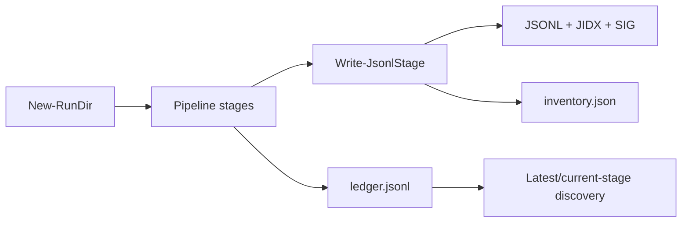
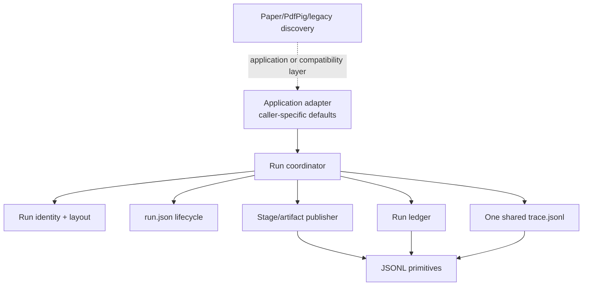

# i just implemented a shared logger in codex-scientiae `D:\aghado01\codex-scientiae\issues\loggers\fable-logger-initial-implementation-20260803.md` is the discussion file. I want to review the implementation so far and work on follow up items, including porting the jsonl file handling capabilities that are missing by potentially lifting some primitives from my jso-jackson tools `D:\aghado01\utils\jso-jackson` and/or the chat export children of it under that directory (claude-export and/or codex-export) `D:\aghado01\utils\jso-jackson` and add to either the logger itself or incorporate into the shared jsonl utility under src/shared. lets review and scope next steps

The logger is a strong initial substrate, but I would harden its failure behavior and establish a generic JSONL contract before wiring production callers.

## Review findings

1. **[P1] Logging can change or mask application failures.** Serialization and append operations can throw in [log.ps1](/D:/aghado01/codex-scientiae/src/shared/log.ps1:152). Inside `Measure-RunStep`’s catch, a logger failure can replace the original exception. A diagnostic logger should normally degrade once, report the sink failure to stderr, and preserve the workload outcome.

2. **[P2] Sequential runs can merge into one file unintentionally.** When `trace.jsonl` exists, the fallback `trace-{module}-{pid}.jsonl` path is not collision-checked. Reusing the same process/run directory appends another lifecycle with a reset elapsed clock. Explicit `-LogPath` has the same unspecified append-vs-replace behavior.

3. **[P2] Caller data can overwrite lifecycle invariants.** `Start-RunLog -Data @{ module=...; pid=... }` replaces reserved fields; `Stop-RunLog -Data` can replace `ms`, `warn`, and `error`.

4. **[P2] “Safe before Start” is noisier than documented.** The first info/debug call before initialization emits the “file sink off” notice to stderr, even though only warn/error are supposed to remain visible.

5. **[P2] `Get-RunLog` is not robust for active or damaged traces.** It accumulates the whole result, fails on any malformed line, and has no incomplete-tail policy. Reading an actively appended file also needs deliberate sharing/snapshot semantics.

6. **The JSONL ownership boundary needs repair before porting.** [src/shared/jsonl.ps1](/D:/aghado01/codex-scientiae/src/shared/jsonl.ps1:89) currently combines generic indexing with IR-stage writing, provenance, inventory, and document-ledger policy. It is only explicitly loaded by tests in the current tree; [publish.ps1](/D:/aghado01/codex-scientiae/src/bibliotecha/publish.ps1:216) assumes `Add-LedgerEntry` is ambiently available and also references a currently missing `finalize.ps1`.

7. **The two JSONL families disagree about index naming.** Codex-scientiae uses `file.jsonl.jidx`; several export paths use `file.jidx`, while generic jso-jackson readers default back to `file.jsonl.jidx`. That must be normalized—or both forms resolved—before lifting readers.

8. **Prefer the Codex snapshot implementation over the older generic one.** [New-CodexJsonlSnapshot](/D:/aghado01/utils/jso-jackson/codex-export/codex-jso-jackson.ps1:248) correctly opens active files with read/write/delete sharing and reports a dropped partial tail. The generic [New-JsonlSnapshot](/D:/aghado01/utils/jso-jackson/jso-jackson.ps1:2235) claims active-writer compatibility but only specifies `FileShare.Read`.

9. **Do not lift jso-jackson readers unchanged.** Several silently discard malformed records. That is useful for exploratory tooling but dangerous as the default shared-infrastructure policy.

::code-comment{title="[P1] Preserve the original failure" body="Write-RunLog can throw during JSON serialization or file append. In this catch path that secondary logger exception can replace the workload exception, contradicting the observational role of the trace. Make logger sink failure explicitly best-effort and rethrow the captured workload exception unchanged." file="D:/aghado01/codex-scientiae/src/shared/log.ps1" start=176 priority=1}

::code-comment{title="[P2] Collision path can already exist" body="After trace.jsonl is taken, the PID-qualified path is selected without another existence check. A later run in the same process can append to that existing file and combine separate elapsed-time domains. Loop to a unique path or define explicit append/reuse semantics." file="D:/aghado01/codex-scientiae/src/shared/log.ps1" start=88 priority=2}

::code-comment{title="[P2] Protect lifecycle fields" body="Arbitrary start data can overwrite module and pid. Keep reserved lifecycle fields authoritative, reject collisions, or place caller metadata under a distinct nested field." file="D:/aghado01/codex-scientiae/src/shared/log.ps1" start=114 priority=2}

::code-comment{title="[P2] Info calls should remain silent" body="The one-time uninitialized notice is emitted even for trace, debug, or info calls. This makes opportunistic logging alter stderr despite the documented warn-plus behavior. Gate the notice with the warn/error branch or expose it only through verbose diagnostics." file="D:/aghado01/codex-scientiae/src/shared/log.ps1" start=134 priority=2}

::code-comment{title="[P2] Define malformed-tail behavior" body="A single malformed or partially written line aborts the entire query. Route this through a shared streaming JSONL reader with an explicit Stop, Skip, or Report policy and active-file sharing/snapshot support." file="D:/aghado01/codex-scientiae/src/shared/log.ps1" start=208 priority=2}

## Recommended scope

1. **Define the JSONL contract first**

   Canonicalize sidecar naming, physical-line versus record indexing, malformed-record behavior, live-file sharing, stale-index detection, and strict versus tolerant modes.

2. **Create a small generic shared layer**

   Put these in `src/shared`, not inside the logger:

   - streaming `Read-Jsonl`
   - `Get-JsonlRecordCount`
   - index-aware `Get-JsonlRecord` with streaming fallback
   - head/tail helpers
   - `Test-Jsonl` with line-numbered diagnostics
   - live-file `New-JsonlSnapshot`
   - one UTF-8-no-BOM/LF `Add-JsonlRecord` primitive

   Lift selectively from jso-jackson and the Codex snapshot; do not import the traversal, Bloom-filter, export, or debug layers.

3. **Separate domain policy**

   Retain `Write-JsonlStage`, `.sig`, inventory, and ledger behavior in a stage/document-oriented sibling rather than treating them as generic JSONL mechanics.

4. **Harden the logger**

   Add best-effort sink failure behavior, collision-safe lifecycle semantics, reserved-field protection, quiet pre-start behavior, and shared streaming reads. Avoid indexing live logs by default; an optional index can be built after `Stop-RunLog`.

5. **Integrate incrementally**

   Wire `latex-ingest` first because it has a bounded lifecycle and already creates a run directory. Then migrate the four MCP servers individually: their process-long lifetimes, severity mapping, console visibility, and possible rotation need a distinct integration contract.

Verification is green: logger tests pass 16/16 and shared JSONL encoding/index tests pass 12/12 under the repository’s Pester 6 runner. No files were changed. The discussion directory remains untracked in Git.

---

# well there's a general repo convention to write runstamped subdirectories to `artifacts/.../{runstamp}...` , and a log file should be written to a runstamped run-specific log file, but depending on which module or process runs, the patterns change, and logger should be able to inherit the conventions from the tool its logging. If anything i'd implement logger per tool in a decorator kind of pattern, kind of like in python but powershell isn't python of course. the shared/jsonl.ps1 should be separated out in to reusable primitives for jsonl IO and fundamental operations versus the more use-case specific parts of it, with the primitive functions being written to the generic jsonl.ps1 in this refactor. and agreed i need to shore up the conventions. I don't really like 'jsonl.jidx', id rather the jidx sentinel files share the file name of the jsonl file they are indexing, without the .jsonl intermediate extension and simply be {filename} for a given {filename}.jsonl. silent overwrites and other things need to be fixed before deploying too

Agreed. This changes the central design decision: the logger should not mint repository paths itself. Tool-specific run policy should provide a resolved run context, while the logger only owns lifecycle, serialization, and sinks.

An idiomatic PowerShell “decorator” would be a wrapper such as:

```powershell
$run = New-LatexIngestRunContext -Slug $Slug -ArtifactsRoot $ArtifactsRoot

Invoke-WithRunLog -Context $run {
    Invoke-LatexIngestCore -RunDir $run.RunDir ...
}
```

`Invoke-WithRunLog` would use `try/finally`, preserve the original exception, and call `Stop-RunLog`. Each tool can have a thin context factory or adapter because its artifact topology differs. The shared context only needs a stable shape such as:

```text
Module
RunStamp
RunDir
LogPath
ArtifactsRoot
ParentRunId
```

Thus:

- A bounded converter might supply `artifacts/latex-ingest/runs/{stamp}/{slug}/trace.jsonl`.
- A service might supply its own process-oriented run directory.
- A child process can inherit the parent run context while choosing a process-specific filename.
- `log.ps1` no longer needs its current hard-coded fallback under `artifacts/{module}/logs`.

For JSONL, I’d refactor toward:

- `src/shared/jsonl.ps1`: encoding, strict/tolerant streaming reads, append/write, count/head/tail/random access, validation, snapshotting, and index operations.
- `src/shared/jsonl-stage.ps1`: `Write-JsonlStage`, provenance `.sig`, stage inventory.
- `src/shared/run-ledger.ps1`: document/process ledger operations, if the ledger remains a shared concept.

The canonical sidecar rule should be:

```text
records.jsonl
records.jidx
```

implemented with:

```powershell
[System.IO.Path]::ChangeExtension($JsonlPath, '.jidx')
```

Existing `records.jsonl.jidx` files can be recognized as a read-only legacy fallback during migration, but all new writes should use `records.jidx`.

I’d also make overwrite behavior explicit across the layer:

- New JSONL files: `CreateNew` by default.
- Existing destination: fail clearly.
- Full replacement: explicit `-Force`, written through a temporary file and published only after success.
- Append: explicit `Add-JsonlRecord`; never inferred from an existing path.
- Logger startup: create the resolved log file once; subsequent records append internally.
- Active logger replacement: use a distinct lifecycle option such as `-ReplaceContext`, rather than overloading `-Force`.
- Index creation: fail when the index already exists unless explicitly rebuilt.
- Multi-file stage publication: preflight all destination collisions before writing anything.

The next sensible implementation slice is therefore:

1. Inventory and codify each tool’s run-context pattern.
2. Split generic JSONL primitives from stage and ledger policy.
3. Change the index convention to `{stem}.jidx`.
4. Add collision, atomic-write, active-file snapshot, malformed-tail, and stale-index tests.
5. Refactor the logger to accept an injected context and add the wrapper/decorator lifecycle.
6. Only then wire `latex-ingest`; handle long-lived MCP services separately.

That gives the logger inheritance through composition instead of trying to make a supposedly generic logger understand every repository topology.

---

# the jsonl.ps1 plan sounds good, but jsonl-stage and run-ledger need more inspection and might be part of the same operational flow. For compatibility shims, we can incorporate those but i want them to be compartmentalized in the code so they can be sunsetted eventually. i also think that its important for the implementation of the logger in any given application to have sensible defaults that are consistent for that application's workflow and the integration and calls to logger from a given caller can set those defaults in the bound params to the caller. its important to remember that the purpose of the runstamped convention is that it precludes alot of overwriting, and for any given run, the logger appends its records to its log file for that run, and i dont want a bunch of logfile sidecars profilerating per run. but append/overwrite/etc behavior is going to be different default behavior per application i suppose, although in logger's case, the idea is to capture end-to-end run at whatever scope is being executed. what i dont want is logger tripping up runs because it is being stubborn and whatever fallback behavior should be made visible

Yes—history confirms `Write-JsonlStage`, inventory, and ledger belonged to one operational membrane flow:

- Successive stages intentionally replaced the same run-scoped `chunks.jsonl`.
- `Write-JsonlStage` updated its index, provenance, and run inventory.
- The ledger recorded higher-level milestones such as `preprocessed`, `applied`, `finalized`, and `published`.
- Inventory and ledger were complementary views: “artifacts currently present” versus “workflow position over time.”

So I would not split them mechanically into `jsonl-stage.ps1` and `run-ledger.ps1`. A better provisional home is something like `run-artifacts.ps1`, preserving them as one operational unit while generic mechanics move beneath them into `jsonl.ps1`.

## Revised write-policy model

| Application operation | Existing-target policy | During operation | Failure policy |
|---|---|---|---|
| Generic JSONL creation | Create-new by default | Complete file write | Strict |
| Stage artifact | Explicit atomic replace | Replaces the current run-scoped stage output | Strict |
| Inventory | Explicit atomic replace | Current-state projection | Historically best-effort; needs review |
| Workflow ledger | Open/create, then append | One milestone per transition | Workflow-owned decision |
| New run log | Normally create-new | Append every record to that same file | Best-effort by default |
| Resumed/joined run log | Explicit append | Continue the same end-to-end trace | Best-effort by default |

The runstamp creates the inter-run safety boundary. Within that boundary, replacing a stage artifact and appending a ledger or trace are intentional application semantics—not generic accidental overwrites.

## Logger contract

The application integration should own:

- Runstamp and run-directory creation.
- The resolved log path.
- Whether an existing log means resume, collision, or error.
- Any permitted fallback location.
- Default file/console levels.
- Whether logger failure is best-effort or strict.

Those defaults can be bound through the caller’s own parameters and merged with explicit caller overrides before invoking the shared logger.

The logger itself should then guarantee:

- Exactly one primary JSONL log for the run scope.
- No `.jidx`, `.sig`, profile, or other logger sidecars.
- Append-only records after initialization.
- Nested calls join the live context.
- File failure does not normally fail the workload.
- The original workload exception is never replaced by a logging exception.
- Degradation is visible without becoming repetitive.

A sensible degradation sequence is:

1. Emit one loud stderr diagnostic such as `RUNLOG DEGRADED`, including the failed path and cause.
2. Attempt only application-provided fallback paths—never invent arbitrary artifact locations.
3. If fallback succeeds, write a failover record into the fallback log.
4. If all file sinks fail, disable further file attempts for that run and retain normal stderr severity behavior.
5. Mark the returned run-log context/result as `degraded`, with the effective path and failure reason.

That circuit-breaker behavior avoids throwing on every later log call or flooding stderr. Applications that consider durable tracing mandatory can explicitly select strict behavior.

## Compatibility compartment

I recommend a physically separate compatibility layer:

```text
src/shared/jsonl.ps1
src/shared/run-artifacts.ps1
src/shared/compat/jsonl-v1.ps1
```

`compat/jsonl-v1.ps1` would contain only things intended for retirement:

- Recognition of legacy `records.jsonl.jidx`.
- Old function-name wrappers such as `Read-JsonlRecord`.
- Any old return-shape adapters.
- One-time deprecation telemetry if useful.
- A clearly stated sunset condition and dedicated compatibility tests.

New code would only produce:

```text
records.jsonl
records.jidx
```

and would not import the compatibility file.

The next implementation tranche should therefore be the generic `jsonl.ps1` extraction plus its compatibility compartment. `Write-JsonlStage`, inventory, and ledger can move together into provisional `run-artifacts.ps1` without redesigning their operational semantics yet. Logger refactoring can then build on the new append primitive while remaining sidecar-free. No files were changed during this inspection.

---

# while we're here, the reason why i kept the jsonl stage logistic code and copied jsonl.ps1 to shared is because my intention was to generalize those tools so i can reuse the same code based on the same principles, separating the  (now defunct) codex membrane use-case logic from the underlying primitive operations and organizational framework

That clarifies the intended architecture. I had treated the stage/inventory/ledger code too much as residue from the removed membrane. It is better understood as an early implementation of a reusable operational framework whose first application happened to be the membrane.

The separation should be three-layered:

1. **JSONL mechanics — `jsonl.ps1`**

   No concepts such as papers, chunks, stages, runs, or inventories:

   - UTF-8-no-BOM/LF serialization
   - streaming read and validation
   - create/replace/append modes
   - record count/head/tail/random access
   - snapshotting active files
   - `{stem}.jidx` construction and reading
   - atomic file publication

2. **Operational artifact framework**

   Generic concepts shared by conversion, ingestion, procurement, publishing, and similar workflows:

   - run context and artifact addressing
   - staged artifact publication
   - provenance/signatures
   - run inventory
   - milestone/event ledger
   - coordinated failure and replacement policy
   - application-supplied defaults

   This layer composes the primitives; it should not implement JSON serialization or byte indexing itself.

3. **Application adapters**

   Membrane, latex-ingest, logger, or another tool binds the generic framework to its vocabulary and conventions:

   - artifact directory topology
   - filename patterns
   - which outputs receive indexes/signatures
   - when stage artifacts replace earlier versions
   - which events become milestones
   - whether inventory failure is fatal
   - logger path, resume, and fallback behavior

The membrane-specific parts are mainly the present addressing assumptions:

```powershell
Add-LedgerEntry -ChunksPath ...
Get-LedgerStage -ChunksPath ...
```

Those derive state paths by rewriting `.chunks.jsonl`. The generalized framework should instead accept a run context or explicit ledger/inventory path:

```powershell
Add-RunMilestone -Context $run -Stage 'normalized' -Data $data
Get-RunMilestone -Context $run -Latest
Register-RunArtifact -Context $run -Path $path -Role 'normalized-ir'
```

Compatibility wrappers can preserve the old membrane signatures in a dedicated compatibility file by constructing the generic context from `ChunksPath`.

Likewise, `Write-JsonlStage` is not inherently obsolete. It can become a framework-level composition such as:

```text
Write JSONL artifact
→ construct index
→ record provenance
→ register artifact in run inventory
→ publish the coordinated result
```

Its defaults would come from an application profile rather than being universal. A membrane-style pipeline can bind atomic replacement plus index/signature/inventory, while a simpler tool can disable parts it does not need.

The logger then becomes another application of the same pattern, but a deliberately lean one:

- receives the application’s run context;
- writes one append-only trace;
- produces no index or signature;
- may register that trace in an already-existing run inventory;
- uses visible, best-effort failover rather than interrupting the run.

So I would revise the tentative layout to something conceptually like:

```text
shared/jsonl.ps1                 # primitive JSONL I/O and indexing
shared/runs.ps1                  # run contexts and addressing
shared/artifact-flow.ps1         # stage/provenance/inventory/milestone framework
shared/log.ps1                   # generic trace mechanism
shared/compat/jsonl-v1.ps1       # legacy paths, names, and signatures
```

The exact boundary between `runs.ps1` and `artifact-flow.ps1` deserves the next inspection pass. But stage logistics, inventory, and ledger should be generalized—not merely parked as legacy membrane behavior.

---

# you can see residues of similar legacy machinery that i want to do the same and which partially overlaps conceptually here in runs.ps1

Exactly. `runs.ps1` is the missing shared foundation tying together JSONL artifact logistics and logging.

The current [runs.ps1](/D:/aghado01/codex-scientiae/src/shared/runs.ps1:3) contains four different layers:

1. Run identity and directory reservation.
2. Repository artifact-root conventions.
3. Application policy, currently latex-ingest and the retired membrane/pdfdig workflows.
4. Domain discovery and addressing for papers, chunks, and IR lanes.

The newer module layout was grafted into the middle of the older membrane-oriented file. Its header still describes `{paper}/.runs/{stamp}`, while [New-ModuleRunDir](/D:/aghado01/codex-scientiae/src/shared/runs.ps1:55) implements `artifacts/{module}/runs/{stamp}/{slug}`.

The current call graph is telling:

- `New-ModuleRunDir` and `Get-SourceWorkDir` are used by latex-ingest.
- `Get-ArtifactsRoot` supports that path.
- Almost everything from `Get-RunChunks` onward is retained membrane/pdfdig addressing with no current production caller.
- `runs.ps1` imports `crawl.ps1` only because of those domain resolvers.
- The logger consequently duplicated artifact-root resolution to avoid importing the crawler.

## Proposed separation

### `shared/runs.ps1`

Keep only generic run mechanics:

- `Get-ArtifactsRoot`
- `New-RunStamp`
- collision-safe run reservation
- `New-RunContext`
- run enumeration and latest/pinned selection
- parent/child run relationships
- optional code revision and dirty-state metadata

A run context should distinguish the run root from its application scope:

```text
RunId
RunStamp
Application
Scope
ArtifactsRoot
RunRoot
WorkDir
ParentRunId
StartedAt
CodeRevision
IsDirty
```

For latex-ingest:

```text
RunRoot = artifacts/latex-ingest/runs/{runstamp}
WorkDir = artifacts/latex-ingest/runs/{runstamp}/{slug}
```

A batch can share one `RunRoot` while each paper gets a separate `WorkDir`. A process-wide service can use `RunRoot` directly.

### Application run policies

Move application conventions beside their applications:

```text
latex-ingest/run-policy.ps1
pdf-converter/run-policy.ps1
compat/membrane-runs-v1.ps1
```

For example, `Get-SourceWorkDir` is specifically latex policy: deterministic unpacked source beside the archive. It does not belong in generic run mechanics.

Likewise:

- `Get-PigRunDirs` and `Get-PigEnvelope` are pdf-converter policy.
- `Get-RunChunks`, `Resolve-PaperChunks`, and `Resolve-PaperSource` are membrane/document workflow policy.
- `Resolve-PaperDir` and `Split-PaperAddress` are domain addressing, not run creation.
- Legacy beside-source fallback belongs explicitly in compatibility code.

Those concepts may later be generalized, but they should not silently masquerade as the generic run API.

## How the layers connect

```text
runs.ps1
  creates RunContext
       │
       ├── artifact-flow.ps1
       │     publishes stage artifacts
       │     maintains provenance/inventory/milestones
       │
       └── log.ps1
             appends one trace within the chosen run scope

jsonl.ps1
  supplies byte-safe JSONL mechanics to both
```

This means neither the logger nor artifact framework derives repository paths from filenames. They consume `RunContext` plus application-bound policy.

One additional hardening item: current run creation uses `Test-Path` followed by `New-Item -Force`. That is not an atomic reservation; parallel processes can select the same same-second path. Runstamps prevent ordinary overwrites, but the shared primitive should make the remaining collision window structurally safe.

::code-comment{title="[P1] Run reservation is not atomic" body="Two concurrent callers can both observe that the candidate path is absent and then create the same directory because the check and New-Item -Force are separate operations. The shared run primitive needs an atomic claim or a collision-resistant run identifier before logger and artifact workflows rely on it." file="D:/aghado01/codex-scientiae/src/shared/runs.ps1" start=61 end=66 priority=1}

::code-comment{title="[P2] Generic run helpers drag domain discovery" body="The shared file imports the crawler because paper and IR discovery live beside run creation. Splitting those application adapters out will let logging and other generic consumers use run contexts without importing unrelated repository traversal behavior." file="D:/aghado01/codex-scientiae/src/shared/runs.ps1" start=14 priority=2}

The clean sequencing is now:

1. Extract and test generic run context/reservation mechanics.
2. Compartmentalize membrane/pdfdig addressing and legacy layouts.
3. Extract primitive `jsonl.ps1`.
4. Generalize the stage/inventory/ledger framework around `RunContext`.
5. Refactor the logger to consume the same context with application-bound defaults.

No files were changed.

---

# why don't we draft new shared utilities with a non-breaking new versioned filename until the implementation is vetted before we break anything. so starting with a new `shared/jsonl-v2.ps1`

---

# thes enew files aren't going to be imported by anything currently in production, so don't pollute the namespace with versioned functions and classes. im just setting the file aside temporarily with the -v2 suffix until its time to integrate it. what i want to draft is a pending replacement that will be integrated and i dont want a bunch of versioned signatures being called when i do incorporate. any 'compat' code coming from this file can go in `jsonl-v2-compat.ps1'

Drafted the pending replacement without versioning the API:

- [jsonl-v2.ps1](D:/aghado01/codex-scientiae/src/shared/jsonl-v2.ps1) — unversioned `JsonlIndex` class and function names.
- [jsonl-v2-compat.ps1](D:/aghado01/codex-scientiae/src/shared/jsonl-v2-compat.ps1) — removable legacy filename, function-name, and JSOI v1 handling.
- [core tests](D:/aghado01/codex-scientiae/tests/shared/jsonl-v2.Tests.ps1)
- [compatibility tests](D:/aghado01/codex-scientiae/tests/shared/jsonl-v2-compat.Tests.ps1)

The draft establishes:

- Explicit fail/replace/append/truncate policies—no silent overwrite.
- UTF-8 without BOM and LF record boundaries.
- Atomic complete-file publication.
- Safe single-record append with boundary validation during the actual write.
- Strict streaming reads and visible malformed-record skipping.
- Canonical `records.jsonl` → `records.jidx`.
- Indexed access with source-freshness detection.
- Fixed-boundary snapshots of active files; unterminated tails are incomplete even if they happen to parse as JSON.
- Read-only compatibility with JSOI v1 and `records.jsonl.jidx`.

Verification passed:

- Core: 13/13
- Compatibility: 3/3
- All four files parse cleanly.
- No versioned class or function declarations.
- No tracked production source imports the draft.
- Existing `jsonl.ps1`, logger code, and callers remain untouched.

The next review should inspect `jsonl-stage.ps1`, `run-ledger.ps1`, and `runs.ps1` together as one operational system. We can then identify additional generic primitives worth promoting into this draft, leaving stage/run organization above it. After that, the logger adapter can resolve each application’s runstamp, artifact layout, append policy, and visible non-fatal fallback into one run-specific log without creating routine sidecars.

---

# and what about codepoint safety more generally, safe concurrency for jsonl ops

Short answer: codepoint handling is mostly sound, but the draft is not yet fully concurrency-safe or Unicode-loss-proof.

### Codepoint safety

Already sound:

- Strict UTF-8 is used for encoding and decoding: malformed byte sequences and unpaired UTF-16 supplied to writers are rejected.
- Byte-offset indexing is Unicode-safe. LF is the single byte `0x0A` and cannot occur inside a valid multibyte UTF-8 sequence.
- Astral characters, emoji, combining sequences, ZWJ sequences, U+2028/U+2029, and escaped embedded newlines round-trip ordinally.
- No Unicode normalization occurs, which is correct for a generic primitive.
- Snapshots safely discard a partial multibyte tail because unterminated bytes are never decoded as a completed record.

One important defect remains: escaped lone surrogates such as `"\uD800"` pass `JsonDocument.Parse`, while PowerShell’s `ConvertFrom-Json` silently turns them into U+FFFD. I reproduced that behavior. Therefore [Test-JsonlLine](D:/aghado01/codex-scientiae/src/shared/jsonl-v2.ps1:95) can currently approve something that [Read-Jsonl](D:/aghado01/codex-scientiae/src/shared/jsonl-v2.ps1:264) later changes silently.

That should be fixed by recursively materializing every JSON string and property name during validation, thereby rejecting unpaired escaped surrogates. The same validator should cover reads, snapshots, and index construction.

The index builder also currently indexes raw LF offsets without validating UTF-8 or JSON. That is byte-safe but can create an index for corrupt input. I would make index validation strict by default, with an explicit performance-oriented bypass if ever needed.

### Concurrency

| Operation | Current behavior |
|---|---|
| Complete-file write | Temp-file publication and explicit replacement; good on local filesystems |
| Single appender | Safe |
| Multiple cooperative appenders | Record corruption is prevented, but competing writers fail immediately |
| Live readers during append | Supported |
| Active-file snapshot | Captures a fixed opening length and ignores later appends; good |
| Index creation during append | Unsafe contract: it currently permits an open writer |
| Indexed random access during append | Has a freshness-check/read race |
| Snapshot plus index | Two files cannot be published as one atomic transaction; an index failure can leave the snapshot alone |

A deterministic probe confirmed:

- Appending while a live reader is open succeeds.
- Appending while another writer is open fails visibly.
- Index creation currently succeeds while a writer is open—the main concurrency gap.

So append is presently corruption-safe but not availability-safe. For logger use, contention could trip a run unless the application wrapper catches it.

### Recommended hardening contract

1. Add a shared write-lease helper using the file handle itself—no lock sidecar.
2. Give append an explicit contention policy such as `Fail` or `Wait`, with bounded timeout and retry interval. The logger adapter can bind its own sensible defaults.
3. Keep one writer lease across a batch with `Add-JsonlRecords`, while preserving per-record atomicity.
4. Make indexing and indexed reads stable-source operations: open with `FileShare.Read`, hold that handle throughout validation and seeking, and fail if a writer is active.
5. Require snapshots before indexing active logs.
6. Add strict Unicode scalar validation, including escaped surrogate pairs and property names.
7. Add a raw-record read mode so callers can preserve original JSON text without PowerShell type conversion.
8. Decide explicitly whether readers reject CRLF or accept it only as ingress that snapshots normalize to LF.
9. Test process contention, interrupted multibyte writes, writer crashes before LF, replacement races, stale indexes, and Unicode edge cases.

The logger layer should then use bounded waiting and visible degradation—warning/stderr plus later recovery reporting—without inventing fallback logfile sidecars. The generic JSONL utility should expose the mechanism; each application should bind the policy.

---

# ok lets audit jsonl-stage.ps1, run-ledger.ps1, and runs.ps1 + the logger as related operational units to scope reorg and refactor

The audit confirms these are one operational system, but their responsibilities are currently tangled and most of the original system is retired residue rather than active infrastructure.

No files were changed during this audit.

## Current operational status

| Unit | Responsibilities currently mixed together | Live usage |
|---|---|---|
| [jsonl.ps1](D:/aghado01/codex-scientiae/src/shared/jsonl.ps1) | JSONL serialization, indexes, stage publication, provenance stamps, inventory, ledger, schema inspection | No tracked production importer; retained mainly by encoding tests |
| [runs.ps1](D:/aghado01/codex-scientiae/src/shared/runs.ps1) | Generic artifact roots, run allocation, legacy `.runs`, paper addressing, crawler-backed discovery, PdfPig compatibility | `latex-ingest` actively uses only its module-run and source-work helpers |
| [log.ps1](D:/aghado01/codex-scientiae/src/shared/log.ps1) | Run-log path resolution, run-context state, serialization, console policy, child-process inheritance, log querying | Tested but not integrated into production callers |
| Ledger section | Lifecycle milestones and current-stage projection | One lingering call from `publish.ps1`, reached through a currently missing membrane import |
| Inventory section | Best-effort artifact registry | Only invoked as a hidden `Write-JsonlStage` side effect |

Historically, the membrane orchestrator joined them like this:



That orchestration disappeared during the source reorganization, but its storage assumptions remained in the shared files.

## Principal findings

### 1. `Write-JsonlStage` is not a reusable JSONL primitive

It silently truncates the destination through `StreamWriter(..., $false, ...)` at [jsonl.ps1:123](D:/aghado01/codex-scientiae/src/shared/jsonl.ps1:123). If serialization fails midway, the prior artifact is gone and the new artifact is partial.

Other problems:

- JSONL, index, signature, and inventory are published independently. There is no coordinated commit.
- Existing `.jidx`, `.sig`, and `inventory.json` files are silently replaced.
- Inventory failure is completely swallowed at [jsonl.ps1:170](D:/aghado01/codex-scientiae/src/shared/jsonl.ps1:170).
- Inventory uses an unlocked read-modify-write cycle, so concurrent registrations can be lost.
- It still emits `records.jsonl.jidx`.
- It claims LF output but never sets `StreamWriter.NewLine`; on Windows the stage writer emits CRLF.
- A `.sig` usually hashes `nodes.jsonl`, even when the actual transformation also consumed and replaced an existing `chunks.jsonl`. It therefore does not describe the complete input state.
- The `.sig` and inventory contain overlapping but incomplete projections of the same artifact event.

The generic mechanics belong in `jsonl-v2.ps1`. Stage publication should become a higher-level, explicit operation.

### 2. Run allocation is not concurrency-safe

Both run allocators use “check until unused, then create with `-Force`”:

- [New-ModuleRunDir](D:/aghado01/codex-scientiae/src/shared/runs.ps1:55)
- [New-RunDir](D:/aghado01/codex-scientiae/src/shared/runs.ps1:91)

Two processes can select the same candidate before either creates it, after which `-Force` lets them share the directory silently.

Additional run-layout problems:

- Discovery treats a directory or expected artifact as evidence that a run is usable. There is no `running/completed/failed` boundary, so newest-run selection can expose partial runs.
- Numeric collision suffixes stop sorting correctly lexically after `-9`.
- `Module` and `Slug` are used as path components without a clear validation contract.
- Explicit `-RunDir` silently reuses an existing directory in `latex-ingest`.
- Functions return bare path strings, forcing callers to rediscover run identity from path shape. This already produces a bug: [latex-ingest.ps1:2685](D:/aghado01/codex-scientiae/src/latex-ingest/latex-ingest.ps1:2685) reports the leaf—which is the slug—as `run`, not the runstamp.
- Generic module-run behavior is mixed with retired paper addressing, `.runs`, crawler, and PdfPig compatibility.

### 3. Ledger, inventory, provenance, and logging lack distinct authority

The old ledger describes itself as “one per document,” but its path is derived from run-local `chunks.jsonl`; it is actually one per document-run.

Its records have:

- no timestamp;
- no sequence or event identifier;
- no success/failure state;
- no schema identifier;
- no transition validation;
- no concurrency handling.

`Extra` can even replace the reserved `stage` field.

The conceptual separation should be:

- `run.json`: authoritative run identity and current lifecycle projection.
- `run-ledger.jsonl`: durable operational facts and transitions.
- `trace.jsonl`: best-effort diagnostic execution trace.
- Artifact inventory: a projection from ledger/manifest records, not another silently maintained mutable file.
- Provenance: part of artifact-publication ledger records, not one `.sig` beside every file.

This would eliminate both `inventory.json` and most `.sig` proliferation.

### 4. The logger currently violates the desired failure and file-count policies

At [log.ps1:153](D:/aghado01/codex-scientiae/src/shared/log.ps1:153), serialization or append failures propagate into the application. That means logging can:

- terminate a run;
- mask the original exception inside `Measure-RunStep`;
- leave `Stop-RunLog` incomplete.

Its child-process strategy deliberately creates `trace-{module}-{pid}.jsonl`, contradicting the revised requirement of one trace per run. The check for an existing `trace.jsonl` is also racy.

Other issues:

- It exports a directory rather than the exact shared log path.
- Exported environment state is not restored on stop.
- `-Force` abandons the old context without a closing record.
- Starting against an existing explicit path silently appends a new run to it.
- Invalid environment configuration silently falls back.
- Records do not carry run ID and PID consistently, which will matter when multiple processes share one trace.
- `AppendAllText` does not provide reliable multi-process record serialization.

The logger needs bounded contention handling through the JSONL primitive, a non-throwing emergency path to stderr, and recovery telemetry—but no alternate logfile sidecars.

## Recommended target structure



### Shared JSONL substrate

`jsonl-v2.ps1` remains limited to:

- strict JSONL I/O;
- complete-file publication;
- safe append;
- validation;
- snapshots;
- optional indexes.

It must not know about stages, runs, logs, inventories, or provenance.

### Run identity and layout

A pending replacement should return a run-context object rather than a path:

```text
RunId
RunStamp
Application
Operation
Subject
ArtifactsRoot
RunRoot
RunDirectory
LogPath
LedgerPath
ManifestPath
StartedAt
```

Creation must claim the directory atomically. Existing explicit run directories should fail by default; reuse should require an explicit policy.

I recommend keeping Git commit, dirty state, source hashes, parameters, and full timestamps in `run.json`. The directory name should remain human-oriented rather than carrying all provenance.

### Run coordinator

A PowerShell equivalent of a decorator can be an `Invoke-WithRun` higher-order function:

```text
resolve application defaults from caller-bound parameters
→ allocate or join a run context
→ initialize manifest and ledger
→ start logger
→ execute caller body
→ record completed/failed result
→ stop logger in finally
```

Each application supplies defaults and layout policy. The generic coordinator does not guess what `latex-ingest`, procurement, or an MCP server considers a run.

### Stage publisher

A future stage utility should:

1. Call the JSONL complete-file primitive with explicit `Fail` or `Replace`.
2. Optionally build the canonical `.jidx`.
3. Compute hashes from the actual declared inputs and completed output.
4. Return an artifact receipt.
5. Let the coordinator append that receipt to the run ledger.

No hidden inventory mutation, `.sig` creation, or stage-name assumptions should live in the writer.

### Logger

The application passes a resolved `LogPath`. Child processes inherit that exact path and run ID.

All processes append to the same trace using a bounded writer lease. On sink failure:

- the application call returns normally;
- a visible emergency message goes to stderr regardless of normal console filtering;
- no fallback file is created;
- successful recovery appends a record reporting how many file events were missed.

Active logs should not receive `.jidx` sidecars. Index a post-run snapshot only when analysis needs it.

## Non-breaking migration order

1. Finish JSONL codepoint and concurrency hardening.
2. Draft a non-imported run-context/layout replacement with unversioned API names and atomic allocation.
3. Draft run manifest and ledger operations on top of JSONL primitives.
4. Rebuild stage publication as an explicit artifact operation; retire hidden inventory and `.sig` behavior.
5. Refactor the logger to consume a supplied run context and one shared trace path.
6. Pilot the full coordinator in `latex-ingest`, currently the only active consumer of the new run convention.
7. Move paper addressing, `.runs`, crawler, and PdfPig discovery into an application-specific or compatibility file.
8. Restore focused run-layout tests from history and add concurrency, incomplete-run discovery, failure-injection, and logger-degradation tests.
9. Once vetted, switch imports and remove the temporary filename suffixes and compatibility compartments.

The most important prerequisite is run identity and completion semantics. Until those exist, stage publication, ledgers, and logging cannot reliably agree on what “this run” means.

---

# ok lets focus on hardening jsonl-v2 for codepoint/concurrency, im assuming the jidx index builder is part of this suite of json/jsonl operational primitives, isn't this simply about indexing the valid rows byte offsets? validating json or UTF-8 doesn't really feel like the indexer's job even if those things are important to validate somewhere. and what about queries/slicing and other types of operations one might want in a general purpose jsonl engine? what about primitives for jsonl store lifecycle? I want centralize the read/write ops so that JsonDocument.Parse and ConvertFrom-Json dont have to worry about lone surrogate escaping.

Hardened the pending JSONL replacement without changing production imports.

Key outcomes in [jsonl-v2.ps1](/D:/aghado01/codex-scientiae/src/shared/jsonl-v2.ps1:207):

- The indexer now records offsets for every complete LF-terminated physical row. It deliberately ignores JSON validity and UTF-8 validity, and excludes unfinished tails.
- All decoding/parsing passes through one strict codec. Escaped lone surrogates are rejected in both values and property names before `ConvertFrom-Json` can substitute U+FFFD.
- Writes use one cooperating-writer lease. Contention can fail immediately or wait for a bounded timeout.
- Batch appends serialize everything before mutating the file.
- Stable reads, validation, indexing, and finalization refuse active writers. `New-JsonlSnapshot` remains the explicit live-file path.
- Top-level JSON `null` can be read losslessly with `-AsJsonElement`; ordinary PowerShell output now fails visibly instead of silently dropping the record.
- Added lifecycle primitives:
  - `Get-JsonlStoreInfo`
  - `Complete-JsonlStore`
- Added query/slicing primitives:
  - `Read-Jsonl -Start/-Count`
  - `Get-JsonlRange`
  - `Select-JsonlPath` using RFC 6901 JSON Pointers
- Compatibility remains isolated in [jsonl-v2-compat.ps1](/D:/aghado01/codex-scientiae/src/shared/jsonl-v2-compat.ps1:92), now routed through the central parser.

The expanded tests are in [jsonl-v2.Tests.ps1](/D:/aghado01/codex-scientiae/tests/shared/jsonl-v2.Tests.ps1:73). All shared tests pass: **77 passed, 0 failed**.

The next logical layer would be a separate query/analysis utility for schema inference, distributions, predicates, aggregation, and external sorting. I would keep those above this storage engine. One future scaling concern is that JSOI currently loads all offsets into memory; very large stores may eventually merit direct index seeking or a paged index format.

Unrelated reader-MCP and planning-file worktree changes were left untouched.

---

# We also need "Create-JsonlStore" unless that's already implicitly done (but maybe still worth giving this a name since stores get created for different reasons and there will be more to come) as well as other maintenance and lifecycle utilities like appending/subtracting/resorting a store. when items are created or destroyed in the store, this requires reflexive scan and updating on any metadata or indexing (internal attributes in a store schema or binary index side cars). so i'm talking about process automation. and what about some simple search/fetch operations like pulling rows based on a key or set of keys and/or their values, like a simple database. for context, one thing i haven't done yet but will be hopeing to implement soon would be nested jsonl stores over hierarchically organized source material deposits based on individual source document json manifest files that will become standard issue and can be read by automation to build a store at a given directory level / depth. For example if you look at `ingestion` i have several subdirectories, each containing {slug} subdirectories with different collections. what i'm envisioning is automation that makes it easy to build stores at each level above single document source directories and to do so bottom up or top down, building a store for each level, with higher level stores. i need to implement the source file manifest concept that would itself require some basic maintenance (e.g. download a latex tarball, unpack it to a subdirectory, something like `{slug}-tex`, and create the manifest with desired metadata as a sibling file to the tarball file under the {slug} directory, as well as updating it if for example in this example, i later download the PDF source of the same paper, i would want the manifest to capture that information (that two forms of the same document are present, their respective formats, when they were downloaded, etc)

Implemented the managed-store layer separately from primitive JSONL mechanics.

New [jsonl-store-v2.ps1](/D:/aghado01/codex-scientiae/src/shared/jsonl-store-v2.ps1:131) provides:

- `Create-JsonlStore`
- `Add-JsonlStoreRecords`
- `Remove-JsonlStoreRecords`
- `Subtract-JsonlStore`
- `Sort-JsonlStore`

Existing indexes are rebuilt reflexively after mutations. Untouched rows retain their original serialized bytes, and mutations use a cross-process named mutex without permanent lock sidecars. If content commits but index refresh fails, that partial state is reported explicitly and the stale index remains detectably stale.

The core now also has:

- `Write-JsonlLines` for lossless atomic rewrites.
- `Find-JsonlRecord` with exact `Equals`, `In`, regex, compound `All`/`Any`, and JSON Pointer conditions.
- No substring-based identifier false positives.
- A scan-based API that can later adopt secondary indexes transparently.

Tests:

- JSONL core: 21 passed.
- Managed stores: 6 passed.
- Compatibility: 3 passed.
- The combined shared run reached and passed all JSONL/logger tests, but the overall run is currently blocked by an unrelated parse error in `src/shared/batch-executor.ps1:507`.

For source deposits, I recommend `{slug}.source.json`. `{slug}.json` is already converter output, while `*.arxiv.json` is provider-specific acquisition metadata.

A source manifest should distinguish:

- Document identity: slug, title, authors, DOI/arXiv identifiers and versions.
- Acquired artifacts: PDF, LaTeX archive, supplementary material.
- Derived artifacts: `{slug}-tex`, extracted from a named archive.
- Per-artifact provenance: relative path, format, bytes, hash, source URL, acquisition time, provider and derivation.
- Multiple representations of the same document without overwriting earlier acquisition facts.

Hierarchical catalogs should consume these manifests—not infer documents by recursively finding PDFs. The current tree contains figure PDFs inside extracted document directories and several directories holding multiple unwrapped papers, so extension-based discovery would misclassify assets.

Recommended catalog behavior:

- Store one row per source manifest in scope.
- Include both logical document identity and unique manifest-relative path.
- Deterministically sort by stable identity/path.
- Support explicit `Direct`, `Recursive`, and maximum-depth scopes.
- Make top-down and bottom-up builds converge byte-for-byte.
- Rebuild derived catalog rows from manifests rather than incrementally patching duplicated metadata.
- Initially use only `_sources.jsonl` plus `_sources.jidx`; avoid another metadata sidecar until persistent store-policy requirements settle.

Still unresolved is persistent store policy: key uniqueness, required schema, and canonical sort order. Without that descriptor, append can refresh the ordinal index but cannot know that it must deduplicate or resort. That policy layer—and streaming/external rewrites for stores too large to fit in memory—is the next prerequisite before implementing hierarchical catalog builders.

---

# well the stores i mentioned above are just one kind of store, but yes, key uniqueness conventions, schema requirements per store type/kind, and canonical sort order are important. I would say for my inventory store idea, keys would be a scoped relative path to the document parent directory. the exact schema details need to be finalized and a schema written to validate against. canonical sort order can be based on the path key, and append operations could either insert correctly and/or append and then resort to canonical

Implemented the generic policy layer without making inventory the universal store model.

Key outcomes:

- Added generic store policies and an inventory specialization in [jsonl-store-v2.ps1](D:/aghado01/codex-scientiae/src/shared/jsonl-store-v2.ps1:12).
- Inventory callers choose the key field through an RFC 6901 pointer; no schema field name is frozen.
- Inventory path keys are:
  - scoped relative paths;
  - `/`-separated and NFC-normalized;
  - unique case-insensitively;
  - sorted ordinally;
  - `"."` for a document directly at the catalog scope root.
- Policy-aware create/add operations validate first, enforce uniqueness, sort once, publish once, and refresh the existing `{stem}.jidx` once.
- Duplicate behavior is explicit: `Stop`, `KeepExisting`, or `Replace`.
- Canonical maintenance sorting can use the application policy via `Sort-JsonlStore -Policy`.
- Index-existence checks now occur inside the mutation lease, closing a concurrency race that could leave a newly created index stale.
- `Write-JsonlLines` supports durable flushing for policy-governed rewrites.
- No policy or metadata sidecar was introduced.

The schema remains intentionally open. A policy can bind a schema path and application validator, but supplying a schema path without an actual validator fails rather than silently skipping validation.

I documented the architecture, unresolved schema decisions, and corrected logger direction in the [discussion addendum](D:/aghado01/codex-scientiae/issues/loggers/fable-logger-initial-implementation-20260803.md:34). The original per-process logger description is now explicitly historical; the intended direction is one application-defined run log with visible, non-fatal fallback behavior.

Verification: the complete shared suite passes—106 tests, 0 failures. The new managed-store coverage is in [jsonl-store-v2.Tests.ps1](D:/aghado01/codex-scientiae/tests/shared/jsonl-store-v2.Tests.ps1:9).

The next design task is the pair of related schemas: the authoritative leaf source manifest and the derived inventory/catalog row. That should precede directory traversal and hierarchical catalog-building automation.

---

# ok i just created `issues/loggers/planning` as well as `discussions` and `briefs` folders as well. lets populate the planning directory with roadmap, decisions (arch design from this discussion since the initial fable prototype), and later, there will be a ledger for tracking roadmap items that have been completed

Populated the planning directory with:

- [roadmap.md](D:/aghado01/codex-scientiae/issues/loggers/planning/roadmap.md) — ahead-only work organized into stable `LOGJ-nnn` items across audit, JSONL hardening, logger redesign, managed stores, inventory catalogs, and migration.
- [decisions.md](D:/aghado01/codex-scientiae/issues/loggers/planning/decisions.md) — 25 architecture decisions distilled from the Fable prototype discussion, plus unresolved design questions.

The roadmap also defines the future ledger entry contract. I intentionally did not create `ledger.md` yet. All relative document links were validated.

---

# ok lets export this chat to `D:\aghado01\codex-scientiae\issues\loggers\discussions` to structural format markdown
