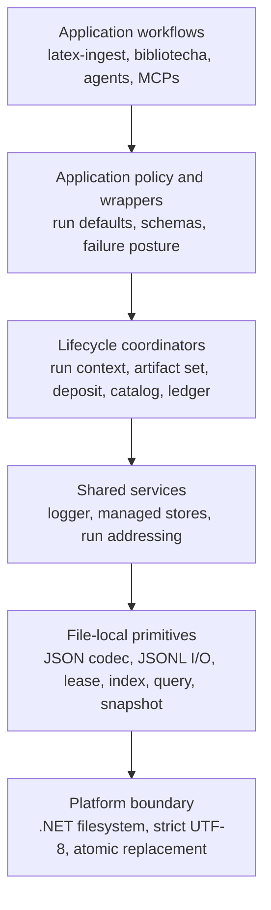

# Shared infrastructure architecture

This document describes the intended system shape as of 2026-08-04. It interprets the normative rules in
[decisions.md](decisions.md), exposes current implementation mismatches, and keeps application witnesses from
leaking into the shared substrate. It is descriptive rather than a second decision log.

## Design center

Shared infrastructure should make the safe operation the easy operation while leaving authority with the
application that owns the workflow. A caller supplies run identity, store kind, schema, ordering, mutation,
and failure posture. Shared code supplies deterministic addresses, encoding, concurrency, publication,
inspection, and reusable lifecycle mechanics.

The central separation is:

Dependencies point downward. A lower layer does not infer the application policy above it.

## Address and lifecycle classes

Three address classes must remain distinguishable even when one workflow touches all three:

| Class | Meaning | Typical mutation |
|---|---|---|
| Stable source/deposit | Acquired or normalized input and its bounded manifest | Explicit, validated maintenance; no run-generated contamination |
| Run generation | Evidence and intermediates from one execution under a caller-owned run identity | New run by default; append or immutable publication according to artifact role |
| Projection/deliverable | Rendered or published view for a consumer | Explicit replacement/publication policy |

A runstamp prevents accidental collision but does not determine whether an artifact is append-only,
immutable, or replaceable. Likewise, `.jsonl` describes rows, not authority or lifecycle.

## Layer responsibilities

### File-local JSON/JSONL primitives

The primitive layer owns Unicode-scalar validation, strict UTF-8 decoding, LF-terminated physical records,
explicit create/append/replace modes, cooperating writer leases, stable reads, atomic whole-file publication,
structural byte-offset indexes, snapshots, ranges, projections, and bounded query semantics.

It owns one content file and its declared index. It does not own application schemas, multi-file generations,
run allocation, logs, ledgers, or inventory traversal.

### Managed stores

The managed-store layer binds an application-supplied policy to file-local mutation. A policy may define key
selection, comparison, uniqueness, canonical order, schema validation, mutation model, failure posture, and
required derivatives. Create/add/remove/subtract/sort operations validate once, publish once, and refresh a
required index once, reporting partial derivative failure honestly.

The currently implemented policy surface does not yet close mutation-model, schema-runtime, inspection,
repair, or derived-metadata contracts.

### Run context and artifact coordination

Run infrastructure should allocate or join a caller-owned run identity and expose resolved addresses to
consumers. It should not encode every application's directory depth in generic logger or JSONL code.

Cross-file coherence is a higher transaction. When an application requires `docstream + refgraph ->
docgraph`, it owns a generation id, dependency validation, private build location, publication state,
recovery, and a single membership/freshness record. File-local atomic replacement cannot truthfully claim to
commit the whole graph.

### Logger

The logger is a run-scoped application of JSONL append, not a separate serializer. Each application binds
sensible defaults from its own parameters. Event calls remain small. The normal shape is one logical log for
the selected end-to-end run scope, with cooperating writers rather than accidental per-process files.

Logging is normally observational and non-fatal. A failed primary sink follows an application-bound fallback
ladder, emits a visible stderr diagnostic, returns/records degradation status, and never writes protocol data
to stdout. Stricter ledgers use the same lower primitives with a different failure policy.

### Application lifecycle

Source-deposit initialization, hierarchical inventory materialization, operational ledgers, agent exchange
protocols, and LaTeX artifact-set generation sit here. They may be reusable orchestrators, but their domain
identity and transition rules are not JSONL-core concerns.

## Implementation map

| Surface | Current state | Intended disposition |
|---|---|---|
| `src/shared/jsonl-v2.ps1` | Unintegrated primitive draft; focused tests only | Harden contract and replace `jsonl.ps1` primitives after migration gates |
| `src/shared/jsonl-store-v2.ps1` | Unintegrated lifecycle/policy draft | Complete policy, schema, inspection, repair, and derivative semantics |
| `src/shared/jsonl-v2-compat.ps1` | Legacy index compatibility only | Keep explicitly imported, census callers/artifacts, then remove |
| `src/shared/jsonl.ps1` | Mixed serializer, stage publisher, ledger, inventory, and index logic | Extract agreed primitives/policies; retain a bounded shim or retire dead workflow code |
| `src/shared/log.ps1` | Tested prototype with direct JSON parsing/writes and divergent sink behavior | Rebuild over hardened JSONL and application wrappers |
| `src/shared/runs.ps1` | Current module-run convention plus retired paper-local discovery/addressing | Separate run allocation/context from application discovery and compatibility |
| `src/latex-ingest/source-deposit.ps1` | Committed application transaction with provisional schema | Corpus-vet as a consumer; keep LaTeX/domain policy out of generic layers |
| `src/latex-ingest/latex-ingest-compat.ps1` | Explicit legacy source-layout boundary | Census, migrate, and sunset without teaching production the retired layout |

## Compatibility architecture

Compatibility imports are one-way: a compatibility file imports the clean implementation and adds retired
discovery or representation behavior. Production does not import compatibility by default, and core symbols
do not gain version suffixes merely because draft filenames carry `-v2` during vetting.

Every shim needs:

1. the exact old caller or retained artifact shape it supports;
2. a visible diagnostic when behavior degrades or bypasses the current contract;
3. a migration path;
4. an owner and removal condition; and
5. tests that do not make the old shape look normative.

## Design witnesses

- The Fable logger demonstrates the desired call ergonomics and the dangers of independent sink conventions.
- jso-jackson is the current implementation authority for general JSON/JSONL inspection tooling.
- rector-codicis demonstrates a multi-writer authoritative journal whose failure posture differs from a log.
- latex-ingest demonstrates ordered/heterogeneous stores, derived graphs, run evidence, projections, and
  cross-file coherence without committing those specimens as engine taxonomy.
- source deposits and proposed hierarchical inventories demonstrate stable manifests feeding deterministic
  materialized views.

These witnesses should become bounded fixtures and comparison cases, not hard-coded filenames or schemas in
the core engine.
