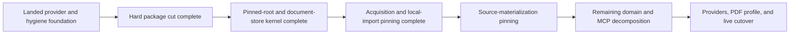

The package cut, root/store kernel, and acquisition/local-import pinning are implemented without compatibility modules. The next milestone is source-materialization pinning.

The earlier provider-catalog resumption notes are superseded. This file tracks the post-cut sequence.

## What remains sound

- Provider roles and capabilities belong to adapter declarations; endpoint and request policy belong in JSON configuration.
- Providers remain flat modules. Aggregator/repository/access-source are semantic categories, not necessarily directories.
- `jsonl_engine` owns `article.json`, inventory, schemas, atomic document mechanics, and generic publication infrastructure.
- Procurement owns acquisition receipts, metadata evidence, provider workflows, and its projection into an article.
- Acquisition, metadata resolution, materialization, and catalog rebuilding remain independent operations.
- Root identity is the correct production-cutover gate.
- Background jobs, PDF article profiles, BioRxiv, and Sci-Hub acquisition should wait until the storage transaction foundation is dependable.

## Revised trajectory



### 1. Hard package cut — implemented

The pinning-adjacent modules moved without re-export shims:

```text
services/                 -> operations/
staging.py                -> storage/acquisitions.py
source.py storage half    -> storage/source_deposits.py
source.py request models  -> domain/materialization.py
source.py findings        -> source/findings.py
archive.py                -> source/archive.py
http.py                   -> transport/http.py
settings.py               -> configuration/models.py + loader.py
ProcurementApplication    -> application.py
```

The named catalog/root registry now belongs to `storage/catalogs.py`. `storage/source_deposits.py` consumes that registry directly and does not import the catalog operation.

The cut is mechanically reviewable: direct import changes, no compatibility files, and an `rg` and import-spec gate proving the old paths have disappeared.

The remaining `models.py` and `payloads.py` split follows pinning. Those files do not obstruct filesystem correctness.

### 2. Root and store kernel — implemented

`storage/roots.py` provides one application-owned configured-root catalog for:

- staging root;
- local-import inboxes;
- article catalog roots;
- physical identity captured at application initialization;
- handles/descriptors retained for application lifetime;
- clean, idempotent closure through `ProcurementApplication.close()`.

[PinnedPublicationRoot](/D:/aghado01/codex-scientiae/src/jsonl_engine/publication.py) now provides child pinning tied to the exact parent activation, anchored child-directory creation/removal, no-follow direct-file operations, exposed physical identity, generation-keyed locks, and current-path assertions. POSIX child access is descriptor-relative. Windows retains no-delete-share handles and opens direct file leaves without following a final reparse point.

The engine and procurement storage layers now divide single-document ownership explicitly:

- `jsonl_engine.documents` owns the generic schema-backed JSON document kind and pinned store;
- procurement supplies `ProcurementSchemaCatalog` to its document kinds;
- `AcquisitionManifestDocument` and `DepositMetadataDocument` own their domain conversion and byte limits;
- `defaults.json` remains ordinary configuration;
- `acquisition.json` remains JSON rather than being forced into JSONL.

The application root catalog is the lifetime substrate. Acquisition and local import now consume its active descriptors; source materialization remains the transaction that is not fully descriptor-relative.

`ArticleCatalogService` already passes the application-retained catalog pin into engine discovery and inventory publication. It cannot silently open a replacement generation from the same configured pathname.

### 3. Acquisition and local-import pinning — implemented

Each acquisition transaction now holds:

```text
initialized staging-root pin
    -> generation-keyed slug lease
    -> pinned acquisition-item directory
    -> pinned HTTP download sink
    -> journal/artifact/manifest publication
    -> closing generation verification
```

`AcquisitionStore` accepts only the active staging descriptor. Its generation-keyed slug lease encloses a child-directory pin, schema-backed receipt and journal access, artifact hashing, no-replace publication, recovery, and closing generation checks. The HTTP sink requires the item pin and performs create, write, flush, hash, cleanup, and retry against that generation.

`LocalImportService` accepts only active local-inbox descriptors. It opens the direct-child source and private staged copy through the inbox and item pins, verifies the open file generation before and after copying, and checks both directory generations before success.

Adversarial tests attempt replacement while HTTP and local bytes are in flight. Windows retained handles block the rename. POSIX descriptor-relative branches permit a rename only by continuing against the old generation and then refusing success; replacement generations receive no staged writes.

### 4. Source-materialization pinning

This remains a complete vertical slice, not a `SourceDepositStore` wrapper:

- hold the acquisition item pin through source reads;
- hold catalog and document pins;
- extract into owned pinned scratch;
- perform pinned archive/PDF copies;
- publish metadata through the procurement document store;
- atomically publish or recover the source tree;
- call an article publisher that accepts the document pin;
- publish `article.json` last;
- define recovery for abandoned source-publication state.

This should also settle whether source materialization needs an explicit journal. Root pinning alone does not address crashes between archive, tree, metadata, and final sentinel publication.

### 5. Remaining organization

After the transactions are sound:

- split `models.py` into works, discovery, metadata, and common value types;
- split `payloads.py` into acquisition domain contracts;
- split archive extraction from LaTeX inspection;
- decompose MCP registration into tool-family modules;
- then add BioRxiv, actual Sci-Hub access, compliant endpoint pools, and the versioned PDF-backed article profile.

One nuance: eliminating Python import compatibility does not mean silently weakening persisted evidence contracts. Schema changes should still be deliberate and versioned.

Overall, the project is at a good architectural hinge. The next move is source-materialization pinning through the landed kernel—not another provider or workflow feature.
