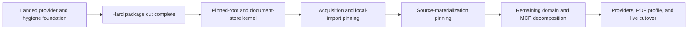

The pinning-adjacent package cut is implemented without compatibility modules. The next milestone is the root and store kernel; transaction logic no longer needs to be written into flat modules that would immediately move.

The earlier provider-catalog resumption notes are superseded. This file tracks the post-cut sequence.

## What remains sound

- Provider roles and capabilities belong to adapter declarations; endpoint and request policy belong in JSON configuration.
- Providers remain flat modules. Aggregator/repository/access-source are semantic categories, not necessarily directories.
- `jsonl_engine` owns `article.json`, inventory, schemas, atomic document mechanics, and generic publication infrastructure.
- Procurement owns acquisition receipts, metadata evidence, provider workflows, and its projection into an article.
- Acquisition, metadata resolution, materialization, and catalog rebuilding remain independent operations.
- Root identity is the correct production-cutover gate.
- Background jobs, PDF article profiles, BioRxiv, and Sci-Hub acquisition should wait until the storage transaction foundation is dependable.

## Revised trajectory



### 1. Hard package cut — implemented

The pinning-adjacent modules moved without re-export shims:

```text
services/                 -> operations/
staging.py                -> storage/acquisitions.py
source.py storage half    -> storage/source_deposits.py
source.py request models  -> domain/materialization.py
source.py findings        -> source/findings.py
archive.py                -> source/archive.py
http.py                   -> transport/http.py
settings.py               -> configuration/models.py + loader.py
ProcurementApplication    -> application.py
```

The named catalog/root registry now belongs to `storage/catalogs.py`. `storage/source_deposits.py` consumes that registry directly and does not import the catalog operation.

The cut is mechanically reviewable: direct import changes, no compatibility files, and an `rg` and import-spec gate proving the old paths have disappeared.

The remaining `models.py` and `payloads.py` split follows pinning. Those files do not obstruct filesystem correctness.

### 2. Root and store kernel

Build one application-owned configured-root catalog:

- staging root;
- local-import inboxes;
- article catalog roots;
- physical identity captured at application initialization;
- handles/descriptors retained for application lifetime;
- clean closure through `ProcurementApplication.close()`.

Generalize [PinnedPublicationRoot](/D:/aghado01/codex-scientiae/src/jsonl_engine/publication.py:127) into a hierarchical directory primitive with child pinning, anchored creation, direct-file operations, generation-keyed locks, and current-path checks.

This is also where procurement should leverage the engine more explicitly:

- add a generic engine JSON-document kind/store primitive;
- let procurement supply its schema catalog;
- implement acquisition and deposit-metadata document kinds;
- keep `defaults.json` as ordinary configuration;
- keep `acquisition.json` as JSON, not force it into JSONL.

### 3. Acquisition pinning

One transaction must hold:

```text
initialized staging-root pin
    -> generation-keyed slug lease
    -> pinned acquisition-item directory
    -> pinned HTTP download sink
    -> journal/artifact/manifest publication
    -> closing generation verification
```

Local import should land in the same milestone because the configured inbox has the analogous read-side root-replacement vulnerability.

Acceptance criterion: replacing the staging root, inbox, or acquisition item may block or fail the operation, but the replacement generation must receive no writes and success must never name it.

### 4. Source-materialization pinning

This remains a complete vertical slice, not a `SourceDepositStore` wrapper:

- hold the acquisition item pin through source reads;
- hold catalog and document pins;
- extract into owned pinned scratch;
- perform pinned archive/PDF copies;
- publish metadata through the procurement document store;
- atomically publish or recover the source tree;
- call an article publisher that accepts the document pin;
- publish `article.json` last;
- define recovery for abandoned source-publication state.

This should also settle whether source materialization needs an explicit journal. Root pinning alone does not address crashes between archive, tree, metadata, and final sentinel publication.

### 5. Remaining organization

After the transactions are sound:

- split `models.py` into works, discovery, metadata, and common value types;
- split `payloads.py` into acquisition domain contracts;
- split archive extraction from LaTeX inspection;
- decompose MCP registration into tool-family modules;
- then add BioRxiv, actual Sci-Hub access, compliant endpoint pools, and the versioned PDF-backed article profile.

One nuance: eliminating Python import compatibility does not mean silently weakening persisted evidence contracts. Schema changes should still be deliberate and versioned.

Overall, the project is at a good architectural hinge. The next move is the pinned-root and document-store kernel—not another provider or workflow feature.
