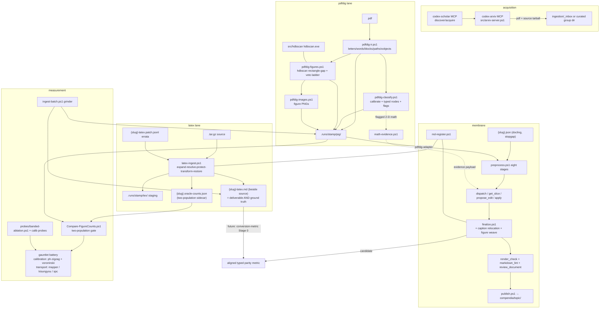

# System retrospective — two conversion lanes, one oracle, and the gauntlet (2026-07-20)

**Status:** RETROSPECTIVE / mental-map brief. Not a plan — a consolidation of what exists, what
problem each piece solves, and how the pieces wire together. Forward plans live in
[frontier-20260715.md](../clustering/frontier-20260715.md) (figure lane),
[design.md](../publish-lane/design.md) (library),
[aligned-fidelity-scoring.md](../conversion-metric/aligned-fidelity-scoring.md) (parity metric),
[reorg-plan.md](../src-reorg/reorg-plan.md) (src layout).

---

## §1 The problem frame — one target, two source realities

Everything in the repo serves one conversion goal: **a scientific paper → codex-standard markdown**
(KaTeX-renderable math, honest heading hierarchy, references, figures registered per STANDARDS.md).
The architecture falls out of one asymmetry in the inputs:

- **arXiv LaTeX source exists** → the problem is a *parse/transform* of a structured language.
  Deterministic, near-lossless, math passes through untouched.
- **Only the PDF exists** → the problem is an *inverse problem*: the PDF is a print projection
  (positioned glyphs, vector paths, rasters) and the structure that was compiled away must be
  re-inferred from geometry, under uncertainty.

The single most load-bearing design move in the project: **the easy lane doubles as the measuring
instrument for the hard lane.** On papers where both inputs exist, the LaTeX conversion is not just
a deliverable — it is the per-document ground truth ("the answer key") that the PDF lane is scored
against. That one move generates the oracle harness (§5), the gauntlet's experimental design (§6),
and the project's stated goal: **parity with the per-document LaTeX oracle in the pre-publish
format** (publish/editorial logistics deliberately demoted to later).

The historical arc, compressed:

1. **Docling era** — opendataloader/docling was the PDF converter stopgap. It damages structure
   (shattered captions, flattened inline math, ghost layers, heading loss), so the **membrane** was
   born as a *damage-repair* system: detect, dispatch, propose, gate.
2. **LaTeX oracle** — `latex-ingest.ps1` made the structured-source case near-lossless, and its
   byproducts (oracle sidecars, math bank, skeleton) became ground truth.
3. **pdfdig** — the in-house PdfPig lane replaces the damage *source*: instead of repairing a
   converter's guesses, emit faithful measurements and carry uncertainty as **flags**, so the
   membrane resolves marked doubt rather than compensating silent damage.
4. **Gate + gauntlet** — measurement discipline around the figure lane (the hardest sub-problem
   landed so far), generalizing into the standing test battery for all converter work.
5. **Next: the parity metric** (conversion-metric Stage 0) — widen "measured against the oracle"
   from figure counts to aligned, typed fidelity over the whole document.

---

## §2 Lane 1 — LaTeX conversion (the tractable top rung)

**Code:** [latex-ingest.ps1](../../src/latex-ingest.ps1) (`Invoke-ArxivLatexToMarkdown`), exposed as
membrane tool `latex_convert`. In-house by doctrine — no pandoc/latexml.

**Problem class → method, stage by stage** (the pipeline order is itself the design: each stage
removes a source of ambiguity for the next):

| stage | problem it solves | method |
|---|---|---|
| EXPAND | author macros (`\newcommand`) reach inside math and would defeat any downstream tokenizer | brace-aware macro expansion to KaTeX primitives (ordinal dictionaries — case-insensitive hashtables collide `\Vect`/`\vect`) |
| RESOLVE | `\cite`/`\ref`/`\eqref`, theorem/equation labels are symbolic | resolve numbering against the document's own counters |
| PROTECT | structural transforms must not corrupt math | env-aware span protection; alignment envs wrapped in `\begin{aligned}` so `&`/`\\` stay valid |
| TRANSFORM | LaTeX structure → markdown structure | title/sections/theorems/lists/refs; `tabular`→md tables; `\bordermatrix`→ruled array; hard-wraps reflowed to prose |
| RESTORE | put the protected math back | verbatim — `$…$` / `$$…$$` ARE the codex standard, so **math passes through**; the membrane's entire math-repair problem is sidestepped |

**Diagram sub-pipeline** (source-authoritative figures, encode-first doctrine):
[tikz-render.ps1](../../src/tikz-render.ps1) (TikZ→SVG via tikzjax) →
[tex-render.ps1](../../src/tex-render.ps1) (tectonic snippet→PDF, the universal fallback incl.
xy-pic) → [pdf-raster.ps1](../../src/pdf-raster.ps1) (PDF assets→PNG via MuPDF-WASM), all emitting
through [md-register.ps1](../../src/md-register.ps1) — **the ONE markdown figure register**, shared
with the membrane's finalize weave so both lanes speak the same figure grammar.

**Durable curation:** `{slug}-latex.patch.jsonl` errata (define_macro / source_replace /
output_replace) re-applied on every regen — author-defect fixes survive reconversion, guarded to
fail loud when stale.

**Outputs and their roles:**
- `{slug}-latex.md` **beside the source** — the deliverable *and* the ground truth.
- `.runs/{stamp}/tex/` — unpacked source staging (persisted for the math-bank/skeleton lanes).
- `{slug}.oracle-counts.json` (schema/2, two-population) — **the coupling artifact** the figure
  gate consumes (§5).

**Doctrine:** *faithful, not filtered* — acknowledgements kept, references inline; editorial
filtering belongs to promotion. Known rough edges are enumerated, not hidden: complex tables,
deeply-nested optional-arg macros, multi-file submissions beyond one `\input`, non-UTF8 sources.

---

## §3 Lane 2 — PDF conversion (pdfdig, the inverse problem)

**Code:** [src/pdf-converter/](../../src/pdf-converter/), orchestrator
[Invoke-Pdfdig.ps1](../../src/pdf-converter/Invoke-Pdfdig.ps1). Everything lands in one runstamped
`{paper}/.runs/{stamp}/pig/` (git-ignored; nothing beside the source), mirroring the tex lane.

**Design doctrine (the lane's constitution):**
- **Measurement vs opinion separation.** The IR emitter records what PdfPig can see, opinion-free;
  classification happens downstream, per-document-calibrated, and *flags* when uncertain — never
  guesses.
- **Structural priors VETO figure-hood, never assert it** — the design law the whole veto ladder
  obeys (and the lesson A-thrust re-taught).
- **Rules-as-data:** every cue lives in validated stores (`stores/*.jsonl`,
  `classify-config.json`); malformed store rows throw, they don't silently skip.
- **Em-normalization:** every threshold is a relative statistic of the document's own typography
  (body font size), never an absolute point value — this is why knobs transport out-of-sample.

**The chain, problem → method:**

1. **[pdfdig-ir.ps1](../../src/pdf-converter/pdfdig-ir.ps1)** (`ConvertTo-PdfDigIr`) — *what is
   physically on the page?* Faithful multi-lane JSONL substrate
   ([ir-schema.md](../pdfdig-lane/ir-schema.md)): envelope (provenance, fonts, health) +
   `letters` (atomic, all born signals) + `words` (NearestNeighbour assembly) + `blocks`
   (RecursiveXYCut segmentation + reading order — explicitly a CLAIM lane; solves the two-column
   gutter) + `paths` (vector lane, bezier bbox fallback, rule tags) + `xobjects`. No
   classification here, ever.
2. **[pdfdig-classify.ps1](../../src/pdf-converter/pdfdig-classify.ps1)**
   (`ConvertTo-PdfDigNodes`) — *what role does each run of text play?*
   Stage A: per-document **calibration by order statistics** (body size, heading-tier ladder, modal
   leading, indent) — quantized typography wants modes and gaps, NOT density clustering.
   Stage B: typed node emission in resolved reading order with membrane-canonical fields;
   symbol-map corrections + ligature expansion fire at emission only (substrate stays faithful).
   Math sub-problem: **[math-assembler.ps1](../../src/pdf-converter/math-assembler.ps1)** inverts
   TeX's size-ladder layout to recover *nested* sub/superscripts (the "1.5-D" tier — flat per-glyph
   script calls emit invalid `t_{v}_{1}`; recursive size-tier descent emits `t_{v_{i+1}}`); true
   2-D structure (fractions, matrices) is flagged, and
   **[math-evidence.ps1](../../src/pdf-converter/math-evidence.ps1)** projects the glyph geometry
   into a text transcript (glyph table + spatial sketch) so the membrane's reasoning tier sees the
   *same evidence* the converter had — distillation, not delegation.
3. **[pdfdig-figures.ps1](../../src/pdf-converter/pdfdig-figures.ps1)**
   (`ConvertTo-FigureRegions`) — *which ink is a figure?* Per-page HDBSCAN over path bboxes with
   the **rectangle-gap metric** (density over white-space gaps between axis-aligned boxes; engine =
   the C# [hdbscan](../../src/hdbscan/) `hdbscan.exe` behind
   [Invoke-Hdbscan.ps1](../../src/hdbscan/Invoke-Hdbscan.ps1) — policy in the lane, engine a black
   box). On top of the raw partition, the landed ladder: consensus m1 (`Join-FigureViews`
   OR-combines geometry with content-stream draw-run evidence), furniture/inflow vetoes, letter
   attach (≤4em blocks), caption attachment + cue typing (A1/A2) + the A3-1 bounded caption rescue
   (effective-head cue slide + same-row stitch), C′ stray-eject (spine-elbow, post-caption
   placement), the visible-bbox painted-only crop (clip-mask de-inflation), kind floor
   (degenerate/mark/figure — conservative glyph-scale floor, nothing dropped), and the
   monster-path-cloud preagg guard (>50k points grid-bin to 0.5em cell-unions before the O(n²)
   metric; 79 min → ~10 min, battery byte-identical).
4. **[pdfdig-images.ps1](../../src/pdf-converter/pdfdig-images.ps1)** — raster each figure region
   to PNG (MuPDF-WASM) + `images.jsonl`, same run dir; `pig-run.json` manifest closes the chain
   with per-step counts for provenance.

**Oracle-free health signal:** `known_role_frac` + the IR health envelope — the instruments that
still work when no LaTeX exists (the entire `gauntlet/spc` corpus runs on these).

**Sibling, not duplicate:** the C# `Markpig.Pdf` build (D:\aghado01\MarkPig\pdfdig) is the
foreign-AST/2-D-math tier; this PS lane is the codex-scientiae substrate that proves the signals.

---

## §4 The membrane — the shared repair loop both lanes feed

**Code:** [mcp-server.ps1](../../src/mcp-server.ps1) (29 core tools + 3 experimental) over
[serving.ps1](../../src/serving.ps1); procedure in PROCEDURE.md. Body-blind by design: the repair
loop works scoped slices and never re-reads the whole paper.

**Intake — one preprocess, two workflows** ([preprocess.ps1](../../src/preprocess.ps1), eight
stages: project-ir → headings → collapse → zones → sections → normalize → fidelity → repair):

- **lane=opendataloader** (docling repair): starts from the stopgap converter's `{slug}.json`;
  heading-recovery + furniture-detection run downstream to *compensate converter damage*.
- **lane=pdfdig** (pig workflow): [pdfdig-adapter.ps1](../../src/pdfdig-adapter.ps1) maps pig
  nodes → the line dialect; **born signals in, compensation out** — headings arrive pre-typed
  (typography + PDF outline), furniture already dropped, ligatures/symbols corrected, and the
  converter's own `flags[]` become the membrane's work items.

This is the crux of the docling→pdfdig transition: the same repair loop shifts from *undoing
damage* to *resolving declared uncertainty*.

**The loop:** `preprocess` starts a new run (`.runs/{stamp}/`, newest-wins, `@pin` addressing) →
`dispatch`/`get_slice` (work-order spine, inventory computed on demand) → `propose_edit` →
`apply` → gates. **Gates measure validity, not truth**: `render_check` (KaTeX) + `markdown_lint`
(structure) — the known blind spot is valid-but-wrong math
([gate-blind-spots](../membrane-fixes/gate-blind-spots-valid-but-wrong.md)), which is why
`review_document` exists as the ONE sanctioned holistic read (equations read for sense,
hallucination tells, caption/subject match).

**Egress:** [finalize.ps1](../../src/finalize.ps1) serializes chunks → `{slug}.md` per STANDARDS
(caption relocation happens at EMISSION only — the persisted stream and its id==line invariant are
never touched; figure weave pulls pig crops through md-register) →
[publish.ps1](../../src/publish.ps1) promotes into `compendia/{topic}/` (bare `{slug}.md` at the
destination; known width gaps F1/F2; the two-plane librarian/reader redesign is the queued
successor, [publish-lane/design.md](../publish-lane/design.md)).

---

## §5 The oracle harness — how measurement was made honest

**Code:** [Compare-FigureCounts.ps1](../../src/pdf-converter/Compare-FigureCounts.ps1) — the
standing Tier-2 gate. Three design decisions carry all of its value:

1. **Two populations, cue-typed.** PRIMARY = *captioned, figure-cued* pig regions vs oracle floats
   (+TikZ diagrams); SECONDARY = uncaptioned regions vs oracle inline diagrams; table/algorithm-cued
   regions excluded from both. Why: a single aggregate count lets errors cancel (a missing figure
   offset by a false crop scores "exact"). Splitting by the population the reader actually cares
   about killed the cancellation channel — and the frontier later generalized the lesson
   ("aggregate acceptance invites cancellation") to *object-level* acceptance for assertion work.
2. **Mechanism attribution.** Every Δ row is attributed: over→fragmentation;
   under∧images>0→raster-blindness; exact; else oracle-noise. The gate emits a *work-list by
   failure mechanism*, not a scalar — this is what let the thrust ladder (A/B/C′/D/E/F) be planned
   as mechanism-shaped campaigns.
3. **Oracle confidence is first-class.** `figures_missing:N` (source references images never
   provided) annotates low-confidence rows — they are *annotated, not chased*, so oracle noise
   can't masquerade as converter defect (2307, 2106.06375v1).

**The coupling point:** the gate dot-sources `latex-ingest.ps1` and uses `Get-LatexOracleCounts` —
**the same code that writes the oracle sidecars counts them at the gate** (one oracle counter
model; fallback chain sidecar → staged source → md). The two pipelines are not merely juxtaposed;
the LaTeX lane is literally a dependency of the PDF lane's measuring instrument.

**Design law enforced by the gate:** the zero-over invariant (0 over-detections anywhere, both
calibration corpora and every confident-oracle transport paper) — the observable form of
"priors veto, never assert."

---

## §6 The gauntlet — the experimental design around the gate

**Home:** [ingestion/gauntlet/](../../ingestion/gauntlet/CHARTER.md). The charter is a genuine
experimental-design document; its core is an **identifiability discipline**:

- **Calibration vs transport.** ph-zigzag (10, diagram-heavy) + voroninski (23, plot-heavy) are
  the only corpora knobs may be fitted against; mapper (10), kisungyou (23, PDF+source), spc (8,
  PDF-only 1995–2020 journal) run the gate UNTOUCHED at milestones. *"A knob calibrated everywhere
  is validated nowhere."* New corpora enter transport-by-default; promotion to calibration is an
  explicit frontier decision, never drift.
- **spc is the deliberate oracle-free stressor** — no LaTeX exists by construction, so it forces
  the oracle-free instruments (known_role_frac, IR health, downstream render/lint) and stresses
  exactly the intake the oracle corpora can't (old typography, journal-house producers).
- **The protocol** (frontier §3, earned clause by clause): probe before implementing (expect the
  premise to move — it did, all seven times); gate BOTH calibration corpora every increment,
  baseline must reproduce recorded numbers first; PRIMARY invariance non-negotiable; read the
  render / eyeball crops before default-on; probes must LOCALIZE, not merely detect (layer them
  along the lane pipeline — the A3-0 four-layer form); object-level precision/recall for
  assertion thrusts; predeclare the decision rule when two thrusts optimize different objectives.
- **Instruments:** the gate; [banded-ablation.ps1](../../probes/banded-ablation.ps1) (offline
  re-cluster + gate + sentinels — the harness for any knob decision); the calibration probes under
  [probes/](../../probes/) whose *headers are the iteration records*; the sentinel page set
  (targets 1608 p8/p9, 2112 p8; guards on five papers); the batch grinder
  [ingest-batch.ps1](../../src/ingest-batch.ps1) (location-driven, greedy parallel pool, one child
  pwsh per job, tectonic warmup — a general ingestion utility that happens to power gauntlet
  regens).

**Where the numbers stand (post A3-1 full regen, `4054917`):** ph-zigzag PRIMARY 0.4 (9/10 exact;
sole under = 2307 oracle-noise), voroninski 0.35 (18/23 exact), **zero overs anywhere**; SECONDARY
4.8 / 9.78. Kisungyou transport (knobs untouched): PRIMARY 1.0, 12/23 exact, unders dominated by
raster-blindness (bitmap R-plot population), zero overs on confident oracles — the em-normalized
knob philosophy carried out-of-sample. Clustering PRIMARY is DONE on both calibration corpora;
every residual under is attributed to a non-clustering mechanism.

---

## §7 The wiring map

**Data-layout contract (the invariant worth internalizing):**
- Regenerable IR **never sits beside the source**: pig under `.runs/{stamp}/pig/`, tex under
  `.runs/{stamp}/tex/`, membrane chunks under `.runs/{stamp}/` — all git-ignored, newest-wins,
  pinnable as `{paper}@{stamp}`.
- Finished deliverables sit beside the source (`{slug}-latex.md`, oracle sidecars, patch files);
  promotion writes the bare `{slug}.md` at the destination.
- Addressing is ingestion-root-relative and grouping-aware (`gauntlet/ph-zigzag/{slug}`); ambiguous
  slugs error rather than guess.

**Dot-source spine:** `mcp-server.ps1` ← serving/restructure/preprocess/finalize/md-repair/publish/
latex-ingest/render-check/md-lint; `preprocess.ps1` ← project-ir + pdfdig-adapter + headings +
collapse + zones + sections + normalize + fidelity + repair; `Invoke-Pdfdig.ps1` ← classify (← ir ←
jsonl) + figures (← Invoke-Hdbscan) + images; `Compare-FigureCounts.ps1` ← latex-ingest (the
coupling); `latex-ingest.ps1` ← runs + tikz-render + pdf-raster + tex-render + md-register;
`finalize.ps1` ← runs + md-register (the other end of the shared register).

---

## §8 The juxtaposition — LaTeX lane vs PDF lane, dimension by dimension

| dimension | LaTeX lane | pdfdig lane |
|---|---|---|
| problem class | parse/transform of a structured language | inverse problem over print geometry |
| epistemic mode | deterministic, near-lossless | confidence-bounded inference; flags carry doubt |
| math | passes through verbatim ($…$ IS the standard) | reassembled: 1.5-D size-tier inversion; 2-D flagged + evidence-bridged to the membrane |
| headings | explicit `\section` — free | per-document typographic calibration (order statistics, modes and gaps) |
| reading order | source order — free | RecursiveXYCut CLAIM lane (two-column gutter) |
| figures | explicit floats + tikz sources — free; render sub-pipeline does the work | HDBSCAN rectangle-gap clustering + a veto/attach ladder earned thrust by thrust |
| captions | in the float environment | cue-typed attachment + bounded rescue (A1/A2/A3), guards everywhere |
| dominant error model | enumerated rough edges (tables, nested macros, multi-file) + author defects | mechanism classes: fragmentation, raster-blindness, attachment starvation, oracle-noise |
| human/agent correction loop | patch-jsonl errata (durable, re-applied) | membrane repair loop (dispatch→propose→gate) |
| validation | render_check + markdown_lint | the same gates PLUS the figure-count oracle gate + gauntlet battery |
| role in the system | deliverable **and** measuring instrument | the thing being measured; the system's actual reason to exist |
| what "done" means | faithful transcription (editorial = promotion's job) | parity with the oracle in pre-publish format |

The two lanes rhyme deliberately: same run layout (`tex/` vs `pig/`), same figure register
(md-register), same gates, same grouping-aware addressing, same membrane downstream. The
difference is confined to exactly the part of the problem that differs — how structure is obtained.

---

## §9 The honest ledger — solved vs open

**Solved / closed (with the method that closed it):**
- Two-column reading order — RecursiveXYCut (vendored DLA).
- Heading typing on the pig lane — typographic calibration + PDF-outline cross-derivation
  (docling's heading-recovery compensation made unnecessary on this lane).
- Nested sub/superscripts — 1.5-D size-tier inversion (the dominant display-math render failure).
- Figure-region detection PRIMARY — clustering + veto ladder; DONE both calibration corpora,
  0 overs, residuals attributed non-clustering.
- Caption attachment through A3-1 — bounded rescue; A-thrust COMPLETE, no attachment class left.
- Monster path-cloud pages — preagg grid-binning at the lane (79→10 min, byte-identical battery).
- Ligatures/symbol damage — symbol-map store at node emission; codepoint-safe I/O throughout.
- Oracle production + gate coupling — one counter model, sidecars, confidence annotation.
- Batch regen at corpus scale — the grinder (46/46, 8/8 first grinds).

**Open, in priority shape (per the standing frontier + throughline):**
- **D-0** — glyph-built diagram candidates (2112 −10) with a real alignment oracle + negative
  controls; the last PRIMARY mechanism campaign.
- **Raster-blindness** — the kisungyou transport tail (bitmap floats have no path ink; caption
  attachment starves); a mechanism class, deliberately not a knob-fitting occasion.
- **Mapper gate debt** — pig runs + oracle sidecars (9/10 capable), then the standing transport
  milestone; same debt pattern for each future accession.
- **Conversion-metric Stage 0** — the parity metric (align typed units → typed atomic scores →
  composed coverage×fidelity; math + structure first). This is the instrument that generalizes §5
  from figure counts to the whole document — the critical path to the parity goal.
- **Truffle Stage 1** — typographic-role boundary probe (document-local role lane; census decides
  everything downstream).
- **E1/E2/E3** — IR enrichment (paint color first, opportunistic); **F1/F2** — deliverable width
  (docling image weave; publish source abstraction); **src-reorg** — module-ization by lane;
  grinder per-job timeout (defense-in-depth).

**The throughline, restated once:** every open item either tightens the converter toward the
oracle or widens/strengthens the instrument that measures the distance. Anything that does neither
is parked by construction.
