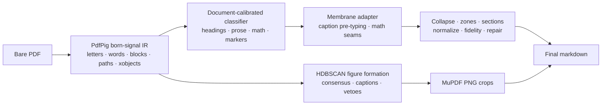

# Clarify pdfdig granularity

> So i've been working on this big push with pdfdig and just stopped at this point `Right — and that granularity difference is *by design*, worth stating precisely since it's load-bearing: the pig lane's `subfigure_grouping`deliberately merges N panel regions that share one float caption into ONE region (the shared caption is the ground-truth grouping signal), because the oracle counts`\begin{figure}` **floats** and the weave rides one crop per caption chunk. The LaTeX lane, by contrast, publishes the author's original per-`\includegraphics` files. So pig = float granularity, latex = panel granularity, and the gate compares like-with-like at float level. If per-panel parity ever becomes a deliverable goal, that's a new decision — nothing today depends on it.
>
> One small clarification on the eyeball: the 1109 crops you just looked at are from the knob-**off** regen (the de-hyphenation acceptance run) — the C′ acceptance eyeball specifically wants **1608 p8/p9 + the FP-list papers (1506 p31/p32, 1509 p26) on a knob-on regen**. Cheap, and it's the last thing between the eject and default-on.
>
> ## Where we are in scope — the full board
>
> **Gate state (both corpora):** PRIMARY 0.35 voroninski (18/23 exact) / 0.7 ph-zigzag (7/10), **0 over-detections anywhere** — clustering PRIMARY remains done. SECONDARY 11.74 / 5.6 recorded; **9.96 / 5.3 measured with C′ on** (not yet default).
>
> | thrust                                              | state                                                                                                                                                  | what remains                                                                                                        |
> | --------------------------------------------------- | ------------------------------------------------------------------------------------------------------------------------------------------------------ | ------------------------------------------------------------------------------------------------------------------- |
> | **A** text-lane + attachment                        | **complete** (A1 hygiene, A2a/A2b recoveries) except **A3**                                                                                            | A3 item-D block detection = the _only_ PRIMARY unders left (2210 −2, 2302 −1); deepest work, render-gated by design |
> | **B** banded metric                                 | **B0–B4 done, parked** — engine+CLI+lane landed, tested, inert; targets proven immune (EOM selection defect), λ re-sweep closed against it twice       | nothing scheduled; revisit only if a future weld class is gap-shaped                                                |
> | **C → C′** stray eject                              | **landed + gated** — statistic locked in 3 iterations, placement lesson absorbed, PRIMARY invariant, 1608 crops fixed, SECONDARY improved both corpora | crop-eyeball 1608 + FP list on knob-on regen → flip default                                                         |
> | **D** glyph candidates (2112 −10)                   | open — **but now unblocked**: B-3's prose-band sidecar landed, which was D's stated dependency                                                         | design + calibrate; the biggest single SECONDARY number left                                                        |
> | **E** IR enrichment (color/clip-group → m2 Jaccard) | open, independent; the crop rider (a) already landed as B1 `visible_bbox`; (b) white fills await color                                                 | interleaves anywhere                                                                                                |
> | **F** docling-lane images + publish carry-up        | open, render-gated                                                                                                                                     | high visibility, low urgency                                                                                        |
>
> **Also closed this session:** de-hyphenation accepted 4/4 (engine fix durable, 1109/2008/2403 verified); the crop-bbox record straightened; both ablation harnesses (`banded-ablation.ps1` with four variants, the two calibration probes) committed as standing instruments.
>
> **The near-term order** per the plan's own logic: (1) the C′ eyeball + default-on flip — minutes of work; (2) then either **A3** (attacks the last PRIMARY unders, highest render visibility) or **D** (attacks the largest SECONDARY residual, now unblocked) — that's a genuine fork worth choosing deliberately next session; (3) E/F interleave behind them.
>
> The meta-note for the record: this session falsified two roadmap premises before implementation (B's acceptance direction, C's global band) and caught one real regression at the gate (placement) — the calibrate-first + gate-everything discipline is now 7-for-7 on paying for itself.`, was wondering if you could do a deep dive on the pdf conversion work so far and then ill show you the next steps plan

<details><summary>12 previous messages</summary>

> I’ll reconstruct the work from the repository evidence—standards, roadmap/notes, recent commits, implementation, tests, and generated evaluation artifacts—then give you a compact but deep account of what is actually landed, why each decision was made, and what remains uncertain. I’ll use the context-mode workflow for the larger history/output inspection so we keep the analysis efficient, and I’ll stay entirely in this session with no sub-agent dispatch.
>
> The context-mode skill is present, but its `ctx_execute` helpers are not exposed in this tool session. I’ll use the prescribed fallback: narrowly filtered PowerShell queries with summarized output, avoiding broad dumps. First I’m mapping the repository’s own source-of-truth documents and the commit window that contains the pdfdig push.
>
> The working tree is on `main` with two pre-existing untracked artifacts; I’ll treat both as user-owned and leave them untouched. The first repository-wide term map is still running because the corpus is large, so I’m letting that bounded search finish before narrowing further.
>
> The chronology is now clear enough to segment: the pdfdig push began June 30–July 3 with the standalone IR/classification/membrane intake, became a renderable figure lane July 3–4, acquired a two-population oracle and Tier‑2 clustering loop July 4–5, then went through the veto/attachment/metric/eject arc through July 12. I’m now tracing those stages against the current code, so the final deep dive distinguishes historical intent from behavior that is actually live.
>
> One important state distinction has surfaced and matches the frontier note: the ordinary gate reads persisted newest-run outputs and currently reports the stale mixed-run SECONDARY values (5.4 / 11.57), while the accepted record was measured by re-clustering every newest IR with the current code (5.6 / 11.74 baseline, 5.3 / 9.96 with C′). I’m running the standing baseline harness once to verify that distinction directly rather than silently inheriting either number.
>
> The harness itself is intact; my first retry deliberately bypassed policy with `-NoProfile`, which also bypassed this repository’s portable-runtime bootstrap, so HDBSCAN could not see the bundled .NET runtime. I’m correcting only the invocation environment—no build or code changes—and will stop rather than chase it if the portable profile still does not resolve it.
>
> The full baseline replay is now progressing under the portable .NET runtime. While it runs, the code trace has confirmed the current ordering is the key architectural fact: HDBSCAN/defrag → consensus and glyph-letter bridges → caption attachment/splitting/subfigure merge → optional C′ region trim → caption-safe furniture and in-flow vetoes → painted-ink/letter-expanded raster crop → finalize weave. That ordering explains several “why not just tune the metric?” decisions in the record.
>
> The replay is slower than the ordinary gate because it reclusters all 33 papers instead of reading stored `figures.jsonl`; that is precisely the provenance difference under investigation. It has not failed, and I’m keeping it bounded to this one baseline pass—no builds or repeated sweeps.
>
> The full replay exceeded the three-minute bound before producing its summary, so I stopped its remaining HDBSCAN process and removed only the verified temp directory it created. I won’t spend quota rerunning it. The accepted 5.6/11.74 → 5.3/9.96 result remains supported by the committed gate record; the live persisted-run check independently confirms why 5.4/11.57 is labeled stale. I’m continuing with source/history inspection only.
>
> For the artifact census I’m switching to the repository’s `jso-jackson` JSON/JSONL tooling, per your project convention, rather than scanning the large lanes directly. This census will quantify what exists on disk versus what the current code can produce—especially important because most persisted runs predate C′ and de-hyphenation.
>
> The repository advanced on `main` while I was reading it: the current HEAD is now newer than the frontier commit, and the formerly untracked 1109 image mirror is committed. I haven’t made or staged any repository changes. I’m refreshing just the new commit range now so the assessment reflects the live tree rather than the snapshot from the start of this turn.
>
> I’ve finished the evidence pass. The system is substantially more mature than “a PDF extractor”: it is now a deterministic, run-versioned conversion stack with born-signal IR, typed text/math projection, a source-independent raster register, and a disciplined oracle/gate loop. The main caveat is that the strongest proof today is figure-lane proof; full aligned text/math superiority over opendataloader is still designed, not measured. I’m doing one final consistency check on HEAD/status, then I’ll hand you the synthesized deep dive.

</details>

## Bottom line

Pdfdig has crossed from “experimental extractor” into a coherent conversion platform. The strongest achievement is not any single clustering heuristic; it is the architecture:

- preserve PDF-born evidence in a deterministic IR;
- separate measurements from later opinions;
- feed typed text/math into the existing membrane;
- render figures through a shared PNG register;
- treat every roadmap premise as falsifiable;
- gate every change against source-derived oracles and actual crops.

The figure lane is now genuinely mature. The broader claim—“pdfdig is a superior bare-PDF replacement for opendataloader across prose, structure, math, and figures”—is promising but not yet proven, because the full aligned conversion metric remains design-only.

## What exists now



The committed orchestrator runs this as one provenance-coherent chain under `.runs/{stamp}/pig/`, keeping regenerable IR out of the paper root: [Invoke-Pdfdig.ps1](./src/pdf-converter/Invoke-Pdfdig.ps1:3).

### Text and structure

The substrate emits atomic letters, derived words, XYCut blocks, vector paths, and bitmap XObject placements. The decisive early discovery was that vendored PdfPig already contained working RecursiveXYCut/DLA support, eliminating the need to invent column detection. The capability survey also established that font names, point sizes, baselines, rendering modes, outlines, and content-stream order are usable born signals: [pdfpig-capability-map.md](./issues/pdfdig-lane/pdfpig-capability-map.md:45).

The classifier then uses document-local order statistics—not corpus-global thresholds—to infer body size, heading bands, leading, indentation, math roles, and outline-backed heading depth: [pdfdig-classify.ps1](./src/pdf-converter/pdfdig-classify.ps1:269).

That gives the lane an important asymmetry over Docling repair: headings and captions can be born typed instead of reconstructed downstream. Caption block IDs from the figure lane are spent in the adapter so wrapped captions become one standalone node and cannot weld into prose: [pdfdig-adapter.ps1](./src/pdfdig-adapter.ps1:95).

The de-hyphenation fix is deliberately conservative: lowercase-hyphen followed by lowercase joins; ambiguous uppercase continuations retain the hyphen, and accepted joins carry a flag: [pdfdig-ir.ps1](./src/pdf-converter/pdfdig-ir.ps1:207).

### Math

Math is materially better than flat text extraction, but it is not “solved”:

- Inline math seams use font role, size, and baseline geometry.
- Display math has recursive size-tier assembly, so nested scripts such as `t_{v_{i+1}}` survive.
- Unbalanced delimiters and stacked structures are flagged rather than guessed.
- A geometry-to-text evidence projection supplies glyph tables and spatial sketches to the gated reasoning repair loop.

The deterministic assembler is still explicitly “1.5-D.” True fractions, matrices, alignments, and other genuinely two-dimensional structures remain the C# AST/Markpig tier or a flagged repair case. The founding dashboard’s “87% render-clean” result was also based heavily on specimen 2508.11646, so it should not be mistaken for a broad current-corpus score.

### Figures

The current figure pipeline is more sophisticated than “HDBSCAN over path boxes”:

1. Rectangle-gap HDBSCAN over vector paths plus bitmap XObjects.
2. Dendrogram-elbow de-fragmentation.
3. Inclusive consensus between geometric clusters and spatially coherent content-stream runs.
4. Small letter-block bridges for diagram labels.
5. Region kind gates: figure, mark, sparse, degenerate.
6. Caption attachment.
7. Caption-interior splitting and bottom-band repair.
8. Shared-caption subfigure grouping.
9. Optional C′ member trimming.
10. Caption-safe furniture and in-flow vetoes.
11. Painted-ink crop tightening plus attached-letter expansion.
12. MuPDF rasterization and final markdown weave.

The ordering around caption attachment is load-bearing, not incidental: [pdfdig-figures.ps1](./src/pdf-converter/pdfdig-figures.ps1:1274), [post-caption stages](./src/pdf-converter/pdfdig-figures.ps1:1314).

The crop path is similarly careful: `visible_bbox` can tighten a crop, but is intersected with the final geometric bbox so it cannot undo A2b’s caption-top trim: [pdfdig-images.ps1](./src/pdf-converter/pdfdig-images.ps1:24).

## The granularity distinction is sound

Your handoff formulation is exactly supported by the code:

- The oracle’s PRIMARY count is `\begin{figure}` floats.
- Pig groups multiple regions sharing one caption block into one float-level region.
- The LaTeX deliverable independently publishes each author `\includegraphics` asset.
- The gate compares pig captioned regions to floats, not to LaTeX image-file count.
- SECONDARY separately compares pig uncaptioned regions to TikZ/xy diagrams outside floats.
- Table/algorithm/listing-cued regions are excluded from both figure populations.

The oracle split is defined in [latex-ingest.ps1](./src/latex-ingest.ps1:395), and the gate’s corresponding pig split is in [Compare-FigureCounts.ps1](./src/pdf-converter/Compare-FigureCounts.ps1:124).

One caveat: this is count parity, not object-level alignment. Historical 2210 and 2302 results already demonstrated that a miss and an extra can cancel to an apparently exact count. The “PRIMARY is done” conclusion is credible because it was supplemented by caption diagnostics and render inspection—not because count equality alone proves it.

## What the measurements establish

The accepted current-code record is:

| Corpus     |                   PRIMARY | Recorded SECONDARY | C′ on |
| ---------- | ------------------------: | -----------------: | ----: |
| ph-zigzag  |   0.7, 7/10 exact, 0 over |                5.6 |   5.3 |
| voroninski | 0.35, 18/23 exact, 0 over |              11.74 |  9.96 |

These are mean absolute count deltas per paper, not percentages or precision/recall.

The normal newest-run gate currently returns the older 5.4 / 11.57 SECONDARY values. That is expected: most stored `figures.jsonl` files predate the latest clustering code. The ablation harness instead reclusters each newest IR to measure the current implementation. I attempted that full baseline replay, but it exceeded the three-minute bound; I stopped its HDBSCAN process and removed its verified temp directory. Therefore the canonical 5.6/11.74 and 5.3/9.96 figures remain grounded in the committed gate record, not a newly completed replay: [frontier brief](./issues/clustering/frontier-20260713.md:10).

The on-disk corpus is substantial:

| Latest persisted runs | ph-zigzag | voroninski |  Combined |
| --------------------- | --------: | ---------: | --------: |
| Papers                |        10 |         23 |        33 |
| Letters               |   487,357 |  1,078,213 | 1,565,570 |
| Words                 |   112,122 |    271,540 |   383,662 |
| Blocks                |     6,848 |     13,013 |    19,861 |
| Paths                 |    32,259 |     45,377 |    77,636 |
| XObjects              |        49 |      5,270 |     5,319 |
| Typed nodes           |    57,488 |    149,564 |   207,052 |
| Regions               |       331 |      1,149 |     1,480 |
| Figure crops          |       171 |        321 |       492 |

All 492 latest persisted figure-manifest rows report successful PNG renders. Of those regions, 136 are captioned figures. Only 1109, 2008, and 2403 have post-de-hyphenation pig runs, exactly matching the frontier note.

## Reading the A–F board

- **A is mostly a triumph of render-driven diagnosis.** A1 falsified its own premise. A2a and A2b recovered real missing figures through two distinct attachment failures. A3 is correctly isolated as block formation/extraction, not clustering. It is the only remaining high-confidence actionable PRIMARY tail: 2210 −2 and 2302 −1.

- **B is successful engineering attached to a falsified product hypothesis.** The banded metric, CLI, bands sidecar, unit vectors, and lane wiring are real and reusable. But EOM with `allow_single_cluster` selects a root that absorbs remote strays regardless of finite gap inflation. The metric cannot repair a selection defect, and its measured corpus effect was adverse. Parking it is the correct verdict, not unfinished work.

- **C′ is the strongest late-stage result.** The global persistence-band proposal was falsified because genuine figure assembly and death scales overlap incompatibly. The surviving method is relative: walk a selected region’s dendrogram spine, clamp contact-scale micro-gaps at 1em, find a large log-gap, and remove only thin far-side rungs. Moving it after caption splitting made PRIMARY safety structural. The only missing acceptance item is genuinely visual: knob-on 1608 and the false-positive census crops.

- **D is unblocked but dangerous.** It is the first major assertion path after a long sequence of successful vetoes. Glyph diagrams and multiline display equations occupy dangerously similar evidence space. D-0 needs to prove arrow-glyph/grid structure discrimination before any region-candidate implementation.

- **E remains foundational debt.** Letter color exists, but path color buckets, clip-group identity, and marked-content identity do not. Until those land, white-fill crop de-inflation and graded provenance/Jaccard consensus remain unavailable.

- **F remains a width problem, not a core converter problem.** Pig images weave correctly, and the newly committed 1109 mirror now has all 11 referenced crops. Docling-only image carry-through and compendium publication of membrane image directories remain open.

## Important debts I would carry into the next plan

1. **The full conversion metric is not implemented.** The aligned fidelity design exists, but no `src/conversion-metric.ps1` exists. Consequently, the replacement claim is quantitatively strong for figure counts/crops and much weaker for prose/math fidelity.

2. **Measurement provenance has two small defects.**
   - The ablation script header still calls 5.4/11.57 the recorded baseline, contradicting the frontier’s corrected 5.6/11.74 record: [banded-ablation.ps1](./scratch/banded-ablation.ps1:19).
   - `Compare-FigureCounts` reports `pig_run=.runs`, because it takes one parent too many when deriving the stamp: [Compare-FigureCounts.ps1](./src/pdf-converter/Compare-FigureCounts.ps1:196).

3. **The documentation has drifted behind the implementation.** Several early descriptions still call the IR four-lane even though Lane 5 XObjects are live. One LaTeX return comment still describes `oracle_figures` as placements plus diagrams even though the actual counter is floats.

4. **The repair checklist contradicts the authoritative standard.** [STANDARDS.md](./STANDARDS.md:5) and the implementation require `$...$`/`$$...$$`, while [CHECKLIST.md](./CHECKLIST.md:23) still tells agents to use `\(...\)`/`\[...\]`. That is worth reconciling because it can produce agent-authored format drift.

5. **Test breadth and current execution evidence differ.** The relevant source files contain 160 Pester cases, including 75 figure and 20 oracle-gate cases. The current `testResults.xml`, however, records only the five focused de-hyphenation tests as executed; it is not evidence that all 160 passed in the current environment. The landing commits provide the broader green claims.

My overall judgment: the architecture and figure work are excellent, the measurement discipline is unusually strong, and the remaining uncertainty is now concentrated rather than diffuse. The next plan should explicitly choose whether the next objective is reader-visible completeness (A3/F), SECONDARY reduction (D), or substrate/generalization (E/full conversion metric). I’m ready to look at it.

At handoff, `main` is clean at `de5c363`; I made no repository changes.

> As used to say on the old company slack about github: ptal

<details><summary>2 previous messages</summary>

> PTAL received. I’ll review what changed on `main` since my `de5c363` handoff—especially any new frontier/next-steps plan—and give you the review rather than merely restating it. I’ll use the context-mode discipline for the Git/history inspection, with no sub-agent dispatch.
>
> The context-mode helpers still aren’t exposed in this session, so I’m using the same bounded PowerShell fallback: commit subjects, diff statistics, then only the changed plan/code sections that need judgment.

</details>

The old incantation. PTAL received—but `main` is still clean at `de5c363`, with no new diff since my review. Paste or point me to the next-steps plan and I’ll dig in.

> PTAL is an acronym for "please take a look" in response to your "Ready to take a look"

Ah—yes. You were answering my “ready to look” with the classic “please take a look.” I over-literalized it into a Git check. Got it now 😄

> please take a look as you were prepared to do above please.

<details><summary>4 previous messages</summary>

> Understood—I’ll review the plan itself, not re-check whether Git moved. The likely artifact is `issues/clustering/opus-clustering-next-steps.md`; I’m opening that and its relationship to the newer frontier brief now, then I’ll give you an actual critique.
>
> The file named `opus-clustering-next-steps.md` is a July 5 historical design note, not the live plan—it still assumes provenance/Jaccard and the old `+38/−8` framing that subsequent probes displaced. I’m treating the dated frontier’s forward section as the actual plan and reviewing that now: C′ acceptance, the A3/D fork, then E/F.
>
> I’m pressure-testing the two probes rather than accepting their wording at face value. The key question for D is whether `2112`’s LaTeX `diagrams.jsonl` actually contains page/location truth; if it only contains source snippets, the proposed oracle cannot directly label PDF glyph clusters without an alignment step.
>
> The probes are directionally right, but two concrete issues have emerged: A3’s binary “words exist?” split is too coarse for the actual lane stack, and D’s proposed oracle sidecar has no PDF page/bbox fields at all. I’m checking F’s destination contract next, because the plan says carry `{slug}-membrane/` into a compendium while `STANDARDS.md` requires `images/{slug}/`; that may need an explicit rename/rewrite step.

</details>

## PTAL verdict

The live frontier plan is sound. I’d approve it with four amendments before execution.

### 1. Ship C′ exactly as planned

The sequence is right: knob-on targeted regen → inspect 1608 plus the complete false-positive census → flip default → refresh naturally.

For a clean closing record, preserve:

- Exact knob-on run stamps.
- The complete 11-row review manifest and crop verdicts.
- Before/after crop dimensions for 1608 p8/p9.
- Config flip plus frontier update.
- Correction of the stale 5.4/11.57 baseline comment in `banded-ablation.ps1`.

A full-corpus raster regen should not block default-on; the two-corpus offline gate already established the numerical result.

### 2. Make A3-0 a four-layer probe

The current binary question—“do the words exist?”—collapses several distinct failure locations. Probe each target through:

1. Caption glyphs in `letters.jsonl`.
2. Caption tokens in `words.jsonl`.
3. Corresponding line/block assembly in `blocks.jsonl`.
4. Typed node/cue visibility in `nodes.jsonl` and the figure attachment pass.

That distinguishes:

- extraction failure;
- word assembly failure;
- XYCut/block failure;
- block-text fragmentation;
- attachment failure.

Ground the probe by figure identity and PDF coordinates, not merely by nearby text. Acceptance should explicitly recover the three high-confidence missing floats, with target-number assertions and zero new caption claims/PRIMARY overs across both corpora.

If the letters or words survive, I agree that bounded caption rescue is preferable to DLA surgery—but it should reuse the existing style, geometry, separator, and in-text-reference guards.

### 3. D-0 needs a real alignment oracle

This is the largest defect in the written plan. The `2112` diagrams sidecar has 17 records, but its schema is only:

`n`, `kind`, `status`, `image`, `source`

It has no PDF page or bbox: [2112 diagrams sidecar](./ingestion/compendia/ph-zigzag/2112.02352/.runs/20260706_075458/tex/2112.02352.diagrams.jsonl:1). Therefore it cannot directly label candidate glyph clusters.

Before calibrating arrow/grid features, create object-level truth by either:

- manually labeling the 17 rendered diagrams in PDF page coordinates—probably cheapest for one paper; or
- locating the oracle PNGs in PDF page rasters with scale-tolerant template matching.

D-0 also needs negative controls:

- multiline display equations inside 2112;
- several `oracle_inline=0` voroninski papers;
- arrow-heavy equations, which specifically challenge the arrow-glyph discriminator.

Score object-level precision/recall, not just whether the total improves from −10. Otherwise missing diagrams and false equation crops can cancel exactly as earlier PRIMARY counts did.

### 4. Predeclare the A3-versus-D decision rule

“Let measurements pick” is insufficient because A3 and D optimize different objectives. Measurements determine feasibility; they cannot decide how much a missing captioned float is worth relative to SECONDARY count reduction.

I would use:

- If A3 reveals surviving letters/words and a bounded rescue path, do **A3 first**.
- If A3 requires global DLA work, while D shows clean target/negative separation, do **D first**.
- If D lacks clean alignment or equation separation and A3 is engine-deep, take **F or E1** rather than forcing either implementation.

### E should be split

The proposed “clip-group-id + color-bucket + marked-content-id” increment bundles three signals with very different accessibility.

Start with **E1: path paint color**, because PdfPig exposes fill/stroke colors and the crop payoff is already diagnosed. But the opinion-free IR should emit canonical raw `fill_color` and `stroke_color`; derive page-background/color buckets downstream. A bucket alone would violate the substrate’s measurement-versus-opinion separation. Current path records stop at paint booleans: [pdfdig-ir.ps1](./src/pdf-converter/pdfdig-ir.ps1:568).

Treat clip-group identity and marked-content-to-path association as separate feasibility probes. The existing `is_clipping` boolean does not imply that group identity is directly recoverable.

### F is actually two asymmetric gaps

The current publish lane already discovers and copies raw Docling images, but only surfaces images omitted from the finalized body: [publish.ps1](./src/publish.ps1:187). Meanwhile pig finalize weaves from `{slug}-membrane/`, but publish only recognizes the raw `{slug}/` source form: [finalize.ps1](./src/finalize.ps1:131), [publish.ps1](./src/publish.ps1:163).

So F should be defined as:

- **F1:** Docling image placement/weave into the finalized body.
- **F2:** Publish source abstraction supporting both `{slug}/` and `{slug}-membrane/`, rewriting either to canonical `images/{slug}/`.

Add one docling-only and one pig-only dry-run/publish fixture. The destination contract itself is already correct.

## Recommended order

1. Close and default-enable C′.
2. Run refined A3-0 and aligned D-0.
3. Implement A3 if bounded; otherwise D only if its negative controls are convincing.
4. Use F as the low-risk second-half task.
5. Take E1 color opportunistically; defer E2/E3 until their signals prove reachable.
6. Run the mapper transport gate after its 0/10 pig-run gap is filled.

One housekeeping note: [opus-clustering-next-steps.md](./issues/clustering/opus-clustering-next-steps.md:17) is historical and materially superseded. It deserves an explicit superseded banner so nobody accidentally resurrects its old provenance-first assumptions.

No repository changes made.

<details><summary>4 previous messages</summary>

> Context compaction
>
> Source: automatic
> Status: completed
>
> What are your thoughts on the clustering work so far with hdbscan? I feel like there's still alot more i can do with clustering
>
> I’m going to assess HDBSCAN as it is actually wired into pdfdig—not just whether the scores can be tuned, but whether it is solving the right object-formation problem. I’ll keep this read-only and focus on the highest-leverage avenues beyond another parameter sweep. The context-mode workflow applies here because this is a codebase-wide clustering review; I’m using it to keep inspection bounded.
>
> The first important distinction is already clear: this is no longer “plain HDBSCAN tuning.” HDBSCAN supplies the initial geometric partition, but most of the quality now comes from evidence views, caption topology, vetoes, and post-selection repair. I’m checking the freshly re-minted July 15 frontier and the selector itself before giving you a recommendation on where more clustering work is genuinely worthwhile.

</details>

Yes—there is considerably more clustering work available, but the next chapter is not another broad `minPts`/`min_cluster_size` sweep. HDBSCAN has largely saturated as the sole path-geometry decision-maker; the larger opportunity is to make it one strong view inside a multi-view, constrained clustering system.

The work so far is genuinely strong:

- The engine implements the real pipeline—core distances, mutual-reachability MST, condensation, EOM selection, epsilon merging, and membership probabilities—not a DBSCAN approximation. See [Hdbscan.cs](./src/hdbscan/Hdbscan.cs:5).
- Rectangle-gap is the right primitive for bounding boxes, and em-normalization makes the surrounding policy much more transportable than page-point thresholds.
- The experimental discipline has been excellent. Banded distance was falsified, global persistence was falsified, and C′’s first placement was rejected at the gate. Those are productive results.
- On the present corpora, PRIMARY moved from roughly 3.7 error to 0.7/0.35, with zero over-detections. The remaining PRIMARY misses are no longer clustering defects. That distinction in the [current frontier](./issues/clustering/frontier-20260715.md:14) matters.

My assessment by direction:

| Direction                                    | Expected value |
| -------------------------------------------- | -------------: |
| More global HDBSCAN knob sweeps              |            Low |
| Better selection from the existing hierarchy |           High |
| Multi-view/signed clustering                 |      Very high |
| New glyph-based candidate clustering         |           High |
| Replacing HDBSCAN entirely                   |      Premature |

The ceiling you have encountered is structural. A PDF page is not one variable-density point cloud:

- Dense plots may contain thousands of paths.
- Sparse diagrams may contain two or three.
- TikZ-cd diagrams may be almost entirely glyphs.
- Bitmaps are XObjects.
- Captions and prose bands provide strong semantic boundaries but are not geometric points.
- PDF authoring style changes path segmentation without changing the visual object.

No fixed `minPts=3`, `min_cluster_size=3` configuration can make those representations commensurate. HDBSCAN is seeing implementation artifacts of the PDF as well as visual structure.

The most revealing result was B: changing the distance metric could not repair a root-selection failure. With `allow_single_cluster`, EOM could select the root and absorb remote material at any distance. C′ succeeded because it used relative structure inside the selected cluster and ran at the correct pipeline position. That is evidence that selection semantics now matter more than another metric.

Where I would take the clustering program:

1. Build an object-level clustering benchmark

The current count gate is excellent for product safety, but insufficient for clustering research. Equal counts can conceal one over-merge plus one miss.

A small gold suite should label representative pages with:

- oracle object identity and bbox;
- caption identity;
- predicted-to-oracle matching;
- split and merge errors;
- crop coverage and contamination;
- optionally, path/XObject/glyph membership.

Then score object precision/recall, matching IoU, split rate, merge rate, and crop purity alongside PRIMARY/SECONDARY counts. D-0’s aligned oracle is a good first instance of this discipline.

2. Turn cluster selection into an experimental seam

The engine currently hardcodes EOM selection around [Hdbscan.cs](./src/hdbscan/Hdbscan.cs:253). I would expose the condensed tree and make selection replayable offline, without recomputing distances or the MST.

Useful selectors to compare include:

- existing EOM;
- leaf selection;
- EOM with guarded root eligibility;
- cluster-relative persistence/contact-scale cuts;
- GLOSH-style outlier scoring;
- the existing C′ spine-elbow rule generalized as a selector.

I would not expect leaf selection to win outright—it will probably shatter sparse figures—but selector ablations could show whether defrag and C′ are instances of one coherent local-selection rule.

The emitted membership probabilities are currently unused by the figure consumer. They are worth profiling as diagnostic evidence, especially for tail members, but I would not apply an absolute probability threshold: the failed global persistence experiment strongly predicts poor transport.

3. Continue from hard OR to graded, signed multi-view clustering

This is the richest frontier. The existing [consensus seam](./issues/clustering/consensus-milestone1-design.md:46) already anticipates it.

Positive evidence:

- geometric cophenetic proximity;
- same content-stream run;
- letter bridges;
- shared XObject/clip/marked-content provenance;
- compatible color/paint group;
- shared caption.

Negative or cannot-link evidence:

- an interior caption boundary;
- prose-band crossing;
- column gutter;
- two distinct caption anchors;
- strong in-flow membership.

The important advancement would be moving beyond union-find’s inclusive OR. OR can only merge and can re-weld objects. A weighted or signed graph can express “these probably belong together” and “these must remain separate.” HDBSCAN then becomes `V_geom`, not the final authority.

4. Normalize representation before density estimation

Raw path count is partly an authoring-format variable. A promising probe would collapse obviously equivalent primitives—coincident boxes, intersecting micro-segments, or strong shared-provenance groups—into weighted compound nodes before clustering.

That could make density mean something closer to visual density rather than “how this PDF generator serialized the drawing.” It needs careful ablation because pre-collapse can also erase useful sparse bridges.

5. Treat D as a new clustering modality

The 2112 residual is not something path HDBSCAN can recover: the relevant objects never enter its point set. Glyph diagrams need their own candidate generator over letters/words, with prose bands as constraints and arrow/grid/alignment structure as features.

I would keep that as a separate view rather than mixing glyphs directly into the path metric. The danger class—multiline equations—is sufficiently different that it deserves its own calibrated model and object-level negative controls.

6. Demand transport before adding sophistication

The mapper corpus remains the decisive test. Until it has pig runs and aligned oracle data, there is a real risk that increasingly elegant clustering machinery merely fits the two development corpora.

So my bottom line is: your instinct is right. There is a lot more clustering here, but the valuable progression is:

`HDBSCAN as answer` → `HDBSCAN hierarchy as geometric evidence` → `multi-view constrained object formation`

I would keep the HDBSCAN engine. Its dendrogram is more valuable than its current hard labels. The next major payoff is likely to come from better truth, better selection, and signed evidence fusion—not from squeezing another decimal out of the same three global knobs.

> well down the line, i actually plan to run two different HBSCAN clustering approached, for geometric and symbolic features that can be pulled via pdf pig

Ah—yes. That clarifies the longer-term architecture considerably. I had pictured one HDBSCAN geometric view plus non-HDBSCAN evidence views. Two independently calibrated HDBSCAN lineages—geometric and symbolic—is a stronger and more coherent design.

| View              | Likely representation                                                      | What it discovers                                        |
| ----------------- | -------------------------------------------------------------------------- | -------------------------------------------------------- |
| Geometric HDBSCAN | Path/XObject bounding boxes; rectangle-gap or conditioned distance         | Spatially coherent figure components                     |
| Symbolic HDBSCAN  | Sparse provenance/graphics-state token sets; IDF-weighted Jaccard distance | Drawing elements related by how the PDF constructed them |

The symbolic view could use PdfPig-derived signals such as:

- content-stream run and operator adjacency;
- Form/Image XObject ancestry and object references;
- marked-content tag/MCID, where association is recoverable;
- clipping-stack identity or canonical clip signature;
- graphics-state lineage;
- raw fill/stroke color;
- dash pattern, line width, paint mode;
- font/glyph family for text-drawn diagrams.

A plot fragmented geometrically might still have strong symbolic cohesion because its pieces share a rare clip group, Form XObject, marked-content scope, or graphics-state sequence. Conversely, two nearby objects that geometry welds may have entirely separate construction provenance.

A few design choices would be load-bearing:

1. Use a common atom identity

Both clusterers should ultimately speak about stable IR atoms—path IDs, XObject IDs, and eventually glyph-group IDs. A view may abstain for atoms without its features, but the fusion layer needs an exact mapping back to the same objects.

2. Keep the IR opinion-free

Emit raw colors, object references, graphics-state facts and marked-content facts. Construct symbolic tokens and buckets downstream. That matches the E1/E2/E3 split in the [current frontier](./issues/clustering/frontier-20260715.md:116).

3. Give the two clusterers independent density parameters

Symbolic density has no reason to share geometric `minPts=3` or `min_cluster_size=3`. Rare shared provenance may make a meaningful two-member symbolic cluster, while geometry needs stronger support. They should share an engine, not a calibration.

4. Preserve lineages, not merely final labels

The ideal output from each run is pairwise cophenetic/co-membership strength plus confidence:

- geometry says how long two atoms remain connected spatially;
- symbolism says how strongly their provenance overlaps;
- the fusion rule selects the final region.

That is exactly what the existing `IClusterLineage`/graded-strength seam anticipated in the [consensus design](./issues/clustering/consensus-milestone1-design.md:46).

5. Weight symbolic rarity

Shared black stroke color should contribute almost nothing; a shared rare MCID or Form-XObject ancestry should contribute heavily. IDF-weighted Jaccard is therefore a very natural metric:

`distance = 1 − weighted_jaccard(symbolsA, symbolsB)`

Also treat missing information as abstention—not as a shared `none` token—or feature absence will create enormous artificial clusters.

6. Verify that symbolic distance is genuinely graded

This is the main caveat. If the symbolic feature vectors produce almost exclusively distances of 0 or 1, HDBSCAN adds little beyond connected components over exact matches. Before implementation, histogram:

- pairwise symbolic distances inside known figures;
- across adjacent figures;
- figure versus nearby furniture;
- unrelated page atoms.

HDBSCAN earns its place if those distributions contain meaningful intermediate structure.

For fusion, I would avoid immediately OR-ing the two hard partitions. The current inclusive rule can only merge, which is why re-welding remains a watch item. The natural experiment matrix is:

- geometry only;
- symbolic only;
- inclusive;
- mutual;
- normalized mean/cophenetic fusion;
- fusion plus caption/prose/gutter cannot-link constraints.

My prior would be that normalized graded fusion wins, with captions and prose bands remaining signed structural evidence rather than being forced into either feature space.

So the eventual architecture becomes:

`opinion-free PDF atoms → geometric HDBSCAN + symbolic HDBSCAN → lineage-strength fusion → signed structural constraints → caption-aware regions`

That is substantially more than “more HDBSCAN tuning.” It turns the hierarchy engine into a reusable clustering substrate for two genuinely different notions of relatedness. And it fits the lessons already learned: geometry is valuable, provenance is valuable, but neither should be allowed to declare the final object alone.

> indeed, and I may even consider lifting my SPC from thermomapper to try that at clustering `D:\aghado01\ThermoMapper\src\clustering\graphical\spc`, if i can pin down what it might add that hdbscan alone cannot

<details><summary>2 previous messages</summary>

> That is exactly the right question for SPC: not “is spectral clustering more sophisticated?”, but “which observed failure class becomes separable only after diffusion over a graph?” I’ll inspect the ThermoMapper SPC implementation and map its actual outputs and assumptions onto pdfdig’s two prospective HDBSCAN views. Read-only, and no sub-agent dispatch. The context-mode workflow applies because this crosses a clustering module and its design record.
>
> One sharp distinction has emerged from the implementation: ThermoMapper contains both a direct PKWang route that explicitly reduces to thermal single-linkage, and the full Swendsen–Wang/Potts route with temperature-dependent co-membership and phase structure. Only the latter is a plausible source of genuinely new information over HDBSCAN. I’m checking graph construction, signed-edge support, and hierarchy selection now, because those determine whether SPC is a new lens or merely a more expensive recut of the same distances.

</details>

The clean answer is: SPC earns the lift only for its full-graph, collective co-membership behavior. It does not earn the lift merely as another multiscale hierarchy.

Your PKWang route explicitly reduces to thermal single-linkage in [PKWang.cs](D:/aghado01/ThermoMapper/src/clustering/graphical/spc/runtime/core/solver/PKWang.cs:11). That is close enough to HDBSCAN’s mutual-reachability single-linkage core that it would mostly be an alternative weighting/cut mechanism—not fundamentally new information.

The full Swendsen–Wang/Potts route is different.

| Claimed benefit                   |        HDBSCAN already has it? |                    SPC adds something distinct? |
| --------------------------------- | -----------------------------: | ----------------------------------------------: |
| Multiscale hierarchy              |                            Yes |                                              No |
| Variable-density handling         |                            Yes |                                  Not inherently |
| Noise/abstention                  |                            Yes |                    Different policy, not unique |
| EOM/persistence selection         |                            Yes |                 Different axis, but overlapping |
| Arbitrary sparse affinity graph   |                        Limited |                                             Yes |
| Uses redundant paths and cycles   | No—hierarchy reduces to an MST |                                             Yes |
| Collective pairwise co-membership |                             No |                                             Yes |
| Stable thermodynamic phases       |                             No |                                             Yes |
| Signed cannot-link edges          |                             No | Not in the current ferromagnetic implementation |

The fundamental discriminator is this:

> Once core distances are fixed, HDBSCAN’s hierarchy is determined by the mutual-reachability MST. Non-MST edge redundancy disappears. Full SPC continues to see every coupling and every alternate path.

That means two graphs can have the same core distances and the same MST—therefore the same HDBSCAN hierarchy—but very different internal edge redundancy. SPC can distinguish:

- two richly connected communities joined by one accidental bridge;
- one uniformly chain-like structure with no community bottleneck.

That is exactly the kind of distinction potentially relevant to pdfdig. A body-text weld or stray may attach through one narrow route, while a real figure has multiple mutually reinforcing geometric, stream, and symbolic relations.

The useful SPC currency is therefore not its final hard partition. It is the sampled pairwise co-membership field. Your [ThresholdCoMembership](D:/aghado01/ThermoMapper/src/clustering/graphical/spc/partitions/strategies/ThresholdCoMembership.cs:7) explicitly captures transitive multi-hop co-clustering rather than only direct bond activity. HDBSCAN membership probability answers “how securely does this point belong to the selected cluster?” SPC co-membership answers “how consistently do these two atoms participate in the same collective state?” The latter is much better suited to multi-view consensus.

A plausible final placement would be:

`geometric HDBSCAN lineage + symbolic HDBSCAN lineage`
`→ sparse fused coupling graph`
`→ SPC co-membership/temperature sweep`
`→ persistent collective lineages`
`→ caption/prose constraints and final regions`

ThermoMapper already supports this cleanly because [SpcClusteringSession](D:/aghado01/ThermoMapper/src/clustering/graphical/spc/SpcClusteringSession.cs:61) accepts a prebuilt `CsrGraph`. You would not need to feed it another dense feature matrix or inherit the default KNN construction.

I would especially investigate [LineagePersistence](D:/aghado01/ThermoMapper/src/clustering/graphical/spc/partitions/hierarchical/LineagePersistence.cs:49). Its `resolution steps survived × decidedness` score offers something meaningfully different from HDBSCAN EOM: a weakly coupled composite can live across several temperatures but remain internally indecisive, while a real collective stays both persistent and crisp.

A few cautions matter.

First, SPC’s community bias may hurt real sparse figures. Commutative diagrams, barcode chains, and glyph diagrams can be trees or long chains with little redundant connectivity. In a Potts model, correlations along such a chain decay with distance; SPC may split precisely the sparse objects pdfdig fought to preserve. Symbolic provenance could add reinforcing edges, but this must be a named guard class.

Second, the current system is ferromagnetic. Caption boundaries, prose bands, and distinct caption anchors cannot simply become negative couplings. They should delete or attenuate edges before SPC, or remain downstream cannot-link constraints.

Third, graph construction can masquerade as an SPC improvement. ThermoMapper’s graph substrate has KNN topology, repair, geodesic refinement and adaptive coupling projection in [GraphCompilerConfig.cs](D:/aghado01/ThermoMapper/src/graphs/GraphCompilerConfig.cs:21). If SPC wins only because it received a better graph than HDBSCAN, the added value belongs to the graph builder, not the Potts dynamics.

I would use the following ablation to pin that down:

1. Same atom universe and same fused graph.
2. Plain thresholded connected components.
3. HDBSCAN over graph-derived dissimilarities.
4. PKWang as the expected single-linkage-like negative control.
5. Full Swendsen–Wang co-membership.
6. Full SPC plus lineage persistence.

SPC earns entry only if steps 5–6 beat 2–4 on object-level split/merge and crop-purity metrics.

The cleanest synthetic unit test would be a pair of fixtures with identical core distances and mutual-reachability MSTs but different non-MST redundancy. HDBSCAN should be identical by construction; SPC should prefer the redundant community structure. Then add the adversarial inverse: a legitimate uniform chain that SPC must not dissolve.

Operationally, I would not run full SPC over every raw 23,000-path page. Swendsen–Wang costs roughly `temperatures × draws × edges`. Its natural role is a disagreement resolver:

- both HDBSCAN views agree strongly → accept;
- one abstains or they conflict → build the local candidate graph;
- SPC adjudicates only that ambiguous superregion.

So yes, there is a real, pin-downable addition: **SPC can exploit collective graph coherence and redundant evidence that HDBSCAN’s MST necessarily throws away**. If the eventual PdfPig symbolic graph contains that redundancy, the lift could be genuinely valuable. If it is mostly chains or binary exact-match components, SPC would be complexity without new signal.

> I've implemented my SPC to be highly efficient, and i actually have some more coming in the form of adaptive temperature sampling that is net new. but I'm mainly interested in what a SPC proper might be able to do for the problem that HDBSCAN cannot. SPC is not simply spectral clustering and it's uniquely well designed to handle topologically frustrated data

<details><summary>1 previous message</summary>

> You’re right to correct that framing. I collapsed “SPC proper” toward graph community detection and treated PKWang’s single-linkage reduction as too representative of the family. The distinctive object is the Potts ensemble and its phase/co-membership landscape—especially when the evidence graph cannot be faithfully reduced to one laminar metric hierarchy. I’m tracing ThermoMapper’s own use of “frustration” and non-nesting so I can state the pdfdig payoff precisely.

</details>

You’re right. I framed SPC too narrowly as “full-graph community coherence,” when the deeper distinction is:

> HDBSCAN constructs one laminar density filtration; SPC proper samples globally consistent Potts states over an interaction topology.

That is categorically different from spectral clustering—and it gives SPC a real opening in pdfdig.

| Property             | HDBSCAN                                             | SPC proper                                                           |
| -------------------- | --------------------------------------------------- | -------------------------------------------------------------------- |
| Primitive            | Pairwise dissimilarity and local density            | Interacting graph variables                                          |
| Global structure     | Nested cluster tree                                 | Ensemble of equilibrium partitions                                   |
| Conflicting evidence | Must be scalarized into one distance                | Appears as competing collective order                                |
| Stability            | Lifetime along density $\lambda$                    | Persistence across temperature and sampled states                    |
| Ambiguity            | Noise/membership relative to one selected hierarchy | Pairwise correlations, fluctuating periphery, competing affiliations |
| Non-nesting          | Impossible                                          | Can be observed as members regroup across phases                     |

Your own implementation already states the crucial fact: a non-nested temperature stack carries “contest/frustration a dendrogram cannot represent” in [PartitionHierarchyDendrogram.cs](D:/aghado01/ThermoMapper/src/clustering/graphical/spc/partitions/hierarchical/PartitionHierarchyDendrogram.cs:18). HDBSCAN is necessarily a dendrogram. It cannot represent that contest without warping it into a tree.

### Where pdfdig becomes topologically frustrated

Suppose four PDF atoms have two cross-cutting relational structures:

- Geometry supports `{A,B}` and `{C,D}`.
- Symbolic provenance supports `{A,C}` and `{B,D}`.

There is no single scalar distance ordering that faithfully preserves both. A fused HDBSCAN run must:

- privilege one view;
- compromise the distances;
- chain all four;
- or call some atoms noise.

Its hierarchy can never express “A affiliates with B in one stable regime but with C in another.” Every child cluster must remain nested beneath one ancestor.

SPC can expose the actual condition:

- competing macrostates;
- low or multimodal pairwise co-membership;
- narrow versus persistent phases;
- atoms that migrate between collective organizations;
- non-nested temperature partitions.

That is much closer to the real PDF problem than a conventional metric-space picture. PdfPig exposes several relational systems that can cross-cut each other:

- physical geometry;
- content-stream order;
- shared graphics state;
- clipping and Form-XObject ancestry;
- marked-content scopes;
- color/paint provenance;
- glyph/font relationships;
- caption and prose topology.

Those relationships will not always agree. Their disagreement is not necessarily extraction noise—it may be the central structural fact.

### What SPC can do that HDBSCAN fundamentally cannot

1. Represent partition contest

HDBSCAN must return one nested history. SPC can show that the graph does not support a single laminar explanation. For pdfdig, that could distinguish a genuinely ambiguous atom from an ordinary remote outlier.

2. Preserve global spin consistency

HDBSCAN decides connectivity through pairwise reachability and ultimately a tree. It does not ask whether all locally attractive associations form a globally coherent assignment.

The Potts ensemble does. Local evidence that looks persuasive edge-by-edge can become unstable when embedded in a frustrated cycle. That is potentially powerful against symbolic hubs—common clip states, black strokes, fonts or resource ancestry that locally connect objects which globally belong to different floats.

3. Separate stable cores from contested peripheries

C′ identifies a thin geometric tail through a relative dendrogram elbow. SPC could generalize that idea beyond geometry:

- stable figure atoms remain highly co-membered across a phase;
- body-text parasites fluctuate or affiliate inconsistently;
- boundary atoms show temperature-sensitive allegiance;
- the final pipeline can preserve the core while abstaining on the contested periphery.

That is richer than HDBSCAN’s point-to-selected-cluster probability because it retains pairwise collective behavior and alternative configurations.

4. Detect structure without a density valley

Two PDF objects may not be separable by any clean density gap, especially after geometry and symbolism are combined. They may instead be separable because the interaction graph has two collectively stable orders divided by frustrated/bottleneck relations.

HDBSCAN needs the separation to appear in its scalarized reachability topology. SPC needs it to appear in the statistical mechanics of the graph.

5. Report that no honest flat partition exists

This may be SPC’s most valuable contribution. HDBSCAN always offers a tree from which some cut can be selected. SPC can indicate:

- no stable superparamagnetic plateau;
- several competing transitions;
- unstable co-memberships;
- genuine non-nesting;
- insufficient resolution around a transition.

That permits an honest abstain or escalation to caption evidence instead of forcing a crop.

### Why adaptive temperature sampling matters conceptually

Your adaptive sampler is more than a performance improvement. It lets the engine distinguish:

- an apparent non-nesting caused by undersampling;
- a narrow real phase missed by a coarse grid;
- one broad stable organization;
- several nearby pseudo-transitions;
- persistent contest that survives schedule refinement.

In pdfdig terms, it could resolve whether “panel structure versus float structure” is a genuine two-scale hierarchy, while “geometry versus symbolic provenance” is a true competing organization.

That is information no HDBSCAN parameter sweep can generate, because HDBSCAN has only its predetermined density filtration.

### The placement I now think is most compelling

SPC should not merely become a third independent labeler. Its highest-value role is the stage allowed to see the two HDBSCAN views in contest:

`geometric HDBSCAN lineage + symbolic HDBSCAN lineage`
`→ multiplex atom-interaction graph`
`→ SPC phase ensemble with adaptive temperature sampling`
`→ stable cores, contested periphery, phase lineages/non-nesting`
`→ caption-aware final resolution`

The HDBSCAN runs contribute excellent proposal structure and local scale estimates. SPC determines whether those proposals coexist coherently when considered together.

I would preserve cophenetic strengths from both HDBSCAN runs rather than feed SPC only their hard labels. Hard labels would discard the exact ambiguity SPC is meant to examine.

### The decisive probe

The proof should use intentionally frustrated fixtures, not generic blobs:

- cross-cutting geometric and symbolic partitions;
- two coherent figures connected by a locally plausible symbolic hub;
- a text parasite that forms one strong geometric bridge but has inconsistent global provenance;
- panel-level and float-level organizations at different scales;
- a legitimate sparse chain/tree as the danger control.

The critical success condition is not merely a better flat count. It is that SPC:

- finds a stable correct phase where HDBSCAN must chain or choose one view;
- assigns low/unstable co-membership to the contested atoms;
- identifies genuine non-nesting rather than fabricating a hierarchy;
- preserves the sparse-tree guard class;
- remains stable as adaptive temperature resolution increases.

So the strongest thesis is no longer merely “SPC uses edges HDBSCAN’s MST discards.” It is:

> SPC can model collective order, phase competition, and non-laminar regrouping in a multiplex PDF evidence graph; HDBSCAN, by construction, must collapse that graph into one nested density story.

That is a substantial and genuinely unique reason to bring SPC into pdfdig.

> im not sure whether SPC would replace or add a new rung to the workflow, like i did with the two separate hdbscan runs. complementary

I’d treat SPC as a new rung initially—but one that may eventually replace the fusion/selection layer, not necessarily either HDBSCAN run.

The architectural question is really: which layer owns the final partition?

```text
PDF atoms
 ├─ H_G: geometric HDBSCAN lineage
 ├─ H_S: symbolic HDBSCAN lineage
 └─ raw structural evidence
              ↓
       R_SPC: phase resolver
              ↓
 caption/layout safety constraints
              ↓
         figure regions
```

Here `H_G` and `H_S` are complementary views. `R_SPC` sees their interaction and determines whether their proposed relationships form a coherent collective organization.

That placement gives SPC access to the frustration created between the views. If SPC merely runs as a third independent labeler over geometry or symbolic features alone, it may never see the cross-cutting conflict that uniquely justifies it.

### Likely division of responsibility

- Geometric HDBSCAN: proposes spatial-density structure and handles geometric noise.
- Symbolic HDBSCAN: proposes provenance-density structure and symbolic noise.
- SPC: resolves agreement, competition, phase stability, contested periphery and non-laminar organization.
- Captions/prose topology: retains final semantic veto/selection authority.

SPC should consume cophenetic/co-membership strengths, not just the two hard HDBSCAN partitions. It should also receive raw relations that either HDBSCAN may have discarded. Otherwise it is being asked to reconstruct frustration from already-flattened evidence.

### What SPC might replace

The most natural replacement target is the current `Join-FigureViews` fusion rule—not HDBSCAN itself. The existing [consensus design](./issues/clustering/consensus-milestone1-design.md:13) uses inclusive OR and anticipates `mutual`/`mean` graded fusion. SPC could become a much richer implementation of that seam:

- OR asks whether either view connected two atoms.
- Mean asks whether their scalar strengths average high enough.
- SPC asks whether those interactions participate in a stable global phase.

That is a substantive upgrade in representational capacity.

It might also eventually replace portions of:

- EOM cluster selection;
- defrag;
- stray-tail resolution;
- ad hoc conflict handling.

But I would leave those safety rails intact until SPC demonstrates that its phase outputs subsume their known target and guard classes.

### The four-way ablation that answers the question

Run these variants over an object-labelled frustrated-page suite:

| Variant                      | Purpose                                      |
| ---------------------------- | -------------------------------------------- |
| `H_G + H_S → current fusion` | Dual-HDBSCAN baseline                        |
| `SPC(raw fused graph)`       | Can SPC replace both views?                  |
| `H_G + H_S → SPC`            | Is SPC a complementary meta-rung?            |
| `H_G + H_S + V_SPC → fusion` | Is SPC valuable as an independent peer view? |

The interpretation is clean:

- `H_G + H_S → SPC` wins, while `SPC-alone` loses information: SPC is a complementary resolver rung.
- `SPC-alone` matches the full system: replacement becomes credible.
- Peer `V_SPC` adds value beyond downstream SPC: it has independent signal and deserves a parallel lane.
- SPC helps only on view-conflict pages: use it as a conditional escalation rung.
- No SPC variant beats dual HDBSCAN: keep it out of production, regardless of elegance.

Measure marginal contribution explicitly:

- value of SPC given both HDBSCAN views;
- value of each HDBSCAN view given SPC;
- value of raw evidence given all three.

That prevents a better graph substrate from being mistaken for an SPC win.

### My prior

My prior is:

> The two HDBSCAN runs remain proposal generators; SPC replaces their elementary consensus rule and becomes the cross-view phase resolver.

That is complementary without being merely additive. It preserves what HDBSCAN is excellent at—metric-density hierarchy and noise—while assigning SPC the problem HDBSCAN cannot represent: globally resolving competing relational organizations.

I would introduce it in three stages:

1. Shadow mode on every calibrated page, emitting phase/co-membership diagnostics without changing regions.
2. Conditional resolver on pages where the two HDBSCAN lineages disagree or exhibit cycle inconsistency.
3. Default fusion resolver if the object-level gate shows it is uniformly safe.

The useful naming distinction would be:

- `V_spc` if SPC independently clusters a raw graph alongside the HDBSCAN views.
- `R_spc` if it consumes those views and resolves their interaction.

Based on the problem you have described, `R_spc` is the more distinctive and promising role. It adds a new rung to pdfdig while potentially replacing the comparatively weak fusion mechanism inside that rung.

> yea, spc has its merits in theory but i feel like it might be overengineering here. I'm trying to see the throughline to getting my prototype MVP for pdfdig. I believe that the persistent homology / topology concepts complement the HDBSCAN clustering, and it recently occurred to me that some kind of decision tree method might be useful for closing a gap using typographic information. the idea originally started when i asked about XGBoost but then I realized that it would amount to caching a model that is persisted across test cases and what im trying to build is very much aimed at being self-contained within a document, hence my work so far with unsupervised ML so far. but this line of inquiry did highlight a potentially valuable avenue for moving the needle, and perhaps some other kind of tree-based method might be able to fit in in a way that's self-contained to complement or extend the HDBSCAN methods `D:\aghado01\codex-scientiae\issues\truffle\tree-methods-notes.md` ... there's also the original idea i had of adapting the membrane workflow concept which amounts to a stop-gap for shoring up any loose ends the deterministic/unsupervised processing doesn't quite disambiguate. Im feeling a little bit lost in the weeds and trying to see the forest, as it were

<details><summary>2 previous messages</summary>

> I think the useful move here is to stop asking which additional algorithm deserves a rung and instead define the MVP’s completion contract: what the autonomous document-local system must settle, what it may explicitly abstain on, and what the membrane is allowed to repair. I’m going to read the tree-method notes, the latest frontier, and the membrane design together; the context-mode workflow applies because this is a cross-document architecture synthesis. Read-only, with no sub-agent dispatch.
>
> The source of the “weeds” is partly documentary, not conceptual: the truffle design still carries the original supervised-XGBoost architecture at the top, then reverses it in the later July 17 rescope. The stage-0 result itself is much simpler: document-local typographic modes are already crisp; the unresolved problem is assigning semantic roles, not finding a more powerful clusterer. I’m collapsing that into an MVP cut line now.

</details>

The forest is smaller than the notes make it appear:

> pdfdig’s MVP is a confidence-bounded, document-local converter—not a system that must algorithmically resolve every ambiguous PDF structure.

Its core throughline can be only three stages:

```text
Discover document-local structure
        ↓
Make evidence-bounded role decisions
        ↓
Route honest abstentions through the membrane
```

### 1. Discovery: HDBSCAN plus persistence

You already have this.

- Geometric HDBSCAN discovers figure structure.
- Typographic HDBSCAN discovers document-local style modes.
- The condensed trees provide the H0 persistence object and stability evidence.
- Defrag elbows, C′’s spine gap and the furniture cycle-rank rule already operationalize topological thinking.

The truffle stage-0 result is decisive: typography is crisp—9–24 modes per document, 0.1–3.1% noise, membership near 1.0, and broad stable plateaus. See [the stage-0 result](./issues/truffle/design-notes.md:38).

That means neither SPC nor a better tree ensemble is currently needed to discover the modes. PH complements HDBSCAN by telling you which structures persist enough to trust and which documents lack a stable regime. For the MVP, that can remain an interpretation and selection principle over the hierarchy you already emit; it does not require another PH engine.

### 2. Resolution: a document-local ordinal decision tree

The open problem is not clustering. The probe showed `modes ≠ roles`: typography modes are real, but “larger bold mode” does not intrinsically mean H1, title, theorem label or run-in heading.

The smallest defensible semantic resolver is a hand-authored, document-calibrated decision list:

- body = dominant prose-compatible mode;
- math = math-font/baseline evidence;
- caption = cue plus figure adjacency plus document-local caption style;
- figure text = spatially inside a figure region;
- furniture = positionally periodic;
- footnote = smaller relative mode near the page bottom;
- heading = rarer and larger/bolder than body, preceded by whitespace, compatible with outline evidence and legal heading sequence.

Every threshold should be relative: mode rank, deviation from the body centroid, gap in em, page-position quantile. Every leaf should return either:

- `claim(role, evidence)`, or
- `abstain(reason)`.

That is already a tree-based method. It is interpretable, transient, document-local, and directly encodes typography’s universal ordinal conventions without introducing a cached model.

### Where the learned tree ideas stand

| Method                         | What it actually contributes                            | MVP verdict                                                  |
| ------------------------------ | ------------------------------------------------------- | ------------------------------------------------------------ |
| HDBSCAN condensed tree         | Stable typographic mode discovery                       | Keep                                                         |
| Ordinal decision tree/list     | Maps modes and context to defensible roles              | Build                                                        |
| CART trained to HDBSCAN labels | Assigns noise/stragglers back to modes                  | Defer—stage-0 noise is already tiny                          |
| Document-local role CART       | Extends high-confidence role anchors to ambiguous lines | Plausible second increment                                   |
| Isolation forest               | Ranks unusual lines for review                          | Defer until the work-list demonstrates a routing gap         |
| Unsupervised RF proximity      | Learns a mixed-feature similarity metric                | Defer—the hand-built feature space is not presently limiting |
| SPC                            | Resolves frustrated collective organization             | Post-MVP unless a named residual requires it                 |

One correction I would make to the current truffle proposal: a CART trained on HDBSCAN cluster labels cannot solve the semantic role gap. It merely approximates the existing mode assignment.

If a learned tree becomes useful, train a shallow per-document CART from high-confidence role anchors:

- captions securely attached by cue and geometry;
- body lines from the dominant prose mode;
- heading lines corroborated by bookmarks/outline;
- figure text enclosed by settled figure regions;
- formula lines supported by math-font structure.

Then apply it only when its rules remain stable under page-wise resampling or bootstrap perturbation. Emit the relative rules, use them for that document, and discard the tree. That is self-supervised completion rather than persistent transfer learning.

### 3. Completion: the membrane is part of the MVP

I would stop thinking of the membrane as an embarrassing stopgap. It is the explicit completion semantics for cases the converter correctly refuses to guess.

The original pdfdig design already has the right ladder:

1. Deterministic extraction establishes the certain majority and computes its boundary.
2. Flagged residue receives gated model/agent proposals.
3. Rare terminal ambiguity goes to human review.

That contract is stated in the [workflow ladder](./issues/pdfdig-lane/pdfdig-ps-converter.md:450), and the pdfdig handoff already preserves converter uncertainty as dispatchable `flags[]` rather than calling it corruption. See [membrane handoff](./issues/pdfdig-lane/membrane-handoff.md:41).

A prototype that converts 95% automatically, identifies the uncertain 5% precisely, and resolves it through an audited membrane is more complete than one that silently guesses 100%.

### The MVP cut line I would use

1. Finish the existing A3/D probe fork.

   A3 closes the last reader-visible PRIMARY misses if bounded; D proceeds only with clean object alignment and equation separation. Do not let truffle pre-empt that localization work.

2. Close deliverable width.

   F1/F2—image placement and publish carry-up—matter more to an MVP than another clustering family. A converter whose figures never reach the final compendium is not end-to-end.

3. Productionize only the minimal truffle stack.
   - typographic feature emitter;
   - per-document HDBSCAN modes;
   - mode descriptors and persistence/stability;
   - ordinal role decision list;
   - heading-sequence grammar;
   - explicit abstentions/work-list output.

4. Exercise membrane completion end-to-end.

   Bare PDF → IR → automatic claims → flagged residue → gated proposal/review → final Markdown and images.

5. Run the transport corpus and freeze an MVP.

   The acceptance report should include:
   - automatic coverage;
   - precision of asserted roles;
   - wrong-auto-claim count;
   - abstain/membrane-routing rate;
   - final unresolved count;
   - end-to-end artifact completeness.

Everything else—SPC, RF proximity, isolation forest, persistent XGBoost, broad PH machinery—needs to purchase entry by solving a measured residual after that cut.

One reason you feel lost is that [the truffle design](./issues/truffle/design-notes.md:6) still begins with the original supervised architecture, while its later [July 17 rescope](./issues/truffle/design-notes.md:219) rejects that doctrine. The document contains both the abandoned road and the current road as if they were simultaneously live.

The current road, reduced to one sentence, is:

> HDBSCAN discovers stable document-local typographic modes; ordinal structural rules make only justified role claims; the membrane resolves the explicitly surfaced remainder.

That is a coherent prototype MVP—and it is much closer than the expanding research board makes it feel.

> this decision tree you are describing sounds like the jurisdiction of an LLM-in-the-loop of the MCP based on membrane. codex-membrane proper was about the docling repair workflow, what i'm suggesting in something architecturally similar and potentially sharing primitives, but distinct in what the models are prompted to do and what information gets doled out to them. but maybe i'm wrong and i shouldn't immediately punt this to the model-in-the-loop stopgap and push the automated model-free workflow further

You’re not wrong. I would revise my previous recommendation: semantic role assignment should not become a mandatory learned-tree tier in the MVP. Once typography and geometry leave two plausible interpretations, a decision tree starts becoming an impoverished surrogate for the bounded reasoning your pdfdig-specific model loop should perform.

But that does not mean punting early. The right boundary is:

> Push automation until it has localized the ambiguity and exhausted PDF-intrinsic evidence; then give the model a small adjudication problem, not a conversion job.

### The automated lane should own

- faithful PdfPig extraction;
- geometric and typographic HDBSCAN modes;
- persistence/stability measurements;
- body-font and math-font identification;
- recurring furniture;
- bookmarks/outline witnesses;
- caption cues and figure adjacency;
- relative typography;
- candidate generation;
- structural vetoes;
- explicit uncertainty and competing hypotheses.

Typography remains valuable, but primarily for candidate generation and veto:

- “This cannot be an H1 because it is body-sized and sequence-illegal.”
- “These are the two plausible caption blocks.”
- “This line is an outlier relative to the body mode.”
- “The evidence cannot distinguish run-in heading from bold paragraph lead.”

That last case should not be forced through increasingly intricate rules.

### The model loop should own

- choosing between structurally plausible interpretations;
- run-in heading versus bold lead-in;
- semantic caption recognition when cues are absent;
- deciding whether a typography anomaly is intentional emphasis;
- bounded reconstruction where linguistic meaning is necessary;
- returning `none/abstain` when the evidence remains insufficient.

The distinction is not “easy versus hard.” It is identifiability:

| Question                                                              | Proper home                  |
| --------------------------------------------------------------------- | ---------------------------- |
| Can it be derived from PDF facts and universal structural invariants? | Automated lane               |
| Can additional document-local statistics settle it?                   | Automated probe              |
| Does it require understanding what the text means?                    | Model loop                   |
| Is the underlying glyph/content absent or corrupt?                    | Escalate; do not hallucinate |

### A sibling to codex-membrane, not codex-membrane itself

Your distinction is correct. The existing membrane repairs Docling-produced chunks. A pdfdig resolver would share the control-plane architecture while having a different data plane and mandate.

Shared primitives:

- work-item discovery;
- bounded slices;
- typed proposals;
- gates;
- apply;
- audit;
- leases/retries;
- terminal review.

Different task:

- Docling membrane: “Repair corruption in this already-produced representation.”
- pdfdig resolver: “Adjudicate between these structural interpretations of faithful PDF observations.”

The pdfdig model should receive an evidence packet such as:

- target line/block/region IDs;
- bounded neighbouring text;
- page crop if visual evidence matters;
- typographic mode and rank relative to body;
- geometric relationships;
- outline/bookmark evidence;
- HDBSCAN lineage/stability;
- competing candidate roles or attachments;
- why the automated resolver abstained;
- permitted actions.

Then ask a narrow question:

> Choose `heading`, `bold_lead`, or `none`, and cite which supplied evidence supports the choice.

Not:

> Inspect this paper and fix its structure.

That compartmentalization preserves pdfdig’s deterministic center.

### What to do with the tree idea

I would convert truffle Stage 1 from “build a role classifier” into a **role-boundary probe**:

1. Emit typographic modes and relative features.
2. Apply only high-confidence document-local anchors.
3. Use the oracle offline to measure precision, coverage and abstention by role.
4. Produce a census of unresolved cases.
5. Classify each residual as:
   - missing feature;
   - insufficient document-local sample;
   - structural ambiguity;
   - genuinely semantic ambiguity.

Only then decide whether another automated method is justified.

A transient tree remains useful in two limited ways:

- Offline microscope: fit reference trees to see which features may contain unused signal; distill only independently defensible PDF-intrinsic rules.
- Per-document completer: propagate exceptionally strong role anchors through a shallow, auditable tree—but only if page-wise resampling shows stable rules.

I would not train CART merely on HDBSCAN mode labels. That only reconstructs the mode partition and does not solve `mode → semantic role`.

Likewise, the heading grammar should initially be a veto, not a promoter. “H1→H3 is illegal” can reject a proposal safely; it cannot prove that a bold line is a heading. This repeats the strongest lesson of the figure lane: structural priors veto far more reliably than they assert.

### Why automation still deserves another push

The automated work before the model is not wasted even when it abstains:

- It minimizes model calls.
- It makes prompts local and legible.
- It gives the proposal gate objective invariants.
- It prevents the model from rewriting faithful content.
- Its audit records reveal recurring ambiguity classes that can later be distilled into deterministic fixes.
- It supplies an oracle-free confidence vocabulary for bare PDFs.

So the membrane-style layer is not an alternative to further automation. It creates the feedback boundary that makes further automation disciplined.

### My revised MVP throughline

```text
PDF-intrinsic extraction
    ↓
geometric + typographic mode discovery
    ↓
high-precision anchors and structural vetoes
    ↓
resolved claims ───────────────→ final assembly
    ↓ abstain
localized pdfdig work item
    ↓
bounded model proposal
    ↓
deterministic gate + audit
    ↓
apply or terminal review
```

The key MVP experiment is therefore not “tree versus LLM.” It is measuring the boundary:

- What fraction resolves automatically?
- At what precision?
- What fraction routes to the model?
- How large is each evidence packet?
- How often does the gate reject a proposal?
- Which residue classes recur enough to automate next?

That gives you a natural stopping rule. Keep pushing the model-free lane while a measurable PDF-intrinsic signal remains unspent. Stop when the residual is semantic or the next rule would trade transparent abstention for silent false confidence.

So I would neither punt the whole role problem to the model nor insist that a tree finish it. Let HDBSCAN, topology, typography and deterministic constraints reduce the problem to a small set of well-formed questions. The pdfdig-specific membrane sibling answers those questions under gates. That is a coherent MVP architecture rather than a stopgap.
