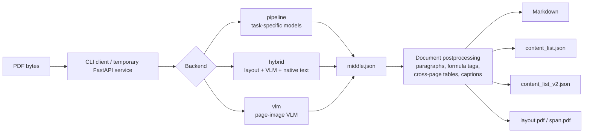
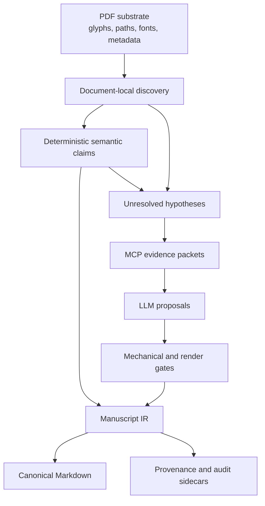

# Analyze PDF conversion approach

> i just cloned this repo thats another attempt at pdf->markdown / latex for math. Please do a deep dive to help me understand how it works, correspondences with my pdfpig work. `D:\aghado01\packages\MinerU`

<details><summary>4 previous messages</summary>

> I’ll trace MinerU’s pipeline end to end, then map its stages and data structures onto the PDF/PdfPig work already in this repository. I’m using the context-mode workflow because this is a large codebase comparison and it keeps broad searches and outputs compact.
>
> The context-mode skill is installed, but its execution tools are not exposed in this task. I’ll keep the same economy manually: focused PowerShell inventories and small, synthesized outputs instead of dumping files. No repository changes are needed for this investigation.
>
> MinerU’s public contract is already clear: every backend converges on `model.json → middle.json → content_list.json/Markdown`, with geometry retained throughout. I’m now tracing the exact backend dispatch and then matching those IR layers to markpig’s `pdfdig` artifacts.
>
> The strongest correspondence is not “MinerU replaces PdfPig.” MinerU is a learned semantic parser; markpig is a provenance-heavy born-signal extractor. Their failure modes are complementary, which points to a new intake/consensus lane rather than a rewrite. I’m checking the existing pdfdig design notes now so the recommendation lands cleanly in your architecture.

</details>

MinerU is not really a replacement for your PdfPig/markpig work. It is closer to a learned Docling/OpenDataLoader replacement: a model-heavy semantic parser that starts from rendered pages, while markpig starts from born PDF objects and deliberately preserves provenance and uncertainty.

The best fit is a third optional intake/oracle lane, especially for scanned documents, tables, and the 2-D math that markpig intentionally flags rather than guesses.

I inspected MinerU 3.4.4 at commit `79d6d8d79fb8f3ddba5cc34c07a16f0ec36f56c7` from July 10, 2026.

## How MinerU works



### 1. The CLI is now an orchestration client

The `mineru` executable does not simply call a parser. It collects files, plans tasks, starts a temporary local `mineru-api` service when no remote API is supplied, submits asynchronous jobs, then downloads the output archive. That orchestration begins in [client.py](D:/aghado01/packages/MinerU/mineru/cli/client.py:910). The real backend dispatch happens in [common.py](D:/aghado01/packages/MinerU/mineru/cli/common.py:668).

The public CLI defaults to `hybrid-engine`; `pipeline` is the CPU-compatible option.

### 2. The `pipeline` backend is a collection of specialized models

The pipeline initializes:

- PP-DocLayoutV2 for layout and reading order.
- UniMERNet-small for formula recognition by default.
- PP-FormulaNet as an optional formula recognizer.
- Paddle-style OCR.
- Separate classifiers/recognizers for wired and wireless tables.
- Table orientation classification.

The model assembly is visible in [model_init.py](D:/aghado01/packages/MinerU/mineru/backend/pipeline/model_init.py:231).

PP-DocLayoutV2 recognizes 25 region types, including `doc_title`, `paragraph_title`, `text`, `display_formula`, `inline_formula`, `formula_number`, `image`, `table`, `chart`, headers, footers, references, and vertical text; see [pp_doclayoutv2.py](D:/aghado01/packages/MinerU/mineru/model/layout/pp_doclayoutv2.py:33).

The main page batch then does roughly:

1. Layout detection.
2. Formula crop recognition.
3. Table orientation and wired/wireless classification.
4. Table OCR and HTML reconstruction.
5. Text OCR where needed.
6. Seal/vertical-text handling.
7. Assembly of all results into page model records.

That sequence is concentrated in [batch_analyze.py](D:/aghado01/packages/MinerU/mineru/backend/pipeline/batch_analyze.py:408).

For born-text PDFs, MinerU does something especially relevant to your work: the layout model supplies text boxes, but the text itself is filled from PDFium/`pdftext` characters rather than re-recognized from pixels. See [pipeline_magic_model.py](D:/aghado01/packages/MinerU/mineru/backend/pipeline/pipeline_magic_model.py:92) and [span_pre_proc.py](D:/aghado01/packages/MinerU/mineru/utils/span_pre_proc.py:43).

So even its “model pipeline” is hybrid at the span-filling level:

> learned boxes + native character extraction, with OCR fallback.

### 3. The pure `vlm` backend parses page images

The VLM branch renders pages and sends them to MinerU2.5-Pro-2605-1.2B. The model emits normalized blocks containing type, bbox, content, angle, and related fields. `MagicModel` converts those normalized coordinates back into page coordinates and constructs the common block/span representation in [vlm_magic_model.py](D:/aghado01/packages/MinerU/mineru/backend/vlm/vlm_magic_model.py:29).

Unlike the pipeline backend, the VLM supplies the content itself. That makes it more capable on visually difficult documents but also introduces the usual model hallucination and transcription risks.

### 4. The default `hybrid` backend combines both approaches

Hybrid is MinerU’s most interesting branch for your purposes.

At medium effort it:

- Runs PP-DocLayoutV2.
- Uses those detected boxes as externally supplied VLM layout.
- Lets the VLM interpret complex regions.
- Extracts text from native PDF characters when the PDF is text-bearing.
- Adds OCR-detection and formula-recognition sidecars.
- Reconciles the results geometrically.

At high effort it uses the VLM’s two-step layout/extraction path instead. The control flow is in [hybrid_analyze.py](D:/aghado01/packages/MinerU/mineru/backend/hybrid/hybrid_analyze.py:889). Native text is restored in [hybrid_magic_model.py](D:/aghado01/packages/MinerU/mineru/backend/hybrid/hybrid_magic_model.py:91).

That is conceptually quite close to multi-channel consensus, except MinerU resolves the channels internally and generally emits a single answer rather than preserving disagreement as a first-class artifact.

### 5. Every backend converges on `middle.json`

MinerU’s important internal contract is:

```text
model inference
    → preproc_blocks
    → para_blocks + discarded_blocks
    → Markdown/content lists
```

`middle.json` keeps:

- Page size and page index.
- Ordered layout/preprocessing blocks.
- Paragraph blocks.
- Lines and spans.
- Text, inline-equation and display-equation spans.
- Image/table/chart structures.
- Discarded page furniture.
- Bboxes and some confidence scores.
- Backend and MinerU version.

The schema is described in [output_files.md](D:/aghado01/packages/MinerU/docs/en/reference/output_files.md:55). MinerU itself calls `middle.json` the secondary-development output, while Markdown and content lists are simplified consumer formats.

The final document pass performs:

- Formula-number attachment.
- Paragraph merging.
- Cross-page table merging.
- Visual-caption grouping.
- Optional title-level assistance.

See [model_json_to_middle_json.py](D:/aghado01/packages/MinerU/mineru/backend/pipeline/model_json_to_middle_json.py:216).

Markdown and content lists are then rendered from the same paragraph blocks by [pipeline_middle_json_mkcontent.py](D:/aghado01/packages/MinerU/mineru/backend/pipeline/pipeline_middle_json_mkcontent.py:968).

## Correspondence with markpig

Your current path is:

```text
PDF
 → PdfPig born signals
 → letters / words / blocks / paths / xobjects
 → classifier
 → membrane-compatible nodes
 → collapse / zones / sections / normalize / fidelity / repair
 → final Markdown
```

The orchestrator is explicit in [Invoke-Pdfdig.ps1](./src/pdf-converter/Invoke-Pdfdig.ps1:12).

| Concern         | MinerU                                                                            | PdfPig/markpig                                                                 |
| --------------- | --------------------------------------------------------------------------------- | ------------------------------------------------------------------------------ |
| Atomic text     | PDFium/`pdftext` chars or OCR                                                     | Every PdfPig `Letter`, with font, baseline, size, rendering mode               |
| Layout          | PP-DocLayoutV2 learned regions and order indexes                                  | RecursiveXYCut plus unsupervised reading order and column claims               |
| Headings        | `doc_title`/`paragraph_title`, normally mapped to levels 1/2                      | Typography tiers cross-derived with PDF bookmarks, supporting deeper hierarchy |
| Inline math     | Detected crop → visual formula recognition                                        | Math-font role + baseline/size geometry → `$...$` seams                        |
| Display math    | Learned formula bbox and image-to-LaTeX recognition                               | Math-heavy line classification plus 1.5-D recursive script assembly            |
| Formula numbers | Explicit `formula_number` blocks merged as `\tag{...}`                            | No equivalent dedicated tag-merging stage currently                            |
| Figures         | Learned image/chart/table regions                                                 | Vector-path/XObject HDBSCAN consensus with caption attachment                  |
| Tables          | Semantic recognition and HTML reconstruction, including cross-page merging        | Geometry exists, but no equivalent semantic table reconstruction               |
| Scans           | Full OCR route                                                                    | Little or no usable born-text substrate                                        |
| Uncertainty     | Scores remain in model/middle outputs, but many decisions are resolved internally | Explicit health metrics and `flags[]`; abstention is part of the architecture  |
| Provenance      | Backend and MinerU version                                                        | PDF SHA-256, PdfPig version, config hash, runstamp, per-lane manifests         |
| Finalization    | Direct Markdown/content-list renderer                                             | Separate membrane repair and standards-enforcement pipeline                    |

### Coordinate mismatch

Any correspondence layer must normalize:

- MinerU pages are zero-based; markpig pages are one-based.
- MinerU bboxes are image-style `[x0,y0,x1,y1]`, with the origin at the top-left.
- PdfPig bboxes are PDF-space `[left,bottom,right,top]`, with the origin at the bottom-left.
- `content_list_v2` additionally normalizes coordinates into `0–1000`.

For a page of height `H`, the basic MinerU-to-PdfPig conversion is:

```text
[x0, y0, x1, y1] → [x0, H - y1, x1, H - y0]
```

## The math comparison

This is where the two systems are most complementary.

MinerU’s formula path is:

```text
formula layout detection
 → crop
 → UniMERNet/PP-FormulaNet/VLM recognition
 → LaTeX
 → optional equation-number \tag{}
 → $...$ or $$...$$
```

Its equation-number logic is unusually aligned with your standards: it strips surrounding parentheses and appends `\tag{...}` directly to the formula in [formula_number.py](D:/aghado01/packages/MinerU/mineru/backend/utils/formula_number.py:53).

Markpig’s path is:

```text
born glyphs
 → font-role classification
 → baseline and size analysis
 → recursive super/subscript assembly
 → flagged residue
 → geometry transcript
 → gated repair + render check
```

The deterministic assembler in [math-assembler.ps1](./src/pdf-converter/math-assembler.ps1:56) is excellent for exact inline content and nested scripts. It intentionally cannot fully infer fractions, matrices, cases, or other 2-D structures. Those become `needs_2d_assembly`, with the original glyph geometry projected through [math-evidence.ps1](./src/pdf-converter/math-evidence.ps1:112).

That produces a clean division:

- Trust markpig first for native inline math and simple display math.
- Ask MinerU for a candidate on markpig’s flagged 2-D residue.
- Align the candidate using page and bbox.
- Accept it only after your existing render and review gates.
- Preserve MinerU’s equation crop as extra visual evidence.

This improves the proposal supplied to the reasoning tier without moving a probabilistic model in front of the deterministic extractor.

## Where MinerU is clearly stronger

- Scanned/image-only PDFs.
- Broken or missing Unicode maps.
- Fractions, matrices, roots, cases, and other visual 2-D math.
- Semantic table extraction.
- Cross-page table continuation.
- Separating tables, charts, figures, code, lists, seals, and vertical text.
- Automatically choosing native-text versus OCR mode. Its classifier examines text volume, Unicode-map errors, suspicious font/script behavior, and page image coverage in [pdf_classify.py](D:/aghado01/packages/MinerU/mineru/utils/pdf_classify.py:94).

That last point is portable as a design idea: markpig’s envelope already has many of the signals needed for an automatic “stay native or escalate to MinerU OCR” gate.

## Where markpig is clearly stronger

- Exact born glyph and baseline evidence.
- PDF font semantics and document-origin signals.
- PDF bookmarks as a heading oracle.
- Vector paths and XObject geometry.
- Reproducibility and source/config hashing.
- Auditability: raw evidence, claims, and uncertainty are distinct lanes.
- Explicit abstention rather than silent best-effort output.
- Integration with the membrane repair loop and corpus-specific standards.

MinerU’s Markdown is therefore the wrong integration surface. In particular, its tables are emitted as HTML, while your corpus requires semantic Markdown pipe tables. Consuming the finished `.md` would also discard bboxes, scores, discarded furniture, equation crops, and model evidence.

## Recommended architecture

I would add MinerU as a sibling intake/oracle lane, not put it inside `pdfdig-ir.ps1`.

A sensible layout would be:

```text
{paper}/.runs/{stamp}/
├── pig/
│   ├── *.pdfdig.json
│   ├── *.letters.jsonl
│   ├── *.nodes.jsonl
│   └── *.figures.jsonl
└── mineru/
    ├── *_model.json
    ├── *_middle.json
    ├── *_content_list.json
    └── images/
```

Then add an `Invoke-ProjectMineru` adapter parallel to [pdfdig-adapter.ps1](./src/pdfdig-adapter.ps1:80).

Priorities I would use:

1. **Formula-oracle bridge first.** Match MinerU display equations to markpig formula chunks by page and bbox. Supply MinerU LaTeX and crop only to `needs_2d_assembly`/unbalanced cases.

2. **Automatic lane selection second.** Use markpig health to recognize scanned or corrupt-text pages and invoke MinerU OCR only there.

3. **Full MinerU intake third.** Project `middle.json` into the membrane dialect and reuse collapse, zones, sections, normalize, fidelity, repair, and finalization.

4. **Figure/table consensus later.** Let markpig provide exact region geometry and crops, while MinerU provides semantic labels and table structure. Disagreements should become flags.

For a quick adapter prototype, `content_list.json` is simpler and already contains `page_idx` and normalized `bbox`; see [pipeline_middle_json_mkcontent.py](D:/aghado01/packages/MinerU/mineru/backend/pipeline/pipeline_middle_json_mkcontent.py:609). For a real integration, use pinned-version `middle.json`. Avoid `content_list_v2` for now: MinerU explicitly labels it developmental.

## Practical cautions

- The default hybrid/VLM deployment needs roughly 8 GB VRAM; the pipeline can run on CPU but MinerU documents a roughly 20 GB local footprint.
- Capture the MinerU commit, backend, effort, model identifiers/hashes, device, language, and flags in your own manifest. `_version_name` alone is weaker than `pig-run.json`.
- MinerU’s committed test surface in this clone is only one end-to-end test file, so your corpus/oracle benchmark should be the acceptance gate.
- Its license is Apache 2.0 plus additional terms: online services must attribute MinerU, and very large commercial deployments cross separate-license thresholds; see [LICENSE.md](D:/aghado01/packages/MinerU/LICENSE.md:3).
- Run every imported formula through your existing renderer/linter. Visual recognition can return plausible but wrong LaTeX.
- Convert HTML tables into your corpus’s Markdown-table representation before finalization.

No models were installed or downloaded, and neither repository was modified.

> Yea I don't want to integrate minerU, i'm only interested in seeing how they tackle the problem. I haven't tested it yet, but given that it's a model salad, I can only imagine that it won't yield the precise math fidelity I am aiming for. The point of pdfdig is to solve the problem as much as possible deterministically, capture ambiguities and gaps, and package those into digestible pieces for LLMs to reason out the rest of it

Exactly—and my integration recommendation overshot your intent. MinerU is useful here as a comparative architecture, not as a prospective pdfdig lane.

The philosophical split is fundamental:

- **MinerU:** render the document, let several learned models decide what the page contains, then reconcile their outputs into Markdown.
- **pdfdig:** preserve everything the PDF actually knows, make only defensible deterministic claims, expose uncertainty explicitly, then give an LLM a small evidence-rich reconstruction problem.

That distinction matters especially for mathematics. MinerU converts precise PDF primitives into pixels and asks a recognizer to regenerate plausible LaTeX. Even when the result looks correct, it has crossed an epistemic boundary: a confidence score cannot tell you which symbol, delimiter, or index was faithfully recovered. Model errors can also compound—layout detection chooses the crop, formula detection classifies it, recognition generates LaTeX, and postprocessing normalizes the result.

Pdfdig instead retains:

- Original glyphs and Unicode mappings.
- Font identity and math/prose roles.
- Baselines, sizes, advances, and orientations.
- Vector rules and other path geometry.
- Block and reading-order claims.
- The exact reason a deterministic reconstruction became uncertain.

That supports the architecture you described:

```text
PDF facts
  → deterministic reconstruction
  → explicit confidence boundary
  → compact ambiguity packet
  → bounded LLM proposal
  → mechanical/render gate
  → audited result
```

The most valuable MinerU lessons are consequently procedural rather than model-related:

- **Separate recognition from document assembly.** Its `model.json → middle.json → Markdown` division reinforces pdfdig’s raw lanes → classified nodes → membrane separation.
- **Keep formula numbers separate until late.** Detecting the number independently and only then producing `\tag{...}` is a concrete gap worth addressing deterministically in pdfdig.
- **Prevent channel interference.** MinerU masks formula regions during OCR so text extraction does not duplicate or corrupt them. Pdfdig has an analogous need when allocating glyphs/rules among prose, formulas, tables, and figures.
- **Retain visual diagnostics.** Its layout/span overlays are useful audit instruments, even though they are not evidence sources.
- **Process large documents in windows.** That is an engineering improvement independent of its recognition strategy.
- **Route bad native-text documents explicitly.** MinerU’s text-versus-OCR classifier illustrates useful health signals. Pdfdig can use similar signals to abstain and package a different problem—not silently switch to a model parser.

The deeper advantage of pdfdig is that the LLM receives a substantially better question. Instead of “transcribe this page image,” it can receive:

- Best-effort LaTeX.
- The precise failure flags.
- Glyph sequence with font, size, baseline, and bbox.
- Spatial rows and fraction bars.
- Relevant image crop.
- Candidate grouping boundaries.
- Constraints such as delimiter balance and expected render validity.

That turns the model from a stochastic transcription engine into a bounded structural reasoner. It also makes disagreement inspectable: the model’s proposal can be traced back to supplied evidence and rejected mechanically when it invents structure.

So the useful conclusion from MinerU is almost the inverse of integration: it demonstrates how much machinery is required once raster-first learned recognition becomes the foundation. Pdfdig’s bet is that academic PDFs already contain enough latent structure to deterministically solve most of the problem—and that the unresolved remainder should be made smaller and clearer, not hidden inside another model pass.

> i guess i might say pdfdig is also not trying to be a converter, but more of like a transfer from one digitial medium to another, because PDF to markdown is more of a surjection, but my bet is that there is a principled "envelope" or format adaptation that can faithfully retain the semantic content while discarding the "printing". Essentially a generic "manuscript" format in markdown. currently my approach involves building pdfpig IR, using HDBSCAN clustering (WIP), some persistent homology concepts, with a second application of HDBSCAN coming for clustering symbolic content, as well as a method TBD for leveraging typographic information, and then the agentic MCP to round it out based on my previous work on the codex-membrane. But its still kind of nebulous. parts unsupervised ML and MCP. i want to believe its worth doing but i dunno

I think it is worth doing—but the project becomes much clearer when framed as **semantic transduction**, not PDF conversion.

Your intuition is closer to a quotient or partial inverse than a conventional converter. Typesetting maps a manuscript into a final-form rendering while discarding or obscuring some semantics. Pdfdig is trying to recover a canonical manuscript modulo presentation:

\[
A(R(m)) \approx q(m)
\]

where \(R\) is typesetting, \(q\) deliberately forgets pagination, fonts, line wrapping, float placement, and other printing choices, and \(A\) is pdfdig’s adaptation process. Because \(R\) is not invertible, \(A\) must be allowed to return uncertainty—not fabricate a unique answer.

That last property is the real differentiator.

## The semantic envelope

I would define the target as a Manuscript IR with a Markdown serialization, rather than Markdown itself as the working representation.

It should preserve:

- Ordered prose and inline content.
- Section hierarchy.
- Mathematical notation and structure.
- Figures, tables, captions, and footnotes.
- Equation/figure/table numbering.
- Reference and continuation relationships.
- Source provenance for every recovered unit.
- Unresolved alternatives and the evidence behind them.

It should discard:

- Page boundaries, except as provenance.
- Columns and float placement.
- Headers, footers, and page numbers.
- OCR/PDF hard wraps and discretionary hyphenation.
- Absolute font sizes, margins, and coordinates.
- Other choices whose sole purpose is printing.

The essential fidelity rule becomes:

> If the source evidence does not determine a unique semantic structure, preserve the ambiguity rather than silently choosing one.

That is a meaningful form of faithfulness even where perfect inversion is impossible.

## A clearer division of labor



The different techniques then have narrow jurisdictions:

| Mechanism                    | Proper role                                                                            |
| ---------------------------- | -------------------------------------------------------------------------------------- |
| Geometric HDBSCAN            | Discover candidate visual components and regions                                       |
| Persistent-homology ideas    | Measure stability across scale and identify where no reliable clustering regime exists |
| Symbolic/typographic HDBSCAN | Discover document-local font, size, baseline, and role regimes                         |
| Deterministic grammar        | Turn stable evidence into headings, scripts, formulas, captions, and relationships     |
| MCP/LLM                      | Resolve only compact, explicitly underdetermined residuals                             |
| Render/lint gates            | Reject syntactically or structurally invalid proposals                                 |

This prevents HDBSCAN or persistence from being asked semantic questions they cannot answer. They discover stable structure; they do not decide that something “means numerator” or “is an H2.”

For symbolic content specifically, a second HDBSCAN can discover regimes—body size, script sizes, display registers, font families, baseline bands—but I would not make it responsible for assembling the math AST. Formula assembly is ultimately a constrained graph/grammar problem. The clusters provide nodes and scale classes; geometry and mathematical layout rules provide edges.

Typography has a similarly bounded role. The promising formulation is document-local and ordinal:

- Larger than the body mode.
- Bold relative to the local face family.
- Repeated at structurally similar positions.
- Compatible with the PDF outline.
- Followed by body prose.
- Not math-heavy, furniture, or a caption.

Typography supplies evidence and vetoes. It need not produce an unconditional heading verdict by itself.

## What is currently nebulous

The algorithms are less nebulous than the contract. You already have a coherent sequence:

1. Faithful PdfPig substrate.
2. Derived geometric and typographic claims.
3. Unsupervised document-local discovery.
4. Explicit uncertainty.
5. Evidence packets.
6. Gated model resolution.
7. Canonical manuscript serialization.

What is missing is a sufficiently explicit definition of:

- What the manuscript format promises to preserve.
- What counts as printing and may be discarded.
- Which stage owns each kind of claim.
- When an automated stage must abstain.
- How success is measured.

Without that, every new clustering idea can feel equally relevant. With it, an algorithm must earn its place by increasing deterministic coverage or improving abstention quality.

## The right success metric

Pdfdig does not need to automatically solve every page to succeed. Its key result should be a coverage–fidelity curve:

> At \(x\%\) deterministic coverage, the accepted output has \(y\%\) semantic fidelity, while \(z\%\) of genuine failures are correctly surfaced for resolution.

Useful measurements would include:

- Exact or render-equivalent math recovery.
- Reading-order accuracy.
- Heading-tree edge accuracy.
- Caption/object association accuracy.
- Prose character fidelity after dehyphenation.
- Deterministic coverage.
- False-confidence rate: wrong units emitted without flags.
- Residual compression: how much of a document the LLM must inspect.
- Gate rejection and eventual repair rates.

The false-confidence rate may be the defining metric. A system that is 92% correct and identifies most of the remaining 8% is more valuable for a rigorous corpus than one that looks 97% correct but cannot locate its errors.

Your LaTeX-source papers give you an unusually strong way to test the thesis:

```text
source manuscript → PDF → pdfdig Manuscript IR
        ↘ canonical oracle ↗
```

The oracle should judge semantic equivalence, while disagreements remain symmetric investigations rather than automatic pdfdig losses.

## Is the project worth it?

As a general-purpose “PDF to Markdown” competitor, probably not. Model-driven tools already occupy that market and are good enough for many users.

As an auditable, high-fidelity transfer mechanism for born-digital scientific manuscripts, there is a real unsolved problem:

- Most systems optimize visual plausibility.
- Few preserve born signals deeply.
- Fewer expose an honest confidence boundary.
- Almost none turn the residual into small, evidence-complete reasoning tasks.

That is a substantive research and engineering direction. It also has value beyond Markdown: the same Manuscript IR could support corpus ingestion, mathematical search, RAG, accessibility, proof-oriented tooling, and later reserialization into other semantic formats.

The main danger is not that the idea is pointless. It is allowing the project to become an open-ended tour of clustering techniques. The next conceptual milestone should therefore be a short `MANUSCRIPT-IR` specification containing:

1. Preservation and discard contracts.
2. Canonical node and relationship types.
3. Provenance and uncertainty representation.
4. Jurisdiction of every pipeline stage.
5. Abstention rules.
6. Benchmark metrics and an MVP domain boundary.

My suggested MVP boundary would be: **born-digital, primarily TeX-origin academic PDFs; prose, hierarchy, inline/display math, figures and captions; tables and scans explicitly deferred or allowed to abstain.**

With that boundary, pdfdig stops looking like an indefinite PDF solver. It becomes a principled manuscript recovery system whose central product is not merely Markdown—it is a traceable semantic envelope and an honest account of anything the printing process made impossible to recover deterministically.

> well why dont you review the ingestion/gauntlet results so far where i have a collection pdf and latex pair-matched source, with my latex converter oracle deterministically rendering the pdf-converter's target

<details><summary>11 previous messages</summary>

> Yes—that is the right evidence to test whether the manuscript-envelope thesis is working. I’ll review the paired gauntlet as an experiment: inventory the PDF/pig/LaTeX artifacts, identify the existing comparison metrics, then separate demonstrated wins from unresolved failure classes and benchmark gaps. I’m using the context-mode workflow to keep the corpus-scale inspection compact.
>
> The context-mode execution tools are again unavailable in this task, so I’ll reproduce its discipline with small PowerShell summaries rather than corpus dumps. I’ll stay read-only and will not rerun conversions unless the stored results prove insufficient.
>
> The stored corpus is richer than the charter’s original snapshot: all four pair-capable groups now have fresh pig and LaTeX artifacts, while SPC remains the intended PDF-only stress set. I’m switching to the repository’s JSON/JSONL inspection helper for the run manifests and metrics so I can aggregate them without flooding the task.
>
> The first benchmark call was blocked by the host’s PowerShell execution policy, not by the corpus. I’ll rerun it with a process-local bypass; this changes no files or machine-wide policy.
>
> Context compaction
>
> Source: automatic
> Status: completed
>
> The paired-source corpus is already telling a useful story: the figure-recovery gate is real and fairly strong, but the broader “manuscript fidelity” claim is not yet being measured. I’m now drilling into the latest pig IRs and a few representative mismatches so I can separate proven capability from benchmark gaps.
>
> One important fault line is emerging in the oracle-free SPC set: the IR does surface genuine substrate trouble, but it sometimes fails to flag obvious role-calibration collapse—for example, 2,293 of 4,726 nodes become heading candidates in one paper. I’m checking whether that is isolated metadata noise or a systematic false-confidence mode.
>
> The “collapse” is not actually silent: those SPC nodes carry `unknown_font_role` almost everywhere, so the IR is preserving the reason not to trust the classification. What’s missing is an escalation rule that converts that local evidence into a document-level “heading labels unusable” verdict.
>
> The paired source is now exposing the central issue much more sharply than the figure score does: the current classifier’s “formula groups” outnumber oracle display blocks by roughly 4.5×–10×. In a representative paper, inline subscripts such as `A_{ij}` are peeled off the prose baseline and emitted as standalone display formulas. I’m quantifying the same problem for headings before I give you the overall verdict.
>
> The gauntlet is live while I’m reading it: new `20260718_*` pig runs appeared during the audit, and the figure harness briefly selected a run after its envelope existed but before its figure lane finished. That reveals a benchmark race of its own; I’m taking one stable snapshot after the current writer settles rather than mixing partial and completed runs.
>
> One more thing matters for your thesis: whether repeated runs are actually invariant. The corpus has enough reruns to test determinism directly, so I’m checking byte-level stability within a fixed config hash—not just output quality.

</details>

I reviewed the stable snapshot after the latest `20260718_024528` calibration run completed. My candid conclusion:

**The gauntlet already validates pdfdig as a worthwhile research program, but it does not yet validate faithful PDF→manuscript transfer.** It currently proves useful deterministic signal recovery—especially captioned figures—and exposes repeatable failure mechanisms. Math and headings remain substantially pre-semantic.

## What is actually tested

| Corpus     | Role                    |          Current coverage |
| ---------- | ----------------------- | ------------------------: |
| ph-zigzag  | diagram calibration     |     10 pig + oracle pairs |
| voroninski | figure calibration      |     23 pig + oracle pairs |
| kisungyou  | paired-source transport |     23 pig + oracle pairs |
| mapper     | untouched transport     | 9 oracles, **0 pig runs** |
| spc        | PDF-only stress         |     8 pig runs, no oracle |

So there are 65 LaTeX oracle documents, but only 56 currently pair with pdfdig. There is also no corpus-wide final pdfdig Markdown to compare—the paired experiment presently ends mostly at classified IR.

One major experimental confound: ph-zigzag and voroninski use config `9cdb1eeed4a1`, while kisungyou and SPC still use `99c9e1c1acea`. Calibration-versus-transport numbers are therefore not from one pinned converter build.

## The figure subsystem is genuinely promising

Current primary results—captioned pig regions versus LaTeX figure floats:

| Corpus     | Exact | Under | Over | Mean absolute error |
| ---------- | ----: | ----: | ---: | ------------------: |
| ph-zigzag  |  9/10 |     1 |    0 |                0.40 |
| voroninski | 18/23 |     5 |    0 |                0.35 |
| kisungyou  | 12/23 |    10 |    1 |                1.00 |

Only one of 56 papers over-counts captioned figures, and that paper has a low-confidence oracle with missing source assets. Caption cues are therefore acting as a very effective precision filter.

But the primary score hides the uncaptioned population:

| Corpus     | Pig uncaptioned regions | Oracle inline diagrams |
| ---------- | ----------------------: | ---------------------: |
| ph-zigzag  |                      80 |                     78 |
| voroninski |                     225 |                      0 |
| kisungyou  |                     164 |                      0 |

In kisungyou, 115 of the 164 uncaptioned regions have no explicit region flag; in voroninski, 197 of 225 are unflagged. `caption: null` still provides implicit uncertainty, but every `kind=figure` region is currently rendered to PNG.

The primary metric also conflates detection and caption attachment. For `1810.02906v1`, the score says 13 versus 19 figures, delta −6. Yet pig found 17 total figure regions: four appear to be caption-missed floats, leaving closer to two actual region misses. Labeling the whole deficit “raster-blindness” is misleading.

The gate should therefore report separately:

- visual-region recall;
- float grouping;
- caption-link precision/recall;
- residual uncaptioned candidates;
- inline-diagram fidelity.

The current comparison explicitly defines captioned count as “did we find the real figures,” which is too compressed for this distinction: [Compare-FigureCounts.ps1](./src/pdf-converter/Compare-FigureCounts.ps1:213).

## Math and headings show the real manuscript problem

I ran a conservative structural audit against the oracle Markdown. Heading matches are exact after stripping numbering, punctuation, case, and spacing. Formula groups are important because the adapter normally turns each group into a `$$...$$` manuscript block.

| Corpus     | Heading precision / recall | Formula groups / oracle display blocks | Unflagged formula groups |
| ---------- | -------------------------: | -------------------------------------: | -----------------------: |
| kisungyou  |              0.428 / 0.797 |                  7,068 / 1,583 = 4.46× |                    3,790 |
| ph-zigzag  |              0.405 / 0.662 |                   2,752 / 275 = 10.01× |                    1,711 |
| voroninski |              0.552 / 0.775 |                 11,634 / 2,050 = 5.68× |                    5,640 |

This is not yet the planned aligned fidelity scorer, so it should not be treated as a final grade. But the degree of oversegmentation is unambiguous: across the 56 pairs, pdfdig produces 21,454 formula groups for 3,908 oracle display blocks, and 52% of those formula groups carry no flag.

Two concrete failures explain it:

- In `1810.02906v1`, inline subscripts such as `$A_{ij}$` receive their own PDFPig line IDs because they sit on displaced baselines. The main prose becomes effectively “For a binary network, = 1…,” while `A_{ij}` is emitted separately as a display formula. See [the detached inline node](./ingestion/gauntlet/kisungyou/1810.02906v1/.runs/20260715_100730/pig/1810.02906v1.nodes.jsonl:74).

- The display equation
  `\dot c_i(t)=\sum_{j\sim i}(c_j(t)-c_i(t))`
  is split among an unflagged standalone `∑`, prose fragments, and a different malformed formula group. The flags correctly catch part of the damage, but not the whole broken semantic unit.

This means the critical missing layer is not chiefly symbol recognition. It is **2-D reassociation before deciding inline versus display versus prose**.

Headings have an analogous premature-commitment problem. The outline matcher uses containment in both directions and does not enforce a one-to-one monotone assignment: [pdfdig-classify.ps1](./src/pdf-converter/pdfdig-classify.ps1:449). Consequently, ordinary body lines containing “simulation study” are matched to the `Simulation Study` bookmark and promoted as headings.

A second edge case is even cleaner: all 16 detected heading lines in `2111.15058v3` are marked `outline_fragment`, largely because bookmarks include section numbers while printed headings do not. The adapter demotes every lone outline fragment, producing **zero headings** for that paper: [pdfdig-adapter.ps1](./src/pdfdig-adapter.ps1:170).

SPC confirms that typography is a real transport boundary:

- `BWD1997`: 2,293 heading-candidate lines from 4,726 nodes; known font-role fraction 3.58%.
- `PKWang2020`: 407 heading-candidate lines from 1,248 nodes; known font-role fraction 5.77%.

The local nodes do carry `unknown_font_role`, which is good. What is missing is escalation from pervasive local uncertainty to a document-level verdict such as “semantic role labels are unusable.”

## Determinism is partly demonstrated

Across 46 calibration paper/config combinations having at least two completed runs:

- classified node JSONL was byte-identical in **46/46**;
- figure JSONL was byte-identical in only **5/46**.

The latter does not necessarily prove stochastic clustering. One same-hash pair differed because a caption changed from truncated to complete—probably code evolution under an unchanged `0.2.0` version and unchanged config hash. So the stronger finding is that **the build fingerprint is incomplete**: it hashes configuration, not the implementation that produced the artifact.

There is also a live-run race. Run discovery treats a pig run as available as soon as its envelope exists: [runs.ps1](./src/runs.ps1:68). But the completion manifest is written only after classification, figures, and image export: [Invoke-Pdfdig.ps1](./src/pdf-converter/Invoke-Pdfdig.ps1:81). During this review, the harness briefly selected partially written runs. Additionally, `pig_run` currently records `.runs` rather than the runstamp because it climbs one parent too far.

## What is not yet being measured

The intended scorer is still explicitly “not yet built”: [aligned-fidelity-scoring.md](./issues/conversion-metric/aligned-fidelity-scoring.md:3). The math-bank and structural-skeleton oracle are also still design-only: [math-bank-oracle-lane.md](./issues/latex-math-oracle/math-bank-oracle-lane.md:3).

Consequently, the gauntlet does not yet measure:

- aligned math-token or AST fidelity;
- accepted-unit false-confidence rate;
- heading hierarchy precision/recall officially;
- prose reading order and duplication;
- equation identity and cross-reference retention;
- how completely flags cover actual oracle disagreements;
- how much the ambiguity envelope compresses the eventual LLM workload.

The oracle target itself also needs pinning. The Markdown is written at the paper root while counts are runstamped, and the sidecar does not record source, oracle-output, or converter-build hashes. If equation identity belongs to the manuscript semantics, it also needs enrichment: the 65 oracle Markdown documents contain 4,272 display blocks but only 32 `\tag{}` occurrences.

## My verdict

Your central idea survives this review—perhaps more strongly than before—but with a refinement:

**pdfdig should not commit early to a manuscript. It should deterministically construct and rank competing manuscript hypotheses.**

HDBSCAN and persistent topology are well suited to producing a hierarchy of candidate components. They should not be forced to choose the final semantic partition. The manuscript IR should preserve:

- born atoms and provenance;
- geometric and typographic relations;
- alternative grouping hypotheses;
- accepted high-confidence semantic units;
- explicit unresolved competitions;
- stable mappings from every manuscript unit back to PDF evidence.

The most useful next benchmark is therefore not a weighted “conversion score.” It is a small aligned Stage-0 evaluator reporting:

1. oracle-unit coverage;
2. fidelity among automatically accepted units;
3. false-confidence rate;
4. ambiguity recall—how often wrong units were flagged;
5. residual compression—how much evidence must reach the MCP/LLM;
6. deterministic canonical hash under a pinned build.

That would test your actual thesis. Right now, further tuning of figure clustering risks polishing the best subsystem while the math/manuscript boundary remains unmeasured. The paired-source gauntlet is absolutely worth keeping; it is already doing its most valuable job—falsifying premature semantic decisions in a precise, localizable way.

> So I need to clarify the math AST. It is a not fully formed idea for formally embedding and standardizing the math register in markdown, and it would be a lexical/syntactic over roughly the intersection or perhaps union of latex and mathjax. pdfdig will never be a math AST, it will only help transform documents into it should it ever make it that far. But the math AST proper would be Markpig's domain and it would be a sibling AST with powershell/roselyn visitor nested/interop semantics and api abstractions just like markpig itself. Which brings me to my next question, which is the implied target "je ne sais quoi" standardized math register and the reasons why its important. my goal is to have every drop of math in line and blocks delimited and renderable with unwaivering consistency so that maths can be tokenized consistently and the register self-evident. furthermore, as a hypothetical RAG substrate, i'm imagining a dual RAG application with embedding models separately for math register and prose, somehow cross referenced / addressed, with masking over one or the other to ensure positional alignment

Yes—then I placed the AST one layer too low. pdfdig should produce grounded evidence and candidate math spans; Markpig owns the formal mathematical language, parser, syntax tree, visitors, canonicalization, and renderer projections.

The implied target is something like a **canonical embedded mathematical register**: a formally specified language island inside a Markdown manuscript.

## The missing middle layer

There are really four distinct objects:

| Layer                  | Responsibility                                                                              |
| ---------------------- | ------------------------------------------------------------------------------------------- |
| pdfdig evidence        | Glyphs, geometry, typography, reading-order hypotheses, provenance and uncertainty          |
| Manuscript host        | Markdown structure with explicit, addressable inline/block math spans                       |
| Canonical math surface | A versioned, deterministic TeX-like serialization                                           |
| Markpig Math AST       | Tokens, syntax nodes, visitors/rewriters, diagnostics, renderers and equivalence operations |

The canonical surface is not itself the AST. It is the one stable textual representation of an AST—the math equivalent of a formatter’s canonical output.

A host `MathSpanSyntax` could reference a sibling `MathSyntaxTree`. A normal Markpig visitor may treat it as an opaque embedded-language node, while a nested visitor explicitly crosses into the math tree. Source maps compose across that boundary:

```text
PDF glyphs → pdfdig span → Markdown MathSpanSyntax
                         → Markpig MathSyntaxTree
                         → canonical math text
```

That gives the PowerShell/Roslyn interop model a clean ownership boundary.

## Intersection versus union

I would not define the language directly as either the intersection or union of LaTeX and MathJax.

MathJax is primarily an input-processing/rendering ecosystem, while LaTeX is a macro-programming and typesetting language. Their literal intersection is too weak; their union inherits macros, package behavior, renderer extensions, ambiguity, and substantial non-mathematical typesetting machinery.

A better construction is:

- a **closed canonical core grammar**;
- versioned extension namespaces for constructs outside the core;
- importers for TeX/LaTeX, MathJax-TeX, perhaps MathML;
- renderer capability profiles such as `katex`, `mathjax`, and `latex`;
- an explicit `unsupported` or `opaque-extension` node rather than silent degradation.

Thus Markpig might accept many source dialects, but serialize one canonical dialect:

```text
parse(source dialect) → Math AST
canonicalize(AST)     → canonical math surface
lower(AST, renderer)  → renderer-specific expression or diagnostic
```

The desired invariant is approximately:

```text
parse(serialize(AST)) ≡ AST
```

—not “the same input string works accidentally in several renderers.”

## What makes the register a register

Delimiters alone are necessary but insufficient. The profile needs enforceable invariants:

- Every mathematical span is explicitly typed as `inline` or `display`.
- No mathematical material exists outside a registered span.
- No ordinary prose is swallowed into math without an explicit textual node.
- Every span lexes and parses under a declared grammar version.
- Canonical serialization is deterministic.
- Required render profiles succeed, or the span carries a precise capability diagnostic.
- Author macros are expanded, declared in a scoped environment, or retained as explicit extension nodes.
- Equation labels, tags, references, and identities are metadata—not incidental visual characters.
- Every canonical token maps back to source evidence.
- Original surface text and uncertainty survive canonicalization.

I would distinguish at least four independent statuses:

```text
fenced       Is the register boundary known?
parsed       Does the grammar accept it?
rendered     Can the required renderer lower it?
grounded     Is it faithfully supported by source evidence?
```

A perfectly fenced, parsed, and rendered equation can still be the wrong equation. That final distinction is essential for pdfdig.

The importance of the standard register is that downstream systems no longer have to rediscover modality. Tokenizers, embedders, linters, renderers, diff tools and repair agents can all rely on the same boundary and grammar. It changes “math-looking text” into an addressable language.

## The dual-RAG idea

The clean abstraction is one canonical manuscript spine with two projections.

Let the ordered document be:

$$
D=P_0\,M_0\,P_1\,M_1\,P_2\cdots
$$

where each $P_i$ is prose and each $M_i$ is an addressable math span.

The prose projection is:

```text
P0 <math:m0:inline> P1 <math:m1:block> P2
```

The math projection is something like:

```text
m0 → canonical tokens + AST + section/context links
m1 → canonical tokens + AST + section/context links
```

Both projections are generated from the same span ledger. That ledger—not token masking—is what guarantees positional alignment.

Masking alone cannot do it reliably because prose and math embedding models will tokenize differently, normalize whitespace differently, and produce unrelated vector positions. Instead, every object should carry stable external coordinates:

```yaml
id: doc:1810.02906v1#math-17
host_ordinal: 231
kind: display
parent_section: doc:1810.02906v1#section-3.1
previous_span: prose-46
next_span: prose-47
label: eq:nld
source:
  page: 3
  glyph_ids: [...]
canonical_hash: ...
ast_hash: ...
diagnostics: [...]
```

Then the application has:

- a prose vector space indexed by prose chunks containing math sentinels;
- a math vector space indexed by canonical expressions, AST-derived features or subtrees;
- one address graph connecting both to the manuscript spine.

The vector spaces should remain separate. Their raw similarity scores are not comparable; retrieval results can be joined through addresses and combined through calibrated rank fusion.

This supports several retrieval modes:

- Conceptual query → retrieve prose, then expand to linked equations.
- Formula query → retrieve structural math matches, then expand to explanatory prose.
- Mixed query → retrieve from both and prefer results occupying the same section or neighboring spans.
- Symbol query → use an exact AST/token index first, embeddings second.
- Definition/use query → follow identifier and equation-reference edges through the address graph.

For example, “Why is $d_{NLD}$ a metric?” naturally decomposes into:

- math retrieval for the defining expression and triangle inequality;
- prose retrieval for the surrounding argument;
- a join on their shared section and neighboring span IDs.

## One caution: math cannot be context-free in retrieval

A mathematical embedding of `$x$` is nearly worthless by itself. Even substantial expressions often depend on nearby prose for symbol definitions, hypotheses and domain declarations.

So I would use **dual vector stores but a unified relational substrate**. Each math record should carry:

- enclosing section path;
- preceding definition-like prose;
- following explanatory prose;
- referenced equation IDs;
- identifier declarations and uses;
- theorem/proof context when known.

Markpig can eventually provide multiple identities for the same expression:

- canonical surface hash;
- exact AST hash;
- alpha-renamed structural hash;
- operator/signature fingerprint;
- renderer-normalized representation.

Those support progressively looser retrieval without conflating lexical and mathematical equivalence.

## Why this matters beyond rendering

The real payoff is not merely unwavering `$...$` and `$$...$$`. It is that the manuscript becomes a polyglot, projection-preserving document:

- human-readable as Markdown;
- formally traversable as two nested syntax languages;
- consistently tokenizable;
- separately embeddable by modality;
- cross-addressable without relying on fragile character offsets;
- auditable back to PDF evidence;
- repairable without reparsing the whole document;
- comparable against a LaTeX oracle at exact syntax-unit granularity.

That is the “je ne sais quoi”: not a better Markdown convention, but a **language-service boundary for mathematical manuscripts**.

The concise formulation may be:

> Markpig manuscripts are ordered, addressable prose and mathematical language islands. The mathematical register has one canonical surface form, a sibling syntax tree, explicit renderer profiles, and composable source mappings. Prose and mathematics may be projected into independent retrieval spaces without losing their shared document coordinates.

That seems both technically coherent and much closer to what you are actually building than “PDF-to-Markdown converter.”

> I dont know that spans need to be explicitly typed, part of my design is to keep the register as minimal as possible which means not alot of structural/container/metadata tagging syntax. prose-within-math is one exception i cant avoid. But I think for example inline e.g. embedded math-in-prose is self-evidently unambiguous by virtue of the $..$ delimiter formatting, save for edge cases where dollar signs mean something in the prose, as well as mathbb and other things are unavoidable because notation is essential

Yes—I think you’re right, and I conflated two different layers: the delivered manuscript register and the converter’s internal evidence model.

The manuscript itself does not need explicit `type=prose`, `type=math`, or custom span containers. Markdown and LaTeX already form a self-typing grammar:

- Prose is the default register.
- `$...$` changes into inline math.
- `$$...$$` changes into display math.
- `\text{...}` temporarily returns to prose inside math.
- `#`, blank lines, lists, tables, and image syntax express the limited document structure that actually survives the transfer.

Literal dollar signs are a canonicalization problem, not a fundamental ambiguity: the converter can emit `\$5`, while reserving unescaped `$` exclusively for math.

Likewise, `\mathbb`, `\mathcal`, `\mathbf`, accents, scripts, and operators are not disposable “printing.” They are notation-bearing typography. $\mathbb{R}$ and $R$ may denote different objects; bold may distinguish vectors; roman letters may distinguish operators, units, or differentials. The principled quotient is therefore:

> Discard presentation-only typography, but retain typography that changes token identity, mathematical grammar, or referential identity.

That gives a useful dividing line:

| Layer               | Representation                                                                         |
| ------------------- | -------------------------------------------------------------------------------------- |
| Manuscript          | Minimal Markdown plus semantic LaTeX; no custom typing syntax                          |
| Extraction evidence | Optional, sparse, out-of-band record of unresolved boundaries and competing assemblies |

The evidence layer need not contaminate the manuscript. It could be a transient JSONL ledger keyed to manuscript offsets or stable anchors, consumed by the MCP and deleted entry-by-entry as ambiguities are resolved.

This also changes how I would describe the gauntlet failures. They are not primarily failures to assign the right span type. They are failures to reconstruct the right **boundaries and relations**:

- `A_{ij}` should have been reattached at a particular position in a prose line and enclosed by `$...$`.
- A summation glyph, limits, and baseline expression should have been assembled into one `$$...$$` block.
- A body sentence should not receive a `#` boundary merely because it contains a bookmark title.
- A superscript is not a separately typed span; it has an attachment relation to a base.

So the lean internal object may be closer to a relation graph than a typed document tree:

- glyph/word atoms;
- candidate adjacency and ordering;
- script, fraction, row, and containment relations;
- boundary decisions such as join, space, paragraph break, inline-math transition, display-math transition, or heading break;
- competing alternatives only where the evidence does not decide.

Most edges would be ordinary continuation edges and require no annotation. HDBSCAN and persistence then help propose stable components and alternative partitions without forcing those components to become permanent semantic containers.

The benchmark can also remain independent of explicit stored types. Parse both minimal manuscripts using the same Markdown/LaTeX grammar and compare:

- boundary placement;
- canonical math token sequences or parse trees;
- heading sequence and depth;
- prose order;
- referential identities;
- unmatched or duplicated material.

The most important pdfdig metric becomes **false boundary confidence**: when it inserted `$`, `$$`, `#`, or a paragraph break, how often was that decision contradicted by the oracle? And when it was wrong, did the ambiguity ledger retain enough evidence for repair?

A compact formulation of your register might therefore be:

> Prose by default; math by delimiter; prose-in-math by `\text`; notation-bearing typography preserved; structural syntax only where the manuscript grammar requires it; uncertainty kept outside the manuscript.

That is substantially cleaner than a richly typed manuscript IR. The “envelope” is not extra markup around everything—it is the minimal manuscript plus a sparse residual evidence surface.

<details><summary>2 previous messages</summary>

> Context compaction
>
> Source: automatic
> Status: completed
>
> but i don't think there are any literal glyphs in my register, instead glyphs need to be mapped to corresponding lexical tokens spelled out in latex words

</details>

Right—that sharpens it. Saying the register “preserves notation-bearing typography” was imprecise. The register preserves the lexical interpretation of that typography, not the glyph itself.

So the transformation is:

\[
\text{PDF glyph evidence} \longrightarrow \text{canonical LaTeX token vocabulary}
\]

Examples:

- `α` → `\alpha`
- `∑` → `\sum`
- `≤` → `\leq`
- blackboard-bold `R` → `\mathbb{R}`
- calligraphic `F` → `\mathcal{F}`
- vertically displaced `i` and `j` → `_{ij}`
- fraction geometry → `\frac{...}{...}`

The output contains no Unicode mathematical glyph merely copied from the PDF. Even `\mathbb{R}` should not be understood as “retain this font.” It is a lexicalized mathematical alphabet selection whose distinction may carry meaning.

That suggests three clean levels:

1. **PDF evidence**
   Glyph identities, font encodings, coordinates, baselines, paths, and adjacency.

2. **Notation interpretation**
   Canonical LaTeX tokens plus relations such as script, fraction, delimiter, row, and containment.

3. **Manuscript register**
   Prose, Markdown structure, and `$...$`/`$$...$$` containing serialized lexical LaTeX.

This also identifies the real ambiguity boundary. Glyph-to-token interpretation is often contextual rather than a character-map operation:

- a vertical stroke may become `\mid`, `\vert`, `\lvert`, or `\rvert`;
- two vertical strokes may mean `\parallel` or `\lVert...\rVert`;
- a centered dot may become `\cdot`, multiplication punctuation, or sentence punctuation;
- an italic `x` and a multiplication sign may be visually confusable;
- font evidence may distinguish `R` from `\mathbb{R}` or `\mathcal{R}`;
- displacement may represent a subscript, superscript, neighboring line, or annotation.

Therefore the sparse uncertainty sidecar should record competing **lexicalizations or relations**, not competing glyph transcriptions. For example:

```text
evidence: vertical-stroke instance g184
candidate interpretations:
  \mid        0.61
  delimiter   0.34
  \vert       0.05
```

The manuscript only receives a token once that interpretation is accepted. If it cannot be resolved deterministically, the unresolved evidence becomes an MCP work unit.

A more accurate statement of your register would be:

> Prose is represented directly; mathematical appearance is lexicalized into canonical LaTeX tokens and structural relations. PDF glyphs and printing instructions belong only to the evidentiary substrate, never to the manuscript.

That is considerably more principled than “PDF text extraction.” It makes pdfdig partly a compiler: the PDF is an encoded graphical language, and the manuscript is a canonical lexical serialization of its inferred semantic content.

> theres also the sort of tiered methodology of things that can be directly mapped and do not require interpretation. Interpretation is something that happens when ambiguity requires it. but a _θ_ is a theta (or a **Θ** or a **ϴ or a ϑ for that matter)**

Exactly. I was using “interpretation” too broadly. Most of the transfer should be mechanical lexicalization, with interpretation invoked only when the evidence admits more than one valid result.

For example:

- `θ` → `\theta`
- `Θ` → `\Theta`
- `ϑ` → `\vartheta`
- `ϴ` → whatever canonical capital-theta-variant token the register specifies

These are members of the theta family, but their case and variant can remain distinct. Whether two variants are intentionally normalized together is a global register rule—not something reconsidered for every occurrence.

Crucially, pdfdig does not need to determine whether `\theta` denotes an angle, parameter, or function. That would be semantic interpretation. It only needs to recover its lexical identity.

I think the methodology is therefore:

1. **Direct lexical mapping**
   Encoded character or reliably identified glyph maps to exactly one canonical LaTeX token.

2. **Deterministic composition**
   Uniquely supported relations combine tokens into constructs: scripts, fractions, delimiters, arrays, and so forth.

3. **Ambiguity detection**
   More than one lexicalization or composition remains compatible with the evidence.

4. **Interpretation**
   Context or an agent adjudicates only those non-singleton cases.

Formally, for evidence item or region \(e\), define its admissible manuscript realizations \(R(e)\):

- \(|R(e)|=1\): transfer it deterministically;
- \(|R(e)|>1\): package an ambiguity;
- \(|R(e)|=0\): record a gap.

That also separates two easily conflated problems:

> If the PDF evidence already identifies `θ`, conversion to `\theta` is direct. If a broken font encoding only presents an unidentified outline, determining that the outline is `θ` is the uncertain step.

So pdfdig is not “interpreting a document” everywhere. It is maximizing the domain on which a deterministic transducer is defined, while making the remaining non-functionality explicit. The most meaningful metric may consequently be:

> What fraction of the manuscript was transferred by justified singleton mappings, and how often did the system falsely claim a singleton where the oracle reveals ambiguity or error?

That fits your deterministic aim much better than generic confidence scoring.

> Confidence scoring is one thing, fidelity metric is another. I still can't quite see the metric or metrics for measuring pdf-to-markdown artifact against the latex sibling, but its gotta be something along the lines of similarity and hashing methinks

Yes—confidence and fidelity should be completely orthogonal. The same incorrect artifact has the same fidelity whether pdfdig confidently emitted it or carefully flagged it as uncertain. Confidence evaluates the extractor’s epistemic behavior; fidelity evaluates the resulting manuscript.

I think your intuition leads to a **hash-first, similarity-on-the-residual** evaluator.

The gauntlet is testing whether this diagram commutes:

```text
LaTeX source ──oracle converter──▶ canonical manuscript O
     │
   compile
     ▼
    PDF ─────────pdfdig──────────▶ canonical manuscript P
```

After canonicalization:

\[
H(P)=H(O)
\]

is exact fidelity. A cryptographic hash is not itself a similarity metric—it is an exactness predicate—but hierarchical and rolling hashes can establish how much of the transfer is exact before similarity is needed.

### A hash ladder

Compute several deterministic projections of each manuscript:

1. **Complete artifact hash**
   Includes canonical tokens, order, math delimiters, relations, headings, paragraphs, tables, and references.

2. **Lexical-stream hash**
   Preserves the ordered prose and mathematical tokens but removes structural boundaries. This distinguishes missing content from misplaced boundaries.

3. **Structure hash**
   Includes native Markdown and math grammar: paragraph boundaries, heading levels, `$` versus `$$`, lists, tables, captions, and so forth.

4. **Math-expression hashes**
   Parse each expression into a canonical relation tree and hash its serialization. Subscript, superscript, numerator, denominator, delimiter, row, and cell relations are part of the hash.

5. **Local hashes**
   Hash paragraphs, displays, table cells, captions, and mathematical subtrees. These units are derived by parsing ordinary Markdown and LaTeX; they do not require extra manuscript tags.

A whole-document mismatch then does not reduce to “not equal.” You know which projections and which local regions failed.

### Similarity should mean repair distance

For regions that do not hash exactly:

1. Find exact islands using unique token sequences, rolling hashes, or content-defined chunks.
2. Align those islands monotonically.
3. Compute the minimal deterministic edit script needed to turn \(P\) into \(O\).

The edit operations should correspond to actual manuscript repairs:

- insert/delete/substitute a lexical token;
- move or reorder tokens;
- insert/delete a `$` or `$$` boundary;
- change a heading or paragraph boundary;
- reattach a token as subscript or superscript;
- change a numerator/denominator or array relation;
- insert/delete an entire manuscript unit.

That makes “similarity” concrete: **how much repair remains**, rather than an embedding score or vague string resemblance.

### A fidelity signature, not initially one score

I would report something like:

```text
exact_artifact                 false
exact_oracle_token_coverage    0.982
exact_output_token_precision   0.975
boundary_f1                    0.903
exact_math_expression_rate     0.721
math_token_f1                  0.967
math_relation_f1               0.846
order_error_rate               0.004
normalized_repair_cost         0.038
```

The distinction between math tokens and math relations is important. In the `$A_{ij}$` failure:

- all lexical tokens might be present;
- the `subscript(A, ij)` relation might be correct;
- but the inline-math boundary might be wrong.

Those should be three different facts. Likewise, changing `+` to `-` is only one token edit but causes the expression’s exact hash to fail—which prevents a superficially high “99.9% similarity” from concealing a mathematically serious error.

I would therefore make these the main fidelity measures:

- **Exact transfer coverage:** how much oracle material lies inside exactly matching hashed regions.
- **Exact expression rate:** proportion of inline/display expressions whose canonical root hashes match.
- **Lexical fidelity:** missing, extra, and substituted canonical tokens.
- **Relational fidelity:** agreement of math relations such as scripts, fractions, arrays, and delimiters.
- **Boundary fidelity:** agreement of `$`, `$$`, paragraph, heading, list, table, and caption boundaries.
- **Residual repair burden:** normalized cost of the minimal oracle repair script.

A scalar can eventually be derived from repair cost,

\[
F=1-\frac{C(P\rightarrow O)}
{C(P\rightarrow\varnothing)+C(\varnothing\rightarrow O)},
\]

provided no repair operation costs more than deleting and rebuilding the affected material. But I would not begin by choosing opaque weights. Publish the fidelity vector and calibrate any aggregate later against actual human or agent repair effort.

The canonicalizer is the critical contract. It should normalize only equivalences declared by the register—whitespace, harmless braces, approved LaTeX aliases, discarded printing commands. It should not use algebraic equivalence: `a+b` and `b+a` may be mathematically equal, but they are not the same transferred manuscript.

Then evaluate confidence separately:

- fraction committed automatically;
- error rate among committed material;
- fraction of actual errors surfaced as ambiguities;
- amount of residual evidence packaged for repair.

So the compact formulation is:

> Hash exact correspondences at several scales, align what remains, and measure fidelity as the explicit repair required to make the pdfdig manuscript identical to the canonical LaTeX-derived manuscript.

That would also make the gauntlet produce something more useful than a number: every failed comparison naturally yields the exact residual work units your eventual MCP needs to solve.

> What about something like a relative hamming distance between the two token streams of text? character by character. And "provided no repair operation costs more than deleting and rebuilding" ... does this call back to Landauer 1960s?

<details><summary>2 previous messages</summary>

> I’m separating the metric question from the historical analogy. I’ll verify Landauer’s original formulation, then relate it precisely rather than stretching the resemblance. I’m using the context-mode workflow because the source lookup may return a larger page extract.
>
> <details><summary>Searched the web</summary>
>
> <details><summary>Searched the web</summary>
>
> - Searched the web for `Landauer 1961 Irreversibility and Heat Generation in the Computing Process IBM PDF ...`
> - Searched the web for `'ln 2'`
>
> </details>
>
> </details>

</details>

Relative Hamming distance is a very clean baseline, with one important restriction: Hamming distance assumes two already synchronized streams of equal length.

For canonical character streams \(P\) and \(O\),

\[
h(P,O)=\frac{1}{n}\sum\_{i=1}^{n}[P_i\neq O_i]
\]

answers a precise question:

> What fraction of corresponding serialized characters differ?

That is legitimate artifact fidelity. It requires no semantic weighting. But a single deletion near the beginning shifts every subsequent character and can make an almost-correct document appear almost entirely wrong. Hamming permits substitutions only; edit distance adds insertions and deletions precisely to handle this problem. [This distinction is standard in the sequence-distance literature.](https://arxiv.org/abs/2211.12496)

I would therefore retain the Hamming idea in this form:

1. Canonicalize both manuscripts.
2. Use hashes and exact substrings to establish synchronization.
3. Align the remaining streams.
4. Report separately:

\[
\text{substitution rate}=\frac{S}{N}
\]

\[
\text{indel rate}=\frac{I+D}{N}
\]

\[
\text{character error rate}=\frac{S+I+D}{N}
\]

The substitution component is essentially aligned relative Hamming distance. The complete expression is oracle-relative Levenshtein character error rate.

I would also compute it at two resolutions:

- **Character error rate:** literal serialized-artifact fidelity.
- **Token error rate:** canonical lexical fidelity, treating `\theta` as one token rather than six characters.

That distinction matters:

- `\theta` → `\vartheta` is one lexical substitution but several character edits.
- `+` → `-` is one character and one token substitution, despite potentially reversing the mathematics.
- Removing a `$` may create a small character error but a large boundary error.

Character distance is not wrong; it is deliberately indifferent to significance. It should sit beside exact math-expression hashes and relation/boundary measures rather than being asked to express all of fidelity.

Also, Hamming distance between the **cryptographic hashes** would not work. Avalanche behavior makes two nearly identical documents’ hashes appear unrelated. Hash the documents to test exact equality; calculate Hamming/edit distance on the canonical streams themselves.

On Landauer: philosophically adjacent, but technically no—and my earlier proviso was unnecessarily stated.

If \(C^\*\) is the minimum repair cost, deleting all of \(P\) and inserting all of \(O\) is always an available repair script. Therefore:

\[
C^\*(P\rightarrow O)
\leq
C(P\rightarrow\varnothing)+C(\varnothing\rightarrow O)
\]

automatically. If a substitution is priced above deletion plus insertion,

\[
c(a\rightarrow b)>
c(a\rightarrow\epsilon)+c(\epsilon\rightarrow b),
\]

the optimizer simply will not use that substitution. It is a dominated operation. The relevant mathematical idea is shortest-path closure or the triangle inequality, not thermodynamic irreversibility.

There is nevertheless a lovely Landauer resonance. Landauer’s 1961 argument concerns logically irreversible many-to-one operations such as resetting an unknown bit: the operation destroys distinctions between possible prior states, with a minimum heat cost of \(k_BT\ln 2\) for a maximally unknown bit under the paper’s assumptions. [Landauer’s original paper](https://www.dna.caltech.edu/courses/cs191/paperscs191/landauer1961.pdf) explicitly frames erasure as “RESTORE TO ONE” and derives the entropy/heat cost.

Our delete-and-rebuild baseline also discards one state and constructs another, but its “cost” is symbolic repair work, not physical energy. The closer theoretical connection is actually **description length**:

\[
\text{relative repair burden}
=
\frac{L(\text{edit script transforming }P\text{ into }O)}
{L(\text{script rebuilding }O)}
\]

Relative Hamming is then the simplest special case: fixed alignment, only substitutions, and one unit per differing character. Levenshtein expands the repair language to insertions and deletions; manuscript-aware edit distance expands it further to boundaries and mathematical relations.

So a very principled ladder emerges:

> hash equality → aligned relative Hamming → character/token edit distance → manuscript-grammar repair distance.

That may be the cleanest route from a brutally objective baseline toward the richer fidelity measure without losing interpretability.

> what about something like hyperboloid, measuring both amplitude and phase of some vector or vectors

Yes—and there is a surprisingly clean, non-metaphorical version of that idea:

> Relative Hamming similarity is the zero-phase slice of a hyperbolic amplitude/phase representation.

After deterministically aligning the canonical streams, let:

- \(N_O\): oracle token mass
- \(N_P\): pdfdig token mass
- \(M\): exactly matched token mass

Define precision and recall:

\[
p=\frac{M}{N_P},
\qquad
r=\frac{M}{N_O}.
\]

Now change coordinates:

\[
A=\sqrt{pr}=\frac{M}{\sqrt{N_PN_O}}
\]

\[
\eta=\frac{1}{2}\log\frac{p}{r}
=\frac{1}{2}\log\frac{N_O}{N_P}.
\]

Here:

- \(A\) is the **fidelity amplitude**: normalized exact overlap.
- \(\eta\) is a signed **hyperbolic phase**, or rapidity: whether pdfdig underproduced or overproduced material.

The inverse is:

\[
p=Ae^\eta,
\qquad
r=Ae^{-\eta}.
\]

Writing

\[
x=\frac{p+r}{2}=A\cosh\eta,
\qquad
y=\frac{p-r}{2}=A\sinh\eta
\]

gives

\[
x^2-y^2=A^2.
\]

So equal-amplitude results lie on hyperbolae; with multiple error dimensions this naturally generalizes to a hyperboloid.

The interpretation is nice:

- Exact transfer: \(A=1,\eta=0\).
- Same-length substitutions: \(A<1,\eta=0\).
- Missing material: \(\eta>0\).
- Duplicated or hallucinated material: \(\eta<0\).
- Equal amounts of missing and extra material: \(\eta=0\), but \(A\) falls.

Ordinary \(F_1\) collapses these two coordinates:

\[
F_1=\frac{A}{\cosh\eta}.
\]

So amplitude and hyperbolic phase actually retain information that a single \(F_1\) score discards.

For equal-length, position-locked streams,

\[
M=N-d_H,
\]

and therefore:

\[
A=1-\frac{d_H}{N},
\qquad
\eta=0.
\]

That is precisely why relative Hamming can be understood as the zero-phase case.

There is also a second kind of phase: positional phase. If the alignment pairs oracle position \(i\) with output position \(j(i)\), define a local displacement field:

\[
\phi(i)=j(i)-i.
\]

Then:

- substitution: amplitude defect without phase slip;
- insertion: positive phase jump;
- deletion: negative phase jump;
- global offset: nearly constant nonzero phase;
- reordering: discontinuous or non-monotone phase;
- exact run: unit amplitude and constant zero phase.

This is arguably even closer to the physical signal analogy. Hamming assumes \(\phi(i)=0\) everywhere. Sequence alignment estimates a piecewise phase field.

I would therefore give every fidelity channel its own state:

```text
channel          amplitude A    hyperbolic phase η    positional phase
prose characters
math tokens
math relations
manuscript boundaries
references/captions
```

The math-token channel might have high amplitude while the math-relation channel is low, exposing correct lexical recovery but broken subscript or fraction assembly. A document with all the right tokens but incorrect `$...$` placement would have strong lexical amplitude and poor boundary phase.

This produces something much more informative than one distance:

\[
\mathcal F_c=(A_c,\eta_c,\phi_c(i))
\]

for each channel \(c\).

I would initially retain this as a product of small hyperbolic state spaces rather than forcing everything onto one grand hyperboloid. Once the channels are empirically stable, they could be embedded into a higher-dimensional hyperboloid whose radius represents total repair burden and whose direction represents the composition of the errors.

So I think your geometric instinct is sound: fidelity may be better represented as **coherence magnitude plus signed displacement**, with scalar similarity merely a projection of that richer object.

> so now i have some ideas for how to measure against the oracle, but this puts the onus on making the oracle as close to perfect as possible, reliably, and then aligning the pdfdig pipeline objective to the oracle standards so i can measure the difference for each matched pair. There are likely going to be some irreducible differences, and it'll be important to nail those down. But most important is getting the systematic measurement dev loop designed and implemented so the iteration process can do its job. Right now I don't have a well defined spec for describing what an ideal oracle would give me implicitly

The missing object is not merely a better oracle converter. It is an **executable canonical-manuscript contract**. The LaTeX converter and pdfdig should both implement that independent contract; otherwise every oracle bug silently becomes a pdfdig objective.

There is a useful mathematical constraint here. Let

\[
R:S\rightarrow P
\]

be LaTeX compilation, and

\[
O:S\rightarrow M
\]

be the source-to-manuscript oracle. You want a deterministic pdfdig map

\[
D:P\rightarrow M
\]

such that

\[
O=D\circ R.
\]

For this to be possible, the oracle must be constant over distinctions erased by compilation:

\[
R(s_1)=R(s_2)\quad\Longrightarrow\quad O(s_1)=O(s_2).
\]

In practice this means “observationally equivalent PDF evidence,” rather than identical PDF bytes. If two LaTeX sources produce indistinguishable rendered evidence but the oracle gives different manuscripts, pdfdig cannot deterministically satisfy both.

Examples include:

- author-defined macro names versus their expansion;
- comments and inactive conditional branches;
- non-rendered `\label` names;
- LaTeX aliases producing the same notation;
- source organization used only to control float placement;
- package implementation details.

The oracle must either canonicalize those distinctions away or declare them source-only and outside core pdfdig fidelity.

### What the contract must specify

The ideal manuscript contract should make explicit what the oracle currently only implies:

- canonical prose characters and whitespace;
- canonical LaTeX lexical vocabulary;
- macro-expansion and alias-normalization rules;
- inline versus display math boundaries;
- mathematical relations: scripts, fractions, roots, arrays, delimiters;
- manuscript reading order;
- heading, paragraph, list, theorem, table, caption, and footnote boundaries;
- equation tags and visible cross-reference identity;
- notation-bearing typographic distinctions;
- treatment of figures and source assets;
- what printing information is always discarded;
- what source information is unavailable from the PDF;
- which alternative serializations are considered equivalent.

This should be executable through a parser, validator, canonicalizer, and conformance fixtures—not only documented in prose. [STANDARDS.md](./STANDARDS.md) is the starting policy, but the evaluator needs those policies converted into testable rules.

### The oracle should be a bundle

The Markdown remains minimal. Oracle metadata lives beside it:

```text
oracle.md
oracle.manifest.json
oracle.witness.jsonl
oracle.exceptions.jsonl
```

Conceptually, the bundle contains:

1. **Canonical artifact**
   The exact expected generic manuscript.

2. **Manifest**
   Source hash, compiled PDF hash, register version, converter build fingerprint, canonicalizer version, artifact hash, and asset hashes.

3. **Witness**
   Source provenance and canonicalization rule IDs sufficient to explain how oracle units were produced or excluded.

4. **Exception ledger**
   Manually adjudicated constructs, acceptable alternatives, unobservable source distinctions, and known source/PDF divergence.

The witness does not require rich tags in the manuscript. It is a certificate for the benchmark.

A valid oracle release should satisfy at least:

- it parses under the manuscript grammar;
- canonicalization is idempotent;
- every included source construct is accounted for;
- every exclusion has a rule;
- PDF-invisible distinctions do not affect the core expected artifact;
- all builds and inputs are pinned;
- manual adjudications are explicit and reproducible.

### Nail down irreducibility with classes

Every mismatch should eventually land in exactly one category:

- **pdfdig defect:** recoverable evidence was transferred incorrectly;
- **oracle defect:** the source converter produced the wrong manuscript;
- **contract gap:** ideal output has not yet been specified;
- **evaluator defect:** canonicalization or alignment is wrong;
- **pair divergence:** the source and PDF are not genuine build siblings;
- **unobservable distinction:** the oracle expects information absent from the PDF;
- **legitimate ambiguity:** the PDF supports multiple admissible manuscripts.

For legitimate ambiguity, the reference can expose an acceptable set \(A\), with distance

\[
d(P,A)=\min\_{a\in A}d(P,a).
\]

At the hash level, that simply becomes a set of acceptable canonical hashes.

I would publish both:

- **absolute manuscript fidelity**, against the author-derived canonical artifact;
- **observable fidelity**, restricted to distinctions actually recoverable from the PDF.

Do not silently subtract irreducible cases after seeing the results. Each exclusion or acceptable alternative should be versioned and justified in the oracle bundle.

### The systematic development loop

```text
pin pair
  → generate oracle and PDF
  → run pdfdig
  → validate both against the contract
  → compute canonical/projection hashes
  → align mismatching residuals
  → calculate fidelity channels
  → produce localized discrepancy packets
  → adjudicate each discrepancy class
  → add a conformance fixture
  → fix the responsible layer
  → rerun calibration and transport sets
```

The important output is not just a document score. It is a queue of compact discrepancy packets containing:

- oracle fragment;
- pdfdig fragment;
- corresponding source;
- PDFPig evidence;
- exact matched anchors;
- token/boundary/relation edit;
- current discrepancy classification.

That is simultaneously your measurement output and the future MCP’s natural work-unit format.

### A sensible first implementation milestone

I would keep version zero deliberately narrow:

1. Define the canonical manuscript grammar and lexical registry.
2. Pin every paired source/PDF/oracle/build hash.
3. Validate canonical Markdown and math delimiters.
4. Generate whole-document and local hashes.
5. Align canonical character and lexical-token streams.
6. Report character and token error rates.
7. Report the amplitude/phase pair for each stream.
8. Hash each complete math expression.
9. Emit residual discrepancy packets.
10. Require every reviewed residual to become either a rule, exception, or regression fixture.

Then add math-relation comparison, boundaries, references, tables, and figures channel by channel.

The critical discipline is:

> No unexplained mismatch is allowed to remain merely “noise.”

Each residual must improve one of the five actual systems: the contract, oracle, pdfdig, evaluator, or pair provenance. Once that loop exists, even an initially imperfect oracle becomes useful because its imperfections are discoverable, classifiable, and permanently convertible into conformance tests.

> I'm wondering if it would make sense to measure on an IR, e.g. the partially assembled document in canonical chunks such as distinct markdown header delimited sections like introduction, section 1, section 2, references, etc as they occur in any given document. For such a document with sections the jsonl would have rows for each compiled section, built by some well defined section and with math register

Yes. A section-oriented comparison IR makes a great deal of sense. I would make one adjustment:

> Sections should be comparison units, but section agreement must itself be measured—not assumed.

Otherwise a missed heading makes every later row appear misaligned even when the content is correct.

### A canonical comparison frontend

Both artifacts should pass through the same small, independent manuscript compiler:

```text
LaTeX → oracle Markdown ──┐
                          ├─→ canonical section IR
PDF → pdfdig Markdown ───┘
```

The comparison IR should not be PDFPig’s internal IR. It is the parsed form of the target manuscript register. That prevents the evaluator from inheriting pdfdig’s own assumptions.

The compiler should satisfy:

\[
\operatorname{serialize}(\operatorname{parse}(M))
=
\operatorname{canonicalize}(M).
\]

The oracle converter could emit the IR directly for provenance, but serializing it to Markdown and parsing it back should produce the same IR and hash.

### A minimal section definition

I would define each JSONL row as a non-overlapping **heading-open segment**:

- the document prefix before the first heading is row zero;
- each Markdown heading begins a new row;
- its body continues until the next heading of any level;
- heading level reconstructs the hierarchy;
- subsections do not duplicate their parent’s content.

For example:

```json
{"seq":0,"level":0,"heading":null,"markdown":"Title\n\nAbstract text..."}
{"seq":1,"level":1,"heading":"Introduction","markdown":"Let $\\theta\\in\\mathbb{R}$ ..."}
{"seq":2,"level":1,"heading":"1 Main Results","markdown":"We first establish..."}
{"seq":3,"level":2,"heading":"1.1 Preliminary Lemmas","markdown":"Suppose that..."}
{"seq":4,"level":1,"heading":"References","markdown":"..."}
```

This is enough to reconstruct the manuscript deterministically. It does not require typing prose or mathematical spans:

- prose remains the default;
- `$...$` and `$$...$$` delimit math;
- `\text{...}` handles prose inside math;
- lists, tables, quotations, and other structures remain native Markdown;
- `level` and `heading` describe only the row boundary.

A derived `path`, such as `["1 Main Results", "1.1 Preliminary Lemmas"]`, can be generated for reports. It need not be authoritative data.

### Compile several projections from each row

The row’s canonical Markdown should be the source of truth. The evaluator can deterministically derive:

- canonical character stream;
- canonical lexical-token stream;
- boundary-event stream;
- inline and display expression streams;
- canonical math relation trees;
- reference/citation stream;
- local and complete hashes.

Those projections should generally be evaluator outputs rather than duplicated authoritative fields in JSONL.

This gives a natural hash hierarchy:

```text
document
└── ordered section hashes
    ├── heading hash
    ├── canonical-content hash
    ├── boundary-aware hash
    ├── math-expression hashes
    └── rolling local hashes
```

The document hash includes row ordering and section boundaries. A separate content projection can omit section boundaries. Consequently:

- content hash equal, document hash unequal → boundary/hierarchy problem;
- section hash equal → exact transferred section;
- section hash unequal, most local hashes equal → small localized corruption;
- math root hash unequal → at least one expression differs exactly.

### Do not align rows by heading text alone

The earlier `Simulation Study` failure illustrates why. A body sentence can contain the same words as an outline heading.

Section alignment should use several deterministic signals:

1. exact complete-section hashes;
2. unique rolling token hashes inside section bodies;
3. heading lexical correspondence;
4. relative order;
5. neighboring exact anchors;
6. monotone split/merge alignment.

The aligner needs operations such as:

- one oracle section ↔ one predicted section;
- one ↔ several, when pdfdig invents headings;
- several ↔ one, when pdfdig misses headings;
- missing section;
- extra section;
- reordered section.

This lets section boundaries remain an evaluated feature.

### Produce two per-section views

A particularly useful distinction would be:

1. **Native segmentation fidelity**
   Compare the section rows actually produced by both sides. This measures headings, levels, splits, merges, and order.

2. **Oracle-conditioned content fidelity**
   Globally align the token streams, then project predicted tokens into the oracle’s section intervals.

The second view means that if pdfdig misses `## Section 2`, you can still report:

```text
Section 2 content fidelity: 98.7%
Section 2 boundary: missing
Section 2 heading fidelity: 0%
```

Without that projection, one missing heading could contaminate every section-level score downstream.

### Math fits naturally

For each section, the evaluator can report its own amplitude/phase state for multiple channels:

```text
section: 2 Main Results

prose characters       A=.996  η=.001
lexical math tokens    A=.971  η=-.004
math relations         A=.842  η=.018
manuscript boundaries  A=.903  η=.000
```

It can also report:

- exact inline-expression rate;
- exact display-expression rate;
- math token insertions/deletions/substitutions;
- script/fraction/delimiter relation errors;
- inline/display boundary mismatches.

Thus a paper’s total score is assembled from interpretable section results rather than one monolithic document diff.

### Keep two IRs conceptually separate

There would then be:

- **PDF evidence IR:** glyphs, geometry, clusters, competing relations, extraction provenance;
- **canonical comparison IR:** section rows containing the target manuscript register.

The first explains why pdfdig made a decision. The second says whether the resulting manuscript agrees with the oracle. Residual packets link the two.

A good version-zero implementation would therefore be:

1. Specify the heading-open JSONL format.
2. Build the Markdown-to-section compiler and serializer.
3. Generate it from both oracle and pdfdig manuscripts.
4. Add whole-document and per-section hashes.
5. Add split/merge-aware section alignment.
6. Add canonical character and token alignment within sections.
7. Project predicted content into oracle section intervals.
8. Emit one discrepancy record per affected section.
9. Add math-expression hashes, then math-relation comparison.

That would turn the oracle from one enormous golden Markdown string into a hierarchy of independently measurable canonical transfers, while keeping the delivered manuscript register minimal.

> "Sections should be comparison units, but section agreement must itself be measured—not assumed." almost feels like a non-sequitur. Why in the world would I assume here? the entire point is to measure, to make the measurement more tractable and contained, and to reduce volume effects resulting from whole-document analysis e.g. breakdown the problem into manageable chunks and in a format that makes alignment straight forward and comparisons better posed

You’re right. That sentence was misplaced: you were proposing sections as the objects to align and measure, not assuming that the section partitions already agree. I introduced a caveat against a premise you never made.

Your proposal is much cleaner:

1. Compile both the oracle and pdfdig result into ordered canonical section records.
2. Align those section records.
3. Compare each aligned pair independently.
4. Treat missing, extra, split, merged, or reordered sections as alignment results.
5. Aggregate the section-level measurements without allowing document length to obscure local behavior.

The section JSONL becomes the canonical assembly IR:

```json
{"seq":0,"level":0,"heading":null,"markdown":"Title and front matter..."}
{"seq":1,"level":1,"heading":"Introduction","markdown":"Canonical prose with $\\theta$..."}
{"seq":2,"level":1,"heading":"1 Main Results","markdown":"..."}
{"seq":3,"level":2,"heading":"1.1 Definitions","markdown":"..."}
{"seq":4,"level":1,"heading":"References","markdown":"..."}
```

Each row is independently compilable into canonical Markdown, and the complete manuscript is just deterministic ordered serialization:

\[
M=\operatorname{serialize}(s_0)\Vert\cdots\Vert\operatorname{serialize}(s_n).
\]

That gives several strong properties.

- A section that hashes exactly requires no further analysis.
- A mismatch is contained within a meaningful manuscript region.
- One missing character does not phase-shift a whole-document Hamming comparison.
- Missing headings appear as local alignment gaps or section merges.
- Reordering appears in the section sequence rather than as thousands of token edits.
- Residual analysis can descend into paragraphs or expressions only for mismatching sections.
- The same chunks become natural MCP repair packets later.

The comparison is consequently recursive:

```text
document section sequence
    ↓ align
section pair
    ↓ exact hash?
done ────────── yes
    │ no
    ↓
character/token projections
    ↓ localize
paragraph, math, boundary, or ordering residual
```

The math register can remain embedded canonically in each row’s Markdown. From that authoritative string the evaluator derives, rather than separately authors:

- character stream;
- lexical token stream;
- math-expression stream;
- inline/display boundaries;
- math relation trees;
- hashes.

That avoids duplicating the manuscript in a second elaborate representation while still making mathematical comparison available.

Section granularity also resolves the aggregation problem. I would publish several views rather than only weighting everything by total document length:

- **Exact-section rate:** fraction of aligned sections with identical canonical hashes.
- **Macro fidelity:** mean or median of section scores, giving each section equal weight.
- **Micro fidelity:** token-weighted aggregate, measuring total transferred material.
- **Lower-tail fidelity:** worst section or lower quantiles, exposing concentrated failures.
- **Coverage:** missing and extra section counts or mass.
- **Alignment topology:** one-to-one, one-to-many, many-to-one, missing, extra, reordered.

Macro and micro results together expose volume effects. A 100-page section cannot completely drown out nine failed short sections, while the aggregate still reflects how much manuscript content was transferred correctly.

The most useful implementation pattern is therefore:

> Compile to section JSONL, align the row sequences, hash exact section pairs, and recursively analyze only their residuals.

That is not merely a convenient report format. It makes the partially assembled document IR the natural unit of development, benchmarking, provenance, and eventual agentic repair.

> now lets design this IR for this job, looking at what i currently have for pdf-converter and for latex-converter. with content and metadata tags per entry appropriate for aligning and operationalizing the per-chunk paired fidelity measurements. first row can be run-level metadata as the first entry. like i'm already doing, this IR can be emitted with a .jidx sidecar. I'm thinking maybe having 2 jsonl IRs per source document, one for math register with prose content lexically masked where a content block has math inline with prose, and vice versa for prose register with math register lexically masked such that corresponding prose and math register chunks will show complementary information. e.g. "[PROSE] {math} [PROSE]" would be a chunk of math in a prose block, in the math-register IR, with the corresponding prose-register IR chunk being "{prose} [MATH] {prose}". For any given test case, this yields 4 IRs per run, two for the PDF source and two for the corresponding latex. Once assembled, these can be compared side by side, with localized measurements aggregated over the whole document. Then these IRs can be programmatically assembled by joining the two register IRs for each source and merging the unmasked parts from each to be assembled in to markdown after

<details><summary>5 previous messages</summary>

> I’m going to ground the schema in the emitters and sidecars you already have, then trace how each lane could be deterministically rejoined into Markdown. I’ll treat the dual registers as complementary projections of one canonical chunk identity, with alignment and assembly requirements designed together rather than added afterward. The repository forbids sub-agent dispatch, so I’ll keep this sequential.
>
> I found the relevant paths: the LaTeX oracle is `src/latex-ingest.ps1`, while the PDF lane already has both the low-level `pdfdig-ir.ps1` and the classified node adapter. I’m also checking the existing JSONL substrate because making row 0 metadata changes a current invariant: `.jidx` record number has so far generally equaled work-unit ID.
>
> The current code suggests a clean insertion point: the LaTeX lane already uses `@@LMATH…@@`/`@@LDISP…@@` internally, but the comparison IR should be generated from the canonical manuscript form, not from those private placeholders. On the PDF side, the analogous input is the post-adapter/post-section chunk stream. That lets one shared register compiler define masking for both lanes and prevents either producer from grading itself.
>
> Context compaction
>
> Source: automatic
> Status: completed
>
> I’ve grounded the proposal in the current emitters. I’m now tightening the key contract: the two files should be complementary projections over one shared chunk topology, so they support both independent fidelity scoring and a deterministic, no-guess join back to manuscript Markdown.

</details>

I think the two-register design is the right IR. The key requirement is that the two JSONLs be emitted together from one ephemeral canonical manuscript stream. They should be lossless complementary projections, not independently inferred representations.

## Core model

For a canonical chunk:

```text
P0 M0 P1 M1 P2 ...
```

where `P` is non-math manuscript content and `M` is one outermost math expression:

```text
prose projection: P0 [MATH:0] P1 [MATH:1] P2 ...
math projection:  [PROSE:0] M0 [PROSE:1] M1 [PROSE:2] ...
```

The defining law is:

```text
Join(ProseProjection(C), MathProjection(C)) == C
```

Followed by the stronger round-trip checks:

```text
ProjectProse(Join(P, M)) == P
ProjectMath(Join(P, M))  == M
```

The prose register is formally the non-math register. It owns prose plus Markdown scaffolding—headings, lists, table pipes, blank lines, links, and so forth. That avoids needing a third “structure” IR.

Anything inside an outer `$...$` or `$$...$$` belongs to the math register, including `\text{...}`. Prose-within-math can later receive a derived analysis, but recursively splitting it in v1 would make joining much less principled.

## Example

Canonical chunk:

```markdown
## Introduction

Let $G=(V,E)$ have adjacency matrix $A$. Then

$$
A_{ij}=1 \iff (i,j)\in E.
$$
```

Prose IR content:

```markdown
## Introduction

Let [MATH:0] have adjacency matrix [MATH:1]. Then
[MATH:2]
```

Math IR content:

```markdown
[PROSE:0]$G=(V,E)$[PROSE:1]$A$[PROSE:2]$$
A_{ij}=1 \iff (i,j)\in E.
$$[PROSE:3]
```

Shared topology:

```text
P0 M0:inline P1 M1:inline P2 M2:display P3
```

Numbering resets per chunk. For cross-source measurement, `[MATH:17]` and `[MATH:2]` normalize to the same atomic `[MATH]` token. The indices exist for source-local joining and topology validation, not semantic comparison.

Every chunk appears in both files. A pure-prose section therefore has its full content in the prose IR and one `[PROSE:0]` mask in the math IR. This keeps counterpart lookup O(1).

## Section units

I would define a chunk as a non-overlapping heading-open slice:

- A Markdown heading begins a chunk.
- The chunk continues up to—but not including—the next heading of any level.
- Heading hierarchy is retained as a source-local parent/path.
- Bytes before the first heading become a `preamble` chunk.
- A document without headings becomes one `document` chunk.
- Each chunk owns its exact trailing whitespace up to the next boundary, so ordered concatenation reproduces the document byte-for-byte.

Thus an H2 section followed by H3 subsections produces an H2 introductory slice and separate H3 slices. They do not overlap or double-count, while their paths allow aggregation back to the H2 subtree.

The current heuristic `section_role` should survive only as `role_hint`, with its classifier/version recorded. It is useful for candidate alignment and reporting, but is not section identity.

## Source artifact layout

Each source conversion emits two co-issued files:

```text
{slug}.pdfdig.prose.jsonl
{slug}.pdfdig.math.jsonl

{slug}.latex.prose.jsonl
{slug}.latex.math.jsonl
```

Each gets its own `.jidx` and `.sig`.

So a paired test case consumes four source IRs. A later paired-fidelity run references them rather than copying them, and emits something like:

```text
{slug}.paired-fidelity.jsonl
{slug}.paired-fidelity.jidx
{slug}.paired-fidelity.sig
```

## Run row

The first physical row is the self-contained manifest:

```json
{
  "record": "run",
  "rid": 0,
  "schema": "manuscript-register-ir/1",
  "document_id": "1810.02906v1",
  "source_lane": "pdfdig",
  "register": "prose",
  "run_id": "sha256:...",
  "register_pair_id": "sha256:...",
  "source": {
    "path": "1810.02906v1.pdf",
    "sha256": "..."
  },
  "producer": {
    "name": "pdf-converter",
    "git_commit": "...",
    "code_sha256": "...",
    "config_sha256": "..."
  },
  "contracts": {
    "manuscript": "generic-manuscript/1",
    "sectioner": "heading-open-slice/1",
    "projection": "complementary-registers/1",
    "math_lexicon": "canonical-latex-words/1",
    "tokenizer": "manuscript-tokens/1"
  },
  "mate": {
    "path": "1810.02906v1.pdfdig.math.jsonl",
    "payload_root_sha256": "..."
  },
  "counts": {
    "records": 58,
    "chunks": 57,
    "math_expressions": 214,
    "unresolved_gaps": 3
  },
  "roots": {
    "projection_sha256": "...",
    "joined_sha256": "...",
    "topology_sha256": "..."
  }
}
```

For LaTeX, `source` should additionally pin the source-bundle hash, selected main `.tex`, resolved-source hash, and deterministic patch-set hash. For PDF, it should pin the PDF, extraction configuration, symbol map, classifier, and canonicalizer.

`created_utc` can be included, but must be excluded from semantic/run hashes.

The roots should cover rows `1..N`, avoiding a self-referential manifest. The `.sig` can hash the entire finished JSONL.

## Chunk row

```json
{
  "record": "chunk",
  "rid": 4,
  "chunk_id": "sec-000003",
  "ordinal": 3,
  "section": {
    "kind": "heading_slice",
    "level": 2,
    "parent": null,
    "path": ["sec-000003"],
    "number_hint": "1",
    "role_hint": "introduction",
    "role_basis": "heading-lexicon/1"
  },
  "content": "## Introduction\n\nLet [MATH:0] have adjacency matrix [MATH:1].\n",
  "shape": "P0 M0:inline P1 M1:inline P2",
  "counts": {
    "characters": 70,
    "tokens": 13,
    "prose_slots": 3,
    "math_slots": 2,
    "gaps": 0
  },
  "hashes": {
    "content_sha256": "...",
    "token_sha256": "...",
    "shape_sha256": "...",
    "joined_sha256": "..."
  },
  "origin": {
    "kind": "pdf",
    "pages": [1, 2],
    "node_rids": [21, 94],
    "outline_refs": ["..."]
  },
  "gaps": [],
  "diagnostics": {
    "flags": []
  }
}
```

The corresponding math row has the same:

- `rid`
- `chunk_id`
- `ordinal`
- section topology
- `shape`
- `shape_sha256`
- `joined_sha256`

Only `content`, register-specific counts, projection hashes, diagnostics, and possibly origins differ.

`rid` should equal the physical `.jidx` record number. Therefore:

```text
rid 0 = run manifest
rid 1 = chunk ordinal 0
rid 2 = chunk ordinal 1
```

This is a small but real compatibility change from the current tendency for content `id` to equal JSONL line number. The existing index format itself does not need to change; [Write-JsonlStage](/D:/aghado01/codex-scientiae/src/jsonl.ps1:89) already indexes physical lines.

## Gaps and ambiguity

Most content should have no token-level metadata. Only unresolved cases need explicit annotation:

```json
{
  "id": "gap-m-0007",
  "register": "math",
  "slot": "M12",
  "code": "ambiguous-font-glyph",
  "candidates": ["\\theta", "\\vartheta"],
  "origin": {
    "page": 6,
    "node_rid": 811
  }
}
```

The content can carry a reserved gap marker at that position. Direct mappings such as `θ → \theta`, `ϑ → \vartheta`, or `∑ → \sum` produce no gap and require no confidence score. A gap exists only when the evidence fails to determine the lexical token.

This keeps metadata sparse and follows your intended tiering:

1. Deterministic mapping.
2. Deterministic normalization.
3. Explicit unresolved gap.
4. Interpretation/agentic repair only for that gap.

## Mathematical lexical contract

Before projection, both sources must pass through the same versioned math canonicalizer and validator:

- Mathematical Unicode glyphs become lexical LaTeX commands.
- Variant symbols remain distinct unless the contract explicitly declares them equivalent.
- Commands such as `\mathbb`, `\operatorname`, and `\tag` remain notation.
- `$...$` and `$$...$$` are retained in the math slots.
- Literal currency dollars outside math must be escaped.
- Code spans and fenced code are protected from dollar parsing.
- An unmatched or structurally ambiguous delimiter becomes a gap; it is not guessed.
- No forbidden literal mathematical glyphs may remain in a valid math projection.

This is currently a missing shared stage. The PDF math assembler can still pass Unicode glyphs through, while the LaTeX output is already much closer to the intended lexical register. The shared stage belongs after PDF seaming in [pdfdig-adapter.ps1](/D:/aghado01/codex-scientiae/src/pdfdig-adapter.ps1:32) and after LaTeX restoration/final patches in [latex-ingest.ps1](/D:/aghado01/codex-scientiae/src/latex-ingest.ps1:993).

The LaTeX converter’s private `@@LMATH...@@` placeholders should remain an implementation detail. Building the oracle IR from those would give the oracle a different structural definition from the PDF lane.

## Required invariants

An emitted register pair is valid only if:

1. Both files have identical chunk counts and matching `rid`/`chunk_id`.
2. Counterpart rows have the same section identity, shape, and joined hash.
3. Every prose slot is visible once in prose and masked once in math.
4. Every math slot is visible once in math and masked once in prose.
5. Per-chunk join reproduces the original canonical chunk exactly.
6. Reprojection of the join reproduces both stored projections exactly.
7. Ordered joined chunks reproduce the canonical document exactly.
8. A topology conflict causes a hard join failure; the joiner never guesses.

These should be the first golden tests. Until they hold, fidelity measurements would be measuring an unstable representation.

## Paired-fidelity result IR

The four source IRs should remain immutable. Cross-source alignment and scores belong in the result JSONL.

Its first row pins the four payload roots, aligner version, tokenizer, normalization profile, and metric version. Each later row represents one local alignment group:

```json
{
  "record": "comparison",
  "rid": 7,
  "unit_id": "pair-000006",
  "pdf": {
    "chunk_rids": [8]
  },
  "latex": {
    "chunk_rids": [7]
  },
  "relation": "1:1",
  "alignment": {
    "score": 0.96,
    "features": {
      "heading": 1.0,
      "order": 1.0,
      "prose": 0.94,
      "math": 0.89
    }
  },
  "exact": {
    "prose": false,
    "math": false,
    "shape": true,
    "joined": false
  },
  "fidelity": {
    "prose": 0.97,
    "math_lexical": 0.91,
    "topology": 1.0,
    "structure": 1.0,
    "coverage": 1.0
  },
  "residuals": []
}
```

`chunk_rids` are arrays so the aligner can express `1:0`, `0:1`, `1:n`, and `n:1` without altering the source IR.

Hashes provide exact equality and fast short-circuiting. When hashes differ, the evaluator compares canonical token streams. Relative Hamming can be one residual metric after alignment; edit distance handles unequal-length streams. The schema does not need to commit to a particular geometry yet.

Your amplitude/phase intuition fits rather naturally here:

- Visible lexical tokens are the content/amplitude channel.
- The mask/shape sequence is the interleaving or phase channel.
- Section hierarchy and ordering are the larger structural phase.

Those observables are stored independently, so a later hyperbolic or vector metric can be tested without redesigning the IR.

## Correspondence with the current pipeline

- The existing JSONL writer and JSOI `.jidx` implementation can be reused unchanged; only readers must recognize row zero as `record:"run"`.
- The PDF adapter already constructs inline math seams. It needs the shared lexical canonicalizer and then the shared section/projection compiler.
- The current heading-level propagation in [sections.ps1](/D:/aghado01/codex-scientiae/src/sections.ps1:132) is useful structural evidence.
- The LaTeX emitter should hand its final canonical manuscript stream to the same compiler immediately before the current `*-latex.md` write in [latex-ingest.ps1](/D:/aghado01/codex-scientiae/src/latex-ingest.ps1:2102).
- The current [fidelity.ps1](/D:/aghado01/codex-scientiae/src/fidelity.ps1:3) is really an extraction-corruption gate. Its `faithful|suspect` field is source confidence/diagnostics, not oracle-relative fidelity. Under this design, it should be renamed or namespaced accordingly.

## Implementation order

I would build this in five bounded stages:

1. Freeze `manuscript-register-ir/1` and mask/topology grammar.
2. Implement the shared projector and joiner, including row-zero manifests and `.jidx`.
3. Prove byte-exact round trips over existing LaTeX and PDF-generated Markdown.
4. Add the shared mathematical lexicalizer, forbidden-glyph validator, and sparse gap records.
5. Implement the four-lane section aligner and paired-fidelity result JSONL.

The first meaningful milestone is not a score; it is:

```text
join(prose.jsonl, math.jsonl) == canonical manuscript
```

Once that invariant is solid, the source IR becomes a stable measurement surface, and the choice of fidelity geometry can evolve independently. This also begins to define the oracle precisely: the oracle is whatever satisfies the pinned manuscript, sectioning, lexical, projection, and zero-unresolved-gap contracts—not merely whatever Markdown the current LaTeX regex pipeline happens to emit.
